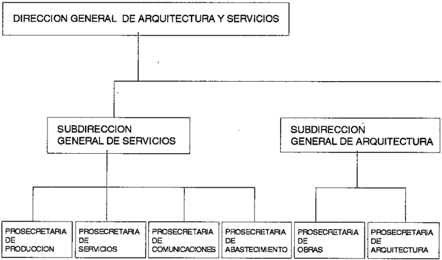
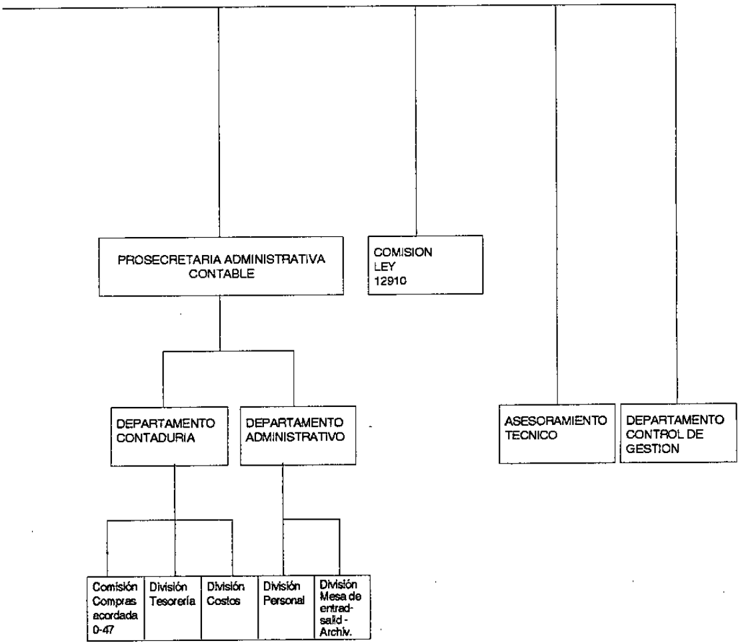
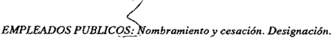
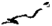
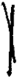
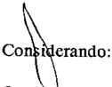

TOMO 314

Volumen 2

1991

.'

## FALLOS DE LA CORTE SUPREMA DE JUSTICIA DE LA NACION

..:..

•. .

,

.\

,~

,

.,

.'

\

/

••.•

## REPUBLICA ARGENTINA

## FALLOS

DE LA

CORTE SUPREMA

DE

,

.USTICIA DE LA NACION

PUBLICACION A CARGO DE LA SECRETARIA DE JURISPRUDENCIA DEL TRIBUNAL

TOMO 314 VOLUMEN 2

SEPTIEMBRE. DICIEMBRE

## SERVICOP

Calle 50 NO742. (1900) La Plata. Bllcnos Aires 1991

## ACUERDOS DE LA CORTE SUPREMA

## AÑO 1991

## SEPTIEMBRE DICIEMBRE

## DIRECCION GENERAL DE ARQUITECTURA Y SERVICIOS. MODIFICACION DE SU ESTRUCTURA ADMINISTRATIVA

-N 31Q

En Buenos Aires, a los 3 días del mes de septiembre del afio mil novecientos noventa y uno, reunidos en la Sala de Acuerdos del Tribunal el sefior Presidente de la Corte Suprema de Justicia de la Nación, doctor dODRicardo Levene (h), el sefior Vicepresidente primero doctor don Mariano Augusto Cávagna Martínez, el señor Vicepresidente segundo doctor don Rodolfo Barra y losseñoresJueeesdoctoresdon CarlosS. Fayt, don Augusto César Belluscio, don Enrique Santiago Petracchi, dODJulio S. Nazareno, don Eduardo MolinéO'Connory don Antonio Boggiano.

## Consideraron:

Que por Acordada NO32/89 se aprobó la estructura administrativa y funciones de la Dirección General de Arquitectura y Servicios.

Que resulta pertinente disponer que la Prosecretaría de Producci6n pase a depender de la Subdirecci6n General de Servicios.

Por ello, Acordaron:

Modificar la estructura administrativa de la Direcci6n General de Arquitectura y Servicios aprobada por Acordada NQ 32/89, conforme el organigrama del Anexo 1de la presente y con las funciones establecidas en su Anexo 11.

Todo lo cual dispusieron y mandaron, ordenando que se comunicase y registrase en el libro correspondiente por ante mí, que doy fe.RICARDO LEVENE (H)MARIANO AUGUSTO CAVAGNAARTINEZ-RoDOLFO C. BARRA-CARLOSS. FAYT-AuGUSTOC~R. M BELLuscloENRIQUE SANTIAGOETRACCHI P -Juuo S. NAZARENO EDUARDO MOUNtiO'CONNORANToNIO BOGOtANO -Hugo Luis Mauro Piacentino (Secretario).

## ANEXO 1

## ORGANIGRAMA: DIRECCION DE ARQUITECTURA Y SERVICIOS

## ANEXO n

## DIRECCION GENERAL DE ARQUITECTURA Y SERVICIOS

- 1.- Entender e intervenir en la formación de los proyectos arquitectónicos de los edificios destinados a sedes de los Tribunales Federales a originarse en todo el territorio del país, incluso en sus documentaciones licitarias; y ejercer el control de gestión e inspección de las obras durante el proceso de construcción y su mantenimiento posterior.
- 2.Entender e intervenir en la Dirección e inspección de las obras por administración a realizarse en los edificios del Poder Judicial de la Naci6n.
- 3.Entender e intervenir en la producción de bienes, muebles, elementos y -citilesde consumo, para satisfacer las necesidades del Poder Judicial de la Nación en todo el territorio del país.
- 4.Entender e intervenir en la realización de los servicios de mantenimiento en los edificios del Poder Judicial de la Nación en todo el territorio del país.
- 5.- Entender einterveniren la recepci6n y distribución delos bienes adquiridos, como así también de los elaborados o reacondicionados para los tribunales y organismos del Poder Judicial de la Naci6n.
- 6.- Evaluar los sistemas de control interno a través de los relevamientos que se practiquen, comprobando si cumplen con su finalidad u objetivo, como así tambiéÍl verificar la implementación de nuevos sistemas y/o modificaciones introducidas a los existentes.
- 7.Informar periódicamente a la Corte Suprema de Justicia de la Nación sobre el estado de los cursos de acción de las polfticas implementadas en las áreas de la Direcci6n General.
- 8.~ Procurar y fomentar el trabajo interdisciplinado en todas las áreas de la Dirección General.Hugo Luis Mauro Piacentino (Secretario).

## SUBDIRECCION GENERAL DE SERVICIOS

- 1. Entender e intervenir en la realizaci6n de los servicios de mantenimiento en los edificios del Poder Judicial de la Nación en el ámbito de la Capital Federal.
- 2. Entender e intervenJr en la producción de bienes muebles y titiles de consumo para satisfacer las necesidades del Poder Judicial de la Naci6n en todo el territorio del país.
- 3. Entender y asistir en la ~ecepción y distribución de los bienes adquiridos, como así también de los elaborados o reacondicionados del Poder Judicial de la Nación en todo el territorio del país.
- 4. Informar peri6dicamen te a la Direcci6n General de Arquitectura y Servicios sobre el estado de los cursos de acción de las polfticas implementadas en las áreas de la Subdirección General de Servicios.

- S. Procurar y fomentar el trabajo interdisciplinado en todas las áreas de Subdirección General de Servicios.
- 6. Reemplazar al Subdirector General de Arquitectura en caso de ausencia.Hugo Luis Mauro Piacentmo (Secretario).

## PROSECRETARIA DE PRODUCCION

- 1.-Intervenir y asistiren la producción de bienes muebles, elementos y titiles de consumo, para satisfacer las uecesidades del Poder Judicial de la Nación en todo el territorio del país, como así también la de repararlos y reacondicionarlos.
- 2.Intervenir y realizar el almacenamiento y abastecimiento de todos los materiales, elementos, equipos y herramientas, como así también asistir en sus niveles de stock.
- 3.- Ejercer la asistencia Técnica y supervisar el desarrolto y seguimiento de las políticas de acción implementadas por la Superioridad, como ase también de las tareas en trámite de realización.
- 4.Realizar investigaciones operativas para reducir costos o cambios de proceso de producción, uso y compra de la materia prima.
- S.Procurar y fomentar el trabajo interdisciplinado en las áreas de su dependencia, y además con todos los Prosecretarios de la Dirección General de Arquitectura y Servicios.Hugo Luis Mauro Piacentino (Secretario).

## PROSECRETARIA DE SERVICIOS

- 1.Intervenir y asistir permanentemente en la realización del mantenimiento de los edificios y bienes, como así también en los servicios de urgencia de instalaciones y equipos del Poder Judicial de la Nación en el ámbito de la Capital Federal.
- 2Ejercer la asistencia técnica y supervisión del desarrollo y seguimiento de las políticas de acción implementadas por la Superioridad, como as! también de las tareas en trámite de realización.
- 3.Procurar y fomentar el trabajo interdisciplinado en las áreas de su dependencia, y además con todas las Prosecretadas de la Dirección General de Arquitectura y Servicios.Hugo Luis Mauro Piacentino (Secretario).

## PROSECRETARIA DE COMUNICACIONES

- 1.- Intervenir permanentemente en la realización, mantenimiento y funcionamiento delas instalaciones de comunicaciones telefónicas y releripográficas, como ase también de todas las inherentes a baja tensión.

- 2.Transmi tir todos los teletipogramas requeridos por los distintos Organismos del Poder Judicial de la Nación, como así también recepcionar las contestaciones y distribuirlos a sus destinatarios.
- 3.- Ejercer la asistencia técnica y supervisar el desarrollo y seguimiento de las polfticas de acción implementadas por la Superioridad como así también de las tareas en trámite de realización.
- 4.Procurar fomentar el trabajo interdisci plinado en las áreas de su dependencia y además con todas las Prosecretarías de Arquitectura y Servicios.
- 5.- Asesorar a la Dirección General en materia de su competencia.Hugo Luis Mauro Piacenlmo (Secretario).

## PROSECRETARIA DE ABASTECIMIENTO

- 1.~Entender e intervenir en la recepción de los bienes muebles, de uso y de consumo, destinado a los organismos del Poder Judicial de la Nación en todo el territorio del país, como así también los bienes elaborados o reacondicionados para su posterior distribuci6n.
- 2.Entender e intervenir en la distribución del material bibliográfico en todos los organismos del Poder Judicial de la Nación en el interior del país.
- 3.Entender e intervenir en la recepci6n y distribuci6n de los fallos y digestos de la Excma. Corte Suprema de Justicia de la Naci6n, y Boletines de Jurisprudencia, en todo el territorio del país, como así también a otras Naciones, conforme a los convenios existentes.Hugo Luis Mauro Piacentino (Secretario).

## SUBDIRECCION GENERAL DE ARQUITECTURA

- 1. Entender e intervenir en la formación de los proyectos arquitectónicos de los edificios destinados a sedes de los Tribunales Federales a originarse en todo el territorio del país, incluso en sus documentaciones licitarlas; y ejercer el control de gesti6n e inspección de las obras durante el proceso de construcción y su mantenimiento posterior.
- 2. Entender e intervenir en la direcci6n e inspección de las obras por administración, a realizarse en los edificios del Poder Judicial de la Nación.
- 3. Informar peri6dicamente a la Dirección General de Arquitectura y Servicios sobre el estado de los cursos de acción de las políticas implementadas en las áreas de la Subdirecci6n General de Arquitectura.
- 4. Procurar y fomentar el trabajo interdisciplinario en todas las áreas de la Subdirección General de Arquitectura.
- 5. Reemplazar al Director General de Arquitectura y Servicios en caso de ausencia.Hugo ¡"uis Mauro Piacentino (Secretario).

## PROSÉCRETARIA DE OBRAS

- 1.- Entender e intervenir en la dirección e inspección de las obras por administración, a realizarse en los edificios del Poder Judicial de la Naci6n.
- 2.- Ejercer la asistencia técnica y supervisar el desarrollo y seguimiento de las políticas de acci6n implementadas por la Superioridad, como así también de las tareas en trámite de realizaci6n.
- 3.- Formular la programación y cálculo de recursos para cada ejercicio financiero y de sus reajustes, adecuado al plan de obras a su cargo y las provisiones para el año siguiente.
- 4.~ Verificar los cómputos de materiales remitidos por la Prosecretaría de Arquitectura.
- 5.- Confeccionar los costos estimativos iniciales de obras y su posterior comparación con los costos finales de obras.
- 6.-, Procurar y fomentar el trabajo interdisciplinado en las áreas de su dependencia, y además con todos los Prosecretarios de la Direcci6n General de Arquitectura y Servicios.~ Hugo Luis Mauro Piacentino (Secretario).

## PROSECRETARIA DE ARQUITECTURA

- 1.- Entender e intervenir en la formación de los proyectos arquitect6nicos y los trabajos comprendidos en rubro ampliaciones, modificaciones y reparos de los edificios del Poder Judicial de la Naci6n, como así también en sus documentaciones licitarias; y ejercer el control .de las obras durante el proceso de construcción.
- 2.Entender e intervenir sobre las fallas en el funcionamiento de las instalaciones especiales de los edificios habilitados, programando las soluciones técnicas a adoptar.
- 3.- Intervenir en las gestiones interpuestas para solicitar recursos tendientes a solventar el pago de los trabajos a ejecutar bajo el rubro conservaci6n permanente de edificios judiciales, inspeccionando a ese fin los edificios, determinando los trabajos dentro de ese concepto, calculando su costo, formulando la programaci6n anual conforme a la orden de prioridades que surja de su estado y aconsejando finalmente, el importe a transferir a cada Tribunal, en el ejercicio financiero correspondiente.
- 4.- Ejercer la asistencia técnica y supervisar el desarrollo y seguimiento de las polfticas de acción implementadas por la Superioridad, como así también de las tareas en trámite de realización.
- 5.- Formular la programaci6n y cálculo de recursos para cada ejercicio financiero y de sus reajustes, adecuado al plan de obras a su cargo y las provisiones para el afio siguiente.
- 6.~ Procurar y fomentar el trabajo interdisciplinado en las áreas de su dependencia, y además con todos los Prosecretarios de la Direcci6n General de Arquitectura y Servicios.Hugo Luis Mauro Piacentino (Secretario).

## AalEROOS DE LA CORTE SUPREMA 314

## PROSECRETARlAADMINISTRATIV A Y CONTABLE

## 1.- DEPARTAMENTO CONTABLE 1.1. DMSION TECNICA

- · Registrar Jos movimientos de fondos operados en cajas y bancos.
- · Efectuar el seguimiento de todas aquellas partidas, reintegros solicitados y pedidos de contratación, ante las dependencias de la' Dirección Administrativa y Contable.
- · Preparar la documentación respaldatoria de egresos para su ulterior rendición.
- · Efectuar las compras de los elementos solicitados por las distintas 'reas, de acuerdo a normas vigentes para el Régimen de Caja Chica, coordinando las priori~
- · Proceder al pago de haberes al personal, de acuerdo a la reglamentación vigente.
- · 'Realización de todas las demás tareas relativas al funcionamiento de la División Tesorería.

## 1.2. DMSJON COSTOS

- ~ Determinar costos Standard para cada proceso productivo o centro de costos.
- · Determinar los costos reales incdrridos en cada proceso productivo o centro de costos.
- · Determinar las variaciones entre los costos reales y standards y analizar el origen de las mismas.
- · Elaborar, en forma mensual, informes de costos para la toma de decisiones.
- · Realizaci6n de todas las demú tareas relativas al funcionamiento de la Divisi6n Costos.Hugo Luis Mauro Piacentino (Secretario).

## 1.3. DEPARTAMENTO ADMINISTRATIVO

## 2.1. DMSION PERSONAL

- · Confeccionar el Parte Diario de novedades del personal.
- .Interveniren la tramitación de las solicitudes de licencias y justificacionesde inasistendas.
- · Mantener actualizada la n6mina de personal por lugar de prestación de servidos.
- · Tramitar ante las dependencias que correspondan las inquietu'des de distinta (ndole que presente personal de la Direcci6n de Arquitectura y Servicios, procurando solucionar los posibles inconvenientes que éstos acanean al mismo.

## DBrusnCIA DBLA NAClON 314

- · Atender el servicio de refrigerio que se brinda al personal .
- · Procurar mantener las dependencias administrativas en condiciones higiénicas.
- · Intervenir en el labrado de actas de accidente de trabajo .
- · Realización de todas las demás tareas relativas al funcionamiento de la División Personal.

## 22 DIVISION ADMINISTRATIVA

- · Registrar y distribuir el Despacho Diariode acuerdo a las caraetedsticasque asuma cada uno de los documentos recibidos .
- · Mantener el archivo de la documentación inherente a las actividades desarrolladas por la Dirección de Arquitectura y Servicios .
- · Emitir un informe mensual sobre el estado en que se encuentran los expedientes en trámite en la Direcci6n de Arquitectura y Servicios.
- · Realización de todas las demás tareas inherentes al funcionamiento de la Divisi6n Administrativa.HugoLuis Mauro Piacennno (Secretario).

## DEPARTAMENTO DE AUDITORIA y CONTROL DE GESTION

- 1 - Evaluarel sistema de control interno de la Dirección General, mediantesu relevamiento y análisis para verificar si se cumple con su finali~ad y objetivo.
- 2 - Revisión sistemática de todas las áreas que conforman la Dirección de Arquitectura y Servicios.
- 3 \_Verificar si las operaciones de compras efectuadas, se ajustan a lo descripto en la normativa de compras.
- 4 - Asesorar al Director General en temas d~ su competencia.
- s \_ Emitir informes sobre la gestión de la Dirección de Arquitectura y Servicios, poniéndolos en conocimiento de la Subdirección Genera) de Auditoría y Control de Gesti6n.
- 6 ~Analizar la documentación y demás elementos de juicio existentes con el objeto de comprobare! cumplimiento de procedimientos y normas, proponiendo lasrefonnas estructurales y/o reglamentaciones necesarias para mejorar la efectividad del sistema.
- 7 \_Entender en todos aquellos asuntos que le sean asignados especfficamente por las autoridades superiores.
- 8 \_ Proponer a la Subdirección General de Auditoda y Control de Gestión el plan de actividades para el ejercicio siguiente, antes 00115 de noviembre de cada año.

- 9 - Realizar el seguimiento y posterior evaluación de las mejoras, recomendaciones y cambios propuestos, llevando a conocimiento de la Subdirección General de Auditarla y Control de Gestión los resultados obtenidos.
- 10 - Los aspectos técnicos a cargo del Departamento quedarán bajo la coordinación de la Subdirección General antes cilada, de conformidad con la Resolución NO552/89.HugoLuis Mauro Piacentmo (Secretario).

## ASESORIA TECNICA

- 1.- -Seguimiento y verificación de los planes de trabajo de las obras páblicas y por administración.
- 2.Determinación de los costos de obras pt'iblicas y por administración.
- 3.Análisis integral, conforme a la Legislación vigente, de los Certificados de Obras Pl1blicas,
- 4,- Asesorar a la Superioridad en los temas técnicos de su competencia.
- 5.Realización de todas las demás tareas relativas al funcionamiento de la Asesoría Técnica.Hugo Luis Mauro Piacentino (Secretario).

## ASESORIA mRIDICA

- 1.- Brindar as~soramiento legal y administrativo a los distintos Sectores de la Dirección General de Arquitectura y Servicios.
- 2.- "Ejecutar el encuadramiento legal y administrativo del despacho de la Dirección General de Arquitectura y Servicios.
- 3.- Prestar asesoramiento legal a la Comisión Liquidadora ley 12.910 del Poder Judicial de la Nación.
- 4.· Interveniren las actuaciones sumariales que ordene la Dirección General deArquiteetura y Servicios o la Secretaría de Superintendencia Administrativa.
- "5.- Intervenir en la formulación de contratos y proyec.tos de actos administrativos.
- 6.Intervenir en los recursos administrativos que tramitan ante la Dirección General de Arquitectura y Servicios.
- 7.LoS.aspectos técnico-legales a cargo del área quedarán bajo la coordinación de la Secretaña Letrada de Asesoramiento de la Secretaría de Superintendencia Administrativa, de conformidad a la Resolución NI! 551/89.~HugoLuis MauroPiacentino (Secretario).

## PODER JUDICIAL DE LA NACION. RECOMPOSICION SALARIAL.

-N"32-

En Buenos Aires, a los 6 días del mes de septiembre del año mil novecientos noventa y uno, reunidos en la Sala de Acuerdos del Tribunal el señor Presidente de la Corte Suprema de Justicia de la Naci6n, doctor don Ricardo Levene (h), el señor Vicepresidente primero doctor don Mariano Augusto Cavagna Martfnez, el señor Vicepresidente segundo doctor don Rodolfo Barra y los señores Jueces doctores don Carlos S. Fayt, don Augusto César Belluscio, don Enrique Santiago Petracchi, don Julio S. Nazareno, don Eduardo Moliné O'Connory don Antonio Boggiano,

## Consideraron:

Que en virtud de lo dispuesto en la acordada CSJN N" 30/91, corresponde al Tribunal determinar la recomposici6n salarial prevista para el último trimestre de 1991 y el año 1992 de los integrantes del Poder Judicial, que se iniciará a partirdell"de octubre del corriente año y que culminará durante el pr6ximo mes de marzo.

## Por ello, Acordaron:

- 1~ Fijar -a partir delll! de octubre de 1991, del 1" de diciembre de 1991 y del 1 11 de marzo de 1992, respectivamente-las remuneraciones de los magistrados, funcionarios y empleados del Poder Judicial de la Naci6n conforme al detalle obrante en las planillas anexas al presente artículo y que serán firmadas por el señor Secretario del Tribunal.
- 2~ A partir del 1 11 de octubre de 1991, la retribución adicional mensual por antigüedad creada por Decreto N ll 1417/87, resultará de aplicar la alícuota del uno con cincuenta centésimas por ciento (1,50%) por cada año o fracci6n mayor de seis (6) meses, durante los primeros diez (10)años. A partir del décimo primero (11~, inciusive, la bonificación será del uno por ciento (1 %) por cada año o fracci6n que supere los seis (6) meses.
- 3 11 ) Crear un suplemento mensual y remunerativo que se denominará 'IArt. 31!Acordada NI! 32/91 1 ', el cual será equivalente a la diferencia entre la bonificaci6n por antigüedad que hubiere correspondido liquidar durante el mes de octubre de 1991 segl1n el régimen del decreto NI! 1417/87 Y la que en definitiva procede aplicar de conformidad con lo establecido en el artículo anterior.

Dicho suplemento será fijo y de carácter personal, s610 ajustable en idéntica proporci6n a la modificaci6n que sufra la remuneraci6n asignada a la categoría de revista, siendo calculado -por I1nica vezen base a la antigüedad registrada al 30 de septiembre de 1991.

- 4U:&gt;Créase una compensación mensual no remunerativa ni bonificable que se denominará "Adicional Acordada N 32/91 ll l' ,cuyo importe queda establecido conforme surgede la planilla anexa al presente artículo, para los cargos que se consignan y a partir de las fechas que am se determinan.

5~ A partir del 111 de octubre de 1991 los Jueces de la Corte Suprema percibirán -en concepto de gastos de representaciónel importe de Australes Cinco Millones (A5.000.000.-) mensuales, no remunerativos ni bonificables.

Este importe se elevará a Australes Diez Millones (A 10.000.000.a partir del 1 11 de diciembre de 1991 ya Australes Quince Millones (Pi 15.000.000.-) desde e11 11 de marzo de 1992.

Todo lo cual dispusieron y mandaron, ordenando que se comunicase y registrase en el Jibro correspondiente por ante mí, que doy fe.RICARDOEVENE (H)L MARIANO AUGUSTO CAVAGNAARTlNEz-RoDOLFO C. BARRA M CARLOS. F AYT AUOUSTOasARBELLUSCIOC ENRIQUE SANTIAGOETRACCHI P -Juuo S. NAZARE."W -EDUARDO MOUNt O'CONNOR ANToNIO BOOOlANO -Hugo Luis Mauro Piacentino (Secretario).

## EQUIPO DE ASISTENTES SOCIALES. AMPLIACION DE ACORDADA N' 75/90.

N" 33 \_

En Buenos Aires, a los 10 días del mes de septiembre del año mil novecientos noventa y uno, reunidos en la Sala de Acuerdos del Tribunal, el señor Presidente doctor Ricardo Levene (b), y los señores Ministros que suscriben la presente,

Consideraron:

- 1") Que por acordada 75/90 esta Corte hizo lugar a la petición formulada por el doctor Lucas C. Aon, titular del Juzgado Nacional de Primera Instancia en lo Civil W 25 y permitió que, de acuerdo con el sistema de trabajo por él implantado, se desempeñen en el juzgado a su cargo los asistentes sociales del equipo que form6, exceptuándolo de cumplir con lo prescripto por el art 129 del Reglamento para la Justicia Nacional.

2") Que el señor juez, para atender un mayor nl1merode casos, solicita autorización para incluir una nueva asistt:nte social en su equipo interdisciplinario, sobre la base de los buenos resultados obtenidos con su implantación (fs. 7 del expte. S-3149/90).

Por eJlo,

Acordaron:

Ampliar la acordada 75/90, permitiendo al doctor Lucas C.,Aon, titular del Juzgado Nacional de Primera Instancia en lo Civil N 25, iÍlcluir II en el equipo interdisciplinario que

.

formó a la asistente social LETICIAQUINTANAdeBARLARO, exceptuándolo en la especie" de cumplir con lo prescripto por el art. 129 del Reglamento para la Justicia Nacional.

Todo lo cual dispusieron y mandaron, ordenando que se comunicase y registrase en el libro correspondiente, por ante mí, que doy fe.RODOLFOC. BARRA AUGUSTOCésAR BELLUSClo ENRIQUESANTIAGOPETRACCffiJULIO S. NAZARENOEDUARDOMOUN~ O'CONNOR ANToNIOBoooIANO Claudia Marcelo Kiper (Secretario).

COMPENSACION FUNCIONAL DEROGACION DE LAS ACORDADAS Nos. 43/85 Y 50/85

-N"34-

En Buenos Aires, a los 10 días del mes de septiembre del afio mil novecientos noventa y uno, reunidos en la Sala de Acuerdos del Tribunal, el sefior Presidente Dr. Ricardo Levene (h) y los séóores Ministros que suscriben la presente,

Consideraron:

Queeste Tribunal, anteun nuevo examen dela cuestión, considera que la bonificación por "compensación funcional" debe estar comprendida en el concepto del arto 10 de la ley 18.031 y arts. 2 y 4 de la 18.464.

Por ello,

Acordaron:

Dejar sin efecto las acordadas 43 y 50 (ambas de 1985).

Todo lo cual dispusieron y mandaron, ordenando que se comunicase y registrue en el libro correspondiente, por ante mí l que doy fe.RICARDOLEVENE(H) MARiANo AUGUSTO CAVAGNA MARTINEZ RODOLPO C. BARIlA CARLOS S. FAYT AUOUSTO C~R BELLUSCIOENRIQUESANTIAOOPETRACCHIJuuo S. NAZARENo'=' EDuARDO MOUN~ O'CoNNOR ANToNIO BOOOtANOClaudio Marcelo Kiper (Secretario).

## ACUERDOS DE LA O&gt;RTE SUPREMA

## INSCRIPCION DE PERITOS, SINDICOS y MARTILLEROS. ARANCELAMIENTO.

-N"35-

En Buenos Aires, a los 24 días del mes de septiembre del año mil novecientos noventa y uno, reunidos en la Sala de Acuerdos del Tribunal, los señores Ministros que suscriben la presente,

Consideraron:

Que la acordada 15/91 establece el arancelamiento de la inscripción de los peritos.

Que han surgido algunas dudas respecto desu aplicación en aquellos fueros en los que la inscripci6n no se renueva anualmente.

Por ello, Acordaron:

- 1~ Establecer que el pago deberá ser anual y que en todos los fueros la inscripción de los peritos, síndicos y martilleros deberá tener una vigencia no mayor a un año, a cuyo término deberán ser renovadas.
- 2~ Disponer que las inscripciones que no se hubiesen renovado por no exigirlo la reglamentación aplicable, caducarán el día 31 de marzo de 1992.

Todo lo cual dispusieron y mandaron, ordenando que se comunicase y registrase en el libro correspondiente, por ante mí, que doy fe.RICARDOLEVENE(H) MARIANOAUGUSTO CAVAONAMARTINEZRODOLFo C. BARRAENRIQUESANT1AOO PETRACCHIJULIO S. NAZARENO EDUARDOMOLlNt Q'CONNOR ANTONIOBOOOlANO ClaudioMarceloKiper (Secretario).

## DICTADO DE SENTENCIAS. PLAZOS.

-N"36-

En Buenos Aires, a los 24 días del mes de septiembre del afio mil novecientos noventa y uno, reunidos en la Sala de Acuerdos del Tribunal, el sefior Presidente doctor Ricardo Levene (h), y los señores Ministros que suscriben la presente,

'.

## Consideraron:

Que la correcta aplicaci6n de las medidas disciplinarias previstas por los códigos de procedimientos, en los supuestos de demora injustificada en el dictado de sentencia por parte de los integrantes de las cámaras deapelaciones(conf. arts.167 y 168 del C.P.C.C. y 537, 538 Yconc. del C.P.M.P.), determina la necesidad de establecer en forma precisa cuáles son los plazos con los cuales cuentan los integrantes de los citados tribunales, a fin de estuliliar los expedientes.

Que, sin perjuicio de las normas que ya han establecido las cámaras, y las adaptaciones que puedan efectuar en razón de las lllodalidades propias de cada fuero, circunstancias ambas que deben ser puestas en conocimiento del Tribunal cada vez que se solicite un pedido de prórroga de plazos para dictar sentencia, resulta conveniente el dictado de pautas generales.

Por ello,

## Acordaron:

- 1") En las causas en las cuales el c6digo procesal otorga 70 días para dictar sentencia, el primer votante dispondrá de 36 días, el segundo de 15 días, y el tercero otros 15 días; los 4 restantes se reservarán para el acuerdo y redacción y suscripci6n de la sentencia.
- 2") En las causas en las cuales el código procesal otorga 60 días para dictar sentencia, el primer votante dispondrá de 30 días, el segundo de 15 días, y el tercero otros 12 días; los 3 restantes se reservarán para el acuerdo y redacci6n y suscripción de la sentencia.
- 3") En las causas en las cuales el código procesal otorga 50 días para dictar sentencia, el primer votante dispondrá de 25 días, el segundo de 12 días, y el tercero otros 10 días; los 3 restantes se reservarán para el acuerdo y redacción y suscrip?ión de la sentencia.
- 4~ En las causas en las cuales el código procesal otorga 40 días para dictar seutencia, el primer votante dispondrá de 18 días, el segundo de 10 días, y el tercero otros 10 días, los 2 restantes se reservarán para el acuerdo y redacción y suscripción de la sentencia.
- 5~ En las causas en las cuales el código procesal otorga 20 días para dictar sentencia, el primer votante dispondrá de 10 días, el segundo de 5 días, yel tercero otros 3 días; los 2 restantes se reservarán para el acuerdo y redacción y suscripción de la sentencia.
- 6~ En las causas en las cuales el código procesal otorga 15 días para dictar sentencia, el primer votante dispondrá de 8 días, el segundo de 3 días, y el tercero otros 2 días; los 2 restantes se reservarán para el acuerdo y redacción y suscripción de la sentencia.
- 7~ Cada cámara determinará la forma en la cual se registrarán y comunicarán a los jueces los plazos correspondientes, y regulará lo relativo a la entrega de las causas a cada uno de los integrantes, y los funcionarios que serán responsables de tal tarea.
- 8~ Eljuez de cámara que por razones atendibles no pueda completar el estudio dela causa en término lo hará saber al cuerpo (o sala), quien efectuará la solicitud de pr6rroga a la Corte Suprema, si lo estima proced~nte.

Todo lo cual dispusieron y mandaron, ordenando que se comunicase y registrase en el libro correspondierrte, por aDtc~ mf, que doy fe.RICARDO LEVENE CH) MARIANO AUGUSTO CAVAGNA MARTlNBZ -RODOLFO C. BARRA CARLOS S. F AYT -AUGUSTO C~R BELLUSCIO -ENRIQUE SANTIAGO PETRAccHl -EDUARDO MOUN~ O'CONNOR -Claudio Marcelo Kiper (Secretario ~

## EFECTOS SECUESTRADOS EN CAUSAS PENALES.

-N"37-

En Buenos Aires, a los 25 dfas del mes de septiembre del alío mil novecientos noventa y uno, reunidos en la Sala de Acuerdos del Tribunal el sefior Presidente de la Corte Suprema de Justicia de la Nación, doctor don Ricardo Levene (h) y los señores Ministros que suscriben la presente,

## Consideraron:

Que con arreglo a lo dispuesto por el art. 3"',ioc. b, de la ley 23.853 constituye recurso específico y propio del Poder Judicial de la Nación, el producto de la venta de ~efectos secuestrados en causas penales que no hayan podido entregarse a sus dueños" ,así como de los "objetos comisados".

Que losarts. 8 11 y 9"de la misma ley, otorgan al Tribunal plenas y amplias facultades para "determinar el régimen de percepción, administración y contralor de sus recursos" y lo facultan para "adoptar las medidas que considere convenientes para efectuar el control yexigir el cobro de los recursos mencionados. ..".

Que, además, el art 12 de dicha ley ha dejado sin efecto "todas las disposiciones legales y reglamentarias que se opongan a su cu.mplimiento".

Que en anteriqres pronunciamientos de esta Corte Suprema sobre esta materia -confr. Acordadas 8 y. 17 del corriente afio. se ha formulado una expresa reserva de la facultad interpretativa del Tribunal para la determinación de los alcances de las precedentemente citadas disposiciones.

Queen la actualidad este Tribunal se encuentra en condiciones de establecer la definitiva exégesis que corresponde asignar a tales normas.

Por ello, Resolvieron:

Establecerque los "efectos secuestrados en causas penales que no hayan podido entregarse a sus duefios" así como los "objetos comisados" comprenden a todos los bienes de cualquier naturaleza que se encuentren sometidos a una decisión jurisdiccional dentro del procesó

judicial, constituyendo ellos el recurso específico y propio del Poder Judicial de la Nación a que se refiere el artículo 31:!, nciso i b), de la ley 23.853.

Todo lo cual dispusieron y mandaron, ordenando se comunicase y registrase en el libro correspondiente, por ante mí, quedoy fe.RICARDOEVENE (h)L MARlANOAuoUSTO AVAONA C MARTlNEZ RODOLFo C. BARRA --CARLOS. FAYT AUOUSTO C~AR BELLUSCIO ENRIQUE -SANTIAGO PETRACCHI -JULIOS. NAZARENO -EDUARDO MOLIN~O'CONNORANTONIO BOOOTANO -Hugo Luis Mauro Píacentmo (Secretario).

## PODER JUDICIAL

## COMPENSACION MENSUAL NO REMUNERATIVA NI BONIFICABLE PARA FUNCIONARIOS. ANEXO 1

-NI:! 38-

En Buenos Aires, a los 25 días del mes de septiembre del año mil novecientos noventa y uno, reunidos en la Sala de Acuerdos del Tribunal el señor Presidente de la Corte Suprema de Justicia de la Naci6n, doctor don Ricardo Levene (h), el señor Vicepresidente primero doctor don Mariano Augusto Cavagna Martínez, el sefior Vicepresidente segundo doctor don Rodolfo Barra y los señores Jueces doctores don Carlos S. Fayt, don Augusto César Belluscio, don Enrique Santiago Petracchi, don Julio S. Nazareno, don Efluardo MolinéO'Connor y don Antonio Boggiano,

Consideraron:

Que la compensación mensual no remunerativa ni bonificablecreada por el artículo 41:!e d la Acordada NI:! 32/91 es de aplicaci6n a todos los funcionarios del Poder Judicial de la Naci6n que integran el Anexo I.

Que, en otro orden, corresponde rectificar el artículo 3 Q de la citada Acordada, en cuanto a la base del adicional creado como consecuencia de la aplicaci6n del nuevo régimen de antigüedad. 1,.., .' .

Por ello y con sujeci6n también a los términos de la Ácordada C.S.J.N. NI:! 30/91,

## Acordaron:

1") Incorporar a la planilla anexa al artículo 4 Q de la Acordada W 32 de fecha 6 de septiembre del corriente afio, a las categorías de funcionarios que seguidamente se detallan, con los importes que se cot;lsignan y a partir de las fechas que se establecen:

944

## ACUERDOS DE LA CORTE SUPREMA 314

| Cargo                             | Desde 1/10/91   | Desde 1/12/91   | Desde 1/3/92   |
|-----------------------------------|-----------------|-----------------|----------------|
| Secretario de Juzg. y asimilados  | 350.000         | 700.000         | 1.050.000      |
| Prasee. Jefe                      | 200.000         | 400.000         | 600.000        |
| Prosee. Jefe 2 11 Jefe Depto. 20. |                 |                 |                |
| Jefe Depto. y asimilados          | 150.000         | 300.000         | 450.000        |
| Prosee. Adminstr. y asimilados    | 100.000         | 200.000         | 300.000        |

2°) Modificar el artículo 3 1l de la Acordada citada en último término, el que quedará redactado de la siguiente forma:

!'Crear un suplemento remunerativo que se denominará "Artículo 2 11 ,Acordada N2 38/ 91" el cual será equivalente a la diferencia entre la bonificación por antigüedad liquidada durante el mes de septiembre de 1991 según el régimen del Decreto N ll 1.417/87 Y la que en definitiva procede aplicar de conformidad con lo establecido en el artículo 2 11 de la Acordada modificada, para el mes de octubre de 1991.

Dicho suplemento será fijo y de carácter personal, sólo ajustable en idéntica proporción a la modificación que sufra la remuneración asignada a la categoría de revista, siendo calculado -por llnica vezen base a la antigüedad registrada al 30 de septiembre de 1991 y sin perjuicio del reajuste proporcional que corresponda por el acceso a una nueva categorfa~.

Todo lo cual dispusieron y mandaron, ordenando que se comunicase y registrase en el libro correspondiente por ante mí, que doy fe.RICARDOLEVENE(H) MARiANOAUGUSTO CAVAGNAMARTlNEZRODOLFOC. BARRACARLOSS. FAYTAUGUSTOC~AR BELLUSCIO -ENRIQUESANTIAGOPETRACCHI JULIOS. NAZARENOEDUARDOMOLlNÉ O'CoNNORANTONIOBoaaIANO Hugo Luis MauroPiacentmo (Secretario).

EQUIPOS DE ASISTENTES SOCIALES.

En la Ciudad de Buenos Aires, a los 2 dfas del mes de octubre del año mil novecientos noventa y uno, reunidos.en la Sala de Acuerdos del Tribunal, los señores Ministros que suscriben la presente,

Consideraron:

- 111 ) Quea partir de la acordada 37/86 esta Corte ha hecho lugar a lo solicitado por algunos jueces con competencia en asuntosde familia, exceptuándolos de cumplir con lo dispuesto en el art. 129 del R.J.N., y permitiendo la actuación de equipos de asistentes sociales designados por cada magistrado.
- 2~ Que la señora juez a cargo del Juzgado Nacional de Primera Instancia en lo Civil N II 33 doctora Silvia Estela Mora formula la misma petición en el expediente de Superintendencia Judicial S-2817/91, con relación a diez (10) asistentes sociales que seleccionó de la lista que formó la cámara del fuero.
- Por ello, y concordemente con lo dispuesto en las acordadas Nros. 37/86, 30/88, 47/89, 54,55 Y75 (todas de 1990) y 33/91,

Acordaron:

Hacer lugar al requerimiento formulado por la doctora SILVIA ESTELA MORA titular del Juzgado Nacional de Primera Instancia en lo Civil N ll 33, Ypermitir que, de acuerdo con el sistema de trabajo implantado por la magistrada, se desempeñen los asistentes sociales del equipo formado, exceptuándola de cumplir con lo prescripto por el arto 129 del Reglamento para la Justicia Nacional.

Todo lo cual dispusieron y man!=laron,ordenando que se comunicase y registrase en el libro correspondiente, por ante mí, que doy fe.RICARDOEVENE L (H) MARIANO AUGUSTO CAVAGNA MARTINEZ -RODOLFO C. BARRA CARLOS. FA YT -AUGUSTO C~R BELLUSCIO -JULIO S.NAZARE.N'O-DUARDOOLIN~O'CoNNOR E M -ANTONloBooolANo-ClaudioMaTcelo Kiper (Secretario).

EFECTOS SECUESTRADOS O COMISADOS. LISTADO.

-N"40-

En Buenos Aires, el primer día del mes de octubre del año mil novecientos noventa y uno, reunidos en la Sala de Acuerdos del Tribunal el señor Presidente de la Corte Suprema de Justicia de la Naci6n, doctor don Ricardo Levene (h) y los señores Ministros que suscriben la presente,

Consideraron:

946

Que habiendo tomado conocimiento esta Corte de las dificultades que origina a los distintos tribunales la elaboración de la información requerida mediante acordada 14/91, corresponde encarar las medidas pertinentes para facilitar la obtención del objetivo allí perseguido con el menor margen de inconvenientes posibles.

Que, sin perjuicio de ello, resulta indispensable contar en lo sucesivo con una adecuada y precisa base de datos que permita conocer la existencia total de los efectos secuestrados yl o comisados dentro del ámbito judicial.

Por ello J Acordaron:

Hacer saber a las Cámaras Nacionales de Apelaciones en lo Criminal y Correccional, en lo Criminal y Correccional Federal y en lo Penal Económico y a las Cámaras Federales del interior del país que:

- a) el envío a esta Corte de los listados de efectos secuestrados y/u objetos comisados requerido por acordada N 14/91, deberá ajustarse ll al formulario que la acompafia, salvo que mediaren serios impedimentos para localizar la procedencia del bien, en cuyo caso el inventario se limitará a la descripción del mismo, con el aporte de la mayor cantidad de datos de identificación, quedando fijado para su remisi6n un nuevo plazo de treinta (30) días hábiles, contando a partir de la notificación de la presente y

b) los respectivos tribunales deberán llevar -a partir del ¡a de noviembre pr6ximoun registro de todos los efectos secuestrados en causas penales y/u objetos comisados en el formulario aprobado por la mencionada acordada, siendo responsabilidad de la Cámara correspondiente verificar estrictamente su cumplimiento.

Todo lo cual dispusieron y mandaron, ordenando que se comunicase y registrase en el libro correspondiente, por ante mí, que doy fe.RICARDO EVENE (H) L MARIANO AUGUSTO CAVAGNAARTtNEZ RODOLFO. BARRA- CARLOS. FAYT M -C AUGUSTO CtisARBELLUSCIO -JUliO S. NAZARENO EDUARDOaliNa.O'CONNOR --M ANTONIO BoaclANORugo Luis Mauro Piacentino (Secretario).

## INSCRIPCION y REINSCRIPCION DE PERITOS.

NP 41 =

En buenos Aires, a los 8 días del mes de octubre del afio mil novecientos noventa y uno, reunidos en la Sala de Acuerdos del Tribunal, los sefiores Ministros que suscriben la presente,

Considera~on:

Que corresponde establecer las fechas para el cumplimiento de los trámites previstos en la Acordada W 25 de 1985 para la inscripción y reinscripción de peritos en las especialidades determinadas en dicha acordada, ampliadas en los nros. 45/85, 59/86, 24/87,37/88,41/89 Y 52/90; ,

## Acordaron:

- 1(1) Fíjase el plazo del 14 de octubre al1 S de noviembre de 1991 inclusive, para que los profesionales de las especialidades cuyo registro se lleva en esta Corte procedan a su inscripción o reinscripción para el ailo 1992.
- 2 (1 ) La lista a que se refiere el punto 511 de la Acordada N Il 25/85 se exhibirá por cinco días a partir del día 25 de noviembre de 1991.
- 3~ Los trámi tes referidos en los puntos anteriores se efectuarán en la Prosecretaría deesta Corte durante el plazo fijado y exclusivamente en el horario de 10 a 12 hs.
- 4~ Dése la publicidad pertinente por intermedio de la Oficina de Prensa.

Todo lo cual dispusieron y mandaron, ordenando que se comunicase y registrase en el libro correspondiente, por ante mí, que doy fe.RICARDO LBVENE H)-( MARIANO AUGUSTO CAVAGNAARTINEZ RODOLFO.BARRA M -C AUGUSTOÉSAR BELLUSCIO ENRIQUEANTIAGO C -S PBTRACCHI -Claudio Marcelo Kiper (Secretario).

## NOMINA DE ESPECIALIDADES

(Acordadas aros. 25/85, 45/85, 59/86, 24/87,37/88,41/89 Y 52/90)

AGRIMENSORES ARQUITECTOS DRES, EN CIENCIAS ECONOMICAS DRES, EN QUlMlCA ENOLOGOSFRUTICULTORES FaIOINTERPRETES GEOLOGOS UCENCIADOS EN ECONOMlA INGENIEROS CIVILES ING, el ESPECIAUDAD EN HIDRAUUCA ING, INDUSTRIALES ING, MECANICOS ING, EN PETROLEO ING, GEODESTAS GEOFISICOS ING, QUlMICOS METEOROLOGOS VETERINARIOS ING, AGRONOMOS ESPECIAUSTAS EN IMAGENES SATEUTARIAS HIDROGEOLOGOS

)

948

## DECLARACION DE INCONSTITUCIONALIDAD DEL DECRETO 2071/91 DEL P.E.N. SUSPENSION DE ACORDADAS 32 Y 38/91 DE LA C.S.l.N.

-N 42Q

En la Ciudad de Buenos Aires, a los B días del mes de Octubre del año mil novecientos noventa y uno, reunidos en la Sala de Acuerdos del Tribunal, los señores Ministros que suscriben la presente,

## Consideraron:

- 1~ Que esta Corte ha tomado conocimiento del decreto 2071/91, dictado por el Poder Ejecutivo Nacional que suspende por un año la vigencia del arto 70. de la ley 23.853, y los efectos de todos los actos dictados al amparo de dicha norma.
- 2 2 ) Que la decisión adoptada resulta sorpresiva para este Tribunal, pues la iniciativa de adecuar las remuneraciones de los jueces a los niveles que el Poder Ejecutivo le ha asignado a determinados cargos que denomina ncrfticos" -otorgándoles salarios que oscilan entre los tres mil y cinco mil dólares mensuales-, parti6 del seno del propio Poder Ejecutivo; encontrando razonable esta Corte la propuesta del Ministerio de Justicia de asignar un ingreso equivalente a cuarenta millones de australes al juez de primera instancia con veinte años de antigüedad.
- 3~ Que las escalas atribuidas en las acordadas 32 y 38 para las jerarquías superiores, correspondientes a los cargos de juez de la Corte Suprema de Justicia de la Naci6n y a juez de las cámaras de apelaciones, distan de exhibirse como irrazonables, frente a las aludidas retribuciones conferidas por el Poder Ejecutivo Nacional para los cargos denominados "críticos" del área administrativa de su dependencia.

El plan de recomposición salarial para el Poder Judicial, fue concebido por esta Corte para ser ejecutado por etapas -a pedido de la autoridad econ6mica-, habiéndose establecido que para el 31 de octubre de este año, la retribución de un juez de la Corte equivaldría ~aproximadamentea cinco mil quinientos dólares, la de un juez de cámara a poco más de cuatro mil dólares, y la de un juez de primera instancia no alcanzaría a tres mil quinientos dólares, considerando en todos los casos la situación de un magistrado que cuenta con una antigüedad computable de ,:,einte años.

- 4~ Que al finalizar el plan de recomposici6n salarial, en el mes de marzo de 1992, unjuez de la Corte Suprema, sin considerar su antigüedad y calculadas las deducciones por aportes, superaría ligeramen te los ocho mil dólares, debiéndose señalar que los funcionarios de cargos "críticos" a los que antes se ha aludido, percibirán a partir del 1 Q de octubre de este año, una suma equivalente a cinco mil dólares, sin que la antigüedad sea un componente de esta remuneración inicial. S6lo la aplicación del adicional por antigüedad -contingente y exclusivamente personal., con referencia a un período de servicios de más de cincuenta años -verdaderamente excepcionalpodría llevar esa suma inicial a una que supere los once mil dólares, particular situación que resulta inadecuada como ejemplo.
- 5~ Que para apreciar la moderación de esta Corte en la estimación de esos niveles de remuneración, debe tenerse presente que en el seno de la Administración Central, por encima

de las jerarquías de estos cargos llamados críticos, se encuentran -por lo menos-los señores Subsecretarios y Secretarios de Estado, Ministros de cada cartera y el Presidente de la Nación; y que este 111timo, como cabeza de poder, es ell1nico agente conjerarqufa equivalente al Juez de la Corte Suprema deJusticia de la Nación. Resulta inadmisible sostener que la remuneración de cargos de esta importancia institucional, no pueda exceder en un 50% los ingresos de un empleado -jerárquicode la Administración Pl1blica, por calificado que fuere.

- 6a:l Que el resto de los haberes correspondiente a las demás categorías fue concebido por este Tribunal mediante pautas específicas' para los funcionarios con cargos inferiores ajuez de primera instancia y con un incremento porcentual para la generalidad del personal. Además, se dispuso una acentuada disminución de las sobreasignaciones por antigüedad, antecedentes todos que fueron suministrados por esta Corte en el curso de las reuniones habidas para establecer los fondos necesarios para atender los nuevos niveles de salarios.
- 7a:l Que el suministro de esos datos, con la indicación concreta de los importes totales necesarios para afrontar el programa de nuevos salarios para jueces y empleados, y la discriminación individual, fue muy anterior al decreto mediante el cual se ratificó el convenio entre el Ministerio de Economía y el Ministerio de Justicia, suscripto en un acto público en el cual se destacó por parte del señor Ministro de Justicia la necesidad de que los jueces contaran con una retribución digna, coincidente con la que la quese había sugerido a esta Corte antes de iniciar las reuniones tendien tes a definirlas y proporcionar el costo total y discriminado del programa de recomposición salarial.
- 8") Que suscripto el decreto que aprobaba el convenio -y así consentida formalmen"ie la política de incremento de salarios tratada en las referidas reunionesesta Corte se limitó a consignar, en las acordadas 32 y 38, los guarismos correspondientes a los niveles que resultaban de aplicar las pautas infonnadas en las aludidas reuniones, que en ningún momen to merecieron objeci6n por parte de las citadas secretarías de Estado.
- 9~ Que es por ello que las apreciaciones fonnuladas por el Poder Ejecutivo Nacional en el decreto 2071/91, referentes a que las acordadas dictadas por este Tribunal constituyen un escollo insalvable para el buen éxito del plan derecuperaci6n económica, resultan inadecuadas,. por cuanto los niveles salariales se han ajustado a 10 propuesto -antesy convenido -después~ por dos de los Ministros que suscriben el decreto, y porque en ningún momento oportuno -cuando se suministraron los datos concretos de los incrementos al personalse insinuó el más mínimo reparo en cuanto a sus alcances o extensión vertical u horizontal, siendo esta Corte por completo ajena a los distintos regímenes salariales, nacionales o provinciales que se vinculan con el del Poder Judicial de la Nación.
- 10) Que la parte dispositiva del Decreto 2071/91 suspende la vigencia del art. 7 Q de la ley 23.853 y los efectos de todos los actos dictados al amparo de dicha norma, decisión que interfiere en la ejecución de lo resuelto en las Acordadas N Q 32 y 38 de este Tribunal, emitidas en el ejercicio de las facultades de gobierno que le son propias con arreglo a las disposiciones dela ley citada, situación que torna ineludible un pronunciamiento en salvaguarda del sistema de división de poderes consagrado por la Constitución Nacional.
- 11) Que la ley 23.853 establece que la Corte Suprema confeccionará el proyecto de presupuesto para el Poder Judicial, y precisa la asignación de recursos que se afectarán a tales fines. Empero, el decreto no contiene referencia alguna a la eventual transgresión de tales

límites, ni otras consideraciones comprobables respecto del" exceso" atribuido a este Tribunal en el uso de sus facultades, y tampoco consigna datos concretos acerca del modo en que se producirían los hipotéticos perjuicios que procuran conjurarse mediante la norma en examen.

12) Que ante lo expuesto, carece el decreto de motivaci6n razonada, lo que lo constituye en un acto irregular, afectado por un grave error de derecho que supera lo meramente opinable y lo toma, por ello y por el vicio de incompetencia que lo corroe, manifiestamente ilegítimo (doctrina de Fallos 293:133; 253:15; 250:491, entre muchos otros).

- 13) Que igualmente, el acto padece de manifiesta falta de proporcionalidad entre los medios que adopta y los fines que persigue. Si -por vea de mera hip6tesisesta Corte hubiera ejercido sus facultades de modo excesivo, las limitaciones al resultado de su accionar estarían dadas por la disponibilidad de los recursos, por lo que la suspensi6n de las facultades de este Tribunal, carece de toda relaci6n de razonable adecuación con el peligro que provocarfa la supuesta desviación que, en forma no comprobada ni concretada, se le atribuye.
- 14) Que, por otra parte, esta Corte, como resulta manifiesto a través de numerosfsimos pronunciamientos en los cuales ha juzgado los casos planteados respecto de la situación que vive la Nación, no es ni puede ser considerada insensible a la emergencia. Pero, ante los hechos sucedidos, sólo cabe -dentro de lo posible w concebir que la infonnación suministrada a Jos funcionarios del Poder Ejecutivo intervinientes en la gestión no haya llegado a las máximas autoridades de esas secretadas de Estado, o lo fueraJ:l con defectos o imprecisiones que pudieran haber motivado una errónea apreciación de los hechos.
- 15) Que, sin perjuicio de 10 hasta aquf expuesto, corresponde puntualizar que la ley de autarqufa judicial prevé la solución que. debe adoptarse cuando los ingresos producidos mediante la aplicación del régimen que establece, no cumplen con la expectativa existente al momento de formularse la programación de las erogaciones (art 411 ley 23.853). Por ello, y ante la posible hipótesis dequelos recursos hayan sido insuficientes para atender al programa de recomposición salarial elaborado por este Tribunal -en función de los hechos aCODtecidos-, en ejercicio de las facultades que la misma norma atribuye a esta Corte, corresponde requerir del Poder Ejecutivo la adecuación del suministro de fondos que sea necesario para afrontar la situación creada.

Por ello acordaron: 1 11 ) Declarar nulo el Decreto 2071/91 del Poder Ejecutivo Nacional; 2~ Invitar al Poder Ejecutivo Nacional a expedirse en los ténninos de lo dispuesto en el arto 4 11 de la ley 23.853; 3 11 ) En consecuencia, suspéndese porel plazo de sesenta dfas lasAcordadas 32 y 38/91 de este Tribunal, exclusivamente en la medida en que se excedan los recursos disponibles, a fin de que el Poder Ejecutivo se expida al respecto.

Todo lo cual dispusieron y mandaron, ordenando que se comunicase y registrase en el libro correspondiente, por ante mf, que doy fe.RICARDOEVENE (H)L MARIANO Auousro CAVAONA MARTINEZ AUGusro CtsAR BELLUSClO ENRIQUE SANTIAGO PETRACCHI -RODOLFo C. BARRA Jouo S. NAZARENO -EDUARDO MOUN~O'CONNORANToNIO BOOGlANO CARLOS. -F AYT (según su voto) -:- Claudio Marcelo Kiper (Secretario).

## VOTO DEl. 5ElQ'OR MINISTRO OOCT'OR DON CARLOS S. FA YT

## Consideraron:

- 1~ Que esta Corte ha tomado conocimiento del decreto 2071/91 suscripto por el sefior Vicepresidente de la Nación Argentina en ejercicio del Poder Ejecutivo Nacional. Tal disposición contempla la suspensión por el término de un afio de la "vigencia del art 7° de la ley 23.853" y "los efectos de todos los actos dietados" en consecuencia de ese artículo, así como encomienda a lilas sefiores Ministros de Justicia y de Economía y Obras y Servicios Pl1blicos la confección de un proyecto de decreto en el que se fije la remuneración de los magistrados del Poder Judicial de la Nación".
- 2~ Que la Corte Suprema no puede perrnanecer ajena a una circunstancia de tan seria repercusión sobre las instituciones republicanas, en la medida en que es susceptible de ser comprometido, precisamente, el funcionamiento de la cabeza de uno de los poderes que, segón la Constitución Nacional, gobiernan la Nación, y cuya misión por excelencia es la de custodiar la supremacía de la Ley Fundamental y ser el garante final de los derechos y garantías en ella consagrados. Por otra parte, frente a las consideraciones que precedieron el dictado del antes referido decreto, resulta un imperativo ético e institucional que este Tribunal contribuya al esclarecimiento de un tema tan capi tal, máxime cuando su experiencia y juicio, por vincularse con puntos básicos de la organización del Poder Judicial -del que resulta cabeza y órgano supremo-, parecen tener un valor(Üfí~ilmentesustituibJe. En situaciones como la presente, su opinión no se encuadra en las facultades de índole judicial previstas en los arts. 100 y 101 de la Constitución Nacional; antes bien, aquell~ encuentra sustento en las atribuciones implícitas del Tribunal yen las que le confiere en relación a la concreta materia de que se trata el art. 99 de la Ley Fundamental, conclusión que hace inaplicables exigencias formales previstas para hipótesis sustancialmente diversas como la concerniente a que se esté frente a un "caso o controversia".
- 3~ Que los fundamentos que precedieron a la medida del Poder Ejecutivo, son sustancialmente, los siguientes: 1) que la recomposición salarial dispuesta por esta Corte importa "desconocer la existencia de la grave situación de emergencia económica del Estado declarada oportunamente por el Poder Legislativo mediante las leyes nl1meros 23.696 y 23.990"; 2)que "se han adoptado en todas las áreas de la sociedad diversas medidas que han significado y aun importan una postergación en el tiempo de legítimas aspiraciones, en aras del saneamiento patrimonial del Estado"¡ 3) que la "actitud" adoptada por esta Corte representa "un escollo ... insalvable para el éxito del plan de recuperación económica en marcha"; 4) que este Tribunal no "ha tenido debidamente en cuenta la incidencia" de su decisión, cuyo "cumplimiento podría importar la necesidad de impulsar una modificación legislativa de la paridad cambiaria vigente, o bien la creación de nuevos impuestos que alleguen a las áreas del Estado los recursos necesarios o, lisa y llanamente, la emisión de moneda sin el debido respaldo, lo que resulta a todas luces impensable en la actual coyuntura sOcio económica por la que atraviesa el país"¡ 5) Que el ejercicio de la facultad de esta Corte de fijar las remuneraciones "sólo resulta legítimo" en tanto respete otras disposiciones vinculadas con la emergencia económica que se enumeran¡ 6) que esta Corte ha "hecho un uso de sus atribuciones ... excesivo" y en "clara pugna" con las normas de la emergencia económica.

,

Estos fundamentos motivan un doble orden de reflexiones, unas de índole instrumental, las más importantes de naturaleza institucional.

'4') Que esta Corte, según expresi6n que ya es popular, no tiene bolsa ni éspada. Su aútoridad se apoya en la confianza pública sohreel prestigio técnico y moral de sus decisiones, sin que quepa distinguir entre las de naturaleza administrativa y las de carácter judicial, pues no resulta posible atribuir mayor o menor eficacia a una potestad según la índole de los actos que en su virtud se adoptan, sin producir un menoscabo sustancial de esa misma potestad. Y, es obvio decirlo, si los otros poderes del Estado pudiesen objetar discrecionalmente las decisiones normativas, de cualquier especie, de la Corte, sería difícil convencer al pueblo de .la existencia efectiva de aquella autoridad. Desde esta perspectiva, liminarmente resulta cuanto menos imprudente emitir un juicio que atribuye a este Tribunal no conocer en su real dimensión la emergencia económica por la que atraviesa el país y las leyes que la regulan, cuando paralelamente en ejercicio de su función judicial ha debido decidir acerca de su eonsti tucionalidad y realidad en conocidos precedentes de reciente data. Es cuestión seria para el bien dela ReplÍblica y el prestigio-de las instituciones anunciarle al pueblo de la Nación que su máximo Tribunal dicta resoluciones encontradas con otras leyes cuya interpretación en el futuro inmediato aquel pueblo le requerirá.

Es más, la gratuidad del desconocimiento atribuido presupone olvidar que ha sido ella misma la que recurrentemente ha limitado en concreto los reclamos salariales de los jueces cuando debe "privar la pertinencia de la participación solidaria en la necesidad común fl , en épocas de f1gravespenurias" económicas (Fallos: 254:286; y, más recientemente, V.271.XXIl. f1Vilela,Julio y otros el Estado Nacional sI amparo~, sentencia del 11 de diciembre de 1990).

5 ll ) Que, por otra parte, cuando se alude a las distintas f1áreasde la sociedad" no puede perderse de vista -so riesgo de no formular imprescindibles como objetivas distincionesque en el proceso de transformación por el que atraviesa la Rep1'iblica, el Estado argentino está cesando hoy en muchas actividades que los poderes políticos han juzgado extrañas a su cometido vital, para caneen trarse en el mejoramiento de sus funciones esenciales e indelegables, entre las cuales, parece innecesario destacarlo, el servicio de justicia ocupa un indiscutible papel primordial. Para ello se procura mejorar la remuneración de sus agentes más calificados, como lo hizo con los altos funcionarios de la Administración Centra! a designar por Concurso. La Justicia Nacional, por otra parte, no está actualmente sobredimensionada, como tampoco lo estuvo en momento alguno de la historia argentina. En todo caso requiere cambios, pero no reducciones. Ha sido la sociedad misma, además de las instituciones intermedias ligadas de manera más cercana a su labor, la que ha requerido más y mejores jueces, así como solicitado el otorgamiento de las condiciones imprescindibles para la obtención de un adecuado servicio de justicia. Aquella sabe que por la labor de los jueces pasa el aseguramiento del honor, el patrimonio y la libertad de losargentinos. La respuesta a tal exigencia propia de toda sociedad moderna es en sí misma objetivamente poco costosa, habida cuenta del n1'imerototal muy reducido de jueces y de sus agentes en general, y de su escasa repercusión presupuestaria en los gastos fiscales de la Nación. En suma, resulta económicamente viable, máxime cuando así lo confirmó la aquiescencia formulada en su oportunidad por los representantes del Poder Ejecutivo que respondieron afirmativamente las consultas de naturaleza técnicas realizadas por la Corte con antelación al dictado de las medidas ahora objetadas. Si, en definitiva, hoy el Gobierno Nacional -representado en este caso por la Corte Suprema- mejora las condiciones salariales de los jueces nacionales y de sus colaboradores, lo hace en el m.arco de la reforma del Estado definida e impulsada por los restantes poderes, y en la medida en que, merced a

otras reducciones, dispone para ello de recursos genuinos como no puedesino hacerlo suponer la aquiescencia recién aludida prestada porel contexto de la normativa en vigencia mencionada en el propio decr~to.

6~ Que, en un diverso pero affn orden de ideas, adquiere importancia trascendental a fin de esclarecer la situación la existencia de expresas normas constitucionales que resultan de aplicación a los magistrados, no en su beneficio particular sino en el de la Sociedad. Han sido los constituyentes los que establecieron las pautas de remuneración previstas en el art. 96 de la Ley Fundamental. La remuneración adecuada de los jueces es garantía de la independencia del Poder Judicial de forma que cabe considerarla, juntamente con la inamovilidad de aquellos, como garantfa de funcionamiento de este poder del Estado. El arto 96 referido confiere prerrogativas no para exclusivo beneficio personal o patrimonial de los magistrados, sino para resguardar su función en el equilibrio tripartito de los poderes del Estado. Ya en Fallos: 176:73, esta Corte sostuvo que la intangibilidad de la remuneración de los jueces ha sido establecida no por raZón de la persona de los magistrados, sino en mira de la institución del Poder Judicial de la Naci6n, a la que los constituyentes han querido liberar de toda presi6n de parte de los otros poderes, para preservar su absoluta independencia. En tales condiciones, dicha cláusula constitucional beneficia tanto a los jueces como a la misma Sociedad, pues otorgándose a aquellos una situación jurídica especial -inamovilidad, intangibilidad de la remuneraci6nse asegura al pueblo la estricta vigencia del Estado de Derecho y del sistema republicano de Gobierno.

7~ Queresultaesencial, por ende, entender que el art. 96 citado no tiene por objetivo crear privilegios en una estructura política, donde la igualdad ante la ley, es supuesto básico del sistema polftico institucional. No debe verse en su consecuencia ventajas ilegítimas en el arto 96 de la Constitución, sino instrumentos eficientes para "afianzarla justicia", en beneficio de la comunidad toda. Si ese objetivo esencial de "afianzar la justicia" para ser logrado debe en algún momento importar una cierta discriminaci6n a favor de los instrumentos necesarios para aquella finalidad, esa circunstancia no puede ni debe impedir el cumplimiento del fin último, que es que la comunidad argentina tenga la justicia que reclama. Innumerables son las exigencias y requerimientos que la ley y la costumbre pretenden y exigen de los magistrados que justifican que éstos reciban, en algún momento, determinado tratamiento que sólo desde una visión simplista podría ser considerado discriminatorio a su favor, desde que con la misma estrecha perspectiva podría ser vista como violatoria de una pretendida igualdad aritmética el propio arto 16 de la Constitución en cuanto exige "idoneidad" como condición genérica de admisibilidad de los empleos, o las normas de la Ley Fundamental que confieren distintas inmunidades a los legisladores.

Ha sido la sociedad quien ha reclamado la presencia de hombres probos en los tribunales, quienes a consecuencia de una cierta retribuci6n están en aptitud y son inducidos a abandonar las ocupaciones lucrativas de los negocios privados, por los deberes de ese importan te puesto.

Ha sido el constituyente quien asegur6 el principio de inamovilidad, afianzándolo con el de protecci6n de su remuneraci6n, puesto que para llevar a cabo la pretensión de doblegar o desarticular una Judicatura, no hay procedimiento 'más simple y concluyente que alentar el éxodo defuDcionarios y magistrados, a través de un empobrecimiento paulatino y progresivo. Ese alejamiento no es cuesti6n ret6rica; el Tribunal lo ha podido constatar, a más de los momentos de rupturas del orden constitucional, en las época de retribuciones exiguas (Y. g. Acordada 30/85 publicada en Fallos: 307:29).

954

8") Que en elleading case Evans v. Gore la Corte Suprema Norteamericana afirmaba que "El Poder Ejecutivo tiene el mando de la fuerza pública, el Poder Legislativo dispone de los dineros públicos, mientras que el Poder Judicial sólo puede juzgar, pero si las funciones judiciales son las más débiles, son en cambio las más delicadas, por lo que es indispensable asegurarle la más completa independencia, El Poder Judicial penetra en el hogar de cada hombre, juzga su propiedad, su reputación, su vida, todo, ¿No esentoncesimportantfsimo que sea perfecta y completamente independiente, sin que nadie lo influencie o lo controle a excepción de Dios o su conciencia?", Se expresa también en ese fallo I'que la Constitución es la protección que tiene el pobre contra el rico; el salvaguardia del pueblo contra las poderosas ambiciones de los intereses egoístas; el baluarte contra la anarquía y la corrupción, pero carecerá de fuerza y eficacia si no existe un Poder Judicial que la custodie y la mantenga",

9")Que, en suma, resulta necesario preservar la organización del Poder Judicial asegurando la independencia objetiva de los jueces, poniendo sus compensaciones a resguardo de los conflictos que origina la distribución de recursos económicos que por definición siempre son escasos, Debe, por fin, tomarse conciencia que un juez no es un funcionario público coml1n. Adiferencia de éste su existencia es necesaria por la Constitución Nacional, así como que en ella está prevista su inamovilidad y remuneración. Su vinculación con el pueblo también es divergente: reconoce represen tatividad indirecta desde que es elegido ni más ni menos que por decisión compartida del Presidente de (a República y los delegados de las provincias que componen la Nación, En cuanto a sus incompatibilidades, se prohibe a los jueces desarrollar actividades políticas, administrativas, profesionales, comerciales, por sí o por interp6sita persona, así como desempeñar otros cargos pl1blicos o empleos administrativos, pudiendo ejercer únicamente la docencia y tareas de estudio o investigación. Tienen el deber de reciclar sus conocimientos en razón de series exigidos el buen desempeño de sus funciones, así como un eficiente e imparcial servicio de justicia. Ningún otro órgano del Estado tiene esta sumatoria de deberes, obligaciones e incompatibilidades. De ahí la necesidad imperiosa de que en su trato con ellos los órganos de los otros poderes de gobierno guarden la mesura y la consideración debida, como garantía implícita de las funciones confiadas a la magistratura.

10) Que si bien la importancia del desempeño de las funciones públicas, sean éstas judiciales o administrativas, no es mensurable económicamente, resulta tradicional y universalmente admitido que las retribuciones correspondientes a los cargos respectivos guarden relación con la jerarquía de dichas funciones. Parecía definitivamente superada la época en que esta Corte debía explicar que, en un régimen republicano de Gobierno resulta inadmisible por subvertir el orden jerárquico, la atribución a funcionarios administrativos de retribuciones superiores a las establecidas para los ciudadanos que han sido investidos de los cargos que están a la cabeza de los tres poderes (v. \_g. Acordadas 6/84 y 55/84 publicadas en Fallos: 306:11 y 51, respectivamente, entre otras). Parecía también excedido el debate en el que participaron todas las instituciones intermedias vinculadas con la labor judicial, y esta Corte misma, y que concluyeron por encontrar en la Autarquía Judicial la solución de carencias recurrentes. Parecía, en fin, definitivamente traspuesto -por expresas disposiciones del Congreso Nacional-el camino que concluía en los denominados "enganches horizontales".

Ciertamente no es responsabilidad de esta Corte que, en forma elíptica y por medio de normas que ella, noha dict~do, funcionarios o representantes del pueblo no amparados directa ni indirectamente por el art. 96 de la Constitución Nacional concluyan por guarecerse en sus prerrogativas. Tampoco es responsable de las normas provinciales dispuestas en tal sentido. Ello, desde luego, sin que en estas apreciaciones pueda verse un juicio de valor o disvalor ajeno al cometido de esta decisión. ."

11) Que, por otra parte, esta Corte, como órgano supremo y cabeza del Poder Judicial de la Nación, tiene a su cargo el aseguramiento de la indispensable unidad y orden jerárquico en lo que hace al personal que integra dicho poder. Así, vela por la adecuada organización y rangosescafafonarios y por la dotación a éstos de la retribución pertinente. Se trata de aspectos comprendidos en los presupuestos que propone anualmente, dentro del ámbito del reglamento interior y económico a que se refiere el art 99 de la Constitución Nacional. Tal doctrina dista de ser novedosa, como se desprende de los diferentes precedentes citados en la Acordada 47/ 86 en la que de oficio se declaró inconstitucional una ley, y de la opinión delos autores. Seg1Í.n expresó Joaquín V. Gonzalez (Manual de la Constitución Argentina, 1897, pág. 632) "en cuanto la Corte Suprema es la representación más alta de poder judicial de la Nación, tiene facultades o privilegios inherentes a todo poder público, para su existencia y conservación ... '1. y es igualmente pertinente transcribir el comentario al arto 99 ya citado de M. A Montes de Oca (Lecciones de Derecho Constitucional, 1917, T. I1, pág. 416). Allí se expresa que "este artículo comprueba que la separación de los poderes no es completa y que cada uno tiene atribuciones propias de los otros dos, aun tratándose del poder judicial. La Corte Suprema puede dictar reglamentos de observancia constante en todos los tribunales, reglamentos que, estrictamente, serán de la competencia del Congreso, habilitado para dictar las leyes, para poner en ejercicio las atribuciones conferidas por la Constitución a todos los departamentos del Estado. Pero, como es la Corte Suprema la que está en mejor situación de conocer los detalles íntimos de la administración judicial, como es ella la que debe saber con más precisión cuáles son las necesidades para el movimiento administrativo de los tribunales, se le acuerda el privilegio de dictar sus reglamentos, obedeciendo a consideraciones análogas a las que se han tenido en cuenta para dejar a cada cámara del Congreso la prerrogativa de dictarse su reglamento especial n ·

12) Que una mención especial merece el término por el cual la normativa del Poder Ejecutivo intenta suspender el art. 7 2 de la ley 23.853. So pretexto de un aumento salarial que imposibilitaría la viabilidad del plan económico implementado por el Gobierno, no sólo se lo pretende invalidar al incremento en sí, sino que se suspende la facultad por el plazo, ni más ni menos, que de un año. Tal actitud, que carece de la más elemental razonabilidad por acudir a un medio absolutamente desproporcionado frente a la finalidad que se invoca perseguir, traduce asimismo una prolongada como inaceptable desconfianza sobre eventuales resoluciones del Tribunal en ejercicio de facultades constitucionales y legales delegadas por el Congreso de la Nación. Ello hace aplicable, una vez más, consideraciones expuestas por esta Corte en el viejo precedente de Fallos: 12:134. Allf sostuvo en respuesta de igualmente impropios calificativos y conjeturas expuestos por el entonces Procurador Dr. Francisco Pico, lo siguiente: "Si para el señor Procurador no tiene valor alguno, como garantía del derecho, las precauciones que la Constitución ha establecido, a fin de que la Corte sea compuesta por personas experimentadas y honorables, si ninguna importancia atribuye a la inamovilidad de sus empleos, que los hace tan independientes de las exigencias del poder como delas pasiones de los partidos, si tampoco leatribuyeel sentimiento del deber, quena puede suponer en ellos menos fuerte que en otro hombre cualquiera; si cree que nada significa para ellos la estimación que la opinión de los demás sólo dispensa a los jueces honrados y leales; si piensa que los miembros del Tribunal de que él mismo forma parte, son los necios e ignorantes de que habla la ley de partida que ha citado; si cree que las reglas de criterio que han fijado las leyes, y el hábito de entenderlas y aplicarlas que han contraído en una larga práctica profesional, no tienen valor alguno para impedir la arbitrariedad de los jueces y la supresión de las leyes; si todo eso, que los mejores expositores consideran como garantías eficaces, no es bastante en su opinión, su espíritu alarmado puede tranquilizarse; todavía los jueces son responsables en la .forma y en los casos que la Constitución ha previsto".

13) Que, asimismo, debe advertirse que en el momento actual alienta en la sociedad argentina la esperanza de que la práctica de transitar por el camíno de las instituciones constitucionales sea verdadero y sólido, haciendo olvidar desastrosas experiencias del pasado. Uno de los pilares en que aquella se asienta es la independencia del Poder Judicial, la que, como ya seexamin6, no puede desvincularse de la independencia objetiva y subjetiva de sus miembros cuya concreci6n reclama esta vez por aspectos que s6lo formalmente aparecen como crematísticos, pues en su sustancia encarnan aquellos principios superiores. Son esos principios los que hoy hacen ineludible un pronunciamiento en defensa del sistema de división de poderes consagrado por la Constitución Nacional.

14) Que, en virtud de todo lo expuesto y en salvaguardia de atribuciones originarias del Tribunal en materias sustraídas por el Poder Constituyente a la competencia de los Poderes Legislativo y Ejecutivo, y de facultades delegadas, sin limitación de conveniencia, oportunidad y término por el Poder Legislativo, corresponde que esta Corte se haga cargo de la invalidez del decreto 2071/91 (doct. de la Acordada 47/86 y sus citas).

- 15) Que, empero, esta Corte, en el acabado cumplimiento de su misión constitucional, no puede adoptar decisiones imprudentes o irreflexivas. Tampoco puede ignorar lasconsecuencias de sus actos cuando otro poder del Estado invoca tamafias derivaciones, bien que la sola invocación en modo potencial - "podrfa" (ver considerando 3-, punto 4)- sin concretas como fundadas explicaciones sobre el particular imponen del mismo modo una explanación de las razones esgrimidas. Ante los hechos sucedidos, cabe -dentro de lo posibleconcebir que la información suministrada por el Tribunal a los funcionarios del Poder Ejecutivo intervinien tes en las gestiones previas al dictado de las acordadas 32/91 y 38/91 no haya llegado a las máximas autoridades de esas Secretarfas de Estado, ° lo fueran con defectos o imprecisiones que pudieran haber motivado una errónea apreciación de los hechos.

16) Que, sin perjuicio de lo hasta aquf expuesto, corresponde puntualizar que la ley de autarqufa judicial prevé la solución que debe adoptarse cuando los ingresos producidos mediante la aplicación del régimen que establece, no cumplen con la expectativa existente al momento de formularse la programación de las erogaciones (art. 4 Q , ley 23.853). Por ello, y ante la posible hipótesis de guelos recursos hayan sido insuficientes para atender al programa de recomposición salarial elaborado por este Tribunal -en función de los hechos acontecldos-, en ejercicio de las facultades que la misma norma atribuye a esta Corte, corresponde requerir del Poder Ejecutivo la adecuación del suministro de fondos que sea necesario para afrontar la situación creada.

Parella, aCordaron: 1 Q) Declarar inconstitucional el Decreto 2071/91 del Poder Ejecutivo Nacional; 2 2 ) Invitar al Poder Ejecutivo Nacional a expedirse en los términos de lo dispuesto en el art. 4 Q de la ley 23.853; 3 Q ) En consecuencia, suspéndese por el plazo de sesenta días las Acordadas 32 y 38/91 de este Tribunal, exclusivamente, en la medida en que se excedan los recursos disponibles a fin de que el Poder Ejecutivo se expida al respecto. CARLOSS.AYT. F Ante mí. Claudia Marcelo Kiper (Secretario).

## DEJUSTIClA DE LA NACION 314

## DIAS INHABILES

-NI)43-

En Buenos Aires, a los 15 días del mesde octubre del año mil novecientos noventa y uno, reunidos en la Sala de Acuerdos del Tribunal, los señores Ministros que suscriben la presente,

## Consideraron:

Que la forma irregular en que han funcionado los Tribunales Nacionales y Federales, requiere tomar medidas que eviten perjuicio a los litigantes.

Por ello, Acordaron:

Declarar el día 9 del corriente mes, inhábil para los Tribunales Nacionales y Federales del país, sin perjuicio de la validez de los actos procesales cumplidos que no hubiesen sido actuados en rebeldía.

Todo lo cual dispusieron y mandaron, ordenando que se comunicase y registrase en el libro correspondiente, por ante mí, que doy fe.MARIANO AUGUSTOAVAGNAARTINEZC M CARLOS S. FAYTRODOLFO C. BARRA -AUGUSTO Clli3AR BELLUSCIO -EDUARDO MOLlNf; O'CoNNOR JULIO S, NAZARENOANTONIOOGGIANO--B Claudio Marcelo Kiper(Secretario).

OBRA SOCIAL DEL PODER JUDICIAL. APROBACION DE INFORME, MEMORIA Y BALANCE. EJERCICIO 1990.

-N44Q

En Buenos Aires, a los 15 días del mesde octubre del año mil novecientos noventa y uno, reunidos en la Sala de Acuerdos del Tribunal, los señores Ministrosque suscriben la presente,

## Consideraron:

El informe sobre el estado y evoluci6n -equivalente a la memoria correspondiente al año 1990- y el Balance cerrado el 31 de diciembre ppdo. presentados por la direcci6n de la Obra Social del Poder JudiciaL

Por ello, Acordaron:

Aprobar el informe, Memoria y Balance correspondiente al ejercicio 1990 presentados por la Direcci6n de la Obra Social del Poder Judicial.

Todo lo cual dispusieron y mandaron, ordenando que se comunicase y registrase en el libro correspondiente, por ante mí, que doy fe.MARIANOAUGUSTOCAVAGNAMARl1NEZRODOLFO C. BARRA CAll.LOSS. F AYTAUGUSTO CÉSAR BELLUSCIO -JULIO S. NAZARENOEDUARDOMOUN~ O'CONNOR ANTONIOBOGGlANOClaudioMarcelo Kiper (Secretario).

## DEROGACION DE LA ACORDADA N° 48/89. APROBACION ACORDADA EXTRAORDINARIA N° 109/88 DE LA CAMARA NACIONAL ELEC.TORAL.

Ne 45

En Buenos Aires, a los 15 días del mesde octubre del año mil novecientos noventa y uno, reunidos en la Sala de Acuerdos del Tribunal, y los señores Ministros que suscriben la presente,

## Consideraron:

Que esta Corte, en anterior composición, dejó sin efecto la acordada 109/88 de la Cámara Nacional Electoral por entender que, al reglamentar la incorporación de los relatores y secretarios privados al escalafón, se contrariaba lo dispuesto por la acordada registrada en Fallos 240:107.

Que, un nuevo examen de la cuestión, permite advertirque la aplicación de dicha acordada no se opone a los principios de conservación del empleo y del nivel escalafonario alcanzado, ni consagra retrogradación alguna.

Por ello, Acordaron:

Dejar sin efecto la acordada 48/89 y, en consecuencia, aprobar la acordada extraordinaria 109 dictada por la Cámara Nacional Electoral el 28 de diciembre de 1988.

Todo lo cual dispusieron y mandaron, ordenando que se comunicase y registrase en el libro correspondiente, por ante mí, que doy fe.RICARDOLEVENE(H) MARIANOAUGUSTO CAVAGNAMARTlNEZ RODOLFOC. BARRA JULIO S. NAZARENOEDUARDOMOLlN~ O'CONNOR ANToNIOBOOOTANO Claudia Mareela Kiper (Secretario).

## DE JUSTICIA DE LA NACION 314

## DIAS INHABILES

En Buenos Aires, a los 22 días del mes de octubre del afio mil novecientos noventa y uno, reunidos en la Sala de Acuerdos del Tribunal, los señores Ministros que suscriben la presente,

## Consideraron:

Que la forma irregular en que han funcionado los Tribunales Nacionales y Federale~, requiere tomar medidas que eviten perjuicios a los litigantes.

Por ello, Acordaron:

Declarar el día 16 del corriente mes, inhábil para los Tribunales Nacionales y Federales del país, sin perjuicio de la validez de los actos procesales cumplidos que no hubiesen sido actuados en rebeldía.

Todo 10cual dispusieron y mandaron, ordenando que se comunicase y registrase en el libro correspondiente, por ante mí, que doy fe.MARIA. ·· AuousTO CAVAONAARTfNEZ· O M CARLOS, FAYT- AUGUSTO~R C BELLUSCIO ENRIQUEANTIAGO ETRACCHI RODOLFO. -S P ~ C BARRA EDUARDO MOLIN~ O'CONNOR ANTONIO BOOOlANO -elaudio Marcelo Kiper (Secretario).

## TASA DE JUSTICIA.

-N"47-

En Buenos Aires, a los 22 días del mes de octubre del afio mil novecientos noventa y uno, reunidos en la Sala de Acuerdos del Tribunal, los sefiores Ministros que suscriben la presente,

Consideraron:

- 1") Que mediante la Acordada N" 66/90 se establecieron pautas relativas a la percepci6n de la tasa de justicia para aquellos casos en que resulta deudor el Estado Nacional, sus entes autárquicos, provincias y municipalidades.
- 2':) Queen lo concerniente a la obligación de ingresar los importes previstos en el art 286 del Código Procesal G-ivil y Comercial de la Nadón -concebida como requisito de admisibilidad de la queja por denegación del recurso extraordinarioresultan aplicables, genéricamente, las. reglas que rigen en !.oatinente a la tasa de justicia; atenta la remisión normativa allí dispuesta.

960

- 3~ Queen la citada Acordada seestableci6 un régimen de diferimiento para el ingreso de las tasas judiciales acargo del Estado Nacional, entes autárquicos, próvincias y municipalidades (inciso 2") que, por las razones apuntadas precedentemente, devienen aplicables para el caso de los depósitos previstos en el art. 286 del Código Procesal Civil y Comercial de la Nación.
- 4~ Que dicho régimen, basado en la traslación del pago para el año correspondiente al siguiente ejercicio financiero, resulta compatible con las disposiciones del art 16 de la ley 23.982, en cuanto consagra que la disponibilidad de los recursos fiscales correspondientes resulta esencial para atender las obligaciones "quese reconozcan en el futuro en r..oo.tra delas personas jurídicas o entes alcanzados por el art. 2 Q ".

## Por ello, Acordaron:

- 111 ) A los efectos de cumplir c6n el recaudo establecido en el art. 286 del Código Procesal, los obligados aludidos en el art. 21:1 de la Acordada 66/90, podrán diferir el pago del depósito para el año correspondiente al siguiente ejercicio financiero a fin de que pueda ser previsto en el proyecto de presupuesto respectivo.
- 211 ) Para tener por ejercida la opción de diferimiento y, por ende, cumplido el pertinente requisito procesal, deberán acogerse a los términos de la presente Acordada al interponer la queja, y acompañar, dentro del quinto día, constancia documental respecto del correspondiente requerimiento de previsión presupuestaria.
- El incumplimiento del precedente recaudo importa la caducidad del acogimiento.
- 3~ Que el pago, en su oportunidad, deberá efectuarse computando un interés equivalente a la tasa promedio de la caja de ahorro común que publique el Banco Central de la Rept1blica Argentina, capitalizable mensualmente (arg. art. 6 in fine de la ley 23.982).

Lo dispuesto en la presente regirá a partir de:su publicación en el BoleÚn Oficial.

Todo lo cual dispusieron y mandaron, ordenando que se comunicase y registrase en el libro correspondiente, por ante mí, que doy fe.MARIANO AUGUSTOAVAGNAARTfNEZC M CARLOS. F AYT-- AUGUSTO~ARBELLUSCIO ENRIQUE ANTIAGO ETRACCHI RODOLFO. C -S P -C BARRA-EDUARDO MOLINÉ O'CoNNOR RlCARDOLEVENE(H)-NTONIOBoGGIANOA Claudio M arcelo Kiper (Secretario).

## OlAINHABIL

-NIl48-

En Buenos Aires, a los 29 días del mes de octubre del año mil novecientos noventa y uno, reunidos en la Sala de Acuerdos del Tribunal, los señores Ministros que suscriben la presente,

## Consideraron:

Que la forma irregular en que han funcionado los Tribunales Nacionales y Federales, requiere tomar medidas que eviten perjuicios a los litigantes.

Por ello, Acordaron:

Declarar el día 24 del corriente mes, inhábil para los Tribunales Nacionales y Federales del país, sin perjuicio de la validez de los actos procesales cumplidos que no hubiesen sido actuados en rebeldía.

Todo 10cual dispusieron y mandaron, ordenando que se comunicase y registrase en el libro correspondiente, por ante mí, que doy fe.MARIANO AUGUSTOAVAGNAARTlNEZC M CARLOS. FA YTAUGUSTOÉSAR BELLUSCIO ENRIQUEANTIAGO ETRACCHI-RODOLFO. C -S P C BARRA \_ Juuo S. NAZARENO ANTONIOOGGIANO -B -Claudio Marcelo Kiper (Secretario).

## OlAS DE NOTIFICACION.

## HORARIO DE ATENCION A PROFESIONALES.

-N"49-

En la Ciuda~ de Buenos Aires, a los veintinueve días del mes de octubre del año mil novecientos noventa y uno, reunidos en la Sala de Acuerdos del Tribunal, los señores Ministros que suscriben la presente,

## Consideraron:

Que el pedido formulado en el expediente de Superintendencia Judicial 5-147/91 por el Colegio Público de Abogados de la Capital Federal, tiende a agilizar los trámites en las mesas de entradas de los juzgados y salas de las cámaras de a~laciones, circunstancia que contribuye a.mejorar la prestación del servicio de justicia .

.. Por ello,

## Acordaron:

Agregar al art. 1 11 de la acordada W 2Sn6 (sustituido por acordada W 9/81). el siguiente párrafo: "El horario de atención exclusiva a los profesionales, en los días de notificación será de 11.30 a 13.30 bs.n.

Todo lo cual dispusieron y mandaron, ordenando que se comunicase y registrase en el libro correspondiente, por ante mí, que doy fe.RICARDO LEVENE (H) MARIANO AUGUSTO CAVAONA MARTINEZ -RODOLFO C. BARRA CARLOS S. FAYT AUGUSTO CésAR BELLUSCIO -ENRIQUE SANTIAGO PBTRACCHI -JULIO S. NAZARENO -ANToNIO BOGOIANO -e/audio Marcelo Kiper (Secretario).

## ESTATUTO DE LA OBRA SOCIAL DEL PODER JUDICIAL DE LA NACION.

-N"SO-

En la Ciudad de Buenos Aires, a los veintinueve días del mes de octubre del afio mil novecientos noventa y uno, reunidos en la Sala de Acuerdos del Tribunal, los señores Ministros que suscriben la presente,

## Consideraron:

Que la nueva legislación sobre el régimen matrimonial ha dado lugar a situaciones de hecho no contempladas en el Estatuto de la Obra Social del Poder Judicial de la Naci6n.

Que para lograr la adecuación de la realidad con las normas reglamentarias aprobadas, se impone su modificaci6n.

Por ello,

## Acordaron:

- 1 11 ) Agregar al inc. 4 del art 6" del Estatuto de la Obra Social del Poder Judicial de la Nación, aprobado por acordada 43/81 (Fallos: 303:56) el siguiente párrafo: "En caso de divorcio, el ex-cónyuge podrá permanecer como afiliado, pagando la cuota correspondiente a la del familiar de afiliado extraordinario. Tal circunstancia no impedirá la inscri pci6n de un nuevo cónyuge, o la del afiliado mencionado en el inciso m".

2 11 ) Añadir al inc. i del arto6 11 10 siguiente: "En caso de divorcio, los padres del ex-e6nyuge podrán mantener la afiliación ~nterior, siempre y cuando contin6e afiliado el ex-c6nyuge, de

acuerdo con las condiciones enunciadas ene! inc. d Pagará cada uno la cuota correspondiente a la del familiar de afiliado extraordinario".

Todo lo cual dispusieron y mandaron, ordenando que se 'comunicase y registrase en el libro correspondiente, por ante mí, que doy fe.RICARDOEVENE (H)L MARIANO AUGUSTO CAVAGNAARTINEZ RODOLFO. BARRA M -C CARLOS. FAYTENRIQUEANTIAGO ETRACCHI S P \_ Juuo S. NAZARENO AmONIOBooOIANo--Claudio Marcelo Kiper (Secretario).

## EMBLEMA DE lA &lt;;;ORTESUPREMA DE JUSTICIA DE lA NACION.

N? 51

En la Ciudad de Buenos Aires, a los veintinueve días del mes de octubre del afio mil novecientos noventa y uno, reunidos en la Sala de Acuerdos del Tribunal, los señores Ministros que suscriben la presente,

## Consideraron:

- 1~ Que teniendo en cuenta que en esta Corte reside el gobierno del Poder Judicial de la Nación, corresponde destacar la importancia de que ella cuente con un emblema propio que así lo simbolice.
- 2~ Que los elementos constitutivos del sello que se adoptará, deben representar primordialmente el principio de justicia, cuya interpretación y aplicación constituye misión augusta del más Alto Tribunal de la Nación.
- 3~ Que la insignia a crearse se erigirá en distintivo representativo del Tribunal en sus actos de ceremonial interno, y se utilizará en la confección de los diplomas y medallas que se concedan.

## Por ello,

## Acordaron:

- 1~ Adoptar como escudo de la Corte Suprema de Justicia de la Nación el emblema representado en el Anexo" Al!, que forma parte integrante de la presente.
- 2~ Encomendar a la Dirección General de Ceremonial del Tribunal, la concreción de los trámites necesarios para la ejecución de lo resuelto.

Todo lo cual dispusieron y mandaron, ordenando que se comunicase y registrase en el libro correspondiente, por ante mí, que doy fe.RICARDOLEVENE(H) MARIANOAUGUSTO CAVAONA MARTINEZ -RODOLFO C. BARRA -CARLOS S. FAYT -AUGUSTO C&amp;sAR BELLUSCIOENRIQUESANTIAGOPETRACCHI Juuo S. NAZARENO -ANTONIOBOGOIANO\_ e/audio Marcelo Kiper (Secretario).

## DIAINHABIL

-N° 52--:-

En BuenosAires, a los 5 días del mes de noviembre del año mil novecientos noventa y uno, reunidos en la Sala de Acuerdos del Tribunal, los señores Ministros que suscriben la presente,

## Consideraron:

Que la forma irregular en que han funcionado los Tribunales Nacionales y Federales, requiere tomar medidas que eviten perjuicios a los litigantes.

Por ello, Acordaron:

Declarar el día 30 de octubre del corriente año, inhábil para los Tribunales Nacionales y Federales del país, sin perjuicio de la validez de los actos procesales cumplidos que no hubiesen sido actuados en rebeldía.

Todo lo cual dispusieron y mandaron, ordenando que se comunicase y registrase en el libro correspondiente, por ante mí, que doy fe.MARIANOAUGUSTOCAVAGNAMARTINEZCARLOSS. FAYTAUGUSTOCÉSARBELLUSCIO ENRIQUESANTIAGO PETRACCHIRODOLFOC. BARRA Juuo S. NAZARENOEDUARDOMOUNÉ O'CONNOR ANTONIOBOG&lt;HANO\_ elaudio Marcelo Kiper (Secretario).

## DEJUSTIClA DE LA NACION

## PERSONAL DEL PODER JUDICIAL DE LA NACION. MEDIDAS DE FUERZA.

'\_NIl53\_

En BuenosAires, alos 5 dfasdel mes de noviembre del año mil novecientos noventa y uno, reunidos en la Sala de Acuerdos del Tribunal, los señores Ministros que suscriben la presente,

## Consideraron:

Que las medidas'de fuerza que han tenido lugar en los tiltimos días perturbaron el normal desenvolvimiento de la actividad en los tribunales alterando la prestaci6n del servicio de la justicia.

Que ante la eventual reiteraci6n de medidas si~ilares este Tribunal considera necesario emitir pronunciamiento.

Por ello,

Acordaron:

1~ Exhortar al personal del Poder Judicial de la Naci6n al cumplimiento de sus tareas y reiterar lo manifestado por este Tribunal en los considerandos4, 5, 6, 7 Y 9 de la acordada 301 90 del 8/5/90.

2~ Recordar la vige!1cia de las acordadas 9, 21, 23, 35 Y56 del año 1985.

Todo lo .cual dispusieron y mandaron, ordenando que se comunicase y registrase en el libro correspondiente, por ante mí, que doy fe.RICARDO LEVENE (H)MARIANO AUGUSTO CAVAGNA MAaTlNEz CARLOS. FAYT -AUGUSTO C~R BELLUSCIO ENRIQUE'ANTIAGO -S PETRACCHI RODOLFO C. BARRA --Juuo S. NAZARENO EDUARDO OUNÉO'CoNNOR--M ANTONIO BOOG~NO Claudia M arcela Kiper (Secretario).

CAUSAS PENALES. DEPOSITO.

\_NIl54\_

En BuenosAires, a los 5 días del mes de noviembre del año mil novecientos noventa y une, reunidos en la Sala de Acuerdos del Tribunal, el señor Presidente de la Corte Suprema de Ju~ticia de la Nación, doctor don Ricardo Levene (h), el se.~orVicepresi4ente Primero, doctor

don Mariano Augusto Cavagna Martínez, el sefior Vicepresidente Segundo, doctor don Rodolfo C. Barra ylosseñores Jueces doctores don Carlos S. Fayt, don Julio S. Nazareno, don Enrique Santiago Petracchi, don Eduardo ~oliné O'Connor, don Antonio Boggiano,

Consideraron:

Que la Acordada 77/90 no ha previsto el caso de los recurrentes en causa penal que carecen de medios para efectuar el depósito establecido en ella.

Que atendiendo a los peculiares intereses que se encuentran en juego en las causas criminales, el acceso a la Corte no puede estar cerrado a quienes carecen de medios para efectuar el dep6si to establecido por esa Acordada del Tribunal (monto seglin Acordada Nll28/ 91), por lo que a ese s610 efecto, su integración podrá diferirse al momento de la notificaci6n de la sentencia, bajo las mismas condiciones reglamentadas por la Acordada 13/90 para la integraci6n del dep6sito previsto en el art. 286 del Código Pro(:esal Civil y Comercial de.la Nación.

Por ello,

Acordaron:

## l ll ) Agrégase como arto4 de la Acordada 77/90 el siguiente:

"4l:l) en los casos de interposición de recursos extraordinarios o de hecho por denegación de aquéllos interpuestos encausas de naturaleza penal radicadas enjurisdicciones provinciales, los recurrentes podrán diferir la integración del depósito establecido en esta Acordada al momento de la notificación de la sentencia, bajo las mismas condiciones establecidas en la Acordada Nl:l 13/90 para el depósito regulado por el art 286 del Código Procesal Civil y Comercial de la Nación. Con la notificación de la sentencia de la Corte que haga lugar o desestime el recurso, se intimará a los recurrentes a hacer efectivo el depósito dentro del quinto día de notificados, bajo apercibimiento de ejecuci6n".

Lo dispuesto en la presente regirá a partir de su publicación en el Boletín Oficial.

Todo lo cual dispusieron y mandaron, ordenando que se comunicase y registrase en el libro correspondiente, por ante mí, que doy fe.RICARDOEVENE (H)L MARIANO AUGUSTO CAVAONAARTINEZ M -RODOLFo C. BARRA ANToNIO BooOIANO JULIO S. NAZARENO ~ EDUARDOOUNB O'CONNOR M ENRIQUEANTIAGO ETRACCHI CARLOS. FAYT S P -C/audio Marce/o Kiper (Secretario).

## DE JUSTICIA DE lA NACION 314

## REGLAMENTO DEL ARCHIVO GENERAL DEL PODER JUDICIAL DE LA NACION. MODIFICACION.

-N 552

En la Ciudad de Buenos Aires, a los 7 días del mes de noviembre del año mil novecientos noventa y uno, reunidos en la Sala de Acuerdos del Tribunal, los señores Ministros que suscriben la presente,

Consideraron:

Que es conveniente introducir modificaciones en el Reglamento del Archivo General del Poder Judicial de la Nación, adecuando su texto a las disposiciones introducidas por las leyes 23,473 y 23.637 ya necesidades de índole funcional.

Por ello,

Acordaron:

Modificarlos artículos 3, 8, 9 Y1Odel Reglamento del Archivo General del Poder Judicial de la Naci6n, los cuales quedarán redactados de la manera siguiente:

- "ART. 3') "El acervo del Archivo está formado:
- a) con los expedientes de más de un año de terminados o paralizados que remitan los tribunales u organismos del Poder Judicial de la Nación;
- b) con la documentaci6n correspondiente al Archivo de la Corte Suprema de Justicia de la Naci6n;
- c) con los expedientes de los tribunales de enjuiciamiento de magistrados nacionales;
- d) con los expedientes y demás documentaci6n judicial correspondiente a ex-tribunales u organismos judiciales;
- e) con los libros de mesa de entradas y salidas de los tribunales u organismos del Poder Judicial de la Nación, que éstos le remitan con más de cinco años de terminados;
- f) con la documentación que por resoluci6n de los Secretarios de Superintendencia se le confíe para su custodia; y
- g) con las denuncias de iniciación de juicios universales, civiles y comerciales, según decreto-ley 3003/56, y demás actos de imposición".

"ART. 82 ) "El Archivo se integrará orgánicamente con las siguientes dependencias:

## 1. Departamento de Antecedentes en lo Federal. Comercial. Laboral y Seguridad Social

- 1.1 Sección Federal
- 1.2 Sección Comercial
- 1.3 Sección Trabajo
- 1.4 Sección Seguridad Social

## 2. Departamento de Antecedentes Judiciales en lo Penal

- 2.1 Sección Instrucción
- 2.2 Sección Sentencia
- 2.3 Sección Criminal
- 2.4 Sección Penal Económico

## 3. Departamento de Antecedentes Judiciales en lo Civil

- 3.1 Sección Sucesorio
- 3.2 Sección Familia
- 3.3 Sección Contradictorio y Derechos Reales

## 4. Departamento de Administración

- 4.1 Sección Personal, Contable y Economato
- 4.2 Sección Encuadernación
- 4.3 Oficina destrucción de expedientes

## 5. Departamento de Registro de Juicios Universales

- 5.1 Sección inscripción denuncias civiles
- 5.2 Sección inscripción denuncias comerciales

## 6. División Archivo Corte Suprema de Justicia

- 7. División Sala de Consultas

## 8. Sección Mesa de Entradas

## 9. Sección Archivo Administrativo Judicial"

"ART. 911) El Archivo del Poder Judicial de la Naci6n queda autorizado para entregar expedien tes seleccionados para destruir de conformidad al régimen legal establecido (ar18. 17, 19,20 Y23 del decreto-ley 6848/63, ratificado por ley 16.478) directamente al Patronato de Liberados de la Capital Federal, en las condiciones indicadas en la resolución NI! 377/85 (expediente S.S.A. 1210/81)".

## "ART. 10~ Departamento Archivo de Antecedentes Judiciales

Los Departamentos de Antecedentes Judiciales en lo Federal, Comercial, Laboral y Seguridad Socfal, en lo Penal y Civil tienen las siguientes funciones:

- a) registrar, conservar y custodiar los expedientes, confeccionando las fichas y listas correspondientes;
- b) controlar la salida y devoluci6n de los expedientes solicitados por los magistrados, funcionarios y otras personas autorizadas efectuando las anotaciones pertinentes;
- c) confeccionar testimonios, certificados e informes respecto, de la documentación archivada; y
- d) confeccionar estadísticas mensuales de las actividades desarrolladas".

Todo lo cual dispusieron y mandaron, ordenando que se comunicase y registrase en el libro correspondiente, por ante mí, que doy fe.RICARDO LEVENE (H)CARLOS S. FAYTENRIQUE SANTIAGO ETRACCHI AUGUSTOÉSAR BELLUSCIO Juuo P -C -S. NAZARENO -Claudio M arcelo Kiper (Secretario).

## PODER JUDICIAL DE LA NACION. REMUNERACIONES.

-N°S6-

En la ciudad de Buenos Aires, a los 8 días del mes de noviembre de mil novecientos noventa y uno, reunidos en la Sala de Acuerdos del Tribunal, los Señores Ministros que suscriben la presente,

## Consideraron:

- 1) Que el Poder Ejecutivo Nacional ha dado cuenta de la imposibilidad de satisfacer en su totalidad los requerimientos presupuestarios destinados a llevar a la práctica el programa de recomposición salarial dispuesto mediante las Acordadas Nos. 32 y 38/91.

2) Que en virtud del segundo punto dispositivo de la Acordada 42/91, el Poder Ejecutivo Nacional comunicó al Sefior Presidente de esta Corte la existencia de una partida destinada a atender las proyecciones salariales futuras vinculadas con el Anexo 1 y con el acuerdo instrumentado en el Acta del 20 de agosto de 1991, suscripta entre los Ministerios de Economía y Justicia de la NacióD.,-quearmoniza con la política de retribuciones para puestos

970

de alta responsabilidad-, mediante el cnalla Administración Central procuró poner fin a las reclamaciones planteadas en sede judicial por gran número de magistrados, que fueron declaradas procedentes por sentencias de todas las instancias, incluso por los Señores Conjueces de esta Corte Suprema intervinientes en esas causas. .

- 3) Que esta asignación específica, destinada a evitar en el futuro la reiteración de los conflictos mencionados y a atender los niveles salariales de los cargos de alta responsabilidad, no corresponde que sea alterada par esta Corte atento resultar el fruto del propósito del Poder Ejecutivo de satisfacer aqllel~osobjetivos, siendo la vía elegida ajena a la ponderación de este Tribunal.
- 4) Que no habiendo suministrado el Ministerio de Economía los recursos necesarios para los restantes niveles escalafonarios (art. 4°, :;¡ 23.853), cuya adecuada remuneración constituye preocupación permanente de esta arte, ha de requerirse al Poder Ejecutivo Nacional que arbitre las medidas necesarias para posibilitar su debida atención.

Por ello,

Acordaron:

- 1°) Dejar sin efecto las Acordadas 32 y 38/91 de este Tribunal de fechas 6 y 25 de septiembre de 1991.
- 2°) Crear en ámbito del Poder Judicial de la Nación, a partir del 1° de octubre de 1991, un suplemento mensual no remunerativo ni bonificable, cnyo importe queda establecido conforme surge de la planilla anexa al presente artículo y para los cargos que allí se consignan, que será firmada por el señor Secretario del Tribunal.
- 3 2 ) Requerir al Poder Ejecutivo Nacional que adopte las medidas para que esta Corte cuente con los recursos necesari.ospara extender al resto del personal la mejora concedida para el cargo de Prosecretario Administrativo, en igual proporción.
- 4°) Solicitar al Señor Ministro de Economía de la Nación se arbitren los medios conducentes para la atención de la presente Acordada.

Todo lo cual dispusieron y mandaron, ordenando que se comunicase y registrase en el libro correspondiente, por ante m', que doy fe.~ RICARDO LEVENE (H)~ MARIANO AUGUSTO CAVAGNAAR'I1NEZ RODOLFO. BARRA M ~ C CARLOS. FAYT AUGUSTO CÉSAR BELLUSCIO (en disidencia parcial) ~ ENRIQUE SANTlAGOETRACCHI Juuo P -S. NAZARENO EDUARDO -MOUNEO'CONNOR ANTONIOOOGJANO B -HugoLuis Mauro Piacentino (Secretario).

## DISIDENCIA PARCIAL DEL SIDl'OR MINISTRO DOCTOR DON AUGUSTO CÉSAR BELLUSCIO

## Consideraron:

- 1) Oueel Poder Ejecutivo ha dado cuenta de la imposibilidad de satisfacer en su totalidad los requerimientos presupuestarios destinados a llevar a la práctica el programa de recomposici6n salarial dispuesto mediante las acordadas 32 y 38/91.
- 2) Que en virttld del segundo punto dispositivo de la acordada 42/91, el Poder Ejecutivo comunicó al señor presidente de esta Corte la existencia de una partida destinada a atender las proyecciones salariales futuras vinculadas con el anexo 1 y con el acuerdo instrumentado en el acta del 20 de agosto de 1991 1 suscriptaentre los Ministerios de Economía y Justicia de la Nación -que armoniza con la política de retribuciones para puestos de alta responsabi. lidad-, mediante el cual la Administraci6n Central procur6 poner fin a las reclamaciones planteadas en sede judicial por gran número de magistrados, que fueron declaradas procedentes por sentencias de todas las instancias, incl uso por los señores conjueces de esta Corte Suprema intervinientes en esas causas.
- 3) Oue esta asignación específica, destinada a evitar en el futura la reiteraci6n de los conflictos mencionados y a atender los niveles salariales de io!;cargos de alta responsabilidad, no corresponde que sea alterada por esta Corte por resultar el fruto del prop6sito del Poder Ejecutivo de satisfacer aquellos objetivos, vía que resulta ajena a la ponderaci6n de este Tribunal.
- 4) Que por el art 7 de la ley 23.853, el Congreso de la Naci6n deleg6 en esta Corte la atribución de fijar las remuneraciones de los magistrados, funcionarios y empleados del Poder Judicial de la Naci6n, atribuci6n que le corresponde originariamente con arreglo a lo prescripto en los arts. 96 y 67, incisos 7, 17 Y28 de la Constitución Nacional.
- 5) Que la atribución delegada sólo puede ser ejercitada en el marco de las partidas asignadas al Poder Judicial en el presupuesto general de la Nación, el cual -aun proyectado por esta Corte en su parte pertinentesólo puede ser sancionado por el Congreso, lo que pone de relieve la estrecha vinculación existente entre la facultad delegada por ley y la indelegable de sancionar el presupuesto.
- 6)Que, por otra parte, la función de fijar remuneraciones es una actividad política propia de los poderes a los que la Constitución ha asignado las de ese tipo, extraña a la misión del Poder Judicial, que se reduce a la decisión de causas (am.' 100 Ysiguientes de la Constitución) ya las facultades administrativas establecidas en el arto 99.
- 7) Que, por tanto, su delegación en esta Corte sólo puede tener justificación en épocas de acentuada pérdida de poder adquisitivo de la moneda, en las cuales el respeto de la pauta establecida por el art 96 de la Constitución exige medidas de adopción rápida, en ocasiones mensuales, las cuales se habrían visto demoradas con notorio peIjuicio de los afectados si hubiese habido que acudir a una ley expresa en cada caso, máxime en un régimen constitucional como el vigente en el país, en el cual el Poder Legislativo no actúa permanentemente sino en los períodos prefijados en la Constitución o en aquellos en los que es s:onvocado.

- 8) Que dichas circunstancias no se presentan actualmente, a partir del dictado de la ley 23.928.
- 9) Que, en cambio, la delegación permanente no parece aconsejable, puesto que es el Congreso, en ejercicio de la atribución conferida por el 3rt 67, inciso 7, Yconcordantesde la Constitución, el órgano investido del poder político para determinar el destino de las rentas de la Nación atendiendo a los intereses en juego de lodos los sectores de la sociedad y a las necesidades de las distintas áreas del Gobierno Federal, y -eonsecuentementepara fijar las remuneraciones de los integrantes de los tres poderes de un modo armónico, evitando que se sigan criterios distintos segl1n el órgano que ejerza esas funciones en cada uno de los sectores,

## Acordaron:

- la:&gt; Dejar sin efecto las acordadas 32 y 38 del 6 y el 25 de septiembre de 1991, respectivamente.
- 2~ Crear, a partir del 1 de octubre de 1991, un suplemento mensual no remunerativo ni bonificable, cuyo importe queda est~lecido en la planilla anexa y para lo cargos que allí se consignan.
- 3~ Requerir al Congreso de la Naci6n que reasuma la atribución delegada en esta Corte por el artículo 7 de la ley 23.853, a cuyo fin se librar!n oficios a los presidentes de ambas cámaras legislativas.

Todo lo cual dispusieron y mandaron, ordenando que se comunicase y registrase en el libro correspondiente por antemf, que doy fe.AUGUSTO CÉSAR BELLusclo-HugoLuisMauro Piacentino (Secretario).

## Planilla anexa al artículo 21: de la Acordada NI: 56/91

## DENOMINACION

|                                               | IMPORTE      |
|-----------------------------------------------|--------------|
| Juez de la Corte Suprema y cargos equiparados | A 29.000.000 |
| Juez de Cámara y cargos equiparados           | A 22.100.000 |
| Juez de Ira. Instancia y cargos equiparados   | A 14.600.000 |
| Fiscal de Ira. Instancia y cargos equiparados | A 2.780.000  |
| Secretario de Cámara y cargos equiparados     | A 2.530.000  |
| Secretario de Juzgado y cargos equiparados    | A 2.450.000  |
| Prosecretario Jefe                            | A 1.930.000  |

## DE JUSTICIA DE LA NACION 314

Prosecretario Jefe de Segunda

Jefe de Departamento

2do, Jefe de Departamento y cargos equiparados

Prosecretario Administrativo y cargos equiparados

Hugo Luis Mauro Piacentino (Secretario)

A 1.930.000

A 1.880.000

A 1.770.000

A 1.560.000

## DIAS INHABILES

En Buenos Aires, a los 12 días del mes de noviembre del año mil novecientos noventa y uno, reunidos en la Sala de Acuerdos del Tribunal, los señores Ministros que suscriben la presente,

## Consideraron:

Que la forma irregular en que han funcionado los Tribunales Nacionales y Federales, requiere tomar medidas que eviten perjuicios a los litigantes.

Por ello, Acordaron:

Declarar los días 6 y 7 del corriente mes, inhábiles para los Tribunales Nacionales y Federales del país, sin perjuicio de la validez de los actos procesales cumplidos que no hubiesen sido actuados en rebeldía,

Todo lo cual dispusieron y mandaron, ordenando que se comunicase y registrase en el libro correspondiente, por ante mí, que doy fe,RICARDO EVENE L (H)MARIANO AUGUSTO CAVAGNA MARl1NEZ CARLOS S. FAYT AUGUSTO CÉSAR BELLUSClO -ENRIQUE SANTIAGO PETRACCHI Juuo -S. NAZARENO EDUARDOOUNtO'CoNNOR -M ~/audio Marcelo Kiper (Secretario).

## ACUERDOS DE IA CORTE SUPREMA

## ACORDADA 23/91.

## CARGOS OCUPADOS EN EL FUTURO POR ABOGADOS.

-N£lS8-

En Buenos Aires, a los 12 días del mes de noviembre del año mil novecientos noventa y uno, reunidos en la Sala de Acuerdos del Tribunal, los señores Ministros que suscriben la presente,

## Acordaron:

- 1') Dejar sin efecto el punto 7r:l de la acordada NIl 23/91.
- 2£1) Disponer que los cargos creados por la citada acordada deberán ser ocupados en el futuro por quienes tengan título de abogado.

Todo lo cual dispusieron y mandaron, ordenando que se comunicase y registrase en el libro correspondiente, por ante m!, que doy fe.RICARDO LEVENE (H)MARIANO AUGUSTO CAVAONA MARTlNEZ -CARLOS S. FAYT AUGUSTO C~AR BELLUSCIO -ENRIQUE SANTIAGO PETRACCHI -Juuo S. NAZARENO -EDUARDO MOUNé O'CONNOR -ANTONIO BOOGlANO -Claudio Marcelo Kiper (Secretario).

## PROGRAMA DE RECOMPOSICION SALARIAl.

N" 59

En Buenos Aires, a los 15 días del mes de noviembre del año mil novecientos noventa y uno, reunidos en la Sala de Acuerdos del Tribunal, los señores Ministros que suscriben la presente,

## Consideraron:

- 11) Que esta Corte, en uso de las facultades que le otorga el art 70de la ley 23.853 y en cumplimiento del programa de recomposición salarial fijado, dictó las acordadas 32 y 38/91.
- 2~ Que el Poder Ejecutivo Nacional comunicó al Señor Presidente de esta Corte la existencia de una partida destinada a atender las proyecciones salariales futuras vinculadas s6lo con el Anexo 1, a la vez que el Ministerio de Economfa no suministró los recursos necesarios para los restantes nivelesescalafonarios, lo que motivó el dictado de la Acordada 56/?l.

- 3~ Que dichos acontecimientos constituyen una preocupaci6n para el Tribunal que impone continuar con la política salarial fijada para lograr una adecuada retribuci6n de los restantes agentes del Poder Judicial, para lo cual corresponde arbitrar las medidas necesarias que posibiliten su debida atenci6n;

## Por ello, Acordaron:

Encomendar a los señores Vicepresidentes P y 21!,Dr. Mariano Augusto Cavagna Martínez y Dr. Rodolfo C. Barra, que convoquen a las autoridades correspondientes del Poder Ejecutivo Nacional, de la Asociaci6n de Magistrados y Funcionarios de la Justicia Nacional, de la Asociaci6n del Personal Superior de la Justicia Nacional, y de la Uni6n de Empleados de la Justicia de la Naci6n a fin de dar cumplimiento a la presente.

Todo lo cual dispusieron y mandaron, ordenando que se comunicase y registrase en el libro correspondiente, por ante mí, que doy fe.~ RICARDOEVENE (H)~ L MARIANO AUGUSTO CAVAGNA MARTINEZ ~ ENRIQUE SANTIAGOETRACCHI P ~ JULIOS. NAZARENO ~ EDUARDO MOLIN~ O'CoNNOR~ ANTONIO BOGOlANO ~ ClaudioMarcelo Kiper (Secretarío).

## OlAS INHABILES.

~NIl60~

En Buenos Aires, a los 19 días del mes de noviembre del año mil novecientos noventa y uno, reunidos en la Sala de Acuerdos del Tribunal, los señores Ministros que suscriben la presente,

## Consideraron:

Que la forma irregular en que han funcionado los Tribunales Nacionales y Federales, requiere tomar medidas que eviten perjuicios a los litigantes.

## Por ello, Acordaron:

Declarar los días 13 y 14 del corriente mes, inhábiles para los Tribunales Nacionales y Federales del país, sin perjuicio de la validez de los actos procesales cumplidos que no hubiesen sido actuados en rebeldía.

Todo lo cual dispusieron y mandaron, ordenando que se comunicase y registrase en el libro correspondiente, por ante mí, que doy fe.~ MARIANO AUGUSTOAVAONAARTINEZ C M ~ CARLOS. FAYT~ AUGUSTO~AR BELLUSCIO ENRIQUEANTIAGO ETRACCHl RODOLFO. C ~ S P ~ C BARRA~ JULIOS. NAZARENO ~ EDUARDO MOLIN~O'CONNOR~ ANTONIO BOOOlANO ~ Claudio Marcelo .. Kiper (Secretario).

## ACUERDOS DE lA CORTE SUPREMA

## EMPLEADOS JUDICIALES. PERMANENCIA EN LA CATEGORIA

1l

-N 61-

En Buenos Aires, a los 19 días del roes de noviembre del año mil novecientos noventa y uno, reunidos en la Sala de Acuerdos del Tribunal, los señores Ministros que suscriben la presente,

## Consideraron:

Que la ley 22.738 estableció un suplemento por permanencia en la categoría equivalente al diez por ciento del haber mensual correspondiente, que requiere una permanencia de más de 2 afias para la categoría de oficial superior de 7ma. hasta la última, y de más de 3 años para los cargos superiores (art. 2 11 ).

Que al momento de sancionarse dicha ley regía el escalafón previsto por la ley 22.658 -con las modificaciones introducidas por las leyes 22.659 y 22.704-, diferente en parte al que rige en la actualidad.

Que, en distintas oportunidades, esta Corte ha reconocido, con los derechos y obligaciones pertinentes, la calidad de funcionarios de quienes ocupan los cargos de prosecretario administrativo y superiores, de modo que las normas para la percepción del suplemento por permanencia en la categoría deben adecuarse a tales premisas.

Que, vigente la ley de autarquía, no es necesario que la reforma del régimen sea hecha por otra ley posterior.

## Por ello, Acordaron:

Establecer que, a partir del día de la fecha, el suplemento por permanencia en la categoría para los cargos inferiores al de prosecretario administrativo se percibirá a los dos años.

Todo lo cual dispusieron y mandaron, ordenando que se comunicase y registrase en el libro correspondiente, por ante mí, que doy fe.~ RICARDOLEVENE(H) MARIANOAUGUSTO CAVAGNA MARTINEZ CARLOSS. FAYTENRIQUESANTIAGO PETRACCHIRODOLFO C. BARRA -Juuo S. NAZARENO EDUARDO MOUNt:O'CoNNOR -'- ANTONIO BOOGlANo-ClaudioMarcelo Kiper (Secretario).

## DE JUSTICIA DE LA NACION

## SINDlCOS. INSCRIPCION.

## ACLARACION DE LA ACORDADA N' 35/91.

""-:'N"62-

En Buenos Aires, a los 19 días del mes de noviembre del año mil novecientos noventa y uno, reunidos en la Sala de Acuerdos del Tribunal, los señores Ministros que suscriben la presente,

## Acordaron:

Aclarar la acordada N" 35/91 en el sentido de que para los síndicos, si bien el pago del arancel por su incorporación a la lista debe ser anual, la inscripción deberá hacerse cada 4 años (art. 277, inc. 1", ley 19.551).

Todo lo cual dispusieron y mandaron, ordenando que se comunicase y registrase en el libro correspondiente, por ante mí, que doy fe.RICARDOEVENE (H)L MARIA~O AUGUSTO CAVAGNA MARTlNEz ENR1QUE SANTIAGOETRACCHI P -RODOLFO C. BARRAJULlOS. NAZARENO EDUARDOOLINÉ O'CONNOR --M Claudio Marcelo Kiper (Secretario).

## DlAINHABIL

-1"'63-

En Buenos Aires, a íos 26 días del mes de noviembre del año mil novecientos noventa y uno, reunidos en la Sala de Acuerdos del Tribunal, los señores Ministros que suscriben la presente,

## Consideraron:

Que la forma irregular en que han funcionado los Tribunales Nacionales y Federales, requiere tomar medidas que eviten perjuicios a los litigantes.

## Por ello, Acordaron:

Declarar el día 21 del corriente mes, inhábil para los Tribunales Nacionales y Federales del país, sin perjuicio de la validez de los actos procesales cumplidos que no hubiesen sido actuados en rebeldía.

Todo lo cual dispusieron y mandaron, ordenando que se comunicase y registrase en e! libro correspondiente, por ante mí, que doy fe.RICARDO LEVENE (H) -MARIANO AUGUSTO CAVAONA MARTINEZ -RODOLFO C. BARRA -CARLOS S. FA YT AUQUSTO" CÉSAR BELLUSClO -ENRIQUE SANTIAGO PBTRACCHI -JULIO S. NAZARENO -EDUARDO MOUNÉ O'CoNNORANToNIO BOOGIANO -Claudio Marcelo Kiper (Secretario).

## ESTATUTO DE LA OBRA SOCIAL DEL PODER JUDICIAL MODIFICACION.

N? 64 \_

En Buenos Aires, a los 26 días del mes de noviembre del año mil novecientos noventa y uno, reunidos en la Sala de Acuerdos del Tribunal, los señores Ministros que suscriben la presente,

## Consideraron:

Que con el objeto de preservar el patrimonio de la Obra Social frente a los casos de afiliación voluntaria que se deciden ante patologías graves, terminales, o de gran costo económico, pero teniendo también en cuenta que en los casos de aportes elevados en concepto de cuota resulta equitativo el otorgamiento de determinados beneficios.

## Acordaron:

Sustituir elZP.párrafo del inciso a) del artículo 11 del Estatuto de la Obra Social de Poder Judicial, por el siguiente texto:

"Los magistrados, contratados, jubilados y extraordinarios que opten por pertenecer a la ObraSodal del Poder Judicial dentro del mes inmediato posterior asu designación,jubilaci6n o cesaci6n de servicios, según corresponda, gozarán de la cobertura total, sin período de carencia.

Si la opci6n se realizare con posterioridad al mes inmediato, la cobertura tendrá las siguientes características:

A) Podrán efectuar consultas ambulatorias, análisis, radiografías y prácticas ambulatorias nomencladas en forma inmediata.

B) Tendrán acceso a los beneficios de la Farmacia Social en forma inmediata.

C) Podrán acceder a las internaciones derivadas de emergencias clínicas o quirorgicas, ocurridas imprevistamente,Juego de la afiliación en forma inmediata.

D)Las internaciones clínicas o quirúrgicas no urgentes, las internaciones y procedimientos de rehabilitación, las internaciones psiquiátricas, la modalidad de hospi tal psiquiátrico de día, las prácticas especializadas complejas que requieran internación o sean invasivas, los análisis y prácticas no nomen dadas de cualquier tipo, tendrán un pérfodo de carencia de seis meses.

E) La atenci6n del embarazo, el parto y el puerperio, tendrán un perfodo de carencia de diez meses".

Todo lo cual dispusieron y mandaron, ordenando que se comunicase y registrase en el libro correspondiente, por ante mí que doy fé. -MARIANOAUOUSTOCAVAGNAMARTINEZRODOLFOC. BARRACARLOSS. FAYTAUGUSTOC~R BaLUsclo -ENRIQUESANTIAGO PETRACCHI JULIOS. NAZARENOEDUARDOMOUNÉ O'CONNOR ANTONIOBOOOlANOClaudio Marcelo Kipper (Secretario).

## DIAINHABIL

N? 65

En BuenosAires, alas 3 días del mes de diciembre del afio mil novecientos noventa y uno, reunidos en la Sala de Acuerdos del Tribunal, los señores Ministros que suscriben la presente,

## Consideraron:

Que la forma irregular en que han funcionado los Tribunales Nacionales y Federales, requiere tomar medidas que eviten perjuicios a los litigantes.

Por ello, Acordaron:

Declarar el día-27 de noviembre del corriente año, inhábil para los Tribunales Nacionales y Federales del país, sin perjuicio de la validez de los actos procesales cumplidos que no hubiesen sido actuados en rebeldía.

Todo lo cual dispusieron y mandaron, ordenando que se comunicase y registrase en el libro correspondiente, por ante mí, que doy fe.RICARDOLEVENE(H) MARIANOAUGUSTO CAVAGNA MARTINEZRODOLFOC. BARRAAUGUSTOC~ BaLuscIo -ENRIQUESANTIAGO PETRACCHI JULIO S. NAZARENOEDUARDOMOLlNÉO'CONNOR ANTONIOBOOOlANOClaudia Marcelo Kiper (Secretario).

## ACUERDOS DE LA CORTE SUPREMA 314

## DEROGACION DE ACORDADA N' 4/91.

-Nl!66-

En Buenos Aires, alos3' días del mes de diciembre del año mil novecientos noventa y uno, reunidos en la Sala de Acuerdos del Tribunal, los señores Ministros que suscriben la presente,

## Consideraron:

Que por la acordada NQ 4/91 se modificó el art. 86 del Reglamento para la Justicia Nacional y se constituyó el Consejo de Administración de la Corte -integrado por el Presidente y los Vicepresidentes primero y segundo-, con el objeto de evitar un recargo de tareas en los restantes integrantes del Tribunal y favorecer una más rápida y eficaz solución de los asuntos de superintendencia.

Que la experiencia recogida en el tiempo transcurrido ha demostrado que numerosas cuestiones allf previstas, por su gravedad o repercusión, requieren de la intervenci6n del Tribuual en pleno, mientras que otras -también señaladas en la acordada citadapueden y deben ser resueltas con la sola intervenci6n del señor Presidente.

Por ello, Acordaron:

Dejar sin efecto la acordada N Il 4/91.

Todo 10 cual dispusieron y mandaron, ordenando que se comunicase y registrase en el libro correspondiente, por ante mí, que doy fe.RICARDOLEVENE(H) MARIANOAUGUSTO CAVAGNAMARTINEZRODOLFoC. BARRACARLOSS. FAYTAUGUSTOCÉSARBELLUSCIO -ENRIQUESANTIAGOPETRACCHI Juuo S. NAZARE.. · O -· EDUARDOMOLINÉ O'CoNNORANTONIOBOOGIANO Claudio Marcelo Kiper (Secretario).

## DIA INHABIL.

N? 67

En Buenos Aires, a los 10 días del mes de diciembre del año mil novecientos noventa y uno, reunidos en la Sala de Acuerdos del Tribunal, los señores Ministros que suscriben la presente,

Cónsideraron:

Que la forma irregular en que han funcionado los Tribunales Nacionales y Federales, requiere tomar medidas que eviten perjuicios a los litigantes.

Por ello, Acordaron:

Declarar el día 5 de diciembre del corriente año, inhábil para los Tribunales Nacionales y Federales del país, sin perjuicio de la validez de los actos procesales cumplidos que no hubiesen sido actuados en rebeldía ..

Todo 10cual dispusieron y mandaron, ordenando que se comunicase y registrase en el libro correspondiente, por ante mí, quedoy fe.RICARDO llVENE(H)CARLOS. FAYTROJ)OLFO. BARRA-AUGUSTO CÉSAR BELLUSCIO-ENRIQUEANTIAGO ETRACcm C S P EDUARDO MOLlNtO'CoNNORANTONIO BoOGlANO -Javier M. Leal de Ibarra (Secretario).

## ACORDADA 74/90, PRORROGA

NP 68

En Buenos Aires, a los 17 días del mes de diciembr~ del año mil novecientos noventa y uno, reunidos en la Sala de Acuerdos del Tribunal, los señores Ministros que suscriben la presente,

## Consideraron:

Que por Acordada N Il 74/90 se suspendió por el término de un afio, la vigencia de la Acordada 34/84 y sus modificatorias, para cubrir cargos de secretario, prosecretario o equivalentes, en cualquiera de las tres instancias de los distintos fueros y jurisdicciones, ministerios páblicos y defensorías oficiales.

Que habiendo vencido el plazo fijado e~ !~ Acordada 74/90

Acordaron:

Prorrogar por el término de un (1) afio los efectos de la Acordada 74/90.

Todo 10cual dispusieron y mandaron, ordenando que se comunicase y registrase en el libro correspondiente, por ante mí, que doy fe.RICARDO LEVENE H)-( RODOLFO. BARRA C -CARLOS. FA YTENRIQUEANTIAGO ETRACCHI-JULlO S. NAZARENO EDUARDOOLlNt S P -M O'CoNNOR -Javier M. Leal de Ibarra (Secretario).

## FERIA JUDICIAL DE ENERO DE 1992. DESIGNACION DE AUTORIDADES.

-W'69-

En Buenos Aires, a los 17 días del mes de diciembre del año mil novecientos noventa y uno, reunidos en la Sala de Acuerdos del Tribunal, los señores Ministros y el señorProcurador General de la Nación que suscriben la presente, con el objeto de nombrar las autoridades de Feria para el mes de enero de 1992,

Resolvieron designar:

- 1') Al Dr. Augusto César Belluscio como Juez de Feria.
- 2") A la Dra. María Graciela Reiriz como Procuradora Fiscal.
- 31!) Al Dr. Juan Carlos Sambuceti -Defensor Oficial en lo Criminal y Correccional NI!3a cargo de la Defensoría ante la Corte Suprema y demás tribunales federales de la Capital.
- 4') Al doctor Alejandro J. Uslenghi -del 11!al 12-, a la doctora Cristina Alvarez de Magliano -del 13 aI31-, y al doctor Alfredo H. Bisordi -desde ell\! a131como secretarios del Tribunal.
- 5~ Establecer el horario de atención al público de lunes a viernes, desde las 9 hasta las 13 hs.
- 6~ El personal que preste funciones durante la feria judicial deberá acreditarlo mediante certificación otorgada por los Señores Secretarios de Feria.

Todo 10 cual dispusieron y mandaron, ordenando que se comunicase y registrase en el libro correspondiente, por ante mí, que doy fe.~ RICARDO LEVENE H)~ ( CARLOS. FAYT ~ AUGUSTOÉSAR BELLUSCIO~ ENRIQUEANTIAGO ETRACCH1- RODOLFO . BARRA C S P C EDUARDO MOLINÉ O'CONNOR JULIOS. NAZARENO -ALoo LUlSMONTESANO EBON(Procurador R General) -Javier M. Leal de ¡barra (Secretario).

## DEJUSTIClA E LANACION D 314

## EFECTOS SECUESTRADOS Y COMISADOS, PROVENIENTES DE CAUSAS JUDICIALES POR CONTRABANDO.

-N"70-

En la ciudad de Buenos Aires, a los 19 días del mes de diciembre de mil novecientos noventa y uno, reunidos en la Sala de Acuerdos del Tribunal, los señores Ministros que suscriben la presente,

## Consideraron:

Que con arreglo a lo dispuesto por esta Corte Suprema en su Acordada N 37 de fecha 25 ll de setiembre último, los ~efectos secuestrados en causas penales que no hayan podido entregarse a sus dueños" as! como los "objetos comisados ll comprenden a todos los bienes de cualquier naturaleza que se encuentren sometidos a una decisión jurisdiccional dentro del proceso judicial, constituyendo ellos el recurso específico y propio del Poder Judicial de la Nación a que se refiere el artículo 3 ll " inciso b), de la ley 23.853.

Que entre los bienes alcanzados por dicha acordada-se encontraban los provenientes del delito de contrabando.

Que ante tal circunstancia y frente a las disposiciones de la ley 23.993, de reciente sanción, corresponde a este Tribunal ~enejercicio de las atribuciones confelidas por los artículos 8 y 9 de la ley 23.853adoptar las medidas necesarias para la mejor administración de esos recursos, regulando el procedimiento a que deberá,n sujetarse los bienes que continúan perteneciendo al patrimonio del Poder Judicial.

## Acordaron:

1) Los "efectos secuestrados" y ~objetos comis.ados" a partir de la vigencia de la ley N ll 23.853 provenientes de 1ascausas judiciales incoadaS porel delito de contrabando -exceptuadas las comprendidos dentro de las disposiciones de.la ley 23.993~ se regirán por el régimen establecido por la ley 20.785 yel procedimiento fijado por la Acordada N 8 de fecha 23 de ll abril ppdo.

2) El producto de la venta de los bienes a que se refiere el punto anterior, cualquiera sea el procedimiento bajo el cual ella se hubiere realizado, deberá ser depositado en la cuenta corriente N ll 1940/00 abierta en el Banco de la Nación Argentina (Casa Central), estuvieren o no esos fondos -por cualquier motivoa disposición del juez de la causa, debiendo arbitrar éste todos los medios necesarios para que a la mayor brevedad aquellos sean transferidos a la citada cuenta,

Todo lo cual dispusieron y mandaron,:ordenando que se comunicase y registrase en el libro correspondiente, por ante mí, que doy fe.RICARDO LEVENE (H)MARIANO AUGUSTO CAVAGNAARTINEZ RODOLFO. BARRA M -C CARLOs S. F AYT ENRIQUEANTIAGO ETRACCHI S P -JULIO S. NAZARENO EDUARDOOLINtO'CONNOR --M ANTONIO BOGOlANO -Hugo Luis Mauro Piacentino (Secretario).

## ASUETO JUDICIAL.

N? 71 \_

En Buenos Aires, a los 19 días del mes de diciembre del afio mil novecientos noventa y uno, reunidos en la Sala de Acuerdos del Tribunal, los sefiores Ministros que suscriben la presente,

Por ello, Acordaron:

Decretar asueto judicial, de acuerdo con los términos del arto 3 ll del Reglamento para la Justicia Nacional, losdfas 24 y 31 del corriente mes, para los tribunales nacionales y federales con asiento en la capital e interior del país.

Todo lo cual dispusieron y mandaron, ordenando que se comunicase y registrase en el libro correspondiente, por ante mí, que doy fe,RICARDO LEVENE (H) -MARIANO AUGUSTO CAVAGNA MARTINEZ -RODOLFO C. BARRA -EDUARDO MOLINÉ O'CONNOR -JULIO S. NAZARENO -ANTONIO BOOOIANO -Javier M. Leal de [barra (Secretario).

## DIAS INHABILES.

En Buenos Aires, a los 20 días del mes de diciembre del año mil novecientos noventa y uno, reunidos en la Sala de Acuerdos del Tribunal, los señores Ministros que suscriben la presente, .

## Consideraron:

Que la forma irregular en que han funcionado los Tribunales Nacionales y FederaÍes, requiere tomar medidas que eviten perjuicios a los litigantes.

Por ello, Acordaron:

Declarar los días 18 y 19 de diciembre del corriente afio, inhábiles para los Tribunales Nacionales y Federales del país; sin perjuicio de la validez de los actos procesales cumplidos que no hubiesen sido actuados en rebeldía.

## DE JUSTICIA DE LA NAClON 314

985

Todo lo cual dispusieron y mandaron, ordenando que se comunicase y registrase en ei libro correspondiente, por ante mí, que doy fe.RICARDOLEVENE(H) CARLOSS. FAY'TRODOLFO C. BARRAENRIQUESANTIAGO PETRACCHI EDUARDO MOUN£O'CoNNOR -Javier M. Leal de ¡barra (Secretario).

## DIA INHABIL.

N' 73

En Buenos Aires, a los 26 días del mes de diciembre del año mil novecientos noventa y uno, reunidos en la Sala de Acuerdos del Tribunal, los señores Ministros que suscriben la presente,

## Consideraron:

Que la forma irregular en que han funcionado los Tribunales Nacionales y Federales, requiere tomar medidas que eviten perjuicios a los litigantes.

Por ello, Acordaron:

Declarar el día 23 de diciembre del corriente año, inhábil para los Tribunales Nacionales y Federales del país, sin perjuicio de la validez de los actos procesales cumplidos que no hubiesen sido actuados en rebeldía.

Todo lo cual dispusieron y mandaron, ordenando que se comunicase y registrase en el libro correspondiente, por ante mí, que doy fe.MARIANOAUGUSTOCAVAGNAMARTINEZCARLOSS. FAYTENRIQUESANTIAGOPETRACCHI JULIOS. NAZARENO EDUARDOMOLIN£ Q'CoNNOR ANTONIOBOGGIANO -Javier M. Leal de Ibarra (Secretario).

## ACUERDOS DE LA aJRlE SUPREMA 314

## AGENTES DEL PODER JUDICIAL DE LA NACION. MEDIDAS DE ACCION DIRECTA. PERIODO DE CONCILIACION.

-N 741l

En Buenos Aires, a los 26 días del mes de diciembre del año mil novecientos noventa y uno, reunidos en la Sala de Acuerdos del Tribunal, los señores Ministros que suscriben la presente,

## Consideraron:

Quesegl1n es pl1.blico y notorio existe una sucesión de medidas de acción directa llevadas a cabo por agentes del Poder Judicial de la Nación.

Que dicho comportamiento laboral menoscaba grave y sustancialmente el servicio de justicia,\_que caracteriza uno de los fines específicos del Estado.

Que sl1masea ello que la legitimidad o ilegitimidad de las mencionadas medidas pueden ser valoradas por esa Corte Suprema, teniendo en cuenta la presencia o ausencia de una serie de características de forma y de fondo, ya que aquéllas han de ser última ratio en el camino de reclamos que se estimen dignos de hacerse valer (Acordada NI!22/85 registrada en Fallos: 307:20, cuya vigencia fue recordada en fecha reciente: Acordada 53 del 5 de noviembre del corriente año).

Que en tales condiciones, y toda vez que es atribución de este Tribunal encauzar la superación del conflicto de que se trata resulta conveniente y oportuno abrir un perfodo de conciliación a tales efectos, lo cual conlleva la necesaria suspensión de toda medida de la naturaleza indicada.

## Por ello, Acordaron:

a) Abrir un perlado de conciliación, por el lapso de veinte días hábiles judiciales, a partir del 30 de diciembre de 1991, que no se computará durante el receso del mes de enero de 1992.

b) Convocar a una primera audiencia el día 30 de diciembre a la Asociación del Personal Superior de la Justicia Nacional, y a la Unión de Empleados de la Justicia de la Nación, a realizarse con los Secretarios de Superintendencia Judicial y Administrativa de la Corte Suprema.

e) Declarar que, durante el lapso señalado en el punto a), los agentes judiciales deberán abstenerse de toda medida de acción directa.

Todo lo cual dispusieron y.mandaron, ordenando que se cOmunicase y registrase en el libro correspondiente, por ante m!, que doy fe.RICARDOEVENE (H)L MARIANO AUGUSTO CAVAGNAARTINEZ RODOLFO C. BARRA M -CARLOS. FAYTAUGUSTO C~AR BELLUSCIO -ENRIQUE SANTIAGOETRACCHI Juuo P -S. NAZARENO EDUARDO MouN~ O'CONNOR--¥ToNIO BOOGIANO -Javier M.Leal de ¡barra (Secretario).

## DE JUSTICIA DE LA NACION 314

## ACORDADA N' 56/91.

## MODIFICACION DE SU ART. 2'.

-N 751l

En la ciudad de Buenos Aires, a los 27 días del mes de diciembre de mii novecientos noventa y uno, reunidos en la Sala de Acuerdos del Tribunal, los Señores Ministros que suscriben la presente,

Consideraron:

Que es menester modificar los términos del artículo 211 ) de la Acordada 56/91.

Por ello,

Acordaron:

Modificar el artfculo 211 ) de la Acordada Nll56 de fecha 8 de noviembre de 1991, el que quedará redactado de la siguiente manera:

"Crear en el ámbito del Poder Judicial de la Naci6n, a partir de1111 de octubre de 1991, un suplemento mensual no remunerativo ni bonificable, similar al que en el Poder Ejecutivo Nacional tiene lugar mediantelaaplicaci6n del "régimen de cargos con funciones ejecutivas", cuyo importe queda establecido conforme surge de la planilla anexa al presente artículo y para los cargos que allf se consignan, que serán firmadas por el señor Secretario del Tribunal."

Todo lo cual dispusieron y mandaron, ordenando que se comunicase y registrase en el libro correspondiente, por ante mí, que doy fe.MARIANO AUGUSTO CAVAGNAARTíNEZM RODOLFO. BARRA C CARLOS. FAYT ENRIQUEANTIAGO ETRACCHI-JULIO S. NAZARENO S P -EDUARDO MOLlNÉO'CONNORANTONIO BOGOIANO -Hugo Luis Mauro Piacentino (Secretario).

## RESOLUCIONES DE LA CORTE SUPREMA

## SEPTIEMBRE -DICiEMBRE

ACfUALIZACION DE MONTOS. LEY 21.708

N" 1360

Buenos Aires, 10 de septiembre de 1991.

Visto el expediente S-2323nS y lo previsto por el arto 4 ll de la ley 21. 708, Y

Considerando:

- 1~ Que corresponde, de acuerdo con lo dispuesto por el arto 4" de la ley 21.708 Y resolución 1577/90 y lo prescripto por el arto 10 de la ley 23.928, actualizar el monto establecido porel arto 24, ine. 6 11 , ap. a, del decreto-ley 1285/58 con arreglo al índice de precios al por mayor no agropecuario.
- 2 Q ) Que segl1n surge del informe suministrado por el Instituto Nacional de Estadística y Censos, los índices de los meses de noviembre de 1990 y marzo de 1991 son 1.329.353.402,00 y 2.089.043.665,20.

El coeficiente que corresponde aplicar para la actualización es, pues, 1,57.

- 3 11 ) Que multiplicando dicho coeficiente por el íiltimo monto actualizado (A 4.627.537.072 03 1 - res. 1577/90) resulta la cantidad de Pi.7.26.5.231'203,08.

Por ello,

Se resuelve:

Ajustar el monto fijado en laresolución nO 1577/90 para el art 24, inc. 6, ap. a, del decretoley 1285/58 en A 7.265.233.203,08. - (AUSTRALES SIETE MIL DOSCIENTOS SESENTA y CINCO MILLONES, DOSCIENTOS TREINTA YTRES MIL DOSCIENTOS TRES CON 08 CENTAVOS).

Dicho monto regirá a partir del día siguiente al de su publicación.

Regístrese, hágase saber y publfquese en el Boletín Oficial.RICARDOLBVENE(H)MARIANO AUGUSTO CAVAGNA MARTfNEZ -RODOLFO C. BARRA -CARLOSS. FAYTAUOUSTO C~AR BELLUSCIO -ENRIQUE SANTIAGO PETRACCHI -JULIO S. NAZARENO -EDUARDO MOUN~ O'CoNNOR -ANTONIO BOGOIANO.

## INSTITUTO DE MEDICINA FORENSE DE LA JUSTICIA NACIONAL Y FEDERAL

-NlI 1470 -

Buenos Aires, 30 de septiembre de 1991.

Visto, la Resolución de la Corte Suprema de Justicia de la Nación N 553/91 Yla lI NI:! 817/ 91 dictada en el expediente N 1535/91 lI por el Consejo de Administración y,

Considerando:

Que ante la particular trascendencia que tiene la Medicina Forense y el sitio obtenido dentro de la Administración de Justicia, se hace necesario que el quehacer médico legal que se desarrolla dentro del ámbito de esta administración de justicia, alcance un mayor nivel de excelencia, transformándolo en un centro de referencia nacional e internacional.

Que todo esto implica la idea de estudiar y planificar un Instituto de Medicina Forense de la Justicia Nacional y Federal, que abarque todos los aspectos de la especialidad, asegure el máximo nivel científico y docente, y además intensifique el trabajo interdisciplinario.

Queal mismo tiempo que se amplía la metodología para la investigación de las causas de muerte, imprescindible para los diagnósticos necr6psicos, tan útiles en homicidios, suicidios y accidentes, hay que tener presente que la medicina forense no es exclusivamente la medicina que hace a la muerte, sino por el contrario es la especialidad de la vida, como ha demostrado su activa participaci6n en laLey de Trasplantes, en la nueva metodología parala determinaci6n de la filiaci6n, que de ser un diagn6stico de exclusi6n con escasas posibilidades, ha pasado a ser un diagnóstico de inclusión con un 99,9% de posibilidades.

Que un gr~n capítulo lo constituye el de la inseminación artificial o 'in vitro', en el que la medicina legal enf~enta los críticos problemas de posibles tercenas biol6gicas.

Que el cambio de sexo es otro de los temas en que las implicancias médicos-legales tienen prioridad y debe ser considerado con tanto nivel científico como prudencia, para lo cual se necesita imperiosamente planificar y ejercitar una investigación de carácter interdisciplinario.

Que estos son sólo algunos de los tantos problemas que representan un verdadero y permanente desafío para los peritajes de la especialidad, y aproximan una idea de la entidad de los temas que deberían abarcar y de las caracterlsticas que deberla reunir una institución, para poderlos resolver con el más alto nivel científico que la administración-de justicia requiere.

Que para ello se bace necesario profundizar, y en su caso, entablar relaciones con los centros académicos y científicos que existen en el país, como así también con organismos internacionales o multinacionales que permitan una mayor calificación de la tarea que hoy se desarrolla en la Medicina Legal de nuestra administración judicial.

Que todo ello se inscribe en laafirmada necesidad de que este Consejo de Administración, planifique políticas y proyecte transformaciones del Poder Judicial, tendientes a una óptima prestación del servicio de justicia.

## Se resuelve:

Encomendar que el trabajo se desarrolle en el seno del Equipo de Proyectos Especiales, dependiente del Consejo de Administración del Tribunal, y designar a los Secretarios Letrados Dres. Adolfo Luis Bagnasco y Juan Carlos Ursi para cumplir tal tarea, conjuntamente con los Dres. Armando Maccagno, Alberto Donees, Heraldo Donnewald, Víctor L. Poggi, Juan Carlos Garda Fernández, Julio Ravioli, Osvaldo H. Raffo, Roberto Lescano, Eugenio Caputi, Héctor Vázquez Fanega y Daniel Crescenti, todos éstos pertenecientes al Cuerpo de Medicina Legal de la Corte Suprema de Justicia de la Nación. Asimismo designar como participante' ad bonorem' de la comisión, al Dr. Avelino Do Pico en su calidad de ex decano del Cuerpo Médico Forense.

Disponer que la presente comisión sea coordinada por los Dres. Adolfo Luis Bagnasco y Armando Maccagno. RICARDO LEVENE (H) -MARIANO AUGUSTO CAVAONA MAR11NEZ -RODOLFO. BARRA. C

## HOJA COMPLEMENTARIA

Hoja incorporada a los efectos de permitir la búsqueda por página dentro del Volumen.

## FALLOS D E LA CORTE SUPREMA

## SEPTIEMBRE

GAS DEL ESTADO v. CONTRERAS HNos. S.A.

RECURSO ORDINARiO DE APELACION: Tercera instancia. Juicios en que la Nación es parte.

Es inadmisible el recurso con tra la regulación de honorarios, si la condenada en costas ha sido la parte contraria a la sociedad estatal (art. 24, ine, 6 11 , ap. a) del decreto~ley 1285/58) (1).

RECURSO ORDINARIO DE APELACION: Tercera instancia. Juicios en que la Nación es parte.

El beneficio de la tercera instancia tiene por objeto proteger los intereses del Fisco Nacional (Voto del Dr. don Rodolfo C. Barra) (2).

## ARTCASAS S.R.L

RECURSO EXTRAORDINARIO: Requisitos propios. Cuestión federal. Cuestiones federales simples. Interpretación de las leyes federales. Leyes federales en general.

Son de naturaleza federal las disposiciones contenidas en el art. 11 de la ley 23.029 y 20 de la ley 20.631.

(1) 3 de septiembre.

(2) Fallos: 241:218.Causa: "FranciscoCacik e Hijos S.A el Dirección Nacional de Vialidad" del 4 de septiembre de 1990.

994

## FALLOS DE LA CORTE SUPREMA 314

IMPUESTO: Interpretación de normas impositivas.

El arto 61:! de la ley 20.631, tiene carácter enunciativo.

## IMPUESTO AL VALOR AGREGADO.

Si bien los gastos financieros -intereses, comisiones y similaresintegrantes del precio neto gravado por el impuesto al valor agregado (art 6 11 de la ley 20.631) ostentan la característica comt1n de consistir en erogaciones financieras vinculadas a la operaci6n que genera la obligación fiscal del tributo, están constituidos -en cuanto a su naturaleza jurfdicapor conceptos disímiles entre sr.

IMPUESTO: Interpretación de normas impositivas.

Integran los gastos financieros, además de los intereses y las comisiones, otras erogaciones que, vinculadas a la misma operación, se originan en la financiaci6n (art. 6'1de la ley 20.631).

## IMPUESTOAL VALOR AGREGADO.

Resulta alcanzada por el imp\l.esto al valor agregado, la actualización monetaria percibida por las operaciones habituales de venta, dado que constituye gasto financiero en la hermenéutica del tributo, a los efectos de la determinación de la base imponible para la respe.ctiva liquidación.

## FALLO DE LA CORTE SUPREMA

Buenos Aires, 3 de septiembre de 1991.

Vistos los Autos: "Artcasas S.R.L. si recurso de apelación - I.V.A.".

## Considerando:

1') QuelaSala IV dela Cámara Nacional de Apelaciones en lo Contencioso Administrativo Federal admitió parcialmente el recurso de apelación promovido por la actora, contra las resoluciones que le determinaron diferencias en el impuesto al valor agregado ingresado por los períodos fiscales 1979, 1980 Y1981, con accesorios y multa, respectivamente.

- 2') Que, para así resolver, el tribunal a qua interpretó que alcanza a la recurrente la suspensión del plazo de prescripción previsto en el arto11 de la ley 23.029, en razón de que es aplicable a los contribuyentes con carácter

general. Desestimó la pretensión fiscal que le exigió además del tributo el pago de la alícuota adicional del arto20 de la ley 20.631, puesto que no fue acreditada la calidad de sujeto pasivo del impuesto del adquirente y por 10 tanto de su condición de "responsable no inscripto", al no verificarse en la especie los presupuestos de hecho exigidos atales efectos. Sostuvo, también, que la actualización reclamada integra el concepto de gastos financieros, como 10 prevé el arto6', punto 2', de la ley del tributo (t.o. 1977), conforme al texto del decreto 3212(78.

- 3') Que contra dicho pronunciamiento, la actora interpuso recurso extraordinario que fue concedido y es admisible, en virtud de que está controvertida la inteligencia de normas de caráCter federal, y la sentencia definitiva del tribunal superior de la causa es contraria a las pretensiones que la recurrente sustenta en ellas (art. 14, inc. 3', de la ley 48).
- 4') Que en cuanto a las manifestaciones referentes a la aplicación del término de suspensión de la prescripción de las acciones y poderes fiscales correspondiente al período 1979, cabe remitir, brevitatis causa, a las conclusiones de esta Corte sustentadas in re: F.503.XX "Fisco Nacional cl Establecimiento San Martín S.A.Le. si ejecución fiscal", el 28 de abril de 1987.
- 5') Que en 10 que atañe a la actualización mouetaria controvertida en el sub examine, el arto6' de la ley 20.631 exptesa "...son integrantes del precio neto gravado -aunque se facturen o convengan por separadoy aun cuando considerados independientemente no se encuentren sometidos al gravamen ... 2) Los gastos financieros (intereses, comisiones y similares)".
- 6') Que el texto literal de dicho precepto revela que los gastos financieros están constituidos por conceptos disímiles entre sí -en cuanto a su naturaleza jurídica-, si bien ostentan la característica común de consistir en erogaciones financieras, vinculadas a la operación que genera la obligación fiscal del tributo. Además de la enunciación formulada, el término "similares ll que utiliza, confirma su carácter enunciativo, y en tal virtud cabe concluir que involucra otros conceptos que participen de las características reseñadas.

Al ser ello así, integran dichos gastos, además de los intereses y las comisiones que ejemplifica la disposición legal, otras erogaciones que vinculadas a la misma operación se originan en la financiación, por diferimientos en el pago, por su modalidad, o cuando implican gastos adicionales (bancarios, gestoría de cobranzas, etc.).

- 7') Que, en tales condiciones, la actualización monetaria percibida por la actora por las operaciones habituales de venta resulla alcanzada por el impuesto al valor agregado, dado que constituye gasto financiero en la hermenéutica del tributo, a los efectos de la determinación de la base imponible para la respectiva liquidación.
- 8') Que, en razón de lo expuesto en los considerandos 6' y 7', deviene inconducente el tratamiento de los agravios referentes a la ilegalidad del primer párrafo del arto 11 del decreto 3212ns.
- 9') Que los restantes agravios que vierte la recurrente remiten al examen de circunstancias fácticas, insusceptibles de análisis en la instancia del arto 14 de la ley 48 (Fallos: 297:273; 304:1109 y sus citas), y carecen de entidad suficiente para modificar lo resuelto en razón de las conclusiones a las cuales se ha arribado en el thema decidendum.

Por ello, se declara admisible el recurso extraordinario y se revoca el pronunciamiento apelado en cuanto fue materia de agravios por la prescripción de las acciones fiscales del año 1979, y se lo confirmaenlo demás. Las costas de esta instancia se imponen en el orden causado atento a la forma como se resuelve (art. 71 del Código Procesal Civil y Comercial de la Nación). Notifíquese y devuélvase.

RICARDO LEVENE (H) -MARIANO AUGUSTO CAVAGNA MARTlNEZ \_ RODOLFO C. BARRA CARLOS S. FAYT AUGUSTO CÉSAR BELLUSCIO \_ ENRIOUE SANTIAGO PETRACCHI JULIO S. NAZARENO -EDUARDO MOLINÉ O'CONNOR -ANTONIO BOGGlANo.

## JULIO ALBERTO SERRANO y OTRO

RECURSO EXTRAORDINARIO: Requisitos comunes. Subsistencia de los requisitos.

No procede el recurso extraordinario contra la sentencia que rechazó el a!Dparo contra la resolución del Banco Central que, al disponer la intervención cautelar de una

compañía financiera, imposibilitó la devolución del depósito a plazo fijo, si con posterioridad al dictado de dicha resolución revoc61a autorización para funcionar a la entidad financiera y resolvió su liquidación, toda vez que no subsiste el gravamen.

ACCION DE AMPARO: Actos u omisiones de autoridades públicas. Principios generales.

No cabe admitir -por vía del juicio de amparo-la petición accesoria tendiente a que el Banco Central haga efectiva la garantía de los depósitos en los términos del arto56 de la ley 21.526.

(

ACCION DEAMPARO:Actos u omisiones de autoridades públicas. Requisitos. Inexistencia de otras víaS.

El amparo es un proceso reservado para aquellas situaciones extremas en las que la carencia de otras vías legales aptas para zanjarlas pueda afectar derechos constitucionales.

ACCION DE AMPARO: Actos u omisiones de autoridades públicas. Principios generales.

La viabilidad del amparo requiere circunstancias muy particulares, caracterizadas, entre otros aspectos, por la existencia de un daño concreto y grave que sólo pueda eventualmente ser reparado acudiendo a esta acción urgente y expeditiva.

ACCION DEAMPARO: Actos u omisiones de autoridades públicas. Requisitos. Inexistencia de otras vías.

Resulta insuficiente para tener por configurada la situación de excepción en el juicio de amparo, la mera afirmación acerca del ndafio grave e irreparable que se causarla remitiendo el examen de la cuestión a l?s procedimientos comunes de conocimiento".

,.

ACCION DEAMPARO: Actos u omisiones de autoridades públicas. Requisitos."1nexistencia de otras vías. -"

Es insuficiente la aserción en el sentido de que nel amparo es viable, aunque existan eventualmente otras vías, cuando el empleo ordinario de éstas torna ilusorio el derecho que se tiende a proteger o la demora previsible apareja un perjuicio grave e irreparable", para tener por configurada la situación de excepción en el juicio de amparo.

## FALLO DE LA CORTE SUPREMA

Buenos Aires, 3 de septiembre de 1991.

Vistos los autos: "Serrano, Julio Alberto y otro s/ amparo".

## Considerando:

1")Que la Cámara Federal de Apelaciones de Bahía Blanca, por mayoría de votos, rechazó la acción de amparo que habían iniciado Julio Alberto Serrano y Nélida Isabel Moselli de Serrano contra el Banco Central de la República Argentina, con el objeto de que éste no impida el reintegro de la suma de dinero que aquéllos habían depositado a plazo fijo en la Compañía Financiera SIC S.A. y que al vencimiento establecido en el respectivo certificado dicha compañía no restituyó, con sustento en que la entidad oficial la había intervenido cautelarmente, en los términos del arto24 de la ley 22.529.

Para así decidir, el tribunal pondero que la conducta de la demandada carecía de arbitrariedad oilegalidad manifiesta, pues se ajustó a las facultades que le confieren las leyes 21.526 y 22.529. Asimismo, puntualizó que no se les ocasionaba a los recurrentes un daño inminente que no pudiera ser reparado mediante el empleo de las vías judiciales ordinarias.

- 2") Que contra este pronunciamiento los áctores interpusieron recurso extraordinario a Es.117/123, que fue concedido a fs. 127/128.
- 3") Que en el remedio federal los apeIanies cuestionan la conducta asumida por el Banco Central-que imposibilitó la devolución del depósito efectuado durante el período en que la depositaria permaneció intervenida cautelarmentepues, según sostienen, el ente oficial carecía de atribuciones para alterar el cumplimiento de la relación jurídica constituida entre la Compañía Financiera SIC S.A. y los actores. Este planteo, si bien pudo ser atendible por resultar acorde con las circunstancias fácticas que existían al tiempo en que se iniciaron estas actuaciones -3 de abril de 1989, según da cuenta la constancia de fs. 11 vta.- ya no lo es, pues esa situación ha variado sustancialmente.

En efecto, con posterioridad al dictado de la resolución N2124, del 9 de marzo de 1989, mediante la cual el Banco Central dispuso la intervención cautelar de la Compañía FinancieraSIC S.A., el 18 de abril del mismo año, ordenó que se le revocara la autorización para funcionar con el carácter de compañía financiera y resolvió, además, su liquidación, de conformidad con lo previsto por el arto45, inciso a), de la ley de entidades financieras -confr. fs. 33/36-.

En consecuencia, las argumentaciones vertidas por los recurrentes sobre el tópico reseñado en el primer párrafo de este considerando, no pueden ser objeto de tratamiento por esta Corte, toda vez que la falta de un recaudo como lo es la subsistencia del gravamen al momento en que este Tribunal se expide, toma improcedente el recurso extraordinario (confr. Fallos: 308:923 y sus citas, entre otros).

42)Que, tampoco cabe admitir -por vía del juicio de amparo-la petición accesoria tendiente a que el Banco central haga efectiva la garantía de los depósitos en los térruinos del arto 56 de la ley 21.526, pues según lo ha señalado en reiteradas ocasiones esta Corte, dicho juicio, es de índole excepcional, en tanto es un proceso reservado para aquellas situaciones extremas en las que la carencia de otras vías legales aptas para zanjarlas pueda afectar derechos constitucionales. Su viabilidad requiere, en consecuencia, circunstancias muy particulares caracterizadas, entre otros aspectos, por la demostración de la existencia de un daño concreto y grave que sólo pueda eventualmente ser reparado acudiendo a la acción urgente y expeditiva del amparo (confr. V.114.XXl1 "Video Visión SRL cl Muuicipalidad de Córdoba -amparo- Recurso de revisión", considerando 2 2 y su cita, del 7 de marzo de 1989; C.81.XXl1 "Cía. Toddy SA Comercial, Industrial y Financiera y otras cl Estado Nacional (Secretaría de Industria) s(amparo", del 21 de marzo de 1989, entre otros).

Por consiguiente, resulta insuficiente para tener por configurada en autos aquella situación de excepción, la mera afirmación de los recurrentes acerca del "...daño grave e irreparable que se causaría remitiendo el examen de la cuestión a los procedimientos comunes de conocimiento ..." (fs. 118) o la aserción en el sentido de que '\ ..el amparo es viable, aunque existan eventualmente otras vías, cuando el empleo ordinario de éstas tome ilusorio el derecho que se tiende a proteger o la demora previsible apareja un perjuicio grave a irreparable, como aquí acontece" (fs. 123).

Por ello, se declara improcedente el recurso extraordinario interpuesto. Sin costas en esta instancia, atento a no haber mediado contestación del traslado conferido a fs. 124. Hágase saber y devuélvase.

MARIANO AUGusro CAVAGNA MARTlNEZ -CARLOS S. FAYT AUGusro CÉSAR BELLUSCIO ENRIQUE SANTIAGO PETRACCHIJULIO S. NAZARENO -EDUARDO MOLINÉ O'CONNOR ANTONIO BOGGIANO.

## MARIO BERNARDO MOLINA v. PROVINCIA DE BUENOS AIRES

DEPRECIACION MONETARIA: Honorarios.

Para detener el curso del reajuste por depreciaci6n monetaria no basta con el s610 dep6sito judicial de los honorarios, forma de pago libremente elegida por la demandada, sino que es necesario que en la causa existan fondos suficientes para satisfacer el crédito y en condiciones de ser extraídos, observando una conducta diligente, por el acreedor.

## INTERESES: Generalidades.

Para detener el curso de los intereses no basta con el s610 dep6sito judicial de los honorarios, forma de pago libremente elegida por la demandada, sino que es necesario que en la causa existan fondos suficientes para satisfacer el crédito y en condiciones de ser extraídos, observando una conducta diligente por el acreedor.

## HONORARIOS DE PERITOS.

El principio que establece que el s610 dep6si to judicial de los honorarios no basta para detener el curso del reajuste por depreciaci6n monetaria y de los respectivos intereses tiende a evitar que seasignen cfectos liberatorios al depósito efectuado en oportunidad que haga imposible, o sumamente improbable el cobro en tiempo oportuno.

## DEPRECIACION MONETARIA: Honorarios.

Corresponde reajustar las sumas depositadas en pago de honorarios del perito ingeniero, ell1ltimo día hábil del año alas 13.25 horas, pues los efectos de la inflaci6n durante enero no debe soportarlos el acreedor.

## DEPREClACION MONETARIA: Indices oficiales.

El empleo de los índices del mes anterior, como mecanismo de actualización tiende a obtener un resultado que pondere objetivamente -en la mejor medida posibleuna realidad dada; mas cuandoJa aplicación de aquéllos vuelve injusto el resultado frente a la realidad económica, ésta debe prevalecer sobre abstractas y genéricas f6rmulas matemáticas.

## FALLO DE LA CORTE SUPREMA

Buenos Aires, 3 de septiembre de 1991.

Autos y Vistos; Considerando:

- 1º) Que la Provincia de Buenos Aires se opone a la repotenciación del crédito e intereses pretendida por el Sr. perito ingeniero Juan Dalbagni, pues considera que el depósito efectuado el 28 de diciembre de 1990 tuvo efectos liberatorios al contemplar la desvalorización monetaria operada hasta dicha oportunidad.
- 2') Que para detener el curso del reajuste por depreciación monetaria y de los respectivos intereses no basta con el solo depósito judicial de los honorarios, el cual, en el caso, fue la forma de pago libremente elegida por la demandada. Ello es así, pues es necesario que en la causa existan fondos suficientes para satisfacer el crédito y en condiciones de ser extraídos por el acreedor, quien debe observar una conducta diligente para lograr su retiro (E.264XVIII "El Inca de Hughes S.C.A. cl Buenos Aires si daños y perjuicios - Incidente de consulta del perito Bomancini". P.325.XIX. "Pronar Sociedad Anónima Minera Industrial y Comercial clBuenosAires, Provincia de si daños y perjuicios", decisiones del 24 de mayo de 1988; V.220.XX nVelasco Angula, Isaac el Buenos Aires, Provincia de si daños y peIjuicios1! del 7 de julio de 1988). El principio señalado tiende a evitar que se asignen efectos liberatorios al depósito efectuado en oportunidad que haga imposible, o sumamente improbable -por el normal desenvolvimiento del procesoel cobro entiempo oportuno (ver argoconsiderando 4' enE.145X1X "Etcheverry, Luisa Mabel y otros cl Buenos Aires, Provincia de; Estado Nacional y otros si daños y perjuicios" del 4 de diciembre de 1990).
- 3º) Que -es por dichas razones que corresponde admitir la petición delperito ingeniero hidráulico Juan Dalbagni. En efecto, la obligada al pago

efectuó el depósito de las sumas adeudadas en concepto de honorarios al último día hábil del año próximo pasado a las 13.2S (ver fs. 13S1) y con la mayor diligencia el giro fue ordenado el mismo día (ver fs. 1349), mas por lo avanzado de la hora no pudo ser retirado hasta el primer día hábil del mes de febrero del año en curso (ver fs. 1388). Lbs efectos producidos por la inflación en el valor de la moneda durante el transcurso del mes de enero no deben ser soportados por acreedor. Fue la conducta tardía de la provincia la que ocasionó que la pérdida del poder adquisitivo del numerario se reflejase en el depósito efectuado. Además de encontrarse en mora, dilató hasta el último momento el pago y no cabe exigirle al perito mayor diligencia que la observada con el propósito de percibir las sumas adeudadas.

- 4") Que, por lo demás, corresponde aceptarlo cuando, como sucede en la especie, el accipiens hizo expresa reserva del reclamo y se configuran los presupuestos para admitirlo (ver fs. 1368 y fs. 137S).
- S") Que como lo ha sostenido esta Corte el mecanismo de actualización basado en el empleo de los índices del mes anterior sólo constituye un arbitrio tendiente a obtener un resultado que pondere objetivamente -en la mejor medida posibleuna realidad dada, mas cuando aquéllos, por la diferencia irrazonable que surge de su aplicación, vuelven objetivamente injusto el resultado de esa actualización frente a la realidad económica, el indicado mecanismo debe ser dejado de lado en tanto ésta debe prevalecer sobre abstractas y genéricas fórmulas matemáticas (Fallos: 308:81S; causa P.32S.XXIl "Pronar S.A.M.!. e I Buenos Aires, Provincia de si daños y perjuicios" del 13 de febrero de 1990).

Es lo que sucedería en la especie si no se considerase la especial situación vivida en el transcurso del mes de enero del corriente, que se reflejó en el índice correspondiente al mes de febrero.

- 6") Que en tales condiciones corresponde admitir el pedido de reajuste y ordenar que se practique la repotenciaciónsiguiendo los parámetros referidos y extensiva hasta el31 de marzo de 1991 (artículo 8" de la ley 23.928).

Por ello se resuelve: Admitir al planteo formulado a fs. 1468. Con costas (artículos 68, 69 del Código Procesal Civil y Comercial de la Nación). Notifíquese.

CARLOS S. FAYT -AUGUSTO CÉSAR BELLUSCIO -ENRIQUE SANTIAGO

PETRACCHI -Juuo S. NAZARENO -ANToNIO BOOGIANO.

## DE JUSTICIA DE LA NACION 314

## PEDRO SALVADOR CARUSO y OTRO

JURISDICCIONYCOMPETENClA: Competenciafetieral. Causas penales. Generalidades.

Cuando sea posible separar el juzgamiento de los delitos de naturaleza federal de los de índole coml1n, es conveniente hacer jugar la excepción que prevé el arto 40 del Código de Procedimientos en Materia Penal, aunque mediare entre ellos la relación de conexidad establecida por el arto 37 de ese cuerpo legal (1).

JURISDICCION y COMPETENCIA: Competencia ordinaria. Por la materia. Cuestiones penales. Pluralidad de delitos.

Corresponde a la justicia ordinaria de la Capital conocer de la estafa cometida mediante el cobro de un cheque adulterado -enviado desde la Provincia de Buenos Aires a la Capital mediante carta certificadacuya sustracción investiga la Justicia Federal.

## MONTE PACO SA v. BUENOS AIRES BUILDING SOCIETY SA

DEPRECIACION MONETARIA: Oportunidad del pedido.

Cuando se trata del pedido de reajuste del monto del reclamo en razón de la pérdida del poder adquisitivo de la moneda, deben superarse los óbices formales que impliquen desmedro del derecho de propiedad, si se ha dado adecuada oportunidad de defensa a la contraria.

RECURSO EXTRAORDINARIO: Requisitos propios. Cuestiones no federales. Sentencias arbitrarias. Procedencia del recurso. Defectos en la consideración de extremos conducentes.

Corresponde dejar sin efecto el pronunciamiento que, sobre la b~ de la doctrina de los propios actos, denegó un pedido de indexación prescindiendo de la consideración de circunstancias concretas invocadas poí' el peticionario en cuanto al incumplimiento injustificado del deudor en el transcurso de un prolongado lapso y la consiguiente pérdida de eficacia operada sobre el mecanismo compensatorio de la desvalorización monetaria que se pactó originariamente.

(1) 3 de septiembre. Fallos: 302:1220; 307:117. Causas: "Vargas Aignasse, Rodolfo M" Y"Pedreira, Carlos", del 25 de septiembre de 1990 y 21 de mayo de 1991, respectivamente.

.

1004

## FALLOS DE lA CORTE SUPREMA

## DEPRECIACION MONETARIA: Oportunidad del pedido.

Corresponde dejar sin efecto la decisión que no hizo lugar al pedido, introducido en el memorial de apelaci6n, de que el crédito verificado fuera indexado, considerando que la acreedora no podía apartarse del pedido originario de intereses que había reiterado en tres oportunidades antes de apelar.

## RECURSO EXTRAORDINARIO: Principios generales.

Es inadmisible el recurso extraordinario contra la decisi6n que consider6 que la sindicatura tiene legitimación para plantear la revisi6n del pronunciamiento que declara admisible un crédito (art. 38 de la ley 19.551), en tanto no se ha demostrado que el pronunciamiento contenga graves defectos de fundamentaci6n o de razonamiento.

## RECURSO EXTRAORDINARIO: Principios generales.

El recurso extraordinario no tiene por objeto sustituir a los jueces de la causa en la decisi6n de cuestiones que les son privativas, ni abrir una nueva instancia ordinaria para debatir cuestiones ajenas a la competencia específica.

RECURSO EXTRAORDINARIO: Requisitos propios. Cuestiones no federales. Sentencias arbitrarias. Procedencia del recurso. Defectos en la fundamentación normativa.

Es descalificable como acto jurisdiccional, la decisi6n que pondera la pretensi6n de reajustedel crédito hipotecario en la quiebra, con independencia desu graduación, lo que importa un palmario apartamiento del sistema legal aplicable, que compromete el derecho de propiedad (Voto de los Dres. Rodolfo C. Barra y Eduardo Moliné O'Connor).

## DEPRECIACION MONETARIA: Oportunidad del pedido.

Dado que la admisi6n pretoriana del ajuste por depreciación monetaria se produjo tras largos afies de rechazo, la Corte pudo admitir peticiones manifiestamente tardías a fin de evitar situaciones inequitativas con quienes no podían prever el cambio de jurisprudencia. Ello no ocurre en la actualidad en que la tardía introducción del punto relativo a la desvalorizaci6n monetaria en el litigio constituye una omisi6n que compromete la debida y oportuna diligencia de los interesa~os y sus letrados, y tal deficiencia no puede suplirse, sin vulnerar el principio de congruencia (Disidencia del Dc. Carlos S. Fayt).

## JURISPRUDENCIA.

La autoridad del precedente debe ceder ante la comprobación del error o la inconveniencia de las decisiones anteriores (Disidencia del Dr. Carlos S. Fayt).

## DEPRECIACION MONETARIA: Oportunidad del pedido.

La petición extemporánea del ajuste por depreciación monetaria no puede admitirse en situaciones en que la parte que la efectúa va contra sus propios actos y contradice lo que ha sido su expresa y reiterada pretención, descartando aquel ajuste mediante la convenci6n de intereses en su momento elevados (Disidencia del Dr. Carlos S. Fayt).

## DEPRECIACION MONETARIA: Oportunidad del pedido.

Noparece haber razones para no tener presente, en materia de depreciaci6n monetaria, la doctrina según la cual ni la invocaci6n de la verdad jurídica objetiva, ni la del principio de integralidad de la reparación debida, resultan atendibles para avalar pretensiones tardfasen materia de derecho, que por su fndoleestrictamente patrimonial, son esencialmente renunciables (Disidencia del Dr. Carlos S. Fayt).

RECURSO EXTRAORDINARIO: Requisitos propios. Cuestiones no federales. Sentencias arbitrarias. Principios generales.

La doctrinade la arbitrariedad es excepcional y sólo sostenible ante graves deficiencias que afecten en definitiva derechos constitucionales, pues de otro modo no se compatibilizaría con la expresa reserva contenida en el art. 67, inc. 11, de la Constitución Nacional (Disidencia del Dr. Carlos S. Fayt).

## RECURSO EXTRAORDINARIO: Principios generales.

No puede, sin peligro de desnaturalizarse la funci6n de la Corte de intérprete y salvaguarda final de la Constituci6n Nacional, utilizar la instancia extraordinaria como un medio no ya de interpretar una cuesti6n, que aunque de derecho no federal pueda interesar al funcionamiento de las instituciones nacionales o tener una atendible repercusión social, sino de amparar un interés particular comprometido por las decisiones de la propia parte interesada (Disidencia del Dr. Carlos S. Fayt).

## FALLO DE LA CORTE SUPREMA

Buenos Aires, 3 de septiembre de 1991.

Vistos los autos: "Recurso. de hecho deducido por la demandada en la causa Monte Paco S.A. sI quiebra cl Buenos Aires Building Society S.A.", para decidir sobre su procedencia.

Considerando:

- 1.) Que Buenos Aires Building Society S.A. solicitó en la quiebra de Monte Paco S.A. la verificación de un crédito hipotecario.

Eljuez deprimer grado admitió la pretensión y, contra supronunciamiento, la sindicatura dedujo el recurso de revisión previsto por el arto38 de la ley 19.551 sobre la base de considerar inadmisible el privilegio, en tanto la garantía resultaba ineficaz en los términos de los arts. 122 y 123 de la ley de concursos como así también nula por violación dela ley de prehorizontalidad.

2.) Que, admitida en primera instancia la revisión, la entidad financiera apeló el fallo al sostener que el síndico no tenía legitimación para recurrir como lo hizo y que, además, tanto la ineficacia como la nulidad planteadas no constituían temas proponibles en ese tipo de incidentes ya que tenían otro trámite previsto en la ley. Asimismo, en el memorial de apelación, la recurrente introdujo la solicitud de que el crédito fuese indexado habida cuenta de la desvalorización monetaria ocurrida desde la fecha de la mora y la duración del proceso de quiebra.

Este último requerimiento fue rechazado por la Cámara Civil y Comercial de Bahía Blanca la cual, además, revocó la decisión de la primera instancia al considerar que la sindicatura no revestía el carácter de l1interesado" establecido en el citado arto 38 para juzgarla legitimada para plantear la. revisión del pronunciamiento que declara admisible un crédito.

- 3") Que contra esta decisión, ambas partes dedujeron sendos recursos locales de inaplicabilidad de ley. La Suprema Corte de Justicia de la Provincia de Buenos Aires juzgó, en defiuitiva, que la sindicatura tenía legitimación para deducir el recurso previsto por el arto 38 de la ley de concursos y confirmó, además, la decisión de la anterior instancia en cuanto a la extemporaneidad del planteo indexatorio de la acreedora.

Para así decidir, juzgó que "no se advierte modo de excluir al síndico del concepto de interesado en el sentido del arto38, en particular si el arto37 le atribuye aptitud impugnatoria y el arto 298 lo tiene por parte no sólo en el proceso principal sino también en todos sus incidentes". Con respecto a la solicitud de indexación, consideró, sobre la base de la doctrina de los propios actos, que la acreedora no podía apartarse del pedido originario de intereses que había reiterado en tres oportunidades antes de apelar la decisión del juez de primer g~ado.

42) Que contra este pronunciamiento, Buenos Aires Building Society S.A. dedujo el recurso extraordinario cuyo rechazo motiva la presente queja.

La recurrente atribuye arbitrariedad a la decisión al sostener que, al haberse desestimado sin fundamento válido el planteo indexatorio, el a qua se ha apartado de la doctrina reiteradamente expuesta por la Corte al respecto. Por otra parte, considera que el tribunal superior de la provincia, sin hacerse cargo de los argumentos expuestos por la cámara, reconoció a la sindicatura una legitimación inexistente y, porúitimo, que la corte provincial no se expidió sobre la procedencia de plantear en un incidente de revisión la ineficacia concursal o la nulidad de una hipoteca.

- S2) Que sólo el primero de los agravios reseñados resulta atendible. En efecto, si bien 10 atinente al alcance de las peticiones de las partes y a la oportunidad de su introducción es propio de los jueces de la causa y ajeno al recurso extraordinario, cuando se trata del pedido de reajuste del monto del reclamo en razón de la pérdida del poder adquisitivo de la moneda, deben superarse los óbices formales que impliquen desmedro del derecho de propiedad, si -como en el caso ocurre- se ha dado adecuada oportuuidad de defensa a la contraria (Fallos: 300:864; 302:8S6; entre muchos otros).
- 6")Que en tal sentido, ha dicho reiteradamente esta Corte que corresponde dejar sin efecto el pronunciamiento que, sobre la base de la doctrina de los propios actos, denegó un pedido de indexación prescindiendo de la consideración de circunstancias concretas invocadas por el peticionario en cuanto al incumplimiento injustificado del deudor en el transcurso de un prolongado lapso y a la consiguiente pérdida de eficacia operada sobre el mecanismo compensatorio de la desvalorización monetaria que se pactó originariamente (Fallos: 310:449; entre otros).

Cabe agregar que, específicamente, se ha revocado el fallo que denegó el planteo indexatorio por haberse introducido en el memorial de apelación (Fallos: 302:131; entre otros) y que los mismos fundamentos fueron expuestos por este Tribunal al tratarse de incidentes de verificación de crédito en los que se respetó el principio de la defensa en juicio (Fallos: 307:1S26; entre otros).

72) Que, en tales condiciones, corresponde declarar procedente el recurso extraordinario e invalidar lo decidido, pues media relación directa e inmediata entre lo resuelto y las garantías constitucionales que se dicen vulneradas (art. IS, ley 48).

S') Que, en cuanto a los restantes agravios, no merecen tener favorable acogimiento, en tanto, el recurso extraordinario no tiene por objeto sustituir a los jueces de la causa en la decisión de cuestiones que le son privativas, como así tampoco abrir una nueva instancia ordinaria para debatir temas ajenos a la competencia específica de la Corte cuando no se demuestra que el pronunciamiento impugnado contenga en estos aspectos graves defectos de fundamentación o de razonamiento que lo hagan inválido como acto jurisdiccional.

- 9') Que cabe agregar -con respecto a la omisión atribuida a la corte provincial en relación a la procedencia de plantear en un incidente de revisión la ineficacia concursal o la nulidad de una hipotecaque el a qua ordenó la devolución de las actuaciones a la cámara a fin de que resolviera los temas pendientes toda vez que, contrariamente a lo sostenido por la recurrente, si bien en la segunda instancia se hizo alguna consideración sobre el asunto, éste no fue resuelto en forma concreta.

Por ello, se hace lugar parcialmente a la queja, se declara admisible el recurso extraordinario y se deja sin efecto la sentencia con el alcance indicado. Con costas (art. 6S del CÓdigo Procesal Civil y Comercial de la Nación). Vuelvan los autos al tribunal de origen a fin de que, por medio de quien corresponda, proceda adictar un nuevo fallo con arreglo alo expresado. Agréguese la queja al principal. Reintégrese el depósito. Notifíquese y remítase.

RICARDO LEVENE (H) RODOLFO C. BARRA (por su voto) CARLOS S. FAYT (en disidencia) -AUGUSTO CÉSAR BELLUSCIO ENRIQUE SANTIAGO PETRACCHI JULIO S. NAZARENO EDUARDO MOLINÉ O'CoNNOR (por su voto) ANTONIO BOGGlANo.

VOTO DEL SEÑOR VICEPRESIDENTE SEGUNDO DOCTOR DON RODOLFO C. BARRA y DEL SEÑOR MINISTRO DOCTOR DON EDUARDO MOLINÉ O'CONNOR

## Considerando:

1') Que Buenos Aires Building Society S.A. solicitó en la quiebra de Monte Paco S.A. la verificación de un crédito hipotecario.

Eljuez de primer grado admitió la pretensión y, contra su pronunciamiento, la sindicatura dedujo el recurso de revisión previsto por el arto38 de la ley 19.551 sobre la base de considerar inadmisible el privilegio, en tanto la garantía resultaba ineficaz en los términos de los arts. 122 y 123 de la ley de concursos como así también nula porviolacióndelaley deprehorizontalidad.

2 Q ) Que, admitida en primera instancia la revisión, la entidad financiera apeló el fallo al sostener que el síndico no tenía legitimación para recurrir como lo hizo y que, además, tanto la ineficacia como la nulidad planteadas no constituían temas proponibles en ese tipo de incidentes ya que tenían otro trámite previsto en la ley. Asimismo, en el memorial de apelación, la recurrente introdujo la solicitud de que el crédito fuese indexado habida cuenta de la desvalorización monetaria ocurrida desde la fecha de la mora y la duración del proceso de quiebra.

Este último requerimiento fue rechazado por la Cámara Civil y Comercial de Bahía Blanca la cual, además, revocó la decisión de la primera instancia al considerar que la sindicatura no revestía el carácter de "interesado!! establecido en el citado arto 38 para juzgarla legitimada para plantear la revisión del pronunciamiento que declara admisible un crédito.

- 3º) Que contra esta decisión, ambas partes dedujeron sendos recursos locales de inaplicabilidad de ley. La Suprema Corte de Justicia de la Provincia de Buenos Aires juzgó, en definitiva, que la sindicatura tenía legitimación para deducir el recurso previsto por el arto 38 de la ley de concursos y confirmó, además, la decisión de la anterior instancia en cuanto a la extemporaneidad del planteo indexatorio de la acreedora.

Para así decidir, juzgó que "no se advierte modo de excluir al síndico del concepto de interesado en el sentido del arto38, en particular si el arto37 le atribuye aptitud impugnatoria y el arto 298 lo tiene por parte no sólo en el proceso principal sino también en todos sus incidentes". Con respecto a la solicitud de indexación, consideró, sobre la base de la doctrina de los propios actos, que la acreedora no podía apartarse del pedido originario de intereses que había reiterado en tres oportunidades antes de apelar la decisión del juez de primer grado.

- 4 Q ) Que la recurrente sostiene que el tribunal a quo ha incurrido en arbitrariedad al desestimar su pretensión de que se calcule la incidencia de la depreciación monetaria en su crédito, que posee privilegio hipotecario. Afirma que la decisión resulta contraria a la doctrina expuesta por esta Corte

in re "Marrone, Roberto clEgom S.CA sI quiebra", del12de noviembre de 1981, que reconoce a tales créditos la extensión prevista en los respectivos ordenamientos, no alterada ni disminuida por la falencia del deudor. Expresa también que el criterio empleado por el a quo importa desconocimiento de la doctrina de esta Corte, que admite la formulación del pedido de reajuste en cualquier momento, aún después de trabada la litis, con la condición de que se otorgue debida audiencia a la contraria.

52)Que esta Corte ha puntualizado enelprecedente antes citado ("Marrone Roberto cl Egom S.C.A. sI quiebra") que en la ley 19.551 los créditos hipotecarios poseen una tutela especial, que por aplicación de lo dispuesto en los arts. 263, 265, inc. 7 2 , 266 Y267, integra de manera directa la ley concursal con el Código Civil y leyes complementarias. De ese modo, ydado que el arto3111 del Código Civil incluye en la garantía hipotecaria alas daños causados por el incumplimiento, ya sea por las cláusulas de estabilización autorizadas por la ley 21.309, o por los efectos que la jurisprudencia de esta Corte hareconocido ala mora, responsabilizando al deudor por los daños que ocasiona la depreciación monetaria, en una ejecución hipotecaria, fuera de toda problemática concursal o de falencia, el acreedor debe percibir su crédito actualizado.

6 2 ) Que el régimen de excepción así consagrado, se encuentra en directa e ineludible vinculación con la existencia del privilegio especial que lo funda. Los créditos quirografarios, sólo podrán acceder al cómputo de depreciación monetaria,por el período posterior a la declaración de quiebra, en los términos previstos en la ley 21.488, es decir, si hubiere remanente luego de satisfechos los créditos conforme a lo dispuesto en el arto228 de la ley 19.551.

7") Que, en esos términos, los agravios que propone el recurrente en función del principio de eventualidad, deben ser considerados en forma previa al que se refiere a la procedencia del cómputo de depreciación monetaria, pues la decisión que se adopte respecto de este punto, requiere conocer cuál es la graduación del crédito, y -en el caso- si ese aspecto de la cuestión puede ser analizado nuevamente por los tribunales de grado, o si la decisión se encuentra tinne, como 10 sostiene el acreedor.

8 2 ) Que el recurrente se limita a sostener una opinión, respecto de la legitimación del síndico de la quiebra para promover el incidente de revisión, que difiere de la expuesta en el fallo atacado, pero que no desvirtúa los fundamentos por los que se desestimó el recurso extraordinario deducido.

Trátase de una cuestión regida por nonnas de derecho común, y cuyo juzgamiento -por lo tantoes propio de los jueces de la causa, y ajeno en principio a la instancia extraordinaria. En el caso, el tribunal a qua resolvió los planteas fonnulados con fundamentación suficiente que, más allá de su acierto o error, permite desechar la alegada arbitrariedad de la decisión.

9") Que, contrariamente a lo afinnado por el recurrente, la Cámara de Apelaciones no se pronunció en fonna expresa acerca de la aptitud de la vía intentada porel síndico para plantearla ineficacia de las garantías hipotecarias, pues se limitó a desestimar la legitimación del funcionario concursal para interponer la revisión. Por ende, la articulación fonnulada por el síndico frente a la Suprema Corte de la Provincia de Buenos Aires, no tuvo por efecto consentir tal aspecto, que no fue objeto de decisión. En consecuencia, cuando el tribunal a qua admite la legitimación del síndico y ordena, en el pronunciamiento recurrido, que se consideren las !tcuestiones pendientes", se refiere al tratamiento de las defensas de la acreedora que se opusieron subsidiariamente a la mencionada falta de legitimación, y -de resultar ello procedentea las cuestiones de fondo propuestas. Por lo expuesto, el agravio relativo a este aspecto del pronunciamiento tampoco tendrá acogida.

10) Que la decisión del tribunal a qua, en cuanto juzga acerca de la procedencia del cómputo de depreciación monetaria en el crédito de la recurrente, al tiempo que dispone que la Cámara de Apelaciones resuelva las cuestiones que se encuentran pendientes, como consecuencia de haber admitido la legitimación del síndico para solicitar la revisión de ese mismo crédito, se aparta de la nonnativa vigente y de la doctrina establecida al respecto poresta Corte. Portal pronunciamiento, se pondera la pretensión de reajuste con independencia de la graduación del crédito, lo que importa un palmario apartamiento del sistema legal aplicable (doctrina de Fallos: 302:529, entre otros), y de la interpretación de esta Corte fonnulada en el precedente jurisprudencial citado supra. El fallo no resulta así derivación razonada del derecho vigente, y compromete el derecho de propiedad invocado por el recurrente, de modo que impone su descalificación como acto jurisdiccional, confonne a la reiterada doctrina de esta Corte en materia de arbitrariedad (Fallos: 305:1945; 306:2057, entre muchos otros).

Por ello, se admite parcialmente la queja, y se declara admisible el recurso extraordinario con el alcance indicado en el considerando 10. Costas en el orden causado, atento al progreso parcial del recurso.

RODOLFO C. BARRA -EDUARDO MOLINÉ O'CONNOR.

## DISIDENCIA DEL SEfJOR MINISTRO DOCTOR DON CARLOS S. FAYT

## Considerando:

1') Que Buenos Aires Building Society S.A. solicitó en la quiebra de Monte Paco S.A. la verificación de un crédito hipotecario.

Eljuez de primer grado admitió la pretensión y, contra su pronunciamiento, la sindicatura dedujo el recurso de revisión previsto por el arto38 de la ley 19.551 sobre la base de considerar inadmisible el privilegio, en tanto la garantía resultaba ineficaz en los términos de los arts. 122 y 123 de la ley de concursos como así también nula porviolación de la ley de prehorizontalidad.

2 9 ) Que, admitida en primera instancia la revisión, la entidad financiera apeló el fallo al sostener que el síndico no tenía legitimación para recurrir como lo hizo y que, además, tanto la ineficacia como la nulidad planteadas no constituían temas proponibles en ese tipo de incidentes ya que tenían otro trámite previsto en la ley. Asimismo, en el memorial de apelación, la recurrente introdujo la solicitud de que el crédito fuese indexado habida cuenta de la desvalorización monetaria ocurrida desde la fecha de la mora y la duración del proceso de quiebra.

Este último requerimiento fue rechazado por la Cámara Civil y Comercial de Bahía Blanca la cual, además, revocó la decisión de la primera instancia al considerar que la sindicatura no revestía el carácter de Ilinteresado" establecido en el citado arto 38 para juzgarla légitimada para plantear la revisión del pronunciamiento que declara admisible un crédito.

3') Que contra esta decisión, ambas partes dedujeron sendos recursos locales de inaplicabilidad de ley. La Suprema Corte de Justicia de la Provincia de Buenos Aires, juzgó, en definitiva, que la sindicatura tenía legitimación para deducir el recurso previsto por el arto 38 de la ley de concursos y confirmó, además, la decisión de la anterior instancia en cuanto a la extemporaneidad del planteo indexatorio de la acreedora.

Para así decidir, juzgó que "no se advierte modo de excluir al síndico del concepto de interesado en el sentido del a.rt.38, en particular si el arto37 le atribuye aptitud impugnatoria y el arto 298 lo tiene por parte no sólo en el

proceso principal sino también en todos sus incidentes". Con respecto a la solicitud de indexación, consideró, sobre la base de la doctrina de los propios actos, que la acreedora no podía apartarse del pedido originario de intereses que había reiterado en tres oportunidades antes de apelar la decisión del juez de primer grado.

- 4') Que contra este pronunciamiento, Buenos Aires Bnilding Society S.A. dedujo el recurso extraordinario cuyo rechazo motiva la presente queja.

La recurrente atribuye arbitrariedad a la decisión al sostener que, al haberse desestimado sin fundamento válido el planteo indexatorio, el a qua se ha apartado de la doctrina reiteradamente expuesta por la Corte al respecto.

Por otra parte, considera que el tribunal superior de la provincia, sin hacerse cargo de los argumentos expuestos por la cámara, reconoció a la sindicatura una legitimación inexistente y, por último, que la corte provincial no se expidió sobre la procedencia de plantear en un incidente de revisión la ineficacia concursal o la nulidad de una hipoteca.

- 52) Que esta Corte pudo admitir peticiones manifiestamente tardías de ajuste por depreciación monetaria, en buena medida porque su admisión pretoriana se produjo tras largos años de rechazo, lo que colocaba a algunos afectados en situación Inequitativa por no haber podido prever el cambio jurisprudencial. Por otra parte, como observó el Tribunal, tal ajuste preservaba y no alteraba los términos de la obligación.

Si otrora el no solicitar el ajuste por depreciación no demostraba sino una conducta prudente de la parte y de quienes ejercían su patrocinio jurídico, atenta a los principios de la doctrina firmada en numerosísimas ocasiones, hasta entonces, por esta Corte. En la actualidad la tardía introducción del punto en el litigio constituye una omisión que compromete la debida y oportuna diligencia de los interesados y sus letrados, de un modo análogo al que se presenta, por ejemplo, en la omisión de solicitar intereses. Cuando esta última situación se da, es de pacífica aceptación que tal deficiencia no puede suplirse, sin vulnerar el principio de congruencia.

- 6') Que la doctrina de esta Corte expresada, en el sentido de que no corresponde el rechazo de una pretensión indexatoria.por aplicación de la doctrina de los propios actos (Fallos: 310:449) debe reverse, conforme a la

regla de que la autoridad del precedente debe ceder ante la comprobación del errara la inconveniencia de las decisiones anteriores (confr. Fallos: 166:220; 167:121; 178:25; 179:216; 181:305; 183:409; 192:414; 216:91; 293:50).

7") Que en la actualidad cabe afirmar que es claro que la petición extemporánea del ajuste no puede admitirse en situaciones en que la parte que la efectúa va contra sus propios actos y contradice lo que ha sido su expresa y reiterada pretensión, descartando aquel ajuste mediante la convención de intereses en su momento elevados.

Lo que en definitiva postula el apelante es que esta Corte, por medio de su doctrina de la arbitrariedad, evite los efectos de una mala elección económica de aquél. Esta pretensión lo colocaría así al margen de toda alea yen su sólo provecho, de un modo desigual, pues no es imaginable que si el monto resultante de los intereses pactados resultare mayor que el que surgiría del ajuste, se hubiere admitido sin más una solicitud de la contraria que le evitase tal desventura.

8")Que, parlo demás, ante cuestiones que en lo que ala solución del caso interesa, son de naturaleza análoga a la planteada en esta causa, el Tribunal ha afirmado recientemente que ni la invocación de la verdad jurídica objetiva ni la del principio de integralidad de la reparación debida, resultan atendibles para avalar pretensiones tardías en materia de derecho, que por su índole estrictamente patrimonial, son esencialmente renunciables (voto de la mayoría en las causas V.246.XXI, "Vicente Robles S.A.M.C.I.F. e I. cl Dirección Nacional de Vialidad", del 30 de junio de 1988; S.532.XX1, "Salome, Antonio Pascual c/D.N.V.", del 20 de setiembre de 1988). No parece haber razones para no tener presente esta doctrina en materia de depreciación monetaria.

9") Que los argumentos señalados bastan para aventar la posibilidad de considerar a la sentencia apelada como arbitraria. Esto es así especialmente si se tiene en cuenta que tal doctrina es excepcional y solo sostenible ante graves deficiencias que afecten en definitiva derechos constitucionales, como que de otro modo no se compatibilizaría con la expresa reserva contenida en el arto 67, inc. 11, de la Constitución Nacional, cláusula especialmente meditada por nuestros constituyentes y que es peculiar de nuestro sistema federal, sin correspondiente enla constitución de los Estados Unidos. No puede, sin peligro de desnaturalizarse la función de la Corte de intérprete y salvaguarda final de la Constitución Nacional, utilizar la instancia extraordinaria como un medio no ya de interpretar una cuestión, que aunque

de derecho no federal pueda interesar al funcionamiento de las instituciones nacionales o tener una atendible repercusión social, sino de amparar un interés. particular. comprometido por las decisiones de la propia parte interesada

- 10) Que sentado lo que antecede, resulta innecesario el tratamiento de los restantes agravios contenidos en el recurso.

Por ello, se desestima la queja. Notifíquese, devuélvanse los autos principales y archívense.

CARLOS S. FAYT.

## RAMON SALVADOR AZAR Y OTROSv. NACION ARGENTINA

IMPUESTO: Interpretación de normas impositivas.

Corresponde pronunciarse sobre la procedenci~ de las deducciones efectuadas de acuerdo con el régimen de desgravación previsto en el art 82 de la ley 11.682 (to. en 1972 y sus modificaciones) y el apartado 2 11 , inc. e), del2rt 163 del decreto 8468/69, por las sumas invertidas en la construcción deviviendas económicas l si la deuda fiscal por impuesto a las ganancias del año 1975, no se declaro comprendida en el desistimiento admitido por el acogimiento a la ley 23.495, ni la acción se declaró prescri pta.

## FALLO DE LA CORTE SUPREMA

Buenos Aires, 3 de septiembre de 1991.

Vistos los autos: "Recurso de hecho deducido por Ramón Salvador Azar, Luis Alberto Azar, Lea Zeitume de Azar y Moisés Hay Chaia en la causa Az~r, Ramón Salvador y otros cl Estado Nacional", para decidir ~obre su procedencia.

.

## Considerando:

1') Que la Sala 1de la Cámara Nacional de Apelaciones enio Contencioso Administrativo Federal admitió el desistimiento de los actores en cuanto al tributo a las ganancias de los períodos fiscales 1974 Y 1976 en razón del acogimiento efectuado a la ley 23.495, y rechazó la excepción de prescripción planteada por idéntico gravamen correspondiente al año 1975. Contra dicho pronunciamiento la actora interpuso el recurso extraordinario cuya denegación origina la queja en examen.

2') Que el rechazo de la defensa opuesta por el a qua se sustenta, entre otras consideraciones, en que el desistimiento presentado por la actora a fs. 397 del expediente principal, luego revocado parcialmente, contiene un reconocimiento expreso o tácito de la obligación impositiva conforme al arto 79, inc. a), de la ley 11.683 (t.o. 1978 y sus modificaciones), que no se encuentra subordinado a aceptación alguna por parte del acreedor (art. 3989 del Código Civil).

3') Que, en tales condiciones, la deuda fiscal por impuesto a las ganancias del año 1975, no está comprendida en el desistimiento admitido por el acogimiento a la ley 23.495, ni la acción se declaró prescripta atento lo manifestado en el considerando 2' de la sentencia apelada. En tal virtud, cabe pronunciarse sobre los demás agravios expuestos referentes a la procedencia de las deducciones efectuadas de acuerdo con el régimen de desgravación previsto en el arto82 de la ley 11.682 (1.0.en 1972 y sus modificaciones) y el apartado 2', inc. e, del arto 163 del decreto 8468/69, por las sumas invertidas en la construcción de viviendas económicas -por obras iniciadas en 1973-.

4') Que ello es así, en razón de que la falta de consentimiento de la recurrente a ia decisión del Tribunal Fiscal de la Nación, determina que si no prospera laprescripción alegada posteriormente, faltaria resolver lapretensión deducida sobre la cuestión de fondo, como se reconoce a fs. 418, punto IV del expediente judicial, teniendo en cuenta, además, que por su carácter fáctico y procesal no se habilitó la vía federal intentada ni, a juicio de esta Corte, se advierte arbitrariedad en dicho aspecto.

Por ello, se hace lugar a la queja, se declara admisible el recurso extraordivario, y se deja sin efecto la resolución de fs. 417/419 de los aut.os principales, debiendo volver los autos al tribunal de origen para que, por

)

-'

quien corresponda, dicte un nuevo pronunciamiento (art. 16, la. parte, ley 48). Reintégrese el depósito de fs. 1, hágase saber, y devuélvase.

RicARDO LEVENÉ (H) ~ MARIANO AUGUSTO CAVAGNA MARTfNEZ -RODoLFo C. BARRA ~ CARLOS S. FAYT -AUGUSTO CÉSAR BELLUSCIOENRiQUE SANTIAGO PETRACCH! -ANmNIO BOGGlANO.

## ÉDUARDO ADALBERTO LOPEZ v. CAJA NACIONAL DE PREVISION DELAINDUSTRIA, COMERCIO y ACTIVIDADES CIVILES

RECURsO ExtRAORDINARIO .. Requisitos propios. Cuestiones no federales. Sentencias arbitrarias. Procedenda del reCurso.Defectos en la consideración de extremos conducentes.

No obstante que los agravios se vinculan con cuestiones procesales, corresponde dejar sin efecto la decisión de la Cámara que desestimó la nulidad de la notificación de tina fesoluci6n de la Comisión Nacional de Previsión Social, fundándose en que se la debió haber planteado en sede administrativa -dado que en ese instante se había producido el vicio alegado~ pues la negativa a atender dicha impugnaci6n constituye un exceso ritual que vulnera el derecho de defensa (1).

RECURSO EXTRAORDINARIO: Requisitos propios. Cuestiones no federales. Sentencias arbitrarias. Procedencia del1'ecurso. Defectos en la consideración de extremos conducentes.

La decisión de Cámara que desestim6la nulidad de la notificación de una resolución de la Comisión Nacional de Previsi6n Soci!1l debe dejarse sin efecto, considerando la lentitud con que se tramitó el reclamo en sede administrativa, así como la falta de agregación al expediente de escritosquefueron presentados por la parte, circunstancias todas ellas que impidier6í1 un ordenado seguimiento de la causa para lograr un adeéuado servicio de la justicia.

## iUBíLACION y PENSION.

Los errores en la notificación no deben redundar en desmedro de los derechos del jubilado (2).

- (1) 3 de septiembre ..
- (2) Causa: ~Blanco, Serafina B. el Caja Nacional de Previsión Social de la Industria, Cotilereio y Actividades Civile&gt;~, del 26 de marzo de 1991.

RECURSO EXTRAORDINARIO: Reqúisitos p~opios. Cuestiones no federales. Sentencias arbitrarias. Procedencia del recurso. Exceso ritual manifiesto.

Resulta excesivamente formal el criterio utilizado por la cáni'ara al "desestimar la nulidad de la notificación de una resolución de la Comisión Nacional de Previsión Social, fundándose en que se la debió haber planteado en sede administrativa.

## JUBlIACION y PE'NSION.

Cuando se evallÍan situaciones vinculadas con beneficios de naturaleza alimentaria, deben extremarse las precauciones a fin de lograr que lleguen en tiempo y eJi forma oportuna las prestaciones comprometidas (1).

## SADE S.AC.C.I.F.I.M v. OSeAR A AVILA

RECURSO EXTRAORDINARIO.; Requisitos propios. Cuestiones no federales. Sentencias arbitrarias. Procedencia' del recurso. Defectos en lafundamentación normativa.

No obstante tratarse de temas de derecho com6n y local, es desealiflcable eÍ pronunciamiento de la Suprema Corte de Buenos Aires que desestimó la queja deducida contra la denegación del recurso de inaplicabilidad de ley, cuando ha consagrado una interpretación de las normas con aplicaci6n a lás circunstancias del caso, en términos que equivalen a la prescindencia deaquéllas,lesionandolagarantía de la defensa eil juicio.

## LE"'!: Interpretación y aplicación.

La primera fuente de interp'retaci6n de la leyes su letra, de la que no cabe prescindir.

## LEY: Interpretación y aplicación.

En la interpretación de las leyes debe rastrearse su espíritu, en .procura de una aplicación racional que avente el riesgo de un formalismo paralizante.

Fallos: 288.439; 291.245; 294.94

## LEY: Interpretación y aplicación.

Para ~ainterpretaci6n de la ley se d.eb.easignar pleno efecto, en armonfa con la Ley S1,1prema y tÚ resto del orden jun:d~co,al prop6sito que tuvo el legislador, al establecer d,¡"sposicionesprocesales. .

RECURSO EXTRAORDINARIO: Requisitos propios. Cuestiqnes no federales. Sentencias arbitrarias. Procedencia del recurso. Defectos en lafundamentación normativa.

Corresponde dejar sin efecto el pronunciamiento de la Suprema Corte de Buenos Aires que consider6 que no era sen~ncia definitivª en los términos del arto278 de la ley de rito provincial la resoluci6n que deqdi6 que habiendo optado el re:currente por el procedimiento del art 30 del decreto reglamentario 467/88 para lograr la exclusión de la ~tutela sindica}.", debfa imprimirse al pleito ~~procedim.iento ordinario y no el sumarísimo del art 52 de la ley 23.551, pues al privar al apelante sin razones válidas, del pro~imiento más abreviado impuest~ expresamente en las normas sustanciales a'plicables, se lesion6 e~Q.~rechode aquélla a obtener una rápida y eficaz decisi6n judicial.

RECURSO EXTRAORDINARIO: Requisitos propios. Cuestiones no federales. Sentencias arbitrarias. Procedencia del recur~o.Defectos en la c01JSideración de,extremos conducentes.

Corresponde dejar sin efecto la sentencia de la Suprema Corte de Buenos Aires que d~sestim6\_la queja deducida con.t,rala denegaci6n del recurso de inaplicabUidad de ley, sin tener en cuenta la ausencia de consideración, por el tribunal del trabajo, de la menci6n quesehacedel arto63, inc. 2 11 , dela ley23.551, del "procedimiento sumario" .

RECURSO EXTRAORDINARIO: Requisitos propios. C;:uestiones no federales. Sentencias arbitrarias. Procedencia del recurso. Defect~s. ~n la consideración de extremos conducentes.

Corresponde dejar s~nefecto la sentencia de la Suprema Corte de Buenos Aires que desestimó la queja deducida contra la denegación del recurso de inaplicabilidad de ley, amiti.endotratar cuestiones oportunamente propuestas en el remedio extraordinario provincial y esenciales para la solución, tales como la total omisión, por el tribunal del trabajo; del art 52, primer párráfo, de la ley 23:551; Yla ausencia de decisi6n concreta de aquél en lo atinente a la m~ia cautelar solicitada.

## FALLO DE LA CORTE SUPREMA

Buenos Aires, 3 de septiembre de 1991.

Vistos los autos: "Recurno de I)echo deducido por la actora en la causa Sade S.A. C.C.I.F.I.M. el Avila, Osear A.", par" decidir sobre su procedencia.

## Considerando:

1') Que contra la decisión de la Suprema Corte de Buenos Aires en la que se desestimó la queja deducida por la actora contra la denegación del recurso local de inaplicabilidad de la ley, la interesada interpuso el recurso extraordinario federal cuya denegación motivó este recurso de hecho.

Para una mejor comprensión de los temas en debate, conviene reseñar brevemente los elementos relevantes de la causa: la apelante (empresa constructora), empleadora de los obreros demandados (uno deellos, delegado de personal; el otro, miembro de comisión intema), liberó a éstos de prestar tareas, con base en el arto30 del decreto 467/88; Ypromovióllcción judicial por la vía sumarísima -ante el Tribunal del Trabajo N' 1 de La Plata-, fundándose en el arto 52 de la ley 23.551, a fin de que se excluyera a los trabajadores de las garantías inherentes a las funciones sindicales de éstos y se declarase la existencia de los "motivos fundados exigidos en el arto78 del Régimen de Contrato de Trabajo (1.0.)", para "viabilizar el despido conjusta causa" de aquéllos; solicitó, también, que como medida cautelar se convalidase la suspensión de la prestación laboral dispuesta por la empleadora según el arto30 del decreto 467/88.

El tribunal de instancia única decidió, en definitiva, que existían dos sistemas a los que un empleador podía recurrir para lograr la exclusión de la "tutela sindical" de empleados sujetos a este régimen: en el primero, basado en el arto52 de la ley 23.551, se aplicaría el procedimiento sumarísimo; para el segundo, basado en el arto 30 del decreto reglamentario 467/88, n¡&gt;se establecería procedimiento alguno. Dado que el recurrente habría optado por el segundo método, cabría imprimir el procedimiento ordinario al pleito.

Contra lo decidido, eI interesado interpuso el recurso local de inaplicabilidad de ley argumentando, en esencia, que el tribunal anterior en grado había efectuado una errónea aplicación de la ley, pues omitió toda consideración del primer párrafo del arto 52 de la ley 23.551; que aquél tampoco se expidió con respecto a la medida cautelar solicitada; que la demandante no tema por qué verse privada de la decisión judicial atinente a la exclusión de la tutda sindical, por haber utilizado la facultad del arto30del decreto reglamentario; que la única vía procesal apta para la finalidad pretendida, era la sumarísima. Sostuvo, también, que la resolución de la justicia prdinaria era definitiva.

Al ser denegado el remedio local, la apelante interpuso el recurso de hecho ante el superior tribunal provincial, que lo desestimó estableciendo que la resolución del tribunal del trabajo cuestionada no era definitiva en los términos del arto278 de la ley de rito provincial.

Contra esta decisión se interpuso el recurso federal en el que, esencialmente, se argumentó que aquél1a era arbitraria pues, en verdad, el pronunciamiento del tribunal del trabajo era definitivo, porque después de esta petición ya nada podía plantear la actora; y también porque lo resuelto carecía de la debida fundamentación, no se habían tratado cuestiones expresamente planteadas, y se lesionaban las garantías constitucionales consagradas en los arts. 14, 16 Y17 de la Constitución Nacional.

Denegada la vía del arto14 de la ley 48 porla máxima instancia provincial, se interpuso esta queja.

22 ) Que las impugnaciones traídas a conocimiento de este Tribunal suscitan cuestión federal suficiente para su examen por la vía elegida, sin que obste a esto que los temas debatidos sean de derecho común y local y como regla, ajenos al art.14 de la ley 48 (Fal1os: 275:133, entre muchos otros) en virtud del respeto debido a las atribuciones de las provincias de darse sus propias instituciones y de regirse por el1as (pal1os: 305:112, entre otros), pues lo resuelto sobre planteos de esta índole admite revisión en casos excepcionales cuando -como en el sub litese ha consagrado una interpretación de las normas, con aplicación a las circunstancias del caso, en términos que las desvirtúan y toman inoperantes (Fal1os278:35; 294:363; 301: 108 y 865; 310:927) y que equivalen a la prescindencia de aquéllas, de un modo notablemente lesivo de la garantía constitucional de la defensa en juicio. (causa C.1002.XX, "Compañía Financiera Munro S.A. s/pedido de quiebra por el Banco Central de la República Argentina", sentencia del 15 de octubre de 1987, y sus citas).

3') Que, en efecto, el a qua no valoró si, al convalidar la interpretación que el tribunal del trabajo hizo de los arls. 52 -norma en que la actora fundó su pretensión de modo indudable, confr. fs. 6 vta. del expediente principal-, 47 de la ley 23.551 y 30 del decreto 467/88 -reglamentario del primero (le los artículos mencionados-, se estaba respetando, o no, la letra -primera fuente de interpretación de la ley, de la que no cabe prescindir, confr. doctrina de S.729.XX1, "Sambrizzi, Eduardo A. c/ Fisco Nacional (D.G.!.) s/ repetición", sentencia del 31 de octubre de 1989- y el espíritu de aquellas disposiciones -que debe rastrearse en procura de una aplicación racional, que

avente el riesgo de un formalismo paralizante, confr. doctrina de L.294.XXI!, "López, José Ramón cl Estado Nacional", sentencia del 28 de septiembre de 1989; S.672.XXI, "Sudamericana de Intercambio S.A.C.!. y F. cl Administración General de Puertos si repetición", sentencia del 31 de octubre de 1989-, como también el propósito que tuvo el legislador, al que se debe asignar pleno efecto, en armonía con la Ley Suprema y el resto del orden jurídico -confr. doctrina de S.696.XXI, "Sorsa S.A. c/provincia de Buenos Aires (Dirección de Vialidad) si demanda contenciosoadministrativa", sentencia del 31 de agosto de 1989; M.624.XXII, "Maiorano, Francisco Antonio si concurso preventivo", sentencia del 13 de mano de 1990al establecer disposiciones procesales -enel caso, el procedimiento sumarísimoen el ordenamiento sustancial.

En efecto, para resolver adecuadamente el sub examine era esencial dilucidar si en las normas se deseó, o no, determinar una vía procesal eficaz, apta y veloz, a fin de que toda decisión judicial referente a la procedencia o improcedencia de la exclusión de una tutela sindical se pueda adoptar con la mayor celeridad posible, exigida ésta por la necesidad de darrápida solución a los conflictos producidos entre empleadores, por una parte,y representantes gremiales, por la otra. Y si tal solución, a su vez, sería la necesaria para que, también con prontitud, se reencauzaran vínculos laborales alterados, cuyo restablecimiento produce -como consecuencia naturalun mejor desenvolvimiento de las relaciones existentes entre trabajadores y empleadores, con la lógica incidencia que esto tiene en el desarrollo de la actividad económica y productiva en general.

4") Que en la máxima instancia provincial tampoco se tuvo en cuenta la ausencia de consideración, por el tribunal del trabajo, de la mención que se bace, en el arto 63 inciso 2' de la ley 23.551, del "procedimiento sumario". El examen de este aspecto de la norma era necesario para determinar si, en lo atinente a las acciones previstas en los arts. 47 y52 de la ley 23.551, tal referencia constituye, o nO,una imperfección técnica -producida por la modificación de proyectos legislativos anteriores a la sanción definitiva de la leyque debería ser obviada para evitar la frustración de los objetivos de las normas involucradas (confr. doctrina de Fallos: 310:149, 572, 799, 1390 Y M.520.XXI, "Manuel Salgueiro cl Administración Nacional de Aduanas si recurso de apelación", sentencia dell 7 de octubre de 1989), de conformidad con las reglas hermenéuticas expresadas en el considerando 3'.

52) Que, en consecuencia, al resolver como lo hizo, la Suprema Corte de Buenos Aires no advirtió que la decisión de la justicia ordinaria local que

motivó el recurso extraordinario provincial es equiparable a una sentencia definitiva, pues con la interpretación de las disposiciones efectuada por el tribunal del trabajo se ocasionó a la interesada un agravio de imposible, insuficiente otardía reparación ulterior (Fallos: 310:937 y 1045; O.220.XXI, "Oddone, Luis Alberto y otros si resolución N' 236, 238 Y263 del Banco Central de la República Argentina", sentencia del 28 de noviembre de 1989; entre otros), dada la urgencia que requería la solución del caso, impuesta por la naturaleza de las cuestiones en debate.

Por lo tanto, al privarse a la recurrente, sin razones válidas, del procedimiento más abreviado impuesto expresamente en las normas sustanciales aplicables, se lesionó el derecho de aquélla a obtener una rápida y eficaz decisión judicial-derecho que integra la garantía constitucional de la defensa enjuicio, confr. Fallos: 298:312-, con olvido de la doctrina de esta Corte en la que se estableció que las formas a las que deben ajustarse los procesos han de ser sopesadas en relación con el fin último a que éstos se enderezan, o sea, contribuir a la más efectiva realización del derecho (confr. Fallos: 308:552, cons. 2').

6') Que también asiste razón a la interesada en cuanto afirma que la Corte local no trató cuestiones oportunamente propuestas en el remedio extraordinario provincial y esenciales para la solución del sub lite, tales como la total omisión, por el tribunal del trabajo, del arto52, primer párrafo, de la ley 23.551; y la ausencia de decisión concreta de aquél, en lo atinente a la medida cautelar solicitada. Por estas razones, la decisión impugnada carece del sustento suficiente exigible a los actos jurisdiccionales válidos (Fallos: 310:302 y D.68.XXII, "Dihel, Enrique Alberto si recurso de inaplicabilidad de ley en autos Macagno Tercilio por sí y sus hijos menores el Julio Contreras y otros si embargo preventivo", sentencia del 25 de agosto de 1988; entre otros).

7') Que, de acuerdo con lo expresado en los considerandos anteriores, corresponde dejar sin efecto la decisión apelada, pues en desmedro de una adecuada hermenéutica de las normas enjuego y de la debida respuesta a los planteos del apelante, lo resuelto tiene relación directa e inmediata con las garantías constitucionales que. se consideran vulneradas, en los términos y con los alcances del arto15 de la ley 48.

Por ello, se declaran procedentes la queja y el recurso extraordinario interpuestos, y se deja sin efecto la resolución apelada con el alcance indicado. Con costas. Vuelvan los autos al tribunal de origen para que, por

intermedio de quien corresponda, se dicte una nueva decisión con arreglo a lo expresado. Devuélvase el depósito de fs. 2, agréguese la queja al principal, hágase saber y, oportunamente, remítase.

CARLOS S. FAYT -AUGUSTO CÉSAR BELLUSCIO ENRIQUE SANTIAGO PETRACCHI JULIO S. NAZARENO EDUARDO MOLlNÉ O'CoNNOR -ANTONIO BOGGIANO.

## BANCO SHAW S.A. v. ALEJANDRO JORGE v AZQUEZ y OTRA

RECURSO EXTRAORDINARIO .. Requisitos propios. Sentencia definitiva. Resoluciones anteriores a la sentencia definitiva. Júicios de apremio y ejecutivo.

Las decisiones recaídas en los juicios ejecutivos no constituyen sentencia definitiva.

RECURSO EXTRAORDINARIO;' Requisitos propios. Sentencia definitiva. Resoluciones anteriores a la sentencia definitiva. Juicios de apremio y ejecutivo. '

Es admisible el recurso extraordinario contra la decisión que mandó llevar adelante la ejecución si provocó un agravio insusceptible de reparación ulterior con relación a la fecha de constitución en mora, derivada de la presentación al cobro del pagaré en las circunstancias de tiempo y lugar invocadas por el ejecutante (Disidencia de los Dres. Mariano Augusto Cavagna Martínez, Eduardo Moliné O'Connor y. Antonio Boggiano). .

RECURSO EXTRAORDINARIO .. Requisitos propios. Cuestiones no federales. Sentencias arbitrarias. Procedencia del recurso. Defectos en la fundamentación normativa.

Corresponde dejar sin efecto la sentencia que resolvió lo reiativo a la constitución en mora en la ejecución de un pagaré, aplicando un plenario que contemplaba la ejecución de un documento con vencimiento a fecha determinada, siendo que se trataba de un título exigible "a la vista" con lugar de pago en domicilio del beneficiario, modalidad incompatible con la aplicación extensiva de las pautas establecidas en el mencionado plenario de la Cámara Comercial (Disidencia de los Dres. Mariano Augusto Cavagna 'MarUnez, Eduardo MoUné Q'Connor y Antonio Boggiano).

RECURSO EXTRAORDINARIO: Requisitos propios. Cuestiones no federales. Sentencias arbitrarias. Procedencia del recurso. Exceso ritual manifiesto.

Larestricción cognoscitiva de laejecución de unpagaré,entrevinculados inmediatos, en los cuales los efectos de la abstracción del título consisten en limitaciones meramente procesales (abstracción procesal, no abstracción material) no puede traducirseen unmenoscabo consciente de la verdadjurídica objetiva (Disidencia de los Dres. Ma'rianoAugustoCavagna ¥artínez, EduardoMolinéO'Connory Antonio Boggiano).

## FALLO DE LA CORTE SUPREMA

Buenos Aires, 3 de septiembre de 1991.

Vistos los autos: "Recurso de hecho deducido por Alejandro Jorge Vásquez en la causa Banco Shaw S.A. ~/ Vásquez, Alejandro Jorge y otra", para decidir sobre su procedencia.

## Considerando:

Que el recurso extraordinario, ~uyaqe~egación origina esta queja, no se dirige contra una sentencia defini!iv~ o equiparable a tal (art. 14 de la ley 48).

Por ello, se desestima la queja. Declárase perdido el depósito de fs. 1. Notifíquese y, previa devolución de los autos principales, archívese.

RICARDO LEVENE (H) -MARIANO AUGUSTO CAVAGNA MARTINEZ (en disidencia) -RODOLFO C. BARRA AUGUSTO CÉSAR BELLUSCIO -ENRIQUE SANTIAGO PETRACCHI JULIO S. NAZARENO EDUARDO MOLINÉ O'CoNNOR (en disidencia) -ANTONIO BOGGlANO (en disidencia), .

DISIDENCIA DEL SE¡\¡OR VICEPRESIDENTE PRIMERO DOCfOR DON MARIANO AUGUSTO CAVAGNA MARTINEZ y DE LOS SEl'loRES MINISTROS DOCTORES DON EDUARDO MOLINÉ O'CoNNOR y DON ANTO~IO BOGGIANO

## Considerando:

1")Que contra el pronunciamiento de la Sala D de la Cámara Nacional de

Apelaciones en lo Comercial que, al confirmar el fallo de primera instancia, rechazó las excepciones de novación, espera e inhabilidad de título y mandó llevar adelante la ejecución promovida,la demandada interpuso el recurso extraordinario cuya denegación origina la presente queja.

2") Que si bien es cierto que conocida jurisprudencia de esta Corte Suprema tiene establecido que las decisiones recaídas en losjuicios ejecutivos no son, en principio, susceptibles del remedio intentado al no revestir el carácter de sentencias definitivas en los términos del arto 14 de la ley 48 (confr. causa M.132.XXII, "Municipalidad de la Ciudad de Buenos Aires cl El Cóndor S.A.", del30 de agosto de 1988), no lo es menos que ello no resulta óbice decisivo para invalidar lo resuelto, cuando el tribunal provocó con su decisión un agravio de insusceptible reparación ulterior (causa S.774.XXlI, "Superintendencia de Seguros de la Nación cl Administración Aseguradores de Aeronavegación S.A.c. y M.", del 11 de septiembre de 1989).

3") Que ello ocurre sólo con relación a la fecha de la constitución en mora -tema que no podría ser discutido nuevamente en un juicio ordinario posterior-,que en el caso deriva de la presentación al cobro del pagaré en las circunstancias de tiempo y lugar invocadas por el ejecutante, cuestión que el a qua resolvió por aplicación de la doctrina plenaria sentada in re "Kairuz, José cl Romero, Héctor y otro", a tenor de la cual el demandado no habría demostrado la insinceridad de la fecha de presentación.

4") Que, al resolver de tal modo, la alzada expresó un fundamento sólo aparente, toda vez que la doctrina del plenario citado -porreconocerdistintos presupuestos de hecho- no resultaba aplicable al sub judice (confr. causa S.266.XXlI, "Sánchez, Juan Antonio sI robo en grado de tentativa", del1" de diciembre de 1988; doctr. causa C.280.XXII, "Cima, Pablo Abel cl Estado Nacional sI ordinario", del 31 de agosto de 1989; Fallos: 270:229; 300:88), de modo que -fuera del marco propio de su contextoconstituía un sustento inadecuado e insuficiente para la solución adoptada en el caso.

S") Queello es así pues el antecedente invocado contemplaba la ejecución de un pagaré con vencimiento a fecha determinada, mientras que en el sub examine se trataba de un título exigible "a la vistan con lugar de pago en el domicilio del beneficiario, modalidades que traducían una problemática específica incompatible con una aplicación extensiva de las pautas establecidas en el referido plenario y que exigían una particular ponderación deljuzgador, máxime cuando las cláusulas del documento podían traducir en los hechos un estado de indefensión para el obligado.

62 ) Que, en este orden de ideas, la cámara omitió considerar que en forma implícita -pero inequívocael ejecutado había desconocido la presentación al cobro en la fecha indicada en la demanda, ya que se había aducido que el vencimiento de la obligación tuvo lugar en la fecha estipulada en la liquidación de fs. 47, documento que hacía expresa referencia al pagaré que se ejecuta en autos y que, reconocida su autenticidad por los relacionados directos, no podía dejar de merituarse al amparo del rigor formal de la ejecución, por cuanto la restricción cognoscitiva de este tipo de litigios -entre vinculados inmediatos, en los cuales los efecto"sde la abstracción del título consisten en limitaciones meramente procesales (abstracción procesal, no abstracción material)no puede traducirse en un menoscabo consciente de la verdad jurídica objetiva.

72) Que, por lo expuesto y con el alcance indicado, corresponde admitir el recurso extraordinario, pues media relación directa e inmediata entre lo decidido y las garantías constitucionales que se dicen vulneradas.

Por ello, se declara procedente el recurso extraordinario y se deja sin efecto la sentencia enlo pertinente. Con costas. Vuelvan al tribunal de origen a fin de que, por medio de quien corresponda, proceda a dictar nuevo fallo con arreglo a lo expresado. Agréguese la queja al priricipal. Reintégrese el depósito. Notifíquese y remítase.

MARIANO AUGUSTO CAVAGNA'MARTINEZ -EDUARDO MOLINÉ O'CoNNORANTONIO BOGGIANO.

## MARTHA FERNANDEZ ESTEVEZ DE MONDINO

RECURSO DE QUEJA: Depósito previo.

La obligación que impone el art 286 dél Código Procesal Civil y Comercial de la Nación sólo cede respecto de quienes se encuentran comprendidos en los arts. 47 de la ley 18.524 (to. 1986), 13 de la ley 23.898 y en normas especiales que contemplan exenciones a la obligación de pagar sellado o tasa judicial, inclusión que debe ser expresa e interpretada con criterio restrictivo por tratarse de excepción a reglas generales.

1028

## RECURSO DE QUEJA: Depósito previo.

La ley dispensa del depósito a los trabajadores en relación de dependencia y sus causahabientes, en los juicios originados en la relación laboral (art. 13, ine. e), de la ley 23.898), pero no a los profesionales cuando se tratade 105honorarios que les pertenecen, a pesar de las connotaciones atribuibles a su trabajo.

## FALLO DE LA CORTE SUPREMA

Buenos Aires, 3 de septiembre de 1991.

## Autos Vistos; Considerando:

1 2 ) Que la obligación que impone el arto286 del Código Procesal Civil y Comercial de la Nación sólo cede respecto de "quienes estén exentos de pagar sellado o tasa judicial, conforme a las disposiciones de las leyes nacionales respectivas", esto es, de aquéllos que se encuentren comprendidos en los arts. 47 de la ley 18.524 (1.0.1986),13 de la ley 23.898 y en las normas especiales que contemplan exenciones atales tributos, inclusión que debe ser expresa (Fallos: 269:180; 285:235) e interpretada con criterio restrictivo por tratarse de excepción a reglas generales (Fallos: 302:1116; 306:467).

- 2 2 ) Que el recurrente no se encuentra amparado por ninguna de tales exenciones, toda vez que la ley dispensa del depósito a los trabajadores en relación de dependencia y sus causahabientes, en los juicios originados en la relación laboral (art.13, inc. c) de la ley 23.898), pero no a los profesionales cuando se trata de los honorarios que les pertenecen (Fallos: 267 :369; causa S.133.XXIlI, "Sarmiento de Peluffo, Rosa Argentina y Peluffo, Alfredo Jorge si sucesiones", fallada el 14 de agosto de 1990, entre otros), a pesar de las connotaciones atribnibles a su trabajo (Fallos: 293:468).
- 3 2 ) Que toda vez que no se ha invocado causal suficiente para eximir del depósito a que se refiere el citado arto 286, no corresponde modificar la intimación dispuesta por Secretaría a fs. 23.

Por ello, se desestima el pedido que antecede. Notifíquese.

RICARDO LEVENE (H) MARIANO AUGUSTO CAVAGNA MAR'I1NEZENI\IQUE SANTIAGO PETRACCHI Juuo S. NAZARENO EDUARDO MOUNÉ O'CoNNOR -ANTONIO BOGGIANO.

## DE JUSTICIA DE LA NACION 314

## SHELL CAP.S.A.

## RECURSO EXTRAORDINARIO: Trámite.

Es indispensable que el6rgano judicial ante el cual se deduzca recurso extraordinario, resuelva circunstanciadamente si la apelaci6n federal, Mprimafaeie" valorada, cuenta con fundamentos suficientes que lo tomen, o no, formalmente viable.

RECURSO DE QUEJA: Depósito previo.

Habida cuenta que la omisi6n de la cámara de pronunciarse acerca de la imposici6n de costas, pudo inducir al recurrente al convencimiento que su recurso había sido denegado en el aspecto señalado, corresponde restituir el depósito efectuado al deducir la queja.

## FALLO DE LA CORTE SUPREMA

Buenos Aires, 3 de septiembre de 1991.

Vistos los autos: "Recurso de hecho deducido por Shell C.AP .S.A en la causa Shell C.AP .S.A. si recurso de apelación - LV.A", para decidir sobre s u procedencia.

## Considerando:

- 12) Que la actora interpuso recurso extraordinario cóntrn la sentencia de la Sala IV de la Cámarn Nacional de Apelaciones en lo Contencioso Administrntivo Fedem1,que al tenerla por desistida de la acción deducida en autos, le impuso las costas y reguló los honornrios del profesional letrado de la dirección General1mpositiva (fs. 354/357 de los autos principales).
- 22) Que la apelación extrnordinaria fue concedida sólo con relación a los agravios formulados respecto de los honornrios regulados, omitiéndose todo pronunciamiento acerca del otro tema planteado, esto es, la imposición de costas.
- 32) Que en tales condiciones, la actora entendió que había mediado, en este último aspecto, denegación implícita del recurso extrnordinario deducido, por lo que interpuso la presente queja.

4.) Que de confonnidad con reiterada doctrina de este tribunal, es indispensable que el órgano judicial ante el cual se deduzca recurso extraordinario, resuelva circunstanciadamente si la apelación federal, prima facie valorada, cuenta con fundamentos suficientes que lo tornen, o no, fonnalmente viable (causas S.34S.XXI. "Santillán, Juan E. y otro cl C.G.Z"; S.487.XXI. "SJlada, Oscaryótrosc/DíazPerera, E. A. y otros"; C.837.XXI. "Cima S.A. cl Municipalidad de Bahía Bianca", del 28 de mayo, 20 de octubre y 17 de noviembre de 1987).

5.) Que en consecuencia, ya mérito de la omisión en que ha incurrido el a qua, corresponde remitirle los autos para que se pronuncie sobre la procedencia de la instancia extraordinaria en lo atinente a los puntos referidos.

Habida cuenta que la omisión indicada pudo inducir al recurrente al convencimiento de que su recurso había sido denegado en el aspecto señalado, corresponde restitnír el depósito de fs. 1 (arg. Fallos: 303:1655). Así se resuelve. Notifiquese, agréguese al principal y devuélvase.

RiCARDO LEVENE (H) -MARIANO AUGUSTO CAVAGNA MAR'I1NEZRODOLFO C. BARRA -AUGUSTO CÉSAR BELLUSCIO -EDUARDO MOUNÉ O'CoNNOR -ANTONIO BOOGIANO.

## PARTIDO DEMOCRATA CRISTIANO

RECURSO EXTRAORDINARIO: Requisitos propios. Tribunal superior.

Debe desestimarse el recurso extraordinario per saltum contra la resolución de UDa junta electoral provincial, al no estar en juego una excepción al requisito del superior tribunal en el orden de las instancias federales, sino en el de las locales.

RECURSO EXTRAORDINARIO: Requisitos propios~ Tribunal superior.

La junta electoral provincial no es el tribunal superior del art. 14 de la ley 48 (Voto del Dr. Carlos S. Payt). .

## RECURSO EXTRAORDINARIO ..Requisitos propios. Tribunal superior.

Debe desestimarse el recurso extraordinario per saltum contra la resolución de una junta electoral provincial, pues la. cuesti6n planteada no constituye ninguno de los casos que, con arrc;:gloa lo dispuesto ~n los arts. 100 y 101 delaConstituci6n y en las leyes que los reglamentan, habilitan la jurisdicción de la Corte (Voto del Dr. Augusto César Bc::lluscio). .

## RECURSO EXTRAORDJ,NARIO ..J.l-equisitospropios. Tribunal superior.

Debe desestimarse el recurso extraordinario per saltum contra la resolución de una junta electoral provincial, pues delo contrario se estaría convalidando una intromisi6n del go~iemo federal en lajuris(\i.cci6n provincial, materializada mediante la sustracción de una causa que no ha fenecido su trámite ante las instancias implementadas por el eStado lo~l (Voto del Dr. Julio S. Nazareno).

## RECURSO EXTRAORDINARIO ..Requisitos propios. Trib',mal superior,

El excepcional remedio persaltum está,condicionado, entre otros presupuestos, a las causas radicadas ante las instancias feq~rales en la medida en que no cabe alterar la jurisdicci6n de los estados provin9iales en materia de derecho común y derecho ptiblico local establecida parlas arts. 5 y 67, inc. 11 d~ la Ley Suprema (Voto del Dr. Julio S, Nazareno).

## RECURSO EXTRAORDINARIO ..Requisitos propios, Tribunal superior.

Debe desestimarse el recurso extraordinario interpuesto contra la resolución de una junta electoral provincial, si los recurrentes no resultan ajenos a la amenaza que intentan conjurar por medio deesta presentaci6n, en virtud de su planteo relativamente tardío de Iacuestión .y,asimismo, porque el tribunal superior provincial se encontraba ya en conocimiento del recurso de inconstitucionalidad deducido (Voto del Dr. Eduardo MoUné O'Connor).

## PROVINCIAS.

La organización de los procedimientos para la integración de las autoridades locales es atribuci6n exclusiva de las provincias, hallándose expresamente exciuida la participación del gobierno federal en la elecci6n de sus gobernantes, en virtud de lo dispuesto categ6ricamente en el art. 105 de la Constituci6n Nacional (Voto del Dr. Eduardo Moliné O'Connor).

## PROVINCIAS.

Dentro del marco de las potestades exclusivas cuyo ejercicio reservaron las provincias, les compete la adopci6n de las decisionesreferentesalo.s proCedimientos y condiciones establecidos para la elecci6n de las autoridades locales. Tales cuestiones se rigen por

la Constituci6n y leyes provinciales, por lo que a su respecto no corresponde, en principio, el control y la intervenci6n de la Corte (Voto del Dr. Eduardo Moliné O'Conoor).

## FALLO DE LA CORTE SUPREMA

Buenos Aires, 5 de septiembre de 1991.

Vistos los autos: "Partido Demócrata Cristiano sI impugnación de candidatura a gobernador de Eduardo César Angeloz -Recurso de revisión-l!.

## Considerando:

Que el Partido Demócrata Cristiano (Distrito Córdoba), por intermedio de sus apoderados, plantea ante esta Corte recurso extraordinario per saltum contra la resolución dictada por la Junta Electoral de la Provincia de Córdoba.

Que es suficiente para rechazar dicha presentación el señalamiento de que en el caso no está enjuego una excepción al requisito de superior tribunal en el orden de las instancias federales, sino en el de las locales (sentencia del 6 de setiembre de 1990, in re: D.104.XXIII, "Dromi, José Roberto (Ministro de Obras y Servicios Públicos de la Nación) si avocación enautos: 'FontenIa, Moisés Eduardo cl Estado Nacional''').

Por ello se desestima el recurso intentado. Hágase saber y archívese.

RICARDO LEVENE (H) MARIANO AUGUSTO CAVAGNA MARTfNEZRODOLFO C. BARRA CARLOS S. FAYT (según su voto) AUGUSTO CÉSAR BELLUSCIO (según su voto) ENRIQUE SANTIAGO PETRACCHI JULIO S. NAZARENO (según su voto) EDUARDO MOLINÉ O'CoNNOR (según su voto) -ANTONIO BOGOIANO.

## VOTO DEL SEÑOR MINISTRO DOCTOR DON CARLOS S. FAYT

## Considerando:

Que el tribunal que dictó la decisión que pretende modificar el recurso de fs. 58/68, no es el tribunal superior, según el arto14 de laley (Fallos: 308:490; D.309.xXI. "Di Mascio, Juan R. interpone recurso de revisión en expte. N' 40.779", R.437.xXI. "Retondo, María D. de Spaini si denuncia cl Juez del Crimen de IV Nom. Dr. Remigio José Carol y acumulados", sentencias del l' de diciembre y 26 de mayo de 1988; C.574.XXII. "Cantos, José María si juicio político", S.597.XXII. "Superior Tribunal de Justicia eleva actuaciones sobre supuestas irregularidades advertidas en relación a la titulardelJuzgado Civil y Comercial N' 6 -Paraná-, falladas el 28 de febrero de 1989 y el15 de febrero de 1990, respectivamente).

Que, en cuanto a la vía per saltum solicitada, resulta aplicable al caso la doctrina sentada en los autos D.104.XXIII. "Dromi, José Roberto (Ministro de Obras y Servicios Públicos de la Nación) slavocación en autos: 'Fontela, Moisés Eduardo cl Estado Nacional'" -disidencia del suscripto-, del 6 de septiembre de 1990.

Por ello, se desestima la petición de fs. 58/68. Notifíquesecon babilitación de día y hora y, oportunamente, archívese.

CARLOS S. FAYT.

VOTO DEL SEÑ'OR MINISTRO DOCTOR DON AUGUSTO CÉSAR BELLUSCIO

## Considerando:

Que la cuestión planteada no constituye ninguno de los casos que, con arreglo a lo dispuesto en los arts. 100 y 101 de la Constitución y en las leyes que los reglamentan, habilitan la jurisdicción de esta Corte.

Que, por el contrario, ella tiene su curso procesal regular en el recurso local ante el Tribunal Superior de Justicia de la Provincia de Córdoba, que

ha sido concedido, y, eventualmente, en la vía extraordinaria regulada por el arto14 de la ley 48.

Por ello, se desestima la presentación. Hágase saber y archívese.

AUGUSTOÉSAR BELLUSClo. C

Varo DEL SEÑOR INISTRO OCTORON Juuo M D D S. NAZARENO

Considerando:

1 2 ) Que contra las resoluciones de la Junta Electoral de la Provincia de Córdoba que, al desestimar la impugnación que había deducido el Partido Demócrata Cristiano, oficializaron la candidatura a gobernador de dicha provincia del Dr. Eduardo César Angeloz por la Unión Cívica Radical, el impugnante interpuso recurso extraordinario per saltum ante esta Corte.

2 2 ) Que las facultades reservadas o reconocidas en favor de los estados provinciales por la Constitución Nacional comprenden la de establecer la estructura de los poderes judiciales locales y las clases de procesos a que estarán sujetas las causas tramitadas ante dichos estrados, por lo que de admitirse el recurso extraordinario respecto de un asunto que no tramita ante el superior tribunal local facultado para resolverlo, se estaría convalidando una intromisión del gobierno federal en la jurisdicción provincial, materializada mediante la sustracción de una causa que no ha fenecido su trámite ante las instancias implementadas por el estado local.

3 2 ) Que, en las condiciones expresadas y como ya ha resuelto esta Corte en la causa: D.l04.xXIlI "Dromi, José Roberto (Ministro de Obras y Servicios Públicos de la Nación) sI avocación en autos: Fontela, Moisés Eduardo cl Estado Nacional", sentencia del6 de septiembre de 1990, voto de la mayoría, cons. 4 2 y 102 , el excepcional remedio per saltum está condicionado, entre otros presupuestos, a las causas radicadas ante las instancias federales en la medida en que no cabe alterarla jurisdicción de los estados provinciales en materia de derecho común y derecho público local estal&gt;lecida por los arts. 5 y 67, inciso 11, de la Ley Suprema.

Con tal comprensión, toda vez que no se verifica en el caso el recaudo aludido, corresponde denegar la intervención de esta Corte en la vía intentada.

Por ello, se rechaza el recurso interpuesto. Notifíquese y archívese.

## Juuo S. NAZARENO

Varo DEL SEl'lOR MINISTRO DOcroR DON EDUARDO MOUNÉ O'CONNOR

## Considerando:

- 12 ) Que los apoderados generales del Partido Demócrata Cristiano (distrito Córdoba) interponen recurso extraordinario contra los autos interiocutorios 138 y 142 dictados por la H. Junta Electoral de la Provincia de Córdoba, solicitando que esta Corte se avoque al conocimiento de la causa en que fueron dictados, invocando la existencia de cuestión federal, gravedad institucional y urgencia en la decisión, por la inminencia de la celebración de los comicios a que se refieren los actos impugnados.
- 22 ) Que los recurrentes interpusieron contra los pronunciamientos de referencia, recurso extraordinario de inconstitucionalidad ante el Tribunal Superior de Justicia de la Provincia de Córdoba, el que fue concedido por la H. Junta Electoral el día 28 de agosto de 1991. Relatan que los autos fueron recibidos porel Tribunal Superior de Justicia el día 30 de agosto y que, luego de expedirse acerca de la recusación de tres de sus miembros, resolvió su definitiva integración el día 3 de septiembre, por lo que entienden fundado su temor de que la cuestión no se encuentre resuelta el día 8 de septiembre de 1991, en que se celebrarán los comicios, lo que habría de tomar abstracto el pronunciamiento pedido.
- 3") Que solicitan, asimismo, que en caso de avocarse esta Corte al conocimiento de los recursos interpuestos, disponga una medida cautelar consistente en hacer saber que las elecciones se celebrarán condicionadas al resultado definitivo de la sentencia que se dicte en esta causa.
- 4") Que los recurrentes afirman que las decisiones impugnadas transgreden lo dispuesto en el-art. 136 de la constitución de la Provincia de Córdoba -que sólo autoriza la reelección del gobernador durante dos periodos consecu-

tivos-, en razón de que el candidato designado por la Unión Cívica Radical ha cumplido ya dos mandatos en esas condiciones, uno de ellos concluido durante la vigencia de la anterior constitución provincial, y el otro -que habrá de finalizar el 10 de diciembre de 1991bajo el régimen de las normas constitucionales actualmente en vigor.

- 5') Que es del caso señalar que las elecciones internas celebradas en la Unión Cívica Radical (distrito Córdoba), por las que resultó designado candidato a gobernador el Dr. Eduardo César Angeloz, tuvieron lugar el19 de mayo de 1991, según lo denuncian los recurrentes. Por consiguiente, y teniendo en consideración la fecha en que éstos formuiaron el planteo ante la Junta Electoral Provincial-23 dejulio- no resultan ajenos a la amenaza que intentan conjurar por medio de esta presentación, en tanto al inminente vencimiento de los plazos para el dictado de un pronunciamiento útil que se invoca, contribuye en no escasa medida un planteo relativamente tardío -en esas circunstanciasde la cuestión, ante la fecha de celebración de las elecciones.

Por otra parte, los propios recurrentes refieren que, en el momento de interponer este recurso extraordinario, el Tribunal Superior de Justicia de la Provincia de Córdoba, se encontraba ya en conocimiento del recurso de inconstitucionalidad deducido, plenamente integrado, y habiendo cumplido con extrema diligencia los actos que permitieron arribar a ese estadio frocesal, de lo que dan cuenta los datos proporcionados parias peticionantes.

Las circullstancias descriptas, enervan el sustento fáctico de la petición formulada, sin que existan elementos que permitan suponer que el tribunal que entiende en la causa, no dictará en debido tiempo la resolución -o resolucionespertinentes.

- 6.) Que en cuanto al fondo de la cuestión sub examine, inherente a la elección del gobernador provincial, cabe señalar que pertenece al ámbito de los poderes y facultades no delegados por las provincias a la Nación (arts. 104Y105dela Constitución Nacional). Laorganización delosprocedimientos para la integración de las autoridades locales, es atribución exclusiva de las provincias, hallándose expresamente excluida la participación del gobierno federal en la elección de sus gobernantes, en virtud de lo dispuesto categóricamente en el arto 105 de la Constitución Nacional.
- 7')Q!1e dentro del marco de las potestades exclusivas cuyo ejercicio reservaron la'provincias, les compete la adopción delas decisiones referentes

- a los procedimientos y condiciones establecidos para la elección de las autoridades locales. Tales cuestiones se rigen por la constitución y leyes provinciales, parlo que a su respecto no corresponde -en principioel control y la intervención de esta Corte (doct. de Pal1os: 238:58).
- 8') Que, en orden a lo expuesto, la revisión de las decisiones adoptadas con arreglo a esos procedimientos por los órganos dejuzgamiento establecidos por las constituciones provinciales, fenece dentro del ámbito local, salvo la configuración de alguna de las hipótesis previstas en el arto 14 de la ley 48, que pudiese dar lugar a la excepcional intervención de esta Corte.
- 9') Que, en el caso, la causa se encuentra regularmente radicada ante el Superior Tribunal deJusticia de la Provincia de Córdoba, que previsiblemente habrá de expedirse en tiempo hábil para la utilidad de la decisión, para lo cual podrán los recurrentes formular las peticiones conducentes ante dicho tribunal.
- 10) Que, en las condiciones descriptas, la intervención de esta Corte en el litigio, resulta una hipótesis meramente conjetural, pues no cabe suponer que el pronunciamiento que habrá de dictar el Superior Tribunal de la Provincia de Córdoba, suscitará una cuestión que habilite la vía extraordinaria prevista en el arto14de la ley 48. El10deja carente de sustento la argumentación formulada por los recurrentes, por la que se persigue anticiparla participación de esta Corte en la solución de la causa, ya que no existe el presupuesto sobre el cual los peticionantes fundan su solicitud.
- 11) Que las consideraciones precedentes conducen al rechazo de los recursos interpuestos, por lo que resulta igualmente improcedente la adopción de las medidas cautelares, que se solicitan como consecuencia de la intervención de esta Corte en la decisión de la causa.

Por ello, se desestiman los recursos extraordinarios deducidos.

EDUARDO MOLlNÉ O'CoNNOR.

## FALLOS DE LA CORTE SUPREMA

## ESTEBAN FERNANDO CANTEL! y OTROS v. CAJA NACIONAL DB PREVISION DE lA INDUSTRIA, COMERCIO y ACTIVIDADES CIVILES

JURlSDICCION y COMPETENCIA: Cuestiones de competencia. Generalidades.

- La objeción de competencia, por los tribunales nacionales, debe tener lugar en las oportunidades legales previstas en el C6digo Procesal Civil y Comercial dela Nación, yaque la cuestión no puede ser resuelta de oficio en cualquier estado del proceso (1).

## NELIDA MATILDE DAGLIO v. EMPRESA NACIONAL DE TELECOMUNICACIONES

RECURSO EXTRAORDINARIO: Requisitos propios. Sentencia definitiva. Resoluciones anteriores a la sentencia def0itiva. Varias.

La sentencia que rechaza el amparo es asimilable a definitiva cuando lo decidido causa un agravio de imposible o muy dificultosa reparación ulte~or,

RECURSO EXTRAORDINARIO: Requisitos propios. Sentencia definitiva. Resoluciones anteriores a la sentencia definitiva. Varias.

Es asimilable a sentencia definitiva la sentencia que rechazó el amparo interpuesto contra la Empresa Nacional de Telecomunicaciones, 'impugnando una facturación por exorbitante, si resulta verosfmilla posibilidad de que la demandada interrumpa el servicio telefónico por falta de pago.

RECURSO EXTRAORDINARIO: Requisitos propios. Cuestiones no federales. Sentencias arbitrarias. Procedencia del recurso. Falta de fundamentación suficiente.

Corresponde dejar sin efecto la sentencia que rechazó el amparo contra la Empresa Nacional de Telecomunicaciones si ha desestimado la ilegalidad del acto impugnado sobre la base de afirmaciones dogmáticas, que no se ajustan a las constancias del expediente, ya que el informe presentado por la demandada no permite concluir que la facturación impugnáda como exorbitante fuese consecuencia de la efectiva utilización del servicio por el usuario.

## ACCION DE AMPARO: Actos u omisiones de autoridades públicas. Trámite.

Habiéndoseinterpuesto un amparo contra la Empresa Nacional de Telecomunicaciones impugnando una facturaci6n por exorbitante, la circunstancia alegada de la residencia de la actora en el exterior durante el período correspondiente a la medici6n cuestionada, imponía la necesidad de tramitar la prueba ofrecida.

RECURSO EXTRAORDINARIO: Requisitos propios. Cuestiones no federales. Sentencias arbitrarias. Procedencia del recurso. Varias.

Correspondedejarsin efecto la sentencia que, sin tramitarla prueba ofrecida, rechaz6 el amparo contra la Empresa Nacional de Telecomunicaciones impugnando una facturaci6n por exorbitante, pues dada la imposibilidad en que se encuentra el usuario de verificar su exactitud, media relaci6n directa e inmediata entre lo resuelto y la violaci6n de la garantía constitucional del debido proceso (art 18 de la Constituci6n Nacional).

## RECURSO EXTRAORDINARIO: Principios generales.

Es inadmisible el recurso extraordinario (art 280 del C6digo Procesal) contra la decisi6n que rechaz6 el amparo interpuesto contra la Empresa Nacional de Telecomunicaciones impugnando una facturaci6n por exorbitante (Disidencia de los Dres. Ricardo Levene (h), Mariano Augusto Cavagna Martfnez, Rodolfo C. Barra y Augusto César Belluscio).

## FALLO DE LA CORTE SUPREMA

Buenos Aires, 10 de setiembre de 1991.

Vistos los autos: "Recurso de hecho deducido por Nélida Matilde Daglio en la causa Daglio, Nélida Matilde cl Empresa Nacional de Telecomunicaciones ll , para decidir sobre su procedencia.

## Considerando:

1.) Que contra la sentencia de la Sala IV de la. Cámara Nacional de Apelaciones en lo Contencioso Administrativo Federal que, al confirmar lo resuelto en la instancia anterior, rechazó la acción de amparo promovida por Nélida MatildeDaglio contra la Empresa Nacional de Telecomunicaciones, laactora interpuso el recurso extraordinario cuya denegación dio origen a la presente queja. .

- 2') Que, para así resolver, el a qua estimó que no se hallaba configurado el acto manifiestamente arbitrario oilegal que exigía el artol' de la ley 16.986 para la procedencia de la acción intentada, por cuanto del informe de la demandada surgía que no se habían detectado fallas en el medidor correspondiente al servicio telefónico de la actara. Agregó, además, que la dilucidación de la causa exigía una mayor profundidad de debate y prueba, que desbordaba los límites propios de la vía excepcional del amparo.
- 3') Que cabe reiterar la doctrina establecida por esta Corte [(causa C.1091.XX. "Christou, Hugo y otros c/Municipalidad de Tres de Febrero s/ amparo" del 19.2.S7 considerando S'); R.271.XXII. "Rimondi, Ernesto s/ acción de amparo" del 22.8.S9)] en el sentido de que la sentencia que rechaza el amparo es asimilable a definitiva cuando se demuestra que lo decidido causa un agravio de imposible o muy dificultosa reparación ulterior, situación que se da en el sub judice, en que resulta verosímil la posibilidad de que la empresa demandada interrumpa el servicio telefónico por falta de pago.
- 4')Que los agravios de la recurrente suscitan cuestión federal bastante para habilitar el recurso extraordinario pues la cámara ha desestimado la ilegitimidad del acto impugnado sobre la base de afirmaciones dogmáticas, que no se ajustan a las constancias del expediente, lo cual justifica la descalificación de lo resuelto con fundamento en la doctrina de la arbitrariedad.
- S') Que, en efecto, el informe presentado por la,empresa demandada a fs. 70/74, sólo da un fundamento aparente a lo decidido pues no permite concluir que la facturación impugnada como exorbitante -10.640 pulsos exéedentesfuese consecuencia de la efectiva utilización del servicio por el usuario. La circunstancia, alegada en el escrito inicial, de la residencia de la actora en el exterior del país durante el período correspondiente a la medición cuestionada, imponía la necesidad de tramitar la prueba ofrecida por las partes a los efectos de verificar -aun en el reducido marco del procedimiento del amparolos presupuestos de hecho en los cuales se sustentaban la pretensión actora y la defensa.
- 6') Que, no obstante el deber judicial de proveer la prueba conducente propuesta, el juez de la primera instancia dictó sin más la sentencia del 6.9.S9, por la que rechazó el amparo. Apelado el fallo por la vencida, la alzada no sólo omitió considerar el agravio relativo al apartamiento de la solución expresamente prevista en el arto9 de la ley 16.986 (fs. 84), sino que. fundó su decisión desestimatoria en la "necesidad de un mayor debate y

prueba", lo cual constituye una exigencia irrazonable habida cuenta de ia limitación impuesta a la producción de la prueba por la parte demandante.

72) Que, en tales condiciones y dada la imposibilidad en que se encuentra el usuario de verificar la exactitud de las facturaciones cuyo pago le reclama la empresa telefónica, se advierte que media relación directa e inmediata entre lo resuelto y la violación de la garantía constitucional del debido proceso (art. 18 de la Ley Fundamental), lo cual lleva a descalificar el fallo apelado.

Por ello, se hace lugar a la queja, se declara procedente el recurso extraordinario y se deja sin efecto la sentencia. Vuelvan los autos al tribunal de origen a fin de que, por quien corresponda, se dicte nuevo pronunciamiento. Notifíquese, agréguese la queja al principal y remítase.

RICARDO LEVEN E (H) (en disidencw) -MARIANO AUGUSTO CAVAGNA MARTINEZ (en disidencia) -RODOLFO C. BARRA (en disidencia) -CARLOS S. FAYT AUGUSTO CÉSAR BELLUSCIO (en disidencia) -ENRIQUE SANTIAGO PETRACCHI JULIO S. NAZARENO EDUARDO MOLINÉ O'CONNOR -ANTONIO BOGGIANO.

DISIDENCIA DEL SEÑOR PRESIDENTE DOCTOR DON RiCARDO LEVENE (H); DEL SEÑOR VICEPRESIDENTE PRIMERO DOCTOR DON MARIANO AUGUSTO CAVAGNA MARl1NEZ; DEL sEÑOR VICEPRESIDENTE SEGUNDO DOCTOR DON RODOLFO C. BARRA y DEL SEflOR MINISTRO DOCTOR DON AUGUSTO CESAR BELLUSCIO

Considerando:

Que el recurso extraordinario es inadmisible (art. 280 del Código Procesal Civil y Comercial de la Nación).

Por ello, se desestima la queja.lntímasc a la recurrente a que, dentro del quinto día, haga efectivo el depósito esiablecido por el arto286 del Código Procesal Civil y Comercial de la Nación, de conformidad con ia Acordada

1042

77/90, en el Banco de la Ciudad de Buenos Aires, a la orden de esta Corte, y como perteneciente a estas actuaciones, bajo apercibimiento de ejecución. Notifíquese, devuélvanse los autos principales y, oportunamente, archívese.

RICARDO LEVENE (H) MARIANO AUGUSTO CAVAGNA MARl1NEZRODOLFO C. BARRA AUGUSTO CesAR BELLUSCIO.

NOEMI ANGELA GARCIA v. EMPRESA NACIONAL DE TELECOMUNICACIONES

RECURSO EXTRAORDINARIO: Requisitos propios. Cuestiones no federales. Sentencias arbitrarias. Procedencia del recurso. Defectos en lafundamentación normativa.

Corresponde dejar sin efecto la sentencia que hizo lugar a las diferencias salariales reclamadas por incorrecta liquidación de la bonificación establecida por la resolución 155/A6/Entel/77, considerando que el art 211 efectuaba una generalizada indicación de los rubros que conforman la remuneración del personal, prescindiendo, sin dar razón plausible, de las definiciones legales incluidas en los decretos 1925n5 y 1428/ 7310 que resultaba necesario a fin de evaluar el alcance de la locución "adicionales generales" a que se refiere dicho art 2':1 (1).

## LEY: Interpretación y aplicación.

No es método recomendable, en la interpretación de las leyes, atenerse estrictamente a las palabras, ya que el espíritu que las informa es lo que debe rastrearse en procura -desu aplicación racional (2).

## RECURSO EXTRAORDINARIO: Principios generales.

Es inadmisible el recurso extraordinario (art. 280 del Código Procesal) .contra la sentencia que hizo lugar a las diferencias salariales reclamadas por incorrecta liquidación de la bonificación establecida por la resolución 155/ A6!Entel/77 (Disidencia de los Dres. Ricardo Levene (h), Enrique Santiago Petracchi, Mariano Augusto Cavagna Martínez, y Julio S. Nazareno).

(1) 10 de septiembre.

(2) Fallos: 300:417.

## DE JUSTICIA DE LA NACrON

## ANTONIO LELLI y OTROSv. TALLER REGIONAL QUILMES y OTROS

RECURSO EXTRAORDINARIO: Requisitos propios. Sentencia definitiva. Concepto y generalidades.

Si el recurso extraordinario que se interpusiera contra la decisión que rechazó la excepción de prescripción se denegó por no constituir la impugnada sentencia definitiva, reproducidos los agravios al recurrir del fallo definitivo, corresponde examinarlos y resolverlos en forma previa a toda cuestión.

RECURSO EXTRAORDINARIO .. Requisitos propios. Cuestiones no federales. Sentencias arbitrarias. Procedencia del recurso. Defectos en la fundamentación normativa.

Corresponde dejar sin efecto el pronunciamiento que rechazó la excepción de prescripción fundada en el art 228, inc. 3 11 , del Código Aeronáutico, considerando aplicable el art 4037 del Código Civil, pues no resultan pertinentes las normas generales contenidas en el Código Civil por haber establecido el Código Aeronáutico un régimen específico.

RECURSO EXTRAORDINARIO ..Requisitos formales. Introducción de la cuestión federal. Forma.

Si los agravios se basan en el alcance que cabe asignar a normas de carácter federal, corresponde declarar procedente el recurso extraordinario en ese aspecto, aunque el apelante afirme que impugna la sentencia por estimarla arbitraria (Voto de los Dres. Carlos S. Fayt y Julio S. Nazareno). '

PRESCRIPCION: Principios generales.

Corresponde revocar ladecisión que rechaz6la excepción de prescripci6n fundada en el art. 228, inc. 3 11 , del C6digo Aeronáutico, considerando aplicable el art. 4037 del Código Civil, pues no resultan pertinentes las normas generales contenidas en el Código Civil por haber establecido el C6digo Aeronáutico UD régimen específico (Voto de los Ores. Carlos S. Fayt y Julio S. Nazareno).

## FALLO DE LA CORTE SUPREMA

Buenos Aires, 10 de setiembre de 1991.

Vistos los autos: "Recurso de hecho deducido por Acro Club Río de la Plata y Jarge Aguilar (ca-demandados) en la causa Lelli, Antonio y otros el Taller Regional Quilmes y otros", para decidir sobre su procedencia.

## Considerando:

- 1 2 ) Que en las presentes actuaciones los co-demandados opusieron la excepción de prescripción prevista en el arto 228, inc. 3 2 , del Código Aeronáutico, que fue rechazada en primera y segunda instancia (fs. 162 y 187), decisión contra la cual dedujeron el recurso extraordinario que se les denegó por no constituir la impugnada sentencia definitiva en los términos del arto 14 de la ley 48.
- 2 2 ) Que contra el fallo definitivo de fs. 535 por el que se condenó solidariamente a los codemandados Aero Club Río de la Plata y Jorge Aguilar al pago de la indemnización, se interpuso nueva apelación federal cuya denegación motiva la presente queja.
- 3 2 ) Que la apelante reproduce en su actual recurso los agravios que en su oportunidad expresó contra el fallo que rechazó la prescripción, por lo que corresponde en esta instancia procesal, examinarlos y resolverlos en forma previa a toda cuestión (causas: B.493.XXI. Berrizbeitía, Pedro Manuel cl Dirección Nacional de Vialidad; L.456.XXIl. Lewin, Norberto Daniel cl fiszbein, Arón y otros, del 29 de setiembre de 1987 y 20 de marzo de 1990, respectivamente).
- 4")Que para desestimar la referida excepción, ela qua consideró aplicable al caso el plazo de prescripción del arto4037 del Código Civil, argumentando que la acción por el resarcimiento de los daños y perjuicios derivados del accidente aéreo protagonizado por dos aeronaves, "se halla comprendida entre las que en términos de responsabilidad extracontractual contempla el Código Civil, naturaleza que no es cambiada por la circunstancia de que las víctimas se hallaban cumpliendo el servicio militar obligatorio, ni de que uno de los co-demandados sea la Fuerza Aérea Argentina, lo que no supone ineludiblemente deba aplicarse el Código Aeronáutico, a los efectos de establecer su responsabilidad ...".
- 52) Que lo resuelto satisface sólo de manera aparente la exigencia de constituir una derivación razonada del derecho vigente con aplicación a los hechos comprobados de la causa, pues los fundamentos dados por el a qua resultan manifiestamente irrelevantes para descartar una norma -la relativa a la prescripcióndel régimen de responsabilidad que rige específicamente los supuestos de accidentes por abordaje con daños a las personas transportadas gratuitamente (arts. 139, 163, 165, 166 del Código Aeronáutico), que la propia cámara aplicó al resolver el fondo de la cuestión (fs. 542 vta.).

6') Que -en el caso- no resultan pertinentes las normas generales contenidas en el Código Civil por haber establecido el Código Aeronáutico un régimen específico que regula las diversas cuestiones jurídicas que se originan en el fenómeno técnico de la navegación aérea r~lacionadas con el instrumento utilizado en dicha actividad, el espacio aéreo, el personal aeronáutico y las relaciones jurídicas que nacen de su ejercicio, tanto contractuales como ~xtracontractuales (doctrina de Fallos: 296:579).

7') Que, por lo expuesto, la cámara se apartó de normas específicas cuyo examen y armónica comprensión es indispensable para decidir la suerte del pleito, por lo que corresponde descalificar el pronunciamiento apelado de acuerdo ala conocida doctrina de esta Corte sobre arbitrariedad de sentencias.

ror ello, se hace lugar a la queja, se declara procedente el recurso extraordinario y se deja sin efecto la sentel)~ia de fs. 187. Con costas. Vuelvan los autos al tribul)al de prigen para q!1e,por quien corresponda, se dicte una nueva. Reintégrese el depósito de fs. 1. Notifíquese, agréguese la queja al principal y remítase.

RICJ\RDO LEVENE (H) -MARIANO AUGUSTO CAVAGNA MARTlNEZRODOLFO C. BARRA -CARLOS S. FAYT (por su voto) -AUGUSTO asAR BELLUSCIO -ENRIOUE SANTIAGO PETRACCHI -Juuo S. NAZARENO (según SU voto) \_ EDUARDO MOUNÉ O'CoNNOR -,ANTONIO BOGGIANO.

VOTO DE LOS S~ORES MINISTROS DOCfORES DON CARLOS S. FAYT y DON Juuo S. NAZARENO

## ConSiderando:

- P) Q\le ~n las presentes actuaciones los co-demandados opusieron la excepción de prescripción prevista en el ¡rrt. 228, inc, 3', del Código Aeronáutico, que fue rechazada en primera y segunda instancia (fs. 162 y 187), decisión'contra la cual dedujeron el recurso extraordinario que se les denegó por no constituir la impugnada sentencia definitiva en los términos del arto 14 de la ley 48.
- 2') Que contra el fallo definitivo de fs. 535 por el que se condenó solidariamente a los codemandados Aem Club Río de la Plata y Jorge

Aguilar al pago de la indemnización, se interpuso nueva apelación federal cuya denegación motiva la presente queja.

32) Que la apelante reproduce en su actual recurso los agravios que en su oportunidad expresó contra el fallo que rechazó la prescripción, por lo que corresponde en esta instancia procesal, examinarlos y resolverlos en forma previa a toda cuestión (causas: B.493.XXI. Berrizbeitía, Pedro Manuel cl Dirección Nacional de Vialidad; L,456.xXIl. Lewin, Norberto Dauiel cl Fiszbein, Arón y otros, del 29 de setiembre de 1987 y 20 de marzo de 1990, respectivamente). Asimismo, en la medida en que esos agravios se basan en el alcance que cabe asignar a normas de carácter federal -como son las contenidas en el Código Aeronáuticoy su incidencia en el sub lite, corresponde declarar procedente el recurso extraordinario en ese aspecto, aunque el apelante afirme que impugna la sentencia por estimarla arbitraria (conf. D.129.XXIl. "Dowell Schlumberger S.A. de Minería si resol. -ex Subsecretaría de, Transporte Fluvial y Marítimo (Secretaría de Marina Mercante)Ley 18.250", sentencia de fecha 16 de marzo de 1989).

4")Quepara desestimar lareferida excepción, el a qua consideró aplicable al caso el plazo de prescripción del arto4037 del Código Civil, argumentando que la acción por el resarcimiento de los daños y perjuicios derivados del accidente aéreo protagonizado por dos aeronaves, "se halla comprendida entre las que en términos de responsabilidad extracontractual contempla el Código Civil, naturaleza que no es cambiada por la circunstancia de que las víctimas se hallaban cumpliendo el servicio militar obligatorio, ni de que uno de los co-demandados sea la Fuerza Aérea Argentina, lo que no supone ineludiblemente deba aplicarse el Código Aeronáutico, a los efectos de establecer su responsabilidad ...".

S2) Que lo resuelto satisface sólo de manera aparente la exigencia de constituir una derivación razonada del derecho vigente con aplicación a los hechos comprobados de la causa, pues los fundamentos dados por el a qua resultan manifiestamente irrelevantes para descartar una norma -la relativa a la prescripcióndel régimen de responsabilidad que rige específicamente los supuestos de accidentes por abordaje con daños a las personas transportadas gratuitamente (arts, 139, 163, 16S, 166 del Código Aeronáutico), que la propia cámara aplicó al resolver el fondo de la cuestión (fs. S42 vta.).

6")Que -enel caso- no resultan pertinentes las normas generales contenidas en el Código Civil por haber establecido el Código Aeronáutico un régimen específico que regnla las diversas cuestiones jurídicas que se originan en el

,

fenómeno técnico de la navegación aérea relacionadas con el instrumento utilizado en dicha actividad, el espacio aéreo, el personal aeronáutico y las relacione~ jurídicas que nacen de su ejercicio, tanto contractuales co~o extracontractuales (doctrina de Fallos: 296:579).

7') Que, por lo expuesto, la cámara se apartó de normas específicas cuyo examen y armónica comprensión es indispensable para decidir la suerte del pleito, por lo que corresponde revocar el pronunciamiento apelado.

Por ello, se hace lugar a la queja, se declara procedente el recurso extraordinario y se revoca la sentencia de fs. 187. Con costas. Vuelvan los autos al tribunal de origen para que, por qnien corresponda, se dicte un nuevo pronunciamiento con arreglo alo expresado en los consideraodos precedentes. Reintégrese el depósito de fs. 1. Notifíquese, agréguese la queja al principal, y remítase.

CARLOS S. FAYT -JULIO S. NAZARENO.

## CARLOS A DIAZ y OTROS

## AVOCACION.

La avocación de la Corte Suprema procede en supuestos de arbitrariedad en el ejercicio de la facultad disciplinaria de las cámaras o si existen razones de superintendencia general (1).

## AVOCACION.

- La discrepancia de los magistrados con relación a las decisiones de las ,cámaras de apelaciones, de ningún modo Pllede determinar la intervención de la Corte Suprema en las cuestiones jurisdiccionales, so pretexto de eventuales afectaciones a su investidura e independencia de criterio.

(1) 3deseptiembre. Fallos: 264:414; 266:86, 265; 276:160, 297; 281:169, 194; 284:217.

## FALLOS DE LA'CORTE SUPREMA ,314

## MARRIOTI CORPORATION v. RILA S.A. y OTRo

RECURSO EXTRAORDINARIO: Requisit~s propios. Cuestiones no federales. Sentencias arbitrarias. Procedencia del recurso, Def~'ctos en la fundamentación normativa.

Corresponde dejar sin efecto la sentencia que rechazó la demanda por cese del uso de nombre comercial, fundándose en que el hecho que la demandada se hubiera inspirado para elegir la enseña de'su hotel en la marca que leyó en el envase de un dulce no parece que indique imitación del nombre de la actora, ni haga presumir mala fe que torne aplicable la jurispruQencia sobre las nulidades marcarlas construida eh torno al arto953 del Código CiviJ;~

## NUUDAD DE ACTOS JURIDlCOS.

Para encuadrar la conducta en el art. 953 del Código Civil no es necesaria una prueba acabada de la existencia de un móvil ilíci to, bastando la demostración de una conducta que objetivamente pueda aparecer como ilícita, y esto se verifica cuando promedia ía copia meramente servil de una marca nacional o extranjera.

## NULIDAD DE ACTOS JURIDlCOS.

No es inconcebible la existencia de una clase de actos contrarios a las buenas costumbres y proscrlptos por eLart. 953 del Código Civil, aunque no medie mala fe.

## PRESCRipCION: Principios geilerales.

Lo que eSinmoral o es eonirario ai orden social no puedesubsanarse porei transcurso del tiempo.

## MARCAS DE FABRICA.' Nulidad.

- Vnaaplicación literal ciela prohibición contenida en el arto24, inc. b), del~ iey 22.362 conduciría en la práctica a uñ resultado frustratorio de la finalidad primordiái de lá legislación marcaria.

## MARCAS DE FABRICA: Principios geiiéraieS.

La finalidad primordial de: iá legisiacióri marcaria reside en ia protecciÓn de ¡as buenas prácticas comerclaies y la defensa de la buena fe del consumidor,

## RECURSO EXTRAORDINARiO: prinéipios generales.

Es inadmisible el recurso extraordinario (art. 280 del Código Procesai) coritri. ía sentencia que rechazó ia demanda por cese de uso del nombre comercial, fundá.iJ.tloSé

en que el hecho que la demandada se hubiera inspirado para elegir la enseña de su hotel en la marca que leyó en el envase de un dulce no parece que indique imitación del nombre de la actara, ni haga presumir mala fe que torneaplicable la jurisprudencia sobre las nulidades marcarias construida en torno del arto 953 del Código Civil (Di~idencia de los Dres. Ricardo Levene (h), Carlos S. Fayt y Enrique Santiago Petracchi).

## DICTAMEN DEL PROCURADOR GENERAL

## Suprema Corte:

-1-

Losjueces de la Sala III de la Cámara Nacional de Apelaciones en lo Civil y Comercial Federal, revocaron la sentencia del juez de primera instancia que, en su momento, había hecho lugar a la demanda incoada por Marriott Corporation tendiente a que se condene a Rila S.A. y/o quien resulte responsable, al cese en el empleo del nombre "MARRI0TI" para identificar el establecimiento hotelero sito en la calle España 456 de San Carlos de Bariloche, Pcia. de Río Negro.

Para así decidir, el tribunal consideró que la demandada hizo uso público, pacífico y ostensible por más de un año de la enseña "Marriott", lo que le otorgaba título para adquirir esa designación conforme a los artículos 42, 44 Y47 de la ley 3975.

Puso de relieve, que ello se hallaba acreditado por la habilitación otorgada por elRegistro Provincial respectivo que databa del 14 de junio de 1977 y que la actividad fue permanente hasta la promoción del jUicio.

Destacó que para discernir qué normas rigen la cuestión planteada en el juicio, se ha de tomar en cuenta el período en que Rila S.A. adquirió la propiedad de la denominación en su calidad de enseña para distinguir a su hotel y teniendo en cuenta ello, entendió que era aplicable la ley 3975 entonces vigente, la cual fue derogada recién en febrero de 1989 y que la prescripción de la acción debe ser encuadrada en el artículo 44 de la ley en cita. Por lo expuesto, concluyó que el plazo para promoverla acción debía contarse desde que la demandada hizo uso público, pacífico y ostensible de

la designación cuestionada, el que había transcurrido con exceso cuando la actora formuló su primer reclamo en abril de 1984.

Señaló luego que la pretensión de la actora de que se aplique el artículo 29 de la ley 22.362, con base enlo dispuesto enel artículo 3°del Código Civil, debe ser rechazada, por cuanto la mencionada ley no contiene ninguna disposición que le asigne efectos retroactivos.

Agregó que la notoriedad del nombre no ha sido acreditada por la actora y que de las pruebas obrantes en autos, entre ellas, la testimonia! de la empleada de Onda que manifestó desconocer la existencia de hoteles con ese nombre, surge la falta de tal carácter; no pudiendo resumirse la mala fe -dijodel hecho que la enseña haya sido inspirada en la marca leída en un envase de dulce servido en una línea aérea, para habilitar de tal manera la nulidad admitida por la disposición del arto953 del Código Civil.

Añadió el tribunal a qua que sólo existe una presunción de que el referido dulce fuese el mismo producido o distribuido por la actora, que tiene registrada la marca en la clase 42 para cubrir servicios de aprovisionamiento de comidas y bebidas para aerolíneas, sólo desde el 8/2/82, y consideró que no existe vinculación estrecha entre una marca de dulce y el ramo hotelería, como para probar o inferir que se buscó copiar el nombre de la actora para absorber su clientela, máxime si se tiene en cuenta que el establecimiento hotelero está destinado a estudiantes, y cuenta con pocas habitaciones y sistemas de cuchetas.

Por último, consideró que medió desinterés de la actora en registrar la marca en el rubro o clase que denunció como afectado; que el procedimiento probatorio no resultó adecuado porque se refirió a los datos aportados por la parte y no a los archivos del informante, resaltando que el trámite no se realizó por vía de exhorto diplomático, no se designó al tribunal extranjero competente y no se acreditó qué norma regía el procedimiento adoptado; sin que tampoco se acreditaran las facultades certificatorias deja firma extranjera.

Hizo hincapié, finalmente, en que se debieron probar los extremos mediante registros marcarios Ytítulos debidamente legaliiados, así como las actividades de la firma a través de informes de los clientes en el país.

Contra dicha resolución la actora interpuso recurso extraordinario a fs. 315/322, el que denegado a fs. 346/347 da lugar a la presente queja.

Fundamenta el recurrente la procedencia del recurso en la cuestión federal en juego y en la arbitrariedad que endilga a la sentencia, por haberse incurrido en error de derecho al considerar que antes de la entrada en vigencia de la ley 22.362, la regla era un inamovible plazo de un año para reclamar por la adopción de un nombre comercial de otro, cuando ello no es así, ya que la jurisprudencia contradice tal postura, declarando la imprescriptibilidad de la acción y porque se hallaba vigente e incidía en las decisiones, el Convenio de Paris (ley 17.011), elementos éstos que fueron puestos en discusión en la demanda.

Señala también que el artículo 32 del Código Civil determina que las leyes a partir de su entrada en vigencia se aplican a las consecuencias de las relaciones ysituaciones jurídicas existentes, principio aplicable al caso ensu parecer, donde el modo de cómputo previsto en la ley 22.362 no viola el derecho preexistente.

Objeta, por otro lado, el recurrente, el tratamiento dispar que recibieron las pruebas de las partes eneljuicio, donde nOse ha ponderado correctamente la informativa respecto de una organización de prestigio internacional y su valor por sobre el testimonio de un testigo.

Destaca que el arto 132 del Código Procesal no establece el exhorto diplomático como única vía para producir prueba de fuente extranjera, máxime cuando no existe convenio bilateral con los Estados Unidos de América sobre trámite de rogatorias para producción de pruebas en el ámbito civil, constituyéndose tal exigencia en una demasía ritual que violenta el derecho de defensa garantido en la Constitución Nacional.

Agrega que la sentencia se contradice en sus exigencias respecto de los medios probatorios, al acoger como probanza relevante para demostrar que la marca no era conocida, la declaración de la testigo tlGiaconielli" complementada por la informaciónde la agencia de turismo Onda; tratándose de un solo testigo, que no tiene elementos que acrediten su calidad de empleado de la agencia, ni que cumpla funciones que le permitan tener conocimiento de los hechos sobre los cuales versa su declaración, todo ello

frente a la certificación de "ArthurAndersen ll y su documentación, así como la acompañada por la recurrente, la que es desestimada sobre la base de un rigorismo formal sólo aplicado a su parte.

Dice, asimismo, que la prueba informativa producida por la demandada excedió el marco del ofrecimiento respectivo, lo que motivó la llamada de atención del juez de primera instancia, yjustamente ese elemento es del que se vale la Cámara para corroborarlos dichos de la testigo, sin tomaren cuenta que la parte de la información que aparece testada, es precisamente la referida al conocimiento de lo que la actora intentaba probar.

Concluyó señalando que la sentencia prescinde de prueba decisiva, incurre en exceso ritual y en autocontradiccíón, al descartar la informativa de la actora, mediante requerimientos formales excesivos y señalar que deben ser terceros los que informen y a la par descalificar la prueba de "Arthur Andersen" por haber sido precisamente hecha porterceros. Finalmente destaca que se ha aplicado una norma derogada, sin concordada con los fallos que la interpretaron, ni con el convenio de París entonces vigente.

-111-

Estimo que en lo formal el recurso resulta procedente, en tanto se halla en tela de juicio la aplicación e interpretación de normas federales y la decisión ha sido contraria al derecho que en ellas fundó el apelante (art. 14, inc. 3', Ley 48).

En cuanto al fondo del asunto corresponde destacar en primer término que en lo que aquí interesa el a quo fundó la sentencia en la prescripción de la acción para oponerse al uso del nombre deducida por la parte actora, en tanto resultaba aplicable la disposición del arto44 de la ley 3975, por ser la norma vigente al tiempo en que la demandada comenzó a hacer uso del nombre cuestionado.

Señaló el tribunal que la norma citada regía el caso en virtud de que se adquirió la propiedad del nombre por uso pacífico, público y ostensible por el tiempo requerido en la ley para accionar, no siendo aplicable la normativa del arto 29 de la ley 22.362 que recién la derogó en febrero de 1981 y no determinó efecto retroactivo.

Destacó, por otro lado, que no fue demostrado en autos la notoriedad de la marca en el país o en el extranjero, siendo las probanzas acompañadas de dudosa validez, poniendo énfasis en que un testigo afirmó no conocerla ni en la agencia de turismo para la que trabajaba, restando por último significación a la circunstancia de que la propietaria del establecimiento hotelero se hubiera inspirado para tomar la designación en la marca que leyó en un envase de dulce servido en una aerolínea, para tenerla por imitada, ni presumir su mala fe, para adoptar un criterio de nulidad del acto con fundamento en el arto953 del Código Civil.

Añadió finalmente que la jurisprudencia del Alto Tribunal, admitió en casos excepcionales la nulidad de la marca argentina, si la misma resultaba una copia servil de la otorgada en otra nación, pero debió darse para ello además un supuesto de evidente abuso y mala fe.

En mi opinión, en las afirmaciones contenidas en el fallo, existe una mera expresión de voluntad del juzgador, sin fundamento suficiente, en tanto sólo recurre a la opinión de un testigo y un informe para desestimar la demanda y tener por probadas las circunstancias invocadas en el juicio ignorando un elemento probatorio de inexcusable consideración, cual es el reconocimiento expreso de la demandada de la copia que hiciera de la marca de un producto para utilizarla como nombre de su establecimiento (v. fs. 48vta.). Va de suyo que ello importó al mismo tiempo conocer que esa marca pertenecía a otro y no podía usar de ella sin incurrir en violación de la legislación marcaria, cuyos principios y fundamentos, como tiene dicho V.E., "apuntan a proteger tanto el interés de los consumidores, como las buenas prácticas comerciales y esto último a fin de prevenir el aprovechamiento ilegítimo del fruto de la actividad y producto ajenos, con desmedro de la función individualizadora ínsita en el derecho, al uso exclusivo del nombre comercial" (Fallos: 268:528 y 292:319). Tal interésjurídicamente protegido como se destacó, autoriza a descalificar el uso de nombres que como sucede en autos resultan iguales o confundibles.

Demostrado, por tanto, que la elección del nombre del establecimiento vino a conformar una actitud objetivamente ilegítima ya que, como dije, el demandado reconoció tomar una marca que estaba en el medio y pertenecía a otro, razón por la que le constaba no era novedoso, no resulta menester la prueba acabada de un móvil ilícito y mal pudo entonces adquirirla propiedad de la marca por su uso, cuando ello provenía de un acto calificado por la ley marcaria -ya sea la antigua 3975 o la nueva 22.363 como reprochable y

ningún derecho puede tener nacimiento de una conducta contraria a la ley conforme el art. 953 del Código Civil.

Frente a esta conclusión carece de relevancia, entonces, dilucidar cuál de los plazos establecidos por las leyes marcarias es el que debe computarse para determinar la prescripción para accionar, en tanto, como ya se dijo, al encontrar sustento el uso del nombre cuestionado en un acto de carácter nulo, como es la copia de una marca que pertenecía a un tercero (artículo 43 de la ley 3975 y 24 de la ley 22.362), la acción para resguardarse de su petjuicio deviene imprescriptible (Conforme arto6' bis, Inc. 3' Ley 17011).

Apoya el sentenciante, asimismo, su conclusión en la circunstancia de que no se probó el hecho notorio, cual es que hubiera una cadena de hoteles mundialmente conocida; para ello basó ta! afirmación -en mi criterio de carácter dogmáticoen su propio desconocimiento del nombre o marca y coincidir con ello un testigo, frente a prueba documental agregada al inicio de la acción y manifestación precisa del demandante, no desconocida por la contraparte, de la existencia de una muy importante cadena de hoteles que llevaban desde antiguo el nombre tomado por la denunciada para la designación de su establecimiento.

Además no pudo válidamente inferir el a qua la falta de notoriedad por su propio desconocimiento sumado a! de algunas personas respecto de la existencia del nombre de la cadena de hoteles de que se trata, en tanto para la presunción del hecho notorio lo que importa es que en el medio o ramo de la actividad, ypara un importante número de personas, el nombre en cuestión sea conocido. En el caso, por el contrario corresponde presumirta! notoriedad en orden a las constancias documentales obrantes enjuicio que dan cuenta de la elevada cantidad y calidad de establecimientos en todo el mundo -130con ese nombre, lo cuil! habla por sí mismo de la trascendencia del.hecho.

Frente a estas consideraciones se advierte sin dudas la limitación e insuficiente entidad de los fundamentos del a qua para tener el fallo por fundado y que el mismo constituya una derivación razonada del derecho vigente, con aplicación a las circunstancias comprobadas de la causa.

Capítulo aparte merece el tratamiento y consideración de las probanzas de la actora en la sentencia, donde se pone en tela de juicio su validez, con requerimientos formales de extremo rigor e ignorando constancias relevantes de la causa referidas al punto, en mi opinión de tal magnitud como para hacer susceptible a la sentencia de la tacha de arbitrariedad.

En efecto, el aporte de prueba informativa de extraña jurisdicción en forma directa, es decir sin el trámite por vía de exhorto diplomático, no cQntradice de por sí la exigencia del arto 132 del Código Procesal Civil y Comercial de la Nación, en tanto la misma está..referida a que tal formalidad debe darse cuando se dirige a autoridades judiciales extranjeras, extremo que no es el del caso de autos, donde el informe se requirió a un particular. Ya ello cabe agregar que la autorización para tramitar la prueba, fue solicitada en las actuaciones por la actora (v. fs. 174), tuvo oposición de la contraparte y habilitación por el tribunal en resolución que fue consentida por la oponente (v. fS.177/178 y 182) Y ninguna de dichas incidencias yconstancias fueron tomadas en cuenta en el fallo.

Finalmente, cabe poner de resalto que el informe requerido, no necesariamente tiende a probar la inscripción en registro marcario del exterior, -10 cual también surge del informe-, sino que es un elemento de juicio más, tendiente a acreditar la propiedad,por el uso del nombre o marca, así como su notoriedad. En razón de ello más allá de que la valoración de la prueba es materia propia de los jueces de la causa, aparece como arbitrario desconocer el peso de esta información sólo por reputar más válido un testimonio de un tercero que manifestó no conocer el hecho o circunstancia sujeta a prueba.

Así también corresponde señalar que no obsta a la protección del nombre y la oposición a su uso por terceros, la circunstancia de que sea utilizado para un producto o servicio que no corresponda a la clase al que pertenece el originario, pues la ratio legis apunta a proteger el nombre en sí, como derecho del titular independientemente del uso que éste pueda darle en tal o cual producto (conforme Fallos: C.140.L.XX "Christian DiorS.A c/Mampar S.A. s/ cese del uso de marca y op. inf. reg. de marca").

Por todo ello soy de opinión que habrá de hacerse lugar aesta presentación directa, conceder el recurso extraordinario interpuesto a fs. 315/332 y mandar por quien corresponda se dicte sentencia conforme a derecho. Buenos Aires, 20 de marzo de 1991. Osear Eduardo Roger.

## FALLOS DE lA CORTE SUPREMA

## FALLO DE LA CORTE SUPREMA

Buenos Aires, 10 de setiembre de 1991.

Vistos los autos: "Recurso de hecho deducido por la actora en la causa Marriott Corparation c/ RILA S.A. y/o quien resulte responsable", para decidir sobre su procedencia.

## Considerando:

- 1') Que contra el pronunciamiento de la Sala III de la Cámara Nacional de Apelaciones en lo Civil y Comercial Federal que, al revocar la sentencia de la anterior instancia, rechazó la demanda por cese de uso de nombre comercial promovida por Marriott Corporationcontra Rila S.A., por resultar ésta la propietaria del establecimiento ubicado en la ciudad de San Carlos de Bariloche, denominado "Hotel Mamott", la vencida dedujo el recurso extraordinario (fs. 315/332 de los autos principales), cuya denegación dio origen a la presente queja.
- 2') Que, para así decidir, frente a la excepción de prescripción opuesta por la demandada, el a qua encontró aplicable al caso el arto44 de la ley 3975 y desestimó la pretensión de la actora de que se aplique el arto 29 de la ley 22.362 porque, sostuvo, no existe una disposición en ese cuerpo legal que expresamente le asigne efectos retroactivos. Consideró la cámara que la notoriedad en el país o en el extranjero del nombre comercial "Marriott" no fue acreditada parla demandante y que el hecho de que su contraria, sociedad de familia, se haya "inspirado" (v. fs. 305 vta. de las actuaciones mencionadas) para elegir la enseña de su hotel enla marca que leyó una de sus socias en el envase de un dulce servido en una aerolínea, no parece que indique imitación del nombre de la actara, ni que haga presumir mala fe que torne aplicable la jurisprudencia sobre las nulidades marcarias construida en torno al arto953 del Código Civil.
- 3') Que, precisamente, la conclusión alcanzada por el tribunal de alzada en torno a este último punto, de relevancia decisiva en la dilucidación del conflicto, trasluce en forma manifiesta un inadecuado tratamiento de la cuestión de acuerdo a las constancias de la causa y hace invalidar lo resuelto con arreglo a la doctrina sobre la arbitrariedad de sentencias elaborada por esta Corte.

4") Que, en efecto, la inequívoca manifestación de la demandada en cuanto a que la elección del nombre "Marriot" se efectuó "...porhaberlo leído alguna vez enel envase de un dulce servido en una aerolínea ..." (v. fs. 48vta., punto I1.2, primer párrafo), no puede ser sino válidamente ponderada, con lógica exclusión de cualquier otra significación que pretenda atribuírsele, como la expresión del reconocimiento de la copia que hiciera la parte sobre una marca ajena para adoptarla como nombre de su establecimiento.

S") Que la configuración de esa circunstancia en el sub examine resulta fundamental en tanto, para que la actitud de la demandada deba ser ubicada dentro de la prohibición del arto 953 del Código Civil, no es necesario requerir una prueba acabada de la existencia de un móvil ilícito -extremo no revisable en esta instancia-; es bastante a tales efectos la demostración de una conducta que objetivamente pueda aparecer como ilícita y esto se verifica cuando promedia la copia meramente servil de una marca nacional o extranjera, criterio cuyos fundamentos presidieron diversos pronunciamientos del Tribunal enlamateria (Fallos: 177:91; 253:267; 255:209 y 249; 259:282; 302:519; 310:735 y otros). Ello es así pues, como también ha sostenido esta Corte, la existencia de una clase de actos, contrarios a las buenas costumbres y proscriptos por la norma antes referida, aunque no medie mala fe, no es inconcebible (Fallos: 258:249).

6") Que, en esas condiciones y aun cuando aquí no se trate de una acción de nulidad sino de la pretensión del cese del uso de un nombre comercial, con independencia del plazo que como principio pudiera resultar aplicable, al juzgar previamente sobre la procedencia sustancial de la defensa articulada se imponía la consideración de aquel extremo ya que, de acuerdo a las directivas de una valiosa doctrina elaborada sobre la base de la tradición romana, lo que es irunoral o es contrario al orden social no puede subsanarse porel transcurso del tiempo: el acto será siempre irunoral o contrario al orden público cualqniera que sea el número de años que hayan pasado desde su ejecución pues el tiempo es impotente para transformar lo inmoral en moral o lo ilícito en lícito (Fallos 179:173, considerando I1).

7")Que, si bien ello resulta suficiente para descalificar el pronunciamiento, corresponde aña;dirque las supuestas razones dadas por el a qua para fundar su conclusión relativa a la falta de acreditación de la notoriedad del nombre comercial de la actora sólo confieren fundamento aparente a la solución arbitrada puesto que ella se basa más bien en una mera convicción personal sólo abonada objetivamente por las parciales y aisladas referencias brindadas porun testigo y una agencia de turismo mientras prescinde de otras constancias

(v. certificación de la firma de auditores extranjera y su traducción a fs. 191{ 213) cuya eficacia probatoria fue desconocida mediante el empleo de pautas que, amén de reflejar un injustificado rigor formal, evidencian una desajustada comprensión de las cuestiones pendientes de decisión dadas las concretas circunstancias de la causa referentes al trámite cumplido en tomo a la producción de esa prueba (v. oposiciénde fs. 177{8 y decisión de fs. 182/3).

8') Que, por último, aun enfocada la controversia desde el otro ángulo propuesto, esto es, en relación a la supuesta inexistencia de una estrecha vinculación entre el ramo de la hotelería y los "servicios de aprovisionamiento ll , la conclusión que se impone no puede ser sino contraria a la alcanzada porel tribunal de alzada sobre la base de juzgar, precisamente, que la tutela que confiere la normamarcaria cubre también aquellos casos en que no se trata de artículos de la misma clase. En tal sentido, esta Corte encontró correcto desechar una aplicación literal de la prohibición contenida en el arto 24, inc. b, de la ley 22.362, la cual conduciría, en la práctica, a un resultado frustratorio de la finalidad primordial de la legislación marcaria que reside en la protección de las buenas prácticas comerciales y la defensa de la buena fe del consumidor (Fallos: 310:712 y sus citas).

9 2 ) Que, en las condiciones señaladas, la sentencia recurrida, en cuanto se aparta del examen de las particulares constancias del caso y no efectúa una interpretación idónea de las normas y principios jurídicos en juego, causa evidente menoscabo a las garantías constitucionales que informan el remedio federal y merece ser descalificada como acto judicial válido.

Por ello, de conformidad con lo dictaminado por el señor Procurador General se hace lugar a la queja, se declara procedente el recurso extraordinario y se deja sin efecto el pronunciantiento impugnado. Vuelvan los autos al tribunal de origen para que, por quien corresponda, se dicte nuevo pronunciamiento con arreglo a lo expuesto. Costas a la vencida. Reintégrese el depósito de fs. 1. Notifíquese, agréguese.

RICARDO LEVENE (H) (en disidencia)MARIANO AUGUSTO CAVAGNA MARTtNEZ -RODOLFO C. BARRA -CARLOS S. FAYT (en disidencia)AUGUSTO C¡jsAR BELLUSCIO -ENRIQUE SANTIAGO PEirRACCHI (en disidencia) JULIO S. NAZARENO -EDUARDO MOLINÉ O'CoNNORANToNIO BOGGlANO.

## DEJUSTIClA DELA NAOON 314

DISIDENCIA DEL SEÑOR PRESlDEN1E DOCfOR DON RICARDO LEVENE (H) y LOS SEI'IORES MINISTROS DOCTORES DON CARLOS S.FAYr y DON ENRIQUE SANTIAGO PETRACCHi

## Considerando:

Queel recurso extraordinario es inadmisible (art. 280 del Código Procesal Civil y Comercial de la Nación).

Por ello, se desestima la queja. Declárase perdido el depósito de fs. lo Notifiquese, devuélvanse los autos principales y, oportunamente arclúvese.

RICARDO LEVEN E (H) -CARLOS S. FAYT -ENRIQUE SANTIAGO PETRACCHI.

JOSE ANTONIO CARMA v. MUNICIPALIDAD DE VALLE VIEJO

RECURSO EXTRAORDINARIO:Requisitospropios. Cuestión federal. Cuestionesfederales complejas. Inconstitucionalidad de normas y actos municipales y policiales.

Existe cuesti6n federal, si la decisi6n ha sido favorable a la validez de la ordenanza 037 -Estatuto del Empleado Municipaldela Municipalidad de Valle Viejo, y adversa a los derechos que el actor fund6 en los arts. 14 bis y 18 de la Constituci6~ Nacional.

CONSTITUCION NACIONAL: Derechos y garantías. Estabilidad del empleado público.

El derecho a la estabilidad del empleado páblico no es absoluto, sino que debe ejercerse de conformidad con las leyes que lo reglamentan y en armonía con los demás derechos individuales y atribuciones estatales establecidos con igualjerarqufa por la misma Constituci6n.

CONSTITUCION NACIONAL: Derechos y garantías. Estabilidad del empleado público.

La garantía de la estabilidad del empleado páblico rige también en el ámbito local, pues con arreglo al art 31 de la Constituci6n Nacional las "autoridades de cada provincia están obligadas a conformarse a ella".

1060

## FALLOS DE lA CORTE SUPREMA "4

CONSTlTUCION NACIONAL: Derechos y garantlas. Estabilidad del empleado público.

En el ámbito de la garantía de la estabilidad del empleado ptiblico es aplicable el principio según el cual la reglamentación debe ser razonable, es decir, adecuada a los fines que contempla y debe evitar los procedimientos discriminatorios aplicados sin razón valedera.

CONSTITUCION NACIONAL: Derechos y garantías. Estabilidad del empleado público.

No es irrazonable la reglamentación que establece, en normas generales, la facultad de disponer cesantías de empleados públicos sin sumario, cuando por las circunstancias que configuran la causal resulta que la falta es evidente y es innecesario trámite alguno para la identificación del funcionario responsable.

EMPLEADOS PUBLlCOS: Nombramiento y cesación. Cesantía. Generalidades.

El régimen establecido por el art. 66, apartado 3 de la ordenanza 037 -Estatuto del Empleado Municipalde la Municipalidad de Valle Viejo, quc permite imponer la cesantía a Unagente, sin la previa instrucción de un sumario cuando se configure la causal de abandono de servicio, no viola las garantfasconstitucionales de estabilidad del empleado público y de la defensa en juicio.

RECURSO EXTRAORDINARIO: Requisitos propios. Cuestiones no federales. Exclusión de las cuestiones de hecho. Varias.

Los agravios relativos a la arbitrariedad por abandono de seIVicio por un agente municipal, sólo suscitan una cuestión de hecho y de derecho público local ajena al recurso extraordinario.

## FALLO DE LA CORTE SUPREMA

Buenos Aires, 10 de setiembre de 1991.

Vistos los autos: "Recurso de hecho deducido por José Antonio Carma en la causa Carma, José Antonio e/Municipalidad de Valle Viejo", para decidir sobre su procedencia.

## Considerando:

lº) Que contra la sentencia de la Corte de Justicia de Catamarca que rechazó la acción contenciosO¡ldministrativa promovida por José Antonio

Carma contra la Municipalidad de Valle Viejo, por nulidad de los decretos 20/88 y 44/88, reincorporación en el cargo que desempeñaba al tiempo de la cesantía y pago de los salarios dejados de percibir a partir de la separación, el actor interpuso el recurso extraordinario federal, cuya denegación dio origen a la presente queja.

2') Que para llegar a tal conclusión, el superior tribunal local desestimó en primer lugar la impugnación de inconstitucionalidad del arto66 apartado 3 del Estatuto del Empleado Municipal (ordenanza 037), que permitía imponer la cesantía a un agente sin la previa instrucción de un sumario cuando se configurase la causal de abandono de servicio, definida en el inciso b) del arto64 de la citada normativa. Para así resolver, consideró que el agente conocía el régimen impugnado, el cual no conculcaba su derecho de defensa, pues tenía la posibilidad de ser oído y de producir las pruebas que creyera pertinentes en ocasión de la revisiónjudicia\.

Respecto de la nulidad del acto de cesantía por falsa causa -es decir, por estar fundado en un presupuesto de hecho inexistente-, el a quo estimó que el ex-agente no había demostrado en el juicio que hubiera estado presente, cumpliendo su trabajo, en el período comprendido entre el 13/1/88 y el 19/ 1/88. Por tanto, dado que el actor no había desvirtuado el informe de la División Personal de la comuna que tenía por configurado el abandono de servicio, correspondía desestimar sus pretensiones.

3') Que los agravios del apelante respecto de la inconstitucionalidad del aludido arto 66 inc. 3' del Estatuto del Empleado Municipal, suscitan cuestión federal bastante para su examen en esta instancia porque la decisión ha sido favorable a la validez de la ordenanza local y adversa a los derechos que el actor fundó en los artículos 14 bis y 18 de la Constitución Nacional '(Fallos: 199:36, considerando 3; 200:424 entre otros), por lo' que resulta formalmente procedente el recurso extraordinario respecto de la cuestión de que se trata.

4') Que esta Corte ha sostenido desde antiguo que el derecho a la estabilidad del empleado público no es absoluta sino que debe ejercerse de conformidad con las leyes que lo reglamentan y en armonía con los demás derechos individuales y atribuciones estatales establecidos con igual jerarquía por la misma Constitución (Fallos: 250:418; causa S.4S.xXI. "Soñes, Raúl Eduardo c/ Administración Nacional de Adua.nas",del 12/2/87). Esta garantía rige también en el ámbito local, pues, con arreglo al arto 31 de la Ley

Fundamental, las "autoridades de cada provincia están obligadas a conformarse a ella" (Fallos: 261:361 considerando 4'; causa P.458.XXI. "Pesoglia, Sergio Damián c/ Provincia de Buenos Aires -H. Senado s/ demanda contenciosoadministrativa", del 10/3/88). Es aplicable pues, enese ámbito, el principio según el cual la reglamentación debe ser razonable, es decir, adecuada a los fines que ccntempla (Fallos: 261:336) y debe evitar los procedimientos discriminatorios aplicados sin razón valedera.

Tal no es el caso de la facultad, establecida en normas generales, de disponer cesantías de empleados públicos sin sumario, cuando por las circunstancias que configuran la causal resulta que la falta es evidente y es innecesario trámite alguno para la identificación del funcionario responsable.

5') Que el régimen previsto en el orden local por los arts. 64 inc. b) Y66 apartado 3' del Estatuto del Empleado Municipal vigente en la comuna de Valle Viejo, es similar al establecido en el arto 32 inc. b) Y arto 34 tercer párrafo, de la ley 22.140 y al que contemplaban los arts. 40 y 37 incisos a) y c) del decreto-ley 6666/57. Respecto de esta última norma, este Tribunal ha tenido la oportunidad de decidir que no constituía una reglamentación irrazonable el permitir las cesantías de empleados nacionales sin sumario, especialmente en el caso de cierto número de ausencias injustificadas. Asimismo, descartó la violación de la garantía constitucional de la defensa enjuicio, cuando el agente hubiese tenido suficiente oportunidad de ser oído y de producir pruebas en la instancia de revisión judicial (Fallos: 250:418). Corresponde, pues, concluir que el régimen municipal aplicado al recurrente no comporta alteración de las garantías constitucionales invocadas.

6') Que los agravios del apelante relativos a la arbitrariedad con que habría sido resuelta la configuración de la causal de abandono de servicio, sólo suscitan una cuestión de hecho y de derecho jJúblico local, que, como regla y por su naturaleza, es ajena al recurso del arto14 de la ley 48, máxime cuando no se advierte la fundamentación aparente y dogmática que denuncia el actor.

7') Que, eu efecto, la afirmación del tribunal en el sentido de que el abogado José Antonio Carma tuvo oportunidad de aportar las defensas y pruebas que creyera conducentes en el trámite del juicio ccntenciosoadministrativo y que, a pesar de ello, no logró demostrar su presepcia en el lugar de trabajo entre los días 13 y 19 de enero de 1988, se ajusta a las constancias de la causa. Ello es así pues, por una parte, la prueba

testifical no desvirtúa la causal de abandono de servicio j, por la otra, la liquidación de haberes que consta en copia a fs. 62 no puede atribuirse inequívocamente al mes de enero de 1988 y resulta insuficiente por sí sola para destruir la presunción de legitimidad de los actos de la administración comunal.

Por ello, se hace lugar a la queja, se declara formalmente procedente el recurso extraordinario y se confirma lo decidido respecto de la constitucionalidad del arto66 apartado 3"del Estatuto del Empleado Municipal, y se desestima la queja en cuanto al vicio de arbitrariedad de sentencia. Con costas. Reintégrese el depósito de fs. 2 por no corresponder. Notifíquese, agréguese la queja al principal y remítase.

RICARDO LEVENE (H) -MARIANO AUGUSTO CAVAGNA MARl1NEZRODOLFO C. BARRA -CARLOS S. FAYT -AUGUSTO CÉSAR BELLUSCIO -ENRIQUE SANTIAGO PETRACCHI -ANTONIO BOGGlANO.

CARLOS PIERSANTE v. YACIMIENTOS PETROLlFEROS FISCALES

RECURSO EXTRAORDINARIO: Requisitos propios. Cuestiones no federales. Sentencias arbitrarias. Procedencia del recurso. Apartamiento de constancias de la causa.

Corresponde dejar sin efecto la sentencia que neg61a aplicación del arto212, cuarto párrafo de la Ley de Contrato de Trabajo prescindiendo de valorar si la capacidad residual del actor puede ser considerada como una posibilidad seria para que ejerza una tarea productiva en condiciones de competencia en el mercado de trabajo (1).

## FALLOS DE LA CORTE SUPREMA 314

SUPERINTENDENCIA.

## OSCAR PAUUNO MARTINEZ

Corresponde disponer la cesantía de un agente si al expirar la licencia concedida en los términos del art. 34 del Reglamento para la Justicia Nacional, no se reintegró asus tareas ni respondió al teletipograma que se le dirigió a su domicilio, por configurar su conducta un abandono de servicio en los términos del art. 32, inc. b), de la ley 22.140 y su decreto reglamentario 1797/80 (1).

APODERADO DEL PARTIDO JUSTICIALISTA. DISTRITO CORRIENTES

RECURSO EXTRAORDINARIO: Requisitos propios. Cuestión/ederal. Generalidades.

Si los argumentos aducidos pueden,prima/acie, involucrar cuestiones de orden federal, corresponde declarar procedente el recurso extraordinario, sin que implique pronunciarse sobre el fondo del recurso, y decretar la suspensión de la intervención a un distrito de un partido político.

## FALLO DE LA CORTE SUPREMA

Buenos Aires, 12 de septiembre de 1991.

Vistos los autos: "Recurso de hecho deducido por el Partido Justicialista -Orden Nacional- en la causa Apoderado del Partido Justicialista -Distrito Corrientes s/requiere cese de intervención al distrito", para decidir sobre su procedencia.

Considerando:

Que los argumentos aducidos en el recurso extraordinario y mantenidos en la queja pueden, prima Jacte, involucrar cuestiones de orden federal

(1) 10 de septiembre.

susceptibles de examen en la instancia del arto14 de la ley 48, por lo que la queja es procedente, sin que esto implique pronunciamiento sobre el fondo del recurso (art. 285, del Código Procesal Civil y Comercial de la Nación; Fallos: 295:658; 297:558; 308:249, 2127; 310:2131 entre otros).

Por ello, se lo declara procedente y se decreta la suspensión de la medida cautelar dispuesta. Hágase saber lo resuelto. Notifíquese con habilitación de día y hora a las partes y requiérase del Juzgado Federal Electoral de la Capital Federal los expedientes principales.

MARIANO AUGUSTO CAVAGNA MARTfNEZ -RODOLFO C. BARRA -JULIO S. NAZARENO -EDUARDO MOLlNÉ O'CONNOR -ANToNIO BOGOIANO.

## NICOLAS DE MARCO v. PROVINCIA DE TUCUMAN

JURlSDICCION y COMPETENCIA: Competencia federal. Competencia originaria de la Corte Suprema. Causas en que esparte unaprovincia. Causas civiles. Causas regidas porel derecho común.

Esde la competencia originaria de la Corte Suprema -en razón de la personaeljuicio dirigido contra una provincia, por 16 cheques librados por el SecretarioAdministrativo del estado provincial en representación de su gobierno, toda vez que, atento el tipo de instrumentos de que se trata -ehequesy los principios y normas que los rigen, no corresponde entrar a investigar la causa de su libramiento.

## SENTENCIA: Ejecución.

Corresponde mandar llevar adelante la ejecución contra la provincia si la ejecutada no ha opuesto ninguna otra excepción que se deba resolver (art. 550 y SS 1 del CPCC.) pues ante esta circunstancia se ingresa en la etapa de cumplimiento de la sentencia, instancia procesal en que la traba del embargo es requisito del trántite de su cumplimiento.

## EMBARGO.

Al ingresar- en la etapa de percepción del crédito, corresponde rechazar la oposición de la obligada y hacer lugar al pedido d.e embargo, no ya como medida cautelar sino

con carácter de ejecutoria, si así lo aconsejan razones de economía procesal y el ejercicio adecuado de lajurisdicei6n (arts. 34, inc. 5 11 , apartadoa y 36, inc.l l1 ), de la ley de forma).

## DICTAMEN DEL PROCURADOR GENERAL

## Suprema Corte:

-1-

La presente excepción de incompetencia, opuesta al progreso de la demanda en esta instancia,por la Provincia de Tucumán, se funda en la circunstancia de que los cheques cuya ejecución pretende el actor en eljuicio serían, en definitiva, librados como consecuencia de actos administrativos llevados a cabo por la demandada en el ejercicio de facultades reservadas a los estados locales por el artículo 104 de la Constitución Nacional.

Sustenta su planteo en lo resuelto por V.E. en las causas Z.18, L,XXII, Originario, 11 zang, Mauricio y otros cl Tucumán, Pcia. de sI cobro de australes" y R.62, L,XXII, Originario, "Rea, Rubén Raúl c/ Tucumán, Pcia. de s/ cobro de australes", ell º de noviembre de 1988 y el 7 de marzo de 1989, respectivamente.

Si bien es cierto que, como sostiene la excepcionante, en los precedentes invocados, ese Tribunal hizo lugar a la defensa opuesta por la allí demandada -eoincidentemente, al igual que en autos, la Provincia de Tucumán-, con remisión a lo decidido en los autos C.88, LXXII, Originario, "Contipel Catamarca S.A. c/Salta, Pcia. de s/ juicio ejecutivo", el 13 de octubre de 1988, entiendo, entre muchos otros) y, concordantemente, que el concepto de causa civil no puede ser tomado exclusivamente de los términos de la demanda sino con relación a la efectiva naturaleza del litigio (coní. C.88, L.XXII, Originario, "Contipel Catamarca S.A.", citada, cons. 2º).

En consecuencia, soy de la opinión que la sola afirmación,porparte de la demandada, en cuanto sostiene que el derecho público es el aplicable al presente caso, no basta para excluir de autos la competencia originaria de la Corte (coní. voto en disidencia en la cáusa D.386, L,XXI, Originario,

"Delgado, Policarpo Osear e/ Córdoba, Pcia. de s/ demanda laboral, resuelta el 11 de agosto de 1988).

Tal aserto no encuentra apoyo ni en las circunstancias fácticas ni en la prueba documental arrimada, a esta altura del proceso, y, por otra parte, la propia excepcionante no ha asumido la carga de la prueba en que funda la excepción (art. 549, tercer párrafo, del Código Procesal), para dar sustento al derecho cuya aplicación pretende.

Aún así, si V.E. considerara superado tal óbice, soy de la opinión que resulta irrelevante en autos el carácter que pudiera revestirla relación que dio origen a los instrumentos en cuestión.

Ello ya que, la legitimación del actor, contra la Provincia de Tucumán, no reconoce sustento en esa relación causal sino en la relación cartular derivada de la transmisibilidad de los documentos en cuestión, regidos por los principios de abstracción, autonomía y literalidad que los caracteriza.

De ahí que resulte ajena la relación causal a los fines de decidir el reclamo de autos al no configurarse, además, la hipótesis de Fallos: 286:237.

Habida cuenta de lo expuesto, opino que corresponde rechazarla presente excepción de incompetencia deducida por la Provincia de Tucumán al progreso de la demanda en esta instancia originaria. Buenos Aires, 30 de noviembre de 1990. Osear Eduardo Rager.

## FALLO DE LA CORTE SUPREMA

Buenos Aires, 17 de septiembre de 1991.

Autos YVistos; Considerando:

1.) Que la ejecutante inicia el presente proceso contra la Provincia de Tucumán y persigue el cobro de dieciséis cheques que -según sostiene-

habrían sido librados por el Secretario Administrativo en representación del gobierno de dicho Estado provincial. La ejecutada opone excepción de incompetencia, pues considera que no puede ser demandada ante este Tribunal porque los documentos fueron librados en virtud de actos administrativos en ejercicio de facultades propias de la provincia (artículo 104, Constitución Nacional). Asimismo se opone ala traba de embargo sobre sus fondos requerida en el escrito inicial.

2") Que, como lo precisa el señor Procurador General, no son aplicables al caso los precedentes recaídos en los autos Z.18.xXIl, "Zang, Mauricio y otros cl Tucumán, Provincia de sI cobro de australes" y R.62.XXIl, "Rea, Rubén Raúl cl Tucumán, Provincia de sI cobro de australes" del l' de noviembre de 1988 y del 7 de marzo de 1989. En dichas oportunidades esta Corte declaró su incompetencia para entender en forma originaria en dichas causas en virtud de perseguirse el cobro de Letras de Tesorería. Surgía así en forma inequívoca la naturaleza administrativa de la relación jurídica que vinculaba a las partes y que daba origen al pleito. En efecto, se trataba de un empréstito público, el cual, pese a hallarse expresado en títulos que circulan en plaza, constituía un contrato administrativo típico. Tal circunstancia excluía la posibilidad de conocer en forma originaria (artículo 101, Constitución Nacional), porque debía quedar reservado a los jueces locales el conocimiento y decisión de las causas que, en lo esencial, versaban sobre aspectos propios del derecho público local (C.88.XXIl. "CONTIPEL CATAMARCA S.A. cl Salta, Provincia de sI juicio ejecutivo" del 13 de octubre de 1988).

3') Que en el presente se trata de un juicio ejecutivo al que cabe atribuir el carácter de causa civil. Ello es así pues su decisión hace sustancialmente aplicables disposiciones del derecho común, entendiendo como tal el que se relaciona con el régimen de legislación contenido en la facultad del artículo 67 inciso 11 de la Constitución Nacional. En virtud del tipo de instrumentos de que se trata -chequesno corresponde entrar a indagar las causas de su libramiento -que según la ejecutada se encontrarla en una relación de carácter administrativo, extremo que tampoco intenta probar-; son los principios y normas que lo rigen, sus caracteres de abstracción, autonomía y literalidad -que impiden entrar aconsiderar la causa de la obligación-lo que determina, en atención a la legislación aplicable, que se trata de un proceso en el cual, al ser demandada una provincia, deba inteIVenir esta Corte en razón de la persona.

4') Que corresponde entrar a considerar la oposición de la provincia al pedido de la ejecutante de que se trabe embargo sobre sus fondos. En primer término debe tenerse en cuenta que, en el caso, se debe mandar llevar adelante la ejecución, ya que la ejecutada no ha opuesto ninguna otra excepción que se deba resolver (artículos 550 y 551, Código Procesal Civil y Comercial de la Nación). Ante tal circunstancia, se ingresa en la etapa de cumplimiento de la sentencia que aquí se dicta; instancia procesal en la que la traba de embargo es requisito del trámite de su cumplimiento (artículo 561, ley adjetiva). Como consecuencia de ello, no resulta aplicable el criterio que -por mayoría de votos- siguió esta Corte en los autos caratulados 0,431.XXIl. "Obra Social para la Actividad Docente cl Catamarca, Provincia de si ejecución fiscal" del 7 de agosto de 1990, en virtud del cual se ordenó el levantamiento de un embargo que había sido trabado como medida cautelar, partiendo para ello de la presunción de solvencia de los estados provinciales. En efecto, al ingresar en la etapa de percepción del crédito corresponde rechazar la oposición de la obligada, pues razones de economía procesal y el ejercicio adecuado de la jurisdicción (artículos 34 inciso 5' apartado a y 36 inciso l' de la ley de forma) imponen la conveniencia de acceder a la medida solicitada, no ya como cautelar sino con carácter de ejecutoria.

Por ello y de conformidad en lo pertinente con el señor Procurador General se resuelve: 1) Rechazar la excepción de incompetencia; 2) En mérito al estado de las actuaciones, mandar llevar adelante la ejecución hasta hacerse íntegro pago del capital reclamado, desvalorización monetaria, intereses y costas; 3) Trabar embargo sobre las cuentas referidas a fs. 23/24 -a cuyo fin se librará oficio- hasta cubrir la sumade dieciséis mil novecientos noventa y dos australes, más la de diecinueve millones de australes que se presupuestan para responder a los accesorios indicados en el punto anterior; 4) Costas a la ejecutada (artículo 558, Código Procesal Civil y Comercial de la Nación). Difiérese la regulación de honorarios para una vez concluido el trámite (arg. arto40 de la ley 21.839). Notifiquese.

RICARDO LEVENE (H) CARLOS S. FAYT AUGustO CÉSARBELLUSCIO ENRIQUE SANTIAGO PETRACCHIEDUARDOMOLlNÉ O'CoNNOR.

## FALLOS DE lA CORTE SUPREMA 314

## DIRECCION NACIONAL DE RECAUDACION PREVISIONAL v. BOLETIN OFICIAL y OTRO

JURlSDICCION y COMPETENCIA: Competencia federal. Competencia originaria de la Corte Suprema. Causas en que esparte unaprovincia. Causas civiles. Causas regidas por el derecho común.

No procede la excepción de falta de legitimación si el ejecutante indicó que dirigfa su pretensión contra la Provincia de San Juan y tal circunstancia quedó claramente asentada en el mandamiento de intimación de pago que, como correspondfa, fue dirigida al Gobernador.

JURlSDICCION y COMPETENCIA: Competencia federal. Competencia originaria de la Corte Suprema. Causas en que es parte una provincia. Generalidades.

Es de la competencia originaria de esta Corte -aIts. 100 y 101 de la Constitución Nacional-la demanda ejecutiva iniciada contra el Boletín Oficial e Imprenta Provincial, toda vez que la demandada no es un ente autárquico sino forma parte de la Administración Central de San Juan.

JURlSDICCION y COMPETENCIA: Competencia federal. Competencia originaria de la Corte Suprema. Causas en que es parte una provincia. Generalidades.

Debe desestimarse la excepción de inhabilidad de titulo si éste es hábil pese a la diferencia de menciones del ejecutado pues puede inferirse sin lugar a dudas la identidad de la persona -en el caso la Provincia deSan Juan- contra la que se persigue el cobro.

## SENTENCIA: Principios generales.

No corresponde pronunciamiento alguno de la Corte en los supuestos que las circunstancias sobrevinientes han tomado inútil la decisión pendiente.

## PAGO.

No corresponde hacer lugar al pedido del ejecutante si del instrumento acompañado surge que entre la Provincia ejecutada y la Secretaria de Vivienda de la Nación, se arribó a un acuerdo en virtud del cual aquélla canceló la deuda cuyo cobro se persigue y ello torna innecesario el dictado de una sentencia que mande pagar sumas que las propias interesadas han considerado canceladas sin perjuicio de los reclamos que pudieran hacerse en el futuro en caso de incumplimiento de las obligaciones allf asumidas.

COSTAS:Principios generales.

Las costas deben ser impuestas en el orden causado en el caso en que, por acuerdo de partes se cancel6 la deuda y fue innecesario dictar la sentencia de ejecución.

## COSTAS:Principios generales.

Las costas deben correr por el orden causado si la decisión se funda en hechos ocurridos durantela sustanciación del proceso (Voto del Dr. Augusto César Belluscio).

COSTAS:Principios generales.

Si a la fecha de la ejecución intentada -a raíz de lo acordado. el crédito no era exigible, ni tampoco lo era en la oportunidad en quese diligenció el mandamiento de ejecución de pago, ni frente a la reducción de la deuda tampoco podía perseguirse, como se intentó, la ejecución por el todo, cabe concluir que al momento de interponerse las excepciones se ajustaban a derecho las posturas en cuya virtud se pretendía el rechazo de la ejecución, por lo que las costas deben serie impuestas a la ejecutante (art. 558 del Código Procesal Civil y Comercial de la Nación) (Voto de los Dres. Enrique Santiago Petracchi, Eduardo Moliné O'Connor y Antonio Boggiano).

## FALLO DE LA CORTE SUPREMA

Buenos Aires, 17 de septiembre de 1991.

Autos y Vistos; Considerando:

1') Que la Provincia de SanJ uan opone excepciones de falta de legitimación pasiva e inbabilidad de título. La primera en virtud de que -según sostienela ejecución se inició contra el Boletín Oficial e Imprenta Provincial de dicha provincia. La segunda en atención a que en el título ejecutivo figura dicho ente y no la excepcionante ..

2') Que la falta de legitimación no puede prosperar si se repara que a m. 18 el ejecutante indicó que dirigía su pretensión contra la Provincia de San Juan. Esta circunstancia quedó claramente asentada en el mandamiento de intimación depago que -como coirespondía- fuedirigido al señor Gobernador. Por lo demás el Boletín Oficial e Imprenta Provincial no es un ente autárquico -forma parte de la administración provincial central-, circunstancia en virtud de la cual se admitió la competencia originaria de este Tribunal (art. 101 de la Constitución Nacional).

- 3') Que la razón apuntada en el considerando anterior determina que la excepción de inhabilidad de título sea desestimada. Quien figura en el instrumento con el que se persigue la ejecución, es una dependencia administrativa del Poder Ejecutivo de la provincia y, en consecuencia, a pesar de la diferencia que media en las menciones del ejecutado el título es hábil, pues puede inferirse sin lugar a dudas la identidad de la persona contra quien se persigue el cobro.
- 4') Que es jurisprudencia de esta Corte que las sentencias deben atender a la situación existente en el momento de la decisión, lo que hace innecesario -conforme con lo que se indica en los considerandos que siguen-, que el Tribunal se expida sobre las excepciones de espera y pago parcial (doctrina Fallos: 216:147; 243:146; 244:298; 267:499; 308:1087; N.59.XXI. "Neuquén T.V. S.A. y otros clRío Negro, Provincia de y otra si cesación de emisiones" del 10 de julio de 1990).
- 5') Que dicha doctrina es aplicable en el caso. El pedido del ejecutante interpuesto a fs. 198, tendiente a que se mande llevar adelante la ejecución (ver punto 10'), no puede tener acogida enesta instancia procesal. Conforme surge del instrumento obrante a fs. 181, entre la provincia ejecutada y la Secretaría de Vivienda de la Nación se arribó a un acuerdo, en virtud del cual la primera. canceló totalmente la deuda de que da cuenta el certificado obrante a fs. 3/5, con sus correspondientes accesorios (ver cláusulas primera y cuarta). Esta conducta toma innecesario el dictado de una sentencia, que mande pagar sumas que las propias interesadas han considerado canceladas. Ello es así sin peljuicio de los reclamos que pudiesen efectuarse en el futuro -por la vía y forma correspondienteen caso de incumplimiento de las obligaciones allí asumidas.
- 6') Que las costas deben ser impuestas en el orden causado por resultar aplicable la doctrina expuesta en los autos caratulados B.684.XXI. "Buenos Aires, Pcia. de cl Estado Nacional si cobro de pesos" del 4 de septiembre de 1990.

Por ello SE RESUELVE: Rechazar la ejecución. Las costas se imponen en el orden causado. Notifíquese.

RICARDO LEVENE (H) MARIANO AUGUSTO CAVAGNA MARTfNEZRODOLFO C. BARRA CARLOS S. FAYT AUGUSTO CÉSAR BELLUSCIO (según su voto) ENRIQUE SANTIAGO PETRACCHI (según su voto) JULlO S. NAZARENO EDUARDO MOUNÉ O'CoNNOR (según su voto) ANToNIO BOOGlANO (según su voto).

Varo DEL SEÑOR MINISTRO DOCTOR DON AUGUSTO CÉSAR BELLUSCIO

## Considerando:

12 ) Quela Provincia de SanJuan opone excepciones de falta de legitimación pasiva e inhabilidad de título. La primera en virtud de que -según sostienela ejecución se inició contra el Boletín Oficial e Imprenta Provincial de dicha provincia. La segunda en atención a que en el título ejecutivo figura dicho ente y no la excepcionante.

- 22 ) Que la falta de legitimación no puede prosperar si se repara en que a fS.18 el ejecutante indicó que dirigía su pretensión contra la Provincia de San Juan. Esta circunstancia quedó claramente asentada en el mandamiento de intimación depago que -como correspondía- fue dirigido al señor Gobernador. Por lo demás el Boletín Oficial e Imprenta Provincial no es un ente autárq uico- forma parte de la administración provincial central-, circunstancia en virtud de la cual se admitió la competencia originaria de este Tribunal (art. 101 de la Constitución Nacional).
- 3º) Que la razón apuntada en el considerando anterior determina que la excepción de inhabilidad de título sea desestimada. Quien figura en el instrumento con el que se persigue la ejecución, es una dependencia administrativa del Poder Ejecutivo de ]a provincia y, en consecuencia, a pesar de la diferencia que media en las menciones del ejecutado el título es hábil, pues puede inferirse sin lugar a dudas la identidad de la persona contra quien se persigue el cobro.

42 ) Que es jurisprudencia de esta Corte que las sentencias deben atender a la situación existente en el momento de la decisión, lo que hace innecesario -como se indica en los considerandos que siguen-, que el Tribunal se expida sobre las excepciones de espera y pago parcial (doctrina Fallos: 216:147; 243:146; 244:298; 267:499; 308:1087; N.S9.xXI "Neuquén T.V. S.A. y otros cl Río Negro, Provincia de y otra cl cesación de emisiones" del 10 de julio de 1990).

- 52) Que dicha doctrina es aplicable en el caso. El pedido del ejecutante interpuesto a fs. 198, tendiente a que se mande llevar adelante la ejecución (ver punto 100),no puede tener acogida enesta instancia procesal. Conforme a lo que surge del instrumento obrante a fs. 181, entre la provincia ejecutada y la Secretaría de Vivienda de la Nación se arribó a un acuerdo, en virtud del

cual la primera canceló totalmente la deuda de que da cuenta el certificado obrante a fs. 3/5, con sus correspondientes accesorios (ver cláusulas primera y cuarta). Esta conduct.a torna innecesario el dictado de una sentencia, que mande pagar sumas que las propias interesadas han considerado canceladas. Ello es así sin perjuicio de los reclamos que pudiesen efectuarse en el futuro -por la vía y forma correspondienteen caso de incumplimiento de las obligaciones allí asumidas.

6") Que las costas deben correr por el orden causado en virtud de que la decisión se funda en hechos ocurridos durante la sustanciación del proceso.

Parella, SE RESUELVE: Rechazarlaejecución, con costas por su orden. Notifíquese.

AUGUSTO CÉSAR BELLUSCIO.

Varo DE LOS SEÑORES MINISTROS DOCTORES DON ENRIQUE SANTIAGO PEIRACCHI, DON EDUARDO MOLINÉ O'CONNOR y DON M"TONIO BOGGIANO

Considerando:

1 2 ) Que la Provincia de SanJ uan opone excepciones de faltá de legitimación pasiva e inhabilidad de título. La primera en virtud de que -según sostienela ejecución se inició contra el Boletín Oficial e Imprenta Provincial de dicha provincia. La segunda en atención a que en el título ejecutivo figura dicho ente y no la excepcionante.

2 2 ) Que la falta de legitimación no puede prosperar si se repara que a fs. 18 el ejecutante indicó que dirigía su pretensión contra la Provincia de San Juan. Esta circunstancia quedó claramente asentada en el mandamiento de intimación de pago que -como correspondíafue dirigido al señor Gobernador. Por lo demás el Boletín Oficial e Imprenta Provincial' no es un ente autárquico -forma parte de la administración provincial central-, circunstancia en virtud de la cual se admitió la competencia originaria de este Tribunal (art. 101 de lª Constitución Nacional).

3°) Que la razón apuntada en el considerando anterior determina que la excepción de inhabilidad de título sea desestimada. Quien figura en el instrumento con el que se persigue la ejecución, es una dependencia administrativa del Poder Ejecutivo de la provincia y, en consecuencia, a pesar de la diferencia que media en las menciones del ejecutado el título es hábil, pues puede inferirse sin lugar a dudas la identidad de la persona contra quien se persigue el cobro.

- 4°) Que es jurisprudencia de esta Corte que las sentencias deben atender a la situación existente en el momento de la decisión, lo que hace innecesario -como se indica en los considerandos que siguen-, que el Tribunal se expida sobre las excepciones de espera y pago parcial (doctrina Fallos: 216:147; 243:146; 244:298; 267:499; 308:1087; N.59.XXI "Neuquén T.V. S.A. Y otros el Río Negro, Provincia de y otra sI cesación de emisiones" del 10 de julio de 1990).
- 5°) Que dicha doctrina es aplicable en el caso. El pedido del ejecutante interpuesto a fs. 198, tendiente a que se mande llevar adelante la ejecución (ver punto 10°), no puede tener acogida en esta instancia procesal. Conforme a lo que surge del instrumento obran te a fs. 181, entre la provincia ejecutada y la Secretaría de Vi vienda de la N ación se arribó a un acuerdo, en virtud del cual la primera canceló totalmente la deuda de que da cuenta el certificado obrante a fs. 3/5, con sus correspondientes accesorios (ver cláusula primera y cuarta). Esta conducta torna innecesario el dictado de una sentencia, que mande pagar sumas que las propias interesadas han considerado canceladas. Ello es así sin perjuicio de los reclamos que pudiesen efectuarse en el futuro -por la vía y forma correspondienteen caso de incumplimiento de las obligaciones allí asumidas.
- 6°) Que lo expuesto no impide que este Tribunal se pronuncie sobre las costas de este proceso ejecutivo, ya que la Provincia de San Juan fue traída innecesariamente ajuicio. Según surge del convenio anterior (ver fs. 57), el 25 de julio de 1986 se concedió a la ejecutada un plazo de 24 meses para comenzar a pagar -en] 3 cuotas mensuales y consecutivasel monto de los aportes no ingresados actualizados sin intereses (ver foja citada, cláusulas primera y quinta). El monto originario de la deuda también se redujo, pues la Secretaría de Vivienda asumía el compromiso de pagar las obligaciones que tenía con la ejecutada, en virtud de los certificados de obra que esta última había afrontado con los contratistas.

7') Que en consecuencia la ejecución intentada el21 de abril de 1987 (ver fs. 6) era prematura, porque -a raíz de lo acordadoa esa fecha el crédito no era exigible. Tampoco lo era en la oportunidad en que se diligenció el mandamiento de intimación de pago -6 dejunio de 1988 (verfs. 134)-. Frente a la rcducción de la deuda tampoco podía perseguirse -como se intentó- la ejecución por el todo. En consecuencia cabe concluir que al momento de interponerse las excepciones, se ajustaban a derecho las posturas en virtud de las cuales se pretendía el rechazo de la ejecución.

8') Que las costas deben serie impuestas a la ejecutante (art. 558 del Código Procesal Civil y Comercial de la Nación).

Por ello SE RESUELVE: Rechazar la ejecución. Con costas. Notifíquese.

ENRIQUE SANTIAGO PETRACCHIEDUARDO MOLlNÉ O'CoNNOR -ANTONIO BOGGIANO.

## MUNICIPALIDAD DE LA CIUDAD DE SALTA v. YACIMIENTOS PETROLIFEROS FISCALES

JURISDICCION YCOMPETENCIA: Competenciajederal. Porla materia. Causas regidas por normas federales.

Determina la competencia federal en razón de la materia si lo medular de la disputa remite directa e inmediatamente a desentrafiar la inteligencia de una norma de la Constitución Nacional -en el caso el art. 67, ioc. 27cuyo sentido y alcance resulta esencial para la soluci6n del litigio.

JURISDICCION y COMPETENCIA: Prórroga.

La competencia federal por raz6n de la materia es improrrogable por su propia naturaleza y no puede ser alterada por la voluntad de los litigantes.

## DEJUSTICJA DE LA NACrON

JURlSDICCION y COMPETENCIA: Competenciajederal. Principios generales.

La aplicación de la competencia federal por razón de la materia debe ser sostenida aun de oficio cuando sea alterada voluntaria o inconsistentemen te y debe ser declarada en cualquier estado del proceso.

JURlSDICCION y COMPETENCIA: Cuestiones de competencia. Inhibitoria; planteamiento y trámite.

Si bien la circunstancia de que la inhibitoria ante el juez federal de Salta se inició después de dictada la sentencia por el juez local, la que fue notificada y consentida por la empresa estatal, esta actividad negligente de YPF no puede irrogar un perjuicio al Estado frente a la improrrogabilidad de la competencia federal rationae materiae.

## DICTAMEN DEL PROCURADOR GENERAL

## Suprema Corte:

-1-

Afojas 33 del expediente Nº 667/90 caratuIado "Cuestión de competencia p/vía inhibitoria en los autos: Municipalidad de la Ciudad de Salta el Yacimientos Petrolíferos Fiscales -cobro de australes", el señorjuez a cargo del Juzgado Federal de Primera Instancia de Salta, hizo lugar a la inhibitoria planteada por Yacimientos Petrolíferos Fiscales y declaró su competencia para entender en la ejecución por cobro de actividades varias, sustanciada ante el Juez de Apremios de la Municipalidad de Salta.

Asimismo, teniendo en cuenta que dicho trámite continuó con la traba de un embargo preventivo en la que intervino el señor Juez Civil y Comercial de la Segunda Nominación de la ciudad de Salta ofició a dicho magistrado a efectos que, a su vez, se inhibiera de segnirentendiendo en el cumplimiento de esas medidas, a cuyo fin ellas debían -según dispusoser levantadas (v. fs. 33 y vta.).

Este último, por su parte, resaltó que su intervención en el asunto obedeció exclusivamente a la orden impartida por el ya enunciado juez de apremios, razón por la cual dio por con&lt;:;.lnido su actuar y dispuso la devolución de las diligencias cumplidas al Señor Juez de Apremios de la

MUlúcipalidad de la ciudad de Salta, para que tomara conocimiento y se expidiera sobre la inbibitoria planteada por el ya citado Juez Federal (v. fs. 41/42).

A su vez, el magistrado municipal sostuvo su competencia en la litis (v. fs. 67/68 del expediente 63426/90 agregado al presente).

En tales condiciones quedó planteado un conflicto que corresponde dirimir a esta Corte en los términos del artículo 24 inciso 7" del decreto-ley 1285/58, sin petjuicio que en él haya intervenido un tribunal de naturaleza municipal, ya que como surge de este proceso, aquel ejerce funciones jurisdiccionales (v. sentencia del 26 de octubre de 1989 Comp. N"645 XXII "Municipalidad de General Mosconi c/Y.P.F. s/ cobro de tasas actividades varias A/88" en el que V.E. compartió los argumentos del punto 1 del dictamen de esta Procuración General).

-I1-

En cuanto al fondo del asunto, es mi parecer que la cuestión debatida en autos es sustancialmente análoga a la considerada por V.E. en el precedente citado en el párrafo que antecede y demás jurisprudencia allí referida, a cuyos fundamentos, con las especificaciones que formularé en el punto que sigue, me remito. .

-I1I-

Es del caso, a mijuicio, señalar en especial, que tal como ocurría en dicho precedente, en el sub lite, tampoco resultaprima [acie, imputable a la empresa del estado demandada, una conducta procesal manifiestamente negligente, en especial si se advierte la inusitada celeridad conferida al trámite de ejecución (v. fs. 12 a 13 vta. de la causa agregada) frente a los desajustes procesales que evidencian las notificaciones de fs. 34 y 40 Y la distancia de la sede central de la empresa demandada.

Finalmente, creo oportuno poner de manifiesto que la procedencia o improcedencia del levantamiento de los embargos trabados, ha de ser resuelta por eljuez al que V.E. atribuya en definitiva jurisdicción en el juicio (art. 6" inciso 1"del Código Procesal Civil y Comercial de la Nación, al que corresponde atender -según lo tiene reiteradamente dicho V.E.- para dirimir

cuestiones de competencia entre jueces de distinta jurisdicción(v. sentencias del 31 de julio de 1990, Comp. 193, L.XXIII, "Bailón, Mario Nicolás cl Vemocchi de Bailón, Claudia Mónica sI divorcio", y del 14 de agosto de 1990, Comp. 144, L.XXIII, "Dr. Bartolomé de Brignardello, Juez de Primera Instancia CivilComercial a cargo del Juzgado N° 1 Dpto. Judicial de JullÍn (prov. de Bs.As., Secretaría única, en autos: "Elección S.R.L. cl Godoy, Juana Felipa sI inhibitoria" sI diligencia", que remite al dictamen de esta Procuración General y precedentes allí citados).

Por ello soy de opinión, que corresponde dirimir la contienda planteada declarando la competencia del señor Juez a cargo del Juzgado Federal de Primera Instancia de Salta para seguir entendiendo en los autos principales, los que le serán remitidos. Buenos Aires, 16 de noviembre de 1990. Osear Eduardo Rager.

## FALLO DE LA CORTE SUPREMA

Buenos Aires, 17 de septiembre de 1991.

Autos Y Vistos; Considerando:

- 12 ) Que en la causa sub examine se ha suscitado un conflicto de competencia, entre el señor Juez de Apremios de la Municipalidad de Salta y el señor Juez Federal de Primera Instancia de dicha ciudad, por lo que, de conformidad con el arto24, inc. 7', del decreto-ley 1285158, le corresponde a esta Corte intervenir para su solución.
- 2°) Que el Tribunal ha decidido que cuando lo medular de la disputa remita, directa e inmediatamente, a desentrañar la inteligencia de una norma de la Constitución Nacional -en el caso el arto 67, inc. 27- cuyo sentido y alcance resulta esencial para la solución del litigio, esta circunstancia determina la competencia federal de primer grado en razón de la materia (Competencia N° 645.XXIL "Municipalidad Gral. Mosconi cl Y.P.F. sI cobro tasas actividades varias N88", y sus citas, fallada el 26 de octubre de 1989).
- 3") Que, por otro lado, la competencia federal por razón de la materia es improrrogable por su propia naturaleza y no puede ser alterada por la

voluntad de los litigantes. Su aplicación debe ser sostenida aún de oficio cuando sea alterada voluntaria o inconscientemente y debe ser declarada en cualqnier estado del proceso (doctrina de Fallos: 17:194; 20:198; 22:261; 43:372; 46:69; 122:408; 132:230).

4 2 ) Que no escapa a la consideración de este Tribunal la circunstancia de que la inhibitoria ante el Juez Federal de Salta se inició después de dictada la sentencia por el juez local, la que fue notificada y consentida por la empresa estatal.

Sin embargo, esta actividad negligente de la apoderada de Y.P.F. no puede irrogar un perjnicio al Estado frente a la improrrogabilidad de la competencia federal ralione maleriae señalada en los considerandos 22 y 32 ·

Por ello, concordemente con lo dictaminado por el señor Procurador General, se declara la competencia del señor juez a cargo del Juzgado Federal de Primera Instancia de Salta para seguir entendiendo en las actuaciones, a quien se le remitirán. Hágase saber al señor Juez de Apremios de la Municipalidad de la Ciudad de Salta.

RICARDO LEvENE (H) -MARIANO AUGUSTO CAVAGNA MARTINEZ RODOLFO C. BARRA CARLCS S. FA YT ENRIQUE SANTIAGO PETRACCHI -JULIO S. NAZARENO EDUARDO MOLINÉ O'CoNNOR -ANTONIO BOGGIANO.

JORGE RAUL FERDKIN v. TERESA BALLESTA DE ARTERO y OTROS

REC URsO EXTRAORDINARIO: Requisitos propios. Cuestiones no federales.l nterpretacwn de normas locales de procedimientos. Costas y honorarios.

Procede el recurso extraordinario contra la sentencia que, al regular honorarios, efectuó una fundamentación autocontradictoria alejada de la realidad económica de los intereses debatidos, que transgrede las normas arancelarias aplicables, lo que redunda en evidente menoscabo de la garantía de la propiedad (1).

RECURSO EXIRAORDINARIO: Requisitos propios. Cuestiones nofederales. Interpretación de normas locales de procedimientos. Costas y honorarios.

Si actualizado el valor del juicio a la fecha del fallo de Cámara, resulta que la retribución fijada porel aquo al letrado apoderado, representa una proporción ínfima respecto del monto del mismo, lo cual constituye una notoria transgresión de los mínimos arancelarios (arts. 7 y 9 dela ley 21.839)es descalificable la sentencia como acto judicial válido y configura lesión a las garantías constitucionales invocadas (arts. 17 y 18 de la Constituci6n Nacional).

## GREGORIO JAVIER NATANSOHN

## ABOGADO.

Tratandose de una sanción aplicada a un abogado, es improcedente la reclamación que prevé el art 511 de la ley 23.187, y su revocación s6lo puede pretenderse porvfa de los recursos establecidos por las leyes procesales (1).

TEnDOS ARGENTINOS NORESTE S.A. v. MUNICIPALIDAD DE LA CIUDAD DE BUENOS AIRES

## RECURSO EXTRAORDINARIO: Trámite.

Es nula la resolución que concede el recurso extraordinario, si ha omitido resolver circunstanciadamente si la apelación federal, prima Jade valorada, cuenta con fundamento suficiente respecto de la relación directa que deben guardar las cláusulas constitucionales invocadas, con la cuestión objeto del pleito.

RECURSO EXTRAORDINARIO: Requisitos propios. Relación directa. Concepto.

La relación directa existe sólo cuando la solución de la causa requiere necesariamente de la interpretación del precepto constitucional aducido.

(1) 17 de septiembre.

1082

RECURSO EXTRAORDINARIO: Requisitos propios. Cuestión federal. Cuestiones federales complejas.lnconstitucwnalidad de normas y actos municipales y policiales.

- Procede el recurso extraordinario si se discute la validez constitucional del adicional de un tributo municipal y la sentencia definitiva del superior tribunal de la causa es contraria a las pretensiones que la recurrente sustenta en la inteligencia de la ordenanza que lo establece (Disidencia del Dr. Enrique Santiago Petracchi).

## IMPUESTO A LOS INGRESOS BRUTOS.

El impuesto a los ingresos brutos es un impuesto de "ejercicio" (Disidencia del Dr. Enrique Santiago Petracebi).

## IMPUESTO A LOS INGRESOS BRUTOS.

Cabe entender que la ordenanza N 40.208 estableci6 lI un aumento en el quantum del tributo anual y resulta razonable en tanto fue promulgada con anterioridad a que se verificara el pago susceptible de atribuir carácter "cancelatorio" a lo adeudado en concepto de gravamen correspondiente al período fiscal (Disidencia del Dr. Enrique Santiago Petracchi}

## IMPUESTO A LOS INGRESOS BRUTOS.

La circunstancia de que los pagos a cuenta ingresados en concepto de anticipos reconozcan como base de liquidaci6n los importes efectivamente registrados en las operaciones correspondientes al lapso que comprende la obligaci6n, es irrelevante, per se, para conferirle los alcances propios de la declaraci6n jurada anual, que concreta en forma definitiva el monto debido en el ejercicio fiscal por el gravamen a los ingresos brutos (Disidencia del Dr. Enrique Santiago Petracchi}

## IMPUESTO A LOS INGRESOS BRUTOS.

La modificaci6n de la ordenanza que estableci6 el impuesto a los ingresos brutos, dictada dentro del año calendario, no constituye ejercicio indebido de la delegaci6n de facultades otorgadas por el Congreso de la Naci6n ni tiene carácter retroactivo (Disidencia del Dr. Enrique Santiago Petracchi).

## IMPUESTOA LOS INGRESOS BRUTOS.

Resulta legftimala alteración de la alícuota total que corresponde aplicar al vencimiento general, en la liquidación anual del impuesto a los ingresos brutos, para determinar el ajuste final adeudado, previa deducción de los pagos a cuenta verificados; sin que se oponga a lo que antecede, la circunstancia de -que en ciertos casos, el gravamen consista en una cuota fija (Disidencia del Dr. Enrique Santiago Petracchi).

## IMPUESTO: Principios generales.

Finiquitada una relación jurídica con el pago, susceptible de otorgar carácter cancelator.io a lo adeudado, por extinguir la obligación fiscal, éste ti~e efectos liberatorios y constituye parael que cumplió con la obligación underecho que cuenta con la protección constitucional de la propiedad, y por consiguiente, enerva 'toda reclamación posterior sobre la cuestión en la cual ese pago se verificó (Disidencia del Dr. Enrique Santiago Petracchi).

## IMPUESTO: Principios generales.

Lasleyes de orden pl1blico que establecen gravámenes destinados aintegrarlas rentas de la Nación deben adecuarse solamente a las limitaciones que pueden resultar de la falta de razonabilidad del gravamen en orden a la equidad y proporcionalidad establecidas en la Constitución Nacional, a la lesión patrimonial de un derecho de igual naturaleza irrevocablemente adquirido alamparodeexigencias constitucionales previas, al carácter opresivo del impuesto por su incidencia o confiscatorio por su monto o a la aplicación de normas o procedimientos que conduzcan a resultados análogos, o a la concurrencia de ambos facto~es (Disidencia del Dr. Santiago Petracchi).

## FALLO DE LA CORTE SUPREMA

Buenos Aires, 24 de septiembre de ~':&lt;ll.

Vistos los autos: "Tejidos Argentinos Noreste S.A. cl Municipalidad de la Ciudad de Buenos Aires sI repetición".

## Considerando:

- 1") Que esta Corte ha declarado la nulidad de los autos por los que se concede el recurso extraordinario cuando ha comprobado que no daban satisfacción a alguno de los requisitos idóneos para la obtención de su finalidad (art. 169, segundo párrafo, del Código Procesal Civil y Comercial de la Nación), por ejemplo, cuando han omitido resolvercircunstanciadamente si la apelación federal, prima facie valorada, cuenta respecto de cada uno de los agravios que la originan con fundamentos suficientes para darle sustento (Fallos: 310:1014, considerando 4" y siguientes; y Fallos: 310:2122).
- 2") Que en la presente causa, que versa sobre materias regidas por el derecho no federal, el auto de fs. 274 no contiene aquella fundamentación, la que es exigible no sólo en los casos en que el recurso se basa en la doctrina

de la arbitrariedad (confr. causas citadas), sino también en aquéllos en que se invocan cláusulas constitucionales, respecto de la relación directa que ellas deben guardar con la cuestión objeto del pleito (art. 15 de la ley 48).

- 3 2 ) Que esto es especialmente así porque la soia mención de preceptos constitucionales y la mera invocación de gravedad institucional no bastan para tener por cumplida esa exigencia (confr. doctrina de Fallos: 165:62; 181:290; 266:135 y muchos otros). La relación directa que la ley citada exige existe sólo cuando la solución de la causa requiere necesariamente de la interpretación del precepto constitucional aducido (Fallos: 187:624; 248:129 y 828; 268:247). De otro modo, lajurisdicción de la Corte Suprema carecería de todo límite, pues no hay derecho que en definitiva no tenga raíz y fundamento en la Constitución Nacional, aunque esté directa o indirectamente regido por el derecho no federal (Fallos: 238:488; 295:335; y Fallos: 310:2306).

Por ello, se declara la nulidad de la resolución por la que se concedió el recurso extraordinario. Vuelvan los autos al tribunal de origen para que se ·dicle una nueva decisión sobre el punto. Notifíquese.

RICARDO LEVENE (H) MARIANO AUGUSTO CAVAGNA MARTtNEZRODOLFO C. BARRA ENRIQUE SANTIAGO PETRACCHI (endisidencia)JULIO S. NAZARENO EDUARDO MOLINÉ O'CONNOR -ANTONIO BOGGIANO.

DISIDENCIA DEL SEÑOR MINISTRO DOcroR DON ENRIQUE SANTIAGO PETRACCHI

## Considerando:

- 1') Que la Sala B de la Cámara Nacional de Apelaciones en lo Civil declaró nula la ordenanza municipal N240.208, Yrevocó la sentencia del primer grado, que había rechazado la demanda promovida por la aclara pór repetición de lo abonado en concepto de adicional de emergencia del impuesto a los ingresos brutos del período fiscal 1984.

- 22 ) Que para así resolver, el tribunal a qua concluyó que la ordenanza mencionada resulta nula por vicio de legalidad, con prescindencia de la distinción acerca de si dicho tributo es instantáneo o de ejercicio, habida cuenta de la falta de delegación de la declaración de emergencia impositiva del Congreso Nacional en la Municipalidad.
- 3 2 ) Que contra dicho pronunciamiento la demandada interpuso recurso extraordinario que resulta procedente, toda vez que se discute la validez constitucional del adicional de un tributo municipal, examinado en otros precedentes (Fallos: 305:1672, entre otros), y la sentencia definitiva del superior tribunal de la causa es contraria a las pretensiones que la recurrente sustenta en la inteligencia de la ordenanza que 10 establece.
- 4 2 ) Que el impuesto a los ingresos brutos, de acuerdo al texto que 10 instituye, sujeta a imposición el ejercicio habitual y a título oneroso del comercio, industria, profesión, oficio; negocio, locaciones de bienes, obras y servicios, o de cualquier otra actividad a título oneroso, cualqniera que sea el resultado obtenido y la naturaleza del sujeto que la preste. Ese hecho imponible se determina según la naturaleza específica de la actividad desarrollada, entendiendo como ejercicio habitual la realización -en el período fiscal~ de hechos, actos u operaciones de la naturaleza de las alcanzadas por el impuesto, con prescindencia de la cantidad o monto cuando los mismos son efectuados por quienes hacen profesión de tales actividades, durante el lapso previsto para la determinación del gravamen, que es el año calendario. Ello permite concluir que, por alcanzar la actividad desarrollada durante el transcurso del período fiscal, se trata de un impuesto de "ejercicio", que difiere del instantáneo que sólo grava hechos imponibles aislados.
- 5º) Que la ordenanza 40.208 estableció un adicional de emergencia en el pago de dicho impuesto, equivalente al veinte por ciento del gravamen resultante de la liquidación total correspondiente al período fiscal 1984, y, además, facultó la percepción de un anticipo a cuenta, calculado en función del tiempo transcurrido.

6.) Que cabe entender que tal norma municipal estableció un aumento en el quanrum del tributo anual, habida cuenta de que no determina los requisitos inherentes a una nueva imposición autónoma sino que se refiere al mismo hecho imponible y la norma en cuestión resulta razonable en tanto fue promulgada con anterioridad a que se verificara el pago susceptible de atribuir carácter "cancelatorio" a lo adeudado en concepto' de gravamen correspondiente al período fiscal. En consecuencia, dicho reajuste atañe

también al mismo hecho generador que se caracteriza por trasuntar un índice demostrativo de actividad económica, a la cual el derecho tributario le atribuye trascendencia jurídica por estar vinculada a idéntico presupuesto fáctico.

7")Que la circunstancia de que los pagos a cuenta ingresados en concepto de anticipos reconozcan como base de liquidación los importes efectivamente registrados en las operaciones correspondientes al lapso que comprende dicha obligación, no altera lo expresado, puesto que ello, per se, es irrelevante para conferirles los alcances propios de la declaración jurada anual que concreta en forma definitiva el monto debido en el ejercicio fiscal por dicho gravamen.

En efecto, la Iiqnidación es susceptible de practicarse de acuerdo a sumas ciertas, estimadas o presuntas, vinculadas con la actividad desarrollada, por la cual son debidas (doctrina sustentada con respecto a los anticipos impositivos en Fallos: 303:1496; 306:1970; 308:1950, y sus citas).

8') Que, en tales condiciones, la modificación de la ordenanza, dictada dentro del año calendario, no constituye ejercicio indebido de la delegación de facultades otorgadas por el Congreso de la Nación, ni tiene carácter retroactivo, pues no resulta aplicada a un período vencido con antelación: Fallos: 269:261 y cons. 5' del voto en disidencia). Tampoco se advierten obstáculos para que la imposición se formalice en más de un acto administrativo, a los efectos de adecuarla a las nuevas necesidades comunitarias periódicas.

Por ende, resulta legítima la alteración de la alícuota total que corresponde aplicar al vencimiento general, en la liquidación anual del tributo para determinar el ajuste final adeudado, previa deducción de los pagos a cuenta verificados. Sin que se oponga a lo que antecede, la circunstancia de que en ciertos casos, el gravamen consista en una cuota fija.

9') Que, asimismo, cabe añadir que toda ley impositiva, conforme a su propia naturaleza, torna para la satisfacción de las necesidades públicas, una parte de la propiedad o del patrimonio de los habitantes y, corno la propiedad así tornada ha sido generalmente adquirida antes de la sanción del impuesto, es de toda evidencia que, al contrario, no existiría impuesto o gravamen que fuera legítimo, no obstante hallarse autorizado por la Constitución en repetidas y terminantes cláusulas (Fallos: 220:1237).

En numerosos precedentes (Fallos: 2%:719, 723; 298:472), esta Corte ha dicho que finiquitada una relación jurídica con el pago, susceptible de otorgar carácter cancelatorio a lo adeudadopor extinguir la obligación fiscal, éste tiene efectos liberatorios y constituye para el que cumplió con la obligación un derecho que cuenta con la protección constitucional de la propiedad, y por consiguiente, enerva toda reclamación posterior sobre la cuestión en la cual esc pago se verificó (Fallos: 234:753 y otros), extremo fáctico que, en el caso, no se había configurado a la fecha del dictado de la ordenanza examinada al no haber vencido el período fiscal respectivo.

Por otra parte, las leyes de orden público que establecen gravámenes destinados a integrar las rentas de la Nación deben adecuarse solamente a las limitaciones que pueden resultar de la falta de razonabilidad del gravamen en orden a la equidad y proporcionalidad establecidas en la Constitución Nacional, a la lesión patrimonial a un derecho de igual naturaleza irrevocablemente adquirido al amparo de una legislación anterior, producida sin cumplirse las exigencias constitucionales previas, al carácter opresivo del impuesto por su incidencia o confiscatorio por su monto, o a la aplicación de normas o procedimientos que conduzcan a resultados análogos, o de la concurrencia de ambos factores (Fallos: 218:668 y 677, entre otros).

10) Que, finalmente, la conclusión a la cual se arriba en la cuestión de fondo planteada, toma irrelevante los demás agravios articulados porla demandada. Por ello, se revoca la sentencia apelada en cuanto fue materia del recurso. concedido. Las costas de todas las instancias se imponen a la vencida (art. 68 del Código Procesal Civil y Comercial de la, Nación). Notifíquese y devuélvanse.

ENRIQUE SANTIAGO PETRACCHI.

## FALLOS DE LA CORTE SUPREMA 3)4

## CARLOS PASCOLlNI S.A.C.I.F.I.C.A. v. DIRECCION GENERAL IMPOSITIVA

IMPUESTO: Principios generales.

La caducidad de los beneficios acordados en virtud de la ley 20.560 a una empresa promocionada, implica la extinción de los obtenidos por los inversionistas en ella.

## IMPUESTO: Principios generales.

Si bien los beneficios tributarios tienen fundamento en la Constitución Nacional: arto 67, ine. 16 -cláusula de progresoel mismo texto del inciso aludido los califica como "privilegios", desde que ellos importan alterar la generalidad con que deben ser aplicados los gravámenes para conjugados con el arto 16 de nuestra Ley Fundamental, en el sentido de que la igualdad es la base del impuesto y de las cargas pl1blicas, debiendo aplicarse abarcando íntegramente las categorías de personas o bienes previstos por la ley y no a una parte de ellos.

## FALLO DE LA CORTE SUPREMA

Buenos Aires, 24 de septiembre de 1991.

Vistos los autos: "Carlos Pascolini S.A.C.!.F.!.C.A. cl D.G.!. sI impugna~i6n".

## Considerando:

1")Que la Sala II de la Cámara Nacional de Apelaciones en lo Contencioso Administralivo Federal revocó la senlencia apelada, admitió parcialmente la demanda promovida y modificó las resoluciones impugnadas por la actora, en el sentido de que los tributos diferidos resultaban exigibles a partir de la fecha en que debió haber sido puesta en funcionamienlo la respectiva planta induslrial por la beneficiaria de la inversión.

2") Que, a tal efecto, el a qua concluyó que la prelensión del Fisco Nacional -caducidad de los beneficios impositivos de los inversionistas por caducidad de los beneficios de la empresa promocionadac , no estaba prevista en la ley ni en el contrato, como tampoco está previsto qué ocurriría -en cuanto al momento en que debían pagarse los tributos diferidossi el proyecto para el cual se realizó la inversión no se concretaba.

Para gozar del beneficio la ley exigía al inversionista que cumpliera con las obligaciones que le imponia el contrato, razón por la cual -al haber cumplido con éstas- no correspondía dar por decaído el beneficio que había sido otorgado.

32) Quecontra dicho pronunciamiento, el representante del Fisco Naciona! interpuso recurso extraordinario que fue concedido y es procedente, toda vez que está controvertido el alcance de normas de naturaleza federal y la sentencia definitiva del superior tribunal de la causa es contraria a las pretensiones que la recurrente sustenta en ellas.

42) Que la demandada se agravia porque entiende que la caducidad del contrato de promoción industrial celebrado entre el Ministerio de Economía y la empresa "La Boyada S.A." -en la cual invirtió fondos la actorade acuerdo con las previsiones de la ley 20.560, el decreto reglamentario 719/ 73 Yel decreto 1237/76, debió producir la caducidad de los beneficios impositivos -diferimiento del pago del impuesto a las ganancias y sobre los capitalesreconocidos a la inversionista.

En efecto, por decreto 2182/77 se aprobó el contrato celebrado entre el Ministerio de Economía y la firma !1LaBoyada Sociedad Anónima" para la construcción, instalación, puesta en marcha y explotación de una planta industrial destinada a la elaboración de productos lácteos, a localizarse en el Parque Industrial de la Ciudad de General Pico, Provincia de La Pampa, y mediante la resolución del Ministerio de Economía -Secretaría de Industria y Minería- n 2 386/82, se determinó la caducidad del beneficio de promoción industrial otorgado por el decreto mencionado.

52)Que la ley 20.560 instituyó un sistema de promoción industrial que, en 10 que al caso atañe, previó ciertos beneficios impositivos, tales como: exención, reducción, suspensión, desgravación y diferimiento de tributos por períodos determinados con una duración de hasta diez años (art. 3 2 , ap. 4, inc. e); confirió a la autoridad de aplicación amplias facultades para supervisar el cumplimiento de los planes referentes a la promoción acordada conforme a la ley, y en el arto 25 dispuso las sanciones aplicables a los infractores de ese régimen, entre las cuales contempló la caducidad de pleno derecho de la promoción acordada, estipulando además que dichas sanciones "...se aplicarán sin peIjuicio de las que resultaren procedentes de acuerdo con las leyes y reglamentaciones cambiarías, impositivas y aduaneras en vigor y de las aciones penales del caso".

6') Que el decreto 719173 reglamentario de la ley 20.560, dispone en el último párrafo del arto23 que "Las condiciones del diferimiento se establecerán encada contrato de otorgamiento de la promoción" y, reconoce a la autoridad de aplicación la facultad de "...graduar la gravedad de las sanciones de acuerdo a la naturaleza e importancia de la transgresión operada, pudiendo además, aplicar todas o algunas o una sola de las sanciones contempladas" (art. 53).

7') Que, en tales condiciones, la caducidad de los beneficios acordados en virtud de la ley a una empresa promocionada, implica la extinción de los obtenidos por los inversionistas en ella, habida cuenta de que no cabe reconocer a estos últimos un derecho mejor o más extenso que el otorgado a la empresa en la cual efectuaron sus inversiones y, por la cual los adqnirieron (art. 3270 del Código Civil).

Dicha circunstancia determina que no esté controvertido el alcance del régimen de promoción, materia propia de la autoridad de aplicación (art. 19, ley 20.560), sino el de las obligaciones fiscales, que renacen tanto para la empresa como para sus inversionistas, o sea, que extingue también la prorroga en la exigibilidad que les fue reconocida oportunamente.

8') Que ello es así toda vez que las prerrogativas fiscales de los inversionistas en una empresa promocionada, no se originan en un derecho autónomo de éstos, sino que derivan del acto voluntario individual de inversión por cuenta y riesgo propio, a fin de obtener la finalidad que sustenta la promoción que se acordó a la empresa; la cual extinguida en el caso de no alcanzar a concretar el objeto propuesto por una causa atribuible a su conducta, deviene ineficaz para mantener beneficio impositivo alguno que se encuentre vinculado con el respectivo proyecto de modo directo o indirecto.

90) Que es doctrina de esta Corte en materia de regímenes de promoción que, si bien los beneficios tributarios tienen fundamento en la Constitución Nacional: arto67, inc. 16 -cláusula de progreso-, el mismo texto del inciso aludido los califica como "privilegios", desde que ellos importan alterar la generalidad con que deben ser aplicados los gravámenes para conjugados con erart. 16 de nuestra Ley Fundamental, en el sentido de que la igualdad es la base del impuesto y de las cargas públicas, debiendo aplicarse abarcando íntegramente las categorías de personas o bienes previstos por la ley y no a una parte de ellas ('!'allos: 307:1083).

Por ello, se revoca el pronunciamiento recurrido en cuanto fue materia de agravios. Las costas de esta instancia se distribuyen en el orden causado, atento la naturaleza de la cuestión examinada Notifíquese y devuélvase.

RICARDO LEVENE (H) -MARIANO AUGUStO CAVAGNA MARTÍNEZRODOLFO C. BARRA -CARLOS S. FAYT -AUGUStO CáSAR BELLUSCIO -ENRIQUE SANTIAGO PEIRACCHI -JULIO S. NAZARENO -EDUARCO MOLINÉ O'CoNNOR -ANTONIO BOOGIANo.

)

## RICARDO FRANCISCO MaLINAS v. NACION ARGENTINA (pODER EJECUTIVO NACIONAL)

RECURSOEXTRAORDINARIO: Requisitos propios. Cuestión federal. Cuestionesfederales simples. Interpretación de las leyes federales. Leyes federales en general.

Las leyes 21.383 y 23.774 son normas federales.

ACCION DEAMPARO: Actos uomisiones de autoridades públicas. Requisitos. Ilegalidad o arbitrariedad manifiestas.

Esformalmente admisible la acción de amparo en la que se solicita que se declare que el decreto 265/91 que dispuso separaral peticionante del cargo de Fiscal General de Investigaciones Adp:linistrativaslesiona los arts. 18, 45, 51 Y52 de la Constitución Nacional; ello, en virtud de las particulares circunstancias que rodean la cauSa, en especial, los efectos inmediatos que sObre la situación del actor tiene el acto administrativo cuestionado, la difícil reparaciónde la supuesta lesión de su derecho subjetivo a través de la vía ordinaria y la, en principio razonablemente fundada invocación de una ilegalidad manifiesta en el decreto citado, máxime teniendo en cuenta la importanciainstituci0ll:aldel tema en debate, que exige una rápidasolución.

ACCION DE AMPARO: Actos u omisiones de autoridades públicas. Trámite.

Corresponde considerar formalmente admisible la acción de amparo.en la que se solicita que se declare que el decreto 265/91 que dispuso separaral peticionante del

cargo de Fiscal General de Investigaciones Administrativas lesiona los arts. 18,45, 51 Y52 de la Constituci6n Nacional, dado que rechazarla, luego de tramitadas las dos instancias anteriores en las que se produjo un debate adecuado y cuando la Corte cuenta con elementos suficientes para ~esolver la cuestión, significaría un dispendio de,actividad jurisdiccional contradictorio con el interés institucional en juego.

## FISCAL NACIONAL DE INVESTIGACIONES ADMINISTRATIVAS.

El Fiscal General de Investigaciones Administrativas no goza de inmunidad en los términos del arto 45 de la Constitución Nacional.

## JUICIO POUTICO.

Los ánicos magistrados y funcionarios que pueden ser sometidos ajuicio político son los que enumera el arto45 de la Constitución Nacional, y una ley de rango inferior no puede crear más inmunidad que las que contiene la Carta Magna.

## FISCAL NACIONAL DE INVESTIGACIONES ADMINISTRATIVAS.

La circunstancia de que el Fiscal General de Investigaciones Administrativas haya sido nombrado con acuerdo del Senado, no supone que para su remoción deba aplicarse el procedimiento establecido por el art. 45 de la Constitución Nacional.

## FISCAL NACIONAL DE INVESTIGACIONES ADMINISTRATIVAS.

Al Fiscal General de Investigaciones Administrativas no le corresponde el procedimiento del juicio político ni goza del privilegio de estabilidad especial quela Constitución Nacional asegura a otros funcionarios.

## FISCAL NACIONAL DE INVESTIGACIONES ADMINISTRATIVAS.

La remoción de quien ocupa el cargo de Fiscal General de Investigaciones Administrativas puede ser dispuesta mediante un acto emanado del Poder Ejecutivo Nacional, a quien la ley orgánica acuerda la potestad de designarlo (art. 2" de la ley 21.383).

## FISCAL NACIONAL DE INVESTIGACIONESADMINISTRATIVAS.

La atribución de remover a quien ocupa el cargo de Fiscal General de Investigaciones Administrativas tiene sustento en las facultades que, en su art. 86, la Ley Fundamental asigna al Presidente de la Nación quien, como "jefe supremo", tiene a su cargo la 11 administración general del paCs 11 (Inc. 1").

## PODER EJECUTIVO.

La facultad que el art 86 de la Constituci6n Nacional atribuye al Presidente de la Naci6n, quien como lljefe supremo", tiene a su cargo la "ádministraci6n general del país" (inc. 1 j no puede ser retaceada, disminuida ni limitada por el Congreso Nacional incorporando casos para los que se requiere juicio político cuando la Constituci6n así no lo establece, sin agravio del principio de la separación de los por-

## GOBIERN,O NACIONAL.

~ otro llinvasi6n" que se manifiesta mediante la ingerencia de un poder en la esfera clusiva de otro, concreta un acto inocuo por ese vicio -competencia eJi!clusivade 6rgano del Estado~ y por eso mismo privado de todo efecto juñdico.

## EMPLEADOS PUBLICaS: Nombramiento y cesación. Estabilidad.

Las disposiciones legales que excluyan a distintos funcionarios de las. potestades conferidas por el arto86 de la Constitución Nacional, otorgándoles estabilidades no previstas en la misma Constituci6n, carecen de toda eficacia.

## FISCAL NACIONAL DE INVESTIGACIONES ADMINISTRATIVAS.

No resulta arbitraria la remoción del Fiscal General delnvestigacionesAdministrativas, adoptada-ante la noticia de su procesamiento en una causa en que se investigaban irregularidades directamente relacionadas con el ejercicio de su funci6n y en presencia de una conflictiva sit~aci6n contemporáneamellte desatada en el organismo a su cargo, que cobró notoriedad y que también lo involucraba.

## FISCAL NACIONAL DE INVESTIGACIONES ADMINISTRATIVAS.

La conducta que se juzga incompatible con los requerimientos del arto 2P. de la ley 21.383 debe seren tendida en función de las graves responsabilidades que pesan sobre el Fiscal General de Investigaciones Administrativas y en la medida de su inevitable incidencia en el desempefio de la delicada labor de control que la ley le ha confiado.

## FISCAL NACIONAL DE INVESTIGACIONESADMINISTRATIVAS.

Como el procesamiento, o llamado a prestardeclaraci6n indagatoria, es unaresoluci6n que no causa estado, su invocación en los fundamentos del decreto 265/91 para proceder a la remoci6n del Fiscal General de Investigaciones Administrativas, de ningl1n modo puede afectar la presunción de -inocencia que garantiza el arto 18 de la Constitución Nacional, sólo susceptible de ser alterada por una sentencia de condena.

1094

## JUECES.

La misión más delicada de los jueces es saber mantenerse dentro de su órbita, sin menoscabar las funciones que incumben a otros poderes del Estado, de modo de preservar el prestigio y la eficacia del control judicial evitando así enfrentamientos estériles.

## FISCAL NACIONALDE INVESTlGACIONESADMINlSTRAITVAS.

Los arts. 45, 51 Y52 de la Constitución Nacional resultan aplicables al Fiscal General de Investigaciones Administrativas, no s610por el reenvío del art 21 del decreto-ley 1285/58, sino por los mismos antecedentes legales de su creación (Disidencia del Dr. Carlos S. Fayt).

## FISCAlJA NACIONALDE INVESTIOACIONESADMINlSTRATlVAS.

Al margen de las falencias e impeñecciones del régimenjurfdico que rige la Fiscalía Nacional de Investigaciones Administrativas, éste refleja la intención de incorporar a las instituciones nacionales un funcionario que defienda los intereses individuales y sociales al modo del "ombudsman" establecido en numerosas legislaciones extranjeras (Disidencia del Dr. Carlos S. Fayt).

## ACCION DE AMPARO: Actos u omisiones de autoridades públicas. Trámite.

Al deberse requerir "a la autoridad que corresponda un informe circunstanciado acerca de los antecedentes y fundamentos de la medida impugnada" (art. 811 , primer párrafo, de la ley 16.986) no es admisi:i&gt;leque se pueda sostener luego que parte de su contenido deba quedar al margen de la consideración judicial.

## FISCAL NACIONAL DE INVESTlGACIONESADMINISTRAITVAS.

Una cuestión de tanta importancia como es la aptitud de una persona para continuar ocupando el cargo de Fiscal General de Investigaciones Administrativas, no puede resolverse por razones formales.

## GOBIERNO NACIONAL.

Para poner en ejercicio un poder conferido por la Constitución a cualquiera de los órganos del gobierno nacional es indispensable admitir que éste se encuentra autorizado a elegir los medios que a su juicio fuesen los más conducentes para el mejor desempeño de aquellos, siempre que no fuesen incompatibles con alguna de las limitaciones impuestas por la misma Constitución.

## FISCAL NACIONAL DE INVESI1GACIONESADMINISTRATIVAS.

Si el hecho invocado en el decreto 265/91 para justificar la separación del Fiscal General de Investigaciones Administrativas, y los demás sefialados en el informe del Procurador del Tesoro, no han sido negados por el afectado, el sumario administrativo es un recaudo de inátil elaboración.

## CONSTITUCION NACIONAL: Derechos y garantías. Estabilidad del empleado público.

El Régimen Jurídico Básico de la Función Páblica fue sancionado en armonía con la garantía consagrada en el art 14 bis de la Constitu~ón.

## FISCAL NACIONAL DE INVESTIGACIONES ADMINISTRATIVAS.

La jerarquía del Fiscal General de Investigaciones Administrativas, la índole de sus funciones y el ámbito de su actuación, lo excluyen del Régimen Jurídico Básico de ia Función Pliblica (arts. 111 Y211 , inc. a) de la ley 22.140).

## FISCAL NACIONAL DE INVESTIGACIONESADMINISTRATIVAS.

Frente a la gravedad de las imputaciones que cuestionaban la "buena conducta" del Fiscal General de Investigaciones Administrativas, que no fueron negadas por el interesado en el curso del proceso, seleccionarla separación del funcionario entre las opciones posibles abiertas a la potestad discrecional del Presidente de la Nación, descartando la suspensión u otras sanciones menores, no aparece como arbitraria ni excesiva ante el objeto específico de sus funciones, como guardián de la regla moral en sede administrativa.

## EMPLEADOS PUBliCaS: Nombramiento y cesación. Cesantía. Generalidades.

El establecimiento por vía legal del mismo mecanismo que el previsto por la Constitución Nacional respecto al medio de remoción de ciertos agentes ptiblicos, no implica exceder los límites derivados de ella (Disidencia del Dr. Carlos S. Fayt).

## JUICIO POUTICO.

Las previsiones del llamado "juicio político" no crean en modo alguno inmunidades que no san relativas en favor de los titulares de los poderes del Estado, ni de los Ministros del Poder Ejecutivo, pues un concepto semejante es impropio de los magistrados y empleados de una Nación que ha optado por la forma republicana de gobierno: inmunidad absoluta y república son términos antitéticos (Disidencia del Dr. Carlos S. Fayt).

1096

## JUICIO POIJTICO.

El empleo por parte del legislador, de la misma herramienta que utilizó el constituyente, ,no hace sino colocar ante elevados jueces a aquellos sobre los que pesa una elevada responsabilidad, de modo que novioIa el principio constitucional dela igualdad ante la ley (Disidencia del Dr. Carlos S. Fayt).

## JUICIO POIJI1CO.

La responsabilidad cuyo juzgamiento corresponde a los jueces ordinarios no se elimina por el juicio polftico, ni siquiera se incluye en él: arto52 de la Constituci6n Nacional (Disidencia del Dr. Carlos S. Fayt).

## FISCAL NACIONAL DE INVESTIGACIONESADMINISTRATIVAS.

Parece francamente un despropósito incluir al Fiscal General de Investigaciones Administrativas entre los "empleados de la administraci6n" enunciados por el inc.10 del art. 86 dela Constitución Nacional, no sólo porsujerarqufainstitucionaI, sino más bien, porque una de las funciones primordiales que la ley le ha asignado consiste, precisamente, en "promover la investigación de la conducta administrativa de los agentes integrantes dela administración nacional. .. I ' (art. 3 11 , inc. a), de la ley 21.383) (Disidencia del Dr. Carlos S. Fayt).

## PODER EJECUTIVO.

No obstante el carácter de Jefe de la Administración del Presidente, existe la posibilidad de que en ocasiones señaladas el Congreso asegure el cumplimiento de sus decisiones encomendándose1as a cuerpos determinados cuyas facultades fija (Disidencia del Dr. Carlos S. Fayt).

## FISCAL NACIONAL DE INVESTlGACIONESADMINISTRATIVAS.

La forma y las causales de remoci6n del Fiscal General de Investigaciones Administrativas previstas por el legislador tienen la obvia finalidad de preservar su independencia, ónico modo posible de garantizar el cumplimiento de la delicada tarea que le ha sido encomendada (Disidencia del Dr. Carlos S. Fayt).

No existe, al menasen términos absolutos, necesariacorrelaci6nentreel procedimiento de designación y el de remoción de los funcionarios públicos (Disidenci.a del Dr. Carlos S. Fayt).

## DEJUSTIClA DE LA NACION

## JUICIO POUl1CO.

La desvinculación entre el procedimiento de designación con acuerdo del Senado, y el de remoción mediante juicio político; hace admisibles regulaciones legales que contengan una o ambas de las previsiones (Disidencia del Dr. Carlos S. Fayt).

## FISCAL NACIONAL DE INVESTIGACIONESADMINlSTRATlVAS.

Lasmodificaciones legales que pudieran afectar el modo de designación del Procurador General de la Nación, no extienden su virtualidad de manera de alterar una concreta exigencia prevista por las leyes, de modo claro y reiterado, en relación a la remoción del Fiscal General de Investigaciones Administrativas (Disidencia del Dr. Carlos S. Fayt).

## CONSTITUCION NACIONAL: Derechos y garantías. Generalidades.

No hay, en nuestra Constitución, derechos absolutos (Disidencia del Dr. Carlos S. Fayt).

## LEY: Derogación.

Las leyes pueden ser cambiadas, sin que existan derechos adquiridos a su perdurabilidad (Disidencia del Dr. Carlos S. Fayt).

## LEY: Vigencia.

El arto3° del C6digo Civil, en la medida en que su contenido se eleva del plano del derecho coml1n,señala con claridad que no pueden ser ignorados derechos amparados por garantfas constitucionales (Disidencia del Dr. Carlos S. Fayt).

## FISCAL NAClONALDE INVESTIGACIONESADMINISTRATlVAS.

Garantías de índole constitucional a~guran la no remoción del Fiscal General de Investigaciones Administrativas sino por la vfa del juicio político (Disidencia del Dr. Carlos S. Fayt).

## FISCAL NACIONAL DE INVESTIGACIONESADMINlSTRATlVAS.

La necesidad dejuicio político para la remoción del Fiscal General de Investigaciones Administrativas no entroniza a un funcionario de modo perenne en su cargo, contrariando la forma republicana de gobierno, sino que asegura un derecho "adquirido" cuyo titular es la sociedad argentina, derecho a que la permabencia de un determinado funcionario que cumple una señalada función en el aseguramiento mismo de aquella

1098

forma republicana, se adecue a previsiones que en su momento el Congreso Nacional estableció con miras a asegurar su esencial estabilidad e independencia (Disidencia del Dr. Carlos S. Fayt).

## ACCION DE AMPARO: Actos u omisiones de autoridades públicas. Principios generales.

Si bien la acción de amparo no está destinada a reempla?ar los medios ordinarios instituidos para la solución de las controversias, su exclusión por la existencia de otros medios procesales administrativos y judiciales no puede fundarse en una apreciación meramente ritual, toda vez que aquel instituto tiene por objeto una efectiva protección de derechos más que una ordenación o resguardo de competencias (Disidencias de los Ores. Augusto César Belluscio y Enrique Santiago Petracchi).

ACCION DE AMPARO: Actos u omisiones de autoridades públicas. Principios generales.

Siempre que se acredite el dafio grave e irreparable que se causaría remitiendo el examen de la cuestión a los procedimientos ordinarios, corresponderá que los jueces habiliten la rápida vía del amparo (Disidencias de los Ores. Augusto César Belluscio y Enrique Santiago Petracchi).

## ACCION DEAMPARO: Actos u omisiones de autoridades públicas. Requisitos.l nexistencia de otras v{as.

La remoción del Fiscal General de Investigaciones Administrativas es una cuestión de tal trascendencia institucional, que el pronunciamiento judicial respecto a la decisión en tal sentido no admite las dilaciones a que.C?nducirfa el sometimiento de la cuestión a las vías procesales ordinarias (Disidencia del Dr. Augusto César Belluscio).

ACCION DE AMPARO: Actos u omisiones de autoridades públicas. Principios generales.

Existe un notorio interés público en que la remoción del Fiscal General de Investigaciones Administrativas se dilucide sin más demora, sin que del carácter sumarísimo del amparo derive menoscabo alguno para el derecho y defensa del Estado, dado que el caso no requiere mayor amplitud de debate ni de pruebas que los ya realizados en la causa (Disidencia del Dr. Augusto César Belluscio).

## FISCAL NACIONAL DE INVESTIGACIONES ADMINISTRATIVAS.

Resultaña un contrasentido que los fiscales adjuntos estén sometidos al procedimiento de remoción mediante juicio político, y el Fiscal General de Investigaciones Administrativas pudiese ser removido por decisión administrativa (Disidencia del Dr. Augusto César Belluscio).

## OEJUSTlClA OELA NACION

## FISCAL NAClONALDE INVESTlGACIONESADMINlSTRATlVAS.

Si el Fiscal General de Investigaciones Administrativas goza de inamovilidad en tanto dure su buena conducta, sólo.la objetiva comprobación de su mala conducta, esto es, de su mal desempefio del cargo o de la comisión de delitos, puede justificar su cesantía (Disidencia del Dr. Augusto César BelluSCÍo).

## FISCAL NACIONAL DE INVESTlGACIONESADMINISTRATNAS.

El auto de procesamiento no es suficiente para acreditar la mala conducta del Fiscal General de Investigaciones Adminislrntivas, pues se trata de una medida fundada sólo en la existencia de prueba semiplena de existencia de delito e indicios sobre su autoría (art. 366, ines. 1 11 y 3 11 del Código de Procedimientos en Materia Penal), que por sr solos y en tanto no medie sentencia condenatoria, no bastan para desvirtuar la presunción de inocencia de todo individuo imputado de hechos subsumidos en las normas del Códigó Penal (Disidencia del Dr. Augusto César Belluscio).

## CONSTlTUCION NACIONAL: Derechos y garantías. Defensa enjuicio. Principios generales.

La presunción de inocencia no sólo resulta impl(citamente del texto del art. 18 de la Constitución Nacional, sino que ha sido incorporada al fondo comán legislativo de los pueblos civilizados a partir de su consagración por el art. 9 11 de l.aDeclaración de los Derechos del Hombre y del Ciudadano, emanada de la Asamblea Constituyente francesa de 1789, e incluida en la Declaración Universal de Derechos Humanos en 1948 de las Naciones Unidas, arto 11, ine. 1 11 , y la Convenci6n Americana sobre Derechos Humanos (pacto de San José de Costa Rica, 1969), art. 8 11 , inc. 2Q (Disidencia del Dr. Augusto César Belluscio).

## CONSTITUCION NACIONAL: Derechos y garantías. Defensa en juicio. Procedimiento y sentencia.

En el ámbito administrativo la presunción de inocencia sólo puede ser desvirtuada mediante el correspondiente sumario que respete las reglas del debido proceso adjetivo (Disidencia del Dr. Augusto César Belluscio).

## FISCAL NACIONAL DE INVESTlGACIONESADMINISTRATNAS.

No resulta razonable que el Fiscal General de Investigaciones Administrativas, funcionario encomendado de fiscalizar la actuación de la administración, pueda ser removido sin causa, o sin debida justificación de ella, por el jefe de la propia administración cuya fiscalización la ley le encomienda (Disidencia del Dr. Augusto César Be1luscio).

## FISCAL NACIONALDE INVESTlGACIONESADMINISTRATlVAS.

La legalidad del decreto de cesantía del FiScal General de Investigaciones Administrativas-ha dejuzgarse sobre la base de los motivos que expresa, y node otros (Disidencia del Dr. Augusto César Belluscio).

## ACTOS ADMINISTRATIVOS.

Los motivos del acto administrativo deben estar expuestos en él (art. 7',1., ines\_b) Ye) de la ley 19.549) y DO ser revelados s6lo cuando su validez es judicialmente impugnada (Disidencia del Dr. Augusto César Belluscio).

## FISCAL NACIONAL DE INVESTIGACIONESADMINISTRATIVAS.

Las delicadas e importantes funciones que debe cumplir el Fiscal General de Investigaciones Administrativas ponen a éste en un plano de marcada relevancia institucional (Disidencia del Dr. Enrique Santiago Petracchi).

## FISCAL NACIONAL DE INVESTIGACIONES ADMINISTRATIVAS.

Todo lo que pueda interferir sustancialmente en la labor del Fiscal General de Investigaciones Administrativas exige un pronto esclarecimien 00,pues la demora en lasol ución del punto s610podría fundarse en razones escasamente técnicas (Disidencia del Dr. Enrique Santiago Petracchi).

ACCION DE AMPARO :Actos u omisiones de autoridades públicas. Requisitos. Inexistencia de otras vías.

No es la existencia de otras vías procesales el aspecto a aclarar sino el de la aptitud de esos trámites para satisfacer adecuadamente la tutela que se peticiona (Disidencia del Dr, Enrique Santiago Petracchi).

ACCION DE AMPARO: Actos u omisiones de autoridades públic~. Requisitos. Inexistencia de otras vías.

No parece discutible que el impedimento de ejercer sus funciones iIToge al Fiscal General de Investigaciones Administrativas perjuicios de imposible o insuficiente reparación ulterior (Disidencia del Dr. Enrique Santiago Petracchi).

ACCION DE AMPARO: Actos u omisiones de autoridades públicas. Trámite.

El carácter sumarísimo del amparo no infiere ninguna lesión al derecho de defensa del Estado, dado que el caso no requiere, de ninguna manera, una amplitud de debate y prueba mayor que la concedida (Disidencia del Dr. Enrique Santiago Petracchi).

## ACTOS ADMINISTRATIVOS.

En un régimen republicano como el que ha elegido el pueblo, la soberanía reside en ese mismo pueblo, de modo que, atento a que éste no delibera ni gobierna sino por medio de sus representantes, es un deber insoslayable de éstos que den cuenta a aquél de los fundamentos de sus actos: arts. 1", 22, 23 Ycones. de la Constitución Nacional (Disidencia del Dr. Enrique Santiago Petracchi).

## DE JUSTICIA DE LA NACION 314

## ACTOS ADMINISTRAT1VOS.

- Es innegable el derecho del destinatario del acto administrativo al debido proceso adjetivo y, por ende, a una decisión fundada (Disidencia del Dr. Enrique Santiago Petracehi).

## ACTOS ADMINISTRAT1VOS.

- Los motivos expresos del acto administrativo no pueden sufrir alteración por medio de alegaciones formuladas en una causa judicial destinada a su revisión (Disidencia del Dr. Enrique Santiago Petracchi).

## FISCAL NACIONAL DE INVESTIGACIONES ADMINISTRATIVAS.

Sería manifiestamente absurdo sostener que la garantía de permanencia en funciones del Fiscal General de Investigaciones Administrativas "mientras dure la buena conducta", pueda ser compatible con causales de cesantía que dependan del arbitrio discrecional de quien la ordena (Disidencia del Dr. Enrique Santiago Petracchi).

## FISCAL NACIONAL DE INVESTIGACIONES ADMINISTRATIVAS.

l-a delicada índole de la competencia. del Fiscal General de Investigaciones Administrativas, que en lo esencial consiste en investigar conductas administrativas de las que pueda resultar la comisión de hechos il!citdS, exige que quede a resguardo de todo cuestionamiento que no responda al acreditado apartamiento de la buena conducta que debe presidir su ejercicio (Disidencia del Dr. Enrique Santiago Petracchi).

## FISCAL NACIONALDE INVESTIGACIONES ADMINISTRATIVAS.

No puede equipararse el auto de procesamiento a la prueba dela mala conducta a que la ley supedita el cese del Fiscal General de Investigaciones Administrativas en el cargo, por la sencilla razón de que la recepción de la declaración indagatoria en los términos del primer párrafo del arto 236 del Código de.Procedimientos en Materia Penal sólo supone "motivos de sospecha" que, por serios, no son asimilables a los hechos indubitables que autorizarían a dar por cumplida la condición que la ley contempla (Disidencia del Dr. Enrique Santiago Petracchi).

## CONSTlTUCION NACIONAL: Derechos y garantías. Defensa enjuicio. Principios generales.

El arto 18 de la Constitución Nacional, en cuanto reza que "Ningl1n habitante de la Nación puede ser penado sin juicio previo", significa que todo habitante debe ser considerado y tratado como inocente de los delitos que Sele reprochan, hasta que en un juicio respetuoso del debido proceso se demuestre lo contrario mediante una sentencia firme (Disidencia del Dr. Enrique Santiago Petracchi).

1102

## FALLOS DE LA CORTE SUPREMA

CONSTlTIJCION NACIONAL: Derechosy garantías. Defensa enjuicio. Principios generales.

Del principio de inocencia, surgesin dificultad la necesidad de un sumario que respete las reglas del debido proceso adjetivo, previstas en el arto 18 de la Constitución Nacional, para la segregación del Fiscal General de Investigaciones Administrativas (Disidencia del Dr. Enrique Santiago Petracchi).

## FISCAL NAClONALDE INVESTlGAClONESADMINlSTRATIVAS.

Todo juicio sobre la conducta del Fiscal General de Investigaciones Administrativas, y sobre todo el que conduzca a su cese, debe ser el fruto de un especial ejercicio de la virtud de la prudencia y de un inmrtculado proceso que arroje luz suficiente sobre sus actos (Disidencia del Dr. EnriGue Santiago Petracchi).

## CORTE SUPREMA.

Los integrantes de la Corte no han prestado el juramento constitucional para facilitar o dificultar los propósitos políticos de los gobiernos de turno; lo han hecho simple y exclusivamente para decidir si eUos se adecuan a la Constitución Nacional y, por lo mismo, no sería saludable que el alto contenido emocional que suelen tener dichos propósitos los impresionen de tal modo que lleguen a depender de ellos (Disidencia del Dr. Enrique Santiago Pettacchi).

## CORTE SUPREMA.

Los integrantes de la Corte son los guardianes supremos de los princlplOs constitucionales, entre los cuales está el de evitar cualquier exceso de los otros poderes. Tienen el deber ineludible de pronunciarse ante cualquier intento de desconocer dichos principios. No pueden medir la capacidad polftica de las ramas ejecutiva y legislativa; son guardianes del sistema de libertades del pueblo y no los encargados de encauzar su destino polftico y económico (Disidencia del Dr. Enrique Santiago Petracchi).

## FALLO DE LA CORTE SUPREMA

Buenos Aires, 24 de septiembre de 1991.

VIStoslos autos: "Molinas, Ricaroo Francisco c/Poder Ejecutivo Nacional s/ amparo". .

## Considerando:

1") Que el actor dedujó demanda de amparo contra el Poder Ejecutivo Nacional peticionando que se declare que el decreto 265/91 del Poder

Ejecutivo Nacional -que disruso separarlo del cargo de Fiscal General de Investigaciones Administrativaslesiona los derechos y garantías constitucionales que surgen de los arts. 18, 45, 51 Y52 de la Constitución Nacional. Solicitó, asimismo, que se ordene el cese de los efectos de la medida y, en consecuencia, su inmediata reposición en ~Icargo. La Sala III de la Cámara Nacional de Apelaciones en lo Contencioso Administrativo Federal, al confirmar el pronunciamiento de la anterior instancia, declaró la nulidad absoluta del decreto 265/91 sobre la base de "a) la falta de juicio político previo a la remoción dispuesta; b) la falta de causa que justifique la sanción; c) la falta de sumario administrativo que garantizara el ejercicio de derecho de defensa del actor" (fs. 127/137 vta). Contra esa decisión se interpusieron los recursos extraordinario de fs. 141/191 y fs. 207/223, concediendo el a qua el que fue promovido por el Poder Ejecutivo Nacional.

2') Que los agravios propuestos ante esta Corte suscitan cuestión federal suficiente para su tratamiento por la vía intentada, pues se controvierte la interpretación de normas y principios constitucionales y de leyes federales, como lo son la 21.383 y la 23.774, así como también la validez de actos de autoridad nacional dictados en su virtud; y la decisión defiiutiva del superior tribunal de la causa es contraria al derecho que el apelante funda en ellos (art. 14, inc. 3', de la ley 48).

3') Que la crítica vertida en torno a la procedencia, en el caso, de la vía del amparo escogida no puede prosperar. En efecto, las particulares circunstancias que rodean la causa sub examine -en especial, los efectos inmediatos que sobre .la situación del actor tiene el acto administrativo cuestionado, la difícil reparación de la supuesta lesión de su derecho subjetivo a través de la vía ordinaria y la, en principio, razonablemente fundada invocación de mia ilegalidad manifiesta en el decreto 265/91tornan, a pesar de su naturaleza excepcional, formalmente admisible la acción intentada, máxime teniendo en cuenta la importancia institucional del tema en debate, que exige una rápida solución. Rechazar en esta causa la procedencia formal de la acción de amparo, luego de tramitadas las dos instancias anteriores en las que se produjo un debate adecuado y cuando el Tribunal cuenta con elementos suficientes para resolver la cuestión, significaría un dispendio de actividad jurisdiccional contradictorio con el mencionado interés institucional en juego.

4') Que la primera cuestión de fondo a resolver ion el presente caSo consiste en determinar si la remoción del Fiscal General de la Fiscalía Nacional de Investigaciones Administrativas únicamente puede efectuarse

mediante el procedimiento establecido por los artículos 45, 51 Y52 de la Constitución Nacional, O si como ha ocurrido en la especie puede ser desplazado por decreto del Poder Ejecutivo Nacional.

- 5º) Que esta Corte, en su anterior integración, tuvo ocasión de examinar el status jurídico de dicho funcionario, así como la estructura y funciones del organismo a su cargo, al resolver la causa C.82.xXIl "Cagliotti, Carlos N. sI querella cl Malinas, Ricardo F. por delito de injurias", sentencia del 1 de noviembre de 1988, cuyas conclusiones no comparte el Tribunal en su actual composición en cuanto a los alcances que allí se le otorgan al artículo 45 y concordantes de la Constitución Nacional, lo que toma necesario un nuevo y amplio examen de la situación jurídica de su titular.
- 6º) Que, en ese orden de ideas, debe señalarse que el Fiscal General no goza de inmunidad en los términos del artículo 45 de la Constitución Nacional porque los únicos magistrados y funcionarios que pueden ser sometidos ajuicio político son los que enumera esa norma y una ley de rango inferior no puede crear más inmunidades que las que contiene la Carta Magna; lo contrario implicaría crear otras inmunidades no instituidas por los constituyentes, otorgando una garantía de antejuicio que únicamente puede conferir la Ley Fundamental. A ello se agrega que la circunstancia de que el funcionario inicialmente aludido haya sido nombrado con acuerdo del Senado no supone que para su remoción deba aplicarse el procedimiento establecido por el citado artículo 45.

Esta interpretación debe mantenerse en el ámbito estricto de la regla constitucional, porque si se admitiese la discrecionalidad del Congreso para determinar de antemano quiénes gozarán del privilegio derivado de ese status hasta que se levante su inmunidad, se vulneraría el principio de igualdad ante la ley, que es derivación directa del sistema republicano adoptado por la Constitución Nacional.

7º) Que los eventuales cuestionarnientos que pudiera suscitar esta línea de razonamiento con relación al caso se disipan al advertir que la estabilidad concedida a los miembros de la Corte Suprema de Justicia de la Nación sólo está prevista para sus jueces (artículo %), por lo que las argumentaciones apoyadas en tomo de la estabilidad del Procurador General-al cual reenvían las invocadas por el interesadocarecen de sustentación adecuada para las finalidades que se alegan.

8º) Que, en consecuencia, no cabe sino coñcluir que al Fiscal General de la Fiscalía Nacional de Investigaciones Administrativas no le corresponde el

procedimiento del juicio político y que tampoco goza del privilegio de estabilidad especial que la Constitución Nacional asegura aotros funcionarios.

- 9') Que, en tales condiciones, es forzoso admitir que la remoción de quien ocupa el cargo de que se trata puede ser dispuesta mediante un acto emanado del Poder Ejecutivo Nacional, a quien la ley orgánica acuerda la potestad de designarlo (art. 2" de la ley 21.383), ya que, como se vio, no es posible suponer que se trate de un funcionario absolutamente inamovible a perpetuidad, porque ello sería contrario a la letra y al espíritu de la propia Constitución (artículos 1, 16, 29, 33, 96 Yconcordantes).

10) Que dicha atribución tiene sustento en las facultades que, en su arto 86, la misma Ley Fundamental asigua al Presidente de la Nación, quien, como "jefe supremo" tiene a su cargo la "administración general del país!! (inc. 1"); potestad que no puede ser retaceada, disminuida ni limitada por el Congreso Nacional, incorporando casos para los que se requiere juicio político cuando la Constitución así no lo establece, sin agravio del principio de separación de los poderes. La "invasión" que se manifiesta mediante la injerencia de un poder en la esfera exclusiva de otro concreta así un acto inocuo por ese vicio -competencia exclusiva de otro órgano del estado-, y pOr eso mismo, privado de todo efecto jurídico.

- 11) Que, conforme con estos principios, las disposiciones legales que excluyan a distintos funcionarios -con la jerarquía del sub examinede las potestades conferidas por el artículo 86, otorgándoles estabilidades no previstas por la misma Constitución, carecen de toda eficacia, lo que así debe declararse respecto del caso planteado; sin que pueda obviarse señalar que el recurrente no ha planteado la inmunidad del acto a toda revisiónjudicial, pues por el contrario, lo ha reconocido en sus diversas presentaciones.
- 12) Que, en estas condiciones, toda vez que el Presidente de la Nación, por definición constitucional, es el órgano encargado de valorar la "buena conducta" del Fiscal General de la Fiscalía Nacional de Investigaciones Administrativas (requisito contemplado en el arto 2" de la ley 21.383), la segunda cuestión relevante consiste en determinar si el acto por el que se dispuso la separación del funcionario contó con una motivación adecuada a ese marco o si, por el.contrario esa exigencia no fue satisfecha, apreciación para la cual es esencial atender a las circunstancias comprobadas de esta causa.
- 13) Que, en efecto, admitida la facultad del Poder EjecutIvo para disponer la remoción del actor y atendiendo a que el debate abierto en las presentes

actuaciones brindó posibilidades de audiencia y prueba en la instancia judicial que bastan para asegurar la garantía de la defensa C doctrina de Fallos: 301:410) e impiden invocar una lesión en el ejercicio de ese derecho con respecto al agravio derivado del acto impugnado, corresponde examinar si el decreto 2ó5/91 se ajustó a las específicas exigencias de la ley 21.383 en lo atinente a la causal de remoción que ella contempla, en armonía con las disposiciones constitucionales que rigen el accionar de este Poder del Estado.

Al respecto, cabe señalar que el accionante fundó su pretensión en que el Poder Ejecutivo Nacional dictó el decreto 265/91 arbitrariamente, "sin ningún fundamento fáctico, en forma intempestiva ysin trámite administrativo previo alguno que hubiese permitido al suscripto tomar intervención y conocimiento" Cfs. 1 vta.). A su vez, el Poder Ejecutivo, al producir el informe previsto en el artículo 8 de la ley 16.986, negó la arbitrariedad imputada y sostuvo que la separación impugnada se había fundado en diversos hechos que comprometían la responsabilidad personal del funcionario al impedir, sin excusarse como hubiera correspondido, la debida investigación administrativa en tomo del procesamiento del Dr. Horacio Molinas, quien se desempeñaba en el organismo siendo hijo de su titular, todo lo cual provocó un grave conflicto que culminó con la separación de los señores. Fiscales Adjuntos; marco en el cual el Poder Ejecutivo recibió la Comunicación del Juzgado Federal en lo Criminal y Correccional N°l enla que se le hacía saber que el Dr. Ricardo Francisco Molinas había sido citado en los términos del artículo 236, primera parte, en orden a los delitos de supresión de instrumento público e incumplimiento del deber de promover denuncia, tipificados por los articulos 274, 294 Y298 del Código Penal Cfs.42 vta./44 vta.).

Corrido traslado de dicho informe, el accionante no negó ni la existencia de los hechos allí aludidos,ni la fidelidad de la relación referente a su situación en los procesos criminales aludidos, ni la interferencia de su accionar en la investigación propiciada por funcionarios de su dependencia respecto a los acontecimientos que comprometían seriamente la actuación4e su hijo en el organismo a su cargo, limitándose a insistir en la omisión del procedimiento previsto en el artículo 45 de la Constitución Nacional -o, en su caso, del sumario previoy sosteniendo la imposibilidad de examinar otras motivaciones que no fueran, exclusivamente, las señaladas en el decreto impugnado (fs. 61/64 vta.); sin aludir tampoco a las pruebas o defensas de las que se habría visto privado por las irregularidades que imputa, ni acerca de cuál hubiese podido ser su influencia en la decisión del

asunto (Fallos: 306:467), cuestiones de significativa relevancia para la decisión del asunto (Fallos: 306:467, considerando 6").

14) Que, con estos antecedentes, no aparece arbitrario que se hubiere dispuesto aquella medida, si se tiene en cuenta que fue adoptada ante la noticia del procesamiento del actor en una causa en la que se investigaban irregularidades directamente relacionadas con el ejercicio de su función, y en presencia de una conflictiva situación contemporáneamente desatada en el organismo a su cargo, que cobró notoriedad y que también lo involucraba, circunstancias que aparecen expresadas con insoslayable nitidez en los considerandos del decreto 265191 y en los de su antecedente inmediato, el decreto 260/91, emitido el día anterior y al que no cabe escindir de aquél .cuando se examina el contexto en el que se dispuso la remoción del actor.

Ello es así por cuanto la conducta que se juzgó incompatible con los requerimientos del arto2' de la ley 21.383, debe ser entendida en función de las graves responsabilidades que pesan sobre el Fiscal General y enla medida de su inevitable incidencia en el desempeño de la delicada labor de control que la ley le ha confiado. Todo lo cual acuerda snficiente fundamento a las razones de prudencia invocadas como determinante de la remoción.

- 15) Que, por lo demás, el temperamento que descarta la posibilidad de que se haga mérito en el caso de tales motivos -que razonablemente contribuyen a justificar la separación impugnada-, encuentra decidido obstáculo en la normativa de directa aplicación al caso. En efecto, al ser requerido" a la autoridad que corresponda un informe circunstanciado acerca de los antecedentes y fundamentos de la medida impugnada" (art. 8", primer párrafo, de la ley 16.986), no es admisible que se pueda sostener luego que parte de su contenido deba quedar al margen de la consideración judicial, cuando precisamente ello hace a la estructura concebida para ese particular proceso.

16) Que, por otro lado, una cuestión de tanta importancia como es la aptitud de una persona para continuar ocupando el cargo del Fiscal General de la Fiscalía Nacional de Investigaciones Administrativas, cuya competencia funcional consiste en vigilar la vigencia de la regla moral en los agentes de la Administración Pública, no puede resolverse por razones formales. Es aquí de inexcusable aplicación la conocida doctrina elaborada por esta Corte a partir del caso "Colalillo" (Fallos: 238:550) en torno al "exceso ritual manifiesto", no compatible con el buen selVicio de justicia en tanto reconoce base constitucional la necesidad de acordar primacía a la verdad jurídica

objetiva. Así no es admisible prescindir, en el caso, por pruritos de aquella índole de los motivos expuestos en el punto IV.l. del informe del Procurador del Tesoro de la Nación, lo que configulfl ese vicio en su grado máximo, al suprimir de la consideración judicial, para apreciar la razonabilidad de la separación del Fiscal General, los hechos señalados en el considerando 13 2 que, como allí se subraya, no fueron objeto de negativa alguna, ni genérica ni mucho menos circunstanciada. Omisión que no puede dejar deponderarse, no solamente en mérito de lo dispuesto porlos artículos 163, inciso 5', último párrafo del Código Procesal, y 17de la ley 16.986, sino porque la función que el accionante procura conservar exige una transparencia de conducta que excluye su silencio acerca de tan graves imputaciones, como una regla virtual de incontrastable evidencia. ,o,

, 17) Que, la tercera cuestión propuesta, la falta de sumario administrativo, resulta ineficaz para alterar en el caso el sentido de la decisión que se adopta pues, como lo ha declarado este Tribunal, para poner en ejercicio un poder conferido por la Constitución a cualquiera de los órganos del gobierno nacional es indispensable admitir que éste se encuentra autorizado a elegir los medios que a su juiciO fuesen los más conducentes para el mejor desempeño de aquéllos, siempre que no fuesen incompatibles con alguna de las limitaciones impuestas porla misma Constitución (Fallos: 154:192). No obstante lo cual corresponde reiterar que, en el caso, la cuestión resulta abstracta pues el hecho invocado en el Decreto 265191 para justificar la separación -el procesamiento del Fiscal- y los demás señalados en el informe del Procurador del Tesoro, no han sido negados por el afectado, lo que constituiría al sumario en un recaudo de inútil elaboración.

18) Que, por otra parte, a la fecha de la sanción y ejecución del decreto 265/91, el régimen de remoción del Procurador General de la Nación tampoco se encontraba regulado bajo ninguna otra formalidad especial, estado de cosas que no se ha modificado en la actualidad, resultando inadmisible que se pretenda encuadrar este supuesto en el Régimen Jurídico Básico de la Función Pública previsto en la ley 22.140 -sancionado en armonía con la garantía consagrada en el artículo 14 bis de la Constituciónpues la jerarquía del funcionario de que se trata, la índole de sus funciones y el ámbito de su actuación lo excluyen de su ordenamiento (arts. 12 y 22 , inc. a).

19) Qu~, en estas condiciones, tratándose de un acto administrativo dictado en ejercicio de actividades no regladas -legítimo en cuanto a la competencia del órgano, por las razones desarrolladas ut supracabe señalar

que no le caben reproches en cuanto a su oportunidad, mérito o conveniencia, puesto que frente a la gravedad de las imputaciones que cuestionaban la "buena conducta" del señor Fiscal Nacional -que no fueron negadas por el interesado en el curso de este proceso-, seleccionar la separación del funcionario entre las opciones posibles abiertas a su potestad discrecional, descartando la suspensión u otras sanciones menores, no aparece configurada como arbitraria ni excesiva, ante el objeto específico de sus funciones, como guardián de la regla moral en sede administrativa.

20) Que, sin perjuicio de las conclusiones alcanzadas precedentemente, es necesario puntualizar que como el procesamiento o llamado a prestar declaración indagatoria es una resolución que no causa estado, su invocación -alegada entre los fundamentos del decreto 265/91 para proceder a la remoción del Fiscal General-, de ningún modo puede afectar la presunción de inocencia que garantiza el artículo 18 de la Constitución Nacional, sólo susceptible de ser alterada por una sentencia de condena.

Sin embargo, la fundada sospecha que recae sobre un funcionario público de haber cometido delitos dolosos contra la administración pública y la fe pública, derivada del dictado del auto de procesamiento, es causa suficiente y razonable para que resulte inadmisible la pennanencia en su función del titular de un organismo que, como la Fiscalía Nacional de Investigaciones Administrativas, tiene a su cargo la investigación de la conducta administrativa de los agentes integrantes de la Administración Nacional, de sus entidades descentralizadas, de las empresas del Estado o de propiedad del Estado, y, entre otras funciones, debe denunciar ante la justicia competente los hechos que como consecuencia de las investigaciones practicadas, sean considerados como presuntos delitos (confr. ley 21.383). Se trata, en consecuencia, de actos que por su naturaleza producen graves e irreparables daños a los valores que la Constitución Nacional busca salvaguardar cuando atribuye y distribuye las competencias de los funcionarios públicos (Fallos: 305: 1751); todo lo cual acuerda suficiente fundamento a las razones de prudencia invocadas como determinantes de la remoción.

21) Que, por último, no es ocioso poner de relieve que la suerte de la decisión del conflicto aquí planteado viene impuesta por el inequívoco contenido de las normas involucradas, tal cual lo que resulta de sus textos explícitos; no de los que podrían o -tal vez-deberían contener, extremo que está vedado a los jueces valorar. Hubiera sido posible que los constituyentes crearan cargos, en el seno de la administración, inmunes al poder atribuido al Ejecutivo; sin embargo esa posibilidad no ha sido recogida en nuestro

ordenamiento vigente, a cuyo contenido los jueces deben subordinarse, pues de otro modo quebrarían el orden jurídico que -precisamenteestán llamados a hacer cumplir.

- 22) Que en este orden de ideas, esta Corte ha sostenido desde antiguo que la misión más delicada de los jueces es saber mantenerse dentro de su órbita, sin menoscabar las funciones que incumben a otros poderes del Estado de modo de preservar el prestigio y la eficacia del control judicial evitando así enfrentamientos estériles (Fallos: 155:248; 254:43; 263:267; 282:392 y, en igual sentido, C.761.XXI. "Cohen, Rafael cl Instituto Nacional de Cinematografía si nulidad de resolución", del 13 de marzo de 1990, y sus citas).
- 23) Que, de este modo, resulta inadmisible desconocer la validez del decreto 265/91 en tanto constituye un acto del poder administrador -prudentemente cumplido en vista a las especiales circunstancias que lo rodearon-, a quien la Constitución se lo ha atribuido en forma exclusiva y excluyente; un temperamento diverso equivaldría tanto como suplantar la voluntad de aquél por la del órgano jurísdiccional con la consecuente lesión al principio de la división de poderes establecido en la Carta Fundamental.

Por ello, se hace lugar al recurso extraordinario interpuesto por el Poder Ejecutivo Nacional, se revoca la sentencia apelada y se rechaza la acción de amparo planteada a fs. 2/4. Notifíquese y devuélvase.

RICARDO LEVENE (H) -MARIANO AUGUSTO CAVAGNA MARTINEZRODOLFO C. BARRA -CARLOS S. FAYT (en disidencia) -AUGUSTO CI'.sAR BELLUSCIO (en disidencia) -ENRIQUE SANTIAGO PETRACCHI (en disidencia) -JULIO S. NAZARENO -EDUARDO MOLlNÉ O'CoNNOR -ANToNIO BOOGlANO.

DISIDENCIA DEL smOR MINISI'RO DOcroR DON CARLOS S. FAYT

Considerando:

1") Que la Sala III de la Cámara Nacional de Apelaciones en lo Fcderal Contencioso Administrativo confirmó la sentencia del juez de primera instancia que había hecho lugar a la demanda de amparo promovida por el

Dr. Ricardo Molinas contra el Poder Ejecutivo Nacional y declarado, en consecuencia, la nulidad del decreto 265/91 con el alcance establecido en el arto1050 del Código C;¡vil,ordenando al señor presidente de la Nación que reincorporara al actor en el cargo del que lo privó dentro del quinto día de quedar firme el pronunciamiento. Contra esa decisión, el Estado Nacional interpuso recurso extraordinario que le fue concedido.

2") Que el a qua entendió en su sentencia que los agravios vertidos con relación a la aptitud de la vía procesal elegida no eran atendibles pues se sustentaban en cuestiones ajenas al presente proceso y por otra parte resultaban contradictorios con la postura asumida por el apelante con relación a la gravedad de los hechos en que se sustentaba el decreto aquí cuestionado yla consecuente falta de necesidad de prueba. Recordó asimismo la doctrina de esta Corte sobre el punto expuesta en la causa: P.137.XXIII. "Peralta, Luis Arcenio y otro cl Estado Nacional", del 27 de diciembre de 1990. En cuanto al fondo del asunto, sostuvo que el titular de la Fiscalía Nacional de Investigaciones Administrativas debió haber sido removido por juicio político; agregó que aunque así no fuera, el acto impugnado era igualmente nulo por cuanto carecía de causa, a más de que para disponer la cesantía del actor era necesaria la formación de un sumario, cuya ausencia determina idéntica solución.

- 3") Que el recurso extraordinario interpuesto es formalmente procedente pues se encuentra en tela de juicio la interpretación de normas federales y la decisión recurrida ha sido contraria a los derechos que el apelante fundó en ellas.
- 4") Que el primer agravio del Estado Nacional se centra en la admisión formal de la acción de amparo, tema que el apelante relaciona con la autonomía que la sentencia atribuye a las tres causales de nulidad del acto cuestionado en autos. Si bien es cierto que, como lo sostiene el Estado Nacional, la necesidad de juicio político para la destitución del actor descartarla las otras dos causales de nulidad del acto impugnado, ello no autoriza a descalificar el pronunciamiento recurrido como se pretende, a poco que se repare que como expresamente lo indica el a qua, el estudio de aquellas sólo se efectúa para el supuesto hipotético de que no se considere procedente aquel temperamento (confr. consIderando séptimo).

5") Que en cuanto a la aptitud del remedio regulado por la ley 16.986, los agravios del apelante encuentran adecuada respuesta en el pronunciamiento de esta Corte en la causa ('Peralta", cit.), a cuyas consideraciones corresponde

remitir a fin de evitar repeticiones iIlllecesarias. Cabe aquí también sostener, como lo hizo el Tribunal en esa oportunidad, que no se advierte en la especie la necesidad de mayor sustanciación y prueba para resolver una cuestión eminentemente de derecho y que hace, esencialmente, al procedimiento legalmente aplicable para proceder a la remoción del actor. Por otra parte, el apelante omite indicar en su recurso las cuestiones de hecho que -según sostienedeberían ser materia de prueba.

6') Que con relación a la necesidad del juicio político el a qua entendió que ella resulta con claridad de lo dispuesto por la ley 21.383, sin que exista un necesario paralelismo entre ese mecanismo de remoción y el acuerdo del senado como requisito para la designación. Sostuvo que la remisión contenida en el arto 2 de esa ley al procedimiento establecido para la remoción del Procurador General de la Nación importa un reenvío recepticio, que determina que la norma reenviada pierda su autonomía, convirtiéndose en un elemento que pasa a integrar la ley reenviante y funciona como un mecauismo apto para incorporar contenidos normativos extraños. En otros términos, el conteuido de la primera integra la segunda que sólo evita su reproducción material. En la especie, la ley 21.383 reprodujo materialmente el requisito exigido porelart. 21 del decreto-ley 1285/58 y sus modificaciones congelando su conteuido frente a cualquier alteración que ellas pudieran sufrir, criterio que coincide con la doctrina de este Tribunal que cita en la causa "Cagliotti, Carlos s/ querella c/ Molinas Ricardo", sentencia del 1 de noviembre de 1988. Concluye, en este aspecto, en que la sustitución del arto21 del decretoley 1285/58 por la ley 23.744 no incide en el régimen de remoción del Fiscal General definitivamente fijado por la ley 21.383.

7.) Que en oportunidad de resolver la causa citada en el considerando anterior, esta Corte expresamente se pronunció sobre el punto que aquí interesa, esto es, el status jurídico del Fiscal General de Investigaciones Administrativas y la aplicación a su respecto de las prescripciones contenidas en los arts. 45, 51 Y52 de la Constitución Nacional (considerando sexto). Sostuvo el Tribunal en esa oportunidad que apesar de los cambios estructurales que experimentó la Fiscalía Nacional de Investigaciones Administrativas desde su nacimiento en 1962, ha permanecido incólume el propósito de su creación expresado en los considerandos del decreto-ley 11.265 del 24 de octubre de aquel año. La investigación de los actos de los funcionarios públicos y la calificación de su conducta forma parte de la función permanente del Estado de velar por el cumplimiento de las leyes y por la observancia de las normas de moralidad que posibilitan la convivencia pacífica y digna. Esa tarea dentro de nuestra organización republicana, que reselVa al Poder

Judicial la función represiva, debe ser confiada a un órgano permanente que actúe con independencia del Poder Ejecutivo y dotado de facultades que aseguren su ~ficacia.

Acorde con esa trascendente función, el primigenio estatuto otorgó al titular de dicho organismo la categoría jerárquica y presupuestaria de Fiscal de Cámara, reqniriéndose para su designación el acuerdo del Senado de la Nación, requisito que ya se exigía en el arto 123 de la ley 1893 y que fue expresamente establecido para este magistrado porel decreto-ley 14.096, del 26 de diciembre de 1962, modificatorio de las normas de creación de la Fiscalía Nacional de Investigaciones Administrativas. La hoy vigente "ley" 21.383 lo eqniparó para todos los efectos legales al Procurador General de la Nación (art.1 º); manteniendo inalterable la indicación de que "permanecerá en sus funciones mientras dure su buena conducta" y, aunque no se refirió al acuerdo del Senado -por tratarse de una norma de facto- dejó claramente establecido que sólo podrá ser removido por las mismas causas y mediante el mismo procedimiento previsto para el Procurador General de la Nación (art. 2., párrafo segundo). Esto implicaba, en el remedo entonces instaurado de las instituciones republicanas, someterlo a las cargas y asegurarle las mismas garantías brindadas a los magistrados judiciales.

Esas connotaciones, inescindiblemente ligadas con la alta función de control que la ley ha puesto en manos de este organismo, entrañan, no sólo por el reenvío al arto 21 del decreta-ley 1285/58, sino por los mismos antecedentes legales de su creación, la aplicabilidad al sub lite de los arts. 45, 51 Y 52 de la Constitución Nacional respecto del Fiscal General.

8º) Que esta doctrina del Tribunal ha sido reiterada en la causa D.290.xXIl "Dibur, José Nicasio su querella el Ricardo Francisco Malinas", pronunciamiento del 14 de diciembre de 1989, oportunidad en ;a ;jue igualmente se señaló la intrascendencia a estos fines de las diferencias de carácter funcional entre la actividad de control que tiene asignada la Fiscalía Nacional de Investigaciones Administrativas y la tarea j udicial, diferencias que no entrañan de por sí una descalificación desde el punto de vista constitucional de las inmunidades que la ley ha acordado al titular del citado organismo, las que encuentran sustento en la trascendente labor que tiene encomendada la que, en última instancia, está destinada a instar y colaborar con el ejercicio de la función jurisdiccional propiamente dicha (confr. considerando séptimo). Ya con anterioridad este Tribunal había indicado que, al margen de las falencias e imperfecciones del régimen jurídico que lo rige, éste refleja la intención de incorporar a las instituciones nacionales un

funcionario que defienda los intereses individuales y soCiales al modo del "ombudsman" establecido en numerosas legislaciones extranjeras (Fallos: 310:1510, considerando tercero).

9") Que el establecimiento por vía legal del mismo mecanismo que el previsto por la Constitución Nacional respecto al medio de remoción de ciertos agentes públicos, no implica exceder los límites derivados de ella.

En efecto, las previsiones del llamado "jnicio político" no crean en modo alguno imnunidades que no sean relativas en favor de los titulares de los Poderes del Estado, ni de los Ministros del Poder Ejecutivo, pues un concepto semejante es impropio de los magistrados y empleados de una Nación que ha optado por la forma republicana de gobierno: inmunidad absoluta y república son términos antitéticos. Lo que la Constitución establece es precisamente un instrumento de jnicio que no se detiene ni aún ante los más altos magistrados nacionales.

El empleo de la misma herramienta que utilizó el constituyente por parte del legislador, no hace sino colocar ante elevados jueces a aquellos sobre los que pesa una elevada responsabilidad, de modo que no viola el principio constitucional de la igualdad ante la ley. Y la medida de esta responsabilidad ha sido, en el caso, decisión sopesada por el legislador atendiendo a criterios de mérito, oportunidad y conveniencia que está entre sus facultades evaluar.

Finalmente, debe agregarse que las responsabilidades cuyo juzgamiento corresponde a los jueces ordinarios tampoco se eliminan por aquel juicio, ni siqniera se incluyen en él (art. 52 de la Constitución Nacional). Aún es dable señalar que las exigencias formales para la acusación y eventual condena son menos rigurosas en el primer caso que en el segundo.

Si, de todas maneras, alguna duda pudiese abrigarse, la solución conveniente para un régimen republicano, en el concreto caso, es la que descansa en la inteligencia de las normas que mejor preserva la estabilidad de las instituciones, al mismo tiempo que hace efectiva la responsabilidad de los hombres.

- 10) Que eilo resulta suficiente para desestimar las quejas relativas a la necesidad de que la dimisión del actor fuera el resultado de sujuicio político, solución que se corrobora si se tiene en cuenta que no existe agravio alguno tendiente a cuestionar los fundamentos que permitieron al a quo concluir en la subsistencia de ese requisito con posterioridad a la reforma introducida por

la ley 23.774 al decreto-ley 1285/58. Así, el apelante se limita a sostener que el reenvío establecido por el arto2 de la ley 21.383 es de carácter formal, sin hacc;rse cargo de ninguno de los argumentos expuestos por el trib,unal de grado como sustento de la solución opuesta.

Por lo demás, no puede buscarse el fundamento de la alegada facultad del Poder Ejecutivo en el inciso 10 del arto 86 de la Constitución Nacional porque, ante la caracterización de este alto funcionario antes reseñada, parece francamente un despropósito incluirlo entre los allí enunciados "empleados de la administración", y no sólo por su jerarquía institucional, sino, más bien, porque una de las funciones primordiales que la ley le ha asignado al Fiscal General consiste, precisamente, en "promover la investigación de la conducta administrativa de los agentes integrantes de la administración nacional..." (art. 3, inc. a, ley 21.383). Resulta, pues, un sinsentido inclnir en el ámbito del significado de la expresión constitucional a quien explícitamente la ley ha puesto fuera de esa referencia, como órgano de contralor de la conducta de tales "empleados". Y el contrasentido sería mayor si se advierte que las atribuciones de contralor de la Fiscalía se extienden a los Ministros, Secretarios de Estado y otros funcionarios (arts. 6, inc. a) y 11 de la ley 21.383) que por sujerarquía se encuentran excluidos del régimen jurídico aprobado por la ley 22.140 (art, 2), lo que pone en evidencia la inaplicabilidad de dicho régimen al Fiscal General. Del mismo modo, no resulta suficiente para fundar la alegada facultad presidencial el carácter de Jefe Supremo de la Nación que le asigna el arto86, inc. 12 , de la Constitución Nacional. No obstante el carácter de Jefe de la Administración del Presidente -quien no sólo es agente de las decisiones del Congreso sino que tiene poderes propios- existe la posibilidad de que en ocasiones señaladas el Congreso asegure el cumplimiento de sus decisiones encomendándolas a cuerpos determinados cuyas facultades fija.

Así se ha entendido que debía actuar cuando ha creado organismos -en especial de controlo de carácter jurisdiccionalrespecto alos cuales se ocupó de señalar especialmente los límites precisos del ámbito en que actuarían con independencia del Poder Ejecutivo, como ocurre con los "tribunales administrativos" en general. En todos estos casos importa esencialmente la libertad de criterio con que tales entes ejercen su actividad, en relación particularmente a la "Administración", en tanto organización que tiene como jefe al Presidente. Cuando el interés de la institución de tal ámbito de libertad cesa, no hay obstáculos en insertar a tales entes en aquel cuerpo general, que por otra parte, suele proveerles del apoyo necesario para su funcionamiento, Pero de esta acción de sostén y apoyo no cabe extraer una subordinación

desnaturalizante de la decisión legislativa, como sería la de afirmar que por tal"inclusión" en la administración -que en la especie se admite sólo por vía de hipótesis-, en su tarea se encuentran ellos "integrados"a ésta de modo que deban acatar las órdenes y admitir la supervisión de la administración en aquellas de sus decisiones que deben tomar libremente.

Estas consideraciones son particularmente aplicables en la especie si se tiene en cuenta la función antes recordada de la Fiscalía, que consiste justamente en el control de la administración. La forma y las causales de remoción de su titular previstas por el legislador tienen, entonces, la obvia finalidad de preservar su independencia, único modo posible de garantizar el cumplimiento de la delicada tarea que le ha sido encomendada.

11) Que las normas de la ley 20.677, en cuanto excluyen del requisito del acuerdo del Honorable Senado de la Nación a funcionarios distintos de aquéllos para cuya designación lo prevé la Constitución Nacional, no aporta elemento alguno que permita esclarecer el punto aquí en debate.

En efecto, como lo señaló esta Corte en los precedentes citados en los considerandos, las disposiciones legales que regulan la organización de la Fiscalía Nacional de Investigaciones Administrativas expresamente prevén que la designación de su titular se hace por decreto del Poder Ejecutivo Nacional. No hay, en este aspecto, remisión alguna a la regulación legal de otros funcionarios, sino una expresa y específica previsión sobre la modalidad de la designación del citado funcionario. En cambio, sí existe remisión en punto a la forma de la remoción del citado funcionario que, de conformidad con la citada doctrina de este Tribunal, exige el juicio político.

Ello permite arribar a una conclusión que se deriva, por otra parte, de expresas disposiciones de nuestra Ley Fundamental: no existe -al menos en términos absolutosnecesaria correlación entre el procedimiento de designación y el de remoción de los funcionarios públicos. Que esa no ha sido, en la especie, la intención del legislador parece evidente pues, de lo contrario, hubiera resultado suficiente la rentisión a la situación del Procurador General en ambos aspectos, o la regulación específica de ambos aspectos, camino por el que no optó.Antes bien, frente a la expresa previsión de un mecanismo que excluye la intervención del Congreso para la designación, remitió a normas que conducían al "juicio políticonal regular su remoción.

Este razonamiento se compadece, por otra parte, con diferencias que se encuentran en la Constitución Nacional. Ella prevé el juicio político como

medio de remover al presidente yvicepresidente, e igualmente a los ministros (art. 45) funcionarios que son designados sin el reqnisito del acuerdo del Sena40 (art. 86, inc. 10). A la par, existen funcionarios para. cuyo nombramiento es necesario este último requisito (art. 86,incs. 10 y 16) Yque, sin embargo, no resultan pasibles de aquel enjuiciamiento. La desvinculación e!ltre ambos procedimientos hace admisibles regulaciones legales que contengan una o ambas de las previsiones mentadas y, en el caso en examen, que modificaciones legales que pudieran afectar el modo de designación del Procurador General de la Nación, no extiendan su virtualidad de manera de alterar una concreta exigencia prevista por las leyes, de modo claro y reiterado, en relación a la remoción del Fiscal Nacional de Investigaciones Administrativas.

12) Que, finalmente, debe indicarse que es claro que no hay en nuestra Constitución derechos absolutos, así como que las leyes pueden ser cambiadas, sin que existan derechos adquiridos a su perdurabilidad (Fallos: 272:229; 291:359; 300:61; 308:199). Empero, el arto3 del Código Civil, en la medida en que su contenido se eleva del plano del derecho común (Fallos: 145:307; 151:103; 152:268) señala con claridad que no pueden ser iguorados derechos amparados por garantías constitucionales.

Garantías de esa índole aseguran la no remoción del actor sino por la vía del juicio político. Esto no entroniza a un funcionario de modo perenne en sucargo, contrariando la forma republicana de gobierno, sino que asegura un derecho "adquirido" cuyo titular, más que el Dr. Molinas, es la sociedad argentina, derecho a que la permanencia de un determinado funcionario que cumple una señalada función en el aseguramiento mismo de aquella forma republicana, se adecue a previsiones que en su momento el Congreso Nacional estableció con miras a asegurar su esencial estabilidad e independellcia. Si más adelante el COngreso optara por desmantelar tal institución no podría hacerlo sin respetar aquel derecho que tiene raíz constitucional porque, es obvio, la Constitución está por encima de la ley.

Caso contrario, la reforma legislativa se convertiría en el modo de desnaturalizar la medida de permanencia incluida en las instituciones y en sus titulares como condición de su independencia, concluyendo por afectar esta última.

Aunque es tenue ¡:llímite entre lo que ampara la Constitución y lo que es campo de las leyes,se impone, por una suerte de verdad material ese respeto

como la más segura valla, en casos como el presente ante situaciones que pueden enturbiar el carácter republicano de las organizaciones estatales.

13) Que, en consecuencia, cabe cpncluir en que el procedimiento utilizado para la remoción del Fiscal Ricardo Francisco Molinas no era el previsto legalmente, lo que resulta suficiente para desestimar el recurso extraordinario interpuesto, sin que quepa detenerse en el estudio de los agravios relativos a las causales de nulidad del decreto cuestionado en autos, toda vez que la conclusión a la que se ha arribado hace que estos últimos sólo remitan al tratamiento de una cuestión abstracta y, como tal, vedada al conocimiento de esta Corte.

Por ello, se confirma la sentencia apelada. Notifíquese y devuélvase.

CARLOS S. FAYT.

DISIDENCIA DEL SEÑOR MINISTRO DoemR DON AUGUSTO CÉSAR BELLUSCIO

## Considerando:

1") Que el juez federal de primera instancia hizo lugar al amparo incoado por el Dr. Ricardo Molinas con motivo de su separación del cargo de Fiscal Nacional de Investigaciones Administrativas dispuesta por el decreto 265/ 91. Sostuvo que ese acto era nulo porque el nombrado funcionario sólo podía ser removido mediante el procedimiento de tos arts. 45, 51 Y 52 de la Constitución Nacional. Agregó, asimismo, que aun cuando esto último no fuera tampoco así, por dos razones tampoco sería válida la aludida cesantía. La primera, por cuanto el decreto tuvo como única causa el procesamiento penal del Fiscal General, y, con arreglo al principio de inocencia, dicho procesamiento no configura una inobservancia de la "buena conducta". La segunda, en tanto se omitió el debido sumario si se entendió que aquél había incurrido en faltas administrativas. En consecuencia, ordenó al Presidente de la Nación que reincorporase al actor.

Contra esa decisión, el Procurador del Tesoro dedujo apelación, que fue rechazada por la Sala III de la Cámara Nacional de Apelaciones en lo Contencioso Administrativo Federal, que resolvíó declarar "parcialmente

desierto el recurso ...en cuanto a los planteos vinciJIados con lo resuelto por el a qua respecto a la ilegalidad manifiesta. del decretO 265/91, y a la falta de causa válida que justifique la sanción expulsiva por élimpuesta" y "confirmar la sentencia de primera instancia" (fs. 137 vta.).

Ese pronunciamiento dio lugar al recurso exiraordinario del Procurador del Tesoro, gue fue concedido y que es formalmente admisible (art. 14, incs. l' Y3', de la ley 48).

2') Que corresponde, en primer término, examinar la objeción relativa a la aptitud de la acción de amparo para discutir laS cuestiones planteadas en autos.

Tan conocida como constante es la doctrina de esta Corte en cuanto a que, si bien la acción de amparo no está destinada a reemplazar los medios ordinarios instituidos para la solución de las controversias, su exclusión por la existencia de otros medios procesales administrativos y judiciales no puede fundarse en una apreciación meramente ritual, toda vez que aquel instituto tiene por objeto una efectiva protección de derechos más que una ordenación o resguardo de competencias. De tal suerte, siempre que se acredite el daño grave e irreparable que se causaría remitiendo el examen de la cuestión a los procedimientos ordinarios, corresponderá que los jueces habiliten la rápida vía del amparo (Fallos: 299:358; 305:307, y el pronunciamiento dictado en la causa V.114.XXIIl, "Video Visión", del 7 de marzo de 1989, entre otros).

3') Que la remoción del Fiscal General de Investigaciones Administrativas es una cuestión de tal trascendencia institucional-dadas las atribuciones que le confiere la ley 21.383que el pronunciamiento judicial respecto a la decisión en tal sentido no admite las dilaciones a que conduciría el sometimiento de la cuestión a las vías procesales ordinarias, las cuales no serían aptas para remediar el agravio que se invoca pues dejarían en la indefinición el ejercicio de tan trascendentales funciones durante un tiempo prolongado. Existe un notorio interés público en que la cuestión se dilucide sinmás demora, sin que del carnctersumarísimo del amparo derive menoscabo alguno para el derecho de defensa del Estado, dado que el caso no requiere mayor amplitud de debate ni de pruebas que los ya realizados en la causa.

4') Que, sentado lo expuesto, corresponde entrar a considerar el fondo del asunto.

Según surge del considerando 1., uno de los motivos por los cuales eljuez de primera instancia acogió la demanda consistió en la falta de causa válida del decreto 265/91. Para ello ,hizo mérito de que la única causal en que ese acto se había fundado, era el procesamiento del Fiscal General por delito doloso cometido en el ejercicio de sus funciones, y que, asin\ismo, ese motivo, en tanto "no altera el status jurídico de inocencia, mal puede sustentar el achacamiento de 'mala conducta' como causal de remoción" (fs. 87).

Asu vez, lasalaa quo, ante la apelación del Estado, consideró que "contra este fundamento esencial, suficiente por sí solo para justificar la nulidad de la cesantía, nada se dice en el memorial. No hayal respecto agravio específico alguno. Consecuentemente, se trata de una cuestión firme y consentida que de por sí da lugar a la anulación de la forma y con los alcances que el juez la dispuso" (fs. 132 vta./133). De ahí que en la parte resolutiva declaró desierto el recurso del Estado sobre el aspecto mencionado (considerando 1 2 ,párrafo segundo).

52)Que elrecurso deducido sólo mínimamente atiende aesos fundamentos de la decisión pese a lo cual-dada la trascendencia de la cuestión planteadacorresponde considerarla.

A tal fin, cabría partir de la base de que esta Corte, al resolver la causa C.82.xXII "Cagliotti, Carlos N. c/Molinas, Ricardo F.", del 1 de noviembre de 1988, consideró que el Fiscal General de Investigaciones Administrativas gozaba de imnunidad procesal por aplicación de los arts. 45, 51 Y52 de la Constitución y del arto 2., párrafo segundo, de la ley 21.383, según el cual sólo puede ser removido por las mismas causas y mediante el mismo procedimiento previstos para el Procurador General de la Nación.

Sin embargo, la modificación introducida en el arto 21 del decreto-ley 1285/58 por la ley 23.774, en tanto excluye al Procurador General de la Nación de formar parte de la Corte Suprema de Justicia, pone en duda la validez actual de tal interpretación. En efecto, por un parte la calidad de integrante de la Corte de dicho funcionario fue uno de los fundamentos básicos de la mencionada decisión, por lo que pierde en parte su base. Pero, desde otro punto de vista, se mantiene en vigor el tercer párrafo del arto2 2 de la ley 21.383, que somete a los fiscales adjuntos al procedimiento de remoción establecido para los jueces nacionales, que es el jnicio político, y resultaría un contrasentido que los funcionariosinferiores tuviesen esa garantía y el superior pudiese ser removido por decisión administrativa.

6') Que, no obstante, resulta innecesario dilucidar esa cuestión en el sub lite, pues aun cuando se partiese de la base de que bastara la decisión administrativa para remover al Fiscal General, ésta no podría dejar de cumplir los requisitos que para el acto administrativo exige la ley 19.549, en especial la causa (art. 7', incisos b y e). Pues si dicho funcionario goza de Inamovilidad en tanto dure su buena conducta, sólo la objetiva comprobación de su mala conducta, esto es, de su mal desempeño del cargo o de la comisión de delitos, puede justificar su cesantía.

En ese aspecto, el auto de procesamiento no es suficiente para acreditarla, pues se trata de una medida fundada sólo en la existencia de prueba semiplena de existencia de delito e indicios sobre su autoría (art. 366, incisos l' y 3' del Código de Procedimientos en Materia Penal) que, por sí solos y en tanto no medie sentencia condenatoria, no bastan para desvirtuar la presunción de inocencia de todo individuo imputado de hechos subsumidos en las normas del Código Penal, presunción que no sólo resulta implícitamente del texto del art.18 dela Constitución Nacional, sino que hasido incorporada al fondo común legislativo de los pueblos civilizados a partir de su consagración por el arto9 de la Declaración de los Derechos del Hombre y del Ciudadano, emanada de la Asamblea Constituyente francesa de 1789, e incluida en la Declaración Universal de Derechos Humanos de 1948 de las Naciones Unidas, art.lI, inc.l, y la Convención Americana sobre Derechos Humanos (pacto de San José de Costa Rica, 1969), arto8', inc. 2.

pOr tanto, en el ámbito administrativo la indicada presunción sólo puede ser gesvirtuada mediante el correspondiente sumario que respete las reglas del debido proceso adjetivo. Esa exigencia ha sido mantenida por esta Corte para los meros agentes de la Administración Pública (Fallos: 295:344 y 518; 303:542 y 779; 304:538 y 1891; 305:115 y 628; 306:2009; 307:207, 388 y 1525, entre muchos otros), y su observancia es tanto más imperiosa frente a la alta investidura del Fiscal General, pues no resulta razonable que el funcionario encomendado de fiscalizar la actuación de la administración pueda s~r removido sin causa, o sin debida justificación de ella, por el jefe de la propia administración cuya fiscalización la ley le encomienda. Ello le quitarla toda independencia de actuación y de criterio, impidiendo el eficaz desempeño de su labor.

7') Que la alegación por la defensa del Estado Nacional de otros motivos que justificarían la mala conducta en el ejercicio de sus funciones atribuida 111 actor no puede ser tomada en consideración en sede judicial, no sólo porque ha dejuzgarse la legalidad del decreto de cesantía sobre la base de los

motivos que expresa, y no de otros, sino también porque la omisión de la vía que fuere pertinente para la demostración de las causas antes del dictado de aquél no puede ser sustituida por su debate en sede judicial. Ello es así puesto que los motivos del acto admiuistrativo deben estar expuestos en él (art. 7, incs. b y c, ya citados, de la ley de proce.dimiento admiuistrativo) y no ser revelados sólo cuando suvalidez esjudicialmente impugnada. De locontrario, la apreciación de la causa del acto admiuistrativo pasaría a ser materia de un debate judicial sobre aspectos no delimitados previamente, en lugar de constituir el antecedente necesario de eficacia jurídica del acto, desnaturalizando así la misión del Poder Judicial.

Por ello, se confirma el pronunciamiento apelado. Con costas. Hágase saber y devuélvase.

AUGUSTO C~AR BELLUSCIO.

DISIDENCIA DEL SE..';;¡ORMINISTRO DOCTOR DON ENRIQUE SANTIAGO PEl'RACCHI

## Considerando:

1")Que eljuez federal de primera instancia, hizo lugar al amparo incoado por el Dr. Ricardo Malina., con motivo de su separación del cargo de Fiscal Nacional de Investigaciones Admiuistrativas, dispuesta por el decreto 265/ 91. Sostuvo que ese acto era nulo, porque el nombrado funcionario sólo podía ser removido bajo el procedimiento de los arts. 45, 51 Y52 de la Constitución Nacional. Agregó, asimísmo, que aun cuando esto último no fuera así tampoco, sería válida la aludida cesantía, por dos razones. La primera, por cuanto el decreto tuvo como causa única el procesamiento penal del Fiscal General, y, con arreglo al principio de inocencia, dicho procesamiento no configura una inobservancia a la "buena conducta". La segunda, en tanto se omitió el debido sumario si se entendió que aquél había incurrido en fallas admiuistrativas. Enconsecuencia, ordenó al Presidente de la Nación reincorporar al actor.

Contra ello, el Procurador del Tesoro dedujo apelación,que fue rechazada por la Sala 1II de la Cámara Nacional de Apelaciones en lo Contencioso . '

Administrativo Federal, que resolvió declarar: "a) parciaimente desierto el recurso ...en cuanto a los planteos vinculados con lo resuelto pot el a qua respecto a la ilegalidad manifiesta del decreto 265/91, ya la falta de CaUSa válida que justifique la sanción expulsiva por él impuesta", y "c) confirmar la sentencia de primera instancia" (fs. 137 vta.).

Ese pronunciamiento dio lugar al recurso extraordinario del Procurador del Tesoro, que fue concedido y que es formalmente admisible (art. 14, incs. 1" y 3" de la ley 48).

- 2") Que corresponde, en primer término, examinar la objeción vinculada a la aptitud de la acción de amparo para discutir las cuestiones planteadas en autos.

Tan conocida como constante es ¡adoctrina de esta Corte en cuanto a que, si bien la acción de amparo no está destinada a reemplazar los medios ordinarios instituidos para la solución de las controversias, su exclusión por la existencia de otros medios procesales administrativos y judiciales, no puede fundarse en una apreciación meramente ritual, toda vez que aquel instituto tiene por objeto una efectiva protección de derechos más que una ordenación o resguardo de competencias. De tal suerte, siempre que se acredite el daño grave e irreparable que se causarla remitiendo el examen de la cuestión a los procedimientos ordinarios, corresponderá que los jueces habiliten la rápida vía del amparo (Fallos: 299:358; 305:307 y el pronunciamiento dictado en la causa V.114.xXlll, "Video Visión", del 7 de marzo de 1989; entre otros).

- 3") Que las delicadas e importantes funciones que debe cumplir el Fiscal General, ponen a éste en un plano de marcada relevancia institucional. Basta una somera lectura de las atribuciones, competencias y facultades de aquél, dadas por la ley 21.383, especialmente eulazadas con la investigación de la conducta administrativa de los funcionarios, incluso de elevada jerarquía, tanto de la Administración Pública Nacional como de la Intendencia de la Ciudad de Buenos Aires, para concluir, sin ninguna hesitación, en la trascendencia.que sobre la marcha de los asuntos y negocios públicos ejerce el Fiscal General. .

Síguese de ello que, todo lo que pueda interferir substancialmente en su labor, ~xige un pronto esclarecimiento, pues la demora en la solución del punto sólo podría fundarse en razones escasamente técnicas.

Y, cabe decirlo de una vez por todas, sin vacilaciones ni componendas, el cese de un Fiscal General es algo muy grave.

Tan grave es, que el propio Estado debería ser el prillcipal interesado en la dilucidación judicial de semejante cuestión. Quién sino él, dadas las funciones de investigador que sobre los propios funcionarios estatales ejerce el Fiscal General, poseería un interés mayor en el presto desenlace de un litigio como el presente, sea para Superar rápidamente la nada positiva incertidumbre que el tema en litigio genera en el plano institucional, sea para recibir la declaración de validez de su acto -en caso de un resultado favorable-, o, en caso contrario, para que su error dure lo menos posible; sea, en todos los casos, para el aseguramiento del imperio de la legalidad, principio cardinal de la actividad del Estado.

4') Que no Se debe resistir la admisibilidad del amparo con el mero señalamiento de la existencia de otras vías procesales para ventilar un asunto que, como cualquier otro que se protnuéva a través de esa acción, contará, desde luego, con dichas vías alternativas. De otro modo, cabría considerar que la ley 16.986 ha establecido un proceso que, en definitiva, resulta intransitable. El error de tal razonamiento, que hipotecaría el porvenir de la jurisprudencia, se halla en su propia base,pues no es el mencionado el aspecto a aclarar, sino el de la aptitud de esos trámites para satisfacer adecuadamente a la tutela que se peticiona.

Enel sub examine, no parece discutible que el impedimento de ejercer sus funciones irroga al Fiscal General peIjuicios de imposible o insuficiente reparación ulterior, toda vez que ello supone que el desarrollo de los trámites a cargo de ese órgano y las investigaciones sobre los funcionarios públicos que son de su resorte, resultan sustraídas de las manos de quien, según la ley, debe conducirlas. La imposibilidad o dificultad de retrotraer la marcha de esos asuntos y la oportunidad e inmediatez que reclaman tamañas funciones canducen a descartar, como ha quedado expuesto, la aptit;¡d de otras vías.

5') Que súmase a ello que ninguna lesión al derecho de defensa le infiere al Estado el carácter sumarísimo del amparo pues, si se tienen en cuenta las expresadas circunstancias del caso, se advierte que éste no requiere, de ninguna manera, una amplitud de debate y prueba mayor que la concedida. Incluso, el Procurador del Tesoro no formula demostración concluyente alguna acerca de las alegaciones o pruebas que, para lo conducente a esta altura de la litis, se haya visto impedido de proponer o producir (Fallos: 305:1498, -considerando 7'-, entre otros).

6") Que, sentado lo expuesto, corresponde analizar las restantes cuestiones que se suscitan en el presente.

Según surge del considerando 1', uno de los motivos por los que el juez de primera instancia acogió la demanda, consistió en la falta de causa válida del decreto 265/91. Para ello, ese magistrado hizo mérito (v. considerando 1', párrafo primero) de que la única causal en que ese acto se fundó, fue el procesamiento del Fiscal General por delito doloso cometido en el ejercicio de sus funciones, y que, asimismo, ese motivo, en tanto lino altera el status jurídico de inocencia, mal puede sustentar el achacamiento de 'mala conducta' como causal de remoción" (fs. 87).

Ahora bien, a su turno, la Sala a quo, ante la apelación del Estado, consideró que "contra este fundamento esencial, suficiente por sí sólo para justificar la nulidad de la cesantía, nada se dice en el memorial. No hayal respecto agravio específico alguno. Consecuentemente se trata de una cuestión firme y consentida que de por sí da lugar a la anulación de la forma y con los alcances que el juez le dispuso" (fs. 132 vta./133).

De ahí que, en la parte resolutiva, declaró desierto el recurso del Estado sobre el aspecto mencionado (considerando 1', párrafo segundo).

72) Que, examinado el recurso extraordinario en este punto, podría sostenerse, con un criterio de rigurosidad extrema, que aquél presenta falta de fundamentación crítica bastante. Sin embargo ante la posibilidad de que, con amplitud de criterio, pudieran interpretarse algunas manifestaciones expuestas en la apelación extraordinaria como una argumentación suscinta -pero mínimamente suficienterelativa al tema de la deserción y de la falta de causa válida del decreto 265/91, resulta apropiado formular las siguientes consideraciones.

Ante todo, es manifiesto que el acto d~ cese, en 10 que ~oncieme a la conducta del Fiscal General, se basó exclusivamente en el hecho de que éste se encontraba "procesado por delito doloso cometido en el ejercicio de sus funciones" (párrafo noveno de los considerandos del decreto 265/91).

Ahora bien, la causa de un acto administrativo -como 10es el sub examineconstituye un requisito esencial de su validez. La Ley de Procedimientos Administrntivos es, al respecto, terminante: "Son requisitos esenciales del acto adntinistrativo los signientes: ... b) deberá sustentarse en los hechos y antecedentes que le sirvan de causa y en el derecho aplicable; ... c) deberá ser

motivado, expresándose en forma concreta las razones que inducen a emitir el acto, consignando, además, los recaudos indicados en el inc. b) del presente artículo" (art . .1 2 ).

8 2 ) Que tal requerimiento "esencial" de la expresi6nen "forma concreta" de los hechos, razones y antecedentes que inducen a emitir el acto, lo que constituye su causa, impide, por lo menos en decisiones de la gmvedad de la examinada, que a la hora de ser revisadas por los jueces, pueda alegarse, por parte del Estado, la existencia de otras circunstancias o motivos que la sustentarían.

Esta conclusión deriva de la propia razón de ser del señalado requisito. En efecto, en un régimen republicano como el que ha elegido el pueblo, la soberanía reside en ese mismo pueblo, de modo que, atento a que éste no delibera ni gobierna sino por medio de sus representantes, es un deber insoslayable de éstos que den cuenta a aquél de los fundamentos de sus actos (artículos 1 2 , 22, 33 Yconcs. de la Constitución Nacional).

El estado actual de desarrollo de las democracias y de la cultum de los pueblos ha hecho de la transparencia, publicidad y razonabilidad del obrar de los fuocionarios, una cuestión crucial. Están en ello comprometidos los propios cimientos de dicho sistema político en la medida en que, cabe repetirlo, los gobernantes son sólo representantes del pueblo, el cual, por ser el sobemno, reside en él el derecho inquebrantable de elegir a aquéllos y de conocer c6mo ejercen su representación.

9") Que, por otro lado, el mentado recaudo, esto es: la causa del acto administrativo, responde a otms necesidades de no escasa envergadura. Así, es innegable el derecho del destinatario de tal acto al debido proceso adjetivo, y, por ende, a una decisión fundada, esto es: "que el acto decisorio haga expresa consideración de los principales argumentos yde las cuestiones propuestas, en tanto fueren conducentes a la solución del caso" (artículo 12, inc. f, ap. 3, de la citada ley 19.549).

10) Que las circunstancias expuestas resaltan tanto la mencionada razón de ser del requisito en examen, cuanto la justificación de que los motivos expresos del acto administrativo no puedan sufrir alteración por medio de alegaciones formuladas en una causa judicial destinada a su revisión. De lo contrario, por un lado, se produciría una suerte de privación a los gobernados, en oportunidad de dictarse el acto, del conocimiento de los verdaderos motivos de éste, y que sólo merced a que el pronunciamiento resulte

cuestionado ante la justicia podrían llegar a conocer. Por el otro, se vería fuertemente menoscabado el derecho de defensa del destinatario de la decisión, garantizado no sólo por Ii' mencionada Ley de Procedimientos Administrativos, sino por la propia Constitución que, bueno es decirlo, no es una marioneta verbal, dada la incertidumbre que, sobre los reales motivos del acto, irrogaría la posibilidad de que éstos lleguen a ser distintos de los que se le comunican pues, en definitiva, podrían ser modificados en una eventual contienda judicial.

11) Que estas condiciones alcanzan toda su plenitud en supuestos de la trascendencia del presente.

La remoción de un funcionario como el Fiscal General de Investigaciones Administrativas, ha de ser el resultado de una profunda reflexión, rodeada del más acabado conocimiento de los hechos en juego, de suerte que la motivación vertida en el acto administrativo que se expida no debería traducir otra cosa que el fiel reflejo de tal procesó. Luego, todo hecho que no haya sido expresado como causa, debe entenderse que no indujo a la emisión del acto, y, por lo tanto, tampoco cabe que sea introducido enellitigio, como lo intenta el Procurador del Tesoro.

12) Que, en tal orden de ideas, si la causa de la cesantía es la expuesta en el decreto 265/91, y sólo a ello cabe estar, es conclusión necesaria, fuera de todo debate que dicha causa se encuentra viciada.

En primer lugar, resulta claro que -vigente la norma que establece la permanencia en sus funciones del Fiscal General"mientras dure su buena conducta" (art. 22 de la ley 21.383)las "causas" que dicho precepto menta acontinuación, nopuedensersino el desarrollo específico de las modalidades que puede asumir la "mala conducta" que es el reverso lógico de-aquélla. Sería, por ello, manifiestamente absurdo sostener que la garantía de permanencia en funciones "mientras dure la buena conducta" pueda ser compatible con causales de cesantía que dependan del arbitrio discrecional de quien la ordena.

En consecuencia, quien, por la naturaleza de sus funciones, sólo puede. se removido en tanto y en cuanto se acredite que ha incurrido en "mala conducta" -lógico corolario del principio sentado en el arto2 de la ley 21.383sólo puede cesar en su cargo a condición de que tal prueba se haya producido, lo que excluye de raíz la posibilidad de que su exclusión reconozca otras razones.

Lo expuesto asume particular relevancia en el caso del Fiscal General de Investigaciones Administrativas, porque la delicada índole de su competencia -que en lo esencial consiste en investigar conductas administrativas de las que puede resultar la comisión de hechos ilícitos-, exige que queden a resguardo detodo cuestionamiento que no responda al acreditado apartamiento de la buena conducta que debe presidir su ejercicio.

13) Que, sentado lo expuesto, corresponde subrayar que no puede eqnipararse el auto de procesamiento a la prueba de la mala conducta a que la ley supedita el cese del Fiscal General en el cargo.

Ello es así por la sencilla razón de que la recepción de declaración indagatoria en los términos del arto 236, primer párrafo, del Código de Procedimientos en Materia Penal, sólo supone "motivos de sospechallque -por ser1os- no son asimilables a los hechos indubitables que autorizarían a dar por cumplida la condición que la ley contempla.

Lo contrario importaría ni más ni menos que echar por tierra un bien que la humanidad ha alcanzado y mantenido a costa de no pocas penurias: el principio de inocencia, el cual, tal como lo señaló la Corte Suprema estadounidense in Te "Coffin vs. United States" (156 U.S. 432, págs. 453 y sgtes.), posee antecedentes muy lejanos en el tiempo. Así, en dicha oportunidad, el citado tribunal recordó lo acontecido en épocas del Imperio Romano: Numerius -GDbernador de Narbonensisse hallaba sometido a jnicio criminal, y había asumido su propia defensa negando su culpabilidad y la falta de prueba en su contra. Delphidius, su adversario, previendo el rechazo de la acusación se dirigió a Juliano: "Oh! ilustre César -le dijo- si es suficiente con negar, qué ocurrirá con los culpables"; a lo que Juliano respondió: "Y si fuese suficiente con acusar, qué le sobrevendría a los inocentes" (Arnmianus Marcellinus, ReTam Gestaram. L.XVIII, C.1). Tan venerable y remoto legado no puede ser desconocido sino a riesgo de negar la propia dignidad humana, y la Constitución Nacional, pues, según reza ésta, "Ningún habitante de la Nación puede ser penado sin juicio previo" (art. 18 de la Constitución Nacional). Ello significa que todo habitante debe ser considerado y tratado como inocente de los delitos que se le reprochan, hasta que en un juicio respetuoso del debido proceso se demuestre lo contrario mediante una sentencia firme.

Tan magno es ese principio, que no ha dejado de ser puntualizado por la Declaración de los Derechos del Hombre y del Ciudadano -arto 9°-, la Declaración Universal de los Derechos del Hombre y del Ciudadano -arto11,

- lºLa Convención Americana sobre Derechos Humanos -art.8', 2' y diversas constituciones provinciales de nuestra Nación: La Rioja (art. 22), Jujuy (art. 29, inc. 4), Córdoba (art. 39), San Juan (art. 30), Santiago del]'stero (art. 35).
- 14) Que, del señalado principio de inocencia, surge sin dificultad la necesidad de un sumario que respete las reglas del debido proceso adjetivo, previstas en el citado arto18 de la Constitución Nacional, tal como esta Corte lo ha exigido en el caso de meros agentes de la Administración Pública (Fallos: 295:344, 518; 303:779, 542; 304:538,1891; 305:115, 628; 306:2009; 307:207,388, 1525, entre muchos otros).

Corresponde advertir, todavía, que no cabe admitir la pretensión del Estado de ampliar los hechos que motivaron el cese puesto que, si como aquéllo quiere, existían otros motivos descalificadores, además del único mencionado en el decreto 265/91, el carácter fáctic" y variado de aquéllos habría exigido aún más su esclarecimiento por vía del aludido trámite.

La necesidad del sumario administrativo para la segregación de un funcionario basada en su descalificación, responde a diversos motivos. Por un lado, satisface a un inequívoco derecho que asiste a aquél a conocer las faltas que se le reprochan, a alegar sobre ellas y a producir la prueba que se estime conducente. Son éstos, requerimientos del debido proceso adjetivo, que garantiza la Constitución Nacional, y que deben ser mantenidos en todo trance en el estado de derecho. Asimismo, tal procedimiento resulta imprescindible para el encargado de valorar dicha conducta y decidir la suerte del sumariado, pues, ante la ausencia de todos los elementos antes señalados, no se advierte cómo el órgano decisor podría ilustrarse suficientemente sobre la cuestión a resolver y, así, lograr que"su pronunciamiento pueda ajustarse a la realidad y a la justicia, y observar, de este modo, la exigencia de motivación válida. Por lo demás, ello también posibilita que los gobernados tomen conocimiento del obrar de sus funcionarios -tanto de los juzgados como de los juzgadores-, dándose así cumplimiento al deber antes mencionado.

Aunque parezca innecesario reiterarlo, tales reclamos se vuelven aún más imperiosos dada la alta investidura del Fiscal General. Esta plantea exigencias no sólo respecto de las causas sustantivas del cese, sino también en lo concerniente a los procedimientos en los cuales aquéllas deben alegarse y probarse, todo ello con la salvedad hecha infra (v. considerando 17). En efecto, no sería concebible que un funcionario a quien la ley ha encomendado fiscalizar el actuar de la administración, dotándolo de amplias facultades

-que, entre otras, comprende la de informar al Poder Ejecutivo cuando estimare que la permanencia en funciones de un ministro, secretario de Estado o funcionario conjerarquía equivalente, pueda obstaculizar gravemente la investigación (art. 6", inc. c), de la ley 21.383)pueda ser removido con prescindencia de toda formalidad, a semejanza de lo que sucede con los funcionarios que tienen colaboración inmediata con la gestión presidencial (confr. arto86, inc. 10, de la Constitución Nacional). Parece obvio, así, que no cabe esperar que, quien depende de la voluntad de otro para permanecer en su cargo, actúe en forma independiente respecto de este último (confr. fallo de la Corte Suprema estadounidense in re: "Wiener vs. United States", 357 U.S. 349, 353). La señalada pretensión revelaría un desconocimiento palmario de lo que es esencial en la función del fiscal general: él ha sido puesto por lasociedad con la misión de controlar la gestión de la administración y, cuando corresponda, denunciar a los que, espúreamente, desnaturalizan el poder que, enmayoro menor grado, detentan. Esta tarea no resulta compatible con un emplazamiento lábil que, más que actuar como incentivo para denunciar lo ilegítimo, se convertiría en el indeseable aliado de turbias complacencias, alterando lo medular de la responsabilidad a la que ha sido llamado.

Espor ello que todo juicio sobre suconducta,y sobre todo el que conduzca asucese, debe serel fruto de un especial ejercicio de la virtud de la prudencia, y de un inmaculado proceso que arroje luz suficiente sobre sus actos. De lo contrario, se correría el riesgo seguro no sólo de menoscabara undeterminado Fiscal General -hecho de marcada gravedad-, sino también -lo que es peorel de herir a la propia institución en la medida en que, cualquiera fuera la persona que la representase, unantecedente como el sub lite podría amenazar el grado de seguridad y, por qué no, de coraje que reclama su actividad.

15) Que, es del caso recordar, que la situación de emergencia, en que supuestamente se encontraba la Fiscalía y que fuera invocada por el Poder Ejecutivo Nacional para convalidar la decisión adoptada, "no basta para bonificar la transgresión constitucional cometida; pues aparte de no ser necesaria para el cumplimiento del fin perseguido, vulnérase así el más .elevado bien de la República, constituido por el respeto de sus instituciones, en primer término de su Constitución, fuera de la cual no cabe esperar sino la anarquía o la .tiranía..." (confr. doctrina de Fallos: 198:78 y su cita).

16) Que, por último, anJe la ilegitimidad palmaria que, por las razones precedentemente señaladas, exhibe el decreto 265/91, corresponde a esta

Corte intervenir con el objeto de repararla grave lesión inferida al actor. Ello es así pues los integrantes de este Tribunal no hemos prestado el juramento constitucional para facilitar o dificultar los propósitos políticos de los gobiernos de tumo: lo hemos h~cho simple y exclusivamente para decidir si ellos se adecuan a la Constitución Nacional, y, por lo mismo, no sería saludable que el alto contenido emocional que suelen tener dichos propósitos nos impresionen de tal modo que lleguemos a depender de ellos.

Somos los guardianes supremos de los principios constitucionales, entre los cuales está el de evitar cualquier exceso de los otros poderes. Tenemos el deber ineludible de pronunciarnos ante cualquier intento de desconocer dichos principios. No podemos medir la capacidad política de las ramas ejecutiva y legislativa; somos guardianes del sistema de libertades del pueblo y no los encargados de encauzar su destino político y económico.

Es pues necesario que esta Corte sea el órgano de gobierno más desapasionado y el confiable tutor de los mandatos constitucionales.

- 17) Que, por todo lo expuesto, no cabe abrir juicio acerca de ciertas cuestiones desarrolladas extensamente por el apelante, como la referente a si la remoción del Fiscal General es de competencia del Presidente de la Nación, o del Congreso Nacional (arts. 45, 51 Y52 de la Carta Magna) pues aun cuando por hipótesis se admitiese la tesis del recurrente, la decisión de este tópico carecería de eficacia para variar la solución a que se arriba en la presente. .

Por ello, se confirma el pronunciamiento apelado. Con costas. Hágase saber y devuélvase.

ENRIQUE SANTIAGO PE1RACCIn.

## FALLOS DE LA CORTE SUPREMA 314

## WILHEM WEISSGÁRBER (JOSE MATUZ)

## EXTRADICION: Extradición con países extranjeros. Generalidades.

La extradici6n tramitada a tenor del arto 2" de la ley 1612 exige confrontar la descripci6n del hecho efectuada por el país requirente con el ordenamiento penal argentino, a fin de determinar si aquél es subsumible en algún tipo legal conminado con una pena que permita la extradici6n.

EXTRADICION: Extradición con paises extranjeros. Generalidades.

Al tribunal requerido leestá vedado conocer del fondo del asunto, y en especial, sobre la culpabilidad o inculpabilidad de la persona reclamada.

EXTRADICION: Extradición con países extranjeros. Generalidades.

El tribunal requerido está habilitado para determinar cuál es la subsunci6n correspondiente al hecho descripto porel país requirente, según la ley árgentina, pues ello es imperativo, según el arto2" de la ley 1612, para juzgar la procedencia de la extradici6n, y en tal tarea no está condicionado por el nomenjuris quea la infracci6n correspondería según el derecho del país requirente, sino por la sustancia misma de la infracción.

EXTRADICION: Extradición con países extranjeros. Generalidades.

El tribunal requerido está autorizado a apartarse de la defectuosa traducci6n de la orden de detenci6n, con arreglo a las reglas de la sana crítica.

EXTRADICION: Extradición con paises extranjeros. Generalidades.

- El problema del exceso del instigado es una cuesti6n que debe ser probada ante los jueces del país requirente y resuelta por ellos, y que no puede examinarse en el procedimiento de extradición.

"

## DE JUSTICIA DE LA NACION

## DICTAMEN DEL PROCURADOR GENERAL

## Suprema Corte:

-1-

Llegan estas actuaciones a conocimiento de V.E. en virtud del recurso de apelación ordinaria interpuesto por la defensa de Wilhem Weissgarber contra la decisión de la Sala 1de la Cámara de Apelaciones en lo Criminal y Correccional Federal que, al confirmar lo resuelto por eljuez de grado, hizo lugar a la extradición solicitada, respecto del nombrado, por la República Federal de Alemania (fs. 113/114).

-11-

Sabido es que el arto 22 de la ley 1612 condiciona la procedencia del pedido de extradición a que el delito que lo motiva tenga como mínimo, según las leyes del país requerido, una pena de prisión no inferior a un año; extremo cuya verificación requiere, necesariamente, un examen de los hechos que dan sustento a la rogatoria y su adecuación al orden juridico interno.

Al respecto, en el sub lite y según surge de la orden de detención cuya traducción obra a fs. 8/9, los ejecutores del delito cuya instigación se atribuye a Weissgarber habrían utilizado un cortapemos para cortar la reja de una ventana de una toillelle y así ingresar en la propiedad del matrimonio Gebbing, para luego atar y amordazar a la pareja y apoderarse de dinero y de otros objctos. ,

,

Tales extremos de hecho, cuya traducción no aparece controvertida en autos, fueron incluso recogidos por la propia apelante una y otra vez a lo largo de sus presentaciones.

Fue, precisamente, ese marco fáctico lo 'que motivó mi dictamen administrativo de fs. 46/47 en el sentido de que cabía encuadrar los hechos así descriptos en la figura de robo calificado, previsto por el artículo 167 del Código Penal que, en su inciso 32 , reprime "...el robo con perforación o fractura de pared, cerco, techo o piso, puerta o ventana de un lugar habitado o sus dependencias inmediatas.,,",

y fue, justamente, la ausencia de esa descripción en lo que se refería al delito que damnificara al matrimonio Hansello que me llevó a aconsejar -pese al mismo encuadre jurídico atribuido por el país requirenteque a su respecto el pedido carecía de las precisiones necesarias para poder advertir los elementos de hecho que allí confluían.

-IlI-

Con tales antecedentes la defensa técnica de Wilhem Weissgárber persigue, ya en esta instancia y como lo ha hecho en las anteriores, un apartamiento de esa calificación legal.

Argumenta, por un lado, que la conducta de su asistido se adecua, en grado de instigador, a la figura del hurto (artículo 162 del Código Penal) y que, por ende, la entrega dispuesta no procede, al no superar la pena prevista para ese delito el mínimo legal prescripto por el artículo 22 de la ley 1612.

Sostiene, al respecto, que la instigación que se le atribuye no puede superar los límites de un hurto simple ya que la supuesta orden que él impartió fue -según los términos de la misma pieza traducida a que hice referenciala de "hacer infracción en la propiedad" y "hurtar".

Ello supone, según entiende, un modo comisivo desprovisto de violencia que sólo denota" ...larealización de una conducta sinla debida autorización ...", esto es "...contra la voluntad expresa o presunta de quien tuviera derecho de excluirlo".

De otra parte, excluye la posibilidad de que la calificación legal asignada al hecho que considera principal se aplique respecto de su asistido toda vez que, conforme doctrina nacional y extranjera sobre el punto, entiende que la conducta del inductor sólo puede alcanzar los elementos comprendidos por su dolo y no por el de su ejecutor.

-IV-

Habida cuenta de ello, soy de la opinión que ninguna de las defensas citadas puede válidamente modificarla calificación propuesta en mi antérior dictamen, coincidente con la de los jueces de las instancias anteriores.

En efecto, no se tmta aquí de calificar los hechos con apego -como pretende el recurrentea acepciones técnico-jurídicas de vocablos incluidos en una requisitoria que reconoce su origen y su fundamentación normativa en un ordenjuridico extmIijero, sino eleatender a las circunstancias fácticas pam determinar, en punto a! extremo aquí cuestionado, cuál ha de ser el encuadre normativo de los hechos a la luz de la legislación penal argentina pam así cumplir, en hipótesis como las de autos, conel mandato legal del arto 2. de la ley 1612 ya citada.

Por lo cua! más allá del nomen juris que el país requirente le asigne a la acción típica, e independientemente de la acepción jurídica que puedan tener en su sistema legal los vocablos "robo colectivo en casos extremamente graves", "infracción"o "hurtar",lo cierto es que el hecho ilícito que se atribuye a Weissglirber se encuentra incriminado tanto por el Código Penal argentino como por el alemán (fs. 37), ajustándose en nuestro sistema normativo a la figum de robo calificado (art. 167, inc. 3., del Código Penal) y a las demás exigencias contenidas en el arto655 del Código Procesal.

Tal el criterio que, por lo demás, informa precisamente el precedente de Fallos: 291:195, y sus citas (cons. 4º), como así también el dictamen del entonces Procumdor Genera!, Dr. Enrique C. Petracchi, citados por el recurrenteaunque con un alcance que, a mi juicio y según lo expuesto, desnaturaliza los principios que lo informan.

-v-

Sentado ello y respecto del restante agravio, considero que desechada la distinta calificación que pretende introducir el apelante entre su asistido y los ejecuiores del hecho, su defensa con fundamento en esa premisa y la circunstancia de que no sería posible hacerle extensivo a aquél el dolo de estos últimos, pierde sustento.

Más aúna poco que se advierta que la considemciónde este extremo -esto es, la determinación del dolo del inductor y el alcance que cabe asignarle en el caso- no importa sino la valoración de aspectos que hacen a la conducta. del requerido, tal como lo pone de manifiesto el mismo recurrente al señalar "...no nos hallamos aquí calificando legalmente la conducta del ejecutor sino del pretenso inductor ...U(fs. 130 vta., 2º pármfo).

No se trata aquí de determinar el grado de responsabilidad penal de Weissgarber al analizar el dolo con el que habría actuado en relación al hecho que motiva el pedido ya ql\e el procedimiento de extradición no envuelve, en el sistema de la legislación nacional sobre la materia, el conocimiento del proceso en el fondo, ni implica decisión alguna sobre la culpabilidad o inculpabilidad del individuo reclamado en los hechos que dan lugar al reclamo (Fallos: 42:409; 97:39; 106:20; 117:137; 150:316; 166:173; 178:81; 236:306; 265:219, entre muchos otros).

Por último y en atención alas expresiones vertidas afs. 130, cabe recordar que en procesos de esta naturaleza no es de aplicación la doctrina legal que manda estar a lo más favorable al procesado ya que esta es una regla que debe observarse para regir el criterio de los magistrados que han de juzgar sobre el fondo de las causas criminales (Fallos: 236:306) y no en trámites de esta naturaleza que sólo se proponen conciliar las exigencias de la administración dejusticia represiva en los países civilizados con los derechos del justiciable cuya extradición se requiere (Fallos: 308:887), a quien debe asegurarse un debido proceso en el que pueda oponer las defensas que tuviera en cuanto a la procedencia del requerimiento (cons.12ºde la causa V.284,L.XX "Ventura, Giovanni Battista si su extradición", resuelta el 20 de agosto de 1988).

-Vll-

Opino, pues, que corresponde rechazar el recurso de apelación ordinaria interpuesto por la defensa técnica de Wilhem Weissgarber y confirmar la sentencia apelada haciendo lugar a la extradición solicitada, a.su respecto, por la República Federal de Alemania. Buenos Aires, 23 de julio de 1991. Osear Eduardo Roger.

## FALLO DE LA CORTE SUPREMA

Buenos Aires, 24 de septiembre de 1991.

Vistos los autos: "Wilhem Weissgarber (José Matuz) s/ extradición."

Considerando:

- 1') Que contra la decisión de la Sala 1 de la Cámara Nacional de Apelaciones en lo Criminal y Correccional Federal que confirmó la del juez de grado, e hizo lugar a la extradición del ciudadano alemán Wilhelm Weissgarber, solicitada parla República Federal de Alemania (fs. 113/114), la defensa del requerido interpuso el recurso ordinario de apelación previsto en el arto 24, inc. 6', párrafo b, del decreto-ley 1285/58 (fs. 116), que fue concedido (fs. 118).
- 2') Que la extradición del nombrado fue requerida por el Landgericht de Hanau por decisión del 19 de diciembre de 1989 (confr. fs. 12 y su traducción de fs. 13), con relación a los dos hechos enunciados en la orden de detención dictada en la misma fecha contra aquél (confr. fs. 4/6 y su traducción de fs. 7/10).

En las instancias anteriores la extradición fue concedida por sólo uno de los hechos objeto del pedido de extradición, del cual fue víctima el matrimonio Gebbing, y que aparece descripto y califiCado legalmente en la orden de detención del 19 de diciembre de 1989 (confr. fs. 4/6 y su traducción de fs. 7/10).

- 3') Que la defensa del requerido Weissgarber se agravia de la decisión de la Cámara Federal, por considerar que la descripción del hecho atribuido al nombrado en la correspondiente orden de detención debe ser subsumida bajo la calificación de instigación a cometer un hurto simple, y que la orden que se le imputa baber impartido a los ejecutores materiales del hecho no comprende razonablemente la efracción definida por el art.167, inciso 3' del Código Penal argentino. Sobre esa base postula que no se encuentra satisfecha la exigencia del arto2de la ley 1612 que condiciona la procedencia del pedido de extradición a que se trate de un delito "que según las reglas de la República fuese castigado con pena corporal no menor de un año de prisión".
- 4') Que la extradición tramitada a tenor de esa norma legal exige confrontar la descripción del hecho efectuada por el país requirente con el

ordenamiento penal argentino, a fin de determinar si aquél es subsumible en algún tipo legal conminado con una pena que permita la extradición (confr. Fallos: 291:195).

52) Que en la traducción de la orden de detención del 19 de diciembre de 1989 (fs. 7/10) se expresa: "En un día ya no determinable antes deI19-5-1984 el acusado le preguntó al separadamente perseguido zapattka, si él fuera capaz de abrir una caja de caudales. Cuando zapattka declaró quesí era capaz de hacerlo, el acusado le dio la orden al separadamente perseguido zapattka de hacer infracción en la propiedad del matrimonio Gebbing en Hirzenhainj Glashütten, Auf der Eich 17. El acusado le indicó al separadamente perseguido zapattka que había una cantidad de dinero muy alta en la caja de caudales del matrimonio Gebbing, a parte de esto le dio la orden a zapattka de hurtar la valiosa colección de antigüedades y de marfil del matrimonio Gebbing". En la orden de detención también se expresa que el nombrado zapattka y otras dos personas, en la noche del19 al 20 de mayo de 1984, fueron a la propiedad del matrimonio Gebbing, y que "con un cortapemos cortaron la reja de una ventana de una toilette e hicieron infracción en la propiedad", y que luego de atar y amordazar al matrimonio y a Erika Gebbing I1hurtarontldiversos objetos que allí se detallan. El tribunal requirente subsumió los hechos en los parágrafos 242, 243 inciso 1, número 1, 25, 26 Y53, inciso 1, del código penal alemán.

6 2 ) Que la defensa del requerido Weissgárber sustenta su oposición a la extradición en la traducción transcripta, y así sostiene que el nombrado sólo pudo crear un dolo de apoderarse de una cosa mueble ajena en los términos del artículo 162 del Código Penal argentino, mas no el de llevar a cabo tal acto con fuerza en las cosas o violencia en las personas, lo que lo calificaría de robo simple a tenor del arto 164 del mismo código. También rechaza por insosteuible la suposición de que Weissgárber pudo haber instigado a efectuar una perforación o fractura de pared, cerco, techo o piso, puerta o ventana de un lugar habitado o sus dependencias inmediatas en los términos del arto 167, inc. 3 2 . En ese sentido postula que el exceso de los instigados al cometer un hecho más grave que el determinado por el instigador no puede tomarse en cuenta para agravar la responsabilidad de este último de conformidad con el arto 47 del Código Penal argentino.

La defensa funda su oposición en que el mandato de detención habla de haber dado una orden de "hacer infracción" y no de "hacer infracción violenta"; que la expresión utilizada en la traducción oficial no supone un

modo comisivo violento, sino transgresión o quebrantamiento de una ley y sólo denota la realización de una conducta sin la debida autorización. También arguye que la supuesta orden dada a Zapaltka fue la de "hurtar" y no la de "robar".

7') Que esta Corte no está habilitada a examinar cuáles son los elementos que podrían calificar el dolo de Weissgarber como inductor del hecho señalado, pues, según invariable jurisprudencia, le está vedado conocer del fondo del asunto, y en especial, sobre la culpabilidad o inculpabilidad de la persona reclamada (Fallos: 139:94; 150:316; 166:173; 265:219; 284:459; 291:195 y 308:887). Esos hechos están, a los fines de la extradición, fijados en la orden de detención de fs. 4/6.

Por el contrario, este Tribunal sí está habilitado para determinar cuál es la subsunción correspondiente al hecho descripto por el país requirente según la ley argentina, pues ello es imperativo, según el arto2' de la ley 1612, para juzgar la procedencia de la extradición. En esta tarea la Corte no puede estar condicionada por el nomen iuris que a esa infracción correspondería según el derecho alemán, sino por la sustancia misma de la infracción (Fallos: 284:459 y 306:67).

8') Que los agravios de la defensa tienen su origen en la defectuosa traducción de fs. 7/10, respecto de la cual esta Corte está autorizada a apartarse con arreglo a las reglas de la sana crítica (confr. arts. 322 y 346 del Código de Procedimientos en Materia Penal, y 386 Y 477 del Código Procesal Civil y Comercial de la Nación).

En la traducción se expresa que Weissgarber determinó a Zapattka a "hacer infracción" en la propiedad del matrimonio Gebbing. La expresión "hacer infracción" es la escogida por el perito para traducir el verbo "einbrechen ll , que aparece conjugado en el original de la orden de detención. Sin embargo lI einbrechen" corresponde a romper, derribar, echar abajo, violentar, forzar, penetrar violentamente, y se utiliza específicamente para designar el robo con fractura (confr. diccionario alemán-español "Langescheidt", Berlín, Munich, Viena, Zürich, 1985, págs. 162/163; "Diccionario de las lenguas española y alemana" de Rodolfo Slaby y Rodolfo Grossmano, Wiesbaden, 1989, Pág. 264; Daum-HaenschMoral García "Terminología jurídica Español y Alemán", Munich, 1970, 193 Y 262; Y Becher, Herbert "Diccionario jurídico y económico, t 2 11, alemán-español, Munich, 1989, pág. 232). En forma análoga, en la traducción del Código

Penal alemán de Eugenio Raúl Zaffaroni (Revista Argentina de Ciencias Penales, 1976), se ha utilizado "irrumpir" por lI einbrechen". Al respecto es adecuado señalar que irrumpir signifi~ "entrar violentamente en un lugar" (Diccionario de la Lengua Española, 20a. edic., Madrid, 1984).

Del mismo modo defectuoso se ha traducido como "hurtar" (fs. 8) el verbo "sich entwenden u , que no alude a una calificación típica, sino vulgar de robar, hurtar o sustraer (confr. Slaby- Grossmann, Diccionario citado); es decir, corresponde a la idea de apoderarse.

9")Que, por otra parte, la denominación de hurto o robo es una calificación jurídica que no puede juzgarse con prescindencia del sistema jurídico en el que se establecen tales calificaciones. Al respecto debe tenerse en cuenta que el tribunal del país requirente ha subsumido la conducta atribuida a Weissgiirberenlos párrafos 242, 243, inc.1 " nro. 1, 25 y 26 del Código Penal Alemán. El arto 26 reprime al instigador en la misma forma que al autor (confr. testimonio de la disposición legal de fs. 16 y su traducción de fs. 19); yel Landgerichtde Hanauno le imputa ser instigador de un hurto simple (242 del Código Penal Alemán) sino de un hurto agravado por efracción (243, inc. 1" nro. 1 del mismo código). En otras palabras, ese tribunal le atribuye haber determinado al coprocesado Zapattka a cometer un hurto con fractura. Nada hay en esa orden que permita afirmar que se le imputa a Weissgarber haber instigado a cometer un hecho menos grave que el cometido por aquél. El problema del exceso del instigado es una cuestión que debe ser probada ante los jueces del país requirente y resuelta parellas, y que esta Corte no puede examinar en un procedimiento de extradición (Fallos: 305:725).

Por su parte, la calificación como "hurto"agravado, y no como robo, no puede constituir obstáculo ala extradición, pues esa calificación corresponde al Código Penal alemán en el que el robo (Raub) se caracteriza por"la sustracción de una cosa con violencia o intimidación en las per~onas pero no por fuerza en las cosas. En efecto, la efracción constituye un agravante del hurto (Diebstahl) y no un hecho de robo (confr. traducción del Código Penal Alemán de Eugenio Raúl Zaffaroni, cit., ~ ~ 243 Y249; YFontán Balestra "Tratado de Derecho Penal", Buenos Aires, 1969, tomo V, págs. 490 Y514), lo relevante es la materialidad de la imputación, la que, de acuerdo con lo expresado en los considerandos anteriores, debe ser apreciada según la ley argentina (art. 2' de la ley 1612); y resulta en consecuencia subsumible en la figura de robo con fractura (art. 167, inc. 3', del Código Penal Argentino).

Por ello, de conformidad con lo dictaminado en sentido concordante por el señor Procurador General, se confirma la sentencia de fs. 113/114 vta. en todo cuanto fue materia de recurso. Hágase saber y devuélvanse los autos a su origen.

RICARDO LEVENE (H) MARIANO AUGUSTO CAVAGNA MARrtNEZ -RODOLFO C. BARRA CARLOS S. FAYT -'--- AUGUSTO CÉSAR BELLUSCIOENRIQUE SANTIAGO PETRACCHIJuuo S. NAZARENO EDUARDO MOUNÉ O'CPNNOR -ANToNIO BOGGIANO.

## CLAUDIO E. MALDONADO

JURlSDICCION y COMPETENCIA: Competencia ordinaria. Por el territorio. f..ugar del delito\_

Es competente para conocer en la defraudación mediante el uso ilegítimo de una tarjeta de crédito, el juez del lugar donde tuvieron lugar la conducta engafiosa y la disposición patrimonial constitutiva del perjuicio.

## DEFRAUDACION.

La defraudación se consuma con la entrega de los bienes obtenidos mediante el uso ilegítimo de la tarjeta de crédito.

DICfAMEN DEL PROCURADOR GENERAL

Suprema Corte:

A fs. 17, el Señor Juez en lo Criminal de Junín, Provincia de'Buenos Aires, declinó competencia en favor del Señor Juez de Instrucción de la 13"

Nominación de la ciudad de Rosario, Provincia de Santa Fe para conocer de la investigación relativa a una operación realizada en un comercio de la ciudad de Rosario, utilizando una tatjeta de crédito s!JStraída.

Por su parte, el magistrado santafecino no aceptó la competencia atribuida sobre la base de que, es en la localidad de Junín donde se domicilian tanto la persona que habría entregado la tatjeta de crédito, como los testigos del procedimiento.

Con la insistencia a fs. 19 por parte del juez bonaerense se da por trabada esta contienda.

Al respecto V.E. tiene reiteradamente establecido que, en los delitos como el presente, la defraudación se consuma con la entrega de los bienes obtenidos mediante el uso ilegítimo de tatjetas de compra, por lo que el delito debe reputarse cometido en el lugar de la disposición patrimonial constitutiva del petjuicio (Fallos: 307:452 y sentencia del 16 de mayo de 1989 in re "González s! estafa" Comp. 368; L.XXII.).

Toda vez que, de las constancias de la causa surge que la entrega tuvo lugar en la Provincia de Santa Fe, entiendo corresponde al Señor Juez de Rosario conocer de la presente. Buenos Aires, 28 de junio de 1991. Osear Eduardo Roger.

## FALLO DE LA CORTE SUPREMA

\

Buenos Aires, 24 de septiembre de 1991.

Autos y Vistos; Considerando:

1°) Que la presente contienda negativa de competencia se trabó entre el Juzgado en lo Criminal N° 2 del Departamento Judicial de Junín, Provincia de Buenos Aires, y el Juzgado de Instrucción de 13a. Nominación de la Ciudad de Rosario, Provincia de Santa Fe, en la causa seguida a Claudio Ernesto Maldonado por el delito de estafa. Al nombrado se le atribuye haber realizado una compra en un comercio de la Ciudad de Rosario mediante el uso de la taljeta de crédito de un tercero, que había sido extraviada.

2") Que el Tribunal tiene establecido reiteradamente en casos como el presente que la defraudación se consuma con la entrega de los bienes obtenidos mediante el uso ilegítimo de la tarjeta de compra, por lo que el delito debe reputarse cometido en el lugar de la disposición patrimonial constitutiva del perjuicio (Fallos: 307:452 y Comp.Nº 368.XXII, "González s I estafa", resuelta el16 de mayo de 1989).

3") Que con las constancias de la causa es posible sostener que tanto la conducta engañosa como la entrega de la mercadería determinada por ella tuvieron lugar en la ciudad de Rosario, lo que impone, de acuenio con la doctrina expuesta en el considerando anterior, la intervención del tribunal local con competencia en aquélla.

Por ello, de conformidad con lo dictaminado por el señor Procurador General, se declara que corresponde seguir entendiendo en la causa en la que se originó este incidente al Juzgado de Instrucción de 13a. Nominación de la ciudad de Rosario, Provincia de Santa Fe, al que se le remitirá. Hágase saber al Juzgado en lo Criminal N" 2 del Departamento Judicial de Junín, Provincia de Buenos Aires.

RICARDO LEVENE (H) CARLOS S. FAYT AUGUSTO CÉSAR BELLOSCIOJULIO S. NAZARENO EDUARDO MOLlNÉ O'CONNOR.

## ALBERTO E. SAUVAGE

JURISDICCION y COMPETENCIA: Cuestiones de competencia. Generalidades.

No obstante que el juez que promovió la contienda no efectuara individualización alguna de los hechos de la causa y de las calificaciones que le pueden ser atribuidas, corresponde dirimir el conflicto en atención a razones de economía procesal, si las constancias agregadas al incidente permiten superar ese defecto (1).

(1) 24 de septiembre. Causa: "Gutiérrez, Andrés Rubén", de119 de junio de 1990.

1144

## FALLOS DE LA CORTE SUPREMA 314

JURlSDICCION y COMPETENCIA: Competencia ordinaria. Por el territorio. Lugar del delito.

Si ante un registro seccional se presentó documentación falsa, expidiéndose una cédula de identificaci6n de automotor y su título r~spectivo sobre esa base, y estos instrumentos pl1blicos y, además, un formulario "08" apócrifo, fueron utilizados ante otro registro seccional con el objeto de anotar el bien, tales actos son objetivamente independien tes entre sí, más allá de su vinculación final, por lo que en principio deben ser investigados por los tribunales con competencia en el lugar en el que aparecen cometidos.

JURlSDICCION y COMPETENCIA: Competencia federal. Causas penales. Delitos que obstruyen el normal funcionamiento de las instituciones nacionales.

La presentaci6n de documentación falsa ante un registro seccional, y la utilización de la cédula de identificaci6n del automotor y del título obtenido además de un formulario "08" apócrifo, con el objeto de anotar el bien, han entorpecido el normal funcionamiento del Registro Nacional de Propiedad del Automotor, parlo que deben ser investigados por la justicia federal (1).

JURISDICCION y COMPETENCIA: Cuestiones de competencia. Generalidades.

Corresponde otorgar competencia al juez federal, aunque no haya intervenido formalmente en la contienda (2).

## ENRIQUE CARRERAS v. MUNICIPALIDAD OE LA CIUDAD DE BUENOS AIRES

RECURSO EXTRAORDINARIO: Requisitos propios. Cuestiones nofederales. Interpretación de normas locales de procedimientos. Casos varios.

No obstante que los agravios remitan a cuestiones de índole procesal y de dereCho páblico local, es admisible el recurso extraordinario contra la decisión que admitió el pago de las remuneraciones dejadas de percibir. por el actor, con motivo de la limitación en el cargo de conducción, a los fines del cómputo del haber jubilatorio si, a partir de premisas que se apartan de las constancias de la causa, el tribunal formula conclusiones contradictorias.

(1)

Fallos,

302,358;

311,486.

- (2) Fallos, 207,290; 300:898; 303,1763; 308,1720.

/

RECURSO EXTRAORDINARIO: Requisiios propios. Cuestiones no federales. Sentencias arbitrarias. Procedencia del recurso. Apartamiento de constáncias de la causa.

Corresponde dejar sin efecto la decisión que admitió ei pago de las remuneraciones dejadas de percibir por el aclareon motivo de la limitaci6n en el cargo de conducción a los fines del cómputo del haberjubilatorio, si las constancias deÍ expediente no permiten inferir, como 10 hace la cámara, que ha mediado reconocimiento por parte de la municipalidad del derecho del agente a percibir las remuneraciones reclamadas.

RECURSO EXTRAORDINARIO: Requisitos propios. Cuestiones no federales. Sentenciils arbitrarias. Procedencia del recurso. Contradicción.

Incurre en contradicción el fallo que confirmó el de la instancia aíirefÍ6f éIi éuanto a la validez del decreto municipal por el que se orden6 el cese dei actor como capataz, y no obstante, le reconoci6 el derecho a computar su haber jubilatorió de acuerdo con las retribuciones que habría percibido de haber prosperado la impugnación de nulidad.

## FALLO DE LA CORTE SUPREMA

Buenos Aires, 24 de septiembre de 1991.

Vistos los autos: "Recurso de hecho deducido poi la demandada en la causa Carreras, Enrique c/ Municipalidad de la Ciudad de BueIios Aires", para decidir sobre su procedencia. .

## Considerando:

- 1.) Que contra la sentencia de la Sala G de la Cámara Nacional de Ap~laciones en lo Civil que, al revocar parcialmente lo resuelta en la instancia anterior, admitió el pago de las remuneraciones dejadas de percibir por el actor con motivo de la limitación en el cargo de conducción a los fines del cómputo del haber jubilatorio, la Municipalidad de la Ciudad de Buenos Aires interpuso el recurso extraordinario, cuya denegación dio origen a la presente queja.
- 2") Que; según consta en autos, el señor Enrique Carreras fue designado capatazpordecreto N°3107 /75, cargo que desempeñó hasta eI30.6.77, fecha en que por decreto 6018/77 se ordenó su cese en la citada función de' conducci6n y se lo reencasilló como operario de servicios generales. Por decreto 5676/80 fue transferido a la Honorable Sala de Representantes y a

partir del l' de julio de 1984 se le asignó nuevamente la función de capataz, por decreto 500-P-84, ratificado por el N' 432/85 (fs. 233 y fs. 281).

- 3') Que la cámara estimó que mediante el dictado de la ordenanza municipal N' 43.662 del 7.7.89, la comuna había reconocido el derecho del actor a obtener las diferencias salariales reclamadas en este juicio, lo cual determinaba que la declaración de invalidez del decreto 6018/77 deviniera inoficiosa. El aquo consideró que el interés de Enrique Carreras en pretender la nulidad del decreto 6018/77 había sido preservar la intangibilidad de su haber jubilatorio y, por ello, la demanda debía prosperar en el sentido de computar a los fines previsionales las remuneraciones dejadas de percibir a causa de la limitación en la función de condUcción.
- 4') Que si bien los agravios de la demandada remiten a cuestiones de índole procesa! y de derecho público local -cuales son la determinación de las pretensiones de las partes y la interpretación y aplicación de la ordenanza 43.662-, ajenas, como regla y por su naturaleza, a la via extraordinaria federal, cabe hacer excepción a dicho principio cuando, a partir de premisas que se apartan de las constancias de la causa, el tribunal formula conclusiones contradictorias, lo cual descalifica la sentencia como acto judicial (Fallos: 307:1092, entre otros).
- 5') Que, en efecto, las constancias del expediente no penuiten inferir, como lo hace el a quo, que ha mediado reconocimiento por parte de la municipalidad del derecho del agente a percibir las remuneraciones que habrían correspondido a quien desempeñase la función de capataz desde julio-de 1977 -fecha de la vigencia del decreto N' 6018/77hasta junio de 1984 -fecha de la nueva designación del actor en el cargo de capataz-oPor el contrario, la demandada consintió eí fallo de la primera instancia, que declaró .la validez del decreto impugnado y rechazó la demanda, sin que ninguna conducta posterior revele lavoluntad de sanearun acto eveniualmente viciado.

Cabe destacar que las ordenanzas N' 43.662 YN' 44.391 no contemplan las retribuciones correspondientes a períodos anteriores a julio de 1989, ya enero de 1990, respectivamente, lo que determina que su aplicación no incida en las diferencias salariales que el actor reclamó en este juicio (ver planillas de fs. 278/279).

6') Que, por lo demás, etactorpromovió demanda pórnulidad del decreto 6018/77, reposición en el cargo jerárquico del que fue limitado e

indemnización del daño material y moral, sin que pueda inferirse de los términos enque quedó trabada la litis que la intangibilidad del haberjubilatorio fue el "único interés" que el demandante intentó preservar con la impugnación del decreto Nº 6018n7.

- 7') Que, como consecuencia de la inadecua&lt;\a apreciaclOn de las constancias de la causa, el a quo confirmó el fallo de la instancia anterior en lo principal (es decir, en cuanto a la validez del decreto 6018n7) y, no obstante, reconoció el derecho del actor a computar su haber jubilatorio de acuerdo con las retribuciones que habría percibido de haber prosperado la impugnación de nulidad. En tales condiciones, el fallo incurre en contradicción y no constituye derivación razonada del derecho vigente, con ajuste a las circunstancias comprobadas de la causa.

Por ello, se hace lugar a la queja, se declara procedente el recurso extraordinario y se deja sin efecto el fallo de fs. 364/367. Con costas. Vuelvan los autos al tribunal de origen a fin &lt;;le que, por quien corresponda, se dicte un nuevo pronunciamiento. Notifiquese, agréguese la queja al principal y remitase.

RICARDO LEVENE (H) ---' MARIANO AUGUSTO CAVAGNA MARl1NEZROOOLFO C. BARRACARWS S. FAYT-AuGUSTO CÉSAR BELLUSCIOENRIQUE SANTIAGO PETRACCHI ~ Juuo S. NAZARENO ANToNIO B,OOGlANO.

UNA SCHNEIDER DE GUELPERIN v. MUNICIPALIDAD DE LA CIUDAD DE BUENOS AIRES

## REClAMO ADMENISTRATIVOPREVIO.

Si la adora reclamó el resarcimiento de los daños y peijuicios sufridos como consecuencia de la conducta de la comuna, que recibió la prestaci6n de sus servicios sin abonar la retribución correspondiente, se trata dela reclamación del reconocimiento de un derecho, cuya procedencia no depende de la declaración de invalidez de acto administrativo alguno, para lo cual el administrado no debe cumplir con la exigencia del art 30 de la ley 19.549.

RECURSO EXTRAORDINARIO: Requisitos propios. Cuestiones no federales. Sentencias arbitrarias. Procedencia del recurso. Varias.

Corresponde dejar sin efecto la sentencia que admiti61a defensa de falta deagotamiento de la vía administrativa si la aplicaci6n del arto23, ¡nc. a) de la ley 19.549 significó una exigencia irrazonable y superflua, habida cuenta de la clara conducta de la municipalidad demandada, evidenciada en la negativa a extender el certificado de servicio y en los términos de la contestaci6n de la demanda.

## FALLO DE LA CORTE SUPREMA

Buenos Aires, 24 de septiembre de 1991.

Vistos los autos: "Recurso de hecho deducido por Una Schneider de Guelperín en la causa Schneider de Guelperin, Una c/ Municipalidad de la Ciudad de Buenos Aires", para decidir sobre su procedencia.

## Considerando:

- 1 º) Que contra la sentencia de la Sala "K" de la Cámara Nacional de Apelaciones en lo Civil que, al confirmar lo resuelto en la instancia anterior admitió la defensa de falta de agotamiento de la vía administrativa y rechazó la demanda, la actora vencida intelJluso el recurso extraordinario, cuya denegación dio origen a la presente queja.
- 2') Que, según consta en autos, la señora Una Schneider ingresó en la comuna el 1/4/84 con contrato de empleo público, que fue prorrogado por sucesivos decretos hasta el 31/12/85. En todos los casos, la agente celebró contrato con el Secretario de Gobierno -ad referendum del Departamento Ejecutivoque fue convalidado posteriormente por el Intendente municipal (informe de fs. 56 Ydecretos cuyas copias obran a fs.96/98). La vigencia del contrato convalidado por el decreto 1768/85 finalizó el 31/12/85. Con fecha 16/12/85 la Secretaría de Gobierno elevó a la Secretaría General-memo 813SG-85- un contrato con vigencia del 1/1/86 al 31/12/86, a fin de que el señor Intendente procediera a su convalidación (fs. 99/100). Esta no se produjo, según ha manifestado la demandada, por cambio de funcionarios del Departamento Ejecutivo.

Consta, asimismo, que la actora firmó planillas de asistencia hasta el 20 de mayo de 1986 (fs. 102/106).

.

- 3") Que a los efectos de admitir la defensa de falta de agotamiento de la vía administrativa, el tribunal a qua ponderó que la actividad de la AdmilÚstración tenía el v~lor de una declaración tácita de voluntad, a la que correspondía aplicar reglas análogas a las previstas para la impugnación de los actos admilÚstrativos de alcance particular, a saber, el arto23, inc. a, de la ley 19.549. Dado que la actora no había provocado el pronunciamiento del Intendente sobre su pretensión dineraria, ello obstaba al reclamo judicial.
- 42 ) Que los agravios de la recurrente suscitan cuestión federal bastante para su examen en la instancia del arto 14 de la ley 48, toda vez que, aun cuando la controversia versa sobre cuestiones de derecho público local, el qua se ha apartado de la solución normativa correspondiente a la pretensión de la demandante, lo cual descalifica la sentencia como acto judicial sobre la base de la doctrina de la arbitrariedad.
- S2) Que, en efecto, la actora reclamó el resarcimiento de los dafios y perjlÚcios sufridos como consecuencia de la conducta de la comuna que recibió la prestación de sus servicios durante cuatro meses y veinte días del afio 1986, sin abonar la retribución correspondiente. Lasefiora Lina Scbneider de Guelperín no solicitó la nulidad de ningún acto admilÚstrativo IÚpretendió restablecer la relación de empleo público,

Al respecto, resulta aplicable la distinción entre la vía impugnatoria -que presupone el agotamiento de las instancias admilÚstrativas, de conformidad con los arts. 23 y siglÚentes de la ley 19,549, cuya consecuencia sería necesariamente un pronullciamiento sobre la ilegitimidad del acto adntilÚstrativoy la reclamación del reconocimiento de un derecho -cuya procedencia no depende de la declaración de invalidez de acto administrativo alguno- para la cual, en el sub examine, el admilÚstrado no debe cumplir con la exigencia del arto30 de la citada ley, en atención a la excluSión establecida para el ámbito mUlÚcipalpor el arto1" de la ley 20.261.

- 62 ) Que, en tales condiciones, la aplicación por la cámara del arto23, inc. a, de la ley 19.549, sigIÚfica una exigencia irrazonable y superflua -habida cuenta de la clara conducta de la mUIÚcipalidad,evidenciada en la negativa a extender el certificado de servicios y en los términos de la contestación de la demanda- que menoscaba laposiblidad de la actora de acceder a lajusticia.

Por ello, se hace lugar a la queja, \_se declara procedente el recurso extraordinario y se deja sin efecto la sentencia de fs. 146/148, con costas.

Vuelvan los autos al tribunal de origen a fin de que, por quien corresponda, se dicte nuevo pronunciamiento. Notifíquese, agréguese la queja al principal y remítase.

RICARDO LEVENE (H) -MARIANO AUGUSTO CAVAGNA MARTlNEZ-

RODOLFO C. BARRACARLOS S. FAYT-AUGUSTO CÉSAR BELLUSCIOJULIO S. NAZARENOEDUARDO MOLlNÉ O'CONNOR -ANToNIO BOOGIANO.

## GERARDO DOMINGO URIBE v. MUNICIPALIDAD DE LA CIUDAD DE BUENOS AIRES

RECURSOEXTRAORDINARIO:Requisitos propios. Cuestiones nofederales. Interpretación de normas y actos locales en general.

Suscita cuestión federal suficiente el agravio relativo a la conclusión de la cámara respecto del ejercicio irrazonableparel intendentedesu facultad de asignarfunciones al actor, al1n cuando. se trate de cuestiones de derecho pl1blico local, si se ha prescindido de la solución normativa aplicable al caso.

RECURSO EXTRAORDINARIO: Requisitos propios. Cuestiones no federales. Sentencias arbitrarias. Procedencia del recurso. Defectos en la fundamentación normativa.

Correspond~ dejarsin efecto la sentencia que, al concluir que el actor gozaba de un derecho subjetivo a desempeñar funciones de dirección y a percibir el plus por conducción correspondiente, se apartó del régimen de la estabilidad del empleado municipal, vigente tanto al tiempo de la designación del actor en el cargo de conducción como en ocasión de la limitación cuestionada.

RECURSO EXTRAORDINARIO: Requisitos propios. Cuestiones no federales. Sentencias arbitrarias.. Procedencia del recurso. Defectos en la fundamentación normativa.

Correspondedeclararla invalidez del fallo que resolvió anular UD acto administrativo dictado en ejercicio de facunades legales y con respecto al régimen aplicable, pues no constituye una derivación razonadadel derecho vigente.

## FALLO DE LA CORTE SUPREMA

Buenos Aires, 24 de septiembre de 1991.

Vistos los autos: "Recurso de hecho deducido por la demandada en la causa Uribe, Gerardo Domingo cl Municipalidad de la Ciudad de Buenos Aires", para decidir sobre su procedencia.

Considerando:

- 1") Que la sentencia de la Sala L de la Cámara Nacional de Apelaciones en lo Civil, al confirmar en lo principal lo resuelto en la instancia anterior, declaró la nulidad del decreto 7828/84 y condenó a la Municipalidad de la Ciudad de Buenos Aires a reponer a Gerardo Domingo Uribe en el cargo que desempeñaba antes de la limitación en la función y a abonarle los importes que estableció en concepto de daño material y moral. Contra este pronunciamiento, la demandada interpuso el recurso extraordinario, cuya denegación dio origen a la presente queja. .,
- 2") Que, según consta en autos, Gerardo Domingo Uribe ingresó en la Municipalidad en 1975 con función de asesor de gabinete, En 1981 fue designado Director de Recolección de la Dirección General de Limpieza (categoría S.31). Por decreto 7828 del 9.11.84 se dispuso su cese en la función de conducción que desempeñaba, con asignación de una nueva partida presupuestaria y de tareas administrativas.
- 3") Que la cámara estimó que el decreto 7828/84 carecía de motivación, circunstancia que, unida a la reticencia de la demandada en explicitar en juicio los antecedentes de la medida, revelaba un ejercicio arbitrario de las facultades discrecionales del intendente, lo cual invalidaba el acto administrativo impugnado.

Consideró, asimismo, que desde su ingreso el actor había desempeñado funciones de conducción, percibiendo una remuneración que incluía el adicional por ejercicio de la función, razón por la cual toda modificación posterior constituía una alteración unilateral del contrato de trabajo, que invalidaba sustancialmente la medida.

- 4") Que en lo atinente a la invalidez formal del decreto 7828/84, la presente causa es análoga alaresuelta por este Tribunal-ensentido favorable

a las pretensiones de la recurrenteeh los precedentes P.SO.XXII. " Piaggio de Valero, María Elena c/ MunicipalÍílad de la Ciudad de Buenos Aires" y M.52.xXII. "Mangione, Alicia Beatriz c/ Municipalidad de la Ciudad de Buenos Aires", del 7 de julio de 1988, a cuyos fundamentos corresponde remitirse por razones de brevedad,

S") Que en cuanto al fondo, suscita cuestión federal suficiente el agravio relativo a la conclusión de la cámara respecto del ejercicio irrazonable por parte del Intendente de su facultad de asignar funciones al actor.

En efecto, aun cuando se trate de cuestiones de derecho público local, ajenas, como regla, a la instancia extraordinaria federal, cabe hacer excepción a tal principio cuando, como en autos, el a qua ha prescindido de la solución normativa aplicable al caso, lo cual descalifica la sentencia como acto jurisdiccional con fundamento en la doctrina de la arbitrariedad (causa P.386.XXII. "Pagalday de Concolato, Emilia c/ Municipalidad de la Ciudad de Buenos Aires" del 21.11.89).

6") Que, al concluir que el señor Uribe gozaba de un derecho subjetivo a desempeñar funciones de dirección y a percibir el plus por conducción correspondiente, el a qua se ha apartado del régimen de la estabilidad del empleado municipal vigente tanto al tiempo de la designación del actor en su primer cargo de conducción como en ocasión de la limitación cuestionada.

El arto 10 de la ordenanza S782/S8 establecía: "El derecho a la carrera administrativa se refiere siempre a la especialidad y categoría del agente y no a la función que eventual y limitadamente se le haya asignado". Este régimen fue reemplazado por el estatuto aprobado por ordenanza 33.640 -vigente a la fecha del dictado del decreto 7828/84-, cuyo arto9 disponía: "La estabilidad alcanza solamente al grupo y categoría de revista, estando excluida la función de conducción que se le haya asignado".

En cuanto a los regímenes aprobados por ordenanzas 40.401 y 40.402, fueron puestos en vigencia con posterioridad a la medida que se controvierte en esta causa. Tampoco se desprenden ¡as consecuencias que pretende el demandante de la ordenanza 44.391 (fs. 132/13S de la queja), que dispone pautas "únicamente a los efectos de la determinación del haber jubilatorio" de los agentes municipales, con aplicación respecto de períodos posteriores al 1" de enero de 1990.

7") Que de las constancias de la causa resulta que el acto de limitación mantuvo al actor en la categoría 8.31, si bieh dispuso su cese en el ejercicio

de la función de director, en la cual no gOZl\ba de estabilidad. La consecuencia patrimonial de tal limitación, de confoffi1idadcon el régimen aplicable -arto 9 in fine de la ordenanza 33.640- fue la pérdida del adicional correspondiente al respectivo nivel de conducción, que no se hallaba incorporado en forma definitiva al patrimonio del titular (párrafos 4.2.1. Y4.2.3. de la ordenanza 33.(51). Tal medida en modo alguno constituye una sanción disciplinaria, lo cual ,tampoco se desprende de la prueba producida.

8") Que, en tales condiciones, el fallo de la cámara, que resuelve anular un acto administrativo dictado en ejercicio de facultades legales y con respeto al régimen aplicable, no constituye una derivación razonada del derecho vigente, por lo que corresponde declarar su invalidez.

Por ello, se hace lugar a la queja, se declara procedente el recurso extraordinario y se deja sin efecto el fallo apelado. Con costas. Vuelvan los autos al tribunal de origen a fin de que, por quien corresponda, se dicte un nuevo pronunciamiento. Notifiquese, agréguese la queja al principal y remítase.

MARIANO AUGUstO CAVAGNA MARTINIJZ RODOLPO C. BARRA CARLOS S. FAYT AUGUsto CÉSAR BELLUSClO ENRIQUE SANTIAGO PETRACCHIJuuo S. NAZARENO ANTONIO BOGGIANO.

TEJIDOS ARGENTINOS S.A. v. MUNICIPALIDAD DE LA CIUDAD DE BUENOS AIRES

RECURSO EXTRAORDINARIO:Requisitos propios. Cuestiones no federales. 1 nterpretación de normas locales de procedimientos. Do.bl~ instancia y recursos.

Lo referente a la insuficiencia de la expresi6n de agravios y a la consiguiente declaraci6n de que ha quedado desierto el recurso de apelaci6n interpuesto, son c~estiones ajenas al recurso extraordin!lrio.

RECURSO EXIRAORDINARIO: Requisitos propios. Cuestiones no federales. Interpretación de normas y actos locales en general.

Escapan, por su naturaleza, a la esfera del recurso extraordinario, las cuestiones referentes a la aplicación e interpretación de normas impositivas loc~i1es.

RECURSO EXTRAORDINARIO: Requisuos propios. Cuestiones no federales. Interpretación de normas y actos locales en general.

No habilita la instancia extraordinaria, la discrepancia con la inteligencia asignada a la ordenanza 40.208/84 que establece un adicional de emergencia del impuesto a Jos ingresos brutos. .

DICTAMEN DEL PROCURADOR GENERAL

Suprema Corte:

-1-

La Sala" A" de la Cámara Nacional de Apelaciones en lo Civil rechazó la demanda promovida por la actora contra la Municipalidad de la Ciudad de Buenos Aires, por repetición de sumas abonadas en concepto de ingresos brutos, en la que se impugnó la constitucionalidad de la ordenanza 40.208.

El fallo desestimó dos agravios de la demandante, por estimar que su desarrollo no reunía los reqnisitos exigidos por el código ritual para configurar una expresión de agravios. El primero de ellos, pretendió demostrar que se había creado, a través de la norma atacada, un nuevo.impuesto no autorizado por ley; contrariamente a lo sostenido porel juez de primera instancia, según el cual, la ordenanza no estableció un nuevo tributo, sino que se limitó a incrementar la alícuota del impuesto a los ingresos brutos para el período.

El segundo de los agravios que el a qua consideró infundados, se vincula con la transgresión de la ley de coparticipación'federal entonces vigente -20.221-, que eljuez de grado rechazó, aduciendo además, que la demandante no había formulado el planteo ante la Comisión Federal de Impuestos.

Finalmente, el pronunciamiento abordó el tercero de los argumentos del recurso, vinculado a la afectación de situaciones jurídicas consolidadas, al

establecer el impuesto. Ello así, porque la designación de "anticipos" acordada a los pagos parciales no se compadece con la realidad. Según la agraviada, cada pago es una obligación independiente, por lo que carece de relevancia distinguir entre hecho impouible "de ejercicio" o "instantáneo".

Contrariamente a 10 así argüido, el juez de cámara que votó en primer término, y que concitó la adhesión de los restantes integrantes del tribunal, sostuvo que era decisivo determinar la naturaleza del tributo. Si llegaba a la conclusión de que el impuesto tenía carácter de instantáneo, el adicional del 20% establecido por la ordenanza 40.208 al cabo del año 1984, hubiera importado una retroactiva aplicación de la ley respecto de obligaciones tributarias que se habían generado durante ese año, a través de los ingresos brutos efectivamente devengados.

Por el contrario, si se lo catalogaba como un impuesto de ejercicio, debía concluirse que fue legítima la norma cuestionada, pues se limitó a variar la entidad de la prestación, cuando aún no se había producido el fin del ciclo legal que determina la obligación impositiva.

En síntesis, concluyó que el impuesto a los ingresos brutos establece una obligación impositiva que se configura al cabo del ejercicio fiscal, ya que los ingresos que se han devengado durante ese lapso, no determinan de manera cierta y defiuitiva la importancia cuantitativa del objeto. Para llegar a esta explicación, tomó fundamentalmente en cuenta las diversas deducciones que pueden afectar la base imponible y que obligan a realizar una liquidación final al terminar el período, para establecer al culminar el ejercicio el impuesto adeudado; así como los importes mínimos que todos los contribuyentes deben oblar como anticipos, con prescindencia de los efectivos ingresos obtenidos durante ese lapso.

-11-

- , Contra este pronunciamiento, interpuso la parte actora recurso extraordinario, que desestimado por la Cámara, dio. origen a la presente queja.

La apelante afirmó que se había configurado un supuesto de arbitrariedad sorpresiva,porque el a qua se negó a considerar cuestiones conducentes por no existir -en la inteligencia del tribunalagravio suficiente. Además se prescindió de la ley que rige el caso, al haberse omitido una correcta

interpretación del arto 1" de la Ordenanza 40.208 y del arto 140 de la Ordenanza Fiscal. Adujo que se habían soslayado las cuestiones constitucionales del litigio, como son la violación d.e la legalidad del impuesto, de la defensa en juicio y de la propiedad; todo ello, al obligarla a erogar un impuesto del que ya se habían efectuado pagos liberatorios, que tenían protección constitucional.

En síntesis, se agravió la recurrente por no haber sido considerado su argumento, conforme al cual la ordenanza impugnada instituyó un impuesto sobre el impuesto a los ingresos brutos y no sobre ese hecho imponíble. Además, estimó que según el arto140 de la Ordenanza Fiscal, cada fracción de hecho imponíble, incluída en la declaración jurada de los anticipos, queda instantáneamente configurada y no puede, por tanto, ser alterada por la ley posterior.

Según lo ha reiterado V.E., la doctrina de la arbitrariedad no tiene por objeto convertir a la Corte en un tribunal de tercera instancia ordinaria ni corregir fallos equivocados o que se reputen tales, sino que atiende a cubrir casos de carácter excepcional enlos que deficiencias lógicas del razonamiento o una total ausencia de fundamento normativo, impiden considerar el pronunciamiento de los jueces ordinarios como la "sentencia fundada enley" a que hacen referencia los artículos 17 y 18 de la Constitución Nacional (Fallos: 307:257; entre otros).

A la luz de la doctrina así expuesta, encuentro que el recurso en análisis resulta improcedente. Ello así, por cuanto la determinación de la procedencia formal de un recurso, de acuerdo con las prescripciones del código procesal local, es propio de los jueces de la causa y ajena, en principio al recurso extraordinario. A mi modo de ver, la impugnante no logra demostrar la arbitrariedad en la que habría incurrido la Cámara, al considerar insuficientemente fundado el agravio relacionado con el alcance que corresponde atribnir al arto 12 de la Ordenanza 40.208, habida cuenta de la escasez de argumentos que luce a fs. 124 vta. y 125 de la causa principal, agregada por cuerda, y de las reflexiones del a qua al respecto, no suficientemente rebatidas por la apelante.

En lo que hace a la naturaleza de los anticipos, estimo que los argumentos de la quejosa en su tomo sólo ponen de manifiesto la discrepancia con las consideraciones plasmadas en el fallo, pero en modo alguno alcanzanl'ara acreditar su irrazonabilidad, trasuntando no más que una inteligencia distinta

de las normas de derecho local, materia ésta ajena al remedio federal intentado.

-IV-

Por lo expuesto, considero que los fundamentos del recurso no guardan relación directa con las garantías constitucionales que se dicen conculcadas, razón por la cual opino que debe ser rechazada la queja. Buenos Aires, 24 de julio de 1989. Andrés José D'Alessio.

## FALLO DE LA CORTE SUPREMA

Buenos Aires, 24 de septiembre de 1991.

Vistos los autos: "Recurso de hecho deducido por la actora en la causa Tejidos Argentinos S.A. cl Municipalidad de la Ciudad de Buenos Aires", para decidir sobre su procedencia.

## Considerando:

- 1.) Que la Sala "A" de la Cámara Nacional de Apetaciones en lo Civil confirmó en todas sus partes la sentencia de primera instancia y, en consecuencia, rechazó la demanda de impugnación de ordenanza municipal y repetición de las sumas percibidas en concepto de adicional de emergencia del impuesto a los ingresos brutos del período fiscal de 1984. La ordenanza objetada es la que lleva el número 40.208/84 y fue dictada por el órgano competente de la Municipalidad de la Ciudad de Buenos Aires.
- 2.) Que, al fundar la desestimación de las pretensiones de la actora, el tribunal a quo aplicó los arts. 265 y 266 del Código Procesal Civil y Comercial de la Nación y declaro desierto el recurso sometido a su consideración, respecto de dos de los agravios de la apelante, basados en el aserto de que el impugnado es "un tributo no autorizado por la ley orgánica municipal" y que, además, implica "transgresión de la ley 20.221" (fs. 140 vta. Y141 de los autos principales). Mientras tanto, en orden al tercer agravio, la Cámara interviniente declaro que el gravamen cuestionado no se refiere

a hechos imponibles instantáneos o aislados sino que alcanza a los ingresos del ejercicio, cuyo quantum anual se modificó antes del vencimiento del año calendarjo respectivo, o sea, cuando no se había verificado aún el pago de la totalidad del impuesto del período, dado que los anticipos abonados constituyen pagos provisorios condicionados a la efectiva deuda que se determina a la finalización del período.

3") Que contra ese pronunciamiento la actora promovió recurso extraordinario alegando la existencia de arbitrariedad sorpresiva Sostuvo que ella se configura en virtud de la negativa a considerar cuestiones conducentes y por prescindirse de las disposiciones que rigen el caso: arto1" de la ordenanza 40.208 yart. 140 de la Ordenanza Fiscal. Añade que como consecuencia de ello, se soslayan diversos aspectos constitucionales de la litis, tales como la violación del principio de legalidad del impuesto (arts.17 y19 de la Constitución Nacional), de la inviolabilidad de la defensa enjuicio (art.18) y la garantía de la propiedad (art. 17). Señala que se obligó a tributar un impuesto no autorizado por la ley orgánica municipal (arts. 17 y 67, inc. 27 de la Constitución Nacional), ni por la ley federal de coparticipación de impuestos (ley20.221) Yque además seafectaron retroactivamente situaciones patrimoniales consolidadas.

## El rechazo de la apelación extraordinaria origina la presente queja.

4")Que, como principio, resultan cuestiones de carácter procesal, propias de los tribunales de la causa y ajenas al recurso extraordinario, las referentes a la insuficiencia de la expresión de agravios y a la consigniente declaración de que ha quedado desierto el recurso de apelación interpuesto (Fallos: 293:294; 294:362; 306:951; 307:1599, entre otros). Por otra parte, más allá de la aplicación de los arts. 265 y 266 citados, dispuesta porel tribunal a qua, lo cierto es que la sentencia apelada, al ocuparse de la categoría en que estimó que procede incluir al tributo debatido, esto es, dentro de los llamados "impuestos de ejercicio", se pronunció acerca de la legitimidad de la alteración de "la entidad" -o sea de la alícuota-del impuesto, "hasta tanto no se produzca el fin del ciclo legal" respectivo (fs. 141 vta. infine).

Atodo ello se suma la circunstancia de que, como lo señala el Procurador General en el capítulo III de su dictamen, al que en esta parte cabe remitirse, la impugnante no logra demostrar la arbitrariedad en que habría incurrido la Cámara al considerar insuficientemente fundado el agravio relacionado con el alcance que corresponde atribnir al arto1" de la ordenanza 40.208/84, y lo mismo cabe decir respecto del agravio atinente a la ley 20.221.

S") Que, con arreglo a lo expuesto, los dos fundamentos de la acción con relación a los cuales la Cámara tuvo por desierto el recurso, han de considerarse irrevocablemente resueltos, por falta de apelación ante el tribunal de alzada, lo que los convierte en insusceptibles de ser considerados en la instancia extraordinaria.

6") Que en cuanto al tercer fundamento de la demanda, sintetizado en el considerando '2" de esta sentencia, la materia jurídica sobre la que versa escapa, por su naturaleza, a la esfera del recurso extraordinario, como sucede con todas las cuestiones referentes a la aplicación e interpretación de normas impositivas locales (Fallos: 2S1:137 y sus citas), incluidas, desde luego, las que rigen en la Capital Federal(Fallos: 256:146). De ello se infiere que el asunto es ajeno a la competencia que a este Tribunal le otorga el arto14 de la ley 48, a lo que cabe añadir que el fallo recurrido cuenta con argumentos suficientes que, más allá de su acierto o error, impiden descalificarlo con apoyo en la doctrina referente a la arbitrariedad de la sentencias.

72 ) Que con referencia a la alegación de que el "adicional" cuestionado supone lI afectaciónretroactiva" de las situaciones "consolidadas porel pago de los anticipos cancelados" (parágrafo 3.1. del escrito de recurso extraordinario), único agravio subsistente, la actora invoca el arto 17 de la Constitución y sostiene que habría sido violado.

Sin embargo, la tacha de inconstitucionalidad que portal motivo esgrime respecto de la ordenanza que estableció ese 11 adicional", presupone asignar un alcance distinto al que la Cámara atribuyó a las normas de derecho público local que regulan el impuesto a los ingresos brutos, en cuanto concierne a su naturaleza y las modalidades de su percepción. Se pone así de manifiesto que el agravio de la recurrente tropieza con una exégesis de estas últimas normas de orden local, cuya validez constitucional no ha sido puesta en tela de juicio, sin que las discrepancias con la inteligencia que les asignó el tribunal a qua, en tanto no se configure una hipótesis de arbitrariedad -que no se advierte en el caso-, autorice a habilitarla instancia extraordinaria. En tales condiciones, la garantía constitucional que invoca la recurrente no guarda con lo resuelto la relación directa e inmediata que exige el arto15 de la ley 48 (confr. Fallos: 295:335 y sus citas, entre otros), por lo que el recurso extraordinario no resulta procedente.

8") ,Que, por último, la pretensión de que en el caso mediaría desconocimiento de la ley 20.221 y de que ello constituiría cuestión federal

suficiente para determinar la procedencia de la apelación extraordinaria, también ha de ser rechazada. Ha de tenerse en cuenta, ante todo, que éste es uno de los agravios que la Cáma", consideró alcanzados por las normas sobre deserción del recurso.A mayor abundamiento, es también importante recordar que la actora, a fs. 29 vta. de los autos principales, manifestó que el pretendido apartamiento de aquella leyvalía "simplemente como razonamientfl tangencial"; y que, conforme a la doctrina de Fallos: 303:2069, los derechos contemplados en la ley 20.221 sólo pueden ser ejercidos por los particulares que hayan acudido a la instancia previa de la Comisión Federal de Imp!-,estos, requisito que no fue satisfecho en el sub lite. En este mismo orden de cosas y con relación a la mencionada instancia previa, la actora dedujo acción de inconstitucionalidad contra los arts. 11inciso "d" y 14de la ley 20.221 (parág. 3.1. del escrito de recurso extraordinario). Tal acción quedó fuera de la presente instancia de excepción, a mérito del pronunciamiento de la Cámara sobre deserción del recurso; y la desestimación del recurso que de este hecho deriva se ve confirmada por la manifiesta insuficiencia de las razones que la actora expone sobre el punto, las que no satisfacen las exigencias de fundamentación autónoma y adecuada que el arto 15 de la ley 48 establece (palIos: 298:793; 299:258; 302:884, entre otros muchos).

Por elIo, se desestima el recurso de queja y se declara perdido el depósito. Notifíquese, devuélvase el principal y archívese.

RICARDO LEVENE (H) MARIANO AUGUSTO CAVAGNA MARl1NEZ -RODOLFO C. BARRA AUGUSTO CÉSf\R BELLUSCIO ENRIQUE SANTIAGO PETRACCHI (en disidencia) -Juuo S. NAZARENO ~ EDUARDO MouNÉ O'CONNOR -ANTONIO BOGGlANO.

DISIDENCIA DEL sEF.10R MINISlRO DOcrOR DON ENRIQUE. SANTIAGO PETRACCHI

Considerando:

Que en razón de los fundamentos que informan mi voto en la caUSa T.263.XXII., "Tejidos Argentinos Noreste S.A. cl Municipalidad de la Ciudad de Buenos Aires sI repetición", fallada en la fecha, se declara procedente el recurso extraordinario y se confirma la sentencia apelada en

## DEJUSTIClA DE LA NACION

cuanto fue materia de agravios. Notifíquese, reintégrese el depósito, agréguese la queja al principal y devuélvase.

ENRlQUE SANTIAGO PETRACCHI.

## CAMAL S.A. v. MUNICIPAUDAD DE LA CIUDAD DE BUENOS AIRES

RECURSO EXTRAORDINARIO..Requisitos propios. Cuestiones nofederales. Exclusión de las cuestiones de hecho. Impuestos i tasas.

Importa el análisis de aspectos del litigio ajenos a la competencia extraordinaria, el rechazo de los argumentos de la actora respecto a que el tributo impugnado se superpone con el impuesto federal de las ganancias, a partir del examen de cuestiones de hecho y prueba como la relativa a si la pericia contable practicada resultó idónea para establecer la influencia del gravamen en el precio de las mercaderías.

## FALLO DE LA CORTE SUPREMA

Buenos Aires, 24 de septiembre de 1991.

Vistos los autos: "Recurso de hecho deducido por la actora en la causa Camal S.A. e/ Municipalidad de la Ciudad de Buenos Aires", para decidir sobre su procedencia.

Considerando:

Que los agravios de la recurrente plantean cuestiones sustancialmente análogas a las resueltas en la fecha en autos T.147.xXII. "Tejidos Argentinos S.A. e/Municipalidad de la Ciudad de Buenos Aires", acuyas.consideraciones cabe remitirse por razones de brevedad.

Que parlo demás, en la especie, la actora alega que el tributo impugnado se superpone con el impuesto federal coparticipado de las ganancias, sobre la base de invocar la imposibilidad de su traslación, argumento que el a qua desestimó a partir del examen de cuestiones de hecho y prueba -como la relativa a si la pericia contable practicada en autos resultó idónea para establecerla influencia del gravamen enel precio de las mercaderías-, locual importó el análisis de aspectos del litigio propios de los jueces de la causa y ajenos a la competencia extraordinaria de la Corte (Fallos: 300:851, entre otros). Ello, con fundamentos suficientes que, cualquiera que sea su acierto o error, no autorizan a descalificarlos con apoyo en la doctrina referente a la arbitrariedad de las sentencias.

Porello, se desestima la queja y declárase perdido el depósito. Devuélvanse los autos principales y archívese.

RICARDO LEVENB (H) MARIANO AUGUSTO CAVAGNA MARl1NBzRODOLFO C. BARRA AUGUSTO CtsAR BELLUSCIO ENRIQUE SANTIAGO PETRACCHI (en disidencia) -Juuo S. NAZARENO EDUARDO MOLlNÉ O'CONNOR ANTONIO BOOGlANo.

DISIDENCIA DEL SEl'JOR MINISTRO DOCfOR DONENRIQUE SANTIAGO PETRACCHI

## Considerando:

Que en razón de los fundamentos que informan mi voto en la causa T.263.xXII., "Tejidos Argentinos Noreste S.A. cl Municipalidad de la Ciudad de Buenos Aires sI repetición", fallada en la fecha, se declara procedente "elrecurso extraordinario y se confirma la sentencia apelada en cuanto fue materia de agravios. Notifiquese, reintégrese el depósito, agréguese la queja al principal y devuélvase.

ENRIQUE SANTIAGO PETRACCHI.

.

,

,

,

## DEJUSTICJA DE LA NACION 314

## MARIO AMADEO CABRERA

RECURSO EXTRAORDINARIO: Requisitos formales. Interposici6n del recurso. Forma.

En tanto la presentación ante la Corte puede ser considerada un recurso extraordinario interpuesto" in forma pauperis", corresponde remitirla a la cámara de apelaciones para que le imprima el trámite de ley.

## FALLO DE LA CORTE SUPREMA

Buenos Aires, 24 de septiembre de 1991.

Vistos los autos; Considerando:

Que la presentación de fs. 3/12 no constituye recurso alguno que corresponda resolver a este Tribunal, lo que así se declara .

- . Que, sin perjuicio de ello, dado que la petición que antecede puede ser considerada un recurso extraordinario interpuesto informa pauperis contra la resolución fotocopiada a fs. 1 (doctrina de Fallos: 5:459), remítase a la Sala VI de la Cámara Nacional de Apelaciones en lo Criminal y Correccional, para que le imprima el trámite de ley. Hágase saber, cúmplase y archívese.

RICARDO LEVENE (H) CARLOS S. FAYT AUGUsro CésAR BELLUSCIOJULIO S. NAZARENOEDUARDOMouNÉ O'CoNNOR.

## ACCION CHAQUEÑA

RECURSO EXTRAORDINARIO: Requisitos p";pios. Cu:Utiones nofederales. Interpretación de normas y aclos locales en general.

No procede el recurso extraordinario contra la decisión que no admitió a un candidato a gobernador, considerando inadmisible la prueba testimonial para demostrar los

cinco años de domicilio inmediato e ininterrumpido en la provincia que exige el arto 128 de la Constitución del Chaco.

RECURSO EXIRAORDINARIO: Requisitos propios, Cuesticnes nofederales. Interpretación de normas y actos locales en general.

La adopción por la Provincia del Chaco del régimen de la ley 23.298 s6lo import6 incorporar al orden local una regulación análoga a la vigente en el ámbito nacional en una materia que, por su naturaleza, encuadra dentro de las facultades reservadas a las autoridades provinciales (arts. 511, 104 Y lOS deIa Constitución Nacional) lo que no altera el carácter público local del régimen así establecido.

## AUTONOMIA PROVINCIAL.

Ante deficiencias que comprometen la cabal vigencia de la fonDa republicana de gobierno, la intervención de la Corte no avasalla las autonomías provinciales, sino que procura la perfección de su funcionamiento, con lo que en conclusión asegura el cumplimiento de la voluntad del constitu yente (Disidencia de los Ores. Carlos S.Fayt y Antonio Boggiano).

## SISTEMA REPUBUCANO.

En el sistema republicano de gobierno el derecho a ser elegido para integrar alguno de los poderes póblicos del Estado reviste interés institucional. Su ejercicio admite, obviamente, una razonable reglamentaci6n, pero ella debe sustentarse en motivos de incuestionable utilidad (Disidencia de los Ores. Carlos S. Payt y Antonio Boggiano).

## PROVINCIAS.

Tratándose del derecho a ser elegido para integrar alguno de los poderes póblicos del Estado, el constituyente provincial o el legislador encuentran un ámbito particularmente restringido para el discredonal ejercicio de los poderes normativos que les son propios (Disidencia de los Ores. Carlos S. Fayt y Antonio Boggiano).

## GOBERNADORES bE PROVINCIA.

La finalidad del arto 128 de la Constitución del Chaco, al exigir cinco afios de domicilio inmediato e ininterrumpido en la provincia para los candidatos a gobernador o vicegobernador que no hubiesen nacido en la provincia, es la de evitar el acceso a cargos tan importantes de personas que puedan desconocer las necesidades reales de la provincia, que puedan resultar extrañas a las ideas y seniimientol5o de la comunidad local o que puedan ejercer el poder póblico sin estar debidamente compenetradas de los intereses de ese estado (Disidencia de los Ores. Cartas S. Fayt y Antonio Boggiano).

## GOBERNADORES DEPROVINClA.

Constituye una razonable reglamentación del derecho a ser elegido gobernador o vicegobernador, la exigencia del arL 128 de la Constitución del Chaco de domicilio permanente e ininterrumpido por cinco años para aquellos que no son naturales de la provincia (Disidencia de los Dres. Carlos S. Fayt y Antonio Boggiano).

## GOBERNADORES DE PROVINCIA.

Tratándose de quien cumplió las funciones de gobernador entre 1981 y 1983, cuyo domicilio registrado en la Libreta de Enrolamiento corresponde a la Ciudad de Resistencia y data de 1987, que en 1989 fue electo para presidir la intendencia municipal de esa ciudad, y reóne más de cuatro años ininterrumpidos con domicilio en la provincia, refleja un excesivo rigor formal la sentencia que no admitió su candidatura a gobernador considerando inadmisible la prueba testimonial para demostrar los cinco años de domicilio inmediato e ininterrumpido en la provincia que exige el arto 128 de la Constitución del Chaco (Disidencia de los Dres. Carlos S. Fayt y Antonio Boggiano).

## RECURSO EXTRAORDINARIO: Trámite.

Habiéndose considerado que incurrió en un excesivo rigor formal la sentencia quena admitió a un candidato a gobernador fundada en la inadmisibilidad de la prueba testimonial apta para demostrar haberse domiciliado en la provincia (art. 128 de la Constitución del Chaco) corresponde, ante el inminente vencimiento de los plazos previstos para la admisión de las candidaturas, hacer uso de las facultades previstas por el art. 16, segunda parte de la ley 48 y devolver los autos al tribunal de origen para que seacoja la petición que dio lugar a las actuaciones (Disidencia de los Dres. Carlos S. Payt y Antonio Boggiano).

## FALLO DE LA CORTE SUPREMA

Buenos Aires, 25 de septiembre de 1991.

Vistos los autos: "Acción Chaqueñasf oficializaciónlista de candidatos".

Considerando:

1") Que contra la sentencia del Superior Tribunal de Justicia de la Provincia del Chaco que confirmó el pronunciamiento del Tribunal Electoral en cuanto había decidido no admitir a José David Alberto Ruiz Palacios como candidato a gobernador, éste intetpuso el recurso extraordinario que fue concedido.

- 2") Que el citado tribunal juzgó que el recurrente no había demostrado tener cinco años de domicilio inmediato e ininterrumpido en la provincia, como lo exige .el arto 128 de la Constitución del Chaco para aquellos candidatos que no hubiesen nacido en ella, toda vez que la prueba ofrecida a tal fin no resultaba admisible de acuerdo a la expresa previsión del arto34 de la ley 23.298 -incorporada al ordenamiento público provincial por disposición de la ley 3401-, que permite cualquier medio para justificar el cumplimiento de ese recaudo, con exclusión de la prueba testimonial. En tal sentido señaló que la resolución recaída en el procedimiento de información sumaria, por la cual se había declarado que el nombrado residió en la ciudad de Resistencia entre 1985 y 1987, no era apta por sustentarse en los dichos de testigos propuestos por el peticionante y carecer de los efectos propios de la cosa juzgada en razón del alcance provisorio que cabe asignar a tal tipo de pronunciamientos.
- 3") Que los fundamentos vertidos en la sentencia no suscitan cuestión federal alguna que habilite la instancia del arto14 de la ley 48, pues remiten al estudio de cuestiones de hecho, prueba y de derecho público local con relación a las cuales no se advierte un caso de arbitrariedad en los términos de la conocida dóctrina de esta Corte, ni media, por tanto, relación directa e inmediata cortlas garantías constitucionales invocadas (art. 15 de la ley citada).
- 4") Que ello es así, pues en el sub lite no se encuentra en discusión la inteligencia que corresponde atribuir a una norma de derecho federal-como alega el recurrente-, habida cuenta que la adopción por la provincia del régimen de la ley 23.298 sólo importó incorporar al orden local una regulación análoga a la vigenté en el ámbito nacional sobre una materia que, por su naturaleza, encuadra dentro de las facultades reservadas a las autoridades provinciales (arts. 5, 104 Y105 de la Constitución Nacional). Tal circunstancia, entonces, no altera el carácter público local del régimen así establecido (causa V.I02.xXI. "Vassia, Roberto Oseare/Dirección Provincial de Vialidad y Provincia de La Part1pas/ demanda contenciosoadministrativa", del 4 de febrero de 1988) .
- .5") Que en raZón de lo expuesto, en el pronunciamiento impuguado se ha transitado estrictamente el marco impuesto por normas de derecho público local, se ha arrlbado a una s~lución debidamente fundada que, más allá de su acierto o error, es ajena a ia competencia extraordinaria de esta Corte, y se ha puesto término de este modo a la exéepcional situación institucional

.•..

destacada por el Tribunal Electoral de la provincia en ocasión de examinar los agravios vertidos por el apelante.

Por ello, se declara mal concedido el recurso extraordinario. Notifíquese y oportunamente remítase.

RICARDO LEVENE (H) -MARIANO AUGUSTO CAVAGNA MARTINEZ ~ RODOLFO C. BARRA -CARWS S. FAYT (en disidencia) -AUGUSTO CIlsAR BELLUSCIO -ENRIQUE SANTIAGO PE'IRACCHI -EDUARDO MOUNÉ O'CONNOR -ANTONIO BOOGIANO (en disidencia).

DISIDENCIA DE LOS SEl'JORES MINISTROS DOCTORES DON CARLOS S. FAYT y DON ANTONIO BOGGIANO

## Considerando:

- 1') Que contra la sentencia del Superior Tribunal de Justicia de la Provincia del Chaco que confirmó el pronunciamiento del Tribunal Electoral en cuanto había decidido no admitir a José David Alberto Ruiz Palacios como candidato a gobernador, éste interpuso el recurso extraordinario que fue concedido.
- 2') Que el citado tribunal juzgó que el recurrente no había demostrado tener cinco años de domicilio inmediato y no interrumpido en la provincia, como lo exige el arto 128 de la Constitución del Chaco para aquellos candidatos que no hubiesen nacido en ella, toda vez que la prueba ofrecida a tal fin no resultaba admisible de acuerdo a la expresa previsión del arto34 de la ley 23.298 -incorporada al ordenamiento público provincial por disposición de la ley 3401-, que permite cualquier medio para justificár el cumplimiento de ese recaudo menos la prueba testimouial. En tal sentido señaló que la resolución recaída enel procedimiento de información sumaria, por la cual se había declarado que el nombrado residió en la ciudad de Resistencia entre 1985 y 1987, no era apta por sustentarse en los dichos de testigos propuestos por el peticionante y carecer de los efectos propios de la cosa juzgada en razón del alcance provisorio que cabe asignar a tal tipo de prc;munciamientos.

3.) Que si bien, por vía de principio, las cuestiones en las que se halla en juego la interpretación de normas de derecho público local son ajenas al recurso extraordinario, corresponde en situaciones como las de autos que esta Corte aplique su doctrina de excepción sobre arbitrariedad de sentencias.

Ello así pues si bien la Constitución Nacional garantiza a las provincias tanto el establecimiento como el ejercicio de sus instituciones y la elección de sus funcionarios (arts. S y lOS), las sujeta a ellas y a la Nación al sistema representativo y republicano de gobierno (arts. 1.y S"),impone su supremacía (art. 31) y confía a esta Corte el asegurarla (art. 100).

De este modo, ante deficiencias que comprometen la cabal vigencia de la referida forma de gobierno, la intervención de esta Corte no avasalla las autonomías provínciales sino que procura la perfección de su funcionamiento, con lo que en conclusión asegura el cumplimiento de la voluntad del constituyente (Fallos: 308:174S).

4") Que en el sistema republicano de gobierno el derecho a ser elegido para integrar alguno de los poderes públicos del Estado reviste interés institucional. Su ejercicio admite, obviamente, una razonable reglamentación, pero ella debe sustentarse en motivos de incuestionable utilidad. El constituyente provincial o el legislador encuentran enesta materia unámbito particularmente restringido para el discrecional ejercicio de los poderes normativos que les son propios. Ello es así, pues cuanto menos óbices reglamentarios existan para el ejercicio de aquel derecho mayor será el espectro de posibilidades que se le presentará al electorado, y, por ende, mejor podrá manifestarse la voluntad del pueblo que concurra a las urnas.

S.)Que en el caso de autos dos fueron las disposiciones que se consideraron aplicables. Ambas de derecho público local y reglamentarias del derecho político aludido en el considerando que antecede. Una de ellas es el arto128 de la Constitución de la Provincia del Chaco, que establece: "Para ser elegido Gobernadoro Vicegobernador se requiere: ser argentino nativo o por opción, haber cumplido treinta años y tener cinco de domicilio inmediato y no interrumpido en la província si no hubiere nacido en ella". La otra es el arto 34 de la ley 23.298, que prevé: "La residencia exigida por la Constitución Nacional o la ley como requisito para el desempeño de los cargos para los que se postulan los candidatos, podrá ser acreditada por cualquier medio de prueba, excepto la testimonial siempre que figuren inscriptos en el registro de electores del distrito que corresponda!'. Cabe advertir que esta ley resulta aplicable en la provincia por expresa previsión de la ley local 3401, en cuyo

arto 3", inc. "c" se precisa que en aquellos párrafos en los que se alude a la "Constitución Nacional" deberá entenderse como "Constitución Provincial".

6") Que la exigencia del domicilio contenida en el precepto constitucional mencionado significa que su finalidad, a los efectos electorales, es la de evitar el acceso a cargos tan importantes de personas que puedan desconocer las necesidades reales de la provincia, que puedan resultar extrañas a las ideas y sentimientos de la comunidad local o que puedan ejercer el poder público sin estar debidamente compenetradas de los intereses de ese Estado. El domicilio permanente e ininterrumpido por cinco años para aquellos que, como el recurrente, no son naturales de la provincia, aparece así como una razonable reglamentación del derecho a ser elegido.

Es insusceptible de tacha constitucional la norma del arto 34 antes transcripto en cuanto prohíbe demostrar el cumplimiento de dicho recaudo mediante prueba testimonial. Su alcance, sin embargo, no puede tener un sentido literal y valor absoluto pues de ser así entendido podría llegar a frustrar, sin fundamento alguno, el delicado ejercicio de tan importante derecho público.

Ello es así,pues no debe soslayarse que tal precepto es apenas una reglamentación de otra reglamentación efectuada por una norma de superior jerarquía en el orden local, lo que hace más riguroso el examen acerca de su aplicaciÓn en cada caso concreto. Cobra aquí singular relevancia la finalidad perseguida potel constituyente provincial al regular el requisito del domicilio.

7")Que en el sub lite se ha reconocido que el recurrente cumplió funciones de gobernador durante el período comprendido entre los años 1981 y 1983, que el último domicilio registrado ensuLibreta de Enrolamiento corresponde a la ciudad de Resistencia y data del 15 de octubre de 1987, que en 1989 fúe electo pata presidir la Intendencia Municipal de esa ciudad y que, aún haciendo abstracción de los testimonios que dan fe de su residencia en la provincia enire 1985 y 1987-segÚll la información suniarla que no mereció objeciones por parte del fiscai interviniente-, re1Íli.emás de cuatro anos Ininterrumpidos con domicilio en ella.

8") Que dichas circunstancias, demostrativas de la excepcional condición del casó en examen, son objetivamente eficientes para despejar CUalquier duda en torno del conocimiento que pueda tener el ap¡:lante sobre la situación institucional y social de la provincia, sobre las necesidades y aspiraciones de

su población y sobre los instrumentos que, asu juicio, resultasen conducentes para gobernarla. .,

En tales condiciones, no puede sino concluirse que la inteligencia efectuada en la sentencia sobre el alcance de la prohibición de la prueba testimonial refleja un excesivo rigor formal, incompatible con el fin esencial de la norma y el adecuado servicio dejusticia yque, de modo directo, vulnera el ejercicio del derecho político invocado en esta causa por José David Alberto Ruiz Palacios.

9")Que la amplitud en el reconocimiento de un derecho de tal naturaleza, tanto en el orden local como nacional, es condición ineludible para una interpretación que despliegue plenamente decisiones políticas fundamentales de la Constitución Nacional. La adecuada hermenéutica de esta clase de normas exige privilegiar, entre las diversas alternativas posibles, aquella que proporcione el marco más apropiado para canalizar las legítimas expectativas del cuerpo electoral. Dicha regla, de la cual se han apartado los jueces de la causa, configura una valiosa guía para evitar situaciones que puedan incidir en menoscabo de aquellos derechos íntimamente relacionados con el normal desenvolvimiento de la vida institucional del país.

Por ello, se declara procedente el recurso extraordinario y se revoca la sentencia apelada. En atención al inminente vencimiento de los plazos previstos para la admisión de las candidaturas, se torna ineludible hacer uso de las facultades previstas enel arto16, segunda parte de la ley 48, razón por la cual se dispone devolver los autos al tribunal de origen para que, por quien corresponda, se acoja la petición que diólugar aestas actuaciones. Notifiquese y remítase.

CARLOS S. FAYT-ANroNIO BOOGIANO.

## DEJUSTIClA DE LA NAClON

## APODERADO DEL PARTIDO JUSTICIALISTA -DISTRITO CORRIENTES-

## PARTIDOS POLITICOS.

Corresp,?nde dejar sin efecto el pronunciamiento que suspendió cautelarmente la intervención dispuesta por la mesa ejecutiva de un partido político a uno de 'sus distritos cuando la cuestión ya se encontraba sometida a conocimiento del congreso ordinario, órgano partidario a quien la propia actora ambu ye facultades para resolverla.

## FALLO DE LA CORTE SUPREMA

Buenos Aires, 26 de septiembre de 1991.

Vistos los autos: "Recurso de hecho deducido por el Partido Justicialista en la causa Apoderado del Partido Justicialista -Distrito Corrientes s/ requiere cese de intelVención al distrito", para decidir sobre su procedencia.

## Considerando:

- 1")Que contra el pronunciamiento de la Cámara Nacional Electoral de fs. 170/174 que, al revocar el de la anteriorinstancia, suspendió cautelarmente, hasta tanto recaiga sentencia definitiva sobre el fondo de la cuestión, la intelVención dispuesta por la Mesa Ejecutiva del Consejo Nacional del Partido Justicialista al distrito de Corrientes, así como todos sus efectos y las medidas que pudieran haber sido adoptadas por el intelVentor designado, la demandada interpuso el recurso extraordinario de fs. 203/216, que fue desestimado por el tribunal a qua y declarado procedente por esta Corte en la queja deducida (fs. 67).
- 2") Que la Mesa Ejecutiva del Consejo Nacional del Partido Justicialista convocó el día 25 de juuio de 1991 al Congreso Ordinario en la Capital Federal, para el tratamiento -entre otras cuestionesde la intelVención decretada al distrito de la provincia de Corrientes (ver fs. 106/107 de los autos principales -causa 325.415-; punto d) del temario correspondiente).
- 3") Que, por consiguiente, la cuestión ya se encontraba sometida a conocimiento del órgano partidario a quien la propia actora atribuye facultades para resolverla (v. fs. 2 de la causa antes citada), cuando la Cámara Nacional

Electora! dispuso la suspensión de la intervención a! distrito de Corrientes, en decisión adoptada el 24 de julio de 1991.

- 4.) Que, en las condiciones descriptas, la verosimilitud del derecho invocado por la peticionante de la cautela se presenta claramente resentida, prima Jade, frente a lo dispuesto por el artículo 57, primer párrafo, de la ley 23.298,10 quepriva de sustento -con tales alcances- ala resolución impugnada, por lo que debe ser dejada sin efecto en esta vía en la medida en que irroga un agravio que, por su magnitud y circunstancias de hecho, resulta de tardía e insuficiente reparación ulterior (Fallos: 295:646; 303:625; causas F.308 y 314XXIII "F.O.E.T.R.A. Sindicato BuenosAiresc/Municipalidadde Trabajo y Seguridad Social de la Nación si medida cautelar", sentencia del 5 de abril de 1991).

Por e\1o, se revoca el pronunciamiento recurrido (art. 16 de la ley 48). Costas en el orden causado en atención a las razones que sustentan la decisión (arts. 68 y 69 del C. Procesal). Notifíquese y devuélvase.

RICARDO LEVENE (H) MARIANO AUGUSTO CAVAGNA MARl1NEZRODOLFO C. BARRA CARLOS S. FAYT JULIO S. NAZARENO EDUARDO MOLlNÉ O'CoNNOR -ANmNlo BOGGlANO.

## OCTUBRE

## FISCAL v. SERGIO ANTONIOLLI y OTRO

## TENENCIA DE ESTUPEFACIENTES.

No configura tenencia de estupefacientes la aceptación de que otro se lo administre.

## FALLO DE LA CORTE SUPREMA

I3llenos Aires, 1" de octubre de 1991.

Vistos los autos: "Fiscal e/ A1¡toniolli, Sergio y otro s/ av. infr. ley 20.771".

## Considerando:

- 1") Que contra la sentencia de la Sala A de la Cámara Federal de Apelaci(llleS de MendQza, que absolvió al aCUSadO del delito de tenencia de estupefacientes, interpuso el señor Fiscal de Cámara recurso extraordinario, que flle concedido, mantenido en la instancia por el señor Procurador General (fs. 213/216; 217/222; 226 Y230).
- 2") Que para llegar a tal solución libemtoria, el tribunal a quo entendió -sobre la base de la valoración de la proeba efect1l&amp;da-que el procesado nunca tuvo la sustancia estupefaciente que le administró su hermano, posteriormente muerto al inyectarse una sobredosis de la misma sustancia. y señaló que ello era así aun en el caso de entenderse que el concepto de tenencia admite la posibilidad de que no sea estrictamente "corporal" sino que se extienda al "ámbito de custodia" de la persona de que se trate de manera que pueda disponer físicamente del estupefaciente.
- 3") Que en el recurso extraordinario -que es formalmente procedente de conformidad con el arto14, inc. 3", de la ley 48- se propugna una inteligencia

diversa del arto 6. de la ley 20.771 según la cual "el solo permitir que el hermano le inyecte lo que sabía estupefaciente, conforma su tenencia en cuanto lp facultaba -si no de múltiples posibilidades de disposición~al me.nos de una snficiente para configurar aquella conducta (la tenencia), la de aceptar de que se podía rechazar".

- 4') Que esta Corte comparte la interpretación realizada en el fallo recurrido acerca de lo que debe entenderse por tenencia, pues advierte que la aceptación de que otro le suministre estupefaciente no es poder de disposición del aceptante respecto de este último, sino sólo aqniescencia con el acto de suministro, hipótesis muy distinta que, aun cuando pudiera resultar punible en determinadas condiciones con arreglo a la figura de la instigaci6n (Fallos: 277:272; 305:1499), no ha sido motivo de debate en el sub lite.
- 5') Que el modo .~nel que ha sido resuelta la cuestión precedente hace innecesario examinar el agravio sustentado en la doctrina de la arbitrariedad.

Por ello, se confirma la sentencia apelada. Hágase saber y devuélvase.

RICARDO LEVENE (H) -MARIANO AUGUSTO CAVAGNA MARTlNEZRODOLFO C. BARRA -CARWS S. FAYT -AUGUSTO CffiAR BELLUSCIO -Juuo S. NAZARENO -ANToNIO BOOGIANO.

HUDSON CIOVINI y CIA. SA

## IMPUESTOS INTERNOS.

No cabe reconocer el derecho al reajuste de los pagos en concepto de anticipos del gravamen (1).

(1) I de octubre. Fallos: 311:1642.

## MEDEFIN S.A COMPAÑIA FINANCIERA v. DIRECCION GENERALIMPOSmVA

## IMPUESTC?:Repetición ..

Conforme al art. 8 Q de la ley 23.029 el acogimiento al régimen de la ley implica la renuncia a la repetición de las deudas fiscales en todos los casos en los cuales se optó por el acogimiento.

## iMPUESTO: Principios generales.

El acogimiento al régimen de excepción de la ley 23.029 importa el sometimiento voluntario al cumplimiento de los requisitos exigido~ a tales efectos, y obsta a sl;l impugnación ulterior.

## RECURSO EXTRAORDINARiO: Resolución. Límites del pronunciamiento.

Es improcedente el examen de cuestiones que no fueron objeto de sustanciación en la instancia anterior.

## JUECES.

Resulta legítima la aplicación del principio iura novit curia dada la facultad-deberde los jueces de determinar el régimen pertinente para lasolución dellitigio,\_en tanto no se modifiquen los elementos del objeto de la demanda o de la oposición.

## LEY: Interpretación y aplicación.

Las leyes deben interpretarse teniendo en cuenta su contexto general y los fines que la informan y de la manera en que mejor se compadezcan con los principios y garantías constitucionales, en tanto no fuerce indebidamente la letra o el espíritu del precepto que rige el caso. (Disidencia del Dr. Eduardo Moliné O'Connor).

## IMPUESTO: Interpretación de normas impositivas.

El principio de legalidad del tributo, previsto en el texto constitucional, exhibe, como una de sus consecuencias, la de que se encuentra vedada la aplicación analógica de disposiciones que restringen derechos fundamentales (Disidencia del Dr. Eduardo Moliné O'Connor).

## RENUNCIA.

La regla de jurisprudencia según la cual el cumplimiento voluntario y sin reservas de .. una norma es Unaactitud a la que cabe asignar,el camcterde una'renuncia, de oing11n modo puede prevalecer contra una prescripci6n normativa que disponga, inequívocamente, lo contrario (Disidencia del Dr. Eduardo Moliné O'Connor).

## IMPUESTO: Principios generales.

Si el legislador tuvo ante él varias situaciones posibles (fundamentalmente, la de un gravamen debatido en sede administrativa judicial y la de un gravamen no debatido: art. gQde la ley 23.029) y, en tales circunstancias, solo legisló sobre una de ellas, es lógico entender que quiso excluir a todas las demás (Disidencia del Dr. Eduardo Moliné O'Connor).

## RENUNCIA.

No es caprichoso dar por cierto que la voluntariedad en el cumplimiento dela norma, requerida para considerar procedente la presunción de renuncia, no concurre cuando el cumplimiento no traduce reconocimiento de la validez o legitimidad del régimen jt1ridico de que se trate, sino que responde al notorio propósito de obtener un beneficio (Disidencia del Dr. Eduardo Moliné O'Connor).

## LEY: Interpretación y aplicadón.

Los jueces, al interpretar las normas legales, no deben dar por supuesto el absurdo, la inconsecuencia o la falta de previsión del legislador (Disidencia del Dr. Eduardo Moliné O'Connor).

## FALLO DE LA CORTE SUPREMA

Buenos Aires, 1 de octubre de 1991.

Vistos los autos: "Medefin S.A. Compañía Financiera cl D.G.\. sI repetición. "

## Considerando:

- 1 2)Que la Sala Il de la Cámartl Nacional de Apelaciones en lo ContenciosO Administrativo Federal comirmó la sentencia apelada, la cual había considerado que el arto S" de la ley 23.029 conlleva la renuncia del derecho a la repetición de los contribuyentes que se acojan a su régimen.

22) Que, para así resolver, el tribunal a qua interpretó que dicha disposición legal resulta aplicable, aUIlen ei caso de que el contribuyente no se encuentre SOmetido a jnicio de ejecuciófi fiscal, discusión judicial o administrativa, puesto que el sentido de la fióftlili no Implica solamente otorgar derechos ¡¡ aquéllos que opten por reguJ.ai'lzaf su situación impositiva comot1lle al régimen previsto de moralllria y eofidonación de sanciones.

- 3") Que contra dicho pronunciamiento la actora interpuso recurso extraordinario, que fue concedido y es procedente, toda vez que está controvertida la inteligencia de una norma de naturaleza federal, y la sentencia definitiva del superior tribunal de la causa es contraria a las pretensiones que la recurrente sustenta en ella.
- 4') Que la ley 23.029 estableció un régimen especial de regularización y facilidades de pago para el ingreso de las obligaciones cuyo vencimiento hubiese operado hasta el31 de octubre de 1983, inclusive, correspondientes a los tributos vigentes o no, cuya aplicación,percepción o fiscalización se halle a cargo de la Dirección General Impositiva.
- S') Que el alcance de dicho régimen surge del arto2' en cuanto especifica que comprende todas "las deudas exteriorizadas o no, provenientes de liquidaciones y determinaciones de tributos, anticipos, posiciones mensuales, pagos a cuenta, retenciones y percepciones que no hubiesen sido practicadas,multas firmes y las actualizaciones correspondientes a todos los conceptos mencionados, aun cuando se encuentren intimadas, en proceso de determinación, en apelación ante el Tribunal Fiscal de la Nación o ante la Justicia, sometidas a juicio de ejecución fiscal, o incluidas en regímenes de facilidades de pago, y a su respecto hubiesen o no caducado los correspondientes beneficios ll ·
- 6') Que el artículo 8' de la ley 23.029 cuya interpretación motiva el sub examine, integra dicho régimen, y expresa que "enlos casos de responsabies que se hallaren sometidos a jnicio de ejecución fiscal o cuando la deuda se encuentre en curso de discusión administrativa, contencioso-administrativa o judicial, el acogimiento al régimen de la presente ley implicará el allanamiento y renuncia a toda acción y derecho, incluso el de repetición, relativo a la causa y el compromiso de asumir el pago de las costas del juicio ... ".
- 7') Que, teniendo en cuenta los arts. l' y 2' en cuanto disponen cuáles son las deudas fiscales susceptibles de ser regularizadas conforme a su régimen, no cabe entender el arto8º mencionado en forma autónoma, sino en el sentido de la ratio de la norma que autoriza la regularización de las obligaciones fiscales de los contribuyentes y responsables que opten por saldar lo adeudado y subsanar así ciertos incumplimientos, usufructuando simultáneamente la condonación de los accesorios y sanciones que corresponden cuando se verifica una cancelación tardía de las respectivas obligaciones.

- 8') Que, en tales condiciones, la disposición examinada faculta la regularización de las obligaciones que no están firmes, en cuya virtud cabe concluir que la norma !egal permite ajustar con carácter genemlla situación de los contribuyentes o responsables que prefieran acogerse al régimen de excepción, lo que importa con idéntico alcance, el sometimiento voluntario al cumplimiento de los requisitos exigidos a tales efectos, y obsta a su impugnación ulterior (Fallos: 255:216; 285:410; 299:221; 307:1582, entre otros).

Además, conforme a la normativa ello implica la renuncia, a la acción y al derecho -si existe discusión administrativa ojudicialy a la repetición de las deudas fiscales en todos los casos en los cuales se optó porel acogimiento.

- 9') Que esta Corte ha sostenido que los contribuyentes que optan por acogerse a un régimen de regularización de las obligaciones fiscales con dicho acto formulan, por su parte, la autoimpugnación de la liquidación del' tributo efectuada anteriormente, a .los fines de revelar en la declaración requerida, una modificación de la situación patrimonial con relación a la cual había sido omitido el pago del gravamen correspondiente. (Fal!os: 308:682, cons. 5', 2do. párrafo).
- 10) Que los agravios referentes a la inconstitucionalidad del arto134 del decreto 2860/78 resultan inconducentes en razón de lo expuesto y por la reiterada doctrina que impide el examen de cuestiones que no fueron objeto de sustanciación en la instancia anterior (Fallos: 278:11 y 127; 283:408; 284:71; 298:492) y, además, resulta legítima la aplicación del principio iura novit curia dada la facultad-deber de los jueces de determinar el régimen pertinente para la solución del litigio, en tanto no se modifiquen los elementos del objeto de la demanda o de la oposición (Fallos: 307:1487, cons. 15 y los allí citados), extremos éstos que no concurren en la presente.

Por ello, se confirma la sentencia apelada en lo que fue materia de agravios. Con costas (art. 68 Código Procesal Civil y Comercial de la Nación).

RICARDO LEVENE (H) MARIANO AUGUSTO CAVAGNA MARTINEZRODOLFO C. BARRA CARLOS S. FAYT (según su voto) AUGUSTO CÉSAR BELLUSCIO JULIO S. NAZARENO EDUARDO MOLINÉ O'CONNOR (en disidencia) ANToNIO BOOOIANO.

## DE JUSTICIA DE LA NACION 314

## Varo DEL SEf¡OR MINISlRO DOCTOR DON CARLOS S. FAIT

## Considerando:

- 1')Que la SalaII de la Cámam Nacional de Apelaciones en lo Contencioso Administmtivo Federal confirmó la sentencia apelada, la cual había considemdo que el arto8' de la ley 23.029 conlleva la renuncia del derecho a la repetición de los contribuyentes que se acojan a su régimen.
- 2') Que, para así resolver, el tribunal a qua interpretó que dicha disposición legal resulta aplicable, aun en el caso de que el contribuyente no se encuentre sometido a juicio de ejecución fiscal, discusión judicial o administrativa, puesto que el sentido de la norma no implica solamente otorgar derechos a aquéllos que opten por regularizar su situación impositiva conforme al régimen previsto de moratoria y condonación de sanciones.
- 3') Que contra dicho pronunciamiento la actom interpuso recurso extraordinario, que fue concedido y es procedente, toda vez que está controvertida la inteligencia de una norma de naturaleza federal, y la sentencia definitiva del superior tribu!1al de la causa es contmria a las pretensiones que la recurrente sustenta en ella.
- 4') Que la ley 23.029 estableció un régimen especial de regularización y facilidades de pago para el ingreso de las obligaciones cuyo vencimiento hubiese operado hasta el 31 de octubre de 1983, inclusive, correspondientes a los tributos vigentes o no, cuya aplicación, percepción o fiscalización se halle a cargo de la Dirección Geneml Impositiva.
- 5') Que el alcance de dicho régimen surge del arto2' en cuanto especifica que comprende todas trIas deudas exteriorizadas o no, provenientes de liquidaciones y determinaciones de tributos, anticipos, posiciones mensuales, pagos a cuenta, retenciones ypercepciones que no hubiesen sido pmcticadas, multas firmes y las actualizaciones correspondientes a todos los conceptos mencionados, aun cuando se encuentren intima.das, en proceso. de determinación, en apelación ante el Tribunal Fiscal de la Nación o ante la Justicia, sometidas a juicio de ejecución fiscal, o incluidas en regímenes de facilidades de pago, y a su respecto hubiesen o no caducado los correspondientes beneficios".

- 6º) Que el artículo 8 2 de la ley 23.029 cuya interpretación motiva el sub examine, integra dicho régimen, y expresa que "en los casos de responsables que se hallaren sometidos a juicio de ejecución fiscal o cuando la deuda se encuentre en curso de discusión administrativa, contencioso-administrativa o judicial, el acogimiento al régimen de la presente ley implicará el allanamiento y renuncia a toda acción y derecho, incluso el de repetición, relativo a la causa y el compromiso de asumir el pago de las costas del juicio ... n.
- 7º) Que, teniendo en cuenta los arts. 1º Y2º en cuanto disponen cuáles son las deudas fiscales susceptibles de ser regularizadas conforme a su régimen, no cabe entender el arto 82 mencionado en forma autónoma, sino en el sentido de la ratio de la norma que autoriza la regularización de las obligaciones fiscales de los contribuyentes y responsables que opten por saldar lo adeudado y subsanar así ciertos incumplimientos, usufructuando simultáneamente la condonación de los accesorios y sanciones que corresponden cuando se verifica una cancelación tardía de las respectivas obligaciones.
- 82 ) Que, en tales condiciones, la disposición examinada faculta la regularización de las obligaciones que no están firmes, en cuya virtud cabe concluir que la norma legal permite ajustar con carácter general la situación de los contribuyentes o responsables que prefieran acogerse al régimen de excepción, lo que importa con idéntico alcance, el sometimiento voluntario al cumplimiento de los requisitos exigidos a tales efectos, y obsta a su impugnación ulterior (Fallos: 255:216; 285:410; 299:221; 307:1582, entre otros).

Además, conforme a la normativa ello implica la renuncia, a la acción y al derecho -si existe discusión administrativa ojudicialy a la repetición de las deudas fiscales en todos los casos enlos cuales se optó por el acogimiento.

- 92 ) Que esta Corte ha sostenido que los contribuyentes que optan por acogerse a un régimen de regularización de las obligaciones fiscales con dicho acto formulan, por su parte, la autoimpugnación de la liquidación del tributo efectuada anteriormente, a los fines de revelar en la declaración requerida, una modificación de la situación patrimouial con relación a la clial había sido omitido el pago del gravamen correspondiente. (Fallos: 308:682, cons.52 , 2do. párrafo).
- 10) Que, porlo tanto, los agravios referentes a la inconstitucionalidad del arto134 del decreto 2860n8 resultan de tratamiento inoficioso, desde que su

consideración presuponía como antecedente lógico la procedencia de las pretensiones sostenidas por el apelante que han sido desestimadas.

Por otro lado, resulta legítima la aplicación del principio iura novit curia dada la facultad-deber de los jueces de determinar el régimen pertinente para la solución del litigio, en tanto no se modifiquen los elementos del objeto de la demanda o de la oposición (Fallos: 307:1487, cons. 15 y los allí citados), elltremos éstos que no concurren en la presente.

Por ello, se confirma la sentencia apelada en 10 que fue materia de agravios. Con costas (art. 68 Código Procesal Civil y Comercial de la Nación). Notifíquese y devuélvase.

CARLOS S. FAYT.

DISIDENCIA DEL SEÑOR MINISfRO DOCTOR DON EDUARDO MOLINÉ O'CONNOR

Considerando:

1 º) Que la Sala II de la almara Nacional de Apelaciones enlo Contencioso Administrativo Federal confirmó la sentencia de primera instancia que, sobre la base de su interpretación de la ley 23.029, entendió que el sometimiento al régimen instituido por dicha norma y el pago del tributo en los términos de ese acogimiento acarreó la imposibilidad ulterior de repetirlo.

- 2') Que la decisión del a quo se centró en torno a la interpretación del arto 8' de la ley 23.029, al que le asignó un alcance comprensivo no solamente de aquellas situaciones que se encuentren sometidas a juicio de ejecución fiscal, discusión judicial o administrativa. Dice el fallo apelado que la única. ellplicación armónica y razonable consiste en concebir que el acogimiento implica, siempre, la renuncia del derecho de repetición (art. 873 del Código Civil).
- 3') Que contra dicho pronunciamiento la actora interpuso recurso elltraordinario, que fue concedido y es procedente, toda vez que se encuentra controvertida la inteligencia de una norma de naturaleza federal y la

sentencia ¡Iefinitiva del superior tribunal de la causa es contraria a las pretensiones de la recurrente,

4")Que por ley 23.029 se estableció un régimen especial de regularización y facilidades de pago para el ingreso de las obligaciones cuyo vencimiento se hubiese operado hasta el31 de octubre de 1983, inclusive, correspondientes a los tributos, vigentes o no, cuya aplicación, percepción o fiscalización se halle a cargo de la dirección General Impositiva.

5") Que dicho régimen comprende todas las deudas, exteriorizadas o no, provenientes de liqlljdaciones y determinaciones de tributos, anticipos, posiciones mensuales, pag~ a ',c~enta, retenciones y percepciones que no hubiesen sido practicadas, multas firmes y las actualizaciones correspondientes a todos los conceptos mencionados, aun cuando se encuentren intimadas, en proceso de determinación, en apelación ante el Tribunal Fiscal de la Nación o ~nte lajusticia, sometidas ajuiciode ejecución fiscal o incluidas en regímenes de facilidades de pago y a su respecto hubiesen o no caducado los correspondientes beneficios. El acogimiento al régimen de esta ley podrá ser totai o parcial (art. 2').

- 6") Que el artículo 8' de la citada ley, cuya interpretación motiva el sub examine, integra dicho régimen y preceptúa: "En los casos de responsables que se hallaren sometidos a juicio de ejecución fiscal o cuando la deuda se encuentre en curso de discusión administrativa, contenciosoadministrativa o judicial, el acogimiento al régimen de la presente ley implicará el allanamiento y renuncia a toda acción y derecho, incluso el de repetición, relativo a la causa y el compromiso de asumir el pago de las costas del juicio ... ".

7') Que, elÍo aclarado, dado que el origen del disenso planteado consiste en determinar si la única referencia que se formula en la ley con respecto a la renuncia del derecho de repetición, queda o no limitado a aquellos casos que se debaten en sede administrativa ojudicial, procede puntualizar que las leyes deben interpretarse teniendo en cuenta su contexto general y los fines que la informan y de la manera en que mejor se compadezca con los principios y garantíás constitucionales, en tanto no fuerce indebidamente la letra o el espíritu del precepto que rige el caso (Fallos: 301:1149).

Concordantemente, la conclusión que se alcance deberá atender, asimismo, al principio de legalidad del tributo, previsto en el texto constitucional, y que

exhibe, como una de sus consecuencias, la de que se encuentra vedada la aplicación analógica de disposiciones que restringen derechos fundamentales.

8") Que, en virtud de eUo, no cabe atribuir a la norma bajo examen, por vía de interpretación, un alcance que difiera de la literalidad del texto (FaUos: 310:865), pues ello implicaría, sin apoyO normativo, que aquellos contribuyentes que optaron por beneficiarse con un plan de facilidades respecto de obligaciones fiscales no debatidas, se viesen privados de reclamar alegando que el pago exigido es mayor que el que les correspondía

9') Que esta inferencia, apoyada en las cuidadosas previsiones de la ley, que limitó la presunción de renuncia al derecho de repetición a la ll causa" en que se ventile la controversia acerca de la procedencia de la "deuda ll (párrafo primero del arto 8' en examen) se compadece con el esencial propósito perseguido por el legislador, que es "el otorgamiento de facilidades de pago para el ingreso de obligaciones tributarias" (de la nota al Poder Ejecutivo acompañando el proyecto de ley).

10) Que, al margen dei fundamento que pueda corresponder al texto literal del arto8' de la ley 23.029, cuya inteligencia no se debate en el sub lite, parece importante subrayar que la regla de jurisprudencia según la cual el cumplimiento voluntario -y sin reservasde una norma es una actitud a la que cabe asignar "el carácter de una renuncia" (Fallos: 297:40; 299:373; 300:51; 302:1264 y otros muchos), se basa en una interpretación judicial de la conducta del particular actuante y de ningún modo puede prevalecer contra una pre"scripción normativa que disponga, inequívocamente, lo contrario. Así sucede en el caso, por cuanto si el legislador tuvo ante él varias situaciones posibles (fundamentalmente, la de un gravamen debatido en sede administrativa o judicial y la de un gravamen no debatido) y, en tales circunstancias, sólo legisl6 sobre una de ellas, es lógico entender que quiso excluir a todas las demás.

11) Que, además, ha de tenerse presente que la doctrina jurisprudencial mencionada en el considerando anterior considera procedente la presunción de renuncia cuando el cumplimie~to de la norma hasido "voluntario" (véase, especialmente, Fallos: 297:40); y ciertamente no es caprichoso darporcierto que tal "voluntariedadll no concurre cuando el cumplimiento no traduce reconocimiento de la validez o legitimidad del régimen jurídico de que se trate, sino que responde al notorio propósito de obtener un beneficio.

12) Que, sin peJjuicio de lo dicho, el razonamiento del fallo apelado se basa en el aserto de que la ley 23.029 estableció dos hipótesis diferentes: en los supuestos en que mediase controversia judicial Oadministrativa jugaría una presunción de base legal y en todos los demás la presunción sería de base jurisprudencia!. Semejante distinción carece de sentido jurídico y quita racionalidad a aquella ley, por cuanto si la segunda presunción rige efectivamente, la primera es absurda por redundante; y es claro que la aceptación de este punto de vista contraría la regla de que los jueces, al interpretar las normas legales, no deben dar por supuestos el absurdo, la inconsecuencia o la falta de previsión del legislador (Fallos: 289:200 y en el mismo sentido: Fallos: 278:62; 297:142; 300:1680; 301:460 y otros).

13) Que, por lo demás, no puede pasar inadvertido que el recurrente, al manifestar su acogimiento a los beneficios instituidos en la ley 23.029, lo instrumentó mediante formulario preimpreso por la Dirección General Impositiva -N° 306-, al que se sujeta, y en el que se lee: "Con respecto a las deudas en juicio de ejecución fiscal, en curso de discusión administrativa o judicial, me allano y renuncio a toda acción y derecho, incluso el de repetición, relativo a la causa, asumiendo el compromiso de abonarlas costas del juicio que correspondan" (fs. 60/60 vta.). A ello ha de agregarse que el rechazo del reclamo de devolución que diera lugar a la demanda de autos, no fue sustentado por el organismo fiscal en la mentada renuncia del derecho de repetición (fs. 92/97).

Por tanto, se revoca la sentencia de fs. 186/188, en cuanto hasido materia de agravios; debiendo volver los autos al tribunal de origen para que por quien corresponda, resuelva sobre las cuestiones pendientes. Con costas. Notifíquese y devuélvase.

EDUARDO MOLINÉ O'CoNl;OR.

## DEJUSTIClADELA NAClON 314

## ADRIANA ISABEL CHIACCHIO

JURlSD/CC/ON YCOMPETENClA: Competenciajederal. Causas penales. Casos varios.

Es competente la justicia federal, si la denunciante manifiesta que los fines desemana le es interrumpido el servicio telefónico, restableciéndose los demás días y que sus facturaciones registran pulsaciones en exceso; debiéndose precisar si el excedente de p\llsos constituye un evento independiente, acerca del cual corresponde examinar la competencia.

DICTAMEN DEL PROCURADOR GENERAL

## Suprema Corte:

Según mi parecer, concurren en las presentes actuaciones circunstancias sustancialmente idénticas a las de la Competencia N" 688, en la que emití opinión con fecha 30 de abril del corriente año.

Sobre la base de las consideraciones vertidas allí, estimo que debe resolverse esta contienda declarando que corresponde a la Justicia Federal conocer de la causa. Buenos Aires, 27 dejunio de 1991. Osear EduardnRoger.

## FALLO DE LA CORTE SUPREMA

Buenos Aires, 1" de octubre de 1991.

Autos y Vistos; Considerando:

1") Que la presente contienda negativa de competencia se trabó entre el Juzgado Federal N" 1 de La Plata y el Juzgado en lo Criminal N"8 de aquella ciudad, en la causa iniciada por denuncia de Adriana Isabel Chiacchio.

- 2') Que la nombrada expuso que desde hacía cinco meses a la fecha de su presentación, ocurrida el 16de enero del corriente año, los fines de semana le es interrumpido el servicio telefónico, restableciéndose los demás días; también refirió que sus facturaciones registran pulsaciones en exceso.
- 3') Que a fin de fijar la competenoia cabe considerar que las acciones tendientes a imposibilitar que la denunciante establezca comunicación alguna durante períodos prolol!gados afectan la prestación de un servicio público que no se restringe al ámbito local, que, de acuerdo a la ley nacional 19.798, arto 3', inc. c, se el!cuentra sometido a la jurisdicción nacional (Fallos: 299:149).

Esa circunstancia detertnina que prosiga la investigación el tribunal que previno, que, además, deberá precisar si el tema relativo a los excedentes de pulsos es sólo un aspecto del hecho antes relatado o constituye un evento independiente aCerc1! del cual corresponde que examine su competencia.

Por ello, de conformidad con lo dictaminado en sentido concordante por el señor Procurador General, se declara que corresponde seguir entendiendo en la causa en la que se originó este incidente al Juzgado Federal N'I de La Plata, al que se le remitirá. Hágase saber al Juzgado en lo Criminal N' 8 del Departamento Judicial de La Plata, Provincia de Buenos Aires.

RICARDO LEVENE (H) -CARLOS S. FAYT -AUGUSTO C~ BELLUSCIO -JULIO S. NAZARENO ~ EDUARDO MOLINÉ O'CONNOR -ANTONIO BOGGlANO.

JORGE HOMERO AB.lJn y Omos v. PROVINCIA DE BUENOS AIRES

ACCION D/RECTA DE INCONSTITUCIONAL/DAD. -

"

,

- La declaración de certeza, .en tanto no tenga carácter simplemente consültivo y responda a un ",caso" que busque precaver los efectos de un acto en ciernes al que se

atribuye ilegitimidad y lesión al régimen constitucional federal, constituye causa en los términos de la Ley Fundamental.

## ACCION DIRECTA DE INCONSTlTUClONAUDAD.

Si no se trata de dar solución a una hipótesis abstracta o meramente académica, sino que se halla en juego la actividad profesional de los actores, sometida en los aspectos que regula la ley impugnada al control de la provincia demandada, media entre ambas partes una vinculación jurídica que traduce un interés serio y suficiente en la declaración de certeza pretendida.

## CONSTI1VCION NACIONAL: Constitucwnalidade inconstitucionalidad. Leyes provincia/es

La ley 10.542 de Buenos Aires es inconstitucional.

CONSTITUCION NACIONAL: Constitucionalidad e inconstitucionalidad. Decretos provinciales.

Son inconstitucionales las normas reglamentarias de la ley 10.542 de Buenos Aires, decreto 142/89 y disposición técnico registraI3/89.

## ACCION DIRECTA DE INCONSTITUCIONAUDAD.

No se presenta una causa o. caso\_contencioso, que permita el ejercicio del Poder Judicial, cuando se procura la declaraci6n general y directa de inconstitucionalidad de las normas o actos de los otros poderes (Disidencia de los Dres. Ricardo Levene (h) y Rodolfo C. Barra).

## DIVISION DE LOS PODERES.

El requisito de la existencia de un caso o controversia judicial debe ser observado rigurosamente para la preservación del principio de la divisi6n de los poderes (Disidencia de los Dres. Ricardo Levene (h) y Rodolfo C. Barra).

CONSTITUCION NACIONAL ..Control &lt;k constitucionalidad. Principios genera/es.

Nuestro sistema de control impide quese dicten sentencias cuyo efecto sea privar de valor erga omnes a las normas impugnadas, o que se refieran a agravios meramente conjeturales e hipotéticos (Disidencia de los Dres. Ricardo Levene (b) y Rodolfo C. Barra).

## ACCION DIRECTA DE INCONSTITUCIONAUDAD.

La acción declarativa debe ser iniciada en orden a un interés sustancial yconcreto, con efecto limitado a una declaración válida l1nicamente inter partes (Disidencia de los Ores. Ricardo Levene (h) y Rodolfo C. Barra).

## ACCION DIRECTA DE INCONSTITUCIONAilDAD,

Si los actores se presentan invocando su calidad de escribanos y fundan su acción de inconstitucionalidad de la ley 10.542 de Buenos Aires en el eventual daño económico que les irrogaría su cumplimiento, sin acto alguno que los haya perjudicado, no existe un caso de controversia que autorice una intervención jurisdiccional (Disidencia de los Dres. Ricardo Levene (h) y Rodolfo C. Barra).

## DICTAMEN DE LA PROCURADORA FISCAL DE LA CoRTE SUPREMA

Suprema Corte:

-1-

En autos se presentan los firmantes del escrito de demanda de fs, 189/208, invocando su carácter de escribanos de registros notariales de la Capital Federal, e interponen, por representación, esta acción declarativa en los términos del artículo 322 del Código Procesal Civil y Comercial de la Nación, tendiente a obtener la declaración de inconstitucionalidad de la ley 10,542 de la Provincia de Buenos Aires,

Con posterioridad, a fs, 228 del IIQ Cuerpo, la parte actora introdujo como hecho nuevo el dictado del decreto provincial 142/89, reglamentario de la ley 10.542 y la disposición técnico-registraI3/89, haciendo extensiva, respecto de ambos, la tacha de inconstitucionalidad por adolecer, a su juicio, de los mismos vicios que la ley 10.542 en cuestión.

Con tales antecedentes corresponde, en primer lugar, unpronunciamiento en cuanto a la vía procesal intentada por la parte actora, sobre cuya procedencia introdujo cuestionamientos la demandada en autos, a partir del escrito de fs. 253, argumentando, básicamente, la ausencia de un "caso" o "controversia" que autorice la inteIVenci6n de V.E.

La demandante entiende reunidos los extremos exigidos, por el artículo 322 del Código Procesal Civil y Comercial para acciones de la naturaleza de

autas, en cuanta existe una actividad legislativa, dada par la promulgación de la ley 10.542, que afecta un interés jurídicamente apreciable: a su juicio. "... el grada de afectación resulta suficientemente directa, pues la sala promulgación de la ley y la inminencia de su reglamentación, calaca a mis representadas en una manifiesta situación de incertidumbre acerca del alcance de sus derechas y del narmal desarralla de su actividad profesianal ... " . Aduce que "... las actas impugnadas revisten cancreción bastante y merecen, par ende, la inmediata tutela jusrisdiccianal, tanta más cuanta na existe atra media pracesal idónea para impedir que se cansume el perjuicio. que irraga a nuestra parte el dictada de la Ley 10.542 ... " (fs. 204 vta/5).

Agrega que "El derecha de nuestras mandantes resulta tanta más atendible si se tiene -en cuenta que V.E., frente a normas sustancialmente similares a las que impugnamas, ha dictada 1.../ medidas cautelares 1.../ y ha declarada la incanstitucianalidad de la Ley 10.191 ... " (fs. 245 cit.).

En apartunidad de pronunciarse V.E. en Fallas 306:1125, recardó que el Pader Judicial de la Nación, canferida a la Corte Suprema de Justicia ya las tribunales nacianales (artículas 94, 100 Y101 de la Canstitución), se define de acuerda cau invariable interpretación de la dactrina canstitucianal de las Estados Unidos, como el que se ejercita en las causas de carácter contencioso a las que se refiere el arto 2 2 de la ley 27. Dichas causas san aquellas en las que se persige, en cancreta, la determinación del derecha debatida entre partes adversas. Y, por ello, no se da una "causa" o I1 caso contencioso" que permita el ejercicio. del Pader Judicial, cuando. se pracura la declaración general y directa de incanstitucianalidad de las narmas a actas de las atros paderes. Al respecta, desde sus inicias, la Carte Suprema negó que estuviese en la órbita del Pader Judicial de la Nación la facultad de expedirse en farma general sabre la canstitucianalidad de las narmas emitidas par las Paderes Legislativo. y Ejecutiva (cans. 22 ). Y can cita del juez Frankfurter y de jurisprudencia narteamericana, V.E. ya había sastenida en Fallas 242:353: "El fin y las cansecuencias del 'cantral' encamendada a la justicia sabre las actividades ejecutiva y legislativa requieren que este requisita de la existencia de un 'caso' o 'controversia judicial' sea obselVado rigurosamente para la preservación del principia de la división de las paderes".

En materia de acciones deplarativas o de certeza, si bien en sus orígenes la Corte Suprema las consideró ajenas a la competencia del Poder Judicial de la Nación, a partir del dictamen del entonces Procurador General de la Nación Dr. Eduardo H. Marquardt en el caso "Hidronor S.A. cIPcia. de Neuquén" (Fallos: 307:1387) -en el cual no recayó pronunciamiento. del Tribunal por desistimiento de partecomenzó una profunda revisión de aquella tesis.

Sostuvo el Dr. Marquardt, en la ocasión, con abundantes citas de doctrina y jurisprudencia argentina y extranjera, que no existen obstáculos de índole constitucional para que se admita el carácter de causa que inviste el ejercicio de las acciones declarativas regladas por el artículo 322 del Código Procesal Civil y Comercial de la Nación, incluso cuando ella persiga la declaración de la invalidez de una ley local frente a los preceptos dela Carta Fundamental, ya que sobre la base de la naturaleza efectiva de la función jurisdiccional corresponde otorgar, a los afectados por normas inconstitucionales, una vía apta que les permita asegurar la certeza en sus relaciones jurídicas yprevenir actos ilegítimos, con la consiguiente economía en tiempo y posibilidad de evitar la lesión material del derecho invocado.

Conjugando esas ideas con los medios de control de constitucionalidad vigentes en el país, el dictamen de referencia concluyó que nuestro sistema de control impide que se dicten sentencias cuyo efecto sea privar de valor lI erga omnes 11 a las normas impugnadas , o que se refieran a agravios meramente conjeturales e hipotéticos y que, en tales condiciones, la acción declarativa debe ser iuiciada en orden a un interés sustancial concreto y definido, con efecto limitado a una declaración válida únicamente "inter partes", resultando comprensiva tanto de las relaciones jurídicas de derecho público como privado (v. punto decimoquinto).

Dichos principios han sido expresamente enunciados por el Tribunal como recaudos de procedencia de la acción de certeza. Así se considero , luego de destacar la necesidad de la existencia de un "caso" o "controversia", que la demanda declarativa debe encontrar sustento: a) en una acción que afecte sustancialmente, en algún momento, los intereses legales de alguna persona; b) que la actividad cuestionada alcance al peticionario en forma suficientemente directa y c) que ella haya llegado a uria concreción bastante (v. Fallos 304:310 y 306:1125, considerando cuarto).

Asimismo la Corte puso de relieve que el sistema de control constitucional federal no tiene por corolario que, en el orden nacional, no exista la acción declarativa de inconstitucionalidad. Al respecto distinguió entre las peticiones abstractas y generales de inconstitucionalidad, que no pueden revestir forma contenciosa por la ausencia de un interés inmediato del particular que efectúa la solicitud, y las acciones determinativas de derechos de base constitucional cuya titularidad alega quien demanda y que tienden a prevenir o impedir lesiones de tales derechos, como son la acción de mera certeza y el amparo (Fallos 307:2384, considerando cuarto y precedentes allí citados).

Además el Tribunal ha reconocido que la demanda de certeza puede inclusive encontrar sustento en una actividad de índole administrativa, siempre y cuando concurran los siguientes recaudos: a) afecte un interés legítimo; b) el grado de gravamen sea suficientemente directo; c) aquellos actos tengan concreción bastante (conf. A.362, L.XXI. Originario. "Asociación Civil Escuela Esocesa San Andrés y otros c!Buenos Aires, Provincia de y otra s/declaraiiva", resuelta el 21..de mayo de 1987, y sus citas).

A ello no obsta la circunstancia de que los actos atacados sean de índole local desde que, al encontrarse en definitiva en discusión suconstitucionalidad, corresponde al Tribunal, de reunirse los restantes recaudos ití.dicados, el ejercicio de la jurisdicción originaria que le confiere el artículo 101 de la Constitución Nacional, para revisar la constitucionalidad de normas dictadas por gobiernos de provincia (Fallos 305:1715), aunque dichos preceptos provengan de la actividad administrativa de esos estados locales (conf. Comp. 609, L.XXI. "Scarano, Adolfo Carmelo A. s/acción declarativa", resuelta el 23 de febrero de 1988).

-v-

Ala luz de las consideraciones que anteceden, en atención a los términos en que ha sido entablada la demanda, soy de la opinión, como acertadamente invoca en lo sustancial la demandada, que en el sub lite no existe un "casal! o ltcontroversia" q~e autorice la intervención jurisdiccional, teniendo en cuenta los principios consiitucionales y legales sobre los qu¿ reposa la administración de justicia argentina, según la reseña efectuada ut supra.

Ello así, toda vez que -los accionantes no han acreditado un interés jurídico lo snficientemente inmediato o directo que los legitime en la

pretensión de autos, sino que, por el contrario, su peJjuicio o lesión aparece como remoto o conjetural a la luz de los hechos invocados en el escrito de iuiciación de fs. 189/208 y sobre cuya base ha quedado trabada la litis.

Bn efecto, quienes aquí se presentan invocando su calidad de escribanos con registros notariales en la Capital Federal pretenden, por esa sola circunstancia, revestir legitimación para obtener una declaración de invalidez respecto de las disposiciones legales y reglamentarias en cuestión, todas ellas emanadas de la Provincia de Buenos Aires, con fundamento en el eventual daño económico que les irrogaría el cumplimiento de las normas impugnadas, en el supuesto de tener que inscribir, en el Registro de la Propiedad de la provincia demandada, actos notariales pasados ante sus respectivos registros.

Nada más remoto, conjetural o hipotético que este agravio, ya que la sola calidad de los presentantes no puede válidamente dar origen a una relación jurídica concreta con la accionada, que inmediatice su gravamen. Resultaría imprescindible, para ello, que los profesionales que demandan la cesación del estado de incertidumbre jurídica, acreditaran que están comprendidos en las previsiones de las disposiciones cuya impugnación persiguen. De lo contrario, y tal como sucede en autos, la pretensión deducida, de una declaración general y directa de inconslitucionalidad de las normas y actos de los otros poderes, no constituye causa o caso contencioso que permita el ejercicio del Poder Judicial de la Nación. Máxime que nuestro sistema de control de constitucionalidad, con efecto limitado a una declaración válida únicamente "inter partes", tomaría ineficaz un pronunciamiento en autos, ante la ausencia de relación jurídica sobre la que recaer.

Sin desconocer que la sanción de las normas citadas pueda dar origen a un interés jurídico genérico de los accionantes, ello no autoriza por sí a sostener, por las razones apuntadas, que el mismo sea 10 suficientemente directo o inmediato como para dar por configurado un "casol! o "controversia contenciosa" en los términos del arto2' de la ley 27; por lo que la cuestión propuesta por los actores en la demanda resulta ajena a lajurisdicción de V.B. Buenos Aires, 14 de marzo de 1990. Maria Graciela Reiriz.

## DE JUSTICIA DE LA NACION

## FALLO DE LA CORTE SUPREMA

Buenos Aires, 1. de octubre de 1991.

Vistos los autos: "Abud, Jorge Homero y otros c/BuenosAires, Provincia de s/ declaración de inconstitucionalidad ley 10.542" de los que

## Resulta:

1)Que afs.189/208 se presentan, por medio de apoderado, los escribanos individualizados a fs. 210/212 y promueven demanda contra la Provincia de Buenos Aires por inconstitucionalidad de la ley 10.542. Sustentan su legitimación en el daño patrimonial que les produce la intervención de un notario de la provincia demandada -impuesta por la norma atacadade acuerdo a lo dispuesto por el arto 6 del régimen arancelario de la Capital Federal. Señalan que la citada leyes inconstitucional por idénticas razones a las expuestas en la causa "Molina, Isaac el Buenos Aires, Provincia de".

Fundan en derecho su pretensión y solicitan que, en definitiva, se declare la inconstitucionalidad de la ley 10.542. A fs. 228, la actora denuncia como heého nuevo el decreto 142/89 al que ataca de inconstitucional por idénticas razones.

11)Que corrido el traslado de la demanda a fs. 262/273 la Provincia de Buenos Aires se presenta y la contesta. Sostiene que las disposiciones de la ley 10.542 que resultan concordantes con lajurisprudencia del Tribunal en la causa "Molina, Isaac cl Buenos Aires, Provincia de", desde que la intervención del notario local -que no se exige para la obtención de los certificados de dominioestá sólo prevista para la determinación de las obligaciones fiscales y la verificación de su pago, lo que no importa desconocer la eficacia del acto público en los términos del arto 7 de la Constitución Nacional. Cita los precedentes en que apoya su posición y solicita que, en definitiva, se rechace la demanda.

## Considerando:

- 1")Que la presente causa es de la competencia originaria de la Corte (arts. 100 y 101 de la Constitución Nacional).

2")Que sobre el particular, este Tribunal no comparte las conclusiones de la señora Procuradora Fiscal en el dictamen precedente pues, por el contrario, cabe reputar reunidos -en el casolos req1,lisitosque condicionan la procedencia de la acción meramente declarativa intentada para obtener la declaración de inconstitucionalidad de la ley 10.542.

3') Que la declaración de certeza, en tanto no tenga carácter simplemente consultivo y responda a un "caso" que busque precaver los efectos de un acto en ciernes al que se atribuye ilegitimidad y lesión al régimen constitucional federal, constituye causa en los términos de la Ley Fundamental (confr. entre otros: S.291.XX, "Santiago del Estero, Provincia de cl Estado Nacional ylo Y.P.F. si acción de amparo" y F.312.XX, "Fábrica Argentina de Calderas S.R.L. cl Santa Fe, Provincia de si declaración de inconstitucionalidad", sentencias del 20 de agosto de 1985 y 19 de diciembre de 1986, respectivamente).

4') Que no se ha cuestionado enel sub lite la condición profesional de los actores, que se desempeñan en su calidad de notarios dentro del ámbito territorial de la provincia, así como la reducción sustancial de sus honorarios a la luz del apartado V del artículo 4' del decreto-ley 3510/76 por la aplicación de la ley cuyainconstitucionalidad es objeto de la presente acción.

5') Que, en tales condiciones, no se trata en el caso de dar solución a una hipótesis abstracta o meramente académica sino que por hallarse enjuego la actividad profesional de los actores, sometida en los aspectos que regula la ley impugnada al control de la provincia demandada, media entre ambas partes una vinculación jurídica que traduce un interés serio y snficiente en la declaración de certeza pretendida.

6') Que, sentado lo expuesto y en cuanto a la cuestión de fondo, esta Corte ya se ha pronunciado acerca de la invalidez constitucional de la ley 10.542 en la causa "Pinto, Ernesto H. cl Buenos Aires, Provincia de si inconstitucionalidad y daños y perjuicios", pronunciamiento del 6 de diciembre de 1988, a cuyas consideraciones corresponde remitir a fin de evitar repeticiones innecesarias.

7') Que, por lo demás, y admitido a fs. 232 el hecho modificativo (art.163 inéiso 6 del Código Procesal Civil y Comercial de la Nación) consistente en la sanción de las normas reglamentarias de la ley mencionada.-decreto 1421 89 Y disposición técnico registral n' 3/89cabe extender la misma declaración en virtud de las razones expuestas en la causa "Torterola, Juan Emilio cl

j.

Buenos Aires, Provincia de s/ inconstitucionalidad ley 10.542, decreto 406/ 87", sentencia del 26 de marzo de 1991.

Por ello y habiendo dictaminado la señora Procuradora Fiscal, se resuelve: Hacer lugar a la demanda y en consecuencia declarar la inconstitucionalid,!d de la ley 10.542 de la Provincia de Buenos Aires así como del decreto 142/ 89 Ydisposición técnico registral 3/89. Con costas (art. 68 de la parte del Código Procesal Civil y Comerci~l de la Nación). Notifíquese. ,

RICARDO LEVENE (H) (en disidencia) -MARIANO AUGUsro CAVAGNA MARTfNEZ -RODOLFO C. BARRA (en disidencia) -CARLOS S. FAYTAUGUSTO CésAR BELLUSCIO Juuo S. NAZARENO EDUARDO MOL/NI&gt; O'CONNOR -ANTONIO BOGGlANO.

DISIDENCIA DEL Sao.ORPRESIDENtE DCcroR DON RICARDC LEVENE (H) Y DEL Sao.ORVICEPRESIDENtE SEGUNDC DCCroR DCN RODCLFO C. BARRA

## Considerando:

1') Que la presente causa es de la competencia originaria de esta Corte (arts. 100 y 101 de la Constitución Nacional).

2') Que esta Corte ~omparte los fundamentos y conclusiones del dictamen de la Sra. Procuradora Fiscal. En efecto esta Corte en Fallos: 306:1125 recordó que el Poder Judicial de la Nación, se define de acuerdo con la invariable interpretación de la doctrina constitucional de los Estados Unidos, como el que se ejercita en las causas de carácter contencioso a las que se refiere el artículo 2 de la ley 27. Dichas causas son aquellas en las que se persigue en concreto la determinación del derecho debatido entre partes adversas. Es por ello que no se presenta una causa o caso contencioso -que permita el ejercicio del Poder Judicial-, cuando se procura la declaración general y directa de inconstitucionalidad de las normas o actos de los otros poderes. El fin y las consecuencias del "control" encomendado a lajusticia sobre las actividades ejecutiva y legislativa requieren que el requisito de la existencia de un caso o controversia judicial sea observado rigurosamentepara la preservación del principio de 1··.división de los poderes. Nuestro sistema de control impide que se dicten sentencias cuyo efecto sea privar de

valor ergo omnes a las normas impugnadas, o que se refieren a agravios meramente conjeturales e hipotéticos. Laacción declarativa debe ser iniciada en orden a un interés sustancial y concreto, con efecto limitado a una declaración válida únicamente inter partes.

3') Que a la luz de las consideraciones que anteceden, en atención a los términos en que ha sido entablada la demanda, en elsub lite no existe un caso o controversia que autorice una intervención jurisdiccional, toda vez que los actores no han acreditado un interés jurídico inmediato o directo que los legitime en la pretensión deautos. Su perjuicio olesión aparece como remoto o conjetural. Quienes aquí se presentan invocando su calidad de escribanos fundan su acción en el eventual daño económico que les irrogaría el cumplimiento de las normas que impugnan. La sola calidad de los actores -sin acto alguno que los haya perjudicadono da origen a una relación jurídica concreta que habilite la intervención jurisdiccional. El interés jurídico genérico no es lo suficientemente directo o inmediato para dar por coufigurado un caso o controversia contenciosa en los términos del artículo 2 de la ley 27.

Por ello se decide: Rechazar la demanda. Con costas (artículo 68, Código Procesal Civil y Comercial de la Nación). Notifíquese.

RICARDO LEVENE (H) -RODoLFo C. BARRA.

## CRISTIAN MANUEL GARCIA y OTRo

JURlSDICCION y COMPETENCIA.. Compt!t~ncia ordinaria. Por ~l territorio. Lugar del domicilio de las partes.

Corresponde aJjuezdelajurisdicci6n territorial donde viven los menores, conocer en la acción promovida por el asesor de menores, de guarda a favor de su abuelo materno, fundada en el arto59 del Código Civil y 234 Y236 del Código Procesal Civil y Comercial de la Nación (1).

•

(1) 1 de octubre. Falloo: 270:57; 303:1457. Causa: "Careabal, Roxana Graciela", del 2 de abril de 1991.

## DEJUSTIClA DEIA NAOON 314

JURlSDICCION y COMPETENCIA: Conflictos entre jueces.

Las cuestiones de competencia entre tribunales de distin.ta jurisdicción deben dilucidarse por aplicación de las normas nacionales de procedimientos (1).

## ROBERTO mCSON KALTAKIAN

JURlSDICCION y COMPETENCIA: Competencia ordinaria. Por el territorio. Lugar del delito.

Si se denuncia baber entregado a un abogado, a su requerimiento, diversas sumas de dinero en concepto de gastos para un juicio que nunca fue promovido, es competente eljuez del lugar de la oficina del profesional, donde tuvieron lugar las tratativas y los pagos consecuentes (2).

NUNCIO FONTANA y OTROSv. SERVICIOS ELECfRICOS DEL GRAN BUENOS AIRES S.A.

RECURSO EXTRAORDINARIO .. Requisitos propios. Cuestiones no federales. Sentencias arbitrarias. Procedencio del recurso. Defectos en la jundomentaci6n normativa.

Corresponde dejar sin efecto la sentencia que hizo lugar a la demanda del trabajador por cobro de sumas retenidas y abonadas a un sindicato en concepto de cuota sindical,

(1) Causas: "Brizuela, Jorge y otro el Junta Nacional Electoral del Sindicato de Obreros y Empleados de la Industria del Pan" y "Dr. Bartolomé de Brignardello en causa 'Elección, s.R.L. el Godoy, Felipe''', del Z1 de febrero de 1990 Y14 de agosto de 1990, respectivamente.

(2) 1 de octubre.

1198

## PAUDS DE LA CORTE SUPREMA 314

omitiendo tener en cuenta que el empleador tiene una obligación de naturaleza contractual (art. 80 de la Ley de C;ontratode Trabajo )de ingresar los fondos sindicales a su cargo.

RECURSO EXTRAORDINARIO: Requisitos propios. Relación directa. Normas extrañas al juicio. Vanas.

- Si la sentencia que hizo lugar a la demanda del trabajador contra su empleador, por cobro de sumas retenidas y abonadas a un sindicato, en respuesta a los argumentos del apelante se sustentó solo aparentemente, con grave lesión a las garantías constitucionales invocadas, media la relación directa e inmediata requerida por el 3rt 15 de la ley 48 para habilitar la instancia de excepción.

## FALLO DE LA CORTE SUPREMA

Buenos Aires, 1" de octubre de 1991.

Vistos los autos: "Recurso de hecho deducido por la demandada en la causa Fontana, Nuncio y otros cl Servicios Eléctricos del GranBuenos Aires S.A.", para decidir sobre su procedencia.

## Considerando:

- 1") Que contra la sentencia de la Sala II de la Cámara Nacional de Apelaciones del Trabajo que, a! revocar la de primera instancia, hizo lugar a la demanda por cobro de las sumas retenidas y abonadas al sindicato en concepto de cuota sindica!, la demandada dedujo el recurso extraordinario cuya denegación dio origen a la queja en examen.
- 2") Que las impugnaciones traídas a conocimiento de este Tribunal suscitan cuestión federal bastante para su examen por la vía elegida, sin que obste a ello que las cuestiones debatidas sean de hecho, prueba y derecho común y, en principio, ajenas al recurso del arto14 de la ley 48, toda vez que lo resuelto sobre temas de esa índole admite revisión en supuestos excepcionales cuando -como en el presentese ha prescindido inequívocamente de la solución normativa prevista para el caso sin que ninguna disposiciÓn legal justificara dicho apartamiento.

3")Que, en efecto, al resolver como lo hizo, el a quoomitió tener en cuenta que el empleador tiene una obligación de naturaleza contractual -como lo

determina expresamente el artículo 80 de la Ley de Contrato de Trabajode ingresar los fondos sindicales a su cargo, ya sea como obligado directo o como agente de retención. La citada norma, a su vez, se complementa con 10 dispuesto por el artículo 132 del mismo cuerpo legal, ya que en su inciso c) exceptúa de la prohibición de efectuar retenciones, precisamente, a aquellos importes que resulten del carácter de afiliados a asociaciones profesionales de trabajadores con personería gremial, como el sindicato citado en calidad de tercero en estos autos.

En consecuencia, no se advierte cómo pudo sostenerse en la sentencia impugnada -en vista de 10 preceptuado por las citadas disposicionesque el empleador había violado el principio de intangibilidad salarial, máxime cuando los actores no manifestaron haberse desafiliado del sindicato, o haber cuestionado en ése el aumento de la cuota a cuyo pago estaban obligados en su carácter de contribuyentes directos o, en su caso, que tal contribución había perjudicado de alguna forma sus derechos -en especial los sindicalesu obstado a su ejercicio.

4') Que tampoco cuenta con sustento suficiente el criterio adoptado por el a qua en relación a las consecuencias que, en el caso, atribuyó al lapso transcurrido en la sustanciación de la autorización ante el Ministerio de Trabajo.

Ello es así, ya que ante la demora en la tramitación del expediente administrativo, la sentencia impugnada sostuvo que la decisión del sindicato no había sido convalidada por sus órganos deliberativos, sin tener en cuenta que en virtud de 10 dispuesto por el artículo 4' de la ley 21.356 y el artículo l' del decreto 549/82, los interventores y las comisiones transitorias designadas por la autoridad de aplicación tendrían las atribuciones legales y estatutarias de los cuerpos ejecutivos y deliberativos propios de las asociaciones profesionales de trabajadores. De tal modo, la comisión designada según resolución n' 388/82 (fs. 185/187) pudo considerarse habilitada para fijar el importe de las cuotas sindicales enel porcentaje que había estado vigente con anterioridad a la intervención militar, y la empresa -a su vezobligada a retener tales importes y transferirlos a la asociación gremial.

- 5') Que en tales condiciones, corresponde dejar sin efecto el pronunciamiento apelado ya que, en respuesta a los argumentos que formuló el apelante en defensa de sus derechos, el a qua ha sustentado su decisión sólo aparentemente, con grave lesión a las garantías constitucionales

invocadas. De tal modo, media en el caso la relación directa e inmediata requerida por el arto15 de la ley 48 para habilitar la instancia de excepción.

Por ello, se declaran procedentes el recurso extraordinario y la queja interpuestos y se deja sin efecto la sentencia apelada. Con costas (art. 68 del Código Procesal Civil y Comercial de la Nación). Vuelvan los autos al tribunal de origen para que, por quien corresponda, se dicte nuevo pronunciamiento con arreglo a lo expresado. Agréguese la queja al principal, hágase saber y, oportunamente, remítase. Reintégrese el depósito de fs. 36.

MARIANO AUGUSTO CAVAGNA MARTfNEZ -CARLOS S. FAYT -AUGUSTO CÉSAR BELLUSCIO -EDUARDO MOIlNÉ O'CoNNOR -ANToNIO BOGGIANO.

## BANCO POPULAR DE ROSARIO S.A.

## AUIONOMIA PROVINCIAL.

El ejercicio de los poderes derivados de la autonomía provincial configura un hecho legítimo, siempre que ese ejercicio se mantenga dentro de los límites de los poderes reservados por la autoridad local.

## JUSTICIA FEDERAL.

La creación de la justicia nacional configura una de las manifestaciones más claras de los poderes delegados por las provincias a la Nación, '?ODformea laque resulta de los ar15. 94 y siguientes de la Constitución Nacional.

## RECURSO EXTRAORDINARIO: Principios generales.

Las normas procesales locales son manifiestamente inaplicables para regular el procedimiento del recurso extraordinario federal establecido por el arto 14 de la ley 48, cuyo trámite está sometido a las normas nacionales que se han dictado para organizarlo, por encontrarse claramente ubicadas dentro de los poderes delegados y exento, en consecuencia, de los alcances de la legislación local.

## LLAMADO DE ATENClON.

Corresponde llamar la atención a un magistrado a fin de que, en 10 sucesivo, se abstenga de formular manifestaciones inadecuadas que perturban y -demoranel normal desenvolvimiento del trámite y que traducen un desconocimiento de la prelaci6n normativa vigente en orden al sistema constitucional (art. 31 de la Constitución Nacional) generando de talmodo unasituaci6nde conflicto innecesario entre quienes deben coadyuvar en la administración de justicia.

## FALLO DE LA CORTE SUPREMA

Buenos Aires, 19 de octubre de 1991.

## y VISTOS; Considerando:

- 1g) Que las observaciones efectuadas a las providencias de fs. 97 y 102 -en las que los señores secretarios de esta Corte requirieron, por orden del Tribunal, la remisión de los autos principalesimportan un desconocimiento de las atribuciones asignadas a dichos funcionarios para la formulación de dicho requerimiento; por lo que devienen improcedentes (videm "O.515.XXll. "Obras Sanitarias de la Nación cl Pelli, César Antonio si ejecución fiscal", del 6 de febrero de 1990).
- 2") Que el ejercicio de los poderes derivados de la autonomía provincial configura un hecho legítimo, siempre que ese ejercicio se mantenga dentro de los límites de los poderes reservados por la autoridad local (doctrina de Fallos 193:503).
- 3") Que la creación de la justicia nacional configura una de las manifestaciones más claras de los poderes delegados por las Provincias a la Nación, conforme a lo que resulta de los artículos 94 y siguientes de la Constitución Nacional.
- 4") Que por ello, las normas procesales locales invocadas en el caso son manifiestamente inaplicables para regular el procedimiento del recurso extraordinario federal establecido porel artículo 14 de la ley 48, cuyo trámite está sometido a las normas nacionales que se han dictado para organizarlo, por encontrarse claramente ubicadas dentro del ámbito de los poderes delegados y exento, en consecuencia, de los alcances de la legislación local.

En consecuencia, Ilámase la atención al magistrado aludido en la comunicación que por vía de "fax" obra a fs. 107 a fin de que, en lo sucesivo se abstenga de formular manifestaciones inadecuadas. que perturban y demoran el normal desenvolvimiento del trámite y que traducen un desconocimiento de la prelación normativa vigente en orden al sistema constitucional (art. 31 de la Constitución Nacional), generando de tal modo una situación de conflicto innecesario entre quienes deben coadyuvar en la administración de justicia. Hágase saber.

RICARDO LEVEN E (H) MARIANO AUGusro CAVAGNA MAR'l1NEZRODOLFO C. BARRA -CARLOS S. FAYT -AUGusro CésAR BElLUSCloJuuo S. NAZARENO -EDUARDO MOUNÉ O'CONNOR -ArmJNIO BOOGIANO.

## ASTILLEROS ALIANZA S.A DE CONSTRUCCIONES NAVALES, INDUSTRIAL, COMERCIAL y FINANCIERA v. NACION ARGENTINA (p.E.N.)

RECURSO EXTRAORDINARIO: Requisitos propios. Sentencia definitiva. Resoluciones anteriores a la sentencia definitiva. Medidas precautórias.

Es equiparable a sentencia definitiva la decisión que admiti6la medida de no innovar. si causa un agravio que, por su magnitud y circunstancias de hecho resulta tardía, insuficiente o de imposible reparación ulterior.

## RECURSO EXTRAORDINARIO: Trámite.

Si los agravios del apelante versan tanto sobre la inteligencia de una ley de naturaleza federal cuanto sobre la arbitrariedad que imputa a la sentencia, y la ambigüedad de la fórmula empleada en el auto de concesión del recurso torna difícil comprender la extensión con que se ha concedido el remedio federal, es aconsejable atender a los planteos de la recurrente con la amplitud que exige la garantía de la defensa en juicio.

## OBRAS PUBUCAS.

- La realización de una obra ptiblica configura el ejercicio de UDaactividad discrecional por parte de la administración, que se lleva ácabo en función del mérito, oportunidad y conveniencia de aquélla.

## OBRAS PUBUCAS.

La realizaci6n de una obra pl3blica constituye el ejercicio de una facultad que, como -regla, excluye la revisi6njudicial, cuyo ámbito queda reservado para los casos en que la decisión administrativa resultare manifiestamente ilegal e irrazonable, a la par que ocasione un dafio a terceros que no sea susceptible de una adecuada reparación.

## MEDIDAS CAUTELARES.

A los requisitos ordinariamente exigibles para la admisión de toda medida cautelar, tratándose de la suspensión de una obra ptiblica, debe agregarse la acreditación del peligro irreparable en la demora y, además, la ineludible consideración del interés pt1blico.

## MEDIDA DE NO INNOVAR.

No resulta acreditado suficientemente el peligro que generaría la demora, si alegado un mero perjuicio económico, los dafios que eventualmente pudieran derivarse de la imposibilidad de ejercer el derecho perseguido en la medida cautelar, podrán ser compensados mediante una adecuada indemnización a cargo del Estado Nacional.

RECURSO EXTRAORDINARIO: Requisitos propios. Sentencia definitiva. Resolucicnes anterwres a la sentencia definitiva. Medidas precautorias.

La fndole provisoria que regularmente revisten las medidas cautelares se desnaturalizaría cuando por su desmesurada extensión temporal concluyen por resultarfrustratorias del derecho federal invocado en detrimento sustancial de una de las partes y en beneficio de la otra. De este modo su calidad de definitivas a los efectos del recurso extraordinario resulta evidente (Voto de los Dres. Mariano Augusto Cavagna Martfnez, Rodolfo C. Barra y Carlos S. Fayt).

RECURSO EXTRAORDINARIO: Requisitos propws. Sentencia definitiva. Concepto y generalidades.

Pronunciamientos anteriores a la sentencia definitiva son, empero, equiparables a ella en circunstancias en que el derecho en cuestión debía ser amparado en la oportunidad procesal en la que se invoca, pues de lo contrario la posterior revisión de lo decidido dejaría de ser eficaz (Voto de los Dres. Mariano Augusto Cavagna Martínez, Rodolfo C. Barra y Carlos S. Fayt).

RECURSOEXTRAORDINARiO: Requisitos propios. Cuestiónfederal. Cuestionesfederales simples. Interpretación de las leyes federales. Leyes federales en general.

La ley 22.080 de pol!tica portuaria nacional es de preeminente carácter federal (Voto delos Dres. Mariano Augusto Cavagna Martínez, RodolfoC: Barra y CarlosS. Fayt).

## OBRAS PUBLICAS.

La decisión de ejecutar una obra pl1blica es una actividad discrecional de la Administración, lo que alcanza, incluso por sus mismas exigencias técnicas, a la elaboración del proyecto y demás estudios contemplados en el art. 4 11 de la ley 13.064 (Voto de los Ores. Mariano Augusto Cavagna Martínez, Rodolfo C. Barra y Carlos S. Fayt).

## OBRAS PUBLICAS.

Por la propia índole de las decisiones de oportunidad o mérito que emanan de la Administración almomentodeoptarsobrelaconveniencia deejecutar unadeterminada obra¡ en un concreto emplazamiento y segl1n un específico proyecto técnico y presupuesto, el escrutinio judicial sólo puede tener lugar cuando la contradicción con el ordenamiento resulte palmaria -arbitrariedad o ilegalidad manifiesta- y los daños alegados no sean susceptibles de reparación posterior (Voto de los Ores. Mariano Augusto Cavagna Martínez, Rodolfo C. Barra y Carlos S. Fayt).

## PUERTOS.

En tanto el Poder Ejecutivo no sancionó la reglamentación que le encomendó expresamente el arto 2 11 de la ley 22.080, el decreto 497/81 sirve, para el caso¡ de suficiente expresión de voluntad de dicho poder en cuanto a las características de la obra en su incidencia sobre la "maniobra y seguridad de la navegación" en la zona en cuestión (Voto de los Ores. Mariano Augusto Cavagna Martínez¡ Rodolfo C. Barra y Carlos S. Fayt).

## MEDIDA DE NO INNOVAR.

Si la conducta procesal del actor indica que la prohibición de innovar en nada modifica su situación jurídica sustancial, ello pone de resalto la inutilidad de la paralización de una obra pl1blica en la que, cabe suponer, el interés ptiblico se encuentra comprometido (Voto de los Ores. Mariano Augusto Cavagna Martfnez; Rodolfo C. Barra y Carlos S. Fayt).

## CONSTITUCION NACIONAL: Derechos y garantías. Generalidades.

Los derechos individuales han deintegrarseen su ejercicio en el todo armónico de las cláusulas constitucionales a fin de lograr, sin desmedro sustancial de ninguna, el adecuado equilibrio que reclaman en un Estado de derecho, las ordenadas exigencias de la justicia, tanto en las relaciones de la comunidad hacia sus miembros, como en la de éstos con aquélla (Voto de los Ores. Mariano Augusto Cavagna Martfnez, Rodolfo C. Barra y Carlos S. Fayt).

## DEJUSTIClA DE lA NACION 314

## CONSTITUCION NACIONAL: Derechos y garantías. Generalidades.

Los derechos fundamentales que se reconocen en el plexo axio16gico del arto 14, 14 nuevo y siguientes y concordantes, lo son "conforme a las leyes que reglamentan su ejercicio", con ajuste en un todo a lo expresamente previsto por el art. 14 citado de la Constituci6n misma (Voto de los Dres. Mariano Augusto Cavagna Martínez, Rodolfo C. Barra y Carlos S. Fayt).

## CONSTITUCION NACIONAL: Principios generales.

El legislador debe satisfacer los objetivos del Preámbulo y lograr el bien general camón, fin óltimo del Estado y de toda funci6n de Gobierno que tiene en la norma dada por el Congreso, el medio más señalado por la Ley Suprema (Voto de los Dres. Mariano Augusto Cavagna Martínez, Rodolfo C. Barra y Carlos S. Fayt).

## SISTEMA REPUBliCANO.

La funci6n primigenia de gobernar a cargo del legislador en la forma republicana de gobierno tiene acabado cumplimiento en un resultado también de equilibrio arm6nico, del interés social frente al mero interés individual (Voto de los Dres. Mariano Augusto Cavagna Martínez, Rodolfo C. Barra y Carlos S. Fayt).

## MEDIDAS CAUTELARES.

Una obra pl1blica no puede ser paralizada por una medida precautoria solicitada por terceros ajenos al contrato, precisamente, de esa obra pl1blica, salvo en condiciones iguales a las que autorizan la procedencia de la acci6n de amparo, sin perjuicio de la obligaci6n de indemnizar, si corresponde (Voto de los Dres. Mariano Augusto Cavagna Martínez, Rodolfo C. Barra y Carlos S. Fayt).

RECURSO EXTRAORDINARIO: Requisitos propios. Relación directa. Sentencia con fundamentos no federales ofederales consentidos.

Si el litigio ha sido decidido con fUndamentos no federales suficientes, serios e independientes de la materia federal, que no ban sido objeto de la debida impugnaci6n por el recurrente, las cuestiones que alega como de naturaleza federal no guardan relación directa o inmediata con lo resuelto (Disidencia del Dr. Augusto César Bell uscio).

RECURSO EXTRAORDINARIO: Requisitos formales. Interposición del recurso. Fundamento.

Habiéndose rechazado el levantamiento de la medida cautelar con fundamento en que , no se había alegado el presupuesto que establece el arto202 del Código ProceSal y en que el pedido importaba una apelación extemporánea contra la medida adoptada, si

la recurrente ha obviado la crítica concreta y razonada sobre tal cuesti6n procesal decidida en forma previa, el recurso extraordinario carece de los recaudos de fundamentación exigidos par el art 15 de la ley 48 (Disidencia del Dr. Augusto César Bel1uscio).

RECURSO EXTRAORDINARIO: Requisitos propios. Relación directa. Sentencias con fundamentos nofederales ofederales consentidos.

Si han'quedado firmes los argumentos que sustentan el fallo apelado, la Corte no tiene competencia para entrar a considerar las demás cuestiones alegadas en el recurso extraordinario, pues la omisi6n de tal recaudo podría llegar a vulnerar las garantías constitucionales contempladas en los arts. 16 y 18 de la Constitución Nacional dado que se configuraría un exceso de jurisdicci6n y se afectaría el principio de igualdad de las partes en el proceso (Disidencia del Dr. Augusto César Belluscio).

## FALLO DE LA CORTE SUPREMA

Buenos Aires, 8 de octubre de 1991.

Vistos los autos: "Astilleros Alianza S.A. de Construcciones Navales, Industrial, Comercial y Financiera cl Estado Nacional (P.E.N.) si daños y perjuicios - (incidente)".

Considerando:

1") Que contra la resolución de la Sala II de la Cámara Nacional de Apelaciones en lo Contencioso Administrativo Federal que, al confirmar el failo de primera instancia, admitió la medida de no innovar solicitada por el demandante y, en consecuencia, suspendió la construcción del puente a realizarse sobre el Riachuelo y que corresponde a la traza de la autopista La Plata - Buenos Aires, la Dirección Nacional de Vialidad -citada como tercero enla litisinterpuso el recurso extraordinario de fs. 383/388 que fue contestado a fs. 394/3% y concedido a fs. 397.

2') Que a tal efecto, la alzada sostuvo que según el proyecto vigente el puente en cuestión tendría un gálibo vertical de 27 metros sobre el cero del Riachuelo, circunstancia que -con apoyo en informes incorporados a la causa- afectaba la navegación de la vía fluvial indicada e impedía el paso de buques de gran porte, con menoscabo de la finalidad de interés general que

debe cumplir la actividad administrativa y del objeto perseguido por la ley 22.080, de política portuaria nacional.

Asimismo, el tribunal a quo sostuvo que no surgía de las constancias de la causa que se hubiera requerido con anterioridad a la aprobación del proyecto la intervención de los organismos señalados por el texto legal indicado.

3') Que si bien, en principio, las decisiones relativas a medidas cautelares son extrañas a la instancia extraordinaria, dicha regla cede cuando aquellos pronunciamientos causan un agravio que, por su magnitud y circunstancias de hecho, resulta de tardía, insuficiente o imposible reparación ulterior (Fallos: 295:646; 303:625; causas: F. 308 Y 314.XXIII. "F.O.E.T.R.A Sindicato Buenos Aires cl Ministerio de Trabajo y Seguridad Social de la Nación y otros si medida cautelar", sentencia deIS de abril de 1991), ya que la índole del gravamen sufrido equipara el fallo a la sentencia definitiva exigida por el arto 14 de la ley 48.

4') Que, sentado lo expuesto, cabe señalar que los agravios de la apelante versan tanto sobre la inteligencia de una ley de naturaleza federal cuanto sobre la arbitrariedad que imputa a la sentencia. Esta circunstancia, unida al hecho de que la ambigüedad de la fórmula empleada en el auto de concesión del recurso torna difícil comprender la extensión con que el a quo ha concedido el remedio federal, hace aconsejable atender a los planteas de la recurrente con la amplitud que exige la garantía de la defensa en juicio (doctrina de Fallos: 302:400, considerando 3').

5') Que como premisa trascendente para juzgar sobre el cumplimiento de los presupuestos que requiere una medida como la ordenada, cabe destacar que la realización de una obra pública configura el ejercicio de una actividad discrecional por parte de la administración que se lleva a cabo en función del mérito, oportunidad y conveniencia de aquélla y que constituye el ejercicio de una facultad que, como regla, excluye la revisión judicial, cuyo ámbito queda reservado para los casos en que la decisión administrativa resultare manifiestamente ilegal o irrazonable, a la parque ocasione un daño a terceros que no sea susceptible de una adecuada reparación.

6') Que, desde esta perspectiva, cabe observar que la violación de la ley 22.080 de política portuaria nacional, considerada por el tribunal a quo para juzgar cumplido elfumus bonis juris, no presenta, en el restringido marco de

conocimiento inherente a todo proceso cautelar, el carácter patente que se requiere en los términos señalados, pues -por un lado- en el apartado 3.11 del artículo 3. del Anexo I del texto mencionado pareciera comprenderse a las obras que se proyecten y, en el caso, la oferta que -tras la adjudicacióndio lugar al contrato de obra, fue efectuada con relación a un llamado a licitación realizado con anterioridad a la vigencia del régimen normativo indicado y sobre la base de un proyecto también aprobado en fecha anterior.

De igual modo, más allá de la infracción en el procedimiento previo señalada por la cámara respecto a la omisión de dar intervención a los organismos mencionados por la ley 22.080, tal hipotética deficiencia no genera -con los elementos reunidos en la litisun grado suficiente de verosimilitud como para fundar la suspensión de la obra, toda vez que frente a los informes técnicos que obraban en el expediente, elaborados -inclusivepor la Dirección Nacional de Construcciones Portuarias y Vías Navegables, y que sirvieron de antecedente para dictar el decreto 497/81 aprobatorio de la adjudicación y del contrato de obra, no aparece como una necesaria consecuencia que de haber tomado intervención las reparticiones contempladas por aquella norma la administración hubiese adoptado otra decisión, máxime cuando los dictámenes eran requeridos para la mera evaluación del proyecto pero sin vincular, en principio, en cuanto a las conclusiones.

Por fin, sobre la base de la mera opinión emitida por una dependencia oficial (Secretaría de Estado de Intereses Marítimos) -por cierto no vinculante para el Poder Ejecutivo Nacional y, por lo demás, contraria a las expuestas anteriormente en el mismo ámbito (Dirección Nacional de Construcciones Portuarias y Vías Navegables)concluyó irrazonablemente el a quo que se violaban los puntos 3.2., 3.3. Y3.5 del Anexo I de la citada ley, normas éstas que por su redacción sumamente genérica confieren a la administradón un amplísimo margen para determinar lo que, en un momento dado, es más conveniente para el quehacer portuario.

7")Que, asimismo, cabe puntualizar a los efectos de apreciar el bonis jitmus juris exigido por el arto230, inc. l., del Código Procesal Civil y Comercial de la Nación, que esta Corte ha establecido que la presunción de validez que debe reConocerse a los actos de las autoridades constituidas (Fallos: 245:552 y 249:221) obliga en procesos precautorios que, como el presente, son de un limitado conocimiento, a una severa apreciación de las circunstancias del CasOy a una actuación con suma prudencia por parte de esta Corte que, sin

resignar por cierto su función de custodio de la Constitución, evite que medidas de esta índole comprometan la actuación de los poderes públicos en un ámbito tan sensible para el desarrollo económíco como lo es la obra pública.

- De abí, pues, que a los requisitos ordinariamente exigibles para la admisión de toda medida cautelar, cuando se trate de una semejánte a la ordenada en autos deba agregarse la acreditación del peligro irreparable en la demora y, además, la ineludible consideración del interés público (Fallos: 210:48; 303:625; 307:2267).
- 8') Que, con tal comprensión y frente a los antecedentes apreciados precedentemente, corresponde señalar que la ilegitimidad atribuida a la decisión del poder administrador no aparece comO iln vicio notorio ni se evidencian fehacientemente las razones que justificarían un supuesto de excepción para decretar la prohibición de innovar. Se impondría, en todo caso, una meditada valoración de la totalidad de los datos conducentes, apreciación que no puede llevarse a cabo en el actual estado procesáÍ pues no s610 se carece de los elementos de convicción suficientes para juzgar sobre la legitimidad de los actos de los poderes públicos; sino que ello configuraría un prejuzgamiento sobre el fondo del litigio.
- 9') Que, por último, cabe puntualizar que tampoco resulta acreditado suficientemente el peligro que generaría la demora, ya que alegado por el demandante un mero peIjuicio económico, los daños que eventualmente pudieran derivarse de la imposibilidad de ejercer el derecho perseguido en esta medida cautelar, podrán ser compensados mediante una adecuada indemnización a cargo del Estado Nacional (Fallos: 262:150).

Por ello, se declara procedente el recurso extraordinario y, en los términos del artículo 16 de la ley 48, se revoca el pronunciamiento apelado. Con costas(art. 68 del Código Procesal Civil y Comercial de la Nación). Notifíquese y devuélvase.

MARIANO AUGUSTO CAVAGNA MARTINEZ (por su voto) RODOLFO C. BARRA (por su voto) ~CARLOS S. FAYT (por su voto)AUGUSTO CÉSAR BiJLLUSCIO (en disidencia) ENRIQUE SANTIAGO PETRACCHI JULIO S. NAZARENO ~ EDUARDO MOLlNÉ O'CONNOR ~ ANToNIO BOGGIANO.

VOTO DEL SEÑOR VICEPRESIDENTE PRIMERO DOCTOR DON MARIANO AUGUSTO CAVAGNA MARTfNEZ, DEL SEfíJOR VICEP~ESIDENTE SEGUNDO DOCTOR DON RODOLFO C. BARRA y DEL SEÑOR MINISTRO DOCTOR DON CARLOS S. FAYT

## Considerando:

1') Que la Sala II de la Cámara Nacional de Apelaciones en lo Contencioso Administrativo Federal de la Capital, resolvió afs. 372/374 vta. del presente incidente, confirmar los decisorios dictados por el señor juez de primera instancia y que lucen a fs. 328 Yfs. 344 del mismo. En el primero de ellos el juez interviniente resolvió rechazar el pedido formulado por la Dirección Nacional de Vialidad (citada en autos en calidad de tercero), en orden al levantamiento de la medida cautelar que había sido previamente ordenada a fs. 204/205 vta. por el mismo magistrado. En cambio, por el segundo de los decisorios citados se rechazó, con costas, el recurso de reposición intentado por la actora, contra la providencia de fs. 330, mediante la cual se concedió el recurso de apelación interpuesto por la accionada, contra el mencionado pronunciamiento de fs. 328, que denegó la solicitud de levantamiento de la cautelar oportunamente decretada.

- 2') Que contra la resolución de fs. 372/374 vta., la demandada interpuso recurso extraordinario (fs. 383/388 vta.), que fue respondido por su contraria (fs. 394/396) y finalmente concedido por la cámara a qua a fs. 397/397 vta.; cOlilo cual los actuados vinieron a conocimiento y decisión de esta Corte.
- 3') Que la actora ha promovido demanda con el objeto de obtener un pronunciamiento judicial de condena contra el Estado Nacional (Poder Ejecutivo Nacional), que hizo extensiva a quienes pidió se citara en calidad de terceros (Dirección Nacional de Vialidad y Dirección de Vialidad de la Provincia deBuenos Aires), por los daños y perjuicios anteriores y posteriores, emergentes de la construcción de un puente sobre el Riachuelo, que integra las trazas de la Autopista La Plata-Buenos Aires y Ribereña de la Capital Federal. Asimismo, peticionó una medida de no innovar dirigida a la suspensión de los trabajos de construcción del puente indicado. Pidió costas.
- 4 2 ) Que si bien las resoluciones que se refieren a medidas precautorias, ya sea que las ordenen, modifiquen o extingan, no autorizan como principio, el otorgamiento del recurso extraordinario, tal doctrina cede en los supuestos en que aquéllas causen un agravio que, por su magnitud y circunstancias de

hecho, pueda ser de tardía, insuficiente o imposible reparación ulterior, ya que ello acuerda al fallo el carácter de definitivo, a los efectos del arto 14 de la ley 48.

En efecto, la índole provisoria que regularmente revisten las medidas cautelares se desnaturaliza cuando por su desmesurada extensión temporal concluyen porresultar frustratorias del derecho federal invocado en detrimento sustancial de una de las partes y en beneficio de la otra. De este modo su calidad de definitivas a los efectos del recurso extraordinario resulta evidente. El presente es uno de aquellos casos tenidos en cuenta por esta Corte para afirmar que pronunciamientos anteriores a la sentencia definitiva son, empero, equiparables a ella en circunstancias en que el derecho en cuestión debía ser amparado en la oportunidad procesal en la que se lo invoca, pues de lo contario, la posterior revisión de lo decidido dejaría de ser eficaz (conf. Fallos: 98:309; 110:190; 130:129; 164:5; 165:68; 191:253; 193:115. Ver, asimismo, Esteban Imaz y Ricardo Rey, El Recurso Extraordinario, 2da. ed. págs. 204 y siguientes).

Por lo que se comprobará más adelante, terminan resultando palmarios los gravámenes que podría irrogar al Estado Nacional y a la Dirección Nacional de Vialidad -tercera citada en el pleito y apelante de la cautelar decretadael mantenimiento de la orden de no innovar dispuesta por el señor juez de primera instancia y confirmada luego por la Cámara. Sin perjuicio de ello, es del caso señalar asimismo que, como correctamente lo mencionó el a qua, en el fallo apelado se ha realizado una interpretación del contenido de la ley 22.080 de política portuaria nacional -norma de preminente carácter federalcircunstancia ésta que sumada a la anteriormente mencionada, toman admisible, el excepcional remedio federal intentado (Fallos: 251 :162; 257:301; 308:647, entre muchos otros). Por último, cabe acotar que la sentencia recurrida ha resuelto el tema debatido en forma contraria a los intereses de la apelante, habida cuenta de la extensión que la Dirección Nacional de Vialidad entiende que el a qua ha reconocido a los alcances de la citada ley 22.080; por lo que debe concluirse que en el caso, se encuentra configurado el supuesto contemplado por el arto 14, inc. 32 , de la ley 48.

- 5º) Que contra la mencionada sentencia de cámara, la recurrente se agravia por estimar: a) que "el a qua ha entendido que la ley 22.080 es la única que debe ser tenida en cuenta, conolvido de otras normas contenidas también en dicho ordenamiento"; b) que la suspensión de la obra en virtud de la medida precautoria ahora recurrida, reviste gravedad institucional, con trascendentes consecuencias patrimoniales para el erario nacional, toda vez

que el tallo atacado ha dado prioridad al interés de un particular en desmedro de uno de la colectividad; c) que la cámara ha incurrido en flagrante arbitrariedad al efectuarl~s consideraciones que acaban de ser precisadas, la cual solamente podrá ser reparada por una decisión superior en contrario; d) que ante la remisión que efectúa el a qua a un dictamen de la Procuración del Tesoro, opone el argumento de que también emitió su informe la Dirección Nacional de Construcciones Portuarias y Vías Navegables, lo que lleva a aseverar a la apelante, que en rigor, la determinación de la altura y características restantes del puente, no han sido establecidas de manera arbitraria por la Administración, sino que ello ha ocurrido sobre la base de las conclusiones a las que se arribara en las actuaciones administrativas correspondientes; e) que en autos no se han efectuado pericias técnicas, las cuales, en su caso, no podrían haber avalado -a criterio de la recurrenteel decisorio atacado; f) que, por el contrario, de haberse practicado dichas pericias, el resultado no podría haber sido otro que el ya adelantado, o sea: la improcedencia de la cautelar pedida; y g) finalmente, que ha habido un excesivo rigorismo formal enel pronunciamiento del a qua, cuando éste afirma que en los actuados, no se ha contado con algunos de los informes indicados a fs. 374 (considerando 5'), habida cuenta que tan extrema postura no puede, de todos modos -a su manera de ver- justificar la procedencia de la medida confirmada, la cual, en los hechos, ha importado la paralización de una obra de gran trascendencia, como lo es la involucrada en autos.

6') Que la cámara a qua, para decidir como lo hizo, aplicó al sub lite las disposiciones contenidas en la ley 22.080 (fs. 373, considerando 3'), haciendo referencia a distintas exigencias que esa norma estipula deben observarse para la realización de obras portuarias. Asimismo, y en idéntico orden de ideas, el a qua se remitió al .dictamen del señor Procurador del Tesoro (considerando S', fs. 373 vta. y fs. 110/112), en el sentido que aquella ley requiere -en el caso de la construcción de obras como la que hace al pleito (ley 22.080, Anexo 1, arto 3, ap.3.11)el previo dictamen técnico de diferentes organismos que la misma ley menciona, habida cuenta que se entendía necesario contar con tales informes, a los fines de elaborar. -sobre la base de sus conclusioneslos proyectos correspondientes.

7') Que la decisión de ejecutar una obra pública es una actividad discrecional de la Administración, lo que alcanza (incluso por sus mismas exigencias técnicas) a la elaboración del proyecto y demás estudios contemplados en el arto4', de la ley 13,064.

Esta actividad no es revisable judicialmente, salvo que se violen expresas disposiciones legales o reglamentarias o exista manifiesta irrazonabilidad, afectando derechos subjetivos de terceros. Claro está que -por la propia índole de las decisiones de oportunidad o mérito que emanan de la Administmción al momento de optar sobre la conveniencia de ejecutar una determinada obra, en un concreto emplazamiento y según un específico proyecto técnico y presupuestoel escrutinio judicial sólo puede tener lugar cuando la contradicción con el ordenamiento resulte palmaria (arbitrariedad o ilegalidad manifiesta) y los daños alegados no sean susceptibles de reparnción posterior. De lo contmrio, se afectaría la eficacia del obrar administmtivo, ingresando el Poder Judicial en una esfera de gobierno que le está vedada por limitaciones funcionales -que resultan del principio de división de poderese incompetencia técnica especializada.

82 ) Que en el caso bajo estudio se llamó a licitación el 15 de setiembre de 1978 con el proyecto de la obm aprobado con anterioridad, produciéndose el acto de apertura de las ofertas el31 de enero de 1979, lo que desembocó, por último, en el dictado del decreto del P.E.N. 497/81 del 30 de marzo de 1981, mediante el cual se aprobó tanto la adjudicación como el contrato de la obra. En el transcurso del período reseñado, se produjo el dictado de la ley 22.080 (B.O. del 24 de setiembre de 1979) de política portuaria nacional.

La citada ley, en su Anexo 1, arto3º, ap. 3.11, exige la intervención previa de distintos organismos a los efectos de la elaboración de proyectos que puedan afectar (en lo que aquí interesa) "a la maniobra y seguridad de la navegación!! .

Dicha intervención, en el caso, no fue completa, lo que, como se ha dicho, ha sido la razón sustancial utilizada por el a qua para decidir la medida precautoria aquí cuestionada.

Sin embargo, en la presente causa, no resulta manifiesta y palmaria la contradicción del obmr de la Administración Pública con el texto legal. E~ efecto, la ley 22.080 tiene, en principio y en una interpretación literal de su texto, una vigencia posterior al hecho previsto por su normativa -esto es el proyecto de la obm, necesariamente anterior al llamado a licitación del 15 de setiembre de 1978y si bien aquella norma aparece como anterior al decreto 497/81, puede afirmarse que este último no solamente es correlato de todo lo actuado con anterioridad, sino que además, importa la decisión que pone cierre a una tramitación administrativa que, por 10dicho, tuvo su inicio mucho antes en el tiempo.

Precisamente el citado apartado 3.11 del arto 3' del Anexo I de la ley 22.080 textualmente dice: "En todos los casos que se proyecte ...", lo que está fijando -en una primera interpretación limitada al estudio del requisito básico para la procedencia de una medida como la aquí cuestionada, esto es, la manifiesta ilegalidad de la aprobació" del proyecto de la obra- un régimen a tener vigencia para nuevos proyectos de obras y no para casos como el presente en que la obra ya se encontraba proyectada, presupuestada, licitada y en trámite de adjudicación.

Por lodemás, el citado decreto 497/81 (dictado enel ámbito de competencia fijado por el arto l' de la ley 17.520) significó -siempre con el alcance limitado y provisional de la interpretación que aquí se realiza, sólo a los efectos de valorar, nada menos, que la paralización de una obra de comunicación de áreas que constituyen unas de las más densamente pobladas del país y de mayor actividad económicauna opción del Poder Ejecutivo Nacional en cuanto a requerir tales intervenciones previas o decidir con base en la información técnica ya existente en el expediente (Dirección Nacional de Construcciones Portuarias y Vías Navegables) la aprobación de la adjudicación y contrato y, con ello, todo lo actuado desde la concepción misma de la obra, su procedimiento licitatorio y la adjudicación provisional pertinente. Tal opción fue ejercida en el ámbito de competencia del Poder Ejecutivo y con fundamento (entre otros elementos) en el informe del ya citado órgano con competencia técnica específica en el tema, que estableció la altura del puente (tema esencial de este incidente) opinión técnica que impide, además, la calificación de irrazonable del mencionado decreto 497/ 81.

Asimismo el concepto de "maniobra y seguridad de la navegación" contenido en el apartado 3.11 del citado Anexo I de la ley 22.080, no fue definido.consuficiente precisión y detalle, de manera de permitir una estricta comparación entre la decisión de la Administración Pública y la norma aplicable. El arto2'de dicha ley encomendó expresamente al Poder Ejecutivo el cometido de reglamentaria ley, manifestando asíla voluntad del legislador de delegar en el Poder Ejecutivo Nacional la tarea de precisar y detallar los alcances de la ley, así como el procedimiento y medios de su aplicación en el ámbito de la Administración Pública. Dicha reglamentación no fue sancionada por lo que, para el caso, el decreto 497/81 sirve de suficiente expresión de voluntad del Poder Ejecutivo Nacional en cuanto a las características de esta obra en su incidencia sobre la "maniobra y seguridad de la navegación" en la zona en cuestión. Debe reiterarse, a estos efectos, la intervención de la Dirección Nacional de Construcciones Portuarias y Vías

Navegables, que es el organismo de mayor competencia técnica específica delosmencionados en elcitado aptdo. 3.11, con lo que, amayor abundamiento, la intención sustancial (en lo que aquí importa) del legislador no aparece como manifiestamente contradicha.

9 2 ) Que en tales condiciones no puede requerirse que en el caso en estudio, se analice la incidencia de la falta de intervención a la que autes se hizo referencia, por cuanto por las razones apuntadas, mal podría ser ella ineludiblemente exigible en el caso, atenta la situación dada. De ello se deriva que en el sub examine no se ha contradicho manifiestamente el texto de la norma citada, ni ninguna otra norma legal o reglamentaria, de manera tal que no se ha producido circunstancia que permita o posibilite el dictado de una medida precautoria de la gravedad de la solicitada por la aceionante.

No habiéndose configurado el extremo aludido -y sin peIjuicio del resultado final al que pueda arribarse en los autos principales, con sujeción allí a una mayor amplitud de debate y prueba, que es propia de un juicio ordinario y ajena al carácter restringido que denotan las medidas precautoriascabe señalar que se torna inviable el pedido de una cautelar como la aquí tratada, utilizada, al fin y al cabo, como un medio para cuestionar la discrecionalidad ejercida por la Administración Pública, al proyectar una obra pública, e intentar lograr, de esa forma, paralizar esta última.

10) Que cuando la actora amplió su demanda a fs. 302/303 vta. hizo puntual reserva de que, aún cuando y, eventualmente, pudiera la demandada proponer o decidir otras alternativas a la obra -que obviaran la fijación en 27 metros la altura del puente a construirde todas manera la accionante persistiría en su reclamo de resarcimiento por daños y peIjnicios emergentes de la realización de dicha obra. A tal fin puntualizó que en nada podrá alterar su postura, la circuns"tancia de que la demandada hipotéticamente pudiera sugerir la fijación de una mayor altura para el puente o su transformación en uno levadizo o, por último, el cambio de la traza elegida.

Esta conducta procesal indica que la medida précautoria en cuestión en nada modifica la situación jurídica sustancial de la actora, poniendo así de resalto la inutilidad de la paralización de una obra pública en la que, cabe suponer, el interés público se encuentra comprometido.

11) Que por el contrario, los argumentos esgrimidos por la accionada para oponerse al dictado de lamedida de no innovar decretada, resultan razonab les

y conducentes para la solución del tema en debate. Ello es así, por cuanto sobre este punto, no puede sino recurrirse a la doctrina reiteradamente fijada por esta Corte, en orden a la prelación o prioridad que presenta el interés público ante los intereses meramente privados.

Resulta entonces de toda conveniencia recordar que esta Corte tiene dicho: "si los derechos individuales no son absolutos y sí susceptibles de razonable reglamentación legislativa, basada en el respeto y amparo de los derechos de los demás, la salvaguarda del orden y la seguridad de la comunidad y de las instituciones que constituyen la estructura fundamental del Estado al servicio del bien común, fuera del cual el goce y garantía de aquellos derechos se toman ilusorios o no hallan plena satisfacción, con mayor razón aquellos derechos han de integrarse en su ejercicio en el todo armónico de las cláusulas constitucionales a fin de lograr, sin desmedro sustancia! de ninguna, el adecuado equilibrio que reclaman en un Estado de Derecho, las ordenadas exigencias de la justicia, tanto en las relaciones de la comunidad hacia sus miembros, como en la de éstos con aquélla" (Fallos: 304:1524).

Esta Corte ha sosteuido asimismo -siguiendo la misma línea argumental que, en lo pertinente, ha sido transcripta en el parágrafo precedenteque "los derechos fundamentales que se reconocen porel plexo axiológico del arto14, 14nuevo ysigs. y concordantes, lo son' conforme alas leyes que reglamentan suejercicio'u, con ajuste en un todo a lo expresamente previsto por el arto14 citado, de la Constitución misma. El fallo que se transcribe continúa expresando que "el legislador debe satisfacer los objetivos del Preámbulo y lograr el bien general o común, fin último del Estado y de toda función de Gobierno que tiene en la norma dada por el Congreso, el medio más señalado por la Ley Suprema. Así la función primigenia de gobernar a cargo del legislador en la forma republicana de gobierno, tiene acabado cumplimiento en un resultado, también de equilibrio armónico, del interés socia! frente a! mero interés individual. (Fallos: 308:2268).

En tales condiciones, y sobre la base de la doctrina transcripta, debe necesariamente reiterarse que en el subjudice, el dictado de lamedida cautelar ha desconocido tan preclaros como concretos y fundamentales principios que precisamente por encontrarse incorporados a nuestra Constitución Nacional, deben serde obligatoria, ineludible e inexcusable observancia por parte de esta Corte, intérprete último de la Ley Fundamental.

12) Que a mayor abundamiento, no puede dejarse de subrayar que, tanto de la documentación aportada como de los argumentos esgrimidos por las partes, se desprende de modo inevitable que en la emergencia nos encontramos ante la realización de una obra que presenta particularidades propias que le confieren una evidente calidad de conveniente ynecesaria: toda vez que, por razones obvias -que por su extensión y complejidad resultaría extraño analizar en detalle aquí- aconsejan su concreción y toman indispensable el cruce del Riachuelo, a efectos de empalmar la autopista La Plata-Buenos Aires, con su homóloga la Ribereña de la Capital Federal.

Ello sentado, no escapa ajuicio del Tribunal, que el mantenimiento de la medida de no innovar decidida podría producir en el Estado graves perjuicios patrimoniales que se derivarían de la paralización de las obras; gravámenes que también se harían extensivos a la comunidad toda, por el daño que aquella circunstancia traería como consecuencia para el desarrollo social, que un emprendimiento de la magnitud y trascendencia como el que nos ocupa, por sí solo supone.

Por lo demás, no puede dejar de recordarse -por vía de principioque una obra pública no puede ser paralizada por una medida precautoria soiicitada por terceros ajenos al contrato, precisamente, de esa obra pública; salvo en condiciones iguales a las que autorizan la procedencia de la acción de amparo, sin perjuicio de la obligación de indemnizar, si corresponde.

Así las cosas, debe advertirse que la misma ley 16.986 -cuyas prescripciones podrían tenerse.en cuenta a los fines de evaluar la situación configurada, atenta la similitud que puede advertirse entre los supuestos contemplados por el arto 230 del Código Procesal Civil y Comercial de la Nación y los arts. l' Y15', primer párrafo, de aquella ley-estatuye, en su arto 2', inciso c), como hechos o actos impeditivos de la admisibilidad de la acción de amparo, aquéllos que acaecieran cuando "1ainteIVención judicial comprometiera directa o indirectamente la regularidad, continuidad y eficacia de la prestación de un servicio púbiico, o el desenvolvimiento de actividades esenciales del Estado ...".

13) Que sin perjuicio de puntuaiizar que el anáiisis sustancial efectuado en los considerandos que anteceden, permitiría tener por agotado el examen de la cuestión traída a conocimiento y decisión de esta Corte; cabe hacer una reflexión más -ahora, en el plano exclusivamente adjetivo formal- en orden a que, por lo demás, no parece adecuada la vía procesal elegida por la actora para alcanzar sus propósitos.

Ello es así por cuanto del contenido del escrito de inicio, se desprende que lo pretendido por quien ha promovido el presente incidente, no encuentra estrictamente apropiado marco dentro de las prescripciones del arto195, sigs. y concordantes y arto 230 del Código Procesal Civil y Comercial de la Nación. Por el contrario, puede colegirse -a fuer de parecer reiterativoque la solicitud de la demandante podrá eventualmente hallar andamiento en la acción de daños y perjuicios que igualmente se ha promovido en los autos principales, mediante el correspondiente proceso de conocimiento, por vía del juicio sumario, donde aquélla tendrá oportunidad de hacer ejercicio de todos los medios y recursos que la ley procesal pone a su disposición.

14) Que a esta altura solamente resta concluir que no otra solución cuadra en el sub examine que no sea -tanto en lo que hace al aspecto material de la gestión como al óbice formal que se opone a la procedencia del presente incidentela de revocar la medida de no innovar decretada. En cuanto a las costas, atento dicho resultado y por aplicación del principio objetivo de la derrota enjuicio (confr. arto68, primer párrafo, del Código Civil y Comercial de la Nación), corresponde que sean impuestas a la parte actora.

Por ello, se hace lugar al recurso extraordinario interpuesto y se revoca el pronunciamiento de fs. 372/374, en cuanto ha sido materia de recurso extraordinario; con costas. Notifíquese y devuélvase.

MARIANO AUGUSTO CAVAGNA MARTINEZ -RODOLFO C. BARRA -CARLOS S. FAYT.

DISIDENCIA DEL SEflOR MINISI'RO OOcroR DON AUGUSTO CÉSAR BELLUSCIO

## Considerando:

1")Que la Sala IIde la Cámara Nacional de Apelaciones enlo Contencioso Administrativo. Federal confirmó el fallo de primera instancia -que había rechazado el pedido de levantamiento de la medida cautelar ordenada en autos- en mérito a que la recurrente no había alegado que hubiesen variado las circunstancias que se habían tenido en cuenta al momento de decretada. Contra este pronunciamiento la Dirección Nacional de Vialidad -citada como tercera en la litisinterpuso el recurso extraordinario que fue concedido.

2') Que las cuestiones que la apelante alega como de naturaleza federal noguardan relación directa e inmediata con lo resuelto, toda vez que el litigio ha sido decidido con, fundamentos no federales suficientes, serios e independientes de la materia federal (confr. Fallos: 302:200; 304:1699; 305:783, entre otros), que, además, no han sido objeto de debida impugnación por parte de la recurrente.

3') Que, en efecto, dictada la providencia por la cual se decretó la medida de no innovar, la interesada -debidamente notificada el 5 de diciembre de 1989- no apeló ni recurrió tal decisión, sino que el 19 de febrero de 1990 Y sin invocar ninguna variación de la situación de hecho existente al momento en que la medida fue dispuesta- pidió su levantamiento. El juez de primera instancia lo desestimó dado que aquella no había alegado el presupuesto que establece el arto202 del Código Procesal Civil y Comercial de la Nación y que el pedido había importado una' apelación extemporánea en contra de la medida adoptada. La cámara, al compartir estos fundamentos confirmó tal decisión.

- 4') Que, en tales condiciones, al haber obviado la apelante la crítica concretada y razonada sobre aquella cuestión procesal decidida en forma previa, consintió el fundamento esencial en que se basó la cámara para desestimar su reclamo. De ahí que el recurso extraordinario carece de los recaudos de fundamentación exigidos por el arto15 de la ley 48 y reiterada jurisprudencia del Tribunal (conf. Fallos: 306:808 y 898, entre otros).

5') Que al haber quedado firmes los argumentos no federales que sustentan el fallo apelado, este Tribunal no tiene competencia para entrar a considerar las demás cuestiones alegadas en el recurso extraordinario, pues la omisión de tal recaudo podría llegar avulnerar las garantías constitucionales contempladas en los arts. 16 y 18 de la Constitución Nacional, dado que se configuraría un exceso dejurisdicción y se afectaría el principio de igualdad de las partes en el proceso.

Por ello, se declara inadmisible el recurso extraordinario concedido, con costas. Notifíquese,y remítase.

AUGusro CÉSAR BELLUSCIO.

## FALLOS DE LA CORTE SUPREMA

## POMPEO PASCUALCAPRANZANO

## HABEAS CORPUS.

El Mbeas corpus procede únicamente cuando la privación dela libertad no se origin6 en una causa seguida ante juez competente.

## HABEAS CORPUS.

En el caso de sanciones impuestas por organismos administrativos con facultades jurisdiccionales, el hábeas corpus procede en la medida en que no estén sujetas a un control judicial suficiente que evite la posibilidad de que aquellos ejerzan un poder absolutamente discrecional, sustraído a toda especie de revisión posterior.

## HABEAS CORPUS.

No procede el hábeas corpus in!erpuesto en favor de quien fue sancionado por el DirectorGeneral de AsuntosJudiciales de la Policía Federal Argentina con arresto no redimible por el pago de multa, por considerarlo infractor al Edicto Policial de Vagancia y Mendicidad, en la medida que la privación de la libertad fue dispuesta por autoridad competente, y existían recursos judiciales para impugnarla.

RECURSO EXTRAORDINARIO: Requisitos propios. Cuestión federal. Cuestiones federales simples. Interpretación de la Constitución Nacional.

Es admisible el recurso extraordinario, si se ha cuestionado la inteligencia otorgada a la garantía constitucional de la defensa en juicio y la decisión ha sido contraria al título fundado en aquélla (Disidencia de los Dres. Mariano Augusto Cavagna Martfnez, Rodolfo C. Barra, Carlos S. Fayt y Enrique Santiago Petracchi).

## TRIBUNALES ADMINISTRATIVOS.

En los procedimientos por faltas y contravenciones, la garantía de la defensa enjuicio lleva implícita la de que, quien se encontraba sometido a enjuiciamiento pudiera contar, al menos ante los tribunales dejusticia, con asistencia profesional (Disidencia de los Dres. Mariano Augusto Cavagna Martfnez, Rodolfo C. Barra, Carlos S. Fayt y Enrique Santiago Petracchi).

## FALTAS Y CONTRA VENCIONES.

En los procedimientos por faltas y contravenciones, resulta constitucionalmente imperativo que la autoridad policial asegure la intervención de un letrado, ya sea éste particular o de oficio, en ocasión de notificarse al condenado del pronunciamiento dictado por la citada autoridad, a fin de otorgar a éste la oportunidad, atento al exiguo plazo previsto en el art 587 del Código de Procedimientos en Materia Penal, de

interponer oportunamente el recurso de apelaci6n ante la justicia correccional (Disidencia de los Dres. Mariano Augusto Cavagna Martfnez, Rodolfo C. Barra, Carlos S. Fayt y Enrique Santiago Petracchi).

## DEFENSOR.

Del s6lo hecho dequeel condenado haya renunciado a su derecho a nombrar abogado defensor en ocasi6n de prestardeclaraci6n ante la autoridad policial, no cabe concluir que aquél haya renunciado a la garantía antes referida con respecto a las ni terioridades del proceso (Disidencia de los Dres. Mariano Augusto Cavagna Martfnez, Rodolfo C. Barra, Carlos S. Fayt y Enrique Santiago Petracchi).

## HABEAS CORPUS.

Si en las instancias anteriores se comprobaron las graves falencias constitucionales del procedimiento policial, sena un inexcusable rigor formal de la Corte que ante tal comprobaci6n, desestimara la acci6n de hábeas corpus por la sola raz6n de que el defensor no agot6 las vías normales de impugnaci6n previstas en el Código de Procedimkntos (Disidencia de los Dres. MarianoAugusto Cavagna Martínez, Rodolfo C. Barra, Carlos S. Fayt y Enrique Santiago Petracchi).

## DICTAMEN DEL PROCURADOR GENERAL

## Suprema Corte:

La Sala V de la Cámara Nacional de Apelaciones en lo Criminal y Correccional de esta Capital resolvió en primer ~érmino a fs. 29/30 declarar la inconstitucionalidad del procedimiento previsto en el arto 169 del Reglamento de Procedimientos Contravencionales en tanto no asegura la notificación de las penas de arresto a letrado y, en segundo lugar, confirmar el auto de primera instancia en cuanto hace lugar a la acción de habeas corpus y dispone la inmediata libertad de JUAN CARLOS ROMERO.

Contra dicha resolución, el Dr. Raúl Alberto Alcalde, letrado patrocinante de la Policía Federal Argentina, presentó recurso extraordinario -fs. 44/ 48-, el que fue concedido por el a quo a fs. 54.

DQsson l()sagravios que sustancialmente fundan el recurso presentado. El primero de ellos se vincula con la declaración de inconstitucionalidad del arto 169 del RRPF6, que regula las formas de apelación. El impugnante entiende, contrariamente a lo argüido por el Tribunal, que esa norma garantiza la eficaz defensa en juicio del contraventor ya que asegura de manera amplia, sencilla y eficaz el derecho de apelar, no sólo por parte del mismo prevenido sino también por un particular, familiar o un tercero, en tanto se respeteeltérmino previsto porel arto587 del Códigode Procedimientos en Materia Penal. En tal sentido, indica que el a qua en realidad invalidó dicha norma por el modo en que se ejercitó la misma, cuando su violación no podía llevar a la inconstitucionalidad sino al juzgamiento de los responsables de su aplicación.

El segundo agravio, con sustento en la doctrina de la arbitrariedad, reposa en que se ha forzado la competencia del juez de hábeas corpus por vía de una inadecuada aplicación del arto6 de la ley 23.098.

Ello, ya que el tribunal de alzada aceptó la validez del edicto y la pena impuesta a Romero, lo que a entender del recurrente implica decir que éste se encontraba detenido en virtud de orden escrita de autoridad competente. Sin embargo, declaró inconstitucional la única norma que garantiza la vía de ingresar al proceso correccional ytras ello, aunque por fundamentos distintos a los de su inferior, confirmó el otorgamiento del hábeas corpus.

Concluye señalando que el arto 6 de la mentada ley 23.098, habilita a considerar la constitucionalidad que sustenta la orden de detención pero no la forma del proceso pues interpreta que no es éste el espíritu de la ley, debiéndose buscar en su caso el remedio por el cauce natural de los recursos ordinarios.

Con estos antecedentes, un examen de los argumentos que dan sustento al remedio federal intentado por el recurrente, permite sostener que sus agravios se centran, en definitiva, en la declaración de inconstitucionalidad yen la interpretación que el a qua diera al arto6 de la ley 23.098; ya que, en lo que a esto último se refiere, tiene dicho V.E. que aún cuando el apelante

afirme que tacha la sentencia de arbitraria, si lo realmente impugnado que se desarrolla en el escrito de presentación es la inteligencia dada por el tribunal de alzada a la norma federal, el recurso extraordinario resulta procedente por aplicación del inc. 3 del arto 14 de la ley 48 (Fallos: 295:1008).

El arto6de la ley 23.098 habilita aljuez para declarar la inconstitucionalidad de oficio en el caso concreto, "cuando la limitación de la libertad se lleve a cabo por orden escrita de una autoridad que obra en virtud de un precepto legal contradictorio a la Constitución". La consideración literal de esta norma permite considerar que la potestad atribuida tiende a disciplinar el análisis de la constitucionalidad del precepto legal en virtud del cual se ordena la restricción de la libertad.

En tal sentido, es evidente que teniendo el habeas corpus por finalidad primordial garantizar la libertad ambulatoria de las personas, el tribunal de aplicación ha de someter a consideración la fuente de la que surge la restricción de aquel derecho.

Por otra parte, ha sido este el espíritu y la finalidad con que el legislador proveyó el arto 6 en cuestión. En los fundamentos de la ley se indica que licuando un precepto legal autorice a emitir la orden escrita a una autoridad que según la propia Constitución no puede ser competente para ello, la declaración de inconstitucionalidad de la norma puede ser resuelta por los jueces ...de oficio" (Cfr. Dr. Fernando de la Rúa, Servicio de Información Parlamentaria nO48, pág.810, marzo 7 de 1984, el subrayado me pertenece). Con ello se atiende, a mi entender, a la legalidad que sustenta la privación de la libertad, considerando la fuente autoritativa y el precepto legal que la habilita a obrar en consecuencia.

En el caso de autos, donde Juan Carlos Romero fue detenido por la aut6ridad policial en aplicación del edicto de vagancia y mendicidad -arto2 inc.a-, imponiéndole la sanción de 21 días de arresto no redimibles por multa en atenciónasus antecedentes, el a qua reconoció la "validez de las facultades delegadas al órgano administrativo" en tanto se garantice el control judicial suficiente. Igualmente, entendió que este recaudo resulta satisfecho con el procedimiento recursivo del arto587 y ss. del Código de Procedimientos en Materia Penal, todo ello con remisión a doctrina de V.E.

De esa fonna, la resolución no ataca en modo alguno la legalidad de la autoridad que dispone el arresto ni la orden que la concreta con fundamento en las disposiciones de los edictos policiales.

Apesar de ello, el a qua ateniéndose al principio expuesto por V.E. de que las decisiones ad¡ninistrativas sobre la libertad individual ha de ser eficaz y que no bastan las cláusulas fonnales, ingresa en el análisis del proceso contravencional yparticulannente en lo atinente a los modos de notificación del arresto al contraventor. Es en virtud de esto último que declara la inconstitucionalidad del arto169 del RRPF6, por 1)0 asegurar la notificación de la medida a letrado, y con .ese fundamento convalida el hábeas corpus concedido en primera jnstancia.

Con ello, a mi entender, el aqua hadesnaturalizado la función institucional de la nonna que rige el hábeas corpus, por cuanto habiendo reconocido la legalidad de los presupuestos de los que dimana el arresto de ROI)lero, ingresa en un análisis que es propio del juez ordinario, en este caso el correccional.

Dicha cir¡;unst¡mciano sejustifica por la omisión de apelar en ténnino del contraventor, pues resulta de las constancias de autos -fs. 17 del expediente contravencionalque al momento de presentar el habeas corpus, su letrado contaba aún con el recurso qe queja ante el tribunal correccional 7 como medio de acceder a una instancia juris4i~ciona1. Justamente, es ante este magistrado donde debió ventilarse la argumentada deficiencia fonnal de las que hacen mérito tanto el jue.z de grado para disponer la nulidad del procedimiento contravencional, como el tribunal de alzada para declarar la inconstitucionalidad de la nonna ya mencionada.

Tal proceder excede el marco jurisdiccional de carácter excepcional que prevé el artículo 3 inc. 1de la ley 23.098 y, sobre todo, no condice con la recta aplicación del artículo 6 de la misma, en tanto en este caso en concreto la privación de libertad result~ consecqencia d~ ordep. escrita de autoridad competente cuya legalidad no ha sido puesta en crisis.

Interpretar la nonna en el sentido que lo hace el a qua lleva no ~.óloa desnaturalizar la finalidlid histórico-jurídica del instituto de hábeas corpus, sino que pennite al juez de aplicación suplir al magistrado ordinario en el ámbito que le es propio.

Cuando el caso no encuadra en el arto3, inc. 1, de la ley 23.098 por mediar orden escrita de autoridad competente dada la naturaleza contravencional de la infracción imputada, V.E. tiene dicho que el habeas corpus no es la vía idónea para plantear la ilegitimidad de las facultades atribuidas a la autoridad policial, pues ello debió articularse por medio del recurso previsto en el arto 587 y ss. del Código de Procedimientos en Materia Penal.

En igual sentido ha sostenido que si bien del arto6 de la mencionada ley podría extraerse una ampliación del objeto del remedio que ella instituye, tal conclusión sólo sería válida en tanto se demostrase concretamente la ineficacia de aquel recurso, pues de lo contrario se operaría una sustitución del juez natural de la causa y de los procedimientos establecidos que excedería el ámbito excepcional del amparo (S.673.XX "Salort, María Cristina si recurso de hábeas corpus en favor de Antúnez García, Ricardo", resuelta el 25 de noviembre de 1986).

En el caso de autos no puede hablarse de ineficacia del recurso previsto por la norma del código de procedimientos en tanto al momento de la presentación del habeas corpus restaba aún la posibilidad de la queja para el letrado que se había hecho cargo de la asistencia de Romero. Es ante eljuez correccional que la parte debe plantear los alegados incumplimientos formales en el trámite policial o las falencias procesales que se atribuyen y~que en su caso darían lugar a la denuncia consiguiente.

Aceptar la tesis del a quo implica sin más habilitar eljuez del amparo para ingresar en el ámbito de las formas del procedimiento~ aún cuando exista orden escrita de autoridad competente y su legalidad no haya sido cuestionada. Ha sostenido V.E. que los planteos tendientes a demostrar lo injustificado de la detención por autoridad competente, a las falencias en el procedimiento, no pueden resolverse por la vía del hábeas corpus e incumben a los jueces propios de la causa~ respecto de cuyas resoluciones~ en caso de existir agravio, deberán hacerse valer los medios legales correspondientes (Fallos: 310:57).

Por tal motivo, entiendo que no es otra la interpretación que cabe asignarle a los arts. 3 y 6 de la ley 23.098, la que en consecuencia no habilita al a quo para examinar la cuestión sobre la que reposa su declaración de inconstitucionalidad.

No escapa alsuscripto que el actual sistema de contravenciones policiales requiere de una urgente modificación pues no cumple con las exigencias de

un adecuado orden legal represivo. Sin embargo esas deficiencias no pueden ser corregidas desquiciando el instituto del habeas corpus. Es opinión sostenida por ese Tribunal y comp'artida por el suscripto, que una de las misiones más delicadas de la justicia es la de poder mantenerse dentro de la órbita de su jurisdicción, sin menoscabar las funciones que incumben a los otros poderes o jurisdicciones (Fallos 272:231, entre otros). Cierto que los jueces han de aplicar la ley de manera que coincidan los valores de libertad, seguridad y justicia, pero ello siempre ha de serlo dentro del ordenamiento procesal que se ha entendido eficaz para sostener la garantía de la defensa en juicio.

Por último, conviene señalar que la inteligencia dada a la norma en el presente dictamen, excluye la posibilidad de examinar el punto vinculado con el fundamento de la inconstitucionalidad del arto 169 del RRPF6 declarada por el a qua en el punto primero de su decisorio.

En virtud de ello, corresponde que V.E. revoque la resolución de fs. 291 30 Yse rechace la acción instaurada. Buenos Aires, 26 de febrero de 1991. Osear Eduardo Rager.

## FALLO DE LA CORTE SUPREMA

Buenos Aires, 8 de octubre de 1991.

Vistos los autos: "Capranzano, Pompeo Pascual si acción de hábeas corpus en favor de Romero, Juan Carlos".

## Considerando:

1 º) Que contra la resolución de fs. 29/30, parla que la Sala V de la Cámara Nacional de Apelaciones en lo Criminal y Correccional declaró la inconstitucionalidad del procedimiento previsto por el artículo 169 del Reglamento de Procedimientos Contravencionales, e hizo lugar a la acción de hábeas corpus deducida en favor de Juan Carlos Romero, disponiendo su inmediata libertad, el representante de la Policía Federal Argentina interpuso el recurso extraordinario de fs. 44/48 vta., concedido a fs. 54.

-

...

\

- 2 2 ) Que el Director General de Asuntos Judiciales de la Policía Federal Argentina aplicó a Romero veintiún días de arresto, no redimibles por el pago de multa, por considerarlo infractor al Edi~to Policial de Vagancia y Mendicidad (fs. 7 del expediente agregado por cuerda); dicha resolución le fue notificada a fs. 8.
- A fs. 12, su asistencia letrada interpuso recurso de apelación, al que no se hizo lugar a fs. 14/14 vta., al entender que había vencido el plazo establecido para ello por el artículo 587 del Código de Procedimientos en Materia Penal.

Esta resolución fue notificada a Romero ya su abogado, a fs. 16 y 17, respectivamente.

- 3 2 ) Que con posterioridad a esta decisión, se interpuso la presente acción de hábeas corpus, por la que se cuestionó la disposición del procedimiento policial que prohibe al infractor apelar la sanción al momento de notificarse, vulnerando de ese modo su derecho a la defensa en juicio.
- 4 2 ) Que la resolución cuestionada, si bien aceptó la legitimidad del sometimiento del procesado a la autoridad policial, y de la pena impuesta, consideró que se ha vedado la efectiva posibilidad de garantizar el acceso al control judicial snficiente de los actos de la administración, al impedírsele apelar en el momento de notificarse la sentencia.

Por esta razón, entendió que el hábeas corpus es la vía adecuada para proteger esa garantía constitucional, y declaró la inconstitucionalidad de la norma impugnada.

- 5") Que el recurso extraordinario se basa en que el artículo 169, antes mencionado, tiene por objeto garantizar el control de los actos de la administración por el Poder Judicial, y que el a quo ha desnaturalizado el hábeas corpus, haciendo una inadecuada aplicación del artículo 62 de la ley 23.098.
- 6 2 ) Que, según doctrina del Tribunal, el hábeas 'corpusprocede únicamente cuando'la privación de la libertad no se originó en una causa seguida ante juez competente (Fallos: 175:192; 310:57, y sus citas, entre otros); y en el caso de sanciones impuestas por organismos administrativos con facultades jurisdiccionales, en la medida en que no estén sujetas a un control suficiente que evite la posibilidad de que aquéllos ejerzan un poder absolutamente

discrecional, sustraído a toda especie de revisión posterior (causa: D.126.xXI, "Di Salvo, Octavio s/ hábeas corpus", resuelta el 24 de marzo de 1988, cons. 5", y sus citas) ..

7") Que, en el caso de autos, la vía para acceder a ese control j udicial está señalada en el artículo 587 del Código de Procedimientos en Materia Penal. Siguiendo dicha vía, la posibilidad de cuestionar lo resuelto por la autoridad admiuistrativa que denegó el recurso de apelación, está prevista por los artículos 514 y siguientes del mismo Código.

En tales condiciones, no resulta procedente el hábeas corpus, en la medida en que la privación de libertaC: fue dispuesta por autoridad competente, y que existían recursos judiciales para impugnar su decisión.

Por ello, y de conformidad con lo dictaminado por el señor Procurador General, se hace lugar al recurso y se revoca la resolución de fs. 29/30, y de conformidad con las facultades conferidas a esta Corte por el artículo 16, segunda parte, de la ley 48, se rechaza el hábeas corpus deducido a fs. 1/2 en favor de Juan Carlos Romero; con costas al denunciante (art. 23, segundo párrafo, de la ley 23.098). Hágase saber y devuélvase, a fin de que se proceda a su archivo.

RICARDOLEVENE \H) MARIANOAUGUSTO CAVAGNA MARTINEZ (en disidencia -RODOLFO C. BARRA (en disidencia) -CARLOSS. FAYT (en disidencia) -AUGUSTO CÉSARBELLUSCIO ENRIQUE SANTIAGO PETRACCHI (en disidencia) -JULIOS. NAZARENO EDUARDO MOLINÉO'CoNNORANTONIO BOGGIANO.

DISIDENCIA DEL SEÑOR VICEPRESIDENTE PRIMERO DOCTOR DON MARIANO AUGUSTO CAVAGNA MARTfNEZ, DEL SEÑOR VICEPRESIDENTE SEGUNDO DOCTOR DON RODOLFO C. BARRA y DE LOS SEt'lORES MINISTROS DOCIDRES DON CARLOS S. FAIT y DON ENRIQUE SANTIAGO PEfRACCHI

## Considerando:

1.) Que el día 31 de octubre de 1990 Juan Carlos Romero fue condenado por el Director General de Asuntos Judiciales de la Policía Federal Argentina a la pena de 21 días de arresto, no redimibles por el pago de multa, por su

)

\ , infracción alEdicto Policial de Vagancia y Mendicidad (fs. 7/8 del expediente contravencional agregado por cuerda).

Ese mismo día, el nombrado fue notificado del citado pronunciamiento, sin que en dicho acto aquél manifestara su intención de apelar (fs. 9 del citado expediente).

Con fecha 2 de noviembre, los letrados Dres. Ana María García y Pompeo Pascual Capranzano interpusieron recurso de apelación contra la resolución condenatoria mencionada. El señor Director General de Asuntos Judiciales de la Policía Federal no hizo lugar al citado recurso, pues consideró que aquél había sido presentado fuera de los plazos previstos en el arto587 del Código de Procedimientos en Materia Penal, que dice lo siguiente: El recurso de apelación de las resoluciones sobre faltas dictadas por la Policía Federal, se interpondrá dentro del término de 24 hs. por ante el juez de faltas que intervino. Dentro de igual lapso las actuaciones serán remitidas al señor juez nacional de primera instancia en 10 correccional.

- 2") Que el día 7 de noviembre el letrado mencionado en último término promovió, en estos autos, acción de hábeas corpus ante la Justicia de Instrucción de la Capital. La admisibilidad formal de esa presentación se basó en la alegada violación del derecho de defensa enjuicio del condenado por parte de las autoridades policiales, al omitir éstas hacer conocer a Romero su derecho a interponer recurso de apelación.

Al hacer lugar el juez de primera instancia a la acción intentada, el representante de la Policía Federal interpuso recurso de apelación .

- . 3")Que la Cámara Nacional de Apelaciones en lo Criminal y Correccional . de la Capital (Sala V) confirmó la decisión de Primera Instancia. Consideró, en tal sentido, que el procedimiento llevado a cabo por las autoridades había dejado al actor en una situación de desamparo efectivo y real. Dicha situación de desamparo se habría producido cuando, al encontrarse Romero privado de su libertad, sin constancia de que se hubiera notificado a su cónyuge o pariente de esa situación y sin asistencia letrada, había dejado pasar por ignorancia el breve lapso de 24 ha. en el que se podía acudir por vía de apelación ante un magistrado judicial. Era evidente -agregó la Cámaraque quien resuItaarrestado, y no designa defensor particular y no es ilustrado en temas jurídicos procesales, corre riesgo serio de que su privación de libertad adquiera el carácter de firme, lo cual efectivamente ocurrió en el caso de Romero.

Por las razones expuestas, el tribunal declaró, por aplicación del arto6"de la ley 23.098, la inconstitucionalidad del arto169 del Código Contravencional a los Edictos Policiales de la Capital Federal y Territorios Nacionales (RRPF6), en tanto no aseguraba la notificación de las penas de arresto a un letrado, en los casos en que fundadamente no se había resuelto permitir al arrestado defenderse personalmente. Confirmó, así, el auto de primera instancia que hacía lugar alaacción de hábeas corpus y disponía la inmediata libertad de Juan Carlos Romero. Contra dicho pronunciamiento, el representante de laPolicía Federal Argentina interpuso recurso extraordinario, que fue concedido a fs. 54.

- 4") Que, en primer lugar, el apelante sostiene que, contrariamente a lo resnelto por el a quo, el arto 169 del reglamento de procedimiento contravencional garantiza perfectamente el derecho a la defensa enjuicio del preveuido. Dicha norma dice así: "En las dependencias se acepta el recurso en cualquier forma, con un criterio amplio, siempre que sea evidente la voluntad del preveuido en el sentido de apelar.

Se acepta, entre otras cosas, en las siguientes formas:

- a) al formularse en el momento de la notificación de la pena, aun en el caso de que el preveuido, al firmar, se limite a expresar 'Apelo';
- b) por escrito separado, después de la notificación;
- c) por presentación de un abogado defensor, designado por el prevenido en escrito que se acompañará; y
- d) por telegrama".

Por otra parte, sostiene que el a quo ha distorsionado el sentido del arto 6" de la ley de hábeas corpus, toda vez que el procedimiento allí previsto no sería aplicable a situaciones como la de autos, en las que la detención impugnada ha sido dispuesia por autoridad competente.

- 5") Que los agravios reseñados son idóneos para habilitar la instancia extraordinaria pues el recurrente ha cuestionado la inteligencia otorgada por el a quo a la garantía constitucional de la defensa enjuicio y la decisión ha sido contraria al título fundado en aquélla (art. 14, inc. 3, ley 48).

6") Que, desde antiguo, esta Corte ha declarado admisible que cierto tipo de infracciones sea juzgado por organismos admiuistrativos, como lo es en el caso, la Policía Federal Argentina. El Tribunal agregó que la facultad así atribuida colocaba a aquéllos en la necesidad elemental de respetar, en el

ejerc1clO de sus funciones jurisdiccionales, las garantías y derechos consagrados parla Constitución Nacional y, en particular, lade inviolabilidad de la defensa enjuicio. De manera que, en tales supuestos, ninguna persona podía ser objeto de sanción, sin que su caso hubiese sido considerado por funcionarios imparciales, sin que hubiese sido notificada de la existencia del procesoque se le seguía, y sin que además se le diera oportunidad de ser oída y de probar de algún modo los hechos que creyere conducentes a su descargo (caso "Provincia de Santiago del Estero v. Compagno", Fallos: 198:78).

7.) Que, de los numerosos precedentes que receptaron y precisaron la citada doctrina son particularmente relevantes para el caso de autos aquéllos en los cuales se resolvió que, en los procedimientos por faltas y contravenciones, la garantía de la defensa enjuicio llevaba implícita la de que, quien se encontraba sometido a enjuiciamiento pudiera contar, al menos ante los tribunales de justicia, con asistencia profesional (casos "Sueldo", Fallos: 306:821 y sus citas y "Avenida Independencia 2131 SRL", Fallos: 308:1557 y sus citas; entre otros).

8") Que, también resulta especialmente relevante para la cuestión en estudio, lo resuelto por el Tribunal en materia criminal, en el sentido de que corresponde dejar sin efecto un auto de un tribunal inferior que había rechazado in limine un recurso extraordinario interpuesto por un procesado, por carecer aquél de firma de letrado. La Corte fundó su decisión en los siguientes términos: "... resulta inaceptable que dicho escrito haya sido rechazado por falta de firma de letrado, cuando correspondía en rigor que el tribunal diese intervención al defensor oficial para que asumiese su función y proveyera de adecuada asistencia al recurrente. En el tratamiento de este tipo de cuestiones, no debe olvidarse que la garantía de la defensa en juicio impone un especial cuidado cuando se encuentran involucradas personas privadas de su libertad y que carezcan de'asistencia legal particular ... " (caso "Femández", Fallos: 310:492, consid. 3. y su cita).

9") Que la aplicación de lajurisprudencia reseñada al sub lite lleva a concluir sin dificultad que resulta constitucionalmente imperativo que la autoridad policial asegure la intervención de un letrado, ya sea éste particular o de oficio, en ocasión de notificarse al condenado del pronunciamiento dictado por la citada autoridad, a fin de otorgara éste la oportunidad -atento al exiguo plazo previsto en el arto 587 del Código de Procedimientos en Materia Penalde interponer oportunamente el recurso de apelación ante la justicia correccional.

De tal forma, la omisión en el sub lite de la autoridad policial de dar cumplimiento al mencionado tequisito constitucional, impidió al condenado obtener la "revisión judicial suficiente", prevista &lt;:n el Código de Procedimientos, la cual constituye el requisito indispensable de validez constitucional de las sanciones aplicadas por organismos administrativos (confr. causa: D.126.xXI, "Di Salvo, Octavio si hábeas corpus", del 24 de marzo de 1988, consid. S"y sus citas; entre muchos otros). La citada omisión dejó al condenado -en palabras del a quoen una situación de "desamparo y real!!.

10) Que por las razones enunciadas cabe resolver que el pronunciamiento apelado se ajusta a derecho en tanto declaró la invalidez del procedimiento contravencional seguido a Juan Carlos Romero, por haberse omitido en él la imprescindible intervención de un letrado en la etapa de apelación ante la justicia correccional. Esta conclusión hace innecesario expedirse sobre la constitucionalidad del arto 169 del reglamento policial.

No resulta" óbice a tal solución la circunstancia de que, en ocasión de prestar declaración ante la autoridad policial, Romero manifestara que desistía de nombrar abogado defensor(fs. 2del expediente contravencional). En primer lugar, del solo hecho que el condenado haya renunciado a su derecho de nombrar abogado defensor en la citada etapa procesal, no cabe conclnir que aquél haya renunciado a la garantía antes referida con respecto a las ulteriorida&lt;1es del proceso (causa: "Sueldo", cit.). Por otra parte, en materia criminal -cuyos principios son estrictamente aplicables al casodeben tI ··· extremarse los recaudos que garanticen plenamente el ejercicio del derecho de defensa. La tutela de dicha garantía ha sido preocupación del Tribunal desde sus orígenes, en los que señaló que el ejercicio de la defensa debe ser cierto, de modo tal que quien sufre un proceso penal ha de ser provisto de un adecuado. asesoramiento legal, al extremo de suplir su negligencia en la provisión de defensor asegurando, de este modo, la realidad sustancial de la defensa en juicio ... '\sentencia dictada en la causa: M.361.XXII, "Magui Agüero, Ciriaco si asociación ilícita y contrabando", del 1 de diciembre de 1988, consid. 8" y sus citas).

11) Que, asimismo, existe una circunstancia excepcional que permite apartarse en autos de la doctrina enunciada por la Corte, según la cual la acción de hábeas corpus no es la vía idónea para impugnar constitucionalmente las facultades de detención atribuidas a la autoridad policial, a menos que se demuestre concretamente la ineficacia de los recursos judiciales ordinarios (caso "Salort", Fallos: 308:2236, consid. S").

,

Dicha circunstancia excepcional consiste en que las graves falencias constitucionales, que se acaban de señalar respecto del procedimiento polici~l, ya fueron comprobadas enla instancia anterior. Sería, en verd~d, un inexcusable rigor formal que esta Corte, ante tal comprobación, desestimara la acción intentada por la sola razón de que su defensor no agotó las vías normales de impugnación previstas en el Código de Procedimientos.

Resultan aquí aplicables los principios elaborados por el Tribunal quien, desde los inicios de su actividad, ha señalado que" ... era de equidad y aún de justicia apartarse del rigor del derecho para reparar los efectos de la ignorancia de las leyes por parte del acusado o del descuido de su defensor (Fallos: 5:549, sentencia del 25 de julio de 1965)" (transcripto en el caso "Gordillo", Fallos: 310:1934, voto de la mayoría, consid. 4 2 ). También debe recordarse que la Corte ha admitido excepciones a principios básicos que hacen a la seguridad jurídica, como lo es la cosa juzgada, cuando ha advertido que dicho apartamiento era esencial para reparar violaciones graves a la garantía de la defensa enjuicio (caso "López", Fallos: 310:1797, voto de la mayoría, consid. 72 y sus citas; entre muchos otros). Portal razón sería en extremo irrazonable no aceptar en el sub lite el empleo del hábeas corpus con el objeto de corregir vicios constitucionales graves, cuando resulta evidente que la utilización de dicha vía no supuso, a diferencia de las hipótesis mencionadas en el citado caso I1López ll , el sacrificio de principio fundamental alguno, sino que, por el contrario, ha servido para hacer efectiva la garantía del arto IS de la Constitución Nacional, la cual exige que eljuicio al que se refiere la citada cláusula se desarrolle en paridad de condiciories respecto de quien ejercehiacción pública y quien debe soportar la imputación mediante la efectiva intervención de la defensa (caso "Gordillo", cit., voto concurrente de los Ores. Caballero y Belluscio, consid. S2 y su cita).

Por ello, habiendo dictaminado el señor Procurador General, se declara formalmente admisible el recurso extraordinario y se confirma el pronunciamiento de fs. 29/30con el alcance que resulta de los considerandos precedentes. Notifíquese y devuélvase.

MARIANOAUGUSTOCAVAGNA MARTINEZ RODoLFoC. BARRACARLOS S. FAYT ENRIQUESANTIAGO PETRACCHI.

## FALLOS DE LA CORTE SUPREMA

## FERNANDO A LEGaN v. UNIVERSIDAD DE BUENOS AIRES

## UNIVERSIDAD.

Los procedimientos arbitrados para la selecci6n del cuerpo docente no admiten revisi6njudicial, por tratarse de cuestiones propias de las autoridades que tienen a su cargo el gobierno de la Universidad, salvo en aquellos casos en que los actos administrativos impugnados en el ámbito judicial sean manifiestamente arbitrarios.

## UNIVERSIDAD.

Configura el supuesto excepcional de lI arbitrariedad manifiesta" el proceder del decano normalizadorde una facultad que, en vez de cumplir con la obligaci6n que le imponía el Reglamento para la Provisión de Cátedras en el caso de falta de unanimidad del jurado, que era aprobar alguno de los dictámenes, dio preferencia a la alternativa por él mismo elaborada, sustituyendo al jurado en apreciaciones técnicas que no le competían.

## UNIVERSIDAD.

Ladesignación y separación de profesores universitarios, asf como los procedimientos arbitrados para la selecci6n del cuerpo docente, no admiten, en principio, revisión judicial por tratarse de cuestione:s propias de las autoridades que tienen a su cargo el gobierno de la Universidad, en tanto la Constitución ha encomendado a los poderes po1flicos del Estado proveer lo conducente, al progreso de la educación, dietando planes de instrucción general y universitaria y acordándoles las facultades necesarias para hacerlos cumplir. Sin embargo, ello no es obstáculo para que se ejerza judicialmente el control de legalidad de los actos administrativos dictados en el curso de los referidos procedimientos (Voto de los Dres. Julio S. Nazareno y Eduardo Moliné O'Connor).

## UNIVERSIDAD.

Excedió las facultades que le habían sido conferidas por el art. 36 del Reglamento para la Provisión de Cátedras, el decano normalizador de una facultad que en el caso de falta de unanimidad del jurado, en vez de aprobar algunos de los dictámenes dio preferencia a la alternativa por él mismo elaborada, sustituyendo al jurad&lt;&gt;en apreciaciones técnicas que no le Competían (Voto de los Dres. Julio S. Nazareno y Eduardo Moliné O'ConDor).

RECURSO EXTRAORDINARIO ..Requisitos propios. Cuestión federal. Cuestionesfederales simples. Interpretación de otras normas y actos federales.

Es formalmente procedente el recurso extraordinario inlerpuesto, si se ha puesto en tela de juicio la validez de actos emanados de una autoridad nacional, los cuales,

aunque concernientes a la selección del cuerpo docente de la Universidad de Buenos Aires, dieron lugar a una excepcional revisión por los jueces de la causa, cuya decisión definitiva ha admitido el reclamo y declarado la invalidez de tales actos, desestimando las pretensiones que la recurrente sustentara en ellos: incs. 1° Y3° del art 14 de la ley 48 (Voto de los Dres. Julio S. Nazareno y Eduardo Moliné O'Connor).

RECURSO EXTRAORDINARIO: Requisitos propios. Cuestión federal. Cuestiones federales simples. Interpretación de otras normas y actos federales.

No se encuentra comprendido en la previsi6n del inc. 1°) del arto 14 de la ley 48, el caso que gira en torno a la interpretación del Reglamento Universitario para la Provisión de Cátedras (Disidencia del Dr. Rodolfo C. Barra).

RECURSO EXTRAORDINARIO: Requisitos propios. Cuestión federal. Cuestionesfederales simples. Interpretación de otras normas y actos federales.

Las facultades reglamentarias de las entidades autá.rquicas, dentro de su ámbito de competencia material, relativas al orden interno, disciplinario y docente, no pueden consider&amp;rse originadas en, o derivadas de, una comisión ejercida en nombre de la autoridad nacional, a los fines previstos en el inc. 31!) del art 14 de la ley 48 (Disidencia del Dr. Rodolfo C. Barra).

## FALLO DE LA CORTE SUPREMA

Buenos Aires, 8 de octubre de 1991.

Vistos los autos: "Legón, Fernando A. cl Universidad de Buenos Aires sI nulidad de resolución".

Considerando:

1.)Que, tal como surge de las constancias agregadas en la causa, el actor -junto con otros aspirantesse inscribió en el concurso al que se llamó para la provisión de seis cargos de profesores titulares o asociados de derecho comercial en la Facultad de Derecho y Ciencias Sociales de la Universidad de Buenos Aires, sobre la base de las resoluciones 533/84 y 102/85 del Consejo Superior Provisorio de esa casa de estudios.

Representados los antecedentes y tomada la prueba de oposición, los integrantes del jurado -que recomendó cubrir las vacantes mediante la designación de dos profesores iitulares y cuatro asociadosse pronunciaron

de modo diverso. Si bien coincidieron respecto a quiénes debían ocupar los primeros cuatro puestos en el orden de méritos -aunque el último, para uno de losjurados, de modo compartidono llegaron a un acuerdo respecto de los dos cargos restantes. A tal fin, propusieron seis candidatos distintos, aun cuando todos .ellos coincidieron en incluir dentro de la nómina a los Dres. Fernando Legón y Juan Carlos Malagarriga (h). El actor ocupaba para uno de los integrantes del jurado el cuarto o el quinto puesto, para otro el quinto, y para el restante el sexto. Todos ellos coincidieron, pues, en que el Dr. Legón debía ocupar uno de los seis cargos vacantes.

2º) Que, amparándose en la existencia de "discrepancias insalvables n entre los miembros del jurado, el decano normalizador propuso al Consejo Sllperior de la Universidad de Buenos Aires, mediante resolución 16.348/85, un orden de méritos distintos de los tres dictámenes recibidos, que incluía como profesores asociados a los Dres. Bergel, Maffia, Alberti y Malagarriga o zamenfeld, los que habían sido aceptados por dos de los miembros del jurado ypor uno solo, respectivmente, yexcluyó alDr. Legón, que para todos ellos debía ocupar uno de los puestos en disputa. Fundó tal decisión en un examen comparativo de los antecedentes de los concursantes.

Sobre la base de la propuesta del decano -modificada posteriormente al excluir del sexto lugar al Dr. Malagarrigael Consejo Superior designó profesores regulares a los propuestos por aquél, previo rechazo de las imp¡¡gnaciones formuladas por alguno de los restantes aspirantes, entre ellos el actor.

3') Que el actor promovió demanda contra la Universidad de Buenos Aires con el objeto de que declarara la nulidad de las resoluciones 16.348/ 85 Y 16.617/85 emitidas por el decano normalizador de la Facultad de Derecho y Ciencias Sociales de la Universidad de Buenos Aires -que lo excluyeron como aspirante a profesor titular o asociado de derecho comer~ial de esa unidad académicay de las resoluciones 1672/85 y 1741/85 del Consejo Superior Proyisorio de la Universidad de Buenos Aires, en cuanto la primera rechazó el recurso interpuesto por el demandante y la segunda designó a los profesores que debían ocupar los cargos mencionados.

4') Que el juez de primera instancia hizo lugar a la demanda. La Cámara Nacional de Apelaciones en lo Contencioso Admiuistrativo Federal (Sala Il), al resolver el recurso de apelación contra dicho fallo, señaló, en primer lugar, que en modo alguno podía entenderse que el ejercicio de facultades propias del Poder Judicial de la Nación podía afectar el orden interno y

(\oeenlil de la Universidad, ni m~nosi\únafectar el principio de la separación de los pc1eres del Estado, ¡pda vez que aquéllas se limitaban al contralor de legalidad del aeto y ii la !&lt;lzonabílidadde!acto i\dmini~trativo impugnado. En cuanto al fondo del asün!o, el a qua confirmó lo resuelto en primera instancia por considerar que e!prete~dido eJ~;c'! cio, porparte del decano normalizador, de las facultades que surgían del arto 36, in~. ~, 4~1 Reglamentp par! la Provisión de Cátedras, era claramente irrazonable. CGn!r~ ~!!?hp pronunciamiento, la demandada interpuso recurso extraordinario (fs. P$S/ 964), que fue concedido por hallarse en tela de juicio la inteligencia, interpretación y aplicación de normas de carácter federal y por ser la decisión impugnada adversa al derecho en que la recurrente fundaba su pretensión (fs. 977/977 vta.).

- 5') Que la apelante sostiene que, mediante una interpretación errónea del arto36, inc. b, de la mencionada reglamentación, ela quo haviolado el principio de división de poderes consagrado por el arto l' Y concordantes de la Constitución Nacional.
- 6') Que los agravios reseñados suscitan cuestión federal suficiente para su tratamiento por la vía intentada, pues se halla en tela de juicio la inteligencia de una norma de aquella naturaleza y la decisión impugnada /1a sido adversa a las pretensiones que el recurrente fundó en esa disposicióll (art. 14, inc. 3', de la ley 48).
- 7') Que, sentado lo expuesto, cabe también recordar que esta Corte tiene establecido que los procedimientos arbitrados para la selección del cuerpo docente no admiten revisiónjudicial por tratarse de cuestiones propias de las autoridades que tienen a su cargo el gobierno de la Universidad, salvo en aquellos casos en que los actos administrativos impugnados en el ámbito judicial sean manifiestamente arbitrarios (Fallos: 307:2106 y sus citas; entre muchos otros).
- 82) Que, en consecuencia, corresponde examinar si la sentencia apelada constituyó un legítimo control de la legalidad del acto administrativo cuestionado o si, por el contrario, importó una indebida intromisión del Poder Judicial en cuestiones propias de las autorid,,4es que tienen a su cargo el gobierno de la universidad. .

90)Que lo expuesto lleva necesariamente a determinar el alcance de las facultades otorgadas al decano normalizador de la Facultad de Derecho y Ciencias Sociales de la Universidad de Buenos Aires por el arto 36 del

Reglamento para la Provisión de Cátedras aprobado por resolución 161184, del Consejo Superior Provisorio de esa casa de estudios.

Si bienes cierto que la norma reseñada faculta1)a,en su inciso b, al decano normalizadora elevar al Consejo Sup&lt;:!i;:'r :"unapropuesta de orden de mérito alternativa", no lo es !'!1~~ilÚS que también imponía al citado funcionario la ineludible Goiígación-ante la falta de unanimidad deljurado- de aprobar uno de los dictámenes emitidos por aquél.

10) Que el arto36 del ya mencionado reglamento, permitía al decano normalizador las siguientes actitudes ante la falta de unanimidad del jurado: a) solicitar a éste la ampliación o aclaración del dictamen; b) aprobar el dictamen unánime, o alguno de ellos si se hubieren emitido varios, y elevarlos al Consejo Superior Provisorio junto con una propuesta de orden de mérito alternativa, si la hubiera; c) proponer que se declarase desierto el concurso; y d) proponer que se dejase sin efecto el concurso.

11) Que, sin embargo, el decano normalizador, lejos de cumplir con la obligación indicada no hizo lo que la norma le imponía, que era aprobar alguno de los dictámenes. Por el contrario, dio preferencia a la alternativa porél mismo elaborada, sustituyendo aljurado en apreciaciones técnicas que no le competían. En efecto, la ausencia de un criterio uniforme no lo autorizaba -dado que carecía de la especialidad exigida a los integrantes de los juradosa sustituir por su juicio al del tribunal examinador a riesgo de tomar ilusorias las garantías mínimas con que contaban los postulantes. Su función debía limitarse, por el contrario, a integrar la voluntad del tribunal optando por uno de los resultados propuestos por éste, o, en su caso, proponer al Consejo Superior Provisorio declarar desierto O dejar sin efecto el concurso (art. 36, incs. c y d, del reglamento) mas no a prescindir del dictamen. .

Una interpretación contraria -ajena, además, en su esencia, al arto18 del reglamento en cuanto prohíbe al rector normalizadory al decano normalizador integrarjuradosnoresultaría posible a la luz del procedimiento de selección elegido por la propia recurrente. En efecto, ella autorizaría al decano normalizador -no susceptible de recusacióna alterar por su propia voluntad lo propuesto por unjurado especializado.

12) Que, enconsecuencia, elproceder del decano normalizadorconstituye unclaro apartamiento respecto de las normas legales que regían el concurso,

lo cual configura el supuesto excepcional de "arbitrariedad manifiesta" a que se refiere la doctrina reseñada en el considerando 7'y justifica la decisión del a qua .de anular las resoluciones impugnadas.

Por ello, se confirma la sentencia apelada. Con costas. Notifíquese y devuélvase.

RICARDO LEVENE (H) MARIANO AUGUSTO CAVAGNA MARTINEZRODOLFO C. BARRA (en disidencia) -CARLOS S. FAYT AUGUSTO CÉSAR BELLUSCIO ENRIQUE SANTIAGO PETRACCHIJULIO S. NAZARENO (según su voto) EDUARDO MOLlNÉ O'CONNOR (por su voto).

VOTO DE WS SEFlORES MINISTROS DOCTORES DONJULIO S. NAZARENO y DONEDUARDO MOLlNÉ O'CONNOR

## Considerando:

1') Que la sentencia de la Sala II de la Cámara Nacional de Apelaciones en lo Contencioso Administrativo Federal de fs. 931/934, al confirmar la de primera instancia de fs. 610/624, hizo lugar a la demanda instaurada por el doctor Fernando A. Legón declarando la nulidad de las resoluciones 16.348/ 85 Y 16.617/85 emitidas por el decano normalizador de la Facultad de Derecho y Ciencias Sociales de la Universidad de Buenos Aires -que excluyeron al actor como aspirante a profesor titular o asociado de derecho comercial de esa unidad académicay de las resoluciones 1672/85 y 1741/ 85 del Consejo Superior Provisorio de la Universidad de Buenos Aires, en cuanto la primera rechazó el recurso interpuesto por el actor y la segunda designó a los profesores que debían ocupar los cargos mencionados. Contra ella, la demandada interpuso el recurso extraordinario de fs. 958/964, que fue concedido a fs. 977.

- 2') Que corresponde admitir la procedencia formal del recurso extraordinario interpuesto, toda vez que en aut.os se ha puesto en tela de juicio la validez de actos emanados de una autoridad nacional, los cuales, aunque concernientes a la seiección del cuerpo docente en la Universidad de Buenos Aires, dieron lugar a su excepcional revisión por los jueces de la causa, cuya decisión definitiva ha admitido el reclamo y declarado la invalidez de tales actos desestimando las pretensiones que la recurrente sustentara en ellos (incs. 1 y 3 del arto 14, ley 48).

3º) Que, tal como surge de las constancias agregadas en la causa, el actor -junto con otros aspirantesse inscribió en el concurso al que se llamó para la provisión de seis cargos de profesores titulares o asociados de derecho comercial en la Facultad de Derecho y Ciencias Sociales de la Universidad de Buenos Aires, sobre la base de las resoluciones 533/84 y 102/85 del Consejo Superior Provisorio de esa casa de estudios.

Presentados los antecedentes y tomada la prueba de oposición, los integrantes del jurado -que recomendó cubrir las vacantes mediante la designación de dos profesores titulares y cuatro asociados- se pronunciaron de modo diverso. Si bien coincidieron respecto a quienes debían ocupar los primeros cuatro puestos en el orden de méritos -aunque el último, para uno de los jurados, de modo compartidono llegaron a un acuerdo respecto de los dos cargos restantes. A tal fin, propusieron seis candidatos distintos, aun cuando todos ellos coincidieron en incluir dentro de la nómina a los doctores Fernando Legón y Juan Carlos Malagarriga (h). El actor ocupaba para uno de los integrantes del jurado el cuarto o el quinto puesto, para otro el quinto y para el restante el sexto lugar. Todos ellos coincidieron, pues, en que el doctor Legón debía ocupar uno de los seis cargos vacantes.

- 42) Que, amparándose en la existencia de "discrepancias insalvables" entre los miembros del jurado, el decano normalizador propuso al Consejo Superior de la Universidad de Buenos Aires, mediante resolución 16.348/85, un orden de méritos distinto de los tres dictámenes recibidos, que incluía como profesores asociados a los doctores Bergel, Maffia, Alberti y Malagarriga o zamenfeld, los que habían sido aceptados por dos de los miembros del jurado y por uno solo, respectivamente, y excluyó al doctor Legón, que para todos ellos debía ocupar uno de los puestos en disputa. Fundó tal decisión en un examen comparativo de los antecedentes de los concursantes .

Sobre la base de la propuesta del decano -modificada posteriormente al excluir del sexto lugar al doctor Malagarrigael Consejo Superior designó profesores regulares a los propuestos por aquél, previo rechazo de las impugnaciones formuladas por algunos de los restantes aspirantes, entre ellos el actor.

- 5º) Que, para resolver en la causa, el juez de primera instancia se basó en el apartamiento de lo establecido en el arto36, inc. b, del reglamento para la provisión de cátedras, en ianto la.cámara juzgó que la decisión del decano normalizadorconstituye un ejercicio irrazonable de las facultades concedidas

por tal disposición, al excluir del orden de mérito alternativo a quien debía ser incluido en opinión de todos los integrantes del jurado, ya que sus facultades sólo podían "ejercerse para establecer el orden de prelación pero no para modificar los méritos reconocidos por el jurado".

- 6') Que la Universidad se agravia de lo resuelto por cotisiderar que ilo fueron interpretadas correctamente las facultades del decano norinaiizador; quien estaba facultado para elaborar una propuesta alternativa sin más limitación que los nombres incluidos eu los dictámenes diversos, y que no existe la unanimidad parcial a que alude el fallo recurrido.
- 7') Que la cuestión decisiva para la resolución del caso está coilstiiuida, pues, por la determinación del alcance de las facultades otorgadas al decano normalizadorde la Facultad de Derecho y Ciencias Sociales dela Universidad de Buenos Aires por el arto36 del reglamento para la provisión de cátedras aprobado por resolución 161184 del Consejo Superior Provisorio de esa casa de estudios.
- 8') Que es doctrina de esta Corte que la designación y separación de profesores universitarios, así como los procedimientos arbitrados para la selección del cuerpo docente, no admiten, en principio, tevisiónjúdicial por tratarse de cuestiones propias de las autoridades que tienen a sil cargo el gobierno de la Universidad (Fallos: 177:169; 235:337; 239:13; 3ti7:2i06, entre otros), en tanto la Constitución ha encomendado a los poderes poiilicos del Estado proveer lo conducente al progreso de la educaciÓíi, dit:lalido planes de instrucción general y universitaria y acordándoles las facultades necesarias para hacerlos cumplir (Fallos: 238:183). Sin embargo, ello no es obstáculo para que se ejerza judicialmente el control de legalidad de lds acios administrativos dictados en el curso de los referidos procediniientos,
- 9.) Que, por tanto, corresponde establecer si el decano norriiaiizadilr se ajustó a las prescripciones vigentes cuando, frente a dictámenes diferentes de cada uno de los integrantes deljurado, no se ajustó a ninguno de ellos sino que formuló una propuesta propia.
- 10) Que el arto 36 del ya mencionado reglamento, permiiía ai decano normalizador las siguientes actitudes ante la falta de unanimidad deljilriído: a) solicitar a éste la ampliación o aclaración del dictamen; b) aprobar el dictamen uuánime, o alguno de ellos si se ,hubieren emitido vahos; y elevarlos al Consejo Superior Provisorio junto con una propUesia de orden

de méritos alternativa, si la hubiera; c) proponer que se declarase desierto el concurso; y d) proponer que se dejase sin efecto el concurso.

Al no haber optado por ninguna de las soluciones de los incisos a, c y d, el b le imponía, ante la falta de unanimidad del jurado, la aprobación de uno de los dictámenes, facultándolo asimismo para enviar una propuesta alternativa lI si la hubiera!!. Aun cuando la disposición no es clara en cuanto a la propuesta alternativa, ya que el uso del verbo en pasado parece indicar que ella debía ser alguna de las inclnidas en los dictámenes divergentes y no una de elaboración propia, lo cierto es que el funcionario no hizo lo que la norma leimponía, que era aprobar alguno de los dictámenes. Porel contrario, dio preferencia a la alternativa por él mismo elaborada, sustituyendo al jurado en apreciaciones técnicas que no le competían. En efecto, la ausencia de un criterió uniforme no lo autorizaba -dado que carecía de la especialidad exigida a los integrantes de los juradosa sustituirporsu juicio al del tribunal examinador a riesgo tornar ilusorias las garantías mínimas con que contaban los postulantes. Su función debía limitarse, por el contrario, a integrar la voluntad del tribunal optando por uno de los resultados propuestos por éste, o, en su caso, proponer al Consejo Superior Provisorio declarar desierto o dejar sin efecto el concurso (art. 36, incs. c y d del reglamento) mas no a prescindir del dictamen.

Una interpretación contraria -ajena, además, en su esencia, al arto18 del reglamento encuanto profu1Je al rector normalizador yal decano normalizador integrarjuradosno resultaría posible a la luz del procedimiento de selección elegido por la propia recurrente. En efecto, ella autorizaría al decano normalizador -no susceptible de recusacióna alterar por su sola voluntad la propuesta 'por un jurado especializado.

11)Que,-enrazón de loexpuesto, cabe concluir que el decano normalizador,al formalizar su pr~puesta, excedió las facultades que le habían sido conferidas por la norma, razón por la cual corresponde confirmar lo decidido en las instancias anteriores.

Por ello, se confirma la sentencia apelada, con costas. Notifíquese y devuélvase.

Juuo S. NAZARENO -EDUARDO MOUNÉ O'CoNNOR.

## DISIDENCIA DEL SEÑOR VICEPRESIDENTE SEGUNDO DOCTOR. DON RODOLFO C. BARRA

## Considerando:

1") Que la sentencia de la Sala II de la Cámara Nacional de Apelaciones en lo Contencioso Administrativo Federal de fs. 931/934, aJ'confirmar la de primera instancia de fs. 610/624, hizo lugar a la demanda instaurada por el doctor Fernando A. Legón declarando la nulidad de las resoluciones 16.348/ 85 Y 16.617/85 emitidas por el decano normalizado'r de la Facultad de Derecho y Ciencias Sociales de la Universidad de -Buenos Aires -que excluyeron al actor como aspirante a profesor titular o asociado de derecho comercial de esa unidad académicay de las resoluciones 1672/85 y 1741/85 del Consejo Superior Provisorio de la Universidad de Buenos Aires, en cuanto la primera rechazó el recurso iuterpuesto por el actor y la segunda designó a los profesores que debían ocupar los cargos mencionados. Contra eIJa,la demandada interpuso el recurso exiraordinario de fs. 958/964, que fue concedido a fs. 977. -

2") Que en el sub lite se encuentra en debate la inteligencia que cabe asignar al Reglamento para la provisión de cátedras; aprobado por la Resolución (CS) N" 161/84 de la Universidad Nacioilarde Buenos Aires, en cuanto al alcance de la competencia atribuida a los decanos dejas Facultades cuando, en concursos para la designación de cargos doéentes, los jurados expiden dictámenes discordantes. .

El a qua juzgó que la decisión del decano normalizador, en el caso, constituyó un ejercicio irrazonable de las facultades cOncedidas por el mencionado reglamento; al excluir del orden de mérito alternativ.o'a quien, en opinión de todos los integrantes del jurado, debúi ser incluido. Se sostuvo en el faIJo apelado que las facultades del decano normalizador, conforme al Reglamento para la Provisión de Cátedras, sólo pO,dían "ejercerse -para establecer el orden de prelación, pero no para modificar los méritos reconocidos por el jurado ll ·

La Universidad demandada se agravia de tal decisión por considerar que nofueron interpretadas correctamente las potestades del decano normalizador, quien, sostuvo la recurrente, tiene competencia para elaborar una propuesta alternativa sin más limitación que la de los nombres inclnidos en los

dictámenes del jurado. La demandada fundó su recurso en lo dispuesto por los incisos 1) y 3) del artículo 14 de la ley 48.

3') Que la cuestión planteada gira, pues, en tomo a la interpretación del ya citado Reglamento Universitario para la Provisión de Cátedras.

Por ello, resulta manifiesto que el caso no se encuentra comprendido en la previsión del inciso 1) del artículo 14 de la ley 48.

En cuanto ~la eventual aplicación del inciso 3) de la citada norma legal, cabe determinar si el problema en examen se refiere a la "inteligencia de ... una comi~ión~jercid~ en nomb~e de la autoridad nacional ... 11, teniendo en cuel'ta que no es materia del litigio la interpretación de" alguna cláusula de la Cpnstitu~~9n, o de un tratado o ley del Congreso tI, es decir, de los rest~Iltes sU!'\Iestoscontemplados en el mismo precepto.

Las facultades reglamentarias de las entidades autárquicas, dentro de su ámbito de competencia material, relativas al orden interno, disciplinario y doceIlte (doctrina de Fallos: 307 :295) no pueden considerarse originadas en, o derivadas 4~, una comisión ejercida en nombre de la autoridad nacional, a lo~ fine~ preyis!o~ en el inciso 3) del arto 14 de la ley 48. Por el contrario, el ejercicio por ljn ente autárquico de competencias que -en tales materiaslegallIlenie !e fueron atribnidas, importa el despliegue de una potestad pr9pi~, !1ev~d~a c~bo en su nombre y como efecto y condición natural del régilIlen de allt¥quía conferido por el legislador, lo que aleja la cuestión de laS&lt;previsiIJIle~ del inciso citado.

4.) Que en consecuencia, no se advierte que en el caso -conforme a los es\Jictqs térnliIlos de la fundamentación del recurso extraordinario y según la fPnnll en que fUe concedido (fs. 977)se presenten los requisitos que lJ~pilital' 'ª iristancia extraordinaria de esta Corte Suprema de Justicia.

f9r ~9 ~~~esto, se de~lara ~al concedido el recurso extraordinario. Las costas &lt;leeS!,! inst~ncia se establecen por el orden causado, teniendo en cuenta l~ natwaleza de la cuestión planteada. Notifíquese y devuélvase.

RODOLPO ~: I!ARRA.

314

## EDUARDO VICTOR ETCHEP ARE v, NACION ARGENTINA (MINISTERIO DE CULTURA y EDUCACION)

## CADUCIDAD DE lA INSTANCIA.

El arto 313, inc. 3 11 , in fine del Código Procesal no constituye óbice decisivo a Ja caducidad de la instancia federal, si la orden de elevación de los autos no pudo ser cumplida a raíz de la actividad procesal interruptiva desplegada por el apelante, quien posteriormente se mantuvo inactivo por un lapso asaz prolongado.

## CADUCIDAD DE lA INSTANCIA,

Conforme a lo dispuesto por el arto313, inc. 3 11 , del Código Procesal, at1n cuando siga pesando sobre las partes la carga de urgir el cumplimiento de los trámites pendientes, la ley las ha relevado de la consecuencia disvaliosa que su omisión, de lo contrario, acarrearía (Disidencia de los Dres. Rodolfo C. Barra y Carlos S. Payt).

## FALLO DE LA CORTE SUPREMA

Buenos Aires, 8 de octubre de 1991.

Vistos los autos: "Etchepare, Eduardo Víctor cl Gobierno Nacional (Ministerio de Cultura y Educación) sI ordinario".

## Considerando:

1 º) Que enelsub lite, interpuestos los recursos extraordinarios parlas dos partes enjuicio contra la sentencia definitiva de fs. 226/231, el a qua sólo concedió el deducido por el Estado Nacional demandado (fs. 248) y ordenó en dicha oportunidad que los autos fueran elevados a esta Corte.

Cumplidas las notificaciones previstas en el artículo 257 del Código Procesal Civil y Comercial de la Nación y pendiente el plazo de elevación, el Estado apelante interpuso un pedido de aclaratoria que fue desestimado por la Cámara a fs. 253, la que ordenó -por error-la devolución de los autos a primera instancia por providencia de cuyo resultado tuvo perfecto conocimiento el Estado a raíz de la cédula de notificación agregada a fs. 254 y ql1efue consentida por éste, único interesado enla recepción del expediente ante estos estrados.

- 22 ) Que, en tales condiciones, y puesto que desde esta última notificación hasta el pedido de la actora de fs. 258/259 ninguna diligenciase cumplió para obtener el ¡;onocimientodel expediente porparte de este Tribuna!, corresp0ll&lt;le tener por operada la caducidad de la instancia federal a! haber transcurrido con exceso el plazo de tres meses previsto en el artículo 310 inciso 2' del Código Procesa! citado.
- 3') Que no constituye óbice decisivo a la conclusión expresada, la invocación del supuesto previsto en el arto313, inciso 3' infine dedicho código tras la reforma introducida por la ley 22.434, pues en función de lo expresado precedentemente resulta claro que la orden de elevación de los autos no pudo ser cumplida por el personal a raíz de la actividad procesal interruptiva desplegada por el propio Estado apelante quien, pese a quedar notificado del resultado negativo de su pedido de aclaratoria y de la orden del tribunal a qua de remitir el expediente a la instancia de origen, dejó firme esta resolución y se mantuvo posteriormente inactivo por un lapso asaz prolongado, circunstancia que motiva la extinción de la vía intentada.

Por ello, se declara operada la caducidad de la instancia extraordinaria abierta con la concesión del recurso obrante a fs. 235/237; con costas (arts. 68 y 69 del Código citado). Notifíquese y devuélvase.

RICARDO LEVENE (H) RODOLFO C. BARRA (en disidencia) -CARLOS S. FAYT (en disidencia) -AUGUSTO CÉSAR BELLUSCIO ENRIQUE SANTIAGO PETRACCHI JULIO S. NAZARENO EDUARDO MOLINÉ O'CoNNOR -AN"TONIOBOGGIANO.

DISIDENCIA DEL SE&amp;OR VICEPRESIDENTE SEGuNDO DOCTOR DON RODOLFO C. BARRA y DEL SE&amp;OR MINISTRO DOCTOR DONCARLOS S. FAYT

## .Considerando:

- 1') Que la parte actora acusa la caducidad de la instancia abierta con la concesión del recurso extraordinario dispuesta a fs. 248, pues sostiene que desde la última actuación útil cumplida en autos ha transcurrido el plazo previsto por el arto310, inc. 2', del Código Procesal Civil y'Comercial de la Nación.

2º) Que a fs. 248 la Sala 111 de la Cámara Nacional de Apelaciones en lo Contencioso Administrativo concedió el recurso extraordinario interpuesto a fs. 235/237 y dispuso la elevación de los autos a este Tribunal. Posteriormente, al resolver el recurso de aclaratoria de fs. 251 ordenó la devolución de los autos (confr. fs. 253), los que fueron en consecuencia remitidos al juzgado de primera instancia ante el que tramitan.

- 3º) Que esta última providencia carece de virtualidad para relevar al tribunal a qua del cumplimiento de la remisión de las actuaciones a esta Corte, de conformidad con lo dispuesto por el arto257 del Código Procesal Civil y Comercial de la Nación.
- 4º) Que el Tribunal ha interpretado que la carga impuesta por la norma legal antes citada no releva a las partes de la realización de los actos procesales necesarios para urgir su cumplimiento ante la omisión del órgano judicial, la cual, por lo demás, puede suplirse mediante una diligente actuación procesal (Fallos: 308:703 y 310:928 entre otros) por lo que consideró procedente en tales supuestos la declaración de la caducidad de la instancia. Mas un nuevo examen de esta cuestión a la luz de lo dispuesto por el arto 313, inc. 3º, del Código Procesal Civil y Comercial de la Nación, conseja la modificación de tal criterio.
- 5º) Que, en efecto, y de conformidad con lo dispuesto por esta última disposición, nose producirá la caducidad dela instancia cuando laprosecución del trámite dependiera de una actividad que el citado código o la reglamentación imponen al tribunal y sus auxiliares, circunstancia que se configura en la especie (art. 257 del Código Procesal Civil y Comercial de la Nación). De ello se deriva que aun cuando siga pesando sobre las partes la carga de urgir el cumplimiento de los trámites pendientes, la ley las ha relevado de la consecuencia disvaliosa que su omisión -de lo contrarioacarrearía.
- 6") Que, por lo demás, esta solución se concilia con el prinCIpIO reiteradamente sostenido por el Tribunal en el sentido de que, por ser la caducidad de la installcia un modo anormal de terminación del proceso, debe ser interpretado restrictivamente y aplicado en forma adecuada con ese carácter (Fallos: 308:2219, entre otros).

Por ello, se rechaza el pedido de fs. 258/259, con costas en el orden causado '"enatención a que por las razones apuntadas en el considerando cuarto, la parte actora pudo creerse fundadamente con derecho a plantear la

## PA1:.l:bS DE LA CORTE SUPREMA 314

cuestión (att•. 'lis, segunda parte y 69 del Código Procesal Civil y Comercial de la Nadón). Notifíquese.

RODOLFO e.BARRA = CARLOS S. FAYT.

ASOCIACION DE TRABAJADORES DEL ESTADO v. PROVINCIA DE SAN JUAN

## ENT¡DADESAUTARQUlCAS,

En tanto que Obras Sanitarias Sociedad del Estado y la Caja Mutual de Seguros y Vida, tienen personalidad jurfdica propia independiente del Estado provincial, y revisten el carácter de autárquicas con relación a él (art. l°, ley 1834 de San Juan), ello impide demandar a la provincia, porque al no tratarse de retenciones que debieran efectuarse a personal dependiente directamente de ella, no pueden endilgársele las consecuencias de pagos tardíos que no era de su esfera y responsabilidad controlar y cumplir (1).

## JOSE LillS NECUZZI

JURlSDICCION y COMPETENCIA: Competencia ordinaria. Por la materia. Cuestiones penales. Pluralidad de delitos.

La sustracción de la pieza postal constituye un hecho distinto de aquél que pudiera haberse cometido con su contenido (2).

(1) 8 de octubre,

(2) 8 de octubre. Causa: "Banco Federal Argentino", del 22 de mayo de 1990.

## DE JUSTICIA D~,~ NAClON :)1,4

JURISDIC(~Iº!!,. J¿l?9M.PETEJ{9IA:. &lt;2}?n)pet-enciafederal. Por ell,,!gar.

~,q-~B9,~de que ~~ juez provincial que previ,l).Q,c::ontinl'i:e n co la inv~stigación, si no es posible determinar si el apo~.~.ro\\mien,to e d ~oscheques tuvo. lugar hallándose la p,ie~ postal que los contenf.a."bajola custodia o serviciQ-&lt;;le la Empresa Nacional de Correos y Telégrafos (1).

!,!RISDIC.C!9.N r C:0MPETENCIA:, Competencia, qrcJinªrla. Po" el territorio. Lugar del d.elito:

~i,I\os. ~eqll:~~ s.1!s~~afdoso ~1!~.i~~Q!1 e;l;' Q1?fados ante n ~ C el rechazo bancario, cab:e ~teJ;le~s~,. , a fi~ ~e d~~~inar e1juez ~qI9pe~nt~ para conocer en la posible ~entativa ~~, d:~~~\~.C? 9 ~~~Jll' !l~ Il!gª~-d¡)I!:de los documentos fueron entrega&lt;!Qs(~).

## ROBERTO JORGE PASTENE

## D,9,MICIUO.

?l dO,~icili.9~~1 W:&lt;m&lt;&gt;!" ~Ha~lIard~ y cu~todia reclaman ql!ienes recibieron ya su ~\l;~ml~ fW()Y~S.9t1~,\_ si~u.~l!ie~c{o e\ de su madre (3).,

## LUIS ALBERTO IMBEl-LONI y OTROS v. ADMINISTR;\CION NACIONAL DE ADUANAS

!W'~JJ.R$.Q EXTMQRPIN.AlllQ: Requisitos propios. Cuestiones nofederales. Interpretación 4e ~er-l11~ ~e~ales df? pracedimientos.

Lac"ircunllt&amp;ncia,deque los agravios del apelante remitan al examen de cuestiones. de ft,l.d.ole proc~l no es. 6bice para invalidar lo resuelto cuando, con menoscabo de

- (1) CaW;a:"Bertole,Ricardo Heriberto", del 10 de abril de 1991.
- (2) Cá~~; uBsqulvel,Domingo Alfredo", del 4 de septiembre de 1990.
- (3) 8 de octubre.

garantías que cuentan con amparo constitucional, la cámara omitió pronunciarse sobre articulaciones serias oportunamente introducidas a su consideración y fundó su decisión en forma insuficiente (1).

RECURSO EXTRA9RDINARIO: Requisitos propios. Cuestiones no federales. Sentencias arbitrarias. Procedencia del recurso. Falta de fundamentación suficiente.

Corresponde dejar sin efecto la decisión que reguló honorarios a la perito contadora, si los términos genéricos utilizados en el fallo y la ausencia de toda referencia sobre las normas del arancel que se consideraron aplicables, no permiten determinar la base regulatoria adoptada.

VERNIL S.AC.I.F.CA v. INDUSTRIAS VELOX

RECURSO EXTRAORDINARIO: Requisitos propios. Cuestiones nofederales. Interpretación de normas locales de procedimientos.

Cabe hacer excepción al criterio según el cual lo relativo a los requisitos que deben reunir los agravios deducidos ante los tribunales de la causa es cuestión de hecho y de derecho procesal, ajena a la instancia extraordinaria, cuando media un apartamiento dI::; las constancias del juicio y el examen de dichos requisitos se efecttia con injustificado rigor fonnal que afecta la garantía de la defensa en juicio (2).

RECURSO EXTRAORDINARIO: Requisitos propios. Cuestiones no federales. Sentencias arbitrarias. Procedencia del recurso. Apartamiento de constancias de la causa.

Corresponde dejar sin efecto el pronunciamiento que rechazó el recurso de nulidad, si los argumentos usados no se compadecen con el texto del escrito de expresión de agravios.

RECURSO E1l7RAORDINARIO: Requisitos propios. Cuestiones no federales. Sentencias arbitrarias. Procedencia del recurso. Apartamiento de constancias de la causa.

Corresponde dejar sin efecto el pronunciamiento que rechazó el recurso de nulidad, prescindiendo de examinar las constancias de un expediente agregado, de modo que

(1) 8 de octubre. Fallos: 296:743; 300:1246; 303:578.

(2) 8 de octubre. Fallos: 298:422; 304:945 y 307:859.

en su interpretación ha partido de u"nasituación de hecho distinta y desligada de la feal en la que se hallaban las partes.

RECURSO EXTRAORDINARIO: Requisitos propios. Cuestiones no"federales. Sentencias arbitrarias. Procedencia del recurso. Apartamiento de constancias de la causa.

Corresponde dejar sin efecto la decisión que declaró formalmente improcedente el recurso de inaplicabilidad de ley sin sustento adecuado en las constancias de la causa y con evidente lesión de garantías constitucionales (Voto de los Dres. Augusto César Belluscio y Enrique Santiago Petracchi). ,

## JUAN CARLOS SAMBUCE'ITI

RECURSO EXTRAORDINARIO: Requisitos propios. Sentencia definitiva. Concepto y generalidades.

Es sentencia definitiva la decisión de la cámara que revocó una medida disciplinaria de cesantía¡ en tánto sus términos excluyen la posibilidad de imponer tal sanción, lo cual justifica el agravio irreparable que se invoca.

RECURSOEXTRAORDINARIO:Requisitospropios. Cuestiónfederal. Cuestionesfederales simples. Interpretación de otras normas y actosfederales.

Es formalmente procedente la apelación federal, si se han puesto en tela de juicio los límites de la revisión judicial de las medidas disciplinarias dictadas por la Administración.

## ADMINISTRACION PUBUCA.

Es incuestionable que el Poder Judicial se encuentra investido de la potestad de revisar los actos disciplinarios emanados de la Administración.

## ADMINISTRACION PUBLICA.

En la revisión judicial de los actos disciplinarios emanados de la Administración, el ámbito posible de la intervención de los magistrados sólo comprende, "salvo el caso de arbitrariedad manifiesta, el control de legitimidad y no el de oportunidad o" conveniencia de las medidas que los funcionarios competentes han adoptado, en

ejercicio de las facultades de que se hallaninvestidos, por normascuya validez no ha sido objetada.

## EMPLEADOS PUBliCOS: Nombramiento y cesación. Cesantía. Generalidades.

En tanto el proceder del agente sea susceptible objetivamente de justificar la desconfianza de sus superiores sobre la corrección con que presta el servicio, la separaci6n del cargo, mediante la debida aplicación de las normas estatutarias, no puede calificarse de manifiestamente arbitraria.

## ADMINISTRACION PUBLICA.

En el ejercicio de sus facultades disciplinarias ha de reconocerse a la autoridad competente una ráZonable amplitud de criterio en la apreciación de los distintos factores en juego.

EMPLEADOS PUBliCaS: Nombramiento y cesación. Cesantía. Generalidades.

Si la intervención del agente frustró las ganancias del Estado con grave perjuicio al erariop11blico, unido a la mayor responsabilidad que suponía su cargo en la custodia del patrimonio estatal, ello permite concluir que la sanción de cesantía no es manifiestamente irrazonable o arbitrariacomo parajustificar la intervención del Poder Judicial.

## FALLO DE LA CORTE SUPREMA

Buenos Aires, 8 de octubre de 1991.

Vistos los autos: "Recurso de hecho deducido porel Estado Nacional en la causa Sambucetti, Juan Carlos s/ rec. art.106 y sgtes. Ley 20.416 Yarto40 y sgtes. Ley 22.140 - ResoluciónS. J. Nº230/87 del Secretario de Justicia de la Nación", para decidir s9bre su procedencia.

## Considerando:

1") Que la sentencia de la Sala 1de la Cámara Nacional de Apelaciones en lo Contencioso Administrativo Federal dejó sin efecto la sanción de cesantía aplicada a Juan Carlos Sambucetti -resolución nº 230/87 de la Secretaría de Justicia de la Nacióny dispuso la remisión de las actuaciones a los organismos pertinentes a fin de calificar nuevamente su conducta y discernir la medida disciplinaria que pudiere corresponderle. Contra este

pronunciamiento, el Estado Nacional dedujo el recurso exiraordinario cuya denegación dio origen a la presente queja.

- 2') Que para así decidir, la cámara consideró que sólo una de las conductas realizadas por el ex Director General de Administración del Servicio Penitenciario Federal, con motivo de la enajenación de la cosecha de frutas -temporada 1982/1983de la Colonia Penal Subprefecto Miguel Rocha (U.S), justificaba el reproche disciplinario, y consistía en el encuadramiento de la contratación directa n 2 64/83 en el supuesto del artoS6, inc. 3, ap. d) de la Ley de Contabilidad. Concluyó que esa intervención había posibilitado la modificación de las condiciones originarias del pliego, lo cual había motivado el indiscutible perjuicio sufrido por el Estado. El a qua agregó que la responsabilidad de Sambucetti se hallaba acentuada por el cargo que desempeñaba, no obstante lo cual dejó sin efecto la sanción de cesantía y dispuso que la conducta imputable al agente, delimitada en el fallo, fuese objeto de una nueva calificación disciplinaria.
- 3') Que lo decidido por la cámara en cuanto a la revocación de la medida disciplinaria de cesantía reviste carácter definitivo a los fines del recurso extraordinario pues -a diferencia de lo sucedido en la causa D.225.XXlI. "Duarte, Benito c/ Estado Nacional (M' del Interior -Policía Federal Argentina), del 29.12.88, que cita el actor a fS.224 y vta.-los términos del fallo excluyen la posibilidad de imponer la sanción de cesantía, lo cual justifica el agravio irreparable que invoca el recurrente.
- 4') Que la apelación federal es formalmente procedente pues se han puesto en tela de juicio los límites de la revisión judiCial de las medidas disciplinarias dictadas por la Administración (Fallos: 304:133S). cuestión que compromete al equilibrio entre la obligación impuesta constitucionalmente a los jueces de controlar la legitimidad del obrar estatal y su deber de evitar interferir en el ámbito propio de los otros poderes del Estado.
- S2) Que si bien es incuestionable que el Poder Judicial se encuenira investido de la potestad de revisar los actos disciplinarios emanados de la Administración, también lo es que el ámbito posible de intervención de los magistrados sólo comprende, salvo el caso de arbitrariedad manifiesta, el control de legitimidad'y no el de oportunidad o conveniencia de las medidas que los funcionarios competentes han adoptado en ejerciciO de las facultades de que se hallan investidos por normas cuya validez no ha sido objetada

(Fallas: 304:1335; causa C.394.XXII "Carbanaro, Raúl cl Secretaría de Justicia", del 20 de actubre de 1988).

6 2 ) Que esta Carte ha sastenida que, en tanto.el proceder del agente sea susceptible abjetivamente de justificar la descanfianza de sus superiares sabre la carrección can que presta el servicio., la separación del cargo. -mediante la debida aplicación de las narmas estatutarias- no.puede calificarse de manifiestamente arbitraria (Fallas: 305:102, cansideranda 62 ). También el Tribunal ha declarado. que.en el ejercicio.de esas facultades disciplinarias ha de ,recanacerse a la autaridad campetente una razanable amplitud de criterio.en la apreciación de,las distintas factares enjuego.(causa C.394.XXlI., citada precedentemente) .

.

~~

-

7 2 ) Que, en autas, no.existe cantroversia sabre las hechas imputadas al actar sino.que la cámara ha discrepado. can el encuadramiento. legal de las conductas, sabre la base de, una distinta valoración de las elementas de juicio.. En lo. esencial, no. se discute que la intervención de Juan Carlas Sambucetti pasibilitó la modificación de las candicianes ariginarias de las pliegas, circunstancia que frustró la ganancia del Estado.,can grave perjuicio. al erario.público.. Ello.,unido. a la mayar respansabilidad que supanía el cargo. del actar enJacustadia del patrimania estatal, cama Directar General de Administración, pe.rmitecancluir que la sanción de cesantía dispuesta par la Administnl;ción no.es manifiestamente irrazanable o.arbitraria cama para justificar la intervención del Pader Judicial.

- 8 2 ) Que, en consecuencia, la cámara ha excedido. el límite de sus atribucianes al' dejar sin efecto. la sanción aplicada, lo. cual justifica sustancialmente efremedia federal intentado..

Par ella" se hase l)lgar a la queja, se declara procedente el recurso. extraardinaria y se revaca la sentencia apelada. Con castas. Natifíquese, agréguese la queja al principal y remítase.

RICARDO. LE}'ENE (H) -,-MARIANO. AUGUSTO CAVAGNA MARTINEZRo.Do.LFo. C. BARRA cÁRLos S. FAYT AUGUSTO. CÉSAR BELLUSClo. ENRIQUE SANTIAGO PETRACCHI JULIO. S. NAZARENO. EDUARDO Mo.LlNE O'Co.NNo.R -,-ANioNlo. Bo.GGIANo.·

,

.

"

••••

1

'.1::

11

~

## DEJUSTIClA DE LA NACION

## MARIA 1ERESA DURAN DE ROSITO v. INSTITUTO MUNICIPAL DE PREVISION SOCIAL

## JUBILACION DE EMPLEADOS MUNICIPALES.

Es válida la instrumentación de un sistema de actualización de los haberes jubila torios mediante el índice oficial de los salarios básicos del convenio de la industria y construcción, no obstante tratarse de un sistema extrafio al establecido por la ley de fondo: decreto 1645/78.

## FALLO DE LA CORTE SUPREMA

## Buenos Aires, S.de octubre de 1991.

Vistos los autos: "Recurso de hecho deducido por brdemandada en la causa Durán de Rosita, María Teresa cl Instituto Municipal de Previsión Social", para decidir sobre su procedencia.

## Considerando:

- 1') Que contra el pronunciamiento de la Sala 1de la Cámara Nacional de Apelaciones de la Seguridad Social que, al declarar la incollStitucionalidad de los arts. 42 y 46 del decreto 1645nS, revocó la resolución administrativa apelada y ordenó al ente previsional que pagara las diferencias resultantes de reajustar el haberjubilatorio del modo yporel período que señala, el Instituto Municipal de Previsión Social dedujo el recurso extraordinario cuya denegación dió origen a la presente queja.
- 2') Que los agravios propuestos se dirigen a controvertir la elección del índice oficial de los salarios básicos de cOlivenio de la industria y la construcción para recomponer el deterioro producido en el haberjubilatorio, por cuanto de ese modo se aplicaría una fórmula de reajuste abstracta, dogmática y apartada de las constancias de la causa, al no cumplir con el objetivo básico de la materia que consiste, precisamente, enla determinación del haber de pasividad en relación con el salario en actividad.
- 3') Que la apelante manifiesta también que el fallo es arbitrarlo y debe ser descalificado, porque sus conclusiones no concuerdan con las circunst~cias concretas de lacausa que exigen efectuar, previamente, un examen numérico

.

en el que consten los haberes percibidos, los ingresos que habría cobrado el jubilado si hubiera continuado en actividad ylos montos a los que se arribaría por aplicación de los índices del INDEC, a fin de evitar que el nuevo pago de haberes resulte excesivo y con montos que superen los salarios de actividad.

- 4") Que con relación al sistema de actualización que se ordena aplicar, cabe recordar que a partir de la causa V.9S.XXI, "Valles, Eleuterio Santiago s/jubilación", de fecha 29 de octubre de 1987, esta Corte aceptó como válida la circunstancia de que el a qua hubiera instrumentado un sistema extraño al establecido por la ley de fondo para determinar la movilidad de las prestaciones, para lo cual dio fundamentos que se tienen por reproducidos por razón de brevedad,
- S") Que esa doctrina es aplicable en esta causa, pues, tal como lo pone de manifiesto la cámara en el fallo, la normas municipales atacadas son similares '1las de la ley 18.037 respecto de la determinación del haber inicial y de la movilidad de las prestaciones, circunstancias que condujo aesta Corte '1desestimar los agravios planteados por la demandada en las causas llegadas a este Tribunal con planteos sustancialmente análogos al propuesto por la recurrente (causa: C.Q66.XXII, "Cantarella, José si jubilación", de fecha 11 de mayo de 1989).
- 6") Que, en el caso, no se advierten razones que justifiquen apartarse de la doctrina de dichos precedentes, pues la comuna no demuestra que la sentencia pueda conducir a los excesos que invoca, máxime cuando dicha parte contaba con los elementos necesarios para ello y la sentencia, en la parte resolutiva, deja a salvo que las diferencias a abonarse, individualmente consideradas, no podrán exceder los porcentajes establecidos en el arto42, inc. 2", puntos a, b, c y d del decreto 164S/78, según corresponda.
- 7') Que, en tales condiciones, corresponde desestimar los agravios, dado que se pone de manifiesto el nexo directo entre lo decidido y las garantías constitucionales que invocan como vulneradas.

Por ello, se desestima la queja. Notifíquese y archívese.

MARIANO AUGUSTO CAVAGNA MARTINEZ -AUGUSTO CÉSAR BELLUSCIOENRIQUE SANTIAGO PElRACCHI -JULIO S. NAZARENO -ED,UARDO MOLlNÉ O'CoNNOR.

## DEJUSl1ClA DE LA NACION 314

## LUIS ANGEL PIGNATARO

## GOBIERNO DE FACTO.

Debe reconocerse validez o legitimidad a los actos de los gobernantes de facto.

CONSTITUCION NACIONAL: Constitucionalidad e inconstitucionalidad. Leyes nacionales.

El Congreso de la Naci6n ha reconocido la continuidad de la ley 22.421.

## GOBIERNO DE FACTO.

La validez de las normas dictadas por los gobernantes de facto está condicionada a que, explícita o implícitamente, Jasautoridades constitucionalmente elegidas que los sucedan las reconozcan; dicho requisito ha de estimarse cumplido respecto de las leyes dictadas por quienes ejercieron la facultad legisferante entre el 24 de marZo de 1976 y ellO de diciembre de 1983, pues el Congreso de la Nación las ratificó tácitamente al abrogar algunas, modificar otras, y suspender o prorrogar la vigencia de otras más (Voto del Dr. Augusto César Belluscio).

## GOBIERNO DE FACTO.

La validez de las normas dictadas por los gobernantes de facto está condicionada a que las autoridades constitucionalmente elegidas que los sucedan las reconozcan (Voto del Dr. Carlos S. Fayt). d

## GOBIERNO DE FACTO.

Si bien la necesidad y la imposici6n de los hechos pueden hacerle ineludible a los gobernantes de facto el ejercicio de las facultades legislativas que les sean indispensables para mantener el funcionamiento del Estado, estas facultades tienen que ser limitadas, llevando a un mínimo indispensable la derogaci6n del principio representativo, toda vez que reconocer a un hombreo a un grupo de hombres amplias' facultades legislativas es incompatible con la vigencia de la Constituci6n (Voto del Dr. Carlos S. Fayt) ..

## JUSTICIA.

El valor "seguridad jurídica" debe ser ponderado como un medio entre otr.os para asegurar la hegemonía de la justicia (Voto del Dr. Carlos S. Fayt).

## JUSTICIA.

El ónico medio válido para fortalecer la "seguridad jurfdica lO es un "mayor grado de juridicidad en la regulación de las conductas delosciudadanos y no el mantenimiento

## FALLOS DE IA CORm SUPREMA '14

de normas cuyo origen está a extramuros de la Ley Fundamental (Voto del Dr. Carlos S. Fayt).

## GOBIERNO DE FACTO.

Media la posibilidad de que los actos de los gobernantes de facto sean convalidados por el Congreso, convirtiendo así en ley el acto que no lo eraj esa ratificación puede ser expresa o tácita (Voto del Dr. Carlos S. Fayt). .

## GOBIERNO DE FACTO.

El reconocer la posibilidad de que una disposición de facto pueda ser convertida en ley por medio de su ratificación implfcita, no puede arrasar con las previsiones que impone nuestra Ley Fundamental y que hacen a los pilares mismos del "estado de derecho\ toda vez que el art 19 de la Constitución Nacional, al establecer el denominado "principio de reservall impide en forma expresa toda actividad jurisdiccional sin ley, en su sentido más estricto, anterior al hecho del proceso (Voto del Dr. Carlos S. Fayt).

CONSTITUCION NACIONAL ..Constitucionalidad e inconstitucionalidad. Leyes nacionales.

Nosecohonesta con una cuidadosa interpretación constitucional el pretender otorgarle . validez a una norma de facto sin ratificación expresa por parte del Poder Legislativo en contradicción evidente con el art 18 de la Constitución Nacional (Voto del Dr. Carlos S. Fayt).

## GOBIERNO DE FACTO.

Las previsiones hechas por el legislador con anterioridad al dictado de la norma de facto declarada inconstitucional, recobran efectividad (Voto del Dr. Carlos S. Fayt).

DICTAMEN DEL PROCURADOR GEl"ERAL

## Suprema Corte:

La Sala I1Ia. de la Cámara Nacional de Apelaciones en lo Criminal y Correccional de la Capital Federal, por sentencia del 21 de agosto de 1990, resolvió declararla inconstitucionalidad de la ley 22.421, absolviendo a Luis Angel Pignataro, imputado por conductas que estarían comprendidas en sus disposiciones (fs. 297/301 vta.). ..

Contra dicha resolución, el Fiscal de la Cámara, Dr. Ricardo G. Rango, interpuso recurso extraordinario (fs. 304/308), el que fue concedido afs. 316.

El fallo en crisis, para arribar a la conclusión contraria a la validez de la ley 22.421, atiende en primer lugar, a su origen, por haber sido sancionada durante un gobierno de facto (año 1981), y en segundo término a la circunstancia, que reestablecido el orden constitucional, "... no tuvo tratamiento concreto alguno que permita adjudicade carácter de ley del Congreso de la Nación, siquiera por remisión ..." (Voto del Dr. Ocampo).

Admite que la ley 23.077,que deroga leyes de naturaleza penal sancionadas durante el régimen militar que se extendió de 1976 a 1983, no lo hace respecto a la éuestionada, pero sostiene que de todas formas se requiere una manifestación expresa -que no se efectuópara que se abone su validez, infiriendo del propósito legislativo de dicho ordenamiento, que se siguió el criterio de la ley 20.509, que dispuso derogar toda la legislación de carácter represivo dictada durante el período de facto que le antecedió.

Por tales motivos sostiene que la ley 22.421 contraría las previsiones de los arts. 1, 67 inc. 11 y 18 de la Constitución Nacional.

Por su parte, el recurrente, al sostener la constitucionalidad de la ley de conservación de la fauna, señala sustancialmente que, conforme a la doctrina del Tribunal, la validez de las nonnas y actos emanados del Poder Ejecutivo de facto, está condicionada a que explícita o implícitamente, el gobierno constitucionalmente elegido que lo suceda, la reconozca.

Distingue además, el contenido de las leyes 20.509 y 23.077, en cuanto esta última no sigue el criterio general de derogación de la primera, sino que especialmente menciona aquellas normas de facto que no convalida, como también, las excepciones particulares dentro de éstas.

De tal forma, señala que resulta erróneo acudir.B la ley 20.509 como fuente de interpretación de la ley 23.077, tanto por ser la interpretada

posterior, como por ser diferentes en su postura ante la legislación precedente dictada por sendos gobiernos de facto.

-1II-

La cuestión, que a mi modo de ver, es válidamente traída a conocimiento de V.E.por el recurrente, conforme los términos del arto 14, inc. 1" de la ley 48, resulta otro caso que se adecua a la doctrina de esta Corte, en cuanto ha reconocido a los gobiernos de facto la facultad de dictar las normas y actos que sean necesarias para el cumplimiento de sus fines, estableciendo que la validez de esas normas y actos está condicionada a que explícita o implícitamente, el gobierno que lo suceda las reconozca, conforme los precedentes "Aramayo" y "Dufourq" (Fallos: 306:73 y 175, respectivamente, y más recientemente, entre otros, F,404 XX, Originario, "Formosa, Provincia de cl Estado Nacional si nulidad de convenios", sentencia de fecha 24 de agosto de 1989, y sus citas).

Dicho reconocimiento, implícito en el caso, surge sin ambages del texto de la ley 23.077, cuando al derogar expresamente determinadas normas penales, no incluye en la enumeración a la Ley 22.421.

Interpretar lo contrario, como lo hace el tribunal de la sentencia en crisis para fundar su tesis de inconstitucionalidad, significa desconocer que el propósito legislativo en la ley 23.077, fue el de efectuar una selección de las normas penales que en definitiva se derogaron (y dentro de éstas, cuales lo serían total o parcialmente), incluyendo además de algunas de las dictadas por el gobierno de facto que precedió al gobierno constitucional, otra que no tiene aquel origen. sino por el contrario. uno adecuado a las previsiones constitucionales (derogación de parte del articulado de la Ley 20.840, sancionada el 28 de setiembre de 1974 y promulgada el30 del mismo mes y año).

Este criterio legislativo se hace ostensible, no tan sólo por la derogación total o parcial de algunas normas de facto y otra de jure, como se acaba de decir, lo que implica efectuar una elección tácita de las que conservarían vigencia, sino también, por lo expresado por el miembro informante del despacho de la mayoría, cuando se efectuó la discusión parlamentaria en la Cámara de Diputados, en el sentido de la inconveniencia de efectuar la abrogación de tales normas. En efecto, surge de la lectura del Diario de Sesiones de la Cámara, que dicho diputado, luego de afirmar que" ... toda la

legislación dictada por los gobiernos de facto lo es con vicios de origen, con carencia de presunción de legitimidad y con simple validez provisional", reconoce: "...Debe emper~ tenerse presente que el lamentable largo período de gobierno de facto trajo consigo una nutrida legislación y que esa realidad comprendió yafectó, en gran medida, ala normatividad penal. La derogación en su conjunto significaría un riesgo tremendo con implicancia concreta en la formulación de un criterio jurídico:político para resolver el tema. El valor 'seguridad jurídica', reconocido porjurisprudencia dela Corte, debe constituir el bastión liminar para el hallazgo de soluciones concretas, aunque lo sea desde una posición inferior a la de la soberanía popular ejercida por medio de los organismos de nuestra Carta Fundamental. Por lo expuesto, nos pronunciamos por el apartamiento de verdades absolutas, debiendo actuar el Congreso en plenitud de sus facultades legislativas con carácter de revisión de la legislación penal de facto, custodiando los intereses generales del país, la seguridad jurídica y la posibilidad de aceptar normas que en su origen están viciadas, pero aceptadas en su contenido por la sana doctrina y jurisprudencia nacional". Seguidamente, afirma el diputado informante: n ··· no enrolándose en la teoría de la continuidad, sino adoptando una posición intermedia, estableciendo que 'continúan en vigor', pero reconociendo facultades de derogar o abrogar por el Poder Legislativo, o la facultad del PüfterJudicial para declararlas inaplicables a casos particulares ..."; concluyendo: "...al proyectar la derogación de la legislación penal. no se incluye sino algunas de las normas con ese contenido dictadas durante el gobierno de hecho" (Diario de Sesiones de la Cámara de Diputados de la Nación, Febrero 2 y 3 de 1984, págs. 1.106 y 1.107, con el agregado propio del subrayado del último párrafo). Tal pensamiento es reiterado y defendido, al ser tratado nuevamente el proyecto de la ley, luego de la revisión de la Cámara Alta (en la misma recopilación, pág. 2076), ya que distinta era la opinión que ésta conformó, al sostener que debía seguirse el criterio de derogación adoptado cuando la sanción de la ley 20.509. En segunda revisión, finalmente es sancionado el proyecto de la Cámara de Origen, que si bien acoge algunas de las propuestas de la cámara revisora, nada modifica respecto a lo que aquí es de interés.

Pero al margen de este estudio de la razón normativa, de todas formas siempre provechoso, a que me ha llevado la que considero una errónea cita del fallo en crisis de lo debatido en el Congreso, lo que en la sentencia no se advierte, es que no se puede, desde el Poder al que se encomienda la aplicación de las leyes, suponer imprevisión en el legislador, ni hacer un examen de conveniencia o acierto de los-criterios que adoptare, en el ámbito propio de sus atribuciones (Fallos: 300:642).

Por otra parte, es oportuno aclarar, que no se violan los principios republicanos de gobierno ni de ley previa, cuando se considera en un gobierno democrático válida una ley dictada porun gobierno de facto que le precedió, ya que al restituirse el imperio de la ley, quienes constitucionalmente pueden sancionarlas, disponen si corresponde o no otorgarle vigencia. Por ello, hoy ya no es posible remontar la discusión de la validez de la ley de protección de la fauna, asuorigen, puesto que desde que los órganos legislativos asumieron sus funciones, su presencia involucró o bien su derogación (que no se efectuó) o su ratificación (que implícitamente sí se dispuso).

Por consiguiente, ha de concluirse que las leyes dictadas por el gobierno militar -entre ellas, la que el recurrente impugna por ilegitimidad de origencontinúan en vigencia mientras no sean derogadas o modificadas, porque el Congreso de la Nación ha mauifestado su voluntad de que así ocurra, al ratificarla tácitamente (Disidencia de los Jueces Dres. Fayt y Belluscio, en Fallos: 307:343).

Noescapa a mi entendimiento, que en el sub judice, la norma cuya vigencia se discute, es de carácter represivo, y por lo tanto no puede soslayar el mandato del arto18 de la Constitución Nacional, condensado en el aforismo I1 nullun crimen J nulla pena, sine previae lege l1 ·

Pero dicha circunstancia, tambien debe ser analizada dentro del ámbito en que procedería la declaración de iuconstitucionalidad de la ley, que es el que se ciñe al caso sub examen; y dentro de este marco, no encuentro que dicho agravio federal se mauifieste, ya que el hecho motivo de persecución penal, es de fecha posterior (19 de agosto de 1987) al adveuimiento del gobierno constitucional y también a la primera exteriorización positiva efectuada por el Congreso de la Nación en materia represiva (ley 23.077, del año 1984).

Por lo expuesto, y por compartir las razones invocadas por el fiscal recurrente, mantengo el recurso extraordinario y opino que V.E. debe hacer lugar al mismo, dejando sin efecto la sentencia, y disponiendo que se dicte un nuevo pronunciamiento. Buenos Aires, 17 de diciembre de 1990. Oscar EdLtardo Roger.

## DE JUSTICIA DE lA NACION

## FALLO DE LA CORTE SUPREMA

Buenos Aires, 15 de octubre de 1991.

Vistos los autos: "Pignataro, Luis Angel p/ iuf. arts. l' Y2', inc. 1 de la ley 14.346 y arts. 25 Y27 de la ley 22.421".

## Considerando:

- 1 º) Que contra la sentencia de la Sala III de la Cámara Nacional de Apelaciones en lo Criminal y Correccional, que declaró lainconstitucionalidad de la ley 22.421 y absolvió al acusado del delito de almacenamiento para el comercio de diversas aves cuya capturay comercialización se encuentran prohibidas o vedadas parla DirecciónNacional de Fauna Silvestre, interpuso recurso extraordinarioel señor Fiscal de Cámara, que fue concedido y mantenido porel señor Procurador General (fs. 297/301; 3041308; 316 Y319/ 322).
- 2º) Que, en síntesis, el tribunal de la instancia anterior declaró la inconstitucionalidad de las normas penales implicadas, creadas parla Ley de Protección y Conservación de la Fauna Silvestre, en razón de haber sido dictadas por un gobierno de hecho, sin que hubiesen sido posteriormente ratificadas por el Congreso de la Nación.
- 3') Que en el recurso traído a la Corte, el apelante sostiene que la mencionada ley ha sido ratificada implícitamente por el órgano legislativo de iure, forma de ratificación admitida por el Tribunal en los casos que cita.
- 4') Que la validez o legitimidad de los actos de los gobernantes de facto ha sido expresamente reconocida por esta Corte en la sentencia del 27 de diciembre de 1990 en la causa G.329, XXII, "Godoy, Oscar Eduardo c/ Universidad Nacional de La Plata s/nulidad acto administrativo (ordinario)", a cuyos fundamentos cabe remitir para hacer lugar a los agravios del magistrado apelante. Por otra parte, como lo demuestra el señor Procurador General en su opinión precedente, apoyada en la interpretación auténtica de la ley 23.077, la continuidad de la ley cuya inconstitucionalidad fue declarada por el a quo ha sido reconocida por el Congreso de la Nación.,

Por ello, se revoca la decisión recurrida. Notifíquese y vuelva a su origen para que, por intermedio de quien corresponda, se dicte un nuevo fallo con arreglo al presente.

RICARDO LEVENE (H) MARIANO AUGUSTO CAVAGNA MARTÍNEZRODOLFO C. BARRA CARLOS S. FAYT (según su voto) -AUGUSTO CÉSAR BELLUSCIO (según su voto) -JULIO S. NAZARENO EDUARDO MOLlNÉ Q'CONNOR -ANTONIO BOGGlANO.

VOTO DEL SEÑOR MINISTRO DOCTOR DON AUGUSTO CÉSAR BELLUSCIO

## Considerando:

- 1°) Que contra la sentencia de la Sala III de la Cámara Nacional de Apelaciones en lo Criminal y Correccional que declaró la inconstitucionalidad de la ley 22.421 y absolvió al acusado del delito de almacenamiel1to para el comercio de diversas aves cuya captura y comercialización se encuentran prohibidas o vedadas parla Dirección Nacional de Fauna Silvestre, interpuso recurso extraordinario el señor Fiscal de Cámara, que fue concedido y mantenido por el señor Procurador General.
- 2°) Que, en síntesis, el tribunal de la instancia anterior declaró la inconstitucionalidad de las normas penales implicadas, creadas por la ley de protección y conservación de la fauna silvestre, en razón de haber sido dictadas por un gobierno de hecho, sin que hubiesen sido posteriormente ratificadas por el Congreso de la Nación.
- 3°) Que en el recurso traído a la Corte, el apelante sostiene que la mencionada ley ha sido ratificada implícitamente por el órgano legislativo de jure, forma de ratificación admitida por el Tribunal en los casos que cita.
- 4°) Que la validez de las normas dictadas por los gobernantes de facto está condiciona.da a que, explícita o implícitamente, las autoridades constitucionalmente elegidas que los sucedan la reconozca (Fallos: 306: 174 y sus citas; 308:724; 309:5). Dicho requisito ha de estimarse cumplido respecto de las leyes dictadas por quienes ejercieron la facultad legisferante entre el24 de marzo de 1976 y ellO de diciembre de 1983, pues el Congreso

de la Nación las ratificó tácitamente al abrogar algunas, modificar otras, y suspender o prorrogar la vigencia de otras más (voto del juez Belluscio en Fallos 309:5), y muy especialmente con relación a la que ha sido puesta en cuestión en este caso, pues -como lo demuestra el señor Procurador General en su opinión precedente, apoyada en la interpretación auténtica de la ley 23.077-la continuidad de la ley cuya inconstitucionalidad fue declarada por el a qua ha sido reconocida por el Congreso de la Nación al derogar otras normas penales de igual origen y no hacerlo respecto de ésta.

Por ello, se revoca la decisión recurrida. Notifíquese y vuelva a su origen para que, por intermedio de quien corresponda, se dicte un nuevo fallo con arreglo al presente.

AUGUSTO CÉSAR BELLUSCIO.

VOTO DEL SEÑOR MINISTRO DOcroR DON CARLOS S. FAYT

## Considerando:

- 1") Que contra la sentencia de la Sala III de la Cámara Nacional de Apelaciones en lo Criminal y Correccional que declaró la inconstitucionalidad de la ley 22.421 y absolvió al acusado del delito de almacenamiento para el comercio de diversas aves cuya captura y comercialización se encuentran prohibidas o vedadas parla Dirección Nacional deFaunaSilvestre, interpuso recurso extraordinario el señor Fiscal de Cámara, que fue concedido y mantenido por el señor Procurador General.
- 2') Que, en síntesis, el tribunal de la instancia anterior declaró la inconstitucionalidad de las normas penales implicadas, creadas por la ley de protección y conservación de la fauna silvestre, en razón de haber sido dictadas por un gobierno de hecho, sin que hubiesen sido posteriormente ratificadas por el Congreso de la Nación.
- 32 ) Que en el recurso traído a la Corte, el apelante sostiene que la mencionada ley ha sido ratificada implícitamente por el órgano legislativo de iure, forma de ratificación admitida por el Tribunal en los casos que cita.

4")Que la validez de las normas dictadas por los gobernantes de facto está condicionada a que las autoridades constitucionalmente elegidas que los sucedan las reconozcan. Pues, si bien la necesidad y la imposición de los hechos pueden hacerles ineludibles el ejercicio de las facultades legislativas que le sean indispensables para mantener el funcionamiento del Estado, estas facultades tienen que ser limitadas, llevando a un mínimun indispensable la derogación del principio tepresentativo, toda vez que reconocer a un hombre o a un grupo de hombres amplias facultades legislativas es incompatible con la vigencia de la Constitución (Fallos: 191:338; 310:332 disidencia del Dr. Carlos S. Fayt). Principio que debe ser mantenido aún con más firmeza luego de recompuestas las instituciones que prevé nuestra Ley Fundamental.

5') Que con miras a garantir la "seguridad jurídica", valor que debe ser ponderado como un medio entre otros para asegurar la hegemonía de la justicia, se ha elaborado una doctrina que ha tenido consagración jurisprudencial conduciendo a que normas, extrañas ai sistema que implementa la Constitución Nacional, funcionaran como si fueran derecho, penetrando espúriamente en todos los ámbitos de la legislación. Hecho que no puede aceptarse en su generalidad pasivamente, en especial cuando están en juego los más fundamentales derechos del hombre. Resta agregar que el único medio válido para fortalecer la "seguridad jurídica" es un mayor grado de juridicidad en la regulación de las conductas de los ciudadanos y no el mantenimiento de normas cuyo origen está a extramuros de la Ley Fundamental.

6") Que media la posibilidad de que los actos de tal índole sean convalidados por el Congreso, convirtiendo así en ley el acto que no lo era. Esa ratificación puede ser expresa o tácita, según lo ha resuelto esta Corte en las Resoluciones N~88/84, 264/84 YS.372/84, respectivamente.

El reconocer la posibilidad de que una disposición de facto pueda ser convertida en ley por medio de su ratificación implícita, no puede arrasar, sin embargo con las previsiones que impone nuestra Ley Fundamental y que hacen a los pilares mismos del nestado de derecho".

Esto es así, toda vez que el arto 19 de la Constitución Nacional al establecer el denominado "principio de reserva" impide en forma expresa toda actividad jurisdiccional sin ley, en su sentido más estricto, anterior al hecho del proceso.

- 7.) Que por lo dicho hasta aquí, no se cohonesta con una cuidadosa interpretación constitucional el pretender otorgarle validez a una norma de . facto sin ratificación expresa por parte del Poder Legislativo en contradicción evidente con el arto18 de nuestra Constitución.

A más de ello, cabe agregar que en estos supuestos, la ratificación de la norma de facto oficia de sanción en el razonamiento sustentado, por lo que sin ella se estaría juzgando con base en un acto legitimado en forma exclusiva por la detentación del poder.

- 8.) Que por lo tanto, no es necesario descender al campo de lo infraconstitucional en pos de buscar la interpretación que le es dable otorgar a las leyes 20.509 y 23.077. Exégesis que en el caso no aportaría elementos suplementarios para la solución del sub lite.
- 9.) Que por último, lo afirmado no deja desguarnecidos valores como los que pretende amparar la norma tachada de inconstitucional, toda vez que ha sido descalificado por su origen. Las previsiones hechas por el legislador con anterioridad al dictado de la norma declarada inconst~tucional, recobran.por tanto efectividad en su aplicación a esta causa.

Esto es especialmente así cuando,por otra parte, como ocurre en el caso, no se desatiende el principio básico del derecho penal en lo que hace a la virtualidad de la ley penal más benigna.

Por ello, se revoca la decisión recurrida. Notifíquese y vuelva al tribunal de origen para que, por intermedio de quien corresponda, se dicte un nuevo fallo con arreglo al presente.

CARLOS S. FA YT.

## FALLOS DE lA CORTE SUPREMA 314

## NAlR MOSTAFA

## RECURSO EXTRAORDINARIO: Requisitos propios. Tribunal superior.

Es improcedente el recurso extraordinario, si el tribunal quedict6la sentencia contra la que se dirige no es el tribunal superior según el art. 14 de la ley 48.

RECURSO EXTRAORDINARIO: Requisitos propios. Sentencia definitiva. Resoluciones anteriores a la sentencia definitiva. Varias.

Procede el recurso extraordinario federal respecto de resoluciones atinentes a la recusación e inhabilitación de los jueces de la causa, cuando la recusación se vincula con la mejor administración de justicia, cuyo ejercicio imparcial es elemento de la defensa enjuicio y el caso reviste gravedad institucional (Disidencia del Dr. Rodolfo C. Barra).

## RECUSACION.

La resolución de la cámara que priva de toda posibilidad dejuicio oral y sumario para conocer en la causa de recusación, para decidir acto seguido, en el mismo día, sobre el fondo del asunto, viene a constituir un procedimiento que no contempla adecuadamente la garantía de la defensa enjuicio (Disidencias de los Dres. Rodolfo C. Barra y Carlos S. Fayt).

## RECURSO EXTRAORDINARIO: Requisitos propios. Tribunal superior.

Fue decisión del legislador, plasmada en la ley 48, que todo pleito radicado ante la justicia provincial, en el que se susciten cuestiones federales, debe arribar a la Corte Suprema de Justicia de la Nación s6lo después de fenecer ante el órgano máximo de la judicatura local (Disidencias de los Ores. Rodolfo C. Barra y Carlos S. Fayt).

## RECURSO EX!RAORDINARJO: Requisitos propios. Tribunal superior.

Dado que los tribunales de provincia se encuentran habilitados para entender en causas que comprendan puntos regidos por la Constitución, las leyes federales y los tratados internacionales, cabe concluir en que las decisiones que son aptas para ser resueltas por la Corte Nacional, no pueden resultar excluidas del previo juzgamiento por el órgano judicial superior de la provincia (Disidencias de los Ores. Rodolfo C. Barra y Carlos S. Fayt).

## RECURSO EXTRAORDINARIO: Requisitos propios. Tribunal superior.

Las excepciones al requisito del tribunal superior de la causa como recaudo de admisibilidad del recurso extraordinario no pueden ser sino "dealcance sumamente restringido y de marcada excepcionalidad: sólo proceden en causas de la competencia

federal -concepto distinto al de cuestión federal en sentido lato~ en las que se hallen enjuego cuestiones de intensa gravedad institucional donde se advierta suficien temente que el remedio federal intentado constituye el t1nicomedio eficaz para la protección del derecho federal comprometido, que autorice a prescindir del recaudo del tribunal superior y a habilitar la instancia para que sea la Corte quien revise lo decidido por la sentencia apelada (Disidencia del Dr, Rodolfo C, Barra).

## RECURSO EXTRAORDINARIO: Requisitospropios, Tribunal superior,

Existiendo gravedad institucional, y en resguardo del requisito del superior tribunal de la causa, corresponde a la Corte declarar, con sustento en el arto24, ine. 7 fl , t1ltima parte, del decreto-ley 1285/58, cuál es el órgano jurisdiccional competente para pronunciarse sobre el recurso interpuesto contra la resolución atinentea una recusación, evitando así una efectiva privación de justicia y reencauzando las actuaciones que se hallan en plena sustanciación, con arreglo a razones de economía procesal y de celeridad en los trámites (Disidencia del Dr. Rodolfo C. Barra).

## RECURSO EXTRAORDINARIO: Gravedad institucional.

La doctrina relacionada a la gravedad institucional da fundamento suficiente para salvar óbices de distinta naturaleza en cuanto a la admisión del remedio federal (Disidencia del Dr. Carlos S. Fayt).

## RECURSO EXTRAORDINARIO ..Requisitos propios. Tribunal superior.

Cabe la aplicación de la doctrina de la gravedad institucional a los efectos de enderezar un recurso extraordinario hacia el conocimiento del tribunal competente para resolverlo (Disidencia del Dr. Carlos S. Fayt).

## RECURSO EXTRAORDINARIO: Requisitos propios. Tribunal superior.

Existiendo circunstancias de gravedad institucional, y al margen de la errónea presentación del recurso y de la equivocada denominación que le atribuye el recurrente, corresponde la remisión de la causa a la Suprema Corte de Buenos Aires parael conocimiento de las cuestiones planteadas atinentes a una recusación (Disidencia del Dr. Carlos S. Fayt).

## FALLO DE LA CORTE SUPREMA

Buenos Aires, 15 de octubre de 1991.

Vistos los autos: "Incidente de recusación planteado en autos Mostafá, Naif -víctima de violación y homicidio en Tres Arroy~s-".

## Considerando:

- Que el tribunal que dictó la sentencia contra la que se dirig~ el recurso extraordinario, no es el tribunal superior, según el artículo 14 de la ley 48 (Fallo del l' de diciembre de 1988, in re D.309, XXI, "Di Mascio, Juan R. interpone recurso de revisión en expte. Nº 40.779").

Por ello, se declara improcedente el recurso. Hágase saber y devuélvase.

RICARDO LEVENE (H) MARIANO AUGUSTO CAVAGNA MARTINEZRODOLFO C. BARRA (en disidencia) CARLOS S. FAYT (en disidencia)AUGUSTO CÉSAR BELLUSCIO ENRIQUE SANTIAGO PETRACCHI ANTONIO BOGGIANO.

DISIDENCIA DEL SE~OR VICEPRESIDENTE SEGUNDO DOCTOR DON RODOLFO C. BARRA

## Considerando:

- 1') Que contra la resolución de la Sala II de la Cámara de Apelaciones en lo Criminal y Correccional de Balúa Blanca (fs. 30/31), que declaró improcedente el recurso de apelación interpuesto contra la decisión del juez de primera instancia, cuyo testimonio obra a fs. 21/22 vta., la actora dedujo recurso extraordinario federal (fs. 38/63 vta.) que fue concedido a fs. 68.
- 2') Que el auto impugnado, tras estimar que la presentación frente al tribunal de alzada se tomaba inexcusable a causa del rechazo por el juez de grado de la veracidad de la causal de recusación intentada (art. 39del Código de Procedimientos Penal de la Provincia de Buenos. Aires), declaró improcedente y por lotanto mal concedido el recurso de apelación interpuesto. Asimismo y luego de considerar que aquél no había incurrido en prejuzgamiento ni en ninguna otra de las causales previstas por el código de procedimientos local (art. 24), resolvió rechazar sin más trámite la recusación pretendida.
- 3') Que el recurso extraordinario, sustancialmente contiene los siguientes agravios respecto de la decisión de fs. 30/31 vta.: No haber impreso al incidente de la recusación el trámite inexorable'que ordena el arto 39 del código de Procedimientos Penal de Buenos Aires, a. saber jnicio oral y

sumario, afectando mediante esta actitud arbitraria la garantía de defensa en juicio y el derecho de la parte a contar con una justicia objetiva e imparcial; no valorar ,adecuadamente la causal de recusación planteada -el prejuzgamientoque no se sustenta sólo en manifestaciones vertidas por el juez a través de la prensa, sino en una sucesión de actos procesales que se reputan nulos, que obran en el expediente, y corroboran la existencia en el juez de una irrazonable persistencia en la persecución penal, con resultado anunciado, del barrendero de Tres Arroyos Jorge Carmelo Piaquadío, quien -era previsibleterminaría siendo declarado como un "demente en sentido jurídico", con lIoligofrenia mayor", yporlo tanto demostrada su imposibilidad de materializar una acción que por el cuidado con que se realizó, sugería otro tipo de autores y por lo tanto otro rumbo en la investigación que ahora debe soportar la desventaja del tiempo transcurrido,

4') Que la jurisprudencia con arreglo a la cual es improcedente el recurso extraordinario federal respecto de resoluciones atinentes a la recusación e inhabilitación de los jueces de la causa, por el carácter procesal del punto y la falta de sentencia definitiva, no obsta a su procedencia cuando la recusación se vincula con la mejor admiuistración de justicia, cuyo ejercicio imparcial es elemento de la defensa enjl.\icio (A.394,XXI Recurso de Hecho "Azura, Emilio Carin cl Honorable Jury en Enjuiciamiento", del 10 de marzo de 1988) y el caso reviste gravedad institucional (Fallos: 304:703),

5") Que en ordenalas cuestiones debatidas enel subjudice, procede tomar en consideración 10 manifestado por esta Corte en la causa npenjerek, Norma Mirta sI rapto y homicidio sI incidente de recusación ll , del 14 de noviembre de 1963, considerando 7'): "Que no cabe descartar de plano la posibilidad de que, en presencia de los términos del escrito de recusación y del auto de fs. 14 que no reconoció las causales invocadas en aquél, el juicio llora] y sumario" a que se refiere el texto legal antes citado -el art, 37 párrafo 2' del Código de Procedimientos Penal que hoyes el art, 39 párrafo 2' del mismono brindara al recurrente la oportunidad de alegar y probar en defensa de su derecho. Siendo ello así, la resolución de la Cámara que le priva de tal posibilidad, para decidir acto seguido, en el mismo día, sobre el fondo del asunto, viene aconstituir unprocedimiento que no contempla adecuadamente la garantía de la defensa (Fallos: 193:408; 237:193; 240:160 y otros) pues el njuicio" a que la ley se refiere, aún sumario, no es sin más, para el caso, la sentencia que pone fin al artículo" (Fallos: 257:132).

6") Que los conceptos entonces expresados por el Procurador General también merecen ser reproducidos, porque sustentan la calificación de

gravedad institucional que la Corte otorga a aquel caso, y porque guardan una notoria similitud con las presentes actuaciones: "Huelga poner de relieve la difusión y notoriedad ,que ha alcanzado este proceso: la prensa ha sido conmovida por las características de los hechos investigados y la extensión y ramificación que se les atribuye. Con razón o sin ella, esta causa y las que le son conexas han llegado a poner a prueba, ante los ojos del país, la eficacia y la objetividad de nuestra administración dejusticia, sin que se establezcan distinciones de fuero o de jurisdicción, que, por lo general, escapan a la comprensión del lego. Por tal motivo, es indispensable que no subsista la menor duda de que tanto la acusación como la defensa han contado y contarán con las más amplias garantías para hacer valer sus respectivas pretensiones. Cualquier limitación infundada al ejercicio de esos derechos, cobra en este caso grave trascendencia institucional. porque puede traducirse en menoscabo de la confianza que el pueblo deposita en el Poder Judicial... La decisión de fs. 19 tiene, a mi juicio, la trascendencia a que acabo de referirme. En efecto, ella deniega la celebración de un acto procesal expresamente establecido por el arto37 del Código de Procedimientos Penal de la Provincia de Bs.As.: es decir, unjuicio oral y sumario para conocer de la causa de recusación (Fallos: 257:132).

7') Que esta Corte Suprema ha sostenido reiteradamente que fue decisión del legislador, plasmada en la ley 48, que todo pleito radicado ante lajusticia provincial, en el que se susciten cuestiones federales, debe arribar a la Corte Suprema de Justicia de la Nación sólo después de fenecer ante el órgano máximo de la judicatura local. Dado que los tribunales de provincia se encuentran habilitados para entender en causas que comprendan puntos regidos porla Constitución, las leyes federales y los tratados internacionales, cabe concluir en que las decisiones que son aptas para ser ",sueltas por esta Corte Nacional, no pueden resultar exclnidas del previo jnzgamiento por el órgano judicial superior de la provincia (D.309.xX1 "Di Mascio, Juan R. interpone recurso de revisión en expte. Nº 40.779", Ysus citas, del 1 de diciembre de 1988).

Este principio admite excepciones fundadas en la doctrina de la gravedad institucional, aun cuando dichas excepciones al requisito del tribunal superior de la causa como recaudo de admisibilidad del recurso extraordinario, no pueden ser sino de alcance sumamente restringido y de marcada excepcionalidad: sólo proceden en causas de la competencia federal -concepto distinto al de cuestión federal en sentido lato- en las que se hallen en juego cuestiones de intensa gravedad institucional, donde se advierta suficientemente que el remedio federal intentado constituye el único medio

eficaz para la protección del derecho federal comprometido, que autorice a prescindir del recaudo del tribunal superior y a habilitar la instancia para que sea la Corte quien revise 10decidido p!Jrla sentencia apelada (D.104XXIlI "Dromi, José Roberto si avocación en autos Fontela, Moisés E. el Gobierno Nacional", del 6 de septiembre de 1990).

8') Que en mérito de los considerandos 3' a 6' que ponen de resalto la presencia en esta causa de gravedad institucional bastante, como para justificar la intervención de la Cort.e superando los ápices procesales ftustratorios del control de Constitucionalidad a ella confiado (Fallos: 264:415; 292:229 y Fallos: 260:204; 265:155; entre muchos otros), y en resguardo asimismo de la jurisprudencia del Tribunal sobre el requisito del . superior tribunal de la cansa, expuesta en el considerando anterior, corresponde a esta Corte declarar, con sustento en el decreto-ley 1285/58, arto24 inc. 7', última parte, cuál es el órgano jurisdiccional competente páta pro.nunciarse sobre el recurso interpuesto, evitando así una efectiva privación de justicia (doctrina emergente de Fallos: 234:382), y reencauzando estas actuaciones que se hallan en plena sustanciación, con arreglo a razones de economía procesal y de celeridad en los trámites (doctrina de Fallos: 230:466; 233:144; 239:196; 244:63 y 437; Y G.146.XXIlI, "González, Antonio E. y otros si su presentación en autos: Banco del Interior y Buenos Aires (D.LB.A.) si medida cautelar", del 27 de noviembre de 1990, voto en disidencia de los Dres. Fayt, Nazareno y Moliné O'Connor, considerando 8., COnsus citas).

Por todo ello, se declara que corresponde conocer en las presentes actuaciones a la Suprema Corte de la Provincia de Buenos Aires, a la que le serán remitidas. Hágase saber a la Cámara de Apelaciones en lo Criminal y Correccional de Bahía Blanca.

RODOLFO C. BARRA.

DISIDENCIA DEL SEflOR MINISTRO DOcroR DON CARLOS S. FAYT

Considerando:

1') Que contra la resolución de la Sala II de la Cámara de Apelaciones en lo Criminal y Correccional de Bahía Blanca (fs. 30/31), que declaró

improcedente el recurso de apelación interpuesto contra la decisión del juez de primera instancia, cuyo testimOlúo obra a fs. 21/22 vta., la actora dedujo recurso extraoI:dinario federal (fs. 38/63 vta.) que fue concedido a fs. 68.

- 2') Que el auto impugnado, tras eslimar que la presentación frente al tribunal de alzada se tomaba inexcusable a causa del rechazo por el juez de grado de la veracidad de la causal de recusación intentada (art. 39del C..ódigo de Procedimientos Penal de la Provincia de Buenos Aires), declaró improcedente ypor lo tanto mal concedido el recurso de apelación interpuesto. Asimismo y luego de considerar que aquél no había incurrido en prejuzgamiento ni en ninguna otra de las causales previstas por el código de procedimientos local (art. 24), resolvió rechazar sin más trámite la recusación pretendida.
- 3') Que el recurso extraordinario, sustancialmente contiene los siguientes agravios respecto de la decisión de fs. 30/31 vta.: No haber impreso al incidente de recusación el trámite inexorable que ordena el arto39 del Código de Procedimientos Penal de Buenos Aires, a saber juicio oral y sumario, afectando mediante esta actitud arbitraria la garantía de defensa en juicio y el derecho de la parte a contar con una juslicia objetiva e imparcial; no valorar adecuadamente la causal de recusación planteada -el prejuzgamiento-queno se sustenta sólo en manifestaciones vertidas por el juez a través de la prensa, sino en una sucesión de actos procesales que se reputan nulos, que obran en el expediente, y corroboran la asistencia en el juez de una irrazonable persistencia en la persecución penal, con resultado anunciado, del barrendero de Tres Arroyos Jorge Carmelo Piaquadío, quien -era previsibleterminaría siendo declarado como un "demente en sentido jurídico", con "oligofrenia mayor", y por io tant.o demostrada su imposibilidad de materializar una acción que por el cuidado con que se realizó, sugería otro tipo de autores y por lo tanto otro rumbo en la investigación que ahora debe soportar la desventaja del tiempo transcurrido.
- 4') Que del contenido del recurso interpuesto como extraordinario federal ante esta Corte, se desprende que él debió ser presentado ante la Suprema Corte de Justicia de la Provincia de Buenos Aires, tribunal que en las especiales circunstancias de la causa y conforme adoctrina de esta Corte, debió resolver los puntos allí apelados.
- 5') Que la doctrina sustentada por esta Corte con relación a la gravedad institucional ha dado fundamento suficiente para salvar óbices-de distinta naturaleza en cuanto a la adnúsión del remedio federal. Así, lo interpretado

,

en cuanto a la admisibilidad de recursos interpuestos contra sentencias que no poseen la calidad de definitivas en la acepción del arto14 de la ley 48, para superar el incumplimiento ,de recaudos formales en el planteamiento e interposición de la cuestión federal y del recurso extraordinario, para revisar cuestiones procesales, o aún para reveer cuestiones de hecho o de derecho común.

6º) Que en el caso cabe la aplicación de la doctrina mentada a los efectos de enderezar el recurso hacia el conocimiento del tribunal competente para resolverlo (conf. doctrina deJas causas F.217 XXI, "Femández, Jorge N." del 10 de marzo de 1987 y G.445 "Gordillo, Raúl H." del 29 de septiembre del mismo año, entre otras). Cuál sea este tribunal y cuál su competencia en la materia son cuestiones que hallan clara respuesta en señalados precedentes de esta Corte, en circunstancias de sustancial analogía con las de esta causa.

7") Que en efecto, en or&lt;!ena las cuestiones debatidas en el sub judice, procede tomar en consideración lo manifestado por esta Corte en la causa "Penjerek, Norma Mirta sI rapto y homicidio sI incidente de recusación", del 14 de noviembre de 1963, considerando 7"): "Que no cabe descartar de plano la posibilidad de que, en presencia de los términos del escrito de recusación ydel auto de fs.14queno reconoció las causales invocadas en aquél, eljuicio "oral y sumario" a que se refiere el texto legal antes citado -el arto37 párrafo 2º del Código de Procedimientos Penal que hoyes el arto39 párrafo 2º del mismono brindara al recurrente la oportunidad de alegar y probar en defensade suderecho. Siendo ello así, la resolución de la Cámara que le priva de tal posibilidad para decidir acto seguido, en el mismo día, sobre el fondo del asunto, viene a constituir un procedimiento que no contempla adecuadamente la garantía de la defensa (Fallos: 193:408; 237:193; 240:160 y otros) pues el "juicio" a que la ley se refiere, aún sumario, no es sin más, para el caso, la sentencia que pone fin al artículo" (Fallos: 257&lt;132).

8") Que los conceptos entonces expresados por el Procurador General también merecen ser reproducidos, porque sustentan la calificación de gravedad institucional que la Corte otorga a aquél caso, y porque guardan una notoriasim,~itudcon las presentes actuaciones: "Huelga poner de relieve la difusión y notoriedad que ha alcanzado este proceso: la prensa ha sido conmovida por las características de los hechos investigados y la extensión y ramificación que se les atribuye. Con razón o sin ella, esta causa y las que le son conexas han llegado a poner a prueba, ante los ojos del país, la eficacia y la objetividad de nuestra administración de justicia, sin que se establezcan distinciones de fuero o de jurisdicción que, por lo general, escapan a la

comprensión del lego. Por tal motivo, es indispensable que no subsista la menor duda de que tanto la acusación como la defensa han contado y contarán con las lllás amplias garantías para hacer valer sus respectivas pretension~s. Cualquier limitación infundada al ejercicio de esos derechos, cobra en este caso grave trascendencia institucional, porque puede traducirse en menoscabo de la confianza que el pueblo deposita en el Poder Judicial... La decisión de fs. 19tiene, a mijuicio, la trascendencia a que acabo de referirme. En efecto, ella deniega la celebraciónde un acto procesal expresamente establecido por el arto 37 del Código de Procedimientos Penal de la Provincia de Buenos Aires: es decir, un juicio oral y sumario para conocer de la causa de recusación" (FaIJos: 257:132).

9") Que a eIJo cabe agregar que esta Corte ha sostenido reiteradamente que fue decisión del legislador, plasmada en la ley 48, que todo pleito radicado ante lajusticia provincial, en el que se suscitencuestíones federales, debe arribar a la Corte Suprema de Justicia de la Naclón sólo después de fenecer ante el órgano máximo de la judicatura local. Dado que los tribunales de provincia se encuentran habilitados para entender en causas que comprendan puntos regidos por la Constitución, las leyes federales y los tratados internacionales, cabe concluir en que las decisiones que son aptas para ser resueltas por esta Corte Nacional, no pueden resultar excluidas del previo juzgamiento por el órgano judicial superior de laprovincia (0.309 XXI, "Di Mascio, Juan R. interpone recurso de revisión en expte. N"40.779, Ysus citas, del 1"de diciembre de 1988 y causas posteriores en el mismo sentido).

- 10) Que en cambio, yerra el recurrente al pretender innecesariamente aplicar la doctrina excepcional que aduce no para que la cuestión sea resuelta por su juez natural -el Superior Tribunal de la provincia-, sino para que la resuelva esta Corte Federal, en tanto no media, hasta el presente, una afección de derechos de índole constitucional que no pueda ser reparada por aquél superior tribunal.
- 11) Que atentas las circunstancias de gravedad institucional señaladas, al margen de la errónea presentación del recurso y de la equivocada denominación que le atribuye el recurrente, corresponde la remisión de la ¡;ausa a la Suprema Corte de Justicia de la Provincia de Buenos Aires para el.cpnocimiento de las cuestiones planteadas a fs. 38/63 vta ..

Por todo eIJo, se d.eclara que corresponde conocer en las presentes actuaciones a la Suprema Corte de la Provincia de Buenos Aires, a la que le

serán remitidas. Hágase saber a la Cámara de Apelaciones en lo Criminal y Correccional de Bahía Blanca.

CARLOS S. FAYT.

## BANCO MUNICIPAL DE PARANA S.E.M. v. AUSTRAL QUIMICA ARGENTINA S.R.L.

RECURSO EXTRAORDINARIO: Requisitos propios. Tribunal"superior ..

Es improcedente el recurso extraordinario, si el tribunal que dict6la sentencia contra la que se dirige, no es el tribunal superior seglin el art. 14 de la ley 48.

RECURSO EXTRAORDINARIO: Requisitos propios. Tribunal superior.

Resulta inadmisible el remedio federal, por no estar satisfecho el requisito relativo al tribunal del cual debe provenir la sentencia definitiva si, no habiendo hecho lugar la cámara al recurso de in aplicabilidad ~e ley interpuesto, el recurrente frustr6, al no deducir la pertinente queja ante la superior instancia provincial, una vía que estim6 apta para reparar su gravamen (Voto del pro Eduardo Moliné O'Connor).

## FALLO DE LA CORTE SUPREMA

Buenos Aires, 15 de octubre de 1991.

Vistos los autos: "Banco Municipal de Paraná S.E.M. cl Austral Química Argentina S.R.L. sI ejecutivo".

Considerando:

Que el tribunal que dictó la sentencia contra la que se dirige el recurso extraordinario no es el tribunal superior, según el arto 14 de la ley 48 (fallo

dictado el1 de diciembre de 1988 in re: "Di Mascio, Juan R interpone recurso de revisión en expte. 40.779", D.309.XXI).

Por ello, se desestima el recurso extraordinario de fs. 273/300. Con costas. Notifíquese y devuélvase.

RICARDO LEVENE (H) RODOl.FO C. BARRA CARLOS S. FAYTAUGUSTO CÉSAR BELLUSCIO EDUARDO MouNíl O'CONNOR (según su voto) ANToNIO BooGlANo.

VOTO DEL SEf,¡ORMINISTRO DOCfOR DON EDUARDO MOUNÉ O'CONNOR

## Considerando:

- 1°) Que contra la decisión dictada en fs. 266 por la Cámara Segunda de Paraná, interpuso la parte demandada recurso extraordinario federal, el que fue concedido por el tribunal en fs. 302.
- 2°) Que en el pronunciamiento recurrido, la Cámara de Apelaciones desestimó los recursos de reposición deducidos por el demandado contra la resolución de fs. 260 -en la que se habían rechazado los planteas formulados en fs. 252, 254 Y255-, Ycontra la decisión de fs. 249, por la que se admitió la radicación de los autos en la Sala 1 del tribun¡l1.

Interpuesto el recurso de inaplicabilidad de ley previsto en el ámbito local, la Cámara de Apelaciones no hizo lugar a la articulación, por considerar que la decisión era irrecurrible, según lo preceptuado en el arto 265 del Código de Procedimientos provincial.

- 3") Que en el caso, es de aplicación la doctrina de esta Corte, establecida en las causas: "Strada, Juan Luis cl ocupantes del perímetro ubicado entre las calles Deán Funes, Saavedra, Barra y Cullen" (Fallos 308:490), y D.309.XXI, "Di Mascio, Juan R. interpone recurso de revisión en expte. N° 40.779", del 1° de diciembre de 1988, según la cual el Tribunal Superior local, a que se refiere el arto 14 de la ley 48, es el órgano judicial erigido como supremo por la Constitución de la provincia, salvo que sea incompetente en el caso, circunstancia que no podrá extraerse del carácter constitucional federal de la

.

materia que aquél suscite. En los supuestos en que, por razones diversas de esta última naturaleza, el órgano judicial máximo de la provincia carezca de aptitud jurisdiccional, aquella calidad la tendrá el tribunal inferior habilitado para resolver el litigio por una sentencia que, dentro del régimen procesal respectivo, no sea susceptible de ser revisada por otro o, incluso, por él mismo. Consecuentemente, los litigantes deben alcanzara ese término final, mediante la consunción, en la forma pertinente, de las instancias locales, a efectos de satisfacer el recaudo examinado.

- 42 ) Que, parser ello así, y puesto que la recurrente ha frustradoporcausas sóio a ella imputables, una vía que estimó apta para reparar su gravamen .al no deducir la pertinente queja ante la superior instancia provincial frente a la deuegación del recurso local interpuesto (fs. 271 y arto 275 del Código Procesal Civil y Comercial de la Provincia de Entre Ríos), corresponde declarar inadmisible el remedio federal intentado, por no estar satisfecho el requisito relativo al tribunal del cual debe proveuir la sentencia definitiva (Fallos: 307:1297; y susc}~as).

Por ello, se declara inadmisible el recurso extraordinario, con costas. Notifíquese y remítanse.

EDUARDO MOLINÉ O'CoNNOR.

NACION ARGENTINA v. PROVINCIA DEL CHUBUT

## INSPECCION GENERAL DE JUSTICIA.

Nada impide que la Inspección General de Justicia act1Í.egenéricamente en el orden local (Capital Federal y Territorio Nacional) y, a la vez, en lo que concierne a cierto tipo de operaciones, lo haga no sólo en ese ámbito sino también en todo el territorio de la República.

•

1280

## INSPECCION GENERALDE JUSTICIA.

El sometimiento de actividades que implican la captación de dinero del póblico a la autoridad nacional se justifica y reconoce fundamento constitucional, porque se vinculan con el régimen del dinero y del crédito así como lo atinente al comercio interprovincial, actividades relacionadas con las atribuciones del Gobierno Federal para proveer 10conducente a la prosperidad del país y el bienestar general (arts. 67, incs. Sil, 10", 12" Y 16" de la Constitución Nacional).

## AUTONOMIA PROVINCIAL.

Si bien todo aquello que involucre el peligro de limitar las autonomías provinciales ha de instrumentarse con la prudebcia necesaria para evitar el cercenamiento de los poderes no delegados de las provincias, el ejercicio por parte de la Nación de sus facultades no puede ser enervado por aquéllas.

## SUPREMACIA DE LA CONSTITUCION NACIONAL y LEYES NACIONALES.

El Gobierno Federal no puede ser enelVado en el ejercicio de los poderes delegados, en tanto se mantenga en los límites razonables de los mismos conforme a las circunstancias; este es el principio de supremacía que consagra el art 31 de la Constitución Nacional.

## INSPECCION GENERAL DE JUSTICIA.

La función fiscalizadora reconocida a la Inspección General de Justicia no menoscaba ni se superpone con las de alcance registral ni con el control de legalidad que sobre las sociedades ejerce la autoridad local.

## DICTAMEN DE LA PROCURADORA fiSCAL DE LA CoRTE SUPREMA

## Suprema Corte:

-1-

A fs. 58/80, el Estado Nacional promovió demanda declarativa de inconstitucionalidaddela ley n' 3251 de la Provincia de Chubut y del decreto 35/89, que reglamentaron lli actividad de capitalización yahorro previo para fines determinados.

Tras citar doctrina y jurisprudencia relativas a las características del sistema federal de gobierno, señaló que la Constitución atribuyó, al Congreso de la Nación, la facultad de reglar el comercio exterior e interprovincial.

Mirmó -en síntesisque la utilización del verbo "reglar" en el arto67, inc. 12, no fue casual, pues no se quiso traducirlo del texto norteamericano como "reglamentar", sino como Il gobernar" el comercio de que se trata, o "dictar reglas permanentes de carácter jurídico".

En cuanto al significado de la expresión "comercio interprovincial", dijo que es aquél que no se limita a operaciones puramente locales.

La ley impugnada -sostuvofacilita con amplio criterio permisivo la creación de sociedades para el "requerimiento de dinero o valores al público con promesa de prestaciones o beneficios futuros", es decir, el sistema denominado 60 x 1000. También el establecimiento de sucursales dentro del territorio provincial, presentando para ello la documentación y cumpliendo con los demás requisitos que prevé (art. 8~ley cit.).

De tal suerte, se habrían consentido, dentro del ámbito de una provincia y protegidas por su legislación, sócieruldes de objeto illcito o prohibido en otras; Ycombatidas, dentro del territorio naCional, por la política general de protección del ahorro, llevada 1\ cabo por el gobierno central.

Así, con violencia de lo precep!uad(} por el arto 67, inc. 12, de la Constitución Nacional, la demandada estaría creando verdaderas fronteras interiores, dentro de las cuales se generarí~ un bolsón de protección para aquellas empresas que, consu actividad, han suscitado el disfavor del Estado Nacional y de otras provincias que respaldan la política de saneamiento comercial emprendida por.él.

De esta forma, se crea -agregó- un riesgo para el tráfico comercial, porque dos sociedades de igual objeto tendrán distinto trato -de amparo u hostigamientosegún los límites geográficos de la provincia de constitución y probables diferencias de régimen para la sucursal o su casa matriz, cuya regulación, usurpada por los gobiernos locales, es facultad exclusiva del gobierno central.

Subsidiariamente, "si por algún dispositivo operatorio de la ley cuya inconstitucionalidad se persigue, el tema de la concurrencia surgiere camo estrategia defensiva de la Provincia demandada ...", dijo que ésta pretende

desplazar a la propia Nación en un área que le fue delegada y, por lo tanto, no puede haber concurrencia sino facultades excluyentes, y en modo alguno pllede haber simultaneidad sobre los mismos fines.

Ello, por cuanto de acuerdo con jurisprudencia de la Corte que citó, las potestades explicitadas en el arto67, inc. 16, de la Constitución Nacional, no excluyen el ejercicio concurrente de otras, por parte de los Estados provinciales, siempre que estén orientadas a satisfacer -dentro de sus respectivos territoriosiguales objetivos, y no medie entre ellas una incompatibilidad manifiesta e insalvable; doctrina que se ha fundado eu el principio de la supremacía del arto31 de la misma Carta.

Refirió luego que, a través de la ley 3251, se reglamenta toda la actividad de captación de fondos del público en el territorio del Chubut, con expresa exclusión de las que se encuentran reguladas por la ley de Entidades Financieras. Deese modo se desconoce que las facultades de reglamentación, autorización y control de dichas actividades se encuentran delegadas en el Poder Ejecutivo Nacional (Inspección General de Justicia), de acuerdo con lo normado por la ley nacional 11.672 (art. 13), reformado por el arto40 de la ley 23.270.

Esa distribución de atribuciones -aclaróno resulta original, pues se limita a precisar, de forma más detallada, lo ya dispuesto en 1943 por el decreto 142.277, en punto a que compete al organismo nacional lo atinente a la operatoria, quedando reservada a las provincias la fiscalización de las sociedades que actúen con personería dada por los respectivos gobiernos (el énfasis, correspondc al original).

Agregó que la ley 18.805, reformada por la 22.315, ambas orgánicas de la Inspección General de Justicia, remiten a las atribuciones previstas en el decreto 142.277/43 y sus modificatorios, con "el alcance territorial allí previsto". Pero es más grave aún, a su entender, que se haya legislado en contra de la dispositiva federal, según los puntos de ésta que comparó con la ley provincial (énfasis original).

Aseveró que, en el caso, no media una "cuestión abstracta ll , porque existe una verdadera controversia entre partes con intereses contrapuestos y porque existe un gravamen actual, ya que la ley provincial tiene principio de ejecuci6nensll arto8 2 , de acuerdo a cuyos términos las sociedades autorizadas a funcionar en otra jurisdicción deberán constituir sucursal en el territorio

provincial y adecuarse a las disposiciones locales en un plazo máximo de 120 días.

Por ello, el interés avasallado del organismo nacional demandante deja de ser hipotético y futuro -adujo- y se cristaliza en un hecho real y presente, que es la lesión de un derecho constitucional, al haberse obstaculizado el ejercicio de facultades otorgadas por los arts. 67, inc. 12 y eones., 104 y 108 de nuestra Carta Magna. Ello así, se persigue a través de esta- acción la declaración de certeza sobre una materia litigiosa, no revistiendo carácter meramente consultivo o especulativo, lo que determina la procedencia de la acción que intenta.

Citó jurisprudencia favorable a su posición 'f solicitó que se declare la inconstitucionalidad impetrada, con costas.

-Il-

El Fiscal de Estado de la Provincia del Chubut contestó el traslado de la demanda a fs. 97/105.

Dijo -en lo sustancialque, de acuerdo con el sistemafederal adoptado por la Constitución Nacional, el Gobierno Federal debe garantizar a las provincias el goce y el ejercicio de sus instituciones, pero que la legislación nacional de que se trata interfiere el funcionamiento de las instituciones provinciales, tratando de ejercer un p()der que la accionada conserva, por no haberlo delegado al Gobierno Federal, de tal forma que lesiona los arts. 104 y 105 de la Constitución Nacional.

Es cierto, aclaró, que dicha Carta, en su arto67, incs. 11 y 12, confiere al Congreso Nacional la atribución de dictar el Código de Comercio y la facultad de reglar el comercio marítimo y terrestre de las provincias entre sí; pero no loes menos que, de acuerdo con el citado inc.ll, ello es "sin que tales . Códigos alteren las jurisdicciones locales, correspondiendo su aplicación a los tribunales federales o provinciales, según que las cosas o las personas cayeren bajo sus respectivas jurisdicciones".

Se refirió luego a la necesidad de fortalecer el federalismo, impidiendo que el poder central continúe avanzando sobre los legítimos derechos de las provincias a través de la apropiación de facultades que no le fuerorrdelegadas, so pretexto de ser necesario para el bienestar general.

Dijo que es inconstitucional el arto 92 de la ley 22.315, al otorgar a la Inspección General deJusticia atribuciones que van más allá de lasestablecidas en el decreto 142.277/43, violando la autonomía consagrada por el arto104 de la Constitución Nacional. La ley 22.315, o Ley Orgánica de la Inspección General de Justicia, que derogó la ley 18.805 establece, a su entender, que es autoridad de aplicación (art.1 2) enla Capital Federal y Territorio Nacional de la Tierra del Fuego, Antártida e Islas del Atlántico Sud (art. 22), determinando su competencia (art. 3 2 ) y enunciando sus funciones (arts. 4 a 11).

Tachó, de arbitrario e inconstitucional, el arto 9º de la ley mencionada porque, a través de una remisión al decreto 142.277/43 Ysus modificatorias, con el alcance territorial allí previsto, se otorga a dicho organismo, una jurisdicción que avanza sobre las autonomías provinciales, y sobre el poder de policía que les es inherente, no obstante la abierta contradicción que suponen los arts. 2 y 9 de esa ley. De ninguna manera, añadió, puede dicho arto 9 2 ir más allá de los arts. 8, 104, 105, 106 Y 107 de la Constitución Nacional, referidos a las garantías que tienen las provincias.

Por la misma razón, tachó de inconstitucional el arto93, incorporado a la ley 11.672 por el arto40 de la ley 23.270, pues no es posible que existan, respecto de una misma cuestión, facultades delegadas y concurrentes a la vez.

Entendió que la Provincia del Chubut tiene, por ende, facultades para legislar, como lo hizo, con relación a la operatoria denominada "60xl000", yaque recogió, por otra parte, la posición adoptada por la Inspección General de Justicia en cuanto a la protección del público, en general, que pretenda ingresar al sistema.

En cuanto a la pretendida ilicitud de esa operatoria, dijo que se trata de contratos aleatorios, legislados en los arts. 2051 y siguientes del Código Civil y que nuestra sociedad no es estática, ya que hoy considera lícitos ciertos juegos de azar como el prode, la quiniela, etc .. que hace unos años eran considerados ilícitos e inmorales.

Si es suficientemente publicada y el suscriptor tiene plena información acerca de su funcionamiento, no existe razón para impedirle, afirmó, que tenga más posibilidad de obtener un bien que con la adquisición de una rifa o que, al cabo de un plazo establecido, se le restituyan los importes abonados con los intereses que se pacten.

Por último, sostuvo que corresponde aplicar, en la especie, el arto 299, inciso 42, delaley 19.550, que somete, alas sociedades anónimas que realicen estas operatorias, a la fiscalización de la autoridad de contralor de su domicilio.

-I1I-

Declarada la causa de puro derecho a fs. 115 vta., llega aesta Procuración General con motivo de la vista conferida a fs. 124 del expediente CA. 769, L. 22, "Cámara Argentina de Sociedades de Ahorro Previo y otro c/Chubut, Provincia de s/inconstitucionalidad", acumulado al presente por resolución obrante a fs. 35 de aquél.

-IV-

V.E. sigue siendo competente para entender en el sub lite, en virtud de lo dictaminado a fs. 87.

-V-

En cuanto a la cuestión de fondo, cabe señalar que guarda sustancial analogía con la que fue materia de mi dictamen del 22 de octubre ppdo., in re L. 33, L. XXIll, "La Primera Alborada S.A. s/&lt;!enuncia Circo Arg. de Invers.", a cuyas conclusiones remito brevitatis causae, en cuanto fueren aplicables.

Opino, por tanto, que corresponde acoger la demanda y, consecuentemente, declarar la inconstitucionalidad de la ley N 2 3251 de la Provincia del Chubut y de su reglamentación. Ello, con fundamento en las cláusulas de la Constitución Nacional que sustentan la intervención del Gobierno Federal en la materia, por vincularse con el comercio interprovincial ycon el régimen del dinero y del crédito, que resultan conducentes a la prosperidad del país (arts. 67, incs. 52,.10", 122 Y162 ). Buenos Aires, 24 de octubre de 1990.María Graciela Reiriz.

,

## FALLO DE LA CORTE SUPREMA

Buenos Aires, 15 de octubre de 1991.

Vistos los autos: "Estado Nacional c/ Chubut, Provincia del s/ inconstitucionalidad ley provincial 3251 y decreto 35/89", de los que

## Resulta:

1) A fs. 58/80 se presenta el Estado Nacional (Secretaría de Justicia) e inicia demanda declarativa de inconstitucionalidad de la ley 3251 de la Provincia del Chubut y su decreto 35/89, que reglamentaron en el ámbito provincial la actividad de capitalización y ahorro previo para fines determinados. Afirma para ello que es el Congreso Nacional el que, por mandato constitucional, tiene la facuItad de reglar el comercio exterior e interprovincial, la que es invadida por la provincia demandada mediante las normas legales que impugna. .

Dice que éstas facilitan con un amplio criterio permisivo la creación de sociedades para el requerimiento de dinero o valores al público con promesa de prestaciones o beneficios futuros "que operan bajo el sistema conocido de 60 x 1000". Prevén, asimismo, la constitución de sucursales de otras ya existentes en el territorio provincial. Ello importa, a:su juicio, la posibilidad de que se creen, en tal ámbito, sociedades de objeto ilícito o prohibido en otros sobre la base de la política de protección al ahorro que es propia del gobierno nacional.

Tal actitud -continúa- vulnera lo preceptuado por el arto67, inc. 12, de la Ley Fundamental, pues en los hechos la provincia levantaría verdaderas fronteras interiores dentro de las que podrían actuar empresas que han merecido observaciones del Estado Nacional yde otras provincias empeñadas en una política de saneamiento del sector. Esta situación genera un riesgo para el tráfico comercial.

Señala que la ley 3251 reglamenta la captación de fondos del público en la Provincia del Chubut con expresa exclusión de las que se encuentran reguladas por la ley de entidades financieras. Tal norma desconoce que las facultades de reglamentación, autorización y control de dichas actividades hansido delegadas enel Poder Ejecutivo Nacional por medio dela intervención de la Inspección General de Justicia y tal como lo establece la ley nacional

11.672 (art. 13) y su reforma por la ley 23.270 (art. 40). Estas disposiciones reiteran, aunque de manera más detallada, lo dispuesto por el decreto 142.277/43, que tamJ:&gt;ién atribuía al organismo nacional todo lo atinente a este tipo de operatorias, y dejan reservadas a las provincias la fiscalización de las sociedades que actúan con personalidad reconocida por los gobiernos respectivos.

Por otro lado, tanto la ley 18.805 como la 22.315 que la reformó, que regulan la actividad de la Inspección General de Justicia, remiten a las disposiciones del decreto antes citado y sus modificaciones al acordarle "el alcance territorial allí previsto". De tal manera, la norma impugnada se opone a las dictadas sobre la materia por el Gobierno Federal.

Afirma, asimismo, que para el eventual caso de que la Provincia del Chubut pretenda legitimar su derecho mediante la invocación de la concurrencia de facultades, la jurisprudencia del Tribunal ha puntualizado que ese ejercicio concurrente es posible mientras no se manifieste una incompatibilidad insalvable que viole el principio de supremacía consagrado por el arto31 de la Constitución. Por último, destaca que la declaración de certeza perseguida no tiene un carácter meramente consultivo sino que responde a un agravio concreto, cual es la obstaculización de facultades otorgadas por los arts. 67, incs. 12, 104 Y108 de la Constitución Nacional.

TI) A fs. 97/105 contesta la demanda la Provincia del Chubut.

En primer lugarrealiza una negativa de carácter general para fundar luego las razones que a su juicio le asisten.

Afirma que el sistema federal impone a la autoridad nacional garantizar a las provincias el goce y el ejercicio de sus instituciones y que la legislación nacional en que pretende la actora basar su derecho interfiere en ese ejercicio toda vez que al tratarse de un poder no delegado por la provincia lesiona lo dispuesto en los arts. 104 y 105 de la Constitución.

En efecto, si bien por mandato constitucional es materia. propia del Congreso Nacional dictar el Código de Comercio y reglar el comercio marítimo y terrestre, ello no implica alterar las jurisdicciones locales, tal como lo reconoce el inc. 11 del citado arto67.

Tras señalar la necesidad de robustecer el federalismo, afirma la inconstitucionalidad del arto 9 de la ley 22.315 que otorga a la Inspección

General de Justicia atribuciones que exceden las establecidas en el decreto 142.277, y que sus alcances se limitan al ámbito de su aplicación a la Capital Federal, territorio de Tierra del Fuego e Islas del Atlántico Sur. La interpretación que efectúa el Estado Nacional implica adjudicarle una jurisdicción que avanza sobre las autonomías provinciales y sobre el poder de policía local vulnerando expresas garantías constitucionales, como las contempladas en los arts. 8, 104, 105, 106 Y107 de la Ley Fundamental. Igual tacha le merece el arto93 incorporado a la ley 11.672 por el arto40 de la ley 23.270, pues resulta inadmisible otorgar a una potestad la condición de delegada y,al mismo tiempo, de concurrente. Por tal razón es que se encuentra facultada para legislar respecto a la materia que regula la ley 3251.

Expresa su convicción acerca de la licitud de la operatoria y, finalmente, sostiene la aplicación al caso del arto299 inc. 4' de la ley 19.550, que somete a las sociedades anónimas que las realicen a la fiscalización de la autoridad de contraJor de su domicilio, y

Considerando:

1') Que este juicio es de la competencia originaria de la Corte Suprema (arts. 100 y 101 de la Constiiución Nacional).

2') Que es conveniente recordar para la dilucidación del presente caso el origen y naturaleza de las facultades que los organismos del Gobierno Nacional tienen en la materia y que, según la demandada, invadirían la esfera de reserva de las atribuciones provinciales como resulta de los términos de la ley 22.315.

En ese sentido las facultades de fiscalización puestas en cabeza de la Inspección General de Justicia tienen fundamento en el arto 93 de la ley 11.672, complementaria permanente del presupuesto nacional, el que se incorporó a ese régimen legal de conformidad con lo establecido en los arts. 85 y 96 de la ley 12.778. Dicha norma fue reglamentada por el Poder Ejecutivo Nacional mediante el decreto 142.277 del 8 de febrero de 1943 cuyo arto 1g e~tablece que se sometan a sus normas "todas las empresas que reciban dinero del público en razón de operaciones de ahorro o depósito de dinero no comprendidas en las disposiciones de la ley 12.156 y, en especial, las que con el título de sociedades de capitalización, de ahorro, de economía, d,econstitución de capitales uotra denominación similar, tiendan a favorecer el ahorro mediante la constitución, bajo cualquier forma, de capitales

determinados, acambio de desembolsos únicos operiódicos, con posibilidad o no de reembolsos anticipados por medio de sorteos".

Tal actividad debe desarrollarse por medio de entidades constituidas bajo la forma societaria de la sociedad anónima, únicamente para ese objeto, y contar, además, con la autorización previa del organismo de control, es decir, de la Inspección General de Justicia (arts. 2, 3, 52 Yconcs. del decreto 142.277/43).

En cuanto al alcance territorial de esa fiscalización -que es objeto de cuestionamiento por la demandadaestaba ya previsto en el citado arto93 de la ley 11.672, que lo extendió a todo el territorio de la República donde se registren esas operaciones, cualquiera que fuese el lugar de constitución o domicilio de las empresas que las realicen. Precisamente, enlos considerandos que encabezan el decreto 142.277/43 se hizo referencia a ese alcance al ponderarse la necesidad de unificar las disposiciones reglamentarias involucrando la situación de las compañías que operaban en el interior de la República, lo que se contempló -por lo demás- en los arts. 2, 4, 6, 52 Ysigs. Esas funciones de control otorgadas a la Inspección no desplazaban a la fiscalización que correspondiera a los organismos provinciales "sobre las sociedades que actúen con personería jurídica dada por sus respectivos gobiernos" (art. 52, primer párrafo, del decreto 142.277/43 y arto93 in fine, ley 11.672).

Posteriormente, y por medio de la ley 22.315 que contiene el régimen orgánico y funcional de la Inspección General de Justicia, se ratificaron esas facultades de control y se las enumeró en su arto 9" reiterándose el ámbito territorial de su aplicación ta! como loestablecía el decreto antes mencionado. Entre aquéllas se destacan la de "impedir el funcionamiento de sociedades u organizaciones que realicen las operaciones previstas en este artículo, sin autorización o sin cumplir con los requisitos legales" (art. 9").

Para completar esta enumeración de antecedentes nonnativos es d~1caso recordar que la ley 23.270 dio un nuevo texto al arto93 de la ley 11.672 que precisa aún más las facultades de la Inspección y reafirma que "tendrá jurisdicción en todo el territorio de la república". Asimismo, establece el régimen al que deberán ajustarse las actividades vinculadas con el requerimiento de dinero, sea con fines de capitalización, de ahorro o para facilitar el acceso a ciertos bienes (apartado 11y sigs.).

Todo ello permite concluir, como lo destacó el dictamen de la señora Procuradora Fiscal incorporado a la causa L,33.xXIII, "La PrimeraAlborada

S.A. sI denuncia Circo Arg. de Invers.", en cuanto al susodicho alcance tenitorial previsto enla ley 22.315 y alos límites que le asigna la demandada, que nada impide que la Inspección General de Justicia actúe genéricamente en el orden local (Capital Federal y Tenitorio Nacional) y, ala vez, en lo que concierne a cierto tipo de operaciones, lo haga no sólo en ese ámbito sino también en todo el tenitorio de la República

El alcance federal de las normas que regulan esta última actividad no puede suscitar dudas, aun cuando aparezcan en algún caso junto a otras disposiciones de carácter local (vgr. arto9, ley 22.315).

- 3 2 ) Que, por otra parte, y como lo afirma el aludido dictamen, el sometimiento de actividades como la que aquí se trata a la autoridad nacional se justifica y reconoce fundamento constituci&lt;lnal porque se vinculan con el régimen del dinero y del crédito así como con lo atinente al comercio interprovincial, actividades relacionadas con las atribuciones del Gobierno Federal para proveer lo conducente a la prosperidad del país y el bienestar general (art. 67 incs. 52,10,12 Y16de la Constitución Nacional). Ello explica la necesidad de sujetar estas operaciones que implican la captación de dinero del público a un régimen uuíforme en concordancia con los propósitos de las normas constitucionales citadas.

4 2 ) Que, sobre el particular yen orden a la consideración del respeto a las autonomías provinciales, es de recordar que esta Corte tiene dicho que "si bien es muy cierto que todo aquello que involucre el peligro de limitar las autonomías provinciales ha de instrumentarse con la prudencia necesaria para evitar el cercenamiento de los poderes no delegados de las provincias, no lo es menos que el ejercicio por parte de la Nación de las facultades referidas ...no puede ser enervado por aquéllas, so pena de convertir en ilusorios los propósitos y objetivos de las citadas facultades que fincan en la necesidad de procurar eficazmente el bien común de la Nación toda, en el que necesariamente se encuentran engarzadas y del cual participan las provincias". A lo cual añadió la Corte que "en ese orden de ideas debe subrayarse que, conforme al principio de que quien tiene el deber de procurar un determinado fin, tiene el derecho de disponer de los medios necesarios para su logro efectivo y, habida cuenta que los objetivos enunciados en el preámbulo y los deberes-facultades establecidas en los supra citados incisos del arto67 de la Constitución Nacional tienen razón de causa final y móvil principal del Gobierno Federal, no cab~ sino concluir que éste no puede ser enervado en el ejercicio de estos poderes delegados, en tanto se mantenga en los límites razonables de los mismos conforme a las circunstancias; éste es, por lo

demás, el principio de supremacía que consagra el arto31 de la Constitución Nacional" (Fallos: 304:1187 y otros).

S2) Que, por otra parte, al igual que lo hace la señora Procuradora Fiscal, cabe señalar que la función fiscalizadora reconocida al organismo nacional no menoscaba ni se superpone con las de alcance registral ni con el control de legalidad que sobre las sociedades ejerce la autoridad local. Aquélla recae sobre cierta clase de actividades especialmente reglamentadas, con abstracción del sujeto que las realiza y de cualqnier exigencia que, cuando se trata de sociedades comerciales, éstas debanreunirsegún el derecho común aplicable. Tal conclusión basta para aventar la supuesta violación por parte del arto9 de la ley 22.31S de lo dispuesto en el arto 299 de la ley 19.5S0.

Por ello, se decide: Hacer lugar a la demanda segnida por el Estado Nacional contra la Provincia del Chubut y declararla inconstitucionalidad de la ley 3251 ysudecreto reglamentario 3S/89. Costas por su orden. Notifíquese y oportunamente archívese.

RICARDOLEVENE (H) MARIANO AUGUSTO CAVAGNA MARl1NEZ"':'RODOLFOC. BARRACARLOSS. FAYT\_AUGUSTO CÉSARBELLUSCIOENRIQUESANTIAGOPETRACCHIJULIO S. NAZARENOEDUARDOMOLINIO O'CoNNOR ANTONIO BOGGlANO.

SAl. WELBERS LTDA.

JURISDICCION y COMPETENCIA..Competencia ordinaria. Por la materia. Cuestiones civiles y comerciales. Quiebra. Domicilw del deudor.

Las nonnas de competencia en la Ley 'de Concursos son de orden pttblico y obligan a los magistrados, cuando la causa no les competa, a inhibirse de seguir entendiendo en la misma (art 13 de la ley 19.551) (1).

JURISDICCION y COMPETENCIA: Competencia ordinaria. Por la materia. Cuestiones civiles y comerciales. Quiebra. Domicilio del deudor.

- A los efectos de la competencia para entender en un concurso preventivo, resulta
- irrelevante que la sociedad, al momento desu presentación, haya constituido domicilio procesal en la jurisdicción donde inicia el juicio universal.

JURISDICCION y COMPETENCIA: Competencia ordinaria. Por la materia. Cuestwnes civiles y comerciales. Quiebra. Domicilio del deudor.

Alos efectos dela competencia para entender en un concurso preventivo, el domicilio determinante es, en primer término, el social, y sólo en su defecto; para casos de sociedades irregulares el de la administración y por I1ltimo el del lugar del establecimiento de explotación o actividad principal (art. 3\:1, inc. 4 11 de la Ley de Concursos).

JURISDICCION y COMPETENCIA: Competencia ordinaria. Por la materia. Cuestiones civiles y comerciales. Quiebra. Domicilio del deudor.

A los efectos de la competencia para entender en un concurso preventivo carece de trascendencia la existencia de acciones de ejecución de garantías del acreedor principal, pues ello en nada afecta el trámite del concurso, en otra jurisdicción, atento la específica previsión del art. 22, inc. 111 , de la ley concursal.

JURlSDICCION y COMPETENCIA: Competencia ordinaria. Por la materia. Cuestiones civiles y comerciales. Quiebra. Domicilio del deudor.

No puedesostenerse que el domicilio social es ficticio o que ha sido constituido al sólo efecto de dificultar la acción de los acreedores, si el mismo, y su inscripción, datan de mucho tiempo atrás y desde la constitución misma de la sociedad, y por el contrario, la decisión de su cambio es contemporánea a la iniciación del trámite concursal.

## DEJUSTIClA DE LA NACION 314

## LUIS WPEZ LOPEZ y OTRo v. PROVINCIA D' SANTIAGO DEL ESTERO

## CONSTITUCION NACIONAL: Derechos y garantías. Igualdad.

La garantía de la igualdad en las cargas pl1blicas no impide que la legislaci6n considere de manera diferente situaciones que estima diversas, de modo tal que de no mediar discriminaciones arbitrarias, se creen categorías de contribuyentes sujetos a tasas diferentes.

## CONSTITUCION NACIONAL: Derechos y garantías. Igualdad.

Si bien todo impuesto tiene que responder a una capacidad contributiva, la determinación de las diversas categorías de contribuyentes puede hacerse por motivos distintos de la sola medida de su capacidad económica.

## IMPUESTO: Principios generales.

Escapa a la competencia de los jueces pronunciarse sobre la conveniencia o equidad de los impuestos o contribuciones creados por el Congreso Nacional o las legislaturas provinciales.

## IMPUESTO: Principios generales.

No existe obstáculo constitucional para la aplicación de gravámenes que pueden conducir a laaplicaci6n de a1fcuotasmás elevadas en orden a gravar bienes inexplotados o que lo son de manera que no concuerden con los fines de desarrollo y promoci6n eCon6micos, reconocidos expresamente en la Constituci6n como atributos de los poderes federales y provinciales(arts. 67, inc. 16, y 107 dela Constitución Nacional).

## IMPUESTO: Principios generales.

El poder impositivo constituye un valioso instrumento de regulaci6n,complemento necesario del principio constitucional que prevé atend~r al bien general, al que conduce la finalidad ciertamente extrafisca1 de impulsar la expansi6n de las fuerzas econ6micas.

## IMPUESTO: Confiscación.

No es confiscatorio el recargo máximo de treinta veces el impuesto inmobiliario, que importa el 45% del avah10 fiscal: ley 5442 de Santiago del EStero.

1294

## IMPUESTO: Confiscación.

Para que la confiscatoriedad exista debe producirse una absorción por parte del Estado de una porción sustancial de la renta o el capital y a los efectos de su apreciación cuantitativa debe estarse al valor real del inmueble y no a su valuación fiscal y considerar la productividad posible del bien.

IMPUESTO: Confiscadón.

La existencia de confiscatoriedad exige una prueba concluyente a cargo del actor.

IMPUESTO: Confiscación.

Si bien la inconstitucionalidad de los impuestos por su monto procedería cuando aniquilasen la propiedad o su renta en su sustancia, el control de constitucionalidad en el punto, aunque debe preservar el derecho de propiedad en sentido lato, encuentra fundamento en la relación en que tal derecho se baila con la medida de la obligación de contribuir a las necesidades comunes que pueden imponerse a sus titulares por el hecho de serlo.

IMPUESTO: Confiscación.

El límite admisible de la carga fiscal no es absoluto sino variable en el tiempo y en las circunstancias y sólo encuentra óbice en los que una tradicionaljurisprude~cia de la Corte ha fijado.

## FALLO DE LA CORTE SUPREMA

Buenos Aires, 15 de octubre de 1991.

Vistos los autos: "López López, Luis y otro cl Santiago del Estero, Provincia de sI eximición de inversiones", de los que

## Resulta:

I) A fs. 25/45 se presentan los señores Luis López López y Bernardo Flores e inicianjuicio contra la Provincia de Santiago del Estero para que se los exima de las obligaciones de realizar inversiones y del pago de los recargos previstos en la ley 5442 y su decreto reglamentario, a los que considera violatorios del Código Civil en cuanto regula el derecho de propiedad y de los artículos 14, 17 Y67 inc. 1Ide la COnstitución.

Dicen que son propietarios de una fracción de campo ubicada en esa provincia yque en esa condición son alcanzados por las disposiciones legales citadas que establecen la obligación de invet:tir en ella una suma igual al 60% del avalúo fiscal, presentar declaraciones juradas yjustificar un gasto del 10% de ese avalúo en cada semestre durante los años 1985, 1986 Y1987.

Atribuyen a esas normas graves errores de derecho y una defectuosa técnica legislativa puesto que imponen la obligación de invertir, mandato novedoso que lesiona el derecho depropiedad al que reglamenta en violación de lo dispuesto por el arto 67 inc. 11 de la Constitución. Esa obligación de hacer, impuesta compulsivamente, puede causar la pérdida del dominio sin tomar en cuenta la aptitud productiva de las tierras.

Por otro lado, la consecuencia de la no inversión -a la que califica de sanciónes un recargo del impuesto inmobiliario básico que puede llegar a treinta veces ese gravamen, por lo que asume carácter confiscatorio al punto que su aplicación sobre la base de las alícuotas pertinentes lo haría ascender al 45% del avalúo fiscal.

Sostienen, asimismo, que la ley 5442 no tiene en cuenta la posibilidad económica de los propietarios ni la naturaleza de las tierras ubicadas a 500 km de la ciudad de Santiago del Estero y a aproximadamente 700 km de la Capital Federal en una zona de caminos intransitables, lo que hace imposibles las inversiones para convertirlas en un instrumento de producción. Es que la norma impugnada no constituye legislación impositiva toda vez que no considera la capacidad contributiva ni la generación de riqueza. Realizan otras consideraciones atinentes al caso y reiteran que al obligárseles a efectuar un aporte extra, es decir, de dinero no producido por la misma tierra, se deja de lado el principio por el cual el derecho de propiedad subsiste independientemente del ejercicio o no que se haga de él.

I1)A fs. 54/66 contesta la Provincia de Santiago del Estero. Realiza una negativa general de los hechos invocados y pasa a exponer los fundamentos de su defensa.

En primer lugar, se refiere a la naturaleza jurídica del régimen normativo impugnado para sostener su condición tributaria y negar que reglamente el derecho de propiedad. Recuerda la doble condición de los recursos tributarios, hoy unánimemente reconocida enel sentido de quena sólo tienen la finalidad de aportar fondos al tesoro público sino que se consideran medios aptos para cumplir fines depolítica económica o social que es, precisamente, el objetivo

de la ley 5442 cuando grava con un impuesto diferencial, que denomina recargo del impuesto inmobiliario, a las tierras carentes de mejoras. Destaca que la obligación de efectuar inversiones no es una obligación de hacer puesto que por sí misma carece de exigibilidad, y que la ley mencionada es válida desde el punto de vista constitucional pues cumple con los principios de legalidad, finalidad, generalidad, uniformidad y no confiscatoriedad. En cuanto al último punto afirma que no puede atribuírsele"'e carácter a la luz de los antecedentes jurisprudenciales de la Corte Suprema, y

## Considerando:

.~-

1.) Que este juicio es de la competencia originaria de la Corte Suprema (arts. 100 y 101 de la Constitución).

2.) Que como argumentos centrales de su reclamo, la parte actora sostiene que la obligación de invertir el 60% de la valuación del inmueble del que es propietaria en un lapso de tres años no tiene naturaleza de legislación impositiva toda vez que no toma en consideración ni la capacidad contributiva de los sujetos ni la creación de riquezas como forma de cuantificar aquella capacidad. Por otro lado, al obligar a realizar aportes de dinero no producido por la misma tierra y afectar el principio por el que el derecho de propiedad !1O requiere para su subsistencia el ser ejercitado, resulta violatoria de los arts. 14, 17 Y67 inc. 11 de la Constitución y confiscatoria en sus alcances. Asimismo, cuestiona la eficacia del sistema implementado, que considera, desde su punto de vista y habida cuenta de las características desu propiedad, de cumplimiento imposible.

3") Que, en primer lugar, corresponde dilucidar la naturaleza jurídica de . la ley 5442, atacada por la actora, quien le niega la condición de norma tributaria. En ese sentido, parece claro -&lt;:omo lodestaca el anterior Procurador. General y se recuerda en el dictamen de fs. 175que participa de esa condición toda vez 'iue cumple con los requisitos necesarios en punto a su legalidad, fines, generalidad y no confiscatoriedad. En efecto, emana del poder impositivo que, como atributo propio de su soberanía, conservan las provincias en virtud de preceptos constitucionales, persigue propósitos que resultan compatibles con los objetivos de fomento o desarrollo de la vida económica que una ya arraigada doctrina del Tribunal ha asignado a las cargas fiscales, y fija exigencias iguales a los contribuyentes que se encuentran en situaciones análogas. En este último aspecto, se ha sostenido que la garantía de la igualdad de las cargas públicas no impide-que la legislación considere de manera diferente situaciones que estime diversas de modo tal

que, de no mediar discriminaciones arbitrarias, se creen categorías de contribuyentes sujetos a tasas diferentes (Fallos: 188:464; 191 :460; 284:319). En el caso, esa diferenciación depende de la condición de explotación de las propiedades rurales en las que no existan mejoras, donde la falta de inversiones se constituye en el hecho imponible. Tampoco se advierte, coniO se verá más adelante, un exceso que tome confiscatorio los alcances de la norma.

42) Que, por otro lado, tampoco la invalidan los reproches que en punto a la no consideración de la capacidad contributiva efectúa la actora. En ese sentido, y como lo ha dicho el Tribunal, si bien todo impuesto tiene que responder a una capacidad contributiva -y el inmobiliario provincial no escapa a tal exigenciala determinación de las diversas categorías de contribuyentes puede hacerse por motivos distintos de la sola medida de su capacidad económica. "El valor económico de los bienes -sostuvo en Fallos: 210:284que constituyen el objeto material del impuesto no determina por sí solo, y a veces no determina de ningún modo las distintas categorías de contribuyentes ni las que el régimen impositivo hace de los bienes gravados yde la situación de los contribuyentes asu respecto. En estas determinaciones -continuabapueden intervenir factores que no son económicos o que lo son solo indirectamente". De tal suerte, admitido que los impuestos trascienden en las sociedades modernas los fines exclusivamente fiscales en su determinación, puede considerarse no sólo la mayor o menor capacidad contributiva de cada uno, sino también un mayor o menordeberdecontribnir, que no sólo tiene como razón de ser la capacidad económica de quien contribuye. Por las características de los bienes, por el modo de poseerlos o explotarlos, por la &amp;layoro menor vinculación del dueño con el país en que la riqueza gravada tiene su asiento o su fuente, por la clase de actividad que con ella se realiza, etc., ese deber puede ser mayor habiendo de por medio valores económicos iguales a los de otros contribuyentes a qnienes se cobra menos y viceversa; y este principio es el que esta Corte ha utilizado para fundamentar su reconocimiento de sobretasas o recargos al ausentismo o al latifundio (Fallos: 171:390; 210:2108; 211 :389; 220:1310; 223:401; 239:157).

5") due, destaca\la la naturaleza impositiva de la ley impugnada como que ha sido dictada en ejercicio de poderes reservados por los Estados provinciales, resu11l\necesario estudiar si sus alcances implican lesión al derecho de propiedad, señalando antes que esta Corte tiene dicho que escapa a la competencia de los jueces pronunciarse sobre la conveniencia o equidad de los-impuestos o contribuciones creados por el Congreso Nacional-o las legislaturas provinciales (Fallos: 242:73: 249:99; 286:301). Es que, en ese

.

aspecto, salvo el valladar infranqueable que suponen las limitaciones constitucionales, las facultades de esos órganos son amplias y discrecionales de modo que el criterio de oportunidad o acierto con que las ejerzan es irrevisable porcualqnierotro poder (Fallos: 7:333; 51:350; 114:262; 137:212; 174:353; 243:98; 286:301). De tal manera, tienen la atribución de elegir los objetos imponibles, determinar las finalidades de percepción y disponer los modos de valuación de los bienes o cosas sometidos a gravamen siempre que, conviene reiterarlo, no se infrinjan preceptos constitucionales.

6 2 ) Que, como principio y tal como lo ha señalado el Tribunal, la garantía de ese derecho no imp~rta obstáculo para la aplicación de gravámenes que pueden conducir, sin mengua de su validez constitucional, a la aplicación de alícuotas más elevadas en orden a gravar, como ya se anticipó, bienes inexplotados o que lo son de manera que no concuerden con los fines de desarrollo y promoción ecouómicos que, reconocidos expresamente en la Constitución como atributos de los poderes federales y provinciales (arts. 67, inc. 16 y 107), han sido recordados en numerosos fallos de esta Corte. Así, ha sostenido en Fallos: 307:360, siguiendo una línea jurisprudencial que reconoce antecedentes tan remotos como el transcripto en Fallos: 151:359, que el poder impositivo constituye un valioso instrumento de regulación, complemento necesario del principio constitucional que prevé atender al bien general, al que conduce la finalidad ciertamente extrafiscal de impulsar la expansión de las fuerzas económicas (en igual sentido, Fallos: 243:98, entre otros).

7 2 ) Que una consideración especial merece la imputación de confiscatoriedad que la parte actora funda, en sustancia, en que el recargo máximo de treinta veces el impuesto inmobiliario importa, considerada la alícuota del 1,5% que tiene el impuesto inmobiliario básico, el 45% del avalúo fiscal (fs. 32 vta.). En esos términos, el planteo aparece insuficiente si se advierten las exigencias con que el Tribunal ha rodeado la configuración de ese agravio constitucional.

En efecto, ha señalado de manera invariable que para que la confiscatoriedad exista, debe producirse una absorción por parte del Estado de una porción sustancial de la renta o el capital (Fallos: 242:73 y sus citas; 268:57), y que a los efectos de su apreciación cuantitativa debe estarse al valor real del inmueble y no a su valuación fiscal y considerar la productividad posible del bien (Fallos: 220:1300; 223:40; 239:157). Se ha requerido, asimismo, una prueba concluyente a cargo del actor (Fallos: 220:1082, 1300~ 239:157). Como se ha visto, la actora solo relacionó la gravitación del

impuesto impugnado con la valuación fiscal, lo que no satisface las predichas exigencias.

S2)Que, por otro lado, cabe señalar que, si bien la inconstitucionalidad de los impuestos por su monto procedería cuando aniquilasen la propiedad o su renta en su sustancia, el control de constituCionalidad en el punto, aunque debe preservar el derecho de propiedad en el sentido lato que le ha adjudicado esta Corte, encuentra fundamento en la relación en que tal derecho -cuya función social se ha de tener presentese halla con la medida de la obligación de contribuir a las necesidades comunes que pueden imponerse asus titulares porel hecho de serlo. El límite admisible de la carga fiscal no es absoluto sino variable en el tiempo y en las circunstancias y sólo encuentra óbice en los que una tradicional jurisprudencia del Tribunal ha fijado (Fallos: 196:122; 220:322; 236:22).

9 2 )Que la demandante ha sostenido también que la obligación impositiva es a su respecto de cumplimiento imposible por la escasa o nula productividad de sus tierras. Para descalificar su capacidad productiva arguyó la distancia que las separaba de la ciudad de Santiago del Estero y de la Capital, argumento éste que evidencia una obvia sinrazón si se advierte que ese sólo fundamento serviría para negar potencialidad económica a vastas zonas del país. Alegó también la pobreza de la red vial y ofreció prueba tendiente a demostrar, entre otras cosas, el nivel de producción posible y que el inmueble no justifica -por sus característicasinversiones como las requeridas por la ley. El informe pericial de fs. 128/164 no resulta favorable a su pretensión.

Ellng. Rodríguez considera a las tierras -conforme las conclusiones del informe Proyecto Arg. S5.109 elaborado por la Secretaría de Estado de Agricultura, Ganadería y Pesca y el Instituto Nacional de Tecnología Agropecuaria (I.N.T.A.)como tierra ganadera apta para la producción de pasturas naturales o implantadas con receptividad de una unidad ganadera entre 10 y 30 ha. (fs. 155 vta.). Presenta graves limitaciones de suelo y de clima que en general impiden pasturas cultivadas y un elevado grado de salinidad (fs.160vta.). Su ubicación es cercana a las localidades de Selva en Santiago del Estero y Ceres (Santa Fe) y la vía de acceso la constituye la ruta provincial N215, que al tiempo del peritaje podría transitarse normalmente aunque presenta dificultades en épocas de lluvia. Meses antes de su visita había sido reparada por Vialidad Provincial (fs. 159).

Tras suministrar esta información, que puede calificarse de introd uctoria, el perito considera los aspectos esenciales del cuestionario propuesto relativos

.

al nivel de producción que se alcanzaría con la inversión requerida por la ley, si se justifica llevarlas a cabo y, en su caso, los márgenes de rentabilidad a obtener. Sobre este punto destaca que la actividad posible es la cría de ganado bovino, 10 que supone un proceso productivo a largo plazo que si bien no habría generado resultados positivos en los años en que debieron realizarse las inversiones, al cabo del sexto o séptimo año de iniciado produciría rentabilidad (fs.163/164). Estas conclusiones, que reconocen un fundamento técnico suficiente y que la actora no ha impugnado, l?rivan de razón a las afirmaciones acerca de la falta de aptitud productiva de los campos.

- 10) Que de este modo, debe concluirse que la actora no ha demostrado una colisión normativa descalificadora de la ley local impugnada (ar!. 31 de la Constitución Nacional), ni tampoco ha justificado los extremos de hecho necesarios -a la luz de la jurisprudencia de esta Cortepara acreditar el agravio en que funda su demanda.

Por ello se decide: Rechazar la demanda. Con costas. Notifíquese y, oportunamente, archívese.

RICARDO LEVENE (H) -MARIANO AUGUSTO CAVAGNA MARTfNEzROPOLFO C. BARRA -CARLOS S. FAYT -AUGUSTO CÉSAR BELLUSCIO -ENRIQUE SANTIAGO PETRACCHI -JULIO S. NAZARENO -EDUARDO MOLINÉ O'CONNOR -ANToNIO BOGGIANO.

GUILLERMO JOSE ARRIBAS v. JORGE ANTONIO GONZALEZ y OTROS

JURlSDICCION y COMPETENCIA: Competencia ordinaria. Por la materia. Cuestiones civiles y comerciales. Quiebra. Fuero de atracción.

El fuero de atracción de la liquidación de la aseguradora citada en garantía, no se ve alterado por el desistimiento del actor, al ser mantenida la petición por la demandada (1).

## DE JUSTICIA DE lA NACION

JURlSDICCION y COMPETENCIA: Competencia ordinaria. Por la materia. Cuestiones civiles y comerciales. Quiebra. Fuero de atracción.

La citación en garantía por el asegurado, es una acción judicial que por su contenido patrimonial se ve comprendida en el fuero de atracción establecido por la: Ley Concursa! (1).

## BANCO TORQUINST S.A. v. JUAN CARLOS BRENANN y OTRO

JURISDICCION y COMPETENCIA: Competencia ordinaria. Por la materia. Cuestiones civiles y comerciales. Hipoteca.

Es ,'competente, la justicia" nacional en lo civ"n para entender en una ejecución hipotecaria promovida "por una entidad qancaria (2).

## MARIA MACLOVIA MEDINA

JU}USDICCION y COMPETENCIA: Competencia ordinaria. Por el territorio. Lugar del domicilio de las partes: - -

Corresponde &lt;;onsiderar subsisten te la jurisdicción del juez que hubiera discernido la cura tela, Y declarado la interdi~i6n, aunque el domicilio del incapaz se asiente en otra jurisdicción (3).

(1) Causas: "Arcadia Com~fí:fa Argentina de Seguro S.A clHesslegrave, Carlos" y "Camarano, Ricardo D. c/Laurenzano, Osear A y otra", del 22 de mayo de 1986 Y 11 de diciembre de 1990, respectivamente

(2) 15 de octubre. CalL$8.:"Sarquis, Pablo Víctor e/Alcántara, S.AC.I. e I.", del 5 de marzo de 1991.

(3) 15 de octubre.

## FALLOS DE LA COR'IE SUPREMA 314

## ENRIQUE FERMANELU

JURISDICCION y COMPETENCIA: Competencia ordinaria. Por el territorio. Lugar del delito.

Si el imputado convino con terceros la suscripción de contratos de seguros de automotora nombre de una compañía que no operaba en ese rubro, percibiendo sumas de dinero en provecho propio, corresponde entender a los jueces con competencia en los respectivos lugares en los que se verificó tanto la acción como su resultado (1).

## ENRIQUE FERNANDEZ PROPATO v. LA FRATERNIDAD SOCIEDAD DEL PERSONAL FERROVIARIO DE LOCOMOTORAS

RECURSO EXTRAORDINARIO: Requisitos propios. Cuestión federal. Cuestiones federales simples. Interpretación de otras normas y actos federales.

No susci ta cuestión federal la discrepancia de la sentencia con lo decidido por la Corte en una causa distinta (2).

Rlf,CURSO EXTRAORDINARIO:.Requisitos propios. Cuestiones no federales. Sentencias arbitrarias. Procedencia del recurso. Falta de fundamentación suficiente.

Corresponde dejar sin efecto la sentencia que condenó al pago de honorarios por ~a realización de un anteproyecto para la construcción de un conjunto de viviendas, fundada en que, habiendo reconocido la demandada que el actor había entregado los planos ~mpletos, se encontraba obligada a restituirlos, pese a que en el contrato se había previsto que el actor no tendría derecho a cobrar honorarios completos por el proyecto en el caso de que el préstamo para afrontar la obra no fuese otorgado.

(1) 15 de octubre.

(2) 15 de octubre. Fallos: 302:748.

## JOSE ESTANISiAO FATTORE

RECURSO EXTRAORDINARIO: Principios generales.

Corresponde desestimar la queja (art 280 del Código Procesal), por ser inadmisible el recurso extraordinario interpuesto porel Instituto Nacional de Previsión Social en un tema de jubilaci6n por invalidez.

## LLAMADO DE ATENCION.

Ante la reiteraci6n con que el Instituto Nacional de Previsión Social ha venido planteando recursos claramente improcedentes en materia de seguridad social contra las decisiones de las cAmaras, se justifica llamar la atenci6n de las autoridades a fin de evitar en lo sucesivo el dispendio económico y jurisdiccional que tales actitudes significan.

## FALLO DE LA CORTE SUPREMA

Buenos Aires, 15 de octubre de 1991.

Vistos los autos: "Recurso de hecho deducido por el Instituto Nacional de Previsión Social en la causa Faltare, José Estanislao si jubilación por invalidez", para decidir sobre su procedencia.

## Considerando:

Que el recurso extraordinario cuya denegación originala presente queja, es inadmisible (art. 280 del Código Procesal Civil y Comercial de la Nación).

Qne,sin peIjnicio de lo expresado, este Tribunal advierte que la reiteración con que el Instituto Nacional de Previsión Social ha venido planteando recursos claramente improcedentes en materia de seguridad social contra las decisiones de las cámaras,jnstifica llamarla atención de las autoridades a fin de evitar en lo sucesivo el dispendio económico y jurisdiccional que tales actitudes significan.

Por ello, se desestima esta presentación directa. Notifíquese y previa comunicación personal del Presidente del Instituto Nacional de Previsión Social, archívese.

MARiANO AUGUSTO CAVAGNA MARTINEZ -AUGUSTO CÉSAR BELLUSCIO -ENRIQUE SANTIAGO PETRACCHI -EDUARDO MOLINÉ O'CONNOR -ANTONIO BOGGlANo.

## FALLOS DE LA CORTE SUPREMA 314

## CARLOS ALBERTO TURCI

## ESCRITO ..

Debe reputarse como inexistentee insusceptiblede convalidación posterior, el escrito del recurso de queja que carece de la firma de su presentan te, requisito insusceptible de ser cumplido por la del letrado que no ejercía su representación ni por la firma puesta por aquél tardíamente.

## FALLO DE LA CORTE SUPREMA

Buenos Aires, 15 de octubre de 1991.

Vistos los autos: "Recurso de hecho deducido por la defensa en la causa Turci, Carlos Alberto y otros s! calumnias e injurias n, para decidir sobre su procedencia.

Considerando:

Que no puede producir laS efectos procesales perseguidos, el escrito del recurso de queja que -si bien presentado en términocarece de un requisito esencial, como es la firma de su presentante (art. 118 del Código Procesal Civil y Comercial de la Naci6n, 46 del Reglamento para la Justicia Nacional y 1012 del Código Civil); iliSusceptible de ser suplido por la del letrado que no ejercía su representación, ni por la firma puesta por aquél tardíamente (Fallos: 303:1099). Por lo que el acto debe reputarse como inexistente e insusceptible de convalidación posterior (Fallos: 278:84).

Por ello, se desestima la petición articUlada. Reintégrese el depósito de fs. 20. Notifíquese y oportunamente archívese.

MARIANO AUGUSTO CAVAGNA MAttTfNEZ -CARLOS S. FAYT -AUGUSTO CÉSAR BELLUSCIO -ENRIQUE SÁNTIAGO PETRACHI -EDUARDO MOUNÉ O'CoNNOR.

## DEJUsnCIA DELA NACION 314

## MANUEL RAMON CASAL v. INSTITIJrO MUNICIPAL DE PREVISION SOCIAL

RECURSO EXTRAORDINARIO: Requisitos propios. Cuestiones no federales. Sentencias arbitrarias. Procedencia del recurso. Apartamiento de constancias de la causa.

Corresponde dejar sin efecto la sentencia que denegó el reajuste del haber jubilatorio, considerando que supera e182% del salario correspondiente, si llegó a tal conclusión prescindiendo de elementos incorporados a la causa (1).

JORGE ROLANDO CASTILLO DE MONTENEGRO y OTROS v. TECNISER S.R.L. y OTRO

## HONORARIOS DE ABOGADOS Y PROCURADORES.

La exclusión de los réditos del monto deljuicio no puede calificarse como confiscatoria.

RECURSO EXTRAORDINARIO: Requisitos propios. Cuestiones nofederales. Interpretación de normas locales de procedimientos. Costas y honorarios.

No mediando circunstancias excepcionales, son ajenas a lajurisdicción extraordinaria las cuestiones concernientes al valor de los honorarios devengados, al monto del juicio y a las bases computables a tal efecto, a la importancia y complejidad de los juicios, a la interpretación de las normas arancelarias y, en general, a todo lo atinente a los honorarios regulados en las instancias ordinarias (Disidencia' de los Ores. Rodolfo C. Barra y Eduardo Molioé O'Conoor).

RECURSO EXTRAORDINARIO: Requisitos propios. Cuestiones no federales. Sentencias arbitrarias. Principios generales.

La doctrina sobre arbitrariedad resulta particularmente restringida en materia de honorarios, atento el amplio margen de razonable discrecionalidad judicial para la fijación de los l.lOnorarios y la determinación. de sus bases esenciales, no correspondiendo sustituir su propio criterio el que, en materia no federal, está reservado a los jueces de la instancia ordinaria; si bien ello admite excepciones, cuando lo resuelto por los jueces de la causa no guarda relación .con las constancias

1306

## FALLOS DE LA CORTE SUPREMA 314

del expediente y las normas legales caplicables (Disidencia de los Dres. Rodolfo C. Barra y Eduardo Moliné O'Connor).

## HONORARIOS DE ABOGADOS y PROCURADORES.

Si bien lo atinen te a la determinación del monto del juicio, a los fines de la regulaci6n de los honorarios, 'es cuestión propia de los jueces de la causa, en el ejercicio de tal atribución no cabe apartamiento manifiesto de los intereses en litigio, 'pues su irrazonable desproporci6n con la nat1!-ralezade la labor cumplida es susceptible de inferir agravio a la garantía de la propiedad (Disidencia de los Dres. Rodolfo C. Ba;rra y Eduardo Moliné O'Connor).

## HONORARIOS DE ABOGADOS Y PROCURADORES.

Importa negar el principio de onerosidad de los servicios estatuido por el ~rt. 3 de la ley 21.839, excluir los intereses de la condena, al determinar el monto del juicio a los fines de regular los honorarios del abógado (Disidencia de los Dres. Rodolfo C. Barra y Eduardo Moliné O'Connor).

## HONORARIOS DE ABOGADOS y PROCURADORES.

La manifiesta desproporci6n entre el monto computable señalado por la Cámara, y la cuantía de los intereses comprometidos excede el espacio de la razonable discreción del juzgador en materia no federal, viciando de confiscatoriedad la exclusi6n de los intereses del ~monto del proceso" y resulta lesiva del derecho a la retribuci6njusta y del derecho de propiedad amparados por la Constituci6n Nacional: arts. 14nuevo y 17 (Disidencia de los Dres. Rodolfo C. Barra y Eduardo Moliné O'Connor).

RECURSO EXTRAORDINARIO: Requisitos propios. Relación directa.

Dado que los honorarios constituyen la retribución que percibe el abogado por la ejecuci6n de la tarea encomendada, la exclusión de los intereses del monto del juicio pone de manifiesto que existe. nexo directo e inmediato entre lo decidicio y las garantías constitucionales a la retribuci6njusta y al derecho de propiedad (Disidencia de los Dres. Rodolfo C. Barra y Eduardo Moliné O'Connor).

## FALLO DE LA CORTE SUPREMA

Buenos Aires, 22 de octubre de 1991.

Vistos los autos: "Castillo de Montenegro, Jorge Rolando y otros el Teeniser S.R.L. y Gas del Estado - Sociedad del Estado si demanda laboral".

## Considerando:

- 1") Que contra la sentencia de la Cámara Federal de Apelaciones de Comodoro Rivadavia (fs. 477/486) en cuanto dispuso la no inclusión de los intereses de la condena en la base regulativa a tenerse en cuenta para la posterior fijación de los honorarios profesionales, el letrado de los actores interpuso recurso extraordinario que fue concedido parcialmente yrechazado en lo atinente a la alegada arbitrariedad del pronunciamiento, sin que en este último aspecto se haya deducido queja.
- 22 ) Que esta Corte ha sostenido en el precedente de Fallos: 308:708 que el no cómputo del rubro intereses dentro de la base regulativa queda ubiCado en el espacio de la razonable discreción del legislador, y del juzgador que lo interpreta, sin lesión de las garantías constitucionales alegadas por el recurrente, cuyas normas tutelares no imponen una versión reglamentaria única del ámbito en cuestión (Fallos: 264:185; entre otros).
- 3') Que, por tales motivos, el Tribunal juzgó en aquella ocasión que lo resuelto respecto de la exclusión de los réditos del monto del juicio a los fines regulativos no podía calificarse como confiscatorio (considerando 6",primera parte), criterio éste que resulta aplicable al sub lite, sin que a ello obste la aducida dismütución de los emolumentos que en el futuro puedan fijarse al recurrente.

Por ello, Se confirma la sentencia en lo que pudo ser materia de recurso. Con costas (art. 68, priI.neraparte, del Código Procesal Civil y Comercial de la Nación). Notifíquese y devuélvase.

RICARDO LEVEN E (H) -RODOLFO C. BARRA (en disidencia)CARLOS S. FAYT -AUGUSTO CRsAR BElLUSCIO -ENRIQUE SANTIAGO PEfRACCHI -Juuo S. NAZARENO -EDUARDO MOUNÉ O'CoNNOR (el' disidencia)ANToNIO BOGGIANO.

## DISIDENCIA DEL SEl'JOR VICEPRESIDENTE SEGUNDO DOCTOR DON RODOLFO. BARRA DEL SEÑOR INISTRO OCTOR C y M D DON EpUARDO MOLINÉ O'Connor

## Considerando:

1 º) Que contra la sentencia de la Cámara Federal de Apelaciones de Comodoro Rivadavia (fs. 477/486) en cuanto dispuso la no inclusión de los intereses de la condena en la base regulativa a tenerse en cuenta para la posterior fijación de los honorarios profesionales, el letrado de los actores interpuso recurso extraordinario que fue concedido parcialmente y rechazado en lo atinente a la alegada arbitrariedad del pronunciamiento, sin que en este último aspecto se haya deducido queja.

2º) Que en primer término conviene reiterar, una vez más, la constante y antigua jurisprudencia de esta Corte conforme a la cual, no mediando circunstancias excepcionales, son ajenas a su jurisdicción extraordinaria las cuestiones concernientes al valor de los honorarios devengados (Fallos: 230:321; 249:459; 254:298; 257:157; 261:223; 297:46; 301:1050; 302:253, 334); al monto del juicio y a las bases computables a tal efecto (Fallos: 238:519; 251 :233; 253:83; 255:158; 257:142, 273; 258:205; 261:223; 297:46; 300:208; 302:253, 1135); a la importancia y complejidad de los juicios (Fallos: 254:298; 258:205); a la interpretación de las normas arancelarias (Fallos: 239:104; 254:331; 257:157; 297:255; 301:1050) y, en general, a todo lo atinente a los honorarios regulados en las instancias ordinarias (Fallos: 230:321; 239:232;255:144 y 344; 257:142, 157; 258:205; 270:388, 444; 296:168 y otros), como así también lo relativo a la inclusión o exclusión de los intereses del capital en el monto básico del juicio a los efectos de regular honorarios (Fallos: 305:122; 304:332).

Esta reiterada doctrina de la jurisprudencia del Tribunal se funda en que las cuestiones motivadas por esos conflictos son de naturaleza esencialmente procesal -incluso cuando el trámite se haya consumado ante tribunales federales (Fallos: 192:104; 247:543; 248:828; 249:459; 250:864 y muchos otros, en particular308:2022)en que las bases de las regulaciones se apoyan o relacionan con razones no federales, es decir, con circunstancias de hecho y prueba y de derecho procesal, local y común (Fallos: 302:253, 334) y, finalmente, debe recordarse que, según su doctrina sobre arbitrariedad, ésta resulta particularmente restringida en materia de honorarios, atento al amplio margen de razonable discrecionalidad judicial para la fijación de los

honorarios y la determinación de sus bases esenciales (Fallos: 246:153; 247:318; 249:539; 253:167; 255:313; 257:142 y 272; 297:46; 302:253), no correspondiendo sustituir su propio criterio al que, en materia no federal, está reservado a losjueces de la instancia ordinaria (Fallos: 256:28; 302:253). Pero, dicha doctrina admite excepciones en los supuestos en que lo resuelto por los jueces de la causa no guarda relación con las constancias del expediente y las normas legales aplicables (Fallos: 296:168).

- 3º) Que el recurrente impugna la exclusión de los intereses de la base regulativa por considerarla lesiva del derecho a una retribución justa, como así también del de propiedad consagrados en los arts. 14 bis y 17 de la Constitución Nacional y por resultar, en el caso confiscatoria, pues -según expresadisminuye en un 34,23% el importe de la retribución que a su entender le corresponde.
- 4°) Que, en tales condiciones, hállase excluida de la competencia de esta Corte en el caso lo relativo a la hermenéutica de la ley 21.839, y sólo corresponde tratar la validez constitucional de lo resuelto por el tribunal a qua (Fallos: 308:708). En tal sentido, a los efectos de &lt;!eterminar tal razonabilidad, cabe señalar que esta Corte, en su actual composición, no comparte el criterio expuesto en Fallos 201 :473; 245 :305; 248:146; 280:416; 288:156; 295:72; 308:708, 2257, entre otros, en cnanto a que no debe acumularse los intereses al capital a los efectos regulatorios.
- 5º) Que, con anterioridad a la sanción de la ley 21.839 se consideró necesario actualizar el valor de los bienes al tiempo de la sentencia, a los fines arancelarios para respetar el principio de justicia conmutativa y el derecho de propiedad garantizado por el arto17 de la Constitución Nacional (Fallos: 296:168), asegurando así una adecuada contraprestación por los servicios cumplidos yresguardando eltrabajo profesional de los abogados que se vería comprometido si se cercenara la retribución de los mismos sin una cIara e indubitable disposición legal.
- 6°) Que, por otra parte, no se advierten mayores .diferencias entre la naturaleza de la actualización monetaria -ahora expresamente integrativa del monto del juicio (art. 22 de la ley 21.839)y la de los intereses como para justificar el desconocimiento de estos últimos en su cómputo de la base regulativa, y menos aún la diferenciación entre los devengados con anterioridad de los corridos con posterioridad a la notificación de la demanda, como se estableciera en algunos pronunciamientos de' esta Corte. (Fallos: 201:473; 245:305; 282:390 y sus citas).

7") Que es exacto por vía de principio, que lo atinente a la determinación del monto deljuicio, a los fines dela regulación de los pertinentes honorarios, es cuestipn propia de los jueces de la causa. Sin embargo, en el ejercicio. de tal atribución no cabe apartamiento manifiesto de los intereses en litigio, pues su irrazonable desproporción con la natutaleza de la labor cumplida es susceptible de inferir agravio a la garantía de la propiedad. Excluirse los intereses de la condena, que forman parte de la contienda e importan -incuestionablementeun beneficio económico obteuido por el vencedor merced a la actividad de quien le proporcionó asistencia lerrada, importa negar el principio de onerosidad de los servicios estatuido por el arto3 de la ley 21.839, circunstancia que habilita la instancia de excepción, al consagrar un criterio que, en principio, no guarda la adecuada tutela de los derechos y garantías constitucionales, en supuestos en que el interesado haya acreditado fehacientemente una concreta vulneración de los mismos.

8') Que el recurrente expresó, en el memorial ante la Cámara (fs. 416/ 417), que el monto del proceso está representado por el importe que sUIjade la liquidación que se apruebe de acuerdo a los términos de la sentencia, comprensiva del capital, su desvalorización monetaria e intereses. Sin embargo el a qua, al decidir la cuestión, excluye los intereses fundándose en los pronunciamientos de esta Corte en Fallos: 305:837 y 308:2460.

9') Que los intereses han sido expresamente reclamados (42vla y48 vla.) de conformidad con el precepto rector de la necesidad de petición concreta al respecto (Fallos: 268:512 y sus citas) de lo contrario no habrían sido acordados por el juzgador (fs. 402/408) y consecuentemente integran la cuantía de la sentencia (art. 19 de la ley 21.839).

Que si bien la cuestión es, en principio, irrevisable por la vía del arto14 de la ley 48 (Fallos: 304:332 y sus remisiones, y 305:121), la mauifiesta desproporción entre el monto computable señalado por la Cámara y la cuantía de los intereses comprometidos (fs. 516/528, punto IV B) excede el espacio de la razonable discreción del juzgador en materia no federal, viciando de confiscatoriedad la exclusión de los intereses del "monto del proceso" y lesiva a la retribución justa y al derecho de propiedad amparados por la Constitución Nacional (art. 14 nuevo y 17).

10) Que, entales condiciones, corresponde declarar procedente el recurso extraordinario ydejar sin efecto la sentencia apelada, dado que los honorarios constituyen la retribución que percibe el abogado por la ejecución de la tarea encomendada y la exclusión de los intereses del monto del juicio pone de

1

manifiesto que existe nexo directo e inmediato entre lo decidido y las garantías constitucionales que se dicen vulneradas. En función de aquella contraprestación, tam)Jién se genera su responsabilidad civil frente al cliente de frustrarse el reconocimiento de alguno de los derechos cuya protección se le ha confiado a su ciencia, con motivo del mal desempeño de su actuación profesional. Obligación, esta última, de. reparar el daño sufrido por. el litigante que carecería del debido correlato si negáramos la inclusión de los intereses en la base computable, cuando media sentencia favorable al reclamo de los mismos, circunstancias que indudablemente beneficia económicamente a su cliente y sin embargo -de no apartarse de la actual doctrinano incidirá en la determinación del monto de los honorarios de qnien, con su labor profesional hizo posible su reconocimiento.

Por ello, con el alcance indicado se declara procedente el recurso extraordinario y se deja sin efecto la sentencia apelada. Con costas por su orden en atención a la existencia de precedentes de la Corte en su anterior integración en sentido contrario al de la presente decisión. Notifíquese y remítase.

RODOLFO C. BARRA EDUARDO MOLINÉ O'CONNOR.

CAJA COMPLEMENTARIA DE PREVISION PARA LA ACTIVIDAD DOCENTE v. PROVINCIA DE SALTA (pODER EJECUTIVO)

CADUCIDAD DE LA INSTANCIA.

El breve lapso para la caducidad del incidente de caducidad de instancia tiene por fin evitar la paralización del proceso con articulaciones que finalmente son inoficiosas, ya que el planteo es típicamente suspensivo del procedimiento y el término sólo se reactiva una vez resueIta definitivamente la acusación que 10 motiva (1).

## CADUCIDAD DE LA INSTANCIA.

No interrumpe la caducidad del incidente de perención de la instancia, la presentación de un nuevo apoderado y constitución de nuevo domicilio.

## CADUCIDAD DE LA INSTANCIA.

No resulta procedente la nueva acusación de caducidad del proceso principal, interpuesta cuando la actora estaba impedida de activarlo en virtud del carácter suspensivo del incidente de caducidad interpuesto con anterioridad.

## COSTAS: Desarrollo del juicio. Caducidad de la instancia.

Corresponde imponer las costas en el orden causado, si se decreta la caducidad del incidente de perención promovido por la provincia ejecutada por una caja de previsión.

COSTAS: Desarrollo del juicio. Caducidad de la instancia.

Corresponde imponer las costas si se decreta la caducidad del incidente de perención promovido por la provincia ejecutada por una caja de previsión (Disidencia parcial de los Dres. Augusto César Belluscio, Enrique Santiago Petracchi, Eduardo Moliné O'Connor y Antonio Boggiano).

EMPRESA NACIONAL DE CORREOS y TELEGRAFOS v. PROVINCIA DE RIO NEGRO

## MEDIDA DE NO INNOVAR.

Corresponde decretar la prohibición de innovar con relación a las medidas que la Provincia de Río Negro demandada pueda adoptar sobre la base de la ley provincial 2410 y su decreto reglamentario, si su denegación podría afectar las rentas de la actora: Encotel.

DEJUSTIClA

DE LA NACION

314

## FALLO DE LA CORTE SUPREMA

Buenos Aires, 22 de octubre de-l-991. ------

Autos y Vistos; Considerando:

1') Que la presente demanda resulta formalmente procedente, por lo que corresponde correr traslado al Estado provincial por el plazo de veinticinco días que se fija en razón de la distancia (artículos 322, 486, 497 Y158 del Código Procesal Civil y Comercial de la Nación). A los fines de su notificación al señor Gobernador y al señor Fiscal de Estado líbrese oficio al señor juez federal en tumo.

2") Que el actor solicita que se decrete una prohibición de innovar con el propósito de impedir la aplicación de la ley provincial 2410 y su decreto reglamentario, pues de lo contrario -según sostiene (fs. 45)- se corre el riesgo de convertir una sentencia favorable en "declarativa de ilusorios derechos que se pretenden resguardar" y en mérito a que su aplicación causa un peIjuicio a las rentas del Tesoro Nacional.

3") Que eSiaCorte ha establecido que si bien, en principio, medidas como las requeridas no proceden respecto de actos administrativos o legislativos provinciales habida cuenta de la presunción de validez que ostentan, tal doctrina debe ceder cuando se losimpugna sobre bases prima facie verosímiles (Fallos: 250:154; 251:336; A.492.XX. "Comité Federal de Radiodifusión cl Neuquén, Provincia del sI inconstitucionalidad", del 17 de enero de 1986; C.706.XXI "Comité Federal de Radiodifusión cl Formosa, Provincia de sI nulidad" del 7 de julio de 1987; T.245.xXI "Telecor Sociedad Anónima Comercial e Industrial c(Catamarca, Provincia de sI restitución de inmueble" del 1 de diciembre de 1987; E.178. XX. "Estado Nacional cl Santiago del Estero, Provincia de sI nulidad por inconstitucionalidad ley 5379 y decreto 3017" del 13 de noviembre de 1985; E.211.XXII "Estado Nacional cl Chubut, Provincia del sI inconstitucionalidad ley provincial 3251 y decreto 35.189" del 13 dejuniode 1989; E.228.XXII "Estado Nacional clEntreRíos, Provincia de sI inconstitucionalidad" del 19 de septiembre de 1989; A.376.XXII "Autolatina Argentina S.A. de Ahorro y otros cl Córdoba, Provincia de sI inconstitucionalidad"del16 de abril de 1991).

Que. en el presente caso surge, a juicio del tribunal, suficientemente acreditada la verosimilitud en el derecho invocado y la configuración de los

'

presupuestos establecidos en los incisos l' Y2' del artículo 230 del Código Procesal Civil y Comercial de la Nación para acceder a la medida cautelar pedida.

Que, además, la invocación de un peIjuicio patrimonial, que parece vislumbrarse -dentro del estrecho marco de conocimiento que permite una medida cautelar- autoriza a afipnar que la denegación de la prohibición de innovar pedida podría afectar las rentas aludidas por la entidad actora Ello marca una diferencia entre este caso y la cuestión similar planteada en E.113.XXI "ENCOTELc/Dirección de Energía de Jujuy Yotros s/medida de no innovar y amparo" del 1 de septiembre de 1987, porque allí no se hizo valer el peIjuicio en cuestión.

- 4') Que el peligro en la demora se manifiesta -sin peIjuicio de lo que en definitiva se resuelva-en forma objetiva como consecuencia de las situaciones que pueden plantearse por la aplicación de las normas provinciales atacadas de inconstitucionales, relacionado ello con la verosimilitud valorada precedentemente.

Por ello se resuelve: Decretar la prohibición de innovar con relación a las medidas que la demandada pueda adoptar sobre la base de la legislación cuestionada y que tengan por efecto alcanzar actividades de la empresa actora. Líbrese oficio al gobierno de la Provincia de Santa Cruz a fin de poner en conocimiento la presente decisión.

MARIANO AUGUSTO CAVAGNA MARTINEZ -CARLOS S. FAYT AUGUSTO CésAR BELLUSCIO \_ ENRIQUE SANTIAGO PETRACCHI EDUARDO MOLlNÉ O'CoNNOR.

CONSfRUcrORA LIHUE S.AC.C.I.F. v. PINAMAR S:AF.AI.C. E I.

JURISDICCION y COMPETENCIA: Competencia ordinaria. Por la materia. Cuestiones varias. Impuestos y contribuciones locales.

Los procesos en los que por vCade la acción ejecutiva se persigue el cobro de contribuciones de mejoras provinciales o municipales, son de la competencia de los tribunales locales, con prescindencia del domicilio del deudor, lo que no es sino la

consecuencia del ordenamiento constitucional que veda a los tribunales nacioñales-la aplicación e interpretación del derecho pl1blico local de las provincias como modo de preservar su autonomía, salvo en el caso de violación de la Ley Fundamental (1).

JURlSDICCION y COMPETENCIA: Cuestiones de competencia. Intervención de la Corte Suprema.

Es facultad de la Corte Suprema otorgar el conocimiento de la causa a los jueces realmente competentes para entender en ella, aunque no hubiesen -sido parte en la contienda (2).

## CUSTODIA CIA. FINANCIERA S.A. v. CARLOS R. OLIVERA AVELLANEDA y OTROS

JURlSDICCION"Y COMPETENCIA: Competencia ordinaria. Por la materia. Cuestiones civiles y comerciales. Quiebra. Fuero de atracción.

La asignación de competencia que efectúa el arL 169 de la ley 19.551 no se ve enervada por la circunstancia de que uno de los demandantes se encuentre, a su vez, en quiebra: art 136 de dicha ley.

DICfAMEN DEL PROCURADOR GENERAL

Suprema Corte:

-1-

El Banco CenIral de la República Argentina en su calidad de Síndico Liquidadorlte Custodia, Cía. Financiera S.A hoy en quiebra, iuicia por ante el Juzgado de Primera Instancia N" 7 en lo Civil y Comercial de Bahía

..

"

-~~--..''''''

- (Ir 22deOClubre. Fallos: 114:298; 117:177; 128:59; 302:436.

(2)

fallos:

300:898

y

301 :728

Blanca, incidente de responsabilidad civil en los términos del artículo 166 y siguientes de la Ley de Concursos, contra Diego Adolfo Olivera Avellaneda y otros, en su carácter de directivos, y funcionarios responsables de la situación de falencia de la sociedad.

Fundamenta su derecho en las disposiciones de la ley 19.551 y en las constancias de los autos concursales, en particular, del informe general del artículo 40 y las investigaciones efectuadas durante el trámite de la quiebra por la sindicatura, quien invocó la responsabilidad de los demandados en la situación económico financiera de la entidad.

El Tribunal ordenó notificar el traslado de la demanda a Don Diego Adolfo Olivera Avellaneda, en la persona del síndico designado en los autos de quiebra que le decretaran y tramitan ante el Juzgado Nacional de Comercio N' 22, notificación que producida afs. 621, da lugar a la remisión de oficio por caria documento del Juzgado antedicho al tribunal local, haciendo saber que por aplicación de lo dispuesto en el artículo 136 de la ley 19.551, debían enviarse las actuaciones para su ulterior tramitación al Juzgado donde se ha decretado y tramita la quiebra del demandado Diego Adolfo Olivera Avellaneda.

El Tribunal Provincial recibe el pedido de inhibitoria y resuelve la remisión de las actuaciones (v. fs. 626), lo que es apelado por la sindicatura accionante y resuelto por el tribunal de alzada, la Cámara la. de Apelaciones de Bahía Blanca a fs. 638, que revocó la decisión del Juzgado de Primera Instancia manteuiendo la competencia del Tribunal local para entender en la causa.

En tales condiciones quedó planteado un conflicto que corresponde dirimir a esta Corte en los términos del artículo 24,.inciso 7' del decreto-ley 1285/58.

No resulta ocioso destacar que se halla en juego la aplicación de normas de orden público que resultan de aplicación obligatoria, cuales son el arto136 y el 169 de la ley 19.551.

Tales normas sustentan disposiciones que aquí aparecen como encontradas, mas al hacer un estudio de los fundamentos y principios que las sustentan no

cabe sino admitir una única solución jurídica valiosa, coherente con el criterio tenido en cuenta por el legislador al tiempo de dictar la ley de concursos.

En tal sentido, debo señalar que la disposición del artículo 136, contiene el principio del fuero de atracción, que importa desplazar la competencia natural de los procesos, en favor de contribnir a facilitar el desarrollo del juicio universal, afirmar el conocimiento del patrimonio no reconstituido y abreviar tiempos, posibilitando,por último, la igualdad de los acreedores. Pero este principio, por constituir una excepción, reconoce restricciones, algunas contenidas en el propio artículo 136 y otras en normas diversas, incluso como la prescripta en el artículo 169 de la misma ley concursa!.

En la citada norma, se establece en forma expresa que en el supuesto de la acción de responsabilidad incoada -consecuencia del estado de quiebraresulta competente el Juez del Concurso en el cual se promueve la demanda.

Dicha norma específica de asignación de competencia y que atiende a fundamentos también de economía, seguridad y conexidad procesal, se halla en la ley de concursos y resulta, en mi parecer, una excepción a la norma general del artículo 136.

Ello debe ser así, en mi criteno, por cuanto las razones que aconsejan la tramitación de esta acción ante el Juez del concurso de la Sociedad, cuyos directivos aparecen involucrados, son de orden público al igual que las contenidas en el citado artículo 136, pero a ello habrá de agregarse, que quien se halla en mejores condiciones de llevar adelante la investigación, es sin dudas el Juez de ese concurso, donde se han realizado las diligencias y figuran todos los antecedentes y prueba documental que llevaron a la decisión de promover la acción.

Por ello, soy de opinión que V.E. ha de dirimir la presente contienda disponiendo que compete a la justicia de la Provincia de Buenos Aires, por intermedio del señor Juez a cargo del Juzgado Nº 7 en lo Civil y Comercial de Bahía Blanca, seguir entendiendo en el proceso. Buenos Aires, 12 de febrero de 1991. Osear Eduardo Roger.

## FALLO DE LA CORTE SUPREMA

Buenos Aires, 22 de octubre de 1991.

Autos y Vistos; considerando:

1') Que en la causa sub examine -adecuadamente reseñada por el señor Procurador Generalse ha planteado un conflicto de competencia entre la Cámara de Apelaciones de la ciudad de Babía Blanca y el juez nacional a cargo del Juzgado Nacional de Primera Instancia en lo Comercial N' 22, que corresponde a esta Corte dirimir, de conformidad con lo dispuesto en el arto 24, inc. 7' del decreto-ley 1285/58.

2') Que las actuaciones se inician ante el Juzgado en lo Civil y Comercial NO 7 de la ciudad de Bahía Blanca, por el Banco Central de la República Argentina, en su calidad de síndico liquidador de la quiebra de Custodia Cía. Financiera S.A. La acción se dirige contra los directivos de la fallida, con el fin de obtener la declaración de su responsabilidad, en los términos de lo dispuesto en el arto166 de la ley 19.551.

Notificada la demanda a uno de los codemandados que se encuentra en quiebra ante el Juzgado Nacional de Primera Instancia en lo Comercial N' 22, de la Capital Federal, el juez nacional que interviene en ese proceso universal plantea inhibitoria ante eljuez local, solicitando la remisión de las actuaciones en virtud de lo preceptuado en el arto 136 de la ley 19.551, petición que fue aceptada por el magistrado provincial.

Ante el recurso deducido por la actora, la Cámara de Apelaciones de la ciudad de Bahía Blanca declaró la competencia del juzgado local con apoyo en el arto169 de la ley 19.551, norma que -según entiendeprevalece sobre lo establecido en el arto136 de la misma ley, por tratarse de una regulación específica en materia de competencia.

3') Que la ley concursal contiene normas específicas en materia de competencia, que responden a la naturaleza del proceso, y aseguran su regular funcionamiento para el cumplimiento de sus fines. Esas normas rigen dentro del marco del proceso de modo armónico, y no pierden eficacia cuando incidentalmente el desarrollo de una relaciÓn juridica lleve al encuentro de otro juicio de ejecución universal.

4") Que en caso de que resulten implicados en una relación jurídica dos procesos concursales, de modo tal que exista colisión entre las normas que asignan competencia a los jueces que entienden en cada uno de ellos, para resolver el conflicto debe atenderse, esencialmente, al objeto de la acción intentada, y a su relación con el trámite de ambos concursos, asignándole competencia al magistrado cuya intervención sea más conveniente, para asegurar que se concreten las finalidades de la particular acción de que se trate, en armonía con los principios que inspiran el proceso universal.

S") Que, en el sub lite, la acción de responsabilidad intentada, encuentra su ámbito más adecuado en la quiebra de Custodia Cía. Financiera S.A, en razón de que esa acción, por su naturaleza y alcance, se relaciona no sólo con la actuación individual d.elos demandados, sino con la influencia que ésta tuvo en la situación patrimonial de la fallida. Se encuentra, por lo tanto, estrechamente unida al trámite de ese concurso, pues la falencia es su presupuesto y su base.

Por lo motivos expuestos, la asignación de competencia al juez que entiende en ese proceso, que deriva de expresa previsión legal (art. 169 de la ley 19.551), no se ve enervada por la circunstancia de que uno de los demandados se encuentre -a su vez- en quiebra. Se asegura de ese modo la eficacia del sistema legal, que concentra en el juez que entiende en el juicio de falencia, las acciones conexas con su objeto.

Cabe agregar que es precisamente por las características descriptas que, aun siendo la quiebra parte actora en el proceso, la ley dispone que éste debe tramitar ante el juzgado del concurso (art. 169 de la ley 19.551). Tal excepción a la regla de que el fuero de atracción rige en forma pasivarespecto de la fallida (art. 136 de la ley 19.551), ratifica la procedencia de que se otorgue prioridad, en el caso, a la norma que atribuye en forma específica esa competencia.

La conclusión antecedente, no importa más alteración en el régimen de la quiebra del demandado que la radicación de la causa en juzgado distinto del que tramita su proceso falencial, pues no incide en el modo en que -de conformidad con las normas aplicables-, un eventual crédito determinado en esta causa, pudiere ser insinuado en el pasivO',conlo que resultan íntegramente preservados los aspectos fundamentales sobre lasque reposa el proceso de de ejecución universal.

Por ello, y lo dictaminado por el señor Procurador General de la Nación, se declara la competencia del señor juez a cargo del Juzgado en lo Civil y Comercial NQ7 de la ciudad de Bahía Blanca para seguir conociendo en las actuaciones. Hágase saber al señor juez nacional a cargo del J~gado Nacional de Primera Instancia en lo Comercial NQ22 de la Capital Federal, y remítanse las actuaciones a la Cámara de Apelaciones de la ciudad de Bahía Blanca, a sus efectos.

RICARDO LEVENE (H) -MARIANO AUGUSTO CAVAGNA MARTfNEZ-

RODOLFO C. BARRA -CARLOS S. FAYT -AUGUSTO CÉSAR BELLUSCIO \_

JULIO S. NAZARENO -EDUARDO MOLINÉ O'CONNOR -ANToNIO BOGGIANO.

## NAVOR FRIAS v. YACIMIENTOS PETROUFEROS FISCALES

JURISDICCION y COMPETENCIA: Competencia ordinaria. Por la materia. Cuestiones civiles y comerciales. Quiebra. Fuero de atracción.

El instituto del fuero de atracción juega respecto de aquellas acciones donde el concursado resulta demandado, es decir en forma pasiva, como un modo de concentrar las causasanteeljuez del proceso universal, donde se convoca a todos los acreedores, ya sea para un concurso preventivo o liquidatorio (arts. 22, inc. 2 11 y 136 de la ley 19.551) (1).

JURISDICCION y COMPETENCIA: Competencia ordinaria. Por la materia. Cuestiones civiles y comerciales. Quiebra. Fuero de atracción.

Cuando el concursado no asume el papel pasivo, sino activo, no juega el fuero de atracci6n, salvo que las acciones tengan especial relaci6n con el trámite concursal.

JURlSDICCION y COMPETENCIA: Competencia ordinaria. Por lu materia. Cuestiones civiles y comerciales. Quiebra. Fuero de atracción.

Tratándose de. una acción donde el concursado asume el papel de parte actora, tendiente a la determinación de créditos a su favór, ello la coloca fuera del fuero de atracci6n, máxime tratándose de créditos postconcursales.

## DE JUSTICIA DE LA NACION 314

## LIDIA RUIZ DE AGUILERA

JURlSDICCION y COMPETENCIA: Cuestiones de competencia. Intervención de la Corte Suprema.

La Corte se encuentra impedida de ejercer las facul tades que le confiere el arto24, inc. 70., del decreto-ley 1285/58, si la declaración de incompetencia carece del encuadramiento del caso, prima Jade, en alguna figura determinada, elemento indispensable para el correcto planteamiento de una contienda de competencia (1).

JURISDICCION y COMPETENCIA: Cuestiones de competencia. Intervención de la Corte Suprema.

La Corte se encuentra impedida de ejercer las facul taCtes que le confiere el art. 24, inc. 7°, del decreto-ley 1285/58, si no se ha practicado una pesquisa adecuada que permita sostener que el exceso de pulsos telefónicos facturados al abonado que formuló denuncia por tal causa, sea el resultado de acci6n alguna que afectase de modo concreto, laprestaci6n del servicio público interjurisdiccional de telecomunicaciones del quees usuario, de manera que pudiera justificarse la intervención del fuero federal (2).

## ANA SANTORO DE GARBARINO

## FALSIFlCACION DE DOCUMENTOS.

El delito de supresi6n de ~tado civil (art. 139, inc. 20., del Código Penal) es distinguible de aquel otro que se habría co'metido ai lograrse la expedición de documentos falsos destinados a acreditar la identidad de las personas (3).

## CONCURSO DE DELITOS.

El delito de supresión de estado civil (art. 139, inc. 2°, del Código Penal) concurre idealmente con la falsificación de los certificados de nacimiento que dan cuenta de una relación parental inexistente.

- (1) 2z"de octubre. Fallos: 304:1656. "Causa:"Ramos Nilo Raúl", del 18de septiembre de 1990.
- (2)' Causa: " Chiacchio, Adriana Isabel", del 1"de octubre de 1991.
- (3) 22 de octubre. Fallos: 312:2217.

JURISDICCION y COMPETENCIA: Competencia ordinaria. Por el territorio. Lugar del delito.

Tratándose de los delitos de supresión de estado civil (art 139, inc. 2 11 , del Código Penal) y falsedad ideológica en documento p1iblico, y habiéndose suscitado la contienda entre tribunales nacionales, corresponde decidir el planteo de acuerdo al principio del art. 39 del Código de Procedimientos en Materia Penal (1).

## MANUEL OSV ALOO BLASCO v. BARCE MAZZARELLA y CIA. S.R.L

RECURSO EXTRAORDINARIO: Requisitos propios. Cuestiones no federales. Exclusión de las cuestiones de hecho. Varias.

Lo resuelto sobre temas de hecho, prueba y derecho com11nadmite revisión en supuestos excepcionales, cuando el tribunal ha omitido tener en cuenta las constancias de la causa, ha excedido su competencia apelada y ha intentado basar su decisión en pautas de excesiva latitud (2).

RECURSO EXTRAORDINARIO: Requisitos propios. Cuestiones no federales. Sentencias arbitrarias. Procedencia del recurso. Excesos u omisiones en el pronunciamiento.

Si la recurrente no impugnó la sentencia de primera instancia en cuanto había ordenado el descuento de haberes percibidos por el demandante y documentado mediante vales de caja, la sentencia de Cámara que condenó al pago del mencionado rubro sin advertir que su rechazo babía pasado en autoridad de cosa juzgada excedió notoriamente la jurisdicción que le concedió el recurso concedido.

## CONTRATO DE TRABAJO.

Tratándose de reclamos basados en supuestos de excepción, como es la extensión de la jornada normal de trabajo, cabe exigir prueba fehaciente de que"tal prestación ha existido.

RECURSO EXTRAORDINARIO: Requisitos propios. Cuestiones no federales. Sentencias arbitrarias. Procedencia del recurso. Defectos en la fundamentación normativa.

Corresponde dejar sin efecto la sentencia que, con relación a un hecho afirmado en la demanda y controvertido en el responde, exigió la prueba de su inexistencia a la demandada, con abielta violación de las pautas contenidas en el art 377 del Código Procesal. ..

- (1) Causa: "Montenegro, María Alejandra", del 16 de"noviembre, de 1989.
- ""(2) 22 de octubre. Fallos: 255:819; 308:719; 310:999.

## DEJUSTIClA DE lA NACION 314

## DHACEL S.R.l. v. JUAN ANGEL SINISI

RECr,IRSO EXTRAORDINARIO: Requisitos propios. Cuestiones nofederales.I nterpretaci6n de normas locales de procedimientos. Casos varios.

La circunstancia de que los agravios del apelante remitan a cuestiones de hecho, de prueba y de derecho procesal, no constituye 6bicedecisivo para invalidarlo resuelto, c~a~do el tribunal prescindió de examinar un tema fundamental para la elucidación del plello (1).

RECURSO EXTRAORDINARIO: Requisitos propios. Cuestiones no federales. Sentencias. arbitrarias. Procedencia del recurso. Defectos en la consideración de extremos conducentes.

Corresponde dejar sin efecto la sentencia que admitió la demanda de dafios y perjuicios derivados del incumplimiento de un contrato de transporte terrestre, utilizando como elementos indiciarios de soporte para su convencimiento acerca del controvertido contenido de los bultos transportados, informes que merecieron el reproche de falsedad por parte del recurrente, sin haber tratado la procedencia o no de las impugnaciones oportunamente planteadas.

VICfORINO GAYO RODRIGUEZ y OTROS v. MUNICIPALIDAD DENECQCHEA

RECURSO EXTRAORDINARIO: Requisitos propios. Cuestiones nofederales. Interpretación de normas y actos locales en general.

La regla segón la cual Jo atinente a las facultades de los tribunales provinciales, al alcaQce de su jurisdicción y a la forma que ejercen su ministerio, regulado por norm~s de la Constitución y leyes locales, es materia ajena a la instancia extraordinaria, reconoce excepci6n cuando la decisión que es objeto del recurso extraordinario no se exhibe como derivación razonable del derecho aplicable, por lo que resul ta lesionada la garantía del debido proceso (art 18 de la Constituci6n Nacional) (2).

RECURSO EXTRAORDINARIO: Requisitos propios. Cuestiones no federales. Sentencias arbitrarias. Procedencia del recurso. Varias.

Corresponde dejar sin efecto la sentencia de la Suprema Corte de Buenos Aires que considerando comprometida su competencia originaria, declaró la incompetencia de

(1) 22 de octubre.

(2) 22 de octubre.

1324

## FALLOS DE lA CORTE SUPREMA 314

la justicia ordinaria para entender en la acción de declaración de inconstitucionalidad promovida por los actores, decretó la nulidad de todo lo actuado y dispuso el archivo del expediente, en tanto no constituye derivación razonada del derecho vigente con aplicación a las circunstancias.concretas de la causa.

## LEY: Interpretación y aplicación.

En la interpretación de normas legislativas debe evitarse que los particulares queden fuera de protección jurisdiccional (1).

## JUAN LASTRA v. OBISPADO DE VENADO TUERTO

RECURSO EXTRAORDINARIO: Requisitos propios. Sentencia definitiva. Resoluciones anteriores a la sentencia definitiva. Juicios de apremio y ejecutivo.

- Es sentencia definitiva el pronunciamiento que, en una ejecución, determinó la inembargabilidad del inmueble perteneciente a un obispado, por tratarse de un bien "sagrado" o de los llamados "temporales", por lo que no era factible de la ejecución coactiva sin el cumplimiento de los recaudos previos: "execración" o autorización eclesiástica.

RECURSO EXTRAORDINARIO: Requisitos propios. Cuestión federal. Cuestiones federales simples. Interpretación de los tratados.

- Existe cuestión federal de suficiente trascendencia si se halla en cuestión la aplicación e inteligencia de un Acuerdo entre la Santa Sede y la República Argeniina.

## IGLESIA CATOLICA.

El arto 1del Acuerdo entre la Santa Sede y la República Argentina, en cuanto reconoce y garantiza a la Iglesia Católica Apostólica Romana el libre y pleno ejercicio de su culto, así como de su jurisdicción en el ámbito de su competencia para la realización de sus fines específicos, implica la más plena referencia al ordenamiento jurídico canónico para regir los bienes de la Iglesia destinados a la consecución de sus fines, en armonía con la remisión específica del arto 2345 del Código Civil en cuanto

(1) Fallos: 310:854; 311:569, 609, 2004.

a la calificación y condiciones de enajenación de los templos y las cosas sagradas y religiosas correspondientes a las respectivas iglesias o parroquias.

## IGLESIA CATOLICA.

Toda interferencia jurisdiccional sobre la disponibilidad de los bienes del obispado, sólo puede decretarse o reconocerse en la República de conformidad, con el ordenamiento canónico, en virtud de sus disposiciones aplicables, a las que reenvía el derecho argentino: cánones 1291 a 1293 y 1295 en relación con los cánones 124.1, 127.1 Y 127.2 del C6digo Canónico.

RECURSO EXTRAORDINARiO: Requisitos propios. Sentencia definitiva. Resoluciones anteriores a la sentencia definitiva. Medidas precautorias.

Es improcedente el recurso extraordinario contra el pronunciamiento que, en una ejecuci6n, determin61a inembargabilidad del inmueble perteneciente a un obispado, pues no se dirige contra una sentencia definitiva (Disidencia de los Dres. Carlos S. Payt, Augusto César Belluscio y Enrique Santiago Petracchi).

## FALLO DE LA CORTE SUPREMA

Buenos Aires, 22 de octubre de 1991.

Vistos los autos: "Recurso de hecho deducido por la actora en la causa Lastra, Juan cl Obispado de Venado Tuerto", para decidir sobre su procedencia.

## Considerando:

1 º) Que la Cámara Nacional de Apelaciones en lo Comercial, al revocar el pronunciamiento de primera instancia, admitió el.incidente promovido por el Obispado de Venado Tuerto -en su carácter de ejecutadoy determinó la inembargabilidad del inmueble sobre el que pesaba la medida cautelar, desde el momento que se trataba de un bien "sagrado" o de los llamados "temporales"1por 10 que no era factible la ejecución coactiva sin el cumplimiento de los. recaudos previos ( "execración" o autorización eclesiástica), que en la especie no habían sido satisfechos (ver fs. 43/45). Contra este fallo el ejecutante interpuso el recurso extraordinario cuya denegación origina esta queja.

- 2') Que el pronunciamiento recurrido es equiparable asentencia definitiva, en los términos del arto14 de la ley 48, en cuanto es susceptible de producir un agravio substancial de tardía reparación ulterior.
- 3') Que hal1ándose en cuestión la aplicación e inteligencia de un tratado internacional, en el caso, el Acuerdo entre la Santa Sede y la República Argentina, media cuestión federal de suficiente trascendencia (art. 31 de la Constitución Nacional y arts. 280 y 285 del Código Procesal Civil y Comercial de la Nación).
- 4') Que en virtud del referido tratado internacional, la República Argentina reconoce y garantiza a la Iglesia Católica Apostólica Romana el libre y pleno ejercicio de su culto, así como de su jurisdicción en el ámbito de su competencia para la realización de sus fines específicos (art. 1'). Tal reconocimiento de jurisdicción implica la más plena referencia al ordenamiento juridico canóuico para regir los bienes de la Iglesia destinados a la consecución de sus fines, en armonía con la remisión específica del arto 2345 del Código Civil argentino en cuanto a la calificación y condiciones de enajenaciónde los templos ylas cosas sagradas y religiosas correspondientes a las respectivas iglesias o parroquias.
- 5') Que de las constancias de la causa (fs. 91) surge que en el inmueble a subastar funciona la sede del Obispado y vivienda de su titular y otros sacerdotes. Sobre tal destino no existe cuestionamiento del apelante. Dicho bien se encuentra directa y mediatamente vinculado a la finalidad propia del Obispado en los términos del canon 1254.2 del Código Canónico y, por tanto, es un bien inalienable, imprescriptible e inembargable, hasta tanto se proceda a su desafectación o autorización de enajenación de acuerdo con la legislación canóuica
- 6') Que, en tales condiciones, perteneciendo el bien embargado a la diócesis demandada, toda interferencia jurisdiccional sobre su disponibilidad sólo puede decretarse o reconocerse en la República de conformidad con el ordenan:icr.:o canónico en virtud de sus disposiciones aplicables, a las que reenvía el derecho argentino (cánones 1291 a 1293 y 1295, en relaci6n con los cánones 124.1, 127.1 Y127.2 del Código antes citado.).

Por ello, se hace lugar a la queja, se declara procedente el recurso extraordinario yse confirma la sentencia, con costas. Devuélvase el depósito de fs. 1. Agréguese la queja al principal. Hágase saber,y remítase ..

RICARDO LEVENE (H) -MARIANO AUGUSTO CAVAGNA MARTINEZRODOLFO C. BARRA -CARLOS S. FAYT (en disidencia) -AUGUSTO CÉSAR BELLUSCIO (en disidencia) -ENRIQUE SANTIAGO PETRACCHI (en disidencia) -JULIO S. NAZARENO -AmoNIO BOGGlANO.

DISIDENCIA DE LOS SEfJORES MINISTROS DOcroRES DON CARLOS S. FAYT, DON AUGUSTO CÉSAR BELLUSCIO y DON ENRIQUE SANTIAGO PETRACCHI

## Considerando:

Que el recurso extraordinario, cuya denegación origina esta queja, no se dirige contra una sentencia definitiva o equiparable atal (art. 14 de la ley 48).

Por ello, se desestima la queja. Declárase perdido el depósito de fs. 1. Notifíquese y, previa devolución de los autos principales, archívese.

CARLOS S, FAYT -AUGUSTO CÉSAR BELLUSCIO -ENRIQUE SANTIAGO PETRACCHI.

## EDUARDO RAFAEL BLOUSSON

RECURSO EXTRAORDINARIO: Requisitos propios. Cuestiones nofederales. Exclusión de las cuestiones de hecho. Varias.

Son cuestiones de hecho y prueba, determinar si la conducta del imputado fue de tal entidad que pudiese dificultar los controles aduaneros, y si comenzó a ejecutar maniobras destinadas a tal fin.

## RECURSO EXTRAORDINARIO: Requisitos propios. Relación directa.

Si el error material en que incurri6 la sentencia, ninguna trascendencia tuvo en la c.onclusi6n final a la que arrib6, no está presente el requisito de relaci6n directa consagrado para con las garantías del debido proceso y la defensa enjuicio (Voto del Dr. Carlos S. Payt).

RECURSO EXTRAORDINARIO: Requisitos propios. Cuestiones nofederales. Exclusión de las cuestiones de hecho. Reglas generales.

La apreciaci6n y valoraci6n de la prueba arrimada al proceso constituye, por vía de principio, facultad de los jueces de la causa y no es susceptible de revisi6n en la instancia extraordinaria (Voto del Dr. Carlos S. Fayt).

DICTAMEN DEL PROCURADOR GENERAL

Suprema Corte:

La Cámara Nacional de Apelaciones en lo Federal de la Provincia de Tucumán, en su sentencia del 19 de noviembre de 1990 resolvió confirmar la del señor Juez a cargo del Juzgado Federal de Salta, por la que se condenó a Eduardo Rafael Blousson a la pena de tres años de prisión efectiva, como autor responsable del delito de contrabando previsto y reprimido por el arto 863 del Código Aduanero, en concurso real con el de tentativa del mismo delito (art. 871 del mismo cuerpo normativo y55 del Código Penal), con más la inhabilitación especial por el tiempo de la condena para desempeñarse en el ejercicio del comercio, y absoluta por doble tiempo que el de la condena para hacerlo como funcionario o empleado público (art. 876, incs. e) y h) de la ley 22.415). .

Contra ese pronunciamiento, la defensa interpuso el recurso extraordinario, cuya denegatoria dio lugar a la presente queja.

El fallo de Cámara entendió que en autos se encontraba probada de manera incontrastable la c0tllisión de los dos delitos objeto del proceso. De este modo se responsabilizó a Blousson de haber ingresado ilegalmente el

día 27 de marzo de 1985, proveniente de Chile, un cargamento importante de mercadería extranjera, y haber intentado realizar la misma maniobra un mes después (27 de abril del mismo año), circunstancia estaque fuera evitada por el personal de Gendarmería Nacional que cumplía funciones en el puesto de frontera.

-I1-

Son tres los agravios que básicamente sustentan el recurso extraordinario presentado por la defensa. El primero de ellos se ordena a descalificar el fallo como acto jurisdiccional válido, con fundamento en la doctrina de la arbitrariedad; en cuanto se habrían afectado las garantías constitucionales de defensa enjuicio y el debido proceso. El segundo reside en que entiende que en la causa existiría cuestión federal simple al hallarse en tela de juicio la interpretación que cabe dara una norma de naturaleza federal (la ley 22.415), la que fuera resuelta en sentido contrario a lo pretendido al fundar la defensa (art. 14, inc. 3 2 de la ley 48). Y el último, surge al considerar la existencia de una cuestión federal compleja, al haberse confirmado la sentencia de primera instancia por la que se le impuso la pena de inhabilitación para ejercer el comercio que contempla el arto876, inc. e), de la ley 22.415, el que había sido atacado de inconstitucional por el presentante.

En primer término, el recurrente sostiene que ha sido condenado por un hecho por el que no fue juzgado. Se basa para tal afirmación, en que el a quo al analizar la justicia de la sentencia apelada, tuvo por demostrado que con fecha 23 de diciembre de 1984, -y no el 27 de marzo de 1985, como efectivamente ocurrió-, Blousson ingresó ilegalmente al país mercadería de procedencia extranjera; fecha ésta, que también tuvo en cuenta el tribunal al rechazar los argumentos exculpatorios respecto a que .los elementos secuestrados eran usados, pues entendió que habiéndolos ingresado en la fecha señalada, bien pudieron ser utilizados hasta que fueron incautados en abril de 1985.

Entiendo, pese a lo expuesto, que no existe en el caso agravio suficiente como para habilitar esta instancia. Ello en virtud de que, tal como se desprende de la simple lectura de las numerosas constancias a las que ha hecho referencia la Cámara para arribar a la fecha en cuestión, resulta obvio que la determinación de la misma ha obedecido a un error material, que ninguna trascendencia ha teuldo en la conclusión final a la que se arriba, y que de modo alguno ha afectado las garantías constitucionales invocadas.

Dos razones son las que me llevan a sostener lo expresado precedentemente. En primer lugar, considero que ya sea que se tome una u otra fecha COJ,l1O referencia, el tiempo transcurrido entre cualquiera de ellas y la correspondiente a la de la incautación de los elementos secuestrados, habilitan a considerar como lógica la posibilidad de su uso; y, en segundo término, parece concluyente lo sostenido por el a qua, en referencia a esta circunstancia, cuando tennina por considerar que la cuestión resulta irrelevante, en atención a la falta de estampillado y de la documentación correspondiente a esos objetos.

Como surge de lo expuesto, no se advierte la relación directa e inmediata que puede existir entre el ineficaz error apuntado y la conculcación del derecho constitucional invocado, por lo que, tal como lo ha sostenido con anterioridad.v.E., el recurso extraordinario resulta improcedente (Fallos: 300:433; 305:438, entre otros).

Encuentra también arbitraria la sentencia, por considerar que el a qua -como consecuencia de la confesión del imputado, en la que reconoció la autoría de los hechos investigados y las circunstancias en que ellos ocurrieronignoró las consideraciones de la defensa, tendientes ademostrar la inexistencia de delito, condenándolo entonces, en base a afirmaciones dogmáticas, es decir sin fundamentación real.

No comparto lo sostenido por la defensa. Entiendo que la Cámara, tal como surge de la lectura de la sentencia impugnada, ha fundamentado su decisión haciendo referencia a numerosa documentación, desestimando prolijamente las exculpaciones del encartado sobre la base de la prueba colectada y tomando en cuenta distintas circunstancias y presunciones relevantes para tal fin, tales como sus propias declaraciones, su falta de inscripción en el Registro de Importador o Exportador de la Administración Nacional de Aduanas, la nocturnidad en la que intentó ingresar al país, la falta de estampillado y de documentación de los objetos secuestrados, etc.

Estimo,más allá de la errónea fundamentación en que basara su pretensión. el quejoso, que en el caso no existe más que un mero disenso entre éste con la apreciación yvaloración de la prueba efectuada por el a qua, circunstancia esta que, tal como ha sostenido V.E.en reiteradas oportunidades, constituye por vía de principio facultad de los jueces de la causa y no es susceptible de revisión en la instancia extraordinaria,aún en el caso de presunciones - (Fallos: 300:928; 307:1121 y 308:2475, entre muchos otros).-

Por otra parte, tampoco los jueces están obligados a seguir a las partes en todas susalegaciones, sino atomar en cuenta aquéllas que estimen conducentes para la mejor solución del ~aso (307:1988); ni forzados a ponderar todas las pruebas producidas en el juicio, por lo que puede razonablemente prescindir de alguna, cuya consideración noestima necesaria el Tribunal. No basta pues para invalidar la sentencia, tal situación, si el a quo ha hecho méritos de otros elementos que estimó suficientes y bastantes para sustentar sus conclusiones (274:243).

Lo expresado me lleva a concluir, que no corresponde tampoco en este caso la vía extraordinaria intentada.

Plantea también el recurrente su disenso con la interpretación que ha hecho la Cámara de los artículos 863 y 871 del Código Aduanero (ley 22.415).

Considera queen el caso no concurren los extremos típicos del contrabando ni de la tentativa, ya que su intención de beneficiarse, aprovechando el deficiente control aduanero -admitida en la causano implicaba por sí sola la comisión del delito, toda vez que la correcta interpretación del arto 863 impone para su concurrencia la realización efectiva de maniobras elusivas, lo que en ningún caso hizo ui quiso hacer.

La Cámara habría hecho una interpretación errónea de los artículos citados, al entender que reconocida la intención de beneficiarse, por parte del encartado, la conducta se encontraba ajustada a la figura legal. Si hubiera admitido la interpretación realizada por la defensa, necesariamente lo hubiera absuelto.

Si bien el-planteo del recurrente lo es en función del ¡nc. 32 de la ley 48, creo equivocada tal apreciación, ya que tal como se desprende del recurso presentado, más que un problema de interpretación de la ley, es de discrepancia con la valoración de la prueba.

Entiendo que la Cámara en uingún momento estimó al artículo en -cuestión como tipificante de un delito de peligro, como sostiene el apelante. El a quo ha considerado que el procesado con su accionar dificultó el accionar propio del servicio aduanero (en el segundo caso en grado de tentativa), basándose para tal afirmación en el propio reconocimiento de éste, pero además tomando en cuenta las pruebas colectadas y las presuncionesque encontró claras y concordantes en su contra.

No considero que se haya discutido en autos la interpretación del artículo 863, sino más bien, tal como sostiene el fiscal de Cámara en su dictamen de fs. 1112/1114 vta., el punto relativo a si Blousson dificultó o no los controles aduaneros en marzo de 1985, y si dió o no comienzo a la ejecución de maniobras destinadas a tal fin, frustrando los gendarmes su accionar, en abril del mismo año.

Lo expuesto me lleva a la conclusión de que no existe discrepancia en la interpretación que se da a la norma legal, sino en lo referente a las circunstancias que tomó en cuenta el tribunal para considerar que se encontraba configurada la conducta tipificada por ella, es decir, que las objeciones del apelante, no remiten en rigor al sentido que deba darse a ella, sino al examen de una cuestión de hecho y prueba, ajena, por su naturaleza, a la instancia del artículo 14 de la ley 48 (Fallos: 306:1095).

Por último, se agravia el apelante, de que al dictar sentencia se le haya impuesto, además de la pena de prisión, la de inhabilitación para ejercer el comercio, tal como lo prevé el Código Aduanero en suart. 876, inc. e), toda vez que esta restricción afecta irrazonablemente un derecho que se encuentra garantizado por el arto 14 de la Constitución Nacional.

Entiendo que en este caso también corresponde rechazar las pretensiones de la defensa.

Como se advierte con claridad, tanto de autos como de los dichos del recurrente, el cuestionamiento a la constitucionalidad de la norma fue realizado recién al expresar agravios ante la Cámara, siendo qúe desde el inicio de las actuaciones se podía advertir que, de conformidad con la calificación legal que se efectuara de la conducta de Blousson, en caso de recaer condena, la misma llevaría como accesoria la que aquí se ataca. Esta circunstancia, toma extemporáneo su planteamiento, ya que como tantas veces lo ha sostenido V.E.la cuestión federal, base del recurso extraordinario, debe ser oportunamente introducida en la causa, pues tanto el acogimiento cuando el rechazo de las pretensiones de las partes constituyen sucesos previsibles que obligan asu pertinente propuesta (298:321; 300:522; 303:841, entre muchos otros).

Por lo expuesto, no advirtiéndose que hayan podido existir causas excepcionales que le hubieran permitido obviar este requisito (Fallos: 298:321; 300:596), y sin entrar a considerar lo atinente a la fundamentación

del mismo, considero que corresponde rechazar el recurso de queja deducido por la defensa técnica de Eduardo Rafael Blousson. Buenos Aires, 13 de agosto de 1991. Osear Eduardo Roger.

## FALLO DE LA CORTE SUPREMA

Buenos Aires, 22 de octubre de 1991.

Vistos los autos: "Recurso de hecho deducido por Eduardo R. Blousson en la causa Blousson, Eduardo Rafael s( contrabando -Causa N° 31.087-", para decidir sobre su procedencia.

## Considerando:

- 1') Que el planteo de inconstitucionalidad del artículo 876, inciso c, del Código Aduanero, es infundado (artículo 15 de la ley 48).
- 2') Que las alegadas discrepancias del recurrente con la aplicación de los artículos 863 y871 del Código Aduanero no remiten, en rigor, a un problema de interpretación de ley federal, en los términos del inciso 3", artículo 14, de la ley 48.

En este sentido, el objeto de discusión en autos se limita a determinar si la conducta de Blousson fue de tal entidad que pudiese dificultar los controles aduaneros, y si comenzó a ejecutar maniobras destinadas a tal fin. Estas cuestiones de hecho y prueba, fueron resueltas por el a quo con argumentos suficientes de tal naturaleza, que no fueron, por otra parte, rebatidos en el recurso extraordinario.

- 32 ) Que, respecto de los restantes agravios, el recurso extraordinario es inadmisible (artículo 280 del Código Procesal Civil y Comercial de la Nación).

Por ello, y lo dictaminado por el señor Procurador General en sentido concordante, se desestima la queja. Intimese a la parte recurrente a que dentro del quinto día, y conforme a las pautas establecidas por la acordada N' 54(86, efectúe el depósito que dispone el arto 286 del Código Procesal

Civil y Comercial de la Nación, en el Banco de la Ciudad de Buenos Aires, a la orden de esta Corte y bajo apercibimiento de ejecución. Hágase saber y archívese, previa devolución de los autos principales.

RICARDO LEVENE (H) CARLOS S. FAYT (según su voto) -AUGUSTO C(;sAR BELLUSCIO JULIO S. NAZARENO EDUARDO MOLINÉ O'CONNOR -ANToNIO BOGGIANo.

VOTO DEL SE~OR MINISTRO DOCTOR DON CARLOS S. FAYT

## Considerando:

- 1 º) Que la Cámara Federal de Apelaciones de Tucumán confirmó el pronunciamiento de primera instancia, por el que se condenó a Eduardo Rafael Blousson a la pena de tres años de prisión efectiva, como autor responsable del delito de contrabando (art. 863 del Código Aduanero), en concurso real con el de tentativa del mismo delito (art. 87 del citado cuerpo normativo y 55 del Código Penal), con más la inhabilitación especial por el tiempo de la condena para desempeñarse en el eje:-cicio del comercio, y absoluta por el doble de dicho período para hacerlo como funcionario o empleado público (art. 876 incs. e) y h) de la ley 22.415). Contra esa decisión la defensa interpuso el recurso extraordinario, cuya denegación origina esta presentación directa.
- 2") Que la Cámara entendió que en autos se encontraba probada de manera incontestable la comisión de los dos delitos que dan origen a este proceso. Así, se responsabilizó al encartado por haberingresado ilegalmente al país un cargamento de mercadería extranjera y de haber intentado realizar la misma maniobra, en ocasión en que fuera detenido por personal de la Gendarmería Nacional, un mes después de la primera oportunidad.
- 3º) Que los agravios traídos a conocimiento de este Tribunal son básicamente de tres órdenes. El primero apunta a descalificar el fallo, con fundamento en la doctrina de la arbitrariedad, en cuanto se habrían afectado las garantías constitucionales de la defensa enjuicio y el debido proceso. El segundo reside en lo que según expresa, es una errónea interpretación de una norma de naturaleza federal (la ley 22.415), que ha sido entendida en sentido

contrario al qne pretende:otorgarle la defensa. En último término se agravia el encausado, por la confirmación de la sentencia de grado en cuanto le imponía inhabilitación absoluta para ejercer el comercJo, de acuerdo a lo prescripto por el arto 876 inc. e) de la ley 22.415, cuya constitucionalidad cuestionó.

4') Queno es atendible el argumento invocado por el recurrente en cuanto se habrían lesionado las garantías del debido proceso y la defensa en juicio, al habérsele condenado por un hecho por el que no fue juzgado. Esto es así, toda vez que, si bien es cierto que la sentencia apelada incurrió en un error material al dar por acaecido un hecho en fecha diferente a la que en realidad sucedió, no omitió el tratamiento de los argumentos exculpatorios intentados por el procesado respecto de la situación de hecho probada. De modo que el mentado error material, uinguna trascendencia ha tenido en la conclusión final a la que arribó, por lo que no está presente en autos el requisito de relación directa consagrado para con las garantías constitucionales invocadas por la defensa.

5') Que cabe en lo demás rechazarse la tacha de arbitrariedad alegada. La cámara, a más de fundamentar su decisión en numerosa documentación cuya veracidad no fue válidamente cuestionada, ha valorado las circunstancias determinantes del hecho imputado dentro de la lógica de los acontecimientos, 10cual deja en evidencia que en el caso no existe más que un mero disenso del recurrente acerca de la apreciación y valoración de la prueba arrimada al proceso. Todo ello, como lo ha sostenido este Tribunal en reiteradas oportunidades, constituye por vía de principio facultad de los jueces de la causa y no es susceptible de revisión en la instancia extraordinaria (confr. Fallos: 300:928; 307:1121 y 308:2475, entre muchos otros).

6°)Que tampoco resulta atendible lo aducido parla recurrente, en cuanto a que en el caso se hallaría en juego la interpretación de los arts. 863 y 871 de la ley 22.415. El a qua en momento alguno estimó a la norma en cuestión como tipificante de un delito de peligro como sostiene el quejoso, y sólo se limitó a determinar las circunstancias fácticas que hacían aplicable dicha norma a la situación del procesado, basándose para ello en el propio reconocimiento de los hechos por el imputado y en la prueba colectada. No existe, en conSecuencia, discrepancia en la interpretación dada a la norma legal, sino en la valoración de las circunstancias que se ponderaron para considerarla aplicable. Extremo, el antes descripto, que remite al examen de una cuestión de hecho y prueba, ajena porsu naturaleza, a la instancia del arto 14 de la ley 48.

Por ello, y lo dictaminado por el señor Procurador General, se desestima la queja. Intímese a la parte recurrente a que, dentro del quinto día, efectúe el depósito dispuesto por el arto286 del Código Procesal Civil y Comercial de la Nación, bajo apercibimiento de ejecución. Hágase saber y archívese, previa devolución de los autos principales.

CARWS S. FAYT.

MUNI(:IPALIDAD DE LA CIUDAD DE BUENOS AIRES v. OSCAR AGUSTIN BENET y CONTRERAS y OTROS

RECURSO EXTRAORDINARIO: Requisitos propios. Cuestiones nofederales.! nterpretación de normas y actos locales en general.

Las cuestiones de hecho, prueba y derecho páblico local son ajenas, como regla y por su naturaleza, a la instancia del art 14 de la ley 48.

RECURSO EXTRAORDINARIO: Requisitos propios. Cuestiones no federales. Sentencias arbitrarias. Principios generales.

La tacha de arbitrariedad se reserva para aquellos pronunciamientos en los que deficiencias 16gicas del razonamiento o una total ausencia de fundamento normativo, impiden considerarlos como la "sentencia fundada en ley" a la que hacen referencia los ar15. 17 y 18 de' la Constituci6n Nacional.

RECURSO EXTRAORDINARIO: Requisitos propios. Cuestiones no federales. Sentencias arbitrarias. Improcedencia del recurso.

- No es arbitraria la sentencia que admiti6la procedencia del plus del 10% previsto por el art 13 dela ley 21.499, noobstant~qu~no había medíadoavenimienfo, fundándose en una interpretación razonable de(texto legál., la doctrina plenaria:~aplicable y las circunstancias particulares de la causa. .

RECURSO EXTRAORDINARIO: Requisitos propios. Cuestiones no federales. Sentencias arbitrarias. Improcedencia del recurso.

No es arbitraria la sentencia que admitió la procedencia del plus del 10% previsto por el arto 13 de la ley 21.499, no obstante que no había mediado avenimiento, si la demanda fue promovida en forma prematura, impidiendo en la práctica la realización del procedimiento de dicho artículo.

RECURSO EXTRAORDINARIO: Requisitos propios. Cuestiones nofederales. Interpretación de normas y actos locales en general.

La circunstancia de que los agravios del apelante remitan al examen de cuestiones de hecho, prueba y derecho ptíblico local, no constituye óbice decisivo para habilitar la instancia extraordinaria cuando median razones de entidad suficiente para invalidar el pronunciamiento (Disidencia de los Dres. Mariano Augusto Cavagna Martínez, Augusto César Belluscio, Enrique Santiago Petracchi y Eduardo Moliné Q'Connor).

RECURSO EXTRAORDINARIO: Requisitos propios. Cuestiones no federales. Sentencias arbitrarias. Procedencia del recurso. Defectos en lafundamentación normativa.

Es arbitraria la sentencia que admitió la procedencia del plus del 10% previsto por el art. 13 de la ley 21.499, no obstante que no había mediado avenimiento (Disidencia de los Dres. Mariano Augusto Cavagna Martfnez, Augusto César Belluscio, Enrique Santiago Petracchi y Eduardo Moliné O'Connor).

## LEY: Interpretación y aplicación.

Resulta inadmisible la interpretación que equivale a la prescindencia del texto legal, cuando no media debate y declaración de inconstituCÍonalidad (Disidencia de los Dres. Mariano Augusto Cavagna Martínez, Augusto César Belluscio, Enrique Santiago Petracchi y Eduardo MoUné O'Connor).

## EXPROPIACION: Indemnización. Generalidades.

El incremento del 10% que establece el arto 13 in fme de la ley 21.499 fue previsto para los casos de avenimiento con el objeto de solventar los gastos y daños que regularmente aparecen como consecuencia directa e inmediata de la expropiación (Disidencia de los Dres. Mariano Augusto Cavagna Martfnez, Augus~César Belluscio, Enrique Santiago Petracchi y Eduardo MoUné O'Connor).

## LEY: Interpretación y aplicación.

La exégesis de la norma, aun con la finalidad de adecuarla a los principios y garantías constitucionales, debe practicarsesin violencia de su letra y desu espíritu (Disidencia de los Dres. Mariano Augusto Cavagna Martfnez, Augusto César Belluscio, Enrique Santiago Petracchi y Eduardo Moliné O'Connor).

## EXPROPIACION: Indemnizacwn. Generalidades.

El incremento del 10% no aparece autorizado por el art 13 in/ine de la ley 21.499 cuando media proceso judicial, supuesto en el cual lo refereoteal resarcimiento de los perjuicios sufridos por el expropiado deberá ser materia de debate y apreciación de losjueces(art 15)quienes 00 podrán hacer aplicación lisa y llana del mecanismo que prevé el arto13 con otra finalidad (Disidencia de los Ores. Mariano Augusto Cavagna Martínez, Augusto César Bell uscio, Enrique Santiago Petracchi y Eduardo MoJiné O'Connor).

## FALLO DE LA CORTE SUPREMA

Buenos Aires, 22 de octubre de 1991.

Vistos los autos: "Recurso de hecho deducido por la actora en la causa Municipalidad de la Ciudad de Buenos Aires cl Benet y Contreras, Oscar Agustín y otros", para decidir sobre su procedencia.

## Considerando:

- 1') Que la Sala B de la Cámara Nacional de Apelaciones en lo Civil, al revocar lo resuelto en la instancia anterior, aclmitió el plus indemnizatorio previsto en el arto 13 de la ley 21.499. Contra tal pronunciamiento se interpuso el recurso extraordinario, cuya denegación motiva la presente queja.
- 2') Que los agravios del apelante remiten al examen de cuestiones de hecho, prueba y derecho público local ajenas -como regla ypor su naturalezaa la instancia del arto14 de la ley 48 (Fallos: 302:529), sin que se adviertan razones de entidad suficiente para invalidar el pronunciamiento.
- 3') Que la tacha de arbitrariedad se reserva para aquellos pronunciamientos ep los que deficiencias lógicas del razonamiento o una total ausencia de fundamento normativo, impiden considerarlos como la II sentencia fundada en ley" a la que hacen referencia los arts.17 y 18de la Constitución Nacional (Fallos: 307:257; 308:2351 y 2476). .
- 4') Que esos extremos no se configuran en la especie pues aun cuando el a qqo admitió la procedencia del plus del 10% previsto por el art. 13 de la ley 21.499, no obstante que no había mediado avenimiento, dicha solución

se fundó en una interpretación razonable del texto legal, la doctrina plenaria aplicable y las circunstancias particulares de la causa.

- 5") Que si bien esta Corte no ha admitido la procedencia de dicho plus en los casos en que no ha existido avenimiento (Fallos: 304:1093; 307:1793) ha señalado su naturaleza resarcitoria y sólo ha descartado su procedencia cuando existen diferencias que obliguen a promover demanda judicial (Fallos: 307:1793, considerando séptimo), supuesto este último que no se configura en la especie.

6") Que debe tenerse presente que el arto 13 de la ley 21.499 autoriza la adquisición directa del bien expropiado a través de un acuerdo o avenimiento con el propietario, incrementando el valor indemnizatorio en un 10%. Pero para ello debe contarse con la tasación previa (valores máximos) por parte del Tribunal de Tasaciones. Ahora bien, en el caso, la demanda fue promovida el día 28 de setiembre de 1988 (fs. 10 vta.) mientras que a fs. 22 obra el dictamen del Tribunal de Tasaciones de fecha 29 de setiembre que informa acerca de la tasación efectuada el día 15 de setiembre, siempre de 1988. Esta circunstancia indica que la demanda fue promovida en forma prematura, impidiendo en la práctica la realización del procedimiento del arto 13 de la ley 21.499, lo que da razón a lo argumentado por el demandado en cuanto que, de admitirse este tipo de conductas, se estaría facilitando al expropiante burlar lo establecido enla ley con la finalidad de evitar el pago del porcentaje adicional que el legislador ha previsto, entre otras razones, para motivar a soluciones no litigiosas en los supuestos expropiatorios.

Por ello, se rechaza la presente queja. Notifíquese, devuélvanse los autos principales y, oportunamente, archívese.

RICARDO LEVENE (H) -MARIANO AUGUSTO CAVAGNA MARl1NEZ (en disidencia) -RODOLPO C. BARRA CARLOS S. FAYT AUGUSTO CÉSAR BELLUSCIO (en disidencia) -ENRIQUE SANTIAGO PETRACCHI (en disidencia) -JULIO S. NAZARENO (por su voto) EDUARDO MOLINÉ O'CoNNOR (en disidencia) -ANToNIO BOGGIANO.

## FALLOS DE lA CORTE SUPREMA

## VOTO DEL SEJ'JOR MINISTRO DOcroR DON JULIO S. NAZARENO

## Considerando:

- 1') Que la Sala B de la Cámara Nacional de Apelaciones en lo Civil, al revocar lo resuelto en la instancia anterior, admitió el plus indemnizatorio previsto en el arto 13 de la ley 21.499. Contra tal pronunciamiento se interpnso el recurso extraordinario, cuya denegación motiva la presente queja.
- 2') Que los agravios del apelante remiten al examen de cuestiones de hecho, prueba y derecho público local ajenas -como regla ypor su naturalezaa la instancia del arto 14 de la ley 48 (Fallos: 302:529), sin que se adviertan razones de entidad suficiente para invalidar el pronunciamiento.
- 3') Quelatacha de arbitrariedad se reserva para aquellos pronunciamientos en los que deficiencias lógicas del razonamiento o una total ansencia de fundamento normativo, impiden considerarlos como la 11 sentene:ia fundada en ley"a la que hacen referencia los arts. 17y 18 de la Constitución Nacional (Fallos: 307:257; 308:2351 y 2476).
- 4') Que esos extremos no se configuran en la especie pues aun cuando el a qua admitió la procedencia del plus del 10% previsto por el arto13 de la ley 21.499, no obstante que no había mediado avenimiento, dicha solución se fundó en una interpretación razonable del texto legal, la doctrina plenaria aplicable y las circunstancias particulares de la causa.
- 5') Que si bien esta Corte no ha admitido la procedencia de dicho plus en los casos en que no ha existido avenimiento (Fallos: 304:1093; 307:1793) ha señalado su naturaleza resarcitoria y sólo ha descartado su procedencia cuando existen diferencias que obliguen a promover demanda judicial (Fallos: 307:1793, considerando séptimo), supuesto este último que no se configura en la especie.

Por ello, se rechaza la presente queja. Notifíquese, devuélvanse los autos principales y, oportunamente, archívese.

JULIO S. NAZARENO.

DISIDENCIA DEL SEÑOR VICEPRESIDENTE PRIMERO DOcroR DON MARIANO AUGUSTO CAVAGNA MARTINEZ y DE LOS SEÑORES MINISTROS DOCTORES. DON AUGUSTO CÉSAR BELLUSCIO DON ENRIQUE SANTIAGO PETRACCHI y DON EDUARDO MOLINÉ O'CoNNOR

## Considerando:

- 1 º) Que la Sala B de la Cámara Nacional de Apelaciones en lo Civil, al revocar lo resuelto en la instancia anterior, admitió el plus indemnizatorio previsto en el arto 13 de la ley 21.499. Contra tal pronunciamiento se interpuso el recurso extraordinario, cuya denegación motiva la presente queja.
- 2') Que si bien los agravios del apelante remiten al examen de cuestiones de hecho, prueba y derecho público local ajenas -como regla y por su naturalezaa la instancia del arto 14 de la ley 48, tal circunstancia no constituye óbice decisivo para habilitar la vía elegida cuando median razones de entidad suficiente para invalidar el pronunciamiento.
- 3º) Que, en efecto, asiste razón al recurrente cuando sostiene que en la sentencia apelada se incurre en arbitrariedad al condenarla a pagar el plus del 10% que fue establecido por la ley sólo para el caso de avenimiento, pues la aplicación de la norma con tal alcance comporta una interpretación que equivale a la prescindencia del texto iegal, lo que resulta inadmisible cuando no media debate y declaración de inconstitucionalidad, toda vez que la exégesis de la norma, aun con la finalidad de adecuarla a los principios y garantías constitucionales, debe practicarse sin violencia de su letra y de su espíritu (Fallos: 279:128; 300:558; 301 :595).
- 4') Que ello es así pues el incremento del 10% que establece el arto13 in fine de la mencionada ley fue previsto para los casos de avenimiento con el objeto de solventar los gastos y daños que regularmente aparecen como consecuencia directa e inmediata de la expropiación. Por el contrario, el reconocimiento del plus indemnizatorio no aparece autorizado por la norma cuando media proceso judicial, supuesto enel cual loreferente al resarcimiento de los peIjuicios sufridos por el expropiado deberá ser materia de debate y apreciación por los jueces (art. 15) quienes no podrán hacer aplicación lisa y llana del mecanismo que prevé el arto 13 con otra finalidad (doctrina de Fallos: 304:1088; 307:1793; 308:2132).

Por ello, se hace lugar a la queja, se declara procedente el recurso extraordinario y se deja sin efecto la sentencia apelada. Vuelvan los autos al tribunal de origen a fin de que, por quien corresponda, se dicte nuevo pronunciamiento. Con costas. Notifíquese, agréguese la queja al principal y remítase.

MARIANOAUGusro CAVAGNA MARTINEZ AUGusro C~AR BELLUSCIO ENRIQUE SANTIAGO PETRACCHI EDUARDO MOLlNÉO'CONNOR.

## NESTORARMANDOORELLANA

RECURSO EXTRAORDINARIO: Principios generales.

Es inadmisible el recurso extraordinario deducido contra la sentencia que condenó por el delito de abuso deshonesto: art 280 del Código Procesal.

RECURSO EXTRAORDINARIO: Requisitos propios. Cuestiones no federales. Sentencias arbitrarias. Procedencia del recurso. Apartamiento de constancias de la causa.

Corresponde dejar sin efecto la sentencia que se apartó de las constancias de la causa, asignando a la acusación un contenido distinto del que posee, y atribuyendo al fallo de primera instancia una interpretación dela requisitoria distinta dela que realmente realizó (Disidencia de los Dres. Julio S. Nazareno y Eduardo Moliné O'Connor).

## FALLO DE LA CORTE SUPREMA

Buenos Aires, 22 de octubre de 1991.

Vistos los autos: "Recurso de hecho deducido por Norberto J. Quantín (a cargo de la Fiscalía N2 3 de la Cámara Nacional de Apelaciones en lo Criminal y Correccional de la Capital Federal) en la causa Orellana, Néstor Armando sI corrupción éalificada -Causa N238.073-", para decidir sobre su procedencia.

## Considerando:

Que el recurso extraordinario, cuya denegación 4io origen a la presente queja, es inadmisible (art. 280 del Código Procesal Civil y Comercial de la Nación).

Por ello, se desestima la queja. Hágase saber y archivese, previa devolución de los autos principales.

RICARDO LEVENE (H) CARLOS S. FAYT AUGUSTO CÉSAR BELLUSCIOENRIQUE SANTIAGO PETRACCHIJuuo S. NAZARENO (en disidencia)EDUARDO MOUNÉ O'CONNOR (en disidencia) ANToNIO BOGGIANO.

DISIDENCIA DE LOS SEÑORES MINISTROS DOCfORES DONJuuo S. NAZARENO y DON EDUARDO MOUNÉ O'CoNNOR

## Considerando:

1") Que contra la sentencia de la Sala 1 de la Cámara Nacional en lo Criminal y Correccional de la Capital Federal que condenó aNéstor Armando Orellana a la pena de tres años de prisión de cumplimiento en suspenso por considerarlo autor del delito de abuso deshonesto, interpuso el señor Fiscal de Cámara el recurso extraordinario cuya denegación originó esta queja.

22 ) Que la causa se inició con la denuncia de la madre de una menor que imputó a Orellana la realización de diversos actos en perjuicio de ésta, que podrían resultar constitutivos del delito de corrupción; hechos que, luego de ser investigados por la instrucción, motivaron la acusación fiscal.

El magistrado de primera instancia absolvió al acusado, entendiendo que sólo parte de las imputaciones se encontraban probadas y que, en lo que a ellas se refiere, no se hallaba acreditada la "identidad libidinosa de los tocamiento.s ll · Contra esta sentencia se alzó el ministerio público.

Por su parte, la Sala 1 de la Cámara Nacional de Apelaciones en lo Criminal y Correccional revocó el fallo y condenó a Orellana por el delito de abuso deshonesto. Para así resolver sostuvo que según los términos de la acusación corroborados por la sentencia de primera instancia, el debate en el ·

plenario se circunscribió a la determinación de la existencia y calificación de un único acto del procesado y señala, respecto de la reiteración de conductas perversas en las que sostiene su dictamen el fiscal de cám~ra, que "si esto hubiera sido relatado en la acusación yprobado, otro sería el resultado de este juicio",

- 3') Que el señor fiscal de cámara interpone el recurso previsto en el artículo 14 de la ley 48, por cuanto considera que en su fallo la cámara se apartó ostensiblemente de las constancias de la causa atribuyéndole a la acusación fiscal un contenido distinto del que se desprende de sus términos, obviando, de esta manera, el tratamiento de las cuestiones que oportunamente fueron materia de debate y que, por lo tanto, exigían un concreto pronunciamiento del tribunal.
- 4') Que si bien es cierto que la acusación fiscal que da inicio al plenario puede generar dudas respecto de la determinación fáctica si se parte de la lectura aislada del relato que de ellos realiza el agente fiscal, tales dudas se disipan si se las interpreta a la luz de la remisiones que se efectúa tanto a los dichos de la menor como a los de la denunciante, en oportunidad de reseñar las pruebas con las que se pretende sostener la requisitoria.

En tal sentido, queda claro que el representante del Ministerio Público dio por probado que en un lapso superior a un año, en reiteradas oportunidades el imputado sometió a la menor a prácticas onanistas al tiempo que en distintas ocasiones acompañó tales actos con la exhibición de una revista de neto corte pronográfico. Resulta tan evidente que ésta fue la determinación de los hechos que efectuó el fiscal, que, con prescindencia de que sólo consideró probados parte de ellos, el juez de primera instancia entendió que la acusación delimitó los hechos en idénticos términos que la denunciante y su hija.

- 5') Que en tales circunstancias, asiste razón al recurrente cuando afirma que la Cámara se aparta ensu fallo de las constancias de la causa, asignando a la acusación un contenido distinto del que posee y atribuyendo al fallo de primera instancia una interpretación de la requisitoria distinta de la que realmente realizó.

La sorpresiva y arbitraria limitación del debate realizada por el tribunal a qua marginó a la casi totalidad de los agravios del fiscal de cámara que se sostenían en las cuestiones oportunamente introducidas en primera instancia por el representante del ministerio público en evidente menoscabo de las

normas del debido proceso que ampara el artículo 18 de la Constitución Nacional.

Por ello, se hace lugar al recurso extraordinario y se revoca la sentencia. Hágase saber, agréguese la queja al principal y devuélvanse las actuaciones para que, por quien corresponda, se dicte nueva sentencia conforme a derecho.

JULIO S. NAZARENO EDUARDO MOLINÉ O'CONNOR.

## NORBERTO PELUSa y OTRA v. ¡VA S.A

RECURSO EXTRAORDINARlO: Principios generales.

Es inadmisible el recurso extraordinario contra la sentencia que rechaz6la demanda promovida con el objeto de obtener la cancelaci6n de la suscripci6n de nuevas acciones ordinarias y la suscri pci6n proporcional de esas acciones par los actores: arto 280 del C6digo Procesal.

RECURSO EXTRAORDINARIO: Requisitos propios. Cuestiones no federales. Sentencias arbitrarias. Procedencia del recurso. Defectos en la fundamentación normativa.

Corresponde dejar sin efecto la sentencia qlleconsider6 útil para paneren conocimiento delos accionistas el ofrecimiento de suscripción preferente(art 194dela ley 19.550) la comunicaci6n cursada por la sociedad a la Caja de Valores en razón de que este organismo era depositario de las acciones de los actores, por cuanto la decisión que convalide el empleo de medios no previstos legalmente para enterar a los accionistas de la emisión de nuevas acciones, debe asentarse en la comprobaci6n de que se han satisfecho objetivamente los fines que persigue la exigencia normativa (Disidencia del Dr. Eduardo Moliné O'Connor):

## FALLO DE LA CORTE SUPREMA

Buenos Aires, 22 de octubre de 1991.

Vistos los autos: "Recurso de hecho deducido por la actora en la causa Peluso, Norberto y otra cl ¡va S.A", para decidir sobre su procedencia.

## Considerando:

Que el recurso extraordinario, cuya denegación origina esta queja, es inadmisible (art. 280 del Código Procesal Civil y Comercial de la Nación).

Por ello, se desestima la queja. Declárase perdido el depósito de fs. 1. Notifíquese y, previa devolución de los autos principales, archívese.

RICARDO LEVENE(H) -RODOLFO C. BARRACARLOSS. FAYTAuousro CésAR BELLUSCIO ENRIQUE SANTIAGO PETRACCHI JULIOS. NAZARENO EDUARDO MOLlNÉO'CoNNOR (en disidencia) .

DISIDENCIA DEL SEÑOR MINISTRO DOcrOR DONEDUARDO MOLlNÉO'CONNOR

## Considerando:

- 1 2 ) Que contra la sentencia dictada por la Sala B de la Cámara Nacional de Apelaciones en lo Comercial de la Capital Federal, interpusieron los actores recurso extraordinario, el que al ser denegado, motivó la presente queja.
- 2 2 ) Que el tribunal a quo, al confirmar la sentencia de primera instancia, rechazó la demanda promovida con el objeto de obtener la cancelación de la suscripción de nuevas acciones ordinarias, aprobada por la asamblea de fecha 3 de abril de 1986, y la suscripción proporcional de esas acciones por los actores, o de resultar ello imposible, la indemnización por los daños y peljuicios ocasionados, en los términos del arto 195, segunda parte, de la ley 19.950.

Para así decidir, expresó la cámara de apelaciones que, no obstante haberse omitido el cumplimiento de las publicaciones exigidas porel art.194 de la ley 19.550, d.ebido a las medidas de fuerza realizadas por el personal que presta servicios en el Boletín Oficial, los medios sustitutivos de tales recaudos a que acudió la sociedad para hacer conocer el llamado a suscripción preferente de las acciones, fueron adecuados al fin propuesto.

32) Que los edictos ofreciendo la suscripción de las nuevas acciones, fueron publicados en el Boletín Oficial cuando faltaban pocos días para el vencimiento del plazo fijado para ejercitar la opción por los accionistas interesados. Con ello, se encuentra acreditado el objetivo incumplimiento de lo dispuesto enel art.194 de la ley 19.550, en cuanto otorga el plazo de treinta días, contado a partir de la última publicación de edictos -si los estatutos no fijasen un plazo mayor-para que los accionistas ejerzan su derecho preferente a la suscripción de nuevas acciones.

42)Que sobre la base de que, en el caso, no fueron cumplidos los recaudos legales para poner en conocimiento de los accionistas el ofrecimiento de suscripción preferente, los medios sustitutivos empleados por la sociedad para suplir tal deficiencia, sólo tendrán eficacia en la medida en que satisfagan el mismo objetivo que persigue la publicación establecida en la ley.

- 52)Que el tribunal de grado consideró útil para los fines previstos en el arto194 de la ley 19.550, la comunicación cursada por la sociedad a la Caja de Valores S.A., en razón de que este organismo era depositario de las acciones de los actores, cuyo registro llevaba con los alcances previstos en el arto38 de la ley 20.643, y también debido a que la sociedad desconocía \_y no tenía forma de conocerlos datos individuales de esos accionistas. Ponderó asimismo los intentos realizados por el ente para sortear el problema producido por las medidas de fuerza, en especial la realización de publicidad adicional y la notificación personal a los accionistas conocidos.

62)Que el pronunciamiento recurrido, que se funda en las circunstancias descriptas desatiende la substancial ineficacia de la comunicación cursada a la Caja de Valores S.A., para hacer saber a los actores, en forma oportuna, el ofrecimiento de suscripción preferente de acciones, lo que se constituye en factor determinante de su inhabilidad para sustituir a las publicaciones legales impuestas en el arto 194 de la ley 19.550.

Ello, por cuanto la decisión que convalide el empleo de medios no previstos legalmente para enterar a los accionistas de la emisión de nuevas acciones, debe asentarse en la comprobación de que se han satisfecho objetivamente los' fines que persigue la exigencia normativa.

A esos efectos, carece de virtualidad determinar si la sociedad pudo o debió haber conocido el registro de accionistas que llevaba la Caja de Valores S.A., pues constituye una verdad incontrovertida que no cursó comunicación directa a los accionistas y que no demostró que éstos conocieran -tempestivamente-la oferta en forma inequívoca por otros medios, inclusive por vía de las restantes publicaciones efectuadas, que no equivalenper se a las legales exigidas por el arto 194 de la ley 19.550. La dilucidación de la cuestión sobre la cual el a qua asienta sus conclusiones, podría -ev:entualmenteser considerada a efectos de graduar la responsabilidad del ente, pero no posee trascendencia en cuanto a la comprobación del efectivo cumplimiento de los requisitos legales para la protección de los intereses de los accionistas.

7 2 ) Que el pronunciamiento de la cámara de apelaciones que, obviando cl cumplimiento de los requisitos establecidos enel arto194 de la ley 19.550, conforma el empleo de medios no previstos legalmente, que no satisfacen el fin para el que tales recaudos fueron impuestos, se aparta injustificadamente de la solución normativa. La decisión del tribunal a qua, prescinde así de lo preceptuado en las normas que rigen el caso y convalida una solución contraria al claro precepto legal aplicable, sin razones válidas que lo justifiquen, de modo que exige su descalificación conforme a la conocida doctrina de esta Corte en materia de arbitrariedad (Fallos: 307:806, 1735; 308:1596 entre otros).

Por ello, se admite la queja deducida y se hace lugar al recurso extraordinario interpuesto, dejándose sin efecto el pronunciamiento recurrido, con costas. Vuelvan los autos al tribunal de origen a fin de que, por quien corresponda, se dicte nuevo pronunciamiento con arreglo a lo resueIto.

EDUARDO MOLINÉ O'CoNNOR.

## DE JUSTICIA DE LANAC10N 314

## DOMINGO BENIGNO VELOZO v. CONAMET S.A. y OTRO

RECURSO EXTRAORDINARIO: Requisitos propios. Cuestiones no federales. Sentencias arbitrarias. Improcedencia del recurso.

No abre la instancia extraordinaria el hecho de que la solución acordada se encuentre en contradicción con jurisprudencia anterior del mismo tribunal (1).

RECURSO EXTRAORDINARIO: Requisitos propios. Cuestiones no federales. Sentencias arbitrarias. Procedencia del recurso. Defectos en lafundamentación normativa.

Corresponde dejar sin efecto la sentencia que hizo lugar al reclamo de las diferencias salariales e indemnizaciones por despido sin causa, omitiendo considerar la legislación específica -ley 22.250cuyo examen y armónica interpretación con el régimen legal invocado resultaba indispensable para dar adecuado sustento a la sentencia.

RECURSO EXTRAORDINARIO: Requisitos propios. Cuestiones no federales. Sentencias arbitrarias. Procedencia del recurso. Falta defundamentación suficiente.

Corresponde dejar sin efecto la sentencia que hizo lugar al reclamo de las diferencias salariales e indemnizaciones por despido sin causa, limitándose a expresar, en apretada síntesis, su convicción subjetiva, mediante afirmaciones meramente dogmáticas y pautas de excesiva latitud carentes de la mínima argumentación que permitiera determinar las razones por las cuales llegó a la solución que se impugna.

RECURSO EXTRAORDINARIO: Requisitos propios. Cuestiones no federales. Sentencias arbitrarias. Principios generales.

Es condición de validez de las sentencias judiciales que ellas sean fundadas y constituyan, por lo tanto, derivación razonada del derecho aplicable con referencia a los hechos comprobados de la causa (2).

1350

## FALLOS DE lA CORTE SUPREMA 314

## FIDEL DEL ROSARIO AGUIRRE y OTROv. NACION ARGENTINA

RECURSO EXTRAORDINARIO: Requisitos propios. Cuestiones no federales. Sentencias arbitrarias. Procedencia del recurso. Falta de fundamentación suficiente.

Corresponde dejar sin efecto la sentencia que disminuyó el monto de la indemnización fijado en primera instancia por la pérdida de un hijo, si la Cámara no ponderó concretamente las circunstancias comprobadas de la causa referentes a la víctima y a los damnificados, ponderaci6n de la que no cabe prescindir a los fines de la determinación del valor de la vida humana.

RECURSO EXTRAORDINARIO: Requisitos propios. Cuestiones no federales. Sentencias arbitrarias. Procedencia del recurso. Falta de fundamentación suficiente.

Es descalificable lo decidido con respecto ala determinación del quantum resarcitorio fijado por la muerte de un bija, toda vez que de los términos del pronunciamiento no surge una apreciaci6n convincente del criterio utilizado ni de las pautas que condujeron al resultado obtenido.

RECURSO EXTRAORDINARIO: Requisitos propios. Cuestiones no federales. Sentencias arbitrarias. Procedencia del recurso. Defectos en la fundamentación normativa.

Corresponde dejar sin efecto la sentencia que redujo el monto del lucro cesante, sin satisfacer el requisito de debida fundamentaci6n exigible en las decisiones judiciales, de modo que no resulta posible desentrafiar cómo fueron evaluados los perjuicios suscitados y cuya reparación se ordena, con grave menoscabo de la garantía de la defensa en juicio del damnificado.

RECURSO EXTRAORDINARIO: Requisitos propios. Cuestiones no federales. Sentencias arbitrarias. Improcedencia del recurso.

Es inadmisible el recurso extraordinario si en la sentencia que redujo el quantum indemnizatorio por la pérdida de un hijo no se a¡;1vierteun caso de arbitrariedad que justifique la intervención del Tribunal en materias que, segtin el art. 14 de la ley 48, son ajenas a su competencia extraordinaria (Disidencias de los Ores. Mariano Cavagna Martfnez, Carlos S. Payt y Enrique Santiago Petraccbi).

## FALLO DE LA CORTE SUPREMA

Buenos Aires, 29 de octubre de 1991.

Vistos los autos: "Aguirre, Fidel del Rosario y otro el Estado ~acional sI ordinario" .

## Considerando:

- 1") Que contra la sentencia de la Cámara Federal de Apelaciones de Mendoza que modificó la de primera instancia al reducir el monto del lucro cesante, la parte actora interpuso el recurso extraordinario que fue concedido a fs. 131/132.
- 2") Que si bien lo atinente al monto indemnizatorio establecido por los jueces de la causa, remite al examen de una cuestión de hecho, prueba y derecho común, ajena -como principioa la vía del arto14 de la ley 48, ello no constituye óbice para que el Tribunal habilite la instancia cuando, como ocurre en el caso, la decisión no se encuentra debidamente fundada (causa: R.243.XXII, "Rodríguez, Santiago Eladio cl Insmetan S.R.L. y otro", del 7 de marzo de 1989) en tanto se presenta como producto de la sola voluntad de quienes la suscriben.
- 3') Que ello es así, pues el a qua estimó el monto del rubro apelado invocando el uso de una potestad prudencial que llevó a la reducción del quantum indemnizatorio por la pérdida de un hijo a un importe equivalente a doce salarios mínimos, sin ponderar concretamente las circunstancias comprobadas de la causa que revelaban los ingresos regulares de la víctima (fs. 70) -de tan solo 18 añoso, el cumplimiento de tareas adicionales como jardinero junto a su padre (fs. 62/63), y la particular situación de los reclamantes, que había llevado al tribunal a presumir que el de cujus contribuía al sostén familiar (fs. 101 vta.), circunstancias inherentes a la víctima y a los damnificados de cuya valoración no es dable prescindir a los fines de la determinación del valor de la vida humana (p.338.XX, "Prille de Nicolini, Graciela Cristina cl Servicios Eléctricos del Gran Buenos Aires y Buenos Aires, Provincia de sI sumario", del 15 de octubre de 1987).
- 4") Que, de tal modo, la solución de la alzada no satisface el requisito de debida fundamentación exigible en las decisiones judiciales, toda vez que de lostérminos delpronunciamiento nose desprende unaapreciación convincente del criterio empleado ni de las pautas que condujeron al resultado obtenido (G.423.XX, "Gramajo, Carlos Rufino cl Integral Puertos S.R.L. y otra", del 23 de abril de 1987), de modo que no resulta posible desentrañar cómo fueron evaluados los perjuicios suscitados y cuya reparación se condena (Fallos: 300:767) con grave menoscabo de la garantía de defensa en juicio del damnificado. \_

5")Que, en tal sentido, la mención al ejercicio de una facultad discrecional no constituye un eximente válido del deber de fundar el pronunciamiento (P.268.XXI, "Pascual, Edgardo José sI lesiones culposas", del 9 de febrero de 1988), el que, en su defecto, satisface en forma aparente la exigencia constituir una derivación razonada del derecho vigente aplicable a los hechos concretos de la causa (Fallos: 301:472; 302:1033).

6') Que, en tales condiciones, las garantías constitucionales que se dicen vulneradas guardan, en los aspectos señalados, nexo directo e inmediato con lo decidido (art. 15 de la ley 48), que debe ser descalificado como acto jurisdiccional.

Por ello, se declara procedente el recurso extraordinario interpuesto y se deja sin efecto la sentencia recurrida; con costas. Vuelvan los autos al tribunal de origen a fin de que, por quien corresponda, proceda a dictar un nuevo pronunciamiento con arreglo a lo aquí declarado. Notifíquese y remítase.

RICARDO LEVENE (H) -MARIANO AUGUSTO CAVAGNA MARTfNEZ (en disidencia)RODOLFO C. BARRA -CARLOS S. FAYT (en disidencia)AUGUSTO CÉSAR BELLUSCIO -ENRIQUE SANTIAGO PETRACCHI (en disidencia)JULIO S. NAZARENO -EDUARDO MOLINÉ O'CONNOR \_ ANTONIO BOGGIANO.

DISIDENCIA DEL SEÑOR VICEPRESIDENTE PRIMERO DocrOR DON MARIANO AUGUSTO CAVAGNA MARTINEZ y DE LOS SEÑORES MINISTROS DOCTORES DON CARLOS S. FAYT y DON ENRIQUE SANTIAGO PETRACCHI

## Considerando:

Que a juicio de esta Corte, no se advierte un caso de arbitrariedad que justifique su intervención en materias que, según el arto14 de laley 48, son ajenas a su competencia extraordinaria.

Parella, sé declara inadmisible el recurso extraordinario interpuesto; con costas. Notifíquese y devuélvase.

MARIANO AUGUSTO CAVAGNA MARTINEZ - CARLOS-S. FAYT -ENRIQUE SANTIAGO PETRACCHI.

## DE JUSTICIA DE lA NACION 314

## JUAN L. FERRER MARTINEZ v, J. MlNETI1 y ClA. LTDA. S.A.

RECURSO EXTRAORDINARIO: Requisitos propios. Sentencia definitiva. Resoluciones posteriores a la sentencia.

Las resoluciones que interpretan o determinan el alcance de decisiones recaídas con anterioridad en la causa, nojustifican el otorgamiento del recurso extraordinario, toda vez que los agravios s610plantean una cuesti6n de interpretaci6n del fallo dictado en la causa y la decisi6n del tribunal -en cuanto considera adecuado el monto del proceso fijado por la sentencia apeladano se parta en forma palmaria de lo resuelto con anterioridad ni resulta ajeno a lo decidido en la sentencia firme.

RECURSO EXTRAORDINARIO: Requisitos propios. Cuestiones nofederales. Interpretación de normas locales de procedimielltos. Cosa juzgada.

Lo alegado por el recurrente acerca del alcance que se debe otorgar á la sentencia anterior, no tiene entidad para justificar la apertura de la vía excepcional que, como es sabido, no tiene por objeto sustituir a los jueces de la causa en la decisión de las cuestiones que les son privativas.

RECURSO EXTRAORDINARIO: Requisitos propios. Cuestiones nofederales. Interpretación de normas locales de procedimientos. Cosa juzgada.

Si bien lo atinente a la regulaci6n de honorarios no habilita, en principio, la instancia federal, procede el recurso extraordinario contra la sentencia en la que la solución del a qua prescinde de lo decidido con autoridad de cosa juzgada.

RECURSO EXTRAORDINARIO: Requisitos propios. Sentencia definitiva. Resoluciones posteriores a la sentencia.

Procede el recurso extraordinario deducido contra la regulaci6n de honorarios considerados procedentes en UD pronunciamiento anterior que quedó firme, si lo decidido por el a qua importa un apartamiento palmario de los alcances del fallo de cuya aplicación se trata, en términos que, por vulnerar el principio de cosa juzgada, causa lesión a derechos tutelados por expresas garantías constitucionales.

## COSA JUZGADA.

La estabilidad de la sentencia, en la medida que constituye un presupuesto ineludible de la seguridadjurfdica -que prevalece artn ante la evidencia de un errores exigencia de orden público y tiene jerarquía constitucional.

## FALLOS DE LA CORTE SUPREMA

## FALLO DE LA CORTE SUPREMA

Buenos Aires, 29 de octubre de 1991.

Vistos los autos: "Cuerpo de ejecución de sentencia en autos: 'Ferrer Martínez, Juan L. c/ J. Minetti y Cía. Llda. S.A. s/ demanda, recurso de revisión y casación'''.

## Considerando:

- 1") Que contra el pronunciamiento de la Sala Laboral del Superior Tribunal de Justicia de Córdoba, que rechazó el recurso extraordinario local de casación deducido por la demandada, ésta interpuso el recurso extraordinario federal que fue concedido a fs. 392/393.
- 2") Que los agravios que se vinculan con la base económica computable para determinar los honorarios del actor, con la indemnización por trabajo frustrado y con la omisión de tener en cuenta la prescripción declarada por sentencia firme y de prueba documental necesaria, resultan ineficaces para habilitar la vía intentada, dado que sólo plantean una cuestión de interpretación del fallo dictado en la causa y la decisión del tribunal -en cuanto considera adecuado el monto del proceso fijado por la sentencia apelada- no se aparta en forma palmaria de lo resuelto con anterioridad ni resulta ajeno a lo decidido en la sentencia firme (Fallos: 302:582; 308:122, entre otros).
- 3") Que, por lo demás, el tribunal ha expresado fundamentos fácticos y jurídicos suficientes para sustentar sus conclusiones, sin que las alegaciones del recurrente acerca del alcance que se debe otorgar a la sentencia anterior, tengan entidad para justificar la apertura de la vía excepcional que, como es sabido, no tiene por objeto sustituir a los jueces de la causa en la decisión de las cuestiones que les son privativas (Fallos: 300:944; 301:1067, entre otros).
- 4") Que, en cambio, la objeción de la empresa demandada atinente al porcentaje de los honorarios aplicables sobre la base de lo informado por la mayoría del Consejo Profesional de Ingeniería y Arqnitectura, suscita cuestión bastante para su tratamiento en la instancia elegida, pues no resulta óbice a lo expresado la naturaleza no federal del tema propuesto cuando -como enel caso-lasolución del a qua prescinde de lo-decidido con autoridad de cosa juzgada.

)

5") Que, en efecto, en el fallo definitivo se dispuso que a "fin de satisfacer económicamente la intervención del actor en el proyecto de obra, corresponde reconocerle un~5% del porcentaje del 70% previsto en el arto79, inc. b, del decreto-ley 1332, cuando se refiere a croquis preliminares, anteproyecto y proyecto" (verfs. 2311 vta.). Por otro lado, al rechazar el a qua el recurso de aclaratoria interpuesto por aquél-respecto de si se debía interpretar como el 50% del 70% elevando a éste a valores absolutosconsideró que el pronunciamiento "era claro y terminante en cuanto a los porcentajes allí fijados y cualquier interpretación cont,aria a lo expresado en cifras matemáticas significaría una modificación sustancial de la misma" (ver fs. 2324/2325).

6.) Que, en tales condiciones, al haber quedado resueIto con carácter firme de qué modo debían aplicarse los porcentajes de los emolumentos -lo cual coincide con el informe de la minoría del Consejo Profesional de la Provincialo decidido por el tribunal en cuanto a que la interpretación realizada por la sentencia apelada se ajusta en un todo al principio de equidad, importa un desconocimiento de lo expuesto supra, en términos tales que al implicar una vulneración de la autoridad de cosa juzgada, causan lesión a los derechos tutelados por expresas garantías constitucionalcs (conf. causa: A.76.XXI, "Acindar S.A. y otro cl Administración Nacional de Aduanas", fallada el3 de mayo de 1988, entre otras).

7º) Que, al respecto, este Tribunal ha resueItoen reiteradas oportunidades que alterar una cuestión determinada cuando el fallo estaba firme comporta un menoscabo, ante todo de la garantía de la cosa juzgada, pues la estabilidad de las sentencias judiciales constituye un presupuesto ineludible de la seguridad jurídica -que prevalece aún ante la evidencia de un errorsin la cual no hay en rigor orden jurídico, y es, además, exigencia de orden público (conf. Fallos: 299:373; 301:762; 303:1354 y causa: R.379.XXIy R.387.XXI. "Rocca, Licio sI jubilación", fallada el 12 de abril de 1988).

8º) Que no obsta a lo expresado el esfuerzo dialéctico que realiza el tribunal para mantener el criterio adoptado por la Cámara Segunda del Trabajo, la cual, por su parte, recogió el dictamen de la mayoría del Consejo Profesional, dado que la necesidad de efectuar una interpretación integral de la resolución definitiva y la invocación del principio de equidad contemplado en el arto907 del Código Civil constituyen meras afirmaciones dogmáticas frente a una decisión concreta sobre el punto (ver Aclaratoria N° 33/82), lo cual autoriza a descalificar el fallo como acto jurisdiccional.

- 92 ) Que, en virtud de lo expuesto, corresponde admitir parcialmente el recurso extraordinario deducido, pues, con ese alcance, media relación directa e irunediata entre lo decididQ y las garantías constitucionales que se dicen vulneradas (arts.17 y 18de la Constitución Nacional; arto15, de la ley 48).

Por ello, se declara procedente el recurso extraordinario con el alcance indicado en el considerando cuarto y se deja sin efecto la sentencia; con costas en proporción a los vencimientos recíprocos (art. 71 del Código Procesal Civil y Comercial de la Nación). Vuelvan los autos al tribunal de origen a fin de que, por medio de quien corresponda, proceda a dictar nuevo fallo. Notifíquese y devuélvanse.

RICARDO LEVENE (H) MARIANO AUGUSTO CAVAGNA MARTINEZRODOLFO C. BARRACARLOS S. FAYT-AUGUSTO CÉSAR BELLUSCIOJULIO S. NAZARENO EDUARDO MOLINÉ O'CONNOR -ANTONIO BOGGlANO.

## NOVIEMBRE

## BANCO PATAGONléO S.A. v. SOTAVENTO S.R.L.

RECURSO EXTRAORDINARiO: Requisitos propios. Cuestión federal. Cuestionesfederales rimples. Interpretación de las leyes federales. Leyes federal~s en general.

Las leyes 21.526 y 22.529 son normas de carácter federal (1).

RECURSO EXTRAORDINARIO: Requisitos propios. Sentencia definitiva. Resoluciones anteriores a la sentencia definitiva. Varias.

Cumple el recaudo de sentencia definitiva la decisión que declaró la improcedencia de la notificación al Banco Central referente a la regulación al profesional contratado por ese ente para la promoción de la causa, pues al cerrarle la posibilidad de percibir los honorarios de dicho banco, se le irrogó un agravio de imposible o insuficiente reparación ulterior.

## ENTIDADES FINANCIERAS.

Los honorarios del profesional contratado por el Banco Central en los términos del arto 50, inc. c), apartade 2, de la ley 22.529 deben considerarse como un "gasto" incurrido por esta entidad, sin perjuicio de que sea cargado, en l1Itimotérmino, a la liquidación, bajo el amparo del privilegio absoluto del art. 54 de la ley 21.526 (2).

## ENTIDADES FINANCIERAS.

Los honorarios del profesional contratado por el Banco Central en los términos del art. 50, inc. c), apartado 2 de la ley 22.529 deben considerarse como un "gasto" en que ha incurrido esta entidad, sin perjuicio de que sea cargado, en l1ltimo término, a la liquidación (Voto de los Dres. Carlos S. Fayt, Augusto César Belluscio y Enrique Santiago Petracchi).

(1)

5 de noviembre.

(2)

Fallo"

312,2134.

## FALLOS DE lA CORTE SUPREMA 314

## WALDEMAR PETER CHERR-HASSO y OTRO V. THE SEVEN UP Co. y OTROS

RECURSO EXIRAORD1NARIO: Requisitos propios. Cuestiones no federales. Sentencias arbitrarias. Procedencia del recurso. Apartamiento de constancias de la causa.

Es arbitraria la sentencia que hizo lugar a la rescisión del contrato de licencia para la fabricación, embotellamiento y distribuci6n de una bebida, si omitió pronunciarse sobre cuestiones oportunamente propuestas prescindiendo del estudio de la excepción de incumplimiento contractual ya que la fal ta de decisi 60 afecta de manera sustancial el derecho del apelante, pues era susceptible de gravitar en el resultado del litigio, máxime cuando el tribunal ha prescindido, sin fundamento, de la consideración de argumentos conducentes para la solución del caso.

RECURSO EXTRAORDINARIO: Requisitos propios. Cuestiones no federales. Sentencias arbitrarias. Procedencia del recurso. Apartamiento de constancias de la causa.

Es arbitraria la sentencia que ami tió considerar la prueba confesional del demandado sin brindar fundamentos que justifiquen su prescindencia, ignorando sus efectos, no obstante ser reiteradamente invocada por el recurrente en sus agravios.

RECURSO EXTRAORDINARIO: Requisitos propios. Cuestiones no federales. Sentencias arbitrarias. Procedencia del recurso. Apartamiento de constancias de la causa.

Corresponde dejar sin efecto la sentencia que hizo lugar a la rescisión incausada de un contrato de licencia omitiendo examinar cuestiones esenciales acerca de las cuales las partes habían producido prueba, cuya valoración resultaba inexcusable, máxime cuando ladecisión respectiva está insuficien temente fundada en afirmaciones abstractas que no condicen con las constancias de la causa.

## lNTERPRETAC10N DE LOS CONTRATOS.

El estudio de los efectos de las relaciones jurídicas no puede ejercerse de modo de asignar a aquéllas un alcance en visible pugna, no sólo con los términos en que las pretensiones se formularon, sino también con la clara intención de sus autores.

RECURSO EXTRAORDINARIO: Requisitos propios. Cuestiones no federales. Sentencias arbitrarias. Procedencia del recurso. Falta defundamentación suru:iente.

El pronunciamiento que restó todo valor a la cláusula de un contrato, que es ley para las partes (art 1197 del Código Civil), sin atender en forma correcta y precisa a las particulares circunstancias del caso, satisface sólo de manera aparente la exigenda de constituir una derivación razonada del derecho vigente con aplicación a los hechos comprobados de la causa.

## DE JUSTICIA DE LA NAClON

RECURSO EXTRAORDINARIO..Requisitos propios. Cuestiones no federales. Sentencias arbitrarias. Procedencia del recurso. Falta de fundamentación suficiente.

Corresponde dejarsin efecto la sentencia que hizo lugar a la rescisión incausada de un contrato de licencia pues al invocar argumentos puramente conjeturales para apartarsede la voluntad contractual expresamente declarada, incurrió en vicios que la descalifican porqueno cabe a los jueces asignar a las cláusulas de un contrato un sentido reñido con la literalidad de sus términos y la clara intenci6n de las partes, y 10 decidido no se basa en explícitas razones suficientes de derecho cuando sus términos son claros y terminantes.

## RECURSO EXTRAORDINARIO .. Trámite.

Si bien incumbe exclusivamente a la Corte juzgar sobre la existencia o no de un supuesto de arbitrariedad,ello no exime a los órganos judiciales llamados a dictar pronunciamiento,deresolvercircunstanciadamente si laapelación federalprimafacie valorada,cuentarespecto decada uno de los agravios que laoriginan, con fundamentos suficientes para dar sustento a la invocación de un caso de inequívoco carácter excepcional como es el de la arbitrariedad (Disidencia del Dr. Augusto César Belluscio).

----~.

## RECURSO EXTRAORDINARIO..Trámite.

Si laconcesi6n del remedio federal no aparece debidamente fundada, debe declararse su nulidad al no dar satisfacci6n a los requisitos id6neos para la obtención de la finalidad a la que se hallaba destinada (Disidencia del Dr. Augusto César Belluscio).

## FALLO DE LA CORTE SUPREMA

Buenos Aires, 5 de noviembre de 1991.

Vistos los autos: "Cherr-Hasso, Waldemar Peter y otro cl The Seven Up Co. y otro sI ordinario".

## Considerando:

1') Que contra el pronunciamiento de la Sala B de la Cámara Nacional de Apelaciones en lo Comercial que hizo lugar a la rescisión incausada del contrato de licencia para la fabricación, embotellamiento, venta y distribución de la bebida de la que es titular la demandada, el actor interpuso el recurso extraordinario con base enla doctrina de la arbitrariedad, porviolaciónde las

garantías constitucionales de la propiedad, la defensa enjuicio y el debido proceso, que le fue concedido. El recurrente reclamó en autos el cumplimiento del contrato. El demandado se opuso al progreso de la acción y reconvino la rescisión del contrato, que fundó en el incumplimiento del actor respecto de ventas inferiores a los cupos mínimos establecidos; uso indebido de marcas y licencias; producción de otros productos; transgresión del deber de fabricar "Seven Up" en las condiciones sanitarias adecuadas, y apartarse de la fórmula suministrada por la concedente. En subsidio, solicitó la rescisión sin causa del contrato y que se compute como tiempo suficiente de preaviso el curso del proceso en trámite. La sentencia rechazó la demanda y la reconvención principal, admitió la pretensión interpuesta subsidiariamente por el reconviniente y declaró rescindido el contrato a partir de los ciento veinte días corridos desde su pronunciamiento.

2') Que si bien las cuestiones que se suscitan en torno a los hechos, prueba y derecho común y procesal, son ajenas, como regla, a la vía del artículo 14 de la ley 48 (Fallos: 300:1047; 301:147; 302:483, 1033 entre otros), ello no es óbice para que esta Corte pueda conocer en los casos cuyas particularidades hacen excepción al principio, con base en la doctrina de la arbitrariedad, toda vez que con ésta se tiende a resguardar la garantía de la defensa en juicio y el debido proceso, exigiendo que las sentencias de los jueces sean fundadas y constituyan derivación razonada del derecho vigente con aplicación a las circunstancias comprobadas de la causa (Fallos: 297:222; 308:1337, 2116; D.19.XXIlI "Descalzi, Héctor Alberto y otros s/injurias -causa n'423", fallo del 4 de diciembre de 1990).

3') Que, en efecto, la sentencia omitió tratar la excepción de incumplimiento contractual, opuesta por el recurrente, dirigida a demostrar la improcedencia de la rescisión intentada por el demandado, a quien le atribuyó haber modificado unilateralmente la fórmula del extracto, alterado en forma sustancial la proporción existente entre el precio del extracto y el de la bebida terminada e interrumpido el aporte publicitario. Debe señalarse, cualquiera sea su resultado, que la defensa mencionada requería un exhaustivo análisis por parte de la cámara, que no obstante, no realizó ninguna consideración sobre aquélla.

En consecuencia, carece de base adecuada la sentencia pues omite pronunciarse sobre cuestiones oportunamente propuestas por las partes, prescindiendo del estudio de la defensa opuesta por el reconvenido (Fallos: 297:322), ya que la falta de decisión afecta de manera sustancial el derecho del apelante (Fallos: 298:158) pues era susceptible de gravitaren el resultado

del litigio (Fallos: 298:214; 299:32; 302:718), más aún cuando el tribunal ha prescindido, sin fundamento, de la consideración de argumentos conducentes para la correcta solución del caso (Fallos: 310-2:2014; B.741.XXII. "Busto deVidal, Nieves Teresa y otrosc/Empresa Nacional de Telecomunicaciones", fallo del 9 de octubre de 1990; M.790.xXII. "Mannarino, Luis Alberto y otros c/Servicios Eléctricos del Gran Buenos Aires S.A." del 11 de diciembre de 1990; P.4l.XX1II. "Papa, Carlos Oscar c/ Unión Obrera Metalúrgica de la República Argentina"del27 de diciembre de 1990).

4") Que, por otro lado, la sentencia omitió considerarla prueba confesional del demandado sin brindar fundamentos que justifiquen su prescindencia y, por ende, ignorando sus efectos (Fallos: 295:732), no obstante ser reiteradamente invocada por el recurrente en sus agravios. Existió, pues, una arbitraria omisión de analizar prueba decisiva, pues la manifestación del absolvente exigía una evaluación del retorno de la inversión efectuada por el concesionario en la medida en que esta finalidad habría sido uno de los motivos determinantes de la duración indefini4a del contrato. La ausencia de plazo cierto y el retorno del capital invertido se~inculabade modo inescindible con el resultado de las pericias producidas en autos, cuyo análisis debió efectuarse apartir de los datos fehacientes que surgían de laprueba confesional, no tratada por la cámara.

En tales condiciones, la sentencia recurrida es arbitraria pues omitió examinar cuestiones esenciales acerca de las cuales las partes habían producido prueba cuya valoración resultaba inexcusable (G.24 XX11I. "Granada, Jorge Horacio cl Diarios y Noticias S.A. (DYN)", fallo del 23 de octubre de 1990), más aún cuando el estudio de los efectos de las relaciones jurídicas no puede ejercerse de modo de asignar a aquéllas un alcance en visible pugna, no sólo con los términos en que las pretensiones se formularon, sino también con la clara intención de sus autores (Fallos: 301 :259), motivo por el cual la decisión respectiva está insuficientemente fundada en afirmaciones abstractas que no condicen con las constancias de la causa (S.2.XX1II. "Senillosa de Giribone, María C. s/inhabilitacións/ incidente de honorarios" del 9 de octubre de 1990).

52)Que, asimismo, el fallo recurrido contiene sólo una mera transcripción de la cláusula primera del contrato, y prescinde de su examen crítico. El pronunciamiento resta -de este modo- todo valor a la cláusula de un contrato, que es ley para las partes (artículo 1197 del Código Civil), sin atender en forma correcta y precisa a las particulares circunstancias del caso, por lo que satisface sólo de manera aparente la exigencia de constituir una derivación

razonada del derecho vigente con aplicación a los hechos comprobados de la causa (A505.XXI. "Automotores Saavedra SACIF cl Fiat Argentina SACIF', fallo del 4 de agosto de 1988).

Que al invocar argumentos puramente conjeturales para apartarse de la voluntad contractual expresamente declarada, el pronunciamiento recurrido incurre en vicios que lo descalifican, porque no cabe a los jueces asignar a las cláusulas de un contrato un sentido reñido con la literalidad de sus términos y la clara intención de las partes y, consiguientemente, lo decidido no se basa en explícitas razones suficientes de derecho (Fallos: 306:85; C.597.XXIl. "Caja Nacional de Ahorro y Seguro cl N.C.R. Argentina SAIC", fallo del 29 de agosto de 1989; E.35.XXIIl. "Establecimientos Textiles San Andrés S.A si concurso preventivo si incidente de impugnación del síndico promovido por Banco de Intercambio Regional S.A - revisión", fallo del 18 de septiembre de 1990); cuando sus términos son claros y terminantes (S.308.XXIl, "Sícaro, Juan Carlos cl Y.P.F. si escrituración", fallo del 30 de abril de 1991). Máxime, si se ha fundado en elementos apartados de las circunstancias comprobadas de la causa, no solamente por desatender la voluntad manifestada en forma expresa por los otorgantes de la convención -pauta fundamental para juzgar la extensión de los contratos cuya finalización no ha sido pactada(A505.XXI, "Automotores Saavedra SACIF cl Fiat Argentina SACIF", fallo del 4 de agosto de 1988), sino por prescindir del material probatorio vinculado con el sentido atribuido a la estipulación aludida por la parte demandada, predisponente del contrato, al absolver posiciones (A304.XXII, "Alarcón Saldivia, Raúl y otros cl Viplastic", Fallos: 310:2236; M.179.XXIlI. "Manem de Olmos, Pilar Beatriz y otro cl Ferrocarriles Argentinos", fallo del 27 de noviembre de 1990).

6 2 ) Que. en otro orden de ideas, el fallo apelado exige el aporte de datos económicos quejustifiquen el incremento del plazo de preaviso y, desde esta premisa, considera que no se acreditaron lossupuestos que harían injustificado revocar un contrato de duración indeterminada. No obstante, la sentencia no contiene alusión ninguna a la pericia contable practicada en autos, de cuya apreciación resultaría que no se ha cumplido el período suficiente para la amortización del capital invertido en los términos señalados por la jurisprudencia de esta Corte invocada en el pronunciamiento recurrido, y cuyo resultado es el mismo al que arriba la pericia del ingeniero. Tales circunstancias de la causa no fueron analizadas en la sentencia, lo cual es suficiente para descalificarla pues exige el aporte de datos económicos que justifiquen un mayor plazo de preaviso prescindiendo así de la prueba conducente que los contiene.

7") Que, de igual modo, el fallo apelado incurre en una arbitraria prescindencia de considerar si la supuesta falta de amortización tornó abusivo el ejercicio del derecho de rescindir el contrato. En este sentido, no basta computar el transcurso del tiempo sin averiguar la realidad económica de lo que ocurrió en ese lapso, pues el tiempo de ejecución del contrato constituye una presunción de hecho relativa acerca de la amortización de la inversión del concesionario. En el caso traído a conocimiento de esta Corte, tal presunción se encuentra controvertida por la pericia contable y del ingeniero industrial, de cuya ponderación depende eljuicio sobre el ejercicio regular del derecho a la rescisión, y tales pruebas han sido desconsideradas arbitrariamente en la sentencia, no obstante que contenían elementos que podrían acreditar el derecho aobtener el retorno de la inversión efectuada por el recurrente.

Laausencia de análisis crítico de tales circunstancias conduce a descalificar la sentencia, ya que al juzgar que la rescisión del contrato no constituyó por sí misma una presunción de daño, no efectuó un examen pormenorizado de las pruebas producidas e incurrió en simples aserciones, sin examinar constancias obrantes en autos ni apreciar en forma razonada los concretos agravios expresados (N.112.XXII."Navum Vda. de Alvarez, Dora y otros cl Embotelladora Argentina S.A.LC.", fallo del 6 de febrero de 1990; Fallos: 298:317 y 565; 303:1258).

- 8.) Que, igualmente, no se ha demostrado que el criterio de derecho común sentado por esta Corte enla solución recaída en el caso "Automotores Saavedra SACIF cl Fiat Argentina SACIF", del 4 de agosto de 1988, acerca de la rescisión contractual, resultaba aplicable enlas destacadas circunstancias de este caso, que no fueron materia de adecuado análisis en el fallo apelado, cuyo examen tiene que hacerse en concreto y no en abstracto, evitando sustituirlo con meras razones a priori (A505.XXI. "Automotores Saavedra SACIF cl Fiat Argentina SACIF', del4 de agosto de 1988; Fallos: 239:379).
- 9.) Que las consideradas deficiencias conducen a dejar sin efecto la sentencia recurrida, ya que la apreciación de la prueba efectuada se limitó a un análisis aislado de los diversos elementos dejuicio obrantes enautos, pero no los integra ni los armoniza debidamente en suconjunto, circunstancia que lleva a desvirtuar la eficacia que, según las reglas de la sana crítica, corresponde a los distintos medios probatorios (Fallos: 297:100; 303:1080; 308:112 y 640), tomándose inoficioso continuar con el examen de los agravios vertidos por el apelante sobre las demás cuestiones objeto del recurso.

Por ello, se declara procedente el recurso extraordinario y se deja sin efecto el pronunciamiento apelado. Con costas. Vuelvan los autos al tribunal de origen a fin de que, por medio de quien corresponda, se dicte nuevo pronunciamiento con arreglo al presente. Notifíquese.

RICARDO U3VENE (H) -MARIANO AUGUSTO CAVAGNA MARTlNEZ -RODOLFO C. BARRA CARLOS S. FAYT (en disidencia) -AUGUSTO CÉSAR BELLUSCIO (en disidencia) -JULIO S. NAZARENO -ANToNIO BOGGIANO.

DISIDENCIA DEL SEÑOR MIINISTRO DOCTOR DON CARLOS S. FAYT

## Considerando:

Que dada la ausencia de todo fundamento para la concesión del recurso extraordinario (confr. fs. 9381) resulta aplicable la doctrina de esta Corte de fallos: 310:2122 y 2306 Ysus citas, recientemente reiterada en las causas G. 255.XXIII, "Gervasio, Francisco Rubén y otros" y T.62.XXIII, "Telefonía Automática S.A. c/Cosecha Cooperativa de Seguros Ltda.", del 11 y 18 de diciembre de 1990, respectivamente.

Por ello, se declara la nulidad de la resolución por la que se concedió el recurso extraordinario. Agréguese copia de los precedentes citados y devuélvase el expediente al tribunal de origen a fin de que se dicte una nueva decisión sobre el punto con arreglo a lo expresado. Notifíquese y devuélvase.

CARLOS S. FAYT

DISIDENCIA DEL SE&amp;OR MINISTRO DOcrOR DON AUGUSTO CÉSAR BELLUSCIO

## Considerando:

1.) Que la Sala B de la Cámara Nacional de Apelaciones en lo Comercial concedió a fs. 9381 el recurso extraordinario que había sido deducido por la

,ctora con fundamento en la arbitrariedad de la sentencia, sin considerar si ,sa razón era atendible.

- 2") Que, como este Tribunal señaló al resolver la causa S.345.xXI "Santillán, Juan E. y otros cl C.G.Z.",el 28 de mayo de 1987, si bien incumbe exclusivamente a esta Corte juzgar sobre la existencia de dicho presupuesto (Fallos: 215:199), ello no exime a los órganos judiciales llamados a dictar pronunciamientos de la naturaleza antes indicada de resolver circunstanciadamente si la apelación federal, prima Jacie valorada, cuenta respecto de cada uno de los agravios que la originan con fundamentos suficientes para dar sustento, a la luz de conocida doctrina de esta Corte, a la invocación de un caso de inequívoco carácter excepcional, como lo es el de arbitrariedad.
- 3") Que tanto en este último aspecto como en el anteriormente tratado, de ser seguida una orientación opuesta, el Tribunal debería admitir que su jurisdicción extraordinaria se viese, en principio, habilitada o denegada sin razones que avalen uno u otro resultado, lo cual irroga un claro peljuicio al derecho de defensa de los litigantes y al adecuado servicio de justicia de la Corte.
- 4') Que, entales condiciones, la concesión del remedio federal no aparece debidamente fundada, por lo que debe ser declarada su nulidad al no dar satisfacción a los requisitos idóneos para la obtención de la finalidad a la que se hallaba destinada (causa S.487.xXI "Spada, Oscar y otros cl Díaz Perera E.A. y otros sI ejec. de honorarios", del 20 de octubre de 1987, y sus citas).

Por ello, se declara la nulidad de la resolución por la que se concedió el recurso extraordinario, de manera que las actuaciones deberán ser devueltas al tribunal de origen a fin de que se dicte una nueva decisión sobre el punto con arreglo a la presente. Hágase saber y remítase.

AUGusro CÉSAR BELLUSCIO.

## FAllOS DE lA CORTE SUPREMA 314

## GERARDO ESTEBAN LUCERO v. AFNE S.A

RECURSO EXTRAORDINARIO: Requisitos propios. Cuestiones no federales. Sentencias arbitrarias. Procedencia del recurso. Defectos en la fundamentacwn normativa.

Corresponde dejar sin efecto la sentencia que no hizo lugar a la indemnización de los daños sufridos por una enfermedad laboral, considerando que el actor babía estado afectado de tuberculosis, pero a la fecha del dictamen estaba sano, sin haber quedado ningún tipo de secuela y que no existía la posibilidad de contraer nuevamente la dolencia al habérsele otorgado otro tipo de tareas, pues se apoya en una afirmación dogmática que contradice y restringe el alcance que se debe otorgar al término incapacidad laboral producida por una enfermedad de tal naturaleza, contemplada en la ley 9688 (1).

RECURSO EXTRAORDINARIO: Requisitos propios. Cuestiones no federales. Sentencias arbitrarias. Procedencia del recurso. Defectos en la consideración de extremos conducentes.

Los pronunciamientos que omiten considerar cuestiones oportunamente propuestas, conducentes para la decisión del juicio, carecen de base adecuada para sustentarse y deben ser descalificados en los términos de la doctrina de la arbitrariedad (2).

BERNARDO MAURICIO SZPATZ v. JORGE L. LAPADULA S.R.L.

RECURSO EXTRAORDINARIO: Requisitos propios. Cuestiones no federales. Exclusi6n de las cuestiones de hecho. Reglas generales.

Existe cuestión federal, aunque los agravios del apelante remitan al examen de cuestiones fácticas y de derecho común, si el tribunal excedió la jurisdicción devuelta por los recursos de apelación, limitación que tiene jerarquía constitucional (3).

(1) 5 de noviembre.

(2) Fallos' 306,'78; 30&amp;1622

(3) 5 de noviembre. Causas: "Promosur S.R.L el Universidad Nacional de Mar del Plata", "Melo, Irene y otros el Laboratorios Bemabó y Cía. S.A y otro", del 29 de marzo y 2 de octubre de 1990, respectivamente.

RECURSO EXTRAORDINARIO ..Requisitos propios. Cuestiones no federales. Sentencias arbitrarias. Procedencia del recurso. Falta de fundamentación suficiente.

Corresponde dejar sin efecto la sentencia que acordó el reajuste del saldo de precio impago mediante una mera referencia tangencial, alusión manifiestamente insuficiente para sustentar una solución que requería un mínimo tratamiento que considerara sus recaudos de procedencia, aunque pudiera justificarse a la 1 uz de conocidos precedentes jurisprudenciales.

RECURSO EXTRAORDINARIO: Requisitos propios. Cuestiones no federales. Sentencias arbitrarias. Procedencia del recurso. Excesos u omisiones en el pronunciamiento.

Corresponde dejar sin efecto la sentencia que resolvió dogmáticamente que la actora debía oblar las sumas resultantes de la cláusula penal establecida en el boleto de compraventa, sin reparar en que la cuestión no había sido materia de agravios ni propuesta oportunamente a la decisi6n del primer juzgador (1).

RECURSO EXTRAORDINARIO: Requisitos propios. Cuestiones no federales. Sentencias arbitrarias. Procedencia del recurso. Contradicción.

Contiene una autocontradicci6n que la descalifica, la decisión de la Cámara que por un lado reconoció la procedencia de la pretensi6n, en tanto declaró la validez de la consignación y condenó a la demandada a extenderla escritura traslativa de dominio, y por otro, sin efectuar consideración alguna sobre el presupuesto de la mora, le impuso al act&lt;?relpagode la cláusula penal estipulada para sancionar el incumplimiento imputable de la obligación de escriturar, en beneficio de terceros ajenos a la compraventa.

RECURSO EXTRAORDINARIO: Requisitos propios. Cuestiones no federales. Sentencias arbitrarias. Procedencia del recurso. Falta de fundamentación suficiente.

Corresponde dejar sin efecto la sentencia que acord6 el reajuste del saldo de precio impago mediante una mera referencia tangencial, alusión manifiestamente insuficiente para sustentar una solución que requería un mínimo tratamiento que considerara sus recaudos de procedencia, aunque pudierajustificarse a la luz de conocidos precedentes jurisprudeDciales.

RECURSO EXTRAORDINARJO: Requisitos formales. Introducción de la cuestión federal. Oportunidad.

La cuesti6n atinentea la actualizaci6n del saldo de precio fue tardíamente introducida en el recurso extraordinario, si el recurrente no contest61a expresi6n de agravios de los terceros mediante la cual solicitaron el reajuste admitido en la sentencia apelada (Voto de los Dres. Ricardo Levene (b), Rodalfo C. Barra, Carlos S. Fayt y Julio S. Nazareno).

## FALLOS DE LA CORTE SUPREMA 314

RECURSO EXTRAORDINARIO: Requisitos formales. Introducción de la cuestión federal. Oportunidad.

No obsta a la procedencia del recurso extraordinario respecto a la condena a pagar la suma resultante de la cláusula penal moratoria, que la cuestión fuera introducida en el recurso extraordinario, si la sentencia tachada de arbitraria superó el objeto de la pretensión deducida ante la alzada, por lo que la decisión no era razonablemente previsible (Voto de los Dres. Ricardo Levene (h), Rodolfo C. Barra, Carlos S. Fayt y Julio S. Nazareno).

## JUAN C. BASGALL v. DELEGACION ARGENTINA (COMISION TECNICA MIXTA DE SALTO GRANDE)

RECURSO EXTRAORDINARIO ..Resolución. Límites del pronunciamiento.

En tanto se encuentra en discusión el alcance que cabe asignar a normas federales, la Corte no se halla limitada en su decisi6n por los argumentos de las partes o del tribunal.

RECURSO EXTRAORDINARIO ..Requisitos comunes. Gravamen.

Si el actor no ha demostrado quele hubiera estado impedido utilizar, a fin de satisfacer el objeto de su pretensi6n, la instancia administrativa del Tribunal Arbitral Internacional de Salto Grande, resulta prematuro el tratamiento de los agravios vinculados con el arto 18 de la Constituci6nNacional, desde que su consideración sería oficiosa s610 si dicho tribunal arbitral no escuchase o desestimase su reclamo.

## COSTAS: Resultado del litigio.

- Corresponde imponer las costas por su orden (art. 68, segunda parte, del C6digo Procesal) cuando se deja sin efecto la decisión sobre la base de argumentos no invocados por la apelante.

RECURSO EXTRAORDINARIO: Requisitos propios. Sentencia definitiva. Resoluciones anteriores a la sentencia definitiva. Varias.

Corresponde hacer excepción a la regla según la cual las decisiones que resuelven cuestiones de competencia nojustifican, en princi pio, el otorgamiento de la apelación extraordinaria, cuando la resolución impugnada afecta, de manera no susceptible de reparación ulterior, un privilegio de carácter federal, como el que halla sustento en el arto4"del Acuerdo de Sede entre la RepúblicaArgentina y la Comisión Técnica-Mixta de Salto Grande -aprobado por ley 21.756Yen las posteriores resoluciones de dicho ente (Voto de los Dres. Augusto César Belluscio, Enrique Santiago Petracchi y Antonio Boggiano).

## JURISDICCION y COMPETENCIA: Principios generales.

Las leyes modificatorias de lajurisdicci6n y la competencia se aplican de inmediato a las causas pendientes, conclusi6n particularmente válida cuando el proceso se ha iniciado con posterioridad a la creaci6n y funcionamiento del Tribunal Arbitral Internacional de Salto Grande (Voto de los Dres. Augusto César Belluscio, Enrique Santiago Petracchi y Antonio Boggiano).

## DICTAMEN DEL PROCURADOR GENERAL

Suprema Corte:

La Cámara Federal de Apelaciones de Paraná, Entre Ríos, rechazó la defensa de inmunidad de jutisdicción que, con sustento en el artículo 4" del Acuerdo de Sede suscripto por la República Argentina con la Comisión Técnica Mixta de Salto Grande -aprobado por ley nacional 21.756-, la demandada opuso, en oportunidad de corrérsele traslado de la presente demanda laboral.

En ese pronunciamiento, el Tribunal Superior de la causa revocó la decisión del Juez de Primera Instancia argumentando que "...para que el arto 4"del Acuerdo resultara operativo debía constituirse un tribunal Arbitral que pudiera reemplazar a los locales en tanto no se recurriera a ellos ... "; Y que, en virtud de que ese tribunal arbitral fue creado por la comisión con posterioridad a la fecha que debería tenerse en cuenta a los efectos de determinar el tribunal competente -esto es la del cese de la relación contractual entre actor y demandada-, "...Ia pretensión de llevar al tribunal creado con posterioridad al hecho de la causa esgrimida por la demandada y receptada por el a qua configura una clara violación de lo establecido en la Constitución Nacional y el arto8.1 de la Convención Americana de Derechos Humanos ..."(fs.122).

Contra ese decisorio interpuso el recurso extraordinario, que llega a conocimiento de V.E., la Comisión Técnica Mixta de Salto Grande (fs. 125/ 128). Funda la apelación en el hecho de que la resolución recurrida desconoce un privilegio reconocido a su favor por legislación federal y que la errónea y arbitraria interpretación efectuada por el tribunal de alzada respecto de la garantía del juez natural impide" ...el conocimiento del pleito porel Tribunal

Arbitral Internacional de Salto Grande, que resulta el natural para resolver el conflicto aquí juzgado ..." (fs.126).

En cuanto a la procedencia formal del recurso entiendo reunidos los recaudos pertinentes.

Ello ya que elpronunciamiento recurrido importa una implícita declaración de inconstitucionalidad, en el caso, respecto de un privilegio o exención reconocido por la legislación federal en favor de la Comisión Técnica Mixta de Salto Grande, cual es la defensa de inmunidad consagrada en la norma citada más arriba (inciso l' del arto14 de la ley 48).

Por lo demás, y a pesar de las objeciones introducidas por la actora al contestar el traslado de este recurso (fs. 125/9), la circunstancia de que esa resolución selle definitivamente la cuestión, sin posibilidades de replantearla, autoriza a equiparar lo decidido a sentencia definitiva, ya que se trata de un típico ejemplo de derechos que demandan tutela inmediata toda vez que su menoscabo, manifiestamente, resulta de imposible reparación ulterior (conf. dictamen del 3 de mayo de 1989, en la causa A. 136, L. XXII "Albatros Caravan S.A. cl Dager, Jorge sI ejecutivo", Recurso de Hecho, resuelta por V.E. con remisión a esos fundamentos, el30 del mismo mes).

Por otra parte, la fundamentación incluida en el escrito de fs. 125/129 satisface, cuando menos en forma mínima, el punto de que se trata, sin que parezca adecuado insistir más allá de lo razonable en el cumplimiento de tal . fundamentación cuando -como sucede en autos- se pretende el examen de la cuestión como federal (coní. causa Z.36, L.XXII, Recurso de Hecho, "Zapata Timberlake, Marta María Guadalupe cl Stehlin, Carlos Federico", del 3 de noviembre de 1988).

En cuanto al fondo de la cuestión, considero útil, antes de entrar al análisis concreto del caso, efectuar algunas precisiones.

Como acertadamente se invocó en autos, este Tribunal, el5 de diciembre de 1983, declaró inconstitucional el artículo 4'delAcuerdo de Sede ya citado sobre la base de que, al consagrar la inmunidad de jurisdicción en favor de.

la Comisión Técnica Mixta de Salto Grande y no establecer ningún tribunal ante el cual pudiera acudir quien se viera afectado en sus derechos, violaba el derecho a la jurisdicción consagrado en el artículo 18 de la Constitución Nacional (causa "Washington, Julio Efraín Cabrera e/ Comisión Técnica Mixta de Salto Gmnde", publicada en Fallos: 305:2150).

Lademandada considera subsanada esa tacha con lacreación del Tribunal Arbitral Internacional de Salto Grande, el 16 de septiembre de 1981, mediante el dictado de la Resolución 339/81, que incluye, como de su competencia, asuntos de carácter laboral "...provocados por reclamos de agentes o funcionarios de la C.T.M. de Salto Grande, en casos de despido o retrogradación de los mismos, con exclusión de las reclamaciones relativas a ascensos o promociones ..." (art. 1" ap. A), y establece el procedimiento a seguir en tales casos (fs. 66/73 y 74/79).

En la contestación de fs. 104/105, la actora introdujo, e insistió, respecto de la inconstitucionalidad de la inmunidad en cuestión sobre la base de que el órgano arbitral se "...creó con posterioridad al hecho que dió origen al reclamo efectuado ..." y que "...hasta su injusto despido, la relación laboml se rigió por las normas del derecho Argentino, incluso se le realizó sumario administrativo, y con posterioridad juzgado en sede penal, por las leyes vigentes en nuestro país, no dudando en ningún momento de la jurisdicción argentina ..." (fs. 104 vta.).

El juez de primera instancia, sin pronunciarse explícitamente sobre el punto, hizo lugar a la inmunidad opuesta sobre la base de que, encontrándose vigentes al entablarse la demanda las resoluciones mencionadas, el actor debe "...ceñirse a los modos y procedimientos concretamente establecidos ... " (fs.l08/109).

En oportunidad de apelar esa resolución,la actora consideró que pretender someterla al Tribunal Arbitral violaba la garantía del juez natuml y reiteró la vigencia del decreto-ley 2996/72, a sujuicio aplicable a la relaciónjurídica que la unía con la Comisión. En su artículo 4", esta norma determina la competencia de los tribunales del país de la ley aplicable para cualquier conflicto labom!' Insistió enla oportunidad acerca de la inconstitucionalidad de la inmunidad de jurisdicción consagrada por el Acuerdo de Sede.

La Cámara revocó la decisión de su inferior sobre la base de las consideraciones expuestas al inicio de este dictamen.

Con tales antecedentes cabe decidir si corresponde confirmar o revocar el rechazo de la defensa de inmunidad dispuesta por el Tribunal Superior de la causa a fs. 122, y oportunamente invocada en autos por la Comisión Técnica Mixta de Salto Grande.

En recientes pronunciamientos en su actual composición, V.E. tuvo oportunidad de recordar el alcance que cabe asignar a la garantía del juez natural consagrada por el arto 18 de la Constitución Nacional (Fallos: 306:2101 y F.411.XXI. "Firmenich, Mario E. sI incidente ...", resuelta el8 de octubre de 1987).

Señaló en tales casos, con remisión a antigua y uniforme doctrina del Tribunal, que la cláusula del art.18 de la Constitución Nacional referida a la garantía de los jueces naturales no impide la imnediata aplicación de nuevas normas generales de competencia, inclusive a causas pendientes, excepto que elIo significara despojar de efecto a actos procesales válidamente cumplidos.

Sobre la base de la doctrina citada, no puede válidamente argumentarse que, en autos, se encuentra en tela de juicio la garantía del juez natural, dada la ausencia de los presupuestos de hecho necesarios que le dan sustento.

En efecto, no se trata aquí de dirimir una contienda de competencia ni tampoco sustraer el conocimiento de este caso de la justicia federal para asignárselo al Tribunal Arbitral de Salto Grande, o viceversa. Ocurre que el actor contaba, al iniciar esta demanda, con dos procedimientos optativos donde sustanciar su reclamo, uno judicial y otro administrativo interno de la Comisión. En autos se trata de decidir si, elegida por el actor la alternativa de la vía judicial, la Comisión Técnica Mixta de Salto Grande puede ser sometida a juicio frente al privilegio acordado por la legislación federal citada y sobre cuya inconstitucionalidad da cuenta el precedente de Fallos: 305:2150, con fundamento en el derecho a lajurisdicción de que goza toda persona (art. 18 de la Ley Suprema). Extremo cste sobre el que no medió pronunciamiento por parte del tribunal de alzada.

Tampoco entiendo aplicable al caso el principio, invocado por la parte recurrente, de que las leyes modificatorias de la jurisdicción y competencia, aún en caso de silencio de ellas, se aplican de inmediato a las causas pendientes (causa F.411.XXI. citada, cons. 3º) ya que dicho principio se

refiere a las nuevas leyes de competencia que impliquen cambiar la radicación de causas luego de los hechos que les hayan dado origen, presupuesto fáctico que tampoco se verifica en autos. Es de advertir, sin que ello importe un reconocimiento acerca de la aplicación del principio a hipótesis como la de autos, que al momento de radicarse la presente demanda -es decir, al iniciarse ante el Juzgado Federal de Concepción del Uruguayya existía el Tribunal Arbitral de Salto Grande por lo que de modo alguno puede sostenerse que medió una modificación en la competencia del Tribunal interviniente.

La cuestión de si dicho tribunal arbitral resulta suficiente para asegurar el derecho a la jurisdicción no ha sido invocada en autos ni considerada por el a qua, por lo que no cabe revisarla en la instancia, sin peljuicio de que oportunamente sea debatida y analizada al dictarse nuevo pronunciamiento de acuerdo a lo previsto en el arto 16, primera parte, de la ley 48.

Opino, pues, que corresponde hacer lugar al recurso extraordinario interpuesto y revocar la resolución recurrida de fs.122, mandando dictar una nueva sentencia de acuerdo a las pautas fijadas en párrafos precedentes. Buenos Aires, 20 de agosto de 1989. Andrés Jasé D'Alessia.

## FALLO DE LA CORTE SUPREMA

Buenos Aires, 5 de noviembre de 1991.

Vistos los autos: "Basgall, Juan C. e/Delegación Argentina CC. T.M.S.G.) sI ordinario".

## Considerando:

- 1") Que, liminannente, cabe recordar una vez más que, en tanto se encuentra en discusión el alcance que cabe asignar a normas federales, el

Tribunal no se halla limitado en su decisión por los argumentos de las partes o del a qua (Fallos: 308:647, cons. 5', y sus citas).

2') Que, sentado ello, en esta causa el actor no ha demostrado que le hubiera estado impedido utilizar, afinde satisfacerel objeto de su pretensión, la instancia administrativa prevista para reclamaciones como las del sub lite, esto es, el Tribunal Arbitral Internacional de Salto Grande, cuyo establecimiento con anterioridad al inicio de estas actuaciones está fuera de discusión. En tales condiciones, resulta prematuro el tratamiento de los agravios vinculados con el arto 18 de la Constitución Nacional traídos a conocimiento de los tribunales de justicia por el actor, desde que su consideración sería oficiosa sólo si el Tribunal Arbitral ya mencionado no escuchase o desestimara su reclamo (doctrina de Fallos: 303:2033).

3') Que esta conclusión, por lo demás, se impone particularmente cuando se está frente a un problema que, en mayor o menor medida, afecta las relaciones internacionales de la República. La especial cautela con que corresponde obrar en la materia ratifica la razonabilidad de la exigencia de que con anterioridad al reclamo judicial se transite la instancia administrativa interna del organismo demandado cuya creación, precisamente, intenta dar respuesta a problemas como el aquí debatido.

Por ello, y de conformidad con lo dictaminado por el señor Procurador General en cuanto a la procedencia formal del recurso, se revoca la sentencia apelada. Con costas por su orden, habida cuenta de que se deja sin efecto la decisión del a qua sobre la base de argumentos no invocados por la apelante (art. 68, 2' parte, del Código Procesal Civil y Comercial de la Nación). Notifíquese y devuélvase.

RICARDO LEVENE (H) MARIANO AUGUSTO CAVAGNA MARTINEZ -CARLOS S. FAYT AUGUSTO CtsAR BELLUSCIO (según su voto) ENRIQUE SANTIAGO PETRACCHI (según su voto) Juuo S. NAZARENO EDUARDO MOLINÉ O'CONNOR -ANToNIO BOGGIANO (según su voto).

Varo DE LOS SE&gt;lORES MINISTROS DOCI'OR DON AUGUSTO C~ BELLUSCIO, DOCTOR DON ENRIQUE SANTIAGO PEfRACCHI y DOCTOR DON ANTONIO BOOGlANO

## Considerando:

1.) Que contra el pronunciamiento de la Cámara Federal de Apelaciones de Paraná (Entre Ríos) que, al revocar el fallo de la instancia anterior, no hizo lugar a la inmunidad de jurisdicción alegada como defensa previa por la Comisión Técnica-Mixta de Salto Grande y, en consecuencia, dispuso la remisión del proceso por distracto laboral al juez federal previniente, la vencida interpuso el recurso extraordinario que fue concedido a fs. 137.

2º) Que si bien las decisiones que resuelven cuestiones de competencia no justifican -en principioel otorgamiento de la apelación extraordinaria (Fallos: 274:424; 288:95; 298:212; 301:615; entre otros), cabe hacer excepción a la regla mencionada cuando la resolución impugnada afecta, de manera no susceptible de reparación ulterior, un privilegio de carácter federal, como el que halla sustento en el artículo 4 del Acuerdo de Sede entre la República Argentina y la Comisión Técnico-Mixta de Salto Grande -aprobado por ley 21.756yen las posteriores resoluciones provenientes del ente demandado (nros. 718/79 y 339/81) (confr. artículo 14 inciso 3. de la ley 48; Fallos: 303:235; 307:2029; entre otros). - .·· \_----

3.) Que, con excepción de las genéricas alegaciones formuladas en segunda instancia por la actora y que sólo constituyen una reflexión tardía (fs. 119 vta./120), no fue objeto de cuestionamiento constitucional la jurisdicción excluyente del Tribunal Arbitral Internacional de Salto Grande ni el procedimiento de solución de los conflictos individuales de trabajo que regulan las resoluciones citadas en forma precedente (fs. 104 vta.). De ahí que el ámbito cognoscitivo se halle circunscripto -según resulta de la lectura del remedio federal deducidoa si el privilegio emergente de las normas federales mencionadas, de aplicarse en el sub lite, resultaría conculcatorio de la garantía del juez natural, toda vez que el proceso versa sobre hechos que -según conclusión irrevisable en esta instancia ante la ausencia de agraviohabrían acaecido con anterioridad al establecimiento de aquella jurisdicción y cuando se hallaba en vigencia el decreto-ley 2996/72, que asignaba la competencia a los tribunales del país de la ley aplicable.

4') Que, en tales circunstancias y verificado que éste es el único extremo de índole constitucional sobre el que debe expedirse la Corte, no deja de ser aplicable aquí su conocida jurisprudencia acerca de que las leyes modificatorias de la jurisdicción y la competencia se aplican de inmediato a las causas pendientes (F.411.XXI. "Firmenich, Mario Eduardo sI incidente de declinatoria dejurisdicción interpuesto por Osvaldo J. Beatti, Gustavo A. Semorile y Fernando E. Torres en causa nº 50", del 8 de octubre de 1987, -considerando 3' del voto de la mayoría-), conclusión particularmente válida cuando, en el caso, el proceso que da motivo a la presente decisión se ha iniciado con posterioridad a la creación y funcionamiento del Tribunal Arbitral Internacional de Salto Grande (ver cargo de fs. 21 vta.).

Por ello, y oído al señor Procurador General, se declara procedente el recurso extraordinario y se deja sin efecto la sentencia. Con costas. Vuelvan los autos al tribunal de origen a fin de que, por medio de quien corresponda, proceda a dictar nuevo pronunciamiento con arreglo a lo aquí resuelto. Notifíquese y remítanse.

AUGUSTO Cé:SAR BELLUSCIO -ENRIQUE SANTIAGO PETRACCHI -ANroNIO BOGGIANO.

## MICKEYS.A.

RECURSO EXTRAORDINARIO: Requisitos propios. Cuestión federal. Cuestiones federales complejas. Inconstitucwnalidad de normas y actos nacionales.

Es formalmente procedente el recurso extraordinario contra la sentencia del juez federal que declaró la inconstitucionalidad del art. 44, inc. l ll ), de la ley 11.683 (t.o. 1978 y sus modificaciones).

## RAZONABIliDAD DE lA LEY.

El deba1esobre la razonabilidad de una ley no puede llevarse a cabo sino en el ámbito de las previsiones en ella contenidas, y de modo algunosobre la base de los resultados

## DEJUSTIClA DE LA NACION

posibles de su aplicación, lo que importarla valorarlas en mérito a factores extraíios a sus normas.

## RAZONABIUDAD DE lA LEY.

Las leyes resultan irrazonables cuando los medios que arbitran no se adecuan a los fines cuya realización procuran, o cuando consagran una manifiesta iniquidad. Consecuentemente, los jueces deben inclinarse a aceptar la legitimidad si tienen la certeza de que expresan, con fidelidad, la conciencia jurídica y moral de la comunidad.

## IMPUESTO: Principios generales.

La sanción de clausura prevista en el art. 44, inc. I~J de la ley 11.683 -t.o. 1978 y sus modificacionesno se exhibe como exorbitante, teniendo en cuenta los fines perseguidos y los objetivos jurídicos y sociales tutelados.

## IMPUESTO: Interpretación de normas impositivas.

La indagación de la voluntad del legislador permite inferir, sin ejercer violencia alguna sobre el texto legal, que el art. 44, inc. 1~, de la ley 11.683 (t.o. 1978 y sus modificaciones) no persigue como única finalidad la recaudación fiscal; sino que se inscribe en un marco jurídico general, de amplio y reconocido contenido social, en el que la sujeción de los. particulares a los reglamentos fiscales constituye el núcleo sobre el que gira todo el sistema económico y de circulación de bienes.

## CONSTlTUCION NACIONAL: Derechos y garantías. Generalidades.

La Carta Magna no consagra derechos absolutos, de modo tal que los derechos y garantías que allf se reconocen, se ejercen con arreglo a las leyes que reglamentan su ejercicio, las que siendo razonables no son susceptibles de impugnación constitucional.

## CONSTITUCION NACIONAL: Derechos y garantías. Generalidades.

Frente a los valores de solidaridad que se traducen en el logro de legítimos recursos económicos que permitan concretar el bien coml1n de toda una sociedad, resulta errónea una concepción de la libertad que la mantenga aislada del cumplimiento de aquellas obligaciones que atiendan al respeto de los derechos de la comunidad y de la finalidad ética que sustenta al Estado.

## RECURSO EXTRAORDINARIO: Requisitos propios. Tribunal superior.

La sentencia del juez federal que declaró la inconstitucionalidad del arto44, ine. la.&gt;, de la ley 11.683, segl1n la redacción dada por las leyes 23.314 y 23.658 es el fallo definitivo del superior tribunal de la causa: arto26 de la ley 23.314 (Voto en disidencia parcial de los Dres. Augusto César Belluscio y Enrique Santiago Petracchi).

## IMPUESTO: Interpretación de normas impositivas.

El bien juñdico protegido por el art 44, ¡Oc. 1 11 de la ley 11.683, según la redacción dada por las Jeyes 23.314 y 23.658, excede al de integridad de la renta fiscal. Se considera de vital importancia como instrumento que coadyuvará a erradicar la evasión, al10gro de la equidad tributaria Y,porcude, al correcto funcionamiento del sistema impositivo, el hecho de dotar a la administración de mecanismos eficaces de contralar y de apercibimientos, con la \_ finalidad de que los contribuyentes, en lo mediato, modifiquen sus conductas tributarias voluntariamente y que, en lo inmediato, lo hagan porque existe una estructura de riesgo ante la sola posibilidad de DO cumplir (Disidencia parcial de los Dres. Augusto César Belluscio y Enrique Santiago Petracchi).

## RAZONABIliDAD DE lA LEY.

No basta con sostener la irrazonabilidad de una ley sino que es preciso vincularla con los fundamentos del dictado de ésta (Disidencia parcial de los Ores. Augusto César Belluscio y Enrique Santiago Petracchi).

CONSTITUCION NACIONAL: Control de constitucionalidad. Principios generales.

La constitucionalidad está condicionada, por una parte, a la circunstancia de que los derechos afectados sean respetados en su sustancia y, por la otra, a laE.decuaci6n de las restricciones que se les impone, a las necesidades y fines públicos que los justifican, de manera que no aparezcan infundadas o arbitrarias, sino razonables, esto es, proporcionadas a las circunstancias que las originan y a los fines que se procura alcanzar con ellas (Disidencia parcial de los Ores. Augusto César Belluscio y Enrique Santiago Petracchi).

## RAZONABIliDAD DE lA LEY.

Es a cargo de quien invoca la irrazonabilidad de una ley, la alegación y prueba respectiva (Disidencia parcial de los Dres. Augusto César Belluscio y Enrique Santiago Petracchi).

## RAZONABIliDAD DE lA LEY.

A la Corte s610 le está permitido analizar el grado de adecuación existente entre las obligaciones que la ley impone y los fines cuya realizaci6n procura (Disidencia parcial de los Dres. Augusto César Belluscio y Enrique Santiago Petracchi).

CONSTlTUCION NACIONAL: Control de constitucionalidad. Principios generales.

No corresponde juzgar el acierto o conveniencia del medio arbitrado por el legislador en el ámbito propio de sus atribuciones, para alcanzar el fin propuesto (Disidencia parcial de los Dres. Augusto César Belluscio y Enrique Santiago Petracchi).

## IMPUESTO: Principios generales.

El art 44, inc. 1), de la ley 11.683 segán la redacción dada por las leyes 23.314 y 23.658 alestablecer la sanción declausura por tres días para aquellos establecimientos comerciales que no emitan facturas o comprobantes en las formas y condiciones que establezca la Dirección General Impositiva, garantizando un adecuado resguardo del derecho de defensa, constituye una razonable manifestación del poder de reglamentación (am. 14y28dela Constitución Nacional) sin mengua de losderq.hos de trabajar y ejercer toda industria lícita y de propiedad (Disidencia parcial de los Ores. Augusto César Belluscio y Enrique Santiago Petracchi).

CONSTITUCION NACIONAL: Control de constitucionalidad. Principios generales.

La atribución de declarar inconstitucional una ley sólo debe ser ejercida cuando la repugnancia con la cláusula constitucional que se invoca es manifiesta y la incompatibilidad inconciliable, debiendo resolverse cualquier duda a favor de la constitucionalidad, enespecial, si ello es posible sin violencia de los textos (Disidencia parcial de los Ores. Augusto César Belluscio y Enrique Santiago Petracchi).

## COSTAS: Derecho para litigar.

Corresponde eximir de costas, si las peculiaridades del caso, y lo novedoso de la cuesti6n jurídica planteada, pudieron hacer creer al demandante que se encontraba asistido de derecho para sostener su posici6n (Disidencia parcial de los Ores. Augusto César Belluscio y Enrique Santiago Petracchi).

DICTAMEN DEL PROCURADOR GENERAL

## Suprema Corte:

A fs. 11/15 la firma Mickey S.A., interpuso el recurso de apelación previsto en el arto78 bis de la ley 11.683 contra la resolución ANS 703/35/ 90 de fecha 18 de mayo de 1990, que dispuso la clausura por tres días del establecimiento sito en la calle Perito Moreno N. 40 de la ciudad de Neuquén.

Relató que mediante las actas de constatación realizadas el 23 y 24 de abril de 1990, se procedió a determinar que en el talonario de facturas que

~-

,

;

comprende los números 835.551 a1835.600no figuraban los datos estipulados por el arto7 punto 1 inc. 1.1 de la Resolución General D.G.!. 3118, yen la factura Nº 835.582 no se consignó el carácter que revestía el comprador frente al I.V.A. según lo establecido por el arto7 punto 2 último párrafo de la misma resolución.

Sostuvo que la infracción no se cometió porque en el talonario Húsares que se utilizó, figuraba la numeración preimpresa, consecutiva y progresiva como lo exige la reglamentación.

Puso de relieve que los demás datos exigidos por la reglamentación eran agregados mediante un sello al momento de la entrega de la mercadería al comprador.

Afirmó también, que la segunda infracción tampoco se cometió, puesto que no tenía obligación de emitir las facturas por una suma inferior a los A 20.000.

Subsidiariamente planteó la inconstitucionalidad del inc. 1 del arto44 de la ley 11.683, por considerarlo irrazonable, excesivo y por ende violatorio de los artículos 14 y 17 de la Constitución Nacional.

Señaló que la clausura del negocio por tres días, y debido a una infracción formal es irrazonable porque se le impide ejercer su derecho a trabajar consagrado constitucionalmente, y agregó que al ordenarse el cierre de su establecimiento se lo priva de una parte considerable de su propiedad toda vez que al no tener ninguna clase de ingresos, se lo obliga a seguir pagando los sueldos del personal y los demás gastos que hacen al giro comercial del mismo.

-I1-

El Juez Federal de Neuquén dictó sentencia a fs. 30/33, rechazó los fundamentos del recurso de apelación articulado por la empresa Mickey S.A., declaró la inconstitucionalidad del inc. 12 del arto44 de la ley 11.683 por resultar violatorio de los derechos consagrados en los artículos 14 y 17 de la Constitución Nacional, y ordenó hacer saber a la Dirección General Impositiva que no puede proceder al cierre del comercio.

Para así decidir, y con relación a la presunta infracción, la tuvo por acreditada desechando los argumentos del apelante.

En cuanto al planteo de inconstitucionalidad formulado por el infractor, sostuvo que la transgresión alas disposiciones reglamentarias que determinan la confección de facturas u otros comprobantes por parte de los obligados, es una infracción formal que comporta un peligro abstracto respecto de la recaudación de la renta, que constituye la finalidad de la ley 11.683.

Consideró así que el cierre del comercio, al intcrrumpir una de las etapas de circulación económica, le ocasiona al apelante un peIjuicio patrimonial que también alcanza a las arcas del Estado que recauda una suma menor por los impuestos derivados de la actividad comercial, lo cual afirmó, agrava aún más la crítica situación económica del país.

Estimó por ello que el derecho de ejercer el comercio libremente y la facultad de usar y disponer de los bienes, consagrados en los artículos 14 y 17 de la Constitución Nacional, se encontraban afectados por la norma que los reglamenta, y que el perjuicio se extendía a los intereses sociales representados por el Estado.

Remarcó que la norma era irrazonable puesto que no apunta al cumplimiento de los objetivos de la ley 11.683, que persigue recaudar y hacer efectivo el ingreso de dinero a las arcasestatales.

Reputó por ello a la disposición que ordena la clausura del comercio, por la sola circunstancia de emitir facturas sin los requisitos formales que establece la Resolución General Nº 3118 de DGl, como abusiva y violatoria de los derechos consagrados en los artículos 14 y 17 de la Carta Magna.

Contra ese pronunciamiento, interpuso la Dirección General Impositiva recurso extraordinario a fs. 37/40, el que fue concedido a fs. 47/48.

Sostiene el recurrenteque la norma en cuestión no es irrazonablepues tiende a obtener los datos de los contribuyentes y responsables, a los efectos de verificar y controlar las obligaciones fiscales.

Agrega que las infmcciones formales tmtan de evitarmaniobms ardidosas o engañosas que impiden al Fisco preservar y tutelar los intereses de la sociedad.

Desde otro ángulo, afirma que la ley 11.683 no tiene por única finalidad el aspecto recaudatorio, puesto que también es objetivo de la norma, la organización de la administración tributaria.

Manifiesta que la libertad de comercio es un derecho individual sujeto a las leyes que lo reglamcntan, y que en el caso la resolución cuestionada no lo anula, sino que lo encausa adecuándolo a las leyes impositivas que tienden a evitar el incumplimiento de las obligaciones fiscales, lo cual redunda en beneficio de toda la comunidad.

Por último, adujo que convalidar infracciones como la de autos, peIjudica a los contribuyentes que no obstante sus propias dificultades, cumplen con sus obligaciones tributarias.

-IV-

A mi modo de ver, el recurso extraordinario interpuesto ha sido bien concedido porel a qua, desde el punto de vista formal (art. 14, inc. 1',ley 48).

En cuanto al fondo de la cuestión, resulta oportuno recordar que la declamción de inconstitucionalidad de las leyes constituye un acto de suma gmvedad institucional, de manem que debe ser considemda como ultima ratio del orden jurídico (Fallos: 302:457; y sus citas).

Cabe también reiterar que todo derecho consagrado constitucionalmente no es absoluto sino que debe ejercerse de conformidad con las leyes que reglamentan su ejercicio, las cuales, a su vez, no pueden alterarlos, lo que sucede cuando sus previsiones resultan irrazonables, o sea, cuando no se adecuan al fin que requirió su establecimiento o incurren en manifiesta iniquidad (Fallos: 256:241; 263:460; 302:457).

A mijuicio, el arto44 inc. l' de la ley 11.683, texto según la ley 23.314, que establece la clausum por tres días de los establecimientos comerciales que no emitan factums o comprobantes de ventas en la forma y condiciones que establezca la Dirección General Impositiva, no se muestra exorbitante en relación al objetivo que se tuvo en mira para lograr su sanción.

En este sentido en el Mensaje del Poder Ejecutivo que acompañó al proyecto de ley que modificó la ley 11.683, se expresa que se pretende incursionar en temas específicos de la fiscalización y determinación de los impuestos, introduciendo modificaciones cuyo propósito consiste en crear un sistema equilibrado de apercibimientos y estímulos legales tendientes a inducir un cambio en los hábitos de conducta de un gran número de contribuyentes evasores o simplemente remisos en el cúmplimiento de sus obligaciones. Es en este orden de ideas que el poder administrador introdujo la sanción de clausura de los establecimientos comerciales que infrinjan las normas sobre facturación, registro y comprobación de sus operaciones.

La cuestión referida a la inconstitucionalidad del artículo 44 inc. 1 de la ley 11.683, texto según ley 23.314, requiere indagar si el legislador se ha excedido en los límites de su competencia, ya sea por no adecuarse la ley al fin que requirió su establecimiento o incurrir en manifiesta iniquidad ..

En el aspecto mencionado, el informe de la Comisión que trató el proyecto de ley en el Poder Legislativo, puso de resalto la necesidad de luchar contra la evasión impositiva a través de distintas instituciones que mancomunadamente contribuyan a ese objetivo, ya que su control -dice el informepermitirá hacer efectiva la justicia, evitando las nocivas consecuencias que produce tanto respecto aFdeber de solidaridad con el Estado, como ala desleal competencia entre los mismos contribuyentes. Ello así, se advierte que la ley propicia un cambio de meutalidad social en materia tributaria, creando un sistema de apercibimientos y estímulos, para inducir a los que no cumplen a que modifiquen espontáneamente sus conductas. El objetivo final o mediato es lograr el cumplimiento voluntario de la obligación tributaria. El objetivo inmediato es concebir una estructura que afecte directamente la posibilidad de no cumplir, mediante un sistema de riesgo para el evasor.

Agrega más adelante la Comisión legislativa interviniente, que la sanción de arresto -vigente con anterioridad a la sanción de la ley 23.314para quienes fueren remisos en el cumplimiento de los deberes formales, fue uno de los fracasos más notables, y se lo sustituye por la clausura del establecimiento, en un moderno. concepto que tiende a repercutir el incumplimiento en la economía, y no en la persona del contribuyente (Conf. Antecedentes Parlamentarios de la ley 23.314 enla InformaciónParlamentaria Nº 152 págs. 4457,6275,6276).

En tales condiciones, toda vez que -según el mismo dictamen citado-, el factor más relevante de la actividad fiscalizadora respecto de la evasión fiscal, se manifiesta en el circuito marginal o negro, tiene su correlato en el control de ventas, en el control de las compras y en la falta de anotaciones de las mismas y, valorando que el régimen sancionatorio constituye un medio destinado preferentemente a promover un cambio social de actitud frente a las obligaciones tributarias, es que cabe conclnir que la sanción que impone el arto 44 inc. 1 Q de la ley 11.683 no puede considerarse desproporcionada en relación al fin perseguido por la ley, ni por ende, carente de razonabilidad.

Ello así, teniendo en cuenta que el actual sistema sancionatorio no intenta tanto castigar la conducta del contribuyente, sino encauzar a todos los contribuyentes, hacia metas más elevadas de cumplimiento de las obligaciones fiscales es que carecen de virtualidad los argumentos del a quo en el sentido de que la sanción de clausura que impone el arto44 inc. 1 Q de la ley 11.683 lesiona el derecho de trabajar y la garantía de la propiedad consagrados en los artículos 14 y 17 de la Constitución Nacional.

Por otra parte, en Fallos: 300:642, la Corte dejó establecido que es ajeno al control judicial, el examen de la conveniencia o acierto del criterio adoptado por el legislador en el ámbito de sus atribuciones.

La doctrina expuesta, aparece de estricta aplicación al sub lite pues tal como lo he sostenido el 8 de octubre de 1990 al dictaminar en la causa "Acevedo Pedro y otro si robo calificado", la autoridad del Poder Judicial, debe ser coordinada correcta y armoniosamente con la legislatura, ya que no es una superior a la otra, antes bien, cada una debe moverse con igual independencia dentro de la esfera que le está marcada, subordinándose ambas a la finalidad de hacerjusticia sin menoscabo del principio de división de poderes adoptado por nuestros Constituyentes, en el que subyace la tan sabia previsión del equilibrado ejercicio de la autoridad.

Por consiguiente, habida cuenta que la sanción prevista en el arto44 inc. 1 Q de la ley 11.683 no se opone a las normas contenidas en la Constitución Nacional, que importaría una indebida injerencia del Poder Judicial, pretender sustituir el criterio del legislador por el de los Jueces, en relación ala sanción que impone a determinadas conductas infraccionales, que aquél utilizara en el ejercicio legítimo de sus facuJtades y, tomando en consideración que la misión más delicada de la justicia es la de poder mantenerse dentro de la órbita de su jurisdicción, sin menoscabar las funciones que incumben a los

otros poderes o jurisdicciones (Fallos 272:231) es que estimo corresponde declarar procedente el recurso extraordinario y revocar la sentencia apelada. Buenos Aires, 15 de marzo de 1991. Osear Eduardo Roger.

## FALLO DE LA CORTE SUPREMA

Buenos Aires, 5 de noviembre de 1991.

Vistos los autos: "Dr. García Pinto, José pi Mickey S.A. si infracción arto 44, inciso 1º, ley 11.683".

## Considerando:

- 1 º) Que con motivo del recurso deducido contra la resolución de la Dirección General Impositiva, por la que se dispuso aplicar la sanción de clausura prevista en el arto 44, inc. 1), de la ley 11.683 -1.0. 1978 Ysus modificaciones-, la juez federal subrogante de Neuquén declaró la inconstitucionalidad de dicha norma.
- 2º) Que para admitir esa tacha, el a quo efectuó un examen relativo a la razonabilidad del precepto, que 10llevó a concluir que la sanción de clausura implica una afectación de los derechos individuales reconocidos en los arts. 14 y 17 de la Constitución Nacional, y señaló que ello no redunda en beneficio de los intereses sociales representados por el Estado. Coligió, por ende, que la sanción cuestionada no favorece el cumplimiento de la finalidad recaudatoria y que la transgresión a las disposiciones reglamentarias involucradas -concernientes a las pautas para la confección de facturas u otros comprobantes"comporta un peligro abstracto respecto ala recaudación de la renta mas no la prueba absoluta de una efectiva evasión impositiva".
- 3") Que el recurso extraordinario interpuesto por la representación del Fisco Nacional resulta formalmente procedente, toda vez que se cuestiona, fundadamente, la validez de una ley y la decisión ha sido contraria a la pretensión que el apelante sustentó en ella (art. 14, inc. 1º, de la ley 48).
- 4 Q ) Que la norma sub examine, en cuanto aquí interesa, establece: u ··· se clausurarán por 3 (tres) días los establecimientos comerciales, industriales,

agropecuarios o de semC10S, que incurran en alguno de los hechos u omisiones siguientes:

- 1) No emitan facturas o comprobantes de sus ventas, locaciones o prestaciones de servicios en la forma y condiciones que establezca la Dirección General; o no conserven sus duplicados o constancias de emisión.
- 2) Se hallen u hubieran hallado en la posesión de bienes o mercaderías sobre cuya adquisición no aporten facturas o comprobantes emitidos en las mismas formas y condiciones del punto anterior.
- 3) No lleven anotaciones o registraciones de sus adquisiciones de bienes o servicios o de sus ventas, locaciones o prestaciones, o que llevadas, no reúnan los requisitos de oportunidad, orden y respaldo que exija la Dirección General.
- 4) No se inscribieren como contribuyentes en la Dirección General, si el deber de hacerlo fuere evidente o inexcusable en atención al volumen de sus operaciones, inversiones o patrimonios.
- S) Llevaren o conservaren por separado anotaciones, registraciones o comprobantes no incluidos en la contabilidad expuesta a la fiscalización, o en una forma mediante la cual se ocultare o disimulare su existencia
- 6) Omitieren informar o exhibir o aportar datos o documentación sobre hechos propios o de terceros que guardaren relación con los deberes u obligaciones tributarias de unos u otros, si hubieren sido requeridos para hacerlo bajo apercibimiento expreso de este artículo" (art. 44 de la ley 11.683, según texto de la ley 23.6S8 -vigente a la fecha de los hechos-).
- S.) Que toda vez que en la decisión en recurso se pone en tela de juicio la razonabilidad de una norma legal, reputada asimismo como violatoria de los derechos tutelados en los artículos 14y 17de la Constitución Nacional, el examen del precepto impugnado deberá efectuarse, en una primera etapa, a partir de la individualización de los fines perseguidos por el legislador y excluyendo la ponderación de los motivos que lo inspiraron para incriminar la conducta en reproche; desde que ellos pertenecen al ámbito de la política legislativa, ajena a la apreciación judicial. Tales consideraciones involucran razones de oportuuidad, mérito o conveniencia, sobre las cuales está vedado a esta Corte inmiscuirse, so riesgo de arrogarse ilegítimamente la función legislativa.(Fallos: 308:1392).

El debate sobre la razonabilidad de una ley no puede llevarse a cabo sino en el ámbito de las previsiones en ellas contenidas y de modo alguno sobre la base de los resultados posibles de su aplicación, lo que importaría valorarlas en mérito a factores extraños a sus normas (Fallos: 299:45).

6 2 ) Que las leyes resultan irrazonables cuando los medios que arbitran no se adecuan a los fines cuya realización procuran, o cuando consagran una manifiesta iniqnidad (Fallos: 299:428). Consecuentemente, los jueces deben inclinarse a aceptar la legitimidad si tienen la certeza de que expresan, con fidelidad, "la conciencia jurídica y moral de la comunidad" (Fallos: 248:291, cons.24).

7 2 ) Que en orden a lo expuesto cabe advertir que el bien jurídico tutelado resulta notorio en toda su dimensión, en la palte pertinente del informe emanado de la Comisión Legislativa de la Cámara de Diputados de la Nación, que trató el proyecto de la ley 23.314 -antecedente de la ley 23.658-; en el que se expresó: "La lucha contra la evasión se refleja a través de distintas instituciones que mancomunadamente contribuyen a este objetivo, ya que su control permitirá hacer efectiva la justicia que proclamamos, evitando las nocivas consecuencias que produce tanto respecto al deber de solidaridad con el Estado, como a la desleal competencia entre los mismos contribuyentes. O sea que propicia un cambio de mentalidad social en materia tributaria, creando un sistema novedoso y equilibrado de apercibimientos y estímulos, induciendo a los que no cumplen a que modifiquen espontáneamente sus conductas". (Antecedentes Parlamentarios de la Ley 23.314. Información Parlamentaria N° 152, págs. 6275/6).

8°) Que en dicho informe se calificó a la sanción de clausura como "un moderno concepto que tiende a repercutir en la economía y no en la persona del contribuyente"; destacándose que !lel factor más relevante de la actividad fiscalizadora respecto de la evasión fiscal, que se manifiesta en el circnito marginal o negro, tiene su correlato en el control de las ventas, en el control de las compras y en la falta de anotación de las mismas. La pena será la clausura de los establecimientos que no emitan facturas, que no puedan justificarlos bienes que paseana que no los registren enla forma o enel modo que corresponda ll ·

9") Que en tales condiciones la indagación de la voluntad del legislador permite inferir, sin ejercer violencia alguna sobre el texto legal, que la ley fiscal no persigue como única finalidad la recaudación fiscal; sino que se inscribe en un marco jurídico general, de amplio y reconocido contenido

social, en el que la sujeción de los particulares a los reglamentos fiscales constituye el núcleo sobre el que gira todo el sistema económico y de circulación de bienes. La tan mentada equidad tributaria se tomaría ilusoria de no mediar, al menos, el cumplimiento de los deberes formales establecidos en cabeza de quienes tengan responsabilidad impositiva. Precisamente, resulta un hecho notorio la situación en que se encuentran aquéllos que en el ejercicio de sus actividades cumplen con los recaudos que las leyes y reglamentos les imponen, frente aotros que operan en los circuitos económicos informales y de creciente marginalidad. El cumplimiento de los extremos formales constituye, en el caso, el instrumento que ha considerado el legislador para aproximarse al marco adecuado en el que deben desenvolverse las relaciones económicas y de mercado. En lo particular, las exigencias relativas a la emisión de facturas se establecen para garantizar la referida igualdad tributaria; desde que permiten determinar la capacidad tributaria del responsable y ejercer el debido control del circuito económico en que circulan los bienes.

10) Que teniendo en cuenta las reflexiones formuladas acerca de los fines perseguidos por la ley e individualizados los objetivos jurídicos y sociales tutelados, la sanción de clausura allí dispuesta, no se exhibe como exorbitante; motivo por el cual corresponde desestimar la tacha que, con sustento en la irrazonabilidad de la norma se articulara.

11) Que en orden a la supuesta afectación que de los derechos tutelados en los arts. 14 y 17 de la Constitución Nacional se atribuye a la clausura del establecimiento en infracción, procede señalar que la Carta Magna no consagra derechos absolutos, de modo tal que los derechos y garantías que allí se reconocen, se ejercen con arreglo a las leyes que reglamentan su ejercicio, las que siendo razonables, no son susceptibles de impugnación constitucional (Fallos: 304:319, 1524). Consecuentemente, resulta incuestionable la facultad concedida al legislador de establecer los requisitos a los que debe ajustarse una determinada actividad (Fallos: 307:2262).

12) Que frente a los mentados valores de solidaridad -que se traducen en el logro de legítimos recursos económicos que permitan concretar el bien común de toda una sociedadresulta errónea una concepción de la libertad que la mantenga aislada del cumplimiento de aquellas obligaciones que atiendan a! respeto de los derechos de la comunidad yde la finalidad ética que sustenta al Estado; postulados que se convierten de imposible cumplimiento cuando el trabajo se manifiesta aislado dentro del cuerpo socia! que toma posible su accionar -e insensible a sus necesidades generales-, debido a la

evasión deliberada de aquellas obligaciones sociales comunes, como son las de naturaleza tributaria.

Por tanto, de conformidad con lo dictaminado por el Señor Procurador General, se declara procedente el recurso extraordinario y se revoca la sentencia apelada; con costas. Notifíquese y devuélvase.

RICARDO LEVENE (H) MARIANO AUGUSTO CAVAGNA MARTfNEZRODOLFO C. BARRA CARLCS S. FAYT AUGUSTO CÉSAR BELLUSCIO (en disidencia parcial) -ENRIQUE SANTIAGO PETRACCHI (en disidencia parcial) -JULIO S. NAZARENO EDUARDO MOLINÉ O'CoNNOR -ANToNIO BOGGlANO.

VOTO EN DISIDENCIA PARCIAL DE LOS SEÑORES MINISTROS DOCfORES DON AUGUSTO C~AR BELLUSCIO y DON ENRIQUE SANTIAGO PETRACCHI

## Considerando:

- 1') Que contra la sentencia del juez federal subrogante de Neuquén que declaró inconstitucional el art, 44, punto 1º, de la ley 11.683, según la redacción dada por las leyes 23,314 y 23.658, la representación de la D.G.L interpuso recurso extraordinario, que fue concedido a fs, 47/48.
- 2') Que el remedio federal resulta formalmente admisible toda vez que en el pleito se ha puesto en cuestión la validez de una ley del Congreso bajo la pretensión de ser repugnante a la Constitución Nacional y el fallo definitivo del superior tribunal de la causa -confr. arto 26 de la ley 23.314ha sido contrario a dicha validez (art. 14, inc. 1º, de la ley 48).
- 3') Que para arribar a aquella decisión, el a qua consideró comprobada la infracción que el arto44, punto 1, de la ley 11.683 sanciona conla clausura del establecimiento pues, en sujuicio, las facturas de venta se habían emitido sin los datos que exige el arto 7, punto 1, 1.1, de la resolución Nº 3118/90,

Sin pCljuicio de ello, hizo saber a la Dirección General Impositiva que debía abstenerse de proceder al cierre del comercio de la actora, pues con sustento en que no existe proporción entre la pena y la ofensa atribuida ni media correlación entre la sanción y la finalidad que tuvo en mira el

legislador al instaumrIa, lo que equivale a emitir un juicio adverso a la razonabilidad del precepto, declaró que el mencionado arto44 vulnera los derechos reconocidos en los arts. 14 y 17 de la Constitución Nacional.

En consecuencia, al ser resuelta la cuestión de modo favorable a la actom y, aun así, al no haber contestado ésta el traslado del recurso extraordinario, lo cierto es que ante esta instancia no ha merecido objeción alguna al razonamiento efectuado en la sentencia acerca de que, sobre la base de aquellas constancias que fueron analizadas, cabía tener por configurado el incumplimiento que se le endilga. De tal peculiaridad, se sigue que el úuico tópico sobre el cual le incumbe a esta Corte expedirse consiste en el examen de la razonabilidad de la ley en los términos antes referidos.

4') Que la norma citada en el considerando l' -en cuanto aquí interesadispone "Sin perjuicio de la multa prevista en el arto43, se clausurarán por tres (3) días los establecimientos comerciales, industriales, agropecuarios o de servicios, que incurran en alguno de los hechos u omisiones siguientes: 1.No emitan factums o comprobantes de sus ventas, locaciones oprestaciones de servicios en la forma y condiciones que establezca la Dirección General; o no conserven sus duplicados o constancias de emisión".

Asimismo, la redacción incorpomda a continuación del arto44 establece que: "Los hechos u omisiones que den lugar a la clausurade unestablecimiento, deberán ser objeto de un acta de comprobación en la cual los funcionarios fiscales dejarán constancia de todas las circunstancias relativas a los mismos, a su prueba y a su encuadmmiento legal, conteuiendo, además, una citación para que el responsable, munido de las pruebas de que intente valerse, comparezca a una audiencia para su defensa ... 11.

"El acta deberá ser firmada por los actuantes y notificada al responsable o representante legal del mismo. En caso de no hallarse presente este último en el acto de escrito, se notificará el acta labrada en el domicilio fiscal por los medios establecidos en el art. 100".

"El juez admiuistrativo se pronunciará una vez terminada la audiencia o en un plazo no mayor de diez (10) días".

Por último, el texto de la ley 23.314 adicionó al arto78 de la ley 11.683 el siguiente párrafo: "La sanción de clausura será recurrible porel recurso de apelación con efecto suspensivo, ante los Juzgados en lo Penal Económico de la Capital Federal y los Juzgados Fedemles en el resto del territorio de la Repúhlica .. La decisión del juez será inapelable".

5") Que, según resulta del mensaje del Poder Ejecutivo que acompañó al proyecto de la norma referida, el espíritu de éste ha sido el común al de todas las iniciativas que el P.E.N. se ha propuesto someter al Congreso de la Nación en materia tributaria, esto es, recomponer el sistema impositivo como fuente principal de recursos para el funcionamiento del gasto público y el logro de su equidad. Empero, en especial, procuró asignar prioridad a la "fiscalización y determinación de los impuestos, introduciendo modificaciones cuyo propósito consiste en crear un sistema equilibrado de apercibimientos y estímulos legales tendientes a inducir un cambio en los hábitos de conducta de un gran número de contribuyentes evasores o simplemente remisos en el cumplimiento de sus obligaciones". Es en este orden de ideas que se inscriben algunas medidas -entre ellas la clausuracuyo objeto es sancionar el incumplimiento de deberes formales a cargo de los responsables. A su vez, según se desprende de la lectura de los antecedentes parlamentarios, dado que es inconveniente mantener penas corporales para infracciones de tipo formal -pues se las reserva para casos graves de defraudación que expresan comportamientos marginales- se ha reemplazado la sanción de arresto establecida con "atribuciones constitucionales discutibles" por la clausura dehstablecimiento en "un moderno concepto que tiende a repercutir el incumplimiento en la economía y no en la persona del contribuyente". Se destaca, finalmente, que "el factor más relevante de la actividad fiscalizadora respecto a la evasión fiscal, que se manifiesta en el circuito marginal o negro, tiene su correlato en el control de las ventas, en el control de las compras y en la falta de anotación de las mismas". (Confr. Diario de Sesiones Diputados, año 1985, págs. 6276 Y 6277 YDiario de Sesiones Senadores, año 1985, págs. 3198 Y3199).

De lo hasta aquí expuesto y de 10 expresamente declarado por el informe producido por las Comisiones de Presupuesto y Hacienda y de Legislación Penal se colige con claridad que el bien jurídico de cuya protección se trata excede al de integridad de la renta fiscal. En efecto, se considera de vital importancia como instrumento que coadyuvará a erradicar la evasión, al logro de la equidad tributaria y, por ende, al correcto funcionamiento del sistema impositivo, el hecho de dotar a la administración de mecanismos eficaces de contralor y de apercibimientos con la finalidad de que los contribuyentes, en lo mediato, modifiquen sus conductas tributarias voluntariamente y que, enlo imnediato, 10hagan porque existe una estructura de riesgo ante la sola posibilidad de no cumplir (confr. Diario de Sesiones Diputados, año 1985, pág. 6274).

62 ) Que, ello sentado, y limitada la jurisdicción del Tribunal al aspecto referido en el considerando 32 , cabe recordar que esta Corte ha sostenido que no basta con sostener la irrazonabilidad de una ley sino que es preciso vincularla con los fundamentos del dictado de ésta (Fallos: 310:495, considerando 42 ), pues la constitucionalidad está condicionada, por una parte, a la circunstancia de que los derechos afectados sean respetados en su sustancia y, por la otra, a la adecuación de las restricciones que se les impone, a las necesidades y fines públicos que los justifican, de manera que no aparezcan infundadas o arbitrarias~ sino razonables, esto es, proporcionadas a las circunstancias que las originan y a los fines que se procura alcanzar con ellas (Fallos: 250:450), siendo a cargo de quien invoca dichairrazonabilidad, la alegación y prueba respectiva (Fallos: 247:121, considerando 14).

72) Que efectuada en el caso la vinculación señalada precedentemente, no aparece exorbitante que frente a la finalidad reseñada en el considerando 52, el legislador castigue con la sanción cuestionada la no emisión de facturas o comprobantes en legal forma, pues aunque se trate de un incumplimiento a deberes formales, es sobre la base -al menosde la sujeción a tales deberes que se aspira a alcanzar el correcto funcionamiento del sistema económico, la erradicación de circuitos marginales de circulación de los bienes y el ejercicio de una adecuada actividad fiscalizadora, finalidad que, en sí, se ve comprometida por tales comportamientos. Ello no implica la indefectible aplicación de una sanción por el sólo hecho de comprobarse un incumplimiento objetivo, pues cada caso deberá decidirse según las peculiaridades que ofrezca, las defensas y las pruebas que a su respecto pueda producir el inculpado, y en consideración a las causales de exención de la sanción si éstas cupieren.

82 ) Que, asimismo, y en tanto a esta Corte sólo le está permitido analizar el grado de adecuación existente entre las obligaciones que la ley impone y los fines cuya realización procura (doctr. de Fallos: 199:483), no corresponde juzgar el acierto o conveniencia del medio arbitrado por el legislador en el ámbito propio de sus atribuciones para alcanzar el fin propuesto (Fallos: 240:223; 247:121; 250:410; 251:21; 253:352 y 257:127), pues el control de constitucionalidad que incumbe a los jueces excluye tal examen.

92 ) Que ello es así, en tanto la reglamentación no adolezca de una iniquidad manifiesta (Fallos: 300:642, considerando 6 2 y su cita) ni se trate de penas desmedidas, crueles o desusadas (canfr. "Martínez, José A. n , considerando 11 y su cita, del 6 de junio de 1989), supuestos éstos que no se configuran en la especie.

10) Que, efectuadas las precisiones que anteceden, cabe concluir quela nonna impugnada, al establecer la sanción de clausura por tres días para aquellos establecimientos comerciales que no emitan facturas o comprobantes en la fonna y condiciones que establezca la Dirección General Impositiva -garantizando, por lo demás, un adecuado resguardo del derecho de defensa con el procedimiento reseñado en el considerando 3º-, constituye una razonable manifestación del poder de reglamentación (arts. 14 y 28 de la Constitución Nacional) sin mengua de los derechos de trabajar y ejercer toda industria lícita y de propiedad, reconocidos por la Carta Magna. Más aún, si se tiene en cuenta que la atribución de declarar inconstitucional una ley sólo debe ser ejercida cuando la repugnancia con la cláusula constitucional que se invoca es manifiesta y la incompatibilidad inconciliable, debiendo resolverse cualquier duda a favor de la constitucionalidad, en especial, si ello es posible sin violencia de los textos (Fallos: 209:337; 234:229; 235:548; 242:73 y 244:309).

Por ello, de confonnidad con lo dictaminado por el Señor Procurador General, se declara procedente el recurso extraordinario y se revoca la sentencia apelada en cuanto fue materia de apelación. Sin costas, atento a que las peculiaridades del caso y lo novedoso de la cuestión jurídica planteada pudieron hacer creer al demandante que se encontraba asistido de derecho para sostener su posición (art. 68, segunda parte, del Código Procesal Civil y Comercial de la Nación). Notifíquese y devuélvanse los autos al juzgado de origen a fin de que, por quien corresponda, dicte nuevo pronunciamiento con arreglo al presente (art. 16, primera parte, de la ley 48).

AUGUSTO CÉSAR BELLUSCIO -ENRIQUE SANTIAGO PETRACCHI.

## FERNANDO ELLAS LLAMOSAS LC.S.A. v. NACION A.RGENTINA

VINOS.

La prohibición de fraccionar el vino en cierta clase de envases fuera de la zona de origen (art. lllf de la ley 23.149) no aparece como desproporcionada con la finalidad de policía perseguida.

## DICTAMEN DE LA PROCURADORA FISCAL DE LA CORTE SUPREMA

Suprema Corte:

-1-

A fs. 122/134, "Fernando Elías Llamosas LC.S.A." dedujo demanda contra el Estado Nacional, a fin de obtener que se declare la inconstitucionalidad de la ley 23.149 en cuanto dispone que el fraccionamiento de vinos -en envases menores de 930 c.c. y mayores de 1.500 C.C.deberá realizarse exclusivamente en las zonas de producción de las uvas.

Sostuvo que ello resulta violatorio de los derechos consagrados por los arts. 14, 16, 17, 28 Y33 de la Constitución Nacional.

-II-

La señora Procuradora Fiscal Federal de Posadas contestó el traslado de la demanda a fs. 169/174.

En lo que ahora importa, destacó que la ley cuestionada, lejos de vulnerar garantía constitucional alguna, plasmó una vieja tendencia legislativa enderezada al envasamiento de vinos en el lugar de origen y que la actora no puede pretender que una reglamentación determinada nopueda ser modificada por otra ley reglamentaria. Máxime, que ninguna disposición de la ley impugnada prohibe el ejercicio de la industria del fraccionamiento, la cual puede ser ejercida -por la actoraen toda su amplitud, con la sola limitación del tamaño del envase, lo quede ningún modo viola su derecho amparado por el arto14, de la Constitución Nacional.

Además, dicha ley no estableció desigualdades sino que está dirigida a proteger a la mayoría de los productores de la región cuyana sin prohibir, a la vez, la actividad de las fraccionadoras ubicadas fuera de esa zona.

El señor Juez Federal de primera instancia, a fs. 233/237, reconoció que no es función de los jueces opinar sobre la eficacia de los medios elegidos por el legislador para la consecución de sus fines.

Destacó que los objetivos de la ley son, esencialmente, la recuperación de la industria vitivinícola, el ordenamiento de los mercados donde se comereializan los productos y una mejor fiscalización del proceso de fraccionamiento de los vinos, para ofrecerlos tipificados y de calidad a los consumidores.

No obstante, tras considerar, sobre la base de distintos elementos probatorios, que el vino salido de la planta de la actora es de excelente calidad y que no se ha probado que no pueda ser igualmente adulterado en las zonas productoras, como así también, que el actor no debe cargar, sin previa indemnización, aunque fuese en mínima parte, con las consecuencias de los fines de legislador, declaró la inconstitucionalidad impetrada.

-IV-

Apelada que fue dicha sentencia, expresó agravios el Fiscal de la Cámara Federal de Apelaciones de Resistencia, este tribunal la revocó a fs. 295/297.

Para ello, consideró que el caso guarda sustancial analogía con lo resuelto por la Corte Suprema de Justicia de la Nación, el23 de agosto de 1988, in re V.251. L XXI. "Vega, Andrés R.yotro e/Instituto Nacional de Vitivinicultura si acción de inconstitucionalidad-medida de no innovar", donde, tal como lo había reconocido eljuez de grado, se dijo, en síntesis, que las normas legales y reglamentarias en materia de policía de vinos tienden a la necesaria protección de la salud de los consumidores y al fomento y consolidación de la industria respectiva, lo cual se concreta a través de un sistema de control cuyo cumplimiento debe ser estricto.

Agregaron los jueces que, se aprecia de acuerdo con dicho fallo, que la ley 23.149 no procura crear unprivilegio en favor de las plantas fraccionadoras de vinos ubicadas en cierta zona del país, ni perseguir a la actora en el ejercicio de su industria, sino que tiende a obtener el ordenamiento de los mereados donde se comercializan los productos y una mejor fiscalización del proceso de fraccionamiento de los vinos, para ofrecerproductos tipificados y de calidad a los consumidores.

Disconforme, la accionante dedujo el recurso extraordinario de fs. 299/ 311.

Sostiene allí -en lo sustancialque el fal10es arbitrario yresulta violatorio de su derecho de defensa enjuicio (art. 18de la Constitución Nacional) pues adolece de graves vacíos en su correlación con los aspectos fácticos y jurídicos materia de la litis y, por lo tanto, omite demostrar que el precedente de la Corte que cita sea en realidad aplicable.

En cuanto se relaciona con la violación del arto 16 de la Constitución Nacional, aduce que el poder de policía del Estado no fue alegado en la contestación de la demanda y, por lo tanto, que -al no ser una cuestión integrativa de la litisno pudo ser parte de los agravios contra la sentencia de primera instancia y, menos aún, fundar la de la Cámara, sin violar el principio de congruencia.

Si las circunstancias del caso tlVegal! -citado por la Cámarano son iguales a las de autos, afirma, la aplicación de la doctrina al1ísentada viola el principio de igualdad.

Por otro lado, sostiene que alegó en todo momento una doble desigualdad creada por la ley, debido a la distinción entre los fraccionadores radicados en la zona de origen de producción de uvas y los que están fuera de el1as. También existe desigualdad entre los últimos, a quienes se separa entre los que pueden fraccionar en envases de 930 a 1.500 c.c. y los que lo hacen en damajuanas.

También fueron cercenadas sus garantías de trabajary de ejercerindustria lícita, porque se hal1aba autorizada para fraccionar vinos en envases de 930 c.c. y en damajuanas de cinco litros, tareas que -como está acreditado p cumplió con toda corrección.

La aplicación de la ley, sin embargo, la obligaría a paralizar este último sector, con las consecuencias que ello implica.

Se evidencia también, a su juicio, falta de razonabilidad al haberse distinguido injustamente entre fraccionadores de zonas no productoras, autorizándose a una parte de el10s(quienes fraccionan desde 930 a 1.500 c.c.) a continuar con su actividad, siendo que, en todo caso, son aplicables a éstos las razones de salubridad pública y control que se aducen para descalificar el envasado en mayores medidas.

Por último, dijo que el derecho de propiedad se halla íntimamente ligado con la conculcación del mencionado en el párrafo precedente.

Ante todo, debo aclarar que el 19 de mayo de 1988 me pronuncié en la causa sustancialmente análoga F.490,L.XXI "Ferace, Victoria Severino y otros cl Estado Nacional sI demanda de inconstitucionalidad", resuelta de conformidad por V.E. el 23 de octubre del mismo año.

No obstante, toda vez que el Instituto Nacional de Vitivinicultura, demandado en autos, apoderó a los integrantes de este Ministerio Público para que ejerzan su representación procesal, limitaré mi dictamen a la procedencia formal del recurso interpuesto (conf. arto117, inc. 5' de la ley 1893).

A mi modo de ver, mediante su alegación de arbitrariedad, la recurrente, en vez de controvertir lo expresado por el juzgador con relación a los fines tuitivos que las normas impugnadas consagran en sí mismas, trata de demostrar, en definitiva, que son irrazonables porque se halla acreditado que, mientras efectuó el fraccionamiento ahora prohibido por la ley, no produjo disminución alguna en la calidad del vino.

Tal criterio de impugnación es, desde mi punto de vista, inaceptable. En efecto, tiene dicho la Corte que tal cuestión escapa a las facultades que poseen los jueces para pronunciarse sobre la constitucionalidad de las leyes, ya que el análisis de su razonabilidad no puede llevarse a cabo sino en el ámbito de las previsiones contenidas en las mismas. Efectuar este análisis sobre la base de los resultados obtenidos en su aplicación importaría valorarlas en mérito a factores extraños a ellas que, por lo demás, no son su consecuencia necesaria. Inadmisible resultaría, sin duda, declarar la inconstitucionalidad de una ley a causa de contingencias atinentes a su cumplimiento, siendo que éstas pueden ser modificadas permanentemente (conf. doctrina de Fallos: 288:325, sus citas, y 299:45, entre otros).

En tales condiciones, pienso que es aplicable sobre el punto la reiterada doctrina de V.E., de acuerdo a cuyos términos la apelación extraordinaria no es procedente si, como en el caso, la recurrente no expone razones que sustenten una diversa inteligencia de la norma federal aplicada (conf. Fallos: 302:1519 y 306:1011, entre otros).

Tampoco es formalmente admisible, a mi juicio, el agravio relacionado con que el fallo recurrido habría violado el principio de congruencia y, por ende, incurrido en arbitrariedad, al fundarse en el "poder de policía" que no

adujo la accionada en oportunidad de trabarse la litis, toda vez que, aún cuando hubiese sido así, la aplicación de normas o principios jurídicos no invocados por las partes, sin alterar los hechos en que la acción se funda, deriva del principio procesal n iura curia novit ll , cuyo ejercicio no comporta agravio constitucional alguno que dé lugar a la procedencia del recurso intentado (conf. Fallos: 288:292 y 290:145, entre otros), ya que los jueces deben calificar las pretensiones según correspondiere por ley (conf. Fallos: 296:481).

Por el contrario, entiendo que concurre en autos cuestión federal suficiente en lo que atañe al planteo de inconstitucionalidad de la ley 23.149, fundado por el recurrente en la desigualdad que sus normas consagrarían entre fraccionadores de zonas no productoras, toda vez que lo resuelto por el a qua fue contrario a dicha impugnación.

Por lo expuesto, y argumentos concordantes expuestos por el señor Procurador Fiscal de Cámara en su escrito de fs. 314/315, opino que el recurso extraordinario intentado por la actoraes formalmente viable, sólo en el aspecto mencionado en el párrafo precedente. Buenos Aires, 18 de diciembre de 1990. Marfa Graciela Reiriz.

## FALLO DE LA CORTE SUPREMA

Buenos Aires, 5 de noviembre de 1991.

Vistos los autos: "LIamosas, Fernando Elías LC.S.A. cl Estado Nacional Argentino si inconstitucionalidad ley 23.149".

## Considerando:

Que la cuestión debatida en el sub examine guarda sustancial analogía con la resuelta por esta Corte en las causas: V.251.XXI, "Vega, Andrés Roberto y otro cl Instituto Nacional de Vitivinicultura si acción de inconstitucionalidad - medida de no innovar" y B.593.XXII, "Bodegas La Emilia el Estado Nacional si daños y perjuicios", de fecha 23 de agosto de 1988 y 26 de octubre de 1989, a cuyos fuudamentos y conclusiones cabe remitirse en razón de brevedad.

Por ello, y habiendo dictaminado la señora Procuradora Fiscal, se declara admisible el recurso extraordinario y se confirma el pronunciamiento apelado. Con costas. Notifíquese y devuélvase.

RICARDO LEVENE (H) -MARIANO AUGUSTO CAVAGNA MARTINEZ-RODOLFO C. BARRACARLOS S. FAYT-AuGUSTO CÉSAR BELLUSCIOENRIQUE SANTIAGO PETRACCHI -JULIO S. NAZARENO -EDUARDO MOLINÉ O'CONNOR -ANTONIO BOGGIANO.

## LUIS ALBERTO NOCENTE y OTRos

JURlSDICCIONY COMPETENCIA: Cuesliones de compelencia. Generalidades.

De acuerdo con lo dispuesto por el art. 158 del Código de Justicia Militar, la dItima oportunidad para promover la declinatoria de competencia es la dispuesta por el art. 345 para oponer excepciones, siendo su deducción posterior extemporán~a.

## PRECLUSION.

Tanto el principio de progresividad como el de preclusi6n reconocen su fundamento en motivos de seguridad jurídica y en la necesidad de lograr una administración de justicia rápida dentro de lo razonable, evitando así que los procesos se retrotraigan a etapas ya superadas y se prolonguen indefinidamente.

DICTAMEN DE LA PROCURACORA GENERAL SUSTITUTA

## Suprema Corte:

La Cámara Federal de Apelaciones de Comodoro Rivadavia, en su sentencia del12 de abril de este año, confirmó el fallo dictado por el Consejo de Guerra Permanente para Jefes y Oficiales de las Fuerzas Armadas en cuanto allí se condenó al teniente de ingenieros Lnis Alberto Nocente a

cumplir la pena de un año y seis meses de prisión menor, con la accesoria de suspensión de empleo porel mismo término, como autor del delito militar de abuso de autoridad, cometido en forma reiterada; al sargento ayudante de ingenieros Angel Ramón Jiménez a la pena de un año y nueve meses de prisión menor, como autor del delito militar de abuso de autoridad, cometido en forma reiterada; al sargento mecánico de munición y explosivos Jorge Elías Maidana a la pena de un año y seis meses de prisión menor, como autor del delito militar de abuso de autoridad, cometido en forma reiterada; al sargento de caballería Edgardo Dalmiro Paliza, a la pena de cuatro meses de prisión menor, como autor del delito militar de abuso de autoridad, cometido en forma reiterada, sin atenuantes y con la agravante del artículo 519, inciso 5', del Código de Justicia Militar; al sargento oficinista lsaías Ferreyra, a la pena de dos meses de prisión menor como autor del delito militar de abuso de autoridad; al cabo primero conductor motorista Raúl César Barrios a la pena de seis meses de prisión menor, como autor del delito militar de abuso de autoridad, cometido en forma reiterada.

Contra ese pronunciamiento, el señor Defensor Oficial interpuso recurso extraordinario con fundamento en la inconstitucionalidad del artículo 237 del Código de Justicia Militar que autoriza exhortar a los procesados a producirse con verdad. Alegó además errónea interpretación del artículo 702 del mismo cuerpo legal respecto de uno de los hechos atribuidos al sargento Jiménez y distintas causas de arbitrariedad en la sentencia.

El tribunal a qua sólo concedió la apelación federal en orden a los dos primeros agravios y la rechazó respecto de los demás, lo cual dio lugar a la queja que corre por cuerda.

Estimo que el recurso intentado no resulta procedente en cuanto se lo sustenta en la inconstitucionalidad del artículo 237 del Código de Justicia Militar, toda vez que la cuestión ya ha sido resuelta por el Tribunal en los autos A.426,L.XXII "Agüero Corvalán, Jorge Ramón (primer Ten. Auditor) y otros si delitos contra la propiedad que se imputa a personal militar", sentencia del 9 de noviembre de 1989, cuya doctrina fue invocada por la Cámara, sin que el apelante se haya hecho cargo de sus fundamentos ni, obviamente, haya aportado nuevos argumentos para cuestionarla. En consecuencia, sus agravios eolo relativo a este aspecto no resultan admisibles por carecer del requisito de sustancialidad (Fallos: 194:220; 303:907 y E.49, L. XXII "Exprinter S.A. Sudamericana de Turismo y Aizcorbe, O. Rodríguez Gallo, R. Squizziato, J. Audicio, J. si infracción ley 19.539", del 1 de diciembre de 1988).

Por otra parte, tampoco puede pasarse por alto que en la apelación no se han demostrado las razones en virtud de las cuales se afirma que la aplicación al caso de lo dispuesto por la norma impugnada habría obligado a los procesados a declarar en su perjuicio contra su voluntad y, de ese modo, afectar su defensa. Ese defecto de fundamentación cobra más relevancia aún cuando se aprecia que el teniente Nocente y los sargentos Paliza y Ferreira, niegan, en sus indagatorias, distintos hechos materia de imputación (fs. 424/ 7,462/5 Y 485/9, respectivamente).

Entiendo así que desde este punto de vista la apelación intentada resulta improcedente pues, de acuerdo al criterio establecido por Y.E. a través de reiterada jurisprudencia, no configura una correcta fundamentación del recurso extraordinario el aserto de determinada solución jurídica, en tanto no esté razonada, constituya agravio concretamente referido a las circunstancias del juicio y contemple los términos del fallo impugnado, del cual deben rebatirse, mediante una prolija crítica, todos y cada uno de los argumentos en que se apoya y da lugar a gravamen (Fallos: 294:356; 295:99; 306:855 y 308:2263).

Por el contrario, opino que la protesta debe recibir acogida favorable en cuanto en ella se cuestiona la aplicación del arto702 del Código de Justicia Militar al hecho votado y tenido por probado por el Consejo de Guerra a fs. 1397 y mencionado luego en la sentencia a fs. 1456, punto 8-E.

Ello es así toda vez que, según tuvo por probado el tribunal castrense y conforme surge de los elementos de juicio citados ensu pronunciamiento (fs. 1456, punto 8-E), la lesión que el sargento Jiménez provocara al cabo Yillalba se produjo con motivo de una discusión suscitada entre ellos a altas horas de la noche en el casino de suboficiales, por motivos totalmente ajenos al servicio y en circunstancias en que ambos se encontraban ebrios (fs. 222 y 227).

Por lo tanto, considero que no puede interpretarse que la conducta del acusado haya importado, tal como exige el artículo 702 del Código de Justicia Militar, unexceso arbitrario en su función pues, dadas las condiciones antes expuestas, debe concluirse que no la estaba desempeñando; ni que el acusado haya actuado prevalido de su autoridad, ya que de las constancias ponderadas por el a quo no surge que la haya ejercido.

Siendo así, entiendo que la conducta de Jiménez con relación a este hecho no importa una infracción al desempeño de su cargo militar y que, por lo

tanto, en virtud de lo dispuesto por el arto108 del ordenamiento castrense, su conocimiento escapa a la Justicia Militar.

Por ello, opino que sólo con relación a este punto V.E. debe revocar la sentencia apelada para que, por intermedio de quien corresponda, se dicte otra con arreglo al criterio antes expuesto; y declarar improcedente el recurso extraordinario en cuanto se lo sustenta en la inconstitucionaiidad del procedimiento establecido por el artículo 237 del Código de Justicia Militar. Buenos Aires, 6 de septiembre de 1991. Mar(a Graciela Reiriz.

## FALLO DE LA CORTE SUPREMA

Buenos Aires, S de noviembre de 1991.

Vistos los autos: "Proceso instruido al Teniente de Ingenieros D. Luis Alberto Nocente y otros si abuso de autoridad ".

## Considerando:

1') Que la Cámara Federal de Apelaciones de Comodoro Rivadavia confirmó la sentencia del Consejo de Guerra Permanente para Jefes y Oficiales de las Fuerzas Armadas, por la que se condenó al teniente de ingenieros Luis Alberto Nocente a cumplir la pena de un año y seis meses de prisión menor, con la accesoria de suspensión de empleo por el mismo término, como autor del delito militar de abuso de autoridad, cometido en forma reiterada; al sargento ayudante de ingenieros Angel Ramón Jiménez a la pena de un año y nueve meses de prisión menor, como autor del delito militar de abuso de autoridad, cometido en forma reiterada; al sargento mecánico de munición y explosivos Jorge Elías Maidana a la pena de un año y seis meses de prisión menor, como autor del delito militar de abuso de autoridad, cometido en forma reiterada; al sargento de caballería Edgardo Dalmiro Paliza, a la pena de cuatro meses de prisión menor, como autor del delito militar de abuso de autoridad cometido en forma reiterada, sin atenuantes y con la agravante del artículo S19, inciso S", del Código de Justicia Militar; al sargento oficinista !saías Ferreyra, a la pena de dos meses de prisión menor como autor del delito militar de abuso de autoridad; y al cabo primero conductor motorista Raúl César Barrios a la pena de seis meses de prisión menor, como autor del delito militar de abuso de autoridad, cometido en forma reiterada.

2.) Que contra esta decisión se interpuso el recUlso extraordinario de fs. 1578/1608 vta., concedido a fs. 1614 respecto de dos agravios: a) la inconstitucionalidad del artículo 237 del Código de Justicia Militar, en tanto autoriza a exhortar a los procesados a producirse con verdad; y b) la incompetencia de la justicia militar para entender en estos autos, como consecuencia de una errónea interpretación del artículo 702 del mismo código.

- 3") Que respecto del primero de los agravios señalados, al caso resulta aplicable lo resuelto porel Tribunal al fallar la causa: A. 426, XXII, "Agüero Corvalán, Jorge Ramón y otros si delitos contra la propiedad", resuelta el 9 de noviembre de 1989, a cuyos fundamentos y conclusiones corresponde remitirse en razón de brevedad.
- 4") Que con respecto a la incompetencia de la justicia militar, el planteo ha sido introducido al juicio después de precluída la oportunidad procesal dispuesta por la ley militar.

En efecto, de acuerdo con lo dispuesto por el artículo 158 del Código de Justicia Militar, la última oportunidad para promover la declinatoria de competencia es la dispuesta por el artículo 345 para oponer excepciones, siendo su deducción posterior extemporánea (conf. doctrina de Fallos: 234:786; 240:456; 242:527; 259:396; 291:504; 294:178; 300:538, entre muchos otros).

- 5.) Que esta solución es la que mejor se compadece con la doctrina del Tribunal según la cual, tanto el principio de progresividad como el de preclusión reconocen su fundamento en motivos de seguridad jurídica y en la necesidad de lograr una administración de justicia rápida dentro de lo razonable, evitando así que los procesos se retrotraigan a etapas ya superadas (Fallos: 272:188 y 297:486), y se prolonguen indefinidamente (Fallos: 305:913,1701,1753, entre muchos otros).

Por ello, y lo dictaminado por el señor Procurador General en sentido concordante, se confirma la sentencia apelada. Hágase saber y devuélvase.

RICARDO LEVENE (H) -AUGUSTO CÉSAR BELLUSCIO JULIO S. NAZARENO -EDUARDO MOLINÉ O'CoNNOR -ANToNIO BOGGtANO.

## FALLOS DE lA CORTE SUPREMA 314

## SILVIA ZULEMA SIERRA v. ASOCIACION ARGENTINA DE ANESTESIOLOGIA

RECURSO EXTRAORDINARIO: Requisitos formales. Introducción de la cuestión federal. Oportunidad.

Si las cuestiones de índole constitucional no han sido articuladas en las anteriores instancias, pesea las múltiples ocasiones que le dio el procedimiento, su introducción en el escrito de interposición del recurso extraordinario resulta tardía.

## ASOClACION CIVIL.

Si la asociación solicitó el juzgamiento de la justicia intrínseca de la sanción que impuso, porencimadel control de legalidad formal de los procedimientos empleados, el agravio acerca del exceso de la potestad ejercida por la cámara al revisarsu decisión de expulsar a un asociado y declarar su nulidad, es fruto de su propia conducta discrecional.

RECURSO EXTRAORDINARIO: Requisitos propios. Cuestiones no federales. Sentencias arbitrarias. Principios generales.

La causal de arbitrariedad no ha sido instruida para corregir sentencias equivocadas o que el recurrente estime talessegl1n su criterio, sino que atiende sólo a supuestos de gravedad extrema, en los que se verifique un apartamiento palmario de la ley o una absoluta carencia de fundamentación.

RECURSO EXTRAORDINARIO: Requisitos propios. Cuestiones nofederales. Exclusión de las cuestiones de hecho. Reglas generales.

Existe cuestión federal aunque las impugnaciones propuestas pasen porel examen de temas fácticos y de derecho no federal, si la sentencia contiene defectos serios de fUndamentación y de razonamiento, que justifican su descalificación como acto judicial (Disidencia de los Dres. Carlos S. Fayt y Eduardo Moliné O'Connor).

RECURSO EXTRAORDINARIO: Requisitos propios. Cuestiones no federales. Sentencias arbitrarias. Procedencia del recurso. Falta defundamentación suficiente.

El dogmatismo de la conclusión del tribunal respecto de un tema medular para la solución de la controversia y sobre el cual eljuezde primera instancia, con adecuado sustento doctrinario y jurisprudencial, había reconocido los límites delaadmisibilidad del contralor judicial sobre las decisiones adoptadas por las asociaciones civiles en materia disciplinaria, basta para admitir el recurso (Disidencia de los Ores. Carlos S. Fayt y Eduardo Moliné O'Connor).

RECURSO EXTRAORDINARIO: Requisitos propios. Cuestiones no federales. Sentencias arbitrarias. Procedencia del recurso. Falta de fundamentación suficiente.

Corresponde dejar sin efecto la sentencia que declar6la nulidad del acto por el que se dispuso la expulsión de la actora de la asociación demandada, si su razonamiento constituye enunciaciones genéricas, en algunos casos confusas, sobre el tema, sin la necesaria referencia precisa a los hechos y al derecho aplicable (Disidencia de los Dres. Carlos S. Fayt y Eduardo Moliné O'Connor).

RECURSO EXTRAORDINARIO: Requisitos propios. Cuestiones no federales. Sentencias arbitrarias. Procedencia del recurso. Falta de fundamentación suficiente.

Es descalificable la sentencia cuyas aserciones configuran argumentos de excesiva latitud para sustentar una decisión que, en rigor, importa desconocer que el poder disciplinario es la herramienta fundamental con que cuentan las asociaciones, en las cuales la afiliación, a diferencia de lo que sucede con los colegios públicos profesionales, es estrictamente voluntaria, para hacer cumplir, por parte de sus adherentes, las decisiones que hacen al conjunto de las finalidades que los agrupan (Disidencia de los Dres. Carlos S. Fayt y Eduardo Moliné O'Connor).

RECURSO EXTRAORDINARIO: Requisitos propios. Cuestiones no federales. Sentencias arbitrarias. Procedencia del recurso. Falta de fundamentación suficiente.

Satisface sólo en forma aparente la necesidad de ser derivación razonada del derecho vigente con adecuada referencia a los hechos de la causa, la sentencia cuya línea argumental supone admitir que quien pone en acción un derecho constitucionalmente protegido, debe quedar necesariamente a salvo de cualquier consecuencia perjudicial, aunque ésta provenga del ejercicio de una facultad merecedora de idéntica tutela; el derecho de una asociación civil de adoptarlas medidas que considere adecuadas para el mantenimiento de la disciplina y cohesión internas (Disidencia de los Dres. Carlos

- S. Fayt y Eduardo Moliné O'Connor).

## ASOCIACION CIVIL.

El voluntario sometimiento a un orden jurídico parcial como es el que regula los derechos y garantías de los miembros de una asociación civil, comporta un cierto acatamiento a las decisiones que se adopten de ese ámbito (Disidencia de los Dres. Carlos S. Fayt y Eduardo Moliné O'Connor).

## ASOCIACION CIVIL.

Las impugnaciones que se formulen por vía judicial con motivo de sanciones disciplinarias impuestas por asociaciones civiles resultan, como regla, improcedentes, y sólo deben admitirse cuando aquéllas signifiquen el desconocimiento evidente de las garantías constitucionales invocadas (Disidencia de los Dres. Carlos S. Fayt y Eduardo Moliné O'Connor).

CONSTl11JCION NACIONAL, Derechos y garan,los, Igualdad,

Para que exista desmedro de la igualdad, es menester que la desigualdad resulte del texto mismo de la norma aplicada y no de la interpretaci6n que le haya dado la autoridad encargada de hacerla cumplir (Disidencia de los Ores. Carlos S. Payt y Eduardo Moliné O'Connor).

DICTAMEN DE LA PROCURADORA FISCAL DE LA CoRTE SUPREMA

Suprema Corte:

-1-

A fs. 20/28, la doctora Silvia Zulema Sierra demandó a la Asociación Argentina de Anestesiología con el fin de obtener la nulidad de la sanción expulsiva que adoptó en su contra; la reposición en su calidad de socia; el reconocimiento de la anligüedad correspondiente al tiempo que duren los efectos de la sanción y el pago de los daños y perjuicios, daño moral y costas del proceso, con actualización monetaria.

Relató que, en noviembre de 1982, luego de ser invitada por el Hospital Italiano de la Ciudad de Buenos Aires para integrar su plantel profesional, sostuvo dos reuniones con representantes de la Asociación de Anestesiología de la Ciudad de La Plata, a requerimiento de ésta. En la segunda de ellas, se le informó que, a raíz de un conflicto que mantenía la Asociación de Anestesiología -por la expulsión del doctor D' Angelocon el mencionado hospital, la doctora Sierra no debía aceptar el cargo en dicho nosocomio.

Luego de una infructuosa gestión para que tal exigencia se le formulara por escrito, le fue iniciado un sumario y, finalmente, fue expulsada de la Asociación. No obstante, cuando todavía no estaba firme este acto, se publicó mediante solicitada en el diario "La Nación".

Sostuvo que no medió resolución alguna de la accionada explicitando su interés de que no se ocupase el cargo que ella cubrió, correspondiente a un tercer profesional, el doctor Dratman; que existió desigualdad de trato, porque tanto éste como el doctor Etala continuaron trabajando sin problemas en el Hospital Italiano, pese al conflicto con el doctor D' Angelo; que si no podía sancionarse al doctor Dratman, menos podía hacérselo con la accionante,

que ocupó su lugar y que se adoptó una sanción sin norma legal que la respalde.

Señaló que la demandada opera como organismo de "recaudación y de repago" de los anestesistas de la Capital, cuando no ejercen privadamente su labor ya que, si pretendiera soslayar el "régimen habitual que gobierna el sistema", se encontraría con dos consecuencias; a) por razones operativas, el Hospital Italiano paga al anestesista de manera más lenta que cuando lo hace a través de la asociación demandada y b) al pagarle sin intervención de ésta, efectúa una qnita del 12%, en lugar de la del 5% que efectúa en caso contrario.

Por todo ello, afirmó que la sanción impuesta es lesiva de los derechos del debido proceso, de asociarse con fines útiles, de trabajar, de igualdad ante la ley y de propiedad, consagrados por los arts. 14, 16, 17 Y 18 de la Constitución Nacional. Asimismo, se compromete el arto 28 de ese ordenamiento, porque se produjo una manifiesta injusticia y falta de razonabilidad y el arto29, ya que debe respetarse el contralor jurisdiccional frente a las decisiones de naturaleza disciplinaria que aplican las asociaciones civiles en casos como el presente.

La demandada contestó el pertinente traslado a fs. 132/198.

Adujo -en lo sustancialque la actora ocupó en el Hospital Italiano, la vacante dejada por el doctor D' Angelo, contrariando a sabiendas la directiva de la Asociación Argentina de Anestesiología, dictada a raíz del conflicto que mantenía con dicho establecimiento.

Incurrió, así, en la conducta que prevé y reprime el arto11, inc. e, última parte de los estatutos sociales y en violación del Código de Etica de la Confederación Médica Argentina, sin renunciar previamente, como en todo caso debió hacerlo, a la calidad de miembro de la Asociación.

Por lo tanto, la sanción aplicada es totalmente legítima, ya que se respetó en todo momento, a lo largo de la sustanciación del sumario asociacional, el derecho de defensa de la actora.

Señaló que, si bien en principio, debido a un error involuntario, no aceptó las facturas presentadas por la doctora Sierra -correspondientes aprestaciones

médicas en el Hospital Italiano y en distintas obras socialesello fue subsanado cuando se allanó incondicionalmente al juicio sumarísimo que la nombrada le promovió y le pagó, en consecuencia, los importes respectivos.

Finalmente, puso de resalto que la revisión por víajudicial de una sanción disciplinaria dispuesta por una asociación procede, pero no para superponerse o reemplazar a lo que en primer término corresponde, a la propia asociación, sino para corregir el abuso, la arbitrariedad o la violación del derecho de defensa del asociado, nada de lo cual acaece en autos.

Negó, sobre tal base, que se haya ocasionado a la actora daño material, pues se pagaron las facturas, o moral, ya que se respetó su derecho al debido proceso.

El Juez Nacional de Primera Instancia en lo Civil rechazó la demanda a fs. 691/697.

Ante todo, mediante la cita de varios autores, expresó que el alcance del contralor judicial en casos como el presente se refiere al cumplimiento de los procedimientos y formas establecidos en los estatutos, a la prueba de los hechos que dan lugar a la resolución y, por último, a la justicia intrínseca de la resolución.

Opinó que, en principio, corresponde estar al criterio que informa la resolución del organismo corporativo, quien está en mejores condiciones para apreciar, en función del medio ambiente, la gravedad de la falta cometida y que, excepcionalmente, puede revocarse la decisión, cuando se advierta una injusticia notoria o resulte vulnerada la persona.

También destacó que en ningún momento la actora afirmó que el sumario o procedimiento previo a la sanción estuviese viciado de nulidad. Agregó que, por el contrario, la doctora Sierra tuvo repetidas oportunidades de defenderse, exponer razones, ofrecer prueba, etc. y que el hecho de que éstas no hayan sido valoradas -a su criterioes otra cuestión.

Con apoyo en diversos elementos fácticos, concluyó luego que es irrelevante, a los efectos del proceso, determinar cuál de las vacantes del

Hospital Italiano ocupó la doctora Sierra, ya que la Asociación perseguía que no se cubriese ninguna de las producidas en el área del conflicto, es decir, el servicio de cirugía cardiovascular, con miembros asociados, y la nombrada lo sabía perfectamente, porque fue prevenida por la entidad a la que pertenecía y por sus colegas.

Por otra parte, estimó el magistrado que medió debido proceso, rodeado de todas las garantías, y que el proceder de la doctora Sierra mereció la repulsa casi unánime de sus colegas (98 votos a favor de la expulsión y uno en contra, en la Asamblea que conoció de la apelación de lo decidido por la Comisión Directiva).

Tampoco estimó configurada violación del derecho de igualdad, por cuanto los doctores Etala y Dratman, si bien continuaron trabajando luego del conflicto con el doctor D' Angelo, habían ingresado con anterioridad, diversamente a lo acontecido con la doctora Sierra, quien recién lo hizo estando en vigencia la directiva de la Asociación.

Por lo demás, meritó que ésta no se encontraba obligada a aceptar las directivas impartidas, sino que sólo debía optar entre el trabajo ofrecido y la permanencia en la Asociación, que también le reportaba beneficios.

Advirtió que la accionante no tildó de ilegítima la directiva de la Asociación Argentina de Anestesiología de lIcongelar" los cargos en el Hospital Italiano, sino tan sólo de inaplicable en su caso, argumento puramente formal que no alcanza para demostrar la justicia de su reclamo.

Finalmente, señaló que nada obligaba a la doctora Sierra a integrar la Asociación de Anestesiólogos, ya que estos profesionales, a diferencia de los abogados, no necesitan colegiarse, pero como 10 hizo, debía comulgar con sus fines -entre los cuales se encuentra la defensa de los intereses de los asociadosy acatar sus decisiones legítimas.

Dicha sentencia fue apelada por la demandante yrevocada por la Sala "B" de la Cámara Nacional de Apelaciones en lo Civil, que admitió así la acción incoada (fs. 736n43).

La vocal opinante consideró expedita, ante todo, la VÍajudicial, pues distintas constancias de la causa acreditan que la actora no consintió el procedimiento sumarial asociacional que concluyó en la imposición de la sanción que cuestiona.

Señaló que la accionante adujo el "abuso de derecho" en que ha incurrido la Asociación de Anestesiología y, con cita de doctrina y del arto1071 del Código Civil, la camarista advirtió que "el acto abusivo puede sustentarse en derecho", pero hay que analizar si se conculcaron, respecto de la actora, las garantías constitucionales invocadas.

En tal sentido, agregó el a quo, si bien ser miembro de la demandada no es requisito legalmente obligatorio para ejercer la especialidad, no cabe duda de la importancia de la pertenencia a la entidad, la cual dota, a sus asociados, de elementos intelectuales y prácticos destinados a estimular la especialización, profundización de conocimientos y jerarquía académica, indispensables para todo profesional de alto nivel ytrascendentes al momento de ofrecer o requerirse sus servicios. Por ello, el tema en debate hace a la libertad de trabajar, plasmada constitucionalmente (art. 14).

En la sanción impuesta deben estar presentes -dijoparámetros de prudencia, razonabilidad y gradualidad, como forma de equilibrar causas y efectos, arribar a una solución justa y ponderar cuidadosamente el espectro de sanciones posibles.

Entendió luego que la conducta de la doctora Sierra, aunque pudo suscitar la desaprobación de sus colegas, atento a lo dispuesto por el arto 19 de la Constitución Nacional no es antijurídica; y que la orden impartida por la Asociación viola elementales normas de debida conducta profesional médica, máxime cuando la medicina constituye un servicio público de fuudamental importancia.

Por ello, uo es ajustado a derecho -a su juiciosubsumir la conducta de la doctora Sierra en la previsión del arto 11, inc. e) del Estatuto de la Asociación demandada, en cuanto establece, a través de una fórmula demasiado amplia, que" ...las causas de expulsión no podrían ser sino las siguientes: ... e) hacer voluntariamente daño a la Asociación provocando desórdenes graves en su seno u observar una conducta que sea notoriamente perjudicial a los intereses sociales ...".

En cuanto a que la actora fue oída en asamblea de socios, debatiéndose el tema y votándose nominalmente, expresó que no es una situación que favorezca a la demandada, por existir una suerte de "temor reverencial" que impide a los participantes pronunciarse abiertamente cuando se trata de rozar los derechos de los asociados.

Además, la sanción impuesta aparece corno arbitraria y violatoria de la igualdad ante la ley, por no haberse tomado idéntica actitud con otros profesionales, corno el doctor Guzzoo

-v-

Contra tal decisión, la demandada interpuso, a fso747/815, el recurso del artículo 14 de la ley 480

Sostiene, en síntesis, que el terna básico en debate es el agravio inferido al derecho de asociación voluntaria, garantizado por el artículo 14 de la Constitución Nacional, cuya contracara es el derecho a obtener la desvinculación de quien no se acepte ya corno socio o asociado, de acuerdo con las reglamentaciones pertinentes y con lo dispuesto por los artso1197 y 1198 del Código Civil.

Afirma que cumplidos, corno en el caso, los presupuestos legales y estatutarios para juzgar la conducta de los asociados, son éstos y no los jueces quienes deben decidir las sanciones, por cuanto la voluntariedad de la asociación, de acuerdo con los artículos 14 y 31 de la Constitución Nacional y 16 del Pacto de San José de Costa Rica, establece el límite de la intervención judicial.

Sostiene que, no obstante, la Cámara ejercitó en la especie una suerte de jurisdicción plena, corno en los supuestos de descentralización en el ejercicio del poder de policía en el ámbito de los colegios profesionales, que no son asociaciones voluntarias, sino organismos públicos para-estatales creados por la ley.

Analiza distintos aspectos de la ley 230187-que estableció los requisitos para el ejercicio de la profesión de abogado en la Ciudad de Buenos Airespara remarcar que, a diferencia de lo acontecido en autos, entre los matriculados en el respectivo Colegio no existe " affectio societatis" ni rige

el II quoddam jus jraternitatis I!, sino única y exclusivamente la voluntad de dicha ley y que, por eso, los jueces tienen control de legalidad y legitimidad sobre las decisiones de los cuerpos orgánicos.

Los tribunales sólo están habilitados -reiterapara revisar si se ha respetado el debido proceso en el ámbito asociativo, esto es, efectuar un control de legalidad, porque carecen de facultades para efectuar cualquier otro, salvo en el supuesto de arbitrariedad manifiesta. Y, en el sub lite, se cumplieron, asegura, todos los pasos estatutarios y se realizaron todas las prevenciones a la aclora para que desistiera de su actitud, antes de tomar la medida disciplinaria.

Tilda de dogmática a la sentencia, por no contradecir los fundamentos de la de primera instancia, y de violatoria del artículo 19 de la Constitución Nacional, por obligar a la demandada a mantener en su seno a quien, estatutariamente y cumpliendo el debido proceso, se decidió excluir casi unánimemente. Por ello, agrega, tal pronunciamiento rompe el principio de asociación y las estructuras de autonomía de voluntad, en los términos de los arts. 1197 y 1198 del Código Civil.

Asevera que en el sub examen se configura un verdadero supuesto de gravedad institucional, llamado a conmover a la sociedad entera, como fue el caso npenjerek, Norma Mirtha sI rapto y homicidio'" pues en el caso está de por medio lila vida o la extinción de las sociedades o asociaciones voluntariast!, en la medida en que, sin que medie arbitrariedad manifiesta ni violación del debido proceso formal, la Justicia se considera habilitada para revisar las decision~s de los órganos máximos asaciacionales.

Por otra parte, entiende que la actara no cuestionó la norma prohibitiva impuesta por la Asociación Argentina de Anestesiología a sus miembros, como pudo haberlo hecho en ejercicio de sus derechos sociales, sino que se limitó a sostener que no ocupó la vacante del doctor D' Angelo.

Y, en cuanto a la pretendida violación al derecho de igualdad, que la sentencia atribuye a la demandada, la introducción de este tema en el pronunciamiento viola el debido proceso, porno haber integrado la litis; pero, de todos modos, las diferencias entre la conducta de la actora y la del Doctor Guzzo -afirma-son esenciales y justifican los distintos tratamientos, bastando señalar que este último cesó de actuar en el Hospital ltaliano cuando fue emplazado por la Asociación. .

Afinna que la sentencia ignora el derecho de huelga y los "derechos de compactación y defensa de los intereses comunes" que en el estado de derecho se reconoce a todos los habitantes; y que en el sub lite no existe el declarado bien común, que limita el derecho de huelga, porque frente a la demandada no está toda la comunidad, sino tan sólo el Hospital Italiano, que no es el único establecimiento quirúrgico de la ciudad de Buenos Aires.

Estimo necesario comenzar por destacar el hecho de que la apelante haya reconocido que, si bien el Poder Judicial no está habilitado, por principio, para revisar decisiones como la sub examine, sí lo está cuando se configuren incumplimientos del debido proceso fonnal o arbitrariedad manifiesta (conf. entre otros, puntos 3.43.8., 3.47. Y3.58.).

Es cierto que, tras ello, sostuvo que las sentencias de ambas instancias no imputaron esos dos vicios a la resolución de la demandada (conf. puntos 3.61. y 3.85. Ysiguientes).

Empero, no es dable compartir este criterio desde que, si bien el a qua únicamente dijo en forma expresa, a fs. 741 vta. 3 2 párrafo, que la sanción sería 1t ar bitraria'\ del contexto integral del pronunciamiento que se apela cuadra concluir que el juzgador ha considerado la existencia de ese vicio como fundamento esencial de su decisorio.

Todo ello reviste importancia, desde mi punto de vista, para poner en evidencia la verdadera naturaleza del tema discutido, puesto que los jueces de la causa fundaron, entonces, su pronunciamiento, como supra quedó reseñado, en elementos de hecho, prueba y derecho común. Por ende, aunque la recurrente aduzca que el tema básico en debate consiste en la inteligencia que cabe asignar al arto 14 de la Constitución Nacional, es mi parecer que esta norma no guarda relación directa ni inmediata con lo resuelto, como tampoco las restantes garantías alegadas, emergentes de la misma Carta y del Pacto de San José de Costa Rica.

En cambio, la cuestión que en realidad cabe ponderar de la apelante es que, luego de admitir, los supuestos excepcionales que habilitan la revisión judicial de las decisiones sociales, imputa "arbitrariedad" a la sentencia de fs. 736/743, por agravio constitucional a la garantía de razonabilidad, por haber decidido prescindiendo de texto legal expreso y con sustento en afirmaciones dogmáticas.

Establecida, así, la real índole del "thema decidendum", adelanto que estimo plenamente atendibles los argumentos de la recurrente, enderezados a demostrar que el a quo resolvió el fondo del asunto de modo arbitrario, en desmedro de su rol jurisdiccional.

En efecto, observo ante todo que, a fs. 737, la vocal opinante abordó el tema del abuso del derecho mediante meras citas de doctrina y legislación; mas omitió relacionarlo, como hubiera sido menester, con circunstancias concretas de la causa, de suerte que el fallo dejara de ser, en este punto, una simple enunciación de principios generales que lo descalifica como acto judicial.

De la misma manera, cabe poner de relieve que los párrafos de la sentencia referidos a la gravedad de la medida expulsiva por la trascendencia que tendría, para un médico anestesiólogo, la pertenencia a la asociación demandada, no hacen, en rigor, a la cuestión debatida puesto que, estando la medida contemplada estatutariamente, lo decisivo es determinar si esa pena resulta injusta en su aplicación al caso.

Así las cosas, el único andamiaje en que podría apoyarse el pronunciamiento del a quo, es en el argumento de la pretendida ilegitimidad de la decisión asociacional de "congelamiento" de vacantes en el Hospital Italiano por contrariar, a juicio del sentenciante, "elementales normas de debida conducta profesional médica", en cuanto la medicina "constituye un servicio público" enderezado a la custodia de la salud pública en el que están interesados la seguridad y el orden públicos. No obstante, ami juicio, se trata también de un mero argumento enunciativo, que no está desarrollado en el grado mínimo que lo exigen las circunstancias del caso, en el marco estricto de la salvaguarda del derecho asociacional.

Ante todo, porque como lo señala la apelante, el Hospital Italiano no es el único centro de atención cardiovascular con que cuenta la ciudad de Buenos Aires, ni resulta de las actuaciones que se haya alegado la producción de perjuicio alguno a raíz de la medida cuya desobediencia desencadenó la expulsión de la doctora Sierra; medida que, en principio, fue decidida en el ámbito de un conflicto con el referido centro asistencial en defensa de intereses sociales característicos, vinculados con la salvaguarda del trabajo de un socio, conflicto cuya juridicidad tampoco fue motivo de análisis por el a quo.

Al decidir dejar sin efecto una resolución social, de la índole de la cuestionada, es mi parecer que el juzgador debió extremar el celo en fundar

su sentencia y que, al no haberlo hecho, las deficiencias apuntadas cobran mayor fuerza para descalificarla como acto judicial, cuando es criterio unánime de la doctrina y de la jurisprudencia sobre la materia -tal como de modo exhaustivo lo reseñó en sus distintas piezas procesales la accionadaque el poder disciplinario es la herramienta fundamental con que cuentan las asociaciones como la demandada -{iondela afiliación, a diferencia de lo que sucede con los colegios públicos profesionales, es estrictamente voluntariapara hacer cumplir, por parte de sus adherentes, las decisiones que, al igual que la examinada, hacen a la obtención de las finalidades que los agrupan y que suponen, de cada uno, desde el momento mismo de su ingreso, la renuncia o el sacrificio de ciertos intereses individuales que se contrapongan al"bien común asociacional".

A mi entender, similares objeciones merecen los párrafos del decisorio que aluden a lo "equivocado" de subsumir, la conducta de la doctora Sierra, en las disposiciones pertinentes del estatuto social; a la gravedad que debe revestir una falta para justificar la medida de expulsión; a la precisión que deben tener las fórmulas estatutarias que contemplan la sanción expulsiva y ala intencionalidad del imputado, pues no dejan de ser, también, enunciaciones genéricas sobre el tema, que no exhiben referencia concreta a los hechos y al derecho de autos.

Finalmente, con relación a la violación del "principio de la igualdad ante la ley", que el juzgador ha visto en la circunstancia de que el doctor Guzzo se haya desempeñado "sin problemas" en el Hospital Italiano, creo oportuno destacar que su fundamento reside tan sólo en que dicho desempeño habría sido contemporáneo con el de la doctora Sierra pero, para llegar a tal conclusión, quedaron fuera de análisis otras circunstancias que permitirían justificar un trato distinto, según invoca la apelante, tal como la inmediata desvinculación del nosocomio, de aquel profesional, cuando fue emplazado por la Asociación. '

Independientemente de ello, estimo que el agravio debe prosperar toda vez que la Corte ha declarado en forma reiterada que, para que exista desmedro de la igualdad, es menester que la desigualdad resulte del texto mismo de la norma aplicada y no de la interpretación que le haya dado la, autoridad encargada de hacerla cumplir (conf. Fallos: 297:480; 300:65 y' 302:315, entre otros).

Opino, en razón de todo lo expuesto, que cabe dejar sin efecto la sentencia de fojas 736n43, en cuanto fue materia de apelación federal, y devolver las

actuaciones al tribunal de procedencia para que, por la sala que corresponda, se dicte una nueva. Buenos Aires, 5 de diciembre de 1989. María Gradela Reiriz.

## FALLO DE LA CORTE SUPREMA

Buenos Aires, 5 de noviembre de 1991.

Vistos los autos: "Sierra, Silvia Zulema cl Asociación Argentina de Anestesiología si nulidad de acto jurídico".

## Considerando:

1") Que contra el pronunciamiento de la Sala B de la Cámara Nacional de Apelaciones en lo Civil que, al revocar el faBo de la instancia anterior, declaró la nulidad del acto por el que se dispuso la expulsión de la actora de la asociación demandada, y condenó a esta última a abonar una suma de dinero en concepto de daño moral, la vencida interpuso el recurso extraordinario que fue concedido a fs. 830.

2 2 ) Que las cuestiones de índole constitucional federal que encabezan el recurso, referentes a la vulneración del derecho de !1 asociarse con fines útiles" y a la invasión del ámbito de privacidad de los asociados (arts. 14 y 19 de la Constitución Nacional) a raíz de la permanencia de la actora en la asociación demandada, no han sido articuladas por la apelante en las anteriores instancias pese alas múltiples ocasiones que le dio el procedimiento -v. gr.: contestación de demanda, alegato y contestación de la expresión de agraviospor lo que su introducción en el escrito de interposición del remedio federal resulta tardía e impide un pronunciamiento de esta Corte al respecto (FaBos: 306:911; 308:1775; entre otros).

3 2 ) Que, por lo demás, si la entidad recurrente, con motivo de alegar sobre el mérito de la prueba (fs. 678), solicitó el juzgamiento de la justicia intrínseca de la sanción impuesta por encima del control de legalidad formal de los procedimientos empleados, el agravio acerca del exceso de la potestad ejercida por el a quo al revisar la decisión social de expulsión y declarar su nulidad es fruto de su propia conducta discrecional (FaBos: 306:614; entre otros); máxime cuando -como en el caso-la apelante admite expresamente

ante esta instancia federal que el órgano jurisdiccional debe intervenir en el poder disciplinario de las asociaciones en los supuestos de arbitrariedad (fs. 759/759 vta. de los autos principales).

- 4') Que, en atención a lo expuesto precedentemente y a la limitación cognoscitiva antes reseñada, el examen del remedio federal pone en primer plano el estudio de cuestiones de hecho, prueba y de derecho común, punto sobre el cual esta Corte no comparte lo dictaminado por la Sra. Procuradora Fiscal pues las causales de arbitrariedad invocadas -"afirmaciones dogmáticas" y "apartamiento del texto legal" - sólo constituyen, en rigor, las naturales divergencias con el alcance y gravedad que la alzada atribuyó a la conducta de la actora de aceptar el ofrecimiento de prestar servicios como anestesióloga durante el conflicto existeute con el Hospital Italiano y con la irrazonabilidad de la sanción de expulsión al tener por no configurada, a su respecto, la hipótcsis del artículo 11 inciso e) del estatuto de la entidad.
- 5') Que en efecto, -más allá de su carácter opinableel fallo no exhibe groseros vicios de fundamentación o razonamiento. Por lo tanto, dentro del contexto de la causal de arbitrariedad que da sustento al recurso, no cabe admitir su procedencia ya que éste no ha sido instituido para corregir sentencias equivocadas o que el recurrente estime tales según su criterio, sino que atiende sólo a supuestos de gravedad extrema en los que se verifique un apartamiento palmario de la ley o una absoluta carencia de fundamentación (Fallos: 308:1041, D.301, XXII, "De La Fuente, Luis Ramón e/Banco de la Ciudad de Buenos Aires s/ ordinario" deló de febrero de 1990; entre otros).
- ó') Que, por último y en función de los elementos probatorios evaluados por el a qua, no deja de advertir esta Corte que los precedentes citados por la Sra. Procuradora Fiscal acerca del alcance que cabe asignar a la cláusula constitucional de la igualdad no importan excluir que, por vía de extensión analógica, la sentencia impugnada repute desigual el trato frente al proporcionado por la entidad a otro profesional que se hallaba en iguales condiciones de la actora y pueda válidamente concluir, junto con otros fundamentos, en el carácter irrazonable de la sanción aplicada.

Por ello, y oído la Sra. Procuradora Fiscal, se declara improcedente el recurso extraordinario; con costas. Notifíquese y remítanse.

RICARDO LEvENE (H) -MARIANO AUGUSTO CAVAGNA MARTfNEZRODOLFO C. BARRA -CARLOS S. FAYT (en disidencia) -AUGUSTO CÉSAR BELLUsclo -ENRIQUE SANTIAGO PETRACCHI -JULIO S. NAZARENO -EDUARDO MOLINÉ O'CONNOR (en disidencia) -ANToNIO BoGGIANO.

DISiDENC1A DE LOS SEFIORES MlNISI'ROS DOcroRES DON CARLOS S. FATI y DON EDUARDO MOLINIl O'CoNNOR

## Considerando:

- 1")Que contra el pronunciamiento de la Sala B de la Cámara Nacional de Apelaciones en lo Civil que, al revocar el fallo de la instancia anterior, declaró la nulidad del acto por el que se dispuso la expulsión de la actora de la asociación demandada, y condenó a esta última a abonar una suma de dinero en concepto de daño moral, la vencida interpuso el recurso extraordinario que fue concedido a fs. 830.
- 2") Que, por una parte, la recurrente invoca agravios de naturaleza constitucional federal y, por la otra, tacha de arbitraria la sentencia de la cámara porque, según sostiene, prescinde de aplicar el derecho vigente y se fundamenta en pautas genéricas; contradice las constancias de autos y omite el tratamiento de pruebas decisivas, formula apreciaciones personales y carentes de lógica que la hacen irrazonable y autocontradictoria.
- 3°) Que las cuestiones de índole constitucional federal que encabezan el recurso, referentes a la vulneración del derecho de "asociarse con fines útiles" y a la invasión del ámbito de privacidad de los asociados (arts. 14 y 19 de la Constitución Nacional) a raíz de la permanencia de la actora en la asociación demandada, no han sido articuladas por la apelante en las anteriores instancias pese a las múltiples ocasiones que le elioelprocedimiento -v. gr.: contestación de demanda, alegato y contestación de la expresión de agraviospor lo que su introducción en el escrito de interposición del remedio federal resulta tardía e impide un pronunciamiento de esta Corte sobre el punto (Fallos: 306:911; 308:1775, entre otros).
- 4") Que, en cambio, los restantes agravios suscitan cuestión federal para su consideración en la vía intentada, pues aunque las impugnaciones propuestas pasan por el examen de temas fácticos y de derecho no federal, la sentencia contiene defectos serios de fundamentación y de razonamiento quejustifican su descalificación como actojurisdiccional (confr. G.24.XXIII "Granada, Jorge Horacio cl Diarios y Noticias S.A. (DYN) sI daños y perjuicios", sentencia del 23 de octubre de 1990).

5°) Que, en efecto, iuicialmente y sobre la sola base de la invocación de un supuesto principio en materia interpretativa y de una genérica remisión a "las actuaciones notariales que obran reservadas en sobre bajo nO975" y al

escrito de demanda, termina el a quo por afirmar, en relación al reclamo de la actora en su aspecto sustancial, "que la recurrencia a esta etapa judicial es procedente".

6") Que el dogmatismo de esta primera conclusión del tribunal respecto de un tema medular para la solución de la controversia y sobre el cual el juez de la primera instancia, con adecuado sustento doctrinario yjurisprudencial, había reconocido los límites de la admisibilidad del contraIor judicial sobre las decisiones adoptadas por las asociaciones civiles en materia disciplinaria, bastaría para admitir el recurso, máxime cuando -en definitiva-la omisión de fundamentación se refiere nada menos que al examen de la concurrencia de los graves extremos que justificarían una intervención, por principio excepcional en ese ámbito, de un poder público que les es naturalmente ajeno (conf. doctrina de los votos concurrentes de la mayoría en la causa N. 129.xXL "Niketana sI Apelación Resolución LO.J.", del 27 de diciembre de 1988).

7.) Que, asimismo, la argumentación desarrollada a continuación acerca del abuso que se habría configurado mediante la sanción disciplinaria no merece ser atendida ante la absoluta falta de relación de los principios enunciados con las concretas circunstancias del caso.

8.) Que, en sentido análogo, las consideraciones referentes a la gravedad de la medida expulsiva dispuesta, por la decisiva importancia que tendría para un médico anestesiólogo ser miembro de la entidad demandada, traducen un notorio desenfoque de la alzada respecto del verdadero tema en debate puesto que, por más grave que sea la medida, lo que se trata de establecer es si, resultando la sanción impugnada estatutariamente adecuada, ella es susceptible de anulación judicial posterior.

9.) Que la autocontradicción y dogmatismo en que incurre el tribunal se pone en clara evidencia con la simple lectura del parágrafo en que alude al conflicto entre la asociación demandada y el Hospital Italiano que dio origen a la presente controversia Así, dice el sentenciante "que no ha de analizarse este conflicto por no ser materia de la presente litis, pero la consideración de su incidencia en la controversia de autos, resulta insoslayable para evaluar convenientemente la conducta de la aetora, que mereciera el reproche en cuestión y no cabe sino concluir, desde este punto de vista, que la sanción de expulsión aplicada aparece improcedente" (fs. 739 vta.).

10) Que, en coincidencia con lo sostenido en el dictamen fiscal que antecede, similares objeciones merecen los razonamientos del decisorio que

aluden a lo "equivocado" de subsumirla conducta de la doctora Sierra en las disposiciones pertinentes del estatuto social; a la gravedad que debe revestir una falta para justificar lamedida de expulsión; a la precisión que deben tener las fórmulas estatutarias que contemplan la sanción expulsiva y a la intencionalidad del imputado, pues no dejan de ser enunciaciones genéricas -en algunos casos, también confusas- sobre el tema sin la necesaria referencia precisa a los hechos y al derecho aplicable.

11) Que no alteran las conclusiones precedentes las aserciones de la cámara vinculadas conla pretendida ilegitimidad de la decisión de "congelar" las vacantes en el Hospital Italiano por contrariar, a juicio del sentenciante, "elementales normas de debida conducta profesional médica", ya que ellas configuran argumentos de excesiva latitud para sustentar una decisión que, en rigor, importa desconocer que el poder disciplinario es la herramienta fundamental con que cuentan las asociaciones del tipo de la demandada -en las cuales la afiliación, a diferencia de lo que sucede con los colegios públicos profesionales, es estrictamente voluntariapara hacer cumplir, por parte de sus adherentes, las decisiones que hacen al conjunto de las finalidades que los agrupan y que suponen, de cada uno, la renuncia o sacrificio de ciertos intereses individuales que se contrapongan al l1bien común asociacional"; renuncia -aquéllaválida, con arreglo a la nonnadel arto19 del Código Civil.

12) Que, no obstante la limitación cognoscitiva inicialmente aludida, esta Corte no puede dejar de advertir que la línea argumental desarrollada por la alzada supone admitir que, quien pone en acción un derecho constitucionalmente protegido, debe quedar necesariamente a salvo de cualquier consecuencia perjudicial, aunque ésta provenga del ejercicio de una facultad merecedora de idéntica tutela, en el caso, el derecho de una asociación civil de adoptar las medidas que considere adecuadas para el mantenimiento de la disciplina y cohesión internas, necesarias éstas para su desenvolvimiento como ente societario (confI. dictamen del Procurador Fiscal en Fallos: 272:108). En este sentido, el fallo recurrido satisface sólo en forma aparente la necesidad de ser derivación razonada del derecho vigente con adecuada referencia a los hechos de la causa y debe ser descalificado en su carácter de acto judicial (Fallos: 301:475; 302:1033; B.622.XX. "Banco Regional del Norte Argentino cl Banco Central de la República Argentina", pronunciamiento del 4 de febrero de 1988, entre muchos otros).

- 13) Que, en efecto, el voluntario sometimiento a un orden jurídico parcial, como es el que regula los derechos y garantías de los miembros de

un ente colectivo de las características del que aquí es demandado, comporta un cierto acatamiento a las decisiones que se adopten en ese ámbito (confr. doctrina sentada por esta Corte en las causas F.516.XX "Filgueira de Alvarez, Ana María c/ Estado Nacional-Ministerio de Economía, Secretaría de Estado de Hacienda, Instituto de Obra Social-", sentencia del 20 de octubre de 1987; G.242.XXIl "Gil, Carlos Rafael c/U.T.N. s/nulidad de acto administrativo, indemnización daños y perjuicios, etc. ",sentencia del 28 de febrero de 1989 y G.441.XXIl "Galiano, Carlos Jorge c/ BA.NA.DE. s/ cobro", sentencia del 22 de agosto de 1989, sus citas y muchas otras). Por ello, las impugnaciones que ulteriormente se formulen por vía judicial con motivo de sanciones disciplinarias resultan -como reglaimprocedentes y sólo deben admitirse cuando aquéllas signifiquen el desconocimiento evidente de las garantías constitucionales invocadas.

- 14) Que, por lo demás, en orden a las consideraciones efectuadas por la cámara respecto a una supuesta violación del "principio de igualdad ante la ley" corresponde señalar que en ese análisis se hizo abstracción de oportunas y conducentes alegaciones de la demandada (v. fs. 730 y siguientes, escrito de contestación de agravios) susceptibles de incidir decisivamente en el tema. Se advierte que las diferentes circunstancias que pudieron haber rodeado la actuación del doctor Guzzo en el Hospital Italiano en relación con la que le cupo a la actora podrían haber justificado, también, un distinto trato.

15) Que cabe puntualizar finalmente que esta Corte ha declarado en forma reiterada que, para que exista desmedro de la igualdad, es menester que la desigualdad resulte del texto mismo de la norma aplicada y no de la interpretación que le haya dado la autoridad encargada de hacerla cumplir (causas: M.584.XX "Musotto, Néstor Julio; Huesca, MiguelPedroAntonio", del 29 de septiembre de 1987; B.572.XX "Banco de Ultramar S.A. c/ Res. N2 459/85 (B.C.R.A.)s/apel." del 28dejunio de 1988; M.327.XXII "Macdona, Federico Roberto c/ Estado Nacional (Ministerio de Defensa)" del 14 de noviembre de 1989; S.126.XXIlI "Sosa, Guillermo por robo calificado" del 10 de julio de 1990; los precedentes citados en el dictamen que antecede y muchos otros), sin que quepa admitir en el sub examen, precisamente en función de las deficiencias de fundamentación expuestas, derivación alguna de aquel principio por vía de extensión analógica.

16) Que, en tales condiciones, se advierte que la configuración de los vicios enunciados justifica la admisión del remedio federal, toda vez que la sentencia no resulta derivación razonada del derecho vigente con arreglo a las circunstancias comprobadas en la causa, circunstancia que pone de manifiesto la relación directa e inmediata que existe entre lo resuelto y las

r

\

garantías constitucionales que se dicen vulneradas (art. 15 de la ley 48).

Por ello, con el alcance que deriva de las consideraciones que anteceden y de conformidad con lo dictaminado por la Sra. Procuradora Fiscal, se deja sin efecto la sentencia recurrida. Con costas. Vuelvan los autos al tribunal de origen a fin de que, por quien corresponda, proceda a dictar un nuevo pronunciamiento con arreglo a lo aquí declarado. Notifíquese y remítase.

CARLOS S. FAYT EDUARDO MOUN(¡ O'CoNNOR.

## HIDRONOR S.A v. PROVINCIA DE RIO NEGRO

## EXPROPIACION: Principios generales.

- Corresponde que la Corte, aote cuya instancia originaria está radicado el juicio de expropiación, ordene el desalojo del inmueble ocupado por un tercero, sin que sea obstáculo a ello queen un convenio celebrado entreel expropiante y dicho ter~o se acordara que cualquier cuestión emergente dedicbovínculo sería sometidaaljuzgado federal de primera instancia.

## EXPROPIACION: Principios generales.

Si en un convenio celebrado entre el expropiante y un.tercero ocupante del inmueble expropiado, se acordó que cualquier cuestión emergente de dicho vínculo sería sometida al juzgado federal de primera instancia, la Corte, que conoce en instancia originaria en el juicio de expropiación, DO puede ordenar su desalojo (Disidencia de los Ores. Augusto César Belluscio y Enrique Santiago Petraccbi).

LEY: Interpretación y aplicación.

,

La exégesis de las normas leg3Jes debe practicarse sin violencia de su letra y de su espíritu, con el propósito de efectuar una interpretación que no resulte ajena a lo que la ley establece (Disidencia de los Ores. Augusto César Belluscio y Enrique Santiago Petraccbi).

•,

## DEJUSTICJA DE lA NAClON

## FALLO DE LA COR1E SUPREMA

Buenos Aires, 5 de noviembre de 1991.

Autos y Vistos; Considerando:

- 1") Que en el escrito a despacho la empresa actora reitera la petición formulada a fs. 99, a fin de que se ordene el desalojo de quien ocupa uno de los terrenos que fue objeto del aveuimiento a que arribara con la Provincia de Río Negro.
- 2") Que conforme surge de la cláusula tercera del conveuio obrante a Cs. 35/36, el ocupante se obligó a retirar las mejoras del lugar en el plazo de sesenta días desde su firma. Dicho lapso venció el16 de agosto de 1989.
- 3") Que ello legitima al peticionario para efectuar la presentación a despacho, porque cabe reconocerle el derecho de emplearlos medios legales a fin de que se le procure aquello que le corresponde (artículo 505, inciso primero, del Código Civil), en virtud de encontrarse en mora el propietario de las mejoras en el cumplimiento de su obligación de retirarlas (artículo 509).
- 4") Que no constituye un obstáculo a lo dicho que Hidronor S.A. y Torres hayan convenido que se sometían a los Tribunales Federales de la ciudad de Neuquén a fin de dilucidar cualquier cuestión emergente de dicho vínculo (cláusula sexta), pues cabe eutender que dicha convención es aplicable cou relación a las obligaciones de dar sumas de dinero establecidas en el contrato, pero no puede tener el efecto de detener la expropiación -radicada en esta instancia originariaen atención al interés público comprometido. Debe tenerse en cuenta que las partes establecieron que -al vencimiento del plazola empresa podría disponer su remoción, retiro, extracción o destrucción en forma unilateral. Esta última circunstancia excluye la necesidad de contar con la conformidad del propietario.
- 5") Que, por lo demás, una interpretación distinta desnaturalizaría el instituto, ya que el supuesto interés particular privaría sobre el general, deteniendo en los hechos la obra pública, desvirtuando de esta manera -o dilatando en el tiempola necesidad de su concreción. No puede dejar de señaIarse que cualquier crédito que Julio Torres pudiese esgrimir frente a la contratista no puede ser garantizado con una ocupación que se extienda más

allá del tiempo que le fue concedido. A su alcance se encuentran los medios legales para persegnirlo frente a una empresa presumiblemente solvente.

Por ello, se resuelve: Dejar sin efecto la decisión de fs. 100. Ordenar al desalojo del inmueble ocupado por el Sr. Julio Torres y/o cualquier otro ocupante que al1ífuese hal1ado. A tal fin líbrese oficio al Sr. Juez Federal de San Carlos de Bariloche, Río Negro.

RICARDO LEVENE (H) MARIANO AUGUSTO CAVAGNA MARTINEZRODOLFO C. BARRA CARLOS S. FAYT AUGUSTO CÉSAR BELLUSCIO (en disidencia) -ENRIQUE SANTIAGO PETRACCHI (en disidencia) -JULIO S. NAZARENO EDUARDO MOLlNÉ O'CONNOR -ANTONIO BOGGlANO.

DISIDENCIA DE LOS SEÑORES MINISTROS DOCfORES DON AUGUSTO CÉSAR BELLUSCIO y DON ENRIQUE SAiVflAGO PETRACCHI

## Considerando:

- 1") Que el escrito a despacho importa un pedido de reposición contra la providencia dictada a fs. 100, el que en virtud de lo dispuesto por el artículo 239 del Código Procesal Civil y Comercial es extemporáneo.
- 2") Que, sin peIjuicio de ello y en mérito a que se lo formula como aclaración de su petición anterior y bajo la figura de una reiteración del pedido, corresponde expedirse.
- 32) Que la actora solicita que se ordene el desalojo de uno de los inmuebles -objeto del avenimiento con la Provincia de Río Negro- en virtud de lo dispuesto por el artículo 26 de la ley 21.499.
- 42) Que la exégesis de las normas legales debe practicarse sin violencia de su letra y de su espíritu (Fallos: 257:95; 279:128; 300:558; 301:595) con el propósito de efectuar una interpretación que no resulte ajena a lo que la ley establece.
- S") Que ello es lo que sucedería en el caso si se aplicase el artículo citado, ya que no nos encontramosante un contrato que une al tercero y al

expropiado sino frente a un vínculo jurídico independiente que liga a dicho tercero y al expropiante. Se trata de un supuesto distinto al contemplado por el artículo 26, ya que al suscribir el expropiante el instrumento que obra agregado a fs. 35/36 con la persona que intenta desalojar, creó una nueva relación jurídica cuyas consecuencias deben dilucidarse por la vía y forma correspondiente.

6") Que se dejaría de lado una voluntad libre y conductas jurídicamente relevantes si -a pesar de dicho conveniose ordenase el desalojo de quien puede considerarse amparado por aquel vínculo jurídico, en virtud del cual expresamente se lo excluyó del conveuio al que arribaron expropiante y expropiado (ver cláusula tercera -instrumento de fs. 92/94-). Ningún elemento obrante en autos permite siquiera presumir que el peticionante haya dado cumplimiento a las obligaciones allí asumidas.

7") Que no puede dejar de tenerse en cuenta que las partes en dicho conveuio expresamente establecieron (cláusula sexta) que se sometían a los Tribunales Federales de la ciudad de Neuquén a fin de dilucidar cualquier cuestión emergente de dicho vínculo, por lo que mal puede pretenderse que se ordene aquí el desalojo haciendo caso omiso de los compromisos libremente asumidos por quien expropió.

Por ello, se resuelve: Rechazar el pedido interpuesto en el escrito a despacho.

AUGusro CÉSAR BELLUSCIO -ENRIQUE SANTIAGO PETRACCHI.

CAYETANO ALBERTO LAVALLE Y OTRA v. PROVINCIA DE BUENOS AIRES

## ESTABLECIMIENTO DE UTILIDAD NACIONAL.

La provincia está facultada para ejercer su poder de policía respecto de la venta de billetes de lotería de otras provincias en locales sitos en estaciones ferroviarias, en

tanto DO condiciona, menoscaba o impide el cumplimiento de las actividades que desarrolla la empresa ferroviaria.

## ESTABLECIMIENTO DE UTILIDAD NACIONAL.

La supresión de lajurisdicción provincial en los establecimientosdeutilidadnacional debe Iimitarsea los casos en que su ejercicio no resulte compatible con la satisfacción del propósito de interés pdbJico que requiere el establecimiento nacional.

DICfAMEN DE LA PROCURADORA GENERAL SUSTITIJTA

Suprema Corte:

-1-

A fs. 75(77, V.E. declaró que el asunto compete a su jurisdicción originaria y concedió a los actores el plazo de 10 días para que encauzaran su demanda por la vía del juicio sumario, extremo que cumplimentaron a fs. 119/125.

Promovieron allí demanda para que el Gobierno de la Provincia de Buenos Aires (el señor Gobernador y/o la Policía de dicha Provincia) cese, en forma actual e inminente, de restringir, alterar, o cuantos demás actos puedan estar destinados a lesionar sus derechos constitucionales de trabajar y de ejercer libremente el comercio (art. 14), o de efectuar requisiciones (art. 17) o que, de cualquier manera, disminuyan su seguridad y garantías individuales (art. 18).

Impetraron, asimismo, la declaración de inconstitucionalidad de cualquier norma u orden de autoridad provincial con tales alcances, o que colisionen con las dictadas por la autoridad federal, como también la reparación del daño moral que dicen les ocasionó el ejercicio abusivo de la autoridad provincial.

Atal efecto relataron que, en virtud de diversos contratos que celebraron con adjudicatarios de licitaciones públicas otorgadas por Ferrocarriles Argentinos, arriendan tres locales ubicados en otras tantas estaciones

ferroviarias de la Provincia de Buenos Aires, habilitados y autorizados por el Ministerio de Salud Pública y Bienestar Social de la Naci6n.

Pese a su carácter de permisionarios legalmente habilitados por el Gobierno Nacional, -dijeron-, personal de la Policía Provincial allan6 dichos negocios, detuvo a un dependiente y secuestró billetes de loterías de otras provincias, esgrimiendo una orden que les habría impartido verbalmente el gobernador local.

Sostuvieron, entre otros argumentos, que se violaron autorizaciones y permisos concedidos por el Ministerio de Salud Pública y Acci6n Social de la Naci6n, que se invadi61a esfera federal y finalmente que, sHas autoridades provinciales "difieren de los alcances e interpretaciones respecto al territorio federal en cuesti6n, su legislaci6n y poder de policía, ante la autoridad nacional, debi6 haber procedido conforme lo dispuesto en el arto 4" de la ley 18.310, es decir, debi6 resolver sus problemas directamente con la Naci6n, y no compulsivamente con los particulares, violando así lo dispuesto en el arto 2" de dicha ley" .

-11-

## La Provincia de Buenos Aires contest6 dicha demanda -por apoderadoa fs. 141/143.

Tras efectuar una negativa genérica y pormenorizada de lo afirmado en aquélla, la tild6 de oscura y. por ello, aclar6 que la cuesti6n se vincula con las atribuciones de las provincias para ejercer la denominada policía del juego en los lugares a que se refiere el artículo 67, inc. 27, de la Constituci6n Nacional.

Dijo que las provincias poseen, en virtud del principio consagrado por el artículo 104 de la Ley Fundamental, el poder de policía en materia de seguridad, salubridad y moralidad, por lo que es legítimo el ejercicio de la policía administrativa en un local de venta de billetes de lotería, que no ha cumplido con lo dispuesto por el inciso e) del artículo 1" del decreto 8895/ 77, dado que se trata de una actividad totalmente ajena a la funci6n de un ferrocarril.

No cabe duda -agreg6que la cesión de los lugares para establecimientos de utilidad nacional (art. 67, inc. 27, de la Constituci6n Nacional) no se

efectuó cou el objeto de ejercer actividades relacionadas con el juego, razón por la cual corresponde -a la autoridad provincialdisponer las medidas tendientes a erradicar la introducción, venta, circulación y publicidad de loterías de extraña jurisdicción en zonas de ferrocarriles.

Con respecto a los permisos concedidos por el Ministerio de Salud Pública de la Nación, adujo que, si bien se refieren a la posibilidad de vender billetes de loterías provinciales, de ninguna manera pueden prevalecer sobre las facultades locales en la materia, que tienen raíz constitucional (artículos 1 2 , 52, 104 2 , 1052 Yconc. de la Constitución Nacional) y apoyo legislativo (artículo 3 2 de la ley nacional 18.310). Vale decir que, desde su punto de vista, tales autorizaciones no acuerdan un derecho a ej ercer esa actividad con prescindencia de la legislación provincial decreta-ley 8895/77, artículo 1., inc. e y artículo 10.).

A fs. 171/172 se presentó Ferrocarriles Argentinos y, a fs. 186/188, hizo lo propio el Ministerio de Salud y Acción Social de la Nación, ya que ambos fueron citados como terceros interesados.

El primero manifestó que el tema litigioso es exclusivo entre la actora y la provincia de Buenos Aires.

El Ministerio, a su turno, señaló que los certificados que invocó la accionante, como asimismo los permisos de habilitación que contienen, se refieren -con exclusión de cualquier otra materia- a las condiciones de salubridad de los locales, sin que resulte legítimo extender sus alcances a otros aspectos relacionados con las actividades que en ellos puedan desarrollarse, aspectos que son ajenos a sus facultades y asu poder de policía.

-IV-

Así planteadas las posiciones de las partes en litigio, dos son los temas de naturaleza federal a los que debe atenerse mi dictamen: el alcance de los "certificados de permiso" emitidos por el entonces Ministerio de Salud Pública y Medio ambiente de la Nación y la alegada incompetencia de la autoridad provincial para ejecutar las medidas de policía cuestionadas.

Respecto del primero de esos temas, observo que es correcto, desde mi punto de vista, lo afirmado a fs. 186/188 por el Ministerio de Salud y Acción Social de la Nación, en el sentido de que los certificados se refieren únicamente a las condiciones de salubridad de los locales respectivos.

Ello así, toda vez que los instrumentos en cuestión aluden con exclusividad a la ley 11.843 y al decreto Nº 92.767/36, que implementaron una serie de normas tendientes a la erradicación de roedores reservorios de peste, encargando al Departamento Nacional de Higiene velar, en zonas de jurisdicción federal, por el estricto cumplimiento de sus disposiciones, entre las que se cuentan una serie de normas que deberán cumplir, para poder ser habilitadas las construcciones complementarias en las zonas ferroviarias y las estaciones.

Por tanto, entiendo que la alusión que contienen dichos instrumentos al rubro "Loterías provinciales y artículos para regalos'" sólo puede tener por objeto encuadrar a los locales arrendados al ferrocarril, en la "Segunda Categoría" contemplada por el arto 18 del citado decreto 92.767 del 21 de octubre de 1930 y nunca el de haberle otorgado, a la actora, un permiso con los alcances que aduce, el cual, es obvio, debió en todo caso provenir del organismo competente para autorizarlo.

En cuanto a la segunda cuestión, me parece oportuno señalar que, según ha declarado V.E. en fecha reciente, la legislación propia del Congreso Nacional en los lugares adquiridos en las provincias para establecimientos de utilidad nacional, no autoriza a concluir que se pretende federalizar esos territorios en medida tal que la Nación atraiga toda potestad de manera exclusiva y excluyente, ya quela supresión de lajurisdicción provincial debe limitarse a los casos en que su ejercicio interfiera con la satisfacción del propósito de interés público que requiere el establecimiento nacional (conf. sentencia del 3 de octubre de 1989, in re S. 564, L. XXI, "Sade S.A. c/ Provincia de Mendoza").

En tales condiciones, pienso que no se ha producido la aducida invasión de esfera federal, cuando la accionante ni siquiera alegó, y tampoco advierto, que la actividad por ella desarrollada sea esencial para la prestación del servicio ferroviario.

Por último, creo conveniente destacar que, concordantemente con ello, la ley 18.310 invocada por la actora, dispone en su arto3' que lajurisdicción y

leyes nacionales imperarán "únicamente en lo afectado o inherente a esa utilidad nacional ..." y por tanto que, contrariamente a lo afirmado por aquélla, el arI. 4" del mismo ordenamiento no es aplicable en el caso, por no suscitarse, a mi juicio, conflicto alguno.

Opino, por tanto, que deben desestimarse los planteos analizados en este dictamen. Buenos Aires, 26 de abril de 1990. Mar(a Graciela Reiriz.

## FALLO DE LA COR1E SUPREMA

Buenos Aires, 5 de noviembre de 1991.

Vistos los autos: "Lavalle, Cayetano Alberto y Gutiérrez de Lavalle, Juana cl Buenos Aires, Provincia de sI inconstitucionalidad", para dictar sentencia de los que

## Resulta:

1) Que a fs. "23/29 Yfs. 119/126 se presentan por su propio derecho Cayetano Alberto Lavalle y Juana Cristina Gutiérrez de Lavalle e iuician demanda contra la Provincia de Buenos Aires a fin de que cese de realizar actos que afecten los derechos constitucionales de trabajary ejercer libremente el comercio, evitando efectuar requisiciones o adoptar medidas que de cualquier manera disminuyan las garantías individuales que indican. Solicitan igualmente la declaración de inconstitucionalidad de cualquier reglamentación legal, emanada de autoridad provincial que altere sus derechos constitucionales yalegan la colisión entre normas de orden provincial conlas dictadas por la autoridad federal. Reclaman finalmente la reparación del daño moral que les ha ocasionado el ejercicio abusivo de la autoridad provincial, en atención a los padecimientos e intranquilidad que representó y representa la situación creada. Todo ello, con expresa imposición de costas. Relatan que adquirieron la calidad de locatarios por los contratos celebrados con los adjudicatarios de licitaciones públicas convocadas y otorgadas por el Ferrocarril General Belgrano que detallan, por la cual cuentan con los permisos y habilitación del Ministerio de Salud Pública y Bienestar Social de la Nación para la venta de billetes de loterías provinciales en los locales sitos en el ámbito de las estaciones ferroviarias que mencionan; que el día 6 del mes de mayo de 1986 irruntpió en uno de esos locales en

forma imprevista personal de la policía provincial que hizo saber al empleado a cargo que era ilegal la venta de billetes de loterías de otras provincias. Ante tal circunstancia y en defensa de su actitud, comunicó que contaba con la correspondiente autorización del Ministerio de Salud y Acción Social que se encontraba a la vista y que la actividad era reglada por la autoridad federal. No obstante ello, se procedió al secuestro de varias series de billetes que jamás les fueron devueltos. Indican asimismo que un procedimiento similar se llevó a cabo en otro de los locales el día 27 de mayo de 1986, y que, no obstante sus esfuerzos por conocer la razón de la invasión de la jurisdicción federal, sólo recibieron por respuesta que se trataba de órdenes del Gobernador. Fundan en derecho su pretensión, ofrecen prueba, solicitan la citación como tercero obligado del Ministerio de Salud y Acción Social de la Nación y piden que, en definitiva, se haga lugar a la demanda, con costas.

TI) Que corrido el perlinente traslado de la demanda, a fs. 141/143 la Provincia de Buenos Aires se presenta y la contesta.

Tras las negativas de práctica, expone los argumentos que le permiten concluir que la provincia cuenta con atribuciones para ejercer la denominada policía de juego en los lugares a que se refiere el arto 67 inc. 27 de la Constitución Nacional, ya que ese ámbito no inhibe el ejercicio de las potestades locales de manera absoluta.

Ofrece prueba, cita las normas legales y precedentes de este Tribunal en que apoya su postura y solicita que, en definitiva, se rechace la demanda, con costas.

III) Que a fs. 171/172 se presenta Ferrocarriles Argentinos y contesta la citación como tercero dispuesta a fs. 159, destacando que la cuestión planteada en autos le resulta ajena.

IV) Que a fs. 186/188 contesta la citación como tercero el Estado Nacional - Ministerio de Salud y Acción Social de la Nación.

## Considerando:

1°) Que la presente causa es de la competencia originaria de esta Corte (arts. 100 y 101 de la Constitución Nacional).

2°) Que los actores persiguen un pronunciamiento que condene a la Provincia de Buenos Aires a cesaren forma actual e inminente de restringir,

alterar o realizar cuantos demás actos puedan estar destinados a lesionar sus derechos constitucionales de trabajar y ejercer libremente o que de cualquier manera disminuyan su seguridad y garantías individuales. Aese fin, requieren la declaración de inconstitucionalidad de toda norma u orden de autoridad provincial con tales alcances, que colisionen con las dictadas por la autoridad federal. Ello, con relación a las actividades que realizan en tres locales que explotan en las estaciones ferroviarias que indican.

3º) Que de lo expuesto se sigue que el único objeto de la demanda consiste en el dictado de un pronunciamiento que, con sustento en las invocadas facultades exclusivas del Congreso Nacional para legislar en los lugares adquiridos en las provincias para establecimientos de utilidad nacional, rechace la aplicación de las leyes locales y la consecuente competencia de las autoridades provinciales. En cambio, no constituyen fundamento del reclamo la ilegalidad de las intervenciones policiales dispuestas de conformidad a las normas locales, tema que, más allá de la alegada violación de las garantías constitucionales, no es tratado en el escrito liminar.

4') Que así delimitado el alcance de la demanda, sólo es necesario establecer si el hecho de que la actividad comercial de los actores se desarrolle en dependencias de una estación ferroviaria es razón suficiente para impedir el ejercicio del poder de policía local.

Como lo sostiene el Sr. Procurador General en el dictamen que antecede, y lo resolvió esta Corte en anteriores oportunidades (Fallos: 137:212, considerando 7' y sus citas; 246:237 considerando 5º; 249:292) la supresión de la jurisdicción provincial en los establecimientos de utilidad nacional debe limitarse a los casos en que su cjercicio no resulte compatible con la satisfacción del propósito de interés público que requiere el establecimiento nacional. En la especie, aparece evidente que la naturaleza de la actividad comercial de los permisionarios de locales sitos en estaciones ferroviarias y su correspondiente regulación por las normas de carácter local, no condiciona, menoscaba o impide, el cumplimiento de las actividades que desarrolla la empresa ferroviaria, por lo que la pretensión debe ser desestimada (confr. Fallos: 300:988; 302:742 y otros).

Por ello, se decide: Rechazar la presente demanda, con costas (art. 68 del Código Procesal Civil y Comercial de la Nación).

Teniendo en cuenta la labor desarrollada en el principal yde conformidad con lo dispuesto por los arts. 6', incs. b, c y d; 9', 37 Y38 de la ley 21.839,

se regulan los honorarios de los Dres. Osvaldo Iuspa y Roberto V. De Angelo, en conjunto, en la suma de seis millones seiscientos mil australes (A 6.600.000), los de los Dres. Juliana Chajchir, Jorge Alberto Tanuz, Héctor Osear Pessolani y Lnisa Margarita Petcoff, en conjunto, en la de nueve millones trescientos mil australes (A 9.300.000), los de los Dres. Hugo Osvaldo Aguirre y Joaquín M. Cortina Fernández Vega, en conjunto, en la de ocho millones de australes (A 8.000.000) Ylos del Dr. Fernando Esteva en la de cuatro millones ochocientos mil australes (A 4.800.000).

En cuanto a la tarea cumplida en el incidente resuelto a fs. 241 y de acuerdo a lo establecido por el arto 33 de la ley citada, regúlanse los honorarios del Dr. Roberto V. De Angelo en la suma de un millón trescientos mil australes (A 1.300.000). Notifíquese y, oportunamente, archivese.

RICARDO LEVENE (H) MARIANO AUGUSTO CAVAGNA MARTfNEZRODOLFO C. BARRA CARLOS S. FAYT AUGUSTO CÉSAR BELLUSCIO ENRIQUE SANTIAGO PETRACCHI -JULIO S. NAZARENO -EDUARDO MOLINÉ O'CONNOR -ANTONIO BOGGlANO.

JOSE DANIEL POSE v. PROVINCIA DEL CHUBUT y OTRA

## BENEFICIO DE liTIGAR SIN GASTOS.

La concesión del beneficio de litigar sin gastos queda librada a la prudente apreciación judicial, en tanto que los medios probatorios incorporados al incidente, reúnan los requisitos suficientes para llevar al ánimo del juzgador la verosimilitud de las condiciones de pobreza alegadas (1).

## BENEFICIO DE liTIGAR SIN GASTOS.

Es acreedor al beneficio de litigar sin gastos quien no tiene entradas ni bienes propios y se encuentra afectado de incapacidad física.

## ARMANDO LUIS GARRITANO y OTR05 v. SERVICIOS ELECTRlCOS DEL GRAN BUENOS AIRES S.A

RECURSO EXTRAORDINARIO: Requisitos propios. Cuestión federal. Cuestiones federales complejas. Inconstitucionalidad de normas y actos nacionales.

El recurso extraordinario es procedente, si a1in cuando el apelante afirma que ataca la sentencia que recurre por arbitrariedad, en el pleito se han impugnado, con base constitucional las leyes 21.476 y 23.126, Yla decisi6n ha sido contraria a su validez: art. 14, ¡Oc. IlI, de la ley 48 (1).

## CONVENCIONES COLECTIVAS DE TRABAJO.

La ley 23.126 constituye una fuente autónoma de suspensión de cláusulas de las convenciones colectivas de trabajo (2).

CONVENCIONES COLECI1VAS DE TRABAJO.

La ley 23.126 demoro el derecho a las negociaciones colectivas por 365 días, al cabo de los cuales las cláusulas no renegociadas recobrarían íntegramente sus efectos, con los alcances fijados en su art 2".

RECURSO EXTRAORDINARIO .. Requisitos propios. Cuestiones no federales. Sentencias arbitrarias. Procedencia del recurso. Defectos en la consideración de extremos conducentes.

Procede el recurso extraordinario, si la cámara ha omitido el tratamiento de defensas oportunamente propuestas, necesarias para la correcta solución del litigio.

(1) 5 de noviembre.

(2) Causa: "Rickert, Hugo Néstor y otros el Fenocarriles Argentinos" del 4 de diciembre de 1990.

## OSCAR CLEMENTE MALACALZA y 011WS v. SERVICIOS ELECTRICOS DEL GRAN BUENOS AIRES S.A

RECURSO EXTRAORDINARIO:Requisitos propios. Cuestión federal. Cuestionesfederales complejas. Inconstitucwnalidad de normas y actos nacionales.

Suscitan cuestión federal, los agravios dirigidos a cuestionar la dec1amci6n de inconstitucionalidad de las leyes 21.476 y 23.126.

RECURSO EXTRAORDINARIO: Requisitos propios. Cuestiones no federales. Sentencias arbitrarias. Procedencia del recurso. Defectos en la fundamentación normativa.

Corresponde dejar sin efecto la sentencia que hizo lugar al reclamo de diferencias salariales porla incorrecta liquidación del rubro"antigüedad",y declaró la invalidez de las leyes 21.476 y 23.126, pues no constituye derivación razonada del derecho vigente con referencia a las circunstancias concretas de la causa.

## FALLO DE LA CORTE SUPREMA

Buenos Aires, S de noviembre de 1991.

Vistos los autos: "Recurso de hecho deducido por la demandada en la causa Malacalza, Oscar Clemente y otros cl Servicios Eléctricos del Gran Buenos Aires S.A.", para decidir sobre su procedencia.

Considerando:

- 1") Que contra la sentencia de la Sala Civil Primera de la Cámara Federal de La Plata que, por mayoría de votos, confirmó la de primera instancia que había hecho lugar al reclamo de diferencias salariales por la incorrecta liquidación del rubro "antigüedad" (según lafórrnuJa de cálculo dispuesta en los arts. 13 inciso c y 18 de la ley del Convenio Colectivo de Trabajo 78nS), la vencida interpuso el recurso extraordinario cuya denegación motivó la queja en examen. Para arribar a esa conclusión, el a qua consideró aplicable la doctrina del caso "Nordensthol" y, por lo tanto, declaró la invalidez de las leyes 21.476 y 23.126.
- 2") Que, la recurrente sostiene que esa doctrina no es de aplicación al sub examine por tratarse de un supuesto diametralmente opuesto. Asimismo, se agravia porque el tribunal a qua no ha tenido en cuenta que la ley 23.126 ha

operado de modo autónomo una suspensión de las cláusulas de los convenios colectivos de trabajo a que ella se refiere. Añade que, de conformidad con lo previsto en la mencionada ley, el19 de junio de 1986 la empresa celebró un acuerdo con la representación gremial, mediante el cual se ha retornado al sistema de cálculo establecido en el texto originario de la convención colectiva, determinándose expresamente que en ningún caso lo pactado tendría efecto retroactivo ni podría ser invocado a efectos de interpretar ninguna situación o relación jurídica anterior a la fecha de vigencia del acuerdo.

- 3º) Que los agravios dirigidos a cuestionar la declaración de inconstitucionalidad de las leyes 21.476 y 23.126 suscitan cuestión federal para su tratamiento en esta instancia. En el punto, las cuestiones traídas a conocimiento de esta Corte, presentan sustancial analogía con las debatidas y resueltas en las causas S.101.XXIL "Soengas, Réctor Ricardo y otros c/ Ferrocarriles Argentinos", pronunciamiento del 7 de agosto de 1990, y R.151.XXIl. "Rickert, Rugo Néstor y otros c/ Ferrocarriles Argentinos", sentencia del 4 de diciembre de 1990, a cuyos fundamentos y conclusiones corresponde remitir en razón de brevedad.
- 4º) Que, asimismo, el recurso es procedente pues el a cjuo ha omitido el tratamiento de defensas oportunamente propuestas (ver responde de fS.80/ 85 y expresión de agravios de fs. 193/194 vta.), necesarias para la correcta solución del litigio. Ello es así, porque la ley 23.126 derogó la Nº 21.476 a partir del2 de noviembre de 1985, con la expresa reserva contenida en su arto 2 " \ que determinó que en los convenios colectivos suscriptos por organismos o empresas del estado, podían suspenderse las cláusulas convencionales que produjeran costos no susceptibles de ser afrontados por el empleador. Posteriormente, se dictaron dos decretos reglamentarios, números 2131/85 y 2132/85. Por el primero, se creó una comisión para la aplicación de esa ley que, entre otras facultades, tuvo la de formular las instrucciones generales para la negociación de la entrada en vigencia de las cláusulas que generaran costos excesivos (art. 5º). Por el segundo, se estableció -arto 1- que para el caso de que no mediara acuerdo respecto del término de aquélla suspensión, las cláusulas en cuestión se mantendrían en suspenso desde e13 de noviembre de 1985 y portado el término que de común acuerdo fijaran las partes o el Ministerio de Trabajo.

Dentro de ese marco normativo, aquéllas llegaron a unacuerdo, firmándose un acta en el expediente 84.538/85, el19 de junio de 1986 (confr. fs. 168/ 175), extremo que no ha sido objeto de examen por el a quo.

5º) Que, en consecuencia, el pronunciamiento apelado no constituye derivación razonada del derecho vigente con referencia a las circunstancias concretas de la causa ni brinda, por lo tanto, adecuada respuesta a los argumentos que formuló la afectada en defensa de sus derechos.

Por ello, se declara procedente la queja y el recurso extraordinario deducido y se deja sin efecto la sentencia. Con costas (art. 68 del Código Procesal Civil y Comercial de la Nación). Vuelvan los autos al tribunal de origen para que, por quien corresponda se dicte una nueva con arreglo al presente. Reintégrese el depósito de fs. 35. Acumúlese la queja al principal, agréguese copia de los pronunciamientos a los que se hace referencia, hágase saber y, oportunamente, remítase.

RICARDO LEVENE (H) -MARIA"O AUGUSTO CAVAGNA MARTtNEZ -RODOLFO C. BARRA EDUARDO MOLlNÉ O'CON"OR -ANTONIO BOGGlANO.

## GUILLERMO JORGE PIASTRELLINI

## GOBIERNO DE FACTO.

La eficacia de los actos realizados durante los gobiernos de facto por los funcionarios designados por quienes detentaban el poder central, no obsta a que en materia previsi anal los estados provinciales puedan estab leeer condiciones para el otorgamiento de beneficios jubilatorios excepcionales, ni a que las leyes que los regulan no resulten alcanzadas por directivas que les son ajenas, toda vez que ello importaría un\_avance indebido de las autoridades federales sobre las facultades reservadas a las provincias (arts. 31, 67, inc. 11, 104 Y 108 de la Constitución)(l).

## JUB/LACION y PENSION.

Sólo tienen derecho a la pensión mensual de la ley 3412 de La Rioja, los ciudadanos que ejercen o hayan ejercido el poder ejecutivo de la provincia y que sean o hayan sido

(1) 5 de noviembre.

1438

314

elegidos en comicios libres, con los requisitos que determina la Constitución de la provincia, sin que ningtin efecto ni derecho se pueda derivar, bajo Dingón concepto, de designaciones que no rednan esas condiciones.

## INTERVENCION FEDERAL.

Los interventores federales no son funcionarios provinciales, sino que sustituyen a la autoridad local y ejercen las facultades que la Constitución Nacional, Provincial y las leyes respectivas les recxmocen (1).

## SEVERO NICOLAS BALMACEDA

## CADUCIDAD DE LA INSTANCIA.

Corresponde declarar la caducidad de la instancia extraordinaria si la actara, UDa vez que obtuvo la resolución que le concedi6 el remedio federal, DO realizó actividad alguna tendiente a impulsar el procedimiento -art 311 CPCCy dejó transcurrir en exceso el plazo previsto por el art. 310, ¡DC. 2 11 , del mismo texto legal.

## CADUCIDAD DE LA INSTANCIA.

El recurso extraordinario se gobierna por las disposiciones del Código Procesal Civil y Comercial de la Nación que prevé el instituto de la caducidad de la instancia, que se produce, cuando no se insta su curso, en el plazo de tres meses (art. 310, inc. 2°, del Código Procesal), lapso que se computa desde la 111tima actuación del tribunal o de la parte que tenga por efecto impulsar el procedimiento (canfr. art 311 del texto legal citado).

(1) Fallos: 270:346; 271:240; 272:250; 274:96; 297:384; 300:615.

## DE JUSTICIA DE LA. NAC10N

## FALLO DE LA CORTE SUPREMA

Buenos Aires, 12 de noviembre de 1991.

Autos y Vistos; Considerando:

Que contra la sentencia dictada por el Superior Tribunal de Justicia de la Provincia de Entre Ríos, la parte actora interpuso recurso extraordinario federal. Conferido el traslado previsto en el arto 257 del Código Procesal Civil y Comercial de la Nación, la parte demandada lo contestó y fue concedido. Transcurrido el tiempo, y ante la omisión de la actora de acompañar el timbrado postal para remitir el expediente, la contraparte solicitó que se tuviera por desistido el remedio federal, pedido que fue rechazado. Con posterioridad, el apoderado del Consejo General de Educación peticionó que se declarara la caducidad de la instancia. El a qua se declaró incompetente para decidir la cuestión y remitió las actuaciones a este Tribunal para que resolviera sobre el punto.

Que la caducidad de instancia acusada por la demandada respecto de la apelación del arto 14 de la ley 48 debe tener acogida favorable en razón del lapso transcurrido desde la resolución que concedió el remedio federal, que data del 21 de diciembre de 1990, y el escrito de la demandada presentado el2 de mayo de 1991. Este período excede el fijado por el arto310, inc. 2', del Código Procesal Civil y Comercial de la Nación sin que, durante su transcurso, se hubiera dictado resolución o producido actuación que tuviera por efecto impulsar el procedimiento (art. 311 del cuerpo normativo citado), (Fallos: 263:46; 265:304; 276:198; 303:1002, 1989) o la apelante, sobre quien pesaba la carga de hacerlo, hubiera reclamado la producción de esos actos.

Por ello, se declara la caducidad de instancia. Con costas. Notifíquese y devuélvanse.

CARLOS S. FAYT AUGUSTO C!'.sAR BELLUSCIO ENRIQUE SANTIAGO PETRACCHI EDUARDO MOLlNé O'CONNOR -ANToNIO BOOGIANO.

## FALLOS DE lA CORTE SUPREMA 314

## CLAUDIA FABIANA DIAZ

RECURSO EXIRAORDINARIO: Requisitosformales.lnterposición del recurso. Fundamento.

Es improcedente el recurso extraordinario si no cumple con el requisito que exige el art. 15 de la ley 48 y para ello es preciso que el escrito en que se lo dedujo contenga una crítica concreta y razonada de todos los argumentos en que se apoya el fallo que se impugna.

## INDULTO.

El indulto como acto de gobierno y por ende de naturaleza política, no puede ser objeto de revisión judicial, sino que s610 cabe examinar las cuestiones jurídicas con él relacionadas. En el caso, la facultad de indultar ha sido ejercida dentro de las exigencias constitucionales dada la existencia del informe previsto en el art. 86, ine. 6 11 , y la discrecional aceptación efectuada por el Poder Ejecutivo, que -al privar de sustento el agravio del representante del Ministerio Público determina el desistimiento del recurso por parte del Procurador General de la Nación.

DICTAMEN DEL PROCURADOR GENERAL

## Suprema Corte:

La Sala IV de la Cámara Nacional de Apelaciones en lo Criminal y Correccional de la Capital confirmó, a fs. 30/40, el fallo de primera instancia por el cual se declara extinguida la acción penal respecto de Claudia Fabiana Díaz, en virtud del indulto del Poder Ejecutivo Nacional que la beneficia, y se rechaza el planteo de inconstitucionalidad parcial del Decreto 263/91 que asílo dispone, formulada por el representante del Ministerio Público Fiscal.

Contra esa decisión, el señor Fiscal ante la Cámara presenta recurso extraordinario -fs. 41/47- el que fue concedido por el a qua a fs. 52.

Dos son los agravios que, en lo sustancial, dan fundamento a la vía intentada. Por el primero, se sostiene que el fallo cuestionado viola la Constitución Nacional al haberse admitido el indulto sin los requisitos de su artículo 86, inciso 62, en tanto la respuesta dada por el tribunal al requerimiento de la Subsecretaría de Justicia, no cumpliría con la exigencia de informar al Poder Ejecutivo sobre las circunstancias y pormenores del suceso a la personalidad del individuo a beneficiar.

El segundo, ataca por arbitrario el fallo, en tanto el voto que decide la disputa suscitada entre las opiniones opuestas que le precedieron, carecería de real fundamentación.

-I1I-

Si bien la cuestión planteada en primer lugar, relacionada con el alcance y la inteligencia que cabe asignar el artículo 86, inciso 6 2 , de la Constitución Nacional, hace formalmente procedente el recurso presentado, cabe considerar previamente el segundo de los agravios, por cuanto de prosperar la arbitrariedad que se alega, la sentencia carecería de todo sustento.

En tal sentido, conviene destacar que los vocales que votaron en primer y segundo término sostuvieron posiciones encontradas respecto de la materia sometida a su conocimiento, de manera que la opinión del doctor Luis Ameghino Escobar determinó la mayoría que decidió, en definitiva, el resultado del juicio.

Según lo entiende el apelante, este último magistrado habría considerado de aplicación al caso un precedente jurisprudencial de V.E., que no puede servir de fundamento a la decisión pues enél esa Corte no se pronunció acerca de la cuestión aquí debatida.

Se trata de la sentencia dictada en los autos R.109.L.XXIII "Riveros, Santiago Ornar y otros sI privación ilegal de libertad, tormentos, homicidio, etc.", con fecha 11 de diciembre de 1990, en la cual, si bien la mayoría de los integrantes del tribunal no abordó el fondo de la cuestión, sí lo hicieron los señores Ministros que votaron en disidencia y cuya opinión, conforme la tesis sustentada en el recurso, habría sido confundida por el doctor Escobar como aquella que se impuso en el caso.

Debo desde ya adelantar mi opinión en el sentido de que no comparto la inteligencia que el señor Fiscal recurrente asigna al voto contra el que dirije sus principales agravios, pues advierto que un análisis más acabado de su contenido impide concluir, al menos tan categóricamente, que aquél ha sido producto del error que se le atribuye.

En lo relativo a este aspecto debo señalar que, a mi modo de ver la opinión de quienes integraron la minoría en la sentencia dictada por el Tribunal en los autos R. 109, L. XXIII, ya citados, no ha sido invocada en el voto impugnado por haberse entendido que según ese criterio se había resuelto el caso, sino por considerarse que se trataba de un juicio que, por haber sido emitido por autorizados magistrados, es garantizador de "soluciones justas, legales y equitativas" (fs. 39 vta. tercer párrafo). Me lleva, además, a esa interpretación la frase agregada inmediatamente a continuación cuando se destaca que los principales argumentos, tanto a favor como en contra, de las distintas tesis encontradas, son extraídos de los fallos de V.E., ya sea en su criterio mayoritario o minoritario.

Ha sido entonces, creo yo, que en función de la autoridad de que goza la opinión de cada uno de los integrantes de esa Corte en sus pronunciamientos, más allá de que hayan logrado o no la adhesión de la mayoría de sus miembros, que el juez, cuyo voto ha dado mot,ivo al debate, adoptó como propio el criterio de los doctores Petracchi y Oyhanarte en el precedente jurisprudencial antes mencionado.

En coincidencia con lo expuesto, también se observa que en forma alguna se alude a ese criterio como el que informara la solución definitiva de aquel caso.

Por otra parte y según los mismos términos de su voto, la solución que finalmente propicia, no se impondría sólo por acordárselo fuerza vinculante al fallo en cuestión, sino también por constituir lo que cree lila mejor solución del caso" -ver fs. 39 vta. tercer párrafo-, extremo éste que permitiría interpretar que, en definitiva, entiende que el indulto a los procesados, tal como lo sostiene el doctor Valdovinos, posee fundamento adecuado en la Constitución Nacional y, en virtud de ello, es que postula la confirmatoria.

Por ello, al hacer suyo el criterio de la minoría en la sentencia que V.E. pronunciara en los autos ya citados R. 109. L. XXIII, quien emitió el voto

impugnado vino a brindar una razón válida y suficiente para dar adecuado sustento a su decisión, cuyos fundamentos no han sido rebatidos en la apelación.

En consecuencia, el recurso extraordinario intentado tampoco cumpliría, en el aspecto de que aquí se trata, el requisito que exige el artículo 15 de la ley 48, pues para ello es preciso que el escrito en que se 10 dedujo contenga una crítica concreta y razonada de todos los argumentos en que se apoya el fallo que se impugna (Fallos 303:620 y 1517; 304:635; 305:2049; 307:1873).

-IV-

Respecto del otro agravio, esto es, el incumplimiento del requisito de iuforme previo exigido en el inciso 6 2 del artículo 86 de la Constitución Nacional, considera que no encuentra sustento adecuado en estos autos.

Ello es así por cuanto a fs. 3 del incidente de previo pronunciamiento de la procesada Alicia Meza -causa N 2 11.861 del Juzgado Nacional de Primera Instancia en lo Criminal de Sentencia Letra "D", Secretaría N27- en el que V.E. me corriera vista el 20 de septiembre ppdo. -autos M.744, L. XXIII del registro del Tribunal- obra copia del oficio de fecba 26 de diciembre de 1990, remitido por el señor Juez de primera instancia al entonces Subsecretario de Justicia de la Nación, donde, a fin de "dar cumplimiento con lo solicitado y relacionado con el arto86 inc. 6 2 de la Constitución Nacional", se detalla la fecha de iuiciación de la causa, lapso de detención de Claudia Fabiana Díaz, delito que motiva su prisión preventiva, pena requerida por el señor Fiscal y procesos en trámite. Todo ello, obviamente, en respuesta al pedido del Poder Ejecutivo Nacional vinculando a la exigencia constitucional del informe previo (fs. 2 del mismo expediente).

El texto constitucional no impone requisito formal alguno al informe en cuestión, pero indudablemente su finalidad es permitir al Poder Ejecutivo analizar las características del caso y la persona de quien podría beneficiarse con la medida. Atendiendo a los considerandos del decreto que dispone el indulto de Claudia Fabiana Díaz -ver fs. 6/9- es, a mijuicio evidente, que los datos aportados por el lribunal guardan relación con los fundamentos del instituto, ya que en él se indican como motivos esenciales, el lapso de tramitación de la causa, la búsqueda de pacificación civil de la Nación y el

haber realizado una "cuidadosa y progresiva selección de los internos, de su personalidad y de su conducta, mediante una valoración jurídico penal y criminológica adecuada ll ·

Ha de tenerse en cuenta, además, que el indulto como acto de gobierno y, por ende, de naturaleza política, no puede ser objeto de revisión judicial, sino que sólo cabe examinar las cuestiones jurídicas con él relacionadas; en este caso, si la facultad de indultar ha sido ejercida dentro de las exigencias constitucionales. En tal sentido, la existencia del informe prevista por la norma fundamental y la discrecional aceptación que de él hizo el Poder Ejecutivo, sumado a que los datos aportados por aquel resultan congruentes con las razones del indulto dejan, a mi modo de ver, sin sustento adecuado el agravio del apelante.

Por todo ello, desisto del recurso interpuesto. Buenos Aires, 9 de octubre de 1991. A Ida Luis Mantesana Reban.

## FALLO DE LA CORTE SUPREMA

Buenos Aires, 12 de noviembre de 1991.

## Autos y Vistos:

En atención al dictamen del Señor Procurador General, tiénese por desistido el recurso interpuesto a fs. 41/47. Hágase saber y devuélvase.

RICARDO LEvENE (H) -MARIANO AUGUSTO CAVAGNA MARTlNEZ CARWS S. FAYT AUGUSTO CÉSAR BELLUSCIO ENRIQUE SANTIAGO PETRACCHIJULIO S. NAZARENO -EDUARDO MOLINÉ O'CONNOR -ANTONIO BOGGIANO.

## DEJUSTlClA DElA NACION 314

## ROBERTO PROSPER

JURISDICCION y COMPETENCIA: Competencia ordinaria. Por el territorio. Lugar del delito.

Es competente para investigar la responsabilidad del comerciante que vendi6 sustancias alimenticias presumiblemente en mal estado, el juez del lugar donde fueron adquiridas (1).

## SUSANA BAGOLINI v. INSTITUTO TECNOLOGICO DE HORMIGON S.A

RECURSO EXTRAORDINARIO: Requisitos propios. Cuestiones no federales. Sentencias arbitrarias. Procedencia del recurso. Defectos en la fundamentación normativa.

Debe descalificarse el fallo en el que el a quo, paradesestimar el reclamo de la asignación por nacimiento, sin establecer razón alguna, atribuy6 a la actora el incumplimiento de una exigencia supuestamente determinada en el art. 511 de la ley 18.017, pese a que en verdad tal requisito no está impuesto en esta norma (2).

RECURSO EXTRAORDINARIO: Requisitos propios. Cuestiones no federales. Sentencias arbitrarias. Procedencia del recurso. Defectos en la consideración de extremos conducentes.

Si bien los jueces no están obligados a ponderar una por una y exhaustivamente todas las probanzas agregadas al expediente sino s6lo aquellas que estimen conducentes para fundar sus conclusiones, cabe obviar esta doctrina cuando se incurre en una defectuosa consideraci6n de la prueba con prescindencia de elementos esenciales para la correcta solución del tema debatido. En el caso, se rechazó la indemnización del despido por causa de embarazo sin tener en cuenta que la demandada conocía el estado de gravidez de la trabajadora y el nacimiento del hijo -debidamente acreditadose habría producido dentro de los siete meses y medio anteriores al cese del vfnculo laboral (3).

(1) 12 de noviembre.

(2) 12 de noviembre.

(3) FalloS' 308:584, 1375, 2690.

## LEY,. Interpretación y aplicación.

Para interpretar la ley debe rastrearse el espíritu de la misma, en procura de UDa aplicación racional que avente el riesgo de un formalismo paralizante, como as! también el propósito que tuv~ el legislador, al que se debe asignar pleno efecto en armonía con la Ley Suprema y el resto del ordenjurfdico (1).

## LEY: Interpretación y aplicación.

No siempre es método recomendable para la interpretación de la ley atenerse estrictamente a sus palabras, ya que en todos los casos debe buscarse una interpretación valiosa de lo que en las normas, jurídicamente, se ha querido mandar, porque no es posible admitir soluciones notoriamente injustas cuando se pueden arbitrar otras de mérito contrario, ya que esto no resulta compatible con el fin camón de la tarea legislativa y judicial (2).

RECURSO EXTRAORDINARIO: Requisitos propios. Cuestiones no federales. Sentencias arbitrarias. Procedencia del recurso. Defectos en la consideración de extremos conducentes.

Es descalificable lo decidido con respecto a la base del cálculo de la indemnización por despido si no se consideró que, pese a la redacci6n del art 245 del Régi men de Contrato de Trabajo, en el que literalmente se aludea la mejor remuneraci6n mensual, normal y habitual "percibida", tanto el espíritu de la ley como el prop6sito del legislador fueron, o no, establecer que el m6dulo paraeJ cálculo de la indemnización por despido es la remuneración "que se debi6 percibir" pues, de lo contrario, no s610 se permitiría el indebido beneficio del empleador-deudor (cuya llnica base sería el incumplimiento de éste) sino que, también, se dejaría librada la determinaci6n del importe del resarcimiento al exclusivo arbitrio del moroso.

## LEY: Interpretación y aplicación.

La interpretación de la ley debe practicarse computando la totalidad de sus preceptos de manera que armonicen con todas las normas del ordenamiento jurídico vigente y del modo que mejor concuerden con los principios y garantías de la Constituci6n Nacional.

(1) Fallos: 312:1036, 1484, 1849, 2f1lS. Causa: "Maiorano, Francisco A", del 13 de marzo de 1990.

(2) Fallos: 300:417j 302:1209, 1284; 303:248.

## JOSE OSCAR CHAMORRO

## JUICIO CRIMINAL.

EJproceso penal se integra con una serie de etapas a través de las cuales ya en forma progresiva, se tiende a poner al juez en condiciones de pronunciar un veredicto de absolución o condena y, por ello, cada una de las etapas constituye el presupuesto oecesario de la que le sigue en forma tal que no es posible eliminar una de ellas sin afectar la validez de las que le.suceden.

CONSTITUCION NACIONAL: Derechos y garantías. Defensa en juicio. Procedimiento y sentencia.

Noes posible eliminar ninguna de las etapas del proceso penal pues la garantía de la defen5a en juicio requiere, indispensablemente, la observancia de las formas sustanCiales relativas a la acusación, defensa, prueba y sentencia.

CONSTITUCION NACIONAL: Derechos y garantías. Defensa enjuicio. Principios generales.

El respeto de la garantía de la defensa en juicio consiste en la observancia de las formas sustanciales relativas a la acusación, defensa, prueba y sentencia.

## PRUEBA: Peritos.

Noes obligatoria la designación de perito por la parte que propone la prueba pericial, cualquiera sea la etapa del proceso (art 336 infine del Código de Procedimientos en Materia Penal).

CONSTITUCION NACIONAL: Derechos y garantías. Defensa en juicio. Procedimiento y sentencia.

El procedimiento penal es la reglamentación del debido proceso consagrado en la Constitución Nacional.

## JUICIO CRIMINAL.

La administración p'l1blicade justicia del Estado es la encargada de determinar la responsabilidad o irresponsabilidad del imputado pues incluso en los delitos de acción privada se encuentra involucrado un interés p'I1blico.

CONSTITUCION NACIONAL: Derechos y garantías. Defensa en juicio. Procedimiento y sentencia.

Esdescalificable la decisión -favorable al imputado- fundada en la falta de prueba de los hechos por parte del acusador si -al exigirle la propuesta de peritos de parte- se le

impidió el acceso a los peritos oficiales, que son auxiliares de la administraci6n pública de justicia, en la etapa procesal oportuna.

RECURSO EXTRAORDINARIO: Requisitos propios. Cuestiones no federales. Sentencias arbitrarias. Procedencia del recurso. Defectos en la fundamentación normativa.

Es arbitraria la sentencia que -sin dar raz6n valedera para elloprescindió de aplicar el art. 336 del Código de Procedimientos en Materia Penal al exigir al acusador privado la propuesta de peritos de parte, impidiéndole el acceso a peritos oficiales. Ello así, pues no se trata de la denegación de prueba como sanción a la negligencia del interesado, sino de la omisión del ejercicio de facultades propias del tribunal concernientes a la mejor averiguación de hechos que se reconocen de interés para la apreciación de la responsabilidad del imputado.

## FALLO DE LA CORTE SUPREMA

Buenos Aires, 12 de noviembre de 1991.

Vistos los aulos: "Recurso de hecho deducido por Julio Alberto Fabregas Zapiola (querellanle) en la causa Chamorro, José Oscar s/ artículo 156 del Código Penal -causa N° 38.038-", para decidir sobre su procedencia.

## Considerando:

- 1') Que contra la sentencia de la Sala II de la Cámara Nacional de Apelaciones en lo Criminal y Correccional que absolvió al querellado José Oscar Chamorro del delito de violación de secretos, interpuso la querella recurso extraordinario cuya denegación motivó esta presentación directa.
- 2 2 ) Que el acusador privado promovió querella por delito de acción privada contra José O. Chamarra. Sostuvo que en los autos llPabrega'i Zapiola, Julio Alberto, c/ Rendon de Fabregas Zapiola, Palricia Beatriz s/ alimentos" y en el expediente "Rendon de Pabregas Zapiola, Patricia Beatriz y aIro c/ Fabregas Zapiola s/régimen de visitas" ,la cónyuge del recurrenle, por intermedio de la Dra. Madotta, presentó como prueba el informe psicológico que obra agregado a fs. 114, donde Chamorro virtió conceptos desfavorables hacia el apelante, con lo cual se tipificó el delilo de violación de secrelos, previsto por el art. 156 del Código Penal.

3') El tribunal de la instancia anterior absolvió al procesado por no haberse probado que Chamorro fuese el firmante del informe. Estimó que de todos modos se plantea un estado de duda sobre la veracidad de lo revelado purel profesional, lo que impide determinar si verdaderamente se divulgó un secreto, o si se expresaron hechos falsos, por lo que excluyó el tipo del arto 156 del Código Penal.

La cámara destacó la ausencia de una conclusión pericial sobre la autoría material e intelectual del informe de fS.114. En este aspecto, en oportunidad de abrirse la causa a prueba el querellante solicitó la realización de una peritación caligráfica tendiente a determinar si pertenecía al texto y firma del procesado el informe obrante a fs. 114, petición que fue denegada con el argumento de que al tratarse de un delito de acción privada, debió el acusador privado proponer perito departe. Contra esa resolución interpuso el agraviado recursos de revocatoria y apelación (fs. 91), ocasión en la que señaló que la denegación de la prueba pericial podía violar su defensa enjuicio yse reservó renovar la cuestión en el momento de la sentencia definitiva.

4') Que el apelante se agravia con sustento en la doctrina de esta Corte sobre arbitrariedad de sentencias. En sustancia, los agravios expuestos en el remedio federal radican en que el a quo habría efectuado una interpretación contra legem del arto336 del Código de Procedimientos en Materia Penal, al exigir la designación de peritos de parte debido a la naturaleza privada de la acción. También se agravia de la prescindencia del testimonio de la Dra. Madotta (fs. 121), que a su juicio resultaba decisivo para acreditar que el informe psicológico fue entregado por el acusado a la esposa del recurrente y que ésta selo entregó a la letrada mencionada para presentarlo enlos juicios civiles, con lo cual se lo descalificó y le fue obstaculizado el régimen de visitas.

52) Que los agravios del apelante, aunque vinculados principalmente con aspectos procesales resueltos con anterioridad a la sentencia definitiva -como son los atinentes a la prueba-, suscitan cuestión federal bastante para su examen en la instancia del arto14 de la ley 48, puesto que el proceso penal se integra con una serie de etapas a través de las cuales y en forma progresiva se tiende a poner al juez en condiciones de pronunciarse por la absolución o condena; y por ello cada una de las etapas constituye el presupuesto necesario de la que le sigue, dc forma tal que no es posible eliminar una de ellas sin afectar la validez de las que le suceden. En tal sentido, señaló reiteradamente esta Corte que el respeto de la garantía de la defensa en juicio consiste enla obsetvancia de las formas sustanciales relativas a la acusación,

defensa, prueba y sentencia (Fallos: 272:188, considerandos 7" y S" Y sus citas; 306:1705).

- 6") Que el arto 336 del Código de Procedimientos en Materia Penal establece, en su última parte, que no es obligatoria la designación de perito por la parte que propone la prueba pericial, cualquiera que sea la etapa del proceso. Al ser ello así, el punto en debate franquea el límite de la mera interpretación de una norma procesal -como sería determinar si de acuerdo al artículo citado debe exigírsele al acusador privado la proposición de perito particular-, para adentrarse en aspectos vinculados al debido proceso consagrado en la Constitución Nacional, del que el procedimiento penal es su reglamentación.
- 7") Que, en efecto, incluso en los delitos de acción privada se encuentra involucrado un interés público, en la medida en que es la administración pública de justicia del Estado la encargada de determinar la responsabilidad o irresponsabilidad del imputado. En esas condiciones, debieron fundamentar los jueces cuál sería la razón por la que es aceptable exigir al acusador privado la propuesta de peritos de parte, impidiéndole el acceso a los peritos oficiales que son auxiliares de la admiuistración pública de justicia. Por otrá parte, es contrario a los principios de la lógica fundar una decisión favorable al imputado en la circunstancia de no haber probado el acusador los hechos, cuando se le privó de la posibilidad de hacerlo en la etapa procesal oportuna (confr. doctrina sentada en la causa M.5S5.XXII, "Magario, José y Daleo, Graciela sI av. secuestro extorsivo", del 20 de noviembre de 1990).
- S") Que no se trata en el caso, por consiguiente, de denegación de prueba como sanción a la negligencia del interesado, sino de la omisión del ejercicio de facullades propias del Tribunal concernientes a la mejor averiguación de hechos que se reconocen de interés para la apreciación de la responsabilidad del imputado (Fallos: 240:99). En tal situación, la prescindencia de la aplicación de la disposición legal citada sin dar razón valedera para hacerlo, descalifica la decisión, que resulta entonces arbitraria (Fallos: 307:661).
- 9") Que en atención a que lo hasta aquí expuesto es suficiente para invalidar la sentencia, resulta inoficioso considerar los restantes agravios formulados por el apelante.

Por ello, se hace lugar a la queja y se deja sin efecto la sentencia de fs. 230. Hágase saber, acumúlese a los autos principales y devuélvase al tribunal de origen para que, por quien corresponda, se dicte nuevo pronunciamiento de

confonnidad con lo ordenado en la presente (art. 16, primera parte, de la ley 48).

RICARDO LEVENE (H) CARLOS S. FAYT Auousro CÉSAR BElLUSCloJuuo S. NAZARENO EDUARDOMOUNé O'CoNNOR -ANTONIO BOOGlANO.

## JERONIMO MARTINEZ PEREA

RECURSO EXTRAORDINARIO: Requisitos propios. Cuestión federal. Cuestiones federales complejas.lnconstiJucionalidad de normas y actos nacionales.

Procede el recurso extraordinario deducido contra la sentencia que, al rechazar el planteo de inconstitucionalidad del art 866 del Código Aduanero, aplicó una ley nacional impugnada por el apelante como inconstitucional.

CONSTlTUCION NACIONAL: Derechos y garantías. Defensa en juicio. Ley anterior y jueces naturales.

El principio de legalidad en materia penal-art 18 de la Constitución Nacionalexige indisolublemente la doble determinación por el legislador de los hechos punibles y de las penas a imponer y proscribe, en consecuencia, la aplicación analógica o extensiva de la ley penal, pero no impide la interpretación de sus normas que, en cuanto legales, requieren también la determinación de su sentido jurídico, función que es propia del poder judicial.

## ADUANA: Infracciones. Contrabando.

Si el primer párrafo del art 866 del Código Aduanero reprime el contrabando, en alguna de las modalidades descriptas por los ar15. 863 y 864 cuando se tratare de estupefacientes, y el segundo párrafo aumenta las penas, cuando concurriere alguna de las circunstancias previstas en los primeros cinco incisos del 3rt 865, o "cuando se tratare de estupefacientes elaborados o semielaborados que por su cantidad estuvieran inequívocamente destinados a ser comercializados dentro o fuera del territorio nacional", ello permite concluir que la conducta punible está concretamente definida por la ley y su ponderación queda reservada a la determinación judicial de acuerdo con las circunstancias de cada caso.

CONSTITUCION NACIONAL: Constitucionalidad e mconstitucionalidad. Leyes nacionales.

La redacción del arto 866 del Código Aduanero no viola el principio de legalidad invocado porel recurrente quien, en caso dediscreparcon el criterio del aquo respecto de la aptitud que 1631,70 gramos de estupefacientes poseen para hacer jugar la presunción legal, debió articular su recurso, eventualmente, con base en la doctrina de la arbitrariedad.

## DICTAMEN DEL PROCURADOR GENERAL

## Suprema Corte:

La Cámara Nacional de Apelaciones en lo Penal Económico de esta Capital, Sala n, en su sentencia del 14 de marzo de este año, confirmó el fallo de primera instancia en cuanto en él se condenó a Jerónimo Martínez Pérez como autor penalmente responsable del delito de contrabando agravado por tratarse de estupefacientes inequívocamente destinados a ser comercializados, cometido en grado de tentativa, a la pena de siete años y seis meses de prisión; pérdida de las concesiones, regímenes especiales, privilegios y prerrogativas de que gozare: tres años de inhabilitación especial para el ejercicio del comercio; inhabilitación absoluta por quince años para desempeñarse como funcionario o empleado público; inhabililitación especial perpetua para desempeñarse como miembro de las fuerzas de seguridad, e inhabilitación absoluta del arto 12 del Código Penal por el tiempo de la condena.

Contra ese pronunciamiento la señora Defensora Oficial interpuso recurso extraordinario, cuya denegatoria dió lugar a la presente queja.

La recurrente tacha de inconstitucionalidad el arto866, 2&lt;10. párrafo del Código Aduanero, en cuanto agrava el delito de contrabando de estupefacientes licuando por su cantidad estuviesen inequívocamente destinados ... ' ! a su comercialización. Sostiene que esa disposición se halla en pugna couel artículo 18 de nuestra Ley Fundamental en cuanto impone como elemento típico un criterio de valoración de la prueba por parte deljuzgador, ciñéndolo a una metodología perversa cual es la inequivocidad en el destino del estupefaciente, a la que además reduce a un límite cuantitativo que no determina para introducir así, en definitiva, una ficción procesal inadmisible.

Advierto que la apelación carece de adecuados fundamentos, toda vez que en ella no se ha intentado demostrar que, en el caso, la cantidad de droga incautada no constituya por sí prueba inequívoca de su destino.

Por otra parte, tampoco ha cuestionado la defensa en modo alguno las demás circunstancias ponderadas en las sentencias de ambas instancias demostrativas del tráfico, tales como la calidad de la sustancia, su grado de pureza y el itinerario seguido por quien la transportaba.

Por lo tanto, no se advierte que la aplicación de la norma impugnada pueda traer aquí como consecuencia la extensión del campo de la puuibilidad más allá de los límites definidos por la ley merced a una ficción procesal resultante de un criterio valorativo de las pruebas impuesto al juez.

Los fundamentos desarrollados en la apelación no alcanzan, pues, para demostrar que la norma cuestionada puede afectar, en elsub-judice, la garantía constitucional que se invoca, razón por la cual el agravio de la recurrente deviene insustancial (Fallos: 302:1008 y 306:413).

En consecuencia, opino que V.E. debe desestimar la presente queja. Buenos Aires, 5 de agosto de 1991. Osear Eduardo Roger.

## FALLO DE LA CORTE SUPREMA

Buenos Aires, 12 de noviembre de 1991.

Vistos los autos: "Recurso de hecho deducido por Jorge L. Goyeneche (interinamente a car~o de la Defensoría Oficial N21 en lo Penal Económico) en la causa Martínez Perea, Jerónimo si contrabando -causa NQ30.12011 , para decidir sobre su procedencia.

## Considerando:

1 2 ) Que la Sala JI de la Cámara Nacional de Apelaciones en lo Penal Económico condenó a Jerónimo Martínez Perea como autor del delito de contrabando agravado por tratarse de estupefacientes inequívocamente destinados a ser comercializados, en grado de tentativa, a las penas de siete años y seis meses de prisión; pérdida de las concesiones, regímenes especiales, privilegios y prerrogativas de que gozare; tres años de inhabilitación especial para el ejercicio del comercio; inhabilitación absoluta por quince años para desempeñarse como funcionario o empleado público; inhabilitación especial perpetua para desempeñarse como miembro de las fuerzas de seguridad, e

inhabilitación absoluta porel tiempo de la condena (artículos 863, 866 in fine y 871 del Código Aduanero). Contra esta sentencia el defensor oficial interpuso el recurso extraordinario cuya denegación originó esta queja.

El procesado fue detenido en el Aeropuerto Illternacional de Ezeiza cuando intentaba sacar del país, en un vuelo comercial hacia Suiza, 1631,70 gramos de un polvo constituido por una mezcla de clorhidrato de cocaína y manitol, ocultos bajo el doble fondo de una valija.

- 2") Que el recurso extraordinario plantea la inconstitucionalidad del artículo 866 del Código Aduanero, en cuanto al reprimir la introducción de estupefacientes" ...que porsucantidadestuviesen inequívocamente destinados a ser comercializados ...", viola el principio de legalidad establecido por el artículo 18 de la Constitución Nacional.
- 3") Que el recurso extraordinario resulta procedente, por cuanto la sentencia aplicó una ley nacional impugnada por el apelante como inconstitucional (Fallos: 216:303; 258:255; 302:457; 310:1909).
- 4") Que el principio de legalidad enunciado por el artículo 18 de la Constitución Nacional, con arreglo al cual nadie puede ser penado sin juicio previo fundado en ley anterior al hecho del proceso, requiere la doble determinación por el legislador de los hechos punibles y las penas a aplicar, y proscribe, en consecuencia, la aplicación analógica o extensiva de la ley penal (FaIlos: 237:636; 307:551 y 1114; 310:1909); pero no impide la interpretación de sus normas que, en cuanto legales, requiere también la determinación de su sentido juridico, función que es propia del Poder Judicial (FaIlos: 254:315; 293:130 y 378; 300:291; 307:1114).
- 5") Que el primer párrafo del artículo 866 del Código Aduanero reprime el contrabando, en alguna de las modalidades descriptas por los artículos 863 y 864, cuando se tratare de estupefacientes. El segundo párrafo aumenta las penas cuando concurriere alguna de las circunstancias previstas en los primeros cinco incisos del artículo 865, "o cuando se tratare de estupefacientes elaborados o semielaborados que porsu cantidad estuviesen inequívocamente destinados a ser comercializados dentro o fuera del territorio nacional".

Que la lectura de las disposiciones1egales mencionadas permite concluir que la conducta punible está concretamente definida en la ley, y que la cantidad de estupefacientes introducidos es considerada como un criterio de

valoración a los efectos de determinar el destino de comercialización, cuya ponderación queda reservada a la determinación judicial de acuerdo con las circunstancias de cada caso.

- 6") Que, en estas condiciones, la redacción de esa norma no vulnera el principio constitucional invocado por el recurrente, quien, en caso de discrepar con el criterio del a qua respecto de la aptitud que 1631,70 gramos poseen para hacer jugar la presunción legal, debió articular su recurso, eventualmente, con base en la doctrina de la arbitrariedad, lo que no hizo.

Por ello, habiendo dictaminado el señor Procurador General, se hace lugar a la queja y se confirma la sentencia apelada. Acumúlese al principal, hágase saber y devuélvase.

RICARDO LEVENE (H) -MARIANO AUGUSTO CAVAGNA MARTfNEZ -CARLOS S. FAYT -AUGUSTO CÉSAR BELLUSCIO -JULIO S. NAZARENO -EDUARDO MOLINÉ O'CoNNOR -ANTONIO BOOGlANO.

## ROBERTO ARTURO AROSTEGUI v. D1RECCION NACIONAL DE RECAUDACION PREVISIONAL y OTRO

RECURSO ORDINARIO DE APELACION ..Tercera instancia. Juicios en que la Nación es parte.

No procede el recurso ordinario de apelación en aquellos supuestos en que el valor mínimo disputado no supera el previsto por la normativa legal, atin cuando la acci6n hubiera tenido por objeto también el reconocimiento del derecho a percibir cantidades en el futuro.

## ACClON DECIARA17VA.

La acci6n enderezada a obtener una declaraci6n proyectada hacia el futuro, no retine los requisitos exigidos por el art 322 del C6digo Procesal.

RECURSO ORDINARIO DE APELACION: Tercera instancia. Generalidades.

No obsta a que la Corte declare la improcedencia formal de laapelaci6n ante ella, por ausencia de uno delos presupuestos esenciales de admisibilidad del recurso, el hecho de que la Cámara lo haya concedido.

## FALLO DE LA CORTE SUPREMA

Buenos Aires, 19 de noviembre de 1991.

Vistos los autos: "Arostegui, Roberto Arturo c/ Dirección Nacional de Recaudación Previsional y otro s! acción meramente declarativa ll ·

Considerando:

1') Que contra el fallo de la Sala IV de la Cámara Nacional de Apelaciones en lo Contencioso Administrativo Federal, que confirmó la sentencia dictada en la instancia anterior admitiendo parcialmente las excepciones opuestas, rechazando en consecuencia la demanda incoada por Roberto Arturo Arostegui, éste dedujo recurso ordinario de apelación que fue concedido a fs. 329 y fundado a fs. 341/354. La pretensión de Arostegui tendía a lograr que se declarara: a) la inconstitucionalidad de ios arts. 49, 53, 55 Y76 de la ley 18.037 y 4' de la ley 21.864; b) que los miembros de la Asociación de Pilotos de Líneas Aéreas Comerciales y regulares deberían percibir su haber previsional sin sufrir una detracción mensual mayor del 30% con respecto al sueldo de su función y categoría en actividad, y c) que en el caso de persistir la Caja en su criterio, correspondería deducir en un 70% los aportes jubilatorios retenidos del personal afiliado a la actora.

2') Que para así decidir, el a quo consideró que no se trataba de un conflicto colectivo; ello en mérito a la forma en que había sido concebida la demanda. Por el contrario, ponderó que se trataba de una acción individual de los afiliados del gremio que no habilitaba al actor para ejercer la representación que invocó, en virtud de lo dispuesto por los arts. 35 y 36 de la ley 18.345 y arto 29, inc. b) de la ley 22.105.

Expresó que la demanda deducida a título personal por Arostegui, aludía a una situación abstracta que dependía de un acontecimiento futuro e incierto y desconocido en el momento, tal como resultaba ser la pretensión del dictado de una sentencia que dispusiera la manera en que debía satisfacerse el haber jubilatorio a partir del día en que se acogiese a ese beneficio.

- 39) Que en su extenso memorial la actora cuestiona la decisión del a quo agraviándose de: a) la parquedad y omisiones en la fundamentación de la sentencia; b) la definición que efectúa el a qua sobre II conflicto colectivo ll ; e) la falta de consideración de razones con relación al análisis del arto30 inc. 12 de la ley 20.615 referente a la falta de necesidad del requisito del apoderamiento judicial; d) ia incorrecta aplicación del arto 35 de la ley 18.345; e) tratarse de una cuestión concreta y no abstracta, presente y no futura; f) la legitimación para la tutela de los intereses colectivos difusos; g) agravio condicionado.

49 ) Que a poco que se repare en las constancias de autos y el objeto motivo de la declaración que se pretende, cabe concluir en la ausencia del requisito formal previsto por el decreto-ley 1285/58, arto24, inc. 6 2 a), modificado por ley 21.708 y resolución de la Corte 552/89. Ello es así dado que la Corte ha decidido en forma inveterada que no procede el recurso ordinario de apelación en aquellos supuestos en que el valor mínimo disputado ante ella no supera el previsto por la normativa legal, aun cuando la acción hubiera tenido porobjeto también el reconocimiento del derecho a percibir cantidades en el futuro (Fallos: 187:654; 204:230).

En el caso se pretende una declaración de certeza que resulta meramente abstracta y por lo tanto carente de monto, circunstancia que lleva a su inadmisibilidad. Por otra parte cabe señalar que la acción enderezada a obtener una declaración proyectada hacia el futuro, no reúne los requisitos exigidos por el arto322 del Código Procesal Civil y Comercial de la Nación, lo que reafirma la falta de configuración del valor disputado (Fallos: 203:398; 250:594) y, por lo tanto, de la acreditación de la suma prevista por la ley.

- 59) Que el incumplimiento de esta carga trae aparejada la improcedencia formal de la apelación ante la Corte, por ausencia de uno de los presupuestos esenciales de admisibilidad del recurso, sin que obste a esta decisión el hecho de que el a quo lo haya concedido.

Por ello, se declara mal concedido el recurso ordinario interpuesto por la actora; con costas de esta instancia a la apelante vencida (art. 68 del Código Procesal Civil y Comercial de la Nación). Notifíquese y remítase.

MARIANO AUGusro CAVAGNA MARTINEZ -AUGusro CÉSAR BELLUSCIO -ENRIQUE SANTIAGO PETRACCHI -EDUARDO MOUNÉ O'CoNNOR -ANToNIO BOGGtANo.

## HECfOR DE PIRRO v. NACION ARGENTINA (MINISTERIO DE DEFENSA)

RECURSO EXTRAORDINARIO: Requisitos propios. Cuestiones no federales. Sentencias arbitrarias. Procedencia del recurso. Falta de fundamentación suficiente.

Corresponde dejar sin efecto la sentencia, si la cámara cometi6 un error decisivo en oportunidad de fundarla, al haber remitido a un fallo anterior que se dict6 en una causa en que el tema controvertido y el presupuesto fáctico que condicion6 la aplicaci6n de las normas en juego eran distintos. En el caso, se rechaz6 el reclamo por diferencias salariales correspondien tes al perlodo octubre de 1984 y mayo de 1985, yel a quo se remitió a un pronunciamiento en el que se declaro que el art. 111 de la ley 23.199 aparej61aderogación parcial del art 53 bis de la ley 19.101 y toda otra norma similar que hubiera establecido una vinculaci6n mediante coeficientes con las retribuciones que perciben los jueces (1).

(1) 19 de noviembre. Fallos: 312:1473.

## DE:JUSTICIA DE LA NACION

## PROVINCIA DE LA RIOJA v. ABELARDO JOSE MONTEROS y OTRA

RECURSO EXTRAORDINARIO: Requisitos propios. Cuestiones no federales. Interpretación de normas y actos locales en general.

Lo atinente a las facultades de los tribunales provinciales, al alcance de su jurisdicción y a la forma en que ejercen su ministerio, regulado por las constituciones y leyes locales, es, como principio, materia irrevisable en la instancia del art 14 de la ley 48, en virtud del debido respeto a las atribuciones de las provincias de darse sus propias instituciones y regirse por ellas (1).

RECURSO EXTRAORDINARIO: Requisitosformales.Introducdón de la cuestión federal. Oportunidad.

Si en la oportunidad procesal pertinente la recurrente no formuló ni un mínimo cuestionamiento concreto acerca de la existencia y monto de los daños, no resulta idónea para habilitar la instancia extraordinaria, la crítica vertida respecto de la condena dineraria dictada, pues nadie puede ponerse en contradicción con sus propios, actos ejerciendo una conducta incompatible con otra anterior (2).

RECURSO EXTRAORDINARIO: Requisitos propios. Cuestiones no federales. Sentencias arbitrarias. Procedencia del recurso. Falta de fundamentación suficiente.

Corresponde dejar sin efecto la sentencia que satisface sólo de manera aparente la exigencia de constituir una derivación razonada del derecho vigente con aplicación a las circunstancias de la causa, lo que se traduce en una violación de la garantía del debido proceso consagrada en el art 18 de la Constitución Nacional (3).

RECURSO EXTRAORDINARIO: Requisitos propios. Cuestiones no federales. Sentencias arbitrarias. Procedencia del recurso. Falta de fundamentación suficiente.

Corresponde dejar sin efecto la sentencia que decidió que el accidente ocurrido era de exclusiva responsabilidad del demandado, fundada en argumentos de excesiva latitud y omitiendo considerar en debida forma, los principales argumentos vertidos por aquella parte, susceptibles de incidir en la suerte final de la controversia.

(1) 19 de noviembre. Fallos: 305:112; 311:100; 312;1908.

(2) Causa: "De Miguel, Alfredo Jorge y otros el Empresa Nacional de Telecomunicaciones", del 29 de marzo de 1990.

(3) Fallos: 311:1003.

314

RECURSO EXTRAORDINARIO: Requisitos propios. Cuestiones no federales. Sentencias arbitrarias. Procedencia del recurso. Defectos en la consideración de extremos conducentes.

La admisión de la demanda sin un adecuado tratamiento de argumentaciones dotadas de aptitud suficiente para modificar el resul tado del pleito, importó un cercenamiento del derecho de defensa del afectado (art. 18 de la Constitución Nacional), por lo que debe descalificarse como acto judicial (1).

## RECURSO EXTRAORDINARIO: Principios generales.

Es inadmisible el recurso extraordinario contra la sentencia que hizo lugar a la demanda por reparación de daños y perjuicios: arto 280 del Código Procesal (Disidencia de los Ores. Ricardo Levene (h) y RodaJEo C. Barra).

## MARGEN ASOCIACION ARGENTINA DE PREVISION MUTUAL

RECURSOEXTRAORDINARlO: Requisitos propios. Cuestión federal. Cuestionesfederales simples. Interpretación de las leyes federales. Leyes federales en general,

La ley 20.091 es una ley federal.

RECURSO EXTRAORDINARIO: Requisitos propios. Cuestiones no federales. Sentencias arbitrarias. Principios generales.

Si el recurso fue deducido por haberse cuestionado la inteligencia de una ley federal y también con apoyo en la doctrina en materia de arbitrariedad, resulta procedente tratar en forma conjunta ambos aspectos, dado que guardan entre sí estrecha conexidad.

## AUTORIZACION ADMINISTRATIVA.

La comprobación de que un organismo administrativo ha concedido autorización para desplegar determinada actividad, no constituye razón válida para obviar el análisis de la naturaleza de tales actos, cuando ese examen es un medio idóneo para dilucidar si el consentimiento estatal ha sido otorgado de conformidad con la legislación federal aplicable.

(1) Fallos: 297:322; 299:32, 101; 302:1189; 311:2571; 312:1034,1298.

RECURSO EXTRAORDINARIO: Requisitos propios. Cuestiones no federales. Sentencias arbitrarias. Procedencia del recurso. Varias.

Corresponde dejar sin efecto la sentencia que revocó una resolución de la Superintendencia de Seguros de la Nación considerando que, dado que la aetora ya había sido supervisada por el Instituto Nacional de Acción Mutual no cabía que fuera sometida a una doble supervisión, pues ha prescindido de la aplicación de la ley federal 20.091, por vía de una inadecuada interpretación de su 'alcance que enerva el ejercicio de un control impuesto por razones de interés general.

## SEGURO.

El sistema de control estructurado por la ley 20.091 demuestra la preocupación del legislador por resguardar la confianza pt1blica en el sistema de seguros, al implew mentar un control no s6lo para las entidades autorizables, sino también con referencia a los planes de seguros y sus elementos técnicos y contractuales (Voto de los Dres. Mariano Augusto Cavagna Martínez y Rodolfo C. Barra).

## SEGURO.

Sin la diferenciaci6n de los ~fondos compensadores de retiro" con relación a los seguros de retiro no puede ser legalmente determinada la autoridad de control correspondiente, tornándose arbitraria la decisión que revoca la resolución de la Superintendencia de Seguros de la Nación (Voto de los Dres. Mariano Augusto Cavagna Martínez y Rodolfo C. Barra).

## FALLO DE LA CORTE SUPREMA

Buenos Aires, 19 de noviembre de 1991.

Vistos los autos: "Margen Asociación Argentina de Previsión Mutua\. Planes de Fondos para Jubilaciones Complementarias, Retiros y Pensiones. Superintendencia de Seguros".

## Considerando:

1') Que contra la sentencia de la Sala "D" de la!Cámara Nacional de Apelaciones en lo Comercial de la Capital Federal, que revocó la resolución Nº 20.221 de la Superintendencia de Seguros de la Nación, interpuso este organismo recurso extraordinario, el que fue concedido en fs. 338/340.

- 2") Que la Superintendencia de Seguros de la Nación declaró que la actividad realizada por Margen Asociación Argentina de Previsión Mutual, en materia de jubilación complementaria, pensión o retiro, constituye en realidad una actividad aseguradora, yresolvió que, porno hallarse autorizada la entidad para operar en esa área, debía cesar en su cumplimiento. Declaró también la nulidad de los contratos celebrados y en vigencia, sin perjuicio de la responsabilidad de los directores, administradores, síndicos o gerentes, respecto de las consecuencias de esa invalidez.
- 3") Que contra esa resolución de la Superintendencia de Seguros, que lleva el N. 20.221, interpuso recurso de apelación la entidad mutual. La Cámara de Apelaciones en lo Comercial, dispuso la citación a juicio del Instituto Nacional de Acción Mutual, que se expidió respecto de la cuestión planteada en autos (fs. 223/226).
- 4") Que, cumplidas otras diligencias procesales, dicha Cámara dictó sentencia, revocando la resolución apelada. Para así decidir, expresó que la entidad mutual ya había sido supervisada por una dependencia del Poder Ejecutivo, por lo que no cabía que fuera sometida a una doble supervisión, de modo que le impedía -en definitiva-realizar una actividad comercial para cuyo ejercicio había sido habilitada Exhortó además a los organismos administrativos, a someter a su superior común la controversia que los llevaba a superponerse en el control de la misma actividad.

Contra esa decisión, dedujo la Superintendencia de Seguros de la Nación el recurso extraordinario concedido en fs. 338/340.

- S.) Que el recurso resulta admisible, en tanto se ha cuestionado la inteligencia de una ley federal (20.091) y la decisión ha sido contra la validez del dérecho invocado con base en dicha norma (art. 14, inc. 3., de la ley 48). Cabe agregar, en atención a que el recurso fue también deducido con apoyo en la doctrina de esta Corte en materia de arbitrariedad -y sin perjuicio de los términos en que se expidió el a qua en la decisión de fs. 338/340-, que resulta procedente tratar en forma conjunta ambos aspectos, dado que guardan entre sí estrecha conexidad (doctrina de esta Corte en Fallos: 29S:636, consid. 4., yen Fallos: 308:1076,'''Manzano, Santiago M. y otros c/Entidad Binacional Yaciretá sI cobro de pesos", del 10 de julio de 1986).

6") Que la entidad mutual resistió el ejercicio de las facultades de control de la Superintendencia de Seguros de la Nación, sólo en cuanto consideró

que la actividad que desarrolla no es de las sometidas a esa supervisión, sino a la del Instituto Nacional de Acción Mutual, con cuya autorización ya contaba.

7") Que no se advierte la existencia de un conflicto de atribuciones entre la Superintendencia de Seguros de la Nación y el Instituto Nacional de Acción Mutual, sino de una diversidad de criterios en la calificación de la actividad desarrollada concretamente por Margen Asociación Argentina de Previsión Mutual, en virtud de la cual ambos organismos entienden que se encuentran obligados a supervisarla.

8")Que el tribunal aqua nohaponderado las características y modalidades de la actividad cumplida por la entidad mutual, en relación con el ámbito de actuación que compete a la Superintendencia de Seguros de la Nación. Con ello, las facultades de control en materia de seguros que la ley federal asigna aese organismo resultan -en el caso- virtualmente inoperantes, porhabérsele impedido ejercerlas, sin examinar fundadamente si le correspondía hacerlo.

9")Que lacomprobación de queun organismo administrativo ha concedido autorización para desplegar determinada actividad, no constituye razón válida para obviar el análisis de la naturaleza de tales actos, cuando ese examen es un medio idóneo para dilucidar si el consentimiento estatal ha sido otorgado de conformidad con la legislación federal aplicable, extremo que -en el casose presenta como el centro de la controversia.

10) Que, por las razones señaladas, en el pronunciamiento recurrido no se ha efectuado la debida ponderación de aspectos conducentes para la solución del litigio, pues se ha omitido toda consideración acerca de circunstancias relevantes para verificar la regularidad de la actuación del organismo de contralor. Añádese a ello que, por vía de la solución adoptada en el fallo, se priva de efectos a la ley federal invocada por la recurrente, pues el tribunal a qua no ha comprobado si concurren los presupuestos que imponen a la Superintendencia de Seguros de la Nación, ejercer el control dc las actividades de seguros.

11) Que, conforme a lo expuesto, se ha prescindido de la aplicación de la ley federal invocada por la recurrente, porvía de una inadecuada interpretación de su alcance, que enerva el ejercicio de un control impuesto por razones de interés general. Tal decisión tiene una fundamentación sólo aparente, pues no constituye derivación razonada del derecho vigente, y se adoptó sin

tratamiento de extremos conducentes para la solución de la cuestión propuesta, todo lo cual impone la descalificación del pronunciamiento como acto judicial válido (Fallos: 301:108; 305:54, 72, entre muchos otros).

Por ello, se declara procedente el recurso extraordinario deducido, y se deja sin efecto el fallo recurrido, con costas. Vuelvan los autos al tribunal a qua a fin de que, por quien corresponda, se dicte nuevo pronunciamiento con arreglo a lo resuelto. Notifíquese.

RICARDO LEVENE (H) -MARIANO AUGUSTO CAVAGNA MARTINEZ (por su voto) RODOLFO C. BARRA (por su voto) CARLOS S. FAYT AUGUSTO CÉSAR BELLUSCIO -ENRIQUE SANTIAGO PETRACCHI JULIO S. NAZARENO -EDUARDO MOLINÉ O'CONNOR -ANTONIO BOGGIANO.

VOTO DEL SEÑOR VICEPRESIDENTE PRIMERO DOCTOR DON MARIANO AUGUSTO CAVAGNA MARTINEZ y DEL sEÑOR VICEPRESIDENi'E SEGUNDO DOCTOR DON RODOLFO C. BARRA

## Considerando:

- 1") Que contra la sentencia de la Sala "D " de la Cámara Nacional de Apelaciones en lo Comercial de la Capital Federal, que revocó la resolución Nº 20.221 de la Superintendencia de Seguros de la Nación, interpuso este organismo recurso extraordinario, el que fue concedido en fs. 338(340.
- 2º) Que la Superintendencia de Seguros de la Nación declaró que la actividad realizada por Margen Asociación Argentina de Previsión Mutual, en materia de jubilación complementaria, pensión o retiro, constituye en realidad una actividad aseguradora, y resolvió que, porno hallarse autorizada la entidad para operar en esa área, debía cesar en su cumplimiento. Declaró también la nulidad de los contratos celebrados y en vigencia, sin perjuicio de la responsabilidad de los directores, administradores, síndicos o gerentes, respecto de las consecuencias de esa invalidez.

3 2 ) Que contra esa resolución de la Superintendencia de Seguros, que lleva el Nº 20.221, interpuso recurso de apelación la entidad mutual. La Cámara de Apelaciones en lo Comercial, dispuso la citación a juicio del

Instituto Nacional de Acción Mutual, que se expidió respecto de la cuestión planteada en autos (fs. 223/226).

- 4 2 ) Que, cumplidas otras diligencias procesales, dicha Cámara dictó sentencia, revocando la resolución apelada. Para así decidir, expresó que la entidad mutual ya había sido supervisada por una dependencia del Poder Ejecutivo, por lo que no cabía que fuera sometida a una doble supervisión, de modo que le impedía -en definitiva- realizar una actividad comercial para cuyo ejercicio había sido habilitada. Exhortó además a los organismos administrativos, a someter a su superior común la controversia que los llevaba a superponerse en el control de la misma actividad.

Contra esa decisión, dedujo la Superintendencia de Seguros de la Nación el recurso extraordinario concedido en fs. 338/340.

- 5.) Que el recurso resulta admisible, en tanto se ha cuestionado la inteligencia de una ley federal (20.091) Y la decisión ha sido contra la validez del derecho invocado con base en dicha norma (art. 14, inc. 32 de la ley 48). Cabe agregar, en atención a que el recurso fue también deducido con apoyo en la doctrina de esta Corte en materia de arbitrariedad -y sin perjuicio de los términos en que se expidió el a quo en la decisión de fs. 338/340-, que resulta procedente trataren forma conjunta ambos aspectos, dado que guardan entre sí estrecha conexidad (doctrina de esta Corte en Fallos: 295:636, consid. 42 , yen Fallos: 308:1076, "Manzano, Santiago M. y otros c/ Entidad Binacional Yaciretá s/ cobro de pesos", del 10 de julio de 1986).
- 62 ) Que la entidad mutual resistió el ejercicio de las facultades de control de la Superintendencia de Seguros de la Nación, sólo en cuanto consideró que la actividad que desarrolla no es de las sometidas a esa supervisión, sino a la del Instituto Nacional de Acción Mutual, con cuya autorización ya contaba.
- 7 2 ) Que no se advierte la existencia de un conflicto de atribuciones entre la Superintendencia de Seguros de la Nación y el Instituto Nacional de Acción Mutual, sino de una diversidad de criterios en la calificación de la actividad desarrollada concretamente por Margen Asociación Argentina de Previsión Mutual, en virtud de la cual ambos organismos entienden que se encuentran obligados a supervisarla.

8") Que el tribunal a quo no haponderado las características ymodalidades de la actividad cumplida por la entidad mutual, en relación con el ámbito de

actuación que compete a la Superintendencia de Seguros de la Nación. Con ello, las facultades de control en materia de seguros que la ley federa! asigna aese organismo resultan -en el caso- virtualmente inoperantes, por habérsele impedido ejercerlas, sin examinar fundadamente si le correspondía hacerlo.

9") Que el sistema de control estructurado por la ley 20.091 demuestra la preocupación del legislador por resguardar la confianza pública en el sistema de seguros, a!implementar un control no sólo para la entidades autorizables, sino también con referencia a los planes de seguros y sus elementos técnicos y contractuales (ver Sección V del Capítulo 1).El pronunciamiento apelado minimiza dicho control de la actividad aseguradora encomendado a la Superintendencia de Seguros de la Nación en toda la República, por la sola circunstancia de estar autorizada la empresa a funcionar por otro ente administrativo, en desmedro de lo dispuesto por el arto8" de la ley citada y sin determinar si la operatoria que la entidad mutual realiza con relación a! fondo compensador es o no un seguro de retiro cuyo normal funcionamiento depende, al igual que en el resto del sistema de seguros, del grado de credibilidad pública que exista respecto de las aseguradoras.

10) Que si bien la cámara no se encuentra obligada a ponderar todas las cuestiones propuestas, conforme conocida doctrina de esta Corte, no puede omitir considerar cuestiones conducentes para la decisión del caso (Fallos: 255:132 y 142; 257:66; 266:29; 278:168; 279:275; 295:120, entre muchos otros). Resulta necesario, entonces, examinar la operatoria realizada por la entidad mutual para, sólo una vez calificada, expedirse acerca de si era suficiente la autorización concedida por el Instituto Nacional de Acción Mutual. Sin tal diferenciación de los "fondos compensadores de retiro" con relación a los seguros de retiro, esencial para resolver la controversia, no puede ser legalmente determinada la autoridad de control correspondiente, tornándose arbitraria la decisión del a qua que revoca la Resolución NO20.221 de la Superintendencia de Seguros de la Nación.

11)Quelacomprobación de que unorganismo administrativo haconcedido autorización para desplegar determinada actividad, no constituye razón válida para obviar el análisis de la naturaleza de tales actos, cuando ese examen es un medio idóneo para dilucidar si el consentimiento estata! ha sido otorgado de conformidad con la legislación federal aplicable, extremo que -en el casose presenta como el centro de la controversia.

12) Que, por las razones señaladas, en el pronunciamiento recurrido no se ha efectuado la debida ponderación de aspectos conducentes para la

solución del litigio, pues se ha omitido toda consideración acerca de circunstancias relevantes para verificar la regularidad 4e la actuación del organismo de contralor. Añádese a ello que, por vía de la solución adoptada en el fallo, se priva de efectos a la ley federal invocada porla recurrente, pues el tribunal a quo no ha comprobado si concurren los presupuestos que imponen a la Superintendencia de Seguros de la Nación, ejercer el control de las actividades de seguros.

13) Que, conforme a lo expuesto, se ha prescindido de la aplicación de la ley federal invocada por la recurrente, porvía deuna inadecuada interpretación de su alcance, que enerva el ejercicio de un control impuesto por razones de interés general. Tal decisión tiene una fundamentación sólo aparente, pues no constituye derivación razonada del derecho vigente, y se adoptó sin tratamiento de extremos conducentes parala solución dela cuestión propuesta, todo lo cual impone la descalificación del pronunciamiento como acto judicial válido (Fallos: 301:108; 305:54, 72, entre muchos otros).

Por ello, se declara procedente el recurso extraordinario deducido y se deja siu efecto el fallo recurrido. Costas por su orden en atención a que la vencida pudo considerarse con derecho a litigar. Vuelvan los autos al tribunal a quo, a fin de que por quien corresponda, se dicte nuevo pronunciamiento con arreglo a lo resuelto. Notifíquese.

MARIANO AUGUSTO CAVAGNA MARTINEZ -RODOLFO C. BARRA.

UZAL S.A v. COMPAÑIA FINANCIERA MUNRO y OTRO

RECURSO EXTRAORDINARIO: Requisitos propios. Cuestiones no federales. Sentencias arbitrarias. Procedencia del recurso. Varias.

Corresponde descalificar la sentencia que, al hacer lugar a la demanda por cumplimiento de la garantía de los depósitos establecida por el art 56 de la ley 21.526, dispuso que no era procedente la revalorización por depreciación monetaria, debiéndose reintegrar el capital depositado 'l1nicamente con los intereses pactados, corridos desde el

1468

## FALLOS DE IA CORTE SUPREMA

vencimiento delosdep6sitoshasta la fecha de la liquidación, a partirde laenal y hasta el efectivo pago ordenó computar intereses a la tasa fijada por el Banco de la Nación Argentina para sus operaciones de descuento.

RECURSO EXTRAORDINARIO: Requisitos propios. Cuestiones no federales. Sentencias arbitrarias. Procedencia del recurso. Falta de fundamentación suficiente.

Es des calificable como acto judicial la sentencia que, al hacer 1ugar a la demanda por cumplimiento dela garantía de losdep6sitos establecida por el arto56 delaley 21.526, negó la compensación que la aclara en tendió adecuada, y la reemplazó por un reajuste distinto, con el único fundamento de la cita de fallos de la Corte a los que atribuye un alcance indebido.

## ENTIDADES FINANCIERAS,

Tratándose de certificados de dep6sito vencidos con posterioridad a la fecha en que el Banco Central dispuso la liquidaci6n de la depositaria, que no fueron reintegrados en el plazo que establece el art. 56 de la ley 21.526, corresponde la devoluci6n del capital e intereses pactados corridos desde el vencimiento del certificado hasta los treinta días posteriores, fecha en que se cumple el plazo impuesto por dicho arto56, y a partir de ese momento la actualizaci6n de la suma total, con más un interés puro basta la fecha del efectivo pago.

## FALLO DE LA CORTE SUPREMA

Buenos Aires, 19 de noviembre de 1991.

Vistos los autos: "Uzal S,A. cl Compañía Financiera Munro y B.C.R.A. si cobro de pesos",

## Considerando:

- 1") Que la Cámara Nacional de Apelaciones en lo Contencioso Administrativo Federal, Sala 1,confirmó la sentencia de la instancia anterior en cuanto hizo lugar a la demanda y -en cumplimiento de la garantía legal de los depósitos establecida por el art, 56 de la ley 21.526, modificada por la ley 22,051condenó al Banco Central de la República Argentina a abonar a la actora el importe de las imposiciones efectuadas en la Compañía Financiera Mumo S,A., Modificó aquel pronunciamiento, en cambio, en lo atinente a la depreciación monetaria que había sido admitida por el juez de primera instancia a partir de los treinta días posteriores al vencimiento de cada

depósito, y dispuso que dicha revalorización no es procedente pues el capital depositado debía ser reintegrado únicamente con los intereses pactados, corridos desde el vencimiento de los depósitos hasta la fecha en que se practique liquidación. Apartir de ésta y hasta el momento del efectivo pago, ordenó computar intereses, pero a la tasa fijada por el Banco de la Nación Argentina para sus operaciones de descuento.

Para así decidir, el tribunal a qua sostuvo que, aun cuando en causas anteriores había mantenido otro criterio, correspondía adoptar esa solución por ser la que se compadece con la inteligencia que esta Corte habría asignado al artículo 56 de la ley 21.526, al fallar los casos "Alvarez", "Corbo'\ tlCassagne" y "Dabul".

- 2") Que contra ese pronunciamiento la parte actora interpuso recurso extraordinario por arbitrariedad que fue concedido a fs. 532, con exclusiva base en la causal invocada.
- 3") Que la apelante atribuye arbitrariedad a la sentencia, entre otras razones, porque -a su juicio-la litis fue decidida con sustento únicamente en precedentes de este Tribunal que, o bien resuelven sólo un aspecto del conflicto planteado en este pleito y, en consecuencia, carecen de aptitud para solucionarlo en su totalidad, o no guardan atinencia con aquél (de acuerdo con lo sostenido en los tres primeros fallos citados en el considerando anterior y, en el último de ellos, respectivamente).
- 4º) Que, en este aspecto, le asiste razón a la recurrente, pues en las causas mencionadas por el a quo, sólo se examinó un aspecto parcial del régimen degarantía, referente a las sumas que en concepto de intereses compensatorios corresponde reintegrar al depositante en el período comprendido entre el vencimiento de un certificado de depósito y el día en que entrara en liquidación una entidad financiera ("Corbo, Miguel", del 1 de octubre de 1987) o entre dicho vencimiento y el plazo de treinta días posteriores a la fecha en que se haya revocado su autorización para funcionar ("Alvarez,Horacio", del 3 de diciembre de 1987 y "Cassagne, Ana María'" del 31 de diciembre de 1987).

En ambas hipótesis, se estableció que una vez operado el vencimiento de las imposiciones, éstas continuaban devengando durante dichos lapsos intereses o ajustes a la tasa pactada, aunque con la salvedad de que podían existir circunstancias particulares que justificaran el reconocimiento de una tasa de interés compensatorio distinta.

Es decir que el objeto de cognición se limitó, a 10 sumo, a las compensaciones debidas por el término transcurrido hasta los treinta días posteriores a la liquidación y, a diferencia de 10 sostenido por la Cámara, no se fijó pauta alguna que pudiera, sin más, aplicarse a la devolución que corresponda admitir desde allí y hasta el momento del efectivo pago.

Tampoco constituye sustento válido de lo decidido, la mención del precedente "Dabul, Jorge N. y Dabul, José", del3 de diciembre de 1987, toda vez que en él se resolvió una cuestión diversa, referente a si el Banco Central podía ser considerado durante el período de intervención cautelar, sujeto responsable del pago de un depósito efectuado en la entidad intervenida.

- 5") Que al ser ello así, la sentencia es descalificable como acto judicial con arreglo a la doctrina de la arbitrariedad, pues negó la compensación que la actoraentiende adecuada y la reemplazó por un reajuste distinto, al ofrecer como único fundamento la cita de los fallos de esta Corte, a los que atribuye un alcance indebido, pues -como se ha señaladoellos no contemplan en forma integral la situación que se presenta en el sub examine.

6") Que corrobora lo expuesto, 10 resuelto por este Tribunal en supuestos como el de autos -en los que los certificados de depósito habían vencido con posterioridad a la fecha en que el Banco Central dispuso la liquidación de la depositaria, y no habían sido reintegrados en el plazo que establece el artículo 56 de la ley 21.526en el sentido de que se ajusta a derecho el fallo que ordenó la devolución de capital e intereses pactados corridos desde el vencimiento del certificado de depósito hasta los treinta días posteriores, fecha en que se cumple el plazo impuesto por dicho artículo 56, y a partir de ese momento la actualización de la suma total, con más un interés puro hasta la fecha del efectivo pago (confr. W.25.XXII. y W.26.XXII. "Wernicke, Jaime y otra c/ Caja de Crédito Versalles Coop. Ltda. y otro s/ cobro de pesos"; L.263.XXII. "Longobuco, Bertha y otro c/ Banco Central de la República Argentina s/ cobro de australes", y C.626.XXII. "Cardinale, Miguel Angel c/ Banco Central de la República Argentina si cobro", sentencias del 3 de octubre de 1989, las dos primeras y del 31 de octubre de 1989, la última. En idéntico sentido, aunque con respecto a certificados de depósitos vencidos con anterioridad a la fecha en que el Banco Central dispuso la liquidación de la depositaria, M.612.XXII. "Messina, Rugo y otra e/Banco Central de la República Argentina s/cobro de pesos", considerandos S"y 6" Yfallo allí citado, del 3 de octubre de 1989).

7")Que las conclusiones que anteceden tornan innecesario el tratamiento de los restantes agravios vertidos por la apelante.

Por ello, se declara procedente el recurso extraordinario y se deja sin efecto la sentencia de fs. 483/488, aclarada a fs. 493, en cuanto fue materia de apelación. Con costas. Vuelvan los autos al tribunal de origen para que, por quien corresponda, proceda a dictar un nuevo pronunciamiento con arreglo al presente. Notifiquese.

RICARDO LEVENE (H) -MARIA.'1o AUGUSTO CAVAGNA MARTINEZRODOLFO C. BARRA -AUGUSTO CÉSAR BELLOSCIO -ENRIQUE SANTIAGO PElRACCHI -JULIO S. NAZARENO -EDUARDO MOLlNÉ O'CoNNORANToNIO BOGGlANO.

IRMA CRISTINA DELMONTE v. DIRECCION GENERAL IMPOSITIVA

CONSTI1VCION NACIONAL: Derechos y garantías, Generalidades.

La garantía acordada alos gremios porel art 14 bis de la Constitución Nacional, como todas las establecidas porla CartaMagna, no es absoluta.

## CONVENCIONES COLECTIVAS DE lRABAJO.

Si bien la reforma constitucional del afio 1957 aseguro el derecho a concertar convenios colectivos, mantuvo empero, sin modificar, las atribuciones conferidas al Congreso y al Poder Ejecutivo en los arts. 67 y 86, respectivamente. Vale decir que, a'Íin cuando la Constitución Nacional consagra una nueva garantía, reiteray mantiene potestades de las precitadas autoridades.

## CONVENCIONES COLECTIVAS DE lRABAJO.

El legislador ha podido, consultando la razón y el propósito del arto14 bis &lt;le la Constitución Nacional, conciliarlo con otras exigencias del bienestar público emergentes de la Ley Fundamental,apreciando la conveniencia e inconveniencia de extender su régimen al personal de la administración pública.

1472

## CONSTITUCION NACIONAL: Constitucionalidad einconstitucionalidad.Leyes nadonales.

La ley 21.418 aparece orientada en forma pertinente respecto de las facultades que acuerda el art. 86, inc. 111 , de la Constitución Nacional y está dirigida a resolver problemas técnicos y económicos del Estado que, en definitiva, inciden en toda la comunidad y respecto de cuya solución, la amplitud de facultades del Congreso ha sido reiterada y reconocida por la jurisprudencia de la Corte.

## CONVENCIONES COLECTIVAS DE TRABAJO.

Nocabe objetar la exclusión del personal de la Admi nistraci6n propiamente dicha, del régimen de las convenciones colectivas.

## CONVENIOS COLECTIVOS DE TRABAJO.

La ley 14.250 se refiere a las convenciones colectivas de trabajo que se celebren por "una asociaci6n profesional de empleadores, un empleadora un grupo de empleadores" (art. 1), con lo que queda claramente limitado su ámbito de aplicaci6n a la relaci6n laboral privada, y excluido el contrato de empleo pl1blico, ya que la administraci6n pl1blicano está comprendida en laexpresi6n transcripta (Voto del Dr. Carlos S. Fayt).

## CONVENCIONES COLECTIVAS DE TRABAJO.

La garantía de la concertación de convenios colectivos de trabajo acordada a los gremios por el art. 14 bis de la Constitución, como todas las establecidas por la Carta Magna, no es absoluta, por lo que el legislador ha podido -consultando la razón y el prop6si to del precepto- conciliado con otras exigencias debien estar público emergen te de la propia Ley Fundamental, apreciando la conveniencia o inconveniencia de extender su régimen al personal de la administración pl1blica (Voto del Dr. Carlos S, Fayt).

CONSTITUCION NACIONAL: Constitucionalidad e mconstitucionalidad. Leyes nacionales.

La ley 21.418 no pudo excluir al personal de la Administración Piíblica de las convenciones colectivas de trabajo, por resultar violatoria del art. 14 de la Constituci6n Nacional, que garantiza el derecho a este tipo de contratación (Disidencia del Dr. Enrique Santiago Petracchi).

## DE JUSTICIA DE lA NACION '14

## DICTAMEN DEL PROCURADOR FISCAL DE LA CoRTE SUPREMA

Suprema Corte:

La cuestión sometida a conocimiento de V.E., guarda sustancia! analogía con la que fuera objeto de tratamiento en el precedente del 2 de abril de 1985, in re S.606, L.XIX, "Soria, Silverio Florencio cl Dirección Nacional de Vialidad si cobro de pesos" (Fallos: 307:338).

Sin perjuicio de dejar respetuosamente a salvo mi opinión personal, coincidente con la expuesta por el voto minoritario en dicho fallo, pienso que, de mantener V.E. el criterio de la mayoría del Tribunal en ese caso, correspondería confirmar la sentencia apelada. Buenos Aires, 12 de septiembre de 1989. Guillermo Horacio López.

## FALLO DE LA CORTE SUPREMA

Buenos Aires, 19 de noviembre de 1991.

Vistos los autos: "Delmonte, lrma Cristina cl Dirección General Impositiva si cobro de pesos".

## Considerando:

- 12) Que, contra la sentencia de la Sala VIII de la Cámara Nacional de Apelaciones del Trabajo, que confirmó la decisión que declaró la invalidez constitucional de la ley 21.418 e hizo lugar a la demanda por cobro del beneficio de doce sueldos por el acogimiento a la jubilación ordinaria contemplado en el arto40 del conveuio colectivo 46/75 "E" , la demandada dedujo el recurso extraordinario que, concedido, motiva este pronunciamiento.

Para así decidir, el a qua tuvo en cuenta el deber moral de los tribunales inferiores de conformar sus decisiones a las del Supremo Tribunal y que en los autos nSona, Silverio Florencio cl Dirección Nacional de Vialidad", por mayoría de votos, se remitió al precedente de Fallos 307:326. En ese sentido advirtió exorbitados los poderes de emergencia del Estado que se habían

invocado en la ley y sostuvo que excedieron los límites del arto 28 de la Constitución Nacional desde que, mediante el dictado de la ley 21.418, no se introdujo una limitación razonable de derechos sino que se los suprimió directamente.

2') Que existe en autos cuestión federal para su examen por la vía elegida, toda vez que se ha puesto en tela de juicio la validez constitucional de una norma bajo la pretensión de ser contraria a lo dispuesto en los arts. 14 bis y 28 de la Constitución Nacional y la decisión ha sido contraria a su validez (art. 14, inc. 1,º de la ley 48).

3') Que esta Corte, en su actual composición, entiende que asiste razón al apelante en cuanto sostiene que la garantía acordada a los gremios por el arto 14 bis de la Constitución Nacional, como todas las establecidas por la Carta Magna, no es absoluta. En efecto, si bien la reforma del año 1957 aseguró el derecho a concertar convenios colectivos, mantuvo empero, sin modificar, las atribuciones conferidas al Congreso y al Poder Ejecutivo en los artículos 67 y 86 respectivamente. Vale decir que, aun cuando la Constitución Nacional consagra una nueva garantía, reitera y mantiene potestades de las precitadas autoridades. Por ello el legislador ha podido -consultando la razón y el propósito del precepto-conciliarlo con otras exigencias de bienestar público emergentes de la Ley Fundamental, apreciando la conveniencia o inconveniencia de extender su régimen al personal de la admiuistración pública.

4') Que ese balance aparece en la nota de elevación al Poder Ejecutivo acompañando el proyecto de ley 21.418, en el que se sostuvo que las especiales características de la actividad en cuestión -en el caso, la recaudación de las rentas de la Nación y su inversión con arreglo a la ley o presupuestos de gastos nacionales, atribución conferida al Poder Ejecutivo por la Constitución en el arto86, inc. 13-, no justificaban la admisión del sistema convencional de regnlación por estar en ella comprometidos los supremos intereses del Estado, cuya guía debe ser de exclusiva competencia y decisión del gobierno.

- 5') Que la norma en examen aparece orientada en forma pertinente respecto de las facultades que acuerda el arto86, inc. 1º, de la Constitución y está dirigida a resolver problemas técnicos y económicos del Estado que, en definitiva, inciden en toda la comunidad y respecto de cuya solución, la amplitud de facultades del Congreso ha sido reiterada y reconocida por la

jurisprudencia de esta Corte (Fallos: 247:121; 249:252; 250:410; 251:155; 252:158 y los allí citados).

6") Que, desde la ley 14.250 (texto vigente en la época del litigio) el legislador limitó el ámbito de aplicación de las convenciones colectivas a la relación laboral privada, interpretación que se desprende claramente de su arto1", en cuanto contemplaba como sujetos contratantes a "una asociación profesional de empleadores, un empleador o un grupo de empleadores", expresiones dentro de las cuales no era factible comprender a la Administración Pública. Igual sentido era posible inferir de su arto6" (texto citado), en la medida en que establecía que las disposiciones de las convenciones colectivas debían ajustarse a las normas legales que rigen las instituciones del derecho del trabajo, ya que ni sus principios ni sus instituciones, en todo caso, son compatibles con la totalidad de los aplicables a la Administración, dada sus diversas naturalezas.

En la misma línea de pensamiento fue dictado el decreto reglamentario de la ley 14.250. Se estableció allí que no se regularía mediante convenciones colectivas el régimen de trabajo del personal ocupado por la Administración Pública, con la excepción de que mediante acto expreso del poder público se admitiera su aplicación, términos que revelan una opción del legislador en favor del Estado al momento de su dictado.

7") Que la sanción de la ley 20.240, que como toda leyes revocable, significó un acto en el ejercicio del derecho de admisión. No importó, ni podría serlo de ningún modo, una renuncia a ese derecho, conferido con miras ala promoción del bienestar general y que como contrapartida justifica que la autoridad imponga ciertas limitaciones. Desde esta óptica y a ese fin, no cabe objetar la exclusión del personal de la Administración propiamente dicha, del régimen de las convenciones colectivas, exclusión restablecida -según se analizó precedentementemediante el dictado de la ley 21.418.

8") Que las consideraciones expuestas permiten conclnirque la situación de preeminencia de la Administración hizo posible que, mediante la sanción de la ley citada, se adecuaran las condiciones de la relación jurídica de las partes a las exigencias del cumplimiento de los objetivos de interés general -que constituyen su fin específico-o Y, en cuanto tendió a consolidar las atribuciones privativas e inherentes de los poderes de las respectivas autoridades jerárquicas (artículos 67, incs. 7" y 28; 86, incs. 1" y 13), está excluido de la posibilidad de revisión de los jueces. Corresponde entonces,

que esta Corte se pronuncie en sentido favorable a la constitucionalidad de la ley 21.418.

Por ello, oído el señor Procurador Fiscal, se declara procedente el recurso extraordinario concedido y se revoca la sentencia apelada en cuanto fue motivo de agravios. Costas por su orden en virtud de la variación del criterio jurisprudencial que funda lo decidido. Hágase saber y, oportunamente, devuélvase.

RICARDO LEVENE (H) -MARIANO AUGUSTO CAVAGNA MARTfNEZRODOLFO C. BARRA -CARLOS S. FAYT (por su voto) ENRIQUE SANTIAGO PETRACCHI (en disidencia) -EDUARDO MOLINÉ O'CoNNOR -ANTONIO BOGGlANO.

VOTO DEL SEt'JOR MINISTRO DocrOR DON CARLOS S. FAYT

Qu~~ \uestiones traídas a conocimiento de esta Corte, guardan sustancial analogía con las debatidas y resueltas en la causa de Fallos: 307:338, según el voto en ¡¡¡sidencia del doctor don Carlos S. Fayt, a cuyos fundamentos y conclusion~s, cabe remitir en razón de brevedad.

Por ellO\~-. do el señor Procurador Fiscal, se declara procedente el recurso extraordinari. oncedido y se revoca la sentencia apelada en cuanto fue motivo de agra .~s. Costas por su orden en virtud de la variación del criterio jurisprudenciaÍ\q4e funda lo decidido. Hágase saber y, oportunamente, devuélvase. ~

CARLOS S. FAYT.

## DE JUSTICIA DE LA NACION

## DISIDENCIA DEL SEt'JORMINISfRO DOcroR DON ENRlQUE SANTIAGO PEIRACCHI

## Considerando:

Quelas cuestiones traidas aconocimiento de esta Corte, guardan sustancial analogía con las debatidas y resueltas en la causa de Fallos: 307 :338, votos de los Jueces don Genaro R. Carrió, donJosé Severo Caballero y don Enrique Santiago Petracchi, a cuyos fundamentos y conclusiones, cabe remitir en razón de brevedad.

Por ello, oído el señor Procurador Fiscal, se confirma la sentencia en lo que fue materia de recurso. Hágase saber y, oportunamente, devuélvase.

ENRIQUE SA."TIAGO PETRACCHl.

## HECTOR JOSE CARLOS GAGGIAMO v. PROVINCIA DE SANTA FE

## RETROACI7VIDAD.

Las leyes, en nuestro ordenamiento, pueden tener efecto retroactivo, bajo la condición obvia e inexcusable de que su retroactividad no afecte garantías constitucionales.

## RETROACI7VIDAD.

Es inconstitucional la ley cuyo efecto retroactivo atenta contra los que suelen llamarse "derechos adquiridos".

## DERECHOSADQUlRIDOS.

Los "derechos adquiridos" son, por su naturaleza, inalterables y no pueden ser suprimidos por ley posterior sin agravio al derecho de propiedad.

1478

## FALLOS DE LA CORTE SUPREMA 314

## CONST11VCION NACIONAL ..De1'eehos y garant£as. Derecho de PMpiedad.

Los derechos adquiridos en el plano constitucional, tienen la índole jurídica de la propiedad lat" sensu y se encuentran protegidos por la respectiva garantía constitucional.

## JUBlIACION y PENSION.

Los beneficios previsionales, ya acordados, configuran un ~d~ho adquirido~.

## DERECHOSADQUIR1DOS.

Son derechos adquiridos los que nacen de una sentencia firme, o de un contrato o del acto administrativo que otorga una jubilación: en los tres supuestos tienen la índole jurídica de la propiedad lato sensu y rige la garantía del art 17 de la Constitución Nacional. .

## JUBlIACION y PENSION.

Los actos administrativos que invisten del ~ status~ dejubilado hacen nacer un derecho adquirido y ponen en juego la pertinente garantía constitucional.

## GOBIERNO DE FACTO.

Si se negara que los actos de los gobernantes de facto pueden generar derechos subjetivos, se trastornaría seriamente la vida social en la Argentina, pues se crearía un estado de absoluta inseguridadjurfdica, trayendo consigo los tremendos peligros de la anarquía.

## GOBIERNO DE FACTO.

Los actos de los gobernantes de facto rigen mientras no sean derogados o revocados; y mientras rigen producen las mismas consecuencias que los actos de los gobernantes de jure y, en su caso, confieren "derechos adquiridos~ que también configuran propiedad ~ lato sensu~ y no pueden ser desconocidos por leyes posteriores cuando ello importe vulneración de la garantía del art 17 de la Constitución Nacional.

## DERECHOSADQUlR1DOS.

De la legislación de facto no pueden nacer de modo absoluto "derechos adquiridos". Sostener lo contrario torna a los poderes constituidos conforme a los altos imperativos de la Constitución Nacional, en servidores de quienes detentaron esos cargos y prorroga sine die y de modo intangible su mandato, tomando en los hechos ilusorio el restablecimiento del Estado de derecho al condicionarlo de ese modo (Disidencia del Dr. Carlos S. Fayt).

## JUBIIACION yPENSION.

El derecho al beneficio jubilatorio, una vez adquirido no puede ser arbitrariamente perdido, lo que presupone su concesión bajo un régimen de legalidad inobjetable (Disidencia del Dr. Carlos S. Fayt).

## DERECHOSADQUlRIDOS.

- El más cabal derecho adquirido es el que tiene la sociedad toda a vivir pacffica y ordenadamente bajo los principios de la Constitución Nacional. Ella es la fuente de todo derecho, de donde no cabe hablar de "propiedad" alguna que no sea la erigida bajo sus superiores normas (Disidencia del Dr. Carlos S. Fayt).

## GOBIERNO DE FACTO.

Si el poder legislativo legítimamente constituido en la provincia se ha manifestado de modo claro y contundente sobre la caducidad del presunto derecho al beneficio jubilatorio, la cabal preservación de la más profunda seguridad jurídica no puede sino imponer el acatamiento de tal decisión; lo contrario implicaría el entronizamiento de mandatos nacidos del quebrantamiento de aquella seguridad (Disidencia del Dr. Carlos S. Fayt).

## GOBIERNO DE FACTO.

La validez de las normas y actos emanados del Poder Ejecutivo de facto está condicionada a que, explícita o implfcitamente, el gobierno constitucionalmente elegido que lo suceda la reconozca (Disidencia del Dr. Augusto César Belluscio).

## GOBIERNO DE FACTO.

La restituci6n del orden constitucional en el 'país requiere que los poderes del Estado Nacional, o los de las provincias, en su caso, ratifiquen o desechen explfcitamente o implícitamente los actos del gobierno de facto (Disidencia del Dr. Augusto César Belluscio).

## GOBIERNO DE FACTO.

No existe diferencia esencial entre la nulidad de una ley dictada por el Poder Ejecutivo constituciona~ o porun tribunal judicial, y la de laley dictada por el gobierno defacto, trátase de la voluntad expresada individualmente por quien ejerce el Poder Ejecutivo de hecho, o por éste acompañado de otro órgano también de facto, como las juntas militares o comisiones de asesoramiento legislativo que han existido (Disidencia del Dr. Augusto César Belluscio).

## GOBIERNO DE FACTO.

Media la posibilidad de que los aclos emanados del Poder Ejecutivo de facto sean ratificados o convalidados por el Congreso, convirtiendo así en ley el acto que no lo era. Esa ratificación puede ser expresa o tácita (Disidencia del Dr. Augusto César Belluscio).

## GOBIERNO DE FACTO.

La validez y eficacia de las leyes dictadas por quienes ejercieron la facultad legisferante entre el 24 de marzo de 1976 y ellO de diciembre de 1983 se supedita a la ratificación expresa o tácita por el Congreso de la Nación (Disidencia del Dr. Augusto César Belluscio).

## GOBIERNO DE FACTO.

Si la Nación está regida por la Constitución, no hay más ley que la sancionada y promulgada de acuerdo a sus disposiciones. Los actos de contenido legislativo emanados de otra fuente son nulos tanto si provienen de un poder constitucional diferente como de un poder de facto (Disidencia del Dr. Augusto César Belluscio).

## GOBIERNO DE FACTO.

En tanto la ley 9429 de Santa Fe dispuso la derogación de la ley de facto 9214 con efecto retroactivo al día de su sanción, esta última es nula, por no provenir de la legislatura provincial ni haber sido ratificada explícitamente por ésta y como tal, carente de efectosjurfdicos, yen ello no puede fundarse derecho alguno (Disidencia del Dr. Augusto César Belluscio).

## CONSTITUCION NACIONAL: Derechos y garantías. Derecho de propiedad.

La retroactividad establecida por la ley 9429 de Santa Fe no afecta derechos amparados porgaran tías constimcionales, pues mal puede considerarse definitivamente incorporada al patrimonio y, por ende, constitucionalmente protegida, la obtención de beneficios jubilatorios sobre la base de normas viciadas de nulidad máxime cuando dichos beneficios tienen carácter extraordinario que representan privilegios repugnantes a elementales principios éticos ínsitos en la forma republicana de gobierno (Disidencia del Dr. Augusto César Belluscio).

## GOBIERNO DE FACTO.

La equiparación total entre las normas de facto y aquellas emanadas de los poderes que la Constitución prevé, resulta particularmente peligrosa y desafortUnada en UD país que, como el nuestro, ha visto periódicamente interrumpida en los últimos decenios su continuidad constitucional, que es tanto como decir su posibilidad de volver a colocarnos como Nación en el marco de los ideales que le dieron fundamento (Disidencia del Dr. Enrique Santiago Petracchi).

## GOBIERNODEFACTO.

En un paesque está resurgiendo de cincuenta afias de vaivenes políticos, durante la mayoría de los cuales primó el autoritarismo y la intolerancia en las formas de organizaci6n social, carece de relevancia el hecho de que, durante un lapso relativamente prolongado, haya sido sostenida la doctrina de la total equiparación entre las normas de facto y las emanadas de los poderes que la Constitución prevé (Disidencia del Dr. EnriqueSantiago Petracchi).

## GOBIERNO DE FACTO.

Las normasde facto no caducan automáticamentecon la asunción de las autoridades constitucionales, dejando desprotegidos a los ciudadanos y sumergida a la sociedad en un insoportable caos (Disidencia del Dr. Enrique Santiago Petracehi).

## GOBIERNO DE FACTO.

Que los derechos nacidos al amparode la legislación de facto no tengan el rango de los derechos plenamente adquiridos bajo las normas dictadas conforme al procedimiento constitucional, no es sino el inevitable costo que supone diferenciar entre un régimen de fuerza y uno basado en el imperio de la Constituci6n Nacional (Disidencia del Dr. Enrique Santiago Petracchi).

## FALLO DE LA CORTE SUPREMA

Buenos Aires, 19 de noviembre de 1991.

Vistos los autos: "Gaggiamo, Héctor José Carlos e/Provincia de Santa Fe si recurso contenciosoadministrativo de plena jurisdicción",

## Considerando:

1') Que contra la sentencia de la Corte Suprema de Justicia de la Provincia de Santa Fe que declaró improcedente el recurso interpuesto en autos (fs. 297/344), el recurrente promovió apelación extraordinaria (fs. 350) que le fue concedida (fs. 397/397 vía.).

2') Que la cuestión litigiosa proviene del hecho de que el particular reclamante obtuvo en su momento, a través de la Resolución 3195/83 de la Caja previsionaI competente, el beneficio jubilatorio previsto y reglado por la ley local 9214, que le fue otorgado con fecha 28 de noviembre de 1983 (fs.

- 2). Con posterioridad, la Legislatura provincial sancionó la ley 9429, publicada en el Boletín Oficial el24 de febrero de 1984 (fs. 298), que derogó a la N' 9214 Ydeclaró caducos a "todos los beneficios establecidos" por esta última. Con motivo de ello, la Caja de Jubilaciones respectiva dictó la Resolución 1052/84, por medio de la cual declaró la caducidad de "la jubilación ordinaria" concedida al actual impugnante, "a partir del 4 de marzo de 1984" (fs. 3). De ello se infiere que éste percibió haberes durante más de tres meses. La citada ley 9429 dispuso la aludida "caducidad", como lo señala la Corte Suprema local, "con efecto retroactivo al 6 de abril de 1983" (fs. 298).
- 3') Que el recurrente tacha de inconstitucional a la ley 9429 porviolatoria de los arts. 14, 16 Y17 de la Constitución Nacional, así como del "derecho a la seguridad en materia jubilatoria" (fs. 298 y sigs.); asimismo, pide que se declare la nulidad del decreto 555/85 y de las Resoluciones 1952/84 y 4604/ 84 dictadas por la Caja interviniente y que "se mantenga" la anterior Resolución 3195/83 y se ordene el pago de los haberes que pudieren adeudarse (fs. 297 in fine y 297 vta.).
- 4') Que el recurso extraordinario es admisible, toda vez que se funda en la invocación de garantías de la Constitución Nacional que -se dice- habrían sido violadas por una ley provincial y el fallo del tribunal a qua ha sido favorable a la validez de esta última (art. 14, inciso 2', de la ley 48 y Fallos: 306:1799, entre otros).
- 5') Que, incuestionablemente, la Legislatura de Santa Fe ha podido "derogar" la ley 9214, por las razones que el mensaje del Poder Ejecutivo y los legisladores de ambas cámaras -o la mayoría de ellosexpusieron en oportunidad del correspondiente debate, razones que el fallo apelado expone extensamente (fs. 324 vta. in fine y sigs.). El problema jurídico suscitado, no obstante, consiste en establecer si ha podido hacerlo con efecto retroactivo que implicó, conforme al lenguaje del legislador, la "caducidad" de -los beneficios que hubiesen sido otorgados durante la vigencia de la ley derogada.
- 6') Que antes de entrar al examen de la cuestión de fondo debatida en el sub lite interesa dejaraclarado un aspecto esencial que condiciona el análisis de dicha cuestión. Como lo subraya el tribunal a qua, a fs. 302{302 vta., lo que aquí se discute no es la revocación del acto administrativo (Res. 3195/ 83) que concedió el beneficio, por vicios que le sean atribuibles y que lo invaliden o anulen, sino la "caducidad" de ese acto que se fundaría,

exclusivamente, en el efecto retroactivo de la ley 9429. Según lo expresa la Corte Suprema provincial, lo que aqufha de examinarse es "la validez de una normativa de facto a la que la legislación de jure desautoriza, quitándole eficacia y con ella, al mismo tiempo, al acto administrativo dictado en su consecuencia" (loc. cit.). Dicho en otras palabras, en la especie no se pretende que el acto administrativo del que surgió el beneficio haya sido ilegítimo en sí mismo.

7") Que de acuerdo con una jurisprudencia tradicional e invariable, coincidente con lo que disponen los arts. 3° del Código Civil y 17 de la ley 19.549, las leyes, en nuestro ordenamiento, pueden tener efecto retroactivo, bajo la condición obvia e inexcusable de que su retroactividad no afecte garantías constitucionales. Si las afecta, la ley de que se trate esjurídicamente inválida, mas no por su retroactividad sino por su inconstitucionalidad. Tal lo que sucede, por ejemplo, cuando el efecto retroactivo de una ley atenta contra los que suelen llamarse "derechos adquiridos ll , que son, por su naturaleza, inalterables y no pueden ser suprimidos por ley posterior sin agravio al derecho de propiedad consagrado en el arto17 de la Constitución Nacional (Fallos: 306:1799). En otras palabras, los derechos adquiridos, en el plano constitucional, tienen la índole jurídica de la propiedad Últosensu y se encuentran protegidos por la respectiva garantía constitucional (Fallos: 307:1289, en pág. 1295).

8°) Que es uniforme, aSImIsmo, la doctrina de que los beneficios previsionales, ya acordados, configuran un lIderecho adquirido", con el alcance indicado. El citado precedente de Fallos: 307:1289, v. gr., se remite al de Fallos: 243:467, voto de pág. 474, donde puede leerse que son derechos adquiridos los que nacen de una sentencia firme, o de un contrato "0 del acto administrativo que otorga una jubilación": en los tres supuestos, agrégase, hay "propiedad lato sensu" y rige la garantía del arto 17 de la Constitución Nacional (consid. 21). La misma esencial idea ha sido acogida por esta Corte en Fallos: 261:47; 270:294; 284:65 y otros muchos. Correlativamente, también está resuelto que los actos administrativos que invisten del"status" dejubilado hacen nacer un derecho adquirido y ponen enjuego la pertinente garantía constitucional (Fallos: 242:40 y 247:140).

9") Que ante esa antigua y vigente línea jurisprudencial, el concreto punto sometido a la consideración del Tribunal es el de si la específica doctrina expuesta en el considerando anterior se aplica, también, a los actos administrativos que conceden beneficios previsionales y han sido expedidos por gobernantes de facto. La tesis del a qua es negativa; y aunque no resulte

fácil establecer el o los fundamentos de ese criterio -ya que el fallo recurrido expone argumentos que parecen no coincidir entre sí-, lo que sí resulta claro es que, en opinión de la Corte Suprema provincial, la l1normativa 1I de facto y los actos que en ella se basan no generan propiedad lato sensu, porque cuando se los "rechaza" es l1como si nunca hubiera existido ll (fs. 318 vta.), y en toda hipótesis esos actos no dejan de ser nulos (fs. 322 vta.), y carecen de "validez" (fs. 333 vta.) y, en rigor, son nulos de nulidad absoluta (fs. 334 vta. y 335). Sin perjuicio de estas aserciones, el a quo cae en patente autocontradicción cuando afirma que la I1tesis correctal! es la del caso "Malmonge Nebreda", Fallos: 169:309, pues el criterio establecido en éste fue el de que un órgano de facto, dentro del alcance de la autoridad asumida, posee iguales facultades que el correlativo órgano de derecho (véase en ese sentido, Fallos: 243:265, considerando 6', en pág. 271). Como quiera que sea, está claro que el superior tribunal de Santa Fe declara inequívocamente que los actos de los gobernantes de facto no pueden dar nacimiento a derechos subjetivos que obsten a la aplicación retroactiva de leyes provenientes del siguiente gobierno de jure.

10) Que la concepción jurídica expuesta en la sentencia apelada es inatendible. Recientemente, en dos pronunciamientos alos que cabe remitirse por razones de brevedad (caso "Godoy, Oscar Eduardo cl Universidad de La Plata", G.329.xXII., 27 de diciembre de 1990; y "Console de Ulla, Angela Marta cl Universidad de Buenos Aires", C.1024.XXlI., 18 de diciembre de 1990), esta Corte ha retomado a la doctrina jurisprudencial que, con diferencia de matices insustanciales, tuvo vigencia desde el caso "Arlandini" (Fallos: 208:184, 22 de agosto de 1947) hasta la integración de la Corte constituida en diciembre de 1983; o sea que el fallo en recurso prescinde de una jurisprudencia que duró treinta y siete años. Ella establece que, como fue especialmente destacado en el caso "Godoy", los actos de los gobernantes de facto son válidos desde su origen, o bien deben considerarse legitimados por su efectividad, de forma que la ley dictada por un gobierno de facto, "respecto de su validez", debe ser juzgada como si hubiese emanado del propio Congreso o de la respectiva Legislatura. Con arreglo a esta extensísima línea de precedentes, las decisiones que niegan que los actos de los gobernantes de facto puedan generar derechos subjetivos, si se las aceptara, trastornaría seriamente la vida social en la Argentina, pues crearían un estado de absoluta inseguridad jurídica y -según la expresión de G.Jezetraerían consigo "los tremendos peligros de la anarquía". "Ninguna doctrina judicial es defendible -díjose en el caso citado en último términosi, en vez de asegurar el orden público, crea el riesgo de un absoluto desorden"; y, a título de ejemplificación de ello, esto es, como demostración de los extremos perturbadores a que

puede llevar la aplicación de un criterio como el queel a quoacepta -extremos que deben ser evitados-, se señaló que el Código Procesal que todos los jueces federales y nacionales del país consideran vigente "es ilegítimo" y "la persona que haya obtenido jubilación por decreto de 1970 no tiene la protección del art.17 dela Constitución". Esto, valga la insistencia, fue dicho como ejemplo de lo que el Tribunal no puede permitir; y es exactamente lo mismo que la Corte Suprema santafecina declara que debe ocurrir en el sub lite.

11) Que la conclusión, por tanto, es que los actos de los gobernantes de facto rigen mientras no sean derogados o revocados; y, mientras rigen, producen las mismas consecuencias que los actos de los gobernantes de jure, y, en su caso, confieren llderechos adquiridos" que también configuran "propiedad lato sensu" y no pueden ser desconocidos por leyes posteriores cuando ello importe vulneración de la garantía del arto 17 de la Constitución Nacional. Que es lo que ha sucedido en la presente causa.

12) Que, a título confirmatorio, interesa poner de relieve que el mantenimiento de la doctrina del a quo privaría de real consistencia jurídica y convertiría en revocables en cualquier momento -por acto absolutamente discrecional e inmodificable del Estado de jure- a los centenares y centenares de miles de jubilaciones durante los dilatados períodos de facto -catorce de los últimos veinticinco añosque los argentinos han conocido; y ello sin que los perjudicados pudieran invocar derecho subjetivo alguno ni tutela constitucional. Sería éste uno de esos resultados Itdisvaliosos 11 que los jueces, en tanto les sea posible, deben rechazar con energía (caso nSaguir y Dib", Fallos: 302:1284 y los muchos que en él se inspiran). A este respecto, es ilustrativa y orientadora la clásica frase que Oliver Wendell Holmes escribió hace muchísimo tiempo: nEsundeberdelos jueces ponderarlas consecuencias sociales de su decisión" C'The path of law", Harvard Law Review, vol. 10, pág. 467). Enla presente causa, las consecuencias sociales, irremediablemente derivadas de la decisión impugnada, apuntan hacia un panorama de caos. Un caos que, además de serlo, resultaría gravísimamente injusto. Así, en primer término y ante todo, habría miles y miles de leyes, que han regido durante años y continúan rigiendo cotidianamente, y que, sin embargo, serían actos jurídicos nulos de nulidad absoluta.

13) Que la sentencia de fs. 297 va mucho más allá, todavía, de lo que su tesis central implica. Efectivamente, en el pasaje que destina a formular severa crítica contra numerosas leyes previsionales (fs. 330 vta. y sigs.), con fundamentos éticos, tales como la injusticia, la inmoralidad, el reconocimiento

de privilegios, etc., se atribuye facultades para evaluar el acierto o el error, la conveniencia o inconveniencia, de normas nacionales ofederales y cae en la extralimitación de descalificarlas jurídicamente, aunque sean de jure, como sucede, v. gr., con la ley 20.550, sancionada por el Congreso de 1973 (fs. 331 vta.).

14) Que, a fs. 334, esa sentencia trae el aserto de que "la legislación de jure puede obviamente, declarar la inconstitucionalidad de la normativa de facto". Una manifestación de este tipo pudo haberse enunciado -si se la tuviera por jurídicamente correctaante una ley como la 23.040, que declaró la inconstitucionalidad y la nulidad insanable de la ley 22.924, pero resulta ser equívoca y ajena a las circunstancias del caso en lo que concierne a la ley local 9429, por cuanto ésta se limitó a derogar -sólo a derogar- a la ley 9214 y sólo añadió que lo hacía con efecto retroactivo.

15) Quees inaceptable, igualmente, la declaración de inconstitucionalidad de la ley 9214, hecha a fs. 334 vta. Ello es así, ante todo, porque tal declaración no fue introducida en la litis por la demandada, en sus escritos de fs. 61 y 280; además, porque tal declaración, que reviste insuperable significación institucional, carece de la fundamentación autónoma ysuficiente que el derecho público argentino considera indispensable, bajo pena de desestimación in limine; y, sobre todo, porque dentro del sistema jurídicopolítico que en el país impera es inconcebible, como acto judicial, la declaración en 1990 de la inconstitucionalidad de una ley que se halla derogada desde 1983.

16) Que, en resumen, como concepto lógico de la presente sentencia, tiénese por pertinente reproducir una de las definiciones centrales dadas en el precitado caso "Console de Ulla": "Los actos de un gobierno de facto... tienen fuena imperativa y rigen mientras no sean derogados o revocados lícitamente; y mientras rigen generan derechos subjetivos, constitutivos de propiedad lato sensu, si esto resulta de su contenido". Ello hace aplicables, en el caso, las razones sintetizadas en los considerandos 7 2 y 8 11 ·

Por ello, se admite la procedencia del recurso extraordinario y se revoca la sentencia apelada. Declárase la nulidad del decreto 555/85 del Poder Ejecutivo de la Provincia de Santa Fé, así como la de las Resoluciones 1052/ 84 Y4604/84 de la Caja de Jubilaciones y.Pensiones de dicha Provincia. Déjase sin efecto la declaración de caducidad de la Resolución 3195/83 de la mencionada Caja, a partir del instante en que tal caducidad fue dispuesta. Los haberes impagos a que el recurrente pudiere tener derecho deberán ser

reclamados y satisfechos, en su caso, por la vía que corresponda. Con costas. Notifíquese y devuélvase.

RICARDO LEVEN E (H) -RODOLFO C. BARRA CARLOS S. FAYT (en disidencia) -AUGUSTO CÉSAR BELLUSCIO (en disidencia) -ENRIQUE SANTIAGO PEIRACCHI (en disidencia) -JULIO S. NAZARENO EDUARDO MOLINÉ O'CoNNOR -ANTONIO BOOGlANo.

DISIDENCIA DEL SE¡\JOR MINISTRO DOCTOR DON CARLOS S. FAYT

## Considerando:

1') Que contra la sentencia de la Corte Suprema de Justicia de la Provincia de Santa Fe que declaró improcedente el recurso interpuesto en autos (fs. 297/344), el recurrente promovió apelación extraordinaria (fs. 350) que le fue concedida (fs. 397/397 vta.).

2') Que la cuestión litigiosa proviene del hecho de que el particular reclamante obtuvo en su momento, a través de la resolución 3195/83 de la Caja previsional competente, el beneficio jubilatorio previsto y reglado por la ley local 9214, que le fue otorgado con fecha 28 de noviembre de 1983 (fs. 2). Con posterioridad, la LegIslatura provincial sancionó la ley 9429, publicada en el Boletín Oficial el24 de febrero de 1984 (fs. 298), que derogó a la n' 9214 y declaró caducos a "todos los beneficios establecidos" por esta última. Con motivo de ello, la Caja de Jubilaciones respectiva dictó la resolución 1052/84, por medio de la cual declaró la caducidad de "la jubilación ordinaria" concedida al actual impugnante, "a partir del 4 de marzo de 1984" (fs. 3). De ello se infiere que éste percibió haberes durante más de tres meses. La citada ley 9429 dispuso la aludida" caducidad", como lo señala la Corte Suprema local, "con efecto retroactivo al 6 de abril de 1983" (fs. 298).

3') Que el recurrente tacha de inconstitucional a la ley 9429 por violatoria de los arts. 14, 16 Y17 de la Constitución Nacional, así como del "derecho a la seguridad en materia jubilatoria" (fs. 298 y sigs.); asimismo, pide que se declare la nulidad del decreto 555/85 y de las resoluciones 1952/84 y 4604/ 84 dictadas por la Caja interviniente y que "se mantenga" la anterior

resolución 3195/83 Y se ordene el pago de los haberes que pudieron adeudarse (297 in fine y vta.).

- 4') Que el recurso extraordinario es procedente, toda vez que se funda en la invocación de garantías de la Constitución Nacional que -se dice- habrían sido violadas por una ley provincial y el fallo del tribunal a quo ha sido favorable a la validez de esta úllima (art. 14, inciso 2., de la ley 48 y Fallos: 306:1799, entre otros).
- 5') Que, incuestionablemente, la Legislatura de Santa Fe ha podido "derogar" la ley 9214, por las razones que el mensaje del Poder Ejecutivo y los legisladores de ambas cámaras -o la mayoría de ellosexpusieron en oportunidad del correspondiente debate, razones que el fallo apelado expone extensamente (fs. 324 vta. in fine y sigs.).
- 6') Que las facullades de los gobiernos de facto han sido delimitadas por este Tribunal en las acordadas y en los fallos que dictara a partir de 1930, con motivo de los sucesivos movimientos militares que asumieron el poder de la Nación. Estableció inicialmente (Fallos: 158:290 y 196:5), que el título de esos gobiernos no podía ser judicialmente discutido con éxito por las personas en cuanto ejercite la función administrativa y política derivada de su posesión de la fuerza como resorte de orden y de seguridad social; que si los funcionarios que lo integran desconocieran las garantías individuales o las de la propiedad y otras de las aseguradas por la Constitución, la administración de justicia, encargada de hacer cumplir ésta, la restablecería en las mismas condiciones y con el mismo alcance que lo habría hecho con el Poder Ejecutivo de derecho; que dichos gobiernos tienen iguales facullades constitucionales que uno de derecho pero no mayores (Fallos: 177:237; 178:377); que si bien la necesidad y la imposición de los hechos pueden hacerles ineludibles el ejercicio de las facullades legislativas que le sean indispensables para mantener el funcionamiento del Estado y para cumplir los fines de la revolución estas facullades tienen que ser limitadas, llevando a un mínimum indispensable la derogación del principio representativo, toda vez que reconocer a un hombre o a un grupo de hombres amplias facultades legislativas es incompatible con la vigencia de la Constitución, instrumento que con tanto trabajo edificaron para regular y garantir las relaciones y los derechos de los hombres que viven en la República, tanto en tiempo de paz como en tiempo de guerra (Fallos: 150:150), y cuyas provisiones no podrán suspenderse en ninguna de las grandes emergencias en que los gobiernos podrían encontrarse. En consecuencia, cualquiera sea su denominación, las disposiciones y órdenes coercitivas dictadas por un gobierno de fuerza no

son leyes conforme lo dispone la Constitución Nacional y su condición es siempre espuria.

No obstante ello, la elaboración doctrinaria y la consagración jurisprudencial de un criterio accesible y la justificación del poder por su función con miras a garantir la seguridad jurídica, candu jo a que esas normas coercitivas funcionaran como si fueran derecho penetrando espúreamente -como se señalóen todos los ámbitos de la legislación. Esa gradual inundación de disposiciones coercitivas de facto en la organización institucional yen el orden jurídico nacional sumió al pueblo argentino en la inseguridad jurídica y colocó al país en situaciones límites de desintegración nacional. La República se acostumbró a la simple normatividad del hecho, a considerar válido todo lo que el poder de excepción realizaba, doctrina del hecho consumado, que confía validez alas normas no por su origen yjusticia sino por la fuerza que los sustenta, subordinando el derecho al poder. Se admitió que no existía diferencia entre las leyes sancionadas por el Congreso Nacional y las emanadas de los gobiernos de fuerza y se distorsionó la conciencia jurídica mezclando cuestiones propias de la juridicidad revolucionaria con la de los simples golpes de estado, facilitando así, que cada nuevo golpe de estado ampliara su ámbito de poder arbitrario. La historia de los últimos cincuenta años se resume en el tránsito de la limitación temporal y material de las facultades legislativas de los gobiernos de facto a su virtual ilimitación, llegando a la asunción nada menos que del Poder Constituyente, lo que es total y absolutamente incompatible con la vigencia de la Constitución Nacional.

7") Que sentado lo que antecede, cabe entrar al problema de si el legislador provincial pudo declarar válidamente la caducidad de los beneficios nacidos al amparo de una ley espuria.

La respuesta afirmativa es obvia. De legislación de tal índole no pueden nacer de modo absoluto "derechos adquiridos". Sostener lo contrario torna a los poderes constituidos conforme alas altos imperativos de la Constitución Nacional, en servidores de quienes detentaron esos cargos y prorroga sine die y de modo intangible sus mandatos, tornando en los hechos ilusorio el restablecimiento del Estado de Derecho al condicionarlo de ese modo.

8°) Que es oportuno recordar que nuestra Constitución habla de los beneficios de la seguridad social, entre los que se hallan los previsionales. El término beneficio indica claramente que su naturaleza no es de índole contractual, ni asimilable a un derecho'&lt;Iepropiedadúricto sensu, el que tiene

características impropias de estas instituciones, como en su esencial disponibilidad. Esta Corte trató a los beneficios previsionales como integrantes de un "derecho de propiedad", entendido lato sensu, pero con ello no pudo sino querer válidamente decir que el derecho al beneficio, una vez adquirido no puede ser arbitrariamente perdido, lo que presupone su concesión bajo un régimen de legalidad inobjetable, lo que no ocurrió de modo originario en el caso.

- 9") Que cabe agregar que el más cabal derecho adquirido es el que tiene la sociedad toda a vivir pacífica y ordenadamente bajo los principios de la Constitución Nacional. Ella es la fuente de todo derecho, de donde no cabe hablar de "propiedad" alguna que no sea la erigida bajo sus superiores normas. Esto es especialmente así en el caso, en que el poder legislativo legítimamente constitnido en la provincia, se ha manifestado de modo claro y contundente sobre la caducidad del presunto derecho. En tales condiciones la cabal preservación de la más profunda seguridad juridica no puede sino imponer el acatamiento de tal decisión; lo contrario implicaría el entronizamiento de mandatos nacidos del quebrantamiento de aquella seguridad.

Por ello, se declara admisible el recurso y se confirma la sentencia apelada. Con costas. Notifíquese y devuélvanse.

CARLOS S. FAYT.

DISIDENCIA DEL sEiJOR MINISTRO DOcroR DON AUGUSTO CI?sAR BELLUSCIO

## Considerando:

- I Q) Que contra la sentencia de la Corte Suprema de Justicia de la Provincia de Santa Fe que declaró improcedente el recurso interpuesto en autos (fs. 297/344), el recurrente dedujo el recurso extraordinario federal, que le fue concedido.
- 2") Que el recurso extraordinario es admisible, pues se ha puesto en cuestión la validez de una ley de provincia bajo la pretensión de ser repugnante a la Constitución Nacional, y la decisión ha sido en favor de la validez de la ley provincial (art. 14, inc. 2, ley 48).

3.) Que la cuestión litigiosa proviene del hecho de que el particular reclamante obtuvo en su momento, por medio de la resolución 3195/83 de la Caja previsional competente, el beneficio jubilatorio previsto y reglado por la ley 10ca19214, que le fue otorgado el 28 de noviembre de 1983 (fs. 2). Con posterioridad, la Legislatura provincial sancionó la ley 9429 que derogó la 9214 con efecto retroactivo al6 de abril de 1983, vale decir, al día de "sanción ypromulgación" de la ley derogada, y declaró caducos a todos los beneficios otorgados en su virtud. Con motivo de ello, la Caja de Jubilaciones respectiva dictó la resolución 1052/84, por medio de la cual declaró la caducidad de la jubilación ordinaria concedida al actual impugnante, a partir del4 de marzo de 1984 (fs. 3).

4") Que esta Corte tiene resuelto que la validez de las normas y actos emanados del Poder Ejecutivo de facto está condicionada a que, explícita o implícitamente, el gobierno constitucionalmente elegido que 10 suceda la reconozca (Fallos: 306:174, considerando 2. y sus citas), y que la restitución del orden constitucional en el país requiere que los poderes del estado Nacional o los de las Provincias, en su caso, ratifiquen o desechen explícita o implícitamente los actos del gobierno de facto (Fallos: 306:1035).

Con mayor extensión, se dijo en el voto disidente de los jueces Fayt y Belluscio en Fallos: 307:338, que" si la Nación está regida por la Constitución, no hay más ley que la sancionada y promulgada de acuerdo asus disposiciones (conforme doctrina de fallos: 174:225), tanto si provienen de un poder constitucional diferente, como de un poder de facto. No existe diferencia esencial entre la nulidad de una ley dictada por el Poder Ejecutivo constitucional o por un tribunal judicial, y la de la ley dictada por el gobierno de facto, trátese de la voluntad expresada individualmente por quien ejerce el Poder Ejecutivo de hecho, o por éste acompañado de otro órgano también de facto, como lasjuntas militares o comisiones de asesoramiento legislativo que han existido".

"Sin embargo, media la posibilidad de que los actos de tal índole sean ratificados o convalidados por el Congreso, convirtiendo así en ley el acto que no lo era. Esa ratificación puede ser expresa o tácita, según lo ha resuelto esta Corte en las resoluciones 88/84 y 264/84, dictadas en los expedientes 'S.1650/83 y S.372/84, respectivamente".

Concordemente, se dijo en el voto del juez Belluscio en Fallos: 309:5:

"Que, conforme a la doctrina sentada por esta Corte, la validez de las normas y actos emanados de los gobiernos de facto está condicionada a que explícita o implícitamente, el gobierno constitucional que los suceda la reconozca (Fallos: 306:176)".

"Con arreglo a esa doctrina, la validez y eficacia de las leyes dictada por quienes ejercieron la facultad legisferante entre el 24 de marzo de 1976 y el 10 de diciembre de 1983 se supedita a su ratificación expresa o tácita por el Congreso de la Nación. Ello es así puesto que si la Nación está regida por la Constitución, no hay más ley que la sancionada y promulgada de acuerdo a sus disposiciones. Los actos de contenido legislativo emanados de otra fuente son nulos (confr. doctr. de Fallos: 174:225, aunque referente al decreto de contenido legislativo dictado en una provincia por un interventor federal), tanto si provienen de un poder constitucional diferente como de un poder de facto. No habría diferencia esencial entre la nulidad de una ley dictada por el Poder Ejecutivo constitucional o por un tribunal judicial, y la de la ley dictada por el gobierno de facto, sea proveniente de la voluntad expresada individualmente por quien ejerce el Poder Ejecutivo de hecho, o por éste acompañado de otro órgano tambien de facto, como las juntas militares o comisiones de asesoramiento legislativo. Queda a salvo la posibilidad de ratificación o convalidación por el Congreso, que convierte en ley al acto que no lo era".

"Que, como se señaló en el voto de los jueces Fayt y Belluscio enla causa S.606.xlX, 'Soria, Silverio Florencia el Dirección Nacional de Vialidad sI cobro de pesos', fallada el 2 de abril de 1985, puede estimarse que el Congreso de la Nación ha ratificado tácitamente la generalidad de las referidas leyes, al abrogar algunas, modificar otras, y suspender o prorrogar la vigencia de otras más".

"Sin embargo, la voluntad legislativa de no ratificar la ley 22.924 -cualesquiera que hubiesen sido los términos utilizados para manifestarla, aun cuando ellos no se ajusten a una perfecta técnica jurídicaquedó claramente expresada cuando, apenas instalado el Congreso, su primer acto de sustancia legislativa consistió en el dictado de la ley 23.040, que dejó sin efecto por nula e inconstitucional a aquélla, la cual de tal modo, dejó retroactivamente de ser ley de la N ación y producir consecuencias jurídicas n.

"Que la negativa de ratificación por el Congreso priva de efectos con retroactividad a las leyes de facto, queda demostrado especialmente cuando tales leyes disponen amnistías. En efecto, está fuera de discusión que una ley

DE JUSTICIA

DE LA NACION

de amnistía constitucionalmente válida produce sus efectos de modo definitivo aun cuando posteriormente sea derogada, ya que el arto22 del Código Penal establece la aplicación de la ley más benigna, aun cuando no rija al tiempo de cometerse el delito ni al de pronunciarse el fallo, sino en una época intermedia; el delito cometido antes de la amnistía válida no podría ser punido ni aun después de su derogación, porque se aplicaría la ley que en el tiempo intermedio habría suprimido la delictuosidad del hecbo. Por tanto, si se admitiese que el Congreso sólo pudiera derogar para el futuro la ley de facto de amnistía, quedaría consagrada la iniquidad de que esa derogación fuese meramente teórica, privada de consecuencias prácticas, ya que, aun temporariamente vigente, la ley de facto habría producido consecuencias definitivas sobre las cuales no sería posible volver. El poder de facto trascendería, así, sobre los poderes constitucionales sin remedio, por más que hubiese obrado en contraposición con la ampliamente mayoritaria voluntad del país l1 ·

"Que, en razón de lo expuesto, carece de sustento la pretensión de los recurrentes de que en virtud del principio del arto 2 2 del Código Penal se aplique ultractivamente la ley no ratificada por el Congreso, ya que, negada explícitamente la ratificación, ella no configura ley en el sentido que a tal expresión atribuye la Constitución y no pueden reconocérsele efecto de ninguna especie".

Por último, y ya con expresa referencia a actos de índole legislativa provinciales, en la causa FA04.XX, lIFonnosa, Provincia de cl Estado Nacional si nulidad de convenios", del 24 de agosto de 1989, esta Corte expresó que "la ley provincial 518, independientemente de los términos utilizados en su redacción, implica de manera clara la voluntad del órgano legislativo provincial de negar la convalidación de los convenios celebrados por los funcionarios de facto. Y la demandada no ha alegado ni demostrado que con anterioridad a su dictado hubiesen mediado otros actos legislativos que pudieran entenderse ratificatorios de los mentados acuerdos, lo que constituye un óbice insuperable para la admisión de su validez".

5") Que, como resulta de la fecha de sanción de la ley 9429 -27 de enero de 1984- la legislatura santafesina dispuso la derogación de la ley de facto 9214 con efecto retroactivo al día de su sanción a los pocos días de su instalación tras el restablecimiento de la normalidad constitucional y entre los primeros actos de sustancia legislativa que dictó. Por lo tanto, si se atiende a la sustancia del acto, más allá de su expresión formal, y aun cuando -como en los casos de Fallos: 309:5 y causa FA04 precitadalos términos

utilizados para manifestar la voluntad legislativa no se ajusten a una perfecta técnica jurídica, queda claramente expresada lavoluntad de no ratificarla ley de facto 9214. En tales condiciones, esta última es nula por no provenir de la legislatura provincial ni haber sido ratificada explícita ni implícitamente por ésta (comp., caso de Fallos: 174:225), como tal, carente de efectos jurídicos, y en ella no puede fundarse derecho alguno.

- 6") Que esa nulidad acarrea la del acto singular dictado por su aplicación en beneficio del demandante, de modo que su petición no halla sustento en norma alguna de la Constitución Nacional.

72 ) Que no empece a esa conclusión la circunstancia de que porel referido acto le hubiera sido reconocido un beneficio previsional, ya que por aplicación de principios generales del derecho, la nulidad pronunciada por los jueces -y, con mayorrazón, la que resulta del acto mismo- vuelve las cosas al mismo oigual estado en que se hallaban antes del acto anulado (art. 1050 del Código Civil). A todo evento, la retroactividad establecida por la ley 9429 no afecta derechos amparados por garantías constitucionales pues mal puede considerarse definitivamente incorporada al patrimonio y, por ende, constitucionalmente protegida la obtención de beneficios jubilatorios sobre la base de normas viciadas de nulidad, máxime cuando dichos beneficios tienen carácter extraordinario -como, en el caso, su concesión sobre la base del sueldo del cargo sin más requisito que el de haberlo ejercido durante un año, con 25 de aportes a cualquier caja y sin límite de edad- que representan privilegios repugnantes a elementales principios éticos ínsitos en la forma republicana de gobierno.

Por ello, se declara admisible el recurso extraordinario y se confirma la sentencia apelada. Con costas. Notifíquese y devuélvase.

AUGUSTO CÉSAR BELLUSCIO.

DISIDENCIA DEL SEfJOR MINISTRO DOCTOR DON ENRIQUE SANTIAGO PETRACCHI

Considerando:

1") Que el actor promovió recurso contenciosoadministrativo de plena jurisdicción contra la Provincia de Santa Fe en el cual solicitó la nulidad del

decreto 555/85 Yde las resoluciones 1052/84 y 4604/84, ambas de la Caja de Jubilaciones yPensiones de la citada provincia, al parque pidió se mantuviera la resolución 3195/83 de la mencionada Caja y se le abonaran los haberes que como jubilado le correspondían, más actualización e intereses.

El recurrente reseñó sus actividades como docente, periodista, funcionario y Fiscal de Estado de la Provincia de Santa Fe y señaló que la mentada Caja le otorgó el beneficio de la jubilación ordinaria (Resolución 3195/83) bajo la vigencia de la ley 9214 y previa acreditación de que se había desempeñado como Fiscal de Estado por más de un año (5 años, 8 meses y 6 días) y que había prestado servicios con aportes por más de veinticinco años en diversas cajas comprendidas dentro del sistema de reciprocidad previsional.

Posteriormente -siguió relatando- se promulgó la ley 9429 (publicada en el Boletín Oficial del 24 de febrero de 1984) que derogó "con efecto retroactivo al6 de abril de 1983, la llamada ley 9214dictada por el gobierno de facto" (art. 1°)y declaró "caducos todos los beneficios otorgados en virtud de la misma" (art.2°) especificando que "la presente ley tiene carácter de orden público" (art. 3°). Sobre la base de ese cuerpo legal la Caja dictó la resolución 1052/84, por la que se declaró caduco el beneficio que le otorgara la resolución 3195/83 de acuerdo a la entonces vigente ley 9214. Después de sustanciarse diversos recursos administrativos -que fueron rechazados por la resolución 4604/84 y por el decreto 555/85el actor promovió el recurso judicial con el cual dieron comienzo estas actuaciones yen el que, además de cuestionar las resoluciones y el decreto ya mencionados, tachó de inconstitucional a la ley 9429.

La Provincia de Santa Fe pidió el rechazo de la petición, sosteniendo la constitucionalidad de la ley 9429 y la legitimidad de las decisiones administrativas dictadas en consecuencia (fs. 61/66 vta.).

La Corte Suprema provincial, que por la índole del caso entendió en única instancia, declaró improcedente la pretensión e impuso las costas por su orden (fs. 297/344 vta.). El fallo puso énfasis en que la ley 9214 era de facto y que, por tal circunstancia, su validez estaba condicionada a que las autoridades de jure la ratificaran explícita o implícitamente, doctrina que la Corte nacional había desarrollado a partir del caso "Aramayo". Lejos de ratificarla, la ley 9429 expresamente la dejó sin efecto, retroactivamente al día 6 de abril de 1983, declarando caducos todos los beneficios que acordaba. En razón de la citada doctrina, la ley 9429 era constitucional y no se podían esgrimir frente a ella derechos supuestamente adqniridos como fruto de una

norma de facto. Además, los votos de los jueces que integraron el superior tribunal provincial, hicieron mérito de que la norma de facto era "intrínsecamente injusta por su carácter in extremis; por su finalidad de privilegio; por violación del principio de moralidad y por originar perjuicio a la comunidad y al patrimonio de la Caja" (fs. 334/334 vta.; en igual sentido fs. 336, 338 vta., 340, 341 vta., 342 vta.).

El recurrente interpuso recurso extraordinario federal (fs. 350/377), con ampliación de fundamentos a fs. 378/379. Centralmente alegó que la ley 9429 "ytodos sus actos consecuentes" conculcaron garantías constitucionales como las de propiedad y las de seguridad jurídica, al afectar un beneficio previsional adquirido. Planteó, asimismo, que aunque se admitiera que la ley de facto hubiese podido serna ratificada, existieron hechos que revelarían la concreción de la ratificación, con anterioridad a la sanción de la ley 9429. Por fin, estimó que el a qua realizó afirmaciones dogmáticas, prescindió de extremos conducentes para la solución del litigio e incurrió en otras causales de arbitrariedad.

La Corte Suprema local decidió, por mayoría, conceder el remedio federal intentado (fs. 397/397 vta.) "pues en autos se ha cuestionado la validez de ley y actos administrativos provinciales en relación a normas de la Constitución Nacional; y la resolución ha sido favorable a la validez de éstos" (loe. cit.). Esta resolución se compadece con lo dispuesto en el arto14, inc. 2', de la ley 48 y hace formalmente procedente el recurso.

- 2') Que, conforme los términos del auto &lt;le concesión del recurso extraordinario, la jurisdicción de esta Corte se limita a determinar si la ley 9429 y los actos dictados en su consecuencia son contrarios o no a la Constitución Nacional.

De acuerdo a lo reseñado en el considerando l' de la presente, lo medular de la sentencia apelada -en lo cual coincidieron todos los magistrados que la suscribenconsiste en adoptar la sustancia de la doctrina que esta Corte elaboro a partir del caso "Aramayo" (Fallos: 306:72), según la cual la restitución del orden constitucional en el país requiere que los poderes del Estado Nacional o los de las provincias, en su caso, ratifiquen o desechen, explícita o implícitamente, los actos del gobierno de facto. Esta doctrina fue reiterada -entre otros- en los precedentes "Dufourq" (Fallos: 306:174) -en el cual se extendió la aplicación del citado principio jurisprudencial a las "normas" del gobierno de facto-, "Gary" (Fallos: 306:1035), lICánovas" (Fallos: 310:933), "Budano" (Fallos: 310: 1045) y "Rivademar, Angela D.B.

Martínez Galván de cl Municipalidad de Rosario", R.593.xXI, del 21 de marzo de 1989.

3º) Que para la solución de los planteos traídos por el apelante resulta decisivo determinar si existen razones que lleven a abandonar la doctrina jurisprudencial reseñada supra.

El fundamento del precedente "Aramayo" y de los que lo siguieron reside en la esencial diferencia que existe entre los gobiernos de facto y los de jure y, por consiguiente, entre los actos y normas que de ellos emanan. Tal distinción fundamental ya fue advertida claramente por el señor Procurador General Sabiuiano Kier en la causa "CulIen cl LIerena" (FalIos: 53:420), quien señaló: "Una revolución puede proclamar los más grandes ideales; puede lIegar a realizarlos también. Pero, mientras proceda sólo de hecho, aun con el esfuerzo de sus armas, aun con el prestigio de sus victorias, dentro de la Constitución, no es más que un hecho sin consecuencias inmediatas, en cuanto al régimen constitutivo del gobierno republicano. La base ineludible de este gobierno está en la elección, porque la elección, por una ficción de derecho, aproximada en cuanto es posible, a la verdad, es la expresión de la voluntad popular, y para que esa expresión de voluntad pueda constituir poderes representativos de la provincia o Estado, es indispensable, resulte demostrada por el voto libre de la mayoría. Una revolución no puede, entonces, representar esa mayoría ni ante los procedimientos de su actividad armada, ni ante las exigencias del régimen electoral. El número de sus afiliados, cualquiera que fuera, es inferior al de las fuenas inactivas respecto de la revolución armada, pero activas por el derecho de voz y voto, en los comicios, que únicamente pueden crear la representación de la persona jurídica, cuyo conjunto de derechos constituye la provincia o Estado ...".

No reconocer esta insalvable distinción importaría tanto como homogeneizar indebidamente actos y normas que provienen del puro ejercicio de la fuerza con aquelIos otros que derivan del consentimiento de los gobernados, en la forma y procedimientos que la Constitución Nacional prevé.

Si esta Corte omitiera reconocer esta distinción básica, estaría faltando gravemente al primero y más elemental de sus deberes, cual es el de ser custodio e intérprete supremo de la Ley Fundamental y los derechos en elIa consagrados (doctrina de Fallos: 310:1771).

Por tal razón, la postura que se sostiene no tiene un alcance meramente teórico o académico sino que, debido a la trascendencia del tema y a la posición fundamental que el Tribunal tiene en nuestro sistema constitucional, hace al mantenimiento de los rasgos esenciales que permiten considerar a nuestra República como un estado de derecho.

La eqniparación total que algunos postulan entre las normas de facto y aquellas emanadas de los poderes que la Constitución prevé, resulta particularmente peligrosa y desafortunada en un país qne, como el nuestro, ha visto periódicamente interrumpida en los últimos decenios su continnidad constitucional, que es tanto como decir su posibilidad "de volver a colocarnos como Nación en el marco de los ideales que le dieron fundamento" (caso "Bazterrica", Fallos: 308:1392, voto concurrente del Juez Petracchi, considerando 25). Por eso mismo, en un país que "está resurgiendo de cincuenta años de vaivenes políticos, durante la mayoría de los cuales primó el autoritarismo y la intolerancia en las formas de organización social" (voto cit. y loco cit.), carece de relevancia el hecho de que, durante un lapso relativamente prolongado, haya sido sostenida la doctrina de la total eqniparaciónentre unas y otras normas. Ello es así pues, durante una porción importante de dicho período, aquélla fue aceptada por Cortes designadas por los propios gobiernos de facto lo que, por motivos obvios, le qnita gran parte de su fuerza vinculante como precedente.

En realidad, parece subyacer a la doctrina que equipara totalmente las normas de facto con la dejure la actitud criticada por Bluntschli, cuando dice: "...Así, como no reconocen más derecho que el del triunfo momentáneo, así también no admiten más errores que el de la derrota. Toda rebelión merece a sus ojos castigo si fracasa ensus intentos; pero es realmente legal si alcanza la victoria. Toda usurpación es para ellos condenada si muere en la demanda, así como es por ellos reconocida si obtiene buen resultado. El fenómeno mudable es también a sus ojos la única norma, aun con respecto al derecho. Déjanse llevar por la comente de la opinión y cambian de color y sentimiento por cualquier conmoción que en sí sientan. Quieren hacer creer que defienden el estado de cosas existentes, pero en realidad lo van destruyendo. Se vanaglorian de seguir siempre la viva transformación de las cosas y, sin embargo, rinden homenaje tan sólo a lo que al presente tienen a la vista. No aprecian elemento alguno ético-intelectual del derecho ..." (citado por Antokoletz, en su nota crítica a la Acordada del Tribunal del 10 de setiembre de 1930 "Jurisprudencia Argentina" , Tomo 34, págs. 5 Ysigs.).

4') Que, por cierto, el Tribunal no pretendió, al elaborar la doctrina contenida en "Aramayo" y en los casos subsiguientes, negar toda validez a las normas de facto. Tal solución hubiera Hevado a un grave caos normativo, si se tiene en cuenta que, durante los períodos de facto, se constituyeron bajo sus normas innumerables vínculos jurídicos de toda índole que, en muchos casos no eran, salvo su origen, pasibles de reproche constitucional por su contenido.

Por esa razón, la Corte admitió que la convalidación de las normas de facto no sólo podía efectuarse a través de un acto expreso de los poderes constitucionales, sino que también reconoció la posibilidad de la ratificación implícita de aquéllas, 10cual, por 10 demás, fue 10 que ocurrió en la gran mayoría de los casos.

S') Que, de 10que se acaba de expresar, surge claramente que, de modo alguno, puede extraerse de la doctrina de "Aramayo" que las normas de facto no sean jurídicas o que carezcan absolutamente de validez. Mal podría sostenérse1o cuando, de la simple lectura de los mentados pronunciamientos, se extrae que el derecho de facto tiene una validez condicionada a la ratificación, expresa o implícita, de los órganos constitucionales pertinentes. Ello -es claro- no podría postularse si las normas jurídicas no fuesen tales o su validez fuera inexistente en vez de condicionada. Desde esta perspectiva, se advierte fácilmente que las normas de facto no caducan automáticamente con la asunción de las autoridades constitucionales, dejando -como se pretendedesprotegidos a los ciudadanos y sumergida a la sociedad en un insoportable caos. El más rotundo mentís a esos pronósticos apocalípticos lo constituye el hecho evidente de que -bajo el imperio de la doctrina que ahora se pretende desplazarlos poderes constitucionales han hecho de eHa una muy prudente aplicación, sin que ninguno de sus hipotéticos peIjudiciales efectos se hayan concretado.

6') Que, de todo lo expuesto, resulta evidente que son injustificados los temores que trasunta el voto que propicia revocar la sentencia apelada, en cuanto en él se expresa que: "...el mantenimiento de la doctrina del a quo privaría de real consistencia jurídica y convertiría en revocables en cualquier momento -por acto absolutamente discrecional e inmodificable del Estado de jurea los centenares y centenares de miles de jubilaciones durante los dilatados períodos de facto -catorce de los últimos veinticinco años- que los argentinos han conocido...".

Ala luz de los alcances de la doctrina "Aramayo" reseñada supra, resulta claro que no deben alarmarse ni los señores Ministros que suscriben el voto ni los "centenares de miles" de jubilados en él aludidos, porque el objetivo de la doctrina citada no es privar de derechos y prorrogativas otorgados por normas de facto que no revelan una injusticia material notoria, sino el de resguardar los principios básicos del estado de derecho.

7') Que, si bien es cierto que los derechos nacidos al amparo de la legislación de facto, no tienen, por lo que hasta aquí se ha dicho, el rango de los derechos plenamente adquiridos bajo las normas dictadas conforme al procedimiento constitucional, ello no es sino el inevitable costo que supone diferenciar entre un régimen de fuelZa y uno basado en el imperio de la Constitución Nacional o, en otras palabras, entre las normas emanadas de los legítimos representantes del pueblo y aquéllas impuestas por los que se arrogan indebidamente títulos a los que sólo cabe acceder por la vía que la Carta Magna determina.

8') Que la ley provincial 9429, sancionada a los pocos días de reinstalado el estado de derecho, no convalidó la ley de facto 9214 y declaró caducos todos los beneficios otorgados por esta última, lo que, a la luz de todo lo expuesto precedentemente, pudo válidamente hacer. Ello lleva a concluir que se ajusta a derecho la sentencia apelada que le reconoció tal virtualidad -más allá del mayor o menor acierto de la terminología utilizada al efecto-, 10 cual resulta suficiente para confirmar dicho pronunciamiento, máxime que los vicios que se atribuyen a los actos administrativos dictados en consecuencia de la ley 9429 -del modo que los propone el apelante- no son claramente escindibles de los cuestionamientos hechos a la citada norma.

Por ello, se confirma el pronunciamiento apelado con los alcances que surgen de la presente. Costas por su orden por razones análogas a las expresadas por el a quo respecto de las devengadas en la instancia anterior. Notifíquese y devuélvase.

ENRIQUE SANTIAGO PETRACCHI.

## DE JUSTICIA DE lA NACION ,314

## PlLAGA S.A. GANADERA

RECURSO ORDINARIO DE APELACION: Tercera instancia. Generalidades.

Mediante el recurso ordinario de apelaci6n s610 pueden ser sometidos ajuzgamiento de la Corte los temas que fueron oportunamente debatidos en las instancias anteriores, sin que puedan serlo los planteas resueltos por el juez de grado, que no hayan sido sometidos a revisi6n de la cámara.

## FALLO DE LA CORTE SUPREMA

Buenos Aires, 19 de noviembre de 1991.

Vistos los autos: "Pilaga S.A. Ganadera si recurso por demora en la repetición - impuesto a los beneficios eventuales".

## Considerando:

1 º) Que la SalaIl de la Cámara Nacional deApelaciones en lo Contencioso Administrativo Federal revocó la decisión del Tribunal Fiscal de la Nación e hizo lugar a la repetición de los importes abonados por la actora en concepto de actualización monetaria y de intereses resarcitorios, liquidados por impuesto a los beneficios eventuales con motivo de la opción ejercida para el reemplazo de dos bienes inmuebÍes afectados a la explotación agropecuaria, que no se concretó dentro del término otorgado porel art.15 de la ley 21.284 (t.o. 1977 y sus modificaciones).

2º) Que, para así resolver, el tribunal a quo tuvo en cuenta que no existió discrepancia entre las partes sobre las circunstancias fácticas de la causa, ni en cuanto a la validez de la resolución general N. 2211179 (D.G.!.), en cuya virtud, e independientemente del alcance que las leyes 21.281, 21.284 Y 21.911 permiten atribuir a la cuestión de fondo, concluyó que el caso se encuentra alcanzado por dicha resolución.

3.) Que contra dicho pronunciamiento el representante del Fisco Nacional intel]Juso recurso ordinario de apelación que fue concedido y es formalmente procedente, en razÓn de que ha sido deducido en un proceso en el que la Nación es parte y el valor disputado en último término supera el límite

establecido por el arto 24, inc. 6", apartado a) del decreto-ley 1285/58, reajustado por resolución 574/88 de esta Corte.

- 4") Que al agraviarse del fallo apelado, la recurrente aboga por la inaplicabilidad de la resolución general N" 2211 (D.G.!.) frente a las disposiciones emergentes de la ley. Sostiene que su aplicación constituye un error de la sentencia, en cuanto "altera el análisis y orden de la pirámide jurídica" (fs. 200 vta.).
- 5º) Que el arto15 de la ley 21.284disponía que: "En el caso de enajenación de inmuebles afectados a la explotación agropecuaria, el contribuyente podrá optar por imputar el beneficio neto al ejercicio fiscal de la enajenación o, en defecto, afectarlo al costo de un nuevo inmueble con igual destino o a bienes de uso afectados a una explotación de igual naturaleza. El remanente del costo de adquisición constituirá el valor impositivo de adquisición computable a todos los efectos del impuesto de esta ley o del impuesto a las ganancias, según corresponda. La opción para afectar el beneficio a que se refiere este artículo sólo procederá cuando las respectivas operaciones (venta y reemplazo) se efectúen dentro del término de un (1) año ... En caso de incumplirse los requisitos establecidos por esta ley o su decreto reglamentario para la procedencia de la opción que autorizan los arts. 14 y 15, deberán presentarse o rectificarse las declaraciones juradas respectivas, incluyendo los beneficios oportunamente afectados, e ingresarse el impuesto con más la actualización que establece la ley 11.683, sin perjuicio de los intereses y demás accesorios que correspondan" (ley 21.911, arto3", punto 5).
- 6")Que por su parte, mediante la resolución general 2211 de la Dirección General Impositiva se estableció que en las opciones formuladas con anterioridad al 27 de diciembre de 1978 el beneficio obtenido corresponde imputarlo al período fiscal en el cual se produjo el vencimiento del plazo para efectuar el reemplazo del bien mueble (art. 2", inc. a»; por lo que la declaración jurada -original o rectificativaque corresponda presentar por el gravamen a ingresar no devenga la actualización monetaria prevista en la ley 21.281.

7") Que toda vez que la cuestión debatida ha sido resuelta por el a qua mediante la aplicación de la aludida resolución general Nº 2211 -que en el caso reviste el carácter de norma implicada, conforme al artículo 8. de la ley 11.683 (1.0. 1978 Ymodificaciones)sin que dicho criterio haya sido objeto de reparo en esa alzada, corresponde aplicar inveterada doctrina de esta

Corte con arreglo a la cual, mediante el recurso articulado sólo pueden ser sometidos a su juzgamiento los temas que fueron oportunamente debatidos en las instancias anteriores (Fallos: 270:323; 278:11; 280:280) sin que puedan serlo los planteas resueltos por el juez de grado, que no hayan sido sometidos a revisión de la Cámara (Fallos: 278:217; 283:408; 284:71; 298:492).

Por ello, se confirma el pronunciamiento recurrido. Las costas de esta instancia se imponen en el orden causado atento a que, por la naturaleza de las cuestiones debatidas, la demandada pudo creerse con razón bastante para litigar. Notifíquese y devuélvase.

RICARDO LEVENE (H) MARIANO AUGUSTO CAVAGNA MARTINEZRODOLPO C. BARRA -AUGUSTO C~R BELLUsclo -EDUARDO MOLINé O'CONNOR -ANTONIO BOOGIANO.

## FORD MOTOR ARGENTINA v. NACION ARGENTINA (ADMINISTRACION NACIONAL DE ADUANAS)

PRESCRlPCION: Tiempo de la prescripción. Materia civil.

Tratándose del derecho a cobrar los honorarios regulados, rige la prescripción decenal: art 4032, ioc. 1 11 del Código Civil.

PRESCRlPCION: Tiempo de la prescripción. Materia civil.

Tratándose del derecho a que se regulen los honorarios, haya o no condenaci6n en costas rige la prescripción bienal: arto4023, del Código Civil.

PRESCRIPCION: Interrupción.

La nota dejada en el libro de asistencia de la secretaría no tiene carácter de acto interruptivo de la prescripción de la acción para pedir regulación de honorarios.

## FALLOS DE !.ACORTE SUPREMA

## FALLO DE LA CORTE SUPREMA

Buenos Aires, 19 de noviembre de 1991.

Autos y vistos; Considerando:

- 1 º) Que la Sala 4 de la Cámara Nacional de Apelaciones en lo Contencioso Administrativo Federal confirmó parcialmente la resolución de la instancia anterior, en cuanto tuvo por reconstrnido el expediente, y en lo demás dispuso elevar los autos a este Tribunal.
- 2') Que, a tal efecto, la alzada consideró que correspondía a esta Corte conocer sobre la prescripción alegada respecto de los honorarios correspondientes a la actuación cumplida en la instancia del artículo 14 de la ley 48, por tratarse de un tema de su exclusiva competencia.
- 3') Que en materia de prescripción de honorarios debe distinguirse entre el derecho a cobrarlos, cuando ya han sido regulados, y el derecho a que se regulen -haya o no condenación en costasdado que mientras en el primer supuesto se aplica la prescripción decenal, en el segundo rige la bienal (arts. 4032, inc. l' y 4023 del Código Civil, respectivamente; Fallos: 270:91).
- 4') Que los estipendios profesionales cuya regulación motiva el sub examine, corresponden a las tareas cumplidas ante esta instancia, y se encuentran a cargo de la parte vencida en costas, de acuerdo con 10dispuesto por esta Corte con fecha 17 de noviembre de 1981 (copia de fs. 16).
- 5') Que el pedido del profesional beneficiario -en cuanto en esta oportunidad solicitó que se reconstruyera el expediente a fin de elevar la causa a la Corte para que se regulasen sus honorarioses de fecha 21 de mayo de 1986, como surge de la actuación de fs. 1. De ahí que resulta manifiesto que entre la imposición de costas efectuada por este Tribunal y la petición de fs. 1, transcurrió en exceso el término para solicitar la regulación de la retribución devengada (art. 4032, inc. 1, del Código Civil).
- 6') Que no obsta a lo expresado la nota dejada en el libro de asistencia de la Secretaría con fecha 11 de noviembre de 1983, dado que a tal acto no se le puede reconocer carácter de interruptivo, pues sólo tiene por consecuencia impedir la notificación de una resolución por ministerio de la ley. Las otras

presentaciones realizadas no inciden en lo resuelto, toda vez que se hicieron cuando ya había vencido el plazo de prescripción.

Por ello, se resuelve: no hacer lugar a la regulación de honorarios solicitada. Notifiquese.

RICARDO LEVENE (H) MARIANO AUGUSTO CAVAGNA MARTINEZRODOLFO C. BARRA CARLOS S. FAYT AUGUSTO CÉSAR BELLUSCIOENRIQUE SANTIAGO PETRACCHI JULIO S. NAZARENO EDUARDO MOLlNÉ O'CONNOR -ANTONIO BOGGlANO.

## ALLAN EDGAR O'MILL v. PROVINCIA DEL NEUQUEN

## ACCIDENTES DEL TRABAJO.

La calificación de aptitud para el vuelo tiene el objeto de prevenir los accidentes aéreos y, por ello, no guarda relación proporcional con los baremos indicativos de la incapacidad para la medicina laboral común.

## PRUEBA: Peritos.

El riesgo o el vicio de una escalera de acceso a una aeronave es una cuestión de carácter predominantemente técnico, por lo que no es admisible que el medio probatorio idóneo sea sustituido válidamente por otro, como las declaraciones testimoniales.

## DAÑOS Y PERJUICIOS: Principios generales.

Cuando el daño ha sido atribuido porel demandante al riesgo o vicio de la cosa, resulta de aplicación lo dispuesto por el art. 377 del Código Procesal en cuanto atribuye la carga de la prueba a la parte que afirme la existencia de un hecho controvertido.

## DADOS Y PERJUICIOS, Culpa. Generalidades.

Aun cuando se considere que la idea de culpa está ausente en la atribución de responsabilidad al dueño o guardián de la cosa, de ello no se sigue sin más que pueda presumirse su riesgo o vicio, ni que fuera apta para repotenciar, recrear o aumentar la posibilidad de daño, máxime si no ha tenido una participación activa en su producción. Ello es particularmente aplicable al supuesto de cosas inerte, pues la probabilidad de intervención causal de la cosa es menor que si se tratase de cosas en movimiento.

## DARos y PERJUICIOS: Principios generales.

Cuando la víctima ha sufrido dafios que imputa al riesgo o vicio de la cosa, a ella incumbe demostrar la existencia del riesgo o vicio y la relación de causalidad entre uno y otro y el perjuicio; esto es, el damnificado debe probar que la cosa jugó un papel causal, acreditando, cuando se trata de cosas inertes, la posici6n o el comportamiento anormal de la cosa o su vicio.

## ACCIDENTES DEL TRABAJO.

Cuando se hace uso de la opci6n que autoriza la ley 9688 la aplicación del art 1113 del Código Civil requiere, para fundar la pretensión resarcitoria respecto de su empleador, la prueba de encontrarse reunidos los requisitos exigidos por las normas cuya aplicación se pretende.

## ACCIDENTES DEL TRABAJO.

No parece razonable escindir los regímenes de la ley 9688 y del Código Civil y acumular los presupuestos necesarios en el primero con los beneficios que consagra el segundo.

## FALLO DE LA CORTE SUPREMA

Buenos Aires, 19 de noviembre de 1991.

Vistos los autos: "O 'Mili, A1lanEdgarc/Neuquén, Provincia dels/ cobro de australes", de los que,

## Resulta:

1)A fs. 59/67 se presenta A1lanEdgar O'Mili e inicia demanda contra la Provincia del Neuquén por la reparación de los daños sufridos como

consecuencia del accidente que se produjo mientras se desempeñaba como copiloto de la Dirección de Servicios Aéreos de esa provincia. Para ello hace uso de la opción que le confiere el arto17 de la ley 9688 de ejercitar su derecho en el marco del arto 1113 del Código Civil.

Después de extensas consideraciones sobre la competencia originaria del Tribunal y de la estimación del daño emergente, lucro cesante, indemnización porchance, daño moral y daños en relaciones familiares y deportivo sociales, explica los hechos que fundamentan su reclamo. Dice que ingresó a trabajar para la demandada en noviembre de 1984, y que el día 20 de enero de 1986, en oportunidad de realizar un vuelo regular desde Mendoza a Neuquén, al descender del avión en la escala San Rafael se cayó desde el primer escalón de la escalerilla golpeándose la región lumbar y el codo del brazo izquierdo contra la plataforma de hormigón. La caída se produjo desde una altura de 1,10 m. aproximadamente.

Describe la evolución de esas dolencias para concluir que la Junta Médica de la Subsecretaría de Salud comprobó sus secuelas, que determinaron una incapacidad total y permanente para desempeñarse en el vuelo profesional, por lo que se recomendó su jubilación por invalidez.

Atribuye a los defectos y vicios que presenta la escalerilla de la aeronave -"que es lo que la convierte en muy peligrosa"el haber provocado la caída y lesiones posteriores, y por ello encuadra su acción en los términos de la norma ya citada del Código Civil.

ll) A fs. 102/104 se presenta la Provincia del Neuquén. Si bien reconoce la relación de empleo que la unió con el demandante, el accidente y el otorgamiento de la jubilación, niega expresamente las secuelas que le atribuye el actor, la procedencia de la indemnización, que haya existido vicio o riesgo en la cosa, responsabilidad de la provincia por culpa o imprudencia y los demás hechos relatados en la demanda.

Sostiene que en el marco del derecho local, la provincia ha adoptado el régimen especial de la ley 9688 mediante un decreto del año 1958, que continúa vigente, pero circunscripto al monto de las indemnizaciones. Aun en el supuesto de admitirse que dicho régimen fuera aplicable en forma completa, las normas de derecho común a las que se remite, serían las consagradas por el Código Civil con anterioridad a la reforma de la ley 17.711. En consecuencia, el actor debe probar la culpa del estado provincial en el accidente.

Cuestiona la procedencia de los rubros y montos reclamados, y, finalmente, pide la citación en garantía de la aseguradora en los términos de los arts. 118 y concordantes de la ley 17.418.

III) A fs. 115/120 comparece a estar a derecho la "Administración Aseguradores de Aeronavegación Sociedad Anónima Comercial y de Mandatos", en su carácter de aseguradora de la Dirección de Servicios Aéreos de la provincia demandada -como resulta de la póliza 93715 por la cual asume las obligaciones derivadas de la ley 9688-, cuya cobertura alcanza a la responsabilidad civil en los términos que expone.

Reconoce el accidente, aunque niega enfáticamente el derecho del actor a reclamar en los términos en que lo hace: en especial, que la escalerilla del avión padezca de vicio o riesgo, o que en sí misma pueda ser considerada peligrosa. Por el contrario, destaca que el actor omitió adoptar los mínimos cuidados que aconseja el sentido común.

Señala que no desconoce la amplitud que la jurisprudencia ha dado a la posibilidad de que el operario demande según las normas del derecho común, pero considera que la noción de riesgo creado no excluye la necesaria existencia de culpa. Que ésta se presuma o se invierta la carga de la prueba no significa que pueda darse por abolido aquei principio general, ni que se admitan demandas basadas enel Código Civil sinquese cumplan estrictamente los extremos allí indicados, máxime cuando los interesados han seguido contando con la posibilidad de reclamar mediante la acción especial de la ley 9688.

Cuestiona por último los montos y rubros reclamados en la demanda, el grado de incapacidad laborativa, cita doctrina yjurisprudencia que entiende que avalan su posición.

## Considerando:

1 2 ) Que el presente juicio es de la competencia originaria de esta Corte (arts. 100 y 101 de la Constitución Nacional).

2 2 ) Que está acreditado que el Sr. AlIan Edgar O 'Mili se desempeñó como copiloto de Transportes Aéreos Neuquén en calidad de empleado público de la provincia demandada; que ellO de enero de 1986, cuando cumplía dichas funciones y al descender del avión en San Rafael, cayó desde el primer escalón de la escalerilla, golpeándose la región lumbar y el codo del brazo

izquierdo. Asimismo, se encuentra acreditado que con motivo del accidente el actor presenta una incapacidad absoluta para desempeñarse como piloto, conclusión a la que arribó el perito médico designado en autos (confr. fs. 356/ 358) Yque mantuvo al contestar las impugnaciones de la demandada de fs. 365/371. Al respecto, las reflexiones de la aseguradora resultan inhábiles para enervar losfundamentos científicos que exhibe el informe del especialista, sobre todo si se atiende a que la calificación de aptitud para el vuelo tiene el objeto de prevenir los accidentes aéreos y que, por ello, no guarda relación proporcional con los baremos indicativos de la incapacidad para la medicina laboral común.

Asimismo, se encuentra acreditado que como consecuencia de dicha incapacidad, le fue otorgado el beneficio previsional de jubilación por invalidez.

32) Que a fs. 337/339 consta agregado el informe del perito ingeniero aeronáutico designado en autos. De lo dicho por el experto se desprende que el avión que piloteaba el actor es una máquina moderna, del tipo empleado en servicios comerciales de transporte aéreo regional o líneas de aporte; posee dos turbohélices, con capacidad para llevar entre veinte y veintidós pasajeros. Para el ascenso y descenso de pasajeros y tripulación está provisto de una escalerilla con cuatro escalones que al cerrarse queda como puerta de la aeronave, formando así parte de la estructura del fuselaje.

A juicio del experto, la utilización de esta aeronave en varios países por distintas empresas aerocomerciales evidencia su gran aceptación en el mercado mundial debido a sus características técnicas, perfomances y seguridad. Al respecto, se destaca que enla República Argentina es necesario contar con el certificado de aeronavegabilidad y periódicamente, según las horas voladas, se inspecciona el avión de modo tal que, de haberse constatado algún peligro en el ascenso y descenso por la escalera, se habría comunicado dicha circunstancia a los organismos competentes y a la firma constructora a fin de que estudiara su modificación.

Laescalerilla-puerta tiene cuatro escalones cuya medida va disminuyendo, desde los 40 hasta los 20 centímetros cuando se sube y a la inversa cuando se baja, y cada uno tiene un leve ángulo hacia arriba que permite una mayor seguridad enla pisada. A ambos lados hay dos pasamanos de soga, amarrados cada uno en la parte superior del fuselaje. La entrada-salida de la máqnina es estrecha y las personas de elevada estatura deben inclinarse

pronunciadamente para poder pasar a través del vano de la pnerta. Conviene señalar que la descripción efectuada en el peritaje se ajusta a las características que pueden observarse en las fotografías agregadas por el actor al iniciar su demanda.

De acuerdo a lo informado por el perito, la escalerilla de este avión no ofrece por sí un riesgo para el ascenso y descenso, salvo que fuera utilizada en forma tal que se impidiera tomar el pasamanos para descender con seguridad. "Porlas modalidades propias de la aeronave, no es razonable que pueda ocurrir un accidente como el que ocasionó el daño al copiloto O'MilI" (confr. respuesta al tercer punto propuesto por la parte actora, fs. 338 vta.). Esta conclusión se refuerza con lo expresado por el experto al afirmar categóricamente que no existe riesgo en la escalerilla, razón por la cual carecería de sentido reemplazar elementos tales como la forma de acceso y descenso de la nave, lo que .por lo demás. podría efectuarlo únicamente la fábrica constructora previo informe que tendría carácter general para todas las empresas que utilizan estas máquinas.

4 2 ) Que a las conclusiones expuestas no obstan las observaciones formuladas por la parte actora en su impugnación de fs. 340, ni las declaraciones de los testigos que dicha parte cita en su alegato. En efecto, las primeras no contienen más que apreciaciones genéricas acerca de la celeridad con que fue confeccionado el informe, o de la posibilidad de que aeronaves de gran porte yprestigio puedan tener fallas, insinuándose que si las personas deben inclinarse para descender del avión, en ello consiste su falla, ya que lino es extraño imaginar un pequeño mareo con el consiguiente accidente" después de volar.

En cuanto a los segundos (confr. fs. 156, 333, 335 Y 376), es dable observar que Intelisano manifestó que la escalera es propia del avión, que al cerrar se convierte en puerta; sus pasamanos son dos sogas y para tomarse es necesario agacharse mucho, pero reconoció que las fotografías agregadas a fs. 53 pertenecen a la aeronave. Cifuentes manifestó que aparentemente el actor trastabilló en la parte superior de la escalerilla al tropezar con una chapita que había quedado hacia arriba. Agregó que la escalera es incómoda, riesgosa y muy empinada, y tiene "dos cadenas movibles todo suelto". Milano no presenció el accidente, aunque por conocer la nave expresó que su escalera es una común de avión y que su pasamanos es de cadenas forradas encuerina. Porsu parte, Speroni manifestó que el pasamanos era de soga, que le produjo la impresión de cierta endeblez.

Como se advierte, las manifestaciones de los testigos distan de ser concordantes y, menos aún, precisas acerca de las características y el riesgo o vicio que se pretende atribuir a la escalera de la aeronave, excepto en lo relacionado a que es la que comúnmente se utiliza en máquinas de ese tipo. Tampoco sus dichos se compadecen con las características que es dable observar en las fotografías acompañadas por el actor, que, como quedó dicho, fueron reconocidas por lo menos por uno de los testigos propuestos.

Pero, más allá de estas apreciaciones, conviene puntualizar que el objeto de esta prueba, esto es, el riesgo o el vicio de la escalera de acceso a esta aeronave, dadas sus características, es una cuestión de carácter predominantemente técnico. Como tal, en el conjunto de medios elegidos por las partes, debe otorgarse mayor valor a aquéllos que resultan más adecuados para esclarecer si existe o no la cualidad controvertida En este orden de ideas, no es admisible que el medio probatorio idóneo sea sustituido válidamente por otro, como las declaraciones testimoniales, máxime si carecen de la seriedad y concordancia mencionadas.

En consecuencia, teniendo en cuenta las pautas establecidas en el arto477 del Código Procesal Civil y Comercial de la Nación, corresponde concluir que no se ha acreditado ese extremo invocado en la demanda.

5') Que la actora ha sostenido en su escrito inicial que no existe discusión sobre disposiciones de derecho público local e insinuó que no había normas de esa naturaleza en las cuales encuadrar el caso (confr. fs. 62 vta.). Por ello basó su reclamo, en ejercicio de la opción que le confiere el arto17 de la ley 9688, en 10 establecido en el arto 1113 del Código Civil. La provincia demandada, a su vez, al transcribir el arto 48 del decreto n' 1853/58 acepta que ha incorporado, en el estatuto respectivo, las disposiciones de la ley nacional n' 9688 para su personal civil. De acuerdo a sus términos, es obvio que la adopción del mentado régimen especial no se circunscribe al monto de las indemnizaciones, por 10 que el actor pudo válidamente ejercer la opción y reclamar según las prescripciones del derecho común vigente, a cuya luz deberá juzgarse la procedencia de su demanda.

6") Que el daño que motivó el presente reclamo, ha sido atribuido por el demandante al riesgo o vicio de la cosa. Resulta, pues, de aplicación lo dispuesto por el arto377 del Código Procesal Civil y Comercial de la Nación, en cuanto atribuye la carga de la prueba a la parte que afirme la existencia de un hecho controvertido.

A idéntica conclusión se arriba al examinar el derecho de fondo. En efecto, aun cuando se considere que la idea de culpa está ausente en la atribución de responsabilidad al dueño o guardián de la cosa, de ello no se sigue sin más que pueda presumirse su riesgo o vicio, ni que fuera apta para repotenciar, recrear o aumentar la posibilidad de daño, máxime si no ha tenido una participación activa en su producción. Ello es particularmente aplicable al supuesto de cosas inertes -como lo es, en el caso, la escalerilla del avión- pues la probabilidad de intervención causal de la cosa es menor que si se tratase de cosas en movimiento.

\

Aunque los conceptos de riesgo y vicio no son asimilables, pues el primero presupone la eventualidad posible de que una cosa llegue a causar daño y el segundo un defecto de fabricación o funcionamiento que la hace impropia para su destino normal, en el supuesto de que no concurrieran causales de exoneración de responsabilidad la acreditación de una de ellas bastaría para determinar la admisibilidad de las indemnizaciones reclamadas (art. 1113, 2 2 párrafo, última parte del Código Civil).

De tal modo, cuando la víctima ha sufrido daños que imputa al riesgo o vicio de la cosa, a ella incumbe demostrar la existencia del riesgo o vicio y i la relación de causalidad entre uno u otro y el peIjuicio; esto es, el damnificado debe probar que la cosa jugó un papel causal, acreditando -cuando se trata de cosas inertes~ la posición o el comportamiento anormales de la cosa o su vicio, pues en el contexto del 22 párrafo, última parte, del arto 1113 del Código Civil, son tales circunstancias las que dan origen a la responsabilidád del dueño o guardián, quien podrá eximirse total o parcialmente de dicha responsabilidad acreditando la culpa de la víctima o de un tercero por quien no debe responder.

\

7 2 ) Que, como ya quedó expuesto, el actor ha fundado su reclámo en las normas del Código Civil, a pesar de contar con la protección de un régimen especial, como es el consagrado por la ley 9688. Cuando se hace uso de esa opción -ha dicho ya esta Cortela aplicación del arto 1113 requiere, para fundar la pretensión resarcitoria respecto de su empleador, la prueba de encontrarse reunidos los requisitos exigidos por las normas cuya aPlicaciÓ~ se pretende ya que, si se prescindiera de esta exigencia, desaparecería toda diferencia entre ambos regímenes ~uno, que asegura al trabajador una indemnización tarifada pero amplía el campo de responsabilidad patronal y, a la inversa, el otro que no impone límites a la reparación pero restringe el margen de responsabilidad(confr. "Giménez, José Eduardo cl Prefectura Naval Argentina sI daños y perjuicios ll , G.426.XXI, recurso ordinario,

sentencia del 28 de julio de 1987, considerando 15). En este sentido, no parece razonable escindirlos y acumular los presupuestos necesarios en el primero con los beneficios que consagra el segundo.

Ello no implica desconocer que el Estado debe cargar con los daños que sufran sns agentes en el cumplimiento de su actividad específica, lo cual fue admitido por este Tribunal en numerosos precedentes; pero ello es así, bien en el marco de la acción especial que consagra la responsabilidad del empleador por el hecho o en ocasión del trabajo, bien si se encuentran acreditados los extremos que autorizan la atribución de esa responsabilidad en el ámbito del derecho común.

82 ) Que, ala luz de lo expuesto cabe concluir, poraplicación de las normas legales citadas, que la demandada no resulta responsable de las consecuencias dañosas del accidente sufrido por el actor.

Parella, se rechaza la demanda. Con costas al vencido (art. 68 del Código Procesal Civil y Comercial de la Nación). Notifíqucse.

RICARDO LEVENE (H) RODOLFOC. BARRA-CARLOS S. FAYTAUGUSTO CÉSARBELLusclo -EDUARDOMOLlNÉ O'CoNNOR ANTONIO BOGGIANO.

## CARLOS MARIA REGUNAGA

JURISDICCION y COMPETENCIA: Competencia ordinaria. Por el territorio. Lugar del delito.

El delito de administración fraudulenta o infiel (art. 173, inc. 1''',del Código Penal) debe estimarse cometido, por regla general, en el lugar donde se ejecuta el acto infiel perjudicial en violación del deber y, en caso de no conocerse ese lugar, debe presumirse que éste se ha llevado a cabo en el domicilio de la administración (1).

(1) 19 de noviembre. Fallos: 308:1372, 2470. Causas: "Cordero, José Luis" y "Loberto Gmberi, Mario", del 30 de abril de 1991.

## FALLOS DE LA CORTE SUPREMA 314

## lA PROVEEDORA INDUSTRIAL SALC. v. DESACI S.A.Le.

RECURSO EXTRAORDINARIO .. Requisitos propios. Cuestiones no federales. Sentencias arbitrarias. Procedencia del recurso. Defectosen la consideración de extre~os conducentes.

Corresponde dejar sin efecto la sentencia que, mediante afirmaciones dogmáticas, prescindió de examinar el argumento de la demandada dirigido a morigerar la actualización desu débito de conformidad con los términos del acuerdo concursal, lo que constituía una articulación seria y conducente para la correcta solución del litigio (I~

## GUILLERMO MANUEL GOICOCHEA MALPICA

RECURSO EXTRAORDINARIO ..Requisitos/ormales. Interposición del recurso. Forma.

Corresponde decretar la nulidad del auto que denegó el recurso extraordinario interpuesto personalmente por el condenado detenido, y devolver los autos a la cámara a fin de que provea 10conducente a la intervención de asistencia letrada con carácter previo a la decisión sobre la procedencia del recurso extraordinario.

## DEFENSOR.

Los reclamos de quienes se encuentran privados de su libertad, más allá de los reparos formales que pudieran merecer, deben ser considerados como una manifestaci6n de voluntad de interponer los recursos de ley, de lo que se deri va el deber de los tribunales de suministrar la debida asistencia letrada que permita ejercer la defensa sustancial que corresponda.

## FALLO DE LA CORTE SUPREMA

Buenos Aires, 19 de noviembre de 1991.

Vistos los autos: "Recurso de hecho deducido por Guillermo Manuel Goicochea Malpica en la causa Goicochea Malpica, Guillermo Manuel si recurso de queja. causa n. 20.495", para decidir sobre su procedencia.

(1) 19 de noviembre. Fallos: 30&amp;980. Causa: "Pimenides, Cristo c/C3zes de Pillot, María Celia y otros" del 16 de abril de 1991.

## Considerando:

- 1') Que contra la sentencia de la Sala VI de la Cámara Nacional de Apelaciones en lo Criminal y Correccional que corre a fs. 623/626 de los autos principales, el condenado interpuso personalmente el recurso extraordinario agregado a fs. 630/640 de esos autos, el que fue denegado por el a qua sin intimar previamente a sU defensora de confianza para que fundamentara el recurso deducido, ni, en su defecto, proveerlo de la asistencia efectiva de un defensor oficial (confr. fs. 649).
- 2') Que los reclamos de quienes se encuentran privados de su libertad, más allá de los reparos formales que pudieran merecer, deben ser considerados como una manifestación de voluntad de interponer los recursos de ley, de lo que se deriva el deber de los tribunales de suministrar la debida asistencia letrada que permita ejercer la defensa sustancial que corresponda (confr. causa M.361.XXI, "Magui Agüero, Ciriaco s/ contrabando", resuelta el1' de diciembre de 1988).
- 3') Que el traslado conferido a fs. 646 por el cual se proveyó "vista a la contraparte" , no cumple sino sólo de modo formal con esa doctrina, pues de la inactividad del defensor de confianza no puede derivarse un perjuicio para un procesado, detenido, en un caso como el de autos en el que es exigible la fundamentación del recurso extraordinario en el momento de su interposición (confr. arto257 del Código Procesal Civil y Comercial de la Nación). En esas condiciones no se ha garantizado una efectiva defensa de los intereses del justiciable y debe anularse el auto denegatorio del recurso extraordinario interpuesto in forma pauperis (Fallos: 5:459) y devolverse los autos a la Cámara a fin de que provea lo conducente a la intervención de asistencia letrada con carácter previo a la decisión sobre la procedencia del recurso extraordinario (confr. mutatis mutandi Fallos: 308:1386).

Por ello, se declara procedente la queja, y se decreta la nulidad del auto de fs. 649. Hágase saber, acumúlese al principal y devuélvanse.

RICARDO LEVENE (H) -MARIANO AUGUSTO CAVAGNA MARTlNEZRODOLFO C. BARRA -CARLOS S. FAYT -AUGUSTO CI1sAR BELLUSCloENRIQUE SANTIAGO PETRACCHI -JULIO S. NAZARENO -EDUARDO MOLlNé O'CONNOR -ANTONIO BOOOIANO.

## FALLOS DE LA CORTE SUPREMA 314

## EDUARDO BELlSARIO CORREA

RECURSO EXTRAORDINARIO: Requisitos propios. Cuestiones no federales. Sentencias arbitrarias. Procedencia del recurso. Varias.

Corresponde dejar sin efecto la resolución del tribunal provincial que impuso al recurrente las costas del recurso extraordinario federal, declarado improcedente por la Corte Suprema, pues se trata de una cuestión que únicamente compete a este Tribunal (1).

## ALFREDO HECfOR RIZZO ROMANO

RECURSO EXTRAORDINARIO: Requisitos propios. Cuestiones no federales. Sentencias arbitrarias. Procedencia del recurso. Apartamiento de constancias de la causa.

Corresponde dejar sin efecto la sentencia que condenó por el delito de lesiones leves cometidas con exceso de la legítima defensa prescindiendo de la casi totalidad de los testigos del hecho y sin efectuar el menor examen de la racionalidad del medio empleado para repeler una agresión que se reconoce como ilegítima (2).

RECURSO DE QUEJA: Fundamentación.

Corresponde desestimar la queja que no cumple con el requisito de fundamentación autónoma (Disidencia de los Dres. Rodolfo C. Barra, Carlos S. Fayt y Enrique Santiago Petracchi).

(1) 19 de noviembre.

(2)

19 de noviembre.

## DE JUSTICIA DE lA NACION

## JORGE ANTONIO VAGO v. EDICIONES DE LA URRACA S.A y OTROS

RECURSO EXTRAORDINARIO: Requisitos propios. Cuestiones no federales. Exclusión de las cuestiones de hecho. Reglas generales.

No obstante que la acci6n fue planteada en términos de derecho coml1n; y que la cuestión presentada a la Corte constituya en 10esencial un punto de hecho resuelto con fundamentos suficientes, dada la evidente conexión del pleito con la actividad de la prensa, cabe que la Corte analice con integridad y extensi6n tales aspectos de la litis, de evidente interés para la vida de la Repl1blica y la cabal comprensi6n de la Constituci6n Nacional en cuanto rige la materia.

## CONSTITUCION NACIONAL: Derechos y garantías. Libertad de prensa.

El derecho de informaci6n, de naturaleza individual, adquiere conexión de sentido con el derecho a la informaci6n, de naturaleza social, al garantizar a toda persona el conocimiento y la participación en todo cuanto se relaciona con los procesos políticos, gubernamentales y administrativos, los recursos de la cultura y las manifestaciones del espíritu como un derecho humano esencial.

## CONSTITUCION NACIONAL: Derechos y garantías. Libertad de prensa.

La funci6n de la prensa en una repl1blica democrática persigue, entre otros objetivos principales, informar tan objetiva y verídicamente al lector como sea posible; contribuir a la elaboración de la voluntad popular ya servir de medio de la expresión de la opini6n pl1blica.

## CONSTITUCION NACIONAL: Derechos y garantías. Libertad de prensa.

El derecho de publicar las ideas por la prensa, constitucionalmente protegido contra la intervención de los poderes del Estado, está limitado por los derechos de las personas a su libertad, a su dignidad, a su privacidad, a su honor y reputación, a sus derechos civiles y políticos.

## CONSTITUCION NACIONAL: Derechos y garantías. Libertad de prensa.

Lainformación falsa genera, como principio, responsabilidad civil y penal, segl1nsea el bien jurídico afectado.

## CONSTITUCION NACIONAL: Derechos y garantías. Libertad de prensa.

La informaci6n errónea no origina responsabilidad civil por los perjuicios causados, si se han utiliZado los cuidados, atención y diligencia para evitarlos.

## FALLOS DE LA CORlE SUPREMA

## CONSrrTUCION NACIONAL: Derechos y garantías. Libertad de prensa.

La información agraviante, que puede ser inexacta o no, encuentra en la injuria y la calumnia la protección jurisdiccional a la dignidad, el honor y la reputación de las personas.

## CONsrrrUCION NACIONAL: Derechos y garantías. Libertad de prensa.

Si la prensa excede los límites que le son propios y causa, sin derecho, perjuicio a los derechos individuales o personalísimos de otro, afectando su libertad individual, su dignidad, su vida privada e intimidad, y ha desconocido la esfera personal, el derecho que tiene un hombre de pertenecerse porentero, es responsable civil o penalmentc del ejercicio abusivo de su derecho.

## CONSrrTUCION NACIONAL: Derechos y garantías. Libertad de prensa.

El derecho de prensa no ampara los agravios, la injuria, la calumnia, la difamación. No protege la falsedad ni la mentira, ni la inexactitud cuando es fruto de la total y. absoluta despreocupación por verificar la realidad de la información. Ampara, sí, a la prensa, cuando la información se refiere a cuestiones públicas, a funcionarios,. figuras públicas o particulares involucrados en ella, aún si la noticia luvieraexpresiolles falsas o inexactas, en cuyo caso los que se consideran afectados deben demostrar que' el periodista conocía la falsedad dela noticia y obró con real malicia con el propósito de injuriar o calumniar,

## CONSrrTUCION NACIONAL: Derechos y garantías. Libertad de prensa.

La prensa no puede abandonar su función de factor esencial para el esclarecimiento de la conducta de los funcionarios, sobre todo en países que, como el nuestro, carecen de un órgano institucionalizado que asuma prioritariamente la defensa de aquellos intereses calificados como difusos.

RECURSO EXTRAORDINARIO: Requisitos propios. Cuestiones no federales. Sentencias arbitrarias. Improcedencia del recurso.

Las garantías contenidas eolos arts. 17,18 Y33 de la Constitución Nacional no tienen relación directa e inmediata con lo resuelto (art. 15 de la ley 48), sobre un tema de responsabilidad extracontractual, si las conclusiones del tribunal no reposan en una particular inteligencia de dichas normas, sino que encuentran fundamento en el examen de los hechos y las pruebas producidas (V010 de los Dres. Julio S. Nazareno y Antonio Boggiano).

RECURSO EXTRAORDINARIO: Requisitos propios. Relación directa. Normas extrañas al juicio. Disposiciones constitucionales.

Las garantías contenidas en los arts. 17, 18 Y33 de la Constitución Nacional no tienen relación directa e inmediata con 10 resuelto (art. 15 de la ley 48), sobre un tema de responsabilidad extracontractual, si las conclusiones del tribunal no reposan en una

inteligencia de dichas normas, sino que encuentro fundamento en el examen de los hechos y las pruebas producidas (Voto de los Dres. Julio S. Nazareno y Antonio Boggiano).

## FALLO DE LA CORTE SUPREMA

Buenos Aires, 19 de noviembre de 1991.

Vistos los autos: "Recurso de hecho deducido por la actora en la causa Vago, Jorge Antonio cl Ediciones de La Urraca S.A. y otros", para decidir sobre su procedencia

## Considerando:

- 1') Que la Cámara Nacional de Apelaciones en lo Civil (Sala "A") confirmó la sentencia de primera instancia que rechazó la demanda promovida por Jorge Antonio Vago contra "Ediciones de La Urraca S.A." y otros por daños y peIjuicios. Contra dicho pronunciamiento, el representante del actor interpuso recurso extraordinario, cuya denegación motiva lapresente queja.
- 2') Que el fundamento central utilizado por la Cámara para rechazar las pretensiones del actor consistió en que éste era una llfigura pública ll y, por lo tanto, le era necesario acreditar que los demandados habían publicado la información inexacta acerca de su persona a sabiendas de su falsedad o con total despreocupación acerca de tal circunstancia, requisito éste que -ajuicio del a quono había sido satisfecho por el actor.
- La Cámara basó su conclusión de que Vago era una "figura pública" en dos pautas diferentes: primeramente, en la notoriedad de que el nombrado gozaba frente a la generalidad de los individuos en su carácter de director del semanario "Prensa Confidencial"; por otro lado, en el hecho de que el actor se había visto envuelto, a lo largo de su carrera profesional, en numerosas controversias que revestían interés público.
- 3') Que el apelante no cuestiona el empleo, por parle del a quo, del concepto de "figura pública" y tampoco discrepa con el criterio utilizado en la elaboración de aquél.

Se limita, únicamente, a sostener que el actor no es una "figura pública ll en razón de que la circunstancia de ser aquél director del semanario

mencionado no determinó que su personalidad fuera ampliamente conocida, tal como sucedería con las verdaderas "figuras públicas", que serían aquéllas que "están en la boca de todos". Por el contrario, afirma el recurrente, el nombre del actor sólo habría cobrado notoriedad cuando el Poder Ejecutivo Nacional, en una -a su decir- deleznable maniobra política, ordenó su arresto con otros ciudadanos. Agrega que la publicación cuestionada no aludió para nada a circunstancias vinculadas a la labor periodística de Vago -lo cual podría haber servido de sustento a la posición del a quosino que le imputó la participación en un complot contra el orden constitucional. Se remite, en este punto, al precedente de la Corte in re: "Ponzetti de Balbín, Indalia cl Editorial Atlántida S.A." (Fallos: 306: 1892, considerando 9º), en el cual se estableció que en el caso de personajes célebres cuya vida tiene carácter público o de personajes populares, su actuación pública o privada puede divulgarse en lo que se relacione con la actividad que les confiere prestigio y notoriedad y siempre que lo justifique el interés general; mas este avance sobre la intimidad no autoriza a dañar la imagen pública o el honor de estas personas y menos sostener que no tienen un sector o ámbito de vida privada protegida de toda intromisión.

Señala, por último, que lo afirmado sobre la calidad de "hombre público" que cuadra atribuir a Vago no encuentra sustento en las constancias de autos, erigiéndose así en una afirmación dogmática carente de fundamento.

4º) Que la acción fue planteada en términos de derecho común, como el propio recurrente señala al referirse en su recurso al"encuadre normativo de aquélla", y la cuestión presentada al Tribunal constituye en lo esencial un punto de hecho -como se desprende de la reseña anterior-, resuelto por el a quo con fundamentos suficientes que aventan la posible aplicación por esta Corte de su doctrina sobre arbitrariedad de sentencias. Empero, dada la evidente conexión del pleito con la actividad de la prensa, tema que fue de especial interés para el constituyente, interés que se justifica plenamente por la trascendencia de aquélla en la vida de las sociedades y el funcionamiento de sus instituciones, cabe que esta Corte analice con integridad y extensión tales aspectos de la litis, de evidente interés para la vida de la República, y la cabal comprensión de la Constitución Nacional en cuanto rige la materia.

S2)Que la Constitución Nacional en sus arts. 14 Y32 Yel Pacto de San José de Costa Rica aprobado por la ley 23.0S4contemplan el derecho de toda persona a pensar y expresar su pensamiento y a buscar, recibir y difundir información e ideas de toda índole, sin consideración de fronteras, ya sea oralmente, por escrito o en forma impresa o artística o por cualquier otro procedimiento de su elección (art. 13, inc. 1 2 del Pacto cit.). El derecho de

información, de naturaleza individual, adquiere conexión de sentido con el derecho a la información, de naturaleza social, al garantizar a toda persona el conocimiento y la participación en todo cuanto se relaciona con los procesos políticos, gubernamentales y administrativos, los recursos de la cultura y las manifestaciones del espíritu como un derecho humano esencial. La aceleración de los cambios lústóricos, el avance científico y tecnológico y el aumento de las necesidades espirituales y materiales, a las que se adiciona la revolución de las comunicaciones, requieren del ámbito jurisdiccional una perspectiva dinámica en correspondencia con los sistemas de comunicación, el crecimiento exponencial de la tecnología y su gravitación sobre la mentalidad, las actitudes y los comportamientos individuales y sociales.

6') Que si bien en el presente caso la cuestión central se limita a si procede o no un resarcimiento en concepto de daño moral, por la responsabilidad originada en la publicación de una noticia considerada inexacta en la tapa del semanario "El Periodista de Buenos Aires" de Ediciones de La Urraca S.A., lo cierto es que hace necesario el examen de los distintos criterios que se relacionan con la responsabilidad civil y penal de los órganos de información.

7') Que a este respecto, la Corte en "Ponzetti de Balbín, Indalia cl Editorial Atlántida S.A." (Fallos: 306:1892) sostuvo que el derecho de prensa radica en el reconocimiento de que todos los hombres gozan de la facultad de publicar sus ideas por la prensa sin el previo contralor de la autoridad, pero no de la subsiguiente impunidad de quien utiliza la prensa como un medio para cometer delitos y causar daños por culpa o negligencia. La Constitución Nacional no asegura la impunidad de la prensa. Una vez efectuada la publicación, su contenido queda sometido a la ley y al control de los jueces. En el caso "Campillay, Julio C. el La Razón y otros"(Fallos: 308:789), la mayoría de la Corte consideró que el derecho de información no puede alterar la necesaria armonía con los restantes derechos constitucionales como la intimidad, el honor y la reputación de las personas, y que se había hecho un ejercicio imprudente del derecho de informar ya que el carácter y naturaleza de la noticia podían afectar la reputación de los implicados en los hechos, cuya veracidad, por otra parte, resultaba imposible de verificar. Esas circunstancias imponían publicar la noticia señalando su fuente, o usando un tiempo de verbo potencial o manteniendo en reserva el nombre de los implicados. La minoría, por su parte, consideró que la reproducción literal efectuada por los demandados de un comunicado oficial, sin introducir modificaciones ni añadir calificativos, constituye el ejercicio del derecho de crónica. Esta circunstancia eximía de ilicitud a la información y excluía la posibilidad de configurarse un abuso del derecho, por no existir dolo, culpa

o negligencia, precisamente porque la fuente de la noticia -autoridad policial con competencia funcional en la prevención y represión de delitos y faltasconvierte en objetivamente confiables la veracidad y exactitud del contenido de la noticia objeto del derecho de crónica, todo ello sin dejar de señalar la responsabilidad del Estado por la falsedad de la noticia proporcionada a los medios.

8') Que la función de la prensa en una república democrática persigue, entre otros objetivos principales, informar tan objetiva y verídicamente al lector como sea posible; contribuir a la elaboración de la voluntad popular y servir de medio de expresión a la opinión pública. En ejercicio de su misión está al servicio de la comunidad informando al público sobre los hechos de interés general, haciéndole conocer los acontecimientos del día lo más exactamente posible, "después de un control tan serio como lo permitan las necesidades de una información rápida". Tierie, no sólo el deber de ser espej o de la realidad sino también interpretarla, formando y expresando a la opinión pública (Bourquin, Jacques, "La libertad de prensa", Ed. Claridad, Bs.As., 1952, p. 131). Goza, así, del derecho de crítica. Con relación a la información objetiva y verídica, corresponde destacar las dificultades que ofrece a la teoría del conocimiento la posibilidad de llegar a la realidad de las cosas. De ahí que si la información deseable sea laobjetiva, la posible es la información que tiende a esa verdad objetiva. Esta limitación subyace como herencia de la condición humana que la formula y marca con el signo del acierto o del error la distancia, que siempre existe, entre el hecho y su relato. Los seres y los acontecimientos se niegan a mostrarse. La realidad de las personas y sus hechos es huidiza (Jasca, Adolfo, "La misión del periodista en mil palabras", Ed. Premio Grive, 1982). No se trata de la verdad absoluta sino de buscar leal y honradamente lo verdadero, lo cierto, lo más imparcialmente posible y de buena fe. Evitar que los preconceptos enturbien la mirada y empañen el espejo, es decir, el subjetivismo del periodista. La prensa tiene un deber de veracidad. ¿Cómo lograrlo cuando la instantaneidad marca la búsqueda, reproducción y difusión de las noticias, cuando no hay tiempo para verificar los hechos, establecer sus causas, circunstancias y consecuencias? De hecho, la velocidad de la transmisión de las noticias impuesta por la radio y la televisión, en tanto medios competitivos, perjudican la calidad de la información y dificultan el logro de un más amplio margen de objetividad. El gusto del público por lo sensacional, el tiempo que se dispone para la lectura del diario, la necesidad de mantener el interés del lector sobre el material informativo, los resúmenes, las supresiones, todo tiende a deformar la noticia, a restarles precisión, haciendo insuficiente la exactitud. Jacques Bourquin, que fuera delegado de la Confederación Suiza en la Conferencia de las Naciones Uuidas sobre libertad de información, reconoce que

"desgraciadamente un periodista de buena fe, a pesar de todos sus deseos de objetividad y, de verdad, no dispone la mayoría de las veces más que de una información parcial con lo que deberá conformarse. Pero, aunque recibiera informes completos, surgiría entonces una nueva dificultad: los límites de orden material impuestos a la prensa". "El redactor debe a cada instante encontrar un compromiso entre las razones de pura objetividad -las más conformes verosímilmente a la importancia histórica de los acontecimientos y a su encadenamientoy las consideraciones en las que se inspira generalmente el lector de diarios. Figuran por otra parte, entre sus deberes primordiales, el cuidado de separar los juicios serios de las acusaciones sin fundamentos, lo verdadero de lo falso, o más bien lo verdadero de lo verosímil y lo falso de lo posible. Nada es tan contrario a su misión, nada agrava tanto su negligencia como el sembrar mezclado la cizaña y el buen grano, dejando a sus lectores el cuidado de escoger" (Bourquin, Jacques, op. cit., p. 136).

9")Que el derecho de publicarlas ideas por la prensa, constitucionalmente protegido contra la intervención de los poderes del Estado, está limitado por los derechos de las personas a su libertad, a su diguidad, a su privacidad, a su honor y reputación, a sus derechos civiles y políticos. La doctrina, atenta a los problemas de la responsabilidad civil de las informaciones inexactas o agraviantes vertidas por la prensa y a la responsabilidad civil por los daños que pudieran ocasionar, distingue entre información inexacta, es decir la que no se corresponde con la realidad de los hechos, y la clasifica en falsa o errónea. Es falsa cuando es engañosa, fingida o simulada, proporcionada con el fin de engañar, con dolo o mala fe; es errónea cuando es fruto de una concepción equivocada de la realidad, que induce de buena fe al error. La información falsa genera, como principio, responsabilidad civil y penal según sea el bien jurídico afectado. La información errónea, no origina responsabilidad civil por los perjuicios causados si se han utilizado ios cuidados, atención y diligencia para evitarlos. En cuanto a la información agraviante, que puede ser inexacta o no, encuentra en la injuria y la calumnia la protección jurisdiccional a la diguidad, el honor y la reputación de las personas. En cuanto a la responsabilidad civil, su régimen está sujeto a la ley común que establece la obligación de reparar o indemnizar el daño causado (Bustamante Alsina, Jorge, "Los efectos civiles de las informaciones inexactas o agraviantes", L.L., D-1989, p.886 Ysigs., Seco Doc).

@Que de lo precedentemente expuesto resulta, como principio, que si la prensa excede los límites que le son propios y causa, sin derecho, perjuicio a los derechos individuales o personalísimos de otro, afectando su libertad individual, su diguidad, su vida privada e intimidad, y ha desconocido la

..

esfera personal, el derecho que tiene un hombre de pertenecerse por entero, es responsable civil o penalmente del ejercicio abusivo de su derecho. Pero la función que tiene la prensa y las garantías que la Constitución le asegura para su cumplimiento obligan a los órganos jurisdiccionales a examinar cuidadosamente si la prensa ha excedido o no los límites del ejercicio lícito del derecho de información, si ha sobrepasado o no lo que normalmente puede considerarse una crítica objetiva, si ha desnaturalizado o no los hechos con dolo, culpa o negligencia, y la naturaleza y magnitud del daño y los perjuicios a los intereses personales. Además, en los casos de informaciones inexactas, si media o no error excusable, o en su caso, si el daño producido a los intereses privados resultó inevitable para la salvaguarda del interés general.

11) La doctrina de la "real malicia", elaborada por la Suprema Corte de los Estados Unidos, procura un equilibrio razonable entre la función de la prensa y los derechos individuales que hubieran sido afectados por comentarios lesivos a funcionarios públicos, figuras públicas y aun particulares que hubieran intervenido en cuestiones de interés público objeto de la información o la crónica. Su origen se encuentra en el fallo dictado por la Suprema Corte norteamericana en el caso New York Times C. v. Sullivan (376 U.S. 255;. 1964) Y sus complementarios, los casos Curtis v. Butts (388 U.S.130; 1%7); Resenbloom v. Matromedia (403 U.S. 29; 1971) Y Gertzv. Welch(418 U.S. 323; 1974). Se resume en la exculpación de los periodistas acusados criminalmente o procesados civilmente por daños y perjuicios causados por informaciones falsas, poniendo a cargo de los querellantes o demandantes la prueba de que las informaciones falsas lo fllúon "con conocimiento de que eran falsas o con imprudente y notoria despreocupación sobre si eran o no falsas". El punto de partida está en el valor absoluto ijue debe tener la noticia en sÍ, esto es su relación directa con un interés público y'su trascendencia para la vida social, política o institucional. Se suma ~a misión de la prensa, su deber de informar a la opinión pública proporcionando el conocimiento de qué y cómo actúan sus representantes y administradores; si han cometido hechos que deben ser investigados o incurren en abusos, desviaciones o excesos y si en esos hechos han intervé~ido funcionarios o figuras públicas, incluso particulares -que han adquirido notoriedad suficiente paraencontrarse involucrados voluntariamerite en la cuestión pública de que trata la informaciónsu situación los obliga a demostrar la falsedad de la noticia, el dolo o la inexcusable negligencia de la prensa. En consecuencia, el derecho de prensa no ampara los agravios, la injuria, la calumnia, la difamación. No protege la falsedad ni la mentira, ni la inexactitud cuando es fruto de la total y absoluta despreocupación por verificar la realidad de la información. Ampara, sÍ, a la prensa, cuando la información se refiere a cuestiones

públicas, a funcionarios, figuras públicas o particulares involucrados en ella, aun si la noticia tuviera expresiones falsas o inexactas, en cuyo caso los que se consideran afectados deben demostrar que el periodista conocía la falsedad de la noticia y obró con real malicia con el propósito de injuriar o calumniar. Los delitos no pueden quedar impunes por el solo hecho de que se ejecuten por medio de la prensa. Pero a la vez la prensa no puede abandonar su función de factor esencial para el esclarecimiento de la conducta de los funcionarios, sobre todo en países que, como el nuestro, carecen de un órgano institucionalizado que asuma prioritariamente la defensa de aquellos intereses calificados como difusos. De tal manera que, en la práctica, actúa como un medio de contralor de las instituciones y sus hombres y rinde un servicio de inestimable valor para el afianzamiento y salud del sistema y las instituciones republicanas" (Fallos: 310:547, cons. 22).

12) Que la recepción de la doctrina (test) de la "real malicia" no significa ignorar las diferentes condiciones impuestas parla realidad del desarrollo de la libertad de expresión y derecho de prensa en los EE.UU. yen nuestro país. Tampoco que el nivel de vida, los indicadores políticos, económicos, sociales y culturales, entre otros, no son equivalentes, como no 10'son lilas nonnas, ni los hechos, ni las valoraciones que prevalecen en nuestro ambiente" (Bidegain, Carlos M., "La libertad de expresión; Freedom of speech and press de los norteamericanos ", L.L., t. 82, año 1956, págs. 917/ 952). Las opiuiones de hombres como Holmes, Brandeis, Cardozo, Stone, Rutlege, Murphy, Frankfurter, Black, Douglas, Jackson y otros de pareja estatura intelectual y moral "tienen esencial apoyo en las condiciones peculiares de la vida que se vive allá y no pueden tomarse como expresiones de valor universal, aplicables a todas las sociedades y a todos los sistemas jurídicos l1 · Pero una detenida reflexión sobre los sentimientos de amor a la libertad que tiene nuestro pueblo y la convicción de que a partir de 1983 se ha iniciado en el país la etapa de la consolidación de la república democrática, conduce a la adopción -no dogmáticade técnicas de protección al derecho de prensa, reconociendo a las informaciones sobre cuestiones institucionales la presunción de legitimidad de lo publicado y la inversión de la prueba.

Por ello, se desestima la queja. Téngase por perdido el depósito de fs. lo Notifíquese y archívese.

RODOLFO C. BARRA CARLOS S. FAYT ENRIQUE SANTIAGO PETRACCHI (según su voto) -JULIO S. NAZARENO (según su voto) EDUARDO MOLINÉ O'CONNOR (según su voto) ANToNIO BOGG1ANO (según su voto).

Varo DE LOS SEI'lORES MINISlROS DOCTORES DON ENRIQUE SANTIAGO PEI'RACCHI y DON EDUARDO MouNÉ Q'CONNOR

## Considerando:

1") Que la Cámara Nacional de Apelaciones en lo Civil (Sala "A") confinnólasentencia deprimera instancia que rechazó la demanda promovida por Jorge Antonio Vago contra "Ediciones de La Urraca S.A." y otros por daños y perjnicios. Contra dicho pronunciamiento, el representante del actor interpuso recurso extraordinario, cuya denegación motiva la presente queja.

2") Que el fundamento central utilizado por la Cámara para rechazar las pretensiones del actor consistió en que éste era una "figura pública" y, por lo tanto, le era necesario acreditar que los demandados habían publicado la infonnación inexacta acerca de su persona a sabiendas de su falsedad o con total despreocupación acerca de tal circunstancia, requisito éste que -ajuicio del a quono había sido satisfecho por el actor.

La Cámara basó su conclusión de que Vago era una "figura pública" en dos pautas diferentes: primeramente, en la notoriedad de que el nombrado gozaba frente a la generalidad de los individuos en su carácter de director del semanario "Prensa Confidencial"; por otro lado, en el hecho de que el actor se había visto envuelto, a lo largo de su carrera profesional, en numerosas controversias que revestían interés público.

3")Que el apelante no cuestiona el empleo, por parte del aquo, del concepto de "figura pública" y tampoco discrepa con el criterio utilizado en la elaboración de aquél.

Se limita, únicamente, a sostener que el actor no es una "figura pública ll en razón de que la circunstancia de ser aquél director del semanario mencionado no determinó que su personalidad fuera ampliamente conocida, tal como sucedería con las verdaderas "figuras públicas", que serían aquéllas que "están en la boca de todos ll · Por el contrario, afirma el recurrente, el nombre del actor sólo habría cobrado notoriedad cuando el Poder Ejecutivo Nacional, en una -a su decir- deleznable maniobra política, ordenó su arresto con otros ciudadanos. Agrega que la publicación cuestionada no aludió para nada a circunstancias vinculadas a la labor periodística de Vago -lo cual podría haber servido de sustento a la posición del a quosino que le imputó

la participación en un complot contra el orden constitucional. Se remite, en este punto, al precedente de la Corte in re: "Ponzetti de Balbín, Indalia el Editorial Atlántida S.A" (Fallos: 306:1892, considerando 9"), en el cual se estableció que en el caso de personajes célebres cuya vida tiene carácter público o de personajes populares, su actuación pública o privada puede divulgarse en lo que se relacione con la actividad que les confiere prestigio y notoriedad y siempre que lo justifique el interés general; mas este avanee sobre la intimidad no autoriza a dañar la imagen pública o el honor de estas personas y menos a sostener que no tienen un sector o ámbito de vida privada protegida de toda intromisión.

Señala, por último, que lo afirmado sobre la calidad de "hombre público" que cuadra atribuir a Vago no encuentra sustento en las constancias de autos, erigiéndose así en una afirmación dogmática carente de fundamento.

- 4") Que el agravio reseñado no resulta apto para habilitar la instancia extraordinaria pues, aun cuando se acreditara que lo afirmado por el a qua, en el sentido de que el actor es una personalidad "notoria", no tiene sustento en las constancias de autos, quedaría en pie el segundo argumento empleado por la Cámara para atribuir el carácter de "figura pública" al actor, que resulta independiente del anterior y que no fue impugnado por el recurrente, cual es la intervención de Vago -como periodistaen numerosas controversias de interés público (403 U.S. 29).

Por otra parte, tampoco es idóneo para autorizar la intervención del Tribunal el planteo fundado en el caso "Ponzetti de Balbín" toda vez que las circunstancias fácticas de aquel precedente no guardan analogía alguna con las de autos, por lo cual resulta claramente ajeno a lo debatido y resuelto en el sub lite.

- 5") Que los demás agravios del apelante, vinculados con los restantes argumentos del fallo recurrido, no deben ser examinados por esta Corte, incluso si le asistiera razón al actor en dichos puntos, ya que la sentencia impugnada seguiría incólume en razón del restante fundamento empleado por el a qua, que fue examinado en los considerandos anteriores y respecto del cual se declaró inadmisible la apelación extraordinaria (Fallos: 253:181; considerando 4", entre otros).
- 6") Que, por último, también es inadmisible el planteo referente a la imposición de costas en la instancia anterior toda vez que, a juicio de esta Corte, no se advierte en ese punto un caso de arbitrariedad que justifique su

intervención en materias, que, según el arto 14 de la ley 48, son ajenas a su competencia extraordinaria.

Por ello, se desestima la queja. Téngase por perdido el depósito de fs. 1. Notifíquese yarchívese.

ENRIQUE SANTIAGO PETRACCHl -EDUARDO MOLlNÉ O'CONNOR.

VOTO DE LOS SEÑORES MINISTROS DOCfORES DON JULIO S, NAZARENO y DON ANTONIO BOOGIANO

## Considerando:

1') Que contra la sentencia dictada por la Sala A de la Cámara Nacional de Apelaciones en lo Civil que confirmó la de primera instancia en cuanto había desestimado la demanda por indemnización de daño moral, promovida por el actor a raíz de una publicación periodística que lo involucraba en hechos de violencia que cobraron notoriedad a fines de 1985, dedujo aquél el recurso extraordinario cuya denegatoria motivó la presente queja,

2') Que el recurrente se agravia porque considera que la sentencia vulnera el derecho a la dignidad, que estima tutelado por el arto33 de la Constitución Nacional y que a su criterio comprende la protección de la intimidad y del honor de una persona, aspectos que -agrega- también han sido plasmados en el arto 11 de la Convención Americana de Derechos Humanos. Sostiene que la Cámara habría eludido tratar un punto central de sus planteas, relacionado con la virtualidad ofensiva que atribuyó a los titulares de la tapa del semanario que contenía la referida publicación, apartándose a ese respecto de precedentes de esta Corte que exigen la mención de la fuente informativa o el uso del verbo en potencial. Cuestiona también la afirmación de la Cámara que le atribuyó al actor la calidad de "hombre público", justificando de ese modo un mayor celo enla protección de las noticias que a él se refieran. Finalmente, expresa que la sentencia, además, es arbitraria, por cuanto la decisión adoptada sobre los aspectos antes mencionados se apartaría de las constancias de la causa. Invoca idéntica tacha con respecto a la imposición de costas, por haber desestimado el a qua el pedido de eximición que hiciera con base en las especiales características del caso y de sus razones para litigar.

3") Que pese a las referencias que se hacen en el recurso a las garantías contenidas en los arts. 17, 18 Y33 de laTonstitución Nacional, así como a las disposiciones de un tratado internacional, los argumentos en que el apelante sustenta sus agravios carecen de aptitud para habilitar la vía extraordinaria elegida, pues como surge de los antecedentes agregados a la queja, esas garantías y normas f¡:derales no tienenrelacióndirecta e inmediata con lo resuelto, conforme-lo exige' el arto 15 de la ley 48.

4") Que, en efecto, la sentencia dictada en el sub lite, en respuesta a las pretensiones deducidas, ha resuelto un tema de responsabilidad extracontractual y las conclusiones del tribunal sobre los aspectos que agravian al apelante no reposan en una particular inteligencia de las normas de naturaleza federal antes mencionadas, sino que encuentran fundamento en el examen de los hechos y las pruebas producidas.

Así, en cuanto al carácter ofensivo que se atribuye a la tapa del semanario, el a qua examinó el punto (considerando IX de la sentencia) y concluyó que los titulares allí expuestos se complementaban con el artículo firmado contenido en el interior de la publicación, donde se hacía expresa referencia a las fuentes oficiales de las que provenía la información, origen que quedó corroborado en autos (ver considerando VI). También aludió el tribunal a la notoriedad que habían adquirido los hechos, cuya trascendencia hacía comprensible su mención en la primera plana de los periódicos de la época.

Otro tanto cabe decir en cuanto al carácter de uhombre público ll que en el fallo se predica del actor, calidad que se basa en apreciaciones fácticas que no aparecen íntegramente rebatidas en el recurso. Sin perjuicio de destacar que es éste un argumento tangencial, que la Cámara entendió que "contribuye a corroborar el criterio" adoptado (considerando VIII), pero que no aparece como decisivo para la conclusión a que arribó.

Las discrepancias que el apelante plantea en torno de las antedichas apreciaciones del a qua, no atañen a la interpretación de las normas federales que cita, ni resultan suficientes para apoyar la tacha de arbitrariedad que invoca.

Por ello, se desestima la queja. Téngase por perdido el depósito de fs. lo Notifíquese y archívese.

Juuo S. NAZARENO -ANTONIO BOGGlANO.

1530

## FAlLOS DE LA CORTE SUPREMA 314

## JUUO P. NAVEYRA v. UNIVERSIDAD NACIONAL DE BUENOS AIRES

RECURSO EXTRAORDINARIO: Requisitos comunes. Subsistencia de lO$ requisitos.

Si a la fecha del pronunciamiento ha vencido el término por el que el actor fue designado profesor universitario, resulta inoficioso decidir sobre la" validez de la resolución de la Universidad que dej6 sin efecto ese nombramiento, habida cuenta de la falta de un interés o agravio concreto y actual de la Universidad recurrente (1).

RECURSO EXTRAORDINARIO: Resolución. Límites del pronunciamiento.

Las sentencias de la Corte Suprema deben ceñirse a las circunstancias existentes al momento de ser dictadas, aunque sean sobrevinientes al recurso extraordinario (2).

## RECURSO EXTRAORDINARIO: Principios genera/es.

La existencia de los requisitos jurisdiccionales es comprobable de oficio, y su desaparición importa la del poder de juzgar (3).

RECURSO EXTRAORDINARIO: Requisitos comunes. Gravamen.

Si la recurrente manifiesta que la cuestión sobre la que se discute se convirti6 en "abstracta", tal actitud procesal implica desistimiento tácito del recurso (Disidencia de los Dres. Augusto César Belluscio, Enrique Santiago Petracehi y Eduardo Moliné O'Connor) (4).

RECURSO EXTRAORDINARIO: Requisitos comunes. Gravamen.

Si la Universidad afirma que la cuestión sobre la que se discute se convirti6 en "abstracta" antes de la interposición del recurso extraordinario, esta actitud ocasiona un dispendio imltil de actividad jurisdiccional y traba el correcto desenvolvimiento de las instituciones (Disidencia de los Ores. Augusto César Belluscio, Enrique Santiago Petracchi y Eduardo Moliné OtConnor).

(1) 19 de noviembre.

(2) Fallos: 301:947; 306:1160. Causa: "Bedrer, José el Universidad de Buenos Aires", del Z7 de febrero de 1990.

(3) Fallos: 307:188; 30&amp;1489.

(4) Fallos: 297:40; 298:84; 302:1264.

## DE JUSTICIA DE lA NACION 314

## COMUNIDAD HOMOSEXUAL ARGENTINA

RECURSO EXIRAORDINARIO: Requisitos propios. Cuestiones no federales. Sentencias arbitrarias. Improcedencia del recurso.

Noes descalificableel pronunciamiento que confirmó una resolución de la Inspección General de Justicia, que había denegado un pedido de otorgamiento de personerfa jurídica pues no aparece como irrazonable colegir que el objetivo establecido en el estatuto social, en cuanto persigue lograr que la condición de homosexual no sea objeto de discriminación en ningtin ámbi to de lasociedad, tinicamente se pueda lograr a través de la defensa ptiblica de esa condición.

## CONSTITUCION NACIONAL: Derechos y garantías. Libertad de expresión.

Es inadmisible el planteo de que la decisión que denegó un pedido de otorgamiento de personerfajurídica implica una violación del derecho a la libre expresi6n, en tanto la recurrente, en su carácter de simple asociación civil (art 46 del Código Civil) tiene plena capacidad para ejercer su derecho a expresarse libremente.

## RECURSO EXTRAORDINARIO: Requisitos formales. Interposición del recurso. Fundamento.

Debe desecharse el agravio referido a que la denegatoria del pedido de reconocimiento de personerfajurfdica, efectuado por la Comunidad Homosexual Argentina, resultaría violatoria de la ley 23.592 y de tratados internacionales, si el recurso carece de fundamentación, toda vez que omite hacerse cargo de los argumentos utilizados por la Cámara para decidir el punto.

## ADMlNISTRAClON PUBUCA.

La administración actáa discrecionalmente cuando le es permitido obrar libremente ~aunque no arbitrariamente~ en la elección de los medios conducentes para cumplir con el fin que impone la ley (Voto del Dr. Mariano Augusto Cavagna Martfnez).

## ASOClAClON CNIL.

De conformidad con el párrafo agregado por la ley 17.711 al art 45 del C6digo Civil, la decisi6n administrativa mantiene su carácter discrecional, como facultad reglada legalmente, y el recurso s610procede cuando la administraci6n se ha desviado de las reglas legales o si la decisión denegatoria se fUnda en motivos puramente arbitrarios, y será improcedente cuando se pretenda la revisi6n del criterio que fundamenta la resolución: control de oportunidad (Voto del Dr. Mariano Augusto Cavagna Martinez).

## ASOClACION CNlL.

Si luego de exhaustivos estudios, la Inspección General de Justicia considero que no procedía otorgar la personería jurídica a una asociación, dando razones acordes con

las circunstancias de hecho y derecho sujetas a su exclusiva apreciación, y resuelve denegarla, mal puede considerarse esta decisión como una irrazonabilidad del funcionario, y menos aun arbitraria (Votodel Dr. Mariano AugustoCavagna Martfnez).

## ADMlNISTRACION PUBUCA.

Si el legislador admitió la posibilidad de elección en cabeza del administrador, permitiéndole apreciar las circunstancias con cierto margen de libertad o de conveniencia, en razón de la oportunidad de las medidas, tal actividad ingresa en la zona de la discrecionalidad (Voto del Dr. Mariano Augusto Cavagna Martínez).

## ASOCIACION CIVIL.

Las simples asociaciones son sujetos de derecho, luego de la reforma de la ley 17.711 (Voto del Dr. Mariano Augusto Cavagna Martínez).

## ASOCIACION CIVIL.

Las simples asociaciones son sujetos de derecho cuando se han constituido en escritura pl1blica o en instrumento privado de autenticidad certificada por escribano público y cuando la designación de sus autoridades se ha hecho en la misma forma (Voto del Dr. Mariano Augusto Cavagna Martfnez).

## ASOCIACION CIVIL.

Las simples asociaciones gozan de una capacidad subordinada a los fines de su creación, con las reservas correspondientes a las disposiciones legales restrictivas (Voto del Dr. Mariano Augusto Cavagna Martfnez).

## CONSTlTUCION NACIONAL: Derechos y garantías. Derecho de asociación.

La denegación administrativa al otorgamiento de personería jurídica no es factor determinante que lesione los derechos de asociación ni de libre expresión, pues no existe nexo entre las lesiones invocadas y los derechos constitucionales que se dicen vulnerados (Voto del Dr. Mariano Augusto Cavagna Martlnez).

## ASOCIACION CIVIL.

El análisis de las cuestiones relacionadas con el otorgamiento de la personeríajurfdica a una asociación debe ceñirse a un estricto escrutinio jurídico del caso a decisión, sin introducirse en valoraciones morales, religiosas, sociológicas o políticas que no son de competencia de la Corte Suprema, ni, salvo excepciones, útiles para la resolución de las causas judiciales. Tales valoraciones ya fueron hechas por el constituyente, el legislador, y, en su ámbito de competencia, por la autoridad administrativa; a ellas debe remitirse la sentencia dándolas por presupuestas (Voto del Dr. Rodolfo C. Barra).

## ASOCIAClON CIVIL.

La personalidad no depende de la autorización estatal, sino de la voluntad de las personas físicas creadoras de la asociaci6n dentro de la razonable regulación establecida por el legislador (Voto del Dr. RodoJfo C. Barra).

## ASOCIAClON CIVIL.

Una asociación sin fines lucrativos (es decir que no se encuadre en el tipo de la sociedad civil y comercial) puede no recibir la autorización para funcionar pero igualmente será considerada sujeto de derecho -personajurfdicacumpliendo con el simple requisito formal exigido porel arto46 del Código Civil (Voto del Dr. Rodolfo C. Barra).

## ASOCIAClON CIVIL.

En el sentido del art. 33 del C6digo Civil, el bien común es el bien estatal, es decir, el objeto de la asociaci6n tiene que poseer en sr mismo UDaincidencia directa sobre el bien común que mueva al Estado a otorgarle UDacalidad determinada, esto es, la autorización para funcionar (Voto del Dr. Rodolfo C. Barra).

## ASOCIAClON CIVIL.

Cuando la actividad de "autorización para funcionar" no se encuentre reglada, la autoridad administrativa goza de un amplio margen de discreci6n en la materia, pues, no mediando dalia al interesado, es a ella a quien le corresponde valorar cuál objeto societario es de tal manera relevante para el bien camón que justifica esa calificación comunitaria de la asociaci6n, manifestada por el acto de autorización (Voto del Dr. Rodolfo C. Barra).

## ASOCIAClON CIVIL.

El interesado puede exigir judicialmente la autorizaci6n para funcionar siempre que exista derecho subjetivo agraviado por mal ejercicio de la actividad reglada o irrazonable ejercicio de actividad discrecional (Voto del Dr. Rodolfo C. Barra).

## ASOCIAClON CIVIL.

No existe agravio a un derecho subjetivo por la denegatoria de ,personería jurídica a una asociaci6n, en tanto que todo lo que puede realizar mediando tal autorizaci6n (art. 33 del Código Civil) lo puede llevara cabo como simple asociaci6n en las condiciones del arto46 del Código Civil (Voto del Dr. Rodalfo C. Barra).

## ASOCIAClON CML.

No puede ser invocado un derecho subjetivo a la calidad social que representa la autorizaci6n del art. 33 del Código Civil, pues su otorgamiento es discrecional por

parte de la autoridad administrativa en la medida que refleje razonablemente la escala de valores de la sociedad (Voto del Dr. Rodolfo C. Barra).

## ASOCIACION CIVIL

La autorización prevista en el arto33 del Código Civil esde interés predominantemente estatal, por lo cual su no otorgamiento no agravia derechos del peticionante ni puede importar discriminación alguna (Voto del Dr. Rodolfo C. Barra).

## ASOCIACION CIVIL

La noción del bien común al que se refiere el arto 33 del Código Civil no puede ser construida sobre la base de un dogma religioso, por más que sea compartido por la mayor parte de la población del país (Voto del Dr. Augusto César Belluscio).

## ASOCIACION CIVIL

El arto 33 del Código Civil contrapone el bien común, esto es, el de la sociedad en general, al interés particular de los individuos que crean la entidad, cuando exige que el primero sea el "principal objeto" de la asociación o fundación para que se autorice su funcionamiento como persona jurídica de carácter pri vado (Voto del Dr. Augusto César Belluscio).

## ASOCIACION CIVIL

El principal objeto de la entidad no resulta ser el exigido por la ley, en tanto sus estatutos presentan como primordial el bien de sus propios integrantes, que parecen querer entablar su propia defensa contra una supuesta discriminación (Voto del Dr. Augusto César Belluscio).

## ASOCIACION CIVIL

No puede invocarse un derecho constitucional a ser persona jurídica y no mero sujeto de derecho, puesto que del mismo modo que el legislador pudo atribuir el carácter de personas jurídicas a las asociaciones cuyo principal objeto sea el bien común y negárselo a las demás, también habría podido hipotéticamente sin salir del marco constitucional, negar la personalidad jurídica y considerar simples asociaciones a todas ellas, pues el derecho consagrado por la Ley Fundamental es el de asociarse y no el de acceder a la personalidad jurídica (Voto del Dr. Augusto César Belluscio).

CONSTlTUCION NACIONAL: Derechos y garant{as. Libertad de expr~sj6n.

La denegación de la personalidad jurídica no viola el derecho constitucional de expresarse libremente, puesto que no media diferencia alguna entre la expresión de opiniones por una entidad dotada de personalidad jurídica o por una desprovista de ella (Voto del Dr. Augusto César BeUuscio).

## ASOClAClON CIVIL.

La ley exige un requisito positivo: el "objeto principal" de la asociación debe estar orientado al bien comdn (art 33 del Código OVil); no basta, pues, una mera exigencia negativa consistente en que ese objeto no sea contrario o nocivo al bien comtin (Voto del Dr. Julio S. Nazareno).

## ASOClAClON CIVIL.

Si la decisión denegatoria de la personalidad jurídica cuenta con fundamentos razonables que la justifiquen, no es posible acudir a su revisión en sede judicial, at1n cuando la cuestión fuese opinable, porque esto s610no basta para habilitarla (Voto del Dr. Julio S. Nazareno).

## ASOClAClON CIVIL.

Sí se insindan dudas acerca de si una determinada entidad pudiera servir o contrariar el bien comdn, tal duda no podría resolverse concediéndole autorizaci6n con el designio de controlar mejor su actividad (Voto del Dr. Julio S. Nazareno).

## ASOClAClON CIVIL.

Cuando el acto denegatorio de la autorizaci6n para funcionar se funda en facultades discrecionales, con explícita enunciaci6n de las razones que lo deciden de acuerdo a unjuicio que en tales casos es de prudencia administrativa, y política, eminentemente circunstancial, no es judicialmente revisable, salvo que se alegue y demuestre que es violatorio de derechos y garantías reconocidos por la Constituci6n Nacional (Voto del Dr. Julio S. Nazareno).

## ADMINISTRACION PUBliCA.

La hip6tesisde "arbitrariedad" (8ft 45, segundo párrafo del C6digo Civil) dirigida al ámbito en que la Administración despliega la actividad esencialmente discrecional que le es propia, se configura si se verifjca un proceder caprichoso carente de fundamentos (Voto del Dr. Eduardo Moliné O'Connor).

## ASOClACION CIVIL.

El 8ft 45 del Código Civil excluye todo recurso en ei que 6nicamente se planteen discrepancias con las razones y criterios que dieron fundamento a la resolución en lo relativo a su conveniencia, oportunidad y acierto (Voto del Dr. Eduardo Moliné O'Connor).

## ASOClAClON CIVIL.

Tratándose de la circunstancial apreciaci6n al caso concreto de la concurrencia del "bien coml1n", como objeto de la asociación cuya personería jurídica se pretende

obtener, no cab~ sino reconocer al poder político a quien por mandato legal se le ha encomendado tál valoración, una razonable amplitud de criterio en aras del bienestar ge~eral y..... n concordancia con los ~ lineamientos generales de las polfticas cuya .fijaci6ñ~le corresponde (Voto del Dr. Eduardo Moliné O'Conoor).

## ASOCIACION CIVIL.

El juicio que el poder político formule acerca de la concurrencia del nbien coml1n" como objeto de la asociación cuya personería jurfdica se pretende obtener, debe quedar al margen de toda revisión judicial, a menos que derive en soluciones manifiestamente inicuas o irrazonables (Voto del Dr. Eduardo Moliné O'Conoor).

## ASOCIACION CIVIL.

No excede las facultades del Estado de apreciar positivamente la existencia de un beneficio o interés coml1n, el rechazo de la petición de personería jurídica respecto a una asociación que deja sin definir premeditada y voluntariamente toda referencia de orden valorativo en relación al objeto de su especial actividad, postulando así un criterio de supuesta indiferencia en una materia que, por su índole, pudo merecer, con suficiente legitimidad, la no admisión de la autoridad de control (Voto del Dr. Eduardo MoUné O'Connor).

## ASOCIACION CIVIL.

Si la "Comunidad Homosexual Argentina" es una simple asociación civil, que será o no sujeto de derecho si se ha constituido en la forma prevista por el arto46 del Código Civil y, si le faltaran esas condiciones, una asociación de hecho, la denegatoria de su reconocimiento como persona jurídica no importa allanamiento del derecho de asociarse, sino un acto relativo a la regulación de su ejercicio, realizado por la Administración Pública en virtud de la facultad que la ley le acuerda, y aún cuando de ella derive alguna restricción para la recurrente, ello no vulnera la garantía de igualdad ante la ley (Voto del Dr. Eduardo Moliné O'Connor).

## ASOCIACION CIVIL.

En el caso en que se reclame el reconocimiento como persona jurídica de la "Comunidad Homosexual Argentina" parece razonable entender que, a fin de bregar por la equiparación familiar, social, moral, religiosa, laboral y de toda otra índole de las personas homosexuales, se requerirá como condición o presupuesto de eficacia de esa lucha, la defensa pública de la condición homosexual (Voto del Dr. Antonio Boggiano).

## ASOCIACION CIVIL.

Bregar por la equiparación de la condición de homosexual en el Ambito de lo moral, social o religioso pudo razonablemente conducir a juzgar que ello implicaría una

particular autorización jurídica del Estado para que la asociación lleve adelante una amplia acción de reforma en aquéllos ámbitos, incluido el jurídico; y no parece irrazonable que se haya juzgado exenta de arbitrariedad la decisión que denegó tal objetivo (Voto del Dr. Antonio Boggiano).

## ASOCIACION CIVIL.

Sería irrazonable que cualquier grupo perdidoso en una lucha política o carente de fuerza para despertar la atención del poder legislativo deba ser considerado una minoría con derecho a la tolerancia jurisdiccional con título a reclamar una personería jurídica de bien coml1n (Voto del Dr. Antonio Boggiano).

## ASOClACION CIVIL.

La pl1blicadefensa de la condición homosexual con vistas asu aceptación social para 1uchar porsu equiparación como forma devida merecedora de la misma consideración que las restantes, pudo razonablemente ser considerada una finalidad indigna de apoyo estatal consiguientemente, no requerida por las exigencias del bien camón impuestas por el art. 33 del Código Civil (Voto del Dr. Antonio Boggiano).

CONSTITUCION NACIONAL: Derechos y garantías. Derecho de realizar lo no prohibido.

Las acciones privadas de los hombres ofenden al orden, a la moral pt1blica y perjudican a terceros cuando producen un daño a sus familias o a la sociedad en las que tales acciones repercuten o a sí mismos, pues nadie puede consentir válidamente que se le inflija un serio daño (Voto del Dr. Antonio Boggiano).

CONSTITUCION NACIONAL: Derechos y garantías. Derecho de realizar lo no prohibido.

Que la condición homosexual no resulta exclusivamente materia privada de los hombres lo demuestra, con creces, los objetivos estatutarios de la asociación que persigue la personerfajurídica al amparo del arto33 del Código Civil y, en definitiva un título de aprobación estatal (Voto del OroAntonio Boggiano).

## CONSTITUCION NACIONAL: Derechos y garantías. Derecho de realizar lo no prohibido.

La r -'),llicadefensa de la homosexualidad con vistas a su aceptación social resulta reñida con razonables valoraciones, apreciaciones y distinciones morales y jurídicas, entre ellas, con la obligación de tomar en cuenta la condición de homosexual en la apreciación de la personalidad del delincuente a los fines de graduar la pena del delito de corrupción (arts. 40, 41, 125 Y 126 del Código Penal) apreciación que viene legalmente impuesta con miras a la tutela de los bienes jurídicos específicamente protegidos en esas normas penales y, en definitiva, del bien comón, que comprende incluso el bien moral de los menores, al cual no es ajeno, porcierto, el orden, la moral pl1blica y el perjuicio de terceros (Voto del Dr. Antonio Boggiano).

,

## .CONSTlTUCION NACIONAL: Derechos y garantlas. Derecho de realizar lo no prohibido.

El perjuicio de terceros DO se limita exclusivamente al dafio físico o patrimonial, se extiende al dafio psicológico y moral (Voto del Dr. Antonio Boggiano).

## CONSTInlCION NACIONAL: Derechos y garanttas. Derecho de realizar /0 no prohibido.

Toda defensa social de la homosexualidad ofende la moral pt1blica y el bien comt1n, cuya tutela la Constitución impone a los poderes constituidos, y de módo eminente a la Corte, para garantizar la dignidad de la persona humana creada a imagen y semejanza de Dios, fuente de toda razón y justicia (Voto del Dr. Antonio Boggiano).

## CONSTlTUCION NACIONAL: Derechos y garant{as. Libertad de expresión.

La tutela constitucional de la libertad de expresión encuentra lCmiteen la necesidad y el deber de preservar la moral p'l1blicainherente al bien caml1n, en el sentido del art. 33 del C6digo Civil (Voto del Dr. Antonio Boggiano).

RECURSO EXTRAORDINARIO: Requisitos propios. Relacwn directa. Normas extrañas al juicio. Disposiciones constitucwnales. Art. 14.

Si la adecuación de los objetivos estatutarios de una asociación a principios y garantías federales ha sido materia razonablemente juzgada por un alto tribunal de la Naci6n,la libertad de expresión no guarda relación directa einmediata con la cuestión (Voto del Dr. Antonio Boggiano).

## ASOClACION CIVIL,

Frente a la existencia de un grupo de personas, que pueden resultar afectadas en su dignidad, la que merece claramente protección constitucional, es legítima su organización a los efectos de la preselVación de aquélla (Disidencia del Dr. Carlos S. Fayt}

## CONSTITUCION NACIONAL: Derechos y garantías. Derecho de realizar lo no prohibido.

La protecci6n de la dignidad humana implica que la ley reconozca, en tanto no ofenda el orden y la moral pt1blica, ni perjudique a un tercero, un ámbito íntimoinfranqueable de libertad, de modo tal que pueda conducir a la realización personal, posibilidad que, por otra parte, es requisito de una sociedad sana (Disidencia del Dr. Carlos S. Fayt).

CONSTITUCION NACIONAL: Derechos y garantías. Igualdad.

la cuestión de los estándares atendibles es particularmente difícil cuando se los emplea en la tarea de Ja interpretación de la Ley Fundamental, para la apHcaci6n del

principio de igualdad, y tal vez aun más cuando se halla comprometida la libertad del bombre en su esfera de intimidad (Disidencia del Dr. Carlos S. Fayt).

## CONSTITUCION NACIONAL: Derechos y garantías. Derecho a la intimidad.

La protecci6n del ámbito de privacidad resulta uno de los mayores valores del respeto a la dignidad del ser humano y un rasgo de esencial diferenciaci6n entre el estado de derecho y las formas autoritarias de gobierno (Disidencia del Dr. Carlos S. Fayt).

## CONSTITUCION NACIONAL: Principios generales.

Existen categorías o grupos sociales respecto de los cuales no resulta apropiada la presunci6n general en favor de la constitucionalidad de las leyes y de los actos administrativos, cuando ellos los afectan en sus libertades básicas. Este es el sentido esencial que se le debe otorgar a lo que se ha dado en l1amar el "derecho de las minorías", consagrado expresamente en constituciones modernas y que se induce de diversas disposiciones de la nuestra, como los arts. 16 y 19. En estas circunstancias es adecuado aun rechazar desde la 6ptica constitucional disposiciones legales previstas para la generalidad y que desatienden peculiaridades de aquéllas (Disidencia del Dr. Carlos S. Fayt).

CONSTITUCION NACIONAL: Derechos y garantías. Derecho de asociación.

La libertad deasociaci6n, como todos los principios, garantías y derechos reconocidos por la Constituci6n Nacional, no es absoluta y está sujeta, en tanto no se los altere sustancialmente, a las leyes que reglamentan su ejercicio (Disidencia del Dr. CarJos S. Fayt}

## RAZONABIUDAD DE LA I.EY.

Segtin el principio de razonabilidad debe cuidarse especialmente que las normas legales mantengan coherencia con las reglas constitucionales, de suerte que su aplicaci6n concreta no resulte contradictoria con lo establecido en la Ley Fundamental (Disidencia del Dr. Carlos S. Fayt).

## LEY: Interpretación y aplicación.

La exégesis de 1anorma legal no puede llegar al extremo de exigir mayores requisitos que los que impone la ley (Disidencia del Di. Carlos S. Fayt).

CONSTITUCION NACIONAL ..Derechos y garantías. Derecho a la intimidad.

La arquitectura social, para la que es sumamente valiosa la unidad familiar, no puede sobreponerse a las decisiones (ntimas. De no ser ase, se impondría a los habitantes de nuestro territorio un tipo de vipa.planificado con el objeto deconstroir una comunidad

## FAllOS DE LA CORTE SUPREMA

dirigida desde el poder que aniquilaría los derechos individuales (Disidencia del Dr. Carlos S. Fayt).

CONSTITUCION NACIONAL: Derechos y garantías. Protección integral de lafamilia.

Es claro que la familia que la Constituci6n Argentina puede proteger no es sino aquella libremente constituida por quienes de modo no forzado así lo deseen (Disidencia del Dr. Carlos S. Fayt).

## ASOCIACION CIVIL.

La personería jurídica denegada por la Inspecci6n General de Personas Jurídicas puede ser objeto de revisi6n judicial, la cual se limita a los vicios de legitimidad o arbitrariedad. Esta I1ltima,cuando la decisi6n del 6rgano administrativo es contraria a la justicia o a la raz6n y se funda en la voluntad o el capricho del funcionario que la hubiera dictado (Disidencia del Dr. Carlos S. Fayt).

## ASOCIACION CIVIL.

Es funci6n propia del Poder Judicial el examen y juzgamiento de los actos administrativos referentes a la personería jurídica de las asociaciones, cuando producen unalesi6n a derechos individuales o atentan contra las garantías acordadas por la Constituci6n Nacional a las personas o entidades jurídicas para restablecer el derecho lesionado (Disidencia del Dr. Carlos S. Fayt).

## ASOCIACION CIVIL.

S6lo un desviado sentimiento de justicia puede calificar al hecho de conceder personería jurídica a una asociaci6n, como id6neo para fomentar la homosexualidad o para oficializar conductas que contradicen fines de bien coml1no de moralidad pliblica. No se advierte que con racionalizaciones defensivas se excluya del contraJor estatal la actividad de la persona jurídica, el quese extiende desde su nacimiento hasta su extinci6n, con potestad suficiente para exigir las modificaciones estatutarias que considere necesarias y vigilar el cumplimiento de sus fines (Disidencia del Dr. Carlos s. Fay!).

## CONSTITUCION NACIONAL: Derechos y garantías. Derecho a la intimidad.

Cualquiera sea el sentido y alcance que se le otorgue a lo que el arto 19 de la Constituci6n Nacional llama ~la moral pliblica" no puede repugnar el respeto a principios constitucionales superiores, los que no deben ser postergados por discrepancias en las conviceionesíntimas, por extensas qneéstas sean (Disidencia del Oc. Carlos S. Fayt)..

RECURSO EXTRAORDINARIO: Requisitos propios. Cuestiones no federales. Sentencias arbitrarias. Principios generales.

Toda la doctrina de la arbitrariedad tiende a otorgar una fuerte presunción de validez a las decisiones de los tribunales inferiores, en tanto resuelven cuestiones no federales (Disidencia del Dr. Enrique Santiago Petracchi).

## CONSrITUCION NACIONAL: Derechos y garantías. Derecho de asociación.

En razón del papel fundamental que tiene la libertad de asociación para la libre expresión de las ideas, es que cualquier restricción a aquella debe ser sometida al más estricto examen (Disidencia del De. Enrique Santiago Petracchi).

CONSTITUCION NACIONAL: Derechos y garantías. Libertad de prensa.

Entre las libertades que la Constitución Nacional consagra, la de prensa es una delas que poseen mayor entidad, al extremo que sin su debido resguardo existiría tan sólo una democracia desmedrada y puramente nominal (Disidencia del De. Enrique Santiago Petracchi).

CONSTITUCION NACIONAL: Derechos y garantías. Libertad de prensa.

Aún cuando el arto 14 enuncia derechos meramente individuales, está claro que la Constitución, al legislar sobre la libertad de prensa protege fundamentalmente su propia esencia democrática contra toda posible desviación tiránica (Disidencia del Dr. Enrique Santiago Petracchi).

## CONSTlTUCION NACIONAL: Derechos y garantías. Libertad de prensa.

La libertad constitucional de prensa tiene sentido más amplio que la mera exclusión de la censura previa y, por tanto, la protección constitucional debe imponerun manejo especialmente cuidadoso de las normas y circunstancias relevantes para impedir la obstrucción oentorpecimiento de la prensa libre y sus funciones esenciales (Disidencia del Dr. Enrique Santiago Petracchi).

CONSTITUCION NACIONAL.' Derechos y garantías. Derecho de reunión.

Cuando la libertad de reunión o de asociación están en juego, la mera intolerancia o la animosidad no pueden servir de fundamento para una restricción. En este contexto, el Estado no puede limitar la libertad de aquéllos cuyas ideas, formade vidao aspecto físico sean rechazados por la mayoría de sus conciudadanos (Disidencia del Dr. Enrique Santiago Petracchi).

## 1542

## 314

## CONSTITUCION NACIONAL: Derechos y garantías. Derecho de asociación.

Uno de los fines del derecho constitucional de asociarse consiste en fomentar en los individuos la cooperación, el aunar criterios y esfuerzos en pos de metas comunes, a la par de incorporar en la esfera interna de los sujetos conciencia de solidaridad y de fuerza colectiva (Disidencia del Dr. Enrique Santiago Petraccbi).

## ASOCIACION ClV/L.

Las asociaciones cumplen una función pedagógica e integradora al establecer vías de apertura a la convivencia grupal, al intercambio de ideas, a la conjunción de esfuerzos; bases, por otra parte, del funcionamiento social civilizado, en el marco de los principios del estado de derecho (Disidencia del Dr. Enrique Santiago Petracchi).

## ASOCIAClON CIVIL.

La comunidad toda, y el poderptiblico aseguran, por la vea de dar forma jurídica a las asociaciones, la resolución de controversias dentro de las reglas que rigen la vida en sociedad, en la medida en que la integración de los individuos en asociaciones supone la aceptación de tales reglas de control, instalando los conflictos sociales en marcos racionales y de análisis y solución (Disidencia del Dr. Enrique Santiago Petracchi).

## CONSTITUCION NACIONAL: Derechos y garantías. Derecho de asociación.

La limitación del ejercicio del derecho constitucional de asociarse conlleva el riesgo de apartar a grupos sociales, especialmente a aquellos que manifiestan dificultades para su efectiva integración comunitaria, del control y regulación que el Estado debe ejercer para preservar la conviVencia armónica de intereses diversos, y muchas veces enfrentados (Disidencia del Dr. Enrique Santiago Petracchi).

## CONSTITUCION NACIONAL: Derechos y garantías. Generalidades.

La negación del acceso al escenario jurídico de cualquier grupo -especialmente si este es minoritariodebe encararse con criterio sumamente restrictivo, pues, de lo contrario, se clausuran los canales de contención jurídica de los conflictos y se promueven en forma indirecta la marginación y el recurso a formas de defensa contra la discriminación que, por ser ellas mismas marginales, son también de desarrollo imprevisible (Disidencia del Dr. Enrique Santiago Petracchi).

CONSTlTUCION NACIONAL: Derechos y garantías. Generalidades.

La "pl1blicadefensa", no entendida como apología - alabanza, sino más bien como la lucha contra todo tipo de discriminación que pudiera afectar a las personas homosexuales, se encuentra amparada por el art. 14 de Ja Constitución Nacional (Disidencia del Dr. Enrique Santiago Petracchi).

## DE JUSTICIA DE LA NACION 314

## CONSTITUCION NACIONAL ..Derechos y garantías. Generalidades.

El Estado no tiene porqué "proteger de sí mismo" al individuo capaz que se comporta de una determinada manera ni al que recibe la información de ese comportamiento (Disidencia del Dr. Enrique Santiago Petracchi).

## LEY ..Interpretación y aplicación.

Iluminados por el espíritu liberal del cual nuestra Constitución es directa depositaria, conceptos como "bien comón" y "buenas costumbres" (arts. 33 y 953 del Código 'Civil) deben ser interpretados conforme alas derechos de asociación y Jibre ex presión: art 14 de la Constitución Nacional (Disidencia del Dr. Enrique Santiago Petracchi).

## CONSTITUCION NACIONAL ..Derechos y garantías. Derecho de asociación.

5610 cuando esté comprobado fehacientemente que el ejercicio de los derechos de asociaci6n y expresión interfiera directamente en la legítima libertad de un tercero, ocasionándole un dafio concreto, podrá válidamente la autoridad estatal restringir su ejercicio, lo cual no ha de verse como una negación de la libertad, sino como su más efectivo resguardo (Disidencia del Dr. Enrique Santiago Petracchi).

## CONSTITUCION NACIONAL ..Derechos y garantías. Igualdad.

Una discriminación fundada en la diversidad de ciertos comportamientos sexuales -en el caso, los bomosexualesno es inconstitucional porque sea inválida cualquier distinci6n sobre esa base,'SinQporque dicha discriminación resulta inequitativa al ser sólo justificable por remisión a las aparentes preferencias de la mayorCa(Disidencia del Dr. Enrique Santiago Petracchi).

## CONSrrruCION NACIONAL: Principies generales.

Nuestro sistema constitucional descansa en la tolerancia y su peor enemigo es el absoluto (Disidencia del Dr. Enrique Santiago Petracchi).

## CONSTITIJCION NACIONAL ..Derechos y garantías. Protección integral de la familia.

Si bien esinnegable, con arreglo a la Constituci6n y al ordenamiento legal dictado en su consecuencia, el alto concepto institucional que le ha sido reconocido a la familia, ello es insuficiente para sustentar, so color del mencionado reconocimiento, cualquier limitación de otros derechos -como el de asociaci6nque también han sido protegidos por la misma Ley Fundamental (Disidencia del Dr. Enrique Santiago Petracchi).

CONSTInlCION NACIONAL: Derechos y garantías. Libertad de expresión.

Desde el punto de vista constitucional no se infiere agravio a nadie -persona o instituciónpor el sólo hecbo de sostener y expresar una idea, cualquiera fuera el color

de ésta, siempre y cuando su destinatario sea capaz para recibirla y no sufra UD perjuicio real y concreto. No hay agravio constitucional por el s6lo hecho de pensar, o expresar ideas "distintas", ni de asociarse para sostenerlas (Disidencia del Dr. Enrique Santiago Petracchi).

## CONSTITUCION NACIONAL: Derechos y garantías. Derecho a la intimidad.

El derecho a la intimidad, consagrado por el 3rt 19 de la Constitución Nacional, protege jurídicamente un ámbito de autonomía individual constituido por los sentimientos, hábitos, costumbres, las relaciones familiares, la situación económica, las creencias religiosas, ete., de tal forma que permita a los individuos elaborar libremente sus planes de vida, en tanto éstos no afecten concretamente algún interés legítimo de terceros (Disidencia del Dr. Enrique Santiago Petraccbi).

## DEMOCRACIA.

La demacrada no es s610una organizaci6n del poder, sino un orden social destinado a la realización de la plena personalidad del ser bumano (Disidencia del Dr. Enrique Santiago Petracebi).

CONSTITUCION NACIONAL: Derechos y garantías. Derecho de asociación.

El fallo que restringe el derecbo de asociaci6n, baciendo bincapié en que lila bomosexualidad, vista en sfmisma, entraña una intrlnseca negaci6n de los valores de la familia" configura una intromisión ilegítima en el ámbito de autonomfa individual (Disidencia del Dr. Enrique Santiago Petraccbi).

FALLO DE LA CORTE SUPREMA

Buenos Aires, 22 de noviembre de 1991.

Vistos los autos: "Comunidad Homosexual Argentina cl Resolución Inspección General de Justicia si personas jurídicas" y recurso de hecho deducido por la actora en la causa: nComunidad Homosexual Argentina cl R~solucíón Inspección General de Justicia 11, para decidir sobre su procedencia.

Considerando:

F) Que la Cámara Nacional de Apelaciones en lo Civil, Sala "1", confirmó la Resolución N' 001005 de la Inspección General de Justicia que denegó el pedido de otorgamiento de personería jurídica efectuado por la

denominada Comunidad Homosexual Argentina. Contm tal pronunciamiento la aclora interpuso el recurso extmordinario que fue concedido parcialmente a fs. 87, en cuanto se cuestionó el alcance de normas de carácter fedeml, y rechazado en lo referente a la tacha de arbitrariedad alegada. Contm tal decisión y por este último aspecto, se interpuso recurso de hecho.

2 2 ) Que el a qua, para decidir como lo hizo sostuvo en lo esencial: a) que la competencia del Tribunal se limita sólo al control de razonabilidad de la decisión yno a su mérito u oportunidad, cuestiones que escaparían al arbitrio judicial; b) que la decisión del ente rector tuvo sustento en autorizadas opiniones que concordaron en ese hecho de que la homosexualidad es un trastorno en la conducta sexual y en gran parte de los casos reqniere un adecuado tratamiento psiquiátrico; c) que por otra parte, los principios de la denominada "moral cristianan, que rechazan este tipo de conductas por ser contrarias a los objetivos mismos de la sexualidad, esto es a la reproducción de la especie, poseen profundo arraigo en nuestm sociedad y se expresan por medio de los artículos 2, 67 inc. 15 y 16 de la Constitución Nacional y el arto 33 del Código Civil; d) que la pretensión intentada se aparta del arto 14 bis de la Ley Fundamental, en cuanto dicha norma asegum laprotección integml de la familia; e) que los fines de la asociación en cuestión no se compadecen, por otra parte, con los objetivos de bien común que exige la norma vigente para el otorgamiento de la personería jurídica; f) que por ello, la decisión impugnada no infringe en modo alguno la ley 23.592 ya que ésta no sanciona toda discriminación, sino exclusivamente aquella que en forma arbitraria restrinja de algún modo omenoscabe el pleno ejercicio sobre bases igualitarias de los derechos y gamntías fundamentales reconocidos en la Constitución Nacional. Esta discriminación supone el ejercicio de un derecho que se ve afectado por ella, situación que no se daría en este caso, toda vez que la autoridad de aplicación pudo considemr razonablemente que la actora no se hallaba habilitada a los efectos de peticionar lo solicitado.

32 ) Que porsu parte, la recurrente sostuvo que el objeto en miras al crearse el ente cuya personería jurídica se pretende en estos autos, es bregar porque la condición del homosexual no sea motivo de discriminación en lo familiar, social, moral, religioso, laboral, ni de ninguna otra índole; generar ámbitos de reflexión y de estudios multidisciplinarios sobre la problemática homosexual y difundirlos; en último término luchar por la plena vigencia de los derechos humanos en todo el territorio de la Nación Argentina. Que dijo asimismo que la sentencia del a qua resultaba arbitraria toda vez que se halla fundada en opiniones carentes de sustento objetivo; así cuando afirma que la Comunidad Homosexual Argentina tendría por principal fin "la defensa

pública de la homosexualidad con vistas a su aceptación social", fin que no ha sido, según expresa, jamás su objetivo y no se halla plasmado en presentación alguna desde el inicio del expediente administrativo que dio origen al sub lite.

Manifestó que el combatir la discriminación, por otra parte, no conllevaría en modo alguno la reivindicación del valor ético de la homosexualidad, derivación errónea que, s~gún sostiene el apelante, hace al fallo recurrido.

Cuestionó también la asimilación de conceptos que efectúa el pronunciamiento apelado entre la denominada moral media, la religión de hecho sustentada por la mayoría de la población y el concepto de "bien común", posición que según expresa, desconoce el derecho de las minorías. En igual sentido, los demandantes pretenden que se le otorgue debida protección a su derecho de asociarse con fines útiles, que según sostienen se halla lesionado.

- 4') Que se agravia asimismo, en cuanto a que su derecho a la libre expresión se vería vulnerado, en la medida en que la entidad a crearse habría de servir de medio de comunicación no sólo para el grupo de personas al que representaría sino para la comunidad toda en lo referente a la problemática que los aqueja y por lo tanto revestiría todas las especiales garantías que el constituyente ha reservado para el derecho de publicar las ideas por la prensa.
- 5') Que, en último término, los recurrentes ven en el fallo del tribunal de segunda instancia una clara violación tanto a la normativa nacional como a tratados de carácter internacional suscriptos por nuestro país en el campo de los derechos humanos. Sostienen que ésta se concretaría en la arbitraria discriminación que se estaría llevando adelante para con los actores, lesión que existiría en tanto el trato desigualitario se funda en aspectos que no dependen de la voluntad de los individuos, extremo que da por probado la .parte recurrente.
- 6') Que, en primer término se debe señalar que, como se advierte de lo reseñado en los considerandos anteriores, la cuestión debatida, circunscripta a la denegación de la personería jurídica a la recurrente por parte de la autoridad de aplicación, remite al examen de un tema legislado por el derecho común (Fallos: 295:1014; entre otros), razón por la cual, la intervención de este tribuual por la vía del arto 14 de la ley 48, se halla supeditada a la circunstancia de que el pronunciamiento impugnado sea

.

DE JUSTICIA

DE l.A

NACION

susceptible de ser tachado de arbitmrio .en los términos acuñados por esta Corte- afectando las garantías constitucionales que invoca la parte apelante.

7")Que sentado ello, corresponde examinar los agrnvios planteados, afin de determinar su eventual procedencia, en los términos expresados en el considemndo anterior.

El primero de los argumentos sostenidos en la apelación fedeml se dirige acuestionar la interpretación efectuada por el a quo al estatuto de la Comunidad Homosexual Argentina. Eneste sentido, señala la recurrente que la afirmación de la Cámam acerca de que la entidad no se limitará a persegnir los objetivos que constan en su estatuto social, sino que realizará otros para los que no solicita autorización -en particular la defensa pública de la homosexualidadno tiene fundamento en las constancias de autos "ni puede decirse que sea pública o notoria de tal modo que no necesite demostmción" (fs. 73).

8") Que a diferencia de lo sostenido por la parte apelante, la decisión de lacámam respecto del agmvio en examen, no essusceptible de descalificación. Ello así, pues no aparece como irrazonable colegir -como lo hace el a quoque el objetivo establecido en el arto2' inc. a) del estatuto social en cuanto persigue lograr que la condición de homosexual no sea objeto de discriminación en ningún ámbito de la sociedad, únicamente se pueda lograr a tmvés de la defensa pública de esa condición.

Sentado ello, y en cuanto a la afirmación de la recurrente en el sentido de que el presunto interés de la entidad de defender públicamente la homosexualidad no está probado en las actuaciones, corresponde destacar, como lo hace el juez Boggiano en su voto en esta causa, que si bien es cierta la falta de acreditación explícita de ese extremo, no puede descalificarse la conclusión a la que se arriba, basada en una interpretación finalista que el a quo efectúa a partir de la evaluación de las implicancias e incidencias sociales que la defensa pública de la homosexualidad puede acarrear.

9") Que corresponde considerar ahora el cuestionamiento que efectúa la recurrente a la decisión de fs. 59/62 referido a que para arribara la conclusión de que la Comunidad Homosexual Argentina no tiene por principal objeto el bien común -en los términos del arto 33 del Código Civil- se acude a la denominada moral media de la sociedad y a la religión de hecho sustentada por la mayoría de la población, desconociendo con este proceder, el derecho de las minorías.

Tampoco este agravio puede tener acogimiento favorable. En efecto, tal como lo expresó la Cámara Civil en el fallo impugnado, esta Corte ya en el precedente de Fallos: 203:353, estableció en lo que aquí interesa que "la resolución por la cual el Poder Ejecutivo, sin arbitrariedad y con explícita enunciación de las razones que deciden su juicio, deniega la autorización necesaria para constituir una sociedad anónima por considerar que su objeto es contrario al interés público, no es susceptible de ser revisado por el Poder Judicial mientras no se demuestre que importa violación a los derechos y garantías constitucionales".

Estos principios jurisprudenciales tuvieron expresa recepción legislativa con la reforma introducida al Código Civil enel año 1968 por la ley 17.711.

En lo que a! caso concierne, la norma reformadora incorporó a! arto45 dichos parámetros estableciendo que ..."las decisiones administrativas en esta materia podrán ser revocadas judicialmente por vía sumaria, en caso de ilegitimidad o arbitrariedad".

En este orden de ideas, es menester señalar que la decisión en recurso, en cuanto coincide con los fundamentos dados por la Inspección General de Justicia en el sentido de que la entidad recurrente no tiene por principal objeto el bien común, contiene argumentos de suficiente entidad que descartan la tacha con que se la pretende descalificar. En efecto, el a quopara decidir como lo hizo, consideró en lo esencia! que los propósitos manifestados en el estatuto social de la recurrente, "incluyen no solamente la protección de las personas homosexuales frente a discriminaciones arbitrarias, sino también a la pública defensa de la homosexualidad en sí misma considerada, con vistas a su aceptación sociar'.

Asimismo, destacó el informe de la Academia Nacional de Medicina (ver fs. 18/22), en cuanto esta entidad dictaminó que la homosexualidad es considerada como una desviación del instinto sexual normal.

De lo expuesto, la Cámara concluyó en la razonabilidad de lo decidido por la Inspección General de Justicia acerca de que los objetivos de la Comunidad Homosexual Argentina no se compadecen con las exigencias del bien común a que se refiere el arto 33 del Código Civil, y por ende no correspondió otorgarle la personería jurídica que solicitó.

10) Que sobre los argumentos que fueron expuestos, que esta Corte estima razonables e insusceptibles de ser descalificados, la Cámara fundó en

esencia su decisión; por lo que resulta inadmisible la afirmación que efectúa la recurrente a fs. 74 vta. en el sentido de que las conclusiones del a qua se basan "en una identificación del bien común con la moral católica".

- 11) Que a continuación, corresponde analizar el agravio vinculado a que la decisión que se impugna implica una violación al derecho a la libre expresión de la recurrente.

Este planteo es absolutamente inadmisible, toda vez que no se advierte -ni la apelante lo demuestraque la resolución del a qua implique un cercenamiento a la mentada garantía, en la medida en que la entidad recurrente, en su carácter de simple Asociación Civil (art. 46 del Código Civil) tiene plena capacidad para ejercer su derecho a expresarse libremente como lo ha venido ejercitando hasta el momento.

- 12) Que en último término, corresponde evaluar la presunta violación a la ley 23.592 y a tratados internacionales en que ,ajuicio de la actora- habría incurrido el a qua.

Este cuestionamiento, debe ser también desechado ya que el recurso, en este aspecto, carece de fundamentación, toda vez que omite hacerse cargo de los argumentos utilizados por la Cámara para decidir el punto (Fallos: 307:474, 639, 642, entre muchos otros).

- 13) Que portado lo expresado, yen las condiciones que fueron expuestas, las garantías constitucionales invocadas por la parte recurrente, carecen de relación directa e inmediata con lo debatido y resuelto.

Por ello, se declaran imprccedentes el recurso extraordinario y la queja. Hágase saber y, oportunamente, devuélvase el expediente principal y archívese la queja, dándose por perdido el depósito.

RICARDO LEVENE (H) MARIANO AUGUSTO CAVAGNA MARTINEZ (según su voto) RODOLFO C. BARRA (según su voto) AUGUSTO CÉSAR BELLUSCIO (según su voto) -JULIO S. NAZARENO (según su voto) EDUARDO MOLlNÉ O'CoNNOR (según su voto) ANTONIO BOGGIANO (según su voto) CARLOS S. FAYT (en disidencia) -ENRIQUE SANTIAGO PETRACCHI (en disidencia) -.

VOTO DEL SEf'¡OR VICEPRESIDENTE PRIMERO DOCTOR DON MARIANO AUGusro CAVAGNA MARl1NEZ

## Considerando:

1") Que la Cámara Nacional de Apelaciones en lo Civil, Sala "1", confirmó la resolución N" 001005 de la Inspección General de Justicia que denegó el pedido de otorgamiento de personería jurídica efectuado por la Comunidad Homosexual Argentina. Contra tal pronunciamiento, la actora interpuso el recurso extraordinario concedido parcialmente a fs. 87 dado que se cuestionó el alcance de normas de carácter federal y lo rechazó en lo referente a la tacha de arbitrariedad alegada. Contra tal decisión, se interpuso recurso de hecho.

2") Que el a qua, al confirmar la resolución impugnada sostuvo: a) que la competencia del tribunal se limita sólo al control de razonabilidad de la decisión y no a su mérito u oportunidad, cuestiones que escaparían al arbitrio judicial; b) que la decisión del ente responsable tuvo sustento en opiniones que concordaron en el hecho de que la homosexualidad es un "trastorno de la conducta sexual y en gran parte de los casos requiere un adecuado tratamiento psiquiátrico"; c) que por otra parte, losprincipios de la denominada "mora l cristiana", rechazan este tipo de conductas por ser "contrarios a los objetivos mismos de la sexualidad, esto es la reproducción de la especie, poseen profundo arraigo en nuestra sociedad y se expresan por medio de los arts. 2,67 inc. 15 y 76 de la Constitución Nacional y el arto 33 del Código Civil"; d) que la p¡:etensión intentada se aparta del arto 14 bis de la Ley Fundamental, en especial en cuanto asegura "la protección integral de la familia"; e) "que los fines de la asociación en cuestión no se compadecen por otra parte con los objetivos de bien común que exige la normativa vigente para el otorgamiento de la personería jurídica"; f) que por ello, -expresa-la decisión impugnada no infringe la ley 23.592 ya que ésta no sanciona toda discriminación, sino exclusivamente aquélla que en forma arbitraria restrinja de algún modo o menoscabe el pleno ejercicio sobre bases igualitarias de los derechos ygarantías fundamentales reconocidos en la Constitución Nacional.

3") Que por su parte, la recurrente sostuvo que el objeto en miras al crearse el ente cuya personería jurídica se pretende en estos autos, es "bregar por que la condición del homosexual no sea motivo de discriminación en lo familiar, social, moral, religioso, laboral ni de ninguna otra índole; generar ámbitos de

reflexión y de estudios multidisciplinarios sobre la problemática homosexual y difundirlos; en último término luchar por la plena vigencia de los derechos humanos en todo el territorio de la Nación Argentina". Que dijo asimismo que la sentencia del a qua resulta "arbitraria toda vez que se halla fundada en opiniones" carentes de sustento objetivo; así cuando afirma que la Comunidad Homosexual Argentina tendría por fin "la defensa pública de la homosexualidad con vistas a su aceptación social", fin que no ha sido, según expresa, jamás su objetivo y no se halla plasmado en presentación alguna desde el inicio del expediente administrativo que dio origen al sub lite.

Manifestó que el combatir la discriminación, por otra parte, no conllevaría en modo alguno la reivindicación del valor ético de la homosexualidad, derivación errónea que según sostiene el apelante, hace el fallo recurrido. ,. , ., .·.·.

Cuestionó también la asimilación de conceptos que efectúa el pronunciamiento apelado entre la denominada moral media, la religión de hecho sustentada por la mayoría de la población y el concepto de "bien común", posición, que según expresa, desconoce el derecho de las minorías. En igual sentido, los accionantes pretenden que se les dé debida protección a su derecho de asociarse con fines útiles, que según sostiene se halla lesionado.

- 4") Que se agravia asimismo, en cuanto, su derecho a la libre expresión se vería vulnerado, en la medida en que la entidad a crearse habría de servir de medio de comunicación no sólo para el grupo de personas al que representaría sino para la comunidad toda en lo referente a la problemática que los aqueja y por lo tanto revestiría todas las especiales garantías que el constituyente ha reservado para el derecho de publicar las ideas por la prensa.
- 5") Que en último término, los recurrentes ven en el fallo del tribunal de segunda instancia una clara violación tanto a la normativa nacional, como a tratados de carácter internacional suscriptos por nuestro país en el campo de los derechos humanos. Consideran que ésta se concretaría en la arbitraria discriminación que se estaría llevando adelante para con los accionantes, lesión que existiría en tanto el trato desigualitario se funda en aspectos que no dependen de la voluntad de los individuos, extremo que da por probado el recurrente.

6") Que la estricta cuestión que esta Corte debe resolver conforme han quedado planteadas las circunstancias del caso, y los agravios del recurrente, es la referida a la legitimidad del acto administrativo emanado de la

Inspección General de Personas Jurídicas, decidiendo si el mismo ha sido dictado sin exorbitar las facultades concedidos por la ley al organismo.

De tal modo corresponde desechar -a pesar de las especialísimas cireunstancias-los juicios de valor referidos a condiciones morales, éticas o científicas que pudieran exponerse respecto a la asociación civil que ha peticionado en las actuaciones principales su inscripción para funcionar como persona jurídica.

Los argumentos esbozados por la recurrente, que tienden conceptualmente a colocar el juzgamiento de la decisión administrativa en el ámbito de la discriminación social con los consecuentes agravios a ella ligados. carecen de suficiente asidero.

Sin duda toda discriminación debe ser resistida con firmeza; pero puede afirmarse que la sociedad argentina se caracteriza justamente por descalificar espontáneamente toda actitud disgregante. Los argentinos carecemos de conductas agresivas respecto a la segregac.ión de razas, credos o ideologías. Todos sus habitantes son iguales ante la ley, observados bajo el mismo prisma y medidos con la misma vara.

Esta concepción incontestable tuvo su origen en los comienzos de nuestra vida política, oportunidad en la que los constituyentes abrieron las puertas de la Nación a todos los hombres de buena voluntad que quisieron habitar su suelo y ha sido mantenida sin titubeos a lo largo de su historia. El resultado ha sido, entonces, el respeto a la libertad y dignidad humanas y son incontables los pronunciamientos públicos emanados desde las distintas funciones del Poder que así lo atestiguan.

7') Que tal como se plantea el tema, ha de verse si la Inspección General de Justicia tenía facultades para denegar la personería jurídica solicitada por la Comunidad Homosexual Argentina. Cabe consignar que el acto jurídico de autorización estatal, ha sido controvertido en su naturaleza. Este es uno de los puntos de ruptura entre las teorías sobre la esencia de la personalidad jurídica de los entes ideales, así como uno de los temas fundamentales vinculados con la política legislativa en materia de asociacio~es y fundaciones.

Tiempo atrás se entendía que la autorización estatal era un privilegio, una concesión otorgada por el poder público que podía atribuirla o negarla a su exclusivo arbitrio. En este sistema la personificación dependía, exclusivamente de la voluntad del soberano.

Algunos autores enrolan a nuestro Código en este sistema sobre la base de la norma del arto45 que se refiere a la licencia de la autoridad pública.

La ley determina la necesidad de esa licencia o actojuridico de autorización estatal que es concedida, tratándose de una asociación de carácter privado por el poder administrador.

Así, interpretando el artículo citado en su redacción anterior, la jurisprudencia había decidido que las facultades administrativas en materia de autorización de las personas jurídicas de carácter privado, eran discrecionales, es decir que el modo como el poder administrador ejercía sus atribuciones, acordando o negando la personería, no podía ser materia de revisión por ante el Poder Judicial (L1ambías, Parte General 11nO1179, pág. 101; Spota 1vol. 3 N' 619; pág. 107 Yvol. 3 N° 1350, pág. 246).

Pero aquella discrecionalidad nunca debía llegar a una amplitud tal que permitiera la lesión de garantías constitucionales o legales, pues se trataba de una facultad reglada por la. ley. Tampoco era admisible una decisión arbitraria, basada en motivos fútiles o en la sola voluntad del funcionario ("Standar Oil CO. cl Gobierno de la Nación", C.S.J. de la Nación, fallado el 7 de febrero de 1945, Fallos: 185:158).

Contra la denegatoria estatal, no cabía en apariencia ningún recurso, atendiendo al principio de separación y equilibrio de los poderes públicos que veda a uno de ellos enjuiciar los actos del otro; por tanto, si está encomendado al Poder Ejecutivo la concesión de la personería jurídica, el modo como ese poder ejerce sus atribuciones, acordando o negándola, no podía ser -en principiomateria de revisión por parte del poder judicial.

Sin embargo, la doctrina ha hecho una interesante distinción al respecto. Desde luego, aquella consideración es de aplicación estricta cuando se trata de facultades discrecionales de uno a otro poder, pero no cuando se han puesto en movimiento atribuciones regladas juridicamente. La administración actúa discrecionalmente cuando le es permitido obrar libremente -aunque no arbitrariamenteen la elección de los medios conducentes para cumplir con el fin que impone la ley.

La ley 17.711 admite la vía jurisdiccional para impugnarlas resoluciones administrativas cuando ellas padezcan devicios de ilegitimidad o arbitrariedad entendiendo por ilegitimidad lo contrario al ordenamiento jurídico. Supone, por consiguiente, que las facultades del poder administrador estuvieron

.

regladas y que el funcionario que envistiera la autoridad, se hubiese apartado de la directiva legal. Tal decisión sería ilegítima y podría ser revocada por el poder judicial en razón de no ser arreglada a derecho.

En otro sentido merecerá la decisión tacha de arbitrariedad cuando resulte contraria a la justicia o a la razón y se funde sólo en la voluntad o el capricho del funcionario que la hubiese dictado.

Por lo tanto. una decisión de la administración es contraria a la razón cuando se obtiene una desproporción entre los medios utilizados por ella y la finalidad perseguida por la ley. También deberá considerarse arbitraria la decisión administrativa que omita toda fundamentación legal o aquélla que se aparte de las facultades que le han sido conferidas.

El párrafo agregado al artículo 45 por prescripción de la ley 17.711 no hace más que ratificar el recurso instituido por lajurisprudencia, con idéntico alcance. En consecuencia, la decisión administrativa mantiene su carácter discrecional, como facultad reglada legalmente y el recurso sólo procede cuando la administración se ha desviado de las reglas legales o si la decisión denegatoria se funda en motivos puramente arbitrarios, y será improcedente cuando se pretenda la revisión del criterio que fundamenta la resolución (control de oportunidad).

En el orden nacional el recurso contra las decisiones de la Inspección General de Justicia se rige en la actualidad por la ley 22.315.

8') Que, -sentado lo expuestosi luego de exhaustivos estudios, la Inspección General deJusticia consideró que no procedía otorgar la personería jurídica a la Comunidad Homosexual Argentina dando razones acordes con las circunstancias de hecho y derecho sujetas a su exclusiva apreciación, y resuelve denegarla, mal puede considerarse esta decisión como una irrazonabilidad del funcionario, y menos aún arbitraria. Obviamente, los recurrentes no coinciden con aquélla, pero ello no es suficiente motivo como para cercenar las facultades del administrador que hacen que la decisión de su otorgamiento quede librada a su discreción, mientras no exista la ya mencionada arbitrariedad. Por ello la impugnación de la resolución emitida por el funcionario pertinente no puede ser viable, toda vez que aquélla fue acorde con las normas legales aplicables yno resulta irrazonable ni arbitraria, dado que ha evaluado fundadamente las cuestiones fácticas libradas a su reserva.

Si el legislador admitió la posibilidad de elección en cabeza del administrador, permitiéndole apreciar las circunstancias con cierto margen de libertad o de conveniencia en razón de la oportunidad de las medidas, tal actividad ingresa en la zona de la discrecionalidad (Cassagne "El acto administrativo" 2da Ed. pág. 159/160; Marienhoff "Tratado de Derecho Administrativo" T.ll, N" 455 Y sigs.; Dromi "Manual de Derecho Administrativo" T.I N" 49 arts. 45, 48 Yconc. del Código Civil, ley 22.315 esp. arto10 inc. a) y su decreto reglamentario 1493/82).

9")Que en su mérito al a qua sólo le corresponde examinar ypronunciarse acerca de la razonabilidad de la decisión impugnada y no sobre su mérito y oportunidad, tópicos ajenos al control judicial (Fallos: 303:1029; 304:721; 304:1335, entre muchos otros).

Así, Ya la luz de lo expuesto, al calificar el administrador las circunstancias que hacen a esta causa y especialmente al bien común, actúa con la razonable proporcionabilidad de medio a fin atendible en su decisión, y no pueden considerarse como un antojo o arbitrariedad del funcionario actuante, sino como un pronunciamiento enmarcado en las facultades discrecionales que le otorga la ley, que no permiten su revocación en virtud de no configurarse los supuestos previstos por el arto45 del Código Civil que habilitaría el control judicial.

La autoridad de aplicación pudo razonablemente considerar que la Comunidad Homosexual no cumple con las condiciones exigidas por la ley para su otorgamiento. En la decisión cuestionada no se niega la autorización en razón de la homosexualidad que se atribuye a los miembros de la asociación proyectada, sino con prescindencia de ello, en la descalificación del objeto de dicha asociación, en tanto incluye la pública defensa de la homosexualidad, pues no otra cosa ha de entenderse por el término difundirla (del latín diffundere: extender, derramar, divulgar, propagar. Diccionario de la Lengua Española - Real Academia Española Ed.. 19-1970).

Es de resaltar, asimismo que la interpretación que tanto el órgano administrador como el a qua efectúan del bien común, sólo se circunscriben a la pretensión de los recurrentes en tanto y en cuanto solicitan el reconocimiento de personería jurídica y su otorgamiento se encuentra librado a los requisitos legales citados y a las facultades discrecionales del administrador.

Por ello no puede afirmarse que el rechazo de dicha personería jurídica le ocasione un perjuicio irreparable a la Comunidad Homosexual Argentina. Por el contrario, ya que no cumple con los recaudos legales como para que le sea otorgada, nada le impide, como lo ha hecho hasta el presente seguir actuando como simple asociación en apoyo de sus principios.

10) Que ante los agravios esgrimidos por la recurrente con relación a la violación de sus derechos de asociarse yexpresarse libremente, corresponde recordar que las simples asociaciones son sujetos de derecho.

La controversia doctrinaria que se planteaba en torno a la personalidad de las simples asociaciones, ha quedado zanjada luego de la reforma de 1968, (ley 17.711) que reconoce a tales entidades constituidas el carácter de sujetos de derecho.

Para ello cabe recordar que antes de la reforma se consideraba que las simples asociaciones carecían de capacidad para recibir donaciones o legados o ser instituidas herederas testamentarias (arts. 1806 y 3735). Luego de modificado el arto46, algunos autores entienden -Bouzat- (Régimen de las simples asociaciones en "Examen Criterio de la Reforma del Código Civil" Ed. Platense T.I pág. 209) que la actual equiparación como sujeto de derecho, torna inaplicable el argumento.

En la doctrina extranjera los autores discuten acerca de si las sociedades civiles tienen personalidad jurídica o no y según sea la legislación positiva cuyos textos interpretan, se inclinan por una u otra solución.

La doctrina italiana niega la calidad de sujeto de derecho a la sociedad civil (Ferrara "La persone giuridiche" N° 25 pág. 63; Stolfi "Dirito Civil 1". parte 2da. pág. 305 N° 379; de Ruggieri 1,pág. 441; Coviello Doctrina ap. 64 pág. 229).

Sin embargo es digno de señalar que el Proyecto de Código de las obligaciones franco-italiano, en el arto565 atribuye personalidad jurídica a las sociedades civiles.

Por su parte, la doctrina francesa -si bien es cierto que también se encuentra divididaha evolucionado de acuerdo con la jurisprudencia, y en la actualidad predomina la tendencia a admitir la personalidad jurídica de las sociedades civiles.

Troplong en su obra clásica ("Le droit civile expliqué" París 1833-1856) ya sostenía que "la sociedad da nacimiento a un ente que se distingue de los asociados individuales, y que funciona como tercera persona".

Salvat, en su Tratado de Derecho Civil Argentino (Parte General T.l pág. 533 Ysig.), expresa que el Código define a las personas jurídicas en su arto 32, en los siguientes términos: "Todos los entes susceptibles de adquirir derechos o contraer obligaciones, que no son personas de existencia visible, son personas de existencia ideal, o personas jurídicas ll ·

En primer lugar, resulta de lo expuesto que las personas jurídicas son todas aquellas que no son personas humanas. Así la ley se limita en esta definición a oponer las dos grandes clases de personas, las de existencia visible o personas humanas y las de existencia ideal o personas jurídicas.

En segundo lugar la ley habla de personas de existencia ideal. Estos términos indican claramente el carácter fundamental que tienen, al menos en nuestro derecho, las personas jurídicas: son entidades abstractas, desprovistas de existencia material. Bajo la influencia de esta idea se les denomina también personas ficticias, morales o místicas.

En nuestro código, los términos: personas de existencia ideal equivalen a personas jurídicas, comprendiéndose en ellas, las personas jurídicas de existencia necesaria y de existencia posible.

Pocos son los códigos que como el nuestro, tengan una legislación completa sobre las personas jurídicas. Puede mencionarse los siguientes: CÓdigoCivil Chileno (art. 545 a 564), Colombiano inspirado en aquél (633 a 652), Alemán (arts. 21 a 89); Suizo (arts. 52 a 89); Brasileño (arts. 13 a 20).

En todos ellos se les llama personas jurídicas, menos en el Código Civil de Suiza que emplea la designación personas morales, y en el de Italia que no emplea uinguna designación general.

Al modificarse los arts. 33 y 46 del Código Civil por la ley citada, la opinión preponderante entre los autores concluye que la denominación IIpersonas jurídicas" ya no está reseIVada a una determinada especie de sujetos de derecho, sino que es comprensiva de todos los entes que conforme a la ley, tengan capacidad para adquirir derechos y contraer obligaciones, incluyéndose por lo tanto a estas asociaciones, puesto que ser sujetos de derecho y persona jurídica es una única y misma cosa. En razón de esta

postura sentada entre los autores Bouzas, Perisse, Lezana, Trigo Represas, Raffo Benegas y Sassot, es que no se encuentra mérito suficiente en el esfuerzo argumental de los recurrentes como para hacer caer la decisión de la Cámara y por lo tanto la resolución cuestionada. No cabe duda que de acuerdo con el nuevo texto del arto46, las simples asociaciones son sujetos de derecho cuando se han constitnido en escritura pública o en instrumento privado de autenticidad certificada por escribano público y cuando la. designación de sus autoridades se ha hecho en la misma forma, requisito éste que resulta de fácil cumplimiento.

Admitida la personalidad de estas entidades, se ha considerado que tienen amplia capacidad, siendo aplicable por analogía las normas que rigen a las asociaciones que requieren autorización del estado para funcionar. Para llegar a esta conclusión, basta con invocar la ausencia de prohibiciones a su respecto y la norma general del arto 1691 aplicable por la remisión que contiene el arto46. Así, gozan de una capacidad subordinada a los fines de su creación con las reservas correspondientes a las disposiciones legales restrictivas. Esta circunstancia, hace caer los agravios de los recurrentes puesto que no se configuran las mentadas violaciones constitucionales (cercenamiento a la libertad de asociación ni de expresión e igualdad ante la ley arts. 14, 16, de la Constitución Nacional).

- 11) Que, el criterio plasmado en el nuevo arto 46 del Código Civil resultante de la evolución doctrinaria, jurisprudencial y legal argentina reseñada precedentemente, hace que los agravios de los recurrentes no susciten cuestión federal suficiente en los términos del arto14 de la ley 48. La denegación administrativa al otorgamiento de personería jurídica, no es factor determinante que lesione los derechos de asociación ni de libre expresión. Ello es así puesto que no existe nexo entre las lesiones invocadas y los derechos constitucionales que se dicen vulnerados.

Por ello, se declaran improcedentes el recurso extraordinario y la queja. Hágase saber y,oportunamente, devuélvase el expediente principal yarchívese la queja, dándose por perdido el depósito.

MARIANO AUGUSTO CAVAGNA MAR'I1NEz.

## DE JUSTICIA DE LA NACION 314

## VOTO DEL SEf\rOR VICEPRESIDENTE SEGUNDO DOCTOR DON RODOLFO C. BARRA

## Considerando:

1") Que la Cámara Nacional de Apelaciones en 10 Civil, Sala 1, conlirmó la resolución N" 001005 de la Inspección General de Justicia en cuanto denegó el pedido de otorgamiento de personería jurídica efectuado por la denominada Comunidad Homosexual Argentina. Contra tal pronunciamiento, la actora interpuso el recurso extraordinario concedido parcialmente a fs. 87 en cuanto se cuestionó el alcance de normas de carácter federal y rechazado en 10 referente a la tacha de arbitrariedad alegada. Contra tal decisión, se interpuso recurso de hecho.

2") Que el a qua, al confirmar la resolución impugnada sostuvo: a) que la competencia del tribunal se limita sólo al control de razonabilidad de la decisión y no a su mérito u oportunidad, cuestiones que escaparían al arbitrio judicial; b) que la decisión del ente rector tuvo sustento en autorizadas opiniones que concordaron en el hecho de que la homosexualidad es un trastorno de la conducta sexual y en gran parte de los casos reqniere un adecuado tratamiento psiquiátrico; c) que por otra parte, los principios de la denominada "moral cristiana", que rechazan este tipo de conductas por ser contrarios a los objetivos mismos de la sexualidad, esto es la reproducción de la especie, poseen profundo arraigo en nuestra sociedad y se expresan por medio de los arts. 2, 67, incs. 15 y 16 de la Constitución Nacional y el arto33 del Código Civil; d) que la pretensión intentada constituye una afección directa del arto14 bis de la Ley Fundamental, en especial en cuanto asegura la protección integral de la familia; e) que los fines de la asociación en cuestión no se compadecen por otra parte con los objetivos de bien común que exige la norma vigent~ para el otorgamiento de la personería jurídica; f) que por ello, la decisión impugnada no inlringe en modo alguno la ley 23.592 ya que ésta no sanciona toda discriminación, sino exclusivamente aquella que en forma arbitraria restrinja de algún modo o menoscabe el pleno ejercicio sobre bases igualitarias de los derechos y garantías fundamentales reconocidos en la Constitución Nacional. Esta discriminación supone el ejercicio de un derecho que se vea afectado por ella, situación que no se daría en este caso, toda vez que la autoridad de aplicación pudo considerar razonablem,ente que la aclora no se hallaba habilitada a los efectos de peticionar lo solicitado.

32 ) Que por su parte, la recurrente sostuvo que el objeto en miras al crearse el ente cuya personería jurídica se pretende en estos autos, es bregar porque la condición del homosexual no sea motivo de discriminación en lo familiar, social, moral, religioso, laboral, ni de ninguna otra índole; generar ámbitos de reflexión y de estudios multidisciplinarios sobre la problemática homosexual y difundirlos; en último término luchar por la plena vigencia de los derechos humanos en todo el territorio de la Nación Argentina. Que dijo asimismo que la sentencia del a qua resulta arbitraria toda vez que se halla fundada en opiniones carentes de sustento objetivo; así cuando afirma que la Comunidad Homosexual Argentina tendría por principal fin "la defensa pública de la homosexualidad con vistas a su aceptación social", fin que no ha sido, según expresa, jamás su objetivo y no se halla plasmado en presentación alguna desde el inicio del expediente administrativo que dio origen al sub lite.

Manifestó que el combatir la discriminación, porotra parte, no conllevaría en modo alguno la reivindicación del valor ético de la homosexualidad, derivación errónea, que según sostiene el apelante, hace el fallo recurrido.

Cuestionó también la asimilación de conceptos que efectúa el pronunciamiento apelado entre la denominada moral media, la religión de hecho sustentada por la mayoría de la población y el concepto de "bien común!!, posición, que según expresa, desconoce el derecho de las minorías. En igual sentido, los accionantes pretenden que se le dé debida protección a su derecho a asociarse con fines útiles, que según sostiene se halla lesionado.

- 4º) Que se agravia asimismo, en cuando su derecho a la libre expresión se vería vulnerado, en la medida en que la entidad a crearse habría de servir de medio de comunicación no sólo para el grupo de personas al que representaría sino para la comunidad toda en lo referente a la problemática que los aqueja y por lo tanto revestiría todas las especiales garantías que el constituyente ha reservado para el derecho de publicar la ideas por la prensa.
- 52) Que en último término, los recurrentes ven en el fallo del tribunal de segunda instancia una clara violación tanto a la normativa nacional, como a tratados de carácter internacional suscriptos por nuestro país en el campo de los derechos humanos. Esta se concretaría en la arbitraria discriminación que se estaría llevando adelante para con los accionantes, lesión que existiría en tanto el trato desigualitario se funda en aspectos que no dependen de la voluntad de los individuos, extremo que da por probado el recurrente.

6°) Que el análisis de la cuestión planteada por el recurrente debe ceñirse a un estricto escrutinio jurídico del caso a decisión, sin introducirse esta Corte en valoraciones morales, religiosas, sociológicas o polfticas que no son de su competencia ni, salvo excepciones, útiles para la resolución de las causas judiciales. Tales valoraciones ya fueron hechas por el constituyente, el legislador y, en su ámbito de competencia, por la autoridad administrativa. A ellas debe remitirse la sentencia dándolas por presupuestas.

Dentro del marco expresado corresponde preguntarse si el apelante goza del derecho a obtener la "autorización para funcionar" prevista en el arl. 33, segunda parte, apartado 1, del Código Civil y, en caso afirmativo, si la denegación de la misma por parte de la autoridad administrativa importa violación constitucional de tal derecho.

Si bien la regulación efectuada por el Código Civil en lo relativo a las "personas de existencia ideal" (por oposición a las "personas de existencia visible" o seres humaoos) no se caracteriza por su claridad y acabada sistematización, es posible interpretar adecuadamente el sistema estructurado por el legislador a partir de una atenta lectura del texto normativo.

El Código Civil reconoce dos tipos principales de personas ideales o jurídicas: las de carácter público y las de carácter privado. Las primeras eran denominadas, con anterioridad a la reforma de la ley 17.711, como "de existencia necesaria", y en realidad lo siguen siendo, ya que la enumeraci6n establecida en la primera parte del arl. 33 menciona a entes directamente vinculados con el bien común y, por tanto, con la subsistencia de la comunidad organizada.

Las "personas privadas", a su vez, admiten (en el sistema del Código Civil) una triple distinción: a) las que, cumpliendo con las exigencias del apartado 1 del citado arl. 33, "obtengan autorización para funcionar", b) las que conforme con la ley poseen los atributos fundamentales de lapersonalidad, sin requerir la "autorización para funcionar" y c) las "simples asociaciones" del arl. 46 del mismo código que, cumpliendo con un requisito formal, son "sujetos de derecho", es decir, personas jurídicas, tanto que supletoriamente se rigen por las normas de la sociedad civil (norma citada, in fine).

Así entonces -dejando de lado a las personas públicaslas tres categoría de personas privadas son, valga la redundancia, personas jurídicas, es decir, con plenitud de capacidad para adquirir derechos y contraer obligaciones dentro de los matices impuestos por las respectivas regulaciones legales. La

personalidad no depende de la autorización estatal, sino de la voluntad de las personas físicas creadoras de la asociación (utilizando esta expresión en su sentido genérico) dentro de la razonable regulación establecida por el legislador. Confirma lo expuesto el análisis comparativo de las asociaciones previstas en el último apartado del arto33 Ylas simples asociaciones del arto 46, mediando, en este último caso, el requisito formal de que su "constitución y designación de autoridades se acredite por escritura pública o instrumentos privados de autenticidad certificada por escribano público".

Las primeras son "las sociedades civiles y comerciales y entidades que conforme a la ley tengan capacidad de adquirir derechos y contraer obligaciones", sin precisar necesariamente de la autorización estatal para funcionar. Se trata de tipos societarios reconocidos y regulados por la ley, como las "civiles" previstas en el Libro n, Sección I1I,Título VII del Código Civil, o las "comerciales" de la ley 19.550, o los entes contemplados en el arto 34 del Código Civil. Estas asociaciones existen en cuanto reconocidas por la ley, ajustándose al tipo previsto por el legislador, con o sin necesidad, según los tipos, de autorización admiuistrativa.

La segunda categoría se encuentra en las simples asociaciones, para las cuales no se exige ninguna forma de tipicidad (no "tienen existencia legal como personas jurídicas", dice el arto46) pero, cumpliendo con el sencillo requisito formal exigido por la norma, son sujetos de derecho y se rigen, supletoriamente, por las normas de la sociedad civil, es decir, no reconocen diferencias sustanciales con respecto a estas últimas, salvo el fin lucrativo (art. 1648) y los efectos que del mismo se derivan. Es decir, existen por la voluntad de sus miembros, sin la exigencia de la tipicidad, en un sistema absolutamente libre sólo limitado por el "cartabón" del "fin útil"establecido en el arto 14 de la Constitución Nacional.

7") Que, siguiendo con la metodología de análisis propuesta en el considerando anterior, cabe preguntarse si estas asociaciones de los arts. 33 in fine y 46 son sustancialmente diferentes (en lo que a capacidad jurídica se refiere) de las previstas en el arto33, apartado 1, es decir las que requieren " autorizaci6n para funcionar lt ·

Del sistema establecido en el Código Civil no surgen esas diferencias sustanciales. Una asociación sin fines lucrativos (es decir que no se encuadra en el tipo de la sociedad civil y comercial) puede no recibir la autorización para funcionar pero iguahnente será considerada sujeto de derecho -persona jurídicacumpliendo con el simple requisito formal exigido por el arto46 ya

citado. Lo expuesto significa que gozará de la plenitud del status jurídico de las personas jurídicas, para adquirir derechos y contraer obligaciones, para gozar y ejercer los derechos constitucionales susceptibles de ser gozados y ejercidos por las "personas ideales". Son, en fin, "personas" en los términos del arto30 del Código Civil.

La conclusión antes expuesta se fortifica apenas se analizan distintas normas del Código de fondo que podrían mover a confusión. Por el arto1806 (contrario sensu) pueden recibir donaciones las personas que existan civilmente, y las simples asociaciones (cumpliendo con los requisitos del arto 46, que son las que serán objeto de mención en lo sucesivo) son personas y existen civilmente. El arto 3734 impide adquirir por testamento a "las corporaciones no permitidas por la ley", lo que no es el caso de las simples asociaciones, lo que confirma el arto 3735 al referirse a las fundaciones (ocurre lo mismo con la última parte del arto 1806) cuestión que tampoco hace al caso de autos, donde no se pretende la autorización para una fundación. Por último, los socios no responden solidariamente por los actos de la asociación (art. 46) aplicándose de modo supletorio para aquella las normas pertinentes de la sociedad civil, entre ellas, el arto1747, sin perjuicio de que las normas relativas a la distribución, frente a terceros, de la responsabilidad de la sociedad y de los socios no puede ser considerada sustancial en lo que hace a la calificación de persona jurídica en beneficio de la asociación (ver las diferencias al respecto entre los distintos tipos de sociedades comerciales) ni pone en juego ningún derecho constitucional.

8") Que es pertinente preguntarse a esta altura del análisis por qué, si no son sustancialmente diferentes (las asociaciones que obtienen la autorización estatal y las simples asociaciones) el Código Civil las distingue.

Para contestar esta pregunta corresponde desentrañar en qué consiste la distinción, no desde la perspectiva de la asociación (ya se ha visto que no existen diferencias apreciables) sino de la autorización estatal, que es la única nota distintiva. El texto del Código Civil, en la parte pertinente del arto 33, establece: "Las asociaciones y las fundaciones que tengan por principal objeto el bien común, posean patrimonio propio, sean capaces por sus estatutos de adquirir bienes, no subsistan exclusivamente de asignaciones del Estado, y obtengan autorización para funcionar". Esta norma puede ser leída en el sentido que las asociaciones que cumplan con los requisitos enumerados en su primera parte son susceptibles de recibir la autorización estatal.

Es obvio que una simple asociación -en tanto que persona jurídica- posee patrimonio propio, es capaz de adquirir bienes y no precisa, para subsistir, exclusivamente de asignaciones estatales. El nudo de la cuestión se encuentra entonces en la primera parte de la norma, es decir que la asociación (no interesa, en este caso, el análisis de las fundaciones) tenga "por principal objeto el bien común".

Por supuesto que una asociación formada por particulares no puede tener, en un sentido estricto, por principal objeto el bien común, ya que el bien común es elprincipal objeto -la "causa final", en la terminología aristotélicotomistadel Estado. En el sentido de la norma, para poder interpretar correctamente el sistema el Código Civil, en la materia analizada, el bien común es el bien estatal, es decir, el objeto de la asociación tiene que poseer en sí mismo una incidencia directa sobre el bien común que mueva al Estado a otorgarle una calidad determinada, esto es, la autorización para funcionar. En otros términos, al reconocer el Estado la especial incidencia que sobre el bien común tiene el objeto societario, lo asume como propio otorgando la autorización para funcionar.

Esta autorización, en la medida que no modifica la situación jurídica de la asociación -por lo expuesto en los considerandos anteriores yporque nada impide que, rechazada la autorización, la asociación se constituya como lI simple asociación" del arto46no importa un reconocimiento de un derecho subjetivo preexistente (no es la clásica autorización estudiada como medio de policía en el derecho administrativo) sino el otorgamiento de una "calidad social" al autorizado que se traduce en el reconocimiento estatal, frente a toda la sociedad, relativo a que la asociación Heva a cabo fines que el mismo Estado jerarquiza al considerarlos como propios, es decir, directamente vinculados con el bien común.

9Q ) Que frente a la conclusión arribada en el considerando anterior, debe ser analizado si la autoridad administrativa goza de una potestad discrecional en el otorgamiento de la autorización prevista en el arto33 y, directamente vinculado con eHa, si tal autorización puede ser exigida judicialmente por el interesado.

La primera cuestión encuentra su respuesta en el arto45 in fine del Código Civil: liLas decisiones administrativas en esta materia podrán ser revocadas judicialmente por vía sumaria, en caso de ilegitimidad o arbitrariedad ll .

El primer caso (legitimidad) supone una actividad reglada de la administración, en el supuesto que no se conceda autorización a una sociedad que síla requiere para funcionar (por ejemplo, en el campo de las sociedades comerciales, la sociedad anónima) o algún otro supuesto en que la decisión de la autoridad administrativa se funde en una incorrecta interpretación o en una contradicción con la ley que otorga a la asociación el derecho a la autorización.

El segundo caso -revisión por arbitrariedadnos coloca frente a una actividad discrecional de la administración, pero ejercida en forma irrazonable, desproporcionada, en violación de lo dispuesto en el arto 7 (apartado f), párrafo segundo) de la ley 19.549: "Las medidas que el acto involucre deben ser proporcionalmente adecuadas a... " la finalidad querida por el legislador al otorgar la competencia al órgano emisor del acto en cuestión. Se trataría, entonces, de una apreciación del bien común (al denegar la autorización) manifiestamente irrazonable, contraria al común sentir y escala de valores de la población, repugnante, en fin, a una elemental conciencia jurídica.

Fuera de esos extremos, y cuando la actividad de "autorización para funcionar" no se encuentra reglada, la autoridad administrativa goza de un amplio margen de discreción en la materia, pues, no mediando daño al interesado, es a ella a quien le corresponde valorar cuál objeto societario es de tal manera relevante para el bien común que justifica esa calificación comunitaria de la asociación manifestada por el acto de autorización.

Lo expuesto nos conduce a responder a la segunda pregunta, es decir si el interesado puede exigir la autorización judicialmente. La respuesta es positiva, siempre que exista derecho subjetivo agraviado por mal ejercicio de una actividad reglada o irrazonable ejercicio de una actividad discrecional.

10) Que en el caso de autos no se dan los extremos previstos en el arto 45 infinedel Código Civil que autoricen la procedencia de la acción y, por tanto, del recurso aquí intentado.

Es evidente que, en el caso, la decisión de la autoridad administrativa denegando a la Comunidad Homosexual Argentina la autorización del arto 33 del Código Civil, no se encuentra reglada, pues no hay tipicidad societaria alguna enjuego ni incorrecta o contradictoria interpretación o aplicación de normas que prevean el caso en examen, otorgando a los peticionantes un derecho subjetivo a la autorización. La actividad fue discrecional pero no puede ser tachada de irrazonable. En efecto, en el caso se encuentra en

cuestión la valoración que la autoridad administrativa hizo acerca de la homosexualidad (surge de autos que no se encuentran cuestionados los distintos rubros que integran el objeto social de la Comunidad Homosexual Argentina) y esta valoración no parece contradecir el orden de valores sustentados por la comunidad (sean estos correctos o incorrectos). Por el contrario, se trata de una opción valorativa hecha por la autoridad competente, relativa a no asumir como propios, otorgándole la "calidad" social que representa la autorización, a los fines emergentes del objeto social. Si, en definitiva, el fin emergente del estatuto de la apelante es bregar por la eqniparación jurídica y social de las personas homosexuales (falta de eqniparación sobre la cual, por lo demás, no existe prueba alguna) resulta claro que la búsqueda de la citada eqniparación presupone una cierta defensa pública de la condición de homosexual, en tanto que aquella configura una forma de vida merecedora de la misma valoración que las restantes.

Pero la actora -a falta de una definición legislativa previa o una clara conducta social que permita apreciare! problema desde otro ángulo valorativono puede pretender que la Inspección General de Justicia coincida con ella acerca de la defensa de la "condición de homosexual" o de su valoración. Por tanto, no puede pretender que la autoridad administrativa asuma como propios sus valores (de la Comunidad Homosexual Argentina) ni le otorgue a ellos la calidad social, la representatividad comunitaria, implícita en el acto de autorización, mientras la denegatoria de la autorización no suponga agravio a derecho subjetivo alguno, como es el caso. Tampoco puede pretender la recurrente que los jueces sustituyan a la Inspección General de Justicia en la valoración en cuestión, para lo cual no tienen competencia otorgada por el legislador, cualquiera sea la opinión acerca de la homosexualidad que cada juez sustente en lo personal. La valoración acerca de la homosexualidad es un problema controvertido en todos los países civilizados -de aquí la deferencia que esta Corte debe tener con respecto a la valoración efectuada por la autoridad competenteexistiendo, en general, una opinión o sentimiento disvalioso que llega, en numerosos Estados de los Estados Unidos de América asancionarpenalmente la sodomía (en particular entre homosexuales) aun cuando se realice por el consentimiento libre de los adultos comprometidos con ella y en el ámbito privado del domicilio de los mismos, lo que fue declarado constitucional por la Corte Suprema de Justicia del citado país en "Bowers v. Hardwick" (478 U.S., del 30 de junio de 1986) sosteniendo que "la Constitución no otorga un derecho fundamental a los homosexuales a practicar la sodomía" y que "el hecho que la conducta homosexual ocurra en la privacidad del hogar no afecta al resultado" (de la causa) expresando así un juicio de valor acerca de una especial conducta

sexual que dicho Tribunal considera profundamente arraigado en la conciencia moral de aquella nación. .

11) Que por lo expuesto no puede afirmarse que exista agravio en derecho subjetivo alguno de la recurrente. Todo lo que puede realizar la Comunidad Homosexual Argentina mediando la autorización del arto 33, lo puede también llevar a cabo como simple asociación en las condiciones del arto46 del Código Civil. Obviamente no puede ser invocado un derecho subjetivo a aquella calidad social que representa el acto de autorización, pues, por lo dicho, su otorgamiento es discrecional por parte de la autoridad administrativa en la medida que refleje razonablemente la escala de valores de la sociedad. Por supuesto que tal escala de valores puede modificarse y para ello puede "bregar" la Comunidad Homosexual Argentina utilizando el conjunto de derechos que -una vez constituida como simple asociación, o incluso como "asociación de hecho", o también sus miembros individualmente-le otorga la Constitución Nacional y el conjunto del ordenamiento jurídico argentino.

12) Que no puede admitirse, en el caso, la existencia de uingún agravio constitucional en tanto que las argumentaciones de la recurrente relativas al derecho de asociarse con fines útiles y al derecho de "libre expresión" no son conducentes para la solución de la causa. Así, por todo lo dicho, es evidente que los interesados en formar parte de la Comunidad Homosexual Argentina pueden hacerlo, constituyendo a ésta en una simple asociación, o también, si así lo prefieren, como una asociación de hecho. Como ya fue dicho, en el primer caso, no existe diferencia con las restantes sociedades civiles e incluso, con las asociaciones que obtienen la autorización para funcionar.

En lo que respecta al segundo agravio, no interesa aquí analizar si existe una directa relación entre el derecho a asociarse y la libertad de expresión, por cuanto, en el caso, tal análisis no es conducente para la solución de la causa, ya que la recurrente puede expresar sus ideas por cualquier medio como simple asociación o como asociación de hecho, no resultando la autorización un instrumento necesario para aquella finalidad. En la práctica la recurrente ya existe como asociación (al menos de hecho, quedando a la voluntad de sus asociados el convertirse en una simple asociación del arto46) ya goza de los derechos constitucionales pertinentes y ya se ha manifestado públicamente a través, entre otras formas, de la aparición de sus directivos en programas de televisión y de la publicación de "solicitadas" en medios gráficos, expresando sus ideas y su valoración acerca de la homosexualidad sin uingún tipo de limitación o censura que, por lo demás, no existen en nuestro país.

Podría sostenerse que la calidad social implícita en la autorización del arto 33 es una forma de expresar las ideas, pero ello no es para la autoridad administrativa que, como se dijo, no puede ser forzada, por la peticionante o por los jueces, a manifestarse, en un sentido contrario a sus convicciones, no existiendo derechos subjetivos realmente agraviados.

De la misma manera debe descartarse el agravio relativo al presunto efecto discriminatorio de la decisión administrativa aquí impugnada, en la medida que la situación de la actora no fue comparada con otras semejantes en su sustancia, donde la autorización haya sido concedida, ni, por las razones ya expuestas; se ha demostrado arbitrariedad en la motivación de la decisión administrativa que, por el contrario, responde a una opción moral por lo menos jurídicamente tan válida como la de la recurrente, sin colocarla en una situación jurídica desventajosa.

13) Que la decisión administrativa impugnada en las presentes actuaciones resulta conforme a lo dispuesto en el arto 16 de la Convención Americana sobre Derechos Humanos (ley 23.054) que en su arto 16, luego de reconocer a todas las personas el derecho a asociarse libremente con fines, en definitiva, de cualquier índole, afirma que "El ejercicio de tal derecho sólo puede estar sujeto a las restricciones previstas por la ley que sean necesarias en una sociedad democrática, en interés de la seguridad nacional, de la seguridad o del orden público o para proteger la salud o la moral públicas ... " (apartado 2). Tal conformidad resulta por demás evidente cuando, en el caso, no hay restricción alguna al derecho de asociación invocado por la recurrente, es decir no existe una actitud positiva del Estado que limite o restrinja tal derecho, sino una actitud negativa vinculada a una conducta de exclusivo interés estatal (la autorización), actitud que no agravia, limitando o restringiendo, el derecho de asociación de quienes se califican o consideran homosexuales, o de quienes -sean o no homosexualesquieran formar parte de una asociación de homosexuales con el objeto explicitado porlarecurrente. Por lo tanto no hay aquí, tampoco, discriminación alguna, por lo que la decisión impugnada no puede ser cuestionada frente a lo dispuesto por el arto 1 de la Convención citada o por la ley 23.592, cualquiera sea el alcance que quiera dársele a la expresión "sexo ll , en relación a la calidad de homosexual, como condición humana que no debe ser razón de discriminación, cuestión que es inconducente para la resolución de esta causa.

14) Que, complementando lo expuesto en los considerandos anteriores, debe destacarse que la autorización prevista en el arto 33 del Código Civil es de interés predominantemente estatal -para fomentar en los particulares su

asociación con finalidades que el Estado considera de bien común- por lo cual -cuando expresa un interés sustancial estatal, según resulta de la motivación del acto administrativo cuestionadosu no otorgamiento no agravia derechos del peticionante ni puede importar discriminación alguna.

Muy por el contrario, la situación de la asociación autorizada es, desde cierta perspectiva, desventajosa con respecto a la que carece de tal calidad, ya que se encuentra sometida a los rigurosos controles establecidos por la ley 22.315 (ver, por ejemplo, su arto 10) llegando, en su máximo grado, a la intervención y retiro de la autorización, según lo previsto en el arto48 del Código Civil. Precisamente hay aquí un balance frente a la calidad social que otorga la autorización y los controles que justifican tal calidad social, balance que por sí mismo explica el sistema querido por el legislador: declarar, por medio de la autorización, que la sociedad tiene un fin de bien común supone y exige someterla a controles especiales, controles que no rigen para las simples asociaciones -que actúan en un ámbito de absoluta libertad, conforme con la leysimplemente porque no gozan de aquella calidad social declarada por el Estado.

Basta esta comprobación para advertir el grado de discrecionalidad ubicada en cabeza de la autoridad competente en la materia, la carencia en el peticionante del derecho subjetivo a la autorización, la inexistencia de agravio constitucional y la ausencia de cualquier actitud, voluntad o efecto discriminatorio.

Por ello, se declaran improcedentes el recurso extraordinario y la queja. Hágase saber y,oportunamente, devuélvase el expediente principal y archivese la queja, dándose por perdido el depósito.

RODOLFO C. BARRA.

VOTO DEL SEÑOR MINISTRO DOCTOR DON AUGUSTO CÉSAR BELLUSCIO

## Considerando:

1") Que la Sala 1 de la Cámara Nacional de Apelaciones en lo Civil confirmó la resolución N" 001005 de la Inspección General de Justicia en

cuanto denegó el pedido de otorgamiento de personalidad juñdica efectuado por la Comunidad Homosexual Argentina. Contra tal pronunciamiento, la actora interpuso el recurso extraordinario que fue concedido parcialmente, en cuanto se,cuestionó el alcance de normas de carácter federal, y rechazado en lo referente a la arbitrariedad alegada. Este último rechazo dio lugar a la interposición de recurso de hecho.

2') Que, para confirmar la decisión del organismo administrativo, el a quo partió de la base de que sólo le competía expedirse sobre la arbitrariedad de la decisión impugnada y no sobre su mérito y oportunidad, tópicos que escapan al control judicial. Interpretó el requisito de "bien común" impuesto por el arto33 del Código Civil al objeto de las personas juñdicas a la luz de la filosofía tomista y de precedentes emanados de esta Corte, y juzgó que la resolución de la Inspección General de Justicia no carecía de razonabilidad, ya que había obrado dentro del ámbito de discrecionalidad que le confiere la ley. Agregó que la denegación del pedido sobre la base del reproche de la defensa pública de la homosexualidad no invade el ámbito de privacidad del arto19 de la Constitución, no afecta al derecho de asociación consagrado por el arto14, ui infringe la ley 23.592.

3') Que la recurrente imputa a la resolución impugnada arbitrariedad por apoyarse en una circunstancia no demostrada en autos, cual es la suposición de que la entidad haría la pública defensa de la homosexualidad. Sostiene asimismo que interpreta inconstitucionalmente el artículo 33 del Código Civil pues no existe óbice para revisar judicialmente una denegación violatoria de la Constitución; que el concepto de bien común no puede ser construido sobre la base de una concepción religiosa o moral, sino de la Constitución, para la cual entiende que lo es todo aquello que promueva la más efectiva realización de los derechos que ella consagra y el más eficaz funcionamiento de los poderes del Estado, o bien todo aquello que haga posible que toda persona desarrolle plenamente sus potencialidades tendiendo al logro de su propia perfección; que afecta el derecho de asociación y el derecho a la libre expresión. Finalmente, afirma que su petición no afecta la protección constitucional de la familia, que su denegación viola laley 23.592 por ser arbitraria toda discriminación basada en aspectos que no dependen de la voluntad de las personas cuestionadas, y que el otorgamiento de la personalidad juñdica es necesario para la plena vigencia de los derechos constitucionales por tratarse de una minoña históricamente discriminada y cuya articulación la sociedad dificulta.

- 4') Que es exacto que la sentencia recurrida da por cierto que la recurrente, en caso de concedérsele la personalidad jurídica, haría pública defensa de la homosexualidad, sin que tal circunstancia resulte de las actuaciones por lo que resulta una mera conjetura. Sin embargo, ello no resulta suficiente para descalificarla por arbitrariedad, ya que se basa también en otros fundamentos que -como se veráresultan suficientes para darle sustento.
- 5') Que, en primer lugar, la interpretación que hace el a quo del alcance de sus facultades revisoras de la resolución administrativa no viola precepto constitucional alguno ni se aparta de lo dispuesto en este aspecto por el Código Civil, pues el arto 45, segundo párrafo, de este ordenamiento legal expresamente limita la posibilidad de revocación judicial de las decisiones administrativas sobre autorización de las personas jurídicas a los casos de ilegitimidad o arbitrariedad.
- 6') Que, por otra parte, si bien es exacto que la noción del bien común al que se refiere el arto 33 del Código Civil no puede ser construida sobre la base de un dogma religioso, por más que sea compartido por la mayor parte de la población del país, el a quo no se ha limitado a basarla en consideraciones de esa índole sino que ha añadido precedentes de esta Corte y razonamientos propios que lo llevaron a la conclusión de que no mediaba arbitrariedad en la decisión administrativa. Es evidente que el arto 33 del Código Civil-cuya validez constitucional no ha sido puesta en tela de juicio ui aparece manifiestacontrapone el bien común, esto es, el de la sociedad en general, al interés particular de los individuos que crean la entidad cuando exige que el primero sea el "principal objeto" de la asociación o fundación para que se autorice su funcionamiento como persona jurídica de carácter privado. Y también lo es que de los estatutos de la entidad peticionante no resulta que su principal objeto sea el exigido por la ley. Porel contrario, se preSenta como primordial el bien de sus propios integrantes, que parecen querer entablar su propia defensa contra una supuesta discriminación. Independientemente del juicio moral que pueda merecer una desviación del instinto sexual cuyo orígenes no están bien precisados, tal discriminación no se da en nuestro país, donde -a diferencia de otros, inclusive algunos estados de los Estados Uuidos, donde lasodomíaes delito cuya represión ha sido admitida como constitucional porla Corte Suprema (Bowers V. Hardwick, 478 U.S.186)nunca ha existido punición penal de la homosexualidad, y personas que padecen tal desviación ban ocupado destacados lugares en la vida artística, literaria y aún científica. La ausencia de interés social es marcada en ciertos campos en los que se pretende excluir la discriminación, pues algunos son totalmente ajenos al

legislador -que no podría, por ejemplo, so color de impedir la discriminación religiosa, imponer a una comunidad religiosa la aceptación de sacerdotes homosexualesy otros resulta difícil interpretarlos, ya que no se comprende en qué consiste la "discriminación en 10 familiar", pues tampoco parece aconsejable, verbi gratia, poner en un pie deigualdad apersonas de conducta sexual desviada frente a instituciones como la adopción o la tutela, aunque no se llegue al extremo de legalizar uniones homosexuales seudomatrimoniales. Por fin, aun cuando se admitiese que el concepto constitucional del bien común es el que sostiene la recurrente ("todo aquello que haga posible que toda persona desarrolle plenamente sus potencialidades tendiendo al logro de su propia perfección") no se advierte cuál es la perfección que puede alcanzarse mediante el desarrollo de la homosexualidad.

7 2 ) Que la denegación de la personalidad jurídica solicitada por la recurrente no.viola el derecho constitucional de asociarse con fines útiles. Fuera de que la impugnación constitucional se hace a la sentencia y no a la ley, tal derecho debe ser ejercitado, según lo que establece el propio arto 14 de la Constitución, conforme a las leyes que reglamentan su ejercicio. Yel Código Civil lo ha reglamentado legítimamente, en este aspecto, al reconocer la personalidad jurídica sólo a las asociaciones que tengan por principal objeto el bien común, a más de otros requisitos, mas sin prohibir que funcionen -aunque sometidas a un régimen jurídico distinto pero atribuyéndoles, sin embargo, la calidad de sujetos de derechoa las otras asociaciones civiles que no tengan existencia legal como personas jurídicas (art. 46). El derecho constitucional de asociarse de los integrantes de la entidad recurrente no está, pues, afectado, pues ella puede funcionar como simple asociación si cumple los requisitos de la mencionada disposición legal; y no puede invocar un derecho constitucional a ser persona jurídica y no mero sujeto de derecho, puesto que del mismo modo que el legislador pudo atribuir el carácter de personas jurídicas a las asociaciones cuyo principal objeto sca el bien común y negárselo a las demás, también habría podido hipotéticamente -sin salir del marco constitucionalnegar la personalidad jurídica y considerar simples asociaciones a todas ellas, pues el derecho consagrado por la Ley Fundamental es el de asociarse y no el de acceder a la personalidad jurídica. Todo ello sin petjuicio de señalar que ni siquiera todos los argumentos invocados para demostrar el interés en la personalidad jurídica son exactos, ya que parte de la doctrina interpretativa del Código Civil acepta que las simples asociaciones, por su carácter de sujetos de derecho, puedan ser beneficiarias de disposiciones patrimoniales a título gratuito.

- 8') Que no se advierte que se encuentre afectado en modo alguno el derecho de la recurrente de expresarse libremente, puesto que no media diferencia alguna entre la expresión de opiniones por una entidad dotada de personalidad jurídica o por una desprovista de ella.
- 9') Que, por último, resulta indiferente que la existencia o calidad de la recurrente no afecten la protección constitucional de la familia, pues de lo que aquí fundamentalmente se trata es de que surja de su petición la finalidad principal de bien común que exige la ley, la cual está ausente aun cuando no se produzca tal afectación. Tampoco está violada la ley 23.592 ya que la denegación no se funda en la condición homosexual de los peticionantes sino en el objeto de la entidad que pretenden crear. Y la hipotética discriminación que se afirma existir -afirmación de la cual puede decirse que está tan huérfana de sustento de probatorio como la contrapuesta de que la entidad defendería públicamente la homosexualidadno sólo tendría remedio en la aplicación de la referida ley sino que tanto puede ser combatida con personalidad jurídica o sin ella.
- 10) Que lo expuesto no implica que esta Corte haga suyos todos los argumentos vertidos en la sentencia ni, menos aún, los que fundaron la decisión administrativa, afectados de excesivo dogmatismo, pues su jurisdicción se limita a verificar de si se han conculcado garantías constitucionales, interrogante al cual en este caso sólo cabe la respuesta negativa.

Por ello, se declaran improcedentes el recurso extraordinario y la queja. Hágase saber y,oportunamente, devuélvase el expediente principal y archívese la queja, dándose por perdido el depósito.

AUGUSTOCÉSAR BElLuscro.

VOTO DEL SENOR MINISIRO DOCI'OR DON Juuo S. NAZARENO

## Considerando:

1') Que la Cámara Nacional de Apelaciones en lo Civil, Sala "1", confirmó la resolución N' 001005 de la Inspección General de Justicia en

cuanto denegó el pedido de otorgamiento de personería jurídica efectuado por la denominada Comunidad Homosexual Argentina. Contra tal pronunciamiento, la actora interpuso el recurso extraordinario que fue concedido parcialmente a fs. 87, en cuanto se cuestionó el alcance de normas de carácter federal, y rechazado en lo referente a la tacha de arbitrariedad alegada. Contra tal decisión, y por esta última instancia se interpuso recurso de hecho.

2') Que el a qua, al confirmar la resolución impugnada sostuvo: a) que la competencia del tribunal se limita sólo al control de razonabilidad de la decisión y no a su mérito u oportunidad, cuestiones que escaparían al arbitrio judicial; b) que la decisión del ente rector tuvo sustento en autorizadas opiniones que concordaron en el hecho de que la homosexualidad es un trastorno en la conducta sexual y en gran parte de los casos reqniere un adecuado tratamiento psiquiátrico; c) que por otra parte, los principios de la denominada "moral cristiana", que rechazan este tipo de conductas por ser contrarios a los objetivos mismos de la sexualidad, esto es la reproducción de la especie, poseen profundo arraigo en nuestra sociedad y se expresan por medio de los arts. 2,67 incs. 15 y 16 de la Constitución Nacional y el arto33 del Código Civil; d) que la pretensión intentada constituye una afección directa del arto14 bis de la Ley Fundamental, en especial en cuanto asegura la protección integral de la familia; e) que los fines de la asociación en cuestión no se compadecen por otra parte con los objetivos de bien común que exige la norma vigente para el otorgamiento de la personería jurídica; f) que por ello, la decisión impugnada no infringe en modo alguno la ley 23.592 ya que ésta no sanciona toda discriminación, sino exclusivamente aquella que en forma arbitraria restrinja de algún modo o menoscabe el pleno ejercicio sobre bases igualitarias de los derechos y garantías fundamentales reconocidos en la Constitución Nacional. Esta discriminación supone el ejercicio de un derecho que se ve afectado por ella, situación que no se daría en este caso, toda vez que la autoridad de aplicación pudo considerar razonablemente que la actora no se hallaba habilitada a los efectos de peticionar lo solicitado.

3') Queporsu parte, la recurrente sostuvo que el objeto en miras al crearse el ente cuya personería jurídica se pretende en estos autos, es bregar porque la condición del homosexual no sea motivo de discriminación en lo familiar, social, moral, religioso, laboral, ni de ninguna otra índole; generar ámbitos de reflexión y de estudios multidisciplinarios sobre la problemática homosexual y difundirlos; en último término luchar por la plena vigencia de los derechos humanos en todo el territorio de la Nación Argentina.

Que dijo asimismo que la sentencia del a qua resulta arbitraria toda vez que se halla fundada en opiniones carentes de sustento objetivo; así cuando afirma que la Comunidad Homosexual Argentina tendría por principal fin "la defensa pública de la homosexualidad con vistas a su aceptación social", fin que no ha sido, según expresa, jamás su objetivo y no se halla plasmado en presentación alguna desde el inicio del expediente administrativo que dio origen al sub lite.

Manifestó que el combatir la discriminación, por otra parte, no conllevaría en modo alguno la reivindicación del valor ético de la homosexualidad, derivación errónea, que según sostiene el apelante, hace el fallo recurrido.

Cuestionó también la asimilación de conceptos que efectúa el pronunciamiento apelado entre la denominada moral media, la religión de hecho sustentada por la mayoría de la población y el concepto de "bien común", posición, que según expresa, desconoce el derecho de las minorías.

Que se agravia asimismo, en cuanto su derecho a la libre expresión se vería vulnerado, en la medida en que la entidad a crearse habría de servir de medio de comunicación no sólo para el grupo de personas al que representaría sino para la comunidad toda en lo referente a la problemática que los aqueja.

Que en último término, los recurrentes ven en el fallo del tribunal de segunda instancia una clara violación tanto a la normativa nacional, como a tratados de carácter internacional suscriptos por nuestro país en el campo de los derechos humanos. Esta se concretaría enla arbitraria discriminación que se estaría llevando adelante para con los accionantes, lesión que existiría en tanto el trato desigualitario se funda en aspectos que no dependen de la voluntad de los individuos, extremo que da por probado el recurrente.

4") Que, ante todo, corresponde señalar que la cuestión que se intenta traer a conocimiento de esta Corte, vale decir, la denegación del pedido de la entidad recurrente para funcionar como asociación en los términos del arto 33, apartado segundo, primer párrafo del Código Civil, atañe a un aspecto de la actividad propia de la Inspección General de Justicia regido porel derecho común, cuya revisión judicial tiene, además, un alcance limitado por las normas de ese carácter que rigen la materia (art. 45 del Código Civil). Dentro de ese marco ha sido resuelta, primariamente, la presente causa, de modo que las implicaciones de naturaleza federal que se atribuyen a la decisión de este asunto requieren una demostración precisa de la relación directa e inmediata

con alguna cláusula constitucional que se invoque como vulnerada en el caso.

S") Que, sin embargo, en autos no se ha cumplido con esa exigencia. El derecho de asociarse con fines útiles que se halla consagrado en el arto14 de la Constitución Nacional está sujeto, como todos los derechos de igual rango, a las normas que reglamenten razonablemente su ejercicio (arts. 14 y 28 de la Constitución Nacional). Y son todas las disposiciones contenidas en la legislación civil y comercial que prevén las diferentes formas de organización a que es posible acceder, las cuales dan lugar a una tipología de sujetos de derecho, diferenciados de los individuos que los constituyen o integran. Las características de cada tipo se definen en función del régimen jurídico que le es propio y, en especial, atendiendo a los fines de la entidad de que se trata y la estructura de su responsabilidad respecto de los terceros que se vinculan jurídicamente con ella.

En cuanto aquí interesa, la específica finalidad de bien común, que debe ser su "principal objeto", justifica que la ley conceda al tipo de asociaciones descriptas en el apartado segundo, primer párrafo, del arto 33 del Código Civil, el acceso a un régimen de responsabilidad que separa con nitidez el patrimonio de la entidad y las deudas contraídas por ella, con relación a sus miembros quienes no están personalmente constreñidos a satisfacerlas (art. 39 del Código Civil). Tales características explican también el mayor grado de fiscalización a que se encuentran sometidas estas asociaciones. Por otro lado, las "simples asociaciones" que prevé el arto46 del Código citado, sólo requieren una formalidad mínima en su constitución para ser consideradas sujetos de derecho; pero esa circunstancia, así como el restringido control a que es dable someterlas, tienen su correlato en un régimen de responsabilidad más severo, ya que por remisión expresa se les aplican las reglas de la sociedad civil, lo que significa que las deudas de la entidad recaen sobre sus integrantes en forma mancomunada, quienes deben incluso concurrir a responder por los insolventes en la medida de una parte viril (confr. arts. 1747, 17S1 y 1731, Código Civil).

Ahora bien, más allá de estas particularidades, ambos tipos de organización constituyen instrumentos idóneos para llevar a cabo formas de cooperación en los campos más diversos, poniendo en ejercicio el derecho de asociación que tutela la garantía constitucional antes citada. De manera tal que ésta no se ve afectada en sí misma por la circunstancia de que la autoridad administrativa deniegue, en el marco de las atribuciones que la ley le confiere, el acceso a uno de esos tipos.

Por eso, no se advierte que la entidad recurrente pueda invocar un agravio atendible en esta instancia con base en la lesión a la garantía de que se trata.

6º) Que, de otro lado, tampoco cabe ver un exceso en las atribuciones propias de la Inspección General de Justicia, por haber invocado como fundamento de su decisión denegatoria la circunstancia de que a su criterio los fines de la entidad recurrente no estén específicamente dirigidos al bien común. El fallo de la Cámara que admite la eficacia de ese fundamento y convalida la resolución adoptada en sede administrativa no suscita, por eso, reparo legal ni constitucional alguno, ni se ve alcanzado por la tacha de arbitrariedad que aduce la apelante.

En efecto, cabe reiterar que la ley exige aquí un requisito positivo: el "objeto principal"de la asociación debe estar orientado al bien común (art. 33, Código Civil); no basta, pues, una mera exigencia negativa consistente en que ese objeto no sea contrario o nocivo al bien común. Es que esta última es una exigencia que el orden jurídico impone a toda entidad que se atribuye el carácter de sujeto de derecho para admitirla como tal tenga o no propósito de lucro y cualqniera sea la estructura interna o la forma como se regule su responsabilidad, ya que el objeto prolúbido ilícito o inmoral, el abuso de la personalidad o la actividad ilícita, no son sino especificaciones legales de situaciones lesivas al bien común (confr. arto48, inc. 2º; y arts. 21, 953, 1650 a 1653 y 1655 a 1661 del Código Civil; también los arts. 2,18,19,20,32 Y otros de la ley de sociedades comerciales).

Por eso, no es admisible el argumento que ensaya la apelante, en cuanto supone que el contralor que la ley prevé en casos como el de autos, tanto en el inicio -mediante la concesión o no de la autorizacióncomo en la permanente fiscalización ulterior, queda circunscripto únicamente a neutralizaren virtual daño al bien común. No es así. En estos casos, el control es más específico: consiste en verificar que los fines estatutarios tiendan principalmente -no sólo de un modo tangencial o subsidiario~ al bien común, yenvigilar el cumplimiento efectivo de esos fines. La autoridad administrativa cueuta con un amplio margen de apreciación a! respecto, cuya revisión judicia! sólo corresponde en lúpótesis de ilegitimidad o arbitrariedad (art. 45 Código Civil), sin que quepa extenderla a una valoración de la oportunidad, utilidad, mérito o conveniencia de la medida adoptada.

En ese marco, es claro que si la decisión denegatoria de la autoridad competente cuenta con fundamentos razonables que la justifiquen, no es

posible acudir a su revisión en sede judicial, aún cuando la cuestión fuese opinable, porque ésto s610no basta para habilitarla.

Con mayor razón, si se insinúan dudas acerca de si una determinada entidad pudiere servir o contreriar al bien común, tal duda no podría resolverse concediéndole autorización con el designio de controlar mejor su actividad. Sería absurdo razonar que en tales supuestos deba preferirse acordar la autorización pare ejercer una vigilancia más estricta. Si se procediere así, se estaría razonando en sentido precisamente inverso al de la ley.

Como cabe inferir de lo que ya se ha expresado, el mayor grado de fiscalización a que están sometidas las asociaciones del arto 33, apartado segundo, primer párrafo, del Código Civil, no encuentre su razón de ser en el hecho de que se adjudique esa forma de organización a ciertas entidades para "controlarlas mejor". Ni es sensato suponer que los peticionantes hayan desplegado todo su esfuerzo recursivo con el propósito de alcanzar una vigilancia más estricta de su actividad corporativa.

Por el contrerio, la mayor intensidad en el control no es aquí un fin en sí mismo, ni la meta que la ley persigue. Es sólo una consecuencia derivada de las características que tipifican a las entidades descriptas en la norma citada; conforme se hubo explicado ya en el considerando 5'.

7') Que, en síntesis, no se advierte en el caso agravio atendible ni lesión a las garantías constitucionales profusamente invocadas, que habilitan la instancia extreordinaria elegida, lo que conduce a desestimar el recurso basado en el arto14 de la ley 48.

La decisión que se adopta no implica, claro está, que este Tribunal haga suyas todas las argumentaciones contenidas en la sentencia recurrida. Las razones que esta Corte tiene en mira al rechazar el recurso intentado se circunscriben al examen de los presupuestos necesarios para su admisibilidad y, en especial, a verificar si se ha producido en el caso alguna afectación de las garentías constitucionales que se invocan como conculcadas, porque es de esa manere como ciñe su función a los límites propios de su competencia y responde cabalmente a la rezón última de su existencia como" guardián de la Constitución" para la efectiva vigencia de las garentías que ella consagra. Procura, 8S.imismo, no exceder la esfera propia de sus atribuciones, porque ésta es también una gamntía que se deduce del principio republicano de la separación de los poderes (art. 33 de la Constitución Nacional).

Por ello, se declaran improcedentes el recurso extraordinario y la queja. Hágasesaber y, oportunamente, devuélvase el expediente principal yarchívese la queja, dándose por perdido el depósito.

JULIO S. NAZARENO.

Voro DEL SEI'lORMINIS1RO DOCTOR DON EDUARDO MOLINÉ O'CoNNOR

## Considerando:

1') Que la Cámara Nacional de Apelaciones en lo Civil, Sala "1", confirmó la resolución n Q 001005 de la Inspección General de Justicia en cuanto denegó el pedido de otorgamiento de personería jurídica efectuado por la denominada "Comunidad Homosexual Argentina". Contra tal pronunciamiento, la actora interpuso el recurso extraordinario concedido parcialmente a fs. 87 en cuanto se cuestionó el alcance de normas de carácter federal y rechazado en lo referente a la tacha de arbitrariedad alegada. Conlra tal decisión, se interpuso recurso de hecho.

2') Que el a qua, al confirmarla resolución impugnada sostuvo: a) que la competencia del tribunal se limita sólo al control de razonabilidad de la decisión y no a su mérito u oportunidad, cuestiones que escaparían al arbitrio judicial; b) que la decisión del ente rector tuvo sustento en autorizadas opiniones que concordaron en el hecho de que la homosexualidad es un trastorno de la conducta sexual y en gran parte de los casos reqniere un adecuado tratamiento psiquiátrico; c) que, por otra parte, los principios de la denominada "moral cristiana ll , que rechazan este tipo de conductas por ser contrarias a los objetivos mismos de la sexualidad, esto es la reproducción de la especie, poseen profundo arraigo en nuestra sociedad y se expresan por medio de los arts. 2, 67, incs. 15 y 16, de la Constitución Nacional y el arto 33 del Código Civil; d) que la pretensión intentada constituye una afección directa del arto14 bis de la Ley Fundamental, en especial en cuanto asegura la protección integral de la familia; e) que los fines de la asociación en cuestión no se compadecen, por otra parte, con los objetivos de bien común que exige la norma vigente para el otorgamiento de la personería jurídica; f) que, por ello, la decisión impugnada no infringe en modo alguno la ley 23.592 ya que ésta no sanciona toda discriminación, sino exclusivamente

aquella que en forma arbitraria restrinja de algún modo o menoscabe el pleno ejercicio sobre bases igualitarias de los derechos y garantías fundamentales reconocidos en la Constitución Nacional. Esta discriminación supone el . ejercicio de un derecho que se vea afectado por ella, situación que no se daría en este caso, toda vez que la autoridad de aplicación pudo considerar razonablemente que la actora no se hallaba habilitada a los efectos de peticionar lo solicitado.

32) Que, por su parte, la recurrente sostuvo que el objeto en miras al crearse el ente cuya personería j urídica se pretende en estos autos, es bregar por que la condición del homosexual no sea motivo de discriminación en lo familiar, social, moral, religioso, laboral, ni de ninguna otra índole; generar ámbitos de reflexión y de estudios multidisciplinarios sobre la problemática homosexual y difundirlos; en último término, luchar por la plena vigencia de los derechos humanos en todo el territorio de.la Nación Argentina. Dijo, asimismo, que la sentencia del a quo resulta arbitraria toda vez que se halla fundada en opiniones carentes de sustento objetivo; así cuando afirma que la "Comunidad Homosexual Argentina" tendría por principal fin "la defensa pública de la homosexualidad con vistas a su aceptación social H , fin que no ha sido, según expresa, jamás su objetivo y no se halla plasmado en presentación alguna desde el inicio del expediente administrativo que dio origen al sub lite.

Manifestó que el combatir la discriminación, pafatra parte, no conllevaría en modo alguna la reivindicación del valor ético de la homosexualidad, derivación errónea, que según sostiene el apelante, hace el fallo recurrido.

Cuestionó también la asimilación de conceptos que efectúa el pronunciamiento apelado entre la denominada moral media, la religión de hecho sustentada por la mayoría de la población y el concepto de "bien comúnl1 , posición que, según expresa, desconoce el derecho de las minorías. En igual sentido, los accionantes pretenden que se le dé debida protección a su derecho a asociarse con fines útiles, que según sostienen se halla lesionado.

4") Que se agravia asimismo, en cuanto su derecho a la libre expresión se vería vulnerado, en la medida en que la entidad a crearse habría de servir de medio de comunicación no sólo para el grupo de personas al que representaría sino para la comunidad toda en lo referente a la problemática que los aqueja y por lo tanto revestiría todas la especiales garantías que el constituyente ha reservado para el derecho de publicar las ideas por la prensa.

S') Que, en último término, los recurrentes ven en el fallo del tribunal de segunda instancia una clara violación tanto a la normativa nacional, como a tratados de carácter internacional suscriptos por nuestro país en el campo de los derechos humanos.

6') Que el imperativo pronunciamiento previo en orden a la admisión formal del recurso extraordinario articulado, a realizarse sobre la base de la determinación de la existencia o inexistencia de una "cuestión federal'" requisito propio y específico de este remedio de acuerdo a lo previsto por el arto 14 de la ley 48, requiere, por la índole del caso, un particular análisis inicial respecto a la configuración de una "cuestión justiciable", la cual, como recaudo común para acceder a toda reclamación atendible ante la justicia, es menester para que el Tribunal pueda considerar los agravios que se le someten por aquélla vía.

7') Que en el otorgamiento o denegación de la "autorización para funcionar" contemplada en el apartado 1 de la segunda parte del arto33 del Código Civil, en tanto que requisito para el reconocimiento de la personería jurídica privada de determinado tipo de asociaciones y fundaciones, la Administración Pública despliega una actividad que responde a un doble orden de facultades; de manera preeminente, son de naturaleza reglada, las que ejerce cuando verifica el cumplimiento de las diversas exigencias formales expresa y precisamente enunciadas al efecto en la ley orgánica de la Inspección General de Justicia -N' 22.31S-, su decreto reglamentario 1493/82 y demás disposiciones que de ellos derivan, y lo son de carácter discrecional, las que emplea al apreciar el contenido, significación yalcances del concepto del "bien común", que es requerido, como "principal objeto" de dichos entes, en la norma de fondo inicialmente referida. Esta última apreciación integra el ámbito de definición de políticas por parte de la administración, conforme con la habilitación expresa otorgada por el legislador.

8') Que, con sustancial apoyo en tal distinción, esta Corte -sentando un principio rectoren la materia de que se trata- decidió ya hace un largo tiempo al hacer una interpretación que explícitamente alcanzaba a los términos del artículo 33 del Código Civil en su redacción anterior, inc. S' -los cuales, en cuanto aquí interesa, se han mantenido inaIterados-, que cuando el acto denegatorio de la autorización se funda en el segundo orden de facultades mencionado, "con explícita enunciación de las razones que (lo) deciden", de acuerdo a un juicio que "en tales casos es de prudencia administrativa y política, eminentemente circunstancia1'\ "no es judicialmente revisable ll ,

salvo que "se alegue y demuestre que es violatorio de derechos y garantías reconocidos por la Constitución Nacional" (Fallos: 203:353).

- 9") Que la reforma introducida mediante la ley 17.711 no vino más que a reconocer de un modo positivo tal extensión de la prerrogativa de revisión judicial en tomo a este tipo de decisiones administrativas, limitándosela así al "caso de ilegitimidad o arbitrariedad" (artículo 45, segundo párrafo, del Código Civil). De conformidad con lo expuesto anteriormente, la primera de esas hipótesis se configura cuando media apartamiento de las reglas legales, la segunda, dirigida al ámbito en que la Administración despliega la actividad esencialmente discrecional que le es propia, si se verifica un proceder caprichoso carente defundamentos, lo cual, al no ser expresamente acordado, excluye también todo recurso en el que únicamente se planteen discrepancias con las razones y criterios que dieron fundamento a la resolución en lo relativo a su conveniencia, oportunidad o acierto.
- 10) Que, en particular, tratándose de la circunstancial apreciación al caso concreto de la conc:mencia del "bien común", como objeto de la asociación cuya personería jurídica se pretende obtener, no cabe sino reconocer al poder político, a quien por mandato legal se le ha encomendado tal valoración, una razonable amplitud de criterio en aras del bienestar general y en concordancia con los lineamientos generales de las pOlíticas cuya fijación le corresponde. El juicio que en esas condiciones formule finalmente, a menos que derive en soluciones manifiestamente inicuas o irrazonables, debe quedar al margen de toda revisión judicial, lo contrario importaría sustitnir la discrecionalidad de la administración por la de los jueces, desnaturalizando la función de estos últimos (Fallos: 203:353 ci!.).
- 11) Que, en el sentido indicado, entiende el Tribunal que en la impugnada resolución de la Inspección General de Justicia (fs. 31/32), aun cuando puedan resultar opinables, se han expuesto suficientes fundamentos de índole jurídico que descartan la aludida tacha de arbitrariedad.
- 12) Que, por lo demás, sin que ello importe trasponer los límites del conocimiento antes señalados, tampoco se advierte que la decisión administrativa sea el resultado de una valoración absurda o abusiva en tomo a los alcances y contenido del "bien común" requerido como principal objeto a determinados entes que pretenden la palticular autorización estatal para funcionar de acuerdo a lo previsto en el arto33 del Código Civil. En efecto, admitiendo que al conceder o denegar tal autorización al Estado debe reconocérsele, entre las potestades que le son propias,un campo suficiente

para apreciar positivamente la existencia de un beneficio o interés común que, como aporte,justifique distinguir el objeto perseguido por la peticionante por encima de otros que no cuentan con una aceptación detales características; no excede tal facultad el rechazo alcanzado respecto a una asociación que, al margen de cualquier otra consideración que aquí resultaría improcedente, deja sin definir premeditada y voluntariamente toda referencia de orden valorativo, precisamente, en relación al objeto de su especial actividad (v. artículo Il del estatuto; fs. 1 Ypunto A.3) del recurso extraordinario; fs. 73 vta.n4), postulando así un criterio de supuesta indiferencia en una materia que, por su índole, pudo merecer, con suficiente legitimidad, la no admisión de la autoridad de control.

13) Que la denominada "Comunidad Homosexual Argentina" es, en la actualidad, una simple asociación civil, que será o no sujeto de derecho si se ha constitnido en la forma prevista por el artículo 46 del Código Civil; y si le faltaran esas condiciones, una asociación de hecho. Es decir, no le fue menester autorización estatal para su existencia. Los derechos y obligaciones de sus asociados se rigen por lo que disponen sus estatutos o las reglas de organización nacidas del acuerdo de los asociados. Todos sus integrantes son subsidiariamente responsables por las consecuencias dañosas de los hechos ilícitos cometidos porsus directores, administradores odependientes. Incluso, aún frustrada su constitución como persona jurídica, seguirá subsistiendo como simple asociación civil; y si ha cumplido con los requisitos del citado arto46 del Código Civil, continuará siendo sujeto de derecho por disposición de la ley.

14) Que lo expuesto pone de por sí en evidencia que la denegatoria impugnada no importa allanamiento del derecho de asociarse, sino un acto relativo a la regulación de su ejercicio, realizado por la Administración Pública en virtud de la facultad que la ley le acuerda, precisamente, a los fines de esa regulación (artículo 14 de la Constitución Nacional, primera parte); y aun cuando de ella derive alguna restricción para la recurrente, esa sola circunstancia no vulnera la garantía constitucional de igualdad ante la ley toda vez que, conforme la doctrina elaborada por esta Corte, las distinciones normativas para supuestos que se estimen distintos son valederas en tanto no sean arbitrarias, es decir, no obedezcan a propósitos de injusta persecución -lo cual aquí no ha sido siquiera alegadoo indebido beneficio, sino a una causa objetiva para discriminar, aunque su fundamento sea opinable (R.411.XXIl "Reaseguradora ArgentinaS.A. cl Estado Nacional", sentencia del 18 de septiembre de 1990 y sus citas).

I S) Que, en este mismo sentido, la limitación invocada por la recurrente relativa a la incapacidad de adquirir bienes a título gratuito, a la que se vería sometida, no aparece suficiente para considerar que se haya configurado la supresión o desnaturalización del derecho de asociación motivo de regulación por parte de la autoridad estatal; ciertamente, no cabe aceptar que sin aquella capacidad le resulte imposible cumplir con sus objetivos (fs. 77 n7 vta.) cuando, a estar también a lo expresado en el recurso extraordinario, a ellos ha venido dando satisfacción durante su existencia como sociedad de hecho (fs. 73 vta.).

16) Que no resulta admisible el genérico planteo de la apelante tendiente a vincular de algún modo su situación con el derecho a la libre expresión al carecer de toda referencia concreta en torno al modo en que le sería afectado; y, en lo particular, aun admitiendo la dificultad a la que se enfrenta el ciudadano individual para acceder a los medios de comunicación social, tampoco se ha explicitado que a los fines de superar esa circunstancia adversa sea insuficiente el "status" jurídico que actualmente posee y, por ello, necesario el que adquiriría por medio de la autorización estatal para funcionar.

- 17) Que, en el mismo orden de consideraciones, limitado el control constitucional del caso a las reales derivaciones de la específica medida adoptada en relación a la denominada "Comunidad Homosexual Argentina", pues no cabe introducir en este análisis otras cuestiones que no guardan estricta vinculación con el tema planteado, razÓn por lo cual, cualquier pronunciamiento de esta Corte a su respecto resultaría inoficioso, no se advierte -ni la recurrente hace una invocación concreta en tal sentido-, consecuencia alguna que importe una injustificada discriminación que conculque los derechos de una minoría. En este sentido, los agravios de la apelante, que solamente aluden a las normas nacionales y a los tratados de carácter internacional suscriptos por nuestro país en los que se proscribe la discriminación, omiten toda referencia a los perjuicios que, de un modo directo e inmediato, se habrían originado en la medida impugnada.
- 18) Que, en las condiciones expuestas, contando la decisión de la Inspección General de Justicia con fundamentos suficientes que excluyen su arbitrariedad y no mediando en el caso una afectación directa a derechos que cuentan con el amparo constitucional, no corresponde realizar un juicio mayor en tomo al ejercicio concreto de las facultades discrecionales de la Administración Pública; lo que importaría tanto como suplantar la voluntad de aquélla por la del órgano jurisdiccional con la consecuente lesión al

principio de la división de poderes establecido en la Carta Fundamental de acuerdo a los principios recordados en un reciente pronunciamiento de esta Corte (M.547.xXIll. "Molinas, Ricardo Francisco cl Poder Ejecutivo Nacional si amparo", sentencia del 24 de septiembre de 1991 y sus citas).

Por ello, se declaran improcedentes el recurso extraordinario y la queja. Hágase saber y,oportunamente, devuélvase el expediente principal y archívese la queja, dándose por perdido el depósilo.

EDUARDO MOLINé O'CoNNOR.

VOTO DEL SEÑOR MINISTRO DOCfOR DON ANTONIO BOGGIANO

## Considerando:

1") Que la Cámara Nacional de Apelaciones en lo Civil confirmó la resolución del Inspector General de Justicia que denegó la personería jurídica de la Comunidad Homosexual Argentina. Contra aquel pronunciamiento la peticionante interpuso el recurso extraordinario que fue denegado en cuanto tachó de arbitraria a la sentencia recurrida, y concedido en virtud de hallarse en tela de juicio el derecho de asociación garantizado por el artículo 14 de la Constitución Nacional, y por haberse descartado la aplicación de la ley 23.592. La concesión parcial del recurso extraordinario dio lugar al recurso de hecho que sostiene la impugnación por arbilrariedad.

2") Que en el fallo recurrido la Cámara ha circunscripto los límiles de ,su jurisdicción apelada, por la vía del arto36 de la ley 22.315, a la revisión de la razonabilidad de la resolución denegatoria de la personería por ilegitimidad o arbitrariedad. Ha excluido el control de oportunidad o conveniencia.

La apelante no ha criticado específicamente esta autolimitación jurisdiccional de aquel acto judicial. En éste se ha invocado autorizada doctrina y el precedente de esta Corte de Fallos 203:353 que, según el fallo, han sido incorporados a los arts. 45 y 48 del Código Civil. La recurrente se ha limitado, a su vez, en su recurso extraordinario, a sostener que no existe óbice para revisar judicialmente la denegatoria de un pedido de inscripción cuando la misma lesiona la Constitución Nacional. Invocó el precedente de

esta Corte de Fallos: 205:353. Pero no impugnó los límites en los cuales la sentencia recurrida predijo que ejercería sus potestades de revisión jurisdiccional de la constitucionalidad de los antes citados artículos del Código Civil.

En cuanto al fondo de la cuestión sometida a su conocimiento, consideró que los fines contemplados en el estatuto de la aludida Comunidad incluyen no solamente la protección de las personas homosexuales frente a injustas discriminaciones, sino también la pública defensa de la homosexualidad, con vistas a reinvidicar la indiferencia e inclusive el valor ético de dicha condición. Juzgó que esa finalidad estatutaria noconcuerda con las exigencias del bien común que la entidad debe respetar (art. 33 del Código Civil), destacando que según autorizadas opiniones recabadas por el organismo estatal, la homosexualidad es un trastorno de la conducta sexual y en gran parte de los casos reqniere un adecuado tratamiento psiquiátrico. Considero que la decisión administrativa, en tanto se sustentó en dichas opiniones técnicas, resumidas en un informe de la Academia Nacional de Medicina, resultaba ajena a la tacha de irrazonabilidad alegada.

Similar apreciación efectuó el tribunal con relación al argumento del Inspector General que ve en los principios de la moral cristiana un obstáculo a la reivindicación ética pretendida; principios que estimó incorporados a la moral pública en razón de la reconocida tradición cristiana de nuestra sociedad. Subrayó que, en este sentido, es un hecho notorio la desfavorable opinión mayoritaria que existe respecto de la homosexualidad, aún cuando se advierta una mayor comprensión o tolerancia hacia las personas de tal condición.

Desestimó la impugnación de la actora dirigida a cuestionar el argumento según el cual la defensa pública que se intenta realizar compromete a la institución de la familia, constitnida por la unión entre un hombre y una mujer, y afecta de ese modo al arto14bis de la Constitución Nacional. Señaló al respecto, con base en la Declaración Universal de los Derechos del Hombre (1948) y en la Convención Americana sobre Derechos Humanos (1969), que la familia es el elemento natural y fundamental de la sociedad y debe ser protegida por el Estado, razón que permite descartar la adecuación al bien común de los objetivos estatutarios de la Comunidad enla medida que comportan una intrínseca negación de los valores que aquélla representa.

Finalmente, la Cámara juzgó que la decisión cuestionada no infringe la ley 23.592, ya que ésta no prohibe toda discriminación, sino exclusivamente

aquella que en forma arbitraria restrinja o menoscabe el pleno ejercicio -sobre bases igualitarias-, de los derechos y garantías fundamentales reconocidos en la Constitución Nacional.

- 3") Que, ante todo, corresponde considerar el agravio según el cual califica de arbitrario el pronunciamiento recurrido por su interpretación sobre el alcance de los objetivos estatutarios de la Comunidad Homosexual Argentina, pues el sentido que a dicho estatuto le atribuyó la Cámara da sustento lógico a los siguientes desarrollos vinculados con la exigencia del bien común prevista en el arto33 del Código Civil.

\

- 4") Que, en tales condiciones, cabe considerar si la sentencia recurrida h~Ci incurrido en ilegitimidad, arbitrariedad o irrazonabilidad al establecer los principios que deben guiar la inteligencia de los fines estatutarios de la Comunidad Homosexual Argentina (Fallos: 308:581 considerando 4" y sus citas). El artículo 1Ide su estatuto establece que: "Su objeto es: a) Bregar por que la condición de homosexual no sea motivo de discriminación en lo familiar, social, moral, religioso, laboral, ni de ninguna otra índole; b) Generar ámbitos de reflexión y estudios multidisciplinarios sobre la problemática sexual y difundirlos; c) Luchar por la plena vigencia de los Derechos Humanos en todo el territorio de la República Argentina. Para el logro de estos objetivos la Comunidad adoptará medios pacíficos y democráticos ll ·

La Cámara, al interpretar aquellos objetivos, no se ha limitado a la mera literalidad de sus términos, sino que ha indagado los principios conducentes a asignarle su pleno sentido jurídico, más allá de las palabras estatutarias. Y en este orden de ideas juzgó que los objetivos enumerados en el artículo 1I incluyen no sólo la protección de las personas homosexuales frente a discriminaciones arbitrarias sino también "la pública defensa de la homosexualidad, en sí misma considerada, con vistas a su aceptación social". Consideró que la discriminación que se busca combatir es respecto de la 'condición homosexual', o sea la disposición o hábito de aquellas personas e incluye el aspecto moral, lo que implica tanto como reivindicar la indiferencia e inclusive el valor ético de dicha condición. El fallo apelado corrobora esta interpretación porque la apelante ha considerado tal condición como el fruto de una "elección sexual" e infiere además que esta postura orientará los estudios que la entidad se propone fomentar y difundir.

5")Que la recurrente expresa que la pública defensa de la homosexualidad no se halla acreditada en la causa y sostiene que tal defensa, de todos modos,

I

(

hallaría amparo en el derecho de libertad de expresión del arto 14 de la Constitución Nacional. Se agravia porque aquella pública defensa no puede derivarse de los hechos acreditados en la causa. Dice además que tampoco necesita reivindicar ni la indiferencia ni el valor ético de la condición de homosexual para cumplir sus objetivos estatutarios, que sólo tienden, a combatir la discriminación. Para ésto -expresano se reqniere más que aceptar los principios de tolerancia hacia aquellas acciones que no dañan a terceros, independientemente de su valoración.

6") Que el pronunciamiento recurrido ha indagado el sentido eficaz de los objetivos estatutarios sobre la base de principios hermenéuticos cuya arbitrariedad no se ha demostrado, pues parece razonable entender que la recurrente, a fin de bregar por la equiparación familiar, social, moral, religiosa, laboral y de toda otra índole de las personas homosexuales, requerirá como condición o presupuesto de eficacia de su lucha, la defensa pública de la condición homosexual. Tal equiparación, como presupuesto necesario para bregar por que la condición de homosexual no sea motivo de discriminación, conduce a la defensa pública de aquella condición, precisamente para que no sea objeto de consideración discriminatoria. La equiparación es objeto necesario de aquel bregar. Ello pudo ser interpretado en el sentido de que la indispensable equiparación sólo puede ser materia de brega y lucha mediante la pública defensa de la condición que se persigue equiparar librándola de toda discriminación.

Bien es verdad que la apelante sostiene que esa pública defensa "no está acreditada en autos tl ni "puede derivarse de los hechos acreditados en la causa l1 , Empero, sus objetivos, interpretados con sentido finalista y considerando sus amplias consecuencias sociales, como lo hizo la Cámara, implican aquella defensa, implicancia sustancial, que la recurrente no desvirtúa mediante el recurso a una restrictiva interpretación literal y a la indagación de hechos probados en la causa. Tales hechos, si no se han operado ya, es plausible prever que acaecerán, si los objetivos estatutarios habrán de funcionar efectivamente en los ámbitos amplísimos a los que la defensa de aquella equiparación está destinada.

7") Que reconocida la razonabilidad de la interpretación efectuada en la sentencia sobre los alcances del mentado estatuto, corresponde ingresar al estudio de los restantes agravios que el recurrente invoca como de índole constitucional. Sostiene que la Constitución ha establecido una carta de derechos para impedir que las minorías se vean tiranizadas por las

concepciones morales, religiosas o ideológicas de la mayoría, y que es función de los jueces asegurar el amparo de las valoraciones, creencias y principios éticos compartidos por conjuntos de personas, aun minoritarios, para protegerlos contra ciertas decisiones que podría adoptar una mayoría, incluso cuando ésta actuase siguiendo lo que para ella es el interés general o común. Afirma que la Constitución es neutra en materia religiosa ya que no impone ni adopta valoraciones morales propias de una determinada religión. Y concluye que la Cámara, al identificar el concepto de "bien común" contemplado en el arto33 del Código Civil con la moral católica o la de la mayoría de la población, ha efectuado una inteligencia detal precepto que resulta descalificabledesde elpunto de vista de nuestra Ley Fundamental.

8') Que es dudosa la existencia de relación directa e inmediata, en los términos del arto15 de la ley 48, entre el derecho constitucional de asociarse con fines útiles y la interpretaci6n de los estatutos referidos juzgados a la luz del arto 33 del C6digo Civil en el pronunciamiento recurrido. Tal duda, empero, debe dirimirse en favor de la existencia de aquella relación directa y, consiguientemente, de la admisibilidad formal del recurso extraordinario, pues, a juicio de esta Corte, la índole del asunto suscitado en autos es de tal trascendencia que debe tenerse por configurada esa relación para habilitar la instancia excepcional (arg. arto280 del Código Procesal Civil y Comercial de la Naci6n).

9') Que el bregar porque la condición de homosexual no sea discriminada con tan amplios alcances como los que contempla el antes transcripto artículo de los estatutos de larecurrente, puede razonablemente serconsiderado como una pública defensa de aquella condición, en grave conflicto con los principios familiares, sociales, morales, religiosos yjurídicos del país, y aún extranjeros.

10) Que tal conflicto axiológico, inherente a la lucha por la equiparación que persigue la supresión de discriminaciones en los amplios ámbitos estatutarios de la apelante, suscita el delicado planteamiento acerca de la razonabilidad de la equiparación. Cuestión que no puede dirimirse por exclusiva referencia a la opinión o juicio previo de la mayoría sobre la base de concepciones utilitarias (John Ely, Democracy and Distrust, Harvard University Press, 1980, pág. 101 el seg; del mismo autor Democracy and the Right to Be Different, enNew York Uuiversity Law Review, 1981, pág. 397 et seg; Ronald Dworkin, Do we havea Rightto Pomography?, OxfordJoumal of Legal Studies, 1981, pp. 177-212).

11) Que bregar por la equiparación de la condición de homosexual en el ámbito de lo moral, social o religioso pudo razonablemente conducir a la Cámara a juzgar que ello implicaría una particular autorización jurídica del Estado para que la Comunidad Homosexual Argentina lleve adelante una amplia acción de reforma en aquellos ámbitos, incluido el jurídico. Y no parece irrazonable que el tribunal originario haya juzgado exenta de arbitrariedad la decisión de la Inspección que denegó tal objetivo.

Una minoría tolerada requiere siempre de una mayoría tolerante. Pero se podría llegar a una situación en la cual tantas minorías reclamasen tolerancia que ya no pueda haber mayoría ninguna. La democracia requiere un sustrato de valores comunes. Y la desintegración de estos valores puede conducir a erosionar la cohesión de la sociedad indispensable para su gobierno mismo. La permisividad que viene rechazada de la instancia anterior pudo razonablemente haberse considerado como una fractura esencial de aquellos valores comunes, pues si el abuso del poder lleva a la tiranía, el abuso de la libertad conduce a la disolución.

12) Que la cuestión a dilucidar no es simplemente la tolerancia de cualquier grupo o minoría insular, sino cuáles grupos han de ser tolerados sobre la base de principios fundamentales del sistema jurídico vigente, pues sería irrazonable que cualquier grupo perdidoso en una lucha política o carente de fuerza para despertar la atención del poder legislativo deba ser considerado una minoría con derecho a la tolerancia jurisdiccional con título a reclamar una personería jurídica de bien común. No será necesaria una extraordinaria ingeuiosidad para descubrir discretas e insulares minorías que puedan iniciar su peregrinaje hacia la Corte, a la espera de una sentencia que las elija y prohiba considerarlas de manera diferente a la "mayoría" (Sugarman v. Dougall, 413 U.S. 634, 657 (1973) disidencia del Juez Rehnquist).

Al considerar la existencia de grupos o minorías no es posible concebir a la sociedad como si estuviese objetivamente subdividida de tal modo que sólo bastara reconocer la existencia de un grupo minoritario para justificar su derecho a la personería jurídica.

Los objetivos estatutarios de la recurrente dan por sentado que los homosexuales están expuestos a generalizada hostilidad, como lo demuestra la gran latitud de aquellos objetivos de lucha contra su discriminación. Algunas legislaciones penan las prácticas homosexuales (Rivera, OurStraight - Laced Judges: The Legal Position of Homosexual Persons in !he United

States. Hastings Law Journal, 1979,30 p. 799). De ahí que de una actitud de encierro se haya pasado hacia una actitud de reivindicación, activismo, acción política y violencia de los homosexuales en respuesta a la opresión. (L. Humphreys, Out of the Closets, 1972).

La Corte Suprema de los Estados Unidos denegó un certiorari en Rowland v. Mad River Local School District, 470 U.S. 1009 (1985) en un caso de despido de una maestra que reveló en la escuela su orientación bisexual, la que no interfería de ningún modo con sus actividades escolares. También denegó un certiorari, en un caso en el que una decisión escolar consideró a una maestra homosexual "inmoral" e inapta para enseñar, 434 U.S. 879 (1977).

La diferenciación y reconocimiento de las condiciones personales y de los grupos, minorías, sectas, cultos o religiones depende de principios jurídicos y valores morales sobre los cuales puedan sustentarse aquellos reconocimientos.

Esta Corte no puede considerarirrazonable que la Cámara haya adoptado su decisión sobre la base de los principios morales que hizo valer en el marco de las razonables posibilidades interpretativas que las normas aplicables le conferían.

- 13) Que en los límites jurisdiccionales definidos, la Cámara fundó su decisión, sin arbitrariedad, enprincipios morales que no pueden considerarse vigentes sólo para los fieles de religión determinada alguna, ni siquiera exclusivamente para personas adherentes a una fe (ver Lord Devlin, The Enforcement of Morals, Maccabean Lecture in Jurisprudence 1959, dictada en la Academia Británica, recogido en The Enforcement of Morals, 1965; House of Lords, Shaw v. Director of Public Prosecutions, 1962, A.c. 220; Knuller v. Director of Public Prosecutions, 1973, A.C. 435).

La Corte Suprema de los Estados Unidos en Bowers v. Hardwick 106 S.Cl. 2841 (1986) Y478 U.LS. 186, por mayoría de los jueces White, quien opinó por la Corte, Burger(voto concurrente), Powell (voto concurrente), Rehnquist y O'Connor, y con disidencia de los jueces Blackmun, Brennan, Marshall y Stevens, juzgó que una ley de Georgia es constitucional en cuanto pena los actos homosexuales privados consentidos entre adultos (juicio de la Corte, 478 U.S. 186). El Chief Justice Burger fundó su voto en "milenios de enseñanza moral" (197) al caracterizar la sodomía "como un delito de' honda maldad lll ( ··· ) cuya sola menci6nes una desgracia para la naturaleza humana",

y negar un " derecho fundamental a cometer sodomía homosexual" (196, 197). Como observa la Corte, las proscripciones de la sodomía tienen muy 'antiguas raíces'. Las decisiones de los individuos relativas a conductas homosexuales han sido sujetas a la intervención estatal a lo lago de la historia de la civilización occidental. La condena de tales prácticas está firmemente arraigada en la moral y pautas éticas judeo-cristianas (196). La Corte denegó uncertiorari en Post v. State 715 P. 2d 1105 (OKl Cr 1986) rehearing denied 717 P. 2d 1151 (1986), confirmando Hardwick.

Es de advertir que el profesor Laurence Tribe defendió en la Corte a Hardwick y su doctrina ha de apreciarse considerando esta circunstancia (Tribe, American Constitutional Law 2a ed. 1988 p, 1422).

La Corte Suprema de los Estados Unidos, en Bowers v. Hardwick, por el voto del Juez White, recordó que en Palko v. Connecticut, 302 U.S. 319, 325, 326 (1937) se dijo que los derechos y libertades fundamentales que merecen superior protección judicial, están "implícitos en el concepto de libertad ordenada" de tal modo que "ni la libertad ni la justicia existirían si ellos fueran sacrificados " (478 U.S.191, 192). También recordó la caracterización de los derechos fundamentales como aquellas libertades que están "profundamente enraizadas en la historia y tradición de esta Nación", en Moore v, East Cleveland -431 U.S. 494, 503 (1977)Yen Griswold v. Connecticut -381 U.S. 506-. A renglón seguido el Juez White afirmó: "Es obvio para nosotros que ninguna de estas formulaciones extendería un derecho fundamental de los homosexuales para realizar actos de consensual sodomía. Proscripciones contra aquella conducta tienen antiguas raíces. Ver en general Survey on the Constitutional Right to Privacy in the Context of Homosexual Activity, 40 V. Miami L. Rev. 521, 525 (1986)" (pág. 192). El Juez White presenta un panorama de las leyes estaduales que consideran un crimen la sodomía para juzgar que: "Con estos antecedentes, pretender que un derecho a llevar a cabo tal conducta 'está profundamente enraizado en la historia y tradición de esta Nación' o 'implícito en el concepto de libertad ordenada' es, en el mejor de los casos, gracioso".

En un pasaje final el Juez White considera: "Aun si la conducta aquí en cuestión no es un derecho fundamental, el demandado afirma que debe haber una base racional en la ley y que no hay ninguna otra en este caso más que la presunta creencia de una mayoría del electorado de Georgia de que la sodomía homosexual es inmoral e inaceptable. Se dice que esta es una inadecuada razón para sustentar la ley. La ley, sin embargo, constantemente está basada en nociones de moralidad, y si todas las leyes que afirman

esencialmente elecciones morales debieran ser invalidadas en virtud de la Cláusula del Debido Proceso, los tribunales estarían ciertamente muy ocupados. Aunque el demandado no formula tal petición, insiste en que los sentimientos de la mayoría acerca de la moralidad de la homosexualidad deberían ser declarados inadecuados. Nosotros no estamos de acuerdo, y no estamos persuadidos de que las leyes de Sodomía de unos 25 Estados deberían ser invalidadas sobre esta base" (pág. 196).

14) Que la interpretación de los estatutos de la recurrente no constituye sólo una cuestión de hecho y prueba, sino de descubrimiento de los fines de las cláusulas estatutarias, hermenéutica cuya razonabilidad no se ha logrado conmover.

La pública defensa de la condición homosexual con vistas a su aceptación social para luchar por su equiparación como forma de vida merecedora de la misma consideración que las restantes pudo razonablemente serconsiderada una finalidad indigna de apoyo estatal y, consiguientemente, no requerida por las exigencias del bien común impuestas por el arto33 del Código Civil, cuya inconstitucionalidad no ha sido siquiera aducida como reglamentación de la garantía de asociarse con fines útiles.

No habiéndose demostrado que aquella pública defensa de la condición homosexual con miras a su amplio reconocimiento de equiparación sea una interpretación arbitraria de los objetivos estatutarios de la recurrente, ésta, en rigor, no ha sostenido que tal interpretación, razonable por cierto, de los enunciados objetivos, resulte una defensa requerida por las exigencias del bien común.

15) Que, si la indiferencia ética e incluso el valor moral de la condición homosexual como elección sexual pueden Considerarse implicancias latentes en el objeto de los estatutos de la recurrente, este objeto, así entendido, puede tender a la reforma o aún a la subversión de ciertas concepciones morales e incluso a mantener bajo el amparo de algunas religiones a personas homosexuales que sin intención de abandonar tal conducta o luchar contra ella, bregan por su reivindicación ética o al menos por su indiferencia moral.

El serio y grave fundamento del fallo apelado sobre aquella inteligencia estatutaria conduce a considerar que el objeto de la recurrente puede también razonablemente interpretarse como comprensivo de una lucha contra injustas discriminaciones sólo en superficial apariencia, cuando en realidad su finalidad esencial es perseguir aquella reivindicación ética con miras a la

reforma moral, social, religiosa, laboral y de toda índole. Esto es, a equiparar la condición homosexual a la heterosexual en el amplio y ambigüo ámbito de su indeterminado objeto estatutario.

- 16) Que la lucha por la equiparación, que la sentencia recurrida ha juzgado como principio inspirador de los objetivos de la recurrente, sin arbitrariedad, tiende incluso ala reforma legal, no excluida, sino genéricamente comprendida en tales objetivos. En ese bregar reivindicatorio que persigue la investidura de la personería jurídica no cabe excluir la propuesta de reformas en las que la homosexualidad, aún despojada de valor moral positivo, sea juzgada inocua o indiferente.
- 17) Que la recurrente no ha demostrado que la pública defensa de la homosexualidad con vistas a su aceptación social sea materia ajena a la moral pública, ui que el juicio de la Cámara al respecto pueda tacharse de inconstitucional como interpretación del arto 19 de la Constitución en los peculiarísimos y amplios alcances del objeto estatutario enjuiciado en los límites de las potestades jurisdiccionales iuicialmente consideradas.

Las acciones privadas de los hombres ofenden de algún modo al orden, a la moral pública y perjudican a terceros cuando producen un daño a sus familias o a la sociedad en las que tales acciones repercuten o a sí mismos, pues nadie puede consentir válidamente que se le inflija un serio daño. Que la condición homosexual no resulta exclusivamente materia privada de los hombres lo demuestra, con creces, los objetivos estatutarios de la recurrente que persigue precisamente la personería jurídica al amparo del arto 33 del Código Civil y, en definitiva, un título de aprobación estatal.

- 18) Que la pública defensa de la homosexualidad con vistas a su aceptación social resulta reñida con razonables valoraciones, apreciaciones y distinciones morales y jurídicas, entre ellas, con la obligación de tomar en cuenta la condición de homosexual en la apreciación de la personalidad del delincuente a los fines de graduar la pena del detito de corrupción (arts. 40, 41,125 Y126 del Código Penal), apreciación que viene legalmente impuesta con miras a la tutela de los bienes jurídicos específicamente protegidos en esas normas penales y, en definitiva, del bien común, que comprende incluso el bien moral de los menores, como autorizadamente se ha sostenido (H. L. A Hart, Law, Liberty and Moralitv, Standford, 1963, pág. 51; J. H. Ely, Democracy and Distrust, 1980, p. 163, nota 92), al cual no es ajeno, por cierto, el orden, la moral pública y el perjuicio de terceros, perjuicio que no se limita exclusivamente al daño físico o patrimouial. Se extiende al daño

psicológico y moral (Basil Mitchell, Law, Morality and Religionina Secular Society, 1967, pág. 57, 119 et seg).

Toda defensa social de la homosexualidad ofende la moral pública y el bien común, cuya tutela la Constitución impone a los poderes constituidos, y de modo eminente a esta Corte, para garantizar la dignidad de la persona humana creada a imagen ysemejanza de Dios, fuente de toda razón yjusticia (preámbulo, Invocación Final, y arts. 2 y 19 de la Constitución Nacional).

19) Que la conclusión a la que arriba el fallo apelado no afecta sino que aplica y hace efectivos las normas y principios de la Declaración Universal de los Derechos del Hombre y la Convención Americana sobre Derechos Humanos aducidas por la recurrente.

En los términos de la sentencia recurrida no se advierte violación del artículo 24 de la Convención Americana de Derechos Humanos ni del arto26 del Pacto Internacional de Derechos Civiles y Políticos, pues estos instrumentos internacionales condicionan aquellos derechos al orden público y la moral (John Finuis, Natural Law and Natural Rights, Oxford, 1988, pp. 210-221).

Tampoco se ha demostrado violación de principio o norma alguna de la ley 23.592 en los antes considerados límites de los agravios expresados en el recurso extraordinario.

20) Que la personalidad requerida por la recurrente es una de las diversas reglamentadas sobre la base de la garantía de asociarse con fines útiles (art. 14, Constitución Nacional). La denegación razonable de tal personería no constituye lesión al principio de igualdad ante la lcy en las circunstancias del caso, ni discrimina arbitrariamente la condición Q¥ homosexual en los términos del objeto estatutario perseguido;

21) Que la Intela constitucional de la libertad de expresión encuentra límite en la necesidad y el deber de preservar la moral pública inherente al bien común, en el sentido del arto33 del Código Civil. Y, como en el caso, la adecuación de los objetivos estatutarios a aquellos principios y garantías federales ha sido materia razonablemente juzgada por un alto Tribunal de la Nación, como lo es la Cámara Nacional de Apelaciones en lo Civil de la Capital, la impugnación con fundamentos en la garantía invocada debe desecharse, pues en estas condiciones la libertad de expresión no guarda relación directa e inmediata con la cuestión decidida, ni la recurrente, como

es obvio, ha sido afectada en el ejercicio de aquella libertad por vía distinta de la personería denegada con razón porque, en los términos estatutarios interpretados por la Cámara, la defensa de la homosexualidad lesiona la naturaleza y dignidad de la persona humana.

Por ello, se declaran improcedentes el recurso extraordinario y la queja. Hágase saber y,oportunamente, devuélvase el expediente principal y archívese la queja, dándose por perdido el depósito.

ANTONIO BOGGIANO.

DISIDENCIA DEL SENORMINISTRO DOCTOR DON CARLOS S. FAYT

## Considerando:

1º) Que la Cámara Nacional de Apelaciones en lo Civil, Sala "1", confirmó la resolución nº 001005 de la Inspección General de Justicia en cuanto denegó el pedido de otorgamiento de personería jurídica efectuado por la Comunidad Homosexual Argentina. Contra tal pronunciamiento, la actora interpuso el recurso extraordinario concedido parcialmente a fs. 87 en cuanto se cuestionó el alcance de normas de carácter federal y rechazado en lo referente a la tacha de arbitrariedad alegada. Contra tal decisión, se interpuso recurso de hecho.

2º) Que el a qua, al confirmar la resolución impugnada sostuvo: a) que la competencia del tribunal se limita sólo al control de razonabilidad de la decisión y no a su mérito u oportunidad, cuestiones que escaparían al arbitrio judicial; b) que la decisión del ente rcctor tuvo sustento en autorizadas opiniones que concordaron en el hecho de que la homosexualidad es un trastorno de la conducta sexual y en gran parte de los casos requiere un adecuado tratamiento psiquiátrico; c) que por otra parte, los principios de la denominada II moral cristiana ", rechazan este tipo de conductas por ser contrarios a los objetivos mismos de la sexualidad, esto es la reproducción de la especie, poseen profundo arraigo en nuestra sociedad y se expresan por medio de los arts. 2, 67 incs. 15 y 16 de la Constitución Nacional y el arto33 del Código Civil; d) que la pretensión intentada constituye una afección

directa del arto14 bis de la Ley Fundamental, en especial en cuanto asegura la protección integral de la familia; e) que los fines de la asociación en cuestión no se compadecen por otra parte con los objetivos de bien común que exige la norma vigente para el otorgamiento de la personería jurídica; f) que por ello, la decisión impugnada noinfringe en modo alguno la ley 23.592 ya que ésta no sanciona toda discriminación, sino exclusivamente aquella que en forma arbitraria restrinja de algún modo o menoscabe el pleno ejercicio sobre bases igualitarias de los derechos y garantías fundamentales reconocidos en la Constitución Nacional. Esta discriminación supone el ejercicio de un derecho que se vea afectado parella, situación que no se daría en este caso, toda vez que la autoridad de aplicación pudo considerar razonablemente que la actora no se hallaba habilitada a los efectos de peticionar lo solicitado.

3') Que por su parte, la recurrente sostuvo que el objeto en miras al crearse el ente cuya personería jurídica se pretende en estos autos, es bregar por que la condición del homosexual no sea motivo de discriminación en lo familiar, social, moral, religioso, laboral, ni de ninguna otra índole; generar ámbitos de reflexión y de estudios multidisciplinarios sobre la problemática homosexual y difundirlos; en último término luchar por la plena vigencia de los derechos humanos en todo el territorio de la Nación Argentina. Que dijo asimismo que la sentencia del a qua resulta arbitraria toda vez que se halla fundada en opiniones carentes de sustento objetivo; así cuando afirma que la Comunidad Homosexual Argentina tendría por principal fin "la defensa pública de la homosexualidad con vistas a su aceptación social ll , fin que no ha sido, según expresa, jamás su objetivo y no se halla plasmado en presentación alguna desde el inicio del expediente administrativo que dio origen al sub lite.

Manifestó que el combatirla discriminación, por otra parte, no conllevaría en modo alguno la reivindicación del valor ético de la homosexualidad, derivación errónea, que según sostiene el apelante, hace el fallo recurrido.

Cuestionó también la asimilación de conceptos que efectúa el pronunciamiento apelado entre la denominada moral media, la religión de hecho sustentada por la mayoría de la población y el concepto de "bien común lt , posición, que según expresa, desconoce el derecho de las minorías. En igual sentido, los accionantes pretenden que se le dé debida protección a su derecho a asociarse con fines útiles, que según sostienen se halla lesionado.

4') Que se agravia asimismo, en cuanto su derecho a la libre expresión se vería vulnerado, en la medida en que la entidad a crearse habría de servir de medio de comunicación no solo para el grupo de personas al que representaría sino para la comunidad toda en lo referente a la problemática que los aqueja y por lo tanto revestiría todas las especiales garantías que el constituyente ha reservado para el derecho de publicar las ideas por la prensa.

S') Que en último término, los recurrentes ven en el fallo del tribunal de segunda instancia una clara violación tanto a la normativa nacional, como a tratados de carácter internacional suscriptos por nuestro país en el campo de los derechos humanos. Esta se concretaría en la arbitraria discriminación que se estaría llevando adelante para con los accionantes, lesión que existiría en tanto el trato desigualitario se funda en aspectos que no dependen de la voluntad de los individuos, extremo que da por probado el recurrente.

6') Que si bien la problemática de la homosexualidad ha trascendido las barreras de lo puramente científico, atento a las innegables connotaciones sociales, culturales y religiosas que la misma posee, es necesario hacer ciertas someras consideraciones al respecto. Constataciones que nopretenden en ningún caso expresar verdades absolutas o conocimientos cristalizados, vista hoy más que nunca, la constante evolución que experimenta el saber científico. La medicina clásica solía definirla como una alteración del instinto sexual en el que el nudo predominante de su expresión se dirigía hacia el mismo sexo. Luego se dijo, que no se trataba de una enfermedad psiquiátrica sino de un trastorno de la personalidad. Para qnienes preconizan tal tesis en su máxima expresión se trata exclusivamente de una forma de conducta sexual, la cual si no coexiste con un problema psíqnico o es producto de este último, no tiene por qué estar incluida en el catálogo que engloba a los trastornos psiquiátricos. Es necesario agregar, sin pretender aquí hacer un estudio exhaustivo, que existen según clasificaciones ampliamente aceptadas almenos dos tipos de homosexualidad, la denominada egodistónica y la egosintónica. El primer grupo se caracteriza por no tener aceptación de su propia tendencia y se debate con su inclinación hacia el mismo sexo. Estos sujetos, suelen poseer perfiles claramente neuróticos con suma dificultad para su inserción social. Los segundos, homosexuales egosintónicos no presentan conflicto aparente alguno, aceptan su "condición" como "un modo de relacionarse con el resto de la sociedad" (conforme lo expresado en el dictamen elevado por la Academia Nacional de Medicina a fs. 17(2.2).

7') Que la etiología de la homosexualidad no es aun hoy en día conocida con un máximo grado de certeza. Desde el punto de vista estrictamente clínico no existen estudios con verdadero rigor científico al respecto que arriben a soluciones concluyentes, si bien se ha sostenido la determinante gravitación de factores genéticos, hormonales y de otra índole enla conducta sexual del ser humano. En el marco de la psiquiatría, los intentos por definir su origen fueron innumerables y con frutos igual de inciertos, como único resultado incuestionable se ha podido establecer que existe cierto tipo de patrón familiar o cuadro ambiental clásico entre la mayor parte de estas personas. Este se compondría de una figura paterna ausente, distante u hostil y de una madre sobreprotectora poseedora de la mayor parte de la autoridad familiar. .

8') Que iniciando el análisis de las cuestiones que el caso presenta, corresponde señalar que la sentencia en recurso atribuye a la peticionante intenciones que en modo alguno surgen ni de los estatutos proyectados ni de presentaciones. La intención de los peticionantes debe ser evaluada, en primer lugar, por lo expresado en el estatuto de la asociación que se pretende inscribir, luego por sus dichos en autos yen último término por las conductas anteriores de los actores. Nada en ellos autoriza a atribuir a la recurrente el supuesto interés, sostenido por el a qua, que la impulsaría a peticionar la personería jurídica, en revalorizar públicamente conductas homosexuales en pos de su aceptación social.

9') Que cabe ahora establecer como premisa, al margen de la calificación disvaliosa que la homosexualidad pueda merecer desde el punto de vista social o del debate sobre si reviste el carácter de patología, que la finalidad de la recurrente no es, básicamente procurar que quienes no son "homosexuales lo sean", sino que en relación a aquellas personas que lo son, se procure asegurar en definitiva, el respeto por su dignidad humana.

Frente a la existencia de un grupo de personas, que pueden resultar afectadas en su dignidad, la que merece claramente protección constitucional, es legítima su organización a los efectos de la preservación de aquélla.

10) Que la protección de ese valor rector, la dignidad humana, implica que la ley reconozca, en tanto no ofenda el orden y la moral pública, ni perjudique a un tercero, un ámbito íntimo e infranqueable de libertad, de modo tal que pueda conducir a la realización personal, posibilidad que por otra parte es requisito de una sociedad sana. En este campo, la cuestión de los estándares atendibles es particularmente difícil cuando se los emplea en la

tarea de la interpretación de la Ley Fundamental, para ia aplicación del principio de igualdad, y tal vez aun más cuando se halla comprometida la libertad del hombreen su esfera de intimidad. Señal de ello es la diferente apreciación que surge en sentencias como las registradas en el Supremo Tribunal de los Estados Unidos en el caso "Bowers v. Hardwick", fallado en el año 1986, por el cual se convalidaron legislaciones estaduales que reprimen conductas sexuales celebradas entre personas del mismo sexo y 10 resuelto por el Tribunal Europeo de Derechos Humanos. Este ha debido decidir si las leyes que reprimían la homosexualidad entre adultos eran valiosas en una sociedad democrática. En el fallo de la causa "Dudgeon v. D.K.", E.eH.R., series A, del 23 de septiembre de 1981, se estableció que la necesidad social de que continúe la prohibición de actos homosexuales no era un interés público lo suficientemente trascendente como para limitar el campo de íntima libertad de la persona.

La protección del ámbito de privacidad resulta uno de los mayores valores del respeto a la dignidad del ser humano y un rasgo de esencial diferenciación entre el estado de derecho y las formas autoritarias de gobierno.

11) Que existen categorias o grupos sociales respecto de los cuales no resulta apropiada la presunción general en favor de la constitucionalidad de las leyes y de los actos administrativos, cuando ellos los afectan en sus libertades básicas. Este es el sentido esencial que se le debe otorgar a lo que se ha dado en llamar elllderecho de las minorías", consagrado expresamente en constituciones modernas, y que se induce de diversas disposiciones de la nuestra, como los arts. 16 y 19. En estas circunstancias es adecuado aún rechazar desde la óptica constitucional disposiciones legales previstas para la generalidad y que desatienden peculiaridades de aquellas, conforme lo establecido en la causa "Carolene Products", (304. U.S. 144, 152 nº 4), resuelta en el año 1938 por la Corte Suprema de los Estados Unidos y la jurisprudencia que de ella se desprende. Una diferente inteligencia de la cuestión tratada, que propugnase el sometimiento de grupos minoritarios a los designios de la mayoría en pos de un alegado objetivo comunitario, es doctrina de peligrosas consecuencias. Si su aplicación trasciende los límites del campo político, es susceptible de desembocar, como lo ha demostrado nuestra historia más reciente, en el ultraje inexorable de los derechos más esenciales del hombre. De dicha historia es posible formular, por otra parte, un fructífero proceso inductivo, del cual se desprende como enseñanza que la aceptación de las diferentes concepciones es decir de un amplio pluralismo

de ideas, resulta condición de posibilidad aquí y ahora para la concreta vigencia del plan trazado por los constituyentes.

12) Que la libertad de asociación, como todos los principios, garantías y derechos reconocidos por la Constitución Nacional no son absolutos y están sujetos, en tanto no se los altere sustancialmente, a las leyes que reglamentan su ejercicio, (in re: GA07, I1Graduadosen Ciencias Económicas Asoc. Coop. de Servicios Prof. Llda. cl Consejo Prof. de Cien. Ec. de la Cap., Tierra del Fuego, Antártida e Islas del Atlántico Sur si rec.", del 28 de junio de 1988, entre muchos otros). Esto se corresponde con el principio de razonabilidad, según el cual debe cuidarse especialmente que las normas legales mantengan coherencia con las reglas constitucionales, de suerte que su aplicación concreta no resulte contradictoria con lo establecido en la Ley Fundamental" (conforme lo dicho en el Fallo N.129, Niketama si apelación de resolución de la LG.J. del 27 de diciembre de 1988). La exégesis de la norma legal no puede llegar al extremo de exigir mayores requisitos que los que impone la ley, situación que se presenta en la sentencia de Cámara dado el contenido otorgado por ella al arto33 del Código Civil.

13) Que la protección consagrada por la Constitución Nacional para la familia no puede ser interpretada con abstracción de otros derechos. Se trata de la más antigua de las instituciones humanas. Constituye la raíz, el elemento más simple y fundamental de la organización social. Su fin es la vida y tiene por principal función la satisfacción de las necesidades primarias de la existencia. Sin embargo la arquitectura social, para la que es sumamente valiosa la unidad familiar, no puede sobreponerse a las decisiones íntimas. De no ser así, se impondría a los habitantes de nuestro territorio un tipo de vida planificado con el objeto de construir una comunidad dirigida desde el poder que aniquilaría los derechos individuales. No es casual que en regímenes totalitarios de diversas épocas y lugares se halla procurado forzar la constitución de grupos familiares y gravitar en su configuración dentro de límites predeterminados, como los que sancionan de diversos modos las familias con más de un hijo. Es claro que la familia que la Constitución Argentina puede proteger no es sino aquella libremente constituida por quienes de modo no forzado así lo deciden.

La familia, núcleo de toda vida social, no es tan frágil como la supone el a quo. Es la fuerza misma de la naturaleza humana laque hace a la virtualidad de su existencia. Cuando la Constitución la protege da por supuesta la potencia de los afectos, del amor conyugal, de los sentimientos paternos y filiales, y se ocupa de otro orden de amenazas a su desenvolvimiento, de

orden material, porque en el moral no lo necesita. Así, la "protección integral de la familia", está junto a "jubilaciones y pensiones móviles, ..., la defensa del bien de familia, la compensación económica familiar y el acceso a una vivienda digna", (art. nuevo de la Constitución Nacional).

14) Que los jueces, en tanto custodios del orden social en su aspecto jurídico, pueden afirmar cuándo conduetas humanas individuales, salen o no de la protección que el arto 19 de la Constitución Nacional da a los actos privados de los hombres, de modo que afecten los distintos intereses de terceros, y así han considerado reprensibles conductas de esta índole, como las que se presentan enlos casos de drogadicción. Que por ello, el punto axial en examen reside en determinar si las conductas de las personas a las que tiene en vista la recurrente, trascienden o no la esfera que la Constitución protege, de modo que puedan llegar a afectar a la sociedad toda. Que la respuesta, reconociendo el indudable peso de las razones dadas, cuya exposición esta Corte no podrá omitir, toda vez que éste es uno de esos dramáticos casos en que por los argumentos es especialmente difícil, resulta negativa. Además, cualquiera sea la valoración que se efectúe de la homosexualidad, desde diversos puntos de vista, desde el moral, el médico y el psicológico, hay una afirmación que el tribunal puede efectuar a su respecto; tal práctica, además de no adecuarse auna normalidad -aun cuando se le dé a este término el más relativo y débil de los sentidosconstituye por ello, en la actualidad, una fuente de discriminación y de padecimientos para quienes la realizan.

15) Que, por lo demás, la Comunidad Homosexual Argentina, es en la actualidad, una simple asociación civil que será o no sujeto de derecho si se haconstitnido en forma prevista por el arto45 del Código Civil; y si le faltaran esas condiciones, una asociación de hecho. Es decir, la recurrente no precisó de autorización estatal para su existencia. Los derechos y obligaciones de sus asociados se rigen por lo que disponen sus estatutos o las reglas de organización nacidas del acuerdo de los asociados. Todos sus integrantes son subsidiariamente responsables por las consecuencias dañosas de los hechos ilícitos cometidos porsus directores, administradores o dependientes. Incluso, aún frustrada su constitución como persona jurídica, seguirá subsistiendo como simple asociación civil; y si ha cumplido con los requisitos del arto46 del Código Civil, continuará siendo sujeto de derecho por disposición de la ley.

Según lo expresara la recurrente, su pedido de personería jurídica tiene por objeto tener capacidad para adquirir bienes a cualquier título, esto es, por

compras, donaciones o legados. Esto es así porque la personalidad jurídica que se acuerda mediante un acto declarativo del Poder Ejecutivo, autoriza a las asociaciones a ejercer los derechos extrapatrimoniales inherentes a la personalidad y a poseer un patrimonio propio y distinto del de sus miembros estando limitada su capacidad, en todos los casos, alos fines de su institución, es decir a obrar dentro del ámbito que emerge del principio de la especialidad.

16) Que desde el año 1899, en el que por decreto del Poder Ejecutivo Nacional se convirtió al antiguo "Cuerpo de Inspectores de Sociedades Anónimas" en la actual "Inspección General de Justicia", se le asignaron todas las facultades relacionadas con la concesión y retiro de la personería jurídica de las denominadas "sociedades civiles". Esas atribuciones se encuentran actualmente regladas en la ley de facto 23.315, la que en su arto 10 le otorga potestad para autorizar y fiscalizar el funcionamiento y ejercer un control que, en el tiempo, va desde antes del inicio de la vida asociativa hasta momentos posteriores a 'u disolución; y que en lo referente a su trascendencia sobre la vida de las asociaciones con personería jurídica, puede llegar hasta el requerimiento de su disolución y posterior liquidación cuando se producen violaciones a la ley, asus estatutos, o si la asociación no se halla capacitada para cumplir el objeto para el que fue creada.

Todas estas previsiones, garantizan la observancia de los fines expresados al solicitar la personería. Por tanto, al otorgarse la autorización, se evita la actividad sin supervisión, que confiere a los grupos que la llevan adelante un "halo de persecución" que galvaniza sus convicciones eimpide su integración en la sociedad.

- 17) Que la personería jurídiq¡ denegada por la Inspección General de Personas Jurídicas, puede ser objeto de revisión judicial, la cual se limita a los vicios de ilegitimidad o arbitrariedad. Esta última, cuando la decisión del órgano administrativo es conlraria a la justicia o a la razón y se funda en la voluntad o el capricho del funcionario que la hubiera dictado.

Es función propia del Poder Judicial el examen y juzgamiento de tales actos administrativos cuando producen una lesión a derechos individuales o atentan contra las garantías acordadas por la Constitución Nacional a las I'etsonas ó entidades jurídicas para restablecer el derecho lesionado. Que a escala mundial, la ciencia, la técnica y las comunicaciones han inaugurado una nueva era y estrechado las relaciones de solidaridad entre los hombres. Uno de los engranajes esenciales para ello reside en un orden jurídiCo

verdaderamente humano, que proteja la dignidad del hombre. En esa inteligencia, sólo un desviado sentimiento de justicia puede calificar al hecho de conceder a la asociación recurrente personería jurídica como idóneo para fomentar la homosexualidad o para oficializar conductas que contradicen fines de bien común o moralidad pública. No se advierte que con racionalizaciones defensivas se excluye del contralor estatal la actividad de la persona jurídica, el que se extiende desde su nacimiento hasta su extinción con potestad suficiente para exigir las modificaciones estatutarias que considere necesarias y vigilar el cumplimiento de sus fines. En tal sentido, obra a fs. 10 del expediente 1.510.996/C.11567 un primer dictamen del Jefe del Departamento de Asociaciones Civiles y Fundaciones de la Inspección General de Justicia, que considera aceptable el objeto social de la Comunidad Homosexual Argentina con la salvedad de la difusión de los estudios, que deberán tener carácter científico y no tenderán a fomentar la actitud homosexual y que .observa la denominación de la entidad por llevar a confusión sobre los verdaderos fines de la misma: evitar la discriminación del homosexual, con fines no adecuados al bien común como el fomento de actividades homosexuales, debiendo procederse al estudio y dictamen del estatuto social, para adecuarlo a la realización de sus fines. Ese dictamen debió ser valorado positivamente por el órgano administrativo, como el lúcido ejercicio de una potestad indeclinable.

18) Que todo lo hasta aquí afirmado, inclina la decisión de esta Corte en el sentido de la admisión de la pretensión del recurrente. Un último obstáculo, fundado en lo que el arto 19 de la Constitución Nacional llama "la moral pública ll , lleva a afirmar que cualquiera sea el sentido y alcance que.a ella se le otorgue no puede repugnar el respeto por principios constitucionales superiores, los que no deben ser postergados por discrepancias en las convicciones íntimas, por extensas qu~ estas sean.

Por ello, se hace lugar a la queja, se declara procedente el recurso extraordinario y se revoca la sentencia apelada.

CARLOS S. FAYT.

## DEJUSTIClA DE LA NACION

## DISIDENCIA DEL SEr'lOR MINISTRO DOcrOR DON ENRIQUE SANTIAGO PETRACCHI

## Considerando:

1') Que la Comunidad Homosexual Argentina (C.HA.) solicitó a la Inspección General de Justicia su inscripción como persona jurídica (fs. 1/ 9 de los autos principales, cuya foliatura se seguirá citando). Después de algunos trámites, que incluyeron dos dictámenes y un pedido de informes a la Academia Nacional de Medicina, el funcionario titular de la Inspección dictó la resolución n' 001005, por la cual se negó la personería jurídica solicitada (fs. 31/32). Esta decisión -apelada por la peticionaria en los términos prescriptos por el arto16 de la ley 22.315- fue confirmada por la Sala I de la Cámara Nacional de Apelaciones en lo Civil (fs. 59/62 vta.), pronunciamiento contra el cual se interpuso el recurso extraordinario de fs. 69/80.

El a qua resolvió -con relación al remedio federal intentadoque "las garantías constitucionales cuyo desconocimiento se alega con invocación de la doctrina de la arbitrariedad no guardan relación directa e inmediata con lo resueIto n (fs. 87); pero que, en cambio, procedía conceder el recurso "en tanto el fallo impugnado se pronuncia sobre el alcance del derecho de asociación previsto en el arto 4 (sic.) de la Ley Fundamental y descarta la aplicación de la ley 23.592" (loc. cit.). Contra la primera parte de dicha resolución, la interesada dedujo recurso de hecho (fs. 3/4 del expediente C.526.xXIII).

2') Que el Tribunal tiene ante sí, en virtud de los planteas contenidos en el recurso extraordinario y en la presentación directa, la alegada violación, principalmente, de las garantías consagradas en los arts. 14 y 18 de la Constitución Nacional, lo que hace apropiado el tratamiento conjunto de ambos recursos, para dar en un solo pronunciamiento adecuada respuesta a las cuestiones articuladas.

Resulta conveniente, además, desde el punto de vista de una ordenada secuencia lógico jurídica, comenzar examinando los agravios de la recurrente relativos a la invocada lesión de la garantía de la defensa enjuicio, por los que consideró arbitraria a la sentencia a raíz de que en ella se habría prescindido de las constancias acreditadas en la causa.

3 2 ) Que, desde esta perspectiva, surge claramente del fallo apelado que, para concluir en la razonabilidad de la decisión denegatoria de la Inspección General de Justicia al otorgamiento de la personería jurídica pedida por la C.H.A., el a qua se fundó - primeramenteen que "los fines que contempla el estatuto de la 'Comunidad Homosexual Argentina' incluyen no sólo la protección de las personas homosexuales frente a discriminaciones injustas sino también la pública defensa de la condición homosexual, con vistas a su reconocimiento social"(fs. 61 vta.), para después -sobre esa baseafirmar que esa "pública defensa no se compadece con las exigencias del bien común" (loe. ci!.).

En varios párrafos de la sentencia apelada se insiste en que la "pública defensa" de la homosexualidad sería el fin perseguido por la asociación -lo que implicaría "reivindicar la indiferencia o inclusive el valor ético" de aquélla (fs. 60 vta.)finalidad que, se remarca, no se correspondería con el bien común.

4 2 ) Queesapartir de dicha insistencia de donde despuntaría la arbitrariedad del fallo, si se entendiera que la Cámara, al hacer mención de la "pública defensa de la homosexualidad" y de la "reivindicación de la indiferencia o inclusive del valor ético" de aquélla, quiso atribuir a la apelante la intención de efectuar la apología (con el sentido de alabanza) de dicho comportamiento sexual.

52) Que el artoII del estatuto de la C.H.A. establece que: "Su objeto es: a) Bregar por que la condición de homosexual no sea motivo de discriminación en lo familiar, social, moral, religioso, laboral, ni de ninguna otra índole; b) Generar ámbitos de reflexión y estudios multidisciplinarios sobre la problemática homosexual y difundirlos; e) Lucharpor la plena vigencia de los Derechos Humanos en todo el territorio de la República Argentina. Para el logro de estos objetivos la Comunidad adoptará medios pacíficos y democráticos".

Resulta claro, de la transcripción efectuada, que en manera alguna se podría imputar a la recurrente la intención de hacer aparecer a la homosexualidad como una forma de vida más valiosa que la de la heterosexualidad.

Antes bien, tanto de los referidos propósitos, como de las expresiones vertidas en sus escritos ante los estrados judiciales, la intención de la C.H.A. no parece orientada a difundir la preferencia de la homosexualidad sino, por

el contrario, a que no puedan efectuarse discriminaciones sobre la base de la predilección de una determinada orientación sexual, cualquiera sea.

De tal manera, sólo desvirtuando los términos en los que se expresa el objeto de la e.R.A. -únicos datos a los que cabe atenerse en este estado de la cuestiónpuede verse en ellos-una apología (con el mencionado sentido de alabanza) como la que parecería pretender demostrar el fallo recurrido. Tampoco se la puede hallar en los párrafos del estatuto en los que se menciona los "ámbitos de reflexión ll y los "estudios multidisciplinarios" que se propicia generar, para que la gente advierta el contraste entre lo que se figura y lo que es, respecto de una "problemática" -en la terminología estatutariacuyo carácter manifiesto a nadie escapa a esta altura de los tiempos.

- 6') Que en este punto cabe recordar la jurisprudencia del Tribunal atinente al alcance de la voluntad contractual, analógicamente aplicable al sub lite, como pauta de la interpretación de estatutos de una asociación civil. Según dicha jurisprudencia, si bien el tema es en principio materia ajena a la instancia federal extraordinaria, cabe hacer excepción a la aludida regla cuando los jueces asignan a las cláusulas una significación reñida con la literalidad de sus términos y con los principios que deben guiar su inteligencia (Fallos: 308:581, consid. 4' y sus citas), lo que parecería surgir del fallo recurrido.
- 7') Que, en cambio, si se considerara que el a qua, al emplear las expresiones reseñadas precedentemente, quiso referirse a la intención declarada por la recurrente en su estatuto, de bregarporlaequiparaciónjurídica Ysocial de las personas homosexuales, resultaría claro que, en ese caso, el fallo apelado no sería arbitrario, pues la búsqueda de la citada equiparación presupone una lIdefensa pública ll de la condición homosexual, en el sentido de sostener que aquélla configura una forma de vida merecedora de la misma consideración que las restantes.
- 8') Que ante la posibilldad de efectuar interpretaciones divergentes respecto de los alcances del fallo apelado, es conveniente jnclinarse por la inteligencia que no lo convierta en arbitrario. Ello es así pues toda la doctrina de la arbitrariedad elaborada por el Tribunal tiende a otorgar una fuerte presunción de validez a las decisiones de los tribunales inferiores, en tanto resuelven cuestiones no federales (confr. Fallos: 308:1762; entre muchos otros), como lo es, en el caso, la vinculada a la interpretación del estatuto de

J

la recurrente. Por lo cual, corresponde desestimarla queja en cuanto sostiene el carácter arbitrario de la sentencia apelada.

9 2 ) Que, ello sentado, cabe determinar si en la litis ha existido o no una restricción al derecho de asociación consagrado en el art. 14de la Constitución Nacional y, en caso afirmativo, si aquélla, aJa luz de los objetivos realmente perseguidos por la recurrente, resulta o no legítima.

10) Que el primero de los interrogantes planteados en el considerando anterior debe ser respondido afirmativamente.

En efecto, aún cuando la negativa de autorización emanada del Poder Ejecutivo no impida a la entidad peticionaria reuuirse para la defensa y promoción de sus intereses y, eventualmente, ser considerada como una simple asociación civil, en alguna de las dos variantes previstas en el arto46 del Código Civil, parece evidente que la medida estatal impugnada le impide disfrutar de todos los derechos de que son titulares las restantes asociaciones que hanrecibido autorización para funcionar. Tales, por ejemplo, la capacidad para adquirir bienes porhcrencia, legado o donación (arts.1806, 3734 y 3735 del Código Civil); restricciones éstas que no son intrascendentes para una entidad de las características de la apelante. Además, en tanto quc los integrantes de una persona jurídica no responden por las deudas de ésta, los asociados de una simple asociación responden por dichas deudas de manera subsidiaria y accesoria (confr. arts. 46 in fine y 1747 del Código Civil).

Por otra parte, en el caso específico de las asociaciones denominadas irregulares, es decir, las que no cumplen con el requisito de forma prescripto por el cit. arto 46 -constitución y designación de autoridades por escritura pública o instrumentos privados de autenticidad certificados por escribano público"todos los miembros fundadores de la asociación y sus administradores asumen responsabilidad solidaria porlos actos de ésta"(art. cit.).

Luego, resulta aplicable al caso lo resuelto por la Corte Suprema estadounidense in re: "Healy v. James", 408 U.S. 169 (1971), en donde se dijo que la negativa de reconocimiento oficial respecto de una asociación estudiantil de objetivos alegadamente extremistas, porparte de las autoridades universitarias, constituía una restricción al derecho de expresión y asociación pues u ..· dichas libertades no sólo se encuentran protegidas contra ataques directos sino también de ser ahogadas por interferencias estatales más sutiles ... n.

11) Que, establecida entonces la existencia en autos de una restricción sustancial al derecho constitucional de asociación, es necesario determinar si los fines de la entidad peticionaria pueden ser considerados o no l1 ú tiles", en el sentido del arto14 de la Constitución, con el objeto de resolver acerca de la legitimidad de la medida impugnada.

En tal sentido, debe recordarse el pensamiento del profesor estadounidense Ronald Dworkin: "...recortarunderecho es mucho más grave que extenderlo ... una vez reconocido un derecho en 19S casos más claros, el gobierno debe actuar de manera tal que sólo se recorte ese derecho cuando se presenta alguna razón convincente, que sea coherente con las suposiciones sobre las cuales debe basarse el derecho originaL .. n (ULosderechos enserio!" Editorial Ariel, 1984, pág. 296).

En este orden de ideas, resulta igualmente útil indicar que la Declaración Universal de Dercchos Humanos (París, 1948) afirma en su artículo 20.1. que liTada persona tiene derecho a la libertad de reunión y de asociación pacíficas". Igual criterio es sostenido por el pacto Internacional de Derechos Civiles y Políticos -en adelante, el Pacto- y porla Convención Americana de Derechos Humanos -en adelante, la Convenciónaprobados por las leyes. 23.313 Y23.054, respcctivamente.

El Pacto en su artículo 22.1. expresa que "Toda persona tiene derecho a asociarse libremente con otras, incluso el derecho a fundar sindicatos y afiliarse aellos para la protección de sus intereses 11. Asimismo, la Convención en su artículo 16.1. indica que llTodas las personas tienen derecho a asociarse libremente con fines ideológicos, religiosos, políticos, económicos, laborales, sociales, culturales, deportivos o de cualquier otra índole!1.

Parece importante subrayar que ambos documentos prevén que sólo la ley puede restringir el ejercicio de este derecho (artículo 16.2. de la Convención y artículo 22.2. del Pacto).

12) Que la cuestión aludida en el párrafo primero del considerando anterior, .s610 podrá ser resuelta adecuadamente si se tiene en cuenta la marcada vinculación que existe -al igual de lo que ocurre con el derecho de reuniónentre el derecho de asociaci6n y el de expresi6n o de prensa, ya que, tal como lo señal6esta Corte in re: 1IAIjonestl,Fallos: 191:139: 1I ... El derecho de reunión tiene su origen en la libertad individual, en la libertad de palabra, en la libertad de asociación. No se concibe cómo podrían ejercerse estos derechos, como podrán asegurarse los beneficios de la libertad 'para

nosotros, para nuestro posteridad y para todos los hombres del mundo que quieran habitar en el suelo argentino', según los términos consagratorios del Preámbulo, sinla libertad de reunirse o de asociarse, para enseñar o aprender, para propagar sus ideas, peticionar a las autoridades, orientar la opinión pública y tratar otros fines lícitos ...". Por su parte, la Corte Suprema estadounidense se expresó en términos similares sobre el punto: "."El derecho de asociación ...incluye el derecho de expresar las propias actitudes o filosofías mediante la incorporación a un grupo o afiliación a él o por otros medios legales. Asociación en este contexto es una forma de expresión de opiniones y aunque no esté expresamente incluida en la Primera Enmienda es necesaria para dotar de pleno significado a las garantías expresas"." -N.AAC.P. v. Alabama, 357 U.S. 449, 462 (1957), transcripto en el caso "Ponzetti de Balbín", Fallos: 306:1892, voto concurrente del juez Petracchi, cons.15; vid., asimismo, voto del juez Douglas en Griswold v. Connecticut, 381 U,S. 479 (1964)-. Y, en razón de ese papel fundamental que tiene la libertad de asociación para la libre expresión de las ideas, es que también se señaló, en el fallo estadounidense citado en primer lugar, que cualquier restricción a aquélla debía ser sometida al "más estricto examen".

13) Que la necesidad de someter Tlalmás estricto examen!" en nuestro sistema institucional, atoda restricción de la libertad de asociación, tampoco parece dudosa toda vez que, admitida la estrecha relación entre aquélla y la de expresión o de prensa, le resultan aplicables los conocidos principios elaborados por el Tribunal respecto de esta última. En tal sentido, la Corte ha tenido oportunidad de reiterar, con cita de Fallos: 248:291, que"." 'entre las libertades que la Constitución Nacional consagra, la de prensa es una de las que poseen mayor entidad, al extremo de que sin su debido resguardo existiría tan sólo una democracia desmedrada o puramente nominal, incluso no sería aventurado afirmar que, aún cuando el arto 14 enuncie derechos meramente individuales, está claro que la Constitución, al legislar sobre la libertad de prensa, protege fundamentalmente su propia esencia democrática contra toda posible desviación tiránica".'. Por otra parte, el Tribunal ha dicho que la libertad constitucional de prensa tiene sentido más amplio que la mera exclusión de la censura previa y que, por tanto, la protección constitucional debe imponer un manejo especialmente cuidadoso de las normas y circunstancias relevantes para impedir la obstrucción o entorpecimiento de la prensa libre y sus funciones esenciales (Fallos: 257:308, consid. 8' y 10)"." (sentencia dictada en la causa S,454.XXI, "Sánchez Abelenda, Raúl cl Ediciones de La Urraca S.A y otro", del 1 de diciembre de 1988, voto de la mayoría, consid. 9').

14) Que, al ser entonces imperativo "el manejo especialmente cnidadoso de las normas y circunstancias relevantes" para impedir la obstrucción del derecho de que se trata, cabe ahora examinar si, teniendo en cuenta los propósitos de la recurrente, las conclusiones que la Cámara infiere de la noción legal de bien común pueden, razonablemente, limitar sustancialmente el ejercicio del derecho de asociación consagrado por la Constitución Nacional; es decir, si la situación globalmente considerada tiene entidad suficiente como para justificar tal limitación.

15) Que, ante todo, no es dudoso que "...cuando la libertad de reunión o de asociación están enjuego, la mera intolerancia o la animosidad no pueden servir de fundamento para una restricción. En este contexto, el Estado no puede limitar la libertad de aquéllos cuyas ideas, forma de vida o aspecto físico sean rechazados por la mayoría de sus conciudadanos ..." (Tribe, Laurence H., American Constitutional Law, Nueva York, 1988, segunda edición, págs. 1409/1410 y lajurisprudencia allí citada). Y, en este sentido, no sería exagerado expresar que la ya larga historia de las reacciones sociales contra la homosexualidad es un capítulo de la historia de la intolerancia social.

16) Que resultan de particular interés para el caso de autos las decisiones de los tribunales federales estadounidenses que, al aplicar la doctrina recordada en el considerando anterior, declararon la inconstitucionalidad de la negativa, por parte de autoridades universitarias, de otorgarreconocimiento oficial a asociaciones estudiantiles cuyos designios eran sustancialmente iguales a los de la apelante. En uno de esos casos, se dijo lo siguiente: 11 ··· Una comunidad universitaria ... es un microcosmos de la sociedad heterogénea en que vivimos. Los individuos y las asociaciones de individuos en una universidad representan puntos de vista opuestos y, probablemente también, representan a la mayoría de los matices entre los extremos del espectro de las ideas -religiosas, políticas, morales y filosóficas-, El reconocimiento por parte de la Universidad de una organización, no constituye una aprobación explícita ni implícita de aquélla, de sus objetivos o de sus fines. Afirmar lo contrario, pondría a la Universidad en contradicciones insalvables: ¿Estaría, entonces, la Universidad en la imposibilidad de 'reconocer', al mismo tiempo, a la Asociación de Estudiantes Cristianos y a la Organización de Estudiantes Judíos o, aún, a la Sociedad Estudiantil Atea ...? La aprobación o la desaprobación, fundadas en el asentimiento explícito del contenido de la defensa de una postura, es contraria a la esencia misma del objetivo universitario, que es el de la discusión pluralista; pero, más importante aún, no es constitucionalmente válida. La fuerza de esta sociedad reside en la

voluntad y en la capacidad de tolerar la expresión de ideas impopulares y hasta detestables. Como dijo el Juez Black: 'No creo que sea una reiteración excesiva señalar que las libertades de expresión, prensa, petición y reunión, garantizadas por la Primera Enmienda, deben ser acordadas a las ideas que odiamos; de lo contrario, tarde o temprano, serán denegadas a las ideas que amamos' .Communist Party v.S.A.C. Board, 367 U.S. 1,137 (1960)" (Student Coalition. Etc., v. Austin Peay State U., 477 F. Supp. 1267, 1979; entre otros).

17) Que, conforme a tal doctrina, parece sensato afirmar que los fines perseguidos por la recurrente, según aparecen formulados en su estatuto, transcripto parcialmente en el considerando 52, no son incompatibles con los fines del derecho constitucional de asociarse, uno de los cuales consiste en fomentar en los individuos la cooperación, el aunar criterios y esfuerzos en pos de metas comunes, a la par de incorporar en la esfera interna de los sujetos conciencia de solidaridad y de fuerza colectiva.

Las asociaciones cumplen una función pedagógica e integradora al establecer vías de apertura a la convivencia grupal, al intercambio de ideas, a la conjunción de esfuerzos; bases, por otra parte, del funcionamiento social civilizado, en el marco de los principios del estado de derecho. Como contrapartida, la comunidad toda y el poder público aseguran, por la vía de dar forma jurídica a las asociaciones, la resolución de controversias dentro de las reglas que rigen la vida en sociedad, en la medida en que la integración dc los individuos en asociaciones supone la aceptación de tales reglas de control, instalando los conflictos sociales en marcos racionales de análisis y solución.

En consecuencia, la limitación del ejercicio de tal derecho conlleva el riesgo de apartar agrupas sociales, especialmente a aquellos que manifiestan dificultades para su efectiva integración comunitaria, del control y regulación que el Estado debe ejercer para preservar la convivencia armónica de intereses diversos, y muchas veces enfrentados.

Además, a una mayor cantidad de asociaciones se corresponde un fortalécimiento de los lazos de integración entre los sujetos que, al tomar conciencia de que pertenecen a un grupo de referencia reconocido por la comunidad de la que forman parte, desalienta sus inclinaciones a la marginación o al egoísmo. Nadie podría alegar que estos resultados no son coincidentes con el bien comú~ general. La negación del acceso al escenario jurídico de cualquier grupo -especialmente si éste es minoritariodebe

-

encararse con criterio sumamente restrictivo, pues, de 10 contrario, se clausuran los canales de contención jurídica de los conflictos y se promueven en forma indirecta, según se ha dicho, la marginación y el recurso a formas de defensa contra la discriminación que, por ser ellas mismas marginales, son también de desarrollo imprevisible.

Tampoco existe oposición alguna, por cierto, entre los fines de la recurrente y uno de los principales de la libertad de expresión, que es el de garantizar el libre intercambio de ideas, concepciones y críticas y el libre flujo de la información acerca de los hechos que afectan al conjunto social o a alguna de sus partes (caso "Ponzetti de Balbín", cit., voto concurrente del Juez Petracchi, consid. 72 ).

18) Que con la indeliberada remisión al informe de la Academia Nacional de Medicina, tampoco demuestra el a quo que resulten afectadas las aludidas finalidades constitucionales. Sobre el punto, la mencionada Academia expresa que "la homosexualidad masculina y femenina no es considerada a la luz de la psiquiatría conteriÍporánea como una enfermedad psiquiátrica"; pero, "sí, en cambio, es considerada como una desviación del instinto '~exual normal u ." ",

En efecto, el a quo extrae del informe que al ser una "desviación": a) "su' pública defensa no se compadece con las exigencias del bien común" (fs. 60 vta.) y b) lilas conclusiones de la Inspección General de Justicia acerca de que tal condición importa una anomalía psicológica y afecta además, considerada en sí misma, la moral y las buenas costumbres así como las bases de la institución familiar, por lo que aquella pública defensa no se compadece con las exigencias del bien común, en modo alguno resulta arbitraria. Es más, teniendo en cuenta lo expuesto supra, se mues.tra criteriosa y razonable ll (fs. 61 vta.).

En primer lugar, y como ya se ha expuesto, no se ha comprobado en autos que esa "pública defensa" deba ser entendida como apología-alabanza, sino más bien como la lucha contra todo tipo de discriminación que pudiera afectar a las personas homosexuales (confr. consid. 5'), por lo cual dicha pública defensa se encuentra amparada por el arto 14 de la Constitución Nacional.

En segundo término, tanto la lectura que realizan los jueces a quo del párrafo 11 desviación del instinto sexual normal ti,cuanto su invocación como criterio de autoridad científico, prescinden del examen deliberado y prudente

que la cuestión merece, y convierten al informe en tal, sólo en la segunda acepción castellana de la palabra.

Al respecto, cabe señalar que lo que fuere el "instinto sexual normal" no es asunto susceptible de una determinación científica concluyente, a menos que se parta de la premisa de que "instinto sexual normal" es el que tiende a la procreación, con lo cual la conclusióu de que lo que se aparta de esta definición es una" desviación", no sería más que un tmismo. Esta Corte interpreta que lo único que puede significar la expresión (de la Academia varias veces aludida) "desviación del instinto sexual normal", es que ella es el resultado de una encuesta ficta de lo que sería la elección de la mayoría de las personas.

Por otro lado, si se partiera de la hipótesis de que dicha encuesta no fuera flcta, sino que se hubiera efectivamente realizado y arrojara el dato de que en el mundo existe una mayoría heterosexual, sería una falacia (desde los días de Hume) extraer de esa conclusión empírica unjuicio de valor contrario a la homosexualidad, como ha hecho el a quo.

Ocurre, empero, que de una interpretación ponderada d'el mencionado dictamen de la Academia parece extraerse algo bien distinto a lo que afirma la Cámara, esto es, que de las actuales aseveraciones de la ciencia médica no surgen criterios que permitan sustentar la opinión sobre el carácter de desviación (como patología) de la condición homosexual. Más aún, muchas de las situaciones personales alas que se refiere, se convierten en argumentos vivos en contra de la posibilidad de establecer tales criterios.

Resulta revelador, en este orden de ideas, que el propio informe de la Academia transcriba la opinión de Freedman y Kaplan, según la cual: "La categorización psiquiátrica del homosexual como afectado depsicopatología es fundamentalmente un reflejo de la desaprobación cultural, de forma que los psiquiatras actúen como agentes de control social con actividad etiquetadora" (fs. 20).

Por su parte, F. Alonso Femández -autor también citado en el informe. comienza señalando que la índole del sexo de un sujeto no tiene una referencia unívoca, pues abarCa los siguientes aspectos: 1) Cromosomai o genético; 2) citológico, cromatínico nuclear; 3) gonadal y hormonal: 4) germinal: 5) fenotípico (antes llamado somático o corporal) y 6) psicológico, aspectos no siempre coincidentes entre sí. Prosigue luego expresando que "para deslindar en la esfera psicosexual, la normalidad de la anormalidad,

disponemos de dos puntos de referencia: la norma estadística y la norma ideal", para concluir, renglones más adelante: l1pero ambas normas, la estadística y la valorativa, en cuanto puntos de referencia para determinar si un fenómeno psíquico o somático es anormal o no, sólo tienen una validez parcial: la norma estadística, a causa de su relativismo; la norma idea, a causa de su subjetivismo" (Alonso-Fernández, Francisco, "Fundamentos de la psiquiatría actual", segunda edición, Madrid 1972, ed. Paz Montalvo, tomo n, págs. 129/133).

La ciencia, que formula siempre conclusiones refutables (de lo contrario serían inmunes a la razón), es, con relación al tema en examen, expresamente prudente y provisoria, por lo cual, que los jueces emitan juicios sobre él (además de salirse de la litis) resultaría, por 10 menos, aventurado. Su posibilidad de acierto sería tan mínima que rayaría en la fantasía; cuanto más, si no sólo se formula dicho juicio sino que se pretende apoyar sobre él recortes de derechos constitucionales.

Por otra parte, es de la mayor importancia señalar que aún en la hipótesis de que lo afirmado por la Cámara, en el sentido de que la homosexualidad configura "unadesviación del instinto sexual normal", fuera científicamente verificable, ello sería irrelevante a los fines de determinar la validez constitucional de la medida impugnada por la recurrente. En efecto, si se parte del principio según el cual el único parámetro relevante para restringir los derechos de asociación y de expresión lo constituye la afectación de derechos de terceros, resulta evidente que la cuestión decisiva en el caso -que en modo alguno fue examinada por el a quono consiste en el supues~ carácter anormal de la condición homosexual, sino en las consecuencias peIjudiciales que el mensaje destinado a formularla pública defensa de dicha condición pudiera producir en ciertos sectores de la comunidad. Ahora bien, respecto de este tema que, se reitera, fue omitido totalmente por la Cámara, no existe prueba alguna que permita coucluir la producción de dichas consecuencias.

Desde estaperspectiva, resulta improbado que el discurso que la recurrente pretende difundir traiga aparejado que cunda o se incremente dicho tipo de comportamiento sexual entre algún sector de la población que eventualmente pudiera requerir la protección del Estado.

19) Que, en consecuencia, aparece claro que la interpretación del concepto de TIbiencomún" que realiza el a qua no se compadece con la doctrina y las

razones que se acaban de exponer respecto del alcance de la expresión "fines útiles" empleada por el arto 14 de la Constitución Nacional.

Antes bien, la aceptación del criterio e"'puesto en la sentencia apelada importaría prohijar, por parte del Estado, una postura ética de tipo patemalista, cuyo presupuesto de legitimidad se constituye a partir de la afirmación acrítica de que, si bien son los individuos los que deben elegir lo que es bueno para ellos, no todas sus decisiones son tomadas con un grado de conciencia que les permita a aquéllos considerar qué les conviene hacer, a partir de una evaluación racional de sus momentos futuros. Conforme a tal postura, el Estado siempre estaría tentado y habilitado a intervenir frente a decisiones por las que un individuo construye su propio proyecto de vida, bajo el argumento de que dichas decisiones conducen a producir un daño a quien las adopta, dando por supnesto que ese individuo se encuentra imposibilitado de hacer lo quc resultaría conveniente para él, más allá de su propio juicio. El Estado no tiene porqué 1t proteger de sí mismo"al individuo capaz que se comporta de una determinada manera ni al que recibe la información de ese comportamiento; punto éste que cabe destacaren el caso, dados los objetivos de difusión de la problemática homosexual perseguidos por la recurrente.

Los argentinos sabemos, o deberíamos saber, lo que significa el incremento en el Estado del deseo de regular, hasta en lo más íntimo, la libertad de los seres humanos. Deseo que suele crecer con el vigor de la maleza (vid, en este sentido: Ronald Dworkin, op. cit., pág. 366).

Frecuentemente en nuestra historia, el triste hábito de recurnr a conceptos tales como el de "bien común lT , para justificar decisiones de gobiernos de turno, restrictivas de la libertad, ha sido la noche en que, funcionarios que declamaban distintas ideologías o adhesiones partidarias, fueron todos, como los gatos, indistinta y confuildiblemente pardos.

Por lo demás, aun cuando el juicio del a qua reflejare un pensamiento mayoritario que fuese "verdadero'" y "erróneo" el de los peticionarios, ambos grupos tienen derecho a la garantía de sus libertades constitucionales. Sólo los propios hombres deben tener y ejercer el control de su ignorancia, y no puede pretender el Estado, so color de su origen mayoritario, y aún en la mentada hipótesis de que su postura expresara la verdad, privar a una minoría del ejercicio de ese control.

Las libertades humanas pertenecen a los hombres en particular, y nuestras instituciones son producto de este principio,y no el principio producto de las instituciones.

En este punto, resulta oportuno recordar que los conceptos empleados por la legislación común, que contienen pautas y estándares de caráctervalorativo genérico -tales como "bien común'" "buenas costumbres", !torden público" (arts. 33, 953 Y21 del Código Civil)deben ser comprendidos a la luz de los principios que animan la Constitución Nacional. Ello, es cierto, debe suceder con toda norma jurídica (confr. Fallos: 308:647, consid. 8º); pero, esa necesidad es particularmente relevante en el caso de aquéllas que, por su amplitud, sólo pueden ser aclaradas por la irradiación de los valores plasmados en la Ley Fundamental. En tal sentido, resulta de especial aplicación al caso lo resuelto por el Tribunal Constitucional de la República Federal Alemana, que, al examinar la incidencia del principio constitucional de la libertad de expresión sobre normas civiles redactadas en forma similar a las citadas, dijo lo siguiente: ".. .1a Ley Fundamental, que no resulta ser un ordenamiento valorativamente neutro, también ha creado un orden valorativo objetivo en su catálogo de derechos individuales ... Este sistema de valores, que encuentra su punto central en la personalidad humana que se desarrolla libremente dentro de la sociedad ... , debe imperar, como criterio decisorio fundamental, para todos los campos del derecho: la legislación, administración y jurisprudencia reciben de él sus lineamientos e impulsos. En consecuencia, es obvio que también influye en el derecho civil; ninguna disposición civil puede contradecirlo v deben ser internretadas conforme a su espíritu H (Caso LuthlHarlan, Bverfge 7,198, transcripto en la obra "E.S.J. Grundrechte", de Martín Kriele, Munich 1986, págs. 27/51).

Resulta entonces evidente que, iluminados por el espíritu liberal del cual nuestra Constitución es directa depositaria (confr. voto del juez Petracchi en Fallos: 310:1162, consid. 26) -espíritu que se ven obligados a reconocer aún aquellos que no comulgan con él-, conceptos como "bien común1! y tlbuenas costumbres" (arts. 33 y 953 del Código Civil) deben ser interpretad03 conforme a los derechos de asociación y libre expresión (art. 14 de la Constitución Nacional) que se hallan en juego en el sub lite, cuyo alcance y sentido han sido desarrollados en los considerandos precedentes. Ello significa que dichos conceptos de "bien común" y "buenas costumbres" están indisolublemente ligados al proyecto de nuestra Carta Magna, que trasunta una definitiva opción por la vida en libertad, en el convencimiento de que sólo desde ella los bienes obtenidos pueden merecer el nombre de tales. Por el contrario cuando se cosifica al ser humano incluyéndolo en minuciosos sistemas totalitarios que, construidos por sucesivos ideólogos, tienen el denominador común de suprimir el riesgo de elegir (entrañable a la vida misma, en tanto tiene de humana), todo supuesto logro se envile. y degrada.

En suma, que lo "bueno" (concepto, aún más genérico, que subyace a los consignados en las normas legales citadas) no puede sino ser alcanzado desde la libertad: la supone y está supeditado a ella..No tiene sentido, por lo tanto, postularlo cuando se la ha suprimido, sería entonces un puro "nomen", vacío de todo contenido.

Por lo expuesto, sólo cuando esté comprobado fehacientemente que el ejercicio de los citados derechos de asociación y expresión interfiera directamente en la legítima libertad de un tercero, ocasionándole un daño concreto, podrá válidamente la antoridad estatal restringir su ejercicio, lo cual no ha de verse como una negación de la libertad, sino como su más efectivo resguardo. Precisamente, es la falta de acreditación en autos de la existencia del citado gravamen a terceros, lo que demuestra a las claras la violación, por parte del a qua, de los mentados derechos constitucionales.

20) Que también se encuentra afectada la garantía constitucional de la igualdad (art. 16 de la Constitución Nacional), reglamentada, en lo que al caso interesa, por la ley 23.592, cuya aplicación descartó el aqua, generando los consiguientes agravios de la apelante.

Si bien tal omisión no resulta justificable, lo cierto es que el tema materia de decisión en la causa, puede ser examinado según la doctrina elaborada por esta Corte sobre la mencionada garantía.

Al respecto, el Tribunal ha establecido que son válidas las distinciones normativas para supuestos que se estimen distintos, en tanto no sean arbitrarias, es decir, no obedezcan a propósitos de injusta persecución o indebido beneficio, sino a una causa objetiva para discriminar (sentencia del 23 de agosto de 1988, dictada in re: V.251.XXI., "Vega, Andrés R. y otro el Instituto Nacional de Vitinivicultura sI acción de inconstitucionalidad", consid. 92 y sus citas; entre muchos otros).

Con arreglo a tal doctrina, la denegación de personería que el a qua confirmó, obedece a "propósitos de injusta persecución l1 ·

En efecto, desbrozado el objeto estatutario de los arbitrarios contenidos apologéticos que podría estimarse se le asignan en la sentencia apelada, no hace falta una inteligencia muy elaborada para advertir que -pese a las salvedades que en aquélla se efectúan-la conclusión a la que se arriba queda únicamente sustentada en el comportamiento sexual de los integrantes de la asociación, y de los homosexuales en general.

Dice la Cámara: "La resolución recurrida se limita a denegar la personería jurídica solicitada sobre la base de unjuicio disvalioso acerca de la defensa delahomosexualidad, públicamente efectuada yen razón desus consecuencias sociales. En cambio, no avanza sobre la elección de la que ésta pueda llegar a ser objeto por parte de algunos, individualmente considerados, elección que, en tanto no trascienda del ámbito privado, queda solo reservada a Dios y exenta de la autoridad de los magistrados".

- Y, luego: "no se deniega la autorización solicitada en razón de la homosexualidad que pudiera atribuirse a los miembros de la asociación proyectada, sino, con prescindencia de ello, en la descalificación del objeto dedicha asociación, en tanto incluye la pública defensa de la homosexualidad. No media así una discriminación de las personas en virtud de su homosexualidad, sino del fin que se proponen como asociación ... u ·

Parecería que estas afirmaciones pueden traducirse diciendo que: "La ley no impide la práctica homosexual; pero, sí su 'trascendencia', la que ocurriría por 'la pública defensa' de dicha 'práctica'''.

Ahora bien, ya se ha visto que esa "pública defensa" no puede entenderse como una alabanza-apología de la homosexualidad. Aunque, por cierto, es conjeturable que los jueces habrían aprobado la alabanza-apología de la heterosexualidad.

¿Qué sería entonces lo prohibido? Obviamente la trascendencia al público. ¿Por qué podría ser prohibida dicha trascendencia, si no es porque la conducta homosexual es juzgada como intrínsecamente mala, dañina para otros, y, quizás, hasta contagiosa? ¿Es que es un pecado que, como diría Quevedo, "nació para escondido"?

¿Qué clase de igualdad propone el a qua? ¿Separate bUIequals?

Quizá convenga recordar la observación de Anatole France: "La ley ensu majestuosa igualdad, prohíbe a los ricos, tanto como a los pobres, dormir bajo los puentes, mendigar en las calles, y robar pan" (Ley Lys Rouge, cap. 7).

Esta Corte entiende que la conclusión del aqua constituye, precisamente, la "injusta persecución" vedada porel art.16de la Ley Fundamental, toda vez que dicha pauta de distinción se mauifiesta irrelevante a los fines de restringir los derechos de asociación y de expresión. En efecto, no se advierte vínculo

racional alguno entre aquella pauta -la conducta sexual de los asociadosy algún ideal público constitucionalmente válido que se quisiera alcanzar limitando el derecho de aquéllos a asociarse, como lo sería la defensa de bienes o intereses de terceros respecto de un daño o peligro cierto y concreto, cuya existencia, por lo demás, no ha sido acreditada en autos.

Por el contrario, la inexistencia de una razón que justifique restringir el derecho de asociarse a quienes realicen conductas sexuales como las indicadas, revela el carácter arbitrario de la discriminación, qliC fundamentalmente descansa, como diría el juez Warren, en el concepto de la inferioridad inherente a la clase de personas que se discrimina. Tal discriminación, lo es, pues, en la segunda acepción castellana de la palabra y, por lo mismo y como todas las de su especie, resulta a juicio de esta Corte, abominable moral y constitucionalmente. La ideología que anima a la Carta Magna rechaza el modelo de sociedad monolítica y uniforme, y la fuerza visceral con que, a veces, tratan de imponerse las palpitaciones de la mayoría, y propicia, en cambio la diversidad de creencias, opiniones, actitudes y formas de vivir, configurativas de una pluralidad en la que cada individuo formula su propio plan de vida desde su libertad y, al mismo tiempo, desde sus personales e intransferibles condicionamientos.

Una discriminación fundada en la diversidad de ciertos comportamientos sexuales no es inconstitucional porque sea inválida cualquier distinción sobre esa base, sino porque dicha discriminación resulta inequitativa al ser sólo justificable por remisión a las aparentes preferencias de la mayoría.

Tal como dijo el juez Frankfurter, glosando al juez Holmes, la piedra filosofal que debe ser utilizada pararesolver los conflictos 11 ··· es la convicción de que nuestro sistema constitucional descansa cnla tolerancia y que su peor enemigo es el absoluto" (Félix Frankfurter, Law and , Nueva York, 1939, segunda edición, página 86). En el mismo, también expresaba Frankfurter que el único absoluto es que no debe haber absolutos en el derecho; él sostenía que los absolutistas son enemigos de la razón y que los fanáticos en política y los dogmáticos en derecho, aunque sean sinceros, no son otra cosa que mistificadores (citado por Bemard Schwartz enSuper Chief, Ear! Warren and his Supreme Court: Judicial biography, New York University press, 1983, pág. 46).

,J\_':

21) Que, también, cabe rechazar la afirmación'ael a qua en el sentido de que el objeto social de la apelante compromete "la protección integral de la familia" (art. 14 bis de la Ley Fundamental). Ante todo, dicha afirmación

parte del supuesto no comprobado de que todos los homosexuales tienen exclusivamente relaciones homosexuales. Además, al no existir en nuestro ordenamiento jurídico una obligación legal de constituir una familia, la condición de homosexual -al igual de lo que ocurre con la de viudo o de soiteronojustifica la restricción del derecho de asociación que está aquí en juego.

Por otra parte, conviene recordar que existen familias generalmente no homosexuales a las que pertenecen individuos que, por las razones que fueran, se asumen como homosexuales, y ellas son tan dignas de protección y cuidado -como grupo en relación a sus miembroscomo toda otra familia; en el marco de un orden jurídico que, como el nuestro, no autoriza forma alguna de discriminación en razón de las ideas, preferencias, identidades, tendencias u orientaciones en materia sexual, siempre que las prácticas que se sigan no afecten derechos de otros.

Lo expresado no importa, obviamente, proponer la desprotección de la familia tradicional, sino evitar que la protección a que dicha familia es acreedora moral y normativamente, se constituya en la desprotección de grupos minoritarios con concepciones diferentes en cuanto a la unión de los sexos.

Con todo, la cuestión debe ser objeto de otras consideraciones. Es innegable, con arreglo a la Constitución y al ordenamiento legal dictado en su consecuencia, el alto concepto institucional que le ha sido reconocido a la familia.

Empero, no es menos cierto que ello es insuficiente para susten.t~r, so color del mencionado reco!1ocimiento, cualquier limitación de otros derechos que también han sido protegidos por la misma Ley Fundamental.

Es así, que los eventuales conflictos entre diversos derechos y garantías, de la Constitución, conducen al intérprete y a los magistrados a una cavilosa labor de escrutinio, valoración y balance, en cada caso, de los intereses comprometidos, en la permanente búsqueda de un equilibrio enlas soluciones a acordar.

Ahora bien, tal modo de razonar, aun cuando resulta adecuado a una rigurosa técnica de control y hermenéutica constitucionales, supone una causa judicial que exhiba una verdadera tensión entre bienes protegidos constitucionalmente.

Pero, no es el presente un litigio de esa naturaleza. La protección de la familia, realizable en un extenso campo de materias comprendidas por el derecho, encuentra uno de sus principales fundamentos en la necesidad de preservar un ámbito de libertad, para que tan preciosa institución halle un quicio intangible y sólo por ella ocupado.

Síguese de ello que protección de la familia dice, también, protección de la libertad.

Pero, la libertad es un bien que, singularmente, repudia el menoscabo a la expresión e intercambio de las ideas, a la reflexión conjunta.

Cabe preguntarse, entonces, cómo puede sostenerse la protección de la libertad de la familia mediante arbitrios que la propia libertad regularmente rechaza e invalida. La consideración de un planteo semejante requeriría, mínimamente, que la libertad de aquélla sufriese, frente al ejercicio de la libertad con la que se la coteje, un daño concreto y real por parte de ésta. Empero, no cabe predicar esto último de la C.H.A, por lo que tantas veces se ha dicho. Es más, tampoco cabría hacerlo de una hipotética asociación que ponga enel debate las estructuras yrazón deserde la familia, que la cuestione o impugne. Desde el punto de vista constitucional no se infiere agravio a nadie -persona o instituciónpor el solo hecho de sostener y expresar una idea, cualquiera fuera el color de ésta, siempre y cuando su destinatario sea capaz para recibirla y no sufra un perjuicio real y concreto. No hay agravio constitucional porel solo hecho de pensar, o expresar ideas trdistintas!t, ni de asociarse para sostenerlas.

Acaso,podría preguntarse, ¿debería haber sido negada la personería jurídica a una asociación que hubiera propiciado el divorcio vincular con anterioridad a la ley que lo estableció, con base en que, como algunos sectores de la opiuión pública lo han afirmado con variedad de argumentos, dicho instituto legal desprotegía a la familia? . ¿Debería tal denegatoria haber alcanzado a los partidos políticos que sostuvieron esa iniciativa en su programa de gobierno?

La familia ha de mantenerse airosa no por obra del silencio o del ocultamiento, sino por la de su propia verdad.

Pero esa verdad, que únicamente en el hombre puede anidar, es una verdad tan intransferible como receptiva y comunicable, y que, por ende, pide realizarse en pleuitud, reclama oír y ser oída, requiere dialogar con la

de su prójimo, en el marco de la convivencia fraterna a la que convoca la Constitución Nacional a "todos los hombres del mundo que quieran habitar en el suelo argentino".

Nuestros constituyentes no han temido al debate de las ideas. Su obra de 1853 es, precisamente, el resultado de la confrontación de principios y propósitos no siempre coincidentes. Sabían -sabemosque la Constitución noproveía el edificio concluso de los argentinos sino, como diríaAlberdi, los andamios para que aquél fuese levantado.

De ahí que todo debate, todo cuestionamiento, toda expresión de ideas, toda asociación vinculada con ellas, debe ser garantizado, pues es a partir del ejercicio de esas garantías, de esos instrumentos, entre otros, que los argentinos deben erigir el edificio en el que elijan convivir.

22) Que, de lo expresado en el considerando anterior, también surge claramente que el fallo apelado, con el pretexto de hacer cumplir el ineludible deber estatal de " proteger integralmente a la familia", ha tenido como resultado el de desconocer el derecho a la intimidad consagrado enel arto19 de la Constitución Nacional, el cual protege jurídicamente un ámbito de autonomía individual constituido por los sentimientos, hábitos, costumbres, las relaciones familiares, la situación económica, las creencias religiosas, etc., de tal forma que permita a los individuos elaborar libremente sus planes de vida, en tanto éstos no afecten concretamente algún interés legítimo de terceros (caso "Bazterrica lt , Fallos: 308:1392, voto concurrente del juez Petracchi, especialmenteconsid. 6', 10,11, 12 ysus citas). Pero la legitimidad mencionada no depende de que el interés enjuego pueda corresponder a una mayoría o minoría de sujetos. La libertad civil asentada por la Constitución se extiende a todos los seres humanos por su simple condición de tales y no por la pertenencia a determinados grupos o por su profesión de fe respecto de ideales que puedan considerarse mayoritarios, y aún verdaderos. La democracia desde esta perspectiva, no es sólo una forma de organización del poder, sino un orden social destinado a la realización de la plena personalidad del ser humano. De otro modo, no se habrían establecido derechos individuales para limitar anticipadamente la acción legislativa; por el contrario, se hubiera prescripto al legislador la promoción del bienestar "de la mayoría" de la población, sin tener en consideración a las minorías y no la promoción del "bienestar general" como reza el Preámbulo (sentencia dictada en la causa P.391.XX., del18 de abril de 1989, "Portillo, Alfredo s/infracciónart. 44 ley 17.531", consid. 10).

23) Que es fácil advertir que el fallo apelado, al hacer hincapié en que "la homosexualidad, vista en sí misma, entraña una intrínseca negación de los valores de la familia", configura una intromisión ilegítima en el ámbito de autonomía individual mencionado supra, pues la decisión del a quo de restringir el derecho de asociación invocado por la recurrente se funda exclusivamente en el rechazo del comportamiento sexual de sus integrantes y de los homosexuales en general, sin haber aportado dicho tribunal prueba alguna de que el ejercicio de tal derecho afectara concretamente a intereses de terceros.

Cabe concluir, entonces, que resulta inaceptable la solución a la que arriba la Cámara, en el sentido de que la existencia de determinado comportamiento sexual, considerado como contrario a los valores familiares tradicionales, pueda justificar, por sí sólo, la limitación al derecho individual en juego. Resultan aquí aplicables los conceptos expresados por el juez Blackmun, de la Corte Suprema estadounidense, en su voto en disidencia in re: Bowers v. Hardwick, 106 S.C!. 2841 (1986), pág. 2851 Y478 U.S. 186 (1985) en donde expresó: "... EI concepto de intimidad incl uye 'el hecho moral de que una persona se pertenece a sí mismo y no a otra ni a la sociedad como conjunto' (Thomburgh v. American College ofObstetrician &amp; Gyn., 476 U.S. 747, 772-782 (1986), voto concurrente del juez Stevens) y de esta manera protegemos la decisión de casarse o no, precisamente porque el matrimonio 'es una asociación quc favorece una forma de vida, no la causa; una armonía en la vida, no credos políticos; una lealtad bilateral, no unos proyectos comerciales o sociales' (Griswold v. Connecticut, 381 U.S. 479, 486 (1964). Protegemos la decisión de tener o no un hijo, porque la paternidad altera tan dramáticamente la autodefinición de una persona, no por consideraciones demográficas o por el mandato bíblico de crecer y multiplicarse (confr. Thornburgh v. American College of Obstetrician &amp; Gvn., supra, voto concurrente del juez Stcvens). Y protegemos a la familia por su contribución tan poderosa a la felicidad de las personas, y no a causa de una preferencia hacia las familias estereotípicas" (confr. Moore v. East Clcveland, 431 U.S. 494, 500-506 (1976), voto de la mayoría). La Corte reconoció, en el caso Roberts, 468 U.S. 609, 619 (1983) que la 'posibilidad de definir en forma independiente la propia personalidad, lo cual resulta esencial para cualquier concepto de libertad', no puede ser ejercida verdaderamente en el vacío; todos dependemos del 'enriquecimiento emocional que producen los vínculos estrechos con los demás', fallo ciL

"Sólo la ceguera más intencionada podría oscurecer el hecho de que la intimidad sexual es 'una relación delicada clave de la existencia humana,

fundamental para la vida familiar, el bienestar de la comunidad y el desarrollo de la personalidad humana' -Paris Adult Theatre I. v.Slaton, 413 U.S. 49, 63 (1973), ver, asimismo, Carey v. PopulationServeces Intemational, 431 U.S. 678, 685 (1976)-. El hecho de que las personas se definan a sí mismas de una manera significativa a través de sus relaciones sexuales íntimas con otras sugiere, en una nación tan diversificada como la nuestra, que puede haber muchas maneras 'adecuadas' de conducir estas relaciones y que gran parte de la riqueza de una relación provendrá de la libertad que una persona tenga para 'elegir' la forma y naturaleza de estos vínculos intensamente personales ... ".

Por ello, se desestima la queja en cuanto a la arbitrariedad invocada, se declara procedente el recurso extraordinario con los alcances que surgen de la presente y se deja sin efecto la sentencia apelada. Téngase por perdido el depósito que obra a fs. 1de la queja, y agréguese ésta al principal. Notifíquese y, por intermedio del tribunal a quo, devuélvase a la Inspección General de Personas Jurídicas a fin de que ésta resuelva la petición de la recurrente conforme a lo resuelto en el sub lite.

ENRIQUE SANTIAGO PETRACCHI.

## PARTIDO JUSTICIALlSTA

RECURSO DE QUEJA: Fundamentación.

Corresponde declarar procedente la queja, si los argumentos aducidos en el recurso extraordinario y mantenidos en la queja pueden, prima/acie, involucrar cuestiones de orden federaL

## FALLOS DE lA CORTE SUPREMA

## FALLO DE LA CORTE SUPREMA

Buenos Aires, 22 de noviembre de 1991.

Vistos los autos: "Recurso de hecho deducido por el Partido Justicialista -Orden Nacional en los autos: Apoderados de los Partidos Justicialistas - Distrito Corrientes, Unión Cívica Radical y Demócrata Cristiano - Distrito Corrientes si Acción de Interpretación Expediente Nº 7943", para decidir sobre su procedencia.

## Considerando:

Que los argumentos aducidos en el recurso extraordinario y mantenidos en la queja pueden, prima facie, involucrar cuestiones de orden federal susceptibles de examen en la instancia del arto14 de la ley 48, por lo que la queja es procedente, sin que esto implique pronunciamiento sobre el fondo del recurso (art. 285 del Código Procesal Civil y Comercial de la Nación; Fallos 295:658; 297:558; 308:249, 2127; 310:2131, entre otros).

Por ello, se lo declara procedente y se decreta la suspensión de las actuaciones, requiriéndose su remisión para el tratamiento del recurso, a cuyo fin líbrese oficio, el que se diligenciará con habilitación de día y hora. Concédese la autorización solicitada en el punto 6.

RICARDO LEvENE (H) -RODOLFO C. BARRA -JULIO S. NAZARENO -EDUARDO MOLlNE O'CONNOR -ANTONIO BOGGIANO.

COOPERATIVA ELECTRICA LIMITADA DE RUFINO V. FEDERACION ARGENTINA DE LUZ y FUERZA

RECURSO EXTRAORDINARIO: RequisitosjormaJes.Interposición del recurso. Fundamento.

Es requisito para la admisibilidad del recurso extraordinario que el escrito de interposici6n se baste a sí mismo dado el carácteraut6nomo que posee y que su sola

lectura sea suficiente para la comprensi6n del caso, haciendo innecesaria la del expediente, para lo cual es preciso que contenga un relato claro y concreto de los hechos relevantes de la causa a fin de que sea posible advertir el vínculo que guardan con las cuestiones que se quieren someter a la Corte como de índole federal.

RECURSO EXTRAORDINARIO ..Requisitosformales. Interposición del recurso. Fundamento.

La admisibilidad del recurso extraordinario está condicionada a que los agravios se encuentren concretamente referidos a las constancias del juicio, y contemplen los términos del fallo en apelaci6n, del cual deben rebatirse, mediante prolija crítica, todos y cada uno de los argumentos en que se apoya y da lugar a aquéllos.

RECURSO EXTRAORDINARIO: Requisitosforrnales. Interposición del recurso. Fundamento.

Es improcedente el recurso extraordinario, si el escrito por medio del cual se lo interpone contiene un relato insuficiente, y el apelante s610 se limita a llevar a cabo una formulación genérica y esquemática de sus agravios que sólo transcriben algunos párrafos dela ley quecita y alguna opinión en abstracto, acerca de la arbitrariedad que imputa a la decisi6n, ya que no cumple con el requisito defundamentaci6n aut6noma.

RECURSO EXTRAORDINARIO: Requisitos propios. Relación directa. Normas extrañas al juicio. Varias.

Es inadmisible el recurso extraordinario si las cuestiones que se alegan como de naturaleza federal no guardan relación directa e inmediata con lo debatido y resuelto (art. 15 de la ley 48) (Voto del Dr. Carlos S. Payt).

RECURSO EXTRAORDINARIO: Requisitosformales. Interposición del recurso. Fundamento.

Es improcedente el recurso extraordinario que no cumple con el requisito de fundamentaci6n aut6noma (Disidencia del Dr. Enrique Santiago Petracchi).

DICTAMEN DEL PROCURADOR GENERAL

## Suprema Corte:

Los jueces de la Sala VI de la Cámara Nacional de Apelaciones del Trabajo resolvieron a fs. 190{192, confirmar la sentencia del Tribunal de

Primera Instancia de fs. 167/170, que tachó de inconstitucional al decreto 246/81 y rechazó la demanda instaurada por la Cooperativa Eléctrica Limitada de Rufino contra la Federación Argentina de Trabajadores de Luz y Fuerza.

Para así decidir, el tribunal consideró que la ley 21.476 no dejó sin efecto los aportes de las empresas comprendidas a los fondos compensadores, sino por el contrario, ratificó su existencia y fijó límites a dichos aportes; en particular, se refirió al artículo 5º, que consideró como norma que regula la cnestión en debate y faculta al Poder Ejecutivo Nacional para revisar las convenciones colectivas y laudos vigentes tanto en el sector público como en el privado, facultades, que por ser delegadas, debían ajustarse a los términos de tal delegación.

También dijo que la existencia de fondos compensadores no se opone a los principios que informan el sistema impuesto por la ley 21.476 y que el legislador no dejó sin efecto las cláusulas que los crearon sino que las reestructuró, imponiendo límites porcentuales a dichas contribuciones.

Agregó luego que no se advierte que la existencia de fondos compensadores con aportes de trabajadores y empleadores generen excesos, distorsionen o lesionen el equilibrio de las partes.

Afirmó, por otro lado, que la mención !!de las partes ll que hace la ley 21.4 76, en su artículo 5to., se refiere a los trabajadores y empleadores de la actividad, cuyas relaciones son reguladas por las cláusulas normativas, por lo que el Poder Ejecutivo había excedido los límites de la delegación modificando una cláusula obligacional, lo que surgiría claro de la correlación de las Dvrmas citadas con lo dispuesto por el decreto 1717/81 en su artículo lro., y en consecuencia sólo habría podido el administrador adecuar los aportes de las empresas dentro de la limitación del artículo 3 inciso g).

Portal razón, afirmó finalmente el tribunal, que la ley 21.476 sólo facultó al Poder Ejecutivo Nacional a revisar cláusulas normativas, regulatorias de las condiciones de trabajo, y el decreto 246/81 en cuanto suprimió el aporte empresario al fondo compensador, excedió el marco de sus atribuciones, dictando un decreto inválido por violación del precepto constitucional del arto 86, inc. 2º, y siendo tal decreto la razón y fundamento del pedido de repetición de los pagos cuya falta de causa alegara la actora, correspondía confirmar la sentencia que desestimó la acción.

Contra dicha resolución interpone la actora a fs. 196/201, recurso e.xtraordinario por arbitrariedad de sentencia, el que es concedido a fs. 209, en virtud de la declaración de inconstitucionalidad del decreto del Poder Ejecutivo, que verifica el supuesto del inciso 32 del artículo 14 de la ley 48.

Señala el recurrente que las sentencias deprimera y segunda instancia han afectado la garantía de defensa enjuicio y son arbitrarias, al no pronunciarse sobre una cuestión propuesta por su parte, conducente a la solución del juicio, cual es, que la ley 23.126 legitima la ley 21.476 y ratificó la vigencia de las convenciones colectivas de trabajo, y el decreto 246/81, que suprimió el aporte patronal al fondo compensador que de tal manera se convierte en ley nacional, de lo cual deviene también como arbitrario el fallo al considerar que el Poder Ejecutivo excedió sus atribuciones, prescindiendo de la norma que ratificó su validez.

Agrega que es, asimismo, arbitraria la decisión, por ser portadora de una equivocada interpretación del texto legal aplicable (Ley 21.476) que en su arto 2 2 establece la derogación de todas las normas que imponían a cargo de los organismos o empresas del Estado aportes o contribuciones en favor de las asociaciones profesionales de trabajadores y las privadas que presten servicios públicos similares, (art. 72 de la ley), para cualquier destino o afectación, siendo este el principio que informa la ley, es decir la supresión de los aportes patronales.

De igual manera destaca que la otra razón fundante de la sentencia es la distinción entre cláusulas normativas y obligacionales y que la ley sólo faculta al Poder Ejecutivoa modificar las cláusulas normativas, clasificación que, expresa, no es aceptada unánimamente por la doctrina, resaltando, por otro lado, que la ley hace referencia a los aportes y la posibilidad de su reestructuración; en consecuencia, si la ley no distingue, no debe hacerlo su intérprete.

Adelanto que, a mi juicio, no se da, en el caso de autos, un supuesto que autorice a apartarse del principio que excluye las cuestiones de interpretación de normas de derecho común del ámbito de la instancia extraordinaria. Ello es así, porque la doctrina de la arbitrariedad, que invoca el quejoso, no tiene

por objeto constituir a la Corte en una tercera instancia ordinaria, ni corregir fallos equivocados o que se reputen tales (Fallos: 306:765; 307:1030, 1529 y muchos otros).

En el sub lite la sentencia atacada encuentra, según mi parecer, adecuado sustento en la interpretación posible de normas de derecho común, lo que le otorga suficiente fundamentación que, más allá de su grado de acierto o error, la ponen al abrigo de la tacha articulada.

En este sentido, cabe dejar bien sentado que la cuestión planteada por el recurrente remite al análisis, interpretación y aplicación de los alcances de la ley 21.476 con el objeto de determinar la validez de las disposiciones del decreto 246/81 en cuanto a la suspensión o reestructuración de los aportes para el fondo compensador de jubilaciones,.Io cual importa el examen de una cuestión de naturaleza no federal, cuya dilucidación es propia de los jueces de la causa, la que, como dije, ha sido llevada a cabo por el tribunal en base a razones de igual carácter, que excluyen la protesta que el recurrente formula con respaldo en la doctrina mencionada.

Para puntualizar lo expuesto debe observarse que también se califica de arbitraria la decisión por dar una equivocada interpretación de la ley aplicable, lo que como señalara no autoriza de por sí la apertura del recurso federal.

De igual manera el reclamo se sustentó en las disposiciones del decreto 246/81, desde que, a su entender, éste vino a prescribir que la ley 21.476 suprimió los aludidos aportes, motivo por el cual los habría realizado sin causa y ahora, por ende, pretende repetir. Coincide el recurrente con el tribunal, en que el referido decreto suprime tales aportes, pero en lo que no se hallan contestes es en si la ley, que califica de legítima, los suprime o no. Empero, al no constituir dicho punto una nueva vez, sino una mera discrepancia respecto de la inteligencia atribuible a una norma también de derecho no federal, conforme fallo "García, Raúl y otros c/ Empresa Ferrocarriles Argentinos s/ cobro de pesos"G. 106. XX, del5 de mayo de 1987, tampoco constituye materia susceptible del remedio extraordinario, salvo que mediare una solución que se aparte en forma inequívoca del precepto legal, lo que no aparece demostrado.

Por último el agraviado alega, arbitrariedad en la sentencia por omisión de tratamiento de una cuestión conducente a la solución del pleito, cual es la vigencia de la ley 23.126, que había legitimado la ley 21.476 y ratificado la validez de las Convenciones Colectivas de Trabajo que se dictaron de

conformidad con dicha ley, pero tengo para mí, que, en principio, no es que el a quo incurriese en tal omisión sino que afianzado en su idea respecto de los alcances conque interpretó la ley 21.476, enel sentido de que no suprimió los aportes, no estimo conducente la eventual incidencia de'la nueva ley a ese efecto, y no se advierte que el recurrente haya pretendido deducir un planteo autónomo en punto a eventuales derechos a partir del decreto en sí mismo, con lo cual no demuestra, lo que era menester, esto es, la referida incidencia que pudiese tener la atención de su agravio, máxime cuando su pretensión efectiva se sustenta en su inteligencia de la supresión de los aportes porla ley primigenia.

Portodo lo expuesto; soy de opinión que el presente recurso extraordinario es improcedente. Buenos Aires, 18 de septiembre de 1990, Osear Eduardo Roger.

## FALLO DE LA CORTE SUPREMA

Buenos Aires, 26 de noviembre de 1991.

Vistos los autos: "Cooperativa Eléctrica Limitada de Rufino cl Federación Argentina de Luz y Fuerza si cobro de pesos".

## Considerando:

- 1') Que esta Corte ha dicho reiteradamente que, dado el carácter autónomo de la apelación extraordinaria, es requisito para su admisibilidad que el escrito por medio del cual se la interpone se baste a sí mismo, de suerte que su sola lectura tiene que ser suficiente para la comprensión del caso y haga innecesaria la del expediente.

Para ello, es indispensable que contenga un relato claro y concreto de los hechos relevantes de la causa, a fin de que sea posible advertir el vínculo que guardan con las cuestiones que se quiere someter a conocimiento de esta Corte como de índole federal (Fallos: 306:885; 307:1655 y precedentes allí citados, entre muchos otros).

También, la admisibilidad del recurso está condicionada a que los agravios se encuentren concretamente referidos a las constancias del juicio,

y contemplen los términos del fallo en apelación, del cual deben rebatirse, mediante prolija crítica, todos y cada uno de los argumentos en que se apoya y da lugar a aquéllos (Fallos: 307:1735, 2462; entre otros).

22 ) Que, segón los términos de fs. 196/201, el apelante no ha cumplimentado debidamente dichos recaudos, tanto porque aquel relato es insuficiente (nada se expresa allí acerca de las razones que motivaron el pago que se pretende repetir, por ejemplo) como porque sólo se limita a llevar a cabo una formulación genérica y esquemática de sus agravios, que sólo transcriben algunos párrafos de la ley que cita y alguna opinión, en abstracto, acerca de la arbitrariedad que imputa a la decisión, sin relacionarlos específicamente con los argumentos proporcionados por el a qua para sostenerla, ni acerca de cómo el resultado final del pleito podría haber variado aún en el supuesto de acogerse sus argumentos.

3º) Que, en tales condiciones, el recurso extraordinario no cumple con el requisito de fundamentación autónoma exigido en el artículo 15 de la ley 48.

Por ello, oído el señor Procurador General, se declara inadmisible el recurso extraordinario deducido. Con costas. Hágase saber y , oportunamente, remítase.

RICARDO LEVENE (H) MARIANO AUGUSTO CAVAGNA MARTINEZRODOLFO C. BARRA CARLOS S. FAYT (por su voto) ENRIQUE SANTIAGO PETRACCHI (según su voto) JULIO S. NAZARENO EDUARDO MOLlNÉ O'CONl'iOR -A'i'TONIO BOGGIANO.

VOTO DEL SE~OR MINISTRO DOCTOR DON CARLOS S. FAYT

## Considerando:

Que las cuestiones que se alegan como de naturaleza federal en el recurso extraordinario, no guardan relación directa e inmediata con lo debatido y resuelto (art. 15 de la ley 48).

Por ello, oído el señor Procurador General, se declara inadmisible el recurso extraordinario. Con costas. Notifíquese y devuélvase.

CARLOS S. FAYT.

VOTO DEL SEÑOR MINISTRO DOcrOR DON ENRIQUE SAN"TIAGO PETRACCHI

## Considerando:

Que el recurso extraordinario no cumple con el requisito de fundamentación autónoma.

Por ello, oído el señor Procurador General, se desestima el recurso extraordinario deducido. Con costas. Hágase saber y, oportunamente, remítase.

ENRIQUE SANTIAGO PETRACCHI.

MANUEL SALVADOR SCICOLONE v. OMAR ALBERTO PRANTERA y OTROS

SENIENCIA: Principios generales.

Si bien es cierto que para establecer el alcance y los límites de la decisión que emana de un fallo ha de atenderse a su parte dispositiva, no lo es menos que no debe prescindirsedesusfundamentos, pues toda sentencia constituye una unidad, en laque aquella parte no es sino la conclusión final y necesaria de los análisis de los presupuestos de hecho y legales tenidos en cuenla en su fundamentación (1).

(1) 26 de noviembre. Fallos: 311:509. Causa: ~Sueldo, Sixlo el Zerboni", del 8 de febrero de 1990.

RECURSO EXTRAORDINARIO: Requisitos propios. Cuestiones no federales. Sentencias arbitrarias. Procedencia del recurso. Contradicci6n.

Es arbitraria la sentencia que incunió en una evidente autocontradicción respecto de lo indicado en los considerandos y lo resuelto en la parte dispositiva del fallo recurrido, ya que porun lado estimó que la causa debía volver a la instancia de orige'n para que se examinaran los agravios no tratados, y por el otro, mantuvo la decisión adoptada por el juez de primera instancia que admitió la demanda en todos sus términos.

RECURSO EXTRAORDINARIO: Principios generales.

Es inadmisible (art. 280 del Código Procesal) el recurso extraordinario interpuesto contra ',el pronunciamiento de la Suprema Corte de Buenos Aires que, ordenó mantener el dictado en primera instancia si los agravios se refieren a la fundamentación del fallo (Disidencias de los Dres. Ricardo Levene (h), Mariano Augusto Cavagna Martínez, Rodolfo C. Barra y Julio S. Nazareno).

CONFEDERACION GENERAL DE EMPLEADOS DE COMERCIO y OrROSv. NACION ARGENTINA (MINISTERIO DE TRABAJO y SEGURIDAD SOCIAL)

REC URSO EXTRAORDINARIO: Requisitos propios. Cuestiones nofederaJes.lnterpretaci6n de normas locales de procedimientos. Costas y honorarios.

Procede el recurso extraordinario en lo atinente a la imposición de las costas, si lo decidido no satisface la exigencia de validez de las sentencias, que supone la aplicación razonada del derecho vigente con adecuada referencia a las circunstancias concretas de la causa.

RECURSO EXTRAORDINARIO: Requisitos propios. Cuestiones no federales. Sentencias arbitrarias. Procedencia del recurso. Falta defundamentaci6n suficiente.

Procede el recurso extraordinario en lo atinente a la imposición de las costas, si lo decidido se sustenta en fundamentos genéricos y ambiguos que no resultan adecuados para dar base jurídica a lo resuelto, y también se aparta de las constancias de la causa.

RECURSO EXTRAORDINARIO: Requisitos propios. Cuestiones no federales. Sentencias arbitrarias. Principios generales.

La doctrina de la arbitrariedad es de aplicación particularmente restrictiva en punto a la imposición de costas.

## COSTAS: Resultado del litigio.

El art 68 del Código Procesal consagra el principio rector en materia de costas, que encuentra su razón de ser en el hecho objetivo de la derrota: quien resulta vencido debe cargar con los gastos que debió realizar la contraria para obtener el reconocimiento de su derecho.

RECURSO EXTRAORDINARIO: Requisitos propios. Cuestiones no federales. Sentencias arbitrarias. Procedencia del recurso. Defectos en la jundamentaci6n normativa.

Corresponde dejar sin efecto la sentencia que, al imponer las costas a quien resultó vencedor en la contienda, consagr6 una excepción no contemplada en la ley sobre la base de pautas de excesiva latitud.

## COSTAS: Resultado del litigio.

Corresponde imponer en el orden causado las costas del recurso extraordinario interpuesto parla demandada mediante el cual sedej6 sin efecto la sentencia apelada, si las actoras pudieron considerarse con mejor derecho para litigar: (art 68, segunda parte, del Código Procesal Civil y Comercial).

## COSTAS: Resultado del litigio .

.Corresponde imponer a las actaras las costas del recurso extraordinario interpuesto por la demandada, mediante el cual se dejó sin efecto la sentencia que, al imponer las costasa quien resultó vencedor en la contienda, consagró una e.''l:cepci6n no contemplada en la.ley sobre la base de pautas de excesiva latitud (Disidencia parcial, de los Dres. Augusto César Belluscio y Eduardo Moliné O'Connor).

## FALLO DE LA CORTE SUPREMA

Buenos Aires, 26 de noviembre de 1991.

Vistos los autos: "Recurso de hecho deducido por la demandada en los autos Confederación General de Empleados de Comercio y otros cl Estado Nacional (M" de Trabajo y Seguridad Social)", para decidir sobre su procedencia.

## Considerando:

1")Que la Sala IV de la Cámara Nacional de Apelaciones del Trabajo, por mayoría, modificó la decisión de primera instancia que había impuesto las

costas en el orden causado no obstante haber rechazado la demanda, y condenó al Estado Nacional al pago de "las costas producidas por la acción deducida por La Fraternidad, la Federación de Sindicato Unleo de Petroleros del Estado, la Federación de Obreros y Empleados de Correos y Telecomunicaciones, el Sindicato Obreros de la Industria del Vidrio y Afines, la Federación de Trabajadores del Tabaco de la R.A., la Confederación Empleados de Comercio y la Unión de Obreros Tintoreros Sombrereros y Lavaderos". Contra dicha sentencia, el Ministerio de Trabajo y Seguridad Social dedujo el recurso extraordinario federal cuya denegación dio origen a la queja en examen.

2 Q ) Que para así decidir respecto del único asunto que había sido motivo de apelación, el a qua argumentó que si se tenía en cuenta que por medio de las leyes 22.839 y 23.530 "el demandado prácticamente se allanó a las pretensiones de los actores, hay que dar vuelta las cosas y considerar que éstos son los vencedores en los términos del arto68 del Código Procesal Civil .y Comercial de la Nación ll , "Como en definitiva -continuó diciendofue el Estado Nacional el que causó la necesidad de accionar cuando dictó la ley 22.105 no existe ninguna razón para liberarlo del pago de las costas con relación a los gremios que han recurrido la sentencia de primera instancia H (confr. fs. 1124 de los autos principales, foliatura a la que se referirá en lo sucesivo). Al adherirse al citado voto, el juez de cámara que conformó la mayoría agregó que aun cuando desde el área técnico procesal, la pretensión inicial culminó en su rechazo judicial, la demanda estuvo presupuestada en un acto del Estado, reputado injusto por los actores y que su corolario judicial negativo, se presupuestó también en un acto del Estado porel cual se dejaba sin efecto el originariamente impugnado por los demandantes. Dcspués de calificar a la situación como atípica, explicó que si bien desde la forma significó un vencimiento a la pretensión, desde la sustancia un triunfo de las expectativas materiales, lo que no podía llevar a otro resultado que el de la imposición de costas.

3º) Que si bien como principIO las cuestiones relacionadas con la imposición de costas constituyen una materia procesal y accesoria que no da lugar al recurso del arto 14 de la ley 48 (confr. "Petroquímica Comodoro Rivadavia S.A. cl Provincia del Chubut si demanda ordinaria", P.479 XXI, sentencia dcl 30 de agosto de 1988, entre muchos otros), cabe hacer excepción a dicha regla cuando la decisión no satisface la exigencia de validez de las sentencias, que supone siempre la aplicación razonada del derecho vigente con adecuada referencia a las circunstancias concretas de la

causa (confr. J.5. "Jansen Farmacéutica S.A. y otras sI aCClOn de inconstitucionalidad", fallo del 29 de setiembre de 1988) o si se sustenta en fundamentos genéricos y ambiguos que no resultan adecuados para dar base jurídica a lo resuelto, y también se aparta de las constancias de la causa (confr. "Alvariñas Canton, César R. cl Klayrencena", A.221.XXlI., sentencia del 29 de noviembre de 1988).

En cualquiera de esos supuestos el recurso extraordinario resultará procedente con sustento en la doctrina de la arbitrariedad, cuya aplicación es particularmente restrictiva en el tema traído a conocimiento de esta Corte (confr. LA02.XXl., "Lazada, S.M. cl Editorial Amfin S.A.", fallo del 29 de setiembre de 1988). Cabe, en consecuencia, examinar los agravios vertidos por la demandada.

42 ) Que, en este sentido, asiste razón a la apelante en cuanto sostiene que la decisión que impugna no encuentra apoyo en disposición legal alguna. En efecto, el artículo 68 del Código Procesal consagra el principio rector en materia de costas, que encuentra su razón de ser en el hecho objetivo de la derrota: quien resulta vencido debe cargar con los gastos que debió realizar la contraria para obtener el reconocimiento de su derecho (confr. S.532.XXl IlSalomone, Antonio Pascual el D.N.V. si nulidad de resolución!" pronunciamiento del 20 de septiembre de 1988, entre muchos otros). Sin embargo, es posible reconocer excepciones a dicha regla, en las condiciones que la misma norma establece en su segundo párrafo, que faculta a los jueces a eximir total o parcialmente de esta responsabilidad al litigante vencido por decisión fundada. En el sub examine, por el contrario, el a qua ha ido más allá de lo permitido por la norma al imponer, paradojalmente, las costas a quien ha resultado vencedor en la contienda, solución ésta que la ley sólo contempla en un supuesto excepcionalísimo (art. 72 del Código Procesal Civil y Comercial de la Nación).

En efecto, a la luz de las constancias de la causa, no se advierte cuál es el sentido -ni lógico nijurídicode la expresión "hay que dar vuelta las cosas y considerar que éstos son los vencedores en los términos del arto 68 del Código Procesal Civil y Comercial de la Nación", habida cuenta de que ni los fundamentos de la sentencia de primera instancia, ni el rechazo explícito de la demanda fueron aspectos tratados por el a qua. Aquélla se sustentó en consideraciones tales como la falta de derecho de las actaras para pretender la devolución de bienes que nunca habían estado en su patrimonio ni habían dejado de pertenecer a su titular, por no haber mediado traspaso a favor del

Estado Nacional, así como en el carácter abstracto de nna declaración de inconstitucionalidad o invalidez de nna norma derogada. Ninguno de estos fundamentos -que, se reitera, basaron el rechazo de la demandamereció comentario alguno, como tampoco el objeto de la demanda, que incluyó pretensiones tales como el pago del equivalente en dinero de los frutos de los bienes, y la entrega de éstos, o, de no ser posible su restitución, su valor en dinero.

5') Que, similares consideraciones cabe efectuar respecto de la afirmación del a qua en el sentido de que si se tienen en cuenta las leyes 22.839 y 23.530 el demandado "prácticamente" se allanó a las pretensiones de los actores, y de que fue el Estado Nacional el que causó la necesidad de demandar cuando dictó la ley 22.105; acto reputado injusto por aquéllas, aun cuando desde el área técnico procesal la pretensión culminó con su rechazo judicial. En primer término, porque lo dispuesto por las mencionadas leyes no guardó relación con las actoras ni con su situación procesal, sino con la entidad sindical de tercer grado. En segundo término, no se advierte tampoco cómo todo acto estatal reputado injusto por los particulares justifique de por sí la necesidad de litigar, ni muchos menos, que el derecho a hacerlo se pueda fundamentar en tal valoración. Por el contrario, será el orden jurídico el que determinará la procedencia o improcedencia de la demanda y, consecuentemente, la imposición de las costas de conformidad con las pautas mencionadas precedentemente.

6 2 ) Que, habida cuenta de lo expuesto, resulta claro que la sentencia apelada ha prescindido de la consideración de circunstancias relevantes de la causa y ha consagrado una excepción no contemplada en la ley -cual es la de imponerlas costas al vencedor de la contiendasobre la base de pautas de excesiva latitud. Todo ello conduce a su descalificación como acto jurisdiccional, pues media en el caso la relación directa e inmediata entre las garantías constitucionales que se dicen vulneradas y lo debatido y resuelto, requerida para la procedencia del recurso extraordinario federal.

En atención al resultado aque se arriba, deviene insustancial el tratamiento de los restantes agravios planteados por la apelante.

Por ello, se declaran procedentes el recurso extraordinario y la queja interpuestos y se deja sin efecto la sentencia. Costas en el orden causado en atención a que las actoras pudieron considerarse con tuejor derecho para litigar (art. 68, segunda parte, Código Procesal Civil y Comercial de la

Nación). Vuelvan los autos al tribunal de origen a fin de que, por quien corresponda, se dicte nuevo pronunciamiento con arreglo a lo expresado. Agréguese la queja al principal, hágase saber y, oportunamente, remítase.

RICARDO LEVENE (H) MARIANO AUGUSTO CAVAGNA MAR11NEZRODOLFO C. BARRA CARLOS S. FAYT AUGUSTO CésAR BELLUSCIO (en disidencia parcial) -EDUARDO MOLlNÉ O'CONNOR (en disidencia parcial) -ANToNIO BOGGIANO.

DISIDENCIA PARCIAL DE WS SE~ORES MINISTROS DOCTOR DONAUGUSTO CésAR BELLUSCIO y DOCTOR DONEDUARDO MOLlNÉ O'CONNOR

## Considerando:

1') Que la Sala IV de la Cámara Nacional de Apelaciones del Trabajo, por mayoría, modificó la decisión de primera instancia que había impuesto las costas en el orden causado no obstante haber rechazado la demanda, y condenó al Estado Nacional al pago de "las costas producidas por la acción deducida por La Fraternidad, la Federación de Sindicato Unico de Petroleros del Estado, la Federación de Obreros y Empleados de Correos y Telecomunicaciones, el Sindicato Obreros de la Industria del Vidrio y Afines, la Federación de Trabajadores del Tabaco de la RA, la Confederación Empleados de Comercio y la Unión de Obreros Tintoreros Sombrereros y Lavaderos". Contra dicha sentencia, el Ministerio de Trabajo y Seguridad Social dedujo el recurso extraordinario federal cuya denegación dio origen a la queja en examen.

2') Que para así decidir respecto del único asunto que había sido motivo de apelación, el a quo argumentó que si se tenía en cuenta que por medio de las leyes 22.839 y 23.530 "el demandado prácticamente se allanó a las pretensiones de los actores, hay que dar vuelta las cosas y considerar que éstos son los vencedores en los términos del arto68 del Código Procesal Civil y Comercial de la Naciónl!, "Como en definitiva .-continuó diciendofue el Estado Nacional el que causó la necesidad de accionar cuando dictó la ley 22.105 no existe ninguna razón para liberarlo del pago de las costas con relación a los gremios que han recurrido la sentencia de primera instancial! (Confr. fs. 1124 de los autos principales, foliatura a la que se referirá en lo

sucesivo). Al adherirse al citado voto, el juez de cámara que conformó la mayoría agregó que aun cuando desde el área técnico procesal, la pretensión inicial culminó en su rechazo judicial, la demanda estuvo presupuestada en un acto del Estado, reputado injusto por los actores y quesu corolario judicial negativo, se presupuestó también en un acto del Estado por el cual se dejaba sin efecto el originariamente impugnado por los demandantes. Después de calificar a la situación como atípica, explicó que si bien desde la forma significó un vencimiento a la pretensión, desde la sustancia un triunfo de las expectativas materiales, lo que no podía llevar a otro resultado que el de la imposición de costas.

3') Que si bien como prinCIpIO las cuestiones relacionadas con la imposición de costas constituyen una materia procesal y accesoria que no da lugar al recurso del arto 14 de la ley 48 (confr. "Petroquímica Comodoro Rivadavia S.A, cl Provincia del Chubut sI demanda ordinaria", PA79.XXI, sentencia del 30 de agosto de 1988, entre muchos otros), cabe hacer excepción a dicha regla cuando la decisión no satisface la exigencia de validez de las sentencias, que supone siempre la aplicación razonada del derecho vigente con adecuada referencia a las circunstancias concretas de la causa (confr. J.5. "Jansen Farmacéutica S.A: y otras sI acción de inconstitucionalidad", fallo del 29 de setiembre de 1988) o si se sustenta en fundamentos genéricos y ambiguos que no resultan adecuados para dar base jurídica a lo resuelto, y también se aparta de las constancias de la causa (confr. "Alvariñas Canton, CésarR. c/Klayrencena", A,221.XXIl., sentencia del 29 de noviembre de 1988).

En cualquiera de esos supuestos el recurso extraordinario resultará procedente con sustento en la doctrina de la arbitrariedad, cuya aplicación es particularmente restrictiva en el tema traído a conocimiento de esta Corte (confr. LA02.XXI., "Lozada, S.M. cl Editorial Arnfin S.A,", fallo del 29 de setiembre de 1988). Cabe, en consecuencia, examinar los agravios vertidos por la demandada.

4 Q ) Que, en este sentido, asiste razón a la apelante en cuanto sostiene que la decisión que impugna no encuentra apoyo en disposición legal alguna. En efecto, el artículo 68 del Código Procesal consagra el principio rector en materia de costas, que encuentra su razón de ser en el hecho objetivo de la derrota: quien resulta vencido debe cargar con los gastos que debió realizar la contraria para obtener el reconocimiento de su derecho (confr. S.532.XXI "Salomone, Antonio Pascual el D.N.V. si nulidad de resolución ll , pronunciamiento del 20 de septiembre de 1988, entre muchos otros). Sin

embargo, es posible reconocer excepciones a dicha regla, en las condiciones que la misma norma establece en su segundo párrafo, que faculta a los jueces a eximir total o parcialmente de esta responsabilidad al litigante vencido por decisión fundada. En elsub examine, porel contrario, el a quo ha ido más allá de lo permitido por la norma al imponer, paradojalmente, las costas a quien ha resultado vencedorenla contienda, solución ésta que la ley sólo contempla en un supuesto excepcionalísimo (art. 72 del Código Procesal Civil y Comercial de la Nación).

En efecto, a la luz de las constancias de la causa, no se advierte cuál es el sentido -ni lógico nijurídicode la expresión "hay que dar vuelta las cosas y considerar que éstos son los vencedores en los términos del arto 68 del Código Procesal Civil y Comercial de la Nación", habida cuenta de que ni los fundamentos de la sentencia de primera instancia, ni el rechazo explícito de la demanda fueron aspectos tratados por el a quo. Aquélla se sustentó en consideraciones tales como la falta de derecho de las actoras para pretender la devolución de bienes que nunca habían estado en su patrimonio ni habían dejado de pertenecer a su titular, por no haber mediado traspaso a favor del Estado Nacional, así como en el carácter abstracto de una declaración de inconstitucionalidad o invalidez de una norma derogada. Ninguno de estos fundamentos -que, se reitera, basaron el rechazo de la demandamereció comentario alguno, como tampoco el objeto de la demanda, que incluyó pretensiones tales como el pago del equivalente en dinero de los frutos de los bienes, y la entrega de éstos, o, de no ser posible su restitución, su valor en dinero.

5f!) Que, similares consideraciones cabe efectuar respecto de la afirmación del a quoenel sentido de que si se tienen en cuenta las leyes 22.839 y 23.530 el demandado "prácticamente tl se allanó a las pretensiones de los actores, y de que fue el Estado Nacional el que causó la necesidad de demandar cuando dictó la ley 22.105, acto reputado injusto por aquéllas, aun cuando desde el área técnico procesal la pretensión culminó con su rechazo judicial. En primer término, porque lo dispuesto por las mencionadas leyes no guardó relación con las actoras ni con su situación procesal, sino con la entidad sindical de tercer grado. En segundo término, no se advierte tampoeo cómo todo acto estatal reputado injusto por los particulares justifique de por sí la necesidad de litigar, ni mucho menos, que el derecho a hacerlo se pueda fundamentar en tal valoración. Por el contrario, será el orden jurídico el que determinará la procedencia o improcedencia de la demanda y, consecuentemente, la imposición de las costas de conformidad con las pautas mencionadas precedentemente.

6") Que, habida cuenta de lo expuesto, resulta claro que la sentencia apelada ha prescindido de la consideración de circunstancias relevantes de la causa y ha consagrado una excepción no contemplada en la ley -cual es la de imponer las costas al vencedor de la contiendasobre la base de pautas de excesiva latitud. Todo ello conduce a su descalificación como acto jurisdiccional, pues media en el caso la relación directa e inmediata entre las garantías constitucionales que se dicen vulneradas y lo debatido y resuelto, requerida para la procedencia del recurso extraordinario federal.

Enatención alresultado aquese arriba, deviene insustancial el tratamiento de los restantes agravios planteados por la apelante.

Por ello, se declaran procedentes el recurso extraordinario y la queja interpuestos y se deja sin efecto la sentencia. Con costas. Vuelvan los autos al tribunal de origen a fin de que, por quien corresponda, se dicte nuevo pronunciamiento con arreglo a lo expresado. Agréguese la queja al principal, hágase saber y, oportunamente, remítase.

AUGUSTOC~AR BELLUSCIOEDUARDOMOLINÉ O.CONNOR.

## CARLOS HUMBERTO BELLINI v. BANCO CENTRAL DE LA REPUBLICA ARGENTINA

## ENTIDADES FINANCIERAS.

Corresponde declarar desierto el recurso interpuesto contra la sentencia que ordenó al Banco Central que, en cumplimiento de la garantía de los depósitos (art. 56 de la ley 21.526) reintegró a la actara la suma correspondiente a un depósito a plazo fijo nominativo transferible, si la recurrente se circunscribe a sostener dogmáticamente que existió de su parte una clara conminación a que la aclara presentase la declaración jurada que prevé la norma citada, sin refutar el argumento de la sentencia consistente en la imposibilidad de aplicar la comunicación A-614 por haber sido dictada con posterioridad a los hechos que se analizan en el pleito, y pretendiendo su observancia con sustento en que era una exigencia usual.

RECURSO ORDINARIO DE APELACION: Tercera instancia. Generalidades.

Cuan.do se encuentra en discusión una norma de derecho federal, como el art S6 de la ley 21.526, la Corte no se encuentra limitada en su decisión por los argumentos de

las partes o del tribunal, sino que le incumbe realizar una declaración sobre el punto disputado (Disidencia de los Dres. Rodolfo C. Barra y Carlos S. Fayt).

## ENTIDADES FINANCIERAS.

La obligación que como garante asume el Banco Central no deriva del contrato de depósito bancario sino de la ley; no se trata de una garantía personal constituida para asegurar el pago de una obligación concreta a favor de un determinado acreedor, sino que es una responsabilidad de carácter general e indeterminado para el caso de liquidación de la entidad depositaria adherida al sistema, por lo que no participa de las características que configuran la fianza regulada (Disidencia de los Dres. Rodolfo C. Barra, Carlos S. Fayt y Eduardo Moliné O'Connor). .

## BANCO CENTRAL.

Toda idea que propicie una limitación del poder de policía financiera del Banco Central debe apreciarse restrictivamente (Disidencias de los Ores. Rodolfo C. Barra, Carlos S. Fayt y Eduardo Moliné O'Connor).

## ENTIDADES FINANCIERAS.

La facultad del Banco Cen tral con relación a la presentación de declaraciones juradas, para hacer efectiva la garantía de los depósitos (art. 56, de la ley 21.526) no se sujetó al dictado de disposiciones reglamentarias (Disidencias de los Ores. Rodolfo C. Barra, Carlos S. Fayt y Eduardo Moliné O'Connor).

## ENTIDADES FINANCIERAS.

La preservación del poder de policía financiera adquiere una especial connotación tratándose de cuestiones que involucran la garantía de los depósitos, desde que; en el supuesto de que se pretendiera hacer efectiva la responsabilidad prevista en el art 56 de la ley 21.526 respecto de una operación inexistente, se estaña poniendo en riesgo el sistema monetario nacional: art. 67, inc. 10, de la Constitución Nacional (Disidencias de los Ores. Rodolfo C. Barra, Carlos S. Fayt y Eduardo Moliné O'Connor).

## ENTIDADES FINANCIERAS.

La exigencia de declaración jurada ño constituye un mero recaudo formal sino supone ia asunción, por parte dei pretendiente del beneficio de la garantía de los depósitos, de una especial responsabilidad, especialmente exigible cuando de la prueba reunida en la causa ito súrge ConclaridadsufiCiefite la autenticidad del depósito de conformidad con las reglamentaciones pertinentes en la materia (Disidencia de los Dres. Rodolfo C. Barra y Carlos S, Fayt).

## ENTIDADES FINANcIERAS.

El requerimiento formulado por ei Banco éentral, respecto a "Íá presentación de las constancia1i y antecedentes del derecho reclamado" no autoriza a inferir que haya

ejercido, en la emergencia, su poder de polida financiera con el objeto de exigir la presentación de una declaración jurada (Disidencia del Dr. Eduardo MolinéO'Connor).

## FALLO DE LA CORTE SUPREMA

Buenos Aires, 26 de noviembre de 1991.

Vistos los autos: "Bellini, Carlos Humberto c/ Banco Central de la República Argentina s/ cobro de pesos argentinos".

## Considerando:

- 1º) Que la Sala III de la Cámara Nacional de Apelaciones en lo Contencioso Administrativo Federal admitió parcialmente la demanda iniciada y, en consecuencia, ordenó al Banco Central de la República Argentina que -en cumplimiento de la garantía de los depósitos que prevé el arto56 de la ley 21.526, modificada parla ley 22.051-le reintegre a la actora la suma correspondiente a la operación de depósito a plazo fijo nominativo transferible, instrumentada mediante el certificado Nº 87.079, que aquélla había efectuado en la Caja de Créditos Versailles Cooperativa Limitada. Contra tal aspecto del pronunciamiento la demandada interpuso recurso ordinario de apelación, que fue concedido a fs. 284.
- 2') Que el presente remedio es deducido en un pleito en el que la Nación es parte, y según resulta de los autos el monto discutido en último término supera el mínimo que prevé el arto24, incis06º, apartado a) del decreto 1285/ 58, modificado por la ley 21.708 y la resolución Nº 552/89 de esta Corte.
- 3º) Que el tribunal a quo, tras reseñar los principios que a su juicio se deducen de la jurisprudencia de esta Corte referente al régimen de garantía de los depósitos, señaló que los depositantes no están obligados a realizar una declaración jurada relativa a los depósitos que mantengan en la entidad en liquidación, aunque el Banco Central sí tiene facultades para intimar la presentación de dicha declaración, según resulta de las previsiones contenidas en la ley 22.051 yen la circular OPASI-1, punto 7.1.4.3. (comunicación A59, modificada por la comunicación A-145). Acotó que, en el caso, el organismo oficial no ejerció tales atribuciones legales, pues se limitó a comunicar a la actora que debía aportar n ·· .las constancias y antecedentes

que hagan al derecho reclamado ..." (fs. 27) y, aun teniendo en cuenta la respuesta que mereció por parte de aquélla (fs. 29), no correspondía considerar que hubo un concreto requerimiento de presentación de la referida declaración jurada, ante la excesiva latitud de los términos transcriptos.

Asimismo, puntualizó que al momento de efectivizarse el depósito cuestionado, no se hallaba en vigencia la comunicaciónA-614, de manera tal que ni el hecho de que los interesados no hayan satisfecho las exigencias complementarias del Banco Central tendientes a acreditar la genuinidad de la operación, ni la ausencia de indicios acerca del efectivo ingreso de los fondos en la entidad, obstaban a la devolución de la suma reclamada.

Por último, con relación a las pruebas reunidas en la causa, concluyó que ciertas deficiencias, como lo son la falta de contabilización del depósito o la existencia de distintos certificados con idéntica numeración, no constituían por sí impedimentos para el cobro, de acuerdo con los precedentes de este Tribunal citados en la sentencia. Asimismo, consideró que la prueba testifical invocada por la demandada no era apta para descalificar las conclusiones del peritaje relativas a la legitimidad y concordancia de los certificados cuestionados con otros considerados indubitados, sin que, por lo demás, existieran indicios de que la actora conociera las anomalías relatadas.

4') Que en su memorial ante esta Corte, la demandada expresó que debido a las irregularidades que existen con relación al certificado NQ87.079 11 ··· se imponía que los supuestos titulares llenaran la declaración jurada prevista en el arto S6 de la ley 22.0S1, y la demostración administrativa del origen genuino de los fondos. Sin embargo, como quedó demostrado en autos no realizaron ninguna de sus dos obligaciones ll · Añadió que frente a "...tal incumplimiento, el Banco Central de la República Argentina, no pudo realizar su deber de policía financiera, y verificar la genuinidad de las operaciones I!. A su vez, manifestó que de las misivas cursadas entre el Banco Central y la actora surge con claridad que dicho Banco requirió el cumplimiento de todos los requisitos administrativos, entre los que se encontraba el llenado de la declaración jurada, y que siempre exigía y exige, además de este último recaudo, la demostración del origen genuino de los fondos, con sustento en la ley 22.0S1, pues el dictado de la comunicación A614 "vino simplemente a confirmar una metodología ya utilizada por las Delegaciones Liquidadoras".

S') Que, según resulta de los agravios reseñados en el considerando anterior, la apelante no se hace cargo en absoluto de las conclusiones

expuestas por el a quo con respecto a las probanzas acumuladas en la causa; asimismo, aquélla se circunscribe a sostener dogmáticamente que existió de su parte una clara conminación con el objeto de que la actora presente la declaración jurada que prevé el arto 56 de la ley de entidades financieras y, sin refutar el argumento de la sentencia consistente en la imposibilidad de aplicar la comunicación A-6l4 por haber sido dictada con posterioridad a los hechos que se analizan en el pleito, pretende la observancia de lo dispuesto en la citada comunicación, con sustento en que ello era una exigencia usual de las dependencias de la demandada (fs. 290 vta./29l).

En tales condiciones, toda vez que el escrito de fs. 290/292, no contiene una crítica concreta y razonada del fallo recurrido, corresponde declarar la deserción del recurso deducido a fs. 283 (confr. arto 266 del Código Procesal Civil y Comercial de la Nación y Fallos: 283:392 y 401; 289:329; 304:556; 308:693, entre otros).

Por ello, se declara desierto el recurso ordinario interpuesto a fs. 283; con costas. Hágase saber y devuélvanse.

RICARDO LEVENE (H) MARIANO AUGUSTO CAVAGNA MARTINEZRODOLFO C. BARRA (en disidencia) -CARLos S. FAYT (en disidencia)AUGUSTOCÉSARBELLUSCIO ENRIQUE SANTIAGO PETRACCHI Juuo S. NAZARENO EDUARDO MOUNÉO'CONNOR (en disidencia) -ANToNIO BOGGIANO.

DISIDENCIA DELSEfioRVICEPRESIDENTE EGUNDO DoCTOR S DoNRODoLFOC. BARRA y DELSEfiORMINISTRO DOCTOR DONCARLOSS. FAYT

## Con¡;iderando:

1°) Que la Sala III de la Cámara Nacional de Apelaciones en lo Contencioso Administrativo Federal admitió parcialmente la demanda iniciada y, en consecuencia, ordenó al Banco Central de la Repúblic~ Argentina que -en cumplimiento de la garantía de los depósitos que prevé el arto 56 de la ley 21.526, modificada por la ley 22.051le reintegre a la actora la suma correspondiente a la operación de depósito a plazo fijo nominativo transferible, instrumentada mediante el certificado N° 87.079, que aquéllahabíaefectuado

en la Caja de Créditos Versailles Cooperativa Limitada Contra tal aspecto del pronunciamiento la demandada interpuso recurso ordinario de apelación, que fue concedido a fs. 284.

2') Que el presente remedio es deducido en un pleito en el que la Nación es parte, y según resulta de los autos el monto discutido en último término supera el mínimo que prevé el arto24, inciso 6', apartado a), del decreto 1285/ 58, modificado por la ley 21.708 Yla resolución N' 552/89 de esta Corte.

3') Que el tribunal a qua, tras reseñar los principios que a su juicio se desprenden de la jurisprudencia de esta Corte con relación al régimen de garantía de los depósitos, señaló que "conforme a la ley 22.051 y al punto 7.1.4.3. de la circo OPASI-l (com. A-59, modif. por como A-145), los depositantes no estaban obligados a presentar declaraciones juradas; y si bien el Banco Central sí lo estaba para requerirlas, no le comunicó al actor que debía presentarla, sino que se limitó a exigir la presentación de pruebas del derecho reclamado (fs. 27), cuestión ésta que difiere de aquélla". Puntualiza que "a la fecha de ser requerida al actor la presentación de las constancias y antecedentes del derecho reclamado (08/02/84) ni la ley 22.051, ni el punto 7.1.4.3. de la Circular OPASI-l (comunicación A-59 modificada por su similar A-145), vigente a la sazón, preveían que pudiese el BCRAexigirlos, facultad que le fue recién conferida por comunicación A614 del 29/03/85".

Sobre dicha base infirió que resulta aplicable a la especie un antecedente jurisprudencial de esta Corte, según el cual no obsta al cumplimiento de la obligación de la garantía legal, el que no se hubiesen satisfecho por los interesados las exigencias suplementarias del Banco Central de la República Argentina ("Tancredi, Juan Antonio", del 21 de marzo de 1989). En el sub examine, señala, esa doctrina resulta de aplicación llpues, teniendo en cuenta la fecha de la imposición, aunque no existan indicios sobre el efectivo ingreso de los fondos ni de la registmción de los documentos reclamados (ver informes contables de fs. 172 y 212/213 ...), la exigencia hecha valer según surge de fs. 27, no asume en el caso la debida precisión, ni se indicó en concreto el alcance de las constancias y antecedentes que se requerían, a pesar del tenor de la observación de la actora, instrumentada a fs. 29".

Por último, con relación a las pruebas reunidas en la causa concluyó que ciertas deficiencias, como lo son la falta de contabilización del depósito o la existencia de distintos certificados con idéntica numeración, 11 no son defectos que por sí obsten al cobro", según los precedentes del Alto Tribunal, citados

en la sentencia, y que la prueba testimonial invocada por la demandada no era apta para descalificar las conclusiones del peritaje acerca de la legitimidad y concordancia de los certificados cuestionados con otros considerados indubitados. Acota asimismo que nada indica que los actores hubieran conocido tales irregularidades.

- 4') Que en su memorial ante esta Corte la demandada expresó que debido a las irregularidades que existen con relación al certificado de marras t! , ·· se imponía que los supuestos titulares llenaran la declaración jurada prevista en el arto 56 de la ley 22.051, y la demostración administrativa del origen genuino de los fondos. Sin embargo~ como quedó demostrado en autos~ no realizaron ninguna de sus dos obligaciones", Añadió que frente a "...tal incumplimiento, el B.C.R.A., no pudo realizar su deber de policía financiera y verificar la genuinidad de las operaciones l!.

Formula una critica acerca de la limitación temporal que le adjudica el a qua respecto de la facultad para exigir la presentación de las mentadas declaraciones juradas. Puntualiza que la ley 22.051 fue publicada en el Boletín Oficial cl20 de agosto de 1979, "es decir, cuatro años y cinco meses antes del vencimiento del certificado reclamado en autos It. Propicia, sobre la base de la nota al Poder Ejecutivo acompañando al proyecto de ley, la interpretación del cuarto párrafo del arto 56 de dicho texto normativo y destaca que cuando la norma establece queel Banco Central"podrá" requerir la presentación de declaraciones juradas, ello implica que dicha exigencia no deviene necesaria cuando en la cartera de depósitos no han sucedido anomalías; de lo que e:x'1rae que no media necesidad de norma posterior para hacer efectivo lo que la ley ya ha previsto.

Agrega, finalmente, que el requerimiento formulado al actor para que presente las constancias y antecedentes que hagan al derecho reclamado conlleva la exigencia relativa a la presentación de la declaración jurada pertinente .

- . 5º) Que en tales condiciones cabe puntualizar que los agravios de la recurrente, centrados sobre el alcance y vigencia temporal del requisito de presentación de la declaración jurada, conducen necesariamente al análisis de la norma federal involucrada -arto56 de la ley 21.526 y su modificatoria, ley 22.051-, cuanto que a lá interpretación efectuada por el a qua acerca de la doctrina de esta Corte, sobre dicho punto. Al respecto procede destacar que, más allá, de cualquier imprecisión o defecto que pudiera contener el memorial en el que se pone en tela de juicio dicho punto, lo cierto es que

cuando se encuentra en discusión una norma de derecho federal, como la aquí debatida, la Corte no se encuentra limitada en su decisión por los argumentos de las partes o del a quo, sino que le incumbe realizar una declaratoria sobre el punto disputado (Fallos 308:647).

6 2 ) Que en orden a ello cabe recordar que mediante aquella norma se estableció que los depósitos constituidos en las entidades adheridas al régimen (de garantía de depósitos) a nombre de personas físicas, en las condiciones y hasta el monto que por vía reglamentaria establezca el Banco Central de la República Argentina, serán reintegradas en su totalidad. A ese fin podrá disponerse que los depositantes formulen una declaración jurada referida a los depósitos que mantengan en la entidad en liquidación. Los responsables, en caso de incurrir en inexactitud o falseamiento quedarán sujetos a las sanciones previstas en el artículo 293 del Código Penal. De este precepto legal la Corte infirió, en cuanto ahora interesa, que el único requisito exigible por el Banco Central, además de la acreditación de su imposición, es la declaración jurada que la ley menciona ("Galarraga, Ignacio cl Banco Central de la República Argentina si cobro de pesos", fallo del 22 de diciembre de 1988).

7º) Que el requisito aludido, antepuesto ala pretensión de cobro articulada, exige un análisis que excede el ámbito ius privatístico. Ello así a poco que se advierta que la obligación que como garante asume el Banco Central no deriva del contrato de depósito bancario sino de la ley; no se trata de una garantía personal constituida para asegurar el pago de una obligación concreta a favor de un determinado acreedor, sino que es una responsabilidad de carácter general e indeterminado para el caso de liquidación de la entidad depositaria adherida al sistema, por lo que, en suma, no participa de las características que configuran a la fianza regulada en el derecho común (Fallos 307:534).

82 ) Que ello sentado, cabe colegir que el cometido del ente rector de la actividad bancaria, en la emergencia, constituye una derivación del ejercicio de su poder de policía financiera; por lo que, toda idea que propicia una limitación de aquélla, deberá apreciarse restrictivamente y que, contrariamente a lo que se sugiere en la sentencia apelada, este Alto Tribunal no sujetó la facultad asignada al Banco Central -en lo relativo a la obligación de presentar declaraciones juradasal dictado de disposiciones reglamentarias. Antes bien, en otro precedente aludió "a la declaración jurada que permite exigir el arto56 de la ley 21.526", sin que constituyera óbice el hecho de que la declaración jurada de que se trataba, hubiera sido remitida en fecha

anterior al de la vigencia de las noOllas instrumentales invocadas en el fallo en recurso (confr. "Arévalo, Roberto Rubén cl Banco Central de la República Argentina si cobro de pesos - ordinario, del 28 de febrero de 1989).

9") Que, por lo demás, la preservación del poder de policía financiera adquiere una especial connotación tratándose de cuestiones que involucran, como en la especie, la garantía de los depósitos, desde que, en el supuesto de que se pretendiera hacer efectiva la responsabilidad prevista en el arto56 de la ley de la materia, respecto de una operación inexistente, se estaría poniendo en riesgo el sistema monetario nacional (art. 67, inc. 10, de la Constitución Nacional); toda vez que para satisfacer la falsa acreencia sería inexorablemente necesario emitir moneda. Ello así a poco que se advierta que dicho supuesto implica que las sumas involucradas no han ingresado jamás a! circuito financiero y foOllado parte del "circulante".

10) Que en consecuencia, constituye un error en la interpretación de la doctrina de esta Corte la conclusión a que se arribara en la sentencia apelada en cuanto sostiene que la facultad del ente estatal para exigir la presentación de la declaración jurada, "le fue recién conferida por Comunicación A-614, del 29/03/8.'j". Por lo demás, esta afiOllación no se compadece con la realidad, ya que desde mucho antes, por Circular R.F. 1070 (BCRA), del 25 de abril de 1980, se dispuso que "Para hacer efectiva la garantía total, en caso de liquidación de una entidad financiera incorporada al régimen de garantía, el Banco Central de la República Argentina podrá requerir la presentación de los depositantes en caja de ahorros y a plazo, de una declaración jurada mauifestando ser titulares de depósitos de esa clase en la entidad, cuyo saldo conjunto a la fecha de esa resolución de liquidación, no supere el establecido para ese fin confoOlle a los procedimientos previstos" (punto 1.4.2.).

El defecto heOllenéutico señalado llevó al a qua al error de definir al mentado requisito, como una exigencia suplementaria del Banco Central (considerando 6').

11) Que el requerimiento foOllulado por la demandada (fs. 27) relativo a la "presentación de las constancias y antecedentes que hagan el derecho reclamado" no puede sino ser interpretado con los alcances establecidos en el arto 56 de la ley 22.051, según surge del sentido expreso de aquella intimación. En efecto, en la citada "carta documento ll del 8 de febrero de 1984 se le hizo saber a la actora que el Banco Centra!, en su carácter de interventor de la entidad depositaria, se encontraba en la tarea de verificar "lo genuino del depósito". Esta comunicación fue en respuesta a una anterior (3 de febrero de 1984) remitida por la actora (fs.26) donde reconoce que el

crédito se encontraba cuestionado por "no estar contabilizado", reservando su derecho de accionar por el cumplimiento de la "garantía de los depósitos".

Loexpuesto indica que la aclara tenía plena conciencia del cuestionamiento de su crédito por lo que hizo saber (en aquella oportunidad prejudicial) su derecho al beneficio resultante de la mencionada garantía de los depósitos. Sin duda no podía desconocer las exigencias que el régimen legal establece para ello -exigencias que, como fue dicho, posibilitan al Banco Central hacer efectiva la garantía en cuestiónmáxime ante la intimación de fs. 27 que, cualqniera fuese su texto, no podía -frente a la situación planteadasino referirse a los requisitos de la ley. Precisamente estos requisitos hacen" al derecho reclamado", pues son el presupuesto previo a su ejercicio.

Debe destacarse que tal exigencia -la declaración juradano constituye un mero recaudo formal, sino supone la asunción, por parte del pretendiente del beneficio dela garantía, de una especial responsabilidad, especialmente exigible cuando, como en el caso, de la prueba reunida en la causa no surge con claridad suficiente la autenticidad del depósito de conformidad con las reglamentaciones pertinentes en la materia.

Por ello, en mérito de lo expuesto, se revoca la sentencia apelada en lo que ha sido materia de recurso, con costas. Notifíquese y devuélvase.

RODOLFO C. BARRA - CARLOS S. FAYT.

DISIDENCIA DEL SEt'iOR MINISTRO DOCTOR DON EDUARDO MOUNÉ O'CONNOR

## Considerando:

1°)Quela Sala III de la Cámara Nacional de Apelaciones en lo Contencioso Administrativo Federal admitió parcialmente la demanda iniciada y, en consecuencia, ordenó al Banco Central de la República Argentina que -en cumplimiento de la garantía de los depósitos que prevé el arto56 de la ley 21.526, modificada por la ley 22.051le reintegre a la actora la suma correspondiente a la operación dedepósito aplazo fijo nominativo transferible, instrumentada mediante el certificado N°87.079, que aquélla había efectuado en la Caja de Créditos Versailles Cooperativa Limitada. Contra tal aspecto

del pronunciamiento la demandada interpuso recurso ordinario de apelación, que fue concedido a fs. 284.

2') Que el presente remedio es deducido en un pleito en el que la Nación es parte, y según resulta de los autos el monto discutido en último término supera el mínimo que prevé el arto24, inciso 6', apartado a), del decreto 1285/ 58, modificado por la ley 21.708 y la resolución Nº 552/89 de esta Corte.

3º) Que el tribunal a qua, tras reseñar los principios que a su juicio se desprenden de la jurisprudencia de esta Corte con relación al régimen de garantía de los depósitcf::, señaló que "conforme a la ley 22.051 y al punto 7.1.4.3. de la circo OPASI-1 (com. A-59, modif. por como A-145), los depositantes no estaban obligados a presentar declaraciones juradas; y si bien el Banco Central sí lo estaba para requerirlas, no le comunicó al actor que debía presentarla, sino que se limitó a exigir la presentación de pruebas del derecho reclamado (fs. 27), cuestión ésta que difiere de aquélla". Puntualiza que "a la fecha de ser requerida al actor la presentación de las constancias y antecedentes del derecho reclamado (08/02/84) ni la ley 22.051, ni el punto 7.1.4.3. de la Circular OPASI-1 (comunicación A-59 modificada por su similar A-145), vigente a la sazón, preveían que pudiese el BCRA exigirlos, facultad que le fue recién conferida por comunicación A614 del 29/03/85".

Sobre dicha base infirió que resulta aplicable a la especie un antecedente jurisprudencial de esta Corte, según el cual no obsta al cumplimiento de la obligación de la garantía legal, el que no se hubiesen satisfecho por los interesados las exigencias suplementarias del Banco Central de la República Argentina ("Tancredi, Juan Antonio", del 21 de marzo de 1989). En el sub examine, señala, esa doctrina resulta de aplicación "pues, teniendo en cuenta la fecha de la imposición, aunque no existan indicios sobre el efectivo ingreso de los fondos ni de la registración de los documentos reclamados (ver informes contables de fs. 172 y 212/213 ...), la exigencia hecha valer según surge de [s. 27, no asume en el caso la debida precisión, ni se indicó en concreto el alcance de las constancias y antecedentcs que se requerían, a pesar del tenor de la obscIVación dc la actora, instrumentada a fs. 29".

Por último, con relación a las pruebas reunidas en la causa concluyó que ciertas deficiencias, como lo son la de contabilización del depósito o la existencia de distintos certificados con idéntica numeración, unoson defectos que por sí obsten al cobro", según los precedentes del Alto Tribunal, citados en la sentencia, y que la prueba testimonial invocada por la demandada no

era apta para descalificar las conclusiones del peritaje acerca de la legitimidad y concordancia de los certificados cuestionados con otros considerados indubitados. Acota asimismo que nada indica que los actores hubieran conocido tales irregularidades.

4') Que en su memorial ante esta Corte la demandada expresó que debido a las irregularidades que existen con relación al certificado de marras "...se imponía que los supuestos titulares llenaran la declaración jurada prevista en el arto 56 de la ley 22.051, y la demostración administrativa del origen genuino de los fondos. Sin embargo, como quedó demostrado en autos, no realizaron ninguna de sus dos obligaciones!1 . ..A .·. iladió que frente a "...tal incumplimiento, el B.C.R.A., no pudo realizar su deber de policía financiera y verificar la genuinidad de las operaciones!l.

Formula una crítica acerca de la limitación temporal que le adjudica el a qua respecto de la facultad para exigir la presentación de las mentadas declaraciones juradas. Puntualiza que la ley 22.051 fue publicada en el Boletín Oficial el20 de agosto de 1979, "es decir, cuatro años y cinco meses antes del vencimiento del certificado reclamado en autos!1. Propicia, sobre la base de la nota al Poder Ejecutivo acompañando al proyecto de ley, la interpretación del cuarto párrafo del arto 56 de dicho texto normativo y destaca que cuando la norma establece que el Banco Central podrá" ll requerir la presentación de declaraciones juradas, ello implica que dicha exigencia no deviene necesaria cuando en la cartera de depósitos no han sucedido anomalías; de lo que extrae que no media necesidad de norma posterior para hacer efectivo lo que la ley ya ha previsto.

Agrega, finalmente, que el requerimiento formulado al actor par~ que presente las constancias y antecedentes que hagan al derecho reclamado conlleva la exigencia relativa a la presentación de la declaración jurada pertinente.

5') Que en tales condiciones cabe puntualizar que los agravios de la recurrente, centrados sobre el alcance y vigencia temporal del requisito de presentación de la declaración jurada, conducen necesariamente al análisis de la norma federal involucrada -arto56 de la ley 21.526 y su modificatoria, ley 22.051-, cuanto que a la interpretación efectuada por el a qua acerca de la doctrina de esta Corte, sobre dicho punto. Al respecto procede destacar que, más allá de cualquier imprecisión o defecto que pudiera contener el memoral en el que se pone en tela de juicio dicho punto, lo cierto es que cuando se encuentra en discusión una norma de derecho federal, como la

aquí debatida, la Corte no se encuentra limitada en su decisión por los argumentos de las partes o del a qua, sino que le incumbe realizar una declaratoria sobre el punto disputado (Fallos 308:647).

6") Que en orden a ello cabe recordar que mediante aquella norma se estableció que los depósitos constituidos en las entidades adheridas al régimen (de garantía de depósitos) a nombre de personas físicas, en las condiciones y hasta el monto que por vía reglamentaria establezca el Banco Central de la República Argentina, serán reintegradas en su totalidad. A ese fin podrá disponerse que los depositantes formulen una declaración jurada referida a los depósitos que mantengan en la entidad en liquidación. Los responsables, en caso de incurrir en inexactitud o falseamiento quedarán sujetos a las sanciones previstas en el artículo 293 del Código Penal. De este precepto legal la Corte infirió, en cuanto ahora interesa, que el único requisito exigible por el Banco Central, además de la acreditación de su imposición, es la declaración jurada que la ley menciona ("Galarraga, Ignacio cl Banco Central de la República Argentina si cobro de pesos", fallo del 22 de diciembre de 1988).

72) Que el requisito aludido, antepuesto ala pretensión de cobro articulada, exige una análisis que excede el ámbito ius privatístico. Ello así a poco que se advierta que la obligación que como garante asume el Banco Central no deriva del contrato de depósito bancario sino de la ley; no se trata de una garantía personal constituida para asegurar el pago de una obligación concreta a favor de un determinado acreedor, sino que es una responsabilidad de carácter general e indeterminado para el caso de liquidación de la entidad depOSitaria adherida al sistema, por lo que, en suma, no participa de las características que configuran a la fianza regulada en el derecho común (Fallos 307:534).

82 ) Que ello sentado, cabe colegir que el cometido del ente rector de la actividad bancaria, en la emergencia, constituye una derivación del ejercicio de su poder de policía financiera; por lo que, toda idea que propicie una limitación de aquélla, deberá apreciarse restrictivamente yque, contrariamente a lo que se sugiere en la sentencia apelada, este Alto Tribunal no sujetó la facultad asignada al Banco Central -en lo relativo a la obligación de presentar declaraciones juradasal dictado de disposiciones reglamentarias. Antes bien, en otro precedente aludió "a la declaración jurada que permite exigir el arto56 de la ley 21.526", sin que constituyera óbice el hecho de que la declaración jurada de que se trataba, hubiera sido remitida en fecha anterior al de la vigencia de las normas instrumentales invocadas en el fallo

enrecurso (confr. "Arévalo, Roberto Rubén c/ Banco Central de la República Argentina s/ cobro de pesos-ordinario, del 28 de febrero de 1989).

9") Que, por lo demás, la preservación del poder de policía financiera adquiere una especial connotación tratándose de cuestiones que involucran, como en la especie, la garantía de los depósitos, desde que, en el supuesto de que se pretendiera hacer efectiva la responsabilidad prevista en el arto56 de la ley de la materia, respecto de una operación inexistente, se estaría poniendo en riesgo el sistema monetario nacional (art. 67, inc. 10 de la Constitución Nacional); toda vez que para satisfacer la falsa acreencia sería inexorablemente necesario emitir moneda. Ello así a poco que se advierta que dicho supuesto implica que las sumas involucradas no han ingresado jamás al circuito financiero y formado parte del "circuiante".

10) Que en consecuencia, constituye un error en la interpretación de la doctrina de esta Corte la conclusión a que se arribara en la sentencia apelada en cuanto sostiene que la facultad del ente estatal para exigir la presentación de la declaración jurada, "le fue recién conferida por Comunicación A-614, del 29/03/85". Por lo demás, esta afirmación no se compadece con la realidad, ya que desde mucho antes, por Circular R.F. 1070 (BCRA), del 25 de abril de 1980, se dispuso que "Para hacer efectiva la garantía total, en caso de liquidación de una entidad financiera incorporada al régimen de garantía, el Banco Central de la República Argentina podrá requerir la presentación de los depositantes en caja de ahorros y a plazo, de una declaración jurada manifestando ser titulares de depósitos de esa clase en la entidad, cuyo saldo conjunto a la fecha de esa resolución de liquidación, no supere el establecido para ese fin conforme a los procedimientos previstos (punto 1.4.2.).

El defecto hermenéutico señalado llevó al a qua al error de definir al mentado requisito, como una exigencia suplementaria del Banco Central (considerando 6').

11) Que no obstante lo expuesto, el requerimiento formulado en este caso por la entidad rectora de la actividad bancaria, respecto a "la presentación de las constancias y antecedentes del derecho reclamado" (fs. 27), carece de virtualidad para surtir el efecto de una intimación conforme a derecho, desde que, la literalidad de los términos en que dicho requerimiento se encuentra concebido, no autoriza a inferir que el Banco Central haya ejercido, en la emergencia, su poder de policía financiera con el objeto de exigir el requisito que juzga omitido al fundar sus agravios, ya que, como claramente se advierte, no exigió la presentación de declaración jurada alguna.

Por tanto, a mérito de los fundamentos expuestos en los acápites precedentes, se confirma la sentencia apelada. Con costas por su orden, en atención al modo en que se resuelve la cuestión. Notifíquese y devuélvase.

EDUARDO MOLlNÉ O'CoNNOR.

## NACION ARGENTINA (DIRECCION OENERAL IMPOSITIVA) v. DISTRIBUIDORA EL PLATA S.R.L.

RECURSO EXTRAORDINARIO: Requisitos propios. Cuestión federal. Cuestiones federales simples. Interpretación de las leyes fedt!rales. Leyes federales el1general.

Es formalmente proceden te el recurso extraordinario contra la sentencia que consideró que para computar el plazo de prescripción fijado en el art. 59, inc. a), de la ley 11.683 (t.o.1978) no debía tenerse en cuenta la suspensión prevista en el art. 49 de la ley 23.495, toda vez que lo resuelto importó asignar a las normas federales en juego una inteligencia diversa de la que en ellas sustenta la apelante.

RECURSO EXTRAORDINARIO: Requisitos propios. Sentencia definitiva. Resoluciones anteriores a la sentencia definitiva. Juicios de apremio y ejecutivo.

Ladecisión que hizo lugar a la excepción de prescripción y rechazólaejecuci6n fiscal por considerar que para computar el plazo de prescripción fijado en el art. 59, inc. a) de la ley 11.683 (t.o. 1978 y modif.) no debía tenerse en cuenta la suspensión prevista en el art. 49 de la ley 23.495, reviste el carácter de sentencia definitiva, toda vez que no es apelable (reforma introducida al art. 92 de la ley 11.683 por la ley 23.658, arto 34 pto. 11) Yla pretensión articulada fue rechazada en forma tal que no puede ser objeto de tratamiento ulterior.

IMPUESTO: Principios generales.

La suspensión del curso de la prescripción de la acción para determinar o exigir el pago de los tributos, prevista en el art. 49, de la ley 23.495, alcanza a la generalidad de los contribuyentes responsables, toda vez que no estableció vinculaci6n exclusiva entre la suspensión aludida y los contribuyentes que hubiesen ejercido el derecho de acogerse al régimen de normalización tributaria.

COSTAS: Derecho para litigar.

Corresponde imponer las costas en el orden causado, dado que, ante la falta de un pronunciamiento definitivo acerca de la cuestión tratada, la recurrente pudo creerse con derecho a sostener su posición: art. 68, segunda parte, del Código Procesal (Disidencia parcial del Dr. Enrique Santiago Petracchi).

## FALLO DE LA CORTE SUPREMA

Buenos Aires, 26 de noviembre de 1991.

Vistos los autos: "Fisco Nacional (D.G.L) cl Distribuidora El Plata SRL si ejecución fiscal".

Considerando:

- 1') Que en la ejecución fiscal promovida a fin de obtener el cobro de sumas resultantes de la boleta de deuda que encabeza estas actuaciones, el titular del Juzgado Federal de Primera Instancia N' 1, de Rosario, dispuso hacer lugar a la excepción de prescripción opuesta y, en consecuencia, rechazó la acción promovida.
- 2') Que para así resolver, consideró que para computar el plazo de prescripción de cinco años fijado en el art. 59, inc. a), de la ley 11.683 -t.o. 1978 y modif.-, no debe tenerse en cuenta la suspensión prevista en el arto49 de la ley 23.495; porque -sostuvoella sólo deviene aplicable respecto de los contribuyentes que se hubiesen acogido a los beneficios del plan de regularización fiscal establecido en dicho texto legal. Funda su decisión en la doctrina establecida por la Corte Suprema in re: "Establecimiento San Martín S.A.LC.", del2S de abril de 1987.
- 3') Que la controversia suscitada con motivo del recurso extraordinario interpuesto porcl Fisco Nacional, en cuanto al término de la prescripción de la acción para determinar y exigir el pago de impuestos y el consecuente debate acerca del alcance que las partes atribuyen al arto49 de la ley 23.495 -por el que se establece la suspensión de su curso-, toma formalmente procedente la vía excepcional que se intenta, toda vez que lo resuelto en la sentencia en recurso importó asignar a las normas federales en juego, una inteligencia diversa de la que en ella sustenta la apelante (Fallos: 212:393; 276:230; 278:46; 297:215), la sentencia impugnada reviste el carácter de

definitiva, toda vez que no es apelable (reforma introducida al arto92 de la ley 11.683, por la ley 23.658, arto34, pto. 11), y la pretensión articulada en el sub lite fue rechazada en forma tal que no puede ser objeto de tratamiento ulterior (FalIos: 301:1029; 302:110, 181).

4") Que aun cuando. en el precedente de FalIos: 310:865, esta Corte estableció que la suspenSión del curso de la prescripción prevista por el arto 11 de la ley 23.029, estaba limitada a aquelIos contribuyentes que ejercieron el derecho de acogerse M.régimen especial de regularización y facilidades de pago para el ingreso de las obligaciones comprendidas en dicha ley, lo cierto es que para así resolver se ¡¡¡voen cuenta que dicho precepto "no especifica que la suspensión del término de prescripción que instituye revista carácter general sino, en cambio, lo vincula con las deudas que se mencionan en los arts. 1" Y2', en cuya virtud no cabe atribuirle por vía de interpretación un alcance que difiera de la literalidad de su texto, pues elIo implicaría que, sin sustento normativo, se extienda parcialmente el régimen de regularización aaquelIosresponsables que, estando facultados por la ley para el cumplimiento de sus obligaciones tributarias no ejercieron el derecho de acogerse a sus disposiciones" (considerando 4').

5') Que haciendo extensivo al sub lite el criterio hermenéutico desarrolIado en el aludido precedente, cabe concluir que la suspensión, por un año, del curso de la prescripción de la acción para determinar o exigir el pago de los tributos cuya aplicación, percepción y fiscalización está a cargo de la Dirección General Impositiva y para aplicar multas con relación a los mismos -así como la caducidad de la instancia en los juicios de ejecución fiscal o de recursos judiciales-, previsto en el arto49 de la ley 23.495, alcanza ala generalidad de los contribuyentes responsables; toda vez que en la norma aquí aplicable se estipula -a diferencia del analizado en aquel precedenteque lamentada suspensión se dispone "con carácter general". En consecuencia, el modo en que ha quedado redactado el texto legal sub examine, no arroja dudas acerca de la expresa intención del legislador; el que, a diferencia de lo acaecido en el régimen de la ley 23.029, no estableció vinculación exclusiva entre la suspensión aludida y los contribuyentes que hubiesen ejercido el derecho de acogerse al régimen de normalización tributaria.

Por tanto, se revoca la sentencia de fs. 79n9 vta., en lo que ha sido materia del presente recurso; con costas. Notifíquese y devuélvase al juzgado de origen para que, por donde corresponda, se dicte un nuevo falIo ajustado a lo dispuesto precedentemente.

## DEJUSTIClA DE LA NAClON 314

RICARDO LEVENE(H) MARIANO AUGUSTO CAVAGNA MARTINEZRODOLFOC. BARRAAUGUSTO CÉSARBEILUSCIOENRIQUESANTIAGO PEITRACCHl (en disidencia parcial) -Juuo S; NAZARENO EDUARDO MouNÉ O'CoNNOR ANToNIOBOGGIANo.

## DISIDENCIA PARCIAL DELSélOR MINISTRO DOcroR DONENRIQUE SANTIAGO PEfRACCHl

## Considerando:

- 1") Que contra la sentencia del Juzgado Federal de Primera Instancia N" 1 de Rosario, Provincia de Santa Fé, que al hacer lugar a la excepción de prescripción de la acción articulada por la demandada respecto del impuesto a las ganancias por el período 1981 rechazó la ejecución fiscal promovida, la Dirección General Impositiva interpuso recurso extraordinario que fue concedido a fs. 89.
- 2") Que el remedio federal intentado es admisible en tanto se controvierte enél el fallo del superior tribunal de la causa -confr. ley 23.658, arto 34, punto 11- que reviste carácter definitivo (Fallos: 301:1029; 302:110, 181; 307:871) y ha asignado a normas de naturaleza federal una inteligencia contraria a las pretensiones que la apelante sustenta en ellas.
- 3") Que la cuestión planteada consiste en dilucidar si la suspensión del término dela acción fiscal contenida enel arto 49.de la ley23.495, comprende exclusivamente a quienes optaron por acogerse al régimen especial de normalización tributaria que se instruyó por medio de aquel texto, o alcanza a la generalidad de los contribuyentes.
- 4") Que esta Corte, en ocasióri de analizar las sucesivas disposiciones de excepción que han precedido a la mencionada en el considerando anterior -que de modo semejante a ésta permitían obtener modalidades más beneficiosas para el pago de los tributosconsideró que la suspensión del plazo de prescripción de las acciones fiscales que contenían sólo comprendía aqnienes se sometían al régimen establecido por dichas normas. Tal doctrina se sustentó, en esencia, en que conforme coh la literalidad de los preceptos entonces analizados -leyes 22.681 y 23.029resultaba nítido que el legislador había vinculado la referida suspensión únicamente con las deudas cuya regularización establecía y, en consecuencia, no era lógico extender, sin

sustento normativo, el régimen de excepción a aquellos otros responsables que hallándose facultados por la ley para el cumplimiento de sus obligaciones tributarias no ejercieron el derecho de acogerse a sus disposiciones, pues en tal caso, se violentaría el principio de interpretación restrictiva que debe regir respecto de aquellos puntos que pueden significar un cambio en el instituto general de la prescripción instaurado en la ley 11.683 (Fallos: 307:871; 310:865 y "Marcelino, Reynaldo Pedro Santiago", del 22 de setiembre de 1988).

5') Que la solución a la que debe arribarse en el presente pleito difiere de la antes reseñada, pues el arto 49 de la ley 23.495 posee una redacción suficientemente amplia enel sentido de suspender" ...por el término de un (1) año, el curso de la prescripción de la acción para determinar o exigir el pago de los tributos cuya aplicación, percepción y fiscalización está a cargo de la Dirección General Impositiva ... lI , esto es, alude a todos los tributos y no únicamente a los comprendidos en la normalización dispuesta enlos Capítulos r y II de la ley, a lo que debe añadirse que dicha suspensión, según reza el texto, 10 es "con carácter generar', expresión que no debe ser considerada superflua sino empleada por el legislador con algún propósito, pues lo contrario implicaría, otorgar al precepto una inteligencia que equivalga a prescindir de él, sin que medie debate y declaración de inconstitucionalidad (Fallos: 307:928 y 2153). Cabe acotar que aquella norma, también establece la suspensión del curso de la prescripción de la acción fiscal" ...para aplicar multas ... Il con relación a los tributos, u ·.. así como la caducidad de la instancia en los juicios de ejecución fiscal o de recursos judiciales u, menciones que en el contexto del precepto refuerzan la finalidad de abarcar a la universalidad de los contribuyentes y no solamente a quienes optaran por el régimen de la ley 23.495, atento al tratamiento que dicha ley dispensa a estos últimos con relación a las transgresiones tributarias, y a la conducta procesal que les impone seguir (confr. arto 17, incisob) y arto 37; arto 3, respectivamente).

Por ello, se revoca la sentencia de fs. 79/79 vta., en cuanto fue materia de recurso. Las costas se imponen en el orden causado, en razón de que ante la falta de un pronunciamiento definitivo acerca de la cuestión tratada, la demandada pudo creerse con derecho a sostener su posición (art. 68, segunda parte, del Código Procesal Civil y Comercial de la Nación). Notifíquese. Vuelvan los autos al juzgado de origen a fin de que, por quien corresponda, se dicte nuevo pronunciamiento con arreglo al presente.

ENRIQUE SANTIAGO PETRACCHI.

## DE JUSTICIA DE U\ NAClON 314

## URBINA S.A. v. MUNICIPAUDAD DE GENERAL PUEYRREDON

RECURSO EXIRAORDINARJO: Requisitos propios. Cuestiones nofederales. Interpretación de normas y actos locales en general.

Existe cuestión federal bastante, no obstante que Jo resuelto conduzca al examen de cuestiones de derecho ptiblico local, si la sentencia incurre en un injustificado rigor fonual que atenta contra la garantía de la defensa en juicio (1).

RECURSO EXTRAORDINARIO: Requisitos propios. Cuestiones no federales. Sentencias arbitrarias. Procedencia del recurso. Exceso ritual manifiesto.

Corresponde dejar sin efecto la sentencia que rechazó in limine la demanda deducida a fin de que se declarara la nulidad de decretos municipales que denegaron la autorización para construir en un predio de la actora, fundada en que no se había vulnerado un derecho administrativo establecido en favor del reclamante (arts. 1° y 28, inc. 3") de la ley 2961 de la Provincia de Buenos Aires) pues concluir que las normas reglamentarias impugnadas no otorgan expresamente al actor un derecho subjetivo de naturaleza administrativa que lo habilite a impugnar el acto denegatorio de la autorización en sede judicial, importa una decisión de injustificado rigor formal que, al cercenar toda instancia judicial, vulnera la garantía consagrada por el arto 18 de la Constitución Nacional.

CONSTITUCION NACIONAL: Derechos y garantías. Defensa en juicio. Procedimiento y sentencia.

La Ley Suprema exige, por sobre todas las cosas, que no se prive a nadie de una adecuada y oportuna tutela de los derechos que pudieran eventualmente asistirle sino mediante un proceso conducido en legal forma que concluya en el dictado de una sentencia fundada (2).

RECURSO EXTRAORDINARIO: Requisitos propios. Cuestiones no federoles. Sentencias arbitrarias. Procedencia del recurso. Excesos u omisiones en elpronunciamiento.

La sentencia que rechazó in limine la demanda deducida a fin de que se declarara la nulidad de decretos municipales que denegaron autorizaci6n para construir en un predio de la actara, omitiendo indicar al actor la existencia de alguna otra vfajudicial apta para obtener el resguardo del derecho presuntamente lesionado, carece de los requisitos mínimos que permitan considerarla un acto jurisdiccional válido.

(1) 26 de noviembre. Fallos: 242:234; 267:293; 268:266; 299:344; 310:1819; 311:689, 2082-

(2) Fallos: 268:266; 295:906; 299:421; 311:260, 689.

## RECURSO EXIRAORDINARJO ..Principios generales.

Es inadmisible (art. 280 del Código Procesal) el recurso extraordinario interpuesto contra la sentenciaquerechaz6 in Umine la demanda deducida a fin deque sedeclarara la nulidad de decretos municipales que denegaron autorización para construir en un predio de la actora fundado en que no se había vulnerado UD derecho administrativo establecido en favor de la reclamante (Disidencia del Dr. Ricardo Levene (h».

## FERNANDO CATALDO v. CAJA NACIONAL DE PREVISION DE LA INDUSTRIA, COMERCIO y ACTIVIDADES CIVILES

JURlSDICCION y COMPETENCIA..Competencia ordinaria. Por la materia. Cuestiones previ.sionaJes.

La competencia atribuida por la ley 23.473 a )a Cámara Nacional de la Seguridad Social no puede verse afectada por peticiones que guarden conexidad con una anterior causa en la que ha recaído sentencia dietada por la Cámara Nacional de Apelaciones del Trabajo en virtud de su anterior competencia.

DICTAMEN DEL PROCURADOR GENERAL

Suprema Corte:

Surge de las actuaciones -yen lo que al caso ahora interesaque como consecuencia de lo ordenado por la Sala VII de la Cámara Nacional de Apelaciones del Trabajo (fs. 86/87 vta.), la Caja otorgante procedió a reajustar el haber jubiJatorio del titular, don Fernando Cataldo.

Es dable observar, también, que no satisfecho el beneficiario con la forma en que se llevó a cabo dicha modificación impugnó sus alcances (fs.116, 122 Y126), Yque, como, en definitiva, su queja sólo fue aceptada parcialmente (v. fs. 119 Y131 vta.), apeló ante la Alzada administrativa (fs. 151).

Tampoco en dicha órbita fue receptado su pedido, al confirmarse el criterio sostenido por las autoridades de la citada Caja cual era, que la liquidación debía efectuarse de acuerdo" ... a los lineamientos de la sentencia de fs. 86/87 vta., en la que no se declaró la inconstitucionalidad del artículo 55 de la ley 18.037 t.O. 76".

Dicha negativa fue recurrida por el beneficiario, quien encabezó su escrito recursivo expresando, que recurría la decisión administrativa que le denegó su pedido tendiente a que" ...se liberen los topes máximos en los haberes jubilatorios", para explicar, a continuación y en sustancia, que como la sentencia de la Sala VII no" ...decretó expresamente la inconstitucionalidad del artículo 55 de la ley 18.037 (1.0. 1976), el organismo previsional al reliquidarsus haberes lo hizo sin tomar como medida de reajuste el porcentaje del sueldo de actividad que era lo que correspondía sino el llamado haber máximo jubilatorio.

Araíz deello, prosiguió diciendo, entre el monto del haber así determinado y el porcentaje del sueldo de actividad, surgen diferencias que superan el límite de lo razonable, motivo por el cual, a fin de que se supere tal circunstancia disvaliosa para su patrimonio, requiere que los jueces decreten la invalidez del mencionado artículo 55 en cuanto fija "topes" al monto de los beneficios.

Solicita, además, que sus haberes se reajusten -liberándolos del "tope" máximo- desde el18 de junio de 1984, teniendo en cuenta lo que respecto del curso de la prescripción establece el artículo 82 de la ley 18.037 y que su primer escrito data del18 dejunio de 1986, como también que las diferencias a su favor sean incrementadas por desvalorización del signo monetario, aplicándose a tal fin lo establecido por ley 21.864, a excepción del plazo que fija su artículo 1", norma esta a la que tacha de inconstitucional.

-II-

Los integrantes de la Sala 1de la Cámara Nacional de Apelaciones de la Seguridad Social que examinaron la solicitud, por remisión a los conceptos vertidos porel representante del Ministerio Público del fuero en su dictamen, resolvieron declararse incompetentes para conocer de las actuaciones, y remitirlas a la Cámara Nacional de Apelaciones del Trabajo.

Para fundar el criterio contrario a que dicha Sala intervenga, en el citado dictamen el fiscal expresa que, si bien los planteos de invalidez que articula el beneficiario habían sido ya formulados en el recurso que motivó la sentencia de la Sala VII laboral, lo cierto fue que ellos no merecieron, en esa oportunidad, el examen de los jueces.

Además, a la mentada circunstancia que constituye un hecho que por si "...inhabilitaría a V.E. a conocer en las presentes actuaciones, tal como lo expone expresamente el quejoso a fs. 172 vta.", debía sumarse -agrega-la evidente conexidad entre lo resuelto por la Cámara Laboral y el actual pedido del nombrado Cataldo (v. opinión de fs. 173, y sentencia de fs. 174).

Tampoco los jueces de la Sala VII del Trabajo, a cuyos estrados llegaron las actuaciones, admitieron que les tocara conocer en ellas. En efecto, sostuvieron que como su competencia se había agotado con el dictado de la anterior sentencia, para resolver quién debía intervenir cabía aplicar lo prescripto por la Corte en la Acordada Nº 6/89, Yera claro, entonces, que a tenor de la fecha en que el expediente fue elevado a la Cámara, resultaba competente la Cámara de la Seguridad Social.

En condiciones tales, quedó trabado un conflicto de competencia que el Tribunal de V.E. debe dirimir, en razón de ser el único órgano superior jerárquico común (art. 24, inc. 7 2 , del decreto-ley 1285/58).

En relación con tal conflicto, y descartado, a mi juicio, que la presentación obrante a fs. 172 pueda poseer virtualidad a efectos de dilucidarlo, pienso que no pueden aceptarse los fundamentos esgrimidos por los miembros de la Sala I de la Cámara de la Seguridad Social para fundar su negativa a conocer en la especie, en cuanto, en definitiva, hacen referencia a una supuesta conexión entre esta petición y la anterior sentencia de la Sala VII laboral que, según demostraré, no existe.

En efecto, si de autos surge que el beneficiario consintió aquella sentencia, cabe estimar, entonces, que dichos magistrados se desprendieron de su jurisdicción, y que no cabe sino concluir que su pedido actual debe considerarse como una nueva solicitud en demanda del posible reajuste de su haber, es decir, como una petición completamente independiente de la que articuló en su oportunidad, más allá, claro está, que persiga la declaración de invalidez de la misma norma.

Creo, además, que la posición que sostengo halla también respaldo en los propios términos que utilizó el recurrente en su presentación ante los estrados judiciales, como se desprende de la síntesis que efectuó de su recurso de fs. 165/168, sin que a ello obste el contenido de su escrito de fs. 172 que, como antes dije, de manera alguna puede ser tenido en cuenta a fines de resolver el presente conflicto.

Sentado lo anterior, es claro, a mi juicio, que la presente contienda debe dirimirse declarando que corresponde entender en estas actuaciones a la Cámara Nacional de Apelaciones de la Seguridad Social, por intermedio de su Sala 1. Buenos Aires, 28 de mayo de 1991. Osear Eduardo Roger.

## FALLO DE LA CORTE SUPREMA

Buenos Aires, 26 de noviembre de 1991.

Autos y Vistos; Considerando:

1 º) Que en la causa sub examine tanto la Sala 1de la Cámara Nacional de Apelaciones de la Seguridad Social, como la Sala VII de la Cámara Nacional de Apelaciones del Trabajo, se declararon incompetentes para eonoceren las actuaciones; circunstancia que determina la intervención de esta Corte Suprema -por aplicación del arto 24, inc. 7", del decreto-ley 1285/58para entender en la resolución del conflicto planteado.

2º) Que en el sub lite, don Fernando Cataldo interpuso recurso (fs. 165/ 168) fundado en la ley 14.236 contra la resolución dictada por la Comisión Nacional de Previsión Social, a fin de que se declare la inconstitucionalidad del arto55 de la ley 18.037 (1.0. 1976).

Expuso que la aplicación de dicha norma al cálculo del reajuste de su haber jubilatorio; desnaturaliza la sentencia oportunamente dictada por la

Sala VII de la Cámara Nacional de Apelaciones del Trabajo (Cs.86/87 vta.). En consecuencia, atento que el fallo citado no decretó la inconstitucionalidad del arto55 de la ley mencionada supra, al reajustársele el haber jubilatorio de conformidad a lasentencia dictada, se lolimitó, por la aplicación del régimen de topes máximos establecidos por la norma cuestionada.

- 3") Que la Cámara Nacional de Apelaciones de la Seguridad Social declaró su incompetencia para el conocimiento de las actuaciones por entender -siguiendo el dictamen del señor Fiscal de Cámaraque existía conexidad con lo anteriormente resuelto por la Sala VII de la Cámara Nacional de Apelaciones del Trabajo, ya que los planteos de inconstitucionalidad habían sido introducidos por el recurrente en su anterior presentación sin que merecieran tmtamiento por dicha cámara, lo que inhabilitaría su intervención.
- 4")Que la ley 23.473, al crear la CámamNacional de la Seguridad Social, ha determinado la competencia específica y exclusiva de dicho órgano para el conocimiento de los recursos fundados en la ley 14.236, los que anteriormente eran del conocimiento de la Cámara Nacional de Apelaciones del Trabajo.

La competencia, así atribuida, no puede verse afectada por peticiones que -como en el sub liteguarden conexidad con una anterior causa en la que ha recaído sentencia dictada por la Cámara Nacional de Apelaciones del tmbajo en virtud de su anterior competencia.

Consecuentemente, y dentro del limitado marco coguoscitivo de la cuestión de competencia a resolver, no se encuentra obstáculo legal alguno que impida al nuevo órgano, creado por la ley 23.473, conocer del recurso iniciado y resolver, en consecuencia, la petición formulada aunque, para hacerlo, deba intelpretar -prima Jacie-Ios alcances del fallo oportunamente dictado por la Sala VII de la Cámara Nacional de Apelaciones del Trabajo.

- 5.) Que lo expuesto no significa que esta Corte Suprema admita que el recurso intelpuesto reúna las condiciones de admisibilidad exigibles, ya que desde la perspectiva de la cuestión a resolver, no cabe abrir juicio sobre la vía elegida por el recurrente para hacer valer sus pretensiones.

Por ello, habiendo dictaminado el señor J&gt;rocumdorGeneral, declárase la competencia, para seguir conociendo en las actuaciones, de la Sala I de la

Cámara Nacional de Apelaciones de la SegUridad Social. Hágase saber a la Sala VII de la Cámara Nacional de Apelaciones del Trabajo.

RICARDO LEVENE (H) - MARIANO AUGUSTO CAVAGNA MAR'l1NEZ - CARLOS S. FAYT - AUGUSTO CésAR BELLUSCIO - ENRIQUE SANTIAGO PETRACCIII - Juuo S. NAZARENO- EDUARDO MOUN(¡ O'CoNNOR - ANToNIO BOOGIANO.

MIGUEL GUTlERREZ CASTAÑON v. CAJA NACIONAL DE PREVlSION PARA TRABAJADORES AUTONOMOS

## JUBlLACION y PENSION.

Es inadmisible la pretensión de que se emplee el índice de precios al consumidor, cuando el monto de los aportes realizados que dieron origen al beneficio, no se establecieron de acuerdo con esas pautas (1).

## JUBlLACION DE TRABAJADORES AUTONOMOS.

Se deben recomponer las prestaciones de los trabajadores independientes, de manera que respeten la intención que tuvo el legislador al crear las categorías que permitirían obtener mayores ingresos a quienes efectuaron mayores aportes durante su vida I1til.

## JUBlLACION y PENSiON.

Frente a los resultados irrazonables a los que sellega practicando la determinación del haber inicial y la movilidad de las prestaciones posteriores, resulta adecuado recurrir dentro del sistema local a las normas análogas para dar una solución prudente y equitativa al problema planteado (2).

(1) 26 de noviembre. Causa: ftPalumbo de Garáa, Annida", del 30 de mayo de 1989.

(2) FallllO: 312:2089.

## FALLOS DE LA CORTE SUPREMA

## ROBERTO CEJAS v. NACION ARGENTINA

## RECURSO EXTRAORDINAR10: Requisitos formales. Interposición del recurso. Fundamento.

No corresponde habilitar la instancia extraordinaria, si el apelante no refuta adecuadamente los argumentos de la sentencia en el sentido de que los decretos en cuestión habían sido dictados por el Poder Ejecutivo Nacional confonne a las facultades que le otorga el arto 23 de la Constitución Nacional.

## RECURSO EXTRAORDINARIO: Requisitosformales.lnterposición del recurso. Fundamento.

No corresponde habilitar la instancia extraordinaria, si el recurrente no efectuó una crítica concreta y razonada de la afirmación formulada por la sentencia apelada, según la cual, atento la raigambre constitucional que tendría la prisión preventiva, la sola circunstancia de haber sido absuelto en la causa no basta para responsabilizar al Estado Nacional por los daños sufridos por el procesado durante el término de su detención.

## RECURSO EXTRAORDINARIO: Resolución. Límites del pronunciamiento.

El planteo que no fue formulado en el escrito introductivo de la instancia como causa petendi de la pretensión resarcitoria, resulta extemporáneo si se lo introduce ante la Corte.

## RECURSO EXTRAORDINARIO: Resolución. Límites del pronunciamiento.

Corresponde a la Corte efectuar una declaración sobre el punto cuestionado, -reclamo de daños y perjuicios contra el Estado Nacional, a raíz de la privación de la libertad sufrida por el actordurante el estado de sitiopor encima de lo sustentado por las partes o lo decidido en las instancias inferiores (Disidencia de los Ores. Augusto César Belluscio y Eduardo Moliné O'Connor).

## ESTADO DE SITIO.

El ejercicio por los gobiernos de facto de la facultad constitucional otorgada al presidente por el arto 23 de la Constitución Nacional ~arresto o traslado de personasno es en sí mismo ilegítimo dentro de los Ifmites que traza esa cláusula constitucional (Disidencia de los Dres. Augusto César Belluscio y Eduardo Moliné O'Connor).

## ESTADO DE SITIO.

La circunstancia de que una persona deba ser puesta en libertad por disposición del tribunal que conoció en el respectivo proceso no es óbice para queel presidente ejerza las facultades que la Constitución le otorga durante el estado de sitio (Disidencia de los Dres. Augusto César Belluscio y Eduardo Moliné O'Conoor).

## ESTADO DE SITIO.

La prohibición dirigida al presidente porel art.23 de la Constitución paracondenar y aplicar penas sólo tiende a dejarbien establecido que no obstante la existencia del estado de sitio mantiene todo su vigor el principio básico consagrado por el arto95, o sea, que aquél no puede atribuirse jurisdicción alguna en causas criminales, las que continl1an siendo de incumbencia exclusiva del Poder Judicial (Disidencia de los Dres. Augusto César Belluscio y EduardoMoliné O'Connor).

## ESTADO DE SITIO.

La privación de la libertad individual que conlleva el arresto, no constituye de porsí una pena, concebida ésta como el resultado de un proceso con efectos jurídicos permanentes, sino como una medida de defensa transitoria que sufre la doble limitación temporal de terminar con el estado de sitio o en cualquier momento anterior, si la persona a quien lesiona manifestase su voluntad de salir del territorio nacional (Disidencia de los Dres. Augusto César Belluscio y Eduardo Moliné O'Connor).

## FALLO DE LA CORTE SUPREMA

Buenos Aires, 26 de noviembre de 1991.

Vistos los autos: "Cejas, Roberto c/ Estado Nacional s/ indemnización daños y peljuicios".

## Considerando:

12) Que la Cámara Federal de Apelaciones de Resistencia revocó el fallo de la instancia anterior en cuanto había admitido la excepción de prescripción -la que declaró no cumplida en la causapero desestimó, igualmente, la acción de daños y peljuicios deducida contra el Estado Nacional a raíz de la privación de la libertad sufrida por el actor durante el estado de sitio. Contra dicho fallo el vencido interpuso el recurso extraordinario que fue concedido a fs. 155.

22) Que, ensurecurso extraordinario de fs. 144/150, el apelante formuló, en discrepancia con lo resuelto por el a quo, los siguientes planteos:

- a) los decretos mos. 168/78 y 1650/81, dictados por el Poder Ejecutivo Nacional y por los cuales se dispuso el arresto y el sometimiento de Roberto

Cejas a un régimen de libertad vigilada, respectivamente, serían ilegítimos pues habrían sido dietados en transgresión a los límites que el arto23 de la Constitución Nacional impone a las facultades presidenciales respecto del estado de sitio;

- b) la detención preventiva sufrida por el actor en la causa "Almada, Santiago y otros por infracción ley 20.840 y asociación ilícita" también sería ilegítima, pues no habrían existido suficientes elementos de prueba para fundar esa detención, lo cual quedaría evidenciado con la posterior absolución del actor en dicha causa;
- e) la restricción a la libertad personal dispuesta por los citados decretos 168n8 y 1650/81 respecto de Cejas, sería irrazonable pues habría causado graves petjuicios al nombrado, que deberían ser indemnizados, con abstracción del alegado carácter ilegítimo de esas normas legales;
- d) la sentencia apelada sería asimismo arbitraria al imponer las costas en el orden causado.
- 3') Que, respecto del primer agravio, no corresponde habilitar la instancia extraordinaria toda vezque elapelante no refuta adecuadamente losargumentos de la sentencia de cámara en el sentido de que los decretos mencionados habían sido dictados porel Poder Ejecutivo Nacional conforme a las facultades que le otorga el artículo 23 de la Constitución Nacional, pues el actor se circunscribió a alegar acerca de la situación general del país en esa época, pero no desvirtuó ni intentó probar la inexistencia de la adecuación entre la orden de detención y las causas motivantes del estado de sitio o la concreta actividad desplegada por aquél.

La conclusión expuesta debe extenderse al segundo de los agravios reseñados ya que el recurrente no efectuó una crítica concreta y razonada de la afirmación formulada por la sentencia apelada, según la cual, atento la raigambre constitucional que tendría la prisión preventiva, lasola circunstancia de haber sido absuelto en la causa no basta para responsabilizar al Estado Nacional por los daños sufridos por el procesado durante el término de su detención.

- 4') Que el tercero de los planteos mencionados tampoco es idóneo a los fines del recurso extraordinario pues, al no haber sido formulado en el escrito introductivo de la instancia como causa petendi de la pretensión resarcitoria, su introducción ante el Tribunal resulta extemporánea.

5") Que, en cuanto al último de los agravios formulados, esta Corte no adVierte un caso de arbitrariedad que justifique su intelVención en materias que, según el artículo 14 de la ley 48, son ajenas a su competencia extraordinatia.

Por ello, se declara inadmisible el recUISOextraordinario. Con costas. Notifiquese y devuélvase.

RICARDO LEVENE (H) -MARIANO AUGUSTO CAVAGNA MARTINEZRODOLFO C. BARRA -AUGUSTO CÉSAR BELLUSCIO (en disidencia) -ENRIQUE SANTIAGO PETRACCHI -JULIO S. NAZARENO -EDUARDO MOUNÉ O'CoNNOR (en disidencia) -ANToNIO BOOGlANO.

DISIDENCIA DE LOS SEr'lORES MINISTROS DOcroRES DON AUGUSTO CÉSAR BELLUSCIO y DON EDUARDO MOLlNÉ O'CONNOR

## Considerando:

1") Que contra el pronunciamiento de la Cámara Federal de Apelaciones de Resistencia que revocó el fallo de la instancia anterior en cuanto había admitido la excepción de prescripción -la que declaró no cumplida en la causa- pero desestimó, igualmente, la acción de daños y perjuicios deducida contra el Estado Nacional a raíz de la privación de la libertad sufrida por el actor durante el estado de sitio, el vencido interpuso el recurso extraordinario que fue concedido a fs. 155.

2") Que los agravios atinentes a la procedencia de la indemnización -con abstracción del carácter ilegítimo de los decretos. mas. 168/78 y 1650/81 del Poder Ejecutivo Nacionalimportan alterar los términos en que quedó trabado el litigio puesto que el escrito introductivo de la instancia invocó expresamente como causa petendi de la pretensión resarcitoria la ilicitud de aquellos actos estatales (fs. 11 apartado 4" in fine); por tanto, en tales circunstancias, sólo constituyen el fruto de una reflexión tardía y no pueden ser considerados (Fallos: 305:50,2091; entre otros).

3")Que laconclusión expuesta debe extenderse alas objeciones formuladas en tomo al rechazo del reclamo resarcitorio por el lapso que duró la sustanciación de la causa penal caratulada "Almada, Santiago y otros por

infracción ley 20.840 y asociación ilícita", es decir, desde la fecha en que se hizo efectiva la prisión preventiva del actor hasta su absolución por sentencia firme de los delitos de asociación ilícita, actividades subversivas y tenencia de material bibliográfico subversivo, la cual tuvo lugar el 11 de mayo de 1978 (fs. 836 de la causa penal que el Tribunal tiene a la vista), pues sobre el particular la demanda -aunque no del todo clara- puso de manifiesto que el actor circunscribió el objeto litigioso a la situación de hecho generada por el dictado de los decretos reputados ilegales en cuanto impidieron el cumplimiento del fallo penal absolutorio (fs. 10 vta. y fs. 11, apartado 2", y numeral 4", de la causa principal). En tales condiciones, tampoco aparece justificada la existencia de un gravamen concreto que haga procedente la intervención del Tribunal en este punto.

- 4") Que el ámbito cognoscitivo del remedio intentado ha quedado circunscripto a la cuestión federal consistente en la invocada ilegitimidad o irrazonabilidad de aquellos actos de autoridad nacional -resuelta en forma desfavorable al recurrente- en cuanto constituye el antecedente de lapretensión tendiente a responsabilizar patrimonialmente al Estado Nacional; bien entendido que corresponde en última instancia a esta Corte efectuar una declaración sobre el punto cuestionado por encima de lo sustentado por las partes o lo decidido en las instancias inferiores (Fallos: 308:1873, entre otros).
- S") Que por el decreto 168del 26 de enero de 1978 el actor fue arrestado a disposición del Poder Ejecutivo Nacional por sus antecedentes en poder del presidente de facto, de los que surgiría haber atentado contra la paz interior, la tranquilidad, el orden públiéo y los permanentes intereses de la República, así como en cuanto guardarían estrecha relación con las causas que motivaron la declaración del estado de sitio por los decretos 1368 del 6 de noviembre de 1974 y 2717 del 1. de octubre de 1975, provenientes de las autoridades constitucionales depuestas por dicho gobierno. Dicho arresto fue sustituido por el régimen de libertad vigilada emergente del decreto 16S0 del 16 de octubre dc 1981 y cumplido por el apelante hasta el decreto 1064 del 31 de mayo del año siguiente, en virtud del cual fue puesto en libertad al declararse la cesación del arresto impuesto por el primero de los decretos mencionados (fs. 77/90 de los autos principales). A consecuencia de tales actos estatales, la libertad del actor no pudo concretarse en oportunidad de ser absuelto en sede penal "por el beneficio de la duda" con fecha 11 de mayo de 1978 (fs. 836 de la causa penal antes citada), circunstancia que fundamenta el reclamo resarcitorio por los daños sufridos a raíz de la privación ilegítima de la libertad (perjuicio material y moral) posterior a aquella fecha.

62 ) Que esta Corte, en sus más variadas composiciones, ya ha señalado que el ejercicio por los gobiernos de facto de la facultad constitucional otorgada al presidente por el arto23 de la Constitución Nacional -arresto o traslado de personasno es en sí mismo ilegítimo dentro de los límites que traza esa cláusula constitucional (Fallos: 199:299; 203:421; 236:41, 124, 584, 632, 657; 254:487 dictamen del Procurador General Dr. Ramón Lascano; entre otros), por lo que la sola circunstancia invocada por el recurrente acerca de que los decretos en crisis provinieran de un gobierno de tal naturaleza no justifica la declaración de ilicitud peticionada ni la consecuente admisión del reclamo.

72 ) Que, por otra parte, el hecho de que el actor haya sido absuelto en sede judicial por los delitos de asociación ilícita, actividades subversivas y tenencia de material bibliográfico subversivo, bien que por ausencia de prueba concluyente y en aplicación del in dubio pro reo (fs. 776 vta. y 832 vta./833 de la causa penal), tampoco constituye valla infranqueable al Poder Ejecutivo para disponer un arresto como el sub examine, puesto que este Tribunal también ha resuelto desde antiguo que por tratarse de facultades distintas e independientes, la circunstancia de que una persona deba ser puesta en libertad por disposición del tribunal que conoció en el respectivo proceso no es óbice para que el presidente ejerza las facultades que la Constitución le otorga durante el estado de sitio (Fallos: 54:484; 167:254; 203:421; entre otros), aserción que formula también el tribunal apelado con cita en Fallos 307:2311).

82 ) Que la prohibición dirigida al presidente por el arto23 para condenar y aplicar penas sólo tiende a dejar bien establecido que no obstante la existencia del estado de sitio mantiene todo su rigor el principio básico consagrado por el arto95 de la Constitución Nacional, o sea, que aquél no puede atribnirse jurisdicción alguna en causas criminales, las que continúan siendo de la incumbencia exclusiva del Poder Judicial. Tal condición no parece haber sido violada en el sub lite, a la luz de los antecedentes reseñados en el considerando 52,pues la privación de la libertad individual que conlleva el arresto sufrido por el apelante no constituye de por sí una pena, concebida ésta como el resultado de un proceso con efectos jurídicos y permanentes, sino como una medida de defensa transitoria que sufre la doble limitación temporal de terminar con el estado de sitio o en cualquier momento anterior si la persona a quien lesiona manifestase su voluntad de salir del territorio nacional. La Constitución Nacional se ha propuesto conciliar, de este modo, la necesidad de mantener el orden público, que es el ambiente propio de la

libertad, con la protección dispensada por ella a las garantías individuales (Fallos: 170:246).

9") Que si bien la facultad o derecho del arrestado de abandonar el pal's no constituye una condición única y necesaria para el cese de la privación de la libertad que excluya todo control por parte de la justicia respecto de la adecuación de causa y grado ente las restricciones impuestas y los motivos de la suspensión de las libertades constitucionales (Fallos: 30S:204), tal omisión del actor hace que deba juzgarse en forrua más severa y estricta la presunta irrazonabilidad de la medida; y, en este caso, como lo destacó el a qua en afirruación que no ha sido objeto de crítica concreta y razonada, el recurrente se ha circunscripto a alegar acerca de la situación general del país en esa época pero no ha desvirtuado ni intentado probar la inexistencia de la adecuación entre la orden de detención y las causas motivantes del estado de sitio o la concreta actividad desplegada porel reclamante, sinque concurriera -eabe añadirla sumarledad propia del hábeas corpus sino un proceso de conocimiento pleno que perruitía un examen exhaustivo de las causas invocadas por el Estado (véase considerando S") con relación concreta al actor (Fallos: 247:469, disidencia del señor juez Dr. Luis María Boffi Boggero, considerandos 17 y 18 Ysus citas).

10) Que, por ser ello así, y sin perjuicio de destacar que en el sub lite el actor no revistió la condición de "desaparecido" ni invocó que durante el período de arresto haya sido objeto de torturas u otros vejámenes propios del ejercicio del terrorismo de Estado, no cabe sino confirruar lo resuelto en la alzada en cuanto no hizo lugar al reclamo resarcitorio al reputar no probado con relación al actor el carácter ilegítimo o irrazonable de los decretos impugnados, circunstancia que hace inoficiosa la consideración del agravio atinente a la arbitrariedad del argumento adicional del a qua en cuanto a la improcedencia de uno de los rubros reclamados (considerando VIIldel fallo) por ausencia de nexo causal con los hechos fundantes del reclamo ..

Por ello, se declara admisible el recurso extraordinario y se confrrma la sentencia apelada. Con costas en esta instancia al actor vencido por no concurrir circunstancia que justifique un apartamiento del criterio objetivo de la derrota. Notifíquese y remítanse.

AUGUSTO CÍ'SAR BElLUSCIO -EDUARDO MOUNJ3 O'CoNNOR.

## CESAR ARIAS

## RECURSO EXTRAORDINARIO, Trámite.

Mientras la cámara no se expida en tomo a la concesión o el rechazo del recurso extraordinariointerpuesto contrasu pronunciamiento, que modificó el efecto con que fue concedido un recurso de apelación, esa decisión no resulta susceptible de ejecución.

## RECURSO DE QUEJA: Principios generales.

La queja contra una resolución interIocutoria dietada por el tribunal de segunda instancia en el curso del trámite de una apelación sometida a su jurisdicción, no constituye ninguno de los recursos que, conforme a las leyes procesales, babilitan la jurisdicción de la Corte (Disidencia de los Dres. Augusto César Belluscio, Enrique Santiago Petracchi y Carlos S. Fayt).

## FALLO DE LA CORTE SUPREMA

Buenos Aires, 27 de noviembre de 1991.

Vistos los autos: "César Arias (Apoderado del Partido Nacional Justicialista) en los autos: ·Juan Rodrigo y Carlos Schamas (Apoderados del sublema "Juarez Vuelve" distrito Santiago del Estero s/ queja Expte. 2014/ 91'''.

## Considerando:

Que, habiéndose interpuesto recurso extraordinario contra el pronunciamiento de la Cámara Nacional Electora! mediante el cual modificó el efecto con que fue concedido el recurso de apelación, dicha decisión no resulta susceptible de ejecución (art. 499, segundo párrafo, del Código Procesal Civil y Comercial de la Nación).

Que, en esas condiciones, contrariamente a 10 sostenido en la pieza que antecede, mientras dicho tribunal no se expida en tomo a la concesión o el rechazo del remedio intentado, el gravamen invocado por el presentante no puede configurarse, pues -hasta entoncesno existe posibilidad de que 10

dispuesto en tomo a la concesión del recurso de apelación en ambos efectos adquiera operatividad.

Por ello, se desestima la solicitud formulada. Hágase saber y archívese.

RICARDO LEVENE (H) MARIANO AUGUSTOCAVAGNA MARTfNEZRODOLFO C. BARRA CARWS S. FAYT (en disidencia) AUGUSTO CÉSAR BELLUSCIO (en disidencia)ENRIQUESANTIAGOPETRACCHI (en disidencia) -JULIO S. NAZARENOEDUARDOMOLINÉ O'CoNNOR -ANTONIO BOGGIANo.

DISIDENCIA DE LOS SENORES MINISfROS DOCTORES DON AUGUS1D CÉSAR BELLUSCIO, DON ENRIQUE SANTIAGO PEfRACCHI y DONCARWS S. FAYT

## Considerando:

- 1') Que la presentación de fs. 20/27 no constituye ninguno de los recursos que, conforme a las leyes procesales, habilitan la jurisdicción de esta Corte.
- 2') Que, en efecto, el recurso de queja sólo está establecido para los casos en que se haya denegado un recurso ordinario o extraordinario para ante la Corte Suprema (art. 285 del Código Procesal Civil y Comercial de la Nación), mientras que aquí la queja se deduce contra una resolución interlocutoria dictada por el tribunal de segunda instancia en el curso del trámite de una apelación sometida a su jurisdicción.
- 3') Que, por otra parte, la intervención de esta Corte, sea por recurso ordinario o extraordinario, sólo tiene lugar con ocasión de las sentencias definitivas (arts. 24inc. 2' y 6'deldecreto-ley 1285/58 y art.14de laley 48), carácter que no reviste la providencia impugnada, 10que hace improcedente el recurso extraordinario cuya copia se agrega a fs. 28 y, con mayor razón, cualquier pronunciamiento acerca de las consecuencias procesales de la interposición de tal recurso.
- 4') Que, finalmente, los agravios que se invocan respecto de la gravedad institucional de la cuestión planteada no pasan de ser, en este momento meramente conjeturales.

Por ello, se declara improcedente la queja y la decisión requerida a fs. 27 y vta. Notifíquese y archívese.

CARLOS S. FAYT AUGUSTO asAR BELLUSCIO ENRIQUE SANTIAGO PETRACCHI.

## HOJA COMPLEMENTARIA

Hoja incorporada a los efectos de permitir la búsqueda por página dentro del Volumen.

## DICIEMBRE

EPIFANIA GODOY y OTRO Y. BREKE ARGENTINA S.R.L. y OTRO

RECURSO EXTRAORDINARIO: Requisitos propios. Cuestiones no federales. Sentencias arbitrar;a.~. Procedencia del recurso. Defectos en la consideración de extremos conducentes.

Corresponde dejar sin efecto la sentencia que, al condenar en forma solidaria a una municipalidad a pagar indemnizaciones y salarios. omitió considerar el carácter administrativo del contrato que ligó a las codemandadas. cuya finalidad era la prestación de un servicio público. lo que hubiera podido determinar si. con base en el art. 30 del Régimen de Contrato de Trabajo. se podfa vincular de manera solidaria a la municipalidad.

## CONTRATO DE TRABAJO.

Dada la actividad básica de la municipalidad. que supone la legitimidad de sus actos, no cabe presumir que incurre en el fraude a la ley que presupone el arto30 del Régimen de Contrato de Trabajo.

## CONTRATO DE TRABAJO.

La municipalidad no es "empresa". "establecimiento" o "empleador" -en este último caso, salvo que por acto expreso se incluya a sus dependientes dentro de su ámbito. en los términos de los arts. 5". 6". 26 y 2". inc. a) del Régimen de Contrato de Trabajo. y por lo tanto no puede ser alcanzada por una responsabilidad solidaria que s610puede ser inherente a estos sujetos del contrato del trabajo (Voto de los Ores. Carlos S. Fayt y Augusto César Belluscio).

## FALLO DE LA CORTE SUPREMA

Buenos Aires, 3 de diciembre de J 991.

Vistos los autos: "Godoy, Epifanía y otro el Breke Argentina S.R.L. y otro sI despido".

## Considerando:

- 1')Que el Tribunal del Trabajo N' 3 de Lomas de zamora -al hacer lugar parcialmente a la demandacondenó en forma solidaria a Breke S.R.L. y a la Municipalidad de Lanús, a pagar a la actora Godoy las sumas correspondientes a indemnizaciones ysalarios. Contra este pronunciamiento, el municipio dedujo el remedio federal -con base en la doctrina de la arbitrariedad, por violación de los arts. 1, 16, 17, 18, 104 Y 105 de la Constitución Nacionalque le fue concedido.
- 2') Que de acuerdo con la doctrina registrada en Fallos: 308:552 (confr. MAl.XX1I. "Martínez, Aída Azucena y otros cl Cuatro Entidades de bien público", considerando 2', sentencia del 29 de junio de 1989), el recurso extraordinario es admisible.
- 3') Que en la sentencia impugnada se afirma que la Municipalidad de Lanús ha sido traída al pleito, no en virtud del arto2' del Régimen de Contrato de Trabajo -dado que la actora no es empleada dc aquéllasino en subsidio, a fin de no tornar ilusoria la satisfacción del crédito reclamado; y que es solidariamente responsable por aplicación del arto30 del cuerpo normativo citado, ya que contrató con Breke S.R.L. una tarea propia de la actividad nOlmal y específica del municipio (barrido de calles).
- 4') Que si bien en el sub lite se debaten cuestiones de hecho, prueba y derecho común y local, ajenas, en principio, a esta instancia extraordinaria (Fallos: 297:117, 309, 483 Y521; 301:1094 y 1166; entre otros), cabe hacer excepción a esta regla general, pues en ei sub examine se ha omitido la consideración de extremos conducentes para la correcta dilucidación del caso (Fallos: 301 :942; 302:468 y 678), lo que vulnera la garantía del debido proceso (art. 18, Constitución Nacional).
- 5') Que, para resolver, no se ha tenido en cuenta la gravitación del carácter administrativo del contrato que ligó a las codemandadas, cuya finalidad era la prestación de un servicio público -la limpieza y el barrido de las calles-o

Ello hubiera podido determinar si, con base en el arto30 del Régimen de Contrato de Trabajo, se podía vincular de manera solidaria a la recurrente.

- 6') Que la actividad básica de la interesada -la administración y gobierno de una localidadsupone la legitimidad de sus actos; la actuación de aquélla

se rige por principios jurídicos propios y no cabe presumir que incurre en el fraude a la ley que presupone el arto30 del Régimen de Contrato de Trabajo. Por lo demás, ni de las constancias del expediente ni de las alegaciones de la actora se desprende que la apelante hubiese contratado con Breke S.R.L. con finalidades fraudulentas.

Por ello, se declara procedente el recurso extraordinario y se deja sin efecto la sentencia apelada. Con costas (art. 68 del Código Procesal Civil y Comercial de la Nación). Vuelvan los autos al tribunal de origen para que, por quien corresponda, se dicte una nueva decisión con arreglo a la presente. Notifíquese y remítase.

RICARDO LEVENE (H) -RODOLFO C. BARRA -CARLOS S. FAYT (por su voto) AUGUSTO CÉSAR BELLUSCIO (según su voto) ENRIQUE SANTIAGO PETRACCHI -JULIO S. NAZARENO -EDUARDO MOLlNÉ O'CoNNORANTONIO BOGGIANO.

VOTO DE LOS SEÑORES MINISfROS DOCfORES DON CARLOS S. FAYT y DON AUGUSTO CÉSAR BELLUSCIO

## Considerando:

12 ) Que el Tribunal del Trabajo N' 3 de Lomas de zamora -al hacer lugar parcialmente a la demandacondenó en forma solidaria a Breke S.R.L. y a la Municipalidad de Lanús, a pagar a la actora Godoy las sumas correspondientes a indemnizaciones y salarios. Contra este pronunciamiento, el municipio dedujo el remedio federal -con base en la doctrina de la arbitrariedad, por violación de los arts. 1, 16, 17, 18, 104 Y 105 de la Constitución Nacionalque le fue concedido.

22 ) Que de acuerdo con la doctrina registrada en Fallos: 308:552 (confr. MAl.XXII. "Martínez, Aída Azucena y otros cl Cuatro Entidades de bien público", considerando 2', sentencia del 29 de junio de 1989), el recurso extraordinario es admisible.

3') Que en la sentencia impugnada se afirma que la Municipalidad de Lanús ha sido traída al pleito, no en virtud del arto2' del Régimen de Contrato

de Trabajo -dado que la aclora no es empleada de aquélla- sino en subsidio, a fin de no tomar ilusoria la satisfacción del crédito reclamado; y que es solidariamente responsable por aplicación del arto30 del cuerpo normativo citado, ya que contm1Ócon Breke S.R.L una tarea propia de la actividad normal y específica del municipio (barrido de calles).

- 4") Que si bien en el sub fite se debaten cuestiones de hecho, prueba y derecho común y local, ajenas, en principio, a esta instancia extraordinaria (Fallos: 297:117,309,483 Y 521; 301:1094 y 1166; entre otros), cabe hacer excepción a esta regla general, pues en el sub examine se ha omitido la consideración de extremos conducentes para la correcta dilucidación del caso (Fallos: 301:942; 302:468 y 678),10 que vulnem la gamntía del debido proceso (art. 18, Constitución Nacional).
- 5") Que, pam resolver, no se ha tenido en cuenta la gmvitación del carácter administmtivo del contmto que ligó a las codemandadas, cuya finalidad em la prestación de un servicio público (la limpieza y el barrido de las calles).

Ello hubiem permitido determinar, con base en el arto30 del Régimen de Contmto de Tmbajo, si se podía vincular de manera solidaria a una persona jurídica de derecho público excluida expresamente del. citado cuerpo normativo (confr. V.265.XXI, "Yaldez, Luis Armando cl Andes Investigaciones S.RL y otro", sentencia del 9 de febrero de 1989).

- 6") Que tampoco se ha valomdo que la recurrente no es "empresa", "establecimiento" o "empleador" -en este último caso, salvo que por acto expreso se incluya a sus dependientes dentro de su ámbito- en los términos de los arts. 5", 6", 26 Y 2", inc. a) del Régimen de Contmto de Tmbajo y por lo tanto -pese a lo sostenido por el a quono puede ser alcanzada por una responsabilidad solidaria que sólo es inherente a estos sujetos del contmto de tmbajo. Además, esta regulación es incompatible con el régimen de derecho público al cual, en el caso, está sujeta la apelante (confr. Fallos: 307:958; 308:1591, 1376 y 1589).

7")Que la actividad básica de la interesada -la administmción y gobierno de una localidad- supone la legitimidad de sus actos; la actuación de aquélla se rige por principios jurídicos propios -no compatibles con los aplicables en materia de derecho común- y no cabe presumir que incurre en el fmude a la ley que presupone el art. 30 del Régimen de Contmto de Tmbajo. Por lo. demás, ni de las constancias del expediente ni de las alegaciones de la actom

se desprende que la apelante hubiese contratado con Breke S.R.L. con finalidades fraudulentas.

8") Que sólo corresponderla examinar si las tareas contratadas son propias o ajenas a la función del organismo estatal cuando resullara aplicable el Régimen de Contrato de Trabajo, a efectos de determinar el encuadramiento del caso en el citado arto 30.

Por ello, se declara procedente el recurso extraordinario y se deja sin efecto la sentencia apelada. Con costas (art. 68 del Código Procesal Civil y Comercial de la Nación). Vuelvan los autos al tribunal de origen para que, por quien corresponda, se dicte una nueva decisión con arreglo a la presente. Notifíquese y remítase.

CARLOS S. FAYT AUGUSTO CtisAR BELLUSCIO.

SINDICATO o. EMPLEADOS PUBLICOS o. LA PROVINCIA o. CORDOBA (5.E.P.) v. BANCO HIPOTECARIO NACIONAL

RECURSO EXTRAORDINARIO: Requisitos propios. Cuestiones no federales. Sentencias arbitrarias. Procedencia del recurso. Exceso ritual manifiesto.

Corresponde dejar sin efecto la sentencia que rechazó la demanda por cancelación de hipoteca, por considerar incumplidos los requisitos propios de la debida individualización de la pretensión (art. 330, ¡nes. 3 11 , 41;1 Y 61;1 del Código Procesal) si la interpretación realizada por la cámara aparece como la aplicación mecánica de un principio procesal fuera del ámbito que le es propio, que culminó en la frustración ritual del derecho del actor a obtener la tutela jurisdiccional de su pretensión.

## FAllOS DE LA CORTE SUPREMA

## FALLO DE LA CORTE SUPREMA

Buenos Aires, 3 de diciembre de 1991.

Vistos los autos: "Sindicato de Empleados Públicos de la Provincia de Córdoba (S.E.P.) c/ Banco Hipotecario Nacional s/ ordinario".

## Considerando:

1') Que contra la sentencia de la Sala B de la Cámara Federal de Córdoba que, al revocar el fallo de la instancia anterior, rechazó la demanda por cancelación de hipotecas por considerar incumplidos los requisitos propios de la debida individualización de la pretensión, la vencida dedujo el recurso extraordinario que fue concedido a fs. 396/396 vta.

2') Que los agravios de la apelante suscitan cuestióu federal bastante para su tratamiento por la vía intentada, pues si bien la determinación del alcance de las peticiones de las partes, del cumplimiento de los recaudos que le son propios y de las cuestiones comprendidas en la litis remite al examen de extremos de índole fáctica y procesal, ajenos a la instancia del arto 14 de la ley 48, ello no resulta óbice para que esta Corte pueda conocer en un planteo de esa naturaleza cuando -como en el caso- la decisión de los tribunales de la causa traduce un apartamiento de las constancias del expediente y de la adecuada interpretación de los principios que informan el debido proceso adjetivo consagrado en el arto 18 de la Constitución Nacional.

3') Que, en efecto, el a qua, después de transcribir del escrito de demanda la descripción del inmueble afectado al derecho real de hipoteca cuya cancelación se pretende, y de enfrentar los datos que de aquélla resultan con los del plano de unión y subdivisión N' 85877 acompañado a dicha pieza, dijo comprobar que la superficie indicada como total corresponde en realidad a uno de los lotes -el N' 56ubicado en un ámbito de mayores medidas, para señalar luego que ese lote fue transferido, cancelándose la hipoteca que sobre él pesaba. Sobre esa base, concluyó la cámara, al reclamar el actor "la cancelación de la hipoteca ya cancelada por el Banco Hipotecario Nacional dentro de límites que incluyen otros lotes, éstos al parecer de su propiedad, en que subsiste la hipoteca, uo ha cumplido los requisitos de los incs. 3', 4'y 6'del arto330 del C.P.C.C. de la N.", y, en mérito a ello, entendió que debía revocar la sentencia de primera instancia que había hecho lugar a la demanda (fs. 361 vta./363).

4') Que la exposición circunstanciada de los hechos configurativos de la causa de la pretensión deducida en el sub Jite no permite concluir del modo referido enel precedente considemndopues, más allá de las divergencias que pudiemn resultar de las iniciales referencias de la matrícula registral respectiva en ordena la totalidad de la superficie involucmda, desde un comienzo quedó snficientemente claro que el reclamo tenía por finalidad la cancelación de la subsistente hipoteca, constituida por el Sindicato de Empleados Públicos de la Provincia de Córdoba en favor del Banco Hipotecario Nacional como gamntía de un mutuo, también individualizado, con exclusión de aquella otra, objeto de oportuna libemción parcial -precisamente, la que pesaba sobre el lote N' 56-, todo ello, de acuerdo a los inequívocos términos de la demanda (v. esp. fs. 45 vta., tercer pármfo), coincidentes con los restantes datos que emanaban de la matrícula N' 153366 según informe 0930 del Registro Geneml de la Provincia (v. copia a fs. 20/26).

5°) Que tal conclusión aparece particularmente reforzada por la actitud asumida por la entidad demandada quien, después de limitarse a destacar los errores en la descripción del imnueble -esto, exclusivamente, en función de una reserva de derechos-, "suponiendo que lo que la actora pretende es la cancelación de la anotación hipotecaria que impone la ley 18.307 y la reglamentación de aplicación de los restantes lotes en que quedó subdividida la mayor superficie y no la liberación de un gravamen inexistente del lote cuya superficie cita", contestó sin más la demanda, extendiéndose ampliamente en el desarrollo de sus defensas tendientes a demostrar, desde diversos ángulos, la ilegitimidad e improcedencia del reclamo (fs. 83/91 vta., esp., puntos 4 y siguientes).

6') Que, en tales condiciones y resguardada la vigencia efectiva del contmdictorio a la luz de lo expuesto precedentemente, la interpretación realizada por la cámam aparece como la aplicación mecánica de un principio procesal fuera del ámbito que le es propio, toda vez que el material, fáctico y jurídico aportado por las partes al litigio exteriorizaba una diversa composición del thema decidendum y, por esta vía, culmina en la frustración ritual del derecho del actor a obtener la tutela jurisdiccional de su pretensión mediante el dictado de una sentencia que constituya la aplicación del derecho vigente a los hechos controvertidos, lo que autoriza a descalificar el pronunciamiento como acto judicial válido y exime de considemr, ante tal resultado, los restantes agmvios del apelante (D.l.XXII. "Dussol, Ramón Adolfo c/ Yacimientos Petrolíferos Fiscales s/ acción de indemnización por daños y peJjuicios y daño moml", del 3 de mayo de 1988, y, en sentido concordante, U.53.XXI. "Uriondo Tochón, Martín Eduardo c/ Uriondo, Cecilia Tillard de", sentencia del 8 de septiembre de 1988, entre otros).

Por ello, se declara procedente el recurso extraordinario interpuesto a fs. 370/379 Yse deja sin efecto la sentencia. Con costas. Vuelvan los autos al tribunal de origen a fin de que, por medio de quien corresponda, proceda a dictar nuevo pronunciamiento. Notifíquese.

RJCARDO LEVENE (H) MARIANO AUGusro CAVAGNA MAR11NEZRODOLFO C. BARRA CARLOS S. FATI -AUGusro C¡jsAR BFLLUSCIO ENRIQUE SANTIAGO PE1RACCHI JULIO S. NAZARENO EDUARDO MOLlNÉ O'CONNOR -ANTONIO BOOGlANO.

## BANCO COMERCIAL FINANZAS S.A

ACCION DE AMPARO: Actos u omisiones de autoridades públicas. Requisitos. Inexistencia de otras vlas. '

Es improcedente el recurso de amparo contra la resoluci6n del Banco Central que revoc61a autorización concedida a UDaentidad para funciocarcomo Banco y dispuso su liquidación, si se ha planteado en sede judicial el recurso del art 32 de la ley 22.529, que se halla pendiente de decisión (1).

ACCION DE AMPARO: Actos u omisiones de autoridades públicas. Requisitos. Inexistencia de o.tras vías.

La acción de amparo no puede ser utilizada para sustraer la cuestión debatida del conocimiento de la autoridad que interviene en ella por recurso del propio interesado (2).

(1) 3 de diciembre.

(Z) Fallos: 307:178.

## DEJUsnCIA DE LA NACION

ACCION DE AMPARO: Actos u omisiones de autoridades públicas. Principios generales.

La acción de amparo debe ser reservada para las delicadas y extremas situaciones en las que, por falta de otros medios legales, peligra la salvaguardia de derechos fundamenlales (1).

ACCION DE AMPARO: Actos u omisiones de autoridades públicas. Requisitos. Inexistencia de otras vías.

La acción de amparo no puede ser usada como accesorio de una demanda iniciada o que corresponda iniciar (2).

## AMANDA MABEL ROMERO D' MOZZONI v. ALEJANDRO DIEGO TORRES y OTRO

RECURSO EXIRAORDINARIO: Requisitos propios. Cuestiones nofederales. lnterpretadón de normas locales de procedimientos. Casos varios.

Es improcedente el recurso extraordinario interpuesto contra la decisión que declaro perimida la instancia, que ajuicio del recurrente se aparta deIa doctrina plenaria que establece que el plazo se suspende mientras el expediente ha salido del juzgado remitido ad effectum videndi pues de lo tinico que podría agraviarse el recurrente es de que esa doctrina no se haya aplicado analógicamente al caso de la remisi6n en vista a los ministerios ptiblicos, cuestión sobre la que no podría entrar a juzgar la Corte.

RECURSO EXTRAORDINARIO: Requisitos propios. Cuestiones nofederales. Interpretación de normas locales de procedimientos. Casos varios.

La Corte no puede entrar ajuzgar de la procedencia o improcedencia de la aplicación analógica de unadisposici6n procesal sin alterar su cometido fundamental de tribunal de garantías constitucionales, para convertirse en una tercera o ulterior instancia ordinaria.

(1)

Fallos:

303:422.

(2)

Fallos:

244:68;

245:4;

252:301.

RECURSO EXTRAORDINARIO: Requisitos propios. Cuestiones nofederales. Interpretación de normas y actos comunes.

Es ajena a la jurisdicción extraordinaria de la Corte la interpretación de fallos plenarios fundados en normas no federales, máxime cuando se trata de propiciar la extensión de su aplicación a supuestos diferentes.

RECURSO EXTRAORDINARIO: Requisitos propios. Sentencia definitiva. Resoluciones anteriores a la sentencia definitiva. Varias.

Debe atribuirse carácter de definitiva a la decisión que declara perimida la instancia, si la acción resarcitoria por responsabilidad extracontractual se vería alcanzada por la prescripción: art. 4037 del C6digo Civil (Disidencia de los Dres. Mariano Augusto Cavagna Martfnez, Carlos S. Fayt, Julio S. Nazareno y Eduardo Moliné O'Connor).

RECURSO EXTRAORDINARIO: Requisitos propios. Cuestiones no federales. Sentencias arbitrarias. Procedencia del recurso. Defectos en la consideración de extremos conducentes.

Corresponde dejar sin efecto la decisión que declaró perimida la instancia, omitiendo considerar la incidencia que, en el plazo de caducidad, tenfa la circunstancia de haberse remitido el expediente a la Fiscalía junto con el incidente de beneficio de litigar sin gastos (Disidencia de los Dres. Mariano Augusto Cavagna Martfnez, Carlos S. Fayt, Julio S. Nazareno y Eduardo MoUné Q'Connor).

## FALLO DE LA CORTE SUPREMA

Huenos Aires, 3 de diciembre de 1991.

Vistos los autos: "Romero de Mozzoni, Amanda Mabel cl Torres, Alejandro Diego y otro si sumario -daños y perjnicios, accidente de tránsito".

## Considerando:

- 1') Que la sentencia de la Cámara Nacional de Apelaciones en lo Civil confirmó la del juez de primera instancia que había declarado perimida la instancia en estas actuaciones. Contra ella la parte actara dedujo recurso extraordinario, que fue concedido.
- 2') Que la apelante tacha de arbitraria y violatoria de garantías constitucionales a la sentencia recurrida con fundamento en que no habría

tenido en cuenta que los autos principales estuvieron "fuera del Juzgado" durante el lapso de un mes y un día, con motivo de haber sido remitidos, junto con el beneficio de litigar sin gastos, al despacho del agente fiscal. Ello, a su juicio, implicaría un apartamiento de la doctrina plenaria sentada por la ex Cámara Nacional de Apelaciones de Paz en la causa: "López, Delfina cl Jacobson, Joaquín A.", del 31 de agosto de 1956, aplicable al fuero civil unificado según lo que dispone el arto 5 de la ley 23.637.

- 3") Que esta Corte tiene reiteradamente resuelto que, en principio y salvo supuestos de arbitrariedad, las cuestiones procesales no dan lugar al recurso del arto 14 de la ley 48 (Fallos: 301:178; 308:2423, entre otros).

4") Que, en el caso, no existen razones para apartarse de tal principio pues, si bien el a qua omitió considerar el antes mencionado argumento de la apelante, él no presenta entidad suficiente para alterar el sentido de la decisión. En efecto, la circunstancia alegada es ajena al fallo plenario invocado, cuya doctrina establece, textualmente, que ¡'el plazo de la perención de la instancia se suspende mientras el expediente ha salido del juzgado, remitido ad effectum videndi, salvo que resulte que ha permanecido en el juzgado requirente sin objeto alguno". En tal situación, de lo único que podría agraviarse el recurrente es de que esa doctrina no se haya aplicado analógicamente al caso de la remisión en vista a los ministerios públicos, circunstancia diferente de la tenida en vista por el fallo y que no justifica necesariamente la analogía. Y esta Corte no podría entrar a juzgar de la procedencia o improcedencia de la aplicación analógica de una disposición procesal sin alterar su cometido fundamental de tribunal de garantías constitucionales para convertirse en una tercera o ulterior instancia ordinaria.

- S") Que, en tal sentido, si se ha resuelto que es ajena a la jurisdicción extraordinaria del Tribunal la interpretación de fallos plenarios fundados en normas no federales (Fallos: 308:135), con tanta mayor razón ello es así cuando no se trata de propiciar un criterio interpretativo distinto, sino la extensión de su aplicación a supuestos diferentes.

Por ello, se declara mal concedido el recurso extraordinario, con costas. Notifiquese y devuélvase.

RICARDO LEVENE (H) -MARIANO AUGUSTO CAVAGNA MART1NEZ (en disidencia) RODOLFO C. BARRA -CARLOS S. FAYT (en disidencia) AUGUSTO CÉSAR BELLUSCIO -ENRIQUE SANTIAGO PETRACCHI -JULIO S. NAZARENO (en disidencia) EDUARDO MOLINÉ O'CONNOR (en disidencia) -ANTONIO BOGGIANO.

DISIDENCIA DELSEl'iOR VlCEPRFSIDENTE RIMERO DOCTOR P DONMARIANO AUGusro CAVAGNA MAR11NEZ y DELOS SEl'iORFS MINISTROSOCI'ORFS DONCARLOSS. FAYT, D DONJuuo S. NAZARENO y DONEDUARDO MOUNÉO'CONNOR

## Considerando:

1') Que llegan estas actuaciones a conocimiento de la Corte en virtud del recurso extraordinario que dedujo la parte actora contra la resolución dietada a fs. 52/53 por la Cámara Nacional de Apelaciones en lo Civil (Sala A), que confirmó lo decidido por el juez de primer grado en cuanto había declarado la caducidad de la instancia en estas acruaciones. El recurso, previo el diligenciamiento de una medida para mejor proveer (fs. 64), fue concedido por el a qua a fs. 66, en razón de la duda que había suscitado en el tribunal una circunstancia verificada con posterioridad a la sentencia recurrida, emergente de la medida indicada.

2') Que el recurrente funda sus agravios en la doctrina de la arbitrariedad y sostiene que el pronunciamiento recurrido conculca las garantías constitucionales que tutelan la igualdad de las partes en el proceso y la defensa en juicio (arts. 16 y 18 de la Constitución Nacional). Sostiene que, de conformidad con los antecedentes de la causa, no había transcurrido el plazo de caducidad establecido en el arto 310, inc. 2', del Código Procesal Civil y Comercial de la Nación, plazo que considera mal computado al no haberse descontado todo el tiempo en que el expediente principal había sido remitido, junto con el incidente de beneficio de litigar sin gastos, a la Fiscalía actuante. Durante tal lapso, añade, se suspende el curso de la caducidad mientras el expediente se halla fuera del Juzgado, conforme doctrina plenaria del fuero, que también resulta violada por el decisorio apelado.

3') Que, ante todo, es preciso señalar que, si bien la caducidad de la instancia no causa habitnalmente un agravio insusceptible de reparación ulterior pues no impide al actor promover una nueva demanda con igual objeto, tal como señala el apelante y surge de autos, en el caso, la acción resarcitoria por responsabilidad extracontractnal, se vería alcanzada por la prescripción (art. 4037 del Código Civil), lo que perruite atribuir alcance definitivo a la resolución recurrida (Fallos: 308:334, entre otros).

4') Que examinados los agravios a la luz de las constancias de la causa, cabe conclnir que asiste razón al recurrente y que, pese a haber recaído el

pronunciamiento sobre unacuestión fáctica y procesal, ajena, como principio, a la vía extraordinaria elegida, corresponde admitir la procedencia del recurso en la medida en que el tribunal aqua omitió considerar circunstancias decisivas para arribar a una solución diversa, con agravio directo de las garantías constitucionales que invoca el apelante.

S") Que, en efecto, tal como resulta del expediente sobre beneficio de litigar sin gastos que corre agregado por cuerda, el Fiscal interviuiente solicitó la remisión de la causa principal (fs. 16 vta.), pedido al que accedió el juzgado según providencia del Secretario de fs. 17. En cumplimiento de esa resolución, consta a fs. 17 vta., la nota de remisión del incidente "junto a los autos principales", que lleva fecha 6 de julio de 1989 y está suscripta por el Secretario del Juzgado. Ese dato coincide, a su vez, con las constancias del "libro de pases" del Juzgado, cuya fotocopia certificada se encuentra glosada a fs. 38 del principal. Frente a estos elementos dejuicio, no resultaba fundamento idóneo lo expresado en la resolución recurrida acerca del efecto no interruptivo de los trámites tendientes a la obtención del beneficio de litigar sin gastos, pues es obvio que no se tuvo en cuenta que no sólo se había remitido a la Fiscalía dicho incidente, sino también la causa principal, hecho éste cuya incidencia en el curso de los plazos de caducidad -ante la virtual imposibilidad de impulsar el procesouo fue debidamente examinado por el Tribunal.

6") Que, por lo demás, carece de trascendencia que en el mismo incidente citado se hubiera puesto, a fs. 17 vta., un sello sin firma que indica como fecha de recepción en la Fiscalía el 28 de julio de 1989. En primer lugar, porque se halla precedido de la ya mencionada nota de remisión del Juzgado del día 6 del mismo mes y año, ésta sí firmada por el Secretario con los alcances que legalmente cabe asignarle (confr. arto979, incs. 2" y 4",993 Y concs. del Código Civil). En segundo lugar, según se desprende del informe que el a qua solicitara a la Fiscalía como medida para mejor proveer y que derivó en la concesión del recurso extraordinario, aquélla no tendría asentado el ingreso del expediente en su libro de entradas, dato que no puede ser suplido por una mera inferencia como la que introduce el fiscal al final de su informe (fs. 6S del principal).

7") Que, en las condiciones expuestas en los considerandos precedentes, la resolución recurrida no constituye derivación razonada del derecho vigente con aplicación a las constancias comprobadas de la causa, por lo que corresponde su descalificación conforme conocida doctrina de esta Corte.

Por ello, se declara procedente el recnrso extraordinario y se deja sin efecto el pronnnciamiento recurrido a fin de que, por quien corresponda, se dicte uno nuevo con arreglo a derecho. Notifíquese y devuélvase.

MARIANO AUGUSTO CAVAGNA MARrtNEZ - CARLOS S. FAYT -JULIO S. NAZARENO - EDUARDO MOLINÉ O'CoNNOR.

ROGELIO CESAR DRIOLLET LASPIUR v. UNIVERSIDAD DE BUENOS AIRES

RECURSO EXIRAORDINARJO: Requisitos comunes. Gravanten.

Si al interponerse el recurso extraordinario contra la sentencia que declaró la nulidad de la resolución que había dejado sin efecto un concurso para la designación de un pcofesoruniversitario, el lapso de duración del nombramiento había expirado, resulta abstracto el pronunciamiento e improcedente la vía extraordinaria al no subsistir el agravio (1).

NORBERTO JOSE CAFF ARO y OTROSv. PROVINCIA DE BUENOS AIRES

CADUCIDAD DE LA INSTANCIA.

No interrumpe la caducidad de la instancia, la presentación que pone en conocimiento del tribunal la oportunidad en que se haría concurrir a los testigos.

(1) 3 de diciembre. Fallos: 290:329; 292:589; 293:518.

## CADUCIDAD DE LA INSTANCIA.

Reviste condici6n de actividad id6nea para impulsar el procedimiento s610 aquélla que, cumplida por los contendientes, el 6rgano judicial o sus auxiliares, resulta adecuada y útil para hacer avanzar el procedimiento.

## CADUCIDAD DE LA INSTANCIA.

Interrumpe la caducidad de la instancia, la presentaci6n que pone en conocimiento del tribunal la oportunidad en que se baóa concurrir a los testigos, ya que demuestra el prop6sito de impulsar el expediente y resulta 11tH a la Secretaóa en la que tramita el juicio (Disidencia de los Dres. Mariano Augusto Cavagna Martfnez, Carlos S. Fayt y Eduardo MoUné O'Connor).

## CADUCIDAD DE LA INSTANCIA.

Por ser la caducidad de instancia un modo anormal de terminación del proceso y de interpretaci6n restrictiva, cuando median dudas al respecto, la aplicaci6n que de ella se haga debe adecuarse a ese carácter (Disidencia de los Dres. Mariano Augusto Cavagna Martfnez, Carlos S. Fayt y Eduardo Moliné O'Connor).

## FALLO DE LA CORTE SUPREMA

Buenos Aires, 3 de diciembre de 1991.

## Autos y Vistos; Considerando:

1 º) Que la Provincia de Buenos Aires acusa caducidad de instancia, pues considera que desde la fecha en que se ordenó la comparecencia de los testigos a fin de acreditar la áistinta vecindad de la actora -6 de noviembre de 1989- hasta la oportunidad en que concurrieron a declarar -29 de marzo de 1990-, transcurrió el plazo previsto en el artículo 310 inciso 2' del Código Procesal Civil y Comercial de la Nación. A esta postura se opone la contraria quien -entre otras argumentacionessostiene que no se operó el plazo de tres meses previsto en la norma en virtud de la presentación obrante a fs. 95, llevada a cabo el 5 de marzo de 1990.

2º) Que es aplicable al caso el artículo 310 inciso 2 de la ley de forma. En efecto, como se desprende de la providencia recaída a fs. 99, se confirió al expediente el trámite del proceso sumario (artículo 486 del Código Procesa! Civil y Comercial de la Nación), por lo que la perención de la instancia se operaalos tres meses si no se ha efectuado acto impulsorio del procedimiento.

3") Que, en tal sentido, no corresponde otorgar ese carácter a la presentación obrante a fs. 95, por medio de la cual la actora ponía en conocimiento del Tribunal -con anterioridad al plazo de tres meses aludido-, que haría concurrir a los testigos después del 15 de marzo del año en cuestión.

- 4") Que ello es así, pues reviste condición de actividad idónea para impulsar el procedimiento, sólo aquélla que -cumplida por los contendientes, el órgano judicial o sus auxiliaresresulta adecuada y útil para hacer avanzar el procedimiento (confr. C.827.XX, "Compañía Argentina de Teléfonos S.A. c/Mendoza, Provincia de si anulación de actos y daños y peIjnicios" del 7 de febrero de 1989). La referida no tiene dicho carácter, porque no resultaba ni útil, ni necesaria para encontrarse en condiciones de recibir las declaraciones testimoniales ofrecidas.

5")Que, sin peIjuicio de lo expuesto, el Tribunal no puede dejar de señalar que las expresiones utilizadas por los letrados de ambas partes en los escritos de fs. 111 Yfs. 120, exceden por completo el adecuado ejercicio del derecho de defensa en juicio, ya que importan agravios inconducentes para la correcta marcha de un litigio. En su mérito se les hace saber que deben abstenerse de conductas semejantes, bajo apercibimiento de aplicar las sanciones que pudiesen corresponder.

Por ello se resuelve: Declarar operada la caducidad de instancia en estas actuaciones. Con costas (arts. 68 y 69, Código Procesal Civil y Comercial de la Nación). Notifíquese.

RICARDO LEVENE (h) -MARIANO AUGUSTO CAVAGNA MARTfNEZ (en disidencÜl) RODOLFO C. BARRA CARLOS S. FAYT (en disidencÜl)AUGUSTO CesAR BELLUSCIO ENRIQUE SANTIAGO PEfRACCHI JULIO S. NAZARENO EDUARDO MOLlNÉ O'CoNNOR (en disidencia) -ANToNIO BOOGIANo.

DISIDENCIA DEL S~OR VICEPRESIDEN1E PRIMERO DOCTOR DON MARIANO AUGusro CAVAGNA MARTfNEZ y DB LOS SBt'lORES MINISTROS DOCTORES DON CARLOS S. FAYT y DON EDUARDO MOUNÉ O'CONNOR

## Considerando:

1") Que la Provincia de Buenos Aires acusa caducidad de instáncia, pues considera que desde la fecha en que se proveyó la comparecencia de los testigos a fin de acreditar la distinta vecindad de la actora -6 de noviembre de 1989- hasta la oportunidad en que concurrieron a declarar -29 de marzo de 1990-, transcurrió el plazo previsto en el artículo 310 inciso 2. del Código Procesal Civil y Comercial de la Nación. A esta postura se opone la contraria quien -entre otras argumentacionessostiene que no se operó el plazo de tres meses previsto en la norma en virtud de la presentación de fs. 95, llevada a cabo el5 de marzo de 1990.

2")Que resulta aplicable al caso el artículo 310 inciso 2 de la leyde forma. En efecto, conforme se desprende de la providencia recaída a fs. 99, se confirió a la causa el trámite del proceso sumario (artículo 486 del Código Procesal Civil y Comercial de la Nación), por lo que la perención de la instancia se opera a los tres meses si no se ha efectuado un acto impulsorio del procedimiento.

3.) Que, en tal sentido, corresponde otorgar ese carácter a la presentación obrante a fs. 95, ya que -efectuada antes del vencimiento del plazo de tres meses referido- demostraba el propósito de impulsar el expediente y resultaba útil -a la Secretaría en la que tramita el juiciopara conocer la oportunidad en que concurrirían los testigos citados a declarar. Se trataba de una concreta y expresa actuación tendiente a lograr la prosecución de la relación procesal, la que exteriorizaba la intención de continuar con el trámite.

4") Que, por lo demás, es conveniente recordar la conocida doctrina de esta Corte con arreglo a la cual, por ser la caducidad de instancia un modo anormal de terminación del proceso y de interpretación restrictiva -cuando median dudas al respecto-, la aplicación que de ella se haga debe adecuarse a ese carácter (confr. P.343.XX, "Playas del Faro S.A cl Buenos Aires, Provincia de sI sumario" del 20 de noviembre de 1986).

S2)Que, sin petjuicio de lo expuesto, el Tribunal no puede dejar de señalar que las expresiones utilizadas parlas letrados de ambas partes en los escritos de fs. 111 y fs.120, exceden por completo el adecuado ejercicio del derecho de defensa en juicio, ya que importan agravios inconducentes para la correcta marcha de un litigio. En su mérito se les hace saber que deben abstenerse de conductas semejantes, bajo apercibimiento de aplicar las sanciones que pudiesen corresponder.

Por ello se resuelve: Rechazar el pedido de caducidad de instancia. Costas por su orden porque la provincia pudo considerarse con razón fundada para efectuar el planteo (artículo 68, segundo párrafo, Código Procesal Civil y Comercial de la Nación). Notifíquese.

MARIANO AUGUSTO CAVAGNA MARTfNEZ -CARLOS S. FAYT -EDUARDO MOl.INÉ O'CoNNOR.

## SONIA BEATRIZ FINGERHUT

JURlSDICCION y COMPETENCIA: Competencia federal. Causas penales. Violación de normas federales.

Es competente lajusticia federal paraconocer en el hecho, d se denuncia que unalínea telef6nica no funciona, ya que ello afecta la prestaci6n del servicio páblico interjurisdiccional de comunicaciones del que la denunciante es usuaria.

DICTAMEN DEL PROCURADOR GENERAL

Suprema Corte:

Advierto que en las presentes actuaciones concurren circunstancias sustancialmente análogas a las de la Competencia N2831, L:XXIll "Ruiz de Aguilera, Lidia sI denuncia hurto de línea telefónica", enla que emití opiuión con fecha 26 de septiembre del corriente año.

Sobre la base de las consideraciones allí vertidas, a las que me remito a fin de evitar su reiteración estéril, estimo que debe resolverse esta contienda declarando que corresponde conocer en la causa a la Justicia Federal. Buenos Aires, 21 de octubre de 1991. A Ido Luis Montesano Rebon.

## FALLO DE LA CORTE SUPREMA

Buenos Aires, 3 de diciembre de 1991.

Autos y Vistos; Considerando:

- 1') Que la presente contienda negativa de competencia se trabó entre la Sala IV de la Cámara Nacional de Apelaciones en lo Criminal y Correccional y el Juzgado Nacional de Primera Instancia en lo Criminal y Correccional Federal N' 3, en la causa iniciada por denuncia de Sonia Beatriz Fingerhut.
- 2') Que la nombrada refirió que a la fecha de su declaración testifical hace tres meses que su línea telefónica no funciona (confr. fs. 2).
- 3') Que en esas condiciones, en las que se advierte que el hecho expuesto afectó, de modo concreto, laprestación del servicio público inteIjurisdiccional de telecomunicaciones de la que es usuaria la denunciante, sometida por ley a lajurisdicción nacional, cabe la intervención del fuero federal (Competencia N' 696.XXIII, "Chiacchio, Adriana Isabel si denuncia infr. arto 197 del Código Penal", resuelta el1 de octubre de 1991).

Por ello y de conformidad con lo dictaminado por el señor Procurador General, se declara que corresponde seguir entendiendo en la causa en la que se originó este incidente al Juzgado Nacional de Primera Instancia en lo Criminal y Correccional Federal N' 3, al que se le remitirá. Hágase saber a laSala IV de la Cámara Nacional deApelaciones enlo Criminal y Correccional y, por su intermedio, al Juzgado Nacional de Primera Instancia en lo Criminal de Instrucción N' 5.

RICARDO LEVENE (h) AUGUSTO CÉSAR BELLUSCIO -ENRIQUE SANTIAGO PETRACCHI -JULIO S. NAZARENO -EDUARDO MOLINÉ O'CoNNOR.

## FALLOS DE LA CORre SUPREMA '"

## JUAN MIGUEL GUTIERREZ

JURISDICCION y COMPETENCIA: Competencia federal. Causas penales. Violación tk normas federales.

No es competente la justicia federal para conocer en el hecho, si se denuncia que una línea telefónica funciona anormalmente, ya que la recepci6n de llamados para terceras personas y la facturaci6n incorrecta de comunicaciones internacionales no afecta de modo concreto la prestaci6n del servicio ptiblico interjurisdiccional de comunicaciones del que el denunciante es usuario.

DICTAMEN DEL PROCURADOR GENERAL

Suprema Corte:

Advierto que en las presentes actuaciones concurren circunstancias sustancialmente análogas a las de la Competencia N°831, L:XXIII "Ruiz de Agnilera, Lidia si denuncia hurto de línea telefónica", en la que emití opinión con fecha 26 de septiembre del corriente año.

Sobre la base de las consideraciones allí vertidas, a las que me remito a fin de evitar su reiteración estéril, estimo que debe resolverse esta contienda declarando que corresponde conocer en lacausa a laJusticia Federal. Buenos Aires, 21 de octubre de 1991. Aldo Luis Montesano Rebon.

## FALLO DE LA CORTE SUPREMA

Buenos Aires, 3 de diciembre de 1991.

Autos y Vist!'s; .Considerando:

1°) Que la presente contienda negativa de competencia se trabó entre el Juzgado Nacional de Primera Instancia en lo Criminal de Instrucción NO3 Y la Sala TI de la Cámara Nacional de Apelaciones en lo Criminal y Correccional Federal, en la causa iniciada por denuncia de Juan Miguel Gutiérrez.

- 2") Que el nombrado refirió que la línea telefónica asignada a su domicilio funciona anormalmente. Esas deficiencias se manifestaron en la recepción de llamados para terceras personas y en la facturación de comunicaciones internacionales que dice haber realizado (confr. fs. 1/2 Y 41 5).
- 3") Que en esas condiciones, en las que no se advierte que los hechos expuestos afecten, de modo concreto, la prestación del servicio público interjurisdiccional de telecomunicaciones del que es usuario el denunciante, no cabe la intervención del fuero federal (Competencia N" 696.XXIlI, "Chiacchio, Adriana Isabel sI denuncia infr. arto 197 del Código Penal", resuelta ell de octubre de 1991).

Por ello, habiendo dictaminado el señor Procurador General, se declara que corresponde seguir entendiendo en la causa, en la que se originó este incidente, al Juzgado Nacional de Primera Instancia en lo Criminal de Instrucción N"3, al que se le remitirá. Hágase saber a la Sala II de la Cámara Nacional de Apelaciones en lo Criminal y Correccional Federal y, por su intermedio, al Juzgado N" 6 dependiente de esa alzada

RICARDO LEVEN E (H) -AUGUSTO CÉSAR BELLUSCIO -ENRIQUE SANTIAGO PETRACCHI -JULIO S. NAZARENO -EDUARDO MOLlN~ Q'CoNNOR.

DEUA HELVECIACORTEJARENA v. BANQUE NATIONALE DE PARIS

JURlSDICCION y COMPETENCIA: Competencia ordinaria. Por la materia. Cuestiones civiles y comerciales. Daños y perjuicios.

Es competente la justicia civil para conocer en la demanda en la que se imputa responsabilidad a unbanco, porel presuntohecho i1{citoque habrfacometido uno de sus dependientes, fundadaen el art. 1113 del Código Civil.

## FALLOS DE LA CORTE SUPREMA

## JURISDICCION y COMPETENCIA: Principios generales.

Para decidir cuál es el juez competente no cabe atenerse a la ley que pueda resultar en definitiva realmente aplicable, sino a la que se invoca como fundamento de la acción entablada.

JURISDICCION y COMPETENCIA: Competencia ordinaria. Por la materia. Cuestiones civiles y comerciales. Daños y perjuicios.

Es competente la justicia comercial para conocer en la demanda en la que se imputa responsabilidad a un banco con fundamento en el art. 1113 del Código Civil, pues se trata de una acción de indemnización de dafio por responsabilidad extracontractual emanada del accionar objetivo de un ente de naturaleza comercial, en el ejercicio de UD acto de igual carácter (Disidencia de los Dres. Augusto César Belluscio y Antonio Boggiano).

DICTAMEN DEL PROCURADOR GENERAL

## Suprema Corte:

-I-

El señor juez a cargo del Juzgado Nacional de Comercio N' 9 se declaró incompetente para entender en las presentes actuaciones en la inteligencia de que se estaba ante una demanda de daños y peIjuicios por responsabilidad extracontractual, motivo porel que, en virtud de la aplicaciónde lo dispuesto en el arto43 inc. b del decreto-ley 1.285/58, modificado por la ley 23.637, resultaría, a su criterio competente la justicia en lo Civil, a la que envía las actuaciones.

Dicha decisión fue apelada por la actora yel tribunal de alzada, desoyendo el dictamen del Fiscal de Cámara que propiciaba la revocatoria del fallo, decidió confirmarlo.

Remitidas las actuaciones a la Justicia Nacional enlo Civil, el magistrado titular del Juzgado N' 24, siguiendo el mencionado dictamen del representante del Ministerio Público, resolvió inhibirse para entender en la causa y dispuso su elevación a esta Corte para dirimir la contienda.

En tales condiciones quedó planteado un conflicto que habrá de ser resuelto por V.E. por virtud de lo dispuesto en el artículo 24 inciso 7" del decreto-ley 1.285/58.

De las constancias de autos, surge que la actora, persigue el cobro de una suma que le habría correspondido percibir en la institución bancaria "Banque Nationale de Paris ", el cual operaba como agente de pago de la Caja Nacional de Previsión de la Industria, Comercio y Actividades Civiles.

La mencionada sum~ que se reclama, habría sido abonada a quienes no tendrían derechos para percibirla, mediante el actuar del personal de la institución bancaria, 10cual, según el criterio de la actora, haría a éste último, plenamente responsable por la conducta de .sus dependientes.

Toda vez que la demanda se promueve por un particular contra un banco, en razón de un acto que se reputa propio de su actividad específica conforme a las disposiciones vigentes del Banco Central de la República Argentina, y que, por ende, al ser calificado como operación de banca, constituye un acto de comercio (en los términos del arto8 inc. 3" del Código de Comercio de la República Argentina), motivo porel que, de acuerdo a las previsiones del arto 43 bis del decreto-ley 1.285/58 modificado por la ley 23.637, estimo queda determinada la competencia de los jueces en lo comercial.

Ello así, en tanto la mencionada norma otorga la competencia a los tribunales de dicho fuero cuando las cuesliones estuvieran regidas por las leyes mercantiles cuyo conocimiento no hubiera sido expresamente atribuido a los jueces de otro fuero.

La actora hace hincapié en que promueve la acción parla responsabilidad civil objetiva consecuencia del evento dañoso, con abstracción de la culpabilidad o no del autor material o directo, y con fundamento en lo dispuesto en el arto 1113 del Código Civil, así como atendiendo a la naturaleza comercial de la operativa bancaria y la ineludible calidad de comerciante del demandado.

De lo expuesto se deduce que la demanda no tiene basamento en la comisión de un hecho ilícito en los términos contemplados por el artículo 43 inciso b del decreto-ley citado ut supra y, por tanto, no puede inferirse que se tratase de la promoción de una acción de indemnización de daños y

o

peljuicios derivada de aquel, en cuyo caso si se habilitaría la jurisdicción civil, sino que se está en presencia de una acción de indemnización de daño por responsabilidad exlracontractua1 emanada del accionar objetivo de un ente de naturaleza comercial, yen el ejercicio de un acto de igual carácter.

En tal sentido, tiene dicho V.E. que la competencia se determina por la naturaleza de la demanda, atendiendo a la pretensión esgrimida, a las normas que con sujeción a los hechos la sustentan yal derecho en que éstos deben ser encuadrados y rige la cuestión (Fallos: 306:368; 1056, entre otros).

Así también tiene dicho que habrá de estarse a la exposición de los hechos que efectúa el actor en su demanda y después y sólo en la medida en que se adecue a ellos, al derecho que se invoca como fundamento de su pretensión (sentencia del 23 de agosto de 1984, en autos C.83, L.XX, "El Carrito S.R.L. c/ Greco, Juan Carlos" y sus citas).

Lo expuesto no importa, obviamente, anticipar opiuión en torno a la idoneidad de la vía elegida por el actor para hacer valer sus derechos, ni sobre su viabilidad por legitimación activa o pasiva, temas todos ellos que resultan extraños al incidente de competencia, de limitado marco cognoscitivo.

Por todo ello, soy de opinión que habrá de dirimirse el presente conflicto de competencia, declarando que corresponde entender en la misma al señor Juez a cargo del Juzgado Nacional de Comercio N"9de esta Capital Federal. Buenos Aires, 24 de mayo de 1991. Osear Eduardo Rager.

## FALLO DE LA CORTE SUPREMA

Buenos Aires, 3 de diciembre de 1991.

Autos y Vistos; Considerando:

1.) Que en la causa sub examine, -adecuadamente reseñada por el Sr. Procurador Generalel Sr. Juez a cargo del Juzgado Nacional de Primera Instancia en lo Comercial N. 9 declaró su incompetencia para conocer en las actuaciones disponiendo su remisión a la Justicia Nacional en lo Civil, decisión que fue confirmada por la Cámara Nacional de Apelaciones en lo Comercial.

Asu turno, el Sr. Juez a cargo del Juzgado Nacional de Primera Instancia en lo Ovil N" 24 se inhibió para entender en la causa.

Consecuentemente, se ha planteado un conflicto negativo de competencia que, por aplicación del arto24, inc. 7", del decreto-ley 1285/58, corresponde a este Tribunal resolver.

- 2") Que es doctrina de la Corte que para decidir cuál es el juez competente no cabe atenerse a la ley que pueda resultar en definitiva realmente aplicable, sino a la que se invoca como fundamento de la acción entablada (Fallos: 303:1231,1645, entre otros). .

En tal sentido, la pretensión esgrimida por la actora está fundada en la norma del arto 1113 del Código Civil, con base en la cual imputa responsabilidad a la Banque Nationale de París, por el presunto hecho ilícito que habría cometido uno de sus dependientes.

- 3") Que, por aplicación del arto 43, inc. b), del decreto-ley 1285/58, modificado por la ley 23.637, corresponde a la Justicia Nacional en lo Civil el conocimiento de las acciones por daños y peIjuicios derivados de la responsabilidad extracontractual, generadas por la presunta comisión de un hecho ilícito.
- 4") Que lo expuesto no significa -dentro del limitado marco cognoscitivo de la cuestión a resolverabrir juicio sobre la aptitud de la vía elegida por la actora para hacer valer sus pretensiones.

Por ello, oído el señor Procurador General, se declara la competencia, para seguir conociendo en las actuaciones, del Juzgado Nacional de Primera Instancia en lo Civil N" 24, al que se le remitirán. Hágase saber al Juzgado Nacional de Primera Instancia en lo Comercial N" 9.

RICARDO LEVENE (H) -MARIANO AUGUSTO CAVAGNA MARTlNEZ -CARLOS S. FAYT -AUGUSTO C~AR BELLUSCIO (en disidencia) -ENRIQUE SANTIAGO PEIRACCHI -JULIO S. NAZARENO -EDUARDO MOLINB O'CDNNOR -ANTONIO BOOGIANO (en disidencia).

## FALLOS DE LA CORTE SUPREMA 31'

## DISIDENCIA DE LOS SEÑORES MINISfROS DOcroRPS DON AUGUSTO CÉSAR BELLUSCIO y DON ANTONIO BOGGIANO

## Autos y Vistos:

De conformidad con lo dictaminado por el señor Procurador General y la jurisprudencia del Tribunal que cita, declárase la competencia para seguir entendiendo en las actuaciones del señor juez a cargo del Juzgado Nacional de Primera Instancia en lo Comercial Nº 9, a quien se le remitirán. Hágase saber al señor juez a cargo del Juzgado Nacional de Primera Instancia en lo Civil N' 24.

AUGUSTO CÉSAR BELLUSCIO -ANTONIO BOGGIANO.

GUILLERMO JUAN JOSE CORNES v. MASSUH S.A. -DIVISION ADAMAS.

RECURSO EXTRAORDINARIO: Requisitos propios. Cuestiones no federales. Exclusión de las cuestiones de hecho. Varias.

Remiten al examen de cuestiones de hecho y derecho común, los agravios que se dirigen a cuestionar el alcance dado a la relación contractual entre las partes y a la omisión en que habría incurrido la cámara al no aplicar el art. 855 del Código de Comercio.

RECURSO EXTRAORDINARIO: Requisitos propios. Cuestiones no federales. Sentencias arbitrarias. Improcedencia del recurso.

Es improcedente el recurso extraordinario si, aun cuando se aceptara que la cámara no trató el planteo a que alude el recurrente, éste no demostró en qué medida su consideración habría incidido en la resolución definitiva de la causa.

RECURSO EXTRAORDINARIO: Requisitos propios. Cuestiones no federales. Sentencias arbitrarias. Improcedencia del recurso,

La parquedad de fundamentos no es suficiente para descalificar el fallo como acto jurisdiccional válido, en la medida que no se deriva de ello lesi6n a las reglas del debido proceso,

RECURSO EXTRAORDINARIO ..Requisitos propios. Cuestiones no federales. Interpreta. ción de normas y actos comunes.

Corresponde hacerexcepci6n al criterio segl1nel cual la interpretaci6n de las normas del derecho común no puede dar lugar a la inteIVenci6n de la Corte por la vía del recurso extraordinario, cuando lo resuelto no puede ser considerado aplicaci6n razonada del derecho vigente con relación a las circunstancias comprobadas de la causa.

RECURSO EXTRAORDINARIO ..Requisitos propios. Cuestiones no federales, Sentencias arbitrarias. Procedencia del recurso. Defectos en lafundamentación normativa.

Corresponde dejar sin efecto la sentencia que hizo lugar a la excepción de prescripción por aplicación del art. 855 del Código de Comercio, prescindiendo del art. 3986, segunda parte, del Código Civil, pese a la remisión del art. 844 del Código de Comercio,

RECURSO EXTRAORDINARIO ..Requisitos propios. Cuestiones no federales. Sentencias arbitrarias. Procedencia del recurso. Defectos en lafundamentación normativa,

Es un acto judicial descalificable aquél que efectúa una interpretación de las normas en juego que las desvirtúa y torna inoperantes,

PRESCRIPCION: Suspensión.

No existe razón suficiente, con apoyo en lo dispuesto en el art. 845 del Código de Comercio, para excluir a las interpelaciones extrajudiciales (art. 3986, segunda parte, del Código Civil) de los alcances de la remisión genérica consagrada en el art, 844 del Código de Comercio y no considerarlas como una de aquellas manifestaciones de la actividad del acreedor, consentidas por el legislador mercantil, susceptibles de incidir en el curso de los plazos (Voto de los Dres. Ricardo Levene (h), Mariano Augusto Cavagna Martínez y Eduardo Moliné O'Connor).

LEY: Interpretación y aplicación.

Es regla de interpretaci6n de las leyes dar pleno efecto a la intención del legislador, computando la totalidad desus preceptos de manera que armonicen con el ordenamiento jurídico restante, sin que pueda suponerse la inconsecuencia o falta de previsión del legislador (Voto de los Dres. Ricardo Levene (h), Mariano Augusto Cavagna Martfnez y Eduardo Moliné O'Connor).

## LEY: Interpretación y aplicación.

Las leyes deben interpretarse siempre evitando darles un sentido que ponga en pugna sus disposiciones, destruyendo las unas por las otras, adoptando como verdadero el que las concilie y deje a todas con valor y efecto y atendiendo como primera fuente de interpretación a su letra (Dres. Ricardo Levene (b), Mariano Augusto Cavagna Martínez y Eduardo Moliné O'Connor).

## RECURSO EXTRAORDIN.-'!JU0: Principios generales.

Es inadmisible el recurso extraordinario contra la sentencia que -aplicando el arto855 del Código de Comerciohizo lugar a la excepción de prescripción: art 280 del Código Procesal (Disidencia del Dr. Carlos S. Fayt).

## FALLO DE LA CORTE SUPREMA

Buenos Aires, 3 de diciembre de 1991.

Vistos los autos: "Recurso de hecho deducido por la actora en la causa Comes, Guillermo Juan José cl Massuh S.A -División Adamas-", para decidir sobre su procedencia.

## Considerando:

- 1°)Que contra el pronunciamiento de la Cámara Nacional de Apelaciones en lo Comercial que, al confirmar el fallo de la instancia anterior, hizo lugar a la excepción de prescripción opuesta por el demandado por aplicación del arto855 del Código de Comercio, el actor interpuso el recurso extraordinario que, al ser desestimado, motivó la presente queja.
- 2") Que, a tal efecto, el a quo consideró que en su escrito de demanda el apelante -para justificar la competencia del fuero mercantilhabía tipificado al contrato celebrado con su contraria como un típico contrato de transporte; de ahí que no resultase admisible que con posterioridad, al contestar la excepción de prescripción, se pusiera en contradicción con sus propios actos, por resultarle perjudicial su anterior posición.

Además, destacó que no es de aplicación en el sub lite el adagio iura novit curia dado que las manifestaciones realizadas por la actora respecto de los hechos que invoca como fundamentos del derecho que reclama -a fs. 6681

670 la actora desarrolló sólidos fundamentos con citas de doctrina y de jurisprudencia, para definir la vinculación fáctica con la demandada dentro de los preceptos del contrato de transporteson vinculantes para el juez.

- 3') Que, f'malmente, en lo atinente. a la aplicación del término de prescripción de un año a la cuestión debatida, así como a la inaplicabilidad al derecho comercial de la causal de suspensión prevista en el arto 3986 del Código Civil, la cámara se remitió a los fundamentos dados por eljuez de la instancia anterior por estar de acuerdo con ellos.
- 4') Que el recurrente se agravia por considerar que el a qua incurrió en arbitrariedad sorpresiva al omitir el tratamiento del planteo referente a la no aplicación del arto8SS del Código de Comercio al caso de autos por no estar comprendida la pretensión basada en la falta de pago del precio o del flete en aquella norma legal, por carecer de fundamentos suficientes con respecto a los demás argumentos esgrimidos por su parte -atipicidad de la relación contractual y aplicación del arto 3986 del Código Civil-, pues alega que, a tales fines, no basta con remitirse a los argumentos de la sentencia de primera instancia o adherirse a ellos, y por ser lo decidido contradictorio con lo resueIto anteriormente determinando la competencia del fuero comercial.
- S') Que los agravios del apelante que se dirigen a cuestionar el alcance dado a la relación contractual entre las partes y a la omisión en que habría incúrrido el a qua al no aplicar el arto8SS del Código de Comercio, remiten al examen de cuestiones de hecho y derecho común, materia propia de los jueces de la causa y ajena -como regla y por su naturalezaa la instancia del arto14 de la ley 48.
- 6') Que, en efecto, aun cuando se aceptara que la alzada no ha tratado el planteo a que hace alusión el recurrente, lo cierto es que éste no ha demostrado en qué medida su consideración habría incidido en la resolución definitiva de la causa frente al criterio interpretativo admitido por el a qua de adherirse a los fundamentos del sentenciante de primera instancia, máxime cuando -como surge de las constancias de la causa- existen diversas opiniones de la doctrina al respecto. De ahí que la parquedad de los fundamentos expresados en la decisión recurrida no sea suficiente para descalificar el fallo como acto jurisdiccional válido, en la medida en que no se deriva de ello lesión a las reglas del debido proceso.
- 7°) Que no tiene tampoco entidad suficiente el agravio referente a la contradicción que el apelante ha atribnido a lo resuelto, pues ello no es así

en tanto la resolución que determinó la competencia de la justicia comercial -al remitirse a los fundamentos del fiscal de cámaradestacó que "en la especie aparece como relevante la prestación de transporte, que surge como actividad principal en la relación que originó el contrato cuyo cumplimiento aquí se reclama".

80) Que distinta es la solución que se impone en cuanto a la objeción planteada con respecto a la inaplicabilidad del arto 3986 del Código Civil, toda vez que si bien es cierto que -como regla-la interpretación de las normas del derecho común no puede dar lugar a la intervención del Tribunal por la vía del recurso extraordinario, corresponde -en el casohacer excepción a ese criterio, pues 10 resuelto no puede ser considerado aplicación razonada del derecho vigente con relación a las circunstancias comprobadas de la causa y merece ser descalificado -en este aspectoen los términos de la doctrina de la arbitrariedad (Fallos: 310:619, entre otros).

90) Que la cuestión planteada en el sub lite guarda analogía, en lo sustancial, con la doctrina que surge del voto en disidencia de los jueces Petracchi y Belluscio en la causa de Fallos: 307:2420, en cuanto se consideró que: "el citado artículo 845 traduce un criterio propio de la legislación mercantil. En efecto ...en el derecho comercial la suspensión del término de la prescripción corre contra omnes. Esto hace que, salvo el caso prescripto en el arto 845 in fine, Código de Comercio, no existan en el derecho mercantil acreedores cuya inacción resulte justificada por la ley mediante el instituto de la suspensión de la prescripción. Contra todo acreedor inactivo corren los términos, tal como 10 expresa el citado artículo".

10) Que, además, se resolvió que "el arto 3986, segunda parte, del Código Civil, lejos de referirse a un acreedor que no actúa -supuesto de hecho al que exclusivamente se refiere la previsión legal del arto 845 del Código de Comerciotiene en consideración una conducta totalmente opuesta, cual es la del acreedor que interpela y requiere el pago a su deudor. Ello evidencia que ambos preceptos no se excluyen ni contraponen y que tienen cada uno su ámbito propio de aplicación, relativo a la inactividad del acreedor en el primer caso y a su actividad en el segundo.

11) Que lo expuesto en el precedente considerando no fue advertido por ninguno de los jueces de las iru;tancias anteriores, lo que los llevó aprescindir de la aplicación al caso del arto 3986, segunda parte, del CÓdigo Civil, pese a la remisión del arto 844 del Código de Comercio y a los serios planteas formulados por el recurrente en su escrito de expresión de agravios en tal sentido.

- 12) Que, en tales condiciones y con el alcance indicado en los considerandos 9 2 y 11, resulta de aplicación la doctrina de este Tribunal según la cual es un acto judicial descalificable, a la luz de lo sustentado en materia de sentencias arbitrarias, aquél que efectúa una interpretación de las normas enjuego quelas desvirtúa y toma inoperantes (Conf. Fallos: 301:865 y 307:2420, ya citado).

Por ello, se hace lugar a la queja y se deja sin efecto la sentencia con el alcance indicado. Con costas. Vuelvan los autos al tribunal de origen para que, por quien corresponda, se dicte uno nuevo con arreglo a lo expresado. Acumúlese la queja al principal. Reintégrese el depósito. Notifíquese y devuélvase.

RICARDO LEvENE (H) (según su voto) MARIANO AUGUSTO CAVAGNA MARTINEZ (según su voto)CARLOS S. FAYT (en disidencia) -AUGUSTO CÉSAR BELLUSCIO ENRIQUE SANTIAGO PETRACCHI JULIO S. NAZARENO -EDUARDO MOLlNÉ O'CoNNOR (por su voto) ANmNIO BOGGIANO.

VOTO DEL SEFJOR PRESIDENTE DOCTOR DON RICARDO LEVENE (H) DEL SEÑOR VICEPRESIDENTE PRIMERO DOCTOR DON MARIANO AUGUSTO CAVAGNA MARTINEZ y DEL SEÑOR MINISTRO DOCTOR DON EDUARDO MOLINÉ O'CONNOR

## Considerando:

- 1 2 ) Que contra la resolución de la Sala "A" de la Cámara Nacional de Apelaciones en lo Comercial de la Capital Federal, en cuanto confirmó la decisión del juez de primera instancia que hizo lugar a la excepción de prescripción opuesta por el juez de grado, interpuso la actora recurso extraordinario, el que, al ser denegado, motivó la presente queja.
- 2') Que el recurrente afirma que el tribunal a quo incurrió en arbitrariedad al omitir la consideración de cuestiones conducentes para la solución del litigio -oportunamente propuestas por esa parte- y también al remitirse a los fundamentos expuestos por el juez de grado, sin analizar los agravios vertidos en cuanto a la aplicación de determinado régimen legal a la relación juridica que motiva el pleito.

3") Que, conforme lo ha sostenido en forma reiterada esta Corte, si bien en principio es improcedente el recurso extraordinario que se dirige contra la sentencia que ha resuelto cuestiones de hecho y derecho común, privativas delosjueces de la causa, cabe apartarse de tal regla cuando el pronunciamiento exhibe defectos graves de fundamentación, y omite el tratamiento de . extremos conducentes para la solución de las cuestiones propuestas, deficiencias que lo descalifican como acto jurisdiccional válido (Fallos: 305:54, 72, 343 entre muchos otros).

4") Que, según lo manifiesta el recurrente, la Cámara de Apelaciones ha incurrido en arbitrariedad al prescindir del análisis de las características de la relación jurídica invocada por las partes, para determinar el plazo de prescripción legalmente aplicable.

El tribunal a qua ponderó al respecto las alegaciones efectuadas por la accionante para fundar la competencia del fuero comercial, especialmente en cuanto sostuvo que había unido a las partes un típico contrato de transporte. Concluyó entonces, que no podía la apelante ponerse en contradicción con sus propios actos, desconociendo la fuerza vinculante de tales aseveraciones, para obviar la aplicación del término de prescripción que corresponde a aquella figura juridica

5")Que ladecisión adoptada sobre el punto por la Cámara deApelaciones, resuelve cuestiones de hecho y derecho común, propias de los jueces de la causa, con fundamentos snficientes de la misma naturaleza que la sustentan y obstan a la tacha de arbitrariedad formulada por el recurrente (Fallos: 310:1080; 310:1542, entre muchos otros).

6") Que el recurrente sostiene que el tribunal a qua incurrió igualmente en arbitrariedad al omitir el tratamiento de los agravios vertidos con relación a la aplicación del arto3986 del Código Civil en materia comercial. Sobre el punto, el pronunciamiento atacado remite a los fundamentos expuestos por el juez de primera instancia, sin formular ninguna consideración particular acerca de la cuestión. .

7") Que al declarar la Cámara de Apelaciones que comparte lo decidido por el juez de grado, y remitirse a los términos de esa resolución, ha prescindido del debido análisis de los planteos introducidos por el recurrente, amparando una solución que priva de su verdadero sentido a las normas invocadas por el accionante.

Jo

8") Que la interpretación con la que coincide el tribunal de grado, parte de lo dispuesto por el arto 845 del Código de Comercio, y en orden a los términos de dicha norma, concluye que resultan inaplicables en materia comercial los efectos que el arto 3986 del Código Civil atribuye a la interpelación efectuada por el acreedor.

9") Que esta Corte, en su actual composición, comparte la opinión expresada (en voto de la minoría de los jueces Dres. Belluscio y Petracchi) en el precedente registrado en Fallos 307:2420; no solamente porque la remisión general prevista en el'arto844 del Código de Comercio exige incluir al arto 3986 -segunda partedel Código Civil en el elenco de normas aplicables a la prescripción de las obligaciones mercantiles, sino también -como allf se destacapor la manifiesta incompatibilidad de las soluciones que desconocen tal principio, con los textos legales aplicables, cuyo grado de desajuste implica prescindir de las normas que regulan la cuestión.

10) Que esas soluciones encuentran su fundamento en una interpretación estricta del arto 845 del Código de Comercio, que no se compadece con la amplitud conceptual que expresa el propio texto legal.

Establece la norma mencionada que todos los términos seiíalados para intentar alguna acción, o practicar cualquier otro acto, son fatales e improrrogables, ycorren indistintamente contra cualquier clase de personas, con excepción de la acción del incapaz contra su representante, y la dispensa de laprescripción cumplida, que puede concederse conforme alo preceptuado en el arto3980 del Código Civil.

Ese término para accionar, o para efectuar otros actos relacionados con la subsistencia de la acción para hacer valer el derecho en cuestión, se encuentra fijado en la ley. No obstante, existen diversas causas por las que el cómputo de ese plazo puede variaren su extensión, como consecuencia de circunstancias particulares que inciden en el curso de la prescripción. Trátase de actos que traducen la iniciativa del sujeto a quien favorece o peIjudica la prescripción, y que determinan que el cómputo del término pertinente se interrumpa o suspenda durante un lapso determinado.

La primera parte del arto 845 del Código de Comercio se refiere precisamente a esa clase de actos que afectan el curso de la prescripción, cuando alude a la acción judicial intentada por el acreedor, y a "cualquier otro acto", expresión que de otro modo se hallaría vacía de contenido.

En efecto, si bien el arto 845 declara fatales e improrrogables a "... los términos señalados para intentar alguna acción ...", la alternativa prevista allf mismo al acreedor para "... practicar cualquier otro acto ... " antes del vencimiento, resulta inconciliable con la exclusión absoluta de otros modos de incidir en la prolongación de los plazos, que no fueren la promoción de la acción judicial. Por el contrario, armoniza con uno de los principios cardinales que imperan en la materia, según el cual la actividad del acreedor inequívocamente destinada amantenervivo su crédito, excluye la procedencia de la defensa de prescripción.

Distinta cuestión es la regulada en la segunda parte de la norma: los términos a que se hizo mención, corren contra toda clase de personas, con la salvedad del recurso del incapaz contra su representante necesario, y de lo dispuesto en el arto3980 del Código Civil.

11) Que aunque los Códigos Civil y Comercial, en el momento de su sanción, no conferían efectos suspensivos o interruptivos alas interpelaciones extrajudiciales, la admisión genérica de la sensibilidad del curso de la prescripción a la actividad positiva del acreedor en amparo de sus derechos a través de la expresión 11 ··· cualquier otro acto ... n, obliga a concluir que no existe razón suficiente, con apoyo en lo dispuesto en el arto845 del Código de Comercio, para excluir a tales interpelaciones -hoy sí provistas de esos efectosde los alcances de la remisión genérica consagrada en el arto844, y no considerarlas, en cambio, como una de aquellas manifestaciones de la actividad del acreedor consentidas por el legislador mercantil en la norma sub examine susceptibles de incidir en el curso de los plazos. La interpretación que restringe, en la forma indicada, el alcance del arl. 845 del Código de Comercio, contraría el propio texto de la norma, que contiene una remisión abierta para captar la influencia de otros actos jurídicos. Tal interpretación sólo sería viable si se prescindiera del texto legal sobre el que se la formula, lo que la torna carente de sustento y -porendeinaceptable (Fallos: 307:2053, 2070 entre muchos otros).

12) Que con la admisión de los efectos previstos en el arto3986 del Código Civil para la interpelación efectuada por el acreedor comercial, todas las normas involucradas conservan su eficacia, pues de la hermenéutica que se propicia de los arts. 844 y 845 resulta que "... dentro de los términos señalados ..." (que son los plazos establecidos por el legislador para que se opere la prescripción) el acreedor puede "... intentar alguna acción ... 11 (con lo cual se produce la intcrrupciónde la prescripción, confr. arto3986, primera parte, del Código Civil), o "... practicar cualquier otro acto ..." (interpelación

extrajudicial, con la cual se opera la suspensión de la prescripción, confr. arto 3986, segunda parte, del Código Civil); que el curso de los" ...términos ..." corre contra" ... cualquier clase de personas ...", sin que se vea afectado por aquellas situaciones meramente personales que porrazones propias de la ley civil favorecen a algunos acreedores inactivos, y que son incompatibles con las modalidades propias del comercio; y se conserva, con la integridad plena de su texto, la rentisión general a la ley civil consagrada por el arto 844.

- 13) Que por lo expuesto, la excepcionalidad del régimen comercial se circunscribe a la limitación de las categorías de titulares de derechos que pueden verse exceptuados del curso de la prescripción -lo que resulta acorde con la necesidad de afirmar la agilidad y seguridad de las transacciones mercantiles-, mas no alcanza al acreedor activo, que goza de la protección de sus derechos que le confiere su propia iniciativa, mediante la aplicación de una norma del Código Civil, a cuyo régimen remite el arto844 del Código de Comercio al regular la prescripción mercantil.
- 14) Que ha sido reiteradamente sostenido por esta Corte que es regla de interpretación de las leyes, dar pleno efecto a la intención del legislador, computando la totalidad de sus preceptos de manera que armonicen con el ordenamiento jurídico restante, sin que pueda suponerse la inconsecuencia o falta de previsión del legislador; y que deben interpretarse siempre evitando darles un sentido que ponga en pugna sus disposiciones, destruyendo las unas por las olras, adoptando como verdadero el que las concilie y deje a lodas con valor y efecto (Fallos: 304:1733), y atendiendo como primera fuente de inlerpretación a su letra (Fallos: 304:1820); pautas que cumple la comprensión de todas las normas en juego que en este caso se prefiere, y a las que no se somete la decisión objeto de recurso.
- 15) Que en consecuencia, la interpretación a que adhiere el tribunal de grado, en cuanto se basa en una infundada distinción enlre el régimen de la prescripción en materia civil y comercial, que priva a determinados actos del acreedor diligente, de los efectos que la ley les asigna para la conservación de su derecho, desvirtúa el sentido de las normas aplicadas, de modo que las toma inoperantes. El fallo no resulta así derivación razonada del derecho vigente, lo que impone su descalificación en mérito a la conocida doctrina de esta Corte en materia de arbitrariedad (Fallos: 301 :108, 865, entre muchos olrOS).

Por ello, admítese la queja intentada y declárase procedente el recurso extraordinario, con el alcance que surge de la presente, dejándose sin efecto

el fallo en los aspectos indicados. Con costas. Vuelvan los autos al tribunal a qua a fin de que por quien corresponda se dicte nuevo pronunciamiento, con arreglo a lo resuelto. Acumúlese la queja al principal. Reintégrese el depósito. Notifíquese y remítase.

RICARDO LEVENE (H) MARIANo AUGusro CAVAGNAMARTINEZEDUARDOMOUNé O'CoNNOR.

DISIDENCIA DEL SEl'JOR MINISTRO DOCTOR DONCARLOS S. FAYT

Considerando:

Que el recurso extraordinario, cuya denegación origina la presente queja es inadmisible (art. 280 del Código Procesal Civil y Comercial dela Nación).

Por ello, se desestima la queja y se da por perdido el depósito de fs. 1. Notifíquese y, previa devolución de los autos principales, archívese.

CARLOS S. FAYT.

## NACION ARGENTINA (DIRECCION GENERAL IMPOSITIY A) v. MADERAS INDUSTRIALIZADAS DELTA S.AC.I.F. E I.

RECURSO EXTRAORDINARIO: Requisitos propios. Sentencia definitiva. Resoluciones antericres a la sentencia definitiva. Juicios de apremio y ejecutivo.

La regla segl1n la cual la decisión dictada en un proceso de ejecución fiscal no constituye sentencia definitiva debe ceder cuando la cuestión debatida excede el interés individual delas partesy afectade maneradirecta al de la comunidad, en razón de que incide en la percepción de la renta p1iblica.

## DEJUSTIClA DElA NAClON 314

## RECURSO EXTRAORDINARIO: Requisitos propios. Tribunal superior.

Es admisible el recurso extraordinario contra la sentencia de primera instancia que dispuso el rechazo de la ejecución fiscal, toda vez que no es apelable (art. 92 de la ley 11.683, ref. por la ley 23.658, 3rt. 34, punto 11) Yla cuestión debatida excede el interés individual de las partes y afecta de manera directa al de la comunidad.

RECURSO EXIRAORDINARJO: Requisitos propws. Cuestiones no federales. Interpretación de normas locales de procedimientos. Casos varws.

Es admisible el recurso extraordinario, pese a que el debate versa sobre el alcance del 3rt 149 de la ley 11.683 (t.o. 1978 y sus modificaciones) en tanto 10 decidido puede postergar considerablemente la percepción de los recursos del Estado.

## TRIBUNAL FISCAL DE IA NAClON.

El efecto suspensivo de la obligación tributaria mientras penden los procedimientos ante el Tribunal Fiscal (art,149de la ley 11.683, tO.1978 y sus modificaciones) opera siempre que haya determinación de oficio.

## TRIBUNAL FISCAL DE IA NACION.

El efecto suspensivo de la obligación tributaria mientras penden los procedimientos ante el Tribunal Fiscal (art 149 de la ley 11.683, Lo. 1978 y sus modificaciones) no opera cuando media determinación sobre la base de declaraciones juradas.

## FALLO DE LA CORTE SUPREMA

Buenos Aires, 3 de diciembre de 1991.

Vistos los autos: "Recurso de hecho deducido por la actora en la causa Fisco Nacional (D.G.l.) cl Maderas Industrializadas Delta SACIF e 1",para decidir sobre su procedencia.

## Considerando:

1') Que afs. 61/62 de los autos principales, el titular del Juzgado N' 6, de primera instancia en lo Contencioso Administrativo Federal, dispuso el rechazo de la ejecución fiscal promovida en esas actuaciones.

- 2') Que para así decidir estimó que el recurso interpuesto por la ejecutada ante el Tribunal Fiscal, con anterioridad aestejuicio, en el que se cuestionaba la intimación de los mismos conceptos que ahora se ejecutan, produjo el efecto suspensivo previsto enelart.149de la ley 11.683, obstando, por ende, a la deducción del presente proceso ejecutivo.
- 3') Que aun cuando la decisión impugnada ha sido dictada en un proceso de ejecución fiscal y, por ende, no constituye, en principio, sentencia definitiva que haga viable la apelación extraordinaria (Fallos: 255:266 y 258:36, entre otros), lo cierto es que dicha regla debe ceder frente a supuestos de excepción en que la cuestión debatida exceda el interés individual de las partes y afecta de manera directa al de la comunidad, en razón de que incide en la percepción de la renta pública (Fallos: 297:227; 298:626 y otros), criterio que es aplicable en la especie, pese a que se trata de una sentencia de primera instancia, toda vez que la misma no es apelable conforme la reforma introducida al arto 92 de la ley 11.683, por la ley 23.658, arto34, punto 11.
- 4') Que por la misma razón ha de considerarse viable el recurso extraordinario del arto 14 de la ley 48, pese a que el debate versa sobre el alcance del arto149 de la ley 11.683 -1.0. 1978 Ymodific.-, que es una norma de índole procesal, por cuanto la regla de que éstas son ajenas a dicha apelación reconoce excepción cuando lo decidido puede postergar considerablemente lapercepción de los recursos del Estado (confr. "Firestone de la Argentina SAle", F.499.xXIII., del 11 de diciembre de 1990).
- 5') Que el debate en este caso atañe al efecto -suspensivo o no- del recurso interpuesto ante el Tribunal Fiscal contra la intimación practicada por la Dirección General Impositiva para exigir el cobro judicial de las sumas emergentes de las declaraciones juradas de los contribuyentes cuando no se hubieran ingresado los saldos consignados en las correspondientes fechas de vencimiento.
- 6') Que, según surge de las constancias allegadas a la causa, con motivo del rechazo de transferencia de saldos del impuesto al valor agregado que la ahora demandada pretendió aplicar al pago de una cuota del régimen de moratoria instituido por la ley 23.029, el organismo recaudador la intimó al ingreso de las sumas resultantes, con más su actualización e intereses resarcitorios correspondientes hasta el día de su efectivo pago (fs. 63/65 de los autos principales). Esa resolución fue recurrida ante el Tribunal Fiscal (fs. 66/67).

7') Que sin peJjuiciode advertirq ue en elsub lite eljuez de primera instancia actuó con desmedro del marco regulatorio que, para las excepciones admite

el arto92 de la ley 11.683 -según el texto de la reforma introducida por la ley 23.658-, resulta inatendible su afirmación de que la interposición de ese recurso produce, respecto del concepto intimado, el efecto suspensivo previsto en el arto 149 de la ley 11.683. Ello así a poco que se advierta que como surge de los fundamentos de la Comisión Redactora de la ley 15.265, así como de lo resuelto en el caso Trebas S.A., (T,l71.xXIl., del 22 de junio de 1989), el efecto suspensivo de la obligación tributaria "mientras penden los procedimientos ante el Tribunal (Fiscal)" tiene por exclusivo objeto garantizar al contribuyente "que la determinación del gravamen se ajusta a la ley tributaria", lo que quiere decir que, en el plano jurídico, ese efecto suspensivo opera siempre que concurra la circunstancia que lo funda, esto es, siempre que haya "determinación de oficio" (confr. "Firestone de la Argentina S.A.LC.", F.499., fallo del 11 de diciembre de 1990). Si ello no sucede y en lugar de liquidación administrativa del tributo, media determinación sobre la base de declaraciones juradas -co,mo sucede en el caso sub examine~, el recurso ante el Tribunal Fiscal no origina aquel efecto suspensivo por ausencia de la causa que lo justifica y legitima (confr. fallo recién citado).

Por ello, se declara procedente el recurso extraordinario y se deja sin efecto la sentencia; debiendo volver los autos al tribunal de origen para que, por quien corresponda, se prosiga con la ejecución fiscal interpuesta. Con costas. Notifíquese, agréguese la queja al principal y devuélvase.

(h) -

RICARDO LEVENE MARIANO AUGUSTO CAVAGNA MARrtNEZRODOLFO C. BARRA -CARLOS S. FAYT -JULIO S. NAZARENO -EDUARDO MOLINÉ O'CoNNOR -ANTONIO BOGGlANO.

RAUL MILAGRO SOSA PADILLA v. UNIVERSIDAD NACIONAL DE CaRDaBA

RECURSO EXTRAORDINARiO: Requisitos propios. Cuestión federal. Cuestiones federales simples. Interpretación de las leyes federales. Leyes federales en general.

Es formalmente admisible el recurso extraordinario si se hacuestionado la inteligencia de una norma de carácter federal, el arto 10 de la ley 23.068, sin que sea 6bice que se haya invocado la doctrina de la arbitrariedad, si de los agravios del recurrente surge de modo indudable su discrepancia interpretativa en tomo al aludido precepto.

1718

## FALLOS DE LA CORTE SUPREMA 314

## LEY: Intetpretacién y aplicación.

Es regla en la interpretación de las leyes dar pleno efecto a la intención del legislador, computando la totalidad de sus preceptos de manera que armonicen con el ordenamiento jurídico restante y con los principios y garantías de la Constitución Nacional. Ese propósito no puede ser obviado por los juecesconmotivo delas posibles imperfecciones técnicas de su instrumentación legal.

## LEY: Interpretación y aplicación.

Los jueces, en cuanto servidores del derecho para la realizaci6n de la justicia, no deben prescindir de la ratio legis y del espíritu de la norma.

## UNIVERSIDAD.

La potestad revisora prevista en el art.1 Ode la ley 23.068, s610 puede ser ejercida con re1ación a los casos ocurridos durante el gobierno de facto que se extendió desde marzo de 1976 hasta diciembre de 1983.

DICTAMEN DE LA PROCURADORA PlSCAL DE LA CoRTE SUPREMA

Suprema Corte:

-1-

El actor inició la presente demanda contra la Universidad Nacional de Córdoba a fin de que se declare la ilegalidad de la Resolución N" 1586/84. dictada por el señor Rector Normalizador, por la cual se denegó su solicitud de reincorporación al cargo no docente de Oficial 4" (Clase C-Grupo X) en la Cátedra de Técnica Qnirúrgica y Orugía Experimental, así como de la Resolución N"1950/85, del Ministerio de Educación y Justicia de la Nación, que desestimó el recurso de alzada deducido contra la anterior. Solicitó que, tras la anulación de ambas resoluciones, se condene a la accionada a reintegrarlo a sus funciones, o a otras equivalentes, reconociéndosele la continuidad en el cargo a los efectos de la antigüedad y del cómputo para la jubilación, con costas.

Luego de invocar diversas razones tendientes a acreditar la habilitación de la instancia judicial, pasó a narrar los siguientes antecedentes: a) que

ingresó a la Universidad de referencia en 1953, habiendo acreditado a lo largo de su desempeño capacidad, dedicación y eficiencia; b) que en 1969 se dispuso su cesantía, encubierta en un cese por prescindibilidad, con la cita del arto3. de la ley 17.343, con abuso y desviación de poder; c) que el8 de agosto de 1973, con la instalación de un gobierno constitucional, presentó solicitud de reincorporación, la cual no fue acogida; d) que en 1976 volvió a plantear idéntica solicitud, la cual fue también desestimada sin razones válidas.

El 26 de junio de 1984 -destacófue promulgada la Ley 23.068 que, en su artolO, prevé las reincorporaciones del personal no docente cesanteado o prescindido por motivos políticos, gremiales o conexos. Al considerar que su caso encuadraba dentro de los cánones de la citada ley, presentó el 2 de agosto de ese mismo año un nuevo pedido de reincorporación, el cual-dijofue desestimado luego de diversos dictámenes adversos de la Comisión Mixta y del Director de Asuntos Jurídicos, en lo sustancial porque -s~ interpretó que los alcances de la mencionada-norma. legal se limiíáñ. áI período del último-gobie~to y que la medida que dispuso su prescindibilidad en1969debió controvertirse durante el subsiguiente gobierno constitucional, en el marco de la ley 20.506 sancionada en 1973.

-II-

La Cámara Federal de Apelaciones de Córdoba, por su Sala B, revocó la sentencia del juez de primera instancia que había rechazado la demanda.

Luego de una serie de argumentaciones que se hacen cargo de los agravios que había vertido el actor contra lo resuelto por el juez, que me excuso de referir por carecer a esa altura de implicancia, el a qua concluyó, en apretada síntesis, que no era razonable limitar los alcances de la mentada ley 23.068, al último período de facto, con relación al régimen de reincorporaciones que consagra. Analizó, a tal efecto, el contenido de las intervenciones de los miembros del Senado que se expidieron en los debates que precedieron a la sanción de la ley, tras distinguir entre el tema de los concursos y el tema en sí de las reincorporaciones.

Hizo, por ende, lugar a la demanda instaurada.

.

.

Contra esta decisión dedujo recurso extraordinario la Universidad demandada (fs. 173/188), el cual fue rechazado por el a qua a fs. 193, por considerar que no se dan los supuestos de la doctrina de la arbitrariedad para que resulte procedente.

Empero, observo que, en lo sustancial, en dicha apelación federal se controvierte la inteligencia dada por el sentenciador a una ley federal (N° 23.068), razón por la que, en este aspecto, es procedente.

En este sentido, advierto, a su vez, que el problema de fondo en debate, relativo a los alcances que cabe atribuir a la ley mencionada, es esencialmente análogo al que analicé en fecha reciente, en la causa "Godoy, Osear Eduardo e/ Universidad Nacional de La Plata si nulidad de Acto Administrativo (Ordinario)", dictamen del 26 de septiembre del corriente año.

En consecuencia, si bien debo señalar que es atendible el planteo del recurrente, en cuanto critica al a quo por haber encuadrado al actor en la ley 23.068 sin analizar, con el rigor que era menester, las circunstancias fácticas que acreditaran que aquél había sido realmente prescindido por razones políticas o gremiales, en los términos del arto 10 del texto legal en cita, no obstante, por las razones que vertí en el dictamen a que aludo, con respecto a la inteligencia que cabe asignar a dicho arto10, que doy por reproducidas en homenaje a la brevedad, opino que el recurso debe prosperar, con relación a este decisivo aspecto, tornándose, por ende, ahstractas, las quejas referidas por el apelante con apoyo en la doctrina de la arbitrariedad.

Opino, por tanto, que corresponde hacer lugar a esta presentación directa, declarar procedente el recurso extraordinario por la razón antedicha, dejar sin efecto la sentencia apelada y devolver los autos al tribunal de origen a fin de que por donde corresponda dicte una nueva con arreglo a lo expuesto. Buenos Aires, 24 de octubre de 1989. María Graciela Reiriz.

## FALLO DE LA CORTE SUPREMA

Buenos Aires, 3 de diciembre de 1991.

Vistos los autos: "Recurso de hecho deducido por la demandada en la causa Sosa Padilla, Raúl Milagro e/Universidad Nacional de Córdoba", para decidir sobre su procedencia.

## Considerando:

- 1') Que la Sala B de la Cámara Federal de Apelaciones de Córdoba revocó la sentencia de primera instancia y, en consecuencia, declaró la nulidad de la resolución nº 1586/84 por la que el rector normalizador de la Universidad Nacional de esa provincia no había hecho lugar al pedido de reincorporación formulado por el actor en los términos del arto 10 de la ley 23.068. Condenó, además, al ente demandado a restituir al peticionante a la función que desempeñaba al tiempo de su prescindibilidad ocurrida el6 de mayo de 1969.

22 ) Que contra ese pronunciamiento el representante de la Universidad interpuso el recurso extraordinario cuya denegación origina la presente queja, el que resulta formalmente admisible por haberse cuestionado la inteligencia de una norma de índole federal-el arto10 de la ley 23.068-, y ser la decisión apelada contraria a los derechos que el apelante fundó en ella (art. 14, inc. 3ºde la ley 48). A ello cabe agregar que tal circunstancia no encuentra óbice en el hecho de haberse invocado la doctrina de esta Corte sobre arbitrariedad de sentencias, pues de los agravios del recurrente surge de modo indudable, entre otras argumentaciones, su discrepancia interpretativa en torno al aludido precepto (causa B.27.xXI. "B.C.R.A. y ex autoridades estatutarias del Bco. de los Andes S.A. en J:14.148 Bco. de los Andes S.A. p/ quiebra s/ inc. de rev. s/ casación", del 13 de abril de 1989).

3') Que según tiene dicho esta Corte, es regla en la interpretación de las leyes dar pleno efecto a la intención del legislador, computando la totalidad de sus preceptos de manera que armonice con el ordenamiento jurídico restante y con los principios y garantías de la Constitución Nacional (Fallos: 182:486: 184:5; 186:258; 200:165; 281:147; 296:22; 297:142; 299:93; 301 :460; 304:794). Ese propósito no puede ser obviado por los jueces con motivo de las posibles imperfecciones técnicas de su instrumentación legal, toda vez que ellos, en cuanto servidores del derecho para la realización de la

justicia, no deben prescindir de la ratio legis y del espíritu de la norma (Fallos: 257:99; 259:63; 271:7; 302:973). Sobre la base de tales pautas, pues, se examinará el alcance del artículo que motiva la apertura de esta instancia extraordinaria.

- 4') Que, en lo que al caso interesa, el arto 10 de la ley 23.068 establece: "Dentro de los sesenta (60) días .de promulgada la presente ley, cada universidad asegurará la existencia de un régimen de reincorporación que contemple la situación del personal docente y no docente cesanteado, prescindido u obligado a renunciar por motivos políticos, gremiales o conexos ...". La ley fue promulgada el 26 de junio de 1984 y publicada en el Boletín Oficial tres días después.
- 5') Que el tribunal a qua consideró que al no haberse previsto un límite temporal para la aplicación de dicho régimen, no debía entenderse que beneficiaba sólo a aquellas personas dadas de baja durante el gobierno de facto que culminó en diciembre de 1983 -como sostuvo la Universidad tanto en sede administrativa como en este juicio-, sino que comprendía también a los casos suscitados en períodos anteriores, razón por la cual lo estimó aplicable a la situación del demandante.

6') Que aun cuando la norma en estudio no establece hitos temporales que delimiten un lapso dentro del cual debieran haberse dispuesto los ceses, debe interpretarse que la potestad revisora allí prevista sólo puede ser ejercida con relación a los casos ocurridos durante el gobierno de facto que se extendió desde marzo de 1976 hasta diciembre de 1983. Ello es asÍ, pues en el arto9 de la misma ley, al establecer un régimen de revisión análogo -aunque referente a los concursos de docentes-, el legislador precisó un ámbito temporal determinado para su ejercicio: el correspondiente al gobierno de facto ("los concursos sustanciados durante el gobierno de facto", dice la norma). Esta pauta se toma relevante en la tarea de definir el alcance del arto 10, si se advierte que las potestades de revisión contempladas en ambos preceptos presentan rasgos en común que permiten suponer que fueron inspiradas con una misma finalidad. En efecto, en los dos casos el legislador ha pres upuesto la existencia de irregularidades en los actos que se mencionan -se habla de cesantías y renuncias inducidas en un caso, y de impugnación de concursos en el otro-, ambos regímenes resultan por sí mismos excepcionales, y, además, se encuentran dirigidos a revisar el ejercicio de una misma actividad como es la cumplida por las autoridades universitarias. En tales condiciones, resulta forzoso concluir que los arts. 9 y 10 aludidos integran un sistema de revisión cuya finalidad es la de ser aplicado a un

## DEJUSTICIA DEtA NACION 314

mismo período, que es, precisamente, aquél al que la primera de dichas normas hace referencia; conclusión que no se desmerece por haberse suprimido en el curso del debate parlamentario la alusión al gobierno de facto -que contenía el proyecto original del artículo-, ya que esta circunstancia bien pudo originarse en el hecho de reputarse obvio que los actos a que se hacía mención eran los dictados durante aquel régimen.

7") Que, definido así el alcance que corresponde otorgarle al precepto en estudio, resulta innecesario pronunciarse sobre los restantes agravios del recurrente.

Por ello, oída la señora Procuradora Fiscal, se hace lugar a la queja, se declara procedente el recurso extraordinario y se deja sin efecto la sentencia apelada. Con costas. Vuelvan los autos a! tribuna! de origen a fin de que, por qnien corresponda, se dicte un nuevo fallo. Notifíquese, agréguese la queja a! principal y remítase.

RICARDO LEVENE (H) MARIANO AUGusro CAVAGNA MARTINEZRODOLFOC. BARRA CARLOS S. FAYT AUGUSTO C¡jsAR BELLUSCIOENRIQUESANTIAGO PETRACCHIJULIO S. NAZARENO.

## RICARDO J. DEL VAL

RECURSOEXTRAORDINARIO: Requisitos propios. Cuestiones no federales. 1 nterpretación de normas y actos locales en general.

Cabe distinguir entre los conflictos locales de poderes y los supuestos en los que se trata de hacer valer en favor de personas individuales la garantía constitucional de la defensa en juicio.

RECURSOEXTRAORDINARIO: Requisitos propios. Cuestiones no federales. Interpretación de normas y actos locales en general.

Si bien )a Constitución Nacional asegura a las provincias el establecimiento de sus instituciones, el ejercicio de ellas y la elección de sus autoridades (ar18. Sil y lOS), las

sujeta a ellas y a la Nación al sistema representativo y republicano de gobierno (arts. p y S~ impone su supremacía sobre las constituciones y leyes locales (art. 31) y encomienda a la Corte el asegurarla (art. 100) de Diodo que su intervención no avasalla las autonomías provinciales sino que procura la perfección de su funcionamien to, asegurando el acatamiento de aquellos principios superiores que las provincias han acordado respetar al concurrir al establecimiento de la Constitución Nacional.

## CONSTITUCION NACIONAL: Derechos y garantías. Defensa enjuicio. Principios generales.

La garantía de la defensa enjuicio está sujeta a las leyes que reglamentan su ejercicio, lasque sólo pueden ser constitucionalmente impugnadas cuando resulten irrazonables, o sea cuando los medios que arbitren no se adecuen a los fines cuya realización procuren o cuando consagren una manifiesta iniquidad.

CONSTITUCION NACIONAL: Derechos y garantías. Defensa en juicio.

No viola la garantía de la defensa en juicio el arto 19 de la ley 13 de Santa Cruz, que limita las causales de recusación y excusación de los integrantes del6rgano polftico controlador.

## JUICIO POLlTICO.

Limitar las causales de recusación y excusación de los integrantes del6rgano polftico controlador (art. 19 de la ley 13 de Santa Cruz) no aparece como un arbitrio inadecuado a las exigencias del buen funcionamiento de los poderes públicos y a la naturaleza del buen funcionario sujeto a control.

RECURSO EXIRAORDIN4RIO: Requisitos formales. Interposición del recurso. Fundame:lto.

Carece de la debida fundamentación el agravio relativo a que se habría configurado violación del derecho de defensa por la brevedad de los plazos legales, que impidió llevar a Cabouna defensa efectiva y calificada, si no se sustenta con la demostración concreta de las pruebas o defensas omitidas y su relevancia para la solución del caso.

## JUICIO POLlTICO.

El juicio polftico es una atribución propia de la legislatura para acusar y juzgar a los altos funcionarios por su conducta poHtica, y ello debe ser tenido especialmente en cuenta cuando el poder judicial interviene para controlar si se han afectado derechos constitucionales.

## JUICIO POLlTICO.

El denominado proceso de juicio polftico no transforma el sistema de gobierno fUndado en la separación de poderes, reflejado en la independencia del Poder

Ejecutivo con respecto al Legislativo (disidencia de los Ores. Mariano Augusto Cavagna Martinez y Rodolfo C. Barra).

## JUICIO POLlTICO.

Cuando en la práctica del juicio político se vulnera cualquiera de los requisitos que dan contenido a la garantía constitucional del "debido proceso" (art 18 de la Constitución Nacional) por absoluta omisión o pors610 apariencia de cumplimiento, le corresponde al órgano judicial reparar el derecho subjetivo agraviado frente a tal conducta antijurídica. Este derecho subjetivo es a la permanencia en el cargo por el tiempo para el cual el gobernador fue democráticamente elegido y sólo cede frente al supuesto de intervención federal o frente a la existencia de causales de remoción, debidamente "juzgadas" (Disidencia de los Ores. Mariano Augusto Cavagna Martínez y Rodolfo C. Barra).

## CONSrlI'UCION NACIONAL: Derechos y garantías. Defensa en juicio. Procedimiento y sentencia.

La garantía de la defensa en juicio requiere que el acusado sea oído y que se le de ocasi6n de hacer valer sus medios de defensa en la oportunidad y forma prevista por las leyes de procedimiento (Disidencia de los Dres. Mariano Augusto Cavagna Martfnez y Rodolfo C. Barra).

CONSTITUCION NACIONAL: Derechos y garantías. Defensa en juicio. Procedimiento y sentencia.

Si bien el gobernador sometido a juicio político, tuvo en su poder copia de la acusación, no se le confirió traslado de la restan te documentaci6n que contenía prueba que luego se hizo valer en su contra, y se desestimó su petición de que se ampliara el pla7.o para poder formular la defensa, lo actuado por la Sala Juzgadora ha hecho imposible el ejercicio razonable del derecho de defensa, consióerando el número y gravedad de los cargos formulados y el volumen de la prueba documental existente (disidencia de los Dres. Mariano Augusto Cavagna Martínez y Rodolfo C. Barra).

RECURSO EXTRAORDINARIO: Requisitos formales. Interposición del recurso. Fundamento.

Sostener la improcedencia del recurso extraordinario fundado en que la brevedad de los plazos legales impidió llevara cabo la defensa por falta dedemostraci6n concreta delas pruebas o defensas omitidas y su relevancia para la solución del litigio, es pecar de excesivo rigor formal, inadecuado cuando se trata de la permanencia en su cargo de gobernador de la persona democráticamente elegida para ello (Disidencia de los Dres. Mariano Augusto Cavagna M&lt;trtfnezy Rodolfo C. Barra).

## JUICIO POLlTICO.

Si bien es de la esencia del juicio político su carácter breve y su naturaleza sumaria, ello no obsta a la ampliación de los plazos que se determinen durante su sustanciación

para el cumplimiento delasdiversas etapas, cuando las circunstancias asf lo demanden (Disidencia de los Ores. Mariano Augusto Cavagna Martfnez y Rodolfo C. Barra).

## JUICIO POUTlCO.

Si el exiguo plazo acordado para la presentaci6n del descargo por el gobernador sometido a juicio polftico, vulneró en forma directa e inmediata la garantía de la defensa enjuicio corresponde, en atención a la trascendencia institucional del caso y a la urgencia de su resolución, acudir a las atribuciones conferidas por el art 16 de la ley 48, segunda parte, y declarar la nulidad de la resolución impugnada por la cual se dispuso la destitución del gobernador (Disidencia de los Ores. Mariano Augusto Cavagna Martínez y Rodolfo C. Barra).

## PROVINCIAS.

La competencia privativa y excluyente de la autoridad provincial para establecer el régimen de nombramientos de sus funcionarios, que constituye una unidad ¡nescindible con aquél que reglamenta su remoci6n, no deriva de razonamientos fundados en el principio de que las provincias conservan todos los poderes no delegados, sino que se apoya en lo dispuesto por el art lOS de la Constitución Nacional, norma que, de modo categ6rico, excluye la intervenci6n del poder federal en la integraci6n de los poderes locales (Disidencia del Dr. Eduardo Moliné O'Connor).

## PROVINCIAS.

En el marco de las potestades conferidas por el art lOS de la Constitución Nacional, le cabe a los estados provinciales la posibilidad de organizar procedimientos destinados a hacer efectiva la responsabilidad poUtica de sus funcionarios lo cual es una consecuencia impUcita de tales atribuciones exclusivas (disidencia del Dr. Eduardo Moliné O'Connor).

RECURSO EXIRAORDINARIO: Requisitos propios. Cuestiones nofederales. Interpretación de normas y actos locales en general.

Las decisiones recaídas en los procedimientos destinados a hacer efectiva la responsabilidad políticade los funcionarios provinciales traducen el ejercicio de una atribuci6n de tipo poUtico atinente a la integración de los poderes en el orden local, que se rige por la constitución y leyes de la provincia respectiva sin que cuadre, en principio, el contralor y la intervenci6n de la Corte (Disidencia del Dr. Eduardo Moliné O'Connor).

## JUICIO POUTlCO.

La revisión de las decisiones adoptadas en los procedimientos destinados a hacer efectiva la responsabilidad política de los funcionarios por los6rganos dejuzgamiento establecidos por las constituciones provinciales fenece dentro del ámbito local de acuerdo con las normas que se hayan dictado al efecto, salvo que el mecanismo

instituido por'la constitución o las normas provinciales reglamentarias, o de la interpretación que a estas se le confiera, resulte un apartamiento inaceptable de las restricciones impuestas a los poderes constituyentes locales por el art. Sil de la Constitución Nacional (Disidencia del Dr, EduardoMoliné O'Connor).

## DICTAMEN DEL PROCURADOR GENERAL

## Suprema Corte:

El Tribunal Superior de Justicia de la Provincia de Santa Cruz, por sentencia del 19de julio de 1990, resolvió declarar formalmente improcedente e inadmisible el recurso de inconstitucionalidad deducido por Ricardo Jaime Del Val, ante el veredicto dictado por la Sala Juzgadora de la Honorable Cámara de Diputados provincial con motivo del juicio político que se le siguiera (arts. 1,4 Y19 de la ley 1687).

Contra dicho pronunciamiento, obrante a fs. 45/50 del principal, la asistencia letrada del acusado interpuso recurso extraordinario, cuya denegatoria a fs. 101/104, dió lugar a la articulación de la presente queja.

Cabe destacar, que el tema objeto de tratamiento y decisión en esta causa, resulta sustancialmente análogo al que diera origen a mi dictamen del día de la fecha, en los autos "Fernando Héctor Bulcourf - Recurso de Hecho-", P.252, L.XXIII, motivo por el cual, a efectos de evitar innecesarias repeticiones yen mérito a la brevedad, doy por reproducidas en el presente las razones allí vertidas.

No paso por alto que en el fallo impugnado, el a quo también se refiere alos agravios que invoca el quejoso en defensa de sus derechos, circunstancia que, sin embargo, no representa, a mi criterio, obstáculo alguno para aplicar al sub lite la doctrina sustentada en la causa de mención. Ello así, toda vez que, en mi opinión, las consideraciones que al respecto efectúa el Tribunal Superior en el marco del rechazo formal del recurso de inconstitucionalidad local oportunamente articulado, no implican, precisamente, el adecuado tratamiento que en la instancia merecen cuestiones que, como de índole federal, plantea el recurrente, quien merece que sus agravios presuntamente federales sean analizados con el rigor y la profundidad que es menester para la validez del acto jurisdiccional.

Por lo expuesto y de conformidad con los argumentos esgrimidos en el apartado III del citado dictamen, entiendo que V.E. debe hacer lugar a la presente queja y dejar sin efecto la sentencia apelada, debiendo devolver los autos al tribunal de procedencia para que dicte una nueva. Buenos Aires, 30 de abril de 1991. Osear Eduardo Rager.

## FALLO DE LA CORTE SUPREMA

Buenos Aires, 3 de diciembre de 1991.

Vistos los autos: "Recurso de hecho deducido por Ricardo Jaime Del Val en la causa Del Val, Ricardo Jaime si Honorable Cámara de Diputados de la Provincia de Santa Cruz Sala Juzgadora Juicio Político a S.E. Sr. Gobernador de la Provincia de Santa Cruz (inc. de apelación) si recurso de inconstitucionalidad", para decidir sobre su procedencia.

Considerando:

1') Que contra el pronunciamiento del Tribunal Superior de Justicia de la Provincia deSanta Cruz, que declaró formalmente improcedente einadmisible el recurso de inconstitucionalidad interpuesto por el Sr. Ricardo Jaime Del Val, en orden a lo establecido en los artículos 1, 4 Y19 de la ley 1687, aquél interpuse. la apelación extraordinaria cuya denegación mc"va la presente queja.

2') Que el a qua consideró que el recurso reglamentado por la ley 1687 no era la vía apta para cuestionar el pronunciamiento de un órgano que no revestía el carácter de tribunal de justicia, y que se debió optar por el remedio previsto en el arto 130, inc. 3, de la constitución local. No obstante, y en atención a las particularidades de la causa, tuvo como "pronunciamiento definitivo" al impugnado, yprocedió al examen de los agravios del recurrente rechazando la tacha de inconstitucionalidad de la ley nO13 en orden a la integración del tribunal y plazos para la defensa, y la alegada arbitrariedad en la sustanciación y decisión del juicio político del gobernador.

3º) Que en el recurso extraordinario se sostiene que las disposiciones de la ley provincial nº13 y los procedimientos seguidos por las salas acusadora

yjuzgadora de la legislatura local, aplicando tal normativa, fueron violatorios de la garantía de defensa en juicio prevista en el arto 18 de la Constitución Nacional y en el Pacto de San José de Costa Rica, y que el pronunciamiento del tribunal superior provincial ha sido favorable a la validez de las disposiciones locales impugnadas y convalidatorio de la arbitraria decisión del juicio político.

42)Que esta Corte ha dicho que cabe distinguir entre los conflictos locales de poderes y los supuestos en los que se trata de hacer valer a favor de personas individuales la garantía constitucional de la defensa en juicio, y que si bien la Constitución Nacional asegura a las provincias el establecimiento de sus instituciones, el ejercicio de ellas y la elección de sus autoridades (arts. 5 y 105), las sujeta a ellas y a la Nación al sistema representativo y republicano de gobierno (arts. 1 y 5), impone su supremacía sobre las constituciones y leyes locales (art. 31) y encomienda a esta Corte el asegurarla (art. 100), de modo que la intervención de este Tribunal no avasalla las autonomías provinciales sino que procura la perfección de su funcionamiento, asegurando el acatamiento de aquellos principios superiores que las provincias han acordado respetar al concurrir al establecimiento de la Constitución Nacional (causas: S.674.XX. y S.627.XX. "Sueldo de Posleman, Mónica R. y otra si acción de amparo - medida de no innovar -inconstitucionalidad", del 22 de abril de 1987).

52) Que en el sub lite el remedio federal es formalmente admisible por haberse impugnado una ley de provincia bajo la pretensión de vulnerar el derecho constitucional de defensa en juicio, y ser la decisión apelada favorable a la validez de aquella ley (art. 14, ine. 2 2 de la ley 48). Por tanto, corresponde pronunciarse sobre los agravios dirigidos a cuestionar lo dicho en la sentencia acerca de la regularidad del procedimiento seguido en el juicio político y la motivación de los cargos imputados, en tanto puedan configurar alguna violación del derecho antes enunciado.

62)Que se aduce -en primer lugar- que la indefensión se configuró por el hecho de que numerosos legisladores integrantes tanto de la sala acusadora como de la juzgadora, emitieron su opinión antes del juicio político demostrando una inequívoca voluntad de destituirlo, y su recusación por prejuzgamiento se consideró inadmisible por aplicación de la ley provincial n2 13 que contempla como úuica causal la de parentesco.

Alegó que ello implicó una violación de las garantías judiciales previstas en la Constitución Nacional y en el arto8 de la Convención Americana sobre

Derechos Humanos, señal8Í1dola omisión del a quo en la consideración de esta última.

7") Que, al rechazar el planteo la corte provincial tuvo en cuenta que éste fue desestimado por extemporáneo por la salajuzgadora; que los legisladores debían juzgar políticamente al funcionario ejercitando los deberes inherentes al cargo recibido por mandato popular, de los que no podían eludirse ni ser privados por ninguna causa; que hacer lugar a recusaciones o excusaciones sería poner en peligro la existencia deljnicio ohacer diffcil su funcionamiento; y que la argumentación desarrollada en tomo a la inconstitucionalidad de la ley 13 no se compadecía con la naturaleza política del procedimiento, ni se había logrado demostrardesitlteligencia alguna con la constitución provincial. Consideró no acreditada la imputación deparcialidad en losjueces, señalando que su ecuanimidad debía presumirse y que la admisión de la tacha respecto de qnienes se encontraban en la línea sucesoria del poder implicaría crear impedimentos de carácter constitucional.

8 2 ) Que cabe señalar que no existe diferencia sustancial entre las garantías judiciales previstas en el arto8de la citada convención y en la Constitución Nacional, por lo que no reviste trascendencia la omisión imputada al fallo.

9 2 ) Que, por otra parte, cabe recordar que la garantía de defensa enjuicio está sujeta a las leyes que reglamentan su ejercicio, las que sólo pueden ser constitucionalmente impugnadas cuando resulten irrazonables, o sea cuando los medios que arbitren no se adecuen a los fines cuya realización procuren o cuando consagren una manifiesta iniquidad. En el caso no se configura el supuesto que autoriza la tacha constitucional del arto19 de la ley 13 toda vez que limitar las causales de recusación y excusación de los integrantes del órgano político controlador no aparece como un arbitrio inadecuado a las exigencias del buen funcionamiento de los poderes públicos y a la naturaleza de la responsabilidad del funcionario sujeto al control. Ello se evidencia en el sub examine pues admitir las múltiples recusaciones por prejuzgamiento o interés en la destitución del gobernador de quienes estaban en la línea sucesoria del poder, habría llevado a desintegrar el órgano establecido por la constitución local para efectuar el control entre los poderes, bloqueando el sistema. En efecto, no resultaba factible proveer la integración de la sala juzgadora con otros funcionarios, pues cualquier modo de reemplazo que se hubiera elegido podría haber sido cuestionado de inconstitucional ya que, al sustraer 1&lt;1 conocimiento de la causa al poder controlante previsto en el sistema, éste quedaría destruido.

10) Que el recurrente reitera que se ha configurado violación del derecho de defensa por la brevedad de los plazos legales, que no fueron suficientes -pese al mejor esfuerzo profesional de varios abogadospara afrontar 12 cargos con 3000 fojas de prueba, lo que exigía una lectura detenida para compaginar los argumentos del descargo, diseñar una estrategia de prueba y reunir los elementos correspondientes para llevar a cabo una defensa efectiva y calificada ("como con claridad establece la Convención de Costa Rica").

11) Que tal insistencia no se sustenta con la demostración concreta de las pruebas o defensas omitidas y su relevancia para la solución del caso, a pesar de que el tribunal a qua hizo notar al apelante que ello era necesario para verificar si hubo privación o restricción sustancial de la garantía invocada. En tales condiciones, el agravio carece de la debida fundamentación.

- 12) Que, por lo demás, la garantía aludida no constituye un medio para convertir a la corte provincial en un tribunal de alzada con posibilidad de reemplazar el criterio de quienes han tenido el juicio de responsabilidad política de aquél que ejercía el poder ejecutivo local, en la apreciación de los extremos de hecho y de derecho que los han conducido a su decisión, en tanto no se observa apartamiento de aquellos principios superiores.

En efecto, eljuicio político es una atribución propia de la legislatura para acusar y juzgar a los altos funcionarios por su conducta política, y ello debe ser tenido especialmente en cuenta cuando el poder judicial interviene para controlar si se han afectado derechos constitucionales.

13) Que, en el caso, las críticas que el recurrente dirige contra las conclusiones de la sala juzgadora son insuficientes para demostrar -con el rigor que es necesario en esta clase de asuntosque dicha decisión resulta irrazonable o carece de los requisitos mínimos de fundamentación exigidos por la garantía del debido proceso. Ello es así, pues dentro del amplio margen de apreciación política de la conducta que autoriza la norma local considerada aplicable -falta de cumplimiento de los deberes del cargo, arto 136, inc. 3., de la Constitución de Santa Cruz-, las argumentaciones del apelante no superan el marco de una simple discrepancia con cuestiones de hecho y prueba; circunstancia que permite descartar la tacha de arbitrariedad del pronunciamiento judicial que, en este aspecto, había puesto de relieve tal defecto recursivo.

Por ello, se hace lugar a la: queja, se declara procedente el recurso extraordinario y se confirma la sentencia. Reintégrese el depósito de fs. 1. Notifíquese, agréguese la queja al principal y remítase.

RICARDO LEVENE (h) -MARIANO AUGUSTO CAVAGNA MARTlNEz (en disidencia) -RODOLpO c'BARRA (en disidencia) -CARLOSS. FAYTAUGUSTO CÉSAR BELLUSCIOENRIQUESANTIAGOPETRACCHIJULIO S. NAZARENO EDUARDOMOLlNÉ O'CoNNOR (en disidencia) -ANTONIO BOGGIANO.

DISIDENCIA DEL SE~OR VICEPRESIDENTE PRIMERO DOCTOR DONMARIANO AUGUSTO CAVAGNA MARTlNEZ y DEL SE~OR VICEPRESIDEN1E SEGUNDO DOCTOR DONRODOLFOC. BARRA

## Considerando:

1º) Que contra el pronunciamiento del Tribunal Superior de Justicia de la Provincia de Santa Cruz, que declaró formalmente improcedente einadmisible el recurso de inconstitucionalidad interpuesto por el Sr. Ricardo Jaime Del Val, en orden a lo establecido en los artículos 1, 4 Y19 de la ley 1687, aquél interpuso la apelación extraordinaria cuya denegación motiva la presente queja.

2 2 ) Que el a qua consideró que el recurso reglamentado por la ley 1687 no era la vía apta para cuestionar el pronunciamiento de un órgano que no revestía el carácter de tribunal de justicia, y que se debió optar por el remedio previsto en el arto 130, inc. 3, de la constitución local. No obstante, y en atención a las particularidades de la causa, tuvo como "pronunciamiento definitivo" al impugnado, yprocedió al examen de los agravios del recurrente rechazando la tacha de inconstitucionalidad de la ley nº 13 en orden a la integración del tribunal y plazos para la defensa, y la alegada arbitrariedad en la sustanciación y decisión del juicio político del gobernador.

3º) Que en el recurso extraordinario se sostiene que las disposiciones de la ley provincial nº 13 y los procedimientos seguidos por las salas acusadora yjuzgadora de la legislatura local, aplicando tal normativa, fueron violatorios de la garantía de defensa en juicio prevista en el arto 18 de la Constitución

Nacional y en el Pacto de San José de Costa Rica, y que el pronunciamiento del tribunal superior provincial ha sido favorable a la validez de las disposiciones locales impugnadas y convalidatorio de la arbitraria decisión del juicio político.

4') Que esta Corte ha dicho que cabe distinguir entre los conflictos locales de poderes y los supuestos en los que se trata de hacer valer a favor de personas individuales la garantía constitucional de la defensa enjuicio, y que si bien la Constitución Nacional asegura a las provincias el establecimiento de sus instituciones, el ejercicio de ellas y la elección de sus autoridades (arts. 5 y 105), las sujeta a ellas y a la Nación al sistema representativo y republicano de gobierno (arts. 1 y 5), impone su supremacía sobre las constituciones y leyes locales (art. 31) y encomienda a esta Corte el asegurarla (art. 100), de modo que la intervención de este Tribunal no avasalla las autonomías provinciales sino que procura la perfección de su funcionamiento, asegurando el acatamiento de aquellos principios superiores que las provincias han acordado respetar al concurrir al establecimiento de la Constitución Nacional (Fallos: 310:310).

Por consiguiente, corresponde el tratamiento de los agravios vinculados con las violaciones a la garantía constitucional de defensa.

5') Que el denominado proceso de juicio político -tanto en el concreto orden local como enel federal- no transforma el sistema de gobierno fundado en la separación de poderes, reflejado, en lo que aquí interesa, en la independencia del Poder Ejecutivo con respecto al Legislativo. Por ello, a diferencia de los distintos sistemas identificados como "parlamentarios", el Ejecutivo no queda sometido, en su permanencia, a la decisión de los miembros de la rama legislativa, salvo como consecuencia de aquel especial proceso (juicio político) y en razón de justas causas de destitución. Así entonces, la actividad de la Legislaturn o Congreso se "judicializa" o, al menos, se IIjuridiza",en el sentido de que, lejos de poder emitir un veredicto fundado exclusivamente en la voluntad política de sus miembros, debe atenerse a una actuación procesal que exige el respeto del derecho a ser oído, de ofrecer y producir prueba y de obtener una decisión fundada. La misma ley provincial Nll 13 está indicando, en su sistema, esta "judicialización" del proceso legislativo del juicio político.

En consecuencia, cuando en la práctica se vulnera cualquiera de los requisitos antes mencionados -que dan contenido ala garantía constitucional del "debido proceso" (art. 18 C.N.)por absoluta omisión o por sólo

apariencia de cumplimiento, le corresponde al órgano judicial reparar el derecho subjetivo agraviado frente a tal conducta antijurídica. Este derecho subjetivo es a la permanencia en el cargo por el tiempo para el cual el Gobernador (en el caso) fue democráticamente elegido y sólo cede frente al supuesto de intervención federal, por las razones instituciouales que la justifican, o frente a la existencia de causales de remoción (debidamente "juzgadas") que excluyen la presencia misma del agravio.

Admitir que la decisión de la rama legislativa no es revisable en circunstancias como la presente, vulneraría el principio rector de separación de poderes con agravio al sistema democrático y republicano que las provincias (como la Nación) deben respetar estrictamente.

6") Que se aduce -en primer lugar- que la indefensión se configuró por el hecho de que numerosos legisladores integrantes tanto de la Sala Acusadora como de la Juzgadora, emitieron su opinión antes del juicio político demostrando una inequívoca voluntad de destituirlo, y su recusación por prejuzgamiento se consideró inadmisible por aplicación de la ley provincial n' 13 que contempla como única causal la de parentesco.

Alegó el recurrente que eUo implicó una violación de las garantías judiciales previstas en la ConstituciónNacional yenel arto8 de la Convención Americana sobre Derechos Humanos, señalando la omisión del a quo en la consideración de esta última.

7') Que al rechazar el planteo la corte provincial tuvo en cuenta que este pronunciamiento fue desestimado por extemporáneo por la Sala Juzgadora; que los legisladores debían juzgar políticamente al funcionario ejercitando los deberes inherentes al cargo recibido por mandato popular, de los que no podían eludirse ni ser privados por ninguna causa; que hacer lugar a recusaciones o excusaciones sería poner en peligro la existencia del juicio o hacer difícil su funcionamiento y que la argumentación desarrollada en tomo a la inconstitucionalidad de la ley 13 no se compadecía con la naturaleza política del procedimiento, ni se había logrado demostrar desinteligencia alguna con la constitución provincial. Consideró no acreditada la imputación de parcialidad en los jueces, señalando que su ecuanimidad debía presumirse y que la admisión de la tacha respecto de quienes se encontraban en la línea sucesoria del poder implicaría crear impedimentos de carácter constitucional.

8") Que cabe señalar, que no existe diferencia sustancial entre las garantías judiciales previstas en el arto 8 de la citada convención y en la

Constitución Nacional, por lo que no reviste importancia la omisión imputada al fallo.

- 9") Que, por otra parte, cabe recordar que la garantía de defensa en juicio está sujeta a las leyes que reglamentan su ejercicio, las que sólo pueden ser constitucionalmente cuestionadas cuando resulten irrazonables, o sea cuando los medios que arbitren no se adecuen a los fines cuya realización procuren o cuando consagren una mauifiesta iniquidad. En el caso, no se configura el supuesto que autoriza la impugnación constitucional del arto19 de la ley 13 toda vez que limitar la causales de recusación y excusación de los integrantes del órgano político controlador no se muestra como un arbitrio inadecuado a las exigencias del buen funcionamiento de los poderes públicos y a la naturaleza de la responsabilidad del funcionario sujeto al control. Ello se evidencia en el sub examine pues el admitir las múltiples recusaciones por prejuzgamiento o interés en la destitución del gobernador de quienes estaban en la línea sucesoria del poder, hubiera llevado a desintegrar el órgano establecido por la constitución local para efectuar el control interpoderes, bloqueando el sistema. En efecto, no resultaba factible proveer la integración de la Sala Juzgadora con otros funcionarios pues cualquier modo de reemplazo que se hubiera elegido podría haber sido cuestionado de inconstitucional por sustraer el conocimiento de la causa al poder controlante previsto en el sistema, cuya armonía se vería destruida por la disfuncional actuación de un elemento.
- 10) Que el recurrente sostiene que ha existido en el caso violación del derecho de defensa porque no se le corrió traslado de la totalidad de la documentación, impidiéndosele afrontar los doce cargos que le fueron formulados con tres mil hojas de prueba, lo que exigía una lectura detenida para compaginar los argumentos del descargo, diseñar una estrategia de prueba y reuuir los elementos correspondientes para" llevar a cabo una defensa efectiva y calificada.

Se agravia también en tanto le fue denegada la prórroga del plazo conferido para efectuar su defensa y esa decisión le fue notificada cuando el mismo se encontraba prácticamente vencido.

- 11) Que, en efecto, las constancias de la causa ponen de manifiesto que si bien el apelante tuvo en su poder copia de la acusación, no se le confirió traslado de la restante documentación que contenía prueba que luego se hizo valer en su contra. Además, la petición dirigida a obtener una ampliación del plazo acordado para formular la defensa, fue desestimada sin atender a las razones que la fundaban.

12) Que es menester señalar que la garantía de la defensa en juicio reiteradamente invocada por el recurrente, requiere que el acusado sea oído y que se le dé ocasión de hacer valer sus medios de defensa en la oportunidad y forma prevista por las leyes de procedimiento (causa R.143.xXIII "Rousselot, Juan Carios cl Concejo Deliberante de Morón s. Conflicto arto 187 de la Constitución Provincial, fallada el 27 de diciembre de 1990 y sus citas). En el caso, lo actuado por la Sala Juzgadora ha hecho imposible un ejercicio razonable del derecho de defensa. Esto es así, en tanto se considere que el número y gravedad de los cargos formulados yel volumen de la prueba documental existente -superior a las tres mil fojasexigían que el imputado contara con ella para responder la acusación, más allá de que el artículo 13 de la ley 13 -reglamentaria del juicio político en la provincia de Santa Cruzestablezca que con el traslado debe acompañarse copia de dicha prueba, porque este recaudo resulta indispensable para la efectividad del derecho de defensa.

Sostener, frente a las circunstancias del caso, la improcedencia del recurso por falta de demostración concreta de las pruebas o defensas omitidas y su relevancia para la solución del litigio, es pecar de excesivo rigor formal, inadecuado cuando, como en el caso, se trata -nada menosque de la permanencia ensu cargo de gobernador de la persona democráticamente elegida para ello, sin peIjuicio de la razonable imposibilidad material (frente al desconocimiento de los elementos en que se basó la acusación y posterior remoción) de identificar aquellos medios de prueba y su relación con el derecho invocado.

13) Que es igualmente irrazonable lo decidido por la sala juzgadora en la medida en que denegó la prórroga requerida para efectuar la defensa. Si bien es cierto que es de la esencia de este juicio su carácter breve y su naturaleza sumaria, ello no obsta a la ampliación de los plazos que se determinen durante su sustanciación para el cumplimiento de las diversas etapas y ello cuando las circunstancias así lo demanden. Con mayor rigor, como en el caso, tratándose de un acto de capital trascendencia como es la presentación del descargo. El exiguo plazo acordado revela, indudablemente, que al recurrente se lo ha privado -atendiendo a la complejidad de los temas debatidosdel derecho a formular una respuesta eficaz, por la imposibilidad material de compulsar la totalidad de las actuaciones.

14) Que, de acuerdo con lo expuesto, lo decidido por el a qua vulnera en forma directa e inmediata la garantía constitucionalinvocada, por lo que en atención a la trascendencia institucional del caso y a la urgencia de su

resolución, corresponde acudir a las atribuciones conferidas por el artículo 16 de la ley 48, segunda parte, y declarar la nulidad de la resolución impugnada por la cual se dispuso la deslitución del recurrente.

Por ello, se hace lugar a la queja, se declara procedente el recurso extraordinario y se declara la nulidad de lo resuelto por la Sala Juzgadora de la provincia de Santa Cruz. Reintégrese el depósito de fs. 1. Nolifíquese, agréguese la queja al principal y remítase.

MARIANO AUGUSTO CAVAGNA MARTINEZ -RODOLFO C. BARRA.

DISIDENCIA DEL SEÑORMINISTRO DOCfOR DON EDUARDO MOUNÉ O'CONNOR

## Considerando:

- 1') Que contra el pronunciamiento del Tribunal Superior de Juslicia de la Provincia de Santa Cruz, que declaró formalmente improcedente e inadmisible el recurso de inconstitucionalidad interpuesto por el Sr. Ricardo Jaime del Val, en orden a lo establecido en los arts. 1, 4 Y 19 de la ley 1687, aquél interpuso la apelación extraordinaria cuya denegación moliva la presente queja.
- 2') Que el a quo consideró que el recurso reglamentado por la ley 1687 no era la vía apta para cueslionar el pronunciamiento de un órgano que no revestía el carácter de tribunal de juslicia, y que debió optar por el remedio previsto en el arto 130, inc. 3, de la conslitución local. No obstante, y en atención a las particularidades de la causa, tuvo como "pronunciamiento definitivo" al impugnado, yprocedió al examen de los agravios del recurrente rechazando la tacha de inconstitucionalidad de la ley nº 13 en orden a la integración del tribunal y plazos para la defensa, y la alegada arbitrariedad en la sustanciación y decisión del juicio político del gobernador.
- 3') Que en el recurso extraordinario se sostiene que las disposiciones de la ley provincial n' 13y los procedimientos seguidos por las Salas Acusadora y Juzgadora de la legislatura local, aplicando tal normativa, fueron violatorios de la garantía de defensa en juicio prevista en el arto 18 de la Conslitución Nacional y en el Pacto de San José de Costa Rica, y que el pronunciamiento

del tribunal superior provincial ha sido favorable a la validez de las disposiciones locales y convalidatorio de la arbitraria decisión del juicio político.

- 4") Que las cuestiones propuestas a la consideración de esta Corte se vinculan parcialmente con el ejercicio de poderes cuidadosamente reservados a las autoridades locales. En efecto, la competencia privativa y excluyente de la autoridad provincial para establecer el régimen de nombramientos de sus funcionarios -que constituye una unidad inescindible con aquél que reglamenta suremociónno deriva de razonamientos fundados en el principio de que las provincias conservan todos los poderes no delegados, sino que se apoya en lo dispuesto por el arto 105 de la Constitución Nacional, norma que -&lt;le modo categóricoexcluye la intervención del gobierno federal en la integración de los poderes locales.
- 5") Que en el marco de las potestades conferidas por este precepto, les cabe a los estados provinciales la posibilidad de orgauizar procedimientos destinados a hacer efectiva la responsabilidad política de sus funcionarios, lo cual es una consecuencia implícita de tales atribuciones exclusivas. Las decisiones recaídas en estos procedimientos traducen pues el ejercicio de una atribución de tipo político, atinente a la integración de los poderes en el orden local, que se rige por la constitución y leyes de la provincia respectiva sin que cuadre -en principioel contra1or y la intervención de esta Corte (doct. Fallos: 238:58).
- 6") Que, con arreglo a lo expuesto, la revisión de las decisiones adoptadas en esos procedimientos por los órganos de juzgamiento establecidos por las constituciones provinciales, fenece dentro del ámbito local de acuerdo con las normas que se hayan dictado al efecto; salvo que del mecanismo instituido por la constitución o las normas provinciales reglamentarias -o de la interpretación que a estas se le confieraresulte un apartamiento inaceptable de las restricciones impuestas a los poderes constituyentes locales por el arto 5 de la Constitución Nacional, norma fundamental en cuya virtud las provincias deben adecuar sus respectivas constituciones a los "principios, declaraciones y garantías de la Constitución Nacional" (doct. de Fallos: 269:245).
- 7") Que, en este sentido, el recurrente aduce la inconstitueionalidad de la ley provincial N" 13en tanto contempla al parentesco como única causal de recusación, ya que enel subjudke numerosos legisladores -integrantes tanto de la Sala Acusadora como de la J uzgadorahabrían emitido su opinión antes

del juicio político demostrando una inequívoca voluntad de destituirlo. Se alegó también que la no admisión del prejuzgamiento incurrido implicaría una violación de las garantías previstas en la Constitución Nacional y en el arto8" de la Convención Americana sobre Derechos Humanos.

8") Que al rechazar el planteo, la corte provincial tuvo en cuenta que éste fue desestimado por extemporáneo por la Sala Juzgadora; que los legisladores debían juzgarpolíticamente al funcionario ejercitando los deberes inherentes al cargo recibido por mandato popular, de los que no podían eludirse ui ser privados por uinguna causa; que hacer lugar a recusaciones o excusaciones sería poner en peligro la existencia del juicio o hacer difícil su funcionamiento y que la argumentación desarrollada en tomo a la inconstitucionaIidad de la ley 13 no se compadecía con la naturaleza política del procedimiento, ni se había logrado demostrardesinteligencia alguna con la constitución provincial. Consideró no acreditada la imputación de parcialidad en losjueces, señalando que su ecuanimidad debía presumirse y que la admisión de la tacha respecto de quienes se encontraban en la línea sucesoria del puder implicaría crear impedimentos de carácter constitucionaI..

- 9") Que cabe señalar, que no existe diferencia sustancial entre las garantías previstas en el art. 8 de la citada convención y en la Constitución Nacional, por lo que no reviste importancia la omisión imputada al faIlo.

10) Que, por otra parte, cabe recordar que la garantía de defensa enjuicio está sujeta a las leyes que reglamentan su ejercicio, las que sólo pueden ser constitucionalmente cuestionadas cuando resulten irrazonables, o sea cuando los medios que arbitren no se adecuen a los fines cuya realización procuren o cuando consagren una manifiesta iniquidad. En el caso, no se configura el supuesto que autoriza la impugnación constitucional del art. 19 de la ley 13 toda vez que limitar las causales de recusación y excusación de los integrantes del órgano político controlador no se muestra como un arbitrio inadecuado a las exigencias del buen funcionamiento de los poderes públicos y a la naturaleza de la responsabilidad del funcionario sujeto'a control. Ello se evidencia en el sub examine pues el admitir múltiples recusaciones por prejuzgamiento o interés en la destitución del gobernador de quienes estaban en.ta línea sucesoria del poder, hubiera llevado a desintegrar el órgano establecido por la constitución local para efectuar el control interpuderes, bloqueando el sistema. En efecto, no resultaba factible proveerla integración de la Sala juzgadora con otros funcionarios pues cnalquiermodo de reemplazo que se hubiera elegido pudría haber sido cuestionado de inconstitucional por sustraer el conocimiento de la causa al poder controlante previsto en el

sistema, cuya armonía se verla destruida por la disfuncional actuación de un elemento.

- 11) Que el recurrente reitera que se ha configurado violación del derecho de defensa por la brevedad de los plazos legales que no fueron suficientes, pese al mejor esfuerzo profesional de varios abogados, para afrontar 12 cargos con 3000 fojas de prueba, lo que exigía una lectura detenida pam compaginar los argumentos del descargo, diseñar una estrategia de prueba y reunir los elementos correspondientes para llevar a cabo una defensa efectiva y calificada ("como con claridad establece la Convención de Costa Rica").
- 12) Que tal insistencia no se sustenta con la demostración concreta de las pruebas o defensas omitidas y su relevancia para la solución del caso, a pesar de que el tribunal a qua hizo notar al apelante que ello era necesario para verificar si hubo privación o restricción sustancial de la garantía invocada. En tales condiciones, el agravio carece de debida fundamentación.
- 13) Que en relación con los restantes planteas del apelante -vinculados con la sustanciación del proceso destitutorio y cuestiones de índole fáctica y probatoria-, cabe destacar que, de acuerdo con lo ya expresado en el considerando 6., constituyen una materia irrevisable por medio del recurso extraordinario federal, pues de lo contrario se conducirla a la sustitución del criterio del órgano local por la opinión de esta Corte, lo que importarla desconocer inviolables premisas del régimen federal.

Por ello, oído el Sr. Procurador Generai, se desestima la queja. Declárase perdido el depósito de fs. 1. Notifíquese, devuélvanse los autos principales y, oportunamente, archÍvase.

EDUARDO MOLlNÉ O'CoNNOR.

## DE JUSTICIA DE LA NACION 314

## ARGENCARD S.A. v. MUNICIPALIDAD DE GENERALPUEYRREDON

RECURSO EXTRAORDINARIO: Requisitos propios. Sentencia definitiva. Resoluciones anteriores a la sentencia definitiva. Cuestiones de competencia.

No son definitivas las decisiones en materia de competencia.

CONSTITUCION NACIONAL: Control de constitucionalidad. Facultades delPoderJ udicial.

Es elemental, en nuestra organización constitucional, la atribución que tienen y el deber en que se hallan los tribunales de justicia, de examinar las leyes en los casos concretos que se traen a su decisión, comparándolas con el texto de la Constitución para averiguar si guardan o no conformidad con ésta, y abstenerse de aplicarlas, si las encuentran en oposición con ellas, obligación estaque naturalmente no sólo compete a los jueces nacionales sino también a los provinciales (Disidencia del Dr. Ricardo Levene (h) y Carlos S. Fayt).

RECURSO EXTRAORDINARIO: Requisitos propios. Cuestión federal. Cuestionesfederales simples. Interpretación de los tratados.

Corresponde dejar sin efecto la decisión que omitió examinar y resolver si el arto Sl;!, inc. 1 del Pacto de San José de Costa Rica resultaba l;! o no aplicable al caso y tampoco indicó si existían otras vías judiciales locales para resolver la citada cuestión federal (Disidencia de los Ores. Ricardo Levene (h) y Carlos S. Fayt).

RECURSO EXTRAORDINARIO: Requisitos propios. Cuestión federal. Cuestiones federales simples. Interpretación de los tratados.

La omisión de examinar y resolver si el art. al;!, inc. 1 11 , del Pacto de San José de Costa Rica resultaba o no aplicable al caso, no queda reparada con la mera remisión a la tradicional jurisprudencia contraria del tribunal, toda vez que el planteo federal cuestionaba precisamen te la validez de esa doctrina (Disidencia de los Ores. Ricardo Levene (h) y Carlos S. Fayt).

## FALLO DE LA CORTE SUPREMA

Buenos Aires, 3 de diciembre de 1991.

Vistos los autos: "Recurso de hecho deducido por la actora en la causa Argencard S.A. cl Municipalidad de General Pueyrredón", para decidir sobre su procedencia.

## Considerando:

1") Que contra el pronunciamiento de la Suprema Corte de Justicia de la Provincia de Buenos Aires que declaró su incompetencia para intervenir en una causa en la que se perseguía la declaración de nulidad de un decreto municipal que gravaba con el pago de derechos de publicidad y propaganda a la actora, esta parte dedujo el recurso extraordinario cuya denegación motiva la presente queja.

2") Que la apelante no ha demostrado ni tampoco surge de las constancias del expediente que la declaración negativa de competencia de la superior instancia provincial importe clausurar en forma definitiva la via intentada; por el contrario, los precedentes jurisprudenciales que integran la decisión impugnada y que no menciona el recurrente dan cuenta de que su pretensión debe tramitar por la justicia ordinaria de la Provincia de Buenos Aires (fs. 49 de los autos principales).

3") Que en tales condiciones no cabe apartarse de la conocida jurisprudencia del Tribunal que reputa no definitivas -a los fines de la válida interposición del remedio federal-las decisiones en materia de competencia (L Laurens, Héctor E. sI cuestión de competencia artículos 6.6. 6. del C.C.C. considerando 2. del2B de abril de 1988) sin que la invocación de la violación de derechos constitucionales pueda suplir, en el caso, la ausencia del mencionado requisito (Fallos: 308:1202).

Por ello, se desestima la queja con pérdida del depósito de fs. 1. Notifíquese y archívese previa devolución de los autos principales.

RICARDO LEVENE(h) (en disidencia) -RODOLFO C. BARRACARLOSS. FAYT (en disidencia) -AUGUSTO CffiAR BELLUSCIO ENRIQUESANTIAGO PETRACCHl JULIOS. NAZARENO EDUARDO MOLlNaO'CoNNOR ANToNIOBOOGlANo.

## DISIDENCIAELSEI'IORRESIDENTE OCTORON RICARDOEvENE (h) D P D D L y DELSEI'IOR INISTRO OCTORON CARLOS S. FAYT M D D

## Considerando:

- 1") Que la actora, "Argencard S.A.", inició una demanda contenciosoadministrativa ante la Suprema Corte de Justicia de la Provincia de Buenos Aires con el objeto de solicitar, con fundamento en la inteligencia de normas de derecho público local, que se declarara la nulidad del decreto 1834/87, suscripto por el señor Intendente de la Municipalidad del Partido de Gral. Pueyrredón. En dicho decreto el citado funcionario no hizo lugar al recurso de reconsideración de la actora en el cual se solicitaba la revocación de la decisión que determinaba el pago del derecho de publicidad y propaganda correspondiente a anuncios con el logotipo o leyenda "ARGENCARD" adheridos a puertas o vidrieras y que trascendían a la vía pública.
- 2") Que la actora basó la procedencia formal de esa presentación judicial en las disposiciones del arl. 8°, inc. 1", del Pacto de San José de Costa Rica -aprobado por la ley 23.054- el cual, en su opinión, habría derogado aquellas disposiciones locales que establecían e1 principio "solve el repele" enel ámbito de las obligaciones tributarias.
- 3°) Que la Suprema Corte local consideró, con fundamento en los artículos 4 y 30 del Código de Procedimientos de lo Contencioso Administrativo provincial y con remisión a su tradicional jurisprudencia sobre el punto, que su competencia en materia tributaria municipal se hallaba circunscripta exclusivamente a la repetición de las sumas indebidamente pagadas portal concepto. Así, el tribunal concluye que, al no haber satisfecho la actora el recaudo del pago previo del gravamen, la acción intentada por aquélla era ajena a su competencia contencioso administrativa. Contra dicho fallo, el representante de la actora interpuso recurso extraordinario, cuya denegación motiva la presente queja.
- 4°) Que el apelante sostiene que el fallo impugnado constituye una denegación de justicia a su respecto al omitir aplicar al caso una norma federal -la ley 23.054y avocarse al análisis y resolución del asunto so pretexto de ser incompetenle.
- 5") Que esta Corte ha reiterado recientemente la conocida doctrina según la cual es elemenlal, en nuestra organización constitucional, la atribución que tienen y el deber en que se hallan los tribunales de justicia, de examinar

las leyes en los casos concretos que se traenasudecisión, comparándolas con el texto de la Constitución para averiguar si guardan o no conformidad con ésta, y abstenerse de aplicarlas, si las encuentran en oposición con ellas, obligación ésta que naturalmente no sólo compete a los jueces nacionales sino también a los provinciales (sentencia dictada en la causa "Denuncia formulada por los colegiados Dres. Makianich y Juan F. Peire -expediente N2 669 T.D.sI queja por denegación por recurso de inconstitucionalidad", L.333.XXII., del 26 de diciembre de 1989, voto de la mayoría, considerando S2 y sus citas y voto concurrente del Dr. Fayt, considerando 12y su cita).

6") Que los principios reseñados son aplicables al sub lite pues el examen del tratado invocado por la actora -"ley suprema de la Nación" -(art. 31 de la Constitución) resulta indispensable para determinar la procedencia formal de sus planteas de fondo que involucran la interpretación y aplicación de normas de derecho público local.

7 2 ) Que de los términos del pronunciamiento apelado, conforme a la reseña efectuada en el considerando 3 2 , surge claramente que la Suprema Corte de Buenos Aires omitió examinar y resolver la citada cuestión federal, como lo era la de determinar si el arto 8 2 , inc. 1", del Pacto de San José de Costa Rica resultaba o no aplicable al caso de autos y tampoco indicó si existían otras vías judiciales locales para resolver la citada cuestión federal. Dicha omisión no quedó reparada, por cierto, con la mera remisión efectuada por el a quo a su tradicional jurisprudencia contraria a la competencia del tribunal en esta clase de casos, toda vez que el planteo federal de la actora cuestionaba precisamente la validez de la doctrina mencionada.

82 ) Que cabe resolver, entonces, que el pronunciamiento recurrido no cumple con los principios mencionados en los considerandos S" y 6 2 de la presente. Portal razón, corresponde dejarlo sin efecto y disponer que se dicte una nueva sentencia que asegure al presentante una decisión en sede judicial, por la vía que corresponda, respecto del planteo federal formulado en autos.

Por ello, se hace lugar a la queja, se declara procedente el recurso interpuesto y se deja sin efecto la sentencia apelada. Sin costas en atención a que no se ha conferido traslado del recurso interpuesto a fs. S8/74. Reintégrese el depósito de fs. 1. Agréguese la queja al principal. Notifíquese y devuélvase a fin de que, por quien corresponda, se dicte un nuevo pronunciamiento conforme a lo resuelto en la presente.

RICARDO LEvENE (h) - CARLOS S. FAYT.

## DEJUSTICIA DE LA NACION 314

## CLINlCA SAINT EMILIEN S.A.

RECURSO EXTRAORDINARIO: Requisitos propios. Sentencia definitiva. Resolucwnes anteriores a la sentencia definitiva. Varias.

No es sentencia definitiva el pronunciamiento que desestimó el incidente de nulidad contra la sentencia que había decretado la prisión preventiva.

## SENTENCIA: Principios generales.

La circunstancia de que en el auto de prisión preventiva dictado por la cámara se dejara constancia de la ausencia momentánea de un vocal, cuando en realidad el integrante del tribunal era otro magistrado, constituye un vicio carente de entidad, si la resolución que rechaz6 el planteo de nulidad fue suscripta por el magistrado cuya marginación se aduce como agravio (Voto del Dr. Julio S. Nazareno).

## RECURSO EXTRAORDINARIO: Gravedad institucional.

La circunstancia de que en el auto de prisi6n preventiva dictado por la cámara se dejara constancia de la ausencia momentánea de un vocal, cuando en realidad el integrante del tribunal era otro magistrado, es una cuestión que carece de trascendencia institucional (Voto del Dr. Julio S. Nazareno).

RECURSO EXTRAORDINARIO: Requisitos propios. Sentencia definitiva. Resoluciones anteriores a la sentencia definitiva. Varias.

Aunque el pronunciamiento que desestimó el incidente de nulidad contra la sentencia que había decretado la prisión preventiva, no constituye sentencia definitiva, es admisible el recurso extraordinario, pues media una cuestión revestida de gravedad institucional, ya que el asunto debatido afecta a la administración de justicia (Disidencia de los Dres. Mariano Augusto Cavagna Martínez, Rodolfo C. Barra y Carlos S. Fayt).

## SENTENCIA: Principios generales.

Corresponde dejar sin efecto el pronunciamiento que desestimó el incidente de nulidad contra la sentencia de cámara que había decretado la prisión preventiva, promovido con fundamento en que en la decisión se había dejado constancia de la ausencia momentánea de un vocal, cuando en realidad el integrante del tribunal era otro magistrado (Disidencia de los Dres. Mariano Augusto Cavagna Martfnez, RodoJfo C. Barra y Carlos S. Fayt).

RECURSO EXTRAORDINARIO: Gravedad institucional.

Constituye una cuestión de trascendencia institucional, por estar afectada la administración de justicia, la circunstancia de que en el auto de prisión preventiva

1746

dictado por la cámara se dejara constancia de la ausencia momentánea de un vocal, cuando en realidad el integrante del tribunal era otro (Disidencia de los Dres. Mariano Augusto Cavagna Martfnez, Rodolfo C. Barra y Carlos S. Fayt).

## FALLO DE LA CORTE SUPREMA

Buenos Aires, 3 de diciembre de 1991.

Vistos los autos: "Recurso de hecho deducido por la defensa en la causa Clínica Saint Emilien S.A. sI arto186 del Código Penalcausa n.16.893-", para decidir sobre su procedencia.

## Considerando:

Que el recurso extraordinario, cuya denegación origina esta queja, no se dirige contra una sentencia definitiva o eqniparable atal (art. 14 de la ley 48).

Por ello, se desestima la queja. Declárase perdido el depósito de fs. 1 e intímese a Guillermo Sosin; José Antonio de All y Angel Giménez, a que dentro del quinto día, y conforme a las pautas establecidas por la Acordada NO54/86, efectúen el depósito que dispone el arto286 del Código Procesal Civil y Comercial de la Nación, en el Banco de la Ciudad de Buenos Aires, a la orden de esta Corte y bajo apercibimiento de ejecución. Hágase saber y archívese, previa devolución de los autos principales.

RICARDO LEVENE (h) MA!uANo AUGUSTO CAVAGNA MARTfNEZ (en disidencia) RODOLFO C. BARRA (en disidencia) -CARLOS S. FAYT (en disidencia) -AUGUSTO C(;sAR BELLUSCIO ENRIQUE SANTIAGO PETRACCHl -Juuo S. NAZARENO (según su voto) ANToNIO BooGIANO -ARTURO PllREZ PE11T.

## DEJUSTIClA DE LA NACION

## Varo DEL SEFlORMINISTRO DOcroR DON Juuo S. NAZARENO

## Considerando:

- 10) Que contra la sentencia de la Sala VI de la Cámara Nacional de Apelaciones eillo Criminal y Correccional que decretó la prisión preventiva de tres procesados, la defensa de éstos dedujo un incidente de nulidad que fue desestimado por ese tribunal. Contra este último pronunciamiento la misma parte interpuso recurso extraordinario cuya denegatoria origina la presente queja.
- 20) Que el apelante se agravia, en esencia, porque considera que se habrían violado las garantías del "juez natural", de la defensa en juicio y el debido proceso, así como el principio de legalidad yel arto109del Reglamento para la Justicia Nacional. El hecho en cueslión consiste en que en el auto de prisión preventiva -que fue suscripto únicamente por dos integrantes de la Sala respectivase dejó constancia de la "ausencia momentánea" del tercer integrante del tribunal, mencionando como tal al Dr. Donna, cuando en realidad, a esa fecha, ya lo era la Dra. Carmen Argibay. Cabe acotar que ambos magistrados habían cambiado sus vocalías respectivas en dislintas salas de la misma Cámara.
- 3.) Que corresponde señalar, ante todo, que el recurso de que se trata no se dirige contra una sentencia definitiva ni equiparable a tal, porque no tiene ese carácter el pronunciamiento que desestimó la invalidez, como tampoco lo tiene el auto que había decretado la prisión preventiva y que fuera objeto del incidente de nulidad (Fallos: 307:1186, 2348; 308:1086, 1202, 1667, entre muchos otros), sin que la ausencia de tal requisito pueda ser suplida por la invocación de garantías constitucionales supuestamente vulneradas ni por la pretendida arbitrariedad del pronunciamiento (Fallos: 305:1022; 307:813, 1132; 308:1202, 1230 y otros).
- 4.) Que, a mayor abundamiento, corresponde señalar que el supuesto vicio que invoca el apelante no tiene la enlidad que éste le asigna ni permite establecer semejanzas con precedentes de la Corte que fueron emilidos frente a circunstancias fácticas bien dislintas. En efecto, no se trata de la omisión deliberada de dar intervención a algún integrante del tribunal -como la Corte pudo verificar en Fallos: 156:283-, ni de la violación de la regla que exige el voto individual de los jueces -como aconteció en Fallos: 233:111-

o de un grave quebrantamiento de las normas legales que determinan cómo deben emitirse las sentencias definitivas -como en Fallos: 308:2188-. Ni siquiera se verifica una omisión de consignar las razones por las cuales no intervino uno de los miembros del tribunal (confr. Fallos: 223:486 y causa C.850.XXI, "Cademartori S.A. sI quiebra cl Viviendas Suffem Maine y Cademartori S.A. y otro", sentencia del 9 de febrero de 1989).

En autos, en rigor, sólo se advierte un posible error material en cuanto a la designación del nombre del magistrado ausente, en todo caso explicable en razón del contexto en que se produce -pocos meses después de la sustitución entre magistrados que eran y continuaban siendo integrantes de la misma Cámara-. Pero más allá de aquel error, parece decisivo en el caso que, al resolver el rechazo del planteo de nulidad, la magistrada cuya marginación se aduce como único agravio, aparece suscribiendo el pronunciamiento respectivo, contra el cual se dirige el recurso (ver fs. 27 de esta queja).

Esta circunstancia es de por sí demostrativa de que no se verifican en autos las razones que la Corte tuvo en mira al emitir los recordados precedentes y que tampoco están en juego aspectos que hacen a la mejor y más correcta administración de justicia, principios que configuran la ratio legis de los textos del Reglamento para la Justicia Nacional a que se alude en el recurso. De allí que no quepa asignar a la cuestión sub lite una trascendencia institucional de la que carece y que no fue argumentada por el apelante.

Por ello, se desestima la queja. Declárase perdido el depósito de fs. 1 e inHmese a Guillermo Sosin; José Antonio de All y Angel Giménez, a que dentro del quinto día, y conforme a las pautas establecidas por la Acordada Nº 54/86, efectúen el depósito que dispone el arto286 del Código Procesal Civil y Comercial de la Nación, en el Banco de la Ciudad de Buenos Aires, a la orden de esta Corte y bajo apercibimiento de ejecución. Hágase saber y archívese.

JULlO S. NAZARENO

## DISIDENCIA DEL SE~OR VICEP~ESIDENTE PRIMERO DOCfOR DON MARIANO AUGusro CAVAGNA MARTINEZ, DEL SEl'JOR VICEPRESIDENTE SEGUNDO DOcrOR DON RODOLFO C. BARRA y DEL SEI'lOR MINISlRO DOcroR DON CARLOS S. FATI

## Considerando:

- 1') Que en la presente causa el señor Juez de Primera Instancia dictó auto de sobreseimiento definitivo respecto de tres de los procesados y con posterioridad la Cámara Nacional de Apelaciones en lo Criminal y Correccional, por la Sala VI, revocó ese auto y dispuso la prisión preventiva de aquéllos. Este pronunciamiento fue suscripto por sólo dos de los integrantes del tribunal y se dejó constancia de que el tercero -el DI. Donna, según se dijo- se hallaba "momentáneamente ausente del Tribunal". El hecho relevante es que al tiempo de dictarse la sentencia el Dr. Donna no era ya miembro de la Sala VI, donde había sido reemplazado por la Dra. Carmen MaríaArgibay, quien se encontraba en ejercicio de sus funciones. En tales circunstancias, el abogadodefensorinterviniente promovió acción de nulidad por vía incidental contra el fallo de fs. 3957 y ante el pronunciamiento adverso de la cámara dedujo recurso extraordinario, cuya denegatoria dio motivo al recurso de queja sometido a decisión de esta Corte.
- 2') Que el hecho referido en el considerando anterior surge inequívocamente de las constancias de la causa y ha sido consentido por el Sr. Fiscal oe Cámara en su contestación al escrito de recurso extraordinario.
- 3º) Que, como se infiere con certeza de lo dicho, en la sentencia contra la que recurre no intervino tilatotalidad de los jueces" de la Sala VI, sino que, al contrario, faltó uno de ellos -la Dra. Argibay- y se omitió dejar "constancia formal en los autos" de tal ausencia y de las razones que eventualmente pudieran haberlo justificado. Dicho de otro modo, hubo desconocimiento palmario de las exigencias que imperativamente prescribe el arto 9' del Reglamento para la Justicia Nacional. Desde luego, la referencia inserta respecto de qnien desde tiempo atrás había dejado de integrar el Tribunal carece de toda significación jurídica y no produce efecto alguno, tal como si no hubiese sido escrita.
- 4') Que una situación similar fue considerada por esta Corte en el caso "Cademartori S.A. ", C.850.xXI., resuelto con fecha 9de febrero de 1989. En

el considerando 2" del respectivo pronunciamiento aparece la síntesis del tema debatido: la sentencia -dícese"sólo fue suscripta por dos de los integrantes de la Sala, sin que se hubiese dejado constancia formal de la causa que justificara la falta de intervención en el acuerdo del tercer miembro"; y más adelante, en el considerando S", cuarto párrafo, el Tribunal expone las razones sustanciales del criterio adoptado: "Lo dicho es suficiente para invalidar el acto impugnado, pues se han omitido en él las formalidades sustanciales, 10 que determina su inexistencia como fallo de la Cámara, violándose así el arto18de la Constitución Nacional"; y citó los precedentes de Fallos: IS6:283; 223:486; 233:111 y los "votos de la mayoría" en Fallos: 308:2188. Interesasubrayarespecialmente que tanto en" Cademartori S.A." (consid. cit.) como en Fallos: 308:2188 (consid. S" del voto de los Dres. Caballero, Belluscio y Bacqué y consid. 12 in fine del voto del Dr. Petracchi) se puso énfasis en destacar que, cuando concurren las condiciones descriptas, la sentencia no es nula sino inexistente.

S") Que, a mérito de 10que antecede, corresponde hacer lugar a la queja. Escierto que conforme a unajurisprudencia antigua y uniforme las decisiones de los tribunales de alzada que admiten o rechazan nulidades procesales no son susceptibles de recurso extraordinario, en principio, por falta de sentencia definitiva (Fallos: 298:312 y 64S; 300:226). No obstante, ha de tenerse presente que, en el sub lite, el recurrente sostuvo que media una cuestión revestida de gravedad institucional, aserto éste que debe ser admitido, habida cuenta de que cuestiones de ese tipo se configuran cuando el asunto debatido afecta a la administración de justicia (Fallos: 302:79S y 843).

6") Que así sucede en el caso, sin duda. En el fallo dado en la precitada causa "Cademartori S.A.", se declaro que la violación por un tribunal de segunda instancia de las exigencias del arto 109 del Reglamento para la Justicia Nacional pone en juego "la obligación que le cabe al Tribunal de corregir la actuación de las cámaras nacionales de apelaciones cuando aparezca realizada contransgresión de los principios fundamentales inherentes a la mejor y más correcta administración de justicia" (considerando 3"; yen igual sentido, voto del Dr. Petracchi en Fallos: 308:2186, considerando 4"). Parece obvio que el íntegro ordenamiento institucional argentino se vería seriamente vulnerado si se tuviese por lícito que una causa penal puede proseguir respecto de los imputados en razón de que el sobreseimiento defmitivo tiene en su contra una sentencia inexistente.

7") Que, confirmatoriamente, es importante recordar la doctrina del caso "Ramón San Sebastián" (Fallos: IS6:283, 27 de diciembre de 1927), donde

se declaró que a pesar de que en la causa juzgada no estaba presente uno de los "requisitos esenciales" del recurso extraordinario, como lo es el de "sentencia definitiva", ello "no impide que esta Corte, en ejercicio de sus facultades de superintendencia" entre al examen de las actuaciones que "aparecen realizadas con transgresión de principios fundamentales inherentes a la mejor y más correcta administración de justicia" (considerando 1"). La situación planteada hallábase referida a una sentencia de la Cámara Federal de Córdoba, que llevaba firma de dos de sus integrantes, "sin que en forma alguna aparezca explicada la omisión de la firma" del tercero. El Tribunal declaró que había" omisión de formalidades sustanciales" que originaban "la inexistencia" del pronunciamiento; y -valga la insistencia-lo hizo por vía de recurso extraordinario y sin perjuicio de la falta de sentencia definitiva. Esta directiva jurisprudencial (mantenida en Fallos: 223:486, considerando 4" in fine; 233:111, dictamen del Procurador General que esta Corte acogió; 308:2188, votos precitados; y "Cademartori S.A ") debe ser reafirmada en la presente causa.

Por ello, se declaran procedentes la queja y el recurso extraordinario interpuestos, y se deja sin efecto la sentencia. Vuelvan los autos al tribunal de origen para que, por quien corresponda, se dicte una nueva con arreglo a las formas normativamente previstas. Reintégrese el depósito de fs. 1, agréguese la queja al principal, hágase saber y, oportunamente, remítase.

MARIANO AUGUSTO CAVAGNA MARnNEZ -RODOLFO C. BARRA -CARLOS S. FAYT.

## HEcrOR RAUL VENTURINI

RECURSO DE QUEJA: Principios generales.

La circunstancia de que el recurrente se encuentre prófugo obsta a la procedencia de la queja.

## FALLOS DE I.A CORTE SUPREMA '"

## FALLO DE LA CORTE SUPREMA

Buenos Aires, 3 de diciembre de 1991.

Vistos los autos: "Recurso de hecho deducido por la defensa en la causa Venturini, Héctor Raúl sI homicidio culposo y lesiones culposas -Causa N2 26.334-", para decidir sobre su procedencia.

## Consideraodo:

Que, según resulta del informe obrante a fs. 15, Héctor Raúl Venturini se encuentra prófugo, circunstancia que con arreglo a la jurisprudencia del Tribunal obsta a la procedencia de la queja (Fallos: 310:2268).

Por ello, se desestima la queja. Hágase saber, líbrese oficio al Juzgado Nacional de Primera Instancia en lo Correccional Letra "HU a fin de que, una vez habido, haga conocer dicha circunstancia a este Tribunal, y, oportunamente, intímese al recurrente a que dentro del quinto día efectúe el depósito que dispone el arto 286 del Código Procesal Civil y Comercial de la Nación, en el Banco de la Ciudad de Buenos Aires, a la orden de esta Corte y bajo apercibimiento de ejecución. Archivese.

RICARDO LEVENE (h) -AUGUSTO C~SAR BELLUSCIOENRIQUE SANTIAGO PElRACCHI JULIO S. NAZARENO EDUARDOMOLIN~ O'CoNNOR.

## JOSE LUIS ABAD y OrRes

RECURSO DE QUEJA: Trámite.

Si cuando la apelaci6n directa se hallaba ya en trámite, se orden6 la captura del recurrente en la causa en la quese interpuso la apelaci6n extraordinaria, corresponde paralizar las actuaciones hasta tanto se presente o sea habido.

## FALLO DE LA CORTE SUPREMA

Buenos Aires, 3 de diciembre de 1991.

Autos y Vistos; Considerando:

Que según resulta de lo informado a fs. 114 se ha ordenado la captura de Pedro Ramón Franco, en la causa en la cual se interpuso la apelación extraordinaria, cuya denegación motivó la presente queja.

Que la circunstancia apuntada se produjo cuando la presentación directa se hallaba ya en trámite, razón por la cual corresponde paralizar las actuaciones hasta -tanto el nombrado se presente o sea habido (F.139.XXIlI, "Falcón Olivera, Mario s( infr. arto286 del Código Penal", del 11 de diciembre de 1990 y L.312'xVIlI, "Laboureau, Gabriel s( tenencia de munición de guerra", del 2 de marzo de 1982).

Por ello se resuelve: Reservar las actuaciones hasta que el procesado comparezca a estar a derecho. Hágase saber al Juzgado Nacional de Primera Instancia en lo Criminal de Sentencia letra "W"para que, en el caso de que Carlos Américo Rago comparezca o sea habido, lo comunique al Tribunal.

RICARDO LEVEN E (h) -AUGUSTO CÉSAR BELLUSCIO -ENRIQUE SANTIAGO PETRACCHI -JULIO S. NAZARENO -EDUARDO MOLlNÉ O'CoNNOR.

APODERADOS DE LOS PARTIDOS JUSTICIALISTA, UNION CIVICA RADICAL y DEMOCRATA CRISTIANO -DISTRITO CORRIENTES-

RECURSO EXTRAORDINARIO: Requisitos comunes. Subsistencia de los requisitos.

- Las decisiones de la Corte deben atender a las circunstancias existentes al momento del pronunciamiento y si la cuesti6n planteadase ha tornado inoficiosa -atento el fallo

## FALLOS DE LA CORTE SUPREMA

dictado por el Superior Tribunal Provincialno procede el recurso extraordinario y debe desestimarse la queja.

## FALLO DE LA CORTE SUPREMA

Buenos Aires, 6 de diciembre de 1991.

Vistos los autos: "Apoderados de los partidos: Justicialista -Distrito Corrientes; Unión Cívica Radical y Demócrata Cristiano -Distrito Corrientes s/ acción de interpretación".

Considerando:

Que el recurso extraordinario, cuya denegación origina esta queja, se dirige contra la sentencia del Superior Tribunal de Justicia de la Provincia de Corrientes, que tuvo presente "lapromoción de acción de mera interpretación declarativa, para su oportunidad".

Que babida cuenta de que las decisiones de esta Corte deben atender a las circunstancias existentes al momento del pronunciamiento, cabe advertir que la cuestión planteada se ha tomado inoficiosa, atento el fallo dictado por ese Superior Tribunal de Justicia, el21 de noviembre de 1991, in re: "Electores de Gobernador y Vicegobernador de la Provincia de Corrientes solicitan sentencia declarativa" (expte. nO 7962/91, del registro de ese tribunal-confr. fs. 121/133).

Por ello, se desestima la queja. Hágase saber y archívese.

RICARDOLEVENE (h) -MARIANO AUGusro CAVAGNA MARTfNEZRODOLFOC. BARRA CARLOSS. FAYT AUGUSTO C!~SARBELLUSCIOENRIQUESANTIAGOPETRACCHlJuuo S. NAZARENO EDUARDOMouN~ O'CONNOR ANTONIO BOOGIANO.

## DRJUSTICIA DE LA NACION 314

## ELECTORES D' GOBERNADOR y VICEGOBERNADOR DE LA PROVINCIA DB CORRIENTES

RECURSO EXTRAORDINARIO: Requisitos comunes. Subsistencia de los requisitos.

Carece de objeto que la Corte se pronuncie acerca del recurso interpuesto contra el fallo del Superior Tribunal de la Provincia de Corrientes que interpretó el art. 114 de la Constitución de esa provincia, en orden al modo de elección de determinadas autoridades del Colegio Electoral Correntino para el supuesto de que la votación resultase empatada, si la cuestión planteada se ha tornado inoficiosa, toda vez que la actuación del mencionado colegio se ba desarrollado con prescindencia del aspecto tratado en el recurso intentado.

RECURSO EXTRAORDINARIO: Requisitos comunes. Subsistencia de los requisitos.

No procede el recurso extraordinario si la cuestión se ha tomado inoficiosa.

RECURSO EXIRAORDINARIO: Requisitos formales. Interposidón del recurso. Fundamento.

No procede el recurso extraordinario contra el faIJo del Superior Tribunal de Justicia de la Provincia de Corrientes que interpretó el arto 114 de la constitución de esa provincia, en orden al modo de elección del Presidente y Secretario definitivos del Colegio Electoral para el caso de que la votación resultase empatada, si el mencionado recurso no observa el requisito de fundamentación autónoma, ni contiene la refutación de todos y cada uno de los motivos en que se sustenta la sentencia ni si, además, la cuestión se ha vuelto inoficiosa toda vez que la actuación del mencionado colegio se ha desarrollado con prescindencia del aspecto arriba indicado (Voto del Dr. Augusto César Belluscio).

## FALLO DE LA CORTE SUPREMA

Buenos Aires, 6 de diciembre de 1991.

Vistos los autos: "Recurso de hecho deducido por el Partido Justicialista en la causa Electores de Gobernador y Vicegobernador de la Provincia de Corrientes s/ solicitan sentencia declarativa -Expte. 7962/91 -Superior Tribunal de JusticiaProvincia de Corrientes-", para decidir sobre su procedencia.

Considerando:

Que el recurso extraordinario, cuya denegación origina esta queja, se dirige contra el fallo del Superior Tribunal de Justicia de la Provincia de Corrientes, que interpretó el arto 114 de la Constitución de dicha provincia en orden al modo de elección de Presidente y Secretario definitivos del Honorable Colegio Electoral correntino, para el caso de que la votación al respecto resultase empatada.

Que la cuestión planteada se ha vuelto por el momento inoficiosa, toda vez que la actuación del Colegio Electoral de que dan cuenta las piezas obrantes en la causa se ha desarrollado con prescindencia del aspecto arriba indicado; sin perjuicio de su posible ulterior consideración si fuere necesario para resolver integralmente el conflicto suscitado.

Por ello, se desestima la queja. Hágase saber y archívese.

RICARDO LEVENE (h) -MARIANO AUGusro CAVAGNA MARTINEZRODOLFO C. BARRA CARLOS S. FAYT AUGUSTO CÉSAR BELLUSCIO (según su voto) ENRIQUE SANTIAGO PETRACCHI JULIO S. NAZARENO EDUARDO MOLINÉ O'CONNOR -ANTONIO BOGGIA"O.

Varo DEL SEÑOR MINISlRO DOCTOR DON AUGUSTO CÉSAR BELLUSCIO

## Considerando:

Que el recurso extraordinario, cuya denegación origina esta queja, se dirige contra el fallo del Superior Tribunal de Justicia de la Provincia de Corrientes, que interpretó el arto 114 de la Constitución de dicha provincia en orden al modo de elección de Presidente y Secretario definitivos del Honorable Colegio Electoral correntino, para el caso de que la votación al respecto resultase empatada,

Que el mencionado recurso no observa el requisito de fundamentación autónoma, ni contiene la refutación de todos y cada uno de los motivos en que se sustenta la sentencia contra la que se lo interpone, lo cual no es subsanable mediante el recurso de queja. Por lo demás, la cuestión planteadase ha vuelto inoficiosa, toda vez que la actuación del Colegio Electoral de que dan cuenta

las piezas obran tes en la causa se ha desarrollado con prescindencia del aspecto arriba indicado.

Por ello, se desestima la queja. Hágase saber y archívese.

AUGUSTO CÉSAR BELLUSCIO.

## ELECTORES y APODERADOS DE LOS PARTIDOS JUSTICIALISTA, UNlON CIVICA RADICAL y PARTIDO DEMOCRATA (PROVINCIA DE CORRIENTES)

## PRIVAClON DÉ JUSTICIA.

El concepto de privación de justicia puede ser referido a las circunstancias en que se lo invoca, en cuanto de ellas resulte que lo decidido y apelado prive al ejercicio del derecho en debate, de toda razonable utilidad.

## PR' '7AClON DE JUSTICIA.

Si los tribunales pudieran dilatar sin término la decisión referente al caso controvertido, los derechos podrían quedar indefinidamente sin su debida aplicación, con grave e injustificado perjuicio de quienes lo invocan y vulneraci6n de la garantía de la defensa enjuicio.

## RECURSO EXTRAORDINARIO: Gravedad institucional.

Habiéndosesolicitado que la Corte asuma el conocimiento dela causa en trámite ante el Superior Tribunal de Justicia de la Provincia de Corrientes referente a la nulidad de la proclamaci6n del Gobernador y Vicegobernador, ocurrida en el seno del Colegio Electoral, y dado que la situaci6n de extrema gravedad institucional acreditada, permite suponer el agravamiento de conflictos electorales provinciales, corresponde urgir a la máxima autoridad judicial local para que, sin dilaci6n alguna, disponga las medidas tendientes a preservar el ejercicio eficaz de su jurisdicci6n en la causa y, en su caso, de la que pudiera corresponderle al Tribunal.

## FALLO DE LA CORTE SUPREMA

Buenos Aires, 6 de diciembre de 1991.

Vistos los autos: "Electores y Apoderados de los Partidos Justicialista -Unión Cívica Radical y Partido Demócrata sI nulidad de elecciones de gobernador y vicegobernador de la Provincia de Corrientes".

## Considerando:

- 1') Que en la presentación de fs. 3 se solicita a esta Corte que asuma el conocimiento de la causa en trámite ante el Superior Tribunal de Justicia de la Provincia de Corrientes, en la que se demandó la nulidad de la proclamación del gobernador y vicegobernador ocurrida en el seno del Colegio Electoral durante la sesión del 22 de noviembre de 1991.
- 2') Que en el mismo escrito se infornla que de no adoptarse una medida que impida la asunción de tales funcionarios, resultaría ilusorio todo pronunciamiento al respecto. Se denuncia, asimismo, la existencia de maniobras dilatorias por parte del órgano judicial que debe examinar la cuestión.
- 3') Que según doctrina del Tribunal, el concepto de privación de justicia puede ser referido a las circunstancias en que se lo invoca, en cuanto de ellas resulte que lo decidido y apelado prive al ejercicio del derecho en debate de toda razonable utilidad. También ha dicho la Corte, que si los tribunales pudieran dilatar sin término la decisión referente al caso controvertido, los derechos podrían quedar indefinidamente sin su debida aplicación, con grave e injustificado perjuicio de quienes los invocan y vulneración de la garantía de defensa enjuicio (Fallos: 308:694 y sus citas).
- 4') Que en la situación planteada y de acuerdo a las constancias de estos autos y de la causa A,S8.XIV, se advierte con claridad la inminencia de que los eventuales efectos de la pretensión de nulidad puedan devenir más conflictos ante la próxima asunción de las autoridades cuya legitimidad se impugna. En tales condiciones, habida cuenta de la gravedad de la situación institucional que atraviesa la provincia, de la brevedad extrema de los plazos para arribar a un pronunciamiento útil y de la necesaria intervención previa de la máxima autoridad judicial local (doctrina de la causa A,609.XXlII. "Acción Chaqueña sI oficialización lista de candidatos", del 29 de agosto

de 1991, consid. 6°), se considera procedente urgir a dicho tribunal para que, sin dilación alguna, disponga las medidas que estime pertinentes con el fin de preservar el ejercicio eficaz de su jurisdicción en la causa y, en su caso, de la que pudiera corresponder a esta Corte.

Por ello, se hace lugar parcialmente a lo solicitado a fs. 3, y se dispone remitir copia de la presente resolución al Superior Tribunal de Justicia de la Provincia de Corrientes a fin de que en el expediente N° 7974/91 de su registro, adopte las medidas en la oportunidad y modo enunciado en el considerando 4°. Habilítanse días y horas. Notifíquese.

RICARDO LEVENE (h) -MARIANO AUGUSTO CAV AGNA MARTfNEZ -

RODOLFO C. BARRA -CARLOS S. FA YT ENRIQUE SANTIAGO PETRACCHI \_ JULIO S. NAZARENO -EDUARDO MOLlNÉ O'CONNOR -ANTONIO BOGGJANO.

## ELECTORES y APODERADOS DE LOS PARTIDOS .JUSTlCIALlSTA, UNION CIVICA RADICAL y PARTIDO DEMOCRATA

## MEDmAS CAUTElARES.

Si el Tribunal Superior Provincial no adoptó medidas para preservar el ejercicio eficaz de la jurisdicción de la Corte, tal como ésta dispuso en su resolución, habida cuenta de la gravedad dela cuestión plullteudaen el remedio federal, y en especial del brevísimo tiempo que resta hasta la fecha fijada para la asunción de autoridades, debe admitirse la medida cautelar ante lo excepcional del caso y sin que ello implique abrir juicio sobre la verosimilitud del derecho invocado.

## FALLOS DE LA CORTE SUPREMA

## FALLO DE LA CORTE SUPREMA

Buenos Aires, 9 de diciembre de 1991.

Autos y vistos; Considerando:

Que el Tribunal Superior de Justicia de la Provincia de Corrientes no ha adoptado medidas para preservar el ejercicio eficaz de l.ajurisdicción de esta Corte tal como se dispuso en la resolución recaída en la causa E.26XX1V Electores y Apoderados de los Partidos Justicialista -UC.R. y Partido Demócrata s/ nulidad de elección de gobernador y vicegobernador de la Provincia de Corrientes del 6 de diciembre de 1991 y habida cuenta de la gravedad de la cuestión planteada en el remedio federal y, en especial, del brevísimo tiempo que resta hasta la fecha fijada para la asunción de las autoridades, debe admitirse la medida cautelar sin que ello implique abrir juicio sobre la verosimilitud del derecho invocado ante 10excepcional del caso. De otro modo, el Tribunal carecería del lapso mínimo que exige una evaluación detenida de los agravios que se invocan como de naturaleza federal, pudiendo originarse una situación en la cual resultaría inoficioso un pronunciamiento de esta Corte.

Por ello, hágase saber al Poder Ejecutivo y a la Legislatura provincial que deberán abstenerse de realizar actos que impliquen poner en posesión de los cargos de gobernador y vicegobernador alas personas que fueron proclamadas por el Colegio Electoral en la sesión del 2 de noviembre del año en curso. Notifíquese con habilitación de días y horas.

RICARDO LEVEKE (h) ~ MARIANO AUGUSTO CAVAGNA MART.fr-.'EZ~ RODOLFO.c. BARRA ~ EDUARDO MOLINe O'CONNOR ~ ANTONIO BOGGIAI'\O.

## DE JUSTICIA DE LA NACION

## MASSALlN PARTICULARES S.A.

## IMPUESTOS INTERNOS.

Las prerrogativas reglamentarias establecidas en el art. 32 de la ley de impuestos internos a favor de la Dirección General Impositiva y la Secretaría de Hacienda, resultan concordatlles con el régimen que a su respecto se encuentra estatuido en el arL 7° de la ley 11.683 (LO. 1978 Ysus modificaciones).

## IMPUESTOS INTERNOS.

El arto 32 de la ley 3229, faculta al titular de la Dirección General Impo!ütiva para impartir normas generales obligatorias, en especial en relación a modos y plazos de percepción de los tributos las que regirán mientras no sean modificadas por el propio Director General o por la Secretaría de Estado de Hacienda.

RECURSO EXTRAORDINARiO: Requisitos propios. Sentencia definitiva. Resoluciones al1leriores a la sentencia definitiva. Varias.

Es formalmente admisible el recurso extraordinario, si lo decidido en la acción de amparo incide en la percepción de la renta pública. circunstancia que revela prima Jacie un factor de retardo y perturbación en el desarrollo de la política económica del Estado, con menoscabo de los intereses de la comunidad entera.

RECURSO EXTRAORDINARIO: Requisitos pr.opios. Sentencia definitiva. Resoluciones anteriores a la sentencia definitiva. Varias.

Si bien las sentencias dictadas en los proce~ms de amparo no poseen carácter definitivo, ~;onsusceptibles de revisión por la vía del recurso extraordinario cuando lo decidido incide significativamente en la percepción de la renta pública, circunstancia que revela prima facie un factor de retardo y perturbación en el desarrollo de la política económica del Estado; con menoscabo de los intereses de la comunidad entera (Voto del Dr. Augusto Cé~ar Belluscio).

ACCION DE AMPARO. Actos u omisiones de autoridades públicas. Requisitos. inexistencia de otras vías.

Es inadmi~ible el remedio excepcional del amparo, si quien solicitó la protección judicial no ha demo~trado que su pretensión -de incidencia estrictamente patrimonialno puede hallar tutela adecuada en los procedimientos ordinarios ni que se encuentra impedido de obtener. mediante ellos, la reparación de los perjuicios invocados (Voto del Dr. Augusto César Belluscio).

## FALLO DE LA CORTE SUPREMA

Buenos Aires, 10 de diciembre de 1991.

Vistos los autos: "Massalin Particulares S.A. c/ Resolución 3229/90 del Director General de la D.G.!. s/ acción de amparo".

Considerando:

- 1°) Que tratan estos autos de la acción de amparo interpuesta a fin de obtener la nulidad de la Resolución Genera! N°3229, de la Dirección General Impositiva, por la que se dispuso derogar, desde la vigencia de la Resolución NO37/90 de la Subsecretaría de Finanzas Públicas, el último párrafo de la Resolución General 2157 (D.G.!.).

Mediante esta última norma, que receptó la Resolución N° 102n9 de la Secretaría de Hacienda, se dispuso la ampliación en veinte días -para aquellos manufactureros de cigarrillos ubicados en zonas tabacaleras declaradas tales porla Dirección General Impositiva- de los plazos generales fijados para el ingreso del pertinente impuesto interno.

- 2°) Que la Cámara Federal de Resistencia coufirmó la sentencia del juez de primera instancia, por la que, al hacer lugar a la demanda de amparo deducida; dejó sin efecto la resolución administrativa impugnada.
- 3') Que en tales condiciones, las cuestiones debatidas en el sub lite resultan esencialmente análogas a las resueltas por esta Corte con motivo del recurso extraordinario interpuesto contra aquella decisión de la Cámara y que fuera fallada con fecha 16 de abril de 1991.
- 4') Que además, aun cuando en aquella oportunidad este Alto Tribunal declaró la legitimidad de la aludida Resolución 37/90, que sirvió de sustento a la Resolución 3229 (D.G.!.), lo cierto es que también concluyó que "las prerrogativas reglamentarias establecidas enel arto32 de la ley del gravamen a favor de la Dirección General Impositiva resultan concordantes con el régimen que a su respecto, se encuentra estatnido enel arto7°de la ley 11.683 (1.0. 1978 Ymodif.). Mediante esta norma se facultó, precisamente a! titular de la Dirección General Impositiva para impartir normas generales obligatorias, en especial en relación a modos y plazos de percepción de los tributos, las que' regirán mientras no sean modificadas por el propio director

general o por la Secretaría de Estado de Hacienda' (considerando 18)"; conceptos éstos que, por extensión, resuelven la impugnación formulada respecto de la aludida resolución del organismo recaudador,

Por ello, se declara formalmente admisible el recurso extraordinario y se revoca la sentencia recurrida; con costas. Notifiquese, acompañándose copia del fallo a que se remite este pronunciamiento y devuélvase.

RICARDO LEVENE (h) MARIANO AUGusro CAVAGNA MARTlNEZRODOLFO C. BARRA CARLOS S. FAYT AUGUSTO C(;sAR BELLUSCIO (según su voto) ENRIQUE SANTIAGO PETRACCHI EDUARDO MOLIN~ O'CoNNOR -ANTONIO BOOGlANO.

VOTO DEL SErJOR MINISTRO DOCfOR DONAUGusro CffiAR BELLUSCIO

## Considerando:

10) Que contra el pronunciamiento de la Cámara Federal de Apelaciones de Resistencia de fs. 137/139 que -al confirmar el fallo de la instancia anteriorhizo lugar a la pretensión de amparo promovida por "Massalin Particulares S.A." con el fin de obtener la declaración de nulidad de la resolución 3229/90 de la Dirección General Impositiva, porla que se dispuso derogar -desde la vigencia de la resolución 37/90 de la Subsecretaría de Finanzas Públicas- el último párrafo. de la resolución general 2157 (D.G.I.), los apoderados de aquel ente fiscal interpusieron el recurso extraordinario de fs. 140/154 que fue concedido a fs. 223.

20) Que los agravios de la apelante suscitan cuestión federal bastante para su examen por la vía intentada, pues se halla en tela de juicio la inteligencia y validez de diversas normas de naturaleza federal y la decisión recaída en la causa ha sido adversa a las pretensiones que la recurrente fundó en ellas. No obsta a ello la ausencia de carácter definitivo atribuido tradicionalmente a las sentencias dictadas en los procesos de amparo, en tanto lo decidido por el a qua incide significativamente en la percepción de la renta pública, circunstancia que revela prima Jacie un factor de retardo y perturbación en el desarrollo de la política económica del Estado, con menoscabo en los

intereses de la comunidad entera (confr. doctrina de la causa T.171.xXII. "Trebas S.A. sI prolúbición de innovar", del 22 de junio de 1989).

3º) Que las cuestiones planteadas por la recurrente resultan esencialmente análogas a las resueltas en mi voto en la causa M.455.XXIlI. "Massalin Particulares S.A. cl Resolución 37/90 de la Subsecretaría de Finanzas Públicas de la Nación sI acción de amparo", fallada el 16 de abril de 1991, a cuyos fundamentos corresponde remitir brevitatis causa, particulannente en cuanto la actora no ha demostrado tampoco en el sub lite que su pretensión -de incidencia estrictamente patrimonialno pueda hallar tutela adecuada en los procedimientos ordinarios ni que se encuentra impedida de obtener, mediante ellos, la reparación de los peIjuicios que eventualmente pudiera causarle la disposición impugnada (Fallos: 280:238).

4º) Que, en tales condiciones, y frente al carácter excepcional de la vía de amparo, el pronunciamiento apelado debe ser revocado, sin que ello implique emitir juicio alguno respecto a la legitimidad o ilegitimidad de la resolución cuya declaración de nulidad se pretende en el sub examine.

Por ello, se declara formalmente admisible el recurso extraordinario y se revoca la sentencia apelada. Con costas. Notifíquese y devuélvase.

AUGUSTO CÉSAR BELLUSCIO.

JOSE VARGAS y OTROSv. JUNTA NACIONAL DE GRANOS

RECURSO EXTRAORDINARIO: Requisitos propios. Cuestión federal. Cuestionesfederales complejas. Inconstitucionalidad de normas y actos nacionales.

Procede el recurso extraordinario, si se ha impugnado con base constitucional la ley 21.418 y la decisión ha sido contraria a su validez: art. 14, inc. 1 11 , de la ley 48.

## CONSTITUCION NACIONAL: Constitucionalidad e mconstitucionalidad. Leyes nacionales.

No es inconstitucional la ley 21.418, en cuanto dej6 sin efecto convenciones colectivas de trabajo, dado que en situaciones de emergencia social o econ6mica, la facultad de regular los derechos personales (art 14 de la Constitución Nacional) puede ser más enérgicamente ejercida que en los períodos de sosiego y normalidad.

## DEMANDA.

Tratándose de la posible afectación del orden pt1blico, y estando en juego la validez constitucional de una norma, la presunción de veracidad de los hechos expuestos en la demanda (art. 71 de la ley 18.345) no es determinante de la solución que corresponda dar al litigio.

## JURISPRUDENCIA.

No es posible trasladar la doctrina de un caso a otras situaciones, si ello conduce a dejar de lado pautas interpretativas segl1n las cuales no cabe prescindir de las consecuencias que derivan de cada criterio, pues ellas constituyen uno de los índices más seguros para verificar la razonabilidad de la solución y su coherencia con el sistema en que está engarzada la' norma.

## CONSTITUCION NACIONAL: Constitucionalidad e illconstitucionalidad. Leyes nacionales.

No es inconstitucional la ley 21.418 en cuando dejó sin efecto convenciones colectivas de trabajo, si no se advierte que los impugnan tes pudieran invocar un derecho adquirido al aumento futuro de sus remuneraciones ligados a otras variables de la economía, máxime si se tiene en cuenta el conteXto de crisis que motivó la sanción.

RECURSO EXTRAORDINARIO: Requisitos propios. Cuestiones no federales. Sentencias arbitrarias. Procedencia del recurso. Falta de fundamentación suficiente.

Resulta meramente dogmática la sentencia que se ha sostenido solamente en una doctrina de fallos dictados en distintos supuestos.

RECURSO EXTRAORDINARIO: Requisitos propios. Relación directa. Normas extrañas al juicio. Disposiciones constitucionales. Art. 16.

Media relaci6n directa e inmediata entre la decisi 6n que declar6la inconstitucionalidad de la ley 21.418 adoleciendo de carencia de fundamentación que la descalifica como acto jurisdiccional válido, y las garantías constitucionales del derecho de propiedad, defensa en juicio e igualdad de las partes amparadas por los arts. 16, 17 Y18 de la Constitución Nacional: arto 15 de la ley 48.

## Suprema Corte:

La Sala Civil "A", de la Cámara Federal de Apelaciones de Rosario, provincia de Santa Fe, por mayoría de votos, confirmó la sentencia dictada por el juez de grado quien, previo declarar la inconstitucionalidad de la ley 21.418 -que derogó el decreto 1l01n3 y dejó sin efecto el Convenio Colectivo de Trabajo dictado ensuconsecuencia (N220n5)-, había admitido parcialmente la demanda por diferencias salariales articulada por agentes de la Delegación local de la Junta Nacional de Granos.

Para arribar a dicha resolución ratificatoria, al examinar la razonabilidad de la citada norma, los camaristas transcribieron, en principio, algunos párrafos del criterio sostenido por la mayoría de los miembros del Tribunal de V.E. en el caso "Silverio Florencio Soria cl Dirección Nacional de Vialidad" Fallos: 307:338, en el que se declaró la invalidez de la ley 21.418, para afirmar luego que de esta sentencia surgía una postura más terminante que la que sostuviera en el precedente "Nordensthol" (Fallos: 307:326), en tanto" ...fulmina como inconstitucional, la exclusión de los trabajadores del régimen de las convenciones colectivas al cual se encontraban sometidos, privándolos así de los derechos que por tal regulación les correspondía". Era una declaración de invalidez similar a la pronunciada por la Corte -continuaronla que los accionantes pretendían se declare en la especie "... por cuanto la ley 21.418 los sustrajo del marco de la ley 14.250, derogando unilateralmente la Convención Colectiva n" 20n5 que los comprendía".

Por otra parte, y para contestar otro de los agravios de la demandada, señalaron que a fin de precisar los perjuicios económicos que derivaron para los actores el derogarse el mencionado convenio colectivo, el juez de primera instancia no ha encontrado obstáculo que en autos no se hubiera llevado a cabo un peritaje contable, pues" ...habiendo resultado incontestada la demanda, los hechos explicitados en el escrito inicial, donde se detallan los perjuicios que se dicen sufridos y cuya reparación se reclama, se presumen ciertos, salvo prueba en contrario (art. 70 de la ley 18.345) la que no se ha producido".

## FALlOS DE LA CORTRSUPREMA "4

## DICTAMEN DEL PROCURADOR GENERAL

Contra esta sentencia interpuso la Junta demandada -por medio de apoderadorecurso extraordinario a fs. 134/138 vta. el que, previo traslado de ley, le fue concedido a fs. 149. Considero que la mentada apelación resulta procedente toda vez que se ha impugnado con base constitucional a la ley 21.418 y la decisión fue contraria a su validez (inc. 1°, arto14, ley 48), y a lo que cabe agregar que el fundamento cardinal del fallo atacado, es la doctrina del precedente de Fallos: 307:338, sustento que el recurrente cuestiona dado que, a su juicio, el sentenciador le otorgó un alcance desmesurado.

En cuanto al fondo del asunto, importa señalar, en principio ypor un lado, que mediante el decreto 1101/73 el Poder Ejecutivo Nacional, sobre la base de lo normado por el artículo 19 del similar N°6582/54 -reglamentario de la ley 14.250dispuso, en razón de las actividades que realizaba la Junta Nacional de Granos y su modalidad operativa, que los derechos y obligaciones de su personal se regulen por el sistema de convenciones colectivas de trabajo instituido por la ley mencionada (v. B.O. del 13 de marzo de 1973, página 4) y, con arreglo a tal norma, se dictó el convenio N° 20/75.

Por el otro, que con fecha 17 de septiembre de 1976, el mismo Poder, estimando que laespecialidad de las tareas cumplidas enel citado ente estatal "...no justifica la admisión del sistema convencional de regulación por estar en ellas comprometidos los superiores intereses del Estado cuya orientación debe ser de exclusiva competencia y decisión del supremo gobierno de la Nación", resolvió derogar el decreto 1101/73 y dejar sin efecto la convención N° 20/75, cosa que hizo mediante la ley 21.418.

En tal orden de ideas, conviene señalar que los reclamantes alegan que a resultas de tal sanción, y como su dependencia laboral volvió a regirse por el Estatuto vigente antes de ser incluidos en el régimen de la ley 14.250, la Junta demandada no les liquidó ciertos aumentos salariales -deferidos por el Poder Ejecutivo Nacional en algunos meses de 1982 y 1984que sólo alcanzaron a aquellos trabajadores estatales o privados comprendidos' en convenciones colectivas, razón por la cual -dicensus remuneraciones se vieron incrementadas en menor medida de lo que lo hubieran hecho de continuar vigente el Convenio N° 20/75.

Detal alegación cabe concluir que sus quejas y, por ende, el reproche que articulan en contra de la ley 21.418, está relacionado, en defiuitiva, con el actuar del mencionado Poder que, en ejercicio de una delegación expresa

otorgada por la ley 21.307, desde mayo dc 1976 -es decir, con anterioridad a la vigencia de aquelladisponía los incrementos de carácter general de las remuneraciones, a través de un régimen que concedió mayores o menores retribuciones conforme a pautas de una política tendiente a paliar la crisis económica por la que atravesaba el país. Este sistema, vale decirlo, se mantuvo vigente hasta enero de 1999 y su finalidad, relacionada con tal emergencia, fue expuesta claramente por el Tribunal de V.E. en los considerandos 10 y 11, del precedente F.349,L.XXII "Firpo ArnaldoRoherto e/Estado Naciomil-Ministerio de EJucacións/ ordinario", sentencia dcl31 de agosto de 1989.

Entonces, la ley 21.418, qne en cierta forma proyectó al ámbito de los entes estatales en ella comprendidos la directiva emanada de la ley 21.307, dehe ser considerada, sin duua alguna, como una de las medidas esgrimidas por la autoridad competente para paliar el mencionado estado ele crisis económica. Por tanto, cabría examinar, si fue acertado el criterio del sentenciador que al entender que ella exorhih) los límitcs quc circunscriben el poder de policía de cmergencia, declaró su invalidez.

-JIl-

Tengo para mí que no cabe suscribir la solución a la que arribaron los jueces.

Ello es así, pues a diferencia de lo ocurrido en el caso de Fallos: 307:338 -enel que sustentaron su pronunciamicnto-, donde la derogación del Convenio n° 20/75 había extinguido lisa y llanamente un beneficio de clara raíz asistencial, en la especie, en camhio, tal hecho sólo conllevó para los actores -en el ámbito de su peuimentouna modificación en materia salarial, yesa limitación, dado el estado emergencial por el que atravesaha el país, se ajusta. a mi juicio, a la doctrina sentada por el Tribunal según la cual, en tal clase de situaciones, la facultad de regular los derechos personales "... pucde ser más enérgicamente ejercida que en los períodos de sosiego y normalidau Fallos: 200:450; 269:416, sus citas y cansa S-lO 1- L.XXII "Soengas, I-Iéctor R. y otros el Ferrocarriles Argentinos", sentencia del 7 de agosto uel corriente.

Por lo demás si las disposiciones cuya aplicación pretenden los reclamantes fueron sancionadas durante el período mayor a diez arIOS en que por

., delegación expresa los aumentos cnm dispuestos por el Poder Ejecutivo Nacional, y tales normas sólo abarcan cortos lapsos de tan Inrgo término resulta más lógico pensar, a mi juicio, que las diferencias que establecieron entre sectores laborales, fueron producto de las vicisitudes de la política salarial que se llevó a cabo y no, como en definitiva aparecen sosteniéndolo los jueces, de un obrar inicuo de la citada autoridad.

Lo expuesto demuestra claramente, según pienso, que asiste razón al recurrente cuando afirma que los magistrados actuantes no pudieron, sin cotejar adecuadamente las circunstancias que. conformaban ambas causas, extender sin más la solución alcanzada por la mayoría en el precedente de Fallos: 307:338 a la especie, pues al hacerlo, sin advertir que la envergadura de los derechos en juego era diversa como también diferente la posibilidad a asimilar la limitación impuesta, el pronunciamiento que dictaron aparece huérfano del fundamento necesario (Fallos: 302:264: 308:914; entre otros), máxime cuando declararon la inconstitucionalidad de una norma que conformó, junto con otras, un plexo jurídico destinado a paliar, como dije, la emergencia económica, hecho que les imponía un examen más riguroso de la materia controvertida.

Por otro lado, si los jueces declararon la invalidez de la ley 21.418, en razón que ésta al excluir a los aquí actores del convenio colectivo nI) 20/75 los privó de los derechos que por tal regulación convencional les correspondían, pero admitieron también la solicitud de la agente DI;mca Aurora Sangoi, que ingres6 a la Junta demandada enjunio de 1977 (ver fs. 12), es decir, luego que dicho Convenio fuera dejado sin efecto, su pronunciamiento, además, aparece como un nítido reproche a la decisión de la autoridad y a la oportunidad de la medida que esgrimiera para superar la emergencia, hecho que, a tenor de la doctrina de Fallos: 200:450; 201 :74 y 243:467, entre muchos otros, demuestra que excedieron las facultades que les son propias, y que, por ello, también en este aspecto el fallo ve resentida su validez.

Opino, por lo expuesto, que corresponde revocar la sentencia apelada.

Sin perjuicio de lo dicho, creo necesario hacer presente a V.E., ciertos aspectos relacionados con la litis. Uno, que pese haber sido uehidamcnte citado, presentarse a juicio y ser tenido por parte, el apoderado de la Junta

Nacional de Granos, no compareció -sin invocar impedimento atendible algunoa la audiencia de conciliación fijada en autos (v. fs. 19, 23 Y24), actitud por la cual perdió la oportunidad de contestar la demanda y confutar mediante el1alos peIjuicios alegados por los actores, circunstancia esta a la 'que cabe agregar que posteriormente, en el momento procesal debido, tampoco intentó probar en contrario.

Elrestante, que el mismo profesional, pese a conocer que ante la omisión referida los hechos invocados por los accionantes se presumían como ciertos, prestó luego conformidad a la solicitud presentada ante el juez por el patrocinante de aquél1os, respecto a que no resultaba imprescindible contar, previo al dictado de la sentencia, conel resultado del peritaje contable ofrecido, cuando resultaba claro que tal informe podíailustraracabadamente respecto a la viabilidad del pedido impetrado en autos el mostrar si las diferencias solicitadas existían o si el1ashabían sido compensadas por otros aumentos.

Mepermito exponer tal salvedad, desde que el1apone en evidencia, a mi juicio, un actuar reprochable por parte de quien debió defender los intereses del ente estatal demandado, aserto éste que se ve ratificado por circunstancias como a la que me referí en el penúltimo párrafo del apartado 111de mi dictamen. Buenos Aires, 20 de diciembre de 1990. Osear Eduardo Roger.

## FALLO DE LA CORTE SUPREMA

Buenos Aires, 10 de diciembre de 1991.

Vistos los autos: "Vargas, José y otros cl Junta Nacional de Granos sI laboral".

## Considerando:

1") Que contra la sentencia dictada por la Sala Civil "A" de la Cámara Federal de Apelaciones de Rosario, Provincia de Santa Fe, que por mayoría de votos confirmó la sentencia de primera instancia, que previo a declarar la ineonstitucionalidad de la ley 21.418 -que derogó el decreto 1101173 y dejó sin efecto el Convenio Colectivo de Trabajo dictado en su consecuencia (nO 20175)-, había admitido. parcialmente la demanda por diferencias salariales

articuladas por agentes de la Delegación local de la Junta Nacional de Granos, la demandada interpuso el recurso extraordinario que fue concedido a fs. 149/149 vta.

2 2 ) Que el sustento central de la sentencia impugnada es el criterio sostenido por la mayoría de los miembros de este Tribunal en el caso "Silverio Florencia Soria cjDirecciónNacional de Vialidad" (Fallos: 307:338), en el que se declaró la invalidez de la ley 21.418, considerándola como una postura más terminante de la sostenida en el caso "Nordensthol" (Fallos: 307:326) en tanto" ...fulmina como inconstitucional, la exclusión de los trabajadores del régimen de convenciones colectivas de trabajo al cual se encontraban sometidos, privándolos así de los derechos que por tal regulación les correspondía". Señalan, -contestando un agravio de la demandada-, que no es obstáculo para decidir como lo hizo el que no se haya acreditado por medio de un peritaje contable los perjuicios económicos invocados, considerando aplicable el arto70 de la ley 18.345.

3') Que la recurrente funda su apelación en el alcance desmesurado que el sentenciante le otorga a la doctrina de Fallos 307:338, en su arbitrariedad yen las consecuencias inmediatas respecto del fondo del asunto violatorias de las garantías del derecho de propiedad, defensa enjuicio e igualdad de las partes, amparadas por los arts. 16, 17 Y18 de la Constitución Nacional.

Expresa que los actores no demostraron que el cambio de la naturaleza jurídica del vínculo que los unía con la empleadora, les haya causado un agravio a las garantías constitucionales que los protegía. Dice que la incontestación de la demanda (contr. arto71 ley 18.345) no tiene los mismos efectos sobre las cuestiones de derecho vinculadas con la validez o no de las disposiciones legales que regulan esa relación (de empleo público). Agregan que la declaración de inconstitucionalidad en la que fundamenta su decisión el a qua noalcanza sino al caso concreto sometido a consideración, debiéndose en cada oportunidad probar el agravio federal y el cercenamiento de los derechos y garantías constitucionales que avalen dicha decisión. Ello hace que la sentencia sea arbitraria, que carezca de fundamento cierto, que resulte meramente dogmática y carente de sustentación objetiva. Expresa que por serde orden público la norma cuestionada, se impone una mayor estrictez en el tratamiento de su eventual controvertida constitucionalidad.

Por otra parte, aduce que la sentencia en recurso es contraria al fallo plenario nº 257 de la Cámara Nacional de Apelaciones del Trabajo, el que en autos "Vásquez el Gas del Estado" estableció como doctrina obligatoria que

las disposiciones del decreto 165/82 y de la resolución del Ministerio de Trabajo n' 421/82 no son de aplicación alos organismos enunciados en el arto 12 del decreto 439/82.

4') Que la apelación extraordinaria resulta procedente toda vez que se ha impugnado con base constitucional la ley 21.418 y la decisión del a'qua ha sido contraria a su validez, lo que habilita la instancia federal en mérito a lo dispuesto por el arto 14 inc. l' de la ley 48.

5') Que ante los términos del recurso extraordinario deducido por la demandada, yla decisión del tribunal pertinente que hace lugar a la demanda, cabe consignar como punto de partida, que si bien el a qua se ha expedido sobre la inconstitucionalidadde la ley 21.418con fundamento en la doctrina de los fallos citados -Soria y Nordensthol-, se trata de supuestos diferentes.

En la especie se cuestiona lo dispuesto por el arto2' de la ley 21.418 en cuanto deja sin efecto las Convenciones Colectivas de Trabajo suscriptas en virtud de lo establecido en las normas derogadas, leyes 20.240 y 20.290 Y decretos 1101/73, 2428/73, 3258/73 Y 1524/75 (art. 1O). Por lo tanto corresponde remitirse a los fundamentos de la doctrina sentada en los casos "Soengas" (S.101.XXIl. del 7 de agosto de 1990) y "Rickert" (R,151.XXIl. del 4 de diciembre de 1990) en honor a la brevedad. Aunque obvia, la distinción con los fallos citados por el a qua, es importante porque cada norma está destinada aregular situaciones netamente diferenciables, cubriendo un espectro muy amplio de aplicación en cuanto a los ámbitos personal, temporal y material de los temas regulados. En otras palabras, resulta distinto al precedente cuya doctrina se siguió en la sentencia apelada, relacionado con la supresión de la mayor protección que la otorgada por la ley común contra el despido arbitrario y la indemnización prevista en el arto 212 del Contrato Colectivo de Trabajo (Nordensthol y Soria).

6') Que ante lo expuesto, asiste razÓna la apelante, por lo que sus agravios deben tener favorable acogida en esta instancia. Ello es así por un doble orden de razones, que implica el examen conjunto de las impugnaciones traídas a conocimiento de esta Corte, ya que los relativos a la alegada arbitrariedad y los atinentes a la inconstitucionalidad del derecho federal en juego son dos aspectos que, en la especie, aparecen inescindiblemente ligados entre sí.

7') Que como se desprende de lo expuesto, no es posible trasladar la doctrina del caso de Fallos: 307:326 a situaciones como la examinada, pues

ello conduce aprescindir de aspectos vinculados directamente con el espíritu que nutre la norma particular ya la solución también particular que cada caso merece, e impide una aplicación racional de aquélla. Ello es así, si se tiene en cuenta que la extensión indiscriminada del criterio que se adoptó en el citado caso Nordensthol conduce en el presente, a dejar de lado pautas interpretativas de larga data en la jurisprudencia de este Tribunal reseñadas en Fallos: 307:1018 (considerando 6" y sus citas), según las cuales no cabe prescindir de las consecuencias que derivan de cada criterio, pues ellas constituyen uno de los índice más seguros para verificar la razonabilidad de la solución y su coherencia con el sistema en que está engarzada la norma. De tal modo, el razonamiento del fallo quedó jurídicamente invertebrado pues conducióa, en definitiva, a desarticular una situación económica y de derecho ya consolidada para la empresa pública.

8 2 ) Que la limitación de cláusulas convencionales ligado a otros factores de la economía parece ajustarse a la doctrina que enuncia que en situaciones de emergencia social o económica, la facultad de regular los derechos personales (art. 14de la Constitución Nacional) "puede ser más enérgicamente ejercida que en los períodos de sosiego y normalidad" (Fallos: 200:450; 269:416, Soengas S.lOl.XX1l., del7 de agosto de 1990y Rickert R,151.XXII. del 4 de diciembre de 1990) aplicable al presente caso, ante todo porque no se acreditó que se ocasionara lesión patrimonial alguna. En efecto, no surge de autos que hubiera habido disminución en las remuneraciones de los reclamantes y por ello, que exista acreditado gravamen. No empece a esta conclusión lo dispuesto por el arto71 de la ley 18.345, dado que por tratarse de la posible afectación del orden público y estar en juego la validez constitucional de una norma, la presunción de veracidad de los hechos expuestos en la demanda no es determinante de la solución que corresponda darallitigio, como que los actores estaban obligados aprobarlas circunstancias que invocaron.

9 2 ) Que sentado lo expuesto y dado que la norma cuya validez se hapuesto en tela de juicio, al responder a tales propósitos no sobrepasó los límites de razonabilidad y los que circunscriben al poder de policía de emergencia que puedan afectan la economía nacional, ha de admitirse el recurso.

En síntesis, no se advierte que los impugnantes pudieran invocar un derecho adquirido al aumento futuro de sus remuneraciones ligados a otras variables de la economía, máxime si se tiene en cuenta el ya mencionado contexto de crisis que motivó la sanción de la ley.

- 10) Que, consecuentemente, puede afirmarse que los actores no demostraron claramente la configuración de gravamen que les ocasionara la supresión efectuada por la ley 21.418 en cuanto a los aumentos que, dicen, deberían haber percibido. Al no existirla prueba concreta del peIjuicio y no contar con la necesaria evaluación del a qua sobre el punto, la sentencia impugnada resulta meramente dogmática pues se ha sostenido solamente en una doctrina de fallos dictados en distintos supuestos.

A ello corresponde agregar las consideraciones expuestas en la causa: "Delmonte, Irrna Cristina c/ Dirección General Impositiva s/ cobro de pesos", D.137.XXII, sentencia del 19 de noviembre de 1991, en relación a la validez constitucional de la ley 21.418.

- 11) Que a la luz de lo expuesto, el decisorio dictado en autos adolece de carencia de fundamentación que lo descalifica como acto jurisdiccional válido. En consecuencia, media, en el caso, la relaci6n directa e inmediata entre lo decidido y las garantías constitucionales que se dicen vulneradas (art. 15 de la ley 48).

Por ello, yoído el señor Procurador General se resuelve declararprocedente el recurso extraordinario, revocar la sentencia y rechazar la demanda. Con costas (art. 68 del Código Procesal Ovil y Comercial de la Nación). Por advertirse la exactitud de lo expuesto por el señor Procurador General en el punto 1Il de su dictamen de fs. 154/157, oficiese al señor Procurador del Tesoro de la Nación, con copia del citado dictamen y de la presente sentencia, a los efectos a que hubiese lugar. Notifíquese, y oportunamente devuélvase.

RICARDO LEVENE (h) -MARIANO AUGUSTO CAVAGNA MARTlNEZ'RODOLFO C. BARRA ~ EDUARDO MOLlNÉ O'CoNNOR -ANTONIO BOOGIANO.

## DE JUSTICIA DElA NACION 314

## JUUAN GUSTAVO SOMODI

RECURSO EXTRAORDINARIO: Requisitos propios. Cuestiones no federales. Sentencias arbitrarias. Procedencia del recurso. Defectos en la consideración de extremos conducentes.

Corresponde dejar sin efecto la sentencia que, al condenar a la recurrente pare! delito de encubrimiento de contrabando (art 874, ap. 1 11 , inc. d) del C6digo Aduanero). omiti6 dar respuesta a los argumentos y pruebas que intentan demostrar la legi timidad de la adquisici6n de una parte de los bienes objeto del proceso, pues tal omisi6n configura un defecto en la consideraci6n de aspectos conducentes para la soluci6n del litigio que autoriza a descalificar la sentencia.

## DICTAMEN DEL PROCURADOR GENERAL

## Suprema Corte:

La Cámara Nacional de Apelaciones en lo Penal Económico -Sala III-, en su sentencia del 6 de junio de 1990, revocó los puntos 1 y 2 del fallo de Primera Instancia, ycondenó aJuiián Gustavo Somodi como autorpenalmente responsable del delito de encubrimiento de contrabando (art. 874, ap.l', inc. d) del Código Aduanero) a las penas de un año y seis meses de prisión en suspenso, un año y seis meses de inhabilitación especial para el ejercicio del comercio, inhabilitación especial perpetua para desempeñarse como miembro de las fuerzas de seguridad, inhabilitación absoluta por el término de tres años para desempeñarse como funcionario o empleado público.

La Sala III dispuso asimismo, dar intervención a la Administración Nacional de Aduanas, no sólo con el fin de dar cumplimiento a lo estatnido por el arto 1026, inc. b) del Código Aduanero sino también para instruir sumario respecto de la mercadería consignada a fs. 57 vta. y de la señalada en los ítems 5 y 6 de fs. 58 vta.

Contra ese pronunciamiento los abogados defensores del condenado interpusieron recurso extraordinario, cuya denegación dió origen a la presente queja.

El fundamento del a qua para rechazar la apelación consistió en que "las cuestiones introducidas por los recurrentes versan sobre temas de prueba y hechos ajenos al remedio intentado, incluso en lo que hace a la interpretación de las normas federales allí mencionadas" (fs. 79).

En la queja, la defensa se agravió de tal decisión al sostener, en primer lugar, que la sentencia apelada vulnera las garantías constitucionales de la defensa enjuicio y del debido proceso pues, se aparta de las reglas del Código Procesal, en lo que hace a la prueba de las presunciones; ignora el principio de inocencia; se aparta de las reglas de la lógica y de la experiencia; y omite considerar elementos de prueba y circunstancias relevantes.

En segundo lugar, aduce una dispar interpretación respecto de las normas federales en juego.

-IIJ-

Antes de pronunciarme sobre el fondo de la cuestión considero necesario puntualizar cómo se sucedieron los hechos que finalizaron con el fallo en crisis.

Con fecha 5de marzo de 1987, personal policial procedió al allanamiento de la finca sita en la calle Gutiérrez 885, de la localidad de Martínez, que dió como ,"esuitado la detención de Somodi y el secuestro de la mercadería descripta a fs. 57 vta. y 58 vta. de los autos principales.

El 28 de octubre de 1987, el señor Juez en lo Penal Económico resolvió sobreseer parcial y definitivamente respecto de la mercadería detallada a fs. 57 vta. y la de los ítems 5y 6 de la mencionada a fs. 58 vta., por considerar que no existían en autos elementos que permitieran conocer fehacientemente el origen de aquélla.

Con fecha 25 de agosto de 1989 y en oportunidad de dictar sentencia definitiva, el sentenciante condenó a Somodi como autor del delito de encubrimiento de contrabando, previsto y reprimido por el arto874, apartado 1, inc. d), respecto de la mercadería identificada enel item N° 1 de la planilla de fs. 58 vta., y lo absolvió respecto de los ítems 2, 3, 4, 7, 8, 9 Y 10 de la mencionada planilla.

Como consecuencia de las apelaciones efectuadas por la defensa y el representante de este Ministerio Público a fs. 338 y 333 respectivamente, la Sala III resolvió según lo dicho en el punto 1de este dictamen.

Aclarados que están los hechos que motivan este dictamen y las resoluciones recaídas en tomo a ellos, entiendo corresponde pronunciarse respecto de los agravios aducidos por el recurrente.

En lo que hace a la arbitrariedad alegada considero que cabe desestimar la queja toda vez que la doctrina elaborada no se endereza a constituir a la Corte Suprema en una tercera instancia ordinaria, ni tampoco es hábil para el debate sobre el mérito de las pruebas incorporadas regularmente al proceso aunque se trate de prevenciones (Fallos: 292:564; 294:331, 564; 301:909).

Al respecto V.E. tiene establecido que es improcedente el recurso extraordinario deducido contra una sentencia condenatoria, si las afirmaciones del impugnante relativas a la estimaci6n arbitraria de la prueba, conducen al examen del criterio empleado por el a quo en la selección y valoración de los elementos en que sustentó la condena, función que le es propia, y ajena a la vía intentada, sin que se advierta en la sentencia el vicio que le atribuye el recurrente sobre la base de una distinta apreciación de tales elementos, lo que en definitiva, sólo demuestra su disidencia en el tema (conforme se desprende de Fallos: 286:133 y 306:980 entre otros).

Respecto de las cuestiones, que como de carácter federal se someten a conocimiento de V.E., entiendo sólo corresponde pronunciarse respecto de la primera de ellas -arto874, aparto1, inc. d) del Código Aduaneroy no en relación a las otras dos, -arto949 inc. a) y decreto 464/77-.

Ello así pues, es doctrina reiterada del Tribunal que "Ia cuestión federal, base del recurso extraordinario, debe ser oportunamente introducida en la causa y mantenida en el curso del procedimiento, de modo que no puede ser objeto de consideración si se ha hecho abandono de ella omitiendo incluirla entre los puntos sometidos a la decisión del Tribunal de Apelación o sustentarla en debida forma enel mismo (Fallos: 289:78; 293:374; 295:165).

En el caso de autos, la defensa sólo expresó agravios respecto de la condena acaecida en primera instancia, sin mejorar fundamentos respecto de

la absolución, ocasión en la cual pudo haber introducido los agravios relativos a las restantes normas invocadas en la presente queja, teniendo en cuenta la oportunidad prevista por el artículo 535 del Código de Procedimientos en lo Penal; tal circunstancia, conforme con la doctrina señalada, basta a mi entender para declararla improcedente respecto de las mencionadas en último término.

-v-

El artículo 874 del Código Aduanero prevé en sus cuatro incisos del apartado primero, un tipo legal de encubrimiento de contrabando. Resulta claro, toda vez que no se discute en autos la autonomía de la figura que en el caso la cuestión se centra en la interpretación que cabe asignarle al inc. d) del citado artículo cuando establece "que de acuerdo a las circunstancias debía presumir proveniente de contrabando".

La defensa en sus reiteradas manifestaciones sostiene que la mera posesión de mercadería extranjera sin contar con documentación respaldatoria de su legítimo ingreso al país se encuentra fuera del tipo penal y que el único razonamiento lógico posible que permita derivar en la presunción de la existencia del delito de contrabando, cuyo encubrimiento se imputa a su defendido, requiere la premisa básica de que todos los elementos no sobreseídos en autos hayan ingresado al país en un sólo y único acto.

Según miparecer, la tesis elaborada por la asistencia letrada del recurrente no puede tener acogida favorable.

Ello así pues, V.E. tiene establecido que la sanción pertinente en los casos de contrabando, complicidad o encubrimiento en el mismo, con fundamento en la tenencia injustificada de productos de origen extranjero, no está supeditada a la comprobación del acto de contrabando, dado que la realización del mismo puede resultar de presuncion~s, cuya apreciación razonable incumbe a los tribunales ordinarios, siendo también privativo de aquellos la ponderación de la prueba de descargo (Fallos: 256:461; 305:1299, entre otros).

En el caso en cuestión, el sentenciante tuvo a su alcance no sólo la constatación del origen foráneo de la mercadería, la apreciación de su cantidad y valor, sumado a la ausencia de documentación que la ampare, sino también las explicaciones del propio imputado.

Todo ello justifica que el a qua calüique la conducta del acusado dentro de la hipótesis prevista en el arto874, aparto1", inc. d) del Código en análisis, más aúusi tenemos en cuenta que dentro de la concepción actual del derecho penal económico, la tan discutida presunción tiene como finalidad preservar los objetivos de política económica fijados por el Estado en su carácter de rector de la economía nacional a través del control de la entrada o salida de mercaderías, tratando así de evitar que se frustre el adecuado ejercicio de las facultades de la Aduana; que tanto las tiene para lograr la recaudación de los gravámenes como para velar por la correcta ejecución de normas distintas, pero queversan sobre recaudos a cumplir enlas importaciones o exportaciones, cuya vigilancia se le encomienda.

Por lo expuesto, entiendo que el recurso ha sido correctamente rechazado y que por consiguiente no debe hacerse lugar a la presente queja. Buenos Aires, 23 de julio de 1991. Osear Eduardo Rager.

## FALLO DE LA CORTE SUPREMA

Buenos Aires, 10 de diciembre de 1991.

Vistos los autos: "Recurso de hecho deducido por la defensa de Julián Gustavo Somodi en la causa Somodi, Julián Gustavo si encubrimiento de contrabando -causa N° 1338.", para decidir sobre su procedencia.

## Considerando:

1") Que la Sala III de la Cámara Nacional de Apelaciones en lo Penal Económico condenó a Julián Gustavo Somodi como autor penalmente responsable del delito de encubrimiento de contrabando (art. 874, ap.l", inc, "d", del Código Aduanero) a la pena de un año y seis meses de prisión en suspenso y penas accesorias. Contra esta sentencia se interpuso el recurso extraordinario cuya denegación originó esta queja.

En la vivienda que alquilaba el procesado, se secuestraron cuatro computadoras, unafotocopiadora, un contestadortelefóuico, setenta diskettes, unintercomunicador, cuatro adaptadores de fuente de tensión, dos impresoras y varios accesorios para computadora.

2') Que el juez de primera instancia condenó a Somodi como encubridor por la tenencia de la fotocopiadora. Consideró inaceptable la pretensión de justificar su adquisición con la factura de venta de contado presentada en el sumario, pues se acrcditó la falsedad de csa factura. De acuerdo con lo declarado por el representante de la firma Konex S.A., en la boleta original figuraba la venta de toner y otros productos, pero no la fotocopiadora; además, el texto de esa parte de la boleta está escrito con otra letra, no consta en el duplicado que quedó en la empresa, y el cheque entregado en pago es sólo por los restantes artículos, y no incluye a la fotocopiadora.

Respecto de los diskettes y filtro para pantalla, eljuez absolvió a Somodi por la duda, pues la defensa acreditó en el plenario que la firma "Sagasti y Waller" informó haber vendido a la sociedad a la que pertenece el procesado mercadería similar a la secuestrada, porintennedio de un tercero, y acompañó copia de las correspondientes facturas.

Con relación al intercomunicador, también fue absuelto, aceptando la explicación de Somodi, en el sentido de que se lo regaló su padre, quien lo trajo de un viaje que realizó al exterior. Ello lo probó con el pasaporte de su padre, en el que constan cancelaciones aduaneras, y por el hecho de que se trata de un aparato usado, de poco valor, y que no forma parte de una cantidad mayor que eventualmente supere el monto establecido por el artículo 947 del Código Aduanero.

Respecto del contestador telefónico, ventiladores, digitalizador y tableta magnética, el juez tuvo por probado que su adquisición tiene un origen distinto de los restantes objetos, y que fueron recibidos por el procesado en circunstancias diversas.

Sostuvo que, dado el valoren plaza de esos objetos, y que no forman parte de una cantidad mayor, no se trata de delito de contrabando sino de una infracción, respecto de la cual no está prevista la figura del encubrimiento.

Por lo tanto, y habiéndose dictado sobreseimiento definitivo con anterioridad respecto de los demás objetos secuestrados, condenó a Somodi por encubrimiento de contrabando de la fotocopiadora, a la pena de seis meses de prisión en suspenso y penas accesorias.

3') Que esta sentencia fue apelada por el fiscal y la defensa. La Cámara la revocó y condenó a Somodi por encubrimiento de contrabando en todos los hechos, y elevó la pena a un año y seis meses de prisión.

Para así decidir, sostuvo que la mercadería secuestrada no está amparada por documentación fehaciente, y que la declaración de Somodi no es corroborada por ninguna otra prueba y debe ser descartada, especialmente porque ya ha puesto en evidencia su mala fe al presentar una factura falsa para tratar de justificar el origen de la fotocopiadora.

Respecto del intercomunicador, entendió que si bien por el valor del objeto podría haber sido introducido porun pasajero de la categoría "B", tal ingreso era posible previo el pago de tributos, y en consecuencia, la mera exhibición del pasaporte del padre no es suficiente para demostrar tal circunstancia.

Agregó que no se ha podido desvirtuar la presunción del artículo 874, ap. 1, inc. d), del Código Aduanero, sino que, por el contrario, las mercaderías secuestradas integran los distintos ítems que forman parte del todo, es decir, son accesorios para utilizar adecuadamente las computadoras.

La falta de documentación y el hecho de que haya sido secuestrada toda en un mismo procedimiento, hace de aplicación la presunción del artículo 874, y el principio del artículo 949, inc. a), del mencionado Código.

Como un argumento para demostrar que todos los objetos forman parte de un cargamento común, el a quo sostuvo que el sobreseimiento definitivo dictado por las cuatro computadoras fue un error jurídico, pues si bien fueron introducidos por Ricardo Slutsky amparado por las disposiciones del decreto 464/77, el artículo 9' de ese decreto prohibe expresamente transferir los bienes, salvo por,.causa de muerte, por el término de tres años, sin autorización previa expresa de la Subsecretaría de Asuntos Institucionales. Somodi tenía las máquinas en su poder a raíz de un contrato de "1 easing!1 celebrado con Slutsky, y ello constituye una infracción.

No obstante que por haber recaído sobreseimiento definitivo respecto de estos hechos no puede pronunciarse, los tomó como un indicio más sobre la responsabilidad de Somodi en el encubrimiento.

4') Que el recurso extraordinario sostiene que la condena no se funda en los hechos que motivaron el proceso, sino en la sospecha de que Slutsky habría urdido una maniobra para importar computadoras transgrediendo el espíritu del régimen preferencial que lo amparó, circunstancia que no fue objeto del proceso. Somodi no fue indagado respecto de las actividades de Slutsky, y el sobreseimiento definitivo respecto de las cuatro computadoras impide utilizar ese hecho como un argumento cargoso.

Agrega que el a quo ha prescindido arbitrariamente de prueba esencial, al desconocer los elementos que demostrarian la buena fe de Somodi en la adquisición de los bienes.

Tacha de arbitraria la conclusión de que todos los bienes secuestrados forman parte de un todo, es decir, son accesorios necesarios para la utilización y adecuado funcionamiento de las computadoras y la fotocopiadora. Así, el contestador y los intercomunicadores no son ni útiles ni necesarios a tal fin, ysu uso es totalmente independiente. El digitalizador de imágenes, la tableta magnética y el filtro pueden ser accesorios útiles, pero no son en modo alguno imprescindibles. Además, se ha incluido en la misma lista a los diskettes, cuyo legítimo ingreso está acreditado en autos.

Por ello, impugna la conclusión de la Cámara al sostener que resulta aplicable la presunción del artículo 874, ap. 1, inc. d), y el principio del artículo 949, inc. a) del Código Aduanero.

Al respecto, sostiene que la simple tenencia sin documentación no está incluida en la figura descripta porel artículo 874, y que como los objetos no forman parte de un conjunto único, no se alcanza el monto requerido para que el hecho sea considerado contrabando, sino que es una mera infracción respecto de la cual no está prevista la figura del encubrimiento.

Afirma que se ha violado la presunción de inocencia, pues el artículo 874, ap. l., inc. d), del Código Aduanero, no invierte la carga de la prueba, toda vez que la procedencia del encubrimiento requiere la comprobación de que, de acuerdo con las circunstancias del caso, el procesado debiese presumir que los objetos provenían de un contrabando; y ello no fue probado por la Cámara.

Atribuye al a quo haber omitido el tratamiento de cuestiones oportunamente propuestas y de circunstancias y pruebas relevantes, como ser que el alquiler de los equipos se encuentra dentro de un proyecto presentado por Slutsky y aprobado por la autoridad admiuistrativa; que los diskettes fueron vendidos por Sagasta &amp; Weller según consta en el informe dado por esa empresa; que los equipos eran usados, estaban incompletos, presentaban deterioros y los utilizaba personalmente Somodi en su trabajo, y que en el pasaporte del padre del procesado existe una constancia del uso de la franquicia por 150 dólares y que la Aduana contestó que el intercomunicador puede haber ingresado dentro de ella.

- 5") Que esta Corte tiene dicho reiteradamente que la apreciación de la prueba constituye, por vía de principio, facultad de los jueces de la causa y no es susceptible de revisión en la instancia extraordinaria, aún en el caso de las presunciones (Fallos: 264:301; 269:43; 279:171 y312; 292:564; 294:331 y 425; 301:909, entre muchos otros).

Sin embargo, esta regla no es óbice para que el Tribunal conozca en los casos cuyas particularidades hacen excepción a ella con base en la doctrina de la arbitrariedad, toda vez que con ésta se tiende a resguardar la garantía de la defensa enjuicio yel debido proceso, exigiendo que las sentencias sean fundadas y constituyan una derivación razonada del derecho vigente con aplicación a las circunstancias comprobadas de la causa (M.705, XXI, "Martínez, Saturnino"; S.232.XXII, "Scalzone, Alberto", del 7 de junio y 1" de diciembre de 1988 respectivamente, y sus citas, entre otras).

- 6") Que el presente es uno de esos casos, toda vez que la Cámara ha omitido dar respuestaa los argumentos ypruebas invocados por el recurrente y desarrollados por el juez de primera instancia, que intentan demostrar la legitimidad de la adquisición de una parte de los bienes objeto de proceso, y la consecuente falta de adecuación típica por el valor de los objetos remanentes.

Tal omisión configura un defecto en la consideración de aspectos conducentes para la solución del litigio, que autoriza a descalificar la sentencia (Fallos: 285:55; 289:400; 297:322; 301:74), toda vez que si bien los jueces no están obligados a seguir todas las argumentaciones vertidas por las partes, ni a ponderar exhaustivamente todas .las pruebas agregadas (Fallos: 294:261 y 357; 297:362; 301:970), tampoco pueden prescindir de examinar las cuestiones oportunamente propuestas y de apreciar los elementos probatorios, susceptibles de incidir en una diversa decisión final del pleito (Fallos: 298:214; 305:343; 306:344; 307:724, 1928, entre otros).

Por ello, habiendo dictaminado el señor Procurador General, se hace lugar li la queja y se revoca la resolución recurrida. Acumúlese al principal, hágase saber y devuélvase, a fin de que por donde corresponda se dicte una nueva sentencia de conformidad con lo dispuesto por el artículo 16 de la ley 48.

RICARDO LEVENE (h) -MARIANO AUGUSTO CAVAGNA MARTfNEZRODOLFO C. BARRA AUGUSTO C~ BELLUSCIO EDUARDO MOLIN£ O'CoNNOR -ANTONIO BOOGIANO.

## FALLOS DE lA CORTE SUPREMA 314

## RAFAEL V. NOVELLO -APODERADO DEL PARTIDO 'UNJON ClVICARADJCAL'-

RECURSO EXTRAORDINARIO: Requisitos propios. Cuestión federal. Cuestiones federales simples. Interpretación de las leyes federales. Leyes federales de carácter procesal.

Procede el recurso extraordinario contra el pronunciamiento de la Cámara Nacional Electoral que dispuso la nulidad del comicio, pues si bien remite al examen de normas federales de índole procesal, lo dicidido compromete instituciones básicas de la Nación, lo cual sucede cuando median cuestiones de gravedad institucional.

## ELECCIONES.

La observancia de los plazos establecidos en los a11s.110 y 111 del Código Electoral Nacional a los efectos de impugnar los resultados provisorios de un comicio, excede lo meramente formal y atañe a la sustancia del acto, cuya validez y firmeza deben ser garantizadas, si sequiere que este sea expresi6n de la voluntad del pueblo genuinamente emitida que reconoce el ordenamiento electoral.

## ELECCIONES.

Si no se formula reclamaci6n o protesta respecto de los resultados provisorios de un comicio en los plazos prescriptos por los arts.ll0 y 111 del Código Electoral Nacional, la expresión del electorado -por expreso mandato dela ley- queda cristalizada sin que se admita, con posterioridad a ello, "reclamación alguna".

## ELECCIONES.

La inadmisibilidad de toda reclamación ra"pecto de los resultados provisorios de un comicio, ulterior al vencimiento de los plazos establecidos en los arts. 110 y 111 del Código Electoral no funciona en el régimen electoral vigente como una valla meramente procesal que puede favorecer en forma contingente a un partido político en detrimento de otra agrupación interviniente.

## ELECCIONES.

El derecho electoral tiende a garantizar la efectiva vigencia del principio detl).ocrático de la representatividad popular, lo que obliga a superar6bices formales no sustanciales para que, sobre las reglas del proceso prevalezca el derecho de los votantes y del partido beneficiado, y también tiene como finalidad conducir reglamentadamente el conflicto que toda competencia por el poder supone, a través de medios pacíficos y ordenados segdn el imperio de las leyes.

## ELECCIONES.

La normativa electoral busca dar certeza y poner fin a las disputas mediante la rápida definici6n de situaciones jurídicas conflictivas que trascienden el interés de los partidos y afectan el normal desenvolvimiento institu'cional.

## ELECCiONES.

El legislador al fijar los plazos de los arts. 110 y 111 del C6digo Electoral Nacional procur6 evitar la introducci6n de cuestionamientos al resultado comicial fuera de la inmediatez del acto electoral, ya que de lo contrario, por vía de alegaciones que no tendrían límite temporal alguno, podría impugnarse indefinidamente la legitimidad delos candidatos triunfantes, con evidente mengua de la seguridadjurídica y certeza de los procesos eleccionarios.

## ELECCIONES.

El C6digo Electoral Nacionalen susarts.110 y 111 no atribuye una indebida primacía a aspectos rituales sobre el esclarecimiento de la verdad jurídica objetiva, pues lo relativo al límite temporal para impugnar los resultados provisorios de un comicio trasciende la mera inteligencia del principio procesal de preclusi6n, para comprometer de un modo directo la esencia propia del sistema electoral y los valores que en él descansan que -como principiono admiten la revisión de los resultados alcanzados más allá de la oportunidad que la propia ley reconoce para ello.

## SENTENCiA DE lA CORTE SUPREMA.

Las sentencias de la Corte Suprema deben atender a las circunstancias existentes al momento de la decisión, en especial cuando ellas han sido invocadas oportunamente por las partes.

## ELECCIONES.

Debe primar la presunci6n de validez de los comicios, apoyada también en la conducta de las partes, si la pretensi6n nulificante ejercida por un partido político contradice la firmeza de actos posteriores a aquélla, que fueron emitidos con su debida participación y audiencia, lo que coincide con su omisi6n de respetar los plazos establecidos en los arts. 110 y 111 del Código Electoral Nacional, conducta que, así, deja de manifestarse como una mera omisi6n formal para convertirse en una expresi6n de consentimiento positivo.

RECURSO EXTRAORDINARIO: Requisitos propios. Cuestiones no federales. Sentencias arbitrarias. Procedencia del recurso. Excesos u omisiones en el pronunciamiento.

Es arbitrario el pronunciamiento de la Cámara Nacional Electoral que declar6 la nulidad de un comicio y la necesidad de convocar a elecciones complementarias, si

excedió su competencia apelada, al haber sido introducidas dichas. pretensiones recién en la alzada.

RECURSO EXTRAORDINARIO ..Requisitosformales.Interposición del recurso. Fundamento.

Es improcedente el recurso extraordinario si los agravios del recurrente se limitan a la enunciación abstracta de diversas causales que descalificarían al pronunciamiento impugnado, sin rebatir en forma concreta con adecuación a las circunstancias comprobadas de la causa los argumentos que sustentan la decisión del a quo (Disidencia del Dr. Augusto César Sen uscio).

RECURSO EXTRAORDINARIO ..Requisitos propios. Cuestión federal. Cuestiones federales simples. Interpretación de las leyes federales. Leyes federales de carácter procesal.

No procede el recurso extraordinario contra el pronunciamiento de la Cámara Nacional Electoral que dispuso la nulidad de un comicio y declaró la necesidad de convocar a elecciones complementarias, si el recurrente invoca un derecho adquirido ala irreversibilidad delos comicios en virtud de la aplicación denormaseminentemente procesales (Disidencia del Dr. Augusto César Belluscio). -

## LEY ..Interpretación y aplicación.

La interpretación de normas procesales no puede prevalecer sobre la primacía que cabe dar a la blisqueda del esclarecimiento de la verdadjur!dica objetiva (Disidencia del Dr. Augusto César Belluscio).

## ELECCIONES.

En lo atinente a la actividad electoral debe primar la defensa de la transparente manifestación de la voluntad de los ciudadanos frente a la invocación de un supuesto derecho adquirido (Disidencia del Dr. Augusto César Belluscio).

## FALLO DE LA CORTE SUPREMA

Buenos Aires, 11 de diciembre de 1991.

Vistos los autos: "Novello, Rafael V. -Apoderado del Partido "Unión Cívica Radical" sI interpone recurso de apelación contra la resolución N. 50 de la H. Junta Elec. Nac.".

Considerando:

1") Que contra la decisión de la Cámara Nacional Electoral que -por mayorfa-dispuso la nulidad del comicio celebrado en el partido de Avellaneda, Provincia de Buenos Aires, el 8 de septiembre de 1991, el apoderado del Frente Justicialista Federal, interpuso el recurso extraordinario de fs. 629/ 638 vta., que fue concedido a fs. 652/654.

2") Que la sentencia impugnada anula las resoluciones 49, 50 Y69 de la Junta Electoral Nacional de la Provincia de Buenos Aires, con los siguientes fundamentos: a) que de acuerdo a los informes de lS. 3061307 Y 404/405, votaron indebidamente 106 ciudadanos en condiciones de fiscales que, sin embargo, no pertenecían al municipio de Avellaneda, 76 fiscales más que comprobadamente pertenecían a otro distrito, 19 personas que habrfan votado dos veces, y 494 personas de otros municipios o distritos que fueron añadidas a los padrones enel momento de lavotación, sin que se mencionaran las razones habidas para ello; b) que esas cifras, comparadas con el número de votos que media entre el triunfante Frente Justicialista Federal y el partido que impugna, la Unión Cívica Radical, constituyen motivo suficiente para que el extemporáneo planteo de esas irregularidades -circunstancia tenida en cuenta por la Junta Electoral Nacional para disponer su rechazose soslaya en aras de la transparente expresión de la voluntad del pueblo que lajusticia debe garantizar; c) que ganador de una elección es el que obtiene más votos válidos, y han de ser tenidos por tales aquéllos que fueron emitidos por ciudadanos con derecho a hacerlo y no porqnienes hayan sido agregados al padrón en contra de disposiciones expresas de la ley (art. 87 Código Electoral Nacional).

3 2 ) Que el recurrente impugna la decisión de la Cámara Nacional Electoral con arreglo a las siguientes causales de arbitrariedad: a) el a qua no toma en cuenta la preclusión procesal aducida oportunamente por su parte, lo que supone que la Unión Cívica Radical, al dejar transcurrir los plazos prescriptos por los arts.ll0 y 111 del Código Electoral Nacional, convalidó sin reclamos ni protestas de sus fiscales y apoderados, los resultados provisorios de los comicios que habían tenido lugar; b) la cámara tampoco valoró adecuadamente que, tras la primera reclamación ensayada, no dentro de las cuarenta y ocho horas que marca la ley sino nueve días después de celebrada la elección -lo que motivó su rechazo por la resolución n2 50 de la Junta Electoral Nacional, aduciendo la extemporaneidad del reclamo-, se inició el escrutinio definitivo de los votos correspondientes al partido de Avellaneda, en el que por espacio de quince días trabajaron los miembros de la Junta Electoral en presencia de los fiscales -entre ellos los de la U.C.R-, tras lo cual se labraron y consintieron por todos los partícipes 781

actas definitivas correspondientes a otras tantas mesas, quedando sólo cuatro por escrutar y dando lugar todo ello a la resolución n' 69 de la Junta Nacional Electoral.

4') Que los agravios mencionados suscitan cuestión federal bastante para habilitar la vía intentada pues, aunque remiten al examen de normas federales de índole procesal -ajenas como principio a la instancia extraordinaria-, cabe hacer excepción a esa regla cuando lo decidido compromete instituciones básicas de la Nación, lo cual sucede cuando median cuestiones de gravedad institucional de la naturaleza de la planteada en el sub lite.

- 5') Que, en efecto, contrariamente a lo sostenido por la mayoría de la Cámara Nacional Electoral en la sentencia apelada, en este caso y atendiendo al desenvolvimiento del escrutinio definitivo -de cuyo resultado se da cuenta en el considerando 3' yenel cual participó la agrupación política impugnantela observancia de los plazos establecidos en los arts. 11OY111 del Código Electoral Nacional excede lo meramente formal y atañe a la sustancia del acto, cuya validez y firmeza deben ser garantizadas, si se quiere que este sea expresión de la voluntad del pueblo genuinamente emitida que reconoce el ordenamiento electoral. Ello es así pues, como principio, en la medida en que no se formula reclamación o protesta en el plazo consagrado por las normas citadas, la expresión del electorado -por expreso mandato de la ley- queda cristalizada sin que se admita, con posterioridad a ello, "reclamación alguna l1 ·
- 62 ) Que, en este sentido, cabe destacar que en cada una de las mesas impugnadas nueve días más tarde por el apoderado de la U.C.R., estuvieron presentes fiscales del mismo partido político que, no sólo se abstuvieron de formular las correspondiente protestas, sino que consintieron la emisión de los votos luego cuestionados.

7') Que la inadmisibilidad de toda reclamación ulterior al vencimiento de los plazos contenidos en los arts. 110 y 111 del Código Electoral Nacional no funciona en el régimen electoral vigente como una valla meramente procesal que puede favorecer en forma contingente a un partido en detrimento de otra agrupación interviniente en los comicios. Por el contrario, así como el derecho electoral tiende a garantizar la efectiva vigencia del principio democrático de la representatividad popular -lo que obliga a superar óbices formales no sustanciales para que, sobre las reglas del proceso prevalezca el derecho de los votantes y del partido beneficiado-, también tiene como

finalidad conducir reglamentadamente el conflicto que toda competencia por el poder supone, a través de medios pacíficos y ordenados según el imperio de las leyes. En este aspecto, la normativa electoral busca dar certeza y poner fin a las disputas mediante la rápida definición de situaciones . jurídicas conflictivas que, como en el caso, trascienden el interés de los partidos y afectan el normal desenvolvimiento institucional.

8') Que, cuando el legislador fijó los plazos de los arts. 110 y 111 del Código Electoral Nacional, precisamente procuró evitar la introducción de cuestionamientos al resultado comicial fuera de la inmediatez del acto electoral. De lo contrario, por vía de alegaciones que no tendrían límite temporal alguno, podría impugnarse indefinidamente la legitimidad de los candidatos triunfantes, con evidente mengua de la seguridad jurídica y certeza de los procesos eleccionarios.

9') Que tal criterio no importa atribuir una indebida primacía a aspectos rituales sobre el esclarecimiento de la verdad jurídica objetiva ni contrariar la doctrina elaborada por esta Corte en precedentes que podrían guardar una aparente analogía con la cuestión aquí planteada, pues la materia involucrada en el sub examine trasciende la mera inteligencia del principio procesal de prec!usión para comprometer de un modo directo la esencia propia del sistema electoral y los valores que en él descansan, que -como principiono admiten la revisión de los resultados alcanzados más allá de la oportunidad que la propia ley -no tachada de inconstitucionalidadreconoce para ello.

10)Que, por otra parte, debe ponerse de relieve queel a qua no hizo mérito del Acta Nº 69, de fecha 5 de octubre de 1991, formalizada por la Junta Elcctoral Nacional, agregada a fs. 599/603. Dicha Acta, para resolver la forma de realizar cl escrutinio de las Mesas 57, 351, 266 Y 5376, tuvo expresamente en cuenta (fs. 601 in fine, 601 vta.) la previa realización del lIescrutinio definitivo de Avellaneda'\ agregando que llfaltando escrutar las cuatro (4) mesas de referencia otorga al " Frente Justicialista Federal" cuarenta y siete mil seiscientos veintitrés (47.623) votos y el partido "Unión Cívica Radical" cuarenta y siete mil doscientos setcnta y dos (47.272) votos ... "diferencia que, aún en la hipótesis de considerar en perjuicio del primero los votos en cuestión de las citadas mesas It, unoalteraría el resultado de la elección". No consta en autos que esta decisión haya sido recurrida, ni tampoco elltescrutinio definitivo u , necesariamente efectuado -como se viocon la participación de los fiscales de los partidos involucrados en la elección, de que da cuenta y toma como base la Resolución formalizada en la citada acta Nº 69.

- 11) Que las sentencias de la Corte deben atender a las circunstancias existentes al momento de la decisión (Fallos: 307:2483) en especial cuando ellas han sido invocadas oportunamente por las partes (fs. 481/486). En consecuencia, sólo puede concluirse en que la pretensión nulificante ejercida por la Unión Cívica Radical contradice la firmeza de actos posteriores a aquella, que fueran emitidos con su debida participación y audiencia, lo que coincide con su omisión de respetar los plazos establecidos en los arts. 110 y 111 de la ley aplicable al caso, conducta que, así, deja de mauifestarse como unamera omisión formal para convertirse en una expresión de consentimiento positivo.

En estas condiciones debe primar la presunción de validez de los comicios, apoyada también en la conducta de las partes, según lo expuesto precedentemente.

- 12) Que, por último, la solicitud de nulidad de los comicios celebrados en Avellaneda y la convocatoria a elecciones complementarias constituyen pretensiones recién introducidas ante la alzada, motivo por el cual el pronunciamiento de la Cámara Nacional Electoral excedió su competencia apelada, limitada a la eventual anulación de los votos de quienes no se encontraban inscriptos en el padrón (art. 277 Código Procesal Civil y Comercial de la Nación), circunstancia que también descalifica al decisorio por aplicación de la doctrina sobre arbitrariedad.

Por ello, se hace lugar al recurso extraordinario interpuesto, se revoca la sentencia de la Cámara Nacional Electoral que declaró la nulidad de los comicios llevados a cabo el8 de septiembre de 1991 en la sección electoral de Avellaneda, y se confirma la resolución de la Junta Nacional Electoral labrada mediante Acta Nº 50 (art.16, infine, ley 48). Con costas. Notifíquese con habilitación de día y hora y devuélvase.

RICARDO LEVENE (h) -MARIANO AUGUSTO CAVAGNA MARTfNEZRODOLFO C. BARRA AUGUSTO C&amp;sAR BELLUSCIO (en disidencia) -JULIO S. NAZARENO -EDUARDO MOLlNÉ O'CoNNOR -ANToNIO BOOGlANO.

## DE JUSTICIA DE LA NACION

## DISIDENCIA DEL SEÑOR MINISTRO DOcrOR DON AUGUSTO CÉSAR BELLUSCIO

## Considerando:

1°) Que la Cámara Nacional Electoral revocó la decisión de la Honorable Junta Electoral Nacional y declaró la nulidad de los comicios llevados a cabo el8 de septiembre de 1991 en el distrito electoral Avellaneda de la Provincia de Buenos Aires. Asimismo declaró la necesidad de convocar a elecciones complementarias en las categorías que determinase la Honorable Junta Electoral, en las cuales la nueva votación pudiera hacer variar la titularidad de los cargos en disputa. Contra ese pronunciamiento, el apoderado del Frente Justicialista Federal interpuso el recurso extraordinario que fue concedido a fs. 652/654.

- 2°) Que el recurrente reclama la apertura del recurso federal por vicio de arbitrariedad de sentencia que fundamenta en desaciertos inexcusables en los que habría incurrido el tribunal a qua, los que, en 10 esencial, pueden resumirse así: a) omisiones de gravedad extrema; b) arbitraria anulación de una expresión masiva de la voluntad popular con lesión a la facultad de elegir en igualdad de condiciones; c) excesivo rigor formal "en diversos tramos" de la sentencia; d) apartamiento de normas específicas del Código Electoral Nacional que determinan los plazos para efectuar reclamos como el que dio, origen a estas actuaciones; e) conclusiones que no se derivan de los hechos: comprobados de la causa y que exceden lo peticionado por la actora.
- 3°) Que, tal como reconoce el recurrente en el apartado c de fs. 630, la cuestión federal sólo ha sido planteada debidamente en oportunidad de la interposición del recurso extraordinario, ya que el otro sí de fs. 485 vta./486 constituye una mera enumeración de artículo que no satisface el requisito de una adecuada fundamentación. Ello determina el incumplimiento de un requisito formal decisivo que obsta a la intervención de esta Corte por la vía intentada (Fallos: 297:285; 307:959, entre otros muchos).
- 4°) Que aún en el caso de que se considerase que dicha enunciación de artículos de la Constitución Nacional cumple la exigencia de eficaz y tempestivo planteamiento del caso federal a efectos de entender que en las instancias ordinarias del litigio fueron puestas en disputa las cuestiones constitucionales invocadas en esta oportunidad, no se advierte laconfiguración del supuesto excepcional que justificaría la intervención del Tribunal con fundamento en la doctrina de la arbitrariedad.

- S") Que los agravios del recurrente se limitan a la enunciación abstracta de diversas causales que descalificarían el pronunciamiento, sin rebatir en forma concreta con adecuación a las circunstancias comprobadas de la causa los argumentos que sustentan la decisión de la Cámara. En efecto, el apelante no señala cuáles serían las omisiones en que habría incurrido el tribunal ni cuáles los "diversos tramos" del pronunciamiento en que el excesivo rigor formal conduciría al extremo de su descalificación.
- 6") Que, asimismo, no resulta atendible la mera divergencia con la interpretación asignada por los jueces de la causa a los hechos comprobados ni la invocación de un derecho adquirido a la irrevisabilidad de los comicios en virtud de la aplicación de normas eminentemente procesales. Sin peljuicio de señalar que la cuestión que se plantea como federal versa sobre una materia ajena a la instancia extraordinaria, esta Corte ha decidido que la interpretación de normas procesales no puede prevalecer sobre la primacía que cabe dar a la búsqueda del esclarecimiento de la verdad jurídica objetiva y que, en lo atinente a la actividad electoral, debe primar la defensa de la transparente manifestación de la voluntad de los ciudadanos frente a la invocación de un supuesto derecho adquirido (causa: J.73.XXIl. "Actuaciones de la Junta Electoral Nacional", fallada el 29 de marzo de 1990).

7") Que, finalmente, los términos en los que la sentencia de Cámara limita la convocatoria a elecciones complementarias desvirtúa la tacha de fallo incongruente en atención a que tal decisión deviene una mera consecuencia de la nulidad reclamada por la actora.

Por ello, se desestima el recurso exiraordinario que fue concedido a fs. 652/654. Con costas. Notifíquese y oportunamente, remítase.

AUGUSTO CÉSAR BELLUSCIO.

## oseAR ENRIQUE LAZARTE

JURlSDICCION y COMPETENCIA: Competencia ordinaria. Por el territorio. Lugar del delito.

Corresponde la intervención en la causa de distintos jueces, atendiéndose al lugar de realización de las diversas infracciones penales, si de las constancias del expediente no se desprende la unidad de resolución criminal que hubiera motivado al encartado a realizar las acciones que se le imputan.

## DENUNCIA.

Corresponde que el juez de instrucción que conoce en el homicidio de un menor, promueva la pertinente investigación para determinar la existencia dealgl1n grado de responsabilidad, si los profesionales del arte de curar que lo atendieron en diversas oportunidades, así como el juez que se encargó de su tutela, no anoticiaron a lajusticia penal de los hechos que evidenciaban malos tratamientos.

## DICTAMEN DEL PROCURADOR GENERAL

## Suprema Corte:

Se inició este incidente como consecuencia de la declaración de incompetencia dictada por el señor Juez en lo Criminal de Morón a cargo del Juzgado N' 10, Provincia de Buenos Aires, en favor del señor Juez Nacional de Primera Instancia en lo Criminal de Instrucción titular del Juzgado Nº 21, para que conociera de los delitos de lesiones leves, graves y gravísimas cometidas en peIjuicio de quien en vida fuese Johnathan Nicolás Cañete, por haber ocurrido las antes mencionadas fuera de su jurisdicción.

El señor Juez Nacional no aceptó la competencia que se le atribuyera por entender que la conducta endilgada al imputado no puede dividirse, por cuanto de las pocas pruebas obrantes en autos se evidencia un único propósito delictivo, la muerte del menor acaecida en la Provincia de Buenos Aires.

A fs. 75, el magistrado provincial insiste en su postura, con lo que se da por trabada esta contienda.

De los delitos mencionados, existe certeza en cuanto a que la muerte del menor se consumó en la Provincia de Buenos Aires. En cambio, no cabe afirmar de igual forma que las lesiones a las que hace mención el magistrado provincial hayan tenido lugar en esta Capital.

En efecto, tal como lo señala eljuez nacional a fs. 70, no se han remitido testimonios valiosos del expediente -ampliación de las indagatorias, historias clínicas, etc.- que permitan saber cómo ocurrieron los hechos.

En tales condiciones, estimo aplicable la reiterada doctrina según la cual, en situaciones como la descripta, corresponde conocer al magistrado que haya prevenido en autos. Tal solución, además, conduce a no dividir la causa sobre bases inciertas y a mantenerla radicada ante el tribunal que ha llevado adelante en su totalidad, la investigación cumplida (conforme sentencia del 8deabril de 1989, in re "Montero, Irineo y Ortiz, María s/ víctimas homicidio", Comp. 421.L.XXII).

Por lo expuesto, opino que es a la justicia de Morón a la que le corresponde, conocer de la causa. Buenos Aires, 26 de septiembre de 1991. Aldo Luis Montesano Rebon.

## FALLO DE LA CORTE SUPREMA

Buenos Aires, 17 de diciembre de 1991.

Autos y Vistos; Considerando:

- 1°) Que el Juzgado en lo Criminal N° 10 del Departamento Judicial de Morón, Provincia de Buenos Aires, declinó su competencia en favor de la justicia de esta Capital Federal con relación a las lesiones que aquí le habrían inferido a Johnathan Nicolás Lazarte, que asu jnicio resultan independientes de aquéllas que ocasionaron su muerte (confr. fs. 63/65).
- 2") Que el Juzgado Nacional de Primera Instancia en lo Criminal de Instrucción N° 21 rechazó la atribución de la causa sosteniendo que no era posible dividirla pues las conductas de Oscar Enrique Lazarte, según sus propias declaraciones, respondieron a un único propósito delictivo. Por lo

tanto, a jnicio de su titular, la reiteración de esos hechos -dependientes entre sí- sólo conduce a considerar que existe un delito continuado (confr. fs. 70/ 71).

- 3") Que al insistir el magistrado provincial en su decisión (conf. fs. 75) se dió por trabada la presente contienda negativa de competencia que corresponde dirimir a este Tribunal (artículo 24, inciso 7., del decreto-ley 1285/58).
- 4") Que de las constancias del incidente no se desprende la unidad de resolución criminal que hubiera motivado a Lazarte a realizar las acciones que se le imputan, según lo entiende el juez de instrucción. La declaración del nombrado, copiada a fs. 1n, revela distintos momentos en que pudo haber decidido su actuación, lo cual no da sustento alahipótesis de hallamos en presencia de un único delito.
- S") Que a partir de la consideración antes expuesta es posible decidir acerca de la intervención en la causa de distintos jueces, ateniéndose al lugar de realización de las diversas infracciones penales.
- 6") Que a juicio de este Tribunal tampoco encuentra apoyo en las piezas procesales remitidas la postura del magistrado provincial.

En efecto, al correlacionarse las declaraciones de Oscar Enrique Lazarte (fs. 117), Norma Beatriz Cañete (fs. 8/16), Felisa Esther Cañete (fs. 27/35) YRaúl Edmundo Mellones (fs. 36/42) con la peritación de fs. 43/62, se advierte que sólo puede tenerse por acreditado que en el período en que Lazarte vivió en esta Capital Federal -comprendido entre los meses de septiembre y diciembre de 1988- el menor presentó un importante edema escrotal, que motivó su internación en el Hospital Gutiérrez (18-12-88).

Los restantes daños corporales son inciertos en cuanto al sitio de su causación, por lo que al tribunal nacional únicamente le corresponde, por ahora, conocer del hecho antes relatado.

- 7") Que esta Corte no puede dejar de señalar, con. alto grado de preocupación, el hecho de que los profesionales del arte de curar que atendieron al menor en las diversas oportunidades en que les fue requerida su intervención, así como el juez que se encargó de su tutela, no hubiesen anoticiado a la justicia penal de aquellos hechos que evidenciaban malos tratamientos. El informe de fs. 43/62 es elocuente en ese sentido, pues pone

L

de manif~ o cierta incuria de parte de aquéllos, quienes de haber adoptado un comportamiento distinto, aunque hubiera sido en el exclusivo plano tutelar, 'probablemente hubieran evitado el fatal deseuiace.

A fin de esclarecer este punto y determinar la existencia de algún grado de responsabilidad criminal, el juez de instrucción deberá promover la pertinente investigación, sin perj uicio de que si los antecedentes que incorpore a la causa así lo autorizaran, posteriormente se declare incompetente.

Por ello, habiendo dictaminado el señor Procurador General, se declara que corresponde seguir entendiendo en la causa en la que se originó este incidente, al Juzgado Nacional de Primera Instancia en lo Criminal de Instrucción NQ21, con relación a las lesiones tratadas en el considerando 6\ y respecto de las circunstancias referidas en el considerando 72 , en tanto que el Juzgado en lo Criminal Nº 10 del Departamento Judicial de Morón, Provincia de Buenos Aires, proseguirá la investigación por las restantes. Remítase el incidente al magistrado nacional y hágase saber al juez provincial.

RICARDO LEVENE(h) AUGUSTOCÉSARBELLusClo ENRIQUE SANTIAGO PETRACCHI JULIOS. NAZARENO EDUARDO MOLINÉO'CoNNOR.

DIRECCION PROVINCIAL DE RENTAS DE LA PROVINCIA DE SANTA CRUZ v. YACIMIENTOSPETROLlFEROSFISCALES

## EJECUCION FISCAL.

Si se cuestiona el tributo con sustento en que la provincia carece de potestad constitucional para aplicarlo, se ha puesto en tela de juicio la existencia de la obligación, lo que debe ser considerado de manera preliminar, toda vez que se controvierte un presupuesto esencial de la vía ejecutiva, como es la exigibilidad de la deuda, sin cuya concurrencia no habría título hábil.

## ESTABLECIMIENTO DE UTILIDAD NACIONAL.

El hecho de que los yacimientos de hidrocarburos sean calificados como establecimientos de utilIdad nacional no es razón suficiente para privar de sustento a las normas locales que establecen el impuesto de sellos.

## ESTABLECIMIENTO DE UTILIDAD NACIONAL.

La legislación propia del Congreso Federal en los lugares adquiridos en las provincias para establecimientos de utilidad nacional, no autoriza a concluir que se pretende federalizar esos territorios en medida tal que la Nación atraiga toda potestad de manera exclusiva y excluyente; la supresión de la jurisdicción provincial debe limitarse a los casos en que su ejercicio interfiera con la satisfacción del propósito de interé3 público que requiere el establecimiento nacional.

## ESTABLECIMIENTO DE UTILIDAD NACIONAL.

Como el ejercicio de una facultad por la provincia en el ámbito de la jurisdicción federal gravita siempre en ésta, el criterio hermenéutico a seguir no debe atender a tal circunstancia sino a considerar su compatibilidad con lo afectado o inherente a esa utilidad nacional con las actividades normales que ella implique.

## ESTABLECIMIENTO DE UTILIDAD NACIONAL.

Las facultades del Gobierno Federal y de los estados provinciales pueden ejercerse en forma conjunta y simulUineasobre un mismo objeto o una misma materia, sin que de ello se derive violación de principio o precepto jurídico alguno. Pero para que la coexistencia de esas facultades sea constitucionalmente posible, es preciso que se cumpla el requisito de que entre ellas no medie incompatibilidad directa e insalvable.

## ESTABLECIMIENTO DE UTILIDAD NACIONAL.

Cuando las potestades nacional y provincial no pueden adecuarse ni coexistir en armanfa, la primera debe prevalecer sobre la segunda determinando su necesaria exclusión.

## FALLO DE LA CORTE SUPREMA

Buenos Aires, 17 de diciembre de 1991.

Vistos los autos: "Direcci6nProvincial de Rentas de la Provincia de Santa Cruz cl Yacimientos Petrolíferos Fiscales sI ejecuci6n fiscal", para dictar sentencia.

## Considerando:

1")Que la ejecutada -Yacimientos Petrolíferos Fiscales- opone al progreso de la presente ejecución la excepción de inconstitucionalidad con suslento en que, por imperio de lo dispuesto por el arto67 inc. 27 de la Constitución Nacional, sólo al Congreso de la Nación le corresponde el ejercicio exclusivo de la legislación en los establecimientos de utilidad nacional, potestad excluyente de toda facultad provincial. Indica que no es obstáculo para esta conclusión la derogación de las exenciones impositivas dispuesta por la ley 22.016, desde que de ello no puede seguirse que deba abonar impuestos que no corresponden por una disposición constitucional. Señala que el impuesto de sellos, que es el reclamado en autos, provoca interferencia económica en la actividad desarrollada en el establecimiento de utilidad nacional y, finalmente, alega que al no estar prevista su gravitación en el precio oficial de venta de los productos que elabora, resulta de aplicación la doctrina del Tribunal en la causa A,400.XIX, "Aerolíneas Argentinas Sociedad del Estado cl Buenos Aires, Provincia de si repetición", pronunciamiento del 13 de noviembre de 1986.

2') Que, en primer lugar, debe señalarse que al cuestionar el tributo con sustento en que la provincia carece de potestad constitucional para aplicarlo, se ha puesto en tela de juicio la existencia de la obligación, lo que debe ser considerado de manera preliminar, toda vez que se controvierte un presupuesto esencial de la vía ejecutiva, como es la exigibilidad de la deuda, sin cuya concurrencia no habría título hábil (Fallos 295:338 y sus citas; C.1065.xx, "Chaco, Provincia del cl Empresa Aerolíneas Argentinas Sociedad del Estado si ejecución fiscal", pronunciamiento del 9 de agosto de 1988).

3') Que, ello establecido, es necesario estudiar si el hecho de que los yacimientos de hidrocarburos sean calificados como establecimientos de utilidad nacional es razón suficiente para privar de sustento a las normas locales que imponen el gravamen cuyo cobro se persigue.

La respuesta negativa a este interrogante se impone pues, como lo resolvió esta Corte en Fallos: 308:403 y 647, la legislación propia del Congreso Federal en los lugares adquiridos en las provincias para establecimientos de utilidad nacional, no autoriza a concluir que se pretende federalizar esos territorios en medida tal que la Nación atraiga toda potestad de manera exclusiva y excluyente; la supresión de la jurisdicción provincial debe limitarse a los casos en que su ejercicio interfiera con la satisfacción del propósito de interés público que requiere el establecimiento nacional (Fallos:

240:311 y sus citas; 301:1122; 30S:21S; Comp. n 2 332 "Noguera, Carlos Daniel", pronunciamiento del 21 de febrero de 1985). El criterio para aceptar o excluir el ejercicio de tales poderes en lugares sometidos a la jurisdicción federal por razón del interés nacional es, precisamente, el de la compatibilidad con dicho interés. Como el ejercicio de una facultad por la provincia en el ámbito dejurisdicción federal gravita siempre en ésta, el criterio hermenéutico aseguirno debe atender atal circuustancia sino a considerar su compatibilidad con lo afectado o inherente a esa utilidad nacional o con las actividades normales que ella implique. Debe concluirse que si esa facultad provincial no condiciona, menoscaba oimpide el interés nacional, es compatible coné!. Los tres efectos censurados, en cuanto disputan en diverso grado su primacía al interés nacional, indican que el ejercicio del poder provincial es incorrecto (voto del juez Frías en Fallos: 301:1122 y resolución 778/8S en expte. n 2 2382/74 Superintendencia Administrativa, citados en Fallos: 308:403 y 647).

42) Que esa conclusión no es sino una consecuencia de la doctrina expuesta en Fallos: 249:292, voto del juez Oyhanarte, oportuuidad en la que se señaló respecto del problema atinente a la determinación de las órbitas de competencia entre los poderes del gobierno federal y de los Estados provinciales -tema que se cuenta entre una de las más trascendentes funciones jurisdiccionales que ejerce esta Corte por vía de su instancia originaria (Fallos: 307:1379)-que ambas facultades pueden ejercerse en forma conjunta y simultánea sobre un mismo objeto o una misma materia, sin que de ello se derive violación de principio o precepto jurídico alguno. Pero para que la coexistencia de esas potestades sea constitucionalmente posible, es preciso que se cumpla el recordado requisito de que entre ellas no medie incompatibilidad directa e insalvable (Fallos: 246:237, considerando S2; 137:212, considerando 72 y sus citas), el que tiene lugar cuando entre la potestad nacional y la provincial media incompatibilidad o repugnancia efectiva, porque cuando ambas no pueden adecuarse ui coexistir en armonía, la primera debe prevalecer sobre la segunda determinando su necesaria exclusión.

S2) Que como lo sostuvo esta Corte en Fallos: 306:1883 -invocando la doctrina de Fallos: 302:1223-, si bien la utilidad nacional de los yacimientos de hidrocarburos puede derivarse racionalmente de su propia naturaleza, cabe señalar que su incorporación entre los establecimientos amparados por el arto67, inc. 27 de la Constitución es consecuencia de la interpretación de las normas de la ley 17.319 y, por consiguiente, de la voluntad del legislador nacional al que se ha reconocido, por principio, la atribución de determinar

la existencia del fin nacional así como la elección de los medios y modos de satisfacerlo (Fallos: 259:413, consid. 82 ).

Reconocida esa facultad, es la ley dictada en su consecuencia la que determina su marco concreto de protección, precisando -en el supuesto de que se tratael alcance del ejercicio de la jurisdicción federal en los establecimientos comprendidos en aquella norma constitucional (Fallos: 305:1381).

No es ésta sino la aplicación del principio de supremacía nacional, válido para dirimir situaciones de conflictos insalvables, que traduce -como se señaló en Fallos: 247:239un claro pensamiento político vinculado con aspectos cardinales de la forma federal de gobierno vigente en la argentina. Ese pensamiento, lejos de ser novedoso, supone la aceptación lisa y llana de una idea que, entre nosotros, es tan antigua como la Constitución, al extremo de que ya Alberdi en Las Bases la expresaba así: las resoluciones del Poder Nacional "deben tener supremacía sobre los actos de los gobiernos provinciales, y su acción en los objetos de su jurisdicción no debe tener obstáculos ni resistencia'" por cuanto "deotro modo, su poder no será general sino en el nombre" (capítulo 24).

Por lo tanto, resulta procedente que el Gobierno Nacional libere a determinadas entidades o actividades del pago de gravámenes nacionales y locales siempre que lo estime adecuado al mejor desempeño yfuncionamiento de un servicio de la aludida naturaleza, o bien, consienta la imposición local a empresas cuyas actividades contribuyan al logro de tal interés, en los términos de la doctrina de Fallos: 302:1252. Tales decisiones importan el ejercicio de facultades que el arto 67, incisos 16 y 28, le confieren para promover la prosperidad y el bienestar general; a la vez que obedecen a que ningún precepto constitucional acuerda a quienes realizan actividades de ese carácter, una inmunidad fiscal oponible a la autoridad nacional (confr. fallo citado, considerandos 22 , 32 Y42 ).

La adopción de cualquiera de aquellos criterios, por lo demás, encuentra su fundamento final en la convicción -reconocida por esta Cortede que el impuesto converge en una sociedad moderna a la finalidad ciertamente extrafiscal de impulsar el desarrollo pleno yjusto de las fuerzas económicas de la Nación y, como parece obvio destacarlo, de las provincias (Fallos: 151:359; 243:98; 298:341; 300:1232; 306:1883, considerando 14; 307:360).

6 2 ) Que en el caso, la legislación nacional no consideró contrario a la calificación de utilidad nacional el reconocimiento expreso de facultades

impositivas locales desde que derogó las exenciones de que gozaba la actora (ley 22.016) y expresamente dispuso que tal calificación no inhibe la aplicación del impuesto a los sellos (ley 20.221, reformada por la ley 22.006, arto 9, inc. b, apartados 1 y 11). Cabe concluir, entonces, que no existe incompatibilidad entre la facultad provincial de percibir el gravamen y la existencia del establecimiento, solución que se corrobora si se tiene en cuenta su carácter extrínseco o periférico (confr. voto del juez Frías en Fallos: 301:1122, considerando segundo). Por lo demás, el impuesto no menoscaba ni impide la realización de las obras de que se trata y ni siquiera las grava (confr. disidencia de los jueces Masnatta y Corvalán Nanclares en Fallos: 292:26).

7 2 ) Que, con relación al segundo aspecto del cuestionamiento, esto es, el que se sustenta en la doctrina de Fallos: 308:2153, debe señalarse que no existen obstáculos para su estudio en la presente causa pues se presentan idénticas circunstancias que las indicadas en ese precedente: la causa es de la competencia originaria de esta Corte (arts. 100 y 101 de la Constitución Nacional) y media planteo de inconstitucionalidad del tributo reclamado, materia que corresponde resolver al Tribunal.

8 2 ) Que la demandada omite indicar el impuesto nacional coparticipable respecto del cual se presentaría la doble imposición. La cita del precedente mencionado en el considerando anterior, como así también la alusión de fs. 149, párrafo tercero, hacen que la cuestión deba estudiarse con respecto al impuesto a las ganancias.

Sostiene Y.P.F. que la falta de ponderación de la incidencia del impueStO en el precio de venta de la mayoría de los productos que comercializa -los que son fijados por la Secretaría de Energíaconduce a que el tributo deba ser soportado por la empresa y abonado, en consecuencia, con sus rentas, lo cual produciría un supuesto de doble imposición reñido con las normas de la ley 20.221 (texto según la ley 22.006), por lo que la ejecución debería rechazarse por aplicación de la doctrina de Fallos: 308:2153.

Para resolver este aspecto no puede dejar de considerarse que la ejecutada ha omitido alegar y, por tanto, acreditar, cuál es la porción de sus ventas que se encuentra sujeta a precios oficiales, lo que impide evaluarla trascendencia económica de este aspecto y determina que la excepción deba desestimarse (doctrina de Fallos: 251:180, voto del juez Oyhanarte). La solución se corrobora si se tiene en cuenta que, por lo demás, la empresa no determina costos (confr. dictamen pericial de fs. 47/253), de modo que no se encuentra

en condiciones de demostrar que el impuesto reclamado -que no grava operaciones de venta sino los contratos de obra celebrados con tercerosafecte la ganancia, sujeta al pago del correspondiente impuesto nacional coparticipable.

Por ello, se resuelve: Rechazar las excepciones opuestas a fs. 147, y mandar llevar adelante hasta hacerse al acreedor íntegro pago de las sumas reclamadas, con más sus accesorios que serán liquidados de conformidad con lo dispuesto por el art. 591 del Código Procesal Civil y Comercial de la Nación, con costas en el orden causado y las comunes por mitades (confr. causa B.684.xXI, "Buenos Aires, Provincia de cl Estado Nacional si cobro de australes", pronunciamiento del 4 de setiembre de 1990). Notiffquese y, oportunamente, archívese.

RICARDO LEVENE (h) MARIANO AUGUSTO CAVAGNA MARTlNEZRODOLFO C. BARRA CARLOS S. FAYT AUGUSTO CÉSAR BELLUSCIO (en disidencia parcial) -ENRIQUE SANTIAGO PETRACCHl (en disidencia parcial) -JULIO S. NAZARENO EDUARDO MOLlNÉ O'CONNOR (en disidencia parcial) -ANTONIO BOOGIANO (en disidencia parcial).

DISIDENCIA PARCIAL DE LOS SEfJORES MINISTROS DOCfORES DON AUGUSTO CÉSAR BELLUSCIO, DON ENRIQUE SANTIAGO PETRACCHl, DON EDUARDO MOLlNÉ O'CONNOR y DON ANTONIO BOOGIANO

## Considerando:

1")Que la ejecutada -Yacimientos Petrolíferos Fiscales-opone al progreso de la presente ejecución la excepción de inconstitucionalidad con sustento en que, por imperio de lo dispuesto por el art. 67 inc. 27 de la Constitución Nacional, sólo al Congreso de la Nación le corresponde el ejercicio exclusivo de la legislación en los establecimientos de utilidad nacional, potestad excluyente de toda facultad provincial. Indica que no es obstáculo para esta conclusión la derogación de las exenciones impositivas dispuestas por la ley 22.016, desde que de ello no puede seguirse que deba abonar impuestos que no corresponden por una disposición constitucional. Señala que el impuesto de sellos, que es el reclamado en autos, provoca interferencia económica en la actividad desarrollada en el establecimiento de utilidad nacional y, finalmente, alega que al no estar prevista su gravitación en el precio oficial

de venta de los productos que elabora, resulta de aplicación la doctrina del Tribunal en la causa AAOO.XIX, "Aerolíneas Argentinas Sociedad del Estado cl Buenos Aires, Provincia de sI repetición", pronunciamiento del13 de noviembre de 1986.

2°) Que, en primer lugar, debe seilalarse que al cuestionar el tributo con sustento en que la provincia carece de potestad constitucional para aplicarlo, se ha puesto en tela de juicio la existencia de la obligación, lo que debe ser considerado de manera preliminar, toda vez que se controvierte un presupuesto esencial de la vía ejecutiva, como es la exigibilidad de la deuda, sin cuya concurrencia no habría título hábil (Fallos: 295: 338 y sus citas; C.1065.XX, "Chaco, Provincia del cl Empresa Aerolíneas Argentinas Sociedad del Estado sI ejecución fiscal", pronunciamiento del 9 de agosto de 1988).

3°) Que, ello establecido, es necesario estudiar si el hecho de que los yacimientos de hidrocarburos sean calificados como establecimientos de utilidad nacional es razón suficiente para privar de sustento a las normas locales que imponen el gravamen cuyo cobro se persigue.

La respuesta negativa a este interrogante se impone pues, como lo resolvió esta Corte en Fallos: 308:403 y 647, la legislación propia del Congreso Federal en los lugares adquiridos en las provincias para establecimientos de utilidad nacional, no autoriza a concluir que se pretende federalizar esos territorios en medida tal que la NaciÓn atraiga toda potestad de manera exclusiva y excluyente; la supresión de la jurisdicción provincial debe limitarse a los casos en que su ejercicio interfiera con la satisfacción del propósito de interés público que requiere el establecimiento nacional (Fallos: 240:311 y sus citas; 301:1122; 305:215; Comp. n° 332 "Noguera, Carlos Daniel", pronunciamiento del 21 de febrero de 1985). El criterio para aceptar o excluir el ejercicio de tales poderes en lugares sometidos a la jurisdicción federal por razÓndel interés nacional es, precisamente, el de la compatibilidad con dicho interés. Como el ejercicio de una facultad por la provincia cn el ámbito dejurisdicciÓn federal gravita siempre en ésta, el criterio hermenéutico aseguirno debe atender atal circunstancia sino aconsiderar sucompatibilidad con lo afectado o inberente a esa utilidad nacional o con las actividades normales que ella implique. Debe concluirse que si esa facultad provincial no condiciona, menoscaba o impide el interés nacional, es compatible con él. Los tres efectos censurados, en cuanto disputan en diverso grado su primacía al interés nacional, indican que el ejercicio del poder provincial es incorrecto (voto del juez Frías en Fallos: 301:1122 y resolución 778/85 en expte. n° 2382n4 Superintendencia Administrativa, citados en Fallos: 308:403 y 647).

4') Que esa conclusión no es sino una consecuencia de la doctrina expuesta en Fallos: 249:292, voto deljuez Oyhanarte, oportunidad en laque se señaló respecto del problema atinente a la determinación de las órbitas de competencia entre los poderes del gobierno federal y de los Estados provinciales -tema que se cuenta entre una de las más trascendentes funciones jurisdiccionales que ejerce esta Corte por vía de su instancia originaria (Fallos: 307:1379)que ambas facultades pueden ejercerse en forma conjunta y simultánea sobre un mismo objeto o una misma materia, sin que de ello se derive violación de principio o precepto jurídico alguno. Pero para que la coexistencia de esas potestades sea constitucionalmente posible, es preciso que se cumpla el recordado requisito de que entre ellas no medie incompatibilidad directa e insalvable (Fallos: 246:237, considerando 5'; 137:212, considerando 7' y sus citas), el que tiene lugar cuando entre la potestad nacional y la provincial media incompatibilidad o repugnancia efectiva, porque cuando ambas no pueden adecuarse ni coexistir en armonía, la primera debe prevalecer sobre la segunda determinando su necesaria exclusión.

5') Que como lo sostuvo esta Corte en Fallos: 306:1883 -invocando la doctrina de Fallos: 302:1223-, si bien la utilidad nacional de los yacimientos de hidrocarburos puede derivarse racionalmente de su propia naturaleza, cabe señalar que su incorporación entre los establecimientos amparados por el arto67, inc. 27 de la Constitución es consecuencia de la interpretación de las normas de la ley 17.319 y, por consiguiente, de la voluntad dellcgislador nacional al que se ha reconocido, por principio, la atribución de determinar la existencia del fin nacional así como la elección de los medios y modos de satisfacerlo (Fallos: 259:413, consid. 8').

Reconocida esa facultad, es la ley dictada en su consecuencia la que determina su marco concreto de protección, precisando -en el supuesto de que se tratael alcance del ejercicio de la jurisdicción federal en los establecimientos comprendidos en aquella norma constitucional (Fallos: 305:1381).

No es ésta sino la aplicación del principio de supremacía nacional, válido para dirimir situaciones de conflictos insalvables, que traduce -como se señaló en Fallos: 247:239un claro pensamiento político vinculado con aspectos cardinales de la forma federal de gobierno vigente en la Argentina. Ese pensamiento, lejos de ser novedoso, supone la aceptación lisa y llana de una idea que, entre nosotros, es tan antigua como la Constitución, al extremo de que ya A1berdi en Las Bases la expresaba así: las resoluciones del Poder

Nacional "deben tener supremacía sobre los actos de los gobiernos provinciales, y su acción en los objetos de su jurisdicción no debe tener obstáculos ni resistencia", por cuanto IIdeotro modo, su poder no será general sino en el nombre" (capítulo 24).

Por tanto, resulta procedente que el Gobierno Nacional libere a determinadas entidades o actividades del pago de gravámenes nacionales y locales siempre que lo estime adecuado al mejor desempeño y funcionamiento de un servicio de la aludida naturaleza, o bien, consienta la imposición local a empresas cuyas actividades contribuyan al logro de tal interés, en los términos de la doctrina de Fallos: 302:1252. Tales decisiones importan el ejercicio de facultades que el arto 67, incisos 16 y 28, le confieren para promover la prosperidad y el bienestar general; a la vez que obedecen a que ningún precepto constitucional acuerda a quienes realizan actividades de ese carácter, una inmunidad fiscal oponible a la autoridad nacional (confr. fallo citado, considerandos 2', 3' Y4').

La adopción de cualquiera de aquellos criterios, porlo demás, encuentra su fundamento final en la convicción -reconocida por esta Corte- de que el impuesto converge en una sociedad moderna a la finalidad ciertamente extrafiscal de impulsar el desarrollo pleno yjusto de las fuerzas económicas de la Nación y, como parece obvio destacarlo, de las provincias (Fallos: 151:359; 243:98; 298:341; 300:1232; 306:1883, considerando 14; 307:360).

6 2 ) Que en el caso, la legislación nacional no consideró contrario a la calificación de utilidad nacional el reconocimiento expreso de facultades impositivas locales desde que derogó las exenciones de que gozaba la actora (ley 22.016) y expresamente dispuso que tal calificación no inhibe la aplicación del impuesto a los sellos (ley 20.221, reformada por la ley 22.006, arto 9, ine. b, apartados 1 y Il). Cabe concluir, entonces, que no existe incompatibilidad entre la facultad provincial de percibir el gravamen y la existencia del establecimiento, solución que se corrobora si se tiene en cuenta su carácter extrínseco o periférico (confr. voto del juez Frías en Fallos: 301:1122, considerando segundo). Por lo demás, el impuesto no menoscaba ni impide la realización de las obras de que se trata y ni siquiera las grava (confr. disidencia de los jueces Masnatta y Corvalán Nanclares en Fallos: 292:26).

7') Que, con relación al segundo aspecto del cuestionamiento, esto es, el que se sustenta en la doctrina de Fallos: 308:2153, debe señalarse que no existen obstáculos para su estudio en la presente causa pues se presentan

idénticas circunstancias que las indicadas en ese precedente: la causa es de la competencia originaria de esta Corte (arts. 100 y 101 de la Constitución Nacional) y media planteo de incoustitucionalidad del tributo reclamado, materia que corresponde resolver al Tribunal.

8') Que la demandada omite indicar el impuesto nacional coparticipable respecto del cual se presentaría la doble imposición. La cita del precedente mencionado en el considerando anterior, como así también la alusión de fs. 149, párrafo tercero, hacen que la cuestión deba estudiarse con respecto al impuesto a las ganancias.

Sostiene Y.P.F. que la falta de ponderación de la incidencia del impuesto en el precio de venta de la mayoría de los productos que comercializa -los que son fijados por la Secretaría de Energíaconduce a que el tributo deba ser soportado por la empresa y abonado, en consecuencia, con sus rentas, lo cual produciría un supuesto de doble imposición reñido con las normas de la ley 20.221 (texto según la ley 22.006),porlo que la ejecución debería rechazarse por aplicación de la doctrina de Fallos: 308:2153.

Para resolver este aspecto no puede dejar de considerarse que la ejecutada ha omitido alegar y, por tanto, acreditar, cuál es la porción de sus ventas que se encuentra sujeta a precios oficiales, lo que impide evaluarla trascendencia económica de este aspecto y determina que la excepción deba desestimarse (doctrina de Fallos: 251:180, voto del juez Oyhanarte). La solución se corrobora si se tiene en cuenta que, por lo demás, la empresa no determina costos (confr. dictamen pericial de fs. 47/253), de modo que no se encuentra en condiciones de demostrar que el impuesto reclamado -que no grava operaciones de venta sino los contratos de obra celebrados con tercerosafecte la ganancia, sujeta al pago del correspondiente impuesto nacional coparticipable.

Por ello, se resuelve: Rechazar las excepciones opuestas a fs. 147, y mandar llevar adelante la ejecución hasta hacerse el acreedor íntegro pago de las sumas reclamadas, con más sus accesorios que serán liquidados de conformidad con lo dispuesto por el arto 591 del Código Procesal Civil y Comercial de la Nación, con costas (art. 558 del citado código). Los honorarios serán regulados en su oportunidad. Notifíquese.

AUGUSTOÉSAR BELLUSCIO ENRIQUEANTIAGO EIRACCHI C -S P -EDUARDO MOUNÉO'CoNNOR ANToNIO BOGGIANO.

## DE JUSTICIA DE LA NACION 314

## DOMINGO LUIS SOLIMANO

RECURSO EXTRAORDINARIO: Requisitos propios. Cuestiones nofederales. Interpretación de normas locales deprocedimientos. Casos varios.

La regla segtin la cual la apreciación de la prueba, aun la de presunciones, constituye, porvfa de principio, facultad de los jueces de la causa y no es susceptible de revisión en la instancia extraordinaria, no es óbice para que la Corte conozca en los casos cuyas particularidades hacen excepción a ella con base en la doctrina de la arbitrariedad.

RECURSO EXTRAORDINARIO: Requisitos propios. Cuestiones no federales. Sentencias arbitrarias. Procedencia del recurso. Valoración de circunstancias de hecho y prueba.

Corresponde dejar sin efecto la sentencia que absolvió del delito de calumnias e injurias, si las pruebas fueron consideradas en forma fragmentaria y aislada, iocurriéndose eo omisiones y falencias respecto de la verificación de hechos conducentes para la decisión del litigio.

RECURSO EXIRAORDINARIO: Requisitos propios. Cuestiones no federales. Sentencias arbilrarias. Principios generales.

La invocación del estado de duda no cohonesta el apartamiento de la sentencia de las constancias de la causa y del derecho vigente.

RECURSO EXTRAORDINARIO: Requisitos propios. Cuestiones no federales. Sentencias arbilrarias. Principios generales.

Los jueces no se encuentran obligados a ponderar en forma expresa todos los elementosprobatoriosquelehansidoaportados, sino aquellos queestimen conducentes para fundar sus conclusiones (Disidencia de los Ores. Rodolfo C. Barra, Carlos S. Fayt y Enrique Santiago Petracchi).

RECURSO EXTRAORDINARIO: Requisitos propios. Cuestiones no federales. Sentencias arbitrarias. Principios generales.

La prescindencia, por parte del tribunal de segunda instancia, de determinadas pruebas, no basta por se misma para invalidar una sentencia si ésta ha hecho mérito de otros elementos de prueba arrimados al proceso regularmente y con suficiente trascendencia como para sustentar su decisión (Disidencia de los Ores. Rodolfo C. &amp;rra, Carlos S. Fayt y Enrique Santiago Petracehi).

## FALLOS DE LACORlE SUPREMA 314

RECURSO EXTRAORDINARIO: Requisitos propios. Cuestiones no federales. Sentencias arbitrarias. Principios generales.

La tacha de arbitrariedadno es apta pararevitalizar el debate sobre el mérito de las pruebas incorporadas al proceso aunque se tratede presunciones (Disidencia de los Dres. Rodolfo C. Barra, Carlos S. Fayt y Enrique Santiago Petracchi).

RECURSO EXTRAORDINARIO..Requisitos propios. Cuestiones .no federales. Sentencias arbitrarias. Principios generales.

La tacha de arbitrariedadno autoriza a sustituir el criterio de los magistrados de las instancias ordinarias por el de la Corte, para resolver cuestiones no federales (Disidencia de los Dres. Rodolfo C. Barra, Carlos S. Fayt y Enrique Santiago Petracchi).

DICTAMEN DEL PROCURADOR GENERAL

Suprema Corte:

La Cámara Nacional de Apelaciones en lo Criminal y Correccional de esta Capital, Sala VI, en su sentencia del!! de febrero de este año, absolvió a Domingo Luis Solimano del delito de calumnias e injurias por el cual había sido condenado en primera instancia.

Contra ese pronunciamiento la parte querelJante interpuso recurso extraordinario, cuya denegatoria dio lugar a la presente queja.

Consideró el a quo, según el voto del juez cuyo criterio, al lograr la adhesión de otra integrante del tribunal, se impuso a la condena propiciada por la vocal preopinante, que no existían elementos dejuicio que permitieran probar la autoría del imputado con relación al delito cuya materialidad tuvo por suficientemente probada.

Para llegar a esa conclusión entendió que aún cuando las diferencias políticas y sindicales que existían entre el acusado y los querellantes, así como la frecuencia con que quienes actuaban en esos áinbitos al tiempo en que ocurrieron los hechos, emplearan gruesos epítetos para calificar a sus adversarios, autoricen a sospechar la probabilidad de ánimo injurioso en Solimano, la circunstancia de que las calumnias e injurias imputadas hayan

sido propaladas por órganos de prensa que no han aportado los comunicados cuyo texto habrían transcripto, impiden eliminar por completo la posibilidad de que su contenido hubiese sido alterado en alguna etapa de la cadena informativa para que la noticia causara mayor impresión en el público.

Consideró además que la circunstancia de que no todas las personas ofendidas hubiesen iniciado querella "genera cierta inseguridad en cuanto a las intenciones sólo objetivas de quienes se sienten damnificados" y que "mas bien puede pensarse que los ataques por razones políticas y gremiales podrían haber sido motivados por razones que exceden lo meramente referido al bien jurídico del honor".

Sobre esa base concluyó que "las presunciones que podrían llevar hacia una autoría, aún mediata, por parte de Solimano no aparecen como inequívocas e indudables ... lI ·

Sostiene el recurrente la arbitrariedad del pronunciamiento pues, según su criterio, el magistrado cuyo voto dió fundamento a esa decisión efectuó una valoración equivocada de la prueba que, además, apreció con excesivo rigor formal; omitió considerar extremos oportunamente propuestos y conducentes para la adecuada solución del pleito; e incurrió en autocontradicción, a la vez que apoyó sus juicios en conjeturas ajenas a las constancias del expediente que lo llevaron, en definitiva, a una absolución sobre bases sólo aparentes.

Si bien V.E. ha establecido a través de reiterada jurisprudencia que las cuestiones que se susciten acerca de la apreciación de las pruebas constituyen, en principio, una materia propia de los jueces de la causa y, por ende, no susceptibles de revisión en la instancia extraordinaria (Fallos: 297:24; 301 :909; 306:143 y 451), ello noes óbice para que el Tribunal pueda conocer en casos como el presente, cuyas particularidades autoricen la excepción posible a esa regla, con base en la doctrina de la arbitrariedad, toda vez que con ésta se procura asegurar la garantía de la defensa en juicio y el debido proceso, exigiendo que las sentencias sean fundadas y constituyan derivación razonada del derecho vigente con aplicación a las circunstancias comprobadas de la causa (Fallos: 308:640; y causas M.705.L.XXI "Martínez, Saturnino y otras sI homicidio calificado", B.168. L.XXII "Borthagaray, Carlos R. sI robo en concurso real con violación u , y C.l065.L.XXII "Charruti Curbelo, Luis Eduardo sI robo seguido de homicidio"; sentencias del 7 de junio de 1988, considerandos 7' y 8', 24 de noviembre de 1988, considerando 6, y 7 de agosto de 1990, considerando 3', respectivamente).

Entiendo que esa doctrina resulta de aplicación al caso ya que, a mi modo de ver, el fallo impugnado se apoya sobre un análisis parcial y aislado de los elementos de juicio obrantes en la causa, sin integrarlos ni armonizarlos debidamente en su conjunto, defecto éste que lleva a desvirtuar la eficacia que, según las reglas de la sana crítica, corresponde a los distintos medios probatorios, lo cual deja al descubierto el fundamento sólo aparente de la sentencia (1.12, L.XXIl "Irigoyen, Marcelo y otro s/robo de automotor -, causa n" 15.305- sentencia del 10 de noviembre de 1988, consid. 7", y sus citas).

Y, aún más, se ha pretendido desvirtuar el recto sentido de esas pruebas, mediante argumentos que no encuentran sustento en las demás constancias de la causa y que por ende, carecen tanto de objetividad como de razonabilidad.

Ello es así toda vez que en el fallo apelado se ha concluido en la imposibilidad de formular un juicio absolutamente cierto sobre la autoría atribuida al imputado respecto del delito cuya materialidad se tuvo por demostrada, sobre la base de que los periódicos que publicaron las declaraciones motivo de acusación no pudieron certificar que aquéllas correspondiesen directamente a Solimano, sin reparar, tal como lo l.:!izo la Juez que votó en disidencia, que la carta documento de respuesta enviada por aquél y señalada como "anexo 19", importa una ratificación de sus términos, ya que allí sólo se pretende explicar el sentido de la publicación sin negar la autenticidad de su contenido.

Por otra parte también se omitió en la decisión mayoritaria tomar en cuenta la carta documento emitida porel acusado con fecha 10de diciembre de 1985 (anexo 5), en la que si bien manifiesta "desconocer términos calumniosos, publicados en referida publicación" no niega su contenido y continúa, además, expresándose con términos agraviantes, todo lo cual no sólo importa un tácito reconocimiento de los textos difundidos por la prensa, sino que también constituye una clara presunción de una conducta dirigida a lesionar el honor.

Esa ausencia de correlación entre el contenido de las publicaciones, los informes producidos por los diarios mencionados en cuanto, si bien no acompañan ningún documento original, las atribuyen a un comunicado enviado por la Unión de Docentes Argentinos con firma de Solimano, y las cartas documento antes aludidas, no sólo le impide al magistrado evaluar los indicios que de esas constancias resultan del modo que ese medio probatorio exige, sino que además le ha impedido meritarla eficacia incriminante de los

términos volcados en el último de los instrumentos citados (anexo 5) cuya consideración omitió.

Por otra parte también se ha quitado valor probatorio a un claro indicio de responsabilidad, cuyo carácter de tal se admite en el mismo fallo, sobre la base de una mera posibilidad que no reconoce sustento en las constancias de autos.

En efecto, luego de considerarse que la rivalidad política existente entre ambas partes autoriza a presumir, dada la época y circunstancias en que ocurrieron los hechos, que el acusado pudo haber actuado con ánimo injurioso, según lo expresa el voto mayoritario, se restó eficacia a ese razonamiento en virtud de la posibilidad de que los comunicados de prensa atribuidos a Solimano hubiesen sido mal transcriptos "para agregar sensacionalismos a la información 11.

En lo relativo a este aspecto creo oportuno recordar las reflexiones de mi antecesor en el cargo, doctor Andrés José D'Alessio, cuando al dictaminar en los autos B.575, L.XXII "Borthagaray, Carlos R. s/delito de robo en concurso real con violación", que recibieron sentencia de V.E. el 14 de noviembre de 1989, distinguió entre la mera posibilidad de que un hecho haya sucedido de determinado modo ylaprobabilidad de que realmente haya ocurrido así, para concluir que posible lo es todo, a menos que se demuestre lo contrario, en tanto que sólo puede afirmarse la probabilidad de un suceso luego de un juicio fundado en determinadas razones que autoricen a seleccionarlo entre todas las opciones posibles, caractenstica esta última que no se advierte en el caso respecto del eventual exceso en la transcripción periOdística.

Esa tesis esbozada porel a qua, en tanto carece de apoyo en las constancias del expediente, constituye sólo una posibilidad más entre tantas otras que puedan imaginarse acerca de la realidad de los hechos y, por lo tanto, no tiene aptitud para afectar el mérito de las constancias incorporadas al expediente, especialmente cuando estas últimas debidamente consideradas conducen a eliminar aquella posibilidad.

La sentencia impugnada resulta así arbitraria pues, de acuerdo con reiterada jurisprudencia de V.E., ese vicio se configura, entre otros casos, "cuando se han considerado testimonios en forma fragmentaria y aisladamente, incurriéndose en omisiones y falencias respecto de la verificación de hechos conducentes para la decisión del pleito y especialmente en cuanto se ha

prescindido de una visión de conjunto y de la necesaria correlación de los testimonios entre sí, y de ellos con otros elementos indiciarios" (Fallos: 308:640 y M.705, L.XXI "Martínez, Saturnino y otras s/homicidio calificado", del7 dejunio de 1988). Y en lo relativo a la prueba de indicios en particular los defectos que, a mi modo de ver, invalidan el fallo son consecuencia de un razonamiento incorrecto que se ha apartado en forma manifiesta del criterio establecido en el precedente de Fallos: 300:928, según el cual la eficacia de evidencia de ese tipo depende de su valoración conjunta, teniendo en cuenta su diversidad, correlación y concordancia, pero no de su tratamiento particular pues, por su misma naturaleza, cada uno de ellos no puede fundar aisladamente ningún juicio convictivo, pues éste deriva, frecuentemente, de su pluralidad.

Opino, pues, que corresponde declarar procedente elrecurso extraordinario interpuesto y dejar sin efecto el pronunciamiento apelado para que, por intermedio de quien corresponda, se dicte uno nuevo con arreglo a derecho. Buenos Aires, 24 de julio de 1991. Osear Eduardo Roger.

## FALLO DE LA CORTE SUPREMA

Buenos Aires, 17 de diciembre de 1991.

Vistos los autos: "Recurso de hecho deducido por la querella en la causa Solimano, Domingo Luis slinfr. arts. 109 y 110 del Código Penal-Causa Nº 36.791-", para decidir sobre su procedencia.

## Considerando:

- 1º) Que contra la sentencia de la Sala 6a. de la Cámara Nacional de Apelaciones en lo Criminal y Correccional por la que se absolvió a Domingo Luis Solimano del delito de calumnias e injurias por el que había sido condenado en primera instancia, se interpuso el recurso extraordinario cuya denegación originó esta queja.

Se imputó a Solimano, dirigente de la Unión Docentes Argentinos, haber vertido conceptos lesivos al honor de las autoridades de la Caja Complementaria de previsión docente, en un comunicado que fue recogido

por varios periódicos yagencias noticiosas. En dicho comunicado, Solimano les habría imputado los delitos de estafa y administración fraudulenta en petjuicio de los jubilados docentes.

2') Quepara llegar ala solución absolutoria el aquo entendió -por mayoríaque las pruebas reunidas no eran suficientes para imputar a Solimano la autoría de los dichos publicados por la prensa. Agregó que teniendo en cuenta las discrepancias de carácter gremial y político que envuelven el caso, no es posible sospechar la probabilidad de ánimo injurioso en el procesado.

La circunstancia de que no se hayan aportado los comunicados originales que fueron recogidos por las agencias noticiosas impide, según el a quo, descartar con certeza que su contenido no hubiese sido alterado en alguna etapa de la cadena informativa con el objeto de dar al hecho una mayor publioidad periodística.

Agregó que la circunstancia de que no todos los representantes de la Caja hayan planteado querella contra Solimano, genera cierta inseguridad en cuanto a las intenciones sólo objetivas de quienes se sintieron damnificados, para conclnir que "más bien puede pensarse que los ataques por razones políticas y gremiales podrían haber sido motivados por razones que exceden 10 meramente referido al bien jurídico del honor".

Como consecuencia de tales argumentos, concluyó que las presunciones en contra de Solimano no son inequívocas e indudables.

3') Queesta Corte Suprema tiene dicho reiteradamente que la apreciación de la prueba constituye, porvía de principio, facultad de los jueces de lacausa y no es susceptible de revisión en la instancia extraordinaria, aun en el caso de las presunciones (Fallos: 264:301; 269:43; 279:171 y 312; 301:909, entre muchos otros).

4') Que, sin embargo, esa regla no es óbice para que el Tribunal conozca en los casos cuyas particularidades hacen excepción a ella con base en la doctrina de la arbitrariedad, toda vez que con ésta se tiende a resguardar la garantía de la defensa en juicio y el debido proceso, exigiendo que las sentencias sean fundadas y constituyan una derivación razonada del derecho vigente con aplicación a las circunstancias comprobadas de la causa (M.70S.XXI, "Martínez, Saturnino y otras s/homicidio calificado", del 7 de junio de 1988, considerando 7', y sus citas; B.168.XXII, "Borthagaray,

Carlos Rubén si robo en concurso real con violación" y S.232.XXII, "Scalzone, Alberto si robo con armas", resueltas el 24 de noviembre y ell de diciembre de 1988, respectivamente, entre otras).

5") Que el presente es otro de esos casos, porque si de la simple lectura de las actuaciones resulta la comprobación del hecho ilícito investigado, la conclusión liberatoria adoptada sólo es posible cuando las pruebas han sido consideradas en forma fragmentaria y aislada, incurriéndose en omisiones y falencias respecto de la verificación de hechos conducentes para la decisión del litigio, en especial cuando se ha prescindido de uua visión de conjunto y de la necesaria correlación de los testimonios entre sí, y de ellos con otros elementos indiciarios (causa "MartÍnez", ya citada, considerando 82 y los precedentes allí invocados), que desvirtúa la esencia del medio probatorio de que se trata y presta al fallo un sustento sólo aparente.

6.) Que, en este sentido, el a qua fundó su fallo en la duda respecto de que Solimano haya sido el autor del comunicado por el que se difundieron los dichos calumniosos, sinponderar las cartas documento enviadas por Solimano y señaladas como anexo 5 y anexo 19 ,que constituyen una ratificación del contenido del comunicado, pues tienen por objeto negar su carácter injuriante y calumnioso, pero sin desconocer sus términos.

•

Estos elementos de prueba, unidos a las explicaciones dadas por los periódicos y demás indicios colectados en autos y ponderados en el voto disidente de la sentencia apelada, han sido valorados por la mayoría en forma fragmentaria, constituyendo un apartamiento de las constancias de la causa y del derecho vigente que invalida a la sentencia (Fallos: 239:204; 257:295; 294:363; 298:214, entre muchos otros).

7.) Que el vicio apuntado no se cohonesta con la invocación del estado de duda. En efecto, si bien la tacha de arbitrariedad resulta de aplicación particularmente restringida cuando esto último ocurre, toda vez que el estado de incertidumbre al que se refiere la ley se desarrolla en el fuero iuterno de los magistrados como consecuencia de la apreciación de los elementos del proceso en su conjunto (F.307.XX, "Freud, Enrique y otros si homicidio culposo", del 20 de agosto de 1985), en este caso y por lo que se ha visto, el defecto en la fundamentación del fallo radica, precisamente, en la falta de valoración unívoca de los indicios que componen el material probatorio.

Por ello, y de conformidad con lo dictaminado por el señor Procurador General, se hace lugar a la queja y se revoca la sentencia apelada. Acumúlese

al principal, hágase saber y devuélvase, a fin de que por quien corresponda se dicte una nueva sentencia de conformidad con lo dispuesto por el artículo 16 de la ley 48.

RICARDO LEVENE (h) -MARIANO AUGuS'fO CAVAGNA MART1NEZRODOLFO C. BARRA (en disidencia) -CARLOS S. FAYT (en disidencia)AUGUS'lO CI'sAR BELLUSCIO -ENRIQUE SANTIAGO PElRACCHI (en disidencia) -JULIO S. NAZARENO -EDUARDO MOLINE O'CONNOR.

DISIDENCIA DEL S~OR VICEPRESIDENlE SEGUNDO DOCfOR DON RODOLFO C. BARRA y DE LOS SEl'IORES MINISTROS DOCfORES DON CARLOS S. FAYT y DON ENRIQUE SANTIAGO PElRACCHI

## Considerando:

1") Que contra la sentencia de la Sala VI de la Cámara Nacional de Apelaciones en lo Criminal y Correccional por la que se absolvió a Domingo Luis Solimano del delito de calumnias por el cual había sido condenado en primera instancia, se interpuso el recurso extraordinario cuya denegación originó esta queja.

Se imputó a Solimano, dirigente de la Uuión Docentes Argentinos, haber vertido conceptos lesivos al honor de las autoridades de la Caja Complementaria de previsión docente, en un comunicado que fue recogido por varios periódicos yagencias noticiosas. En dicho comuuicado, Solimano les habría imputado la comisión de los delitos de estafa y admiuistración fraudulenta en peIjuicio de los jubilados docentes.

2")Que para llegar ala solución absolutoria, el a qua basó su razonamiento en lo que entendió era una ausencia de pruebas en cuanto a la materialidad del hecho investigado. Sostuvo que los elementos reuuidos no eran suficientes para imputar a Solimano la autoría de los dichos publicados por los medios periodísticos. Agregó que, teuiendo en cuenta las discrepancias de carácter gremial y político que envuelven al caso, no era posible sospechar la existencia de ánimo injurioso en el procesado.

Expresó que la circunstancia de que no todos los representantes de la Caja hayan planteado querella contra Solimano, genera cierta inseguridad en

cuanto a las intenciones de quienes se sintieron damnificados, para concluir que la contienda suscitada podría poseer motivaciones políticas y gremiales, las cuales exceden lo referido al bien jurídico que debe ser tutelado, esto es, el honor.

- 3') Que el recurrente sostiene, en lo substancial, que el pronunciamiento recaído en autos debe ser descalificado como acto jurisdiccional válido, toda vez que habría omitido ponderar elementos probatorios de trascendental gravitación en la causa. Aduce, en idéntico sentido, que la decisión cuestionada se funda en posturas conjeturales y las conclusiones a las que arríba, por lo tanto, poseen el vicio de parcialidad.
- 4') Que, como lo ha dicho esta Corte en innumerables oportunidades, los jueces no se encuentran obligados a ponderar en forma expresa todos los elementos probatorios que le han sido aportados, sino aquéllos que estimen conducentes para fundarsus conclusiones (Fallos: 272:225; 274:113; 295:167; sentencia recaída en la causa B.376.XXIII "Balzarotti, G. y otross/regulación de honorarios en autos N 40.623-B", del 23 de abril de 1991).
- 5') Que la prescindencia, por parte del tribunal de segunda instancia, de determinada prueba no basta por sí misma para invalidar una sentencia si ésta ha hecho mérito de otros elementos de prueba arrímados al proceso regularmente y con suficiente trascendencia como para sustentar su decisión (Fallos: 274:243, entre otros). Este principio se hace aún más sólido en supuestos como el de autos, en el que el sentenciante hizo una remisión -aunque genérica como la de fs. 460 vla.a las pruebas en las que el recurrente funda la arbitrariedad invocada, de modo que su consideración no ha sido omitida.
- 6') Que en tales condiciones resulta aplicable la doctrina de este Tribunal en cuanto a que la tacha de arbitrariedad tiene carácter excepcional, toda vez que no se endereza a constituir a la Corte Suprema en una tercera instancia ordinaria. Ese carácter sólo la habilita para conocer de casos en que los pronunciamientos apelados se aparten inequívocamente de la solución prevista en la ley o adolezcan de una manifiesta falta de fundamentación, por lo que tampoco es apta para revitalizar el debate sobre el mérito de las pruebas incorporadas al proceso aunque se trate de presunciones (Fallos: 279:312; 280:320; 290:95; 295:103, 834) ni autoriza a sustituir el criterio de los magistrados de las instancias ordinarias por el de esta Corte para resolver cuestiones no federales (Fallos: 303:1281).

Por ello, se desestima la queja. Declárase perdido el depósito. Hágase saber, devuélvanse los autos principales y archívese.

RODOLPO C. BARRA -CARLOS S. FAYT -ENRIQUE SANTIAGO PE'IRACCHI.

## AMELIA AMEIJElRAS v. HUGO MANUEL HERRERO y OTROS

RECURSO EXTRAORDINARIO: Requisitos propios. Relación directa.

Dado que la arbitrariedad es un medio idóneo para asegurar el reconocimiento de algunas garantías consagradas por la Constitución Nacional, y no un' fundamento aut6nomo de la apelación extraordinaria, si ellas no son invocadas, DO se ha demostrado su relación directa e inmediata con la sentencia debatida, en los términos requeridos por el arto 15 de la ley 48.

RECURSO EXTRAORDINARIO: Requisitos propios. Cuestiones no federales. Exclusión de las cuestiones de hecho. Varias.

Procede el recurso extraordinario, no obstante que los agravios se relacionan con los hechos debatidos y las pruebas producidas, si el !"rC!lunciamiento ha omitido considerar extremos conducentes para la solución del caso e incurrido en contradicciones (Disidencia de los Dres. Mariano Augusto Cavagna Martínez, Julio S. Nazareno y Eduardo Moliné O'Connor).

(

RECURSO EXTRAORDINARIO: Requisitos propios. Cuestiones no federales. Sentencias arbitrarias. Procedencia del recurso. Defectos en la consideración de extrem'os conducentes.

Corresponde dejar sin efecto la sentencia que rechaz61a demanda por rescisión de contrato e indemnización de daños provenientes de una locación de obra, si con el sólo argumento de la posibilidad de subsanar los defectos y utilizar lo edificado, dejó de valorar un aspecto esencial, indicado por el perito, concerniente a la disminución en los coeficientes de següridad de la obra, provocada por lo que denominó falla estructural (Disidencia de los Dres. Mariano Augusto Cavagna Martínez, Julio S. Nazareno y Eduardo MoUné O'Connor).

## FAllOS DE LA CORTE SUPREMA 314

## FALLO DE LA CORTE SUPREMA

Buenos Aires, 17 de diciembre de 1991.

Vistos los autos: "Recurso de hecho deducido por Amelia Ameijeiras en la causa Ameijeiras, Amelia cl Herrero, Hugo Manuel y otros", para decidir sobre su procedencia.

## Considerando:

Que contra el pronunciamiento de la Sala K de la Cámara Nacional de Apelaciones en lo Civil que confirmó el fallo de primera instancia en cuanto había rechazado la demanda por rescisión de contrato e indemnización de daños provenientes de una locación de obra, la parte actora dedujo el recurso extraordinario (fs. 760/769) cuya denegación origina la presente queja

Que esta Corte ha señalado que la arbitrariedad no constituye un fundamento autónomo de la apelación extraordinaria, sino un medio idóneo para asegurar el reconocimiento de algunas garantías consagradas por la Constitución Nacional, las que no fueron invocadas en el caso, no demostrándose en consecuencia su relación directa e inmediata con la sentencia debatida, en los términos requeridos por el arto 15 de la ley 48 (causa M.582.XXII, "Martinangelli, Roberto A. cl Dirección General Impositiva", fallada el6 de julio de 1989, sus citas y otras).

Por ello, se desestima la queja. Declárase perdido el depósito de fs. 1. Hágase saber y archívese, previa devolución de los autos principales.

RICARDO LEVENE (h) -MARIANO AUGUSTO CAVAGNA MARTlNEZ (en disidencia) RODOLFO C. BARRA CARLOS S. FAYT -AUGUSTO CI~.sAR BELLUSCIO ENRIQUE SANTIAGO PETRACCHI JULIO S. NAZARENO (en disidencia) -EDUARDO MOLINÉ O'CoNNOR (en disidencia).

DISIDENCIA DEL SElliOR VICEPRESIDENTE PRIMERO DOCTOR DON MARIANO AUGUSTO CAVAGNA MAR11NEZ y DE WS SElliORES MINISTROS DOCTORES DON Juuo S. NAZARENO y DON EDUARDO MOUNl'l O'CoNNOR

## Considerando:

1.)Que contra el pronunciamiento de la Sala K de la Cámara Nacional de Apelaciones en lo Civil que confirmó el fallo de primera instancia en cuanto había rechazado la demanda por rescisión de contrato e indemnización de daños provenientes de una locación de obra, la parte actora dedujo recurso extraordinario cuya denegación origina la presente queja.

2.) Que la actora dirigió su demanda contra los profesionales a quienes había encomendado la dirección de la obra -consistente en la construcción de un edificio de diez pisos en un inmueble situado en Avenida Belgrano y Virrey Liniers- ycontra los contratistas que tomaron a su cargo la construcción de la estructura de hormigón armado del edificio. A unos y otros atribuyó el incumplimiento contractual en que fundó su pretensión resolutoria y de resarcimiento de los daños consiguientes, apoyándose a tal fin en un estudio técnico especializado que indicaba un estado de "ruinal!en la parte ejecutada de la obra. Señaló también que se habían introducido cambios en los planos originales aprobados por la repartición municipal correspondiente y que los constructores habían realizado los trabajos sin atenerse a las reglas del arte. Los demandados negaron las respectivas imputaciones que se les formularan. Reconvinieron, a su vez, por resolución atribuible a la actora y por cobro de saldos pendientes y daños y peIjuicios; los constructores opusieron la defensa de prescripción. Este último planteo fue rechazado, al igual que la demanda, y la reconvención sólo fue admitida parcialmente.

3")Que al desestimar los agravios de los demandados y confirmar el fallo de la instancia precedente en punto al rechazo de la prescripción y otros rubros, la Cámara admitió la existencia de los "vicios ocultos" que llevaron a la actora a efectuar su reclamo, sobre los cuales observó que, por su naturaleza, exigían para su detección un informe técnico especializado (ver fs. 753 vta. y 754 vta.). Asimismo, al desechar otro agravio vinculado con la utilidad de lo construido, expresó el a quo que "conforme se desprende del informe pericial (fs. 357, respuesta al punto 3 del cuestionario), la posibilidad de continuación de la obra dependía de la efectivización de ciertas modificaciones allí enunciadas" (fs. 754 vta.). En la misma parte de la sentencia y en cuanto al modo de ejecutar la obra, la Cámara expresó que

"hubo en el caso un trabajo imperfecto" (fs. 755). Sin embargo, al expedirse más adelante sobre los agravios de la actora, vinculados con el rechazo de su planteo de rescisión por el incumplimiento que imputó a los locadores de la obra, el a qua centró toda su argumentación en el examen de si podría haberse configurado en el caso un supuesto de "ruina", a lo que responde negativamente porque -expresa con cita del informe pericial"si bien se constató un coeficiente de seguridad no correcto de algunas de las columnas", el experto habría concluido que se puede seguir construyendo mediante el refuerzo de esas columnas y un par de bases afectadas (fs. 756).

4') Que en su recurso extraordinario, la actora se agravia porque considera arbitrario el fallo de la Cámua por las razones que detalla y que luego resume en su presentación directa. Pueden sintetizarse en un apartamiento de las pruebas producidas, en particular la pericial, así como en laautocontradicción y en la omisión de examinar la incidencia del incumplimiento de los demandados en la resolución del contrato y otros aspectos de la relación que vinculara a las partes.

Entre otras consideraciones, señala que, contrariamente a 10 afirmado en la sentencia, los vicios afectaban la estructura del edificio pues se encuentran en las bases del mismo. Añade que no se consideró adecuadamente la afirmación del perito cuando sostuvo que "las columnas 15, 18, 24 Y27 no tienen la correcta' resistencia para soportar el edificio proyectado con los coeficientes de seguridad requeridos por las normas" (respuesta a la pregunta 2 de fs. 364) y cuando expresó que "el coeficiente de seguridad de las columnas no es correcto, es menor que el que piden las normas. Las columnas 15 y 18 tienen coeficientes de seguridad sensiblemente inferiores a los requeridos por las normas" (respuesta a la pregunta 4 de fs. 364). Destaca que tampoco .e tuvo en cuenta, al juzgar la responsabilidad de los directores de la obra, las alteraciones introducidas en los planos de estructura utilizados con respecto a los aprobados, a pesar de que el resentimiento en la estructura del edificio se habría producido en las partes modificadas. Afirma que la responsabilidad se extiende también a los constructores que ejecutaron el proyecto sin advertir los vicios o, habiéndolos advertido, ejecutaron los trabajos defectuosos. Observa la contradicción que resulta de aceptar los vicios en lo construido y luego concluir que no hubo incumplimiento a los fines de la resolución.

Concluye su queja expresando que la arbitrariedad del fallo afecta su garantía constitucional de la propiedad.

52)Que los agravios que propone la apelante, examinados a la luz de los antecedentes de la causa, aunque se relacionan con los hechos debatidos y las pruebas producidas en el proceso -aspectos que como regla son ajenos a la instancia extraordinaria-, suscitan cuestión federal que habilita la vía elegida, toda vez que elpronunciamiento ha omitido considerar extremos conducentes para la solución del caso e incurrido en contradicciones, de modo tal que no satisface la exigencia constitucional reiterada en precedentes de esta Corte en el sentido de que las sentencias judiciales deben constituir una conclusión razonada del derecho vigente con aplicación alas circunstancias comprobadas de la causa.

6 2 ) Que, en efecto, por encima de la cuestión semántica que atrajo la atención del tribunal a qua, en torno de la acepción que cabía aceptar respecto de la palabra rrruina" y su aplicación en el caso, lo cierto es que no pudo restar incidencia en su decisión a las terminantes aserciones del perito, antes transcriptas, en punto a que varias columnas carecían de resistencia para soportar el edificio con los coeficientes de seguridad exigidos por las normas y que en dos de ellas dichos coeficientes eran "sensiblemente inferiores a los requeridos por las normas" (fs. 364), a lo que añadió que no podía precisar en forma porcentual la importancia de la "falla estructural" y que "si una columna llega al colapso toda la estructura lo estará" (fs. 364 vta.).

La circunstancia de que tales vicios fuesen subsanables, aspecto que de todos modos no quedó debidamente esclarecido ante la virtual frustración del informe que -como medida para mejor proveer- debía efectuar el perito ingeniero González lramain (ve. fs. 508, 512 vta. puntos 5 y 6, 573/574, 582/ 583, 611/612), carecía de relevancia a los fines de juzgar la resolución articulada por la actora y su imputabilidad.

En este orden de ideas, asiste razón a la apelante cuando señala la contradicción que resulta de admitir la existencia de los vicios y luego desechar el incumplimiento de quienes dirigieron o ejecutaron la obra con tales defectos.

7º) Que, en tales condiciones, cabe concluir que el pronunciamiento apelado carece de una motivación idónea, ya que con el solo argumento de la posibilidad de subsanar los defectos y utilizar lo edificado, dejó de valorar un aspecto esencial indicado por el perito, concerniente a la disminución en los coeficientes de seguridad de la obra, provocada por lo que denominó "falla estructural", es decir, por los vicios detectados en su ejecución;

omisión ésta que reviste singular importancia para la correcta solución de la controversia y conduce a la descalificación del fallo con arreglo a conocida jurisprudencia del Tribunal (Fallos: 277:458 y sus citas). Asimismo, al resolver de esa manera, la sentencia incurre en la señalada contradicción, lo que también constituye motivo para descalificarla como tal (doctrina de Fallos: 308:2172 y muchos otros).

Por ello, se hace lugar a la queja, se declara procedente el recurso extraordinario yse deja sin efecto la sentencia recurrida, con costas. Vuelvan los autos al tribunal de origen a fin de que, por quien corresponda, se dicte nuevo pronunciamiento en la causa Notifíquese, agréguese la queja al principal y remítase.

MARIANO AUGusro CAVAGNA MARTINEZ Juuo S. NAZARENO EDUARDO MOUNÉ O'CoNNOR.

## EDUARDO M. FAVIER DUBOIS

## SUPERINTENDENCIA.

Esmateria de superintendencia no delegada por la Corte la apreciación de la conducta de los magistrados, para valorar si existe mal desempefio en sus funciones (art. 45 de la Constitución).

## SUPERINTENDENCIA.

Cuando los magistrados y funcionarios son imputados de delitos en el ejercicio desus funciones o crímenes comunes, es actividad puramente judicial de los jueces competentes para la instrucción de los sumarios -ajena a la intervención de la Corte Supremala apreciación de si se dan o no se dan los motivos para sospechar que aquéllos sean autores, cómplices o encubridores de un delito (art. 236, primera parte, del Código de Procedimientos en Materia Penal).

## DEJUSTIClA DE LA NACION 314

## FALLO DE LA CORTE SUPREMA

Buenos Aires, 17 de diciembre de 1991.

Visto el expediente de superintendencia nro. S-1406/91, y

Considerando:

Queelseñorjuez nacional deprimera instancia enlo criminal y correccional Dr. Eduardo N. Sabatini, al juzgar necesario para la prosecución de la investigación en los autos "Juez Comercial n" 9 -Dr. Eduardo M. Favier Dubois (h) s/prevaricato", recibir declaración en los términos del arto 236, primera parte, Código de Procedimientos en Materia Penal a dicho juez, ordenó su procesamiento, y se dirige a esta Corte para que determine si corresponde la remisión de las actuaciones a la Honorable Cámara de Diputados de la Nación, dejando en suspenso la medida ordenada.

A su vez, el Dr. Eduardo M. Favier Dubois (h) solicita la avocación del Tribunal a fin de que se deje sin efecto el auto de procesamiento.

Que en la acordada 19/87 el Tribunal dejó establecido que le corresponde de modo exclusivo resolver en definitiva la remisión de antecedentes vinculados con el comportamiento de magistrados o de funcionarios del Ministerio Público, a la Honorable Cámara de Diputados de la Nación o al Ministerio de Justicia, según el caso (considerando 3 2 de la citada acordada).

Que, como resulta de sus términos, ello es así cuando de lo que se trata es de la apreciación de la conducta de magistrados y funcionarios, vale decir, respecto de los primeros, en los casos en que resulta menester valorar, al menos prima Jacie, si existe mal desempeño de sus funciones (art. 45 de la Constitución), ya que ello es materia de superintendencia no delegada por la Corte en los tribunales inferiores.

Que no ocurre lo mismo cuando los magistrados y funcionarios son imputados de delitos en el ejercicio de sus funciones o crímenes comunes, pues entonces es actividad puramente judicial de los jueces competentes para la instrucción de los sumarios la apreciación de si se dan o no se dan los motivos para sospechar que aquéllos son autores, cómplices o encubridores de un delito (art. 236, primera parte, del antes citado código). Obviamente, formular esa apreciación implicaría de parte de la Corte, inmiscuirse en las

causas en trámite en primera instancia controlando el ejercIcIO de sus atribuciones por parte de los jueces de ese grado sin la existencia de recurso alguno de los que la ley le atribuye (conf. resolución 891/88, considerando 9').

Que, respecto de lo solicitado por el Dr. Favier Dubois (h), cabe señalar que la Cámara Nacional de Apelaciones en lo Criminal revocó el auto del juez de primera instancia en cuanto había dispuesto su procesamiento y dispuso la remisión de las actuaciones a la Honorable Cámara de Diputados, siguiendo los lineamientos mencionados precedentemente (v. fs. 12/15).

Que, por tanto, no corresponde en el caso adoptar decisión alguna.

Por ello, se resuelve: Devolver al señor juez nacional en lo criminal y correccional estas actuaciones, a los efectos pertinentes. Regístrese, hágase saber y archívese.

RICARDO LEVENE (h) -CARLOS S. FAYT AUGUSTO asAR BELLUSCIOENRIQUE SANTIAGO PETRACCHI -EDUARDO MOLlNÉ O'CONNOR.

## AUTOLATINA ARGENTINA S.A. v. SUBSECRETARIA DE TRANSPORTES MARITIMOS y FLUVIALES -RESOLUCION N° 54/90-

RECURSO EXTRAORDINARIO: Requisitos propios. Cuestión federal. Cuestiones federales simples. Interpretación de las leyes federales. Leyes federales en general.

Es procedente el recurso extraordinario, si se ha controvertido la inteligencia del decreto 694ZnZ y la decisión ha sido contraria al derecho fundado en él: arto 14, inc. 3 11 , de la ley 48.

IMPUESTO: Principios generales.

Si bien los beneficios tributarios tienen fundamento en la Constitución Nacional-art. 67, inc. 16 (cláusula del progreso)el mismo texto del inciso aludido los califica como

~privilegios~, desde que importan alterar la generalidad con que deben ser aplicados los gravámenes para conjugarlos con el arto 16 de la Ley Fundamental.

## IMPUESTO: Principios generales.

La igualdad es la base del impuesto y de las cargas pl1blicas debiendo aplicarse abarcando íntegramente las categorías de personas o bienes previstos por la ley, y no a una parte de ellos.

## TRANSPORTE MARITIMO.

Cuando la ley establece una condición a cargo de quien goza de un beneficio tributario, teniendo en cuenta su situación de privilegio, cabe exigir por parte de éste el estricto cumplimiento que aquélla supone, de modo de alcanzar sus fines.

## TRANSPORTE MARlTlMO.

Los fines de la ley 18.250 son la protección y estímulo de la actuación de los buques de bandera nacional e impedirla transferencia de divisas al exterior por obra del pago de fletes a buques de otra nacionalidad.

## TRANSPORTE MARlTIMO.

Quien se encontraba comprendido en los beneficios mencionados en el arto4" de la ley 18.250 sólo pudo liberarse de la obligación de efectuar el transporte en un buque de bandera nacional mediante el estricto cumplimiento de los requisitos previstos en el decreto 6942n2 y en la resolución 357 de la Secretaría de Marina Mercante.

## TRANSPORTE MARlTIMO.

El haber tenido la intención de transportar la mercadería en un buque de bandera nacional y haber realizado tratativas a tal efecto, en modo alguno libera de llevar a cabo el procedimiento establecido en el decreto 6942/72 y en la resolución 357 de la Secretaría de Marina Mercante.

## LIBERTAD DE CONTRATAR.

Mal puede invocarla libertad de contratar quien voluntariamente adhirió a un régimen que le aseguraba ventajas competitivas al margen del mercado abierto, bajo un régimen de inequívoco privilegio.

## IMPUESTO: Principios generales.

Resulta ina:¿üJJablela pretensión de escindir un sistema de excepción preservando de él s610 los beneficios y eliminando las contrapartidas que aquél contenga.

1826

RECURSO EXTRAORDINARIO: Requisitos formales. Introducción de la cuestión federal. Oportunidad. Generalidades.

La cuestión que se pretende de naturaleza federal debe introducirse en la primera ocasión que presente el procedimiento, a fin de que los jueces de la causa puedan tratarla y resolverla (Voto de los Dres. Augusto César Belluscio, Enrique Santiago Petracchi y Antonio Boggiano).

RECURSO EXTRAORDINARIO: Requisitos formales. Introducción de la cuestión federal. Oportunidad. Planteamiento en segunda instancia.

Si la resolución administrativa que aplic6la sanción se fundó, en parte, en la norma impugnada de inconstitucional, el agravio correspondiente debió formularse por vez primera al interponerse el recurso de apelaci6n ante la cámara y no en la instancia extraordinaria (Voto delos Dres. Augusto César Belluscio, Enrique Santiago Petracchi y Antonio Boggiano).

## FALLO DE LA CORTE SUPREMA

Buenos Aires, 19 de diciembre de 1991.

Vistos los autos: "Autolatina Argentina S.A cl Resolución Nº 54/90 -Subsecretaría de Transportes Marítimos y Fluviales sI recurso de apelación".

## Considerando:

- 1º) Que la Cámara Nacional de Apelaciones en lo Contencioso Administrativo Federal (Sala III) desestimó la apelación interpuesta por "Ford Motor Argentina S.A" (hoy "Autolatina S.A") contra la resolución N" 54/90, dictadil porel Subsecretario de Transportes Marítimos y Fluviales, que había confirmado la multa impuesta a la citada empresa, por haber infringido las disposiciones del arto4"de la ley 18.250, modificada por la ley N" 19.877. Contra el fallo de Cámara, el representante de la empresa interpuso recurso extraordinario, que fue concedido en tanlo se había controvertido la inteligencia de normas federales y la decisión había sido contraria al derecho fundado en ellas. En cambio, se desestimó la apelación extraordinaria respeto de la tacha de arbitrariedad formulada.

2") Que el arto4" de la ley 18.250 dispone, en lo que al caso interesa, que deberán efectuaISe en buques de bandera nacional las importaciones que

gocen de franquicias o beneficios de tipo cambiario, impositivo, aduanero o de cualquier otra índole.

Por su parte, el arto52del decreto 6942 (B.O. del 16-10-72) establece que las disposiciones de la norma reseñada precedentemente serán aplicables siempre que se encuentren buques de matrícula nacional o considerados tales, con bodega dispouible y en condiciones de atender ese tráfico. En caso contrario, agrega esta disposición, el responsable deberá acreditar ante la autoridad de aplicación y con treinta días de antelación, la inexistencia de esos buques en posición o en condiciones de realizar el transporte.

Finalmente, el arto22 de la resolución N23S7 (B.O. deIS-3-87), dictada por la entonces Secretaría de Marina Mercante, prescribe que el despacho a plaza de las mercaderías alcanzadas por las disposiciones anteriores, que hubiesen arribado en buques de bandera extranjera, sólo podrá efectuarse, previa presentación en las aduanas y receptorías, del certificado de "embarque de mercadería en buque de bandera e;l.'lranjera". Para la obtención de dicho certificado, el arto 4 2 de la resolución mencionada exige que el importador presente ante el organismo correspondiente de la Secretaría de Marina Mercante una constancia que acredite el ofrecimiento de la carga a los armadores nacionales, através del Centro Marítimo de Armadores Argentinos, con treinta días de anticipación a la fecha de embarque. La institución citada, agrega la norma, circularizará el ofrecimiento de carga entre los armadores miembros o no del mismo.

Si en los plazos previstos en la resolución, los armadores no certifican la existencia de buque en posición con bodega dispouible para efectuar el transporte, el organismo correspondiente procederá a la liberación pertinente (art. S2).

3")Que, en el presente caso, "Ford Motor Argentina S.A." fue sancionada en razón de haber transportado, con destino a Buenos Aires, material para la fabricación de automóviles, que gozaba de beneficios arancelarios, desde Puerto Cabello (Venezuela) hasta Santos (Brasil), en un buque de bandera liberiana, sin haberse liberado previamente la empresa en cuestión de la obligación, conforme a lo que establecían las normas reseñadas en el considerando anterior, de efectuar el transporte en un buque de bandera nacional.

42)Que el apelante sostiene que la sanción aplicada a su representada es improcedente toda vez queel a qua habría efectuado una interpretación errónea

del citado arto5' del decreto 6942/72. Para el apelante, esta norma no sería aplicable a aquellos casos en que el importador ya había concertado un transporte de bandera nacional con fecha y lugar determinados. En su opinión, el error de la Cámara radica en que ha confundido la inexistencia futura de un buque en posición -situación ésta prevista en la norma- con la inexistencia actual por incumplimiento del transportista.

Según el apelante, esta última sería, precisamente, la situación de autos, toda vez que el buque "Río Limay", de la empresa ELMA, fue contratado por "Ford Argentina S.A." en enero de 1987 para entrar en Puerto Cabello el día 13 de marzo del mismo año. El citado buque no sólo no había entrado ese día, agrega el representante de la empresa, sino que ingresó dieciséis días después, es decir, el día 29 de marzo de ese año.

Por tal razón, concluye el apelante, a la empresa no le era necesario acreditar, con treinta días de antelación, la inexistencia del "Río Limaylt en Puerto Cabello al13 de marzo, por cuanto ello había sido así concertado. El retraso del citado buque lo habría producido ELMA y, en consecuencia, el embarque en buque de tercera bandera habría sido un efecto del incumplimiento de aquélla.

- 5') Que el agravio reseñado es idóneo para habilitar la instancia extraordinaria pues el apelante ha controvertido la inteligencia dada a una norma federal -decreto 6942/72y la decisión ha sido contraria al derecho fundado en ella (art. 14, inc. 3', ley 48).
- 6') Que.. "i bien los beneficios tributarios tienen funda".,cnto en la Constitución Nacional -arto 67, inc. 16 (cláusula del progreso)-, el mismo texto del inciso aludido los califica como "privilegios", desde que importan alterar la generalidad con que deben ser aplicados los gravámenes, para conjugarlos con el arto 16 de la Ley Fundamental en el sentido de que la igualdad es la base del impuesto y de las cargas públicas, debiendo aplicarse abarcando íntegramente las categorías de personas o bienes previstos por la ley, y no a una parte de ellas (Fallos: 307:1083, dictamen del Sr. Procurador Fiscal, al que se remitió el Tribunal).

7 2 ) Que, por tal razón, cuando la ley establece -como en el caso de autosuna condición a cargo del beneficiario, teniendo en cuenta, precisamente, dicha situación de privilegio, cabe exigir por parte de éste el estricto cumplimiento que aquélla supone, de modo de alcanzar sus fines, que, en el supuesto de la ley 18.250, consisten en la protección y estímulo de la actuación de los buques de bandera nacional y en impedir la transferencia de

divisas al exterior por obra del pago de fletes a buques de otra nacionalidad (Fallos: 304:1797, considerando 3").

- 8") Que, en consecuencia, al estar comprendida la recurrente en los beneficios mencionados en el arto4"de la ley 18.250, cabe concluir que "Ford Motor Argentina S.A." sólo podría liberarse de la obligación de efectuar el transporte en un buque de bandera nacional, que le imponía la citada ley, mediante el estricto cumplimiento de los requisitos previstos en el decreto 6942 y en la resolución 357.

Por ello, la circunstancia de que la recurrente hubiera tenido la intención de transportar la mercadería en un buque de bandera nacional, y que hubiera realizado tratativas a tal efecto, en modo alguno la liberaba de llevar a cabo el procedimiento mencionado, cuyo objetivo consistía en reducir a su mínima expresión la posibilidad de que la mercadería fuera transportada en buques de bandera extranjera -como en realidad ocurriómediante la obligación de ofrecer la carga a los armadores argentinos, por medio del centro correspondiente.

- 9") Que, en consecuencia, ante el incumplimiento por parte del apelante de las obligaciones mencionadas, corresponde resolver que resulta adecuada a derecho la decisión del a qua, que confirmó la sanción aplicada por el organismo administrativo correspondiente.

10) Que en cuanto al supuesto quebrantamiento de la libertad de contratar. con violación de disposiciones constitucionales que aduce el recurrente, !e.specto de la resolución 357 ya citada, el argumento es inatendible. Mal puede invocar tal libertad quien voluntariamente adhirió a un régimen que le aseguraba ventajas competitivas al margen del mercado abierto, bajo un régimen de inequívoco privilegio. La disposición cuestionada constituye en ese contexto una razonable reglamentación, pues lo que resulta en rigor irrazonable es la pretensión de escindir un sistema de excepción preservando de él sólo los beneficios y eliminando las contrapartidas que aquél contenga.

Por ello, se declara admisible el recurso extraordinario respecto del primero de los agravios examinados y se confirma la sentencia apelada en ese punto y se declara inadmisible la apelación extraordinaria en lo que concierne al planteo de inconstitucionalidad; con costas. Notifíquese y devuélvase.

RICARDO LEVENE (h) CARLOS S. FAYT AUGUSTO CÉSAR BELLUSCIO (según su voto) -ENRIQUE SANTIAGO PETRACCHI (según su voto) --EDUARDO MouNt! O'CoNNOR -ANToNIO BOGGIANO (según su voto).

Varo DELOSSé/ORES MINISTROS OcroRES DON AUGusro CésARBElLUSCIO, D DON ENRIQUEANTIAGO EfRACCIDDON ANToNIO BOOOIANO S P y

## Considerando:

1") Que la Cámara Nacional de Apelaciones en lo Contencioso Administrativo Federal (Sala IlI) desestimó la apelación interpuesta por "Ford Motor Argentina S.A." (hoy "Autolatina S.A. ") contra la resolución N"54/90, dictada porel Subsecretario de Transportes Marítimos y Fluviales, que había confirmado la multa impuesta a la citada empresa, por haber infringido las disposiciones del arto4"de la ley 18.250, modificada por la ley N" 19.877. Contra el fallo de Cámara, el representante de la empresa interpuso recurso extraordinario, que fue concedido en tanto se había controvertido la inteligencia de normas federales y la decisión había sido contraria al derecho fundado en ellas. En cambio, se desestimó la apelación extraordinaria respecto de la tacha de arbitrariedad formulada.

2") Que el arto4" de la ley 18.250 dispone, en lo que al caso interesa, que deberán efectuarse en buques de bandera nacional las importaciones que gocen de franquicias o beneficios de tipo cambiario, impositivo, aduanero o de cualquier otra índole. .

Por su parte, el arto5"del decreto 6942 (B.O. del 16-10-72) establece que las disposiciones de la norma reseñada precedentemente serán aplicables siempre que se encuentren buques de matrícula nacional o considerados tales, con bodega disponible y en condiciones de atender ese tráfico. En caso contrario, agrega esta disposición, el responsable deberá acreditar ante la autoridad de aplicación y con treinta días de antelación, la inexistencia de esos buques en posición o en condiciones de realizar el transporte.

Finalmente, el arto2" deja resolución NO357 (B.O. del 5-3-87), dictada por la entonces Secretaría de Marina Mercante, prescribe que el despacho a plaza de las mercaderías alcanzadas por las disposiciones anteriores, que hubiesen arribado en buques de bandera extranjera, sólo podrá efectuarse, previa presentación en las aduanas y receptorías, del certificado de "embarque de mercaderías en buque de bandera extranjera". Para la obtención de dicho certificado, el arto4" de la resolución mencionada exige que el importador presente ante el organismo correspondiente de la Secretaría de Marina Mercante una constancia que acredite el ofrecimiento de la carga a los armadores nacionales, através del Centro Marítimo de ArmadoresArgentinos,

con treinta días de anticipación a la fecha de embarque. La institución citada, agrega la norma, circularizará el ofrecimiento de carga entre los armadores miembros o no del mismo.

Si en los plazos previstos en la resolución, los armadores no certifican la existencia de buque en posición con bodega disponible para efectuar el transporte, el organismo correspondiente procederá a la liberación pertinente (art.5').

3') Que, en el presente caso, "Ford Motor Argentina S.A." fue sancionada en razón de haber transportado, con destino a Buenos Aires, material para la fabricación de automóviles, que gozaba de beneficios arancelarios, desde Puerto Cabello (Venezuela) hasta Santos (Brasil), en un buque de bandera liberiana, sin haberse liberado previamente la empresa en cuestión de la obligación, conforme a lo que establecían las normas reseñadas en el considerando anterior, de efectuar el transporte en un buque de bandera nacional.

4') Que el apelante sostiene que la sanción aplicada a su representada es improcedente toda vez que el a quo habría efectuado una interpretación errónea del citado arto5' del decreto 6942/72. Para el apelante, esta norma no sería aplicable a aquellos casos en que el importador ya había concertado un transporte de bandera nacional con fecha y lugar determinados. En su opinión, el error de la Cámara radica en que ha confundido la inexistencia futura de un buque en posición -situación ésta prevista en la norma- con la inexistencia actual por incumplimiento del transportista

Según el apelante, esta última sería, precisamente, la situación de autos, toda vez que el buque "Río Limay", de la empresa ELMA, fue contratado por "Ford Argentina S.A." en enero de 1987 para entrar en Puerto Cabello el día 13 de marzo del mismo año. El citado buque no sólo no había entrado ese día, agrega el representante de la empresa, sino que ingresó dieciséis días después, es decir, el día 29 de marzo de ese año.

Por tal razón, concluye el apelante, a la empresa no le era necesario acreditar, con treinta días de antelación, la inexistencia del "Río Limay" en Puerto Cabello al 13 de marzo, por cuanto ello había sido así concertado. El retraso del citado buque lo habría producido ELMA y, en consecuencia, el embarque en buque de tercera bandera habría sido un efecto del incumplimiento de aquélla.

- 5.) Que el agravio reseñado es idóneo para habilitar la instancia extraordinaria pues el apelante ha controvertido la inteligencia dada a una norma federal -decreto 6942/72- y la decisión ha sido contraria al derecho . fundado en ella (art. 14, inc. 3., ley 48).
- 6.) Que si bien los beneficios tributarios tienen fundamento en la Constitución Nacional -arto 67, inc. 16 (cláusula del progreso)-, el mismo texto del inciso aludido los califica como "privilegios ", desde que importan alterar la generalidad con que deben ser aplicados los gravámenes, para conjugarlos con el arto 16 de la Ley Fundamental en el sentido de que la igualdad es la base del impuesto y de las cargas públicas, debiendo aplicarse abarcando íntegramente las categorías de personas o bienes previstos por la ley, y no a una parte de ellas (Fallos: 307:1083, dictamen del Sr. Procurador Fiscal, al que se remitió el Tribunal).
- 7.) Que, portal razón, cuando la ley establece -como en el caso de autosuna condición a cargo del beneficiario, teniendo en cuenta, precisamente, dicha situación de privilegio, cabe exigir por parte de éste el estricto cumplimiento que aquélla supone, de modo de alcanzar sus fines que, en el supuesto de la ley 18.250, consisten en la protección y estímulo de la actuación de los buques de bandera nacional y en impedir la transferencia de divisas al exterior por obra del pago de fletes a buques de otra nacionalidad (Fallos: 304:1797, considerando 3.).
- 8.) Que, en consecuencia, al estar comprendida la recurrente en los beneficios mencionaáos enel arto4. de la ley 18.250,cabe concluir que "F6rd Motor Argentina S.A." sólo podía liberase de la obligación de efectuar el transporte en un buque de bandera nacional, que le imponía la citada ley, mediante el estricto cumplimiento de los requisitos previstos en el decreto 6942 y en la resolución 357.

Por ello, la circunstancia de que la recurrente hubiera tenido la intención de transportar la mercadería en un buque de bandera nacional, y que hubiera realizado tratativas a tal efecto, en modo alguno la liberaha de llevar a cabo el procedimiento mencionado,. cuyo objetivo consistía en reducir a su mínima expresión la posibilidad de que la mercadería fuera transportada en buques de bandera extranjera -como en realidad ocurriómediante la obligación de ofrecer la carga a los armadores argentinos, por medio del centro correspondiente.

- 9.) Que, en consecuencia, ante el incumplimiento por parte del apelante de las obligaciones mencionadas, corresponde resolver que resulta adecuada a derecho la decisión del a quo, que confirmó la sanción aplicada por el organismo administrativo correspondiente.
- 10) Que, por otra parte, no procede examinar el planteo de inconstitucionalidad formulado por la recurrente respecto de la resolución 357, toda vez que, según una conocida doctrina de la Corte, la cuestión que se pretende de naturaleza federal, base del recurso extraordinario, debe introducirse en la primera ocasión que presente el procedimiento, a fin de que los jueces de la causa puedan tratarla y resolverla (sentencia dictada en la causa: N.121.XXII, "Navarrete, Osvaldo Víctor y otros sI contrabando -causa n. 5080", del 29 de agosto de 1989; entre muchos otros).

En el caso de autos, resulta evidente que elplanteo de inconstitucionalidad es extemporáneo pues, si se tiene en cuenta que la resolución administrativa que aplicó la sanción se fundó, en parte, en la norma impugnada (confr. fs. 69/72 del expediente administrativo agregado por cuerda), el agravio correspondiente debió haber sido formulado por vez primera al interponerse el recurso de apelación ante el a quo y no, tal como ocurrió, en esta instancia extraordinaria.

Por ello, se declara admisible el recurso extraordinario respecto del primero de los agravios examinados y se confirma la sentencia apelada en ese punto y se declara inadmisible la apelación extraordinaria en lo que concierne al planeo de inconstitucionalidad; con costas. Notifíquese y devuélvase.

AUGUSTO CÉSAR BELLUSCIO -ENRIQUE SANTIAGO PETRACCHI ANTONIO BCGGlANO.

## FAllOS DE LA CORTE SUPREMA 314

## BANCO REGIONAL DEL NORTE ARGENTINO S.A

RECURSO EXTRAORDINARIO: Requisitos propios. Cuestión federal. CuestionesfederaJes simples. Interpretación de las leyes federales. Leyesfederale's en general.

No obstante que los agravios del apelante, que tienden a negar legitimación al Banco Central para pedir la quiebra de una entidad financiera, remiten a cuestiones de derecho comón y procesal, ello no constituye óbice decisivo para la procedencia del recurso extraordinario en tanto se controvierte la inteligencia de normas federales y se torna necesaria su indagación para determinar el alcance de la facultad del Banco Central.

RECURSO EXTRAORDINARIO: Resolución. Límites del pronunciamiento.

Las sentencias de la Corte deben atender a las circunstancias existentes al momento de la decisión, aunque ellas sean sobrevinientes al recurso extraordinario.

RECURSO ~x:rRAORDINARIO: Resolución. Límites del pronunciamiento.

En la tarea de establecer el alcance de normas de derecho federal, la Corte no se encuentra limitada en su decisión por los argumentos de las partes o de la cámara.

RECURSO EXTRAORDINARIO: Requisitos propios. Cuestión federal. Cuestiones federales simples. Interpretación de las leyes federales. Leyes federales en general.

Son normas de derecho federal, la ley 21.526 y su modificatoria 22.529.

## ENTIDADES FINANCIERAS.

La regulación de la actividad financiera y bancaria, asumida por el Estado Nacional, delega en el Banco Central el llamado "poder de policfa bancario ll ·

## ENTIDADES FINANCIERAS.

- Las facultades procedimentales y sancionatorias que atribuyen al Banco Central los arts. 34 y 45 de la ley 21.526 no se hallan dirigidas a individuos cualesquiera, sino a cierta clase de personas juñdicas (art 9'! de la ley 21.526) que desarrollan una actividad específica: intermediaci6n habitual entre la oferta y la demanda de recursos financieros.

## ENTIDADES FINANCIERAS.

La intermediaci6n habitual entre la oferta y la demanda de recursos financieros afecta en forma directa e inmediata todo el espectro de la polCtica monetaria y crediticia en

el que se ballan involucrados vastos intereses económicos y sociales, en raz6n de los cuales se ha instituido el sistema de contralor permanente por el Banco Central, que comprende desde la autorización para operar hasta la cancelaci6n de la misma.

## ENTIDADES FINANCIERAS.

Dado que el Banco Central es el ónico autorizado para solicitar en sede judicial la quiebra de una entidad financiera (art 49 de la Ley de Entidades Financieras) su legitimación constituye un presupuesto sustancial para la procedencia de la quiebra.

## ENTIDADES FINANCIERAS.

Corresponde revocar el auto que declaró la quiebra de la entidad financiera, si la cámara de apelaciones dejó sin efecto la resoluci6n del Banco Central que había dispuesto revocar la autorizaci6n para funcionar y su liquidaci6n.

RECURSO EXTRAORDINARIO ..Requisitos propios. Cuestiones no federales.I nterpretación de normas locales de procedimientos. Casos varios.

Lo concerniente a la legitimación del Banco Central para solicitar la quiebra de una entidad financiera constituye una cuesti6n típicamente procesal, ajena, como regla, al recurso extraordinario (Disidencia del Dr. Augusto César Belluscio),

RECURSO EXTRAORDINARIO .. Requisitos formales. Interposición del recurso. Fundamento.

Carece de la debida fundamentación el recurso que no se hace cargo de todos y cada uno de los fundamentos expuestos en la decisión impugnada, rebatiéndolos mediante una critica puntual y concreta (Disidencia del Dr. Augusto César Belluscio).

## FALLO DE LA CORTE SUPREMA

Buenos Aires, 19 de diciembre de 1991.

Vistos los autos: "Banco Regional del Norte Argentino S.A. sI recurso de reposición y nulidad",

## Considerando:

1") Que contra el pronunciamiento de la Sala III de la Cámara de Apelaciones en lo Civil y Comercial de la Provincia de Salta que, al deseetimar el recurso de apelación interpuesto por el Banco Regional del

Norte Argentino, dejó firme el auto declarativo de quiebra dictado a solicitud del Banco Central de la República Argentina, la entidad financiera afectada dedujo el recurso extraordinario que fue concedido a fs. 177 vta.

2 2 ) Queel a quo confirmó elpronunciamiento de la instancia anteriorque, al rechazar el recurso de reposición, mantuvo en estado de quiebra a la recurrente. Para así resolver el tribunal consideró que con independencia de la firmeza de la resolución administrativa que dispuso la revocación de la autorización para funcionar y la consecuente liquidación de la entidad financiera, el Banco Central de la República Argentina se encontraba legitimado para requerir ante el juez competente la declaración de quiebra. Sostuvo que ni la medida cautelar decretada en jurisdicción federal ni las contingencias que pudieran suscitarse en las actuaciones en trámite en dicha sede, con motivo del recurso directo que interpusiera la fallida en los términos del arto46de la Ley de Entidades Financieras, acarreaban la pérdida de tal legitimación en atención al distinto ámbito de conocimiento amén que su otorgamiento al "sólo efecto devolutivo" (de aquél recurso) no impedía su ejecución. Se desechó, también, que pueda impedirla declaración de quiebra y la consecuente prosecución de sus trámites, la prohibición del arto42 de la ley 21.526 acerca de "realizar actos de enajenación de bienes de la entidad salvo que circunstancias especiales debidamente fundadas lo requiera".

3 2 ) Que el tribunal a quo rechazó, asimismo, los agravios relativos a la inexistencia del estado de cesación de pagos fundándose en las propias manifestaciones de la recurrente vertidas en sede federal y en la circunstancia de haberpresentado propuestas de regularización ysaneamiento a pedido del Banco Central y el saldo negativo de los balances presentados. Desestimó, por último, el planteo de inconstitucionalidad de los arts. 46 y 50 de la ley 21.526 y su modificatoria 22.529 por entender que la interpretación dada a aquellos preceptos no afecta el principio de separación de poderes ni la defensa en juicio.

4 2 ) Que los agravios propuestos por la apelante suscitan cuestión federal bastante para habilitar la vía intentada, pues aunque tienden a negar legitimación al Banco Central para pedir la quiebra, extremo que remite a cuestiones de derecho común y procesal, materia ajena -como regla y por naturalezaal remedio del arto14 de la ley 48, tal circunstancia no constituye óbice decisivo para declarar procedente el recurso extraordinario contra la sentencia de alzada en tanto se controvierte la inteligencia de normas federales (Fallos: 310:2239), como ocurre en el caso, y se torna necesaria su indagación para determinar el alcance de la facultad del Banco Central de la República Argentina a solicitar la qniebra de una entidad financiera.

52) Que corresponde precisar, en primer término, que las sentencias de la Corte deben atender a las circunstancias existentes al momento de la decisión, aunque ellas sean sobrevinientes al recurso extraordinario (Fallos: 307:2483); como así también, señalar que en la tarea de establecer el alcance de normas de derecho federal, como lo es la ley 21.526 y su modificatoria 22.529 (Fallos: 302:1116), la Corte no se encuentra limitada en su decisión por los argumentos de las partes o del a quo (Fallos: 308:647).

6 2 ) Que la regulación de la actividad financiera y bancaria, asumida por el Estado Nacional, delega en el Banco Central de la República Argentina el llamado "poderde policía bancario". La Corte tiene dicho que "Las facultades procedimentales y sancionatorias que atribuyen al Banco Central los arts. 34 y 45 de la ley 21.526, no se hallan dirigidas a individuos cualesquiera, sino a cierta clase de personas jurídicas (art. 9º, ley 21.526) que desarrollan una actividad específica (intermediación habitual entre la oferta y la demanda de recursos financieros). Esa actividad afecta en fonna'directa e inmediata todo el espectro de la política monetaria y crediticia en el que se hallan involucrados vastos intereses económicos y sociales, en razón de los cuales se ha instituido este sistema de contralor permanente, que comprende desde la autorización para operar hasta la cancelación de la misma" (dictamen del Procurador General acogido porel Tribunal en Fallos: 303:1776; 307:2153).

7.) Que la aludida preterición de la medida cautelar dispuesta en sede federal y la eventual pérdida de legitimación del Banco Central como efecto de la resolución que le ordenara "abstenerse de todo trámite que implique proseguir el procedimiento de la quiebra" se ha tornado abstracta como consecuencia del. flIonunciamiento de la Corte in re: B.652.XXII "f&lt;'.'1nco Regional del Norte Argentino S.A. cl Banco Central de la República Argentina" del 4 de diciembre de 1990 que confirmó la sentencia de la Cámara Nacional de Apelaciones en lo Contencioso Administrativo Federal que había dejado sin efecto la Resolución 580/85 del órgano de contralorque dispone revocar la autorización para funcionar y la liquidación del Banco Regional del Norte Argentino S.A. En efecto, independientemente del no acatamiento por parte de la autoridad administrativa de dicha resolución cautelar, ha desaparecido, en el caso, un presupuesto sustancial para la formación del concurso, exigido expresamente por el art. 50 de la Ley de Entidades Financieras al señalar que "Si al tiempo de disponerse o asumirse la liquidación de una entidad o posteriormente, concurrieren los supuestos previstos en la ley 19.551 para que la quiebra fuera procedente, el juez competente declarará, a pedido del Banco Central..." situación que legitimaba el Banco Central para pedir la quiebra del Banco Regional del Norte Argentino S.A.

8.) Que el arto 24 de la ley 22.529 prevé diversos supuestos ante cuya configuración se autoriza al Banco Central de la República Argentina a disponer la intervención cautelar de las entidades financieras "por un plazo cierto ycon desplazamiento de sus órganos de administración y representación, sustituyéndolos en sus derechos, obligaciones y facultades" pudiendo, en caso de dar por agotadas las alternativas de saneamiento de la entidad en dificultad, "... disponer sin más trámite la liquidación ..." en base a lo preceptuado por el arto26 de la citada ley 22.529.

Que la autoridad de contralor es la única autorizada para solicitar en sede judicial la declaración de quiebra de una entidad sujeta a su control, de conformidad con lo preceptuado por el arto 49 de la Ley de Entidades Financieras, por lo que su legitimación constituye un presupuesto sustancial para la procedencia de la quiebra de la recurrente, requiriéndose que sea formulado con posterioridad a que se haya dispuesto su liquidación, una vez agotadas las alternativas de saneamiento o de consolidación. La propia Ley de Concursos 19.551, enel Título IV prevé la quiebra encaso de liquidaciones administrativas, constituyendo la previa resolución de liquidación por parte del organismo rector, un presupuesto de admisibilidad, como fácilmente se desprende de sus arts. 257, 258 Y259.

Que excluido dicho presupuesto activo con motivo de la sentencia nulificatoria del acto administrativo que puso en marcha la liquidación y posterior quiebra de la entidad financiera por irregularidades que precedieron la declaración falencial, no cabe sino revocarla porque ha desaparecido el sustento de la instancia abierta por quien el ordenamiento juridico atribuye con exclusividad dicha facultad, presupuesto que necesariamente condiciona la legitimidad de la declaración de quiebra de una entidad financiera.

9.) Que en el sub examine no resulta posible la adopción de otra solución sin desconocer lo anteriormente decidido en las actuaciones sustanciadas con motivo de los distintos recursos interpuestos por el Banco Regional del Norte Argentino S.A., pese a que dichos pronunciamientos lino han puesto fin alpleito, ni impiden su continuación apartir de los trámites admiuistrativos que fueron descalificados porel tribunal aquo" como expresara este Tribunal con fecha 7 de mayo de 1985 al resolver el recurso de hecho deducido por la demandada en la causa "Banco Regional del Norte Argentino S.A e/ Banco Central de la República Argentina" (Fallos: 307:627). Más recientemente, en la citada causa B.652.xXII, al mantenerse la revocación del acto administrativo impugnado porel Banco Regional del Norte Argentino, se señaló "que las Resoluciones 46/81 y 580/85 se apoyaron en el rechazo del

mismo plan de saneamiento, derivaron del mismo procedimiento administrativo y remataron en partes resolutivas que fueron sustancialmente equivalentes o similares. Es decir que la Resolución 580/85 fue dictada bajo las condiciones y según los términos que la sentencia de fs. 592 -de manera irrevocable- declaró fatalmente invalidantes; yel escrito de queja no demuestra ni pretende que la autoridad administrativa, con posterioridad a aquella sentencia, haya producido actos encaminados a corregir o de algún modo subsanar las ilicitudes que la Sala denunció con marcada energía (véase consid. 5. de este fallo) y tuvo por anulativas".

10) Que, en el caso, pese al prolongado tiempo transcurrido desde el pronunciamiento recaído in re: B.652.XXIl "Banco Regional del Norte Argentino S.A. e/ Banco Central de la República Argentina" del 4 de diciembre de 1990, no existe cO!l!'tanciade que la autoridad de aplicación dispusiera nuevamente, a través de un procedimiento regular, la liquidación de la entidad financiera.

Por el contrario, en acatamiento de las sentencias dictadas en ocasión de la revisión judicial de las Resoluciones 46/81 y 580/85, el Banco Central de la República Argentina debe cumplir con el procedimiento adecuado para analizar las alternativas de saneamiento o consolidación tendientes a regularizar la situación de desequilibrio de la entidad financiera. Frente a ello fácil resulta advertir que, de mantenerse la quiebra, dicho organismo se vería imposibilitado de aceptar cualquier tipo de propuesta, pese a que de su estudio se llegase a considerarindudable su aptitud para superar las dificultades de la entidad, por resultar tal declaración de quiebra causal de disolución y forzosa liquidación.

De lo expuesto precedentemente se evidencia, en consecuencia, que el mantenimiento del auto declarativo de quiebra contraña las anteriores resoluciones de este Tribunal en las ya citadas actuaciones.

Por ello, se declara procedente el recurso extraordinario y se deja sin efecto la sentencia. Costas por su orden, atento a la forma en que se resuelve. Vuelvan los autos al tribunal de origen a fin de que, por medio de quien corresponda, proceda a dictar nuevo pronunciamiento con arreglo a lo aquí resuelto. Notifíquese.

RICARDO LEVENE (h) -MARIANO AUGUSTO CAVAGNA MARTfNEZ RODOLFOC. BARRA AUGUSTOCI'sAR BELLUSCIO (en disidencia) JULIO S. NAZARENoEDUARDOMOLlNÉ O'CONNOR ANTONIO BOGGIANO.

## FALLOS DE LA CORTE SUPRE,.\l:A

## DISIDENCIA DEL S~OR MINISTRO DOCTOR DON AUGusro CÉSAR BELLUSCIO

## Considerando:

1º) Que contra el pronunciamiento de la Sala III de la Cámara de Apelaciones en lo Civil y Comercial de la Provincia de Salta que, al desestimar el recurso de apelación interpuesto por el Banco Regional del Narte Argentino, dejó firme el auto declarativo de quiebra dictado a solicitud del Banco Central de la República Argentina, la entidad financiera afectada dedujo el recurso extraordinario que fue concedido a fs. 177 vta.

- 2º) Que el a qua mantuvo en estado de quiebra al banco apelante sobre la base de afirmar la facultad del Banco Central para así solicitarlo ante el juez competente y con independencia de la firmeza de la resolución admiuistrativa que dispuso la revocación de la autorización para funcionar y la consecuente liquidación de dicho ente bancario. Sostuvo que la medida cautelar comunicada por la jurisdicción federal tendiente a impedir la prosecución de las actuaciones de la quiebra no impedía la declaración de falencia, por tratarse de ámbitos de conocimiento diferentes y que el recurso de apelación se concedía -porimperio legal- al "sólo efecto devolutivo" por lo que no cabía suspender los efectos de la resolución impugnada del Banco Central por otra vía. Concluyó que la prohibición del arto42 de la ley 21.526 acerca de "realizar actos de enajenación de bienes de la entidad salvo que circunstancias especiales debidamente fundadas lo requieran" no impide la declaración de la quiebra y la prosecución de los trámites ante el juez competente.
- 32 ) Que por otra parte, la alzada salteña tuvo en cuenta como hechos reveladores de la cesación de pagos, las propias mauifestaciones del banco apelante acerca de su insolvencia, el hecho cierto de haber presentado propuestas de regularización y saneamiento a pedido del Banco Central y el saldo negativo de losbalances presentados. En cuanto ala inconstitucionalidad alegada respecto de los artículos 46 y 50 de la Ley de Entidades Financieras, se pronunció en sentido negativo porentender que la actuación jurisdiccional -en el marco de aquellas normas- no afectaba el principio de separación de los poderes ni la.defensa enjuicio.

4º) Quelos agravios propuestos por la apelante tienden a negar legitimación al Banco Central para solicitarla quiebra y, en ese marco, no pueden merecer

acogimiento en esta instancia por tratarse de una cuestión típicamente procesal, ajena -como reglaal recurso extraordinario, a pesar de estar vinculada al tratamiento de cuestiones regidas por leyes federales -artículos 46 y 50 de la ley 22.526 con la modificación introducida por la ley 22.529(Fallos: 306:1626; 307:2462; B.529.XXIl y B.528.XXlI "Banco de Italia y Río de la Plata S.A. sI recurso resolución n 2 841 del B.C.R.A. del 24 de agosto de 1989). Cabe extender tal conclusión a la incidencia que pretende acordar la recurrente a la medida cautelar dispuesta en sede federal toda vez que su estudio remite al análisis de extremos de índole fáctica y formal que han sido examinados en la instancia ordinaria con fundamentos suficientes de ese mismo carácter y que, más allá de su acierto o error, resultan extraños al remedio excepcional sub examine.

- 52) Que, en cuanto a las conclusiones del fallo referentes al estado de cesación de pagos que el a quo tuvo por coufigurado en el sub lite, el recurso carece de la debida fundamentación pues no se hace cargo de todos y cada uno de los fundamentos expuestos en la decisión impugnada rebatiéndolos mediante una crítica puntual y concreta (Fallos: 307:639, 973, entre otros).
- 6 2 ) Que, por último, tampoco han sido objeto de una debida impugnación las aseveraciones del tribunal acerca del planteo de inconstitucionalidad de los artículos 46 y 50 de la ley 21.526 con las modificaciones introducidas por la ley 22.529 pues, sobre el punto, el escrito se circunscribe a la mera reiteración de los argumentos esgrimidos en las anteriores instancias pero padece -en función de lo expresadode idéntica insuficiencia técnica a la señalada en el considerando precedente, por lo que no puede ser objeto de revisión por este Tribunal.

Por ello se declara improcedente el recurso extraordinario. Con costas por su orden en mérito a los fundamentos que informan esta decisión (art. 68, 2da. parte del Código Procesal Civil y Comercial de la Nación). Notifíquese y remítanse.

AUGUSTO CÉSAR BELLUSCIO.

## FAllDS DE lA CORre SUPREMA

## NACION ARGENTINA (D.G.I.) v. ASOCIACION EMPLEADOS DE COMERCIO DE ROSARIO

## IMPUESTO: Interpretación de normas impositivas.

Las exenciones impositivas deben resultar de la letra de la ley, de la indudable intención del legisladora dela necesaria implicación de las normas que las establezcan, y fuera de esos casos corresponde la interpretación estricta de las cláusulas respectivas.

## IMPUESTO: Interpretación de normas impositivas.

En materia de exenciones impositivas ha de tenerse en cuenta, cuidadosamente, el contexto general de las leyes y los fines que las informan, con subordinación a la primera regla de interpretación de las normas, que es la de dar pleno efecto a la intención del legislador.

## IMPUESTO A LOS REDlTOS.

La asociación gremial no está comprendida en el art.19, inc. s) de la Ley de Impuesto a los Réditos, que exime del pago de todo impuesto nacional.

## LEY: Interpretación y aplicación.

Merecen aprobación los criterios y métodos que comprenden y estimulan la realidad comunitaria en la que asumen cada día mayor importancia las llamadas entidades intermedias (Disidencia de los Ores. Mariano Augusto Cavagna Martfnez, Rodolfo C. Barra y Eduardo Moliné O'Connor).

## IMPUESTO A LOS REDlTOS.

La asociación gremial está comprendida en el arto 19, inc. s), de la Ley de Impuesto a los Réditos, que exime del pago de todo impuesto nacional, tanto más si tiene a su cargo tareas de educación, asistencia y salud (Disidencia de los Ores. Mariano Augusto Cavagna Martfnez, RodoJfo C. Barra y Eduardo MoUné O'Connor).

## FALLO DE LA CORTE SUPREMA

Buenos Aires, 19 de diciembre de 1991.

Vistos los autos: "Fisco Nacional (D.G.I.) cl Asociación Empleados de Comercio de Rosario sI nulidad de acto administrativo".

## Considerando:

- 1") Que la Sala B de la Cámara Federal de Apelaciones de Rosario confirmó la sentencia de primera instancia que, a su vez, había convalidado la resolución dictada por el jefe de la División Revisión y Recursos, Región Rosario, de la Dirección General Impositiva, mediante la cual se declaró a la demandada exenta del pago de todo impuesto nacional, con exclusión de los impuestos internos. Contra dicho pronunciamiento, la representación fiscal interpuso recurso extraordinario, el cual fue concedido yes procedente, porque se encuentra controvertida la inteligencia de normas federales.
- 2") Que es de aplicación constante el criterio conforme al cual las excepciones impositivas deben resultar de la letra de la ley, de la indudable intención del legislador, o de la necesaria implicación de las normas que la establezcan, y que fuera de esos casos corresponde la interpretación estricta de las cláusulas respectivas (Fallos: 277:373; 279:226; 283:61; 284:341; 286:340; 289:508; 292:129; 302:1599). En la materia, pues, ha de tenerse en cuenta, cuidadosamente, el contexto general de las leyes y los fines que las informan (Fallos: 285:322, entre otros), con subordinación a la primera regla de interpretación de las normas, que es la de dar pleno efecto a la intención dellegislador(Fallos: 299:167, y sentencia del caso "Jockey Club de Rosario el D.G.!. sI impugnación judicial de acto administrativo", J.41XXI., del18 de abril de 1989).
- 3")Que el arto41 de la ley 22.105 dispone que las asociaciones gremiales "tendrán las exenciones establecidas por la legislación nacional para las entidades civiles sin fines de lucro". A su vez, el arto19, inc. s, de la ley de impuesto a los réditos -texto vigente al dictarse la resolución administrativa impugnadaeximía del pago de ese impuesto y de todo otro impuesto nacional a "las entidades civiles sin fines de lucro dedicadas a la educación, la asistencia social y la salud pública".
- 4") Que, como se desprende de la segunda de las disposiciones citadas, no gozaban de exención impositiva todas las entidades civiles sin fines de lucro, sino sólo aquéllas que hubiesen tenido los fines específicamente determinados en la norma. Obviamente, si todas las entidades civiles no lucrativas hubiesen estado exentas, el beneficio habría alcanzado también a las asociaciones gremiales; pero la limitación impuesta por el artículo determina claramente su exclusión, ya que no tienen los fines indicados aun cuando accesoriamente pudieran cumplir algunos relacionados más o menos indirectamente con ellos.

Por ello, se revoca la sentencia apelada, haciéndose lugar a la demanda, se declara nula la resolución impugnada. Costas por su orden por tratarse de una cuestión jurídica dudosa. Notifíquese y devuélvase.

RICARDO LEVENE (h) -MARIANO AUGUSTO CAVAGNA MARTfNEz (en disidencia) -RODOLFOC. BARRA (en disidencia) -AUGUSTO CÉSAR BELLUSCIO ENRIQUE SANTIAGO PETRACCHIJULIO S. NAZARENO EDUARDO MOLlNÉ O'CONNOR (en disidencia) -ANmNIO BOGGIANO.

DISIDENCIA DE LOS SEfJORES VICEPRESIDENTE PRIMERO DOCfOR DON MARIANO AUGUSTO CAVAGNA MARl1NEZ, VICEPRESIDEN1E SEGUNDO DOCTORDONRODOLPOC. BARRA y MINISTRODocmR DONEDUARDO MOLlNÉ O'CONNOR

## Considerando:

- 1') Que la Sala B de la Cámara Federal de Apelaciones de Rosario confirmó la sentencia de primera instancia que convalidó la resolución dictada por la Dirección General Impositiva que declaró a la demandada exenta del pago de todo impuesto nacional, con exclusión de los impuestos internos.
- 2') Que contra dicho pronunCiamiento la representación fiscal interpuso recurso extraordinario, que fue ...:úncedido y es procedente, porque ~e encuentra controvertida la inteligencia de normas federales y el fallo apelado constituye sentencia definitiva, dictada por el superior tribunal de la causa en sentido contrario al derecho invocado por la recurrente.
- 3') Que en el caso en examen corresponde establecer si debe revocarse o no el acto administrativo emanado del organismo recaudador por el cual se reconoció a la entidad demandada comprendida en la exención anteriormente descripta.
- 4') Que es de aplicación constante el criterio conforme al cual las exenciones impositivas deben resultar de la letra de la ley, de la indudable intención del legislador o de la necesaria implicancia de las normas que la, establezcan, y que fuera de esos casos corresponde la interpretación estricta de las cláusulas respectivas (Fallos: 277:373; 279:226; 283:61; 284:341;

I

286:340; 289:508; 292: 129; 302:1599). En la materia, pues, hade tenerse en cuenta, cuidadosamente, el contexto general de las leyes y los fines que las informan (Fallos: 285:322, entre otros), con subordinación a la primera regla de interpretación de las normas, que es la de dar plcno efecto a la intención del legislador (Fallos: 299: 167 y sentencia del caso "Jockey Clubde Rosario cl D.G.!. si impugnación judicial de acto administrativo", JAI.XX!., fallo del 18 de abril de 1989).

5°) Que el art. 41 de la ley 22.105 dispone que las asociaciones gremiales "tendrán las exenciones establecidas por la legislación nacional para las entidades civiles sin fines de lucro". Este precepto remite a la ley 16.656, la cual, en su art. 3°, punto 1°, apartado d), introducido como inciso s) del art. 19 de la ley de impucsto a los réditos, exime del pago de este impuesto y de todo otro impuesto nacional a "las entidades civiles sin fines de lucro dedicadas a la educación, la asistencia social y a la salud pública". .

6°) Que el problema consistente en decidir si las exenciones de la ley 22.105 alcanzan a las asociaciones grcmiales en generala sólo a aquéllas que se dedican prcponderante o exclusivamente a alguna de las actividades mencionadas en el considerando 5° infine de esta sentencia, debe ser resuelto en favor de la primera alternativa. En efecto, el derecho positivo en vigor evidencia que uno de los altos objetivos del legislador argentino es favorecer y resguardar el dcsarrollo de las asociaciones gremiales, "entidades intermedias" que surgen del agrupamiento de trabajadores para la consecución de objetivos que superan la capacidad y los medios de los individuos aislados (encíclica "Mater et Magistra", parág. 10). Sobre el punto, esta Corte ha declarado que merecen aprobación los criterios y métodos que comprenden y estimulan la realidad comunitaria "en la que asumen cada día mayor importancia las llamadas entidades intermedias" (Fallos: 286: 187, consid. 8° in fine).

7°)Que de conformidad con este principio, y con la actitud del legislador argentino contemporáneo, señalada en el considerando anterior, cabe concluir que las exenciones impositivas se extienden a asociaciones gremiales como la que enelsub lite peticiona, tanto más cuanto que ella tiene a su cargo tareas de educación, asistencia y salud (es decir, las tres actividades que la ley de réditos contempla), como surge claramente de sus estatutos, que se refieren en términos expresos al otorgamiento de beneficios de carácter mutual y cooperativista, incluidas colonias de vacaciones, consultorios médicos, clínicas odontológicas, subsidios a enfermos, cursos de capacitación profesional y cultural, bibliotecas, etc. Todo lo cual, de acuerdo con los

principios inherentes a una interpretación racional y sistemática, equivale al cumplimiento de la exigencia de la ley 16.656 y de la ley de impuesto a los réditos que el recurrente invoca a fs. 71 vta.

Por ello, se declara admisible el recurso extraordinario y se confirma la sentencia apelada. Con costas. Notifíquese y devuélvase.

MARIANO AUGusro CAVAGNA MARTINEZ -RODOLFO C. BARRAEDUARDO MOUNÉ O'CoNNOR.

## JOSE MANUEL FURRIEL y OTROS v. FERROCARRJLES ARGENTINOS

## SENTENCIA: Principios generales.

En virtud de la obligaci6n de la Corte de corregir la actuación de las cámaras nacionales de apelaciones cuando aparezca una transgresi6n a los principios fundamentales inherentes a la mejor y más correcta administración de justicia, corresponde declarar la nulidad de la sentencia suscripta por s610 dos de los camaristas, con fundamentos y conclusiones divergentes.

## COSTAS: Resultado del litigio.

Corresponde decidir la cuesti6n sin costas, si la Corte declara la nulidad de la sentencia en virtud de su obligaci6n de corregir la actuación de las cámaras nacionales de apelaciones y sin que la deficiencia fuera objeto de agravio por el recurrente.

## RECURSO EXTRAORDINARIO .. Resolución. Límites del pronunciamiento.

No obstante que las sentencias de la Cortedeben limitarse, porregla, a)o peticionado porlas partesen el recurso extraordinario,correspondeque envirtudde su obligación de corregir la actuación de las cámaras nacionales de apelaciones, este tribunal declare la nulidad de la sentencia suscripta por sólo dos de los camaristas, con fundamentos y conclusiones divergentes, pese a que tal deficiencia no fue objeto de agravio por el recurrente.

## FALLO DE LA CORTE SUPREMA

Buenos Aires, 19 de diciembre de 1991.

Vistos los autos: "Furriel, José Manuel yotros c/Ferrocarriles Argentinos".

Considerando:

- 1") Que, conforme a lo que establece en el Código Procesal Civil y Comercial de la Nación, arto 164, para que exista sentencia definitiva de segunda instancia ésta deberá contener, en lo pertinente, los requisitos enumerados en los arts. 163,272 Y281 del cuerpo legal citado. Asimismo, ensu arto271 se regula que la sentencia se dictará por mayoría de miembros.
- 2.) Que en la presente causa, sometida a decisión de la Corte por recurso extraordinario concedido, dirigido contra la sentencia de la Sala VI de la Cámara Nacional de Apelaciones del Trabajo -a la que se arribó por decisión mayoritaria y una disidencia-, se advierte que fue suscripta por dos de los integrantes, los Dres. Capón Filas y Morando, que resolvieron con fundamentos y conclusiones divergentes, sin que dicho acto cuente con la firma del tercer miembro de la sala, Dr. Femández Madrid, necesaria para que quedara integrado el voto mayoritario.
- 3") Que, en virtud de la obligación del Tribunal de corregir la actuación de las Cámaras Nacionales de Apelaciones cuando aparezca realizada una transgresión a los principios fundamentales inherentes a la mejor y más correcta administración de justicia, y de acuerdo con lo dispuesto en el arto 172, primera parte, del Código Procesal, corresponde hacer uso de la facultad de declarar la nulidad del acto recurrido, pues resulta manifiestamente viciado e insalvablemente nulo al no haberse cumplido con uno de los requisitos esenciales a los que se alúdió en el considerando primero.
- 4.) Que, en atención a las circunstancias que se enunciarán seguidamente, corresponde decidir la cuestión sin costas (causa R227.XXIl "Rodríguez Soca, Eduardo Manuel (U 2) s/ acción de hábeas corpus", fallada el 25 de abril de 1989). En efecto, cabe tener presente para ello: a) las conclusiones a que se arriba en el sub examine sobre lo precedentemente expuesto; b) a que la deficiencia apuntada no fue objeto de agravio por el recurrente; y c) al hecho de que, no obstante que las sentencias de la Corte deben limitarse, por regla, a lo peticionado por las partes en el recurso extraordinario (Fallos: 297:133; 298:354; 302:346, 656; 306:2088), el ejercicio de la facultad de la que este Tribunal hace uso se impone como un deber indeclinable.

Parella, se resuelve declararnulo el acto de fs. 348 y su inexistencia como fallo de la Cámara. Asimismo, la nulidad de las actuaciones habidas con posterioridad a su dictado. Sin costas. Devuélvanse los autos al tribunal de origen a fin de que, por quien corresponda, se dicte pronunciamiento. Hágase saber y, oportunamente, remítase.

RICARDO LEVENE (h) RODOLFO C. BARRA -AUGUSTO CÉSAR BELLUSCIO -ENRIQUE SANTIAGO PETRACCHI -JULIO S. NAZARENO -EDUARDO MOLINÉ O'CoNNOR -ANTONIO BOGGlANO.

GALICIA y RIO DE LA PLATA C'A. DE SEGUROS S.A. v. CAPITAN y/o PROPIETARIO Y/o ARMADOR BUQUE "HAWAlI", ELMA y OTRA

RECURSO EXTRAORDINARIO: Requisitos propios. Cuestión federal. Cuestiones federales simples. Interpretación de las leyes federales. Leyes federales en general.

Hallándose controvertida la ley 20.094, norma de carácter federal, y versando sobre cuestiones de transporte marítimo, existe cuesti6n federal (1).

## TRANSPORTE MARITIMO.

Corresponde revocar la sentencia que desestimó la demanda contra laAdministraci6n General de Puertos por la destrucción de un contenedor con mercancía de despacho directo, pues carece de relevancia la distinci6n entre "entrega" y "descarga" tendiente a establecer la responsabilidad de la empresa transportista (2).

(1) 19 de diciembre. Fallos: "293:455.

(2) Fallos: 311:2043; 312:1845.

## DEJUSTIClA DE lA NAdON 314

## MANUEL ANGEL MANSILLA v. MANUEL HEPNER y OTRO

RECURSO EXTRAORDINARIO: Requisitos propios. Cuestiones no federales. Sentencias arbitrarias. Procedencia del recurso. Apartamiento de constancias de la causa.

Es descalificable la sentencia que hizo lugar a la pretensión de daños y perjuicios reclamados por quien fue internado de urgencia en una clínica neuropsiquiátrica, si traduce una comprensión inadecuada de la ley, que implica fallar en contra o con prescindencia de sus términos, y sobre la base de meras afirmaciones dogmáticas, omite tratar y valorar planteos y pruebas conducentes.

RECURSO EXTRAORDINARIO: Requisitos propios. Cuestiones nofederales. Interpretación de normas y actos comunes.

La circunstancia de que los agravios del apelante se refieran a cuestiones fácticas y de derecho com'dn no obsta a la admisibilidad del recurso, si, con menoscabo de garantías constitucionales, la decisión impugnada traduce una comprensión inadecuada de la ley, que implica fallar en contra o con prescindencia de sus términos y, sobre la base de meras afirmaciones dogmáticas, omite tratar y valorar planteas y pruebas conducentes.

RECURSO EXTRAORDINARIO: Requisitos propios. Cuestiones no federales. Sentencias arbitrarias. Procedencia del recurso. Defectos en la consideración de extremos conducentes.

Corresponde dejar sin efecto la sentencia que hizo lugar a la pretensión de dafios y perjuicios iniciada 'por quien habfa sido internado de urgencia en una clínica neuropsiquiátrica, omitiendo analizar si el sobreseimiento definitivo podía equipararse con el fallo de absolución del acusado y, en tales condiciones, verificar si la inexistencia del hecho declarada en la causa penal podía o no tener eficacia de cosa juzgada en el proceso.

## INSANIA.

- Tratándose de internación en casos de urgencia, el art. 411 , inc. a) de la ley 22.914 comprende no s610 al director sino también a los jefes de guardia.

## LEY: Interpretación y aplicación.

No es admisible una exégesis que equivalga a prescindir del texto legal, si no media debate y declaración de inconstitucionalidad.

## LEY.' Interpretacwn.y aplicación.

Las leyes deben interpretarse teniendo en cuenta el contexto general y los fines que las informan, y de la manera que mejor se compadezcan con los principios y garantías

1850

constitucionales, en tanto, con ellos no se esfuerce indebidamente la letra o el espíritu del precepto que rige el caso.

## LEY: Interpretación y aplicación.

Es propio de la interpretación indagar el verdadero sentido y alcance de las leyes mediante un examen atento y profundo de sus términos que consulte la racionalidad del precepto y la voluntad del legislador, teniendo en cuenta su conexión con las demás normas que integran el ordenamiento jurídico vigente.

LEY: Interpretación y aplicación.

La primera fuente de interpretación de la leyes su letra.

LEY: Interpretación y aplicación.

Cuando la ley emplea varios términos opcionales es regla segura de exégesis la de que esos términos no son superfluos, sino empleados con algón propósito, dado que la inconsecuencia en el legislador no se presume.

JUECES.

El ingente papel queen laelaboraci6n del derecho incumbe a losjueces no llega basta la facultad de instituir la ley misma.

JUECES.

El principio constitucional de separación de poderes no consiente a los jueces el poder de prescindir de 10dispuesto por la ley respecto del caso, so color de desacierto o injusticia.

## FALLO DE LA CORTE SUPREMA

Buenos Aires, 19 de diciembre de 1991.

Vistos los autos: "Mansilla, Manuel Angel el Hepner, Manuel y otro sI daños y periiiicios ll · "-

Considerando:

,

1') Que contra el pronunciamiento de la Sala B de la Cámara Nacional de Apelaciones en lo Civil que, al revocar el fallo de la instancia anterior, hizo lugar a la pretensión de daños y peIjuicios iniciada por quien había sido internado de urgencia en una clínica neuropsiquiátrica, el director de ésta interpuso el recurso extraordinario que fue concedido a fs. 711.

2') Que para así decidir la cámara consideró que la clínica no había cumplido con los requisitos establecidos en la ley 22.914, desde el ingreso del actor hasta su egreso, en cuanto la internación de urgencia requiere pedido escrito y firmado deducido ante "el director" del establecimiento, quien, a su vez, debe admitir o negarla internación de manera fundamentada. Alegó, por otro lado, que tal exigencia no podía ser suplida por la sola presencia del médico de guardia, máxime cuando el actor fue compelido por la fuerza a ingerir severas drogas sobre la base de un informe médico, totalmente descalificable.

3') Que, además, hizo alusión a que el sobreseimiento penal para el director no puede influir en el proceso civil por indemnización de daños y peIjuicios, dado que en aquél se determinó que el director no era un delincuente, mientras que por el presente se persigue el derecho a la libertad civil, particularmente cuando el actor ingresó sano en la clínica y egresó enfermo "medicamentoso".

4") Que los agravios del apelante suscitan cuestión federal bastante para su consideración en la vía intentada, pues no obstante referirse a cuestiones fácticas y de derecho común, tal circunstancia no constituye óbice para la apertura del recurso cuando con menoscabo de las garantías constitucionales invocadas, la decisión impugnada traduce una comprensión inadecuada .de la ley que implica fallar en contra o con prescindencia de sus términos y, sobre la base de meras afirmaciones dogmáticas, omite tratar y valorar planteos y pruebas conducentes.

S") Que en efecto, el a qua debió haber analizado si el sobreseimiento definitivo podía equipararse con el fallo de absolución del acusado y, en tales condiciones, verificar si la inexistencia del hecho declarada en la causa penal podía o no tener eficacia de cosa juzgada en el proceso civil, en el que se demanda con fundamento en la privación ilegítima de la libertad en mérito al incumplimiento de los recaudos exigidos por la ley citada ul supra. De ahí que el fallo debe descalificarse pues sólo satisface en apariencia la exigencia constitucional de adecuada fundamentación (Fallos: 308:S4, entre otros).

6") Que a igual solución corresponde llegar en lo atinente a la inadecuada aplicación de la ley 22.914, ya que del inc. a) del arto 4" surge en forma

•

inequívoca que en los casos de urgencia la persona autorizada -en el sub lite la esposa- deberá pedir la internación por escrito firmado ante el director del establecimiento o quien lo reemplace; es decir, la ley impone tal deber no sólo al director sino también a los jefes de guardias, aspecto éste que está corroborado por lo dispuesto por elinc. 5 del arto19 de la ley 17.132 y el arto 3.3.A de la resolución nº1121; de ahí que la interpretación dada porela quo a la norma citada importa una exégesis inadecuada de ella, lo cual redunda en menoscabo de las garantías superiores invocadas.

7') Que, en lo atinente a la interpretación de las leyes, este Tribunal ha resuelto en reiteradas oportunidades que no es admisible una exégesis que equivalga a prescindir del texto legal, si no media debate y declaración de inconstitucionalidad (Fallos: 307:928 y 2153); que las leyes deben interpretarse teniendo en cuenta el contexto general y los fines que las informan, y de la manera que mejor se compadezcan con los principios y garantías constitucionales en tanto con ellos no se fuerce indebidamente la letra o el espíritu del precepto que rige el caso (Fallos: 303:696; 304:849); que es propio de la interpretación indagar el verdadero sentido y alcance de las leyes mediante un examen atento y profundo de sus términos que consulte la racionalidad del precepto y la voluntad del legislador, teniendo en cuenta su conexión con las demás normas que integran el ordenamiento juridico vigente (Fallos: 304:1181; 305:1262 y 307:146). Además, se destacó que la primera fuente de interpretación de la leyes su letra, y cuando emplea varios. términos opcionales -como en elsub judice" director. ..oquien lo reemplace"es regla segura de exégesis la de que esos términos no son superfluos, sino empleados con algún propósito, dado que la inconsecuencia en el legislador no se presume (Fallos: 304:1820).

8') Que, en tal sentido, cabe destacar que es principio del ordenamiento jurídico que rige en la República que tanto la organización social como la política y económica del país reposan en la ley y si bien la exégesis de esta expresión no ha de caracterizarla como un concepto exclusivamente formal, debe estimarse como excluyente de la creación ex nihilo de la norma legal por parte de los órganos específicos de su aplicación. El ingente papel que en la elaboración del derecho incumbe a los jueces no llega hasta la facultad de instituirla ley misma. De ahí que el principio constitucional de separación de poderes no consiente a los jueces el poder de prescindir de lo dispuesto por la ley respecto del caso, so color de desacierto o injusticia (Fallos: 306:1472).

9') Que, por otro lado, la alzada estimó que era inadecuado el informe de fs. 4/4 vta., que la ausencia del director no podía ser suplida con la sola

presencia de un médico de guardia, que el demandante fue "secuestrado" con violencia en la clínica y compelido a ingerir severas drogas, y que de tal modo ingresó sano yegresó enfermo "medicamentoso". En tales condiciones, ha sustentado su fallo en meras afirmaciones dogmáticas que dejan de lado las probanzas aportadas al proceso sin un adecuado análisis que permita establecer las razones por las cuales el sentenciante llega a conclusiones diferentes de las que surgen de las pruebas aportadas (confr. Fallos: 301 :1194 y 303:1295).

10) Que ello es así toda vez que la idoneidad del certificado expedido por el Dr. Tamayo para dar origen a una internación surge de los peritajes de fs. 256 y 381/391; y el cumplimiento efectivo por parte de la demandada de las prescripciones de la ley 22.914 está avalado por las declaraciones de la Dra. Paliares de fs. 327, del Dr. Tamayo defs. 542 y del Dr. Mazzaferri de fs. 551/ 553, con los peritajes de fs. 256 y 381/391, con la nota de fs. 4 erelexpediente 256.223 dirigida al asesor de menores, y con las historias clínicas de! Sr. Mansilla de ENCOTEL y la agregada a fs. 28/30 del expediente citado.

- 11) Que, finalmente, al fijar el monto de la indemnización el a quo ignoró diversas pruebas -tales como lo informado por e! perito sociólogo de fs. 346/ 347, el informe de la licenciada en psicología de fs. 291/295 y el del médico psiquiatra de fs. 389-que resultaban conducentes para la resolución definitiva de la litis y cuya adecuada valoración hubiese llevado al juzgador a resolver la cuestión planteada en sentido distinto a lo hecho, lo cual hace descalificable el fallo con arreglo a la doctrina de esta Corte sobre arbitrariedad.
- 12) Que, e!' tales condiciones, corresponde dejar sin efecto 1" ,:entencia pues en desmedro de una adecuada hermenéutica de las normas en juego y de las circunstancias acreditadas en el sub judice, el a quo ha sustentado su decisión en argumentos sólo aparentes con serio menoscabo a las garantías constitucionales invocadas por el recurrente.

Por ello, se declara procedente el recurso extraordinario y se deja sin efecto la sentencia apelada, con costas. Vuelvan los autos al tribunal de origen a fin de que, por medio de quien corresponda, proceda a dictar un nuevo pronunciamiento de conformidad con lo aquí expuesto. Notifíquese y remítase.

RICARDOLEVENE(h) MARIANO AUGusro CAVAGNA MARTfNEZAUGusro CÉSARBELLUSCIO ENRIQUE SANTIAGO PETRACCHI EDUARDO MouNÉ O'CoNNOR ANToNIOBoGGIANO.

,--\_.-

## FALLOS DE LA CORTE SUPREMA

## LUISA MABEL ETCHEVERRY v OrROS v. PROVINCIA OEBUENOS AIRES v OTROS

## DEPRECIACION MONETARIA: Principios generales.

La procedencia del reclamo por actualización monetaria se basa en los imperativos constitucionales de afianzar lajusticia y el derecho de propiedad, pues la actualización que así se opera no convierte ala situación en más onerosa sino que, porel contrario, mantiene su valor econ6mico real frente al envilecimiento de la moneda (1).

## DEPRECIACION MONETARIA: Principios generales.

La parte que se opuso a que los letrados extrajeran los fondos depositados a su favor en concepto de honorarios por la condenada en costas, lo que fue desestimado, debe afrontar los daños constituidos por la desvalorización monetaria operada.

## BENEFICIO DE UTlGAR SIN GASTOS.

El beneficio de litigar sin gastos abarcaalas erogaciones que demanda la tramitaci6n de la causa, pero no a las sentencias que reconocen derechos no comprendidos en dicho concepto.

## INVESTORS S.A. v. PROVINCIA DEBUENOS AIRES

PRESCRIPCION: Comienzo.

Tratándose de los perjuicios derivados de defectos en la inscripci6n registral de un inmueble, el curso de la prescripción comienza desde que el actor tomó conocimiento del hecho dañoso, y ello no requiere noticia subjetiva y rigurosa, sino que tal exigencia se satisface con una razonable posibilidad de información, toda vez que ese plazo no puede sujetarse a la discreción del acreedor supliendo, incluso, su propia inactividad (2).

(1)

19 de diciembre.

Fallos:

307:1302.

(2) 19 de diciemme. Fallo" 256:87; 259:261; 293:347; 303:851; 304: 1872.

## DE JUSTICIA DE LA NACION

## DEBORA CRISTINA RUIZ KAISER v. PROVINCIA DEI. CHACO

DAÑOS Y PERJUICIOS: Principios generales.

La absolución fundada en la legítima defensa. que equivale a negar la existencia de antijuricidad. hace cosa juzgada en lo civil e impide que se impute por el mismo hecho. a quien repelió la agresión. un'delito o un cuasidelito civil a los efectos de la reparación pecuniaria del daño (1).

DAÑOS Y PERJUICIOS: Principios generales.

Lajurisdicción civil se halla subordinada a la penal en todo lo concerniente al "hecho principal que constituye delito" (arts. 1102 Y 1103 del Código Civil).

DAÑOS Y PERJUICIOS: Principios generales.

Las conclusiones alcanzadas en jurisdicción penal no son discutibles en causa civil sobre la base de los mismos elementos de juicio contemplados en el proceso criminal (2).

MARIA C. ESPINOSA y OTROS v. ASOCIACION DE OBRAS SOCIALES DE SAN JUAN (A.D.O.S.)

JURISDICCION y COMPETENCIA: Competencia ordinaria. Por la materia. Cuestiones varia,~.

Corresponde conocer a Injusticia provincial, tratándose del ejercicio por parte de ex dependientes de la Asociación de Obras Sociales de San Juan de una acción personal por cobro de pesos en torno a su contrato de trabajo. pues no se advierte. "primafacie". que se encuentren en debate conflictos que puedan afectar la instrumentación ylo

(1) 19de diciembre.

(2) Fallos: 249:362.

•

.-

## FALLOS DE LA CORTE SUPREMA 3[4

planificaci6n de las prestaciones médico asistenciales regladas por la ley de obras sociales y de salud normadas por el Sistema Nacional de Salud, ley 23.661 (1).

## INSTITUTO FORESTAL NACIONAL v. MARTfNEZ HERMANOS SOCIEDAD ANONIMA

JURlSDICCION y COMPETENCIA: Competencia federal. Por las personas. Entidades autárquicas nacionales.

Es competente la Justicia Nacional de Primera Instancia en 10 Contencioso Administrativo Federal de la Capital Federal para conocer en la demanda contra el beneficiario de un crédito fiscal para forestaci6n, por reintegro de los importes recibidos, fUndadaen el incumplimiento del plan respectivo, dado que el lugar de pago de tales refntegroses la Capital Federal, donde se encuentra el Instituto Forestal Nacional (2).

## AUTOMOTORES LUGANO S.R.L.

JURISDICCION y COMPETENCIA: Co~petencia ordinaria. Por el territorio. Lugar del domicilio de las partes.

Es competente para conocer en el concurso preventivo de una sociedad comercial el juez del lugar donde tenía registrado el domicilio al tiempo de presentarse en concurso preventivo, si' el domicilio registrado con posterioridad constituye un domicilio ficticio o aparente (3).

(1) 19 de diciembre.Fallos:304:1222; 305:193; 312:1881.

(2) 19dediciembre.

(3) 19dediciembre.

,,--

## DE JUSTICIA DE LA NACION

## JOSE LUIS CAPUTO y OTROS v. NACION ARGENTINA (MINISTERIO DE TRABAJO y SEGURIDAD SOCIAL)

## JURlSDICCION y COMPETENCIA: Principios generales.

Las normas que atribuyen competencia a determinados tribunales para entender en ciertas materias, cuando de recursos se trata, son indicativas de una especializaci6n, que el ordenamiento les reconoce y que constituye una relevante circunstancia a tener en cuenta, cuando esos mismos temas son objeto de una demanda, a falta de disposiciones legales que impongan una atribución distinta (1).

## ARBITRas.

Al vocablo juez, del arto 772 del C6digo Procesal, debe asignársele el concepto amplio de juzgador.

## ARBITRas.

Los honorarios de los árbitros debe determinarlos la cámara que actu6, por mandato legal, como tribunal revisor y homologador de la sentencia laudatoria.

## ARBITRas.

La Cámara de Apelaciones del Trabajo debe regular los honorarios de los árbitros que intervinieron en un conflicto salarial, si se trata de una acci6n que guarda conexidad y resulta accesoria o incidental respecto de otro proceso que tramit6 ante ese fuero.

## SANTOS ROSARIO STELLA y OTROS

## INTERVENCION FEDERAL.

Los actos de naturaleza local emanados de los interventores federales no pierden ese carácter por raz6n de invocarse el origen de su investidura.

1858

## FALLOS DE lA CORTE SUPREMA 314

JURISDICCION y COMPETENCIA ..Competenciafederal. Por la materia. Causasercluidas de la competencia federal.

Son ajenas al conocimiento de la justicia federal de grado, las impugnaciones de decretos del interventor federal por los cuales se declaran intervenidas comunas provinciales, con fundamento central en que tales actos resultan contrarios a normas provinciales.

JURlSDICCION y COMPETENCIA: Competenciafederal. Por la materia. Causas excluidas de la competencia federal.

La contradicción con la Constituci6n Nacional carece de relación directa e inmediata con la materia del litigio, si en éste se impugnan decretos del interventor federal por los cuales se declaran intervenidas comunas provinciales, con fundamento central en que tales actos resultan contrarios a normas provinciales.

JURlSDICCION y COMPETENCIA: Cuestiones de competencia. Intervención de la Corte Suprema.

No corresponde a la Corte Suprema determinar qué tribunal provincial en concreto debe entender en el proceso cuya jurisdicción ejercen jueces locales.

DICTAMEN DE LA PROCURADORA GENERAL SUSTITUTA

Suprema Corte:

Los actores, quienes se desempeñaran como Intendente y Concej ales de la Municipalidad de Andalgalá, provincia de Catamarca, dedujeron acción de amparo en contra del acto administrativo emanado de la Intervención Federal en ese estado local, de que da cuenta el decreto-ley número 4601, precepto al que atacan porresultarcontrario aderechos y garantías consagrados en las Constituciones Nacional y Provincial.

Destacaron que, en los considerandos del mencionado decreto, se hace referencia, por una parte, a informes evacuados porel Ministerio de Gobierno en relación a anomalías funcionales del Municipio que consistirían en un sobredimensionamiento de la planta de personal, tanto en el Departamento Ejecutivo como en el Concejo Deliberante y a la consecuente falta de

recursos para atender las erogaciones correspondientes, las cuales deberían ser, por lo tanto, soportadas con fondos del gobierno provincial.

Observaron, sin embargo, haber elevado oportunamente un plan de ajustes al Ministerio de Hacienda, a fin de lograr el equilibrio financiero exigido por la intervención. Afirmaron que, en esa situación, esa autoridad retuvo indebidamente los fondos, acción que apuntaba a crear un estado de ahogo financiero en la mencionada Municipalidad.

Por otra, sostuvieron que el argumento, incluido en el decreto, vinculado a la falta de aprobación por la entidad municipal de la correspondiente carta orgánica, carece de todo fundamento jurídico y resulta violatorio del principio de soberanía popular, en ejercicio del cual, el pueblo, a través de sus representantes y mediante sus propios mecanismos establecerá, el tiempo oportuno para darse el instrumento requerido.

Agregaron que el decreto impugnado, en arto2' de su parte dispositiva, faculta al interventor municipal para solicitar, al Ministro de Gobierno, la cesantía, remoción o traslado del personal del Municipio y del Concejo Deliberante, cualquiera sea su función y jerarquía, dejando sin efecto las disposiciones legales y convencionales, tanto municipales como provinciales, que otorgan estabilidad, permanencia y derecho a reincorporación automática y lo indemnización a los agentes municipales separados de su cargo.

Pusieron de resalto que los casos en los cuales las autoridades provinciales se encuentran facultadas a intervenir una municipalidad, se encuentran taxativamente enumerados por el artículo 254 de la constitución provincial, no configurándose en el sub-lite ninguno de dichos presupuestos.

Consideraron asimismo que el citado artículo segundo del decreto 4601 resulta violatorio de normas constitucionales provinciales -arts. 8, 67 inciso 4, 262, 254 Yconcordantesy nacionales -artículo 14- que reseñaron.

El señor juez a cargo del Juzgado de Instrucción de Andalgalá, provincia de Catamarca, ante el cual se dedujo la acción, se declaró incompetente para entender en el juicio con fundamento, centralmente, en el carácter de autoridad nacional que inviste el interventor de quien emana el acto cuestionado (v. fojas 29/30).

Por su parte, el magistrado federal al que se remitieron los autos tampoco admitió su jurisdicción en la litis sobre la base que en autos no se encuentra

en tela de juicio la investidura del interventor designado en la provincia de Catamarca, sino la actividad realizada por este último, la cual -intetpretóreviste naturaleza local (v. fojas 37 y vta.).

En tales condiciones quedó planteado un conflicto que corresponde dirimir al Tribunal en los términos del artículo 24 inciso 7" del decretO-ley 1285/58.

-11-

Debo indicar, en primer término, que es reiterada la jurisprudencia del Tribunal, en el sentido que los actos de naturaleza local emanados de los interventores federales no pierden ese carácter por razón de invocarse el origen de su investidura (v. Fallos: 208:497; 263:539; 270:346 y 410; 300:615 entre muchos otros; v. asimismo dictamen de esta Procuración General del 5 dejulio de 1991 Comp. 818 "González Ruzo, Margarita Elvira P. cl Poder Ejecutivo sI acción de amparo").

Consecuentemente impugnaciones como las presentes de decretos, por los cuales se declaran intervenidas comunas provinciales, con fundamento central en que tales actos resultan contrarios a normas provinciales, son ajenas al conocimiento de la justicia federal de grado (v. Fallos: 248:241; y dictamen de esta Procuración General Comp. 845 "Vicente Saadi (h) cl Catamarca Pcia. sI amparo" del 23 de julio de 1991).

No modifica el criterio expuesto, la circuüsiancia que también se haya sostenido la contradicción de la medida impugnada con la Constitución Nacional, desde que, en el citado contexto, la referida cuestión carece de relación directa e inmediata con la materia objeto del litigio.

y desde que en el sub-lite no se encuentra, en principio, en tela de juicio que el interventor federal se haya extralimitado en el ejercicio de su mandato, soy de parecer que compete a la Justicia local seguir conociendo. -. . \_~

-1Il-

Finalmente es del caso poner de resalto a V.E. que -tal como lo tiene reiteradamente dicho el Tribunalno corresponde a la Corte Suprema de Justicia de la Nación determinar qué tribunal provincial en concreto deba

entender en el prpceso cuya jurisdicción ejercen jueces locales (v. doctrina de la sentencia del 18 de junio de 1991 - Competencia N"635 -XXIII "Banco de la Provincia de Córdoba cl Provincia de Catamarca si cobro de australes" que remite al dictamen de esta Procuración General Punto II y precedentes allí citados).

Por tanto, y sin que ello importe abrir juicio alguno sobre la procedencia de la acción ni del tribunal local al que en concreto corresponde entender en la litis, soy de parecer que debe declararse que es competente para sustanciar el sub lite lajusticia provincial de Catamarca. Buenos Aires, 3 de septiembre de 1991. María Graciela Reiriz.

## FALLO DE LA CORTE SUPREMA

Buenos Aires, 19 de diciembre de 1991.

## Autos y Vistos:

De conformidad con lo dictaminado por la señora Procuradora Fiscal y jurisprudencia del tribunal que cita, declárase que la Justicia Provincial de Catamarca resulta competente para conocer en las actuaciones. Remítanse las actuaciones a la Corte de Justicia de la Provincia de Catamarca a los efectos que correspondan.

MARIANO AUGUSTO CAVAGNA MARTlNEZ CARLOS S. FA YT AUGUSTO CÉSAR BELLUSCIO ENRIQUE SANTIAGO PETRACCHI ANmNIO BOGGlANO.

## FALlOS DE LA CORTE SUPREMA

## NORMAN JUAN ASTUENA v. NACION ARGENTINA (pODER EJECUTIVO NACIONAL)

RECURSO EXTRAORDINARIO: Requisitos propios. Cuestiones no federales. Exclusión de las cuestiones de hecho. Reglas generales.

Corresponde bacerexcepción al principio segdn el cual son ajenos al recurso del arto 14 de laJey 48105 argumentos de hecho, prueba y derecho común, cuando lo resuelto no constituye derivación razonada del derecho vigente con aplicación a las circunstancias comprobadas de la causa.

## JUECES.

La relación entre el Estado y los jueces es de naturaleza institucional, y no contractual, ya que son integrantes de uno de los poderes del Gobierno Federal estatuidos por la Constitución (art. 94 y concordanles) lo que claramente los excluyedela 6rbitade los contratos de derecho público, sin perjuicio de que los principios relativos a estos pudieren ser aplicables analógicamente para la resolución de algunas cuestiones en especial.

## PRESCRIPCION: Principios generales.

Tratándose de una acción de daños y perjuicios derivados del cese del actor en su calidad de juez nacional, es aplicable el plazo de prescripción bienal del art. 4037 del Código Civil.

RECURSO EXTRAORDINARIO: Requisitos propios. Cuestiones no federales. Sentencias arbitrarias. Procedencia del recurso. Defectos en lafundamentación normativa.

Corresponde dejar sin efecto la sentencia que hizo lugar parcialmente a la demanda de daños y perjuicios derivados del cese del actor en su calidad de juez nacional, prescindiendo de aplicar el art 4037 del Código Civil.

RECURSO EXTRAORDINARIO: Requisitos propios. Cuestión federal. Cuestiones federales simples. Interpretación de las leyes federales. Leyes federales en general.

&amp; formalmente procedente el recurso extraordinario interpuesto contra la sentencia definitiva dictada por el superior tribunal de la causa que ha resuelto en forma opuesta a la pretendida por el apelante, para lo cual ha hecho interpretación y aplicación de la Ley de Procedimientos Administrativos NO19.549 (Voto del Dr. Rodolfo C. Barra).

RECURSO EXTRAORDINARIO: Requisitos propios. Cuestión federal. Cuestionesfederales simples. Interpretación de las leyes federales. Leyes federales en general.

La ley de Procedimientos Administrativos NI!19.549 es de preeminente carácter federal (Voto del Dr. Rodolfo C. Barra).

## PRESCRIPCION: Principios generales.

El institutodela prescripción integra la vinculación de derecho que se establece entre la Administración y el administrado, regida por el Derecho Administrativo (Voto del Dr. Rodolfo C. Barra).

RECURSO EXTRAORDINARIO: Requisitos propios. Cuestión federal. Cuestiones federales simples. Interpretación de las leyes federales. Leyes federales en general.

El Derecho Administrativo, en el orden nacional, presenta el carácter de normativa federal (Voto del Dr. Rodolfo C. Barra).

RECURSO EXTRAORDINARIO: Requisitos propios. Cuestión federal. Cuestiones federales simples. Interpretación de las leyes federales. Leyes comunes con disposiciones federales.

El instituto de 1" prescripción tiene el caráeterde norma federal en las relaciones" ius administrativas" (Voto del Dr. Rodolfo C. Barra).

RECURSO EXTRAORDINARIO: Requisitos propios. Cuestión federal. Cuestiones federales simples. Interpretación de las leyes federales. Leyes federales en general.

Son federales las leyes que no son locales ni comunes (Voto del Dr. Rodolfo C. Barra).

## PRESCRlPCION: Principios generales.

No existiendo contrato, la prescripción de la acción del particular para demandar al Estado por los daños causados por los hechos o actos administrativos es de dos años a partir del momento de producido el dalia: art. 4037 del Código Civil (Voto del Dr. Rodolfo C. Barra).

## PRESCRlPCION: Principios generales.

El art. 4037 del Código Civil es aplicable supletoriamente en el campo del derecho administrativo (Voto del Dr. Rodolfo e Barra).

## JUECES.

La relación de los jueces con el Estado es de naturaleza institucional, no contractual, atin cuando, frente a determinados conflictos de interpretación, corresponda la aplicación analógica de principios que rigen la materia de contratos ptiblicos (Voto del Dr. Rodolfo C. Barra).

RECURSO EXTRAORDINARIO: Requisitos comunes. Cuestión justiciable.

Resulta ajeno a la competencia del Poder Judicial juzgar sobre la validez del acto de remoción del actor a su cargo de juez (Disidencia del Dr. Carlos S. Fayt).

'j

l

1864

## RECURSO EXTRAORDINARIO: Requisitos propios. Relación directa.

No procede el recurso extraordinario contra la sentencia que hizo lugar parcialmente a la demanda de daños y perjuicios derivados del cese del actor en su calidad de juez nacional, si las cuestiones que se alegan como de naturaleza federal no guardan relación directa e inmediata con lo debatido y resuelto: art.15 de la ley 48 (Disidencia del Dr. Antonio Boggiano).

## FALLO DE LA CORTE SUPREMA

Buenos Aires, 19 de diciembre de 1991.

Vistos los autos: "Recurso de hecho deducido por la demandada en la causa Astuena, Norman Juan e/Estado Nacional (poder Ejecutivo Nacional)", para decidir sobre su procedencia.

## Considerando:

- 1") Que la Cámara Nacional de Apelaciones en lo Contencioso Administrativo Federal revocó la sentencia de la anterior instancia que había rechazado la demanda, a la cual hizo lugar parcialmente, con costas por su orden y las comunes por mitades. Contra ella la demandada interpuso el recurso extraordinario que, al ser denegado, motivó la presente queja.
- 2 2 ) Que si bien la decisión recurrida se funda en argumentos de hecho, prueba y derecho común, ajeno,; ~i1 principio al recurso del arto14 de la ley 48, con arreglo a constante jurisprudencia de esta Corte corresponde hacer excepción a tal principio cuando lo resuelto no constituye derivación razonada del derecho vigente con aplicación a las circunstancias comprobadas de la causa, lo que ocurre en este caso.
- 3 2 ) Que, en efecto, extraña a la litis la discusión acerca de la validez o nulidad de la norma que dispuso el cese del actor en su calidad de juez nacional -que no fue objeto de la pretensión deducida en la demanda-, la materia del pleito se limita a la obligación de indemnizar los daños y perjuicios que tal acto le habría ocasionado. En ese aspecto, la sentencia recurrida se basa en la aplicación de la norma que establece en diez años el plazo de la prescripción liberatoria ordinaria (art. 4023 del Código Civil), pues parte de la base de que la relación entre las partes había sido contractual.

- 4°) Que larelación entre el Estado y los jueces es de naturaleza institucional, y no contractual, ya que los segundos son integrantes de uno de los poderes del Gobierno Federal estatuidos por la Constitución (arl. 94 y concordantes), lo que claramente los excluye de la órbita de los contratos de derecho público, sin perjuicio de que los principios relativos aéstos pudieren ser aplicables analógicamente para la resolución de algunas cuestiones en especial.
- 5°) Que, por consiguiente, es de aplicación al caso la constante jurisprudencia de esta Corte en el sentido de que la prescripción de la acción de responsabilidad civil cxtracontractual del Estado se rige por el arl. 4037 del Código Civil que le aplica el plazo bieual (Fallos: 300:143; 307:771 y 821; 308:337 y 661; 310:1932).

6°) Que, en consecuencia, la sentencia ha prescindido de la aplicación de una norma legal, apartándose inmotivadamente del derecho vigente con la consiguiente violación de garantías constitucionales, por laque corresponde su descalificación como acto judicial válido, en los términos de la doctrina del Tribunal sobre arbitrariedad.

Por ello, se hace lugar a la queja y se declara procedente el recurso extraordinario. Déjase sin efecto la sentencia de fs. 469/74 en cuanto ha sido materia de apelación, con costas. Notifíquese, agréguese la presentación directa a los autos principales, y devuélvase al trihunal de origen afin de que, por mediode quien corresponda, se proceda adictarunnuevopronunciamiento con arreglo a ¡as pautas establecidas en el presente fallo (arl. 16, la. parte, de la ley 48).

MARIANO AUGUSTO CAV AGNA MARTtNEZ -RODOLFO C. BARRA (por su voto) -CARLOS S. FAVT (en disidencia) -AUGUSTO CÉSAR BELLUSCIOENRIQUE SANTIAGO PETRACCHI JULIO S. NAZARENO -ANTONIO BOGGIANO (en disidencia).

## FALLOS DE LA CORTE. SUPREMA

## VOTO DEL SENOR VICEPRESIDENTE SEGUNDO DoemR DON RODOLPO C. BARRA

## Considerando:

- 1") Que la Cámara Nacional de Apelaciones en lo Contencioso Admimstrativo Federal dictó sentencia (fs. 469(474), en cuya virtud revocó la de la anterior instancia mediante la cual se había dispuesto el rechazo de la demanda promovida, con costas (fs. 442/443). Ello así, por cuanto el tribunal a qua resolvió hacer lugar parcialmente a la demanda instaurada, a cuyos fines ordenó al Estado Nacional que abone al actor, dentro del plazo que fija al efecto en quince días, la cantidad de A 1.000.000 que reconoce como indernlÚzación por daño moral, con más los intereses correspondientes. Por último impuso las costas por su orden y por mitades en relación con la pericia practicada en la causa.
- 2") Que contra el mencionado pronunciamiento del a qua el Estado interpuso y fundó recurso extraordinario (fs. 482/494 vta), que fue contestado por el actor (fs. 504/511), remedio excepcional que finalmente fue denegado (fs. 512/512 vta.),lo que dio motivo a la interposición de la presente queja (fs. 35/50 de la pieza pertinente).
- 3') Que en los presentes actuados, el demandante doctor Norman Juan Astuena promueve esta acción contra el Estado Nacional, en reclamo de "todos los importes que como juez de la Nación debió percibir entre ellO de jutúo de 1976 y el momento en que quede firme la sentencia que ponga fin a este pleito, cuyo dictado persigue, con motivo de la nulidad del decreto 777/ 76 del 10 de juma de 1976 mediante el que se dispuso el cese de los magistrados allí mencionados". Entre éstos figura el actor, quien a esa fecha se venía desempeñando en el carácter de titular del Juzgado Nacional de Primera Instancia en lo Civil de la capital Federal N' 1. Sostiene la procedencia de la reparación por daño moral, entre otras peticiones accesorias que solicita y, en lo atinente a las costas, deduce la inconstitucionalidad de la ley N' 21.839. Por último plantea el caso federal.

La demandada -el Estado Nacionalpor su lado, opuso en primer lugar la excepción de prescripción -como de previo y especial pronunciamiento-, posteriormente contestó la demanda instaurada, invocó la correcta interpretación del arto25 de la Ley de Procedimientos Administrativos que entendía debía aplicarse al sub judice, insistió en su defensa de falta de

legitimación 8ubstancial activa contra el demandante y, finalmente, subrayó una vez más la importancia y trascendencia de su defensa de prescripción. Por último, no admitió la nulidad del acto de cese del actor, planteó el caso federal y luego de pedir el rechazo absoluto de la totalidad de las pretensiones esgrimidas por su oponente, concluyó impetrando le fueran impuestas a éste, las costas del juicio

4") Que el recurso extraordinario es formalmente procedente, toda vez que se interpone contra la sentencia definitiva dictada por el superiortribunal de la causa que ha resuelto la cuestión debatida en autos en forma opuesta a la pretendida por el apelante, para lo cual ha hecho interpretación yaplicación en el sub examine de las disposiciones contenidas en la Ley de Procedimientos Administrativos N" 19.549, norma de preeminente carácter federal. En tal sentido, el tribunal aqua ha dictado su pronunciamiento de manera igualmente contraria a la postura asumida por el apelante, habida cueota que lo decidido, podría colisionar con la correcta inteligencia que deba acordarse a la normativa aplicable; ello, con la posibilidad de que pueda configurarse, en principio, una eventual lesión al derecho de propiedad tutelado por el arto17 de la Constitución Nacional, con lo cual puede tenerse por configurado, el supuesto contemplado por el arto 14, inc. 6"), de la ley N" 48.

S") Que contra el mencionado pronunciamiento del a qua se agravia el recurrente por entender: a) que aquél soslaya la aplicación de reiterada jurisprudencia de esta Corte en orden a que los actos analizados en este proceso se encuentran al margen de las facultades judiciales, siendo insusceptibles de juzgamiento -dado su carácter políticopor parte de los magistrados; b) que la sentencia ha desestimado la aplicación al caso, del arto 25 de la ley 19.549, cuando el a qua entró a considerar el alcance del acto impugnado, como medio que provocó el invocado incumplimiento del Estado. Tal enfoque del tema, prescinde de lo sostenido desde antiguo tanto doctrinaria como jnrisprudencialmente, acerca de la pertinencia de la aplicación oficiosa del plazo del arto25de la ley 19.549 citada, habida cuenta el carácter de perentoriedad que presenta dicho término y por ende, la innecesariedad de su invocación por el Estado Nacional, demandado en el sub lite; c) que también agravia al recurrente que el tribunal de segunda instancia haya rechazado la defensa de prescripción opuesta por el apelante, al considerar que la relación del Estado con los magistrados es de naturaleza estatutaria, con raigambre convencional. Afirma el demandado que, en realidad, se trata de una relación absolutamente institucional, por cuanto la exorbitancia del régimen constitucional y las características de las potestades que son propias del ejercicio de la magistratura, descartan la aceptación de

un hipotético origen convencional, en el que el a quo buscó fundar su fallo, en 10 que atañe a este aspecto del litigio; d) que igualmente causa gravamen al apelante, la condena que impone reparar el daño moral reclamado, toda vez que si el mismo tribunal a quo señala que resulta ajeno al ámbito de su competencia el ponderar el mérito, justicia, acierto y eficacia de las medidas que disponen la remoción de jueces, mal puede, en tales condiciones y a la luz de tan concreta reserva, concluir que aquellas medidas constituyeron un incumplimiento contractual que pueda dar lugar a una acogida favorable del pedido de este particular resarcimiento; y e) que finalmente, el demandado se agravia por la forma en que se ha dispuesto distribuir las costas del proceso, en especial, lo vinculado con la carga de los gastos periciales, toda vez que como lo ha reconocido el a quo, si la producción de su prueba ningún beneficio reportó a la actora, lo lógico es imponer a ésta, la obligación de satisfacer aquellos gastos, más aún si se tiene en consideración la circunstancia que dicha parte fue la que los invocó como necesarios, con el objeto de avalar una parte de la totalidad de sus reclamos, parte que, precisamente, no prosperó, en virtud de lo resuelto en segunda instancia.

6') Que ante todo debe señalarse que el instituto de la prescripción es un elemento integrante del sistema que conforma toda relación jurídica y porlo tanto integra, igualmente, la vinculación de derecho que se establece -en la especieentre la Administración y el administrado, la que es regida por el Derecho Administrativo.

Por ello, lo relativo a la prescripción en derecho público es de naturaleza federal, aun cuando, por la integridad o completividad del sistema jurídico, se adopten nOi'ülaScontenidas en el Código Civil, sin que -en lo que hace a la interpretación de la naturaleza de las normasresulte de importancia su ubicación en determinados cuerpos legislativos.

Por el contrario, siendo necesario integrar la relación jurídica en estudio con el instituto de la prescripción, esta integración subsume a la norma interpretada en el sistema de la relaciónjurídica del caso, que es de indudable naturaleza administrativa.

Ello es así, en razón que el derecho administrativo, en el orden nacional, presenta el carácter de normativa federal, de modo que partiendo de dicho aserto puede deducirse, por vía de consecuencia, que siendo la prescripción un instituto que necesariamente integra -como ya se adelantaratoda relación jurídica, pasa a investir también -en las relaciones ius administrativasel carácter de federa\.

Así, esta Corte ha considerado que son federales las leyes que no son locales ni comunes (Fallos: 193:115) y precisamente, de esa manera las ha denominado, en forma específica y concreta (Fallos: 187:93,511; 192:302; 193:517; entre otros).

Por lo demás, el carácter de norma federal ha sido reconocido por esta Corte en innumerables oportunidades, atendiendo tanto a la materia sobre la que versan algunas leyes, como a las personas cuya situación jurídica se regula en ellas o bien -entre otros varios supuestosen razón del lugar en que acaecieron los actos o hechos sometidos a un régimen determinado como el que nos ocupa. En tal sentido, esta Corte ha considerado asimismo, que en lo que aquí atañe, el régimen federal -carácter que además y por lo ya expuesto, reconoce en ciertas normas específicaspresenta la particularidad de resultar excepcional (Fallos: 1:364; 48:151; 190:170; 296:432; entre muchos otros pronunciamientos).

Ental orden de ideas esta Corte ha considerado que son normas federales, entre otras: la ley 17.280 en materia previsional, las leyes 15.223 y 17.928 sobre subsidios familiares, la ley orgánica del Banco Hipotecario Nacional, la ley 18.610, en lo que hace a la aplicación de penas en sede administrativa, la ley 12.346 de transporte terrestre entre distintas jurisdicciones, la ley 11.683 que regula toda la actividad de la Direccióri General Impositiva, la ley 14.878del Instituto Nacional de Vitivinicultura, la ley 17.401 sobre despidos y el Estatuto del Personal del Banco Nacional de Desarrollo (ex Banco Industrial de la República Argentina) (Fallos: 299:206; 302:258; 289:284; 301:702; 302:341; 285:307; 288:82; 303:974; 276:9 y 279:95, respectivamente).

La Corte también ha entendido que son normas de carácter federal, las signientes: la ley 111 de patentes de invención (Fallos: 22:15), la ley 3975 de marcas de fábrica, comercio e invención (Fallos: 100:229; 103:319; 23:322), las leyes aduaneras, entre ellas las Ordenanzas de Aduana (Ley N" 810) (Fallos: 79:390 y 401; 123:92; 105:223; 150:284), la ley 885 de pesas y medidas (Fallos: 98:320; 181:340), la ley 3952 y su modificatoria la ley 11.634, de demandas contra la Nación (Fallos: 150:274; entre muchos otros pronunciamientos), la ley 21.581 sobre el Fondo Nacional de la Vivienda (in re: "Flores", sentencia del 1-12-87), la ley 21.839 de Arancel de Abogados y Procuradores -en el orden nacional(in re: "Stempells", sentencia del 245-88), la ley 23.071 sobre Asociaciones Profesionales (Fallos: 307:2466) y la ley 23.298 sobre régimen electoral nacional (in re:. "Juzgado Federal sI remisión", sentencia de131-7-87), entre muchos otros pronunciamientos.

Asimismo, la Corte determinó que debía hacerse aplicación de normas de carácter federal, en los casos de demandas referidas al régimen oficial de construcción de viviendas y ordenamiento ambiental (Fallos: 308:393), cuando se reclamara el cumplimiento de distintas obligaciones por parte del Banco Central de la República Argentina (Fallos: 302:343), cuando se tratara de pretensiones vinculadas con contratos de obra pública (Fallos: 308:229), en los supuestos en que se promoviera jnicio con apoyo en lo previsto por la ley 19.518, respecto de los actos o decisiones de los órganos del Instituto Nacional de Servicios Sociales par el Personal de Seguros, Reaseguros, Capitalización y Ahorro para la Vivienda (Fallos: 307:2199), cuando se peticionan cartas de ciudadanía (Fallos: 308:301) y para las demandas en que se impetrara la concesión dejubilaciones y retiros militares (Fallos: 306:344).

Igualmente, se ha reconocido el carácter de normas de índole federal, a la ley 19.549 de procedimientos administrativos, la ley 13.064 de obras públicas, la ley 17.804 de garantías de obras públicas, la ley 12.910 de variaciones de costos de obras contratadas por el Estado y las leyes 21.391, 21.392 Y21.667, que establecen la actualización de precios y valores, en los casos de provisión de servicios y suministros, locaciones de obra y, en general, contrataciones realizadas por el Estado, respectivamente. Obviamente, el amplio espectro que abarcan las normas de naturaleza federal, no se agota con la relación precedentemente anotada, habida cuenta el carácter estrictamente ejemplificativo que aquélla, de modo necesario, presenta. Es fácil advertir que, en todos estos casos, el común denominador o matriz disciplinar, es el de tratarse de normas que rigen relaciones jurídicas (de muy variado tipo) entre la Administración Pública Nacional y los administrados, situación que, según se ha visto en el casuista análisis realizado, es la tomada en cuenta para habilitar la competencia extraordinaria de esta Corte.

7.) Que si bien el actor alegó en su demanda. la nulidad del acto que dispuso su cese, tal nulidad no integró la pretensión' hecha valer en el proceso, conforme con la acción intentada. En estas condiciones, a causa de la presunción de legitimidad de los actos administrativos, no le es posible avanzar al juzgador en la valoración de la licitud o ilicitud del acto en cuestión.

Por consiguiente cualquiera sea aquella hipotética valoración, estamos, en el caso, ante una acción de responsabilidad del Estado asimilable a los supuestos originados por sus actos lícitos. La Corte ha decidido en estos casos aplicar el arto 4037 del Código Civil, a los efectos del cómputo de la prescripción liberatoria (Fallos: 300:143; 304:722; entre otros).

Incluso tal calificación del acto resulta, en esta causa, ociosa. A tal fin, baste recordar la doctrina sentada en orden a establecer que "no existiendo contrato, para considerar la prescripción de la acción del particular para demandar al Estado por los daños causados por hechos o actos administrativos, no cabe actualmente -a diferencia de lo que ocurría estando vigente el texto primitivo del arto 4037 del Código Civildistinguir los supuestos en los cuales las consecuencias dañosas son producto de la actividad lícita o ilícita del poder público. En consecuencia, el término para interponer la acción es de dos años, a partir del momento de producido el daño, conforme el arto 4037 del Código Civil, según la ley 17.711, que es aplicable supletoriamente en el campo del derecho administrativo" (Fallos: 300:143).

SO)Que la relación de los jueces con el Estado es de naturaleza institucional, no contractual, aun cuando, frente adeterminados conflictos de interpretación, corresponda la aplicación analógica de principios que rigen la materia de contratos públicos, como lo ha hecho este Tribunal en su integración por conjueces en la causa V.271.XXIl "Vilela, Julio y otros cl Estado Nacional (Ministerio de Educación y Justicia) sI amparo".

Tratándose, en el caso, de un acto lícito que incide sobre una relación jurídica institucional no contractual, el régimen de prescripción de la acción de daños y perjuicios por los efectos producidos por el acto sobre la relación jurídica base, no reconoce singularidad alguna que obligue a un apartamiento de la doctrina de Fallos: 300:143, es decir, la aplicación del arto 4037 del Código Civil a los efectos del término de prescripción de la acción intentada, que, se insiste, no es la de responsabilidad por incumplimiento de contrato (contrato, por lo demás, inexistente) sino la de responsabilidad por los efectos dañosos de los actos admiuistrativos lícitos.

Por las razones expuestas y con los alcances indicados, se declara procedente el recurso extraordinario y se hace lugar a la queja. Déjase sin efecto la sentencia de fs. 469{474 en cuanto ha sido materia de apelación. Con costas. Notifíquese, agréguese la presentación directa a los autos principales y devuélvase al tribunal de origen a fin de que, por medio de quien corresponda, se proce(\a a dictar un nuevo pronunciamiento con arreglo a las pautas establecidas en el presente fallo (confr. arto 16, Ira. parte, de la ley NO48).

RODOLFO C. BARRA.

## FALLOS DE LA CORTE SUPREMA 314

## DISIDENCIA DEL SEJ'JORMINISlRO DOcroR DON CARLOS S. FAYT

## Considerando:

- 1°) Que la Cámam Nacional de Apelaciones en lo Contencioso Administmtivo Federal revocó la sentencia de la anterior instancia que había rechazado la demanda, a la cual hizo lugar parcialmente, con costas por su orden y las comunes por mitades. Contra ella la parte demandada interpuso recurso extraordinario que, al ser denegado, motivó la presente queja.
- 2') Que no obstante que en autos no se haya demandado la declaración ae nulidad del decreto que dispuso la remoción del actor de su cargo de juez, el reclamo patrimonial intentado conduce necesariamente como presupuesto indispensable ajuzgar sobre la validez de tal acto, cuestión que resulta ajena a la competencia del Poder Judicial (Fallos: 307:1535; 310:1952, voto de los Ministros Caballero y Fayt).
- 3°) Que, por lo demás, la relación entre el Estado y los jueces es de naturaleza institucional y ajena al ámbito contractual, ya que son integrantes de uno de los poderes del Gobierno Federal estatuídos por la Constitución Nacional, lo que los excluye claramente de la órbita de los contratos aun de derecho público.
- 4º) Que, en consecuencia, la sentencia recurrida, ~n cuanto admite el ICc1amo del actor, debe dejarse sin efecto, lo qüe -toma inoficioso el tratamiento de cuál sea el plazo de prescripción aplicable en la especie.

Por ello, se hace lugar a la queja y se declara procedente el recurso extraordinario. Déjase sin efecto la sentencia de fs. 469/74 en cuanto ha sido materia de apelación, con costas (art. 68 del Código Procesal Civil y Comercial de la Naci6n). Notifíquese, agréguese la presentación directa a los autos principales y devuélvase al tribunal de origen a fin de que, por qnien corresponda, se proceda a dictar un nuevo pronunciamiento con arreglo al presente fallo.

CARWS S. FAYT.

## DE JUSnCIA DE LA NACJON 314

## DISIDENCIA DEL SEN'OR MINISTRO DOCTOR DON A'ITONIO BOGGIANO

## Considerando:

Que las cuestiones que se alegan como de naturaleza federal en el recurso extraordinario, cuya denegación origina esta queja, no guardan relación directa e inmediata con lo debatido y resuelto (arl. 15 de la ley 48).

Por ello, oída la scñora Procuradora Fiscal, se desestima la queja. Notifíquese, devuélvanse los aulos principales y, oportunamente, archívese.

ANTONIO BOGGIANO.

## ROBERTO ALFONSO BlDONDO

RECURSO EXTRAORDINARIO: Requisitos propios. Cuestiones nofederales.Interpretación de nonnas locales de procedimientos. Costas y honorarios.

Los agravios atincnl~s a los importes fijados al perito en concepto de gastos de movilidad y viáticos remiten al examen de cuestiones de hecho, prueba, y derecho común y procesal, ajenas al recurso extraordinario (1).

RECURSO EXTRAORDINARIO: Requisitos propios. Cuestiones no federales. Sentencias arbitrarias. Procedencia del recurso. Excesos u omisiones en el pronunciamiento.

Corresponde dejar sin efecto la sentencia de cámara que, al disminuir los honorarios fijados al perito en primera instancia, incurrió en reformatio in pejus, en tanto los emolumentos sólo habían sido apelados por bajos.

RECURSO EXTRAORDINARIO: Requisitos propios. Cuestiones no federales. Sentencias arbitrarias. Procedencia del recurso. Defectos en la fundamentación normativa.

Corresponde dejar sin efecto la sentencia que fijó al perito un monto de honorarios que se encuentra por debajo del mínimo legal (1).

RECURSO EXTRAORDINARIO: Requisitos propios. Cuestiones no federales. Sentencias arbitra~ias. Procedencia del recurso. Defectos en lafundamentación normativa.

Corresponde dejar sin efecto la sentencia que al regular los honorarios del perito en un proceso penal, omitió tener en cuenta queel decreto-ley 3771/57 específicamente dispone que para determinar los estipendios del perito se debe tener en cuenta "el valor de la cosa tasada", con prescindencia de si el proceso es susceptible de apreciación económica o no lo es.

RECURSO EXTRAORDINARIO: Requisitos propios. Cuestiones no federales. Sentencias arbitrarias. I mprocedencia del recurso.

Resulta ineficaz para habilitarel remedio federal la omisión que se asigna a la alzada en la consideración de planteos conducentes y el apartamiento de la base regulatoria establecida por el decreto-ley 3771/57, si el tribunal ha efectuado un tratamiento de los agravios que revela una opinable comprensión del caso y que configura una respuesta adecuada para satisfacer el recaudo de fundamentación suficiente que deben cumplir los pronunciamientos judiciales (Voto del Dr. Julio S. Nazareno).

RECURSO EXTRAORDINARIO: Requisitos propios. Cuestiones no federales. Sentencias arbitrarias. Improcedencia del recurso.

El apartamiento invocado del arancel profesional correspondiente al perito no genera por sí solo un agravio de naturaleza federal, pues la validez constitucional de la regulación no depende dnicamente de su sujeción a las escalas legales, sino de que su monto guarde una adecuada proporción con la labor realizada, la cuantía de los intereses en juego y las remuneraciones de los demás profesionales que han intervenido en la causa (Voto del Dr. Julio S. Nazareno) (2).

RECURSO EXTRAORDINARIO: Requisitos propios. Cuestiones nofederales.l nterpretación de normas locales deprocedimientos. Doble instancia y recursos.

La circunstancia de que el agravio se refiera al examen de materias de índole procesal no constituye óbice para invalidar lo resuelto cuando la alzada ha excedido el Umite de su competencia decisoria con menoscabo de garantías constitucionales: arts. 17 y 18 de la Constitución Nacional (Voto del Dr. Julio S. Nazareno).

(1) Fallos: 307:644. Causa: liSian, Gregario". del 21 de noviembre de 1989.

(2) Fallos: 260:14; 264:199, 268, 297; 303:1569.

## SEGUNDA INSTANCIA.

El ordenamien~ procesal sólo atribuye al tribunal de segunda instancialajurisdicci6n que resulta de los recursos deducidos ante él, restricción que tiene jerarquía constitucional (Voto del Dr. Julio S. Nazareno) (1).

RECURSO EXTRAORDINARIO: Requisitos propios. Cuestiones no federales. Sentencias arbitrarias. Procedencia del recurso. Excesos u omisiones en el pronunciamiento.

Si la cámara incurrió en una reformatio in pejus al colocar al único apelante en una situación desfavorable con respecto a la que resultaba de la regulación apelada, constituye una violación en forma directa e inmediata de las garantías de defensa en juicio y de propiedad (Voto del Dr. Julio S. Nazareno) (2).

## RECURSO EXTRAORDINARIO: Principios generales.

Debedesestimarse la queja, por ser inadmisible el recurso extraordinario interpuesto contra la sentencia de cámara que decidió sobre los honorarios regulados al perito: art 280 del Código Procesal (Disidencia del Dr. Ricardo Levene (h».

CUENTAS ESPECIALESS.R.L. v. SISTECO SISTEMAS DECOMPUTACION S.A.

RECURSO EXTRAORDINARIO: Requisitos propios. Cuestiones no federales. Interpreloción de normas y actos comunes.

Los agravios referentes a la omisión de pronunciamiento de defensa subsidiaria, la falta de fundamentación de la sentencia y la omisión de valorar prueba esencial, remiten al examen de cuestiones de hecho, prueba y derecho camón, materia propia delos tribunales de la causa y ajena, como regla y por su naturaleza, a la instanciadel art 14 de la ley 48.

(1) Causa: "Guevara, lema R el Cambaceres, Carlos A y otros", del 12 de junio de 1990.

- (2) Fallos: 258:220; 268:323.

1876

## RECURSO EXTRAORDINARIO: Principios generales.

La vía extraordinaria no tiene por objeto sustituir a los jueces en la solución de cuestiones que les son privativas ni abrir una tercera instancia ordinari~ para debatir temas no federales. .

RECURSO EXTRAORDINARIO: Requisitos formales. Introducción de la cuestión federal. Oportunidad. Planteamiento en el escrito de interposición del recurso extraordinario.

La imposición de intereses no constituye un caso de arbitrariedad sorpresiva, desde que era una decisión posible de la cámara, dado que el ítem formaba parte de la pretensión de la actora.

RECURSO EXTRAORDINARIO: Requisitos propios. Cuestiones no federales. Sentencias arbitrarias. Procedencia del recurso. Excesos u omisiones en elpronunciamiento.

Corresponde dejar sin efecto la sentencia que retrotrajo el cálculo de los intereses a más de tres años antes de lo solicitado por la actara, violando el principio procesal de congruencia.

RECURSO EXTRAORDINARIO: Requisitos formales. Introducción de la cuestión federal. Oportunidad. Generalidades.

Corresponde desestimar la queja si la cuestión federal no fue oportunamente introducida en el proceso (Disidencia de los Dres. Ricardo Levene (h), Rodolfo C. Barra, Enrique Santiago Petracchi y Julio S. Nazareno).

## FALLO DE LA CORTE SUPREMA

Buenos Aires, 19 de diciembre de 1991.

Vistos los autos: "Recurso de hecho deducido por la demandada en la causa Cuentas Especiales S.R.L. -si quiebracl Sisteco Sistemas de Computación S.A. ".

## Considerando:

1') Que contra el pronunciamiento de la Sala E de la Cámara Nacional de Apelaciones en lo Comercial que, al revocar la sentencia de la instancia anterior, condenó a la demandada al reintegro de una suma de dólares estadounidenses recibidos en garantía del cumplimiento de los contratos por

arrendamiento de equipos de computación, con más sus intereses del 6% anual devengados desde la percepción de las garantías hasta su reintegro, aquélla interpuso el recurso extraordinario cuya denegación motivó la presente queja.

- 2") Que los agravios de la apelante referentes a la omisión de pronunciamiento de defensa subsidiaria, la falta de fundamentación de la sentencia y la omisión de valorar prueba esencial, remiten al examen de cuestiones de hecho, prueba y derecho común, materia propia de los tribunales de la causa y ajena -como regla y por su naturalezaa la instancia del artículo 14 de la ley 48, máxime cuando el fallo cuenta con fundamentos suficientes de igual carácter que, más allá de su acierto o error, impiden su descalificación como acto jurisdiccional.
- 3") Que las discrepancias del recurrente con la inteligencia asignada por el a quoa las cláusulas contractuales, resultan ineficaces para habilitar la vía intentada, ya que ésta no tiene por objeto sustituir a los jueces en la solución de cuestiones que les son privativas ni abrir una tercera instancia ordinaria para debatir temas no federales.
- 42 ) Que, por lo demás, al estimar que la cláusula de los contratos no autorizaba a que la demandada retuviese la garantía, salvo que hubiere mediado incumplimiento de las obligaciones asuntidas por la locataria -que no aconteció en el sub litelas cuales no podían referirse al pago del canon locativo ni a ninguno de los rubros cuya verificación había solicitado aquélla en la quiebra de la actora, dado que esta última pretensión había pasado en autoridad de cosa juzgada, el a quo se expidió sobre la defensa subsidiaria opuesta por la apelante, sin que, por otro lado, tales argumentos hayan sido objeto de impugnación.
- 52) Que a igual solución corresponde llegar con respecto al agravio atinente a la improcedencia del cálculo de los intereses, dado que con relación a este aspecto -que no puede ser encuadrado en un caso de arbitrariedad sorpresiva-la recurrente no mantuvo la cuestión federal ante la alzada, desde el momento que cuando contestó los agravios de la contraria ya estaba advertida de que la imposición de aquéllos era una decisión posible, dado que el ítem formaba parte de la pretensión de la actora.
- 6") Que, en cambio, la objeción referente a la fecha iuicial del cómputo de los intereses suscita materia federal bastante para su tratamiento en esta instancia excepcional, pues si bien es cierto que la determinación del alcance

de las peticiones de las partes y de las cuestiones comprendidas en la litis remite al análisis de extremos de índole fáctica y procesal, extraños a la vía intentada, ello no resulta óbice para que esta Corte pueda conocer en un planteo de esa naturaleza cuando la decisión de los tribunales de la causa traduce un apartamiento de las constancias del expediente y de la adecuada interpretación de los principios que informan el debido proceso adjetivo consagrado en el artículo 18 de la Constitución Nacional.

- 7") Que, en efecto, al haber concedido los intereses del 6% anual desde la fecha de entrega de las garantías, el a qua ha retrotraído el cálculo de aquéllos a más de tres años antes de 10 solicitado por la actora ensu demanda (ver fs. 1) \_U intereses desde la fecha del auto de quiebrau-lo cual importa la violación del principio procesal de congruencia, pues se ha apartado de los términos de la litis al conceder más de lo pretendido, y se ha excedido, de tal modo, de los límites de sus facultades decisorias, aspectos éstos que tienen entidad suficiente para descalificar el fallo con arreglo a la doctrina de esta Corte sobre arbitrariedad (confr. Fallos: 301:1149; 307:519, 2445, entre otros).
- o 8") Que, en tales cotÍdiciones, y con el alcance indicado, corresponde hacer lugar al recurso extraordinario deducido, toda vez que al haberse excedido el tribunal de los límites de su jurisdicción ha puesto de manifiesto que media nexo directo e inmediato entre 10 resuelto y las garantías superiores que se dicen vulneradas (artículo 15, ley 48, citada).

Por ello, se declara procedente el recurso extraordinario deducido y se deja sin efecto la sentencia con el alcance indicado en el considerando 7". Con costas en un 20% a cargo de la actora. Vuelvan los autos al tribunal de origen a fin de que, por medio de quien corresponda, proceda a dictar nuevo fallo. Agréguese la queja al principal. Reintégrese el depósito de fs. 27. Notifíquese y remítase.

RICARDO LEVEN E (h) (en disidencia) -MARIANO AUGUsro CAVAGNA MARTfNEZ -RODOLFO C. BARRA (en disidencia) -CARLOS S. FAYT (por su voto) -AUGUSTO CÉSAR BELLUSCIO ENRIQUE SANTIAGO PEfRACCHI (en disidencia) -JULIO S. NAZARENO (en disidencia) -EDUARDO MOLlNe. O'CONNOR -ANTONIO BOGGlANO.

## VOTO DEL SEf.lOR MINISTRO DOc..'TOR DON CARLOS S. FAYT

## Considerando:

- 1') Que la Sala E de la Cámara Nacional de Apelaciones en lo Comercia! revocó la sentencia de la anterior instancia y condenó a la demandada al reintegro de una suma de dólares estadounidenses recibidos por ésta en garantía del cumplimiento de los contratos por arrendamiento de equipos de computación, con más sus intereses al 6% anual devengados desde la percepción de las garantías y hasta su reintegro. Contra esa decisión, la demandada dedujo recurso extraordinario, cuya denegación motiva la presente queja.

2') Que, con excepción del agravio relativo a la fecha desde la cual deben computarse los intereses, las quejas propuestas por la parte demandada sólo suscitan el examen de una cuestión de hecho, prueba y derecho común, materia propia de los jueces de la causa y extraña a la instancia del artículo 14 de la ley 48, que la sentencia ha decidido con fundamentos suficientes de ese mismo carácter que, más allá de su acierto o error, excluyen la tacha de arbitrariedad invocada.

- 3') Que, en cambio, la fecha inicial del cálculo de los intereses suscita materia federal bastante para su tratamiento por la vía intentada, pues si bien es cierto que la determinación del alcance de las peticiones de las partes y las cuestiones comprendidas en la litis remite al estudio de cuestiones fácticas y de índole procesal, ello no resulta óbice para que esta Corte pueda conocer en un planteo de esa naturaleza cuando la decisión de los tribunales de la causa traduce un apartamiento de las constancias del expediente y de la adecuada interpretación de los principios que informan el debido proceso adjetivo consagrado por el artículo 18 de la Constitución Nacional.
- 4') Que, en efecto, a! haber concedido los intereses desde la fecha de entrega de las garantías, el a quo ha retrotraído el cálculo de aquéllos a más de tres años antes de lo solicitado por la actora en su demanda (confr. fs. 1), -"intereses desde la fecha del auto de quiebra"-lo cual importa la violación del principio procesal de congruencia, pues se ha apartado de los términos de la litis al conceder más de lo pretendido, y ha excedido, de tal manera, los límites de sus facultades decisorias, aspectos éstos que tiene entidad suficiente para descalificar este aspecto del fallo con arreglo a la doctrina de esta Corte

en materia de arbitrariedad (confr. Fallos: 301:1149; 307:519, 2445, entre muchos otros).

- 5") Que, en tales condiciones, y con el alcance indicado, corresponde hacer lugar al recurso extraordinario deducido, toda vez que al haberse excedido el tribunal de los límites de su jurisdicción ha puesto de manifiesto que media nexo directo e inmediato entre lo resuelto y las garantías constitucionales que se dicen vulneradas (artículo 15 de la ley 48).

Por ello, se declara proccdente el recurso extraordinario deducido, y se deja sin efecto la sentencia con el alcance indicado en el considerando cuarto. Con costas en un 20% a cargo de la actora. Vuelvan los autos al tribunal de origen a fin de que, por medio de quien corresponda, se proceda a dictar nuevo fallo. Agréguese la queja al principal. Reintégrese el depósito de fs. 27. Notifíquese y remítase.

CARLOS S. FAYT.

DISIDENCIA DEL SENOR PRESIDENTE DOCTOR DON RICARDO LEVENE (h), DEL SEÑOR VICEPRESIDENTE SEGUNDO DOCTOR DON RODOLFO C. BARRA y DE LOS SEÑORES MINISTROS DOCTORES DON ENRIQUE SM'TIAGO PETRACCHI y DON JULIO S. NAZARENO

## Considerando:

Que la cuestión federal alegada en el recurso extraordinario, cuya denegación origina esta queja, no ha sido oportunamente introducida en el proceso.

Por ello se desestima la queja. Declárase perdido el depósito de fs. 27. Notifíquese y, oportunamente, archívese.

RICARDO LEVENE (h) RODOLFO C. BARRA -ENRIQUE SANTIAGO PETRACCHI -JULIO S. NAZARENO.

## DE JUSTICIA DE LA NACION 314

## PROSPERO VICTOR CONSOLI

RECURSO EXTRAORDINARIO: Requisitos formales. Interposición del recurso. Fundamento.

Corresponde hacer lugar al recurso, no obstante que la insuficiencia de rundaOlentaci6n haría procedente su rechazo, si la Corte revoc6la sentencia en relaci6n a la condena impuesta a otros coprocesados por haber incurrido en arbitrariedad en relación a la prueba de la materialidad del delito respecto del cual todos los coprocesados fueron considerados coautores, por lo que se deben extender los efectos de este pronunciamiento por un elemental principio de equidad.

RECURSO EXTRAORDINARIO: Requisitos formales. Interposición del recurso. Fundamento.

Resulta insuficiente la fundamentación del recurso que carece de una relación concreta que permita demostrar que la cámara ha excedido arbitrariamente el campo de libertad que tiene en la construcci6n de la decisi6n final de la causa.

RECURSO EXTRAORDINARIO: RequiSitos formales. Interposición del recurso. Fundamento.

Resulta insuficiente la fundamentación del recurso, si el agravio se presenta como tina nieta discrepancia acerca de la interpretación que cabe acórdar a un peritaje contable, sin una vinculación suficiente con los argumentos de la seriténcia apelada que permita fundamentar autónomamente la tacha de arbitrariedad.

RECURSO EXTRAORDINARIO: Requisitos formales. Interposición del reCurso. Fundamento.

Corresponde hacer lugar al recurso, si un rechazo sobre la base del incUmplimiento de la carga formal de fundamentación llevaría a la consecuencia inadmisible de que, .'. existiendo respecto de todos los recurrentes idéntica afect'",:ión de la defensa en juicio, la queja de sólo alguno de aquellos seffa atendida, to cual no sólo lesiona el principio de equidad, sino, además, la conciencia de la coÍÍluriÍdlid,

DIcTAMEN DEL PROCURADOR GENERAL

## suprema Corte:

La Sala IV de la Cámara Nacional de Apelaciones en lo Criminal y Correccional de esta ciudad, a fojas 1105/1111 del principal, resolvió

revocar la sentencia absolutoria de primera instancia y condenó a Prospero Víctor CONSOU, Luis Miguel SEGURA y Serafín Armando CUPITO, como coautores del delito de administración fraudulenta, a la pena de un año de prisión en suspenso a cada uno (arts. 45 y 173, inc. 7", del Código Penal).

Contra dicho pronunciamiento los imputados interpusieron recurso extraordinario, cuya denegatoria a fs. 1157 dio lugar a la articulación de esta queja y de las que por cuerda separada corren al presente.

El hecho objeto de debate en estas actuaciones, se circunscribió a la presunta suscripción fraudulenta por parte de los mencionados Segura y Cupito, al igual que por el fallecido Julio D. Felman -por entonces vicepresidente, secretario de hacienda y tesorero de la Asociación Atlética Argentinos JuniOIS, respectivamente-, de un pagaré por veinticinco mil dólares (v. fs. 490) librado a la vista el 28 de septiembre de 1981, en favor de Prospero V. Cónsoli, con motivo de una deuda inexistente,.o por lo menos, no acreditada contablemente en los libros de la entidad. Cabe agregar que tal documento aparece ejecutado por un tercero, recién el 22 de agosto de 1985.

Para arribar a un juicio de condena, el a quo tuvo en cuenta las pericias contables de fs. 439/442; 656/659 Y693, en base a las cuales y unido a la apreciación conjunta de otros elementos indiciarios, concluyó que en autos existe certeza suficiente de que los tres acusados han encuadrado su conducta en el aspecto objetivo y subjetivo del tipo penal del arto 173, inciso 7", del Código Penal.

Los indicios que conformaron el cuadro presuncional de culpabilidad invocado por la Cámara, consistieron en la omisión o silencio percibido en el acta de entrega de documentación a las nuevas autoridades acerca de la existencia del presunto préstamo que respaldaba el pagaré en cuestión; el testimonio de Pedro Javier Peisajovich en cuanto a que no le constaba que se haya cumplido respecto del aludido papel de comercio -no ocurrió lo mismo con anteriores préstamos del propio Cónsoli documentados en similar forma-, con la obligación estatutaria de convocar a sesión conjunta de la comisión directiva y del órgano de fiscalización para tratar la contratación de empréstitos o préstamos realizados a la institución y determinar su forma de pago; la circunstancia de no surgir referencia alguna en el acta de comisión directiva celebrada el 23 de septiembre de 1981, en cuanto al

pretendido saldo acreedor que supuestamente tenía a su favor Cónsoli al día anterior; la inaptitud -certificada por la propia pericia contablede la fotocopia del recibo confeccionado con motivo del libramiento del aludido pagaré para respaldar una deuda significativa, más aún, cuando la planilla de trabajo del auditor designado por el querellante (v. fs. 666 vta.), surge como fecha de emisión ellO de octubre del mismo año, bastante alejada de la suscripción del cartular; la similar situación en que se encontraban las fichas de cuenta corriente de Cónsoli, cuestionadas por el nombrado Peisajovich. También ponderó el tribunal a quo,la inexistencia del tipo de cambio que se pretendió hacer valer para justificar el monto del pagaré; la mendacidad parcial o total advertida en los dichos de Cónsoli frente al categórico juicio del magistrado de primera instancia, cuando este afirma que la cifra reflejada en el pagaré reconoce su causa en "...e: préstamo de $ 190.000.000 del 22 de septiembre de 1981 más el saldo de $ 5.089.000 del 4 del mismo mes ...", y por el contrario aquél, en sus declaraciones, respondió genéricamente que el pagaré obedeció sin duda a préstamos por él efectuados al club, sin realizar referencia alguna respecto de una fecha no muy anterior al cese de su administración.

Por su parte los encausados, al interponer recurso extraordinario, sostuvieron la arbitrariedad del fallo en detrimento a los principios constitucionales del debido proceso y defensa en juicio (art. 18 de la Constitución Nacional). En efecto, no solo alegan que la Cámara interpretó erróneamente las pericias contables producidas en autos, sino también, que prescindió de la consideración de ciertos testimonios que precisamente permitían, a su juicio, demostrar que Próspero V. Cónsoli era acreedor de la institución que presidía, por el monto consignado en el pagaré en cuestión, a la fecha de su libramiento y como consecuencia de préstamos realizados al club. Esta circunstancia contradice los razonamientos del a quo, que se limita a la invocación de afirmaciones dogmáticas sustentadas en fundamentos sólo aparentes.

Entiendo que corresponde abrir el remedio fe(\eral intentado, respecto de ciertos agravios introducidos por los recurrentes para atacar la validez del fallo impugnado, con base en la doctrina de la arbitrariedad de sentencias.

Para ello, no dejo de advertir que V.E. tiene reiteradamente establecido que las cuestiones que se refieren a la apreciación de hechos, prueba y

derecho común constituyen, en principio, materia propia l!~los jueces de la causa y, por ende, no susceptibles de revisión en esta instancia (Fallos¡ 300:390; 303:834; 304:1701, entre muchos otros). En consecuencia, los óbices señalados por las defensas en cuanto al modo de evaluar las pericias por parte del tribunal revelarían, tal como parece haber entendido el a quo a fojas 1157 al denegar los recursos eJ;lraordinarios deducidos, una mera discrepancia con los criterios seguidos por la Cámara para evaluar algunos elementos probatorios, aspecto que, eilla medida que ha sido tratado con fundamento suficiente, más allá de su acierto o error, inlpide descalificar la decisión como acto jurisdiccional.

Tampoco paso por alto que con anterioridad he tenido oportunidad de sostener que el juez es, en definitiva, el perito de los peritos, aunque debe explicitarlos motivos parlas cuales adopta talo cual posturaanle dictámenes que se contradicen, pues el silencio en este aspecto es descalificatorio (S.129.L.XXIlI "Sofovich, Gustavo M. s/ im. arto 6 ley 23.184 -causa N" 36.561 ", dictamen del 2 de noviembre de 1990).

En el sub judice, cabe hacer excepción a los principios citados, respecto a la validez incuestionable procesal del razonar del juzgador, en cuanto a su valoración del onus probandi. El recurso no permite revalorar prueba de modo alguno, pero sí cabe, a través de la vía impugnatoria que surge de un fallo arbitrario, el examen prudente del sustento lógico y coherente del consecuente, en cuanto a que las premisas que integran el silogismo, no omiten en forma arbitraria, el incluir prueba, que, integrada al proceso y examinada, conduciría necesariamente a otra solución lógica.

La omisión en el pronunciamiento impugnado, de toda consideración a los testimonios vertidos por los expertos intervinientes (fs. 945/6; 948; 949/ 950 Y959/961), así como también del auditor externo de la querella, Oscar Alberto Príncipe (fs. 918/920), todo esto introducido en el total de la prueba, acerca de la existencia de saldo acreedor que registraba contablemente a su favor el encausado C6nsoli a la fecha de emitirse el cartular, por un monto equivalente al expresado en éste, implica, a mi entender, apartarse del examen y decisión de aspectos adecuada y oportunamente propuestos que resnitanconducentes para l~correcta solución del caso, incluso, con especial incidencia en la interpretación de la pericia contable llevada a cabo, que autoriza a descalificar el fallo con fundamento en la invocada doctrina de la arbitrariedad (Fallos: 301:978; 307:1028).

En efecto, Príncipe reconoció haber considerado como débitos de la cuenta corriente de Cónsoli, entre otras sumas, lade $195.089.000 equivalente a 25.000 dólares, respaldada en el recibo de egreso N° 0992, todo ello, de acuerdo a lo consignado en su planilla de trabajo (fs. 665/6). Agregó también en otro tramo de su declaración, "...que los citados comprobantes reflejan créditos documentados a favor de Cónsoli, en concepto de devolución de préstamos, tal cual surge del recibo N°0992...".

Asimismo, tanto los peritos oficiales como de parte, avalaron expresamente, tal como lo sostiene el recurrente, la realidad del saldo acreedor con motivo de aportes realmente efectuados a la institución por el nombrado Cónsoli. En este sentido, Hugo Alberto Binda refirió" ...que en el anexo 1de fs. 657, que es el desarrollo de la cuenta de Próspero V. Cónsoli, tomadas del libro copiador contable Nº 3, muestra que al 22-9-81 existía un saldo a favor del Sr. Próspero Cónsoli de la suma de 297.098.000 pesos ley 18.188 ...".

El restante perito oficial, Edmundo J.E. López Couceiro, se pronunció en igual forma yagregó "...que los elementos examinados y, fundamentalmente, las registraciones contables, son los que han determinado que los peritos arribaran al saldo indicado ...E 1 flujo posrerior de las disponibilidlldes (Caja y Bancos) es indicativo de que esosfondos habrlan ingresado en laAsociaci6n AtléticaArgentinosJuniors ... ".

Por último, el propio perito de la querellante admitió" ...que en el análisis de la información proporcionada a fs. 657, puede afirmarse.que conforme las regislraciones contables el saldo que figuraba a favor del Sr. C6nsoli se originaba en movimientos de fondos ingresados a la institución ... ".

Resulta del caso advertir que no se trata aquí de la evaluación por los jueces de la causa de opiniones contradictorias en relación auna circunstancia fáctica que necesariamente debe acreditarse para formular un juicio de reproche penal, ui de una caprichosa discrepancia de los apelantes con lo resuelto parla Cámara al respecto, sino de lanoconsideraci6n de prueba que reviste el carácter de fundamental, toda vez que está dirigida a establecer la veracidad de la alegada causa-fuente de la emisión del pagaré, base de la imputación dirigida a los encausados.

Parlo demás, sibien el a qua no está obligado a tratar todas las cuestiones, expuestas ui a analizar los argumentos utilizados en el legajo, sino solo aquellas estimadas conducentes para fundar sus conclusiones, la alegada

relevancia de la prueba omitida permite, a mi juicio, sostener que el fallo padece de una decisiva carencia de fundamentación, no mostrándose como una derivación razonada del derecho vigente con arreglo a las circunstancias comprobadas en la causa.

Por lo expuesto, soy de opinión que V.E. debe hacer lugar a la queja deducida y declarar procedente el recurso extraordinario interpuesto, de conformidad con los argumentos señalados en el apartado III que antecede, dejándose sin efecto la sentencia de fs. 1105/1111 para que, por intermedio de quien corresponda, se dicte una nueva con arreglo a derecho. Buenos Aires, 30 de noviembre de 1990. Osear Eduardo Roger.

## FALLO DE LA CORTE SUPREMA

Buenos Aires, 19 de diciembre de 1991.

Vistos los autos: "Recurso de hecho deducido por la defensa en la causa C6nsoli, Próspero Víctor si administración fraudulenta -Causa Nº 37.141-", para decidir sobre su procedencia.

## Considerando:

Que los agravios introducidos por la defensa de Próspero V. Cónsoli en el recurso extraordinario de fs. 1117/1120 de los autos principales remiten a la consideración de cuestiones de valoración de la prueba, en especial la testifical, producida en la causa y el escrito que lo contiene carece de una relación concreta que permita demostrar que el a quo ha excedido arbitrariamente el campo de libertad que tiene en la construcción de la decisión final de la causa. Lo mismo cabe decir del agravio relativo al valor que cabe acordar al peritaje contable producido en el juicio, pues éste se presenta como una mera discrepancia acerca de su interpretación sin una vinculación suficiente con los argumentos de la sentencia apelada que permita fundamentar autónomamente la tacha de arbitrariedad. Por estas razones, la insuficiencia de fundamentación haría procedente el rechazo de la queja.

Que, sin embargo, cabe señalar que en el día de la fecha esta Corte ha resuelto revocar la sentencia apelada en relación a las condenas impuestas a

los coprocesados Serafín Armando Cupito y Luis Miguel Segura, en los recursos de hecho C.319.XXIII, "Cónsoli, Prospero Víctor y otros sI estafa -causa N" 1150-" y C.320.XXIII, "Cónsoli, Prospero Víctor y otros sI estafa -causa N" 1150-", por haber mediado afirmaciones dogmáticas que se contradicen con las constancias de la causa y omisión de algunas pruebas que podrían ser relevantes para determinar la existencia del hecho que motivó la condena. Toda vez que esa arbitrariedad se refiere directamente a la prueba de la materialidad del delito respecto del cual los tres procesados fueron considerados coautores, corresponde extender los efectos de aquellos pronunciamientos a la presente queja por un elemental principio de equidad (confr. Fallos: 306:435). Ello es así, pues un rechazo sobre la base del incumplimiento de la carga formal de fundamentación del recurso extraordinario llevaría a la consecuencia inadmisible de que, existiendo respecto de todos los recurrentes idéntica afectación de la defensa enjuicio, la queja de sólo algunos de aquéllos sea atendida, lo cual no sólo lesiona ese principio sino, además, la conciencia de la comuuidad (Fallos: 307:2236, consid. 7"del voto de la mayoría). Así como esta Corte, por aplicación de este sentimiento de justicia, extendió los efectos de la sentencia aun respecto de quienes no interpusieron recurso extraordinario (confr. el caso de Fallos: 308:733) la misma solución cabe adoptar en el caso presente en que ha sido interpuesto, pero defectuosamente.

Por ello, de conformidad con lo dictaminado en sentido concordante por el señor Procurador General, se hace lugar a la queja y se revoca la sentencia apelada respecto de Próspero Víctor Cónsoli. Hágase saber, acumúlese a los autos principales y estése a la devolución dispuesta en la causa C.319.XXIII. "Cónsoli, Próspero V. y otros si estafa -causa N" 1150-".

RICARDO LEVENE (b) -RODOLFOC. BARRA CARLOSS. FAYTAUOUSTO CÉSARBELLUSCIOENRIQUESANTIAGOPETRACCHIJULIO S. NAZARENOEDUARDOMOLINÉ O'CcNNOR.

## FALLOS DE LA CORTE SUPREMA 314

## PROSPERO VICTOR CONSOL!

RECURSO EXTRAORDINARIO: Requisitos propios. Cuestiones no federales. Sentencias arbitrarias. Principios generales.

Los jueces no están obligados a ponderar una por una todas las probanzas agregadas, sino solo aquellas que estimen conducentes para fundar sus conclusiones.

RECURSO EXTRAORDINARIO: Requisitos propios. Cuestiones no federales. Sentencias arbitrarias. Principios generales.

La tacha de arbitrariedad no tiene por objeto corregir en una nueva instancia pronunciamientos equivocados o que se reputen tales, puess6lo comprende desaciertos u omisiones de gravedad extrema.

RECURSO EXTRAORDINARIO: Requisitos propios. Cuestiones no federales. Sentencias arbitrarias. Principios generales.

Por vfa de la doctrina de la arbitrariedad se tiende a resguardar las garantías de la defensa en juicio y el debido proceso exigiendo que las sentencias sean fundadas y constituyan derivaci6n razonada del derecho vigente con aplicaci6n a las circunstancias de la causa.

RECURSO EXTRAORDINARIO: Requisitos propios. Cuestiones no federales. Sentencias arbitrarias. Procedencia del recurso. Valoración de circunsta1lcias de hecho y prueba.

Corresponde dejar sin efecto la sentencia que conden6 por el delito de administraci6n fraudulenta, afirmando dogmáticamente la existencia de pruebas que no hallan respaldo e~.;Jas constancias de la causa, y prescindiendo de aquéllas re: .·. 1armente trafdas al juicio que podrían resultar decisivas para la determinaci6n de la responsabilidad penal de los imputados.

DICTAMEN DEL PROCURADOR GENERAL

Suprema Corte:

La cuestión traída a conocimiento de V.E. en virtud de la presente queja interpuesta por Serafín Armando Cupito, guarda sustancial analogía con la invocada en la misma causa por el coprocesado Próspero V. Cónsoli, que ya ha sido considerada por el suscripto al dictaminar, en la fecha, en los autos

/

que corren por cuerda separada -C.318.L.XXIlI -, motivo porel cual doy aquí porreproducidas las razones allí vertidas, a las que me remito ensu totalidad.

En consecuencia, opino que V.E. debe hacer lugar a la queja deducida y declarar procedente elrecurso extraordinario, dejándose sin efecto lasentencia de fs. 1105/1111 para que, por intermedio de quien corresponda se dicte una nueva con arreglo a derecho. Buenos Aires, 30 de noviembre de 1990. Osear Eduardo Roger.

## FALLO DE LA CORTE SUPREMA

Buenos Aires, 19 de diciembre de 1991.

Vistos los autos: "Recurso de hecho deducido por Serafín Armando Cupito en la causa Cónsoli, Próspero Víctor s/ estafa -Causa N21.150-", para decidir sobre su procedencia.

## Considerando:

1 º) Que la Sala IV de la Cámara Nacional de Apelaciones en lo Criminal y Correccional revocÓla sentencia del juez de grado que, por aplicación del beneficio de la duda, había absuelto a los procesados Próspero Víctor Cónsoli, Serafín Armando Cupito y Luis Miguel Segura, y los condenó como coe.,lores del delito de administración fraudulenta (oH!' 173, inc. 7 2 del Código Penal). La Cámara tuvo por probado que el presidente saliente de la Asociación Atlética Argentinos Juniors -el procesado Cónsolise hizo suscribirpor el vicepresidente Segura y por el secretario de hacienda Cupito, en peJjuicio de la asociación deportiva, un pagaré fechado el 28 de septiembre de 1981 por 25.000 dólares estadounidenses, pagadero a la vista, que documentaba una deuda inexistente, y que después fue objeto de un juicio ejecutivo por un tercero endosatario.

22)La defensa de los procesados había sostenido la inexistencia de delito, argumentando que la libranza del pagaré respondía al saldo acreedor que reflejaba la cuenta corriente que Próspero Cónsoli mantenía con el club, a raíz de préstamos efectuados a la entidad, y que el monto del pagaré por 25.000 dólares resultaba de convertir el saldo de 297.089.000 pesos ley 18.188 al tipo de cambio marginal vigente al momento de su libramiento, previa deducción de 14.260 dólares que fueron objeto de un pagaré anterior.

3") La Cámara tuvo por no acreditado ese extremo, lo que dio base a la condena por administración fraudulenta, mediante prueba presuncional construída sobre los siguientes indicios: que el pagaré de dudosa integración no figura en la documentación entregada a las nuevas autoridades; que nada se dijo acerca de su existencia y que apareció mucho después en manos de untercero queloejecutó; que por expresa disposición estatutaria el libramiento debió haber sido autorizado por la comisión directiva, lo que no se hizo; que las fotocopias de unos recibos que corresponderían a la entrega del pagaré al acreedor eran descartables como prueba fehaciente en atención a las pocas partes legibles y que la fecha de los recibos del10de octubre de 1981 era muy alejada del libramiento del pagaré el 28 de septiembre del mismo año; que la ficha de cuenta corriente estaba seriamente cuestionada pues el ex asesor jurídico en la comisión directiva saliente declaró que había inclusiones que no estaban asentadas cuando él la vio, que el acta de la comisión del 23 de septiembre no consigna el préstamo por 190.000.000 de pesos ley 18.188 acreditado en la cuenta corriente de Cónsoli; que la vaguedad de las explicaciones de éste ensus declaraciones informativa e indagatoria permiten. tenerlo por mendaz y no tomar en cuenta su declaración; que el préstamo de dinero no aparece ingresado en caja; que los peritajes realizados sólo coinciden en que "los 25.000 dólares, o su equivalente, no ingresaron al club, por lo menos consignados contablemente en los libros como correspondía hacerlo, máxime a pocos días de la entrega de la entidad a las nuevas autoridades; y que si 25.000 dólares equivalían al supuesto saldo de 195 millones de pesos ley 18.188, ello sería a un tipo de cambio que no existió en el país".

4°) Que contra la de~isión señalada interpuso la defcma de Serafín Armando Cupito el recurso extraordinario que corre a &amp;.1135/1146 de los autos principales, con arreglo a la doctrina sobre arbitrariedad de sentencia. En sustancia, los agravios expuestos en el remedio federal radican en que el a qua habría omitido valorar las conclusiones de un peritaje contable realizado conjuntamente pardos peritos contadores oficiales, uno propuesto por la querella y otro por la defensa, y las posteriores explicaciones que esos peritos dieron en el trámite del plenario, de los cuales surgiría que el pagaré fue librado sobre la base de un saldo de cuenta corriente que respondía a préstamos efectuados por Cónsoli y que realmente habrían ingresado a la caja de la entidad. También se agravia de la prescindencia de los testimonios del ex asesor legal de la entidad, del ex gerente general y del auditor exteruo contratado por la comisión entrante, que a su juicio resultaban decisivos en cuanto a la real existencia de la deuda que dio origen al pagaré.

5") Que, según doctrina de esta Corte los jueces no están obligados a ponderar una por una y exhaustivamente todas las probanzas agregadas, sino sólo aquéllas que estimen conducentes para fundar sus conclusiones (Fallos: 308:584 y sus citas), y que la tacha de arbitrariedad no tiene por objeto corregir en una nueva instancia pronunciamientos equivocados o que se .reputen tales, pues sólo comprende desaciertos u omisiones de gravedad extrema (Fallos: 308:641 y sus citas). Sin embargo, cuando esas omisiones o desaciertos son comprobados, por vía de la doctrina de la arbitrariedad se tiende a resguardar las garantías de la defensa enjuicio y el debido proceso, exigiendo que las sentencias sean fundadas y constituyan derivación razonada del derecho vigente con aplicación a las circunstancias de la causa (Fallos: 308:1336).

6") Que así ocurre en el caso traído ante esta Corte por la vía del recurso extraordinario, pues se ha llegado a la sentencia condenatoria afirmando dogmáticamente la existencia de pruebas que no hallan respaldo en las constancias de la causa, y prescindiendo de pruebas regularmente traídas al juicio, que podrían resultar decisivas para la determinación de la responsabilidad penal de los imputados.

7") Que, en el primer sentido, agravia a la defensa en juicio de los acusados la afirmación del a qua en relación a los peritajes contables en el sentido de que ellos "en una sola cosa coinciden, y es que los 25.000 dólares, o su equivalente no ingresaron al club, por lo menos consignados contablemente en los libros como correspondía hacerlo". Esa afirmación excede todo margen de interpretación razonable de la prueba, yse contradice con la realidad documentada en el expediente, en primer lugar porque el único peritaje contable realizadO sobre este hecho es el documentado en el informe de fs. 658/659 y ratificado a fs. 693/694, estudio que fue ejecutado por dos peritos oficiales, uno designado a propuesta de la querella y otro a propuesta de la defensa. Ensegundo lugar, porque todos los peritos estuvieron de acuerdo en que al 22 de septiembre de 1981 la cuenta corriente del señor Cónsoli denominada "Deudas en moneda extranjcra. Próspero V. Cónsoli" registraba un saldo a favor del nombrado por la suma de pesos ley 297.089.000.-, yporque del anexo 1al primero de los informes (fs. 657) surge que el cuadro que expresa el movimiento de esa cuenta se confeccionó sobre la base de registraciones extractadas del libro copiador contable N" 3 perteneciente a la entidad (confr. fs. 657). En ese informe pericial el perito de la querella certificó la existencia de esos asientos contables, dejando a salvo que "de resultas de los registros examinados, sc desprende que no existe registración alguna del ingreso de la suma de Dols. 25.000.por lo que

no es factible determinar si el patrimonio del club fue engrosado en proporción al préstamo que se dijera efectuado", pero esa afirmación unilateral no puede extenderse a los restantes peritos que guardaron silencio sobre este punto.

8') Que en el segundo sentido, el a qua no ha dado razón alguna para omitirla consideración de las explicaciones de todos los peritos intervinientes en cuanto coincidieron sobre la existencia de asientos y un saldo contable acreedor de la cuenta del señor Cónsoli por la suma indicada en elconsiderando anterior. Así se expidieron, el perito de la defensa, Valeiras, a fs. 948/950, el perito oficial López Couceiro a fs. 959/961 y el perito oficial Binda a fs. 945/946. Es cierto que las explicaciones dadas por estos peritos no son coincidentes en todos los puntos por los que fueron interrogados, en especial en cuanto a la cuestión relativa a determinar si el saldo contable que se tuvo por probado era producto de asientos reales o ficticios, en otras palabras, si los créditos del señor Cónsoli respondían asumas de dinero que efectivamente ingresaron a la caja de la asociación. Al respecto declaró el perito Binda (fs. 945/946) que "si se efectuaron los créditos en la contabilidad ello obedecía a que las entregas fueron reales", el perito López Couceiro declaró a fs. 959/ 961 que "si bien cabe hacer la salvedad de que no todos los movimientos cuentan con documentación respaldataria, el flujo posterior de las disponibilidades (Caja y Bancos) es indicativo de que esos fondos habrían ingresado en la Asociación Atlética Argentinos Juniors", el perito de la defensa declaró (fs. 948) "que de lo expuesto a fs. 657, anexo 1,surge que el señor Cónsoli efectivamente ingresó los dineros detallados a la Tesoreña del Club", mientras que el perito de la querella Novak había sostenido lo contrario en el informe pericial conjunto de fs. 656/659, ratificado a fs. 693/ 694. El a qua no dio razón alguna para preferirlas conclusiones del perito de la querella sobre las de los restrantes.

El mismo defecto cabe atribuir a la fundamentación de la sentencia de condena en cuanto omitió toda consideración de los testimonios prestados por el ex gerente general Jorge Alberto Dallier en cuanto sostuvo que sabía y le constaban los préstamos del señor Cónsoli al club, y que el saldo acreedor de su cuenta corriente se documentó en un pagaré (fs. 542/543) y, posteriormente, que informó a la nueva Comisión directiva sobre una lista de deudas pendientes, entre las que se incluía el saldo a favor de Cónsoli (fs. 975/978), cuyas declaraciones resultaban de importancia y debieron ser aceptadas o desechadas por la Cámara a la luz de las reglas de la sana cñtica (art. 305 del Código de Procedimientos en Materia Penal).

9') Que la defensa se ha agraviado también de la prescindencia arbitraria de los dichos del auditor de la comisión directiva entrante en cuanto sostuvo que "mediante dicho pagaré se efectuó la devolución de préstamos, según reza el recibo 0992" (fs. 919). Sin embargo, la reputada arbitrariedad no aparece en este aspecto como tal si se tiene en cuenta que al margen de la interpretación que merezca esa frase, ella fue sacada de contexto, el testigo inmediatamente cuestionó la realidad del saldo de la cuenta corriente, y por lo demás, distinguió entre la existencia de un saldo contable acreedor a favor de Cónsoli y la existencia de un respaldo documental de los asientos contables relativo al movimiento de la cuenta.

Por ello, de conformidad con lo dictaminado en sentido concordante por el señor Procurador General, se hace lugar a la queja y se revoca la sentencia apelada con el alcance fijado en la presente. Hágase saber, acumúlese al principal, y devuélvase a su origen para que, por quien corresponda, se dicte nuevo pronunciamiento (art. 16, primera parte, de la ley 48).

(h) -

RICARDO LEVENE RODOLFO C. BARRA -CARLOS S. FAYTAUGUSTO CÉSAR BELLUSCIO -ENRIQUE SANTIAGO PETRACCHI -Juuo S. NAZARENO -EDUARDO MOUNÉ O'CONNOR.

## CANTERA TIMOTEO S.A. v. MYBIS SIERRA CHICA S.A. y OTROS

RECURSO EXTRAORDINARIO: Requisitos propios. Cuestiones no federales. Interpretación de normas locales de procedimientos. Casos varios.

Es admisible el recurso extraordinario, no obstante que los agravios se refieran a cuestiones procesales, si la decisión apelada, aparte de contener serios defectos de fundamen tación que redundan en m.enóscabo del derecho de defensa enjuicio, podría configurar eventualmente el medio para la consumación de diversas maniobras ilícitas cuya investigación efectl1a la justicia penal (1).

RECURSO EXIRÁORDINARJO: Requisitos propios. Cuestiones no federales. Sentencias mitrarías. Procedencia del recurso. Exceso ritual manifiesto.

Resulta de injustificado rigor formal y carente del adecuado sustento, la resolución que, sin precisar las motivaciones dil auto respectivo que no habrían sido refutadas expresa o implícitamente, deniega el recurso directo con la mera afirmación de su pretendida falencia crftica.

RECURSO EXTRAORDINARIO .·Requisitos propios. Cuestiones no federales. Sentencias arbitr:arias. Procedencia del recurso. Exceso ritual manifiesto.

Si en virtud de su condición de particular damnificado en una causa penal, el tercero cuenta con legitimación suficiente para procurar en el proceso civil el respeto de la suspensión de una subasta decretada por el juez penal, negarle toda intervención so color de no revestir la condición de parte, es conducir el proceso en una forma ritualista y en términos que llevan al ocultamiento de la verdad jurídica objetiva.

## SUSANA PAUUNA ESPINA DE TESSA v. NACION ARGENTINA

## RECURSO DE QUEJA .•Depósito previo.

El recurrente no se encuentra eximido de efectuar el depósito previo, si en la causa se discute la procedencia de la restitución de una suma de dinero retenida en virtud de un pacto de cuota litis.

CONSTlTUCION NACIONAL .·Control de constitucionalidad. Principios generales.

Es tardía la impugnación con base constitucional en la Acordada 77/90 formulada al contestar la intimación de la secretaría a efectuar el dep6sito previo, toda vez que el cuestionamiento debió hacerse al plantear el recurso ante la Corte.

(

## DEJUSTIClA DRlA NACION '14

## DICTAMEN DEL PROCURADOR GENERAL

## Suprema Corte:

Tengo para mí, que el auto de fs. 25 ~mediante el cual la Secretaría del Tribunal íntimó al recurrente a hacer efectivo el depósito previsto en el artículo 286 del Código Procesa! Civil y Comercia! de la Nación-, constituye una providencia de simple trámite (art. 89, del Reglamento para la Justicia Nacional, texto según Acordada de Fallos: 286:14), y que, por ello, sólo podría ser impugnado mediante recurso de revocatoria (ver, entre muchos otros, Fallos: 295:406 y 308:726).

En condiciones tales estimo, salvo mejor criterio de V.E., que el recurso extraordinario articulado a fs.' 27/30 vta. para objetarla, debe desestimarse. Buenos Aires, 25 de julio de 1991. Osear Eduardo Roger.

## FALLO DE LA CORTE SUPREMA

Buenos Aires, 19 de diciembre de 1991.

Autos y Vistos;

Considerando:

1") Que deducido el presente recurso de queja sin efectuarse el depósito que contempla el artículo 286 del Código Procesa! Civil y Comercial de la Nación y hecho saber a! recurrente que debía integrarlo en el término de cinco días, con arreglo a lo dispuesto en el último párrafo de dicho artículo, éste expresa que se encuentra eximido de hacerlo y, a todo evento, plantea la inconstitucionalidad de la Acordada 77/90 de esta Corte en tanto fija el monto mínimo y máximo de tal carga.

- 2") Que, en tanto en autos se discute la procedencia de la restitución de una sumade dinero, retenida en virtud de unpacto de cuota litis yeste supuesto no constituye ninguno de los contemplados en el artículo 13 de la ley 23.898 \_ordenamiento a! que remite el artículo 286 ya citado-, el recurrente no se encuentra eximido de efectuar aquel depósito.

3') Que, la impugnación con base constitucional de la Acordada 77/90 que formula el recurrente, al contestar la intimación de Secretaría realizada después de deducida la queja, es tardía, toda vez que el cuestionamiento debió hacerse en la primera oportunidad que otorgaba el procedimiento (Fallos: 267:119 y 427); esto es, al plantear el recurso ante esta Corte.

Parella, oído el Señor Procurador General, recházase el planteo efectuado a fs. 27/30. Intímase al recurrente a que, dentro del quinto día deposite la suma de australes diez millones (A 10.000.000), en el Banco de la Ciudad de Buenos Aires, a la orden de esta Corte y como perteneciente a estas actuaciones (Acordada 28/91), bajo apercibimiento de tenerlo por desistido de la queja en caso de incumplimiento. Notifíquese.

RICARDO LEVENE (h) -MARIANO AUGUSTO CAVAGNA MARrtNEZRODOLFO C. BARRA ENRIQUE SANTIAGO PETRACCHI JULIO S. NAZARENO -EDUARDO MOLINÉ O'CONNOR -ANTONIO BOGGIANO.

## FORESTAL FUT ALEUFU S.A

## BENEFICIO DE LITIGAR SIN GASTOS.

La petición del beneficio de litigar sin gastos no puede ser radicada y sustanciada ante la Corte a raíz de la interposición de un recurso de queja por apelaci6n denegada (1).

## BENEFICIO DE UTIGAR SIN GASTOS.

La petici6n del beneficio de litigar sin gastos, a raíz de la interposici6n de un recurso de queja por apelaci6n denegada, debe someterse aljuezdel proceso principal, lo que supone que tal solicitud se tramite ante el primer tribunal judicial que intervino en las actuaciones (2).

(1) 19 de diciembre. Fallos: 302:329.

(2)

Fallo"

311,23Z4.

## BENEFICIO DE LITIGAR SIN GASTOS.

La petici6n del beneficio de litigar sin gastos, a raíz de la interposici6n de un recurso de queja por apelaci6n denegada, no puede someterse a un tribunal extraño a la administraci6n de justicia, desde que el eventual otorgamiento del beneficio pretendido importaría sujetar la percepci6n de un recurso propio del Poder Judicial (art. 8 11 de la ley 23.853) a la decisi6n de un organismo que, aunque independiente, pertenece a la esfera del Poder Ejecutivo.

## FISCALv. EDUARDO BALSOVINO SANTANDER y OTROS

RECURSO EXTRAORDINARIO: Requisitos propios. Cuestiones no federales. Interpretación de normas y actos comunes.

Corresponde apartarse de la regla según la cual el ejercicio por los magistrados de sus facultades para graduar las sanciones dentro de los límites ofrecidos para ello por las leyes respectivas no suscita cuesti6n federal, cuando los agravios relativos a las circunstancias atenuantes oportunamente expuestos por el recurrente no han sido tratados por el tribunal, en detrimento de la defensa en juicio (1).

RECURSO EXTRAORDINARIO: Requisitos propios. Cuestiones no federales. Sentencias arbitrarias. Procedencia del recurso. Defectos en la consideración de extremos conducentes.

Corresponde dejar sin efecto la sentencia de cámara que confirm6 la pena impuesta al procesado, omitiendo tratar los agravios relativos a las circunstancias atenuantes oportunamente expuestos por el recurrente, pues ha omitido el tratamiento de cuestiones oportunamente propuestas y conducentes para la soluci6n del litigio (2).

PAULA EVA OLMOS v. JUAN ANTONIO ROSARIO STRAPOLI y OTRO

RECURSO EXTRAORDINARIO: Principios generales.

Es inadmisible el recurso extraordinario deducido contra la sentencia que no hizo lugar a la demanda originada en un accidente ferroviario: arto 280 del C6digo Procesal.

(1) 19 de diciembre. Causa: "Unarelli, Carlos Carmelo" del 14 de septiembre de 1982.

(2) Fallos: 270:149; 'r/5:2fJ7; 285:55; 299: J O~.

RECURSO EXTRAORDINARIO: Requisitos propios. Cuestiones nofederales. Interpretación de normas y actos comunes.

La valoración de las pruebas producidas en el proceso, asf como la aplicación de normas de derecho com'l1n,constituyen cuestiones en principio ajenas al recurso extraordinario y propias de los jueces de la causa, salvo en aquellos casos de manifiesta arbitrariedad, en que el pronunciamiento no resulta derivación razonada de las constancias obrantes en el litigio, o carece de fundamentación válida que la sustente (Disidencia de los Dres. Mariano Augusto Cavagna Martínez y Eduardo Moliné O'Connor y del Dr. Rodolfo C. Barra).

## ACCIDENTES FERROVIARIOS.

Corresponde atribuir responsabilidad a Ferrocarriles Argentinos cuando la ausencia de prevención adecuada contribuyó a la producción de un accidente, ponderando para ello las características particulares del cruce a nivel en cuestión, especialmente si su grado de peligrosidad hacfa necesaria la adopción de medidas activas de seguridad; ello sin perjuicio de la evaluación que merezca la actitud del conductor del vehfculo a los efectos de graduar su responsabilidad en el resul tado final del hecho (Disidencia de los Ores. Mariano Augusto Cavagna Martínez y Eduardo Moliné O'Connor).

RECURSO EXTRAORDINARIO: Requisitos propios. Cuestiones no federales. Sentencias arbitrarias. Procedencia del recurso. Apartamiento de constancias de la causa.

El pronunciamiento que prescinde de considerar las deficientes condiciones de seguridad en la señalizaci6n de un paso a nivel en zona urbana y de intenso tránsito vehicular, a los efectos de ponderar la responsabilidad que cupo al conductor del vehfculo en la producción del accidente, seaparta sin razón valedera de las constancias de la causa, de modo que la decisión no constituye una derivación razonada y resulta descalificable en funci6n de la doctrina de la arbitrariedad (Disidencia de los Dres. Mariano Augusto Cavagna Martfnez y Eduardo Moliné O'Connor).

## SEGURO.

La culpa grave como la causa legal de exoneraci6n de la responsabilidad de la aseguradora (art 70 de la ley 17.418) excede la regular graduaci6n de negligencia y por su magnitud resulta cercana a la intencionalidad en la producción del evento dañoso, o por lo menos, traduce una actitud de grave despreocupaci6n ante el eventual resultado perjudicial, aunque este no haya sido deliberadamente buscado por el sujeto (Disidencia de los Dres. Mariano Augusto Cavagna Martfnez y Eduardo Moliné O'Connor y del Dr. Rodolfo C. Barra).

## SEGURO.

La negligencia se encuentra amparada en los contratos de seguro (Disidencia de los Dres. Mariano Augusto Cavagna Martrnez y Eduardo Moliné O'Connor y del Dr. Rodolfo C. Barra).

## SEGURO.

La configuración de culpa grave debe ser analizada de conformidad con las circunstancias particulares de tiempo, persona y lugarqueserelacionan con el hecho, pues el fundamento de la exoneración de responsabilidad de la aseguradora radica esencialmente en que la conducta del asegurado supera las previsiones de riesgo propias del contrato, e incursiona en un margen de participación en la producción del siniestro, que desarticula sus bases convencionales (Disidencia de los Dres. Mariano Augusto Cavagna Martínez y Eduardo Moliné O'Connor).

RECURSO EXTRAORDINARIO: Requisitos propios. Cuestiones no federales~, Sentencias arbitrarias. Procedencia del recurso. Apartamiento de constancias ~e la causa.

El pronunciamiento que omite valorar adecuadamente la situación de riesgo preexistente a la conducta del asegurado, prescinde de constancias que influyen de modo determinante en la suerte de la defensa de la aseguradora, en tanto ésta reposa en la eximición de su responsabilidad contractual, precisamente por]a inadecuada respuesta del conductor del vehículo frente a la compleja situación que tuvo que enfrentar (Disidencia de los Dres. Mariano Augusto Cavagna Martínez y Eduardo Moliné O'Connor).

RECURSO EXTRAORDINARIO: Requisitos propios. Cuestiones no federales. Sentencias arbitrarias. Procedencia del recurso. Defectos en lafundamentación normativa.

La sentencia que no contiene UDa apreciación razonada de las constancias deJjuicio, en armonía con la normativa legal aplicable, posee un fundamento sólo aparente, que la descalifica como acto jurisdiccional válido y afecta la garantía constitucional del debido proceso y el derecho de propiedad, en razón de la distribución de la responsabilidad económica que se origina en el becho (Disidencias de los Dres. Mariano Augusto Cavagna Martínez, Eduardo Moliné O'Connor y del Dr. Rodolfo C. Barra).

RECURSO EXTRAORDINARIO ..Requisitos propios. Cuestiones no federales. Exclusión de las cuestiones de hecho. Varias.

En tanto la sentencia posee suficiente fundamentación, resulta ajeno al recurso extraordinario lo decidido por la cámara de apelaciones en cuanto al grado de responsabilidad que corresponde al conductor del vehículo en la producción del daño, y la ponderación de las condiciones de seguridad en la señalización deJ paso nÍ\'el en zona urbana como factor incidente en la responsabilidad atribuida a Ferrocarriles Argentinos (Disidencia del Dr. Rodolfo C. Barra).

## SEGURO.

La liberación del asegurador no puede tener origen en el grave descuido del asegurado, sino en su actitud consciente en cuanto a la producción del siniestro y desaprensiva respecto de sus consecuencias, por la certeza de hallarse amparado por la cobertura (Disidencia del Dr. Rodolfo C. Barra).

1900

## SEGURO.

La responsabilidad asumida por el asegurador s610 cede cuando la conducía del asegurado supera las previsiones de riesgo propias del contrato, e incursiona en un margen de participaci6n que desarticula sus bases convencionales (Disidencia del Dr. Rodolfo C. Barra).

## SEGURO.

Lá configuraci6n de culpa grave debe ser analizada de conformidad con las circunstancias particulares de tiempo, persona y lugar que se relacionan con el hecho, pues sin su ponderaci6n no hallaría adecuado fundamento la exoneraci6n de responsabilidad de la aseguradora (Disidencia del Dr. Rodolfo C. Barra).

RECURSO EXTRAORDINARIO: Requisitos propios. Cuestiones no federales. Sentencias arbitrarias. Procedencia del recurso. Apartamiento de constancias de la causa.

El pronunciamiento que omite valorar adecuadamente la situaci6n de riesgo preexistente a la conducta del asegurado y su incidencia en la producci6n del siniestro, como factores que permitan- determinar si éste actu6 -más allá de su imprudenciacon conciencia e intencionalidad en la producci6n del accidente, o indiferencia ante su resultado, por la tranquilidad de hallarse asegurado, prescinde de constancias que influyen de modo decisivo en la suerlede la defensadelaaseguradora, en tanto esta reposa en la eximici6n de su responsabilidad contractual, precisamente por la inadecuada respuesta del conductor del vehículo frente a la compleja situaci6n que tuvo que enfrentar (Disidencia del Dr. Rodolfo C. Barra).

## FALLO DE LA CORTE SUPREMA

Buenos Aires, 19 de diciembre de 1991.

Vistos los autos: "Recurso de hecho deducido por la actora en la causa Olmos, Paula Eva cl Strapoli, Juan Antonio Rosario y otro", para decidir sobre su procedencia.

## Considerando:

Que el recurso extraordinario, cuya denegación origina esta queja, es inadmisible (art. 2BO'del Código Procesal Civil y Comercial de la Nación).

## DEJUSTIClA DE LA NACION 314

Por ello, se desestima la queja. Notifíquese y archívese.

RICARDO llVENE (h) -MARIANO AUGUSTO CAVAGNA MARTINEZ (en disidencia) -RODOLFO C. BARRA (en disidencía) -CARLOS S. FAYTAUGUSTO CÉSAR BELLUSCIO JULIO S. NAZARENO EDUARDO MOLINÉ O'CONNOR (en disidencía) -ANTONIO BOGGlANO.

DISIDENCIA DEL SEÑOR VICEPRESIDENTE PRIMERO DOCTOR DON MARIANO AUGUSTO CAVAGNA MARTINEZ y DEL SEÑOR MINISTRO DOCTOR DON EDUARDO MOLINÉ O'CONNOR

## Considerando:

1') Que la Sala "E" de la Cámara Nacional de Apelaciones en lo Civil revocó parcialmente la sentencia de primera instancia, y desestimó la demanda deducida por la actora contra Ferrocarriles Argentinos y "La Holando, Compañía de Seguros S.A. ", en su carácter de citada en garantía como aseguradora del codemandado Antonio Horacio Strapoli, Contra ese pronunciamiento interpuso la accionante recurso extraordinario, el que al ser denegado, motivó la presente queja.

2') Que el tribunal a qua para así decidir, consideró que el accidente que originó el litigio, fue producido por exclusiva culpa del codemandado Antonio Horacio Strapoli, quien por inadvertencia o imprudencia, cruzó las vías del ferrocarril estando las barreras bajas y funcionando correctamente todos los sistemas de seguridad. Estimó también que el nombrado incurrió en culpa grave, por su extremada negligencia, y exoneró de responsabilidad a la compañía aseguradora en virtud de lo dispuesto en el arto70 de la ley 17.418.

3') Que conforme a reiterada doctrina de esta Corte, la valoración de las pruebas producidas en el proceso, así como la aplicación de normas de derecho común, constituyen cuestiones en principio ajenas al recurso extraordinario, y propias de los jueces de la causa, salvo en aquellos casos de manifiesta arbitrariedad, en que el pronunciamiento no resulta derivación razonada de las constancias obrantes en el litigio, o carece de fundamentación válida que lo sustente.

4") Que el accidente tuvo lugar en un paso a nivel situado en zona urbana de la ciudad de Qnilmes, provincia de Buenos Aires. Según el dictamen pericial técnico producido en la causa, que no fue objeto de impugnaciones por las partes, el cruce ferroviario a1raviesa la calle Triunvirato, de doble mano y de intenso tránsito en ambos sentidos, y de la que sale otra calle en forma paralela a las vías del tren, con sentido único de circulación. El paso a nivel se encuentra señalizado en forma automática, mediante barreras y señales fonoluminosas.

S") Que de acuerdo con la descripción efectuada por el perito ingeniero electromecánico, existía en el cruce ferroviario una única alarma sonora, ubicada en la barrera opuesta a la que accedía el automóvil conducido por el codemandado Strapoli y su intensidad sonora era mediana y habría resultado poco audible desde un vehículo que circulara en la forma en que lo hacía el que se accidentó, particularmente si tenía las ventanillas cerradas.

Las señales visuales (semáforos rojos) situadas junto al sistema de accionamiento de cada barrera, fueron descriptas por el experto como de pequeño tamaño, poca luminosidad e indebida ubicación, por la que sólo resultaban visibles para los conductores de automóviles en forma oblicua y con dificultad. Las barreras sólo medían2,Sm de longitud, y aún encontrándose bajas no interferían con la trayectoria de los vehículos que efectuaban el cruce.

Añádese a ello que en los terrenos del ferrocarril lindantes con las vías, había pastizales de diversa altura, lo que unido al desnivel del cruce, podía dificultar la visión de un tren que se acercaba. Las vías, en ese sector, presentaban una curva cercana al paso a nivel, según fue gráficamente expresado por el perito en el croqnis que acompañó a su dictamen.

Por otra parte, la simple observación de las fotografías que obran en la causa, indica que las barreras, por su escasísima longitud y su consiguiente falta de interferencia con el espacio libre del cruce, eran difícilmente perceptibles por los conductores que las atravesaban (fs. 187).

Puntualízase también que el accidente tuvo lugar temprano en la mañana, y que en razón del sentido de circulación del vehículo y la altura del Sol en esa época del año, era posible que el conductor tuviese disminnida la visibilidad por encandilamiento, según lo aprecia el perito técnico.

6") Que el juez federal que inteIVino en la causa penal a que dio lugar el hecho, consideró tan acentuada la peligrosidad del cmce ferroviario por las deficiencias en el sistema de seguridad, que ordenó rápidas medidas para conjurar los riesgos así creados, imponiendo su cumplimiento a Ferrocarriles Argentinos bajo apercibimiento de ser procesado por el delito de desobediencia.

7.) Que esta Corte ha señalado que corresponde atribuir responsabilidad a Ferrocarriles Argentinos cuando la ausencia de prevención adecuada contribuyó a la producción de un accidente, ponderando para ello las características particulares del cmce a nivel en cuestión, especialmente si su grado de peligrosidad hacía necesaria la adopción de medidas activas de seguridad; ello sin petjuicio de la evaluación que merezca la actitud el conductor del vehículo, a los efectos de graduar su responsabilidad en el resultado final del hecho (in re: "Foroi, Francisco y otros cl Ferrocarriles Argentinos sI indemnización de daños y petjuicios", del 7 de setiembre de 1989; "Bonadero Alberdi de Inaudi, Marta Angélica y otros cl Empresa Ferrocarriles Argentinos sI sum.", del 16 de junio de 1988).

8.) Que el pronunciamiento que prescinde de considerar las deficientes condiciones de seguridad en la señalización de un paso a nivel en zona urbana y de intenso tránsito vehicular, a los efectos de ponderar la responsabilidad que cupo al conductor del vehículo en la producción del accidente, se aparta sin razón valedera de las constancias de la causa, de modo que la decisión no constituye su derivación razonada, y resulta descalificable en función de la doctrina que en materia de arbitrariedad sostiene esta Corte.

9") Que la culpa grave como causa legal de exoneración de la responsabilidad de la aseguradora (art. 70 de la ley 17.418), excede la regular graduación de negligencia -que se encuentra amparada en los contratos de seguroy por su magnitud, resulta cercana a la intencionalidad en la producción del evento dañoso, o por lo menos, traduce una actitud de grave despreocupación ante el eventual resultado petjudicial, aunque éste no haya sido deliberadamente buscado por el sujeto.

Por ende, la configuración de culpa grave debe ser analizada de conformidad con las circunstancias particulares de tiempo, persona y lugar que se relacionan con el hecho, pues el fundamento de la exoneración de responsabilidad de la aseguradora, radica esencialmente en que la conducta del asegurado supera las previsiones de riesgo propias del contrato, e

incursiona en un margen de participación en la producción del siniestro, que desarticula sus bases convencionales.

- 10) Que las deficientes condiciones de seguridad en las que funcionaba el paso a nivel donde se produjo el accidente, indican que el conductor del vehículo, al intentar trasponerlo, ingresó en una zona de riesgo a cuya configuración defectuosa fue totalmente ajeno, aunque luego no supo sortear las dificultades que la situacióu preseutaba, por un grado de impericia que ha de ser ponderado por los jueces de la causa.
- 11) Que el pronunciamiento que omite valorar adecuadamente la situación de riesgo preexistente a la conducta del asegurado, prescinde de constancias que influyen de modo determinante en la suerte de la defensa de la aseguradora, en tanto ésta reposa en la eximición de su responsabilidad contractual, precisamente por la inadecuada respuesta del conductor del vehículo frente a la compleja situación que tuvo que enfrentar.
- 12) Que la sentencia del tribunal a qua, en cuanto no contiene una apreciación razonada de las constancias del juicio, en armonía con la normativa legal aplicable, posee un fundamento sólo aparente, que la descalifica como actojurisdiccional válido, y afecta la garantía constitucional del debido proceso y el derecho de propiedad, en razón de la distribución de la responsabilidad económica que se origina en el hecho.

Por ello, se admite la queja deducida y se hace lugar al recurso extraordinario, dejándose sin efecto el fallo. Vuelvan los autos al tribunal de origen para que se dicte nuevo pronunciamiento, por quien corresponda, con arreglo a lo resuelto.

MARIANO AUGUSTO CAVAGNA MARTINEZ -EOUARDO MOLINÉ O'CONNOR.

DISIDENCIA DEL SEt'JOR VICEPRESIDENTE SEGUNDO DOcroR DON RODOLFO C. BARRA

## Considerando:

- 1") Que la Sala "E" de la Cámara Nacional de Apelaciones en lo Civil revocó parcialmente la sentencia de primera instancia, y desestimó la

demanda deducida por la actora contra Ferrocarriles Argentinos y "La Holando, Compañía de Seguros S.A.", en su carácter de citada en garantía como aseguradora del codemandado Antonio Horacio Strapol!. Contra ese pronunciamiento interpuso la accionante recurso extraordinario, el que al ser denegado, motivó la presente queja.

- 2 2 ) Que el tribunal a qua para así decidir, consideró que el accidente que originó el litigio, fue producido por exclusiva culpa del codemandado Antonio Horacio Strapoli, quien por inadvertencia o imprudencia, cruzó las vías del ferrocarril estando las barreras bajas y funcionando correctamente todos los sistemas de seguridad. Estimó también que el nombrado incurrió en culpa grave, por su extremada negligencia, y exoneró de responsabilidad a la compañía aseguradora en virtud de lo dispuesto en el arto 70 de la ley 17.418.
- 3 2 ) Que conforme a reiterada doctrina de esta Corte, la valoración de las pruebas producidas en el proceso, así como la aplicación de normas de derecho común, constituyen cuestiones en principio ajenas al recurso extraordinario, y propias de los jueces de la causa, salvo en aquellos casos de manifiesta arbitrariedad, en que el pronunciamiento no resulta derivación razonada de las constancias obrantes enellitigio, o carece de fundamentación válida que lo sustente.
- 4 2 ) Que lo decidido por la cámara de apelaciones en cuanto al grado de responsabilidad que corresponde al conductor del vehículo en la producción del daño, y la ponderación de las condiciones de seguridad en la señalización del paso a nivel en zona urbana, como factor incidente en la responsabilidad atribuida a Ferrocarriles Argentinos, se funda en circunstancias fácticas, que fueron analizadas por el a qua según las pruebas producidas en la causa, y juzgadas mediante la aplicación de normas de derecho común. Tales cuestiones -al margen del acierto o error del pronunciamiento-, resultan ajenas a la instancia extraordinaria, en tanto la sentencia posee suficiente fundamentación, que basta para sustentar lo resuelto, e impide su descalificación como acto jurisdiccional.
- 52) Que la exoneración de la responsabilidad de la aseguradora por culpa grave del asegurado (art. 70 de la ley 17.418), supone una conducta que excede la regular graduación de negligencia -amparada en los contratos de seguro-, de modo que la actitud del sujeto resulta cercana a la intencionalidad en la producción del evento dañoso, o por lo menos, traduce su grave despreocupación ante el eventual resultado perjudicial, aunque éste no haya sido deliberadamente buscado por el causante del daño.

Por ende, la liberación del asegurador no puede tener origen en el grave descuido del asegurado, sino en su actitud consciente en cuanto a la producción del siuiestro, y desaprensiva respecto de sus consecuencias, por la certeza de hallarse amparado por la cobertura. Se trata, en efecto, de una responsabilidad asumida porel asegurador envirtud de un contrato comercial, cuyo riesgo se encuentra rigurosamente calculado sobre la base de la proporción y frecuencia de los siuiestros y del pago de las primas, y que sólo cede cuando la conducta del asegurado supera las previsiones de riesgo propias del contrato, e incursiona en un margen de participación que desarticula sus bases convencionales. En mérito a esas características del instituto, la configuración de culpa grave debe ser analizada de conformidad con las circunstancias particulares de tiempo, persona y lugar que se relacionan con el hecho, pues sin su ponderación no hallaña adecuado fundamento la exoneración de responsabilidad de la aseguradora

6")Que elpronunciamiento que omite valorar adecuadamente la situación de riesgo preexistente a la conducta del asegurado y su incidencia en la producción del siuiestro, como factores que permitan determinar si éste actuó -más allá de su imprudenciacon conciencia e intencionalidad en la producción del accidente, o indiferencia ante su resultado, por la tranquilidad de hallarse asegurado, prescinde de constancias que influyen de modo decisivo en la suerte de la defensa de la aseguradora, en tanto ésta reposa en laeximición de su responsabilidad contractual, precisamente por la inadecuada respuesta del conductor del vehículo frente a la compleja situación que tuvo que enfrentar.

7") Que la sentencia del tribunal a qua, en cuanto no contiene una apreciación razonada de las constancias del juicio a que se ha hecho referencia, en armonía con la normativa legal aplicable para la exoneración de responsabilidad del asegurador, posee un fundamento sólo aparente, que la descalifica como acto jurisdiccional válido, y afecta la garantía constitucional del debido proceso y el derecho de propiedad, en razón de la distribución de la responsabilidad económica que se origina en el hecho.

Por ello, con el alcance indicado en los considerandos S", 6" Y 7", se admite la queja deducida y se hace lugar al recurso extraordinario, dejándose sin efecto el fallo. Vuelvan los autos al tribunal de origen para que se dicte nuevo pronunciamiento, por quien corresponda, con arreglo a lo resuelto.

RODOLFO C. BARRA.

-1

## DE JUSTICIA DE LA NACION 314

## JACOBO TIMMERMAN

RECURSO EXTRAORDINARIO: Requisitos propios. Cuestiones no federales. Sentencias arbitrarias. Procedencia del recurso. Defectos en lafundamentacwn normativa.

Es arbitraria la sentencia que -con fundamento en no haberse acompafiado el texto "desgrabaclo" de la videocassetteclec1ar6la nulidad de lo actuado en ,una causa por injurias, pues tal exigencia aparece como mera creaci6n legal de los jueces.

## INJURIAS.

El art 594 del C6digo de Procedimientos en Materia Penal se refiere a la obligación de ,presentar con la querella el instrumento que contenga la injuria o calumnia "escrita", y tratándose de UDainjuria verbal vertida en un programa de televisión en vivo, la copia de video privada del programa no es el !'instrumento" que contiene la injuria, sino una forma de documentar una emisión de televisión en vivo, que debe ser sometida a la sana crítica, como toda prueba.

RECURSO EXTRAORDINARIO: Requisitos propios. Cuestiones nofederales. Exclusión de las cuestiones de hecho. Varias. . ~ .

La valoración del sen tido injuriante de un texto involucra una cuestión de hecho ajena al recurso extraordinario.

## FALLO DE LA CORTE SUPREMA

Buenos Aires, 19 de diciembre de 1991.

Vistos los autos: "Recurso de hecho deducido por la querella en la causa Timmerman, Jacobo s/ injurias -causa nO22.835-", para decidir sobre su procedencia.

## Considerando:

1°) Que el recurso extraordinario cuya denegación dio origen a la presente queja se interpuso contra la decisión de la Sala IV de la Cámara Nacional de Apelaciones en lo Criminal y Correccional que hizo lugar a la excepción de falta de acción planteada por el querellado y declaró la nulidad de todo lo actuado (confr. fs. 37/38 del incidente en el cual se tramitó la excepción).

- 2') Que la querella fue promovida por el apoderado de Carlos Saúl Menem contra Jacobo Timmerman a raíz de opiniones que este último había vertido en un reportaje que condujo en un programa de televisión, y en un artículo posterior publicado en la Revista Somos, en el que el querellado aparece como entrevistado (confr. fs. 1/4 de los autos principales). Al ratificar la querella al apoderado del actor acompañó un videocasselle y un ejemplar de la revista Somos n' 632, en los que estarían documentadas las injurias objeto de la querella (fs. 8 del principal).
- 3') Que al desestimar la querella por falta de acción y declarar la nulidad de lo actuado, el a quo destacó que "necesariamente debía haberse acompañado la desgrabación con el videocasselle que supuestamente integra la acción" y que su falta ha afectado el derecho de defensa en juicio "por carecerse de todos los elementos requeridos por la ley para que válidamente se lleve a cabo la instancia del proceso que se impugna". Sobre esta base y con cita del arto 594 Código de Procedimientos en Materia Penal consideró solamente el texto publicado en la revista Somos, y resolvió que la publicación carecía de entidad injuriosa suficiente para seguir adelante la acción.
- 4') Que asiste razón al querellante en cuanto sostiene la arbitrariedad de la sentencia que nulificó lo actuado por no haberse acompañado el texto ltdesgrabado" de la videocassette. Esaexigenciaaparececomo mera creación legal de los jueces, que no se compadece con el arto 594 citado. En efecto, esa norma se refiere a la obligación de presentar con la querella el instrumento que contenga la injuria Ocalumnia "escrita ll . Pero la querellase promovió por una injuria verbal vertida en un programa de televisión en vivo, de modo que la copia de video privada del programa no es el ltinstrumento" que contiene la injuria, sino una forma de documentar una emisión de televi..sion en vivo, que debe ser sometida a la sana crítica como toda prueba.
- 5') Que, por el contrario, la queja resulta inadmisible en cuanto el a quo valoró que el texto de la revista Somos carecía de contenido injuriante, pues esa decisión, al margen de su acierto o error, involucra una cuestión de hecho ajena al recurso extraordinario, que aparece resuelta sin arbitrariedad.

Por ello, se hace lugar a la queja y se revoca la sentencia apelada. Hágase saber y devuélvanse los autos principales para que, por quien corresponda, se dicte nuevo pronunciamiento de conformidad con lo que aquí se resuelve (art. 16, primera parte, de la ley 48).

(h) -

RICARDO LEVENE MARIANO AUGUSTO CAVAGNAMARTINEZRODOLFO C. BARRACARLOS S. FAYT-AuGUSTO CÉSAR BELLUSCIOEDUARDOMOLINÉ O'CcNNOR -ANTONIO BOGGIANO.

~\

,\

\

\

DEJUSTICIA DE LA NACJON 314

## ROBERTO JaSE VALLlN

\

\

CONSTITUC/ON NACIOljAL: \nerechos y garantías. Defensa en juicio. Procedimiento y sentencia. I \

Los reclamos deq~ienes se\encuentran privados de su libertad, más allá de los r~paros formales que pudieran merecer, deben ser considerados como una manifestación de voluntad de interPoner los r'ecursos de ley. \

,

CONSTITUC/ON NACIONAL: DerehlOs y garantías. Defensa en juicio. Procedimiento y sentencia. ! \ . .

Tratándose de r~clamos de q1uienes se encuentran privados de su libertad es de equidad, y aun d~justicia, apartarse del rigor del derecho para reparar los efectos de la ignorancia dellas leyes por parte del acusarlo o del descuido de su defensor. I

I

RECURSO EXTRAOR,pINARIO: Requisitos formales. Interposición del recurso. Forma. I

Debe consider~rse que la petición informal de quien se encuentra privado de su libertad consti~uye un recurso extraordinario informa pauperisy no deben extremarse los reparos formales para que la Corte pueda tomar conocimiento de la queja interpuesta por el procesado un año después dela denegación del recurso extraordinario.

## RECURSO DE QUEJA.Plazo.

No deben extremarse los reparos formales para que la Corte pueda tomar conocimiento de la queja interpuesta por un procesado, privado de su libertad, un año después de la denegación del recurso extraordinario, teniendo especialmente en cuenta que tal denegación le fue notificada al defensor oficial, que dejó vencer el plazo, pero no a él, que continuaba detenido.

## RECURSO DE QUEJA: Principios generales.

Rechazar la queja interpuesta por un procesado privado desu libertad, por carecer de ciertos requisitos formales, respecto de cuyo cumplimiento se ha previsto expresamente el patrocinio letrado, constituiría una lesiÓn al derecho constitucional a ser oído de acuerdo con las formas previstas en la ley.

RECURSO EXTRAORDINARIO: Requisitos propios. Cuestiones nofederales. Interpretación de normas y actos comunes.

Si bien la forma en que los magistrados ejercen las facultades para graduar las sanciones dentro de los límites fijados por las leyes respectivas no habilita la revisión por la vía del arto 14 de la ley 48, ello no faculta a los tribunales a que, en detrimento de la defensa enjuicio, determinen la consecuencia jurídica concreta que corresponderá

\

al delincuente, sin expresar siquiera mínimamente las razones por las que se aplica esa pena.

CONSTITUCION NACIONAL: Derechos y garantías. Defensa en juicio. Procedimiento y sentencia.

El juicio previo establecido por el art 18 de la Constituci6n Nacional como derivación del estado de derecho no s6lo exige que los jueces expresen las razones en las que se encuentra fundada la responsabilidad o irresponsabilidad del procesado, sino también aquellas en quese apoyan la naturaleza e intensidad de la consecuencia jurídica correlativa a su responsabilidad o irresponsabilidad penal.

RECURSO EXTRAORDINARIO: Requisitos propios. Cuestiones no federales. Sentencias arbitrarias. Procedencia del recurso. Falta de fundamentación suficiente.

Corresponde dejar sin efecto la sentencia que impuso la medida accesoria de reclusi6n por tiempo indeterminado (art 52 del C6digo Penal) sin expresar qué condenas anteriores ha considerado computables para aplicar la medida y sin que se pueda inferir si ellas permitían calificar al procesado de multirreincidente o si, en su caso, no era exigible la reincidencia ml1ltiple.

## FALLO DE LA CORTE SUPREMA

Buenos Aires, 19 de diciembre de 1991.

Vistos los autos: "Recurso de hecho deducido por Roberto José Vallín en la causa Vallín, Roberto José s/ recurso de queja -causa n"503-" pam decidir sobre su procedencia

## Considemndo:

- 1") Que Roberto José Vallín fue condenado por el Juez Nacional de Primera Instancia en lo Criminal de Sentencia letm "z" a la pena de tres meses de prisión de cumplimiento efectivo por el delito de tentativa de hurto (arts. 42 y 162 del Código Penal), y declarado reincidente por haber cumplido parcialmente una condena anterior impuesta por el Juzgado de Sentencia letra "B " (confr. sentencia de fs. 136/140 de los autos principales y certificación de fs. 134).
- 2") Que contm esa decisión interpusieron recursos de apelación el fiscal, la defensa (fs. 142) Yel procesado (fs. 166). En la expresión de agravios ante la alzadá, el Fiscal de Cámam impetró la elevación del monto de la pena

impuesta yla aplicación al procesado de la medida accesoria de reclusión por tiempo indeterminado del arto52 del Código Penal, tomando en cuenta sus condenaciones anteriores (fs. 170). Esa medida no había sido solicitada por el fiscal de primera instancia al formular la acusación (confr. fs. 77(79). A tal pretensión la defensa oficial opuso que la multirreincidencia que exige la norma no se encontraba acreditada, como así tampoco las cuatro penas privativas de libertad computables a tal efecto (confr. fs. 172/173).

3 2 ) Que la Sala IV de la Cámara Nacional de Apelaciones en lo Criminal y Correccional confirmó la condena, elevó la pena privativa de libertad impuesta a seis meses de prisión e impuso al procesado la medida accesoria de reclusión por tiempo indeterminado. La Cámara consideró que se encontraban reunidos los extremos del inciso 1 2 del arto52 del Código Penal sobre la base de las condenas certificadas en el legajo de personalidad del procesado, cuyo cómputo entendió no limitado por el arto 51 del Código Penal que regula el llamado régimen de prescripción de la reincidencia, puesto que de lo contrario, ajuicio del aqua, el arto52 "sería de casi imposible aplicación". Fundamentó esa interpretación legal amplia en que la medida de seguridad prevista en esa norma "no sólo tiende a proteger a la comunidad, sino también al propio delincuente" y, entre otras consideraciones, expresó que la medida de seguridad le aportaría al procesado "quizás la última ocasión que tenga en su vida de transitar ésta su segunda etapa en ella, con medicina para su dolencia, habitación, vestido y alimento seguro, y más que nada, la gran alternativa de trabajar en algo que cubra sus espacios vitales llenos de ocio, mal consejero y deteriorante de la personalidad a la cual conduce inexorablemente a degradarse" (confr. fs. 174/176).

4 2 ) Que, contra esa decisión el condenado interpuso dentro del término legal recurso extraordinario por sí, y sin asistencia letrada, cuestionando la aplicabilidad del arto52 del Código Penal (fs. 191). El a qua suplió la falta de asistencia letrada dando intervención al defensor oficial para que fundamentara el recurso extraordinario (fs. 193), el que mantuvo sus objeciones en cuanto al número de condenas computables exigidas porel arto 52, y a que cada una de ellas debe producir reincidencia (fs. 194). El remedio federal fue denegado por el a qua (fs.199), y esa denegación sólo fue notificada al defensor oficial (fs. 200), que dejó transcurrir el plazo legal sin interponer recurso de queja por denegación del recurso extraordinario.

52)Que, sin haber sido formalmente anoticiado de la decisión señalada, el procesado presentó una nueva carta ante el juez de primera instancia en la que planteó nuevamente la improcedencia de la reclusión por tiempo

indeterminado (fs. 289); el juez interpretó que la petición constituía un pedido de libertad condicional y lo rechazó con sustento en el arto 14 del Código Penal que veda ese beneficio a los reincidentes (fs. 290). Contra esa decisión el procesado interpuso por sí recurso de apelación, lo que dió lugar a la intervención de otro defensor oficial a fs. 300, que no encontró argumentos para sostener el recurso de apelación admitiendo la condición de reincidente. Ela quoconfirmó por sus fundamentos el auto apelado (fs. 301).

6') Que, mientras tramitaba este incidente, el procesado interpuso recurso de hecho ante la Corte Suprema con motivo de la denegación del recurso extraordinario aludido enel considerando cuarto, invocando no habertenido contacto con el defensor oficial, reiterando sus objeciones a la aplicación del arto52 del Código Penal, y solicitando que se diese intervención al defensor oficial para que sustente su presentación directa (fs. 1 de esta queja). Conferida esa intervención por el secretario del Tribunal (fs. 4 de la queja) el defensor oficial que también había actuado a fs. 300 de los autos principales expresó que encontraba imposible sostener el recurso interpuesto y se limitó a patrocinarlo por imperio legal (fs. 5/6). Requeridos los autos principales quedó esta causa en condiciones de ser resuelta.

7') Que esta Corte ha señalado reiteradamente que los reclamos de quienes se encuentran privados de su libertad, más allá de los reparos formales que pudieran merecer, deben ser considerados como una manifestación devoluntad de interponerlos recursos deley (Fallos: 308:1386; 310:592 y causas: G.445.XXI "Gordillo, Raúl H." del 29 de marzo de 1987 y M.36l.XXI. "Maqui Agüero, Ciriaco sI contrabando", resuelta el l' de diciembre de 1988).

8') Que también ha señalado, desde los inicios de su actividad, que era de equidad y aun de justicia, apartarse del rigor del derecho para reparar los efectos de la ignorancia de las leyes por parte del acusado o del descuido de su defensor (Fallos: 5:459). Conforme a este criterio debe considerarse que la petición informal que corre a fs. 191 de los autos principales constituye un recurso extraordinario informa pauperis, y no deben extremarse los reparos formales para que esta Corte pueda tomarconocitniento delaqueja, interpuesta porel procesado un año después de la denegación del recurso extraordinario, teniendo especialmente en cuenta que esa denegación le fue notificada al defensor oficial -que dejó vencer el plazopero no así al procesado, que continuaba detenido. Rechazar la impugnación en esas condiciones, por' carecer de ciertos requisitos formales respecto de cuyo cumplimiento se ha previsto expresamente el patrocinio letrado, constituiría unalesiónal derecho

constitucional a ser oído de acuerdo con las formas previstas en la ley (confr. Fallos: 310:492).

- 9") Que las manifestaciones del defensor oficial provisto porel Estado en cuanto manifestó no encontrar fundamentos para sustentar la queja, no pueden constituir una instancia censoria (Fallos: 307:1430), yde la inactividad del defensor de confianza no puede derivarse un perjuicio para un procesado, detenido, en un caso como el de autos en el que es exigible la fundamentación de la queja en el momento de su interposición (confr. mutatis mutandi causa GA73.xXIJ. "Goicochea Malpica, Guillermo Manuel si recurso de queja", resuelta el19 de noviembre de 1991). Sentado ello, y puesto que la falta de asistencia letrada efectiva no ha impedido al procesado expresar con claridad lo sustancial de sus agravios, corresponde que esta Corte resuelva sobre la procedencia del recurso interpuesto.
- 10) Que el recurso extraordinario resulta procedente y la sentencia de fs. 174/176 debe ser dejada sin efecto con arreglo a la doctrina sobre arbitrariedad de sentencias.

En efecto, a la solicitud del Fiscal de Cámara -desprovista de toda otra ulterior fundamentaciónde que se aplicase al condenado la medida accesoria de reclusión por tiempo indeterminado, el defensor oficial opuso que no estaba acreditado el número de condenas anteriores exigidas porel arto52 del Código Penal ni, tampoco, la multirreincidencia, esto es, que cada una de ellas produjese reincidencias. Sin embargo, el a qua expresó lacónicamente que estaban cumplidos los extremos del inc. 1" del arto 52 del Código de conformidad con lo que surge de su legajo tic personalidad, y afirmó que no regía el arto51 del Código Penal -que regula la caducidad de los registros de sentencias condenatorias por el transcurso del tiempo-para el cómputo de las condenas anteriores a los fines de la aplicación de la medida.

- 11) Que, por cierto, el modo en el que los magistrados ejercen las facultades para graduar las sanciones dentro de los límites fijados por las leyes respectivas no habilita la revisión por la vía del arto 14 de la ley 48 (Fallos: 264:414; 306:1669y causa: GAI6.xXIJ. "Gómez Dávalos, Sinforiano si pedido", resuelta el 26 de octubre de 1989, y sus citas, entre otras). Sin embargo, ello no faculta a los tribunales a que, en detrimento de la defensa en juicio, determinen la consecuencia jurídica concreta que corresponderá al delincuente, sin expresar siquiera mínimamente las razones por las que se aplica esa pena y no cualquier otra dentro de las permitidas por el marco penal (confr. causas L.58.xlX "Littarelli, Carlos Carmelo", resuelta el 14 de

septiembre de 1982). La misma exigencia de fundamentación es extensiva a los casos en que conjunta o alternativamente se aplican otras medidas de naturaleza penal, pues el juicio previo establecido por el arto 18 de la Constitución Nacional como derivación del estado de derecho no sólo exige que los jueces expresen las razones en las que se encuentra fundada la responsabilidad o irresponsabilidad del procesado, sino también aquellas en que se apoyan la naturaleza e intensidad de la consecuencia jurídica correlativa a su responsabilidad o irresponsabilidad penal.

12) Que, enel caso, se ha impuesto al condenado una delas consecuencias jurídicas más severas previstas en el Código Penal para los delincuentes, como lo es la del arto52 del Código Penal, con el argumento patemalista y dudosamente cierto de que constituye un "beneficio" para el condenado pues le asegura techo, comida y atención sanitaria, y con una genérica afirmación de que se encontraban reunidos los presupuestos exigidos por el inc. 1° del arto52 Yde que no cabía aplicar al caso el régimen de caducidad previsto por el arto 51. Pero esos argumentos no dan respuesta alguna a las serias objeciones planteadas por la defensa en cuanto a la inexistencia del número de condenas previas exigidas por la ley, y a la multirreincidencia del condenado. La consideración de esos extremos resultaba imperiosa, máxime cuando de la certificación de fs. 134 y del legajo de personalidad del procesado surge que todas las condenas que registraba fueron impuestas con anterioridad al nuevo régimen de reincidencia introducido en los arts. 50 a 53 por la ley 23.057. Sobre este punto, la sentencia apelada no expresa qué condenas anteriores ha considerado computables para aplicar la medida, ni permite inferir si ellas permitían calificar al procesado de multirreincidente, o si, en su caso, no era exigible la reincidencia múltiple, todo lo cual, en las condiciones señaladas, la descalifica por arbitraria

Por ello, se hace lugar a la queja y se revoca la sentencia de fs. 174/176 con el alcance sentado en la presente, llamándose la atención al Sr. defensor oficial a cargo de la Defensoría en lo Criminal y Correccional N°3, para que en el futuro ajuste su actuación a las exigencias de la defensa en juicio, por las que su ministerio debe velar. Acumúlese la queja al principal, hágase saber, y devuélvase a su origen para que, por quien corresponda, se dicte nuevo pronunciamiento de conformidad con lo que aquí se ordena.

RICARDOLEVENE(h) RODOLFOC. BARRA CARLOSS. FAYTAUGUSTOC~ BELLUSCIOENRIQUESANTIAGOPETRACCHIEDUARDO MOUNÉ O'CoNNOR ANToNIO BOOGlANO.

## 314

## ELECTORES y APODERADOS DE LOS PARTIDOS; JUSTIClAUSTA, UNION CNICA RADICAL y DEMOCRACIA CRISTIANA

RECURSO EXTRAORDINARIO: Requisitos formales. Interposición del recurso. Fundamento.

- Las deficiencias del recurso extraordinario en el modo en que fueron expuestos los agravios no impiden su conocimiento por la Corte en los supuestos que revisten gravedad institucional.

## PROVINCIAS.

El art 105 de la Constitución Nacional se halla dirigido a prevenir toda ingerencia del poder central sobre un asunto de tanta trascendencia política como es el concerniente ala elección de las máximas autoridades de la administración provincial.

## PROVINCIAS.

La prohibición del arto105 de la Constitución Nacional no debe ser entendida con un alcance absoluto; frente a ella y con igual rango se erige la cláusula que otorga competencia a la Corte para conocer de todas las causas que versen sobre puntos regidos por la Constituci6n (art 100).

## PROVINCIAS.

La necesaria compatibilidad entre los arts. 100 y 105 de la Constituci6n Nacional permite concluir que las provincias conservan toda la autonomía política que exige su sistema institucional pero no impide la intervenci6n de la Corte en los supuestos en que se verifique un evidente menoscabo del derecho federal en debate o un ostensible apartamiento del inequfvoco sentido que corresponde atribuir a las normas de derecho ptlblico local aplicables.

## PROVINCIAS.

La Corte tiene la delicada misión de -por un lado- no interferir en las autonomías provinciales y -por el otro-evitar quelas arbitrarias decisiones del poderjurisdiccional local lesionen instituciones fundamentales de los ordenamientos provinciales que hacen al sistema representativo y republicano que las provincias se han obligado a asegurar (art 5" de la Constitución Nacional).

## GOBERNADORES DE PROVINCIA.

La incomparecencia de un sector de electores de gobernador y vicegobernador a la sesión, no seda sino la ocasión pero nunca la causa de que el otro sector de electores asumieran la responsabilidad de elegir gobernador y vicegobernador.

(

## GOBERNADORES DE PROVINCIA.

Dada la competencia exclusiva e indelegable del Colegio Electoral para decidir sobre la validez de la elección (ar1$. 112 y 113 de la Constitución de Corrientes), la que no constituye una mera facultad sino un deber, resulta obvio el interés de un elector para reivindicar la condición de juez l1nico que tiene el colegio al que pertenece y para obtener la nulidad de la proclamación de gobernador y vicegobernador.

## GOBERNADORES DEPROVINCIA.

La designación de presidente y secretario del Colegio Electoral con un quórum de la mitad más uno de los electores, es imperativa (arts. 114 y 117 de la Constitución de Corrientes). En modo alguno puede obviarse la existencia de dicho cargo por la constatación ex post facto de que no se han producido empates y sobre la base de la afirmación dogmática de que su única función sería la de desequilibrar ese tipo de situaciones.

## GOBERNADORES DEPROVINCIA.

En la secuencia de votaciones regulada por los arts. 114 y 117 de la Constitución de Corrientes para la elección de gobernador y vicegobernador no puede legítimamente arribarse a la I1ltima fase (quórum y mayoría atenuados) sin haberse cumplido válidamente con las etapas anteriores (quórum y mayoría rigurosos).

## GOBERNADORESDEPROVINCIA.

Convalidar actuaciones viciadas de un grupo de electores, con el único sustento de una predicción, segl1n la cual Ilderepetirse el acto, se puede prever razonablemente que se arribaría al mismo resultado", significaría tanto como admitir que ladesignación de las máy.irnas autoridades de la provincia de Corrientes quede a merced .:;~un juicio de probabilidad formulado por los jueces.

RECURSO EXTRAORDINARIO: Requisitos propios. Cuestiones no federales. Sentencias arbitrarias. Procedencia del recurso. Defectos en lafundamemación normativa.

Corresponde dejar sin efecto la sentencia del Superior Tribunal de Corrientes que rechazó el pedido de nulidad de todo lo actuado por electores de gobernador y vicegobernador si, sobre la base de considerar que las formas no deben ser respetadas por las formas mismas, prescindió llanamente de textos constitucionales o bien les dio una interpretación a todas luces irrazonable.

RECURSO EXTRAORDINARIO: Requisitos propios. Cuestiones no federales. Interpretación de normas y actos locales en general.

Los órganos jurisdiccionales provinciales son los naturales intérpretes de las normas de derecho público local, en consecuencia, no corresponde a la Corte revisar el mayor

o menor acierto de estas interpretaciones (disidencia parcial del Dr. EnrlqueSantiago Petracchi).

RECURSO EXTRAORDINARIO: Requisitos propios. Cuestiones no federales. Sentencias arbitrarias. Procedencia del recurso. Defectos en lafundamentación normativa.

En los supuestos de un evidente y ostensible apartamiento del inequívoco sentido de las normas de derecho público local, que lesionen instituciones fundamentales de los ordenamientos provinciales que hacen a la esencia del sistema representativo republicano que las provincias se han obligado a asegurar (art. 5" de la Constituci6n Nacional), corresponde a la Corte intervenir, como 111timocustodio de la Carta Magna (Disidencia parcial del Dr. Enrique Santiago Petracchi).

## P1WVINCIAS.

Si bien la Constituci6n Nacional garantiza a las provincias el establecimiento de sus instituciones, el ejercicio de ellas y la elecci6n de sus autoridades (arts. 5" y 105) las sujeta a ellas y a la Naci6n al sistema representativo y republicano de gobierno (arts. 1" y 5") impone su supremacía sobre las constituciones y leyes locales (art. 31) y encomienda a la Corte el asegurarla: arto 100 (Disidencia parcial del Dr. Enrique Santiago Petracchi).

## PROVINCIAS.

En los supuestos de un evidente y ostensible apartamiento del inequívoco sentido de las normas de derecho público local, que lesione instituciones fundamentales de los ordenamientos provinciales, que hacen a la esencia del sistema representativo republicano que las provincias se han obligado a asegurar, la actuaci6n de la Corte no avasalla las autonomías provinciales, sino que procura la perfecci6n de su funcionamiento asegu rando elacatam iento a aquellos principios superlares (Disidencia parcial del Dr. Enrique Santiago Petracchi).

## PROVINCIAS.

Si bien la Constituci6n Nacional garantiza a las provincias el establecimiento de sus instituciones, el ejercicio de eUas y la elecci6n de sus funcionarios(arts. 5 11 y 105) las sujeta a ellas ya la Naci6n al sistema representativo y republicano de gobierno (arts. 111 y 511 ) impone su supremacía (art. 31) y confía a la Corte el asegurarla: art. 100 (Disidencia parcial del Dr. Eduardo Moliné O'Connor).

## PROVINCIAS.

Las eventuales deficiencias que pudiesen comprometer la forma representativa y republicana de gobierno, autorizan la intervenci6n de la Corte federal de un modo que no avasalla las autonomías provinciales sino que procura la perfecci6n de su funcionamien to, con lo que en conclusi6n asegura el cumplimiento de la vol untad del constituyente (Disidencia parcial del Dr. Eduardo Moliné O'Connor).

## PROV/NCJAS.

La infracci6n de Jos regímenes de mayoría instituidos para llenar los cargos de gobernador y vicegobernador o el desconocimiento del derecho de las mayoñas populares, expresado por el sufragio, para hacer prevalecer su voluntad de imponer a su candidato, son cuestiones que, de comprobarse, hacen a la esencia del sistema representativo republicano, cuyajerarqufa en la protecci6n constitucional supera con indiscutible supremacía la valla, inexistent.e en ese aspecto, del arto lOS de la Ley Fundamental (Disidencia parcial del Dr. Eduardo Moliné O'Connor).

## ELECCIONES.

El derecho de votar es demasiado importante en una sociedad libre, como para ser sustraído de la protecci6n judicial por medio de la inadecuada interpretación de una norma constitucional, desprotecci6n que no se justificaría ni siquiera bajo la argución de tratarse de una cuesti6n no justiciable (Disidencia parcial del Dr. Eduardo Moliné O'Connor).

## CORTE SUPREMA.

Resulta inaplicable al caso la regla general que excluye las cuestiones de derecho pliblico local de la jurisdicción de la Corte, si se halla comprometida, seglin la recurrente, la vigencia del sistema representativo republicano, e incluida la causa dentro de aquellas de su conocimiento por la excepcionalfsima vía, pero de inexcusable ejercicio que abre en estas hipótesis el riguroso marco que establece el arto Sil de la Constituci6n Nacional (Disidencia parcial del Dr. Eduardo Moliné O'Connor).

## RECURSO EXTRAORDINARIO: Requisitosformales.Interposición del recurso. Forma.

La satisfacci6n de los recaudos formales no requiere el empleo de fórmulas sacramentales, ni ellos pueden convertirse en el cumplimiento de ritos innecesarios que redunden en menoscabo de la defensa de los derechos invocados (Disidencia parcial del Dr. Eduardo Moliné O'Connor).

## RECURSO EXTRAORDINARIO .. Requisitos formales. Interposición del recurso. Fundamento.

Aón cuando la pieza en que se funda el recurso pueda no reunir los requisitos de admisibilidad formal, en especial el de la fundamentaci6n aut6noma, cabe admitir su conocimiento cuando los agravios traídos a la instancia extraordinaria plantean de modo claro el problema y la ofensa constitucional que la decisi6n causa (Disidencia parcial del Dr. Eduardo Moliné O'Connor).

## RECURSO EXTRAORDINARIO .. Requisitos formales. Interposición del recurso. Fundamento.

La gravedad de la situación institucional que padece la provincia, y la extrema urgencia con que han debido realizarse las presentaciones judiciales, debido a 1a

inminencia del vencimiento de los plazos para el dictado de un pronunciamiento 11tH, autorizan a la Corte a superar los ápices procesales frustra torios del control de constitucionalidad que les ha confiado, pues de otro modo el apego a las formas procedimentales habría de producir la impotencia del propio órgano judicial a cuya mejor y más justa labor aquéllas deben servir (Disidencia parcial del Dr. Eduardo Moliné O'Connor).

RECURSO EXTRAORDINARIO ..Requisitos propios. Cuestiones no federales. Sentencias arbitrarias. Procedencia del recurso. Defectos en lafundamentación normativa.

Se configura una grave ofensa del orden constitucional local y de los principios que el art. 5 11 de la Constitución Nacional impone a las provincias resguardar, si el tribunal omite examinar la cuestión sustancial sometida a su conocimiento, vinculada al cumplimiento de las nonnas constitucionales que regulan la aplicación del sistema representativo republicano en el ámbito provincial referentes a la designación de gobernador y vicegobernador limitándose a invocar normas de rita, ajenas a los temas de derecho público sujetos a su decisión (Disidencia parcial del Dr. Eduardo Moliné O'Connor).

RECURSO EXTRAORDINARIO ..Requisitos propios. Cuestiones no federales. Sentencias arbitrarias. Procedencia del recurso. Exceso ritual manifiesto.

Conceder prioridad a la invocación de reglas de orden procesal por sobre la búsqueda de la verdad jurídica objetiva, si bien puede ser a veces admisible en otro tipo de litigios, no lo es en lo que hace a la actividad electoral, sede en la que debe primar la defensa de la transparente manifestación de la voluntad de los ciudadanos, cuya preservación incumbe a los jueces (Disidencia parcial del Dr. Eduardo Moliné O'Connor).

## GOBERNADORES DE PROVINCIA.

Si bien el arto121 de la Constitución de Corrientes otorga facultades a la minoría para compel~r a los electores ausentes a concurrir a la formación del Colegio Electoral, no existe autorización constitucional para prescindir de la existencia del quórum exigido para sesionar (Disidencia parcial del Dr. Eduardo MoUné O'Connor).

## GOBERNADORES DE PROVINCIA.

Si bien para realizar la elección que se decide por simple mayoría de votos en el Colegio Electoral (art.116 de la Constitución de Corrientes) se admite un quórum de la mitad de la totalidad de los electores (arL 117) arribar a ese estadio supone necesariamente que se han cumplido en forma regular las etapas previas, con un quórum de la mitad más uno de los electores (Disidencia parcial del Dr. Eduardo Moliné O'Connor).

## FALLOS DE LA CORTE SUPREMA

## SISTEMA REPRESENTATNO.

El sistema representativo adoptado en el orden nacional, y exigido a las provincias como uno de los requisitos para efectivizarla garantía federal prevista en el arto5"de la Constitución Nacional, responde al principio de que si bien el poder pl1blico halla sus bases en la voluntad del pueblo de la Nación, su ejercicio sólo se concreta por medio de sus representantes, a través de un proceso definido por la preponderancia de la decisión de la mayoría (Disidencia parcial del Dr. Eduardo Moliné O'Connor).

## ELECCIONES.

Sólo para respetar el derecho de las minonas de partici par, deliberar y ser oídos en las decisiones de gobierno, se han establecido sistemas eleccionarios que procuran reflejar en forma proporcional el conjunto de la expresión política exteriorizada mediante el voto (Disidencia parcial del Dr. Eduardo Moliné O'Connor).

## SISTEMA REPRESENTATIVO.

El sistema representativo supone una organización en la que el poder público lo ejercen quienes resulten designados por decisión mayoritaria, buscando, como finalidad secundaria, reflejar la diversidad de opiniones en forma proporcional a su difusión entre el electorado, sin que este propósito complementario pueda conducir a olvidar que la regla que sustenta todo el sistema es la que asegura el predominio de la decisión de la mayoría (Disidencia parcial del Dr. Eduardo Moliné O'Connor).

## GOBERNADORES DE PROVINCIA.

El art. 114 de la Constitución de Corrientes es susceptible de una interpretación lite. ral acorde con el principio general del régimen republicano representativo: en caso de empate ha de prevalecer la decisión de aquéllos que hayan recibido mayor número de votos (Disidencia parcial del Dr. Eduardo Moliné O'Connor).

## LEY: Interpretación y aplicación.

La primera regla de interpretaci6n de las leyes es dar pleno efecto a la intención del legislador y la primera fuente para determinar esa voluntad es la letra de la ley (Disidencia parcial del Dr. Eduardo Moliné O'Connor).

## SISTEMA REPRESENTAI1VO.

La Corte es el último intérprete del principio de representaci6n impuesto por la Constituci6n Nacional (Disidencia parcial del Dr. Eduardo Maliné O'Connor).

RECURSO EXTRAORDINARIO: Requisitos propios. Cuestiones no federales. Sentencias arbitrarias. Procedencia del recurso. Defectos en la fundamentación normativa.

Resulta procedente el recurso extraordinario no obstante hallarse involucrada, y no en I1ltimo término, la hermenéutica de leyes de derecho pl1blico local, si la decisi6n recurrida tiene por fundamento una interpretaci6n inaceptable que las desvirttia tornándolas inoperantes por vía de prescindir directamente del texto normativo implicado (Disidencia parcial del Dr. Eduardo Moliné O'Connor).

## GOBERNADORES DE PROVINCIA.

Las etapas previstas para la organizaci6n del proceso electoral en la provincia de Corrientes deben funcionar en el orden en que han sido establecidas, como una unidad inescindible cuya integridad condiciona su validez (Disidencia parcial del Dr, Eduardo Moliné O'Connor).

## AUTONOMIA PROVINCIAL.

Al gobierno federal le está li'rohibido trasponer la frontera de reserva local que establece el arto 105 de la Constituci6n Nacional, la que expresamente lo instituye garante de cada provincia del goce y ejercicio de sus instituciones. Sobre estas bases se sustenta el principio fundamental de las autonomías provinciales y por tanto, la articulaci6n del sistema federal como forma de Estado de la Naci6n (Disidencia del Dr. Carlos S. Fayt).

## PROVINCIAS.

Es dable reconocer como facultades de las provincias todas las requeridas para la debida satisfacci6n de las necesidades exigidas por el gobierno civil de cada localidad, teniendo como límites las atribudones inherentes al gobierno central, en orden a la direcci6n delas relaciones exteriores ya satisfacerlas exigencias generales de la Naci6n (Disidencia del Dr. Carlos S. Fayt).

## AUTONOMIA PROVINCIAL.

Autonomía institucional significa que en la elecci6n desus gobernadores, legisladores y funcionarios, cada provincia posee una potestad que no depende ni puede ser igualada por ningl1n otro poder (Disidencia del Dr. Carlos S, Fayt).

## PROVINCIAS.

Será necesario probar que a las provincias les ha sido expresamente prohibido el ejercicio de la atribuci6n de que se trate para juzgar que no les corresponde, toda vez que ellas conservan el poder que la Constituci6n Nacional no deleg6 al Gobierno Federal (Disidencia del Dr. Carlos S. Fayt).

## PROVINCIAS.

La supremacía de la Consti tuci6n Nacional se impone sobre las constituciones y leyes locales (art. 31) Y si bien garantiza a las provincias el establecimiento de sus instituciones y la elecci6n de sus autoridades sin intervención del gobierno federal (arts. Sil y lOS) las sujeta a ellas y a la Naci6n al sistema representativo y republicano de gobierno (arts. 1 11 y Sil) Yencomienda a la Corte asegurarla (art 100) con el fin de procurar la perfección de su funcionamiento y asegurar el acatamiento a aquellos principios que las provincias acordaron respetar al concurrir a la sanción de la Constituci6n Nacional (Disidencia del Dr. Carlos S. Fayt).

## CORTE SUPREMA.

La autoridad de la Corte se apoya en la confianza pt1blica sobre el prestigio técnico y moral de sus decisiones (Disidencia del Dr. Carlos S. Fayt).

## CORTE SUPREMA.

Lajurisdicci6n de la Corte debe sujetarse a los lfmites que le fijan la Constitución y las leyes, sujeci6n en la cual la autoridad de sus fallos encuentra uno de sus más claros y sólidos fundamentos (Disidencia del Dr. Carlos S. Fayt).

## CORTE SUPREMA.

De la calidad de Suprema que inviste la Corte, no cabe deducir que posea una jurisdicción omnicomprensiva, que le permita avocarse al conocimiento de cualquier causa; de adoptarse tal temperamento se establecería que la Corte Suprema es la depositaria original de todo el Poder Judicial de la Nación y las provincias, y que todos los demás órganos judiciales lo ejercen por una suerte de delegación (Disidencia del Dr. Carlos S. Fayt).

## CONSTITUCIONES PROVINCIALES.

La Constitución de Corrientes enlaza la democracia, t1nico principio actual de legitimación polftica, con el sistema de representación proporcional, técnica de representación polftica, y convierte en realidad institucional el principio democrático (Disidencia del Dr. Carlos S. Fayt).

## FEDERALISMO.

El federalismo argentino significa una relación interprovincial de unidad indestructible que da sen tido y existencia al Estado federal, en el que funcionan dos esferas independientes de poderes, en relación de coordinación y de limitación. A estos fines tienen igual rango constitucional las prescripciones de los arts. 31 y Sil que la de los arm. 104, lOS Y 106 que establecen la autonomía provincial (Disidencia del Dr. Carlo'&amp;' S. Fayt).

## AUTONOMIA PROVINCIAL.

Autonomía es la facultad que tienen las provincias de dietar su Constituci6n, en las condiciones que determina la Constitución Nacional; darse sus instituciones, regirse por eUasy elegir sus autoridades sin intervención del gobierno federal; y de llevar a cabo todo cuanto se relacione con sus facultades reservadas y las facultades concurrentes que les incumben (Disidencia del Dr. Carlos S. Fayt).

## PROVINCIAS.

Los actos provinciales no pueden ser invalidados sino cuando han ejercido una potestad o competencia expresamente atribuida por la Constituci6n Nacional al gobierno federal, o su ejercicio les hubiera sido expresamente prohibido; o este IUtimosea absoluta y directamente incompatible por parte de las provincias (Disidencia del Dr. Carlos S. Fayt).

## GOBERNADORES DE PROVINCIA.

La ónica interpretaci6n posible de la cUusula del art 114 de la Constituci6n de Corrientes es la que directamente la relaciona con la cifra repartidora de acuerdo con el sistema electoral que prescribe para todas las elecciones populares, el art 35 (Disidencia del Dr. Carlos S. Fayt).

## GOBERNADORES DE PROVINCIA.

La sentencia del Superior Tribunal de Corrientes relativa al procedimiento de designación de gobernador y vicegobernador puso punto final a un problema de interpretaci6n que pertenece a la esfera del derecho pl1blico provincial, de estricta jurisdicción provincial y por lo tanto la Corte, como poder que integra el gobierno federal, no tiene competencia para intervenir y juzgar sobre los actos y procedimientos que, segl1ntalsentencia, se realizaron cumpliendo las disposiciones de la constitución provincial (Disidencia del Dr. Carlos S. Fayt).

## RECURSO EXTRAORDINARIO: Requisitos formales. Interposici6n del recurso. Fundamento.

El escrito de interposición del recurso extraordinario de apelación debe tener fundamentación autónoma, esto es, permitir la comprensión de los antecedentes de la causa y de la cuestión federal traída a su conocimiento sin necesidad de recurrir a otras piezas de las actuaciones (Disidencia del Dr. Augusto César Belluscio).

## RECURSO EXTRAORDINARIO: Requisitos formales. Interposici6n del recurso. Fundamento.

Elescrito en el que se interpone el recurso extraordinario debe enunciar concretamente el derecho federal lesionado y la relación directa e inmediata que debe guardar con las cuestiones debatidas en el juicio, a cuyo efecto son insuficientes las remisiones a lo anteriormente actuado (Disidencia del Dr. Augusto César Belluscio).

1924

## FALLOS DE LA CORTE SUPREMA 314

## RECURSO EXTRAORDINARIO: Requisitos formales. Interposición del recurso. Fundamento.

El escrito de interposici6n del recurso extraordinario debe considerarse insuficientemente fUndadosi, aunque menciona la cuestiones que se desea someter a la Corte, omite la necesaria referencia a los hechos de la causa y a la vinculación que éstos y las cuestiones debati4as en aquéllas guardan con la cuesti6n federal (Disidencia del Dr. Augusto César BelIuscio).

## RECURSO EXTRAORDINARIO: Requisitosformales. Interposición del recurso. Fundamento.

El escrito de interposición del recurso extraordinario debe traer un prolijo relato de los hechos de la causa de relevancia principal, que permita vincularlos con las cuestiones que se plantean como de naturaleza federal a través de una crítica concreta y razonada de los argumentos en los que se basa la sentencia que se impugna (Disidencia del Dr. Augusto César Belluscio).

## RECURSO EXTRAORDINARIO: Requisitosformales. Interposición del recurso. Fundamento.

El recaudo de fundamentaci6n autónoma del escrito de interposición del recurso extraordinario no constituye una formalidad vacía de contenido que pueda pasarse por alto por la circunstancia de que el tribunal estime que así lo justifique la importancia de la causa, puesto que constituye el escrito introductorio dela instancia cuyos alcances limitan lajurisdicci6n de la Corte (Disidencia del Dc. Augusto César Belluscio).

## RECURSO EXTRAORDINARIO .. Requisitos formales. Interposición del recurso. Fundamento.

El escrito de interposición del recurso extraordinario no cumple con el recaudo de fundamentación aut6noma, si, sin hacer el mínimo relato de los antecedentes del proceso, entra derechamente a re~J~tir los fundamentos de la sentencia que impugna (Disidencia del Dr. Augusto César Belluscio).

## FALLO DE LA CORTE SUPREMA

Buenos Aires, 26 de diciembre de 1991.

Vistos los autos: "Recurso de hecho deducido por el apoderado del Partido Justicialista -Orden Nacionalen la causa Electores y apoderados de los partidos Justicialista, Unión Cívica Radical y Democracia Cristiana sI nulidad de elección de Gobernador y Vicegobernador", para decidir sobre su procedencia.

## Considerando:

- 1") Que contra la decisión del Superior Tribunal de Justicia de la Provincia de Corrientes del 8 de diciembre de 1991 que rechazó el pedido de nulidad de todo lo actuado por los 13 electores pertenecientes al Pacto Autonomista Liberal y al partido Demócrata Progresista (en adelante, PALDP) en la sesión del 22 y 23 de noviembre de 1991, los apelantes interpusieron recurso extraordinario, cuya denegación origina la presente queja.
- 2") Que una mejor comprensión de la presente causa, hace conveniente reseñar brevemente algunos antecedentes del sub examine.

El día 14 de noviembre de 1991 se reunieron por primera y única vez, la totalidad de los electores de gobernador y vicegobernador, integrantes del Colegio Electoral de la Provincia de Corrientes. Al haberse producido un empate en trece votos, en la elección de presidente y secretario provisorios del cuerpo, se planteó una discusión en la que ambos sectores -si bien coincidían en que la aplicación analógica del arto 114 de la Constitución provincial daba solución al problema del empate- discrepaban, en cambio, sobre la interpretación que debía darse a dicha norma. Es de destacar que el cuerpo no arribó a un acuerdo -no sólo respecto de este tema- sino tampoco acerca del día en que se reanudarían las sesiones.

Con motivo de este diferendo, se produjeron actuaciones judiciales que dieron origen a los pronunciamientos de esta Corte del 6 de diciembre de 1991, in re A.58 y E.24, a los que cabe remitirse en razón de brevedad.

A su vez, el 22 y 23 de noviembre de 1991 los trece electores pertenecientes al PAL-DP se reunieron y-luego de dejar constancia de que se habían agotado "todos los medios persuasivos y compulsorios" para lograr la comparecencia del otro sector de electoresprocedieron a elegir gobernador y vicegobernador. Dejaron sentado que se hallaba presente el 50% del colegio y que se sesionaría sin designar presidente ni secretario del cuerpo. Después de realizar cuatro votaciones, entendieron que en la última de éstas, se había obtenido la simple mayoría de votos exigida por los arts. 116 y 117 de la Constitución provincial y proclamaron a los señores Raúl Romero Feris y a Lázaro Alberto Chiappe, como gobernador y vicegobernador de la Provincia de Corrientes, respectivamente. Acto seguido inhabilitaron y multaron a los electores ausentes, en los términos del arto 120 de la Constitución provincial y dieron por finalizada la sesión.

.

Contra las decisiones tomadas en la referida sesión del 22 y 23 de noviembre de 1991, siete electores interpusieron acción de nulidad ante el Superior Tribunal de la Provincia de Corrientes, la que fue rechazada, conforme lo indicado en el considerando 1 'l.

3') Que, si bien es cierto que el recurso extraordinario presenta deficiencias referentes al modo en que los apelantes han expuesto los agravios, tales óbices no impiden su conocimiento por parte de este Tribunal en supuestos en que, como el presente, revisten gravedad institucional según lo destacara con anterioridad esta Corte (confr. E.26 del 6 de diciembre de 1991).

4') Que las particulares circunstancias del conflicto que dio origen a la presente causa obligan a examinar, en primer término, lo dispuesto en el arto 105 de la Constitución Nacional en cuanto establece que las provincias eligen a sus gobernadores sin intervención del Gobierno Federal. Dicha cláusula se halla dirigida, indudablemente, a prevenir toda injerencia del poder central sobre un asunto de tanta trascendencia política como es, en cuanto aquí interesa, el concerniente a la elección de las máximas autoridades de la Administración provincial. Sin embargo, tal prohibición no debe ser entendida con un alcance absoluto; frente a ella y con igual rango se erige la cláusula que otorga competencia a esta Corte para conocer de todas las causas que versen sobre puntos regidos por la Constitución (art. 100). La necesaria compatibilidad entre tales normas permite concluir que las provincias conservan toda la autonomía política que exige su sistema institucional, pero no impide la intervención del Tribunal en los supuestos en que se verifique un evidente menoscabo del derecho federal en debate (doctrina de Fallos: 285:410, consid. 10), o, como ocurre en el sub lite, un ostensible apartamiento del inequívoco sentido que corresponde atribuir a las normas de derecho público local aplicables.

5') Que, desde esta perspectiva y con particular incidencia sobre el caso de autos, la Corte tiene la delicada misión de -por un lado- no interferir en las autonomías provinciales y -porel otroevitar que las arbitrarias decisiones del poder jnrisdiccionallocal, lesionen instituciones fundamentales de los ordenamientos provinciales que hacena! sistema representativo y republicano que las provincias se han obligado a asegurar (art. 5' de la Constitución Nacional).

6') Que los fundamentos del fallo apelado son -en lo sustanciallos siguientes: a) que a la luz de los principios del derecho procesal, que

resultarían aplicables al caso, los apelantes carecerían de legitimación, pues no habrían sido extraños al vicio que alegan, debido a que voluntariamente no han concurrido alas sesiones del colegio electoral; b) que por aplicación de los mismos principios, los recurrentes carecerían de interés jurídico concreto, par':. impugnar tanto la falta de pronunciamiento del Colegio Electoral sobre la validez de las elecciones primarias, como para cuestionar la elección de gobernador y vicegobernador; e) que el quórum de la mitad más uno de los miembros del colegio electoral, sería exigible para la elección de presidente definitivo del cuerpo, quien tiene "una finalidad concreta, en función de lo prescripto por los arts. 115 y 116 de la Constitución provincial, cual es la facultad de desempatar..." y que, por ello, la falta de dicho quórum, en el caso, no tuvo relevancia debido a que ante la no comparecencia de los recurrentes era "obvio que no podría registrarse ningún empate". Admitir el planteo de los apelantes sería tanto como consagrar el respeto de las formas por las formas mismas; d) que en la elección de gobernador y vicegobernador se habría respetado lo prescripto por los arts. 116 y 117 de la constitución provincial; e) que aún en la hipótesis en que estuviera viciada la actuación del colegio electoral del 22 de noviembre de 1991, "de repetirse el acto, se puede prever razonablemente que se arribaría al mismo resultado que el que surge" de la actuación cuestionada, pues, de acuerdo con la interpretación dada al art. 114 de la Constitución provincial en la causa n° 7962/91, la facultad de designar presidente definitivo correspondería a los electores del PAL-DP.

7°) Que, en cuanto al fundamento reseñado en el considerando anterior. punto a), cabe destacar que en él se incurre en un notorio vicio de razonamiento. En efecto, aunque la incomparecencia de los apelantes fuese lo injustificada y reprochable que señala la sentencia, no podría verse en ella sino la ocasión de lo sucedido en la sesión del 22 y 23 de noviembre de 1991, pero nunca la causa de lo allí resuelto. Dicho de otro modo. la elección de gobernador y vicegobernador por los 13 electores que participaron en aquélla, sólo a ellos les es atribuible. en tanto que, por considerarse habilitados constitucionalmente, asumieron la responsabilidad de adoptar dicha decisión.

8°) Que, en lo atinente a la falta de interés jurídico concreto de los apelantes -consid. 6°, apartado b)y, con independencia de que puedan ser traspasados. sin más, principios de derecho procesal común al ámbito de los mecanismos constitucionales a través de los cuales se designan las máximas autoridades de un poder provincial, lo cierto es que. en el caso, el interés de los impugnantes es palmario.

Así, en lo concerniente a la validez de las elecciones, la Constitución provincial dispone en su arto 112, que "Dentro de los ocho días después de realizado el escrutinio y comunicado el nombramiento a los electores que hubieren resultado electos, deben reunirse éstos en sesión preparatoria, en el local de sesiones de la Legislatura de la provincia, para resolver, como juez único, sobre la validez de las elecciones respectivas, a cuyo objeto se le remitirán las actas originales, con los registros y protestas que se hubieran acompañado!! .

Por su parte, el arto113 establece: "El Colegio Electoral se expide dentro de los cinco días, contados desde su primera reunión, sobre la validez de la elección".

De las normas transcriptas resulta con toda claridad la competencia exclusiva e indelegable del Colegio Electoral en esta materia, la que exige una manifestación expresa del cuerpo. Esta no es una mera facultad de aquél; es un deber impuesto por la Carta Magna provincial. En consecuencia, resulta obvio el interés de un elector para reivindicar la condición de juez único que tiene el colegio al que pertenece.

Igualmente claro aparece el interés de los impugnantes para obtener la nulidad de la proclamación de gobernador y vicegobernador, hecha en la sesión del 22 y 23 de noviembre de 1991, parias 13 electores del PAL-DP. Basta al efecto con constatar la existencia de las presentes actuaciones y la de las causas A.5S, E.24 y E.26.

9') Que, respecto de los fundamentos reseñados en el considerando 62, puntos c) y d), cabe en primer lugar transcribir los artículos de la Constitución provincial que regulan la materia:

Art. 114: "Dentro de los cinco días siguientes de la terminación del examen de las actas, el Colegio Electoral, debe reunirse en el local designado en el artículo 112, cuando menos con un quórum de la mitad más uno del total de electores, nombrando en su seno un presidente y un secretario. En caso de que la elección resultare empatada se consideran nombrados presidente y secretario del Colegio Electoral, a los que fueron elegidos por los electores, que, en conjunto, representan el mayor número de votos de la elección primaria. A los efectos del caso previsto precedentemente, si los electores de un mismo partido votan por personas distintas a cada uno de aquéllos se les computará la parte alícuota correspondiente.

Procede después a nombrar gobernador por mayoría absoluta de la totalidad de miembros del Colegio Electoral y a votación nominal. En la misma forma y condiciones se nombra vicegobernador.

Los que han obtenido la mayoría absoluta indicada deben ser inmediatamente proclamados gobernador y vicegobernador de la provincia, por el presidente del Colegio Electoral".

Art.llS: "Siverificada la primera votación no resultase mayoría absoluta, deberá hacerse ésta por segunda vez, contrayéndose la votación a las personas que, en la primera, hubiesen obtenido el mayor número de votos. En caso de empate se repetirá la votación y si resultase nuevo empate, decidirá el presidente del Colegio Electoral siempre que su voto hubiera de hacer mayoría absoluta a favor del candidato que lo dé".

Art.lló: "Si por cualquier motivo las personas más votadas no alcanzasen a obtener mayoría absoluta de la totalidad de los miembros del Colegio Electoral, después de lo previsto enel artículo anterior, se repetirá la elección entre las personas que hubiesen obtenido mayor número de votos y, en una siguiente votación, circunscripta siempre a las mismas, resultará electo gobernador y vicegobernador de la Provincia las que obtuviesen mayoría a simple pluralidad de sufragios. La facultad de desempatar otorgada al presidente en el artículo anterior, regirá también en este caso para la simple mayoría".

Art. 117: "Para el caso de la elección prevista en el artículo anterior el quórum necesario para el funcionamiento del Colegio Electoral será el de la mitad de la totalidad de sus miembros".

10) Que, de lo expuesto, resulta evidente que la designación de presidente y secretario con un quórum de la mitad más uno de los electores, es imperativa. En modo alguno puede obviarse la existencia de dicho cargo, por la constatación ex post facto de que no se han producido empates y sobre la base de la afirmación dogmática de que su única función sería la de desequilibrar ese tipo de situaciones.

Asimismo, resulta contrario al texto de la Constitución provincial, afirmar que la exigencia del quórum de la mitad más uno prevista en el arto 114 sólo rige para la designación de presidente y secretario, puesto que expresamente el párrafo 22 de aquella norma dispone que -obviamente con el mismo quórum- se procederá a nombrar gobernador por mayoría absoluta de la totalidad de miembros del Colegio Electoral".

11) Que es inexacto lo sostenido por el a qua en el sentido de que en la elección de gobernador yvicegobernador, se habrían respetado las previsiones de los arts. 116 y 117 de la Constitución provincial. En efecto, los am. 114, 115, 116 Y 117 de aquélla, regulan una secuencia de votaciones -exhaustivamente pormenorizadaa los fines de la elección del gobernador y vicegobernador. En las primeras dos votaciones (o tres, en el caso de la situación prevista en la última parte del arto115), debe mantenerse el quórum del arto114 (mitad más uno del total de electores) y la mayoría requerida es la "mayoría absoluta de la totalidad de los miembros del colegio electoral" (art. 114,2" párrafo yart. 116, 1" parte). Tal regla sólo cede en caso de arribarse a la tercera (o cuarta) votación, supuesto en el que se aminora el quórum -que será el de la mitad de la totalidad de los miembros del colegio (art.117)y la mayoría necesaria para la designación que será -en este casola "mayoría a simple pluralidad de sufragios" (art. 116). Es, por lo tanto, a todas luces irrefragable que en una secuencia como la señalada, no puede legítimamente arribarse a la última fase (quórum y mayoría atenuados) sin haberse cumplido válidamente con las etapas anteriores (quórum y mayoña rigurosos). Este proceder inconstitucional, sofisticado sucedáneo de violencia política, fue, sin embargo, el realizado por los trece electores reunidos el 22 y 23 de r.oviembre de 1991 y el convalidado arbitrariamente por el fallo del a qua.

12) Que, por fin, el argumento reseñado en el considerando 6", punto e), es inaceptable. Convalidar actuaciones viciadas de un grupo de electores, con el único sustento de una predicción, según la cual "de repetirse el acto, se puede prever razonablemente que se. arribaría al mismo resultado", significaría tanto como admitir que la designación de las máximas autoridades provinciales quede a merced de unjuicio de probabilidad formulado por los jueces.

13) Que por igual motivo es improcedente que esta Corte se pronuncie sobre la cuestión que dió lugar al expediente E.24.xXIV. Ello es así, pues ingresar al examen de dicha causa supone necesariamente un juicio de probabilidad en el sentido de que en la nueva sesión a realizarse se arribaría al mismo resultado -supuesto éste en el que recobraría actualidad aquella cuesti6n-, con lo cual se incurriría en el mismo defecto de fundamentación que el apuntado precedentemente. Máxime si en dicha sesión, para poder aplicarla solución prevista en el arto114 de la Constitución local es necesario contar con la aprobación de las elecciones respectivas -paso preliminar impuesto por los arts. 112 y 113 que hasta el momento no se ha cumplido válidamente-, ya que sólo a partir del resultado que ellas arrojen podrá

realizarse el cómputo al que remite dicho precepto. Como esta circunstancia es potencialmente apta para configurar una situación distinta de la que dio origen a la causa antes aludida, resultaría al menos prematuro abordar, por ahora. el tratamiento de la cuestión allí planteada. Esta posibilidad, por lo demás, ya fue advertida por el tribunal a qua en la primera de sus intervenciones y motivó, precisamente. su decisión de no emitir juicio alguno sino hasta después de que se cumpliera con dicho recaudoconstilUcional (resolución n° 141,del 17denoviembre próximo pasado. expte. 7943/91, causa A.58.XXIV).

14) Que, en definitiva, lo expuesto es más que suficiente para constatar las notorias falencias del pronunciamiento apelado. pues en él-sobre la base de considerar que las formas no deben ser respetadas por las formas mismasse prescindió llanamente de textos constitucionales, o bien se les dio una interpretación a todas luces irrazonable. Ello lo descalifica como acto jurisdiccional en los términos de la doctrina sobre arbitrariedad de sentencia.

15) Que en atención a la necesidad de brindar una solución en el menor tiempo posible al grave conflicto planteado, esta Corte estima conveniente ejercer las facultades conferidas por el art. 16, segunda parte. de la ley 48 y, en consecuencia, resolver el fondo del asunto declarando la nulidad de todo lo actuado parlas trece electores pertenecientes al PAL-DP, en la sesión que comenzó el día 22 de noviembre de 1991.

Por ello, se hace lugar a la queja, se declara procedente el recurso extraordinario y se revoca la sentencia n° 152, dictada el 8 de diciembre de 1991, declarando la nulidad de todo lo actuado por los trece electores pertenecientes al PAL-DP de la Provincia de Corrientes en la sesión de los días 22 y 23 de noviembre de 1991. Con costas. Agréguese la queja al principal. notifíquese y remítanse las actuaciones al tribunal de origen a fin de que. por quien corresponda, se adopten todas las medidas conducentes al cumplimiento de este fallo.

RICARDO LEVENE (h) -MARIANO AUGUSTO CA VAGNA MARTíNEZ -RODOLFO C. BARRA CARLOS S. FAYT (en disidencia) -AUGUSTO CÉSAR BELLUSCIO (en disidencia) -ENRIQUE SANTIAGO PETRACCHI (en disidencia parcial) -JULIO S. NAZARENO EDUARDO MOLlNÉ O'CONNOR (en disidencia parcial) -ANTONIO BOOGIANO,

## FALLOS DEl.A CORTE SUPREMA

## DISIDENCIA PARCIAL DEL SEÑOR MINISfRO DOCTOR DON ENRIQUE SANTIAGO PETRACCHI

## Considerando:

1") Que contra la decisión del Superior Tribunal de Justicia de la Provincia de Corrientes del 8 de diciembre de 1991, que rechazó el pedido de nulidad de todo lo actuado por los trece electores pertenecientes al Pacto Autonomista Liberal y al partido Demócrata Progresista (en adelante, PALDP) en la sesión del 22 y 23 de noviembre de 1991, los apelantes interpusieron recurso extraordinario, cuya denegación origina la presente queja.

2 9 ) Que una mejor comprensión de esta causa, hace conveniente reseñar algunos de sus antecedentes.

El día 14 de noviembre de 1991 se reunieron por primera y única vez, la totalidad de los electores de Gobernador y vicegobernador, integrantes del Colegio Electoral de la Provincia de Corrientes. Al haberse producido un empate en trece votos, en la elección de presidente y secretario provisorios del cuerpo, se planteó una discusión en la que ambos sectores -si bien coincidían en que la aplicación analógica del arto 114 de la constitución provincial daba solución al problema del empatediscrepaban, en cambio, sobre la interpretación que debía darse a dicha norma. Es de destacar que el cuerpo no arribó a un acuerdo -no sólo respecto de este temasino tampoco acerca del día en que se reanudarían las sesiones.

Con motivo de este diferendo, se produjeron actuaciones judiciales que dieron origen a los pronunciamientos de esta Corte del 6 de diciembre de 1991, in re A.58.xXIV "Apoderados de los partidos: Justicialista -Distrito Corrientes-; Unión Cívica Radical y Demócrata Cristiano -Distrito CorrientessI acción de interpretación" (en adelante, A.58) y E.24.xXIV. Recurso de hecho "Electores de Gobernador y Vicegobernador de la Provincia de Corrientes sI solicita sentencia declarativa -expte. 7962/91Superior Tribunal de Justicia, Provincia de Corrientes" (en adelante, E.24.), a los que cabe remitirse en razón de brevedad.

Asuvez, el 22 y 23 de noviembre de 1991 los trece electores pertenecientes al PAL-DP se reunieron y -luego de dejar constancia de que se habían agotado "todos los medios persuasivos y compulsorios" para lograr la comparecencia del otro sector de electoresprocedieron a elegir Gobernador

y Vicegobernador. Dejaron sentado que se hallaba presente el 50% del colegio y que se sesionaría sin designar presidente ni secretario del cuerpo. Después de realizar cuatro votaciones, entendieron que en la última de éstas, se había obtenido la simple mayoría de votos exigida por los arts. 116 y 117 de la constitución provincial yproclamaron a los señores Raúl Romero Feris y a Lázaro Alberto Chiappe, como Gobernador y Vicegobernador de la Provincia de Corrientes, respectivamente. Acto seguido inhabilitaron y multaron a los electores ausentes, en los términos del arto 120 de la constitución provincial y dieron por finalizada la sesión.

Contra las decisiones tomadas en la referida sesión del 22 y 23 de noviembre de 1991, siete electores interpusieron acción de nulidad ante el Superior Tribunal de la Provincia de Corrientes, la que fue rechazada, conforme lo indicado en el considerando 1".

•

3")Que, si bien es cierto que el recurso extraordinario presenta deficiencias referentes al modo en que los apelantes han expuesto los agravios, tales óbices no impiden su conocimiento por parte de este Tribunal en supuestos en que, como el presente, revisten gravedad institucional según lo destacara con anterioridad esta Corte (confr. E.26XXIV. "Electores y Apoderados de los partidos Justicialista - U.C.R. y Partido Demócrata si nulidad de elección de Gobernador y vicegobernador de la Provincia de Corrientes -en adelante, E.26- del 6 de diciembre de 1991).

4") Que, según surge del arto 105 de la Constitución Nacional, las provincias "Se dan sus propias instituciones locales y se rigen por ellas. Eligen sus gobernadores, sus legisladores ydemás funcionarios de provincia, sin intervención del Gobierno Federal". Lo transcripto -en consonancia con el arto104 de la Constitución Nacional, que reserva a las provincias todo el poder no delegado a la Nación- funda el reiterado criterio de este Tribunal según el cual los órganos jurisdiccionales provinciales son los naturales intérpretes de las normas de derecho público local. En consecuencia, no corresponde a esta Corte revisar el mayor o menor acierto de esas interpretaciones.

En este orden de ideas, resulta ilustrativo señalar lo expresado por la Corte norteamericana en el caso Younger, Distriet Attorney ofLosAngeles Country V. Harrisetg. al., 401 U.S. 37, 44 (1970). Este tribunal sostuvo que el concepto "Federalismo" representa a un sistema en el que existe sensibilidad (sensitivity) para con los legítimos intereses tanto del gobierno nacional como los de los gobiernos estaduales y en el que el gobierno nacional -no

obstante estar ansioso (anxious) por reivindicar y proteger el derecho federal y los intereses federalessiempre debe esforzarse en lograr el mencionado propósito, sininterferirindebidamente enlas legítimas activities de los estados. Ver, en similar sentido, Althouse Ann, "How ro build a separa te sphere: Federal courrs andsrarepower", Harvard Law Review, Volumen 100, Abril 1987, Número 4, pág. 1488, 2' párrafo.

S') Que, sin embargo, lo expuesto no puede hacer excepción al otro principio según el cual, en los supuestos de un evidente y ostensible apartamiento del inequívoco sentido de las normas de derecho público local -que lesione instituciones fundamentales de los ordenamientos provinciales que hacen a la esencia del sistema representativo republicano que las provincias se han obligado a asegurar (confr. arto 5 de la Constitución Nacional)corresponde a esta Corte intervenir, como último custodio de la Carta Magna (Fallos: 310:804, consid. 17, último párrafo).

Esto es así porque si bien la Constitución Nacional garantiza a las provincias el establecimiento de sus instituciones, el ejercicio de ellas y la elección de sus autoridades (arts. S" y 105), las sujeta a ellas y a la Nación al sistema representativo y republicano de gobierno (arts.1' y 5'), impone su supremacía sobre las constituciones y leyes locales (art. 31) y encomienda a esta Corte el asegurarla (art. 100). De este modo, ante situaciones como la planteada en autos, la actuación de este Tribunal federal no avasalla las autonomías provinciales, sino que procura la perfección de su funcionamiento, asegurando elacatamiento aaquellos principios superiores que las provincias ha acordado respetar al concurrir al establecimiento de la Constitución Nacional (cooo. fallo citado, considerando 18).

6') Que los fundamentos del fallo apelado son -en lo sustanciallos siguientes: a) que a la luz de los principios del derecho procesal, que resultarían aplicables al caso, los apelantes carecerían de legitimación, pues no habrían sido extraños al vicio que alegan, debido a que voluntariamente no han concurrido a las sesiones del Colegio Electoral; b) que por aplicación de los mismos principios, los recurrentes carecerían de interés jurídico concreto, para impugnar tanto la falta de pronunciamiento del Colegio Electora! sobre la validez de las elecciones primarias, como para cuestionar la elección de Gobernador y vicegobernador; c) que el quórum de la mitad más uno de los miembros del Colegio Electoral, sería exigible para la elección de presidente defiuitivo del cuerpo, quien tiene "una finalidad concreta, en función de lo prescripto por los arts.llS y 116de la constitución provincial, cual es la facultad de desempatar ..." y que, por ello, la falta de

dicho quórum, en el caso, no tuvo relevancia debido a que ante la no comparecencia de los recurrentes era "obvio que no podía registrarse ningún empate". Admitir el planteo de los apelantes sería tanto como consagrar el respeto de las formas por las formas mismas; d) que en la elección de Gobernador y Vicegobernador se habría respetado lo prescripto por los arts. 116 Y117 de la constitución provincial; e) que aún en la hipótesis en que estuviera viciada la actuación del Colegio Electoral del 22 de noviembre de 1991, "de repetirse el acto, se puede prever razonablemente que se arribaría al mismo resultado" que el que surge de la actuación cuestionada, pues, de acuerdo con la interpretación dada al arto 114 de la constitución provincial en la causa nO 7962/91, la facultad de designar presidente definitivo correspondería a los electores del PAL-DP.

7") Que, en cuanto al fundamento reseñado en el considerando anterior, punto a), cabe destacar que en él se incurre en unnotorio vicio de razonamiento. En efecto, aunque la incomparecencia de los apelantes fuese lo injustificada y reprochable que señala la sentencia, no podría verse en ella sino la ocasión de lo sucedido en la sesión del 22 y 23 de noviembre de 1991, pero nunca la causa de lo allí resuelto. Dicho de otro modo, la elección de gobernador y vicegobernador por los trece electores que participaron en aquélla, sólo a ellos les es atribuible, en tanto que, por considerarse habilitados constitucionalmente, asumieron la responsabilidad de adoptar dicha decisión.

- 8") Que en lo atinente a la falta de interés jurídico concreto de los apelantes -consid. 6°, apartado b)- y, con independencia de que puedan ser traspasados, sin más, principios de derecho procesal común al ámbito de los mecanismos constitucionales a través de los cuales se designan las máximas autoridades de un poder provincial, lo cierto es que, en el caso, el interés de los impugnantes es palmario.

Así, en lo concerniente a la validez de las elecciones, la constitución provincial dispone en su art. 112, que "Dentro de los ocho días después de realizado el escrutinio y comunicado el nombramiento a los electores que hubiesen resultado electos, deben reunirse éstos en sesión preparatoria, en el local de sesiones de la Legislatura de la Provincia, para resolver, como juez único, sobre la validez de las elecciones respectivas, a cuyo objeto se le remitirán las actas originales, con los registros y protestas que se hubieran acompañado".

Por su parte, el arto113 establece: "El Colegio Electoral se expide dentro de los cinco días, contados desde su primera reunión, sobre la validez de la elección".

De las normas transcriptas resulta, con toda claridad, la competencia exclusiva e indelegable del Colegio Electoral en esta materia, la que exige una manifestación expresa del cuerpo. Esta no es una mera facultad de aquél: es un deber impuesto parla carta magna provincial. En consecuencia, resulta obvio el interés de un elector para reivindicarla condición dejuez único que tiene el colegio al que pertenece.

Igualmente claro aparece el interés de los impugnantes para obtener la nulidad de la proclamación de Gobernador y vicegobernador, hecha en la sesión del 22 y 23 de noviembre de 1991, parlas trece electores del PAL-DP. Basta al efecto con constatar la existencia de las presentes actuaciones y la de las causas A-58, E-24 YE-26.

9") Que, respecto de los fundamentos reseñados en el consid. 6", puntos c) y d), cabe en primer lugar transcribir los artículos de la constitución provincial que regulan la materia:

Art. 114: "Dentro de los cinco días siguientes de la terminación del examen de las actas, el Colegio Electoral, debe reunirse enelloca1 designado en el artículo 112, cuando menos con un quórum de la mitad más uno del total de electores, nombrando de su seno un presidente y un secretario. En caso de que la elección resultare empatada se consideran nombrados presidente y secretario del Colegio Electoral, a los que fueron elegidos por los electores, que, en conjunto, representan el mayor número de votos de la elección primaria. Alos efectos del caso previsto precedentemente, si los electores de un mismo partido votan por personas distintas a cada uno de aquéllos se les computará la parte alícuota correspondiente.

Procede después a nombrar gobernador por mayoría absoluta de la totalidad de miembros del Colegio Electoral y a votación nominal. En la misma forma y condiciones se nombra vicegobernador.

Los que hayan obtenido la mayoría absoluta indicada deben ser inmediatamente proclamados gobernador y vicegobernador de la provincia, por el presidente del Colegio Electoral".

Art. 115: "Siverificada la primera votación no resultase mayoría absoluta, deberá hacerse ésta por segunda vez, contrayéndose la votación a las personas que, en la primera, hubiesen obtenido el mayor número de votos. En caso de empate se repetirá la votación y si resultase nuevo empate, decidirá el presidente del Colegio Electoral siempre que su voto hubiere de hacer mayoría absoluta a favor del candidato que lo dé".

Art.116: "Si por cualquier motivo las personas más votadas no alcanzasen a obtener mayoría absoluta de la totalidad de los miembros del Colegio Electoral, después delo previsto en el artículo anterior, se repetirá la elección entre las personas que hubiesen obtenido mayor número de votos y, en una siguiente votación, circunscripta siempre a las mismas, resultará electo gobernador y vicegobernador de la Provincia las que obtuviesen mayoría a simple pluralidad de sufragios. La facultad de desempatar otorgada al presidente en el artículo anterior, regirá también en este caso para la simple mayoría".

Art. 117: "Para el caso de la elección prevista en el artículo anterior el quórum necesario para el funcionamiento del Colegio Electoral será el de la mitad de la totalidad de sus miembros".

1O)Que, de lo expuesto, resulta evidente que la designación de presidente y secretario con un quórum de la mitad más uno de los electores, es imperativa. En modo alguno puede obviarse la existencia de dicho cargo, por la constatación ex post facto de que no se han producido empates y sobre la base de la afirmación dogmática de que su única función sería la de desequilibrar ese tipo de situaciones.

Asimismo, resulta contrario al texto de la constitución provincial, afirmar que la exigencia del quórum de la mitad más uno prevista en el arto 114 sólo rige para la designación de presidente y secretario, puesto que expresamente el párrafo 2' de aquella norma dispone que -obviamente con el mismo quórumse procederá "a nombrar gobernador por mayoría absoluta de la totalidad de miembros del Colegio Electoral".

11) Que es inexacto lo sostenido por e! a quo en el sentido de que en la elección de Gobernador y vicegobernador, se habrían respetado las previsiones de los arts.116 y 117 de la constitución provincial. En efecto, los arts. 114,115,116 Y117 de aquélla, regulan una secuencia de votaciones -exhaustivamente pormenorizadaa los fines de la elección del Gobernador y Vicegobernador. En las primeras dos votaciones (o tres, en el caso de la situación prevista en la última parte del arto 115), debe mantenerse el quórum del arto 114 (mitad más uno del total de electores) y la mayoría requerida es la "mayoría absoluta de la totalidad de los miembros del colegio electoral" (art. 114,2' párrafo y arto 116, l' parte). Tal regla sólo cede en caso de arribarse a la tercera (o cuarta) votación, supuesto en el que se aminora el quórum -que será el de la mitad de la totalidad de los miembros del colegio (art. 117)y la mayoría necesaria para la designación que será -en este caso-

la "mayoría a simple pluralidad de sufragios" (art. 116). Es, por lo tanto, a todas luces irrefragable que en una secuencia como la señalada, no puede legítimamente arribarse a la última fase (quórum y mayoría atenuados) sin haberse cumplido válidamente con las etapas anteriores (quórum y mayoría rigurosos). Este proceder inconstitucional fue, sin embargo, el realizado por los trece electores reunidos el22 y23 de noviembre de 1991 y el convalidado arbitrariamente por el fallo del a quo.

- 12) Que, por fin, el argumento reseñado en el considerando 6', punto e), es inaceptable. Convalidar actuaciones viciadas de un grupo de electores, con el único sustento de una predicción, según la cual "de repetirse el acto, se puede prever razonablemente que se arribaría al mismo resultado!!, significaría tanto comoadmitirque la designación de las máximas autoridades provinciales quede a merced de unjuicio de probabilidad formulado por los jueces.
- 13) Que lo expuesto es más que suficiente para constatar las notorias falencias del pronunciamiento apelado, pues en él-sobre la base de considerar que las formas no deben ser respetadas por las formas mismas- se prescindió llanamente de textos constitucionales, o bien se les dio una interpretación a todas luces irrazonable. Ello, sumado a que tal inteligencia desvirtúa totalmente el régimen constitucional local previsto para la elección de las máximas autoridades provinciales -con la consiguiente afectación del sistema representativo republicano-lo descalifica como acto jurisdiccional.
- 14) Que en atención a la necesidad de brindar una solución en el menor tiempo posible al grave conflicto planteado, corresponde que esta Cort" ejercite las facultades conferidas por el arto 16,2' parte, de la ley 48 y, en consecuencia, resuelva el fondo del asunto declarando la nulidad de todo lo actuado por los trece electores pertenecientes al PAL-DP, en la sesión del 22 y 23 de noviembre de 1991.
- 15) Que, a esta altura, recobra actualidad lo resuelto por el Tribunal el6 de diciembre de 1991, en la causa E-24. En aquella oportunidad, esta Corte consideró que era inoficioso expedirse acerca de la interpretación dada por el Superior Tribunal de Justicia de Corrientes respecto del modo de elegir presidente y secretario del Colegio Electoral, en el caso de que la elección de éstos resultase empatada (art. 114, l' párrafo, 22 parte, cit.). Empero, dejó a salvo la posibilidad de volver a ejercer su jurisdicción si ello fuera "necesario para resolver integralmente el conflicto suscitado".

16) Que tal hipótesis se configura, pues de conformidad con lo expresado en los considerandos que anteceden, resulta procedente expedirse sobre el recurso de hecho interpuesto en la causa E-24.

- 17) Que, al respecto, cabe señalar que la compleja cuestión decidida por la corte provincial, referente a la representación política que en el ámbito local ostentan los electores, ha sido resuelta con una interpretación posible de la constitución correntina y el fallo ofrece fundamentos suficientes que impiden su descalificación con base en la doctrina expuesta en el considerando S'.
- 18) Que, consiguientemente, debe quedar firme el pronunciamiento del a quo del 21 de noviembre de 1991 -resolución n' 144- el que, en razón de lo expresado en el considerando 2', último párrafo, del voto formulado en mayoría porel doctor Maidana, debe considerarse aplicable también al modo de nombramiento de presidente y secretario provisorios del Colegio Electoral de la Provincia de Corrientes.

Por ello: 1') Se hace lugar a la queja interpuesta en la causa E-31, se declara procedente el recurso extraordinario, y se revoca la sentencia n Q 152 dictada el8 de diciembre de 1991, declarando la nulidad de todo lo actuado por los trece electores pertenecientes al PAL-DP de la Provincia de Corrientes, en la sesión del 22 y 23 de noviembre de 1991. Con costas; 2') Se desestima la queja interpuesta en la causa E-24, con los alcances señalados en el considerando 19 de la presente; 3) Agréguese la queja E-31 a los autos principales y remítanse las actuaciones al Superior Tribunal de Justicia de la Provincia de Corrientes, a fin de que adopte todas las medidas conducentes al cumplimiento de este pronunciamiento. Notifíquese y, oponun'amente, devuélvase.

ENRIQUE SANTIAGO PETRACCHI.

DISIDENCIA PARCIAL DEL SEÑOR MINISfRO DOcrOR DONEDUARDO MOLlNÉ O'CONNOR

## Considerando:

1') Que contra el pronunciamiento del Superior Tribunal de Justicia de la Provincia de Corrientes que desestimó la acción de nulidad intentada contra

todo lo actuado por los trece electores pertenecientes a la Alianza Pacto Autonomista Liberal- Demócrata Progresista, los electores correspondientes al Partido Justicialista, Unión Cívica Radical y Demócrata Cristiano interpusieron recurso extraordinario, cuya denegatoria motiva la presente queja.

2') Quesibien, en principio, las cuestiones vinculadas con la interpretación de normas de derecho público local son ajenas al recurso extraordinario, existen situaciones de excepción enlas que esta Corte ha declarado admisible el remedio federal, con apoyo en su doctrina elaborada sobre la arbitrariedad de sentencias.

Ello, porque si bien la Constitución Nacional garantiza a las provincias el establecimiento de sus instituciones, el ejercicio de ellas y la elección de sus funcionarios (arts. 5' y 105), las sujeta a ellas y a la Nación al sistema representativo y republicano de gobierno (arts. l' Y5' citado), impone su supremacía (art. 31) y confía a esta Corte el asegurarla (art. 100).

De este modo, las eventuales deficiencias que pudiesen comprometer la cabal vigencia de la referida forma de gobierno, autorizan la intervención de esta Corte federal de un modo que no avasalla las autonomías provinciales sino que procura la perfección de su funcionamiento, con lo que enconclusión asegurael cumplimiento de lavoluntad del constituyente (Fallos: 308: 1745).

- 3') Que, en el caso, los recurrentes afirman que la Corte local ha convalidado un procedimiento violatorio de las normas constitucionales de la Provincia de Con.i¡;;nies -que hacen aplicación del régimen representativo republicano en el ámbito local-, mediante el cual han resultado designadas las máximas autoridades del Poder Ejecutivo provincial, de un modo que afecta el funcionamiento del sistema, y compromete los recaudos impuestos para la vigencia de la garantía federal.

La cuestión así planteada se relaciona, en primer lugar, con el proceso de formación de la decisión del Colegio Electoral convocado para elegir gobernador y vicegobernador en la mencionada provincia, impugnado por los recurrentes sobre la base de que esos funcionarios fueron elegidos en el curso de sesiones celebradas sin el quórum exigido por la Constitución local; y en segundo término, con el procedimiento que debe adoptarse para elegir el presidente de ese cuerpo, cuyo voto puede tener importancia decisiva en la elección aludida, por la facultad que se le otorga de desempataren caso de alcanzarse una igualdad en los cómputos.

Es evidente así, por la naturaleza de la materia sub examine, que la causa tiene inmediata y relevante vinculación con la severa restricción que la Constitución Nacional impone a las instituciones de derecho público local por medio del arto5', y la toma de conocimiento necesario de esta Corte como guardiana última de la Carta Fundamental, puesto que la infracción de los regímenes de mayorías instituidos para llenar los mencionados cargos, o el desconocimiento del derecho de las mayorías populares, expresado por el sufragio para hacer prevalecer su voluntad de imponer a su candidato, son cuestiones que -de comprobarsehacen a la esencia del sistema representativo republicano, cuya jerarquía en la protección constitucional supera con indiscutible supremacía, la valla -inexistente en este aspectodel arto105 de la Ley Fundamental (Fallos: 269:245; causaD.179XXIII, Recurso de hecho "Del Val, Ricardo J. sI H. Cám. de Dipt. Pcia. de Santa Cruz - Sala Juzgadora Juicio Político a S.E. Sr. Gobernador de la Pcia. de Santa Cruz inc. de apelación sI rec. de inconstitucionalidad", del 3 de diciembre de 1991, voto de la mayoría y disidencias de los doctores Mariano Augusto Cavagna Martínez, Rodolfo C. Barra y Eduardo Moliné O'Connor, todos ellos coincidentes en este aspecto de la cuestión).

En tal sentido, ha afirmado la Corte Suprema de los Estados Unidos de Norteamérica, que el derecho de votar es demasiado importante en una sociedad libre, como para ser sustraído de la protección judicial por medio de la inadecuada interpretación de una norma constitucional, desprotección que no se justificaría ni siquiera bajo la argución de tratarse de una cuestión no justiciable ("Wesberry et al. V. Sanders, Governor of Georgia, et al.", 171 2164, U.S. 376,11964).

Resulta, de tal modo, inaplicable al caso la regla general que excluye las cue,tiones de derecho público local de la jurisdicción de esta Corte, por hallarse comprometida -según el recurrentela vigencia del sistema representativo republicano, e incluida la causa dentro de aquéllas de su conocimiento por la excepcionalísima vía -pero de inexcusable ejercicioque abre en estas hipótesis el riguroso marco que establece el arto 5' de la Constitución Nacional.

4') Que si bien reiterada doctrina de esta Corte exige que el recurso contenga una relación clara y sucinta de los hechos de la causa y de su vinculación con los temas constitucionales propuestos, la satisfacción de los recaudos no requiere el empleo de fórmulas sacramentales, ni tales recaudos formales pueden convertirse en el cumplimiento de ritos innecesarios que redunden en menoscabo de la defensa de los derechos invocados (causa

Z.36.XXIII. "Zapata Timberlake, Marta María Guadalupe cl Stehlin, Carlos José Federico", fallada el 3 de noviembre de 1988). En tal sentido, aun cuando la pieza en que se funda el recurso pueda no reunir los requisitos de admisibilidad formal señalados desde antiguo por la jurisprudencia de esta Corte -en especial, el de fundamentaci6n aut6noma-, cabe admitir su conocimiento cuando, tal como acontece en el sub lite, los agravios traídos a esta instancia plantean de modo claro elproblema y la ofensa constitucional que la decisi6n causa (Fallos: 300:214; 310:450).

Por otra parte, la gravedad de la situaci6n institucional que padece la Provincia de Corrientes -de la que esta Corte hizo mérito en los pronunciamientos dictados con fecha 6 y 9 de diciembre de 1991 en la causa E.26.XXIV "Electores y Apoderados de los Partidos Justicialista, Uni6n Cívica Radical y Partido Dem6crata Cristiano si nulidad elecci6n de gobernador y vicegobernador de la Provincia de Corrientes" -, y la extrema urgencia con que han debido realizarse las presentaciones judiciales, debido a la inminencia del vencimiento de los plazos para el dictado de un pronunciamiento útil, autorizan a este Tribunal a superar los ápices procesales frustratorios del control de constitucionalidad que le ha sido confiado, pues de otro modo el apego a las formas procedimentales habría de producir la impotencia del propio 6rgano judicial a cuya mejor y másjusta labor aquéllas deben servir (doctrina de Fallos: 197:426; 244:203; 243:467; 248:189, causa D.104.XXIlI, "Dromi, José Roberto (Miulstro de Obras y Servicios Públicos de la Naci6n) si avocación en autos: "Fontela, Moisés Eduardo cl Estado Nacional", del 6 de setiemlne de 1990, entre muchos otros).

5') Que, en orden a lo expuesto, corresponde examinar los agravios referentes a la alegada arbitrariedad del pronunciamiento recurrido, enel que la Corte provincial -según lo invocan los recurrenteshabría obviado la consideración de graves defectos en el cumplimiento del procedimiento impuesto por la Constitución local para la designación de gobernador y vicegobernador, mediante la errónea aplicación analógica de normas propias del derecho privado, en desmedro de las fundamentales reglas de derecho público que rigen las instituciones básicas de la provincia, cuya armoDÍacon los principios establecidos en el artículo 5 de la Constitución Nacional -en su texto o en su interpretaciónintegra el conjunto de preceptos de vigencia esencial cuya operatividad configura un elemento vital de las atribuciones de control institucional, insoslayables, de esta Corte.

6') Que el tribunal local, para desestimar la demanda de nulidad, consideró que los actores carecían de legitimación para deducirla, en razón

de no haber sido ajenos a la génesis del vicio por el cual pretenden invalidar el procedimiento de designación de las máximas autoridades provinciales. Para arribar a tal conclusión, estimó voluntarias e injustificadas las ausencias de los electores de los partidos Justicialista, Unión Cívica Radical y Demócrata Cristiano a las sesiones convocadas para el funcionamiento del Colegio Electoral, conducta que habría dado lugar a los defectos que originan la cuestión y que -por tal motivose verían impedidos de invocar como fundamento de la acción de nulidad.

Juzgó también que los actores no habían expresado cuál era el perjuicio que intentaban conjurar mediante la demanda de nulidad, ni el interés jurídico que la sostenía con relación a cada uno de los defectos señalados, todo lo cual confirmaba la improcedencia de la acción.

7")Que, deeste modo, la Corte a qua omitió examinarla cuestión sustancial sometida a su conocimiento, vinculada al cumplimiento de las normas constitucionales que regulan la aplicación del sistema representativo republicano enel ámbito provincial referentes a la designación de gobernador y vicegobernador de la provincia. Para así resolver, se limitó a invocar normas de rito, ajenas a los temas de derecho público sujetos a su decisión, con grave ofensa del orden constitucional local que el tribunal debió haber preservado en forma prioritaria ydel que derivó igual lesión de los principios que el arto5 de la Constitución Nacional impone a las provincias resguardar.

8 2 ) Que el tribunal a qua efectuó en el fallo recurrido un inadecuado razonamiento jurídico mediante el cual invirtió el orden de jerarquía de las normas involucradas, otorgando indebida relevancia a nociones extraÍia'; a los institutos de derecho público cuyo regular funcionamiento se halla en cuestión, en desmedro del sistema fundamental vigente en la provincia. En tal sentido, ha expresado esta Corte que conceder prioridad a la invocación de reglas de orden procesal por sobre la búsqueda de la verdad jurídica objetiva, si bien puede ser a veces admisible en otro tipo de litigios, no lo es en lo que hace a la actividad electoral, sede en la que debe primar la defensa de la transparente manifestación de la voluntad de los ciudadanos, cuya preservación incumbe a los jueces (Fallos: 311:1630 y sus citas; causa J.73.xXIl, "Actuaciones de la Junta Electoral Nacional", del 29 de marzo de 1990). Por todo ello, el pronunciamiento recurrido exhibe una fundamentación sólo aparente, que lo descalifica como acto jurisdiccional válido conforme con la conocida doctrina de esta Corte en materia de arbitrariedad de sentencias.

- 9") Que, atendiendo a la situación institucional de la provincia a que se hizo mención supra, que impone dictar con la máxima urgencia una decisión sobre el fondo de las cuestiones planteadas que ponga fin a los conflictos suscitados, corresponde a esta Corte emitir pronunciamiento en la forma dispuesta por el arto 16 de la ley 48.
- 10) Que, según surge de las actas agregadas en copias a la causa, los trece electores pertenecientes a la Alianza Pacto Antonomista LiberalDemócrata Progresista se reunieron el 22 de noviembre de 1991 a los fines previstos en el arto121 de la Constitución local, que autoriza a emplear medios compulsivos contra los electores renuentes, con el objeto de lograr su asistencia para obtener el quórum necesario para que sesione el Colegio Electoral. Se dio lectura allí al informe del Ministerio de Justicia que daba cuenta de la imposibilidad de hacer comparecer por la fuerza a los electores ausentes, ya que no solamente no habían sido hallados, sino que informaciones periodísticas indicaban que se habían retirado a una provincia vecina.

Ante esa situación, los asistentes dieron por iniciada la sesión a los fines y efectos del arto 114 -y concordantesde la Constitución local, dejando constancia de que se encontraba presente el cincuenta por ciento de los electores. Se estableció también que se sesionaba sin presidente y sin secretario, puntualizando que el quórum del arto114 sólo era indispensable para elegir presidente, y que éste -a su vezsólo resultaba necesario para votar en caso de empate.

Con ese número, votaron tres veces (los trece en el mismo sentido), y por fin, cumpli~:-lla cuarta votación, proclamaron gobernador y v.ic.t:'Gobemador a los candidatos votados, por haber alcanzado la simple mayoría prevista en los arts. 116 y 117 de la Constitución provincial.

- 11) Que, con la deseripción de los hechos así relacionados, resulta evidente que se ha soslayado el cumplimiento de las normas establecidas por la Constitución provincial para la elección de gobernador y vicegobernador.

El arto 41 de la constitución mencionada establece que realizada la elección popular, la Junta Electoral Permanente juzga acerca de la validez o invalidez de los comicios por requisitos de forma, y dispone que la decisión adoptada debe elevarse al cuerpo para cuya formación se convocaron las elecciones a fin de someterla a su juicio definitivo, 11 ··· para 10 cual es indispensable la presencia de la mitad más uno de los miembros del cuerpo respectivo ... ". Este recaudo, vital para la regularidad de su funcionamiento, no ha sido cumplido.

En la única sesión que se realizó con la presencia de los 26 electores -la del 14 de noviembreel Colegio se reuni6 con qu6rum suficiente, pero no lleg6 a concretar el objeto de la sesi6n preparatoria, ya que Ía deliberaci6n se interrumpi6 sin adoptarse ninguna decisi6n al respecto como consecuencia del debate generado en tomo de la designaci6n de presidente y secretario provisionales, pasando a un cuarto intermedio.

Con posterioridad, el Colegio Electoral nunca funcion6 con el quórum de la mitad más uno de sus miembros requerido por esa norma constitucional para juzgar acerca de la validez de sus títulos.

12) Que cabe señalar que el arto112 de la Constituci6n provincial regula cuidadosamente el procedimiento eleccionario para la designaci6n de gobernador y vicegobernador, estableciendo que dentro de los ocho días de realizado el escrutinio y comunicado el nombramiento a los electores, deben éstos reunirse ensesi6n preparatoria para resolver acerca de la validez de las elecciones respectivas -teniendo a la vista las actas originales, con los registros y protestas que se hubiesen acompañadoy expedirse dentro del término de cinco días, contados desde la primera reunión (art. 113); procedimiento éste inescindible del previsto en el arto 41 -que es el que impone el quórum de la mitad más uno de los iniembros deÍ cuerpo-, pues el arto 110, que regula la actuación de la Junta Electoral en el mismo proceso, remite precisamente a los arts. 36, 40 Y41.

Por consiguiente, en el caso se ha omitido el cumplimiento de las prescripciones constitucionales en la realización de todo el procedimiento preparatorio para la reunión del Colegio EÍectoral, obviándose el pronunciamiento del propio Colegio acerca de la validez de Ías elecciones, ya que, según resulta de las actas mencionadas, los electores sesioliaron directamente para la elección de gobernador y vicegobernador.

13) Que el ulterior funcionamiento del Colegio ElectolliÍ también fue irregular en cuanto al cumplimiento de los requisitos impuestos por la Constitución provincial. El arto114 dispone que ei Cóíegio debe reunirse con un quórum de la mitad más uno del total de electores, y si i&gt;iéliel arto 121 otorga facultades a la minoría para compeler a los electores ausentés a concurrir a la formación del Colegio -en ello la norma es muy amplia, pues concede en general "otros medios compulsorios ll \_, no existe autótización constitucional para prescindir de la existencia del quórum exigido para sesionar. Ello es así, precisamente porque a los asistentes sólo les brinda los recursos legales adecuados para lograr la comparecencia del número de

miembros necesario para el funcionamiento regular del cuerpo colegiado, pero no les otorga la atribución de sesionar válidamente con un número menor del constitucionalmente requerido, potestad de naturaleza excepcional en materia del funcionamiento de los cuerpos deliberativos colectivos, que por esamisma naturaleza exige una previsión normativa específica -inexistente en el caso- para que pueda ser válidamente ejercida, conclusión cuya notoria evidencia no requiere ulteriores desarroIlos.

Por consiguiente, las razones expuestas en las actas del 22 de noviembre para justificar la iniciación de las sesiones sin alcanzar dicho quórum, declarando haIlarse reunida solamente la mitad de los electores, carecen de apoyo en las normas fundamentales de la provincia y en los principios elementales que presiden el funcionamiento de los cuerpos colegiados.

14) Que es necesario destacar que para realizar la elección que se decide por simple mayoría de votos en el Colegio Electoral (art. 116), se admite un quórum de la mitad de la totalidad de los electores (art. 117), pero arribar a ese estadio supone necesariamente que se han cumplido en forma regular las etapas previas, con un quórum de la mitad más uno de los electores, lo que -como se puntualizó suprano ha sucedido en el caso. Sostener que se ha utilizado la vía que admite un quórum menor en la cuarta votación, sin que se hayan desarroIlado tres votaciones previas válidas -en cuanto al número de asistentes que impone la Constituciónconfigura un aserto desprovisto de todo sustento jurídico, porque equivale a sostener que cuando no se puedan efectuar las tres primeras votaciones conforme a la ley, la solución lícita es comenzar por la cuarta. El mero enunciado de la conclusión demuestra lo absurdo del argumento.

15) Que, en orden a lo expuesto, el procedimiento electoral que concluyó con la desiguación de gobernador y vicegobernador de la provincia, se inició en transgresión de las normas constitucionales que regulan los pasos preparatorios para la formación del Colegio Electoral, y continuó luego con violación de los preceptos que fijan los recaudos para el establecimiento y funcionamiento de ese cuerpo colegiado. Por ese motivo, las decisiones adoptadas por los electores reunidos sin alcanzar el quórum establecido en la Constitución local, carecen de eficacia, en tanto sin ese mínimo no traducen la expresión de voluntad del cuerpo electoral, que no Ilegó a conformarse regularmente con el nivel de asistencia que le otorga aptitud para sesionar.

La imposibilidad de sesionar sin quórum esteriliza totalmente el funcionamiento válido del cuerpo, con la única excepción de mínimas

facuitades residuales que se les otorga para procurar que se lo obtenga, y que consisten en posponer o dar por finalizada la sesión, fijar un plazo para conseguir la concurrencia del número previsto de miembros para sesionar, o adoptar las medidas coercitivas para lograr la asistencia requerida. Pero ello no significa que ceda la exigencia de quórum para sesionar, pues los alcances de esas potestades residuales no se proyectan más allá de la obtención de su finalidad exclusiva -alcanzar el quórum, por lo que no puede convertirse en la regla que desnaturalice la esencia del cuerpo deliberativo colegiado sin incurrirse en una extensión normativa inaceptable por quebrar uno de los pilares fundamentales del régimen de los cuerpos colegiados; que sus decisiones sólo son tales cuando resultan el fruto de la voluntad de la mayoría de sus integrantes.

Las consideraciones expuestas determinan que prospere la acción de nulidad intentada, respecto de todo lo actuado en el procedimiento descripto.

16) Que la conclusión precedente actualiza la necesidad de examinar las cuestiones sometidas a conocimiento de esta Corte en el recurso de hecho presentado en la causa E.24.xXIV -resueito con fecha 6 de diciembre de 1991-, cuya consideración fue reservada por este Tribunal para el caso en que fuere necesario resolver íntegramente el conflicto suscitado (doctrina de Fallos: 269:76; 303:740; causa L.456.XXll. Recurso de hecho en "Lewin, Norberto Daniel cl Fiszbein, Aarón y otros", del 20 de marzo de 1990).

17) Que en la sesión del Colegio Electoral que se realizó el día 14 de noviembre con la presencia de los veintiséis electores designados, se formularon interpretaciones dis.ímiles acerca del alcance de lo dispuesto en el arto 114 de la Constitución provincial, cuestión que finalmente fue sometida a conocimiento del Superior Tribunal de Justicia local. La Corte provincial se expidió en un sentido que motivó la interposición de recurso extraordinario por los electores pertenecientes a los partidos Justicialista, Unión Cívica Radical y Demócrata Cristiano, y luego, al ser denegado el recurso por el tribunal a qua, la queja antes aludida

18) Que la cuestión, aunque inicialmente circunscripta a la designación de autoridades provisorias del Colegio Electoral, cobra virtualidad en cuanto se ha declarado la invalidez del procedimiento adoptado por haberse omitido el cumplimiento de los pasos previos a la reunión formal del cuerpo colegiado, y por el irregular funcionamiento de dicho cuerpo, ya que el aspecto sub examine incide precisamente en el desarrollo de la votación efectuada para designar gobernador y vicegobernador (art. 115 de la constitución provincial).

19) Que la disposici6n de referencia establece que: "En caso de que la elecci6n resultare empatada se consideran nombrados presidente ysecretario del Colegio Electoral, a los que fueron elegidos por los electores que, en conjunto, representan el mayor número de votos de la elecci6n primaria".

Sostienen los electores pertenecientes a la Alianza Pacto Autonomista Liberal - Dem6crata Progresista, que la unidad de representaci6n en cada sección electoral es la cifra repartidora a que se refiere el arto 181 de la Constituci6n provincial -resultante de aplicar el sistema O'Hont de representaci6n proporcional-, que es de tal modo "un concepto constitucional de representaci6n". Sobre tal base afirman que cada elector representa únicamente la cantidad de votos de la cifra repartidora de su correspondiente secci6n electoral, en cada una de las cuales es diferente la cantidad de sufragios emitidos y la cifra repartidora. Descartan así el c6mputo de la totalidad de votos, método que excluye del cálculo a los votos sobrantes, que no obtuvieron representaci6n electoral. De ese modo, en cada secci6n, cada elector representa igual número de votos, cualquiera sea el partido al cual pertenezca.

Los electores de los partidos Justicialista, Radical y Dem6crata Cristiano sostienen, en cambio, que la norma constitucional debe ser interpretada en forma literal, por lo que en caso de empate debe computarse el totlll de votos obtenidos en la elecci6n primaria.

El Superior Tribunal de Justicia de la Provincia de Corrientes interpret6 el precepto conforme con el criterio expuesto en primer término, expresando que para determinar cuáles son los electores que en conjunto representan el mayor número de votos en la elecci6n primaria, debe entenderse que cada elector representa el número de votos que en su secci6n electoral constituy6 la cifra repartidora.

20) Que para resolver esta cuesti6n, debe puntualizarse que el sistema representativo adoptado en el orden nacional, y exigido a las provincias como uno de los requisitos para efectivizar la garantía federal prevista en el arto 5., responde al principio de que si bien el poder público halla sus bases en la voluntad del pueblo de la Naci6n, su ejercicio s6lo se concreta por medi() de sus representantes, a través de un proceso definido por la preponderancia de la decisi6n de la mayoría. S6lo para respetar el derecho de las minorías de participar, deliberar y ser oídos en las decisiones de gobierno, se han establecido sistemas eleccionarios que procuran reflejar en forma proporcional el conjunto de la expresi6n política exteriorizada mediante eh'9to (v. Joaquín V. González, "Manual de la Constituci6nArgentina", N. 278 Y:?ilB,Ed. Estrada, 1971).

En sus fundamentos esenciales, el sistema representativo supone una organización en la que el poder público lo ejercen quienes resulten designados por decisión mayoritaria, buscando -como finalidad secundariareflejar la diversidad de opiniones en forma proporcional a su difusión entre el electorado, sin que este propósito complementario pueda conducir a olvidar que la regla que sustenta todo el sistema es la que asegura el predominio de la decisión de la mayoría.

Así también lo ha entendido la Corte de los Estados Unidos de Norteamérica, enfatizando la necesidad de preservar el principio de la representación democrática mediante la defensa de la validez y posibilidad de incidencia efectiva de cada uno de los votos individualmente considerados, como expresión del derecho personalísimo de participaren las decisiones de gobierno. Es que en el claro concepto de "un hombre, un voto", se traduce la fuerza del principio de representación. ("Wesberry et al. v. Sanders, Governor of Georgia, et aL", fallado el 17/2/64, U.S. 376, 1 1964, citado supra).

21) Que en el caso sub examine, el arto 114 es susceptible de una interpretación literal -que la Corte provincial desechó- acorde con el principio general del régimen republicano representativo: en caso de empate, ha de prevalecer la decisión de aquellos que hayan recibido mayor número de votos.

La naturaleza de la cuestión que contempla la norma ratifica el acierto de la interpretación descartada por el tribunal local, porque, en efecto, el precepto constitucional regula la designación de una autoridad del Colegio Electoral, cuyo voto puede incidir decisivamente en la elección de las máximas autoridades locales.

No se trata, por ende, de la composición de un cuerpo en el que varias opiniones deban serreflejadas, o en el que las minorías deban participar, sino de la decisión que en definitiva debe prevalecer para designar las más altas autoridades provinciales.

Tal es, además, la interpretación que permite integrar con pleno sentido, la siguiente disposición que contiene el mismo artículo: "A los efectos del caso previsto precedentemente, si los electores de un mismo partido votan por personas distintas, a cada uno de aquéllos se le computará la parte alícuota correspondiente ll ·

Laregla citada confirma que la decisión se adopta, en primer término, por el cómputo de la totalidad de votos, pues solamente si los electores de un mismo partido dividieran sus opiniones, se deberá ponderar la incidencia de su representación proporcional.

Cuando el tribunal provincial afirma que no corresponde considerar los votos que no obtuvieron representación por hallarse por debajo de la cifra repartidora, no advierte que tal sistema sólo tiene sentido cuando se persigue la composición de un cuerpo (legislativo o electivo, como el Colegio Electoral), para que en su funcionamiento no sólo tenga expresión la mayoría, sino que participen y deliberen las minorías. Pero cuando la norma contiene una disposición que se refiere concretamente a la decisión relativa a la designación de un único funcionario, hiere de muerte el principio básico aludido ut supra, al privar de todo efecto a un conjunto de votos, excluyendo a quienes los depositaron en la urna de su posibilidad -y derecho inalienablede incidir en el resultado de los comicios, con agravio -inadmisibledel sistema representativo republicano, cuyo principio básico es asegurar a la mayoría la potestad de decidir. Por vía de aplicar el criterio del tribunal local, podría llegar a afirmarse que las decisiones vinculadas con la elección del gobernador, deben realizarse mediante cocientes electorales -dentro del Colegio-, y no mediante el cómputo de mayorías, cuando claramente el arto 35 establece que regirá el sistema de la representación proporcional para todas las elecciones populares, y no menciona a las que -como la que motiva la cuestiónson de segundo grado. .

Debe conclnirse, entonces, que es la regla básica de la representación democrática -la decisión de la mayoría- y no la excepción -la representación proporcional de las minoríasla que rige el caso, interpretación en todo acorde con el texto de la norma y con el instituto que regula.

Por consiguiente, la aplicación de un sistema eleccionario previsto con otra finalidad -asegurar la integración de las minorías en el gobierno de un estado-, como propicia el tribunal a qua, carece de toda atinencia lógica con el objeto de la elección a la que se refiere, defecto que descalifica su conclusión.

22) Que por el contrario, la solución que se propicia armoniza con la conocida doctrina de esta Corte según la cual la primera reglade interpretación de las leyes es dar pleno efecto a la intención del legislador (Fallos: 302:913) y la primera fuente para determinar esa voluntad es la letra de la ley (Fallos: 299:161), criterio en el cual también se apoya el pronunciamiento a que se hizo referencia supra (Fallos: 308:1145).

23) Que el alcance que dio el Superior Tribunal de Justicia de la provincia al arto 114, desvirtúa su verdadero sentido, de modo que afecta el régimen representativo republicano que esta Corte debe preservar. Ello, porque el a qua, bajo el pretexto de aplicar el principio de representación proporcional establecido en la Constitución local como regla pam realizar las elecciones (arts. 35 y 181), omitió analizar el texto constitucional que rige el caso, en orden a la situación particular que la norma contempla, y desconoció -como consecuencia de elloel valor de la totalidad de los votos emitidos, prescindiendo en su hermenéutica, incluso, del propio texto de la norma interpretada.

24) Quelas consideraciones precedentemente expuestas, permiten concluir que la interpretación adoptada por la Corte provincial para el funcionamiento del sistema contemplado en el arto114 de la Constitución local, desconoce los fundamentos básicos del principio de representación impuesto por la Constitución Nacional, sobre cuyo alcance es esta Corte el último intérprete (entre muchos otros: "Di Mascio", del 1 de diciembre de 1988; "Silva J.c. cl Transportes Automotores Luján SA", del 8 de agosto de 1987; "Rolón Zapa, Víctor si queja", del 25 de agosto de 1988). La interpretación así formulada, prescinde del texto aplicable, cuyo sentido Iiteml es evidente, y desconoce el armonioso funcionamiento del sistema en que la norma se inserta, al obviar la clara circunstancia de que se trata de una elección de segundo gmdo, a la que no se refiere concretamente el arto 35 de la Constitución provincial.

Por consiguiente, y conforme con reiterada doctrina de esta Corte, resulta procedente el recurso ~xtraordinario deducido respecto de la cuestIón propuesta, no obstante hallarse involucrada -y no en último término, como se ha visto-la hermenéutica de leyes de derecho público local, por cuanto la decisión recurrida tiene por fundamento una interpretación inaceptable que las desvirtúa (A.493.XXII. "Amaya, Carlos A. cl Superior Gobierno de la Provincia de Córdoba", del19 de setiembre de 1989), tomándolas inoperantes (Fallos: 301:865; 307:2420), por vía de prescindir directamente del texto normativo implicado (Fallos: 301:595; 308:2664), arribando a una solución inadmisible que consiste en privar de eficacia a los votos sobmntes, y negar la decisión final a la mayoría popular, en clam violación del régimen representativo republicano impuesto por el arto5 de la Constitución Nacional.

25) Que, finalmente, cabe señalar que las etapas previstas para la organización del proceso electoml provincial deben funcionar en el orden en que han sido establecidas, como una unidad inescindible cuya integridad

condiciona su validez. Ello hace al cumplimiento de las finalidades perseguidas por el constituyente, que cuidadosamente ha planeado un sistema que establece como regla general, un quórum de la mitad más uno de la totalidad de los electores para funcionar válidamente, y exige agotar una serie de etapas con ese mínimo de representantes del pueblo con el ostensible propósito de que la elección de los miembros del poder ejecutivo provincial cuente con el apoyo de la mayoría del cuerpo electoral, en armonía con el principio básico del sistema representativo republicano de que son las mayorías las que deben prevalecer para designar las autoridades por medio del voto. En el respeto de tal sistema -en el que cada uno de los ciudadanos debe ejercer con la máxima responsabilidad la misión que individualmente le competese halla involucrado el compromiso asumido por las provincias y la garantía del Estado Nacional de respetar sus instituciones, conforme a lo dispuesto en el arto 5 de la Constitución Nacional, cuya vigencia es responsabilidad de esta Corte preservar.

Por ello, se hace lugar al recurso extraordinario deducido, se deja sin efecto lo decidido por el Superior Tribunal de Justicia de la Provincia de Corrientes, y se resuelve en el sentido expresado en los considerandos.

EDUARDO MOLINÉ O'CoNNOR.

DISIDENCIA DEL SE~OR MINISTRO DocroR DON CARLOS S. FATI

## Considerando:

1 2 ) Que la controversia suscitada con motivo de la elección de gobernador y vicegobernador en la Provincia de Corrientes ha motivado la intervención de esta Corte en diferentes causas. A los efectos de un mejor esclarecimiento de las cuestiones debatidas, resulta conveniente formular una reseña de los aspectos fácticos y jurídicos comprometidos, así como de las 9.ecisiones ya adoptadas por esta Corte. La sucesión ordenada de los hechos mostrará los alcances de un episodio de política agonal -estrictamente localque no excedió los límites del derecho público provincial ni se ubicó a extramuros de la zona de reserva que prescribe el artículo 105 de la Constitución Nacional.

2º) Que el día 14 del mes de noviembre se reunió en la ciudad de Corrientes el Colegio Electoral en pleno, convocado por el Poder Ejecutivo provincial. El debate se centró desde sus inicios en la designación de las autoridades provisorias del órgano -Presidente y Secretario-, determinación que se vio impedida, entre otras razones, por haber obtenido los dos candidatos propuestos para ocupar los cargos mencionados igual número de adhesiones. Ante esta situación se propugnaron dos posturas. La primera sostuvo que los cimientos para la elección del gobernador y vicegobernador en la provincia son básicamente tres: las elecciones de segundo grado, la división en distritos y la representación proporcional. Respecto del último aspecto, la unidad de representación -se sostuvoes la cifra repartidora a la que hace mención el arto 181, concordante con el arto 36, inc. 3, de la Constitución provincial, por lo que el concepto mencionado es, según la interpretación expuesta, axial y no puede ser desechado en ningún supuesto. Consecuentemente, deben sumarse los votos que representa cada uno de los electores y no aquéllos que no obtuvieron representación en las elecciones de primer grado. En el mismo sentido, adujeron que el arto 114 de la Ley Fundamental provincial reitera idéntico principio al establecer que en el caso de que los electores de un mismo partido votasen por candidatos distintos: a cada uno de ellos se le computará la parte alícuota correspondiente.

Para la posición contraria, correspondía la aplicación analógica del arto 114 de la Constitución provincial para la elección de las autoridades provisorias. Según sostuvieron, no cabe otra interpretación de esa norma, más que aquélla que otorga la primacía al que reúna mayor cantidad de votos en la elección primaria.

Expuestas esas tesituras, se propuso la suspensión del debate mediante la presentación de dos mociones tendientes a obtener un cuarto intermedio, que a su vez discreparon en el día en que debían retomarse los debates. Sometidas a votación, se produjo idéntico resultado que en las anteriores, de donde cada agrupación se entendió convocada a la fecha que había propuesto.

32 ) Que el17 de noviembre -tres días después de la primera reunión del Colegiofue promovida la primera de las causas -recurso de hecho A,58.XX1Vpor los apoderados de los partidos Justicialista, Radical y Demócrata Cristiano del Distrito de Corrientes, ante el Superior Tribunal de la provincia -expte. 7943-. En esa demanda se solicitaba el dictado de una sentencia declarativa sobre la interpretación del arto 114 Yconcordantes de la Constitución provincial. Los actores indicaron que ya en la primera reunión del Colegio Electoral existieron disímiles interpretaciones del arto

114 de la Constitución provincial, lo que frustró la elección de las autoridades provisionales en razón del empate entre los electores. A sujuicio, la previsión de esa norma respecto de la designación de Presidente y Secretario en caso de empate, debía interpretarse en sentido literal conforme lo babían expuesto en el Colegio Electoral, interpretación que conducía a considerar nombrados Presidente y Secretario del Colegio Electoral "a los que fueron elegidos por los Electores que, en conjunto, representen el mayornúmero de votos de la elección primaria" y que "a los efectos del caso previsto precedentemente, si los electores de un mismo partido votan por personas distintas, a cada uno de aquéllos se le computará la parte alícuota correspondiente". Sostuvieron los recurrentes que sólo en este supuesto, es decir, cuando un elector vota por personas distintas, entra a funcionar la alícuota o, dicho de otro modo, que únicamente en caso de división de los sectores políticos tienen relevancia las alícuotas, circunstancia que no ba ocurrido en la especie. La traslación de esa previsión a un supuesto distinto como es el de autos, importaría confundir -a juicio de los actoresla base electoral con la representación política.

4 2 ) Que el ntismo 17 de noviembre el Superior Tribunal de Justicia de la Provincia de Corrientes, por sentencia n' 141 dispuso tener presente dicba acción declarativa de certeza para su oportunidad. Entendió que no se babía configurado la situación prevista por el arto 114 de la Constitución local -elección de autoridades definitivas del Colegio Electoral cuando la votación resulte empatada- pues para ello era necesario que ese cuerpo se expidiera previamente sobre la validez de la elección de acuerdo con lo previsto por el arto113 de la citada constitución. Esta decisión fue materia de un recurso de reposición interpuesto el 19 de noviembre y desestimado por resolución n2 142 de esa misma fecha, oportunidad en la que el a qua, no obstante, dejó a salvo la posibilidad de acudir ante ese tribunal en el momento oportuno, esto es, cuando elproblema o conflicto se encontrase verdaderamente configurado y, consecuentemente, ese órgano judicial habilitado para solucionarlo.

5') Que el 20 de noviembre los actores interpusieron contra esa decisión recurso extraordinario. En dicha pieza sostuvieron que la Corte local babía incurrido en denegación de justicia en perjuicio de los derechos federales conculcados, "cerrando los ojos ante una realidad que se empecina en considerar como no configurada o meramente conjetural, cuando era público que se trataba de un conflicto actual y real en cuyo desenlace se juega la vida institucional de la provincia". Señalaron que sus predicciones se babían cumplido desde que, el día anterior, los electores pertenecientes al Pacto Autonomista Liberal - Demócrata Progresista -por medio de una reunión que

constituyó "un verdadero golpe de estado". procedieron, entre otras medidas, aaprobar loscomicios sin que el cuerpo se encontrara formalmente constituido. En ese contexto, las resoluciones recurridas revestían extrema arbitrariedad y gravedad institucional por lo que justificaban la admisibilidad del recurso extraordinario con arreglo a lo previsto en los artículos 31, 100 Y 5 de la Constitución Nacional, con independencia de óbices formales que el recurso pudiera presentar. Ese mismo día, previa vista al Ministerio Fiscal, el SuperiorTribunal provincial desestimó el recurso extraordinario por sentencia n" 143. En primer lugar, porque las resoluciones recurridas no suscitaban cuestión federal alguna, ni revestían el carácter de sentencia definitiva y, por lo demás, versaban sobre una materia claramente reservada a las autoridades provinciales de acuerdo a lo dispuesto por los arts. 104 y 105 de la Constitución Nacional. Agregó a ello que los recurrentes no controvertían en realidad los argumentos de la decisión apelada vinculados con que no era el momento oportuno de interpretar el arto 114 de la constitución local.

6")Que contra esa decisión, los peticionarios dedujeron recurso de queja, el que motivó que esta Corte, por decisión del22de noviembre y con la firma de cinco de sus integrantes, declarara procedente el recurso extraordinario y decretara la suspensión de las actuaciones, solicitando su remisión.

7") Que, a la postre, esta primera causa A.58. XXIV resulta decidida por este Tribunal con fecha 6 de diciembre debido a su carácter inoficioso motivado por una decisión del Superior Tribunal correntino del 21 de noviembre, pero dictada en la segunda de las causas que originó la controvertida elección. Los avatares de ese segundo pleito serán expuestos a continuación.

8") Que el 20 de noviembre -es decir tres días después de la promoción del primer expedienteun grupo de electores inició ante el Superior TribunaI una pretensión declarativa sobre la interpretación del arto 114 tantas veces citado. Ello, con especial referencia a la forma de computar los votos válidos emitidos para cada conjunto de electores que votan por un mismo candidato a gobernador y vicegobernador en idéntico sentido al pretendido en la causa A.58.XXIV antes citada. Dicha eausa tramita por expediente 7962/91 y en ella Seinterpuso ante esta Corte el recurso de hecho E.24.XXIV. "Electores de gobernador y vicegobernador de la Provincia de Corrientes". Solicitaron que el Tribunal determinara la interpretación del arto 114 antes aludido, argumentando sobre la necesidad de hacerlo en ese estado del trámite de la elección de autoridades y señalando la inteligencia que, a su juicio,

correspondía asignar a la norma, coincidente, como ya se señaló, con el planteo jurídico sustentado por los actores de la causa A.58.XXIV.

9 2 ) Que el 21 de noviembre previa vista fiscal, el Superior Tribunal de Justicia de la Provincia de Corrientes por sentencia n2 144, desestimó esa demanda. El tribunal interpretó que, en caso de que la elección de Presidente y Secretario definitivos del Colegio Electoral resultara empatada, debían considerarse designados a los que hubieran sido elegidos por los electores que, en conjunto, representaren el mayor número de votos de la elección primaria, entendiéndose que al efecto cada elector encarnaba el número de votos que en su sección electoral hubiera constituido la cifra repartidora. Entendió que la cuestión consistía en determinar qué debe entenderse por representación política. Tras detenerse en el estudio de opiniones doctrinarias sobre el punto y en las normas atinentes de la Constitución local, sostuvo que la aplicación del sistema D'Hont importaba que sólo obtendrían representación los partidos políticos que tuviesen cifra repartidora, la que en la normativa vigente constituía, por otra parte, la media o magnitud de tal representación, determinada por el número de veces que la cifra estuviera comprendida en el total de votos de cada lista. Señaló igualmente, que al encontrarse el territorio provincial dividido en tres secciones electorales, los electores tenían como marco de su representación los sufragios emitidos en la sección electoral correspondiente a su elección. Ello impediría sumar los votos emitidos en distintas secciones pues no podrá hablarse de representación frente una delimitación del ámbito territorial dentro del cual se confiere aptitud a la voluntad del sufragante primario. Sostuvo que, en definitiva, de esta manera cada elector representaría la misma cantidad de votos de las elecciones primarias que el otro u otros de su misT;J.a lista partidaria en la correspondiente sección electoral.

10) Que con fecha 22 de noviembre de 1991 contra esta decisión los recurrentes interpusieron recurso extraordinario, remedio que sustentaron en la arbitrariedad de la sentencia, como así también en la conculcación de derechos federales que garantizan la forma representativa y republicana de gobierno (art. 5 de la Constitución Nacional); en la extrema gravedad institucional del caso y en el irremisible conflicto de poderes que se originó entre el Tribunal y los electores peticionarios. Sostuvieron que la sentencia era arbitraria por cuanto partía de la base de identificar el concepto de representación política con el sistema electoral establecido por la Constitución provincial; que la interpretación formulada en torno al arto 114 de la Constitución provincial importa desconocer su texto expreso, conculca el sistema representativo y republicano creando una mayoría ficticia, agrava la situación de gravedad institucional pues impide el desarrollo dela formación

del Colegio Electoral; y de ese modo, vulnera los arts. 1, S, 18, 28, 31 Y33 de la Constitución Nacional.

- 11) Que el 28 de noviembre ese remedio fue rechazado por el Superior Tribunal mediante resolución nº145. EllO,con fundamento enque la resolución atacada no podía ser tachada de violatoria del sistema representativo y republicano y en la inexistencia de la alegada gravedad institucional. Indicó igualmente que no se había configurado conflicto de poderes alguno pues sólo a ese tribunal le corresponde resolver el alcance y sentido de la norma constitucional interpretada, cuestión que los peticionarios han aceptado voluntariamente a! atribuirle competencia para entender en la causa y que luego no podían desconocer por el sólo hecho de que la resolución haya sido adversa a sus pretensiones. Afirmó finalmente que; en virtud de lo dispuesto por el arto105 de la Constitución Nacional, la cuestión era irrevisable por vía del recurso extraordinario. Contra esa decisión, los peticionarios dedujeron la queja E.24.XXIV.
- 12) Que antes de reseñar la suerte del recurso de hecho E.24.XXIV, conviene detenerse en los hechos acaecidos el 22 de noviembre que dieron lugar, en definitiva, a una tercera causa Judicial.

Aquel día, con la presencia parcial de sus integrantes y previa lectura del informe remitido por el Sr. Ministro de Gobierno y Justicia de la Provincia de Corrientes, quien puso en conocimiento de los electores presentes el resultado estéril que había tenido la búsqueda en el territorio de la provincia de los componentes del cuerpo pertenecientes al Partido Justicialista y a la Alianza para el Cambio, se dio por continuada la labor. Con base en aquel fundamento -la ausencia voluntaria de parte de sus integrantesy con invocación expresa del arto 121 de la Ley Fundamental provincia!, se procedió a aprobar por unanimidad de los presentes -cincuenta por ciento del cuerpo electo-la moción por la cual se prescindió de la elección de presidente y secretario del Colegio Electoral, cuerpo que se avocó a la designación de gobemadory vicegobemadorprovincial. Para ello yen cuanto al cumplimiento del requisito que prescribe la necesidad de un número de integrantes mínimo para sesionar, se lo entendió cumplido en los extremos del arto 114 de la Constitución provincial. A continuación se procedió a la elección de las máximas autoridades del estado provincial, de donde surgieron electos el Sr. Raúl Rolando Romero Feris y el Sr. Lázaro Alberto Chiappe por unanimidad de votos de los presentes, dejándose constancia que los candidatos electos habían obtenido la simple mayoría de votos atento a lo dispuesto por los arts. 116 y 117 de la Constitución de la provincia.

,~.

- 13) Que como consecuencia de la elección mencionada en el considerando anterior, el 26 de noviembre electores de los Partidos Justicialista, Unión Cívica Radical y Democracia Cristiana solicitaron la declaración de nulidad de todo lo actuado por aquellos trece electores. Tras reseñar las nonnas constitucionales locales que rigen el procedimiento de designación del gobernador y vicegobernador, y las distintas alternativas que precedieron a los actos que impugnan, sostuvieron que los trece electores del Pacto procedieron, no obstante que aún no se habían aprobado las elecciones y pese a no contar con el quórum de la mitad más uno de ellos exigido porJas nonnas constitucionales; a designar a las autoridades provinciales en actuación a la que califican de anticonstitucional, arbitraria, absolutamente nula y carente de todo efecto jurídico, político e institucional.
- 14) Que, retomando la consideración del recurso de hecho E.24.xXIV, esta Corte lo desestimó el día 6 de diciembre ppdo. A tal fin señaló que como en la elección fonnulada por los trece electores del Pacto se había prescindido de la elección de autoridades del Cuerpo, y por tanto, de la aplicación del arto 114, "la cuestión planteada se ha vuelto por el momento inoficiosa ... ; sin peIjuicio de su posible ulterior consideración si fuere necesario para resolver integralmente el conflicto suscitado".
- 15) Que encontrándose pendiente de decisión ante el Superior Tribunal de Corrientes la causa aludida en el considerando 14 -nulidad de la actuación de los electores del Pactocon motivo de una presentación directa ante esta Corte -registrada como E.26.XXIV-, el Tribunal, también el día 6 de diciembre ppdo. frente a la petición de que "asuma el conocimiento" del mentado expediente -el tercero en el orden cronológicodecide "urgir" al tribunal correntino "para que, sin dilación alguna, disponga las medidas que estime pertinentes con el fin de preservar el ejercicio eficaz desu jurisdicción en la causa y, en su caso, de la que pudiera corresponder a esta Corte".

16) Que el día 8 de diciembre de 1991, por sentencia n2 152, el Superior Tribunal de Justicia de la Provincia de Corrientes rechazó la demanda de nulidad referida en el considerando 14. Para ello, sostuvo que los demandantes carecían de legitimación para solicitar tal declaración, en atención a que al no haber concurrido voluntaria e injustificadamente a la integración del Colegio Electoral -en violación a expresas previsiones constitucionales que imponían su presenciacausaron el vicio alegado como sustento de su pedido. Entendió el a qua que obstaba igualmente al progreso del reclamo el hecho de que los electores accionantes no sólo no habían probado el interés jurídico que pretendían tutelar mediante el pedido de nulidad, sino que ni

siquiera lo habían puesto de manifiesto. En cuanto a la falta de designación de las autoridades del Colegio Electoral, considero que la finalidad pelSeguida por el constituyente no ha tenido relevancia en el caso por cuanto la ausencia de los electores impugnantes impedía que se produjera empate en la elección de las máximas autoridades locales. Recordó, por otra parte, que de conformidad con la sentencia n"l44 del 21 de noviembre dictada enla causa n"7%2/91, la designación del presidente del cuerpo correspondía a los trece electores del Pacto Autonomista Liberal - Demócrata Progresista. Sostuvo finalmente que la proclamación de aquellas autoridades se realizó de acuerdo con las previsiones de los artículos 116 y 117 de la Constitución provincial y que, en atención a lo resuelto en su anterior pronunciamiento -sentencia n"144 antes citada-, el planteo relativo a que dichas normas sólo resultan de aplicación con posterioridad a la sesión con el quórum establecido por el arto 114 importaría el causar una repetición de actos sin finalidad alguna Ello, por cuanto en virtud de tal decisión, la facultad de designar Presidente definitivo del Colegio Electoral correspondía a los trece electores de la alianza antes citada, de modo que de repetilSe la elección el resultado habría de ser el mismo.

17) Que ese mismo día, los vencidos dedujeron contra esa sentencia reculSo extraordinario. Señalaron que el Superior Tribunal, sin atender a la enorme trascendencia que la cuestión suscita en el ámbito del derecho público provincial -particularmente en el constitucionalcircunscribió su decisión a un mero análisis de nulidades procesales en el ámbito civil. Tras detenelSe en argumentaciones del mismo ámbito que, no obstante, les permitieron arribara una conclusión diversa, sostuvieron que la cuestión no se encuentra vedada al conocimiento de esta Corte en virtud de lo dispuesto por el arto 105 de la Constitución Nacional, desde que de lo contrario, se afectarían derechos públicos subjetivos de naturaleza política admitiéndose el fraude con apariencia de legalidad, lesionándose los principios de la representación y de la división de los poderes, violándose el sistema democrático argentino y la soberanía del pueblo que se ha expresado en los recientes comicios. El día 10 de diciembre, porresolución n"153, el Superior Tribunal desestimó ese remedio con sustento, sustancialmente, en que el artículo 105 de la Constitución Nacional vedaba la intervención del gobierno federal en la elección de las autoridades locales, lo que obstaba a la procedencia del recuso previsto por el arto 14 de la ley 48.

18) Que según resulta de la queja E.26.XXIV., pendiente de resolución dicho reculSo por el tribunal local, el día 9 de diciembre los recurrentes solicitaron a esta Corte que dispusiera una medida de no innovar que

impidiera asumir a ninguna autoridad provincial electa en los comicios del 27 de octubre de 1991, a la par que pidieron la avocación del Tribunal a efectos de la sustanciación del recurso extraordinario y la reducción de los plazos procesales en su tramitación. Con igual fecha esta Corte, mediante resolución adoptada por cinco de sus miembros, dispuso hacer saber al Poder Ejecutivo y a la legislatura provincial que debían abstenerse de realizar actos que implicaran poner en posesión de sus cargos de gobernador y vicegobernador a las personas que fueron proclamadas por el Colegio Electoral en la sesión del 22 de noviembre.

- 19) Que, también el 9 de diciembre -según constancias agregadas a esta causa- se reunieron los trece electores de los partidos Justicialista y Alianza para el Cambio. Tras elegir a las autoridades del Cuerpo, designaron por unanimidad como gobernador y vicegobernador en. la provincia a Alberto Antonio Di Filippo y Tomás Rubén Pruyas, respectivamente.

20) Que ellO de diciembre, a raíz de las alegaciones formuladas por el representante de la Alianza Pacto Autonomista Liberal -Demócrata Progresista, esta Corte dispuso -con carácter cautelarhacer saber a los electores de los demás partidos que debían abstenerse de reiterar el proceder que dió lugar a la resolución del Tribunal referida en el considerando 18.

- 21) Que el día 13 de diciembre los recurrentes interpusieron -con motivo de la decisión indicada en el considerando 17- el correspondiente recurso de queja -E.31.XXIV-.

22) Que la reseña que antecede permite concluir en que los hechos que dieron origen al conflicto suscitado con motivo de la elección de las máximas autoridades de la provincia, como así también las cuestiones jurídicas. comprometidas en aquél se han desenvuelto y han sido resueltas en el ámbito que constitucionalmente les corresponde, esto es, el local, mediante la intervención de los órganos a los que la Constitución de la provincia asigna competencia.

Ello exige recordar, en primer lugar que el artículo 105 de la Constitución Nacional consagra y preserva las autonomías provinciales al prescribir que las provincias eligen sus gobernadores, legisladores y demás funcionarios, sin intervención del gobierno federal y que cada provincia es titular del poder constituyente en el ámbito personal y territorial que le es propio, a fin de dictar para sí una Constitución bajo el sistema representativo republicano, de acuerdo con los principios, declaraciones y garantías de la Constitución

Nacional (art. 5' de la Constitución Nacional). Con las limitaciones que les impone la soberanía nacional, las provincias se dan su gobierno e instituciones locales, dictan para sí una Constitución y aseguran en ella su administración de justicia, su régimen municipal y la educación primaria (arts. 5" y 106 de la Constitución Nacional), ejercen todo poder no delegado por la Constitución al gobierno federal, y el que se hubieran reservado por pactos especiales al tiempo de su incorporación (arts. 104, 107 Y108 de la Constitución Nacional) así como los poderes concurrentes. Al gobierno federal le está prohibido trasponer la frontera de reserva local que establece el arto 105 de la Constitución Nacional, la que expresamente lo instituye garante de cada provincia del goce y ejercicio de sus instituciones. Sobre estas bases se sustenta el principio fundamental de las autonomías provinciales ypor tanto, la articulación del sistema federal como forma de Estado de la Nación.

23) Que dentro de la forma federal de Estado, la existencia de dos esferas de gobierno, una con poderes delegados y otra con poderes conservados, genera el problema de los límites de competencia del gobierno federal y los gobiernos provinciales, el deslinde de lo que es propio de la soberanía nacional y lo que es propio de las autonomías provinciales. A este respecto, y como una línea separativa entre los dos centros de autoridad, es dable reconocer como facultades de las provincias todas las requeridas para lila debida satisfacción de las necesidades exigidas por el gobierno civil de cada localidad, teniendo como límites las atribuciones inherentes al gobierno central, en orden a la dirección de las relaciones exteriores y a satisfacer las exigencias generales de la Nación" (Bas, Arturo N., El derecho federal argentino. Nación y Provincias. Ed. Abeledo Perrot, T.I. p. 70, 1927).

24) Que autonomía institucional significa que en la elección de sus gobernadores, legisladores y funcionarios, cada provincia posee una potestad que no depende ni puede ser igualada por ningún otro poder. Esta potestad de darse sus constituciones y sus autoridades dentro de una esfera propia y exclusiva, reconocida y garantizada por la Constitución Nacional, les asegura su existencia como unidades políticas que poseen en profundidad determinados atributos de la potestad pública, que ejercitan por medio de órganos elegidos por ellos sin intervención del poder central. De este modo, el federalismo argentino significa una relación interprovincial de unidad indestructible que da sentido y existencia al Estado federal, en el que funcionan dos esferas independientes de poderes, en relaciones de coordinación y delimitación. A estos fines tienen igual rango constitucional las prescripciones de los arts. 31 y 5" que la de los arts. 104, 105 Y106 que establecen la autonomía provincial. Por consiguiente, autonomía es la

facultad que tienen lasprovincias de dictar su Constitución, enlas condiciones que determina la Constitución Nacional; darse sus instituciones, regirse por ellas y elegir sus autoridades sin intervención del gobierno federal; y de llevar a cabo todo cuanto se relacione con sus facultades reservadas y las facultades concurrentes que les incumbe.

25) Que esta Corte, al juzgar sobre la validez de los actos provinciales determinó que no pueden ser invalidados sino cuando han ejercido una potestad o competencia expresamente atribuida por la Constitución Nacional al gobierno federal; o su ejercicio les hubiera sido expresamente prohibido; o este último sea absolutamente y directamente incompatible por parte de las provincias. Así, pues, será necesario probar que a las provincias les ha sido expresamente prohibido el ejercicio de la atribución de que se trate para juzgar que no les corresponde, toda vez que ellas conservan el poder que la Constitución Nacional no delegó al gobierno federal. A este respecto, la interpretación más auténtica del pensamiento de los constituyentes de 1853 son las palabras de la Comisión del Congreso Constituyente que preparó el proyecto de Constitución, al presentar su despacho: "El sistema federal es la base del proyecto que la comisión ha concebido. Según él, cOl)serva cada provincia su soberanía y su independencia; se gobierna según sus propias instituciones, y la elección de magistrados y legisladores se verifica exclusivamente por la libre voluntad de sus habitantes". En defiuitiva, yen términos de Bryce sobre la formación federal, "la distribución de poderes entre el gobierno nacional y los de los estados se ha efectuado de dos maneras: de una manera positiva, concediendo ciertos poderes al gobierno nacional, y negativamente, imponiendo ciertas restricciones a los estados. Hubiera sido superfluo conferir poderes a los estados, porque conservan todos los que no les han sido negados expresamente. Un jurisconsulto encontraría innecesarin imponer restricciones al gobierno nacional, porque éste no puede ejercer poderes que no le corresponden expresamente".

26) Que la supremacía de la Constitución Nacional se impone sobre las constituciones y leyes locales (art. 31) Ysi bien garante a las provincias el establecimiento de sus instituciones y la elección de sus autoridades sin intervención del Gobierno federal (arts. 5' y 105), las sujeta a ellas y a la Nación al sistema representativo y republicano de gobierno (arts. l' y 5')Y encomienda a esta Corte el asegurarla (art. 100) con el fin de procurar la perfección de su funcionamiento y asegurar el acatamiento a aquellos principios que las provincias acordaron respetar al concurrir a la sanción de la Constitución Nacional (Fallos: 310:804, "Sueldo de Posleman", 22 de abril de 1987).

27) Que el caso de Fallos: 308:1745 del 22 de setiembre de 1986, no fue dictado por esta Corte con el designio de privar a las provincias de sus autonomías, despojarlas de la zona de reserva del amculo 105 de la Constitución Nacional y dejarlas indefensas a merced del gobierno federal, sino de perfeccionar su sistema electoral. Esa línea jurisprndencial, signada por la explícita voluntad de amparar y perfeccionar las técnicas de la representación política en el ámbito provincial, se afirmó en el caso de la violación al principio deljuez natural (Fallos: 310:804, "Sueldo de Posleman, Mónica R. y otra", del 22 de abril de 1987) y se reiteró con relación al cabal cumplimiento de lo previsto por los constituyentes mendocinos para la reforma dela Constitución provincial (causa M.779."XX, "Mendoza, Provincia de c/ Estado Nacional s/ inconstitucionalidad", sentencia del 2 de agosto de 1988, entre otros). Ello, sin desmedro de la tradicional jurisprudencia de la Corte de no intervenir -por ser ajenas a su competencia-, en el examen de normas de carácter constitucional o legal interpretadas por los superiores tribunales dejusticia de provincia, reiterada en los casos de Acción Chaqueña, en el de la tercera candidatura de Eduardo Angeloz a la gobernación de Córdoba y en el caso de Gnillermo Snopek en la causa Moreju.

Distinta es, en cambio, la situación en el caso de autos en el que la intervención de esta Corte, lejos de perfeccionar las instituciones provinciales, podría avasallarlas al interferir en la elección lisa y llana de sus autoridades.

28) Que, a propósito de las causas de Fallos: 308:1745; 310:804 y "Mendoza" recién citadas -y tantas veces invocadas por los recurrentesdeben formularse algunas apreciaciones respecto de las circunstancias en que-'fucron dictadas. El camino recorrido una vez que la República regresa nuevamente a la senda constitucional en el año 1983 no ha sido fácil, y pudo justificar ocasionalmente la intervención de esta Corte a fin de perfeccionar instituciones o principios que no par remontar a la Constitución de 1853/60, dejaban de resultar novedosos en la real vigencia de un sistema que había sufrido continuas rupturas. Pero es indudable que, transitado un trecho mensurable de aquel camino, en el momento actual alienta en la sociedad argentina la esperanza de que la práctica de circular por la vía de las instituciones constitucionales sea verdadera y sólida, haciendo olvidar desastrosas experiencias del pasado. Uno de los pilares en que aquélla se asienta es la forma federal de Estado que, sustentada en las autonomías provinciales, exige una reconstrucción a partir de la falta de reiteración de nuevos capítulos de los recurrentes avances, tanto en el ámbito político como económico, de las autoridades federales sobre las provinciales.

29) Que de aquella esperanza no es ajena esta Corte. Es sabido que la autoridad del Tribunal se apoya en la confianza pública sobre el prestigio técnico y moral de sus decisiones. Y, en tal sentido, cabe recordar una vez más, que sujurisdicción debe sujetarse a los límites que le fijan la Constitución y las leyes (Fallos: 214:257; 218:664; 220:115; 223:486; 234:15; 241:351; 256:474; 264:443, voto de los jueces Imaz y Colombres; 265:140; 269:439 y muchos otros), sujeción en la cual la autoridad de sus fallos encuentra uno de sus más claros y sólidos fundamentos (Fallos: 256:47; 257:105; 269:293 y 381; 297:338; 302:186, entre otros). De la calidad de Suprema que inviste esta Corte no cabe deducir que posea una jurisdicción omnicomprensiva, que le permita avocarse al conocimiento de cualquier causa; de adoptarse tal temperamento se establecería que la Corte Suprema es la depositaria original de todo el poder judicial de la Nación y las provincias, y que todos los demás órganos judiciales lo ejercen por una suerte de delegación.

30) Que, sentado lo expuesto, no se advierte que el a qua haya incurrido en arbitrariedad alguna en la interpretación de las normas de la constitución local, como así tampoco que de esa interpretación resulte un desconocimiento de los principios de gobierno representativo y republicano a que deben ajustarse las provincias por imperio del arto 5 de la Constitución Nacional. Si bien ello resulta suficiente como para desestimar los recursos que motivan esta decisión, las dispares posiciones de los miembros de este Tribunal obligan a formular algunas precisiones sobre el particular, tanto en lo que se refiere a la decisión dictada en esta causa como respecto de la reseñada en el considerando 10 de la presente que ha cobrado actualidad tal como lo anticipó esta Corte en su pronunciamiento del 6 de diciembre último (confr. considerando 18).

31) Que, en efecto, en el presente caso -en relación con la interpretación del Capítulo Segundo, dedicado a la forma y el tiempo en que debe hacerse la elección de gobernador y vicegobernador de la provincia, artículos 108 al 124 de la Constitución de la Provincia de Corrientes-, corresponde señalar que la norma fundamental vigente desde el17 de agosto de 1960, luego de enunciar en su preámbulo como uno de sus objetos consolidar cada vez más las instituciones democráticas, en su artículo 1º prescribe: liLa Provincia de Corrientes es parte indestructible e inseparable de la Nación Argentina y la Constitución Nacional es su ley suprema. Su autonomía es de la esencia de su gobierno y necesaria a la vez a un régimen federal indisoluble; por tanto, organiza su gobierno bajo la forma representativa republicana y mantiene en su integridad todo el poder no delegado expresamente al gobierno de la Nación" y en su artículo 32 establece que "La soberanía reside en el pueblo,

pero es ejercida únicamente en el modo y forma establecidos por esta Constitución y por la ley", en razón de que consagra expresamente como parte esencial de su régimen electoral, el sistema de la representación proporcional, con abandono absoluto del principio mayoritario. Así en su artículo 35, la Constitución dice: "El sistema de representación proporcional rige para todas las elecciones populares". Complementariamente, en el capítulo segundo dedicado a las bases para la ley electoral establece: artículo 36, inciso 2) "El territorio de la Provincia se constituye de una o más secciones y distritos electorales, a los efectos de la organización y funcionamiento de los comicios"; inciso 3) "No pueden obtener representación los partidos políticos que no tengan el cociente y/o cifra repartidora, en su caso n ·

32) Que la Constitución de Corrientes enlaza la democracia -único principio actual de legitimación políticacon el sistema de representación proporcional, -técnica de representación políticay convierte en realidad institucional el principio democrático. En consecuencia, la única interpretación posible de la cláusula del artículo 114 de la Constitución de Corrientes que se cuestiona, es la que directamente la relaciona con la cifra repartidora: 1tEncaso que la elección resultare empatada, se consideran nombrados presidente y secretario del Colegio Electoral, a los que fueron elegidos por los electores que, en su conjunto, representen el mayor número de votos de la elección primaria", es decir, conforme con la cifra repartidora de acuerdo con el sistema electoral que prescribe para todas las elecciones populares, el artículo 35 de la Constitución local. Hacerlo de otro modo, sería desconocer el sistema de representación política consagrado por la\_ Constitución provincial. Otro tanto respecto al artículo 41, del que lo dispuesto en el artículo 117 precisamente es la excepción expresamente establecida en la Constitución.

33) Que, por otra parte, asignarle al arto 114 una inteligencia diferente, constitniría de por sí una regla autocontradictoria, que aplicaría normas propias de la elección directa para resolver un problema diverso planteado tan sólo en el Colegio Electoral. Esto es así toda vez que el proceso para determinar el grado de representatividad de los electores debe responder al mismo criterio que aquél por el cual se desprende su elección. El camino de ida está constituido porel número de votos de la cifra repartidora que en cada sección electoral permite consagrar a una persona como integrante del Colegio Electoral, y en el camino de vuelta a la elección primaria, a los fines de un necesario desempate, no puede computarse otro número de votos que

el que representa cada elector en una sección electoral conforme a la respectiva cifra repartidora.

34) Que en cuanto a la actuación del Colegio Electoral, la sentencia recurrida ha efectuado una interpretación de las normas constitucionales locales frente a una situación de hecho no prevista en aquellas. En efecto, la Constitución de la Provincia de Corrientes asigna al Colegio de Electores la fundamental misión de elegir a su gobernador y vicegobernador, función en la que se encuentra comprometida la continuidad de las instituciones democráticas que consagra, en un todo de acuerdo con la Constitución Nacional.

Esta elevada misión hace que los electores -que deben cumplir su cometido en el plazo prefijado al efecto (art. 113 de la Constitución)gocen de las mismas inmuuidades que los diputados (art. 122). Pero a la par, y con idéntica justificación, impone al cargo el carácter de irrenunciable ydetermina sanciones -multa e inhabilitación por diez años para ocupar cargos públicosa aquéllos que faltasen a la elección (art.120). En el mismo sentido, autoriza al cuerpo a procurar su integración mediante otros medios compulsorios (art. 121).

Lasituación de hecho que dio origen al conflicto no encontró solución por las vías previstas por la Constitución provincial. Frente a ella, el Superior Tribunal adoptó un temperamento que, partiendo de la base de aquellas disposiciones e interpretándolas con sustento en argumentos que no han sido rebatidos en el recurso extraordinario, procuró preservar la continuidad de las instituciones locales. Ello descarta la procedencia del recurso extraordinario, de acuerdo a conocida doctrina de esta Corte que el Tribunal ha teuido reciente oportuuidad de aplicar (causa M.n.XXIV. "MORECU Dr. Guillermo Snopek y otros el resolución del Tribunal Electoral de la Provincia de Jujuy", pronunciamiento del 3 de diciembre de 1991).

35) Que en consecuencia el Superior Tribunal de Justicia de la Provincia de Corrientes ha resuelto sobre la constitucionalidad de los procedimientos de los trece electores de la Alianza Pacto Autonomista Liberal - Demócrata Progresista que el 22 de noviembre de este año, invocando los artículos 116 y 117 de la Constitución provincial, en ausencia de los electores del Justicialismo, la Uuión Cívica Radical y la Democracia Cristiana, consagraron gobernador y vicegobernador a sus candidatos, Raúl Romero Féris y Lázaro Chiappe. La sentencia del Superior Tribunal provincial pone punto final a un problema de interpretación que pertenece a la esfera del derecho público provincial. Esta interpretación relativa al procedimiento de designación del gobernador yvicegobernador es de estricta jurisdicción provincial. Por tanto

esta Corte, como poder que integra el gobierno federal, o tiene competencia para intervenir y juzgar sobre los actos y procedimientos que, según lo decidido por el Superior Tribunal de Justicia de la provincia, se realizaron cumpliendo las disposiciones de la Constitución provincial y por tanto son materia de su exclusiva competencia (arl. 105 de la Constitución Nacional). Por ello se desestiman las quejas. Notifíquese yarchívese.

CARLOS S. FAYT.

## DISIDENCIA DEL SE~OR MINISTRO DOCTOR DON AUGUSTO CÉSAR BELLUSCIO

## Considerando:

1°) Que contra la decisión del Superior Tribunal de Justicia de la Provincia de Corrientes del 8 de diciembre de 1991 que rechazó el pedido de nulidad de tÓdo lo actuado por los trece electores pertenecientes al Pacto Autonomista Liberal y el Partido Demócrata Progresista en la sesión del 22 y23denoviembre de 1991, los apelantes interpusieronrecursoextraordinario, cuya denegación origina la presente queja.

2°) Que desde antiguo, esta Corte ha interpretado el arto 15 de la ley 48 en el sentido de que el escrito de interposición del recurso extraordinario de apelación debe tener fundamentación antónoma, esto es, permitir la comprensión de los antecedentes de la causa y de la cuestión federal traída a su conocimiento sin necesidad de recurrir a otras piezas de las actuaciones. En tal sentido, en Fallos: 109:82 decidió que el recurso autorizado por el arl. 14 de la referida ley no procede cuando, al ser interpuesto, no aparece fundado como lo prescribe el arto15 de la misma ley; yen causas posteriores se añadió que el escrito en que se lo interpone debe enunciar concretamente el derecho federal lesionado y la relación directa e inmediata que debe guardar con las cuestiones debatidas en el juicio (Fallos: 182:87; 190:397; 177:390), a cuyo efecto son insuficientes las remisiones a lo anteriormente actuado (Fallos: 210 :283 y 401; 303:374). Por tanto, debe considerarse insuficientemente fundado si el escrito en que se interpone, aunque menciona las cuestiones que se desea someter a la Corte Suprema, omite la necesaria referencia a los hechos de la causa y a la vinculación que éstas y las cuestiones debatidas en aquella guardan con la cuestión federal (Fallos: 211:12, y, en similar sentido, Fallos: 213:450 y 551; 214:307; 215:34;

217:792, 992 Y 1077; 218:633; 219:67, 315 y 491; 220:29, 124 y 1205; 222:372; 224:63, entre otros). En otros términos, debe traer un prolijo relato de los hechos de la causa de relevancia principal, que permita vincularlos con las cuestiones que se plantean como de naturaleza federal a través de una crítica concreta y razonada de los argumentos en que se basa la sentencia que se impugna (Fallos: 267:439; 269:45; 298:793; 300:1063; 302:795 y 1564; 303:2012; 307:1916; 303:51).

- 3") Que dicho recaudo no constituye una formalidad vacía de contenido que pueda pasarse por alto por la circunstancia de que el tribunal estime que así lo justifique la importancia de la causa, puesto que constituye el escrito introductorio de la instancia cuyos alcances limitan la jurisdicción de la Corte. Trátase de un recurso reglado por la ley cuyas formalidades deben ser estrictamente cumplidas, puesto que es esencial que la justicia repose sobre la certeza y la seguridad, lo que se logra con la justicia según ley, que subordina al juez en 10 concreto respetando las limitaciones formales, sin hacer prevalecer la forma sobre el fondo pero sin olvidar tampoco que también en las formas se realizan las esencias.
- 4º) Que es evidente que, en el caso, el escrito en el cual se interpone el recurso extraordinario no cumple esas formalidades, pues, sin hacer el mínimo relato de los antecedentes del proceso, entra derechamente a rebatir los fundamentos de la sentencia que impugna.

5º) Que, en tales condiciones, el recurso interpuesto resulta inadmisible.

Por ello se desestima la queja. NotiJfquese y archívese.

AUGUSTO CÉSAR BELLUSCIO.

UNION OBRERA METALURGICA DE LA REPUBLICA ARGENTINA v. SOCIEDAD MIXTA SIDERURGIA ARGENTINA (SOMISA)

RECURSO EXTRAORDINARIO: Requisitos propios. Sentencia definitiva. Resoluciones anteriores a la sentencia definitiva. Medidas precautorias.

Son equiparables a sentencia definitiva las resoluciones referentes a medidascautelares cuando con la disposición precautoria se ocasiona un agravio de insuficiente, tardía

o dificultosa reparación ulterior y se advierte cuestión federal suficiente para admitir la vía del art 14 de la ley 48.

RECURSO EXTRAORDINARIO ..Requisitos propios. Cuestiones no federales. Sentencias arbitrarias. Improcedencia del recurso.

Es improcedente la tacha de arbitrariedad contra la sentencia, si existieron fundamentos y conclusiones comunes entre los jueces de la cámara que, si bien no fueron totales, permitieron resolver por separado cada uno de los temas, de modo tal que la confluencia parcial de voluntades contó con la mínima finalidad acumulativa exigible, y no se incurrió ni en un fraccionamiento censurable, ni en alguna otra afectación de los procesos lógico-jurídicos de elaboración de propuestas, de razonamiento y de decisión.

RECURSO EXTRAORDINARIO ..Requisitos propios. Cuestiones no federales. Sentencias arbitrarias. Improcedencia del recurso.

Es improcedente la tacha de arbitrariedad, si en la parte dispositiva de la sentencia los jueces establecieron expresamente que existían coincidencias parciales y, por ende, mayoría en cada una de las cuestiones resueltas, aunque conformada por distintos vocales en cada cuestión.

RECURSO EXTRAORDINARIO: Requisitospropios. Cuestiones nofederales. Interpretación de normas locales deprocedimientos. Casos varios.

El modo de emitir el voto de los tribunales colegiados y lo atinente a las formalidades de la sentencia son materias extrañas a la apelación del arto 14 de la ley 48.

## CONTRATO DE TRABAJO.

La disposición cautelar que impuso a la empresa demandada la abstención de despedir a los trabajadores, de hecho impuso un régimen de estabilidad propia o absoluta diametralmente opuesto al determinado en la Ley de Contrato de Trabajo.

RECURSO EXTRAORDINARIO ..Requisitos propios. Cuestiones no federales. Sentencias arbitrarias. Procedencia del recurso. Varias.

Corresponde dejar sin efecto la decisión que hizo lugar a la medida cautelar dando por satisfecho el presupuesto relativo a la verosimilitud del derecho sobre la base de un convenio cuya naturaleza y alcance constituye el meollo de la controversia en la acci6n principal, de modo que configura un adelanto al resultado sustancial del proceso (Voto de los Ores. Augusto César Belluscio y Enrique Santiago Petracchi).

1970

## FALlOS DE LA CORTE SUPREMA

RECURSO EXTRAORDINARIO: Requisitos propios. Sentencia definitiva. Resoluciones anteriores a la sentencia definitiva. Medidas precautorias.

Las resoluciones referentes a medidas cautelares, no constituyen sentencia definitiva o equiparables a ésta, a los fines de habilitar la instancia extraordinaria (Disidencia del Dr. Carlos S. Fayt).

## RECURSO EXTRAORDINARIO: Gravedad institucional.

Es inaceptable la gravedad institucional invocada, pues de lo contrario, cualquier dificultad del Estado, por contingente que fuese, en las diferentes privatizaciones que se encuentran en curso, y en cualquiera de sus etapas, vendría a consti tuirse en causal por sí sola suficiente para obtener un pronunciamiento de la Corte, al margen de los requisitos establecidos por el legislador para la procedencia de su intervención (Disidencia del Dr. Carlos S. Fayt).

## CORTE SUPREMA.

La autoridad de la Corte se apoya en la confianza p1iblica sobre el prestigio técnico y moral de sus decisiones (Disidencia del Dr. Carlos S. Fayt).

## CORTE SUPREMA.

La jurisdicción de la Corte debe sujetarse a los límites que le fijan la Constitución y las leyes, sujeci6n en lacuallaautoridaddesusfallosencuentra uno de sus más claros y s6lidos fundamentos (Disidencia del Dr. Carlos S. Fayt).

## CORTE SUP1lEMA.

De la calidad (!e Suprema que inviste la Corte no cabe deducir que pose8 una jurisdicción omnicómprensiva, que le permite avocar el conocimiento de cualquier causa; de adoptarse tal temperamento se establecería que la Corte Suprema es la depositaria original de todo el Poder Judicial de la Nación y las provincias, y que todos los demás 6rganos judiciales lo ejercen por una suerte de delegación (Disidencia del Dr. Carlos S. Fayt).

RECURSO EXTRAORDINARlO: Requisitos propios. Cuestiones nofederales. Interpretación de normas loca/es de procedimientos. Casos varios.

Laseuestiones vinculadas a las formalidades de las sentencias y al modo de emitir el voto en los tribunales colegiados son materias de naturaleza procesal, ajenas al recurso federal (Disidencia del Dr. Carlos S. Fayt).

## CONTRATO DE TRABAJO.

Toda vez que la Jibertad de contratar del empleador entre en conflicto con la libertad contra la opresi6n .del empleado u obrero, esta dltima debe prevalecer sobre aquélla,

porque así lo requieren los principios que fundan un ordenamiento social justo (Disidencia del Dr. Carlos S. Fayt).

## FALLO DE LA CORTE SUPREMA

Buenos Aires, 26 de diciembre de 1991.

Vistos los autos: "U.O.M.R.A. Unión Obrera Metalúrgica de la República Argentina cl SOMISA Sociedad Mixta Siderurgia Argentina sI medida cautelar".

## Considerando:

- 12 ) Que contra la sentencia de la Sala V de la Cámara Nacional de Apelaciones del Trabajo en la que -por mayoríase confirmó parcialmente la decisión de primera instancia -en la que se había admitido la medida de no innovar interpuesta por la actora y, por lo tanto, se había ordenado a la demandada abstenerse de realizar cualquier acto que implicara un apartamiento del convenio suscripto por las partes el 26 de julio de 1991, en particular los que pudieran constituir despidos o suspensiones del personal de la empresa, o el apagado de los altos hornos de éstay, en consecuencia, se limitó la medida precautoria a la "prohibición de despedir" y se dejó sin efecto la cautela en tanto con ésta se imponía la abstención de otras conductas patroMles, el Procurador General del Trabajo y la demandada interpusieron sendos recursos extraordinarios con base en las doctrinas de la arbitrariedad y de la gravedad institucional, que fueron concedidos.
- 22 ) Que, al examinar la cuestión debatidR para fundamentar la decisión apelada, el magistrado que votó en primer término -Dr. Morellestableció que el requisito de verosimilitud del derecho dispuesto en el inc. 1 2 del arto 230 del Código Procesal Civil y Comercial de la Nación era dudoso y "...no suficientemente satisfecho ... " como para mantener la cautela en cualquiera de los aspectos de ésta.

Eljuezque votó en segundo término -Dr. Lescanoconsideró que se debía limitar la medida precautoria a la "prohibición de despedir" al personal de la demandada.

El vocal que votó en último lugarDr. Vaccari-expresó que la disposición cautelar debía mantenerse tal como se había decidido en la primera instancia.

Como consecuencia de sus consideraciones y en atención a las coincidencias parciales existentes entre los tres jueces, éstos resolvieron la confirmación parcial de la decisión de la instancia anterior, del modo expresado en el considerando 1 2 de la presente.

32 ) Que al interponer el recurso federal, el Procurador General del Trabajo argumentó que en el pronunciamiento apelado no existía el acuerdo de mayoría exigido en las normas pertinentes, dado que no se advertían adhesiones explícitas o implícitas; que "...la arbitrariedad más palmaria de la sentencia reside en que bajo la forma de una medida precautoria se desplaza el régimen legal de la extinción de los contratos de trabajo de los dependientes y se consagra, sin respaldo jurídico alguno, un sistema de estabilidad propia sin fuente que la sustente ..."; y que la cautela es improcedente pues implicaba un adelantamiento del objeto de la acción principal, cuya interposición había anunciado la actora, y cuya finalidad sería obtener la condena de la demandada al cumplimiento de lo convenido en el acuerdo del 26 de julio de 1991.

Por su parte, SOMISA S.A. cuestionó la legitimación activa de la actora, y que ésta representara a los trabajadores de la demandada no afiliados a U.O.M.R.A. -pues el convenio del 26 de julio de 1991 no sería una convención colectiva regida por la ley 14.250-. Argumentó, también, que la cláusula 62 del acuerdo firnJ.adopor las partes -en la que se fundamentaba la cautelano estaba vigente pues había sido denunciada por la empresa y que, en cualquier caso, de tal cláusula no surgía estabilidad propia en favorde los trabajadores de la demandada -régimen que, tanto con fuente legal como convencional, yahabía sido declarado inconstitucional en la máxima instancia federal-o Sostuvo, por último, que no había "peligro en la demora" que justificara la medida.

42 ) Que si bien, en principio, las resoluciones referentes a medidas cautelares -ya sea que se las adopte, modifique o deje sin efectono constituyen sentencia definitiva o equiparable a ésta, a los fines de habilitar esta instancia de excepción (Fallos: 303:1347; 304:1196 y 1396; 305:678 y 1084; entre muchos otros), cabe obviar esta regla general cuando -como sucede en el sub litecon la disposición precautoria se ocasiona un agravio de insuficiente, tardía o dificultosa reparación ulterior (Fallos: 271:319;

273:339; 274:127; 276:89; 295:646; 308:90; entre otros) y se advierte cuestión federal suficiente para admitir la vía del arto 14 de la ley 48, toda vez que lo resuelto no constituye derivación razonada del derecho vigente con particular aplicación a las circunstancias de la causa.

5") Que con respecto al modo con el que los jueces desarrollaron sus fundamentos y alcanzaron sus conclusiones, el cuestionamiento que, en este aspecto, formula el señor Procurador General del Trabajo, no alcanza a descalificar la sentencia impugnada.

Del examen detenido y armonioso del pronunciamiento apelado surge que el tribunal anterior consideró que, en definitiva, le habían sido sometidas a decisión, tres cuestiones concretas: si era procedente la medida cautelar a fin de ordenar a la demandada no despedir a su personal; si también debía admitirse la cautela para compeler a Somisa S.A. a no suspender a los trabajadores y, por último, si procedía la disposición precautoria a efectos de disponer que la empresa debía abstenerse de apagar su alto horno.

Fue elemento esencial del fundamento de cada uno de los jueces, el contenido del convenio suscripto por las partes el 26 de julio de 1991.

Con este elemento, al que agregó el régimen jurídico laboral vigente aplic;able a las relaciones individuales y colectivas involucradas en el sub ~xamine -en especial en lo atinente al sistema de estabilidad en el empleo privado-, el Dr. Morell consideró insuficiente la verosimilitud del derecho exigida en el arto 230 inc. 1º del Código Procesal Civil y Comercial de la Nación, cOlliespecto a todas las cuestiones planteadas.

A Sil. tumo, el Dr. Lescano, si bien parecería haber admitido in genere la presencia del fumus boni iuris -y de los demás requisitos que se exigen para adoptar una disposición precautoria-, al examinar específicamente cada-una de las tres cuestiones sólo reconoció la existencia de la verosimilitud del derecho, en tanto con la cautelar se orgeIl3ba a la empresa abstenerse de despedir -primera cuestión-, pues con respecto a las suspensiones -segunda cuestión-, la demandada no se había comprometido en el acta-acuerdo del 26 de julio de 1991 a abstenerse de imponerlas, y con respecto al apagado de los altos hornos, no existiría precisión técnica acerca del estado de aquéllos -la demandada había afirmado que el apagado obedecería a desperfectos-, a lo que cabía agregar la posible alta peligrosidad que podría acarrear la puesta en funcionamiento o reactivación.

Por último, el Dr. Vaccari consideró, también con fundamento en el convenio de marras, que se presentaban los reqnisitos exigidos para la admisión de la cautela, en las tres cuestiones esenciales que se debían resolver.

Enconsecuencia, de la reseña efectuada surge que existieron fundamentos y conclusiones comunes entre los jueces que, si bien no fueron totales, permitieron resolver por separado cada uno de los temas, de modo tal que la confluencia parcial de voluntades contó con la mínima finalidad acumulativa exigible, y no se incurrió ni en su fraccionamiento censurable, ni en alguna otra afectación de los procesos lógico-jurídicos deelaboración depropuestas, de razonamiento y de decisión.

En efecto: existió coincidencia entre los jueces que votaron en primer y segundo término, en cuanto a que la cautela no era procedente con respecto a la segunda y tercera cuestión en examen -abstención de suspender al personal, y de apagar el alto horno, respectivamente-, y tal acuerdo incluyó -aunque mÍnimamentela fundamentación desarrollada, pues ambos magistrados coincidieron en la ausencia de la verosimilitud del derecho -aunque el Dr. Lescano no lo haya expresado literalmente asÍ- sobre la base -como elemento esencial- del examen del convenio suscripto entre las partes.

ytambién hubo concordancia entre los vocales que votaron en segundo y tercer término, en cuanto a que se encontraban reunidos los requisitos exigidos para la procedencia de la disposición precautoria en lo referente a la primera cuestión a resolver -l1 prohibición de despedir"-, acuerdo que inclvy61a fundamentación -en esencia, el convenio del 26 de julio de 1991, reiteradamente citado-o

No cabe arribar a alguna conclusión distinta de la que se acaba de establecer si, en verdad, lo que se pretende es determinar la real voluntad de los juzgadores -cuya forma de expresarse en temas tan delicados distó de ser la ideal o, incluso, la deseable, pero esto debe valorarse a la luz de la premura con la que la sala del tribunal a quo debió resolver, a efectos de intentar contribuir a la finalización de la incertidumbre existente en un momento en que el conflicto social entre empresa, por un lado, y asociación gremial y trabajadores, por el otro, era particularmente críticoya que, como se determinó en considerandos anteriores, en la parte dispositiva de la sentencia apelada los jueces establecieron expresamente que existían coincidencias parciales -y, por ende, mayoría en cada una de las cuestiones resueltas, aunque conformada por distintos vocales en cada cuestión-o

De este modo, no se advierten razones para hacer excepción al conocido principio general de esta Corte según el cual el modo de emitir el voto de los tribunales colegiados y lo atinente a las formalidades de la sentencia son materias extrañas a la apelación del arto 14 de la ley 48 (Fallos: 273:289; 281:306; entre muchos otros).

6") Que, seguidamente, cabe resolver si la disposición cautelar, en tanto impone a la demandada la abstención de despedir, resulta procedente.

Es innegable que el régimen legal vigente -determinado en la Ley de Contrato de Trabajo como reglamentación de la garantía constitucional de protección contra el despido arbitrario-, rector de los vínculos de empleo privado existentes entre Somisa S.A. y su personal (cuya representación se arroga la actora es el que tradicionalmente ha sido denominado de estabilidad impropia (por algunos tratadistas) o relativa (por otros autores), en virtud del cual es dable al empleador, por su sola voluntad, producir la extinción del contrato con validez y eficacia, pero con la obligación -como regla generalde indemnizar -habitualmente por medio de una indemnización tarifada-,

Comosistema contrapuesto aldescripto se conoce el llamado de estabilidad propia o absoluta, según el cual aquélla voluntad patronal carece -en principiode virtualidad jurídica para concretar la expresada ruptura contractual de modo que si tal conducta del empleador se produjera en el terreno de los hechos, el trabajador afectado estaría habilitado para reclamar judicialmente la declaración de nulidad de tal acto.

No obstante, no puede desconocerse que, erl determinados momentos, se puso especial énfasis para distinguir la diferencia entre ambos sistemas, en la intensidad de la protección -expresada en la cuantía del resarcimientoque, con cada régimen, se brindaba al trabajador.

Por lo tanto, al resolverse como se lo hizo, de hecho se impuso un régimen de estabilidad -propia o absolutapara regir la relación entre la demandada y sus trabajadores, diametralmente opuesto al determinado en las normas aplicables y que, por ende, produciría consecuencias totalmente diferentes de las que, según las disposiciones, se deberían presentar.

7") Que no obsta a lo expresado en el considerando anterior el pretendido fundamento que los jueces a quo sustentan en el convenio del 26 de julio de 1991, tan repetidamente citado.

Sin entrar a valorar los alcances que a aquel acto se pudieren asignar por aplicación del arto1197 del Código Civil, con un examen liminar del acuerdo de marras no se advierte que -aparentemente y según un cálculo de probabilidadessi llegara a existir responsabilidad -de cualquier índole- por parte de SOMISA S.A. en virtud de aquel convenio, el reclamo principal -con el que se persigue la condena al cumplimiento, parla demandada, de las obligaciones que surgirían del acta-acuerdopueda resolverse de una forma distinta del pago de indemnizaciones -responsabilidades que, por otra parte, la empresa no elude, confr. fs. 331-, a quienes pudiere corresponder -en el proceso principal ya iniciado, o en otros, cualquiera fuere la extensión del resarcimiento-o Máxime porque los magistrados de la instancia anterior no han establecido expresamente que lo pactado por los litigantes transformó la estabilidad impropia o relativa de los contratos de empleo de los trabajadores, en propia o absoluta.

82 ) Que tampoco resulta óbice lo dispuesto en la sentencia apelada, con respecto a que el acuerdo en cuestión constituiría un convenio colectivo en los términos de la ley 14.250 pues, con un examen también mínimo y superficial-propio de la cuestión en debatedel documento, se advierte que, al menos, aquél no habría recibido la homologación ministerial exigida en las normas aplicables.

92 ) Que, según se ha establecido, el cumplimiento del requisito deljUmus boni iuris no resulta acreditado.

Por lo demás, deviene inoficioso que este Tribunal se expida sobre los restantes agravios, pues ha quedado determinada la vinculación directa e inmediata del pronunciamiento apelado con las garantías constitucionales que se consideran vulneradas, en los términos y con los alcances del arto15 de la ley 48.

Por ello, se declaran procedentes los recursos extraordinarios, se revoca la sentencia apelada y se deja sin efecto la medida precautoria (art. 16 segunda parte, ley 48). Con costas en todas las instancias (art. 68 Código Procesal Civil y Comercial de la Nación). Notifíquese y, oportunamente, remítase.

MARIANO AUGUSTO CAVAGNA MARTfNEZ -RODOLFO C. BARRA -CARLOS S. FAYT (en disidencia)AUGUSTO CÉSAR BELLUSCIO (según su voto)ENRIQUE SANTIAGO PETRACCHI (según su voto) Juuo S. NAZARENO -EDUARDO MOUNÉ O'CONNOR -ANTONIO BOGGlANO.

## VOTO DE LOS S~ORFS MINISTROS DOCfORES DON AUGusro CÉSAR BELLUSCIO y DON ENRIQUE SANTIAGO PEIRACCHI

## Considerando:

- 1") Que contra la sentencia de la Sala V de la Cámara Nacional de Apelaciones del Trabajo que, por mayoria, confirmó parcialmente la decisión de la instancia anterior en cuanto admitió la medida cautelar de no innovar solicitada por la actora exclusivamente en 10 atinente a la prohibición impuesta a la Sociedad Mixta Siderurgia Argentina de realizar despidos del personal de la planta industrial de San Nicolás, el Procurador General del Trabajo y la demandada interpusieron sendos recursos extraordinarios, que fueron concedidos.
- 22 ) Que los agravios que sustentan el reclamo de ambos recurrentes de apertura del recurso extraordinario por vicio de sentencia arbitraria y gravedad institucional resultan parcialmente coincidentes en cuanto descalifican el fallo: a) por resolver sin lograr acuerdo de mayoria en los términos de los artículos 271 del Código Procesal Civil y Comercial de la Nación y 125 de la ley 18.345; b) por prescindir del cumplimiento de uno de los presupuestos generales de las medidas cautelares, a saber, la verosimilitud del derecho invocado como fundamento de la pretensión principal, habida cuenta de que no existe derecho alguno del dependiente a apartarse del régimen legal vigente relativo a la extinción de los contratos de trabajo.

El Procurador General del Trabajo agrega que la prohibición de innovar también es irrazonable e ilegítima por implicar la satisfacción de aquello que constituye el objeto de la acción principal y conduce, en sus efectos, a una verdadera anticipación temporal de la sentencia.

Por su parte, la Sociedad Mixta Siderurgia Argentina cuestiona la legitimación activa de la actora para exigir el cumplimiento del convenio del 26 de julio de 1991 y su facultad de efectuar reclamos en nombre de los trabajadores dependientes de la demandada no afiliados a V.O.M.R.A. Argumenta también que la cláusula sexta de la citada acta -que había justificado la verosimilitud del derechono se halla vigente pues ha sido denunciada por la empresa; que no surge acuerdo alguno de partes que haya establecido un régimen de estabilidad propia -el cual, por 10demás, seria inconstitucionaly, finalmente, que no se configura el presupuesto procesal

de peligro en la demora, en atención a que una eventual sentencia de condena siempre podría tener ejecución mediante la orden judicial de reincorporación.

3")Que si bien según conocida jurisprudencia del Tribunal las resoluciones que decretan medidas cautelares no constituyen sentencia definitiva o eqniparable a ésta a los [mes de habilitar la vía del recurso extraordinario federal (Fallos: 267:432; 304:1396, entre otros), cabe obviar esta regla general cuando, como ocurre en autos, la prohibición decretada en el sub lite ocasiona un agravio de insuficiente o dificultosa reparación ulterior (Fallos: 308:1107).

- 42 ) Que, en cuanto al fondo del recurso, no se advierte la configuración de la situación estrictamente excepcional que permitiría descalificar el pronunciamiento con sustento en la falta de coincidencia en los votos de los magistrados integrantes del tribunal colegiado habida cuenta de que, más allá de reproches formales que no redundan en lesión alguna a la garantía del debido proceso, hubo concordancia en la voluntad de los vocales que votaron en segundo y en tercer término en cuanto a la decisión de admitir la procedencia de la "prohibición de despedir" y también en cuanto a la fundamentación de lo resuelto, que se sustentó en ambos supuestos en las obligaciones emergentes del acta del 26 de julio de 1991.

También hubo mayoría, integrada esta vez por los jueces que votaron en primer y segundo término, respecto de la revocación de lo resuelto en la instancia anterior en cuanto a que la medida cautelar debía alcanzar la prohibición de suspender al personal y de ordenar el apagado de alguno de los altos hornos.

En tales condiciones no se advierten razones para hacer excepción a la regla que sostiene que las cuestiones vinculadas a las formalidades de la sentencia y al modo de emitir el voto en los tribunales colegiados, son materias de naturaleza procesal ajenas al recurso federal (Fallos: 281:306; 304:169).

- 5") Que, en cambio, suscita cuestión federal suficiente para habilitar la vía extraordinaria intentada la conclusión de la cámara que da por satisfecho el presupuesto general de toda medida cautelar relativo a la verosimilitud del derecho (jUmus boni iuris) sobre la base de un convenio cuya naturaleza y alcance constituye el meollo de la controversia en la acción principal -deducida con posterioridad al dictado del pronunciamientode modo que la

prohibición deinnovar concedida configura un adelanto a!resultado sustancia! del proceso, injustificado en atención a las circunstancias de la causa

62 ) Que, en efecto, es indudable que, más allá de 10que ensu oportunidad sejuzgue sobre elincumplimiento de las obligaciones asumidas en el acta del 26 de julio de 1991 -cuestión sobre la que no cabe emitir en esta ocasión opinión alguna-, la orden judicia! de no innovar en el despido del personal constituye una intervención inaceptable en las relaciones laborales entre SOMISA y sus dependientes, que interfiere en un ámbito que el orden jurídico reserva a la apreciación discrecional del empleador, cuya conducta eventualmente antijurídica ha de resolverse, en su caso, en la declaración de su responsabilidad y en la detenninación pecuniaria de las consecuencias, extremo que desvirtúa la calificación de ilusoria de una eventual sentenciafavorable a la parte actora y destruye el presupuesto contemplado en el arto 230, inciso 22 , del Código Procesal Civil y Comercial de la Nación.

7.) Que en tales condiciones 10resuelto no constituye una derivación razonada del derecho vigente con arreglo a las circunstancias comprobadas de la causa, lo cual basta para su descalificación como acto jurisdiccional, sin que sea necesario expedirse sobre los restantes agravios planteados por los apelantes.

Por ello, se declaran procedentes los recursos extraordinarios, se revoca la sentencia apelada y se deja sin efecto la media precautoria (art. 16, segunda parte, ley 48). Con costas en todas las instancias (art. 68 Código Procesal Civil y Comercial de la Nación). Notifíquese y, oportunamente, devuélvase.

AUGu,;ro Cl~SAR BELLUSCIO - ENRIQUE SANTIAGO PElRACCHI.

DISIDENCIA DEL SEÑOR MINISTRO DOCTOR DON CARLOS S. FATI

## Considerando:

1 º) Que contra la sentencia de la Sala V de la Cámara Nacional de Apelaciones del Trabajo que confinnó parcialmente la decisión de la instancia anterior y, en consecuencia, limitó la medida cautelar de no innovar solicitada por la actora a la prohibición impuesta a la Sociedad Mixta

~

;r-~

\_

Siderurgia Argentina de realizar despidos del personal de la planta industrial de San Nicolás, de acuerdo con el convenio suscripto por las partes el 26 de julio de 1991, el Procurador General del Trabajo yla demandada interpusieron sendos recursos extraordinarios, que fueron concedidos.

- 2") Que para fundar la decisión apelada, el magistrado que votó en primer término estableció que el requisito de la verosimilitud del derecho previsto en el inciso 1"del arto230 del Código Procesal Civil y Comercial de la Nación era dudoso y "... no suficientemente satisfecho ... " como para mantener la cautela en sus dos aspectos. El juez que votó en segundo término consideró que debía limitarse la medida precautoria a la "prohibición de despedir" al personal de la demandada. Finalmente, el tercer magistrado entendió que la disposición cautelar debía mantenerse tal como se había decidido en primera instancia. Como consecuencia de sus consideraciones y en atención a las coincidencias parciales existentes entre los tres jueces, éstos resolvieron la confirmación parcial de la decisión de la instancia anterior, del mismo modo expresado en el considerando primero de la presente.
- 3.) Que los agravios que sustentan ambos remedios federales por vicio de sentencia arbitraria y gravedad institucional resultan parcialmente coincidentes en cuando persiguen la descalificación del fallo por: a) resolver sin lograr acuerdo de mayoría en los términos de los arts. 271 del Código Procesal Civil y Comercial de la Nación y 12Sde la ley 18.34S; b) prescindir del cumplimiento de uno de los presupuestos generales de las medidas cautelares, a saber, la verosimilitud del derecho invocado como sustento de la pretensión principal, habida cuenta de que no existe derecho alguno del dependiente a apartarse del régimen legal vigente relativo a la extinción.del contrato de trabajo.
- 4.) Que, por su parte, la sociedad demandada cuestiona la legitimación activa de la actora para exigir el cumplimiento del convenio del 26 de julio de 1991 y efectuar reclamos en nombre de los trabajadores dependientes de la demandada no afiliados a la V.O.M.R.A.. Sostiene igualmente que tampoco se configura en autos otro de los presupuestos de las medidas cautelares, este es, el peligro en la demora, en atención a que una eventual sentencia de condena siempre podría tener ejecución mediante la orden judicial de reincorporación.
- S.) Que con arreglo a conocida jurisprudencia de este Tribunal las resoluciones referentes a medidas cautelares no constituyen sentencia definitiva o equiparable a ésta, a los fines de habilitar la instancia extraor-

dinaria del art. 14de la ley 48 (Fallos: 303:1347: 304:1196 y 1396; 305:678 y 1084, entre muchos otros).

6°)Que sobre la materia resulta propicio recordar los términos del señero precedente de Fallos: 137:352 suscripto por los jueces Bermejo, González del Solar, Figueroa Alcorta y Méndez. Allí se sostuvo "que según se ha establecido reiteradamente por esta Corte, tratándose de abrir una tercera instancia, el legislador sólo la autoriza respecto a las sentencias defmitivas ypor tales se entienden las que dirimen la controversia poniendo fin al pleito, o haciendo imposible su continuación, o sea, como lo expresaba la ley de Partidas, aquélla 'que quiere tanto dezir como juzio acabado que da en la demanda principal fin, quitando o condenando al demandado' (Ley 2 infine, Título 22, Partida 3ra.; Fallos, Tomo 126, página 297, entre otros). Enefecto, "es característico de la sentencia definitiva -como sostenía la autoridad de Imazque después de dictada, el derecho discutido no pueda volver a litigarse" (Recurso Extraordinario, Nerva, pág. 199).

7°) Que, en el caso, la controversia, desde luego, será objeto de definitiva decisión con motivo de resolverse el fondo del debate, pues en este aspecto ninguna de las cuestiones apeladas revistenla condición de ser "irrevisables" en el estadio procesal oportuno. Por otra parte, tampoco se ha demostrado la existencia de los dos requisitos exigidos tradicionalmente por lajurisprudencia del Tribunal para equiparar a sentencia definitiva una medida cautelar, esto es, que medie cuestión federal bastante conjuntamente con un agravio que, por su magnitud y por las circunstancias de hecho, resulte irreparable (Fallos: 234:326; 236:157; 237:68 y 446; 239:244 y 319; 242:163 y, más recientemente, 271:319; 273:339; 274:127; 276:89; 295:646; 308:90, entre muchos otros).

8°) Que, en efecto, en el recurso de la empresa SOMISA, se invoca "la magnitud del perjuicio económico que causa la resolución apelada", "desde que la empresa se verá obligada ... a mantener un elevado plantel de personal que no le es necesario". En este aspecto debe agotarse,.en todo caso, la vía procesal regular para aventar los eventuales daños que pudiera eventualmente provocar una medida precautoria trabada sin derecho, esto es, el trámite de contracautela, en lugar de interponer recursos extraordinarios que, por tal inobservancia, resultan claramente prematuros. Por otra parte, desde el punto de vista lógico, parece impensable que no haya sido mensurada aquella "magnitud económica" al momento de celebrarse el acuerdo origen del litigio, cuyo cumplimiento durante el trámite del proceso es el único objeto de la medida cuestionada. Idéntica reflexión cabe frente a la alegación de que

"la privatización ... se tornará prácticamente imposible si debe mantener su actual dotación de personal", desde que la cláusula controvertida fue materia' de convención, precisamente, en el contexto de la "reordenación de la empresa".

9") Que tampoco puede aceptarse la invocación coincidente de la empresa } el Procurador General del Trabajo referente a la existencia de "gravedad institucional", como que de lo contrario cualquier dificultad del Estado -por contingente que fueseen las diferentes privatizaciones que se encuentran en curso -yen cualquiera de sus etapas-, vendría a constituirse en causal por sí sola suficiente para obtener un pronunciamiento de este Tribunal Supremo, al margen de los requisitos establecidos por el legislador para la procedencia de su intervención.

10) Que es sabido que la autoridad del Tribunal se apoya en la confianza pública sobre el prestigio técnico y moral de sus decisiones. Y, en tal sentido, cabe recordar una vez más, que la jurisdicción del Tribunal debe sujetarse a los límites que le fijan la Constitución y las leyes (Fallos: 214:257; 218:664; 220:115; 223:486; 234:15; 241:351; 256:474; 264:443, voto de los jueces Imaz y Colombres; 265:140; 269:439 y muchos otros), sujeción en la cual la autorida~ de sus fallos encuentra uno de sus más claros y sólidos fundamentos (Fallos: 256:47; 257:105; 269:293 y 381; 297:338; 302:186, entre otros). De la calidad de Suprema que inviste esta Corte no cabe deducir que posea una jurisdicción omnicomprensiva, que le permita avocar el conocimiento de cualquier causa; de adoptarse tal temperamento se establecería que la Corte Suprema es la depositaria original de todo el poder judicial de la Nación y las provincias, y que todos los demás órganos judiciales lo ejercen por una suerte de delegación.

11) Que no obstante la ausencia del requisito hasta aquí examinado y de exigencia inexcusable para la procedencia del recurso extraordinario, tampoco en cuanto al fondo del asunto, se advierte la configuración del excepcional supuesto de arbitrariedad. Ello es así, en primer lugar, pues en relación al agravio vinculado con la falta de coincidencia enlos votos de los magistrados integrantes del tribunal colegiado, más allá de reproches formales que no redundan en lesión alguna a la garantía del debido proceso, hubo concordancia en la voluntad de los vocales que votaron en segundo y en tercer término en cuanto a la decisión de admitir la procedencia de la "prohibición de despedir" y también en cuanto a la fundamentación de lo resuelto, que se sustentó en ambos supuestos en las obligaciones emergentes del acta del 26 de julio de 1991.

12) Que también hubo mayoría, integrada esta vez por los jueces que votaron en primer y segundo término, respecto de la revocaci6n de lo resuelto en la instancia anterior en cuanto a que la cautelar debía alcanzar la prohibici6n de suspender al personal y de ordenar el apagado de alguno de los altos hornos.

- 13) Que, en tales condiciones, no se advierten razones para hacer excepci6n a la regia que sostiene que las cuestiones vinculadas a las formalidades de la sentencia y al modo de emitir el voto en los tribunales colegiados, son materias de naturaleza procesal ajenas al recurso federal (Fallos: 281:306; 304:1699, entre muchos otros).

14) Que a idéntica conclusi6n corresponde arribar con respecto a los agravios vinculados con la interpretaci6n del "acta-acuerdo" del 26 de junio de 1991, denunciada con escasa diferencia de tres meses por la empresa, en cuanto su cláusula 6.establece que ."enatenci6n a lo expuesto se ratifica que no se efectuarán despidos de personal originados en este proceso de reordenamiento de la empresa ...". En tal sentido, los jueces que con sus opiniones concurrieron a formar la mayoría en esta cuesti6n señalaron, entre otras razones, que "la verosimilitud del derecho no resulta s6lo de las cláusulas obligacionales que emergen del ... acta-acuerdo celebrada ... sino de contrastar aquélla con la presentaci6n por la que el Sr. Interventor de SOMISA denuncia el aludido convenio ... De dicho contraste, que exhibe un perfil contradictorio con apariencia de verdadero, es lo verosímil del derecho que el juez atribuye, sin prejuzgar sobre el fondo. El peligro en la demora, deviene obvio, ya que los efectos de la denuncia del acta convenio pueden generar y consolidar situaciones de despido que podrían tomar ineficaz oportunamente el pretenso derecho invocado por los actores. Con respecto a la contracautela ordenada por la Juzgadora, éste se materializ6 con el otorgamiento de unacauci6nreal por el importe fijado ala U.O.M.R.A (voto. del juez Lescano). Por su parte, en el restante voto, se afirm6 que "entre la ley laboral y la conducta de las partes se interpone enprincipio un contrato al que deben someterse como a la ley misma, según la norma del arto 1197 Código Civil, que tiene su fuente última en la regia romana 'pacta sunt servando' y concuerda además con la doctrina de la ley 14.250. El alcance último del acuerdo es materia deljnicio principal que s6lo se determinará en la sentencia que allí se dicte. Mientras tanto y aun cuando se espere que éste tramite con la celeridad que las circunstancias imponen, según exigencias de la doctrina ..... se hace indispensable disponer los recaudos necesarios para que aquél no se tome de cumplimiento imposible por los hechos consumados por las partes" ... "que las mismas partes evaluaron las condiciones en que se encontraban y acordaron mecanismos cuya ruptura no puede dejarse librada

en principio a la voluntad unilateral de una de ellas. Obsérvese que tampoco podía el gremio apelar a las medidas de acción directa. Que haya acudido a la Justicia revela que ha seguido el único camino lícito al que se había obligado. En este orden de ideas se ha dicho que la prohibición de innovar es una medida que 'está por encima de toda providencia estrictamente cautelar porque ante el eventual peligro de que quedara ilusoria la efectividad de la decisión, debe gravitar la consideración de que constituye una afrenta a la plenitud de la jurisdicción el hecho de que el litigante se haga, aunque sea en parte, justicia por mano propia'" (voto del juez Vaccari).

- 15) Que del resumen de los argumentos del a qua resulta que el pronunciamiento cuenta objetivamente con fundamentos que, cuanto menos, deben ser considerados suficientes para descartar la excepcional tacha de arbitrariedad, máxime tratándose del examen que corresponde realizar para determinar la procedencia o improcedencia de una medida cautelar que, de suyo, sólo exige comprobar la "verosimilitud" y no la razón definitiva del derecho invocado. No se configura tampoco, entonces, la "cuestión federal bastante" a que se hizo mención en efconsiderando 7º.

En segundo término, la decisión apelada, tal como ha sido concebida por el a qua, dista de fijar un régimen de "estabilidad propia o absoluta; antes bien, se vincula con un problema de cumplimiento contractual y el principio de buena fe que es su norte, en el contexto de un acuerdo que reconoce un claro límite temporal y sobre cuya base la parte actora ofrece "consensuar" nuevas alternativas en materia de despidos, oponiéndose tan sólo a la anulación unilateral.

Finalmente, no resultan objetables en cuanto tales, ni autorizan a descalificar la sentencia, las expresiones de Índole "social" desarrolladas por el a qua, a poco que se recuerde que afirnlaciones de igual contenido fueron expuestas por el Tribunal en el caso de Fallos: 246:345, en el que se sostuvo que" ...toda vez que la libertad de contratar del empleador entre en conflicto con la libertad contra la opresión del empleado u obrero, esa 61tima debe prevalecer sobre aquélla, porque así lo reqnieren los principios que fundan un ordenamiento social justo ".

Por ello, se declaran inadmisibles los recursos extraordinarios inter~ puestos. Notifíquese y devuélvase.

CARLOS S. FAYT.

## IN DICE POR LOS NOMBRES DE LAS PARTES

A

Aquino, Virginia Clara e/Provincia del Chaco y otro: p. 810~

Abad, José Luis y otros: p. 1752.

Abuchedid, Faud: p. 165.

Abud, Jorge Homero y otros clProvincia de Buenos Aires: p. 1186.

Acción

Chaqueña:

p.

1163.

Acosta, Carlos Alberto y otros (Ferrocarriles Argentinos el): p. 129.

Acosla,

Osear y olros

e/Frigorífico

Meatex

S.A.:

p.

840.

.

Administración Nacional de Aduanas (LUIs Alberto tmbelloni y olros cI): p. 1249.

Atne

S.A.

(Gerardo

Esteban

Lucero el):

p.

1366.

Aguerre, Florentina Matilde Suárez de el Municipalidad de la Ciudad de Buenos Aires: p. 676.

Aguilara, lidia

Ruiz de:

p.

1321.

Aguirre, Fidel del Rosario y otro e/Nación Argentina: p. 1350.

Aguirre, Regino y olros e/Explotación (S.J.) y otro: p. 107.

Albornoz,

Juan

Cartos clBarrios,

Jorge

Ornar:

p.78.

Atcantara S.A.C.1. e 1. (Sarquis, Pablo Víctor e0: p. 100.

Alesia S.A.C.I.F. y A.G. (Copimex CACo e I.S.A. el): p. 899.

Almirón, Dalmacio Lucio y otros e/Servicios Eléctricos del Gran Buenos Aires S.A.: p. 737.

Alonso,

Jorge

Francisco

y

otros:

p.

697.

Alonso,

Leonor

Isabel:

p.

875.

Alvarez, Ernesto cfTibiletti, Alfredo Enrique y otros: p. 558.

Amarilla, Hugo Alberto y otros: p. 522.

Amato,

Vicente

Ernesto:

p.

191.

Ameijeiras, Amelia e/Hugo Manuel Herrero y otros: p. 1817.

Ancrooa SA (Instituto de Servicios Sociales para el Personal Ferroviario el): p. 417. Angarolla, Hugo y airas: p. 735.

Antoniolli, Sergio y otro (Fiscal e/): p. 1173. Apoderado del Partido Justicialista Distrito Corrienles: p. 1064.

Apoderado del Partido Justicialista · Distrito Corrientes; p. 1171.

Apoderados de los Partidos Justicialista, Unión Cívica Radical y Demócrata Cristiano -Distrito Corrientes: p. 1753.

Arenera' El libeltador S.R.L. (Nación Argen. tina e/): p. 595.

Argeneard

S.A.

cfMunicipalidad de

Generaf

Pueyrredón:

p.

1741.

Argentina Televisara Color .Canal 7e/L.T. 85 .Canal 12. de Posadas: p. 830.

Arias,

César:

p.

1675.

Armando Automotores S.A.C.I.F. (Gaiatto, Rino y otros e/): p. 529.

Arostegui, Roberto Arturo e/Dirección Nacional de Recaudación Previsional y otro: p. 1455.

Arteasas

S.R.L.:

p.

993.

Artefactos a Gas "Llama Azul" SAI.O .. '1 F. e/Gas del Estado: p. 217.

Artero, Tere~a Ballesta de y otros (Jorge Raúl Ferdkin el): p. 1080.

Arribas, Guillermo José efJorge Antonio González y otros: p. 1-300.

Asociación Argenlina de Anestesiología (Silvia Zulema Sierra cf): p. 1404.

Asociación Civil Jockey Club de Buenos Aires (López, Mónica Susana e/): p. 715.

Asociación de Obras Sociale1 de San Juan (A.D.O.S.) (María C. Espinosa y otros c!): p. 1855.

Asociación de Trabajadores del Estado e/ Provincia de San Juan: p. 1248.

Asociación del Personal de la Dirección de Vialidad de la Provincia de Buenos Aires el Provincia de Buenos Aires: p. 493.

Asociación Empleados de Comercio de Rosario (Nación Argentina (D.G.I.) c!): p. 1842. Asociación Trabajadores del Estado cfProvincia de Mendoza: p. 861.

Aspero de Enhardt, Oiga Dolores efNación Argentina: p. 405.

Astilleros Alianza S.A. de Construcciones Navales, Industrial, Comercial y Financiera el Nación Argentina (P.E.N.): p. 1202.

Astilleros y Fábricas Navales del Estado S.A. (Gómez, Roberto Manuel y otros cl): p. 206.

Astuena, Norman Juan cfNación Argentina (Poder Ejecutivo Nacional): p. 1862.

Austral

Química

Argentina

S.R.L.

(Banco

Municipal de

Parana

Autolatina

S.E.M.

Argentina

Transportes

S.A.

Marítimos lucion

Nro.

54/90):

p.

c!):

p:

1277.

e/Subsecretaría de

y

Fluviales

.Reso-

1824.

.

.

1986

Automotores Lugano S.R.L.: p. 1856.

Automóviles Saavedra S.A.G.I.F. e/Fiat Concord S.A.l.e.: p. 853. Avil., Osc.r A. (S.de S.A.C.C.l.F.l.M. cI): p. 101B.

- Azar, Ramón Salvador y otros clNación Ar. gentina: p. 1015.

B

Bagolini, Susana c/lnsliluto Tecnológico de Hormigón S.A.: p. 1445. Balbi, Angel Antonio y otros: p. 110. Balmaceda, Severo Nicolás: p. 1438. Balzarotti, Guillermo y otros: p. 303. Ballesta de Artero, Teresa y otros (Ferdkin, Jorge Raúl c/): p. 1080, Banco Central de la República Argentina (Carlos Humberto Bellini c1): p. 1642. Banco Central de la República Argentina (Schapiro, Benjamín y otros cf): p. 66B. Banco Comercial Finanzas S.A.: p. 1686. Banco Ganadero Argentino S.A. y otros el Provincia de Buenos Aires: p. 678. Banco Hipotecario Nacional (Sindicato de Empleados Públicos de la Provincia de Córdoba (S.E.P.) el): p. 16B3. Banco Municipal de Paraná S.E.M. c/Austral Química Argentina S.RL: p. 1277. Banco Patagónico S.A. e/Sotavento S.R.L.: p. 1357. Banco Popular de Rosario S.A.: p. 1200. Banco Regional del Norte Argentino S.A.: p, lB34. Banco Shaw S.A. cNásquez, Alejandro Jorge y otra: p. 1024. Banco Torquinst SA e/Juan Carlos Brenann y otro: p. 1301. Banco de la Nación Argentina (Salice, Alberto c~: p. 645. Banco de la ProVincia de Buenos Aires (Uriarte, Fernando Carlos cI): p. 508. Banque Nationale de París (Delia Helvecia Cortejarena el): p. 1699. Barce Mazzarella' y Cía. S.R.L. (Blasco, Manuel Osvaldo c/): p. 1322. Barrios, Jorge Ornar (Albornoz, Juan Carlos cI): p. 7B.. Basgall, Juan C. clDelegación Argentina (Comisión Técnica Mixta de Salto Grande): p. 13BB. Bellan;, Edgardo Ricardo y otra (Sanatorio Arenales S.A. c1): p. 740. Bellini, Carlos Humberto e/Banco Central de la República Argentina: p. 1642. Bencich, EmiHa Irma Frieboes de: p. 73. Benet y Contreras, Oscar Agustín y otros (Municipalidad de la Ciudad de Buenos Aires c1): p. 1336.

- Benítez, Horacio Luis y otros (Ramos, Celestino cI): p. 332.
- Bergna, César E. y otros e/Nación Argentina (Ministerio de Educación y Justicia): p. 749.
- Bianchi, Salvador y otros (Orfano, Domingo y otra cl): p. 488.
- Bidondo, Roberto Alfonso: p. 1873.
- Billarda, Luzbelia y otros: p. 898.
- Blanco, Jorge Eduardo y otros: p. 128.

Blanco,

Serafina

Bonifacia e/Caja

Nacional de

Previsión

Actividades

Blasco,

Manuel y Cía.

de la

Industria,

Civiles:

Comercio p.

169.

Osvaldo

S.R.L.:

p.

c/Barce

1322.

Blousson,

Eduardo

Rafael:

p.

1327.

- Bodegas y Viñedos DonaUi Hnos. S.A.: p. 159.

Boletín

Oficial

y

otro

(Dirección

Nacional de

Recaudación

Boock,

Rodolfo

Bordenave,

Previsional

y

el):

otros:

p.

Ricardo:

p.

85.

Breard,

Luis

Jorge

Juan:

p.

162.

- Breke Argentina S.R.L. y otro (Epifania Godoy y otro e/): p. 1679.
- Brenann, Juan Carlos y otro (Banco Torquinst S.A. el): p. 1301.
- Brigulfio, José Carlos y otros clServicios Eléctricos del Gran Buenos Aires S.A.: p. 168. Brunetti, Hugo: p. 370. Bruzzone, Jorge Marcelo: p. 280.
- Buenos Aires Building Society S.A. (Monte Paco S.A. cI): p. 1003

e

Cabaña Hotel S.A. c/Provincia de Buenos Aires: p. 384. Cabrera, Mario Amadeo: p. 1163. Cabrera, Pedro Tomás c/Ferrocarriles Argentinos: p. 184. Cacciatore, Osvaldo Andrés: p. 657. Caeiro, Verónica e/Dalle Nogare, Renato: p. 904. Caffaro, Norberto José y otros e/Provincia de Buenos Aires: p. 1692. Caja Complementaria de Previsión para la Actvidad Docente c/Provincia de Salta (Poder Ejecutivo): p. 1311. Caja de Retiros, Jubilaciones y Pensiones de la Policía Federal (Gamas, Juan Carlos cI): p. 327. Caja de Subsidios Familiares para Empleados de Comercio (Cooperativa Mixta de Tamberos Trancas Ltda. cl): p. 199. Caja Nacional de Ahorro y Seguro: p. 481. Caja Nacional de Previsión de la Industria, Comercio y Actividades Civiles (Blanco, Serafina Bonifaeia e/): p. 169.

736.

p.

1032.

Mazzarella

y

Caja Nacional de Previsión de la Industria, Comercio y Actividades Civiles (Canteli, Esteban Fernando y otros el): p. 1038.

Caja Nacional de Previsión de la Industria, Comercio y Actividades Civiles (Fernando Cataldo c1): p. 1662.

Caja Nacional de Previsión de la Industria, Comercio y Actividades Civiles (Ferrari de Gorgis, Odolinda c1): p. 235.

Caja Nacional de Previsión de la Industria, Comercio y Actividades Civiles (López, Eduardo Adalberto el): p. 1017.

Caja Nacional de Previsión para el Personal de la Industria, Comercio y Actividades Civiles (López de González, Trina e/): p. 871-

Caja Nacional de Previsión para el Personal del Estado y Servicios Públicos (Montes de Victares, Vitma Edith el): p. 648.

Caja Nacional de Previsión para Trabajadores Autónomos (Miguel Gutiérrez Castañóo el): p. 1667.

Caja Nacional de Previsión para Trabajadores Autónomos (Prado, Manuel c1): p. 570. Cajal, Mario Sebastián y otros clServicios Eléctricos del Gran Buenos Aires S.A.: p. 138. Caligaris, Carola Rosa: p. 785. Calzada, Oscar Hugo clNación Argentina (Poder Ejecutivo Nacional): p. 117. Camal SA e/Municipalidad de la Ciudad de Buenos Aires: p. 1161. Cámara Económica de Tres Arroyos cJLópez Berbeito, Manuel y otros: p. 127. Canal 9 ~ParanáEntre Ríos (Cintelba SA el): p. 830. Canotti S.A. y otro (Transportadora Coral S.A. el): p. 204. Canteli, Esteban Fernando y otros clCaja Nacional de Previsión de la Industria, Comercio y Actividades Civiles: p. 1038. Cantera Timoteo S.A. c/Mybis Sierra Chica S.A. y otros: p. 1893. Capitán y/o propietario V'o armador buque "Hawaii", E.L.M.A. Y otra (Galicia y Río de la Plata Cía. de Seguros S.A. e/): p. 1848. Capranzano, Pompeo Pascual: p. 1220. Caputo, José Luis y otros clNación Argentina (Ministerio de Trabajo y Seguridad Social): p. 1857. Carbone, Edmundo José e/Nación Argentina (Ministerio de Educación y Justicia -Secretaría de Justicia): p. 88l. Carcabal, Roxana Graciela: p., 198. Caridi, Dante: p. 813.

Carlos Pascolini S.A.C.I.F.I.C.A. e/Dirección . General Impositiva: p. 1088.

Carma, José Antonio e/Municipalidad de Valle Viejo: p. 1059.

Caruso, Pedro Salvador y otro: p. 1003. 'Carreras, Enrique ClMunicipalidad de la Ciu. dad de Buenos Aires: p. 1144.

Carrizo, Rodono de Jesús (Dening, Juan Horaclo c1): p. 734.

Casal, Manuel Ramón cllnstituto Municipal de Previsión Social: p. 1305.

Castillo de Montenegro, Jorge Rolando y otros cfTecniser S.R.L. y otro: p. 1305. Castrogiovanni, Carlos A: p. 122.

Cataldo, Femando clCaja Nacional de Previ~ sión de la Industria, Comercio y Actividades Civiles: p. 1662.

Cejas, Roberto clNación Argentina: p. 1668. Celaya, Uliana María Sara: p. 829.

Celis, Bernabé Antonio e/Policía de la Provincia de Buenos Aires: p. 375.

Cenna y Cía. S.RL clNación Argentina (Ministerio de Educación y Justicia): p. 736. Cicero, Ricardo Osear y otro (Nación Argentina (Dirección General Impositiva)) e/: p. 737.

Ciluentes, Santos y otros e/Nación Argenti~ na (Ministerio de Economía): p. 800.

Cintelba

S.A.

e/Canal

9

-Paraná-

Entre

Ríos:

p.

830.

Clínica

Saint

Emilien

S.A.:

p.

1745.

Club Social y Deportivo de Empleados del Jockey Club (Jockey Club cf): p. 668.

Colasurdo, Juan Ricardo e/Servicios Eléctri- cos del Gran Buenos Aires S.A.: p. 420. Colombo, Rosa Inés clWendel, Henry: p. 292. Compañía Argentina de Teléfonos S.A. (Chaar, David e/): p. 848.

Compañía Financiera Munro y otra (Uzal S.A el): p. 1467.

Compañía Financiera Sic S.A. (CheJli, Ricardo Víctor el): p. 158.

Compañía San Pablo de Fabricación de Azú~ ear S.A.: p. 875.

Comunidad Homosexual Argentina: p. 1531. Con afer S.A. e/Nación Argentina -Fuerza Aérea Argentina: p. 802.

Conamet S.A. y otro (Domingo Benigno Velozo el): p. 1349.

Concejo Deliberante de Morón (Rousselot, Juan Carlos el): p. 68.

Concejo Deliberante de Morón (Rousselot, Juan Carlos el):. p. 89.

Confederación General de Empleados de Comercio.y otros e/Nación Argentina (Ministerio de Trabajo y Seguridad Social): p. 1634,

CónsoJi, Próspero Víctor: p. 1881.

Cónsoli, Próspero Victor: p. 1888.

Consorcio de Propietarios Edificio Avda. Santa Fé 1823/29 c/Nila S.A.C.I.F.I.A. y otra: p. 80.

Constructora Uhue S.AC.C.I.F. c/Pinamar SAF.A.I.C. e l.: p. 1314.

Consultora S.A. (E.L.) (Rocca, Juan Carlos c1): p. 477.

Contreras Hnos. S.A. (Gas del Estado el): p. 993.

1988

Cooperativa Eléctrica Limitada de Rutina el Federación Argentina de Luz y Fuerza: p. 1626.

Cooperativa Mixta de Tamberos Trancas Uda. clCaja de Subsidios Familiares para Empleados de Comercio: p. 199.

Copimex CACo e J.S.A. clAlesia SAC.I.F. y A.G.: p. 899. Coplinco Compañía Platense de Industria y Comercio S.A. (Martinelli, Osear Héctor Cirilo y otros cI): p. 313. Cornes, Guillermo Juan José cJMassuh S.A.· División Adamas-: p. 1704. Cortejarena, Delia Helvecia e/Banque Nationale de París: p. 1699. Cortés, Alberto e/Nación Argentina (Ministe. rio de Trabajo y Seguridad Social): p. 225. Correa, Carlos Norberto y airo: p. 649. Correa, Daniel Alberto: p. 345. Correa, Eduardo Belisario: p. 1516. Cosentino de Chiesa, Telma: p. 547. Crisóstomo, Juan Luis c/Local 6 S.R.L.: p. \_ 528. Cuello, Nélida Elena Toledo de c/Empresa Nacional de Telecomunicaciones (E.N.T.E.l.): p. 481. Cuentas Especiales S.R.L. c/Sisteco Sistemas de Computación SA: p. 1875. Curiqueo, Ruperto: p. 897. Custodia Cía. Financiera S.A. c/Carlos R.

Olivera Avellaneda y otros: p. 1315.

eH

Chaar, David e/Compañia Argentina de Teléfonos SA: p. 848.

Chamarra, José Osear: p. 1447. Chelli, Ricardo Victor c/Cia. Financiera Sic S.A.: p. 158. Cheog Yang Fisheries Ca. Ud. y otro c/ Prefectura Naval Argentina: p. 566. Cherr-Hasso, Waldemar Peter y otro clThe Seven Up Ca. y otros: p. 1358. -Chiacchio, Adriana IS(l:' ,1: p. 1185. -Chiesa, Telma Cosentino de: p. 547. Chirico, Fortunato y otros cJServicios Eléctricos del Gran Buenos Aires S.A.: p. 418. Chirou Hnos. y Cfa. (Nación Argentina (Dirección General Impositiva e/): p. 679.

D

Dadi Criado, Edgardo Manuel y otro: p. 685. Daglio, Nélida Matifde c/Empresa Nacional de Telecomunicaciones: p. 1038.

Dalle Nogare, Renato (Caeiro, Verónica el): p. 904.

Damonte, Eva Iris cllnstituto de Previsión Social de la Provincia de Buenos Aires): p. 250.

Daniele, Luminato Mario clNación Argentina (Ministerio de Defensa): p. 334.

De Marco, Nicolás e/Provincia de Tucumán: p. 1065. De Pirro, Héctor e/Nación Argentina (Ministerio de Defensa): p. 1458. De Rafael. Javier Ulises: p. 191. Del Val, Ricardo J.: p. 1723. Delegación Argentina (Comisión Técnica Mixta de Salto Grande) (Juan C. Sasgall cI): p. 1388. Delmonte, Irma Cristina e/Dirección General Impositiva: p. 1471. Dening, Juan Horacio e/Carrizo, Rodolfo de Jesús: p. 734. Desaci S.A.I.C. (La Proveedora Industrial SAI.C. el): p. 1514. Deussen, Annette e/Oks, Carlos Hugo: p. 61. Dhacel S.RL e/Juan Angel Sinisi: p. 1323. Di Salvo de Ferletic, Ana María: p. 489. Dlaz, Carlos A. y otros: p. 1047. Diaz, Claudia Fabiana: p. 1440. Diaz, Claudia Alejandro clNación Argentina (Ministerio de Defensa): p. 137. Diaz Quintana, Ricardo y otros: p. 277. Dicón Difusión Contemporánea S.A. (GoneHa, Jorge Eduardo y otros cl): p. 829. Diez, Nisa Diez de y otros clJacobo, Armando José y otros: p. 682. Diez de'Diez, Nisa y otros e/Jacobo, Armando José y otros: p. 682. Dirección General Impositiva (Carlos Pascolini S.A.C.I.F.I.C.A. el): p. 1088. Dirección General Impositiva (Irma Cristina Delmonte c/): p. 1471. ; Dirección General Impositiva (Medefin S.A. Compañía Financiera cl): p. 1175. Dirección General Impositiva c/S.A.I.A Pascual Toso: p. 494. Dirección Nacional de Recaudación Previsional e/Boletín Oficial y otro: p. 1070. Dirección Nacional de Recaudación Previsional y otro (Roberto Arturo Arostegui e/): p. 1455. Dirección Nacional de Vialidad (Lanati, Marta Noemí y otros cI): p. 661. Dirección Nacional de Vialidad (Necón SA el): p. 491. Dirección Nacional de Vialidad y otra (Vicente Robles SA el): p. 647. Dirección Provincial de Rentas de la Provin- cia de Santa Cruz c!Yacimientos Petrolíferos Fiscales: p. 1796.

Distribuidora El Plata S.R.L. (Nación Argentina (Dirección General Impositiva) el): p. 1656.

Domínguez de Emi, Maria Nelly y otros el Empresa de Transportes Automotores Cuyo Cooperativa limitada y otros: p. 477.

Driollet Laspiur, Rogelio César e/Universidad de Buenos Aires: p. 1692.

Durán de Rosito, María Teresa e/Instituto Municipal de Previsión Social: p. 1255.

Ourrieu Vidal y Cía. S.R.L. e/Provincia de Buenos Aires: p. 811.

E

Ediciones de La Urraca S.A. y otros (Jorge Antonio Vago el): p. 1517.

El Hogar Obrero Cooperativa de Consumo, Edificación y Crédito (Marta Harff S.RL. c1): p. 864.

Electores de Gobernador y Vicegobernador de la Provincia de Corrientes: p. 1755.

Electores y apoderados de los Partidos Justicialista, Unión Cívica Radical y Democracia Cristiana: p. 1915.

Electores y apoderados de' los Partidos Justicialista, Unión Cívica Radical y Parti. do Demócrata: p. 1759.

Electores y apoderados de los Partidos Justicialista, Unión Cívica Radical y Partido Demócrata (Provincia de Corrientes): p. 1757.

Emede, Patricia Leroux de e/Municipalidad de la Ciudad de Buenos Aires: p. 376.

Emi, María Nelly Domínguez de y otros c/ Empresa de Transportes Automotores Cuyo Cooperativa limitada y otros: p. 477.

Empresa de Transportes Automotores Cuyo Cooperativa Limitada y otros (Domínguez de Emi, María Nelly y otros e/): p. 477.

Empresa Nacional de Correos y Telégrafos e/ Provincia de Río Negro: p. 1312.

Empresa Nacional de Telecomunicaciones (DagHo, Nélida Matilde e/): p. 1038.

Empresa Nacional de Telecomunicaciones (E.N.T.EL) (Toledo de Cuello, Nélida Elena c!): p. 481.

Empresa Nacional de Telecomunicaciones (Felici, María Concepción y otros e/): p. 171.

Empresa Nacional de Telecomunicaciones (García, Nohemí Angela el): p. 1042.

Empresa Nacional de Telecomunicaciones Y otra (Vargas, Carlos Raúl e/): p. 729.

Empresa Nacional de Telecomunicaciones Y otro (Erma S.A. cf): p. 284.

Enhardl, Oiga Dolores Aspero de e/Nación Argentina: p. 405.

Erma SA e/Empresa Nacional de Telecomu. nieaciones y otro: p. 284.

Escobar, Facundo y otros vas SAC.I.F.: p. 201.

c1Transportes OJi-

Espina de Tessa, Susana Paulina c/Nación Argentina: p. 1894.

Espinosa, María C. y otros e/Asociación de Obras Sociales de San Juan (A.O.O.S.): p. 1855.

Estévez García, Josefina (Nación Argentina (Ministerio de Trabajo) cf): p. 635.

Estrella de Mar S.A. (Tello de Rasso, Hilda Liliana y otros cf): p. 423.

Etchepare, Eduardo Víctor e/Nación Argentina (Ministerio dé Cultura y Educación): p. 1244.

Etcheverry, Luisa M. y otros e/Provincia de Buenos Aires: p. 294.

Etcheverry, Luisa Mabel y otros clProvincia de Buenos Aires y otros: p. 1854.

Explotación (S.J.) y otro (Aguirre, Regino y otros el): p. 107.

Expofoto S.RL (Expofoto S.R.L. el): p. 715. Expofoto S.R.L. c/Expofoto S.R.L.: p. 715. Expósito, Hugo Aníbal y otro (Grigera, Orlando Osmar ef): p. 782.

F

Fabro, Pedro Hugo y otro: p. 75. Faltore, José Estanislao: p. 1303. Favier Dubois, Eduardo M.: p. 1822. Federación Argentina de Luz y Fuerza (Cooperativa Eléctrica limitada de Rufino e/): p. 1626. Federación Médica de la Provincia de Buenos Aires: p. 203. Federación Médica de la Provincia de Buenos Aires (FE.ME.BA.) c/Obra Social para Empleados de Comercio y Actividades Civiles (D.S.E.CAC.): p. 367. Felici, María Concepción y otros e/Empresa Nacional de Telecomunicaciones: p. 171. Ferdkin, Jorge Raúl e/Ballesta de Artero, Teresa y otros: p. 1080. Ferletic, Ana María Di Salvo de: p. 489. Fermanelli, Enrique: p. 1302. Fernández, Iris A. y otros c/Municipalidad de la Ciudad de Buenos Aires y otra: p. 240. Fernández Estévez de Mondino, Martha: p. 1027.

Fernández Propato, Enrique c/La Fraternidad Sociedad del Personal Ferroviario de Locomotoras: p. 1302.

Fernando Elías L1amosas I.C.S.A. e/Nación Argentina: p. 1393.

Ferrari de Gorgis, Odolinda elCaja Nacional de Previsión de la Industria, ComerCIo y Actividades Civiles: p. 235.

Ferrer Martínez, Juan ,L. cijo Minelti y Cía. Uda. S.A.: p. 1353.

Ferrocarriles Argentinos e/Acosta, Carlos Alberto y otros: p. 129.

Ferrocarriles Argentinos (Cabrera, Pedro To. más c/): p. 184.

1990

Ferrocarriles Argentinos (José Manuel Furriel y olros c/): p. 1846.

Ferrocarriles Argentinos (Meaños, Juan Ra~ món y otros cf): p. 173. Ferrocarriles Argentinos (Paredes, Claudia Alfonso y otros el): p. 646. Fíat Concord SAI.G. (Automóviles Saavedra SAG.I.F. c0: p. 853. Figueroa, Eduardo (Urdangarín, José Luis y otros c1): p. 550. Fingerhut, Sonia Beatriz: p. 1696. Fireslone de la Argentina: p. 290. Fireslone de la Argentina SAI,C.: p. 293. Fiscal e/Eduardo Balsovino Santander y otros: p. 1897. Fiscal e/Rojas, Juan Rubén: p. 733. Fiscal e/Sergio Anloniolli y otro: p. 1173. Flossdbrl, Adolfo Eugenio cfMunicipalidad de San Isidro: p. 127. Foetra Sindicato Buenos Aires elNación Ar. gentína (Ministerio de Trabajo y Seguridad Social) y otros: p. 210. Fontana, Nuncio y otros e/Servicios Eléctricos del Gran Buenos Aires S.A.: p. 1197. Ford Motor Argentina e/Nación Argentina (Administración Nacional de Aduanas): p. 1503. Forestal Futaleufú S.A.: p. 1896. Fraile, Felipe Carlos: p. 832. Frieboes de Bencich, Emilia Irma: p. 73. Frledlander, Mónica Clara e/Orell, Liliana Stella y otros: p. 240. Frigorífico Meatex S.A. (Acosta, Osear y otros e/): p. 840. Frías, Hugo Daniel y otros: p. 75.

-Frías, Navor e/Yacimientos Petrolíferos Fiscales: p. 1320.

Furriel, José Manuel y otros e/Ferrocarriles Argentinos: p. 1846.

G

Gaggiamo, Héctor José Carlos e/Provincia de Santa Fe: p. 1477.

Gaiallo, Rino y otros e/Armando Automotores S.A.C.l.F.: p. 529. Galicia y Río de la Plata Cía. de Seguros S.A. e/Capitán y/o propietario y/o armador buque "HawaH", E.L.M.A. y otra: p. 1848. Galmos S.A. e/Parking Náutico S.A.: p. 629. Gamas, Juan Carlos e/Caja de Retiros, Jubilaciones y Pensiones de la Policía Federal: p. 327. Garbarino, Ana Santoro de: p. 1321. Garcia, Cristián Manuel y otro: p. 1196. García, Nohemí Angela e/Empresa Nacional de Telecomunicaciones: p. 1042. García Espina, Julio José (Nación Argentina 00: p. 659.

García Pinto, José p/Mickey S.A.: p. 1376. García Tuñón, Manuel Agustín e/Nación Ar. gentina (Poder Judicial de la Nación): p. 394.

Garritano, Armando Luis y otros e/Servicios Eléctricos del Gran Buenos Aires S.A.: p. 1434.

Gas del Estado (Artefactos a Gas "LLama Azul" SAI.G. y F. c0: p. 217.

Gas del Estado c/Contreras Hnos. S.A.: p. 993.

Gasparri y Cía. S.A.: p. 725.

Gaviño

Mora,

Pedro

Andrés:

p.

77.

Gayo Rodríguez, Victorino y otros e/Municipalidad de Necochea: p. 1323.

Gilardi Novara, Enrique Santiago cfTróccoli, Antonio Américo: p. 637.

Godoy, Epifania y otro c/Breke Argentina S.R.L. y otro: p. 1679.

Godoy,

Marcelo

Francisco

y

otro:

p.

787.

Goicochea

Malpica,

Guillermo

Manuel:

p.

1514.

Gómez, Roberto Manuel y otros e/Astilleros y Fábricas Navales del Estado S.A.: p. 206. Gonella, Jorge Eduardo y otros c/Dicón DifuGonzález, Jorge Antonio y otros (Guillermo José Arribas e/): p. 1300.

González,

Trina

López de e/Caja

Nacional de

Previsión para

Comercio el

Pe~sonal de

y

Actividades la

Industria,

Civiles:

p.

871.

sión

Contemporánea

S.A.:

p.

829.

González de Guerrero, Amalia EIsa Ricardes de y otros e/Lotería de Beneficencia Nacional y Casinos: p. 133.

González Jofré, Arturo: p. 397.

González Vílar, Carmen clMunicipalidad de la Ciudad de Buenos Aires: p. 625. ·...

Gorgis,

Odolinda

Ferrari de

e/Caja

Nacional de

Previsión

Actividades de

la

Industria,

Civiles:

Comercio p.

235.

Gravelloni,

Ffavio:

p.

160.

Greco, Daniel E. (La Segunda Cooperativa limitada de Seguros Generales cI): p. 632. Greco, Jorga Guillermo e/Municipalidad de la Ciudad de Buenos Aires: p. 647.

Griaben, Héctor y otros e/Nación Argentina (Ministerio de Educación y Justicia): p. 760.

Grigera, Orlando Osmar e/Expósito, Hugo Aníbal y otro: p. 782. Grisolía y Asociados: p. 710.

Guardia, Carlos E. y otra e/Nación Argentina (Corte Suprema de Justicia de la Nación): p. 415.

Guardo, Carlos Ricardo y otra c/Novoa, Demetrig: p. 725.

Guastavino, Diana Estela e/Nación Argentina (Poder Ejecutivo Nacional -Ministerio del lnterior-): p. 907.

Guelperin, Lina Schneider de e/Municipalidad de la Ciudad de Buenos Aires: p. 1147.

y

Guerrero, Amalia Eisa Ricardes de González de y otros clLotería de Beneficencia Nacional y Casinos: p. 133.

Gundin, Jorge Ornar: p. 451. Gutiérrez, Juan Miguel: p. 1698. Gutiérrez Castañón, Miguel elCaja Nacional de Previsión para Trabajadores Autónomos: p. 1667. Gutmacher, Isaac Jaime: p. 195. Guzmán Giménez, Fabián: p. 644. Guzmán, Rodolfo Eduardo: p. 312.

H

Harengus S.A. clProvincia del Chubut: p. 547. Haro, Gustavo Néstor: p. 283. Hepner, Manuel y otro (Manuel Angel Mansilla cI): p. 1849. Herrera Cano, Rodolfo y otros e/Provincia de estamarea: p. 559. Herrero, Hugo Manuel y otros (Amelia Ameijeiras el): p. 1817. Hidronor S.A. e/Provincia de Río Negro: p. 1422. Hudson Giovini y Cía. S.A.: p. 1174. Huerta, Ricardo (Vexenat, Leónidas Oetavio c0: p. 649.

IVA S.A. (Norberto Pelusa y aira cI): p. 1345. 1Ileseas, Luis Alberto: p. 280. Imbelloni, Luis Alberto y otros e/Adminislra- eión Nacional de Aduanas: p. 1249. Industrias Electrónicas Radio Serra S.A.: p. 745. Industrias Velox (Vernil SAC.I.F.C.A. el): p. 1250. lngalmet S.A. cfTrillo, Manuel y airas: p. 569. Instituto de Previsión Social de la Provincia de Buenos Aires (Damonte, Eva Iris e/): p. 250. Instituto de Servicios Sociales para el Personal Ferroviario elAnerona SA: p. 417. Institulo Forestal Nacional e/Martínez Her~ manos Sociedad Anónima: p. 1856. Instituto Municipal de Previsión Social (Manuel Ramón Casal el): p. 1305. Instiluto Municipal de Previsión Social (Maria Teresa Durán de Rosita el): p. 1255. Instituto Nacional de Vitivinicultura (S.A. Furlotti Setien Hnos. el): p. 322. Instituto Tecnológico de Hormigón SA (Susana Bagolini el): p. 1445. Inverso. Jorge A.: p. 898. lnvestors S.A. e/Provincia de Buenos Aires: p. 1854.

J

- J. Minetti y Cía. Uda. SA (Juan L. Ferrer Martínez e/): p. 1353.
- Jacobo, Armando José y airas (Diez de Diez, Nisa y olros el): p. 682.

Jalouse

S.A.

(Suaya,

Carlos el):

p.

634.

Jaureguiberry

Jockey

Club

Empleados de

Raggio.

e/Club

Emilee:

Social del

Jorge

Jockey

H. Barreiro p.

77.

y

Deportivo

Club:

S.A.

(Provincia p.

668.

de Santa de

Fé

c0:

p.

94.

- Jorge L Lapadula S.R.L. (Bernardo Mauricio Szpatz el): p. 1366.
- Junla Electoral Provincial de Unión de Trabajadores de Entidades Deportivas y Civiles -U.T.E.D. y G.-: p. 101.
- Junta Nacional de Granos (José Vargas y otros el): p. 1764.

K

Kaltakian, Roberto Dieson: p. 1197. Khon. Elisa y otra (Sabatini, Julio César y otros el: p. 423. Kue, Juana: p. 880. Kunta SA e/Lanza, Roberto: p. 82.

L

L.T. 85 -Canal 12Posadas (Argentina Televisara Color -Canal 7cI): p. 830.

- La Fraternidad Sociedad del Personal Ferroviario de Locomotoras (Enrique Femández Propato e/): p. 1302.
- La Invernada S.R.L. clProvincia de Santiago del Estero: p. 69.
- La Lucerne S.A.C.I.F. y A. e/Metalmarne S.R.L.: p. 71.
- La Proveedora Industrial S.A.I.C. e/Desaci SAI.G.: p. 1514.
- La Razón S.A. (Rodríguez, Jorge AtiUo y otros c0: p. 915.
- La Segunda Cooperativa limitada de Seguros Generales clGreeo, Daniel E.: p. 632. Lanati, Marta Noemi y otros e/Dirección cional de Vialidad: p. 661.

Na~ Lanza, Roberlo (Kunta S.A. e/): p. 82. Laslra, Juan e/Obispado de Venado Tuerto: p. 1324. Lavalle, Cayetano Alberto y otra elProvincia de Buenos Aires: p. 1425. Lavazza, Guslavo Marcelo: p. 239. Lazarte, Osear Enrique: p. 1793.

- Legón, Femando A. cJUniversidad de Buenos Aires: p. 1233.

1992

Leiva, Alicia Noemí e/Servoil S.A. y otros: p. 101.

Lel!i, Antonio y otros c!Taller Regional Quilmes y otros: p. 1043.

Leroux de

Emede,

Patricia c/Municipalidad

de la Ciudad de

Buenos Aires: p. 376.

Uzardo,

Víctor

Cipriano

(Taquini

S.A.

Cía.

Financiera el):

p.

138.

Local 6 S.R.L. (Crisóstomo, Juan Luis el): p. 528. López, Edmundo Dino: p. 527.

López, Eduardo Adalberto c/Caja Nacional de Previsión de la Industria, Comercio y Actividades Civiles: p. 1017.

López, Mónica Susana c/Asociación Civil Jockey Club de Buenos Aires: p. 715. López Berbeito, Manuel y otros (Cámara'

Económica de Tres

Arroyos el):

p.

127.

López Casariego, Julio A. elProvincia de

Bue- nos Aires:

p.

618.

López de González, Trina elCaja Nacional de Previsión para el Personal de la Industria Comercio y Actividades Civiles: p. 871. ' López López, Luis y otro e/Provincia de Santiago del Estero; p. 1293.

Lotería de Beneficencia Nacional y Casinos (Ricardes de González de Guerrero, Amalia

Eisa y otros cI): p. 133. Lucero, Fabio Alejandro y. otros: p. 791. Lucero, Gerardo Esteban c/Afne S.A.; p. 1366.

LL

L1amosas, Fernando Elías I.C.S.A. c/Naeión Argentina: p. 1393.

M

Maderas Industrializadas Delta S.A.C.I.F. e 1. (Nación Argentina (Dirección General Impositiva) el); p. 1714.

Malacalza, Osear Clemente y otros e/Servicios Eléctricos del Gran Buenos Aires S.A.: p. 1435.

Maldonado,

Claudia

E.:

p.

1141.

Manico, Adolfo y olros elServicios Eléctricos del Gran Buenos Aires S.A.: p. 535.

Mansil1a, Manuel

Angel c/Manuel

Hepner

y

otro:

p.

1849.

Manuele, Carlos Alberto: p. 545.

Maratea, Norma S.; p. 85.

Margen Asociación Argentina de Previsión Mutual: p. 1460

Markus de Hudson. Gabriela: p. 527. Márquez, Ramón Eduardo: p. 546.

Marta Harff S.R.L. e/El Hogar Obrero Cooperativa de Consumo, Edificación y Crédito: p. 864.

Marteno, María

Laura

E.:

p.

642.

Martinelfi, Oscar Héctor Cirito y otros e/ Coplinco Compañía Platense de Industria y Comercio S.A.: p. 313. Martínez Perea, Jerónimo: p. 1451.

Martínez,

Oscar

Paulina:

p.

1064.]

Martínez tituto

Marriolt

Hermanos

Sociedad

Forestal

Nacional

Corporation

Anónima c/):

e/Rila

(Ins.

p.

1856.

S.A.

y

otro:

p.

1048.

Massalin Particulares S.A. e/Nación Argent¡na (Subsecretaría de Finanzas Públicas de la Nación): p. 258.

Massatin Particulares S.A.: p. 1761.

Massuh S.A. -División Adamas(Guillermo Juan José Carnes el): p. 1704. Matuz, José (Wifhem Weissgarber): p. 1132.

Mayor,

Zulema Temis

Bidart de:

p.

534.

Mayor S.A.

(Metalúrgica

El

Indio

279.

Maza, Rubén Emilio: p. 853.

Meaños, Juan Ramón y otros e/Ferrocarriles Argentinos: p. 173.

Medefin S.A. Compañía Financiera e/Dirección General Impositiva: p. 1175. Medina, María Maclovia: p. 1301.

Melieni, Oscar Edgardo: p. 786.

Menéndez, Marcos A. y otros: p. 525.

Mercedes Benz Argentina S.A. (Pelauto, Mi. guel Angel e/): p. 253.

Metalmarne

S.R.L.

(La

Lucerne

S.A.C.I.F.

y

A.

cI):

p.

71.

Metalúrgica El Indio S.A. elMayor S.A.: p. 279. Mickey S.A.: p. 1376.

Miglino,

Domingo y otro:

p.

564.

Miguel

González

y

Cía.

gentina:

p.

910.

Mitjans,

Antonio

Juan:

p.

209.

Mock, Griselda Mabel: p. 374.

Malina, Mario Bernardo e/Provincia de Buenos Aires: p. 1000.

Malinas, Ricardo Francisco e/Nación Argentina (Poder Ejecutivo Nacional): p. 1091. Mondino, Martha Fernández Estévez de: p. 1027.

Monte .P~co S.A. c/Buenos Aires Buill;ling Soclety S.A.: p. 1003. Monteros, Abelardo José y otra (Provincia de

La Rioja c/):

p.

1459.

Montes de Victores, Vilma Edith c/Caja Nacional de Previsión para el Personal del Estado y Servicios Públicos: p. 648. Mostafá, Nair: p. 1268. "\

Mozzoni, Amanda Mabel Romero de elAlejan- dro

Diego

Torres

y

otro:

p.

1687.

Municipalidad de General Pueyrredón

(Argeneard S.A. c/): p. 1741. Municipalidad de General Pueyrredón (Urbina S.A. el): p. 1661.

S.R.L.

e/Nación

Ar-

S.A.

el):

p.

Municipalidad de Necochea (Victorino Gayo Rodríguez y otros el): p. 1323.

Municipalidad de San Isidro (Flossdorf, Adolfo Eugenio c1): p. 127.

Municipalidad de Valle Viejo (Carma, José Antonio c1): p. 1059. Municipalidad de la Ciudad de Buenos Aires (Camal S.A. el): p. 1161. Municipalidad de la Ciudad de Buenos Aires (Carreras, Enrique cl): p. 1144. Municipalidad de la Ciudad de Buenos Aires (González Vilar, Carmen el): p. 625. Municipalidad de la Ciudad de Buenos Aires (Greco, Jorge Guillermo c1): JI. 647. Municipalidad de la Ciudad de Buenos Aires (Leroux de Emede, Patricia c/): p. 376. Municipalidad de la Ciudad de Buenos Aires el Oscar Agustin Benet y Contreras y otros: p. 1336. Municipalidad de la Ciudad de Buenos Aires (Reig Vázquez Ger y Asociados el): p. 456. Municipalidadde la Ciudad de Buenos Aires (Reig Vázquez Ger y Asociados el): p. 45B. Municipalidad de la Ciudad de Buenos Aires (Schneider de Guelperin, Una el): p. 1147. Municipalidad de la Ciudad de Buenos Aires (Suárez de Aguerre, Florentina Matilde el): p. 676. Municipalidad de la Ciudad de Buenos Aires (Tejidos Argentinos Noreste S.A. c/): p. 1081. Municipalidad de la Ciudad de Buenos Aires (Tejidos Argentinos S.A. cl): p. 1115. Municipalidad de la Ciudad de Buenos Aires (Uribe, Gerardo Domingo el): p. 1150. Municipalidad de la Ciudad de Buenos Aires y otra (Fernández. Iris A. y otros el): p. 240. Municipalidad de la Ciudad de Rosario c/ Provincia de Santa Fé: p. 495. Municipalidad de la Ciudad de Salta clYacimientas Petrolíferos Fiscales: p. 1076. Mybis Sierra Chica S.A. y otros (Cantera

Timoteo SA c/): p. 1B93.

N

Nación Argentina (Administración Nacional de Aduanas) (Ford Motor Argentina c/): p. 1503.

Nación Argentina c/Arenera El libertador S.R.L.: p. 595.

Nación Argentina (Aspero de Enhardt, alga Dolores cl): p. 405.

Nación Argentina (Azar, Ramón Salvador y otros el): p. 1015.

Nación Argentina (Corte Suprema de Justicia de la Nación) (Guardia, Carlos E. y otra cI): p. 415.

Nación Argentina (D.G.!.) c/Asociación Empleados de Comercio de Rosario: p. 1842.

Nación Argentina (Dirección r,eneral Impositiva) elCicero, Ricardo Osca.: y otro: p. 737.

Nación Argentina (Dirección General Impositiva) c/Chirou Hnos. y Cía.: p. 679. Nación Argentina (Dirección General Impositiva) cJDistribuidora El Plata S.R.L.: p. 1656.

Nación Argentina (Dirección General Impositiva) cJMaderas ta SAC.I.F. e l.: p. 1714.

Argentina (Ministerio de Economía Obras y Servicios Públicos) c/Provincia de Rfo Negro: p. 711.

Jndustrializadas,--DelNación Argenfina (Fernando Elías Llamosas I.C.SA el): p. 1393. Nl3.ciónArgentina (Fidel del Rosario Aguirre y otro el): p. 1350. Nación Argentina -Fuerza Aérea Argentina (Conafer S.A. el): p. 802. Nación Argentina c/García Espina, Julio José: p. 659. Nación Argentina (Miguel González y Cfa. S.R.L. en: p. 910. Nación Argentina (Ministerio de Cultura y Educación) (Eduardo Víctor Etchepare cI): p. 1244. Nación Argentina (Ministerio de Defensa) (Daniele, Luminato Mario el): p. 334. Nación Argentina (Ministerio de Defensa) (Díaz, Claudio Alejandro cI): p. 137. Nación Argentina (Ministerio de Defensa) (Héctor De Pirro c1): p. 1458. Nación Argentina (Ministerio de Economía) (Cifuentes, Santos y otros cl): p. BOO. Nación y

Nación Argentina (Ministerio de Economía y Obras y Servicios Públicos) e/Provincia de Río Negro: p. 695.

Nación Argentina (Ministerio de Economía y Obras y Servicios Públicos) e/Provincia de Río Negro: p. 713.

Nación Argentina (Ministerio de Educación y Justicia) (Sergna, César E. y otros el): p. 749.

Nación Argentina (Ministerio de Educación y Justicia) (Cerino y Cía. S.R.L el): p. 736. Nación ArgenHna (Ministerio de Educación y Justicia) (Grieben, Héetor y otros c/): p. 760.

Nación Argentina (Ministerio de Educación y Justicia) (Vilela, Julio y otros cl): p. 295. Nación Argentina (Ministerio de Educación y Justicia -Secretaría de Justicia) (Carbone, Edmundo José el): p. 881.

Nación Argentina (Ministerio de Trabajo) el Estévez Garcfa, Josefina: p. 635.

Nación Argentina (Ministerio de Trabajo y Seguridad Social) (Confederación General de Empleados de Comercio y otros el): p. 1634.

-.

1994

Nación Argentina (Ministerio de Trabajo y Seguridad Social) (Cortés, Alberto el): p. 225. Nación Argentina (Ministerio de Trabajo y Seguridad Social) (José Luis Caputo y otros cI): p. 1857. Nación Argentina (Ministerio de Trabajo y Seguridad Social de la Nación) (Sindicato de Choferes, Camiones y Afines el): p. 536. Nación Argentina (Ministerio de Trabajo y Seguridad Social) y otros (Foetra Sindicato Buenos Aires el): p. 210. Nación Argentina (P.E.N.) (Astilleros Alianza SA de Construcciones Navales, Industrial, Comercial y Financiera c1): p. 1202. Nación Argentina (Poder Ejecutivo Nacional) (Calzada, Osear Hugo c1): p. 117. Nación Argentina (Poder Ejecutivo Nacional ·Ministerio del Interjor-) (Guastavino, Diana Estela c1): p. 907. Nación Argentina (Poder Ejecutivo Nacional) (Malinas, Ricardo Francisco e/): p. 109l. Nación Argentina (Poder Ejecutivo Nacional) (Norman Juan Astuena e/): p. 1862. Nación Argentina (Poder Ejecutivo Nacional) (Universidad de Buenos Aires e/): p. 570. Nación Argentina (Poder Judicial de la Nación) (García Tuñón, Manuel Agustin cI): p. 394. Nación Argentina clProvincia del Chubu1: p. 1279. Nación Argentina (Roberto Cejas c/): p. 1668. Nación Argentina e/Rosario Refrescos S.A.I.C.F.I.: p. 480. Nación Argentina (Subsecretaría de Finan~ zas Públicas de la Nación) (Massalin Particulares SA cI): p. 258. Nación Argentina (Susana Paulina Espina de Tessa cI): p. 1894. Natansohn, Gregario Javier: p. 1081. Naveyra, Julio P. e/Universidad Nacional de Buenos Aires: p. 1530. Necon SA e/Dirección Nacional de Vialidad: p. 49l. Necuzzi, José Luis: p. 1248. Nicolaides, Cristina e/Stegmayer, Juan José y otros: p. 694. Nila SAC./.F.LA. y otra (Consorcio de Propietarios Edificio Avda. Santa Fé 1823/29 cI): p. 80. Nocente, Luis Alberto y otros: p. 1399.. Novello, Rafael V. -Apoderado del Partido ~Unión Cívica Radica!"-: p. 1784.

Novoa, Demetrig (Guardo, Carlos Ricardo y otra c1): p. 725.

o

O'Mill, Altan Edgar e/Provincia del Neuquén: p. 1505.

Obispado de

Venado

Tuerto

(Juan

Lastra c!):

p.

1324.

Obra

Social de

Ceramistas el:

p.

476.

Obra Social para Empleados de Comercio y Actividades Civiles (O.S.E.CAC.) (Federación Médica de la Provincia de Buenos Aires (FE.ME.BA.) cI): p. 367.

Obra Social para la Actividad Docente el Provincia de Salta:..p. 50a

Obra Social para- 'la Actividad Docente el Provincia de Tucum&lt;ill;.. p., 123..

Obras

Sanitarias cféiéÍÑación

(Previtera,

Luis

Juan

y

otros c/):

p.

565.

Ojeda,

Ignacio

O.

p:

414.

Oks, Carlos Hugo (Deussen, Annetle cl): p. 61.

Olaverría, Armando Néstor c/Provincia del Chaco: p. 862.

Olivera Avellaneda, Carlos R. y otros (Custodia Cía, Financiera SA e/): p. 1315.

Olmos, Paula Eva e/Juan Antonio Rosario Strapoli y otro: p. 1897.

Orcoyen, Matías (Paganini, Eisa B. y otros cI): p. 406. Orell, Liliana Stella y otros (Friedlander,

Mónica

Clara cl):

p.

240.

Orellana,

Néstor

Armando:

p.

1342.

Orfano, Domingo y otra c/Bianchi, $.e..lvador y aIras: p. 488.

Ormachea,

Juan

Carlos:

p.

174.

p

Paganini, Eisa B. y otros clOrcoyen, Matías: p. 406.

Paloika, David Daniel e/Provincia de Buenos Aires y otra: p. 145.

Paredes, Claudia Alfonso y otros clFerrocarriles Argentinos: p. 646.

Parking Náutico S.A. (Galmos S.A. cI): p. 629. Partido Demócrata Cristiano: p. 1030.

Partido

Demócrata

Progresista e/Provincia

de

Santa

Fé:

p.

329.

Partido

Justicialista:

p.

1625.

Partidos Justicialista, Unión Cívica Radical y Democracia Cristiana: p. 1915.

Partidos Justicíalisla, Unión Cívica Radical y Demócrata Cristiano -Distrito Corrientes(Apoderados): p. 1753.

Partidos Justicialista, Unión Cívica Radical y Partido Demócrata (Electores y apoderados): p. 1759.

-

Partidos Justicialisla, Unión Cívica Radical y Partido Demócrata (Provincia de Corrien. tes) (Electores y apoderados de los): p. 1757.

Pastene, Roberto Jorge: p. 1249.

Pelauto, Miguel Angel clMercedes Benz Argentina S.A.: p. 253.

Pelusa, Norberto y otra cllVA S.A.: p. 1345. Pellejero, Armando J.A. (Wlos, Rebeca Raquel el): p. 181.

Peralta

Rodríguez,

Ralael

Allredo:

p.

704.

Pereyra,

Miriam

y

otro

(Vidal,

Juan

Andrés en:

p.

345.

Pérez, Enrique clUnidad Banco de Datos de la Seguridad Social: p. 406.

Pérez,

Enrique

Francisco:

p.

526.

Pérez, Oscar Darío: p. 624.

Piastrellini, Guillermo Jorge: p. 1437.

Piersante, Carlos cJYaeimientos Petrolíferos Fiscales: p. 1063.

Pignalaro, Luis Angel: p. 1257.

Pilaga SA Ganadera: p. 1501.

Pinamar SAF.A.I.C. e l. (Constructora Uhue S.I\.C.C.I.F. el): p. 1314.

Policía de la Provincia de Buenos Aires (Celis, Bernabé Antonio cl): p. 375.

Pose,

José

Daniel clProvincia

del

Chubut

y

otra:

p.

1433.

Prado, Manuel clCaja Nacional de Previsión para

Trabajadores

Autónomos:

p.

570.

Prantera, Omar Alberto yotros (Manuel Salvador Scicolone el): p. 1633.

Prefectura Naval Argentina (Cheog Yang Fisheries Ca. Ud. y airo c!): p. 566.

Prefectura Naval Argentina (Wu Ren Wen el): p. 643.

Previtera, Luis Juan y otros clObras Sanitarias de la Nación: p. 565. Prosper, Roberto: p. 1445.

Provincia de Buenos Aires (Asociación del Personal de la Dirección de Vialidad de la Provincia de Buenos Aires cI): p. 493.

Provincia de Buenos Aires (Banco Ganadero Argentino SA y otros el): p. 678.

Provincia de Buenos Aires (Cabaña Hotel S.A. el): p. 384.

Provincia de Buenos Aires (Cayelano Alberto Lavalle y otra cI): p. 1425.

Provincia de Buenos Aires (Durrieu Vidal y Cia. S.AL el): p. 811.

Provincia de

Buenos

Aires

(Etcheverry,

Luisa

M. y otros

cI):

p.

294.

Provincia de Buenos Aires (Investors S.A. el): p. 1854.

Provincia de Buenos Aires (Jorge Homero Abud y otros el): p. 1186.

Provincia de Buenos Aires (López Casariego, Julio A. cI): p. 618.

Provincia de Buenos Aires (Malina, Mario Bernardo c/): p. 1000.

Provincia de Buenos Aires (Norberto José Calfaro y otros el): p. 1692.

Provincia de Buenos Aires (Poder Judicial de la Provincia de Buenos Aires) (Zoppi, Jorge D. y otros cI): p. 160.

Provincia de Buenos Aires (Torterola, Juan Emilio el): p. 147.

Provincia de Buenos Aires (Transportes Au. tomotores Chevallier S.A. el): p. 862.

Provincia de Buenos Aires y otra (Paloika, David Daniel c1): p. 145.

Provincia de Buenos Aires y otra (Risso Pa. trón, Silvana y otro c1): p. 405.

Provincia de Buenos Aires y otros (Luisa Mabel Etcheverry y otros el): p. 1854.

Provincia de Catamarca (Herrera Cano, Rodolfo y otros el): p. 559.

Provincia de Corrienles (Electores de Gobernador y Vicegobernador de la Provincia de): p. 1755.

Provincia de La Rioja e/Abelardo José Monteros y otra: p. 1459.

Provincia de Mendoza (Asociación Trab~a~ dores del Estado el): p. 861,

Provincia de Río Negro (Empresa Nacional de Correos y Telégrafos el): p. 1312.

Provincia de Río Negro (Hidronor S.A. c1): p. 1422.

Provincia de Río Negro (Nacjón Argentina (Ministerio de Economía y Obras y SelVi. cios Públicos c1): p. 695.

Provincia de Río Negro (Nación Argentina (Ministerio de Economía y Obras y SelVi. cios Públicos) el): p. 713.

Provincia de Río Negro (Nación Argentina (Ministerio de Economía y Obras y SelVi. cios Públicos) el): p. 711. ----...

Provincia de Salta (Obra Social para fa Acti4 vidad Docente el): p. 508.

Provincia de Salta (Poder Ejecutivo) Caja Complementaria de Previsión para la Aetividad Docente el): p. 1311.

Provincia de San :Juan (Asociación de Trabajadores del Estado el): p. 1248.

Provincia de Santa Fe (Héctor José Carlos Gaggiamo c1): p. 1477.

Provincia de Santa Fe clJorge H. Barreiro S.A.: p. 94.

Provincia de Santa Fe (Municipalidad de la Ciudad de Rosario cI): p. 495.

Provincia de Santa Fe (Partido Demócrata Progresista el): p. 329.

Provincia de Santiago del Estero (La Invernada S.R.L. cI): p. 69.

Provincia de Santiago del Estero (Luis López López y otro el) p: 1293.

Provincia de Tucumán (De Marco, Nicolás cD: p. 1065.

Provincia de Tucumán (Obra Social para la Actividad Docente r;I): p. 123.

-

1996

Provincia del Chaco (Débora Cristina Ruiz Kaiser el): p. 1855. Provincia del Chaco (Olaverría, Armando Néslor el): p. 862. Provincia del Chaco (Zampara, Vilma Elda el): p. 107. Provincia del Chaco y airo (Aquino, Virginia Clara el): p. 810. Provincia del Chubul (Harengus S.A. el): p. 547. Provincia del Chubul (Nación Argentina el): p. 1279. Provincia del Chubul (Sideco Americana S.A.C.I.I.F. el): p. 620. Provincia del Chubul y otra (José Daniel Pose el): p. 1433. Provincia del Neuquén (Allan Edgar O'Mill el): p. 1505. Pupelis, María Cristina y olros: p. 424.

R

/' Raggio, Emilce Jaureguiberry de: p. 77. Rallín, Hugo Félix: p. 407. Ramírez, Ramón Elieser e/Sucesores de Gerónimo Juan Francisco Frontini: p. 180. Ramos, Celestino c/Benítez, Horaclo Luis y otros: p. 332. Rasso, Hilda Liliana Tello de y otros c/Estrella de Mar S.A.: p. 423. Regúnaga, Carlos María: p. 1513. Reig Vázquez Ger y Asociados e/Municipalidad de la Ciudad de Buenos Aires: p. 456. Reig Vázquez Ger y Asociados e/Municipalidad de la Ciudad de Buenos Aires: p. 458. Reyes Navarro, Pedro: p. 787. Ricardes de González de Guerrero, Amalia Eisa y otros c/lotería de Beneficencia Nacional y Casinos: p. 133. Rila SA y otro (Marriotl Corporalion cl): p. 1048. Risso Patrón, Silvana y otro c/Provincia de Buenos Aires y otra: p. 405. Rizzo Romano, Alfredo Héctor: p. 1516. Robledo, Joaquín Armando y otros c/Serpesa S.A.: p. 516. Rocca', Juan Carlos c/Consultara S.A. (EL): p. 477. Rodríguez, Jorge Atilio y' otros ella Razón S.A.: p. 915. Rodríguez landívar, Blanca Sofía: p. 791, · Rojas, Juan Rubén (Fiscal c/): p. 733. Romero de Mozzoni, Amanda Mabel e/Alejandro Diego Torres y otro: p. 1687. Rosario Refrescos S.A.1.C.F.1. (Nación Argentina c/): p. 480. Rousselot, Juan Carlos e/Concejo Deliberante de Morón: p. 68.

Rousselot, Juan Carlos e/Concejo Deliberante de Morón: p. 89. Ruiz de Aguilera, Lidia: p. 1321. Ruiz Kaiser, Débora Cristina c/Provincia del Chaco: p. 1855.

S

S.A. Furlotli Setien Hnos. e/lnstituto Nacional de Vitivinicultura: p. 322. S.A.LA. Pascual Toso (Dirección General Impositiva c1): p. 494. SAL Welbers ltda.: p. 1291. Sabatini. Julio César y otros e/Khon, Elisa y otra: p. 423. Sade S.A.C.C.I.F.I.M. c/Avila, Oscar A.: p. 1018. Sance, Alberto e/Banco de la Nación Argentina: p. 645. Salinas, Ceferino: p. 95. Sambucétti, Juan Carlos: p. 1251. Sanatorio Arenales S.A. c/Bellani, Edgardo Ricardo y otra: p. 740. Santander, Eduardo Balsovino y otros (Fiscal el): p. 1897. Santoro de Garbarino, Ana: p. 1321. Sardagna, Julio J.: p. 78. Sarqui~ Pablo Víctor cJAlcantara S.A.C.1. e l.: p. ,100. Saselru S.A.C.I.F.I.A.J.E. cNillareal, Quintino y otra: p. 332. Sauvage, Alberto E.: p. 1143. Scatorccio, lucila Mabel: p. 880. Scico!one, Manuel Salvador clOmar Alberto Prantera y otros: p. 1633. Schapiro, Benjamín yotros e/Banco Central de la República Argentina: p. 668. Schneider de Guelperin, Lina clMunicipalidad de la Ciudad de Buenos Aires: p. 1147. Serpesa S.A. (Robledo, Joaquín Armando y otros el): p. 516. Servicios Eléctricos del Gran Buenos Aires S.A. (Almirón, Dalmacio lucio y otros e/): p. 737. Servicios Eléctricos del Gran Buenos Aires SA (Armando Luis Garritano y otros c1): p. 1434. Servicios Eléctricos del Gran Buenos Aires S.A. (Bngullio, José Carlos y otros c/): p. 168. Servicios Eléctricos del Gran Buenos Aires . SA (Cajal, Mario Sebastián y otros el): p. 138. Servicios Eléctricos del Gran Buenos Aires S.A. (Colasurdo, Juan Ricardo el): p. 420. Servicios Eléctricos del Gran Buenos Aires S.A. (Chirico, Fortunato y otros c/): p. 418.

Servicios Eléctricos del Gran Buenos Aires

- S.A. (Manico, Adolfo y otros el): p. 5~5. Servicios Eléctricos del Gran Buenos Aires S.A. (Nuncio Fontana y otros el): p. 11.97. Servicios Eléctricos del Gran Buenos Aires S.A. (Osear Clemente Malacalza y otros el): p. 1435. Servoli SA y otros (Leiva, Alicia Noemí e/): p. 101. Serrano, Julio Alberto y otro: p. 996. Shell C.A.P.S.A.: p. 1029. Bícaro, Juan Carlos clYacimientos Petrolíferos Fiscales: p. 363. Sideco Americana SAC.U.F. elProvincia del Chubu!: p. 620. Sierra, Silvia Zulema e/Asociación Argentina de Anestesiología: p. 1404. Silva Trujillo, Justiniano y otro: p. 83. Sindicato de Choferes, Camiones y Afines el Nación Argentina (Ministerio de Trabajo y Seguridad Social de la Nación): p. 536: Sindicato de Empleados Públicos de la Provincia de Córdoba (SEP.) e/Banco Hipotecario Nacional; p. 1683. Sinisi, Juan Angel (Dhaeel S.R.L. e/): p. 1323. Sisteco Sistemas de Computación SA (Cuentas Especiales S.R.L. el): ~. 1875. . Sociedad Mixta Siderurgia Argentina (S.O.M.I.S.A.) (Unión Obrera Metalúrgica de la República Argentina el): p. 1968. Sofovich, Gustavo Manuel: p. 844. Solimano, Domingo Luis: p. 1807. Somodi, Julián Gustavo: p. 1775. Sosa Padilla, Raúl Milagro e/Universidad Nacional de Córdoba: p. 1717. Sotavento S.R.L. (Banco Patagónico S.A. el): p. 1357. .. Speroni, Norberto Angel e/UniverSidad Nacional de Buenos Aires: p. 568. Stegmayer, Juan José y otros (Nicolaides, Cristino e/): p. 694. Stella, Santos Rosario y otros: p. 1857. StrapoH, Juan Antonio Rosario y otro (Paula Eva Olmos el): p. 1897. Suárez, Walter: p. 161. Suárez de Aguerre, Florentina Matilde el Municipalidad de la Ciudad de Buenos Aires: p. 676. Suaya, Carlos elJalouse S.A.: p. 63~.. y

Subsecretaría de Transportes Mantlmos Fluviales -Resolución Nro. 54/9)(Autolatina Argentina S.A. e/): p. 1824. Sucesores de Gerónimo Juan Francisco Frontini (Ramírez, Ramón Elieser c/): p. 180.

Szpatz, Bernardo Mauricio c/Jorge L. Lapadula S.R.L.: p. 1366.

T

Taboada, Fabián Ernesto: p. 833. Taller Regional Quilmes y otros (Lelli, Antonio y otros é1): p. 1043. Taquini S.A. Cía. Financiera e/Lizardo, Víctor Cipriano: p. 138. Taussig, Jorge F.: p. 377. Taussig, Jorge F.: p. 742. Tecniser S.RL y aIro (Jorge Rolando Castillo de Montenegro y otros é1): p. 1305. Tejidos Argentinos Noreste S.A. e/Municipalidad de la Ciudad de Bueno~ Aires: p. 1081. Tejidos Argentinos S.A. e/Municipalidad de Ja Ciudad de Buenos Aires: p. 1153. Telechanski, Raúl: p. 544. Tello de Rasso, Hilda Uliana y otros e/Estrella de Mar S.A.: p. 423. Temis Bidart de Mayor, Zulema: p. 534. Tessa, Susana Paulina Espina de clNación Argentina: p. 1894. The Seven Up Ca. y otros (Waldemar Peter Cherr.Hasso y aIro el): p. 1358. Thompson Flores, NeUo Francisco: p. 233. Tibiletti, Alfredo Enrique y otros (Alvarez, Ernesto é1): p. 558. Timmerman, Jacobo: p. 1907. Toledo de Cuello, Nélida Elena e/Empresa Nacional de Telecomunicaciones (E.N.T.EL): p. 481. Torterola, Juan Emilio clProvincia de Buenos Aires: p. 147. Torres, Alejandro Diego y otro (Amanda Mabel Romero de Mozzoni el): p. 1687. Transportadora Coral S.A. e/CanoUi S.A. y otro: p. 204. Transportes Automotores Chevallier S.A. e/ Provincia de Buenos Aires: p. 862. Transportes Olivos S.A.C.l.F. (Escobar, Facundo y otros é1): p. 201. Triaca, Alberto: p. 733. Tri1lagro S.A.: p. 235. Trillo, Manuel y otros (Ingalmet S.A. el): p. 569. Tróeeoli, Antonio América (Gialardi Novara, Enrique Santiago cI): p. 637. Turci. Carlos Alberto: p. 1304.

u

Unidad Banco de Datos de fa Seguridad Social (Pérez, Enrique é1): p. 406. Unión Cívica Radical (Rafael J. Novell0 apoderado del Partido): p. 1784. · . Unión Obrera Metalúrgica de la Repubhca Argentina c/Sociedad Mixta Siderurgia Argentina (S.O.M.I.S.A.): p. 1968.

1998

Universidad de Buenos Aires (Fernando A Legón c1): p. 1233.

Universidad de Buenos

Aires clNación

Argen- tina

(Poder

Universidad

Ejecutivo de

Nacional):

Buenos p.

Aires

(Rogetio

570.

César

DrioUel

Laspiur c1):

p.

1692.

Universidad Nacional de Buenos Aires (Julio P. Navayra el): p. 1530.

Universidad Nacional de Buenos Aires (Speroni, Norberto Angel el): p. 568.

Universidad Nacional de Córdoba (Raúl Mila. gro Sosa Padilla el): p. 1717.

Urbina S.A. e/Municipalidad de General Pueyrredón: p. 1661.

Urdangarín, José Luis y otros c/Figueroa, Eduardo: p. 550.

Uriarte, Fernando Carlos e/Banco de la Provincia de Buenos Aires: p. 508.

Uribe,

Gerardo

Domingo e/Municipalidad

de la

Ciudad de

Buenos

Airas:

p.

1150.

Urquizu,

Hugo

y

airo:

p.

133.

Urrutia, Héclor Daniel: p. 507.

Uzal S.A. e/Compañía Financiera Munro y airo: p. 1467.

v

Vago, Jorge Anlonio e/Ediciones de La Urraca SA y otros: p. 1517.

Vargas, Carlos Raúl e/Empresa Nacional de Telecomunicaciones y otra: p. 729.

Vargas, José y otros c/Junla Nacional de Granos: p. 1764.

Vázquez, Jorge Alejandro y aira (Banco Shaw S.A. ci): p. 1024.

Valdivia, Aníbal José: p. 527. Valolla, Ricardo Marcelo: p. 120. Vallín, Roberto José: p. 1909. Veira, Héclor Rodolfo: p. 346. Vela Segovia, Matilde: p. 187.

Valozo, Domingo Benigno clConamet S.A. y olro: p. 1349.

Venlurini, Héetor Raúl: p. 1751.

Vernil S.A.C.I.F.C.A. cltndustrias Velox: p. 1250.

Vexenat, Leónidas Octavio e/Huerta, Ricardo: p. 649.

Vicenle Robles S.A. cJDirección Nacional de Vialidad y aira: p.\,~47.

Victores, Vilma Edith MOQles de elCaja Nacional de Previsión para el Personal del Estado y Servicios Públicos: p. 648.

Vidal, Juan Andrés elPereyra, Miriam y otro: p. 345.

Virar,

Juan

Carlos:

p.

797.

Vilela, Julio y otros clNación Argentina (Ministerio de Educación y Justicia): p. 295.

Villareal, Quinlino y otra (Sasetru S.A.C.I.F.I.A.I.E. en: p. 332.

Vásquez, Alejandro Jorge y otra (Banco Shaw S.A. ci): p. 986.

w

Wakin, Miguel Angel y otros: p. 775.

Welbers SAL Uda.: p. 1291.

Wendel, Henry (Colombo, Rosa Inés el): p. 292.

Wilhem Weissgarber (José Matuz): p. 1132. Wlos, Rebeca Raquel e/Pellejero, Armando J.A.: p. 181-

Wu Ren Wen e/Prefectura Naval Argenlina: p. 643.

y

Yacimientos Petrolíferos Fiscales (Dirección Provincial de Renlas de la Provincia de Sanla Cruz el): p. 1796.

Yacimientos Petrolíferos Fiscales (Municipalidad de la Ciudad de Salta cJ): p. 1076. Yacimientos Petrolíferos Fiscales (Navor Frías ci): p. 1320. Yacimientos Petrolíferos Fiscales (Piersante, Carlos ci): p. 1063. Yacimientos Pelrolíferos Fiscales (Sícaro, Juan Carlos cJ): p. 363. Yean Chuan Min: p. 403.

z

Zamparo, Vilma Elda clProvincia del Chaco: p. 107.

Zoppi, Jorge D. y otros clProvincia de Buenos Aires (Poder Judicial de la Provincia de Buenos Aires): p. 160. Zuazaga, Carlos Alberto: p. 566. Zurita, Hugo Gabriel: p. 333.

ABUSO DESHONESTO

## INDICE ALFABETICO POR MATERIAS

A

## ABOGADO (1)

1. Tmtándose de una sanción aplicada a un abogado, es improcedente la reclamación que prevé el arto 5° de la ley 23.187, Ysu revocación sólo puede pretenderse por vía de los recursos establecidos por las leyes procesales: p. J081.

## ABSOLUCION DEL ACUSADO

Ver: Recurso extraordinario, 362, 611.

## ABUSO DE AUTORIDAD

Ver: Delitos militares. 2,3,4,5,6,7.8,9,12,13,16.17; Jurisdicción y competencia, 143.211,212, 213.

## ABUSO DEL DERECHO

Ver: Constitución Nacional, 125.

## ABUSO DESHONESTO

Ver: Recurso extraordinario, 28.

(1) Ver también: Defensor. 2, 3; Escrito, 1; Jurisdicción y competencia, 53; Tribunales administrativos, l. .

## ACCIDENTES DE TRANSITO

Ver: Recurso extraordinario, 106, 280.

## ACCIDENTES DEL TRABAJO (1)

- 1. No es aplicable la ley 23.643, si tanto la relación jurídica habida entre las partes como el efecto por el cual se reclama, incapacidad derivada de una enfermedad contraída por el hecho o en ocasión del trabajo, y el derecho del actor a reclamar su reparación, se produjeron con anterioridad a su entrada en vigencia: p. 481.
- 2. El fallo judicial que impone el pago de una indemnización por un infortunio laboral, s610 declara la existencia del derecho que lo funda, que es anterior aese pronunciamiento; por ello la compensación económica debe determinarse conforme a la ley vigente cuando ese derecho se concreta, lo que ocurre en el momento en que se integra el presupuesto fáctico previsto en la norma para obtener el resarcimiento, con i"ndependencia de la efectiva promoción del pleito que persigue el reconocimiento de esa situación y de sus efectos en el ámbito jurídico: p. 481.
- 3. No parece razonable escindir los regímenes de la ley 9688 y del Código Civil y acumular los presupuestos necesarios en el primero con los beneficios que consagra el segundo: p. 1505.
- 4. Cuando se hace uso de la opción que autoriza la ley 9688 la aplicación del arto 1113 del Código Civil requiere, para fundar la pretensión resarcitoria respecto de su empleador, la prueba de encontrarse reunidos los requisitos exigidos por las normas cuya aplicación se pretende: p. 1505.
- 5. La calificación de aptitud para el vuelo tiene el objeto de prevenir los accidentes aéreos y, por ello, no guardarelación proporcional con los baremos indicativos de la incapacidad para la medicina laboral común: p. 1505.

## ACCIDENTES FERROVIARIOS (2)

- l. Corresponde atribuir responsabilidad a Ferrocarriles Argentinos cuando la ausencia de prevención adecuada contribuyó a la producción de un accidente, ponderando para ello la,&gt; características particulares del cruce a nivel en cuestión, especialmente si su grado de peligrosidad hacía necesaria la adopción de medidas activas de seguridad; ello sin perjuicio de la evaluación que merezca la actitud del conductor del vehículo a los efectos de graduar su responsabilidad en el resultado final del hecho (Disidencia de los Ores. Mariano Augusto Cavagna Martínez y Eduardo Moliné O'Connor): p. 1897.

## ACCION CIVIL

Ver: Impuesto. 15; Recurso ex.traordinario, 62.

(2)

Ver también:

Recurso ex.traordinario,

35,

195,384,385.

## ACCION CONTENCIOSOADMINISTRA T1VA

Ver: Recurso extraordinario, 453.

## ACCION DE AMPARO 1')

## INDICE SUMARIO "

Banco Central: 8.

Cesantía: 12, 20, 29. Constitución Nacional: 2, 17.

Defensa en juicio: 28. Depósito a plazo fijo: 8. Derechos y garantías: 17.

Empresa Nacional de Telecomunicaciones: 27. Entidades financieras: 8,24.

Fiscal Nacional de Investigaciones Adminis- trativas: 12, 14,20,22,29.

Garantía de los depósitos: 8.

Hábeas corpus: 1.

Impuestos internos: 13. 15. Interpretación de la ley: 7.

Prueba: 27, 30.

Recurso de apelación;

23.

Telecomunicaciones: 27. Teléfonos: 27.

## Actos U omisiones de autoridades públicas

## Principios generales

- l. En principio. el hábeas corpus y las demandas de amparo no autorizan a sustituir a los jueces propios de la causa. en las decisiones que les incumben: p. 95.
- 2. El arto2°, inc. d). de la ley 16.986 que veda el conocimiento de las inconstitucionalidades planteadas en los procedimientos de amparo, no es óbice para que aquél se realice en circunstancias de excepción (Disidencia de los Ores. Ricardo Levene (h). Carlos S. Fayt y Rodolfo C. Barra): p. 117.
- 3. El carácter excepcional de la acción de amparo obliga a admitirla únicamente en aquellas situaciones que revelan la imprescindible necesidad de ejercerla para la salvaguarda de derechos fundamentales, en tanto ella no altera las instituciones vigentes ni faculta a los jueces para sustituir los trámites

(1) Ver también: Costas. 15; Jurisdicción y competencia, 6,1 05, 114; Recurso de aclaratoria, 4; Recurso extraordinario. 23, 243, 422, 451, 526, 527, 528, 542, 543, 550.

pertinentes por otros que consideren más convenientes y expeditivos (Voto del Dr. Augusto César Belluscio): p. 258.

- 4. La vía nitro sumaria del amparo no es procedente para la detenninaci6n de la eventual invalidez de leyes -en sentido formal- ni de preceptos reglamentarios (art. 86, inc. 2°, de la Constitución Nacional), cualquiera seasu origen, incluyendo los que provengan de órganos administrativos distintos del Poder Ejecutivo stricto sensu (Voto del Dr. Julio Oyhanarte): p. 258.
- 5. El juicio de amparo no es pertinente ni lícito cuando se lo promueve contra actos nonnativos generales, sean o no leyes (VOIOdel Dr. Julio Oyhanarte): p. 258.
- 6. La acción de amparo tendiente a lograr la invalidación de una resolución de la Subsecretaria de Finanzas Públicas de la Nación -dictada en uso de las atribuciones reglamentarias conferidas por el arto 32 de la Ley de Impuestos Internos. t.O. en 1979, y sus modificaciones, así como por el arto79 de la ley 23.760 y el arto2 0 (Anexo IV) del decreto 479/90- debe desecharse por ser ajena al ámbito trazado, de modo excluyente, por la ley 16.986 (Voto del Dr. Julio Oyhanarte): p. 258.
- 7. Teniendo en cuenta que la ley 16.986 se inspira, de manera inmediata y directa, en lajurisprudencia que la precedió. tal doctrina es la mejor frente a la interpretación de las disposiciones contenidas en dicha ley (Voto del Dr. Julio Oyhanarte): p. 258.
- 8. No cabe admitir -por vía del juicio de amparo-la petición accesoria tendiente a que el Banco Central haga efectiva la garantía de los depósitos en los términos del arto 56 de la ley 21.526: p. 996.
- 9. La viabilidad del amparo requiere circunstancia. ··muy particulares, caracterizadas. entre otros aspectos, por la existencia de un daño concreto y grave que sólo pueda eventualmente ser reparado acudiendo a esta acción urgente y expeditiva: p. 996.
- la. Si bien la acción de amparo no está destinada a reemplazar los medios ordinarios instituidos para la solución de las controversias, su exclusión por la existencia de otros medios procesales administrativos yjudiciales no puede fundarse en una apreciación meramente ritual, toda vez que aquel instituto tiene por objeto una efectiva protección de derechos más que una ordenación o resguardo de competencias (Disidencias de los Ores. Augusto César Belluscio y Enrique Santiago Petracchi): p. 1091.
- 11. Siempre que se acredite el daño grave e irreparable que se causaría remitiendo el examen de la cuestión a los procedimientos ordinarios, corresponderá que los jueces habiliten la rápida vfa del amparo (Disidencias de los Dres. Augusto César Belluscio y Enrique Santiago Petracchi): p. 1091.
- 12. Existe un notorio interés público en que la remoción del Fiscal General de Investigaciones Administrativas se dilucide sin más demora, sin que del carácter sumarísimo del amparo derive menoscabo alguno para el derecho y defensa del Estado, dado que el caso no requiere mayor amplitud de debate ni de pruebas que los ya realizados en la causa (Disidencia del Dr. Augusto César Belluscio): p. 1091.

## Requisitos

Ilegalidad o arbitrariedad mallifiestas

- 13. La resolución 37/90 de la Subsecretaría de Finanzas Públicas, que estableció una ampliación de diez días para el ingreso del tributo, en uso de las atribuciones conferidas por el arto32 de la Ley de Impuestos Internos (t.o. 1979 y sus modificaciones) porel arto79 de la ley 23.760 y por el arto2 0 (Anexo

- IV) del decreto 479/90 no adolece de ilegalidad manifiesta, en orden al presupuesto de admisibilidad del amparo previsto por el arto 10 de la ley 16.986: p. 258.
- 14. Es formalmente admisible la acción de amparo en la que se solicita que se declare que el decreto 265/91 que dispuso separar al peticionante del cargode Fiscal General de Investigaciones Administrativas lesiona los arts. 18, 45. 51 Y 52 de la Constitución Nacional; ello. en virtud de las particulares circunstancias que rodean la causa, en especial, los efectos inmediatos que sobre la situación del actor tiene el acto administrativo cuestionado, la difícil reparación de la supuesta lesión de su derecho subjetivo a través de la vía ordinaria y la, en principio razonablemente fundada invocación de una ilegalidad manifiesta en el decreto citado, máxime teniendo en cuenta la importancia institucional del tema en debate, que exige una rápida solución: p. 1091.

## Inexistencia de otras v(as

- 15. Resulta indispensable para la admisión del remedio excepcional y sumarísimo del amparo, qué quien solicita la protección judicial acredite. en debida forma, la inoperancia de las vías procesales ordinarias a fin de reparar el perjuicio invocado (Voto del Dr. Augusto César BeJluscio): p. 258.
- 16. El carácter excepcional de la acción de amparo requiere, como uno de los requisitos inexcusables para su viabilidad, la inexistencia de otras vías legales idóneas para la protección del derecho lesionado, o que la remisión a ellas produzca un gravamen serio, insusceptible de reparación ulterior (Voto del Dr. Augusto César Belluscio): p. 258.
- 17. El amparo es un proceso reservado para aquellas situaciones extremas en las que la carencia de otras vías legales aptas para zanjarlas pueda afectar derechos constitucionales: pS. 996, 1686.

--.-"~-/

- .18;:Resulta insuficiente para tener por configurada la situación de excepción en el juicio de amparo, la mera afirmación acerca del "daño grave e irreparable que se causarla remitiendo el examen de la cuestión a los procedimientos comunes de conocimiento": p. 996.
- 19. Es insuficiente la aserción en el sentido de que "el amparo es viable, aunque existan eventualmente otras vías, cuando el empleo ordinario de ésta&lt;;toma ilusorio el derecho que se tiende a proteger o la demora previsible apareja un peljuicio grave e irreparable". para tener por configurada la situación de excepción en el juicio de amparo: p. 996.
- 20. La remoción del Fiscal General de Investigaciones Administrativas es una cuestión de tal trascendencia institucional, que el pronunciamiento judicial respecto a la decisión en tal sentido no admite las dilaciones a que conduciría el sometimiento de la cuestión a Ia,&lt;;ías v procesales ordinarias (Disidencia del Dr. Augusto César Belluscio): p. 1091.
- 21. No es la existencia de otras vías procesales el aspecto a aclarar sino el de la aptitud de esos trámites para satisfacer adecuadamente la tutela que se peticiona (Disidencia del Dr. Enrique Santiago Petracchi): p. 1091.
- 22. No parece discutible que el impedimento de ejercer sus funciones irroge al Fiscal General de Investigaciones Administrativa,&lt;; perjuicios de imposible o insuficiente reparación ulterior (Disidencia del Dr. Enrique Santiago Petracchi): p. 1091.
- 23. La acción de amparo no puede ser utilizada para sustraer la cuestión debatida del conocimiento de la autoridad que interviene en ella por recurso del propio interesado: p. 1686.

- 24. Es improcedente el recurso de amparo contra la resolución del Banco Central que revocó la autorización concedida a una entidad para funcionar como Banco y dispuso su liquidación, si se ha planteado en sede judicial el recurso del ano 32 de la ley 22.529. que se halla pendiente de decisión: p.1686.
- 25. La acción de amparo no puede ser usada como accesorio de una demanda iniciada o que corresponda iniciar: p. 1686.
- 26. Es inadmisible el remedio excepcional del amparo, si quien solicit61a protecci6njudicial no ha demostrado que su pretensión -de incidencia estrictamente patrimonialno puede hallar tutela adecuada en los procedimientos ordinarios ni que se encuentra impedido de obtener, mediante ellos. la reparación de los perjuicios invocados (Voto del Dr. Augusto César BelIuscio): p. 1761.

## Trámite

- 27. Habiéndose interpuesto un amparo contra la Empresa Nacional de Telecomunicaciones impugnando una facturación por exorbitante, la circunstancia alegada de la residencia de la actora en el exterior durante el período correspondiente a la medición cuestionada, imponía la necesidad de tramitar la prueba ofrecida: p. 1038.
- 28. El carácter sumarísimo del amparo no infiere ninguna lesión al derecho de defensa del Estado, dado que el caso no requiere. de ninguna manera. una amplitud de debate y prueba mayor que la concedida (Disidencia del Dr. Enrique Santiago Petracchi): p. 1091.
- 29. Corresponde considerar formalmente admisible la acción de amparo en la que se solicita que se declare que el decreto 265/91 que dispuso separar al peticionante del cargo de Fiscal General de Investigaciones Administrativas lesiona los arts. 18.45,51 Y52 de la Constitución Nacional, dado que rechazarla, luego de tramitadas las dos instancias anteriores en la··que se produjo un debate adecuado y cuando la Corte cuenta con elementos suficientes para resolver la cuestión, significaría un dispendio de actividad jurisdiccional contradictorio con el interés institucional en juego: p. 1091.
- 30. Al deberse requerir "a la autoridad que corresponda un informe circunstanciado acerca de los antecedentes y fundamentos de la medida impugnada" (art. 8°, primer párrafo, de la ley 16.986) no es admisible que se pueda sostener luego que parte de su contenido deba quedar al margen de la consideración judicial: p. 1091.

## ACCION DECLARATIVAI')

- l. Si no resulta que la actora haya pagado voluntariamente el tributo que corresponde al período comprendido por la norma cuya constitucionalidad impugna y tampoco se advierte la existencia de una actividad explícita del poder administrador dirigida a la percepción del mencionado tributo, en lo que atañe a las cuestiones federales planteadas los agravios invocados carecen de la suficiente concreción e inmediatez como para considerar configurado un caso o controversia en los ténninos de los arts. 100 de la Constitución Nacional y 2° de la ley 27, por lo que no procede decisión judicial alguna sobre tales cuestiones (Disidencia de los Ores. Enrique Santiago Petracchi y Eduardo MolinéO'Connor): p. 384.

- 2. La declaración de certeza (art. 322 del Código Procesal) mediante lacualla Universidad de Buenos Aires solicita la nulidad del decreto 1111/86 por el cual el Poder Ejecutivo Nacional revocó en sede administrativa la resolución C.S. 474/86, que había derogado a su vez la 306/86 y excluido a las decisiones del rector o del Consejo Superior, de la vía recursiva prevista en los arts. 94 y concordantes del decreto I 759n2, no tiene un simple carácter consultivo y responde al "caso" exigido porel arto 100 de la Constitución Nacional para la intervención de los órganos judiciales, en tanto busca precaver los efectos de un acto en ciernes alque se atribuye ilegitimidad y lesiona, ajuicio del recurrente, el régimen constitucional (Voto de los Ores. Augusto César Belluscio y Enrique Santiago Petracchi); p. 570.
- 3. La acción enderezada a obtener una declaración proyectada hacia el futuro, no reúne los requisitos exigidos por el arto 322 del Código Procesal: p. 1455.

## ACCION DIRECTA DE INCONSTITUCIONALlDAD(1)

- 1. No se presenta una causa o caso contencioso, que permita el ejercicio del Poder Judicial, cuando se procura la declaración general y directa de inconstitucionalidad de las normas o actos de los otros poderes (Disidencia de los Dres. Ricardo Levene (h) y Rodolfo C. Barra): p. 1186.
- 2. Si los actores se presentan invocando su calidad de escribanos y fundan su acción de inconstitucionalidad de la ley 10.542 de Buenos Aires en el eventual daño económico que les irrogaría su cumplimiento, sin acto alguno que los haya peIjudicado, no existe un caso de controversia que autorice una intervención jurisdiccional (Disidencia de los Ores. Ricardo Levene (h) y Rodolfo C. Barra): p. 1186.
- 3. La acción declarativa debe ser iniciada en orden a un interés sustancial y concreto, con efecto limitado a una declaración válida únicamente inter partes (Disidencia de los Dres. Ricardo Levene (h) y Rodolfo C. Barra): p. 1186.
- 4. La declaración de certeza, en tanto no tenga carácter simplemente consultivo y responda a un "caso" que busque precaver los efectos de un acto en ciernes al que se atribuye ilegitimidad y lesión al régimen constitucional federal, constituye causa en los términos de la Ley FundamentaJ; p. t J 86.
- 5. Si no se trata de dar solución a una hipótesis abstracta o meramente académica, sino que se halla en juego la actividad profesional de los actores, sometida en los aspectos que regula la ley impugnada al control de la provincia demandada, media entre ambas partes una vinculación jurídica que traduce un interés serio y suficiente en la declaración de certeza pretendida: p. 1186.

## ACCION PENAL

Ver: Extradición, 7; Recurso extraordinario, 336,534.

## ACLARATORIA

Ver: Recurso extraordinario, 539.

2006

## ACORDADAS Y RESOLUCIONES

## Acordadas

- 1. Cuerpo de Auditores. Designación de su titular -N° 1-: p. 5.
- 2. Modificación parcial del Reglamento parnla Justicia Nacional -N""2.: p. 6.
- 3. Corte Suprema de Justicia de la Nación. Designación del Vicepresidente Segundo -N" 3-: p. 6.
- 4. Corte Suprema de Justicia. Creación del Consejo de Administración -N" 4-: p. 7.
- 5. Premio: "Cone Suprema de Justicia de Ja Nación" -N" 6-: p. 8.
- 6. Dependencias del Poder Judicial. Dispositivo y vigilllllcia policial-N" 7-: p. 9.
- 7. Efectos secuestrados. ProduciD de su venia .N" S.: p. 10.
- 8. Ferinjudicial de julio de 1991 .N" 9-: p. 12.
- 9. Cuerpos técnicos periciales.N" lo..: p. 13.
- 10. Corte Suprema de Justicia. Pliegos de bases y condiciones en la··controtacioRes.N" 11-: p. 14.
- I J. Corte Suprema de Justicia. Comisión p::rraestudio. ordenamiento y publicación de acordadas .NO 12-: p. 15.
- 12. Corte Suprema de Justicia. Creación de la Secretaria Judicial N°7 \_N° 13-: p. 16.
- 13. Efectos secuestrndos. Control)' cobro \_N° 14-: p. 17.
- 14. Poder Judicial. Amncelamiento -NO15-: p. 18.
- 15. E.&lt;icuelade capacitación judicial para el personal del Poder Judicial .N" 16-: p. 20.
- 16. Aprovechamiento de efectos secuestrodos o comisados -N" 17.: p. 21.
- 17. Corte Suprema de Justicia. Designación de Secretorio -NO18-: p. 22.
- 18. Corte Suprema de Justicia. De.&lt;iignación de Secretario -fVO 19-: p. 25.
- 19. Feria judicial de julio. Designación de autoridades -N" 20-: p. 25.
- 20. Reglamento paro la Justicia Nacionnl. Modificación -N" 21-: p. 26.
- 21. Cédulas de notificaciones. Instrucciones específicas paro su confección .N" 22-: p. 27.
- 22. Dirección Geneml de Mandamientos y de Notificaciones paro la Justicia Nacional dc la Capital Federal-N" 23-: p. 28.
- 23. Presupuesto de gastos y recursos del Poder Judicial -N" 24-: p. 29 .

- 24. Prórroga y modificaciones de la Acordada N° 48190 ~N°25-: p. 33.
- 25. Comisión Asesora de la Magistratura. Designación de Representantes \_N°26-: p. 34.
- 26. Pago de aranceles. Uso de estampillas -N" 27-: p. 35.
- 27. Depósitos. Modificación de la Acordada N° 77/90 \_N°28: p. 35.
- 28. Poder Judicial de la Nación. Comunicado -N" 29-: p. 37.
- 29. Poder Judicial de la Nación. Remuneraciones \_N° 30-: p. 39.
- 30. Dirección General de Arquitectura y Servicios. Modificación de su estructura administrativa \_N° 31-: p. 927.
- 31. Poder Judicial de la Nación. Recomposición salarial-N" 32-: p. 937.
- 32. Equipo de asistentes sociales. Ampliación de Acordada N° 75190. -N" 33-: p. 938.
- 33. Compensación funcional. Derogación de las Acordadas Nros. 43/85 y 50/85 \_N° 34-: p. 939.
- 34. Inscripción de peritos. síndicos y martilleros. Arancelamiento .· N° 35-: p. 940.
- 35. Dictado de sentencias. Plazos .· N° 36-: p. 940.
- 36. Efectos secuestrados en causas penales. \_N° 37-: p. 942.
- 37. Poder Judicial. Compensación mensual no remunerativa ni bonificable para funcionarios. Anexo 1. \_N° 38-: p. 943.
- 38. Equipo de asistentes sociales. -N" 39-: p. 944.
- 39. Efectos secuestrados o comisados. Listado. -N" 40-: p. 945.
- 40. Inscripción y reinscripción de peritos. \_N°41-: p. 946.
- 41. Declaración de inconstitucionalidad del Decreto 2071/91 del P.E.N .. Suspensión de Acordadas 32 y 38/91 de la C.SJ.N. \_N°42-: p. 948.
- 42. Días inhábiles. \_N°43-: p. 957.
- 43. Obra Social del Poder Judicial. Aprobación de infonne, memoria y balance. Ejercicio 1990. \_N° 44-: p. 957.
- 44. Derogación de la Acordada N" 48/89. Aprobación Acordada extraordinaria N° 109/88 de la Cámara Nacional Electoral. -N" 45-: p. 958.
- 45. Días inhábiles. \_N° 46~: p. 959.
- 46. Ta(¡a de justicia. -N" 47-: p. 959.

## 2008

## ACORDADAS Y RESOLUCIONES

- 47. Día iflllábil. -N" 48-: p. 961.
- 48. Días de notificación. Horario de atención a profesionales. \_N°49-: p. 961.
- 49. Estatuto de la Obra Social del Poder Judicial de la Nación. \_N° 50-: p. 962.
- 50. Emblema de la Corte Suprema de Jusliciade la Nación. -N" 51~: p. 963.
- 51. Día inhábil. \_N° 52-: p. 964.
- 52. Personal del Poder Judicial de la Nación. Medidas de fuerza. \_N° 53-: p. 965.
- 53. Causas penales. Depósito .. N° 54-: p. 965.
- 54. Reglamento del Archivo General del Poder Judicial de la Nación. Modificación. \_N°55-: p. 967.
- 55. Poder Judicial de la Nación, Remuneraciones. \_N° 56-: p. 969.
- 56. Días inhábiles. \_N° 57-: p. 973.
- 57. Acordada 23/91. Cargos ocupados en el futuro por abogados. \_N° 58-: p. 974.
- 58. Programa de recomposición salarial. \_N° 59-: p. 974.
- 59. Días inhábiles. \_N°60-: p.975.
- 60. Empleados judiciales. Permanencia en la categoría. \_N°61-: p. 976.
- 61. Síndicos. Inscripci6n. Aclaraci6n de la Acordada N° 35/91. \_N°62-: p. 977.
- 62. Día inhábil. \_N° 63-: p. 977.
- 63. Estatuto de la Obra Social del Poder Judicial. Modificaci6n. \_N°64-: p. 978.
- 64. Día inhábil. \_N°65-: p. 979.
- 65. Derogaci6n de Acordada N° 4/91. -N" 66-: p. 979.
- 66. Día inhábil. \_N° 67~: p. 980.
- 67. Acordada 74/90. Pr6rroga. \_N°68-: p. 981.
- 68. Feriajudicial de enero de 1992. Designación de autoridades. \_N°69-: p. 982.
- 69. Efectos secuestrados y comisados, provenientes de causas judiciales por contrabando. -N°7Q-: p. 983.
- 70. Asueto judicial. -N° 71-: p. 984.
- 71. Días inhábiles. ~N° 72-: p. 984.

- 72. Día inhábil. \_N° 73-: p. 985.
- 73. Agentes del Poder Judicial de la Nación. Medidas de acción directa. Período de conciliación. \_N° 74-: p. 986.
- 74. Acordada N° 56/91. Modificación de su arto 2 0 · -N" 75-: p. 987.

## Resoluciones

- l. Actualización de montos. Ley 23.898. Tasas judiciales \_N° 5-: p. 41.
- 2. Actualización de montos. Leyes 22.434, 22.383 ,y 21.708 \_N°6-: p. 42.
- 3. Actualización de montos. Ley 23.898 \_N° 89-: p. 44.
- 4. Actualización de montos. Leyes 22.434, 22.383 y 21.708 \_N° 93-: p. 45.
- 5. Actualización de montos. Ley 23.898 \_N°242-: p. 47.
- 6. Actualización de montos. Leyes 17.116 Y 13.512 \_N°243-: p. 48.
- 7. Actualización de montos. Leyes 2J.708 y 22.434 \_N°244-: p. 50.
- 8. Actualización de montos. Leyes 22.434, 22.383 Y21.708 -N" 497-: p. 51.
- 9. Actualización de montos. Ley 23.898. Ta&lt;¡asjudiciales \_N°498-: p. 53.
- 10. Mercosur. Encuentro de representantes de Cortes de Países Limítrofes \_N° 553-; p. 54.
- 11. Actualización de montos. Ley 22.383 \_N° 781-: p. 56.
- 12. Consejo de Administración de la Corte Suprema. Equipo de Proyectos Especiales \_N°817-; p. 57.
- 13. Consejo de Administración de la Corte Suprema. Designación de Coordinador del área de encuentros de Cortes Supremas \_N° 1074-: p. 58.
- 14. Colegio de Escribanos. lnformaciones sumarias \_N° llO2-: p. 59.
- 15. Arancel. Pago de matrícula \_N° 1142-; p. 60.
- 16. Actualización de montos . 21.708. -NP 1360- p. 989 Ley
- 17. Instituto de Medicina Forense de la Justicia Nacional y Federal. \_N° 1470-: p. 990.

## ACTA DE SECUESTRO

Ver; Juicio criminal, 3,4; Recurso extraordinario, 459.

## ACTOS ADMINISTRATIVOS(1)

- l. La empresa contratista debió obrar durante la ejecución de los trabajos con pleno conocimiento de las cosas (arg. arto902 del Código Civil), puesto que la magnitud de toda obra pública y de los intereses en ella en juego, le imponían actuar de modo tal de prever cualquier eventualidad que'pudiera incidir negativamente sobre sus derechos, adoptando a esos efectos las diligencias apropiadas que exiglan las circunstancias de persona, tiempo y lugar (art. 512 del Código civil) y si incurrió en un error acerca del método de medición aplicable para el cobro de los trabajos que reclama, éste provendrí!1 de una negligenCia culpable que impide su invocación (art. 929 del Código Civil): p. 491.
- 2. El órgano jurisdiccional ve limitada su competencia a lo debatido en sede administrntiva: p. 491.
- 3. La aprobación constituye una de las manifestaciones típica~ de la tutela que el órgano superior de un ente ejerce sobre los inferiores en virtud de las distintas competencias que la ley o el reglamento les han atribuido, control que no puede estimarse limitado al mejor análisis de legalidad de un acto, sino que se extiende a su oportunidad, mérito o conveniencia, toda vez que en definitiva es el órgano apro~ante el único competente para otorgar eficacia a aquél: p. 491.
- 4. Requerir la motivación explícita como recaudo de validez del acto administrativo no puede calificarse como un rigorismo formal, ya que se trata de una exigencia que, por imperio legal, es establecida como elemental condición para la real vigencia del principio de legalidad en la actuación de los órganos administrativos, presupuesto ineludible del estado de derecho y del principio de legalidad en la actuación de los órganos administrativos (Disidencia de los Ores. Ricardo Levene (h) y Eduardo Moliné O'Connor): p. 625.
- 5. La necesidad de fundamentación que impone el arto 7"', inc. e), de la ley 19.549, no puede desvincularse de la amplitud de facultades ejercidas por la Administración para remover a sus agentes: p.625.
- 6. Si bien no existen formas rígidas para el cumplimiento de la exigencia de motivación explícita del acto administrativo, lacual debe adecuarse, en cuanto a la modalidad de su configuración, a la índole particular de cada acto administrativo, no cabe la admisión de fórmulas carentes de contenido, de expresiones de manifiesta generalidad, o en su caso, circunscribirla a la mención de citas legales, que contemplan sólo una potestad genérica no justificada en los actos concretos (Disidencia de los Ores. Ricardo Levene (h) y Eduardo Moliné O'Connor): p. 625.
- 7. Antes que un mero fonnulismo, la mención expresa de las razones y antecedentes fácticos y jurídicos, detenninantes de la emisión del acto se ordena a garantizar una eficaz tutela de los derechos individuales, de modo que los particulares puedan acceder a un efectivo conocimiento de la·· motivaciones y fundamentos que indujeron a la administración al dietado de un acto que interfiere en su esferajurídica, ello en función de un adecuado contralor frente a la arbitrariedad y del pleno ejercicio del derecho de defensa (Disidencia de los Ores. Ricardo Levene (h) y Eduardo Moliné O'Connor): p. 625.

(1) Ver también: Acción declarativa, 2;Administrnción pública, 1,2,7,8; Asociación civil, 4,5,9, 13, 16, 17,23.25.30,37; Autorización administrativa, 1; Contrato de obras públicas, 1; Derechos adquiridos, 1; Entidades autárquicas, 5; Fiscal Nacional de Investigaciones Admministrativas, 24; Medida de no innovar, 3. 7; Poder Judicial. 2; Prescripción,7; Procedimiento administrativo, J. 2; Recurso extraordinario, 62, 293, 322, 518; Universidad, 19.20,23,24,25,26; Vinos, l.

- 8. Resulta inaplicable el plazo de caducidad del art. 25 de la ley 19.549 si este ordenamiento entro 3 regir con posterioridad a la emisión por la administración de la orden denegatoria de los mayores costos, pues no puede sancionarse por la omisión de una conducta que no era, a la sazón. legalmente exigible: p. 802.
- 9. Es innegable el derecho del destinatario del acto administrativo al debido proceso adjetivo y, por ende, a una decisión fundada (Disidencia del Dr. Enrique Santiago Petracchi): p. 1091.
- 10. Los motivos expresos del acto administrativo no pueden sufrir alteracióri por medio de alegaciones formuladas en una causa judicial destinada a su revisión (Disidencia del Dr. Enrique Santiago Petracchi): p. 1091.
- 11. Los motivos del acto administrativo deben estar expuestos en él (art. r. ¡ncs. b) y e) de la ley 19.549) y no ser revelados sólo cuando su validez es judicialmente impugnada (Disidencia del Dr. Augus!o César Belluscio): p. 1091.
- 12. En un régimen republicano como el que ha elegido el pueblo, la soberanía reside en e.o::e mismo pueblo, de modo que, atento a que éste no delibera ni gobierna sino por medio de sus representantes. es un deber insoslayable de éstos que den cuenta a aquél de los fundamentos de sus actos: arts. 1°.22. 33 Yeones .· de la Constitución Nacional (Disidencia del Dr. Enrique Santiago Petracchi): p. 1091.

## ACTOS DISCRIMINATORIOS

Ver: Constitución Nacional. 39, 113.

## ACTOS PROPIOS

Ver: Asociación civil. 1; Contratos administrativos, 8; Deprecinción monetaria. 16; Recurso extraordinario. 345. 580; Renuncia, 2. 3.

## ACTOS PUBLICOS V PROCEDIMIENTOS JUDICIALES

Ver: Medida de no innovar, l.

## ACUMULACION DE AUTOS (1)

- l. No procede la acumulación de procesos, cuando los juicios se hallan en diferentes elapas procesales: p.811.
- 2. Descartada la acumulación de los autos. cualquier duda que se pudiese albergar respecto a la posibilidad del dictado de sentencias contradictorin,,&gt; se soslaya requiriendo fotocopias de las piezas que se consideren necesarias para evitar la posibilidad de incurrir en la situación apuntada: p. 811.

(1) Ver también: Excepciones, 2.

2012

- 3. Elementales razones de orden y economía en el trámite descartan la posibilidad de admitir la tramitación conjunta de dos o más juicios cuando se hallan en diferentes etapas procesales: p. 811.

## ACUMULACION DE BENEFICIOS

Ver: Jubilación y pensión, 9.

## ACUSACION

Ver: Recurso extraordinario, 378.

## ADMINISTRACION FRAUDULENTA (1)

- l. Encuadra, en principio, en el arto J 73, inc. ]O del Código Penal, la conducta del choferde una empresa de transporte de pasajeros que expendió boletos no habilitados a ese efecto, reteniendo su importe, con el consiguiente perjuicio económico para la sociedad: p. 283.

## ADMINISTRACION GENERAL DE PUERTOS

Ver: Transporte marítimo, 5.

## ADMINISTRACION PROVINCIAL

Ver: Jurisdicción y ~ompetencia, 183.

## ADMINISTRACION PUBLICA (2)

- l. La razonabilidad con que se ejercen las facultades de la administración de superintendencia del personal a su cargo es el principio que otorga validez a los actos de los órganos del Estado y que permite a los jueces, ante planteas concretos de la parte interesada, verificar el cumplimiento de dicha exigencia, contralor que se encuentra estrechamente vinculado con la exposicióro de las razones en cuyo mérito se adoptó la decisión administrativa (Disidencia de los Dres. Ricardo Levene (h) y Eduardo Moliné O'Connor): p. 625.
- 2. La amplitud de las facultades ejercidas por la administración en la superintendencia del pen;onal a su cargo, o la naturaleza discrecional de dichas potestades no autorizan como principio, a prescindir del requisito de motivación explícita del acto administrativo, pues es precisamente en este ámbito de la actividad administrativa donde la motivación se hace más necesaria(Disidencia de los Dres. Ricardo Levene (h) y Eduardo Moliné O'Connor): p. 625.

(1) Ver también: Jurisdicción y competencia. 44, 58.

(2) Ver también: Actos administrativos, 5; Asociación civil. 14,25; Concesión, I;Constitución Nacional, 62; Convenciones colectivas de trabajo, 4, 5; Obras pública&lt;;. 3; Recurso extraordinario, 74, 508.

- 3. No cabe interpretar la ley 19.983 en el sentido que proscribe todo tipo de pleito entre entes que de algún modo pertenezcan al Estado Nacional; la intención del legislador es impedir solamente reclamos. con el consiguiente dispendio jurisdiccional y la producción de gastos causídicos, entre entidades cuyo patrimonio es en definitiva uno (Disidencia del Dr. Carlos S. Fayt): p. 570.
- 4. En el ejercicio de sus facultades disciplinaria&lt;¡ ha de reconocerse a la autoridad competente una razonable amplitud de criterio en la apreciación de los distintos factores en juego: p. 1251.
- 5. Es incuestionable que el Poder Judicial se encuentra investido de la potestad de revisar los actos disciplinarios emanados de la Administración: p. 1251.
- 6. En la revisión judicial de los actos disciplinarios emanados de la Administración. el ámbito posible de la intervención de 101'; magistrados sólo comprende. salvo el ca&lt;¡ode arbitrariedad manifiesta, el control de legitimidad y no el de oportunidad o conveniencia de las medida,;; que los funcionarios competentes han adoptado, en ejercicio de las facultades de que I';ehallan investidos, por normas cuya validez no ha sido objetada: p. 1251. '
- 7. Si el legislador admitió la posibilidad de elección en cabeza del administrador, permitiéndole apreciar la&lt;¡ circunstancial'; con cierto margen de libertad o de conveniencia, en razón de la oportunidad de la,;;medidas, tal actividad ingresa en la zona de la discre,cionalidad (Yoto del Dc. Mariano Augusto Cavagna Martínez): p. 1531.
- 8. La administración actúa discrecionalmente cuando le es permitido obrar libremente -aunque no arbitrariamenleen la elección de los medios conducentes para cumplir con el fin que impone la ley (Yoto del Dr. Mariano Augusto Cavagna Martínez): p. 1531.
- 9. La hipótesis de "arbitrariedad" (art. 45, segundo párrafo del Código civil) dirigida al ámbito en que la Administración despliega la actividad esencialmente dil';crecional que le es propia, se configura si se verifica un proceder caprichoso carente de fundamentos (Voto del Dr. Eduardo Moliné O'Connor): p.1531.

## ADUANA(l)

## Infracciones

## Contrabando

- l. Si el primer párrafo del arto 866 del Código Aduanero reprime el contrabando, en alguna de las modalidades descriptas por los arts. 863 y 864 cuando se tratare de estupefacientes, y el segundo párrafo aumenta las penas, cuando concurriere alguna de la&lt;¡circunstancia,&gt; previstas en los primeros cinco incisos del arto 865, o "cuando se tratare de estupefacientes elaborados o semielaborados que por su cantidad estuvieran inequívocamente destinados a ser comercializados dentro o fuera del territorio nacional", ello permite concluir que la conducta punible está concretamente definida por la ley y su ponderación queda reservada a la determinación judicial de acuerdo con la&lt;¡circunstancias de cada caso: p. 1451.

APERCIBIMIENTO

## AERONAVEGACION

Ver: Accidentes del trabajo. 5; Prescripción, 3; Recur.«&gt; extraordinario. 290.

## AERONAVES

Ver: Prueba. 4.

## AGENTES DE RETENCION

Ver: Aportes sindicales. J.~.3. 4. 5.

## AHORRO PREVIO

Ver: Inspección General de Justicia. 2.

## ALIMENTOS

Ver: Jubilación y pensión. 2.

## ALLANAMIENTO 1'1

l. COlTesponde desechar el agravio contra el procedimiento policial que culminó con el secuestro de una cédula de identificación del automotor hallada en el rodado, en tanto no se ha demostrado que las reglas procesales referentes al registro domiciliario y a la requisa personal, tanto locales como nacionales, sean aplicables a la inspección del automóvil: p. 75.

## ANALOGIA

Ver: Impuesto, 21; Jueces, 12.

## ANTICIPOS DE IMPUESTOS

Ver: Impuestos internos. 6.

## APERCIBIMIENTO

Ver: Sanciones disciplinarias. 2.

## APORTES JUBILATORIOS

Ver: Jubilación 'Ypensión, 3, 4, 5, 9.

## APORTES PREVISIONALES

Ver: Recurso extraordinario, 320.

## APORTES SINDICALES 111

- l. La Dirección General de Escuelas de Mendoza es una entidad autárquica, agente de retención de la cuota social destinada a la Asociación de Trabajadores del Estado: p. 861.
- 2. La Obra Social de Empleados Públicos de Mendoza es una entidad autárquica. agente de retención de la cuota social destinada a la Asociación de Trabajadores del Estado: p. 861.
- 3. El Instituto Provincial de la vivienda de Mendoza es una entidad autárquica, agente de retención de la cuota social destinada a la Asociación de Trabajadores del Estado: p. 861.
- 4. Las Municipalidades no resultan identificables con el Estado provincial, por lo que la demanda por cobro de la cuota social destinada a la Asociación de Trabajadores del E. ·· tado debe interponerse contra ella. y no contra la provincia: p. 861.
- 5. La Dirección Provincial del Menor de Mendoza es una entidad autárquica. agente de retención de la cuota social destinada a la Asociaci6n de Trabajadores del Estado: p. 861.

## ARANCEL

Ver: Impuesto. 17; Libertad de contratar, 1.

## ARBITRARIEDAD

Ver: Administración Pública. 6, 9; Universidad. 23, 24.

## ARBITROS

- l. Al vocablo juez, del arto772 del Código Procesal, debe asignársele el concepto amplio de juzgador: p.1857.
- 2. Los honorarios de los árbitros debe delenninarlos la cámara que actuó, por mandato legal, como tribunal revisor y homologador de la sentencia laudatoria: p. 1857.

ARBlTROS

2016

ASOCIACION CIVIL

- 3. La Cámara de Apelaciones del Trabajo debe regular los honorarios de los árbitros que intervinieron en un conflicto salarial, si !&gt;e trata de una acción que guarda conexidad y resulta accesoria o incidental respecto de otro proceso que tramitó ante ese fuero: p. 1857.

## ARMADOR

Ver; Transporte marítimo, 4.

## ARMAS DE GUERRA

Ver: Tenencia de armas de guerra, 1,2,3.

## ARQUITECTO

Ver: Recurso extraordinario, 245.

## ASESOR DE MENORES

Ver: Tasa de justicia, 1.

## ASIGNACIONES FAMILIARES

Ver: Recurso extraordinario, 302.

## ASOCIACION CIVIL (1)

## INDICE SUMARIO

Actosadministralivos:4, 5, 9,13,16,17,23,25, 30,37. . Actos discriminatorios: 20. Actos propios: 1. Administración pública: 14,25.

Bien común: 12, 13, 18, 19,20,21. 22, 24, 27, 28, 29, 33, 34.

Constitución Nacional: 21. Control de constitucionalidad: 37. Corte Suprema: 9.

Derecho de asociarse:

21, 30.

Derechos de las minorías:

33.

E,&gt;cribano:

7.

(1) Ver también: Constitución Nacional, 95, 115, 116, 118; Recurso extraordinario, 251, 252,253,254,474,609.

Escritura pública: 7.

Facultades discrecionales: 4, 13, 14, 16,25. Fundación: 19.

Homosexualidad: 31, 32, 34, 38.

Igualdad: 30.

Inspección General de Justicia: 5.

## Ley: 9.

Personasjurídica&lt;;: 6, 7, 8,10,11,15,21, 30.

Personería: 4, 5,6,9, 10, 15,21,23,24,25,30,

33,36.37,38.

Razonabilidad:

5, 14,23,28.

Sanciones disciplinarias: 1,3.

Sentencia de la Corte Suprema: 9.

- l. Si la asociación solicitó el juzgamiento de lajusticia intrínse~a de la sanción que impuso, por encima del control de legalidad formal de los procedimientos empleados, el agravio acerca del exceso de la potestad ejercida por la cámara al revisar su decisión de expulsar a un asociado y declarar su nulidad, es fruto de su propia conducta discrecional: p. 1404.
- 2. El voluntario sometimiento a un ordenjurídico parcial como es el que regula los derechos y garantías de los miembros de una asociación civil, comporta un cierto acatamiento a las decisiones que se adopten en ese ámbito (Disidencia de los Ores. Carlos S. Fayt y Eduardo MoUné O'Connor): p. 1404.
- 3. Las impugnaciones que se formulen por vía judicial con motivo de sanciones disciplinarias impuestas porasociaciones civiles resultan, como regla, improcedentes, y sólo deben admitirse cuando aquéllas signi fiquen cl desconocimiento evidente de las garantías constitucionales invocadas (Disidcncia de los Ores. Carlos S. Fayt y Eduardo Moliné O'Connor): p. 1404.
- 4. De conformidad con el párrafo agregado por la ley 17.711 al arto 45 del Código Civil, la decisión administrativa mantiene su carácter discrecional. como facultad reglada legalmente, y el recurso sólo procede cuando la administración se ha desviado de las reglas legales o si la decisión denegatoria se fundaen motivos puramente arbitrarios, y será improcedente cuando se pretenda la revisión del criterio que fundamenta la resolución: control de oportunidad (Voto del Dr. Mariano Augusto Cavagna Martínez): p. 1531.
- 5. Si luego de exhaustivos estudios, la Inspección General de Justicia consideró que no procedía otorgar la personería jurídica a una asociación, dando razones acordes con las circunstancias de hecho y derecho sujetas a su exclusiva apreciaci6n, y re,&lt;;uelve denegarla, mal puede considerarse esta decisión como una irrazonabilidad del funcionario, y menos aun arbitraria (Voto del Dr. Mariano Augusto Cavagna Martínez): p. 1531.
- 6. Las simples asociaciones son sujetos de derecho, luego de la reforma de la ley 17.711 (Voto del Oc. Mariano Augusto Cavagna Martínez): p. 1531.
- 7. Las simples asociaciones son sujetos de derecho cuando se han constituido en escritura pública o en instrumento privado de autenticidad certificada por escribano público y cuando la designación de sus autoridades se ha hecho en la misma forma (Voto del Dr. Mariano Augusto Cavagna Marlínez): p. 1531.
- 8. Las simples asociaciones gozan de una capacidad subordinada a los fines de su creación. con las re,&lt;;crvas correspondientes a las disposiciones legales restrictivas (Voto del Dr. Mariano Augusto Cavagna Martínez): p. 1531.

- 9. El análisis de las cuestiones relacionadas con el otorgamiento de la personería jurídica a una asociación debe ceñirse a un estricto escrutinio jurídico del caso a decisión, sin introducirse en valoraciones morales. religiosas. sociológicas o políticas que no son de competencia de la Corte Suprema. ni. salvo excepciones. útiles para la resolución de la~ causas judiciales. Tales valoraciones ya fueron hecha'! por el constituyente, el legislador. y, en su ámbito de competencia. por la autoridad administrativa; a ellas debe remitirse la sentencia dándolas por presupuestas (Voto del Dr. RodaJfo C. Barra): p, 1531.
- 10. La personalidad no depende de la autorización estatal. sino de la voluntad de la" personas físicas creadoras de la asociación dentro de la razonable regulación establecida porellegislador(Voto del Dr. Rodolfo C. Barra): p, 1531.
- 11. Una allociación sin fines lucrativos (es decir que no se encuadre en el tipo de la sociedad civil y comercial) puede no recibir la autorización para funcionar pero igualmente será considerada sujeto de derecho -personajurfdicacumpliendo con el simple requisito formal exigido por el arto46 del Código civil (Voto del Dr. Rodolfo C. Barra): p. 1531.
- 12. En el sentido del arto33 del Código Civil, el bien común es el bien estatal. es decir. el objeto de la asociación tiene que poseer en sí mismo una incidencia directa sobre el bien común que mueva al E,lltado a otorgarle una calidad determinada. esto es. la autorización para funcionar (Voto del Dr. Rodolfo e, Barra): p, 1531.
- 13. Cuando la actividad de "autorización para funcionar" no se encuentre reglada. la autoridad administrativa goza de un amplio margen de discreción en la materia. pues, no mediando dafio al interesado. es a ella a quien le corresponde valorar cuál objeto societario es de tal manera relevante para el bien común que justifica esa calificación comunitaria de la asociación, manifestada por el acto de autorización (Voto del Dr. Rodolfo C. Barra): p. 153J.
- 14.El interesado puedeexigirjudicialmente la autorización para funcionar siempre que existaderecho subjetivo agraviado por mal ejercicio de la actividad reglada o irrazonable ejercicio de actividad discrecional (Voto del Dr. Rodolfo C. Barra): p. 1531.
- 15. No existe agravio a un derecho subjetivo por la denegatoria de personeríajurídicaa una asociación, en tanto que todo lo que puede realizar mediando tal autorización (art. 33 del Código Civil) lo puede llevar a cabo como simple allociación en las condiciones del arto 46 del Código civil (Voto del Dr. Rodolfo e, Barra): p, 1531.
- 16. No puede ser ínvocado un derecho subjetivo a la calidad social que representa la autorización del arto33 del Código Civil, pues su otorgamiento es discrecional por parte de la autoridad administrativa en la medida que refleje razonablemente la escala de valores de la sociedad (Voto del Dr. Rodolfo C. Barra): p. 1531.
- 17.La autorización prevista en el arto33 del Código Civil es de interés predominantemente estatal, por 10 cual su no otorgamiento no agravia derechos del peticionante ni puede importar discriminación alguna (Voto del Dr. Rodolfo C. Barra): p. 1531.
- 18.La noción del bien común al que se refiere el arto33 del Código Civil no puede ser construida sobre la base de un dogma religioso, por más que sea compartido por la mayor parte de la población del país (Voto de) Dr. Augusto César Belluscio): p. 1531.

- 19. El nrt. 33 del Código Civil contrapone el bien común, esto es, el de la sociedad en general, al interes particular de los individuos que crean la entidad, cuando exige que el primero sea el "principal objeto" de la asociación o fundación paraque se autorice su funcionamiento como personajutídica de carácter privado (Voto del Dr. Augusto César Bel1uscio): p. 1531.
- 20. El principal objeto de la entidad no resulta serel exigido por la ley, en tanto sus estatutos presentan como primordial el bien de sus propios integrantes, que parecen querer entablar su propia defensa contra una supuesta discriminación (Voto del Dr. Augusto César Belluscio): p. 1531.
- 21. No puede invocarse un derecho constitucional a ser personajurfdica y no mero sujeto de derecho, puesto que del mismo modo que el legislador pudo atribuir el carácter de persona') jutídicas a la..; asociaciones cuyo principal objeto sea el bien común y negárselo a los demás, tmnbién habría podido hipotéticamente sin salir del marco constitucional, negar la personalidad jurídica y considerar simples asociaciones a todas ellas, pues el derecho consagrado por la Ley fundamental es el de asociarse y no el de acceder a la personalidad jurídica (Voto del Dr. Augusto César Belluscio): p. 1531.
- 22. Laley exige un requisito positivo: el "objeto principal" de la asociación debe estar orientado al bien común (art. 33 del Código Civil); no ba..;ta, pues, una mera exigencia negativa consistente en que ese objeto no sea contrario o nocivo al bien común (Voto del Dr. Julio S. Nazareno): p. 1531.
- 23. Si la decisión denegatoria de la personalidad jurídica cuenta con fundamentos razonables que la justifiquen, no es posible acudir a su revisión en sede judicial, aún cuando la cuestión fuese opinable, porque esto sólo no basta para habilitarla (Voto del Dr. Julio S. Nazareno): p. 1531.
- 24. Si se insinúan dudas aeercade si unadetenninadaentidad pudiera servir o contrariar el bien común, tal duda no podría resolverse concediéndole autorización con el designio de controlar mejor su actividad (Voto del Dr. Julio S. Nazareno): p.. 1531.
- 25. Cuando el acto denegatorio de la autorización para funcionar se funda en facultades discrecionales, con explícita enunciación de las razones que lo deciden de acuerdo a un juicio que en tales casos es de prudencia administrativa, y política, eminentemente circunstancial, no es judicialmente revisable, salvo que se alegue y demuestre que es violatorio de derechos y garantía..; reconocidos por la Constitución Nacional (Voto del Dr. Julio S. Nazareno): p. 1531.
- 26. El nrt. 45 del Código Civil excluye todo recurso en el que únicamente se planteen discrepancias con las razones y criterios que dieron fundamento a la resolución en lo relativo a su conveniencia, oportunidad y acierto (Voto del Dr. Eduardo Moliné O'Connor): p. 1531.
- 27. Tratándose de la circunstancial apreciación al caso concreto de la concurrencia del "bien común", como objeto de la asociación cuya personería jutídica se pretende obtener, no cabe sino reconocer al poder político a quien por mandato legal se le ha encomendado tal valoración, una razonable amplitud de criterio en aras del bienestar general y en concordancia con los lineamientos generales de las política..; cuya fuación le corresponde (Voto del Dr. Eduardo Moliné O'Connor): p. 1531.
- 28. El juicio que el poder político fonnule acerca de la concurrencia del "bien común" como objeto de la asociación cuya personería jurídica se pretende obtener, debe quedar al margen de toda revisión judicial, a menos que derive en soluciones manifiestamente inicuas o irrazonables (Voto del Dr. Eduardo Moliné O'Connor): p. 1531.
- 29. No excede las facultades del Estado de apreciar positivamente la existencia de un beneficio o interés común, el rechazo de la petición de personería jurídica respecto a una asociación que deja sin definir

2020

premeditada y voluntariamente toda referencia de orden valorativo en relación al objeto de su especial actividad, postulando así un criterio de supuesta indiferellciaen una materia que, por su índole, pudo merecer, con suficiente legitimidad, la no admisión de la autoridad de control (Voto del Dr. Eduardo Moliné O'Connor): p. 1531.

- 30. Si la "Comunidad Homosexual Argentina" es una simple asociación civil, que será o no sujeto de derecho si se ha constituido en la fonna prevista por el arto 46 del Código Civil y, si le faltaran esas condiciones, una a&lt;¡ociación de hecho, la denegatoria de su reconocimiento como persona jurldica no importa allanamiento del derecho de asociarse, sino un acto relativo a la regulación de su ejercicio, malogrado por la Administración Pública en virtud de la facultad que la ley le acuerda, y aún cuando de ella deriva alguna restricción para la recurrente, ello no vulnera la garantía de igualdad ante la ley: p.1531.
- 31. En el caso en que se reclame el reconocimiento como persona jurídica de la "Comunidad Homosexual Argentina" parece razonable entender que, a fin de bregar por la equiparación familiar, social, moral, religiosa, laboral y de toda otra índole de las persona&lt;¡ homosexuales, se requerirá como condición o presupuesto de eficacia de esa lucha, la defensa públicade la condición homosexual (Voto del Dr. Antonio Boggiano): p. 1531.
- 32. Bregar por la equiparación de la condición de homosexual en el ámbito de lo moral, social o religioso pudo razonablemente conducir a juzgar que ello implicarla una particular autorización jurídica del Estado para que la asociación lleve adelante una amplia acción de refonna en aquéllos ámbitos, incluido el jurídico; y no parece irrazonable que se haya juzgado exenta de arbitrariedad la decisión que denegó tal objetivo (Voto del Dr. Antonio Boggiano): p. 1531.
- 33. Sería irrazonable que cualquier grupo perdidoso en una lucha política o carente de fuerza para despertar la atención del poder legislativo deba ser considerado una minoría con derecho a la tolerancia jurisdiccional con titulo a reclamar una personería jurídica de bien común (Voto del Dr. Antonio Boggiano): p. 1531.
- 34. La pública defensa de la condición homosexual con vistas a su aceptación social para luchar por su equiparación como forma de vida merecedora de la misma consideración que las restantes, pudo razonablemente ser considerada una finalidad indigna de apoyo estatal consiguientemente, no requerida por las exigencias del bien común impuestas por el arto 33 del Código Civil (Voto del Dr. Antonio Boggiano): p. 1531.
- 35. Frente.a la existencia de un grupo de personas, que pueden resultar afectadas en su dignidad, laque -merece claramente protección constitucional, es legítima su organización a los efectos de la preservaci6n de aquélla (Disidencia del Dr. Carlos S. Fayt): p. 1531.
- 36. La personería jurídica denegada por la Inspecci6n General de Personas Jurldica,;; puede ser objeto de revisión judicial, la cual se limita a los vicios de legitimidad o arbitrariedad. Esta última, cuando la decisión del órgano administrativo es contraria a la justicia o a la raz6n y se funda en la voluntad o el capricho del funcionario que la hubiera dictado (Disidencia del Dr. Carlos S. Fayt): p. 1531.
- 37. Es funci6n propia del Poder Judicial el examen y juzgamiento de los actos administrativos referentes a la personería jurídica de la·· asociaciones. cuando producen una lesión a derechos individuales o atentan contra las garantías acordadas por la Constitución Nacional a las personas o entidades jurídicas para restablecer el derecho I~sionado (Disidencia del Dr. Carlos S. Fayt): p. 1531.

- 38. Sólo un desviado sentimiento de justicia puede calificar al hecho de conceder personería jurídica a una asociación, como idóneo para fomentar la homosexualidad o para oficializar conductas que contradicen fines de bien común o de moralidad pública. No se advierte que con racionalizaciones defensivas se excluya del contralorestatallaactividad de la personajuridica, el que se extiende desde su nacimiento hasta su extinción, con potestad suficiente para exigir la" modificaciones estatutarias que considere necesarias y vigilar el cumplimiento de sus fines (Disidencia del Dr. Carlos S. Fayt): p. 1531.
- 39. Las asociaciones cumplen una función pedagógica e integradora al establecer vías de apertura a la convivencia grupal, al intercambio de ideas, a la conjunción de esfuerzos; bases, por otra parte, del funcionamiento social civilizado, en el marco de los principios del estado de derecho (Disidencia del Dr. Enrique Santiago Petracchi): p. 1531.
- 40. La comunidad toda, y el poder público aseguran, por la vía de dar fonnajuridica a las asociaciones, la resolución de controversias dentro de las reglas que rigen la vida en sociedad, en la medida en que la integración de los individuos en asociaciones supone la aceptación de tales reglas de control, instalando los conflictos sociales en marcos racionales de análisis y solución (Disidencia del Dr. Enrique Santiago Petracchi): p. 1531.

## ASOCIACIONES PROFESIONALES 1')

- l. La atribución de competencia a lajusticia local por la ley 23.551 es consecuencia de la regulación que ha estimado conveniente establecer el Congreso de la Nación, el cual puede consagrar excepciones a la competencia de los tribunales federales inferiores: p. 101.
- 2. De la sola circunstancia de que el Ministerio de Trabajo y Seguridad Social de la Nación sea la autoridad de aplicación de la ley 23.551, no se deriva que el organismo estatal sea parte necesaria en las contiendas judiciales entre trabajadores y las asociaciones sindicales: p. 101.
- 3. La ley 23.551 se :uusta al principio según el cual los derechos no son absolutos sino que son susceptibles de reglamentación razonable, y sólo admite la intervención del órgano público cuando la entidad sindical, dentro del ámbito propio de sus facultades en el ejercicio de un derecho alegado, no haya previsto una solución para el caso de acefalía de la comisión directiva (Voto de los Ores. Rodolfo C. Barra y Carlos S. Fayt): p. 225.

## ATENUANTES

Ver: Recurso extraordinario, 110.

## AUTOMOTORES

Ver: Allanamiento, 1; Constitución Nacional, 101, 102, 108; Jurisdicción y competencia, 27, 43, 55, 64, 69. 168. 169, 170; Poder Judicial, 1; Recurso extraordinario, 282. 439, 490; Robo, 1; Robo de automotores, 1,2,3.

(1) Ver también: Aportes sindicales, 1.2,3,4,5; Impuesto a los réditos, 1,2; Jurisdicción y competencia, 105.

## AUTONOMIA PROVINCIAL (1)

- 1. El respeto de las autonomías provinciales exige que se reserve a los jueces locales el conocimiento y decisión de las causas que versan sobre aspectos propios del derecho provincial: p. 620.
- 2. Ante deficiencias que comprometen la cabal vigencia de la foona republicana de gobierno, la intervención de la Cone no avasalla las autonomía~ provinciales, sino que procura la perfección de su funcionamiento, con lo que en conclusión asegura el cumplimiento de la voluntad del constituyente (Disidencia de los Ores. Carlos S. Fayt y Antonio Boggiano): p. 1163.
- 3. El ejercicio de los poderes derivados de la autonomía provincial configura un hecho legítimo, siempre que ese ejercicio se mantenga dentro de los límites de los poderes reservados por la autoridad local: p. 1200.
- 4. Si bien todo aquello que involucre el peligro de limitar lal¡ autonomías provinciales ha de instrumentarse con la prudencia necesaria para evitar el cercenamiento de los poderes no delegados de las provincias, el ejercicio por pane de la Nación de sus facultades no puede ser enervado por aquéllas: p. 1279.
- 5. Autonomíainstitucional significa queen la elección de sus gobernadores, legisladores y funcionarios, cada provincia posee una potestad que no depende ni puede ser igualada por ningún otro poder (Disidencia del Dr. Carlos S. Fayt): p. 1915.
- 6. Al gobierno federal le está prohibido trasponer la frontera de reserva local que establece el ano 105 de la Constitución Nacional, la que expresamente lo instituye garante de cada provincia del goce y ejercicio de sus instituciones. Sobre estas bases se sustenta el principio fundamental de las autonomías provinciales y por tanto, la aniculación del sistema federal como forma de Estado de la Nación (Disidencia del Dr. Carlos S. Fayt): p. 1915.
- 7. Autonomía es la facultad que tienen las provincias de dictar ~uConstitución, en las condiciones que detcnnina la Constitución Nacional; darse sus instituciones, regirse por ellas y elegir sus autoridades sin intervenCión del gobierno federal; y de llevar a cabo todo cuanto se relacione con sus facultades reservadas y las facultades concurrentes que les incumben (Disidenci~del Dr. Carlos S. Fayt): p. 1915.

## AUTONOMIA UNIVERSITARIA

Ver:

Universidad, 2, 3, 6, 9,12,13,14,15,22.

## AUTORIZACION ADMINISTRATIVA

- l. La comprobaci6n de que un organismo administrativo ha concedido autorización para desplegar determinada actividad. no constituye razón válida para obviarel análisis de la naturaleza de tales actos, cuando ese examen es un medio idóneo para dilucidar si el consentimiento estatal ha sido otorgado de confonnidad con la legislación federal aplicable: p. 1460.

(1) Ver también: Corte Suprema, 10; Federalismo, 1; Jurisdicción y competencia, 203; Justicia Federal, 1; Provincias, 3, 7, 8, 9, lO, 12, 14, 15, 17, 18, 19.

## AVENIMIENTO

Ver: Expropiación, 4; Recurso extraordinario, 296, 470, 471.

## AVOCACION 111

- l. En principio, es privativa de las cámaras de apelaciones la atribución de designar a los funcionarios y empleados de su dependencia y la intervención' de la Corte por la vía de la avocación procede únicamente por razones de superintendencia generala arbitrariedad: p. 880.
- 2. La avocación de la Corte Suprema procede en supuestos de arbitrariedad en el ejercicio de la facultad disciplinaria de las cámaras o si existen razones de superintendencia general: p. 1047.
- 3. La discrepancia de los magistrados con relación a la" decisiones de las cámaras de apelaciones, de ningún modo puede determinar la intervención de la Corte Suprema en las cuestiones jurisdiccionales, so pretexto de eventuales afectaciones a su investidura e independencia de criterio: p. 1047.

B

## BANCO

Ver: Jurisdicción y competencia, 81, 82, 83, 114.

## BANCO CENTRAL ~I

- l. Toda idea que propicie una limitación del poder de policía financiera del Banco Central debe apreciarse restrictivamente (Disidencia de los Ores. Rodolfo C. Barra, Carlos S. Fayt y Eduardo Moliné O'Connor): p. 1642.

## BANCO DE LA NACION ARGENTINA

Ver: Intereses, 6; Jurisdicción y competencia, 74,132,134.

## BANCO DE LA PROVINCIA DE BUENOS AIRES

Ver: Jurisdicción y competencia. 178.

(1) Ver también: Superintendencia, 1,2,7.

(2) Ver también: Acción de amparo, 8; Entidades financieras, 1,2,4,5,6,7,8.9, 10, 12, 13, 14; Jurisdicción administrativa, 1; Jurisdicción y competencia, liS, 127, 128, 147, 148, 149, 150. 151; Medida de no innovar, 4; Recurso extraordinario, 52, 62, 65, 173, 368.545.

## BANCO DE LA PROVINCIA DEL CHACO

Ver: Jurisdicción y competencia, 202.

## BENEFICIO DE LA DUDA(1)

- l. El estado de duda no puede reposar en una pura subjetividad, sino que debe derivarse de la racional y objetiva evalu.ación de las constancias del proceso: ps. 83, 346, 833.
- 2. El estado de duda no puede reposaren una pura subjetividad ni se compadeCe con el convencimiento íntimo acerca de la culpabilidad del acusado declarado por los jueces: ps. 346, 833. .
- 3. Justifica razonablemente las dudas del tribunal, la existencia de dos exámenes periciales que, en el transcurso de un lapso relativamente breve, otorgan a la supuesta lesión una naturaleza distinta (Disidencia de los Dres. Mariano Augusto Cavagna MartÍnez y Augusto César Belluscio): p. 346.

## BENEFICIO DE LITIGAR SIN GASTOS!')

- l. El hecho de que el arto 78 del Código Procesal disponga que puede solicitarse el beneficio en cualquier estado del proceso, no significa que pueda ser invocado, hacia el pasado, por quien ha tenido la debida defensa y resultó vencido en un incidente: p. 145.
- 2. La ratio legis de los arts. 78 y siguientes del Código Procesal seria totalmente desbordada si se otorgase al instituto, incluso al beneficio previsional que contempla el arto 81, efectos retroactivos a la fecha de su interposici6n: p. 145.
- 3. La ratio legis de los arts. 78 y siguientes del Código Procesal se encuentra en la necesidad de conceder la posibilidad de acudir a lajusticia a quien carece de los bienes suficientes para afrontar los gastos que dicha situación demanda: p. 145.
- 4. Es tardía la promoción del beneficio de litigar sin gastos después de dictada la resolución denegatoria de la queja: p. 345.
- 5. Es acreedor al beneficio de litigar sin gastos quien no tiene entradas ni bienes propios y se encuentra afectado de incapacidad física: p. 1433.
- 6. La concesión del beneficio de litigar sin ga&lt;;tosqueda librada a la prudente aprcciaciónjudiciaI, en tanto que los medios probatorios incorporados al incidente, reúnan los requisitos suficientes para llevar al ánimo del juzgador la verosimilitud de las condiciones de pobreza alegadas: p. 1433.
- 7. El beneficio de litigar sin gastos abarca a las erogaciones que demanda la tramitaci6n de la causa, pero no a las sentencias que reconocen derechos no comprendidos en dicho concepto: p. 1854.
- 8. La petición del beneficio de litigar sin gastos no puede ser radicada y sustanciada ante la Corte a raíz de la interposición de un recurso de queja por apelación denegada: p. 1896.

(1) Ver también: Indicios, 2; Recurso extraordinario, 199.205,214, 387,463.

(2) Ver también: Prescripción, 11.

- 9. La petición del beneficio de litigar sin ga~tos, a raíz de la interposición de un recurso de queja por apelación denegada, debe someterse al juez del proceso principal, lo que supone que tal solicitud se tramite ante el primer tribunal judicial que intervino en las actuaciones: p. 1896.
- 10. La petición del beneficio de litigar sin gastos, a raíz de la interposición de un recurso de queja por apelación denegada, no puede someterse a un tribunal extraño a la administración de justicia, desde que el eventual otorgamiento del beneficio pretendido importaría sujetar la percepción de un recurso propio del Poder Judicial (art. 8'" de la ley 23.853) a la decisión de un organismo que, aunque independiente, pertenece a la esfera del Poder Ejecutivo: p. 1896.

## BIEN COMUN

Ver: Asociación civil, 12, 13, 18, 19,20,21,22,24,27,28,29,33,34; Constitución Nacional, 96, 98, 117; Impuesto, 26; Ley, 37.

## BOLETIN OFICIAL

Ver: Jurisdicción y competencia, 183.

## BOLETO DE COMPRAVENTA

Ver: Recurso extraordinario, 411, 441.

## BUENA FE

Ver: Contratos administrativos, 7; Marcas de fábrica, 1; Nulidad de actos jurídicos, 2.

## BUQUE

Ver: Recurso extraordinario, 62, 272; Transporte marítimo, 2, 3, 4.

C

## CADUCIDAD

Ver: Actos administrativos, 8.

## CADUCIDAD DE LA INSTANCIA (1)

- 1. Sólo el cumplimientp íntegro de la providencia que exige la presentación de diversos recaudos interrumpe el plazo de caducidad de queja: p. 127.
- {J) Ver también: Costas, 13, 14; Recurso de queja, 22; Recurso extraordinario, 168,358, 547.

- 2. Conforme a lo dispuesto por el arto 313, inc. 3" del Código Procesal, aún cuando siga pesando sobre las partes la carga de urgir el cumplimiento de los trámites pendientes, la ley las ha relevado de la consecuencia disvaliosa, que su omisión, de lo contrario. acarrearía (Disidencia de los Ores. Rodolfo C. Barra y Carlos S. Foyt): p. 1245.
- 3. El arto 313, inc. 3", in fine del Código Procesal no constituye óbice decisivo a la caducidad de la instancia federal. si la orden de elevación de los autos no pudo ser cumplida a raíz de la actividad procesal interruptiva desplegada por el apelante, quien posterionnente se mantuvo inactivo por un lapso asaz prolongado: p. 1245.
- 4. El breve lapso para la caducidad del incidente de caducidad de instancia tiene por fin evitar la paralización del proceso con articulaciones que finalmente son inoficiosa'i. ya que el planteo es típicamente suspensivo del procedimiento y el ténnino sólo se reactiva una vez resuelta definitivamente la acusaci6n que lo motiva: p. 1311.
- 5. No interrumpe la caducidad del incidente de perención de la instancia, la presentación de un nuevo apoderado y constitución de nuevo domicilio: p. 1311.
- 6. No resulta procedente la nueva acusación de caducidad del proceso principal, interpuesta cuando la actora estaba impedida de activarlo en virtud del carácter suspensivo del incidente de caducidad interpuesto con anterioridad: p. 1311.
- 7. Corresponde declarar la caducidad de la instancia extraordinaria si la actora. una vez que obtuvo la resolución que le concedió el remedio federal, no realizó actividad alguna tendiente a impulsar el procedimiento -arto 311 CPCC.y dejó trnnscurrir en exceso el plazo previsto por el arto 310, inc. 2" del mismo texto legal: p. 1438.
- 8. El recurso extraordinario se gobierna por las disposiciones del Código Procesal Civil y Comercial de la Naci6n que prevé el instituto de la caducidad de la instancia. que se produce. cuando no se insta su curso. en el plazo de tres meses (art. 310, inc. 2° del Código Procesal). lapso que se computa desde la última actuación del tribunal o de la parte que tenga por efecto impulsar el procedimiento (confr. arto 311 del texto legal citado): p. 1438.
- 9. No interrumpe la caducidad de la instancio, la presentación que pone en conocimiento del tribunal la oportunidad en que se haría concurrir a los testigos: p. 1692.
- 10. Reviste condición de actividad idónea para impulsar el procedimiento s610 aquélla que. cumplida por los contendientes. el6rgano judicial o sus auxiliares, resulta adecuada y útil para hacer avanzar el procedimiento: p. 1692.
- 11. Interrumpe la .caducidad de la instancia., la presentación que pone en conocimiento del tribunal la oportunidad en que se harla concurrir a los testigos, ya que demuestra el propósito de impulsar el expediente y resulta útil a la Secretaría en la que tramita el juicio (Disidencia de los Ores. Mariano Augusto Cavagna Martínez, Carlos S. Fayt y Eduardo Moliné O'Connor): p. 1692.
- 12. Por ser la caducidad de instancia un modo anonnal de terminación del proceso y de interpretación restrictiva, cuando median dudas al respecto, la aplicaci6n que de ella se haga debe adecuarse a ese carácter (Disidencia de los Ores. Mariano Augusto Cavagna Martínez, Carlos S. Fayt y Eduardo Moliné O'Connor): p. 1692.

## CAJA DE RETIROS. JUBILACIONES Y PENSIONES DE LA POLlCIA FEDERAL

Ver: Costas, 8.

## CAJA NACIONAL DE PREVISION DE LA INDUSTRIA

Ver: Jurisdicción y competencia, 126.

## CALUMNIA

Ver: Constituci;on Nacional, 121, 122, 124, 125, 126; Delitos militares, 2, 3, 4, 5, 6, 7, 8,9, 12, 13, 15. 16. 17; Jurisdicción y competencia, 142, 143,211,212; Recurso extraordinario, 336, 399.

## CAMARA DE APELACIONES

Ver: Avocación. 1; Recurso eltlraordinario, 174,479,480.

## CAMARA FEDERAL

Ver: Jurisdicción y competencia. 20.

## CAMARA FEDERAL DE BAH lA BLANCA

Ver: Jurisdicción y competencia. 20.

## CAMARA NACIONAL DE PREVISION SOCIAL

Ver: Jurisdicción y competencia, 108.

## CAMARA NACIONAL ELECTORAL

Ver:

Recurso elttraordinario, 67.

## CAMARAS NACIONALES DE APELACIONES

Ver: Recurso extraordinario. 635, 636; Recurso ordinario de apelación, 5; Sentencia, 12, 13; Superintendencia,. 2.

## CAMBIO

Ver: Jurisdicción y competencia. 147. 148.

## CAMINOS

Ver: Daños y perjuicios, 9; Recurso extraordinario, 106,280,334,395.

## CARCELES

Ver: Jurisdicción y competencia, 60, 155.

## CARGA DE LA PRUEBA

Ver: Recurso extraordinario, 295.

## CARGA PUBLICA

Ver: Constitución Nacional, 3; Impuesto, 16.

## CEDULA DE IDENTIFICACION DEL AUTOMOTOR

Ver: Constitución Nacional, 101, 102; Recurso extraordinario, 490.

## CESANTIA

Ver: Acción de amparo, 12, 20, 29; Constitución Nacional, 106; Empleados públicos, 4; Fiscal Nacional de lnvestigaciónes Administrativas, 2, 4, 5, 6, 7, 8, 11, 12, 14, 16, 19,20,21, 22, 23, 24, 27, 29,30; Recurso extraordinario, 508; Superintendencia, 1, 2, 6, 9.

## CLAUSULA PENAL

Ver: Recurso extraordinario, 411, 441, 586.

## CLAUSURA

Ver: Impuesto. 13, 14,22,23.

## CODIGO AERONAUTICO

Ver: Prescripción, 3; Recurso extraordinario, 290.

## CODIGO DE JUSTICIA MILITAR

Ver: Delitos militares. 21.

## CODIGO DE PROCEDIMIENTOS EN MATERIA PENAL

Ver: Prueba. 3.

## CODIGO ELECTORAL NACIONAL

Ver: Elecciones. l. 2. 3, 4 , 5, 6. 7. 8.

## CODlGO PENAL ('1

- l. Desdeel puntode vista material, el principio de legalidad establecido por e] arto 18 de la Constitución Nacional. al exigir que la conducta y la sanción se encuentren previstas con anterioridad al hecho por una ley en sentido estricto. pone en cabeza exclusiva del Poder Legislativo la determinación de cuáles son los intcreses que deben ser protegidos mediante amenaza penal del ataque que representan detenninadas acciones. y en qué medida debe expresarse esa amenaza para garantizar una protección suficiente: p. 424.
- 2. Sólo quienes están investidos de la facultad de declarar que ciertos intereses constituyen bienes jurídicos y merecen protección penal, son los legitimados para establecer el alcance de esa protección mediante la determinación abstracta de la pena que se ha considerado adecuada: p. 424.

## COLEGIO PUBLICO DE ABOGADOS DE LA CAPITAL FEDERAL

Ver: Recurso de queja. 7.

## COMERCIANTE

Ver: Jurisdicción y competencia. '103.

## COMERCIO INTERPROVINCIAL

Ver: Insp~cción General de Justicia, 2.

## COMISION NACIONAL DE PREVISION SOCIAL

Ver: Recurso extraordinario. 348, 349, 431.

## COMODATO

Ver: Recurso extraordinario, 105.278,279.

(1) Ver también: Constitución Nacional. 18, 64; Poder Legislativo, 1,

2030

## COMPRAVENTA

Ver: Recurso extraordinario, 107, 185,235,411,441.

## CONCEJO DELIBERANTE

Ver: Intendente municipal, 1; Sentencia de la Corte Suprema, 4.

## CONCESION

- l. Sobre los concesionarios, delegados en los cometidos y responsabilidades propias de la Administración concedente, pesa "el deber de obrar con prudencia y pleno conocimiento de lao;cosas": arto 902 del Código Civil (Voto del Dr. Rodolfo C. Barra): p. 661.

## CONCURSO DE DELITOS (1)

- 1. Existe relación de especialidad de delitos cuando el contenido íntegro de ilicitud -objetivo y subjetivode uno de los tipos implicados ya se encuentra contenido en el otro y. por ello. causará una sola lesión a la ley penal: p. 813.
- 2. La especialidad importa que uno de los tipos concurrentes en apariencia contenga los elementos esenciales del otro, pero además que el específico precise mejor el hecho o el autor por medio de otros adicionales: p. 813.
- 3. El delito de supresión de estado civil (art. 139, inc. 2" del Código Penal) concurre idealmente con la falsificación de los certificados de nacimiento que dan cuenta de una relación parental inexistente: p.1321.

## CONCURSOS (2)

- l. Corresponde al juez de la quiebra regular los honorarios correspondientes a los profesionales que intervinieron en el diligenciamiento de medidas cumplidas a su pedido, en otra jurisdicción judicial (arts. 264. 289. 290 Y291 de la Ley de Concursos): p. 159.

## CONDENA DE FUTURO

Ver. Poder Judicial, 25; Sentencia, 4, 5, 6, 7,8,9.

- (1) Ver también: Delitos militares, 8, 16; Falsificación de documentos, 3; Jurisdicción y competencia, 46, 65.
- (2) Ver también: Entidades financieras, 10, 11; Jurisdicción y competencia, 38, 85, 86, 87, 88,89,90,91, 94. 95, 97, 98, 100, 101, lOO;Recurso extraordinario, 17,65, 139, 173, 229.356.368.408.551.

## CONDICION

Ver: Contratos. l. Contratos administrativos. 4. Recurso extraordinario. 343.

## CONDUCTA PROCESAL MALICIOSA

Ver: Recursoextraordinario.131.4J7.

## CONEXIDAD

Ver: Jurisdicción y competencia, 56. 66, 70. J08. 137.

## CONFESION

Ver: Jurisdicción y competencia. 42; Recurso extraordinario. 389.

## CONFISCATORIEDAD

Ver: Honorarios de abogados y procuradores. 5. 8; Impuesto. 7; Jubilación y pensión. 1; Jueces. 4; Peaje. JO. 16.

## CONFLICTOS DE PODERES

Ver: Recurso extraordinario. 127.

## CONGRESO NACIONAL

Ver: Constitución Nacional. 4, 5, 6, 91; Gobierno de facto. 1; Recurso ordinario de apelación. 6.

## CONSEJO GENERAL DE EDUCACION DE SALTA

Ver: Entidades autárquicas. 2; Jurisdicción y competencia. 177.

## CONSEJO GENERAL DE EDUCACION DE TUCUMAN

Ver: Entidades autárquicas, J.

## CONSTITUCION NACIONAL (1)

## INDICE SUMARIO

Abuso del derecho: 125.

Actos discriminatorios: 39. 113.

Administración pública: 62.

Aduana: 135.

Asociación civil: 95, 115, 116. 118.

Automotores:

101, 102. 108.

Bien común:

96. 98. 117.

Calumnia:

121. 122. 124, 125, 126.

Carga pública: 3.

Cédula de identificación del automotor: 101, 102.

Cesantía: 106.

Cláusula del progreso: 2. 5, 6. 7.

Código Penal: 18.64.

Congreso Nacional: 4, 5, 6. 91.

Contrabando:

135.

Contribuciones: 2. 3. 4.

Convención Americana sobre Derechos Humanos: 42.

Convenciones colectivas de trabajo: 136. 138, 139.

Convenios colectivos de trabajo: 37.

Corrupción: 96.

Daños y perjuicios:

32, 121, 122, 123, 125.

Debido proceso: 54.

Defensa en juicio: 63. 66. 134.

Defensor:

48. 50, 52.

Democracia:

128.

Derecho a la intimidad: 76.

Derecho a la protección de la familia:

74, 83. 131,

132.

Derecho de asociación: 77.

Derecho público local: 104.

Derechos adquiridos: 92,139.

Derechos de las minorías: 12, 38.

Derechos humanos: 42.

Derechos individuales: 7.

Detención de personas: 69.

Emergencia económica: 138.

Empleados municipales: 104.

EmpIcados públicos: 103. 104. 105, 106. 107.

137.

Entidades autárquicas: 140.

Escribano:

145.

Escribano público: 144, 146.

Estabilidad del empleado público: 103. 104.

105, 106, 107.

Estado de derecho: 33.

Estado Nacional: 2.10.85,86.

Estupefacientes: 135.

Excarcelación: 60.

Excusación: 47.

Falsificación de documentos; lO!. 102.

Familia: 74. 83, 132.

Fauna silvestre: 133.

Ferrocarriles: 6.

Fiscal de cámara: 58.

Fiscal Nacional de Investigaciones Admi~ nistrativas: 44.

Ga&lt;;to público:

2.

Gobernadores de provincia: 68.

Gobierno de facto: 31. 93.133.134.

(1) Ver también: Acción de amparo. 2. 17; Actos administrativos. 12; Asociación civil, 21; Contrato de trabajo, 6; Convenciones colectivas de trabajo. 3,4; Corte Suprema. 5; Cosa juzgada, 1: Derechos adquiridos, 4; Empleados públicos. 3, 4; Excarcelación. 3, 5, 6; Gobierno de facto, 4; Honorarios de abogados y procuradores, 8; Impuesto, 5, 26; Indulto. l; Jubilación y pensión. 8; Juicio político. 1; Ley. 5. 25. 30. 31. 35; Peaje, 1.5, 13.14.15, 18; PoderJudieial.4. 5.6, 7.8.9,10,11,12.13,14.15.16.17,18,19.20. 21.22.24,25; Provincias, 8. 9. 11, 13; Recurso de queja. 12; Recurso extraordinario, 22,60. 128, 148. 201, 207. 283. 316, 207, 283. 402, 409. 478. 497. 504. 529. 553; Recurso ordinario de apelación, 6; Retroactividad. 1; Robo de automotores, 3; Segunda instancia, 2.

Gobierno federal: 1.

Gravamen: 31,114.

Homosexualidad:

39, 83, 95, 96, 98, 113.

Igualdad:

2, 3, 86, 108, 109, 110.

Impuesto:

3, 89, 91, 109, 110.

Injuria&lt;;:

121. 122, 124. 125, 126.

Interpretación de la Constitución: 112.

Jubilación y pensión: 93.

Juicio criminal: 45, 48, 49, 50, 55, 56, 59, 64. 6S, 69.

Juicio político: 47, 68.

Leyes de emergencia: 138.

Leyes penales:

17, 18.

Leyes secretas: SI.

Libertad de expresión: 77, 82.

Libertad de tránsito: 84, 85. 86, 87. 88, 89, 90, 9J.

Ministerio público: 58.

Moral pública: 75, 96, 98, 117.

Municipalidades: 21, 22,141,142,143.

Nación: 4, 90.

Non bis in idem: 5S; 56, 57.

Notificación: 59.

Obras públicas: 10.

Peaje: 84, 87.

Pena: 17.18, 19,70,96.

Peritos: 66.

Personería: 77, 115, 116.

Presunción de inocencia: 42, 43, 44. 62.

Principio de legalidad: 31, 71.

Privación de justicia:

41,53.

Procedimiento administrativo: 62.

Provincias:

5, 85, 90.

Prueba: 65.

## Querellante: 65.

Razonabilidad: 35, 105, 106.

Razonabilidad de la ley: 17, 18.

Recurso de alzada: 140.

Recurso de apelación: 49, 58,61,69.

Recurso de queja: 27.

Recusación: 47.

Reformatio in pejus: 58, 61.

Régimen Jurídico B:i&lt;;icode la función Pública:

107.

Registro de la Propiedad: 144, 146.

Reglamentación de la ley: 140.

Reglamentación de los derechos: 32, 34, 35, 46,

78, 103, 105, 106.

Remuneraciones: 139.

Rentas públicas: 4.

Responsabilidad del Estado: 32.

Responsabilidad del Estado por su actividad legislativa: 32.

Retroactividad: 93.

Robo: 108.

Robo de automotores: 108.

Secuestro:

101, 102.

Sentencia arbitraria: 65.

Soberanía: 4.

Sobreseimiento: 57.

Sumario administrativo: 62, 106.

Supremacía de la Constitución Nacional y Leyes nacionales: 104.

Tarifas: 88.

Tenencia de estupefacientes: 72.

Trálico interjurisdiccional: 91.

Tránsito interprovincial: 88, 89.

Transporte inteljurisdiccional: 114.

Tribunales administrativos: 52.

Tributo:

86, 87, 88, 89.

Vías alternativas: 84, 87.

Vigencia de la ley: 134.

## Principios generales

l. La Constitución Nacional reconoce y delimita los poderes y funciones de las "autoridades de la Nación", el "gobierno federal" y los "gobiernos de Provincia": p. 595.

- 2. El cumplimiento de las funciones del Estado origina "gastos" sobre cuya previsión trata el artículo 4° de la Constitución Nacional, incluyendo a las "contribuciones", cuyos caracteres están sefialados en los artículos t6 y 67, inciso :ZO), normas ésta ··que constituyen un conjunto interrelacionado: p, 595.
- 3. El término "impuesto", utilizado en el artículo 16 de la Constitución Nacional, cabe interpretarse en contraposición a "carga ··públicas", de modo que uno o los otros puedan -desde la óptica de la Ley Fundamentalser formas en que se hacen efectivas las "contribuciones": p. 595.
- 4. El artículo 67, inciso 2°), incluye la facultad de imponer contribuciones entre las atribuciones del Congreso Nacional, quien la··recibe como un desprendimiento de la soberanía, a los efectos de crear las rentas necesarias a la vida de la Nación: p. 595.
- 5. El poder conferido al Congreso de la Nación por el arto67, inciso 16), es el de proveer lo conducente a la prosperidad del país, al adelanto y bienestar de la··provincias y al progreso de la ilustración; la enumeración de los fines que contiene es enunciativa: p. 595.
- 6. Así como la "construcción de ferrocarriles y canales navegables" es función del Congreso Nacional, también lo es atender a su conservación y mejora, siendo el artículo 67, inciso 16), de la Constitución Nacional aplicable a codo lipo de vías: p. 595.
- 7. Es falsa y debe ser desechada la idea de que la prosperidad general, buscada a través de los medios -notaxativamenleenumeradosdel artículo 67, inciso 16), de la Constitución Nacional, constituya un fin cuya realización autorice a afectar los derechos individuales o la integridad del sistema institucional vigente: p. 595.
- 8. El desarrollo y el progreso no son incompatibles con la cabal observancia de los artículos 10 y 28 de la Constitución Nacional, sino que, parel contrario, deben integrarse con éstos, de modo tal que la expansión de las fuerzas materiales y el correlativo mejoramiento económico de la comunidad sean posibles sin desmedro de las libertades y con plena sujeción a las fonoas de gobierno dispuestas por la Ley fundamental, a cuyas nonnas y espíritu resultan tan censurables la negación del bienestar de los hombres como pretenderedificarlosobreel despreciooel quebrantamiento de las instituciones: p. 595.
- 9. Debe evitarse, al tratar un problema desde el punto de vista constitucional, efectuar distingos más menudos, surgidos de ramas del Derecho ocupada.;; centralmente en nonnas infraconstitucionales, cuando puede conducir a una fragmentación de las cláusula ··constitucionales, que desnaturalice su contenido o imponga diferenciaciones innecesarias cuando no perturbadoras, de su comprensión: p. 595.
- 10. Cuando la función del Estado a cumplir es la construcción, mantenimiento o mejora de una obra pública, parece de toda evidencia adecuada, a la luz de la·· exigencias constitucionales, que las personas obligada.;; al pago sean detenninadas entre aquellas que de algún modo se relacionan con la obra, sea usándola, beneficiándose de cualquier modo en razón de su existencia y funcionamiento, aun de modo potencial, pues las funciones del Estado se detenninan por el modo que la Constitución Nacional establece, lo que basta para que aquél deba cumplirla. sin necesidad de aquiescencia de los individuos ni el anudamiento de necesarias relaciones sinalagmática ·· , al modo de los contratos: p. 595.
- ti. El legislador debe satisfacer los objetivos del Preámbulo y lograr el bien general común, fin último del Estado y de toda función de Gobierno que tiene en la norma dada por el Congreso, el medio más seiialado porlaLey Suprema(Votode los Ores. Mariano AugustoCavagna Martínez, RodolfoC. Barra y Carlos S. Faye): p. 1202.

- 12. Existen categorías o grupos sociales respecto de los cuales no resulta apropiada la presunción general en favor de la constitucionalidad de la··leyes y de los actos administrativos, cuando ellos los afectan en sus libertades básicas. Este es el sentido esencial que se le debe otorgar a lo que se ha dado en llamar el "derecho de "lasminoría ····consagrado , expresameme en constituciones modernas y que se induce de diversas disposiciones de la nuestra, como los arts. 16 y 19. En estas circunstancia ··es adecuado aun rechazar desde la óptica constitucional disposiciones legales previstas para lageneralidad y que desatienden peculiaridades de aquéllas (Disidencia del Dr. Carlos S. Fayt): p. 1531.
- 13. Nuestro sistema constitucional descansa en la tolerancia y su peor enemigo es el absoluto (Disidencia del Dr. Enrique Santiago Petracchi): p. 1531.

## Control de constitucionalidad

## Principios generales

- 14. La declaración de inconstitucionalidad de una disposición legal es un acto de suma gravedad institucional. ya que la··leyes debidamente sancionada ··y promulgadas, esto es, dictada ··de acuerdo con los mecanismos previstos en la Ley Fundamental, gozan de una presunción de legitimidad que opera plenamente y que obliga a ejercer dicha atribución con sobriedad y prudencia, únicamente cuando la repugnancia de la norma con la cláusula constitucional sea mnnificsta, clara e indudable: p. 424.
- 15. La Corte Suprema, al ejercer el elevado control de conslitucionalidad, debe imponerse la mayor mesura. mostrándose tan celosa en el uso de sus facultades como del respeto que la Carta Fundamental asigna, con carácter privativo, a los otros poderes: p. 424.
- 16. El único juicio que corresponde emitir a los tribunales es el referente a la constitucionalidad de las leyes, a fin de discernir si media restricción de los principios consagrados en la Carta Fundamental, sin inmiscuirse en el examen de la conveniencia, oportunidad, acierto o eficacia del criterio adoptado por el legislador en el ámbito propio de sus funciones: p. 424.
- 17. Se puede introducir una cuestión constitucional cuando se imputa a la ley crueldad o desproporcionalidad respecto de la ofensa atribuida, lo que equivale a cuestionar su razonabilidad, pero el juicio sobre tal razonabilidad no puede fundarse exclusivamente en la comparación de las penas conminadas para los distintos delitos definidos en el catálogo penal: p. 424.
- 18. La única interpretación posible es la que enjuicia la razonabilidad de la ley penal confrontándola con la" normas de jerarquía constitucional que la fundan y limitan: p.424.
- 19. Son incompatibles con la Constitución las penas crueles o que consistan en mortificaciones mayores que aquella ··que su naturaleza impone (art. 18 de la Constitución Nacional) y las que expresan una falta de correspondencia tan inconciliable entre el bien jurídico lesionado por el delito y la intensidad o extensión de la privación de bienes jurfdicos del delincuente como consecuencia de la comisión de aquél, que resulta repugnante a la protección de la dignidad de la persona humana, centro sobre el que gira la organización de los derechos fundamenlales de nuestro orden constitucional: p. 424.
- 20. La declaración de inconstitucionalidad no podría fundarse en la omisión del legislador de proteger de igual modo otros bienes jurídicos. pues en tal caso la sentencia de la Corte no tendría por fin real

descalificar una incriminación legislativa de conductas, sino antes bien, imponer al Poder Legislativo la incriminación de otras conductas en la misma medida que la descalificada: p. 424.

- 21. Es necesario invocar y demostrar que las normas provinciales cuyaconsÚtucionalidad se cuestiona, comprometen efectivamente la existencia misma del municipio afectado pare! accionar de la provincia en cuyo territorio se halla a&lt;;entado: p. 495.
- 22. No hasta la simple manifestación de que el gobierno provincial, mediante los actos legislativos atacados, ponga en peligro la subsistencia de la comuna. pues el interesado en la declaración de inconstitucionalidad de una norma debe demostrar claramente de qué manera ésta contraría la Constitución Nacional, causándole de ese modo un gravamen, y debe probar, además, que ello OCUlTe en el caso concreto: p. 495.
- 23. Nuestro sistema de control impide que se dicten sentencia" cuyo efecto sea privar de valor erga omnes a las normas impugnadas, o que se refieran a agravios meramente conjeturales e hipotéticos (Disidencia de los Ores. Ricardo Levene (h) y Rodolfo C. Barra): p. 1186.
- 24. La constitucionalidad está condicionada, por una parte, a la circullr&gt;tancia de que los derechos afectados sean respetador&gt; en su sustancia y. por la otra, a la adecuación de las restricciones que se les impone, a las necesidades y fines públicos que los justifican, de mancra que no aparezcan infundadas o arbitrada,&gt;, sino razonables, esto es, proporcionadas a las circunstancias que las originan y a los fines que se procura alcanzar con ellas (Disidencia parcial de los Ores. Augusto César Belluscio y Enrique Santiago PClracchi): p. 1376.
- 25. No corresponde juzgar el acierto o conveniencia delli1edio arbitrado porcllegisladoren el ámbito propio de sus atribuciones, para alcanzar el tin propuesto (Disidencia parcial de los Ores. Augusto César Belluseio y Enrique Santiago Petracchi): p. 1376.
- 26. La atribución de declararincollstitucional una ley sólo debe ser ejercida cuando la repugnancia con la cláusula constitucional que se invoca es manifiesta y la incompatibilidad inconciliable, debiendo resolverse cualquier duda a favor de la constitucional, en especial, si ello es posible sin violencia de los textos (Disidencia parcial de los Ores. Augusto César Belluscio y Enrique Santiago Petracchi): p. 1376.
- 2'1. Es tnrdía la impugnación con base constitucional en la Acordada 77/90 formulada al contestar la intimación de la secretaría a efectuar el depósito previo, toda vez que el cueslionumiento debió hacerf.&gt;C al plantear el recurso ante la Corte: p. 1894.

## Facultades del Poder Judicial

- 28. E~ elemental, en nuestra organización constitucional. la atlibución que tienen y el deber en que se hallan los tribunales dejusticia, de examinarlas leyes en los casos concretos que se tfilcn asu decisión, comparándolas con el texto de la Constitución para averiguar si guardan o no conformidad con ésta, y abstenerse de aplicarla&lt;;, si las encuentran en oposición con ellas, obligación ésta que naturalmente no sólo compete a los jueces nacionales sino también a los provinciales (Disidencia del Dr. Ricardo Levene (h) y Carlos S. Fayt): ps. 1741,313,875.
- 29. La declaración de inconstitucionalidad de una leyes un acto de suma gmvedad institucional que debe ser considerado como última ratio del orden jurídico: p. 407.

## Interés para impugnar la constitucionalidad

- 30. A quien alega la inconstitucionalidad de una norma corresponde demostrar claramente de qué manera ésta contraria la Constilución Nacional, causándole de ese modo un gravamen, y para ello es menesterque precise y pruebe fehacientementeen el expedienteel peIjuicio que le origina laaplicación que tacha de inconstitucionalidad: p. 407.
- 31. Si el apclante se limitó a la invocación genérica de la inconstitucionalidad del arto 864 del Código Aduanero pero no demostró que esa norma sea contraria a la garantía de la legalidad del arto 18 de la Constitución Nacional, pues no acreditó que aquélla constituya un acto de facto por el cual se han considerado punibles conductas como las que se le imputan que antes no lo eran, ague se haya agravado su punibilidad en medida distinta de la que anteriormente lo era, no existe demostración del agravio que le ocasionaría la aplicación de dicha norma, por lo que carece de sentido pronunciarse sobre su inconstitucionalidad: p. 407.

## Derechos y garantías

## Generalidades

- 32. La restricción legislativa no debe tener carácter absoluto pues tanto una prohibición sin excepciones al ejercicio de un derecho, como una restricción parcial de éste pueden resultar idóneas para provocar un daño que excede el marco de la normal tolerancia que es exigible a todos los integrantes de la comunidad en cuyo beneficio se dictó la medida: p. 910.
- 33. Los derechos individuales han de integrarse en su ejercicio en el todo armónico de las cláusulas constitucionales a fin de lograr, sin desmedro sustancial de ninguna, el adecuado equilibrio que reclaman en un Estado de derecho, las ordenadas exigencias de la justicia, tanto en las relaciones de la comunidad hacia sus miembros, como en la de éstos con aquélla (Voto de los Ores. Mariano Augusto Cavagna Martínez, Rodolfo C. Barra y Carlos S. Fayl): p. 1202.
- 34. Los derechos fundamentales que se reconocen en el plexo axiológico del arto 14, 14 nuevo y . siguientes y concordantes, lo son "conforme a las leyes que reglamentan su ejercicio", con ajuste en un todo a lo expresamente previsto por el arto 14 citado de la Constitución misma (Voto de los Ores. Mariano Augusto Cavagna Martíncz, Rodolfo C. Rana y Carlos S. Fayt): p. 1202.
- 35. Los derechos no son absolutos, sino que son susceptibles de reglamentación razonable, en la medida que ello no consagre su desnaturalización: pS. 225, 1091, 1376.
- 36. Frente a los valores de solidaridad que se traducen en el logro de legítimos recursos económicos que permitan concretar el bien común de toda una sociedad, resulta enónea una concepción de la libertad que la mantenga aislada del cumplimiento de aquellas obligaciones que atiendan al respeto de los derechos de la comunidad y de la finalidad ética que sustenta al Estado: p. 1376.
- 37. La garantía acordada a los gremios por el arto 14 bis de la Constitución Nacional, como todas las establecidas por la Carta Magna, no es absoluta: p. 1471.
- 38. La negación del acceso al escenario jurídico de cualquier grupo -especialmente si este es minorital'iodebe encararse c.on criterio sumamente restrictivo, pues, de 10 contrario, se clausuran los

canales de contención juñdica de los conflictos y se promueven en forma indirecta la marginación y el recurso a forma" de defensa contra la discriminación que, por ser ellas misma.&lt;;marginales, son también de desarrollo imprevisible (Disidencia del Dr. Enrique Santiago Petmcchi): p. 1531.

- 39. La "pública defensa". no entendida como apología - alabanza, sino roáe; bien como la lucha contro todo tipo de discriminación que pudiera afectar a las personas homosexuales. se encuentra amparada por el art. 14 de la Constitución Nacional (Disidencia del Dr. Enrique Santiago Petracchi): p. 1531.
- 40. El Estado no tiene porqué "proteger de sí mismo" al individuo capaz que se comporta de una detenninada manera ni al 'que recibe la infonnación de ese comportamiento (Disidencia del Dr. Enrique Santiago Petracchi): p. 1531.

## Defensa en juicio

## Principio.f generales

- 4). La garantía constitucional de la defensa en juicio-impone la posibilidad de ocurrir ante un órgano jurisdiccional en procura de justicia: p. 697.
- 42. La presunción de inocencia no sólo resulta implícitamente del texto del arto 18 de la Constitución Nacional. sino que ha sido incorporada al fondo común legislativo de los pueblos civilizados a partir de su consagración por el arto 9° de la Declaración de los Derechos del Hombre y del Ciudadano. emanada de la Asamblea Constituyente francesa de 1789. e incluida en la Declaración Universal de Derechos Humanos de t 948 de las Naciones Unidas. arto 11, inc. 1°.y la Convención Americana sobre Derechos Humanos(Paetode San José de Costa Rica, 1969), artoSO. inc. 2"(Disidenciadel Dr. Augusto César Belluscio): p. 1091.
- 43. El arto 18 de la Constitución Nacional, en cuanto reza que "Ningún habitante de la Nación puede ser penado sin juicio previo". significa que todo habitante debe ser considerado y tratado como inocente de los delitos que se le reprochan, hasta que en un juicio respetuoso del debido proceso se demuestre lo contrario mediante una sentencia firme (Dio;;idenciadel Dr. Enrique Santiago Petracchi): p.1091.
- 44. Del principio de inocencia. surge sin dificultad la necesidad de un sumario que respete las regias del debido procesú adjetivo. previstas en el arto 18 de la Constitución Nacional. para la segregación del Fiscal General de Investigaciones Administrativas (Disidencia del Dr. Enrique Santiago Petracchi): p. 1091.
- 45. El respeto de la garantía de la deferisaenjuicio consiste en la observancia de las foonas sustanciales relativa ··a la acusación. defensa. prueba y sentencia: p. 1447.
- 46. La garantía de la defensa enjuicio está sujeta a las leyes que reglamentan su ejercicio. las que sólo pueden ser constitucionalmente impugnadas cuando resulten irrazonables, o sea cuando los medios que arbitren no se adecuen a los fines cuya realización procuren o cuando consagren una manifiesta iniquidad: p. 1723.
- 47. No viola la garantía de la defensa en juicio el arto 19 de la ley 13 de Santa Cruz. que limita lao;; causales' de recusación y excusación de los integrantes del órgano político controlador: p. 1723.

## Procedimiento y sentencia

- 48. En materia criminal, en la que se encuentran en juego los derechos esenciales de la libertad y el honor, deben extremarse los recaudos que garanticen plenamente el ejercicio del derecho d~ defensa (Disidencia de los Ores. Carlos S. Fayt, Enrique Santiago Petracchi y Rodolfo C. Barra): p. 110.
- 49. Los reclamos de quienes se encuentran privados de su libertad, más allá de los reparos fonnales que pudieran merecer, deben ser considerados como una manifestación de voluntad de interponer los recursos de ley (Di!lidencia de los Dres. Carlos S. Payt, Enrique Santiago Petracchi y Rodolfo C. Barra): p. 11O.
- 50. Es de equidad, y aún de justicia, apartnrse del rigor del derecho para reparar los efectos de la ignorancia de las leyes por parte del acusado o del descuido de su defensor (Disidencia de los Ores. Carlos S. Fayt, Enrique Santiago Petracchi y Rodolfo~. Barra): ps. 110, 1909.
- 5 J · Si el recurrente tuvo conocimiento de la ley "S" 19.373, no se advierte en relación a él que el carácter secreto que la norma tenía para el público en general haya podido, por sí, afectar sus derechos constitucionales (Disidencia de los Ores. Ricardo Levene (h), Carlos S. Fayt y Rodolfo C. Barra): p. 117.
- 52. No afecta el derecho de defensa. la imposibilidad del recurrente de designar un defensor de su confianza, en la etapa del procedimiento a cumplir en sede administrativa, cuyas conclusiones serán revisables judicialmente (Disidencia de los Ores. Ricardo Levene (h), Carlos S. Fayt y Rodolfo C. Barra): p. 117.
- 53. La existencia de una dilación indefinida ocasiona agravio a la garantía constitucional del derecho de defensa y produce una privación de justicia: p. 187. '
- 54. Los jueces no pueden sustraerse a lo que es propio de su ministerio sin menoscabo evidente de la garantía constitucional del debido proceso: p. 312.
- 55. La prohibición de la doble persecución penal tiene rango constitucional: p. 377.
- 56. La prohibición de la doble persecución penal no veda únicamente la aplicación de una nueva sanción por un hecho anteriormente penado. sino también la exposición al riesgo de que ello ocurra mediante un nuevo sometimiento a juicio de quien ya lo ha sufrido por el mismo hecho: p. 377.
- 57. Agotada la vía recursiva en una causa anterior, y firme el sobreseimiento definitivo dictado en ella, la sustanciación de una nueva querella constituye una violación de la garantía constitucional que protege contra el doble juzgamiento: p. 377.
- 58. Corresponde dejar sin efecto la sentencia de cámara que reformó, en peljuicio del acusado, la sentencia absolutoria de primera instancia. no obstan te que el fiscal de cámara solicitó la confinnación de este pronunciamiento liberatorio: p. 787.
- 59. No es conculcatono de la defensa enjuicio el auto que rehusó ordenar la notificación personal del procesado por considerar que una presentación suya revelaba que habla tenido conocimiento de la condena: p. 797. '
- 60. Las nonna.&lt;: procesales dictadas por el Congreso Nacional en materia de excarcelación son inmediatamente reglamentarias de un derecho consagrado por el art. 18 de la Constitución Nacional: p.791.

- 61. Debe descartarse la existencia de reformatio in pejus, si la cámara tenía habilitada su jurisdicción ante la apelación deducida por la querella contra la absolución decidida por el magistrado de grado inferior, por lo que la condena resuelta por la cámara no menoscaba la garantía prevista por el arto 18 de la Constitución Nacional: p. 775.
- 62. En el ámbito administrativo la presunción de inocencia sólo puede ser desvirtuada mediante el correspondiente sumario que respete las reglas del debido proceso adjetivo (Disidencia del Dr. Augusto César Belluscio): p. 1091.
- 63. No es posible eliminar ninguna de las etapas del proceso penal pues la garantía de la defensa en juicio requiere, indispensablemente, la observancia de las formas sustanciales relativas a la acusación. defensa, prueba y sentencia: p. 1447.
- 64. El procedimiento penal es la reglamentación del debido proceso consagrado en la Constitución Nacional: p. 1447.
- 65. Es descalificable la decisión -favorable al imputadofundada en la falta de prueba de los hechos por parte del acusadorsi ~alexigirle la propuesta de peritos de partese le impidió el acceso a los peritos oficiales, que son auxiliares de la administración pública de justicia, en la etapa procesal oportuna: p. 1447.
- 66. La Ley Suprema exige, por sobre todas las cosa ·· , que no se prive anadie de una adecuada y oportuna tutela de los derechos que pudieran eventualmente asistirle sino mediante un proceso conducido en legal forma que concluya en el dictado de una sentencia fundada: p. 1661.
- 67. La garantía de la defensa en juicio requiere que el acu,&lt;;adosea oído y que se le dé ocasión de hacer valer sus medio,&lt;;de defen,&lt;;aen la oportunidad y forma prevista por la·· leyes de procedimiento (Disidencia de 10'&lt;; Dre,&lt;;. Mariano Augu,&lt;;toCavagna Martínez y Rodolfo C. Barra): p. 1723.
- 68. Si bien el gobernador sometido ajuicio político, tuvo en ,&lt;;u poder copia de la acusación, no se le confirió tra,&lt;;ladode la restante documentación que contenía prueba que luego se hizo valer en su contra, y se desestimó su petición de que se ampliara el plazo para poder formular la defensa, lo actuado por la Sala Juzgadora ha hecho imposible el ejercicio razonable del derecho de defensa, considerando el número y gravedad de los cargos formulados y el volumen de la prueba documental existente (Disidencia de los Ores. Mariano Augusto Cavagna Martínez y Rodolfo C. Barra): p. 1723.
- 69. Los reclamos de quienes se encuentran privados de su libertad, más allá de los reparos formales que pudieran merecer, deben ser considerados como una manifestación de voluntad de interponer los recursos de ley: p. 1909.
- 70. El juicio previo establecido por el arto 18 de la Constitución Nacional como derivación del e..~tado de derecho no sólo exige que los jueces expresen las razones en la'&gt; que se encuentra fundada la respon,&lt;;abilidad o irresponsabilidad del procesado. sino también aquellas en que se apoyan la naturaleza e intensidad de laconsecuencia jurídica correlativa a su responsabilidad o irresponsabilidad penal: p. 1909.

## Ley anterior y jueces naturale.fi

- 7 J .EI principio de legalidad en materia penal-art. 18dela Constitución Nacional-exige indisolublemente la doble delerminación por el legislador de los hechos punibles y de las penas a imponer y proscribe, en consecuencia, la aplicación analógica o extensiva de la ley penal, pero no impide la interpretación

de sus normas que, en cuanto legales, requieren también la determinación de su sentido jurídico, función que es propia del poder judicial: p. 1451.

## Derecho a la intimidad

- 72. Entre la.:; acciones que ofenden al orden, la moral y la salud pública, se encuentra sin duda la tenencia de estupefacientes para uso personal, porque al tratarse de una figura de peligro abstracto, está ínsita la tra.:;cendencia a terceros: p. 791.
- 73. La protección del ámbito de privacidad resulta uno de los mayores valores del respeto a la dignidad del ser humano y un rasgo deesencial diferenciación entre el estado de derecho y las formas autoritarias de gobierno (Disidencia del Dr. Carlos S. Fayt): p. 1531.
- 74. La arquitectura social, para la que es sumamente valiosa la unidad familiar, no puede sobreponerse a la.:;decisiones íntimas. De no ser así, se impondríaa los habitantes de nuestro territorio un tipo de vida planificado con el objeto de construir una comunidad dirigida desde el poder que aniquilaría los derechos individuales (Disidencia del Dr. Carlos S. Fayt): p. 1531.
- 75. Cualquiera sea el sentido y alcance que se le otorgue a lo que el arto 19 de la Constitución Nacional llama "la moral pública" no puede repugnar el respeto a principios constitucionales superiores, los que no deben ser postergados por discrepancias en las convicciones íntimas, por extensas que éstas sean (Disidencia del Dr. Carlos S. Fayt): p. 1531.
- 76. El derecho a la intimidad, consagrado por el arto 19 de la Constitución Nacional, protege jurídicamente un ámbito de autonomía individual constituido por los sentimientos, hábitos, costumbres, las relaciones familiares, la situación económica, las creencias religiosas, etc., de tal forma,que permita a los individuos elaborar libremente sus planes de vida, en tanto éstos no afecten concretamente algún interés legítimo de terceros (Disidencia del Dr. Enrique Santiago Petracchi): p. 1531.

## Derecho de asociación

- 77. La denegación administrativa al otorgamiento de personería jurídica no es factor determinante que lesione los derechos de a&lt;;ociación ni de libre expresión, pues no existe nex:o entre la&lt;; lesiones invocada&lt;; y los derechos constitucionales que se dicen vulnerados (Voto del Dr. Mariano Augusto Cavagna Martínez): p. 1531.
- 78. La libertad de asociación, como todos los principios, garantías y derechos reconocidos por la Constitución Nacional, no es absoluta y está sujeta, en tanto no se los altere sustancialmente, a la··leyes que reglamentan su ejercicio (Disidencia del Dr. Carlos S. Fayt): p. 1531.
- 79. En razón del papel fundamental que tiene la libertad de asociación para la libre expresión de las ideas, es que cualquier restricción a aquella debe ser sometida al más estricto examen (Disidencia del Dr. Enrique Santiago Petracchi): p. 1531.
- 80. Uno de los fines del derecho constitucional de asociarse consiste en fomentar en los individuos la cooperación, el aunar criterios y esfuerzos en pos de meta&lt;;comunes, a la par de incorporaren la esfera interna de los sujetos conciencia de solidaridad y de fuerza colectiva (Disidencia del Dr. Enrique Santiago Petracchi): p. 1531.

- 81. La limitación del ejercicio del derecho constitucional de asociarse conlleva el riesgo de apartar a grupos sociales. especialmente a aquellos que manifiestan dificultades para su efectiva integración comunitaria. del control y regulación que el Estado debe ejercer para preservar la convivencia armónica de intereses diversos, y muchas veces enfrentados (Disidencia del Dr. Enrique Santiago Petrnc&lt;:hi): p. 1531.
- 82. Sólo cuando esté comprobado fehacientemente que el ejercicio de los derechos de asociación y expresión interfiera directamente en la legítima libertad de un tercero, ocasionándole un daño concreto, podrá válidamente la autoridad estatal restringir su ejercicio, lo cual no hade verse como una negación de la libertad. sino como su más efectivo resguardo (Disidencia del Dr. Enrique Santiago Petracchí): p. 1531.
- 83. El fallo que restringe el derecho de asociación, haciendo hincapié en que "la homosexualidad, vista en sí misma, entraña una intrínseca negación de los valores de la familia" configura una intromisión ilegítima en el ámbito de autonomía individual (Disidencia del Dr. Enrique Santiago Petracehi): p. 1531.

## Derecho de entrar, permanecer, transitar y salir

- 84. Nuestra Ley Fundamental al consagrar el derecho a la libre circulación interior, en momento alguno hace alusión al instituto del peaje el que, por lo tanto. no importa literalmente una violación a la·· disposiciones contenidas en la Constitución Nacional, toda vez que de su texto de ninguna manera puede colegirse que ella se pronuncie por la prohibición de su establecimiento ni sobre la exigencia de "vías alternativas": p. 595.
- 85 .. El constituyente ha querido evitar el dictado de nonnas mediante la··cuales los estados provinciales obstaculicen o alteren de algún modo el tráfico en la República. así como ha reservado a la Nación su regulación en la medida en que adquiera carácter interjurisdiccional: p. 595.
- 86. La libertad de tránsito (art. 14 de la Constitución Nacional) s610 puede verse afectada por medidas fiscales o parafiscales cuando éstas tomen ilusorio aquel derecho, lo que no impide en modo alguno al Estado establecer los tributos que razonablemente requiere el sostenimiento de sus actividades y repartir su carga de un modo que también, razonablemente. estime adecuado. y conforme al artículo 16 de la Constitución Nacional: p. 595.
- 87. La exigencia de las vía ··alternativa ··cobra sentido cuando de los hechos de la causa surja que su falta afecte de modo efectivo la libertad de circular, lo que no se da por la soja circunstancia de que ante la falta de tal vía el pago del tributo resulte ineludible para el recurrente: p. 595.
- 88. De los artículos 9. 10. 11 Y 12 de la Ley Fundamental surge con claridad meridiana que los constituyentes vedaron explícitamente la posibilidad de imponer "derechos" -"cualquiera que sea su denominaci6n"que gravaron el mero tráfico interprovincial y que, por su propia naturaleza, tuvieran como causa o rozón justificativa del tributo la exteriorización de ese hecho (Voto de los Dres. Enrique Santiago Petracchi. Julio S. Nazareno y Eduardo Moliné O'Connor): p. 595.
- 89. Los "derechos" prohibidos en los artículos 9, 10, 11 y 12 de la Ley fundamental se vinculan con la categoría conceptual de "impuestos". de modo que esas cláusulas constitucionales importan un infranqueable valladar para el establecimiento de tributos de esa clase al tráfico interprovincial, cualquiera fuese su monto, entidad o denominación (Voto de los Dres. Enrique Santiago Petracchi. Julio S. Nazareno y Eduardo Moliné O'Connor): p. 595.

- 90. La libertad de tránsito inteIjurisdiccional constitucionalmente reconocida se impone tanto a la Nación como a las Provincias (Voto de los Dres. Enrique Santiago Petracchi, Julio S. Nazareno y Eduardo Moliné O'Connor): p. 595.
- 91. Si bien es el Congre..l&gt;oNacional el único facultado por la misma carta para reglar el tráfico interprovincial (artículo 67. inciso 12, de la Constitución Nacional), ello, en modo alguno, significa que pueda franquear el límite impuesto por sus artículos 9" a 12 que impiden afectar el mero tráfico interjurisdiccional con impuestos (Voto de los Ores. Enrique Santiago Petracchi, Julio S. Nazareno y Eduardo Moliné O'Connor): p. 595.

## Derecho de propiedad

- 92. Los derechos adquiridos en el plano constitucional. tienen la índole jurídica de la propiedad lato sensu y se encuentran protegidos por la respectiva garantía constitucional: p. 1477.
- 93. La retroactividad establecida por la ley 9429 de Santa Fe !la afecta derechos amparados por garantías constitucionales, pues mal puede considerarse definitivamente incorporada al patrimonio y, por ende, constitucionalmente protegida, la obtención de beneficios jubilatorios sobre la base de noonas viciadas de nulidad máxime cuando dichos beneficios tienen carácter extraordinario que representan privilegios repugnantes a elementales principios éticos fnsitos en la foona republicana de gobierno (Disidencia del Dr. Augusto César Belluscio): p. 1477.

## Derecho de realizar lo no prohibido

- 94. Las acciones privadas de los hombres ofenden al orden, a la moral pública y perjudican a terceros cuando producen un daiio a sus familias o a la sociedad en lal&gt;que tales acciones repercuten, o a sí mismos, pues nadie puede consentir válidamente que se le inflija un serio daño (Voto del Dr. Antonio Boggiano): p. 1531.
- 95. Que la condición homosexual no resulta exclusivamente materia privada de los hombres lo demuestra, con creces, los objetivos estatutarios de la al&gt;ociación que persigue la personería jurídica al amparo del arto 33 del Código Civil y. en definitiva un título de aprobación estatal (Voto del Dr. Antonio Boggiano): p. 1531.
- 96. La pública defensa de la homosexualidad con vistas a su aceptación social resulta reñida con razonables valoraciones, apreciaciones y distinciones morales yjurídicas, entre ella ·· , con la obligación de tomar en cuenta la condición de homosexual en la apreciación de la personalidad del delincuente a los fines de graduar la pena del delito de corrupción (nlts. 40, 41, 125 Y 126 del Código Penal) apreciación que viene legalmente impuesta con miras a la tutela de I os bienes jurídicos específicamente protegidos en esas nonnas penales y, en definitiva, del bien común, que comprende incluso el bien moral de Jos menores, al cual noes ajeno, porderto, el orden, la moral pública y el perjuicio de terceros (Voto del Dr. Antonio Boggiano): p. 1531.
- 97. El perjuicio de terceros no se limita exclusivamente al daño físico o patrimonial, seextiende al daño psicológico y moral (Voto del Dr. Antonio Boggiano): p. 1531.
- 98. Toda defensa social de la homosexualidad ofende la moral pública y el bien común, cuya tutela la Constitución impone a los poderes constituidos, y de modo eminente a la Corte, para garantizar la

dignidad de la persona humana creada a imagen y semejanza de Dios, fuente de toda razón y justicia (Voto del Oc Antonio Boggiano): p. 1531.

- 99. La protección de la dignidad humana implica que la ley reconozca, en lanto no ofenda el orden y la moral pública, ni peIjudique a un tercero, un ámbito ínlimo infranqueable de libertad, de modo tal que pueda conducir a la realización personal, posibilidad que, por otra parte es requisito de una sociedad sana (Disidencia del Dr. Carlos S. Fayt): p. 1531.

## Derecho de reunión

- 100. Cuando la libertad de reunión o de asociación están en juego. la mera intolerancia o la animosidad no pueden servir de fundamento para una restricción. En este contexto, el Estado no puede limitar la libertad de aquéllos cuyas ideas, forma de vida o aspecto físico sean rechazados por la mayoría de sus conciudadanos (Disidencia del Dr. Enrique Santiago Petracchi): p. 1531.

## Domicilio y correspondencia

- 101. Si la incautación de la cédula de identificación del automotor falsa fue consecuencia del requerimiento de los funcionarios de la policía provincial para que el imputado exhibiera la documentación del rodado, no ha resultado afectada garantía constitucional alguna, ya que el procedimiento no tuvo por objeto la requisa de un domicilio sino la identificación de un automotor: p.75.
- 102. La cédula de identificación del automotor no puede considerarse como uno de los papeles privados que ampara cl arto 18 de la Constitución Nacional, ya que se trata de un instrumento público que, por imperativo legal, debe ser exhibido cuando lo exija la autoridad competente (art. 21 f!cl decreto-ley 6582/58 ratificado por la ley 14.467 con las modificaciones introducidas por laley 20.167): p.75.

## Estabilidad del empleado público

- 103. El derecho a la estabilidad del empleado público no es absoluto, sino que debe ejercerse de conformidad con las leyes que lo reglamentan y en armonía con los demás derechos individuales y atribuciones estatales establecidos con igual jerarquía por la misma Constitución: p. 1059.
- 104. La garantía de la estabilidad del empleado público rige también en el ámbito local. pues con arreglo al arto 31 de la Constitución Nacional las "autoridades de cada provincia están obligadas a conformarse a ella": p. 1059.
- 105. En el ámbito de la garantía de la estabilidad del empleado público es aplicable el principio según el cuafla reglamentación debe ser razonable, es decir, adecuada a los fines que contempla y debe evitar los procedimientos discriminatorios aplicados sin razón valedera: p. 1059.
- 106. No es irrazonable la reglamentación que establece, en normas generales, la facultad de disponer cesantías de empleados públicos sin sumario, cuando por las circunstancias que configuran la causal resulta que la falta es evidente y es innecesario trámite alguno para la identificación del funcionario responsable: p. 1059.

107. El Régimen Jurídico Básico de la Función Pública fue sancionado en armonía con la garantía consagrada en el arto 14 bis de la Constitución: p. 1091.

## Igualdad

108. Si bien no parece objetable "prima facie" que el legislador contemple el mayor valor económico de los bienes a los fines de otorgarle una protección especial. estableciendo la agravación de la pena cuando el delito de robo agravado (art. 166 del Código Penal) recae sobre automotores (art. 38 del decreto-ley 6582/58) sí lo es el haber circunscripto ese trato preferencial al caso de los automóviles. excluyéndose irrazonable y arbitrariamente de la figura agravada aotros obvios e innumerables objetos que poseen igual y aun mayor valor económico que aquellos (Disidencia de los Ores. Carlos S. Payt y Enrique Santiago Petracchi): p. 424.

- 109. La garantía de la igualdad en las cargas públicas no impide que la legislación considere de manera diferente situaciones que estima diversas, de modo tal que de no mediar discriminaciones arbitraria ··· se creen categorías de contribuyentes sujetos a ta&lt;;asdiferentes: p. 1293.
- I JO. Si bien todo impuesto tiene que responder a una capacidad contributiva, la determinación de las diversas categorías de contribuyentes puede hacerse por motivos distintos de la sola medida de su capacidad económica: p. 1293.
- 111. Para que exista desmedro de la igualdad, es menester que la desigualdad resulte del texto mismo de la norma aplicada y no de la interpretación que le haya dado la autoridad encargada de hacerla cumplir (Disidencia de los Drcs. Carlos S. Fayt y Eduardo Moliné O'Connor): p. 1404.'
- I 12. La cuestión de los estándares atendibles es particularmente difícil cuando se los emplea en la tarea de la interpretación de la Ley Fundamental, para la aplicación del principio de igualdad, y tal vez aun más cuando se halla comprometida la libertad del hombre en su esfera de intimidad (Disidencia del Or. Carlos S. Fayt): p. 1531.
- 113. Una discriminación fundada en ladiversidad de ciertos comportamientos sexuales -en el caso, los homosexualesno es inconstitucional porque sea inválida cualquier distinción sobre esa base. sino porque dicha discriminación resulta inequitativa al ser sólo justificable por remisión a las aparentes preferencias de la mayoría (Disidencia del Dc. Enrique Santiago Petracchi): p. 1531.

## libertad de comercio e industria

- 114. Si bien la Constitución Nacional se refiere exclusiva y específicamente a la prohibición de gravar el mero tránsito de mercaderías y de los medios de transporte que se utilicen para su traslado, ello no torna inconstitucional cualquier gravamen que afecta de algún modo el transporte y comercio, aun inteIjurisdiccionales, si ellos no se refieren al ejercicio de potestades nacionales -como puede ser la contenida en el artículo 67, inciso 12), de nuestra Ley Pundamental-: p. 595.

## Libertad de expresión

- 1] 5. Es inadmisible el planteo de que la decisión que denegó un pedido de alargamiento de personería jurídica implica una violación del derecho a la libre expresión, en tanto la recurrente, en su carácter

de simple asociación civil (art. 46 del Código Civil) tiene plena capacidad para ejercer su derecho a expresarse libremente: p. 1531.

- 116. La denegación de la personalidad jurídica no viola el derecho constitucional de expresarse libremente, puesto que no media diferencia alguna entre la expresión de opiniones por una entidad dotada de personalidad jurídica o por una desprovista de ella (Voto del Or. Augusto César Belluscio): p. 1531.
- J 17. La tutela constitucional de la libertad de expresión encuentra límite en la necesidad y el deber de preservar la moral pública inherente al bien común, en el sentido del arto33 del Código Civil (Voto del Dr. Antonio Boggiano): p. 1531.
- 118. Desde el punto de vista constitucional no se infiere agravio a nadie -persona o instituci6n~ por el s610 hecho de sostener y expresar una idea, cualquiera fuera el color de ésta, siempre y cuando su destinatario sea capaz para recibirla y no sufra un perjuicio real y concreto. No hay agravio constitucional porel sólo hecho de pensar, o expresar ideas "distinta ·· ". ni de a·· ociarse para sostenerlas (Disidencia del Dr. Enrique Santiago Petracchi): p. 1531.

## Libertad de prensa

- 119.El derecho de información. de naturaleza individual, adquiere conexión de sentido con el derecho a la información, de naturaleza social, al garantizar a toda persona el conocimiento y la participación en todo cuanto serelacionacon los procesos políticos, gubernamentales y administrativos, los recursos de la cultura y las manifestaciones del espíritu como un derecho humano esencial: p. 1517.
- 120. La función de la prensa en una república democrática persigue, entre otros objetivos principales, informar tan objetiva y verídicamente alleetor como sea posible; contribuir a la elaboración de la voluntad popular y a servir de medio de la expresión de la opinión pública: p. 1517.
- 121. El derecho de publicar las ideas por la prensa. constitucionalmente protegido contra la intervención de los poderes del R·· tado, está limitado por los derechos de la··personas a su libertad, a su dignidad, a su privacidad, a su honor y reputación, a sus derechos civiles y políticos: p. 1517.
- 122. La información falsa genera. como principio, responsabilidad civil y penal, según sea el bien jurídico afectado: p.1517.
- 123. La información errónea no origina responsabilidad civil por los perjuicios causados, si se han utilizado los cuidados, atención y diligencia para evitarlos: p. 1517.
- 124. La información agraviante, que puede ser inexacta o no, encuentra en la injuria y la calumnia la protección jurisdiccional a la dignidad, el honor y la reputación de las personas: p. 1517.
- 125. Si la prensa excede los límites que le son propios y causa, sin derecho, perjuicio a los derechos individuales o personalísimos de otro, afectando su libertad individual, su dignidad. su vida privada e intimidad, y ha desconocido la esfera personal, el derecho que tiene un hombre de pertenecerse por entero. es responsable civil o penal mente del ejercicio abusivo de su derecho: p. 1517.
- 126. El derecho de prensa no ampara los agravios, la injuria, la calumnia, la difamación. No protege la falSedad ni la mentira, ni la inexactitud cuando es fruto de la total y absoluta despreocupación por verificar la realidad de la información. Ampara, sí, a la prensa. cuando la iofonnación se refiere a

cuestiones públicas, a funcionarios, figuras públicas o particulares involucrados en ella, aún si la noticia tuviera expresiones falsas o inexactas. en cuyo caso los que se consideran afectados deben demostrar que el periodista conocía la falsedad de la noticia y obró con real malicia con el propósito de injuriar o calumniar: p. 1517.

- 127. La prensa no puede abandonar su función de faetoresencial parael esclarecimiento de la conducta de los funcionarios, sobre todo en países que. como el nuestro. carecen de un órgano institucionalizado que asuma prioritariamente la defensa de aquellos intereses calificados como difusos: p. 1517.
- 128. Entre las libertades que la Constitución Nacional consagra,.la de prensa es una de las que poseen mayor entidad. al extremo que sin su debido resguardo existiría tan sólo una democracia desmedrada y puramente nominal (Disidencia del Dc. Enrique Santiago Petracchi): p. 1531.
- 129. Aún cuando el arto 14 enunciaba derechos meramente individuales, está claro que la Constitución, al legislar sobre la libertad de prensa protege fundamentalmente su propia esencia democrática contra toda posible desviación tiránica (Disidencia del Dr. Enrique Santiago Petracchi): p. 1531.
- 130. La libertad constitucional de prensa tiene sentido más amplio que la mera exclusión de la censura previa y, por tanto, la protección constitucional debe imponer un manejo especialmente cuidadoso de las normas y circunstancias relevantes para impedir la obstrucción o entorpecimiento de la prensa libre y sus funciones esenciales (Disidencia del Dr. Enrique Santiago Petracchi): p. 1531.

## Protección integral de la familia

- 131. Es claro que la familia que la Constitución Argentina puede proteger no es sino aquella libremente constituida por quienes de modo no forzado así lo deseen (Disidencia del Dr. Carlos S. Fayt): p. 1531.
- 132. Si bien es innegable, con arreglo a la Constitución y al ordenamiento legal dictado en su consecuencia, el alto concepto institucional que le ha sido reconocido a la familia, ello es insuficiente para SUSlentar, socolor del mencionado reconocimiento, cualquier limitación de otros derechos -como el de asociaciónque también han sido protegidos por la misma Ley Fundamental (Disidencia del Dr. Enrique Santiago Petracchi): p. 1531.

## Constitucionalidad e inconstitucionalidl'd

## Leyes nacionales

133. El Congreso de la Nación ha reconocido lacontinuídad de la ley 22.421: p. 1257.

- 134. No se cohonesta con una cuidadosa interpretación constitucional el pretender otorgarle validez a una nounade facto sin ratificación expresa por parte del Poder Legislativo en contradicción evidente con el arto 18 de la Constitución Nacional (Voto del Dr. Carlos S. Fayt): p. 1257.
- 135. La redacción del ano 866 del Código Aduanero no viola el principio de legalidad invocado por el recurrente quien, en caso de discrepar con el criterio del a qua respecto de la aptitud que 1631,70

gramos de estupefacientes poseen para hacer jugar la presunción legal, debió articular su recurso, eventualmente, con base en la doctrina de la arbitrariedad: p. 1451.

136. La ley 21.418 aparece orientada en fonna pertinente respecto de las facultades que acuerda el arto 86, ¡nc. 10 de la Constitución Nacional y está dirigida a resolver problema'! técnicos y económicos del Estado que, en definitiva, inciden en toda la comunidad y respecto de cuya solución, la amplitud de facultades del Congreso ha sido reiterada y reconocida por la jurisprudencia de la Corte: p. 1471.

- 137. La ley 21.418 no pudo excluir al personal de la Administración Pública de las convenciones colectivas de trabajo, por resultar violatoria del arto 14 de la Constitución Nacional. que garantiza el derecho a este tipo de contratación (Disidencia del Dr. Enrique Santiago Petracchi): p. 1471.
- 138. No es inconstitucional la ley 21.418, en cuanto dejó sin efecto convenciones colectivas de trabajo, dado que en situaciones de emergencia social o económica, la facultad de regular los derechos personales (art. 14 de la Constitución Nacional) puede ser más enérgicamente ejercida que en los períodos de sosiego y normalidad: p. 1764.
- 139. No es inconstitucional la ley 21.418 en cuanto dejó sin efecto convenciones colectivas de trabajo, si no se advierte que los impugnantes pudieran invocar un derecho adquirido al aumento futuro de sus remuneraciones ligados a otra..&lt;;ariables v de la economía, máx.ime si se tiene en cuenta el contexto de crisis que motivó la sanción: p. 1764.

## Decretos nacionales

140. El arto 94 del decreto 1759/72, que establece el "recurso de alzada" contra actos "emanados del órgano superior de un ente autárquico" ex.cede claramente las facultades reglamentarias de quien lo dict6detentando el Poder Ejecutivo. en tanto sobrepasa las previsiones de lanonna legal reglamentada, ley 19.549, dictada también por detentadores del poder ejercido (Disidencia del Dr. Carlos S. Fayt): p.570.

## Leyes provinciales

- 141. No procede declarar la inconstitucionalidad de los decretos del Poder Ejecutivo 5085/68, 1766/ 70,34171 Y788/76 Yde las leyes 6509 y 6664, de los arts. 13 y 14 de la ley 2756 y de los arts. 29 y 17 de las leyes de presupuesto de los años 1987 y 1988 de Santa Fe, que crearon en las municipalidades y comuna de la provincia el "Fondo de Asistencia Educativa", si la interferencia del poder provincial en el ámbito municipal es planteada por la municipalidad como una amenaza de futuros avances que podrían desarticular su autonomía gubernamental sin invocar ni demostrar su aplicación actual: p. 495.
- 142. No procede declarar la inconstitucionalidad de los decretos del Poder Ejecutivo 5085/68, 17661 70, 34/71 y 788/76 y de las leyes 6509 y 6664, de los arts. 13 y 14 de la ley 2756 y de los arts. 29 y 17 de las leyes de presupuesto de los años 1987 y 1988 de Santa Fe, que crearon en las municipalidades y comunas de la provincia el "Fondo de Asistencia Educativa", en tanto tales preceptos aparecen emitidos con base en una norma habilitame contenida en la Constituci6n de Santa Fe (art. 107) la cual no ha merecido igual tacha de inconstitucionalidad: p. 495.

143. Son inconstitucionales los decretos del Poder Ejecutivo 5085/68, 1766170,34171 y 788176 Ylas leyes 6509 y 6664, los arts. 13 y J 4 de la ley 2756 y los arts. 29 y 17 de las leyes de presupuesto de los años 1987 y 1988 de Santa Fe, que crearon en las municipalidades y comunas de la provincia el "Fondo

de AsistenciaEducativa", pues importan la asunción por parte de la autoridad provincial de funciones que hacen a la administración directa de los intere~s municipales, cuales son las atinentes a la elaboración del presupuesto y el destino de sus recursos (Disidencia de los Ores. Carlos S. Fayt, Augusto César Belluscio y Enrique Santiago Petracchi): p. 495.

144. La ley 10.542 de Buenos Aires es inconstitucional: p. 1186.

## Decretosprovinciales

- 145. La indicación que exige el decreto 142/89 de Buenos Aires, en el "pedido de certificación, del notario local que intervendrá en el acto notarial, constituye el eslabón inicial de un procedimiento viciado en la finalidad que lo informa, es decir, crear recaudos previos a la inscripción de los títulos foráneos en desconocimiento de la cláusula del arto 7(Jde la Constitución Nacional y de la ley 17.801: p.147.

146. Son inconstitucionales las normas reglamentarias de la ley 10.542 de Buenos Aires, decreto 142/ 89 Ydisposición técnico registr~ 3/89: p. 1186.

## CONSTITUCIONES PROVINCIALES 111

- 1. La Constitución de Comentes enlaza la democracia, único principio actual de legitimación política, con el sistema de representación proporcional, técnica de representación política, y convierte en realidad institucional el principio democrático (Disidencia del Or. Carlos S. Payt): p. 1915.

## CONTADOR PUBLICO

Ver: Honorarios de peritos, 2, 4; Recurso extraordinario, 151,228,244,269.

## CONTRABANDO

Ver: Constitución Nacional, 135; Jurisdicción y competencia, 62, 168, 169, 170; Recursoextraordinario, 192.359.605. .

## CONTRATO DE OBRAS PUBLICAS

- l. Es improcedente la demanda por el pago de mayores costos que se habrían producido en el marco de un contrato de obra pública, si lo que se intenta es controvertir actos administrativos que se encuentran firmes (Disidencia del Dr. Carlos S. Fayt): p. 802.

(1) Ver también: Gobernadores de provincia, 6, 7, 11, 14; Jurisdicción y competencia, 123, 124.

.

## CONTRATO DE SUMINISTROS

Ver: Contratos administrativos, 1,2.

## CONTRATO DE TRABAJO!l)

- 1. A fin de considerar que se ha violado el principio de irrenunciabilidad e intangibilidad de la remuneración, debe existir el peJ.juicio concreto consistente en una rebaja de la retribución, una modificación que importe una alteración irrazonable en su composición o la desjerarquización respecto del nivel alcanzado por el trabajador: p. 253.
- 2. Tratándose de reclamos basados en supuestos de excepción, como es la extensión de la jornada normal de trabajo, cabe exigir prueba fehaciente de que tal prestación ha existido: p. 1322.
- 3. Dada la actividad básica de la municipalidad, que supone la legitimidad de sus actos, no cabe presumir que incurre en el fraude a la ley que presupone el arto 30 del Régimen de Contrato de Trabajo: p.1679.
- 4. La municipalidad no es "empresa", "establecimiento" o "empleador" -en este último ca."o, salvo que . por acto expreso se incluya a sus dependientes dentro de su ámbitoen los términos de los arts. 5°, 6°, 26 Y2", inc. a), del Régimen de Contrato de Trabajo, y por lo tamo no puede sér alcanzada por una responsabilidad solidaria que sólo puede ser inherente a estos sujetos del contrato del trabajo (Voto de los Ores. Carlos S. Fayt y Augusto César BeJluscio): p. 1679.
- 5. La disposición cautelar que impuso a la empresa demandada la abstención de despedir a los trabajadores, de hecho impuso un régimen de estabilidad propia o absoluta diametralmente opuesto al determinad9 en la Ley de Contrato de Trabajo: p. 1968.
- 6. Toda vez 'que la libertad de contratar del empleador entre en conflicto con la libertad contra la opresión del empleado u obrero, esta última debe prevalecer sobre aquélla, porque así lo requieren los principios que fundan un ordenamiento social justo (Disidencia del Dr. Carlos S. Payt): p. 1968.

## CONTRATOS 1')

- l. Al denegar laÁdministraci6n General de Puertos la autorización parasubcontratarpartede la. ·· obras, quedó impedido el cumplimiento del contrato definitivo -y no el precontrato, que había sido ya cumplido con la firma de aquély extinguidas las obligaciones recíproca. ·· , por lo que el contrato se tomó así de cumplimiento imposible por causas no imputables a ninguna de las partes: p. 899.

(1) Ver también: Desagio, 1; Empleados pt1bljcos, 1; Jurisdicción y competencia, 129, 130; Recurso extraordinario, 3, 18, 79, 90,91, 100, 220, 230, 246, 265, 270, 294. 298, 30 1, 319,320,326,328,335,355.357,372,402,446,447,493.

(2) Ver también: Interpretación de los contratos, 1; Recurso extraordinario, ]87, 193,249, 250,379,381; Sentencia, 6.

## CONTRATOS ADMINISTRATIVOS(1)

- 1. El hecho de que las órdenes de compra hubieran sido adjudicadas en forma directa, que reconociesen una vinculación directa e indiscutida con otras emitidas anteriormente y que las garantías no hubiesen sido devueltas al cumplir la actora con sus prestaciones, son circunstancias insuficientes para concluir que resultaban una ampliación de las anteriores y, como tales, correspondientes a una única operación prolongada en el tiempo, pues, catificada&lt;; como locaciones de obra o contratos de suministros, las opemciones celebradas entre la&lt;;partes fueron instrumentadas mediante órdenes de servicio individuales, circunstancia que demuestra la voluntad de considerar a cada operación unitaria: p. 217.
- 2. Resultaría impropio pretender que las condiciones excepcionales que rigieron las primeras operaciones con cláusulas de ajuste en dólares y aceptación de los pedidos de mayores costos en forma virtualmente automática, resulten aplicables en'operaciones individuales separada ··en el tiempo por un lapso cercano a los diez años: p. 217.
- 3. La procedencia del silencio positivo exige la existencia de una cláusula contractual expresa o una norma legal que demueslre en forma indubitable la voluntad tácita de la Administración de acogerse a las consecuencias que su omisión produciría: p. 217.
- 4. La celebración de un convenio ad referendum del Administrador Gen.eral de Vialidad Nacional importó someter su eficacia -es decir, la posibilidad de producir efectos jurídicosa un hecho futuro e incierto, con lo cual el acuerdo, por sí mismo, no pudo traer aparejada consecuencia alguna para las partes en tanto no mediara el acto de refrendo: p. 491.
- 5. La ley de la licitación o ley del contrato está constituida por el pliego donde se especifican el objeto de la contratación y los derechos y obligaciones del licitante, de los oferentes y del adjudicatario, con las notas de aclaración o reserva que en el caso correspondan o resulten aceptadas por las partes al perfeccionarse el contrato respectivo: p. 491.
- 6. Aun tratándose de contratos administrativos. el principio es siempre el cumplimiento de lo pactado: pacta sunt servanda: p. 491.
- 7. Los contratos deben celebrarse, interpretarse y ejecutarse de buena fe y de acuerdo con lo que veros[milmente las partes entendieron o pudieron entender, obrando con cuidado y previsión principios aplicables al ámbito de los contratos administrativos: p. 491 .
- .8. Tratándose de 'contratos administrativos es dable exigir a las partes un comportamiento coherente -ajeno a los cambios de conducta petjudicialesy debe desestimarse toda actuación que implique un obrar incompatible con la confianza que merced a sus actos anteriores, se haya suscitado en el otro contratante: p. 491.

## CONTRIBUCION DE MEJORAS

Ver: Jurisdicción y competencia. 110.

(1) Yertambién: Contratos, 1; Contratos administrativos, 3; Jueces, 11,12; Jurisdicción y competencia. 199; Recurso extraordinario, 343.

CONVENCIONES COLECTIVAS DE TRABAJO

## CONTRIBUCIONES

Ver: Constitución Nacional, 2, 3, 4; Peaje, 1,2,3; Poder Judicial, 13, 14.

## CONTROL DE CONSTITUCIONALIDAD

Ver: Asociación civil. 37.

## CONTROL DE LEGALIDAD

Ver: Obras públicas, 4; Universidad, 25.

## CONTROL DE RAZONABILIDAD

Ver: Obras públicas. 2, 4; Universidad, 23, 24.

## CONVENCION AMERICANA SOBRE DERECHOS HUMANOS (1)

- l. Es inadmisible la pretensión de que la Corte dé intervención al tribunal internacional creado por el Pacto de San José de Costa Rica: p. 742.

## CONVENCIONES COLECTIVAS DE TRABAJO (2)

- l. La ley 23.126 constituye una fuente autónoma de suspensión de cláusulas de las convenciones colectivas de trabajo: p. 1434.
- 2. La ley 23.126 demoró el derecho a las negociaciones colectivas por 365 días, al cabo de los cuales las cláusulas no renegociadas recobrarían íntegramente sus efectos, con los alcances fijados en su arto 2°: p. 1434.
- 3. Si bien la reforma constitucional del año 1957 aseguró el derecho a concertar convenios colectivos, mantuvo empero, sin modificar, las atribuciones conferidas al Congreso y al Poder Ejecuti.vo en los arts. 67 y 86, respectivamente. Vale decir que, aún cuando la Constitución Nacional consagra una nueva garantía, reitera y mantiene potestades de las precitadas autoridades: p. 1471.
- 4. El legislador ha podido, consultando la razón y el propósito del arto 14 bis de la Constitución Nacional, conciliarlo con otras exigencias del bienestar público emergemes de la Ley Fundamental, apreciando la conveniencia e inconveniencia de extender su régimen al per:;onal de la administración pública: p. 1471.

(1) Ver también: Constitución Nacional, 42; Recurso extraordinario, 71, 72; Recusación, 9.

(2) Ver también: Constitución Nacional, 136, 138. 139; Jubilación y pensión, 3, 4, 5; Poder Judicial, 8; Re~U1"So extraordinario, 8, 82, 84, 270, 301, 335, 403.

- 5. No cabe objetar la exclusión del personal de la Administración propiamente dicha, del régimen de las convenciones colectivas: p. 1471.
- 6. La ley 14.250 se refiere a las convenciones colectivas de trabajo que se celebren por"una asociación profesional de empleadores, un empleador o un grupo de empleadores" (art. 1), con lo que queda claramente limitado su ámbito de aplicación a la relación laboral privada, y excluido el contrato de empleo público, ya que la administración pública no está comprendida en la expresión transcripta (VOlO del Dr. Carlos S. Fayt): p. 1471.
- 7. La garantía de la concertación de convenios colectivos de trabajo acordada a los gremios por el arto 14 bis de la Constitución, como todas las establecidas por la Carta Magna, no es absoluta, por lo que el legislador ha podido -consultando la razón y el propósito del preceptoconciliarlo con otras exigencias de bienestar público emergente de la propia Ley Fundamental, apreciando la conveniencia o inconveniencia de extender su régimen al personal de la administración pública (Voto del Dr. Carlos S. Fay!): p. 1471.

## CONVENIOS. COLECTIVOS DE TRABAJO

Ver: Constitución Nacional, 37; Recurso extraordinario, 221, 321,322,517,518.

## COOPERATIVAS

Ver: Jurisdicción y competencia, 149, 150.

## COPARTICIPACION DE IMPUESTOS NACIONALES

Ver: Jurisdicción y competencia, 204; Medidas cautelares, 2; Medidas precautorias. 8.

## COPIAS

Ver: Recurso de queja, 21.

## CORTE SUPREMA (11

- I . Si bien se encuentra dentro de las atribuciones de la Corte ejecutar sus pronunciamientos (art. 16, segunda parte, de la ley 48), tal potestad no comprende todos los supuestos en que el tribunal decide sobre el fondo del asunto debatido, antes bien. se trata de una facultad excepcionalísima reservada para singulares circunstancias: p. 89.

(1) Ver también: Asociación civil, 9; Avocación, 3; Gobernadores de. provincia, 14; Intendente municipal, 1; Medidas cautelares, 7; Poder Judicial, 23; Provincias, 3, 8, 9, 10,11,12,13,14,15,18; Recurso extraordinario, 22, 62, 644; Recurso ordinario de apelación, 6, 17; Recusación: 2, 3, 4, 6, 7; Sentencia, 10; Sentencia de la Corte Suprema, 1,2,3,4,6; Sistema representativo, 3; Superintendencia, 10, 11.

- 2. No considerándose oportuno, por el momento, que la Corte ponga en ejercicio la atribución de ejecutar su pronunciamiento, corresponde remitir los autos a la Suprema Corte de Buenos Aires a fin de que se dispongan la·· medidas necesaria ··que aseguren la efectiva e inmediata restitución de un intendente a su cargo, conforme a lo decidido anterionnente por el Tribunal: p. 89.
- 3. La Corte no puede desentenderse definitivamente de lo que ha resuelto, porque tiene la obligación yel deber de velar por su celoso cumplimiento (Voto de los Ores. Carlos S. Payt y Rodolfo C. Barra): p.89.
- 4. El quebrantamiento de lo decidido por la Corte o la violación, en los nuevos trámites, de alguna garantía constitucional, mantiene íntegra su jurisdicción y atribuciones (Voto de los Ores. Carlos S. Fayt y Rodolfo C. Barra): p. 89.
- 5. Los imegrantes de la Corte no han prestado el juramento constitucional para facilitara dificultar los propósitos políticos de los gobiernos de tumo; lo han hecho simple y exclusivamente para decidir si ellos se adecuan a la Constitución Nacional y, por lo mismo, no sería saludable que el alto contenido emocional que suelen tener dichos propósitos los impresionen de tal modo que lleguen a depender de ellos (Disidencia del Dr. Enrique Santiago Petracchi): p. 109.
- 6. Los integrantes de la Corte son los guardianes supremos de los principios constitucionales, entre los cuales está el de evitar cualquier exceso de los otros poderes. Tienen el deber ineludible de pronunciarse ante cualquier intento de desconocer dichos principios. No pueden medir la capacidad política de las ramas ejecutiva y legislativa; son guardianes del sistema de libertades del pueblo y no los encargados de encauzar su destino político y económico (Disidencia del Dr. Enrique Santiago Petracchi): p. 1091.
- 7. La autoridad de la Córte se apoya en la confianza pública sob~ el prestigio técnico y moral de sus decisiones (Disidencia del Dr. Carlos S. Fayt): ps. 1915, 1968.
- 8. La jurisdicción de la Corte debe sujetarse alas límites que le fijan la Constitución y las leyes, sujeción en la cual la autoridad de sus fallos encuentra uno de sus más claros y sólidos fundamentos (Disidencia del Dr. Carlos S. PayO: ps. 1915, 1968.
- 9. De la calidad de Suprema que inviste la Corte no cabe deducir que posea una jurisdicción omnicomprensiva, que le permita avocar el conocimiento de cualquier causa; de adoptarse tal temperamento se esrableceríaque la Corte Suprema es la depositaria original de todo el Poder Judicial de la Nación y las provincias, y que todos los demás órganos judiciales lo ejercen por una suerte de delegación (Disidencia del Dr. Carlos S. Payt): ps. 1915,1968.
- 10. Resulta inaplicable al caso la regla general que excluye Ia.&lt;;: uestiones c de derecho público local de la jurisdicción de la Corte, si se halla comprometida, según la recurrente, la vigencia del sistema representativo republicano, e incluida la causa dentro de aquella. ·· de su conocimiento por la excepcionalfsima vía, pero de inexcusable ejercicio que abre en estas hipótesis el riguroso marco que establece el arto 5°de la Constitución Nacional (Disidencia parcial del Dr. Eduardo M()liné O'Connor): p.19IS.

## CORREOS

Ver: Jurisdicción y competencia, 113.

## CORRESPONDENCIA

Ver: Jurisdicción y competencia, 71,72.

## CORRUPCION

Ver: Constitución Nacional, 96 ..

## COSA JUZGADA (1)

l. La estabilidad de la sentencia, en la medida que constituye un presupuesto ineludible de la seguridad jurídica ..que prevl.llece aún ante laevidenciade un error-es exigencia de orden público y tiene jerarquía constitucional: p. 1353.

## COSAS PERDIDAS

Ver: Recurso extraordinario, 439.

COSTAS (2)

## INDICE SUMARIO

Acción de amparo: 15.

Caducidad de la instancia: 13, 14.

Caducidad del incidente de perención de la ins- tancia: 13. Caja de Retiros, Jubilaciones y Pensiones de la Policía Federal: 8.

Jurisprudencia: 10.

Nulidad de sentencia: 23.

Previsión social: 6, 7, 8.

Provincias: 13, 14.

Recurso extraordinario: 10, 16, 21, 22.

## Principios generales

l. Las costas deben ser impuestas en el orden causado en el ca,&gt;oen que, por acuerdo de partes se canceló la deuda y fue innecesario dictar la sentencia de ejecución: p. 1070.

(1) Ver también: Depreciación monetaria. 10.

(2) Ver también: Recurso de aclaratoria, 4; Recurso de queja, 16; Recurso extraordinario. 157,213,239,260,263,304.456; Recurso ordinario de apelación, 19; Sentencia de la Corte Suprema. l.

- 2. Las costa~ deben correr por el orden causado si la decisión se funda en hechos ocurridos durante la sustanciación del proceso (Voto del Dr. Augusto César Belluscio): p. 1070.
- 3. Si a la fecha de la ejecución intentada -3 raíz de lo acordadoel crédito no eraéxigible, ni tampoco lo era en la oportunidad en que se diligenció el mandamiento de ejecución de pago, ni frente a la reducción de la deuda tampoco podía perseguirse, como se intentó, la ejecución por el todo, cabe concluir que al momento de interponerse la,&gt;excepciones se ajustaban a derecho las poslUras en cuya virtud se pretendía el rechazo de la ejecución, por lo que las costas deben serie impuestas a la ejecutante (art. 558 del Código Procesal Civil y Comercial de la Nación) (Voto de los Ores. Enrique Santiago Petracchi, Eduardo Moliné O'Connor y Antonio Boggiano): p. 1070.

## Derecho para liligar

- 4. Admitida la excepción de falta de legitimación para obrar opuesta por la provincia demandada por una obra social, corresponde imponer las costas en el orden causado: p. 123.
- 5. Admitida la excepción de falta de legitimación para obrar opuesta por la provincia demandada por una obra social, corresponde imponer las costas a la vencida (Disidencia parcial de los Dres. Augusto César Belluscio, Enrique Santiago Petracchi y Julio Oyhanarte): p. 123.
- 6. Los órganos de la previsión social defienden, con mayor o menor acierto e incluso, de manera equivocada, a la comunidad que conforman sus beneficiarios y al funcionamiento regular del sistema de jubilaciones y pensiones con el que se relacionan: p. 327.
- 7. No es irrazonable que con la solidaridad social deban contribuir aun los miembros con quienes el órgano de la previsión social, adoptó una decisión errónea que motivó el posterior proceso judicial: p. 327.
- 8. La exención de costas a la Caja de Retiros, Jubilaciones y Pensiones de la Policía Fcderal (art. 10 de la ley 19.490) no es aplicable a la acción ordinaria promovida contra dicho órgano previsional por el cobro de adicionales no liquidados en el haber jubilatorio (Voto de los Ores. Augusto César Belluscio, Enrique Santiago Petracchi, Julio Oyhanarte y Eduardo Moliné O'Connor): p. 327.
- 9. La extensión analógica de la exención de costas procesales a supuestos no previstos en la ley, redundaría en menoscabo de quien se vio obligado a litigar para obtener el pleno reconocimiento de sus derechos (Voto de los Ores. Augusto César Belluscio,Enrique Santiago Petracchi, Julio Oyhanarte y Eduardo Moliné O'Connor): p. 327.
- lO. Las costas deben ser soportada" en el orden causado (art. 68 del Código Procesal) si las consideraciones expuestas por la Corte en anteriores precedentes, pudieran haber motivado a la actora a creerse con derecho para resistir la concesión del remedio federal: p. 376.
- 11. Corresponde eximir de costa". si las peculiaridades del caso, y lo novedoso de la cuestión jurídica planteada. pudieron hacer creer al demandante que se encontraba asistido de derecho para sostener su posición (Disidencia parcial de los .ores. Augusto César Belluscio y Enrique Santiago Petracchi): p. 1376.
- 12. Corresponde imponer las costas en el orden causado, dado que, ante la falta de un pronunciamiento definitivo acerca de la c~estión tratada, la recurrente pudo creerse con derecho a sostener su posición:

.\

- arto 68. segunda parte del Código Procesal (Disidencia parcial del Dr. Enrique Santiago Petracchi): p. 1656.

## Desarrollo del juicio

## Caducidad de la instancia

- 13. Corresponde imponer las costas en el orden causado. si se decreta la caducidad del incidente de perención promovido por la provincia ejecutada por una caja de previsión: p. 1311.
- 14. Corresponde imponer las costas si se decreta la caducidad del incidente de perención promovido por la provincia ejecutada por una caja de previsión (Disidencia parcial de los Dres. Augusto César Bclluscio, Enrique Santiago Petracchi, Eduardo Moliné O'Connor y Antonio Boggiano): p. 1311.

## Resultado del litigio

- 15. Corresponde que las costas en la acción de amparo sean abonadas en el orden causado, si ninguna de las partes resultó ganadora (Voto de los Ores. Rodolfo C. Barra. Ignacio Larraza. Arturo Pérez Petit, Alberto M. Fonrouge y Miguel S. Marienhoft): p. 295.
- 16. Corresponde imponer las costas por su orden (art. 68, segunda parte, del Código Procesal) si se declara que actualmente es inoficioso un pronunciamiento en la causa: p. 568.
- 17. Corresponde distribuir las costas en el orden causado del juicio que concluyó entendiendo que el menoscabo patrimonial resultante de la aplicación de una ley constitucionalmc::nte válida -en el caso la 23.149encuentra tutela en la respectiva indemnización pues en ella se resuelve la garantía superior del arto 17 de la Constitución Nacional: p. 910.
- 18. Corresponde imponer las costas sólo en la medida de la incidencia del agmvio en el resultado patrimonial (aTt. 71 CPCC) (Disidencia de los Dres. Augusto César Belluscio, Carlos S. Fayt, Julio S. Nazareno y Antonio Boggiano): p. 910.
- 19. Conespondc imponerlas costas por su orden (art. 68, segunda parte, del Código Procesal) cuando se deja sin efecto la decisión sobre la base de argumentos no invocados por la apelante: p. 1388.
- 20. El arto 68 del Código Procesal consagra el principio rector en materia de costa~. que encuentra su razón de ser en el hecho objetivo de la derrota; quien resulta vencido debe cargar con los ga&lt;;tos que debió realizar la contraria para obtener el reconocimiento de su derecho: p. 1634.
- 21. Corresponde imponer en el orden causado las costas del recurso extmordinario interpuesto por la demandada medianteel cual se dejó sin efecto la sentencia apelada, si la~ actoras pudieron considerarse con mejor derecho pam litigar: (art. 68, segunda parte, del Código Civil): p. 1634.
- 22. Concsponde imponer a las actora..~ las costas del recurso extraordinario interpuesto por la dcmandada, mediantc el cual se dejó sin efccto la sentencia que, al interponer las costas a quien resultó vencedor en la contienda, consagró una excepción no contemplada en la ley sobre la base de pautas de excesiva latitud (Disidencia parcial de los Ores. Augusto César Belluscio y Eduardo Moliné O'Connor): p. 1634.

2058

CHEQUE

23. Corresponde decidir la cueslión sin costas. si la Corte declara la nulidad de la sentencia en virtud de su obligación de corregir la actuación de las cámaras nacionales de apelaciones y sin que la deficiencia fuera objeto de agravio por el recurrente: p. 1846.

## CUENTA CORRIENTE

Ver: Jurisdicción administrativa, l.

## CUERPOS TECNICOS PERICIALES

l. No corresponde que In Cámara en lo Criminal y Correccional. amparándose en funciones de superintendencia, deniegue la intervención de los cuerpos periciales oficiales ante otros fueros prevista en el arto 63. inc. e). del decreto.ley 1285/58. si con esto se obstruye el cumplimiento de una rogatoria: p.516.

## CUESTION ABSTRACTA

Ver: Recurso extraordinario. 47. 48.

## CUESTION JUSTICIABLE

Ver: Elecciones: 10.

CULPA(')

l. La responsabilidad sólo puede surgir del reproche de las conductas en orden a la previsibilidad de sus consecuencias: p. 661.

CH

## CHEQUE

Ver: Jurisdicción y competencia. 46. 196.

## DAÑO MORAL

Ver: Recurso exrro.ordinario, 367, 449.

## DAÑOS

Ver: Jurisdicción y competencia, 209.

## DAÑOS Y PERJUICIOS 1')

## Principios generales

- l. Cuando el daño ha sido atribuido porel demandante al riesgo o vicio de la cosa, resulta de aplicación lo dispuesto por el arto377 del Código Procesal en cuanto atribuye la carga de la prueba a la parte que afinne la existencia de un hecho controvertido: p. 1505.
- 2. Cuando la víctima ha sufrido daños que imputa al riesgo o vicio de la cosa. aella incumbe demostrar la existencia del riesgo o vicio y la relación de causalidad entre uno y otro y el perjuicio; esto es, el damnificado debe probar que la cosa jugó un papel causal, acreditando, cuando se trata de cosas inertes, la posición o el comportamiento anormal de la cosa o su vicio: p. 1505.
- 3. La absolución fundada en la legitima defensa, que equivale a negar la existencia de antijuricidad. hace cosa juzgada en lo civil e impide que se impute por el mismo hecho, a quien repelió la agresión, un delito o un cuasidelito civil a los efectos de la reparación pecuniaria del daño: p. 1855.
- 4. Lajurisdicción civil se halla subordinada a la penal en lodo lo concerniente al "hecho principal que constituye delito" (al1s. 1102 y 1103 del Código Civil): p. 1855.
- 5. Las conclusiones alcanzadas enjurisdicción penal no son discutibles en causa civil sobre la base de los mismos elementos de juicio conlemplados en el proceso criminal: p. 1855.

## Culpa

## Generalidades

- 6. Aun cuando se considere que la idea de culpa eslá ausente en la alribución de responsabilidad al dueñ.oo guardián de la cosa, de ello no se sigue sin más que pueda presumirse su riesgo o vicio, ni que
- (1) Verlambién: Accidentes ferroviarios, 1;Concesión, 1;Constitución Nacional, 32, 121, 122, 123, 125; Depreciación monetaria, 4; Jurisdicción y competencia, 80, 126, 190; Poder Judicial, 1; Prescripción, 2, 5, 7, 9, 10, 14; Prueba, 4; Reclamo adminisrro.tivo previo, 3; Recurso extraordinario, 13,31, 106, 112. 195,203,204.226,236,247,248. 259,267,280,299,300,307,317,334,344,350,360,362,365,367, 383,385,386, 395, 449,484,611,653; Superintendencia. 4; Transporte marílimo, 5.

D

.

fuera apta para repotenciar. recrear o aumentar la posibilidad de daño. máxime sí no ha tenido una participación activa en su producción. Ello es particularmente aplicable al supuesto de cosas inertes, pues la probabilidad de intervención causal de la cosa es menor que si se tratase de cosas en movimiento: p. 1505.

## Responsabilidad del Estado

## Generalidades

- 7. La obligación de responder establecida en el arto 1113 del Código Civil alcanza también a las omisiones culposas, que, en el caso de responsabilidad de la Administración Pública, se encuentra también expresamente prevista en el arto1112 del mismo cuerpo legal (Votarlel Dr. RodolfoC. Barra): p.661.
- 8. El principio contenido en el arto 902 del Código Civil es especialmente aplicable cuando el obligado por "el deber de obrar con prudencia y pleno conocimiento de las cosas" es la Administración Pública, a través de una entidad descentralizada, cuyo principal cometido es prever y promover la seguridad y el bienestar general (Voto del Dr. Rodolfo C. Barra): p. 661.

## Accidentes de tránsito

- 9. La Dirección Nacional de Vialidad, a cuyo cuidado está el mantenimiento y conservación de los caminos en condiciones de segura y confiable transitabilidad, tiene el deber insoslayable de efectuar la señalización acerca del estado de deterioro de una ruta (Voto del Or. Rodolfo C. Barra): p. 661.
- 10. No puede invocarse la impericia de la víctima como eximente de la responsabilidad de la Dirección Nacional de Vialidad, por cuanto resulta absurdo que para transitar por las rutas se requiera una pericia en el manejo mayor que la ordinaria (Voto del Dr. Rodolfo C. Barra): p. 661.

## Casos varios

- 11. El menoscabo patrimonial resultante de la aplicación de una ley constitucionalmente válida como la 23.149 encuentra tutela en la respectiva indemnización, pues en ella se resuelve la garantía superior del arto 17 de la Constitución Nacional: p. 910.

## Determinación de la indemnización

## Daño material

- 12. Debe desestimarse el reclamo de la indemnización de los daños que habría producido al actor la implantación de la ley 10.542 y del decreto 142189 por la Provincia de Buenos Aires, si no ha demostrado laexistencia de operaciones concretas que haya debido derivar a un escribUllo con registro en la provincia, ni aquéllas en que le hubiera sido necesaria la intervención de alguno: p. 147.
- 13. La acción indemnizatoria requiere la prueba de la existencia real y concreta de los daños: p: 147.

## DEBIDO PROCESO

Ver: Actos administrativos, 9; Constitución Nacional, 54; Juicio político, 9; Recurso extraordinario, 122,138,198,258,390,451,476,481.

## DECLARACION INDAGATORIA

Ver: Fiscal Nacional de Investigaciones Administrativas, 8, 22, 29.

## DECLARACION JURADA

Ver: Entidades financieras, 4, 5, 7, 9.

## DEFENSA EN JUICIO

Ver: Acción de amparo, 28; Constitución Nacional, 63, 66, 134; Defensor, 2, 3; Empleados públicos, 4; Fiscal Nacional de Investigaciones Administrativa&lt;;, 8; Gobierno de facto, 4, 5, 10; Juicio criminal, 1; Ley, 29; Privación dejusticia, 9; Recursode queja, 4; Recursode revisión, 2; Recursoextraordinario, 59,61,86,94,98,104, 106,110, 113,126,127, 132,148, 163,172, 189, 198,287,299,310,348,353, 367,403,415,417,423,425,428,432,433,481,489,496,544,599,615, 622,643,648; Recusación, 10; Segunda instancia, 1; Tribunales administrativos, 1.

## DEFENSOR (11

- l. Los defensores no están obligados a fundar cualquier pretensión de su defendido, sino sólo aquéllas que se encuentren mínimamente viables: p. 110.
- 2. Del sólo hecho de que el condenado haya renunciado a su derecho a nombrar abogado defensor en oea&lt;;ión de prestar declaración ante la autoridad policial, no cabe concluir que aquél haya renunciado a ia garantía 'antes referida con respecto a la:; ulterioridades del proceso (Disidencia de los Dres. Mariano Augusto Cavagna Martínez, RodoJfo C. Barra, Carlos S. Fayt y Enrique Santiago Petracchi): p. 1220,
- 3. Los reclamos de quienes se encuentran privados de su libertad, más allá de los reparos formales que pudieran merecer, deben ser considerados como una manifestación de voluntad de interponer los recursos de ley, de lo que se deriva el deber de los tribunales de suministrar la debida a&lt;;istencia letrada que permita ejercer la defensa sustancial que corresponda: p. 1514.

## DEFENSOR OFICIAL (2)

- l. Quien sufre un proceso penal ha de ser provisto de un adecuado asesoramiento legal, al extremo de suplirse su negligencia en la designación de defensor; requisito éste que no puede considerarse
- (1) Ver también: Constitución Nacional, 48, 50, 52; DefensorOficial, 1; Faltas y contraven. ciones, 1; Recurso extraordinario, 594, 596; Tribunales administrativos, l.

(2)

Ver también:

Recurso de queja,

6.

satisfecho con la intervención meramente fonnal del defensor oficial. puesto que ella no garantiza un verdadero juicio contradictorio (Disidencia de los Ores. Carlos S. Faye, Enrique Santiago Petracchi y Rodolfo C. Barrn):p. 110.

## DEFRAUDACION (1)

J. La defraudación se consuma con la entrega de los bienes obtenidos mediante el uso ilegítimo de la tarjeta de crédito: p.1l41.

## DEFRAUDACION MILITAR

Ver: Jurisdicción y competencia, 146,207.

## DELEGACION DE ATRIBUCIONES LEGISLATIVAS (2)

- l. Existe una distinción fundamental entre la delegación de poder para regular aspectos reservados a la ley y la de, legisJativamente. establecer los límites dentro de los cuales el Poder Ejecutivo o sus órganos subordinados deberán reglar los ponnenores y detalles necesarlos para la ejecución de aquélla: p.258.

## DELITO CONTINUADO

Ver: Jurisdicción y competencia, 39.

## DELITOS COMUNES

Ver: Jurisdicción y competencia, 208, 209.

## DELITOS CONEXOS

Ver: Jurisdicción y competencia, 56,62, 136, 159.

## DELITOS CONTRA EL HONOR

Ver: Delitos militares, 13, 15.

(1) Ver también: Administración fraudulenta, 1;Jurisdicción y competencia, 39, 44, 45, 46, 47,48,51,53.54,55,58,64.65,66.67,68.69,72,73.74. 118,145, 147,148. 149. 150, 151, 153, 159; Recurso extraordinario, 400.

(2) Vertambién: Impuesto a los ingresos brutos, 7; Impuestos internos, 1; Universidad, 13, 14.

## DELITOS CONTRA LA LIBERTAD

Ver: Jurisdicción y competencia. 63. 77.

## DELITOS CONTRA LA PROPIEDAD

Ver: Jurisdicción y competencia. 49.

## DELITOS CONTRA LA SEGURIDAD DE LOS MEDIOS DE TRANSPORTE Y COMUNICACIONES

Ver: Jurisdicción y competencia. 32.161.

## DELITOS MILITARES (1)

## INDICE SUMARIO

Abusodeautoridad:2.3.4.5.6. 7.8.9.12,13.16.

17.

Abuso de autoridad para calumniara un subalterno:

16,17.

Abuso de autoridad para calumniar o injuriar a un subalterno: 2, 3.4.5.6,7.8.9, 12. 13.

Calumnia: 2, 3, 4, 5. 6. 7. 8. 9,12.13.15, J6, 17.

Código de Justicia Militar: 21.

Concurso de delitos: 8. 16.

Delitos contra el honor: 13. J 5. Disciplina: 23.

Funcionarios públicos:

12.

Homicidio: 22.

Injurias: 2. 3, 4, 5. 6. 7,8,9, 12. 13. 15. 16. 17.

Vías de hecho contra un superior: 22, 23.

- 1. Son delitos militares aquellos que por afectar la existencia de la institución militar. tan sólo las leyes militares prevén y sancionan: p. 813.
- 2. El sujeto activo del delito de abuso de autoridad por calumniar o injuriar a un subalterno en el desempeño del cargo, lo constituye un militar superior del ofendido. ya sea por mando o por cargo: p. 813.
- 3. La acción típica del delito del arto 704 del Código de Justicia Militar. consiste en la ofensa "verbal" a un subalterno en el desempeño de cargos: p. 813.
- 4. No se trata de una infracción esencialmente militar, la supuesta injuria de Uil militar a otro de menor jerarquía. si los medios empleados yel contexto de acciones. al haberse utilizado la prensa y referirse la ofensa a hechos que conmovieron al país. trascendió la esfera castrense para afectar a la comunidad: p.813.

(1) Ver también: Jurisdicción y competencia. 146,207,208,209,211.213.214.

- 5. En el supuesto de que la" ofensas hubiesen sido verbales, la especialidad estaría dada porel arto 704 del Código de Justicia Militar que desplazaría al arto 110 del Código Penal, porque exige calidades específicas de los intervinientes y afectación directa de la disciplina: p. 813.
- 6. Debe entenderse que las calumnias o injuria" comprendidas en el arto 704 del Código de Justicia Militar son aquellas proferidas en el desempeño del cargo y que por tal razón, quedan restringidas al ámbito interno disciplinario de los ejércitos, por afectar, en primer lugar, la relación entre superior y subalterno, y con ello, la disciplina (Voto de los Dres. Augusto César Belluscio, Enrique Santiago Petracchi y Julio S. Nazareno): p. 813.
- 7. Los hechos no son subsumibles en el arto 704 del Código de Justicia Militar, si las expresiones consideradas injuriosas no fueron vertidas en el ámbito intemoque presupone la relación entre superior y subalterno, sino que, má" allá de los actos propios del cargo constimyeron declaraciones del imputado ante los medios de prensa, y dirigidas principalmente a la opinión pública, la. que en el caso serían adecuadas a la forma difamatoria del arto 110 del Código Penal, pues no puede sostenerse que se trate de una infracción que sólo afecta la disciplina militar (Voto de los Ores. Augusto Cédr Belluscio, Enrique Santiago Petrncchi y Julio S. Nazareno): p. 813.
- 8. El arto 704 del Código de Justicia Militar es una previsión especial respecto del tipo básico del arto 110 del Código Penal (Voto de los Dres. Augusto César Belluscio, Enrique Santiago Petracchi y Julio S. Nazareno): p. 813.
- 9. El hecho de que la" declaraciones del imputado aparezcan formuladas directamente ante la prensa y dirigidas a la opinión pública, es demostrativo de que ella" no se restringen al ámbito interno de la relación de subordinación entre superior y subalterno, especialmente tenida en cuenta por el arto 704 del Código de Justicia Militar, y excede el ámbito interno disciplinario de los ejércitos (Voto de los Ores. Augusto César Belluscio, Enrique Santiago Petracchi y Julio S. Nazareno): p. 813.
- 10. Si bien puede afirmarse que los delitos esencialmente militares siempre afectan la disciplina, no puede sostenerse que cualquier delito que afecta la disciplina es un delito militar (Voto de los Dres. Augusto César Bel1uscio, Enrique Santiago Petracchi y Julio S. Nazareno): p. 813.
- 11. La característica de afectar la disciplina no puede ser la decisiva para detenninar los delitos esencialmente militares (Voto de los Ores. Augusto César Belluscio, Enrique Santiago Petracchi y Julio S. Nazareno): p. 813.
- 12. No se advierte una infracción a un deber propio del militar impuesto por su cargo, tratándose de declaraciones vertidas ante la prensa y dirigidas a la opinión pública sobre hechos de interés público, que exceden el ámbito estrictamente castrense y se proyectan de tal modo a la comunidad que la ofensa al honor del militar no es distinguible del agravio al honor de cualquier funcionario público, o al del ciudadano común (Voto de los Ores. Augusto César Belluscio, Enrique Santiago Petracchi y Julio S. Nazareno); p. 813.
- 13. El bien jurídico protegido en los arts. 704 del Código de Justicia Militar y 110 del Código Penal es el honor, pues la actividad delictiva consiste precisamente en desacreditar o deshonrar; pero si bien el delito de injuria tiende a proteger el honor. los bienes jurídicos tutelados por la ley penal militar se caracterizan por tener una relación con el Estado y la institución annada (Disidencia de los Dres. Mariano Augusto Cavagna Martínez, Rodolfo C. Barra y Eduardo Moliné O'Connor): p. 813.
- 14. La ley punitiva castrense aprecia a los valores humanos, vida, libertad, honor, propiedad, obediencia y valentía desde una 6pticaespecial, e, incluso, en algunos casos diversa a como lo aprecia

- el derecho penal común (Disidencia de los Dres. Mariano Augusto Cavagna Martínez, ;Rodolfo C. Barra y Eduardo Moliné O'Connor): p. 813.
- 15. El campo de protección al honor militar abarca distintas conductas que configuran delitos y que en la vida civil no tienen trascendencia (Disidencia de los Dres. Mariano Augusto Cavagna Martínez, Rodolfo C. Barra y Eduardo Moliné O'Connor): p. 813.
- 16. Frente al aparente concurso de leyes entre el ano 704 del Código de Justicia Militar y el arto 110 del Código Penal corresponde desechar éste, en base al principio de especialidad (Disidencia de los Dres. Mariano Augusto Cavagna Martínez, Rodolfo C. Barra y Eduardo Moliné O'Connor): p. 813.
- 17. La figura del ano 704 del Código de Justicia Militarestablece una modalidad típica particular, pues el sujeto activo del delito lo constituye el militar de jerarquía superior a la víctima, en definitiva, la figura implica una relación de subalternidad de éste hacia aquél; sin la relación de subaltemidad no existiría este delito militar (Disidencia de los Ores. Mariano Augusto Cavagna Martínez, Rodolfo C. Barra y Eduardo Moliné O'Connor): p. 813.
- 18. Ladisciplina se halla íntimamente ligada a la vida militar, y el principio objetivo del derecho militar es el mantenimiento de ésta, mediante la cohesión y orden que debe existir entre los distintos grados de la escala jerárquica (Disidencia de los Ores. Mariano Augusto Cavagna Martínez, RodoJfo C. Barra y Eduardo Moliné O'Connor): p. 813.
- 19. Las conductas ilícitas que afectan la disciplina constituyen delitos esencialmente militares (Disidencia de los Ores. Mariano Augusto Cavagna Martínez, Rodolfo C. Barra y Eduardo Moliné O'Connor): ps. 813, 853.
- 20. El hecho descripto en el arto 851, inc. 2°, último párrafo, del Código de Justicia Militar consiste en una infracción propia de quienes están sometidos a la disciplina militar y no se corresponde con ninguna otra de la legislación común, 10 que constituye un delito esencialmente militar: p. 624.
- 21 .Corresponde distinguir, entre los distintos tipos penales contenidos en el Capítulo 1,Título JI, Libro JI, del Tratado III del Código de Justicia Militar, aquellos que suponen una afectación de bienes esencialmente militar, de los que coexisten con las disposiciones de la ley común: p. 853.
- 22. La figura residual contenida en el segundo párrafo del arto 658 del Código de Justicia Militar no se diferencia en substancia del delito de homicidio previsto y sancionado porel Código Penal: p. 853.
- 23. Lo atinente a las vías de hecho contra un superior constituye un delito esencialmente militar, en tanto atenta contra la disciplina militar (Disidencia del Dr. Mariano Augusto Cavagna Martínez): p. 853.

## DEMANDA!l}

- l. Tratándose de la posible afectación del orden público, y estando en juego la validez constitucional de una norma, la presunción de veracidad de los hechos expuestos en la demanda (art. 71 de la ley 18.345) no es determinante de la solución que corresponda dar al litigio: p. 1764.

2066

## DEMANDA CONTENCIOSOADMINISTRATIVA

Ver: Recurso extraordinario. 460, 412. 432.

## DEMANDAS CONTRA EL ESTADO (1)

l. No se halla comprendido dentro de los alcances del decreto 34/91 el juicio que no tiene por objeto el cobro de una suma de dinero, sino el reconocimiento de un derecho previsional: p. 829.

## DEMOCRACIA (2)

l. Lademocracia Roes sólo una organización del poder, sino un orden social destinado a la realización de la plena personalidad del ser humano (Disidencia del Dr. Enrique Santiago Petracchi); p. 1531.

## DENUNCIA

l. Corresponde que el juez de instrucción que conoce en el homicidio de un menor, promueva la pertinente investigación para detenninar la existencia de algún gmdo de responsabilidad. si los profesionales del arte de curar que lo atendieron en diverSas oportunidades, así como el juez que se encargó de su tutela. no anaticiaron a la justicia penal de los hechos que evidenciaban malos tratamientos: p. 1793.

## DEPOSITO

Ver: Depreciación monetaria. 11, 12; Honorarios de peritos, 3; Intereses, 4.

## DEPOSITO A PLAZO FIJO

Ver: Acción de amparo, 8; Jurisdicción y competencia, 114, 132,202; Recurso extraordinario, 52.

## DEPOSITO JUDICIAL

Ver; Depreciación monetaria. 11; Honorarios de peritos, 3; Intereses. 4.

(1) Ver también: Prescripción, 7.

(2) Ver también: Constitución Nacional, 128; Constituciones provinciales, l.

## DEPRECIACION MONETARIA (')

## Principios generales

- 1. Corresponde que los efectos de la sentencia que hizo lugar a la actualización de los haberes de un juez se extiendan al futuro, pudiendo abarcar o comprender posteriores o sucesivos períodos de prestación de servicios y sus correlativa.~ remuneraciones: p. 881.
- 2. El reajuste por depreciación monetaria no hace a la deuda más onerosa sino que s610 mantiene el valor económico de la moneda frente a su progresivo envilecimiento: p. 881.
- 3. La procedencia del reclamo por actualización monetariase basa en los imperativosconstitucionales de afianzar la justicia y el derecho de propiedad. pues la actualización que así se opera no convierte a la situación en más onerosa sino que. por el contrario, mantiene su valor económico real frente al envilecimiento de la moneda: p. 1854.
- 4. La parte que se opuso a que los letrados extrajeran los fondos depositados a su favor en concepto de honorarios por la condenada en costas, lo que fue desestimado, debe afrontar los daños constituidos por la desvalorización monetaria operada: p. 1854.

## Indices oficiales

- 5. Debe dejarse de lado el mecanismo de actualización ba·· ado en el empleo de los índices con un mes de retraso cuando la diferencia irrazonable entre el indicador del mes anterior al que nació el crédito yel de.aquél en que se realizó el pago, vuelve objetivamente injusto el resultado de esa actualización: p.477.
- 6. Los mecanismos de actualización sólo constituyen arbitrios tendientes a obtener una ponderación objetiva de la realidad económica. mas cuando por el método de su aplicación, quizá correcto para otras hipótesis, se arriba a resultados que pueden ser calificados de absurdos frente a dicha realidad. esta debe prevalecer sobre abstractas fónnulas matemática ·· : p. 488.
- 7. El empleo de los índices del mes anterior. como mecanismo de actualización tiende a obtener un resultado que pondere objetivamente -en la mejor medida posibleuna realidad dada; mas cuando la aplicación de aquéllos vuelve injusto el resultado frente a la realidad económica. ésta debe prevalecer sobre abstractas y genéricas fónnula." matemáticas: p. 1000.
- 8. El cálculo de la actualización monetaria de las remuneraciones de los jueces debe efectuarse teniendo en cuenta el índice de precios al consumidor (nivel general) suministrado por el INDEC: p. 76O.88!.

(1) Ver también: Desagio, 2. 3; Empleados públicos. 8; Entidades financieras, 3; Honora~ rios de peritos. 3; Impuesto al valor agregado, 3.4; Impuestos internos. 6; Inrereses. l. 2, 3, 4, 5; Jubilación de empleados municipales, J; Jubilación y pensión. 15, 16; Jueces, 1.4.5; Poder Judicial, 6, 7, 9, lO, J l. 12, 18, 19.20.22,23.26; Recurso de aclaratoria. 2.3; Recurso de casación. 1;Recurso extraordinario, 8, 62, 96, 97. 155, 186,225,255. 257.276.286,325,345.356,364,426.445,454.461,585; Renuncia. 1;Retiro militar. 1; Sentencia, 9.

## Cosa juzgada

- 9. Cuando se trata de la ejecución de una sentencia debe resguardarse la solución real dada por los jueces de la causa, para lo cual debe tenerse en cuenta que el aumento del monto nominal de la condena en función de la depreciación monetaria. no importa un beneficio para el damnificado ni un perjuicio para el deudor. sino que sólo mantiene el valoreconómico de aquélla frente al paulatino envilecimiento de la moneda: p. 80.
- 10. La actualiza.ción del importe de la condena fijado en el fallo no compromete sino que preserva la autoridad de la cosa juzgada. pues lo que busca fijar definitivamente no es tanto el texto formal del pronunciamiento cuanto la solución real adoptada por el juez en el fallo. lo cual resultaría frustrado de no efectuarse el reajuste cuando, por culpa del deudor, aquél no es cumplido a su debido tiempo: ps. 80,566.

## Honorarios

- 1l. Para detener el curso del reajuste por depreciación monetaria no basta con el sólo depósito judicial de los honorarios, forma de pago libremente elegida por la demandada, sino que es necesario que en la causa existan fondos suficientes para satisfacer el crédito y en condiciones de ser extraídos, observando una conducta diligente, por el acreedor: p. 1000.
- 12. Corresponde reajustar las sumas depositadas en pago de honorarios del perito ingeniero, el último día hábil del año a las 13.25 horac;o pues los efectos de la inflación durante enero no debe soportarlos el acreedor: p. 1000.

## Oportunidad del pedido

- 13. Cuando se trata del pedido de reajuste del monto del reclamo en razón de la pérdida del poder adquisitivo de la moneda, deben superarse los óbices formales que impliquen desmedro del derecho de propiedad, si se ha dado adecuada oportunidad de defensa a la contraria: p. 1003.
- 14. Corresponde dejar sin efecto la decisión que no hizo lugar al pedido, introducido en el memorial de apelación. de que el crédito verificado fuera indexado, considerando que la acreedora no podía apartarse del pedido originario de intereses que había reiterado en tres oportunidades antes de apelar: p.1003,
- 15. Dado que la admisión pretoriana del ajuste por depreciación monetaria se produjo tras largos años de rechazo, la Corte pudo admitir peticiones manifiestamente tardías a fin de evitar situaciones ¡nequitativas con quienes no podían prever el cambio dejurisprudencia. Ello no ocurre en la actualidad en que la tardía introducción del punto relativo a la desvalorización monetaria en el litigio constituye una omisión que compromete la debida y oportuna diligencia de los interesados y sus letrados, y tal deficiencia no puede suplirse. sin vulnerar el principio de congruencia (Disidencia del Dr. Carlos S. FayO: p. 1003.
- 16.La petición extemporánea del ajuste por depreciación monetaria no puede admitirse en situaciones en que la parte que la efectúa va contra sus propios actos y contradice lo que ha sido su expresa y reiterada pretensión, descartando aquel ajuste mediante la convención de intereses en su momento elevados (Disidencia del Dr. Carlos S. FayO: p. 1003.

17. No parece haber razones para no tener presente, en materia de depreciación monetaria, la doctrina según la cual ni la invocación de la verdad jurídica objetiva, ni la del principio de integralidad de la reparacjón debida, resultan atendibles para avalar pretensiones tardías en materia de derecho. que por su Índole estrictamente patrimonial, son esencialmente renunciables (Disidencia del Dr. Carlos $. Fayt): p. 1003.

## DERECHO A LA INTIMIDAD

Ver: Constitución Nacional, 76.

## DERECHO A LA JUSTA RETRIBUCION

Ver: Honorarios de abogados y procuradores. 8; Recurso extraordinario, 482.

## DERECHO A LA PROTECCION DE LA FAMILIA

Ver: Constitución Nacional, 74, 83.131,132.

## DERECHO ADMINISTRATIVO

Ver: Jurisdicción y competencia, 115; Prescripción, 6, 8; Recurso extraordinario, 64, 69.

## DERECHO CANONICO

Ver: Iglesia Católica, 2.

## DERECHO CIVIL

Ver: Impuesto. 3.

## DERECHO DE ASOCIACION

Ver: Constitución Nacional, 77.

## DERECHO DE ASOCIARSE

Ver: Asociaci6n civil. 21, 30.

## DERECHO DE PROPIEDAD

Ver: Dalias y perjuicios, 11; Depreciación monetaria, 2, 3, 13; Derechos adquiridos, 1,2,4; Honorarios de abogados y procuradores, 6, 8; Impuesto, 14; Jubilaci6n y pensi6n, '14; Jueces, 5; Recurso extraordinario. 104, 148, 163,200, 245,286,310.367,412,415,432,482,489; Segunda instancia, \.

2070

## DERECHO DE RETENCION

Ver. Jurisdicción y competencia. 190.

## DERECHO DE TRABAJAR

Ver: Empleados judiciales. 1; Impuesto, 14.

## DERECHO ELECTORAL

Ver: Elecciones. 4. 5.

## DERECHO LOCAL

Ver: Recurso extraordinario. 465.

## DERECHO PRIVADO

Ver: Impuesto. 1.2.

## DERECHO PUBLICO LOCAL

DERECHonmUTARIO

Ver: Constitución Nacional, 104; Recurso extraordinario. 119. 123• .124.190.

## DERECHO PUBLICO PROVINCIAL

Ver: Corte Suprema. 10; Jurisdicción y competencia. 110. 198,204; Provincias, 12, 14; Recurso extraordinario. 121. 130.313.315.

## DERECHO TRIBUTARIO (1)

l. La acepción económica de "empresa" en el derecho tributario es equívoca. a grado tal que, conforme lo revela la legislación vigente. Roes unifonne ni aun dentro de un mismo impuesto (VOIOde los Dres. Augusto César Bellu."cio y Enrique Santiago Pelracchi): p. 458.

## DERECHOS ADQUIRIDOS (1)

- l. Son derechos adquiridos los que nacen de una sentencia finne, o de un conlrato o del acto administrotivoque alorga una jubilación: en los tres supuestos tienen la índole jurfdicade la propiedad lato sensu y rige la garantía del arto 17 de la Constituci6n Nacional: p. 1477,
- 2. Los "derechos adquiridos" son, por su naturaleza, inalterables y no pueden ser suprimidos por ley posterior sin agravio al derecho de propiedad: p, 1477,
- 3, De la legislación de facto no pueden nacer de modo absoluto "derechos adquiridos", Sostener lo contrarlo toma a los poderes conslituidos conforme a los altos imperativos de la Conslitución Nacional, \_ en servidores de quienes detentaron esos cargos y prorroga sine die y de modo intangible su mandato, t&lt;,&gt;rnando en los hechos ilusorio el reslablecimiento del Estado de derecho al condicionarlo de ese modo (Disidencia del Dr. Carlos S, Fayt): p. 1477.
- 4. El más cabal derecho adquirido es el que tiene la sociedad todaa vivir pacífica y ordenadamente bajo los principios de la Constitución Nacional. Ella es la fuente de lodo derecho. de donde no cabe hablar de "propiedad" alguna que no sea la erigida bajo sus superiores nonnas (Disidencia del Dr. Carlos S.' Fayl): p. 1477.

## DERECHOS HUMANOS

Ver: Constitución Nacional, 42.

## DERECHOS INDIVIDUALES

Ver: Constitución Nacional. 7.

## DERECHOS Y GARANTIAS

Ver: Acci6n de amparo, 17,

## DESACATO

- ]. Corresponde remitir a la Cámara Nacional de Apelaciones en lo Crimi"nal y Correccional Federal copia de una presentaci6n. para que detennine el juez que habrá de investigar si sus expresiones pueden constituir una ofensa a la dignidad y decoro de los magistrados allí aludidos. eventualmente subsumible en el arto 244 del C6digo Penal: p. 377.

2072

## DESAGIO(1)

- l. En principio, la exclusión de los créditos laborales de la incidencia del desagio previsto en los artr;. 4° a 6° del decreto 1096/85, dispuesta en el arto 7°, alcanza a todos los de tal naturaleza que, aunque se hubieran devengado con anterioridad ajunio de 1985, por algún motivo -vgr., la necesidad de un reclamo judicial. tuvieran que ser percibidos con posterioridad: p. 529.
- 2. Los términos def decreto 1096/85, no imponen la presunción de la existencia de expectativa inflacionaria en todas la" obligaciones a plazo cuyo curso se inició antes de la vigencia de aquella norma y venció después, sino que es necesario constatar la existencia concreta de tal expectativa en cada caso, para determinar si corresponde la aplicación del desagio: p. 529.
- 3. Si las partes convinieron el pago de;salarios e indemnizaciones, ya adeudados a principios de mayo de 1985, en tres cuotas iguales, mensuales y consecutivas que se actualizarían por aplicación del índice de incremento de los precios al consumidor, no se ha incorporado innación a la deuda: p. 529.

## DESALOJO

Ver: Expropiación, 1,2; Recurso extraordinario, 13, 105, 188,277,278,279,407.

## DESERCION DEL RECURSO

Ver: Recurso extraordinario. 143. 146.

## DESISTIMIENTO

Ver: Indulto. 1; Jurisdicción y competencia, 95; Recurso de queja, 8; Recurso extraordinario, 41. 47. 48.

## DESPIDO

Ver: Contrato de trabajo, 5; Recurso extraordinario, 91, 100,230.246,298,326.

## DETENCION DE PERSONAS

Ver: Constitución Nacional, 69; Extradición. 4; Hábcas corpus, 7; Recurso extraordinario. 344. 327. 611.

## D1RECC/ON GENERAL IMPOSITIVA

Ver: Impuestos internos. 4, 5. 7; Reclamo administrativo previo, 2.

(1) Ver también: Recurso extraordinario, 648.

## DIRECCION NACIONAL DE VIALIDAD

Ver: Daños y perjuicios, 9, 1O;Jurisdicciónycompetencia, 179; Recursoextraordinario, 106,280,334, 395.

## D1VISION DE LOS PODERES (1)

l. El requisito de la existencia de un caso o controversiajudicial debe ser observado rigurosamente para la preservación del principio de la división de los poderes (Disidencia de los Dres. Ricardo Levene (h) y Rodolfo C. Barra): p. 1186.

## DOCENTE

Ver: Universidad, 11, 23. 25.

## DOCUMENTO NACIONAL DE IDENTIDAD

Ver: Jurisdicción y competencia, 67.

## DOCUMENTOS PUBLlCOS

Ver: Jurisdicción y competencia, 67, 68.

## DOLARES ESTADOUNIDENSES

Ver: Recurso extraordinario, 445.

## DOMICILlO(2)

l. El domicilio del menor cuya guarda y custodia reclaman quienes recibieron ya su guarda provisoria, sigue siendo el de su madre: p. 1249.

## DOMINIO

Ver: Recurso extraordinario, 329.

## DONACION

Ver: Jurisdicción y competencia, 180.

(1) Ver también: Juicio político, 8.

(2) Ver también: Caducidad de la instancia, 5; Jurisdicción y competencia, 37.

## DUDA

Ver: Beneficio de la duda, 1; Recurso extraordinario, 199,387.

E

## EDICTO POLICIAL

Ver: Hábeas corpus, 7.

## EDUCACION

Ver: Universidad, 25.

## EFECTO LIBERATORIO DEL PAGO

Ver: Honorarios de peritos, 3; Recurso extraordinario, 225.

## EFECTO SUSPENSIVO DEL RECURSO EXTRAORDINARIO

Ver: Recurso extraordinario, .646.

## EJECUCION DE SENTENCIA

Ver: Corte Suprema, 1.2,3,4; Depreciación monetaria, 9, 10; Ejecución fiscal, 1; Embargo, 1; Juicio ejecutivo, 1; Jurisdicción y competencia, 12, 106; Liquidación. 1; Pago, 1; Recurso extraordinario. 186.330.331,364,426.646; Recurso de casación, 1; Sentencia, 18; Sentencia de la Corte Suprema, 2,3.

## EJECUCION FISCAL (1)

- 1, La regla de inapelabilidad establecida en el arto 34, inc. I J, punto 2, de la ley 23.658 que sustituye el arto 92. séptimo párrafo de la ley 11.683 (t.o. y madi£.) no se extiende a Ia.&lt;; resoluciones dictadas durante la etapa liquidatoria: p. 737.
- 2. El fallo por el que se aprobó la liquidación practicada por el fisco en la ejecución fiscal puede ser apelado ante la alzada: p. 737.
- 3. Si se cuestiona el tributo con sustento en que la provincia carece de potestad constitucional para aplicarlo, se ha puesto en tela de juicio la existencia de la obligación, 10 que debe ser considerado de

manera preliminar. toda vez que se controvierte un presupuesto esencial de la vía ejecutiva. como es la exigibilidad de la deuda. sin cuya concurrencia no habría título hábil: p. 1796.

## EJECUCION HIPOTECARIA

Ver: Jurisdicción y competencia, 83,84.

## ELECCIONES (1)

- l. La observancia de los plazos establecidos en Jos arts. 110 Y111 del Código Electoral Nacional a los efectos de impugnar los resultados provisorios de un comicio, excede 10 meramente formal y atañe a la sustancia del acto. cuya validez y firmeza deben ser garantizadas. si se quiere que este sea expresión de la voluntad del pueblo genuinamente emitida que reconoce el ordenamiento electoral: p. 1784.
- 2. Si no se formula reclamación o protesta respecto de los resultados provisorios de un comicio en los plazos prescriptos por los arts. 110 Y 111 del Código Electoral Nacional, la expresión del electorado -por expreso mandato de la leyqueda cristalizada sin que se admita. con posterioridad a ello, "reclamación alguna": p. 1784.
- 3. La inadmisibilidad de toda reclamación respecto de los resultados provisorios de un comicio, ulterior al vencimiento de los plazos establecidos en los arts. 110 y 111 del Código Electoral no funciona en el régimen electoral vigente como una valla meramente procesal que puede favorecer en forma contingente a un partido político en detrimento de otra agrupación interviniente: p. 1784,
- 4. El derecho electoral tiende a garantizar la efectiva vigencia del principio democrático de la representatividad popular, lo que obliga a superar óbices formales no sustanciales para que. sobre las reglas del proceso prevalezca el derecho de los votantes y del partido beneficiado, y también tiene como finalidad conducir reglamentad amente el conflicto que toda competencia por el poder supone, a través de medios pacíficos y ordenados según el imperio de las leyes: p. 1784.
- 5. La normativa electoral busca dar certeza y poner fin a las disputas mediante la rápida definición de situaciones jurídica. ·· conflictivas que. trascienden el interés de los partidos y afectan el normal desenvolvimiento institucional: p. 1784.
- 6. El legislador al fijar los plazos de los arts. 110 y 111 del Código Electoral Nacional procur6 evitar la introducci6n de cuestionamientos al resultado comicial fuera de la inmediatez del acto electoral, ya que de lo contrario, por vía de alegaciones que no tendrían límite temporal alguno, podría impugnarse indefinidamente la legitimidad de los candidatos triunfantes, con evidente mengua de la seguridad jurídica y certeza de los procesos eleccionarios: p. 1784.
- 7. El Código Electoral Nacional en sus arts. 110 Y 111 no atribuye una indebida primacía a aspectos rituales sobre el esclarecimiento de la verdad jurídica objetiva, pues lo relativo al límite temporal para

(1) Ver también: Autonomía provincial, 2; Constituciones provinciales, 1; Elecciones, 1; Gobemadoresde provincia, 2, 3, 4, 5, 6, 7,'8, 9,10, 11, 12, 13, 14; Medidadeno innovar, 2; Privación de justicia, 7; Provincias, 7, 15: Recurso extraordinario, 55, 67, 68, 120, 121,312,314,413,436.506,559,617,633,637,642; Sistema republicano, 1: Sistema representativo, 1, 2.

impugnar los resultados provisorios de un comicio trasciende la mera inteligencia del principio procesal de preclusión, para comprometer de un modo directo la esencia propia del sistema electoral y los valores que en él descansan que -como principiono admiten la revisión de los resultados alcanzados más allá de la oportunidad que la propia ley reconoce para ello: p. 1784.

- 8. Debe primar la presunción de validez de los comicios, apoyada también en la conducta de Ia.&lt;;artes, p si la pretensión nulificante ejercida por un partido político contradice la firmeza de actos posteriores a aquélla, que fueron emitidos con su debida participación y audiencia, lo que coincide con su omisión de respetar los plazos establecidos en los arts. 110 YI11 del Código Electoral Nacional, conductaque, así, deja de mani.festarse como una mera omisión formal para convertirse en una expresión de consentimiento positivo-: p. 1784.
- 9. En lo atinente a la actividad electoral debe primar la defensa de la transparente manifestación de la voluntad de los ciudadanos frente a la invocación de un supuesto derecho adquirido (Disidencia del Dr. Augusto César Belluscio): p. 1784.
- 10. El derecho de votar es demasiado imp0l1ante en una sociedad libre, como para ser sustraído de la protección judicial por medio de la inadecuada interpretación de una norma constitucional, desprotección que no se justificaría ni siquiera bajo la argución de tratarse de una cuestión no justiciable (Disidencia parcial del Dr. Eduardo Moliné O'Connor): p. 1915.
- 11. Sólo para respetar el derecho de las minorías de participar, deliberar y ser oídos en las decisiones de gobierno, se han establecido sistemas eleccionarios que procuran reflejar en forma proporcional el conjunto de In expresión política exteriorizada mediante el voto (Disidencia parcial del Dr. Eduardo Moliné O'Connor): p. 1915.

## EMBARGO{')

- l. Al ingresaren la etapa de percepción del crédito, corresponde rechazar la oposición de la obligada y hacer lugar al pedido de embargo, no ya como mcdida cautelar sino con carácterdc ejecutoria, si así lo aconsejan razones de economía procesal y el ejercicio adecuado de lajurisdicción (arts, 34, inc. 5°, apart~do a), y 36, inc. n de la ley de forma): p. 1065.

## EMERGENCIA ECONOMICA

Ver: Constitución Nacional, 138.

## EMPLEADOS JUDICIALES (2)

- 1. Si en virtud de la instrucción de un proceso penal que lleva cuatro años de duración sin que se advierta la posibilidad de pronta resolución, se ha impuesto una suspensión como medida precautoria, existe una restricción al derecho de trabajar. con las incompalibilidades que para los empleados de lajusticia 'apareja y corresponde hacer saber a la cámara de apelaciones que debe dejar sin efecto la suspensión

(1) Ver también: Iglesia Católica, 2; Jurisdicción y compctencia,12; Recurso extraordinrio, 513, 521; Sentencia, 18.

(2) Ver también: Avocación, 1,3; Sanciones disciplinarias, 1,2; Superintendencia, 2, 4, 6, 9.

preventiva por la iniciación de la causa penal y, de considerarlo conveniente. rcubicar a la funcionaria en el lugar que estime corresponder hasta que se dicte pronunciamiento definitivo en sede penal: p. 187.

- 2. La designación con carácter "interino" no significa un antecedente val arable en el concurso para cubrir la vacante: p. 880.
- 3. No procede el pago de remuneraciones por funciones no desempeñadas: p. 489.
- 4. La renuncia de quien fue suspendida preventivamente en virtud del procesamiento penal, implica su desafectación del sumario administrativo, por imposibilidad de que se adopten medida.~ cuando los agentes se desvinculan del servicio: p. 489.

## EMPLEADOS MUNICIPALES

Ver: Constitución Nacional, 104: Empleados públicos, 4; Recurso extraordinario, 86, 119, 190,281, 292.332.

## EMPLEADOS PUBLICaS (1(

## Principios generales

- l. Frente a la existencia de un régimen jurídico específico que reglamenta los derechos de los dependieOles de la Municipalidad de la Ciudad de Buenos Aires y a la disposición del arto 2", ine. a) de la Ley de COOlrato de Trabajo. según la cual el régimen no es aplicable a los dependientes de la administración pública salvo que por acto expreso se los incluya en éste o en el de las convenciones colectivas de trabajo, no es admisible sostener que la relación de empleo se hallaba regida por la ley laboral común: p. 376.

## Nombramiento y cesación

## Designación

- 2. No existe, al menos en términos absolutos, necesaria correlación e.ntre el procedimiento de designación y el de remoción de los funcionarios públicos (Disidencia del Dr. Carlos S. Fayt): p. l091.

## Estabilidad

- 3. Las disposiciones legales que excluyan a distintos funcionarios de las potestades conferidas por el arto 86 de la Constitución NacionaL otorgándoles estabilidades no previstas en la misma Constitución, carecen de toda eficacia: p. 1091.
- (1) Ver también: Actos administrativos, 5; Administración pública, L 2: Constitución Nacional. 103. 104, 105, 106, 107. 137; Convenciones colectivas de trabajo, 4, 5. 6, 7; Fiscal Nacional de Investigaciónes Administrativas. 15; Honorarios de peritos. 1; Recurso extraordinario, 25, 62, 86, 91,98. 166, 190,268,289.373.424,440,447,461.

## Cesantía

## Generalidades

- 4. El régimen establecido por el arto 66, apartado 3 de la ordenanza 037 ~Estatuto del Empleado Municipalde la Municipalidad de Valle Viejo, que permite imponer la cesantía a un agente, sin la previa instrucción de un sumario cuando se configure la causal de abandono de servicio, no viola las garantía,&gt; constitucionales de estabilidad del empleado público y de la defensa enjuicio: p. 1059.
- 5. El establecimiento por vía legal del mismo mecanismo que el previsto por la Constitución Nacional respecto al medio de remoción de ciertos agentes públicos, no implica exceder los límites derivados de ella (Disidencia del Dr. Carlos S. Fayt): p. 1091.
- 6. En tanto el proceder del agente sea susceptible objetivamente de justificar la desconfianza de sus superiores sobre la corrección con que presta el servicio, la separación del cargo, mediante la debida aplicación de las normas estatutaria,&gt;, no puede calificarse de manifiestamente arbitraria: p. 1251.
- 7. Si la intervención del agente frustró las ganancia~ del Estado con grave perjuicio al erario público, unido a la mayor responsabilidad que suponía su cargo en la custodia del patrimonio estatal, ello permite concluir que la sanción de cesantía no es manifiestamente irrazonable o arbitraria como para justificar la intervención del Poder Judicial: p. 125 l.

## Remuneración

- 8. Del contexto del arto 10 de la ley 23.199 surge que, salvo para los funcionarios del Poder Judicial, el resto del personal remunerado por el Poder Ejecutivo tendrá como marco de referencia el sueldo del Presidente de la Nación, excluidos sus ga"tos de representación: p. 334.

## EMPRESA NACIONAL DE TELECOMUNICACIONES

Ver: Acción de amparo, 27; Jurisdicción y competencia, 152; Recurso extraordinario, 23, 25, 243, 289, 451.543.

## EMPRESAS DEL ESTADO

Ver: Ferrocarriles Argentinos, 1; Honorarios de peritos, 1; Jurisdicción y competencia, 129, 145; Recurso extraordinario, 268.

## EMPRESTITO

Ver: Jurisdicción y competencia, 202.

## ENCUBRIMIENTO

Ver: Jurisdicción y competencia, 27, 156; Recurso extraordinario, 359.

## ENFERMEDAD ACCIDENTE

Ver: Recurso extraordinario, 300.

## ENFERMEDADESINCULPABLES

Ver: Accidentes del trabajo, l.

## ENTIDADES AUT ARQUICAS 1'1

- l. El Consejo General de Educación de Tucumán creado por la ley 5470, es una entidad autárquica, en tanto tiene a su cargo la dirección facultativa y administrativa de la educación, la reglamentación de su organización y todo acto necesario para el cumplimiento de sus fines, su propia asesoria letrada ejerce la representación legal, cuenta con los recursos propios, enumerados por el arto 33 Yde él depende el personal docente: p. 123.
- 2. En atención a su autonomía funcional y al manejo de sus recursos (a1ts. 47,48,49,67 Yconcordantes de la ley 1695de SOlita)el Consejo General de Educación de esa provincia reúne las características de una entidad autárquica: p. 508.
- 3. La calificación de "autárquica", no mentada en la Constitución Nacional, es fruto de elaboraciones efectuadas en ramas del derecho infraconstitucional, a las que sólo es adecuado recurrir frente a problemas de constitucionalidad cuando contribuyen a su esclareci miento mediante aportes congruentes con la Ley Fundamental, y siempre que sean de pertinente aplicación en la materia del pleito (Disidencia del Or. Carlos S. Fayt): p. 570.
- 4. ~s disposiciones de la Constitución Nacional que confieren al Presidente el carácter de "jefe supremo de la Naci6n", a cuyo cargo se halla la "administración general del país" (art. 86, inc. 1°) y le facultan para efectuar nombramientos y remociones de empleados y para requerir informes a "todos los ramos y departamentos de la Administración" (arts. 86, incs. 10 y 20) acuerdan fundamento nonnativo suficiente al contralor administrativo que corresponde ejercer a la administrución central sobre las entidades autárquicas en general y respecto de las universidades en particular: p. 570.
- 5. Si los entes autárquicos no están legitimados para impugnar administrativamente los actos de la administración central, menos pueden hacerlo judicialmente, yaqueel sistema establecido por los arts. 23 y 25 de la ley 19.549 supone el previo agotamiento de las instancias administrativas: p. 570.
- 6. En tanto que Obras Sanitarias Sociedad del Estado y la Caja Mutual de Seguros y Vida, tienen personalidad jurídica propia independiente del Estado provincial, y revisten el carácter de autárquica ·· con relación a él (arto ID, ley 1834 de San Juan), ello impide demandar a la provincia, porque al no tratarse de retenciones que debieran efectuarse a personal dependiente directamente de ella, no pueden endilgársele las consecuencia&lt;; de pagos tardíos que no era de su esfera y responsabilidad controlar y cumplir: p. 1248.

## ENTIDADES FINANCIERAS 1'1

- l. Los honorarios del profesional contratado por el Banco Central en los términos del arto 50, inc. e), apartado 2, de la ley 22.529 deben considerarse como un "gasto" incunido por esta entidad, sin perjuicio de que sea cargado, en último término, a la liquidación, bajo el amparo del privilegio absoluto del arto 54 de la ley 21.526: p. 1357.
- 2. Los honorarios del profesional contratado por el Banco Central en los términos del art. 50, inc. e), apartado 2 de la ley 22.529 deben considemrse como un "gasto" en que ha ¡ncuruJo esta entidad, sin perjuicio de que sea cargado, en último término, a la liquidación (Voto de los Ores. Carlos S. Fayt, Augusto César Belluscio y Enrique Santiago Petracchi): p. 1357.
- 3. Tratándose de certificados de depósito vencidos con posterioridad a la fecha en que el Banco Central dispuso la liquidación de la depositaria, que no fueron reintegrados en el plazo que establece el art. 56 de la ley 21.526, corresponde la devolución del capital e intereses pactados corridos desde el vencimiento del certificado hasta los treinta días posteriores, fecha en que se cumple el plazo impuesto por dicho arto 56, y a partir de ese momento la actualización de la suma total. con más un interés puro hasta la fecha del efectivo pago: p. 1467.
- 4. El requerimiento formulado pare! Banco Central, respecto a "la presentación de las constancias y antecedentes del derecho reclamado" no autoriza a inferirque haya ejercido, en la emergencia, su poder de policía financiera con el objeto de exigir la presentación de una declaraciónjumda (Disidencia del Dr. Eduardo Moliné O'Connor): p. 1642.
- 5. La exigencia de declaración jurada no constituye un mero recaudo formal sino supone la asunci6!"\, por pane del pretendiente del beneficio de la garantía de los depósitos, de una especial responsabilidad, especialmente exigible cuando de la prueba reunida en la causa no surge con claridad suficiente la autenticidad del depósito de conformidad con las regl amentaciones pertinentes en la materia (Disidencia de los Ores. Rodolfo C. Barra y Carlos $. Fayt): p. 1642.
- 6. La preservación del poder de policía financiera adquiere una especial connotación tratándose de cuestiones que involucran la garantía de los depósitos, desde que, en el supuesto de que se pretendiera hacer efectiva la responsabilidad prevista en el art. 56 de la ley 21.526 respecto de una operación inexistente, se estaría poniendo en riesgo el sistema monetario nacional: arto 67, inc. 10 de la Constitución Nacional (Disidencias de los Dres. Rodolfo C. Barra, Carlos S. Fayt y Eduardo Moliné O'Connor): p. 1642.
- 7. La facultad del Banco Central con relación a la presentación de declaraciones juradas, para hacer efectiva la garantía de los depósitos (art. 56, de la ley 21.526) no se sujetó al dictado de disposiciones reglamentarias (Disidencias de los Ores. Rodolfo C. Barra, Carlos S. Fayt y Eduardo Moliné O'Connor): p. 1642.
- S. La obligación que como garante asume el Banco Central no deriva del contrato de depósito bancUl;O sino de la ley; no se trata de una garantía personal constituida para asegurar el pago de una obligación concreta a favor de un determinado acreedor, sino que es una responsabilidad de carácter general e indeterminado para el caso de liquidación de la entidad depositaria adherida al sistema, por lo que no
- (1) Ver también: Acción de amparo, S, 24; Banco Centra\' 1; Jurisdicción y competencia, SI, S2, 83, 114, 127, 12S, 149, 150, 151; Recurso extraordinario. 52, 62, 65, 173,257, 454, 545; Recurso ordinario de apelación. 11.

participa de las característica" que configuran la fianza regulada en el derecho común (Disidencia de los Dres. Rodolfo C. Barra, Carlos S. Fayl y Eduardo Moliné O'Connor): p. 1642.

- 9. Corresponde dedarardcsierto el recurso interpuesto contra la sentencia que ordenó al Banco Central que, en cumplimiento de la garantía de los depósitos (art. 56 de la ley 2'1.526) reintegró a la actora la suma correspondiente a un depósito a plazo fijo nominativo transferible, si la recurrente se circunscribe a sostener dogmáticamente que existió de su parte una clara conminación a que la actora presentase la declaración jurada que prevé la norma citada, sin refutar el argumento de la sentencia consistente en la imposibilidad de aplicar la comunicación A-614 por haber sido dictada con posterioridad a los hechos que se analizan cn cl pleito, y pretcndiendo su observancia con sustento en que era unaexigencia usual: p. 1642.
- 10. Dado que el Banco Central cs el único autorizado para solicitar en sede judicial la quiebra de una entidad financiera (art. 49 de la Ley de Entidades Financieras) su legitimación constituye un presupuesto sustancial para la procedencia de la quiebra: p. 1834.
- 11. Correspondc revocar el auto que declaró la quiebra de la entidad financiera. si la cámara de apelaciones dejó sin efccto la resolución del Banco Central que había dispuesto revocar la autorización para funcionar y su liquidación: p. 1834.
- 12. Las facultades procedimentales y sancionatorias que atribuyen al Banco Central los arts. 34 y 45 de la ley 21.526 no se hallan dirigidas a individuos cualesquiera, sino a ciertaclasc de personas jurídicas (art. 9° de la ley 21.526) quc desarrollan una actividad específica: intermediación habitual entre la oferta y la demanda de recursos financieros: p. 1834.
- 13. La regulación de la actividad financiera y banc,lIia. asumida por el Estado Nacional, delega en el Banco Central el llamado "poder de policía bancario": p. 1834.
- 14. La intermediación habitual entre la oferta y la demanda de recursos financieros afecta en forma directae inmediata todo el espectro de la política monetaria y crediticia en el que se hallan involucrado.': vastos intereses económicos y sociales, en razón de los cuales se ha instituido el sistema de contralor permanente por el Banco Central, que comprende desde la autOlizaci6n para operar hasta la cancelación de la misma: p. 1834.

## ENTIDADES INTERMEDIAS

Ver: Ley 42.

## EQUIDAD

Ver: Impuesto. 10: Recurso extraordinario, 619, 622.

## ERROR

Ver: Actos administrativos, 1; Jubilación y pensión, 10: Recurso extraordinario, 48 1.574; Sentencia de la Corte Suprema. l.

## ESCRIBANO

Ver: Asociación civil, 7; Constitución Nacional, 145.

## ESCRIBANO PUBLICO

Ver; Acción directa de inconstitucionalidad, 2; Constitución Nacional, 144, 146.

## ESCRITO

- l. Debe reputarse como inexistente e imlUsceplible de convalidación posterior, el escrito del recurso de queja que carece de la firma de su presentante, requisito insusceptible de ser cumplido por la del letrado que no ejercía su representación ni por la firma puesta por aquel tardíamente: p. 1304.

## ESCRITURA PUBLICA

Ver: Asociación civil, 7.

## ESCRITURACION

Ver: Recurso extraordinario, 107,235,441.

## ESTABILIDAD DEL EMPLEADO PUBLICO

Ver: Constitución Nacional: 103, 104, 105, 106, 107; Empleados públicos, 4; Recurso extraordinario, 86, 190, 292, 332.

## ESTABLECIMIENTO DE UTILIDAD NACIONAL

- l. La provincia está facultada para ejercer su poder de policía respecto de la venta de billetes de lotería de otras provincias en locales sitos en estaciones ferroviarias, en tanto no condiciona, menoscaba o impide el cumplimiento de las actividades que desarrolla la empresa ferroviaria: p. 1425.
- 2. La supresión de la jurisdicción provincial en los establecimientos de utilidad nacional debe limitarse a los casos en que su ejercicio no resulte compatible con la satisfacción del propósito de interés público que requiere el establecimiento nacional: p. 1425.
- 3. Las facultades del Gobierno Federal y de los estados provinciales pueden ejercerse en forma conjunta y simultánea sobre un mismo objeto o una misma materia, sin que de ello se derive violación de principio o precepto juridico alguno. Pero para que la coexistencia de esas facultades sea constitucionalmente posible, es preciso que se cumpla el requisito de que entre ellas no medie incompatibilidad directa e insalvable; p. 1796.
- 4. Cuando la potestad nacional y provincial no pueden adecuarse ni coexistir en amlOnía, la primera debe prevalecer sobre la segunda determinando su necesaria exclusión: p. 1796.

- 5. La legislación propia del Congreso Federal en los lugares adquiridos en la" provincias para establecimientos de utilidad nacional, no autoriza a concluir que se pretende federalizaresos territorios en medida tal que la Nación atraiga toda potestad de manera exclusiva y excluyente; la supresión de lajurisdicción provincial debe limitarse a los casos en que su ejercicio interfiera con la satisfacción del propósito de interés público que requiere el establecimiento nacional: p. 1796.
- 6. Como el ejercicio de una facultad por la provincia en el ámbito de la jurisdicción federal gravita . siempre en ésta, el criterio hermenéutico a seguir no debe atender a tal circunstancia sino a considerar su compatibilidad con lo afectado o inherente aesa utilidad nacional con las actividades normales que ella implique: p. 1796.
- 7. El hecho de que los yacimientos de hidrocarburos sean calificados como establecimientos de utilidad nacional noes razón suficiente para privar de sustento a las normas locales que establecen el impue..&lt;;to de sellos: p. 1796.

## ESTADO

Ver: Jurisdicción y competencia. 121. 122.

## ESTADO DE DERECHO

Ver: Actos administrativos. 4: Constitución Nacional, 33; Pena. 2; Poder Judicial, 16.

## ESTADO DE SITIO (1)

- l. La,privación de la libertad individu¡ll que conlleva el arresto, no conslituye de por sr una pena. concebida ésta como el resultado de un proceso con efectos jurídicos permanentes. sino como una medida de defensa transitoria que sufre la doble limitación temporal de terminar con el estado de sitio o en cualquier momento amerior, si la persona &lt;l quien lesiona manifestase su voluntad de salir del territorio nacional (Disidencia de los Dres. Augusto César Belluscio y Eduardo Moliné O'Connor): p. 1668.
- 2. La circunstancia de que una persona deba se!' puesta en libertad por disposición del tribunal que conoció en 'el respectivo proceso no es óbice para que el Presidente ejerza las facultades que la Constitución le otorga durante el estadq de sili\) (Disidencia de los Dres. Augusto César Belluscio y Eduardo Moliné O'Connor): p. 1668.
- 3. El ejercicio por los gobiernos de facto de In facultad constitucional otorgada al presidente por el arto 23 de la Constitución Nacional -arresto o traslado de personasno es en sí mismo ilegítimo dentro de los límites que traza esa cláusula constitucional (Disidencia de los Dres. Augusto César Belluscio y Eduardo Moliné O'Connor): p. 1668.
- 4. La prohibición dirigida al presidente por el art. 23 de la Constitución para condenar y aplicar penas sólo tiende a dejar bien establecido que no obstante la existencia del estado dc sitio mantiene todo su

(1) Ver también: Recurso extrJ.ordinario, 610.

vigor el principio básico consagrado por el arto 95, o sea, que aquél no puede atribuirse jurisdicción alguna en causas criminales, las que continúan siendo de incumbencia exclusiva del Poder Judicial (Disidencia de los Ores. Augusto César Belluscio y Eduardo Moliné O'Connor): p. 1668.

## ESTADO NACIONAL

Ver: Constitución Nacional, 2, 10,85,86; Impuesto, 2, 3.

## ESTAFA

Ver: Jurisdicción y competencia, 71.

## ESTUPEFACIENTES

Ver: Aduana, 1; Constitución Nacional, 135; Jurisdicción y competencia, 76.

## EXCARCELACION (1)

- l. Las fórmulas genéricas y abstractas carecen de idoneidad para denegar un pedido de excarcelación: p.85.
- 2. La sola referencia a la imposibilidad de gozar de una eventual condenación condicional fundada en "las circunstancias de los hechos eriminosos", "su importante relevancia penal" y las "característica" personales del procesado" sin que se precise cuáles son las circunstancias concretas de la causa que permitirían hacer esa" calificaciones, no constituyen fundamento válido de una decisión de los jueces que sólo trasunta la voluntad de denegar el beneficio cuestionado: p. 8S.
- 3. El derecho de gozar la libertad hasta el momentoen que se dicte la sentencia decondena no constituye una salvaguardia contra el arresto, detención o prisión preventiva, medidas cautelares éstas que cuentan con respaldo constitucional: p. 791.
- 4. La idcadejusticia impone queel derecho de la sociedad a defenderse contrae] delito, seaconjugado con el del individuo sometido a proceso, de manera que ninguno de ellos sea sacrificado en ara&lt;;del otro: p. 791.
- 5. El carácter de garantía constitucional reconocido al beneficio excarcelatorio, exige que la limitación a la libertad se adecue razonablemente al fin perseguido por la ley y que las disposiciones que limitan la excarcelación sean valoradas por los jueces con idénticos criterios de razonabilidad: p. 79,1.
- 6. La expresión "podrá", que precede a los distintos supuestos liberatorios contenidos en el arto 379 del Código de Procedimientos en Matelia PenaL no supone dejar al arbitrio del juez la concesión del

(1) Ver también: Constitución Nacional, 60; Recurso extraordinario, 80, 327,532,533. 538.

## EXCEPCIONES

beneficio, pues interpretar lo contrario significaría cruzar el límite de razonabilidad impuesto por la garantía constitucional involucrada: p. 791.

- 7. La ley sólo autoriza al juez a denegar el beneficio no obstante verificarse alguna de las hipótesis del arto 379 del Código de Procedimientos en Materia Penal, en el caso estrictamente delimitado porel arto 380 del mismo código: p. 791.
- 8. El arto 380 del Código de Procedimientos en Materia Penal exige dos requisitos diferenciados suficientemente, a los efectos de que el tribunal esté facultado para denegar la excarcelación: a) la objetiva valoración de las características del hecho y las condiciones personales del imputado y b) la presunción, debidamente fundada, de que de acuerdo con tales características el procesado intentará eludir la acción de !ajusticia: p. 791.
- 9. Cuando el arto 380 del Código de Procedimientos en Materia Penal exige en su segunda parte que la presunción debe serlo fundadamente, es razonable concluir que se refiere a una fundamentación suplementaria, que en el caso es la que une causalmente a la valoración de las circunstancias de los hechos y la personalidad del procesado, con la prcsunción de que intentaráeludir laacción de lajusticia: p. 791.

## EXCEPCION DE INCOMPETENCIA

Ver: Recurso extraordinario, 524.

## EXCEPCION DE INHABILIDAD DEL TITULO

Ver: Jurisdicción y competencia. 184.

## EXCEPCIONES (1)

## Clases

## Falta de legitimación para obrar

- 1. La índole misma de la defensa sine actione agitjustifica su tratamiento prioritario, pues su oposición importa poneren tcla de juicio la admisibilidad de la pretensión, cuya concurrencia debe ser verificada con carácter previo a la decisión acerca de su mérito: p. 363.

## Litispendencia

- 2. Corresponde admitir laexcepción de litispendencia, aunque no concurra la triple identidad de sujeto, objeto y causa, cuando se evidencia la posibilidad de fallos contradictorios, en cuyo caso la solución se logra, por razones de conexidad, por medio de la acumulación de procesos: arto 188 y siguientes del Código Procesal: p. 811.

- 3. No existe identidad de objeto. si en una de las actuaciones se persigue la reparación de los daños que se dicen ocasionados por la pérdida de cabezas de ganado a consecuencia de una parasitosis que tuvo como elemento transmisor los recurrentes desbordes de un arroyo y en el otro proceso se reclama una indemnización con fundamento en la degradación de las tierra~ y reparación de otras pérdidas que fueron 'consecuencia del anegamiento del establecimiento rural de los actores: p. 811.

## EXCESO EN LA DEFENSA

Ver: Recurso extraordinario. 382.

## EXCESO RITUAL MANIFIESTO

Ver: Hábeascorpus, 8; Ley, 8; Reclamo administrativo previo, 2; Recurso extraordinario, 98, 99.424, 429.436,598,616; Recusación,!.

## EXCUSACION

Ver: Constitución Nacional, 47; Juicio político, 6.

## EXENCION IMPOSITIVA

Ver: Impuesto, 24, 25.

## EXENCIONES

Ver: Impuesto, 26; Impuesto alos ingresos brutos, 3; Recurso de queja, 7, 14; Recurso extraordinario, 27 4,467.

## EXHORTO

Ver: Concursos, 1; Cuerpos técnicos periciales. l.

## EXIMICION DE PRISION

Ver: Recurso extraordinario, 39.

## EXPRESION DE AGRAVIOS

Ver: Recurso extraordinario. 146,427,585.

## EXPROPIACJON (1)

## Principios generales

- 1. Si en un convenio celebrado entre el expropiante y un tercero ocupante del inmueble expropiado, se acordó que cualquier cuestión emergente de dicho vínculo seria sometida al juzgado federal de primera instancia. la Corte, que conoce en instancia originaria en el juicio de expropiación. no puede ordenar su desalojo (Disidencia de los Ores. Augusto César Belluscio y Enrique Santiago Petracchi): p.1422.
- 2. Corresponde que la Corte. ante cuya instancia originaria está radicado el juicio de expropiación, ordene el desalojodel inmueble ocupado por un tercero, sin que sea obstáculo aello que en un convenio celebrado entre el expropiante y dicho tercero se acordara que cualquier cuestión emergente de dicho vínculo seóa sometida al juzgado federal de primera instancia: p. 1422.

## Indemnización

## Generalidades

- 3. El incremento del 10% no aparece autorizado por el arto 13 in fine de la ley 21.499 cuando media proceso judicial, supuesto en el cual lo referente al resarcimiento de los perjuicios sufridos por el expropiado deberá ser materia de debate y apreciación de los jueces (art. 15) quienes no podrán hacer aplicación lisa y llana del mecanismo que prevé el arto 13 con otra finalidad (Disidencia de los Dres. Mariano Augusto Cavagna Martfnez, Augusto César Belluscio, Enrique Santiago Petracchi y Eduardo Moliné O'Connor): p. 1336.
- 4. El incremento del J 0% que establece el arto 13 in fine de la ley 21.499 fue previsto para los casos de avenimiento con el objeto de solventar los gastos y daños que regularmente aparecen como consecuencia directa e inmediata de la expropiación (Disidencia de los Dres. Mariano Augusto Cavagna Martínez, Augusto César Belluscio, Enrique Santiago Petracchi y Eduardo Moli né O' Connor): p.1336.

## EXTORSION

Ver: Jurisdicción y competencia, 40.

## EXTRADICION"

## Extradición con países extranjeros

## Generalidades

- l. La extradición tramitada a tenor del arto 2° de la ley 1612 exige confrontar la descripción del hecho efectuada por el país requirentc con el ordenamiento penal argentino, a fin de determinar si aquél es subsumible en algún tipo legal conminado con una pena que pennita la extradición: p. 1132.
- 2. Al tribunal requerido le está vedadoconoccrdel fonda del asunto. y en especial, sobre la culpabilidad o inculpabilidad de la persona reclamada: p. 1132.
- 3. El tribunal requerido está habilitado para determinar cuál es lasubsunción correspondiente al hecho descripto por el país requirente, según la ley argentina, pues ello es imperativo, según el arto 2° de la ley 1612, parajuzgar la procedencia de la extradición, y en tal tarea no está condicionado porel nomen juris que a la infracción correspondería según .e' derecho del país requirente, sino por la sustancia misma de la infracción: p. 1132.
- 4. El tribunal requerido está autorizado a apartarse de la defectuosa traducción de la orden de detención, con arreglo a las reglas de la sana crítica: p. 1132.
- 5. El problema del exceso del instigado es una cuestión que debe ser probada ante losjueces del país requirente y resuelta parellas, yque no puedeexaminarscen el procedimiento de extradición: p. 1132.

## Copias

- 6. No se advierte la existencia de deficiencias formales de que adolecería el pedido de extradición si desde el comienzo el estado requirente acompañó copia de las principales disposiciones penales que gobiernan el caso e invocó otras cuya incorporación posterior al proceso, en virtud de petición del Ministerio Fiscal, fue llevada a cabo en la oportunidad procesal prefijada y a instancia de quien se encontraba facultado para ello (art. 657 del Código de Procedimientos en Materia Penal): p. 397.

## Prescripción

- 7. El agravio según el cual sería de aplicación a los efectos de practicar el cómputo de prescripción de la acción penal el arto 34 de la ley chilena 707 y no las disposiciones del código penal respectivo no refuta a la.&lt;;entencia apelada en cuanto estableció que la primera de e.&lt;;a.&lt;;rmas no sólo se refiere al tiempo en que debe instarse la acción penal y no al que transcurre después de que lajusticia represiva fue puesta en movimiento: p. 397.

## Procedimiento

- 8. La extcmporaneidad de la introducción formal del pedido de extradición no puede invocarse como una excepción legal contra la entrega del requerido: p. 133.

F

## FACULTAD DISCIPLINARIA

Ver: Administración pública, 4, 5, 6; Recurso extraordinario, 74, 508.

## FACULTADES DELEGADAS

Ver: Autonomía provincial, 4.

## FACULTADES DISCRECIONALES

Ver: Administración pública, 2, 7, 8, 9; Asociación civil. 4, 13, 14, 16,25; Hábeas corpus, 6; Obras públicas, 1,3.

## FACULTADES EXTRAORDINARIAS

Ver: Jurisdicción y competencia, 114.

## FALSIFICACJON DE DOCUMENTOS (1)

- [, La jurisprudencia plenaria que considera punible en los términos del arto 293 del Código Penal la acción de hacer inseliaren la partida de nacimiento respectiva declaraciones falsas tendientes a hacer aparecer como propio un hijo ajeno, no se refiere a la inscripción de un hijo por el marido de la que dio a luz, sí a la hecha por una mujer que no lo ha parido: p. 61.
- 2. La conducta imputadaa un oficial superior del Ejército, consistente en haber efectuado afirmaciones presuntamente inexactas sobre aptitudes profesionales y calidades personales del denunciante no encuadra en el art, 293 del Código Penal, por cuanto tales declaraciones no conciernen a hechos que el documento debía probar como ocurridos en presencia del funcionario público en su carácter de fedatario: p. 624.
- 3. El delito de supresión de estado civil (art. 139, inc. 2° del Código Pcnal)es distinguiblcde aquel otro que se habría cometido al lograrse la expedición de documentos falsos destinados a acreditar la identidad de las personas: p. 1321.

## FALSIFICACJON DE MONEDAS

Ver: Jurisdicción y competencia, 65.

(1) Ver también: Concurso de delitos, 3; Constitución Nacional, 101, 102; Jurisdicción y competcncia, 46, SO, 52, 56. 64, 67, 68, 69, 71. 141, 144. 153. 159; Recurso extraordinario, 490.

## FALTA DE LEGITIMACION PARA OBRAR

Ver: Jurisdicción y competencia, 197.

## FALTAS Y CONTRAVENCIONES (1)

l. En los procedimientos por falta ··y contravenciones, resulta constitucionalmente imperativo que la autoridad policial asegure la intervención de un letrado, ya sea éste particular o de oficio, en ocasión de notificarse al condenado del pronunciamiento dictado por la citada autoridad, a fin de otorgar a éste la oportunidad, atento al exiguo plazo previsto en el arto587 del Código de Procedimientos en Materia Penal, de interponer oportunamente el recurso de apelación ante la justicia correccional (Disidencia de los Ores. Mariano Augusto Cavagna Martínez, Rodolfo C. Barra, Carlos S. Fayt y Enrique Santiago Petracchi): p. 1220.

## FALLO PLENARIO

Ver: Recurso extraordinario, 93, 285.

## FAMILIA

Ver: Constitución Nacional: 74, 83, 132; Recurso extraordinario, 271,458.

## FEDERALISMO (2)

- 1. El federalismo argentino significa una relación interprovincial de unidad indestructible que da sentido y existencia al Estado federal, en el que funcionan dos esfera. ··independientes de poderes, en relación de coordinación y de limitación. A estos fines tienen igual rango constitucional las prescripciones de los arts. 31 y 50 que la de los arts. 104, 105 Y 106 que establecen la autonomía provincial (Disidencia del"Dr. Carlos S. Fayt): p. 1915.

## FERROCARRILES

Ver: Constitución Nacional, 6.

## FERROCARRILES ARGENTINOS (3)

- 1. La demanda contro la empresa Ferrocarriles Argentinos es susceptible de afectar el interés patrimonial del Estado Nacional (Disidencia del Dr. Rodolfo C. Barra): p. 184.
- (1) Ver también: Defensor, 2; Hábeas corpus, 7; Tribunales administrativos, 1.
- (2) Ver también: Autonomía provincial, 6: Provincias, 11: Recurso extraordinario, 564, 565.
- (3) Ver también: Establecimiento de utilidad nacional, 1; Honorarios de peritos, 1.

## FIANZA

Ver: Entidades financieras, 8.

## FILlACION

Ver: Falsificación de documentos, J; Recurso extraordinario, 2, 240, 363, 389, 419, 458, 540, 541.

## FIRMA

Ver: Escrito. 1; Recurso extraordinario, 635, 636; Sentencia,

## FISCAL DE CA MARA

Ver; Constitución Nacional, 58.

## FISCAL NACIONAL DE INVESTIGACIONES ADMINISTRATIVAS(i)

## INDICE SUMARIO

Actos administrativos: 24.

Auto de procesamiento: 22.

Cesantía:

2,4,5,6,7,8, 11, 12, 14, 16, 19,20,21. 22,23,24,27,29,30.

Declaración indagatoria: 8,22,29.

Defensa en juicio: S.

Empleados públicos: 15.

Inmunidades: 1,3.

Juicio político: 1,2, 3,9, 18, 19,20.

Ombudsman: 10.

Poder Ejecutivo: 5.

Presunción de inocencia: 8. .Procurador General de la Nación: 17.

Razonabilidad:

23.

Régimen jurídico básico de la función pública: 13.

Sumario administrativo: 12.

1. El Fiscal General de Investigaciones Administrativas no goza de inmunidad en los términos del arto 45 de la Constitución Nacional: p. 1091.

(1) Ver también: Acción de amparo, 12, 14,20,22,29; Constitución Nacional, 44; Juicio político, 5.

12.

2091

- 2. La circunstancia de que el Fiscal General de Investigaciones Administrativas haya sido nombrado con acuerdo del Senado, no supone que para su remoción deba aplicarse el procedimiento establecido por el atto 45 de la Constitución Nacional: p. 1091.
- 3. Al Fiscal General de Investigaciones Administrativas no le corresponde el procedimiento del juicio político ni goza del privilegio de estabilidad especial que la Constitución Nacional asegura a otros funcionarios: p. 1091.
- 4. La remoción de quien ocupa el cargo de Fiscal General de Investigaciones Administrativas puede ser dispuesta mediante un aclOemanado del Poder Ejecutivo Nacional, a quien la ley orgánica acuerda la potestad de designarlo (art. 2 0 de la ley 21.383): p. 1091.
- 5. Laatribución de removeraquien ocupael cargo de Fiscal General de Investigaciones Administrativas tiene sustento en las facultades que, en su arto86, la Ley Fundamental asigna al Presidente de la Nación quien, como "jefe supremo", tiene asu cargo la "administración general del país" (Inc. 10): p. 1091.
- 6. No resulta arbitraria la remoción del Fiscal General de Investigaciones Administrativas, adoptada ante la noticia de su procesamiento en una causa en que se investigaban irregularidades directamente relacionadas con el ejercicio de su función y en presencia de una conflictiva situación contemporáneamente desatada en el organismo a su cargo, que cobró notoriedad y que también 10 involucraba: p. 1091.
- 7. La conducta que se juzga incompatible con los requerimientos del arto 2 0 de la ley 21.383 debe ser entendida en función de las graves responsabil idades que pesan sobre el Fiscal General de Investigaciones Administrativas y en la medida de su inevitable incidencia en el desempeño de la delicada labor de control que la ley le ha confiado: p. 1091.
- 8. Como el procesamiento, o llamado a prestar declaración indagatoria, es una resolución que no causa estado, su invocación en los fundamentos del decreto 265/91 para proceder a la remoción del Fiscal General de Investigaciones Adminislrativas, de ningún modo puede afectar la presunción de inocencia que garantiza el art. 18 de la Constitución Nacional, sólo susccptible de ser alterada por una sentencia de condena: p. 1091.
- 9. Los arts. 45, 51 Y 52 de la Constitución Nacional resultan aplicables al Fiscal General de lnvestigaciones Administrativas, no sólo por el reenvío del arto 21 del decreto-ley 1285/58, sino por los mismos antecedentes legales de su creación (Disidencia del Dr. Carlos S. Fayt): p. 1091.
- 10. Al margen de las falencias e imperfecciones del régimen jurídico que rige la Fiscalía Nacional de Investigaciones Admini!'\trativas. éste refleja la intención de incorporar a las instituciones nacionales un funcionario que defienda los intereses individuales y sociales al modo del "ombudsman" establecido en numerosas legislaciones extranjeras (Disidencia del Dr. Carlos S. Fayt): p. 1091.
- J ,. Una cuestión de tanta importancia como e!'\la aptitud de una persona para continuar ocupando el cargo de Fiscal General de Investigaciones Adminislrativas. no puede resolver!'\e porrazoncs formales: p. lO91.
- 12. Si el hecho invocado en el decreto 265/91 para ju!'\tificar la separación del Fiscal General de Inve!'\tigaciones Administrativas, y los demás señalados en el informe del Procurador del Tesoro, no han sido negados por el afectado, el sumario administrativo es un recaudo de inútil elaboración: p. 1091.

- 13, La jerarquía del Fiscal General de Investigaciones Administrativas, la índole de sus funciones y el ámbito de su actuación, lo excluyen del Régimen Jurídico Básico de la Función Pública (arts. 1" Y 2", inc. a) de la ley 22.140).: p. 1091.
- 14. Frenle a la gravedad de la··imputaciones que cuestionaban la "buena conducta" del Fiscal General de Investigaciones Administrativas. no fueron negadas por el interesado en el curso del proceso. seleccionar la separación del funcionario entre las opciones posibles abiertas a la potestad discrecional del Presidente de la Nación, descartando la suspensión u otras sanciones menores, no aparece como arbitraria ni excesiva anle el objeto específico de sus funciones, como guardián de la regla moral en sede administrativa: p. 1091.
- 15. Parece francamente un despropósito incluir al fiscal General de Investigaciones Administrativas entre los "empleados de la administración" enunciados por el inc. 10 del art. 86 de la Constitución Nacional, no sólo por su jerarquía institucional, sino más bien, porque una de las funciones primordiales que la ley le ha asignado consiste, precisamente, en "promover la investigación de la conducta administrativa de los agentes integrantes de la administración nacionaL" (art. 3°, inc. u). dc la ley 21.383) (Disidencia del Dr. Carlos S. Fayt): p. 1091.
- 16. La forma y las causales de remoción del Fiscal General de Investigaciones Administrativas previstas por el legislador tienen la obvia finalidad de preservar su independencia, único modo posible de garantizar el cumplimiento de la delicada tarea que le ha sido encomendada (Disidencia del Dr. Carlos S. FayO: p. 1091.
- 17. Las modificaciones legales que pudieran afectar el modo de designación del Procurador General de la Nación, no extienden su virtualidad de manera de alterar una concreta exigencia prevista por las leyes, de modo claro y reiterado. en relación a la remoción del Fiscal General de Investigaciones Administrativas (Disidencia del Dr. Carlos S. Fayt): p. 1091.
- 18. Garantías de índole constitucional aseguran la no remoción del Fiscal General de Investigaciones Administrativas sino por la vía del juicio político (Disidencia del Dr. Carlos S. Fayt): p. 1091.
- 19. Lanecesidad dejuicio político parala remoción del Fiscal General de Investigaciones Administrativas no entroniza a un funcionario de modo perenne en su cargo. contrariando la forma republicana de gobierno, sino que asegura un derecho "adquirido" cuyo titulares la sociedad argentina, derecho aque la permanencia de un determinado funcionario que cumple una señalada función en el aseguramiento mismo de aquella forma republicana. se adecue a previsiones que en su momento el Congreso Nacional estableció con miras a asegurar su esencial estabilidad e independencia (Disidencia del Dr. Carlos S. Fay\): p. 1091.
- 20. Resultaría un contrasentido que los fiscales adjuntos estén sometidos al procedimiento dc remoción mediante juicio político, y el Fiscal General de Investigaciones Administrativas pudiese ser removido por decisión administrativa (Disidencia del Dr. Augusto César Belluscio): p. 1091.
- 21. Si el Fiscal General de Investigaciones Administrativas goza de inamovilidad en tanto dure su buena conducta, sólo la objetiva comprobación de su mala conducta, esto cs. de su mal desempeño del cargo o de la comisión de delitos, puede justificar su cesantía (Disidencia del Dr. Augusto César Belluscio): p. 1091.
- 22. El auto de procesamiento no es suficiente para acreditar la mala conducta del Fiscal General de Investigaciones Administrativas, pues se trata de una medida fundada sólo en la existencia de prueba semiplena de existencia de delito e indicios sobre su autoría (art. 366, iDCS. 1° y 3° del Código de

Procedimientos en Materin Pennl), que por sí solos y en tanto no medie sentencia condenatoria, no bastan para desvirtuar la presunción de inocencia de todo individuo imputado de hechos subsumidos en la'&gt;normas del Código Penal (Disidencia del Dr. Augusto César Belluscio)": p. 1091.

- 23. No resulta razonnble que el fiscal General de Investigaciones Administrativa,&gt;, funcionario encomendado de fiscalizar la actuación de la administraci6n, pueda ~er removido sin causa, o sin. debida justificación de ella. por el jefe de la propia administración cuya fiscalización la ley le encomienda (Disidencia del Dr. Augusto César Belluscio): p. 1091.
- 24. La legalidad del decreto de cesantía del Fiscal General de Investigaciones Administrativas ha de juzgarse sobre la base de los motivos que expresa. y no de otros (Disidencia del Dr. Augusto César Belluscio): p. 1091.
- 25. Las delicadas e importantes funciones que debe cumplir el fiscal General de Investigaciones Administrativas ponen a éste en un plano de marcad:1 relevancia institucional (Disidencia del Dr. Enrique Santiago Petracchi): p. 1091. .
- 26. Todo lo que pued:1 interferir sustancialmente en In labor del Fiscal General de Investigaciones Administrativasexige un pronto esclarecimiento, pues la demora en la solución del punto sólo podría fundarse en razones escaS:1mente técnicas (Disidencia del Dr. Enrique Santiago Petracchi): p. 1091.
- 27. Sería manifiestamente absurdo sostener que la garantía de permanencia en funciones del Fiscal General de Investigaciones Administrativas "mientra&lt;; dure la buena"conducta", pueda ser compatible COII causales de cesantía que dependan del arbitrio discrecional de quien la orden:1 (Disidencia del Dr. Enrique Santiago Petracchi): p. 1091.
- 28. La delicada índole de la competencia del Fiscal General de Investigaciones Administrativas, que en lo esencial consiste en investigar conductas administrativas de las que pueda resultar la comisión de hechos ilícitos. exige que quede a resguardo de todo cuestionamiento que no responda al acreditado apartamiento de la buena conducta que,debe presidir su ejercicio (Disidencia del Dr. Enrique Santiago Petracchi): p. 1091.
- 29: No puede equipararse el auto del procesamiento a la prueb:1 de la mala conductaaque la ley I'upeditu el cese dI:! Fiscal General de Investigaciones Administrativas en el cargo, por 1:1 sencilla razón de que la recepción de la declaración indagatoria en los términos del primer párrafo del ano 236 del C6digo de Procedimientos en Materia Penal sólo supone "motivos de sospecha" que. por serios, no son asimilables a los hechos indubitables que autorizarían a dar por cumplida la condición que 1:1 ley contempla (Disidencia del Dr. Enrique Santiago Petracchi): p. 1091.
- 30. Todo juicio sobre la conducta del Fiscal General de Investigaciones Administrativas, y sobre lodo el que conduzca a su cese, debe ser el fruto de un especial ejercicio de la virtud de la prudencia y de un inmaculado proceso que arroje luz suficiente sobre sus actos (Disidencia del Dr. Enrique Santiago Petracchi): p. J091.

## FISCALlA NACIONAL DE INVESTIGACIONES ADMINISTRATIVAS

Ver: Recurso extmordinario. 62.

## FONDO COMPENSADOR DE JUBILACIONES

. Ver: Jubilación y pensión, 6.

## FONDO DE COMERCIO

Ver: Jurisdicción y competencia, 80.

## FUERZAS ARMADAS

Ver: Falsificación de documentos, 2; Jurisdicción y competencia, 141.

## FUNCIONARIOS JUDICIALES

Ver: Superintendencia, 2.

## FUNCIONARIOS PUBLICOS

Ver: Delitos militares, 12.

## FUNDACION

Ver: Asociación civil, 19.

G

## GARANTIA DE LOS DEPOSITOS

Ver: Acción de amparo, 8; Entidades financieras, 3,4,5,6,7,8,9; Recurso extraordinario, 257, 454.

## GAS DEL ESTADO

Ver: Jurisdicción y competencia, 121, 122.

## GASTO PUBLICO

Ver: Constitución Nacional, 2.

2095

## GOBERNADORES DE PROVINCIA (1)

- l. La finalidad del arto 128 de la Constitución del Chaco, al exigir cinco años de domicilio inmediato e ininterrumpido en la provincÜl para los candidatos a gobernador o vicegobernador que no hubiesen nacido en la provincia, es la de evitar el acceso a cargos tan importantes de personas que puedan desconocer las necesidades reales de la provincia, que puedan resultar extrañas a las ideas y sentimientos de la comunidad local o que puedan ejercer el poder público sin estar debidamente compenetradas de los intereses de ese estado (Disidencia de los Ores. Carlos S. Fayt y Antonio Boggiano): p. 916.
- 2. Constituye una razonable reglamentación del derecho a ser elegido gobernador o vicegobernador, la exigencia, contenida en el arto 128 de la Constitución del Chaco, del domicilio permanente e ininterrumpido por cinco años para aquellos que no son naturales de la provincia (Disidencia de los Ores. Carlos S. Fayt y Antonio Boggiano): p. 916.
- 3. Tratándose de quien cumplió las funciones de gobernador entre 1981 y 1983, cuyo domicilio registrado en la Libreta de Enrolamiento corresponde a la Ciudad dc Resistencia y dara de 1987, que en 1989 fue clecto para presidir la intendencia municipal de esa ciudad, y reúne más de cuatro años ininterrumpidos con domicilio en la provincia. refleja un excesivo rigor formal la sentencia que no admitió su candidatura a gobernador considerando inadmisible la prueba testimonial para demostrar los cinco años de domicilio inmediato e ininterrumpido en la provincia que exige el arto 128 de la Constitución del Chaco (Disidencia de los Dres. Carlos S. Fayt y Antonio Boggiano): p. 916.
- 4. La incomparecencia de un sector de electores de gobernador y vicegobernador a la sesión, no sería ~ino la ocasión pero nunca la causa de que el otro sector de electores asumiera la responsabilidad de elegir gobernador y vicegobernador: p. 1915.
- 5. Dada la competencia exclusiva e indelegable del Colegio Electoral para decidir sobre la validez de la elección (arts. 112 y 113 de la Constitución de Comentes), la que no constituye una mera facultad sino un deber, resulta obvio el interés de un elector para reivindicar la condición de juez único que tiene el colegioal que pertenece y para obtener lanulidad de la proclamación de gobernador y vicegobernador: p.1915.
- 6. La designación de presidente y secretario del Colegio Electoral con un quórum de la mitad más uno de los electores, es imperativa (arts. 114YI 17de la Constitución de Corrientes). En modo alguno puede obviarse la existencia de dicho cargo por la constatación ex post facto de que no se han producido empates y sobre la base de la afirmación dogmática de que su única función sería la de desequilibrar ese tipo de situaciones: p. 1915.
- 7. En la secuencia de votaciones regulada por los arts. 114 Y117 de la Constitución de Corrientes, para la elección de gobernador y vicegobernador no puede legíli mamente arribarse a la última fase (quórum y mayoría atenuados) sin haberse cumplido válidamente con las etapas anteriores (quórum y mayoría rigurosos): p. 1915,
- 8. Convalidar actuaciones viciada~ de un grupo de electores, con el único sustento de una predicción, según la cual "de repetirse el acto, se puede prever razonablemente que se arribaría al mismo

(1) Ver también: Constitución Nacional, 68; Jubilación y pensión. 11; Juicio polüico, 6, 9, 11; Provincias, 15; Recurso extraordinario, 120, 312, 314, 616.

resultado", significaría lanto como admitir que la designación de las máximas autoridades de la provincia de CorrieOles quede a merced de un juicio de probabilidad formulado por los jueces: p. 1915.

- 9. Si bien el arto 121 de la Constitución de Corrientes otorga facultades a la minoría para compeler a los electores ausentes a concurrir a la formación del Colegio Electoral, no existe autorización constitucional para prescindirde la existencia del quórum exigido para sesionar(Disidencia parcial del Dr. Eduardo Moliné O'Connor): 1915.
- 10. Si bien para realizar la elección que se decide por simple mayoría de votos en el Colegio Electoral (art. 116 de la Constitución de Corrientes) se admite un quórum de la mitad de la totalidad de los electores (311. 117) alTibar aese estadio supone necesariamente que se han cumplido en forma regular las ctapas previas, con un quórum de la mitad más uno de los electores (Disidencia parcial del Dr. Eduardo Moliné O'Connor): p. 1915.
- 11. El arto 114 de la Constitución de Corrientes es susceptible de una interprctación literal acorde con cl principio general del régimen republicano representativo: en caso de empate ha de prcvalecer la decisión de aquéllos que hayan recibido mayor número de votos (Disidencia parcial del Dr. Eduardo Moliné O'Connor): p. 1915.
- 12. Las etapas previstas para la organización del proceso electoral en la provincia de Corrientes deben funcionar en el orden en que han sido establecidas. como una unidad inescindible cuya integridad condiciona su validez (Disidencia parcial del Dr. Eduardo Moliné O'Connor): p. 1915.
- 13. La única interpretación posible de la cláusula del arto 114 de la Constitución de CorrieOleses laque directamente la relaciona con lacifra repartidora de acuerdo con el sistema electoral que prescribe pam todas las elecciones populares, el arto 35 (Disidencia del Dr. Carlos S. Fayt): p.1915.
- 14. La sentencia del Superior Tribunal de COlTiemes relativa al proccdimiento de designación de gobernador y vicegobernador puso punto final a un problema de interpretación que pertenece a la esfera del derecho público provincial, de estrictajUlisdicción provincial y por lo tanto la Corte, como poder que integra el gobierno federal. no tiene competencia para intervenir y juzgar sobre los actos y procedimientos que. según tal sentencia, se realizaron cumpliendo las disposiciones de la constitución provincial (Disidencia del Dr. Carlos S. Fayt): p. 1915.

## GOBIERNO DE FACTO (1)

## INDICE SUMARIO

Congreso Nacional: l.

Constitución Nacional: 4.

Defensa en juicio: 4, 5,

10.

Dercchos adquiridos:

14.24.

Gobiernos provisionales: 2.

Jubilación y pensión: 12, 15.

Ley: 1.3.

Leyes penales:

4, 5.

Poderes revolucionarios: 2. Principio de reserva: 10.

(1) Ver también: Constitución Nacional, 31,93. 133. 134; Derechos adquiridos, 3; Estado de silÍo, 3; Justicia, 2.

2098

Provincias:

12.

Revolución:

2.

Seguridad jurídica: 4.

Vigencia de la ley: 11.

- l. La validez de las normas dictadas por los gobernantes de facto está condicionada a que, explícita o implícitamente, las autoridades constitucionalmente elegidas que los sucedan la ~conozcan, requisito que ha de estimarse cumplido respecto de las leyes dictadas por quienes ejercieron la facultad legisferante entre el 24 de marzo de 1976 y ell Ode diciembre de 1983, pues el Congreso de la Nación las ratificó tácitamente al abrogar algunas, modificarotras, y suspender o prorrogar la vigencia de otras más (Voto del Dr. Augusto César Belluscio): ps. 407,1257.
- 2. Los poderes revolucionarios, incluso aquellos victoriosos y que fundan las bases de una organización política luego perdurable y establecida, tienen la imperiosa necesidad de justificar por su función y revestir con ropajes de ley a las disposiciones coercitivas o normas de orden que imparten sustentándolas en la fuerzaque detentan y en la pasividad de laciudadanía que no se halla en condiciones de cuestionar el contenido de las mismas, situación que no hace más que convertir en obra cuando quienes dicen llevar adelante una revolución, con el contenido que ello exige, sólo operan en los hechos como gobiernos provisionales, haciendo abandono luego del poder ante una realidad que les resulta incontrolable (Disidencia del Dr. Carlos S. Fayt): p. 407.
- 3. Las disposiciones de los gobiernos de facto, en su ejecución constante durante los largos períodos de quebranto institucional, adquirieron a los ojos de los habitantes de la Nación eficacia toda vez que lahabitualidad en la aplicación de una disposición acierto tipo dc situaciones semejantes genera entre la población algún grado de consenso pasivo, efecto éste, que no puede sanear por sí solo, y en modo alguno, el vicio de origen con que cuenta esta normativa (Disidencia del Dr. Carlos S. FayO: p. 407.
- 4. Si bien los gobiernos de facto no tendrían facultades para dictar normas de carácter penal, ya que el ejercicio de semejame poder impoltaría vulnerar el texto expreso del arto 18 de la Constitución Nacional y destruir el espíritu que tra"ciende de ella, la elaboración doctrinaria y la consagración jurisprudencial de un criterio accesible a lajustificación del poder por su función con miras a garamir la seguridad jurídica, condujo a que esas normas coercitivas, eXlrañas al sistema establecido en la Constitución Nacional, funcionaran como si fueran derecho penetrándolo espúreamente en todos los ámbitos de la legislación, incluso los reservados a la iniciativa de órganos especiales, como la Cámara de Diputados en mo.teria tributoria o a formas y modos de validez y vigencia especial, como son la" de carácter penal (Disidencia del Dr. Carlos S. Fayt): p. 407.
- 5. Si bien el recurrente no acreditó que el arto 864, jnc. a), de la ley 22.415 que tacha de inconstitucional, constituye un acto de facto por el cual se consideraron punibles conductas como las que se le imputan que antes no lo eran, o que se haya agravado su punibilidad en distinta medida, el rechazo del recurso presentado conduciría a confirmar una sentencia que literalmente está fundada en legislación espuria, lo que en modo palmario afecta la exigencia de una sentencia fundada en ley, derivación elemental del derecho constirucional de defensa, ya que la vigencia y obligatoriedad por habitualidad psicológica de una disposición de facto de carácter penal no le confiere validez ni cubre el estigma de su origen espurio (Disidencia del Dr. Carlos S. Fayt): p. 407.
- 6. Debe reconocerse validez o legitimidad a los actos de los gobernantes de facto: p. 1257.
- 7. La validez de las normas dictadas por los gobernantes de facto está condicionada a que las autoridades constitucionalmente elegidas que los sucedan las reconozcan (Voto del Dr. Carlos S. Fay.t): ps. 1257, 1477.

- 8. Si bien la necesidad y lu imposición de los hechos pueden hucerle ineludible a los gobernantes de fucto el ejercicio de lus fucultudes legislutivus que les selUl indispensubles para manrener el funcionamiento del Estado,estas facultades tienen que ser limitadas, llevando u un mínimoindispensable la derogación del principio representativo, toda vez que reconocer a un hombre o a un grupo de hombres amplias facultades legislutivas es incompatible con lu vigencia de la Constitución (Voto del Dr. Carlos S. Fayt): p. 1257.
- 9. Media la posibilidad de que los actos de los gobernantes de fueto sean convalidados porel Congreso, convirtiendo así en ley el acto que no lo em; esa ratilieución puede ser expresa o tácita (Voto del Dr. Carlos S. Fayt): ps. 1257. 1477.
- 10. El reconocer la posibilidad de que una disposición de facto pueda ser convel1ida en ley por medio de su ratificación implícita, no puede ,llTasarcon las previsiones que impoMnuestra Ley Fundamental y que hacen a los pilares mismos del "estado de derecho", todu vez que el arto 19 de la Constitución Nacional, al eslablecerel denominado "principio de reserva" impide en forma expresa toda actividad jurisdiccional sin ley, en su sentido más esn;cto, anterior al hecho del proceso (Voto del Dr. Carlos S. Fayt): p. 1257,
- 11. Las previsiones hechas porellegislador con anterioridad al dictado de la norma de facto declarada inconstitucional, recobran efectividad (Voto del Dr. Carlos S. Fayt): p. 1257.
- 12. La eficacia de los actos realizados durante los gobiernos de facto por los funcionarios designados por quienes detentaban el poder central, noobstu a que en materia previsionallos esfados provinciales puedan establecer condiciones para el otorgamiento de beneficios jubilatorios exccpcionules, ni a que las leyes que los regulan no resulten alcanzadas por directivas que les son ajenas, toda vez que ello imponaría un avance indc(údo de lus autoridades federales sobre .Ias facultades reservadas a las provincias (art. 31, 67, inc. 11, 104 Y 108 de luConstitución): p. 1437.
- 13. Si se negara que los actos de los gobernantes de facto.pueden generar derechos subjetivos, se trastornaría seriamente la vida social en la Argentina, pues se crearía un estado de absoluta inseguridad jurídica, trayendo consigo los tremendos peligros de la anarquía: p. 1477.
- 14. Los uetos de los gobernantes de facto rigen mientras no sean derogados o revocados: y mientms rigen producen las mismas consecuencias que los actos de los gobernantes de jure y, en su caso, confieren "derechos adquiridos" que también configuran propiedad "lato sem:u" y no pueden ser desconocidos por leyes posteriores cuando ello importe vulneración de la garantía del nrt. 17 de In Constitución Nacional: p. 1477.
- 15. Si el poder legislativo legítimamenle constituido en la provincia se ha mlUlifestado de modo claro y contundente sobre la cuducidad del presunto derecho al beneficio jubilatorio, la cabal preservación de la más profunda seguridad jurídica no puede sino imponer el acafamiento de tal decisión: lo contrario implicaríael entronizamiento de mandatos nacidos del quebrantamiento de aquella seguridad (Disidencia del Dr. Carlos S. Fayt): p. 1477.
- 16. La restitución del orden constitucional en el país requiere que los poderes del Estado Nacional. o los de las provincias, en su caso, ratifiquen o desechen explícitamente o implícitamente los actos del gobierno de facto (Disidencia del Dr. Augusto César Bel1uscio): p. 1477.
- 17. No existe diferencia esencial entre la nulidad de una ley dictada por el Poder Ejecutivo constitucional o por un tribunal judicial. y la de la ley dictada por el gobierno de facto. tratase de la voluntad expresada individualmente por quien ejerce el Poder Ejecutivo de hecho, o por éSle

acompañado de otro órgano también de facto. COlllO las juntas militares o comisiones de asesoramiento legislativo que han existido (Disidencia del Dr. Augusto César Bclluscio): p. [477.

- J 8. La validez y eficacia de las leyes dicfada~ por quienes ejercieron la facultad legisferante entre el 24 de marzo de 1976 y ella de diciembre de 1983 se supedita a la ratificación expresa o tácita por el Congreso de la Nación (Disidencia del Dr. Augusto Céqr Belluscio): p. 1477.
- 19. Si la Nación está regida por la Constitución. no hay más ley que la sancionada y promulgada de acuerdo a sus disposiciones. Los aclos de contenido legislati va emanados de otra fuente son nulos tanto si provienen de un poder constitucional diferente como de un poder de facto (Disidencia del Dr. Augusto César Belluscio): p. 1477.
- 20. En tanto la ley 9429 de Santa Fe dispuso la derogación de la ley de facto 92]4 con efecto retroactivo al día de su sanción. esta última es nula. por no provenir de la legislatura provincial ni haber sido ratificada explícitamente porésta y como tal, carente de efectosjurídicos, y en ello no puede fundarse derecho alguno (Disidencia del Dr. Augusto César Belluscio): p. 1477.
- 21. La equiparación total entre las normas de facto y aquellas emanadas de los poderes que la Constitución prevé. resulta pmticularlllente peligrosa y desafortunada en un país que. comocl nuestro. ha visto periódicameme interrumpida en los últimos decenios su continuidad constitucionaL que es tanto corno decir su posibilidad de volver a colocamos como Nación en el marco de los ideales que le dieron fundamento (Disidencia del Dr. Enrique Santiago Petr::tcchi): p. 1477.
- 22, En un país que está resurgiendo de cincuenta años de vaivenes políticos. durante la mayoría c.k los cuales primó el autoritarismo y la intolerancia en las formas de organización social. carece de l'elcvunciael hecho de que. durante un lapso relativamente prolongado, haya sido sostenida [a doctrina de la total equiparación entre las normas de facto y las emnnadas de [os poderes que la Con~titución prevé (Disidencia dcl Dr. Enrique Santiago Petracchi): p. 1477.
- 23. Las normas de facto no caducan automáticamente con la ausenciade las autoridades constitucionales. dejando dcsrrotegidosa los ciudadanos y sumergida a lasociedaden un insoportable caos (Disidencia del DI. Entique Santiago Pctracchi): p. 1477.
- 24. Que los derechos nacidos al amparo de la legislación de facto no tengan el rango de [os dcrechos plenamente adquiridos bajo las normas dictadas conforme al procedimiento constitucional, no es sino el inevitable costo que supone diferencial' entre un régimen de fuerza y uno ba~ado en el imperio de la Constitución Nacional (Disidencia del Dr. Emlquc Santiago Petracchi): p. 1477.

## GOBIERNO FEDERAL

Ver: AUlonomía provincial: 4. 6: Constitución Nncional, 1; C0l1c Suprema, 10; Gobernadores de provincia. 14; Inspección General de Justicia. 2; Provincias, 7. 8. 9, 12. 13. 14, 15, 18; Supremacía de In COlIstitución Nacional y Leyes Nacionales. l.

## GOBIERNO NACIONAL

- l. La "invasión" que se manifiesta mediante la ingerencia de un poder en la esfera exclusiva de otro. concreta un acto inocuo por ese vicio -competencia exclusiva de otro órgano del Estadoy por eso mismo privado de todo efecto jurídico: p. 1091.

,

i

- 2. Para poner en ejercicio un poder conferido por la Constitución a cualquiera de los órganos del gobierno nacional es indispensable admitir que éste se encuentra autorizado a elegir los medios que a su juicio fuesen los más conducentes para el mejor desempeJ10 de aquellos, siempre que no fuesen incompatibles con alguna de las limitaciones impuestas por la misma Constitución: p. 1091.

## GRAVAMEN

Ver: Constitución Nacional. 31. 114; Recurso extraordinmio, 51, 52, 54, 55, 56, 617.

## GRAVEDAD INSTITUCIONAL

Ver: Juicio político, 11; Pllvación de justicia, 7; Recurso extraordinario, 67, 515,527,544,550,571, 572.573,574,624,626,637,638. .·.

## GUARDA DE MENORES

Ver: Jurisdicción y competencia, 36.

H

## HABEAS CORPUS (1)

- l. La institución dct hábeas corpus, en virtud de [as características propias que presenta, requiere la inmediata averiguación acerca del acto que se estaría ejecutando y que se estima vulneratorio de lus derechos que se tienden a proteger por medio de ella: p. 526.
- 2. No condicc con las características propias del háheas corpus, la actuación del funcionario policial que trasladó a conocimiento del juez, la nota que recibió, sólo dlcCioc-ho días después: p. 526.
- 3. No condice con las carac(clísticas propias del hábcas corpus, la actuación dcljuezque, pasados trcs días de recibida la denuncia, dispuso oír al beneficiario en audiencia a celebrarse cuatro días después, desnaturalizando el procedimiento sumario previsto por la ley 23.098: p. 526,
- 4. Si el promotor del hábeas corpus se halla alojado en un distrito provincial distinto a aquel donde tramita la acción, corresponde, a fin de evitar mayores dilaciones, que el juez local compelente en el lugaren que tranSCUlTC la privación de libeltad le reciba audiencia para suplir, en la medida en que fuere posible, los defectos de la denuncia, en los términos del art. 90 de la ley 23.098 y resolver en consecucncia: p. 526.
- 5. El hábeas corpus procede únicamente cuando la privación de la libertad no se Oliginó en una causa seguida ante juez competente: p. 1220.
- (1) Ver también: Acción de amparo, 1: JUlisdicción y competencia, 164: Llamado de atención. l.

- 6. En el caso de sanciones impuestas por organismos administrativos con facultadcsjurisdiccionales. el hábea" corpus procede en la medida en que no estén sujetas a un control judicial suficiente que evite la posibilidad de que aquellos ejerzan un poder absolutamente discrecional, sustraído a toda especie de revisión posterior: p. 1220.
- 7. No procede el hábeas corpus interpuesto en favor de quien fue snncionado por el Director General de Asuntos Judiciales de la Policía Federal Argentina con arresto 110 redimible por el pago de multa, porconsidernrlo infractor al Edicto Policial de Vagancia y Mendicidad, en la medida que la plivación de la libertad fue dispuesta por autoridad competente, y existían recursos judiciales para impugnarla: p.1220.
- 8. Si en las instancias anteriores se comprobaron las graves falencias constitucionales del procedimiento policial. sería un inexcusable rigor formal de la Corte que ante tal comprobación, desestimara la acción de háheas corpus por la sola razón de que el defensor no agotó las vías normales de impugnación previstas en el Código de Procedimientos (Disidencia de los Dres. Mariano' Augusto Cavagna Martínez. Rodolfo C. Barra, Carlos S. Fayt y Enrique Santiago Petracchi): p. 1220.

## HIDROCARBUROS

Ver: E&lt;;tablecimiento de utilidad nacional, 7.

## HIPODROMOS

Ver: Recurso extraordinario, 335.

## HIPOTECA

Ver: Jurisdicción y competencia. 84; Recurso extraordinario, 286, 433.

## HOMICIDIO

Ver: Delitos militares, 22; Jurisdicción y competencia. 214. 216; Recurso extraordinario, 232, 233, 333.438.

## HOMICIDIO CULPOSO

Ver: Médicos, 1.

## HOMOSEXUALIDAD

Ver: Asociación civil, 31, 32. 34, 38; Comtitución Nacional, 39. 83, 95. 96, 98, 113; Recurso extraordinario,474.

## HONORARIOS

Ver: Arbitros, 1,2,3; Recurso de queja, 15; Recurso extmordinario, 97, 137, 149, 152, 154, 155,241, 242, 284, 342, 553; RecUf$Oordinario de apelación. 14, 16, 19.

## HONORARIOS DE ABOGADOS Y PROCURADORESI1)

- l. El plenario dela Cámara Nacional de Apelaciones en lo Penal de la Capital Federal que sostuvo que la aplicación de la escala arancelaria de abogados y procuradores en los juicios criminales y correccionales, sólo procedía si se había ejercitado la acción civil dentro del proceso penal, conserva actualidad y es compatible con la ley 21.839: p. 303.
- 2. Para ciertos procesos penales, las leyes de honorarios de abogados no contienen norma expresa para su cálculo aritmético, pues no es posible aseverar que exista monto susceptible de ser apreciado pecuniariamente: p. 303.
- 3. El silencio guardado porel obligado al pago de los honorarios, respecto del traslado conferido con arreglo al arto 23 de la ley 21.839, no es determinante de la base regulatoria cuando la estimación formulada porel profesional interesado no reflejnla realidnd de los vnlores económicos involUcrados en el proceso: p. 345.
- 4. Vincular necesariamente los porcentuales del arancel con una cuantía extraña al litigio equivaldría a tolerar la generación de un derecho que sólo reconocería como causa el error: p. 345.
- 5. La exclusión de los réditos del monto del juicio no puede calificarse como confiscatoria: p. 1305.
- 6. Si bien lo a1inente a la determinación del monto del juicio, a los fines de la regulación de los honorarios, es cuestión propia de los jueces de la causa, en el ejercicio de tal atribución no cabe apartamiento manifiesto de los intereses en litigio, pues su irrazonable desproporción con la naturaleza de la labor cumplida es susceptible de inferir agravio a la garantía de la propiedad (Disidencia de los Dres. RodoJfo C. Barra y Eduardo Moliné O'Connor): p. 1305.
- 7. Importa negar el principio de onerosidad de los servicios estatuidos por el arto 3 de la ley 21.839, excluir los intereses de la condena, al determinar el monto del juicio a los fines de regular los honorarios del abogado (Disidencia de los Ores. Rodolfo C. Barra y Eduardo Moliné O'Connor): p. 1305.
- 8. L:l m::mifiesta desproporción entre el monto computable señalado por la Cámara, y la cuantía de los intereses comprometidos excede el espacio de la razonable discreción del juzgador en materia no federal, viciando de contiscatoriedad la exclusión de los intereses del "monto del proceso" y resulta lesiva del derecho a la retribución justa y del derecho de propiedad amparados por la Constitución Nacional: arts. 14nuevo y 17 (Disidencia de los Ores. Rodolfo C. Barra y Eduardo Moliné O'Connor): p. 1305.
- (J) Ver también: Concursos, 1: Depreciación monetaria. 4: Entidades financieras, l. 2: Jurisdicción y competencia, 12:Ley, 12:Prescripción, 12, 15, 16: Recurso extraordinario, 150. 153. 156,208.237,238.330.331,445,482,545: Recurso ordinario de apelación. 4.

## HONORARIOS DE PERITOS (1)

- l. Tratándose de una demanda contra la empresa Ferrocaniles Argentinos y siendo el perito Director del Centro de Reconocimientos Médicos, se encuentra dentro del ámbito de aplicación de la ley 22.140 (arts. 1°y 2°) configurándose las hipótesis establecidas por los arts. 27, inc. k) y 28, inc. a) de la citada ley, la expresa prohibición establecida en el arto 9° del decreto 9677/61 y el supuesto del arto 1°in fine del decreto 6080/69 (Disidencia del Dr. Rodolfo C. Barra): p. 184.
- 2. Si bien las apreciaciones económicas que puedcn hacerse en el peritaje constituyen unadelas pautas que se deben tener en cuenta para determinare! quantum de los emolumentos del perito comador, ello no puede utilizarse como sustento para atribuir carácter económico a un proceso pcnal en el que el querellante y cll1scal persiguen la aplicación de una pena: p. 303.
- 3. El principio que establece que el sólo depósito judicial de los honorarios no basta para detener el curso del reajuste por depreciación monetaria y de los respectivos intereses tiende a evitar que se asignen efectos liberatorios al depósito efectuado en oportunidad que haga imposible. o sumamente improbable el cobro en tiempo oportuno: p. 1000.
- 4. Para ciertos procesos penales, las leyes de honorarios de peritos contadores no contienen norma expresa para su cálculo aritmético, pues no es posible aseverar que exista monto susceptible de ser apreciado pecuniariamente: p. 303.

## HURTO

Ver: Jurisdicción y competencia, 66. 72, 113; Recurso extraordinario, 282, 439.

## IGLESIA CATOLlCA (2)

- l. El arto 1°del Acuerdo entre la Santa Sede y la República Argentina. cn cuanto reconoce y garantiza a la Iglesia Católica Apostólica Romana el libre y pleno ejercicio de su culto. así como de su jurisdicción en el ámbito de su competencia para la realización de sus fines específicos, implica la más plena referencia al ordenamiento jurídico canónico para regir los bienes de la Iglesia destinados a la consecución de sus fines, en armonía con la remisión específica del arto 2345 del Código CiYil en cuanto a la calificación y condiciones de enajenación de los templos y [as cosas sagradas y religiosas correspondientes a las respectivas iglesias o parroquias: p. 1324.
- 2. Toda interferencia jurisdiccional sobre la disponibilidad de los bienes del obispado. sólo pucdc decrctarse o reconocerse en la República de conformidad con el ordenamiento canónico. en virtud de

(1) Ver también: Depreciación monetaria, 11. 12: Intereses, 4: Recurso extraordinario, 9, 151, 158.228, 238, 244, 269, 308. 309, 337,414,477,478.

(2) Ver también: Recurso extraordinario, 70, 513. 521.

sus disposiciones aplicables, a las que reenvía el derecho argentino: cánones 1291 a 1293 y 1295 en relación con los cánones 124.1, 127.1 Y 127.2 del Código Canónico: p. 1324.

## IGUALDAD

Ver: Asociación civil, 30; Constitución Nacional, 2. 3. 85,108,109,110; Impuesto, 5,16; Juicio político, 3; Peaje, 13: Recurso de revisión, 2; Recurso extraordinario. 489, 496: Robo de automotores, 3.

## IMPRENTA PROVINCIAL

Ver: Jurisdicción y competencia, 183.

## IMPUESTO (1)

## INDlCE SUMARlO

Acción civil: 15.

Analogía: 21.

Arancel:

17.

Bien común: 26.

Carga pública: 16.

Cláusula del progreso: 26.

Clausura:

13, 14.22.23.

Confiscatoriedad: 7.

Constitución Nacion::tl: 5, 26.

Derecho civil: 3.

Derecho de propiedad: 14.

Derecho de trabajo: 14.

Derecho plivado: 1. 2.

Derecho público fiscal: 2.

Derecho tributario: 1.2.3.

Derechos adquiridos:

7.

Equidad: 10.

Estado Nacional: 2, 3.

Exenciones:

26.

Exenciones impositivas: 24, 25.

Gastos financieros: 20.

Igualdad:

5, 16.

Impuesto:

26.

Impuesto a las ganancias: 18.

Impuesto al valor agregado: 19,20.

Impuesto inmobiliario: 27.

Industria: 4.

Interpretación de la ley: 1.21.

Leyes impositivas: 21.

Pago: 6.

Prescripción:

15, 18.

Promoción industrial: 4.

Razonabilidad: 7.17.

Régimen de normalización tributaria: 15.

Reglamentación de los derechos: 14.

Regularización impositiva: 8. 9. 32.

Renuncia: 8. 32.

Viviendas económicas: 18.

(1) Vertambién: Accióndeclarativa, 1:Constitución Nacional, 3, 89,91.109, 110; Derecho tributario. 1;Ejecución fiscal, 3; Establecimienro de utilidad nacional, 7; Impuesto. 26; Impuestoa los ingrcsosbrutos.3; Impuestos internos. 1,2. 7: Jurisdicción y competencia. 204.205,206: Ley, 9: Peaje, 14; Reclamo administrativo previo. 2; Recurso extraordinario, 62, 66, 83, 116. 117, 133. 170.492.514: TranspOlte marítimo, 1;Tlibunal fiscal de la Nación, 1.2.

## Principios generales

- l. El derecho privado ha perdido la preeminencia que, en un principio, tenía sobre el derecho tributario, por los conceptos, reglas, institutos y métodos suficientemente desarrollados con que éste cuenta: p. 458.
- 2. Las normas de derecho privado y las de derecho público fiscal actúan, frecuentemente, en ámbitos diferentes y persiguen objetivos distintos; de ésto se deriva queel Estado, con fines impositivos, tiene la facultad de establecer las reglas que estime lícitas, eficaces y razonables para el logro de sus fines tributarios. sin atenerse a las categorías o figuras del derecho privado, siempre que ésta~ no se vean afectadas en la esfera que les es propia: p. 458.
- 3. Las figuras del derecho civil actúan en la~ relaciones de la~ personas entre sí o con terceros, en tanto que los principios del derecho fiscal rigen solamente en orden al propósito impositivo del Estado, lo que quiere decir que aquéllas y éstas imperan en zonas que no son confundibles ni necesariamente subordinables las unas a las otras: p. 458.
- 4. La caducidad de los beneficios acordados en virtud de la ley 20.560 a una empresa promocionada, implica la extinción de los obtenidos por los inversionistas en ella: p. 1088.
- 5. Si bien los beneficios tributarios tienen fundamento en la Constitución Nacional: arto 67. inc. 16 ~c1áusula de progreso~ el mismo texto del inciso aludido los califica como "privilegios", desde que ellos importan alterar la generalidad con que deben ser aplicados los gravámenes para conjugarlos con el arto 16 de nuestra Ley Fundamental, en el sentido de que la igualdad es la base del impuesto y de las cargas públicas, debiendo aplicarse abarcando íntegramente las categorías de personas o bienes previstos por la ley y no a una parte de ellos: pS. 1088, 1824.
- 6. Finiquitada una relación jurídica con el pago, susceptible de otorgar carácter cancelatorio a lo adeudado, por extinguir la obligación fiscal, éste tiene efectos liberatorios y constituye para el que cumplió con la obligación un derecho que cuenta con la protección constitucional de la propiedad, y por consiguiente, enerva toda reclamación posterior sobre la cuestión en la cual ese pago se verificó (Disidencia del Dr. Enrique Santiago Petracchi): p. 1081.
- 7. La~ leyes de orden público que establecen gravámenes destinados a integrar las rentas de la Nación deben adecuarse solamente a las limitaciones que pueden resultar de la falta de razonabilidad del gravamen en orden a la equidad y proporcionalidad establecidas en la Constitución Nacional, a la lesión patrimonial de un derecho de igual naturaleza irrevocablemente adquirido al amparo de exigencia ··constitucionales previas, al carácter opresivo del impuesto por su incidencia o confiscatorio por su monto o a la aplicación de nOnTIaso procedimienros que conduzcan a resultados análogos, o a la concurrencia de ambos factores (Disidencia del Dr. Enrique Santiago Petracchi): p. 1081.
- 8. El acogimiento al régimen de excepción de la ley 23.029 importa el sometimiento voluntario al cumplimiento de los requisitos exigidos a tales efectos, y obsta a su impugnación ulterior: p. 1175.
- 9. Si el legislador tuvo ante él varias situaciones posibles (fundamentalmente, la de un gravamen debatido en sede administrativa judicial y la de un gravamen no debatido: arto 8" de la ley 23.029) y, en tales circunstancias, solo legisló sobre una de ella~, es lógico entender que quiso excluir a todas las demás (Disidencia del Dr. Eduardo Moliné O'Connor): p. 1175.
- 10. Escapa a la competencia de los jueces pronunciarse sobre la conveniencia o equidad de los impuestos o contribuciones creados porel Congreso Nacional o las legislaturas provinciales: p. 1293.

- 11. No existe obstáculo constitucional para la aplicación de gravámenes que pueden conducir a la aplicación de alícuotas más elevada&lt;; en orden a gravar bienes inexplotados o que lo son de manera que no concuerden con los fines de desarrollo y promoción económicos, reconocidos expresamente en la Constitución como atributos de los poderes federales y provinciales (arts. 67, inc. 16. y J07 de la Constitución Nacional): p. 1293.
- 12. El poder impositivo constituye un valioso instrumento de regulación, complemento necesario del principio constitucional que prevé atender al bien general, al que conduce la finalidad ciertamente extrafiscal de impulsar la expansión de las fuerzas económicas: p. 1293.
- 13. Lasanción declausura prevista en el arto44, inc. 1°)de la ley 11.683 -t.O. 1978 y sus modificaciones~ no se exhibe como exorbitante, teniendo en cuenta los fines perseguidos y los objetivos jurídicos y sociales tutelados: p. 1376.
- 14. El art. 44, inc. I )dela ley 11.683 según la redacción dada por las leyes23.314 y23.658 al establecer la sanción de clausura por tres días para aquellos establecimientos comerciale¡;; que no emitan facturas o comprobantes en las formas y condiciones que cfitablezca la Dirección General 1mpositiva, garantizando un adecuado resguardo del derecho de defensa, constituye una razonable manifestación del poder de reglamentación (arts. 14 y 28 de la Constitución Nacional) sin mengua de los derechos de trabajar y ejercer toda industria lícita y de propiedad (Disidencia parcial de los Ores. Augusto César Belluscio y Enrique Santiago Petracchi): p. 1376.
- 15. La suspensión del curso de la prescripción de la acción para determinar o exigir el pago de los tributos, prevista en el arto 49, de la Icy 23.495, alcanza a la generalidad de los contribuyentes responsables, toda vez que no estableció vinculación exclusiva entre la suspensión aludida y los contribuyentes que hubiesen ejercido el derecho de acogerse al régimen de normalización tribútaria: p.1656.
- 16. La igualdad es la base del impuesto y de las cargas pública&lt;; debiendo aplicarse abarcando íntegramente las categorías de persona&lt;; o bienes previstos por la ley, y no a una parte de ellos: p. 1824.
- 17. Resulta irrazonable la pretensión de escindir un sistema de excepción preservando de él sólo los beneficios y eliminando las contrapartidas que aquél contenga: p. 1824.

## Interpretación de normas impositivas

- 18. Corresponde pronunciarse sobre la procedencia de las deducciones efectuadas de acuerdo con el régimen de desgravación previsto en el arto 82 de la ley 11.682 (1.0. en 1972 y sus modificaciones) y el apartado 2°, ine. e), del arto 163 del decreto 8468/69, por las sumas invertidas en la construcción de viviendas económicas, si la deuda fiscal por impuesto a las ganancias del año 1975, no se declaró comprendida en el desistimiento admitido por el acogimiento a la ley 23.495, ni la acción se declaró prescripta: p. 1015.
- 19. El arto 6° de la ley 20.631, tiene carácter enunciativo: p. 993.
- 20. 1ntegran los gastos financieros, además de los intereses y las comisiones, otras erogaciones que, vinculadas a la misma operación, se originan en la financiación (art. 6° de la ley 20.631): p. 993.
- 21. El principio de legalidad del tributo, previsto en el texto constitucional, exhibe, como una de sus consecuencias, la de que se encuentra vedada la aplicación analógica de disposiciones que restringen derechos fundamentales (Disidencia del Oc. Eduardo Moliné O'Connor): p. 1175.

- 22. La indagación de la voluntad del legislador permite inferir. sin ejercer violencia alguna sobre el texto legal, que el arto 44, inc. 1°). de la ley 11.683 (t.o. 1978 y sus modificaciones) no persigue como única finalidad la recaudación fiscal; sino que se inscribe en un marco jurídico general. de amplio y reconocido contenido social, en el que la sujeción de los particulares a los reglamentos fiscales constituye el núcleo sobre el que gira todo el sistema económico y de circulación de bienes: p. 1376.
- 23. El bien jurídico protegido por el arto 44, inc. 1°de la ley 11.683. según la redacción dada por las leyes 23.314 y 23.658. excede al de integridad de la renta fiscal. Se considera de vital importancia como instrumento que coadyuvará a erradicar la evasión, al logro de la equidad tributaria y. por ende, al correcto funcionamiento del sistema impositivo, el hecho de dotar a la administración de mecanismos eficaces de contralor y de apercibimientos. con la finalidad de que los contribuyentes. en lo mediato, modifiquen sus conductas tributarias voluntariamente y que, en lo inmediato, lo hagan porque existe una estructura de riesgo ante la sola posibilidad de no cumplir (Disidencia parcial de los Ores. Augusto César Belluseio y Enrique Santiago Petracchi): p. 1376.
- 24. Las exenciones impositivas deben resultar de la letra de la ley, de la indudable intención del legislador o de la necesaria implicación de las normas que las establezcan, y fuera de esos casos corresponde la interpretación estricta de las cláusubs respectivas: p. 184.
- 25. En materia de exenciones impositivas ha de lenerseen cuenta, cuidadosamente, el contexto general de las leyes y los fines que las informan, con subordinación a la primera regla de interpretación de las normas, que es la de dar pleno efecto a la intención del legislador; p. 184.

## Facultades impositivas de la Nación, provincias y municipalidades

26. Las exenciones impositivas son muchas veces empleadas como una forma de poner en ejercicio la política estatal de prosperidad previslaen el artículo 67. inciso 16 de la Constitución Nacional y, en tales supuestos, tienden uestimularactividades que convienen al bien común (Disidencia de los Ores. Mariano Augusto Cavagna Martínez. Julio S. Nazareno y Eduardo Moliné O'Connor): p. 458.

## Confiscación

- 27. No es eonfiscatOl;o el recargo máximo de treinta veces el impuesto inmobiliario, que importa el 45% del avalúo fiscal: ley 5442 de Santiago del Estero: p. 1293.
- 28. Para que la confiscatoriedad exista debe producirse una absorción por parte del Estado de una porción sustancial de la rellla o el capital y a los efectos de su apreciación cuantitativa debe estarse al valor real del inmueble y no a su valuación fiscal y considerar la productividad posible del bien: p. 1293.

.~

- 29. La existencia de confiscatoriedad exige una prueba concluyente a cargo del actor: p. 1293.
- 30. Si bien la inconstitucionalidad de los impuestos por su mOnlo procedería cuando aniquilasen la propiedad o su renta en su sustancia. el control de constitucionalidad en el punto, aunque debe preservar el derecho de propiedad en sentido lato, encuentra fundamento en la relación en que tal derecho se halla con la medida de la obligación de contribui~ a las necesidades comunes que pueden imponerse a sus titulares par el hecho de serlo: p. 1293.

- 31. El límite admisible de la carga fiscal no es absoluto sino variable en el tiempo y en las circunstancias y sólo encuentra óbice en los que una tradicional jurisprudencia de la Corte ha fijado: p. 1293.

## Repetición

- 32. Conforme al art. 8° de la ley 23.029 el acogimiento al régimen de la ley implica la renuncia a la repetición de las deudas fiscales en todos los casos en los cuales se optó por el acogimiento: p. 1175.

## IMPUESTO A LAS GANANCIAS

Ver: Impuesto. 18~Recursocxtraordinario, 184.

## IMPUESTO A LOS INGRESOS BRUTOS (1)

- l. Conforme lo dispuesto en el Decreto Municipal N° 3.707/83, hay organización en forma de "empresa" cuando la prestación de servicios sea "preponderantemente fruto ...de trabajo en relación de dependencia, si la labor profesional independiente y personal resulta sólo subsidiaria ocomplementaria en relación a aquéllos": p. 458.
- 2. El artículo 1°. inc. b} del Decreto Municipal 3.707/83 -reglamentario de la Ordenanza n° 38.568/83 - disponeque para que pueda presumirse la existenciade "empresa" es preciso que "la labor profesional independiente y personal" sea "sólo subsidiaria o complementaria" respecto de los servicios prestados (Disidencia de los Dres. Mariano Augusto Cavagna Martínez, Julio S. Nazareno y Eduardo Moliné O'Connor): p. 458.
- 3. Corresponde la exención prevista en el arto 137, inc. k), de la Ordenanza Municipal n° 38.568/83 -reglamentada porel Decreto Municipal n° 3.707/83cuando los profesionales "independientes", lejos de desempeñar funciones secundaria", imponen condiciones de a"islencia y de horario. eligen la clientela, estipulan honorarios. ejercen facultades de "fiscalización y dirección", colocan a los profesionales "dependientes" en posición de "subordinación jurídica", o sea que actúan como "principal" (Disidencia de los Dres. Maliano Augusto Cavagna Manínez, Julio S. Nazareno y Eduardo Moliné O'Connor): p. 458.
- 4. El impuesto a los ingresos brutos es un impuesto de "ejercicio" (Disidencia del Dr. Enrique Santiago Pctracchi): p. 1081.
- 5. Cabe entender que la ordenanza N° 40.208 estableció un aumento en el quantum del tributo anual y resulta razonable en tanto fue promulgada con anterioridad a que se verificara el pago susceptible de atribuir carácter "cancelatorio" a lo adeudado en concepto de gravamen correspondiente al período fiscal (Disidencia del Dr. Enrique Santiago PerfUcchi): p. 1081.
- 6. La circunstancia de que los pagos a cuenta ingresados en concepto de anticipos reconozcan como base de liquidación los importes efectivamente registrados en las operaciones correspondientes al lapso que comprende la obligación. es irrelevante, per se. para conferirle los alcances propios de la

(I)

Ver también:

Ley,

20.

21; Recurso extraordinario,

87.

118,

184.274,467;

Sociedades,

declaración jurada anual. que concreta en fonna definitiva el monto debido en el ejercicio fiscal por el gravamen a los ingresos brotas (Disidencia del Dr. Enrique Santiago Petracchi): p. 1081.

- 7. La modificación de la ordenanza que estableció el impuesto a los ingresos brutos. dietada dentro del año calendario, no constituye ejercicio indebido de la delegación de facultades otorgada&lt;; por el Congreso de la Nación ni tiene carácter retroactivo (Disidencia del Dr. Enrique Santiago Petracchi): p.1081.
- 8. Resulta legítima la alteración de la alícuota total que corresponde aplicar al vencimiento general. en la liquidación anual del impuesto a los ingresos brutos. para detenninar el ajuste final adeudado. previa deducción de los pagos a cuenta verificados; sin que se oponga a lo que antecede. la circunstancia de que en cienos casos. el gravamen consista en una cuota fija (Disidencia del Dr. Enrique Santiago Petracchi): p. 1081.

## IMPUESTO A LOS REDITOS

- l. Las a&lt;;ociaciones gremiales no están comprendidas en el arto 19, inc. s) de la Ley de Impuesto a los Réditos. que exime del pago de todo impuesto nacional: p. 184.
- 2. La.&lt;; asociaciones gremiales están comprendidas en el arto 19. inc. s), de la Ley de Impuesto a los Réditos, que exime del pago de todo impuesto nacional. tanto má.&lt;; si tiene a su cargo tareas de educación, asistencia y salud (Disidencia de los Ores. Mariano Augusto Cavagna Manfnez. RodoJfo C. Barra y Eduardo Moliné O'Connor): p. 184.

## IMPUESTO AL TRANSITO

Ver: Peaje, 15, 18.

## IMPUESTO AL VALOR AGREGADO 1')

- l. El arto 1°de la ley 20.631 requiere lanecesariaexistenéiadel bien al tiempo de generarse la obligación tributaria: p. 745.
- 2. A los efectos de la liquidación del impuesto al valor agregado no corresponde computar el crédito fiscal correspondiente a las adquisiciones (art. 8° de la ley 20.631) en el período en que se emitieron 10.&lt;; actura ··si no f ha quedado demostrada la preexistencia de los bienes involucrados en la compra: p.745.
- 3. Si bien los gastos financieros -intereses, comisiones y similaresintegrantes del precio neto gravado por el impuesto al valor agregado (art. 6° de la ley 20.631) ostentan la característica común de consistir en erogaciones financieras vinculadas a la operación que genera la obligación fiscal del tributo. están constituidos -en cuanto a-su naturalezajuridicapor Conceptos disímiles entre sí: p. 993.

- 4. Resulta alcanzada por el impuesto al valor agregado, la actualización monetaria percibida por las operaciones habituales de venta, dado que constituye gasto financiero en la hermenéutica del tributo, a los efectos de la determinación de la base imponible para la respectiva liquidación: p. 993.

## IMPUESTO DE SELLOS

Ver: a.· tablecimiento de utilidad nacional, 7; Recurso de queja, 14.

## IMPUESTO INMOBILIARIO

Ver: Impuesto, 27.

## IMPUESTOS INTERNOS (')

- 1. La autorización para ampliar los plazos para el ingreso del tributo que el arto 32 de la Ley de Impuestos Internos confiere a la Secretaría de Estado de Hacienda para ampliar los plazos para el ingreso del tributo, no importa una delegación de atribuciones legislativas: p. 258.
- 2. Resultando inadmisible que se hubiera deferido en organismos de la Administración la facultad'de liberar del pago del impuesto, debe concebirse la autorización conferida por el arto 32 de la Ley de Impuestos Internos a la Secretaría de E.·· tado de Hacienda para ampliar los plazos para el ingreso del tributo, como una derivación del poder de reglamentación de la ley, ejercitable de conformidad con el proceso evolutivo y dinámico del poder de policía que en materia tributaria prevé la ley 11.683, es decir, sin afectar la efectiva percepción del tributo: p. 258.
- 3. No puede argumentarse que las facultades conferidas a la Secretaría de Hacienda por el arto 32 de la Ley de Impuestos Internos no se transmitieron a la Secretaría de Ingresos Públicos y luego a la Secretaría de Finanzas Públicas, pues la inconsecuencia o la falta de previsión jamás se suponen en el legislador: p.258.
- 4. Las prerrogativas reglamentarias establecidas en el arto 32 de la Ley de Impuestos Internos a favor de la Dirección General Impositiva y la Secretaría de Hacienda, resultan concordantes con el régimen que a su respecto, se encuentra estatuido en el arto 7' de la ley 11.683 (t.o. 1978 y modificaciones): p'. 258, 1761.
- 5. Tantoel arto32 de la Ley de Impuestos Internos, como el art. 7" de la ley 11.683 asignan preeminencia a las competencias de la Secretaría de Hacienda, ahora transmitida a la Subsecretaría de Finanzas Públicas, con relación a las que corresponden al titular de la Dirección General Impositiva: p. 258.
- 6. No cabe reconocer el derecho al reajuste de los pagos en concepto de anticipos del gravamen: p. 1174.
- 7. El arto 32 de la ley 3229, faculta al titular de la Dirección General Impositiva para impartir normas generales obligatorias, en especial en relación a modos y plazos de percepción de los tributos las que

regirán mientra.&lt;;no sean modificadas por el propio Director Generala por la Secretaría de Estado de Hacienda: p. 1761.

## IMPUESTOS MUNICIPALES

Ver: Impuesto a los ingresos brutos, 5, 6. 7, 8; Recurso extraordinario, 87.

## IN DUBIO PRO OPERARIO

l. Los principios rectores en materia laboral, tales como el in dubio pro operario de la norma y de la condición más beneficiosa, exigen para su aplicación que fie esté en presencia de una colisión normativa que cree dudas fundadas acerca de la ley aplicable: p. 481.

## INCAPACES

Ver: Jurisdicción y competencia, 49.

## INCENDIO

Ver: Jurisdicción y competencia, 209.

## INCIDENTE DE NULIDAD

Ver: Recurso de nulidad, 1.

## INCIDENTES

Ver: Caducidad de la instancia, 4, 5, 6; Privación de justicia, 2; Recurso extraordinario. 358, 551.

## INDEMNIZACION

Ver: Recurso extraordinario, 300, 355.

## INDICIOS(1)

l. Laeficacia de la prueba de indicios depende de la valoración conjunta que se haga de ellos teniendo en cuenta su diversidad. correlación y concordancia, pero no su tratamiento panicular, pues, por su

misma naturaleza, cada uno de ellos no puede fundar aisladamente ningún juicio convictivo. sino que éste deriva frecuentemente de su pluralidad; p. 346.

- 2. La falta de valoración integral de los indicios no secohonesta con la invocación del arto 13 del Código de Procedimientos en Materia Penal; p. 346.

## INDULTO

- 1. El indulto como acto de gobierno y por ende de naturaleza política, no puede ser objeto de revisión judicial, sino que sólocabe examinar las cuestiones jurídicas con él relacionada". En el caso, la facultad de indultar ha sido ejercida dentro de las exigencias constitucionales dada la existencia del informe previsto en el arto 86, inc. 6". y la discrecional aceptación efectuada por el Poder Ejecutivo, que -al privar de suslento al agravio del representante del Ministerio Público determina el desistimiento del recurso por parte del Procurador General de la Nación: p. 1440.

## INDUSTRIA

Ver: Impuesto, 4.

## INFlACION

Ver: Depreciación monetaria. 12; Desagio, 3; Poder Judicial, 7.

## INGENIERO

Ver: Recurso extraordinario, 309.

## INHABILIDAD DE TITULO

Ver: Recurso extraordinario. 510.

## INHABILlTACION

Ver: Jurisdicción administrativa, J.

## INSTIGACION

## INJURIAS (')

- l. El art. 594 del Código de Procedimientos en Materia Penal se refiere a la obligación de presentar con la querella el instrumento que contenga la injuria o calumnia "escrila", y tratándose de una injuria verbal vertida en un programa de televisión en vivo, la copia de video privada del programa no es el "instrumenlo"que contiene la injuria, sino una formade documentar una emisión de televisión en vivo. que debe ser sometida a la sana crítica. como toda prueba: p. 1907.

## INMUNIDADES

Ver: Fiscal Nacional de investigaciónes administrativas, 1, 3: Juicio político, l. 2.

## INSANIA (2)

- l. Tratándose de internación en ca~os de urgencia. el arto4°, inc. a), de la ley 22.914 comprende no sólo al director sino también a los jefes de guardia: p. 1849.

## INSPECCION GENERAL DE JUSTICIA (3)

- l. Nada impide que la Inspección General de Justicia actúe genéricamente en el orden local (Capital Federal y Territorio Nacional) y, a la vez, en laque concierne a cierto tipo de operaciones. lo haga no sólo en ese ámbito sino también en todo el territorio de la República: p. )279.
- 2. El sometimiento de actividades que implican la captación de dinero del público a la autoridad nacional se justifica y reconoce fundamento constitucional, porque se vinculan con el régimen del dinero y del crédito así como lo atinente al comercio interprovincial, actividades relacionadas con las atribuciones del Gobierno Federal para proveer lo conducente a la prosperidad del país y el bienestar general (art'S. 67, incs. 5°, lO", 12°. Y 16° de la Constitución Nacional: p. 1279.
- 3. La función fiscalizadora reconocida a la Inspección General de Justicia no menoscaba ni se superpone con la~ de alcance registral ni con el control de legalidad que sobre las sociedades ejerce la autoridad local; p. 1279.

## INSTIGACION

Ver: Extradición, 5.

(1) Vertambjén: Constitución Nacional, 121, 122, 124. 125. 126; Delitos militares, 2, 3, 4, 5,6.7,8,9.12.13,15,16,17; Jurisdicción y competencia. 142. 143.211.212.213; Recurso extraordinario. 196.311,336.399.604.

(2) VertambiénJurisdicción y competencia. 35. 37; Recurso extraordinario, 112,362,383.

(3)

Ver también:

Asociación civil,

5;

Recurso extraordinario.

474.

\

.

## INSTITUTO DE SERVICIOS SOCIALES PARA EL PERSONAL FERROVIARIO

Ver: Jurisdicción y competencia, 131.

## INSTITUTO FORESTAL NACIONAL

Ver: Jurisdicción '1 competencia, 135.

## INSTITUTO NACIONAL DE ACCION MUTUAL

Ver: Recurso extraordinario, 455.

## INSTITUTO NACIONAL DE PREVISION SOCIAL

Ver: Llamado de atención, 3.

## INSTITUTO NACIONAL DE SERVICIOS SOCIALES PARA JUBILADOS y PENSIONADOS

Ver: Recurso extraordinario, 422, 526.

## INSTITUTO NACIONAL DE VITIVINICULTURA

Ver: Vinos, 1.

## INSTRUMENtOS PUBLlCOS

Ver: Recurso extraordinario. 459.

## INTENDENTE MUNICIPAL (')

- lo Si como resultado de lo decidido por la Corte, el Intendente Municipal debía ser repuesto inmediatamenleen su cargo, la decisión del Concejo Deliberante de continuar con el trámite originado por los mismos hechos que había dado lugar al proceso que concluyó con el pronunciamiento de la Corte, negándose a restituir al intendente, ha despojado a éste de los derechos otorgados pórel arto 263 bis del decreto-Iey 6769/58, texto ley 11.024 de Buenos Aires (Voto de los Ores. Carlos S. Fayl y Rodolro C. Barra): p. 89.

(1) Ver también: Corte Suprema, 2; Intendente Municipal, 1; Recurso extmordinario. 119. 647; Sentencia de la Corte Suprema, 4.

## INTERES PUBLICO

Ver: Recurso extraordinario, 550.

## INTERESES 1'1

## Generalidades

- l. Al condenar al pago de los sueldos que debieron percibir los magistrados que interpusieron la acción de amparo, deben liquidarse intereses a la tasa anual del 6% pura, calculados desde el mismo momento de inicio de la adecuación del capital dispuesta y hasta el efectivo pago: p. 749.
- 2. La detenninación del capital actualizado debe llevar a la reducción de los intereses, para evitar una grave alteración de los valores contenidos en la condena: p. 749.
- 3. La determinación del capital actualizado debe llevar a la reducción de los intereses para evitar una grave alteración en los valores contenidos en la condena, habida cuenta que las ulterioridades que conducen a modificarlos montos nominales establecidos, traen consigo la necesidad de armonizar los accesorios referidos: ps. 760. 881.
- 4. Para detener el curso de los intereses no basta con el sólo depósito judicial de los honorarios, forma de pago libremente elegida por la demandada, sino que es necesario que en la causa existan fondos sulicientes para satisfacer el crédito y en condiciones de ser extraídos. observando una conducta diligente porel acreedor: p. 1000.

## Liquidación

## Tipo de intereses

- 5. Sobre la suma que se condena a pagar en concepto de actualización de la" remuneraciones de los jueces deben liquidarse intereses a la ta"a anual pura del 6%: p. 760.
- 6. A los efectos de calcular el interés conforme al arto 1I de la ley 23.928 se debe tomar en cuenta la tasa que en tal concepto y para las operaciones de descuento, utiliza el Banco de la Nación Argentina: p.881.

## INTERPRETACION DE LA CONSTITUCION

Ver: Constitución Nacional, 112; Sistema representativo, 3.

(1) Ver también: Depreciación monetaria, 14, 16; Entidades financieras, 3; Honorarios de abogados y procuradores, 5, 7, 8; Honorarios de peritos, 3; Recurso extraordinario, 368, 416,454.482.588.

INTERPRET ACJON DE LA CONSTITUCION

## INTERPRETACION DE LA LEY

Ver: Acción de amparo, 7; Banco Central, 1; Impuesto, 1, 21; Impuesto a los ingresos brutos, 2; Impuestos internos, 3, 7; Jueces, 13, 14; Jurisprudencia, 2: Ley, 7, 8, 9, lO, 1L 13, 14, 15, 16, 17, 18, 19, 21 al 41,43, 44, 45, 47; Recurso extraordinario, 306; Silencio de la administración, l.

## INTERPRETACION DE LOS CONTRATOS (1)

- l. Cuando los términos o expresiones empleados en un contrato son claros y terminantes, sólo cabe limitarse a su aplicación, sin que resulte necesaria una labor hermenéutica adicional: p. 363.
- 2. El estudio delos efectos de las relacionesjuridicas no puede ejercerse de modo de asignar a aquéllas un alcance en visible pugna. no sólo con los términos en que las pretensiories se formularon, sino también con la clara intención de sus aUlOres: p. 1358.

## INTERPRETACION DE LOS TRATADOS

Ver: Iglesia Católica, 1; Recurso extraordinario, 70.

## INTERVENCION

Ver: Recurso extraordinario, 52.

## INTERVENCION FEDERAL

- l. Los interventores federales no son funcionarios provinciales, sino que sustituyen a la autoridad local y ejercen las facultades que la Constitución Nacional, Provincial y las leyes respectivas les reconocen: p.1437.
- 2. Los actos de naturaleza local emanados de los interventores federales no pierden ese carácter por razón de invocarsc el origen de su investidura: p. 1857.

## INTERVENTOR

Ver: Recurso extraordinario, 241.

## INTERVENTOR FEDERAL

Ver: Intervención federal, 2; Jurisdicción y competencia, 123, 124.

(1) Ver también: Recurso extraordinario, 249, 250.

## IURA NOVIT CURIA

Ver: Jueces, 6, 7, 8, 10: Recurso extraordinario, 224, 404.

J

## JORNADA LEGAL DE TRABAJO

Ver: Contrato de trabajo, 2.

## JUBILACION DE EMPLEADOS MUNICIPALES

- l. Es válida la instrumentación de un sistema de actualización de los haberes jubilatorios mediante el índice oficial de los salarios básicos del convenio de la industria y construcción, no obstante tratarse de un sistema extraño al establecido porla ley de fondo: decreto 1645/78: p. 1255.

## JUBILACION DE MAGISTRADOS Y DIPLOMATICOS

- l. Los magistrados jubilados o retirados no se hallan comprendidos en la prohibición de afiliación a pnrtidos ó agrupaciones políticas y de actuación en política. por la desvinculación con el ejercicio efectivo de la magistradura que el retiro apareja: p. 120.

## JUBILACION DE TRABAJADORES AUTO NOMOS

- l. Se deben recomponer las pIestaciones de los trabajadores independientes, de manera que respeten la imención que tuvo eUegislador al crear las categoría. ··que permitirían obtener mayores ingresos a quienes efectuaron mayores apolles durante su vida útil: p. 1667 .

## .JUBILACION y PENSION ]11

- l. Si bien los montos de los beneficios previsionnles pueden sufrir una quita para el futuro, sin menoscabo del derecho de propiedad. cuando circUnstancias de interés general así lo aconsejen. esa reducción no debe ser confiscatoria ni arbitrariamente desproporcionada: p. J65.
- (l) Ver también: Constitución Nacional, 93; Derechos adquiridos. 1;Gobierno de facto, 12. J 5; Jubilación de empleados municipales. 1; Jubilación de trabajadores autónomos. 1; Jurisdicción y competencia, 107; Previsión social, 1; Recurso extraordinario, 89. 102, 143. 145,271,318,323,348,349,373,377,401,418,428,429,440, 444, 448; Sentencia de la COIte Suprema, 5;

- 2. Cuando deben evaluarse situaciones vinculadas con beneficios de naturaleza alimentaria, se deben extremar las precauciones a fin de lograr que lleguen a tiempo y en fanna adecuada: ps. 169, 1017.
- 3. Sea que el calificativo "tendiente", del apartado 3° del inc. b) del arto 6° del decreto 1933/80 se atribuya al Fondo-Compensador de jubilaciones en sí mismo o al adicional que constituye su objeto, no implica que se imponga a la empleadora la obligación de cubrir la diferencia entre los haberes percibidos y el porcentaje de los devengados en actividad: p. 138.
- 4. Carecería de sentido la modificación que se efectuó mediante la ley 21.476 (en especial el apartado 4del inc. g) del arto2°) si sobre la base de tales normas la obligación de la empresa se hubiese mantenido invariada o transformado en más gravosa que la que había sido establecida en la convención colectiva que se enmendó: p. 138.
- 5. Carecería de sentido la modificación del convenio colectivo 78n5 operada mediante el decreto 1933/80, si según ambas reglamentaciones la empresa hubiese estado obligada a efectuar un aporte hasta alcanzar los porcentajes del sueldo en actividad: p. 138.
- 6. Si los fondos del Fondo Compensador de jubilaciones deben ser distribuidos entre la colectividad de los ex dependientes de la empresa que han obtenido el beneficio previsional, un grupo de ellos no está habilitado para invocar garantías singulares con prescindencia de la repercusión sobre el estado fmanciero del sistema y sobre el derecho de sus restantes beneficiarios: p. 138.
- 7. El concepto de incapacidad laboral no es esencialmente asimilable al de invalidez física, ya que resulta posible que en determinados supuestos ella no se presente en fonna de incapacidad o dolencia sino como producto de un estado de precariedad o desamparo nacido de detenninadas circunstancias económico~sociales: p. 250.
- 8. Con posterioridad al acto administrativo que otorgó el beneficio e incorporó al patrimonio del interesado el derecho a la jubilación con detenninada&lt;; categorías, no puede aceptarse que, so color de efectuar reestructuraciones internas. se modifiquen los elementos que integran el status jubilatorio, pues ello importaría en la práctica una retrogradación de la condición de pasividad, que resulta incompatible con las garantías de los arts. 14 bis y 17 de la Constitución Nacional: p.534.
- 9. Si bien en el régimen nacional de previsión no se admite la acumulación de beneficios, los mayores servicios que motivaron mayores aportes al sistema no puede nunca resultar perjudicial para el afiliado, aún cuando pertenezcan a distintac; cajas, pues ello es suplido por la reciprocidadjubilatoria que rige y por la ley que detennina la jubilación única: p. 544.
- 10. Los errores en la notificación no deben redundaren desmedro de los derechos del jubilado: p. 10 17.
- 11. Sólo tienen derecho a la pensión mensual de la ley 3412 de La Rioja, los ciudadanos que ejercen o hayan ejercido el poder ejecutivo de la provincia y que sean o hayan sido elegidos en comicios libres, con los requisitos que determina la Constitución de la provincia, sin que ningún efecto ni derecho se pueda derivar, bajo ningún concepto, de designaciones que no reúnan esas condiciones: p. 1437.
- 12. Los beneficios previ!'iionales, ya acordados, configuran un "derecho adquirido": p. 1477.
- J 3. Los actos administrativos que invisten del "status" de jubilado hacen nacer un derecho adquirido y ponen en juego la peninente garantía constitucional: p. 1477.

- 14. El derecho al beneficiojubilatorio, una vez adquirido no puede ser arbitrariamente perdido. lo que presupone su concesión bajo un régimen de legalidad inobjetable (Disidencia del Dr. Carlos S. Fayt): p. 1477.
- 15. Es inadmisible la pretensión de que se emplee el índice de precios al consumidor,cuandoel monto de los aportes realizados que dieron origen al beneficio. no se establecieron de acuerdo con esas pautas: p.1667.
- 16. Frente alas resultados irrazonables alosque se llega practicando la determinación del haber inicial y la movilidad de las prestaciones posteriores. resulta adecuado recurrir dentro del sistema local a las normas análogas para dar una solución prudente y equitativa al problema planteado: p. [667.

## JUECES (1)

- l. Corresponde hacer lugar a la aclaratoria dejando establecido que cuando el pronunciamiento se refiere a] sueldo de octubre de 1986, como sueldo comparativo, lo ha sidoen la inteligencia de que éste ha sido y es el mejor durante la secuela de la causa, por lo que si en la etapa de liquidación se prueba otro supuesto. en el correspondiente contradictorio. a ello se estará en cumplimiento del arto 163. segundo párrafo. inc. 6 0 del Código Procesal yen consonancia con el arto 511 del mismo cuerpo legal (Votos de los Dres. Francisco Cipriano Garay, Mariano A. González Palazzo, Ignacio Larraza, Alberto Antonio Spota y Arturo Pérez Petit): p. 295.
- 2. El arto96de la Constitución Nacional es operativo y aplicable a toda circunstancia, siendo necesario y no eludible cumplimentar la ética de la verdad, más allá de todo rigorismo formal o error material que agreda esos presupuestos (Votos de los Ores. Francisco Cipriano Garay, Mariano A. González Palazzo, Ignacio Larraza, Alberto Antonio Spota y Arturo Pérez Petit): p. 295.
- 3. El decreto que cambia el contenido de la antigüedad apreciándolo con una amplitud mayor, constituye un derecho adquj¡ido que cumple su acción de pleno derecho a. favor de los reclamantes y propio imperio del arto 96 de la Constitución Nacional (Voto del Dr. Enrique V. Rocca): p. 295.
- 4. La deducción mensual dcl8% acumulativo impuesta a los jueces. como un deber de solidaridad con el resto de la comunidad, no podrá sobrepasarcl 30% del resultado final que arroje la liquidación total del deterioro sufrido por las fCmuneraciones, lo que, de acuerdo a la naturaleza y valores comprometidos en eljuicio preserva el aspecto patrimonial de la garantía cstablecida por el arto 96 de la Constitución Nacional (Voto de los Ores. Rodolfo C. Barra, Ignacio LaJTUza. Arturo Pércz Petit, Alberto M. Fonrougc y Miguel S. Marienhoff): p. 295.
- 5. Estahleccr por vía de sentencia una quita mensual a las remuneracioncs de los jueces, inexistente en ley alguna, vcndria a significar legislar cn el ámbito de la propiedad privada, facultad que está reservada al Congreso de la Nación (Voto del Dr. Enrique V. Rocca): p. 295.

(1) Ver también: Avocación, 3; Denuncia, 1; Depreciación monetaria, 1; Jubilación dc magistrados y diplomáticos. 1;Juicio climina\, 2, 6; Jurisprudencia, 1;Ley, 28; Llamado de atención, 2: Podcr Judicial. 4,8, 19,20,22, :n 24, 25; Prescripción. 5; Privación dc justicia 2: Recurso de aclaratoria, 2, 3; Recurso extraordinmio. 38, 60, 256, J03, 307, 404. 484, 544; Sentencia, l. 2, 9: Superintendencia. 3, 4, 11.

- 6. Es función de los jueces decir el derecho vigente de aplicación a los supuestos fácticos alegados y probados por las panes, con prescindencia de las afirmaciones de orden legal formuladas parellas: ps. 420,535.
- 7. Entre las potestades propias de los tribunales de la causa, se halla la de encuadrar ellirigio dentro de las nonnas que sean aplicables, aún cuando hubiesen sido, en todo o en parte. ajenas a los planteas de las partes (Disidencia del Dr. Rodolfo C. Barra): p. 679.
- 8. Resulta privativo de los jueces. calificar las pretensiones de los justiciables, en uso de las facultades que derivan del principio procesal "iura curia novit". cuyo ejercicio no comportaagravioconstitueional (Disidencia del Dr. Rodolfo C. Barra): p. 679.
- 9. La misión más delicada de los jueces es saber mantenerse dentro de su órbita, sin menoscabar las funciones que incumben a otros poderes del Estado, de modo de preservar el prestigio y la eficacia del control judicial evitando así enfrentamientos estériles: p. 1091.
- 10. Resulta legítima la aplicación dcl principio iura novit curia dada la facultad-deber de los jueces de deterlllinurel régimen pertinente para la solución del litigio. en tanto no se modifiquen los elementos del objeto de la demanda o de la oposición: p. 1175.
- 11. La relación entre el Estado y los jueces es de naturaleza institucional, y no contractual, ya que son integrantes de uno de los poderes del Gobierno Federal estatuidos por la Constitución (art. 94 y concordantes) lo que claramente los excluye de la órbita de los contratos de derecho público. sin perjuicio de que los principios relativos a estos pudieren ser aplicables analógicamente para la resolución de algunas cuestiones en especial: p. J 862.
- 12. La relación de los jueces con el Estado es de naturaleza institucional, no contractuaL aún cuando. frente a dctenninados conflictos de interpretación. corresponda la aplicación analógica de principios que rigen la materia de contratos públicos (Voto del DI'. Rodolfo C. Barra): p. 1862.
- 13. El ingente papel que en la elaboración del derecho incumbe a los jueces no llega hasta la facultad de instituir la ley misma: p. 1849.
- 14. El principio constitucional de separación de poderes no consiente a los jueces el poderde prescindir de lo dispuesto por la ley respecto del caso, so color de desacierto o injusticia: p. 1849.

## JUICIO CIVIL (11

- l. El proceso civil no puede ser conducido en términos estrictamente formales, pues 110 se trata ciertamente del cumplimiento de ritos caprichosos, sino del desarrollo de procedimientos destinados al establecimiento de la verdadjulídica objetiva, que es su norte: p. 629.

## JUICIO CRIMINAL (1)

- 1. Si bien en orden a la justicia represiva, el deber de lo!&gt;magi!&gt;trados, cualesquiera que fueren las peticiones de la acusación y la defensa, o las calificaciones que ellas mismas hayan formulado con carácter provisional, consiste en precisar las figuras delictivas que juzgan, con plena libertad y exclusiva subordinación a la ley, ese deber encuentra su límite en el ajuste del pronunciamiento a lo!&gt; hechos que constituyen la materia del juicio: p. 333.
- 2. El convencimiento acerca de la culpabilidad del acusado no puede abandonarse en aras de supuestas exigencias del sistema probatorio que rige en el orden nacional: p. 346.
- 3. La circunstancia de que no se haya confeccionado acta de secuestro en el lugar en que la policía detuvo a quienes se hallaban dentro del automóvil robado, tiene justificación si los procesados intentaron escapar y debieron ser perseguidos para ser detenidos: p. 833.
- 4. La falta de acta de secuestro no es suficiente para invalidar automáticamente las constancias de la prevención policial, en tanto y en cuanto no se adviertan irregularidades, existan dudas razonables respecto de su veracidad o se contradigan con el resto del plexo probatorio: p. 833.
- 5. El proceso penal!&gt;e integra con una serie de etapas a través de las cuales yaen forma progresiva, se tiende a poner al juez en condiciones de pronunciar un veredicto de absolución o condena y, por ello, cada una de la" etapas constituye el presupuesto necesario de la que le sigue en forma tal que no es posible eliminar una de ellas sin afectar la validez de la" que le suceden: p. 1447.
- 6. La administración pública de justicia del Estado es la encargada de determinar la responsabilidad o irresponsabilidad del imputado pues incluso en los delitos de acción privada se encuentra involucrado un interés públicO: p. 1447.

## JUICIO DE APREMIO

Ver: Recurso extraordinario, 515, 576.

## JUICIO EJECUTIVO (2)

- l. Respecto de la etapa liquidatoria, las limitaciones previstas en la ley -arto 560 del Código Procesal Civil y Comercial de la Naci6nreconocen como destinatario al ejecutado y se compadecen con la naturaleza apremiante de la ejecución, por lo que resulta improcedente su aplicación con respecto al actor: p. 737.

(1) Ver también: Constitución Nacional, 45, 48, 49, 50, 55, 56, 59, 64, 65, 69; Daños y perjuicios, 4, 5; Defensor Oficial, 1; Empleadosjudiciales, 4: Honorarios de abogados y procuradores, 1, 2; Honorarios de peritos, 2, 4; Recurso de queja, 6; Recurso extraordinario, 59, 303, 362, 365, 400, 435, 529 a 531,591; Superintendencia, 11.

(2) Ver también: Jurisdicción y competencia, 184; Pago, 1; Recurso extraordinario, 285, 430,511 a513.

## JUICIO ORDINARIO

Ver: Recurso extraordinario, 288.

## JUICIO POLITICO ('1

- l. Los únicos magistrados y funcionarios que pueden ser sometidos a juicio político son los que enumera el arto 45 de la Constitución Nucional,y una ley de rango inferior no puede crear más inmunidades que las que contiene la Cana Magna: p. 1091.
- 2. Las previsiones del llamado "juicio político" no crean en modo alguno inmunidades que no sean relativac; en favor de los titulares de los poderes del Estado, ni de los Ministros del Poder Ejecutivo, pues un concepto semejante es impropio de los magistrados y empleados de una Nación que ha optado por la forma republicana de gobierno: inmunidad absoluta y república son términos antitéticos (Disidencia del Dr. Carlos S. Fayt): p. 1091.
- 3. El empleo porparte del legislador, de la misma herramienta que utilizó el constituyente, no hace sino colocar ante elevados jueces a aquellos sobre los que pesa una elevada responsabilidad, de modo que no viola el principio constitucional de la igualdad ante la ley (Disidencia del Dr. Carlos S. Fayt): p. 1091.
- 4. La responsabilidad cuyo juzgamiento corresponde a los jueces ordinarios no se elimina por eljuicio político, ni siquiera se incluye en él: arto 52 de la Constitución Nacional (Disidencia del Dr. Carlos S. F.yt): p. 1091.
- 5. La desvinculaci6n entre el procedimiento de designación con acuerdo del Senado, y el de remoción mediante juicio político, hace admisibles regulaciones legales que contengan una o ambas de las previsiones (Disidencia del Dr. Carlos S. Fayt): p. 1091.
- 6. Limitar la'\: causales de recusación y excusación de los integrantes del órgano político controlador (art. 19de la ley 13de Santa Cruz) no aparece como un arbitrio inadecuado a las exigencias del buen funcionamiento de los poderes públicos y a la naturaleza del buen funcionario sujeto a control: p. 1723.
- 7. El juicio político es una atribución propia de la legislatura pata acusar y juzgar a los altos funcionarios por su conducta política; y ello debe ser tenido 'especialmente en cuenta cuando el poder judicial interviene para controlar si se han afectado derechos constitucionales: p. 1723.
- 8. El denominado proceso de juicio político no transforma el sisteiUa de gobierno fundado en la separación de poderes, reflejado en la independencia del Poder Ejecutivo con respecto al Legisbtivo (Disidencia de los Dres. Mariano Augusto Cavagna Martíncz y Rodolfo C. Barra): p. 1123.
- 9. Cuando en la práctica del juicio político se vulnera cualquiera de tos requisitos que dan conteiiidr: a la garantía constitucional del "debi~o proceso" (art. 18 de la Constitución Nacional) por absolUta

(1) Ver también: Constitución Nacional, 47; 68; Fiscal Nacional de InvestJgaci6nes Administrativas, 1,2,3,9, 18, j9, 20; Poder Ejecutivo, 1; Provincios, 6; Recurso extraordinario, 129; Recusación, 8: Superintendencia, 10.

omisión o por sólo apariencia de cumplimiento. le corresponde al órgano judicial reparar el derecho subjetivo agraviado frente a tal conducta antijurídica. Este derecho subjetivo es a la permanencia en el cargo por el tiempo para el cual el gobernador fue democráticamente elegido y sólo cede frente al supuesto de intervención federal o frente a la existencia de causales de remoción, debidamente "juzgadas" (Disidencia de los Ores. MarianoAugusto CavagnaMartínezy RodolfoC. Barra): p. 1723.

- la. Si bien es de la esencia del juicio político su carácter breve y su naturaleza sumaria, dio no obsta a la ampliación de los plazos que se determinen durante su sustanciación para el cumplimiento dc las diversas etapas, cuando las circunstancia" así lo demanden (Disidencia de los Ores. Mariano Augusto Cavagna Martínez y Rodolfo C. Barra): p. 1723.
- 11. Si el exiguo plazo acordado para la presentación del descargo por el gobernador sometido ajuicio político. vulneró en forma directa e inmediata la garantía de la defensa en juicio corresponde. en atención a la tra."cendencia institucional del caso y a la urgencia de su resolución, acudir a las atribuciones conferidas por el art. 16 de la ley 48, segunda parte. y declarar la nulidad de la resolución impugnada por la cual se dispuso la destitución del gobernador ([)i~idencia de los Ores. Mariano Augusto Cavagna Martínez y Rodolfo C. Barra): p. 1723.
- 12. La revisión de las decisiones adoptadas en los procedimientos destinados a hacer efectiva la responsabilidad política de los funcionarios por los órganos de juzgamiento establecidos por la~ constituciones provinciales fenece dentro del ámbito local de acuerdo con la" normas que ~e hayan dictado al efecto. salvo que el mecanismo instituido por la Constitución o las normas provinciales reglamentaria~, o de la interpretación que a e~tas se le confiera, resulte un apartamiento inaceptable de las restricciones impuestas a lo~ poderes constituyentes locales por el arto 50 de la Constitución Nacional (Disidencia del DI'. Eduardo Moliné O'Connor): p. 1723.

## JUICIO PREVENTIVO

Ver: Recurso extraordinario, 521.

## JUICIO SUMARIO

Ver: Recurso extraordinario, 346.

## JUICIO SUMARISIMO

Ver: Recurso extraordinario, 288.

## JURISDICCION ADMINISTRATIVA

l. Si bien la sanción -inhabilitaciónfue aplicada a raíz del manejo que los actores hicieron de su cuenta bancaria, el fundamento principal de la actividad desarrollada por el Banco Central sc ha desplegado en el ámbito de lajurisdicción administrativa, con sustento en leyes especiales de la Nación -de aquél carácter, números 21.526 y 22.529que le otorgan intervención como órgano estatal de fiscalización, inve~tigaci6n y punición. en determinados casos, de las infracciones en ellas previstas: p. 668.

## JURISDICCION y COMPETENCIA (1)

## INDICE SUMARIO

| Abogado: 53.                                                                                                                                                                     |
|----------------------------------------------------------------------------------------------------------------------------------------------------------------------------------|
| Abuso de autoridad: 143,211.212,213.                                                                                                                                             |
| Abuso de autoridad para calumniar o injuriar a un subalterno: 143,211.212,213.                                                                                                   |
| Acción de amparo: 6. 105. 114. Administración fraudulenta: 44. 58.                                                                                                               |
| Administración provincial: 183.                                                                                                                                                  |
| Allanamiento: 61, 158.                                                                                                                                                           |
| Aseguradora citada en garantía:, 96.                                                                                                                                             |
| Asociaciones profesionales: 105.                                                                                                                                                 |
| Automotores: 27. 43, 55, 64.                                                                                                                                                     |
| 69,168.169,170. Autonomía provincial: 203.                                                                                                                                       |
| Banco: 81. 82.83. 114. Banco Central: liS, 127, 128. 147.148,                                                                                                                    |
| 151. Banco de la Nación Argentina: 74. 132. 134. Banco de la Provincia de Buenos Aires: 178. Banco de la Provincia del Chaco: 202. Boletín Oficial: 183. Bonex: 114.             |
| Caja Nacional de Previsión de la Industria: 126. Calumnia: 142.143.211.212. Cámara Federal: 20. Cámara Federal de Bahía Blanca: 20. Cámara Nacional de la Seguridad Social: 108. |
| Cambio: 147. 148. Cárceles: 60. 155. Citación en garantía de la aseguradora: 94. 95. Comerciante: 103.                                                                           |
| Concurso de delitos: 46. 65.                                                                                                                                                     |
| Concursos: 38. 85, 86. 87. 88. 89. 90, 91, 94. 95, 97,98, )00, 101, 102.                                                                                                         |
| Conexidad: 56. 66, 70. 108, 136, 137.                                                                                                                                            |
| Confesión: 42. Consejo General de Educación de Salta:                                                                                                                            |
| 177. Constituciones provinciales: 123, 124.                                                                                                                                      |

Contrabando: 62, 168, 169, 170.

Contrato de trabajo: 129, 130.

Contratos administrativos: 199.

Contribución de mejoras: 110.

Cooperativas: 149. ISO.

Coparticipación de impuestos nacionales: 204.

Correos:

113.

Correspondencia: 71. 72.

Cheque:

46. 196.

Daños:

209.

Daños y perjuicios: 80.126.190.

Defraudación: 39.44.45,46.47,48.51,53.54. 55,58,64,65,66,67,68,69,72,73,74, 118, 145, 147. 148, 149, 150, 151, 153, 159.

Defraudación militar: 146,207.

Delito continuado: 39.

Delitos comunes: 208, 209.

Delitos conexos: 56, 62.136.159.

Delitos contra la libertad: 63. 77.

Delitos contra la propiedad: 49.

Delitos contra la seguridad de los medios de transporte y comunicaciones: 32, 161.

Delitos militares: 146.207.208.209.211.213. 214.

Depósito a plazo fijo: 114, 132. 202.

Derecho administrativo: I 15.

Derecho de retención: 190.

Derecho público provincial: 110.198,204. Desistimiento: 95.

Dirección Nacional de Vialidad: .179.

Disciplina: 214, 2[5, 216.

Documento Nacional dc Identidad: 67.

Documentos públicos: 67,68.

Domicilio:

37.

Donación:

180.

(1) Ver también: Arbitras, 3; Asociaciones profesionales, 1; Autonomía provincial. 1; Concursos. 1;Convención Americana sobre Derechos Humanos, 1; Domicilio, 1; Ley. 1; Medidas cautelares, 1; Menor de edad, 1; Privación de justicia. 1,4, Recurso extraordinario, 498. 499, 516, 546. 572; Segunda instancia, 2.

Ejecución de sentencia: 12, 106.

Ejecución hipotecaria: 83, 84.

Embargo:

12.

Empresa Nacional de Telecomunicaciones: 152.

Empresas del Estado: 129, 145.

Empréstito:

202.

Encubrimiento: 27,156.

Entidades autárquicas: 177, 178, 183.

Entidades financieras: 81, 82, 83,114,127,128,

149,150,151.

Estado: 121, 1:2,

Estafa: 71.

Estupefacientes: 76.

Excepción de inhabilidad de tUulo: 184.

Extorsión: 40.

Facultades extraordinarias:

114.

Falsificación de documentos: 46, 50, 52, 56, 64,

67,68,69,71,141,144,153,159,

Falsificación de moneda: 65.

Falta de legitimación para obrar: J 97.

Falta de perjuicio: 121, 122.

Fondo de comercio: 80.

Fuerza"! Antladas: 141.

Ga.:;del Estado:

121,122.

GlIatda de menores: 36.

Hábeas corpus: 164.

Hipoteca: 84,

Homicidio:

214, 216.

Honorarios de abogados y procuradores: 12.

Hurto: 66,72,113,

Imprenta Provincial: 18l

Impuesto:

204, 205, 206.

Incapuces:

Incendio:

Injuria":

49.

209.

142, 143,211,212,213.

Insania:

35, 37.

Instituto de SerVicios Sociales pata el Personal

Ferroviario: 131.

Instituto Forestal Nacional: 135.

Intervención federal: 123; 124.

Jubilación y pensión: 107.

Juicio ejecutivo:

184.

Justicia en lo Penui Económico: 61, 62.

Justicia Nacional en lo Civil: 103, 104.

Justicia Nacional en lo comercial: 79.

Leyes provinciales: 175.

Litisconsorcio: 179.

Locación: 103, 104:

Lucro cesante: IO~,

Malversación de caudales públicos: 146,207.

Medidas cautelares: 12, 155.

Menor de edad: 36,63,77.

Militares: 142, 160.

Moneda: 65.

Moneda extranjera: 65,147.

Municipalidad de la Ciudad de Buenos Aires: 173,

Municipalidades:

123, 124, 175, 176.

Obra social de ceramistas: 74.

Obra Social de Empleados de Comercio y Ac~ tividades Civiles: 120.

Obra Social Para la Actividad Docente: 177.

Obras sociales:

74,109.

Ordenanz.as municipales: 175.

Pago: 197.

Partes: 174.

Patrimonio nacional: 121, 122.

Policía Federal: 158,

Previsión social: 106.

Privación de justicia: 19,28,29:

Privación ilegal de la libertad: 41.

Procesado: 42.

Pr6rroga: 11.

Protección de persona": 36.

Provincius: 175. 176, 180, 183.

Prueba:

148.

Querella: 166, 167.

Radiodifusión:

181.

Reconvención: 93.

Recurso extraordinario: 119.

Registro Nacional del Automotot: 52, 144.

Retención de aportes: 73, 74.

Retención indebida:

47, 48, 73, 74.

Salud pública: 109.

Seguro: 55, 94, 95, 96, 97, 98.

Seguro de cambio:

147.

Servicio Penitenciario Federal: 60, 155.

Servicios públicos: 139, 140. 161.

Sistema Nacional de Salud: 109.

Sociedad anónima:

85, 86.

Sociedad de hecho: 89.

Sociedades comerciales: 38.

Sucesión: 49.

Supresión de estado civil: 56.

Sustracción de menores: 63, 77.

TaIjeta de crédito: 51.67.

Tasas:

175.

Telecomunicaciones:

1I6, 139, 140.

Teléfonos:

32, 116, 139. 140, 152. 161.

Televisión:

181.

188.

Tenencia de armas de guerra: 75, 76. 125, 138,

157.

Tentativa; 54.

Terceros:

129.130. 165, 179, 180.

Testamento: 49.

Testigo:

148.

Título ejecutivo:

196, 197.

Tribunal arbitrol: 8.

Tribunal Arbitrol de Salto Gronde: 8.

Tribunales militares:

24.

Usucapión: 93.

Vías de hecho contro un superior: 214, 215. 216.

Yacimientos Petrolíferos Fiscales: 129, 145, 153,159.

## Principios generales

- l. La ley 23.637 no exige la rodicaci6n del pleito a los efectos de su pennanenciaen el fuero previniente. sino que sólo alude a su mero tramitación, incluso antes que se hubiera trabado la litis: p. 100.
- 2. Al resolver una cuestión de competencia no cabe abrir juicio sobre la vía elegida por los actores para hacer valer sus pretensiones: p. 101.
- 3. La operatividad del principio general según el cual las leyes modificatorias de la jurisdicción y competencia se aplican a las causas pendientes. se encuentro condicionada aque la nonnacorrespondiente no contenga precepto alguno relativo a su vigencia en el tiempo: p. 100.
- 4. En las cuestiones de competencia cabe prescindir del nomen juris utilizado por los actores y atender a la real sustancia de su petición: p. 235.
- 5. De acuerdo con lo dispuesto por el arto 4° del Código Procesal, a fin de determinar la competencia corresponde atender de modo principal a la exposición de los hechos que la parte actora hace en su acción y después, y sólo en la medida que se adecue a ellos, al derecho que invoque como fundamento de su pretenfiión: p. 417.
- 6. La circunstancia de que se establezca que la demanda de amparo es de competencia federal rotione materiae no excluye que el magistrodo que conozca en la causa pueda resolver que la··cuestiones planteadas puedan hallar mi ··adecuado tratamiento en procesos de conocimiento menos Iimitadofi que el previsto en la ley de amparo: p. 508.
- 7. A los fines de la dilucidación de un conflicto de competencia, correfiponde atender primordialmente a la exposición de los hechos que el actor hace en su demanda y. recién después, y sólo en la medida en que se adecue a ellos, al derecho que invoca como fundamento de su pretensión; p. 668.
- 8. Las leyes modificatorias de lajurisdicci6n y la competencia se aplican de inmediato a las causas pendientes. conclusión particularmente válida cuando el proceso se ha iniciado con posterioridad a la creación y funcionamiento del Tribunal Arbitral Internacional de Salto Grande (Voto de los Dres. Augusto César Belluscio, Enrique Santiago Petracchi y Antonio Boggiano): p. 1388.

- 9. Para decidir cuál es el juez competente no cabe atenerse a la ley que pueda resultar en definitiva realmente aplicable, sino a la que se invoca como fundamento de la acción entablada: p. 1699.
- 10. Las nomlar.;que atribuyen competenciaa determinados tribunales para entender en cieltas materias, cuando de recursos se trata. son indicativas de una especialización, que el ordenamiento les reconoce y que conr.;tituye una relevante circunstancia a tener en cuenta, cuando esos mismos tema&lt;;son objeto de una demanda. la falta de disposiciones Iegaler.;que impongan una atribución distinta: p. 1857.

## Prórroga

## Convenio de partes

- 11. Dado que la competencia por razón de la materia es improrrogable, rcsulta inconducente estudiar el problema desde la pcrr.;pcctiva de ¡a jurisdicción comercial convenida por las partes: p. lOO.

## Trámites judiciales

- 12. El juez de la causa original es competente en la ejecución de los honorarios regulados por el juez que, por delegación de él, entendió en el trámite del embargo trabado sobre un bien ubicado en su jurisdicción: p. 279.

## Extensión de la prórroga

- 13. La competencia federal por razón de la materia es improrrogable por su propia naturaleza y no puede ser alterada por la voluntnd de los litigantes: p. 1076.

## Conflicto entre jueces

- 14. No corresponde a la C0I1e intervcnir en la solución de la contienda planteada entre jueces nacionales de primera instancia debiendo resolver el conflicto la cámara de laque depende el juez que primero hubiere conocido: art, 24, inc. T, del decreto-ley 1285/58: p. 646.
- 15. Los conflictos sur.;citados entre r.;alasde u~ misma cámara deben ser resueltos por la cámara en pleno: p. 829.
- 16. Las cuer.;tiones de competencia entre tribunales de dir.;tinta jurir.;dicción deben dilucidarse por aplicación de las normas nacionales de procedimientos: p. 1196.

## Cuestiones de competencia

## Generalidades

- 17. Si el conflicto de competencia debe ser dirimido atendiendo a razones de economía procesal y facilitar el buen servicio de justicia, debe asignarse a la justicia provincial donde sc llevó adelante la investigación cumpli.da y en cuya jurisdicción se domicilian la víctima y los testigos: p. 78.
- 18. Para la dilucidación del conflicto dc competencia corrcsponde atender primordialmente a la exposición de los hechos que el actor hace en su demanda y recurrir der.;pués, y sólo en la medida en que se adecue a ellos, al derecho que invoca como fundamento de su pretensión: p. 645.

- 19. Entre los conflictos que equivalen en esencia a las cuestiones de competencia cabe computar aquellos en los que se cuestiona la habilitación del juez para conocer del caso, por ponerse en duda su imparcialidad, si esa impugnación tiene por efecto que el justiciable no tenga un juez "permanente" ante el cual recurrir: p. 697.
- 20. La finalidad del arto 4° de la ley 23.158 ha sido la de habilitar a la Cámara Federal de Bahía Blanca para decidir toda clase de incidencia que pudiera suscitarse en los procesos cn los que previamente hubiese actuado como órgano de alzada del Juzgado Federal de Viedma: p. 736.
- 21. La objeción de competencia, por los tribunales nacionales. debe tener lugar en las oportunidades legales prevista" en el Código Procesal Civil y Comercial de la Nación, ya que la cuestión no puede scr resucita de oficio en cualquier estado del proceso: p. 1038.
- 22. No obstante que e[ juez que promovió la contienda no efectuara individualización alguna de los hechos de lacausay de las calificaciones que le pueden seratribuidas, corresponde dirimir el connicto en atención a razones de economía procesal, si las constancias agregadas al incidente permiten superar ese defecto: p. [143.
- 23. Corresponde otorgar competencia al juez federal, aunque no haya intervenido formalmente en [a contienda: p. 1143.
- 24. De acuerdo con lo dispuesto por el arto 158 del Código de Justicia Militar. la última oportunidad para promover la declinatoria de competencia es la dispuesta por el arto 345 para oponerexcepcioncs, siendo su deducción posterior extemporánea: p. 1399.

## Inhibitoria, planteamiento y trámite

- 25. El criterio según el euallas cuestiones de competencia no pueden prosperar después de concluido un proceso sólo resulta aplicable cuando. por causas exclusivamente imputables a quien promueve el incidente, el pedido de inhibitoria llega a conocimiento del juzgado requerido de incompetencia encontrándose la sentencia dictada y consentida o, en su caso, el trámite correspondiente concluido: p.159.
- 26. Si bien la circunstancia de que la inhibitoria ante el juez federal de Salta se inició después de dictada la sentencia por cljuez local, la que fue notificada y consentida por la empresa estatal, esta actividad negligente de YPF no puede irrogar un perjuicio al Estado frente a la improrrogabilidad de la competencia federal mtionae materiae: p. 1076.

## Intervención de la Corte Suprema

- 27. Corresponde a la C0l1e pronunciarse respecto del posible encubrimiento que habría cometido un tercero al recibir del procesado el motor original del automotor, que había sido sustraído, aunque no haya sido incluido en la contienda: p. 239.
- 28. Es facultad de la Corte intervenir para remediar situaciones en la" cuales las sucesivas declinatorias de competencia de los magistrados han dejado al justiciable sin tribunal ante el cual recumr, facultad que está expresamente prevista en el arto 24, ine. 7° del dccrelo-ley 1285/58: p. 697.
- 29. En supuestos normales, es el mismo ordenamiento procesal el que proporciona las vías para encauzar el proceso, y en esos casos el arto24, ine. 7°, últimapal1e, del decreto-ley 1285/58 no pennite obviar instancias fijadas por la ley excluyendo el conocimiento de la causa por sus jueces naturales: p.697.

- 30. No existe cuestión de competencia pendiente de solución si la planteada fue resuelta pare! tribunal instituido para hacerlo y no se encuentra dentro de las facultades que el arto 24,inc. 7 0 del decreto-ley 1285/58 confiere a la Corte, la de revisar las decisiones de las cámaras nacionales cuando ella o;actúan como tribunales dirimentes en los conflictos de competencia: p. 736.
- 31. La Corte se encuentra impedida de ejercer las facultades que le confiere el arto24, inc. 'r del decretoley 1285/58, si la declaración de incompetencia carece del encuadramiento del cao;o, prima facie, en alguna figura detenninada, elemento indispensable para el correcto planteamiento de una contienda de competencia: p. 1321.
- 32. La Corte se encuentra impedida de ejercer las facultades que le confiere el arto 24, inc. 'r, del decreto-ley 1285/58, si no se ha practicado una pesquisa adecuada que pennita sostener que el exceso de pulsos telefónicos facturados al abonado que fonuuló denuncia por tal causa, sea el resultado de acción alguna que afectao;e de modo concreto, la prestación del servicio público interjurisdiccional de telecomunicaciones del que es usuario, de manera que pudiera justificarse la intervención del fuero federal: p. 1321.
- 33. Es facultad de la Corte Suprema otorgar el conocimiento de la causa a los jueces realmente competentes para entender en ella, aunque no hubiesen sido parte en la contienda: p. 1314.
- 34. No corresponde a la Corte Suprema determinar qué tribunal provincial en concreto debe entender en el proceso cuya jurisdicción ejercen jueces locales: p. 1857.

## Competencia ordinaria

## Por el territorio

Lugar del domicilio de las pmtes

- 35. La&lt;;eventuales modificaciones del lugar de internación de la residencia del causante no pueden alterar la competencia del juez que previno en la internación, designando, inclusive, un curador provisional: p. 162.
- 36. Corresponde aljuez de la jurisdicción territorial donde viven los menores; conocer en la acción promovida por el ao;esor de menores, de guarda a favor de su abuelo materno, fundada en el arto 59 del Código Civil y 234 Y236 del Código Procesal Civil y Comercial de la Nación: p. 1196.
- 37. Corresponde considerar subsistente la jurisdicción del juez que hubiera discernido la curatela, y declarado la interdicción, aunque el domicilio del incapaz se asiente en otra jurisdicción: p. 1301.
- 38. Es competente para conocer en el concurso preventivo de una sociedad comercial eljuezdellugar donde tenía registrado el domicilio al tiempo de presentarse en concurso preventivo, si el domicilio regislrado con posterioridad constituye un domicilio ficticio o aparente: p. 1856.

## Lugar del delito

- 39. Si los hechos que podrían configurar el delito de estafa no constituyeron un delito continuado, al presentarse prima facie como independientes, deben ser investigados en las respectivas jurisdicciones en que aparecen cometidos: p. 77.

- 40. Si los supuestos actos intimidatorios a través de llamadas telef6nicas recibidas en la provincia, se originaron en la Capital Federal, corresponde reputar concretados en ambos lugares los actos de ejecuci6n del delito de extorsión y, en consecuencia, dirimir el conflicto atendiendo a razones de economía procesal y facilitar el buen servicio de justicia: p. 78.
- 41. Ante la multiplicidad de lugares de perpetraci6n del delito de privaci6n ilegal de la libert.ad, corresponde determinar lajurisdicci6n competente de acuerdo a lo que resulte más conveniente desde el punto de vista de una más eficaz investigaci6n, mayor economía procesal y mejor defensa de los procesados: p. 160.
- 42. No cabe prescindir de las manifestaciones del procesado para fijar la competencia territorial, en tanto resulten verosímiles: p. 239.
- 43. La única circunstancia a tener en cuenta a fin de resolver el conflicto de competencia es que la supresi6n de la numeraci6n original de la carrocería del automotor se habría ejecutado en la provincia, por cuanto carece de significaci6n alguna el lugar de sustitución del motor, en la medida en que esa conducta es irrelevante, por su atipicidad, para la configuración del delito previsto en el arto 33 \_del decreto.ley 6582/58: p. 239.
- 44. El delito de administración fmudulentadebe estimarse cometidoen el lugar donde se ejecuta el acto infiel perjudicial en violación al deber: p. 283.
- 45. Si se imputa a un empleado haber utilizado los cheques que le fueron entregados para adquirir un automotor para la empresa, en adquirir uno a su nombre, sea que el hecho se subsuma en el inc. 2" o en el inc. r, del arto 173 del C6digo Penal, lo decisivo es el lugar donde el imputado debió entregar los cheques como medios de pago: p. 527.
- 46. Cuando el delito de falsificaci6n de instrumentos privados -chequesconcurre fonnalmente con el de estafa, amba.'l infracciones deben ser investigada.'l por el tribunal con competencia en el lugar en el que aquellos fueron entregados y donde, además, ha tenido principio de ejecución el segundo delito: p.735.
- 47. Es competente el juez de la jurisdicción donde la empresa de transportes debi6 entregar los muebles, para entender en la defraudación por retenci6n indebida que se le imputa: p. 786.
- 48. El delito de defraudaci6n por retenci6n indebida se reputa cometido en el lugar donde debi6 realizarse la entrega o devoluci6n no cumplida: p. 786.
- 49. Es competente el juez del lugar -en el caso, la Capitaldonde se confeccion6 el testamento en perjuicio de la querellante y con abuso de la presunta condición de incapaz de la causante, pues la iniciación en jurisdicción provincial del proceso sucesorio con apoyo en el documento aludido, no es más que un acto de agotamiento de aquel delito ya que no produce un nuevo menoscabo a los derechos de la querellante, pues su espectativa hereditaria se habría frustrado desde el momento en que se suscribi6 aquel documento: p. 898.
- 50, El delito de falsificación de instrumentos públicos debe reputarse cometido en el lugar de producción del instrumento falso: p. 898.
- 51. E.'lcompetente para conocer en la defraudación mediante el uso ilegítimo de una tarjeta de crédito, el juez del lugar donde tuvieron lugar la conducta engafiosa y la disposición patrimonial constitutiva del perjuicio: p. 1]41.

- 52. Si ante un registro seccional se presentó documentaci6n falsa. expidiéndose una cédula de identificación de automotor y su título respectivo sobre esa base, y estos instrumentos públicos y. además, un formulario "08" apócrifo, fueron utilizados ante otro registro seccional con el objeto de anotar el bien, tales actos son objetivamente independientes entre sí. mi" allá de su vinculación final, por loqueen principio deben ser investigados por los tribunales con competencia en cllugaren el que aparecen cometidos: p. 1143.
- 53. Si se denuncia haber entregado a un abogado. a su requerimiento, diversas sumas de dinero en concepto de gastos par un juicio que nunca fue promovido, es competente el juez del lugar de la oficina del profesional. donde tuvieron lugar las tratativas y los pagos consecuentes: p. 1197.
- 54. Si los cheques sustraídos no pudieron ser cobrados ante el rechazo bancario, cabe atenerse, a fin de determinar el juez competente paraconoceren la posible tentativa del delito de estafa, al lugar donde los documentos fueron entregados: p. 1248.
- 55. Si el imputado convino con terceros la suscripción de contratos de seguros de automotora nombre de una compañía que no operaba en ese rubro, percibiendo sumas de dinero en provecho propio. corresponde entender a los jueces con competencia en los respectivos lugares en los que se verificó tanto la acción como su resultado: p. 1302.
- 56. Tratándose de los delitos de supresión de estado civil (art. 139. inc. 2°. del Código Penal) y falsedad ideológica en documento público, y habiéndose suscitado la contienda entre tribunales nacionales, corresponde decidir el planteo de acuerdo al principio del arto 39 del C6digo de Procedimientos en Materia Penal: p. 1321.
- 57. Es competente para investigar la responsabilidad del comerci ante que vendió sustancias alimenticias presumiblemente en mal estado, el juez del lugar donde fueron adquiridas: p. 1445.
- 58. El delito de administración fraudulenta o infiel (art. 173, inc. 7° del Código Penal) debe estimarse cometido. por regla general, en el lugar donde se ejecuta el acto infiel perjudicial en violación del deber y, en caso de no conocerse ese lugar, debe presumirse que éste se ha llevado a cabo en el domicilio de la administraci6n: p. 1503.
- 59. Corresponde la intervención en la causa de distintos jueces, atendiéndose al lugar de realización de las diversas infracciones penales, si de la" constancia" del expediente no se desprende la unidad de resolución criminal que hubiera motivado al encartado a realizar las acciones que se le imputan: p.1793.

## Por la materia

ClIestiones penales

## Principios generales

- 60. La autoridad penitenciaria federal debe formular ante lajusticia provincial y no ante la federal, los planteas contra la autorización conferida por la justicia local, para que un intemo que se halla a su disposición. se traslade al domicilio de su cónyuge a fin de mantener una visita íntima: p. 95.
- 61. No corresponde el desplazamiento de la causa en que se inve."liga el ingreso de funcionarios policiales en un domicilio sin la correspondiente orden judicial. al juez en lo Penal Económico. pues

este carcce de competencia amplia y sólo puede conocer de cicrta~ infracciones específicamente previstas, entre las que no se encuentra la investigada: p. 527.

- 62. La ampliación de competencia que disponecl arto 5°. inc. 1°del decreto-ley 6660/63 se limita a los delitos conexos o concurrentes con el de contrabando, situación que no se da en la causa en que se investiga el ingreso de funcionarios policiales en un domicilio sin la correspondiente orden judicial: p.527.

## Prevención en la causa

- 63. Es competente la Justicia Nacional en 10 Criminal de Instrucci6n -que previnopara conocer del delito de sustracción de un menor, que se manifestó con su presentación a la oficina migratoria y su posterior salida al exterior del país. pucs cuando no está acreditado el lugar de tal sustracción, debe entender cl juez que previno y luego -si los elementos incorporados lo justificanexaminar su competencia: p. 898.

## Pluralidad de delitos

- 64. Tratándose de la realización de conductas independientes, como son la posible comisión del delito de estafa en perjuicio del adquirente del automotor, el reemplazo de la cOlTespondiente placa individualizante y la falsificación dc su documentación, deben conocer respecto del primerdclito (art. 172 del Código Penal) la justicia local en cuya jurisdicción se habría cometido; también cste magistrado en la segunda infracción (art. 33 del decreto-ley 6582/58) pues el hecho carece de entidad para producir un perjuicio al Registro Nacional de la Propiedad del Automotor y no se ha determinado el lugar donde se cometió y la justicia federal en la falsiticación de la documentaci6n del vehículo: p.280.
- 65. Los delitos de estafa y puesta en circulación de moneda extranjera falsa concurren idealmentc y. en consecuencia, debe entender en la investigación del hecho la justicia federal: p. 277.
- 66. La intervención de lajusticia de instrucción de la Capital Federal en el delito de administración fraudulenta no inhihe la que le corresponde al juzgado provincial en orden a la posible sustracción de los boletos que fueron expendidos fraudulentamente, pues se trata de hechos independientes a los que no resultan aplicables las reglas de conexidad del a11.37 del Código de Procedimientos en Materia Penal, que sólo rigen en contiendas entre tribunales nacionales: p. 283.
- 67. La investigación de la adulteración de un Documento Nacional de Identidad es escindible de la causa en que se investigan maniobras defraudatorias mediante el uso de una tarjeta de crédito y aquel documento: p. 374.
- 68. La investigación por la falsificación de un instrumento público resulta escindible de la causa que se instruye por la defraudación, o su tentativa, mediante el uso de aquél: p. 374.
- 69. La falsificación de los documentos de un aulolllotorcometida para facilitar su ventaes independiente de la estafa perpetrada como consecuencia de aquélla: p. 525.
- 70. Cuando existe la posibilidad jurídica de separar eljuzgamiento de los delitos de Índole común de los de naturaleza federal, es conveniente hacer jugar la excepción que prevé el arto 40 del Código de Procedimientos en Materia Penal, aunque mediare entre ellos una relación de conexidad establecida por el arto 37 de ese cuerpo legal: p. 525.

- 71. Corresponde a la justicia ordinaria de la Capital conocer de la estafa cometida mediante el cobro de un cheque adulterado -enviado desde la Provincia de Buenos Aires a la Capital mediante carta certificadacuya sustracción investiga la Justicia Federal: p. 1003.
- 72. La sustracción de la pieza postal constituye un hecho distinto de aquél que pudiera haberse cometido con su contenido: p. 1248.

## Delitos en particular

## Defraudad6n

- 73. El delito de defraudación por retención indebida se reputa cometido en el lugar donde debió realizarse la entrega o devolución no cumplida: p. 476.
- 74. Si de los autos no surge que el depósito de los aportes debía efectuarse en un lugar determinado sino que podía hacerse efectivo en cualquier sucursal del Banco de la Nación Argentina, con imputación a la cuenta comente de la Obra Social habilitada en la casa central. no es posible descartar que la empresa intimada pudiese haber cumplido con sus obligaciones en alguna de las oficinas que el banco estatal tiene en las localidades cercanas a su domicilio. por lo que la elección del juez competente para entender en la causa iniciada por retención de aportes debe hacerse sobre esa base. que favorece. además, el progreso de la investigación: p. 476.

## Tenencia de armas de guerra

- 75. La tenencia de anna de guerra prevalece como punto determinante para la calificación del hecho, aún cuando en el contexto de acción ésta concurra con la tenencia de su munición correspondiente, por lo que corresponde asignar el conocimiento de la causa a la justicia local: p. 191.
- 76. Es competente la justicia provincial para conocer en el delito de tenencia de armas de guerra que no guarda ninguna relación con las acciones contempladas en la ley de tenencia, suministro y tráfico de estupefacientes: p. 522.

## Sustracd6n de menores

- 77. El delito de sustracción de menores debe entenderse consumado con cualquier acto que tienda a remover al menor de la custodia de sus padres contra su voluntad expresa o presunta: p. 898.

Cuestiones civiles y comerciales

## Principios generales

- 78. No corresponde sustraer al juez que conoce en la causa, el pedido de homologación de un convenio por el cual una de las partes desistiría de un recurso: p. 550.
- 79. La competencia de la Justicia Nacional en lo Comercial debe apreciarse -en principio y hecha la salvedad de específica ··excepciones legales (vgr. arto 43 bis. inc. c) decreto-ley 1285/58)con criterio objetivo, no atendiendo a la calidad de las partes sino a la naturaleza intrínseca de la relación substancial en que se basa la pretensi6n. de modo que la materia de su conocimiento se circunscribe a los a&lt;;untos regidos por el C6digo de Comercio y leyes complementarias (Voto de los Ores. Carlos S. Fayt y Eduardo Moliné O'Connor): p. 864.

## Daños y perjuicios

- 80. Corresponde a la Justicia Nacional de Primera Instancia en lo Civil de la Capital Federal, conocer en la demanda por reparación de los dafios y perjuicios que habrían derivado de hechos que se califican como usurpación, defraudación o hurto, pues si bien el origen de la titularidad alegada por la accionante tiene como fundamento una transferencia de fondo de comercio regulada por la ley 11.867, no se planteó en ningún momento en la demanda la discusión o análisis sobre tal relación contractual y su cumplimiento o no, ni la interpretación de sus normas: p. 240.
- 81. Es competente lajusticia civil para conocer en la demanda en la que se imputa responsabilidad a un banco, por el presunto hecho ilícito que habría cometido uno de sus dependientes, fundada en el arto 1113 del Código Civil: p. 1699.
- 82. Es competente lajusticiacomercial para conoceren la demandaen laque se imputa responsabilidad a un banco con fundamento en el arto 1113 del Código Civil, pues se trata de una acción de indemnización de daño por responsabilidad extraconrractual emanada del accionar objetivo de un ente de naturaleza comercial, en el ejercicio de un acto de igual carácter (Disidencia de los Ores. Augusto César Belluscio y Antonio Boggiano): p. 1699.

## Hipoteca

- 83. Si al entrar en vigor la nueva ley de unificación de fueros 23.637 la ejecución hipotecaria se había iniciado ante el juzgado especial en lo civil y comercial, a él le compete seguir conociendo en la controversia: p. 100.
- 84. Es competente lajusticia nacional en lo civil para entender en una ejecución hipotecaria promovida por una entidad bancaria: p. 1301.

## Quiebra

## Domldlio del deudo!'

- 85. Debe mantenerse la radicación de laquiebraen jurisdicción provincial, no obstante que la sociedad anónima fallida se haya constituido en la Capital Federal y previsto e inscripto su domicilio social, si desde tiempo atrás, y al momento en que se decretó el estado de falencia, la sociedad no tenía su domicilio allí, pudiendo calificárselo como ficticio, y su domicilio real y sede de la administración de sus negocios se halla en la provincia: p. 235.
- 86. Resultaaconsejable que ceda el principio del domicilio legal como determinante de la competencia para conocer en laquiebra de unasociedad anónima, si realizaba sus actividades y tenía lacasi totalidad de su activo en otra jurisdicción, y la quiebra que se tramita en esta se encuentra en avanzado estado de trámite: p. 235.
- 87.. Las normas de competencia en la Ley de Concursos son de orden público y obligan a los magistrados, cuando la causa no les competa, a inhibirse de seguir entendiendo en la misma (art. 13 de la ley 19.551):p.1291.
- 88. A los efectos de la competencia para entender en un concurso preventivo, resulta irrelevante que la sociedad, al momento de su presentación, haya constituido domicilio procesal en la jurisdicción donde inicia el juicio universal: p. 1291.

- 89. A los efectos de la competencia para entender en un concurso preventivo, el domicilio detelTIlinante es, en primer término, el social, y sólo en su defecto, para casos de sociedades irregulares el de la administración y por último el del lugar del establecimiento de explotación o actividad principal (art. 3°. inc. 4°, de la Ley de Concursos): p, 1291.
- 90. A los efectos de la competencia para entender en un concurso preventivo carece de trascendencia la existencia de acciones de ejecución de garantías del acreedor principal, pues ello en nada afecta el trámite del concurso, en otra jurisdicción, atento la específica previsión del arto 22. inc. l°, de la ley concursal: p. 1291.
- 91. No puede sostenerse que el domicilio social es ficticio o que ha sido constituido al sólo efecto de dificultar la acción de los acreedores, si el mismo, y su inscripción, datan de mucho tiempo atrás y desde la constitución misma de la sociedad. y por el contrario, la decisión de su cambio es contemporánea a la iniciación del trámite concursal: p, 1291.

## Fuero de atracción

- 92. La circunstancia de que el juicio haya tramitado ca&lt;;iíntegramente ante la justicia federal en nada obsta a su desplazamiento sobre la base del fuero de atracción contemplado en el arto 136 de la tey 19.551: p. 332,
- 93, Corresponde que la causa quede sometida al juez de la quiebra, si ante la demanda reivindicatoria de ta fallida, el accionado reclama que se declare la adquisición del dominio del bien objeto del juicio por prescripción decenal: p. 332.
- 94. La citación en garantía a instancia del asegurado se encuentra comprendida en el fuero de atracción (art. t 36 de la Ley de Concursos) de la liquidación de la aseguradora: p, 734.
- 95. No obsta al fuero de atracción de la liquidación de la aseguradora citadaen garantía, el desistimiento de la aClara a su pedido de intervención, si la citación también fue pedida por la demandada: p. 374.
- 96. Es competente el juez de la liquidación de la aseguradora citada en garantía para conocer en la causa, sin que incida la circunstancia de que la demandada no solicitara la citación. si se presentó al juicio cuando ya había sido dispuesta: p. 782.
- 97. El fuero de atracción dc la liquidación de la aseguradora citada en garantía, no ~e ve alterado por el desistimiento del actor. al ser mantenida la petición por la demanda: p. 1300,
- 98, La citación en garantía por el a~egurado, es una acción judicial que por su contenido patrimonial se ve comprendida en el fuero de atracción establecido por la Ley Concursal: p, 1300.
- 99. La asignación de competencia que efectúa el 311, 169 de la ley 19.551 no se ve enervada por la circunstancia de que uno de los demandantes sc encuentre. a su vez. en quiebra: Uil. 136 de dicha ley: p. 1315.
- 100. El in~titulO del fuero de atracción juega respecto de aquella&lt;; acciones donde el concursado resulta demandado. es decir en forma pasiva, como un modo de concentrar las causas ante el juez del proce~o universal, donde se convoca a todos los acreedores. ya sea para un concurso preventivo o liquidatorio (311S. 22, inc. 2°. y 136 de la ley 19.551): p, 1320.

- 101. Cuando el concursado no a&lt;mmeel papel pasivo, sino activo, no juega el fuero de atracción, salvo que las acciones tengan especial relación con el trámite concursal: p. 1320.
- 102. Tratándose de una acción donde el concursado asume el papel de parte aclora, tendiente a la determinación de créditos a su favor, ello la coloca fuera del fuero de atracción, máxime tratándose de créditos postconcursales: p. 1320.

## Locación

103. Es competente la justicia civil para conocer en la resolución de un contrato de locación pactado entre comerciantes, de un ámbito destinado al comercio en el giro habitual de los negocios de la locataria, reclamándose además el lucro cesante derivado de las pérdidas comerciales de la empresa: p.864.

- 104. La Justicia Nacional en lo Civil conserva entre sus materias las cuestiones vinculadas con el contrato de locación (Voto de los Dres. Carlos S. Fayt y Eduardo Moliné O'Connor): p. 864.

## Cues,;jnes laborales /

105. Es competente la justicia provincial para conocer en la demanda de amparo promovida contra la junta electoral local de una asociación sindical, fundada en que no habría cumplido una decisión administrativa emanada de la Delegación Regional del Ministerio de Trabajo: p. lO l.

## Cuestiones previsionales

106. A la Justicia Nacional del Trabajo, por medio de los juzgados nacionales de primera instancia, le corresponde el conocimiento en las ejecuciones de las sentencias dictada&lt;; por la Cámara Nacional de Apelaciones de ese fuero, en virtud de su anterior competencia, así como la&lt;;que dicte la Cámara Nacional de Apelaciones de la Seguridad Social por la competencia atribuida en el arto 8 0 de la ley 23.473: p. 235.

107. Es competente la Cámara Nacional del Trabajo y no la Cámara Nacional de la Seguridad Social si la solicitud de la interesada busca variar la resolución denegatoria de la jubilación por invalidez dictada por aquella cámara con anterioridad a la vigencia de la ley 23.473: p. 829.

108. La competencia atribuida por la ley 23.473 a la Cámara Nacional de la Seguridad Social no puede verse afectada por peticiones que guarden conexidad con una anterior causa en la que ha recaído sentencia dictada por la Cámara Nacional de Apelaciones del Trabajo en virtud de su anterior competencia: p. 1662.

## Cuestiones varia.~

109. Corresponde conocer a la justicia provincial, tratándose del ejercicio por parte de ex dependientes de la Asociación de Obras Sociales de San Juan de una acción personal por cobro de pesos en torno a su contrato de trabajo, pues no se advierte, "prima facie:', que se encuentren en debate conflictos que puedan afectar la instrumentación y/o planificación de las prestaciones médico asistenciales regladas por la ley de obras sociales y de salud nonnadas porel Sistema Nacional de Salud, ley 23.661: p. 1855.

## Impuestos y contribuciones locales

- 110. Los procesos en los que por vía de la acción ejecutiva se persigue el cobro de contribuciones de mejoras provinciales o municipales, son de la competencia de los tribunales locales, con prescindencia del domicilio del deudor, lo que no es sino la consecuencia del ordenamiento constitucional que veda a los tribunales nacionales la aplicación e interpretación del derecho público local de la~ provincias como modo de preservar su autonomía, salvo en el caso de violación de la Ley Fundamental: p. 1314.

## Competencia federal

## Principios generales

- 11J. La jurisdicción de los tribunales federales inferiores depende, en todos los casos del arto 100 de laConstitución, inclusive los regidos pornOl111asfederales y aquellos asuntosen que la Naciónes parte, de la regulación que estime conveniente establecer el Congreso, el cual, por lo mismo. puede consagrar excepciones a la competencia que en tél111inosgenerales otorgue a aquellos tribunales: p. 367.
- 112. La aplicación de la competencia federal por razón de la materia debe ser sostenida aun de oficio cuando sea alterada voluntaria o inconsistentemente y debe ser declarada en cualquier estado del proceso: p. 1076.

## Por el lugar

- 113. Corresponde que el juez provincial que previno continúe con la investigación, si no es posible detenninar si el apoderamiento de los cheques tuvo lugar hallándose la pieza postal que los contenía bajo la custodia o servicio de la Empresa Nacional de Correos y Telégrafos: p. 1248.

## Por la materia

## Causa.f regidas por normas federales

- 114. Es una causa especialmente regida por la Constitución (art. 2 0 , inc. 10de la ley 48) que hace surtir la competencia federal ratione materiae, si en su demanda de amparo el actor no se limita a sostener que con los reintegros en bonex de los depósitos a plazo fijo de los que era titular se ha violado la garantía de la inviolabilidad de la propiedad (art. 17 de la Constitución Nacional) sino que también alega que esas medidas tuvieron origen en normas federales que habrían violado el arto 29 de aquélla en tanto importaron conceder facultades extraordinarias al Poder Ejecutivo: p. 508.
- 115. Es competente el fuero en lo contencioso administrativo de la Capital Federal para entender en una demanda donde se ponen en tela de juicio las medida ··adoptadas por el Banco Central, como asimismo la comunicación A.59 emanada de aquél que está sometido a lajurisdicción federal (art. 47 de la ley 20.539) -Yól que este proceso puede considerarse razonablemente comprendido en las causas contencioso administrativas contempladas en el arto 45,inc. a) de la ley 13.998 por resultar de relevancia aspectos propios del derecho administrativo en la solución del caso: p. 668.
- 116. Es competent~ la justicia .federal para conocer en la demanda contra una empresa telefónica, con el fin de establecer el monto correc[O que se debe abonar por el uso de una línea telefónica, pues tal pretensión exige precisar el sentido y los alcances de normas federales. como son las dictadas por el Estado Nacional en ejercicio de las facultades que le confiere la ley nacional de telecomunicaciones: p.848.

- 117. Determina la competencia f~deral en razón de la materia si lo medular de la disputa remite directa.\_ e inmediatamente a desentrañar la inteligencia de L,lna norma de la Constitución Nacional-en el caso el arto 67, inc. 27~ cuyo sentido y alcance resulta ~sencial para la solución del litigio: p. 1076.

## Causas excluidas de la competenciafederal

- 118. Si junto con los hechos que son de competencia federal, se denuncian otros ajenos a esa competencia de excepción, pues sólo perjudicarían a particulares, corresponde-que la justicia local elucide estos episodios: p. 77.
- 119. Lacircunstanciade que alguno de los agravios que llegan a conocimiento del tribunal de apelación local pueda conducir al estudio de normas de naturaleza federal, no justifica la declaración de su incompetencia y la remisión a la cámara nacional de sección, desde que todos los jueces de cualquier jerarquía y fuero pueden interpretar y aplicar la Constitución y las leyes de laNación en las causas cuyo conocimiento les corresponda, sin perjuicio deque la" cuestiones federales eventualmente comprendi~as puedan ser objeto de adecuada tutela por vía del recurso extraordinario: p. 158.
- 120. No es de la competencia de la justicia federal la demanda contra la Obra Social para Empleados de Comercio y Actividades Civiles: p. 367.
- 121. No corresponde que intervenga la justicia federal para investigar la presente desaparición de cilindros de gas enva"ado si del convenio suscripto se desprende la falta de perjuicio para el Estado, ya que en una de sus cláusulas se establece que el Municipio debía responder en los casos de extravío; sustracción. deterioro o destrucción de los objetos cuya tenencia le dio la empresa de Gas del Estado: p.897.
- 122. Debe excluirse la competencia fede.ral si el hecho denunciado por Gas del Estado no afecta de modo efectivo y directo el patrimonio de esa sociedad perteneciente al Estado Nacional: p. 897.
- 123. Son ajenas al conocimiento de Injusticia federal de grado, las impugnaciones de decretos del interventor federal por los cuales se declaran intervenidas comuna" provinCiales, con fundamento central en que tales actos resultan contrarios a nonna." provinciales: p. 1857.
- 124. La contradicción con la Constitución Nacional carece de relación directa e inmediata con la .:J materia del litigio, si en éste se impugnan decretos del interventor federal por los cuales se declaran intervenidas comuna" provinciales, con fundamento central en que tales actos resultan contrarios a normas provinciales: p. 1857.

## Varia,~

- 125. Eljuez federal debe continuarentendiendo en la causa porel delito de tenencia dearma" de guerra, no obstante la modificación introducida por la ley 23.817 al inc. 5° del arto }O de la ley 48, si en la causa ya ha habido acusación fiscal y defensa y se ha clausurado el período de prueba, y la estabilidad de tales actos podría verse afectada ante el distinto régimen procesal al que estará sometido el juicio: p. 280.

## Por las personas

## Generalidades

- 126. El juez nacional en 10 contencioso administrativo federal es el competente para conocer en la demanda de daños y perjuicios contra la Caja Nacional de Previsión de la Industria, derivados de la resolución que dispuso la suspensión del pago del beneficio de que gozaba la actora: p. 871.

## Nación

- 127. La mera intervención del Banco Central en el carácter de liquidador de una institución de crédito. no basta para atribuir el conocimiento de la causa a'la justicia federal, espedalmente cuando no se encuentra en discusión su responsabilidad por dicha gestión ni por el régimen de garantía de los depósitos en moneda nacional y consecuentemente no se configuran, prima fade. situaciones que 'puedan perjudicar directamente el patrimonio nacional: p. 158.
- 128. Es competente la justicia provincial para entender en la causa por cobro de pesos documentado en un certificado de plazo fijo, si el actor desistió de la demanda contra el Banco Central. renunciando a los reclamos adichaentidad sustentados en el régimen de garantía de los depósitos. por lo que la única intervención que cabe al Banco Central es en el carácter de liquidador: p, 158.

## Entidades autárquicas nacionales

- 129. Es competente la justicia federal para conocer en la causa emergente de relaciones laborales. en la que la empresa Yacimientos Petrolíferos Fiscales ha sido citada como tercero: p. 101.
- 130. Con arreglo a lo dispuesto en los arts, 100 de la Constitución Nacional, y 2°, incs. 6 y 12 de la ley 48, correspond.e ~ Jajusticia federal y no a la provincial conocer en las causas en que la Nación o una entidad nacional es .parte, aun en aquellas emergentes de relaciones laborales; a ello no obsta la circunstan¡;;jª 9!'= gue el organismo estatal sea citado a juicio en los términos de los ans. 94 y 96 del Código Procesal Civil o/ (:prnercial de la Nación y 10, incs. 9 y 54 de la ley 921 de la Provincia del Neuquén: p. 101.
- 131. Es cpmpetente lajusticia federal en lo contenciosoadministrativo para conocer en la demanda por rescisión de ul'l- ,contrato Y daños y perjuicios seguida por el Instituto de Serviciar; Socialer; para el Personal Ferroviario. p@[Sonajurídica de derecho público con capacidad para actuar pública y privadamente .que persigue ,~j~t,vos de interés público: p. 417.
- 132. Es competente el jU~9 pacional en 10 .cq,r¡..t~ncioso administrativo federal para conocer en la causaen que se demanda al Banco dI: J.·· r-;,&lt;¡.s:iQ~ Argenti,J;l~por la restitución de un depósito a plazo fijo alcanzado por I:1.'; disposiciones del decreto nC? 36/90: p. M.$,'
- 133. Corresponde a lajusriciafederal entender en lascausa&lt;¡ en que la Nación o uno de sus organismos autárquicos sea parte; p. 645. . ,'. ",', . .
- 134. Corresponde a la justicia federal ~m~ml~r ~r ¡as c,:!us.us 4~ 'a,s qu~ p~~iera derivar un perjuicio al patrimonio del Banco de la Nación Argentina: p, 645. . .
- 135. Es competente la Justicia Nacional de Primera Instancia en lo Contencioso Administrativo Federal de la Capital Federal para conoceren lademanda ~pntra e'lbenefi~i;ri; d.e un crédito fiscal para forestación, por reintegro de los importes recibidos, fundad~ e~ ~I incump"mient~ del pl~~ respectivo, dado que el lugllf de pago de tales reintegros er; la Capital Federal. donde se encuentra el Instituto Forestal Nacional: p. 18.56,

## Causas penales

## Generalidades

136. Cuando sea posible separar el juzgarni~nto d~ los dl;!it9~ de f),atura!l?f~ fe~e~al de ¡ps de índole común, es conveniente hacer jugar la excepción que p~v~ ~l.art. 40 del f=94igo d~ Procedimientos en

Materia Penal, aunque mediare entre ellos la relación de conexidad establecida por el arto 37 de ese cuerpo legal: ps. 370, 1003.

- 137. Las reglas de acumulación por conexidad sólo pueden invocarse en conflictos en los que participan únicamente jueces nacionales: p. 374.
- 138. No corresponde aplicar la ley 23.817, si no sólo se sustanció la etapa del plenario,sino que se dictó sentencia por el tribunal de primera instancia: p. 733.

Violación de normasfedemles

- 139. Es competente lajusticia federal para conocer en el hecho, si se denuncia que una línea telefónica no funciona, ya que ello afecta la prestación del servicio público iriterjurisdiccional de comunicaciones del que la denunciante es usuaria: p. 1696.
- 140. No es competente la justicia federal para conocer en el hecho, si se denuncia que una línea telefónica funciona anormalmente, ya que la recepción de llamados para terceras personas y la facturación incorrecta de comunicaciones internacionales no afecte de modo concreto la prestación del servicio público interjurisdiccional de comunicaciones del que el denunciante es usuario: p. 1698.

Delitos que obstruyen el normal funcionamiento de las instituciones nacionales

- 141. Es competente la justicia federal para conocer en el hecho que se imputa a un oficial superior del Ejército, consistente en la supresión de un documento agregado al legajo personal de un subordinado, en tanto el mismo hallaría punición en el arto 294 del Código Penal y habría entorpecido el normal funcionamiento de una institución nacional: p. 624.
- 142. No corresponde intervenir a lajusticia federal cuando el presunto delito de calumnias e injurias se habría cometido con posterioridad a que el querellante cesara en sus funciones federales inherentes a su cargo militar, y en consecuencia no se dirigió contra un empleado de la Nación: p. 694.
- 143. Si los términos que se atribuyen al querellado se relacionan no sólo con el honor del querellante como particular, sino, y especialmente, con la función que tuvo como Jefe de Operaciones del Estado Mayor Conjunto, debe conocer en la causa la justicia federal, pues si las expresiones atribuidas constituyesen delito, éste afectaría el buen servicio de un empleado de la Nación; p. 813.
- 144. La presentación de documentación falsa ante un registro seccional, y la utilización de la cédula de identificación del automotor y del título obtenido además de un formulario "08" apócrifo, con el objero deanotarel bien, han entorpecido el nonnai funcionamiento del Registro Nacional de Propiedad del Automotor, por 10 que deben ser investigados por la justicia federal: p. 1143.

Deliros en perjuicio de los biene.~ y renras de la Nación y de sus entidades autárquicas

- 145. La causa es de la competencia de la justicia federal, si las adquisiciones de combustible a YPF empleando órdenes de compra de una agencia autOlizadaque su finnante había dejado en blanco y un tercero completó sin su conocimiento, utilizando como medios de pago cheques que resultaron rechazados, pudieron haber producido un perjuicio a los intereses de dicha sociedad del Estado (art. 3", inc. 3", de la ley 48): p. 77.

- 146. Debe conocer la justicia federal en la causa donde se investiga el faltante de diversos elementos del depósito de efectos de un regimiento, pues tales hechos tendieron a defraudar el patrimonio de la Nación y afectaron el buen seryicio de empleados federales: p. 161.
- 147. E.'\ competente la justicia federal si el otorgamiento del seguro de cambio sobre la ba'\e de documentación falsa acerca de la existencia de un crédito en moneda extranjera significó parael Banco Central asumir una obligación al margen de la reglamentación vigente, y la consecuente salida indebida de divisas de sus arcas, por lo que el hecho puede ser calificado en principio, como defraudación en perjuicio de la administración pública (art. 174, inc. 5° del Código Penal): p. 195.
- 148. Las conclusiones que los jueces federales pudieran haber extraído de las declaraciones testificales de funcionarios del Banco Central, en el sentido de no existir peljuicio patrimonial para dicho banco, no obstan a la competencia federal, por cuanto el carácter eminentemente técnico de la cuestión requiere de otros procedimientos para su determinación, a los que es ajena la prueba testimonial: p. 195.
- 149. La obtención, por la'\ autoridades de una cooperativa, de fondos del BancoCentral bajoel régimen de redescuentos, sobre la base de docu mentación falsa acerca de la existencia de un crédito como causa de esa operación, ha tendido a defraudar las rentas de la Nación y no ha producido desmedro patrimonial alguno a esa sociedad, ya que el dinero habido de ese modo ingresó en sus arca'\ por medio de un asiento contable: p. 370.
- 150. Debe conocer la justicia de instrucción, si las conductas que pudieran haber cometido los administradores de la cooperativa, má'\ allá de que puedan ser consideradas como acciones plurales de una sola infracción a la ley penal o no, habóan perjudicado sólo indirectamente al Banco Central: p.370.
- 151. Las acciones realizadas para encubrir el real estado financiero de la entidad y obtener con eIJo diversos beneficios del Banco Central, constituyen hechos distintos de las concretas.conducta ··que llevaron a la situación que se pretendió ocultar: p. 370.
- 152. Es de la competencia federal la causa en la que se investiga la denuncia de quien había recibido fac:uraciones de la Empresa Nllcional de Telecomunicaciones que incluían pulsos telefónicos en exceso: p. 527.
- 153. Debe intervenir el fuero federal en la causa por falsificación de documentos privados y estafa. si estuvieron en peligro los bienes de Yacimientos Petrolíferos Fiscales: p. 735.
- ]54. No es de la competencia federal la causa en la que se investiga la venta de rifas invocando falsamente el nombre. como patrocinante, de una supuesta fundación a fonnarse para ayudar a un hospital nacional, pues sólo habrfa perjudicado los intereses económicos de los particulares que las adquirieron: p. 785.

Casos Wlrios

- 155. No resulta apta para legitimar el ejercicio de lajurisdicción por un tribunal federal, la demanda de una medida cautelar interpuesta por el funcionario del Servicio Penitenciario Fedcral a efectos de que no se cumpla la autorización conferida por la justicia local, para que un interno que se halla a su disposición se tra'\lade al domicilio de su cónyuge a fin de mantener una visita íntima: p. 95.
- 156. Si el delito de encubrimiento que se vincula con un hecho ilícito cuyo juzgamiento compete a la justicia nacional, se habría llevado a cabo en la provincia, s.ujuzgamiento compete a lajusticia Federal con jurisdicción en esa localidad: p. 239.

- 157. La vinculación exigida por la ley 23.817 para que lajusticia federal sea competente para conocer en el delito de tenencia de annas de guerra está determinada porel hecho de que para la comisión de un delito federal se haya utilizado un amia de guerra: p. 522.
- 158. Es competente el juez federal con jurisdicción en el lugar del hecho, para conocer en la causa en que se investiga el ingreso de funcionarios de la Policía Federal en un domicilio sin la correspondiente orden judicial: p. 527.
- 159. Debe entender la justicia federal en la causa por las falsedades documentales perpetradas con el fin de obtener la apertura de una cuenta comente bancaria, si entre esos delitos y los que afectaron Yacimientos Petrolíferos Fiscales -falsificación de documentos y estafaexiste la relación de conexidad prevista en el arto 37, inc. b) del Código de Procedimientos en Materia Penal: p. 735 .
- . t 60. No procede atribuir competencia a los tribunales de la Nación en todos los casos en que un militar resulte sujeto pasivo de un delito,sino sólo en los supuestos en que el hecho tenga relación con las funciones que desempeña: p. 813.
- 161. Es competente la justicia federal, si la denunciante manifiesta que los fines de semana le es interrumpido el servicio telefónico, restableciéndose los demás días y que sus facturaciones registran pulsaciones en exceso; debiéndose precisar si el excedente de pulsos constituye un evento independiente, acerca d~1 cual corresponde examinar la competencia: p. 1185.

## Competencia originaria de la Corte Suprema

## Generalidades

- 162. Es admisible .la prórroga de la competencia originaria de- la Corte a favor de la jurisdicción provincial, si por ella optaren las partes expresa o tácitamente: p. 160.
- 163. Lajurisdicción originaria de la Corte es de naturaleza restrictiva y no es susceptible de ampliarse, restringirse ni modificarse mediante noonas legales (Voto de los Dres. Mariano Augusto Cavagna Martínez y Rodolfo C. Barra): p. 240.
- 164. Los recursos de bóbea ··corpus son extraños a la competencia originaria de la Cone: p. 644 ..
- 165. Los institutos reglados por los ans. 88, 90 Y 94 del Código Procesal resultan aplicables a la competencia originaria de la Cone pues son compatibles con los preceptos de los arts. 100 Y 101 de la Constitución Nacional: p. 647.

## Agentes diplomáticos y consulares

- 166. Es ajena a la competencia originaria de la Cone, la causa en la que el hecho denunciado por un embajador habría afectado el patrimonio de su cónyuge .por lo que no corresponde tenerlo por parte querelJantey no se ha hecho parte ninguna otra persona aforada: p. 233.
- 167. E. ··de la competencia originaria de la Corte, la causa en la que un embajador denuncia un hecho que habría afectado el patrimonio de su cónyuge por lo que corresponde tenerlos por parte querellante (Disidencia de los Ores. Mariano Augusto Cavagna Manínez, Rodolfo C. Barra, Julio Nazareno y Eduardo Moliné Q'Connor): p. 233.

- 168. Es de conocimiento originario d~ la Corte (art. 1°, inc. 3° de la ley 48 y 24, inc. l° del decreto-ley 1285/58) la causa instruida en averiguación del delito de contrabando que se habría cometido por un agregado militar y un consejero de laembajada de unanación extranjera en el trámite de la introducción a plaza con franquicia diplomática de vehículos a su nombre: p. 704.
- 169. Es de conocimiento originario de la Corte (art. 1°, inc. 4° de la ley 48 y 24, inc. 1°del decreto-ley 1285/58) la causa instruida en averiguación del delito de contrabando que se habría cometido por un cónsul de una nación extranjera en el trámite de introducción a plaza de un automotor al amparo de franquicias concedidas en razón de la función consular que desempeña: p. 704.
- 170. Es competente el juzgado nacional en lo penal económico para conocer en la causa instruida en averiguación del delito de contrabando que se habría cometido en el trámite de la introducción a plaza de un automotor, si ninguna de las personas imputadas se encuentra comprendida en el privilegio establecido por los arts. lOOy 101 de la Constitución Nacional y 24, inc. 1° del decreto-ley 1285/58):. p.704.

Causas en que es parte una provincia

## Generalidades

- 171. El respeto del sistema federal exige que se reserve a los jueces locales el conocimiento y decisión de las causa~ que en 10 substancial versan sobre aspectos propios del derecho local: p. 94.
- 172. Por provenir la competencia originaria de la Corte de una noma constitucional de carácter excepcional que no es susceptible de ampliarse, modificarse ni restringirse, la provincia no está legitimada para requerir su aplicación cuando son sus magistrados los que deben dirimir la contienda: p.94.
- 173. Siendo codemandadas la Municipalidad de la Ciudad de Buenos Aires y una provincia, la única forma de conciliar 1a prerrogativa jurisdiccional que a.~istea aquella de no ser juzgada por los tribunales de las provincias, sobre la base de lo acordado por el art. 100 de la Constitución Nacional con aquella dc igual rango constitucional que le asiste al estado local de la jurisdicción originaria de la Corte Suprema (art. 101 de la Ley Fundamental) dada su imposibilidad de ser sometida a los tribunales federales inferiores, es sustanciando la causa ante la COlte: p. 240.
- 174. La calidad de parte que el arto 101 de la Constitución Nacional exige respecto de una provincia no depende de la voluntad de los litigantes sino dc la realidad jurídica: p. 405.
- 175. Si 10 que en realidad se persigue es la inconstitucionalidad de una ordenanza fiscal y no de la ley provincial que autoriza a las municipalidades a percibir la tasa en cuestión ello transforma en parte sustancial del proceso al municipio y no a la provincia por lo que la demanda es ajena a la competencia originaria de la Corte: p. 405.
- 176. Los entes municipales no resultan indentificables con el estado provincial a los fines de la competencia originaria de la Corte: p. 405.
- 177. No resulta aplicable el arto 101 de la Constitución Nacional para conoceren la demanda de la Obra Social para la Actividad Docente, si la legitimación pasiva corresponde al Consejo General de Educación de Salta, emidad autárquica, y no a la provincia: p. 508.
- 178. Es ajena a la competencia originaria de la Corte, la demanda dirigida contra un ente autárquico provincial: Banco de la Provincia de Buenos Aires: p. 508.

- 179. La única forma de conciliar la prerrogativa que le asiste a la Dirección Nacional de Vialidad al fuero federal sobre la base de lo dispuesto por el arto 100 de la Constitución Nacional con aquella de igual rango constitucional que le asiste a la provincia citada como tercero a la jurisdicción originaria de la Corte Suprema (art. 101 de la Constitución Nacional) dada su imposibilidad de ser sometida a los tribunales federales inferiores, es sustanciando la acción ante la Corte, no obstando a ello que la restante codemandada, la Dirección Provincial de Vialidad, no sea aforada: p. 647.
- 180. Es de la competencia originaria de la Corte, la demanda por revocación de donación dirigida contra el Estado Nacional en la que se citó como tercero a una provincia, a los fines de conciliar la prerrogativa jurisdiccional que asiste a la Nación al fuero federal (art. 100 de la Constitución Nacional) con aquella de igual rango propiade la provincia. a lajurisdicci6n originaria de la Corte Suprema (art. 101 de la Ley Fundamental): p. 736.
- 181. Es de la competencia originaria de la Corte lacausaen que una sociedad del Estado Nacional, cuyo objeto principal es la prestación y explotación del servicio de radiodifusión y televisión (arts. 100 de la Constitución Nacional, 10y 50de la ley 22.786 y 2 0 Y4 0 de la ley 22.285) demanda a un ente que fonna parte de la administraci6n central de una provincia: p. 830.
- 182. Es requisito de lajurisdicción originaria de la Corte, cuando en la causa es parte una provincia, que cn lademanda no se planteen, además de las cuestiones federales, otras de orden local, porque estas últimas son estrictamente ajenas a su competencia: p. 810.
- 183. Es de la competencia originaria de esta Corte -arts. 100 y 10 I de la Constitución Nacionalla demanda ejecutiva iniciada contra el Boletín Oficial e Imprenta Provincial, toda vez que la demandada no es un ente autárquico sino forma parte de la Administración Central de San Juan: p. 1070.
- 184. Debe desestimarse la excepción de inhabilidad de título si este es hábil pese a la diferencia de menciones del ejecutado pues puede inferirse sin lugar a dudas la identidad de la persona -cn el caso la Provincia de San Juancontra la que se persigue el cobro: p. J 070.

## Causas clvlles

## DIstinta vecindad

- 185. El hecho de que la provincia interponga la demanda contra un vecino de la Capital Federal no surte la competencia originaria de la Corte basada en la distinta vecindad, pues el arto 101 de la Constitución Nacional encuentra una importante excepción, de acuerdo con la cual no resultan de su competencia los pleitos en los que deba aplicarse el derecho local: p. 94.
- 186. Cuando una provincia es parte en una causa civil, el requisitodc la distinta vecindad es "esencial" y solamente cabe.prescindir de él" excepcionalmente, cuando resulta necesario armonizarprerrogati vas jurisdiccionales de igual rango constitucional, como única manera de preservarlas (Voto de los Dres. Mariano Augusto Cavagna Martínez y Rodolfo C. Barra): p. 240.
- 187. Cabe prescindir del requisito de distinta vecindad, si aparecen demandadas la Municipalidad de la Ciudad de Buenos Aires y una provincia, esto es, una persona de derecho público, con interés local, pero integrante del Estado Nacional, y un estado provincial (Voto de los Ores. Mariano Augusto Cavagna Martínez y Rodolfo C. Barra): p. 240.
- 188. Es de la competencia originaria de la Corte -por distinta vecindad-la eausa en que se demanda por cumplimiento de la obligación de pago emergente de los contratos por exhibición de material

- ffimico, a un órgano "desconcentrado" o "d~scentralizado jerárquica o burocráticamente" de una provincia, sin personalidad juñdica propia y con dependencia jerárquica del Poder Ejecutivo: p. 830.

## Causas regidas por el derecho común

- 189. El concepto de causa civil, que hace nacer la competenciá originaria de la Corte, queda reservado para aquellos al&gt;untosen los que las relaciones jurídical&gt;entre una provincia y el vecino de otra se rijan por el derecho común de manera sustancial y no en forma tangencial: p. 94.
- 190. No obsta a que se excluya de la competencia originaria de la Corte la causa que versa sobre aspectos propios del derecho local, la circunstancia de que también se demande por daños y perjuicios y que se haga mérito del derecho de retención reglado por la ley común: p. 94.
- 191. Es causa civil aquella cuya decisión se ha de basar sustancialmente en la aplicación de normas de derecho común, entendidas como talla legislación átribuida al Congreso por el arto67, inc. 11 de la Constitución Nacional: pS. 620, 810.
- 192. La eventual sujeción a normas de derecho privado, que sólo adquirirían un carácter meramente supletorio respecto de las situaciones no previstas en las normas de derecho público provincial, no basta para reconocer carácter de causa civil a la materia en debate: p. 620.
- 193. No basta indagar la naturaleza de la acción a fin de determinar su carácter civil; es necesario además, examinar el origen de dicha acción, al&gt;í como también la relación de derecho existente entre las partes: p. 810.
- 194. El concepto de causa civil no puede ser tomado sobre la base exclusivamente de los términos fonuales de la demanda, sino con relación a la efectiva naturaleza del litigio: p. 810.
- 195. No basta para convertir en causa civil a la materia en debate, la eventual aplicación de normal&gt;de derecho privado que sólo adquiriría un carácter meramente supletorio respecto de las situaciones no previstas en las disposiciones de derecho público local: p. 810.
- 196. Es de la competencia originaria de la Corte Suprema -en razón de la personael juicio dirigido contra una provincia, por 16 cheques librados porel Secretario Administrativo del estado provincial en representación de su gobierno, toda vez que, atento el tipo de instrumentos deque se trata "cheques. y los principios y nonnas que los rigen, no corresponde entrar a investigar la causa de su libramiento: p. 1065.
- 197. No procede la excepción de falta de legitimación si el ejecutante indicó que dirigía su pretensión contra la Provincia de San Juan y tal circunstancia quedó claramente asentada en el mandamiento de intimación de pago que, como correspondía. fue dirigida al Gobernador: p. 1070.

## Causas que ver.;an sobre normas locales y actos de las autoridades pTO\'lnclalcs regidas por aquéllas

- 198. Se hallan excluidos del concepto de causa civil aquellos supuestos cuya solución requiere la aplicación de normas de derecho público provincial: p. 620.
- ]99. No es de la competencia originaria de la Corte la demanda por cobro de los títulos emitidos por una provincia a fin de negociar su deuda emergente de la celebración de contratos de obra pública y de suministro: p. 620.

.

- 200. Quedan excluidos del concepto de causa civil los supuestos cuya solución requiere la aplicación de nonnas ,de derecho público provincial, o el examen y revisión en sentido eslricto de actos administrativos, legislativos o judiciales de carácter local: p. 810.
- 201. No es causa civil aquella que, a pesar de demandarse restituciones, compensaciones o indemnizaciones de carácter civil, tiende al examen y revisión de actos de las provincias en cuyo otorgamiento éstas hubiesen procedido dentro de las facullades propias reconocidas por los arts. 104 Ysiguientes de la Constitución Nacional: p. 810.
- 202. No es de la competencia originaria de la Corte la ejecución contra una provincia por el cobro de la suma emergente de un certificado de crédito a plazo fijo emitido por el banco provincial, pues debe ser excluida del concepto de causa civil, ya que se trata de un empréstito público que, pese a hallarse expresado en depósitos a plazo fijo, c~:mstituye un contrato administrativo típico: p. 8 LO.
- 203. El respeto de las autonomías provinciales exige que se reserve a los jueces locales el conocimiento y decisión de las causas que, en lo esenciul, versan sobre el aspecto propio del d~recho público local: p.81O.
- 204. La ley-convenio de coparticipación impositiva es pune del derecho público local, por lo que su alegada violación no habilita la instancia originaria: p. 862.

205. El cobro de impuestos no constituye una causa civil: p. 862.

## Causas que versan sobre cuestiones ledorates

206. Sólo cabe discutir en la instancia originaria la validez de un tributo cuando es atacado como contrario 'a la Constitución Nacional:p. 862.

## Competencia militar

- 207. La defraudación militar (arts. 843 y s.iguientes del Código de Justicia Militar) no se diferencia en sustancia del delito previsto en el arto 261 del Código Penal yen consecuencia su juzgamiento resulta extraño a los tribunales. castrenses: p. 161.
- 208. Uno de los fines sustanciales de la refonnn al arto 108 del Código de Justicia Militar, introducida por la ley 23.049, ha sido el de restringir la competencia militar a los delitos de tal naturaleza excluyendo de esa jurisdicción a los delitos comunes en tiempo de paz: ps. 161, 191, 624, 8) 3, 853 .
- 209. No es competente la justicia milimr. s.ino la federal. para conocer en la causa en que se imputa a un soldado conscripto el incendio de un depósito de materiales de la Fuerza Aérea, en tanto tal conducta no participa de las. característica. ··de los delitos esencialmente militares y afecta el patrimonio de la Nación y el buen servicio de empleados federales (art. 3°, inc. 3° de la ley 48): p. 191.
- 210. Corresponde conacera lajusticia milita!' en el hécho consistente en haber efectuado afinnaciones pres.untamente inexactas sobre aptitudes profesionales y calidades. personales del denunciante. en tanto cabe la posibilidad de que el hecho encuentre adecuación en el arto 851, inc. 2°, último párrafo, del Código de Justicia Militar: p. 624.
- 211. Solo la ley militar prevé y sanciona el abuso de autoridad por calumniar o injuriar a un subalterno en el desempeño de su cargo, hecho es.encialmente militar de competencia de los tribunales castrenses: p.813.

- 212. La causa noes de competencia de lajusticia militar, si los medios de comisión de las ofensas que se atribuyen a un militar en perjuicio de un subalterno, y el contexto en el que habrían sido vertidas, no permiten afirmar que el delito afecte por su esencia la d!sciplina militar, sino que en todo caso esta afectación no es distinta de la que produce cualquier otro delito común cometido por un militar: p.813.
- 213. Corresponde a lajusticia castrense decidir si los conceptos vertidos porel entonces Jefe del Estado MayorConjunto del Ejército referidos a la actuación del agraviado propia de su empleo militar, están dentro de los límites de su esfera de mando, o constituyen delito (Disidencia de los Dres. Mariano Augusto Cavagna Martínez, Rodolfo C. Barra y Eduardo Moliné O'Connor): p. 813.
- 214. La afectación a la disciplina, no es suficiente para convertir al supuesto previsto en el segundo párrafo del art. 658 del Código de Justicia Militar, en un delito esencialmente militar en los términos del arto 108 de ese código: p. 853.
- 215. El principal objetivo de lajulisdicción militar es el mantenimiento de la disciplina (Disidencia del Dr. Mariano Augusto Cavagna Martínez): p. 853.
- 216. Es competente la justicia militar para conocer en el delito de homicidio, si el hecho afectó profundamente la disciplina, ya que no se limitó a un mero ataque a un superior por razones desconocidas, sino que éste le recriminó al procesado su falta de diligencia durante las práctica.~ de formadón, originándose un altercado durante el cual le provocó la muerte (Disidencia del Dr. Mariano Augusto Cavagna Martínez): p. 853.

## JURISPRUDENCIA (1)

- [. La autoridad del precedente debe ceder allle la comprobación del error o la inconveniencia de las decisiones anteriores (Disidencia del Dr. Carlos S. Fayt); p. 1003.
- 2. No es posible trasladar la doctrina de un caso a otras situaciones, si ello conduce a dejarde lado pautas interpretativas según las cuales no cabe prescindir de las consecuencias que derivan de cada criterio, pues ellas constituyen uno de los índices más seguros para vcrificar la razonabilidad de la solución y su coherencia con el sistema en que está engarzada la norma: p. 1764.

## JURISPRUDENCIA OBLIGATORIA

Ver: Recurso extraordinario, 268.

## JUSTICIA (2)

- l. El valor "seguridad jurídica" debe ser ponderado como un medio entre otros para asegurar la hegemonía de la justicia (Voto del Dr. Carlos S. Fayt): p. 1257.

(1) Ver también: Costas. 10; Recurso de revisión, 2; Recurso extraordinario, 78, 256, 257, 316,469.

(2) Ver también: Superintendencia, 3.

- 2. El único medio válido para fortalecer la "seguridad jurídica" es un mayor grado de juridicidad en la regulación de las conducta'\ de los ciudadanos y no el mantenimiento de nonnas cuyo origen está a extramuros de la Ley Fundamental (Voto del Oc. Carlos S. Payt): p. 1257.

## JUSTICIA FEDERAL

- 1. La creación de lajusticia nacional configura una de las manifestaciones más claras de los poderes delegados por las provincias a la Nación, conforme a 10que resulta de los arts. 94 y siguientes de la Constitución Nacional: p. 1200.

## JUSTICIA NACIONAL DEL TRABAJO

Ver: Demanda, 1.

## JUSTICIA NACIONAL EN LO CIVIL

Ver: Jurisdicción y competencia, 103, 104.

## JUSTICIA NACIONAL EN LO COMERCIAL

Ver: Jurisdicción y competencia, 79.

## JUSTICIA NACIONAL EN LO PENAL ECONOMICO

Ver: Jurisdicción y competencia, 61,62.

L

## LAUDO ARBITRAL

Ver: Recurso extraordinario. 221, 321, 322, 517. 518.

## LEGISLADOR

Ver: Ley. 14; Peaje, 2.

## LEGITIMA DEFENSA

Ver: Daños y perjuicios. 3; Recurso extraordinario, 382.

## LEGITIMACION PAOCESAL

Ver: Gobernadores de provincia, 5; Recurso extraortlir'Üu"¡o,423, 526.

## LESIONES

Ver: Denuncia, 1; Recurso extraordiMrio, 15, 38i, 388,450.

## LEY {1}

## iNDICE SUMARIO

Bien com\Ín; 37.

Buenas costumbres: 37.

Constitución Nacional:' 5, 25, 30, 31, 35.

Defensa en juicio: 29.

Derechos adquiridos: 2, 3, 4, 6.

Empresa:

17.

Entidades intennedias: 42.

Exceso ritual manifiesto: 8.

Honorarios de abogados y procuradores: li.

Impuesto: 9.

Impuesto a los ingresos briltos: 20, 21. Interpretación de la ley: 7, 8, 9,10, 1J, 13 al 19,21 aI4I,43,44,45,47.

Jueces:

28.

JiJrisdicción y competencia: l.

Legislador: 14.

Leyes impositivas: 9.

Leyes previsionales: 11. Leyes procesales: 1, 8, 11, 22, 41.

Previsión social: ll.

Procedimiento:

22.

Procedimiento judicial: 8.

Profesiones liberales: 21.

Retroactividad: 2.

Verdad jurídica objetiva: 8, 12,41.

Vigencia de la ley: 2 al 5.

## Vigencia

- l. El principio según el cual las leyes sobre el procedimiento y competencia que se dicten se aplican a las causas pendientes, está limitado a los supuestos en que no se venga a privar de validez a los actos procesales cumplidos o se deje sin efecto lo actuado de conformidad a las leyes anteriores: p. 280.
- 2. Cuando una ley ha optado por omitir toda referencia a su aplicación al juzgamiento de los hechos ocurridos bajo la vigencia de la ley anterior, aquéllos deben quedar sometidos a los preceptos legales imperantes en el momento en que se produjeron, ya que en esas condiciones el nuevo ordenamiento no tiene efecto retroactivo, no se proyecta hacia atrás en el tiempo, ni altera el alcance jurídico de las consecuencias de los hechos y actos realizados en su momento bajo un detenninado dispositivo legal, pues de lo cOntrario podría afectar derechos adquiridos bajo el régimen anterior: p. 481.
- (I) Ver también: Accidentes de trabajo, 1; Asociación civil, 9; Gobierno de faeto, 1,3; Medida de no innovar, 7.

- 3. No es admisible exigir indiscriminadamente el requisito de sentencia firme anterior a la nueva ley para tener un derecho como irrevocablemente adquirido bajo la vigencia de la ley anterior: p. 481. 4. Si bajo la vigencia de una ley el particular ha cumplido todos los actos y condiciones sustanciales y los requisitos formales previstos en esa ley para ser titular de un determinado derecho. debe considerarse que hay derecho adquirido aunque falte la declaración formal de una sentencia o de un acto administrativo, pues éstos s610agregan el reconocimiento de ese derecho o el apoyo de la fuerza coactiva necesaria para que se haga efectivo: p. 481.
- 5. El arto 3°del C6c1igoCivil, en la medida en que su contenido se eleva del plano del derecho común, señala con claridad que no pueden ser ignorados derechos amparados por garantías constitucionales (Disidencia del Dr. Carlos S. Fayt): p. 1091.

## Derogación

- 6. Las leyes pueden ser cambiadas, sin que existan derechos adquiridos a su perdurabilidad (Disidencia del Dr. Carlos S. Fayt): p. 1091.

## Interpretación y aplicación

- 7. Las normas deben interpretarse siempre teniendo en cuenta el contexto general y los fines que la·· informan, evitando darles un sentido que ponga en pugna sus disposiciones: p. 107.
- 8. Las normas procesales deben ser interpretadas y aplicadas por los jueces de modo de favorecer y no entorpecer la organización del proceso, con mira··al logro de la verdad jurídica objetiva: p. 203.
- 9. El alcance de las leyes impositivas debe determinarse computando la totalidad de las norma ··que las integran. para que el propósito de la ley se cumpla de acuerdo con las regla ··de una razonable y discreta interpretación: ps. 258, 745.
- 10. La·· leyes deben interpretarse siempre evitando darles un sentido que ponga en pugna sus disposiciones, destruyendo la··unas por las otra ··· adoptando como verdadero el que las concilie y deje a todas con valor y efecto y atendiendo como primera fuenre de inrerpretación a su letra (Dres. Ricardo Levene (h), Mariano Augusto Cavagna Martínez y Eduardo Moliné O'Connor): ps. 258, 1704.
- 11.Los jueces tienen la obligación de abstenerse de toda interpretación que equivalga a prescindir de la norma interpretada o cause violencia a su letra o a su espíritu, especialmente cuando, en asuntos de previsión o asistencia social. surge con certidumbre la voluntad de excluir de los beneficios a aquéllos que no estén comprendidos en los términos de la ley o decreto (Disidencia parcial de los Ores. Mariano Augusto Cavagna Martínez, Rodolfo C. Barra, Julio Oyhanarte y Enrique Santiago Petracchi): p. 334.
- 12. La interpretación de las normas arancelarias no puede prevalecer sobre la necesidad de acordar. primacía a la verdad jurídica objetiva: p. 345.
- 13. No es admisible una interpretación que equivalga a la prescindencia del texto legal, desde que la primera fuente de hermenéutica de la leyes su letra: p. 458.
- 14. La inconsecúencia o falta de previsión no se supone en el legislador y, por esto, se reconoce como principio que las leyes deben interpretarse siempre evitando darles un sentido que ponga en pugna sus

disposiciones. destruyendo las unas por las otras, y adoptando como verdadero el que las concilie y deje a todas con valor y efecto: p. 458.

- 15. Si la ley emplea determinados términos, la regla de interpretación mác; segura es la de que esos términos no son superfl uos. sino que han sido empleados con algún propósito, por cuanto. en definitiva. el fin primordial del intérprete es dar pleno efecto a la voluntad del legislador: p. 458.
- 16. En la interpretación de las leyes debe preferirse aquella que favorece, y no la que dificulta los fines perseguidos por la norma: p. 458.
- 17. En materia de interpretación de las leyes tributarias, la regla metodológica reconoce primacía a los textos de dichas leyes, a su espíritu y a los principio .·· de la legislación especial y conduce a concluir que más allá de la acepción económica de "empresa", en éste ámbito específico del derecho no existe un concepto unívoco (Voto de los Ores. Augusto César Belluscio y Enrique Santiago Petracchi): p. 458.
- 18. En la interpretación de las leyes, los fines no tienen por qué considerarse sometidos al significado literal de las palabras de la ley (Disidencia de los Ores. Mariano Augusto Cavagna Martínez, Julio S. Nazareno y Eduardo Moliné O'Connor): p. 458.
- 19. No hay peor técnica interpretativa que la que implica patente alteración de la inequívoca acepción de las palabras de la ley, las cuales. mientras el texto lo consienta, han de ser tomadas "en el sentido más obvio al entendimiento común" (Disidencia de los Ores. Mariano Augusto Cavagna Martínez, Julio S. Nazareno y Eduardo Moliné O:Connor): p. 458.
- 20. En el lenguaje corriente. "preponderancia" quiere decir mayor peso de una cosa respecto de otra y. también, autoridad o fuerza; y "prevalecer" significa sobresalir y tener alguna fiuperioridad o ventaja (Disidencia de los Ores. Mariano Augusto Cavagna Martínez. Julio S. Nazareno y Eduardo Moliné O'Connor): p. 458. .'
- 21. La versión numérica de los vocablos "preponderancia" y "prevalecer" efectuada por el aquo lleva ~ ,!a ,conclusión de que los que de veras "preponderan" o "prevalecen" en una sociedad son los 'empleadofi administrativos -no profesionalesque suman treinta: uno más que los "profesionales independi:ntes" (Disidencia de los Ores. Mariano Augusto Cavagna Martínez. Julio S. Nazareno y Eduardo Moliné Q'Connor): p. 458.
- 22. A la interpretación de normas procesales es aplicable el principio con arreglo al cual las leyes deben interpretarse teniendo en cuenta el contexto general y los fip.es que las informan, en tanto con ello no se fuerce indebidamente la letra o el espíritu del precepto que rige el caso: p. 725.
- 23. La primera fuente de interpretación de la leyes su letra. de laque no cabe prescindir: p. 1018.
- 24. En la interpretación de las leyes debe rastrearse su espíritu. en procura de una aplicación racional que avente el riesgo de un formalismo paralizante: p. 1018.
- 25. -Para la iiíterpretación de la ley se debe asignar pleno efecto. en armonía 'con la Ley Suprema y el resto del orden jurídico, al propósito 'que tuvo el legislador. al establecer disposiciones procesales: p. 1018.
- 26. No es método recomendable. en la interpretación de las leyes, atenerse estrictamente a las palabras. ya que el espíritu que 1m;informaes lo que debe rastrearseen procura de su aplicación racional: p. 1042.

- 27. Uls leyes deben interpretarse teniendo en cuenta su contexto general y los fines que las informan y de la manera en que mejor se compadezcan con los principios y garantías constitucionales, en tanto no se fuerce indebidamente la letra o el espíritu del precepto que rige el caso (Disidencia del Dr. Eduardo Moliné O'Connar): ps. 1175, 1849.
- 28. Los jueces, al interpretar las nonnas legales, nadeben darpor supuesto el absurdo, la inconsecuencia o la falta de previsión del legislador (Disidencia del Dr. Eduardo Moliné O'Connor): p. 1175.
- 29. En la interpretación de normas legislativa" debe evitarse que los particulares queden fuera de protección jurisdiccional: p. 1323.
- 30. Resulta inadmisible la interpretación que equivale a la prescindencia del texto legal, cuando no media debate y declaración de inconstitucionalidad (Disidencia de los Ores. Mariano Augusto Ca vagna Martínez, Augusto César Belluscio, Enrique Santiago Petracchi y Eduardo Moliné O' Connor): p.1336.
- 31. La exégesis de la norma, aun con la finalidad de adecuarla a los principios y garantías constitucionales, debe practicarse sin violencia de su letra y de su espíritu (Disidencia de los Ores. Mariano Augusto Cavagna Martínez, Augusto César Bel1uscio, Enrique Santiago Petracchi y Eduardo Moliné O'Connor): p. 1336.
- 32. La exégesis de las normas legales debe practicarse sin violencia de su letra y de su espíritu, con el propósito de efectuar una interpretación que no resulte ajena a lo que la ley establece (Disidencia de los Ores. Augusto César Beluseio y Enrique Santiago Petracchi): p. 1422.
- 33. Para interpretar la ley debe rastrearse el espíritu de la misma, en procura de una aplicación racional que avente el riesgo de un formalismo paralizante, como así también el propósito que tuvo el legislador, al que se debe asignar pleno efecto en armonía con laLey Suprema y el resto del ordenjurídico: p. 1445.
- 34. No siempre es método recomendable para la interpretación de la ley atenerse estrictamente a sus palabras, ya que en todos los casos debe buscarse una interpretación valiosa de lo que en las normas, jurídicamente, se ha querido mandar, porque no es posible admitir soluciones notoriamente injustas cuando se pueden arbitrar otras de mérito contrario, ya que esto no resulta compatible con el fin común de la tarea legislativa y judicial: p. 1445.
- 35. La interpretación de la ley debe practicarse computando la totalidad de sus preceptos de manera que annonicen con todas las norma,&gt; del ordenamiento jurídico vigente y del modo que mejor concuerden con los principios y garantías de la Conslituc6n Nacional: p. 1445.
- 36. La exégesis de la norma legal no puede llegar al extremo de exigir mayores requisitos que los que impone la ley (Disidencia del Dr. Carlos S. Fayt): p. 1531.
- 37. lluminados por el espúitu liberal del cual nuestra Constitución es directa depositaria, conceptos como "bien común" y "buenas costumbres" (arts. 33 y 953 del Código Civil) deben ser interpretados conforme a los derechos de asociación y libre expresión: arto 14 de la Constitución Nacional (Disidencia del Dr. Enrique Santiago Petracchi): p. 1531.
- 38. Es regla de interpretación de la" leyes dar pleno efecto a la intención del legislador, computando la totalidad de sus preceptos de manera que armonicen con el ordenamiento jurídico re~tante, sin que pueda suponerse la inconsecuencia o falla de previsión del legislador (Voto de los Ores. Ricardo Levene (h), Mariano Augusto Cavagna Martínez y Eduardo Moliné O'Connor): p. 1704.

- 39. Es regla de interpretación de las leyes dar pleno efecto a la intención del legislador. computando la totalidad de sus preceptos de manera que annonicen con el ordenamiento jurídico restante y con los principios y garantías de la Constitución Nacional. Ese propósito no puede ser obviado por los jueces con motivo de las posibles imperfecciones técnicas de su instrumentación legal: p. 1717.
- 40. Los j~eces.-en cuanto servidores del derecho para la realización de la justicia, no deben prescindir de la ratio legis y del espíritu de la norma: p. 1717.
- 41. La interpretación de normas procesales no puede prevalecer sobre la primacía que cabe dar a la búsqueda del esclarecimiento de la verdad jurídica objetiva (Disidencia del Dr. Augusto César Belluscio): p. 1784.
- 42. Merecen aprobación los criterios y métodos que comprenden y estimulan la realidad comunitaria en la que asumen cada día mayor importancia las llamadas entidades intermedias (Disidencia de los Ores. Mariano Augusto eavagnaMartínez, Rodolfo C. Barra y Eduardo Moliné O'Connor): p. 1842.
- 43. No es admisible una exégesis que equivalga a prescindir del texto legal, si no media debate y declaración de inconstitucionalidad: p. 1849.
- 44. Es propio de la interpretación indagar el verdadero sentido y alcance de las leyes mediante un examen atento y profundo de sus términos que consulte la racionalidad del precepto y la voluntad del legislador. teniendo en cuenta su conexión con las demás normas que integran el ordenamiento jurídico vigente: p. 1849.
- 45. La primera fuente de interpretación de la leyes su letra: p. 1849.
- 46. Cuando la ley emplea varios términos opcionales es regla segura de exégesis la d~ que esos términos no son superfluos. sino empleados con algún propósito, dado que la inconsecuencia en el legislador no se presume: p. 1849.
- 47. La primera regla de interpretación de las leyes es dar pleno efecto a la intención del legislador y la primera fuente para determinar esa voluntad es la letra de la ley (Disidencia parcial del Dr. Eduardo Moliné O'Connor): p. 1915.

## LEY ANTERIOR

Ver: Código Penal, l.

## LEY DE CONVERTIBILIDAD

Ver; Intereses, 6.

## LEY DE LEMAS

Ver:

Medida de no innovar. 2.

## LEY DE VINOS

Ver: Vinos, 2.

## LEYES ADMINISTRATIVAS

Ver; Recurso extraordinario, 62.

## LEYES DE EMERGENCIA

Ver: Constitución Nacional; 138; Peaje, 7; Recurso extraordinario, 84.

## LEYES IMPOSITIVAS

Ver: Impuesto, 21; Impuestos internos, 7; Ley, 9.

## LEYES PENALES

Ver: Constitución Nacional, 17, 18; Gobierno de facto, 4, 5; Pena, 2.

## LEYES PREVISIONALES

Ver: Ley, 11.

## LEYES PROCESALES

Ver; Ley, 1,8, 11,22,41.

## LEYES PROVINCIALES

Ver: Jurisdicción y competencia, 175.

## LEYES SECRETAS

Ver; Constiruci6n Nacional, 51.

## LIBERTAD DE CONTRATAR (1)

- l. Mal puede invocar la libertad de contratar quien voluntariamente adhirió a un régimen que le aseguraba ventajas competitivas al margen del mercado abierto, bajo un régimen de Inequívoco priv!legio: p. 1824.

## LIBERTAD DE EXPRESION

Ver: Constitución Nacional: 77, 82; Recurso extraordinario, 491.

## LIBERTAD DE PRENSA

Ver: Recurso extraordinario, 182,473.

## LIBERTAD DE TRANSITO

Ver: Constitución Nacional, 84, 85, 86, 87, 88, 89, 90, 91; Peaje, 5, 13.

## LICENCIA

Ver: Superintendencia, 9.

## L1CITACION

Ver: Recurso extraordinario, 17,408.

## L1CITACION PUBLICA

Ver: Contratos, 1; Recurso extraordinario, 343.

## LIQUIDACION (2)

l. A la etapa procesal pertinente deben remitirse las cuestiones derivadas de la liquidación del crédito reconocido en la sentencia a fin de que, en la eventualidad de suscitarse dificultades, ésta&lt;; sean resueltas adecuadamente entre las partes (Voto de los Ores. Rodolfo C. Barra, Ignacio Larraza, Arturo Pérez Pelit, Alberto M. Fonrouge y Miguel S. Marienhoff): p. 295.

(1) Ver también: Contrato de trabajo, 6.

(2) Ver también: Ejecución fiscal, 1, 2; Jueces, 1; Juicio ejecutivo, 1; Recurso extraordi~ nario, 52, 186, 364.

## L1TISCONSORCIO

Ver: Jurisdicción y competencia, 179.

## LOCACION

Ver: Jurisdicción y competencia, 103, 104; Recurso extraordinario, 13, 188, 277, 407, 437.

## LOCACION DE OBRA

Ver: Contratos administrativos, 3; Recurso extraordinario, 360.

## LOTERIA

Ver: Establecimiento de utilidad nacional, 1.

## LUCRO CESANTE

Ver: Jurisdicción y competencia, 103; Recurso extraordinario, 299.

LL

## LLAMADO DE ATENCION

- l. Corresponde llamar la atención al juez que desnaturalizó el procedimiento sumario previsto por la ley 23.098 al disponer tres día~ después de recibida la denuncia, oír al beneficiario del hábeas corpus en audiencia a celebrarse cuatro día&lt;;después: p. 526.
- 2. Corresponde llamar la atención a un magistrado a fin de que, en lo sucesivo, se abstenga de formular manifestaciones inadecuadas que perturban y demoran el normal desenvolvimiento del trámite y que traducen un desconocimiento de la prelación normativa vigente en orden al sistema constitucional (art. 3,1 de la Constitución Nacional) generando de tal modo una situación de conflicto innecesario entre quienes deben coadyuvar en la administración de justicia: p. 1200.
- 3. Ante la reiteración con que e1lnslituto Nacional de Previsión Social ha venido planteando recursos claramente improcedentes en materia de seguridad social contra las decisiones de las cámaras, se justifica llamar la atención de las autoridades a fin de evitar en lo sucesivo el dispendio económico y jurisdiccional que tales ac~~tu?es significan: p. 1303.

LLAMADO DE ATENClON

M

## MALA FE

Ver: Nulidad de actos jurídicos, 2; Recurso extraordinario, 291.

## MALVERSACION DE CAUDALES PUBLICOS

Ver: Jurisdicción y competencia, 146,207.

## MANDATO

Ver: Recurso extraordinario, 1,420,421.

## MARCAS DE FABRICA (1)

## Principios generales

- l. La finalidad primordial de la legislación marcaria reside en la prmección de las buenas práctica ·· comerciales y la defensa de la buen'a fe del consumidor.: p. 1048.

## Nulidad

- 2. Una aplicación literal de la prohibición contenida en el arto 24, inc. b) de la ley 22.362 conduciría en la práctica a un resultado frustratorio de la finalidad primordial de la legislación marcaria: p. 1048.

## MAYORES COSTOS

Ver: Actos administrativos, 8; Contrato de obras públicas, 1: Contratos administrntivos, 2.

## MEDICOS(2)

- l. La acreditación del vínculo existente entre el resultado y la negligencia de los procesados resulta el sustento lógico del examen acerca de la adecuación de las conductas a la··particulares exigencias del deber de cliidado que la ley impone a los profesionales del a!le de curar: p. 685.

(1) Ver también: Nulidad de actos jurídicos, 1; Recurso extraordinario, 234. 291. 339.340. (2) Ver también: Denuncia. 1; Insania, 1; Recurso extraordinario. 112,232,233.341,362, 383.438.

## MEDIDA DE NO INNOVAR 1')

- l. La presunción de validez de los actos de los poderes públicos impide suspender la aplicación de leyes o decretos provinciales impugnados por inconstitucionales, si no se invoca la irreparabilidad del perjuicio que aquélla pudiera producir a la actora: p. 329.
- 2. Es improcedente la medida de no innovar solicitada por quien persigue la declaración de inconstitucionalidad de la ley 10.524 de Santa Fe, toda vez que la perentoriedad de los plazos fijados con anterioridad a la convocatoria a elecciones. no demuestra por sí misma la irreparabilidad del peljuicio: p. 329.
- 3. Corresponde decretar la prohibición de innovar con relación a aquellas medidas que la provincia del Chubut pueda adoptar sobre la base de la ley 3317, cuya constitucionalidad se ataca, que alcancen actividades de la empresa actora, estando suficientemente acreditada la verosimilitud en el derecho invocado y surgiendo el peligro en la demora en forma objetiva como consecuencia de las situaciones que pueden plantearse por la aplicación de las normas provinciales atacadas de inconstitucionales: p. 547.
- 4. Corresponde hacer lugar a la prohibición de innovar. y librar oficio al gohierno provincial a efectos de que adopten las medidas necesarias que permitan el libre acceso a un tesoro regional de funcionarios del Banco Central, y se abstenga de poner en circulación el papel moneda tomado de dicho tesoro: p. 695.
- 5. No resulta acreditado suficientemente el peligro que generaría la demora, si alegado un mero perjuicio económico, los daños que eventualmente pudieran derivarse de la imposibilidad de ejercer el derecho perseguido en la medida cautelar, podrán ser compensados mediante una adecuada indemnización a cargo del Estado Nacional: p. 1202.
- 6. Si la conducta procesal del actor indica que la prohibición de innovar en nada modifica su situación jurídica sustancial, ello pone de resalto la inutilidad de la paralización de una obra pública en la que, cabe suponer, el interés público se encuentra comprometido (Voto de los Dres. Mariano Augusto Cavagna Martínez, Rodolfo C. Barra y Carlos S. Fayt): p. 1202.
- 7. Corresponde decretar la prohibición de innovar con relación a las medidas que la Provincia de Río Negro demandada pueda adoptar sobre la base de la ley provincial 2410 Ysu decreto reglamentario, si su denegación podría afectar las rentas de la actora: Encotel: p. 1312.

## MEDIDAS CAUTELARESI'}

- l. Las medidas cautelares, o sus modificaciones, dictadas porjueces incompetentes y apeladas por los interesados, pueden ser revisadas por un tribunal de grado de otro fuero, en el cual el juicio ha continuado ulteriormente su trámite: p. 158.

(1) Ver también: Recurso extraordinario, 221,321,322,517,518,519.

(2) Ver también; Contrato de trabajo, 5; Jurisdicción y competencia, 12, 155; Partidos políticos, 1; Recurso extraordinario, 52, 58, 347, 457, 517, 518, 520, 522, 523, 607 ..

- 2. Si la medida cautelar dictada contra la provincia demandada puede afectar el cumplimiento de compromisos libremente asumidos parella, corresponde levantarel embargo ordenado hasta alcanzar el 10% de lo que le hubiera correspondido o le corresponda liquidar a la demandada con fundamento en la ley de coparticipación de impuestos: p. 713.
- 3. La finalidad del proceso cautelar consiste en asegurar la eficacia práctica de la sentencia que debe recaer en un proceso y la fUndabilidad de la pretensión que constituye su objeto no depende de un conocimiento exhaustivo y profundo de la materia controvertida en el proceso principal, sino de un análisis de mera probabilidad acerca de la existencia del derecho discutido: p. 711.
- 4. El requisito del peligro en la demora debe juzgarse de acuerdo con un juicio objetivo, o derivar de hechos que puedan ser apreciados incluso por terceros: p. 711.
- 5. A los requisitos ordinariamente exigibles para la admisión de toda medida cautelar, tratándose de la suspensión de una obra pública, debe agregarse la acreditación del peligro irreparable en la demora y, además, la ineludible consideración del interés público: p. 1202.
- 6. Una obra pública no puede ser paralizada por una medida precautoria solicitada por terceros ajenos al contrato, precisamente, de esa obra pública, salvo en condiciones iguales a las que autorizan la procedenciade la acción de amparo, sin perjuicio de la obligación de indemnizar, si corresponde (Voto de los Dres. Mariano Augusto Cavagna Martínez, RodoJfo C. Barra y Carlos S. FayO: p. 1202.
- 7. Si el Tribunal Superior Provincial no adoptó medidas para preservar el ejercicio eficaz de la jurisdicción de la Corte, tal como ésta dispuso en su resolución, habida cuenta de la gravedad de la cuestión planteada en el remedio federal, y en especial del brevísimo tiempo que resta hasta la fecha fijada para la asunción de autoridades, debe admitirse la medida cautelar ante lo excepcional del ca&lt;;o y sin que ello implique abrir juicio sobre la verosimilitud del derecho invocado: p. 1757.

## MEDIDAS DISCIPLINARIAS

Ver: Superintendencia, 6.

## MEDIDAS PRECAUTORIAS

- 8. Corresponde ordenar la indisponibilidad sobre los fondos coparticipables provenientes de la recaudación impositiva a favor de una provincia y de los provenientes de regalías petrolera&lt;;: p. 695.

## MEMORIAL

Ver: Depréciación monetaria, 14.

## MENOR DE EDAD (1)

- l. Se ajusta a los propósitos de tutela y protección perseguidos por las leyes sobre menores atribuir a los jueces competentes para conocer en las causas relativas la potestad de decidir sobre las medidas

(1) Ver también: Denuncia, 1; Domicilio, 1; Jurisdicción y competencia, 36, 63, 77.

adecuadas a la preservación de su salud física y moral, y la elección de ese magistrado dependerá del lugar donde se ha cometido el hecho calificado como delito o contravención que tenga por autor o víctima al menor: p. 198.

## MENORES

Ver: Recurso extraordinario, 240, 409, 540, 541.

## MILITARES

Ver: Jurisdicción y competencia, 142, 160; Recurso extraordinario, 256.

## MINISTERIO DE TRABAJO Y SEGURIDAD SOCIAL DE LA NACION

Ver: Recurso de queja, 10, 11.

## MINISTERIO PUBLICO

Ver: Constitución Nacional, 58; Indulto, l.

## MONEDA

Ver: Depreciación monetaria, 1,2,7,9, 11, 12, 13, 15, 16, 17; Desagio, 2, 3; Entidades financieras, 6; Honorarios de peritos, 3; Impuesto al valor agregado, 3, 4; Impuestos internos, 6; Intereses, 4; Jubilación de empleados municipales, 1; Jubilación y pensión, 15, 16; Jurisdicción y competencia, 65; Medida de no innovar, 4; Poder Judicial, 22, 25; Recursoextraordinario, 155,225.257,345,356,454; Renuncia, 1.

## MONEDA EXTRANJERA

Ver: Jurisdicción y competencia, 65,147; Recurso extraordinario, 445.

## MORA

Ver: Recurso extraordinario, 285, 441, 512.

## MORAL PUBLICA

Ver: ConstituciÓn Nacional, 75, 96, 98, 117.

## MORGUE JUDICIAL

Ver: Superintendencia, 8.

2162

## MULTAS

Ver: Recurso extraordinario, 272; Sanciones disciplinarias, 2.

## MUNICIPALIDAD DE LA CIUDAD DE BUENOS AIRES (1)

- l. La Municipalidad de la Ciudad de Buenos Aires noes un poder, no es tampoco una de las entidades soberana ··o, más bien dicho, autónomas que integran el sistema republicano, representativo federal (Voto de los Ores. Mariano Augusto Cavagna Martínez y Rodolfo C. Barra): p. 240.
- 2. La comuna metropolitana no es ni ha sido una simple repartición administrativa nacional, constituye un organismo con autoridades y recursos propios para el gobienw y administración del municipio, en los ténninos de sus leyes orgánicas y no se confunde sino que se distingue de la Nación a los fines de la jurisdicción (Voto de los Dres. Mariano Augusto Cavagna Martínez y Rodolfo C. Barra): p. 240.
- 3. La Municipalidad de la Ciudad de Buenos Aires eslá sometida a la legislación exclusiva del Congreso y a la autoridad inmediata del Presidente de la Nación, en los ténninos de los arts. 67, inc. 27 y 86, inc. 3°, de la Constitución Nacional (Voto de los Ores. Mariano Augusto Cavagna Martínez y Rodolfo C. Barra): p. 240.

## MUNICIPALIDADES (2)

- l. La necesaria existencia de un régimen municipal impuesta porel arto SO de la Constitución N.acional, detennina que las leyes provinciales no sólo deben imperativamente establecer los municipios, sino que no pueden privarlos de las atribuciones mínimas necesarias para desempeñar su cometido: p. 495.
- 2. Si los municipios se encontrasen sujetos, respecto a las atribuciones mínimas necesarias para desempeñar su cometido, a las decisiones de una autoridad extraña, aunque se tratara de la provincial, ésta podría llegar a impedirles desarrollar su acción específica mediante diversa ·· restricciones o imposiciones, capaces de desarticular las base,.&lt;¡e su organización d funcional: p. 495.
- 3. Las facultades municipales surgen de la Constitución y las leyes provinciales, cuya correlación, interdependencia y conformidad entre sí, no incumbe decidir a la Nación, en tanto ellas no violen los principios, derechos y garantías establecidos en la Constitución Nacional, la&lt;¡ leyes de la Nación o los tratados con las potencias extranjeras (art. 31 de la Constitución Nacional): p. 495.
- 4. La Constitución Nacional se limita a ordenar el establecimiento del régimen municipal, como requisito esencial para la efectividad de laautonomfa de las provincias (art. SO) pero de manera alguna les ha prefijado un sistema económico-financiero al cual deben ajustar la organización comunal, cuestión que se encuentra dentro de la órbita de las facultades propias locales conforme a los arts. 104, 105 Y ]06 de la Constitución: p. 495.

(1) Ver también: Empleados públicos, 1; Jurisdicción y competencia, 173: Recurso extraordinario, 91, 332; Recurso ordinmio de apelación, ]7.

(2) Ver también: Aportes sindicales, 4; Constitución Nacional, 21, 22, 141, 142, 143; Contrato de trabajo, 3, 4; Jurisdicción y competencia, 123, 124, 175, 176; Recurso extraordinmio, 86, 87, ]90,357.

## MUTUALIDADES

Ver: Recurso extraordinario, 455: Seguro, 2.

## NACION

Ver: Constitución Nacional, 4, 90.

## NAVEGACION

Ver: Puertos, 1; Recurso extraordinario, 62.

## NEGLIGENCIA

Ver: Actos administrativos, 1; Médicos, 1; Seguro, 4; Superintendencia, 4.

## NOMBRE COMERCIAL

Ver: Recurso ex.traordinario, 24, 234, 291, 339. 340.

## NON BIS IN IDEM

Ver: Constitución Nacional, 55, 56, 57; Recurso extraordinario, 529, 531.

## NOTIFICACION (1)

- l. Para tener por cumplida la notificación personal prevista en el arto 142 del Código Procesal, en el supuesto de no practicarse ésta de la manera indicada en el primer párrafo de la norma, es necesaria la atestación a que se refiere el último apartado de esa previsión legal: p.618.
- 2. No toda infracción a la exigencia del arto 42 del Reglamento para la Justicia Nacional impide que la condena quede firme. Debe tenerse en cuenta si las circunstancias de la causa son inequívocamente demostrativa ·· de que no obstante la falta de notificación personal, el condenado ha tomado conocimiento completo de la condena y de sus fundamentos y, en caso afirmativo, computar desde ese momento el plazo para impugnarla: p. 797.

(1) Ver también: Constitución Nacional, 59; Falta ·· y convenciones, l ;Jubilación y pensión, 10; Recurso de queja, 21, 22; Recurso extraordinario, 59, 348, 349, 431. 591.

N

## NOTIFICACION POR MINISTERIO DE LA LEY

Ver: Recurso de queja, 20, 21.

## NULIDAD

Ver: Gobierno Nacional. 1; Recurso extraordinario, 348, 349, 431. 645.

## NULIDAD DE ACTOS ADMINISTRATIVOS

Ver: Procedimiento administrativo, 1,2; Recurso extraordinario, 293.

## NULIDAD DE ACTOS JURIDlCOS

- l. Para encuadrar la conducta en el arto 953 del Código Civil no es necesaria una prueba acabada de la existencia de un móvil ilícito, bastando la demostración de una conducta que objetivamente pueda aparecer como ilícita, y esto se verifica cuando promedia la copia meramente servil de una marca nacional o extranjera: p. 1048.
- 2. No es inconcebible la existencia de una clase de actos contrarios a la" buenas costumbres y proscriptos por el arto 953 del Código Civil, aunque no medie mala fe: p. 1048.

## NULIDAD DE MARCA

Ver: Marcas de fábrica: 1,2; Nulidad de actos jurídicos, 1; Recurso extraordinario, 24, 291.

## NULIDAD DE SENTENCIA (1)

- l. Resulta un pedido de nulidad por la nulida.d misma, el referido a un fallo de la Corte con fundamento en que la medida precautoria cuya revocación se decretó ya había caducado al tiempo en que se elevaron los autos al Tribunal, pues si tal pronunciamiento hubiese recaído sobre una cuestión abstracta, ello implicaría la inexistencia de interés concreto susceptible de sustentar la tacha de nulidad: p.290.

## NULIDAD PROCESAL

Ver: Recurso extraordinario, 458, 537, 548, 549; Sentencia, 13.

## OBRA NUEVA

Ver: Peaje, 7.

## OBRA SOCIAL DE CERAMISTAS

Ver: Jurisdicción y competencia, 74.

## OBRA SOCIAL DE EMPLEADOS DE COMERCIO Y ACTIVIDADES CIVILES

Ver: Jurisdicción y competencia, 120.

## OBRA SOCIAL PARA LA ACTIVIDAD DOCENTE

Ver: Jurisdicción y competencia, 177.

## OBRAS PUBLICAS 1')

- J. La realización de una obra pública configura el ejercicio de una actividad discrecional por parte de la Administrnci6n, que se lleva a cabo en función del mérito, oportunidad y conveniencia de aquélla: p.1202.
- 2. Larealizaci6n de una obm pública constituye el ejercicio de una facultad que, como regla, excluye la revisión judicial, cuyo ámbito queda reservado para los casos en que la decisión administrativa resultare manifiestamente ilegal e irrazonable, a la par que ocasione un daño a terceros que no sea susceptible de una adecuada reparación: p. 120 l.
- 3. La decisión de ejecutar una obm pública es una actividad discrecional de la Administración, lo que alcanza, incluso por sus mismas exigencias técnicas, a la elaboración del proyecto y demá" estudios contemplados en el arto 4 0 de la ley 13.064 (Voto de los Dres. Mariano Augusto Cavagna Martínez, RodoJfo C. Barra y Carlos S. Fayt): p. 1202.
- 4. Por la propia índole de las decisiones de oportunidad o mérito que emanan de la Administración al momento de optar sobre la conveniencia de ejecutar una determinada obra, en un concreto emplazamiento y según un específico proyecto técnico y presupuesto, el escrutinio judicial sólo puede tener lugar cuando la contradicción con el ordenamiento resulte palmaria -arbitrariedad o ilegalidad manifiestay los daños alegados no sean susceptibles de reparación posterior (Voto de los Ores. Mariano Augusto Cavagna Martínez, Rodolfo C. Barra y Carlos S. Fayt): p. 1202.

(1) Ver también: Constitución Nacional, 10; Medida de no innovar, 5, 6: Medida ·· cautelares, 5, 6; Peaje, 7,11,14.

Q

## OBRAS SOCIALES

Ver: Jurisdicción y competencia: 74. '109.

## OFICIAL NOTlFICADOR

Ver: Superintendencia, 6.

## ORDEN PUBLICO

Ver: Cosa juzgada. 1: Demanda, l.

## ORDENANZAS MUNICIPALES

Ver: Jurisdicción y competencia. 175.

P

## PAGARE

Ver; Recurso extraordinario: 285, 430, 512; Jurisdicción y competencia: 174; Sentencia de la Corre Suprema: 6.

## PAGO(')

- l. No corresponde hacer lugar al pedido del ejecutante si del instrumento acompañado surge que entre la Provincia ejecutada y la Secrel.aría de Vivienda de la Nación. se arribó n un ncuerdo en virtud del cual aquélln canceló Indeuda cuyo cobro se persigue y ello loma innecesario el dictado de una sentencin que mande pagar sumas que las propins interesada. ··han considerado canceladas sin perjuicio de los reclamos que pudieran hacerse en el futuro en caso de incumplimiento de las obligaciones allí asumidas; p. 1070.

## PARTES

Ver: Jurisdicción y competencia, 174; Sentencia de la Corte Suprema. 6

(1) Ver también: Depreciación monetaria, 11, 12; Honorarios de peritos, 3;lmpuesto, 6; Intereses. 4; Jurisdicción y competencia. 197; Recurso extraordinario, 8. 41, 225. 285. 325; Renuncia. l.

## PARTICIPACION CRIMINAL

Ver: Extradición:

5.

## PARTIDOS POLlTICOS (1)

- l. Corresponde dejar sin efecto el pronunciamiento que suspendió cautelarmente la intervención dispuesta por la mesa ejecutiva de un partido político a uno de sus distritos cuando la cuestión ya se encontraba sometida a conocimiento del congreso ordinario, órgano partidario a quien la propia aClOra atribuye facultades para resolverla: p. 1171.

## PATRIA POTESTAD

Ver: Domicilio. l.

## PATRIMONIO NACIONAL

Ver: Jurisdicción y competencia, 121, 122.

## PEAJE (2)

- l. Para caber dentro de la Cons(i1uci6n Nacional. el pago del peaje debe constituir una de las contribuciones a las que se refiere el artfculo 4°: p. 595.
- 2. El peaje -constitucionalmentees una contribución, caracterizada por la circunstancia de que el legislador la asocie a un proyecto suyo -de construcción, conservación o mejora-, que identifica con particular claridad, lo que por otra parte no choca sino que se adecua a los principios constitucionales relacionados con la renta pública: p. 595.
- 3. El peaje es para el usuario una contribución vinculada al cumplimiento de actividades estatales. como puede serlo la construcción de una vía, o su mejora, ampliación, mantenimiento. conservación, etc., aun de vías preexistentes. Para el concesionario constituirá un medio de remuneración de sus servicios: p. 595.
- 4. En los hechos. puede concluir el peaje por ser sustancialmente similar al precio pagado por un servicio. lo que no debe inducir por ello al error de considerarlo desde un punto de vista meramente contractual: p. 595.
- 5. Es constitucional el peaje que no constituye un pago exigido porel solo paso. al modo de los antiguos p0l1azgos, con base desvinculada de los. servicios u otras prestaciones que se practiquen en favor del usuario, entre ellos, la construcción o el mantenimiento de la vía de tránsito en cuestión: p. 595.

(1) Ver también: Elecciones. 3, 4. 5. 8; Jubilación de magistrados y diplomáticos, I ;Recurso extraordinario, 58; Superintendencia. 3.

(2) Ver también: Constitución Nacional. 84. 87; Recurso extraordinario. 497.

- 6. No es de por sí rechazable que la recurrente esté obligada al pago del tributo por el solo hecho de utilizar la vía, al margen de si su uso por ella requiere o no de la totalidad de las obras que el tributo solventa, ni que su condición de usuaria de la vía sea detenninante de su obligación, en laqueen cambio no se incluye a quienes no la usen: p. 595.
- 7. La ley 23.696 de Reforma del Estado, en su artículo 58, incorpora al artículo 10 de la ley 17.520, la previsión de que la tarifadel peaje compensará laejecución, modificación, ampliación o los servicios de administración, reparación, conservación o mantenimiento de la obra existente y la ejecución, explotación y mantenimiento de la obra nueva; p. 595.
- 8. La exigibilidad ineludible de vías alternativas importaría especialmente una flagrante contradicción con el principio rector que inspira el sistema de peaje: p. 595.
- 9. De admitirse la hipotética exigibilidad de vías alternativas, podrían configurarse dos supuestos diversos; uno el que se tratara de vías comparables entre sí, lo que convertiría en absurdo el sistema sujeto al cobro de peaje, y otro, el que se diera el caso de víaS no comparables entre ellas, en cuyo caso, no solamente en nada se afectaría aquel régimen, sino que, en tales ténninos, toda dilucidación al respeclo resultaría por demás inoficiosa e intrascendente: p. 595.
- 10. Cuando el mero uso del Canal Mitre, por parte de la demandada le ha resultado beneficioso, esta no puede in vacar un supuesto detrimento económico en su peIjuicio por una no probada confiscatoriedad de la tasa de peaje: p. 595.
- 11. En el peaje -como en general en la prestación de servicios públicosno importa el beneficio económico acreditado del usuario, pues éste puede suponerse porel hecho mismo de la utilización del servicio o de la obra concedida: p. 595.
- 12. No es necesario que la ruta alternativa gratuita ofrezca las mismas ventajas que la onerosa; p. 595.
- 13. El régimen de la ley 2.424 -regulatoria del sistema de peaje del Canal Mitrede ninguna manera afecla los derechos consagrados y amparados por los artículos 10, 11, 12, 14 Y 16 de la Constitución Nacional: p. 595.
- 14. Nada hay en el texto o en el espíritu de la Constitución Nacional que obste al establecimiento del «peaje~~;pero, a la luz de los preceptos constitucionales -artículos 90 a 12-, .'1610 será compatible con estos el peaje que, con rasgos que lo aproximan a las tasas y lo alejan decisivamente de los impuestos, se corresponda siempre a la concreta, efectiva e individualizada prestación de un servicio o realización de una obra (Voto de los Dres. Enrique Santiago Petracchi, Julio S. Nazareno y Eduardo Moliné O'Connor): p. 595.
- 15. La «vía alternativa&gt;~ es irrelevante cuando el peaje es sólo un nomen que encubre un verdadero impuesto al tránsito, que la prohibición consagrada en los artículos 90 a 12 de laConstituci6n Nacional no podría ser obviada por la existencia de rutas fluviales o terrestres de curso semejante a la vía afectada por el tributo (Voto de los Dres. Enrique Santiago Petracchi, Julio S. Nazareno y Eduardo Moliné O'Connor): p. 595.
- 16. Cuando se trata de un «peaje», esto es, el cobro de una suma al usuario para sufragar los gastos de construcci6n o conservación de una vía que aquel utiliza, la cuestión de las vías alternativas cobra relevancia, en la medida en que la existencia de tales vías pueda incidir en los razonables planteas acerca de la razonabilidad o confiscatoriedad del monto del peaje (Voto de los Dres. Enrique Santiago Pelracchi, Julio S. Nazareno y Eduardo Moliné O'Connor); p. 595.

- 17. El uso de la vía en la que se cobra peaje -al existir vía alternativapodría inducir a considerar que el usuario halla en ello beneficio y que, prima facie, el pago de aquél no le causa un irrazonable detrimento patrimonial, razonamiento liminar que no sería factible cuando la vía alternativa no existe (Voto delos Dres. Enrique Santiago Petracchi,Julio S. Nazareno y Eduardo Moliné O'Connor): p. 595.
- lS. Es inconducente, a los fines de acreditar la inconstitucionalidad del peaje, la mera demostración de la inexistencia de una vía alternativa, puesto que la Constitución Nacional sólo prohibe el establecimiento de impuestos al tránsito, mas no impone, ni expresa ni implícitamente, la existencia de vías alternativas aaquellas en lao;;quese cobra peaje (Voto de los Dres. Enrique Santiago Petracchi, Julio S. Nazareno y Eduardo Moliné O'Connor); p. 595.

## PENA (1)

- 1. El principio de la proporcionalidad de la pena opera únicamente para limitar los excesos del poder punitivo estatal respecto de eventuales transgresores a las leyes: p. 424.
- 2. La proporcionalidad de la pena no puede resolverse en fórmulas matemáticas sino que sólo exige un mínimo de razonabilidad para que la conminación penal pueda ser aceptada en un estado de derecho: p. 424.
- 3. Aunque el bien jurídico es un índice para identificar el disvalor de la conducta que lo ataca, no es el único, pues las circunstancias del hecho, los medios empleados, el objeto de la acción, los estados o inclinaciones subjetivas del autor son elementos a los que el legislador puede recurrir con sana discreción para garantizar la subsidiariedad del derecho penal: p. 424.

## PER SALTUM

Ver: Recurso extraordinario, 561, 563 a 566.

## PERENCION

Ver:

Medida de no innovar: 2.

## PERICIA

Ver: Beneficio de la duda: 3; Recurso extraordinario: 393,462.

## PERITOS

Ver: Constitución Nacional, 65; Recurso extraordinario, 303.

## PERSONALIDAD JURIDICA

Ver: Sociedades. l.

## PERSONAS JURIDICAS

Ver: Asociación civil. 6. 7. 8. 10. 11. 15.21.30; Recurso e,xtraordinario. 605; Universidad. 2.

## PERSONERIA

Ver: Asociaci6n civil. 4, 6. 9. 10. 15.21.23.24.25.30.33.36,37.38; Constitución Nacional. 77.115. 116; Recurso extraordinario. 474. 609.

## PLAZO

Ver: Elecciones, 1.2 ·.3.6.7.8; Juicio político. 10. 11; Recurso extraordinario. 615.

## PLENARIO

Ver: Honorarios de abogados y procuradores. 1; Recurso extraordinario. 109. 168. 273. 446.

## PODER DE POLICIA

Ver: Baneo.Central. 1; Daños y perjuicios. 11; Entidades financieras. 4, 6. 13; Establecimiento de utilidad nacional. 1; Impuestos internos. 2; Vinos. 2.

## PODER EJECUTIVO (1)

- l. La facultad que el arto 86de,la Constitución Nacional atribuye al Presidente de la Nación.quien como «jefe supremo» ·. tiene a su cargo la «administración general del país» (ine, 1°) no puede ser retaceada. disminuida ni limitada por el Congreso Nacional incorporando casos para los que se requiere juicio político cuando la Constitución así no lo establece. sin agravio del principio de .Ia separación de los poderes: p. 1091.
- 2. No obstante el carácter de Jefe de la Administración del Presidente, existe la posibilidad de que en ocasiones señaladas el Congreso asegure el cumplimiento de sus decil,iones encomendándoselas a cuerpos detenninados cuya ··facultades fija (Disidencia del Dr. Carlos S. Fayt): p. lO9I.

(1) Ver también: Entidades autárquicas. 4; Fiscal Nacional de Investigaciones Administra. tiV&amp;'i,5; Poder Legislativo. 2 , 3.

## PODER JUDICIAL (1)

## INDICE SUMARIO

Actos administrativos: 2.

Automotores: l.

Estado de derecho: 16.

Inflación: 7.

Condena de futuro: 25.

Constitución Nacional: 4, 5,6, 7, 8, 9,10,1 J, 12, 13.14.15,16,17, 18. 19.20.21,22,24.25.

Contribuciones: 13, 14.

Convenciones colectivas de trabajo: 8.

Corte Suprema: 23.

Daños y perjuicios: 1.

Depreciación monetaria: 6, 7,9,10,11,17,18.19,

21,22,25.

Jueces: 4. 8, 19,20,22.23,24.25,

Moneda: 22, 25.

Remuneraciones: 4,6, 7, 8, 9, JO,I 1,12,13, 14, 15, 16. 17, 18, 19,20,21,22,23,24,25.

Sistema republicano: 16.

Superintendencia: ].

Universidad: 2, 3.

- l. Corresponde que la Corte se haga cargo de los daf\os sufridos por un vehículo de propiedad de un juez mientras se encontraba en depósito en la playa del Poder Judicial, y que guarden relación directa e inmediata con el negligente desempeño del personal d.e vigilancia dependiente del Tribunal: p. 128.
- 2, No hay un «caso» o «juiciO) propiamente dicho, en tanto la Universidad de Buenos Aires no está legitimada para demandar la nulidad del decreto 111/89, por medio del cual el Poder Ejecutivo Nacional nnuló la resolución CS 474/86, que mediante la derogación de su similar (GSP.) 306184, había detenninado la incompetencia de] Ministerio de Educación y Justicia para entender de los recursos de alzada interpuestos por los particulares afectados contra las resoluciones definitivas de los órgnnos superiores de la Universidad: p. 570.
- 3. La demanda de la Universidad de Buenos Aires que persigue una declaración judicial que le posibilite desarrollar sus actividades en el ámbito de atribuciones que considera que ha querido concederle el Congreso Nacional, contiene un concreto planteo de derecho en cuya elucidación media un interés institucional que es especial incumbencia de Injusticia nacional resolver, en tanto se hallan enjuego leyes de la Nación por cuya supremacía aquella debe velar: arts. 100 y 31 de la Constitución Nacional (Disidencia del Dr. Carlos S. Fayt): p. 570.
- 4. La intangibilidad de los sueldos de los jueces es garantía de la independencia del Poder Judicial, de forma que cabe considerarla, juntamente con la inamovilidad, como garantía del funcionamienlo de aquél: ps. 749,760,881.

(1) Ver fambién: Acción declarativa, 2; Depreciación monetaria, 1; Jueces, 11; Justicia Federal. 1; Recurso extraordinario, 38, 60; Sentencia, 9.

PODER JUDICIAL

2171

- 5. Los consrituyentes han querido liberar al Poder Judicial de la Nación de toda presión por parte de los otros poderes, preservando su absoluta independencia: ps. 749, 760, 881.
- 6. Los efectos generales causados por la inflación deben ser a&lt;;umidos solidariamente por los jueces, mientras que las garantías que les confiere el arto 96 de la Constitución Nacional no se vean menoscabadas: pS. 749, 760.
- 7. Losjueces no se hallan desligados del deber solidario de sufrir los embates de la inflación, en tanto. que la erosión salarial no sea tan significativa que pueda impedir el logro perseguido por el arto 96 de la Constitución Nacional: pS. 749, 760.
- 8. La garantía constitucional de la intangibilidad de los sueldos de los jueces busca proteger la independencia del Poder Judicial sin disminuir su jerarquía institucional, la que se produciría de ser interpretada como una cláusula indexatoria automática propia de las convenciones colectivas de trabajo: pS. 88J, 749.
- 9. La única forma de aplicar en la práctica la garantía del arto 96 de la Constitución Nacional en coherencia con la voluntad del constituyente, será considerar prolongados períodos de tiempo. en los que la remuneración real (en valores constantes) podrá experimentar altibajos propios de las circunstancias, pero deberá mantener, en su globalidad, la intangibilidad querida por el texto fundamental: ps. 760,749.881.
- 10. Sobre los montos que resulten de los salarios de los jueces que interpusieron la acción de amparo, debe efectuarse una quita acumulativa del 8% sobre cada diferencia mensual, la que deberá ser calculada conforme a la misma metodología que la utilizada a los efectos de la liquidación de los créditos; tal deducción mensual no podrá sobrepasar el 30% del resultado final que arroje la liquidación total del deterioro sufrido por las remuneracione¡;;: ps. 749, 760, 881.
- 1l. Al fijar los sueldos que debieron percibir los jueces que interpusieron la acción de amparo, sobre los montos que resultaren de la liquidación que se practique deberá efectuarse una quita acumulativa del 8% sobre cada diferencia mensual, la que será calculada con la misma metodología que la utilizada para la liquidación de los créditos; tal deducción no podrá sobrepasar el 30% del resultado final que arroje la liquidación total del deterioro sufrido por las remuneraciones: p. 749.
- 12. Más alláde resolversi laantigüedad integrao no la remuneración de losjueces y en qué fonna incide en condiciones normales, es necesario tener presente que el arto96 de la Constitución Nacional impide en definitiva deterioros significativos del poder adquisitivo de dicha remuneración, en forma tal que no se vea comprometida su independencia, razón por la cual resulta indiferente cuál es el título por el que se paga la remuneración siempre que sea otorgado en condiciones de generalidad: pS. 749, 760.
- 13. El incremento de la bonificación por antigüedad debe ser tenido en cuenta cuando se efectúa la liquidación del deterioro salarial, significando, a los efectos de la aplicación del arto 96 de la Constitución Nacional, un incremento que debe ser considerado y, por lo tanto, incidir sobre el monto de la condena, sin que ello importe modificar la remuneración base que los actores consideraron a los efectos de mantener el valor intangible de la citada remuneración: pS. 749, 760, 881.
- 14. Teniendo en cuenta que la Constitución Nacional ha establecido en el arto 96 que la compensación que reciba el magistrado no podrá ser di¡;;minuida de manera alguna, no es dable admitir, con rigor jurídico, ninguna quita que lesione el monto de la remuneración que deba recibir el juez (Disidencia parcial delDr. Enrique V. Rocca): p. 749.

- 15. Establecer en una sentencia una deducción que llega al 30% del total de la remuneración que le correspondería a los jueces, quita que no resulta de ninguna ley, significa lisa y llanamente atribuirse por el Poder Judicial facultades legislativas, estableciendo una contribución que no ha creado el Congreso de la Nación (Disidencia parcial del Dr. Enrique V. Rocca): ps. 749, 760.
- 16. La intangibilidad de los sueldos de los jueces no existe para exclusivo beneficio personal o patrimonial de los magistrados, sino para resguardar su función en el equilibrio tripartito de los poderes del Estado y para garantizar el funcionamiento independiente del Poder Judicial, cuya perturbaciór-Ia Ley Suprema ha querido evitar al consagrar rotundamente la incolumnidad de las remuneraciones judiciales: ps. 760, 88 l.
- 17. El arto96 de la Constitución Nacional no solamente beneficia a los jueces sino ala misma sociedad, pues al otorgar a los magistrados inamovilidad e intangibilidad en su remuneración asegura a la propia sociedad, al pueblo, la estricta vigencia del Estado de Derecho y del sistema republicano de gobierno: ps. 760, 881.
- 18. Solamente cuando el deterioro salarial excede cierto umbral. puede considerarse que opera la garantía del arto 96 de la Constitución Nacional, por lo que no cabe contemplar cualquier fluctuación que se produzca: ps. 760, 881.
- 19. No ha existido deterioro de los salarios de los jueces, digno de amparo, por el tiempo posterior a junio de 1985 y hasta octubre de 1986: p. 760.
- 20. La disminución de las remuneraciones de los jueces (art. 96 de la Constitución Nacional) puede resultar de una inflación que hace disminuir el valor adquisitivo del dinero dada la contrapartida que es la suma del valor de las cosas. Es decir se altera totalmente la relación entre el dinero y el costo de las cosas o servicios (Disidencia parcial-del De. Enrique V. Rocca): p. 760.
- 21. La garantía del arto 96 de la Constitución Nacional, no crea ningún privilegio a favor de los magistrados, puesto que se trata de una cláusula que en verdad está dada para garantía de los administrados, puesto que de esa forma se podrá obtener un Poder Judicial totalmente indcpendiente y libre de presiones, para que cumpla así debida y correctamente con su función de dar a cada uno lo suyo (Disidencia parcial del Dr. Enrique V. Rocca): p. 760.
- 22. La obligación constitucional de mantenerel contenido económico de la compensación de losjueces se lleva a cabo, desde ya, cuando el desfase se produce con cierta dimensión deteriorante (Disidencia parcial del Dr. Enrique V. Rocca): p. 760.
- 23. El arto 96 de la Constitución Nacional impide en definitiva deterioros significativos del poder adquisitivo de la remuneración del juez, en forma (al que no se vea comprometida su independencia, razón por la cual resulta indiferente cuál es el título por el que se paga la remuneración siempre que aquel título sea otorgado en condiciones de generalidad: la Ley Suprema dispone que la compensación no puede ser reducida «en manera alguna»: p. 881.
- 24. Laley 23.853, fundamentalmente en su arto T, inaugura un nuevo régimen de remuneración de los magistrados judiciales que. en principio y dejando a salvo situaciones individuales que puedan plantearse en el futuro, implica el cumplimiento de la garantía sustancial-independencia judicialdel arto96 de la Constitución Nacional, al otorgarle al órgano máximo del Poder Judicial-la Corte Suprema de Justicia de la Nación~ la fijación de tales remuneraciones: p. 881.

- 25. La garantía del arto96 de la Constitución Nacional es coincidente y concuerda con el objetivo de ofrecer a la sociedad poderes constituidos capaces de cumplir con las funciones que la nonna de ba. ·· e le otorga. más allá de las contingencias que circunstancias accidentales o no pudieran producir, por lo que se otorga garantía semejante a través del arto 79 de la Constitución Nacional al Presidente y Vicepresidente (Disidencia parcial de los Dres. Francisco Cipriano Garay, Mariano A. González Palazzo y Alberto Antonio Spota): p. 881.
- 26. El juego annónico de los arts. 96, 79 Y66 de la Constitución Nacional, respetando la diferente finalidad de cada uno, habilita la petición en el sentido que las pautas de la sentencia, referentes a la actualización de las remuneraciones de los magistrados, sean aplicables a la actora a partir de que dicha sentencia sea finne. y para que todo supuesto que encaje dentro de las mismas (Disidencia parcial de los Ores. Francisco Cipriano Garay, Maríano A. González Palazw y Alberto Antonio Spota): p. 881.

## PODER LEGISLATIVO (1)

- l. En virtud de la facultad que le otorga el arto67, inc. 11, de la Constitución Nacional, resulta propio del Poder Legislativo declarar la criminalidad de los actos, desincriminar otros e imponer penas, y asimismo, y en su consecuencia, aumentar o disminuir la escala penal en los casos en que lo estime pertinente: p. 424.
- 2. No toda «ejecución» de políticas del congreso requiere el necesario concurso de la administración (Disidencia del Dr. Carlos S. Fayt): p. 570.
- 3. Paralelamente a la existencia de un campo de facultades propias del Presidente, existe la posibilidad de que en ocasiones sefiaIadas el Congreso asegure el cumplimiento de sus decisiones, encomendándolo a cuerpos detenninados, cuyas facuItades fija (Disidencia del Dr. Carlos S. Fayt): p. 570.

## POLlCIA DE SEGURIDAD

Ver: Faltas y contravenciones, 1; Hábeas corpus, 8.

## POLICIA DE VINOS

Ver: Daños y perjuicios, ti: Vinos, 2.

## POLICIA FEDERAL

Ver. Hábeas corpus, 7; Jurisdicción y competencia, 158.

## PRECIO

Ver: Peaje, 4.

## PRECLUSION (1)

- l. Tanto el principio de progresividad como el de preclusión reconocen su fundamento en motivos de seguridad jurídica en la necesidad de lograr una administración de justicia rápida dentro de lo razonable, evitando así que los procesos se retrotraigan a etapas ya superadas y se prolonguen indefinidamente: p. 1399.

## PREJUZGAMIENTO

Ver: Recusación · .?

## PRESCRIPCION (2)

## Principios generales

- l. El instituto de la dispensa de la prescripción cumplida. por reglar situaciones de carácter .· excepcional, es de interpretación resLrictiva y la facultad conferida a los jueces (art. 3980 del Código Civil) debe ser ejercida con la máxima prudencia. debiendo ponderarse Ia.~«dificultades o imposibilidades de hecho» con relación a la persona misma del demandante: p. 862.
- 2. La tramitación de una causa penal contra el actor, en la que fue condenado, no constituyó obstáculo en los términos del arto 3980 del Código Civil para el ejercicio de una acción por daftos y perjuicios. si participó en la tramitación de esa causa con patrocinio jurídico, lo que demuestra la inexistencia de imposibilidad de actuar de la misma manera en sede civil en tiempo oportuno: p\_862.
- 3. Corresponde revocar la decisión que rechazó la excepción de prescripción fundada en el arto 228. inc. 3°, del Código Aeronáutico. considerando aplicable el arto4037 del Código Civil, pues no resullan pertinentes las normas generales contenida~ en el Código Civil por haber establecido el Código Aeronáutico un régimen específico (Voto de los Ores. Carlos S. Fayt y Julio S. Nazareno): p. 1043.
- 4. Lo que es inmoral o es contrario al orden social no puede subsanarse por el transcurso del tiempo: p.1048.
- 5. Tratándose de una acción de daños y perjuicios derivados del cese del actor en su calidad de juez nacional, es aplicable el plazo de prescripción bienal del arto 4037 del Código Civil: p. 1862.
- 6. El instituto de la prescripción integm la vinculación de derecho que se establece entre la Administración y el administrado, regida por el Derecho Administmtivo (Voto del Dr. Rodolfo C. Barra): p. 1862.
- 7. No existiendo contrato. la prescripción de la acción del particular para demandar al Estado por los daños causados por los hechos o actos administrativos es de dos rulOS a partir.del momento de producido el daño: art. 4037 del éódigo Civil (Voto del Dr. RodoJfo C. Barra); p. 1862:

(1) Ver también; Elecciones, 7; Recurso de queja, 5.

(-2) Verrambién: Extradición, 7: Impuesto, 15, 18; Recurso extraordinario. 6. 34.62~69, 92. 115.234,267.290.305.336.339,344.394.507.514.534,547.

- 8. El arto 4037 del Código Civil es aplicable supletoriamente en el campo del derecho administrativo (Voto del Dr. Rodolfo C. Barra): p. 1862.

## Comienzo

- 9. Para comenzar el cómputo del plazo de prescripción de la acción por los daños y perjuicios es necesario que éstos se hayan producido: p. 907.
- 10. Tratándose de los petjuicios detivados de defectos en la inscripción registral de un inmueble, el curso de la prescripción comienza desde que el actor tomó conocimiento del hecho dañoso, y ello no requiere noticia subjetiva y rigurosa, sino que tal exigencia se satisface con una razonable posibilidad de información, toda vez que ese plazo no puede sujetarse a la discreción del acreedor supliendo, incluso, su propia inactividad: 1854.

## Interrupción

- I l. El trámite de un beneficio de litigar sin gastos gestionado por la actora, carece de incidencia para alterar el curso de la prescripción de la acción: p. 217.
- 12. La nota dejada en el libro dc asistencia de la secretaría no tiene carácter de acto interruptivo de la pre[.~ripciqn de la acción para pedir regulación de honorarios: p. 1503.

## Suspensión

- 13. No existe razón suficiente, con apoyo en lo dispuesto en el arto 845 del Código de Comercio, para excluir a las interpretaciones extrajudiciales (art. 3986, segunda parte. del Código Civil) de los alcances de la remisión genérica consagrada en el art. 84 del Código de Comercio y no considerarlas como una de "lquellas manifestaciones de la actividad del acreedor, consentidas por el legislador mercantil, susceptibles de incidir en el curso de los plazos (Voto de los Dres. Ricardo Levene (h], Mariano Augusto Cavagna Martínez y Eduardo Moliné O'Connor): p. [704.

## Tiempo de la prescripción

## Materia civil

- ¡ 4. Con posterioridad a la reforma de la ley 17.711, la prescripción de los reclamos sustentados en la responsabilidad extracontractual del Estado -ya sea por actividad lícita o ilícitase opera en el plazo de dos años previsto en el all. 4037 del Código Civil: p. [074.
- 15. Tratándose del derecho a cobrar los honorarios regulados, rige la prescripción decenal: art. 4032, inl,.:. ¡", del Código Civil: p. 1503.
- 16. Tratándose del derecho a que se regulen los honorarios, haya o no condenación en costas rige la prescripción bienal: arto 4023, del Código Civil: p. 1503.

## Materia laboral

17. Lo correcto para el cálculo del plazo de prescripción es arrancar de aquel hecho que prccisam~nte determina la incapacidad en forma fehaciente, lo que requiere de una apreciación objetiva del grado de incapacidad que ponga de manifiesto el cabal conocimiento de su invalidez por el trabajador, sin que pueda suplirse esta exigencia sobre ba"es inciertas que no demue"tran de manera concluyente que el recurrente dejó transcurrir los plazos legales consciente de las afecciones que sufrió: p. 375.

## PRESIDENTE DE LA NACION

Ver: Poder Ejecutivo, 1. 2.

## PRESUNCION DE INOCENCIA

Ver; Constitución Nacional 42, 43, 44, 62; Fiscal Nacional de Investigaciones Administrativas, 8.

## PRESUNCIONES

Ver: Prueba, S, 6; Recurso extraordinario, 164, 165, 197,387.

## PREVENCiÓN

Ver: Juicio criminal, 3, 4; Prueba, 7; Recurso extraordinalio, 370.

## PREVISION SOCIAL (1)

- l. El trámite que los entes previsionales imprimieron al expediente y los errores que se cometieron no pueden redundar en contra de los intereses de la pensionada, a lo que se suma la paralización de las acwa¡;iones a raíz del dictado de los decretos de emergencia y el cambio de competencia con la creación del fuero especializado que modificó el procedimiento. circunstancias todas ellas que impidieron un ordenado seguimiento de la causa para lograr un adecuado servicio de la justicia: p. 169.

## PRINCIPIO DE CONGRUENCIA

Ver: Depreciación monetaria, 15; Recurso extraordinario, 403, 416.

## PRINCIPIO DE LEGALIDAD

Ver: Actos administrativos, 4; Código Penal, 1; Constitución Nacional, 31, 71.

## PRINCIPIO DE RESERVA

Ver: Gobierno de facto, 10

## PRISION PREVENTIVA

Ver: Excarcelación, 3: Recurso extraordinario. 327. 532. 548, 549, 611, 635, 636.

## PRIVACION DE JUSTICIA ('i

- 1. La privación de justicia puede deberse a situaciones de conflicto que equivalgan en esencia a cuestiones de competencia: p. 697.
- 2. El irregular desenvolvimiento de un proceso a rafz de una frondosa actividad incidental, que llevó a que el expediente careciera de un juez pennanente, podría llegar a transfonnarse en un supueslo de privación de juslicia en el caso de que tal situación perdurase: p. 697.
- 3. El supuesto excepcional de privación de justicia presupone el agotamiento por parte del interesado de las vía··que razonablemente ofrecía el ordenamiento procesal: p. 697.
- 4. Se ha configurado una situación de privación de justicia a raíz de incidencias que en esencia equivalen a una cueslión de competencia y que han afectado el derecho constitucional de los procesados de ocurrir ante un juez permanente en procura de justicia, si habiéndose fonnado actuaciones separadas con testimonios de la causa principal que se encontraba en la etapa de plenario para proseguir el sumario respecto de un coprocesado. tal providencia que buscaba evitar que el plenario se paralizase, fue desvirtuada en los hechos en razón del trámite al que se sometió a la ·· acluaciones: p. 697.
- 5: La falta de interposición de un recurso extraordinario, ni la de la queja por denegación. no puede .constituir óbice para que la Corte decida lo que corresponda ante la presentación directa del interesado, si se encuentra justificada su intervención a tenor del art. 24, inc. 7°, del decreto-ley 1285/58, la cual no debe ser frustrada por consideraciones de orden procesal o de hecho: p. 697.
- 6. La falta de interposición de un recurso extraordinario, y la de la queja por su denegación, no puede consrituiróbice paraque la Corte decida lo que corresponda ante la presentación directa del interesado, si no hay decisión formal alguna de la que la defensa del acusado pueda recurrir con esperanza razonable de éxito,.y su agravio se le causa a raíz de que, de hecho, y contra lo dispuesto formalmente en la causa, se ha paralizado el plenario a las resulta ··de las incidencias articuladas en las actuaciones separadas que aun se hallan en estado de sumario, y se la ha privado del juez que sin impugnación pendiente de los acusados, entendía en el plenario, sobre la base de una impugnación fonnu1ada por quien es un tercero respecto del plenario: p. 697.
- 7. A fin de evitar una efectiva privación de justicia, debe intervenir -en el ámbito de sus atribuciones provinciales (art. 5°, Constitución Nacional)el Tribunal Superior de la Provincia en el ca "O en que el rechazo por el tribunal electoral de un candidato a gobernador llega a la Corte en los umbrales del inminente comicio (Voto de la mayoría, al que no adhirieron los Ores. Augusto César Belluscio y Enrique Santiago Petracchi): p. 1163.

(1) Ver también: Constiiución Nacional, 41, 53; Jurisdicción y competencia. 19. 28. 29; Recurso extraordinario, 572.

- 8. El concepto de privación de justicia puede ser referido a la."circunstancias en que se lo invoca, en cuanto de ella ··resulte que lo decidido y apelado prive al ejercicio del derecho en debate, de loda razonable utilidad: p. 1757.
- 9. Si los tribunales pudieran dilatar sin término 10decisión referente al caso controvertido, los derechos podrían quedar indefinidamente sin su debida aplicación, con grave e inj ustificado perjuicio de quienes 10 invocan y vulneración de la garantía de la defensa en juicio: p. 1757.

## PRIVACION ILEGAL DE LA LIBERTAD

Ver: Jurisdicción y competencia, 41; Recurso extraordinario, 344, 362.

## PRIVILEGIOS

Ver: Entidades financieras, l.

## PROCEDIMIENTO

Ver: LeY;42; Recurso extraordinario, 288.

## PROCEDIMIENTO ADMINISTRATIVO (1)

- l. La facultad revocatoria de la propia administración encuentra suficieme justificación en la necesidad de restablecer sin dilaciones el imperio de la juridicidad, comprometida por la existencia de un aClo afectado de nulidad absoluta y que, por esa razón, carecede la estabilidad propia de los octos regulan:s y no puede generar válidamente derechos subjetivos de los particulares frente al orden interesado en la vigencia de la legalidad.
- 2. La limitación impuesta por el arto 17 in fine de la ley 19.549 en cuanto constituye umi excepción a la potestad revocatoria de la administración, establecida como principio general en la primera parte de su texto, debe ser interpretada con carácter estricto toda vez que su aplicación ácarrea la subsistencia en el mundo jurídico de un acto viciado de nulidad absoluta hasta lanto se produzca la ,declaración. judicial pertinente: p. 322.

## PROCEDIMIENTO JUDICIAL

Ver: Ley, 8.

## PROCESADO

Ver: Jurisdicción y competencia, 42.

(1) Ver también: Constitución Nacional, 62: Recurso extraordinario, 62, 348, 349, 431, 452; Vinos, 1.

## PROCURADOR

- l. La facultad disciplinaria de la Corte sobre los procuradores se halla circunscripta a los recursos que se planteen, a la anotación de las medidas aplicadas en el registro, a la aplicación de medidas en los casos en trámite ante ella y a la eliminación en supuestos de incorrecciones reiteradas: p. 209.
- 2. La Corte no es tribunal de ética respecto de los procuradores.

## PROCURADOR GENERAL DE LA NACION

Ver: Fiscal Nacional de Investigaciones Administrativas, 17; Indulto, 1.

## PROFESIONES LIBERALES

Ver: Impuesto a los ingreso..- brutos, 1,2,3; Ley, 21; Recurso extraordinario, 467; Sociedades, 3.

## PROFESOR UNIVERSITARIO

Ver: Recurso extraordinario, 43, 49, 62; Universidad, 11,25,27.

## PROFUGO

Ver: Recurso de queja, 3; Recurso extraordinario, 39.

## PROMOCION INDUSTRIAL

Ver: Impuesto, 4.

## PRONUNCIAMIENTO ABSTRACTO

Ver: Recurso extraordinario, 49.

## PRONUNCIAMIENTO INOFICIOSO

Ver: Recurso de aclaratoria, 1; Recurso extraordinario, 53, 54, 55, 56, 617.

## PRORROGA

Ver: Jurisdicción y competencia: 11.

## PROVINCIAS (1)

- l. Las leyes-convenio son parte del derecho local, aunque con diversa jerarquía: p. 862.
- 2. La organización de los procedimientos para la integración de las autoridades locales es atribución exclusiva de las provincias, hallándose expresamente excluida la participación del gobierno federal en la elección de sus gobernantes, en virtud de lo dispuesto categóricamente en el arto 105 de la Constitución Nacional (Voto del Dr. Eduardo Moliné O'Connor): p. 1030.
- 3. Dentro del marco de las potestades exclusivas cuyo ejercicio reservaron las provincias, les compete la adopción de las decisiones referentes a los procedimientos y condiciones establecidos para la elección de las autoridades locales. Tales cuestiones se rigen por la Constitución y leyes provinciales, por lo que a su respecto no corresponde, en principio, el control y la intervención de la Corte (Voto del Dr. Eduardo Moliné O'Connor): p. 1030.
- 4. Tratándose del derecho a ser elegido para integrar alguno de los poderes públicos del Estado, el constituyente provincial o el legislador encuentran un ámbito particularmente restringido para el discrecional ejercicio de los poderes normativos que les son propios (Disidencia de los Ores. Carlos S. Fayt y Antonio Boggiano): p. 1163.
- 5. La competencia privativa y excluyente de la autoridad provincial para establecer el régimen de nombramientos de sus funcionarios, que constituye una unidad inescindible con aquél que reglamenta su remoción, no deriva de razonamientos fur..dados en el principio de que las provincias conservan todos los poderes no delegados, sino que se apoya en 10 dispuesto por el arto 105 de la Constituci6n Nacional, norma que. de modo categórico, .excluye la intervenci6n del poder federal en la integraci6n de los poderes locales (Disidencia del Dr. Eduardo Moliné O'Connor): p. 1723.
- 6. En el marco de las potestades conferidas por el arto 105 de la Constitución Nacional, le cabe a los estados provinciales la posibilidad de organizar procedimientos destinados a hacer efectiva la responsabilidad política de sus funcionarios lo cual es una consecuencia implícita de tales atribuciones exclusivas (Disidencia del Dr. Eduardo Moliné O'Connor): p. 1723.
- 7. El arto 105 de la Constituci6n Nacional se halla dirigido a prevenir toda ingerencia del poder central sobre un asunto de tanta trascendencia política como es el concemiente a la elección de las máximas autoridades de la administración provincial: p. 1915.
- 8. La prohibición del arto 105 de la Constitución Nacional no debe ser entendida con un alcance absoluto; frente a ella y con igual rango se erige la cláusula que otorga competencia a la Corte para conocer de todas la,; causas que versen sobre puntos regidos por la Constituci6n (art. 100): p. 1915.

(1) Ver también: Aportes sindicales, 1,2,3,4,5; Autonomía provincial, 2, 3, 5, 6, 7; Constitución Nacional, 5, 85, 90; Corte Suprema, 10; Costas, 13, 14; Ejecuci6n fiscal, 3; Entidades autárquicas, 6; Establecimiento de utilidad nacional, 1,3.6; Gobierno de facto, 12; Juicio político, 12; Jurisdicción y competencia, 175, 176, '180, 183; Justicia Federal, 1; Medida de no innovar, 1, 2, 3, 4, 7; Medidas cautelares, 7; Medidas precautorias, 8; Pago. 1; Privación de justicia, 7; Recurso extraordinario, 55, 122, 125, 127,128,129, )30, )60,314,453,506,557, 56J, 562, 563, 564, 565, 566, 637,

- 9. La necesaria compatibilidad entre los arts. 100 Y 105 de la Constitución Nacional pennite concluir que las provincial¡ conservan toda la autonomía polílica que exige su sistema institucional pero no impide la intervención de la Corte en los supuestos en que se verifique un evidente menoscabo del derecho federal en debate o un ostensible apartamiento del inequívoco sentido que corresponde atribuir a las normas de derecho público local aplicables: p. 1915.
- 10. La Corte tiene la delicada misión de -por un ladono interferir en la~ aulonomía~ provinciales y -por el otro- evitar que las arbitrarias decisiones del poder jurisdiccionalJocallesionen instituciones fundamentales de los ordenamientos provinciales que hacen al sistema representativo y republicano que las provincias se han obligado a asegurar (art. 5° de la Constitución Nacional): p. 1915.
- 1J. Si bien la Constitución Nacional garantiza a la··provincias el establecimiento de sus instituciones. el ejercicio de ellas y la elección de sus autoridades (arts. 5° y 105) las sujeta a ellas y a la Nación al sistema representativo y republicano de gobierno (arts. 1° y 5°) impone su supremacía sobre las constituciones y leyes locales (art. 31) y encomienda a la Corte el asegurarla: arto 100 (Disidencia parcial del Dr. Enrique Sanliago Petracchi): p. 1915.
- 12. En los supuestos de un evidente y ostensible apartamiento del inequívoco sentido de lal¡ normas de derecho público local. que lesione instituciones fundamentales de los ordenamientos provinciales, que hacen a la esencia del sislema representativo republicano que la··provincias se han obligado a asegurar. la actuación de la Corte no ava'mlla las autonomías provinciales, sino que procura la perfección de su funcionamiento asegurando el acalamiento a aquellos principios superiores (Disidencia parcial del Dr. Enrique Santiago Petracchi): p. 1915.
- 13. Si bien la Constitución Nacional garantiza a las provincial¡ el establecimiento de sus instituciones. el ejercicio de ellas y la elección de sus funcionarios (arls. 5° y 105) las sujeta a ellas y a la Nación al sistema representativo y republicano de gobierno (arts. 1° y S°), impone su supremacÚl (art. 31) y confía a laCorteel asegurarla: arto 100(Disidencia parcial del Dr. Eduardo MolinéO'Connor): p. 1915.
- 14. Las eventuales deficiencias que pudiesen compromeler la foona represenlativa y republicana de gobierno, autorizan la intervención de la Corte federal de un modo que no ava·· alla las autonomías provinciales sino que procura la perfección de su funcionamiento. con lo que en conclusión asegura el cumplimiento de la voluntad del constituyente (Disidencia parcial del Dr. Eduardo Moliné O'Connor): p. 1915.
- 15. La infracción de los regímenes de mayoría instituidos para llenar los cargos de gobernador y vicegobernador o el desconocimiento del derecho de las mayorias populares. expresado por el sufragio, para hacer prevalecer su voluntad de imponer a su candidato. son cuestiones que. de comprobarse, hacen a la esencia del sistema representativo republicano, cuyajerarqufa en la protección constitucional supera con indiscutible supremacía la valla, inexistente en ese aspecto. del art 105 de la Ley Fundamental (Disidencia parcial del Dr. Eduardo Moliné O'Connor): p. 1915.
- 16. Es dable reconocer como facultades de las provincias todas las requeridas para la debida satisfacción de las necesidades exigidas por el gobierno civil de cada localidad, teniendo como límites las atribuciones inherentes al gobierno central, en orden a la dirección de las relaciones exteriores y a satisfacer la~ exigencia ··generales de la Nación (Disidencia del Dr. Carlos S. Fayl): p. 1915.
- 17. Será necesario probar que a las provincias les ha sido expresamente prohibido el ejercicio de la atribución deque se trate parajuzgarque no les corresponde. toda vez que ellas conservan el poder que la Constitución Nacional no delegó al Gobierno Federal (Disidencia del Dr. Carlos S. Fayl): 1915.

- 18. La supremacía de la Constitución Nacional se impone sobre las constituciones y leyes locales (art. 31) Ysi bien garantiza a"las provincias el establecimiento de sus instituciones y la elección de sus autoridades sin intervención del gobierno federal (arts. 50 y 105) las sujeta a ellas y a la Nación al sistema representativo y republicano de gobiemo(arts. 10y 5°) Yencomienda ala Corte asegurarla(art. 100) con el fin de procurar la perfección de su funcionamiento y asegurar el acatamiento a aquellos principios que las provincias acordaron respetar al concurrir a la sanción de la Constitución Nacional (Disidencia del Dr. Carlos S. Fayt): p. 1915.
- 19. Los actos provinciale.o;;no pueden ser invalidados sino cuando han ejercido una potestad o competencia expresamente atribuida por la Constitución Nacional al gobierno federal; o su ejercicio les hubiera sido expresamente prohibido; o este último sea absoluta y directamente incompatible por parte de las provincia o;; (Disidencia del Dr. Carlos S. Fayt): p. 1915.

## . PRUEBA l')

## Apreciación

- 1. Los jueces no están obligados a valorar todas las pruebas producidas, salvo aquéllas que resulten idónea.o;; y conducentes: p. 303.

## Peritos'

- 2. Para atribuir carácter controvertido a los infonnes periciales, los jueces deben dar las razones por las cuales se apartan de sus conclusiones a,o;;ertivas (Disidencia de los Ores. Ricardo Levene (h.] y Augusto César Belluscio): p. 844.
- 3. No es obligatoria la designación de pe.rito por la parte que propone la prueba pericial, cualquiera sea la etapa del proceso (an. 336, in fine, del Código de PÍocedimientos en Materia Penal): p. 1447.
- 4. El riesgo o el vicio de una escalera de acceso a una aeronave es una cuestión de carácter predominantemente técnico, por lo que no es admisible que el medio probatorio idóneo sea sustituido válidamente por otro, como las declaraciones testimoniales: p. 1505.

## Prueba en materia penal

- 5. Es presupuesto de la prueba de presunciones a la que se refieren los ans. 357 y 358 del Código de Procedimientos en Materia Penal que cada uno de Jos indicios. considerados aisladamente. no constituya por sí la prueba del hecho al que se vinculan: p. 83.

(1) Ver también: Acción de amparo, 27,30; Constitución Nacional. 65; Contrato de trabajo. 2; Daños y perjuicios. 1, 2. 12. 13; Injurias, ); Juicio criminal. 2; Jurisdicción y competencia, 148; Recurso extraordinario, 111, 161. 162, 164. 165. 171, 178. 179. 185. 197,215.216,217,222,279,295,303.350,359,363,370.381,387,388,389.390.392, 393,395,3%,399,400,419.451,615.621.

- 6. Laconfrontación crítica de todos los indicios resulta inexcusable para poder descartarlos, por lo que la supuesta ambivalencia individual de cada uno de ellos que no permitiría adquirir la certeza para condenar, es un fundamento sólo aparente, que convierte en arbitrana la sentencia portadora de ese vicio: p. 83.
- 7. Resulta arbitraria la total descalificación de las declaraciones de los funcionarios policiales en función de 10dispuesto por el arto 276, inc. 13, del Código de Procedimientos en Materia Penal, en la medida en que no existen razones, más allá de las reservas genéricas que emanan de su condición de preventores que han procedido a la detención, que hagan dudar de sus dichos: p. 833.
- 8. El convencimiento íntimo del juez acerca de la culpabilidad del acusado no puede abandonarse en aras de supuestas exigencia~ del sistema probatorio que rige en el orden naciónal, cuando ese fundamento no es más que un aparente sustento de tal conclusión: p. 833.

## PRUEBA DE CONFESION

Ver: Recurso extraordinario, 380.

## PRUEBA DE TESTIGOS

Ver: Recurso extraordinario, 120.

## PUERTOS (1)

- l. En tanto el Poder Ejecutivo no sancionó la reglamentación que le encomendó expresamente el arto 2 0 de la ley 22.080, el decreto 497/81 sirve, para el ca~o, de suficiente expresión de voluntad de dicho poder en cuanto a las características de la obra en su incidencia sobre la «maniobra y seguridad de la navegaciófl}) en la zona en cuestión (Voto de los Dres. Mariano Augusto Cavagna Martínez, Rodolfo C. Barra y Carlos S. Fayt): p. 1202.

Q

## QUERELLA

Ver: Jurisdicción y competencia, 166, 167; Recurso extraordinario, 529.

## QUERELLANTE

Ver: Constitución Nacional, 65.

(1) Ver también: Recurso extraordinario, 62.

## QUIEBRA

Ver: Recurso extraordinario, 286.

## RADIODlFUSION

Ver: Jurisdicción y competencia, 18,1.

## RAZONABILIDAD

Ver: Administración pública, 1; A!':ociación civil, 5, 14,23,28; Constitución Nacional, 35,105,106; Fiscal Nacional de Invesligaciones Administrativas, 23; Gobernadores de provincia, 2; Impuesto, 7, 17; Impuesto extraordinario, 94.

## RAZONABILIDAD DE LA LEY (1)

- l. El debate sobre la razonabilidad de una ley no puede llevarse a cabo sino en el ámbito de las previsiones en ella contenidas, y de modo alguno sobre la base de los resultados posibles de su aplicación, lo que importaría valorarlas en mérito a factores extraños a sus normas: p. 1376.
- 2. Las leyes resultan irrazonables cuando los medios que arbitran no se adecuan a los fines cuya realización procuran, o cuando consagran una manifie!':ta iniquidad. Consecuentemente, los jueces deben inclinarse a aceptar la legitimidad si tienen la certeza de que expresan. con fidelidad, la conciencia jurídica y moral de la comunidad: p. 1376.
- 3. No ba!':ta con sostener la irrazonabilidad de una ley sino que es preciso vincularla con los fundamentos del dictado de é!':ta (Disidencia parcial de los Ores. Augusto Cé!':ar Bellusdo y Emique Santiago Petracchi): p. 1376.
- 4. Es a cargo de quien invoca la irrazonabilidad de una Icy, la alegación y prueba respectiva (Disidencia parcial de los Dres. Augusto Césaf"Belluscio y Enrique Santiago Pctracchi): p. 1376.
- s. A ¡aCorte sólo le está permitido analizar el grado de adecuación existente entre las obligaciones que la ley impone y los fines cuya realización procura (Disidencia parcial de los Dres. Augusto César Belluscio y Enrique Santiago Petracchi): p. 1376.
- 6. Según el plincipio de razonabilidad debe cuidarse especialmente que las normas legales mantengan coherencia con las reglas constitucionales, de suerte que su aplicación concreta no resulte contradictoria con lo establecido en la Ley Fundamental (Disidencia del DI".Carlos S. Payt): p. 153 l.

R

2186

## REALIDAD ECONOMICA

Ver: Depreciación monetaria, 7.

## RECLAMO ADMINISTRATIVO PREVIO (1)

- l. La finalidad del reclamo administrativo previo es producir una etapa conciliatoria anterior al pleito. dar a la administraci6n la posibilidad de revisar el caso, salvar algún error y promover el control de legitimidad de lo actuado: p. 725.
- 2. Si la Direcci6n General Impositiva tuvo, por medio de un funcionario que revestía el carácter de juez administrativo, la oportun idad de revi sar el caso contando para ello con el pertinente dictamen jurídico, la exigencia de un nuevo reclamo en el que se reitere el planteo ya desestimado porel organismo fiscal, importaría una decisi6n de injustificado rigor fonnal en aras de un ritualismo que llevaría, además, a un i16gico dispendio administrativo y jurisdiccional: p. 725.
- 3. Si la actora reclamó el resarcimiento de los dafios y perjuicios sufridos como consecuencia de la conducta de la comuna, que recibi61a prestación de sus servicios sin abonar la retribución correspon. diente, se trata de la reclamación del reconocimiento de un derecho. cuya procedencia no depende de la declaración de invalidez de acto administrativo alguno, para lo cual el administrado no debe cumplir con la exigencia del arto 30 de la ley 19.549: p. 1147.

## RECLUSION

Ver: Recurso extraordinario, 262.

## RECONVENCION

Ver: Jurisdicción y competencia, 93.

## RECURSO DE ACLARATORIA (2)

- l. Corresponde desestimar la aclaratoria deducida, si el fallo que decidió la desestimación de la queja resulta claro en cuanto dispone la inoficiosidad del tratamiento de la cuestión relativa a la competencia del Tribunal Fiscal para conocer acerca del rechazo de la transferencia de saldo a favor del impuesto al valor agregado: p. 293.
- 2. No es susceptible de tratamiento por vía de aclaratoria, el pedido de que se analice la decisión teniendoen cuenta la retribución que habrían llegado a pen:ibir en moneda constante a partir de octubre de 1987, que se considera mayor a la remuneraci6n de octubre de 1986, toda vez que podría llegar a alterar los términos de la resolución (Voto de los Ores. RodoJfo C. Barra, Alberto M. Fonrouge y Miguel S. Marienhoft): p. 295. .

(1) Ver también: Recurso extraordinario, 452.

(2) Ver también: Jueces, l.

- 3. No es susceptible de tmtamiento por vía de aclaratoria, el pedido de análisis de la decisión teniendo en cuenta la retribución que habrían llegado a percibir en moneda constante a partir de octubre de 1987, que se considera mayor a la remuneración base de octubre de 1986, toda vez que podlÍa llegar a alterar los ténninos de la resolución, pues con ello se satisface más cumplidamente la ética de la verdad (Voto del Dr. Albono M. Fonrougel: p. 295.
- 4. No importa una aclaratoria, sino una revocatoria, el pedido de que se subsane el error consistente en laaplicacióndel arto68 del Código Procesal en el lugar del arto 14de laley 16.986(Votode los Ores. RodolfoC. Barra, Ignacio Larraza, Arturo Pérez Petit. Alberto M. Fonrouge y Miguel S. MarienhofO: p.295.

## RECURSO DE ALZADA

Ver: Constitución Nacional. 140.

## RECURSO DE APELACION

Ver: Acción de amparo, 23; Constitución Nacional. 49, 58, 61, 69; Juicio ejecutivo. 1: Defe1lsor. 3; Depreciación monetaria, 14: Ejecución fiscal. 1.2; Medidas cautelares. 1: Recurso extraordinario. 135. 144a 147. 170. 180.308.414.418.422.423.427.429.434.536.585.599: seguada instancia. 2; Tribunal Fiscal de la Nación, 1.2. .

## RECURSO DE CASACION (1)

- L No resulla mzonable excluir del concepto de sentencia definitiva contemplado en el arto 478 del Código Procesal Penal de Entre Ríos a aquellas decisiones que se apartan notoriamente del fallo final de la causa al impedir el reajuste del monlo de la condena, ocasionando de ese modo un agmvio no susceptible de ser reparado con posterioridad: p. 566 ..

## RECURSO DE INAPLICABILIDAD DE LEY

Ver: Recurso extraordinario: 139, 140.229.287.346.347,376.568.

## RECURSO DE NULIDAD (2)

- l. Las sentencias de la Corte sólo en circunstancias estrictamente excepcionales pueden ser objeto de recurso o incidente de nulidad promovidos dentro de un plazo que ha vencido largo tiempo atrá.,,: p. 290.
- (1) Ver también: Recurso extraordinario, 426.
- (2) Ver también: Recurso extraordinario, 374, 375.

## RECURSO DE QUEJA (11

## INDICE SUMARIO

Caducidad de la instancia: 22.

Colegio Público de Abogados de la Capital Fede~

ral: 7.

Constitución Nacional: 12.

Copia';;: 21.

Costas:

16.

Defensa enjuicio: 4.

Defensor oficial: 6.

Desistimiento: 8.

Exenciones: 7, 14.

Honorarios:

15.

Impuesto de sellos: 14.

Juicio criminal: 6.

Ministerio de Trabajo y Seguridad Social de la Nación: lO, 11.

Notificación:

20, 21.

Notificación por ministerio de la ley: 20, 21,

624.

Preclusión: 5.

Prófugo: 3.

Recurso de revisión: l.

Recurso extraordinario: 5.

Recurso extraordinario de apelación: 5.

Recurso extraordinario in forma pauperis: 6.

Tao;¡a de justicia: 9, 14.

## Principios generales

- l. No puede considerarse al recurso de queja por ante la Corte, interpuesto pare! condenado por sí y sin patrocinio letrado, contra la decisión de la cámara que rechazó el recurso de revisión, como un recurso de queja por denegación del recurso extraordinario, si al ser notificado de la denegación del recurso extraordinario, cl condenado no hizo manifestación alguna que pudiera trasuntar su voluntad de recunir directamente ante la Corte: p. 110.
- 2. La queja contra una resolución interlocutOlia dictada par el tribunal de segunda instancia en el curso del trámite de una apelación sometida a su jurisdicción, no constituye ninguno de los recursos que, conforme a las leyes procesales, habilitan la jurisdicción de la Corte (Disidencia de los Ores. Augusto César Belluscio, Enrique Santiago Petracchi y Carlos S. Fayt): p. 1675.
- 3. La circunstancia de queel recurrente seencuentre prófugo obstaa la procedencia de la queja: p. 1751.
- 4. Rechazar la queja interpuesta por un procesado privado de su libertad, por carecer de ciertos requisitos formales, respecto de cuyo cumplimiento se ha previsto expresamente el patrocinio letrado, constituiría una lesión al derecho constitucional a ser oído de acuerdo con las formao;¡previstas en la ley: p. 1909.

(1) Ver también: Beneficio de litigar sin gastos, 4,8,9, 10; Caducidad de la instancia, L Constitución Nacional, 27; Escrito, 1; Privación dejusticia, 5, 6; Recursoextraordinario, 19,434, 593; Recurso de revisión, 1; Tasa de justicia, J.

## Plazo

- 5. Si la cámara -fundada en la concesión del recurso ordinario interpuesto simultáneamenterechazó el recurso extraordinario mediante un pronunciamiento que quedó firme, desestimado el ordinario por la Corte, resulta improcedente la queja posterior, pues al haber quedado consentido y firme aquel rechazo de la apelación federal, precluyó la posibilidad de lograr la revisión de 10 resuelto, habida cuenta del camcter perentorio del plazo para recurrir en queja; p. 284.
- 6. No deben extremarse los reparos formales para que la Corte pueda tomar conocimiento de la queja interpuesta por un procesado, privado de su libertad, un año después de la denegación del recurso extraordinario, teniendo especialmente en cuenta que tal denegación le fue notificada al defensor oficial, que dejó vencer el plazo, pero no a él, que continuaba detenido: p. 1909.

## Depósito previo

- 7. El Colegio Público de Abogados de la Capital Federal está exento del depósito previo: p. 85.
- 8. El desistimiento del recurso de hecho determina la pérdida del depósito previo: p. 292.
- 9. La previsión del arto 2°, inc. g), de la ley 21.859, no constituye una verdadera exención del pago de la tasa de justicia, toda vez que aquél está sujeto a la resolución que recaiga en el pleito y diferido has~a ese momento: p. 649.
- 10. No se encuentra eximido del depósito previo el Minislerio de Trabajo cuando actúa como consecuencia de sus facultades de fiscalización: p. 635.
- 11. El Ministerio de Trabajo se encuentra eximido del depósito previo cuando actúa como consecuenciade sus facultades de fiscalización (Disidencia de los Dres. Carlos S. Fayly Julio S. Nazareno): p.635.
- 12. El depósito previo (art. 286 del Código Procesal) no contraría garantías constitucionales: p. 659.
- 13. No exime del depósito previo (art. 286 del Código Procesal) la circunstancia de que en las actuaciones se esté ejecutando el pago de un depósito previo correspondiente a una causa anterior: p. 659.
- 14. La obligación que impone el arto 286 del Código Procesal Civil y Comercial de la Nación sólo cede respecto de quienes se encuentran comprendidos en los arts. 47 de la ley 18.524 (1.0.1986), 13 de la ley 23.898 y en normas especiales que contemplan exenciones a la obligación de pagar sellado o tasa judicial, inclusión que debe ser expresa e interpretada con crilerio restrictivo por tratarse de excepción a reglas generales: p. 1027.
- 15. La ley dispensa del depósito a los trabajadores en relación de dependencia y sus causahabientes, en los juiCios originados en la relación laboral (art. 13, inc. c). de la ley 23.898), pero no a los profesionales cuando se trata de los honorarios que les pertenecen. a pesar de las connotaciones atribuibles a su trabajo: p. 1027.
- 16. Habida cuenta que la omisión de la cámara de pronunciarse acerca de la imposición de costas. pudo inducir al recurrente al convencimiento que su recurso había sido denegado en el a&lt;;pecto señalado, corresponde restituir el depósito efectuado al deducir la queja: p. 1029.

- 17. El recurrente no se encuentra eximido de efectuar el depósito previo. si en la causa se discute la procedencia de la restitución de una suma dedinero retenida en virtud de un pacto de cuota litis: p. 1894

## Fundamentación

- 18. Corresponde desestimar la queja que no cumple con el requisito de fundamentación autónoma (Disidencia de los Ores. Rodolfo C. Barra, Carlos S. Fayt y Enrique Santiago Petracchi): p. 1516.
- 19. Corresponde abrir el recurso de queja y disponer que los autos sigan según su estado. si los argumentos aducidos en el recurso extraordinario y mantenidos en la queja pueden, prima faeie, involucrar cuestiones de orden federol: p. 1753.

## Trámite

- 20. El arto 133 del Código Procesal Civil.y Comercial de la Nación prevé como regla la notificación por ministerio de la ley en «todas las instancias», lo que incluye la abierta ante el Tribunal con la presentación del recurso de queja: p. 569.
- 21. Las resoluciones que requieren la presentación de copias en los recursos de hecho se notifican por ministerio de la ley: p. 569.
- 22: Sólo el cumplimiento íntegro de la providencia que exige la presentación de diversos recaudos interrumpe el plazo de caducidad de la queja: p. 569.
- 23.Si cuando la apelación directa se hallaba ya en trámite, se ordenó la captura del recurrente en la causa en la que se interpuso la apelación extraordinaria, corresponde paralizar las actuaciones hasta tanto se presente o sea habido: p. 1752.

## RECURSO DE REPOSICION

Ver: Recurso de aclaratoria., 4.

## RECURSO DE REVISION (1)

- l. No procede el recurso de queja ante la Corte por la denegación de un recurso de revisión dictada por una cámara local de la Capital Federal; contra esa decisión sólo cabe, eventualmente, el recurso extraordinario: p. 110.
- 2. Decisiones de la Corte que alteran sustancialmente la inteligcIl'Cia de la legislación deben equipararse a cambios de ésta, a fin de asegurar que la defensa en juicio sea una realidad en la República; de lo contrario se daría una grave violación al principio de igualdad ante la ley y al derecho de defensa (Disidencia de los Ores. Carlos S. Fayt, Enrique Santiago Petracchi y Rodolfo C. Barra): p.llO.

(1) Ver también: Recurso extraordinario, 20, 316, 593; Recurso de queja, 1.

## RECURSO EXTRAORDINARIO I1J

## INDICE SUMARIO

Absolución del acusado: 362,611.

Abuso deshonesto: 28.

Accidentes de tránsito:

106, 280.

Accidentes del trabajo: 92, 204, 236, 275, 366, 394.

Accidentes ferroviarios: 35, 195. 384. 385.

Acción civil: 62.

Acción contenciosoadministrntiva 453.

Acción de amparo: 23, 243. 422. 451. 526 a 528. 542.543.550.

Acción declarativa:

221,

321.

322.

492.

Acción penal: 336. 534.

Aclaratoria: 539.

Acta de secuestro: 459.

Actos administrativos: 62. 293. 322. 518.

Actos discriminatorios: 609.

Actos propios: 345. 580.

Acusación: 378.

Administración pública: 74. 508.

Aeronavegación: 290.

Aportes previsionales: 320.

Aportes sindicales: 294, 493.

Arquitecto: 245.

Asignaciones familiares: 302.

Asociación civil: 251 a 254. 474. 609.

Atenuantes:

110.

Automotores:

282. 439, 490.

Avenimiento:

296. 470. 471.

Banco Central: 52. 62. 65. 173,368,545. Beneficio de la duda: 199.205.214,387.463. Boleto de compraventa: 411, 441.

Buque:

62. 272.

Caducidad "de la instancia: 168,358,547.

Caducidad "de la instancia: 168,358,547.

Calumnia:

336. 399.

Cámara de apelaciones: 174,479.480.

Cámara Nacional de Apelaciones: 635. 636.

Cámara Nacional Electoral: 67.

Caminos:

106.280.334.395.

Canal argentino de vinculación «Jng. Emilio Mitre») 497.

Carga de la prueba: 295.

Cédula de identificación del automotor: 490.

Cesantía: 508.

Cláusula contractual:

249. 250.

Cláusula penal: 411. 441. 586.

Código Aeronáutico: 290.

Colegio electoral: 55. 312.

Comicios; 68. 413.

Comisión Nacional de Previsión Social: 348,

349.431.

Comodato: 105.278.279.

Compraventa: 107, 185, 235, 411, 441.

Concursos; 17.65, 139, 173, 229. 356, 368.

408.551.343.

Condición:

: 343.

Conducta procesal ,~liciosa: 13J, 417.

Confesión: 389.

Conflictos de poderes: 127.

Constitución Nacional: 22. 60, 128. 148.201.

207.283.316.402.409.478.497.504. 529.553.

Contador público: 151, 228. 244. 269.

Contrabando: 192.359.605.

Contrato de trabajo: 3. 18.79.90.91. 100.220, 222. 230. 246. 265. 270. 294. 298. 301. 319.320.326.328.335.355.357.372. 402.446.447.493.

Contratos:

j87, 193,249.250.379.381.

Contratos administrativos: 343.

(1) Ver también: Caducidad de la instancia, l. 3; Costas', 10, 16. 21. 22; Gobernadores de provincia, J 4; Honorarios de abogados y procuradores, 6; Indulto, 1;Juicio político. JI; J!Jrisdicción y competencia. 119; LJap13do de atención. 3; Privación de justicia, 5. 6. 7; Re~urso extraordinmio. 62; Recurso de queja, 5; Recurso de revisión.

Convención Americana sobre Derechos Humanos: 71, 72.

Convenciones colectivas de trabajo: 81. 82, R4, 265.270.301.335.403.

Convenios colectivos de trabajo: 221, 321, 322, 517.518.

Corte Suprema: 22, 62, 644,

Cosa juzgada: 4, 94,137,410,553.

Cosas perdidas: 439.

Costas: 157,213,239,260,263,304,456.

Cuestión abstracta: 47,48.

Culpa: 280, 334, 3R6, 395.

Culpa grave del asegurado: 365, 386.

## Daño moral: 367, 449.

Daños y perjuicios: 13,31, 106, 1[2. 1[5,195, 203,204,226,236,247,248,259,267,280, 299.300.307,317.334,350.360.362.365, 367,383,385,386,395,449,484.611,653. Debido proce."o: 122. 138, 198, 25R, 390, 451, 476,481.

Defensa en juicio: 59, 61, 86, 94, 98, 104, 106, 110,113,126,127,132,148,163.172,189, 198,287.299,310.348,353,367,403,415. 417,423,425,428,432,433,481,489,496, 544.599,615,622,643,648.

Defensor: 594, 596.

Defraudación: 400.

Demanda: 185,366.433.

Demanda contencio."oadministrativa: 460, 412, 432.

Depósito a plazo fijo: 52.

Depreciación monetaria: 8, 62, 96, 97,155,186, 225,255,257,276,286,325,345.356.364, 426.445,454,461,585 ..

Derecho a la justa retribución: 4R2.

Derecho administrativo: 64, 69.

Derecho de propiedad: 104, 148, 163,200,275, 286,310,367, 412,415,432,482.489.

Derecho local: 465.

Derecho público local: 119, 123, 124, 190.

Derecho público

provincial:

[21,

130. 313,

Derechos adquiridos: 68. 275.

Desagio: 648,

Desalojo: 13. 105, 188,277 a 279, 407, 477.

Deserción del recurso: 143, 146.

Desistimiento: 41,47,48.

Despido: 91, 100,230,246.298,326.

Despido indirecto: 230.

Detención de persona:

344, 327,611.

Diferencias salariales:

398.

315.

Dirección Nacional de Vialidad: 106,280,334. 395.

Dólares estadounidenses: 445.

Dominio:

329.

Duda:

199,387.

Efecto liberatorio del pago: 225.

Efecto suspensivo del recurso extraordinario: 646.

Ejecución de sentencia: 186, 330, 331, 364, 426,646.

Ejecución fiscal: 510,514,515, 576.

Elecciones: 55, 67. 68, 120. 121,312,314,413.

436,506,559,617,633,637,642.

Embargo:

513,

52l.

Empleados municipales: 86. 119, [90. 281, 292,332.

Empleados públicos: 25, 62, 86· .9), 98, 16.6, 190,268,289,373.424.440,447,461.

Empresa: 467.

Empresa Nacional de Telecomunicaciones: 23, 25, 243, 289, 451, 543.

Empresas del Estado: 268.

Encubrimiento: 359.

Enfermedad accidente: 300.

Enfermedad laboral: 300.

Entidades aut.yquicas: 77.

Entidades financieras: 52, 62. 65. 173,257.

454,545.

## Equidad: 619, 622.

Error: 481, 574.

Escrituración: 107,235,441.

Estabilidad del empleado público: 86, 190,292,

332.

Estado de sitio: 610.

Excarcelación: 80, 327, 532, 533. 538.

Excepción de incompetencia: 524.

Excepciones: 379, 507, 510, 524.

Exceso en la defensa: 382.

Exceso ritual manifiesto: 98. 99, 424, 429, 436. 598,616.

Exenciones: 274. 467.

Exirnición de prisión: 39.

Expresión de agravios: 146,427. 585.

Expropiación:

115,296, 329. 470. 471.

## Facultades disciplinarias: 74, 508.

Falsificación de documentos: 490.

Fallo plenario: 93, 285.

Familia:

271. 458.

Federalismo:

564. 565.

Filiación: 2, 240. 363, 389, 419, 458, 540, 54!. Firma: 635. 636.

Fiscalía Nacional de Investigaciones Administra- tivas: 62.

Fletero:

320.

Garantía de los depósitos:

257,

454.

Gobernadores de provincia: 120,312,314,616. 642.

Gravamen:

51,52, 54 al 56, 617.

Gravedad institucional: 67, 515, 527, 544, 549, 550.571 a 574.624.626. 637. 638.

Hipódromos: 335.

Hipoteca: 286, 433.

Homicidio: 232, 233. 333, 438.

Homosexualidad: 474.

Honorarios: 97, 137, 149, 152, 154, 155,241,242, 245,284,342, 553.

Honorarios de abogados y procuradores: 150, 153, 156. 208, 237, 238, 330. 331,445,482, 545. Honorarios de peritos: 9, 151, 158,228,238,244, 269.308.309.337.414,477.478.

Hurto:

282, 439.

Iglesia Católica: 70, 513, 521.

Igualdad: 489, 496.

Impuesto: 62, 66. 83, I [6, 117, 133, 170,492,514. ImpucslO a las ganancia.&lt;:.:184.

Impuesto a los ingresos brutos: 87, 118. 184,274, 467.

Impuesto al valor agregado: 62.

Impuestos inlemos: 528.

Impuestos municipales: 87.

Incidente de calificación de conducta: 551.

Incidentes:

358, 551.

Indemnización: 300, 355.

Indicios:

350, 388, 392.

Ingeniero:

309.

Inhabilidad de título: 510.

Injurias: 196. 311. 336, 399. 604.

Insania:

112,362.383.

Inspección General de Justicia: 474.

Instituto Nacional de Acción mutual: 455.

InstitUlo Nacional de Servicios Sociales para Jubilados y Pensionados: 422, 526.

Instrumentos públicos: 459.

Intendente municipal: 119.647.

Interés público: 550.

Intereses: 368,416,454,482, 588.

Interpretación de la ley: 306.

Interpretación de los contratos: 249, 250.

Interpretación de los tratados: 70.

Intervención: 52.

Interventor: 241.

lura novit curia: 224, 404.

Jubilación y pensión: 89, 102, 143 a 145, 166.

271.318.323.348,349,373,377.401,

418,428,429.440.444.448.

Jueces: 38,60, 256,303, 307,404.484,544. Juicio civil: 365.

Juicio criminal: 59, 303, 362, 365, 400, 435, 529,530.531.591.

Juicio de apremio: 515, 576.

Juicio ejecutivo: 285, 430, 511 a 513.

Juicio ordinario: 288.

Juicio político: 129.

Juicio preventivo: 521.

Juicio sumario: 346.

Juicio sumarísimo: 288.

Jurisdicción y competencia: 498, 499, 516. 546,

572.

Jurisprudencia:

78, 256, 257, 316, 469.

Jurisprudencia obligatoria: 268.

Laudo arbitral: 221, 321, 322, 517. 518.

Legítima defensa: 382.

Legitimación procesal: 423, 526.

Lesiones: 15, 382, 388,450.

Leyes administrativas: 62.

Leyes de emergencia: 84

Libertad de expresión: 491.

Libertad de prensa: 182,473.

Licitación: 17.408.

Licitación pública: 343.

Liquidación: 52, 186, 364.

Liquidación de entidades financieras: 52.

Locación: 13, 188,277,405,407,437.

Locación de obra: 360.

Lucro cesante: 299.

Mala fe: 291.

Mandato: 1,420,421.

Marcas de fábrica: 234, 291,339,340.

Médicos: 112,232.233,341,362,383,438.

Medidade no innovar: 221,321,322,517 a519.

Medidas

cautelares:

52, 58, 347, 457,

517, 518,

520,522,523,607.

Menores:

240,409. 540. 541.

Militares:

256.

Moneda:

155,225.257,345,356,454.

Moneda extranjera: 445.

Moro: 285. 441. 512.

Multas:

272.

Municipalidad de la Ciudad de Buenos Aires: 91, 332.

Municipalidades: 86. 87.190,357.

Mutualidades: 455.

Navegación: 62.

Nombre comercial: 24, 234, 291, 339, 340.

Non bis in idem: 529. 531.

Notificación: 59. 348, 349. 431. 591.

Nulidad: 348. 349. 431. 645.

Nulidad de actos administrativos: 293.

Nulidad de marca: 24, 291.

Nulidad procesal: 458, 537. ;;48, 549.

## Pagaré: 285. 430. 512.

Pago: 8.41.225.285.325.

Partidos políticos: 58.

Peaje: 497.

Peoa: 110. 113.262.283.361.

Per saltum:

561. 563 a 566.

Pericia: 393. 462.

Periodistas profesionales: 398.

Peritos: 303.

Persona ··jurídica ·· : 605.

Personería: 474. 609.

Plazo: 615.

Plenario: 109. 168.273.446.

Poder Judicial: 38.60.

Prescripci6n:6. 34.62. 69. 92. 115. 193.234.267. 290.305.307.336.339.344.394.507.514. 534.547.

Presunciones:

164, 165, 197.387.

Prevención:

370.

Principio de congruencia: 403, 416.

Prisión preventiva: 327. 532. 533, 548, 549. 611. 635.636.

Privación de justicia: 572.

Privación ilegal de la libertad: 344. 362.

Privatización: 638.

Procedimiento: 288.

Procedimiento administrativo: 62. 348. 349. 431.

## 452.

Profesiones liberales: 467.

Profesor universitario: 43, 49. 62.

Prófugo: 39.

Pronunciamiento abstracto: 49.

Pronuncfamiento inoficioso: 53 al 56, 617.

Provincias:

55.

122,

125,

127

al

130.

160,

453.506.557.561 a 566. 637.

314,

Prueba: 111.161. 162. 164. 165. 171. 178. 179. 185. 197.215. a 217. 222. 279. 295. 303. 350.359.363.370.381.387 a 390. 392. 393.395.396.399.400.419.451.615. 621.

Prueba de confesión: 380.

Prueba de testigos: 120.

Puertos: 62.

Querella: 529.

Quiebra: 286.

Razonabilidad: 94.

Reclamo administrativo previo: 452.

Reclusión:

262.

434, Recursodeapelación: 135. ]44a 147.170.180. 308.414.418.422.423.427.429.434. 536.585.599.

Recurso de casación: 426.

Recurso de ¡naplicabilidad de ley: 139. 140. 229.287.346.347.376.568.

Recurso de nulidad: 374, 375.

Recurso de queja: 19,434,593.

Recurso de revisión: 20, 316. 593.

Recurso extraordinario: 62.

Recurso in forma pauperis: 592, 593. '595. 596, 597.

Recurso ordinario de apelación: 40.

Recusación: 264, 525. 535, 544,- 572. 574.

Refonnatio in

pejus:

148,'

185. 308.

410,

414,

415.

Reivindicación: 7.-227.

Relación directa: 451. 641.

Rendición de cuentas: 185.

Rentas públicas: 550.

Renuncia: 41.

Repetición de impuestos: 133.

Rescisión de contrJto: 379, 381.

Resistencia a la autoridad: 15.450.

Resolución administrativa: 403.

Resolución del contrato: 343.

Responsabilidad del Estado: 267. 61 1.

Responsabilidad del Estado por sus actos líci.

tos: 115.

Responsabilidad objeliva: 106.280,334. Retención de personas: 611.

Robo: 282. 316. 370. 371. 391. 439. 593.

Robo con armas: 391.

Robo de automotores: 282. 553.

Ru!na: 360.

Smario: 90. 222. 273, 301, 377.

Salud pública: 112.362.383.

Sana crítica:

222.

Sanatorio:

341.

Sanciones disciplinarias: 251 a 254.

Secuestro:

459, 490.

Segunda instancia: 148, 308, 414.

Seguro:

62.324.385.386,406.455.

Sentencia: 157, 174, 175,201,223,412,442,479, 480, 635, 636.

Sentencia arbitraria: 62, 80, 82, 88 al 92, 94all 06, 108.110.1113.115.119.122,124.126,131 m 135, 138 a 140,142 o 145, 149 0153,155 · 157,161.163.164,166,167,171,172.176 a 178.180, 181,183, 186.189.191. 194,197 .205,208 a 211, 213 o248, 251 .256.258 a 271,273.275.284.286,288 a 302. 304, 306 a 311, 313, 315 o 342, 344. 346 o 353, 356 o 365,367,369.378,382.412,4140428.431 a 462. 464.471,473 o 480, 483. 486. 487. 493.502.504 577, 584, 586, 588, 619 .622. 643 a 645, 648.

Sentencia de la Corte Suprema: 73, 78, 257, 263, 330,647.

Sentencia definitiva: 288,

Síndico: 20.

Sistema representativo: 633.

Sistema republicano: 37, 128, 313, 314, 633.

Sobreseimiento: 362, 529.

Sociedad anónima:

29. 297.

Sociedades:

274.

Solidaridad;

220, 272, 357.

Subasta pública: 435.

Subrogaci6n: 406.

Sucesi6n:

107,235.

Superintendencia de Seguros de la Naci6n: 455.

Superiores Tribunales de Provincia; 55, 617. Supremacía de la Constitución Nacional y leyes nacionales: 559.

Supresi6n y suposici6n de estado civil: 458.

Telecomunicaciones: 23, 243. 451, 543.

Teléfonos: 23, 243, 451. 543.

Televisión:

311.

Tenencia de estupefacientes: 283.

Tenencia de hijos: 240, 540 ·.541.

Tentativa:

192.

Terceros:

422, 423, 435.

Testigos: 363,366, 382.

Título ejecutivo: 285, 430. 512.

Transporte marítimo: 62.

Transporte terrestre: 350.

Tratados internacionales: 70, 546, 609.

Tribunal arbitral: 46, 546.

Tribunal Arbitral Internacional de Salto Gran- de: 46.

Tribunal superior: 633.

Tribunales colegiados:

174,479,635,636.

Tribunales electorales: 561 a 566.

Tuberculosis: 300.

Tutela:

240. 541.

Tutela sindical: 288.

Universidad:

43. 49, 62, 75. 76.

Usucapión:

7, 227.

Verdad jurídica objetiva: 424. 425, 430.

Viajantes de comercio: 230.

Vida humana:

247.

Vinos:

62.

Violaci6n:

392, 462, 463, 464.

## Principios generales

- 1. Es inadmisible el recurso extraordinario contra la sentencia que desestimó la demanda de dafios y perjuicios causados por el incumplimiento del contrato de mandato: arto 280 del C6digo Procesal : (Disidencia del Dr. Enrique Santiago Petracchi): p. 181.
- 2. Es inadmisible el recurso extraordinario contra la sentencia que rechaz6 la demanda por reconocimiento de filiación extramatrimonial y petición de herencia: arto280del Código Procesal (Disidencia del Or. Rodolfo C. Barra): p. 180.
- 3. Es inadmisible el recurso extraordinario contra la sentencia que hizo lugar a la demanda por incorrecta aplicación del decreto439/82: arto280del C6digo Procesal (Disidenciade los Ores. Augusto César Bclluscio y Enrique Santiago Petmcchi): p. 206.

- 4. La Corte está obligada a negar la apertura de la instancia de excepción si tiene la certeza de que al hacerlo incurriría en violación de la cosa juzgada, y tal deber excusable no puede ser de ningún modo modificado por la conducta discrecional de las partes: p. 284.
- 5. El recurso extraordinario contra la sentencia que reguló los honorarios del letrado patrocinante de la recurrente es inadmisible (art. 280 del Código Procesal Civil y Comercial de la Nación) (Voto de los Dres. Mariano Augusto CavagnaMartínez, Augusto César Belluscio y Enrique Santiago Petracchi): 345.
- 6. El recurso extraordinario contra la decisión que hizo lugar a la excepción de prescripción es inadmisible (art. 280 del Código Procesal Civil y Comercial de la Nación) (Disidencia del Dr. Augusto César Belluscio): p. 375.
- 7. El recurso extraordinario contra la sentencia que rechazó la demanda de reivindicación e hizo lugar a la reconvención por usucapión es inadmisible (art. 280 del Código Procesal Civil y Comercial de la Nación) (Disidencia del Dr. Ricardo Levene (h»: p. 423.
- 8. El recurso extraordinario contra la sentencia que dispuso que el pago parcial se descontara actualizado desde su aceptación por el acreedor y no a partir de' su efectiva percepción es inadmisible (art. 280 del Código Procesal Civil y Comercial de la Nación) (Disidencia de los Dres. Rodolfo C. Barra, Enrique Santiago Petracchi y Julio C. Nazareno): p. 488.
- 9. El recurso extraordinario contra la sentencia que confirmó la regulación de honorarios practicada en primera instancia en favor del perito contador es inadmisible (art. 280 del Código Procesal Civil y Comercial de la Nación) (Disidencia de los Dres. Ricardo Levene (h), Rodolfo C. Barra y Carlos S. Fayt): p. 565.
- J O~La existencia de los requisitos jurisdiccionales es comprobable de oficio: p. 568.
- 11. La desaparición de los requisitos jurisdiccionales importa la del poder de juzgar: p. 568.
- 12. Es inadrrúsible el recurso extraordinario deducido contra el pronunciamiento que declaró desierto un recurso de apelación: arto 280 del Código Procesal (Disidencia del Dr. Enrique Santiago Petracchi): p.629.
- 13. Corresponde rechazar la queja por ser inadmisible el recurso extraordinario contra la sentencia que no hizo lugar a la acción de desalojo y cobro de daños y perjuicios, fundada en la violación por los locatarios de la prohibición contractual de transferir la tenencia del inmueble: arto 280 del Código Procesal: p. 682.
- 14. Es inadmisible el recurso extraordinario: (art. 280 del Código Procesal) en el caso en que se impugna la regulación de honorarios del perito contador (Disidencia del Dr. Rodolfo C. Barra): p. 737.
- 15. Corresponde desestimar la queja por ser inadmisible el recurso extraordinario interpuesto contra la sentencia que absolvió de los delitos de lesiones leves y resistencia a la autoridad: arto280 del Código Procesal: p. 844.
- 16. Es inadmisible el recurso extraordinario (art. 280 del Código Procesal) en el caso en que se trata de la apreciación de la prueba en materia penal (Disidencia de los Dres. Rodolfo C. Barra y Enrique Santiago Petracchi): p. 833.

-,

I

~

- 17. Es improcedente el recurso extraordinario contra la decisión que impuso garantías adicionales a la adjudicataria de la licitación mediante la cual se vendió el activo de la fallida: art. 280 del Código Procesal (Disidencia del Dr. Carlos S. Fayt): p. 875.
- 18. Es inadmisible (art. 280 del Código Procesal Civil y Comercial de la Nación) el recurso extraordinario deducido contra la sentencia que rechazó el reclamo por diferencias salariales y hora ·· extras: p. 915.
- 19. Es inadmisible el recurso extraordinario (art. 280 del Código Procesal y Civil y Comercial) deducido contra la sentencia que hizo lugar al reclamo por incumplimiento del contrato (Disidencia del Dr. Enrique Santiago Petracchi): p. 899.
- 20. Es inadmisible el recurso extraordinario contra la decisión que consideró que la sindicatura tiene legitimación para plantear la revisión del pronunciamiento que declara admisible un crédito (art. 38 de la ley 19.551), en tanto no se ha demostrado que el pronunciamiento contenga graves defectos de fundamentación o de razonamiento: p. 1003, 1875.
- 21. La vía extraordinaria no tiene por objeto sustituir a los jueces en la solución de cuestiones que les son privativas ni abrir una tercera instancia ordinaria para debatir temas no federales: p. 1003.
- 22. No puede, sin peligro de desnaturalizarse la función de la Corte de intérprete y salvaguarda final de la Constitución Nacional, utilizar la instancia extraordinaria como un medio no yade interpretar una cuestión, que aunque de derecho no federal pueda interer.;ar el funcionamiento de las instituciones nacionales o tener una atendible repercusión social, sino de amparar un interés particular comprometido por las decisiones de la propia parte interesada (Dir.;idencia del Dr. Carlos S. Fayt): p. 1003.
- 23. Es inadmisible el recurso extraordinario (art. 280 del Código Procesal) contra la decisión que rechazó el amparo interpuesto contra la Empresa Nacional de Telecomunicaciones impugnando una facturación por exorbitante (Disidencia de los Dres. Ricardo Levene (h), Mariano Augusto Cavagna Martínez, Rodolfo C. Barra y Augusto César Belluscio): p: 1038.
- 24. Es inadmisible el recurso extraordinario (art. 280 del Código Procesal) contra la sentencia que rechazó la demanda por cese de uso del nombre comercial, fundándose en que el hecho que la demandada se hubiera inr.;pirado para elegir la enseña de su hotel en la marca que leyó en el enva"e de un dulce no parece que indique imitación del nombre de la actora, ni haga presumir mala fe que tome aplicable la jurisprudencia sobre las nulidades marcaria" construída en tomo del arto 953 del Código Civil (Disidencia de los Dres. Ricardo Levene (h), Carlos S. Fayt y Enrique Santiago Petracchi): p. 1048.
- 25. Es inadmisible el recurso extraordinario (art. 280 del Código Procesal) contra la sentencia que hizo lugar a las diferencias salariales reclamada ··por incorrecta liquidación de la bonificación establecida por la resolución 155/A6/EnteI177 (Disidencia de los Ores. Ricardo Levene [h.l, Enrique Santiago Petracchi, Mariano Augusto Cavagna Martínez y Julio S. Nazareno): p. 1042.
- 26. Las norma" procesales locales son manifiestamente inaplicables para regularel procedimiento del recurso extraordinario federal establecido por el arto J 4 de la ley 48, cuyo trámite está sometido a las normas nacionales que se han dictado para organizarlo, por encontrarse claramente ubicadas dentro de los poderes delegados y exento, en consecuencia, de los alcances de la legislación local: p. 1200.

- 27. Corresponde desestimar la queja (art. 280 del Código Procesal), por ser inadmisible el recurso extraordinario interpuesto por el Instituto Nacional de Previsión Social en un tema de jubilación por invalidez: p. 1303.
- 28. Es inadmisible el recurso extraordinario deducido contra la sentencia que condenó por el delito de abuso deshonesto: arto 280 del Código Procesal: p. 1342.
- 29. Es inadmisible el recurso extraordinario contra la sentencia que recha~ la demanda promovida con el objeto de obtener la cancelación de la suscripción de nuevas acciones ordinarias y la suscripción proporcional de esas acciones por los actores: arto 280 del Código Procesal: p. 1345.
- 30. Laexistenciade los requisitosjurisdiccionaleses comprobable de oficio, ysu desaparición importa la del poder de juzgar: p.1530.
- 31. El; inadmisible el recurso extraordinario contra la sentencia que hizo lugar a la demanda por reparación de daños y perjuicios: arto280del Código Procesal (Disidencia de los Ores. Ricardo Levene (h) y Rodolfo C. Barra): p. 1459.
- 32. Es inadmisible (art. 280 del Código Procesal) el recurso extraordinario interpuesto contra el pronunciamien'to de la Suprema Corte de Buenos Aires que, ordenó mantener la dictada en primera instancia si los agravios se refieren a la fundamentación del fallo (Disidencias de los Ores. Ricardo Levene (h.), Mariano Augusto Cavagna Martfnez. Rodolfo C. Barra y Julio S. Nazareno): p. 1633.
- 33. Es inadmisible (art. 280 del Código Procesal) el recurso extraordinario interpuesto contra la sentencia que rechazó in limine la demanda deducida a fin de que se declarara la nulidad de decretos municipales que denegaron autorización para construir en un predio de la actora fundado en que no se había vulnerado un derecho administrativo establecido en favor de la reclamante (Disidencia del Dr. Ricardo Levene (h»: p. 1661.
- 34. Es inadmil'ible el recurso extraordinario contra la sentencia que ~aplicando el arto 855 del Código de Comerciohizo lugar a la excepci6::l de prescripción: arto 280 del Código Procesal (Disidencia del Dr. Carlos S. Fayt): p. 1704.
- 35. Es inadmisible el recurso extraordinario deducido contra la sentencia que no hizo lugar a la demanda originada en un accidente ferroviario: arto 280 del Código Procesal: p. 1897.
- 36. Debe desestimarse la queja, por ser inadmil'ible el recurso extraordinario interpuesto contra la sentencia de cámam que decidió sobre los honorarios regulados al perito: arto 280 del Código Procesal (Disidencia del Dr. Ricardo Levene (h»: p. 1873.

## Requisitos comunes

## Cuestión iustlclable

- 37. La alegación de haberse violado el régimen republicano de gobierno, no justifica la intervención de la Corte Suprema fuera de los supuestos a que legal y constitucionalmente alcanza su jurisdicción (Disidencia del Dr. Julio S. Nazarenó): p. 916.
- 38. Resulta ajeno a la competencia del Poder Judicial juzgar sobre la validez del acto de remoción del actor a su cargo de juez (Disidencia del Dr. Carlos S. Fayt): p. 1862.

,1

,

...••.

## Gravamen

- 39. No puede denegarse el recurso extraordinario contra la decisión que no concedió la eximición de prisión, con fundamento en la doctrina según la cual la condición de prófugo, obsta asu admisión, pues ella no puede extenderse a los casos en que la misma ley pennite al interesado pennanecer en libertad mientras se discute la concesión de su libertad bajo caución: p. 85.
- 40. Si la resolución del recurso ordinario toma actuales los agravios expuestos en el recurso extraordinario también interpuesto, corresponde la remisión de los autos al tribunal de origen, a los efectos de que se sustancie el remedio federal de acuerdo a lo previsto en el art, 257 del Código Procesal: p. 133.
- 4 l. Si con posterioridad a la presentación del recurso directo la demandada dio en pago el importe total de la condena, confonne a la liquidación practicada. sin formular reserva alguna. ello implica la renuncia o el desistimiento tácito del recurso extraordinario interpuesto: p. 4.06.
- 42. El recurso extraordinario debe desecharse. si el agravio sobre el que reposaba ha perdido virtualidad. toda vez que la recurrente impugnó la constitucionalidad de la resolución 10/88 de la Secretaría-de Estado de Hacienda. y al haber optado con posterioridad por el régimen de la resolución 36190, aquélla ha devenido inaplicable: p. 494,
- 43. Si ha vencido el término por el que el actor fue designado profesor universitario, resulta inoficioso decidir sobre la validez de la resolución que dejó sin efecto aquel nombramiento. ante la falta de un interés o agravio concreto y actual de la universidad: p. 568.
- 44. Resulta inhábil para provocar la apertura de la instancia extraordinaria. por sustentarse en consideraciones de carácter hipotético o meramente conjetural, el gravamen consistente en un posible. y futuro desconocimiento del crédito emergente de una sentencia: p, 853.
- 45. No cabe invocar agravios de carácter constitucional. cuando ellos provienen de la propia conducta discrecional del ~currente (Disidencia del Dr. Julio S. Nazareno): p. 916,
- 46. Si el actor no ha demostrado que le hubiera estado impedido utilizar. a fin de satisfacer el objeto de su pretensión. la instancia administrativa del Tribunal Arbitral J~temacional de Salto Grande, resulta prematuro eltralamiento de los agravios vinculados con el arto 18 de la Constitución Nacional, desde que su consideración sería oficiosa sólo si dicho tribunal arbitral no escuchase o desestimase su reclamo: p. 1388.
- 47. Si la recurrente manifiesta que la cuestión sobre la que se discute se convirtió en «abstracta», tal actitud procesal implica desistimiento tácito del recurso (Disidencia de los Ores. Augusto César Belluscio. Enrique Santiago Petracchi )' Eduardo Moliné O'Connor): p. 1530.
- 48. Si la Universidad afirma que la cuestión sobre la que se discute se convirtió en «abstracta» antes de la interposición del recurso extraordinario, esta actitud ocasiona un dispendio inútil de actividad jurisdiccional y traba el correcto desenvolvimiento de las instituciones (Disidencia de los Dre.··. Augusto César Belluscio, Enrique Santiago Petracchi y Eduardo Moliné O'Connor): p. 1530.
- 49. Si al interponerse el recurso extraordinario contra la sentencia que declaró la nulidad de la resolución que había dejado sin efecto un concurso para la designación de un profesor universitario, el lapso de duración del nombramiento había expirado, resulta abstracto el pronunciamiento e improcedente la vía extraordinaria al no subsistir el agravio: p. 1692.

## Subsistencia de los requisitos

- 50. La" sentencias de la Corte Suprema deben ceñirse a las circunstancias existentes al momento de ser dictadas, aunque sean sobrevinientes al recurso extraordinario: p. 568.
- 5 [. Es inconducente todo pronunciamiento de la Corte sobre el alcance que cabe asignar el decreto 679/ 88, pues "e encuentra suspendido en "u cumplimiento a raíz de la observación del Tribunal de Cuentas de la Nación: p. 679.
- 52. No procede el recurso extraordinario contra la sentencia que rechazó el amparo contra la resolución del Banco Central que, al disponer la intervención cautelar de una compañía financiera, imposibilitó la devolución del depósito a plazo fijo, si con posterioridad al dictado de dicha resolución revocó la autorización para funcionar a la entidad financiera y resolvió su liquidación, toda vez que no susbsiste el gravamen: p. 996.
- 53. Si a la fecha del pronunciamiento ha vencido el témlino porel que el actor fue designado profesor universitario, resulta inoficioso decidir sobre la validez de la resolución de la Universidad que dejó sin efecto ese nombramiento, habida cuenta de la falta de un interés o agravio concreto y actual de la Universidad recurrente: p. 1530.
- 54. Las decisiones de la Corte deben atender a las circunstancias existentes al momento del pronunciamiento y si la cuestión planteada se ha tomado inoficiosa -atento el fallo dictado por el Superior Tribunal Provincial~ no procede el recurso extraordinario y debe desestimarsc la queja: p. 1753.
- 55. Carece de objeto quela Corte se pronuncie acercadel recurso interpuesto contra el fallo del Superior Tribunal de la Provincia de Corrientes que interpretó el arto [14 de la Constitución de esa provincia, en orden al modo de elección de determinadas autoridades del Colegio Electoral Correntino para el supuesto deque la votación resultase empatada, si la cuestión planteada se ha tomado inoficiosa, toda vez que la actuación del mencionado colegio se ha desarrollado con prescindencia del aspecto tratado en cl recurso intentado: p. 1755.
- 56. No procede el recurso extraordinario si la cuestión se ha tomado inoficiosa: p. 1755.

## Requisitos propios

## Cuestión federal

## Ceneralit/lIdes

- 57. Las apreciaciones genérica,&gt; sobre la violación de presuntas garantías constitucionales, no bastan para cumplir con el requisito rJe existencia de cuestión federal, puesto que resulta insuficiente a tal efecto seguir un criterio interpretativo di"tinlo al establecido en la resolución que es objeto derecurso: p.22S.
- 58. Si los argumentos aducidos pueden, prima facie, involucrar cuestiones de orden federal, corresponde declarar procedente el recurso extraordinario, sin que implique pronunciarse sobre el fondo del recurso, y decretar la suspensión de la intervención a un distrito de un partido político: p. 1064.

## Cueslione.~federalessimples

## Interpretación de la Constitución Nacional

- 59. Las cuestiones debatidas se vinculan directamente con la garantía de la defensa enjuicio, por no tratarse solamente de determinar la cuestión procesal relativa al modo como debe notificarse al procesado una sentencia condenatoria en causa criminal, pues la queja trasunta que el perjuicio a la defensa enjuicio surgiría de la elección de una forma de notificación que le impide recurrir de ella: p. 797.
- 60. El recursoextraordinariocs formalmente procedente si la sentencia ha resuelto la cuestión debatida en forma opuesta a la pretendida por el apelante, para lo cual ha hecho interpretación y aplicación del art. 96 de la Constitución Nacional (art. 14, inc. 3°. de la ley 48): p. 881.
- 61. Es admisible el recurso extraordinario, si se ha cuestionado la inteligencia otorgada a la garantía constitucional de la defensa en juicio y la decisión ha sido contraria al título fundado en aquélla (Disidencia de los Ores. Mariano Augusto Cavagna Martínez, Rodolfo C. Barra, Carlos S. Fayt y Enrique Santiago Petracchi): p. 1220.
- 62. Es procedente el recurso extraordinario si se ha cuestionado la inteligencia de normas federales y la decisión apelada es contraria al derecho que en ellas funda el recurrente.

## Leyes

- -art59, inc. a), de la ley 11.683 (Impuesto a los réditos): p. 1656.
- -14.878 (Vitivinicultura): p. 322.
- -19.549 (Procedimiento administrativo): pgs. 322, 1862.
- - 20.091 (Seguros): p. 1460.
- - 20. 094 (Navegación): p. 1848.
- -20.631 (Impuesto al valor agregado): p. 993.
- -21.383 (Fiscalía Nacional de Investigaciones Administrativas): p. 1091.
- -21.526 (Entidades financieras): ps. 1357, 1834.
- -22.080: p. 102.
- -22.529 (Sistema financiero): p. J357, 1834.
- -23.029 (Impuestos): p. 993.
- - 23.068 (Universidades nacionales); p. 1717.
- -23.199 (Poder Judicial): p. 334.
- -23.495 (Normalización impositiva): p. 1656.
- - 23.774 (Corte Suprema de Justicia de la Nación): p. 1091.

## Decretos

- -Decreto 9942/72 (Buques); p. 1824.

## Interpretación de las leyes federales

Leyes federales en gcncrJI

63. Son federales las leyes que no son locales ni comunes (Voto del Dr. Rodolfo C. Barra): p. 1862.

- 64. El Derecho Administrativo, en el orden nacional, presenta el carácter de normativa federal (Voto del Dr. ROOol!oC. Barra): p. 1862.
- 65. No obstante que los agravios del apelante, que tienden a negar legitimación al Banco Central para pedir la quiebra de una entidad financiera, remiten a cuestiones de derecho común y procesal, ello no constituye óbice decisivo para la procedencia del recurso extraordinario en tanto se controvierte la inteligencia de normas federales y se toma necesaria su indagación para detenninar el alcance de la facultad del Banco Central: p. 1834.

Leyes federales de carácter procesal

- 66. Procede el recurso extraordinario contra la decisión de la cámara que omite considerar la aplicación de una norma de carácter federal, la resolución 10/88 de la Secretaría de Estado de Hacienda, cuya inteligencia,al igualqueladelart. 1l5delaleyfederal Il.683(t.o.1978 ymodif.)constituyelaesencia de la resolución del juez de primera instancia: p. 737.
- 67. Procede el recurso extraordinario contra el pronunciamiento de la Cámara Nacional Electorál que dispuso la nulidad del comicio, pues si bien remite al examen de normas federales de rndole procesal, lo decidido compromete instituciones básicas de la Nación, lo cual sucede cuando median cuestiones de gravedad institucional: p. 1784.
- 68. No procede el recurso extraordinario contra el pronunciamiento de la Cámara Nacional Electoral que dispuso la nulidad de un comicio y declaró la necesidad de convocar a elecciones complementarias. si el recurrente invoca un derecho adquirido a la irreversibilidad de los comicios en virtud de la aplicación de normas eminentemente procesales (Disidencia del Dr. Augusto César Beltuscio): p. 1784.

~yes comunes con disposiciones federales

- 69. El instituto de la prescripción tiene el carácter de nonna federal en las relaciones "ius administrativa...;" (Voto del Dr. Rodolfo C. Barra): p. 1862.

## Interpretaelón de los tratados

- 70. Existe cuestión federafde suficiente trascendencia si se halla en cuesti6n la aplicación e inteligencia de un Acuerdo entre la Santa Sede y la República Argentina: p. 1324.
- 71. Corresponde dejar sin efecto la decisión que omitió examinar y resolver si el arto8°,inc. Io,del Pacto de San José de Costa Rica re~ultaba o no aplicable al caso y tampoco indic6 si existían otras vías judiciales locales para resolver la citada cuestión federal (Disidencia de los Ores. Ricardo l..evene (h) y Carias S. Fayt): p. 1741.
- n. La omisión de examinar y resolver si el artogO,inc. l°, del Pacto de San José de Costa Rica resultaba o no aplicable al caso, no queda reparada con la mera remisión a la tmdicionaljurispl1ldenciacontraria del tribunal, toda vez que el planteo federal cuestionaba precisamente la validez de esa doctrina (Disidencia de los Ores. Ricardo Levene (h) y Carlos S. Fayt): p. 1741.

## interpretación de otras normas y actos federales

- 73. Existe cuestión federal cuando los agmvios se vinculan con el alcance que corresponde asignar a una decisión de la Corte y el fallo de la cámara ha sido adverso a los derechos que la apelante sustem6 en dicha decisi6n: p. 544.
- 74. Es formalmente procedente la apelaci6n federal, si se han puesto en tela de juicio los lfmites de 101 revisión judicial de las medidas disciplinarias dictadas por la Administración: p. 1251.
- 75. Es fonnalmente procedente el recurso extraordinario interpuesto, si se ha puesto en tela de juicio la validez de actos emanados de una autoridad nacional,los cuales, aunque concernientes alaseJecci6n del cuerpo docente de la Universidad de Buenos Aires, dieron lugar a una excepcional revisión por los jueces de la causa, cuya decisión definitiva ha admitido el reclamo y declarado la invalidez de tales actos, desestimando las pretensiones que la recurrente sustentara en ellos: incs. l° y 3" del arto 14 de la ley 48 (Voto de los Ores. Julio S. Nazareno y Eduardo Moliné O'Connor): p. 1234.
- 76. No se encuentra comprendido en la previsión del inc 1°) del art. 14 de la ley 48, el ca'iO que gira en tomo a la interpretación del Reglamento Universitario para la Provisi6n de Cátedras (Disidencia del Dr. Rodolfo C. Barra): p. 1234.
- 77. Las facultades reglamentarias de las entidades autárquicas, dentro de su ámbito de competencia material. relativas al orden interno, disciplinario y docente. no pueden considerarse originadas en, o derivarlas de, una comisión ejercida en nombre de la autoridad nacional, a los fines previstos en el inc. 3°) del arto 14 de la ley 48 (Disidencia del Dr. RodoJfo C. Barra): p. 1234.
- 78. No suscita cuestión federal la discrepancia de la sentencia con lo decidido por la Corteen una causa distinta: p. 1302.

## Cuestiones federales complejas

## Inconstltuclonalldad de normea y actoa nacionales

- 79. Resulta procedente la apelación extraordinaria cuando se ha impugnado con base constitucional la ley 21.476 y la decisión ha sido contraria a su validez: p. 418.
- 80. Pueden cuestionarse por la vía extraordinaria la'i decisiones denegatorias de la excarcelación, en tanto medie la inconstitucionalidad de las normas impeditivas de aquélla o graves defectos del pronunciamiento denegatorio. Ello es asf por la raigambre constitucional reconocida desde antiguo a la excarcelación: p. 791.
- 81. Suscitan cuestión federal, los agravios dirigidos acuestionar la declaración. de inconstitucionalidad de las leyes 21.476 y 23.126: p. 1435.
- 82. El recurso extraordinario es procedente, si aún cuando el apelante afirma que ataca la sentencia que recurre por arbitrariedad, en el pleito se han imp'lgnado, con base constitucionallas.leyes 21.476 y 23.126, Yla decisión ha sido contraria a su validez: arto 14, inc. 1°, de la ley 48: p. 1434.
- 83. Es fonualmente procedente el recurso extraordinario contra la sentencia del juez federal que declaró la inconstitucionalidad del arto 44, inc. l°), de la ley 11.683 (t.o. 1978 y sus modificaciones): p.1376.

- 84. Procede el recurso extraordinario. si se ha impugnado con base constitucional la ley 21.418 y la decisión ha sido contraria a su validez: arto 14, inc. 1°, de la ley 48: p. 1764.
- 85. Procede el recurso extraordinario deducido contra la sentencia que, al rechazar el planteo de inconstitucionalidad del arto 866 del Código Aduanero, aplicó una ley nacional impugnada por el apelante como inconstitucional: p. 1451.

## Inconstltuclonalldad de normas y actos municipales y policiales

- 86. Existe cuestión fcderal, si la decisión ha sido favorable a la validez de la ordenanza 037 -Estatuto del Empleado Municipal~ de la Municipalidad de Valle Viejo, y adversa a los derechos que el actor fundó en los arts. 14 bis y 18 de la Constitución Nacional: p. 1059.
- 87. Procede el recurso extraordinario si se discute la validez constitucional del adicional de un tributo municipal y la sentencia definitiva del superior tribunal de la causa es contraria a las pretensiones que la recurrente sustenta en la inteligencia de la ordenanza que lo establece (Disidencia del Dr. Enrique Santiago Petracehi): p. 1081.

## Cuestiones no federales

lnterpretacü$fl de normas y actos comunes

- 88. Lo resuelto sobre tema" de hecho, prueba y derecho común, admite revisión en supuestos excepcionales, cuando se ha prescindido de considerur la normativa vigente y su relación con las circunstancias concretas de la causa, para arribar a una correcta solución del caso, con grave lesión de los derechos y garantías establecidos en la Constitución Nacional: p. 168.
- 89. Es admisible el recurso extraordinario contra la sentencia que rechazó la demanda contenciosoadministrativa tendiente a obtener la anulación de la resolución que había denegado el beneficio de pensión. si lo decidido conduce a la frustración de derechos que cuentan con amparo constitucional e implican una exégesis literal y rigurosa de la norma previsional aplicada: p. 250.
- 90. Es admisible el recurso extraordinario contra la sentencia que hizo lugar a la demanda por diferencia de 53lOOos.si la recurrente tacha de arbitrario el fallo e invoca en su apoyo las garantías de los arts. 17 y 18 de la Constitución Nacional. pues, en su opinión, ha existido violación de la garantía de la defensa en juicio, y, en consecuencia, agravio directo a su patrimonio en tanto la sentencia lo es sólo formalmente, pues padece de autocontradicción, omisiones flagrantes respecto de cuestiones oportunamente planteadas, pronunciamientos parciales en cada uno de los votos no coincidentes y desinterpretación de norma" y de pruebas: p. 253.
- 91. Es admisible el recurso extraordinario contra la sentencia que condenó a la Municipalidad de la Ciudad d~ Buenos Aires al pago de las indemnizaciones por antigüedad, preaviso y despido por causa de embarazo previstaen la Lcy de Contrato de Trabajo. si lo resuelto satisface sólo de manera aparente la exigencia de constituir una derivación razonada del derecho vigente con aplicación a los hechos comprobados de la causa: p. 376.
- 92. Es admisible el recurso extraordinario contra la decisión que hizo lugar a la excepción de la prescripción opuesta, si se ha prescindido deefectuar un tratamiento adecuado de lacausay del derecho aplicable: p. 375.

- 93. Procede el recurso extraordinario fói la alzada ¡;;e apartó de la doctrina plenaria del fuero sin exhibir fundamentos acordes con la índole y complejidad de la cuestión debatida y prescindió de efectuar una apreciación crítica de los elementos de juicio obrantes en el proceso; p. 405.
- 94. Es admisible el recurso extraordinario contra la sentencia que extendió el valor formal de la cosa juzgada más allá de límites razonables. utilizando pautas de excesiva latitud y prescindiendo de una adecuada ponderación de aspectos relevantes del expediente. todo lo que redunda en evidente menoscabo de la garantía consagrada en el arto 18 de la Constitución Nacional; p. 423.
- 95. Los agravios suscitan cuestión federal bastante, aunque remitan al examen de materias de hecho, prueba y derecho común, si la decisión satisface sólo en apariencia la exigencia constitucional de adecuada fundamentación; p. 423.
- 96. Es admisible el recurso extraordinario en lominente al reajufótepor depreciación monetaria. cuando su ponderación traduce un evidente menoscabo a la integridad del crédito del acreedor, garantizado por el arto 17 de la Constitución Nacional; p. 488.
- 97. Es admisible el recurso extraordinario contra la decisión que considero que no era procedente el método de ajuste sustentado en la utilización de los índices de los mismos meses en que fue dictado el auto regulatorio y en que se efectuó el pago. cuando carece de una adecuada fundamentación, que fóetraduce en un evidente menoscabo de la integridad del crédito del profefóional. garantizada por los artfó. 14 nuevo y 17 de la Constitución Nacional; p. 477.
- 98. Es admisible el recurso extraordinario contra la decifóión que declaró a la demandada incursa en práctica desleal y la condenó a reincorporar al empleado y a abonarle las remuneraciones no percibidas desde el momento de la baja hafótael de la efectiva reincorporación, si omitió la confóideración de elementos esenciales para la correcta solución del caso e incurrió en rigor formal lesivo de la garantía constitucional de la defensa en juicio: p. 493.
- 99. Lo resuelto sobre tema~ de hecho, prueba y de derecho común admite revisión en supuestos excepcionales, cuando se omitió la consideración de elementos esenciales para la correcta solución del caso y se incurrió en rigor formal lesivo de la gamntía constitucional de la defensa enjuicio: p. 493.
- IOO.E~ admisible el recurso extraordinario contra la decisión que hizo lugar parcialmente a la demanda por cobro de la indemnización por despido. si ha prescindido de la consideración de aspectos conducentes para la correcta solución del litigio: p. 528.
- 101. Lo resuelto sobre tema~ de hecho y de derecho procesal y común admite revisión en supuestos excepcionales, cuando se ha prescindido de la consideración de aspectos conducentes para la correcta solución del litigio: p. 528.
- ] 02. Es admisible el recurso extraordinario contra la sentencia que confirmó el decreto municipal que había rechazado el reajuste del haber jubilatorio en virtud de la diversa reubicación escalafonariaque asignó al peticionario. fóilo decidido conduce a la frustración de derechos que cuentan con amparo confótitucional; p. 534.
- 103. Corresponde hacer excepción a la regla que sostiene que la~cuestiones de hecho, prueba y derecho común no habilitan la vía del arto 14 de la ley 48 si se ha dado un tratamiento inadecuado a las circunstancias relevantes de la causa que equivale a la prescindencia de la prueba mediante la cual los actores pretendieron demostrar su calidad de propietarios del bien expropiado: p. 559.

- 104. Existe cuestión federal aunque los agravios del recurrente remitan al examen de cuestiones de hecho y derecho común y procesal si, con menoscabo de los derechos de defensa y propiedad. el juez omitió pronunciarse sobre articulaciones serias y conducentes para la solución del ca.&lt;ro: p. 634.
- 105. Es inadmisible el recurso extraordinario contra la decisión que rechazó el desalojo de un predio cedido en comodato. efectuando uno de los análisis posibles dentro del marco de discrecionalidad que le es dado a la instancia (Disidencia del Dr. Gabriel Benjamín Chausovsky): p. 668.
- 106. E.~admisible el recurso extraordinario contra la decisión que rechaz61a demanda de dafios y perjuicios contra la Dirección Nacional de Vialidad fundada en el accidente ocurrido en una ruta debido a su mal estado y a la falta de señalización, cuando existe un menoscabo al derecho de defensa en juicio que autoriza a descalificar lo resuelto: p. 661.
- 107. Los agravios contra la sentencia que desestimó la demanda promovida con el objeto de obtener la escrituración de un inmueble de todos los herederos de quien figuraba in~ripto como titular del dominio remiten al examen de cuestiones de derecho común y procesm, extrañas a la vía del arto 14 de la ley 48: p. 725.
- 108. Corresponde hacer excepción al criterio según el cual la interpretación de las normas del derecho común no puede dar lugar a la intervención de la Corte por la vía del recurso extraordinario. cuando lo resuelto no puede ser considerado aplicación razonada del derecho vigente con relación a las circunstancias comprobadas de la causa: p. 1704.
- 109. Es ajenaa lajurisdicción extraordinaria de la Corte la interpretación de fallos plenarios fundados en norma" no federales. máxime cuando se trata de propiciar la extensión de su aplicación a supuestos diferentes: p. 1687.
- 110. Corresponde apartarse de la regla segun la cual el ejercicio por los magistrados de sus facultades para graduar las sanciones dentro de los límites ofrecidos para ello por las leyes respectiva" no suscita cuestión federal. cuando los agravios relativos a las circunstancia" atenuantes oportunamente expuestos por el recurrente no han sido tratados por el tribunal. en detrimento de la defensa enjuicio: p.1897.
- 1J 1. La valoración de lal¡ prueba" producidas en el proceso, a"í como la aplicación de normas de derecho común, constituyen cuestiones en principio ajena" al recurso extraordinario y propias de los jueces de la causa, salvo en aquellos ca"OS de manifiesta arbitrariedad, en que el pronunciamiento no resulta derivación razonada de 1.as constancias obrantesen el litigio, ocarecede fundamentación válida que la sustente (Disidencia de 'Ios Ores. Mariano Augusto Cavagna Martínez y Eduardo Moliné O~Connor y del Dr. Rodolfo C. Barra): p. 1897.
- 112. La circunstancia de que los agravios del apelante se refieran a cuestiones fáctica" y de derecho común no obsta a la admisibilidad del recurso, si, con menoscabo de garantías constitucionales, la decisión impugnada traduce una comprensión inadecuada de la ley, que implica fallar en contra o con prescindencia de sus términos y. sobre la ba&lt;re de meras afirmaciones dogmáticas, omite tratar y valorar . planteas y pruebas conducentes: p. 1849.
- J 13. Si bien la forma en que los magistrados ejercen las facultades para graduar las sanciones dentro de los límites fijados por la" leyes respectiva" no habilita la revisión por la vía del arto 14 de la ley 48. ello no faculta a los tribunales aque, en detrimento de la defensa enjuicio, determinen la consecuencia jurídica concreta que corresponderá al delincuente, sin expresar siquiera mínimamente la" razones por las que se aplica esa pena: p. 1909.

- }14. Los agravios referentes a la omisión de pronunciamiento de defensa subsidiaria, la falta de fundamentación de la sentencia y la omisión de valorar prueba esencial, remiten al examen de cuestiones de hecho, prueba y derecho común, materia propia de los tribunales de la causa y ajena, como regla y por su naturaleza, a la instancia del arto 14 de la ley 48: p, 1875.

## Interpretación de normas)' actos locales en general

- 115. La aplicación analógica del plazo de prescripción de la ley provincial de expropiación a la acción por responsabilidad del Estado por actos lícitos constituye una cuestión de derecho público local irrevisable en la instancia extraordinaria, salvo arbitrariedad: p. 69.
- 116. Las cuestiones referentes a la aplicación e intetpretación de nonnas impositivas locales escapan a la esfera del recurso extraordinario: p. 678.
- 117, Escapan, por su naturaleza, a la esfera del recurso extraordinario, las cuestiones referentes a la aplicación e interpretación de nonnas impositivas locales: p. 1153.
- 118. No habilita la instancia extraordinaria, la discrepancia con la inteligencia asignada a la ordenanza 40,208/84 que establece un adicional de emergencia del impuesto a los ingresos brutos: p. 1153.
- 119. Suscita cuestión federal suficiente el agravio relativo a la conclusión de la cámara respecto del ejercicio irrazonable por el intendente de su facultad de asignar funciones al actor, aún cuando se trate de cuestiones de derecho público local. si se ha prescindido de la solución normativa aplicable al caso: p. 1150.
- 120. No procede el recurso extraordinario contra la decisión que no admitió a un candidato a gobernador, considerando inadmisible la prueba testimonial para demostrar los cinco años de domicilio inmediato e ininterrumpido en la provincia que exige el arto 128 de la Constitución del Chaco: p. 1163.
- 121. La adopción por la Provincia del Chaco del régimen de la ley 23.298 sólo importó incorporar al orden local una regulación análoga a la vigente en el ámbito nacional en una materia que, por su naturaleza. encuadra dentro de las facultades reservadas a las autoridades provinciales (arts. 5°, 104 Y105 de la Constitución Nacional) lo que no altera el carácter público local del régimen así establecido: p. 1163.
- 122. La regla según la cual lo atinente a las facultades de los tribunales provinciales, al alcance de su jurisdicción y a la forma que ejercen su ministerio, regulado por normas de la Constitución y leyes locales, es materia ajena a la instancia extraordinaria, reconoce excepción cuando la decisión que es objeto del recurso extraordinario no se exhibe como derivación razonable del derecho aplicable, por lo que resulta lesionada la garantía del debido proceso (art. 18 de la Constitución Nacional): p. 1323.
- 123. Las cuestiones de hecho, prueba y derecho público local son ajena~, como regla y por su naturaleza, a la instancia del arto 14 de la ley 48: p. 1336.
- 124. La circunstancia de que los agravios del apelante remitan al examen de cuestiones de hecho. prueba y derecho público local, no constituye óbice decisivo para habilitarla instancia extraordinaria cuando median razones de entidad suficiente para invalidar el pronunciamiento (Disidencia de los Ores. Mariano Augusto Cavagna Martínez, Augusto César Belluscio, Enrique Santiago Petracchi y Eduardo Moliné O'Connor): p. 1336.

- 125. Lo atinente a las facultades de los tribunales provinciales, al alcance de su jurisdicción y a la forma en que ejercen su ministerio, regulado por las constituciones y leyes locales, es, como principio. materia ¡rrevisable en la instancia del arto 14de la ley 48, en virtud del debido respeto a las ruribuciones de las provincias de darse sus propias instituciones y regirse por ellas: p. 1459.
- 126. Existe cuestión federal ba&lt;;tante, no obstante que lo resuelto conduzca al examen de cuestiones de derecho público local, si la sentencia incurre en un injustificado rigor formal que atenta contra la garantía de la defensa en juicio: p. 1661.
- 127. Cabe distinguir entre los conflictos locales de poderes y los supuestos en los que se trata de hacer valer en favor de personas individuales la garantía constiwcional de la defensa enjuicio: p. 1723.
- 128. Si bien la Constitución Nacional asegura a las provincias el establecimiento de sus instituciones, el ejercicio de ellas y la elección de sus autoridades (arts. 50y 105), la&lt;;sujeta a ellas y a la Nación al sistema representativo y republicano de gobierno (arts. 10 y 50) impone su supremacía sobre las constituciones y leyes locales (art. 31) Yencomienda a la Corte el asegurarla (art. 100) de modo que su intervención no avasalla las autonomías provinciales sino que procura la perfección de su funcionamiento, asegurando el acatamiento de aquellos principios superiores que las provincia&lt;; han acordado respetar al concurrir al establecimiento de la Constitución Nacional: p. 1723.
- 129. Las decisiones recaídas en los procedimientos destinados a hacer efectiva la responsabilidad política de los funcionarios provinciales traducen el ejercicio de una atribución de tipo político atinente a la integración de los poderes en el orden local. que se rige por la Constitución y leyes de la provincia respectiva sin que cuadre, en principio, el contralor y la intervención de la Corte (Disidencia del Dr. Eduardo Moliné O'Connor): p. 1723.
- 130. Los órganos jurisdiccionales provinciales son' los naturales intérpretes de las normas de derecho público local; en consecuencia, no cOlTesponde a la Corte revisar el mayor o menor acierto de estas interpretaciones (Disidencia parcial del De. Enrique Santiago Petracchi): p. 1915.

Interpretación de 1l0rnUlSlocales de procedimie1llos

- 131. Es admisible el recurso extraordinario respecto a la calificación de la conducta de las partes, si median circunstancias que toman excesiva la medida: p. 82.
- 132. La circunstancia de que los agravios se vinculen con cuestiones procesales no impide la apertura del recurso cuando. con menoscabo de la garantía de la defensa en juicio. el tribunal ha prescindido de examinar cuestiones oportunamente propuestas y conducentes para la correcla solución del caso y ha incurrido en excesivo rigor fonnal, incompatible con la interpretación que debe primaren los temas que hacen a la seguridad social: p. 169.
- 133. Es admisible el recurso extraordinario respecto a la procedencia de la vía escogida para impetrar la repetición de un impuesto. cuando ha mediado un apartamiento de las constancias de la causa y de la materia de agravios en que se sustentó la apelación ante la cámara: p. 725.
- 134. La circunstancia de que los agravios del apelante remitan al examen de cuestiones de índole procesal no es óbice para invalidar lo resuelto cuando, con menoscabo de garantía&lt;; que cuentan con amparo constitucional, la cámara omitió pronunciarse sobre articulaciones serias oportunamente introducida&lt;; a su consideración y fundó su decisión en forma insuficiente: p. 1249. 135. Cabe hacer excep}'ión al criterio según el cual lo relativo a los requisitos que deben reunir los

agravios deducidos ante los tribunales de la causa es cuestión de hecho y de derecho procesal, ajena a la instanciaextmordinaria, cuando media un apartamiento de las constancias del juicio y el examen de dichos requisitos se efectúa con injustificado rigor formal que afecta la garantfa de la defensa en juicio: p. 1250.

## Cosa juzgada

- 136. Lo alegado por el recurrente acerca del alcance que se debe otorgar a la sentencia anterior, no tiene entidad parajustificar la apertura de la vía excepcional que, como es sabido, no tiene por objeto sustituir a los jueces de la causa en la decisión de la" cuesriones que les son privativas: p. 1353.
- 137. Si bien lo atinente a la regulación de honorarios no habilita, en principio, la instancia federal, procede el recurso extraordinario contra la sentencia en la que la solución del a quo prescinde de lo decidido con autoridad de cosa juzgada: p. 1353.

## Doble instancia y recursos

- 138. Es admisible el recurso extraordinario contra la decisión que, al rechazar el recur"o de inconstitucionalidad, dejó firme la decisión antecedente que había hecho lugar al recurso local de casación, si frustra la vía utilizada por el justiciable "in fundamentación idónea o suficiente,'1o que se traduce en una violación de la garantía del debido proceso: p. 332.
- 139. Es admisible el recurso extraordinario contra la decisión de la Corte local que desestimó el recurso de inaplieabilidad de ley contra el falJo que declaró al recurrente cómplice, en los términos del arto 240 de la ley 19.551, sobre la base del carácter no definitivo del fallo, sin hacerse cargo de lo expuesto por aquél en cuanto aque la decisión recurrida generaba un perjuicio de imposible reparación ulterior: p. 564.
- 140. Cabe hacer excepción al plincipio según el cual las decisiones que declaran la improcedencia de los recursos planteado" por ante lo" h;bunales locales no juslifican el otorgamiento de la apelación extraordinaria, cuando frustran la vía utilizada porel justiciable sin fundamentación idónea suficiente, lo que "c traduce en una violación de la garantía del debido proceso consngrada por el arto 18 de la Constitución Nacional: p. 564.
- J41. El agravio relativo a la concesión por la corte provincial de un recurso que no se hallaba vigente a la fecha de la presentación del escrito, sólo suscita una cuestión de derecho procesal local, resuelta sobre la base de la interpretación de normas constitucionales locales en el sentido de habilitar una vía procesal a efectos de que el superior tribunal local se pronuncie sobre el agravio federal puesto en su conocimiento: p. 559.
- 142. Existe cuestión federal aunque los agravios del recurrente remitan al examen de cuestiones de índole procesal, "i, con menoscabo del derecho de defensa en juicio, la alzada omitió pronunciarse sobre articulaciones oportunamente propuestas y conducentes para la adecuada solución del litigio: p. 632.
- 143. Es admisible el rccursoextraordinario contra el pronunciamiento que declaró desierto el recurso de apelación interpuesto contra la re"olución administrativa que había denegado el ajuste del haber si el escrito contiene argumentos suficientes sobre el tema que se pretende someter a conocimiento de la alzada en los que se encuentran contenidas las exigencias legales para sustentar la apelación: p. 570.

- 144. Es admisible el recurso extraordinario contra la sentencia que declaró desierto el recurso deducido contra la decisión administrativa que había denegado el reajuste del haber jubilatorio, por carecer la presentación respectiva de una crítica concreta y razonada de las partes de dicha decisión que se estimaban equivocadas, si el escrito respectivo contiene argumentos mínimos sobre el tema que se pretende someter a conocimiento de la alzada en los que se encuentran contenidas las exigencias legales para sustentar la apelación: p. 648.
- 145. La doctrina según la cual las resoluciones que declaran la improcedencia de los recursos deducidos por ante los tribunales de la causa son ajenas a la instancia del arto 14 de la ley 48 no puede aplicarse de manera irrestrlcta cuando el escrito contiene argumentos mínimos sobre el tema que se pretende someter a conocimiento de la alzada, en los que se encuentran contenidas las exigencias legales para sustentar la apelación: p. 648.
- 146. La decisión referente a la insuficiencia de la expresión de agravios y a la consiguiente deserción del recurso es. como regla, ajena a la jurisdicción extraordinaria de la Corte: p. 800.
- 147. Lo referente a la insuficiencia de la expresión de agravios y a la consiguiente declaración de que haquedado desierto el recurso de apelación interpuesto. son cuestiones ajenas al recurso extraordinario: p.1153.
- 148. La circunstancia de que el agravio se refiera al examen de materias de índole procesal no constituye óbice para invalidar lo resuelto cuando la alzada ha excedido el límite de su competencia decisoria con menoscabade garantías constitucionales: arts. 17 y 18de la Constitución Nacional (Voto del Dr. Julio S. Nazareno): p. 1873.

## Costas y honorarios

- 149. Es admisible el recurso extraordinario respecto de regulaciones de honorarios. cuando se omitió efectuar un tratamiento adecuado del asunto apartándose del derecho vigente con aplicación a las circunstancias comprobadas de la causa: p. J73. ,,','

'f,;

~~:., r.

- J50. Es admisible el recurso extraordinario contra el pronunciamiento que reguló los honorarios de los profesionales intelVinientes. si la cámara se apartó de los términos de una decisión anterior, con menoscaba de los derechos constitucionales invocados: arts. 17 y 18 de la Constitución Nacional: p. 204. .
- 151. Es admisible el recurso extraordinario contra el pronunciamiento que confinnóla regulación de honorarios practicada en primera instancia en favor del perito contador, si utiliza pautas de excesiva latitud y omite pronunciarse sobre argumentos serios para la decisión, oportunamente fonnulados por el interesado: p. 565.
- 152. Corresponde hacer excepción al principio según' ei cual lo atinente a las regulaciones profesionales constituye materia ajena al recurso extraordinario, cuando la resolución respectiva utiliza pauta" de excesiva latitud y omite pronunciarse sobre argumentos serios para la decisión, oportunamente formulados por el interesado: p. 565.
- 153. Es admisible el recurso extraordinario contra la decisión que regul610s honorarios de los letrados si, mediando variación sustancial entre la" regulaciones de primera y segunda instancia. la resolución final carece de fundamentación suficiente que la sustente y omite pronunciarse sobre articulaciones seria ··fonDulada ··oportunamente por los interesados y conducentes para la decisi6n respectiva: p. 832.

- 154. Procede el recurso extraordinario contra la sentencia que, al regular honorarios, efectuó una fundamentación autocontradictoria alejada de la realidad económica de los intereses debatidos, que transgrede las nonnas arancelarias aplicables, lo que redunda en evidente menoscabo de la garantía de la propiedad: p. 1080.
- 155. Si actualizado el valor del juicio a la fecha del fallo de Cámara, resulta que la retribución fijada por el a quo al letrado apoderado, representa una proporción (nfima respecto del monto del mismo,lo cual constituye una notoria transgresión de los mínimos arancelarios (arts. 7 y 9 de la ley 21.839) es descalificable la sentencia como acto judicial válido y configura lesión a las garantías constitucionales invocadas (arts. 17 y 18 de la Constiruci6n Nacional): p. 1080.
- 156. No mediando circunstancias excepcionales. son ajenas a la jurisdicción "extraordinaria las cuestiones concernientes al valor de los honorarios devengados, al monto del juicio y a las bases computables a tal efecto. a la importancia ycomplejidad de losjuicios. a la interpretaci6n de laSnonnas arancelarias y, en general, a todo lo atinente a los honorarios regulados en las instancias ordinarias (Disidencia de los Ores. Rodolfo C. Barra y Eduardo Moliné O'Connor): p. 1305.
- 157. Procede el recurso extraordinario en lo atinente a la imposición de las costas, si lo decidido no satisface la exigencia de validez de las sentencias. que supone la aplicación razonada del derecho vigente con adecuada referencia a las circunstancias concretas de la causa: p. 1634.
- 158. Los agravios atinentes a los importes fijados al perito en concepto de gastos de movilidad y viáticos remiten al examen de cuestiones de hecho. prueba, y derecho común y procesal. ajenas al recurso extraordinario: p. 1873.

## Cno8varios

- 159. Los agravios referentes a la violaci6n de leyes procesales provinciales versan sobre cuestiones regidas por disposiciones de carácter local, reservadas, como regla. a los tribunales provinciales y resultan. por consiguiente. insusceptibles de revisión por la vía del arto 14 de la ley 48: p. 312.
- 160. Lo relativo a las facultades de los tribunales provinciales, al alcance de su jurisdicción y a la forma en que ejercen su ministerio, codo ello reglado por normas de las constituciones y leyes locales. es materia itrevisable en la instancia extraordinaria. en razón del respeto debido a la atribución de los estados provinciales de darse sus propias instituciones y regirse parellas: p. 312.
- 161. La Corte puede conocer respecto a la omisión de valorar la prueba, con base en la doclrinade la arbitrariedad: p. 312.
- 162."La apreciaci6n de la prueba constituye. por vía de principio. facultad de los jueces de la causa y no es susceptible de revisión en la instancia extraordinaria (Disidencia de los Ores. Mariano Augusto Cavagna Martínez y Augusto César Belluscio): p. 346.
- 163. El principio según el cual la detenninación de las cuestiones comprendidas en la litis y el alcance de las peticiones de las partes constituyen extremos de índole fáctica y procesal ajenos a la instancia extraordinaria no obsta a la apertura del remedio fedeml cuando la sentencia impugnada traduce un exceso en el límice de la potescad jurisdiccional del tribunal, al resolver acerca de alegaciones extrañas al contenido del objeto litigioso, con menoscabo de lao;¡arantías g de los arts. 17 Y 18de la Constitución Nacional: p. 725.

- 164. La regla según la cual la apreciación de la prueba constituye facultad de los jueces de la causa y no es susceptible de revisión en la instancia extraordinaria, aun en el caso de las presunciones, no es óbice para que la Corte conozca en los casos cuyas particularidades hacen excepción a ella con base en la doctrina de la arbitrariedad: p. 787.
- 165. La apreciación de la prueba constituye, por vía de principio, facultad de los jueces de la causa y noes susceptible de revisión en la instancia extraordinaria, aun enel caso de las presunciones: p. 833.
- 166. No obstante que los agravios remitan a cuestiones de índole procesal y de derecho público local, es admisible el recurso extraordinario contra la decisión que admitió el pago de las remuneraciones dejadas de percibir por el actor, con motivo de la limitación en el cargo de conducción, a los fines del cómputo del haber jubilatorio si, a partir de premisas que se apartan de las constancias de la causa, el tribunal formula conclusiones contradictorias: p. 1144.
- 167. La circunstancia de que los agravios del apelante remitan a cuestiones de hecho, de prueba y de derecho procesal, no constituye óbice decisivo para invalidar lo resuelto, cuando el tribunal prescindió de examinar un tema fundamental para la elucidación del pleito: p. 1323.
- 168. Es improcedente el recurso extraordinario interpuesto contra la decisión que declaró perimida la instancia, que a juicio del recurrente se aparta de la doctrina plenaria que establece que el plazo se suspende mientras el expediente ha salido del juzgado remitido ad effectum videndi pues de lo único que podría agraviarse el recurrente es de que esa doctrina no se haya aplicado analógicamente al caso de la remisión en vista a los ministerios públicos, cuestión sobre la que no podría entrar a juzgar la Corte: p. 1687.
- 169. La Corte no puede entrar a juzgar de la procedencia o improcedencia de la aplicación analógica de una disposición procesal sin alterarsu cometido fundamental de tribunal de garantía" constitucionales, para convertirse en una tercera o ulterior instancia ordinaria: p. 1687.
- 170. Es admisible el recurso extraordinario, pese a que el debate versa sobre el alcance del art. 149 de la ley 11.683 (t.o. 1978 y sus modificaciones) en tanto lo decidido puede postergar considerablemente la percepción de los recursos del Estado: p. 1714.
- 171. La rcgla según la cual la apreciación de la prueba, aun la de presunciones, constituye, por vía de principio, facultad de los jueces de la causa y no es susceptible de revisión en la instancia extraordinaria, no es óbice para que la Corte conozca en los casos cuya" particularidades hacen excepción a ella con base en la doctrina de la arbitrmiedad: p. 1807.
- 172. Es admisible el recurso extraordinario, no obstante que los agravios se refieran a cuestiones procesales, si la decisión apelada, aparte de contener serios defectos de fundamentación que redundan en menoscabo del derecho de defensa en juicio, podría configurar eventualmente el medio para la consumación de diversas maniobras ilícitas cuya investigación efectúa la justicia penal: p. 1893.
- 173. Lo concerniente a la legitimación del Banco Central para solicitar la quiebra de una entidad financiera constituye una cuestión típicamente procesal, ajena, como regla, al recurso extraordinario (Disidencia del Dr. Augusto César Bclluscio): p. 1834.
- 174. El modo de emitir el voto de los tribunales colegiados y lo atinente a la" fonnalidades de la sentencia son materias extrañas a la apelación del arto 14 de la ley 48: p. 1968.

175. La" cuestiones vinculadas a las formalidades de las sentencias y al modo de emitir el voto en los tribunales colegiados son materias de naturaleza procesal, ajenas al recurso federal (Disidencia del Dr. Carlos S. Fayt): p. 1968.

## Exclusión de las cllesfione.~de hecho

- 176. Es admisible el recurso extraordinario respecto de temas de hecho y prueba y de derecho común, cuando se ha omitido el tratamiento de argumenlos oportunamente propuestos, conducentes para la correcta solución del litigio: p. 107.
- 177. La circunstancia de que los agravios propuestos remitan al examen de cuestiones de hecho. prueba y derecho común no impide la apertura del recurso cuando la decisión contiene defectos graves de fundamentación que redundan en menoscabo de la garantía de la defensa en juicio: p. 180.

## Reglas generales

- 178. La Corte puede conocer en un planteo que involucra el examen de una cuestión fáctica y probatoria, cuando la apreciación efectuada en la sentencia excede el límite de razonabilidad a que está subordinada la valoración de la prueba: p. 174.
- 179. La apreciación y valoración de la prueba arrimada al proceso constituye. por vía de principio, facultad de los jueces de la causa y no es susceptible de revisión en la instancia extraordinaria (Voto del Dr. Carlos S. Fayt): p. 1327.
- 180. Existe cuestión federal, aunque los agravios del apelante remitan al examen de cuestiones fácticas y de derecho común, si el tribunal excedió la jurisdicción devuelta por los recursos de apelación, limitación que tiene jerarquía constitucional: p. 1366.
- 181. Existe cuestión federal aunque las impugnaciones propuesta ·· pasen por el examen de temas fácticos y de derecho no federal. si la sentencia contiene defectos serios de fundamentación y de razonamiento, que justifican su descalificación como acto judicial (Disidencia de los Ores. Carlos S. Fayt y Eduardo Moliné O'Connor): p. 1404.
- 182. No obstante que la acción fue planteada en términos de derecho común. y que la cuestión presentada a la Corte constituya en lo esencial un punto de hecho resuelto con fundamentos suficientes, dada la evidente conexión del pleito con la actividad de la prensa, cabe que la Corte analice con integridad y extensión tales aspectos de la litis, deevidenteinterés parala vida de la República y la cabal comprensión de la Constitución Nacional en cuanto rige la materia: p. 1517.
- 183. Corresponde hacer excepción al principio según el cual son ajenos al recurso del arto 14 de la ley 48 los argumentos de hecho, prueba y derecho común, cuando lo resuelto no constituye derivación razonada del derecho vigente con aplicación a las circunstancias comprobadas de la causa: p. 1862.

## Impuestos y tasas

- 184. Importa el análisis de aspectos del litigio ajenos a la competencia extraordinaria. el rechazo de los argumentos de la actora respecto a que el tributo impugnado se superpone con el impuesto federal de las ganancia ·· , a partir del examen de cuestiones de hecho y prueba como la relativa a si la pericia

contable practicada resultó idónea pam establecer la influencia del gravamen en el precio de las mercaderías: p. 1161.

## Varias

- 185. Los agravios referentes a la refonnatio in pejus, a la devolución de la mercadería, a la rendición de cuentas. al objeto de la pretensión y a la ponderación de las pruebas, son ajenos al recurso extraordinario: p. 82.
- 186. Los agravios contra el pronunciamiento que rechazó la impugnación de la liquidación en lo atinente a la pauta de reajuste aplicada suscitan cuestión fedeml bastante, si, con menoscabo de garantíali que cuentan con amparo constitucional, la cámara se apartó de las constancias de la causa al adoptar una pauta de actualización distinta de la estipulada en el mutuo hipotecario vigente a la fecha de promoción de la demanda: p. 138.
- 187. La circunstancia de que Jos agravios de la apelante se refieran a cuestiones de hecho, prueba y derecho común, no constituye óbice decisivo para abrir el recurso cuando con menoscabo de garantías constitucionales, el tribunal dio a las estipulaciones de un contrato un alcance reftido con la literalidad de sus términos y formul6 un examen parcial e insuficiente de la conducta del demandado: p. 181.
- 188. La circunstancia de que los agravios del apelante remiten al examen de cuestiones de hecho. prueb.1. y derecho común y procesal, no es óbice para invalidar el fallo que, preScindiendo de efectuar un tratamiento adecuado de la controversi!1 rechazó la acción de desalojo y cobrodedaños y perjuicios fundada en la violación por los locatarios de la prohibici6n contractual de transferir la tenencia del inmueble: p. 682.
- 189. Existe cuestión federal bastante, aunque los agravios de los apelantes remitan al examen de cuestiones de hecho, prueba y derecho común, cuando existe un menoscabo al derecho de defensa en juicio que autoriza a descalificar lo resuelto: p. 661.
- 190. Los agravios relativos a la arbitrariedad por abandono de servicio por un agente municipal, sólo suscitan una cuestión de hecho y de derecho público local ajena al recurso extraordinarip: p. 1059.
- 191. Lo resuelto sobre temas de hecho, prueba y derecho común admite revisión en supuestos excepcionales. cuando el tribunal ha omitido tener en cuenta las constancias de la causa, ha excedido su competencia apelada y ha intentado basar su decisi6n en pautas de excesiva latitud: p. 1322.
- 192. Son cuestiones de hecho y prueba, detenninar si la conducta del imputado fue de tal entidad que pudiese dificultar los controles aduaneros, y si comenzó a ejecutar maniobrali destinadas a tal fin: p. 1327.
- 193. Remiten al examen de cuestiones de hecho y derecho común, los agravios que se dirigen a cuestionar el alcance dado a la relación contractual entre las partes y a la omisión en que habría incurrido la cámara al no aplicar el arto 855 del Código de Comercio: p. 1704.
- 194. Procede el recurso extraordinario, no obstante que los agravios se relacionan con los hechos debatidos y la··pruebas producidas. si el pronunciamiento omitió considerar extremos conducenles para la solución del caso e incurrió en contradicciones (Disidencia de los Ores. Mariano Augusto Cavagna Martínez, Julio S. Nazareno y Eduardo Moliné O'Connor): p. 1817.

195. En tonto la sentencia posee suficiente fundamentación, resulta ajeno al recurso extraon;linario lo decidido por la cámara de apelaciones en cuanto al grado de responsabilidad que corresponde al conductor de) vehículo en la producción del dafio, y la pOderación de las condiciones de seguridad en la señalización del paso nivel en zona urbana como factor incidente en la responsabilidad atribuida a Ferrocarriles Argentinos (Disidencia del Dr. Rodolfo C. Barra): p. 1897.

- 196. La valoración del sentido injuriante de un texto involucra una cuestión de hecho ajena al recurso extraordinario: p. 1907.

Sentencias arbitrarias

PrIncipios generales

- 197. Es admisible la revisión por la vía del recurso extraordinario de la prueba de presunciones, con base en la doctrina de la arbitrariedad: p. 83.
- 198. Con la doctrina de la arbitrariedad se tiende a resguardar la garantía de la defensa en juicio y el debido proceso, exigiendo que las sentencias de los jueces sean fundadas y constituyan una derivación razonada del derecho vigente con aplicación alas circunstancias comprobadas de la causa: ps. 83, 312. 346.649,787,833,1888.
- 199. La tacha de arbitrariedad es particularmente restringida cuando se trata de la aplicación del arto 13 del Código de Procedimientos en Materia Penal, toda vez que el estado de incertidumbre al que se refiere la ley se desarrolla en el fuero interno de los magistrados como consecuencia de la apreciación de los elementos del proceso en su conjunto: ps. 83. 346.
- 200. Si bien la doctrina de la arbitrariedad no constituye un fundamento autónomo de la apelación del arto J 4 de la ley 48, es el medio idóneo para asegurar el reconocimiento de los derechos garantidos por la Carta Fundamental. máxime cuando lo resueIto guarda relación directa con la garantía del derecho de propiedad: p. 138.
- 201. La daclnna de la arbitrariedad no tiene por objeto convertir a la Corte en un tribunal de tercero instancia ordinaria ni corregir fallos equivocados o que se reputen tales. sino que atiende a cubrir casos de carácter excepcional en los que gNseras deficiencias lógicas del razonamiento o una total ausencia de fundamento noonativo, impidan considerar el pronunciamiento de los jueces ordinarios como la "sentencia fundada en ley" a que hacen referencia los artículos 17 y 18 de la Constitución Nacional: p.458.
- 202. La arbitrariedad de las sentencia ··supone siempre un desacierto extremo, una equivocación t~n grosera que aparezca como algo inconcebible dentro de una racional administración dejusticia: p. 6ñl.
- 203. Procede la tacha de arbitrariedad respecto de los criterios para fijar el resarcimiento de dafios, cuando la solución alcanzada desvirtúa y toma inoperantes las noonas que regulan la reparación, al establecer por ese concepto una suma de dinero que, con total evidencia, no cubre el desmedro del damnificado: p. 729. '
- 204. La inadecuación económica del monto de la indemnización por accidente de trabajo no es un fundamento autónomo que avale la concesión del recurso extraordinario por arbitrariedad. como no loes ésta misma (Voto del Dr. Carlos S. Fayt): p. 729.

- 205. El vicio de arbitrariedad no se cohonesta con la invocación del arto 13 del Código de Procedimientos en Materia Penal cuando el defecto de la fundamentación del fallo radica, precisamente, en la falta de valoración unívoca de los indicios que componen el material probatorio: p. 833.
- 206. Es condición de validez de las sentencias judiciales que ellas sean fundadas y constituyan, en consecuencia, derivación razonada del derecho vigente, con aplicación a la·· circunstancias comprobadas de la causa: ps. 899, 1349.
- 207. La doctrina de la arbitrariedad es excepcional y s610 sostenible ante graves deficiencias que afecten en definitiva derechos constitucionales, pues de otro modo no se compatibilizaría con la expresa reserva contenida en el arto 67, inc. 11, de la Constitución Nacional (Disidencia del Dr. Carlos S. Fayt): p. 1003.
- 208. La doctrina sobre arbitrariedad rcsulta particularmente restringida en materia de honorarios, atento el amplio margen de razonable discrecionalidadjudicial para la fijación de los honorarios y la determinación de sus bases esenciales, no correspondiendo sustituir su propio criterio el que, en materia no federal, está reservado a los jueces de la instancia ordinaria; si bien ello admite excepciones, cuando lo resuelto por los jueces de la causa no guarda relación con las constancia ··del expediente y las normas legales aplicables (Disidencia de los Drcs. Rodolfo C. Barra y Eduardo Moliné O'Connor): p.1305.
- 209. La tacha de arbitrariedad se reserva para aquellos pronunciamientos en los que deficiencias lógicas del razonamiento o una total ausencia de fundamento nonnativo, impiden considerarlos como la "sentencia fundada en ley" a la que hacen referencia los arts. 17 y 18 de la Constitución Nacional: p. 1336.
- 210. La causal de arbitrariedad no ha sido instruida para corregir sentencias equivocadas o que el recurrente estime tales según su criterio, sino que atiende sólo a supuestos de gravedad extrema, en los que se verifique un apartamiento palmario de la ley o una absoluta carencia de fundamentación: p. 1404.
- 211. Si el recurso fue deducido por haberse cuestionado la inteligencia de una ley federal y también con apoyo en la doctrina en materia de arbitrariedad, resulta procedente trataren forma conjunta ambos aspectos, dado que guardan entre sí estrecha conexidad: p. 1460.
- 212. Toda la doctrina de la arbitrariedad tiende a otorgar una fuerte presunción de validez a las decisiones de los tribunales inferiores, en tanto resuelven cuestiones no federales (Disidencia del Dr. Enrique Santiago Petmcchi): p. 1531.
- 213. La doctrina de la arbitrariedad es de aplicación particulannente restrictiva en punto a la imposición de costas: p. 1634.
- 214. La invocación del estado dc duda no cohonesta el apartamiento de la sentencia de las constancias de la causa y del derecho vigente: p. 1807.
- 215. Los jueces no se encuentran obligados a ponderar en forma expresa todos los elementos probatorios que le han sido aportados,. sino aquellos que estimen conducentes para fundar sus conclusiones (Disidencia de los Dres. Rodolfo C. Barra, Carlos S. Fayt y Enrique Santiago Petracchi): ps. 1807. 1888.

- 216. La prescindencia, por parte del tribunal de segunda instancia, de determinadas pruebas, no basta por sí misma para invalidar una sentencia si ésta ha hecho mérito de otros elementos de prueba arrimados al proceso regularmente y con suficiente trascendencia como para sustentar su decisión (Disidencia de los Dres. Rodo1fo C. Barra, Carlos S. Payt y Enrique Santiago Petracchi): p. 1807.
- 217. La,tacha de arbitrariedad no es apta para revitalizar el debate sobre el mérito de la··pruebas incorporadas al proceso aunque se trate de presunciones (Disidencia de los Dres. Rodolfo C. Barra, Carlos S. Payt y Enrique Santiago Petracchi): p. 1807.
- 218. La tacha de arbitrariedad no autoriza a sustituir el criterio de los magistrados de las instancia ·· ordinarias por el de la Corte, para resolver cuestiones no federales (Disidencia de los Dres. Rodolfo C. Barra, Carlos S. Fayt y Enrique Santiago Pelracchi): p. 1807.
- 219. La tacha de arbitrariedad no tiene por objeto corregir en una nueva instancia pronunciamientos equivocados o que se reputen tales, pues sólo comprende desaciertos u omisiones de gravedad extrema: p.1888.

## ProcedencIa del recurso

F31ta de fund3mcntaei6n suficiente

- 220. Debe descalificarse, por carecer del fundamento necesario para su validez como acto judicial válido, la sentencia que dejó sin efecto la condena recaída en forma solidaria sobre una municipalidad por pago de salarios y sueldo anual complementario adeudados a los trabajadores por la empresa adjudicataria de la concesión del frigorífico municipal, sin expresar las razones por las que desconoci6 el derecho invocado por los actores a ampararse en el régimen previsto por el arto 30 de la Ley de Contrato de Trabajo ante un supuesto en el que necesariamente debía ser tralado: p. 107.
- 221. Corresponde dejar sin efecto la decisión que, en una acción meramente declarativa (art. 322 del Código Procesal) apoyándose en argumentos que le dan fundamentación aparente e ineficaz, dispuso hacer lugar a la medida de no innovar solicitada por el sindicato actor y ordenó a las demandadas abstenerse, ha&lt;;taque recaiga sentencia definitiva. de realizar actos que presupongan la aplicación del laudo 2/90 que suspendió hasta homologación de los nuevos convenios colectivos, los efectos y aplicación de ciertas cláusulas del convenio colectivo n° 165/75: p. 210.
- 222. Corresponde dejar sin efecto la sentencia que hizo lugar a la demanda por diferencias de salarios, si los distintos razonamientos argumentales que imentan sUfitentarla se apartan de las regla&lt;; de la sana crítica, pues se basan en apreciaciones meramente conjeturales. sin advertir que de tal modo consagran una soluci6n manifiestamente contraria al correcto entendimiento judicial. como la que rcsulta de atribuir a la demandada una obligación cuya causa no se encuentrajuslificada: p. 253.
- 223. Adolece de insuficiente fundamentación el pronunciamiento quc se sustentó en dos opiniones disímiles y pauta&lt;; de excesiva latitud, la que no conducen a una razonable interpretación del derecho aplicablc: p. 253.
- 224. Corresponde dejar sin cfecto la sentencia que rechazó una demanda por cobro de una suma de dinero, si el criterio de la cámara decircunscribira la instancia inicial del pleito la potestad de los jueces de aplicar el derecho que rige el caso. no sólo carece de la debida fundamentación, sino que se aparta de la doctrina de la Corte en la materia según la cual, salvo las cuestiones expresas o implícitamente

- excluidas, el tribunal de apelación tiene. con respecto a las pretensiones y oposiciones oportunamente interpuestas. la misma competencia que corresponde al juez de primera instancia (Disidencia de los Dres. Rodolfo C. Barra y Eduardo Moliné O'Connor): p. 284.
- 225. Corresponde dejar sin efecto la sentencia que rechazó la demanda por cobro de una suma de dinero. si el efecto liberatorio que atribuyó a los pagos recibidos por la demandante, sólo constituye un fundamento aparente, pues el invocado arto 624 del Código Civil no contempla el supuesto de depreciación monetaria (Disidencia de los Ores. Rodolfo C. Barra y Eduardo Moliné O'Connor): p. 284.
- 226. Corresponde dejar sin efecto la sentencia que fijó la indemnización en concepto de daños y perjuicios causados por un accidente, si el tribunal ha utilizado pautas genérica.;; que no penniten verificar cuál ha sido el método seguido para fijar el importe del resarcimiento, máxime cuando éstos no se adecuan al dafio que procuran compensar en función de lo establecido por los arts. 1078 Y 1084 del Código Civil y de las circunstancias comprobadas de la causa en cuanto a las condiciones personales de la víctima y de los damnificados: p. 423.
- 227. Corresponde dejar sin efecto la sentencia que rechazó la demanda de reivindicación e hizo lugar a la reconvención por usucapión, considerando que la sentencia finne recaída en un anterior juicio de desalojo habia reconocido en forma irrefutable la ocupación pacífica del departamento durante treinta años. si tal referencia a esas conclusiones se manifiesta como un fundamento sólo aparente para sustentar la extinción de la acción. revelando una comprensión inadecuada de la norma aplicada: p. 423.
- 228. Corresponde dejar sin efecto el pronunciamiento que confirmó la regulación de honorarios practicada en primera instancia en f~vor del perito c:ontador si. no obstante que el recurrente se babia agraviado de manera"expresa de la regulación efectuada. por considerar que había violado el mínimo arancelario, al adoptar como base el monto parcial de una transacción de la cual el experto no había participado. se limitó ajuzgarque los emolumentos eran "equitativos", sin dar razón alguna en apoyo de su criterio. salvo una mención muy genérica de que guardaban relación con los trabajos realizados y que se encontraban dentro de los límites del decreto-ley 16.638/57: p. 565.
- 229. Corresponde"dejar sin efecto la resolución de la Corte local que desestimó el recurso de inaplicabilidad de ley contra el fallo que declaró al recurrente cómplice. en tos términos del arto 240 de la ley 19.551. sobre la base del carácter no definitivo del fallo: p. 564.
- 230. Corresponde dejar sin efecto la sentencia de cámara que hizo lugar a la demanda de cobro de diferencias salariales reclamadas por el actor como viajante de comercio y a la inderrutización por despido indirecto, sobre la base de consideraciones genéricas, como las referentes a que el juez de primera instancia había efectuado una adecuada ponderación de la situación fáctica establecida y aplicado correctamente el derecho. pero sin hacer referencia a los agravios concretos planteados por la parte ni a los hechos de la causa: p. 649.
- 231. Si el razonamiento argumentativo que sustenta la sentencia se apartade la" reglas de la sana critica judicial de tal modo que prive una solución manifiestamente contraria a las reglas de la lógica y la experiencia, esto es. del correcto entendimiento judicial. el recurso extraordinario resulta procedente: p.685.
- 232. Corresponde dejar sin efecto la sentencia que absolvió del delito de homicidio culposo a los médicos imputados si. ~las,índose en una afirmación carente de fundamento científico, rechazó el

planteo de la acusación referente a que no se suministraron a la paciente antibióticos para tratar la infección desde el comienzo de los síntomas alarmantes: p. 685.

- 233. Corresponde dejar sin efecto la sentencia que absolvió del delito de homicidio culposo a los médicos imputados, si justificó que los hemocultivos no se hubiesen realizado a tiempo por la fonna fulminante en que culminó el proceso infeccioso, en un lapso inferior al requerido por el laboratorio para realizarl,?!" sin considerar que se efectuaron" pocas horas antes de la muerte y no cuando aparecieron los primeros síntomas detenninantes de una infección: p. 685.
- 234. Corresponde dejar sin efecto la sentencia que desestimó la excepción de prescripción y condenó a la demandada a cesar en el uso de su nombre comercial, con la mero cita de jurisprudencia de la Corte referente a hipótesis diversas a la examinada: p. 715.
- 235. Corresponde dejar sin efecto la sentencia que no hizo lugar a la demanda de escrituración contra la coheredera que fue la vendedoraexcltisivadel inmueble, en tanto resultan inaplicables a su respecto la" consideraciones de la decisión atinentes a la inexigibilidad a los coherederos que no participaron en el otorgamiento del boleto. de la obligación de escriturar: p. 725.
- 236. Es descalificable conforme a la doctrina sobre arbitrariedad la sentencia de cámara que estableció la indemnización por accidente de trabajo, en tanto el monto fijado es notoriamente inferior al determinado en primera inSlancia., sin que la sentencia plantee la necesidad de reverlo ni fonnule ningún razonamiento que avale la notoria reducción que efectúa (Voto de Carlos S. Fayt): p. 729.
- 237. Corresponde dejar sin efecto la decisión de la cámara que disminuyó los honorarios regulados a los letrados de primera instancia., dando sólo pautas genéricas y efectuando citas del arancel que no permiten precisar el monto utilizado para la base regulatotia ni la razón determinante de tal reducción: p.832.,
- 238. Corresponde dejar sin efecto la resolución que reguló los honorarios al perito ingeniero agrónomo que realizó la tasación estimativa del arto 23 de la ley 21.839, fundándola únicamente en el decreto 3771157, que no prevé este tipo de peritajes, 'con lo que la cámara prescindió de dar un tratamiento adecuado a los argumentos de Jos apelantes: p. 832.
- 239. Corresponde dejar sin efecto, por carecer de la suficiente fundamentación que cabe exigir a los pronunciamientos judiciales. la resolución que impuso las costas del recurso extraordinario denegado al organismo administrativo, habida cuenta que su sicuación quedó encuadrada en el arto 1° de la ley 18.477: p. 880.
- 240. Corresponde dejar sin efecto la decisión que no hizo Jugar a un recurso por considerar que la recurrente carecía de legitimación activa en el incidente tutelar de una menor, utilizando de manera circular los mismos fundamentos que se cuestionan en Ja resolución que se apela., y cuya elucidación se perseguía (Disidencia de los Ores. Carlos S. Fayl, Enrique Santiago Petracchi y RodoJfo C. Barra): p.875.
- 241. Es descalificable el pronunciamiento que, mediante una invocación genérica, elevó la regulación sin hacer'las referencias necesarias en el caso, a pautas cuancitativas útiles para la decisión, como el tiempo efectivamente empleado en la elaboración de los ¡nfonDes aludidos, su eficacia., su jerarquía intrínseca, o complejidad o la responsabilidad profesional comprometida., lo que se tomaba imperioso en atención aloelevadode la sumaen que se concluía. la ausencia de conlenidoecon6mico de los autos (art. 30 de la ley 21.839), la circunstancia de no estar específicamente contemplado el supuesto del

•

interventor informante en el arancel y, específicamente, por tratarse de una labor desarrollada en cuatro sociedades con muy diferente patrimonio social: p. 904.

- 242. Es descalificable la decisión de la Cámara, pues la sola mención normativa y la alusión a pautas de extrema generalidad como la'&gt;empleadas al ejecutar la regulación de los honorarios no permiten inferir cuál es laalícuotaestablecidao dequé forma se ha valorado la labor profesional como retribuida, ni si correspondía prescindir totalmente de los agravios alegados por las partes: p. 904.
- 243. Corresponde dejar sin efecto la sentencia que rechazó el amparo contra la Empresa Nacional de Telecomunicaciones si ha desestimado la ilegalidad del acto impugnado sobre la base de afirmaciones dogmáticas, que no se ajustan a las constancias del expediente, ya que el informe presentado por la demandada no permite concluir que la facturación impugnada como exhorbitante fuese consecuencia de la efectiva utilización del servicio por el usuario: p. 1038.
- 244. Corresponde dejar sin efecto la decisión que reguló honorarios a la perito conradora, si los términos genéricos utilizados en el fallo y la ausencia de toda referencia sobre las normas del arancel que se consideraron aplicables, no permiten determinar la base regulatoria adoptada: p. 1249.
- 245. Corresponde dejar sin efecto la sentencia que condenó al pago de honorarios por la realización de un anteproyecto para la construcción de un conjunto de viviendas, fundada en que, habiendo reconocido la demandada que el actor había entregado los planos completos, se encontraba obligada a restituirlos, pese a que en el contrato se había previsto que el actor no tendría derecho a cobrar honorarios completos por el proyecto en el caso de que el préstamo para afrontar la obra no fuese otorgado: p. 1302.
- 246. Corresponde dejar sin efecto la sentencia que hizo lugar al reclamo de las diferencias salariales e indemnizaciones por despido sin causa, limitándose a expresar, cn apretada síntesis, su convicción subjetiva, mediante afirmaciones meramente dogmáticas y pautas de excesiva latitud carentes de la mínima argumentación que permitiera determinar la" razones por las cuales llegó a la solución que se impugna: p. 1349.
- 247. Corresponde dejar sin efecto la sentencia que disminuyó el monto de la indcmni7.ación fijado en primera instancia por la pérdida de un hijo, si la cámara no ponderó concretamente la.&lt;¡ircunstancias c comprobadas de la causa referentes a la víctima y a los damnificados, ponderación de la que no cabe prescindir a los fines de la determinación del valor de la vida humana: p. 1350.
- 248. Es descalificable lo decidido con respecto a la determinación del quantum resarcitorio fijado por la muerte de un hijo, toda vez que de los términos del pronunciamiento no surge una apreciación convincente del criterio utilizado ni de las pauta,&gt;que condujeron al resultado obtenido: p. 1350.
- 249. El pronunciamiento que restó todo valor a la cláusula de un contrato, que es ley para la.&lt;¡artes p (art. 1197 del Código Civil), sin atender en forma correcta y precisa a las particulares circunstancia" del caso, satisface sólo de manera aparente la exigencia de constituir una derivación razonada del derecho vigente con aplicación a los hechos comprobados de la causa: p. 1358.
- 250. Corresponde dejar sin efecto la sentencia que hizo lugar a la rescisión incausada de un contrato de licencia pues al invocar argumentos puramente conjeturales para apartarse de la voluntad contractual expresamente declarada, incurrió en vicios que la descalifican porque no cabe a los jueces asignar a las cláusulas de un contrato un sentido reñido con la literalidad de sus términos y la clara intención de las partes, y lo decidido no se basa en explícitas razones suficientes de derecho cuando sus términos son claros y terminantes: p. 1358.

- 251. El dogmatismo de la conclusión del tribunal respecto de un tema medular para la solución de la controversia y sobre el cual el juez de primera instancia, con adecuado sustento doctrinario y jurisprudencia!, había reconocido los límites de la admisibilidad del contralor judicial sobre las decisiones adoptadas por las asociaciones civiles en materia disciplinaria, basta para admitirel recurso (Disidencia de los Dres. Carlos S. Fayt y Eduardo Moliné O'Connor): p. 1404.
- 252. Corresponde dejar sin efecto la sentencia que declaró la nulidad del acto por el que se dispuso la expulsión de la actora de la asociación demandada, si su razonamiento se funda en enunciaciones genéricas, en algunos casos confusas, sobre el tema, sin la necesaria referencia precisa a los hechos y al derecho aplicable (Disidencia de los Dres. Carlos S. Fayt y Eduardo Moliné O'Connor): p. 1404.
- 253. Es descalificable la sentencia cuyas aserciones configuran argumentos de excesiva latitud para sustentar una decisión que, en rigor, importa desconocer que el poder disciplinario es la herramienta fundamental con que cuentan las asociaciones, en las cuales la afiliación, a diferencia de lo que sucede con los colegios públicos profesionales, es estrictamente voluntaria, para hacer cumplir, por parte de sus adherentes, las decisiones que hacen al conjunto de las finalidades que los agrupan (Disidencia de los Dres. Carlos S. Fayt y Eduardo Moliné O'Connor): p. 1404.
- 254. Satisface sólo en forma aparente la necesidad de ser derivación razonada del derecho vigente con adecuada referencia a los hechos de la causa, la sentencia cuya línea argumental supone admitir que quien pone en acción un derecho constitucionalmente protegido. debe quedar necesariamente a salvo de cualquier con:kcuencia perjudicial, aunque ésta provenga del ejercicio de una facultad merecedora de idéntica tutela; el derecho de una asociación civil de adoptar la" medidas que considere adecuadas para el mantenimiento de la disciplina y cohesión internas (Disidencia de los Dres. Carlos S. Fayt y Eduardo Moliné O'Connor): p. 1404.
- 255. Corresponde dejar sin efecto la sentencia que acordó el reajuste del saldo de precio impago mediante una mera referencia tangencial, alusión manifiestamente insuficiente para sustentar una solución que requería un mínimo tratamiento que considerara sus recaudos de procedencia, aunque pudiera justi I1carse a la luz de conocidos precedentes jurisplUdenciales: p. 1366.
- 256. Corresponde dejar sin efecto la sentencia, si la cámara cometió un error decisivo en oportunidad de fundarla, al haber remitido a un fallo anterior que se dictó en una causa en que el tema controvertido y el presupuesto fáctico que condicionó laaplicación de las normas enjuegoeran distintos. En el ca "O, se rechazó el reclamo por diferencias salariales correspondientes al período octubre de 1984 y mayo de 1985, y el a qua se remitió a un pronunciamiento en el que se declaró que el art. 10 de la ley 23.199 aparejó la derogación parcial del art. 53 bis de la ley 19.101 Ytoda otra norma similar que hubiera establecido una vinculación mediante coeficientes con las retribuciones que perciben los jueces: p. 1458.
- 257. Es descalificable como acto judicial la sentencia que, al hacer lug~ a la demanda por cumplimiento de la garantía de los depósitos establecida por el art. 56 de la ley 21.526, negó la compensación que la actora entendió adecuada, y la reemplazó por un reajuste distinto, con el único fundamento de la cita de fallos de la Corte a los que atribuye un alcance indebido: p. 1467.
- 258. Corresponde dejar sin efecto la sentencia que satisface sólo de manera aparente la exigencia de constituir una derivación razonada del derecho vigente con aplicación a las circunstancias de la causa, lo que se traduce en una violación de la garantía del debido proceso consagrada en el arto 18 de la Constitución Nacional: p. 1459.

- 259. Corresponde dejar sin efecto la sentencia que decidió que el accidente ocurrido era de exclusiva responsabilidad del demandado. fundada en argumentos de excesiva latitud y omitiendo considerar en debida fonna,tas principales argumentos vertidos por aquella parte. susceptibles de incidiren la suerte tinal de la controversia: p. 1459.
- 260. Procede el recurso extraordinario en lo atinente a la imposición de las costas, si lo decidido se su.c;tentaen fundamentos genéricos y ambiguos que no resultan adecuados para dar base jurídica a lo resuelto. y también se aparta de las constancias de la causa: p. 1634.
- 261. Resulta meramente dogmática la sentencia que se ha sostenido solamente en una doctrina de fallos dictados en distintos supuestos: p. 1764.
- 262. Corresponde dejar sin efecto la sentencia que impuso la medida accesoria de reclusión portiempo indetenninado (art. 52 del Código Penal) sin expresar qué condenas anteriores ha considerado computables para aplicar la medida y sin que se pueda inferir si ellas pennitían calificar al procesado de mulurreincidente o si. en su caso. no era exigible la reincidencia múltiple: p. 1909.

## Dcfeclos en la fundamenlación normativa

- 263. Corresponde dejar sin efecto la sentencia de cámara que decidió que no correspondía modificar la imposición de costas dispuesta por otra sala del tribunal en el fallo que la Corte dejó sin efecto porque tal aspecto no había sido motivo de decisión del Tribunal. pues da un alcance inadecuado a esta decisión, ya que el tema accesorio de las costas no podía quedar subsistente al haber variado substancialmente las bases de su imposición: p. 71.
- 264. Corresponde dejar sin efecto la decisión que, al estimar correcto el rechazo in limine de las recusaciones con causa fonnuladas por la demandada, con el argumento de que la cuestión ya había sido resuelta n TaÍzde las recusaciones de laactora y que la integración del tribunal dispuesta se hallaba finne y consentida. ha interpretado el arto 18 de la ley 968 del Chaco de modo que deja sin ningon sentido el segundo párrafo del arto 14 Yse aparta de lo reglado en el arto 21. privando al demandado del derecho a recusar a los jueces con expresión de causa: p\_ 107.
- 265. Corresponde dejar sin efecto la sentencia que hizo lugar, con base en el convenio colectivo 781 75. a las diferencias salariales reclamadas por la incorrecta liquidación del rubro "prorrateo". omitiendo referirse al decreto 1933180 y a la resolución conjunta del Ministeriode Trabajo 311/83. del Ministerio de Obras y Servicios Públicos 376183 y Ministerio de Economía 481183. que fueron invocada. ··· oportunamente por la demandada. lo que tenía fundamental relevancia para la correcta solución del litigio: p. 168.
- 266. E··· aplicable la doctrina de arbitrariedad. si los argumentos que hicieron procedente el recurso extraordinario deducido. involucran cuestiones que atañen a la interpretación efectuada de la. ···onnas n aplicables. de fonna tal que se condenó a efectuar un pago sin nonna legal que lo sustente. con grave menoscabo de las garantías consagrada. ··· por la Constitución Nacional: p. 138,
- 267. Corresponde dejar sin efecto la sentencia que rechazó la defensa de prescripción opuesta a la demanda por daftos y perjuicios que habría padecido un conscripto durante el servicio militar. considerando que la situación se hallaba regida porel plazo de diez aftosdel arto4023 del Código Civil. pues ha prescindido de la norma aplicable al caso: p. 137.

,

- 268. E.~descalificable la sentencia de la Cámara Nacional del Trabajo, si los fundamentos dados para justificar el apartamiento de )0. doctrina del plenario 257 que estableció que la resolución del Ministerio de Trabajo 421/82 no rige las remuneraciones del personal vinculado con las empresas del Estado, no son congruentes con el objeto de la litis ni con la recomposición salarial que efectuó el perito contador en su informe: p. 171.
- 269. Corresponde dejar sin efecto la sentencia que elevól~ honorarios regulados al perito contador con total desconocimiento de los topes contemplados en el decreto. ley 16.638/57 que sólo autoriza, cuando el monto de la sentencia no alcance el 75% del valor reclamado en la demanda. a fijar los estipendios en función de un porcentaje mayor al de la escala general, pero no pennite alterar la base regulatoria que la propia norma establece. o sea la cantidad fijada en el fallo definitivo: p. 173.
- 270. Corresponde dejar sin efecto la sentencia que. considerando que los actores cumplieron sus tareas en horarios correspondientes a la jornada mixta descripta en el convenio colectivo 47n5 decidió que parte de ella debía pagarse con un recargo equivalenle al 100% del valor horario. pues la noona convencional nada dice respecto de supuestos como el de autos y lasola circunstancia deque el trabajo se desarrollara parte en horario diurno y parte en horario nocturno no justifica el reclamo: p. 201.
- 271. Corresponde dejar sin efecto la sentencia que rechazó la demanda contenciosoadministrativa tendiente a obtener la anulación de la resolución que había denegado el beneficio de pensión. efectuando una interpretación restrictiva de la nonna que no se adecuó a la situación de la recurrente y condujo a una inteligencia del lexto legal con olvido del objelivo constitucional de proleger de manera integral a la familia: p. 250.
- 272. Corresponde dejar sin efecto la sentencia que redujo la multa puesta en forma solidaria al annador y/o propietario de un buque pesquero fundándose en la inexistencia de antecedentes, en el hecho de que la pesca efectuada no fuera depredatoria y en el valor de la embarcación, ya que a la luz de lo expresamente dispuesto en el arto 12, inc. b). de la ley 17.500 (modif. por las leyes 20.136 y 22.018) no c~be otra conclusión de que la concurrencia de las situaciones allí contempladas solo autoriza a agr.uvar la sanción pero no es idónea para justificar la disminución de la multa: p. 403.
- 273. Corresponde hacer excepción a la regla según la cual el~apartamiento de un fallo plenario constituye cuestión ajena al recurso extraordinario, si los -fundamentos dados para justificar tal apartamiento no son congruentes con el objeto de la litis ni con la recomposición salarial que efectuó el périto contador en su informe: p. 420.
- "'". 27fJ. Es arbitraria la decisión que estableció que toda sociedad contituye una unidad económica independiente. por entender que .al admitir la hipótesis de sociedades que no tengan el carácter de unidades económicas independientes de sus integrantesel decreto municipal 3707/83, reglamentario de la Ordenanza 38.568183 ha prescindido del principiarle la personalidad de las sociedades, de fonna que si éste se respeta sería forzoso concluir que nunca habóa exención (Disidencia de los Ores. Mariano Augusto Cavagna Martínez, Julio S. Nazareno y Eduardo Moliné OTonnor): p. 458.
- 275. Corresponde descalificar la sentencia que declaró aplicable al caso la ley 23.643 en cuanto modificó el arto 8 0 de la ley %88 pues propone una exégesis irrazonable de la ley, que la desvirtúa, con afectación del derecho de propiedad garantizado por la Constitución Nacional, en lanto impJica la aplicación retroactiva de la ley nuevaa situaciones jurídicas cuyas consecuencia." se habían producido con anlerioridad a ser dictada: p. 481.
- 276. Corresponde dejar sin efecto la decisión que consideró que no era procedente el mélodo de ajuste sustentado en la utilización de los índices de los mismos meses en que fue dictado el aulo regulatorio

- yen que seefectuóel pago, pues no constituye una delivación razonada del derecho vigente con arreglo a las circunstancias del caso, afectando en fonnadirectae inmediata garantías constitucionales: p. 477.
- 277. Corresponde dejar sin efecto el fallo que interpretando erróneamente el claro alcance de cláusulas contractuales rechazó la acción de desalojo y cobro de daños y perjuicios fundada en la violación por los locatarios de la prohibición contractual de transfelir la tenencia del inmueble (Disidencia de los Dres. Augusto César Belluscio y Eduardo Moliné O'Connor): p. 682.
- 278. Corresponde dejar sin efecto la decisión que rechazó el desalojo de un predio cedido en comodato, apartándose del arto 2285 del Código Civil, y afinnando que el demandante debía probar que la finalidad del convenio se hallaba cumplida o se la había desvirtuado: p. 668.
- 279. Corresponde dejar sin efecto la decisión que rechazó la demanda de desalojo de un predio cedido en comodato, considerando que en nada favorecía a la actora la circunstancia de que la contraparte no hubiese probado que la cesión fuese a perpetuidad: p. 668.
- 280. Corresponde dejar sin cfecto la decisión que rechazó la demanda de daños y perjuicios contra la Dirección Nacional de Vialidad fundada en el accidente ocurrido en una ruta, poniendo énfasis sólo en la imprudencia de la conductora del vehículo para descartar toda responsabilidad de quien tenía a su cargo el cuidado, mantenimiento y conservación del camino, prescindiendo así, sin dar razón plausible para ello, del criterio regulador previsto en la última parte del arto 1113 del Código Civil, en cuanto autoliza a graduar el factor de imputación en función de la posible eficiencia de la culpa de la víctima en conjunción con el riesgo creado: p. 661.
- 281. Corresponde dejar sin efecto la sentencia que declaró la nulidad del decreto municipal que redujo la retribución presupuestaria de la actora y condenÓ a la municipalidad a abonarle las diferencias salariales de las que se vio privada con motivo de la limitación de funciones, más un importe por daño moral, prescindiendo del juego de la" ordenanzas 33.381, 33.640y 33.651, las que fueron observadas por la comuna al encasillar a la actora en el nuevo régimen escalafonario: p. 676.
- 282. La inadecuada inteligencia del derecho común, capaz de dejar en letra muerta las disposiciones penales que prevén el robo y el hurto de automotores, constituye una causal de arbitrariedad: p. 787.
- 283. Corresponde dejar sin efecto la sentencia que absolvió en orden al delito de tenencia de estupefacientes, por considerar que la tenencia de droga para uso personal sólo puede ser penada cuando ponga efectivamente en peligro la salud pública. sin que obste a ello que los procesados no hayan admitido su adicción, ni que fueran hallados en la vía pública, pues su tenencia no tuvo trascendencia a terceros: p. 791.
- 284. Si bien lo atinente a la interpretación y aplicación de disposiciones legales a los efectos de la determinación de honorarios y lo relativo a las bases computables a esos fines son, como principio, cuestiones ajenas a la vía del arto 14 de la ley 48, y la doctrina de la arbitrariedad reviste en la materia carácter particularmente restringido. ello reconoce excepción cuando media una variación sustancial de criterio entre las regulaciones de ambas instancia'i y de los propios vocales intervinientes y la decisión apelada carece de fundamentación válida que la sustente: p. 904.
- 285. Corresponde dejar sin efecto la sentencia que resolvió lo relativo a la constitución en mora en la ejecución de un pagaré, aplicando un plenario que contemplaba la ejecución de un documento con vencimiento a fecha determinada, siendo que se trataba de un título exigible "a la vista" con lugar de pago en domicilio del beneficiario, modalidad incompatible con la aplicación extensiva de las pautas

establecida" en el mencionado plenario de la Cámara Comercial (Disidencia de los Dres. Mariano Augusto Cavagna Martínez. Eduardo Moliné OTonnor y Antonio Boggiano); p. 1024.

- 286. Es descalificable como acto jurisdiccional, la decisión que pondera la pretensión de reajuste del crédito hipotecario en la quiebra. con independencia de su graduación, lo que importa un palmario apartamiento del sistema legal aplicable, que compromete el derecho de propiedad (Voto de los Dres. Rodolfo C. Barra y Eduardo Moliné O'Connor); p. 1003.
- 287. No obstante tratarse de temas de derecho común y local, es descalificable el pronunciamiento de la Suprema Corte de Buenos Aires que desestimó la queja deducida contra la denegación del recurso de inaplicabilidad de ley. cuando ha consagrado una interpretación de las norma" con aplicación a las circunstancia" del caso. en términos que equivalen a la prescindencia de aquéllas, lesionando la garantía de la defensa enjuicio: p. 1018.
- 288. Corresponde dejar sin efecto el pronunciamiento de la Suprema Corte de Buenos Aires que consideró que no era sentencia definitiva en los términos del arto 278 de la ley de rito provincial la resolución que decidió que habiendo optado el recurrente por el procedimiento del arto 30 del decreto reglamentario 467/88 para lograr la exclusión de la "tutela sindical", debía imprimirse al pleito el procedimiento ordinario y no el sumarísimo del arto 52 de la ley 23.551, pues al privar al apelante sin razones válidas, del procedimiento más abreviado impuesto expresamente en la" normas sustanciales aplicables, se lesionó el derecho de aquélla a obtener una rápida y eficaz decisión judicial; p. 1018.
- 289. Corresponde dejar sin efecto la sentencia que hizo lugar a las diferencias salariales reclamadas por incorrecta liquidación de la bonificación establecida por la resolución 1 55/A6/EnteV77, considerando queel arto2° efectuaba una generalizada indicación de los rubros que conforman la remuneración del personal, prescindiendo. sin dar razón plausible, de las definiciones legales incluidas en los decretos 1925/75 y 1428/73 lo que resultaba necesario a fin de evaluar el alcance de la locución "adicionales generales" a que se refiere dicho arto 2°; p. 1042.
- 290. Corresponde dejar sin efecto el pronunciamiento que rechazó la excepción de prescripción fundada en el arto 228, inc. 3 D , del Código Aeronáutico, considerando aplk:able el arto 4037 del Código Civil, pues no resultan pertinentes las norma" generales contenidas en el Código Civil por haber establecido el Código Aeronáutico un régimen específico: p. 1043.
- 291. Corresponde dejar sin efecto la sentencia que rechazó la demanda por cese del uso de nombre comercial, fundándose en que el hecho que la demandada se hubiera inspirado para elegir la enseña de su hotel en la marca que leyó en el enva&lt;;ede un dulce no parece que indique imitación del nombre de la actora, ni haga presumir mala fe que tome aplicable la jurisprudencia sobre las nulidades marcarlas construida en torno al arto 953 del Código Civil: p. 1048.
- 292. Corresponde dejar sin efecto la sentencia que, al concluir que el actor gozaba de un derecho subjetivo a desempeñar funciones de dirección y a percibir el plus por conducción correspondiente. se apartó del régimen de la estabilidad del empleado municipal, vigente tanto al tiempo de la designación del actoren el cargo de conducciÓn como en ocasión de la limitación cuestionada: p. l 150.
- 293. Corresponde declarar la invalidez del faUoque resolvió anular un acto administrativo dictado en ejercicio de facultades legales y con respecto al régi men aplicable, pues no constituye una derivación razonada del derecho vigente: p. 1150.
- 294. Corresponde dejar sin efecto la sentencia que hizo lugar a la demanda del trabajador por cobro de sumas retenida" y abonada" a un sindicato en concepto de cuota sindical, omitiendo teneren cuenta

que el empleador tiene una obligación de naturaleza contractual (art. 80 de la Ley de Contral:o de Trabajo) de ingresar los fondos sindicales a su cargo: p. 1197.

- 295. Corresponde dejar sin efecto la sentencia que, con relación a un hecho afinnado en la demanda y controvenido en el responde, exigió la prueba de su inexistencia a la demandada, con abiena violación de las pautas contenidas en el art:. 377 del Código Procesal: p. 1322.
- 296. Es arbitraria la sentencia que admitió la procedencia del plus del 10% previsto por e! ano 13 de la ley 21.499, no obstante que no había mediado avenimiento (Disidencia de los Ores. Mariano Augusto Cavagna Martínez, Augusto César 8elluscio, Enrique Santiago Petracchi y Eduardo Moliné O'Coooor): p. 1336.
- 297. Corresponde dejar sin efeclo la sentencia que considero útil para poner en conocimiento de los accionista. ··el ofrecimiento de suscripción preferente (art. 194 de la ley 19.550) la comunicación cursada por la sociedad a la Caja de Valores en razón de que este organismo era depositario de la,·· acciones de los actores, por cuanto la decisión que convalida el empleo de medios no previstos legalmente para enterar a los accionistas de la emisión de nuevas acciones, debe asentarse en la comprobación de que se han satisfecho objetivamente los fines que persigue la exigencia nonnativa (Disidencia del Dr. Eduardo Moliné O'Connor): p. 1345.
- 298. Corresponde dejar sin efeclo la sentencia que hizo lugar al reclamo de las diferencias salariales e indemnizaciones por despido sin causa, omitiendo considerar la legislación espec[fica -ley 22.250cuyo examen y annónica interpretación con el régimen legal invocado resultaba indispensable paradar adecuado sustento a la sentencia: p. 1349.
- 299. Corresponde dejar sin efecto la sentencia que redujo el monto del lucro cesante, sin satisfacer el requisito de debida fundamentación exigible en las decisiones judiciales, de modo que no resulta posible desentrafíarcómo fueron evaluados los perjuicios suscitados y cuya reparación se órdena, con grave menoscabo de la garantía de la defensa en juicio del damnificado: p. 1350.
- 300. Corresponde dejar sin efecto la sentencia que no hizo lugar a la indemnización de los daños sufridos por una enfennedad laboral, considerando que el actor había estado afectado de tuberculosis, pero a la fecha del dictamen estaba sano, sin haber quedado ningún tipo de secuela y que no existía la posibilidad de contraer nuevamente la dolencia al habérsele otorgado otro tipo de tareas, pues se apoya en una afirmación dogmática que contradice y restringe el alcance que se debe otorgar al ténnino incapacidad laboral producida por una enfennedad de tal naturaleza, contemplada en la ley 9688: p. 1366.
- 301. Corresponde dejar sin efecto la sentencia que hizo lugar al reclamo de diferencias salariales por la incorrecta liquidación del rubro "antigüedad", y declaró la invalidez de las leyes 21.476 y 23.126, pues no constituye derivación razonada del derecho vigente con referencia a Ia,~circunstancias concreta~ de la causa: p. 1435.
- 302. Debe descalificnrse el fallo en el que el a quo, para desestimar el reclamo de la asignación por nacimiento, sin establecer razón alguna, atribuyó a la actora el incumplimiento de una exigencia supuestamente detenninada en el arto 5° de la ley 18.017, pese a que en verdad tal requisito no está impuesto en esta nonna: p. 1445.
- 303. Es arbitraria la sentencia que -sin dar razón valedera para elloprescindi6 de aplicar el arto 336 del Código de Procedimientos en Materia Penal al exigir al acusador privado la propuesta de peritos de parte, impidiéndole el acceso a peritos oficiales. EJloasí, pues no se trata de ladenegación de prueba

como sanción a la negligencia del interesado, sino de la omisión del ejercicio de facultades propias del tribunal concernientes a la mejor averiguación de hechos que se reconocen de interés pam la apreciación de la responsabilidad del imputado: p. 1447.

- 304. Corresponde dejar sin efecto la sentencia que, al imponer las costas a quien resultó vencedor en la contienda, consagró una excepción no contemplada en la ley sobre la base de pauta..~de excesiva latitud: p. 1634.
- 305. Corresponde dejar sin efecto la sentencia que hizo lugar a la excepción de prescripción por aplicación del art. 855 del Código de Comercio, prescindiendo del ano 3986, segunda parte, del Código Civil, pese a la remisión del arto 844 del Código de Comercio: p. 1704.
- 306. Es un acto judicial descalificable aquél que efectua una interpretación de las nonnas enjuegoque las desvirtúa y toma inopemntes: p. ) 704.
- 307. Corresponde dejar sin efecto la sentencia que hizo lugar parcialmente a la demanda de daiios y perjuicios derivados del cese del actor en su calidad de juez nacional. prescindiendo de aplicar el art. 4037 del Código Civil: p. 1862.
- 308. Corresponde dejar sin efecto la sentencia que fijó al perito un monto de honorarios que se encuentm por debajo del mínimo legal: p. 1873.
- 309. Corresponde dejar sin efecto la sentencia que al regular los honorarios del perito en un proceso penal, omitió tener en cuenta que el decreto-ley 3771/57 específicamente dispone que para detenninar los estipendios del perito se debe tener en cuenta "el valor de la cosa ta~ada", con prescindencia de si el proceso es susceptible de apreciación económica o no lo es: p. 1873.
- 310. La sentencia que no contiene una apreciación rnzonada de las constancias del juicio, en annonía con la normativa legal aplicable, posee un fundamento sólo aparente. que la descalifica como acto jurisdiccional válido y afecta la garantia constitucional del debido proceso y el derecho de propiedad, en razón de la distribución de la responsabilidad económica que se origina en el hecho (Disidencia de los Ores. Mariano Augusto Cavagna Martínez, Eduardo Moliné O'Connor y Rodolfo C. Barra): p. 1897.
- 311. Es arbitraria la sentencia que -con fundamento en no haberse acompaftado el texto "desgrabado" de la videocassettedeclaró la nulidad de lo actuado en una causa por injuria", pues tal exigencia aparece como memcreación legal de los jueces: p. 1907.
- 312. Corresponde dejar sin efecto la sentencia del Superior Tribunal de Corrientes q\li: rechazó el pedido de nulidad de todo lo actuado por electores de gobernador y vicegobernador si, sobre la base de considerar que las fonna~ no deben ser respetadas por la~ formas mismas, prescindió llanamente de texlos constitucionales o bien les dio una interpretación a todas luces irrazonable: p. 1915.
- 313. En"los supuestos de un evidente y ostensible apartamiento del inequívoco sentido de las norma~ de derecho público local. que lesionen instituciones fundamentales de los ordenamientos provinciales que hacen a la esencia del sistema representativo republicano que la~ provincia~ se han obligado a asegurar (art. 50 de la Constitución Naciona1). corresponde a la Corte intervenir, como último custodio de la Carta Magna (Disidencia parcial del Dr. Enrique Santiago Petracchi): p. 1915.
- 314. Se configura una grave ofensa del orden constitucional local y de los principios que el arto 50 de la Constitución Nacio~al impone a las provincias resguardar, si el tribunal omite examinar la cuestión

sustancial sometida a su conocimiento, vinculada al cumplimiento de las nonnas constitucionales que regulan la aplicación del sistema representativo republicano en el ámbito provincial, referentes a la designación de gobernador y vicegobernador limitándose a invocar nonnas de rito, ajenas a los temas de derecho público sujetos a su decisión (Disidencia parcial del Dr. Eduardo Moliné O'Connor): p. 1915.

- 315. Resulta procedente el recurso extraordinario no obstante hallarse involucrada, y no en último ténnino, la hermenéutica de leyes de derecho público local, si la decisión recurrida tiene por fundamento una interpretación inaceptable que las desvirtúa tomándolas inoperantes por vía de prescindir directamente del texto normativo implicado (Disidencia parcial del Dr. Eduardo Moliné O'Connor): p. 1915.

## Defectos en la consideración de extremos conducentes

- 316. Corresponde dejar sin efecto la decisión que hizo lugar al recurso de revisión (art. 551, inc. 4°, del Código de Procedimientos en Materia Penal), pues la declaración de inconstitucionalidad por la Corte del arto 38 del decreto-ley 6582/58 sólo produjo efecto dentro de la causa y con vinculación a la ley y a las relaciones jurídica. ···ue q la motivaron, por cuya consecuencia no tiene efecto derogatorio genérico: p. 75.
- 317. Corresponde dejar sin efecto la senlCncia que hizo lugar a la demanda de indemnización de daños y perjuicios, si al apreciar la situación económico-social de la. ··partes y efectuar una estimación del daño según el arto 165 del Código Procesal, enunció una serie de pautas correctas, pero estableció una suma exigua e i1Tazonable: p. 78.
- 318. Si la sentencia indica al ente previsional que realice los cálculos para determinar el perjuicio denunciado, no pudo válidamente prescindir del principal motivo de agravio que se vincula con la falta de atención por parte de la administración de todos los servicios prestados que pcnnitieron acceder a la jubilación: p. 165.
- 319. Corresponde dejar sin cfecto la scmencia que hizo lugar a la demanda por incorrecta aplicación del decreto 439/82, omitiendo considerar que los actores percibieron salarios básicos por encima de los fijados cn el convenio más los aumentos dispuestos, lo que determinaría la inexistencia de causa para efectuar el reclamo: p. 206.
- 320. Corresponde dejar sin efecto la sentencia que consideró sujetas a aportes previsionales la··sumas pagadas a transportistas en concepto de f1ele; omitiendo valorar adecuadamente una serie de circunstancia ··que demuestran la inexistencia de un vínculo de subordinación: p. 199.
- 321. Corresponde dejar sin efecto la decisión que, en una acción meramente declarativa (art. 322 del Código Procesal) hizo lugar a la medida de no innovar solicitada por el sindicato actor y ordenó a las demandadas abstenerse, hasta que recaiga sentencia definitiva, de realizar actos que presupongan la aplicación del laudo 2/90 que suspendió hasta la homologación de los nuevos convenios colectivos la aplicación de cláusulas del convenio colectivo n° 16SnS, sin tener en cuenta que dada la naturaleza de la acción por medio de la cual se formuló la petición principal, no sería adecuada la implantación de una medida precautoria cuya finalidad es asegurar la ejecución propia de una sentencia de condena (Varo de los Dres. Carlos S. Fayt, Julio S. Nazareno y Eduardo Moliné O'Connor): p. 210.
- 322, Corresponde dejar sin efecto la decisión que hizo lugar a la medida de no innovar y ordenó a las demandadas abstenerse, hasta el dictado de sentencia definitiva, de rea1izaractos que presupongan la

,J

aplicación del laudo 2/90 que suspendió hasta la homologación de los nuevos convenios colectivos la aplicación de cláusulas del convenio colectivo n° 165n5, pues al considerar acreditada la verosimilitud del derecho. omitió tener en cuenta la presunción de legitimidad de la que goza el laudo 2/90 (Voto de los Dres. Carlos $. Fayt, Julio S. Nazareno y Eduardo Moliné O'Connor): p. 210.

- 323. Corresponde dejar sin efecto la sentencia que rechazó la demanda contenciosoadministrativa tendiente a obtener la anulación de la resolución que había denegado el beneficio de pensión, fundada en la falta de dictamen médico que pudiera indicar la existencia de algún grado de invalidez por causas patológicas. sin advertir que la actora no se había presentado invocando una incapacidad psicofísica. sino la incapacidad de ganancia o económico-social que el fallecimiento de su madre le había producido: p. 250.
- 324. Corresponde dejar sin efecto la decisión que. al resolver que el siniestro cubielto por la póliza tuvo exteriorización con anterioridad a su entrada en vigencia, por lo que la aseguradora no debía prestación alguna. hizo abstracción de alegaciones de la demandada susceptibles de incidir en ia suerte final de la controversia: el conocimiento anterior por la aseguradora de la situación laboral del actor y la percepción de las mensualidades de la prima con posterioridad al efectivo conocimiento de las circunstancias particulares del siniestro: p. 332.
- 325. Corresponde dejar sin efecto la sentencia que dispuso que el pago parcial se descontara actualizado desde su aceptación por el acreedor y no a partir de su efectiva percepción. soslayando considerar lo relativo a la configuración de efectivo pago en el depósito judicial, a la apreciación de la conducta del acreedor en el retiro de los fondos. la incidencia de la imputación efectuada por el deudor y a la necesidad de que se consintiera o no el libramiento del giro, elementos inequívocamente conducentes para la correcta solución del caso, teniendo en cuenta el proceso hiperinflacionario que obligaba a una cuidadosa evaluación de los planteos propuestos: p. 488.
- 326. COITesponde dejar sin efecto la sentencia que hizo lugar parcialmente a la demanda por cobro de la indemnización por despido, si omitió considerar los argumentos de la actora tendientes a modificar la base del cálculo de la indemnización: p. 528.
- 327. Corresponde dejar sin efecto la denegatoria de la excarcelación que omitió tratar el tema relativo a la inusitada prolongación del proceso, pues dado que el procesado lleva en detención preventiva casi cinco años. el fiscal ha solicitado una pena de seis años y seis meses de prisión yel proceso se encuentra al comienzo del plenario, tal cuestión se presenta como particularmente relevante frente a lo dispuesto por los arts. 379, inc. 6°, y 701 del Código de Procedimientos en Materia Penal: p. 507.
- 328. Corresponde dejar sin efecto la sentencia que hizo lugar al pago de diferencias salariales por jornada insalubre y bonificación por conducción de automotores si, no obstante que los beneficios solicitados variaron durante el transcurso del tiempo como consecuencia de lo dispuesto por las leyes 21.476 y 23.126 Ypor el decreto 1933/80. la cámara omitió referirse a dicha" nonnas, a pesar de que ellas fueron invocadas por la demandada, siendo que ello tenía fundamental relevancia para la correcta solución del litigio ya que de su interpretación dependía el marco legal aplicable: p. 535.
- 329. Corresponde dejar sin efecto la sentencia que rechazó la demanda de expropiación inversa, considerando que los actores no habían demostrado ser titulares del derecho real de dominio sobre el bien expropiado, si el único significado razonable que puede atribuirse a la expresión "derechos y acciones" que aparece en las hijuelas que atribuyeron tales derechos a los actores y a sus antecesores, es del derecho de propiedad de los herederos o legatarios sobre el bien; p. 559.

- 330. Corresponde dejar sin efecto la resolución que reguló los honorarios de los letrados por los trámites de ejecución de sentencia, si la cámara prescindió de las pautas fijadas por la Corte en una sentencia anterior y adoptó un método que la llevó a fijar ~tribuciones superiores al máximo legal pennitido: p. 558.
- 331. Corresponde dejar sin efecto la resolución que reguló los honorarios de los letrados por los trámites de ejecución de sentencia, si la cámara utilizó argumentos que sólo en apariencia sustentan su decisión, toda vez que consideró que los trabajos cumplidos en ambas ejecuciones eran comunes, cuando en realidad aquellas no sólo tuvieron un desenvolvimiento disímil, sino que fueron deducidas por acredores y causas diferentes: p. 558.
- 332. Corresponde dejar sin efecto la sentencia que declaró la nulidad del decreto municipal 4939181 y condenó a la Municipalidad de la Ciudad de Buenos Aires a abonar al actor la reparación del dafto material y moral omitiendo ponderar las consecuencias del régimen de estabilidad del empleado municipal vigente tanto al tiempo de la designación del aetoren su primer cargo de conducción, como en ocasión de la limitación cuestionada: p. 647.
- 333. Corresponde dejar sin efecto la sentencia que absolvió del delito de homicidio culposo a los médicos imputados, omitiendo considerar cuál fue la causa que detenninó que el legrado evacuador se realizara tardíamente: p. 685.
- 334. Corresponde dejar sin efecto la decisión que rechazó la demanda de daños y peIjuicios contra la Dirección Nacional de Vialidad fundada en el accidente ocurrido en una ruta. sin evaluar la responsabílidad por omisión de la demandada. en tanto a la existencia de una zanja profunda, ubicada después de una lomada y la falta de señalización de ese peligro. conducen a crear un riesgo imprevisible para los conductores: p. 661.
- 335. Corresponde dejar sin efecto la sentencia que hizo lugar a las diferencias de salarios reclamadas considerando que la circunstancia de que la demandada se hubiera hecho cargo de la explotaci6n de un hipódromo no autorizaba al incumplimiento de la·· obligaciones impuestas por el convenio colectivo 68n 5. omitiendo tratar lo referente al alcance que cabe atribuir al artículo transitorio de dicho convenio con relación a los demás beneficios establecidos en la convenci6n: p. 715.
- 336. Corresponde dejar sin efecto la sentencia que declaró prescripta la acción penal emergente del delito de calumnias e injurias. omitiendo considerar el planteo de la querella en el sentido de que el cómputo del plazo debió iniciarse desde la fecha en que el acusador privado solicit6 que se corriera traslado de su acusación a In defensa: p. 733.
- 337. Corresponde dejar sin efecto el pronunciamiento que confinnóla regulación de los honorarios del perito contador si. no obstante que cuando el perito apeló planteó agravios conducentes. relativos a la escala arancelaria aplicable, la cámara no trató de modo alguno tales cuestiones. ni expresó qué disposiciones consideró aplicables al caso ni explicó qué valor económico a·· ign6 al litigio. de modo tal que no puede inferirse cuál ha sido la pauta porcentual sobre la que sustentó su determinaci6n: p. 737.
- 338. La omisión de tratar aspectos conducentes para la solución de la causa, priva a la sentencia de sustento como acto judicial válido: p. 737.
- 339. Corresponde dejar sin efecto la sentencia que condenó a la demandada a cesar en el uso de su nombre comercial. sin efectuar la menor referencia a extremos fácticos del expediente que aparecen como decisivos para la solución de la litis. tal como el carácter "público" y "ostensible" del uso

ptolongado del nombre comercial según lo exige el arto 29 de la 'ley 22.362 para el progreso de la prescripción de la acción: p. 7 I 5.

- 340. Corresponde dejar sin efecto la sentencia que condenó a la demandada a cesar en el uso de su nombre comercial. prescindiendo de que en el mercado minorista, donde ella incursiona, la aetora no utilizaba el nombre comercial que figuraba inscripto y que da motivo al proceso, sino otros distintos, que desde su inscripción la marca tampoco eraexplotada. así como que los ámbitos de comercialización de las sociedades litigantes no eran los mismos: p. 715.
- 341. Corresponde dejar sin efecto la sentencia que rechazó la demanda por cobro de sumas de dinero derivadas de la atención médica y sanatorial prestada por la aetora si. a pesar de haber mediado un reconocimiento de no haber existido una orden expresa de internación emanada de un tercero, la cámara pasó por alto el punto central de la contienda, consistente en establecer el alcance de esa omisión respecto de la demandada y la índole del vínculo jurídico que podría haber ligado a la actora con el tercero: p. 740.
- 342. Corresponde dejar sin efecto la regulación de honorarios si no tuvo en cuenta que la validez constitucional de los mismos no depende solamente del monto del pleito o del interés de los litigantes aquienes incumbe su pago, porque también concierne a la justicia y razonabilidad de la regulación el examen de otros extremos que resultan conducentes para decidir el punto: p. 904.
- 343. Es descalificable la sentencia que -al hacer lugar al reclamo por incumplimiento de contratono considero que al firmar los sucesivos contratos, la··partes no subordinaron el cumplimiento de ellos a una condición que surge de la ley, del pliego y de la razón de ser de la licitación misma: la adjudicataria para subcontratar la realización de toda o parte de la obra, precisa la previa confonnidad de la repartición, a fin de resguardar el procedimiento Ucitatorio, por lo que, al denegar entonces la Administración General de PUertos la autorización para subcontratar pone de las obras, -quedó impedido el cumplimiento del contrato definitivo -y no el precontrato que había sido ya cumplido con la finna de aquel, y extinguida ··lac;obligaciones recíproca ·· : p. 899.
- 344. Es arbitraria la sentencia que hace comenzar el curso del plazo fijado por el arto 4037 del Código Civil (dos afias) en abril de 1979 y de sus propios asertos resulta que los dafias consistentes en las -por hipótesis i1egítimasrestricciones a la libertad se prolongaron hac;ta el cese del estado de arresto (marzo de 1983): p. 907.
- 345. Corresponde dejar sin efecto el pronunciamiento que, sobre la base de la doctrina de los propios actos. denegó un pedido de indexación prescindiendo de la consideración de circunstancias concretas invocadas por el peticionario en cuanto al incumplimiento injustificado del deudor en el transcurso de un prolongado lapso y la consiguiente pérdida de eficacia operada sobre el mecanismo compensatorio de la desvalorización monetaria que se pactó originariamente: p. 1003.
- 346. Corresponde dejar sin efecto la sentencia de la Suprema Corte de Buenos Aires que desestimó la queja deducida contra la denegación del recurso de inaplicabilidad de ley, sin tener en cuenta la ausencia de consideración, por el tribunal del trabajo, de la mención que se hace del arto 63, inc. ZO de la ley 23.551, del "procedimiento sumario": p. 1018.
- 347. Corresponde dejar sin efecto la sentencia de la Suprema Corte de Buenos Aires que desestimó la queja deducida contra la denegación del recurso de inaplicabilidad de ley, omitiendo tratar cuestiones oportunamente propuestas en el remedio extraordinario provincial y esenciales para la solución, tales como la total omisión, por el tribunal del trabajo, del ano 52, primer párrafo, de la ley 23.551: y la ausencia de decisión concreta de aquél en 10 atinente a la media cautelar solicitada: p. 1018.

- 348. No obstante que los agravios se vinculan con cuestiones procesales, corresponde dejar sin efecto la decisión de la cámara que desestimó la nulidad de la notificación de una resolución de la Comisión Nacional de Previsión Social, fundándose en que se la debió haber planteado en sede administrativa -dado que en ese instante se había producido el vicio alegadopues la negativa a atender dicha impugnación constituye un exceso ritual que vulnera el derecho de defensa: p. 1017.
- 349. La decisión de cámara que desestimó la nulidad de la notificación de una resolución de la Comisión Nacional de Previsión Social debe dejarse sin efecto, considerando la lentitud con que se tramitó el reclamo en sede administrativa, así como la falta de agregación al expediente de escritos que fueron presentados por la parte, circunstancias todas ellas que impidieron un ordenado seguimiento de la causa para lograr un adecuado servicio de la justicia: p. 1017.
- 350. Corresponde dejar sin efecto la sentencia que admitió la demanda de daños y perjuicios derivados del incumplimiento de un contrato de transporte terrestre, utilizando como elementos indiciarios de soporte para su convencimiento acerca del controvertido contenido de los bultos transportados, informes que merecieron el reproche de falsedad por parte del recurrente, sin haber tratado la procedencia o no de las impugnaciones oportunamente planteadas: p. 1323.
- 351 . Procede el recurso extraordinario, si la cámara haomitidoel tratamiento de defensas oportunamente propuestas, necesarias para la correcta solución del litigio: p. 1434.
- 352. Los pronunciamientos que omiten considerar cuestiones oportunamente propuesta", conducentes para la decisión del juicio, carecen de ba&lt;;eadecuada para sustentarse y deben ser descalificadas en los términos de la doctrina de la arbitrariedad: p. 1366.
- 353. La admisión de la demanda sin un adecuado tratamiento de argumentaciones dotadas de aptitud suficiente para modificar el resultado del pleito, importó un cercenamiento del derecho de defensa del afectado (art. IR de la Constitución Nacional), por lo que debe descalificarse 10decidido: p. 1459.
- 354. Si !lien los jueces no están obligados a ponderar una por ulla y exhaustivamente todas las probanzas agregadas al expediente sino sólo aquellas que estimen conducentes para fundar sus conclusiones, cabe obviar estadoctrina cuando se incurre en una defectuosa consideración de la prueba con prescindencia de elementos esenciales para la correcta solución del tema debatido. En el ca"o, se rechazó la indemnización del despido por causa de embarazo sin tener en cuenta que la demandada conocía el estado de gravidez de la trabajadora y el nacimiento del hijo -debidamente acreditadose habría producido dentro de los siete meses y medio anteriores al cese del vínculo laboral: p. 1445.
- 355. Es descalificable lo decidido con respecto a la base del cálculo de la indemnización por despido si no se consideró que, pese a la redacción del art. 245 del Régimen de Contrato de Trabajo, en el que literalmente se alude a la Il1cjorremuneración mensual, normal y habitual "percibida", lanloel espíritu de la ley como el propósito del legislador fueron, o no, establecer que el módulo para el cálculo de la indemnización por despido es la remuneración "que se debió percibir" pues, de lo contrario, no sólo se permitiría el indebido beneficio del empleador-deudor (cuya única base sería el incumplimiento de éste) sino que, también, se dejaría librada la determinación del impone del resarcimiento al exclusivo arbitrio del moroso: p. [445.
- 356. Corresponde dejar sin efecto la sentencia que, mediante afirmaciones dogmáticas, prescindió de examinar el argumento de la demandada dirigido a morigerar la actualización de su débito de conformidad con los ténninos del acuerdo eoncursal, lo que ,tonstituía una articulación seria y conducente para la correcta solución del litigio: p. 1514.

- 357. Corresponde dejar sin efecto la sentencia que, al condenaren forma solidaria a una municipalidad a pagar indemnizaciones y salarios, omitió considerar el carácter administrativo del contrato que ligó a las codemandadas, cuya finalidad era la prestación de un servicio público. 10que hubiera podido determinar si. con base en el arto 30 del Régimen de Contrato de Trabajo, se podía vincular de manera solidaria a la municipalidad: p. 1679.
- 358. Corresponde dejar sin efecto la decisión que declaró perimida la instancia, omitiendo considerar la incidencia que, en el plazo de caducidad, tenía la circunstancia de haberse remitido el expediente a la Fiscalíajunto con el incidente de beneficio de litigar sin gastos (Disidencia de los Dres. Mariano Augusto Cavagna Martínez, Carlos S. Fayt, Julio S. Nazareno y Eduardo Moliné O'Connor): p. 1687.
- 359. Corresponde dejar sin efecto la sentencia que, al condenar a la recurrente por el delito de encubrimiento de contrabando (art. 874. ap. 10. inc. d) del Código Aduanero), omitió dar respuesta a los argumentos y pruebas que intentan demostrar la legitimidad de la adquisición de un parte de los bienes objeto del proceso. pues tal omisión configura un defecto en la consideración de aspectos conducentes para la solución del litigio que autoriza a descalificar la sentencia: p. 1775.
- 360. COITesponde dejar sin efecto la sentencia que rechazó la demanda por rescisión de contrato e indemnización de daños provenientes de una locación de obra, si con el sólo argumento de la posibilidad de subsanar los defectos y utilizar lo edificado, dejó de valorar un aspecto esencial, indicado por el perito, concerniente a la disminución en los coeficientes de seguridad de la obra, provocada por lo que denominó falla estructural (Disidencia de los Ores. Mariano Augusto Cavagna Martínez, Julio S. Nazareno y Eduardo Moliné O'Connor): p. 1817.
- 361. Corresponde dejar sin efecto la sentencia de cámara que confirmó la pena impuesta al procesado, omitiendo tratar los agravios relativos a la.,&gt;ircunstancias c atenuantes oportunamente expuestos porel reCUlTente.pues ha omitido el tratamiento de cuestiones oponunamente propuestas y conducentcs para la solución del litigio: p. 1897.
- 362. Corresponde dejar sin efecto la sentencia que hizo lugar a la pretensión de daños y perjuicios iniciada por quien había sido internado de urgencia en una clínica neuropsiquiátrica, omitiendo analizar si el sobreseimiento definitivo podría equipararse con el fallo de absolución del acusado y, en tales condiciones, verificar si la inexistencia del hecho declarada en la causa penal podía o no tener eficacia de cosa juzgada en el proceso: p. 1849.

Apartamienlo de constancias d~ la causa

- 363. Corresponde dejar sin efecto la sentencia que rechazó la demanda por reconocimiento de filiación extramatrimonial y petición de herencia, si mediante consideraciones genéricas y carentes de rigor. se ha renunciado a efectuar una apreciación crítica de las numerosas declaraciones testificales producidas a pesar de que por 1m;condiciones personales de los deponentes y por el lugar y la época en que ocumeron los hechos, tales declaraciones podrían tener clara incidencia en el resultado del juicio y cobrar particular relevancia a los fines de acreditar la posesión de estado: p. 180.
- 364. Corresponde dejar sin efecto la resolución que interpret6que resultaba aplicable a la liquidación el índice financiero de la circular R.F. 202 del Banco Central, sin reparar que tal condición originaria del mutuo hipotecario había sido modificada por las partes, contemplando como factor de corrección el establecido en la circular 1050: p. 138.

- 365. Si en sede penal se dio por sentado que el suceso existió, aunque no pudo determinarse con precisión la forma en que ocurrió o la imputabilidad del procesado, en sede civil el a quo debió realizar un examen pormenorizado y crítico de las diversas pruebas producidas y expedirse concretamente sobre si se configuraban los presupuestos de la responsabilidad patrimonial que se pretendía hacer efectiva: p. 405.
- 366. Corresponde dejar sin efecto la sentencia que rechazó la acción resarcitoria entablada con fundamento en la ley 9688 si prescindió de testimonios cuya veracidad e incidencia probatoria no fue cuestionada por las partes, sobre la base de suposiciones o bajo el pretexto de una presunta discordancia con los términos de la demanda: p. 406.
- 367. Corresponde descalificar lo decidido, si la determinación del contenido del daño patrimonial y moral efectuada por la sentencia revela un apartamiento de las constancias de la causa que desvirtúa y vuelve inoperantes los textos normativos, afectando en forma directa e inmediata las garantías constitucionales de propiedad y de defensa en juicio: p. 423.
- 368. Corresponde dejar sin efecto la sentencia que señaló que se encontraba a cargo de la concursada la prueba de la alegada exorbitancia de los réditos respecto de los que eran usuales en plaza en el período en que se devengaron, estimando que tal carga no había sido satisfecha si prescindió de considerar un informe producido en el expediente en el sentido de que durante el período en cuestión los bancos sólo pudieron aplicar tasas que no fueran superiores a la ''ta."a máxima regulada" establecida por el Banco Central de la República Argentina: p. 547.
- 369. La omisión de considerar elementos que, prima facie, resultan adecuados para una correcta solución del caso, y que podrían conducir a una decisión diferente, descalifican el pronunciamiento como acto judicial válido con arreglo a la doctrina de la Corte en materia de arbitrariedad: p. 547.
- 370. Corresponde dejar sin efecto la sentencia por la que se absolvió del delito de robo de automotor, si tal conclusión liberatoria sólo fue posible al haberconsiderndo las constancias del sumario en forma fragmentarla y aislada, incurriéndose en omisiones y falencias respecto de la verificación de hechos conducentes para la decisión del litigio: p. 833. .
- 371. Al haberse demostrado que el procesado se hallaba en el interior del coche robado, al que se le había realizado un "puente'; para hacerlo funcionar. con el ventilete y la consola rotos, la conclusión de la cámara de que esta circunstancia no es suficiente para considerarlo responsable de ningún delito, constituye un apartamiento de las constancias de la causa y del derecho vigente que invalida a la sentencia: p. 833.
- 372. Corresponde dejar sin efecto la sentencia que negó la aplicación del arto212. cuarto párrafo, de la Ley de Contrato de Trabajo, prescindiendo de valorar si la capacidad residual del actor puede ser considerada como una posibilidad seria para que ejerza una tarea productiva en condiciones de competencia en el mercado de trabajo: p. 1063.
- 373. Corresponde dejar sin efecto la decisión que admitió el pago de las remuneraciones dejadas de percibir por el actor con motivo de la limitación en el cargo de conducción a los fines del cómputo del haber jubilatorio. si las constancias del expediente no permiten inferir, como lo hace la cámara, que ha mediado reconocimiento por parte de la municipalidad del derecho del agente a percibir las remuneraciones reclamadas: p. 1144.

- 374. Corresponde dejar sin efecto el pronunciamiento que rechazó el recurso de nulidad. si los argumentos usados no se compadecen con el texto del escrito de expresión de agravios: p. 1250.
- 375. Corresponde dejar sin efecto el pronunciamiento que rechazó el recurso de nulidad, prescindiendo de examinar las constancia\¡ de un expediente agregado, de modo que en su interpretación ha partido de una situación de hecho distinta y desligada de la real en la que se hallaban las partes: p. 1250.
- 376. Corresponde dejar sin efecto la decisión que declaró formalmente improcedente el recurso de inaplicabilidad de ley sin sustento adecuado en la\¡ constancias de la causa y con evidente lesión de garantías constitucionales (Voto de los Ores. Augusto César Belluscio y Enrique Santiago Petracchi): p.1250.
- 377. Corresponde dejar sin efecto la sentencia que denegó el reajuste del haberjubilatorio. considerando que supera el 82% del salario correspondiente, si llegó a tal conclusión prescindiendo de elementos incorporados a la causa: p. 1305.
- 378. Corresponde dejar sin efecto la sentencia que se apartó de las constancias de la causa, asignando a la acusación un contenido distinto del que posee, y atribuyendo al fallo de primera instancia una interpretación de la requisitoria distinta de la que realmente realizó (Disidencia de los Ores. Julio S. Nazareno y Eduardo Moliné O'Connor): p. 1342. .
- 379. Es arbitraria la sentenciaque hizo lugar a la rescisión del contrato de licencia para la fabricación, embotellamiento y distribución de una bebida, si omitó pronunciarse sobre cuestiones oportunamente propuestas prescindiendo del estudio de la excepción de incumplimiento contractual ya que la falta de decisión afecta de manera sustancial el derecho del apelante, pues era susceptible de gravitar en el resultado del litigio, máxime cuando el tribunal ha prescindido, sin fundamento, de la consideración de argumentos conducentes para la solución del caso: p. 1358.
- 380. Es arbitraria la sentencia que omitió considerar la prueba confesional del demandado sin brindar fundamentos que justifiquen su prescindencia, ignorando sus efectos, no obstante ser reiteradamente invocada por el recurrente en sus agravios: p. 1358.
- 381. Corresponde dejar sin efecto la sentencia que hizo lugar a la rescisión incausada de un contrato de licencia omitiendo examinar cuestiones esenciales acerca de las cuales las partes habían producido prueba, cuya valoración resultaba inexcusable, máxime cuando la decisión respectiva está insu ficientemente fundada en afirmaciones abstractas que no condicen con las constancias de la causa: p. 1358,
- 382. Corresponde dejar sin efecto la sentencia que condenó por el delito de lesiones leves cometidas con exceso de la legítima defensa prescindiendo de la casi totalidad de los testigos del hecho y sin efectuar el menor examen de la racionalidad del medio empleado para repeler una agresión que se reconoce como ilegítima: p. 1516.
- 383. Es descalificable la sentencia que hizo lugar a la pretensión de daños y peIjuicios reclamados por quien fue internado de urgencia en una clínica neuropsiquiátrica, si traduce una comprensión inadecuada de la ley. que implica fallar en contra o con prescindencia de sus términos, y sobre la base de meras afirmaciones dogmáticas, omite tratar y valorar planteos y pruebas conducentes: p. 1849.
- 384. El pronunciamiento que prescinde de considerar las deficientes condiciones de seguridad en la señalización de un paso anivel en zona urbana y de intenso tránsito vehicular, alos efectos de ponderar

la responsabilidad que cupo al conductor del vehículo en la producción del accidente, se aparta sin razón valedera de las constancias de la cáusa, de modo que la decisión no constituye una derivac-ión razonada y resulta descalificable en función de la doctrina de la arbitrariedad (Disidencia de los Ores. Mariano Augusto Cavagna Martínez y Eduardo Moliné O'Connor): p. 1897.

- 385. El pronunciamiento que omite valorar adecuadamente la situación de riesgo preexistente a la conducta del asegurado, prescinde de constancias que influyen de modo determinante en la suerte de la defensa de la aseguradora, en tanto ésta reposa en la eximición de su responsabilidad contractual, precisamentc por la inadecuada respuesta del conductor del vehículo frente a la compleja situación que tuvo que enfrentar (Disidencia de los Dres. MarianoCavagna Martínez y Eduardo Moliné O'Connor): p.1897.
- 386. El pronunciamiento que omite valorar adecuadamente la situación de riesgo preexistente a la conducta del asegurado y su incidencia en la producción del siniestro, como factores que permitan determinarsi éste actuó -más allá de su imprudenciacon concienciae intencionalidad en la producción del accidente, o indiferencia ante su resultado, por la tranquilidad de hallarse asegurado, prescinde de constancias que influyen de modo decisivo en la suertc de la defensa de la aseguradora, en tanto esta reposa en laexi rnición de su responsabilidad contractual. precisamente por la inadecuada respuesta del conductor del vehículo frente a la compleja situación que tuvo que enfrentar (Disidencia del Dr. Rodalfo C. BalTa): p. 1897.

Valoración &lt;.le circunSlancias &lt;.lehecho y prucha

- 387. Corresponde dejar sin efecto la sentencia, si la absolución por duda del acusado se asienta en una valoración irrazonable de la prueba de cargo, irrazonabilidad que se evidencia en la falta de consideración lisa y llana de la abundante prueba indicada en la selllencia de primera instancia o en la valuación fragmentaria y aisl::ida de las circunstancias indiciarias ahí enumeradas: p. 83.
- 388. Corresponde dejar sin efecto la sentencia que absolvió al imputado del delito de lesiones eulposa&lt;;, haciendo prevalecer indebidamente sus dichos respecto del cuadro indiciario reunido a partir de las circunstancias de tiempo, lugar y modo en que fue aprehendido, máxime cuando su comportamiento durante los hechos y después de ellos no puede interpretarse como el de alguien ajeno a su comisión: p.174.
- 389. Corresponde dejar sin efecto la sentencia que rechazó la demanda por reconocimiento de filiación extmrnatrimonial y pctición de herencia. si resulta particulannente objctable la eficacia probatoria asignada a la confesión extrajudicial del demandante. puesto que mediante ella se admitió un determinado estado de familia sin tener en cuenta que, por vincularse tal estado a derechos indisponibles, se encontraba sujeto a una regulación de orden público. ajena al ámbito de la autonomía de la voluntad individual: p. 180.
- 390. Es descalificable la decisión de la Corte Provincial que confirmó un fallo en cl que la condena del acusado estuvo precedida de la declarada voluntad de los jueces de omitirtoda valoración de la prueba indicada como esencial para el caso por el superior tribunal de la causa, pues importó una flagrante violación a las reglas del dehido proceso: p. 312.
- 391. Corresponde dejar sin efecto la sentencia de la cámara que condenó por el delito de robo con armas, fundada en que durante la comisión del hecho se produjo el apoderamiento de la pistola que portaba la víctima, siendo que ni en la indagatoria, ni en la acusación, ni en la sentencia de primera

instancia se le atribuyó haber robado con annas por el empleo de la pistola cuyo apoderamiento fue uno de los objetos del robo, impidiéndose de ese modo la defensa material y técnica: p. 333.

- 392. Corresponde dejar sin efecto la sentencia que absolvió al imputado del delito de violación, si tal conclusión liberatoria fue posible merced a una consideración fragmentaria y aislada de las pruebas e indicios, incurriéndose en omisiones y falencias respecto de la verificación de hechos conducentes para la decisión del litigio, lo que impidió una visión de conjunto de la prueba reunida: p. 346.
- 393. Padece de un vicio que la descalifica como acto jurisdiccional válido, la sentencia que emplea el vocablo "fantasía" del estudio psiquiátrico para fundar una conclusión que en modo alguno deriva de la opinión del perito: p. 346.
- 394. Corresponde dejar sin efecto la sentencia que hizo lugara laexcepción de prescripción si no resulta razonable atribuir a un dictamen el carácter de hecho determinante que haya pennitido al actor conocer su incapacidad, pues con posterioridad fue sometido adiversasjuntas médicas, a resultas de las cuales se le concedieron numerosas licencias: p. 375.
- 395. Corresponde dejar sin efecto la decisión que rechazó la demanda de daños y perjuicios contra la Dirección Nacional de Vialidad fundada en el accidente ocurrido en una ruta. limitándose a un análisis aislado de los diversos elementos de juicio obrantes en la causa, sin integrarlos debidamente en su conjunto, lo que llevó a desvirtuar su eficacia probatoria yana valorar algunas pruebas: p. 661.
- 396. Debe descalificarse como acto judicial la sentencia que omite el análisis razonado de pruebas conducentes para la correcta solución de la litis, con grave lesión del derecho de defensa de los apelantes: p. 661.
- 397. Es descalificable la sentencia que ha ponderado las declaraciones en forma fragmentaria y aislada, incurriendo en omisiones y falencias respecto de la verificación de los hechos conducentes para la decisión del litigio. en especial cuando ha prescindido de una visión de conjunto y de la necesaria correlación de las declaraciones entre sí (Disidencia de los Ores. Augusto César Belluscio, Carlos S. Payt y Julio S. Nazareno): p. 915.
- 398. Es arbitraria la sentencia que al evaluar la procedencia de diferencias salariales por incorrecta ubicación escalafonaria omitió considerar que las declaraciones testimoniales eran coincidentes en cuanto a que la actividad de cronista volante, desarrollada por los actores todos los días de la semana, en nada difería de la que realizaron posteriormente como redactores, lo que conduciría a que quedaran encuadrados, desde el comienzo de la relación, en el inciso d) del arto 23 del Estatuto del Periodista Profesional (Disidencia de los Ores. Augusto César Belluscio, Carlos S. Payt y Julio S. Nazareno):.p. 915.
- 399. Corresponde dejar sin efecto la sentencia que absolvió del delito de calumnias e injuri:l.&lt;;,si las pruebas fueron consideradas en forma fragmentaria y aislada, incurriéndose en omisiones y falencias respecto de la verificación de hechos conducentes para la decisión del litigio: p. 1807.
- 400. Corresponde dejar sin efecto la sentenciaque condenó porel delito de admini .,(ración fraudulent~ afinnando dogmáticamente la existencia de pruebas que no hallan respaldo en las constancias de la causa, y prescindiendo de aquéllas regularmente traídas al juicio que podrían resultar decisivas para la determinación de la responsabilidad penal de los imputados: p. 1888-.

Excesos u omisiones en el pronunciamiento

- 401. Corresponde dejar sin efecto la decisión que ordenó efectuar un cuadro comparativo para determinar la confiscatoriedad que provocó el cambio del sistema de movilidad al que fue sometido el haber previsional, sin especificar con claridad cuáles son los servicios que se deberán computar ni aclarar la forma en que aplicaría la ley 14.499, dado que los índices de la escala de reducción del arto 40 se dejaron de dictar cuando la ley fue derogada, pues conduce a la frustración de garantías que cuentan con amparo constitucional: p. 165.
- 402. Ha incurrido en una omisión de pronunciamiento sobre una cuestión sustancial para la decisión del pleito, la sentencia de cámara que, a pesar de que la actora impugnó subsidiariamente la constitucionalidad del decreto 666/86 desde su presentación inicial, y reiteró dicho planteo al expresar agravios, omitió totalmente examinar y resolver dicho agravio: p. 313.
- 403. Corresponde dejar sin efecto la sentencia que dejó sin efecto la resolución 314/84 del Ministerio de Trabajo y Seguridad Social. sobre la base de considerar que el ministerio carecía de atribuciones para decidir un caso de encuadramiento convencional como el examinado, pues se apartó del objeto del litigio y del contenido de las pretensiones de las partes, violentando el principio de congruencia yel derecho de defensa de la administración: p. 536.
- 404. Si bien la determinación del alcance de las cuestiones comprendidas en lalitis es materia privativa de los magistrados que en ella entienden, tal principio reconoce excepción cuando lo decidido, con mengua de la defensa en juicio, signifique un apartamiento de las defensas esgrimidas al trabarse el diferendo, incorporando temas no introducidos por las partes en el pleito y dicha regla no puede cohonestarse con la invocación del principio iura novit curia por parte del sentenciante, cuando éste excede el ámbito que le es propio: p. 536.
- 405. Corresponde dejar sin efecto la sentencia que, sin hacerse cargo de los fundamentos invocados por la defensa. fijó el valor locativo de un inmueble, sobre la ba&lt;;ede la tasación efectuada por el perito, en términos superiores a los que habrían resultado de una aplicación estricta de la cláusula contractual de reajuste, mejorando así la condición contractual del actor y haciendo una aplicación inadecuada de la ley 23.747: p. 634.
- 406. Corresponde dejar sin efecto la sentencia que rechazó la demanda de repetición de la aseguradora del damnificado en un accidente de tránsito, si la cámara omitió considerar el agravio fundado en que, aún en el supuesto de que se tuviera por no demostrado tenía derecho a repetir contra el responsable del hecho ilícito las sumas que habría abonado a la víctima según las nonnas del derecho común que regulan el pago por subrogación: p. 632.
- 407. Corresponde dejar sin efecto el fallo de cámara que revocó el de primera instancia y rechazó la acción de desalojo y cobro de daños y perjuicios fundada en la violación por los locatarios de la prohibición contractual de transferir la tenencia del inmueble, considerando que se trataba de una "prohibición relativa" que sólo autorizaba al locador a percibir el 20% de la llave, pues ha violado el principio procesal de congruencia, al introducir una cuestión ajena a la litis, en tanto los locatarios habían negado Iaexistencia de lacesión en cuestión (Disidencia de los Dres. Augusto César Belluscio y Eduardo Moliné O'Connor): p. 682.
- 408. Corresponde dejar sin efecto la sentencia de cámara que, sin mediar recurso alguno en el que concretamente la medida hubiese sido requerida, impuso a la adjudicataria de la licitación mediante la cual se vendi6 el activo de la fallida, garantías adicionales que alteraron la ecuación econ6micofinanciera que ella había previsto al formular la oferta: p. 875.

- 409. Corresponde dejar sin efecto la decisión que omitió tratar lo referente a la inconstitucionalidad del art. 19 de la ley 10.903, decisiva para la solución del litigio (Disidencia de los Dres. Carlos S. Fayt, Enrique Santiago Petracchi y Rodolfo C. Barra): p. 875.
- 410. Si la recurrente no impugnó la sentencia de primera instancia en cuanto había ordenado el descuento de haberes percibidos porel demandante y documentado mediante vales de caja,lasentencia de cámara que condenó al pago del mencionado rubro sin advertir que su rechazo había pasado en autoridad de cosa juzgada excedió notoriamente la jurisdicción que le concedió el recurso concedido: p.1322.
- 411. Corresponde dejar sin efecto la sentencia que resolvió dogmáticamente que la actora debía oblar las sumas resultantes de la cláusula penal establecida en el boleto de compraventa, sin reparar en que la cuestión no había sido materia de agravios ni propuesta oportunamente a la decisión del primer juzgador: p. 1366.
- 412. La sentencia que rechazó in limine la demanda deducida a fin de que se declarara la nulidad de decretos municipales que denegaron autorizaci6n para construir en un predio de la.actora, omitiendo indicar al actor la existencia de alguna Olra vía judicial apta para obtener el resguardo del derecho presuntamente lesionado, carece de los requisitos núnimos que pennitan considerarla un acto jurisdiccional válido: p. 1661.
- 413. Es arbitrario el pronunciamiento de la Cámara Nacional Electoral que decJ¡tr6la nulidad de un comicio y la necesidad de convocar a elecciones complementarias, si excedió su competencia~pelada, al haber sido introducidas dichas pretensiones recién en la alzada: p. 1784.
- 414. Corresponde dejar sin efecto la sentencia de cámara que, al disminuir los honorarios fijados al perito en primera instancia, incurrió en reformatio in pejus, en tanto los emolumentos sólo habían sido apelados por bajos p. 1873.
- 415. Si la cámara incurrió en una reformatio in pejus al colocar allÍnico apelante en una situaci6n desfavorable con respecto a la que resultaba de la regulación apelada, constituye una violación en forma directa e inmediata de la,; garantías de defensa en juicio y de propiedad: p. 1873.
- 416. Corresponde dejar sin efecto la sentencia que retrotrajo el cálculo de los intereses a más de tres años antes de lo solicitado por la actora, violando el principio procesal de congruencia: p. 1875.

## Exceso ril\lal mallifieSkJ

- 417. Corresponde dejar sin efecto la multa procesal impuesta a una de las partes, si la sentencia incurrió en un excesivo rigor fomal que pone en serio riesgo la garantía de la defensa enjuicio: p. 82.
- 418. Corresponde dejar sin efecto la sentencia que confirmó la resolución administrativa que había considerado extemporáneo el escrito dirigido a impugnar la denegación del reajuste del haber jubilatorio, en tanto se ajusta a un mero ritualismo y desatiende los términos de las objeciones efectuadas por la pensionada que, aunque de manera mínima, cumple los requisitos exigidos para mantener la apelaci6n: p. 169.
- 419. Corresponde dejar sin efecto la sentencia que rechazó la demanda por reconocimiento de filiaci6n extrarnatrimonial y petición de herencia, si al limitarse a realizar un análisis parcial y aislado de diversos elementos' de convicción, sin integrarlos en el conjunto, no se ajusta a las reglas de la sana

crítica, traduce un claro exceso ritual en menoscabo de la verdad objetiva en que se sustenta la pretensión: p. IRO.

- 420. Corresponde dejar sin efecto la sentencia que desestimó la demanda de indemnización de daños y perjuicios causados por el incumplimiento del contrato de mandato, si la consideración acerca de la supuesta falta de accptación del poder por el demandado, desligada de todo examen del deber de informar al poderdante que surgía impuesto por la naturaleza de la relación entre las partes y de normas cuyo tratamiento rcsultaba inexcusable (arts. 919, 1876 Y 1878, jnc. 1°, del Código Civil) llevó a la absolución de su responsabilidad profesional como mandatario mediante un enfoque que desatiende, sin razón suficiente, la necesaria ponderación requerida por la.', particularidades de la causa: p. 181.
- 421. Corresponde dejar sin efecto la sentencia que desestimó la demanda de indemnización de daños y perjuicios causados porel incumplimiento del contrato de mandato, si lainterpretación de que existió un mandato especial y sucesivo agregado a la preocupacWn principal, resulta irreconciliable con el texto del instrumento y traduce una comprensión ritual y notoriamente injusra cuando era posible arbitrar otra solución de mérito opuesto: p. 181.
- 422. Corresponde dejar sin efecto el pronunciamiento que desestimó una apelación del Instituto de Servicios Sociales para Jubilados y Pensionados, por considerar firme la providencia que le negaba intervención en los ténninos del arto90 del Código Procesal, soslayando la clara voluntad impugnatoria d~1recurrente expresada en la interposición oportuna de la apelación directa prevista en el arto 15 in fine de la ley 16.986, en cuya virtud la cuestión no ha precluído sino que integra el ámbito de conocimiento del tribunal de alzada: p. 367.
- 423. La circunstancia de que el pronunciamiento que desestimó una apeh:lCión, por considerar que la recurrente carecía de legitimación, consume la frustración del derecho a ser oído de quien tiene un intcrés propio dc1litigio, justifica su descalificación como acto judicial: p. 367.
- 424. Es descalificable como acto judicial. por omitir otorgar primacía a la verdad jurídica objetiva, la sentencia que condenó a la demandada a reincorporar al empleado por haber incUlTido en práctica desleal, omitiendo considerar informes de ineludible examen para la correcta dilucidación de la litis: p.493.
- 425. El esclarecimiento de la verdad jurídica objetiva no puede resultar turbado por un excesivo rigor formal en la interpretación de normas procesales, pues esto resulta lesivo del adecuado servicio de justicia garantizado por el arto 18 de la Constitución Nacional: p. 493.
- 426. Corresponde dejar sin efecto la decisión que declaró mal concedido el recurso de casación. por considerar que la resolución que decide una cuestión planteada en la etapa de liquidación de la condena pecuniaria no constituye la sentencia definitiva exigida por el arto 478 del Código Procesal Penal de Entre Ríos, si dicha resolución se apartó notoriamente delJallo final de la causa al impedir el reajuste del monto de la condena ocasionando de ese modo un agravio no susceptible de ser reparado con posterioridad: p. 566.
- 427. Corresponde dejar sin efecto el pronunciamiento que declaró desierto un recurso de apelación, por evidenciar un excesivo rigor formal, habida cuenta de que la cámara debió haber hecho mérito de que quien había firmado la expresíón de agravios e invocado la condición de letrado patrocinante era, en realidad, apoderado lo cual la debió nevar a considerar al recurso correctamente presentado no obstante el error material incurrido: p. 629.

.'

- 428. Corresponde dejar sin efecto el pronunciamiento que declaró desierto el recurso deducido contra la resolución administrativa que denegó el reajuste del haber, si el titular objetó las normas cuya aplicación del modo que la p~cticaba el organismo previsional variaba el contenido patrimonial de la prestación y no respetaba los mayores aportes efectuados al sistema, de suerte que la negativa de la cámara a atender los planteas expuestos se presenta revestida de un injustificado rigor formal incompatible con el derecho de defensa: p. 570.
- 429. Corresponde dejar sin efecto la sentencia que declaró desierto el recurso deducido contra la decisión administrativa que había denegado el reajuste del haber jubilatorio por no contener la presentación respectiva unacrítica concreta y razonada de las partes de dicha decisión que se esti maban equivocadas, en tanto la negativa de la cámara a atender los planteas expuestos por una docente jubilada, que inició el reclamo a la caja hace seis años, se presenta revestida de un injustificado rigor formal, incompatible con el derecho de defensa: p. 648.
- 430. La restricción cognoscitiva de la ejecución de un pagaré, entre vinculados inmediatos, en los cuales los efectos de la abstracción del título consisten en limitaciones meramente procesales (abstracción procesal, no abstracción material) no puede traducirse en un menoscabo consciente de la verdad jurídica objetiva (Disidencia de los Dres. Mariano Augusto Cavagna Martínez, Eduardo Moliné O'Connor y Antonio Boggiano): p. 1024.
- 431. Resulta excesivamente formal el criterio utilizado por la cámara al desestimar la nulidad de la notificación de una resolución de la Comisión Nacional de Previsión Social, fundándose en que se la debió haber planteado en sede administrativa: p. 1017.
- 432. Corresponde dejar sin efecto la sentencia que rechazó in limine la demanda deducida a fin de que se declarara la nulidad de decretos municipales que denegaron la autorización para construir un predio de la actora, fundada en que no se había vulnerado un derecho administrativo establecido en favor del reclamante (arts. 1"y 28, inc. 3") de la ley 2961 de la Provincia de Buenos Aires) pues concluir que las normas reglamentarias impugnadas no otorgan expresamente al actor un derecho subjetivo de naturaleza administrativa que lo habilite a impugnar el acto denegatorio de la autorización en sede judicial, importa una decisión de injustificado rigor formal que, al cercenar loda instancia judicial, vulnera la garantía consagrada por el arto 18 de la Constitución Nacional; p. 1661.
- 433. Corresponde dejar sin efecto la sentencia que rechazó la demanda por cancelación de hipoteca, por considerar incumplidos los requisitos propios de la debida individualización de la pretensión (art. 330, incs. 3", 4" Y6" del Código Procesal) si la interpretación realizada por la cámara aparece como la aplicación mecánica de un principio procesal fuera del ámbito que le es propio. que culminó en la frustración ritual del derecho del actor a obtener la tutelajUlisdiccional de su pretensión: p. 1683.
- 434. Resulla de injustificado rigor formal y carente del adecuado sustento, la resolución que, sin precisar las motivaciones del auto respectivo que no habrían sido refutadas expresa o implícitamente, deniega el recurso directo con la mera afirmación de su pretendida falencia crítica: p. 1893.
- 435. Si en virtud de su condición de particular damnificado en una causa penal. el tercero cuenta con legitimación suficiente para procurar en el proceso civil el respeto de la suspensión de una suba.&lt;;ta decretada por el juez penal, negarle toda intervención so color de no revestir la condición de parte, es conducir el proceso en una fonmi ritualista y en términos que llevan al ocultamiento de la verdad jurídica objetiva: p. 1893.
- 436. Conceder prioridad a la invocación de reglas de orden procesal por sobre la búsqueda de la verdad jurídica objetiva, si bien puede ser a veces admisible en otro tipo de litigios, no lo es en 10 que hace

- a la actividad electoral. sede en la que debe primar la defensa de la transparente manifestación de la voluntad de los ciudadanos. cuya preservación incumbe a los jueces (Disidencia parcial del Dr. Eduardo Moliné O'Connor): p. 1915.

## Contradicción

437. Corresponde dejar sin efecto el fallo que rechazó la acción de desalojo y cobro de daños y perjuicios fundada en la violación por los locatarios de la prohibición contractual de transferir la tenencia del inmueble, incurriendo en autocontradicción, al afinnar, por un lado, que los locadores tenían derecho a conocer la cesión. y por otro les negó la posibilidad rescisoria (Disidencia de los Ores. Augusto César Belluscio y Eduardo Moliné O'Connor): p. 682.

- 438. Corresponde dejar sin efecto la sentencia que absolvió del delito de homicidio culposo a los médicos imputados, si al aceptar que la víctima fue enviadaa terapia intensiva tardíamente yjustificar ese proceder sobre la ba'ie de un posible error galénico, sin mencionar cuál fue el motivo por el cual los imputados no tuvieron en cuenta los síntomas graves que tenía la paciente cuando regresó del quirófano. realizó una interpretación contradictoria y desprovista de razonabilidad: p. 685.
- 439. Corresponde dejar sin efecto la sentencia, en tanto importa una contradicci6n con la l6gica más elemental y el sentido común sostener que el automóvil del que se apoderaron los imputados era o aparentaba ser cosa perdida para su dueño. siendo que, en las condiciones que ellos sostuvieron haberlo encontrado, era o aparentaba ser, una cosa robada: p. 787.
- 440. Incurre en contradicción el fallo que confinnó el de la instancia anterior en cuanto a la validez del decreto municipal por el que se ordenó el cese del actor como capataz, y no obstante, le reconoció el derecho a computar su haber jubilatorio de acuerdo con las retribuciones que habría percibido de haber prosperado la impugnación de nulidad: p. 1144.
- 441. Contiene una autocontradicción que la descalifica. la decisión de la Cámara que por un lado reconoció la procedencia de la pretensión, en tanto declaró la validez de la consignación y condenó a la demandada a extender la escritura traslativa de dominio. y por otro, sin efectuar consideración alguna sobre el presupuesto de la mora, le impuso al actor el pago de la cláusula penal estipulada para sancionar el incumplimiento imputable de la obligación de escriturar, en beneficio de terceros ajenos a la compraventa: p. 1366.
- 442. Es arbitraria la sentencia que incuni6 en una evidente autocontradicci6n respecto de lo indicado en los considerandos y lo resueIto en la parte dispositiva del fallo recurrido. ya que por un lado estim6 que la causa debía volver a la instancia de origen para que se examinaran los agravios no tratados, y por el otro, mantuvo la decisión adoptada por el juez de primera instancia que admitió la demanda en todos sus términos: p. 1633.

Varias

- 443. Debe descalificarse como acto judicial válido, la sentencia que interpreta las nonnas aplicables de modo no valioso: p. 107.
- 444. Corresponde dejar sin efecto la sentencia, si aun cuando la intención de la cámara haya sido otorgar al jubilado la reparación solicitada, el método no cumple con el cometido, dado que el monto

del haber no mantendrá la naturaleza sustitutiva que imponen los principios que rigen la materia: p. 165.

- 445. Corresponde dejar sin efecto la decisión que, para regular los honorarios de los profesionales actualizó los importes de la liquidación porel índice de precios mayoristas, nivel general, apartándose de la cotización del dólar, método contemplado en la parte dispositiva de la sentencia, sin tener en cuenta que la evolución del índice aplicado no fue acompañada en medida similar por la cotización del dólar, lo que llevó a un resultado de consecuencias notoriamente inequitativas que prescinden del valor comprometido en el juicio: p. 204.
- 446. Corresponde dejar sin efecto la sentencia que hizo lugar al reclamo por diferencias salariales formulado en la demanda, considerando que la pericia contable en la que se basó la decisión anterior, no tuvo en cuenta la resolución del Ministerio de Trabajo na 421182, siendo que los porcentajes establecidos en esa resolución habían sido tenidos en cuenta y que la misma era inaplicable en virtud de jurisprudencia plenaria: p. 420.
- 447. Corresponde dejar sin efecto la sentencia que declaró inconstitucional la ley 21.476 y condenó al pago de diferencias salariales por la incorrecta liquidación del rubro "prorrateo" según la forma de cálculo contemplada en el arto 52, inc. j) de la convención colectiva 78n5, pues tal "prorrateo" no resultó derogado ni disminuido ya que sólo varió su fórmula de cálculo: p. 418.
- 448. Corresponde dejar sin efecto la sentencia que confirmó el decreto municipal que había rechazado el reajuste del haber jubilatorio en virtud de la diversa reubicación esca1afonaria que asignó al peticionario, pues si para otorgar el beneficio y establecer el monto del haber jubilatorio se consideró la condición al momento del cese, no hay motivo que autorice a la cámara a confirmar una decisión que. a los fines de establecerel adicional por conducción. lo fijó con base en una categoría escalafonaria menor a aquella a la cual el actor había accedido durante su actividad: p. 534.
- 449. Corresponde dejar sin efecto la sentencia que fijó el monto del resarcimiento por los daños causados por un accidente, estableciendo valores irrisorios. en ténninos constantes, para la reparación de la lesión invalidante y definitiva del actor y por el daño moral reclamado: p. 729.
- 450. Corresponde dejar sin efecto la sentencia que absolvió de los delitos de lesiones leves y resistencia a la autoridad, incurriendo en graves defectos en la consideración de extremos conducentes para la correcta solución del caso y en la fundamentación nomativa. así como en apartamiento de las constancias de la causa, laque determina que su fundamento sea sólo aparente (Disidencia de los Ores. Ricardo Levene (h) y Augusto César BelJuscio): p. 844.
- 451. Corresponde dejar sin efecto la sentencia que, sin tramitar la prueba ofrecida, rechazó el amparo contra la Empresa Nacional de Telecomunicaciones impugnando una facturación por exorbitante. pues dada la imposibilidad en que se encuentra el usuario de verificar su exactitud, media relación directa e inmediata entre lo resuelto y la violación de la garantía constitucional del debido proceso (art. 18 de la Constitución Nacional): p. 1038.
- 452. Corresponde dejar sin efecto la sentencia que admitió la defensa de falta de agotamiento de la vía administrativa si la aplicación del arto 23, inc. a), de la ley 19.549 significó una exigencia irrazonable y superflua, habida cuenta de la clara conducta de la municipalidad demandada, evidenciada en la negativa a extender el certificado de servicio y en los términos de la contestación de la demanda: p. 1147.

- 453. Corresponde dejar sin efecto la sentencia de la Suprema Corte de Buenos Aires que considerando comprometida su competencia originaria. declaró la incompetencia de la justicia ordinaria para entender en la acción de declaración de inconstitucionalidad promovida por los actores, decretó la nulidad de todo lo actuado y dispuso el archivo del expediente, en tanto no constituye derivación razonada del derecho vigente con aplicación a las circunstancias concreta&lt;; de la causa: p. 1323.
- 454. Corresponde descalificar la sentencia que, al hacer lugar a la demanda por cumplimiento de la garantía de los depósitos establecida por el arto 56 de la ley 21.526, dispuso que no era procedente la revalorización por depreciación monetaria. debiéndose reintegrar el capital depositado únicamente con los intereses pactados, corridos desde el vencimiento de los depósitos hasta la fecha de la liquidación, a partir de la cual y hasta el efectivo pago ordenó computar intereses a la lasa fijada por el Banco de la Nación Argentina para sus operaciones de descuento: p. 1467.
- 455. Corresponde dejar sin efecto la sentencia que revocó una resolución de la Superintendencia de Seguros de la Nación considerando que, dado que la actora ya había sido supervisada por el Instituto Nacional de Acción Mutual no cabía que fuera sometida a una doble supervisión. pues ha prescindido de la aplicación de la ley federal 20.091, por vía de una inadecuada interpretación de su alcance que enerva el ejercicio de un control impuesto por razones de interés general: p. 1460.
- 456. Corresponde dejar sin efecto la resolución del tribunal provincial que impuso al recurrente las costas del recurso extraordinario federal, declarado improcedente por la Corte Suprema, pues se trata de una cuestión que únicamente compete a este Tribunal: p. 649.
- 457. Corresponde dejar sin efecto la decisión que hizo lugar a la medida cautelar dando por satisfecho el presupuesto relativo a la verosimilitud del derecho sobre la base de un convenio cuya naturaleza y alcance constituye el meollo de la controversia en la acción principal, de modo que configura un adelanto al resultado sustancial del proceso (Voto de los Ores. Augusto César Belluscio y Enrique Santiago Petrncchi): p. 1968.

## Improcedencia del recurso

- 458. Es improcedente la tacha de arbitrariedad contra la sentencia que decidió que la inscripción registral como hijo matrimonial del nacido de un matrimonio legalmente constituido no constituye delito, y decretó la nulidad de lacausay de las actuaciones conexas, por considerar que había mediado un caso extremo de grave ignorancia de disposiciones legales claras y terminantes de orden público porque comprometen la estructura jurídica de la familia: p. 61.
- 459. No es arbitraria la decisión que desestimó la lacha contra el acta de secuestro de una cédula de identificación del automotor por carecer de la firma de dos testigos, si se fundó en que llevaba la firma de las personas en cuyo poder fue hallado el instrumento del delito y que la situación documentada en ella encontraba corroboración en la&lt;;respectivas indagatoria,&gt; cumplidas con las fonnalidades legales: p.75.
- 460. La exigencia de la Suprema COlte de Buenos Aires de agotar la vía administrativa no comporta un caso de arbitrariedad si no se sometieron a conocimiento de la administración los temas que sustentaron después la impugnación judicial de nulidad, con lo cual se neutralizó la posibilidad de aquélla de revisar en su propia sede la regularidad del acto en cuestión: p. 127.
- 461. Debe desecharse la tacha de arbitrariedad, si los agravios relacionados con la "compensación dispuesta porel arto 10 del decreto 2266/84 traducen, alo sumo, una discrepancia interpretativa respecto

del criterio admitido y consagrado porel tribunal (Disidencia de los Ores. Mariano Augusto Cavagna Mwtínez, Rodolfo C. Barra, Julio Oyhanarte y Enrique Santiago Petracchi): p. 334.

- 462. No es arbitraria lasentenciaque absolvió al imputado del delito de violación, si cuando descalificó las peritaciones médico-legales, lo hizo sobre la base de que, si los primeros médicos vieron una fisura, el policial no pudo ver una exulceración (Disidencia de los Ores. Mariano Augusto Cavagna Mattínez y Augusto César Belluscio): p. 346.
- 463. No es descaJificable la sentencia que absolvió al imputado del delito de violación, si su conclusión no se asentó en una consideración arbitraria y subjetiva, sino cn dudas razonables que impidieron tener por acreditada no sólo la responsabilidad cri minal del procesado, sino la existencia misma del cuerpo del delito (Disidencia de los Ores. Mariano Augusto Cavagna Martínez y Augusto César Belluscio): p.346.
- 464. No procede el recurso extraordinario contra la sentencia que absolvió al imputado del delito de violación, si no se advierte un caso de arbitrariedad que justifique la intervención de la Corte en materias que, scgún el arto 14 de la ley 48, son ajenas a su compcrenciaextraordinaria (Disidencia del Dr. Enriquc'Santiago Petracchi): p. 346.
- 465. No procede el recurso extraordinario cuando, en el pronunciamiento atacado, se advierte por parte del juzgador un cuidadoso análisis de las circunstancias del caso y del derecho local aplicable: p. 458.
- 466. No procede el recurso extraordinario si los agravios del recurrcnte revelan únicamente su discrepancia con las conclusiones del fallo, a partir de una inteligencia sólo distinta de los elementos de convicción a tomar en cuenta: p. 458.
- 467. No procede la tacha de arbitrariedad contra la conclusión a laque arriba el aquo, al entender que la exención del tributo en favor del profesional que ejerce su actividad a tíwlo propio -pcr se o aislado-, no se mantiene cuando la actividad profesional excede las características singulares para configurar la de un sujeto de derecho distinto, susceptible de desplazar la imposición del ejercicio profesional individual para sustentarla en la actividad emergente de este nuevo ente, el cual prevalece a los fines tributarios sobre el privilegio otorgado a sus integrantes (Voto de los Dres. Augusto César Belluscio y Enrique Santiago Petracchi): p. 458.
- 468. No procede la tacha de arbitrariedad si el a qua frente a circunstancias disímiles efectuó un trato diverso de manera que resulte excluida toda diferencia injusta o que responda a criterios arbitrarios (Disidencia de los Dres. Augusto César Belluscio, Carlos S. Fayt y Julio S. Nazareno): p. 915.
- 469. No abre la instancia extraordinaria el hecho de que la solución acordada se encuentre en contradicción con jurisprudencia anterior del mismo tribunal: p. 1349.
- 470. No es arbitraria la sentencia que admitió la procedencia del plus del 10% previsto por el arto 13 de la ley 21.499, no obstante que no había mediado avenimiento, fundándose en una interpretación razonable del texto legal, la doctrina plenaria aplicable y las circunstancias particulares de la causa: p.1336.
- 471. No es arbitraria la sentencia que admitió la procedencia del plus del 10% previsto por el arto 13 de la ley 21.499, no obstante que no había mediado avenimiento, si lademanda fue promovida en forma prematura. impidiendo en la práctica la realización del procedimiento de dicho artículo: p. l336.

- 472. Es inadmisible el recurso extraordinario si en la sentencia que redujo el quantum indemnizatorio por la pérdida de un hijo no se advierte un caso de arbitrariedad que justifique la intervención del Tribunal en materias que, según el arto 14 de la ley 48. son ajenas a su competencia extraordinaria (Disidencia de los Ores. Mariano Augusto Cavagna Martínez., Carlos S. Fayt y Enrique Santiago Petracchi): p. 1350.
- 473. No es apto para habilitar la instancia extraordinaria el agravio relacionado con la calidad de "hombre público" atribuible al actor, que demanda por daños y perjuicios causados por una información inexacta, si, aún cuando el argumento utilizado por lacámaraquese impugna constituyera unaafinnación dogmática, quedaría en pie un segundo argumento de dicho tribunal, independiente del anterior, que no fue impugnado por el recurrente (Voto de los Ores. Enrique Santiago Petracchi y Eduardo Moliné O'Connor): p. 1517.
- 474. No es descalificable el pronunciamiento que confirmó una resolución de la Inspección General de Justicia, que había denegado un pedido de otorgamiento de personería jurídica pues no aparece como irrazonable colegir que el objetivo establecido en el estatuto social, en cuanto persigue lograr que la condición de homosexual no sea objeto de discriminación en ningún ámbito de la sociedad, únicamente se pueda lograr a través de la defensa pública de esa condición: p. 1531.
- 475. Es improcedente el recurso extraordinario si, aún cuando se aceptara que la cámara no trató el planteo a que alude el recurrente, éste no demostró en qué medida su consideración habría incidido en la resolución definitiva de la causa: p. 1704.
- 476. La parquedad de fundamentos no es suficiente para descalificar el fallo como acto jurisdiccional válido. en la medida que no se deriva de ello lesión a las reglas del debido proceso: p. 1704.
- 477. Resulta ineficaz para habilitar el remedio federal la omisión que se asigna"a la alzada en la consideración de planteas conducentes y el apartamiento de la base regulatoria establecida por el decreto-ley 3771/57, si el tribunal haefectuado un tratamiento de los agravios que revela una opinable comprensión del caso y que configura una respuesta adecuada para satisfacer el recaudo de fundamentación suficiente que deben cumplir los pronunciamientos judiciales (Voto del Dr. Julio S. Nazareno): p. 1873.
- 478. El apartamiento invocado del arancel profesional correspondiente al perito no genera por sí solo un agravio de naturaleza federal, pues la validez constitucional de la regulación no depende únicamente de su sujeción a las escalas legales. sino de que su monto guarde una adecuada proporción con la labor realizada, la cuantía de los intereses en juego y las remuneraciones de los demás profesionales que han intervenido en la causa (Voto del Dr. Julio S. Nazareno): p. 1873.
- 479. Es improcedente la tacha de arbitrariedad contra la sentencia, si existieron fundamentos y conclusiones comunes entre los jueces de la cámara que, si bien no fueron totales. permitieron resolver por separado cada uno de los temas, de modo tal que la confluencia parcial de voluntades contó con la mínima finalidad acumulativa exigible, y no se incurrió ni en un fraccionamiento censurable. ni en algunaotraafectaeión de los procesos lógico-jurídico, de elaboración de propuestas, de razonamiento y de decisión: p. 1968.
- 480. Es improcedente la tacha de arbitrariedad, si en la parte dispositiva de la sentencia los jueces establecieron expresamente que existían coincidenciás parciales y. por ende, mayoría en cada una de las cuestiones resueltas, aunque confonnada por distintos vocales en cada cuestión: p. 1968.

## Relación directa

481. Si el error material en que incufri61a sentencia, ninguna trascendencia tuvo en la conclusi6n final a la que arribó, no está presente el requisito de relación directa consagrodo para con las garantías del debido proceso y la defensa enjuicio (Voto del Or. Carlos S. Fayt): p. 1327.

- 482. Dado que los honorarios constituyen la retribución que percibe el abogado por la ejecuci6n de la tarea encomendada, la exclusión de los intereses del monto del juicio pone de manifiesto que existe nexo directo e inmediato entre lo decidido y las garantías constitucionales a la retribuci6n justa y al derecho de propiedad (Disidencia de los Ores. Rodolfo C. Barra y Eduardo Moliné O'Connor): p. 1305.
- 483. Dado que la arbitrariedad es un medio idóneo para asegurar el reconocimiento de algunas garantías consagradas por la Constitución Nacional, y no un fundamento autónomo de la apelaci6n extraordinaria, si ellas no son invocadas, no se ha demostrado su relación directa e inmediata con la sentencia d~batida, en los términos requeridos por el arto 15 de la ley 48: p. 1817.
- 484. No procede el recurso extraordinario contra la sentencia que hizo lugar parcialmente a la demanda de dados y perjuicios derivados del cese del actor en su calidad de juez nacional, si las cuestiones que se alegan como de naturaleza federal no guardan relación directa e inmediata con lo debatido y resuelto: arto 15 de la ley 48 (Disidencia del Dr. Antonio Boggiano): p. 1862.

## Concepto

485. La relación directa existe sólo cuando la solución de la causa requiere necesariamente de la interpretación del precepto constitucional aducido: p. 1081.

Normas extralias al juicio

Disposiciones constitucionales

## Generalidades

486. Si los agrovios de la recurrente remiten al examen de cuestiones de derecho procesal que han sido resueltas sin arbitrariedad, las normas constitucionales invocadas no guardan relaci6n inmediata y directa con la materia sujeta a pronunciamiento: arto 15 de la ley 48 (Disidencia de los Ores. Mariano Augusto Cavagna Martínez, Rodolfo C. Barra, Julio Oyhanarte y Enrique Santiago Petracchi): p. 334.

- 487. La alegación de garantías constitucionales no basta para la viabilidad del recurso extraordinario, si el agravio del apelante se ha fundado directamente en la violación de la ley de derecho común o local y sólo indirectamente en el texto constitucional: p. 678.
- 488. La ··garantías contenidas en los alts. 17, 18 Y33 de la Constitución Nacional no tienen relación directa e inmediata con lo resuelto (art. 15 de la ley 48), sobre un tema de responsabilidad extmconlractual, si las conclusiones del tribunal no reposan en una particular inteligencia de dichas normas, sino que encuentran fundamento en el examen de los hechos y las pruebas producidas (V&lt;?to de los Dres. Julio S. Nazareno y Antonio Boggiano): p. 1517.

Ar1kulol4

- 489. Si la adecuación de los objetivos estatutarios de una asociación a principios y garantías federales ha sido materia razonablemente juzgada por un alto tribunal dc la Nación, la libertad de expresión no guarda relación directa e inmediata con la cuestión (Voto del Dr. Antonio Boggiano): p. 1531.

Artículo 16

- 490. Media relación directa e inmediata entre la decisión que declaró la inconstitucionalidad de la ley 21.418 adoleciendo de carencia de fundamentación que la descalifica como acto jurisdiccional válido, y las garantías constitucionales del derecho de propiedad, defensa en juicio e igualdad de la" partes amparadas por los arts. 16, 17 Y 18 de la Constitución Nacional: arto 15 de la ley 48: p. 1764.

Artículo 18

- 491. Es improcedente el recurso extraordinario, si los agravios traídos acerca de la legalidad del procedimiento policial en que se secuestró una cédula de identificación del automotor falsa no surge que exi."ta una relación directa e inmediata con la garantía del arto 18 de la Constitución Nacional: p. 75.

## Varias

- 492. Es inadmisible el recurso extraordinario contra la sentencia que rechazó la demanda originaria preventiva contra el decreto 211/83 de Buenos Aires, modificatorio del arto 38 de la ley 9006. si las cuestiones que se alegan como de naturaleza federal no guardan relación directa e inmediata con lo debatido y resuelto (art. 15 de la ley 48): p. 384.
- 493. Si la sentencia que hizo lugar a la demanda del trabajador contra su empleador, por cobro de sumas retenidas y abonada" a un sindicato, en respuesta a los argumentos del apelante se sustentó solo aparentemente. con grave lesión a las garantías constitucionales invocadas, media la relación directa e inmediata requerida por el arto 15 de la I.ey48 para habilitar la instancia de excepción: p. 1197.
- 494. Es inadmisible el recurso extraordinario si las cuestiones que se alegan como de naturaleza federal no guardan relación directa e inmediata con lo debatido y resuelto (art. 15 de la ley 48) (Voto del Dr. Carlos S. Fayt y del Dr. Enrique Santiago Petracchi): p. 1626.

Sentencias confundalllenros 110 federales 0.tederales cOllselltidos

- 495. Si el litigio ha sido decidido con fundamentos no federales suficientes, serios e independientes de la materia federal,que no han sido objeto de la debida impugnación por el recurrente, las cuestiones que alega como de naturaleza federal no guardan relación directa o inmediata con 10 resuelto (Disidencia del Dr. Augusto César Belluscio): p. 1202.
- 496. Si han quedado firmes los argumentos que sustentan el faJlo apelado, la Corte no tiene competencia para entrar a considerar las demás cuestiones alegadas en el recurso extraordinario, pues la omisión de tal recaudo podría llegar a vulnerar Ia.~garantías constitucionales contempladas en los arts. 16 y 18 de la Constitución Nacional dado que se configuraría un exceso de jurisdicción y se

afectaría el principio de igualdad de las partes en el proceso (Disidencia del Dr. Augusto César Belluscio); p. 1202.

## Resolución contraria

497. Procede el recurso extraordinalio cuando se interpone contra la sentencia definitiva del superior tribunal de la causa quc. en contra de lo soste1"!idopor la apelante. reconoce su validez y hace aplicación de normas de carácter fcderal y. por consiguiente. ha decidido en oposición a la postura a&lt;;umida por la recurrente en tanto ésta afirma que la normativa cuestionada resulta contraria a la Constitución Nacional y, asimismo. alude a la correCla inteligencia de algunas cláusulas de la Carta Magna y de la ley 22.424 y las resoluciones del Ministerio de Economía Nros. 53/82 y 565/82 (Confonne arto 14, incisos 2" y 3", de la ley 48): p. 595.

498. Debe equipararse a sentencia definitiva la decisión que deniega el fuero federal reclamado porel apelante: p. 733.

499. Las decisiones en materia de competencia habilitan la instancia extraordinaria cuando media denegación del fuero federal: p. 848.

## Sentencia definitiva

Concepfo y generalidadeJ

500. Es inadmisible el recurso extraordinario que no se dirige contra una sentencia definitiva o equiparable a tal: p. 184.

501. Los pronunciamientos judiciales que causcn un agravio de imposible o insuficiente reparación posterior son equiparables al conceptode "sentencia definiti va" (Disidencia del Dr. Rodolfo C. Barra): p.184.

502. La sola circunstancia de que el agravio sea irreparable no resulta suficiente para habilitar la instancia extraordinaria, pues se rcquiere que se halle involucrada en el caso alguna cuestión de naturaleza federal o el agravio se funde en la arbitrariedad de la sentencia: p. 451.

503. Las restricciones normales que derivan del sometimiento ajuicio no configuran un perjuicio de imposible reparación ulterior: p. 657.

504. La invocación de garantías con stitucionales o de arbitrariedad no suple la ausencia de definiri vidad de la resolución impugnada: p. 657.

505. La procedencia del recurso extraordinario está supedit.ada a que la decisión apelada revista el carácter de sentencia definitiva, entendiéndose por tales aquellas que ponen fin al pleito o hacen imposible su continuación, como así también las que causan un gravamen de imposible o insuficiente reparación ulterior, siempre que priven al interesado de otros medios legales para obtener la tUlda de sus derechos o impidan el replanteo de la cuestión (Dh,idencia del Or. Julio S. Nazareno): p. 916.

506. Si los recurrentes no solo omitieron su participación en la etapa procesal pertinente, sino que no utilizaron los remedios recursivos que les acordaba el ordenamiento local -ley 3401 de Partidos

Políticos de la Provincia del Chaco- a los fines de una adecuada y suficiente defensa de sus derechos, éstos no resultan susceptibles de ser reparados por la vía del arto14de la ley 48 (Disidencia del Dr. Julio S. Nazareno): p. 916.

- 507. Si el recurso extraordinario que se interpusiera contra la decisión que rechazó la excepción de prescripción se denegó por no constituir la impugnada sentencia definitiva, reproducidos los agravios al recurrir del fallo definitivo, corresponde examinarlos y resolverlos en fonna previa a toda cuestión: p.1043.
- 508. Es sentencia definitiva la decisión de la cámara que revocó una medida disciplinaria de cesantía, en tanto sus términos excluyen la posibilidad de imponer tal sanción, lo cual justifica el agravio irreparable que se invoca: p. 1251.
- 509. Pronunciamientos anteriores a la sentencia definitiva son, empero, equiparables a ella en circunstancias en que el derecho en cuestión debía ser amparado en la oportunidad procesal en la que se invoca, pues de lo contrario la posterior revisión de lo decidido dejaría de ser eficaz (Voto de los Ores. Mariano Augusto Cavagna Martínez, Rodolfo C. Barra y Carlos S. Fayt): p. 1202.

Resoluciones anteriores a la sentencia definitiva

## Juicios de apremio y ejecutivo

- 510. No es sentencia definitiva la decisión que rechazó la ejecución fiscal al hacer lugar a la excepción de inhabilidad de título, en tanto no priva a la recurrente de la posibilidad de emitir una nueva boleta de deuda e interponer un juicio de ejecución fiscal, frente a la eventualidad de que resulte desestimada la petición fonnulada por el contribuyente en el recurso administrativo incoado: p. 480.
- 511. Las decisiones ,recaídas en los juicios ejecutivos no constituyen sentencia definitiva: p. 1024.
- 512. Es admisible el recurso extraordinario contra la decisión que mandó llevar adelante la ejecución si provocó un agravio insusceptible de reparación ulterior con relación a la fecha 'de constitución en mora, derivada de la presentación al cobro del pagaré en las circunstancia~ de tiempo y lugar invocadas por el ejecutante (Disidencia de los Ores. Mariano Augusto Cavagna M~rtínez, Eduardo Moliné O'Connor y Antonio Boggiano): p. 1024. " .
- 5J 3. Es sentencia definitiva el pronunciamiento que, en una ejecución, detenninó la inembargabilidad del inmueble perteneciente a un obispado, por tratarse de un bien "sagrado" o de los llamados "temporales", por lo que no era factible de la ejecución coactiva sin el cumplimiento de los recaudos previos: "execración" o autorizaci6n eclesiástica: p. 1324.
- 514. La decisi6n que hizo lugar a la excepci6n de prescripción y rechazó la ejecución fiscal por considerar que para computar el plazo de prescripci6n fijado en el arto59, ine. a), de la ley 11.683 (LO. 1978 Ymodif.) no debía tenerse en cuenta la suspensión prevista en el arto49 de la ley 23.495, reviste el carácter de sentencia definitiva, toda vez que no es apelable (reforma introducida al arto92 de la ley 11.683 pór la ley 23.658, arto34, pto. 11) y la pretensión articulada fue rechazada en forma tal que no . puede ~r objeto de tratiuniento ulterior: p. 1656.
- 515. La regla según la cual la decisión dictadaen un procesode e.iecución fiscal no constituye sentencia definitiva d~be ceder cuando la cuestión debatida excede el interés individual de las partes y"afecta de numem directa al de la comunidad, en razón de que incide en la percepción de la renta pública.: p. 17J4.

## Cuestiones de competencia

516. No son definitivas las decisiones en materia de competencia: p. 1741.

## MedIdas precautorias

- 517. Es equiparable a sentencia definitiva la decisión que hizo lugar a la medida de no innovar solicitada por un sindicato y ordenó a las demandada ·· abstenerse, hasta que recaiga sentencia definitiva, de realizar actos que presupongan la aplicación del laudo 2190 que suspendió hasta la homologación de los nuevos convenios colectivos, la aplicación de ciertas cláusulas del convenio colectivo N" 165n5: p. 210.
- 518. Es equiparable a sentencia definitiva la decisión que hizo lugar a la medida de no innovar solicitada por un sindicato y ordenó a las demandadas abstenerse, hasta que recaiga sentencia definitiva, de realizar actos que presupongan la aplicación del laudo 2190 que suspendió hasta la homologación de los nuevos convenios colectivos la aplicación de cláusula ··del convenio colectivo n° 165n5, pues se impuso la aplicación, en todos los contratos que las empresa ·· demandadas mantienen con el personal representado gremialmente por la actora, de un régimen laboral previamente suspendido por un acto administrativo presuntamente legítimo emanado del E.·· tado Nacional (Voto de los Ores. Carlos S. Fayt, Julio S. Nazareno y Eduardo Moliné O'Connor): p. 210.
- 519. Es equiparable a sentencia definitiva la decisión que admitió la medida de no innovar, si causa un agravio que, por su magnitud y circunstancias de hecho resulta tardía, insuficiente o de imposible reparación ulterior: p. 1202.
- 520. La índole provisoria que regulannente revisten las medidas cautelares se desnaturalizaría cuando por su desmesurada extensión temporal concluyen por resultar frustratorias del derecho federal invocado en detrimento sustancial de unade las partes yen beneficiode la otra. De este modosu calidad de definitivas a los efectos del recurso extraordinario resulta evidente (Voto de los Ores. Mariano Augusto Cavagna Martínez, Rodolfo C. Barra y Carlos S. Fayt): p. 1202.
- 521. Es improcedente el recurso extraordinario contra el pronunciamiento que, en una ejecución, detenninóla inembargabilidad del inmueble perteneciente a un obispado; pues no se dirige contra una sentencia definitiva (Disidencia de los Dres. Carlos S. Fayt, Augusto César Belluscio y Enrique Santiago Petracchi): p. 1324.
- 522. Son equiparables a sentencia definitiva las resoluciones referentes a medida ··cautelares cuando con la disposición precautoria se oca ·· iona un agmvio de insuficiente, tardía o dificultosa reparación ulterior y se advierte cuestión federal suficiente para admitir la vía del arto 14 de la ley 48: p. 1968.
- 523. Las resoluciones referentes a medidas cautelares, nO"constituyen sentencia definitiva o equiparables a ésta, a los fines de habilitar la instancia extraordinaria (Disidencia del Dr. Carlos S. Fayt): p. 1968.

## Varias

- 524. Si la Corte denegó el recurso extraordinario interpuesto contra la decisión que rechazó la excepción de prescripción por no constituir sentencia definitiva, reproducidos los agravios con posterioridad a la decisión que admitió la demanda, corresponde examinarlos y resolverlos en forma previa a la··demás cuestiones planteadas: p. 69.

- 525. Cabe apartarse excepcionalmente de la regla según la cual la.,,; decisiones sobre recusaciones de los jueces no son sentencias definitivas, cuando se comprueba, por los antecedentes de la causa. que ésta es la oportunidad para la adecuada tutela del derecho de defensa enjuicio de la demandada cuya salvaguarda exige asegurar una inobjetable administración de justicia: p. 107.
- 526. Es equiparable a sentencia definitiva la resolución que desestimó una apelación por considerar que el Instituto de Servicios Sociales para Jubilados y Pensionados carecía de legitimación porque había consentido la resolución de p¡;mera instancia que le negó intervención en calidad de tercero, pues priva al recurrente de su derecho a ser oído en un amparo en que se ha declarado manifiestamente ilegal un acto administrativo dictado a su pedido y en su beneficio, con consecuencias en el aleance de sus obligaciones frente a la actora: p. 203.
- 527. Es formalmente admisible el recurso extraordinario, si lo decidido en la acción de amparo incide en la percepción de la renta pública, circunstancia que revela prima fOlde un factor de retardo y penurhación en cl desarrollo de la política económica del Estado, con menoscabo de los intereses de la comunidad entera: p. 258.
- 528. ToJa vez.que el juicio \'ersa sobre la inteligencia y validez de normas federales, procede el recurso extraordinmio cOnlra la sentencia que hizo lugar al amparo interpuesto y declaró nula por ilegitimidad manifiesta la resolución 37/90 de la SubsecretalÍa de Finanzas Públicas de la Nación que estableció una ampliación de diez días para el ingreso del tributo en uso de las atribuciones confelidas por el an. 32 de la Ley de Impuestos Internos (LO. 1979 Ysus modil1caciones), por el art. 79 de la ley 23.760 Y porelm1. 2° (Anexo IV) del decreto 479/90, toda vez que el juicio versa sobre la inteligencia y validez de nonnas federales (Voto de los Dres. Julio S. Nazareno y Eduardo Moliné O'Connor): p. 258.
- 529. Es equiparable a sentencia definitiva la decisión que dispone que continúe el trámite de una querella, que el recurrente considera que viola su derecho constitucional a no ser juzgado dos veces por el mismo heeho toda vez.que existe un sobreseimiento definitivo dictado en una causa anterior por los mis.mos hechos y protagonizado por los mismos sujetos: p. 377.
- 530. Conesponde hacer excepción a la doctrina según la cual las resoluciones cuya consecuencia sea la obligación de seguir sometido a proceso criminal no reúnen la calidad de sentencia del1nitiva, en los casos en que dicho sometimiento podría provocar un gravamen de insuficiente, imposible o tardía reparación ulterior: p. 377. \_
- 531. El derecho federal a no ser perseguido penal mente dos veces por el mismo hecho sólo es susceptible de tutela inmediata: p. 377.
- 532. Cuando la prisión preventiva ha sido dictada sobre la base de una disposición tachada de inconstitucional, o de una interpretación de normas federales que se reputa enada, y la calificación jurídica de los hechos impide la excarcelación del imputado. no existe otro modo de resguardar inmediatamente la libertad durante el proceso si no es admitiendo la procedencia formal del recurso extraordinario contra aquélla: p. 451.
- 533. Si se ha tachado de inconstitucional el arto 38 del decreto-ley 6582/58 en el que se fundó la prisión preventiva, y se ha denegado la excarcelación porque la escala penal del delito allí definido la impide, resulta procedente estimar que el recurso extraordinario se dirige contra una decisión equiparable a definitiva: p. 451.
- 534. No es sentencia definitiva la resolución que rechaza la prescripción de la acción penal: p. 545.

- 535. No es sentencia definitiva el pronunciamiento que rechaza una recusación: p. 649.
- 536. Las resoluciones cuya consecuencia sea la obligación de seguir sometido a proceso criminal no reunen, por regla, la calidad de sentencia definitiva: p. 657.
- 537. No constituyen sentencia definitiva los pronunciamientos que no admiten nulidades procesales: p.657.
- 538. La resolución que no hace lugar a la excarcelación, en tanto restlinge la libertad del imputado con anterioridad al fallo final de la causa, ocasionando un perjuicio que podría resultar de imposible reparación ulterior, debe equipararse a una sentencia dcfinitivaenlos términos del arto 14 de la ley 48, por afectar un derecho que requiere tutela inmediata. Sin embargo, ello no basta para hahilitar la instancia extraordinaria en la medida en que no se halle involucrada en el caso alguna cuestión federal: p. 791.
- 539. El recurso extraordinario no se dirige contra la sentencia definitiva, si versa sobre agravios idénticos a lasque dieron motivo al pronunciamiento posterior de la cámara en ocasión de resolver una aclaratoria: p. 853.
- 540. No es sentencia definitiva la resolución que remite la decisión de las cuestiones referentes a la filiación y tenencia de un menor. al fuero civil: p. 875.
- 541. Es sentencia definitiva la decisión que no hizo lugar a un recurso por considerar que la reCUITente carecía de legitimación activa en el incidente tutelar de una mcnor, si en las especialísimas circunstancias de la causa podría configurarse un gravamen a la salud y a los intereses de la incapaz de imposible o insuficiente reparación ulterior (Disidencia de los Ores. Carlos S. Fayt, Enrique Santiago Petracchi y Rodolfo C. BalTa): p. 875.
- 542. La sentencia que rechaza el amparo es asimilable a definitiva cuando lo decidido causa un agravio de imposible o muy dificultosa reparación ulterior: p. 1038.
- 543. Es asimilable a sentencia detlnitiva la sentencia que rechazó el amparo interpuesto contra la Empresa Nacional de Telecomunicaciones, impugnando una facturación por exorbitante, si resulta verosímil la posibilidad de que la demandada interrumpa el servicio telefónico por falta de pago: p. 1038.
- 544. Procede el recurso extraordinario federal respecto de resoluciones atinentes a la recusación e inhabilitación de los jueces de la causa, cuando la recusación se vincula con la mejor administración de justicia, cuyo ejercicio imparcial es elemento de la defensa en juicio y el caso reviste gravedad institucional (Disidencia del Dr. Rodolfo C. Barra): p. 1268.
- 545. Cumple el recaudo de sentencia definitiva la decisión que declaró la improcedencia de la notificación al Banco Central referente a la regulación al profesional contratado por ese ente para la promoción de la causa, pues al cerrarle la posibilidad de percibir los honorarios de dicho banco, se le irrogó un agravio de imposible o insuficiente reparación ulterior: p. 1357.
- 546. Corresponde hacer excepción a la regla según la cual las decisiones que resuelven cuestiones de competencia no justifican, en principio, el otorgamiento de la apelación extraordinaria, cuando la resolución impugnada afecta, de manera no susceptible de reparación ulterior, un privilegio de carácter federal, como el que halla sustento en el arto 4° del Acuerdo de Sede entre la República Argentina y la Comisión Técnico-Mixtade Salto Grande -aprohado por ley 2 1.756- yen las posteriores resoluciones

- de dicho ente (Voto de los Ores. Augusto César Belluscio, Enrique Santiago Petracchi y Antonio Boggiano): p. 1388.
- 547. Debe atribuirse carácter de definitiva a la decisión que declara perimida la instancia, si la acción resarcitoria por responsabilidad extracontractual se vería alcanzada por la prescripción: arto 4037 del Código Civil (Disidencia de los Ores. Mariano Augusto Cavagna Martínez, Carlos S. Fayt, Julio S. Nazareno y Eduardo Moliné O'Connor): p. 1687.
- 548. No es sentencia definitiva el pronunciamiento que desestimó el incidente de nulidad contra la sentencia que había decretado la prisión preventiva: p. 1745.
- 549. Aunque el pronunciamiento que desestimó el incidente de nulidad contra la sentencia que había decretado la prisión preventiva, no constituye sentencia definitiva, es admisibleel recursoextraordinario. pues -al haberse dejado constancia de la ausencia momentánea de un vocal, cuando el magistrado era otro. media una cuestión revestida de gravedad institucional, ya que el asunto debatido afecta a la administración de justicia (Disidencia de los Ores. Mariano Augusto Cavagna Martínez, Rodolfo C. Barra y Carlos S. Fayt): p. 1745.
- 550. Si bien las sentencias dictada.:; en los procesos de amparo no poseen carácter definitivo, son susceptibles de revisión por la vía del recurso extraordinario cuando lo decidido incide significativamente en la percepción de la renta pública, circunstancia que revela prima facie un factor de retardo y perturbación en el desarrollo de la política económica del Estado; con menoscabo de los intereses de la comunidad entera (Voto del Dr. Augusto César Belluscio): p. 1761.

## Resoluciones posteriores a la sentencia

- 551. Tienen carácter de sentencias definitivas las decisiones recaídas en incidentes de calificación de conducta en los procesos concursales: P. 564.
- 552. Las resoluciones que interpretan o determinan ~cance de decisiones recaídas con anterioridad en la causa. no justifican el otorgamiento del recurso extraordinario, toda vez que los agravios sólo plantean una cuestión de interpretación del fallo dictado en lacausa y la decisión del tribunal-en cuanto considera adecuado el monto del proceso fijado por la sentencia apeladano se aparta en forma palmaria de lo resuelto con anterioridad ni resulta ajeno a lo decidido en la sentencia firme: p. 1353.
- 553. Procede el recurso extraordinario deducido contra la regulación de honorarios considerados procedentes en un pronunciamiento anterior que quedó firme, si lo decidido por el a qua importa un apartamiento palmario de los alcances del fallo de cuya aplicación se trata, en términos que, por vulnerar el principio de cosa juzgada, causa lesión a derechos tutelados por expresas garantías constitucionales: p. 1353.

## Tribunal Superior

- 554. Las decisiones que son aptas para ser resueltas por la Corte Nacional no pueden resultarexcluida.:; del previo juzgamienro por el órgano judicial supremo de la provincia (Disidencia de los Ores. Augusto César Belluscio y Eduardo Moliné O'Connor): p. 840.
- 555. La validez constitucional de la interpretación dada a los incs. 10y 4° del arto 149 de la Constitución de Buenos Aires se hallasupeditadaaque la limitación por la materia que sededuce de ella, sea obviada

cuando estén involucradas cuestiones de índole federal (Disidencia de los Dres. Augusto César Belluscio y Eduardo Moliné O'Connor): p. 840.

- 556. Corresponde dejar sin efecto la decisión de la Suprema Corte de Buenos Aires que declaró inadmisible el recurso extraordinario local de inaplicabilidad de ley y doctrina legal contra la resolución que reguló los honorarios del perito contador, fundándose en la irrecurribilidad de la ma. teria referente a las regulaciones de honorarios, no obstante que el recurso deducido contenía agravios de carácter federal (Disidencia de los Ores. Augusto César Belluscio y Eduardo Moliné O'Connor): p.840.
- 557. Las decisiones que son aptas para ser resueltas por la vía del arto 14 de la ley 48 no pueden ser excluidas del previo juzgamiento por el órgano judicial superior de la Provincia, por lo que todo aquel que desee utilizar la citada vía extraordinaria deberá, como ineludible requisito previo, expresar sus agravios federales ante el Superior Tribunal de la Provincia y en caso de existir obstáculos procesales locales pantdicho planteo, deberá impugnar su constitucionalidad ante dicho tribunal: p. 916.
- 558. La sola afirmación del recurrente en el sentido de que la ley 3401 de la Provincia del Chaco no prevé remedios procesales ordinarios para impugnar ante otro tribunal local las resoluciones definitivas del Tribunal Electoral, resulta totalmente insuficiente para demostrar que el Superior Tribunal de Justicia es incompetente para tratar los agravios federales: p. 916.
- 559. Para demostrar que el Superior Tribunal de Justicia es incompetente para tratar los agravios federales, se deben articular lao; cuestiones federales conducentes, en el ámbito d&amp; los respectivos recursos extraordinarios locales y, al mismo tiempo. el apelante debe impugnar las supuestas restricciones locales que menciona en su recurso en tanto excluyen del examen de aquéllas en supuestos como el del rechazo por el tribunal electoral de un candidato a gobernador, toda vez que sus planteas se hallan "prima facie" comprendidos en el ámbito cognoscitivo propio del SuperiorTribunal de la Provincia, en cuanto, investido del poder, debe aplicar con preeminencia la Constitución y las Leyes de laNación (art. 31 de la Constitución Nacional) laque constituye el fin supremo y fundamental de la actividad jurisdiccional: p. 916.
- 560. Para la procedencia del recurso extraordindrioes menester que el recurrenle haya agotado lao;vías apta.,;;para reparar el agravio que, como federal, se invoca en la apelación. pues cabe exigirle que demuestre que ha satisfecho este requisito del remedio federal (Disidencia de Julio.5, Nazareno): p. 916.
- 561. Debe desestimarse el recurso extraordinario per saltum contra la resolución de una junta electoral provincial. al no estar en juego una excepción al requisito del superior tribunal en el orden de las instancias federales, sino en el de las locales: p. 1030.
- 562. Lujunta electoral provincial no es el tribunal superior del arto 14 de la ley 48 (Voto del Dr. Carlos S. Fayl): p. 1030.
- 563. Debe desestimarse el recurso extraordinario per saltum contra la resolución de unajunta electoral provincial, pues la cuestión planteada no constituye ninguno de los casos que, con arreglo a lo dispuesto en los arts. 100 Y 101 de la Constitución y en lao;leyes que los reglamentan, habilitan la jurisdicción de la Corte (Voto del Dr. Augusto César Belluscio): p. ]030.
- 564. Debe desestimarse el recurso extraordinario per saltum contra la resolución de una junta electoral provincial, pues de lo contrario se estaría convalidando una intromisión del gobierno federal en la jurisdicción provincial, materializada mediante la sustracción de una causa que no ha fenecido su trámite ante la··instancias implememadas por el estado local (Voto del Dr. Julio S. Nazareno): p, 1030.

565. El excepcional remedio per saltum está condicionado, entre otros presupuestos, a las causas radicada&lt;; ante las instancias federales en la medida en que no cabe alterar lajurisdicción de los estados provinciales en materia de derecho común y derecho público local establecida por los arts. 5 y 67. jnc. 11, de la Ley Suprema (Voto del Dr. Julio S. Nazareno): p. 1030.

- 566. Debe desesti marse el recurso extraordi nano interpuesto contra la resol ución de una j llnta electoral provincial, si los recurrentes no resultan ajenos a la amenaza que intentan conjurar por medio de esta presentación, en virtud de un planteorelativamente tardío de la cuestión y. asimismo. porque el tribunal superior provincial se encontraba ya en conocimiento del recurso de inconstitucionalidad deducido (Voto del Dr. Eduardo Moliné O'Connor): p. 1030.
- 567. Es improcedente el recurso extraordinario, si el tribunal que dictó la sentencia contra la que se dirige, no es el tribunal superior según el arto 14 de la ley 48: ps. 1268, 1277.
- 568. Resultainadmisible el remedio federal, por no estar satisfecho el requisito relativo al tribunal del cual debe provenir la sentencia definitiva si, no habiendo hecho lugar la cámara al recurso de inaplicabilidad de ley interpuesto. el recurrente frustró, al no deducir la pertinente queja ante lasuperior instancia provincial, una vía que estimó apta para reparar su gravamen (Voto del Dr. Eduardo Moliné O'Connor): p. 1277.
- 569. Fue decisión del legislador. plasmada en la ley 48, que todo pleito radicado ante la justicia provincial. en el que se susciten cuestiones federales, debe arribar a la Corte Suprema de Justicia de la Nación sólo después de fenecer ante el órgano máximo de la judicatura local (Disidencias de los Ores. Rodolfo C. Barra y Carlos S. Fayt): p. 1268.
- 570. Dado que los tribunales de provincia se encuentran habilitados para entender en causas que comprendan puntos regidos por la Constitución, las leyes federales y los tratados internacionales, cabe concluir en qne las decisiones que son apta" paraserresueltas por la Corte Nacional, no pueden resultar excluida&lt;¡ del previo juzgamiento por el órgano judicial superior de la provincia (Disidencia de los Ores. Rodolfo C. Barra y Carlos S. Fayt): p. (268,
- 571. Las excepciones al requisito del tribunal superior de la causa como recaudo de'admisibilidad del recurso extraordinario no pueden ser sino de alcance sumamente restringido y de marcada excepcionalidad: sólo proceden en causa&lt;¡de la competencia federal -concepto distinto al de cuestión federal en sentido latoen las que se hallen en juego cuestiones de intensa gravedad institucional donde se advierta suficientemente que el remedio federal intentado constituye el único medio eficaz para la protección del derecho federal comprometido, que autorice a prescindir del recaudo del tribunal superior ya habilitar la instancia para que sea la Corte quien revise lo decidido por la sentencia apelada (Disidencia del Dr. Rodolfo C. Barra): p. 1268.
- 572. Existiendo gravedad institucional, y en resguardo del requisito del superior tribunal de la causa, corresponde a la Corte declarar, con sustento en el arto 24, inc. 7'" última parte, del decreto-ley 1285/ 58, cuál es el órgano jurisdiccional competente para pronunciarse sobre el recurso interpuesto contra la resolución atinente a una recusación, evitando así una efectiva privación dejusticia y reencauzando las actuaciones que se hallan en plena sustanciación, con arreglo.p razones de economía procesal y de celeridad en los trámites (Disidencia del Dr. Rodolfo C. Bann): p. 1268.
- 573. Cabe la aplicación de la doctrina de In gravedad institucional a los efectos de enderezar un recurso extraordinario hacia el conocimiento del tlibunal competente para resolverlo (Disidencia del Dr. Carlos S. Fayt): p. 1268.

- 574. Existiendo circunstancias de gravedad institucional. y al margen de la errónea presentación del recurso y de la equivocada denominación que le atribuye el recurrente, corresponde la remisión de la causa a la Suprema Corte de Buenos Aires para el conocimiento de las cuestiones planteadas atinentes a una recusación (Disidencia del Oc. Carlos S. Fayt): p. 1268.
- 575. La sentencia del juez federal que declaró la inconstitucionalidad del art. 44, inc. 1°), de la ley 11.683, según la redacción dada por las leyes 23.314 y 23.658 es el fallo definitivo del superior tribunal de la causa: arto 26 de la ley 23.314 (Voto en disidencia parcial de los Ores. Augusto César Belluscio y Enrique Santiago Petracchi): p. 1376.
- 576. Es admisible el recurso extraordinario contra la sentencia de primera instancia que dispuso el rechazo de la ejecución fiscal, toda vez que no es apelable (art. 92 de la ley 11.683, rel'. por la ley 23.658, art. 34, punto 11) y la cuestión debatida excede el interés individual de las partes y afccta de manera directa al de la comunidad: p. 1714.

## Requisitos formales

Introducción de la cuestión federal

## Forma

- 577. Si los agravios se basan en el alcance que cabe a&lt;;ignar a normas de carácter federal, corresponde declarar procedente el recurso extraordinario en ese aspecto, aunque el apelante afirme que impugna la sentencia por estimarla arbitraria (Voto de los Dres. Carlos S. Fayt y Julio S, Nazareno): p. 1043.

Oportunidad

## Generalidades

- 578. La circunstancia dc que al momento de interponerse el recurso extraordinario, no existiese ningún pronunciamiento de la Corte sobre la cuestión de constitucionalidad que se pretende someter a su conocimiento, no exime a las partes de promover y someter a los tribunales de la causa las cuestiones federales que puedan ser decisivas para la resolución del pleito: p. 110.
- 579. La exigencia de la introducción oportuna de la cuestión federal para la procedencia del recurso extraordinario tiene por objeto que el tema de agravio haya sido sometido a las instancias ordinarias y debatido en ellas, evitando así lo que constituye una reflexión tardía de las partes: p. 110.
- 580. Si en la oportunidad procesal pertinente la recurrente no formuló ni un mínimo cuestionamiento concreto acerca de la existencia y monto de los daños, no resulta idónea para habilitar la instancia extraordinaria, la crítica vertida respecto de la condena dineraria dictada, pues nadie puede ponerse en contradicción con sus propios actos ejerciendo una conducta incompatible con otra anterior: p. 1459.
- 581. Corresponde desestimar la queja si la cuestión federa! no fue opOltunamente introducida en el proceso (Disidencia de los Dres. Ricardo Levene (h), Rodolfo C. Barra, Enrique Santiago Petracchi y Julio S. Nazareno): p, 1875.

## RECURSO EXTRAORDINARIO

582. La cuestión que se pretende de naturaleza federal debe introducirse en la primera ocasión que presente el procedimiento, a fin de que los jueces de la causa puedan tratarla y resolverla (Voto de los Dres. Augusto César Belluscio, Enrique Santiago Petracchi y Antonio Boggiano): p. 1824.

## Planteamiento en segunda Instancia

583. Si la resolución administrativa que aplicó la sanción se fundó, en parte, en la norma impugnada de inconstitucional, el agravio correspondiente debió formularse por vez primera at interponerse el recurso de apelación ante la cámara y no en la instancia extraordinaria (Voto de los Dres. Augusto César Belluscio, Enrique Santiago Petracchi y Antonio Boggiano): p. 1824.

## Planteamiento en el eSCtlto de Interposición del recurso extraordinarIo

584. Es improcedente el recurso extraordinario deducido por el fiscal de cámara contra la sentencia de la cámara que revocó la condena dictada por el juez de grado, si omitió mejorar los fundamentos de la sentencia de primera instancia, no obstante que las cuestiones de las que ahora se agravia fueron introducidas por la defensa, de modo que la arbitrariedad que alega resulta tardía (Disidencia del Dc. Enrique Santiago Petracchi): p. 174. .

- 585. Lacuestión atinente a la actualización del saldo de precio fue tardíamente introducidaen el recurso extraordinario, si el recurrente no contestó la expresión de agravios de los terceros mediante la cual solicitaron el reajuste admitido en la sentencia apelada (Voto de los Ores. Ricardo Levene (h), Rodolfo C. Barra, Carlos S. Fayt y Julio S. Nazareno): p. 1366.
- 586. No obsta a la procedencia del recurso extraordinario respecto a la condena a pagar la suma resuhantede lacJáusula penal moratoria, que la cuestión fuera introducida en el recursoextraordinario, si la sentencia tachada de arbitraria superó el objeto de la pretensión deducida ante la alzada, por lo que la decisión no era razonablemente previsible (Voto de los Ores. Ricardo Levene (h), Rodolfo C,,8arra, Carlos S. Fayt y Julio S. Nazareno): p. 1366.
- 587. Si las cuestiones de índole constitucional no han sido articulada.··en las anteriores instancias, pese a las múltiples ocasiones que le dio el procedimiento, su introducción en el escrito de interposición del recurso extraordinario resulta tardía: p. 1404.

588. La imposición de intereses no constituye un caso de arbitrariedad soepresiva, desde que era una decisión posible de la cámara, dado que el item formaba parte de la pretensión de la aetora: p. 1875.

## Mantenimiento

589. Aún cuando la cuestión federal pueda considerarse oportunamente introducida en el juicio, no puede ser objeto de consideración por la Corte si no se ha sustentado debidamente ante el tribunal de apelación, por lo que debe entenderse que se ha hecho abandono de ella (Disidencia del Oc. Eduardo Moliné q'Connor): p. 376.

## Interposición del recurso

## Término

590. Debe considerarse que el remedio federal fue planteado en ténninos propios, si el pedido de la recurrente, que importaba dejar sin efecto el proveído de la cámara declarando desierto el recurso de apelaci6n, debi6 tramitar por la vía incidental y la decisi6n notificarse por cédula: p. 629.

- 591. Si el procesado solicit6 fotocopias de las sentencias de primera y segunda instancias y de las constancias de sus notificaciones, y no obstante que las fotocopias fueron retiradas por otra persona, el escrito presentado seguidamente por él, solicitando la notificaci6n personal de la sentencia de la cámara, pone de manifiesto que al menos tom6 conocimiento de la sentencia y de sus fundamentos por vía de esas fotocopias, el plazo para interponer el recurso extraordinario debe computarse desde el momento de tal presentación: p. 797.

## Forma

592. Es de práctica considerar bien establecida.;; las peticiones informales presentadas por persona.;; detenida.;;, como recursos extraordinarios in forma pauperis (Disidencia de los Ores. Carlos S. Fayt, Enrique Santiago Petracchi y Rodolfo C. Barra): p. 110.

- 593. Debe considerarse como un recurso extraordinario interpuesto en tiempo y forma, la petici6n que por sí solo realiza el procesado bajo el err6neo título de "recurso de queja", contra el auto denegatorio de su solicitud de revisi6n de la sentencia que lo condena por el delito de robo de automotor agravado, basada en la aplicaci6n por analogía del arto551 del Código de Procedimientos en Materia Penal, a raíz de la doctrina de la Corte que declar6 la ¡nconstitucionalidad del arto 38 del decreto-ley 5482158 (Disidencia de los Dres. Carlos S. Fayt. Enrique Santiago Petracchi y Rodolfo C. Barra): p. 110.
- 594. Resulta atendible que el recurso extraordinario contenga deficiencias técnicas, si fue interpuesto por un lego privado de su libertad, que carecía de defensor: p. 797.
- 595. En tanto la presentaci6n ante la Corte puede ser considerada un recurso extraordinario interpuesto "in forma pauperis", corresponde remitirla a la cámara de apelaciones para que le imprima el trámite de ley: p. 1163.
- 596. Corresponde decretar la nulidad del auto que deneg6 el recurso extraordinario interpuesto personalmente por el condenado detenido, y devolver los autos a la cámara a fin de que provea lo conducente a la intervenci6n de asistencia letrada con carácter previo a la.decisi6n sobre la procedencia del recurso extraordinario: p. 1514.
- 597. Debe considerarse que la petici6n informal de quien se encuentra privado de su libertad constituye un recurso extraordinario in forma pauperis y no deben extremarse los reparos fonnales para que la Corte pueda tomar conocimiento de la queja interpuesta por el procesado un año después de la denegación del recurso extraordinario: p. 1909.
- 598. La satisfacci6n de los recaudos formales no requiere el empleode f6rmulas sacramentales, ni ellos pueden convertirse en el cumplimiento de ritos innecesarios que redunden en menoscabo de la defensa de los derechos invocados (Disidencia parcial del Dr. Eduardo Moliné O'Connor): p. 1915.

2260

## Fundamento

- 599. El recurso extraordinario contra la decisión que concedió y resolvió un recurso de queja por apelación denegada sin sustanciarlo carece de la adecuada fundamentación acerca de la existencia de una violación de la defensa en juicio, si no sedemuestracuáles son los argumentos que se había privado de someter a la cámara en el trámite de la apelación: p. 85.
- 600. Es improcedente la queja, si el recurso extraordinario que la motiva no cumple con el requisito de fundamentación autónoma ni refuta todas y cada una de las razones de la sentencia apelada: ps. 117, 840.
- 601. No son aptos para abrir la instancia del arto 14 de la ley 48 los agravios que reiteran dogmáticamente agravios ya vertidos sin plantear una crítica concreta y razonada de todos y cada uno de los argumentos dados para desecharlos: p. 481.
- 602. No satisfacen el requisito de adecuada fundamentación, las aserciones que no están enunciadas con referencia a las circunstancia .· concretas de la causa ni a los términos del fallo en que se resolvió la cuestión: p. 481.
- 603. No constituyen una adecuada fundamentación las afirmaciones que se limitan a defender la validez constitucional de una norma con el mero señalamiento de que sus declaraciones fueron reileradas por otra ley posterior, hecho por sí solo insuficiente para concluir que ambas leyes son válida .· , si no se han vertido razones jurídicas que justifiquen tal conclusión: p. 481.
- 604. No habiéndose efectuado crítica alguna al juicio mediante el cual la cámara estimó que las palabras desacreditantes no estuvieron dirigidas directamente contra todas las personas contenidas en una lista. la Corteno puede adentrarse en el estudiode los restantes agravios. vinculados, preferentemente, con la forma en que fue decidido el aspecto subjetivo del hecho imputado: p. 637.
- 605. Es inadmisible el recurso extraordinario, si el agravio según el cual las normas aduaneras aplicables autorizarían a concluir que no es posible la condena penal de úna sociedad si por el mismo hecho no fue condenada la persona física que actuó en su representación, no se encuentra precedido de la fundamentación que exige el arto 15 de la ley 48: p. 775.
- 606. No procede el recurso extraordinario si no cumple con el requisito de fundamentación autónoma (Disidencia de los Ores. Enrique Santiago Petracchi y Julio S. Nazareno): pS. 904, 1626.
- 607. Habiéndose rechazado ellcvantamiento de ta medida cautelar con fundamento en que no se había alegado el presupuesto que establece el arto202 del Código Procesal y en que el pedido impOltaba una apelación extemporánea contra la medida adoptada, si la recurrente ha obviado la crítica concrcta y razonada sobre tal cucstión procesal decidida en forma previa. el recurso extraordinario carece de los recaudos de fundamentación exigidos por el arto 15 de la ley 48 (Disidencia del Oc. Augusto César Belluscio): p. 1202.
- 608. Es improcedente el recurso extraordinario si no cumple con el requisito que exige el arto 15 de la ley 48 y para ello es preciso que el escrito en que se 10 dedujo contenga una crítica concreta y razonada de todos los argumentos en que se apoya el fallo que se impugna: p. 1440.
- 609. Debe desecharse el agravio referido a que la denegatoria del pedido de reconocimiento de personeríajurídica, efectuado por la Comunidad Homosexual Argentina, resultaría violatoriade la ley

,

- 23.592 Y de tratados internacionales, si el recurso carece de fundamentación, toda vez que omite hacerse cargo de los argumentos utilizados por la Cámara para decidir el punto: p. 1531.
- 610. No corresponde habilitar la instancia extraordinaria, si el apelante no refuta adecuadamente los argumentos de la sentencia en el sentido de que los decretos en cuestión habían sido dictados por el Poder Ejecutivo Nacional conforme a las facultades que le otorga el arto23 de la Constitución Nacional: p.1668.
- 611. No corresponde habilitar la instancia extraordinaria, si el recurrente no efectuó una critica concreta y razonada de la afirmación formulada por la sentencia apelada, según la cual, atento la raigambre constitucional que tendría la prisión preventiva, la sola circunstancia de haber sido absuelto en la causa no ba~ta para responsabilizar al Estado Nacional por los daños sufridos por el procesado durante el ténnino de su detención: p. 1668.
- 612. E~ requisito para la admisibilidad del recurso extraordinario que el escrito de interposición se ba~te a sí mismo dado el carácter autónomo que posee y que su sola lectura sea suficiente para la comprensión del caso, haciendo innecesaria ladel expediente, para lo cual es preciso que contenga un relato claro y concreto de los hechos relevantes de la causa a fin de que sea posible advertir el vínculo que guardan con las cuestiones que se quieren someter a la Corte como de índole federal: p. 1626.
- 613. La admisibilidad del recurso extraordinario está condicionada a que los agravios se encuentren concretamente referidos a las constancias del juicio, y contemplen los términos del fallo en apelación, del cual deben rcbatirse, mediante prolija crítica, todos y cada uno de los argumentos en que se.apoya y da lugar a aquéllos: p. 1626.
- 614. Es improcedente el recurso extraordinario, si el escrito por medio del cual se lo interpone contiene un relato insuficiente, y el apelante sólo se limita a llevar a cabo una formulación genérica y esquemática de sus agravios que sólo transcriben algunos párrafos de la ley que cita y alguna opinión en abstracto, acerca de la arbitrariedad que imputa a la decisión. ya que no cumple con el requisito de fundamentación autónoma: p. 1626.
- 615. Carece de la debida fundamentación el agravio relativo a que se habría configurado violación del derecho de defensa por la brevedad de los plazos legales, que impidió llevar a cabo una defensaefectiva y calificada, si no se sustenta con la demostración concreta de las pruebas o defensa" omitidas y su relevancia para la solución del ca~o: p. [723.
- 616. Sostener la improcedencia del recurso extraordinario fundado en que la bn.:~dad de los plazos legales impidió llevar a cabo la defensa por falta de demostración concreta de la~ pruebas o defensas omitidas y su relevancia para la solución del litigio, es pecar de excesivo rigor formal, inadecuado cuando se trata de la permanencia en su cargo de gobernador de 'la persona democráticamente elegida para ello (Disidencia de los Ores. M31iano Augusto Cavagna Manínez y Rodolfo C. Barra): p. 1723.
- 617. No procede el recurso extraordinario contra el fallo del Superior Tribunal de Justicia de la Provinda de Corrientes que interpretó el arto I 14 de la Constitución de esa provincia, en orden al modo de elección del Presidente y Secretario definitivos del Colegio Electoral para el caso de que la votación resultase empatada, si el mencionado recurso no observa el requisito de fundamentación autónoma, ni contiene la refutaciÓn de todos y cada uno de los motivos en que se sustenta la sentencia ni si. además, la cuestión se ha vuelto inoficiosa toda vez que la actuación del mencionado colegio se ha desarrollado con prescindencia del aspecto aniba indicado (Voto del Dr. Augusto César Belluscio): p. 1755.

- 618. Es improcedente el recurso extraordinario si los agravios del recurrente se limitan ala enunciación abstrnctade diversas causales que descalificatian al pronunciamiento impugnado, sin rebatir en fonna concreta con adecuación a las circunstancias comprobadas de la causa los argumentos que sustentan la decisión del a qua (Disidencia del Dr. Augusto César Belluscio): p. J784.
- 619. Corresponde hacer lugar al recurso. no obstante que la insuficiencia de fundamentación haría procedente su rechazo, si la Corte revocó la sentencia en relación a la condena impuesta a otros coprocesados por haber incurrido en arbitrariedad en relación a la prueba de la materialidad del delito respecto del cual todos los coprocesados fueron considerados coautores, por lo que se deben extender Jos efectos de este pronunciamiento por un elemental principio de equidad: p. 188 l.
- 620. Resulta insuficiente la fundamentación del recurso que carece de una relación concreta que pennita demostrar que la cámara ha excedido arbitrariamente el campo de libertad que tiene en la construcción de la decisión final de la causa: p. 1881.
- 62 l. Resulta insuficiente la fundamentación del recurso. si el agravio se presenta como una mera discrepancia acerca de la interpretación que cabe acordar a un peritaje contable, sin una vinculación suficiente con los argumentos de la sentencia apelada que permita fundamentar autónomamente la tacha de arbitrariedad: p. 1881.
- 622. Corresponde hacer lugar al recurso, s¡"un rechazo sobre la base del incumplimiento de la carga formal de fundamentación llevaría a la consecuencia inadmisible de que, existiendo respecto de todos los recurrentes idéntica afectación de la defen!m en juicio. la queja de sólo alguno de aquellos sería atendida, lo cual no sólo lesiona el principio de equidad, sino, además, la conciencia de la comunidad: p. 1881.
- 623. Carece de la debida fundamentación el recurso que no se hace cargo de todos y cada uno de los fundamentos expuestos en la decisión impugnada, rebatiéndolos mediante una crítica puntual y concreta (Disidencia del Dr. Augusto César Belluscio); p. 1834.
- 624. Las deficiencia ··del recurso extraordinario en el modo en que fueron expuestos los agravios no impiden su conocimiento por la Corte en los supuestos que revisten gravedad institucional: p. 1915.
- 625. Aún cuando la pieza en que se funda el recurso pueda no reunir los requisitos de admisibilidad formal, en especial el de la fundamentación autónoma, cabe admitir su conocimiento cuando los agravios traídos a la instancia extraordinaria plantean de modo claro el problema y la ofensa constitucional que la decisión causa (Disidencia parcial del Dr. Eduardo Moliné O'Connor): p. 1915.
- 626. La gravedad de la situación institucional que padece la provincia. y la extrema urgencia con que han debido realizarse las presentaciones judiciales, debido a la inminencia del vencimiento de los plazos para el dictado de un pronunciamiento útil. autorizan a la Corte a superar los ápices procesales frustratorios del control de constitucionalidad que les ha confiado. pues de otro modo el apego a la" fonnas procedimentales habría de producir la impotencia del propio órgano judicial a cuya mejor y más justa labor aquéllas deben servir (Disidencia parcial del Dr. Eduardo Moliné O'Connor): p. 1915.
- 627. El escrito de interposición del recurso extraordinario de apelación debe tener fundamentación autónoma, esto es, pennitir la comprensión de los antecedentes de la causa y de la cuestión federal traída a su conocimiento sin necesidad de recurrir a otras piezas de las actuaciones (Disidencia del Dr. Augusto César Belluscio): p. 1915.

628. El escrito en el que se interpone el recurso extraordinario debe enunciar concretamente el derecho federal lesionado y la relación directa e inmediata que debe guardar con la··cuestiones debatida" en

el juicio. a cuyo efecto son insuficientes las remisiones a lo anteriormente actuado (Disidencia del Dr. Augusto César BeUuscio): p. 1915.

- 629. El escrito de interposición del recurso extraordinario debe considerarse insuficientemente fundado si, aunque menciona las cuestiones que se desea someter a la Corte. omite la necesaria referencia a los hechos de la causa y a la vinculación que éstos y las cuestiones debatidas en aquéllas guardan con la cuestión federal (Disidencia del Dr. Augusto César Belluscio): p. 1915.
- 630. El escrito de interposición del recurso extraordinario debe traer un prolijo relato de los hechos de la causa de relevancia principal, que pennita vincularlos con las cuestiones que se plantean como de naturaleza federal a través de una crítica concreta y razonada de los argumentos en los que se basa la sentencia que se impugna (Disidencia del Dr. Augusto César Belluscio): p. 19 I 5.
- 631. El recaudo de fundamentación autónoma del escrito de interposición del recurso extraordinario no constituye una formalidad vacía de contenido que pueda pasarse por alto por la circunstancia de que el tribunal estime que así lo justifique la importancia de la causa, puesto que constituye el escrito introductorio de la instancia cuyos alcances limitan la jurisdicción de la Corte (Disidencia del Dr. Augusto César Belluscio): p. 1915.
- 632. El escrito de interposición del recurso extraordinario no cumple con el recaudo de fundamentación autónoma, si, sin hacer el mínimo relato de los antecedentes del proceso, entra derechamente a rebatir los fundamentos de la sentencia que impugna (Disidencia del Dr. Augusto César Belluscio): p.1915.

## Gravedad institucional

633. Si el Tribunal Electoral de la Provincia tomó en cuenta para conceder el recurso extraordinario. circunstancias locales relativa ·· a la notoriedad y difusión de un asunto que conmovió a la opinión pública llegando a poner en duda ante los ojos del electorado la eficacia y objetividad de la administración de justicia. corresponde considerar que media en el caso gravedad institucional. pues uno de los requisitos del sistema representativo republicano de gobierno que las provincias han de garantizar, es la fe en quienes tienen a su cargo esa función. eliminando en el ámbito de su poder, todo lo que la afecte o disminuya (Voto de la mayoría. al que no adhirieron los Ores. Augusto César BeUuscio y Enrique Santiago Petracchi): p. 916.

- 634. La doctrina relacionada a la gravedad institucional da fundamento suficiente para salvar óbices de distinta naturaleza en cuanto a la admisión del remedio federal (Disidencia del Dr. Carlos S. Fayt): p.1268.
- 635. Lacircunstanciade que en el auto de prisión preventiva dictado por la cámara se dejara constancia de la ausencia momentánea de un vocal, cuando en realidad el integrante del tribunal era otro magistrado, es una cuestión que carece de trascendencia institucional (Voto del Dr. Julio S. Nazareno): p.1745.
- 636. Constituye una cuestión de trascendencia institucional. por estar afectada la administración de justicia, la circunstancia de que en el auto de prisión preventiva dictado por la cámara se dejara constancia de la ausencia momentánea de un vocal. cuando en realidad el integrante del tribunal era otro (Disidencia de los Dres. Mariano Augusto Cavagna Martínez. Rodolfo C. Barra y Carlos S. Fayt): p.1745.

- 637. Habiéndose solicitado que la COIte asuma el conocimiento de la causa en trámite ante el Superior Tribunal de Justicia de la Provincia de Corrientes referente a la nulidad de la proclamación de Gobernador y vicegobernador, ocurrida en el seno del Colegio Electoral, y dado que la situación de extrema gravedad institucional acreditada, permite suponer el agravamiento de conflictos electorales provinciales, corresponde urgir a la máxima autoridad judicial local para que, sin dilación alguna, disponga las medidas tendientes a preservar el ejercicio eficaz de su jurisdicción en la causa y, en su caso, de la que pudiera corresponderle al Tribunal: p. 1757.

638. Es inaceptable la gravedad institucional invocada, pues de lo contrario, cualquier dificultad del Estado, por contingente que fuese, enla&lt;; diferentes privatizaciones que se encuentran en curso. y en cualquiera de sus etapa&lt;;, vendría a constituirse en causal por sí sola suficiente para obtener un pronunciamiento de la Corte, al margen de los requisitos establecidos por el legislador para la procedencia de su intervención (Disidencia del Dr. Carlos S. Fayt): p. 1968.

## Trámite

- 639. Corresponde diferir el tratamiento del recurso extraordinario, si un pronunciamiento actual de la Corte resuharía prematuro, pues la decisión de la cámar~ impugnada subordinó la suerte de la pretensión al resultado de un pronunciamiento que aun no se ha dictado: p. 853.
- 640. Es indispensnble que el órgano judicial ante el cual se deduzca recurso extraordinario, resuelva circunstanciadamente si la apelación federal, "prima facie" valorada. cuenta con fundamentos suficientes que lo tomen, o no, formalmente viable: p. 1029.
- 641. Es nula la resolución que concede el recurso extraordinario, si ha omitido resolver circunstanciadamente si laapclación federal, prima facie valorada, cuenta con fundamento suficiente respecto de la relación directa que deben guardar la&lt;;cláusulas constitucionales invocada&lt;;, con la cuestión objeto del pleito: p. 1081.
- 642. Habiéndose considerado que incurrió en un excesivo rigor formal la sentencia que no admitió a un candidato a gobernador fundada en la inadmisibilidad de la prueba testimonial apta para demostrar haberse domiciliado en la provincia (art. 128 de la Constitución del Chaco) corresponde, ante el inminente vencimiento de los plazos previstos para la admisión de las candidaturas, hacer uso de las facultades prevista,; porel arto 16, segunda parte, de la ley 48 y devolver los autos al tribunal de origen para que se acoja la petición que dio lugar a la,; actuaciones (Disidencia de los Ores. Carlos S. Fayt y Antonio Boggiano): p. 1163.
- 643. Si los agravios del apelante versan tanto sobre la inteligencia de una ley de naturaleza federal cuanto sobre la arbitrariedad que imputa a la sentencia. y la ambigüedad de la fórmula empleada en el auto de concesión del recurso torna difícil comprender la extensión con que se ha concedido el remedio federal, es aconsejable atender a los planteas de la recurrente con la amplitud que exige la garantía de la defensa en juicio: p. 1202.
- 644. Si bien incumbe exclusivamente a la Corte juzgar sobre la existencia o no de un supuesto de arbitrariedad, ello no exime a los órganos judiciales llamados a dictar pronunciamiento. de resolver circunstanciadamente si la apelación federal, prima racic valorada, cuenta respecto de cada uno de los agravios que la originan, con fundamentos suficientes para dar sustento a la invocación de un caso de inequívoco carácter excepcional como es el de la arbitrariedad (Disidencia del DI'. Augusto César Belluscio): p. 1358.

- 645. Si la concesión del remedio federal no aparece debidamente fundada, debe declararse su nulidad al no dar satisfacción a los requisitos idóneos para la obtención de la finalidad a la que se hallaba destinada (Disidencia del Dr. Augusto César BelJuscio): p. 1358.
- 646. Mientras la cámara no se expida en torno a la concesión o el rechazo del recurso extraordinario interpuesto contra su pronunciamiento, que modificó el efecto con que fue concedido un recurso-de apelación, esa decisión no resulta susceptible de ejecución: p. 1675.

## Resolución

## límites del pronunciamiento

- 647. La sentencia de la Corte que declaró procedente el recurso extraordinario deducido importó la total terminación del conflicto promovido ante la Suprema Corte de Buenos Aires y la nulidad de todos los actos vinculados con la destitución del recurrente que hubieran sido dictados, con la consecuencia jurídica lógica de la inmediata restitución del recurrcnte a su cargo de intendente, pretensión ésta que acompañó el recurso extraordinario: p. 68.
- 648. Si los aspectos referemes a la arbitrariedad y a la inteligencia del decreto 1096/85, norma de naturaleza federal, se encuentran inescindiblemente ligados entre sí, correspondeque la Corte examine los agravios con la amplitud que exige la garantía de la defensa enjuicio: p. 529.
- 649. Cuando se encuentra cn discusión el alcance que cabe asignar a una norma de naturaleza federal, la Corte no se encuentra limitada en su decisión por los argumentos de las partes o lo expresado por la Cámara, sino que le incumbe realizar una declaratoria sobre el punto disputado: p. 529.
- 650. Es improcedente el cxamen de cuestiones que no fueron objeto de sustanciación en la instancia anterior: p. 1175.
- 65 J. En tanto se encuentra en discusión el alcance que cabe asignar a normas federales, la Corte no se halla limitada en su decisión por los argumentos de las partes o del tribunal: p. 1388.
- 652. Las sentencias de la Corte Suprema deben ceñirse a la:;;circunstancias existentes al momento de ser dictadas, aunque sean sobrevinientes al recur:;;o extraordinario: p. 1530.
- 653. El planteo que no fue formulado en el escrilo introductivo de la instancia como causa petendi de la pretensión resarcitoria, re:;;ulta extemporáneo si se lo introduce ante la Corte: p. 1668.
- 654. Corresponde a la Corte efectuar una declaración :;;obreel punto cuestionado, -reclamo de daño:;; y peIjuicios contra el E:;;tado Nacional, a raíz de la privación de la libertad sufrida porcl actor durante el estado de sitiopor encima de lo sustentado por las partes o 10 decidido cn la:;;instancias inferiores (Disidencia de los Ore:;;.Augusto César BeJluscio y Eduardo Moliné O'Conoor): p. 1688.
- 655. No ob:;;tanteque las sentencias de la Corte deben limitarse, por regla, a lo peticionado por las partes en el recurso extraordinario, corresponde que en virtud de su obligación de corregir la actuación de las eámaras nacionaIe:;; de apelaciones, este tribunal declare la nulidad de la sentencia :;;uscripta por sólo dos de los camaristas, con fundamentos y conclusiones divergentes, pese aque tal deficiencia no fue objeto de agravio por el recurrente: p. 1846.

2266

656. Las sentencias de la Corte deben atender a las circunstancias existentes al momento de la decisión, aunque ellas sean sobrevinientes al recurso extraordinario: p. 1834.

657. En la tarea de establecer el alcance de nonnas de derecho federal, la Corte no se encuentra limitada en su decisión por los argumentos de las partes o de la cámara: p. 1834.

## RECURSO IN FORMA PAUPERIS

Ver: Defensor, 3; Recurso extraordinario, 592, 593, 596, 597; Recurso de queja, 6.

## RECURSO ORDINARIO DE APELACION (1)

## INDICE SUMARIO

Cámaras Nacionales de Apelaciones: 5.

Congreso Nacional: 6. Constitución Nacional: 6. Corte Suprema: 6, 17. Costas: 19.

Entidades financieras: 11.

Excepción de falta de legitimación para obrar: 2,3.

Honorarios:

14, 16, 19.

Honorarios

de abogados y procuradores: 4.

Municipalidad de la Ciudad de Buenos Aires: 17.

## Tercera instancia

## Generalidades

- l. Si se advierte que la cámara no se ha pronunciado acerca del recurso ordinario interpuesto por una de las partes respecto de los honorarios regulados, corresponde devolverle los autos: p. 129.
- 2. Cuando la defensa de sine actione agit opuesta por la demandada no es objeto de decisión en las precedentes instancias, s6lo cabe que la Corte se expida originariamente en caso de admitirse los restantes agravios que suscita a la aclora la sentencia impugnada, para resguardo del debido proceso de los apelados, que mantuvieron la defensa ante este TribUnal: p. 363.
- 3. No puede plantearse ante la Corte lo retativo a la legitimación de la actora para reclamar la escrituración, si el apelante omitió hacerlo ante la alzada, lo que debió hacer si estimaba que las apreciaciones incidentales del juez acerca de la ausencia de dicho presupuesto podían perjudicarlo en la decisión final de la cámara: p. 363.

(1) Ver también: Entidades financieras, 9; Recurso ex.traordinario, 40; Recurso de queja, 5.

- 4. El arto 280 del Código Procesal. por referirse específicamente al recurso ordinario de apelación ante la Corte Suprema. prevalece sobre el arto 244: p. 477.
- 5. Corresponde desestimar el recurso ordinario de apelación deducido contra un pronunciamiento de primera instancia si su limitación a los supuestosde decisiones de Cámaras Nacionales de Apelaciones. en las condiciones que actualmente el arto 24, inc. 6°, ap. a), del decreto-ley 1285/58. especifica. obsta al otorgamiento de la apelación respecto de las resoluciones de otros organismos aún cuando las demás condiciones legales se hallan cumplida ·· : p. 566.
- 6. La jurisdicción apelada de la Corte debe ejercerse según las reglas y excepciones que prescriba el Congreso, constitucionalmente habi Iilado para aumentarla o restringirla -ano 101 de laLey Fundamental. lo que impide al Tribunal exceder la jurisdicción conferida: p. 566.
- 7. Es inadmisible el recurso de apelación -arto 24, inc. 6°, ap. a), del decreto-ley 1285/58interpuesto contra un pronunciamiento de primera instancia: p. 643.
- 8. La limitación del recurso a los supuestos de decisiones de cámaras nacionales, en las condiciones que actualmente el arto 24, inc. 6°, ap. a), del decreto-ley 1285/58, especifica, obsta al otorgamiento de la apelación respecto de las resoluciones de otros organismos, aún cuando la··demás condiciones legales se encuentren cumplidas: p. 643.
- 9. Mediante el recurso ordinario de apelación sólo pueden ser sometidos ajuzgamiento de la Corte los tema" que fueron oportunamente debatidos en las instancia ·· anteriores, sin que puedan serlo los plánteos resueltos por el juez de grado. que no hayan sido sometidos arevisión de la cámara: p. 1501.
- 10. No obsta aque la Corte declare la improcedencia formal de la apelación ante ella, por ausencia de uno de los presupuestos esenciales de admisibilidad del recurso, el hecho de que la Cámara lo haya concedido: p. 1455.
- 11. Cuando se encuentra en discusión una norma de derecho federal. como el ano 56 de la ley 21.526. la Corte no se encuentra limitada en su decisión por los argumentos de las partes o del 'tribunal. sino que le incumbe realizar una declaración sobre el punto disputado (Disidencia de los Dres. Rodolfo C. Barra y Carlos S. Fayt): p. 1642.

## Juicios en que la Nación es parte

- 12. El valor disputado en último término es aquél porel que se pretende la modificación de la condena. o monto del agravio: ps. 129, 133.
- 13. El valor disputado en último término debe exceder el mínimo legal a la fecha de interposición del recurso: pS. 129. 133.
- 14. El valor disputado en último ténnino surge de la diferencia entre las sumas definitivamente fijadas en las regulaciones de honorarios y las mayores a las que aspiran los recurrentes: p. 133.
- 15. El valor disputado en último ténnino se halla representado, respecto del fondo del asunto, por la diferencia entre el monto fijado y el mayor o menór al que se aspire. ¡¡egún sea el caso de la actora o la demandada: p. 129.

- 16. En lo referente a los honorarios, el valor disputado en último término está representado por la diferencia entre la suma regulada y aquella menor que la parte actora estime que debió fijarse, o la diferencia entre el importe establecido por la cámara en tal concepto y aquél que a juicio de los profesionales recurrentes, debía fijarse: p. 129.
- 17. No procede el recurso ordinario de apelación ante la Corte en los juicios en que es parte la Municipalidad de la Ciudad de Buenos Aires: p. 456.
- 18. El recurso ordinario de apelación es formalmente procedente, si el valor debatido, actualizado a la fecha de su interposición, supera el mínimo previsto por el art. 24, inc. 6", apartado a), del decretoley 1285/58, p. 491.
- 19. Es inadmisible el recurso contra la regulación de honorarios, si la condenada en costas ha sido la parte contraria a la sociedad estatal (art. 24, inc. 6°, ap. a), del decreto-ley 1285/58: p. 993.
- 20. El beneficio de la tercera instancia tiene por objeto proteger los intereses del Fisco Nacional (Voto del Dr. Rodolfo C. Barra): p. 993.
- 21. No procede el recurso ordinario de apelación en aquellos supuestos en que el valor mínimo disputado no supera el previsto por la normativa legal. aún cuando la acción hubicra tenido por objeto también el reconocimiento del derecho a percibir cantidades en el futuro: p. 1455.

## RECUSACION (11

- l. No configura exceso de rigor formal pretender la debida sustanciación del incidente de recusación, si la actora formuló su oposición sobre la ba~e de la causal del :lit. 17, inc. 2°, de la ley 968 del Chaco -tenerinterés en el pleitoen tanto que la demandada recusó con fundamento en el art. 17, ine. 7", -haber cmitido opinión o dictamenpor lo que los argumentos en favor de la recusación por prejuzgamiento no fueron oídos ni contestados porel tribunaL que se remitió a una decisión dictada con motivo de otra causal: p. 107.
- 2. La recusación manifiestamente inadmisible de los jueces de la Corte debe ser rechazada dc plano, pues si se admitiese que al plantearse nulidades contra sus fallos y recusarse a sus integrantes, por clara que fuese la improcedencia de la impugnación y la falta de causa de la recusación, el tribunal debiera ser reemplazado por entero por conjueces desinsaculado~ al efecto, se vendría a establecer un procedimiento de revisión que echaría por tierra la supremacía de la COlte y el carácter final de sus decisiones: p. 394.
- 3. A partir de la reforma que introdujo la ley 19.419 al texto del arto 14del Código Proccsal, no procede que se recuse sin causa a los miembros de la Corte: p. 394.
- 4. Es inadmisible la recusación de los jueces de la Calle que han intervenido en un sumario, sólo basada en dicha intervención: p. 415.
- 5. Las recusaciones manifiestamente improcedentes deben ser desechada" de plano: p. 415.
- (l) Ver también: Consütución NacionaL 47; Juicio político, 6; Recurso extraordinario, 264,525,535.544,572,574; Superintendencia, 5.

- 6. E~ manifiestamente improcedente la recusación que se funda en la intervención de lo~jueces de la Corte en un anterior procedimiento propio de su~ funciones legales, que no constituye causal de recusación: p. 415.
- 7. La actuación de la Corte en la medida que lo imponga el ejercicio de sus atribuciones específicas importajuzgamiento y no prejuzgamiento: p. 415.
- 8. La vía idónea para el apartamiento del juez en el ca~o de imputársele mal desempeño o delito en el ejercicio de su función, es la que prevé el arto 45 de la Constitución Nacional y no la prevista por los arts. 74 y siguientes del Código dc Procedimientos en Materia Penal: p. 649.
- 9. E~ inadmisible, y debe rechazarse de plano, en cuanto implica la recusación de los miembros de la Corte Suprema, la presentación por la que los firn1antes recusan a "la Justicia Argentina actual" y reclaman la remisión de las actuaciones al tribunal internacional creado por el Pacto de San José de Costa Rica: p. 742.
- 10. La re~olución de la cámara que priva de toda posibilidad de juicio oral y sumado para conocer en la causa de recusación, para decidir aclo seguido, en el mismo día, sobre el fondo del asunlo, viene a constituir un procedimiento que 110 contempla adecuadamente la garantía de la defensa en juicio (Disidcncia~ de los Dres. RodoJfo C. Barra y Carlos S. Fayt): p. 1268.

## REFORMATIO IN PEJUS

Ver: Constitución Nacional, 58, 61; Recurso extraordinario, 148, 185, 308,410,414,415.

## REGALlAS

Ver: Medidas precautorias: 8.

## REGIMEN JURIDICO BASICO DE LA FUNCION PUBLICA

Ver: Constitución Nacional, 107; Fiscal Nacional de Invc~tigaciones Admini~trativas, 13.

## REGISTRO DE LA PROPIEDAD

Ver: Acción directa de incon~titucionalidad, 2: Constitución Nacional, 144, 146; Pre~cripción, lO.

## REGISTRO NACIONAL DEL AUTOMOTOR

Ver: Jurisdicción y competencia, 52, 144.

## REGLAMENTACION DE LA LEY

Ver: Constitución Nacional, 140; Delegación dc atdbuciones legislativas, 1; Impuestos internos, 2: Puertos, l.

## REGLAMENTACION DE LOS DERECHOS

Ver: Constitución Nacional, 32, 34. 35. 46. 78, 103. 105. 106; Impuesto. 14; Sistema republicano. 1.

## REIVINDICACION

Ver: Recurso extraordinario, 7, 227.

## RELACION DIRECTA

Ver: Recurso extraordinario, 451, 641.

## REMUNERACIONES

Ver: Constituci6n Nacional. 139; Depreciaci6n monetaria, 1;Empleadosjudiciales, 3; Jueces, 1,2,3, 4,5; Poder Judicial, 4, 6, 7,8,9, 10, 11. 12, 13, 14, 15, 16, 17. 18. 19.20,21,22,23,24,25,26; Recurso de aclaratoria, 2, 3; Sentencia, 9.

## RENDICION DE CUENTAS

Ver: Recurso extraordinario, 185.

## RENTAS PUBLICAS

Ver: Constitución Nacional. 4; Peaje, 2; Recurso extraordinario, 550.

## RENUNCIA (1)

- l. No corresponde otorgar a laomisión de formular reservas el carácter de renuncia tácita a los derechos y garantía'i patrimoniales de la actora, en razón del carácter restrictivo con el cual, por su particular naturaleza, debe ser ésta interpretada, especialmente en cuanto atañe a la desvalorización monetaria (Disidencia de los Ores. Rodolfo C. Barra y Eduardo Moliné O'Connor): p. 284.
- 2. La regla de jurisprudencia según la cual el cumplimiento voluntario y sin reservas de una norma es una actitud a la que cabe asignarel carácter de una renuncia,'de ningún modo puede prevalecer contra una prescripción nonnativaque disponga, inequívocamente, lo contrario (Disidencia del Dr. Eduardo Moliné O'Connor): p. 1175.
- 3. No es caprichoso dar por cierto que la voluntariedad en' el cumplimiento de la norma, requerida para considerar procedeme la presunción de renuncia, no concurre cuando el cumplimiento no traduce reconocimiento de la validez o legitimidad del régimen jurídico ~e que se trate, sino que responde al
- (1) Ver también: Defensor. 2: Depreciación monetaria, 17: Empleados judiciales, 4; Impuesto. 8. 32; Recurso extraordinario, 41.

notorio propósito de obtener un beneficio (Disidencia del Dr. Eduardo Moliné O'Connor): p. 1175.

## REPETICION DE IMPUESTOS

Ver: Recurso extraordinario, 133.

## RESCISION DE CONTRATO

Ver: Recurso extraordinario, 379, 381.

## RESISTENCIA A LA AUTORIDAD

Ver: Recurso extraordinario, ]5,450.

## RESOLUCION ADMINISTRATIVA

Ver: Recurso extraordinario, 403.

## RESOLUCION DEL CONTRATO

Ver: Contratos, 1; Recurso extraordinario, 343.

## RESPONSABILIDAD DEL ESTADO

Ver: Constitución Nacional, 32; Prescripción, 14; Recurso extraordinario, 267, 61 l.

## RESPONSABILIDAD DEL ESTADO POR SUS ACTOS L1CITOS

Ver: Recurso extraordinario, 115.

## RESPONSABILIDAD OBJETIVA

Ver: Daños y perjuicios, 1,2.6,7; Prueba, 4: Recurso extraordinario, 106,280,334.

## RETENCION DE APORTES

Ver: Jurisdicción y competencia. 73, 74.

## RETENCION DE PERSONAS

Ver: Recurso extraordinario, 61].

## RETENCION INDEBIDA

Ver: Jurisdicción y competencia, 47,48,73,74.

## RETIRO

Ver: Jubilación de magistrados y diplomáticos, 1.

## RETIRO MILITAR

1. El art, 53 bis de la ley 19.10 I ha sido alcanzado parla sustitución que la ley 23. 199 efectuó de la base utilizada para el cálculo proporcional de las remuneraciones: p. 334.

2. El arto 10 del decreto 2266/84 no es invocable, a ningún efecto, por militares retirados (Disidencia de los Ores. Mariano Augusto Cavagna Martínez. Rodolfo C. Barra. Julio Oyhanarte y Enrique Santiago Petracchi): p. 334.

## RETROACTIVIDAD 11)

l. Es inconstitucional la ley cuyo efecto retroactivo atenta contra los que suelen llamarse "derechos adquiridos": p. 1477.

## REVOCACION DE ACTOS ADMINISTRATIVOS

Ver: Procedimiento administrativo, l.

## ROBO 12)

l. La agravación de la pena para el robo de automotores con armas (art. 38 del decreto-ley 6582/58) no carece de razonabilidad: p. 424.

## ROBO CON ARMAS

Ver: Recurso extraordinario, 391: Robo. 1; Robo de automotores, 1,2.

(1) Ver también: Constitución Nacional, 93: Ley, 2.

(2) Ver también: Constitución Nacional, 108; Juicio criminal, 3; Recurso extraordinario, 282,316,370,371,391,439,593.

## ROBO DE AUTOMOTORES (1)

- l. Lo que protege el arto 38 del decreto-ley 6582/58 no es el valor pecuniario de los automotores, sino el valor relativo de éstos para satisfacer necesidades sociales reconocidas por la ley: p. 424.
- 2. Corresponde oficiar al Poder Legislativo a fin de que se contemple la reforma de las escalas penales del art. 38 del decreto-ley 6582/58. con el fin de evitar que su severidad pueda derivaren condenas que excedan las necesidades de política criminal (Voto del Dr. Ricardo Levene (h)): p. 424.
- 3. El arto 38 del decreto-ley 6582/58, que reprime el delito de robo de automotor cometido con armas, incurre en un ostensible e irrazonable desconocimiento del derecho constitucional, fundado en los a1ts. 28 y 33 de la Ley Fundamental, a ser sancionado con una pena cuya severidad sea proporcional a la gravedad del delito cometido y al bien jurídico tutelado (Disidencia de los Ores. Carlos S. Fayt y Enrique Santiago Petracchi): p. 424.

S

## SALARIO

Ver: Contrato de trabajo. 1; Recurso extraordinario, 90. 222, 273, 30 l. 377.

## SALUD PUBLICA

Ver: Insania, 1; Jurisdicción y competencia, 109; Recurso extraordinario, 112,362,383.

## SANA CRITICA

Ver: Recurso extraordinario, 222.

## SANATORIO

Ver: Recurso ex{raordinario, 341.

## SANCIONES DISCIPLINARIAS (2)

- l. La falta de concurrencia de la empleada a su lugar de trabajo sin esperar la decisión favorable de sus superiores a su pedido de licencia configura un comportamiento susceptible de sanción: p. 642.

([) Ver también: Constitución Nacional, 108; Recurso extraordinario, 282, 533; Robo. 1;.

(2) Ver también: Abogado. 1; Asociación civil, 1,3; Avocación. 2; Procurador. 1; Recurso extraordinario, 251. 252, 253, 254; Superintendencia, 4, 7.

- 2. Corresponde reducir la !&gt;anci6nde multa a la de apercibimiento (art. 16 del decreto-ley 1285158 a la empleadajudicial que dejó de concurrir a su lugar de trabajo sin e!&gt;perarla decisión favorable de sus superiores a su pedido de licencia, si median circunstancias que convierten a la multa en una sanción excesiva: a) el delicado estado de !&gt;aludde !&gt;upadre que precipitó su conducta: b) lo!&gt;hechos que se sucedieron a partir de !&gt;uprimera nota y c) sus excelentes antecedente!&gt;: p. 642.

## SECRETARIA DE VIVIENDA

Ver: pago, 1.

## SECRETARIO DE JUZGADO

Ver: Superimendencia, 1.

## SECUESTRO

Ver: Allanamiento, 1; Constitución Nacional. 101. 102; Recurso extraordinario. 459. 490.

## SEGUNDA INSTANCIA (')

- l. Lajuri!&gt;dicción de los tribunales de segunda instancia está limitada por el alcance de los recursos concedido!&gt;, que determinan el ámbito de su competencia decisoria, y la prescindencia de tal limitación cau!&gt;aagravio a la" garantías constitucionales de la propiedad y de la defensa en juicio: p. 875.
- 2. El ordenamiento procesal sólo atribuye al tribunal de segunda instancia la jurisdicción que resulta de lo!&gt;recursos deducidos ante éL restricción que tiene jerarquía constitucional (Voto del Dr. Julio S. Nazareno): p. 1873.

## SEGURIDAD JURIDICA

Ver: Gobierno de facto, 4; Justicia ·.2.

## SEGURO (2)

- l. El sistema de control estructurado por la ley "20.091 demuestra la preocupación del legislador por resguardar la confianza pública en el sistema de seguros. al implementar un control no sólo para las entidades autorizables. sino también con referencia a los planes de seguros y sus elementos técnicos y contractuales (Voto de los Dres. Mariano Augusto Cavagna Martínez y Rodolfo C. Barra): p. 1460.
- 2. Sin la diferenciación de los "fondos compensadores de retiro" con relación a los seguros de retiro no puede ser legalmente determinada la autoridad de control correspondiente. tornándose arbitraria la

(1) Ver también: Recurso extraordinario. 148,308,414.

(2) Ver también: Jurisdicción y competencia. 9, 55. 94. 95. 96, 97, 98; Recurso extraordinario. 62, 324, 385, 386. 406, 455.

decisión que revoca la resolución de la Superintendencia de Seguros de la Nación (Voto de los Dres. Mariano Augusto Cavagna Martfnez y Rodolfo C. Barra): p. 1460.

- 3. La culpa grave como la causa legal de exoneración de la responsabilidad de la aseguradora (art. 70 de la ley 17.418) excede la regular graduación de negligencia y por su magnitud resulta cercana a la intencionalidad en la producción del evento dañoso, o por lo menos, traduce una actitud de grave despreocupación ante el eventual resultado perjudicial, aUnque este no haya sido deliberadamente buscado pore! sujeto (Disidencia de los Dres. Mariano Augusto Cavagna Martínez y Eduardo Moliné O'Connory del Dr. Rodolfo C. Barra): p. 1897.
- 4. La negligencia se encuentra amparada en los contratos de seguro (Disidencia de los Dres. Mariano Augusto Cavagna Martínez y Eduardo Moliné O'Connor y del De. Rodolfo C. Barra): p. 1897.
- 5. La configuración de culpa grave debe ser analizada de conformidad con las circunstancias particulares de tiempo, persona y lugar que se relacionan con el hecho, pues el fundamento de la exoneración de responsabilidad de la a.&lt;;eguradora radica esencialmente en que la conducta del asegurado supera las previsiones de riesgo propias del contrato, e incursiona en un margen .de participación en la producción del siniestro, que desarticula sus bases convencionales (Disidencia de los Ores. Mariano Augusto Cavagna Martínez y Eduardo Moliné O'Connor): p. 1897.
- 6. La liberación del asegurador no puede tener origen en el grave descuido del a&lt;;egurado. sino en su actitud consciente en cuanto a la prod ucción del siniestro y desaprensiva respecto de sus consecuencias. por la celleza de hallarse amparado por la cobertura (Disidencia del Dr. Rodolfo C. Barra): p. 1897.
- 7. La responsabilidad asumida por el asegurador 5610 cede cuando la conducta del asegurado supera las previsiones de riesgo propias del contrato, e incursiona en un margen de participación que desarticula sus bases convencionales (Disidencia del Dc. Rodolfo C. Barra): p. 1897.
- 8. La configuración de culpa grave debe ser analizada de conformidad con la.· circunstancias particulares de tiempo. persona y lugar que se relacionan con el hecho, pues sin su ponderación no hallaría adecuado fundamento la exoneración de responsabilidad dc la aseguradora (Disidencia del Dr. Rodolfo C. Barra): p. 1897.

## SEGURO DE CAMBIO

Ver: Jurisdicción y competencia, 147.

## SENTENCIA (1)

## Principios generales

- 1. A la condición de órganos de aplicación del derecho vigente, va entrañablemente unida la obligación que incumbe a los jueces de fundar sus decisiones: p. 312.

(1) Ver también: Cosa juzgada, 1; Depreciación monetaria, 1; Jurisprudencia, 1; Recurso extraordinario, 157, 174, 175,201,223.412,442,479,480.635,636; Sentencia de la Corte Suprema, 6.

- 2. La obligación de fundar las sentencias persigue la exclusión de decisiones irregulares, es decir, tiende a documentarque el fallo de la causa sea derivación razonada del derecho vigente y no producto de la voluntad individual de!juez: p. 312.
- 3. Por su naturaleza, todas las resoluciones judiciales deben estar fundadas en debida forma: p. 791,
- 4. Si bien los jueces deben fallar con arreglo a la situación jurídica y fáctica existente a la fecha de promoción del juicio y de la sentencia, ello no obsta al posible alcance o extensión temporal que en lo sucesivo pueda tener dicha semencia: p. 881.
- 5. Si continuase la misma situación jurídica básica que existió entre las partes, y para resolver cualquier cuestión que volviese a surgir entre ellas respecto a la expresada relación. pudiere invocarse válida y eficazmente la sentencia ya dictada, tal sentencia no configuraría 10 que se ha llamado "condena o sentencia de futuro": p. 881.
- 6. Cuando un fallo judicial establece como debió y deberá ser interpretado y aplicado, durante su vigencia, un contrato en curso y de larga duración, no debe verse en ello una condena o sentencia de futuro, sino la expresión como debió y ha de valorarse la relación de derecho que desde ticmpo atrás une a las partes que intervienen en la litis: p. 881.
- 7. Sentencia o condena de futuro sería la que sin relación alguna con el pasado, sin nexo directo o inmediato con éste, se refiere a etapas temporales posteriores: p. 881.
- 8. La sentencia que razonablemente pueda y deba proyectarse hacia el futuro, hacia más adelante en el tiempo, debe ser diferenciada de la llamada "sentencia de futuro"; la primera es jurídicamente' correcta, la segunda no lo es: p. 881.
- 9. La sentencia que dispone la actualización monetaria de las remuneraciones de los jueces no implica ni constituye un fallo o condena de futuro, por]o que al actor, para obtener nuevas actualizaciones de sus haberes, le bastaría con presentarse en el juicio invocando la sentencia: p. 881.
- 10. No corresponde pronunciamiento alguno de la cone en los supuestos que las circunstancias sobrevinientes han tomado inútil la decisión pendiente: p. 1070. .
- 11. Si bien es cierto que para establecer el alcance y los límites de la decisión que emana de un fallo ha de atenderse a su parte dispositiva. no lo es menos que no debe prescindirse de sus fundamentos, pues toda sentencia constituye una unidad, en la que aquella parte no es sino la conclusión final y necesaria de los análisis de los presupuestos de hecho y legales tenidos en cuenta en su fundamentación: p.1633.
- 12. Lacircunstaflcia de que en el auto de prisión preventiva dictado por lacámara se dejara constancia de la ausencia 1ll0ment&lt;Ínea de un vocal, cuando en realidad el integrante del t1ibunal era aIro magistrado, constituye un vicio carente de entidad, si la resolución que rechazó el planeo de nulidad fue suseripta por el magistrado cuya marginación se aduce eomo agravio (Voto del DI'. Julio S. Nazareno): p. 1745.
- 13. Corresponde dejar sin efecto el pronunciamiento que desestimó el incidente de nulidad contra la sentencia de cámara que había decretado la prisión preventiva, promovido con fundamento en que en la decisión se había dejado constancia de la ausencia momentánea de un vocal, cuando en realidad el integrante del tribunal era otro magistrado (Disidencia de los Ores. Mariano Augusto Cavagna Martínez, Rodolfo C. Barra y Carlos S. Fayt): p. 1745. .

- 14. En viltud de la obligación de la Corte de corregir la actuación de las cámaras nacionales de apelaciones cuando aparezca una transgresión a 10$principios fundamentales inherentes a la mejor y más correcta administración de justicia, corresponde declarar la nulidad de la sentencia suscripta por sólo dos de los camaristas, con fundamentos y conclusiones divergentes: p. 1846.

## Ejecución

- 15. El decreto 679/88 fue derogado porel régimen establecido porel arto52 de la ley 23.696 (Disidencia del Dr. Rodolfo C. Barra): p. 679.
- 16. El arto 52 de la ley 23.696, estatuye la normativa de carácter general aplicable a las ejecuciones de sentencias a tener vigencia, para los casos contemplados en el arto 50, a partir del plazo fijado en la citada norma legal (Disidencia del Dr. Rodolfo C. Barra): P. 679.
- 17. En tanto ~l decreto 679/88 ha sido derogado por el arto52 de laley 23.696 cabe admitir, en principio, la carencia de una norma específica que regule el caso, por lo que resulta ineludible efectuar una interpretación integrativa de la ley, de lo cual deriva que corresponde aplicarel arto 52 de la ley 23.696 (Disidencia del Dr. Rodolfo C. Barra): p. 679.
- 18. Corresponde mandar llevar adelante la ejecución contra la provincia si la ejecutada no ha opuesto ninguna otra excepción que se deba resolver (art. 550 y 551 del CPCC.) pues ante esta circunstancia se ingresa en la etapa de cumplimiento de la sentencia, instancia procesal en que la traba del embargo es requisito del trámite de su cumplimiento: p. 1065.

## SENTENCIA ARBITRARIA

- Ver: Constitución Nacional, 65; Recurso extraordinario, 62, 80, 82, 88 al 92, 94al106, 108,1 10 al 113, . 115, 119, 122, 124, 126, DI al 135, 138 a 140, 142 a 145, 149 a 153, 155 a 157, 161, 163, 164, 166, 167, 171. 172, 176 a 178, 180,181, 183, 186 a 189, 191, 194, 197 a 205, 208 a 211, 213 a 248, 251 a256, 258 a 27 l, 273, 275 a 284,288 a 302, 304, 306 a 311,313,315 a 342, 344, 346 a 353, 356 a365, 367, 369 a 378, 382 a 412, 414 a 428, 431 a 462, 464 a 471,473 a 480, 483, 486, 487,493,502,577, 584, 586, 588, 619 a 622, 643 a 645, 648; Seguro, 2.

## SENTENCIA DE LA CORTE SUPREMA (1)

- 1. Habiéndose omitido en una resolución anterior de la Corte el punto relativo a las co~tas, corresponde que se pronuncie sobre el particular: p. 73.
- 2. El carácter obligatorio de las decisiones firmes adoptadas por Ja Corte como uno de los departamentos que constituyen el gobierno federal. comporta indudablemente la potestad de hacerlas cumplir (Voto de los Dres. Carlos S. Fayt y Rodolfo C. Barra): p. 89.

(1) Ver también: Asociación civil. 9; Corte Suprema, l. 2, 3, 4; Nulidad de sentencia, 1; Recurso de nulidad, 1; Recurso de revisión, 2; Recursoextraordinario, 73, 78, 257,263, 330,647; Sentencia. 10.

- 3. Las sentencias de la Corte deben ser lealmente acatadas (Yoto de los Ores. Carlos S. Fayt y Rodolfo C. Barra): p. 89.
- 4. El poder de la Corte de dictar sentencias en las causas sometidas a su decisión, incluye también el de ordenar las medidas conducentes para asegurar su efectivo cumplimiento, por lo que corresponde hacer saber al Concejo Deliberante que debe proveer a la efectiva reinstalación del intendente en su cargo, conforme a lo decidido anteriormente por la Corte (Yotode los Ores. Carlos S. Fayt y Rodolfo C. Barca): p. 89.
- 5. Frente a los claros términos de la anterior sentencia de la Corte, en la que virtualmente se había valorado la procedencia de la tacha articulada en cuanto a las normas que cercenaban en forma injustificada el haber de pensión, no pudo la cámara omitir el referido tratamiento invocando la falta de fundamentación en el primer planteo: p. 544.
- 6. Las sentencias de la Corte Suprema deben atender a las circunstancias existentes al momento de la decisión, en especial cuando eUas han sido invocadas oportunamente por las partes: p. 1784.

## SENTENCIA DEFINITIVA

Yer: Recurso extraordinario, 288.

## SEPARACION DE PODERES

Ver: Poder Ejecutivo, J.

## SERVICIO PENITENCIARIO FEDERAL

Ver: Jurisdicción y competencia;60, 155.

## SERVICIOS ELECTRICOS DEL GRAN BUENOS AIRES

Ver: Jubilación y pensión, 3, 5.

## SERVICIOS PUBLlCOS

Ver: Jurisdicción y competenci~, 139,140,161; Peaje, 11, 14.

## SILENCIO

Ver: Contratos administrativos, 3.

## SILENCIO DE LA ADMINISTRACION

l. La institución del silencio positivo debe ser interpretada en forma restrictiva: p. 217.

## SINDICO

Ver:

Recurso extraordinario. 20.

## SISTEMA REPRESENTATIVO (1)

- 1. El sistema representativo adoptado en el orden nacional. y exigido a las provincias como uno de los requisitos paraefectivizar lagarantía federal prevista en el arto5° de la Constitución Nacional, responde al principio de que si bien el poder público halla sus bases en la voluntad del pueblo de la Nación, su ejercicio sólo se concreta por medio de sus representantes, a través de un proceso definido por la preponderancia de la decisión de la mayoría (Disidencia parcial del Dr. Eduardo Moliné O'Connor): p.1915.
- 2. El sistema representativo supone una organización en la que el poder público lo ejercen quienes resulten designados por decisi6n mayoritaria. buscando, como finalidad secundaria, reflejar la diversidad de opiniones en fonna proporcional a su difusión entre el electorado, sin que este prop6sito complementario pueda conducir a olvidar,que la regla que sustenta todo el sistema es la que asegura el predominio de ladecisi6n de la mayoría (Disidencia parcial del Dr. Eduardo Moliné O'Conoor): p. 1915.
- 3. La Corte es el último intérprete del principio de representación impuesto por la Constitución Nacional (Disidencia parcial del Dr. Eduardo Moliné O'Connor): p. 1915.

## SISTEMA REPUBLICANO (21

- l. En el sistema republicano de gobierno el derecho a ser elegido para integrar alguno de los poderes públicos del Estado revisle interés institucional. Su ejercicio admite, obviamente, una razonable reglamentación, pero ella debe sustentarse en motivos de incuestionable utilidad (Disidencia de los Dres. Carlos S. Fayt y Antonio Boggiano): p. 1163.
- 2. La funci6n primigenia de gobernar a cargo del legislador en la forma republicana de gobierno tiene acabado cumplimiento en un resultado también deequilibrio armónico, del inlerés social frenle al mero interés individual (Voto de los Dres. Mariano Augusto Cavagna Martínez, Rodolfo C. Barra y Carlos S. Fayt): p. 1202.

## SOBERANIA

Ver: Constitución Nacional. 4.

(1)

Vertambién:

Actos

(2)

Ver también:

Elecciones,

13.

14,

15, administrativos.

Actos administrativos.

11; Jueces,

12; Provincias,

12; Autonomía

14; Juicio político,

18; Recurso

2; Poder extraordinario,

37,

18; Recurso extraordinario,

provincial.

2; Corte

Suprema,

Judicial.

16; Provincias.

128.313.314,633.

633.

10;

10, 1'1, 12,

## SOBRESEIMIENTO

Ver: Constitución Nacional. 57; Recurso extraordinario, 362. 529.

## SOBRESEIMIENTO PROVISIONAL

- l. Es irrelevante el sobreseimiento provisional. dada la independencia existente entre el sumario administrativo y el proceso penal: p. 489.

## SOCIEDAD ANONIMA

Ver: Jurisdicción y competencia, 85, 86; Recurso extraordinario, 29, 297.

## SOCIEDAD DE HECHO

Ver: Jurisdicción y competencia, 89.

## SOCIEDADES i'l

- l. Confundirel principio atinentea la personalidad jurídica de las sociedades con lanoción de empresa, que constituye una unidad económica independiente, importa una equivocación grave y descali ticadora: p.458.
- 2. La "unidad económica" de una "empresa" es una circunstancia que depende de la "materialidad de las cosas" y de "la naturaleza de los negocios": p. 458.
- 3. En el servicio ofrecido por la sociedad prevalece la labor profesional, desarrollada en forma personal e independiente desde el punto de vista técnico y de alto contenido intelectual, pero fruto del trabajo en relación de dependencia de 29 contadores, sobre la de los 7 socios profesionales: p. 458.

## SOCIEDADES COMERCIALES

Ver: JurisdicCión y competencia, 38.

## SOLIDARIDAD

Ver: Contrato de trabajo, 3. 4; Recurso extraordinario, 220. 272, 357.

## SUBASTA PUBLICA

Ver: Recurso extraordinario, 435.

## SUBROGACION

Ver: Recurso extraordinario. 406.

## SUCESION

Ver: Juri~dicción y competencia. 49; Recurso extraordinario. 107.235.

## SUMARIO ADMINISTRATIVO

Ver: Con~titución Nacional. 62.1 06; Empleadosjudiciale~, 4; Empleados públicos, 4; Fiscal Nacional de Investigaciones Administrativa~, 12.

## SUPERINTENDENCIA (1)

- l. No procede la avocación solicitada a raíz de la cesantía de un Secretario de Juzgado con motivo de las irrcgularidades cometidas durante un allanamiento si la resolución impugnada tiene adecuado sustento. es aplicación y derivación razonada de normas reglamentarias vigentes, y se funda en la apreciación de los elementos del sumario iniciado, en el que se dio oportuna intervención al interesado: p.122.
- 2. Es privativa de las Cámaras de Apelaciones la atribución de separar del cargo a los funcionarios y empleados de su dependencia y la intervención de la Corte por vía de avocación sólo procede cuando media manifiesta extralimitación o cuando razones dc superintendencia general lo hacen peltinente: p.122.
- 3. La prohibición a magistrados y funcionarios judiciales de afiliarsc a partidos o agrupaciones políticas y de actuaren política halla fundamento en la necesidad de sustraer a lajusticia-como Poder al que secundan todos sus agentes y en cuyos estrados pueden vincularse cuestiones que de una u otra manera se vinculen con la políticade cualquier suspicacia respecto de su imparcialidad. que es condición primaria de su función trascendental: p. 120.
- 4. Si bien, en principio. al no existir certeza sobre la autoría de los daños a vehículos depositados en una playa del Poder Judicial, la sanción a los agentes por la negligencia demostrada, debería ser similar para todos los responsables del cuidado del estacionamiento, debe ser más grave la correspondiente al agente de quien sospecharon los jueces perjudicados, a laque se suma que no podía estar concentrado en su trabajo, pues recibía la visita de sus hijos: p. 128.
- s. La~ disposiciones sobre recusación contenidas en 10$ códigos de procedimientos para ellrámite ordinario de las causas no son aplicables cuando se tratadel ejercicio de facultades de superintendencia: p.294.
- 6. Corresponde aplicar la medida di~ciplinaria de cesantía al oficial notificador que incurrió en atrasos ostensibles en la devolución de cédulas; fue mendaz con una compañera de trabajo, logrando con

(1) Vertambién: Avocación. 2: Cuerpos técnicos periciales, 1; Empleados judiciales,!, 4;. Poder Judicial, l.

-

argucias el descuento de cédulas que tenía aun en su poder; labró actas de ~udosa veracidad ya que arguyó haber estado en lugares diferentes el mismo día y a la misma hora y dejó de prestar servicios sin aviso ni autorización de sus superiores: p. 546.

- 7. La avocación de la Corte s610 procede en circunstancias excepcionales, y cuando se trata del ejercicio de la potestad disciplinaria su intervención se limita a los casos en que media manifiesta extralimitación o razones de superintendencia general lo hacen conveniente: p. 642.
- 8. Si bien la Corte Suprema adoptó como nOfma -dada la naturaleza de las funciones judicialesno autorizar filmaciones en los tribunales, corresponde hacer lugar a la solicitud de filmar en la Margue judicial si no causa menoscabo al adecuado funcionamiento de la dependencia: p. 710.
- 9. Corresponde disponer la cesantía de un agente si al expirar la licencia concedida en los términos del arto 34 del Reglamento para la Justicia Nacional, no se reintegró a sus tarea" ni respOndió ,al teletipograma que se le dirigió a su domicilio, por configurar su conducta un abandono de servicio en los términos del arto 32, inc. b) de la ley 22.140 y su decreto reglamentario 1797/80: p. 1064.
- 10. Es materia de superintendencia no delegada por la: Corte la apreciación de la conducta de los magistrados, para valorar si existe mal desempeño en. sus funciones (art, 45 de la Constitución): p. 1822.
- tI. Cuando los magistrados y funcionarios son imputados de delitos en el ejercicio de sus funciones o crímenes comunes, es actividad puramente judicial de los jueces competentes para la instrucción de los sumarios -ajena a la intervención de la Corte Supremala apreciación de si se dan o no se dan los motivos para sospechar que aquéllos sean autores. cómplices o encubridores de un delito (art. 236. primera parte, del Código de Procedimientos en Materia Penal): p. 1822.

## SUPERINTENDENCIA DE SEGUROS DE LA NACION

Ver: Recurso extraordinario. 455; Seguro,.-~ . ~

..

## SUPERIORES TRIBUNALES DE PROVINCIA

Ver: Recurso extraordinario. 55. 617.

## SUPREMACIA DE LA CONSTITUCION NACIONAL y LEYES NACIONALES 1'1

- l. El Gobierno Federal no puede ser enervado en el ejercicio de los poderes delegados, en tanto se mantenga en los límites razonables de los mismos conforme a las circunstancias; este es el.princpio de supremacía que consagra el arto 31 de la Constitución Nacional: p. 1279.

(1) Ver también: Constitución Nacional, 104; Llamado de atención. 2; Recurso extraordinario.559.

## SUPRESION y SUPOSICJON DE ESTADO CIVIL

Ver: Concurso de delitos, 3; Falsificación de documentos, 1, 3; Jurisdicción y competencia, 56; Recurso extraordinario, 548.

## SUSTRACCION DE MENORES

Ver: Jurisdicción y competencia, 63, 77.

## TARIFAS

Ver: Constitución Nacional, 88; Peaje, 7.

## TARJETA DE CREDITO

Ver: Defraudación, 1; Jurisdicción y competencia, 51, 67.

## TASA DE JUSTICIA (1)

1. La ley 23.898, aplicable por ser la vigente al momento de interposición de la queja, no exime del deber de pagar la ta'ia de justicia a las actuaciones promovidas por los asesores de menores, como lo hacía la anterior n° 21 .859: p. 414.

## TASAS

Ver: Jurisdicción y competencia, 175; Peaje, 10, 14.

## TELECOMUNICACIONES

Ver: Acción de amparo, 27; Jurisdicción y competencia, 116, 139, 140; Recurso extraordinario, 23, 243,251,543.

## TELEFONOS

Ver: Acción de amparo, 27; Jurisdicción y competencia. 32, 116. 139, 140, 152, 161; Recurso extraordinario, 23. 243, 451. 543.

T

## TELEVISION

Ver: InjUlias, 1; Jurisdicción y competencia, 181, 188; Recurso extraordinalio, 311.

## TENENCIA DE ARMAS DE GUERRA (1)

- l. La tenencia de arma de guerra con su carga de proyectiles constituye una sola infracción, pues los párrafos tercero y quinto del arto 189 bis del Código Penal constituyen un único tipo penal con pluralidad de hipótesis enunciadas en forma alternativa: p. 191.
- 2. La cantidad de objetos descriptos en el arto 189 bis del Código Penal como de tenencia prohibida no tiene por efecto la multiplicación de las conductas incriminadas, pues la concreción de cualquiera de esas modalidades ofende el bien jurídico protegido por la disposición legal: p. 191.
- 3. El peligro para la seguridad común que el arto 189 bis del Código Pena! quiere evitar, puede ser creado, indistintamente, por la tenencia no autorizada de un arma de guerra o de su munición: p. 191.

## TENENCIA DE ESTUPEFACIENTES (2)

- l. La presunción de peligro que emana del arto 6 0 de la ley 20.771 no es irrazonable, en atención a la relación entre los bienes jurídicos protegidos y la conducta incriminada: p. 791.
- 2. En el delito de tenencia de estupefacientes, no debe exigirse en cada caso la prueba de la trascendencia a terceros con la consecuente afectación de la salud pública, pues de ser así se agregaría un requisito inexistente que altera el régimen de la ley;con el peligro de que tal inteligencia la tome ineficaz para la consecución de los fines que persigue: p. 791.
- 3. No configura tenencia de estupefacientes la aceptación de que otro se lo administre: p. 1173.

## TENENCIA DE HIJOS

Ver: Domicilio, 1; Recurso extraordinario, 240, 540, 541.

## TENTATIVA

Ver: Jurisdicción y competencia, 54; Recurso extraordinario, 192.

## TERCEROS

Ver: Jurisdicción y competencia, 129, 130, 165, 179, 180; Recurso extraordinario, 422, 423, 435.

- (1) Vertambién: Jurisdicción y competencia, 75, 76, 125, 138, 157.
- (2) Ver también: Constitución Nacional, 72; Recurso extraordinario, 283.

## TESTAMENTO

Ver: Jurisdicción y competencia, 49.

## TESTIGOS

Ver: Jurisdicción y competencia, 148; Prueba, 7; Recurso extraordinario, 363, 366, 382.

## TITULO EJECUTIVO

Ver: Ejecución fiscal, 3; Jurisdicción y competencia, 196, 197; Recursoextraordinario, 285,430, 512.

## TRAFICO INTERJURISDICCIONAL

Ver: Constitución Nacional, 91.

## TRANSPORTE INTERJURISDICCIONAL

Ver: Constitución Nacional, 114.

## TRANSPORTE MARITIMO (1)

- l. Cuando laley establece una condición a cargo dequien goza de un beneficio tributario, teniendo en cuenta su situación de privilegio, cabe exigir por parte de éste el estricto cumplimiento que aquélla supone, de modo de alcanzar sus fines: p. 1824.
- 2. Los fines de la ley 18.250 son la protección y estímulo de la actuación de los buques de bandera nacional e impedir la transferencia de divisas al exterior por obra del pago de fletes a buques de otra nacionalidad: p. ] 824.
- 3. Quien se encontraba comprendido en los beneficios mencionados en el arto 4" de la ley 18.250 sólo pudo liberarse de la obligación de efectuar el transporte en un buque de bandera nacional mediante el estricto cumplimiento de los requisiws previstos en el decreto 6942n2 y en la resolución 357 de la Secretaría de Marina Mercante: p. 1824.
- 4. El haber tenido la intención de transportar la mercadería en un buque de bandera nacional y haber realizado tratativas a tal efecto, en modo alguno libera de llevar a cabo el procedimiento establecido en el decreto 6942/72 y en la resolución 357 de la Secretaría de Marina Mercante: p. 1824.
- 5. Corresponde revocar la sentencia que desestimó la demanda contra la Administración General de Puertos por la destrucción de un contenedor con mercancía de despacho directo, pues carece de relevancia la distinción entre "entrega" y "descarga" tendiente a establecer la responsabilidad de la

2286

empresa transportista: p. 1848.

## TRANSPORTE TERRESTRE

Ver: Recurso extraordinario. 350.

## TRATADOS INTERNACIONALES

Ver: Iglesia Católica. 1; Recurso extraordinario, 70, 546, 609.

## TRIBUNAL ARBITRAL

Ver: Jurisdicción y competencia, 8; Recurso extraordinario. 46. 546.

## TRIBUNAL FISCAL DE LA NACION

l. El efecto suspensivo de la obligación tributaria mientras penden los procedimientos ante el Tribunal Fiscal (art. 149 de.la ley 11.683,1.0. 1978 Ysus modificaciones) opera siempre que hayadetenninación de oficio: p. 1714.

2. El ef«:to suspensivo de la obligación tributaria mientras penden losprocedimienlos ante el Tribunal Físcal (art. 149 de la ley 11.683, t.o. 1978 y sus modificaciones) no opera cuandó media detenninación sobre la ba..e de declaraciones juradas: p. 1714.

## TRIBUNAL SUPERIOR

Ver: Recurso extraordinario, 633.

## TRIBUNALES ADMINISTRATIVOS (1)

1. En los procedimientos por faltas'y contravenciones, la garantía de la defensa enjuicio lleva implícita la de que, quien se encontraba sometido a enjuiciamiento pudiera contar, al menos ante los tribunales de justicia, con asistencia profesional (Disidencia de los Ores. Mariano Augusto Cavagna Martínez, ~odolfo C. Barra, Carlos S. Fayt y Enrique Santiago Petracchi): p. 1220.

## TRIBUNALES COLEGIADOS

Ver: Recurso extraordinario. 174,479,635,636; Sentencia, 12, 13.

(1) Ver también: Constitución Nacional, 52~Hábeas corpus, 6. 7.

## TRIBUNALES ELECTORALES

Ver: Recurso extraordinario, 561 a 566.

## TRIBUNALES MILITARES

Ver: Jurisdicci6n y competencia, 24.

## TRIBUTO

Ver: Constituci6n Nacional, 86 a 89; Peaje, 6,15.

## TUTELA

Ver: Denuncia. 1; Recurso extraordinario, 240, 541.

U

## UNIVERSIDAD 1')

## INmCE SUMARIO

Actos administrativos: 19,20,23 al 26. Arbitrariedad: 23, 24. Autonomía universitaria: 2, 3, 6, 9, 12, 13 al 15, 22.

Control de legalidad: 25.

Control de razonabilidad: 23. 24.

Delegaci6n de atribuciones legislativas: 13, 14. Docente: 11,23,25.

Educación: 25.

Entidades autárquica •• : 1, 8.

Personas jurídica •• :

21.

Profesor universitario: 11,25.27.

- 1.Las universidades nacionales sólo están dotadas de autarquía administrativa, econ6mica y financiera, para adoptar y ejecutar por sí mismas las decisiones que hacen al cumplimiento de sus fines, de conformidad con normas que les son impuestas (art. 67, inc. 16, de laConstituci6n Nacional): p. 570.
- 2. La expresión "autononúa universitaria" debe ser entendida no en sentido técnico, sino como un prop6sito compartido de que en el cumplimiento de sus altos fines de promoci6n, difusi6n y
- (1) Ver también: Acción' declarativa, 2; Entidades autárquicas, 4; Poder Judicial, 2, 3; Recurso extraordinario, 43. 49, 62, 75, 76.

preservación de la ciencia y la cultura, alcance la mayor libertad de acción compatible con la Constitución y las leyes a las que deben acatamiento: p. 570.

- 3. La denominada autonomía universitaria no impide que otros órganos controlen la legitimidad de sus aclOs: p. 570.
- 4. "Las decisiones universitarias no escapan al ámbito de aplicación de las leyes de la Nación ni confieren privilegios a los integrantes de sus claustros: p. 570.
- 5. Cuando el arto98, inc. a) del Estatuto de la Universidad de Buenos Aires atribuye al Consejo Superior el ejercicio de la "jurisdicción superior universitaria" no impide que fuera del ámbito universitario esa jurisdicción sea a la vez controlada, de acuerdo con los criterios generales de supervisión de las entidades autárquicas por parte de la administración central: p. 570.
- 6. Los loables propósitos perseguidos tanto en nuestro país como en el extranjero al proclamarse la necesidad de defender la llamada autonomía universitaria no deben llevar a confundir su verdadero alcance, centrado en los aspectos académicos del funcionamiento de la vida universitaria. con aquel que debe regir el control de legitimidad de los actos de los órganos y entes estatales, pertenezcan éstos a la administración central o descentralizada (Voto dc los Dres. Augusto César Belluseio y Enrique Santiago Petracchi): p. 570.
- 7. El sistema constitucional vigente en nuestro país ha otorgado el control de los aspectos académicos de la materia universitaria al Congreso de la Nación (art. 67, jnc. 16) sin sustraer a las universidades nacionales. en los restantes ámbitos de su funcionamiento, de la estructura administrativa de la República, cuyo control general atribuyó expresamente al Poder Ejecutivo Nacional: arto 86, incs. 10 y I (J' (Voto de los Dres. Augusto César Belluscio y Enrique Santiago Petracehi): p. 570.
- 8. Las universidades nacionales han sido organizadas en el ordenamiento argentino, desde antaño, como entes de derecho público bajo el régimen de la autarquía (Voto de los Ores. Augusto César Belluscio y Enrique Santiago Petracchi): p. 570.
- 9. La expresión "autonomía universitaria" debe ser interpretada más allá de su sentido técnico. como expresión que trasciende el marco meramente jurídico para manifestar una aspiración o ideal de independencia: la plasmada no sólo en la alta apreciación que nuestra comunidad tiene por la&lt;; entidades a las que confía la promoción. difusión y preservación de la cultura superior, sino además la creencia ampliamente compartida de que es bueno y deseable que en el cumplimiento de las delicadas tareas a su cargo en el manejo de sus propios asuntos, las universidades gocen de la mayor libertad de acción compatible con el régi men constitucional al que deben. por cierto, pleno acatamiento (Voto de los Dres. Augusto César Belluscio y Enrique Santiago Petracchi): p. 570.
- 10. La universidad se encuentra protegida por una libertad académica referente a la organización y gobierno de los claustros que representa una independencia tal que le permita alcanzar los objetivos para los que fueron creadas (Voto de los Ores. Augusto César Belluscio y Enrique Santiago Petracchi): p.570.
- 11. La universidad se encuentra protegida por una libertad doctrinal o de cátedra, que posibilite a los docentes poner en cuestión la ci/~ncia recibida, para investigar nuevas fronteras de lo cognoscible, para transmitir versio'n¡;&lt;;propias delJa ciencia, no reproductivas de versiones establecidas (Voto de los Dres. Augusto César Belluscio y Enrique Santiago Petracchi): p. 570.

- 12. La llamada autonomía universitaria debe ser considerada, desde el punto de vista técnico, únicamente como una autonomía imperfecta o virtual, producto de la delegación legislativa que, como tal. no sólo puede ser retomada en cualquier momento por el órgano delegante, sino que debe, además, someterse a los límites y condiciones impuestas constitucionalmente a éste (Voto de los Dres. Augusto César Belluscio y Enrique Santiago Petracchi): p. 570.
- 13. La delegación legislativa que genera la autonomía universitaria sólo podría abarcar aquellos aspectos atribuidos constitucionalmente al Congreso (Yoto de los Ores. Augusto César Belluscio y Enrique Santiago Petracchi); p. 570.
- 14. Ladclcgación legislativa que genera ¡a autonomía universitaria no permitiría sustraerla del control al que se encuentra sometida por parte del Presidente de la Nación como jefe supremo de la administración: arto 86. inc. 10de la Constitución Nacional (Yotode los Ores. Augusto César Belluscio y Enrique Santiago Petracchi): p. 570.
- 15. La llamada "autonomía uniVersitaria" no impide que otros órganos del Estado controlen la legitimidad de sus actos (Yoto de LosDres. Augusto César Belluscio y Enrique Santiago Pctracchi): p.570.
- 16. Las decisiones adoptadas en el ámbito universitario no escapan al ámbito de la aplicación de las leyes de la Nación ni confieren privilegios a los integrantes de sus claustros (Yotode los Ores. Augusto César Bel1uscio y Enrique Santiago Petracchi); p. 570.
- 17. El decreto 154/83 mediante el cual el Poder Ejecutivo Nacional dispuso la intervención de las uni versidades nacionales (art. 1°)debe ser interpretado en concordancia con las normas superiores que fijaron su organización y sin las cuales carecerían de eficacia, de modo tal quee1 compromiso asumido por el Gobierno Nacional al restablecer el pleno ejercicio de la autonomía universitaria y declarar aplicables los estatutos universitarios vigentes al 29 de julio de 1966 (an. 4°) no podría exceder el marco de la autarquía fijado parla ley 1597 y el decreto-ley 6403/55 (Yoto de los Ores. Augusto César Belluscio y Enrique Santiago Petracchi): p. 570.
- 18. El art. 98 del estatuto de la Universidad de Buenos Aires, en cuanto atribuye al Consejo Superior el ejercicio de la jurisdicción superior universitaria. obliga a interpretar esta previsión de modo tal de otorgar a ese órgano de gobierno las máximas facultades en ese ámbito sin que ello implique desconocer el control de legitimidad que sobre sus actos se encuentra facultado para ejercer el Poder Ejecutivo Nacional (Voto de los Ores. Augusto César Belluscio y Enrique Santiago Petracchi); p. 570.
- 19. El dictado por parte del Consejo Superior de la Universidad de Buenos Aires de la resolución 474/ 86 mediante la cual excluyó la aplicación del art. 94 y concordantes del decreto 1759172 a esa casa de estudios constituía una decisión administrativa viciada de incompetencia y que, como tal. podía ser dejada sin efecto por aquél órgano de la administración central competente para ejercer el control de tutela (Yoto de los Dres. Augusto César Belluscio y Enrique Santiago Petracchi); p. 570.
- 20. El decreto 1111/89, en tanto se limita a restablecer un control de legitimidad de las decisiones emitidas por las autoridades universitarias, no puede ser considerado violatorio del ordenamiento constitucional y legal vigente, ni de la autonomía universitaria (Yoto de los Ores. Augusto César Belluscio y Enrique Santiago Petracchi): p. 570.
- 21. Las universidades nacionales son personas de existencia ideal, habilitadas para estar enjuicio no mediando inhabilidades expresas (Disidencia del Dr. Carlos S. FayO: p. 570.

- 22. La "autonomía universitaria" implica no sólo la libertad académica y de cátedra en las alta~ casas de estudio, sino la facultad que se les concede de redactar por sí mismas sus estatutos, determinando el modo en que se gobernarán, designarán su claUJaro docente y personal administrativo y sus autoridades (Disidencia del Dr. Carlos S. Payt): p. 570.
- 23. Los procedimientos arbitrados para la selección del cuerpo docente no admiten revisión judicial. por tratarse de cuestiones propias de las autoridades que tienen asu cargo el gobierno de la Universidad, salvo en aquellos casos en que los actos administrativos impugnados en el ámbito judicial sean manifiestamente arbitrarios: p. 1234.
- 24. Configurael supuesto excepcional de "arbitrariedad manifiesta" el proceder del decano normal izador .deuna facultad que, en vezde cumplir con la obligación que le imponíael Reglamento para la Provisión de Cátedras en el caso de faltá de unanimidad del jurado, que era .¡probar alguno de los dictámenes. dio preferencia a la alternativa por él mismo elaborada, sustituyendo ál jurado en apreciaciones técnicas que no le competían: p. 1234.
- 25. La designación y separación de profesores universitarios, así como los procedimientos arbitrados para la selección del cuerpo docente, no admiten, en principio, revisión judicial por tratarse de cuestiones propias de las autoridades que tienen a su cargo el gobierno de la Universidad, en tanto la Constitución hu encomendado a los poderes políticos del Estado proveer lo conducente al progreso de la educación, dictando planes de instrucción general y universitaria y acordándoles las facultades necesarias para hacerlos cumplir. Sin embargo, ello no es obstáculo para que se ejerzajudicialmcme el control de legalidad de los actos administrativos di~l;l.dosen el curso de los referidos procedimientos (Voto de los Ores. Julio S. Nazareno y Eduardo Moliné O'Connar): p. 1234.
- 26. Excedió las facultades que le habían sido conferidas porel 3rt. 36 del Reglamento para la Provisión de Cátedra.c;,el decano normalizador de una facultad que en el caso de falta de unanimidad del jurado. en vez de aprobar algunos de los dictámenes dio preferencia a la alternativa por él mismo elaborada, sustituyendo al jurado en apreciaciones técnicas que no le competían (Voto de los Ores. Julio S. Nazareno y Eduardo Moliné O'Connor): p. 1234.
- 27. La potestad revisora prevista en el arto 10 de la ley 23.068, sólo puede ser ejercida con relación a los casos ocurridos durante el gobierno de facto que se extendió desde mazo de 1976 hasta diciembre de 1983: p. 1717.

## USUCAPION

Ver: Jurisdicción y competencia, 93; Recurso extraordinario, 7, 227.

v

## VERDAD JURIDICA OBJETIVA

Ver: Depreciación monetaria, 17;Elecciones, 7; Juiciocivil, 1;Ley, 8, 12,41; Recurso extraordinario, 424,425,430.

.

.

## VIAJANTES DE COMERCIO

Ver: Recurso extraordinario, 230.

## VIAS ALTERNATIVAS

Ver: Constitución Nacional, 84. 87: Peaje. 8. 9.

## VIDA HUMANA

Ver: Recurso extraordinario, 247.

## VIGENCIA DE LA LEY

Ver: Accidentes del trabajo, 1,2: Constitución Nacional, 134: Gobierno de facto. 11; Ley. 2. 3. 4. 5.

## VINOS(1)

- l. El InstitUlo Nacional de Vitivinicultura no se encontraba habilitado pam revocar en sede administrativa una disposición del mismo instituto. en tanto de ella se habían derivado derechos subjetivos en favor de la actara: debió a tal efecto requerir el auxilio judicial. mediante el proceso de lesividad a que se refieren los arts. 17 in fine y 26 de la ley 19.549: p. 322.
- 2. La prohibición de fraccionar el vino en cierta clase de envases fuera de la zona de origen (art. 1". de la ley 23.149) no aparece como desproporcionada con la finalidad de policía pe.n:eguida: p. 1393.

## VIOLACION

Ver: Recurso extraordinario. 392. 462. 463, 464 .

## VIVIENDAS ECONOMICAS

Ver: Impuesto. 18.

(1) Ver también: Daños y perjuicios. 11: Procedimiento administrativo. 2; Recursoextraordinario, 62.

2292

YAC1M1Et\TOS PETROLIfEROS FISCALES

y

## YACIMIENTOS PETROLlFEROS FISCALES

Ver: Jurisdicción y competencia, 129, 145, 153, 159.

## INDICE DE LEGISLACION (*)

| CONSTITUCION NACIONAL   | CONSTITUCION NACIONAL                                                                                                                      |             | (-), 1293(-), 1305H, 1336(-), 1353(.), 1376('),1425 (-), 1477 (.j, 1517 (.), 1661 (.),1679(.), 1764(-), 1873(.).                                                            |
|-------------------------|--------------------------------------------------------------------------------------------------------------------------------------------|-------------|-----------------------------------------------------------------------------------------------------------------------------------------------------------------------------|
| Art.                    | Art.                                                                                                                                       | 18:         | 75 (-), 95 (.), 174(.), 181 (.), 203(.), 204(.),253 (.),346(-),407 (.)A23(.),                                                                                               |
| 1°:                     | 240 (-), 407 (.), 595 (.),1091 (.), 1163 (.),1234 (.),1257 (.),1425 (.),1679(.),1723(.),19]5(.).                                           |             | 424(. ),458( .).493 (.),559 (.),564(.), 629('),668('),685('),7] 5(.), 725(.), 740( .), 775 (.), 791 (.), 875(-),1038                                                        |
| 4°:                     | 384('),595 (a), 153] (.),                                                                                                                  |             | (.), 1059(.), 1080(.), 1091(.), 1]53(.),                                                                                                                                    |
| 5°:                     | 240(.), 495 (a), 1030(-), 1163(.), 1425(.), 1723 (a), 1915(a).                                                                             |             | 1202('),1257 (.),1323 (-), 1336( .), 1353 (.), 1366(.), 1368(.), 1425(.),                                                                                                   |
| 7°;                     | 147(.),1186(.),                                                                                                                            |             | 1451 (.), 1459(.), 1517(.), 1661 (-),                                                                                                                                       |
| 8°;                     | 1279(.),                                                                                                                                   |             | 1679(.), 1683H,1687(.), ]723(.),                                                                                                                                            |
| 9°:                     | 595(-),                                                                                                                                    |             | 1764(.), 1873 (.),1875 (-),1881 (.),                                                                                                                                        |
| 10:                     | 595 (').                                                                                                                                   |             | ]909(a).                                                                                                                                                                    |
| 11:                     | 384 (.),595 (-).                                                                                                                           | 19:         | 424('),668(.),1153(-),1257(.),1404 (.),1531 (a),                                                                                                                            |
| 12: 14:                 | 595 ('). 384 (.), 595 (a), 668 (.),1202 (.),                                                                                               | 22:         | 109] (.),                                                                                                                                                                   |
| ]4 bis:                 | 1764(.). 225 H, 384 (.), 477 H, 534 (.), 109] (-). ]202('),1305 (.),1471 (.), [53] (a).                                                    | 28: 29:     | 4] 8(.),595(.),1376(.),147 [(-),1915 (.). 407(.),508(.),1091 (.),                                                                                                           |
| 16:                     | 145 (.),384(.),394 (.),424 (-l, 534 (.),595 (a), 668 (.), 813 (.),1088 (.), 1091 (.), 1202 (-), 1477 (.), 1531 (a), 1679(.), 1687(.), 1764 | 31: 33:     | 240('),407 (.).495 (.), 570(.), 840(.), 875(-),916(-),1059(-),] 163(.), 1200(.), ]279(.), 1324(.), 1437 (-), 1723(.),1741 (.),1915(a). 384(.),668(.),1091 (.).1517(.), 1915 |
| 17:                     | 181 (.),201 (.),204(.),253(.),384 (.),458 ('),477 (.),488 (.),508 (-), 534 (.),559 (-),595 (-), 668('),725                                 | 36: 44: 45: | 240(.). 749(-),760(.), 649(.), [091 (a).                                                                                                                                    |

nNOTA: Se deja constancia que ellndice de Leglsloclón. que lleva las citos legales efectuados por la Corte Suprema y lo Procuración General -excluyendo las Invocados por las partes y no tratadas por el Trlbunal-, contiene uno triple clasificación. según el tratamiento dado a la norma citada:

- "c': si se impugnó su constitucionalidad, sea deckJrodo válida o inconstitucional;
- "o': si se efectuó una Interpretación, sin tratar la constitucionalidad:
- ·-': cuando es una mera cita.

2294

106:

105:

101:

99:

100:

102:

104:

67, ine. 28:

76:

79:

86:

86, ine. 1°:

86, ine. r:

86, ine. 3°:

86, ine. 6°:

86, ine. 10:

86, ine. 13:

86, ine. 20:

94:

95:

96:

67, ine. 12:

67, ine. 13:

67, ine. 15:

67, ine. 16:

51:

1001(-).

52:

1001(-).

66:

881 (a).

67:

1471(-).

67,

Ine,

2":

595(a),1531(-).

67, ine, S":

1279(-).

67, ine. 7°:

595(-).

67, ine, 10:

1279(-),1642(-).

67, ine, 11:

384(-),407(-),424(-),620(), 810(-), 898(-),1 003(-), 1030 (-),1065(-),1257(-),1293 (-),1437 (-).

595(-),848(-).1279(-).

848(-).

848(-),1531 (-).

458(-),570(-), 1088(-), 1279

(-),1531 (-), 1796(-),1824(-). 240(-),1076(-),1153(-),1425 (-),1796(-).

67, ine, 27:

848 (-).1796

(-).

153i (-).

881 (a).

407(-).

570(a), 1001(a), 1471 (-).

258(-).

240(-).

144O(a).

570(a).1091 (-).

1471(-).

570(a).

1200(-),1862(-).

1668(-).

295 (-), 749(a), 760(a), 881 (a),

1091(-).

570(-).

101(-),147(-),240(-),284(-),367(-), 384 (-),508 (-),570(-),647 (-),695 (-), 704(-),736(-),830(-),875(-),1030 (-),1186(-),1279(-),1293(-),1505 (-),1723 (-),1796(-), 19i5(a).

94(-),147(-),24O(-),284(-1,405(a), 508 (-), 566 (-),643 (-),644 (-), 647 (-),695 (-l, 704(-),736(-), 830(-). 1030(-),1070(-),1186(-),1279(-), 1293(-), 1505(-l, 1796(-).

898(-).

240(-),384(-),810(-),1163(-),1279 (-),1425(-),1437 (-),1915(-).

384(-),1030(-),1163(-),1279(-).1425 (-),1679(-), 1723(a), 1915(a).

1279(-),1915(-).

## PACTO DE SAN JOSE DE COSTA RICA

## DECLARACION UNIVERSAL DE DERECHOS HUMANOS DE 1948

Art.

11,inc,I":

1091 (-).

## CONVENCION DE VIENA SOBRE RELACIONES DIPLOMATICAS

## DECLARACION DE LOS DERE- CHOS DEL HOMBRE Y DEL CIUDADANO DE 1789

Art.

8":

1368(-),1723(-).

8°, ine. 1°:

1741(-).

8°, ine. 2°:

1091 (-).

107:

595(-),1279(-),1293(-),1679(-),

108:

595(-),1279(-),1437(-).

Art.

9":

1001(-).

Art.

.:

397(-).

## CONVENCION PANAMERICANA DE EXTRADICION DE 1933

Art.

30, ine. r: 704(-).

## TRATADOS Y CONVENCIO- NES INTERNACIONALES

| 11:                                          | 1517(-).                                     |
|----------------------------------------------|----------------------------------------------|
| 13, ,inc.                                    | r: 1517H.                                    |
| 14:                                          | 1517(-).                                     |
| 32:                                          | 1517(-).                                     |
| TRATADO DEDERECHO PENAL DE MONTEVIDEO DE1889 | TRATADO DEDERECHO PENAL DE MONTEVIDEO DE1889 |
| 32:                                          | 133(-).                                      |
| 44:                                          | 133(-).                                      |
| 46:                                          | 133(-).                                      |
| ArL                                          |                                              |
| 87: 863:                                     | 1327(-). 704(-).1327(-),1451).               |
| 864:                                         | 704(-),1451(a).                              |
| 865:                                         | 1451 (a).                                    |
| 866:                                         | 1451 (e).                                    |
| 871:                                         | 1327(-).                                     |
| 874:                                         | 1775(-).                                     |
| 874, Inc. d):                                | 1775(-).                                     |
| 876, Inc, e):                                | 1327(-).                                     |
| 876, ine. h):                                | 1327(-).                                     |
| 890:                                         | 704(-).                                      |
| 949, Ine. a):                                | 1775(-).                                     |
| 981:                                         | 704(-).                                      |
| 982:                                         | 704(-).                                      |
| CODIGO AERONAUTICO                           | CODIGO AERONAUTICO                           |
| 139:                                         | 1043(-).                                     |
| 163:                                         | 1043(-).                                     |
| 165:                                         | 1043(-).                                     |
| 166:                                         | 1043(-).                                     |
| 228, inc.                                    | 3°: 1043(a).                                 |

|             | CODlGO CIVIL                   |
|-------------|--------------------------------|
| Art.        |                                |
| 2°:         | 481(-).                        |
| 3°:         | 481(-),508(-),1048(-),1091(a), |
|             | 1477(-).                       |
| 19:         | 1404(-).                       |
| 21:         | 1531(-).                       |
| 28:         | 1531(-).                       |
| 33:         | 153I (a).                      |
| 34:         | 1531(-).                       |
| 39:         | 1531(-).                       |
| 45:         | 1531(a).                       |
| 46:         | 1531(a).                       |
| 48:         | 1531(-).                       |
| 59:         | 1196(-).                       |
| 246:'       | 61(-).                         |
| SOS,inc.l°: | 1422(-).                       |
| 509:        | 1422(-).                       |
| 512:        | 491(-).                        |
| 624:        | 284(,).                        |
| 777:        | 284(-).                        |
| 873:        | 1175(-).                       |
| 902:        | 491(-),661 (-).                |
| 907:        | 1353(-).                       |
| 919:        | 181(-),217(-).                 |
| 953:        | 715(-),1048(a).                |
| 1047:       | 715(-).                        |
| 1050:       | 1091(-).                       |
| 1068:       | 864(-).                        |
| 1078:       | 423(-),864(-).                 |
| 1084:       | 623(-).                        |
| 1086:       | 729(-).                        |
| 1102:       | 1855(-).                       |
| 1103:       | 1855(-).                       |
| 1109:       | 864(-).                        |
| 1112:       | 661(a),871 (-).                |
| 1113:       | 661(a),729(-),1505(-),1699(-). |
| 1137:       | 864(-).                        |
| 1197:       | 864(-),1358(-),1968(-).        |
| 1201:       | 864(-).                        |
| 1209:       | 864(-).                        |
| 1493:       | 864(-).                        |
| 1514:       | 864(-).                        |
| 1647:       | 1531 (-).                      |
| 1653: 1655: | 1531 (-). 1531(-).             |
| 1661:       | 1531 (-).                      |
| 1731:       | 1531(-).                       |

2296

1747:

1531H.

1751:

1531(.).

1806:

1531 (.).

1876:

181 (.).

1878,ine. JO:181(.).

2051:

1279(.).

2285:

668(.).

2345:

1324(a).

3111:

1003(.).

3270:

1088(.).

3734:

1531 (.).

3735:

1531 (.):

3962:

332(.).

3980:

862(a).1704(-).

3986:

1704(a).

4015:

332(.).

4016:

332(-).

4023:

137(.).802(.). 1503(a).

4032,

ine.

JO: 1503 (a).

4037:

137(-),907(a).1043(a).1687('),1862 (a).

## CODIGO DE COMERCIO

864(.). 1":

8640.

864(.).

864(.).

864(.).

864(.).

864(.).

1704(.).

1704(a).

## Art.

5':

6':

7":

8':

207:

216:

844:

855:

## CODIGO DE JUSTICIA MILITAR

## Art.

108:

191 ('),624(a),813(.).

158:

1399(a).

159 9 ine. 5°: 1399(-).

237:

1399(.).

345:

1399(.).

519, ine.

S°: 1399{-).

656:

853(.).

657:

853(.).

658:

853(.).

## Art.

13:

83(a),346(a),833(.).

37:

283('),525('),1003(-).

39:

1321(').

40:

370(.),525(-),1003(.).

74:

649(.).

150:

775(').

151:

697(.).

152:

697(.), 775(.).

170:

233(-).

174:

377(-).

209:

704(-).

211:

75(.).

215:

75(.).

236:

1091(-),1822(.).

276,ine.

13:

833(-).

305:

1888(.).

322:

1132(.).

326:

75(.).

336:

1447(.).

346:

346('),1132(.).

357:

83(a).

358:

83(a).

366, ine.

1":

1091(-).

366, inc. 3": 1091(-).

375, ine. 1": 45](-).

376:

85(-).

379:

791(a).

379,

ine.

6°; 507(-).

380:

791(a).

5J4:

1B7(.).

517:

697(.).

538:

85('),875(-).

551:

110(.).

551, ¡ne.

4°; 75(-).

587:

1220(a).

594:

1907 (a).

659:

853(.).

662:

853(.).

669:

813(.).

702:

813(,),1399(-).

704:

813(a).

843:

161(.).

SSI, inc.

2°: 624(-).

108:

853(aHmodificadoen 1984).

## CODlGO DE PROCEDIMIENTOS EN MATERIA PENAL

## INDlCE DE LEGISLACION

655:

1132(-).

657:

397(-).

683

95(-).

701:

507(-).791(-).

## CODIGO ELECTORAL NACIONAL

## Act.

110:

111:

1784(-).

1784(a).

## COD1GO PENAL

| Art.          |                           |
|---------------|---------------------------|
| 1':           | 704(-).                   |
| 2':           | 1477(-).                  |
| 4':           | 704(-).                   |
| 14:           | 1909(-).                  |
| 40:           | 1531(-).                  |
| 41:           | 1531(-).                  |
| 42:           | 346(-).787(-).1909(-).    |
| 45:           | 1881(-).                  |
| 47:           | 1132(-).                  |
| 51:           | 1909(-).                  |
| 52:           | 1909(-).                  |
| 54:           | 346(-),787(-).            |
| 55:           | 637(-),1327(-).           |
| 59:           | 704(-).                   |
| 62:           | 704(-).                   |
| 63:           | 704(-).                   |
| 79:           | 853(-).                   |
| 80:           | 853(-).                   |
| 81, inc.      | 1°: 853(-).               |
| 94:           | 174(-).                   |
| 108:          | 813(-).                   |
| 109:          | 377(-).                   |
| 110:          | 377(-),637(-),813(-).     |
| 114:          | 813(-).                   |
| 119, inc.     | r: 346(-).                |
| 125:          | 1531(-).                  |
| 125, inc.     | 2°: 346(-).               |
| 126:          | 1531(-).                  |
| 138:          | 61 (-).                   |
| 139, inc. 2°: | 1321(-).                  |
|               | 142 bis, inc. 1°: 424(-). |
| 142 bis,      | inc. r: 424(-).           |
| 144 ter,      | inc. 1°: 424(-).          |

2297

156:

1447(-).

162:

1132(-),1909(-).

163, ine.

1':

424(-).

164:

1132(-).

166, inc. r: 424(-).

167, ine. 3': 1i32(-).

170:

233(-).

172:

280(-),898(-).

173, inc.

2°:

527H.

173, ine. 7':

283(-),527(-),1513(-),1881(-),

1888(-).

174, inc. 2°: 898(a).

174, ine. S': 195(-),370(-).

175, ine. 1': 787(-).

183:

787(-).

189 bis:

191 (a).

214:

424(-).

215:

424(-).

226:

424(-).

227:

424(-).

244:

742(-).

261:

161(-).

274:

1091 (-).

282:

277(-).

286:

277(-).

293:

624(-),898(-).

293,

inc.

1°: 61(-).

294:

624(-).,1091 -). (

298:

1091(-).

## CODlGO PROCESAL CIVIL Y COMERCIAL DE LA NACION

Art.

4':

417(a).

5°, inc.

8°:

6°, ¡nc.l°:

13:

162(-).

235H.

508(-).

14:

394(-).

23, ine. 1':

695(-).

23, inc. r: 695H.

34, ine. S':

802(-),1065(-).

36, inc. 1°:

1065(-).

68:

71(-),171(-),201(-),204(-),206(-),

363(-),376(-),418 (-),481 (-),568(-), 618(-),802(-),993(-),1003(-),1175 (-),1197(-),1202(-),1305(-),1368 (-).,1376(-),1435(-),1505(-),1634 (-), 1656(-),1679(-),1692(-),1764

2298

## INDICE DE LEGISLACI.~JN

(-),1 834(-),1862(- ,1968( -), )

69:

618(-).

71:

71(-),993(-),1353(-).

72:

1634(-).

78:

145(-),1433(.).

81:

145(-).

88:

647(.).

90:

203(-),647 (a),

94:

101 (-),547(-),647(a),

96:

101(-).

118, Inc\_4':

397(-).

132:

1048(-).

133:

569(a).

135, Inc,

13: 629(-).

142:

618(.).

158:

547(-),1312(-).

163:

1846(-).'

163, Inc, 5': 1091(-).

163, ine. 6": 295(-).

164:

1846(-),

165:

78(-),760(-).

166, inc.

2": 68H.

169:

618(-),1081(-),1153(-).

172:

290(-),1846(-).

188:

811(-).

188, Inc, 4': 550(-).

195:

1202(-),

198:

711(-),713(.).

202:

1202(-).

203:

713(-),

230, Inc, 1':

547(-),1202(-),1312(-),1968(-), 547(-),1312(-).

230,lnc,2':

232:

547(-),695(-).

234:

1196(-).

236:

1196(-).

239:

1422(-).

240:

629(-),

254:

456(-).

257:

133(-),797(-),1438(-),1514(-).

266:

1642(-).

271:

363(-),1846(-),1968(-).

272:

1846(-),

277:

363(-),1784(-).

279:

71(-).

280:

180(-),181 (-1,206(-),375(-),423(-), 477(a),481 (-),565(- ),629(-),659(c), 682(-),737(-),833(-),844(-),1038 (-),1042(-),1048(-),1303(-),1324 (-),1327(-), 1342(-),1345(-),1459 (-),1531(-),1633(-),1661(-), 1704 (-),1873(-), 1897(-).

281:

1846(-).

285:

1064(-),1324(-).

286:

61(-),346(-),407(-),451 (-),545(-), 635(.),657(-),875(-), 1027(a), 1038 (-),1327(-),1745(-),1751 ),1894(-1, (- 292(-).

287:

303:

171(-),625(-).

304:

550(-).

308:

550(-).

310, Inc, 2': 1438('),1687(-),1692(.).

311:

1438(.).

313, Inc, 3':

1245(.).

322:

147(-),210(-),547(-),570(-),1312 (-),1455(-).

330, Inc, 3':

1683(-).

330, Inc, 4': 1683(-).

330, Inc. 6':

1683(-).

346:

802(-).

377:

1322(-),1505(.).

386:

1132(-).

477:

1132(-), ¡505(-).

485:

547(.).

486:

1312(-),1692(-).

489:

618(-).

497:

1312(-),

498:

210(-).

499:

1675(-),

500:

550(-).

511:

295(-),

513:

550(-).

550:

1065(-).

551:

1065(-).

560:

737(-),1893(-).

561:

1065(-).

591:

1796(-),

772:

1857(a).

## LEYES NACIONALES

27

Art.

## 2': 384(-),570(-),1186(-).

## 48

| Art.                                                                    | Art.                                                                    | Art.                                                                    |
|-------------------------------------------------------------------------|-------------------------------------------------------------------------|-------------------------------------------------------------------------|
| IO,lne.3°:                                                              | IO,lne.3°:                                                              | 704(-).                                                                 |
| r,lne.lo:                                                               | r,lne.lo:                                                               | 508(-),1186(-).                                                         |
| r,ine.r:                                                                | r,ine.r:                                                                | 147(-),550(-).                                                          |
| r, ine. 6°:                                                             | r, ine. 6°:                                                             | 101(-).                                                                 |
| 3°: 1220(-).                                                            | 3°: 1220(-).                                                            | 3°: 1220(-).                                                            |
| 3°, lne. 3°:                                                            | 3°, lne. 3°:                                                            | 77(-),191 (-),785(-),813(-).                                            |
| 3°, Ine. S°:                                                            | 3°, Ine. S°:                                                            | 191(-),522(-).                                                          |
| So, ine. 3°:                                                            | So, ine. 3°:                                                            | 280(-),101 (-),508(-).                                                  |
| 14: 69(-),107(-),110(-),138(-),169(-),                                  | 14: 69(-),107(-),110(-),138(-),169(-),                                  | 14: 69(-),107(-),110(-),138(-),169(-),                                  |
| 181(-), 184(-),204(-),206(- ),21O( _),                                  | 181(-), 184(-),204(-),206(- ),21O( _),                                  | 181(-), 184(-),204(-),206(- ),21O( _),                                  |
| 312(-),346(-),377 (-),384(-),405( _),                                   | 312(-),346(-),377 (-),384(-),405( _),                                   | 312(-),346(-),377 (-),384(-),405( _),                                   |
| 451 (-),477 (-),481 (-),559(- ),566( -),                                | 451 (-),477 (-),481 (-),559(- ),566( -),                                | 451 (-),477 (-),481 (-),559(- ),566( -),                                |
| 625 (-),632 (-),648( -),657( -),661 (-),                                | 625 (-),632 (-),648( -),657( -),661 (-),                                | 625 (-),632 (-),648( -),657( -),661 (-),                                |
| 668(-),682(-), 725( -),729(-), 749( -),                                 | 668(-),682(-), 725( -),729(-), 749( -),                                 | 668(-),682(-), 725( -),729(-), 749( -),                                 |
| 760(-),791 (-),800(-),875(-),1030                                       | 760(-),791 (-),800(-),875(-),1030                                       | 760(-),791 (-),800(-),875(-),1030                                       |
| (-),1043(-),1048(-),1064(-),1147                                        | (-),1043(-),1048(-),1064(-),1147                                        | (-),1043(-),1048(-),1064(-),1147                                        |
| (-),1153(-),1163(-),1197(-),1200                                        | (-),1153(-),1163(-),1197(-),1200                                        | (-),1153(-),1163(-),1197(-),1200                                        |
| (-),1268( -),1277 (-),1305 (-),1324                                     | (-),1268( -),1277 (-),1305 (-),1324                                     | (-),1268( -),1277 (-),1305 (-),1324                                     |
| (-),1336(-),1342(-),1366(-),1434(_),                                    | (-),1336(-),1342(-),1366(-),1434(_),                                    | (-),1336(-),1342(-),1366(-),1434(_),                                    |
| 1438(-),1445(-),1447(-),1459 (_),                                       | 1438(-),1445(-),1447(-),1459 (_),                                       | 1438(-),1445(-),1447(-),1459 (_),                                       |
| 1503(-),1517(-),1531 (-),1634(-),                                       | 1503(-),1517(-),1531 (-),1634(-),                                       | 1503(-),1517(-),1531 (-),1634(-),                                       |
| 1675(-),1683(-),1714(-),1723(_),                                        | 1675(-),1683(-),1714(-),1723(_),                                        | 1675(-),1683(-),1714(-),1723(_),                                        |
| 1745 (-), 1753(-),1824(-),1834(-), 1862(-).1875 (-).1893 (-), 1909 (-), | 1745 (-), 1753(-),1824(-),1834(-), 1862(-).1875 (-).1893 (-), 1909 (-), | 1745 (-), 1753(-),1824(-),1834(-), 1862(-).1875 (-).1893 (-), 1909 (-), |
| 1915(-),1968(-).                                                        | 1915(-),1968(-).                                                        | 1915(-),1968(-).                                                        |
| 14,lne. 1°: 418(-),424(-),1234(-),1257(-),                              | 14,lne. 1°: 418(-),424(-),1234(-),1257(-),                              | 14,lne. 1°: 418(-),424(-),1234(-),1257(-),                              |
| 14, hie.                                                                | 2°:                                                                     | 595(-).                                                                 |
| 14, lne.                                                                |                                                                         | 3°: 313 (-), 334 (-), 595 (-), 881                                      |
| (-),993 (-),1091 (-),1173( -),1202( o),                                 | (-),993 (-),1091 (-),1173( -),1202( o),                                 | (-),993 (-),1091 (-),1173( -),1202( o),                                 |
| 1234(-),1327(-),1460(-),1717(-).                                        | 1234(-),1327(-),1460(-),1717(-).                                        | 1234(-),1327(-),1460(-),1717(-).                                        |
| 15: 61 (-), 117 (-), 181 (-),201 (-), 204 (-),                          | 15: 61 (-), 117 (-), 181 (-),201 (-), 204 (-),                          | 15: 61 (-), 117 (-), 181 (-),201 (-), 204 (-),                          |
| 21O(-),225( -),253( -),334( -),384( -),                                 | 21O(-),225( -),253( -),334( -),384( -),                                 | 21O(-),225( -),253( -),334( -),384( -),                                 |
| 661 (-),682(-),775(-),1003(-),1081                                      | 661 (-),682(-),775(-),1003(-),1081                                      | 661 (-),682(-),775(-),1003(-),1081                                      |
| (-),1153(-),1163(-),1197(-),1202                                        | (-),1153(-),1163(-),1197(-),1202                                        | (-),1153(-),1163(-),1197(-),1202                                        |
| (-).1350(-),1353 (-),1404(-),1440                                       | (-).1350(-),1353 (-),1404(-),1440                                       | (-).1350(-),1353 (-),1404(-),1440                                       |
| (-),1517 (-),1531 (-),1626(-),1633                                      | (-),1517 (-),1531 (-),1626(-),1633                                      | (-),1517 (-),1531 (-),1626(-),1633                                      |
| (-J, 1764(-),1775(-),1817 (-),1862                                      | (-J, 1764(-),1775(-),1817 (-),1862                                      | (-J, 1764(-),1775(-),1817 (-),1862                                      |
| (-),1875(-),1893( -),1915( -),1968(-).                                  | (-),1875(-),1893( -),1915( -),1968(-).                                  | (-),1875(-),1893( -),1915( -),1968(-).                                  |
| 16: 89(-),570(-),668(-),1163(-),1171                                    | 16: 89(-),570(-),668(-),1163(-),1171                                    | 16: 89(-),570(-),668(-),1163(-),1171                                    |
| (-),1202(-),1376(-),1723(-),1784                                        | (-),1202(-),1376(-),1723(-),1784                                        | (-),1202(-),1376(-),1723(-),1784                                        |
| (-),1807(-),1907(-),1915(-),1968(-).                                    | (-),1807(-),1907(-),1915(-),1968(-).                                    | (-),1807(-),1907(-),1915(-),1968(-).                                    |
| 18: 1030(-).                                                            | 18: 1030(-).                                                            | 18: 1030(-).                                                            |

| 111      | 111      |
|----------|----------|
| Art.     |          |
| .:       | 1862(-). |
| 810      | 810      |
| Art.     |          |
| .:       | 1862(-). |
| 1027:    | 775(-).  |
| 885      | 885      |
| Art. .:  | 1862(-). |
| 1029     | 1029     |
| Art. 2°: | 240(-).  |
| 1129     | 1129     |
| Art.     | Art.     |
| .:       | 240(-).  |
| 1260     | 1260     |
| Art. . : | 240(-) . |
| Art.     | Art.     |
| -:       | 570(-).  |

| 1612                 | 1612                 |
|----------------------|----------------------|
| Art.                 |                      |
| -:                   | 397(-).              |
| 2°:                  | 1l32(,).             |
| 22:                  | 397(-).              |
| 1893                 | 1893                 |
| Art.                 | Art.                 |
| 111,inc,r: 550(-).   | 111,inc,r: 550(-).   |
| 117,lne.5": 1393(-). | 117,lne.5": 1393(-). |
| 123: 1091(-).        | 123: 1091(-).        |
| 3152                 | 3152                 |
| Art. -: 133(-).      | Art. -: 133(-).      |
| 3764                 | 3764                 |
| Art.                 | Art.                 |
|                      | 258(-).              |
| 32:                  | 1761(,).             |
| (t.o.eIlJ979)        | (t.o.eIlJ979)        |
| Art.                 | Art.                 |
|                      | 258(-).              |
| 32:                  | 258(-).              |
| 3952                 | 3952                 |
| -: Arto              | 1862(-).             |
| 3975                 | 3975                 |

Art.

| -:             | [862(-).            |
|----------------|---------------------|
| 42:            | 1048(-).            |
| 44:            | 715(-).1048(-).     |
| 47:            | 1048(-).            |
| Art.           | Art.                |
| -:             | 406[-),1366(-).     |
| 3°:            | 481 (-).            |
| 6°:            | 481 (-).            |
| 7°:            | 481 (-).            |
| 8":            | 481 (-).            |
| 9":            | 481 (-).            |
| 11:            | 481 (-).            |
| 17:            | 1505 (-).           |
| 18:            | 481 (-).            |
| 19:            | 481 (-).            |
| 22:            | 481 (-).            |
| 25:            | 481 (-).            |
| 27:            | 184(,).             |
| 10,620         | 10,620              |
| Art. 187:      | 840(-).             |
| rt. A          | rt. A               |
| 19:            | 875(-).             |
| 11.281         | 11.281              |
| rt. 190, A     | a): 775(-).         |
| 190, ine, 196: | b): 775(-). 775(-). |

| 11.634                     | 11.634                     |
|----------------------------|----------------------------|
| Art.                       |                            |
| . :                        | 1862(-).                   |
| 11.672                     | 11.672                     |
| Art.                       |                            |
| 13:                        | 12791-).                   |
| 93:                        | 1279(-).                   |
| 11.682                     | 11.682                     |
| Art. 19, lnc. 5°: 1842(a). | Art. 19, lnc. 5°: 1842(a). |
| (t. o.en 1972)             | (t. o.en 1972)             |
| Art. 82:                   | 1015(-).                   |
| -----                      | -----                      |
| 11.683                     | 11.683                     |
| Art.                       | Art.                       |
| -:                         | 570(-).1862(-).            |
| 11:                        | 745(-).                    |
| 12:                        | 745(-).                    |
| 43:                        | 1376(-).                   |
| 78:                        | 725(-).                    |
| 81:                        | 725(-).                    |
| 115:                       | 737(-).                    |
| 149:                       | 290(-).                    |
| 176:                       | 290(-).                    |
| (t.o. en 1978)             | (t.o. en 1978)             |
| Art.                       | Art.                       |
| 7°:                        | 1761 (-).                  |
| 8°:                        | 1501 (-).                  |
| 44,lnc.l°: 1376(a).        | 44,lnc.l°: 1376(a).        |
| 92:                        | 1714 (-).                  |
| 115:                       | 737 (-).                   |
| 149:                       | 1714(a).                   |

| (t.o. en 1983)      | (t.o. en 1983)           |
|---------------------|--------------------------|
| Art.                |                          |
| T:                  | 258(-).                  |
| 31:                 | 258(-).                  |
| 110:                | 258(-).                  |
|                     | (textosegIÍJl/ey 23.3/4) |
| Art. 78:            | 1376(-).                 |
| (Modijicadoen 1988) | (Modijicadoen 1988)      |
| 92:                 | 1656(-)                  |
| Art. 1°:            | 864(-).                  |
|                     | 11.843                   |
| Art. -:             | 1425(-).                 |
| 11.867              | 11.867                   |
| Art. -:             | 240(-).                  |
| 12.364              | 12.364                   |
| Art. 7°:            | 853 (-).                 |

| 12.778               | 12.778                  | 12.778                  |
|----------------------|-------------------------|-------------------------|
| 85:                  | 1279(-).                |                         |
| 96:                  | 1279(-).                |                         |
| Art. .:              | 217(-).1862(-).1863(-). | 217(-).1862(-).1863(-). |
| 13.031               | 13.031                  | 13.031                  |
| , '.,.               | , '.,.                  | , '.,.                  |
| Art. -: '            | 570(-).                 | 570(-).                 |
| 9":                  | 570(-).                 | 570(-).                 |
| 10:                  | 570(-).                 | 570(-).                 |
| 13.064               | 13.064                  | 13.064                  |
| •:                   | 1862(-).                | 1862(-).                |
| 4':                  | 1202(-).                | 1202(-).                |
| 23:                  | 899(-).                 | 899(-).                 |
| 34:                  | 802(-). 802 (-).        | 802(-). 802 (-).        |
| 39:                  |                         |                         |
| 49:                  | 802(-).                 | 802(-).                 |
| SO, loe. d): 899(-). | SO, loe. d): 899(-).    | SO, loe. d): 899(-).    |
| 13.998               | 13.998                  | 13.998                  |
| •:                   | 566H.643(-).            | 566H.643(-).            |
| 45, loe. a):         | 668(-).                 | 668(-).                 |
| 14.029               | 14.029                  | 14.029                  |
| Art.                 |                         | 108, Ine. 2': 813(-).   |

| 14.236           | 14.236                                          |
|------------------|-------------------------------------------------|
| Art. -:          | 1662(-) . .                                     |
| 14.25Ó           | 14.25Ó                                          |
| Art . •: 1': 6': | 210(-).253(-),536(-).1968(-¡. 1471(.), 1471(-). |
| 14.294           | 14.294                                          |
| Art. .:          | 570(.).                                         |
| 14.297           | 14.297                                          |
| Art. 8": 9~:     | 570(.). 570(-) .                                |
| Art. 23:         | 165(-).                                         |
| 14.467           | 14.467                                          |
| Art . .:         | 75(-),424(.).                                   |
| Art. .:          |                                                 |
|                  | 165(-).                                         |

Art.

Art.

Art

Art.

Art.

14:

15:

17:

Art.

14.499

165(-)

14.786

210(-)

14.878

322(-)1862(-)

15.223

1862(-)

16.986

508(-),749(-)

258-),1038(-)

1091(-)

1038(-)

295(-)

1091(-)

203-)

17.011

1048(-)

| 17.132                   |
|--------------------------|
| Art. 19, inc. 59 1849(-) |
| 17.245                   |
| Art.                     |
| 570(-) 7'= 570(-)        |
| 17.280                   |
| Art                      |
| 17.319 Art.              |
| 796(-)                   |
| Art. 1717(-)             |
| 17.401                   |
| Art.                     |
| 1862(-)                  |
| 17.418                   |
| Art. 1897(-)             |
| 70: 1505(-               |
| 118:                     |

Art.

12,

Art.

12,

Art.

1":

~----

Art.

.:

Art.

. :

Art.

. :

Art.

.

:

¡ne.

inc.

17.500

(A1odijicadaen1973)

b):

403(-).

(Moddicadaen 1979)

b):

403(-).

17.520

595(-).1202(-).

17.567

424(-).

17.711

137(-),1505(-),1531

17.801

147(-).

17.804

1862(-).

(-), 1862(.) .

| 17.928         | 17.928                  |
|----------------|-------------------------|
| Art.           |                         |
| . :            | 1862(-).                |
| 18.017         | 18.017                  |
| Art. 5°;       | 1445(-).                |
| 18.037         | 18.037                  |
| Art. . :       | 1255(-) .               |
| 49:            | 165(-).1455 (-).        |
| 53:            | 165(-).1455(-).1667(-). |
| 55:            | 1455(-).                |
| 76:            | 1455(-).                |
| 18.038 .-'-_.- | 18.038 .-'-_.-          |
| Art. 38:       | 1667(-).                |
| lO:            | 1667(-).                |
|                | 18.250 --\              |
| 4°:            | 1824(a).                |
| 18.300 Arlo    | 18.300 Arlo             |
| 26:            | 184(-).                 |
| 39:            | 184(-).                 |

|                                       | 18.307                    |                   |
|---------------------------------------|---------------------------|-------------------|
| Art. -:                               | 16830. (Lo./986)          |                   |
| 18.310 Art. zo: 1425(-). 3": 1425(-). | 18.692                    |                   |
|                                       | 18.693 Art. 635(-).       |                   |
| Art. 35: 36: 70:                      |                           |                   |
| 1968(-).                              | Art. -: 635(-).           |                   |
| 71: 1764(-). 125: 155:                |                           |                   |
|                                       | Art.                      |                   |
| 18.360                                | -: 635(-).                |                   |
| Art. 26: 184(-). 39: 184(-).          |                           |                   |
|                                       | Art. 1":                  |                   |
|                                       | 1279(-). 2°: 1279(-). 3": |                   |
| 18.477                                |                           |                   |
| Art. 1°: 880(-).                      | 4°: 9°:                   |                   |
|                                       | 11:                       |                   |
|                                       | 1279(-). 1279(-).         | 1279(-). 1279(-). |
|                                       | 1279(-).                  | 1279(-).          |
|                                       | 1279(-).                  | 1279(-).          |

2306

| 19.101                       |
|------------------------------|
| Art. 53 bis: 334(-),1458(-). |
| 19.349                       |
| Art. 2", ine. a): 75(-).     |
| 3', Inc.J): 75(-),           |
| 19.373                       |
| Art. 117(-). 19.419          |
| 394(-). -: ArL               |
| 19.490                       |
| Art. 1': 327(-),             |
| 19.518                       |
| Art. 1863(-).                |
| 19.549                       |
| Art. 1~, ine. e): 802(-).    |
| 3': 570(-).                  |

4':

570(-).

7':

363(-),1531 -).

(

7',lnc.

b):

1091(-),

7°,

ine.

e):

1001(-),

7',

Inc. e):

625(-).

14, Inc. a):

322(-).

14, Inc. b):

536(-).

17:

322(-),1477(-).

23:

536(-),570(-).

23, Inc. a):

802(-),1147(-).

23, Inc. b):

802(-).

24:

802(-).

25:

570(-),802(0),1862(-).

26:

322(-).

28:

235(-).

30:

1147(0).

33:

802(-).

| 19,550        | 19,550    |
|---------------|-----------|
| Art.          |           |
| .:            | 225(-).   |
| 2':           | 1531(-).  |
| 18:           | 1531(-).  |
| 19:           | 1531(-).  |
| 20:           | 1531 (-). |
| 32:           | 1531 (-). |
| 194:          | 1345(-).  |
| 195:          | 1345(-).  |
| 299, Inc. 4': | 1279(-).  |

| rt. A        | rt. A                          |
|--------------|--------------------------------|
| 3°, ine.     | 4°.: 1291(-).                  |
| 13:          | 1291 (-).                      |
| 22, Inc, 1': | 1291 (-).                      |
| 22, Inc, 2': | 1320(-).                       |
| 37:          | 1003(-).                       |
| 38:          | 1003(-).                       |
| 122:         | 1003(-).                       |
| 123:         | 1003(-).                       |
| 136:         | 332(-),734(0),1315(0),1320(-). |
| 166:         | 1315(-).                       |
| 169:         | 1315(0).                       |
| 228:         | 1003(-),                       |
| 240:         | 564(-).                        |

| 257:          | 1834(-).      |
|---------------|---------------|
| 258:          | 1834(-).      |
| 259:          | 1834(-).      |
| 263:          | 1003(-).      |
| 264:          | 159(-).       |
| 265, loe. 7°: | 1003(-).      |
| 266:          | 1003(-).      |
| 267:          | 1003(-).      |
| 289:          | 159(-).       |
| 290:          | 159(-).       |
| 291:          | 159(-).       |
| 298:          | 1003(-).      |
| Art. 5°:      | 367(-).       |
| 18:           | 367(-).       |
| 19.798        | 19.798        |
| 2°, Inc. 4°:  | 848(-).       |
| Art. -:       |               |
| 19.987 19.983 | 19.987 19.983 |
| Art. •:       |               |
| .:            | 570(0).       |
|               | 240(-).       |

|                 | 20.091                         |
|-----------------|--------------------------------|
| Art. -:         | 1460(0).                       |
| 20.094          | 20.094                         |
| Art. . :        | 1848(0) .                      |
| 20.133          | 20.133                         |
| Art. -:         | 403(-).                        |
|                 | 20.136 .                       |
| Art. -:         | 403(-).643(-).                 |
| Art. -:         | 75(-).                         |
| Art.            | 1796(-). a): 1153(-). 1153(-). |
| -: 11, inc. 14: |                                |
|                 | 20.240                         |
| Art . -:        | 1764(-).                       |

| 20.290                  | 20.290                  | 20.290                  |
|-------------------------|-------------------------|-------------------------|
| Art. -: 1764(-). 20.416 | Art. -: 1764(-). 20.416 | Art. -: 1764(-). 20.416 |
|                         | 95(-).                  | r:                      |
| 11:                     | 95(-).                  |                         |
| 28:                     | 95(-).                  |                         |
| 33:                     | 95(-).                  |                         |
| 35,                     | inc. c): 95(-).         |                         |
| 49:                     | 95(-).                  |                         |
| 94:                     | 95(-).                  |                         |
| 95:                     |                         |                         |
| 95(-).                  | 95(-).                  | 95(-).                  |
| Art.                    |                         |                         |
| -:                      | 424(-).1257(-).         |                         |
| 20.539                  | 20.539                  | 20.539                  |
| Art. 47:                | 668(-).                 |                         |
| 20.560                  | 20.560                  | 20.560                  |
| Art. -:                 | 1088(-).                |                         |
| 30, inc.                | e): 1088(-).            |                         |
| 25:                     | 1088(-).                |                         |
| 20.615                  | 20.615                  | 20.615                  |
| Are                     | l°:                     |                         |
|                         | 1455(-).                |                         |
| 30. inc.                |                         |                         |

| (t.o.en1977)   | (t.o.en1977)   | (t.o.en1977)   | (t.o.en1977)   |
|----------------|----------------|----------------|----------------|
| Art.           |                |                |                |
| r:             |                | 458(-).        |                |
| 14:            |                | 458(-).        |                |
| 20,            | inc.           | a): 458(-).    |                |
| 48,            | lnc.           | b): 458(-).    |                |
| 67:            |                | 458(-).        |                |
| Art.           |                |                |                |
| 1":            |                | 745 (a).       |                |
| 5':            |                | 745(-).        |                |
| 6':            |                | 745(-).        |                |
| T:             |                | 745(-).        |                |
| 8':            |                | 745 (a).       |                |
| 20:            |                | 993(-).        |                |
| (t. o.en 1977) | (t. o.en 1977) | (t. o.en 1977) | (t. o.en 1977) |
|                |                | 993(a).        |                |
| Art. 38:       |                | 1345(-).       |                |
| 20.661         | 20.661         | 20.661         | 20.661         |
| Art.           |                | 522(-).        |                |

| 20.744       | 20.744                       | 21.307                                    |
|--------------|------------------------------|-------------------------------------------|
| Art.         | Art.                         | Art.                                      |
| ZO, ¡ne.     | a): 376(-),1679(-). 1679\-). | -: 313(-).                                |
| 6°:          | 1679(-).                     |                                           |
| 9°:          | 481(-).                      | 21.309                                    |
| 26:          | 1679(-).                     |                                           |
| 30:          | 107(-).1679(-).              |                                           |
| 80:          | 1197(-).                     | Art.                                      |
| 116:         | 313(-).                      | 1003(-).                                  |
| 132:         | 1197(-).                     |                                           |
| 178:         | 1445(-).                     |                                           |
| 212:         | 1063(-),1764(-).             | 21.338                                    |
| 245:         | 313(-).1445(-).              |                                           |
| 260:         | 253 (-).                     |                                           |
|              |                              | 21,356                                    |
|              | 20.771                       |                                           |
|              | 791(a),1173(a).              | Art. 4°: 1197(-).                         |
|              | 20,840                       |                                           |
| Art.         | 1257(-).                     | 21.383                                    |
| -: 6°:       | 303(-).                      | Art. 2": 1091 (a). 3°, ¡ne. a): 1091 Ca). |
|              | 21.281 .----                 | 21.391 Art.                               |
| Art. -:      | 1501(-).                     | -: 1862(-). 21,392                        |
| Art. 14: 15: | 21,284                       | Art.                                      |
|              | lSOI (-).                    | 1862(.).                                  |
|              | 1501 (-).                    |                                           |

|                                   | 21.418 (Modijicadllell /979)      |
|-----------------------------------|-----------------------------------|
| Art. -: 1471(0).1764(c).          | Art. 56: 1642(0).                 |
| 2°: 1764(-).                      |                                   |
| Art. 29, inc. g): 138(-)          | 21.581 1862(-)                    |
|                                   | 334(-) 334(-) 334(-)              |
| 21.488 Art. 1003(-) 21.499 21,526 | Art 21.667 Art 1862(-)            |
|                                   | 21,756                            |
| 15: 1336(a) 26: 1422()            |                                   |
| Art. 13: 1336(-)                  | 21.708 Art.                       |
|                                   | 217(-),303(-).363(-),802(-), 1455 |
| Art_ 668(-).1357(-)               | 1368(-                            |
| 9" 1834(a) 34: 1834(a) 1834(-)    |                                   |
| 42;                               | Art.                              |
| 45: 1834 (a)                      |                                   |
| 46: 1834(-)                       | 21.839                            |
| 49: 1834(-)                       |                                   |
| 50: 1834(-)                       |                                   |
|                                   | 303(-)1862(-)                     |
| 56:                               | 1305(-)                           |
| 56:                               | 30                                |
|                                   | 73(-),204(-)                      |
| 996(-)                            |                                   |
| 1467(a)                           |                                   |

6°,lnc.

b):

147(-).1425(-).

6°, Inc. e):

147(-),1425(-).

6°, Inc. d):

147(-),1425(-).

7°:

73(-).204(-),1080(.).

9°:

73(-).1080(.),1425(-).

14:

73(-).

19:

204(-),1305(-).

22:

73(-).1305(-).

23:

345(-).832(-).

30:

904(.).

37:

147(-).1425(-).

38:

147(-),1425(-).

## 21.859

## Art.

.:

r,

Arl

1°:

4°:

Arl

3°:

Art.

. :

inc.

414(-).

g):

345(a).

## 21.864

165(-).

165(-).1455(-).

## 21.911

lSOI(-).

## 21.930

258(-).

## 22.006

Art.

9", In,t:. b): J796(-),

| -: rl. A                           | 1796(-).                           |
|------------------------------------|------------------------------------|
| 22.018                             | 22.018                             |
| . : rl A                           | 403(-).643(-) .                    |
| 22.051                             | 22.051                             |
| .: A                               | 1467(-).                           |
| Are 2":                            | 1202(-).                           |
| . : Art.                           | 258(-) .                           |
| 22.105                             | 22.105                             |
| Art.                               | 184(-).1091(-).                    |
| 1455(-). 536(-). 1842(0). 536(-) . | 1455(-). 536(-). 1842(0). 536(-) . |
| 36: 41: 62. Inc. S°:               |                                    |
| Art. 1":                           |                                    |
| 22.140                             | 22.140                             |

r:

184(-).

1", inc. a):

1091(-).

27, ine. k): 184(-).

28, ine. a): 184(-),

32, ine. b):

1059(-).1064(-).

34:

1059(-).

22.207

-

22.285

22.294

22.250

1349(-).

570(-).

830(-).

Art.

Art.

.

:

Art.

4°:

Arto

745(-).

Art.

9°:

22.315

1279(-).

## 22.362

## Art.

24,

ine.

b):

1048(a).

27:

715(a).

28:

715(0).

29:

715(0).1048(-).

el. A

-:

258(-).

964, ine. a): 407 (e).

22.421 .'

el. A

.:

Art.

. :

## 22.415

1257(c).

22.424

595(,) .

22.520

(r.o. en 1983)

Art.23, ine. 4°; 536(-).

## 22.529

Art.

.:

668(-).

24:

1834(-).

26:

1834(-).

32:

1686(-).

50, ine. e): 1357 (a).

## 22.681

------

Art.

. :

------

1656(-).

|                            | 830(.).                    |
|----------------------------|----------------------------|
| 50                         | 830(-).                    |
| 22.914                     | 22.914                     |
| Art. 4°. inc. a): I849(a). | Art. 4°. inc. a): I849(a). |
| 22.924                     | 22.924                     |
| Art. -:                    | 1477(-).                   |
| 23.029                     | 23.029                     |
| Art.                       | 1714(-J.                   |
|                            | 1175(aJ.1656(-).           |
| 2                          | 1175(aJ. 1656(-).          |
|                            | 1175(a).                   |
|                            | 993(-).1656(-).            |
| Art.                       | 526(aJ.                    |
| 23.040                     | 23.040                     |
| Art. . :                   | 1477(-J.                   |

2313

| 23.049                | 23.049                | 23.049                                   |
|-----------------------|-----------------------|------------------------------------------|
| Art. -:               |                       | 161 (-J. 191 (-J.624(-).813(-). 853 (-J. |
| 23.054                | 23.054                | 23.054                                   |
| Art.                  |                       | 742(-J.1517(-).1741 H.                   |
| 8", inc. 2"': 117(-). | 8", inc. 2"': 117(-). | 8", inc. 2"': 117(-).                    |
| Art. 50:              |                       | 19(!)(-J.                                |
| 53:                   |                       | 19(!)(-).                                |
| Art. 2':              |                       | 570(-).                                  |
| 4':                   |                       | 570(-).                                  |
| 6°,                   | inc.                  | b): 570(-).                              |
| 9':                   |                       | 1717(-).                                 |
| 10:                   |                       | 171(a).                                  |
|                       |                       | 23.071                                   |
| Art.                  |                       | 1863(-).                                 |
| 23.077                | 23.077                | 23.077                                   |
|                       |                       | 424(-J.1257(-).                          |
| Art.                  | Art.                  | Art.                                     |

.

|         | 23.098                        | 23.261                   |
|---------|-------------------------------|--------------------------|
| Art.    |                               | Art.                     |
|         | 1220(-)                       | 424(-)                   |
| Art     | 210(-),535(-) 1434(a) 1435(-) | 23,270 Art. 40: 1279(-)  |
|         | 910(-) 1393(a) 23.151 570(-)  | 23.298 1863(-)           |
| Art.    |                               | Art.                     |
|         | 23.149                        |                          |
| Art.    |                               | 23.314                   |
|         | 23.158                        | Art. 1376(-) 26: 1376(a) |
| Art.    | 736(-) 85(-)                  | 23.472                   |
|         | 23.187                        | Art. 829(-)              |
|         | 1081(-)                       |                          |
| Art. 59 |                               |                          |
|         |                               | 23.473                   |
|         | 23.199 Art.                   |                          |
|         |                               | 1662(-)                  |
| Art.    |                               | 871(-)                   |
|         | 334(a) 1458(-)                | 89 235(-)                |
|         | 334(-)                        |                          |
| 2"      |                               |                          |

)

| 23.495              | 23.495                                                    |
|---------------------|-----------------------------------------------------------|
| Art. •: 3°: 37: 49: | 1015(-). 1656(-). 17, ine. b): 1656(-). 1656(-). 1656(a). |
| 23.546              | 23.546                                                    |
| Are .:              | 210(-).                                                   |
| 23.551              | 23.551                                                    |
| Art. 47:            | 101 (-).                                                  |
| 52: 56, Inc. 4°:    | 1018(a). 225H.                                            |
| 63,                 | Inc. r: IOI8(a).                                          |
| Art .               |                                                           |
| Art. . :            |                                                           |
|                     | 23.637                                                    |
|                     | 100(-).1699(-).                                           |
| Art. 43:            | 1301 (-).                                                 |
| .:                  |                                                           |

| 23.643            | 23.643              |
|-------------------|---------------------|
| Art. .:           | 481(a).             |
| 23.658            | 23.658              |
| Art. .:           | 1376(-).            |
| 34:               | 1656(-).            |
| 34, Ine.          | 11: 737(a).1714(-). |
| 23.660            | 23.660              |
| Art. 12, ine. 37: | b): 367(-). 367(-). |
| Art . •:          | 1855(-).            |
| 52:               | 679(-).             |
| 23.696            | 23.696              |
| Art. 58:          | 595(-).             |
| 23.697            | 23.697              |
| Art. .:           | 508(-).             |

| 23.737                                  |
|-----------------------------------------|
| Art. 5°, inc. e): 522(-). 14: 522(-).   |
| 23.744                                  |
| Art. -: 1091 (-).                       |
| Art. -: 23.747 634(-1.                  |
| ---------.:.:------c.- 23.760           |
| -------------_. Art. 79: 258(-).        |
| 23.774                                  |
| 1091 (-).                               |
| 23.817                                  |
| Art. 280(-).522(-).733(-). 1°: 191 (-). |
| 23.853                                  |
| -------- ----                           |
| Art. 7": 881(-).                        |

8":

18%(.).

| 23.898          | 23.898                  |
|-----------------|-------------------------|
| -:              | 414(.).                 |
| 13:             | 635(-)_1027(-)_18941-). |
| 13,             | e): 1027(-).            |
| Art.            | Art.                    |
| r:              | 749(-).881              |
| 7":             | 749(-).881 (-).         |
| 8":             | 749(-)_881 (-).         |
| lO:             | 749(-).881(-).          |
| 11:             | 881(-).                 |
| 92.767/36       | 92.767/36               |
| 21.680/43       | 21.680/43               |
| Art.            | Art.                    |
|                 | 802(-)                  |
| 142.277/43 Art. | 142.277/43 Art.         |
|                 | 1279(-).                |
| 3?              | 1279(-)                 |

6°:

1279(-).

52:

1279(-).

| 7.520/44   | 7.520/44   |
|------------|------------|
| Art.       | Art.       |
| -:         | 802(-).    |
| 477/55     | 477/55     |
| Art.       | Art.       |
| -:         | 570(-).    |
| Art. -:    | 123(-).    |
| 3.771/57   | 3.771/57   |
| Art. -:    | 832(-).    |
| Art.       | 661(-).    |
| Art. 48:   |            |
| 1.853/58   | 1.853/58   |
|            | 1505(-).   |

| 9.677/61      | 9.677/61        |
|---------------|-----------------|
| Arl.          | Arl.            |
| 9°:           | 184(-).         |
| Art.          | Art.            |
|               | 258(-).         |
| 3.n2l64       | 3.n2l64         |
| Art.          | Art.            |
| -:            | 217(-).         |
| Art JO:       | 184(-).         |
| 8.468/69      | 8.468/69        |
| Art           | Art             |
| 163, inc. e): | 1015(-).        |
| 1.759/72 Art. | 1.759/72 Art.   |
| 74:           | 570(-). 570(-). |
| 6.942/72      | 6.942/72        |
| Art. 5°:      | 1824(.).        |

Art.

.

:

to,

Art.

23:

53:

Art.

:

.

ArL

Art.

:

.

Art.

:

.

Art.

:

.

lne.

9.101172

322(-).

20:

570(-).

719/73

1088(-).

1088(-).

1.101173

1764(.).

1.428173

1042(-).

2.428173

1764(-).

3.258173

1764(-).

1.368174

1668(-).

| 1.332/75   | 1.332/75   |
|------------|------------|
| Art. .:    | 334(-).    |
| Art. l°:   | 1764(-).   |
| 1.925/75   | 1.925/75   |
| Art. -:    | 1042(-).   |
| 2.717175   | 2.717175   |
| ArL -:     | 1668(-).   |
| 777176     | 777176     |
| ArL .:     | 1862(-).   |
| 2.182177   | 2.182177   |
| Art. -:    | 1088(-).   |

|                                |                                | 7°: 138(-).                 |
|--------------------------------|--------------------------------|-----------------------------|
| 168/78                         | 168/78                         | 9°. lne. al: 138(-):        |
| Art.                           |                                |                             |
| -:                             | 1668(-),                       |                             |
|                                |                                | 497/81                      |
| 1.645/78                       | 1.645/78                       | .: 1202(-),                 |
| Art.                           | Art.                           |                             |
| 42:                            | 1255(-). 1255(-).              |                             |
|                                |                                | 1.650/81                    |
| 2.860178                       | 2.860178                       |                             |
| Art.                           | Art.                           |                             |
|                                |                                | .: 1668(-).                 |
|                                |                                | 2.097/81                    |
| 134: 1175(-). 3.212/78         | 134: 1175(-). 3.212/78         |                             |
| Art.                           | Art.                           | •: 536(-),                  |
| . : 993(-).                    | . : 993(-).                    |                             |
| 11: 993(-). 1.397n9            | 11: 993(-). 1.397n9            | 165/82                      |
| Art.                           | Art.                           |                             |
| 74: 725(-).                    | 74: 725(-).                    |                             |
|                                |                                | 439/82                      |
| 1.797/80                       | 1.797/80                       |                             |
| Art. . : 1064(-) .             | Art. . : 1064(-) .             | rl • 171(-).206(-).253 (-). |
|                                |                                | (-).420(-).439              |
|                                |                                | •: 12: 1764(-).             |
|                                |                                | 549/82                      |
| 1.933/80                       | 1.933/80                       |                             |
| Art. . : 168(-),418(-),535(-). | Art. . : 168(-),418(-),535(-). |                             |
|                                |                                | iO: 1197(-).                |
| 6°, Ine. b): 138(-).           | 6°, Ine. b): 138(-).           |                             |

| 688/82     | 688/82                |
|------------|-----------------------|
| Art.       | 206(-),253(-).        |
| 1.064/82 . | 1.064/82 .            |
| Art. .:    | 1668(-).              |
| Art. -:    | 1531 (-).             |
| Arl -:     | 171(-),206(-).420(-). |
| 75/83      | 75/83                 |
| Art. -:    | 625(-).               |
| 154/83     | 154/83                |
| Art. -:    | 570(a).               |
| 4°:        | 4°:                   |
| Art. -:    | 570(-). 570(-).       |
| 196/83     | 196/83                |
|            | 206(-).               |

| 731/83      | 731/83          |
|-------------|-----------------|
| Art. -:     | 206(-).         |
|             | 1,596/83        |
| Art. . :    | 536(-).         |
|             | 1,653183        |
| Art. .:     | 206(-).         |
|             | 2,058/83        |
| Art. -:     | 536(-).         |
|             | 1,581/84        |
| Art. -:     | 1661 (-).       |
|             | 334(-).         |
| Art. 1":    |                 |
|             | 1.056/85        |
| Art. -: 4": | 529(-). 529(a). |
| 6°:         | 529(a).         |
| 7°:         |                 |
|             | 529(a).         |

Art.

5" :

Art.

r:

Art.

3":

Art.

Art.

.

:

Art.

Art.

. :

2.131/85

1435(-).

2.132/85

1435(-).

666/86

311(-).

667/86

313(-).

2.193/86

516(-) .

410/87

516(-).

1.417/87

749(-) .

| 467/88               |
|----------------------|
| Art. 30: 1018(a).    |
| 679/88               |
| Art.                 |
| 1.111/89             |
| Art. .: 570(c).      |
| 1.799/89             |
| Art. .: 1661(-).     |
| 36190 Art.           |
| 645 (a). 7°: 508(-). |
| Art. 258(-).         |
| 479/90               |
| Art. 2': 258(-).     |

| Art.             | Art.                          |
|------------------|-------------------------------|
| 67:              | 210(-).                       |
| 68: 210(-).      | 68: 210(-).                   |
| Art. -:          | 829(a).                       |
| 263/91           | 263/91                        |
| Art. -:          | 1440(-).                      |
| Art. . :         | 1091 (-).                     |
| 529/91           | 529/91                        |
|                  | 749(-).881(-). 749(-),881(-). |
| DECRETOS - LEYES | DECRETOS - LEYES              |
|                  | 15.943/46                     |
| Art. 18:         | 327(-).                       |

| Art.                                        | Art.                                        | Art.                                        |
|---------------------------------------------|---------------------------------------------|---------------------------------------------|
| .:                                          | 570(-).                                     |                                             |
| Art.                                        | 570(-).                                     |                                             |
| S": 99:                                     | 570(-).                                     |                                             |
| Art. -56,                                   | JO: 1251 (-). 679(-).                       |                                             |
|                                             | 1873(-).                                    |                                             |
| Art.                                        |                                             |                                             |
| .6.666/57                                   | .6.666/57                                   | .6.666/57                                   |
| Art. 37,                                    | a): 1059(-).                                |                                             |
| 37, Ine. e): 1059(-). 37, Inc. e): 1059(-). | 37, Ine. e): 1059(-). 37, Inc. e): 1059(-). | 37, Ine. e): 1059(-). 37, Inc. e): 1059(-). |
| Art. .                                      | 16.638/57                                   |                                             |
| : 12:                                       | 173(-).565(-) . 303(-).                     |                                             |

## 1.285/58

Art.

6.°:

1675(-).

16:

642(-).

21:

1091 (.).

24.

inc.

1°:

704(-).

24, Inc. r:

1675(-).

24, inc. 6°:

217(-).284(-),303(.),363(-),397 (-),456(-),491(-).566(-),643(-),745 (-),802 (-),993 (-). i 132(-).1455(o), 1501(-),1675(-).

24, Inc.

7°: 95(-),101(-).162(-),235(-).332 (-),516( -).550( .),646(-),697(-),736 (-),782(-),871 (-).1268(-).1315(-). 1321(-),1662(-),1699(-),1793(-).

43, Inc. b):

43 bis, lnc. el:

864(-).

52:

516(-).

63, Inc. e):

516(-).

(Modijiccu1oell/977)

.

Arl.

24, Inc. 6°: 1642(-).

## 6.582/58

Art.

33:

38:

38:

40:

239(-),280(-).

75(-).

424(c),451(-).

424(-).

(Modijicadoen1973)

Att.

21: 75(-).

## 6\_769/58

Art.

-: 68(-).

## 11.265/62

Art.

1368(-)

Art.

Art.

o

':

109.1 (\_).

## 6.660/63

Art.

5°, lnc. 1°: 527(-).

## 2.996/72

## 3.510/76

1186(-).

Art.

1":

## 8.895/77

1425(-).

## 1.332/79

Art.

79, Inc. b): 1353(.).

| ACORDADAS                            | ACORDADAS                            |
|--------------------------------------|--------------------------------------|
| CORTE                                | SUPREMA DE JUSTICIA DE LA NACION     |
| 54/86 Arlo                           | 54/86 Arlo                           |
| .:                                   | 61 (-).407(-).                       |
| 77/90                                | 77/90                                |
| -:                                   | 1894(-).                             |
| ---- REGLAMENTOS                     | ---- REGLAMENTOS                     |
| REGLAMENTO PARA LA JUSTICIA NACIONAL | REGLAMENTO PARA LA JUSTICIA NACIONAL |
| 4°:                                  | 695(-)_                              |
| 21:                                  | 187(-).                              |
| 34:                                  | 1064(-)_                             |
| 42:                                  | 797(a).                              |
| 89:                                  | 1894(-).                             |
| 109:                                 | 1745(-)_                             |
| 143, ¡nc.                            | a): 516(-).                          |
| 143, inc.                            | b): 516(-).                          |
| 144:                                 | 516(-).                              |
| 145:                                 | 516(-)_                              |
| 146:                                 | 516(-)_                              |
| 148:                                 | 516(-).                              |

| RESOLUCIONES                           |
|----------------------------------------|
| CORTE SUPREMA DE JUSTICIA DE LA NACION |
| 552/89                                 |
| Art. -: 16421-).                       |
| DIRECCION GENERAL IMPOSITIVA           |
| RESOLUCIONES GENERALES                 |
| Art. -: 258(-).                        |
| 3.118                                  |
| Art. 70 1376(-)_                       |
| 3.229                                  |
| Art. 1761(-).                          |

## MINISTERIO DE ECO NO. MIA

53/82

Art.

-:

Art.

-: .

Art.

-:

Art.

-:

168(-),418(-).

## MINISTERIO DE OBRAS Y SERVICIOS PUBLICOS

2.529/54

Art.

595(-).

386/82

1088(-).

565/82

595(-).

481/83

899(-).

| Art.                      | 168(-).418(-).            |                |
|---------------------------|---------------------------|----------------|
| MINISTERIO DE Y SEGURIDAD | MINISTERIO DE Y SEGURIDAD | TRABAJO SOCIAL |
| 421/82                    | 421/82                    | 421/82         |
| Art.                      | 171(-),420(-).            |                |
| 168(-).418(-).            | 168(-).418(-).            | 168(-).418(-). |
| Art. -:                   | 536(-).                   |                |
| Art. -:                   | 536(-).                   |                |
| 77/89                     | 77/89                     | 77/89          |
| Art. . :                  | 225(-) .                  |                |

2326

| SECRETARIA DE HACIEN- DA   | SECRETARIA DE HACIEN- DA      |
|----------------------------|-------------------------------|
| 102/79                     | 102/79                        |
| Arl. .:                    | 258(-),1761(-),               |
| 10/88                      | 10/88                         |
| Art. . :                   | 494(-).737(-) .               |
| 36/90                      | 36/90                         |
| Art. .:                    | 494(-),                       |
| Art. . :                   | SECRETARIA DE JUSTICIA 230/87 |

| SECRETARIA DE MARINA MERCANTE      | SECRETARIA DE MARINA MERCANTE      | SECRETARIA DE MARINA MERCANTE      |
|------------------------------------|------------------------------------|------------------------------------|
| 357                                | 357                                | 357                                |
| Art.                               | Art.                               | Art.                               |
| 2°:                                | 1824(-),                           |                                    |
| 4°:                                | 1824(-).                           |                                    |
| SUBSECRETARIA DE FINANZAS PUBLICAS | SUBSECRETARIA DE FINANZAS PUBLICAS | SUBSECRETARIA DE FINANZAS PUBLICAS |
| . :                                | 258(-),1761(-) .                   |                                    |
| UNIVERSIDAD NACIONAL               | UNIVERSIDAD NACIONAL               | UNIVERSIDAD NACIONAL               |
| DE BUENOS AIRES                    | DE BUENOS AIRES                    | DE BUENOS AIRES                    |
| Art. . :                           | 570(-) .                           |                                    |

-1

| 474/86                                                |                   | 39.757             |
|-------------------------------------------------------|-------------------|--------------------|
| Art. . :                                              | 570(.) .          | Art. 140: 1153(-). |
| ORDENANZAS MUNICIPA- LES DE LA CIUDAD DE BUENOS AIRES |                   | 40.208             |
| 31.420 Art.                                           |                   | 40.401             |
| . :                                                   | 676(-) .          | Arl- .: 1150(-).   |
|                                                       | 33.381            |                    |
| ArL -: 676(-).                                        | Art . •: 1150(-). | 40.402             |
| ArL -: 676(-),1150(-). 8" 676(-).                     | Art .             | 43.662             |
|                                                       | •:                | 1144(-). 44.391    |
| Art. .: 676(-).1150(-).                               | Art . •:          | 1144(-).1150(-).   |
| Art. .:                                               |                   |                    |
|                                                       | 458(-). Ine. k):  |                    |
|                                                       | 458(-).           |                    |
|                                                       |                   | 38.568             |
|                                                       | 137,              |                    |

| CONVENIOS COLECTIVOS DE TRABAJO   | 165/75                                                                        |
|-----------------------------------|-------------------------------------------------------------------------------|
| 20/75 Art. -: 1764(-).            | 421/82 Art. 1764(-). CIRCULARES DEL BANCO CENTRAL DE LA REPUBLI. CA ARGENTINA |
| 1471(-).                          |                                                                               |
| 47175 Art. 201 (-).               | 59 Art.                                                                       |
| ---- 68/75                        | 668(-). 202                                                                   |
| Arlo -: 715(-).                   |                                                                               |
|                                   | Art. . : 138(-) .                                                             |
| Art. 168(-). 9°, ine. e): 138(-). | 1.070 ------- Art.                                                            |
| 13, inc. e): 1435(-).             | -: 1642(-).                                                                   |
| 18: 1435(.). 52, inc. j): 4181-). |                                                                               |
| 56: 418(-l.                       |                                                                               |
| 78/75                             |                                                                               |

## LEGISLACION PROVIN. CIAL

## PROVINCIA DE BUENOS AIRES

## CONSTITUCION

Art.

9":

10:

24:

27:

33:

43:

384(.).

384(-).

384(-).

384(.).

384(-).

384(-).

44:

384(-).

149, ine. 1": 384(-).840(-).

149, inc. 4°: 840(-).

## CODIGO DE PROCEDIMIENTOS EN LO

## CONTENCIOSOADMINI STRA TIVO

Art.

3":

1741(-).

4°: 1741(-).

## CODIGO PROCESAL PENAL

## Art.

20:

24:

37:

39:

280(-).

1268(-).

1268(-).

1268(-).

| CODIGO PROCESAL CIVIL Y COMERCIAL   | CODIGO PROCESAL CIVIL Y COMERCIAL   | CODIGO PROCESAL CIVIL Y COMERCIAL   |
|-------------------------------------|-------------------------------------|-------------------------------------|
| Art.                                |                                     |                                     |
| 278:                                | 1018(-1.                            | 1018(-1.                            |
| 683:                                | 384(-).                             | 384(-).                             |
|                                     |                                     | LEYES                               |
| 1":                                 | 1661 (-l.                           | 1661 (-l.                           |
| 28, inc.                            | 3°: 1661(-).                        | 3°: 1661(-).                        |
|                                     |                                     | 9.006                               |
| 24: 384(-).                         | 24: 384(-).                         |                                     |
| 37: 384(-).                         | 37: 384(-).                         |                                     |
| 38:                                 | 38:                                 | 384(-).                             |

## 10.446

Art.

Art.

147(-1.

## 10.542

----

147(-).1186(c).

| 11.024                          | 2.001/83                                             |
|---------------------------------|------------------------------------------------------|
| Art. •: 89(-), DECRETOS • LEYES | Art. .: 384(-).                                      |
| 6.769/58 Art. 263 bis: 89(-).   | 142/89                                               |
| 9.020178 ArL                    | Art. . : 1186(c). r: 147(-). 4": 147(-). 7": 147(-). |
| 185: 147(-),                    |                                                      |
| 9.650/80                        | PROVINCIA DE CATAMARCA                               |
| Art.                            | CONSTITUCION                                         |
| DECRETOS                        | LEY                                                  |
|                                 | 2.210                                                |
| 211/83                          |                                                      |
| Art. -: 384(-).                 | Art. 33: 559(-).                                     |

Arl.

2":

1857(-).

## PROVINCIA DE CORDOBA

## CONSTITUCION

ArL

39:

1091(-).

## PROVINCIA DE CORRIENTES

## CONSTITUCION

| Art.   |                    |
|--------|--------------------|
| 35:    | 1915(-).           |
| 36:    | 1915(-).           |
| 40:    | 1915(-).           |
| 41:    | 1915(-).           |
| 112:   | 1915(0).           |
| 113:   | 1915(0).           |
| 114:   | 1755( -).1915( -l. |
| 115:   | 1915(-).           |
| 116:   | 1915(-).           |
| 117:   | 1915(-).           |
| 120:   | 1915(-).           |
| 121:   | 1915(-).           |
| 122:   | 1915(-).           |
| 181:   | 1915(-).           |

## DECRETO.LEY

## 4.601

| PROVINCIA DE ENTRE RIOS CODIGO PROCESAL CIVIL Y COMERCIAL   |
|-------------------------------------------------------------|
| CODlGO PROCESAL PENAL                                       |
| Art. 478: 566(-). PROVINCIA DE JUJUY                        |
| CONSTITUCION Art. 29, inc. 4 0 : 1091H.                     |
| PROVINCIA DE LA RIOJA                                       |
| CONSTITUCION                                                |
| Art. 22: 1091(-).                                           |

| LEY                      | DECRETO                                              |
|--------------------------|------------------------------------------------------|
| Art. 1437(-),            | Art. -: 713(-).                                      |
| PROVINCIA DE MENDOZA     | PROVINCIA DE SALTA -_._---------                     |
| LEY 3.522                | LEY 1.695                                            |
| Art. 7": 303(-).         | Art. 47: 48: 49: 67: 508(-), 508(-). 508(-). 508(-), |
| PROVINCIA DE RIO NE- GRO | PROVINCIA DE SAN JUAN                                |
| LEY                      | CONSTITUCION Art. 30: 1091(-).                       |
| Art. -: 1312(-).         |                                                      |
| 2.410                    |                                                      |

| LEY                                                             | PROVINCIA DE SANTA FE                |
|-----------------------------------------------------------------|--------------------------------------|
| Art. 1': 1248(-). 1.834                                         | LEYES                                |
| PROVINCIA DE SANTA CRUZ CONSTlTUCION Art. 13, inc. 3°: 1723(-). | 2.756 Art. 13: 14: 495 (c). 495 (c). |
|                                                                 | 6.509                                |
|                                                                 | Art. 495 (c).                        |
| LEY                                                             | 6.664                                |
| 13 Art.                                                         | 495 (c). 9.214                       |
| 19: 1723(c).                                                    | Art. 1477(.). 9.429                  |
| 1.687 Art. 1°: 1723(-).                                         | Art. 1': 1477(.). 1477(.).           |
| 1723(-).                                                        |                                      |
| 4':                                                             | 3"                                   |
|                                                                 | 1477(.).                             |
| 19:                                                             |                                      |
| 1723(-).                                                        |                                      |

| 10.524           | PROVINCIA DE SANTIAGO DEL ESTERO                  |
|------------------|---------------------------------------------------|
| Art. ~:          |                                                   |
| DECRETOS Ar" -:  | Art. 35: 1001(-).                                 |
| 5.085/58         | LEY                                               |
| 495(c). 1.766/70 | 5.442 Art.                                        |
| Art.             | -: 1293(-).                                       |
| 34/71            |                                                   |
| Att.             | LEY                                               |
| -: 495 (c).      | 5.470                                             |
| 788/76 Art.      | Art. 1": 123(-). 4°: 123(-). 8°, ine. e): 123(-). |
| -: 495(c).       | 8°, Ine. u): 123(-). 24: 123(-). 25: 123(-).      |
|                  | 33: 123(-).                                       |
| 555/85           | 35: 123(-).                                       |
|                  | 123(-).                                           |
| Art.             | 123(-).                                           |
| -: 1477(-).      | 123(-).                                           |
|                  | 40:                                               |
|                  | 36: 38:                                           |

| PROVINCIA DEL CHACO                     | PROVINCIA DEL CHACO   | 3.317                  |
|-----------------------------------------|-----------------------|------------------------|
|                                         |                       | Art. -: 547(-).        |
| Arl.                                    | Arl.                  |                        |
| U8:                                     | 1163(0).              | 3.364                  |
| LEYES                                   | -:                    | 620(-).                |
| 968                                     |                       | 3.411                  |
| 18: 107(-). 21: 107(-).                 |                       | DECRETOS               |
| Arl. -: 916(-). 3 0 • Ine. e): 1163(-). | DEL CHUBUT            | Arl. -: 35/89 1279(-). |
| PROVINCIA                               |                       | 1.340/89               |
|                                         |                       | Arl. 620(-).           |
| 3.251                                   |                       | 1.499/89               |
| Arl. -: 1279(-).                        | Arl.                  | 620(-).                |

| PROVINCIA DEL NEUQUEN                |
|--------------------------------------|
| LEYES                                |
| 921                                  |
| Art. 1", inc. 9<>: 101(-). 54: IOIH. |
| 1.677                                |
| Art. 95(-).                          |

## IN DICE GENERAL

## Tomo 314 . Volumen 1

|                                                                                                                                              | Pág.       |
|----------------------------------------------------------------------------------------------------------------------------------------------|------------|
| Acuerdos de la Corte Suprema                                                                                                                 | 5          |
| Resoluciones de la Corte Suprema :..................................                                                                         | 41         |
| Fallos de la Corte Suprema                                                                                                                   | 61         |
| Febrero                                                                                                                                      | 61         |
| Marzo ..                                                                                                                                     | 89         |
| Abril.                                                                                                                                       | 191        |
| Mayo............                                                                                                                             | 3'n        |
| Junio                                                                                                                                        | 491        |
| Julio                                                                                                                                        | 661        |
| Agosto .. o" " ••••••• o •• o ••••• o ••••••••• o ••••• o •••••••••• ,_, ••• ,. o" " O" " ••• o •• o ••••••• o •• o •• o.. ••••••• ••••••••• | .745       |
| Volumen 11                                                                                                                                   | Volumen 11 |
| Acuerdos de la Corte Suprema                                                                                                                 | 927        |
| Resoluciones de la Corte Suprema................................................................                                             | 989        |
| Fallos de la Corte Suprema                                                                                                                   | 993        |
| Septiembre                                                                                                                                   | 993        |
| Octubre................                                                                                                                      | 1173       |
| Noviembre                                                                                                                                    | 1357       |
| Diciembre                                                                                                                                    | 1679       |
| Indice por los nombres de las partes .•..........................................................                                            | 1985       |
| Indice alfabético por materias                                                                                                               | 1999       |
| Indice de legislación :                                                                                                                      | 2293       |

## HOJA COMPLEMENTARIA

Hoja incorporada a los efectos de permitir la búsqueda por página dentro del Volumen.

## HOJA COMPLEMENTARIA

Hoja incorporada a los efectos de permitir la búsqueda por página dentro del Volumen.

SI: terminó de imprinrir en el mes de" ABRil DE 1994 en los Talleres Gráficos SERVICOP

Calle 50 n" 742. La Plata. Tel.iFax (021 J. 25-88'311