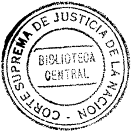
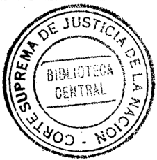
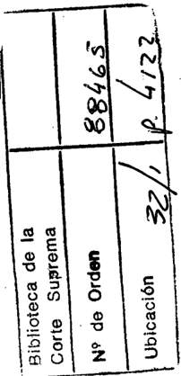
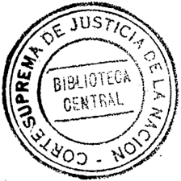

TOMO 315

Volumen 3

1992

## FALLOS DE LA CORTE SUPREMA DE JUSTI.CIA DE LA NACION

## REPUBLICA ARGENTINA

FALLOS

DE LA

S U P R E M A

CORTE

DE

## JUst-IClA DE LA NACION

PUBLICACION A CARGO DE LA SECRETARIA DE JURISPRUDENCIA DEL TRIBUNAL

TOMO 315 --VOLUMEN 3

OCTUBRE -DICIEMBRE

SERVICOP

Calle

50

N° 742

-

(1900)

La

Plata

1992

-

Buenos.

Aires.

DE

Copyright@ 1995 by Corte Suprema de Justicia de la Nación Queda hecho el depósito que previene la ley 11.723 Impreso en la Argentina Printed in Argentina' 1. S. B. N. 950-9825-19-0

## ACUERDOS DE LA CORTE SUPREMA

## AÑO 1992

## OCTUBRE -DICIEMBRE

REGIMEN DE LICENCIAS PARA LA JUSTICIA NACIONAL.

\_N° 52-

En, Buenos Aires, a los 6 días del mes de octubre del año mil novecientos noventa y dos, reunidos en la Sala de Acuerdos del Tribunal, los señores Ministros "q'ue suscriben la presente, ,

## CONSIDERARON:

Que a los fines de la mejor prestación del servicio de la justicia, resulta conveniente precisar las formalidades a las que se halla sometida la concesión de la licencia prevista por el ar!. 35, inc. c, del Régimen de Licencias para la Justicia Nacional.

Por ello,

## ACORDARON:

Sustituir el texto del inciso c del Régimen de Licencias para la Justicia Nacional por el siguiente: "Por razones particulares debidamente expuestas por escrito y justificadas, qúc', iesiJlten atendibles a juicio de la autoridad concedente, hasta seis (6) días laborables por año calendario y no más de dos (2) días por mes",

Todo lo cual dispusieron y mandaron, ordenando que se comunicase y registrase en el libro correspondiente. por ante mÍ. que doy fe,R1CARDOLEVEKE (H) -MARIANO AUGUSTO CAVAGNA MARTÍNEL. RODOLl'O C. BARRA AUGUSTO CÉSAR BELLUSCIO ENRIQUE SANTIAGO PETRACCHI JULIO S, NAZARENO EDUARDO MOLlNÉ O'CONNOR -ANTON]() BOGGIANO. C/audio Maree/o Kiper (Sccretario).

## ESCALAFON. BIBLIOTECARIOS.

En Buenos Aires, a los 6 días del mes de octubre del año mil novecientos noventa y dos, reunid9s en la Sala de Acuerdos del Tribunal, los señores Ministros que suscriben la presente, ,

## CONSIDERARON: ! : J.

Que esta Corte ha dispuesto recientemente el reencasillamiento del escalafón para los agentes de los anexos IT y lIT, mereciendo un tratamiento particular los casos de los agentes noescalafonados (confr. acordada 7/92).

Que mediante la resolución 496/83 se dispuso que el cargo de bibliotecario no integra el escalafón del personal judicial, ello sin perjuicio de que oportunamente la Corte Suprema 'de Justic"ia evaluase las remuneraciones de dicho personal.

Que resulta necesario resolver la situación de los agentes que cumplen funciones de bibliotecarios en los juzgados federales con asiento en el interior del país que no son sede de Cámara, teniendo en cuenta las consideraciones formuladas por la Dirección General de Bibliotecas dependiente de esta Corte' Suprema.

Por ello,

## ACORDARON:

- 1°) Determinar que la categoría de los agentes que cu'mplen funciones. como bibliotecarios en los juzgados federales con asiento en el interior del país que no son sede de Cámara será la de escribiente auxiliar (denominación según acordada N° 17/92) Y que no integrarán el escalafón del personal judicial de esos tribunales.
- 2°) Será requisito indispensable para ocupar dicho cargo poseer título de bibliotecario. A tal fin la Dirección General de Bibliotecas someterá a consideración del Tribunal un proyecto.de reglamento.
- 3°) Los citados agentes percibirán por encontrarse fuera del escalafón, una asignación por función consistente en una bonificación del 10% cada cuatro años acumulativo de prestación continuada de servicios, que no podrá exceder la remuneración que por todo concepto corresponda al cargo de prosecretario administrativo con diez años de antigüedad sin título.
- 4°) La asignación dispuesta en el punto 3°) comprenderá a los agentes que cumplen' esas funciones y que fueron designados conform~ a las normas contenidas en el punto 2°) de la resolución N° 786/82 modificada por la resolución N° 965/82. A estos fines la Dirección General de Bibliotecas informará la cantidad de agentes que se encuentren en las condiciones señaladas en el término de 30 días a partir de la fecha de la presente.

- 5°) La asignación creada no tendrá efectos retroactivos y los agentes que tengan una antigüedad de 4 años o más comenzarán a percibir el 10% a partir del 1° de diciembre del corriente año. .
- 6°) Derogar las normas anteriores que se opongan a la presente y autorizar a la Subsecretaría de Administración a imputar el gasto resultante de lo precedentemente dispuesto a la cuenta pertinente para el corriente ejercicio financiero.

Todo lo cual dispusieron y mandaron, ordenando que se comunicase y registrase en el libro correspondiente, por ante mí, que doy fe.RICARDO LEVENE (H) -MARIANO AUGUSTOCAVAGNAMARTÍNEZ - CARLOS S. FAYT - AUGUSTOCF:SARBELLUSCIO- ENRIQUE SANTIAGO PETRACCHI JULIO S. NAZARENO EDUARDO MOI.INÉ O'CONNOR -ANTONIO BOGGIANO. Claudia Marcelo Kiper (Secretario).

## INSCRIPCION DE PERITOS.

\_N°

54-

- En la Ciudad de Buenos Aires, a los 6 días del mes de octubre del año mil novecientos noventa y dos, reunidos en la Sala de Acuerdos del Tribunal, los seño'res Ministros que suscriben la presente,

## CONSIDERARON:

Que corresponde fijar las fechas para el cumplimiento de los trámites previstos en la Acordada nO 25 de 1985, para la inscripción y reinscripción de peritos en las especialidades determinadas en dicha acordada, ampliadas en las Nros. 45/85, 59/86, 24/87, 37/88, 41189, 52/90 Y 41191;

## ACORDARON:

- JO) Fíjase el plazo del 1° al 30 de noviembre de 1992 inclusive, para que los profesionales de las especialidades cuyo registro se lleva en esta Corte procedan a su' inscripción o reinscripción para el año 1993.-
- 2°) La lista a que se refiere el punto 5° de la Acordada n° 25/85 se exhibirá por cinco días a partir del 10 de diciembre de 1992.-
- 3°) Los trámites referidos en los puntos anteriores se efectuarán en Ja Dirección General Pericial de esta Corte, sito en Sarmiento 877, 9° piso, Capital Federal, durante el plazo fijado y exclusi,vamente en el horario de 10 a 12 hs,-
- 4°) Dése la publicidad pertinente por intermedIO de la Dirección de Prensa.-

Todo lo cual dispusieron y mandaron, ordenando que se comunicase y registrase en el libro correspondiente, por ante mí, que doy fe.RICARDO LEVENE (H) -MARIANO AUGUSTOCAVAGNAMARTÍNEZ - CARLOS S, FAYT - AUGus+o CÉSAR BELLUSCIO- JULIO S.

NAZARENO -EDUARDO MOLlNI~ O'CONNDR -ANTONIO BOGGIAND. C/audio Maree/o Kiper (Secretario).

## EFECTOS SECUESTRADOS EN CAUSAS PENALES.

En Buenos Aires, a los 6 días del mes de octubre del año mil novecientos noventa y dos, reunidos en la Sala de Acuerdos del Tribunal, los señores Ministros que suscriben la presente,

## CONSIDERARON:

Que la ley 23.853, establece en el art. 3° que constituyen recursos específicos propios del Poder Judicial de la Nación -entre otrosel producto de venta de efcctos secuestrados en causas penales que no hayan podido entregarse a sus dueños. así como de los "objetos decomisados".

Que, asimismo, los arts. 8° y 9° de ese cuerpo normativo otorgan al Tribunal -en 10 que aquí interesaamplias fa"Cultades, tanto para disponer de su patrimonio, como para efectuar el control y exigú: el cobro de los recursos mencionados por la norma.

Que se encuentra a estudio de esta Corte, el régimen aplicable al recurso previsto en el art. 3°, inc. b), de la ley 23.853; sin perjuicio de lo cual, se estima conveniente adoptar algunas mcdidas que resultan imprescindibles para paliarnecesidades impostergables del Poder Judicial de la Nación.

Que, en este orden de ideas. y ante la notoria insuficiencia que padece el parque automotor de estc poder del estado se considera conveniente disponer el uso transitorio de los vehículos que hayan sido objeto de secuestro en los términos establecidos en el inc. b) del art. 3° de la ley 23.853.

Que corresponde agregar, que la Secretaría de Superintendencia Administrativa consultó al Tribunal de Cuentas de la Nación acerca del procedimiento a seguir para que el Poder Judicial pueda atender las necesidades en materia de automotores, afectando a tal fin a aquellos rodados que hubiesen sido secuestrados en causas penales (oficio N° 1.805/91 -S. S. A.-); informando el órgano de control acerca de la inexistencia de "objeciones de índole legal que formular" respecto del procedimiento señalado (oficio del Tribunal de Cuentas de la Nación de fecha 7 de noviembre de 1991 en actuación nO 10.466/91 T. C. N.). .

Que por último, se hace necesario destacar que un examen profundo de la cuestión, conlleva a la obvia conclllsión de que resulta conveniente y razonable que el Tribunal disponga de los vehículos secuestrados en los términos establecidos en el art. 3° de la ley 23.853, pues de esta manera se logra evitar un estado de indefinición respecto de los bienes secuestrados, se consigue paliar sin costo alguno y de manera inmediata las necesidades que en materia de automotores sufre el Poder Judici'al -cumpliendo de este

modo con el severo plan de racionalización de reeUl'sos en el que el Estado Nacional se haya embarcadoy se logra, finalmente, respetar el espíritu que sin duda tuvo en mira el legislador al dictar la ley 23.853;

Por ello,

## ACORDARON:

- 1°) Que el Tribunal dispondrá de aquellos vehículos que hubiesen sido secuestrados en los términos establecidos en art. 3° de la ley 23.853;
- 2°) Que los magistrados a cargo de los tribunales en donde se encuentren vehículos secuestrados, deberán informar a la Corte Suprema -a través de la Prosecretaría del Tribunal -esa circunstancia;
- 3°) Que dicha dependencia deberá evaluar si el bien secuestrado se encuentra en condiciones de ser afectado al uso por parte del Poder Judicial de la Nación;
- 4°) Que una vez efectuada esa'evaluación, y de resultar la misma satisfactoria, se dictará una resolución a través de la Presidencia del Tribunal, afectando el automotor a la Corte Suprema de Justicia de la Nación;

Todo lo cual dispusieron y mandaron, ordenando se comunicase y registrase en el Libro correspondiente, por ante mí, que doy fe.RICARDO LEVENE (H) -MARIANO AUGUSTOCAVAGNA MARTÍNEZ - ROI)OLFO C. BARRA - CARLOS S. FAYT (en disidencia) -ENRIQUE SANTIAGO PETRACCHI -JULIO S. NAZARENO - EDUARDO MOLlN~: O'CONNOR (en disidencia) -ANTONIO BOGGIANO. Hugo Luis Mauro Piacenfillo (Secretario).

DISIDENCIADE LOS DOCTORESCARLOS S. FAYT y EDUARDOMOI.lNÉ O'CONNOR

## CONSIDERARON:

Que de acuerdo a lo dispuesto por el art. 3°, inc. b, de la ley 23.853 constituyen recursos propios del Poder Judicial de la Nación, entre otros,: "El producto de la venta o locación de bienes muebles o inmuebles afectados al Poder Judicial de la Nación; efectos secuestrados en causas penales que no hayan podido entregarse a sus dueños; objetos comisados; etc ... ".-

Que no hallándose aún establecido el régimen aplicable al recurso previsto en el arto 3°, inc. b, resulta prematuro adoptar cualquier clase de dispos"ición que pueda afectar el derecho de propiedad de quienes, directa o indirectamente, se encuentren sometidos. a un proceso, así como la buena marcha de los procedimientos judiciales y el consenso comunitario sobre el que reposa la credibilidad de quienes tienen la tarea de impartir justicia.-

Que cabe advertir, por otra' parte, que cualquier medida que tenga como último efecto el mantenimiento de un estado de indefinición en cuanto a la propiedad y disponibilidad de Jos bienes secuestrados, es contraria por sus consecuencias materiales,

al fin mismo que tuvo la sanción de la ley 23.853, así como al severo plan de racionalización de recursos en el que el Estado Nacional se halla embarcado. Esto es así, en primer término, toda vez que la promu.lgación de esa norma trasluce la clara intención de otorgarle a este Poder del Estado la facultad de ordenar la situación patrimol)ial de los bienes que se encuentran de un modo u otro bajo su jurisdicción y no, la de habilitarlo a convertir en aún más complejo el plexo de disposiciones que los rigen, con el consiguiente e inevitable dispendio administrativo que ello importa. En segundo lugar,. y dentro de los cánones impuestos para la recuperación patrimonial de nuestro país, no resulta justificable, contrariamente a lo que haría suponer una visión epitelial del problema, el gasto que significaría el uso de automotores secuestrados de la más diversa índole y estado de conservación, en especial, si se tiene en cuenta la posibilidad de que el bien .pueda ser recuperado por sus propietarios en todo momento.-

Que, como ha quedado evidenciado mediante la transcripción que antecede, el legislador ha previsto un camino expreso y viable para dar una solución transparente a las necesidades del Poder Judicial en este y otros campos, esto es, la venta de los bienes que se encuentren en condiciones de ser subastados y la imputación de los recursos producidos a los requerimientos que se observen como prioritarios.-

Por ello,

## ACORDARON:

Nó introducir modificación alguna en el regllnen de los efectos secuestrados, en tanto no se determine el procedimiento a seguirse con relación a lo dispuesto por la ley 23.853, art. 3, inc. b.-

Todo lo cual dispusieron y mandaron, ordenando se comunicase y registrase en. el Libro correspondiente, por ante mí, que doy fe.CARLOS S. FAYT EDUARDOMOLlNÉ O'CONNOR. Hugo Luis Mauro Piacelltino (Secretario).

## TR.lBUNAL ORAL EN LO PENAL ECONOMICO.

\_N° 56-

En Buenos Aires, a los 9 días del mes de octubre del año mil novecientos noventa y dos, reunidos en la Sala de Acuerdos del Tribunal, los señores Ministros que suscriben la presente,

## CONSIDERARON:

Que la ley 24.121 en su artículo 64 dispone la forma que se integrará la Cárúara Nacional de Apelaciones en lo Penal Económico al transformar dos Salas de su actual composición en tribunales orales de esa especialidad en la Capital Federal. Dicha norma autoriza a la Corte Suprema a seleccionar a los ¡nagistrados que pasarán a cumplir las citadas funciones y encomienda a este Tribunal comunicar al Poder Ejecutivo Nacional

la necesidad de la creación de la restante sala. Esto último, fue peticionado el 30 de septiembre (ver resolución N° 1431 bis/92).

Que las disposiciones contenidas en las normas que pretenden la puesta en funcionamiento del procedimiento penal oral permiten a este Tribunal apreciar que deben adoptarse las medidas conducentes tendientes a evitar las dificultades propias del tránsito del sistema escrito al oral. En tal sentido la propia ley 24.121 faculta a esta Corte a dictar normas complementarias que posibiliten la integración escalonada y la puesta en funcion~miento de los órganos creados por la ley 24.050 ( confr. art. 91).

Por ello,

## ACORDARON:

- 1°) Habilitar por el momento a un Tribunal Oral en lo Penal Económico de la Capital Federal, el que estará integrado por los doctores Arturo Marcos Cortel.ezzi y Mario Hugo Landaburu, con la secrctaría y dotación de personal de la actual Sala 1 de la Cámara Nacional de Apelaciones en 'lo Penal Económico

Las causas en trámite serán distribuidas entre las Salas restantes en forma equitativa teniendo en cuenta su .cantidad y complejidad.

A tales fines se declara feriado judicial para la cámara transformada por el término de 5 días hábiles sin peljuicio de la atención de los asuntos que, por su naturaleza, no admitan' demora.

- 2°) La integración de los Tribunales Orales en lo Penal Económico de la Capital Federal previstos para el año 1992 se efectuará conforme a lo dispuesto en la presente y a los cargos creados por la resolución N° 1331/92.
- 3°) Encomendar a la citada Cámara que tome juramento al DI'. Gustavo A. Bruzzone, en su carácter de Fiscal ante los Tribunales Orales en lo Penal Económico (resolución N° 1120/92 del Ministerio de Justicia) y al DI'. Carlos Daniel Liporaci, en su condición de Defensor ante dichos Tribunales (resolución N° 1110/92, también del citado Ministerio).

Todo lo cual dispusieron y mandaron, ordenando que se comunicase y registrase en el, libro correspondiente, po{ ante mí, que doy' fe.RICARDO LEvENE (H) -MARIANO AUGUSTOCAVAGNAMARTÍNEi',- RODoLFo C. BARRA - EDUARDOMot.INÉ O'CONNOI( - JULIO S. NAZARENO.' Claudio Marcelo Kiper (Secretario).

## EMPLEADOS JUDICIALES. SUPLEMENTO NO REMUNERATIVO.

En Buenos Aires, a los 14 días del mes de octubre del año mil novecientos noventa y dos, reunidos en la Sala de Acuerdos del Tribunal, los señores Minisl1'os que suscriben la presente,

## CONSIDERARON:

Que por Acordada n° 32/92 esta Corte aprobó su presupuesto pai'a el ejercicio 1993.-

Que el Tribunal, sensible al reclamo salarial del personal judicial, viene analizando -dadas las restricciones económicas que vive el país y dentro del contexto que impone la ley de presupuestola posibilidad de atender esa demanda con sus propios recursos.-

Que como resultado de ello, se ha arribado a la factibilidad de otorgar un incremento general, para los Anexos JI y III, de' pesos cien ($ 100) con carácter no remunerativo y no bonificable, vigente desde ellO del coiTiente mes.-

Que la falta de previsión presupuestarias por 'parte del Poder Ejecutivo Nacional para afrontar tal finalidad en el próximo ejercicio, impone al 'Poder Judicial de la Nación a solventar el pertinente financiamiento con sus propias disponibilidades.-

Que en tal sentido resulta imprescindible postergar algunos gastos calculados para el ejercicio venidero a fin de lograr el crédito conducente en la partida específica.-

Que, en ese orden, y en uso de las facultades que otorga el art. 5° de la ley 23. 853 es menester proceder a modificar la distribución de créditos realizada en la Acordada 32/92 con el objeto de adecuar sus importes al propósito enunciado, aumentando el Inciso 1 "Gastos en personal", en detrimento de los restantes, comunicando esta circunstancia al Honorable Congreso de la Nación.-

Que esta disposición del Tribunal en aras a atender, en la medida de sus posibilidades, el reclamo salarial que rccepta, no debe ser .interpretada como una declinación de las necesidades volcadas en la Acordada n° 32/92 sino como un esfuerzo que privilegia una justa y necesaria mejora a sus colaboradores.-

Que, por ello

## ACORDARON:

1°) Crear un suplemento mensual no remunerativo ni bonificable de cien pesos ($ 100.-) para todas las categorías comprendidas en los Anexos TI y 111 del escalafón del Poder Judicial de la Nación, a partir del 1° de octubre de 1992.-

- 2°) Hacer llegar para su consideración al Honorable Congreso de la Nación la presente cómpensación de pesos dieciséis millones ($ 16.000.000.-) dentro del total requerido por Acordada 32/92, incrementando en ese importe el Inciso I "Gastos en personal" y procediendo a la disminución de los siguientes:

## Administración Central

Inciso 2 - Bienes de consumo

2.000.000.-

Inciso 3 - Servicios no Pcrsonales

10.000.000.-

Inciso 4 - Bienes de uso

4.000.000.-

Todo lo cual dispusieron y mandaron, ordenando se comunicase y registrase en el libro correspondiente, por ante mí, que doy fc.RICARDO LEVENE (H) -MARIANO AUGUSTO CAVAGNA MARTíNI]. -RODOLl-"OC. BARRA -CARLOS S. FAYT -JULIO S. NAZAI~ENO- EDUARDO MOI.INÉ O'CONNOR. Hugo Luis Mauro Piacelll.ino (Secretario).

## CAMARA NACIONAL ELECTORAL. COMPUTO DE LA ANT1GÜEDAD DE LOS AGENTES.

-N"

58-

En Buenos Aires, a los 14 días del mes de octubre del año mil novecientos noventa y dos, reunidos en la Sala de Acuerdos del Tribtlnal, los señores Ministros que suscriben la presentc,

## CONSIDERARON:

Que la Cámara Nacional Electoral, por acordada 37/91, reglamentó cl ingreso al Poder Judiciaf de. la Nación del personal de planta no permanente transitoria del Ministerio del Interior adscl:ipto a este Tribunal y a los Juzgados Federales Electorales de toda la República. de conformidad con lo dispuesto por esta Corte en la acordada 60/90 y resolución N" 1434/90.

Que el Tribunal considera conveniente modificar el punto 9° de esa disposición, pues estima procedente tener en cuenta la antigüedad acumulada por los agentes en el desempeño de sus tareas electorales C0l110 otro antecedente computable, junto con 'los rubros "asistencia" y "puntualidad".

Por ello, y en virtud de las facultades de este Tribunal (art. 104 R.J.N. Y 22 de la ley 4055).

## ACORDARON:

Modificar el punto 9" de la acordada 37/91 de la Cámara Nacional Electoral, cuya redacción será:

9") Recibidas las pruebas y labrada el acta correspondiente, en la cual, en el caso de la cámara. la comisión verificadora dejará constancia de los antecedentes de cada postulante con respccto a su actuación en el Tribunal, en particular en los rubros asistencia, puntualidad y antigüedad; la cámara o el señor magistrado, según el caso, procederán a calificar a los aspirantes de la siguiente forma; a) Por las pruebas de mecanografía, redacción y ortografía se ¡ldjudicadí hasta un, máximo de diez (10) puntos; b) Por los antecedentes relativos a la actuación de los postulantes 'como personal

transitorio (en los rubros "puntualidad" y "asistencia") se otorgará un total de diez (10) puntos; y e) Por la antigüedad de los postulantes como adscriptos -en el Poder Judicial se computará medio punto (112) por año o fracción no menor de seis meses, hasta un máximo de cinco (5) puntos\_ Estos puntajes se promediarán a fin de obtener la calificación final, la que será de uno (1) a diez (lO) puntos. No se admitirán impugnaciones de ninguna índole. El orden de méritos resultante de la calificación final tendrá vigencia para las vacantes de auxilia¡'es principales de sexta que se produzcan dentro de los doce meses inmediatos siguientes a la fecha de la prueba de suficiencia, pudiendo ser designados quienes figuren en él sin necesidad de convocar a una nueva prueba de suficiencia".

Todo 10 cual dispusieron y mandaron, ordenando que se comunicase y registrase en el libro correspondiente, por ante mí, que doy fe.RICARDO LEVENE (H) -MARIANO AUGUSTO CAVAGNA MARTÍNE%RODoLFo C. BARRA ENRIQUE SANTIAGO PETRACCHI JULIO S. NAZARENO EDUARDO MOLlNÉ O'CONNOR -ANTONIO BOGGIANO. e/audio Marcelo Kiper (Secretario). -

## CA MARA NACIONAL ELECTORAL. DESIGNACIONES DE PERSONAL.

En Buenos Aires, a los J 4 días del mes de julio del año mil novecientos noventa y dos, reunidos en la Sala de Acuerdos del Tribunal, los señores Ministros que suscriben la presente,

## CONSIDERARON:

- 1°) Que por acordada n° 60/90 de fecha 30 de octubre de 1990, el Tribunal hizo saber 'a la Cámara Nacional Electoral que debía instrumentar un sistema en virtud del cual las vacantes que se produjeran en "dicha cámara y en las secretarías electorales del interior del país debían ser cubiertas por el personal perteneciente al Ministerio del Interior, que se encuentra adscripto al Poder Judicial, de acuerdo a las reglamentaciones vigentes.
- 2°) Que al respecto, el ar!. II del Reglamento para la Justicia Nacional (texto conforme acordada 51/85), exige tener estudios secundarios completos para la designación.
- 3°) Que además, el punto 6° de la acordada del 3 de marzo de 1958 (Fallos: 240: I 07) establece que las designaciones de personal que ingrese a la administraci'ón de justicia tendrán carácter provisional por el término de seis meses desde la fecha del nombramiento.
- 4°) Que por tratarse de personal que se ha desempeñado en forma efectiva durante varios años cumpliendo tareas en el fuero parece justo, a título de excepción, permitir su jncorporación ala planta permanente sin exigirle el cumplimiento de los requisitos enunciados en los considerandos anteriores.

En tales condiciones procede adecuar en la forma correspondiente la acordada 60/

90. i

Po ello,

## ACORDARON:

Ampliar la acordada 60/90' con la agregación del siguiente párrafo: "Exímese a los agentes que se incorporen del cumplimiento del requisito de título secundario exigido por el art. 11 del Reglamento para la Justicia Nacional~ siempre y cuando su desempeño en el fuero haya sido anterior al 15 de agosto de 1985; y establécese que las designaciones tendrán carácter definitivo".

Todo lo cual dispusieron y mandaron, ordenando que se comunicase y registrase en el libro correspondiente, por ante mí, que doy fe.RICARDO LEVENE (H) -MARIANO AUGUSTO CAVAGNA MARTíNEZ RODOI.rO C. BARRA ENRIQUE SANTIAGO PETRACCHI JULIO S. NAZARENO EDUARDO MOUNÉ O'CONNOR -ANTONIO BOGGIANO. Claudia Moreelo Kiper (Secretario).

CUERPOS TECNICOS PERICIALES. CONCURSOS .

. N" 61-

En Buenos Aires, a los 14 días del mes de octubre del año mil novecientos noventa y dos, reunidos en la Sala de Acuerdos del Tribunal, los señores Ministros que suscriben la presente, .

## CONSIDERARON:

- 1°) Que por razones de economía procesal, el Tribunal aprecia conveniente establecer bases generales en los concursos que se deben celebrar en los cuerpos técnicos periciales, para cubrir las vacantes de las distintas especialidades, cuando se requiere título habilitante; y.abrir al efecto un registro de aspirantes. '
- 2°) Que, examinados los proyectos presentados por la DireCCión General Pericial en el expte. S-3738/91, esta Corte estima procedente su aprobación.

Por ello,

## ACORDARON:

- 1°) Aprobar el "PROYECTO DE LLAMADO A CONCURSO" y las bases generales agregadas a fs 3/7, 8/14, 15/20, 21/26, 27/32 Y 33/38 del expediente de Superintendencia Judicial S-3738/91, las que forman parte integrante de la presente y se deberán observar, en lo futuro, en los concursos que se celebren en el Cuerpo Médico Forense, Margue Judicial (médicos de abducciones), Servicio de Reconoci-

mientas Médicos, Cuerpo de Peritos Contadores Oficiales y Cuerpo de Peritos Calígrafos Oficiales~ respectivamente.

- 2°) Abrir, en el ámbito de la Dirección General Pericial. del Tribunal, sito en Sarmiento n° 877, piso 12, Capital Federal, un' "REGISTRO DE ASPIRANTES" de aquellos que deseen ingresar a los cuerpos técnicos periciales en cargo,s que exigen título habilitante para su cobertura, quienes al momento de su inscripción deberán denunciar su domicilio real y el constituido dentro del radio de la Capital Federal, al que serán notificados de los llamados a concurso que se produzcan.
- 3°) Disponer que la falta de inscripción en el registro creado en el punto anterior no impedid participar de los procedimientos de selección a quienes manifiesten su voluntad de presentarse a concursar antes del cierre de la pertinente inscripción.

Todo lo cual dispusieron y mandaron, ordenando que se ,comunicase y registrase en el libro correspondiente, por ante mí, que doy fc.ROJ)oLH) C. BARRA CARLOS S. FAYT - AUGUSTOCJ~SARBELLUSCIO- ENR](JUE SANTIAGOPETRACCHI- lul.IO S. NAZARENO. C/audio Maree/o Kiper (Secretario).

## CUERPOS TECNICOS PERICIALES.

\_N° 63-

En Buenos Aires, a los 14 días del mes dc ocwbre del año mil novecientos noventa y dos, reunidos en la Sala de Acuerdos del Tribunal, los señores Ministros que suscriben la presente',

## CONSIDERARON:

Que esta Corte resolvió dejar sin efecto la acordada del 19 de junio de 1961, registrada en Fallos: 250:5 y, en consecuencia, retomar la superintendencia de los cuerpos técnicos periciales (Acordada n° 10/91). A su vez, se creó la Dirección General Pericial para la supervisión de dichos organismos y del Servicio de Reconocimientos Médicos (Resolución nO 969/91).

Que, posteriormente, se estableció un programa para permitir la concurrencia de profesionales egresados de universidades nacionales y privadas para desempeñarse en los cucrpos técnicos en forma no I'emunerada, para realizar tareas de investigación (Acordada n° 42/92).

Que, por otra parte, la recicnte implementación del proc,eso penal oral exigirá una intervención' cada vez mayor de los cuerpos .técnicos periciales.

Que, además de lo expuesto, las Secretarías de Superintendencia del Tribunal se enfrentan a la existencia de numerosos pleitos de suma trascendencia institucional y económica, lo que torna necesario una supervisión especial.

Que, por último, se estima necesario centralizar en una dependencia la realización de algunas funciones -cuyo volumen también es crecienteque actualmente no dependen de ninguna Secretaría del Tribunal, pero que sin embargo comprenden actividades complejas y de suma responsabilidad (vgr. acordada 27/91).

Por ello,

## ACORDARON:

Asignar al Secretario del Tribunal doctor Javier Leal de lbarra, en forma provisoria, la responsabilidad de la Dirección General Pericial, de la prosecretaría de la Corte, y de los juicios iniciados o a iniciarse contra el Poder Judicial.

Todo lo cual dispusieron y mandaron, ordenando que se comunicase y registrase en el libro correspondiente, por ante mí, que doy fe.RICARDO LEvEN E (H) -MARIANO 'AUGUSTO CAVAGNA MARTÍNEZ CARI.OS S. FAYT -EDUARDO MOLINÉ O'CONNOR -RODOIHl C. BARRA - ANTON]() BOGGIANO- JUI.JO S. NAZARENO. Claudio Man'elo Kiper (Secretario).

HOMENAJE AL V CENTENARIO DEL DESCUBRIMIENTO DE AMERICA.

\_N° 64-

En Buenos Aires, a los 16 días del mes de octubre del año mil novecientos noventa y dos, reunidos en la Sala de Acuerdos del Tribunal, los señores Ministros que suscriben la presente,

## CONSIDERARON:

Que al cumplirse el V Centenario del Descubrimiento de América no se puede dejar de tener presente la influencia e importancia que tuvieron en la civilización americana los juristas y las instituciones vinculadas al derecho.

- Así debe destacarse la enorme labor legislativa que aparece condensada con el ordenamiento y puesta al día de más de 7000 leyes en la famosa Recopilación de Indias de 1680.
- La jurisprudencia tuvo gran importancia al extremo de que los tribunales excepcionalmente aplicaban la pena de muerte ordenada en las sentencias y que cuando llegaban a América leyes inaplicables o ajenas a la realidad social y económica, en una ceremonia especial, los oidores se colocaban la ley sobre la cabeza y cumplían con el requisito de decir: "Se obedece pero no se cumple".

Se tiene en cuenta también que la Corte Suprema de Justicia de la Nación es la sucesora, primero de la Real Audiencia de Buenos Aires, máximo tribunal de justicia de la época indiana, y segundo, de la Cámara de Apelaciones, tribunal criollo, que en j 812 reemplazó a. la Audiencia, tribunal españolista.

Por último, cabe hacer notar que los grandes ju,:isconsultos de Indias (Victoriano de Villaba, Solórzano Pereira, etc) surgieron de sus brillantes actuaciones como Fiscales de Audiencia o como miembros de ésta.

Por ello,

## ACORDARON:

Rendir homenaje a los hombres y a las instituciones jurídicas que cumplieron tan destacable papel y que cavaron tan hondo en el camino del progreso del derecho. RICARDO LEVENE (H) -MARIANO AUGUSTO CAVAGNA MARTÍNEZ -JUI.lO .S. NAZARENO -EDUARDO MOl.INÉ O'CONNOR -RODOLFO C. BARRA -ANTONIO BOGGIANO. Claudio Mareelo Kiper (Secretario).

## MAGISTRADOS Y FUNCIONARIOS JUDICIALES. ACORDADAS DE RECONOCIMIENTO.

-N" 67-

En Buenos Aires, a los 27 días del mes de octubre del año mil novecientos noventa y dos, reunidos en la Sala de. Acuerdos del Tribunal, los. señores Ministros que suscriben la presente,

## CONSIDERARON:

Que resulta necesario reglamentar el procedimiento que debe observar este Tribunal, así como las cámaras nacionales y federales, en lo que respecta al reconocimiento de aquellos magistrados y funcionarios o empleados que cumplan 25 años de servicios en el Poder Judicial de la Nación, se jubilen o fallezcan durante o después del desempeño de su cargo.

Por ello,

## ACORDARON:

1) Cuando un magistrado, funcionario o empleado de la Corte Suprema cumpla 25 años de actividad en el Poder Judicial, o cuando se jubile, se dictará una acoi'dadil recordatoria cuya copia le será entregada en un aeto público.

Igual procedimiento deberán seguir las cálÍlaras nacionales y federales respecto de sus magistrados, funcionarios y empleados.

- 2) En caso de fallecimiento de alguno de los mencionados, durante o después del ejercicio del cargo, se dictará una acordada recordatoria cuya copia se enviará con nota de pésame a los parientes más próximos, por intermedio del Presidente' de la Corte o de la cámara, según el caso, y del Secretario correspondiente.

Todo lo cual dispusieron y mandaron, ordenando que se comunicase y registrase en el libro correspondiente, por ante mí, que doy fe.RICARDO LEVENE (H) -MAHIANO AUGUSTO CAVAGNA MARTíNEZ ROI)OI.H) C. BARRA JULIO S. NAZARENO EDUARDO MOLlNÉ O'CONNOR - ANTONIO BOGGIANO. e/audio Marcelo Kiper(Secretario).

## EQUIPOS. DE ASISTENTES SOCIALES.

-w 69-

En la ciudad de Buenos Aires, a los 27 días del mes de octubre del año mil novecientos noventa y dos, reunidos en la Sala de Acuerdos del Tribunal, los señores Ministros que suscriben la presente,

## CONSIDERARON:

- 1°) Que por acordadas Nros. 37/86, 30/88, 47/89, 54/90, 55/90, 75/90, 33/91 y 39/ 91 esta 'Corte hizo lugar a solicitudes formuladas por magistrados del fuero civil, permitiendo que desempeñen fpnciones en los juzgados a su cargo equipos de asistentes sociales y exceptuándolos de cumplir la prescripción contenida en el .art. 129 del Reglamento 'para la Justicia Nacional.
- 2°) Que la señora juez a cargo del Juzgado Nacional de Primera Instancia en lo Civil n° 92, doctora María Rosa Bosio, formula análogo requerimiento con relación a los miembros del equipo de trabajo que formó, integrado por siete asistentes sociales, quienes trabajarán en conjunto con la del juzgado.
- 3°) Que, examinado el requerimiento, esta Corte Suprema aprecia conveniente conferir la excepción.

Por ello,

## ACORDARON:

Hacer lugar a la solicitud formulada por la doctora MARIA ROSA BOSIO, titular del Juzgado Nacional de Primera Instancia en lo Civil n° 92, y permitir que, de acuerdo con el sistema de trabajo implantado por la magistrada, quede exceptuada de cumplir la prescripción del arl. 129 del Reglamento para la Justicia Nacional, en punto a los nombramientos de los asistentes sociales licenciados MARIA C. ADRIANO, MARIA ESTHER BENYUY A, GRAClELA DEL CARMEN GARCIA, ALEJANDRA M. KUSSEROW, CARLOS E. CASTRO, JUAN CARLOS LOPAPA y CLAUDIO O. ROBLES,

Todo lo cual dispusieron y mandaron, ordenando que se comunicase y registrase en el libro correspondiente,' por ante mí, que doy fe.MARIANO AUGUSTO CAVAGNA MARTíNEZ -CARLOS S. FAYT -AUGUSTO CÉSAR 8ELLUSCIO -ENRIQUE SANTIAGO PETRACCHI JULIO S. NAZARENO - EDUARDO MOI.INÉ O'CONNOR. Claudia Mm'celo Kiper (Secretario).

## EMPLEADOS JUDICIALES. PARO GENERAL DE ACTIVIDADES.

-N" 72-

En Buenos Aires, a los 11 días del mes de noviembre del año mil novecientos noventa y dos, reunidos en la Sala de Acuerdos del Tribunal, los señores Ministros que suscriben la presente,

## CONSIDERARON:

Que según declaraciones formuladas públicamente, la Unión de Empleados de la Justicia de la Nación se adhirió al paro general de actividades dispuesto por la C.G.T. para el día 9 del corriente.

Por ello,

ACORDARON:

Hacer saber a las cámaras naciomiles y federales, y a las dependencias de la Corte, que en el plazo de cinco días deberán informar a la Subsecretaría de Administración lá nómina del personal que. no haya concurrido a prestar servicios, y que no haya justificado su inasistencia por causas de fuerza mayor u otro motivo, con especificación del cargo y lugar de trabajo, a fin de que se practiquen los descuentos pertinentes.

Todo lo cual dispusieron y mandaron, ordenando que se comunicase y registrase en el libro correspondiente, por ante mí, que doy fe.RODOLFO C. BARRA -EnUARDO MOI.INÉ O'CONNOR -ENRIQUE SANTIAGO PETRACCHI -ANTONIO BOGGIANO -JULIO .S. NAZARENO - MARIANO AUGUSTO CAVAGNA MARTíNEZ -CARLOS ~. FAYT. e/audio Marce/o Kiper (Secretario).

## ESCALAFON.

-w 73-

En Buenos Aires, a los 17 días del mes de noviembre del año mil novecientos noventa y dos. reunidos en la Sala de Acuerdos del Tribunal, el señor Presidente de la Corte Suprema de Justicia de la Nación y los señores Ministros que suscriben la presente,

## CONSIDERARON:

- 1°) Que por acordada 31 de fecha 3 de diciembre de 1991, la Cámara Federal de Apelaciones de La Plata introdujo diversas modificaciones en la reglamentación del sistema escalafonario y de ascensos de sus a'gentes.
- 2°) Que el Tribunal considera conveniente dejar sin efecto el 2do. párrafo del art. 3°; y modificar el inc. c del art. 4° pues las disposiciones enunciadas podrían originar situaciones poco equitativas en la composición del escalafón de la jurisdicción.

Por ello, y en virtud de las facultades de este Tribunal (art. 104 R.J.N. Y 22 de la ley 4055).

## ACORDARON:

- 1°) Dejar sin efecto el 2do. párrafo del artículo 3 de la acordada n° 31/91, dictada por la Cáma.ra Fedcral de Apelaciones de La piata el 3 de diciembre de 1991.
- 2°) Modificar.el qrt. .4°, inc. c, de la acordada mencionada en el punto anterior, el cual quedará redactado de la siguiente forma:
- "ARTICULO 4° ... C) títulos: regirá el siguiente puntaje según el título obtenido: un (1) punto por título secundario, un (1) punto por estudios universitarios con doce (12) materias del plan oficial aprobadas, más cuatro (4) puntos por título universitario, hasta un máximo de cinco (5) puntos. No se computarán puntos por materias o títulos universitarios si no se acreditan conocimientos técnicos de aplicación con el cargo que se desempeña. Si el empleado efectuara cursos de capacitación dictados con el auspicio de la Asociación de Magistrados y Funcionarios de la Justicia Nacional o de Universidades, se .computarán, según la calificación obtenida en el examen, de la siguiente manera:

calificación 10

3 puntos.

calificación 8 y 9

2 1/2 puntos:

calificación 6 y 7

2 puntos.

calificación 4 y 5

I 1/2 punto."

Todo lo cual dispusieron y mandaron, ordenando que se comunicase y registrase en el libro correspondiente, por ante mí, que doy fe.RICARDO LEVEN E (H) -MARIANO AUGUSTO CAVAGNA MARTÍNEZ -CARLOS S. ,FAYT AUGUSTO CÉSAR BELLUSCIO -ENRIQUE SANTIAGO PETRACCHI -RODOLFO C. BARRA' -JULIO S. NAZARENO -EDUARDO MOL.lNÉ O'CONNO.R. Claudia Marcelo Kiper (Secretario).

## EMPLEADOS JUDICIALES. PROMOCIONES.

\_N° 74-

En Buenos Aires, a los 17 días del mes de noviembre del año mil novecientos noventa y dos, reunidos en la Sala de Acuerdos del Tribunal, los señores Ministros que suscriben la presente,

## CONSIDERARON:

Que la Acordada 12/86 dispuso, en seguimiento del ar!. 8 del decreto N° 1428/73, que el personal de Poder Judicial promovido a cargos superiores sólo puede asumir sus nuevas funciones a partir del primer día del mes siguiente a aquél en que se produce el ascenso. Ello porque los haberes correspondientes a los agentes promovidos se abonan también a partir del mes siguiente al de la promoción.

Que un nuevo examen de la cuestión permite advertir que tales disposiciones no encuentran razonabilidad ni satisfacen las necesidades que en materia de organización se presentan en cada caso. Además, provocan una pérdida injustificada en la remuneración de los agentes.

Que, por otro lado, vigente la ley de autarquía, carece de justificació.n legal la sujeción a los regímenes elaborados en el ámbito del Poder Ejecutivo.

Por ello,

## ACORDARON:

## 1) Derogar la Acordada 12/86.

2) Disponer que, sin perjuicio del momento en el que se practique la liquidación, los agentes promovidos a cargos superiores podrán asumir sus nuevas funciones desde el momento en el que se produce el ascenso, y que a parlir del momento de la efectiva asunción de las nuevas tareas tendrán derecho a la liquidación de los haberes correspondientes.

Todo lo cual dispusieron y mandaron, ordenando que se comunicase y registrase en el libro correspondiente, por ante mí, que doy fe,RICARDO LEVENE (H) -MARIANO AUGUSTO CAVAGNA MARTÍNEZ - RODoLFo C. BARRA - CARLOS S. FAYT - EDUARDO MOLINÉ O'CONNOR -ANTONIO BOGGIANO -JULIO S. NAZARENO -ENRIQUE SANTIAGO PETRACCHL CLaudia MarceLo Kiper (Secretario).

## FERIA JUDICIAL DE ENERO.

-N" 77-

En Buenos Aires, a los 24 días del mes de noviembre del año mil novecientos noventa y dos, reunidos en la Sala de Acuerdos del Tribunal, los señores Ministros y el señor Procurador General de la Nación que suscriben la presente, con el objeto de nombrar las autoridades de Feria para el mes de enero de 1993,

## RESOLVIERON DESIGNAR:

- l°) Al Dr. Augusto C. Belluscio como Juez de Feria.
- 2°) Al Dr. Oscar L. Fappiano en la Procuración General de la Nación.
- 3°) Al Dr. Mm'celo C: Castañeda Paz -Defensor Oficial en lo Criminal y Correccional n° 7a cargo de la Defensoría ante la Corte Suprema y demás tribunales federales de la Capital.
- 4°) Al Dr. Jorge Migliore (del 1° al 31 de enero) y a la doctora Cristina Alvarez de Magliano (del II al 31 de enero), como Secretarios del Tribunal.
- 5°) Establecer el horario de atención al público de lunes a viernes, desde las 9 hasta las 13 hs.
- 6°) El personal que preste funciones durante la feria judicial deberá acreditarlo mediante certificación otorgada por los Señores Secretarios de Feria.

Todo lo cual dispusieron y mandaron, ordenando que se comunicase y registrase en el libro correspondiente, por ante mí, que doy fe.RICARDO LEVENE (H) -MARIANO AUGUSTOCAVAGNAMARTiNEZ - RODOLFOC. BARRA - CARLOS S. FAYT - AUGUSTOCÉSAR BELLUSCIO JULIO S. NAZARENO EDUARDO MOLlNÉ O'CONNOR ANTONIO BOGGIANO. Claudio Maree/o Kiper (Secretario).

CAMARA FEDERAL DE BAHIA BLANCA. INSCRIPC[ON DE PROFESIONALES.

\_N° 78-

En Buenos Aires, a los 24 días del mes de noviembre del año mil novecientos noventa y dos, reunidos en la Sala de 'Acuerdos del Tribunal, el señor Presidente de la Corte Suprema de Justicia de la Nación y los señores Ministros que suscriben ia presente,

## CONSIDERARON:

1°) Que por acordada 34 de fecha J O de julio de 1992, la Cámara Federal de Apelaciones de Bahía Blanca creó un registro para la inscripción de profesionales especializados que actuarán en la jurisdicción, y reguló los normas atinentes a su funcionamiento.

- 2°) Que el Tribunal considera conveniente dejar sin efecto su art. 6°, por resultar contrario al texto del art. 469, párrafos segundo y tercero del Código procesal Civil y Comercial de la Nación.

Por ello, y en virtud de las facultades de este Tribunal (art. 104 R.J.N. Y 22 de la ley 4055).

## ACORDARON:

- 1°) Dejar sin efecto el artículo 6° de la acordada n° 34/92, dictada por la Cámara Federal de Apelaciones de Bahía Blanca ellO de julio de 1992.
- 2°) Hacer saber a dicho tribunal que deberá adecuar su redacción a lo prescripto por el art. 469 del Código Procesal Civil y Comercial de la Nación.

Todo lo cual dispusieron y mandaron, ordenando que se comunicase y registrase en el libro correspondiente, por ante mí, que doy fe.RICARDO LEVENE (H) -MARIANO AUGUSTOCAVAGNAMARTÍNEZ - ROI)OLHl C.' BARRA - CARLOS S. FAYT - AUGUSTOCÉSAR BELLUSCJ()- JUI.IO S. NAZARENO- EnUARDO MOI.lNÉ O'CONNOR. Claudio Mare'elo Kiper (Secretario).

## TRIBUNALES ORALES. SUPERINTENDENCIA.

\_N° 79-

En Buenos Aires, a los 24 días del mes de noviembre del año mil novecientos noventa y dos, reunidos en la Sala de Acuerdos del Tribunal, los señores Ministros que suscriben la presente,

## CONSIDERARON:

Que el nuevo Código Procesal Penal de la Nación y las leyes 24.050, 24.121 Y 24. J 31 instituyen tribunales orales en la Capital Federal y en el interior del país.

Que compete a la Corte Suprema ejercer la superintendencia y el gobierno de todos los.tribunales del país, así como delegarlo en las cámaras total y parcialmente (art. 118 del R.J.N. y acordada registrada en Fallos 240: I 07). En este caso el Tribunal estima conveniente, por el momento, no delegar la superintendencia en dichos tribunales.

Por ello,

## ACORDARON:

Retener la superintendencia sobre los nuevos tribunales orales constituídos por el nuevo Código Procesal Penal de la Nación y sus leyes complementarias.

Todo lo cual dispusieron y mandaron, ordenando que se comunicase y registrase en el libro correspondiente, por ante mí, que doy fe.RICARDO LEVENE (H) \_ MARIANO AUGUSTO CAVAGNA MARTíNEZ -RODOI.FO C. BARRA - CARLOS S. FAYT \_ AUGUSTO CÉSAR BEI.LUSCIO -ENRI()UE SANTIAGO PETRACCI'¡I (en disidencia) \_ JULIO S. NAZARENO \_ EDUARDO MOLINÉ O'CONNOR -ANTONIO BOGGIANO. C/audio Maree/o Kiper (Secretario).

DISJJ)ENCIA DEL DOCTOR ENRI()UE SANTIAGO PETRACCHI

## CONSIDERARON:

Que esta Corte Suprema estima conducente establecer la forma' en que serán .delegadas las facultades de superintendencia en virtud de la sanción del nuevo Código Procesal Penal:

Por ello,

## ACORDARON:

- 1°) Delegar en la Cámara Nacional de Casación Penal la superintendencia sobre los tribunales orales constituidos, o que se constituyan, en el ámbito .de la Capital Federal y del resto del país.
- no 2°) Disponer que dicha Cámara elabore y proponga una reglamentación tendiente a que en el interior del país se puedan dilucidar con agilidad las cuestiones de escasa trascendencia -reservándose la potestad de intervenir en caso de conflicto-, y de que se puedan aprovechar las estructuras existentes en las cámaras federales, a fin de no incurrir en mayores erogaciones.

Todo lo cual dispusieron y mandaron, ordenando que se comunicase y registrase en el libro correspondiente, por ante mí, que doy fe.ENRIQUE SANTIAGO PETRACCHI.

OBRA SOCIAL DEL PODER JUDICIAL. ESTATUTO.

\_N° 82-

En la Ciudad de Buenos Aires, a los .10 días del mes de diciembre del año mil novecientos noventa y dos, reunidos en la Sala dc Acuerdos del Tribunal, el señor Presidente de la Corte Suprema de Justicia de la Nación Dr. Ricardo Levene (h) y los señor¿s Ministros que suscriben la presente,

## CONSIDERARON:

1°) Que resulta conveniente adecuar las disposiciones del Estatuto de la Obra Social del Poder Judicial de la Nación a las necesidades de los hijos mayores de los afiliados que oportunamente formaron parte de la institución y carecen de cobertura social.

2°) Que su incorporación como afiliados extraordinarios no habrá de redundar en un peljuicio económico para la institución, pues habrán de satisfacer la pertinente cuota especial.

Por ello,

## ACORDARON:

Sustituir el artículo 6°, inc. c, del Estatuto de la Obra Social del Poder Judicial, por el siguiente texto:

"Extraordinario: Los profesionales que presten serVICIOS asistenciales en la Obra Social y 'que soliciten su incorporación a ella en carácter de afiliados; aquellas personas que habiendo renunciado al Poder Judicial de la Nación, contaran en esa circunstancia con una antigüedad mayor de cinco años en él y requieran la continuidad de su afiliación; y los hijos de los afiliados mayores de 21 años que no puedan permanecer como familiares de la institución (conf. inc. h de este artículo), y requieran su incorporación como extraordinarios, siempre que no gocen de prestaciones de otra institución social y satisfagan la cuota especial correspondiente".

Todo lo cual dispusieron y mandaron, ordenando que se comunicase y registrase en el libro correspondiente, por ante mí, que doy fe.RICARDO LEVENE (H) -MARIANO AUGUSTO CAVAGNA MARTÍNEZ -AUGUSTO CÉSAR BELLUSCIO ENRIQUE SANTIAGO PETRACCHI- RODOLFO C. BARRA - JULIO S: NAZARENO- EDUARDO MOI..INÉ O'CONNOR ANTONIO BOGGIANO. e/audio Maree/o Kiper (Secretario).

## TRIBUNALES ORALES. SUPERINTENDENCIA.

-N" 84-

En la Ciudad de Buenos Aires, a los 11 días del mes de diciembre del año mil novecientos noventa y dos, reunidos en la Sala de Acuerdos del Tribunal, los señores Ministros que suscriben la presente,

## CONSIDERARON:

Que mediante la A&lt;:ordada N° 79/92 este Tribunal dispuso retener la superintendencia de los Tribunales Orales creados por las leyes 24.050 y 24.121.

Que con el objeto de facilitar la labor administrativa que esto implica, corresponde adoptar las medidas pertinentes,

Por ello,

## ACORDARON:

- 1°) Los Tribunales Orales podrán conceder las licencias del personal bajo su dependencia, con excepción de las que prevé el art. 11 del régimen vigente, y deberán informar posteriormente a este Tribunal.
- 2°) Las licencias de los señores jueces que integran los Tribunales Oral~s' deberán ser requeridas a esta Corte con la certificación, de ser necesaria, de los antecedentes respectivos por parte del Secretario del tribunal.
- 3°) Las propuestas de promociones deberán ser acompañadas por una certificación de la superintendencia respectiva en la que conste que la persona propuesta está en situación reglamentaria para el ascenso (conf. Res. 1840/92); y en las designaciones de personal deberá acreditarse el cumplimiento de los requisitos exigidos por el art. 1I del Reglamento para la Justicia NacionaL-
- 4°) Las oficinas de personal de las Secretarías de Superintendencia de los asientos respectivos llevarán en forma separada los legajos de los magistrados, funcionarios y empleados de los Tribunales Orales creados en la jurisdicción llevando los registros correspondientes.

Todo lo cual dispusieron y mandaron, ordenando que se comunicase y registrase en el libro correspondiente, por ante mí, que doy fe.RICARDO LEVENE (H) -AUGUSTO CÉSAR BELLUSCIO JULIO S. NAZARENO RODOLFO C. BARRA MARIANO AUGUSTO CAVAGNA MARTíNEZ - CARLOS S. FAYT. Claudia Man'ela Kiper (Secretario).

ASUETO JUDICIAL DEL 24 Y 31 DE DICIEMBRE,

\_N° 87-

En Buenos Aires, a los 22 días del mes de diciembre del año mil novecientos noventa y dos, reunidos en la Sala de Acuerdos del Tribunal, los señores Ministros que suscriben la presente,

## Por ello, ACORDARON:

Decretar asueto judicial, de acuerdo con los términos del art. 3° del Reglamento para la Justicia Nacional, los días 24 y 31 del corriente mes, para los tribunales nacionales y federales con asiento en la capital e interior del país.

Todo lo cual dispusieron y mandaron, ordenando que se comunicase y registrase en el libro correspondiente, por ante mí, que doy fe.RICARDO LEVENE (H) -ENRIQUE SANTIAGO PETRACCHI RODoLFO C. BARRA JULIO S. NAZARENO EDUARDO MOLINÉ O'CONNOR - ANTONIO BOGGIANO. Claudia Marcela Kiper (Secretario).

2202

## REGIMEN DE LICENCIAS.

-w 88-

En Buenos Aires, a los. 22 días del mes de diciembre del año mil novecientos noventa y dos, reunidos en la Sala de Acuerdos del Tribunal. los señores Ministros que suscriben la presente,

## CONSIDERARON:

Que por acordada 69/90 el Tri,bunal derogó el ar!. 89 del Reglamento para la Justicia Nacional del'año 1948 -vigerite p.or disposición delar!. 162 del RJ.N. del año 1952-, y lo sustituyó por un nuevo texto. .

Que, con relación a las licencias, dispuso que el Procurador General puede acordar las de los funcionarios y personal asignados por la Corte, por un plazo no mayor de ocho días. A la luz del régimen general en la materia, el plazo resulta exiguo.

Por ello,

## ACORDARON:

Modificar parcialmente el punto'!5° acápite 3 de la acordada 69/90, sustituiendo la frase qu'e expresa "el Procurador General podrá acordar licencias por un plazo no mayor de 8 días;', por el siguiente texto: "El Procurador General podrá acordar las liCencias de los funcionarios y personal asignados pOI' la Corte. Suprema con arreglo a los términos y .. causale's previstos por las pertinentes disposiciones reglamentarias en vigencia, en ejercicio de la atribución de 'autoridad concedente' que fija el Régimen de Licencias para la Justicia Nacional en sus diferentes artículos".

.

. Todo lo cual dispusieron y mandaron, ordenando que se comunicase y registrase en el libro correspondiente, por ante mí, que doy fe.RICARDOLEVENE (H) -ROI)OLFO C. BARRA - CARLOS S. FAYT - AUGUSTOCÉSAR BELLUSCIO - JUI.IO S. NAZARENO- ENRIQUE SANTIAGO PETRACCHI EDUARDO MOLlN(: O'CONNOR -ANTONIO BOGGIANO. e/audio Maree/o Kil'er (Secretario).

'

## REGLAMENTO DE LA CAMARA NACIONAL DE APELACIONES EN LO CRIMINAL Y CORRECCIONAL. SISTEMA CARCELARIO.

-w 90-

En Buenos Aires, a los 22 días del mes de diciembre del año mil novecientos noventa y dos, reunidos en la Sala de Acuerdos del Tribunal, los señores Ministros que suscriben la presente,

## CONSIDERARON:

- 1°) Que para evitar la aplicación de medidas de seguridad inapropiadas a las personas detenidas alojadas en hospitales o clínicas que no dependen del Servicio Penitenciario Federal. la Cámara Nacional de Apelaciones en lo Criminal y Correccional, por resolución de fecha 26/9/91, decidió introducir en su reglamento interno una disposición tendiente a subsanar dicha práctica viciosa (art. 72, 3er. párrafo).
- 2°) Que examinado su contenido, y más allá de la loable intención que inspiró la iniciativa, esta Coáe considera que la norma ha sido redactada de modo ambiguo, hecho que obsta a su aplicación efectiva y que la torna inadecuada para impedir la producción de los excesos que la configuraron.
- 30) Que este Tribunal, en reiteradas oportunidades, ha puesto de manifiesto su preocupación por la dolorosa realidad que afecta a las personas privadas de su libertad. quienes -a pesar de su condicióntambién han sido considerados por nuestros constituyentcs. Recientemente, verbigracia, solicitó al Poder Ejecutivo Nacional un informe sobre las medidas adoptadas por los organismos competentes a su cargo para paliar las deficiencias administrativas, de infraestructura y materiales que afectan a los institutos de detención (res. 885/92 en cxp~. s-20/92).
- 4 0 ) Que una vez más, en resguardo de un elemental imperativo constitucional: la protección de la dignidad humana, esta Corte considera necesario insistir en la necesidad de que el poder administrador adopte, con la mayor urgencia, medidas concretas que permitan poner fin a una problemática que avergüenza a la sociedad argentina, proporcionando a las personas detenidas una adecuada' atención médica y odontológica, controles regulares, el otorgamiento de medicamentos esenciales y condiciones dignas de habitabilidad; adecuando las medidas de seguridad -ademása los preceptos contenidos en nuestra Carta Magna.

Por ello.

## ACORDARON:

- 1°) Dejar sin efecto el 3er. párrafo del art. 72 del reglamento de la Cámara Nacional de Apelaciones en lo Criminal y Correccional.
- 2 0 ) Requerir al Poder Ejecutivo Nacional la implementación de medidas concretas para dar solución a los problemas económicos, administrativos y asistenciales que padecen las cárceles argentinas,

Todo lo cual dispusieron y mandaron, ordenando que se comunicase y registrase en el libro correspondiente, por ante mí, que doy fe.RICARJ)O LEVENE (H) -ROJ)')I.fO C. BARRA - CARI.OS S. FAYT - AUGUSTO C8SAR BEI.LUSCIO - ENRJ(JUE SANTIAGO PETRACCHI. e/audio Maree/o Kiper (Secretario).

## EMPLEADOS JUDICIALES. PEDIDOS DE PERSONAL.

-w 92-

En Buenos Aires; a los 23 días del mes de diciembre del año mil novecientos noventa y dos, reunidos en la Saja de Acuerdos del Tribunal, los señores Ministros que suscriben la presente,

## CON SlDERARON:

Que en la acordada 4/80 (Fallos: 302:4) se establecieron normas relativas a las necesidades de personal de los tribunales y organismos de la Justicia Nacional y Federal, sin que se cumpla con lo dispuesto en la mayoría de los casos, en particular en lo concerniente a la fecha en la que deben ser remitidos estos pedidos.

Que, por otra parte, el Congreso Nacional no ha contemplado desde hace ya varios ejercicios, los créditos necesarios que permitan satisfacer adecuadamente las necesidades de personal a pesar de lo manifestado por este Tribunal en las acordadas 49/90 y 24/91, entre otras.

Que a ello debe agregarse la reciente sanción de leyes de creación de nuevos tribunales, circunstancia que torna más difícil la situación presupuestaria del Poder Judicial.

Por ello,

## ACORDARON:

- 1°) Modificar el punto primero de las acordadas 4/80 y 20/88 (Fallos: 302:7 y 311 :22) por el siguiente: "Los pedidos de nuevo personal por parte de los Tribunales y Organismos de la Justicia Nacional y Federal deberán ser remitidos únicamente a la Secretaría de Superintendencia Judicial en la oportunidad que establece el art. 34 del Reglamento para la Justicia Nacional".
- 2°) Los pedidos que no cumplan con este requisito y que no estén directamente vinculados a las necesidades del servicio debidamente comprobadas, serán devueltos.
- 3°) Los requerimientos recibidos hasta el dictado de la presente acordada que no hubieran sido satisfechos por falta de presupuesto o insuficiente justificación, serán archivados.
- 4°) En el curso del año 1993 sólo se considerarán aquellos que por su gravedad no admitan demora, en la medida que así lo permitan los recursos disponibles.
- Todo lo cual dispusieron y mandaron, ordenando que se comunicase y registrase en el libro correspondiente, por ante mí, que doy fe.RICARDO LEVENE (H) -MARIANO AUGUSTO CAVAGNA MARTíNEZ RODOLFO C. BARRA CARLOS S. FAYT -ENRIQUE SANTIAGO PETRACCHI JULIO S. NAZARENO EDUARDO MOLINI; O'CONNOR -ANTONIO BOGGIANO. Claudio Man.elo Kiper (Secretario).

## CLARA HELENA JAIME DE CORRALES y OTROSv. DIRECCION NACIONAL DE VIALIDAD

RECURSO ORDINARIO DE APELACION: Tercera instancia. Juicios en que la Nación es parte.

Para la procedencia del recurso ordinario de apelación en tercera instancia, en causa en que la Nación directa o indirectamente revista el carácter de parte, resulta necesario demostrar que el "valor disputado en último término", o sea aquel por el que se pretende la modificación de la condena o "monto del agravio", exceda el mínimo legal a la fecha de su interposición.

RECURSO ORDINARIO DEAPELACION: Tercera instancia. Juicios en que la Nación es parte.

S.i los agravios del apelante se circunscriben al ítem daño estético -revocado por el a qua y a la cuantificación del "daño moral", el valor disputado en. último término no se halla representado por las sumas reclamadas en la demanda o los montos concedidos en el pronunciamiento impugnado sino por la diferencia entre las fijadas y las mayores a las que aspira la reCurrente.

## RECURSO ORDINARIO DE APELACION: TerCera instancia. Juicios en que la Nación es parte.

Es improcedente el recurso ordinario de apelación si, detraídos los intereses por su carácter accesorio, el capital de la condena, ,actualizado a la fecha de la presentación, no alcanza el mínimo previsto en el art. 24, inc. 6°, apartado a), del decretoley 1285/58, modificado por la ley21.708y la resolución W 1360/91, de la Corte"

## FALLO DE LA CORTE SUPREMA

Buenos Aires, 6 de octubre de 1992.

vistos los autos: "Corrales, Clara Elena Jaime de y otros cl Dirección Nacional de Vialidad si cobro. de daños y perjuicios".

Con side:rando:

- 1°) Que contra el pronunciamiento de la Cámara Federal de Apelaciones de Tucumán que confirmó -con excepción de los rubros lucro cesante y daño estéticola sentencia de anterior instancia que había hecho lugar a la demanda por daños y perjuicios sufridos por los actores en un accidente de tránsito, ambas partes interpusieron el recurso ordinario de apelación, que fue concedido para los demandantes a fs. ] 502 Ypara la demanda a fs. ]545.
- 2°) Que según conocida jurisprudencia de esta Corte, para la procedencia del recurso ordinario de apelación en tercera instancia en causa en que la Naciólldirecta o indirectamente revista el carácter de parte, resulta necesario demostrar que el "valor disputado en último término", o sea aquel por el que se pretende la modificación de la condena o "monto del agravio", exceda el lnínimo legal a ]a fecha de su interposición (Fallos: 246:303; 297:393; 302:502; 3]0:29]4).
- 3°) Que la actora no ha demostrado sobre la base de las constancias de la causa el cumplimiento del citado recaudo, puesto que el fallo impugnado hizo lugar en parte a su pretensión, y sus agravios -según lo mao)fiesta a fs. 1501- se circunscribían al Ítem "daño estético -revocado por e} a quoy a la cuantificación del" daño moral". En función de ello, la sustanc)a económica discutida no se hallaría representada por las sumas reclamadas en la demanda. o los montos concedidos en el pronunciamiento impugnado -como se desprendería de fs. 1500-, sino por la diferencia entre las fijadas y las mayores a las que aspira la recurrente, -tal sería e] valor disputado, en último término-, cálculo que no fue practicado en el sub examine con relación al monto mínimo establecido en la Resolución 1577/90 (FaHos: 306:749; 308: 1118).
- 4°) Que en lo que respecta al recurso de la demandada. cabe señalar que el valor cuestionado no supera el mínimo establecido en el arL 24 ~~c. 6°," apartado a), del decreto-ley 1285/58, modificado por la ley 2} .108 Yla resolución N° ]360/9 1de esta Corte, régimen aplicable por ser e} vigente al tiempo de interposición (Fallos: 220: 1066). Ello es así por cuantO', detrnfoo.s, los intereses por su carácter accesorio (Fallos: 268:243; 276:362}, el capital de la condena -aún cuando se incluya indebidamente el rubro "dañ'oestético" y se lo actualice a la fecha de la presentación-o no akanzaña d mf-nimo previsto en la norma citada.

ll.Q?

Por ello, se declaran improcedentes los recursos de apelación concedidos a fs. 1502 y fs. 1545. Con costas. Notifíquese y devuélvase.

MARIANO AUGUSTO CAVAGNA MARTfNEZ -AUGUSTO CÉSAR BELLUSCIO -ENRIQUE SAl'.'TIAGO PETRACCHIJULIO S. NAZARENOEDUARDO MOLINÉ O'CONNOR.

CARLOS ALBERTO BERTINOTTl v. NACION ARGENTINA (EJERCITO ARGENTINO)

DAÑOS Y PERJUICIOS: Responsabilidad del Estado. Generalidades.

Es evidente que la norma del art. 76, inc. 3°, ap. e, de la ley 19.101, texto según la ley 22.51 J, busca establecer un resarcimiento y no un haber de carácter previsional ya que la palabra "indemnización" figura no menos de cuatro veces en su texto, lo que se coinpadece con lo expresado en la nota de elevación del proyecto de la ley 22.511.

DAÑOS Y PERJUICIOS: Responsabilidad del Estado. Generalidades.

La norma del art. 76, inc. 3°, ap.c), de la ley 19.10 1, texto según la ley 22.511, fija un régimen indemnizatorio específico para los conscriptos que, como consecuencia de actos de servicio, presenten una disminución menor del sesenta y seis por ciento para el trabajo en la vida civil que, al no ser cuestionado constitucionalmente por el actor, obsta a la aplicación de las reglas que rigen la responsabilidad genérica.

COSTAS: Resultado del litigio.

Corresponde imponer las costas por su orden si la índole de la legislación cuyo alcance estaba cuestionado pudo fundadamente hacer creer al actor en su derecho a formular el reclamo como lo dedujo.

## FUERZAS ARMADAS.

Las relaciones de los hombres que integran las filas militares entre sí, y con la Nación, se gobiernan por los respectivos reglamentos que al efecto se dicten pOI'el

Congreso y en la medida y extensión que éste lo establezca (Voto de 10sDres. Rodolfo C. Barra y Carlos S. Fayt).

## DAÑOS Y PERJUICIOS: Responsabilidad del Estado. Generalidades.

Una inteligencia que sostuviera la insuficiencia de las reparaciones previstas en la ley 19.101 Yque.ambicionara, aplicar disposiciones extraídás del derecho común no,tendría en cuenta el plexo normativo aplicable, en el q¡¡e ocupa un lugar capital el art. 21 de la Constitución Nacional que impone a los ciudadanos concretas obligaciones (Voto de los Dres. Rodolfo C. Barra y Carlos S. Fayt).

## CONSTITUCION NACIONAL: Principios generales.

La hermenéutica de la Constitución Nacional no debe efectuarse jamás de modo tal que queden frente a frente los derechos y deberes por ella enumerados para que se destruyan recíprocamente, sino que debe procurarse su armonía dentro del espú'itu que les ,dio vida; cada una de sus partes ha de entenderse a la luz de todas sus disposiciones, de modo de respetar su unidad lógica y sistemática (Voto de los Dres. Rodolfo C. Barra y Carlos S. Fayt).

## SERVICIO MILITAR.

Si bi,en es claro que para cada ciudadano el contribuir a la defensa de la Patria no es una mera carga, sino que constituye un motivo de honra, de este principio,de patriotismo no cabe extraer que el art. 21 de la Constitución Nacional en su esenciajurídica no imponga sino una "obligación", como su texto literalmente lo dice ya que en modo alguno se consagra un derecho que, por sobre el marco ordenado del ejercicio de los poderes públicos, tengan los ciudadanos y que puedan ejercer libremente'(Voto de los Dres. Rodolfo C. Barra y'Carlos S Fayt).

## DAÑOS Y PEIPUICfo.S: .RespOlls(lbilidad del Estado. Generalidades.

•

',;

1".'

,Lainrención del constituyente, al establecer el texto del art. 21 de la Constitución Nacional fue anteponer la defensa de la patria a requerimientos de índole económica, por lo que cabe concluir que la decisión del legislador -que en ejercicio de las facultades conferidas por los arts. 21 y 67, inc. 23, de la Constitución Nacional hasta el presente no fijó otras pautas que las de la ley 19.101- fue la de excluir exigencias materiales como las derivadas de reclamaciones indeiTinizatorias de daños sufridos en actos de servicio por la vía del derecho civil (Voto de los Dres. RodolfO,CJilarra y.carlos S. Fayt).

315

## COSTAS: Resultado del litigio.

Corresponde imponer las costas por su orden si precedentes del Tribunal que su nueva integración no comparte pudieron hacer creer al actor con derecho a formular su pretensión (Voto de los Ores. Rodolfo'C. Barra y Carlos S. Fayt).

## DAÑOS Y PERJUICIOS: Responsabilidad del Estado. Generalidades.

La norma del art. 76, inc. 30, ap. c), de la ley 19.10 1, texto según la ley 22.511, fija un régimen indemnizatorio específico para los conscriptos que, como consecuencia de actos de servicio, presenten una disminución menor del sesenta y seis por ciento para el trabajo en la vida civil que obsta a la aplicación de las reglas que rigen la responsabilidad genérica (Voto de los DI'es. Augusto César BelIuscio y Antonio Boggiano).

RECURSO EXTRAORDINARIO: Requisitos famIales. Interposición del recurso. Funda,mento.

Corresponde desestimar el recurso extraordinario que no refuta todos'.y cada uno de los fundamentos de la sentencia apelada (Disidencia de los Ores. Mariano Augusto Cavagna Martínez, Julio S. Nazare(lo y Eduardo Moliné O'Connor).

## FALLO DE LA CORTE SUPREMA

Buenos Aires, 6 de octubre de 1992.

Vistos los autos: "Bertinotti, Carlos Alberto cl Estado Nacional (Ejército Argentino) si daños y perjuicios".

## Considerando:

1°) Que el actor promovió demanda en la que reclamó el pago de los daños y perjuicios provocados por la amputación de la segunda falange del dedo pulgar derecho, que dijohaber sufrido a raíz de una lesión experimentada mientras se hallaba realizando la instrucción militar, en su condición de conscripto. La pretensión, fundada en normas de derecho común, fue acogida por la sentencia de primera instancia, que, a su vez, fue confirmada por laSala 11de la Cámara Nacional de Apelaciones en lo Contencioso Administrativo Federal. Contra esta 61tima decisión, la demand'ada interpuso recurso extraordinario que el a qua rechazó en cuanto a I&lt;iinvocada arbitrariedad y sólo concedió en tanto "se halla en tela de juicio la interpre-

2209

tación y aplicación de normas federales y la decisión de esta Sala es adversa al derecho que en ella funda el apelante" (fs. 156).

- 2°) Que en el remedio federal intentado-bien concedido pues se trata de la hipótesis prevista en el art. 14, inc. 3°, de la ley 48la demandada sostiene que el art. 76, inc. 3°, apartado c), de la ley 19.101, texto según la ley 22.511, establece, para casos como el del actor, el pago de una verdadera indemnización, que, por ello, no tiene carácter previsional, sino exclusivamente resarc:itorio y que -en ,consecuenciaobsta a la aplicación de las normas que regulan en el derecho común la responsabilidad extracontractual (fs. 129/136).
- 3°) Que, en primer lugar, la citada norma federal es claramente aplicable al sub lite pues regula, para los conscriptos, la "indemnización" a que son acreedores cuando "como consecuencia de actos de servicio" presenten "una disminución menor del sesenta y seis por ciento para el trabajo en la vida civil". En segundo lugar, es evidente que busca establecer un resarcimiento y no un haber de carácter previsional, pues la palabra "indemnización" figura no menos de cuatro veces en su texto, lo que se compadece con lo expresado en la nota de elevación del proyecto de la ley 22.511, según la cual se persigue "la sus,titución del retiro por una adecuadaindemnización al personal de la reserva incorporada y de alumnos que sufran una disminución ~e aptitudes para la vida civil como consecuencia de actos de servicio".
- 4°) Que la citada norma fija un régimen indemnizatorio ~specífico -no impugnado de inconstitucionalque obsta a la aplicación de las reglas que rigen la responsabilidad genérica y, en consecuencia, hace inaplicable al sitb examine la doctrina del precedente "Gun\her" (Fallos 308: 1118). En este último, sobre la base de otros artículos, esta Corte determinó que la existencia de un retiro "alimentario y asistencial" -supuesto ajeno al sub liteno se oponía a la obtención de una reparación indemnizatoria, distinta, por su naturaleza, de aquel "haber" (considerando 11).
- 5°) Que,. por consiguiente, al atribuirse la norma legal aplicable al sub examine un definido carácter indemnizatorio, no cuestionado constitucionalmente por el actor, corresponde estar a la clásica prioridad que ostentan las normas especiales sobre las generales.

Por ello, se hace lugar al recurso extraordinario y se revoca el fallo apelado. Vuelvan las actuaciones al tribunal de origen pata que se dicte un nuevo pronunciamiento conforme al presente. Costas por su orden, en atención aque la índole de la legislación cuyo alcance estaba cuestionado, pudo fundadamente hacer creer al actor en su derecho a formular el reclamo como lo dedujo. Notifíquese y remítase.

RICARDO LEVENE (H) -MARIANO AUGUSTO CAVAGNA MARTÍNEZ (en disidencia) -RODOLFO C. BARRA (por su voto) -CARLOS S. FA YT (por su voto) -AUGUSTO CÉSAR BELLUSCIO (por su voto) ENRIQUE SANTIAGO PETRACCHI -JULIO S. NAZARENO (en disidencia) -ANTONIO BOGGIANO (por su voto).

VOTO DEL SEÑOR VICEPRESIDENTE SEGUNDO DOCIDR DON RODOLFO C. BARRA y DEL SEÑOR MINISTRO DOCIDR .DON CARLOS S. FAYT

## Considerando:

- 1°) Que contra la sentencia de la Sala II de la Cámara Nacional de Apelaciones en lo Contencioso Administrativo Federal que, al confirmar la de primera instancia, admitió la demanda por daños y perjuicios padecidos por el actor con motivo de un accidente sufrido mientras cumplía con el servicio militar obligatorio, el Estado Nacional dedujo el recurso extraordinario que fue concedido a [s. 156.
- 2°) Que el recurso interpuesto resulta admisible, toda vez que se encuentran en tela de juicio los alcances de una ley federal -tal carácter reviste la ley 19.101 (modificada por la 22.511)y de la cláusula constitucional en cuya consecuencia se dictó aquella, en tanto la decisión de la causa ha sido contraria a las pretensiones que la recurrente fundó en tales disposiciones.
- 3°) Que, en cumplimiento de uno de los fines esenciales del Estado como es el de "proveer a la defensa común" según se expresa en el preámbulo de la Constitución Nacional, ésta dispone que corresponde al Congreso "fijar la fuerza de línea de tierra y de mar, en tiempos de paz y de guerra; y formar reglameptos y ordenanzas para el gobierno de los ejércitos" (art. 67, inc. 23).

- .4°) Que quien se incorpora a las Fuerzas Armadas según las leyes die tadas en virtud del citado arto 67, inc. 23, queda sometido específicamente a las reglamentaciones y ordenanzas que rigen la actividad militar, las cuales desenvuelven sus principios propios en la órbita del derecho púhlico, constitucional y administrati va. En este sentido, tiene dicho esta Corte que las relaciones de los hombres que integran las filas militares entre sí, y con la Nación, se gobiernan por los respectivos reglamentos que al efecto se dicten por el Congreso y en la medida y extensión que éste lo establezca ....
- 5°) Que, sobre la base de tal jurisprudencia -publicada en Fallos 184:378; 204:428; 207: 176; y 291 :280, entre otroscorresponde concluir, como se hizo en esos precedentes, en que los integrantes de las fuerzas armadas -sea formando parte de su "cuerpo permanente" o de la denominada "reserva incorporada"no pueden reclamar la indemnización de daños sufridos en actos de servicio por la vía del derecho civil.
- 6°) Que esta es la doctrina que rige el caso y no la que invoca la parte actora, sin que modifique tal conclusión el examinar la responsabilidad que pudiera corresponder a la dfVl1andada por los daños sufridos por el demandante, sin culpa por parte de aquélla. Esta responsabilidad fue admitida por la Corte, que reconoció al hacerlo que era de índole constitucional (Fallos: 195:66; 274:432; 302: 159). Las disposiciones de la Ley Fundamental tenidas en cuenta al sentar esa doctrina fueron los artículos 14 yl7 de la Constitución Nacional que se refieren al derecho de propiedad ..
- 7°) Que, en los casos citados, tras la admisión de la responsabilidad referic;:la,el Tribunal agregó que a falta de disposiciones legales expresas para hacer efectivos los resarcimientos que correspondieran, cabía remitirse a los principios generales del derecho y a las disposiciones que rigen situaciones análogas (Fallos: 195:66; 274:432); para ello, cuando se trataba de situaciones equiparables conceptualmente, reconoció la función del derecho civil como legislación subsidiaria del derecho administrativo (Fallos: 183:234; 191 :490; 208:87), especialmente cuando se trataba de cuestiones patrimoniales, que tienen en el Código Civil un régimen jurídico de ajustada aplicación (Fallos: 237:452; 296:672).
- 8°) Que ele.la doctrina desarrollada sé desprende que tal aplicación supletoria de normas de derecho común, en causas en que estaba en juego la responsabilidad del Estado por hechos o actos acaecidos sin culpa del responsable, tuvo como presupuesto la falta de una legislación propia en el

campo del derecho público que determinara el modo de establecer la indemnización debida.

- 9°) Que tal carencia no se presenta en el sub lite, habida cuenta de que las disposiciones cuestionadas de la ley 19.101 contienen previsiones que reglan aquella materia. Y si se pretendiese, so color de suplir eventuales omisiones de los "reglamentos u ordenanzas" a que alude la Constitución, transportar d caso al campo del derecho privado al tIue la normativa militar es esencialmente ajena, ello supondría, ni más ni menos, que la asunción por parte de los jueces de la función del legislador, con grave afectación del principio de separación de poderes.

10) Que, por lo demás, una inteligencia distinta que sostuviera la insut!clcncia de las reparaciones previstas en dichaJey, y que ambicionara apli-, car en este caso, tal como se hizo en supuestos diferentes, disposiciones extraídas del derecho común, no tendría en cuenta el plexo normativo aplicable, en el que ocupa un lugar capital en lo que al caso concierne el arto 21 de la Constitución Nacional, que impone a los ciudadanos concretas obligaciones. gn efecto, dicha norma, al establecer que "todo ciudadano argentino está obligado a armarse en defensa de la patria y de esta Constitución", agrega que debe hacerlo "conforme a las leyes que al efecto dicte el Congreso y a los decretos del Poder Ejecutivo Nacional". Tampoco en uso de tal facultad el Congreso dispuso ninguna indemnización diferente de la reparación contemplada en la ley 19.10 1; luego los arts. 14 y 17 de la Constitución, en todo caso, deben ser interpretados de consuno con el propósito del art.21 referido, pues es sabido que la hermenéutica del instrumento político que nos rige no debe efectuarse jamás de modolal que queden frente a frente. los derechos y deberes por él.enumerados para que se destruyan recíprqcamente. Antes bien, ha de procurarse su armonía dentro del espíritu que les dio, vida; cada una de sus partes ha de entenderse a la luz de todas sus disposiciones" de modo de respetar la unidad lógica y sistemática de laLey Fundamental (Fallos: 167:121; 171:348;181:343; 199:483; 240:311; 242:353; 246:345; 251:86; 253: 133; 255:293; 258:267; 272:99; 276:265; 280:3 11; 300:596; 301:771, entre muchos otros).

11) Que aquella obligación constituye argumento de singular relevancia a fin de descartar la inadecuada hermenéutica de aplicar supletoriamente las normas del derecho común, destjnadas pe Suyo a proteger los derechos de los habitantes en situaciones radicalmente diferentes. Tal aplicación desnaturalizaría el carácter del servicio milita',", que encierra siempre un

área bélica, y que por imperio de la Constitución se impone a los ciudadanos como una obligación sujeta a las específicas normas que dicte el Congreso sobre el particular. Tal contribución es una "carga" pública, de las que los romanos llamaban "onus';, término que concluyó por adquirir el sentido de "honor". Es claro que para que cada ciudadano el contribuir a la de-' fensa de la Patria no es una mera carga, sino que constituye un motivo de honra; empero, de este principio de patriotismo no cabe extraer que el artículo dado en su esencia jurídica no imponga sino una "obligación", como su texto literalmente lo dice. En modo alguno consagra eJl este caso un derechq, que por sobre el marco ordenado del ejercicio de los poderes públicos, tengan los ciudadanos y que puedan ejercer libremente.

12) Que admitir lo contrario impondría al Estado una responsabilidad desproporcionada, atento a la magnitud de la citada área, frente a la cual la "Nación requiere un esf\lerzo de los ciudadanos que precisamente asegure su defensa, por encima de la carga económica que supondrían otras modalidades de hacer frente a los requerimientos militares, dentro de las cuales fueran aplicables las instituciones del derecho común, en cualquiera d,e sus ramas -aun aquellas que revisten carácter tuitivo-. Dicbo de otro modo, se asegura así, que la defensa de la Patria no quede ineludiblemente librada en esta materia, al pago de soldadas y de remuneraciones propias de regímenes profesionales o de grupos mercenarios.

13) Que, de resultas de todo lo expuesto, cabe interpretar que la intención del Constituyente, al establecer el texto del arL 21 de la Constitución Nacional fue, precisamente, anteponer la defensa de la Patria a requerimientosde índole económica; por ello, corresponde concluir que la decisión del legislador -que en ejercicio de las facultades conferidas por los artículos 21, Y67, inc. 23, de la Constitución Nacional hasta el presente no ha fijado otras pautas que las de la ley 19.10 1-, ha sido la de excluir exigencias materiales como la derivada de reclamaciones del tipo'de las examinadas. Dilucidar si éstas, en realidad, dificultan una eficaz defensa de la Nación, comprometiendo así su continuidad e integridad, resulta, ciertamente, valoración propia del Congreso Nacional y ajena, consecuentemente, a la de los jueces de la República.

Por ello,;,se hace lugar al recurso extraordinario interpuesto, y se deja sin efecto el pronunciamiento apelado. Vuelvan las actuaciones al tribunal de origen, a fin de que, por quien ~orresponda, se dicte uno nuevo Con arreglo al presente. Con costas por su orden, habida cuenta de que preceden-

tes del Tribunal (Fallos: 308: 1118 y otros) que su nueva integración no comparte, pudieron fundadamente hacer creer al actor con derecho a formular su pretensión. Notifíquese y remítase.

## RODOLFOC. BARRA -CARLOS S. FAYT

## VOTO DE LOS SEf,¡URES MINISTROS DOCfORES OONAUOUSTO CÉSAR BELLUSOO y DON ANTONIO BOGOTANO

## Considerando:

- I 0) Que el actor promovió demanda en la que reclamó el pago de los daños y perjuicios próvocados por la amputación de la segunda falange del dedo pulgar derecho, que dijo haber sufrido a raíz de una lesión experitnen" tada mientras se hallaba realizando la instrucción militar, en su condición de cons~ripto.La pretensión, fundada en normas de derecho común, fue acogida por la sentencia de primera instancia, que a su vez, fue confirmada por la Sala II de la Cámara Nacional de Apelaciones en lo Contencioso Administrativo Federal de la Capital Federal. Contra esta última decisión, la demandada interpuso recurso extraordinario que el a qua rechazó en cuanto a la invocada arbitrariedad y sólo concedió en tanto "se halla en tela de juicio la interpretación y aplicación de normas federales y la decisión de esta Sala es adversa al derecho que en ella funda el apelante" (fs. 156).
- 2°) Que el remedio federal intentado -bien concedido pues se trata de la hipótesis prevista en el arto 14, inc. 3°, de la ley 48la demandada sostiene que el arto 76, inc. 3°, apartado c), de la ley 19.101, texto según la ley 22.511, establece, para casos como el del actor, el pago de una verdadera indemnización, que, por ello, no tiene carácter previsional, sino exclusivamente resarcitorio y que -en consecuenciaobsta a la.aplicación de las normas que regulan en el derecho común la responsabilidad extracontractual (fs. 129/l36). .' .
- 3°) Que, en primer lugar, la citada norma federal es claramente aplicable al sub lite pues regula, para los conscriptos, la "indemnización" a que son acreedores cuando "como consecuencia de actos de servicio" presenten "una disminución menor del sesenta y seis por ciento para el trabajo en la vida civil". En segundo lugar, es evidente que busca establecer un resar-

cimiento y no 'un haber de carácter previsional, pues la palabra "indemnización" figura no menos de cuatro veces en su texto, 10 que se compadece con lo expresado en la nota de elevación del proyecto de la ley 22.511, según la cual se persigue "la sustitución del retiro por una adecuada indemnización al personal de la reserva incorporada y de alumnos que sufran una disminución de aptitudes para la vida civil como consecuencia de actos de servicio" .

- 4°) Que la citada norma fija un régimen indemnizatorio específico que obsta a la aplicación de las reglas que rigen la responsabilidad genérica y, en consecuencia, hace inaplicable al sub examine la doctrina del precedente "Gunther" (Fallos: 308,: 1118). En este último, sobre la base de otros artículos, esta Corte determinó que la existencia de un retiro "alimentario y asistencial" -supuesto ajeno al sub liteno se oponía a la obtención de una reparación indemnizatoria, distinta, por su naturaleza, de aquel "haber" (considerando 11).
- 5°) Que, por consiguiente, al atribuirse la norma legal aplicable al sub examine un definido carácter indemnizatorio, corresponde estar ~ la clásica prioridad que ostentan las normas especiales sobre las generales.

Por ello, se hace lugar al recurso extraordinario y se revoca el fa,llo apelado. Vuelvan las actuaciones al tribunal de origen para que se dicte nuevo pronunciamiento conforme al presente. Costas por su orden, en atención a que la índole dela legislación cuyo alcance estaba cuestionaci¿, pudo fundadamente hacer creer al actor en su derecho a formular el reClamo como lo dedujo. Notifíquese y remítase.

AUGUSTO CÉSAR'BELLÜSCIO -ANTONIO BOGG,IANO.

DISIDENCIA DEL SEÑOR' VICEPRESIDENTE PRIMERO DOCfOR DON MARiANo AUGUSTO CAVAGNA MARTíNEz y DE LOS SEÑORES MJNISTROS DOCTORES DON JULIO S. NAZARENO y DON EDUARDO MOLINÉ O'CONNOR

Considerando:

Que el recurso extraordinario no refuta todos y cad,a uno d~ los,fundamentas de la sentencia apelada. '

Por ello, se desestima el recurso interpuesto. Con costas (art. 68 del Código Procesal Civil y Comercial de la Nación). Notifíquesey devuélvase.

MARIANO AUGUSTO CAVAGNA MARTÍNEZ -JULIO S. NAZARENO ~ EDUARDO MOLINÉ O'CONNOR

## CONSTRUCCIONES TADDIA SA v. NACION ARGENTINA (MINISTERIO DE EDUCACION y JUSTICIA)

RECURSO EXTRAORDINARIO: Requisitos propios. Cuestiones 110 federales. Interpretación de normas locales de procedimientos. Casos varios.

Los agravios del recurrente contra la sentencia que rechazó de oficio la habilitación de la instancia contenciosoadministrativa suscitan cuestión federa.l suficiente para su examen en la instancia del art. I4d.e la ley 48, si más allá de la aparente índole procesal de la cuestión a resolver, median causas graves.que inciden en menosca.bo de la garantía de la defensa enjtlicio.

RECURSO EXTRAORDINARIO: Requisitos propios. Cuestiones 110' federclies. Sentencias arbitrarias. Procedencia del recurso. Excesos u omisiones eJI el pronunciámiento.

El pronunciamiento judicial que desconoce o acuerda derechos no debatidos en la causa es.incompatible con las garantías de Jos arts. 17 Y l8de la Constitución Nacional,pues el juzgador no puede convertirse en intérprete de la voluntad implícita dé una de las partes sin alterar, de tal modo, el equilibrio procesal de los litigantes en desmedro de la parte contraria.

RECURSO EXTRAORDINARIO: Requisitos propios. 'Cuestiones no federales. Interpretación de normas locales de procedimientos. Casos varios.

Si bieÍlla deterirJinación del akance d'e-las cuestiones comprendidas en la litis es materia privativa de los magistrados que en ella entienden, tal principio reconoce eJ)cepción cuando lo .decidido, con mengua de la defensa en juicio, signifique un apartamiento de las pretensiones enunciadas al trabarse el. diferendo, incorporando temas no introducidos por las partes en el pleito.

.

2218

315

## PODER JUDICIAL.

No compete al Poder Judicial la disposición, en forma expresa o tácita, de bienes cuya gestión voluntaria corresponde a los restantes poderes; la adopción de una posición contraria puede implicar no sólo un menoscabo a los derechos de propiedad y defensa en juicio de las partes, sino también al principio de separación de poderes propio de nuestro sistema republicano de gobierno.

## PODER JUDIClAL.

No incumbe a los jueces, en ejercicio regular de su misión, sustituirse a los poderes del Estado en atribuciones que le son propias, ya que la función más delicada del Poder Judicial es la de saberse mantener dentro de la órbita de su jurisdicción sin menoscabar las facultades que incumben a otros poderes o jurisdicciones.

## DEMANDA CONTENClOSOADMlNISTRATlVA.

La denegatoria de la habilitación de la instancia contenciosoadministrativa sólo resulta admisible en aquellos supuestos en que el incumplimiento de los requisitos exigidos para la admisibilidad de la acción sea planteado por la demandada, dentro de los términos y por la vía que a tal efecto dispone el ordenamiento formal.

## DEMANDA CONTENClOSOADMINTSTRATlVA.

El examen de oficio, o a instancia de los fiscales, del cumplimiento de los requisitos de admisibilidad de la acción procesal administrativa con anterioridad a la traba de la litis, es incompatible con el carácter renunciable de tales defensas y las disposiciones legales vigentes a este respecto en el orden federal.

## DEMANDA CONTENClOSOADMJNlSTRA11VA.

Cuando está en juego el patrimonio estatal, es inaplicable el criterio según el cual es inadmisible el control por los jueces de los requisitos de admisibilidad de la acción procesal administrativa con anterioridad a la traba de la litis (Disidencia del Dr. Carlos S. Fayt).

## FALLO DE LA CORTE SUPREMA

Buenos Aires, 6 de octubre de 1992.

Vistos los autos: "Construcciones Taddia S.A. e/Estado Nacional (Ministerio de Educación y Justicia) s/cobro".

## Considerando.:

Que de la cuestión debatida en el sub examine encuentra adecuada respuesta en lo resuelto en la causa C. 761 XXII "Cohen. Rafael el Instituto Nacional de Cinematografía si nulidad de resolución". del 13 de marzo de 1990, que esta Corte en su actual integración comparte y a cuyos fundamentos corresponde remitirse por razones de brevedad.

Que, sin embargo. el largo tiempo transcurrido desde la interposición de la acción -28 de diciembre de 1987 (fs. 12 vta.)sin que el actor haya logrado obtener hasta el momento. que se ordene el traslado de la demanda. torna imprescindible recordar una .vez más, con especial énfasi s, la incompatibilidad del procedimiento utilizado en el sub examine -al examinarse de oficio o a instancia de los fiscales el cumplimiento de los requisitos de admisibilidad de la acción procesal administrativa con anterioridad a la traha de la litis con el carácter renunciable de tales defensas (Fallos: 233: 106; 252:326, entre otros) y las disposiciones legales vigentes a este respecto en el orden federal.

Por ello, se declara procedente el recurso extraordinario y se revoca la sentencia apelada. Vuelvan los autos al tribunal de origen para que, por quien corresponda, se dicte un nuevo pronunciamiento con arreglo a lo allí expresado. Notifíquese y devuélvase con copia del precedente citado.

RICARDOLEVENE (H) -RODOLFO C. BARRA -CARLOS S; FAYT (en disidencia) -AUGUSTO CÉSAR BELLUSCIO -ENRIQUE SANTIAGO PETRACCHIEDUARDO MOLINÉ O'CONNOR.

DISIDENCIA DEL SEÑOR MINISTRO DOCTDR DON CARLOS S. FAYT

## Considerando:

- 1°) Que contra la sentencia de la Cámara Nacional de Apelaciones en lo Contencioso Administrativo Federal, Sala 1que confirmó lo decidido por eljue~ de primera instancia que declaró no habilitada la instancia. interpuso el actor el recurso extraordinario concedido a fs. 39.

- 2°) Que el a qua fundó su decisión, por una parte en doctrina plenaria del fuero, que se remitía al art. 25, de la ley 19.549, y por la otra, al margen de la aplicación de aquella norma, en los plazos, aún más breves, que contiene la legislación específica que regula el régimen recursivo para el personal de la institución policial (capítulo VI, en especial arts. 464 y 471, del decreto 6580/58, reglamentario de la Ley Orgánicl!de la Policía Federal).
- 3°) Que el recurrente sustenta su posición en doctrina de esta Corte a su decir favorable a la no aplicabilidad al caso del arto 25 de la ley 19.549. No se hace cargo, sin embargo, del segundo orden de argumentos del a qua. Se limita al respecto a sostener que "interpuso en término to.dos los recursos previstos en la reglamentación" (fs.37) y señala los recursos que planteó en sede administrativa (fs. 36), pero en ningún momento refuta lo afirmado por la sentencia apelada, en cuanto al ~umplimiento de los plazos fijados para aquellos.
- 4°) Que, aunque esto basta para el rechazo del recurso por falta de fundamentación, cabe agregar que si .bien esta Corte afirmó en la causa "Cohen" que el carácter renunciable de los derechos en juego impide el control por los jueces de requisitos de admisibilidad de la demanda en puntos que no fueron objeto de planteas de la demandada, una nueva reflexión sobre el tema lleva a advertir que tal supuesto básico faltará en la medida en que esté en juego el patrimonio estatal, que por su índole y conforme a los principios de la forma republicana de gobierno, no es disponible por los representantes judiciales del Estado, sus dependencias o empresas, sino por los órganos)' mediante las formalidades que expresa la ley.
- 5°) Que'no cabe extraer tampoco una conclusión distinta del precedente de Fallos: 200: 196 y casos posteriores que aplican su doctrina. En la causa citada se hizo mérito de que ".. .los representantes de la Nación demandada no han hecho cuestión de ello -la falta del reclamo previo que requería el art. 1 ° de la ley 3..952ni en la primera ni en la segunda instancia de este juicio, al cual dio curso el señor juez de la causa ... ", esto es que de hecho la causa había tramitado sin objeciones, cuando el Estado recordó la deficiencia -situación por' cierto diferente a la de autos-o De ahí que pudo concluir el Tribunal, que" en definitiva está librado al arbitrio del propio Poder Ej ecutivo el. aceptar o no la controversia judicial cuando esas exigencias -de reclamo previono han sido cumplidas".

.

No cabe pues de tal caso extraer sino una solución de especie para situaciones en las que una dilatada conducta de los magistrados y del Estado había llevado a los particulares a una extensa tarea de defensa de sus derechos, ya que en tales circunstancias "la integridad fundamental del derecho de la Nación no puede considerarse sustancialmente afectada por laomisión". .

- 6°) Que tal solución de especie no es de aplicación en el caso donde faltó una condu,cta del tipo de la referida, que pueda suplir la falta de las indispensables formalidades que deben preceder a la cesión, renuncia, o disposición por cualquier otro título, conforme la ley lo determine en cada caso, de derecho o cualquier tipo de bienes que se hayan integrado al patrimonio estatal. Esto porque, conforme se deriva de la adopción por la Constitución Nacional de la forma republicana de gobierno, la disposición de tal patrimonio es cuestión que reviste particular gravedad, que sólo puede dispensar de aquellas formalidades en circunstancias tan excepcionales como las de la causa referida, "en beneficio del orden deja Nación en cuanto realidad social y política que incluye y asume a los particulares y al Estado".'
- 7°) Que esto sentado, la aCtividad de los jueces en causas como la presente, no constituye sino una admisible inteligencia de una cuestión de Índole procesal -y por ello ajena en principio al recursó extraordinarioque se refieren al ejercicio de facultades suyas, como las contempladas en el art. 34, inc. 5°, del Código Procesal Civil y Comercial de la Nación. Esto es especialmente así en un campo regido por el derecho público (Fallos: 306:889), carácter esen,cial que no se desnaturaliza aún en 'supuestos de aplicación supletoria del derecho común (causa "Orbe, Lola Kassis de cl Estado Nacional", del 15 de setiembre de 1988) lo que de suyo impone la primordial preservación del interés de lá comunidad, incluso en los aspectos que hacen a su patrimonio.

Por ello, se declara improcedente el recurso extraordinario. Con costas. Notifíquese y archívese.

CARLOS S. FAYT.

308: J250.

315

## CATRILGÜECAY S.A.

RECURSO EXTRAORDINARIO: Requisitos propios. Cuestiones no federales. Interpretación de normas locales de procedimientos. Doble instancia y recursos.

Procede el recurso extraordinario contra el pronunciamiento que declaró mal concedido el recurso local de inaplicabilidad de ley, si tal decisión frustra la vía utilizada por el justiciable sin fundamentación idónea suficiente, lo que se traduce en una violación de la garantía del debido proceso consagrada en el art. 18 de la Constitución Nacional (1).

RECURSO EXTRAORDINARIO: ReqÍlisilos propios. Cuestiones no federales. Sentencias arbitrarias. Procedencia del recurso. Defectos en la consideración de extremos conducentes.

Corresponde dejar sin efecto el pronunciamiento que dec.!aró mal concedido el recurso local de inaplicabilidad de.la ley sobre la base de1-carácter no definitivo del fallo recaído en un incidente de revisión, sin hacerse cargo de 10 expuesto por el apelante en cuanto a que la decisión impugnada, al no poder ser revisada por otra vía, produce Jos efectos de la cosa juzgada formal y material.

RECURSO EXTRAORDINARIO: Requisitos propios. Sentencia definitiva. Resoluciones anteriores a la sentencia definitiva. Varias.

Constituyen sentencias definitivas las decisiones recaídas en incidentes de revisión y de verificación de créditos en los procesos concursales, cuando se demuestra que lo decidido causa un agravio de imposible o difícil reparación ulterior (2).

RECURSO EXTRAORDINARIO,' Requisitos propios. Sentencia definitiva. Resoluciones anteriores a la sentencia definitiva. Varias.

Carece de significación, para negar el carácter de senfencia definitiva, la circunstacia de que se trate de un incidente tramitado en el contexto de un proceso concursal, pues ello no priva de singularidad a.la contienda cuya resolución produce los efectos de la cosa juzgada en lo concerniente al crédito ,endiscusión (art. 38, ley 19.551), con prescindencia de las alternativas del proceso universal (3).

(J)

6

de octubre.

(2)

Fallos:

310:2833.

1985.

(3) Fallos:

Causa:

"Casa

Paletta

S.A.", del

27

de junio de

## JUAN CARLOS DE SETA v. BANCO CENTRAL DE LA REPUBLlCA ARGENTINA

## ENTIDADES FINANCIERAS.

No es jurídicamente aceptaple que, por el hecho de tratarse de certificados no contabilizados, se supedite la procedencia del reclamo al cumplimiento de requisitos que no exige el art. 56 de la ley 21.526.

## ENTIDADES FINANCIERAS.

Teniendo en cuenta las modalidades de las operaciones bancarias, sería un exceso riguroso exigir al depositante el control de extremo's cuyo cumplimiento incumbe al depositario, distorsionando así el principio distributivo de las cargas probatorias, que tiene raíz constitucional en el principio de defensa en juicio.

## COSTAS: Resultado del litigio.

Las costas de todas las instancias deben correr por su orden, si las peculiaridades del caso pudieron llevar a la demandada a considerarse con derecho a sostener su posición.

## ENTIDADES FINANCIERAS.

Para que la circunstancia de que los funcionarios de la entidad financiera que suscribieronlos certificados hayan renunciado el día anterior a la imposición pueda adquirir relevancia en el caso debe ser acompañada de la publicidad respectiva (Voto del DI'.. Eduardo Motiné O'Connor).

## ENTIDADES FINANCIERAS.

La garantía establecida por el art. 56 de la ley 21.526 no debe ser considerada en términos absolutos, ni la reparación por parte del ente rector del sistema financieroen modo alguno automática (Disidencias de los Ores. Rodolfo C. Barra y Carlos S. Fayt y del Dr. Augusto César Belluscio)

## ENTIDADES FINANCIERAS.

Dado que el cometido del Banco Central cuando se le reclama el cumplimiento de las garantías de los depósitos (art. 56 de la ley 21.526) constituye una derivación del ejercicio de su poder de policía financiera, toda idea que propicie una limitación de aquélla deberá apreciarse restrictivamente (Disidencia'de los Dres. Rodolfo C. BillTa y Carlos S. Fayt).

315

## t-NTIDADES FINANCIERAS.

En el supuesto de que se pretendiera hacer efectiva la responsabilidad prevista en el art. 56 de la ley 21.526 respecto de una operación inexistente, se estaría poniendo en riesgo el sistema monetario nacion,al (art. 67, inc. 10, de la Constitución Nacional) toda vez 'que para satisfacer la falsa acreencia sería inexorablemente necesario emitir moneda (Disidencia de los Dres. Rodolfo C. Barra y Carlos S. Fayt).

## ENTIDADES FINANCIERAS.

- La falta de cu~plimiento dé la'exig~ncia de presentar la declal~aciónjurada (art. 56 de la ley 21.526), trae aparejada la pérdida del' derecho de hacer efectiva la garantía (Disidencia de los Dres. Rodolfo C. Barra y Carlos S. Fayt)

## ENTIDADES FINANCIERAS.

Si no se hubieran satisfecho las exigencias razonables que el Banco central hubiese formulado en sede administrativa en ejercicio del poder de policía financiera.o del deber de velar por la legitimidad de los reclamos de los depositantes, corresponde que el depositante cargue con la prueba de demostrar en sede judicial la legitimidad de su reclamo (Disidencia de los Dres. Rodolfo C. Barra y Carlos S. Fayt).

## ENTIDADES FINANCIERAS.

Si se ha dado cumplimie"nto satisfáctorio a los recaudos exigidos en sede adm,inistrativa, la demandada debe probar la irregularidad del depósito en cuestión, en tanto no sea reconocido por el Banco Central con los efectos previstos en el art. 56 de la ley 21.526 (Disidencia de los Dres. Rodolfo C. Barra y Carlos S. Fayt).

## ENTIDADES FINANCIERAS.

Si el Banco Central considera insatisfactorio elcumplimientode los recaudos oporulnamente exigidos, los tribunaies judiciales deberán evaluar previamente la, razonabilidad de ,tal decisión y si no consideran justificado su temperamento, el organismo estatal deberá cargar con la prueba relativa a la falta de genuinidad de los (iepósitos (Disidencia de los Dres. Rodolfo C. Barra y Carlos S. Fayt) .

. ',

## ENTIDADES FINANCIERAS.

Debe distinguirse al inversor q~e ingresa le'almeme sus ahorros, (o el capital empres'ario) eh el circuito fiminciero, con fondos que, en consecuencia, harirecibido y recibirán el tratamiento tributario pertinente, de quien sin justificación sufic'iente, realiza sus inversiones mediante procedimientos ajenos a la operatoria eviden.temente regular de la entidad financiera. Para el primer caso fue concebida la ga-

rantía del arto 56 de la ley 21.526 y no para' el segundo (Disidencia de los Dres. Rodolfo C. Barra y Carlos S. Fayt).

## ENTIDADES FINANCIERAS.

El Banco Central, en tanto ocupa el lugar deun tercero en la relación obligacional nacida entre la entidad financiera y el inversor cuya responsabilidad nace de h ley: arto 56 de la ley 21.526 y no de fiador de la relación contractual, sólo se encuentra obligado a garantizar las relaciones genuinas y legítimas, y no aquellas cuya causa u origen aparecen como fraudulento (Disidencia del Dr. Augusto César Belluscio).

## ENTIDADES FINANCIERAS.

En tanto el arto 56 de la ley 21.526 no ptesume la simulación corresponde al Banco Central alegar la prueba de los hechos que, en su cas,o, pudieran llevar a demostrar la existencia de un negocio simulado (Disidencia del Dr. Augusto César Belluscio), ' ,

## FALLO DE LA CORTE SUPREMA

## Buenos Aires, 6 de octubre de 1992.

Vistos los autos: "De Seta, Juan Carlos cl Banco Central de la República Argentina sI ordinario".

Considerando:

1°) Que la Cámara Nacional de ApelaCiones en lo Contencioso Administrativo Federal, Sala IV, revocó la sentencia de primera instancia que había hecho lugar a 'la demanda promovida por Juan Carlos De Seta contra el Banco Central de la República Argentina, por cumplimiehto de la garantía legalde los depósitos a plazo fijo efectuados enla Caja de Crédi~ to Bernasconi; y condenado a la demandada a 'pagar el capital depositado por el actor, más los intereses pactados durante el plazo de la imposición, monto que sería revalorizado a partir de los treinta días posteriores al inicio de la gestión de cobro realizada por el demandante, según el índice de precios mayoristas nivel general publicado por el INDEC e interesespuros a la tasa del 6 % anual. Asimismo, dejó sin efectd la distribución de las cos~

tas por su orden que.había ordenado el magistrado de primer grado y dispuso que aquellas fueran soportados por la actora.

- 2°) Que contra la sentencia, el actor interpuso recurso ordinario de apelación que fue concedido y es admisible, toda vez que la Nación es parte en el pleito y, según resulta de los autos, el monto discutido en último término supera el mínimo que prevé el art. 24, inc. 6, apartado a), del decretoley 1285/58 y la resolución N° 1242/88 de esta Corte.
- 3°) Que:, en su memorial de fs. 415/431, el actor aduce que el a quo partió de un convencimiento a priori consistente en que los depósitos cuya restitución aquél reclama nunca existieron, ignorando o minimizando -de tal modoaquellas pruebas reunidas en la causa que hacen a su derecho.

Critica, además, el criterio impuesto en la sentencia acerca de que -al no hallarse contabilizadas las operaciones materia de este pleito en los libros de la entidadresulta razonable que el Banco Central exija a quien invoca ser titular de un crédito, que acredite la verosimilitud de su derecho, esto es, la demostración del efectivo ingreso del dinero en la entidad depositaria, de forma tal que dicha demostración no se agote en Ia circunstancia de tener "solvencia económica", sino además que se verifique la existencia de "disponibilidad monetaria" al momento de efectuar la imposición. Agrega que, según el concepto de la alzada, sóloasí se destruiría ".. .la presunción que pudiera haber nacido de que, con los documentos con que pretende prevalerse no se está escondiendo una operación no permitida ono alcanzada por la garantía legaL.".

Destaca, en especial, la incorrecta y, en algunos aspectos, deficiente evaluación que efectuó la Cámara con respecto a varias probanzas existentes en la ca.usa, a saber: a) no haber ponderado adecuadamente la invocación del recurrente relativa a que las cuantiosas sumas obtenidas con la venta de varias propiedades -hecho que se halla documentadofueron colocadas en "mesas de dinero", y que cuando en la causa el actor manifestó que realizó inversiones de las "que no podía dar cuenta", se estaba refiriendo a que no le era factible acreditar con constancias documentales la existencia de dinero. Sin embargo, resulta ilógico suponer -como lo hace el a quoque los importes percibidos entre los años 1978 y 1980 fueron consumidos y nada le quedaba a aquél a fines del año 1983, si en autos se comprobó que por una sola de las operaciones inmobiliarias recibió una ganancia de un millón de dólares; b) haber descalificado, por un lado, los dichos

de los testigos Luis Pequeño y Olavo Rlibén Isaac Antonio Arce, que declararon haber presenciado la efectiva realización de los depósitos y, sin embargo, por el otro, compatibilizar la declaración prestada por uno de ellos con el testimonio prestado en la causa penal por personal que trabajó en la entidad, para concluir que de acuerdo a esos relatos coincidentes, la forma y lugar físico en que se hicieron los depósitos, estaría indicando que se siguió idéntico procedimiento al que se utilizaba para realizar inversiones "en negro" o a tasa libre; c) no mencionar siquiera que en las mismas fechas en que el apelante depositó los fondos, se registra el ingreso de aquél en las. cajas de seguridad del Banco Tornquist, de las cuales era titular.

Se agravia de la aseveración hecha por la Cámara en el sentido de que si bien el Banco Central efectivizó la garantía respecto de veinte certificados que ostentaban similares deficiencias formales C' las achacadas a los certificados en cuestión, ello no puede favorecer al apelante, ni configura un desigual tratamiento de los administrados, pues tal conducta pudo ser consecuencia de que cada titular haya acreditado todos aquellos extremos que haCÍan procedentes sus reclamos.

Concluye que el fallo recurrido, al supeditar la procedencia de la garantía regulada por el artículo 56 de la ley 21.526, en el caso de certificados no contabilizados, a recaudos tales como los antes señalados, lo hace con apartamiento de la normativa que rige el caso y con sustento en la sola voluntad del juzgador. Cita en apoyo de este criterio lajurisprudencia de esta Corte en las causas "Arévalo" y "Ferreira".

Por último, reitera los argumentos vertidos ante la Cámara al agraviarse de Jos dos únicos aspectos en que la sentencia de pritrlera instancia le resultó desfavorable, esto es, la fecha a partir de la cual ésta dispuso que debían computarse la depreciación monetaria y los intereses y, el modo en que han sido discernidas las costas.

- 4°) Que el art. 56 de la ley 21.526 establece que los depósitos constituídos en las entidades adheridas al régimen (de ga:rantía de depósitos) a nombre de personas físicas, en las condiciones y hasta el monto que por vía reglamentaria establezca el Banco Central de la República Argentina, serán reintegrados en su totalidad. A ese fin podrá disponerse que los depositantes formulen una declaración jurada referentes a los depósitos que mantengan en la entidad en liquidación. Los responsables, en caso de incurrir en inexactitud o falseamiento, quedarán sujetos a las sanciones pre-

vistas en el art. 293 del Código Penal. De esta disposición se desprende -como reiteradamente lo ha destacado este Tribunalque la garantía de los depósitos se extiende a todos los amparados por el régimen, y que el único requisito exigible por el Banco Central, además de la acreditación de su imposición, es la declaración jurada que la ley menciona.

5°) Que si bien esta Corte ha sostenido que la obligaciónque,como garante asume el Banco Central no deriva del contrato de depósito sino de la ley, ya que ella a sido impuesta con fines de regulación económica y no para asegurar el cobro por parte de un acreedor particular (Fallos: 307:534), también ha diC;ho que la interpretación de las normas que establecen el régimen de garantía que más se compadece con tal finalidad, es la que. asegure a los depositantes la devolución de las imposiciones con más los intereses, inclusive los devengados durante el plazo de treinta días que establece el art. 56 de la ley 21.526 (Fallos: 310: 1950; 311 :2063). Y esto es así porque los fines de índole macroeconómica que pudieran inspirar la sancióh del régimen de garantía de depósitos no podrían alcanzarse si dicho régimen no asegurara a los depositantes la real devoh.lción de sus imposi¡;iones sin exigir más condiciones que las que son habitualmente necesarias para obtener el retiro de los depósitos en condiciones normales, salvo las autorizadas expresamente por la ley.

- 6°) Qut'f así como es comprensible que la ley haya autorizado al Banco Central de la República Argentina a exigir la presentación de una declaración jurada referente a las imposiciones que los depositantes mantengan en las entidades en liqúidación, para~stablecer la responsabilidad de éstos especialmente en caso de detectarse irregularidades en las entidades financieras, también lo es que no puede imputarse a los depositantes el obrar irregular de los depositarios. Salvo que una connivencia fuera terminantemente probada, la ley no autoriza a exigir de éstos conductas más gravosas que las que habitualmente exigen las entidades financieras a quienes les confían sus ahorros. En tal sentido ha dicho la Corte que resultan inoponibles a los depositantes los defectos y omisiones en que pueda incurrir el depositario, tales como la falta de contabilización de las operaciones por las entidades, o el hecho de que éstas no conserven los duplicados de las boletas de depósito (Fallos: 311 :2746; 312:239, entre otros).

,

- 7°) Que, en el marco de.interpretación de las normas que se acaba de señalar en losconsiderandos 4 0, 5° y 6°, asiste razón al apelante al aseverar que el a quo, por el hecho de tratarse de certificados no contabilizados,

supeditó la procedencia del reclamo al cumplimiento de requisitos que no exige el arto56 de la ley 21.526 -modificada por la ley 22.051y,si bien ello pudo estar guiado por el propósito de encontrar la verdad objetiva en el proceso, por cierto no es jurídicamente aceptable. Por lo demás, el razonamiento efectuado en la sentenc.ia sobre el particular resulta endeble, pues sobre la base de que el actor no'pudo aportar constancias instrumentales que respaldaran su disponibilidad de fondos habida cuenta de que los había invertido en "mesas de dinero", le negó la restitución de depósitos de elevado monto pese a que aquél acreditó una sobrada solvencia económica, avaló sus dichos relativos a haber efectuado la imposición en la Caja de Crédito Bernasconi con las declaraciones testificales que obran a fs. 158/160 e ingresó en las cajas de seguridad de las que era titular en las mismas fechas en que dice haber efectuado los depósitos (ver fs. 262 del expediente agregado), circunstancias que hacían factible concluir que el actor extrajo los valores que poseía para depositarlos en la ex-entidad.

- 8°) Que, a un menor sustento tiene dar por sentado sobre la base de los testimonios obrantes a fs. 111/113 y 123 de la causa penal-a los que podrían contraponerse los brindados por el cajero de la entidad (fs. 129) o por otros depositantes que no advirtieron anomalías al efectuar la imposición (fs. 76)que como en el primer piso de la entidad se realizaban operaciones al margen de las disposiciones reglamentarias, también participaron de ese carácter las efectuadas por el señor De Seta.
- 9°) Que, en cambio, a los fines de tener por acreditada la imposición resulta procedente el examen de los certificados que acompañó el aCtor. De su compulsa con otras piezas del expediente sé advierte: que no se hallan contabilizados en los libros de la depositaria ni consta en ésta el ingreso de los fondos; existen diferencias en cuanto al sello utilizado -en los certificados no contabilizados el sello es de Caja N° 3 y 'figura en el anverso, mientras que en los contabilizados es de Caja N° 2 y consta en el reverso-; todos los contabilizados eran emitidos por computación y los no contabilizados, en su mayoría, están confeccionados por una máquina común (conf. pericia contable de fs. 154/156). Además, fueron emitidos los días 28 y 29 de diciembre de 1983, pese aque quienes los suscriben en su calidad de presidente y tesorera, habían presentado sus renuncias y el día 27 del mismo mes y año se habían designado nuevas autoridades en la entidad:

Sin embargo, teniendo en cuenta las modalidades de las operaciones bancarias, sería en exceso riguroso exigir al depositante el control de tales'

2230

extremos cuyo cumplimiento,incunmbe al depositario, distorsionando así el principio distributivo de las ca¡¡gas. p[Qoatorias que tienen su raíz constitucional en el principio de defensa. en. jiuicio~ máxime cuando, como ocurre en autos, Sl~ inve,stigan eo la causa pena\_!! N° 16.642 serias irregularidades presuntamente cQmetida.s por las, autoridades de la Caja de Crédito Bemasconj" que explican, tal estado,de-co,s,as. -conf. fs, 194/l95 y también fs,. 152/15-3, del expediente-principaly respe-ctodre las cuales no existe elemento algu.no que permita sospechar la pos.ibol'e-articipaciónp de Juan Car~Q'S.De Seta, como, autor, cómplice o encubridor (co.n£. fs. 315 del expediente lillii.nlCipal'}.

- \_lO} Que, de&amp;Cartadas tales, deficiencias, cabe destaca.que de la pericia &lt;;::aJ,i'gJiáfica\_ de fi:;., 180/18,2, efectuada sobre la base de los certificados que ~a£Qmpafían,en.ane-x,Q,fotográficQ y que constan en. la causa penal, resulta qpe: l'as.firmas.de los, certi.fi cado s' de autos, pertenecen a1puño y letra de José M!a¡;í:aOrdóñez y. Graciela M:. Benes-, presidente y tesorera de la entidad, ¡;especti,vamente; los sello 5-, la impresión tipográfica y. papel confrontados son. simi-¡'ares y los caracteres mecanográficos obedecen a un mismo tipo de máqu.iJ:11ade- escribir-quealgunos de los confrontados. Estas, conclu.siones, q¡.te fueron objeto de un pedido de aclaración pero no de impugnación por parte-del, Banéo Central, conc\-lerdan con el reconocimiento, efectu.ado por la demandada respecto de 17 certificados que pese a presentar anomalías similares a los de autos, el Banco Central pagó (ver respuestas a las, posiCiones 4-°, Y y 6° ,a fs. 126 del ~xpediente principal) y con la admisión efectuada por la tesorera Benes, en el svntido de que firmó el millar de certificados correspondiente a la numeración 168,000 en adelante y que algunos instrumentos aparecen fechados después de su renuncia pues firmó certificados en blanco ([s. 135/138 y fs. 144 de la causa penal),
- 11) Que, a [s. 1 del expediente administrativo obra la declaración jurada que permite exigir el art. 56 y la declaración de bienes suscripta por el actor, remitidas con otra documentación, el 16 de octubre de 1984, según da cuenta ].a pieza agregada a fs. 106 que rubrican los delegados liquidadores de la demandada, actuantes en la Caja de Crédito Bernasconi.
- 12) Que, de tal manera, la falta de demostración de la falsedad de los instrumentos de crédito y de la declaración jurada presentada por el actor -cuestión de imp9rtanciafundamentaI de acuerdo a los dicho en el considerando 4°\_ unida a la verosimilitud de las circunstancias reseñadas en el

considerando 7°, llevan a admitir la pretensión de fondo consistente en la restitución de los importes depositados.

13) Que, sin embargo, el agravio atinente al modo de computar el plazo de treinta días que establece el art. 56 de la ley 21.526, no puede prosperar pues el actor sólo afirma que desde el día del venci.m'iento de sus certificados de depósito realizó innumerables gestiones y ,requerimientos (fs. 429), sin que exista en la causa prueba alguna acer-ca de que asistió al do. m.icilio de pago en tales fechas y presentó aquellos' instrumentos para su cobro. Por lo tanto, con independencia del oonocimliento que pudiera tener el Banco Central sobre la existencia de esos certificados (conf. fs. 106 del expediente administrativo), lo cierto es que la pr,imera comparecencia del r.ecurrente que consta en estos autos, dalta de'l H5,de octubre de 1984, pese a que los depósitos vencían los días 27 deenem.de 1984 y 29 de febrero de 1984, y, por ende, cabe conduir que la dem.andada sólo entonces estuvo objetivamente en condiciones de negarse a efeeti vizarel pago o cumplir con su obligación legal.

En consecuencia, corresponde .ordenar Ja,restitución del capital e intereses pactados y corridos basta .el día &amp;1 vencimiento. A este importe, se le adicionará desde el 16 de ,o~tuhre de 1'984 y hasta los 30 días siguientes -fecha en la que en este caso se cumple ,e1'plaZio impuesto por el arto 56 de la ley 21.526intereses a 1atasa paotada y, desde ese momentD, se &lt;lctuahzará la suma total. c{}'Il más .un interés puro hasta el 1 ° de abrj 1de ~99 ~. De aHí en más; deberá computarse el interés queconresponda.

Por eIJo, se dedara ¡procedente el recurso .ordinario interpuesto.a fs. 4fJílíI 408, se revoca fa sed1.lten.cia de fs. 398/405 y, en .consecuencia, se b&amp;ce Jugar a la demanda con J{i)S alcances explicitados ,en ,el.oonsider.ando .a'Dlt;eÚl¡'~r.. Las costas de todas Jeasi.nstancias correrán por sll.orden .atento a las .pe.mlliaridades cid caso.en .examen reseñadas ,en los considemnclos .precec!eq;J1tes., las que pudjeron Uev.ar a la demandada .a,consi.de.r.arse con derecho.a 'Sostener su p(j)sición (ar.t. 68, segunda parte, .del Códi.go Procesa'l Ci v.j1 'Y 'C&lt;Dmercial de ia 'Nación). NotifÍquese y devuélv.ase.

Rlci\RDoLEVENE (H) -MARIANO AUGUSTOCAVAGNA MA&gt;RTfNEZRODOLFO'C. BARRA .(endisidencia) -CARLOS S. FA YT (en disidencia) -AUGUSTOO~SAR BELLUSCIO (en disidencia) -ENIHQUE SANTIAGO PETRAGOHI - EDUA'RDO MOLINÉ 9'CONNOR (por su voto) -AN1UNIO BOGGIANO. ·

,

## VOTO DEL SEÑORMINISTRO oocrOR DON EDUARDO MOLINÉ O'CONNOR

## Considerando:

- 1°) Que la Cámara Nacional de Apelaciones en lo Contencioso Administrativo Federal, Sala IV, revocó la sentencia de primera in'stancia que había hecho lugar a la demanda promovida por Juan Carlos De Seta contra el Banco Central de la República Argentina, por cumplimiento de la ga-' rantia legal de los depósitos a plazo fijo efectuados en la Caja de Crédito Bernasconi y, condenado a la demandada a pagar el capital depositado por el actor, más los intereses pactados durante el plazo de imposición, monto que sería revalorizado a partir de los 30 días posteriores al inicio de la gestión de cobro realizada por el demandante, según el Índice de precios mayoristas nivel general publicado por el INDEC, e intereses puros a la tasa del 6% anual. Asimismo, dejó sin efecto la distribución de las costas por su orden. que había ordenado el magistrado de primer grado y dispuso que -aquéllas fueran soportadas por la actora.
- 2°) Que contra la sentencia, el actor interpuso recurso ordinario de apelación que fue concedido y es admisible, toda vez que l'aNación es parte en el pleito y, según resulta de los autos, el monto discutido en último término supera el mínimo que prevé el art. 24, indso 6, apartado a), del decreto-ley 1285/58 y la resolución N° 1242/88 de esta Corte.
- 3°) Que, en su memorial de fs. 415/431, el actor aduce que el a quo partió de un convencimiento,a priori consistente en que los depósitos cuya restitución aquél reclama nunca existieron, ignorando o minimizando -de tal, modoaquellas pruebas reunidas en la causa que hacen a su derecho.

Critica, además, el criterio expuesto-en la sentencia cerca de que -al no hallarse contabilizadas las operaciones materia de este pleito en los libros de la entidadresulta razonable que el Banco Central exija a quien invoca ser titular de un crédito, que acredite la verosimilitud de su derecho, esto es, la demostración del efectivo ingreso del dinero en la entidad depositaria, de forma tal que dicha demostración no se agote en la circunstancia de tener "solvencia económica", sino además que se verifique la existencia de "disponibilidad monetaria" al momento de efectuar la imposición. Agrega que, según el concepto de la alzada, sólo así se destruiría "... la presunción que pudiera haber nacido de que, con los documentos con que se pretende

prevalerse no. se está esco.ndiendo. una o.peración no. permitida o.no. alcanzada po.r la garantía legal...".

Destaca. en especial. la inCo.rrecta y, en alguno.s aspecto.s, deficiente evaluación que efectuó la Cámara con respecto a varias probanzas existentes en la causa,. a saber: a) no haber ponderado adecuadamente la invocación del recurrente relativa a que las cuantio.sas sumas o.btenidas con la venta de varias propiedades -hecho que se halla documentaclofueron colocadas en "mesas de dinero.",.y que cuando. en la causael actor manifestó que realizó inversiones de las, "que no.podiadarcuenta", se estabarefiriendo a que no le era factible acreditar con constancias. do.cumentales la existencia de dinero. Sin embargo, resulta ilógico suponer -como. lo. h.ace el a quoque los importes percibidos entre los años 1978 y 198,0fueron consumidos y nada le quedaba a aquél a fines del año 1983, si en auto.s se comprobó queporuna sola de las operaciones. inmobiliarias recibió una ganancia de un millón de dólares; b) haber descalificado, por un lado, los dichos de los testigos Luis Pequeño y Olavo Rubén Isaac Antqnio Arce, que declararon haber presenciado la efectiva realización de los, depósitos y, sin embargo, por el otro, compatibilizar la declaración prestada por uno,de ellos con el testimonio brindado en la causa penal por personal. que trabajó en la entidad, para concluir que de acuerdo a esos relatos coincidentes, ¡'aforma y el lugar físico en que se hicieron los depósitos, estaría indicando. que se siguió idéntico procedimiento al que ,se utilizaba para realizar inversiones "en negro" o atasa libre; c) no mencionar siquiera que en las mismas fechas en que el apelante depositó los fondos, se registra el ingreso de aquél enlas cajas de seguridad del Banco Tornquist, de las cuales era titular.

Se agraviade lá aseveración hecha por la Cámara en el sentido de que si bien el B.anco Central efectivizó la garantía respecto de veinte certificados que ostentaban similares deficiencias formales a las achacadas a los certificados. en cuestión, ello nQpuede favorecer al apelante, ni configura un desigual tratamiento de los administrados, pues tal conducta pudo ser consecuencia de que cada titular haya acreditado todos aquellos extremos que haCÍan procedentes sus reclamos.

Concluye que el fallo recurrido, al supeditar la procedencia de la garantía regulada porel artículo 56 de la ley 21.526, en el caso de certificados no conta'bilizados, a recaudos tales como los antes señalados, lo hace con apartamiento. de la normati va que rige el caso y, con sustento en la sola

voluntad del juzgador. Cita en apoyo de este criterio la jurisprudencia de esta Corte en las causas "Arévalo" y "Ferreira".

Por último, reitera los argumentos vertidos ante la Cámara al agraviarse de los dos únicos aspectos en que la sentencia de primera instancia le resultó desfavorable, esto es, la fecha a partir de la cual ésta dispuso que debían computarse la depreciación monetaria y los intereses y, el modo en que han sido discernidas las costas.

- 4°) Que el artículo 56 de la ley 21.526 establece que los depósitos constituidos en las entidades adheridas al régimen (de garantía de depósitos) a nombre de personas físicas, en las condiciones y hasta el monto que por vía reglamentaria establezca el Banco Central de la República Argentina, serán reintegrados en su totalidad. A ese fin podrá disponerse que los depositantes formulen una declaración jurada referida a los depósitos que mantengan en la entidad en liquidación. Los responsables, en caso de incurrir en inexactitud o falseamiento, quedarán sujetos a las sanciones previstas en d artículo 293 del Código Penal. De esta disposición se desprende -como reiteradamente lo ha destacado este Tribllnalque la garantía de los depósitos se extiende a todos los amparados por el régimen, y que el único Jfequis'¡.toexigible por el Banco Central, además de la acreditación de su imposición, es la declaración jurada que la ky menciona.
- jO) Que si bien esta Corte ha sostenido.que la obligación que como gaJfanrtea.sumeel Banco Central no derivaciel contrato de depósito sino de la ,Iey, ya .queeHa ha sido impuesta con f,illiles de regulación económica y no ,p.ara.as~gurar el cobro por parte de :unacreedor particular (Fallos: 307:534), ,taombiénha dicho que la interpretaáón de las normas que establecen el ré,gimen .de garantía que más se COffi¡p.&lt;i}de.ce ,con tal finalidad, es la que ase,gure a ,los depositantes la devol.,¡,¡áón de 'las imposiciones con más los io,tereses, inclusive los devengad(JlsclL1'ranteel plazo de treinta días que esta'bleee.e1art. 56 de la1ey 21.52&lt;6.(Fa'}i1os:10: 3 1150; 311 :2063). Y esto es así pOl:que los fines de índole mac;r0e.ol'mómiea que pudieran inspirar la saneióndel régimen de garantíacledepós-itos no podrían alcanzarse si dicho régimen no asegurara a los depos,itantes ,la real devoiuc-ión de sus imposiciones sin exigir más condiciones .que .Ias que 'Son habitualmente neresarias para obtener el retiro de los .depósitos .en condi.ciones Tlormaies~ salvo las autorizadas expresamente por 'la ley.

/

6°) Que así como es comprensible que la ley haya alltori,zado al Banco Central de la Repú blica Argentina a exigir la presentación de una declaración jurada referente a las imj¡l\&gt;'siciones que los depositantes JnarJ¡tengan. en las entidades en liquidación, para establecer la respou'sabi.1i.dad de. éstos. especialmente en caso de detect.aJrse irregularidades en Ias enti.dades. f:i.nan~ cieras, también lo es que no puede i.lilil!plWtarse los a depositantes, el, obt:aJ¡'ÍJireguIar de los depositarios. Sal va, que ooaconnivencia. fuere' termin.antemente probada, la ley no autoriza a.e'xigin!'e éstos conductas más- gravosas,que: ras. que habitualmente exigen las entidwJes. Flúillancierasa quienes.les.cQfil,jií.an,sl.l.S. ahorros. En tal sentido ha dicho.l'a C'oimeque resultan inoponibles.a.los, depositantes tos defectos y omisiones. en '},LLe pueda incurrir et dep,os-itaLiQ.,. tales como la falta de cont.abi,hzaciótih de: l'as.operaciones, PQ1:' las, entidades" o el hecho de que éstas, nO.COI1se1Ne.TllliQs lUiphcados d de. las. boletas,de.'de:p6si,to (Fallos: 31;} :2746; 3 I2:239',. en&gt;tl&gt;e Ot!fOS}.

1") Que, en el marco de interpr.etaciQf¡)¡ de l~, normas, que: se acaba.de: s.eÑ.lal,¡}¡];" los en considerandos 4°,. SO y:6.°,.as,i,ste razón al-apelante al,aseve ·. JTaJrue q el ce (jUlO', polOeI hecho' de. tratars e:de cerüficados nncontabilizados) suped'i,ftó ~a procedenci,a de!' reclamo. al, c:.umplimiento de requisitos que no. ex..i'ged ar\l .. 56d'e Jaley 2I'.526-modific.ad'apor];aJey 22.05],y, si bien ello pucho.estraF'p&lt;W d propósito de. ericontl'aF l'a verdad objeti.va en el proceso, PO'1' cierto nQo es ju.rídicamente' aceptable:. Pbr lo demás, el razonamiento efe-ctruad(¡), ernl,a.sentencia sobre el particuJunesu-lta.endeble, pues sobre la base' d~' que e.1actor no pudo aport.ar' constanCÍ,as. instrumentales que respaldaIran su. d~spQ'Jil,¡'bi,lidad de fondos habida cuenta de que los había invertid'Q,en "mesasde dtnero", le negó la. restituci6n de depósitos de elevado l'JiloOfl'li.Q¡ pese' a que aqué1' acreditó una sobrada, sol'vencia económica, avaló sus di'cho.s ¡re]iatiovosa haberefectuado la imposición en la Caja de Crédito BeFl'l'a5Co'ui, con I'as-declaraciones testificales que obran a fs. 158/160 e ingre'SÓ,en.I'as. ca;jas. de seguridad de las que era titular en las mismas fechas en' q.ue' di&lt;ce' babe1"efectuado los depósitos (ver fs ..262 del expediente agrec gad'O.),.Ól'CL1FIost'anóas que hacían factible concluí.!' que el actor extrajo los V'31l ol1'esi g.we pose'Ía para depositarlos en la ex -entidad.

- 8,O} QIJLe',. aún, menor sustento tiene dar por sentado sobre la base de los t.estimonios-obrantes.afs. 111/1 Hy 123 de la causa penal-a los que podrían c'OfolItil'aPQnerse'l'Qs, indados br por el cajero de la entidad (fs. 129) o por otros de-¡¡nvsl,rantes,ue' q \10 advirtieron anomalías al efectuar la imposición (fs. 76)qlie como' e.l'\' el' primer pi so de la entidad se realizaban operaciones. al mar-

gen de las disposiciones reglamentarias, también participaron de ese carácter las efectuadas por el señor De Seta.

- 9°) Que, en cambio, a los fines de tener por acreditada la imposición resulta procedente el examen de los certificados que acompañó el actor. De su compulsa con otras piezas del expediente se advierte: que no se hallan contabilizados en los libros de la depositaria ni consta en ésta el ingreso de los fondos; existen diferenCias en cuanto al sello utilizado -en los certificados no contabilizados el sello es de caja N°3 y figura en el anverso, mientras que en los contabilizados es de caja N°2 y consta en el reverso-; todos los contabilizados eran emitidos por computación y los no contabilizados, en su mayoría, están confeccionados por una máquina común (conf. pericia contable de fs. 1541156). Además, fueron emitidos los días 28 y 29 de diciembre de 1983, pese a que quienes los suscriben en su calidad de presidente y tesorera, habían presentado sus renuncias y el día 27 del mismo mes y año se habían designado nuevas autoridades en la entidad.

Sin embargo, teniendo en cuenta las modalidades de las operaciones bancarias, sería en exceso. riguroso exigir al depositante el control de tales extremos cuyo cumplimiento incumbe al depositario, distorsionando así el principio distributivo de las cargas probatorias que tiene su raíz constitucional en el principio de defensa en juicio; máxime cuando, como ocurre en autos, se investigan en la causa penal N° 16.642 serias irregularidades presuntamente cometidas por las autoridades de la Caja de Crédito Bernasconi, que explican tal estado de cosas -conf. fs. 1941195 y también fs. 1521153 del expediente principaly respecto de las cuales no existe elemento alguno que permita sospechar la posible participación de Juan Carlos De Seta como autor, cómplice o encubridor (conf. fs. 315 del expediente principal).

Por lo demás, y en particular, para que la circunstancia de que quienes suscribieron los certificados hayan renunciado el día anterior a la imposición pudiera adquirir relevancia en el caso, debería haber sido acompañada de la publicidad respectiva; sin el1a, resulta un vicio inocuo respecto de los terceros -entre ellos, yen cuanto aquÍ interesa, el demandanteque contrataron en esas condiciones.

- 10) Que, descartadas tales deficiencias, cabe destacar que de la pericia caligr.áfica de fs. 180/182, efectuada sobre la base de los certificados que se acompañan en anexo fotográfico y .que constan en la causa penal, resulta

que las firmas de los certificados de autos pertenecen al puño y letra de José María Ordóñez y Graciela M. Benes, presidente y tesorera de la entidad, respectivamente; los sellos, la impresión tipográfica y papel confrontados son similares y los caracteres mecanográficos obedecen a un mismo tipo de máquina de escribir que algunos de los confrontados. Estas conclusiones, que fueron objeto de un pedido de aclaración pero no de impugnación por parte del Banco Central, concuerdan con el reconocimiento efectuado por la demandada respecto de 17 certificados que pese a presentar anomalías similares a los de autos, el Banco Central pagó (ver respuestas a las posiciones 4°, 50 Y6°, a fs. 126 del expediente principal) y con la admisión efectuada por la tesorera Benes, en el sentido de que firmó el millar de certificadoscorrespondientes a la numeración 168.000 en adelante y que algunos instrumentos aparecen fechados después de su renuncia 'pues firmó certificados en blanco (fs. 135/138 y fs. 144 de la causa penal).

- 11) Que, a fs. 1 del expedienie administrati va obra la declaración jurada que permite exigir el art. 56 y la declaración de bienes suscripta por el actor, remitidas, con otra documentación, el 16 de octubre de 1984, según da cuenta la pieza agregada a fs. 106 que rubrican los delegados liquidadores de la demandada, actuantes en la Caja de Crédito Bernasconi.
- 12) Que, de tal manera, la falta de demostración de la falsedad de los instrumentos de crédito y de la declaración jurada presentada por el actor -cuestión de importancia fundamental de acuerdo a 10 dicho en el considerando 4°\_ unida a la verosimilitud de las circunstancias reseñadas en el considerando 7°, llevan a admitir la pretensión de fondo consistente en la restitución de los importes depositados.
- 13) Que, sin embargo, el agravio atinente al modo de computar el plazo de 30 días que establece el art. 56 de la ley 21.526, no puede prosperar pues el actor sólo afirma que desde el día del vencimiento de sus certificados de depósito realizó innumerables gestiones y requerimientos (fs. 429), sin que exista en.la causa prueba alguna acerca de que asistió al domicilio de pago en tales fechas y presentó aquellos instrumentos para su cobro. Por 10 tanto, con independencia del conocimiento que pudiera tener el Banco Central sobre la existencia de esos certificados (conf. fs. 106 del expediente administrativo), 10 cierto es que la primera comparecencia del recurrente que consta en estos autos, data del 16 de octubre de 1984, pese a que los depósitos venCÍan los días 27 de enero de 1984 y 29 de febrero de 1984, y, por ende, cabe concluir que la demandada sólo entonces estuvo objetiva-

mente en condiciones de negarse a efectivizarel pago o cumplir con su obligación legal.

En consecuencia, corresponde ordenar la restitución del capital e intereses pactados y corridos hasta el día del vencimiento. A este importe, se le arlicionará desde el 16 de octubre de 1984 y hasta los 30 días siguientes -fecha en la que en este caso se cumple el plazo impuesto por el arto 56 de la ley 21.526intereses a la tasa pactada y, desde ese momento, se actualizará la suma total con más un interés puro hasta ellO de abril de 1991. De allí en más deberá computarse el interés que corresponda.

Por ello, se declara procedente el recurso ordinario interpuesto a fs. 407/ 408, se revoca la sentencia de fs. 398/405 y, en consecuencia, se hace lugar a la demanda con los alcances explicitados en el considerando anterior. Las costas de todas las instancias correrán por su orden atento a las peculiaridades del caso en examen reseñadas en los considerandos precedentes, las que pudieron llevar a la demandada a considerarse con derecho a sostenersu posición (art. 68, segunda parte, del Código Procesal Civil y Comercial de la Nación). Notifíquese y devuélvase.

EDUARDO MOLlNÉ O'CONNOR.

## DISIDENCIA DEL SEÑOR VICEPRESIDENTE SEGUNDO oocrOR DON RODOLFO C. BARRA y DEL SEÑOR MlNISTRO oocrOR DON CARLOS S. FAYT

## Considerando:

10) Que la Cámara Nacional de Apelaciones en lo Contencioso Administrativo Federal, Sala IV, revocó la sentencia de primera instancia que había hecho lugar a.Ia demanda promovida por Juan Carlos De Seta contra el Banco Central de la República Argentina, por cumplimiento de la garantía legal de los depósitos a plazo fijo efectuados en la Caja de Crédito Bernasconi, y condenado a la demandada a pagar el capital depositado por el actor, más los intereses pactados durante el plazo de imposición, monto que sería revalorizado a partir de los 30 días posteriores al inicio de la gestión de cobro realizada por el demandante, según el índice de precios mayoristas nivel general publicado por el INDEC, e intereses puros a la tasa

del 6 % anual. Asimismo, dejó sin efecto la distribución de las costas por su orden que había ordenado el magistrado de primer grado y.dispuso que aquéllas fueran soportadas por la actora.

- 2°) Que contra la sentencia, el actor interpuso recurso ordinario de apelación que fue concedido y es admisible, toda vez que la Nación es parte en el pleito y, según resulta de los autos, el monto discutido en último término supera el mínimo que prevé el arto 24, inciso 6, apartado a), del decreto-ley 1285/58 y la resolución N° 1242/88 de esta Corte.
- 3°) Que, en su memorial de fs. 415/431, el actor aduce que el a qua partió de un convencimiento a priori consistente en que los depósitos cuya restitución aquél reclama nunca existieron, ignorando o minimizando -de tal modoaquellas pruebas reunidas en la causa que hacen a su derecho.

Critica, además, el criterio expuesto en la sentencia acerca de que -al no hallarse contabilizadas las operaciones materia de este pleito en los libros de la entidadresulta razonable que el Banco Central exija a quien invoca ser titular de un crédito, que acredite la verosimilitud de su derecho, esto es, la demostración del efectivo ingreso del dinero erila entidad depositaria, de forma tal que dicha demostración no se agote en la circunstancia de tener "solvencia económica", sino además que se verifique la existencia de "disponibilidad monetaria" al momento de efectuar la imposición. Agrega que, según el concepto de la alzada, sólo así se destruiría ".. .la presunción que pudiera haber nacido de que, con los documentos con que pretende prevalerse no se está escondiendo una operación no permitida o no alcanzada por la garantía legaL.".

Destaca, en especial, la incorrecta y, en algunos aspectos, deficiente evaluación que efectuó la Cámara con respecto a varias probanzas existen~ tes en la causa, a saber: a) no haber ponderado adecuadamente la invocación del recurrente relativa a que las cuantiosas sumas obtenidas con la venta de varias propiedades -hecho que se halla documentadofueron colocadas en "mesas de dinero", y que cuando en la causa el actor manifestó que realizó inversiones de las "que no podía dar cuenta", se estaba refiriendo a que no le era factible acreditar con constancias documentales la existencia de dinero. Sin embargo, resulta ilógico suponer -como lo hace el a quaque los importes percibidos entre los años 1978 y 1980 fueron consumidos y nada le .quedaba a aquél a fines de 1983, si en autos se comprobó que por una sola de las operaciones inmobiliarias recibió una ganancia de

un millón de dólares; b) haber descalificado, por un lado, los dichos de los testigos Luis Pequeño y Olavo Rubén Isaac Antonio Arce, que declararon haber presenciado la efectiva realización de los depósitos y, sin embargo, por el otro, compatibilizarla declaración prestada por uno de ellos con el testimonio prestado en la causa penal por personal que trabajó en la entidad, para concluir que de acuerdo a esos relatos coincidentes, la forma y lugar físico en que se hicieron los depósitos estaría indicando que se siguió idéntico procedimiento al que se utilizaba para realizar inversiones "en negro" o a tasa libre; c) No mencionar siquiera que en las mismas fechas en que el apelante depositó los fondos, se registra el ingreso de aquél en las cajas de seguridad del Banco Tornquist, de las cuales era titular.

Se agravia de la aseveración hecha por la Cámara en el sentido de que si bien el Banco Central efectivizó la garantía respecto de veinte certificados que ostentaban similares deficiencias formales a las achacadas a los certificados en cuestión, ello no puede favorecer al apelante, ni configura un desigual tratamiento de los administrados, pues tal conducta pudo ser consecuencia de que cada titular haya acreditado todos aquellos extremos que hacían procedentes sus reclamos.

Concluye que el fallo recurrido al supeditar la procedencia de la garantía regulada por el arto 56 de la ley 21.526, en el caso de certificados no contabi lizados, a recaudos tales como los antes señalados, lo hace con apartamiento de la normati va que rige el caso y, con sustento en la sola voluntad del juzgador. Cita en apoyo de este criterio la jurisprudencia de esta Corte en las causas "Arévalo" y "Ferreira".

Por último, reitera los argumentos vertidos ante la Cámara al agraviarse de los dos únicos aspectos en que la sentencia de primera instancia le resultó desfavorable, esto es, la fecha a partir de la cual ésta dispuso que debían computarse la depreciación monetaria y los intereses y, el modo en que han sido discernidas las costas.

4°) Que, a fin de hacer efectiva la garantía de los depósitos establecida por el arto 56 de la ley 21.526, esta Corte ha sostenido que los únicos requisitos exigibles por el Banco Central a los presuntos depositantes son la acreditación de su imposición y la declaración jurada mencionada por la propia ley (312:723). Desde esa perspectiva ha expresado, asimismo, que resultan inoponibles a los depositantes los defectos y omisiones en que pueda incurrir el depositario (Fallos: 311 :2746) y que los fines de índole

macroeconómica que pudieran inspirar la sanción del régimen de garantía de los depósitos no podrían alcanzarse si dicho régimen no asegurara a los depositantes la real devolución de sus imposiciones, sin exigir más condiciones que las qué son habitualmente necesarias para obtener el retiro de los depósitos en condiciones normales, salvo las autorizadas expresamente por la ley (Fallos: 312:92).

- 5°) Que tales precisiones no implican, sin embargo, que la garantía establecida por el art. 56 de la ley 21.526 deba ser considerada en términos absolutos o la reparación por parte del ente rector de nuestro sistema financiero, en modo alguno automática. Pretenden, por el contrario, asegurar que aquellos depositantes que vieron frustradas sus expectativas y en peligro sus ahorros por causas que no les son imputables, puedan recuperar las sumas efectivamente incorporadas en el sistema financiero sin otro requisito que el exigido de funcionar la institución bancaria intervenida con normalidad.
- 6°) Que ello sentado cabe colegir que el cometido del ente rector de la actividad bancaria, en la emergencia, constituye una derivación del ejercicio de su poder de policía financiera; por lo que, toda idea que propicie una limitación de aquélla, deberá apreciarse restrictivamente. Ello así, toda vez que se advierta que en el supuesto de que se pretendiera hacer efectiva la responsabilidad prevista en el art. 56 de la ley de la materia, respecto de una operación inexistente, se estaría poniendo en riesgo el sistema monetario nacional (art. 67, inciso 10, de la Constitución Nacional); toda vez que para satisfacer la falsa acreencia sería inexorablemente necesario emitir moneda. Dicho supuesto implica que las sumas involucradas no han ingresado jamás al circuito financiero y formado parte del "circulante" (voto coincidente del Dr. Moliné O'Connor y de los Dres. Fayt y Barra, respectivamente en la causa "Bellini, Carlos Humberto cl Banco Central de la República Argentina si cobro de pesos argentinos" -B. 676. considerandos 8° y 9°\_ del 26 de noviembre de 1991).
- 7°) Que en tales condiciones cuadra puntualizar que frente a la multiplicidad de situaciones que, de consuno se traen ante esta Corte, y atento a la diversidad de resultados que se han alcanzado en los tribunales inferiores, se impone desarrollar un orden de pensamientos tendiente a vertebrar un marco de soluciones coherentes y que constituya una adecuada respuesta al principio con arreglo al cual deberán computarse la totalidad de los preceptos legales ¡'nvolucrados de manera que se compadezcan con el resto del ordenamiento jurídico y con los postulados y garantías de la

Constitución Nacional (Fallos: 307:2284, 2320, entre muchos). Fundamentalmente se trata de evitar que se desconozcan los fines tui ti vos de las nofmas (Fallos: 304: 1340).

- 8°) Que en orden a ello, frente a la falta de adecuada contabilización de las imposiciones deviene el siguiente cuadro de hipótesis, con sus respectivas inferencias:
- A) Si no se hubiera dado cumplimiento a la exigencia de presentación de declaración jurada a que se alude en el art. 56 de la ley 21.526, ello trae aparejada la pérdida del derecho de hacer efectiva la garantía. B) Si no se hubieran satisfecho otras exigencias razonables que el Banco Central de la República Argentina, hubiese formulado en sede administrativa en ejercicio del poder de policía financiera o del deber de velar por la legitimidad de los reclamos de los depositantes, corresponde que el actor cargue con la prueba de demostrar en sede judicial la legitimidad de su reclamo. C) Si se hubiera dado cumplimiento satisfactorio a los recaudos exigidos en sede administrativa, la demandada debería probar la irregularidad del depósito en cuestión, en tanto que no sea reconocido por el Banco Central de la República Argentina con los efectos previstos en el art. 56 de la ley 21.526. D) Si el Banco Central de la República Argentina considerara insatisfactorio el cumplimiento de los recaudos oportunamente exigidos, los tribunales judiciales deberán evaluar previamente la razonabilidad de la decisión del Banco Central de la República Argentina. Si no tuvieran por justificado el temperamento adoptado por el organismo estatal -lo que equivale a tener por cumplido los recaudos-, éste deberá cargar con la prueba relativa a la falta de genuinidad de los depósitos. Si, en cambio, se aceptara su criterio, resultaría una inversión de la carga de la prueba.
- 9°) Que en tales condiciones, en el sub examine no se encuentra controvertido que el Banco Central de la República Argentina haya exigido en sede administrativa que-el actor acredite la disponibilidad de los fondos que se dicen depositados a la fecha de la imposición. Antes bien, de las constancias obrantes a fs. 5/7 de las actuaciones administrativas surge que el actor cumplió con los recaudos adicionales exigidos ("Cuestionario aplicable a tenedores de certificados a plazo fijo"), los que fueron satisfechos además, mediante declaración jurada.
- 10) Que ello no obstante, y habida cuenta que las imposiciones de mentas no se encontraban contabilizadas, la dilucidación de la controversia pasa

por una correcta valoración de las pruebas aportadas y que corresponde 'lnalizar, atento el amplio marco de conocimiento que confiere el recur~o f)rdinario por ante esta Corte Suprema.

- 11) Que en el sub lite se ha acreditado: a) que los certificados acompañados por el actor fueron suscriptos por quienes careCÍan -a la fe«~a del citado actode representación suficiente para hacerlo; b) que los documentos presentados por el Sr. De Seta correspondían -por su numeración\_".a aquéllos retirados en blanco de la entidad intervenida (fs. 34 y í 15 cíe la causa penal "Caja de Crédito Bernasconi Coop. Ltda. por estafa" de la cual corre copia por cuerda); c) que los citados instrumentos fueron emitidos en formularios y con sellos no habituales y no respondían a la numeración de los emitidos a la fecha de la presente imposición por la institución bancaria; d) que los fondos mencionados no ingresaron contablemente en la entidad financiera liquidada; y e) que la operación denunciada no fue efectuada en las ventanillas habilitadas con ese propósito, sino en el primer piso de la institución bancaria (dichos del testigo Arce, presentado por el propio actor a fs. 160), lugar donde se realizaban operaciones irregulares, ajenas -como talesa las garantizadas por el Banco Central (declaraciones de los testigos Raffo, Ernst, Pizzolo, Panda y la procesada Benes a fs. 111/113; 114/116; 123/124 vta.; 129/130 y 135/138 en la causa penal antes mencionada). .
- .12) Que tales circunstancias fácticas -no controvertidas por el recurrenteimpiden considerar a los defectos y omisiones probadas en el sub examine como inoponibles al depositante. En efecto, las constancias agregadas en la presente causa -especialmente las declaraciones del testigo Arce ofrecido por el propio actor y su carácter de avezado hombre de negocios, puesto de manifiesto en la magnitud e importancia de las operaciones financieras por él denunciadas, tales como la compraventa de inmuebles, inversiones en mesas de dinero (fs. 418) y otras de las que optó por no dar cuenta (fs. 240)permiten concluir que el demandante no desconocía la forma irregular en que se desarrollaban las operaciones denunciadas, justificadas por las tasas inusual mente elevadas con que eran retribuidas las inversiones (testimonio del Sr. Castelo a fs. 27 vta. de la causa penal citada en el considerando anterior). Eneste sentido debe distinguirse al inversor que ingresa lealmente sus ahorros (o el capital empresario) en el circuito financiero, con fondos que, en consecuencia, han recibido y recibirán el tratamiento tributario pertinente, de quien sin justificación suficiente, realiza sus inversiones mediante procedimientos ajenos a la operatoria evidentemente regu-

lar de la entidad financiera. Para el primer caso fue concebida la garantía legal. Sin duda, no para el segundo.

- 13) Que, en consecuencia, a tenor de los elementos probatorios ponderados y habida cuenta los agravios del recurrente, en tanto no rebaten debidamente los argumentos del a qua respecto a la falta de acreditación de la imposición denunciada, corresponde mantener el pronunciamiento recurrido.

Por ello, se declara admisible el recurso ordinario interpuesto y se confirma la sentencia apelada, con costas. Notifíquese y devuélvase.

RODOLFO C. BARRA -CARLOS S. FAYT.

DISIDEI\'CIA DEL SEÑOR MINISTRO DOCTOR DON AUGUSTO CÉSAR BELLUSCIO

Considerando:

## \

- 1°) Que la Cámara Nacional de Apelaciones en lo Contencioso Administrativo Federal, Sala IV, revocó la sentencia de primera instancia que había hecho lugar a la demanda promovida por Juan Carlos De Seta contra el Banco Central de la República Argentina, por cumplimiento de la garantía legal de los depósitos a plazo fijo efectuados en la Caja de Crédito Bernasconi, y condenado a la demandada a pagar el capital depositado por el actor, más los intereses pactados durante el plazo de la imposición, monto que sería revalorizado a partir de los 30 días posteriores al inicio de la gestión de cobro realizada por el demandante, según el índice de precios mayoristas nivel general publicado por el INDEC, e intereses puros a la tasa del 6 % anual. Asimismo, dejó sin efecto la distribución de las costas por su orden que había ordenado el magistrado de primer grado y dispuso que aquéllas fueran soportadas por la actora.
- 2°) Que contra la sentencia, el actor interpuso recurso ordinario de apelación que fue concedido y es admisible, toda vez que la Nación es parte en el pleito y, según resulta de los autos, el monto discutido en último término supera el mínimo que prevé el art. 24, inciso 6, apartado a), del decreto-ley 1285/58 y la resolución N° 1242/88 de esta Corte.

- 30) Que, en su memorial de fs. 415/431, el actor aduce que el a quo partió de un convencimiento a priori consistente en que los depósitos cuya restitución aquél reclama nunca existieron, ignorando o minimizando -de tal modoaquellas pruebas reunidas en la causa que hacen a su derecho.

Critica, además, el criterio expuesto en la sentencia acerca de que -al no hallarse contabilizadas las operaciones materia de este pleito en los libros de la entidadresulta razonable que el Banco Central exija a quien invoca ser titular de un crédito, que acredite la verosimilitud de su derecho, esto es, la demostración del efectivo ingreso del dinero en la entidad depositaria, de forma tal que dicha demostración no se agote en la circunstancia de tener "solvencia económica", sino además que se verifique la existencia de "disponibilidad monetaria" al momento de efectuar la imposición. Agrega que, según el concepto de la alzada, sólo así se destruiría" ... la presunción que pudiera haber nacido de que, con los documentos ,con que pretende prevalerse no se está escondiendo una operación no permitida o no alcanzada por la garantía legal...".

Destaca, en especial, la incorrecta y, en algunos aspectos, deficiente evaluación que efectuó la Cámara con respecto a varias probanzas existentes en la causa, a saber: a) no haber' ponderado adecuadamente la invocación del recurrente relativa a que las cuantiosas sumas obtenidas con la venta de varias propiedades -hecho que se haya documentadofueron colocadas en "mesas de dinero", y que cuando en la causa el actor manifestó que realizó inversiones de las "que no podía dar cuenta", se estaba refiriendo a que no le era factible acreditar con constancias documentales la existencia de dinero. Sin embargo, resulta ilógico suponer -como lo hace el a quoque los importes percibidos entre los años 1978 y 1980 fueron consumidos y nada le quedaba a aquél a fines de 1983, si en autos secomprobó que por una sola de las operaciones inmobiliarias recibió una ganancia de un millón de dólares; b) haber descalificado, por un lado, los dichos de los testigos Luis Pequeño y Olavo Rubén Isaac Antonio Arce, que declararon haber presenciado la efectiva realización de los depósitos y, sin embargo, por el otro, compatibilizar la declaración prestada por uno de ellos con el testimonio prestado en la causa penal por personal que trabajó en la entidad, para concluir que de acuerdo a esos relatos coincidentes, la forma y lugar físico en que se hicieron los depósitos estaría indicando que se siguió idéntico procedimiento al que se utilizaba para realizar inversiones "en negro" o a tasa libre; c) No mencionar siquiera que en las mismas fechas

en que el apelante depositó los fondos, se registra el ingreso de aquél en las cajas de seguridad del Banco Tornquist, de las cuales era titular.

Se agravia de la aseveración hecha por la Cámara en el sentido de que si bien el Banco Central efectivizó la garantía respecto de veinte certificados que ostentaban similares deficiencias formales a las achacadas a los certificados en cuestión, ello no puede favorecer al apelante, ni configura un desigual tratamiento de los administrados, pues tal conducta pudo ser consecuencia de que cada titular haya acreditado todos aquellos extremos que haCÍan procedentes sus-reclamos.

Concluye que el fallo recurrido al supeditar la procedencia de la garantía regulada por el art. 56 de la ley 21.526, en elcaso de certificados no contabilizados, a recaudos tales como los antes señalados, lo hace con apartamiento de: la normativa que rige el caso y, con sustento en la sola voluntad del juzgador. Cita en apoyo de este criterio la jurisprudencia de esta Corte en las causas "Arévalo" y "Ferreira".

Por último, reitera los argumentos vertidos ante la Cámara al agraviarse de los dos únicos aspectos en que la sentencia de primera instancia le resultó desfavorable, esto es, la fecha a partir de la cual ésta dispuso que debían computarse la depreciación monetaria y los intereses y, el modo en que han sido discernidas las costas.

4°) Que, a fin de hacer efectiva la garantía de los depósitos establecida por el arto 56 de la ley 21.526, esta Corte ha sostenido que los únicos requisitos exigibles por el Banco Central a los presuntos depositantes son la acreditación de su imposición y la declaración jurada mencionada por la propia ley (312:723). Desde esa perspectiva ha expresado, asimismo, que resultan inoponibles a los depositantes los defectos y omisiones en que pueda incurrir el depositario (Fallos: 311 :2746) y que los fines de índole macroeconómica que pudieran inspirar la sanción del régimen de garantía de los depósitos no podrían alcanzarse si dicho régimen no asegurara a los depositantes la real devolución de sus imposiciones, sin exigir más condiciones que las que son habitualmente necesarias para obtener el retiro de los depósitos en condiciones normales, salvo las autorizadas expresamente por la ley (Fallos: 312:92).

5°) Que tales precisiones ño implican, sin embargo, que la garantía establecida por el arto 56 de la ley 21.526 deba ser considerada en términos

absolutos o la reparación por parte del ente rector de nuestro sistema financiero, en modo alguno automática. Pretenden, por el contrario, asegurar que aquellos depositantes que vieron frustradas sus expectativas y en peligro sus ahorros por causas que no les son imputables, puedan recuperar las sumas efectivamente incorporadas en el sistema financiero sin otro requisito que el exigido de funcionar la institución bancaria intervenida con normalidad.

- 6°) Que lo expuesto no implica, obviamente, limitación alguna a la carga del Banco Central -atribuible también a los órganos judicialesde velar por la legitimidad de los reclamos de los ahorristas, evitando un enriquecimiento sin causa por parte de quienes intentan beneficiarse. de la situación creada en desmedro del patrimonio que -con otros finesha afectado la comunidad.

En efecto, no cabe duda de que el Banco Central de la República Argentina, en tanto ocupa el lugar de un tercero en la relación obligacional nacida entre la entidad financiera y el inversor -cuya responsabilidad nace de la leyy no de fiador de la relación contractual, sólo se encuentra obligado a garantizar las relaciones genuinas y legítimas y no aquellas cuya causa u origen aparece como fraudulento (Fallos: 311 :769).

- 7°) Que, al respecto, este Tribunal ha sostenido, sin embargo, que en tanto la ley no presume la simulación, corresponde al Banco Central alegar la prueba de los hechos que, en su caso, pudieran llevar a demostrar la existencia de un negocio simulado.
- 8°) Que, en este aspecto, las probanzas aportadas en el "sub examine por el ente demandado permiten concluir que la operación denunciada por el actor -cuya propia existencia se encuentra en dudacarecía de los requisitos mínimos exigidos para ser considerada incluida dentro del régimen de garantía de los depósitos, con independencia de las cüficlusiones a que se pudiera haber arribado en sede penal respecto de la existencia o inexistencia de un delito de derecho criminal odel hecho de que el propio Banco Central haya considerado pertinente restituir los montos reclamados en otros supuestos, circunstancias éstas ajenas a la presente causa.
- 9°) Que, en efecto, se ha acreditado: a) que los certificados acompañados por el actor fueron suscriptos por quienes carecían -a la fecha del citado actode representación suficiente para hacerlo; b) que los documentos presentados por el Sr. De Seta correspondían -por su numeracióna

aquéllos retirados en blanco de la entidad intervenida (fs. 34 y 115 de la causa penal "Caja de Crédito Bernasconi Coop. Ltda. por estafa" de la cual corre copia por cuerda); c) que los citados instrumentos fueron emitidos en formularios y con sellos no habituales y no respondían a la numeración de los emitidos a la fecha de la presente imposición por la institución bancaria; d) que los fondos mencionados no ingresaron contablemente en la en-. tidad financiera liquidada; y e) que la operación denunciada no fue efectuada en las ventanillas habilitadas con ese propósito, sino en el primer piso de la institución bancaria (dichos del testigo Arce, presentado por el propio actor a fs. 160), lugar donde se realizaban operaciones irregulares, ajenas -como talesa las garantizadas por el Banco Central (declaraciones de los testigos Raffo, Ernst, Pizzolo, Panda y la procesada Benes a fs. 1111113; 114/116;123/124 vta.; 129/130 y 135/138 en la causa penal antes mencionada).

10) Que tales circunstancias fácticas -no controvertidas por el recurrenteimpiden considerar a los defectos y omisiones probadas en el sub examine como inoponibles al depositante. En efecto, las constancias agrega" das en la presente causa -especialmente las declaraciones del testigo Arce ofrecido por el propio actor y su carácter de avezado hombre de negocios, puesto de manifiesto en la magnitud e importancia de las operaciones financieras por él denunciadas, tales como la compraventa de inmuebles, inversiones en mesas de dinero (fs. 418) y otras de las que optó por no dar cuenta (fs. 240)permiten concluir que el demandante no desconocía la forma irregular en que se desarrollaban las operaciones denunciadas, justificadas por las tasas inusualmente elevadas con que eran retribuidas las inversiones (testimonio del Sr. Castelo a fs. 27 vta. de la causa penal citada en el considerando anterior).

11) Que, en esas condiciones; los agravios del recurrente deben ser desestimados en tanto no rebaten debidamente los argumentos del a quo respecto a la falta de acreditación de la imposición denunciada. No obstan a esta conclusión la documentación acompañada ni los dichos de los testigos ofrecidos por el actor, habida cuenta de que tales elementos sólo resultarían aptos para acreditar, a lo sumo, la existencia de una operación financiera de carácter irregular que no respetólos requisitos sustanciales mínimos.exigidospara poner en movimiento el régimen de garantía de los depósitos preyisto en la ley 21.526.

Por ello, se declara admisible el recurso ordinario interpuesto y se confirma la sentencia apelada, con costas. Notifíquese y devuélvase.

AUGUSTO CÉSAR BELLUSCIO.

## FITAM S.A.I.C.F.1. v. MACER S.A.C.I.F. E 1.

RECURSO EXTRAORDINARIO: Requisitos propios. Cuestión federal. Cuestiones federales simples. Interpretación de otras normas y actos federqles.

Siempre que esté en tela de juicio la interpretación de un pronuncia~iento de la Corte en el que el recurrente funde su derecho se configura una hipótesis que hace formalmente viable el recurso extraordinario, cuando la resolución' impugnada consagra un inequívoco apartamiento de lo resuelto en el caso por el Tribunal.

RECURSO EXTRAORDINARIO: Requisitos propios. Cuestiones 110 federales. Sentencias arbitrarias. Procedencia del recurso. b);CeSOS u omisiones en el pronunciamiento.

.

Corresponde dejar sin efecto la sentencia que, además de resolver la cuestión del reajuste del saldo del preCio -que la Corte había considerado inadecuadamente tratada en el pronunciamiento anteriorjuzgó sobre la procedencia de intereses lucrativos o compensatorios, aspecto sobre el cual se hallaba firme lo anteriormente decidido por los jueces de la causa, ya que no había mediado intervención de la Corte por vfa del recurso extraordinario federal.

RECURSO EXTRAORDINARIO: Requisitos propios. Cuestión federal. Cuestiones federales simples. Interpretación de las leyes federales. Leyes federales en general.

Los agravios referidos al tipo de tasa de interés suscitan cuestión federal, ya q].lól remiten a la interpretación de la ley 23.928 y de su reglamentación, normas de indudable carácter federal.

RECURSO EXTRAORDINARIO: Requisitos propios. Cuestiones 110 federales. Interpretación de normas y actos comunes. .

Los agravios referidos al tipo de tasa de interés, además de no guardar relación con la inteligencia que cabe asignar al anterior fallo de la Corte, versan sobre:aspectos fácticos y de derecho no federal, ajenos a la instancia extraordinaria (Disidencia de

los Ores. Augusto César Belluscio, Enrique Santiago Petracchi, Julio S. Nazareno y Eduardo Moliné O'Connor).

## FALLO DE LA CORTE SUPREMA

Buenos Aires, 6 de octubre de 1992.

Vistos los autos: "Fitam S.A.LC.F.L c/Macer S.A.C.LF. e 1. s/ordinario".

## Considerando:

- 10) Que esta Corte, en su pronunciamiento de fs. 928/930 vta.,dejó sin efecto la decisión de la sala B de la Cámara Nacional de Apelaciones en lo Comercial, exclusivamente en cuanto ese tribunal, al establecer el cómputo del reajuste del saldo de precio adeudado por la actora, había limitado inadecuadamente el dies a qua yel dies ad quem para el cálculo de la desvalorización monetaria, con menoscabo de la integridad del crédito dela demandada.
- 2°) Que la sala C de la Cámara del fuero dictó nuevo fallo sobre la cuestión, decisión que motivó el recurso extraordinario deducido por la parte actora (fs. 947/954 vta.), que fue concedido a fs. 962.
- 3°) Que los agravios del apelante suscitan cuestión federal bastante para su consideración en la vía intentada pues, con amparo en lo dispuesto en el art. 14 de la ley 48, siempre que esté en tela de juicio la interpretación de un pronunciapüento de esta Corte en el que el recurrente funde su derecho, se configura una hipótesis que hace formalmente viable el recurso extraordinario, cuando la resolución impugnada consagra un inequívoco apartamiento de lo resuelto en el caso por este Tribunal (Fallos: 300:938; 304:554; 305:824; 308:159i; 310:1129).
- 4°) Que la descalificación p.or parte de esta Corte de la anterior sentencia de fs. 690/698 tuvo por motivo la circunstancia de que se había establecido el cálculo del reajuste desde la fecha en que se había anoticiado la resolución del contrato hasta la fecha de la sentencia, con abstracción de un lapso anterior iniciado en diciembre de 1977 y de un lapso posterior de 150

días necesarios para la fabricación de la máquina que la demandada debía entregar.

- 5°) Que si bien la sentencia de la sala C examinó y resolvió la cuestión del reajuste del saldo del precio -que este Tribunal consideró inadecuadamente tratada en el pronunciamiento anterior-, resolvió también que la suma resultante debía devengar un interés puro del 6 % anual por igual período a aquél en el que se dispuso el cálculo de la desvalorización monetaria (considerando IV, fs. 941). Juzgó, pues, sobre la procedencia de intereses lucrati vos o compensatorios, aspecto sobre el cual se hallaba firme lo anteriormente decidido por los jueces de la causa, en atención a que no había mediado intervención de esta Corte por vía del recurso extraordinario federal.
- 6°) Que, en tales condiciones, el criterio seguido por el a qua ha importado un evidente exceso respecto del ámbito de la competencia devuelta y, en esa medida, se aprecia una relación directa e inmediata entre lo resuelto y las garantías constitucionales invocadas por la recurrente de conformidad con lo dispuesto en el art. 15 de la ley 48.
- r) Que el agravio relativo a la procedencia del cálculo de intereses a partir del 1° de abril de 1991 y hasta la entrega de la máquina de la actora, no implica un apartamiento ni un exceso respecto de lo resuelto en el anterior fallo de este Tribunal sino la mera aplicación del art. 8° de la ley 23.928 con el aditamento de accesorios que permitan mantener incólume el contenido económico del saldo del precio debido.
- 8°) Que, por el contrario, la impugnación atinente al tipo de tasa dispuesta por el tribunal a qua suscita cuestión federal pues comporta la interpretación de la ley 23.928 y de su reglamentación, normas de indudable carácter federal (causa: L. 44. XXIV. "López, Antonio Manuel cl Explotación Pesquera de la Patagonia S.A. sI accidente acción civil", fallada el lO de junio de 1992, considerando 2°). Al respecto, la cuestión debatida en autos es sustancialmente análoga a la resuelta por esta Corte en el precedente L. 44 XXIV. "López", ya citado, a cuyos fundamentos cabe remitir por razones de brevedad .

. Por ello, se declara procedente el recurso extraordinario y se revoca el fallo apelado con el alcance que resulta del presente (Considerando s 5°,6°

y 8°). Con costas. Vuelvan los áutos al tribunal de origen para que por quien corresponda, se dicte un nuevo pronunciamiento. Notifíquese y remítase.

RICARDO LEVENE (H) -MARIANO AUGUSTO CAVAGNA MARTÍNEZ -CARLOS S. FA YT - AUGUSTO CÉSAR BELLUSCIO (en disidencia) -ENRIQUE SANTIAGO PETRACCHI (en disidencia) e JULIO S. NAZARENO (en disidencia) -EDUARDO MOLlNÉ O'CONNOR (en disidencia) -~NTONIO BOGGIANO.

DISIDENCIA DE LOS SEÑORES MINISTROS DOCTORES DON AUGUSTO CÉSAR BELLUSClO, DON ENRIQUE SANTIAGO PETRACCHJ, DON JULIO S. NAZARENO y DON EDUARDO MOLINÉ O'CONNOR

## Considerando:

- 1°) Que esta Corte, en su pronunciamiento de fs. 928/930 vta., dejó sin efecto la decisión de la sala B de la Cámara Nacional de Apelaciones en lo Comerciat exclusivamente en cuanto ese tribunal, al establecer el cómputo del reajuste del saldo de precio adeudado por la actora, había limitado inadecuadamente el die s a qua y el dies ad quem para el cálculo de la desvalorización monetaria, con menoscabo de la integridad del crédito de la demandada.
- 2°) Que la sala C de la Cámara del fUero dictó nuevo fallo sobre la cuestión, decisión que motivó el recurso extraordinario deducido por la parte actora (fs. 947/954 vta.), que fue concedido afs. 962.
- 3°) Que los agravios del apelante suscitan cuestión federal bastante para su consideración en la vía intentada pues, con amparo en lo dispuesto en el arto 14 de la ley 48, siempre que esté en tela de juicio la interpretación de un pronunciamiento de esta Corte en el que el recurrente funde su derecho, se configura una hipótesis que hace formalmente viable el recurso extraordinario, cuando la resolución impugnada consagra un inequívoco apartamiento.de lo resuelto en el caso por este Tribunal (Fallos: 300:938; 304:554; 305:824; 308:1591; 310:1129).
- 4°) Que la descalif~cación parcial por parte de esta Corte de la anterior sentencia de fs. 690/698 tuvo por motivo la circunstancia de que se había

establecido el cálculo del reajuste desde la fecha en que se había anoticiado la resolución del contrato hasta la fecha de la sentencia, con abstracción de un lapso anterior iniciado en diciembre de ~977 Yde un lapso posterior de 150 días necésarios para la fabricación de la máquina que la demandada debía entregar.

- 5°) Que si bien la sentencia de la sala C examinó y resolvió la cuestión del reajuste del saldo del precio -que este Tribunal consideró inadecuadamente tratada en el pronunciamiento anterior-; resolvió también que la suma resultante debía devengar un interés puro del 6 % anual por igual período a aquél en el que se dispuso el cálculo de la desvalorización monetaria (considerando IV, fs. 941). Juzgó, pues, sobre la procedencia de intereses lucrativos o compensatorios, aspecto sobre el cual se hallaba firme lo anteriormente decidido por los jueces de la causa, en atención a que no había mediado intervención de esta Corte por vía del recurso extraordinario federal.
- 6°) Que, en tales condiciones, el criterio seguido por el a qua ha importado un evidente exceso respecto del ámbito de la competencia devuelta y, en esa medida, se aprecia una relación directa e inmediata entre lo resuelto y las garantías constitucionales invocadas por la recurrente de conformidad con lo dispuesto en el art. 15 de la ley 48.
- 7°) Que, en cambio, la decisión relativa al cálculo de intereses desde el 1° de abril de 1991 -y hasta la entrega de la máquina a la actora-, a la tasa activa que cobra el Banco de la Nación Argentina para sus operaciones ordinarias de descuento a 30 días, no implica un apartamiento ni un exceso respecto de lo resuelto en el anterior fallo de este Tribunal sino, por el contrario, su cumplimiento, toda vez que consiste en la adecuación del pronunciamiento a la vigencia del art. 8° de la ley 23.928, sobre la base de un enfoque equitativo de las prestaciones (considerando 10 de fs. 930). En cuanto a los agravios que dirige la apelante contra el tipo de tasa fijada por el a qua, además de que no guardan relación con la inteligencia que cabe asignar al anterior fallo de esta Corte, versan sobre aspectos fácticos y de derecho no federal, ajenos a la instancia extraordinaria (disidencia de los jueces Belluscio, Petracchi, Nazareno y Moliné O'Connor en la causa L.44.XXIV "López, Antonio Manuel cl Explotación Pesquera de la Patagonia S.A. si accidente -acción civil", fallada el 10 de junio de 1992).

2254

Por ello, se declara procedente el recurso extraordinario con el alcance expuesto en los considerandos 5° y 6°, Yse revoca en esa medida el fallo apelado. Las costas de esta instancia se imponen un 30 % a cargo de la actora y un 70 % a cargo de la demandada en atención al modo en que han prosperado los agravios (art. 71 del Código Procesal Civil y Comercial de la Nación). Notifíquese y devuélvase. '

AUGUSTO CÉSAR BELLUSCIO -ENRIQUE SANTIAGO PETRACCHIJULIO S. NAZARENO -EDUARDO MOLlNÉ O'CONNOR.

## CELEDONIA HERMOSA v. SAUBER S.R.L.

RECURSO EXTRAORDINAf?IO: Requisitos formales. Interposición del recur:w. FUluiamento.

Es improcedente el recurso extraordinario que no cumple con el requisito de f",ndamentación autónoma (l).

RECURSO EXTRAORDINARIO: Requisitos propios. Cuestiones no federales. Sentencias arbitrarias. Procedencia del recurso. Apartamiento de constancias de la causa.

Procede el recurso extraordinario contra la sentencia que hizo lugar a la demanda de indemnización por despido, si se apartó abiertamente de las constancias de la causa, en desmedro del derecho de defensa en juicio de la recurrente (Disidencia de los Dres. Mariano Augusto CavagriaMartínez, Rodolfo C. Barra, Augusto César Belluscio y Eduardo Moliné O'Connor) (2).

RECURSO EXTRAORDINARiO: Requisitos propios. Cuestiones no federales. Sentencias arbitrarias. Procedencia del recurso. Falta de fundamentación suficiente.

Es descalificable la sentencia que hizo l\lgar a la demanda de indemnización por despido, si omite una apreciación crítica de. los elementos relevantes de la litis y

(l)

6

de

octubre.

(2)

Fallos:

303:

1258;

311 :948.

satisface sólo de manera aparente la exigencia de constituir una derivación razonada del derecho vigente con aplicación de las circunstancias comprobadas de la causa (Disidencia de los Dres. Mariano Augusto Cavagna Martínez, Rodolfo C. Barra, Augusto César Belluscio y Eduardo Moliné O'Connor).

## ERNESTO JUAN LAMPARTER v. JUAN JOSE BALDO y OTRA

## RECURSO EXTRAORDINARIO: Gravedad institucional.

Es admisible el recurso extraordinario deducido por el Fiscal de Cámara contra la resolución que le ordenó que se expidiera sobre el fondo del asunto, pues converge en la causa un interés institucional de orden s\Iperior que radica en la necesidad de procurar una recta administración de justicia.

## MINISTERIO PUBLICO.

Para procurar una recta administración de justicia es indispensable preservar el ejercicio de las funciones que la ley encomienda al Ministerio Público, a fin de custodiar el orden público y la defensa del orden jurídico en su integridad.

## MINISTERIO PUBLICO.

El representante del Ministerio Público goza para la determinación de los alcances y modalidades del dictamen requerido de una plena independencia funcional respecto del tribunal ante el que actúa.

## MINISTERIO PUBLICO.

La independencia funcional de que goza el representante del Ministerio Público respecto del tribunal ante el que actúa, es reconocida como presupuesto esencial para el adecuado cumplimiento de su misión de preservar el orden público y procurar la defensa del orden jurídico en su integridad.

## MINISTERIO PUBLICO.

La cámara carece de facultades para imponer el contenido del dictamen del fiscal requerido a partir de una particular y respetable exégesis de la noción de orden. público en la materia tratada.

.{

2256

## JUECES.

La atribución de los jueces de determinar las cuestiones que someten a dictamen de los fiscales debe ser razonablemente ejercida (Voto de los Ores. Ricardo Levene (h), Mariano Augusto Cavagna Martínez, Rodolfo C. Barra y Enrique Santiago Petracchi) .

## MINISTERIO PUBLICO.

El ministerio público es un órgano de control de legalidad y no un órgano de tutela social, pues el interés que lo guía es el de que se observe la ley en sentido puramente objetivo y no el de hacer valer en causa, como materia de juicio, derechos subjetivos u otros intereses de orden social (Voto de los Ores. Ricardo Levene (h), MarianoAugusto Cavagna Martínez, Rodolfo C. Barra y Endque Santiago Petracchi).

## MINISTERIO PUBLICO.

La exigencia de la cámara de que el fiscal se expida sobre el fondo del asunto exorbita el ámbito de actuación fiscal delimitado por el concepto de orden público, mentado en el arto 117, inc. 6, de la ley 1893 entre otros.

## ORDEN PUBLICO.

No siempre se halla comprometido el orden público cuando una decisión repercute -directa o indirectamenteen la composición del activo o pasivo concursal, pues lo contrario equivale a sostener que todo es orden público, lo que desvanece su límite, vaciándolo de contenido (Voto de los Ores. Ricardo Levene (h), Mariano Augusto Cavagna Martínez, Rodolfo C. Barra y Enri9ue Santiago Petracchi).

## DICTAMEN DEL PROCURADOR GENERAL

Suprema Corte:

.

- 1-

A fs. 483/485, la Cámara insistió en que el señor Fiscal de Cámara debía emitir dictamen sobre la cuestión de fondo que se debate en el sub "lite, con carácter previo al pronunciamiento de la Alzada. Hizo hincapié en que el Ministerio Fiscal no es quien debe juzgar en forma definitiva sobre la

315

concurrencia de los presupuestos a que la ley subordina la necesidad de emisión de sus dictámenes, ni tampoco puede determinar la medida y los alcances de los intereses generales cuya tutela le fue confiada. Afirmó que, por el contrario, compete a ese tribunal, ante el cual desempeña sus funciones la Fiscal ía. interpretar los alcances de las normas jurídicas que delimitan la actuaciúll dc I Ministerio Fiscal y establecer la medida y oportunidad de su intl"ncIIL'I( IIIL'Il juicio, siendo esta decisión vinculante para tales funcionarios, a pesar (Jc la opinión personal que pudieran sostener. Agregó que este Ministerio es un órgano encargado de velar por la defensa de la legalidad, que integra la estructura funcional del Poder Judicial y se encuentra sujeto a su superintendencia, aún en materia disciplinaria. Es decir, que el Ministerio Público no constituye una institución independiente y, por lo tanto, según su opinión, tiene que acatar el criterio del tribunal actuante cuando éste considera que intereses de orden público están comprometidos, ya que son los jUC~% quienes tienen a su cargo las facultades de dirección formal del proceso.

Contra tal decisión, el representante del Ministerio Público interpuso el recurso del artículo 14 de la ley 48.

- II-

De una interpretación estrictamente literal de los términos del recurso extraordinario del señor Fiscal de Cámara y del pronunciamiento del tribunal a qua contra el que se lo dedujo, pareciera desprenderse un conflicto institucional que iría desde la tesis a ultranza del fiscal, consistente en sostener que el Ministerio Público es el único que aprecia el presupuesto legal de su intervención, hasta una postura deljuzgadorque implicaría supeditar, a dicho ministerio, al órgano jurisdiccional, incluso en materia de superintendencia.

Advierto, en primer término, que ninguna de esas dos posiciones extremas serían sostenibles, pero que, no obstante, no ha de ser necesario abordarlas para la resolución del sub discussia, desde que según emerge de la correcta apreciación de aquellas piezas, el presunto conflicto se ha planteado en un punto que no responde, en rigor, a aquella extremada interpreta~ ción.

En efecto, cada: vez que el juez establece los presupuestos en que el fiscal debe intervenir en una causa, no está, por lo pronto, decidiendo el contenido del dictamen del Ministerio Público, sino fijando la oportunidad de su participación en el proceso, de acuerdo al mandato de la ley que en su carácter interpreta. Es decir, no determina que el interés público está efectivamente lesionado, sino que se dan las condiciones en que ello pudiera eventualmente producirse. Obviamente, cabría que el fiscal pudiese disentir con esa inteligencia y propugnara de su lado, otra contraria en favor de su no intervención, mas este diferendo sólo podría sostenerlo por el camino de la apelación, y en todo los casos, serán otros jueces de mayor grado quienes resolverán en definitiva.

Porque el establecimiento de las bases en que se impone la vista al fiscal es una cuestión de derecho, que como todas las de esa índole, los jueces interpretan en última instancia en su condición de directores del proceso y a esa decisión jurisdiccional todas las partes -sin excepción de la parte peculiar que es el Ministerio Públicodeben someterse una vez agotadas las vías recursivas.

-I1I,-

Empero, en el sub lite, más allá de que el Fiscal de Cámara, según algunos de sus conceptos primigenios, habría disentido con el tribunal en punto a la existencia de los presupuestos que tornasen obligada su intervención -dispuesta por aquel con arreglo a la doctrina del caso "Alaniz" y a la incidencia de la cosa juzgada en el proceso liquidatorio-lo cierto y relevante es que, en rigor, no llevó sudisenso al extremo de la apelación, toda vez que contestó la vista conferida y manifestó que, luego de revisar la cuestión de fondo, no advertía lesión concreta alguna al interés público que por ley debe defender.

En tales condiciones, considero que la discusión acerca de los presupuestos legales de la intervención del Fiscal en el sub judice se ha tornado abstracta y que, por cierto, el juzgador debe tomar el dictamen con los alcances y modalidades con que fue vertido por el representante del Ministerio Público, toda vez que en ese ámbito específico del contenido concreto del dictamen, le asiste toda razón al recurrente cuando defiende su plena independencia funcional como titular de la magistratura independiente que ejercita, que lo coloca muy distante del por lo general reiterado equívoco de concebírselo como un mero asesor de los jueces a los que, si tal fuera su

,

condición debiera supeditarse. Esta independencia funcional respecto del juez, asimismo, es esencial del Ministerio Público cualquiera fuese su ubicación en uno u otro poder de gobierno, según las posturas judicialista o administrativista, motivo por el que también es abstracto en el caso analizar aquí su concreta integración institucional a la que aludiera el a qua.

El juzgador, cabe destacarlo, no podría exigir del fiscal una opinión pormenorizada respecto de la solución de fondo de la causa, desde que, como en el sub lite lo enfatiza el propio tribunal a qua, la misión del Ministerio Público no es juzgar, sino vigilar la legalidad y el resguardo del interés público enjuego, limitándose a opinar cuando, a su criterio del análisis de las piezas del proceso surgiese alguna lesión a dicho interés. No parece ocioso puntualizar que en el supuesto sub examine el interés social que debe resguardar el Ministerio Público radica t,ustancialmente en impedir que la masa de acreedores pudiera verse desapoderat1a por un crédito ilegítimo. De allí que el fiscal no deba pronunciarse nece&amp;ariamente sobre el fondo del asunto, porque su función se limita sólo a dicha preservación de la validez de los créditos que pudieran nacer de un proceso en que la masa esté legalmente representada; y no a opinar acerca de la sólución dellitigio, ni tampoco a coadyuvar en el impedimento de que un crédito legítimo adquiriese calidad de cosa juzgada.

- IV -

En la especie, el Fiscal de Cámara, como quedó dicho, se expidió en el sentido de que no advertía ninguna irregularidad que señalar y, con ello, ha cumplido con su cometido procesal. Las responsabilidades en que pudiera haber incurrido, en razón de una hipotética actuación defectuosa en la defensa del interés encomendado, no las podría sancionar el juez, sino el Procurador General de la Nación, que tiene la superintendencia sobre los fiscales (cf. considerando 10 de la resolución N° 927/87 - Expte. S.532/86 de Superintendencia, del 3 de noviembre de 1987). El juez sólo puede sancionar al fiscal en tanto parte, por inconducta procesal en el estilo o por actitudes obstructoras (cf. artículo 18 del Decreto-Ley 1285/58).

Con estos alcances que destaco, opino que V.E. debe decidir la cuestión que se plantea haciendo lugar, en lo pertinente al recurso extraordinario deducido en autos. Buenos Aires, 21 de noviembre de 1991. Alda Luis Mantesano Rebon.

2260

.

315

## FALLO DE LA CORTE SUPREMA

Buenos Aires, 6 de octubre de 1992.

Vistos los autos "Lamparter, Ernesto Juan cl Baldo, José Juan y Sánchez, Herminda Norma si daños y perjuicios".

## Considerando:

- 10) Que en la demanda por daños y perjuicios promovida a raíz de un accidente de tránsito, fue citada en garantía la compañía de seguros del presunto responsable. Debido a que dicha compañía se encuentra en estado de liquidación judicial, la causa fue atraída por el juzgado comercial en el cual aquélla tramita.
- 2°) Que dictada la sentencia de primera instancia, ésta fue apelada por la actora y, radicadas las actuaciones en los términos del artículo 299 de la ley 19.551.
- 3°) Que dicho funcionario manifestó que" ... el tema sometido a recurso no es de naturaleza concursal, ni reviste el fallo emitido inmediata gravitación sobre el proceso liquidatorio". Expresó, además, que" ... el liquidador ha tomado la debida intervención en autos, y que no se advierten incidencias que pudieran invalidar el trámite ... " (fs. 480).
- 4°) Que a pesar de lo dictaminado por el Ministerio Público, la cámara ordenó al fiscal que se expidiera "sobre el fondo del asunto velando por los intereses cuya tutela le han sido confiados por el ordenamiento falimentario" (fs. 481). Es de destacar que tanto el recurrente como el a qua insistieron en sus respectivas posturas (fs. 482 y 483/485). lo que motivó que el fiscal interpusiera el recurso extraordinario de rs. .:1-86/495 vta. .
- 5°) Que dicho remedio federal es admisible pues, converge en esta causa un interés institucional de orden superior que radica en la necesidad de procurar una recta administración de justicia, para 10 cual es indispensable preservar el ejercicio de las funciones que la. ley encomienda al Ministerio Público, a fin de custodiar el orden público y la defensa del orden jurídico en su integridad (cf. Fallos: 311 :593).

6°) Que, como premisa cabe señalar que cuando el Ministerio Fiscales llamado a intervenir en una causa -sea por una norma legal imperativa, fuera para ejercer una facultad (art. 1047 del Código Civil) o, en todo caso, para aquellas cuestiones en que los jueces consideran pertinente en los términos del art. 117 de la ley 1.893-, el representante del Ministerio Público goza para la determinación de los alcances y modalidades del dictamen requerido de una plena independencia funcional respecto del tribunal ante el que actúa, que es ínsita de la magistratura que aquel ejercita y que configura una condición insoslayable que es reconocida a dicho Ministerio como presupuesto esencial para el adecuado cumplimiento de su misión de preservar el orden público y procurar la defensa del orden jurídico en su integridad.

7°) Que, con tal comprensión, ante la vista dada por la cámara en los términos del artículo 299 de la ley 19.551, el señor fiscal no rehusó la intervención requerida por el tribunal sino que elaboró su dictamen con los alcances señalados por el considerando 3°), enfatizando que, ante la índole de la cuestión ventilada el interés público estaba suficientemente preservado en tanto no mediaban irregularidades en el desarrollo del proceso.

De ahí, pues, que con el dictamen aludido corresponde dar por agotada la intervención del Ministerio Público en la vista corrida, toda vez que la cámara carece de facultades para imponer el contenido del dictamen requerido a partir de una particular y respetable, exégesis de la noción de orden público en la materia tratada, en la medida en que -con arreglo a la recordada independencia funcional y las implicaciones que de ella derivanla exigencia efectuada por el tribunal a qua de obtener un dictamen sobre el fondo del asunto, importa la inadmisible conclusión de que los jueces pueden gobernar sobre los criterios hermenéuticos a seguir por el Ministerio Público, materia cuya incumbencia es de exclusivo resorte de éste.

Por ello y oído el señor Procurador General, se declara procedente el recurso extraordinario y se revoca el pronunciamiento apelado. Notifíquese y remítase.

RICARDO LEVEN E (H) (según su voto) MARIANO AUGUSTO CA VAGNA MARTÍNEZ (según su voto) -RODOLFO C. BARRA (según su voto) -CARLOS S. FAYTAUGUSTO CÉSAR BELLUSCrO -ENRIQUE SANTIAGO PETRACCHI (según su voto) \_ JULIO S. NAZARENO -EDUARDO MOLlNÉ O'CONNOR -ANTONIO BOGGIANO.

VOTO DEL SEÑOR PRESIDENTE DOCTOR DON RICARDO LEVENE (H), DEL SEÑOR VICEPRESIDENTE PRIMERO MARrANO AUGUSTO CAVAGNA MARTfNEZ, DEL SEÑOR VICEPRESIDENTE SEGUNDO RODOLFO C. BARRA y DEL SEÑOR MINISTRO DOCTOR DON ENRIQUE SANTIAGO PETRACCHI

## Considerando:

- 1°) Que en la demanda por daños y perjuicios promovida a raíz de un accidente de tránsito, fue citada en garantía a la compañía de seguros del' presunto responsable. Debido a que dicha compañía se encuentra en estado de liquidación judiCial, la causa fue atraída por el juzgado comercial en el cual aquélla tramita.
- 2°) Que dictada la sentencia de primera instancia, ésta fue apelada por la actora y, radicadas las actuaciones en los términos del artículo 299 de la ley 19.551.
- 3°) Que dicho funcionario manifestó que "... el tema sometido a recurso no es de naturaleza concursal, ni reviste el fallo emitido inmediata gravitación sobre el proceso liquidatorio". Expresó, además, que" ... el liquidador ha tomado la debida intervención en autos, y que no se advierten incidencias que pudieran invalidar el trámite ... " (fs. 480).
- 4°) Que a pesar de lo dictaminado por el Ministerio Público, la cámara ordenó al fiscal que se expidiera "sobre el fondo del asunto velando por los intereses cuya tutela le han sido confiados por el ordenamiento falimentario" (fs. 481). Es de destacar que tanto el recurrente como el a quo insistieron en sus respectivas posturas (fs. 482 y 483/485), lo que motivó que el fiscal interpusiera el recurso extraordinario de fs. 486/495 vta.
- 5°) Que dicho remedio federal es admisible pues, converge en esta causa un interés institucional de orden superior que radica en la necesidad de procurar una recta administración de justicia, para lo cual es indispensable preservar el ejercicio de las funciones que la ley encomienda al Ministerio Público, a fin de custodiar el orden público y la defensa del orden jurídico en su integridad (cf. Fallos: 311 :593).
- 6°) Que, sin perjuicio de recordar que es atribución propia de los jueces determinar las cuestiones que someten a dictamen de los fiscales (doc-

trina de fallos: 243:258; 247:440; 250:189; 306:114 y 247), es preciso aclarar que dicha atribución debe ser razonablemente ejercida. En efecto, cabe subrayar que el Ministerio Público es un órgano de control de la legalidad y no un órgano de tutela social, pues el interés que lo guía es el de "que se observe la ley en sentido puramente objeti va y no el de hacer valer en causa, . como materia de juicio, derechos subjetivos u otros intereses de orden social..." (confr. Calamandrei, Piero, "Derecho Procesal Civil", vol. Il, ed. Jurídicas Europa - América, Buenos Aires, 1962, pág. 441).

- 7°) Que, en el caso -tal como lo señala el Procurador General en el último párrafo del punto III de su dictamen de fs. 504/506 vta.la exigencia de dictaminar sobre el fondo del asunto no se compadece con lo expuesto precedentemente y exorbita el ámbito de actuación fiscal delimitado por el concepto de orden público, mentado en el inc. 6°, del art. 117 de la ley 1893 entre otras normas.
- 8°) Que ello es así porque la índole de las cuestiones debatidas en la presente causa -conforme a lo reseñado en el considerando 1 °- no atañe en modo alguno al mencionado concepto de orden público. El criterio del a qua -que lo considera afectado porque la eventual sentencia condenatoria podría incidir en la entidad del pasivo de la empresa en liquidaciónno se compadece con la doctrina expuesta.

Efectivamente, si bien la cámara sustenta su posición en 'eI precedente de esta Corte in re: A.494.XXIl. "Abalo, María M.S. - quiebra s/ incidente de verificación de crédito por D'Arc Libertador S.A.", lo hace mediante una interpretación meramente literal e indebidamente expansiva de dicho fallo, pues, entender que el orden público está afectado cada vez que la decisión repercuta -di~ecta o indirectamenteen la composición del activo o pasivo concursal, significa tanto como considerarlo comprometido en las innumerables cuestiones que se susciten en el trámite liquidatorio. Tal razonamiento se evidencia claramente inadmisible porque, por una parte, equivale a sostener que todo es orden público, lo que desvanece su límite, vaciándolo de contenido y, por la otra, conlleva a transformar a los fiscales en sucedáneos del órgano jurisdiccional, desnaturalizando su específica misión.

2264

Por ello, y oído el señor Procurador General, se declara admisible el recurso extraordinario y se revoca el pronunciamiento de fs. 483/485. Notifíquese y oportunamente devuélvase.

RI&lt;;:ARDO LEVENE (H) -MARIANO AUGUSTO CA VACNA MARTÍNEZ -RODOLFO C. BARRA -ENRIQUE SANTIAGO PETRACCHl.

## CARLOS MONZON

RECURSO EXTRAORDINARIO: Requisitos propios. Cuestiones no federales. Sentencias arbitrarias. Procedencia del recurso. Falta de fundamentación suficiente.

Es improcedente el recurso extraordinario contra la decisión que no hizo lugar al recurso de in aplicabilidad de ley contra la sentencia que condenó por el delito de homicidio simple, si no rebate adecuadamente los fundamentos de aquella decisión.

## RECURSO EXTRAORDINARIO: Principios generales.

Es inadmisible el recurso extraordinario contra la decisión que no hizo lugar al recurso de inaplicabilidad de ley contra la sentencia que condenó por el delito de hOm1cidio simple: art. 280 del Código Procesal (Voto de los Dres. Enrique Santiago' Petracchi y Antonio Boggiano).

## RECURSO EXTRAORDINARIO: Principios generales.

Pese al aparente carácter potestativo del art. 280 del Código Procesal, la obligación de hacer justicia por la vía del control de constitucionalidad torna imperativo desatendei'los planteos de cuestiones, aún federales, carentes de trascendencia (Voto del Dr. Antonio Boggiano). .

## SISTEMA' REPUBLICANO.

Uno de los requisitos del sistema representativo republicano de gobierno es la fe en quienes tienen a su cargo la administración de justicia, eliminando, en el ámbito de su poder, todo lo que la afecte o disminuya (Voto del Dr. Antonio Boggiano).

RECURSO EXTRAORDINARIO: Requisitos propios. Cuestiones no jederales. Sentencias arbitrarias. Principios generales.

No incumbe a la Corte revisar el acierto o error, la justicia o injusticia de las decisiones de tribunales inferiores en las cuestiones de su competencia, tarea que sería prácticamente imposible en razón de su cuantiosa envergadura, teniendo a la vez la apropiada consideración de las causas en las que se ventilan puntos inmediatamente regidos por normas de cuestión federal y constitucional (Voto del Dr. Antonio Boggiano).

## 'RECURSO EXTRAORDINARIO: Principios generales.

La desestimación de un recurso extraordinario con la sola invocación del arto 280 del Código Procesal no importa confirmar ni afirmar la justicia o el acierto de la decisión recurrida (Voto del Dr. Antonio Boggiano).

## RECURSO EXTRAORDINARIO: Principios generales.

La desestimación de un recurso extraordinario con la sola invocación del art. 280 del Código Procesal, implica que la Corte ha decidido no pronunciarse sobre la presunta arbitrariedad invocada, por no haber hallado en la causa elementos que tornen manifiesta la frustración del derecho a la jurisdicción en debido proceso, o en su caso, otra cuestión federal trascendente o sustancial en los términos de la norma precitada (Voto del Dr. Antonio Boggiano).

RECURSO EXTRAORDINARIO: Requisitos propios. Cuestiones no federales. Sentencias arbitrarias. Procedencia del recurso. Valoración de circunstancias de hecho y prueba.

Es admisible el recurso extraordinario contra la decisión que no hizo lugar al recurso de inaplicabilidad de ley contra la sentencia que condenó por el delito de homicidio simple, con sustento en disposiciones de naturaleza procesal sP se ha configurado un caso de arbitrariedad al no admitirse la producción de prueba esencial para la defensa del acusado, con serio menoscabo de la garantía de la defensa en juicio (Disidencia de los Dres. Mariano Augusto Cavagna Martínez y Carlos S. Fayt).

## JUICIO ORAL.

En materia criminal deben extremarse los recaudos que garanticen plenamente el ejercicio del derecho de defensa, lo que adquiere especial significación en el juicio oral, toda vez que en su fundamento específico radica en la posibilidad de que los jueces tengan directa vivencia de los hechos ocurridos y sobre la base de la inmediación y concentración de los actos procesales, juzgarlos según sus libres convicciones, loque inexcusablemente impone a los magistrados intervinientes el máximo respeto a las garantías de la defensa en juicio y el debido proceso (Disidencia de los Ores. Mariano Augusto Cavagna Martínez y Carlos S. Fayt).

2266

CONSTITUCION NACIONAL: Derechos y garantías. Defensa en juicio. Principios generales.

La defensa en juicio requiere que las formas instrumentales faciliten el esclarecimiento de los hechos y el logro de la verdad jurídica y no sirvan y se utilicen como obstáculo a la defensa de la libertad y el honor de las personas (Disidencia de los Dres. Mariano Augusto Cavagna Martínez y Carlos S. Fayt).

CONSTITUCION NACIONAL: Derechos y garantías. D~fensa en juicio. Procedimiento y sentencia.

La misión de las formas procesales no es la de sacrificar en beneficio de las formas rituales del trámite a las garantías del debido proceso y la defensa en juicio, sino la concreción de la justicia. De lo contrario los medios asumirían la condición de fines, desnaturalizando el carácter procesal de las formas procesales al servicio de la realización y eficacia de las garantías constítucionales y de los derechos humanos (Disidencia de los Dres. Mariano Augusto Cavagna Martínez y Carlos S. Fayt).

CONSTITUCION NACIONAL: Derechos y garantías. Defensa en juicio. Procedimiento y sentencia.

En el caso de los procedimientos que determinan una condena, resulta imperativo para la Corte, en correspondencia con su función de guardián de las garantías constitucionales, la formulación de un juicio acerca de su curso, a fin de establecer si se apartan de los cánones que expresan los conceptos de justicia (Disidencia de los Dres. Mariano Augusto Cavagna Martínez y Carlos S. Fayt).

CONSTITUCION NACIONAL: Derechos y garantfas. Defensa en juicio. Principios generales.

Así como constituye una exigencia del debido proceso que las pruebas estén fuera de toda duda razonable, la defensa en juicio exige la observancia de las formas sustanciales relativas a la acusación, defensa, prueba y sentencia (Disidencia de los Dres. Mariano Augusto Cavagna Martínez y Carlos S. Fayt).

CONSTITUCION NACIONAL: Dereclws.y garantías. Defensa en juicio. Principios generales.

La denegatoria de una prueba favorable al acusado, directamente relacionada con los hechos, y de importancia para determinar la culpa o la inocencia, pedida por la defensa, configura una violación de la defensa en juicio (Disidencia de los Dres. Mariano Augusto Cavagna Martínez y Carlos S. Fayt).

Vistos los autos:

315

## FALLO DE LA CORTE SUPREMA

Buenos Aires, 6 de octubre de 1992.

"Monzón, Carlos s/homicidio".

Considerando:

- 10) Que la Suprema Corte de Justicia de la Provincia de Buenos Aires rechazó el recurso de inaplicabilidad de ley interpuesto por la defensa particular de Carlos Monzón contra la sentencia de la Sala II de la Cámara de Apelación en lo Criminal y Correccional del Departamento Judicial de Mar del Plata, que impuso al nombrado la pena de once años de prisión, accesorias legales y costas, en calidad de autor responsable del delito de homicidio simple. Dicho pronunciamiento fue recurrido por la misma parte mediante el recurso extraordinario que prevé el art. 14 de la ley 48, que fue concedido (fs. 1277/1296, 1310/1321 Y 1325). '
- 2°) Que en el remedio federal se expresaron los siguientes agravios:
- a) En el acto de prestar declaración indagatoria se le habría exigido al procesado juramento de decir verdad y dirigido reconvenciones que importaron obligarlo a declarar contra sí mismo, en violación a lo dispuesto por el art. 18 de la Constitución Nacional. Dicho juramento obra en un acta labrada por la autoridad policial a poco de iniciarse el sumario de prevención y no fue relevado de él posteriormente, de modo que al rendir su indagatoria ante el juez instructor Monzón se manifestó coaccionado moralmente por ese juramento. Yen cuanto a la reconvención, en el recurso se afirma que no se trata de la obligación funcional puesta a cargo del juez de hacer saber al imputado las pruebas que existen en su contra (art. 129 del Código de Procedimiento Penal de la Provincia de Buenos Aires), sino que la reiterada exhibición del peritaje médico-legal en el que consta la compresión del cuello de la víctima procuró, de modo constitucionalmente inadmisible, vencer la voluntad del declarante para que reconociese ser el autor de aquéHa.
- b) El tribunal a qua habría desechado las argumentaciones efectuadas por la defensa en pos de obtener el proveído de la prueba pericial médica a sustanciarse en la audiencia oral, con fundamentos arbitrarios por exceso de rigor formal, que afectarían la garantía de la defensa enjuicio. En tal

sentido, expresa la parte recurrente que el art. 271 del código procesal provincial impone la obligación de protestar ante la denegación de prueba conducente exponiendo su pertinencia y trascendencia, pero en modo alguno -a menos que se incurra en la arbitrariedad denunciadapuede exigirse al agraviado por la denegación una explicación de todas las consecuencias procesales y sustanciales que aquélla sea capaz de generar. La protesta del citado art. 271 se cumple -a juicio del apelantecuando tanto la pertinencia e importancia de las pruebas ofrecÍdas, como la indefensión consecuente a su denegación, surgen del propio ofrecimiento y del reclamo posterior a esta última. Luego, la exigencia de explicación de "las consecuencias jurídicas que resulten de la denegación", se constituyen en un formalismo abusivo, una mera solemnidad que no contesta-la conducencia sustancial de las diligencias. También sería otro reparo ritual e injustificado el de que la defensa no cuestionó la decisión de la cámara de juicio al rechazar la revocatoria interpuesta contra la denegación de la prueba. Ello sería así porque el tantas veces citado art. 271 del ordenamiento instrumental no impone un debate en dos etapas entre el reclamante y el tribunal:los argumentos que fueron rebatidos no se refieren a las consecuencias jurídicas de la denegación y habían sido contestados anticipadamente al formular el reclamo de fs. 951/952.

c) El mismo rigor excesivo habría presidido la decisión según la cual el rechazo del reclamo contra la confesión obtenidade manera inconstitucional -por haberse exigido juramento y reconviniendo al declarantequedó firme durante el sumario por incumplimiento del requisito de cuestionar aquélla en el momento de "disconformarse" con la prueba del sumario. El art. 271 del Código de Procedimiento Penal no debe ser entendido como una solemnidad en virtud de la cual todo lo que no fue repudiado en ese acto no lo podrá ser en el futuro, sobre todo cuando se trata de probanzas que exhi ben defectos esenciales por afectar la garantía del art. 18 de la Constitución Nacional.

30) Que el agravio reseñado en el punto a) del considerando anterior no se encuentra debidamente fundado por un doble orden de razones. En primer lugar, porque no rebate adecuadamente los fundamentos de la sentencia recurrida según los cuales "el acta de fs. 21 -en la que la instrucción policial requirió juramento a Monzónnada tiene que ver con la declaraciQn indagatoria que reglamentan los arts. 126 y siguientes del Código de Procedimiento Penal, habiéndose formalizado sólo al efecto de hacer constar sus circunstancias personales, la formación de causa y el cumplimiento de

la identificación digital que impone el arto 210 del Código de Procedimiento Penal"; y la declaración indagatoria es la recibida por el juez a fs. 39 con observancia de todas las garantías que establece la ley. Y en segundo término, porque a la afirmación del fallo, en el sentido de que al hacerle saber el juez al imputado el resultado de la autopsia respecto de la compresión del cuello de la víctima, sólo cumplió con el arto 129 del código procesal, únicamente se opone ia dogmática aserción de que la admisión del procesado de haber apretado el cuello de Alicia Muñiz fue producto de un cargo prohibido y de una reconvención igualmente ilícita. Esa aserción, más allá de su dogmatismo, no se compadece con el tenor del acta que recoge los dichos del indagado. En efecto, ahí puede leerse: "Ante la lectura que hace su S.S. de la autopsia en lo que respecta a los signos de opresión que presenta en el cuello el cadáver dice el imputado, que ahora recuerda que ... previamente la había tomado del cuello tirándola sobre la cama y recién después le dio el cachetazo como dijo. Que le apretó fuerte el cuello con las dos manos, que notó que no se desmayó, pero quedó media aturdida, sobre la cama ... " De tal lectura se advierte que el juez puso en conocimiento del imputado un elemento de juicio obrante en su contra -como lo obliga el arto 129 del Código de Procedimiento Penalpara que se expidiese acerca de él, sin exigirle que confesara o negara el delito, que es lo que se denomina cargo y resulta constitucionalmente inadmisible. De más está decir que no hubo reconvención ninguna, pues si ésta es la réplica del juez efectuada después de la respuesta del indagado en procura de convencerlo de que confiese, del párrafo transcripto se colige sin esfuerzo que la contestación fue inmediata a la pregunta y espontáneamente admisiva. Por otra parte, el recurso tampoco se hace cargo del argumento del fallo en el sentido de que, de todos modos, no media "discordancia entre el hecho que admite el imputado en su declaración y el cuerpo del delito descripto en el veredicto en cuanto consigna que existió 'compresión manual en el cuello suficiente para ocasionarle (a la víctima) un estado transitorio de inconsciencia ... ' (fs. 1123), conclusión que en su última parte no extrae de la indagatoria sino de ambas diligencias de autopsia, en cuyas determinaciones sustanciales encuentra coincidencia (v. fs. 1126)". Esta omisión resulta particularmente relevante para desestimarlo, pues ante tal fundamento, debía demostrar el recurrente que, descartada la prueba de confesión lIue impugna, las demás pruebas resultaban insuficientes, a la luz del sistema probatorio que gobernó el proceso (art. 286 del Código de Procedimiento Penal de Buenos Aires: expresión y desarrollo lógico y razonado de la convicción sincera de los magistrados sobre la verdad de los hechos juzgados y cómo llegan a ella), para arribar al mismo resultado condenatorio.

Lo expuesto precedentemente hace innecesario, por su subsidiariedad, atender al agravio indicado con la letra c) en el considerando 2°.

4°) Que el agravio señalado sub b) en el considerando 2~ tampoco se halla sustentado con el rigor exigido por el art. 15 de la ley 48 y la conocida jurisprudencia de esta Corte sobre el particular. Ello es así porque, sin peljlJicio del debate procesal generado en la anterior instancia acerca de cómo debe interpretarse la protesta exigida por el art. 271 del ordenamiento procesal de la Provincia de Buenos Aires, y de si en definitiva la inteligencia adoptada por mayoría es o no es fruto de un excesivo rigor formal-como se lo pretende en el recurso federal-, lo que no se ha confutado adecuadamente es la falta de cuestionamiento al auto de fs. 953. Ahí sostuvo la Cámara que "las cuestiones a resolver por los peritos propuestos han sido tratadas, con control de partes, a través de un sumario que perdió vigencia como 'breve instrucción preparatoria', por la extensión temporal, libertad y amplitud probatoria que tuvieron y ejercitaron todas las intervinientes, y serán ampliamente debatidas en la audiencia, que es el lugar natural de discusión de las pruebas colectadas durante el sumario" (el subrayado es del Tribunal). Frente a tal proveimiento, incumbía a la defensa del procesado demostrar cuáles serían las condiciones del perito -al que finalmente limitó su propuestade las que careciesen los anteriormente intervinientes en el proceso para evacuar los temarios; y cuáles fueron las restricciones probatorias q1je por esa causa pudieron haber existido durante el juicio oral y cómo se tradujeron en un concreto menoscabo al derecho de defensa del imputado, capaz de alterar el resultado del juicio. Esa demostración no fue asumida anteriormente en el proceso ni lo ha sido en el escrito que contiene la apelación federal en examen, por cuya raz'ón ésta se encuentra infundada, también en este punto.

Por ello, y lo dictaminado concordemente por el seriar Procurador General, se declara improcedente el recurso extraordinario intentado, con costas. Dése por perdido el depósito de fs. 1334. Hágase saber y devuélvase.

RICARDO LEVENE (H) -MARIANO AUGUSTO CAV AGNA MARTfNEZ (en disidencia) -RODOLFO C. BARRA -CARLOS S. FAYT (en disidencia) -AUGUSTO CÉSAR BELLUSCIO -ENRIQUE SANTIAGO PETRACCHI (según su voto) -JULIO S. NAZARENO -EDUARDO MOLINÉ O'CONNOR -ANTONIO BOGGIANO (según su voto).

## VOTO DEL SEÑOR MINISTRO DOCTOR DON ENRIQUE SANTIAGO PETRACCHI

## Considerando:

Que el recurso extraordinario es inadmisible (art. 280 del Código Procesal Civil y Comercial de la Nación).

Por ello, se lo declara improcedente, con costas. Dése por perdido el depósito de fs. 1334. Hágase saber y devuélvase.

ENRIQUE SANTIAGO PETRACCHI.

## voTo DEL SEÑOR MINISTRO DOCTOR DON ANTONIO BOOGIANO

## Considerando:

- 1°) Que la Suprema Corte de Justicia de la Provincia de Buenos Aires . rechazó el recurso de inaplicabilidad de ley interpuesto por la defensa particular de Carlos Monzón contra la sentencia de la Sala II de la Cámara de Apelación en lo Criminal y Correccional del Departamento Judicial de Mar del Plata, que impuso al nombrado la pena de once años de prisión, accesorias legales y costas, en calidad de autor responsable del delito de homicidio simple. Contra dicho pronunciamiento la misma parte interpuso recurso extraordinario, el que fue concedido (fs. 127711296, 131011321 Y 1325).
- 2°) Que el art. 280 del Código Procesal Civil y Comercial de la Nación impone a esta Corte el deber de seleccionar "según su sana discreción" las causas en que conocerá por recurso extraordinario. Pese al aparente carácter potestativo de la norma, la obligación de hacer justicia por la vía del control de constitucionalidad torna imperativo desatender los planteos de cuestiones, aún federales, carentes de trascendencia.
- 3°) Que uno de los requisitos del sistema representativo republicano de gobierno es la fe en quienes tienen a su cargo la administración de justicia, eliminando, en el ámbito de su poder, todo lo que la afecte o disminuya (in

.

2272

- re: A.609.XXIII, "Acción Chaqueña si oficialización lista de candidatos", sentencia del 29 de agosto de 1991). Tal quiebra de confianza sobreviene con arbitrariedades que lesionen el servicio de una imparcial administración de justicia (art. 5° de la Constitución Nacional).
- 4°) Que no incumbe a esta Corte revisar el acierto o error, la justicia o injusticia de las decisiones de los tribunales inferiores en las cuestiones de su competencia, tarea que sería prácticamente imposible en razón de su cuantiosa envergadura, impidiendo a la vez la apropiada consideración de las causas en las que se ventilan puntos inmediatamente regidos por normas de rango federal y constitucional.
- 5°) Que, obviamente, la desestimación de un recurso extraordinario con la sola invocación del art. 280 (Código cit.) no importa confirmar ni afirmar la justicia o el acierto de la decisión recurrida. Implica, en cambio, que esta Corte ha decidido no pronunciarse sobre la presunta arbitrariedad invocada, por no haber hallado en la causa elementos que tornen manifiesta la frustración del derecho a la jurisdicción en debido proceso, o, en su caso, otra cuestión federal trascendente o sustancial en los términos de la norma precitada.

6°) Que l'l1l'I,',I" '. l'l recurso extraordinario es inadmisible (art. 280 del Código Procesal Civil y Comercial de la Nación).

Por ello. se declara inadmisible el recurso extraordinario. Con costas. Notifíquese y devuélvase.

ANTONIO BOGGIANO.

DISIDENCIA DEL SEÑOR VICEPRESIDENTE PRIMERO DOCTOR DON MARIANO AUGUSTO CAVAGNA MARTíNEZ y DEL SEÑOR MINISTRO DOCTOR DON CARLOS S. FAYT

Con siderando:

- 1°) Que la Corte de Justicia de la Provincia de Buenos Aires rechazó el recurso de in aplicabilidad de ley interpuesto por la defensa particular de Carlos Monzón contra la sentencia de la Sala II de la Cámara de Apelación

en lo Criminal y Correccional del Departamento Judicial de Mar del Plata, que impuso al nombrado la pena de once años de prisión, accesorias legales y costas, en calidad de autor responsable del delito de homicidio simple. Dicho pronunciamiento fue recurrido por la misma parte mediante el recurso extraordinario que prevé el art. 14 de la ley 48, que fue concedido (fs. 1277/1296, 1310/1321 Y 1325).

## 2°) Que en el remedio federal se expresaron los siguientes agravios:

- a) El tribunal a qua habría desechado las argumentaciones efectuadas por la defensa en pos de obtener el proveído de la prueba pericial médica a sustanciarse en la audiencia oral, con fundamentos arbitrarios por exceso de rigor formal, que afectarían la garantía de la defensa enjuicio. En tal sentido, expresa la parte recurrente que el art. 271 del código procesal provincial impone la obligación de protestar ante la denegación de prueba conducente exponiendo su pertinencia y trascendencia, pero en modo alguno -a menos que se incurra en la arbitrariedad denunciadapuede exigirse al agraviado por la denegación una explicación de todas las consecuencias procesales y sustanciales que aquélla sea capaz de generar. La protesta del citado arto 271 se cumple -a juicio del apelantecuando tanto la pertinencia e importancia de las pruebas ofrecidas, como la indefensión consecuente a su denegación, surgen del propio ofrecimiento y del reclamo posterior a esta última. Luego, la exigencia de explicación de "las consecuencias jurídicas que resulten de la denegación", se constituyen en un formalismo abusivo, una mera solemnidad que no contesta la conducencia sustancial de las diligencias. También sería otro reparo ritual e injustificado el de que la defensa no cuestionó la decisión de la cámara de juicio al rechazar la revocatoria interpuesta contra la denegación de la prueba. Ello sería así porque el tantas veces citado arto 271 del ordenamiento instrumental no impone un debate en dos etapas entre el reclamante y el tribunal, los argumentos que fueron rebatidos no se refieren a las consecuencias jurídicas de la denegación y habían sido contestados anticipadamente al formular el reclam6de fs. 95l/952.
- b) En el acto de prestar declaración indagatoria se le habría exigido al procesado juramento de decir verdad y dirigido reconvenciones que importaron obligarlo a declarar contra sí mismo, en violación a lo dispuesto por el art. 18 de la Constitución Nacional. Dicho juramento obra en un acta labrada por la autoridad policial a poco de iniciarse el sumario de prevención y no fue relevado de él posteriormente, de modo que al rendir su indagatoria

ante el juez instructor Monzón se manifestó coaccionado moralmente por ese juramento. Y en cuanto a la reconvención, en el recurso se afirma que no se trata de la obligación funcional puesta a cargo del juez de hacer saber al imputado las pruebas que existen en su contra (art. 129 del Código de Procedimiento Penal de la Provincia de Buenos Aires), sino que la reiterada exhibición del peritaje médico-legal en el que consta la compresión del cuello de la vÍCtima procuró, de modo constitucionalmente inadmisible, vencer la voluntad del declarante para que reconociese ser el autor de aquélla.

- c) El excesivo rigor formal habría presidido la decisión según la cual el rechazo,del reclamo contra la confesión obtenida de manera inconstitucional -por haberse exigido juramento y reconviniendo al declarantequedó firme durante el sumario por incumplimiento del requisito de cuestionar aquélla en el momento de "disconformarse" con la prueba del sumario. El arto 270 del Código de Procedimiento Penal no debe ser entendido como una solemnidad en virtud de la cual todo lo que no fue repudiado en ese acto no lo podrá ser en el futuro, sobre todo cuando se trata de probanzas que exhiben defectos esenciales por afectar la garantía del arto 18 de la Constitución Nacional.
- 3°) Que si bien las cuestiones que los apelantes someten a conocimiento , de esta Corte han sido resueltas, en fallo dividido, por la Suprema Corte provincial, con sustento en disposiciones de naturaleza procesal cuya inteligencia constitucidnal, como principio, son materia ajena a la instancia extraordinaria, cabe hacer excepción enla presente causa por haberse configurado un caso de arbitrariedad al no admitirse la producción de prueba esencial para la defensa del acusado, con serio menoscabo de la gatantíade la defensa en juicio.
- 4°) Que esta Corte tiene establecido que, en materia criminal, deben extremarse los recaudos que garanticen plenamente el ejercicio del derecho de defensa, 10 que adquiere especial significación en el juicio oral, toda vez que su fundamento específico radica en la posibilidad de que los jueces tengan directa vivencia de los hechos ocurridos y sobre la base de la inmediación y concentración de los actos procesales, juzgarlos según sus libres convicciones, lo que inexcusablemente impone a los magistrados intervinientes el máximo respeto a las garantías de la defensa en juicio y el debido proceso. '

5°) Que la defensa en juicio requiere que las formas instrumentales faciliten el esclarecimiento de los hechos y el logro de la verdadjurídica y no sirvan ni se utilicen como obstáculo a la defensa de la libertad y el honor de las personas. Que la misión de las formas procesales no es la de sacrificar en beneficio de las formas rituales del trámite a las garantías del debido proceso y la defensa en juicio, sino la concreción de la justicia. De lo contrario, los medios asumirían la condición de fines desnaturalizando el carácter instrumental de las formas procesales al servicio de la realización y eficacia de las garantías constitucionales y los derechos humanos (Fallos: 272: 188 y sus citas; 306: 1705; E.E.U.U., Rochin v. California, 342 - U.S. 165,169).

- 6°) Que en el caso de los procedimientos que determinan una condena, resulta imperativo para este Tribunal, en correspondencia con su función de guardián de las garantías constitucionales, la formulación de un juicio acerca de su curso, a fin de establecer si se apartan de los cánones que expresan los conceptos de justicia. Que así como constituye una exigencia del debido proceso que las pruebas estén fuera de toda duda razonable, la defensa en juicio exige la observancia de las formas sustanciales relativas a la acusación, defensa, prueba y sentencia. Por esto la denegatoria de una prueba favorable al acusado, directamente relacionada con los hechos, y de importancia para determinar la culpa o la inocencia, pedida por la defensa, configura una violación de la defensa en juicio.

T) Que estos principios se corresponden con el tema a decidir en esta causa, originada en el hecho de la muerte de Alba Alicia Muñiz Calatayud el día 14 de febrero de 1988, a consecuencia de fracturas múltiples de cráneo producidas por impacto contra el suelo, por caída a la vereda exterior de la planta baja de la finca ubicada en P. Zanni 1567 de la Ciudad de Mar del Plata, desde un balcón terraza del primer piso. La vÍCtima había sido objeto de compresión manual en el cuello que le produjo, entre otras lesiones, hematoma en la vaina del esternocleidomastoideo izquierdo y subfusión sanguínea de la adventicia vena yugular interna y hematoma en el plano casi prevertebral de los músculos infraioideos, las que se estimaron como suficientes para ocasionarle un estado transitorio de inconsciencia. De este hecho se lo consideró autor a Carlos Monzón "tanto en lo que hace a la presión digital sobre el cuello de A. Muñiz hasta producirle un estado de inconsciencia, como a la proyección intencional de la misma al vacío desde el balcón terraza ubicado en el primer piso de la vivienda de la calle Zanni, actividad dirigida ostensiblemente, de manera directa y efec-

tiva por su modalidad y desarrollo, a lograr la muerte de la misma" (fs. 1122/1142).

- 8°) Que el análisis de las constancias de las actuaciones sumariales, desde las declaraciones de Carlos Monzón a la autopsia y reautopsia, así como las diferentes pericias y en especial, las hipótesis sobre "la modalidad y desarrollo" de la caída que provocó la muerte de la víctima, ponen en evidencia que el veredicto y la condena se fundaron en considerar que el dolo, esto es, "la actividad dirigida ostensiblemente ... a lograr la muerte de la misma", estaba acreditado con la admisión de la versión a la que se le asignó mayor coeficiente de verosimilitud a través de las conclusiones de los informes periciales.

Esto, no obstante no haber Carlos Monzón confesado ni reconocido autoría o responsabilidad de ninguna especie en la muerte de Alba Alicia Muñiz Calatayud, en sus declaraciones indagatorias de fs. 39/42 y 54. La cámara que lo condenó lo consideró responsable del homicidio en base a inferencias de la reconstrucción de los hechos, las pericias y las explicaciones de los peritos actuantes, asignando mayor grado de veracidad a lo que rigurosamente constituye una conjetura. La voluntad de Monzón no parece estar dirigida a la muerte de la víctima. Pero, ¿cómo se acredita que el individuo no tuvo el propósito de matar, cuando la muerte ha sido consecuencia de su acto?". Este interrogante persistente y continuo a lo largo del trámite de la causa se lo formuló el propio autor del Código Penal al fundar la preterintencionalidad; y la respuesta, si se admite que una caída de aproximadamente cuatro metros daña pero "generalmente no produce(n) la muerte", al parecer no pued\: ser otra "que el delincuente no ha pensado sino en los resultados corrientes y no en el excepcional que se ha presentado" ("El Código Penal y sus Antecedentes". Exposición de motivos, tomo 111, páginas 364 a 366).

- 9°) Que la causa y las diversas fases de su trámite ponen en evidencia el cúmulo de suposiciones o incertidumbres que rodean la efectiva modalidad y desarrollo de la caída de la víctima que provocó, por impacto directo contra el piso" su muerte y la consiguiente gravedad de la denegatoria de la prueba ofreéida por la defensa de Carlos Monzón. Así el forense, DI'. J ulib César Brolese, cuya pericia de fs. 141/142 fue tenida en cuenta en el veJ"l'dicto, se expresa de modo potencial cuando dice: "que la presión ejercida pudo provocar las lesiones que describieran los médicos actuantes en la autopsia. también pudieran haber ocasionado (ya s'ea por algún mecanis-

mo vascular, neurológico o por opresión de los senos vasodepresores que se encuentran a nivel de cuello) la pérdida de la conciencia y que fuera descripta por los citados profesionales". Agrega el forense: "asimismo, es factible ... que en la caída la víctima hubiere estado privada de la conciencia por el hecho de no haber hallado los médicos actuantes, lesiones de defensa que trataran de impedir la violencia de la caída, como ser el apoyo de los miembros superiores, con la intención de protegerse, acción ésta que es instintiva en todo ser humano". En cuanto a la mecánica de las lesiones que describe en la región cefálica dice que "pudieran haber sido" provocadas "por el impacto directo contra el piso" y son vitales, es decir", originadas estando todavía con vida la víctima. En cuanto a las últimas, "estas lesiones sin lugar a dudas, son las detonantes del deceso".

Agrega el forense que "la lesión de la rodilla izquierda no resulta tan fácilmente explicable, dado que la caída no fue de gran altura y que aparentemente no impactó contra otro elemento contundente en su trayecto, y se desconoce si hubo otro efecto de palanca u oposición, no obstante, no se puede negar ni aceptar fehacientemente el mecanismo propuesto por los médicos actuantes en la autopsia". Lo único categórico en las conclusiones de la pericia en cuestión, es que "se puede deducir, siempre teniendo en cuenta lo expresado en la operación de autopsia por los médicos actuantes y declaraciones que constan en autos, que Alba Alicia Muñiz Calatayud falleció como consecuencia de las lesiones traumáticas cerebrales" ."Asimismo, es factible admitir que las lesiones del cuello pudieran ser anteriores a las que le ocasionaron el deceso, y eventualmente, provocarle una pérdida de la conciencia que le impidiera la utilización de los mecanismos instinti vos defensi vos ante la caída".

10) Que con relación a la autopsia obrante a fs. 28/30 vta.; trasladados sus firmantes alll;lgar del hecho a efectos de periciar las manchas sanguíneas del lugar de caída de la víctima y un largo reguero de pequeñas gotas ubicadas en la parte baja y parte superior de la finca, tuvieron por resultado establecer que "los regueros de manchas aludidas tienen en algún caso carácter estático y en otro carácter dinámico, aclarando que el sentido de la mancha (particularmente en la escalera de acceso a la planta alta) es ascendente y descendente como si la víctima o quien fuese que sangraba hubiese ascendido o descendido por esa escalera o viceversa", y que "la impronta de estas manchas en el suelo no tiene gran dispersión de las microgotas (signo de margarita o de estrella sanguínea) lo que permite afirmar que la altura del foco de sangrado al piso no exéede los 60-70 cm., de-

terminando, por último, que "la incógnita de lo expuesto se establecerá por la determinación del tipo, sanguíneo, pues en caso de ser homóloga con la víctima correspondería a la misma, que ha deambulado con una lesión previa al desenlace fatal (traumatismo de comesura de labio inferior lado izquierdo), o, en su defecto, ha sido transportada luego de su caída. En caso de ser heteróloga, podría corresponder al agresor".

Todo este cúmulo de consideraciones o conclusiones conjeturales se acentúa si se tiene en cuenta la pericia química realizada sobre las extracciones de sangre efectuadas a Carlos Monzón.y a la víctima (fs. 17) y su resultado (fs. 34/35), según el cual tanto el uno como la otra tienen el mismo grupo sanguíneo, lo que se confirma con la pericia alcoholimétrica de fS.37.

11) Que de todo lo expuesto resulta la pertinencia de la prueba pericial ofrecida por la defensa de Carlos Monzón, reducida de diez peritos (fs. 925/ 930) a uno sólo de ellos, el Dr. Alfredo Achával (fs. 952). Ese ofrecimiento se hizo conforme a lo dispuesto por el arto 270 del Código de Procedimientos Penal al evacuar la vista conferida, manifestando con qué pruebas del sumario no se conformaban y ofreciendo las que estimaron convenientes de acuerdo con el artículo 4° del referido código, entre ellas, nuevos peritos para que periten: "sobre la certidumbre de las pruebas de diagnóstico de lesiones vitales y de las inmediatas a la muerte, en general y con referencia en particular a los informes periciales obrantes en autos"; "sobre las fracturas de cráneo y rótula comprobadas y sobre actitudes de defensa en ia,caída"; "sobre el mérito de las conclusiones de la autopsia de fs. 28/30 'y.de la reautopsia documentada en el incidente anexo"; "sobre las conclusiones del informe psiquiátrico de fs. 461/6, particularmente en cuanto a la posibilidad de amnesia parcial"; "si la firma del acusado en el acto de fs. 21 demuestra alteraciones que puedan imputarse a trastornos neuropsicológicos temporales de ingesta alcohólica"; "sobre el mérito del informe psiquiátrico de fs. 461/5 e informe sobre su predisposición a la sinceridad o franqueza en el relato de sucesos que le conciernen; su capacidad o inclinación a la fabulación; y la verosimilitud de la existencia de reales lagunas o confusiones en el relato del suceso que se juzga"; "sobre la evolución del porcentaje de alcohol en sangre a partir de la ingesta; la influencia de la aplicación de suero fisiológico sobre la finalización de la ingesta; en las consecuencias neurológicas de la ingesta alcohólica en el grado comprobado en el.acusado".

.

12) Que la cámara, en cumplimiento de lo dispuesto por el arto 271 del Código de Procedimientos Penal, examinó la prueba pericial propuesta y a fs. 933, no la consideró pertinente por considerar "inconveniente extender innecesariamente su número de manera tal que más allá de ilustrar a la justicia aproximándola a la verdad real, convertiría a estos estrados en escenario de contiendas científicas y/o académicas (confr. Florián, "De las pruebas penales", T. I1, pago 397). Ello sin perjuicio de que los temas propuestos podrían ser debatidos por el ya considerable número de peritos que comparecerán a la audiencia".

Denegada la nueva prueba ofrecida, la defensa vió limitada su prueba periCial a la ratificación y ampliación del Dr. Avelino Daniel Barata, que ofreciera en la etapa sumarial. Pidieron revocatoria a fin de que la cámara reconsiderase su negativa, denunciando "la indefensión que ella provocó a los efectos de un eventual recurso extraordinario, arto 18, Consto Nac.". Fundaron l~ revocatoria y la denuncia -que por sus efectos implica la protesta a que alude el arto 271 in fine del Código de Procedimientos Penal-, en que la prueba ofrecida era una de las bases fundamentales d~ la defensa, y estaba destinada a probar. hechos conducentes y decisivos para la solución final. Que "el sumario de este proceso, inusitadamente prolongado por motivos ajenos a esta defensa, no deja por ello de ser eso: un sumario destinado a reunir pruebas en las que fundar la acusación".

13) Que en la revocatoria la defensa puso en claro los motivos del ofrecimiento de su prueba pericial. Sostuvo que con el legítimo propósito de formular una crítica científica, y de producir además, un estudio de la personalidad del acusado, aguardamos pacientemente que concluyera este inusual sumario y se llegara por fin a la audiencia para ejercer en ella la verdadera defensa técnica del encausado". Aseguró qu~ el propósito que la animaba era el de "aportar razones científicas y elementos de juicio diferentes que arrojarán luz sobre la interpretación de los hechos comprobados en esas peritaciones y producir además, el estudio psíquico del acusado que no ha sido realizado. Obramos en ejercicio del sagrado derecho de la defensa en juicio, y queremos producir prueba conducente e importante", agregando que si la cámara "por razones de buen orden del proceso considera excesivo el número de peritos ofrecidos (diez é en total), supletoriamente reducimos nuestra petición a uno solo de ellos, para que asuma la tarea pericial en todos los aspectos sobre los cuales es nuestro interés producirla.:.". . .

La cámara a fs. 953 no hizo lugar a la reposición interpuesta fundando su negativa en que las cuestiones a resolver podos peritos propuestos habían sido tratadas, con control de partes, en el sumario y podían ser debatidas en la audiencia oral, "que es el lugar natural de discusión de las pruebas colectadas durante el sumario".

De este modo, los recurrentes se vi~ron privados del ejercicio en plenitud del derecho de defensa con la consiguiente limitación para el logro de la verdad jurídica y el esclarecimiento de los hechos. La cámara privilegió a las formas rituales del trámite, afectando de ese modo, la garantía de la defensa en juicio que consagra el arto 18 de la Constitución Naciana!.

Lo expuesto hace innecesario considerar los demás agravios formulados por los recurrentes.

Por ello, se hace lugar al recurso interpuesto, se dej a sin efecto la denegatoria impugnada -en lo referente al Dr. Alfredo Achával-, y se revoca el veredicto de fs. 1112/1142 y la sentencia de fs. 1277/1296. Hágase saber, acumúlese al principal y devuélvase a la Exma. Cámara para que produzca los actos debidos a fin de que se dicte una nueva sentencia de acuerdo a derecho (art. 16 de la ley 48}.

MARIANO AUGUSTO CAVAGNA MARTíNEZ -CARLOS S. FAYT.

## POMBO SANTARCANGELO S.A.

RECURSO EXTRAORDINARIO: Requisitos propios. Cuestión federal. Cuestiones federales silnples. Interpretación de las leyes federales. Leyes federales en general.

Es admisible el recurso extraordinario si se controvierte la inteligencia de normas de la ley federal 17.811 Yla decisión apelada fue adversa a las pretensiones que los recurrentes fundaron en ellas.

315

AGENTES DE BOLSA.

No satisfacen el requisito de "ejemplaridad" previsto en el art. 35, inc. e), del reglamento del Mercado de Valores de Buenos Aires, aquellas conductas, obviamente extrabursátiles, que resulten contrarias a los objetivos de laley 17.811, por promover o facilitar una desviación de fondos hacia otro tipo de inversiones: "mesa de dinero". '

## MERCADO DE VALORES.

La existencia de un organismo que sería la autoridad de aplicación de la ley 21.526 no afecta la competencia del Mercado de Valores de Buenos Aires para pronunciarse sobre el valor de una actividad "banca de hecho" o "mesa de dinero" que puede incidir objetivamente sobre el buen nombre y reputación del agente de bolsa.

## FALLO DE LA CORTE SUPREMA

Buenos Aires, 6 de octubre de 1992.

Vistos los autos: "Pamba Santarcángelo S.A. si sumario".

Considerando:

- 10) Que la Sala E de la Cámara NaCional de Apelaciones en lo Comercial confirmó la resolución del Directorio del Mercado de Valores de Buenos Aires, por la que se había dispuesto revocar la inscripción de dos agentes de bolsa para actuar como tales y eliminar del registro respectivo a la firma Pamba &amp; Santarcángelo S.A .. Contra este pronunciamiento los afectados por la medida interpusieron el recurso extraordinario, que fue bien concedido en cuanto en autos se controvierte la inteligencia de normas de la ley federal 17.811 y la decisión apelada fue adversa a las pretensiones que los recurrentes fundaron en ellas (art. 14, inc. 3°, de laley 48 y Fallos: 311 :318).
- 2°) Que el tribunal sostuvo que se hallaba dentro de la potestad disciplinaria del Mercado de Valores evaluar la actividad desarrollada por los sancionados, consistente en haber inducido o simplemente consentido que ciertos clientes invirtieran sus fondos en un circuito financiero no autorizado -denominado "banca de hecho" o "mesa de dinero"-, en el cual tenían directa responsabilidad ya sea por haber tenido una relación "asociativa"

con quien administraba tales inversiones, o bien por haber tolerado que éste desarrollara dicha actividad ilegal en las oficinas de la agencia.

Expresó, asimismo, que no es atendible el argumento según el cual dicha actividad no podía ser valorada por el Mercado al no hallarse tipificada por la ley 17.811 ni impedida por el art. 6°, inc. "h", ap. 5 de su Reglamento Interno -que sólo prohibe a los agentes de bolsa desempe~arse en relación de dependencia en cualquier tipo de actividad-, ya que esa clase de conductas resulta contemplada por el art. 35, inc. "e", del Reglamento, que impoije,a los agentes la obligación de observar una "conducta ejemplar, abste-niéndose derealizar actos que afecten el buen nombre y reputación de que ~en goiár lo~ Agentes de Bolsa".

- :; - ) t,¿ue Jos recurrentes objetan esa interpretación por considerar que el -Mercado s;ólo tienecompe'ilHlcia para valorar actividades estrictamente bors1if¡Je&amp;\x&gt;OJ:l'exclusióndé toda tarea que sea ajena al ámbito de aplicación de l? fey-11.8 11,.comO' ocurre con '1&lt;1 actividad financiera supuestamente ilegal que se les imputa.'R:econocen, no obstante, que ciertas conductas extrabursátiles tienen decisiva relevancia en el campo disciplinario de los agentes de bolsa -p. ej., la que hubiese motivado una declaración de quiebra o una condena penal por determinados delitos, confr. art. 42, inc. "a" de la ley citada-, pero destacan que para que ello ocurra tales conductas deben ser previamente descalificadas por el órgano competente. Sostienen que la extensión de la función "jurisdiccional" del Mercado a materias distintas de las asignada.~eorJa -ley implica una violación de la garantía del juez natufáL
- 4°) Que, en tajes condiciones, corresponde determinar el alcance de la potestad disciplinaria que la ley 17.811 otorga a los mercados de valores, para establecer de ese modo qué clase de actividades contempla la expresión "conducta ejemplar" mencionada en el art. 35, inc. "e", del Reglamento Interno por entonces vigente.
- 5°) Que en la exposición de motivos de la ley se indicó que el régimen fue elaborado "en vjsta a la protección del público inversor y la creación de condiciones de seguridad y confianza que impulsen la difusión de la propiedad de títulos valores". Se subrayó también la necesidad de promover "el desarrollo del país por medio de la actividad privada y una eficaz canalización y protección del ahorro". Y se señaló que el antecedente directo del sistema es la legislación federal de los Estados Unidos de Norteamérica,

país en el cual su eficacia se refleja, entre otras cosas, en los índices referentes a la "magnitud del ahorro privado invertido en títulos valores y número de accionistas".

- 6°) Que en lo concerniente al régimen disciplinario de los agentes de bolsa, la ley ha establecido una escala de sanciones -art. 59-, pero no ha precisado cuáles son las conductas merecedoras de reproche, remitiéndose a lo que sobre el particular establezcan los reglamentos de los respectivos mercados. No obstante ello, el evidente objetivo del legislador de impulsar la difusión de la propiedad de.títulos valores y fomentar la inversión de ahorros en el circuito cuyo desarrollo se persigue, pone de relieve un criterio valorativo que el intérprete debe respetar al examinar el alcance de las disposiciones reglamentarias pertinentes.
- 7°) Que, en tales condiciones, es razonable concluir que no satisfacen el requisito de "ejemplaridad" previsto en el art. 35, inc. "e", del Reglamento del Mercado, aquellas conductas, obviamente extrabursátiles, que resulten contrarias a los objetivos de la ley por promover o facilitar una desviación de fondos hacia otro tipo de inversiones. Y mucho más censurables serán tales actitudes si el destino último de los ahorros es un circuito financiero marginal.
- 8°) Que, por otra parte, no se opone al ejercicio de la potestad disciplinaria del Mercado la circunstancia de que exista un organismo administrativo con atribuciones para ponderar y, en su caso, descalificar una actividad financiera como la descripta. La existencia de tal organismo, que en el caso sería la autoridad de aplicación de la ley 21.526 (confr. entre otros, Fallos: 308:90, consid. 6" y 310:282, consid. 5°), no afecta la competencia del Mercado para pronunciarse sobre el valor de una actividad que puede incidir objetivamente sobre el buen nombre y reputación del agente de bolsa, pues ambas entidades de control ejercen su poder sancionatorio con criterios que no son idénticos y con una finalidad diferente.

Por ello, se declara bien concedido el recurso extraordinario y se confirma la sentencia. Notifíquese y oportunamente remítase.

RICARDO LEVENE (H) -RODOLFO C. BARRA -CARLOS S. FAYT -AUGUSTO CÉSAR BELLUSCIO -JULIO S. NAZARENO -EDUARDO MOLlNÉ O'CONNOR -ANTONIO BOGGIANO.

## JORGE RIVERA GORBAL y OTROS

RECURSO EXTRAORDINARIO: Requisitos propios. Relación directa. Normas extrwlas al juicio. Disposiciones constitucionales. Art. 18.

No se demuestra la relación directa e inmediata entre la condena por el delito de contrabando de estupefacientes y los arts. 18 de la Constitución Nacional y 5° Y7° del Pacto de. San José de Costa Rica, si la detención del imputado no derivó del procedimiento dispuesto para que un coprocesado expulsara de su organismo cápsulas con estupefacientes que había ingerido, sino de los dichos de éste al decidir espontáneamente colaborar con la investigación.

## DICTAMEN DEL PROCURADOR GENERAL

S4prema Corte:

La Sala III de la Cámara Nacional de Apelaciones en lo Penal Económico confirmó la sentencia de primera instancia por la que se condena a Lely Peinado de García, como coautora del delito de contrabando agravado, a cumplir la pena de nueve años de prisión, pérdida de las concesiones, regímenes especiales, privilegios y prerrogativas de que gozare, inhabilitación por cuatro años para el ejercicio del comercio, inhábilitación absoluta por dieciocho años para desempeñarse como funcionaria o empleada pública, inhabilitación especial perpetua para desempeñarse como miembro de las fuerzas de seguridad y la inhabilitación prevista por el arto 12 del Código Penal fs. 1216/1224.

Contra ese fallo la defensa interpuso recurso extraordinario -fs. ] 243/ ]253- que fue concedido por el a qua -fs. ]257. tras la vista fiscal correspondiente.

-1-

En lo sustancial dos son los agravios que fundamentan el recurso deducido por el apelante. Este sostiene, en primer lugar, que los procedimien-

2285

tos policiales de adquisición probatoria vinculados con Jorge Rivera Gorbal resultan contrarios a la dignidad de la persona y violatorios de la garantía constitucional de la defensa en juicio. Sobre esa base pretende que, la alegada ilegitimidad de esas pruebas se transmite y afecta a todo acto procesal consiguiente que guarde inescindible relación con aquéllas, entre las que se encuentra, a su criterio, la detención de Lely Peinado de García.

En segundo término y de manera subsidiaria, el recurrente tacha de inconstitucional la aprehensión de su defendida en la terminal de ómnibus de esta ciudad, por haberse concretado sin orden escrita de la autoridad competente y sin que se cumplieran, a su juicio, ninguna de las exigencias previstas en la ley ritual.

- II-

El examen del primero de los agravios permite afirmar que la alegada violación de la defensa en juicio no guarda relación directa con la detención de Lely Peinado de García, la cual subsiste autónomamente en virtud de otros elementos de juicio que no son pasibles de tacha alguna.

En efecto, la defensa considera como núcleo de la cuestión federal planteada, la supuesta violación de las garantías constitucionales previstas en el artículo 10, por cuanto Rivera Gorbal habría sido obligado a expulsar varias cápsulas conteniendo cocaína que habría ingresado a sus intestinos.

Al respecto sostiene que no se acreditó la efectiva existencia de consentimiento, para la evacuación intestinal, por parte del detenido, ni se le habría advertido sobre sus derechos. Cita en apoyo de lo señalado, la doctrina de ese Tribunal en los antecedentes de Fallos: 303: 1938 y 306: 1572, entre otros.

Sin embargo, advierto que no se ha demostrado en la apelación de qué modo la pretendida ilegitimidad de ese procedimiento puede proyectarse sobre la detención de Lely Peinado de García, de modo que la nulidad de una diligencia importe, necesariamente, la invalidez de la otra.

Entiendo que esa omisión priva al recurso del requisito formal que establece el artículo 15 de la ley 48, toda vez que la doctrina consagrada por

V.E. a partir de Fallos 303: 1398 -según la cual apoyar sobre pruebas obtenidas ilegítimamente una sentencia judicial compromete la buena administI'ación de justicia al pretender constituirla en beneficiaria de hechos ilícitosno se impone como una regla de aplicación automática e irrazonable, sino que la proyección de la ilegitimidad del procedimiento sobre cada elemento probatorio depende de las particularidades de cada caso en concreto (Fallos: 308:733, considerando 5°).

El cumplimiento de esa carga resulta más exigible aún en el presente caso, si se repara en qué la detención de Lely Peinado de García se produce a raíz de una llamada telefónica realizada a Bolivia por personal policial que se hace pasar por Ornar Diano -ya detenido para entoncesa quien el interlocutor apodado Cacho, le refiere que Lely y otra persona viajan con mercadería hacia Buenos Aires por vía terrestre -fs.59aspecto este último que no ha sido suficientemente controvertido en el recursc ..

De tal forma, queda en evidencia que los medios por los cuales la poli .. cía logra secuestrar las cápsulas con estupefacientes que había ingerido Rivera Gorbal no son la causa directa y necesaria del arresto en cuestión. No paso .:&gt;oralto que, la individualización de Ornar Diano se vincula con la presencia de Rivera Gorbal en el Hotel Impala, con quien pretende encontrarse, pero no se advierte qué relación existe entre esa circunstancia y la aducida violación de las garantías constitucionales que habría padecido este último con motivo de la expulsión intestinal de las cápsulas.

Por tal motivo y con abstracción de la solución que pudiera asignársele a la cuestión que se pretende someter al conocimiento de V.E., como de carácter federal, ni siquiera se ha intentado demostrar qué influencia pudo tener aquella en la diligencia que culminó con la detención de Peinado de García.

En cuanto al segundo agravio traído por el apelante en forma subsidiaria respecto de la cuestión precedente, tampoco cumple, a'mi entender, con el requisito de adecuada fundamentación.

En este sentido debo señalar que el recurrente no ha rebatido los argumentos en virtud de los cuales el a qua rechazó la defensa sustentada en la supuesta ilegalidad del arresto de la ya mencionada Peinado de García. En efecto, la Cámara juzgó legítimo el procedimiento por presentarse en el

caso las circunstancias previstas en los artículos 4, 182, inciso 4° Y 184, inciso 4 0, del Código de Procedimientos en Materia Penal, sin que en el recurso se demostrara lo contrario.

Entiendo, además, que la invocación del artículo 185 del mismo cuerpo legal no suple ese defecto, pues al tiempo de practicarse la detención cuestionada, el juzgado aún no se había hecho cargo de la prevención del sumario que había iniciado la autoridad policial.

Por otra parte, la refutación de los fundamentos del fallo en este aspecto resulta tanto más exigible aún si se advierte que a la acusada no se la aprehendió, tal como lo sugiere en el recurso, sin causa alguna al descender del ómnibus en la terminal de Retiro, sino que esa medida se hizo efectiva al descubrirse que transportaba estupefacientes en su equipaje (fs. 121, 123 Y 125).

En consecuencia, opino que V.E. debe declarar improcedente el recurso extraordinario interpuesto. Buenos Aires, 15 de mayo de 1992. Osear Luján Fappiano.

## FALLO DE LA CORTE SUPREMA

Buenos Aires, 6 de octubre de 1992.

Vistos los autos: :'Rivera Gorbal, Jorge y otros si contrabando".

## Considerando:

1°) Que contra la sentencia de la Sala II de la Cámara Nacional de Apelaciones en lo Penal Económico, que condenó a Lely Peinado de GarCÍa como autora del delito de contrabando de importación de estupefacientes, agravado por el número de personas intervinientes y por la calidad de la mercadería, a las penas de nueve años de prisión, pérdida de las concesiones, regímenes especiales, privilegios y prerrogativas de que gozare, inhabilitación por cuatro años para el ejercicio del comercio, inhabilitación

315

absoluta por dieciocho años para desempeñarse como funcionaria o empleada pública, inhabilitación especial perpetua para desempeñarse como miembro de las fuerzas de seguridad y la inhabilitación prevista por el art. 12 del Código Penal fs. 1216/1224.

## 2°) Que de las constancias del proceso surge:

a) que el23 de enero de 1987, a las 0,45, la policía detuvo a Jorge Rivera Gorbal, que circulaba en un automóvil de alquiler, sentado junto al conductor. Según los preventores, el procesado preguntaba con insistencia cuánto tiempo lo dejarían detenido. Primero negó que tuviera estupefacientes, pero después relató que antes de tomar el avión procedente de Bolivia había ingerido 57 cápsulas que contenían cocaína. En la seccional de policía comenzó a sentir fuertes dolores de estómago, razón por la cual se lo condujo al Hospital Fernández donde le extrajeron una placa radiográfica que determinó la presencia de elementos extraños en esa víscera.

b) que el mismo 23 de enero, a las 12,06, el juez de instrucción dispuso el traslado de Rivera Gorbal al Hospital Churruca, juntamente con personal policial técnico de la División Laboratorio Químico y Fotografía Policial y testigos, a fin de que el detenido pudiera evacuar el intestino, (fs. 11) 10 que hizo naturalmente y separado de la vista de las personas por un biombo (fs. 12).

c) que, al prestar declaración indagatoria Rivera Gorbal a fs. 477 manifestó que a raíz de una afligente situación económica se conectó con Pedro Oliva -concubino de Lely Peinadoquien le ofreció transportar cocaína a Buenos Aires, contenida en cápsulas que debía ingerir. Así lo hizo en dos ocasiones, hasta que en la tercera fue detenido. En un primer momento negó que tuviera estupefacientes en su organismo, pero como pasaba el tiempo comenzó a intranquilizarse, dado que en Bolivia le habían explicado que si transcurrían 24 horas sin evacuar el intestino, una de las cápsulas podía abrirse, lo que significaría su inmediata muerte. Por esa razón, "pensando en sus hijos", decidió colaborar con la policía y reconoció que había ingerido clorhidrato de cocaína. Aclaró que "prestó su conformidad" para el traslado a un hospital, puesto que habían transcurrido más de 36 horas y su vida corría peligro y relató la forma natural en que expulsó las cápsulas. Además, dio datos que permitieron la detención de los coprocesados, entre ellos el de Lely Peinado de García, al arribar al país procedente de Bo-

livia, la que traía también cocaína disimulada entre cosméticos y otras pertenencias.

d) que transcurridos más de cinco meses de la confesión del procesado Rivera Gorbal, rectificó sus dichos y denunció -al igual que los restantes coprocesadosapremios ilegales que fueron objeto de otra investigación que terminó con un sobreseimiento provisional.

- e) que, por su parte, Lely Peinado de GarCÍa, al prestar declaración indagatoria a fs. 221, reconoció que el día en que fue detenida traía clorhidrato de cocaína mezclada entre efectos personales.
- 3°) Que el tribunal a qua rechazó el argumento principal de la defensa de Lely Peinado de GarcÍa referente a la invalidez del procedimiento policial mediante el que fueron obtenidas pruebas contra Rivera Gorbal en la forma relatada anteriormente y de todas las demás relacionadas con aquél, con fundamento en el libre y voluntario consentimiento del procesado. Aclaró el tribunal que no puede entenderse como una vejación el cumplimiento de una función fisiológica, más aún cuando no se utilizó ningún medio artificial y el magistrado de instrucción dispuso el traslado al hospital con personal idóneo y testigos. Entendió asimismo que existió la posibilidad de "conocer"por parte del imputado las consecuencias de la evacuación, puesto que el mismo reconoció en un primer momento no haber dicho nada, pero después, al transcurrir las horas y porque sabía el riesgo que corría, decidió dar cuenta de los elementos que tenía en su organismo. La retractación de la confesión fue considerada por el a qua como carente de todo valor, al no reunir los requisitos exigidos por el código de forma.

Por otra parte, el tribunal de la instancia anterior estimó que la detención de Lely Peinado de GarCÍa se produjo dentro de los límites legales establecidos por el arto 184, inc. 4, del Código de Procedimientos en Materia Penal.

- 4°) Que el recurrente -defensor de Lely Peinado de García-, sostiene que la sentencia apelada vulnera el arto 18 de la Constitución Nacional y los arts. 5 y 7 del Pacto de San José de Costa Rica, por basarse en elementos probatorios, como las cápsulas de estupefacientes eliminadas del organismo de Rivera Gorbal, obtenidos mediante un procedimiento ilegal. Alega que el consentimiento que prestó el procesado para la realización del mencionado acto es sólo "presunto", dado que no se le hizo saber el derecho a negarse

a su real realización. Señala, además, que la conformidad del imputado sólo refleja un pedido de cese de tortura de que era objeto-, al sufrir durante 24 horas traslados, incomunicación con el juez y el ambiente hostil de la prevención policial. Agrega que debe declararse la nulidad del procedimiento policial que determinó el secuestro de la sustancia estupefaciente del organismo de Rivera Gorbal y como lógica consecuencia la invalidez.de todos los elementos probatorios "directamente" relacionados con aquél, especialmente la detención de Lely Peinado de García, la cual; por lo demás, se produjo ilegalmente, sin orden escrita del juez competente, ni razones de urgencia que la pudiesen justificar.

- 5°) Que el recurso extraordinario no demuestra la relación directa e inmediata entre lo decidido y la alegada cuestión federal. Ello es así porque la detención de Lely Peinado de García no derivó del procedimiento dispuesto para la expulsión de las cápsulas con estupefacientes del organismo de Rivera Gorbal, sino de los dichos del procesado al decidir ~spontáneamente colaborar con la investigación. En tal sentido, nada más elocuente que la inatacable declaración indagatoria de fs. 173, donde el imputado expresó que "una vez que admitió la existencia de cápsulas en su estómago, decidió colaborar con la investigación para que se tuviera en cuenta esa actitud en el momento de decidir sobre su suerte".
- 6°) Que el agravio relacionado con la inexistencia de razones de urgencia que pudiese justificar la detención de Lely Peinado de García sin orden escrita de juez competente, no aparece debidamente fundado, dado que el apelante no se hace cargo de los argumentos del a qua sustentados en las normas procesales, en especial la del arto 184, inc. 4°, del Código de Procedimientos en Materia Penal que impone a la policía, la obligación de detener a las personas que sorprendan en injraganti delito, y aquellas contra quienes haya indicios vehementes o semiplena prueba de culpabilidad, debiendo ponerlas inmediatamente a disposición del juez competente.

Por ello, y lo concordemente dictaminado por el señor Procurador General, se declara improcedente el recurso extraordinario. Hágase saber y devuélvase.

RICARDO LEVENE (H) -CARLOS S. FA YT - AUGUSTO CÉSAR BELLUSCIO -JULIO S. NAZARENO -EDUARDO MOLINÉ O'CONNOR.

## JOSE NESTOR SOSA v. PROVINCIA DE MENDOZA

## RECURSO E:XTRAORDlNARIO: Trámite.

Corresponde declarar la nulidad de la sentencia que analizó los recursos extraordinarios interpuestos, a los fines de determinar su procedencia formal, aceptándola en algunos supuestos y rechazándola en otros, no obstante lo cual los concedió en todos los supuestos.

SENTENCIA: Principios generales.

La sentencia constituye una unidad lógico jurídica, cuya pr,rte dispositiva no es sino la conclusión final y necesaria del análisis de los presu.&gt;uestos fácticos y normativos efectuado en su fundamentación.

## FALLO DE LA CORTE SUPREMA

Buenos Aires, 6 de octubre de 1992.

Vistos los autos: "Sosa, José Néstor cl Gobierno de la Provincia si acción de inconstituciona1idad".

## Considerando:

- 10) Que contra la sentencia de la Suprema Corte de Justicia de la Provincia de Mendoza que, al hacer lugar parcialmente a la demanda, declaró la nulidad de los artículos 10, 3 ° Y5 ° de la ley 5082 y dispuso que los actores percibieran sus remuneraciones conforme al régimen anteriormente vigente, ambas partes dedujeron recurso extraordinario federal (fs. 357/370 y fs. 373/377).
- 2°) Que el a qua analizó pormenorizadamente cada uno de los agravios expresados en los remedios federales, a los fines de ~eterminar su procedencia formal, aceptándola en algunos supuestos (fs. 578, puntos 1 y 2 Yfs. 580) y rechazándola, en otros (fs. 578 vta., puntos 3, 4 Y5.y fs. 579/580).

- 3°) Que, sin embargo, al momento de resolver se limitó a admitir -lisa y llanamentelos recursos extraordinarios interpuestos ante esta Corte por los actores y por la demandada y el señor fiscal de Estado (fs. 580 y vta.).
- 4°) Que, por lo expuesto, la mencionada resolución no guarda coherencia entre sus considerandos y la parte dispositiva, pues en ésta no se ha proyectado el resultado de los fundamentos vertidos en el acuerdo. Ello resulta suficiente para invalidarla (confr,. Fallos: 303:1145), pues no se ha respetado la esencia de una sentencia, que debe ser una unidad lógico jurídica, cuya parte dispositiva no es sino la conclusión final y necesaria del análisis de los presupuestos fácticos y normativos efectuado en su fundamentación (Fallos: 306:2173).

Por ello, se declara la nulidad de la resolución q)le concedió los recursos extraordinarios, y se remiten las actuaciones al tribunal de origen para que dicte nueva decisión sobre el punto con arreglo al presente. Notifíquese y devuélvase.

RICARDO LEVENE (H) -RODOLFO C. BARRA -CARLOS S. FAYT - AUGUSTO CÉSAR BELLUSCIO -ENRIQUE SANTIAGO PETRACCHI -EDUARDO MOLINÉ O'CONNOR.

MANUELA TALARICO v, CLINICA PRIVADA BANFIELD Y' OTRO

JURISDICCION y COMPETENCIA: Competencia federal. Por la materia. Causas regidas por normas federales,

Corresponde a la justicia federal entender en la demanda por daños y perjuicios co!ltra una clínica privada y la Obra Sócial OSECAC ya que el art. 38 de la ley 20,361 expresamente dispone que las ANSSAL y los agentes del seguro estarán sometidos exclusivamente a dicho fuero, pudiendo optar por la justicia ordinaria sólo cuando fueran actores y se armoniza con el art. 15 del mismo texto legal que establece que las obras sociales comprendidas en la ley respectiva serán agentes naturales del seguro, ,más allá de lo dispuesto por el art. 12, inc. b, de la ley 20.360 referido a la administración de dichos entes.

315

JURISDICCION y COMPETENCIA: Competencia federal. Por la materia. Causas regidas por normas federales.

A partir del dictado de la ley 23.661, cuyo art. 38 determina expresamente la competencia federal para el conocimiento de las causas en que las obras sociales sean demandadas, la doctrina que tenía en cuenta las disposiciones legales por las cuales se habían creado las mismas para decidir la jurisdicción sólo queda reducida a los problemas atinentes a su conducción y administración.

JURISDICCION y COMPETENCIA: Competencia federal. Por la materia. Causas excluidas de la competencia federal.

Corresponde someter a la jurisdicción de los tribunales ordinarios la demanda por daños y perjuicios contra' una clínica privada y la obra social OSECAC ya que así lo establece la ley de creación de esta última en su art. 18, aplicable según lo dispuesto por el art. 12, inc. b, de la ley 23.660, no resultando aún aplicables las previsiones contenidas en la ley 23.661 (art. 38) ya que no se demostró concretamente la circunstancia de que dicha obra social se haya adecuado a las prescripciones del nuevo régimen, condición que resulta de los términos de la ley (Disidencia del DI'. Augusto César Belluscio).

## DICTAMEN DEL PROCURADOR GENERAL

Suprema Corte:

-1-

La parte actora dedujo demanda por daños y perjuicios contra una clínica privada, el médico de cabecera que asistía a su esposo ~acción ésta de la que desistió a fojas 40y OSECAC (Obra Social).

Atribuyó responsabilidad, de un lado, alcitado sanatorio y profesional, por la falta de asistencia adecuada y adopción de las medidas de seguridad necesarias que evitaran el suicidio de su esposo. Y, de otro, a la referida obra social; desde que el mencionado establecimiento asistencial es prestatario de servicios de dicha entidad.

2294

Fundó su derecho en las disposiciones de los artículos 1109, 1113, 1078, 1079, 1083, 1084, 1085, subsiguientes y concordantes del Código Civil (v. fojas 14/22).

A fs. 238 la Obra Social para Empleadosde Comercio y Actividades Civiles dedujo una excepción de incompetencia con fundamentos en que esa enti dad actúa como prestadora de salud en los términos de las leyes 23.660 y 23.661, por 10 que se encuentra sometida exclusivamente a lajurisdicción federal. Agregó que también compete a ese fuero entender en casos como el de autos en que se encuentra en tela de juicio la prestación de servicios médico asistenciales o la salud de los beneficiarios del sistema.

Si bien a fojas 316 punto I el magistrado a cargo del Juzgado Nacional de Primera Instancia en 10 Civil N° 100 no admitió esa defensa, la Sala G de la Cámara Nacional de Apelaciones en lo Civil revocó dicha decisión y dispuso el envío del juicio a la Justicia Nacional en 10 Civil y Comercial Federal (v. fs. 334/335).

Por su parte el señor magistrado a cargo del Juzgado Nacional en 10 Civil y Comercial Federal N° 10, también declaró la incompetencia de ese Juzgado para conocer en el proceso (ver fs. 342).

En tales condiciones, quedó planteado un conflicto que corresponde dirimir al Tribunal en los términos del artículo 24, inciso 7°, del decretoley 1285/58.

-11-

En cuanto al fondo del asunto debo indicar en primer término, que el Tribunal ha sostenido en casos análogos que la demandada -Obra Social para Empleados de Comercio y Actividades Civilesfue creada porla ley 19.772, que la sigue rigiendo, atento lo dispuesto por el artículo 12, inciso b), de la ley 23.660, según el cual las obras sociales creadas "por leyes especiales al efecto, vigentes a la sanción de la presente ley, continuarán desarrollando sus funciones conforme a las disposiciones legales que le dieron origen" (confr. doctrina del considerando 2° de la sentencia del 30 de abril de 1991. F-118 -XXIII "F.E.M.E.B.A. c/ O.S.E.C.A.C. s/ cobro de australes" y precede'ntes allí citados).

Cabe agregar, tal como allí lo observó el Tribunal, que la mencionada nueva ley de obras sociales sólo sustituyó el texto del artículo 5° de la citada ley 19.772.

Ahora bien: esta última norma, que creó la Obra Social para Empleados de Comercio y Actividades Civiles, dispone que la mencionada entidad "estará sometida a la jurisdicción de los tribunales ordinarios", disposición que conduce entonces a descartar, en el caso, la competencia de la justicia federal, a lo que no obsta la circunstancia, puesta también de manifiesto por el Tribunal, de que esta última pudiera haber sido llamada a entender en la causa, de no existir ese específico precepto legal.

Tal como ya ha indicado V.E. en el citado precedente, lajurisdicción de los tribunales federales inferiores depende, en todos los casos, del artículo 100 de la Constitución, inclusive los regidos por normas federales y aquellos asuntos en que la Nación es parte, de la regulación que estime conveniente establecer el Congreso, el cual, por lo mismo, puede consagrar excepciones a la competencia que en términos' generales otorgue a aquellos tribunales. En efecto la Corte Suprema ha admitido, el poder del Congreso para excluir de la competencia federal de los tribunales inferiores a cualquiera de los casos del artículo 100 de la Constitución Nacional (v. considerando tercero del precedente antes citado y faJIos allí mencionados).

Creo oportuno, asimismo poner de resalto tal como también lo ha señalado el Tribunal que, los actuales textos de los artículos 43 y 43 bis del decreto-ley 1285/58 (t.o. ley 23.6:l7), determinan la competencia de la Justicia Nacional en lo Civil de la Capital Federal, en casos en que centralmente se debate la responsabilidad civil de los profesionales (art. 43, inciso c, y arto 43 bis, inc. c, injine), categoría en la cual encuadra el sub examine (v. sentencia del 11 de abril de 1989 Competencia N° 359XXII "BaIle de De Marco, Estela B. cl Arteaga Remando y otro sI daños y perjuicios").

Por ello, soy de opinión que corresponde dirimir la contienda planteada disponiendo que compete seguir conociendo en el juicio a la Justicia Nacional en lo Civil, por intermedio de su Juzgado de Primera Instancia N° 100. Buenos Aires, doce de mayo de 1992. Osear Luján Fappiano.

2296

315

## FALLO DE LA CORTE SUPREMA

Buenos Aires, 6 de octubre de 1992.

Autos y Vistos; Considerando:

- 10) Que en la causa sub examine -adecuadamente reseñada por el señor Procurador Generalse ha demandado a la Clínica Privada Banfield y a la Obra Social O,S.E.C.A.C. por indemnización de daños y perjuicios. A fs. 40 la actora ha desistido de la acción respecto 'al profesional médico oportunamente demandado.
- 2 0 ) Que este Tribunal ha mantenido la doctrina señalada por la Procuración General en el dictamen precedente respecto a la competencia en materia de los entes de obras sociales, a pesar del dictado de la ley 23.661, cuyo art. 38 determina'expresamente la competencia federal para el conocimiento de las causas en que dichos entes sean parte demandada, en consideración a que resultaba prudente esperar un lapso a fin de que las actuales entidades se adecuaran a las prescripciones del nuevo régimen.

Luego, atento el tiempo ya transcurrido desde el dictado de la norma, se estima oportuno ajustar la doctrina de este Tribunal respecto al tema, dada la voluntad del legislador en la mate.ria y con el propósito de no transformar en letra muertala disposición legal en cuestión.

Por otro lado, más allá de si todos los entes o sólo algunos, se han adecuado al régimen establecido por las leyes 23.660 y 23.661, conservar el criterio hasta ahora sustentado -que lleva al estudio del origen legal de cada uno de los entes de obras socialessería mantener la incertidumbre de los litigantes, que frente a la decisión de iniciar una demanda, se les presenta la duda del fuero ante el que deben interponerla, 10 que provoca -en todos los casosuna demora procesal ante el conflicto de competencia que se suscita, que no se compadece con la prestación dei servicio de justicia.

- 3 0 ) Que el art. 38 de la ley 23.661 expresamente dispone que la ANSSAL y los "agentes del seguro" estarán sometidos exclusivamente a la jurisdicción federal, pudiendo optar por la justicia ordinaria, sólo cuando fueran actores.

Esta disposición se armoniza con el arto 15 del mismo texto legal, que establece que las obras sociales comprendidas en la ley respectiva serán agentes naturales del seguro, más allá de lo dispuesto por el arto 12, inc b), de la ley 23.660 referido a la administración de dichos entes.

Consecuentemente, la doctrina hasta ahora sustentada, por la que se tenía en cuenta las disposiciones legales por las cuales se habían creado las obras sociales para decidir la jurisdicción, hoy sólo queda reducida a los problemas atinentes a su conducción y administración. Debiendo señalarse -ademásque antes del dictado de la ley 23.661, no existía una norma uniforme en materia de jurisdicción y competencia, ya que cada ley de creación de las entidades, difería en la materia.

La unificación en materia de competencia dispuesta por el legislador en el arto 38 de la ley 23.661 trae por primera vez claridad a un tema que hasta ahora resultó de suma dificultad en las causas a resolver.

Cabe agregar, por último, que la Administración Nacional del Seguro de Salud (ANSSAL) es una institución ya creada yen funcionamiento, por lo que no parece adecuado seguir pretendiendo la no aplicación de la norma del art. 38 de la ley 23.661.

- 4°) Que el criterio del señor Procurador General respecto de la competencia de la justicia civil en los casos en que se demande por responsabilidad civil de los profesionales (arts. 43 y 43 bis del decreto-ley 1285/58 modificado por la ley 23.637) no resulta aplicable a la causa sub examine, ante el desistimiento expreso de la adora formulado a fs. 40, antes de quedar trabada la litis.

Pór ello, habiendo dictaminado el señor Procurador General, declárase la competencia para conocer en las actuaciones del señor juez a cargo del Juzgado Nacional de Primera Instancia en lo Civil y Comercial Federal N° 10, al que se le remitirán. Hágase saber a la Sala G de la Cámara Nacional de Apelaciones en lo Civil y al Juzgado Nacional de Primera Instancia en lo Civil N° 100.

RICARDO LEVENE (H) -MARIANO AUGUSTO CAVAGNA MARTÍNEZ -RODOLFO C. BARRA -CARLOS S. FA YT - AUGUSTO CÉSAR BELLUSCIO (en disidencia) -ENRIQUE SANTIAGO PETRACCHI -JULIO S. NAZARENO -EDUARDO MOLINÉ O'CONNOR -ANTONlO BOGGIANO.

## DISIDENCIA DEL SEÑOR MINISTRO DOCTOR DON AUGUSTO CÉSAR BELLUSCIO

## Autos y Vistos; Considerando:

- 1°) Que en la causa sub examine -adecuadamente reseñada por el señor Procurador Generalla parte actora dedujo demanda por daños y perjuicios contra una clínica privada, el médico de cabecera que asistía al paciente y a la Obra Social para Empleados de Comercio y Actividades Civiles. A fs. 40 desistió de la acción respecto del profesional médico. Según las actuaciones de fs. 334/335 y fs. 342, se ha planteado un conflicto negativo de competencia que corresponde a este Tribunal dirimir en los términos del art. 24, inciso 7°, del decreto-ley 1285/58.
- 2°) Que la Obra Social para Empleados de Comercio y Actividades Civiles fue creada por la ley 19.772, la cual es de aplicación con las salvedades legales, atento a lo dispuesto por el art. 12, inciso b, de la ley 23.660, según el cual las obras sociales creadas por "leyes especiales al efecto, vigentes a la sanción de la presente ley, continuarán desarrollando sus funciones conforme a las disposiciones legales que le dieron origen" (confr. doctrina de la sentencia del 30 de abril de 1991, in re: F.118.XXIII "FE.ME.BA. cl O.S.E.C.A.C. si cobro de australes", considerando segundo).
- 3°) Que, de acuerdo con la ley de su creación, la obra social demandada en estos autos "estará sometida a la jurisdicción de los tribunales ordinarios" (art. 18), disposición que resulta decisiva para la solución del caso sub examine. Máxime oonsiderando que, si bien la ley 23.660 derogó la ley 22.269 (art. 44), con relación a la citada ley 19.772 se limitó a sustituir el texto del artículo 5° de este último.cuerpo legal (art. 37 de la ley 23.660).
- 4°) Que respecto a la modificación del criterio expuesto tras el dictado de las leyes 23.660 y 23.661, cabe señalar que el artículo 33 de la ley 23.660 establece que "las obras sociales del régimen de la ley 22.269 actualmente existente, cualquiera sea su naturaleza jurídica, ,oontinuarán en su desenvolvimiento durante el período de la adecuación a' las disposiciones de la presente ley". Aún cuando el art. 34 prevé un período de un año, se trata de un término -por lo demás, prorrogableque no provoca automáticamente la adecuación de la obra social involucrada.

- 5°) Que, en tales condiciones, no resultan aún aplicables en la especie las previsiones contenidas enh ley 23.661 en materia de competencia (art. 38), habida cuenta de que no se ha demostrado concretamente en estos autos la circunstancia de que la obra social demandada se haya adecuado a las prescripciones del nuevo régimen, condición que resuha de los términos de la ley. '

Por ello y de conformidad con lo dictaminado por el señor Procurador General, declárase la competencia del señor juez a cargo del Juzgado Nacional de Primera Instancia en lo Civil N° 100, al que se remitirán las presentes actuaciones. Hágase saber a la Sala G de la Cámara Nacional de Apelaciones en lo Civil y al Juzgado Nacional en lo Civil y Comercial Federal N° 10.

AUGUSTO CÉSAR BELLUSCIO.

SEGBA S.A.

JURISF)JCCION y COMPETENCIA: Competencia federal. Causas penales. Delitos en perjuicio de los bienes y rentas de la Nación )' de sus entidades autárquicas.

No habiéndose determinado aún que fueran apócrifos los sellos del banco conteni. dos en las facturas con las que el usuario del servicio eléctrico acredita haber can. celado su deuda, no está precisado si el perjudicado por la defraudación es la em. presa nacional de electricidad o el usuario, por lo que debe seguir entendiendo en la causa eljuzgado federal (1).

## BANCO EXTERIOR S.A. URUGUAY v. CARLOS DAMM S.A.C.1. y F.

JURISDICCION y COMPETENCIA: Principios generales.

La competencia se determina .de acuerdo con la naturaleza de los hechos expuestos en la demanda y después, en la medida que se adecue a ellos, con el derecho que se invoca como fundamento de la pretensión y no por lo que se diga, en contradicción, desde la perspectiva del encuadre del reclamo de la accionada (l).

JURISDICCION y COMPETENCIA: Competencia ordinaria. Por la materia. Cuestiones civiles y comerciales. Hipoteca.

Es competente la justicia nacional en lo civil para entender en la ejecución hipotecaria, si el actor encuadró la acción que dedujo centralmente cn el marco de las acciones derivadas de un derecho real de garantía, como es la hipoteca, en tanto la dilucidación de los asuntos que la demanda plantea remite a la consideración de puntos regidos por las leyes civiles (artículos 3108 Ysiguientes del Código Civil y demás cuerpos legales concordantes).

JURISDICCION Y.....OMPETENCIA: C Prórroga. Convenio de partes.

La competencia de los tribunales por razón de la materia es improrrogable (1).

## JORGE CESAR AMUI AZIZE v. PROVINCIA DE SALTA

## JURISPRUDENCIA.

La cuestión relativa al planteo de inconstitucionalidad del decreto 81/88 de la Provincia de Salta, que prorrogó el plazo de la obligación de pago de una deuda, por considerar que es violatorio del derecho de propiedad, resulta insustancial, en atención a la manifiesta ex istencia de una jurisprudencia invariable, dotada de plena autoridad instilucional.

(1) 6 de octubre. Fallos: 306: 1056; 307:505, 1242, 1523 Y 1594; 312:393; 313:826.

.

## LEYES DE EMERGENCIA.

En situación de emergencia no 'es dudosa la constitucionalidad de las leyes que suspenden temporalmente tanto los efectos de los contratos libremente ajustados por las partes como los efectos de las sentencias firmes, siempre que no se altere la sustancia de unos u otras, a fin de proteger el interés público, en presencia de graves perturbaciones.

## CONSTlTUCION NACIONAL: Derechos y garantí(ls. Igualdad.

La circunstancia de que las medidas adoptadas para afrontar la emergencia se hayan reducido exclusivamente a las que contempla el decreto 81/88 de la Provincia de Salta, no afecta la garantía de igualdad establecida por el art. 16 de la Constitución Nacional, en tanto no se acredite la concurrencia de discriminación arbitraria o bien de ilegítima persecusión o indebido privilegio.

## DlcrAMEN DEL PROCURADOR GENERAL

## Suprema Corte:

La materia litigiosa que configura esta causa -la ejecución de un título de la deuda pública de la Provincia de Salta y el cuestionamiento del decreto .provincial que, con apoyo en una ley de emergencia económica, suspendió el pago de tales títuloses, en lo sustancial, análoga a la que analicé en fecha reciente, en autos "Laugle, Daniel cl Salta, Pcia. si cobro de australes", dictamen del 20 del corriente mes y año.

Al igual que en este precedente, advierto que el planteo con que se pretende discutir aquí la invalidez constitucibnal de la referida suspensión, con base en el art. 17 de la Constitución Nacional, no se hace debido cargo de la reiterada jurisprudencia de V.E. reconociendo su validez, conforme, en especial, a los principios expresados en Fallos: 243:449 y 467, motivo por el que este planteo carece de la mínima fundamentación indispensablecomo para servir de un sustento a un pedido que pretenda una declaración de tan delicada índole, que constituye la "última ratio" del ordenamiento .)urídico.

Asimismo, en este caso, como en aquél cuya analogía destaco, ya OQes dable indagar acerca de la eventual razonabilidad de la medida de fondo,

.

en el estricto límite de revisión jurisdiccional, claro está, de medidas de este tipo, toda vez que la propia actora persiguió en autos la declaración de puro derecho (fs. 73 vta.), lo cual se decidió a fs. 82.

En consecuencia, el único argumento que restaría atender es el referido a la violación de la garantía de la igualdad, pues en el sub lite, a diferencia del precedente análogo al que me remito, el planteo no se efectúa con arreglo a supuestas desigualdades surgidas entre diversos supuestos contemplados de modo diferente en la propia ley, sino en que la suspensión en sí misma del pago de títulos como el que aquí nos ocupa, importaría un trato desigual a sus portadores con relación al resto de la población provincial, respecto de las cargas con que debería afrontarse la emergencia económica.

Empero, dicha afirmación, al no acompañarse de un desarrollo argumental mínimo, no pasa de ser un mero enunciado, que vuelve a denotar el reiterado defecto en el cumplimiento de la debida fundamentación exigible en un pedido excepcional de esta naturaleza. De igual modo, el peticionante no demuestra ni la irrazonabilidad, ni la arbitrariedad de la medida, la que primajaeie, en cuanto importa suspender, temporalmente , en razón de dicha emergencia, entre otros, el pago de los créditos públicos, no parece de por sí irrazonable, ni evidencia que con ella se configure, ni se haya perseguido, un propósito discriminatorio en particular de los acreedores de tales créditos, que es, esencialmente, el deleznable extremo que la garantía de la igualdad, según lo tiene dicho V.E., tiende a impedir.

En razón de lo expuesto y de las demás razones vertidas en el citado dictamen que emití en la causa "Laugle", estimo que V.E. no debe hacer lugar a la cuestión planteada por la actora. Buenos Aires, 27 de junio de 1990. Osear Eduardo Roger.

## FALLO DE LA CORTE SUPREMA

Buenos Aires, 6 de octubre de 1992.

Vistos los autos "Amui Azize, Jorge César el Salta, Provincia de si sumario", de los que

## Resulta

1) A fs. 11, la parte actorapromueve demanda contra la Provincia de Salta por cobro de la suma de 10.000 australes resultantes -dicedel documento "emitido al portador", serie A, n° 15.608, de conformidad con el decreto local nO2355/86.

Manifiesta tener domicilio en la Capital Federal e invoca la competencia originaria de esta Corte, en los terminos del arto 101 de la Constitución Nacional y del arto 24, inciso 1°, del decreto-ley 1285/58.

Estima que el título en que funda su reclamo trae aparejada ejecución, a mérito de lo dispuesto en los arts. 520 y 521, inc. 10, del Código Procesal Civil y Comercial de la Nación, en los arts. 743, 741 y concordantes del Código de Comercio y en los arts. 104,57, inciso "c", 52 y concordantes del decreto-ley 5965/63.

A fs. 13 vta., manifiesta que deja planteada la inconstitucionalidad del decreto 81/88, que prorrogó hasta el 31 de diciembre de 1989 el plazo de la obligación de pago contraída por la demandada; e impugna, asimismo, los decretos 279/88 y 281/88. Alega que todos ellos son violatorios de los derechos de propiedad, de "prioridad jurídica de las leyes", de defensa en juicio y, también, de la garantía del debido proceso y del principio de igualdad ante la ley. Denuncia, asimismo, el desconocimiento de los preceptos que tutelan "los derechos patrimoniales" (arts. 67, inciso 11, y 108 de la Constitución Nacional y arts. 750, 1137, 1197,505,511,42 y correlativos del Código Civil).

A fs. 15, extiende sus impugnaciones al decreto 281/88, que, afirma, limita la ejecutabilidad de decisiones judiciales contra la provincia y la embargabilidad de sus bienes.

Destina uno de los pasajes centrales de su escrito a la exposición del argumento de que media desconocimiento del principio de igualdad y, al respecto, pretende que "si el fundamento de la prórroga" es " el grave estado económico financiero" por el cual atraviesa la Provincia de Salta, tal circunstancia "sólo sería la consecuencia de sus propios actos" y sus efectos no deberían hacerse recaer sobre "algunos particulares" sino que correspondería distribuirlos proporcionalmente "entre los miembros de la comunidad, a través del ejercicio de la potestad impositiva" (fs. 15). El procedi-

miento empleado, añade, supone "una irritante desigualdad en favor del Estado deudor".

Complementariamente, dice que el régimen que surge de los decretos de que se agravia afecta el Estado de Derecho y se aparta de lo prescripto en el art. 19 de la Constitución Nacional (fs. 15 vta.)

Destaca la especial naturaleza de "la operación financiera" de la que deriva su crédito y pide que, en todo caso, el capital que le pertenece sea reajustado de acuerdo con las pautas específicas que contemplan las comunicaciones A-793 y A-1094 del Banco Central. A mayor abundamiento, hace reserva de su derecho a pedir mayor resarcimiento.

Finalmente, solicita que se imprima a ~as actuaciones el trámite propio de los juicios ejecutivos (fs. 11 vta.), "hasta el completo pago de la cantidad reclamada".

11) A fs. 26, esta Corte declara que el asunto es de su competencia originaria y debe sustanciarse según: las formas del juicio sumario.

111)En consecuencia, la actora comparece a fs. 28 y adecua sus peticiones a las modalidades propias de este tipo de proceso. En el petitorio, reclama expresamente la declaración de inconstitucionalidad de los decretos que tiene por inválidos, no sin antes haber admitido que el decreto 81/88 fue ratificado por la ley provincial n° 6505.

IV) La provincia dernándada presenta su escrito de contestación a fs. 44. Manifiesta allí que en el caso y a través del decreto 81/88, las autoridades locales han ejercido el poder de policía de emergencia (fs. 50 y 55 vta. y sigs.) y cita la doctrina del caso "Avico vs. de la Pesa", de la que resulta, afirma, la validez de las medidas suspensivas. Destaca, por lo demás, la ratificación del decreto 81/88 por medio de las leyes 6504 y 6505 (fs. 50 in fine).; pone de relieve "la imposibilidad" actual de hacer efectivo el pago de la deuda reclamada (fs. 57) y más adelante especifica que las pretensiones de la demandante tienen que ser desechadas en razón de que "la deuda no es exigible" (fs. 62 vta.). Enel petitorio de su escrito pide que la demanda sea rechazada con costas.

V) A fs. 82 la Corte Suprema declara que la cuestión es de puro derecho; y, después de agregado el dictamen del Procurador General, el Tribunal dicta elllamamiertto de autos para sentencia, y

## Considerando:

1°) Que la tacha de inconstitucionalidad formulada por la actora es in atendible, en términos generales, e incluso cabe declarar que la que se plantea a este respecto es una cuestión insustancial, en atención a la manifiesta existencia de una jurisprudencia invariable, dotada de plena autoridad institucional (Fallos: 183:409 entre otros) de la que resulta que, como esta Cartela recordó en reciente pronunciamiento (cáso: V.61.XX, "Videla Cuello, Marcelo slsucesión cl La Rioja, Provincia de", sentencia del 27 de diciembre de 1990), "en situaciones de emergencia" no es dudosa "la constitucionalidad de las leyes que suspenden temporalmente tanto los efectos de los contratos libremente ajustados por las partes como los efectos de las sentencias firmes, siempre que no se altere la sustancia de unos u otras, a 'fin de proteger el interés público, en presencia de graves perturbaciones". Con arreglo a este principio y a los demás que se expoQen en el precedente citado, al que c,abe remitirse, la referida tacha debe ser desechada, tanto más cuanto que no se ha negado en el sub lite la efectiva configuración del estado de emergencia que las autoridades provinciales invocan ni se ha atribuido irrazonabilidad a la restricción impuesta.

2°) Que en cuanto al pretendidQ desconocimiento del principio de igualdad ante la ley (fs. 15), no ha sido discutido ni mucho menos demostrado, en la causa, que las medidas adoptadas para afrontar la emergencia se hayan reducido "exclusivamente" a las que contempla el decreto 81/88, ni es tampoco aceptable que, ante el fuerte impacto de la crisis económico-social, el único medio de acción compatible con el art. 16 de la Constitución Nacional sea "el ejercicio de la potestad impositiva" con relación a "los miembros de la comunidad". La circunstancia de que la contribución requerida no recaiga sobre la totalidad de esos "miembros" sino sobre una parte de ellos no descalifica al método empleado, en tanto no se acredite la concurrencia de discriminación arbitraria o bien de ilegítima persecusión o indebido privilegio (Fallos: 299:146; 300:1049; 301:1185; 302:192; 302:457 y otros muchos), lo cual ni siquiera se pretende en el escrito de demanda. Por la demás, el agravio de que la demandada modificó "por sí y ante sí", "manu militari", las condiciones de "su compromiso

..

315

obligacional", no guarda relación alguna -desde el punto de vista jurídico y conceptualcon el principio constitucional de que la actora hace mérito.

- 3°) Que, por último, cabe señalar que si bien la existencia y legitimidad del crédito exteriorizado en la causa por el actor no han sido puestas en tela de juicio, toda vez que aquél carece de exigibilidad en tanto ésta se encUentre supeditada a las disposiciones cuya inconstitucionalidad se ha rechazado, corresponde desestimar la demanda promovida, sin perjuicio de que el demandante acceda al cobro de su acreencia en la forma y oportunidad que dichos textos legales determinan.

Por ello, habiendo dictaminado el señor Procurador General, se resuelve: Rechazar la demanda. Costas por su orden en atención a la naturaleza de la cuestión examinada (art. 68, segundo párrafo, Código Procesal Civil y Comercial de la Nación); argo causa: V.61.XX "Videla Cuello, Marcelo slsucesión cl La Rioja, Provincia de", del 27 de diciembre de 1990. Notifíquese.

RICARDO LEVENE (H) -MARIANO AUGUSTO CAVAGNA MARTfNEZ -RODOLFO C. BARRA -CARLOS S. FAYT -JULIO S. NAZARENO -EDUARDO MOLINÉ O'CONNORANTONIO BOGGlANO.

JOSE ALBERTO DOMIO v. PROVINCIA DE BUENOS AIRES y OTROS

## CADUCIDAD DE LA lNSTANClA.

A los procesos en trámite ante la Corte Suprema, en virtud de su competencia ciriginaria (art. 101de la Constitución Nacional) les son aplicables los plazos de caducidad que correspondan de conformidad al trámite procesal dado al expediente.

## CADUCIDAD DE LA lNSTANClA.

Corresponde declarar la caducidad de la instancia si han transcurrido tres meses sin que la demandante haya cumplido con la carga de notificar y hacer conocer a la contraparte la resolución en virtud de la cual la Corte declaró su competencia originaria.

315

## CADUCIDAD DE LA INSTANCIA.

Corresponde rechazar el pedido de caducidad de instancia, si la resolución en virtud de la cual la Corte declaró su competencia originaria no fue notificada por cédula a las partes (art. 135, inc. 13, del Código Procesal Civil y Comercial de la Nación), en tanto dicha omisión impide saber objetivamente si la actora tenía conocimiento de la decisión aludida y en consecuencia si se había reanudado su obligación de instar el procedimiento (Disidencia del Dr. Eduardo Moliné O'Connor).

## FALLO DE LA CORTE SUPREMA

## Buenos Aires, 6 de octubre de 1992.

## Autos y Vistos; Considerando:

- 1°) Que a fs. 138 la Provincia de Buenos Aires solicita que se declare la caducidad de la instancia en virtud de haber transcurrido el plazo previsto en el arto 310, inciso 2°, del Código Procesal Civil y Comercial de la Nación. Por su parte, el actor sostiene que resulta aplicable el inciso 1° del artículo citado. Y que, asu vez, la perención tampoco se ha producido en razón de encontrarse el proceso pendiente de la notificación de la providencia a fs. 134, obligación que compete a este Tribunal.
- 2°) Que el plazo de seis meses rige -conforme al inciso primero del mencionado preceptopara todo proceso que no sea de los enunciados en el inciso segundo, los cuales están sometidos al de tres meses.
- 3°) Que el hecho de que se trate de un proceso en trámite ante la Corte Suprema, en virtud de su competencia originaria (art. 101, Constitución Nacional), no altera el presupuesto de hecho que hace aplicable un plazo u otro. Es el trámite procesal dado al expediente -ya se encuentre radicado ante este Tribunal o ante el que corresponda conforme a las normas de jurisdicción y competenciael que determina la procedencia o improcedencia del instituto (confr. causa: R.433.XXII "Romero Duarte, José María cl E.S.L.A. S.R.L. y otros si daños y perjuicios", fallada elll de diciembre de 1990).

2308

- 4°) Que en el presente se imprimió a las actuaciones la vía sumaria de procedimiento, por lo que debe concluirse que al haber transcurrido los tres meses de inactividad el incidente debe prosperar.
- 5°) Que tampoco asiste razón a la actora en cuanto al segundo planteo formulado. Ello es así toda vez que -según surge del artículo 485 del código citado, que sólo establece que la sentencia definitiva, no así las interlocutorias, debe ser notificada de oficio-, a la demandante correspon~ día cumplir con la carga de la notificación y hacer conocer esa resolución a la contraparte.

Por ello, se resuelve: Declarar producida, en estas actuaciones, la caduciqad de la instancia. Con costas (artículo 73, último párrafo, del Código. Procesal Civil y Comercial de la Nación). Notifíquese.

RICARDO LEVENE (H) -RODOLFO C. BARRA -CARLOS S. FAYT e AUGUSTO CÉSAR BELLUSCIO -ENRIQUE SANTIAGO PETRACCHI -JULIO S. NAZARENO -EDUARDO MOLINÉ O'CONNOR (en disidencia) -ANTONIO BOGGIANO.

DISIDENCIA DEL SEÑOR MINISTRO DOCTOR DON EDUARDO MOLINÉ O'CONNOR

Considerando:

Que la parte demandada solicita que se declare la caducidad ~e la instancia en virtud del tiempo transcurrido desde la última actuación, sin que la actora haya re.alizado actividad alguna tendiente a impulsar el procedimiento.

Que en el caso no se ha operado la perención de instancia prevista por el artículo 310, inciso 2°, del Código Procesal Civil y Comercial de la Nación, por lo que eLincidente no puede prosperar.

En efecto, la 'resolilción dictada a fs. 134 -en virtud de la cual esta Corte se declaró competente para conocer en forma originariadebió ser notific'ada por cédula a las partes (artículo 135, inciso 13, de la ley adjetiva), a fin de que se presentaran en esta juri.sdicción y constituyeran domicilio a los efectos procesales. Su omisión impide saber objetivamente si la actora

2309'

tenía conocimiento de la decisión aludida y en consecuencia si se había reanudado su obligación de instar el procedimiento suspendido en tanto el expediente se encontraba pendiente de la decisión del Tribunal (artículo 313, inciso 30, Código Procesal Civil y Comercial de la Nación).

Por ello, se resuelve: 1) Rechazar el pedido de caducidad de in~tancía, con costas (arts. 68 y 69 del Código Procesal Civil y Comercial de la Nación); 2) Notificar a las partes de la resolución dictada a fs. 134. Notifíquese.

EDUARDO MOLINÉ O'CONNOR.

BEATRIZ ISABEL DE GANDIA v. PROVINCIA DE BUENOS AIRES

JURISDICCION y COMPETENCIA: Competencia federal. Competencia originaria de la Corte Suprema. Causas en que es 'parte UlUl provincia. Causas civiles. Causas que versan sobre normas locales y~actos de las autoridades provinciales regidas por aquellas.

Es de la competencia originaria de la Corte la demanda contra una provincia por reparación de los daños y perjuicios causados a la actora, a raíz de haber sido detenida en el paso internacional, por subsistiruna orden de secuestro de su rodado, cuyo levantamiento el juzgado provincial omitió comunicar.

JURISDICCION y COMPETENCIA: Competencia federal. Competencia originaria de la Corte Suprema. Causas en que es parte una provincia. Causas civiles. Causa:~ que versan sobre normas locales y actos de las autoridades provinciales regidas por aquellas.

La causa es de la competencia originaria de la Corte cuando para resolver"la materia civil resulta necesario enjuiciar de modo incidental o previo cuestiones de derecho público local, si la consideración de estas cuestiones no tiene por fin revisar act¿s locales, sino' apreciar su incidencia en la solución de la causa civil.

315

JURISDICCION y COMPETENCIA: Competencia federal. Competencia originaria de la Corte Suprema. Causas en que es parte una provincia. Causas civiles. Causas que versall sobre normas locales y actos de las autoridades provinciales regidas por aquellas.

Causa civil es la que surge de estipulación o contrato y no aquella en que a pesar de demandarse restituciones, compensaciones o indemnización de carácter civil, tiende al examen y revisión de los actos administrativos, legislativos o judiciales de las provincias en los que éstas procedieron dentro de las facultades propias reconocidas por los arts. 104 y siguientes de.la Constitución Nacional (Disidencia de los Ores. Ricardo Levene (h), Rodolfo C. Barra y Carlos S. Fayt).

JURISDICCION y COMPETENCIA: Competellciajederal. Competencia originaria de la Corte Suprema. Causas ell que es parte una provillcia. Causas civiles. Causas regidas por el derecho común.

El concepto de causa civil no puede ser tomado exclusivamente sobre la base de los términos formales de la demanda, sino con relación a la efectiva naturaleza dellitigio (Disidencia de los Ores. Ricardo Levene (h), Rodolfo C. Barra y Carlos S. ~0. .

JURISDICClON y COMPETENCIA: Competenciajederal. Competencia origillaria de la Corte Suprema. Causas ell que es parte una provincia. Causas civiles. Causas que versall sobre normas locales y actos de las autoridades provillciales regidas por aquellas.

La causa no es de la competencia originaria de la Corte, si el origen del conflicto remite a la revisión de un acto jurisdiccional de un juez local y la relación jurídica es de derecho público y las disposiciones del Código Civil asumen una mera aplicación subsidiaria (Disidencia de los Ores. Ricardo Levene (h), Rodolfo C. Barra y Carlos S. Fayt).

## JURISPRUDENCIA.

Si bien en diversas oportunidades la Corte Suprema ha revisado su propia doctrina, siempre lo ha hecho sobre la base de admitir que la autoridad del precedente cede ante la comprobación del error o de la inconveniencia de las decisiones anteriores (Disidencia de los Ores. Ricardo Levene (h), Rodolfo C. Barra y Carlos S. Fayt).

## DICfAMEN DEL PROCURADOR GENERAL

## Suprema Corte:

- La actora inicia la presente demanda por indemnización de daños contra la Provincia de Buenos Aires, a raíz de haber sido detenida por subsistir en los datos de la computadora del Paso Internacional una orden de secuestro sobre el rodado que conducía, lo cual resultara un error del Juzgado N° 2, de Primera Instancia en lo Criminal, del Departamento Judicial de San Martín.

Toda vez que, por tanto, la acción de autos persigue, con apoyo en normas de derecho común, la indemnización de los daños derivados de la presunta falta de servicio de un órgano del Poder Judicial de la provincia demandada, corresponde atribuirle carácter civil al pleito y si V.E. considera suficientemente acreditada, con las constancias obrantes en la causa, la distinta vecindad de la parte actora respecto de la Provincia de Buenos Aires, V.E. resulta competente para conocer, en forma originaria, de esta demanda. Buenos Aires, 23 de mayo de 1991. Osear Eduardo Roger.

## FALLO DE LA CORTE SUPREMA

## Buenos Aires, 6 de octubre de 1992.

## Autos y Vistos; Considerando:

- 1°) Que resultan de aplicación en la especie las consideraciones efectuadas por el señor Procurador General en el dictamen que antecede, en virtud de las cuales atribuye carácter civil a la materia del pleito.
- 2°) Que a ellas corresponde remitir a fin de evitar repeficiones innecesarias, admitiendo así, en consecuencia, la competencia originaria de esta Corte.
- 3°) Que aún cuando para resolver la materia civil de la causa resulte necesario enjuiciar de modo incidental o previo cuestiones de derecho pú-

2312

blico local, la consideración de estas cuestiones no tienen por fin revisar actos locales, sino apreciar su incidencia en la solución de la causa civil.

Por ello, de conformidad con lo dictaminado por el señor Procurador General se resuelve: Declarar que la presente causa es de la competencia originaria de esta Corte (art. 10 1, Constitución Nacional).

RICARDO LEVENE (H) (en disidencia) -MARIANO AUGUSTO CAVAGNA MARTÍNEZRODOLFO C. BARRA (en disidencia) -CARLOS S. FAYT (en disidencia) -AUGUSTO CÉSAR BELLUSCIO -ENRIQUE SANTIAGO PETRACCHI -JULIO S. NAZARENO -EDUARDO MOLINÉ O'CONNOR -ANTONIO BOGGIANO.

DISIDENCIA DEL SEÑOR PRESIDENTE DOCTOR DON RIcARDO LEVENE (H), DEL SEÑOR VICEPRESIDENTE SEGUNDO DOCTOR DON RODOLFO C. BARRA y DEL SEÑOR MINISTRO DOCTOR DON CARLOS S. FAYT

## Considerando:

- 1°) Que la actora demanda a la Provincia de Buenos Aires por indemnización de daños, en virtud de haber sido detenida ilegalmente como consecuencia de una orden judicial -emanada del Juzgado N°2 de Primera Instancia. en lo Criminal del Departamento Judicial de San Martínque había quedado sin efecto. Imputa responsabilidad al Estado provincial por no haber comunicado que la orden de secuestro del automotor de su propiedad no se encontraba vigente. Funda la competencia de esta Corte en el carácter de "causa civil" que asigna al asunto y en la distinta vecindad que invoca.
- 2°) Que la causa civil, en los términos elaborados por la doctrina del Tribunal a los efectos de la competencia originaria es la que surge de "estipulación o contrato y no aquellá en que a pesar de demandarse restituciones, compensaciones o indemnización de carácter civil, tiende al examen y revisión de los actos administrativos, legislativos o judiciales de las provincias en los que éstas procedieron dentro de las facultades propias reconocidas por los arts. 104 y siguientes de la Constitución Nacional (Fallos: 180:87 y, más recientemente, D.50.XXII. "Diarios y Noticias S.A. cl Formosa, Provincia de sI cobro de australes y devolución de equipo", del

6 de setiembre de 1988; C.88.XXII. "Contipe1 Catamarca S.A. cl Salta, Provincia de si juicio ejecuti vo", del 13 de octubre de 1988, y C.351.XXIII. "Campos, Ana María cl Santa Cruz, Provincia de si demanda laboral", del 23 de octubre de 1990).

- 3°) Que la razón de esta doctrina se encuentra en el hecho de que las provincias conservan todo el poder no delegado por la Constitución Nacional al gobierno federal, se dan sus,propias instituciones y se rigen por ellas (artículos 104 y 105 de la Constitución Nacional), sin más limitaciones que las enumeradas e'n el arto 108 de la Carta Fundamental. La competencia de la justicia local en casos como el presente no es sino consecuencia del ordenamiento constitucional cuya economía veda -como modo de preservar la autonomía de los estados localesa los tribunales nacionales juzgar sobre aquellas instituciones, salvo la hipótesis de alegada violación a la Ley Fundamental o a normas de derecho federal, supuesto en cuya ocurrencia las eventuales cuestiones federales que puedan suscitarse hallan adecuada tutela por vía del recurso previsto en el.art. 14 de la ley 48 (confr. C.887.XXI. "Casanova, Miguel Rodolfo cl Buenos Aires, Provincia de si acción de amparo", sentencia del 24 de diciembre de 1987, Ysus citas; S.98. "Solbingo S.A. cl Provincia de Buenos Aires si inconstitucionalidad decreto 690/88", sentencia del 23 de agosto de 1988, sus citas y muchos otros). De allí, que como en esta Causa no media cuestión federal, la solución propuesta por el señor Procurador General produce un inadmisible caso deintervención federal por el Poder Judicial de la Nación en el gobierno propio de la provincia por actos de la soberanía no delegada.
- 4°) Que la doctrina expuesta en los considerandos 3° y 4° no hace más, en rigor, que proseguir con el desarrollo argumental formulado por el Tribunal desde cuando menos el precedente registrado en Fallos: 7:373 del 31 de julio de 1869. Allí se sostuvo que "la Constitución Federal de la República se adoptó para su gobierno como Nación, no para el gobierno particular de las provincias, las cuales, según la declaración del artículo ciento cinco, tienen derechos a regirse por sus propias instituciones y elegir por sí mismas sus gobernadores, legisladores y demás empleados; es decir: que conservan su soberanía absoluta en todo lo relativo a los poderes no delegados a la Nación, como lo reconoce el artículo ciento cuatro ... que de este principio fundamental se deduce, que a ella corresponde exclusivamente darse leyes y ordenanzas de impuestos locales, de policía, higiene, yen general, todas las que juzguen conducentes a su biene'star y prosperidad, sin más limitación, que las enumeradas en el artículo ciento ocho de la misma Constitución; ...que, por consiguiente, la jurisdicción nacional es incompe-

\_

tente para juzgar de la validez de las leyes provinciales, de los actos y procedimientos de los funcionarios encargados de su cumplimiento, a menos que una disposición constitucional expresamente autorice el conocimiento, o se trate de una violación de los preceptos de este código, o de las leyes y tratados públicos sancionados por el Congreso Nacional; ... que el fuero creado por el artículo cien de la Constitución Federal para las causas entre una provincia y un ciudadano extranjero, se refiere a aquellas que versan sobre acciones civiles, según se declara en los artículos primero y segundo de la ley sobre competencia de los Tribunales de la Nación; esto es, sobre derechos nacidos de estipulación o contrato, no a las causas que se promueven para corregir con penas la infracción de las leyes locales que ha dictado una provincia en materia de su exclusiva competencia, ni a las acciones que se intenten contra las sentencias que en ellas recaigan, de las cuales no podrían conocerse sin someter a juicio los procedimientos de autoridades independientes de los poderes de la Nación, y que no les deben cuenta del uso que hacen de sus atribuciones peculiares".

- 5°) Que a propósito de demandas motivadas en actuaciones judiciales locales, ya en el precedente de Fallos 9: 391, del 22 de setiembre de 1870, se dijo que "al establecerse en el artículo ciento uno de la Constitución, que la Suprema Corte tenga jurisdicción originaria y exclusiva en los casos en que una provincia sea parte, no se refiere a aquéllos en que quiera hacérsele responsable por los perjuicios que crean sufrir los ciudadanos por los actos administrativos ojurisdiccionales que ejerza dentro del círculo de sus atribuciones" .
- 6°) Que igual temperamento fue observado por el Tribunal, entre otros, en los precedentes de Fallos: 120:36; 180:253 y, más recientemente, en las causas: S.619.XXl. "Solbingo S.A. cl Buenos Aires, Provincia de si daños y perjuicios", del 23 de agosto de 1988; O.275.XXII. "Ohío, Andrés Carlos cl Chaco, Provincia del si daños y perjuicios", del 2 de febrero de 1989; C.608.XXII. "Cascada S.A. cl Río Negro, Provincia de si daños y perjuicios", del 2 de mayo de 1989, y S.75.XXIII."Soldimar S.A. cl Río Negro, Provincia de si daños y perjuicios", del 26 de junio de 1990, entre muchos otros).
- 7°) Que, finalmente, también es doctrina de este Tribunal que para la dilucidación del tema, no basta indagar la naturaleza de la acción; es necesario, además, examinar su origen, como así también la relación de derecho existente entre las partes, desde que el concepto de causa civil no puede ser tomado sobre la base exclusivamente de los términos formales de la

demanda, sino con relación a la efectiva naturaleza del litigio (confr. Fallos: 296:36 y, más recientemente, D.50.xXII. "Diarios y Noticias S.A. cl Formosa, Provincia de si cobro de australes y devolución de equipos", del 6 de setiembre de 1988; y C.88.XXII. "Contipel Catamarca S. A. cl Salta Provincia de si juicio ejecutivo", del 13 de octubre de 1988).

- 8°) Que el origen del conflicto estudiado remite a la revisión de un acto jurisdiccional de un juez local, y la relación jurídica es de derecho público, como que se trata de un invocado supuesto de responsabilidad del estado, respecto del cual, en todo caso, las disposiciones del Código Civil asumen una mera aplicación subsidiaria. El examen del fondo del asunto exige ineludiblemente valorar el correcto o incorrecto proceder de la justicia provincial, pues dicho examen resulta el antecedente natural para determinar si media o no responsabilidad que dé lugar a la indemnización pretendida, con la obvia consecuencia de un control por parte de un tribunal nacional de actos judiciales provinciales, incompatible con las previsiones de los artículos 104 y 105 de la Constitución Nacional. Una solución contraria, a los fines de determinar la existencia de causa civil, importaría consIderar de mayor trascendencia determinar la indemnización que establecer su causa, lo que resulta lógicamente inaceptable.
- 9°) Que toda jurisprudencia reseñada, que tiene en apoyo de su acierto la respetable autoridad de la Suprema Corte, único tribunal de la Nación que es el intérprete final de la Constitución, no puede en verdad ser destruida por una desnuda opinión contraria que no aduce prácticamente razón alguna que convenza de la verdad de su tesis, ni del error que presupone de aquella jurisprudencia. Y si bien en diversas oprtunidades la Corte Suprema ha revisado su propia doctrina, siempre lo ha hecho sobre la base de admitir que la autoridad del precedente cede ante la comprobación del error o de la inconveniencia de las decisiones anteriores (Fallos: 166:220; 167:121; 178:25; 179:216; 181:305; 183:409; 192:414; 216:91; 293:50, entre otros); requisitos que no aparecen observados en la especie.

Por ello, y oído el señor Procurador General, se resuelve: Declarar la incompetencia de esta Corte para conocer en forma originaria. Notifíquese y, oportunamente, archívese.

RICARDO LEVENE (H) ~ RODOLFO C. BARRA -CARLOS S. FAYT.

.

## NACION ARGENTINA (DIRECCION GENERAL IMPOSITIVA) v. PROVINCIA DE SANTA FE (CAJA DE JUBILACIONES y PENSIONES DE LA PROVINCIA)

JURISDICCION y COMPETENCIA: Competencia federal .. Competencia originana de la Corte Suprema. Causas en que es parte una provincia. Generalidades.

Para que una provincia pueda ser tenida por parte y proceda, en consecuencia, la competencia originaria de la Corte, es necesario que ella participe nominalmente en el pleito -ya sea como actora, demandada o terceroy sustancialmente, esto es, que tenga en el litigio un interés directo de tal manera que la sentencia que se dicte le resulte obligatoria.

JURISDICCION y COMPETENCIA: Competencia federal. Competencia originaria de la Corte Suprema. Causas en que es parte w;a provincia. Generalidades.

Para que proceda la competencia originaria de la Corte, la provincia debe ser parte sustancial, es decir, debe tener en el litigio un interés directo que surja manifiestamente de la realidad jurídica, más allá de las expresiones formales usadas por las partes.

JURISDICCION y COMPETENCIA: Competencia federal. Competencia originaria de la Corte Suprema. Causas en que es parte una provincia. Generalidades.

No es de la competencia originaria de la Corte la ejecución fiscal iniciada contra la Caja de Jubilaciones y Pensiones de la Provinci:;¡.de Santa Fe, ya que, de acuerdo a las facultades que le fueron otorgadas por ley, posee atribuciones para adquirir derechos y contraer obligaciones gozando de capacidad para actuar pública y privadamente sin identificarse con la provincia.

JURISDICCION y COMPETENCIA: Competencia federal. Competencia originaria de la Corte Suprema. Generalidades.

La competencia originaria de la Corte se encuentra taxativamente limitada a los supuestos.del arto 101 de la Constitución Nacional y no puede ser extendida ni restringida por las leyes que la reglamentan.

## DICTAMENDELPROCURADORGENERAL

Suprema Corte:

La Dirección General Impositiva inicia la presente ejecución fiscal contra la Caja de Jubilaciones y Pensiones de la Provincia de Santa Fe, tendien-

te a obtener el cobro del importe devengado, según consta en la boleta de deuda de fs. 1, labrada a raíz de su actuación como agente de retención del impuesto a las ganancias.

Sostiene que, en el sub lite, por encontrarse demandado un organismo que forma parte de la Administración Central de la Provincia, el Tribunal resulta competente para entender en forma originaria, por aplicación de los artículos 100 y 101 de la ,Constitución Nacional (fs. 4 vta.).

En tales condiciones, se me corre vista a fin de que me expida sobre la competencia de V.E. -

En principio, cabe recordar que es doctrina reiterada de la Corte que, a efectos de que una provincia pueda ser tenida por parte y proceda, en consecuencia, la ju'risdicción en esta instancia, es necesario que ella participe nominalÍnente en el pleito -ya sea como actora, demandada o terceroy sustancialmente, esto es, que tenga en el litigio un interés directo de tal manera que la sentencia que se dicte le resulte obligatoria (Fallos: 311 :879; 312:1227 y 1457).

Asimismo, ese interés debe surgir manifiestamente de la realidad jurídica, más allá de las expresiones formales usadas por las partes (Fallos: 307:2249; 308:2621, y Competencia 277, L.XXIII, "García, Antonio y otros cl Inst. Servo Soco para Jubilados y Pensionados si beneficio de litigar sin gastos", sentencia del 27 de diciembre de 1990).

Habida cuenta de ello y, dentro del limitado marco cognoscitivo propio de las cuestiones de este tipo, advierto que la deuda que aquÍ se reclama habría sido contraída, primajacie, por la Caja de Jubilaciones y Pensiones de La Provincia (v. fs. 1 -boleta de deuda-), contra quien se interpone la demanda.

Dicha entidad, aparece regulada principalmente por tres leyes provinciales: 1°) la ley N°4.800 que creó la entidad, 2°) las leyes N° 6.830 y N° 6.915 y sus modificaciones que establecen el régimen de jubilaciones y pensiones para los funcionarios, empleados, obreros, demás agentes civiles y personal policial de la provincia y que disponen que será administrado por la Caja.

La exégesis de tales textos legales autoriza a afirmar que, por su estructura legal, organización, facultades, deberes y fines, este organismo cuenta con una individualidad jurídica y funcional que permite distinguirlo del Estado local.

En efecto, tiene patrimonio propio, cuyos bienes son inembargables, destinado a costear los beneficios reconocidos por la ley; patrimonio que se ha conformado fundamentalmente con los fondos de la Caja originaria, los aportes de los afiliados y con los del Estado como empleador; posee capacidad para administrar y disponer de los recursos que le son asignados para el cumplimiento de sus fines y puede actuar como actora o demandada ante los tribunales judiciales (arts. 80 Ley 4.800 y 41 Ley 6.915).

Es decir que, a mi juicio, en el sub examine, la titular -nominal y sustancialde la relación jurídica en que se sustenta la pretensión, es la Caja de Jubilaciones y Pensiones de la Provincia, entidad que, de .lcuerdo con las facultades que le fueron otorgadas por ley, revela que posee atribuciones para adquirir derechos y contraer obligaciones, gozando de capacidad para actuar pública y privadamente. (Fallos: 298:341; 299:89; 308: 1049; 311 :588).

En tales condiciones, soy de opinión que la Provincia no integra la litis, en los términos del artículo 101 de la Constitución Nacional y, toda vez que la competencia originaria de V.E. por ser de raigambre constitucional, se encuentra taxativamente limitada a los supuestos allí enunciados y no puede ser extendida ni restringida por las leyes que la reglamentan (Fallos: 312:640 y 1875), entiendo que corresponde declarar que el juicio es ajeno a esta instancia. Buenos Aires, 20 de agosto de 1992. Osear Luján Fappiano.

## FALLO DE LA CORTE SUPREMA

Buenos Aires, 6 de octubre de 1992.

Autos y Vistos:

De conformidad con lo dictaminado precedentemente por el señor Procurador General -a cuyos fundamentos corresponde remitirse en razón de

brevedad-, se resuelve declarar que la presente causa es ajena a la competencia originaria de esta Corte. Notifíquese y oportunamente archívese.

CARLOS S. FAYT -AUGUSTO CÉSAR BEL"LUSCIO - ENRIQUE SANTIAGO PETRACCHIEDUARDO MOLINÉ O'CONNOR -ANTONIO BOGGIANO.

## CARMEN BEATRIZ FENNI DEBASILICO v. PROVINCIA DEBUENOS AIRES

DAÑOS Y PERJUICIOS: Responsabilidad del Estado. Registro de la Propiedad.

El plazo de prescripción de la acción por los daños y perjuicios sufridos por la errónea información dada por el Registro de la Propiedad, debe computarse a partir del momento en que la demandante tomó conocimiento efectivo del daño que invoca, que se produjo en oportunidad de ser notificada de la subasta del inmueble.

## DAÑOS Y PERJUICIOS: Responsabilidad del Estado. Registro de la Propiedad.

Es responsable la provincia por los daños causados, si la decisión de cancelar el gravamen hipotecario que pesaba sobre el inmueble adquirido deriva causalmente de la irregular emisión de un certificado de dominio en el cual se informaba erróneamente sobre el levantamiento de un embargo.

## DAÑOS Y PERJUICIOS: Responsabilidad del Estado. Registro de la Propiedad.

No es responsable la provincia del perjuicio que significó para la actora la frustración de la escrituración de un inmueble, y la consiguiente pérdida de la parte del precio abonado, si el mismo no deriva causalmente de la irregular emisión de un certificado de dominio en el cual se infol'maba erróneamente sobre el levantamiento de un embargo.

## DAÑOS Y PERJUICIOS: Responsabilidad del Estado. Registro de la Propiedad.

Quien contrae la obligación de prestar un servicio lo debe realizar en condiciones adecuadas para llenar el fin para el que ha sido establecido, siendo responsable de los perjuicios que causare su incumplimiento o su irregular ejecución.

315

DAÑOS Y PERJUICIOS: Responsabilidad del Estado. Registro de la Propiedad.

La provincia no es responsable por los daños causados, si la irregular emisión de un certificado de dominio en el cual se informaba erróneamente sobre el levantamiento de un embargo, no tuvo relación de causalidad adecuada con la decisión de la actorade cancelar el gravamen hipotecario que pesaba sobre el inmueble ni con la frustración de la operación inmobiliaria (Disidencia de los Ores. Ricardo Levene (h), Rodolfo C. Barra y Carlos S. Fayt).

## FALLO DE LA CORTE SUPREMA

Buenos Aires, 6 de octubre de 1992.

Vistos los autos: "Fenni de Basílica, Carmen Beatriz cl Buenos Aires, Provincia de sI daños y perjuicios", de los que resulta:

1) A fs. 33/37 se presenta la señora Carmen Beatriz Fenni de Basílica e inicia demanda por daños y perjuicios contra la Provincia de Buenos Aires.

Dice que el 15 de diciembre de 1986 suscribió un boleto de compraventa de la finca ubicada en Edison 1183 de la localidad de Martínez, con su propietario, que lo era el señor Arturo Felipe Zappino. La venta se convino por un precio total de A 36.875, pagaderos el 50 % en el acto de la firma del boleto, oportunidad en que asimismo se le dió posesión del bien, y el monto restante en el momento de llevarse a cabo la pertinente escrituración, fijada para el 6 de enero de 1987.

Pese a encontrarse debidamente notificado, el vendedor no concurrió a formalizar la operación, lo que sí hizo la actora. La constancia asentada al . pie de la fallida escritura -continúaindica que no se pudo llevar a cabo el . acto, como así también la asistencia de la compradora munida del saldo de precio. Agrega que en oportunidad de suscribir el boleto, el vendedor informó que el inmueble reconocía una hipoteca constituída el 24 de julio de 1986 en garantía de un mutuo, que se obligó a cancelar antes de suscribirse la escritura.

Como tal obligación no fue cumplida, procedió por su parte a pagar la deuda derivada del mutuo, lo que hizo según surge de la causa por

escrituración que inició a Zappino, y, en la convicción de que por no existir otros gravámenes sobre el bien, ya que figuraban levantados los embargos de los que el registro inmobiliario había tomado razón en su momento, tal actitud facilitaba la conCreción de la escrituración. No obstante, tal posibilidad se vió frustrada por cuanto el bien fue subastado en un juicio ejecutivo seguido contra el vendedor lo que fue posible -según dicepor~ que los embargos que figuraban erróneamente levantados en el informe del registro mantenían su vigencia. Esa situación irregular fue investigada en la causa penal N° 63.061, que tramitó ante la justicia penal provincial y se comprobó que los jueces embargantes no habían dispuesto el levantamiento y que éste había sido el resultado de un maniobra ilícita para la cual se contó con la participación de empleados del registro y de la que ya existían antecedentes. Sostiene que la conducta de los dependientes provinciales indica un -cumplimiento defectuoso de las funciones que les son propias y compromete la responsabilidad de la demandada conforme a lo decidido por el Tribunal en precedentes análogos.

En cuanto a los daños, reclama los provenientes del pago efectuado en oportunidad de firmar el boleto de compraventa, los ocasionados al cancelarse el mutuo hipotecario, los gastos en que se incurrió en concepto de honorarios y otros rubros, y el daño moral.

- 11) A fs. 87/89 se presenta la Provincia de Buenos Aires y acusa la caducidad de la instancia, la que es rechazada a fs. 113. Opone la prescripción de la acción.
- 111)A fs. 102/112 contesta demanda. En primer término, efectúa unanegativa general de los hechos expuestos en la demanda y pasa luego a desarrollar los argumentos sobre los cual~s propicia su rechazo.

Sostiene que laparte actora ha sido negl.igente en la defensa de sus derechos toda vez que al tiempo de producirse el fracaso de la escrituración del bien ya debía advertir que era víctima de un engaño, por cuanto el vendedor no había cumplido su obligación de cancelar el gravamen hipotecario. Esa actitud, complementada por su igualmente imprevisora conducta posterior, fue la causa del daño, y no la emisión de los certificados, que lo habrían ocasionado según lo afirma la actora. En efecto, agrega, tuvo medios legales a su alcance para resolver el contrato y no comprometer aún más su patrimonio pero prefirió la vía escogida y demandar a la provincia cuyo comportamiento no fue causa eficiente de un perjuicio derivado de su

propio comportamiento. Invoca a su favor el artículo 1111 del Código Civil.

## Considerando:

- 1°) Que este juicio es de la competencia originaria de la Corte Suprema (artículos 100 y 101 de la Constitución Nacional).
- 2°) Que la demandada se ha limitado para fundar su defensa de prescripción basada en el artículo 4037 del Código Civil a sus genéricas afirmaciones de fs. 88. Tales alegaciones resultan insuficientes toda vez que conforme a conocida jurisprudencia del Tribunal el plazo respectivo sólo debe computarse a partir del momento en que la demandante tomó conocimiento efectivo del daño que invoca (Fallos: 303:384; 307:821, entre otros); y, en la especie, tal conocimiento se produjo en oportunidadde ser notificada de la subasta del inmueble ordenada en el juicio seguido por Carlos Manes contra Zappino (ver fs. 83, juicio de escrituración). Ello basta para desestimar la defensa.
- 3°) Que la parte actora inicia demanda como consecuencia de los daños que le habría ocasionado la irregular emisión de un certificado de dominio en el cual se informaba erróneamente sobre el levantamiento de un embargo que gravaba el inmueble para cuya adquisición formalizó un boleto de compraventa.
- 4°) Que, según surge de la presente causa y las demás agregadas por cuerda, la actora suscribió el 15 de diciembre de 1986 un boleto de compraventa con el señor Arturo Felipe Zappino, el que contenía entre sus cláusulas el reconocimiento del vendedor de la existencia de un gravamen hipotecario sobre el bien cuya adquisición perseguía, el que se comprometía a cancelar "antes del acto escriturario por ante el escribano designado en la cláusula segunda del presente" (cláusula 4a., boleto en copia agregado a fs. 2/3).

También se consignó que no pesaban sobre la propiedad otros gravámenes (cláusula 3a.) En ese acto la demandante abonó el 50 % del precio convenido y el mismo día tomó posesión del inmueble (ver fs. 4) Se fijó como fecha para la confección de la escritura el 6 de enero de 1987 y, aunque en esa oportunidad comparecÍó la actora munida del importe necesa-

rio para pagar el saldo de precio,no lo hizo el vendedor lo que determinó la frustración de la operación (ver fs. 5/7).

- 5°) Que ante tal circunstancia y con el propósito de salvaguardar sus derechos, la demandante decidió iniciar por ante el Juzgado de Primera Instancia N°4 en lo Civil y Comercial de San Isidro una demanda por escrituración en la que procuraba, asimismo, el embargo preventivo del bien objeto de la operación (fs. 44/47, expediente 28.371 agregado por cuerda). Posteriormente amplió la demanda (fs. 77/79) haciendo saber al juzgado que había tomado a su cargo la cancelación total del gravamen hipotecario que reconocía el inmueble.

Según las propias manifestaciones del escrito c.e demanda, que adquieren notoria relevancia para la decisión del caso, "la can~elación del aludido mutuo hipotecario la efectué porque, conforme surge del certificado de dominio emitido por el Registro de la Propiedad Inmueble de la Provincia de Buenos Aires cuya fotocopia se acompaña (documento N°6) los dos embargos inscriptos sobre el inmueble con posterioridad a la hipoteca se encontraban cancelados. En esa confianza y seguridad jurídica es que asumí el pago de la deuda hipotecaria creyendo que era el único gravamen que pesaba sobre el bien" (fs. 34). Fue así que pagó a los acreedores las sumas que indica a fs. 34, los días 21 de enero, 24 de febrero y 24 de marzo de 1987.

'. Otras piezas de la causa resultan relevantes. A fs. 83 obra oficio librado por el Juzgado en lo Comercial N° 6 de la Capital e11 de julio de 1987, dando cuenta de que en un juicio seguido contra Zappino se había ordenado la subasta del bien. En ese expediente iniciado por el señor Carlos Manes se había dispuesto un embargo preventivo sobre el bien, que fue levantado sin mediar mandato judicial y vuelto a inscribir una vez que se advirtió la falsedad del levantamiento (ver fs. 47/51 de esos autos). Por estas razones se inició una causa penal a petición del registro inmóbiliario, que corre agregada por cuerda, en la cual se comprobó aquella irregularidad (causa 63.301/87). Cabe señalar, asimismo, que en la frustrada escritura de compraventa el escribano interviniente dejó constancia de que, como surgía de los certificados N°399.691 y 399.692, emitidosel30 de diciembre de 1986, no existían gravámenes sobre el inmueble (ver fs. 10, expediente seguido por la actora contra el vendedor Arturo F. Zappino agregado por cuerda).

.

- 6°) Que de los antecedentes reseñados resulta evidente que el irregular levantamiento de la medida cautelar gravitó en la decisión de la actora de cancelar el gravamen hipotecario que pesaba sobre el bien como medio de seguir adelante la opera~ión y obtener la escrituración, propósito que materializó con la iniciación del juicio pertinente. Las consecuencias del error registral -reconocido, por otra parte, por el o~ganismo pertinenteasumen así relación causal suficiente con el daño invocado toda vez que de no existir, la actora advertida de la existencia del embargo, habría intentado otras vías legales en lugar de la seguida que se mostraba como medio razonable de mantener viva la transacción a la luz de los antecedentes registrales.
- 7°) Que si bien los informes del registro inmobiliario gravitaron en ese aspecto parece inapropiado extender sus efectos al perjuicio que significó. para la actora la frustración de la escritura y la consiguiente pérdida del 50 % del precio abonado al firmar el boleto de compraventa, toda vez que en ese aspecto no se evidencia que el informe irregular tuviera significación alguna pese a las genéricas constancias del boleto (cláusula 3a). Por otro lado, así parece entenderlo la actora si se repara en los términos de su demanda transcriptos precedentemente.

Con esas limitaciones, corresponde reconocer la responsabilidad provincial conforme al criterio expuesto por esta Corte en fallos: 307:1507, donde, al apreciar el comportamiento del registro, sostuvo que resultaba evidente que "al incurrir en las omisiones señaladas, cumplió de manera defectuosa las funciones que le están encomendadas y que atienden, sustancialmente, a otorgar un conocimiento cabal de las condiciones de dominio de los inmuebles". En tal sentido, cabe recordar, asimismo, lo dicho en Fallos: 182:5, donde el Tribunal sostuvo que "quien contrae la obligación de prestar un servicio lo debe realizar en condiciones adecuadas para llenar el fin para el que ha sido establecido, siendo responsable de los perjuicios que causare su incumplimiento o su irregular ejecución".

Consideró así aplicable la doctrina establecida en el caso publicado en Fallos: 306:2030 para reconocer sobre la base normativa del artículo 1112 del Código Civil la responsabilidad de la provincia en circunstancias que guardan analogía con el presente caso.

- 8°) Que, acreditada la responsabilidad del registro en los términos ya expuestos, que conducen al reconocimiento parcial de la demanda, resta determinar la cuantía económica del reclamo. En ese sentido sólo corres-

pondería restituir a la actora el importe del crédito hipotecario del que des- interesó a los acreedores y se convirtió en cesionaria. Pero de ese importe deben deducirse las sumas por ella percibidas a fs. 325 vta. y 331 vta. del juicio ejecutivo segúido por Manes. En consecuencia, el monto reclamado en el punto III) 2; reajustado por efecto de la depreciación monetaria conforme al índice de precios al consumidor all de abril de 1991 (art. 8°, ley 23.928) con la deducción indicada precedentemente .también en valores actualizadosarroja una indemnización de $ 24.220. Los intereses respectivos se liquidarán desde el 24 de marzo de 1987 hasta elide abril de 1991 a la tasa del 6 % anual.

En cuanto a los reclamos contenidos enel punto III, 3) y 4) no se ha acreditado suficientemente su existencia; y en lo atinente al daño moral, corresponde su rechazo conforme al criterio reiterado recientemente en la causa: M.837.xXI. "Mascaró de Manuilo, Martha Esther cl Buenos Aires, Provincia de si daños y perjuicios", sentencia del 18 de diciembre de 1990.

Por ello y lo dispuesto por el art. 1112 y concs. del Código Civil, se decide: Hacer lugar lugar parcialmente a la demanda seguida contra la Provincia de Buenos Aires y condenar a ésta a pagar a la actora, dentro del plazo de treinta días, la suma de $ 24.220 con más los intereses de conformidad con lo establecido en el considerando que antecede. Con costas en un 65 % a la actora y el 35 % restante a la demandada.

Teniendo en cuenta la labor desarrollada en el principal y de acuerdo con lo dispuesto por los arts. 6°, incs. a, b, c, y d; r; 9°; 22; 37y 38 de la ley 21.839, se regulan los honorarios de la Dra. Norma Beatriz Arashiro en la suma de cuatro mil quinientos pesos ($4.500) y los de los Dres. Luisa Margarita Petcoff y CrisÚan Diego Macchi Semería, en conjunto, en la de tres mil trescientos pesos ($3.300).

En cuanto a la tarea cumplida en el incidente resuelto a fs. 1131113 vta., se fija la retribución de la Dra. Norma Beatriz Arashiro en la suma de cuatrocientos cincuenta pesos ( $450) (art. 33 de la ley citada). Notifíquese, devuélvanse los expedientes agregados y, oportunamente archívese.

RICARDO LEVENE (H) (en disidencia) -MARIANO AUGUSTO CAVAGNA MARTÍNEZRODOLFO C. BARRA (en disidencia) -CARLOS S. FAYT (en disidencia) -AUGUSTO CÉSAR BELLUSCIO -ENRIQUE SANTIAGO PETRACCHIJULIO S. NAZARENOEDUARDO MOLlNÉ O'CONNOR -ANTONIO BOGGIANO.

.

DISIDENCIA DEL SEÑOR PRESIDENTE DOCfOR DON RICARDO LEVENE (H), DEL SEÑOR VICEPRESIDENTE DOCfOR DON RODOLFO C. BARRA y DEL SEÑOR MINISTRO DOCfOR DON CARLOS S. FAYT

## Considerando:

- 5°) Que la demandante inició ante el Juzgado de Primera Instancia N°4 en lo Comercial de San Isidro una demanda por escritufación, en la que solicitó y obtuvo el embargo preventivo del bien objeto de la operación (fs; 44/47, expediente 28.731, agregado por cuerda). Posteriormente amplió la demanda (fs. 77/79), haciendo saber que había tomado a su cargo la cancelación total del gravamen hipotecario que reconocía el inmueble. No obstante que, de estar a sus dichos y a lo manifestado por el acreedor hipotecario en el juicio ejecutivo venido ad effectum videndi, concluyó de pagar esa deuda el 24 de marzo de 1987 en la inteligencia de que los embargos inscriptos sobre el bien con posterioridad a la hipoteca se encontraban cancelados, la correspondiente cesión fue instrumentada por escritura púli&gt;licarecién el día 27 de octubre de 1987.

A [s. 83 de la causa antes indicada (expediente N° 28.731) obra comunicación librada por el Juzgado Nacional en lo Comercial N°6 (de fecha 1 dejunio de 1987), dando cuenta de que en el juicio ejecutivo seguido contra Zappino se había ordenado la subasta del bien. Tal comunicación fue hecha saber a la interesada por providencia de fecha 8 de junio ([s. 83 vta.).

Pese a ello, la aquí actora no tomó intervención en la ejecución sino hasta el día 27 de agosto de ese mismo año (confr. fs. 1151116) Yobtuvo la escritura de cesión del crédito hipotecario que había cancelado el 24 de marzo de 1987 más de siete meses después de haberlo hecho.

Paralelamente, en la ejecución antes citada, iniciada por Carlos Manes, se había dispuesto un embargo preventivo sobre el bien, que fue levantado sin mediar mandato judicial y vuelto a inscribir una vez que se advirtió la falsedad del levantamiento (confr. fs. 47/51 de esos autos). Tal anomalía dió lugar a una causa penal iniciada a petición del registro inmobiliario, en la que se la comprobó.

- 6°) Que de los antecedentes reseñados no resulta que el irregular levantamiento de la medida cautelar tenga relación de causalidad adecuada con

la decisión de la actora de cancelar el gravamen hipotecario que pesaba sobre el bien y la ulterior imposibilidad de satisfacer su crédito. Mucho menos, con la frustración de la operación inmobiliaria celebrada según el boleto que acompaña.

EIJo resulta, en primer lugar, de la evidente negligencia en la defensa de sus derechos. Así, no obstante haber sido defraudada por su contratante \_ quien no sólo no concurrió a escriturar sino que, además, tampoco canceló la deuda hipotecaria del modo y en el plazo en que se había comprometidoabonó una obligación de éste, sin exigir, como contrapartida, la correspondiente escritura de cesión, instrumento que recién se le otorgó a los siete meses de haber concluido el pago. A la par, omitió por más de dos meses presentarse en el juicio ejecutivo en el que, en definitiva, se subastó el inmueble, no obstante encontrarse anoticiada de eIJoen su carácter de acreedora embargante (confr. fs. 83 del juicio de escrituración). La primera de esas circunstancias dificultó obviamente su intervención en la.ejecución por cuanto para ello invocó una calidad -la de cesionaria de los derechos del mutuo hipotecarioque no podía acreditar. EIJo, al punto que cuando contó con el instrumento respectivo arribó a un acuerdo con el acreedor en ese pleito (confr. fs. 298) que le permitió percibir -al menos en parteel crédito que aquí reclama (confr. fs. 321,322, Y325).

Por lo demás, en el escrito de demanda no denuncia la fecha en la que obtuvo el certificado de dominio en base al cual habría arribado al convencimiento de que, como afirma, "la cancelación del aludido mutuo hipotecario la efectué porque, conforme surge del certificado de dominio emitido por el Registro de la Propiedad Inmueble de la Provincia de Buenos Aires cuya fotocopia se acompaña (documento N°6) los dos emba'fgos inscriptos sobre el inmueble con posterioridad a la hipoteca se encontraban cancelados. En esa confianza y seguridad jurídica es que asumí el pago de la deuda hipotecaria creyendo que era el único gravamen que pesaba sobre el bien" (confr. fs. 34). El citado "documento 6° no aclara la cuestión pues se trata de fotocopias incompletas de una certificación registral que carecen del número y fecha correspondientes. No cabe entonces sino presumir que se trata del certificado N° 399.692, emitido el día 30 de diciembre de 1986 con motivo de la frustrada escrituración (confr. fs. 5 de estos autos y fs. 76 vta. y 79 vta. del expediente de escrituración). Tal constancia no parece apta para brindar seguridad alguna en orden a la satisfacción del crédito hipotecario, mucho más si se tiene en cuenta que la actora contaba con

2328

315

el medio adecuado para obtenerla, cual era la instrumentación en legal forma de la cesión de dicho crédito.

- 7°) Que, en esas condiciones, el hecho dañoso tiene ese carácter por una falta que sólo le es imputable a la actora y no a la provincia demandada (art. 1111 del Código Civil), lo que excluye la responsabilidad de esta última en los términos de la doctrina de Fallos: 306:2029.
- 8°) Q~e, finalmente, no se advierte de qué modo la expedición de la información errónea antes indicada pudo gravitar en la celebración del boleto de compraventa. Este fue suscripto el día 15 de diciembre de 1986, niientras que el certificado fue emitido el día 30 de ese mismo mes y año.

Por ello, se decide: Rechazar la demanda seguida contra la Provincia de . Buenos Aires, con costas (art. 68 del Código Procesal Civil y Comercial de la Nación). Notifíquese, devl!élvanse los expedientes agregados y, oportunamente, archívese.

RICARDO LEVENE (H) -RODOLFO C. BARRA -CARLOS S. FAYT.

DANIEL CARLOS LAUGLE v. PROVINCIA DE SALTA

## JURISPRUDENCIA.

La cuestión relativa a la invalidez del decreto 8I/88 de la Provincia de Salta, que dispuso la "prórroga unilateral" del plazo establecido para el pago de una deuda, por éOll,siderar que afecta a la garantía del ar!. 17 de la Constitución Nacional, res,ulta:serinsustancial, toda vez que existe una jurisprudencia invariable y-dotada de pl~na autoridad institucional que hace necesario el rechazo del agravio (1).

(1)

6

de octubre.

Fallos:

183:409.

## LEYES DE EMERGENCIA.

En situaciones de emergencia debe ser admitida la constitucionalidad de las leyes que suspenden temporalmente tanto los efectos de los contratos libremente ajustados por las partes como los efectos de las sentencias firmes, siempre que no se altere la sustancia de unos u otras, a fin de proteger el interés público, en presencia de graves perturbaciones (l).

## CORTE SUPREMA.

La Corte, al conocer de las tachas de inconstitucionalidad formuladas por una de las partes, sea por vía de recurso o de demanda, ha ,de atenerse a las razones, agra-' vios, defensas o fundamentos que hayan sido concretamente expuestos, sin que le sea permitido alterarlos, pues si lo hicieran violarían el derecho de defensa en juicio (2).

## CONSTlTUCION NACIONAL: Derechos y garantías. Igualdad.

No puede prosperar el agravio relativo a la invalidez del decreto 81/88 de la Provincia de Salta, que .dispuso la "prórroga unilateral" del plazo establecido para el pago de una deuda por considerar que se habrían violado disposiciones constitucionales que instituyen y resguardan el principio de "igualdad fiscal" pues como surge de su exposición de motivos, el que el Poder Ejecutivo provincial ejerció al dictarlo no fue el poder impositivo, sino el poder de policía de emergencia.

## LEY: Interpretación y aplicación.

No es admisible la técnica de razonamiento que, para ctescalificar a un cuerpo normativo, altera caprichosamente la naturaleza de la potestad en ejercicio con la cual se lo sancionó o dictó.

(1)

Fallos:

313:1638.

(2)

Fallos:

267:19;

297:71;

298:642;

301 :213;

302:674;

298:354;299:142;

302:283.

2330

315

## CLAUDIa JESUS RISSO y OTROSv. PROVINCIA DE BUENOS AIRES

DAÑOS Y PERJUICIOS: Responsabilidad del Estado. Policía de seguridad.

Quien contrae la obligación de prestar un servicio lo debe realizar en condiciones adecuadas para llenar el fin para el que ha sido establecido, siendo responsable de los perjuicios que causare su incumplimiento o su ejecución irregular.

## DAÑOS Y PERJUICIOS: Culpa. Generalidades.

No es aplicable el art. 1111 del Código Civil en el caso de quien resultó herido por los disparos de una comisión policial al intentar alejarse creyendo ser víctima de un asalto, si las circunstancias que rodearon el episodio justificaron tal conducta y la actitud policial aparece como desproporcionada y no se ajustó a las condiciones en que debe ejercerse el poder de policía de seguridad estatal.

## DAÑOS Y PERJUICIOS: ResllOnsabilidad del Estado. Policía de seguridad.

El ejercicio del poder de policía de seguridad estatal impone a sus agentes la preparación técnica y psíquica adecuada para preservar racionalmente la integridad física de los miembros de la sociedad y sus bienes (arts. 512 y 902 del Código Civil).

## DAÑOS Y PERJUICIOS: Determinación de la indemnización. Generalidades.

A los fines ,deindemnizar a la víctima de un accidente no cabe considerar sólo el .aspecto laboral, sino las demás consecuencias que afectan a la víctima, tanto desde el ,punto de vista individual como desde el social.

JURlSDIOCION y COMPET.ENCIA: Competenciafederal. Competencia originaria de la Corte Suprema. Causas en .que es parte una provincia. Causas civiles. Distinta vecindad.

La jurisdicción originaria concedida por ,el.art. 101de la Constitución Nacional es exclusiva ,einsusceptible de extenderse, y sólo procede en razón de las personas cuando ala condición de vecino de otra provincia se une el requisito de queellitigio posea el carácter de "causa civil" (Disidencia del DI..Rodolfo C. Barra).

JURISDICCION Y COMPETENCIA: Competenciafederal. Competencia originaria de la Corte Suprema. Causas en que es parte una provincia. Causas civiles. Causas !regidaspor el derecho común.

Constituyen causas civiles aquellos casos cuya decisión hace sustancialmente aplicables dis,posicidnes del derecho común, entendiendo como tal ,el"lue se relaciona.

con el régimen de legislación contenido en la facultad del arto67, inc. 11, de la Constitución Nacional (Disidencia del Dr. Rodolfo C. Barra).

JURISDICCION y COMPETENCIA: Competenciafederal. Competencia originaria de la Corte Suprema. Causas en que es parte una provincia. Causas civiles. Causas que versan sobre normas locales y actos de las autoridades provinciales regidas por aquellas.

No es "causa civil" aquella en que, a pesar de demandarse restituciones, compensaciones o indemnizaciones de carácter civil, se tiende al examen y revisión de los actos legislativos, administrativos o judiciales de las provincias en que éstas procedieron dentro de las facultades propias reconocidas por los arts. 104 Ysiguientes de la Constitución Nacional (Disiden&lt;.:ia del Dr. Rodolfo C. Barra).

JURISDICCJON y COMPETENCIA: Competenciafederal. Competencia originaria de la Corte Suprema. Causas en que es parte una provincia. Causas Civiles. Causas regidas por el derecho común.

No basta con indagar la naturaleza de la acción a fin de determinar su carácter civil, siendo necesario, además, examinar su origen así como también las relaciones de derechos existentes entre las partes (Disidencia del Dr. Rodolfo C. Barra).

JURISDICCION y COMPETENCIA: CompetenCiafederal. Competencia originaria de la Corte Suprema. Causas en que es parte una.provincia. Causas civiles. Causas regidas por el derecho' común.

Quedan excluídos del concepto de causa civil los supuestos que requieren para su: solución la ap¡¡'cación de' normas de derecho privado con carácter meramente: supletorio respecto de las circunstancias no previstas en las disposiciones locales (Disidencia del Dr. Rodolfo C. Barra).

JURISDICCION y COMPETENCIA: Competenciafederal. CompetenCia originaria de la Corte Suprema. Causas en que es parte una provincia. Causa,sciviles. Causas regidas por el derecho común.

El principio del alterum non laedere entrañablemente vinculado con la idea de reparación, tiene raíz consti,tucional y la reglamentación que hace el Código Civil en cuanto a las 'personas y las responsabilidades consecuentes, no las arraiga con carácter exclusivo y excluyente en el derecho privado, sino que expresa un principio general que regula cualquier disciplina jurídica (Disidencia del Dr. Rodolfo C. Barra).

JURISDICCION y COMPETENCIA: Competencia federal. Competencia originaria de la Corte Suprema. Causas en que es parte. una provincia. Causas civiles. Causas que versan sobre 'normas locales y actos de las autoridades provinciales regidas por aquellas.

No es de la competencia originaria de la Corte Suprema, la demanda deducida contra una provincia por los perjuicios derivados del accionar policial que recorría la jurisdicción en prevención de delitos y faltas, circunstancia que se encuadraría en el concepto de "falta de servicio" traduciendo la responsabilidad extracontractual del estado provincial por sus hechos ilícitos en el ámbito del derecho público (Disidencia del Dr. Rodolfo C. Barra).

JURISDICCION y COMPETENCIA: Competencia federal. Competencia originaria de la Corte Suprema. Causas en que es parte una provincia. Causas civiles. Causas que' versan sobre normas locales y actos de las autoridades provinciales regidas por aquellas.

Las causas que requieren para su solución la aplicación de nOlmas de derecho público provincial o el examen y .revisión, en sentido estricto, de actos administrativos o legislativos de carácter local, quedan excluídos de la competencia originaria de la Corte (Dis,idencia del Dr. Rodolfo C. Barra).

JURISDICCION y COMPETENCIA:'Competenciafederal. Competencia originaria de la Corte Suprema. Causas en que es parte una provincia. Causas civiles. Causas que versan sobre normas locales y actos de las autoridades provinciales regidas por aquellas.

El respeto a las autonomías provinciales exige que se reserve a los jueces locales el conocimiento y decisión de las causas que en lo sustancial versan sobre aspectos propios del derecho provincial o nacen de relaciones jurídicas que en esencia se encuentran regidas por tal derecho (Disidencia del Dr. Rodolfo C. Barra).

JURISDICCION y COMPETENCIA: Competencia federal. Competencia originaria de la Corte Suprema. Causas en que es parte una provincia. Causas civiles. Causas que versan sobre normas locales y actos de -las autoridades provinciales regidas por aquellas.

La eventual necesidad&lt;1e hacer mérito de una ley local y sus reglamentaciones, interpretándolas en su espíritu y en los efectos que la soberanía provincial ha querido darles, hace .que lacau'sa no sea apta para instar la competencia originaria de la Corte (Disidencia del Dr. Rodolfo C. Barra).

## FALLO DE LA CORTE SUPREMA

Buenos Aires, 6 de octubre de 1992.

Vistos los autos: "Risso, Claudio Jesús y otros cl Buenos Aires, Provincia de sldaños y perjuicios", de los que

## Resulta:

1) A fs. 3/14 se presentan Claudio Jesús Risso y Tomás José Risso e inician demanda contra la Provincia de Buenos Aires por daños y perjuicios.

Expone el primero que el día 17 de noviembre de 1988, en circunstancias en que acompañaba a la Srta. Ana Díaz de regreso a su domicilio en la calle Magallanes 3125 de la localidad de Lanús Oeste, fue atacado' por disparos de ametralladoras UZI y pistolas calibre 9 mm. por un grupo de personas que luego se identificaron corno policías. Ese personal se encontraba a bordo de un colectivo de la línea 9 efectuando un recorrido en el área de su jurisdicción. En momentos en que el actor estaba estacionado con el motor de su vehículo en marcha verificó que un colectivo sin luces internas avanzaba por una calle paralela para retornar luego Magallanes. Advirtió entonces que el conductor estaba'rodeado por un grupo de personas y, al llegar el vehículo a aproximadamente veinte metros del lugar donde se encontraba estacionado, fue encandilado por sus luces al tiempo que el microómnibus se atravesaba sobre la calle Magallanes. Esa actitud le hizo sospechar la inminencia de un asalto lo que se vió robustecido cuando el personal policial, sin previa advertencia, comenzó a hacer disparos. Ante tales circunstancias hizo rodar su vehículo e intentó sortear el obstáculo que presentaba el microómnibus, pero recibió varios impactos de armas de fuego, uno de los cuales lo hirió haciéndole perder el control del rodado el que chocó con un poste de luz sufriendo serios deterioros.

Reclama los daños consecuencia del episodio que se reflejan en una lesión corporal que le ha dejado secuelas producidas por la bala que le interesó el brazo y el hombro izquierdos, que no ha sido extraída, y que discrimina en daños físicos, lucro cesante, gastos de asistencia y daño moral.

Por su parte Tomás José Risso, padre de la víctima, reclama losperjuicios sufridos por el automotor de su propiedad que su hijo conducía. En ese

sentido, considera los gastos de reparación, la privación del uso del vehículo y su depreciación.

- I1) A fs. 123/128 contesta la Provincia de Buenos Aires. Realiza una negativa general de los hechos invocados. Sostiene su irresponsabilidad a la luz de los antecedentes que cita y atribuye el accidente a la conducta del actor fundándose en el artículo 1111 del Código Civil. Cuestiona los montos indemnizatorios , y

Considerando:

- 1°) Que este juicio es de competencla originaria de la Corte Suprema (artículos 100 Y 101 de la Constitución Nacional).
- 2°) Que no hay controversia en cuanto a que el señor Claudio Risso resultó herido por los disparos efectuados por personal policial en el curso de un operativo llevado a cabo en la localidad de Villa Caraza, Provincia de Buenos Aires, aunque las partes discrepan acerca de la responsabilidad que le cupo a aquél toda vez que la demandada atribuye a su actitud las lesiones sufridas sobre la base de lo dispuesto por el artículo 1111 del Código Civil.
- 3°) Que este Tribunal ha resuelto reiteradamente que quien contrae la obligación de prestar un servicio -en el caso, de policía de seguridadlo debe hacer en condiciones adecuadas para llenar el fin para el que ha sido establecido y es responsable de los perjuicios que causare su incumplimiento o su ejecución irregular (Fallos: 206:2030; 307:821; causa: C.44 . .xXH "Codesa S.A. cl Estado Nacional (A.N.A.) sI daños y perjuicios", s~ntencia del 21 de marzo de 1989, entre otros). Corresponde, por lo tanto, examinar si en el presente caso la policía de la Provincia de Buenos Aires ha incurrido en negligencia o cumplimiento irregular de sus funciones, o si, por el contrario, la conducta del actor fue la causante del accidente.
- 4°) Que según surge del acta a fs. l/3 del expediente penal agregado por cuerda y conforme a las manifestaciones del comisario Osvaldo Néstor Silvestri, "en circunstancias que el microómnibus particular de la líne~ nueve, interno cincuenta y cuatro recorría lajurisdicción ... al circular sien~ do la hora una y quince minutos por la avenida San Martín a la altura de. la calle Magallanes observan la presencia, a metros de la estación de servicio Y.P.F. allí ubicada, de un automotor marca Dodge mil quinientos, verde ocupado por dos personas en actitud sospechosa. Por ello prosiguen por la

.

avenida San Martín para dar vuelta a la manzana, retomando por la calle Magallanes en dirección al Dodge allí ubicado y orientado en sentido contrario a la circulación del micro". Al aproximarse la comisión policial advirtió que "en el rodado se encontraba un solo ocupante por ello y con la sola finalidad de proceder a su identificación bajan del colectivo -uniformadosel sargento primero Germano, el sargento Ojeda y el agente Tatavitto, al hacerlo el conductor del automóvil imprime velocidad al rodado dirigiéndose hacia el personal". Ante esa actitud -continúa el informe- los policías Ojeda y Tatavitto efectúan "disparos intimidatorios al aire" en tanto el sargento Germano quien portaba una ametralladora UZI, queda ubicado entre el vehículo Dodge y el microómnibus "disparándosele accidentalmente" una ráfaga de su arma. El automóvil en cuyo intyrior se encontraba el presunto sospechoso siguió su marcha sin control para detenerse al embestir una columna del alumbrado. Fue entonces que la comisión policial pudo comprobar que su conductor estaba herido de bala manifestándoles al ser interrogado que había tomado esa actitud porque "pensaba que lo iban a asaltar" (fs. 1 vta.).

- 5°) Que el relato de los hechos contenido en la mencionada acta se ve ratificado por las declaraciones de los integrantes de la comisión policial, aunque -conviene anticiparlono coincide con el que efectúan Risso y la testigo Díaz.

Así, el agente Tatavitto dice que al acercarse el vehículo conducido por el actor efectuó disparos intimidatorios al aire que no lograron detenerlo (fs. 9 vta.) conducta que siguió, asimismo el sargento Ojeda (fs. 11 vta.). Ambos policías, al igual que el subinspector Maresca, destacan que el sargento Germano, que había quedado e'ntre el automóvil del actor y el microómnibus utilizado por la patrulla, efectuó disparos de ametralladora en ráfagas (fs. 14 vta.) y a su vez el agente Succhetti expone que se produjo "una seguidilla de disparos" porque su compañero "tenía la ametralladora en automático escapándosele una ráfaga" (fs. 171I8). Parecidas afirmaciones hacen el cabo Pupillo (fs. 23/24) Yel comisario Silvestre, a cargo de la operación, quien recuerda los disparos en ráfaga de la ametralladora que portaba Germano, producidos -como ya se dijo y según su criterioen forma accidental. Por último, el propio Germano, a quien se le imputó por este episodio el delito de abuso de armas, sostiene que al pretender esquivar el vehículo conducido por Risso debió retroceder, circunstancia en que."golpeó la culata de la ametralladora en el micro y se disparó" (fs. 57 vta.).

6°) Que las declaraciones de Risso y de su novia Ana Regina Díaz no coinciden totalmente en su versión de los hechos con las del personal policial. El primero afirma que se encontraba con su vehículo estacionado sobre la calle Magallanes, frente al domicilio de aquélla, pero con el motor en marcha. Fue entonces que comprobó que un microómnibus que vió circular por una calle paralela, había retomado Magallanes observando que "entre cuatro o cinco personas aproximadamente rodeaban al conductor". El vehículo continuó avanzando en su dirección y al encontrarse aproximadamente a unos veinte metros "es encerrado por éste" ... "al momento que lo encandilan al pasar las luces a largas". Si bien el colecti vo "cubría la mayor parte de la arteria" -dice"antes de que su paso quede totalmente obstruídoy la creencia de que sería víctima de un asalto" puso en marcha el vehículo logrando trasponer el obstáculo que significaba el microómnibus. Después de recorrer unos veinte metros -continúaescuchó"la detonación y/o estampidos de armas de fuego". "Ya con la seguridad de que no podía impedir ser objeto de un asalto y por el temor de ser alcanzado por alguna de las balas" siguió su marcha hasta sentirse herido y chocar con un poste o columna. Cuando bajó del vehículo, concluye en este aspecto, se vió rodeado por personas que vestidas de civil, portaban armas.

Más adelante reitera su convicción acerca del temor a ser asaltado; que lo movió a huir, y destaca que escuchó alrededor de treinta disparos y que en momento alguno el personal poliéial se identificó como talo le requirió su detención (fs. 37 vta.l38 vta.).

Por su parte, la declaración de la Srta. Díaz arroja datos importantes. En la prestada ante la autoridad policial, pone de relieve que integraban la comisión policial personas vestidas de civil (fs. 40 vta.) y en su testimonio en el presente juicio, recuerda el tránsito del colectivo de la línea nueve "que no pasa nunca por allí", que "iba fuera de línea" y "con gente adentro" (fs. 215). Reitera, también, que había policías vestidos de civil, que el "colectivo iba a oscuras y que había gente adentro parada cerca del chofer" (ver pregunta 13 a fs. 216 vta.).

7°) Que las circunstancias que rodearon al episodio justifican la conducta asumida por Risso y descartan la aplicación del artículo 1111 invocado por la provincia. En efecto, el desplazamiento de la comisión en un microómnibus de línea, en lugar de los vehículos usualmente utilizados, que no ostentaba afectación policial, con las luces interiores apagadas y tripulado por un grupo de personas que por tal razón no resultaban fácilmente identificables llevó al actor a la razonable convicción de que podía ser víc-

tima de un asalto eventualidad que, por otra parte, reconocen las declaraciones del personal de la policía (ver fs. 1/2,9 vta., 11 vta., 14 vta., 17 vta., 19 y 23 vta. del expediente penal).

Por otro lado, la versión dada por los integrantes de la comisión ofrece serias dudas acerca de su comportamiento. Resulta poco creíble que los disparos intimidatorios hayan sido tales o que la ráfaga de la ametralladora obedeciera a causas accidentales si se advierten los impactos que presenta el coche en que viajaba Risso ubicados todos en su parte posterior y, por lo tanto, efectuados una vez que el actor comenzó su huída, pues denotan la búsqueda de un blanco específico. La actitud policial aparece, entonces, desproporcionada a las circunstancias de tiempo y lugar en que se llevó a cabo el operativo (causa: G.93.XXII "García, Ricardo Mario cl Buenos Aires, Provincia de si indemnización", sentencia del 8 de setiembre de 1992) y no se ajusta a las condiciones en que debe ejercerse el poder de policía de seguridad estatal, que impone de sus agentes la preparación técnica y psíquica adecuada para preservar racionalmente la integridad física de los miembros de la sociedad y sus bienes (arts. 512 y 902 del Código . Civil, Fallos: 292:428).

8°) Que, demostrada la responsabilidad de la demandada, corresponde fijar la cuantía de la indemnización reclamada. Claudio Risso ha invocado en su demanda ser alumno de la Escuela de Música Popular de Avellaneda en las materias de Percusión Jazz y Percusión Folklore 1, estudios que debió abandonar a consecuencia de la lesión sufrida lo que acreditó a fs. 2391 241, Yasimismo que daba clases particulares de batería y que se desempeñaba como instrumentista de esa especialidad. Para acreditar tales extremos acudió a la prueba testimonial de los señores Aiello y Palestrini. El primero manifestó haber recibido clases desde comienzos de 1988 hasta el momento de producirse el accidente por las que pagaba veinte dólares, y que Risso tenía alrededor de quince alumnos a quienes atendía en clases individuales o colectivas (fs.2 1-31213vta). Por su parte,Palestrini dijo que el actor había integrado ocasionalmente conjuntos musicales como baterista y había percibido por tales actuaciones alrededor de cuarenta dólares en cada caso. Esa intervención cesó a fines de 1988 (fs. 219).

9°) Que el informe de la perito médica que obra a fs. 329/332 dice que la bala que hirió a Risso se alojó en la región supraclavicular izquierda y. que se desaconsejó extraerla por los riesgos de la operación y la falta de seguridad de éxito (fs. 331). La herida produjo limitación de la movilidad del miembro superior izquierdo y ocasiona dolor y contractura muscular al rea-

lizar.determinados movimientos. De tal manera asume gravitación para "toda actividad que requiera el uso libre de su brazo izquierdo", que se verá disminuida. Por tal motivo -agrega el expertose dificulta el trabajo manual y la actividad musical que desempeñaba.

Por su parte, el especialista en psiquiatría, Luis D'Anna, concluye su informe señalando que el actor padece un estado depresivo que se relaciona causalmente con el hecho que da origen a la litis, "que limita en grado serio su funcionalidad psíquica", y que para su tratamiento sería necesaria una .asistencia psicoterapéutica cuya duración estima en un período no menor a tres años con dos sesiones semanales (fs. 226/227). La provincia demandada se desinteresó de estas pruebas.

Estas conclusiones de los expertos indican una disminución.de la capacidad del actor que gravita en sus posibilidades de desempeñarse como músico, actividad que denuncia como habitual hasta el momento del.accidente y se proyecta sobre otros ámbitos laborales. No obstante, a los fines indemnizatorios es menester considerar la relativa eficaci.a de la prueba aportada en cuanto a demostrar el perjuicio económico sufrido. En efecto, no resulta demasiado convincente la importancia que el testimonio de Aiello asigna a su actividad pedagógica toda vez que no hay constancia fehaciente de los ingresos percibidos a la par que no puede-dejar de señalarse que la propia formación musical de Risso no super.aba el curso de primer año en las materias que se indican a fs. 239/241 y tampoco ha sido útil - la declaración dePalestrini acerca de la participación del actor en un conjunto musical dé cuyo desempeno público sólo existe la solitaria constan~cia de fs. 233. Por todo ello corresponde utilizar un prudente criterio en la estimación de los daños y para lo cual es necesario aplicar el artículo 165 del Código procesal Civil y Comercial de la Nación. En ese sentido y habida cuenta de que no cabe considerar sólo el aspecto laboral sipo las demás consecuencias que afectan a la víctima tanto desde el punto de vista individual como desde el social (Fallos: 310: 1826) se fija como total indemnización, comprensiva del daño material y moral, la suma de treinta mil pesos.

En cuanto a los gastos, ptán acreditados los.efectuados en las farmacias Rea (ver fs. 178), de la Unión Obrera Metalúrgica (fs. 181), y Roca (fs. 228/ 229). Se los establece en 15,45 pesos que resultan de actualizar las sumas que emergen de las boletas indicadas desde que cada una de ellas fue pagada y hasta elide abril de 1991 (art. 8°, ley 23.928). A ellos cabe agregar los que demande el tratamiento psicoterapéutico consecuencia de un

\

\

perjuicio cierto y por ello resarcible, y que reconoce el experto D'Anna. Ante la carencia de estimaciones concretas, cabe también aquí acudir a la facultad del ya citado arto 165 del Código Procesal Civil y Comercial de la Nación y estimarlo en valores actuales en 5.000 pesos.

10) Que el reclamo de los actores se integra con el del señor Tomás José Risso, padre de la víctima, por los daños sufridos por el automotor cuya propiedad acreditó a fs. 249 vta., consistentes en los gastos que demandó su reparación y el perjuicio que significó la privación de uso y la depreciación de su valor. Los primeros están acreditados mediante las constancias .de fS.2031204 de las que surge que alcanzaron para el 27 de diciembre de 1988 la suma de A 11.520. Esa cantidad, reajustada según lo dispuesto sobre sobre el punto en el considerando anterior, arroja una indemnización de 1.360 pesos. En cuanto a la imposibilidad de la utilización parece razonable admitirla desde la fecha del hecho -17 de noviembre de 1988hasta el 27 de diciembre de ese año fijándose el perjuicio en valores actuales en 500 pesos (art. 165 del Código Procesal Civil y Comercial de la Nación).

En lo que nace a la desvalorización del vehículo, no existen constancias. que la acrediten, toda vez que el peritaje mecánico, medio idóneo para determinarla, no ha sido cumplido .

. Por todo ello, y lo dispuesto en el arto 1112 y eones. del Código Civil, se decide: 1) Hacer lugar parcialmente a la demanda seguida por Claudia Jesús Risso y condenar a la Provincia de Buenos Aires a abonar, dentro del plazo de treinta días de quedar firme la liquidación que se practique, la suma de 35.015,45 pesos. Los intereses se calcularán a la tasa del 6 % anual desde el 17 de noviembre de 1988 hasta elide abril de 1991; 2) Hacer lugar a la demanda iniciada por Tomás José Risso y condenar a la Provincia de Buenos Aires a pagar dentro de igual plazo la suma de 1.860 pesos. Los intereses se calcularán conforme al criterio antes indicado. Las costas se imponen en un 80 % a la demandada y el 20 % restante al Sr. Claudia J. Risso cuya pretensión se admite parcialmente.

Teniendo en cuenta la labor desarrollada en el principal y de conformidad con lo dispuesto por los arts. 6°, incs.a, b, c y d; 7°; 9°; 22; 37 y 38 de la ley 21.839, se regulan los honorarios de los Dres. Mario O. Garelik y Adriana Sara Zodocovich, en conjunto, en la suma de cinco mil cuatrocientos pesos ($ 5.400) Ylos de las Dras. Ana María Zandomeneghi y Luisa Margarita Petcoff, en conjunto, en la de cinco mil pesos ($ 5.000).

Asimismo, regúlanse los honorarios de los peritos designados únicos de oficio Esther Clara Chocrón, Luis D'Anna y Ramón Carlos Elías en las sumas de mil ochocientos pesos ($ 1.800), mil ochocientos pesos ($ 1.800) Ycuatrocientos pesos ($ 400), respectivamente, y los de los consultores técnicos de la actora Darío M. Lagos y Jaime Avellaneda en las sumas de novecientos pesos ($ 900) Ynovecientos pesos ($ 900), respectivamente. Notifíquese, devuélvanse los expedientes agregados y, oportunamente, archívese.

RICARDO LEVEN E (H) -MARIANO AUGUSTO CAVAGNA MARTfNEZ -RODOLFO C. BARRA (en disidencia) -AUGUSTO CÉSAR BELLUSCIO -ENRIQUE SANTIAGO PETRACCHI -JULIO S. NAZARENO -EDUARDO MOLINÉ O'CONNOR -ANTONIO BOGGIANO.

DISIDENCIA DEL SEÑOR VICEPRESIDENTE SEGUNOO DOCTOR DON ROOOLFO C. BARRA

## Considerando:

1°) Que en principio, y en orden al análisis de la competencia de este Tribunal, cabe señalar que, como ha establecido su constante jurisprudencia (Fallos: 270:73; 271:145; 280:176; 285:209; 302:63 y 310:1074, entre otros) la jurisdicción originaria conferida por el art. 10 1 de la Constitución Nacional es exclusiva e insusceptible de extenderse y sólo\procede en razón de las personas cuando a la condición de vecino de otra provincia se une el requisito de que el litigio posea carácter de "causa civil".

En lo atinente al alcance de este concepto, en la causa S.619.XXI "Sol Bingo S.A. cl Buenos Aires, Provincia de sI oaños y perjuicios", del 23 de agosto de 1988, se sostuvo que "se ha atribuído tal carácter a los casos en los que su decisión hacía sustancialmente aplicables disposiciones del derecho común, entendido como tal el que se relaciona con el régimen de legislación contenido en la facultad del art. 67, inc. 11, de la Constitución Nacional"; y, en Fallos: 180:87; 308:2467 y 308:2564, se ha señalado que no es "causa civil" aquélla en que a pesar de demandarse restituciones, compensaciones o indemnizaciones de carácter civil, se tienda al examen y revi sión de los actos administrati vos, legislati vos o judiciales de las provincias en que éstas procedieron dentro de las facultades propias reconocidas

.

por los arts. 104 y siguientes de la Constitución Nacional, no bastando para, ello, con indagar la naturaleza de la acción a fin de determinar su carácter civil, siendo necesario, además, examinar su origen así como también las relaciones de derecho existentes entre las partes (doctrina de C.88.XXII "Contipel Catamarca S.A. cl Salta, Provincia de si juicio ejecutivo", del 13 de octubre de 1988 y en el mismo sentido, competencias N° 124.xXII "Soto Vargas, Juan José si acción de amparo", sentencia del 18 de octubre de 1988 y N° 945.XXIII "Isoird, Carlos A. cl Provincia de Buenos Aires si sumaria", sentencia del 10 de junio de 1992, entre otros).

Asimismo, quedan excluídos de tal concepto los supuestos que requieren para su solución la aplicación de normas de derecho privado con carácter meramente supletorio respecto de las circunstancias no previstas f:n las disposiciones locales pues ello "no basta para reconocer carácter de causa civil a la materia en debate" (Fallos: 269:270; 272:75; 279:368; 283:429;. 302: 1339; 304: 1957; D.50.XXI "Diarios y Noticias S.A. el Formosa, Provincia de si cobro de australes y devolución de equipos", del 6 de setiembre de 1988; A.483.XXII "Aero Faleon S.A. el Formosa, Provincia de si daños y perjuicios", del 8 de agosto de 1989; y S.300.XXIlI "Sideco Americana S.A.C.LLF. el Chubut, Provincia del si ejecutivo", del 18 de junio de 1991), dado que "el principio del alterum non laedere, entrañablemente vinculado con la idea de reparación, tiene raíz constitucional y la reglamentación que hace el Código Civil en cuanto a las personas y las responsabilidades consecuentes no las arraiga con carácter exclusivo y excluyente en el derecho privado, sino que expresa un principio general que regula cualquier disciplina jurídica" (Fallos: 308: 1118).

2°) Que en el sub examine se demanda al Estado provincial por los perjuicios derivados del accionar de personal de la Poi icía de la Provincia de Buenos Aires, quienes recorrían "la jurisdicción en prevención de delitos y faltas en todas sus manifestaciones" (confr ..fs. 31, copia del expediente policial), circunstancia que se encuadraría en el concepto de "falta de servicio", traduciendo la responsabilidad extracontractual del Estado provincial por sus hechos ilícitos en el ámbito del derecho público local. Eqo es así, en tanto la actividad desarrollada por el personal de la policía provincial es de tipo administrativo, regulada por la ley provincial N° 9551-80' (t.o. decreto 967/87) -al análisis de cuyós términos, y de sus reglamentos de aplicación, nos remitiría el caso de autos, a fin de comprobar el cumplimiento de las disposiciones relativas a las medidas de seguridad requeridas en actividades como la de autosy, como ha sostenido esta Corte, las cau-

315

sas, que requieren para su solución la aplicación de normas de derecho público provincial o el examen y revisión, en sentido estricto, de actos administrativos oIegislativos de carácter local, quedan excluídas de su competencia originaria{Fallos: 310: 1074; en el mismo sentido, Competencia N° 124.xXII "SotoVargas,Juan José si acción de amparo", sentencia del 18 de octubre de 1988, entre otros).

- 3°) Que todo ello es así pues, como ha sostenido esta Corte, el respeto a las autonomías provinciales exige que se reserve a los jueces locales el conocimiento y decisión de las causas que en lo sustancial versan sobre aspectos propios del derecho provincial (Fallos: 311: 1470, entre otros) o nacen de relaciones jurídicas que en esencia se encuentran regidas por tal derecho, razón por la cual, la eventual necesidad de hacer mérito de una ley local y sus reglamentaciones -interpretándolas en su espíritu y en los efectos que la soberanía provincial ha querido darleshace que la presente no sea apta para instar la competencia originaria de este Tribunal.

Por ello, se resuelve declarar que la presente contienda es ajena a la competencia originaria de esta Corte Suprema. C{)n costas (art. 69 del Código Procesal Civil y Comercial de la Nación). Notifíquese.

RODOLFO C. BARRA.

## JUAN COUNDUROS

JURISDICCION y COMPETENCIA: Cómpetenciajederal. Competencia originaria de la Corte Suprema, Generalidades,

- , La COI;te Suprema, como tribuna) superior de la justicia nacional, participa de la naturaleza excepcional y restringida que caracteriza a la jurisdicción federal (1).

(1) 6 de octubre. Fallos: 301:312; 312:1220; 313:1218.

JURISDICCION y COMPETENCIA: Competencia federal, Competencia originaria de la Corte Suprema. Agentes diplomáticos y consulares.

Si bien el presentante pone de manifiesto la intervención de quien sería Embajador de la República Islámica de.Irán en l'os hechos denunciados, no surge con el grado de certeza que debe exigirse en hipótesis en que se pretende hacer valer la jurisdicción originada de la Corte, la realidad del delito denunciado y en qué medida ello se vincula con la conducta a él atribuida.

## LUIS RAMON ORTIZ RAMIREZ

JURISDICCION y COMPETENCIA: Competencia federal. Competencia originaria de la Corte Suprema. Agentes diplomáticos y consulares.

,Los artículos 100 Y 101 de la Constitución Nacional y el arto 24, inc.l 0, del decreto-ley 1285/58, en cuanto atribuyen jurisdicción originaria a la Corte Suprema para entender en las causas concernientes a embajadores y ministros públicos extranjeros no deben considerarseTeferidos tan sólo a los agentes diplomáticos acreditados ante nuestro gobierno sino también a los que se encuentren en tránsito por la República con fundamento en lo dispuesto por el arto40 dera Convención de Viena sobre Relaciones Diplomáticas en cuanto estipula las mismas inmunidades en uno y otro supuesto.

JURISDICCION y COMPETENCIA: Competencia federal. CQmpetencia originaria de la Corte Suprema, Agentes diplomáticos' y consulares.

La Convención de Viena sobre Relaciones Consulares no hace extensiva'la atribu'ción de jurisdicción originaria de la Corte Suprema para los cónsules honorarios en tránsito, ya que al regular las facilidades, privilegios e irlmunidadesde los funcionarios consulares honorarios (a1t. 58, inc: 2°) no incluye la aplicación a su res.pecto de lo dispuesto en términos sustancialmente análogos a los del arto 40 de la Convención de Viena sobre Relaciones Diplomáticas para los de carrera.(art.'54, inc,.I O ). ·

## DICfAMEN DEL PROCURADOR GENERAL

## Suprema Corte:

El señor Juez Nacional de Primera Instancia en lo Criminal de Instrucción a cargo del Juzgado n023 elevó al conocimiento originario de V.E., las presentes actuaciones iniciadas con motivo de la denuncia formulada por el señor Cónsul Honorario de la República de Honduras en la República Oriental del Uruguay Dn. Luis Ramón Ortíz Ramírez, a raíz de la sustracción de una valija que contenía documentación relativa a sus funciones.

Fundó tal decisión en lo prescripto por el artículo 21 del Código de Procedimientos en Materia Penal, atento la calidad del denunciante (fs. 9).

-I-

Con tales antecedentes, advierto que el trámite procesal impreso a estas actuaciones, para su elevación al Tribunal, mediante una providencia simple y sin. conocimiento del Ministerio Público, coincide con el de la causa Competencia S.272.L.XXIV, Originario Penal, "Spinoza Melo, Oscar Federico s/ denuncia", del mismo juzgado de origen.

Ello importa, tal como lo puso de manifiesto V.E. en oportunidad de pronunciarse en esa causa, el 25 de agosto de 1992, una grave violación del trámite fijado para resolver las cuestiones de competencia.

Empero y sin perjuicio de lo que V.E. disponga en punto a esta cuestión, a fin de evitar mayores dilaciones en el trámite de la presente, dada la vista conferida yen virtud de la solución que he de propiciar, paso a expedirme sobre la competencia de la Corte Suprema, en esta instancia.

Así, cabe destacar que el hecho traído a conocimiento de V.E. habría tenido lugar en la República Argentina mientras Dn. Ortíz Ramírez se encontraba en tránsito hacia la ciudad de Montevideo (fs.6/7).

V.E. ha reconocido que los arts. 100 y 101 de la Constitución Nacional y el artículo 24, inciso 1°, del decreto-ley 1285/58., en cuanto atribuyen juri sdicción originaria a la Corte Suprema para entender en las causas concernientes a embajadores y ministros públicos extranjeros, no deben considerarse referidos tan sólo a los agentes diplomáticos acreditados ante

nuestro gobierno sino también a los que se encuentren en tránsito por la República (Fallos: 304: 1946; 305:2200). Ello con fundamento en lo dispuesto por el artículo 40 de la Convención de Viena sobre Relaciones Diplomáticas, en cuanto estipula las mismas inmunidades en uno y otro supuesto.

Empero, advierto que la Convención de Viena sobre Relaciones Consulares, aplicableal sub lite, no hace extensiva análoga inmunidad para los cónsules honorarios en tránsito. Así, al regular las facilidades, privilegios e inmunidades de los funcionarios consulares honorarios (confr. remisión que efectúa el artículo 58, inciso 2°) no incluye la aplicación a su respecto de lo dispuesto, en términos sustancialmente análogos a los del artículo 40 antes citado, para los de carrera (artículo 54, inciso 1°).

Habida cuenta de ello y dado que, por lo demás, no surge de autos que el denunciante se encuentre acreditado en la República Argentina en un cargo que le confiera status de agente diplomático o consula'r, estimo que no se configuran en el sub examine ninguna de las hipótesis que habilitan la competencia de V.E., en esta instancia.

Es mi parecer, pues, de conformidad con lo dispuesto por el artículo 200 del C.P.M.P. que corresponde devolver la presente causa al juzgado de Instrucción n023 para que conozca del hecho denunciado. Buenos Aires, 3 de setiembre de 1992. Osear Luján Fappiano.

## FALLO DE LA CORTE SUPREMA

Buenos Aires, 6 de octubre de 1992.

Autos y Vistos:

Por los fundamentos y conclusiones del dictamen del señor Procurador General, a cuyos términos cabe remitirse en razón de brevedad, se declara que corresponde intervenir en la causa al Juzgado Nacional de Primerá Instancia en lo Criminal de Instrucción N°23, al que se remitirá.

RICARDO LEVEN E (H) -AUGUSTO CÉSAR BELLUSCIO -ENRIQUE SANTIAGO PETRACCHIJULIO S. NAZARENO -EDUARDO MOLlNÉ O'CONNOR.

2346

315

## VICTOR HORACIO ADAN v. MUNICIPALIDAD DE LA CIUDAD DE BUENOS AIRES

## RECLAMO ADMINISTRATIVO PREVIO.

Si el recurrente reclamó la indemnización por daños y perjuicios sobre la base de los haberes que debió percibir por la efectiva prestación de servicios. se trata del reclamo por el reconocimiento de un derecho. cuya procedencia no depende de la declaración de invalidez de acto administrativo alguno. y no de una vía impugnatoria, que sí presupone el agotamiento de las instancias adminsitrativas {arts. 23 y sgtes. de la ley 19.549 y 99 de la ley 19.987} cuya consecuencia sería necesariamente un pronunciamiento sobre la ilegitimidad del acto cuestionado.

## RECLAMO ADMINISTRATIVO PREVIO.

Si se trata de la reclamación del reconocimiento de un derecho. cuya procedencia no depende de la declaración de invalidez de acto administrativo alguno. y la demandada es la Municipalidad de la Ciudad de Buenos Aires. el administrado no debe cumplir con la exigencia prevista en el art. 30 de la ley de Procedimientos Administrativos. en atención a la expresa exclusión establecida para el ámbito municipal por el art. 10 de la ley 20.261.

## FALLO DE LACORTE SUPREMA

Buenos Aires, 6 de octubre de 1992.

Vistos los autos: "Recurso de hecho deducido 'por Víctor Horacio Adán en la causa Adán, Víctor Horacio c/ Municipalidad de la Ciudad de Buenos Aires", para decidir sobre su procedencia. .

## Considerando:

- 1°) Que contra la sentencia de la Sala A de la Cámara Nacional de Apelaciones en lo Civil que, al confirmar lo resuelto en la instancia anterior consideró que no se.había agQtadola vía administrativa y rechazó la demanda, el actor interpuso el recurso extr.aordinario, cuya denegación dio origen a la presente queja.
- 2°) Que, según consta en autos, el 1/8/88, el agente Víctor Horacio Adán comenzó a desempeñarse como Auxilia¡;: Secretario (Nivel División) del Director General Adjunto de Cementeriós. En esa fecha, se solicitó su de-

signación por nota 537.DGC-88. Por decreto n° 3190 de125.5.89 se realizó la designación del actor, pero no se especificó la fecha a partir de la cual se lo consideraba nombrado en el cargo.

La Dirección General de Cementerios solicitó el reconocimiento de los servicios del agente desde el 1 de agosto de 1988 hasta el 24 de mayo de 1989; informando la Dirección General de Personal que la designación del Sr. Adán, dispuesta por el decreto 3190/89, tenía efectiva vigencia a partir del 25/05/89 y que durante el período peticionado el cargo se hallaba ocupado por otro agente, por lo que el reconocimiento de servicios no resultaba viable, pues generaría una doble erogación por el mismo puesto laboral (fs. 5 de los autos principales). El 6/12/89, el agente -tras los pedidos de rectificación del decreto 3190/89 por parte de la Dirección General de Cementeriospidió pronto despacho y lo reiteró el 16/3/90 (fs. 9/1 O).

- 3°) Que los agravios de la recurrente suscitan cuestión federal bastante para su examen en la instancia del art. 14 de la ley 48, toda vez que, aun cuando la litis versa sobre cuestiones de derecho público local, el apartamiento de la solución normativa correspondiente a la pretensión del demandante descalifica la sentencia como acto judiCial, de acuerdo con la doctrina de la arbitrariedad elaborada por esta Corte.
- 4°) Que, en efecto, el actor reclamo la indemnización por daños y perjuicios, sobre la base de los haberes que debió percibir por la efectiva prestaCión de servicios en el período comprendido entre el 1/8/88 y el 25/5/89. El Sr. Roracio Adán no solicitó la nulidad de ningún acto administrativo.

Al respeCto, resulta aplicable la distinción entre la vía impugnatoria -que presupone el agotamiento de las instancias administrativas, de conformidad con los arts. 23 y siguientes de la ley 19.549 Y99 de la ley 19.987, cuya consecuencia sería necesariamente un pronunciamiento sobre la ilegitimidad del acto administrativoy la reclamación del reconocimiento de un derecho -cuya procedencia no depende de la declaración de invalidez de acto administrativo alguno-o En este último caso, por tratarse de una demanda contra la Municipalidad de la Ciudad de Buenos Aires, el administrado no debe cumplir con la exigencia prevista en el art. 30 de'1a ley de Procedimientos Administrativos, en atención a la expresa exclusión establecida para el ámbito municipal por el art. 1° de la ley 20.261 (Causa S.164.XXIII. R.R. "Schneider de Guelperin, Lina c/ Municipalidad de la Ciudad de Buenos Aires"). La reclamación administrativa previa requeri-

2348

da por la cámara significa una exigencia irrazonable que priva al actor de obtener el reconocimiento judicial de su derecho a percibir la compensación por el servicio efectivamente prestado.

Por ello, se hace lugar a laqueja, se declara procedente el recurso extraordinario y se deja sin efecto la sentencia. Vuelvan los autos al tribunal de origen a fin de que, por quien corresponda, se dicte nuevo pronunciamiento. Notifíquese, agréguese la queja al principal y remítase:

RICARDO LEVENE (H) -MARIANO AUGUSTO CAVAGNA MARTfNEZ -RODOLFO C. BARRA -CARLOS S. FA YT - AUGUSTO CÉSAR BELLUSCIO -ENRIQUE SANTIAGO PETRACCHI -EDUARDO MOLlNÉ O'CONNOR -ANTONIO BOGGIANO.

JUAN CARLOS AGUILAR v. CAJA NACIONAL DE PREVISION DEL PERSONAL DEL ESTADO y SERVICIOS PUBLICOS

RECURSO EXTRAORDINARIO: Requisitos propios. Cuestiones no federales. Interpretación de normas locales de procedimientos. Doble instancia y recursos.

Si bien es cierto que las resoluciones que declaran la improcedencia de los recursos deducidos para ante los tribunales de la causa son ajenas, en principio, a la instancia del art. 14 de la ley 48, tal doctrina no puede aplicarse de manera irrestricta cuando el escrito contiene argumentos mínimos sobre el tema que pretende someter a conocimiento de la alzada, en los que se encuentran contenidas las exigencias legales para sustentar la apelación (1).

RECURSO EXTRAORDINARIO: Requisitos propios. Cuestiones 110 federales. Sellfencias arbitrarias. Procedencia del recurso. Exceso ritual manifiesto.

La negativa del a quo a atender los planteos expuestos por un jubilado que inició el trámite para obtener el reajuste de sus haberes en el año 1985, por no contener la presentación una crítica concreta y razonada de las partes de la decisión que estimaba equivocadas, se presenta revestida de un injustificado rigor formal, incom-

(1) 6 de octubre. Fallos: 300:436; 301: 1415.

315

patible con el derecho de defensa, conclusión particularmente válida frente a la naturaleza alimentaria del beneficio en debate, que impone a los jueces actuar con suma cautela antes de llegar al desconocimiento de los derechos (1).

RECURSO .EXTRAORDINARIO: Principios generales.

La apelación federal contra la sentencia que declaró desierto el recurso deducido contra la decisión administrativa que denegó el reajuste del haber jubilatorioes '¡nadmisible (art. 280 del Código Procesal Civil y Comercial de la Nación) (Disidencia de los Ores. Ricardo Levene (h), Julio S. Nazareno y Antonio Boggiano).

## MARIO E. BAUMGARTNER y OTROSv. JOCKEY CLUB DE LA PROVINCIA DE BUENOS AIRES

RECURSO EXTRAORDINARIO: Requisitos propios. Cuestión federal. Cuestiones federales simples. blferpretación de otras normas y actos federales.

Existe cuestión federal si está en tela de juicio la interpretación de una sentencia de la Corte en la que el recurrente funda el derecho que estima asistirle y medió desconocimiento, en lo que es esencial, de lo dispuesto por el Tribunal.

## TERCEROS.

El principio de congruencia obsta a la posibilidad de condenar al tercero citado en los términos del art. 94 del Código Procesal Civil y Comercial de la Nación, por no haber sido demandado.

## TERCEROS.

El alcance que cabe asignar a la intervención de terceros se encuentra limitado a la oponibilidad de la sentencia en un eventual proceso ulterior.

315

## FALLO DE LA CORTE SUPREMA

## Buenos Aires, 6 de octubre de 1992.

Vistos los autos: "Recurso de hecho deducido por Carlos Alberto Echevesti -Fiscal de Estado de la Provincia de Buenos Aires en la causa Baumgartner, Mario E. y otros cl Jockey Club de la Provincia de Buenos Aires", para decidir sobre su procedencia.

## Considerando:

- 1°) Que contra el pronunciamiento de la Suprema Corte de Justicia de la Provincia de Buenos Aires, dictado en virtud del fallo de esta Corte que invalidó una sentencia anterior de aquel tribunal -en razón de la ausencia de tratamiento de la defensa articulada por el tercero citado, basada en la improcedencia de la condena a su respecto, habida cuenta de no haber sido demandado-, la Provincia de Buenos Aires dedujo el recurso extraordinario de fs. ó24/627, cuya denegación (fs. 654) motiva la presente queja.
- 2°) Que los agravios referentes a la garantía de la defensa en juicio y a la violación del principio de congruencia, suscitan cuestión federal bastante para su examen en la vía intentada, pues está en tela de juicio la interpretación de una sentencia de esta Corte, en la que el recurrente funda el derecho que estima asistirle y ha mediado desconocimiento, en lo que es esencial, de lo dispuesto por el Tribunal.
- 3°) Que ello es así porque al dejar sin efecto el fallo de la .corte local -en el aspecto objeto del recursose puntualizó que el principio de congruencia obsta a la posibilidad de condenar al tercero citado en los términos del arto 94 del Código Procesal Civil y Comercial de la Nación por no haber sido demandado. Y aunque se aludía a reglas nacionales, el instituto ha sido textualmente reproducido en el ámbito provincial (arts. 94/96, código de procedimientos local), por lo que procede llegar a igual conclusión. '
- 4°) Que aunque la materia del caso sea de derecho procesal y los criterios interpretativos del juez de la causa no puedan, como principio, ser revisados por este Tribunal, corresponde dejar sin efecto la resolución que ha decidido la cuestión con prescindencia del alcance que cabe asignar a la intervención de terceros -limitado, según se señaló en el pronunciamiento

315

de fs. 592, a la oponibilidad de la sentencia en un eventual proceso ulteriorfrustrando así, de manera inmediata, las concretas garantías constitucionales invocadas.

Por ello, se hace lugar a la queja, se declara procedente el recurso extraordinario y se deja sin efecto el fallo apelado, a fin de que por quien corresponda se dicte uno nuevo conforme a derecho. Con costas. Notifíquese. Devuélvase el depósito de fs. 50. Agréguese la queja a los autos principales y, oportunamente, remítanse.

RICARDO LEVENE (H) -RODOLFO C. BARRA -AUGUSTO CÉSAR BELLUSCIO -ENRIQUE SANTIAGO PETRACCHI -JULIO S. NAZARENO (en disidencia) -EDUARDO MOLINÉ O'CONNOR -ANTONIO BOGGIANO.

DISIDENCIA DEL SEÑOR MINISTRO DOCTDR DON JULIO S. NAZARENO

Considerando:

Que el recurso extraordinario, cuya denegación origina la queja, es inadmisible (art. 280 del Código Procesal Civil y Comercial de la Nación).

Por ello; se desestima la queja. Declárase perdido el depósito de fs. 50. Notifíquese y, previa devolución de los autos principales, archívese.

JULIO S. NAZARENO.

BANCO DE LA CIUDAD DE BUENOS AIRES v. COMPLEJO FORESTAL FUEGUINO S,.A

RECURSO EXTRAORDINARIO: Requisitos propios. Sentencia definitiva. Resoluciones anteriores a la sentencia definitiva.

No procede el recurso extraordinario conira la sentencia que rechazó el incidente de nulidad, pues no se dirige contra una sentencia definitiva o equiparablé a tal (art. 14 de laJey 48) (1).

## LEYES PROCESALES.

Las normas de procedimiento y reglamentarias no se limitan a una mera técnica de organización de procesos, sino que tienen por finalidad y objetivo regular el ejercicio de los derechos y lograr la concreción del valor justicia en cada caso, en salvaguarda de los derechos de defensa en juicio y de propiedad (Disidencia del DI. Mariano Augusto Cavagna Martínez).

RECURSO EXTRAORDINARIO: Requisitos propios. Sentencia definitiva. Resoluciones anteriores a la sentencia definitiva. Varias.

Las resoluciones que decretan o deniegan nulidades procesales constituyen sentencias definitivas, si las consecuencias del pronunciamiento recurrido derivaron en el menoscabo de las garantías de defensa en juicio y de propiedad y ocasionaron perjuicios concretos a la parte demandada, de acuerdo con las constancias de la causa (Disidencia del DI. Mariano Augusto Cavagna Martínez) (2).

RECURSO EXTRAORDINARIO.: Requisitos propios. Cuestiones no federales. Sentencias arbitrarias. Procedencia del recurso. Exceso ritual manifiesto.

Consagra un exceso ritual que no se compadece con el adecuado servicio de justicia, la sentencia que, al rechazar por extemporánea la excepción de inhabilidad de título, no hizo lugar al reclamo tendiente a sqbsanar el error en que se incurrió en el cómputo de las sucesivas prórrogas convenidas entre las partes (Disidencia del Dr. Mariano Augusto Cavagna Martínez) (3).

(1) 6 de octubre.

(2) Fallos: 311:1413, 1949.

(3) Fallos: 311:700; 314: 1017

## LEOPOLDO CEFERINO CAÑETE y OTROS v. DIRECCION NACIONAL DE VIALIDAD

RECURSO EXTRAORDINARIO: Requisitos propios. Cuestiones 110 federales. Sentencias arbitrarias. Procedencia del recurso. Defectos en la fundamentación normativa.

Es arbitraria la sentencia que, al apartarse del valor económico enjuego y fijar una suma discrecional como renumeración por los servicios prestados por el recurrente, soslayó las normas del arancel aplicables al caso, tanto en lo que hace al monto del juicio como a las proporciones mínimas obligatorias de la ley 21.839 y del art. 38 de la ley 18.345.

RECURSO EXTRAORDINARIO: Requisitos propios. Cuestiones no federales. Sentencias arbitrarias. Procedencia del recurso. Falta de fundamentación suficiente.

No suple la omisión delas normas del arancel la referencia a determinados argumentos que sólo en apariencia sustentan lo decidido, ya que la mención del resultado del litigio, del mérito e importancia de los trabajos realizados y de las características del procedimiento laboral constituyen pautas de excesiva latitud que no permiten referir concretamente la regulación al arancel conespondiente ni establecer la relación existente con los valores económicos en juego. .

## HONORARIOS DE ABOGADOS Y PROCURADORES.

En los casos en que es rechazada la demanda debe computarse como monto del juició el valor íntegro de la pretensión, sin tener que distinguir entre aquellos ítems que hubiesen prosperado o no.

RECURSO EXTRAORDINARIO: Requisitos propios. Cuestiones 110 federales. Sentencias arbitrarias. Procedencia del recurso. Deféctosen la fundamentación normativa.

Es arbitraria la sentencia que soslayó las normas aplicables del arancel pertinente .en lo que concierne al monto del proceso y fijó la retribución del recurrente en una suma discrecional que se aparta del valor económico comprometido en la litis (Disidencia de los Ores. Mariano Augusto Cavagna Martínez y Julio S. Nazareno).

## RECURSO EXTRAORDINARIO: Principios generales.

El recurso extraordinario contra la sentencia que rechazó la demanda'en todos sus términos y consideró equitativos los hónorarios regulados a los letrados intervinientes es inadmisible (art. 280 del Código Procesal Civil y Comercial de la Nación) (Disidencia de los Ores. Ricardo Levene (h), Rodolfo C. Barra, Carlos S. Fayt y Antonio Boggiano). .

315

## FALLO DE LA CORTE SUPREMA

Buenos Aires, 6 de octubre de 1992.

Vistos los autos: "Recurso de hecho deducido por Alejandro Tonelli en la causa Cañete, Leopoldo Ceferino y otros el Dirección Nacional de Vialidad", para decidir sobre su procedencia.

## Considerando:

- 10) Que la Sala VII de la Cámara Nacional de Apelaciones del Trabajo -al confirmar la sentencia de primera instanciarechazó la demanda en todos sus términos y consideró equitativos los honorarios regulados a los letrados intervinientes. Para ello estimó que cuando se trata de demandas con monto indeterminado no es admisible considerar como monto del juicio la suma que determine el perito contador en su informe, porque aun cuando en éste se hubiere practicado una minuciosa liquidación, habría sido incumbencia del tribunal decidir acerca de la viabilidad de cada rubro. Contra este pronunciamiento el letrado de la demandada interpuso el recurso extraordinario que al ser desestimado motivó la presente queja.
- 2°) Que los agravios del apelante suscitan cuestión federal bastante para su consideración por la .vía intentada. En efecto, aunque remiten al examen de cuestiones de índole procesal, tal circunstancia no es óbice decisivo para invalidar lo resuelto cuando, sobre la base de meras afirmaciones dogmáticas, la cámara consideró que no se encontraba determinado el monto del reclamo, pues a tal efecto prescindió de las constancias de autos, de las que surge que la actora defirió el importe de su pretensión al resultado de la prueba a producir, la cual se concretó con el peritaje contable de fs. 123/ 249, que no fue impugnado.
- 3°) Que, al apartarse del valor económico en juego y fijar una suma discrecional como renumeración por los servicios prestados por el apelante, la alzada soslayó las normas del arancel aplicables al caso, tanto en lo que hace al monto del juicio como a las proporciones mínimas obligatorias. de la ley 21.839 y del art. 38 de la ley 18.345.
- 4°) Que no suple tal omisión la referencia a determinados argumentos que sólo en apariencia sustentan lo decidido, pues la mención del resultado del litigio, del mérito e importancia de los trabajos realizados y de las

características del procedimiento laboral constituyen pautas de excesiva latítud que no permiten referir concretamente la regulación al arancel correspondiente ni establecer la l'elación existente con los valores económicos en juego.

- 5°) Que la alusión al art. 38 ~e la ley 18.345 no da tampoco sustento suficiente a lo resuelto, desde que la norma citada contempla una facultad de ejercicio excepcional que, como tal, requiere apoyo en una resolución fundada, ctlndición que no reune el auto apelado (confr. voto de la minoría en la causa: S.50XXII "Sbacco, Roberto Rafael y otros cl Agua y Energía Eléctrica Sociedad del Estado", del 2 de abril de 1991, entre otros).
- 6°) Que ello es así, toda vez que al afirmar que al haber sido rechazada la demanda no existió oportunidad de verificar la procedencia de los distintos Ítems que integran la reparación reclamada, el a qua se ha apartado de la doctrina de este Tribunal que surge de los precedentes de Fallos: 308:2123 y causa: T.283.xXII "Tambone y Cía. Ingeniería S.R.L. cl Municipalidad de Pehuajó", del 27 de diciembre de 1990, en cuanto se resolvió que en los supuestos como en los del sub lite debe computarse como monto del juicio el valor íntegro de la pretensión -sin tener que distinguir entre aquellosítems que hubiesen prosperado o no-o
- 7°) Que, en tales condiciones, corresponde admitir el recurso excepcional deducido e invalidar lo decidido, pues la ausencia de fundamentación autoriza a.: descalificar el fallo como acto judicial válido, toda vez que en esa medida se afectan los arts. 17 y 18 de la Constitución Nacional.

Por ello, se hace lugar a la queja, se declara procedente el recurso extraordinario y se deja sin efecto la resolución apelada, con costas. Vuelvan los autos al tribunal de origen para que, por quien corresponda, se dicte nuevo pronunciamiento. Reintégrese el depósito. Hágase saber; acumúlese la queja al principal y remítase.

RICARDO LEVENE (H) (en disidencia) -MARIANO AUGUSTO CAVAGNA MARTÍNEZ (según su voto) RODOLFO C. BARRA (en disidencia) -CARLOS S. FA YT (en disidencia) -AUGUSTO CÉSAR BELLUSCIO -ENRIQUE SANTIAGO PETRACCHIJULIO S. NAZARENO (según su voto) -EDUARDO MOLINÉ O'CONNOR -ANTON10 BOGGIANO (en disidencia).

VOTO DEL SEÑOR VICEPRESIDENTE PRIMERO DOCTOR DON MARIANo AUGUSTO CAVAGNA MARTÍNEZ y DEL SEÑOR MINISTRO DOCTOR DON JULIO S. NAZARENO

## Considerando:

- 1°) Que la Sala VII de la t..:ámara Nacional de Apelaciones del Trabajo cal confirmar la sentencia de primera instancia-.rechazó la demanda en todos sus términos y consideró equitativos los honorarios regulados a los letrados intervinientes. Para ello estimó que cuando se trata de demandas con monto indeterminado no es admisible considerar como monto del juicio la suma que determine el perito contador en su informe, porque aun cuando en éste se hubiere practicado una minuciosa liquidación, habría sido incumbencia del tribunal decidir acerca de la viabilidad de cada rubro. Contra este pronunciamiento el letrado de la demandada interpuso el recurso extraordinario que al ser desestimado motivó la presente queja.
- 2°) Que los agravios del apelante suscitan cuestión federal bastante para su consideración por la vía intentada. En efecto, aunque remiten al examen de cuestiones de Índole procesal, tal circunstancia no es óbice decisivo para invalidar lo resuelto cuando, sobre la base de meras afirmaciones dogmáticas, la cámara consideró que no se encontraba determinado el monto del reclamo, pues a tal efecto prescindió de las constancias de autos, de las que surge que la actora defirió el importe de su pretensión al resultado de la prueba a producir, la cual se concretó con el peritaje contable de fs. 123/ 249, que no fue impugnado.
- 3°) Que, de este modo, la alzada soslayó las normas aplicables del arancel pertinente en lo que concierne al monto del proceso y fijó la retribución del apelante en una suma discrecional que se aparta del valor económico comprometido en la litis.
- 4°) Que no suple tal omisón la referencia a determinados argumentos que sólo en apariencia sustentan lo decidido, pues la mención del resultado del litigio, del mérito e importancia de los trabajos realizados y de las características del procedimiento laboral constituyen pautas de excesiva latitud que no permiten referir concretamente la regulación al arancel correspondiente ni establecer la relación existente con los valores economicos en juego.

5°) Que la alusión al arto 38 de la ley 18.345 no da tampoco sustento suficiente a lo resuelto, desde que la norma citada contempla una facultad de ejercicio excepcional que, como tal, requiere apoyo en una resolución fundada, condición que no reune el auto apelado (confr. voto de la minoría en la causa: S.50.XXII "Sbacco, Roberto Rafael y otros cl Agua y Energía Eléctrica Sociedad del Estado", del 2 de abril de 1991, entre otros).

6°) Que ello es así, toda vez que al afirmar que al haber sido rechazada la demanda no existió oportunidad de verificar la procedencia de los distintos ítems que integran la reparación reclamada, el a qua se ha apartado de la doctrina de este Tribunal que surge de los precedentes de Fallos: 308:2123 y causa: T.283.XXII "Tambone y Cía. Ingeniería S.R.L. cl Municipalidad de Pehuajó", del 27 de diciembre de 1990, en cuanto se resolvió que en los supuestos como en los del sub lite debe computarse como monto del juicio el valor íntegro de la pretensión -sin tener que distinguir entre aquellos ítems que hubiesen prosperado o no-o

7°) Que, en tales condiciones, corresponde admitir el recurso excepcional deducido e invalidar lo decidido, pues la ausencia de fundamentación autoriza a descalificar el fallo como acto judicial válido, toda vez que en esa. medida se afectan los arts. 17 y 18 de la Constitución Nacional.

Por ello, se hace lugar a la queja, se declara procedente el recurso extraordinario y se deja sin efecto Laresolución apelada, con costas. Vuelvan los autos al tribunal de origen para que, por quien corresponda,se.dicte nuevo pronunciamiento. Reintégrese el depósito. Hágase saber,acumúlese la queja al principal y remítase.

MARIANO AUGUSTO CAVAGNA MARTfNEZ -JULIO S. NAZARENO.

DISIDENCIA DEL SEÑOR PRESIDENTE DOCTOR DON RicARDO LEVENE (H), DEL SEÑOR VICEPRESIDENTE SEGUNDO DOCTOR DON RODOLFO C. BARRA y DE LOS SEÑORES MINISTROS DOCTORES DON CARLOS S. FAYT y DON ANToNIO BOGGIANO

Considerando:

Que el recurso extraordinario, cuya denegación origina esta queja, es inadmisible (art. 280 del Código Procesal Civil y Comercial de la Nación).

Por ello, se desestima la queja. Declárase perdido el depósito. Hágase saber y, previa devolución de los autos principales, archívese.

RICARDO LEVENE (H) -RODOLFO C. BARRA -CARLOS S. FAYT -ANTONIO BOGGIANO.

COSTA DEL SOL S.A.

RECURSO EXTRAORDINARIO: Principios generales.

Es inadmisible (art. 280 del Código Procesal Civil y Comercial) el recurso extraordinario deducido cqntra la sentencia que desestimó el pedido de extensión de quiebra formulado por la sindicatura (l).

RECURSO EXTRAORDINARIO: Requisitos propios. Cuestiones no federales. Sentencias arbitrarias. Procedencia del recurso. Apartamiento de constancias de la causa.

- Es arbitraria la sentencia que desestimó el pedido de extensión de quiebra formulado por la sindicatura considerando que a la fecha de la demanda había vencido el plazo del art. 165-2, inc. 1°, de la ley 19.551, si desconoció las denuncias efectuadas por el órgano concursal relativas a las dificultades en la obtención de una información completa sobre las actividades de la sociedad deudora y de las de sus directores (Disidencia de los Dres. Rodolfo C: Barra, CarloS S. Fayt y Augusto César Belluscio).

RECURSO EXTRAORDINARIO: Requisitos propios. Cuestiones no federales. Sentencias arbitrarias. Procedencia del recurso. Falta de fundamentación suficiente.

- Es arbitraria la sentencia que desestimó el pedido de extensión de quiebra formulado por la sindicatura considerando que a la fecha de la demanda había vencido el plazo del art. 165-2, inc. 1°, de la ley 19.551, si mediante una afirmación dogmática y carente de sustento legal, exigió al peticionario precaverse al iniciar la demanda de una eventual defensa, negándole la posibilidad de fundar la viabilidad temporal de la acción al contestar las excepciones opuestas en tal sentido (Disidencia de los Dres. Rodolfo C. Barra, Carlos S. Fayt y Augusto César Belluscio).

(l) 6 de oc tu breo

315

## TERESA CRISMAN DEPEREZ y OTROSv. BENVENUTO S.A.C.E 1.

## RECURSO EXTRAORDINARIO: Principios generales.

Es inadmisible el recurso extraordinario deducido contra la sentencia que declaró b\en denegado el recurso de inaplicabilidad de ley por considerar que el recurrente no había efectuado el depósito de capital, intereses y costas que el art. 56 de la ley 7.718 de laProvinda de Buenos Aires exige en los casos de sentencias condenatorias (art. 280 del Código Procesal Civil y Comercial de la Nación) .

## .JUSTICIA PROVINCIAL.

Es faGultad no delegada por las provincias al gobierno nacional la de organizar su administración de justicia y, por ello, la tramitación de los juicios es de su incumbencia exclusiva, por lo que pueden establecer las instancias que ,es.Ji.men convenientes (arts. 104, 105 Y 108 de la Constitución Nacional) (Disidencia ,de los Dres. RodólfoC. Barra y Antonio Boggiano).

## JUSTICIA PROVINCIAL.

El ejercicio podas provincias de la facultad de organizar su administración.dejusticia es inconstitucional, si impide a los magistrados locales aplicar íntegr,amente la totalidad del orden jurídico del Estado (Disidencia de los Ores. Rodolfo,C.Barra y Antonio Boggiano).

## LEY: .Interpretación y aplicación.

Los jueces tienen el deber de interpretar las reglas procesales aplicables.de la manera que aseguren el más amplio control judicial de las cuestiones federales.que'se planteen (Disidencia de los Ores. Rodolfo C. Barra y Antonio Boggiano).

## LEY: Interpretación y aplicación.

Si la imposición de recaudos procesales, excediendo los requerimientos mínimos concernientes al buen orden y celeridad de los trámites, es susceptible de-frustrar el acceso a la instancia judicial pertinente, debe darse preferencia a la interpretación que facilite el más efectivo control ante las instancias judiciales previstas (Disidencia de los Ores. Rodolfo C. Barra y Antonio Boggiano).

## RECURSO DE INAPLICABILIDAD DE LEY.

La regla del art. 56 de ley 7.718 de la Provincia de Buenos Aires, que exige el depósito del capital, intereses y costas como requisito necesario para interponer el

2359

2360

315

recurso de inaplicabilidad de ley, y sus excepciones, pierden su valor absoluto cuando se presentan situaciones que exceden lo que es habitual en los trámites ordinarios, ya que su aplicación mecánica puede conducir a soluciones manifiestamente irrazonables (Disidencia de los Dres. Rodolfo C. Barra y Antonio Boggiano).

RECURSO EXTRAORDINARIO: Requisitos propios. Cuestiones no federales. Sentencias arbitrarias. Procedencia del recurso. Exceso ritual manifiesto.

Si la finalidad del art. 56 de la ley 7.718 de la Provincia de Buenos Aires, que exige el depósito del capital, intereses y costas como requisito necesario para interponer el recurso de"inaplicabilidad de ley, es la de asegurar el cumplimiento de la condena, corresponde dejar sin efecto la sentencia que no aceptó la posibilidad de sustituir el depósito con un bien de suficiente valor (Disidencia de los Dres. Rodolfo C. Barra y Antonio Boggiano).

## FALLO DE LA CORTE SUPREMA

.Buenos Aires, 6 de octubre de 1992.

Vistos los autos: "Recurso de hecho deducido por la demandada en la causa Crisman de Pérez, Teresa y otros cl Benvenuto S.A.C.E.F.", para decidir sobre su procedencia.

Considerando:

Que el recurso extraordinario, cuya denegación motivó la presente queja, es inadmisible (art. 280 del Código Procesal Civil y Comercial de la Nación).

Por ello, se desestima la queja. Declárase perdido el depósito de fs. 143. Devuélvanse los autos principales, hágase saber y, oportunamente, archívese.

RICARDO LEVENE (H) -RODOLFO C. BARRA (en disidencia) -AUGUSTO CÉSAR BELLUSCIO -ENRIQUE SANTIAGO PETRACCHI -JULIO S. NAZARENO -EDUARDO MOLINÉ O'CONNOR -ANTONIO BOGGIANO (en disidencia).

## DISIDENCIA DEL SEÑOR VICEPRESIDENTE SEGUNDO DOCTOR DON RODOLFO C. BARRA y DEL SEÑOR MINISTRO DOCTOR DON ANTONIO BOGGIANO

## Considerando: -

- 1°) Que la Suprema Corte de Justicia de la Provincia de Buenos Aires declaró bien denegado el recurso de inaplicabilidad de ley deducido contra la sentencia del Tribunal del Trabajo n° I de Mar del Plata, por considerar que la recurrente no había efectuado el depósito del capital, intereses y costas que el arL 56 de la ley 7.718 exige en los casos de sentencia condenatoria. Contra este pronunciamiento se interpuso el recurso extraordinario cuya denegación origina la presente queja.
- 2°) Que el tribunal sostuvo que dicho precepto no admite la sustitución del depósito mediante el ofrecimiento de bienes dados en garantía. Y señaló que tal exigencia procesal, pr~vista en materia de juicios laborales, "no conculca derechos o garantías constitucionales consagradas en la Constitución provincial, pues constituye por su finalidad una razonable medida precautoria impuesta en salvaguarda del interés colectivo comprometido y de la celeridad procesal, sin mengua de la defensa en juicio ni de la igualdad de las partes en litigio".
- 3°) Que esta Corte, al dictar sentencia en la causa "Di Mascio, Juan Roque interpone recurso de revisión en expediente n° 40.779", del 1 de diciembre de 1988 (registrada en Fallos: 311 :2478), indicó que las provincias no delegaron al Gobierno Nacional la facultad de organizar su administración de justicia, y por ello, la tramitación de los juicios es de su incumbencia exclusiva, por lo que pueden establecer las instancias que estimen convenientes (artículos 104, 105 y 108 de la Constitución Nacional). Empero -expresó también-, "tal ejercicio es, desde todo punto de vista, inconstitucional si impide a los magistrados locales considerar y aplicar en su integridad la totalidad del orden jurídico del Estado, en cuya cúspide se encuentra la Constitución Nacional, las leyes que en su consecuencia se dicten por el congreso y los tratados con las potencias extranjeras, a las que las autoridades de cada estado están obligadas a conformarse, no obstante cualquier disposición en contrario que contengan sus constituciones o leyes".

- 4°) Que así como no es admisible que las provincias impidan a sus jueces garantizar el orden previsto en el art. 31 de la Constitución Nacional, del mismo modo éstos tienen el deber de interpretar las reglas procesales aplicables de la manera que aseguren el más amplio control judicial de las cuestiones federales que se planteen. Ello' es así, por resultar lo más adecuado para hacer efectivo un precepto constitucional tan terminante como el mencionado (confr. Fallos cit., consid. 3°). No sólo el impedimento absoluto para conocer de una cuestión federal vulnera la efectividad de dicha regla, sino también la imposición de recaudos procesales que, excediendo los requerimientos mínimos concernientes al buen orden y celeridad en los trámites, sean susceptibles de frustraren determinados casos el acceso a la instanciajudicial pertinente. En tales supuestos debe darse preferencia a la interpretación que facilite el más efectivo control ante las instancias judiciales previstas.
- 5°) Que elart. 56 de la ley 7.718 exige .el.depósito del capital, intereses y costas como requisito necesario para interponer el recurso de inaplicabilidad de ley, aunque prevé dos excepciones: que el demandado esté en quiebra o concurso civil, o que el tribunal haya.aceptado sustituir la cantidad de dinero a depositar por su-equivalente en títulos o valores de la Nación o de la provincia (confr. modificación introducida por ley 8.879). Dicha regla y sus .excepciones,establecidas indudablemente para regir en circunstancias normales, pierden su valor .absoluto cuando se presentan situaciones que exoeden 10.que es habitual en los trámites ordinarios; la aplicación mecánica del precepto puede conducir, en estos casos, a soluciones manifiestamente .irrazonables .
- . 6°) .Que, en la especie, .se advierten tres elementos que alteran el marGO ordinario de.aplicación de la norma: la alegada existencia de unacuesc tión federal,.el excesivo monto del depósito, y la intención de la apelante .de'sustituirloofreciendo en.garantíaun bien inmueble. La Índole del agravio que se.pretende someter a conoc.imiento de la corte bonaerense,conduce, como quedó expuesto, a elegir la 'solución que mejor convenga a su procedencia formal. Por su parte, la ma.gnitud de la condena pecuniaria yei ofrecimiento del-bien inmueble, crean -elmarco adecuado para arribar a una decisión favorable a la recurrente. En .efecto, si la finalidad de la norma procesal es lade asegurar.el cumplimiento de la condena (confr. Fallos: 308:667, disidencia.de los dootores Petracchi 'YBacql;\é), la solución que mejor concilia.ese valor. con la neoesidad de preserv.ar-el principio previsto en el art. 31 de la Constitución Nacional es .aceptar la posibilidad de sus-

tituir el depósito con un bien de suficiente valor, dada lq previsible dificultad de obtener dentro del plazo previsto para el recurso la significati va suma a que asciende la condena o, en su reemplazo, la cantidad necesaria de títulos públicos.

Por ello, se hace lugar a la queja, se declara procedente el recurso extraordinario y se deja sin efecto el pronunciamiento apelado. Con costas. Vuelvan los autos al tribunal de origen a fin de que, por quien corresponda, se dicte un nuevo fallo. Reintégrese el depósito de fs. 143. Acumúlese la queja al principal, notifíquese y remítase.

RODOLFO C. BARRA -ANTONIO BOGmANO.

## GUILLERMO FRANCISCO COLLASSO v. MARIO OSVALDO ZILBERGLEIJT

RECURSO EXTRAORDINARIO: Requisitos propios. Cuestiones 110 federales. Sentencias arbitrarias. Procedencia del recurso. Defectos en la consideración de extremos conducentes.

Si bien lo rel.ativo a la aplicación de medidas disciplinarias, así como lo atinente a. la valoración de la conducta de las partes y de sus letrados, constituyen materias reservadas a los jueces de la causa y ajenas a la instancia extraordinaria, cabe hacer excepción a tal principio cuando median particulares circunstancias que tornan injustificada la sanción establecida (1).

RECURSO EXTRAORDINARIO: Requisitos propios. Cuestiones 110 federales. Sellfencias arbitrarias. Procedencia del recurso, Defectos en la consideración de extremos conducentes.

Es arbitrario el pronunciamiento que impuso a la actora y a su letrado patrocinftiHe en forma 'conjunta una multa, si. omitió considerar que el profesional sólo había patrocinadoasucliente en aquellos planteos.que tendían a probar la configuración de un hecho esencial para. la solución del' litigio, cual era la suscripción del título por el'ejecutado, sin que se hubiere demostrado.adecuadamente que el abogado conocía la falsedad de la afirmación.

## ROSARIO CARRABOTTA

RECURSO EXTRAORDINARIO: Requisitos propios. Cuestiones 110 federales. Interpretación de normas locales de procedimientos. Doble instancia y recursos.

Procede el recurso extraordinario contra el pronunciamiento que declaró mal concedidos los recursos locales de nulidad y de inaplicabilidad de ley; tal decisión frustra la vía utilizada por el justiciable sin fundamentación idónea suficiente, lo que se traduce en una violación de la garantía del debido proceso consagrada en el art. 18 de la Constitución Nacional.

RECURSO EXTRAORDINARIO: Requisitos propios. Cuestiones no federales. Sentencias arbitrarias. Procedencia del recurso. Defectos en la consideración de extremos conducentes.

Corresponde dejar sin efecto el pronunciamiento que declaró mal concedidos los recursos locales de nulidad y de inaplicabilidad de ley sobre la base del carácter no definitivo del fallo recaído en un incidente de revisión, sin hacerse cargo de lo expuesto por la apelante en cuanto a que la decisión impugnada, al no poder ser revisada por otra vía, producía los efectos de la cosa juzgada formal y material.

RECURSO EXTRAORDINARIO: Requisitos propios. Sentencia definitiva. Resoluciones anteriores a la sentencia definitiva. Varias.

Constituyen sentencias definitivas las decisiones recaídas en incidentes de revisión y de verificación de créditos en los procesos concursales, cuando se demuestra que lo decidido causa un agravio de imposible o difícil reparación ulterior.

RECURSO EXTRAORDINARIO: Requisitos propios. Sentencia definitiva. Resoluciones anteriores a la sentencia definitiva. Varias.

Carece de significación, para negar el carácter de sentencia definitiva, la circunstancia de que se trate de un incidente tramitado en el contexto de un proceso concursal, pues ello no priva de singularidad a la contienda cuya resolución produce los efectos de la cosa juzgada en lo concerniente al crédito en discusión (art. 38, ley 19.551), con prescindencia de las alternativas del proceso universal.

## FALLO DE LA CORTE SUPREMA

Buenos Aires, 6 de octubre de 1992.

Vistos los autos: "Recurso de hecho deducido por Osear Alberto Pangrazi (concursado) en la causa Carrabotta, Rosario sI incidente de re-

visión en autos: 'Fandiño Hnos. sI concurso''', para decidir sobre su procedencia:

## Considerando:

- 1°) Que contra el pronunciamiento de la Suprema Corte de Justicia de la Provincia de Buenos Aires que, al declarar mal concedidós los recursos extraordinarios de nulidad y de inaplicabilidad de ley, dejó firme el fallo de la instancia anterior que hizo lugar al recurso de revisión promovido por una supuesta acreedora, la concursada interpuso el planteo federal cuyo rechazo originó la presente queja.
- 2°) Que si bien, como regla, las decisiones que declaran la improcedencia de los recursos planteados por ante los tribunales locales no justifican el otorgamiento de la apelación extraordinaria -en virtud del carácter fáctico y procesal de las cuestiones que suscitancabe hacer excepción a ese principio cuando la decisión frustra la vía utilizada por el ,justificiable sin fundamentaci.ón idónea suficiente, lo que se traduce en una violación de la garantía del debido proceso consagrada en el arto 18 de la Constitución Naciona\.
- 3°) Que tal situación se ha configurado en el sub lite cuando el tribunal superior de la provincia desestimó el recurso local sobre la base del carácter no definitivo del fallo sin hacerse cargo de lo expuesto por la apelante -con cita de jurisprudencia de esta Corteen cuanto a que la decisión impugnada, al no poder ser revisada por otra vía, producía los efectos de la cosajuzgada formal y materia\.
- 4°) Que, sobre el particular, cabe recordar que esta Corte atribuyó el carácter de sentencias definitivas a decisiones recaídas en incidentes de revisión y de verificación de créditos en los procesos concursales, cuando se demuestra que lo decidido causa un agravio de imposible o ditícil reparación ulterior (causa: C.826.XIX. "Casa Paletta S.A. sI quiebra" y causa A.573.xXI "Ascensores Volta-José G. Muggeri S.A.LC.!. sI concurso preventivo" falladas el 27 dejunio de 1985 y el 24 de diciembre de 1987 respectivamente y, en forma más reciente, en J.85.XXII. "Jelpa S.A. sI concurso preventivo sI incidente de revisión por Tamburrini, Aurora" y en C.47.xXIII. "Compañía de Transporte Vecinal S.A. ~edido de quiebra, incidente de verificación por A.P.S." falladas el 10 de abril de 1990 y el 30 de octubre de 1990 respectivamente). Cabe agregar, en tahentido, que el

Tribunal, por remisión al dictamen del señor Procurador General, señaló en la causa E. 11O.XX, "Escarain, Pedro s/ concurso ci vi 1" fallada el .19 de agosto de 1986 que "carece de significación la circunstancia de que-se trate de un incidente tramitado en el contexto de un proceso concursal, pues ello no priva de singularidad a la contienda cuya resolución produce los efectos de la cosa juzgada en lo concerniente al crédito en discusión (art. 38 de la ley 19.551), con prescindencia de las alternativas del proceso universal".

- 5°).Que, en tales condiciones, corresponde declarar procedente elrecurso extraordinario einvali'dar lo decidido, pues media relación directa e inmediata entre lo resuelto y las garantías constitucionales que se dicen vulneradas (art. 15, ley 48).

Por ello, se hace lugar a la queja, se declara admisible el recursoextraordinario y se deja sin efecto la sentencia con el alcance indicado. Con costas. Vuelvan los autos al tribunal de origen a fin de que, por medio de quien corresponda, proceda a dictar un nuevo fallo con arreglo a lo expresado. Agréguese la queja al principal. Reintégrese el depósito de fs. l. Notifíquese y remítase.

RICARDO LEVENE (H) -MARIANO AUGUSTO CAVAGNA MARTÍNEZ -RODOLFO C. BARRA -CARLOS S. FAyj -AUGUSTO CÉSAR BELLUSCIO -ENRIQUE SANTIAGO PETRACCHI -JULIO S. NAZARENO -EDUARDO MOLINÉ O'CONNOR -ANTONIO BOGGIANO.

GUSTAVO D1AZ MELOGNO v. UNIVERSIDAD NACIONAL DELA PATAGONIA SAN JUAN BOSCO

EMPLEADOS PUBLICaS: Nómbramiento )' cesación. Cesantía. Indemnización.

.

.

Un~ inteligencia armónica de los arts. 40 y 42 de la ley 22.140 determina que el pago de los haberes caídos procede solamente apa:rtir del acto de cesantía -o exoneracióndel agente, y se halla supeditado a la circunstancia de haberse deducido el recurso directo en sede judicial que prevé dicha ley.

RECURSO EXTRAORDINARIO: Requisitos . propios. Cuestiones no federales. Sentencias arbitrarias. Procedencia del recurso. Defectos en la fundamentación normativa.

La decisión de abonar al actor los salarios caídos correspondientes al período en que estuvo separado de hecho de los cuadros universitarios, sin exponer los motivos que lo justifican, se revela como una expresión dogmática, que no encuentra sustento alguno en el ordenamiento legal que rigió la. relación entre las partes, de acuerdo al cual, la condena al pago de dichos haberes debió computarse desde la fecha de la cesantía.

## FALLO DE LA CORTE SUPREMA

Buenas Aires, 6 de .octubre de 1992.

Vista¡; las autas: "Recursa de hecho deducida par la demandada en la causa Días Melagna, Gustava c/ Universidad Nacianal de la Patagania San Juan Basca'.', para decidir sabre su procedencia.

Cansideranda:

- 1°) Que la Cámara Federal de Apelacianes de Camadaro Rivadavia declaró nulode nulidad absaluta el acta de baja, .ordenó la reincarparación del agente al carga y categoría en que revistaba al mamenta del cese y condenó a la Universidad Nacianal de Camada ro Rivadavia San Juan Bosca al paga de salarias caídas desde el 30/6/87 hasta su reincarparación (art. 42 de la ley 22.140). Cantra este pranunciamienta la vencida interpusa el recursa extraardinaria cuya denegación .origina la presente queja.
- 2°) Que según surge de las antecedentes de la causa, el profesar Gusc tava Díaz fue separada de hecha de esa casa de altas estudias el 30/6/87, dejándase canstancia de esa situación en el reciba de haberes de julia (canfr. fs. 13 del expte. administrativa que se acampaña): Sóla el 16/2/89, la universidad dictó la Res. 065/89, por la que se dejó al dacente cesante par abandana de servicia, conforme a la que dispanen lasarts. 32, incs. a yb, y 34, ler. parr., de la ley 22.140.
- 3°) Que las agravias de la recurrente vertidas en tarna a la nulidad del acta de baja, na san suficientes para demastrar la existencia de un casa de arbitrariedad que justifique la intervención de esta Carte en materias que,

según el art. 14 de la ley 48, so.n ajenas a su co.mpetencia extraordinaria, máxime si lo. resuelto. cuenta co.n fundamento.s suficientes que impiden su descalificación co.mo. acto. judicial.

- 4°) Que, en cambio., so.n atendibles las o.bjecio.nes dirigidas a cuestio.nar la co.ndena pecuniaria po.r lo.s perjuicio.s que se habrían o.riginado. a partir del cese, pues la decisión del a qua de abo.nar al acto.r lo.s salario.s caído.s desde el 30/6/87 hasta su reingreso., sin expo.ner lo.s mo.tivo.s que justifican calcular el mo.nto. de la indemnización desde ese mo.mento., se revela . co.mo. una expresión do.gmática, ya que no. encuentra sustento. alguno. en el o.rdenamiento. legal que rigió la relación entre las partes, circunstancia ésta que descalifica lo. resuelto. So.bre el punto. en lo.s término.s de la do.ctrina de la arbitrariedad de las sentencias.
- 5°) Que, en efecto., una inteligencia armónica de lo.s arts. 40 y 42 de la ley 22.140 determina que el pago. de lo.s haberes caído.s pro.cede so.lamente a partir del acto. de cesantía -o. exo.neracióndel agente, y se halla supeditado. a la circunstancia de haberse deducido. el recurso. directo. en sede judicial que prevé dicha ley. Sólo. en estas co.ndicio.nes co.rrespo.nde hacer excepción al criterio. sentado. po.r esta Co.rte de no. abo.nar lo.s sal~rio.s po.r funcio.nes no. desempeñadas, durante el perío.do. que media entre la separación del agente dado. ilegítimamente de baja y su efectiva reinco.rpo.ración.
- 6°) Que en el sub examine, no. co.rrespo.nde el pago. de lo.s haberes durante el perío.do. en que el acto.r estuvo. separado. de hecho. de lo.s cuadros universitario.s hasta su baja mediante Res. 065/89 -30/6/87 al 16/2/89-, po.r cuanto. está fuera de cuestión y admitido. po.r el propio. do.cente que en dicha lapsa las tareas a su cargo. no. fueran cumplidas. Inclusa el acto.r so.licitó licencia extrao.rdinaria po.r seis meses cantadas a partir del 1/8/87.

Si en el casa quedó acreditado. que la cesantía fue declarada en febrero. de 1989 (Res. 065) Yque co.ntra ese acto. el agente interpuso. el recurso. di-recto. de la ley 22.140, la canden a al pago. de las haberes debió serco.mpu,. tada desde esa fecha. El hecho. de habilitar sin más su paga po.r períado.s. anteriares, importa exceder el marco. de co.ndicianes que la ley dispane para el reco.no.cimiento de las salarios caído.s, can base en un procedimiento. que exige un trámite sumario.; máxime cuando. el actar actuó judicialmente co.ntra las vías de hecho. que impusiero.n su alejamiento de las funcianes.

Por ello, se hace lugar a la queja, se declara parcialmente procedente el recurso extraordinario y se deja sin efecto la sentencia apelada con el alcance indicado en el considerando 6°. Vuelvan los autos al tribunal de origen a fin de que, por medio de quien corresponda, se proceda a dictar nuevo pronunciamiento. Reintégrese el depósito de fs. 105. Notifíquese, agréguese la queja al principal y remítase.

RICARDO LEVENE (H) MARIANO AUGUSTO CAVAGNA MARTINEZ -RODOLFO C. BARRA -CARLOS S. FA YT - AUGUSTO CÉSAR BELLUSCIO -ENRIQUE SANTIAGO PETRACCHI -JULIO S. NAZARENO -EDUARDO MOLINÉ O'CONNOR -ANTONIO BOGGIANO.

## DORIO SALC.O.!. y A.G. v. FERROCARRILES ARGENTINOS

RECURS.O ORDINARIO DE APELACION: Tercera instancia. Juicios en que la Nación es parte.

No cabe extremar la exigencia de demostrar el monto discutido en la causa al momento de interponer el recurso ordinario de apelación cuando la suma en cuestión -que supera el tope mínimo establecido por la resolución de la Corteemana con claridad de los elementos objetivos que obran en el proceso (1).

RECURSO ORDINARIO DE APELACION: Tercera instancia. Juicios en que la Nación es parte.

Para la procedencia de la apelación ordinaria en tercera instancia en causas en que la Nación, directa o indirectamente, reviste el carácter de parte, resulta necesario demostrar que el valor disputado en último término, o sea aquél por el que se pretende la modificación del fallo o 'monto del agravio, excede el mínimo legal a la fecha de su interposición (Disidencia de los Ores. Ricardo Levene (h), Mariano Augusto Cavagna Martínez y Carlos S. Fayt) (2).

(1) 6 de octubre. Fallos: 312:98.

- (2) Causa "Lo Iácono, Osvaldo I. e/Consejo Nacional de Educación Técnica -C.O.N.E.T.", del 26 de octubre de 1989.

2370

~15

## NORBERTO CARLOS D'UVA v. GAUDENCIO SCHIRRIPA y OTRO

RECURSO EXTRAORDINARIO: Requisitos propios. Cuestión federal. Cuestiones federales simples. Interpretación de las leyes federales. Leyes federales en general.

Procede el recurso extraordinario respecto a la prescripción de la acción por cancelación del registro de diseño industrial, pues entraña definir el ámbito de aplicación de una norma federal (art. 18 del decreto-ley 6.673/63) tema que ha sido resuelto en sentido adverso al reclamo que en ella funda la parte recurrente.

## MODELOS Y DISEÑOS INDUSTRIALES.

La acción por cancelación del registro de un diseño industrial por tratarse de una copia servil de un modelo industrial extranjero, prescribe en el plazo de cinco años.

PRESCRIPCJON: Principios generales.

La imprescriptibilidad no es una característica esencial de la nulidad absoluta, sino que ella depende de lo que a su respecto dispongan las normas legales que rigen el instituto de la prescripción.

PRESCRIPCION: Principios generales.

No obsta para que, aún cuando el régimen general dei Código Civil haga imprescriptible la acción respectiva, los preceptos de una ley específica, como lo es la de los diseños industriales, consagren una solución diferente.

RECURSO EXTRAORDINARIO: Requisitos propios. Relac¡'in directa. Concepto.

No es admisible el recurso extraordinario, si la cuestión que se alega como de naturaleza federal no guarda relación directa e inmediata con lo debatido y resuelto (Disidencia de los Dres. Mariano Augusto Cavagna Martínez y Eduardo Moliné O'Connor).

RECURSO EXTRAORDINARIO: Requisitos formales. Introducción a ¡a cuestión federal. Oportunidad. Generalidades.

Es admisible el recurso extraordinario, si la cuestión federal alegada no ha sido introducida oportunamente en el proceso (Disidencia de los Dres. Rodolfo C. Barra y Carlos S. Fayt). .

## FALLO DE LA CORTE SUPREMA

Buenos Aires, 6 de octubre de 1992.

Vistos los autos: "D'Uva, Norberto Carlos cl Schirripa, Gaudencioy otro sI nulidad de modelo industrial".

Considerando:

- 1°) Que el pronunciamiento de la Sala 2 de la Cámara Nacional de Apelaciones en lo Civil y Comercial Federal, al revocar lo decidido en la instancia anterior, desestimó la excepción de prescripción opuesta por la demandada e hizo lugar a la demanda por cancelación del registro de diseño industrial N°41.228. Contra esa resolución, la vencida interpuso el recurso extraordinario, que fue parcialmente concedido respecto de la interpretación de la ley federal (art. 18 del decreto-ley 6.673/(}3) y fue desestimado en lo atinente al vicio de sentencia arbitraria. Este rechazo motivó la interposición de la queja que tramita por expediente D.160.XXIII, agregada por cuerda al presente. '
- 2°) Que el voto C¡ueobtuvo la mayoría de la cámara, tras calificar la acción deducida (contemplada en el arto 17 del decreto-ley 6673/63) como una acción de nulidad, estimó demostrado que los demandados efectuaron el registro de una copia servil de. un modelo industrial extranjero, introducido en el país lin año antes de la fecha del depósito, y concluyó que esa conducta de mala fe comportaba la nulidad absoluta del registro, con fundamento jurídico en el art. 953 del Código Civil. En tales condiciones, el a qua estimó que, al igual que sucedía en materia marcaria, la acción para impugnar el acto viciado devenía imprescriptible, lo que determinaba el rechazo de la defensa opuesta por la parte demandada.
- 3°) Que corresponde tratar en primer lugar la causal de arbitrariedad por vicio de incogruencia pues la pretendida calificación irrazonable de la acción intentada condiciona la solución de las restantes cuestiones, incluso la decisión en materia de prescripción.

Al respecto, cabe señalar que no se advierte en el sub judice la configuración de circunstancias extraordinarias que justificarían la intúvencion de este Tribunal, como excepción al principio que reserva a los jueces de la causa la determinación del aIcance.delas pretensiones de las partes y de las

cuestiones comprendidas en la litis (Fallos: 303:717 entre otros muchos). Ello es así pues el actor ha deducido claramente la acción de cancelación contemplada en el art. 17 del decreto-ley 6673/63, fundada en un vicio originario del título que provoca la nulidad del registro, y el tribunal a qua ha rechazado la defensa de prescripción opuesta por la demandada por considerar que la citada acción es imprescriptible.

- 4°) Que tampoco suscita cuestión federal la conclusión de la Cámara atinente a la demostración de que los demandados habían registrado una copia servil de un modelo industrial extranjero explotado en el país con anterioridad a la fecha del depósito y que esta circunstancia daba lugar a la nulidad del registro correspondiente. El a qua ha dado razones de hecho, prueba y derecho no federal, que sustentan lo resuelto e impiden su descalificación por esta Corte sobre la base de'la doctrina de la arbitrariedad. \ .
- 5°) Que, no obstante la abstención de este Tribunal de intervenir en las apreciaciones fácticas del a qua y en el consiguiente encuadramiento del vicio, corresponde expedirse sobre el régimen legal aplicable a la prescripción de la acción de cancelación deducida en autos. En efecto, ello entraña la definición del ámbito de aplicación'de una norma federal (art. 18 del decreto-ley 6673/63), cuestión que ha sido resuelta por el a qua en .sentido adverso a la pretensión que en ella funda la parte recurrente, lo .que hace procedente el recurso extraordinario desde el punto de vista formal (art. 14, inc. 3°, de la ley 48; Fallos: 307:696), tal como ha resuelto cor.-ectamente la cámara en el auto de fs. 356/357.
- 6°) Que, en cuanto al fondo del asunto, corresponde desentrañar el alcance del art. 18 del decreto-ley 6673/63, conforme a la v.oluntad dellegislador expresada no sólo a partir de la letra de la disposición sino también del espíritu que la informa .

. Excluída la acción de reinvindicación prevista en el último párrafo del art. 1° del decreto 6673/63, el art. 18 se refiere a la "acción para pedir cancelación de un registro establecida en el art. 17". Esta última norma establece la cancelación cuando el registro ha sido efectuado por quien no fuere su autora en contravención a lo dispuesto en el decreto 6673/63. Tal expresión remite indudablemente a los supuestos detallados en el arto 6 del decreto -que puede comprender asimismo el vicio de defecto de autoría en los incisos a o b- y al supuesto que resulta de la contravención a la definición de objeto registrable contenida en el art. 3° del citado cuerpo legaL

7°) Que el.legislador,no ha previsto un diferente tratamiento para las distintas causales de nulidad por contravención aLsistema instituído. En atencióh a que la inconsecuencia o falta de previsión en él no se suponen (Fallos: 307:518 entre otros), no es razonable introducir distinciones por vía de interpretación que vacíen de contenido normas expresamente establecidas en una regulación específica, cual es la protección de los modelos o diseños industriales. Máxime cuando no se advierte una diferencia racional entre el régimen que corresponde al supuesto en juzgamiento -que constituye una manifestación particular de acto inmoral en virtud de la mala fe que se infiere a partir de la copia servil de otro modelo, situación encuadrable en los incisos a o b del art. 6 del decreto-ley 6673/63y el régimen aplicable a la nulidad por acto genéricamente calificado de inmoral o contrario al orden social (inciso e del citado art. 6). Uno y otro supuesto se hallan en contravención con lo establecido y en ambos es posible obtener la nulidad del registro por medio del ejercicio de la acción de cancelación,que prescribe en un pla'zo de- cinco años (arts. 17 y 18 decreto-ley 6673/63).

- 8°) Que las consideraciones precedentes, que admiten el principio de la prescriptibilidad de la acción de cancelación de un modelo industrial aun en el supuesto de vicio que conlleve a la nulidad absoluta, no desvirtúan la línea jurisprudencial elaborada con fundamento en el concepto moralizador del art. 953 del Código Civil con respecto a la legislación marcaria, la cual carecía entonces de previsión específica lo mismo que la actualmente vigente ley 22.362. Ello es así pues la diferente naturaleza del registro de un modelo industrial justifica el distinto tratamiento.
- 9°) Que, en efecto, la ausencia de examen previo al depósito y el carácter declarativo de la inscripción, conforme al decreto-ley 6673/63, determina un sistema esencialmente débil, que no consolida derecho alguno en favor del titular que ha obrado ilícitamente. No se produce la subsanación del acto inmoral por el transcurso del tiempo --que es precisamente el resultado repugnante que se ha querido evitar en los supuestos de derecho marcaría mediante el recur.so a los principios esenciales del orden jurídicosino que la inacción del impugnante sólo permite al titular de mala fe ejercer una facultad de explotación temporalmente limitada, que no es renovable de manera indefinida como sucede en materia marcaria (art. 7 del decreto 6673/63).

- 10) Que, por otra parte, la imprescriptibilidad no es una característica esencial de la nulidad absoluta sino que ella depende de lo que a' su respecto dispongan.las normas legales que rigen el instituto de la prescripción. Por lo tanto, nada obsta para que, aun cuando el régimen general del Código Civil haga imprescriptible la acción respectiva, los preceptos de una ley específica como lo es la de diseños industriales consagren una solución diferente. I

Por ello, se desestima la queja D.160.XXIII, se declara procedente el recurso extraordinario concedido a fs. 357 y se revoca la sentencia apelada en lo que fue materia de recurso. Con costas. Declárase perdido el depósito de fs. 1 de la queja la que, oportunamente, deberá archivarse. Vuelvan los autos al tribunal de origen a fin de que, por quien corresponda, se dicte un nuevo pronunciamiento. Notifíquese y remítase.

RICARDO LEVENE (H) -MARIANO AUGUSTO CAVAGNA MARTfNEZ (en disidencia) -RODOLFO C. BARRA (en disidencia) -CARLOS S. FAYT (en disidencia) -AUGUSTO CÉSAR BELLUSC[O -ENRIQUE SANTIAGO PETRACCHI -JULIO S; NAZARENO (según su voto) -EDUARDO MOLINÉ O'CONNOR (en disidencia) -ANTONIO BOGGlANO.

VOTO DEL SEÑOR MINlSTRO DOCTOR DON JULIO S. NAZARENO

Considerando:

- 1°) Que el pronunciamiento de la Sala 2 de la Cámara Nacional de Apelaciones en lo Civil YCO,mercial Federal, al revocar lo decidido en.1a instancia anterior, desestimó la excepción de prescripción opuesta por la demandada e hizo lugar a la demanda por cancelación del registro de diseño industrial N°4l.228. Contra esa resolución, la .vencida interpuso el recurso extraordinario, que fue parcialmente concedido respecto de la interpretación de la ley federal (art. 18 del decreto-ley 6.673/63) y fue desestimado en lo atinente al vicio de sentencia arbitraria. Este rechazo motivó la interposición de la queja que tramita por expediente D.160.XXIII, agregada por cuerda al presente.
- 2°) Que el voto que obtuvo la mayoría en la cámara, tras calificar la acción deducida (contemplada en el art. 17 del decreto-ley 6673/63) como una

acción de nulidad, estimó demostrado que los demandados efectuaron el registro de una copia servil de un modelo industrial extranjero, introducido en el país un año antes de la fecha del depósito, y concluyó que esa conducta de mala fe comportaba la nulidad absoluta del registro, con fundamento jurídico en el arto 953 del Código Civil. En tales condiciones, el a qua estimó que, al igual que sucedía en materia marcaria, la acción para impugnar el acto viciado devenía imprescriptible, lo que determinaba el rechazo de la defensa opuesta por la parte demandada.

- 3°) Que corresponde tratar en primer lugar la causal de arbitrariedad por vicio de incongruencia pues la pretendida calificación irrazonable de la acción intentada condiciona la solución de las restantes cuestiones, incluso la decisión en materia de prescripción.

Al respecto, cabe señalar que no se advierte en el sub judice la configuración de circunstancias extraordinarias que justificarían la intervención de este Tribunal, como excepción al principio que reserva a lOs jueces de la causa la determinación del alcance de las pretensiones de las partes y de las cuestiones comprendidas en la litis (Fallos: 303:717 entre otros muchos). Ello es así pues el actor ha deducido claramente la acción de cancelación contemplada en el arto 17 del decreto-ley 6673/63, fundada en un vicio originario del título que provoca la nulidad del registro, y el tribunal a qua ha rechazado la defensa de prescripción opuesta por la demandada por considerar que la citada acción es imprescriptible .

- . 4°) Que tampoco suscita cuestión federal la conclusión de la Cámara atinente a la demostración de que'los demandados hahían registrado una copia servil de un modelo industrial extranjero explotado en el país con anterioridad a la fecha del depósito y que esta circunstancia daba lugar a la nulidad del registro corre'spondiente. El a qua ha dado razones de hecho, prueba y derecho no federal, que sustentan 10 resuelto e impiden su descalificación por esta Corte sobre la base de la doctrina de la arbitrariedad.
- 5°) Que, no obstante la abstención de este Tribunal de intervenir en las apreciaciones fácticas d~l a qua y en el consiguiente encuadramiento del vicio, corresponde expedirse s'obre el régimen legal aplicable el la prescripción de la acción de cancelación deducida en autos. En efecto, ello entraña la definición del ámbito de aplicación de una norma federal (art. 18 del decreto-ley 6673/63), cuestión que ha sido resuelta por el a qua en senti-

315

do adverso a la pretensión que en ella funda la parte recurrente, lo que hace procedente elrecurso extraordinario desde el punto de vista formal (art. 14, inc. 3°, de la ley 48; Fallos: 307:696), tal como ha resuelto correctamente la cámara en el auto de fs. 356/357.

- 6°) Que, en cuanto al fondo del asunto, corresponde desentrañar el alcance del arto 18 del decreto-ley 6673/63, conforme a la voluntad dellegislador expresada no sólo a partir de la letra de la disposición sino también del espíritu que la informa.

ExcluÍda la acción de reivindicación prevista en el último párrafo del art. 10 del decreto 6673/63, el art. 18 se refiere a la "acción para pedir la cancelación de un registro establecida en el art. 17". Esta última norma establece la cancelación cuando el registro ha sido efectuado por quien no fuere su autor o en contravención a lo dispuesto en el decreto 6673/63. Tal expresión remite indudablemente a los supuestos detallados en el art. 6 del decreto -que puede comprender asimismo el vicio de defecto de autoría en los incisos a o by al supuesto que resulta de la contravención a la definición de objeto registrable contenido en el art. 3° del citado cuerpo legal.

- r) Que el legislador no ha previsto un diferente tratamiento para las distintas causales de nulidad por co~travención al sistema instituÍdo. En atención a que la inconsecuencia o falta de previsión eh él no se suponen (Fallos: 307:518 entre otros), no es razonable introducir distinciones por vía de interpretación que vacíen de contenido normas expresamente establecidas en' una regulación específica, cual es la protección de los modelos o diseños industriales. Máxime cuando no se advierte una diferencia racional entre el régimen que corresponde al supuesto enjuzgamiento -que constituye una manifestación particular de acto inmoral en virtud de la mala fe que se infiere a partir de la copia servil de otro modelo, situación encuadrable en los incisos a o b.del art. 6 del decreto-ley 6673/63y el régimen aplicable a la nulidad por acto .genéricamente calificado de inmoral o contrario al orden social (inciso e del citado art. 6). Uno y otro supuesto se hallan en contravención con lo establecido y en ambos es posible obtener la nulidad del registro por medio del ejercicio de la acción de cancelación, que prescribe en un plazo de cinco años Carts. 17 y 18 decreto-ley 6673/63).

.

8°) Que las consideraciones precedentes, que admiten el principio de la prescriptibilidad de la acción de cancelación de un modelo industrial aun en el supuesto de vicio que conlleve a la nulidad absoluta, no desvirtúan la líneajurisprudencial elaborada con fundamento en el concepto moralizador del arto 953 del Código Civil con respecto a la legislación marcaria, la cual carecía entonces de previsión específica lo mismo que la actualmente vigente ley 22.362. Ello es así pues la diferente naturaleza del registro de un modelo industrial justifica el distinto tratamiento. .

9°) Que, en efecto, la ausencia de examen previO' al depósito y el carácter declarativo de la inscripción, conforme al decreto-ley 6673/63, determina un sistema esencialmente débil, que no consolida derecho alguno en favor del titular que ha obrado ilícitamente. No se produce la subsanación del acto fnmoral por el transcurso del tiempo -que es precisamente el re"sultado repugnante que se ha querido evitar en los supuestos de derecho marcario mediante el recurso a los principios esenciales del orden jurídicosino que la inacción del impugnante sólo permite al titular de mala fe ejercer una facul~ad de explotación temporalmente limitada, que no es renovable de manera indefinida como sucede en materia marcaria (art. 7 del decreto 6673/63).

10) Que si bien como principio, las nulidades absolutas son imprescriptibles, en virtud del carácter no confirmable del acto viciado (art. 1047 in fine del Código Civil) y del interés público comprometido, el art.18 del decreto-ley 6673/63 -cuya constitucionalidad no ha sido cuestionada por la parte interesadarevela la inequívoca intención delle!7id~dor de apartarse de dicha regla.

Por ello, se desestima la queja D.160.XXIlI, se declara procedente el recurso extraordinario concedido a fs. 357 y se revoca la sentencia apelada en lo que fue materia de recurso. Con costas. Declárase perdido el depósito de fs. 1 de la queja la que, oportunamente, deberá archivarse. Vuelvan los autos al tribunal de origen a fin de que, por quien corresponda, se dicte un nuevo pronunciamiento.

JULIO S. NAZARENO ..

## DISIDENCIA DEL, ~EÑOR VICEPRESIDENTE PRIMERO DOCTOR DON MARIANO AUGUSTO CAVAGNA MARTíNEZ y DEL SEÑOR MINISTRO DOCTOR ' DON EDUARDQ MOLlNÉ O'CONJ':IOR ,

## Considerando:

I .' ·· · Que la cuestÍón que se alega como de naturaleza federal en el recurso extraordinario no guarda relación directa o inmediata con lo debatido y resuelto (art. 15 de la ley 48).

Por ello, sedesestiina el recurso extraordinario. Notifíquese y, previo archiv.o de la queja agregada por cuerda al presente a la que se le da por perdido el depósito efectuado, devuélvase.

MARIANO AUGUSTO CAVAGNA MARTÍNEZ -EDUARDO MOLlNÉ O'CONNOR.

DISIDENCIA DEL SEÑOR VICEPRESIDENTE SEGUNDO DOCTOR DON RODOLFO C. BARRA y DEL SEÑOR MINISTRO DOCTOR DON CARLOS S. FAYT

## Considerando:

Que;la cuestión federal alegada en el recurso extraordinario no ha sido introducida opottunamente enel proceso. '

Por ello, se desestima el recurso extraordinario. Con costas. Notifíquese y, previo archivo de la queja agregada por cuerda al presente a la que se le da por' perdido el depósito efectuado, devuélvase.

RODOLFO C. BARRA -CARLOS S. FA YT.

## MARCELO FABRIS

## JUBILACION DE MAGISTRADOS Y D1PLOMATlCOS.

,

".

- El reconocimiento de haber mediado una injustificada e ilegítima' disminución de los sueldos de los jueces a través de diversos fallos del Tribunal, lleva necesariamente a aceptar el derecho de reclamar de quienes tienen una prestación derivada que fue fijada en un porcentaje por la ley respectiva.

## JUBILACION DE MAGISTRADOS Y DIPLOMATlCOS.

Toda solución que permita a los jueces demandar la tutela prevista por el art. 96 de la Constitución Nacional y desconozca igual facultad en cabeza de los jubilados convierte en letra muerta las previsiones contenidas en los arts. 4, 7 Y 14 de la ley 18.464.

## JUBILACION DE MAGISTRADOS YDIPLOMATlCOS.

Resulta justificado el pedido de un ex fiscal de cámara tendiente a lograr el reajuste de su haber jubilatorio en función de la retribución que corresponde a los jueces por mandato constitucional, ya que la ley federal que rige el sistemajubilatorio de los magistrados y funcionarios de la Justicia Nacional estableció una correlación entre una y otra clase de habereS,.de modo que si el de los jueces hubiese sido declarado insuficiente y actualizado para cumplir con el referido mandato, desconocer al recurrente todo derecho con apoyo en una comprensión formal de las normas sustanciales, es vulnerar la ley invocada y la proporcionalidad tenida en cuenta en oportunidad de su dictado.

## JUB1CACION DE MAGISTRADOS Y D1PLOMATlCOS~

- No obsta al reconocimiento del.r.eajuste del haber jubilatorio del recurrente la'circunstancia de haberse jubilado como fiscal de cámara, ya que al estar equiparado legalmente a los jueces de alzada parece innegable que el efecto propio de un equivalencia de funciones:válidamente establecida, es la: correlativa equivalencia de los derechos ajenos a esas funciones.

RECURSO EXTRAORDINARIO: RequLVitos formales. Introducción de la cuútiój¡ federal. Oportunidad .. Generalidades.

No obsta al reconocimiento del reajuste del haber jubilatorio de un ex fiscal de cámara el hecho de que el planteo inicial hubiese sido prQPuesto ante la caja respectiva, organismo que carecía de facultades pm:a expedirse en forma favorable, ni la COml)etencia derivada que tenía la alzada al respecto, ya que corresponde admitir

"

la posibilidad de formular peticiones de tal índole cuando la decisión final corresponde a la justicia competente.

## JUBILACION DE MAGISTRADOS Y DIPLOMATICOS.

Corresponde rechazar el pedido de reajuste del haber jubilatorio de un ex fiscal de cámara si el mismo fue liquidado de acuerdo al sistema previsto por la ley previsional vigente ¡fJ momento en que cesó en sus funciones por lo que nunca vió vulnerado el derecho sustancial a dicha prestación y la admisión del pedido que formula equivaldría a crear por vía jurisprudencial una nueva categoría de beneficiarios no contemplada en forma específica (Disidencia de los Ores. Ricardo Levene (h), Rodolfo C. Barra, Carlos S. Fayt y Julio S. Nazareno).

## JUBILACION y PENSION.

Si bien es plausible la intención de mitigar el rigorismo de la ley en materia de previsión social cuando lo permita una razonable interpretación del derecho aplicable, no cabe decir lo mismo cuando tal propósito sólo puede cumplirse al precio de apartarse de la norma en debate (Disidencia de los Ores. Ricardo Levene (h), Rodolfo C. Barra, Carlos S. Fayt y Julio S. Nazareno).

## DICTAMEN DEL PROCURADOR GENERAL

## Suprema Corte:

Surge de las actuaciones, por un lado, que su titular, Doctor don Marcelo Humberto Fabris, quien goza de una jubilación según los términos de la ley 18.464, solicité ante la Caja otorgante el reajuste de dicho beneficio sobre la base de lo resuelto en el precedente "Bonorino Peró, Abel y otros e/ Estado Nacional s/ amparo" -publicado en la página 2174, del tomo 307, de la colección de Fallos del Tribunal de V.E.y, por el otro, que su pedido no fue aceptado en sede administrativa, y que la Sala 1 de la Cámara Nacional de Apelaciones del Trabajo, tribunal a quien tocó conocer de la especie, confirmó 10 resuelto en sede previsional (v. respectivamente, fs. 7/8; 29/31 vta.; 34/34 vta.; 37/38 y 40 del principal, foliatura a citar en adelante).

Contra lo así resuelto, interpuso el interesado recurso extraordinario a fs. 52/55 vta. el que, previo traslado de ley no contestado, le fue denegado a fs. 58, circunstancia que motivó la presente queja. Examinando el fondo

del asunto, tengo para mí que, a la luz de la jurisprudencia de esta Corte, no puede admitirse la postura del recurrente relativa a que la sentencia que impugna resulta frustratoria de un derecho adquirido.

Ello es así, ya que como reiteradamente lo ha expuesto el tribunal, para que en materia previsional se constituya un supuesto de tal tipo es menester, o que se deniegue al afiliado la aplicación de una ley vigente al momento del cese que le concediera el derecho que pretende, o bien que se le arrebate un beneficio legítimamente acordado (v. entre otros, Fallos: 210:808; 222:22; 247:185; 266:19; 274:31; 280:308 y sentencia del 23 de noviembre de 1989 in re: M.364; L.XXII "Mitive, Carlos M. cl Estado NacionalMinisterio de Defensasi cobro de australes"), circunstancias que no se dan, como veremos, en la especie.

EÍl efecto, si el recurrente mismo admite que sus haberes fueron siempre liquidados de acuerdo al sistema previsto por la ley previsional vigente al momento en que cesó en sus funciones para acceder a lajublIación, de eUo no puede sino concluirse, a mi juicio, que nunca vió vulnerado el derecho sustancial a la prestación de la que es titular y que, por ende, admitir el pedido que impetra en autos -que va más allá del derecho adquiridoequivaldría a crear por vía jurisprudencial una nueva categoría de beneficiarios no contemplada en forma específica.

Resta, en fin, para finalizar recordar que V.E. tiene también dicho que, si bien es plausible la intención de mitigar el rigorismo de la ley en materia de previsión social cuando lo permita una razonable interpretación del derecho aplicable (Fallos: 242:483; 269:45; 305:611; 308:1104 y causa F 163, L.XXII; "Forastieri, Rafael si jubilación", sentencia del 8 de agosto de 1989), no cabe decir lo mismo cuando tal propósito sólo puede cumplirse al precio de apartarse de la norma en debate.

Por lo expuesto, considero que corresponde hacer lugar a la queja y al recurso extraordinario, y confimlar la sentencia apelada. Buenos Aires, 23 de agosto de 1990. Oscar.Eduarda Rager.

2382

## FALLO DE LA CORTE SUPREMA

Buenos Aires, 6 de octubre de 1992.

- Vistos los autos: "Recurso de hecho deducido por Fabris, Mal"celo H. en la causa Fabris, Marcelo H. sI jubilación", para decidir sobre su procedencia.

## Considerando:

- 1°) Que contra la sentencia de la Sala 1de la Cámara Nacional de Apelaciones del Trabajo que confirmó la decisión administrativa que había desestimado la petición de reajuste del haber jubilatorio deducido por un ex fiscal de cámara, el intere'sado dedujo el recurso extraordinario cuyo rechazo origina esta presentación directa.
- 2°) Que, a tal efecto, el a quo"sostuvo -por remisión del dictamen de la Sra. Sub-Procuradora 'jeneral del Trabajoque no resultaba controvertido en autos que los haberes previsionales del recurrente habían sido determinados d, ,acuerdo con el art. 4° de la ley 18.464 y actualizados según su art. 7°, de conformidad con la remuneración asignada al cargo que se tuvo en cuenta al fijar el haber de origen; de modo que no correspondía aplicar el precedente invocado en tanto su alcance estaba limitado a los sujetos comprendidos en esa causa y a la recomposición de los sueldos de los jueces en aCtividad, lo que trascendía las "atribuciones del órganismo administrativo y la competencia deri vada que la alzada tenía en este aspecto.
- 3°) Que el apelante sostiene que lo resuelto no se ajusta a su planteo originario, ya que frente a la existencia del fallo dictado por la Corte en la causa: B.55.XXIII '.'Bonorino Pe¡'ó, Abel y otros el Estado Nacional sI amparo", con fecha 15 de noviembre de 1985, en el que se reconoce a los demandantes'el derecho a la actualización de sus sueldos'en virtud de lo dispuesto por el art. 96 de la Constitución Nacional, correspondería que en forma simultánea se aplicara el porcentual del 85 % móvil sobre sus haberes, según las normas previsionales aludidas.
- 4,°) Que el recurrente señala también que si el Poder Ejecuti va hubiese respetado el art. 96 de la Constitución Nacional en forma general y permanente, la percepción de las renumeraciones sería igual para todos los ma-

gistrados activos y se reflejaría en los haberes de pasividad; por 10 que tal omisión lesiona las garantías de los arts. 17 y 14 bis de la Constitución Nacional, criterio particularmente sostenible por tratarse de un beneficio de naturaleza alimentaria, en el que el rigor de los razonamientos no debe ser extremado en procura de que se cumpla el fin tuitivo de la ley .

- . 5°) Que los agravios del apelantesuscitan cuestión federal para su consideración en la vía intentada, pues quien reclama el reajuste de su prestación ha invocado el aludido precedente de la Corte Suprema y la protección constitucional que éorrespondea los sueldos de los jueces, con el consiguiente derecho de actualizar el haber jubilatorio conforme con lo dispuesto por los arts. 4, 7 Y 14 de la citada ley.
- 6°) Que, al respecto, cabe señalar que'el reconocimiento de haber mediado una injustificada e ilegítima disminución de los sueldos de los jueces, según surge del fallo aludido y de otros que con posterioridad han examinado la cuestión en términos semejantes (confr. causa: A.302.XXII "Almeida Hansen, Jorge A. cl Estado Nacional (Ministerio de Educación y Justicia) si amparo", del 28 de mayo de 1990), lleva necesariamente a aceptar el derecho de reclamar de quienes tienen una prestación derivada que ha sido fijada en un porcentaje por la ley respectiva.
- 7°) Que ello es así pues toda solución que permita a los jueces demandar la tutela prevista por el art,96 de la Constitución Nacional y desconozca igual facultad en cabeza de los jubilados, convierte en letra muerta las previsiones contenidas en los arts. 4, 7 Y 14 de la ley 18.464 (en igual sentido véanse los arts. 10, 15 Y 27 de la ley 24. 018), al desconocer que el quebrantamiento de la norma superior -establecida por razones que hacen al orden público y a la independencia del Poder Judicialse proyecta sobre aquéllos que, por haberse jubilado con dere,choa un porcentaje fijo de las renumeraciones de los magistrados en actividad, se encuentran sus haberes sensiblemente disminuídos frente a los que deberían percibir para evitar discriminaciones ilegítimas .
- . 8°) Que, por lo tanto, resulta justificado el pedido del recurrentetendiente a lograr el reajuste de su haber en función de la retribución que corresponde a los jueces por mandato constitucional, pues la ley federal que rige el sistema jubilatorio de los magistrados y funcionarios de la Justicia Nacional ha establecido una correlación entre una y otra clase de haberes, de

modo que si el de los jueces hubiese sido declarado insuficiente y actualizado para cumplir con el referido mandato, desconocer al recurrente todo derecho con apoyo en una comprensión formal de las normas sustanciales, es vulnerar la ley invocada y la proporcionalidad tenida en cuenta en oportunidad de su dictado.

- 9°) Que no obsta a lo expresado la circunstancia de que el apelante se haya jubilado como fiscal de cámara, pues al estar equiparado legalmente a los jueces de alzada resulta de aplicación el criterio ,sentado en Fallos: 248:475, en donde la Corte dijo que parecería ciertamente innegable que el efecto propio de una equivalencia de funciones, válidamente establecida, era la con:elativa equivalencia de los derechos ajenos a esas funciones (en igual sentido véase la causa: R.327.XXII "Romera, Enrique Antonio s/ jubilación", 'del 6 de abril de 1989), por lo que se impone el acogimiento' del recurso a fin de que el a quo, examinando las situaciones fácticas del caso y las que hacen a un razonable cumplimiento de la ley vigente, proceda. a dictar nuevo fallo con arreglo a lo expresado.
- 10) Que no altera la solución precedente el hecho de que el planteo inicial hubiese sido propuesto ante la caja respectiva, organismo que careCÍa de facultades para expedirse en forma favorable al peticionario, ni la competencia derivada que tenía la alzada al respecto, ya que existe jurisprudencia de este Tribunal en el sentido de admitir la posibilidad de formular peticiones de tal índole.cuando la decisión final corresponde a la justicia competente (Fallos: 304: 1397), por lo que nada se opone a la admisión del recurso en los términos señalados.

Por ello, y oído el señor Procurador General, se declara procedente el recurso extraordinario y se revoca la sentencia apelada. Vuelvan los autos al tribunal de origen, a fin de que dicte un nuevo fallo en lo pertinente de acuerdo a lo expresado. Agréguese la queja al principal, notifíquese y remítase.

RICARDO LEVENE (H) (en disidencia) -MARIANO AUGUSTO CAVAGNA MARTfNEZRODOLFO C. BARRA (en disidencia) -CARLOS S. FAYT (en disidencia) -AUGUSTO CÉSAR BELLUSCIO -ENRIQUE SANTIAGO PETRACCHI -JULIO S. NAZARENO (en disidencia) -EDUARDO MOLINÉ O'CONNOR -ANTONIO BOGGIANO.

.

315

DISIDENCIA DEL SEÑOR PRESIDENTE DOCTOR DON RICARDO LEVENE (H), DEL SEÑOR VICEPRESIDENTE SEGUNDO DOCTOR DON RODOLFO C. BARRA y DEL SEÑOR MINISTRO DOCTOR DON CARLOS S. FATI y DON JULIO S. NAZARENO

## Considerando:

1°) Que contra la sentencia de la Sala 1de la Cámara Nacional de Apelaciones del Trabajo que confirmó la decisión administrativa que había desestimado la petición de reajuste del haber jubilatorio deducido de un ex fiscal de cámara, el interesado dedujo el recurso extraordinario cuyo rechazo origina esta presentación directa.

Que los agravios del apelante han sido objeto de adecuado tratamiento en el dictamen d~l señor Procurador General, por lo que esta Corte se remite a los fundamentos allí expresados por r~zón' de brevedad.

Por ello, y oído el señor Procurador General, se declara procedente el recurso extraordinario y se confirma la sentencia apelada. Agréguese la queja al prin'cipal, notifíquese y devuélvase.

RICARDO LEVENE (H) -RODOLFO C. BARRA -CARLOS S.FA YT - JULIO S. NAZARENO.

MARIA ANTONIA GENTILE DE MAZZOLA y OTRA

RECURSO EXTRAORDINARIO: Requisitos formales. Introducción de la cuestión federal. Oportunidad. Generalidades.

Corresponde desestimar el recurso de queja contra la sentencia que reguló los honorarios del recurrente por su labor en primera y segunda instancia si la cuestión federal fue introducida tardíamente en el proceso (l).

(1)

6 de octubre.

2386

RECURSO EXTRAORDINARIO: Requisitos propios. Cuestiones no federales. Sente;zcias arbitrarias. Procedencia del recurso. Defectos en la fundamentación nO/1nativa.

Es arbitraria la sentencia que, al regular los honorarios correspondientes a la labor desarrollada en primera instancia, fijó una retribución que no guarda relación ni con el monto reclamado ni con el resultado de la tarea profesional realizada por el recurrente, resultando inferior al mínimo de la escala legal aplicable, circunstancia que importa un apartamiento de la solución normativa prevista en los arts. 6, 7, 9, 19 Y 22 de la ley 21.839 (Disidencia del Dr. Rodolfo C. Barra y de los Ores. Augusto César Belluscio, Eduardo Moliné O'Connor y Antonio Boggiano) (l).

HUGO RENE MARIO JAUREGUl y OTROSv. PROVINCIA DE ENTRE RIOS , ,

RECURSO EXTRAORDINARIO: Requisitos propios, Relación directa. Concepto.

Si los agravios guardan relación directa con la interpretación del arto 96'de la Constitución Nacional, el recurso extraordinario resulta admisible de acuerdo con el art. 14, inc. 3°, de la ley 48.

ACCION DE AMPARO: Actos u omisiones de autoridades públicas. Principios generales.

Es admisible la vía de amparo, si su empleo no ha reducido las posibilidades de defensa de la demandada en cuanto a la amplitud de discusión y prueba referente a las cuestiones planteadas y decididas.

ACCION DE AMPARO: Actos u omisiones de autoridades públicas. Requisitos. Inexistencia de otras vías.

El remedio singular del amparo está reservado sólo a las delicadas y extremas situaciones en que por la carencia de vías legales aptas, peligra la salvaguarda de derechos fundamentales.

(1) Causa: "Cazón, Cerón Valentín cl Empresa de Transporte Automotor Copla Ltda.", del 14 de agosto de 1990.

## 315

ACCION DE AMPARO: Actos u omisiones de autoridades públicas. Principios generales;

- . Es preciso e.vitar que el curso de los procedimientos ordinarios torne abstracta, o tardía, la efectividad de las garantías constitucionales.

## PODER JUDICIAL.

La intangibilidad de los sueldos de los jueces es garantía de la independencia del Poder Judicial, de forma que cabe considerarla, juntamente con la inamovilidad, como garantía de funcionamiento de un poder del Estado.

## PODER JUDICIAL.

La garantía de irreductibilidad de los sueldos de los ueces está conferida no para su exclusivo beneficio personal o patrimonial, sino para resguardar su función de equilibrio tripartito de los poderes del Estado.

## PODER JUDICIAL.

La intangibilidad de la remuneración deJos jueces ha sido establecida no por razón de la persona de los magistrados, sino en mira de la institución del Poder Judicial de la Nación, a la que los constituyentes han querido liberar de toda presión de parte de otros poderes, para preservar su absoluta independencia.

## PODER JUDICIAL.

- La intangibilidad de la remuneración de los jueces establecida en elart. 96 de la Constituci.ón Nacional, no es estrictamente una garantía en.favor de tales magistrados, sino un seguro de su independencia efectiva que beneficia a la misma sociedad en tanto tiende a preservar la estricta vigencia del estado de derecho y el sistema republicano de gobierno.

## PODER JUDICIAL.

Los efectos. generales causados. por.la inflación no son ajenos a los jueces, que tienen el deber de asumirlos solidariamente mientras su independencia, asegurada por el art. 96 de la Constitución Nacional, no se vea menoscabada; será la magnitud notable y el ostensible deterioro sufrido por las renumeraciones de los magistrados que en cada caso acontezca, en su proyección en la relación de des cmpeño dela función judicial, la que justificará la procedencia del amparo.

2388

315

## CORTE SUPREMA.

Dada la autoridad institucional de los fallos de la Corte en su carácter de supremo intérprete de la Constitución Nacional existe el consecuente deber de someterse a sus precedentes.

## PODER JUDICIAL.

La garantía del art. 96 de la Constitución Nacional, dada su finalidad que consiste en proteger la independencia del Poder Judicial, no implica desligar a los jueces del deber solidario de sufrir los embates dI: la inflación, en tanto la erosión salarial no sea tan significativa que pueda impedir el logro de la finalidad perseguida por la norma.

## PODER JUDICIAL.

Si se aplican en forma matemática los índices de costo de vida, deberá efectuarse una quita sobre los montos que resulten de tal procedimiento, la que reflejará de algún modo el deber de solidaridad de los jueces y la necesidad de compartir con el respeto de la comunidad los embates de la inflación, pero sin que ello ponga'en peligro la independencia del Poder Judicial.

## JUECES.

La deducción mensual del 8% acumulativo impuesta a los jueces como un deber de solidaridad con el resto de la comunidad, no podrá sobrepasar el 30 % del, resultado final que arroje la liquidación total del deterioro sufrido por las remuneraciones, lo que de acuerdo a la naturaleza y valores comprometidos en el juicio, preserva el aspecto patrimonial de la garantía establec'ida por el art. 96 de la Constitución Nacional.

## PODER JUDICIAL.

El art. 96 de la Constitución Nacional impide deterioros significativos del poder adquisitivo de la remuneración del juez en forma tai que no se vea comprometida su independencia, razón por la cual es el título por el que se paga la remuneración siempre que aquél título sea otorgado en condiciones de generalidad.

## PODER JUDICIAL.

El incremento de la bonificación por antigüedad debe ser tenido en cuenta cuando se efectúe la liquidación del deterioro salarial, significando, a los efectos de la aplicación del art. 96 de la Constitución Nacional y del art. 156 de la Constitución de Entre Ríos, un incremento que debe ser considerado y por lo tanto incidir sobre el monto de la condena.

315

RECURSO DE QUEJA: Fundamentación.

Debe desestimarse la queja si no refuta los motivos de la resolución denegatoria del recurso extraordinario (Disidencia de los Ores. Augusto César Belluscio, Enrique Santiago Petracchi y Eduardo Moliné O'Connor. .

## FALLO DE LA CORTE SUPREMA

Buenos Aires, 6 de octubre de 1992.

Vi:slos los autos: "Recurso d.e hecho deducido por Raúl Enrique Harrandeguy (Fiscal de Estado de la Provincia de Entre Ríos) en la causa J.aúregui, Rugo René Mario y otros el Superior Gobierno de laPr.ovinci.a .de Entre Ríos", para decidir sobre su procedencia.

## Considerando:

- 10) Que el Superior Tribunal de Justicia de la Pro'Vinc,i'a.de Entre iRías, al confirmar el fallo de la instancia anterior, declaró la .inconstituciona.lidad del tope remuneratorio previsto enel.art. 3° de la ley local N° 8069 por violatoria de los arts. 5 y 96 de la Ley Fundamental ,de la N ación y 156.de la Constitución provincial, por 10 que .declaró procedente la acción de .am.paro promovida por los magistrados y funcionarios y.condenó al Estado provincial a,pagar a los demandantes l.as.difereNcias existentes.entre las retribuciones percibidas -excluyendo el rubro atinente.a la antigüedady las que debieron haber percibido según el mecanismo.de.actualización.establecido en el texto legal indicado.
- 2°) Que contra dicho pronunciamiento la parte,demandada interpuso recurso extraordinario en el que invoca la improponibilidad.de la pretensión por la vía excepcional y restringida del amparo, la inteligencia asignada por el tribunal a q.ua .alart. 96 de la Constitución Nacional, el apartamiento de lo decidido por esta Corte encasas sustancialmente análogos al presente y la arbitrariedad de lo -resuelto en cuanto a la extensión de la garantía establecida en el arto l56de la Constitución provincial. a los secretarios judiciales yen la exclusión del rubro antigüedad para el cálculo de las diferencias que fue condenada a pagar.

- 3°) Qu~ la circunstancia -invocada por el tribunal a qua para denegarla apelación extraordinariade que la sentencia impugnada se haya pronunciado contra la validez de la ley local y en favor de la Constitución Nacional no configura un obstáculo para la procedencia del remedio federal intentado, pues se ha planteado una cuestión constitucional directa, en la ,medida en que se encuentra controvertida la inteligencia de una de las cláusulas de la Ley Suprema Nacional que guarda relación directa con la solución del caso y la decisión ha sido contraria al derecho sustentado por la apelante en aquélla (arts. 14, inc. 3 y 15 de la ley 48).
- 4°) Que los agravios referidos a la utilización de la vía del amparo, reglada en el caso por los arts. 6 y 7 del decreto 2582/46, reformado por decreta-ley, 1640/63, de la provincia demandada (Entre Ríos), deben ser dese estimados por las razones dadas por esta Corte en la causa: V.271.XXII "Vilela, Julio y otros cl Estado Nacional (Ministerio de Educación y Justicia) si amparo", sentencia del 11 de diciembre de 1990 (considerando 5°). Ello es así, pues si bien es cierto que en ese caso se trataba de la aplicación de la ley 16.986, los argumentos desarrollados en aquel pronunciamiento resultaban plenamente aplicables, habida cuenta que en el sub judice se presenta una cuestión sustancialmente análoga a la resuelta en dicha causa, además de que corresponde remitir a los fundamentos que, sobre el aspecto procesal ventilado, sustentaron a la doctrina sentada por esta Corte en Fallos: 307:2174. En el sentido indicado, esta Corte ha señalado sobre la base de los precedentes de Fallos: 239:459 y 241 :291, que el remedio singular del amparo está reservado sólo a las delicadas y extremas situaciones en que por la carencia de vías legales aptas peligra la salvaguarda de derechos fundame'ntales (Fallos: 303:422 y 307: 178), de modo que, siempreque medie una observancia plena del derecho de defensa, es preciso evitar que el juego de los procedimientos ordinarios torne ilusoria o tardía ,la efectividad de garantías constitucionales como la involucrada en el sub examine.
- 5°) Que en lo que atañe a la tacha realizada por el apelante con respecto a que la sentencia del a qua agrupa "caprichosamente" diversos pronunciamientos de este Tribunal, tal planteo se encuentra directamente vinculado con el principio de intangibilidad de las renumeraciones de los magistrados, establecido por el art. 96 de la Constitución Nacional, que dispone: "Los jueces de la Corte Suprema y de los tribunales inferiores de la Nación

conservarán sus empleos mientras dure su buena conducta, y recibirán por sus servicios una compensación que determinará la ley, y que no podrá ser disminuida en manera alguna, mientras permaneciesen en sus funciones".

Esta Corte ha interpretado en los precedentes de Fallos: 176:73; 247:495; 254: 184; 307:2 I 74; 308: 1932; causas: "Brieba", del 28 de octubre de 1987; "Grieben", del 14 de mayo de 1988; "Almeida Hansen", del 28 de marzo de 1990 y "Vilela", del 1I de diciembre de 1990, que la intangibilidad de los sueldos de los jueces es garantía de independencia del Poder Judicial, de forma que cabe considerarla, juntamente con la inamovilidad, como garantía de funcionamiento de un poder del Estado.

Asimismo, se afirmó que la garantía de irreductibilidad de los sueldos está conferida no para exclusivo beneficio personal o patrimonial de los magistrados, sino para resguardarsu función de equilibrio tripartito de los poderes del Estado, de modo que la vía abierta en esta causa no tiende tanto a defender un derecho de propiedad de los actores como particulares, y a título privado, sino la ya referida garantía de funcionamiento independiente del Poder Judicial, cuya perturbación la Ley Suprema ha querido evitar al consagrar rotundamente la incolumidad de las renumeraciones judiciales.

Igualmente, en Fallos: 176:73, esta Corte sostuvo que la intangibilidad de la renumeración de los jueces ha sido establecida no por razón de la persona de los magistrados, sino en mira de la institución del Poder Judicial, a la que los constituyentes han querido liberar de toda presión de parte de los otros poderes, para preservar su absoluta independencia. Sustancialmente, en consecuencia, la intangibilidad de los sueldos no es estrictamente una garantía en favor de tales magistrados, sino un seguro de su independencia efectiva que beneficia a la misma sociedad en tanto tiende a preservar la estricta vigencia del estado de derecho y el sistema republicano de gobierno.

6°) Que, en este orden de ideas, en los precedentes de Fallos: 307:2174 y 308: I 932, este Tribunal puso de manifiesto que los efectos generales causados por la inflación no son ajenos tampoco a los jueces, que tienen por ello el deber de asumirlos solidariamente mientras su independencia que, como valor preferente asegura el citado art. 96 de la Constitución Nacional, no se vea menoscabada. De tal modo, será la magnitud notable y el

.

,

315

ostensible deterioro sufrido por las renumeraciones de los magistrados que en cada caso acontezca, en su proyección en la relación de desempeño de la función judicial, la que justificará la tutela que se persigue por la vía del amparo con apoyo en la mentada cláusula constitucional.

En tal sentido, en la causa "Almeida Hansen", ha establecido este Tribunal que la garantía en cuestión, dada su finalidad ya puntualizada, no implica desligar a los jueces del deber solidario de sufrir los embates de la inflación en cuanto la erosión salarial no sea tan significativa que pueda, impedir el logro de la finalidad perseguida por la citada norma, de manera que sólo cuando el deterioro salarial excediere de cierto umbral deba considerarse que opera la garantía constitucional, no resultando posible contemplar que cualquier fluctuación pueda deterrrúnar la necesidad de corregir la,remuneración de los jueces.

Con tal comprensión, se observa que las tablas de fs. 12 Yel informe de fs. 65 dan cuenta.que las retribuciones percibidas por los demandantes sufrieron un desfase que configuró una erosión significativa de las remuneraciones judiciales que, por su.magnitud, justifica la tutela recabada por la vía de este proceso de amparo.

7°) Que, no.obstante, dada la autoridadinstitucional de los fallos de esta Corte en su carácter de supremo intérprete de la Constitución Nacional y el consecuente deber de someterse a sus precedentes (Fallos: 212:51 y 160; 307: 1094), corresponde aplicar en esta causa la solución adoptada in re "Vilela", antes citada, de modo que si se aplican en forma matemática los índices de costo de vida, deberá efectuarse una quita sobre los montos que resulten de tal procedimiento, la que reflejará de algún modo el deber de solidaridad de los jueces y la necesidad de compartir con el resto de la comunidad los embates de la inflación, pero sin que ello ponga en peligro la independencia del Poder Judicial.

Por lo expresado, esta Corte considera que sobre los montos que resultaren de la liquidación que se practicará, deberá efectuarse una quita del 8 0/0' sobre cada diferencia mensual, la que deberá ser calculada conforme a la misma metodología que la utilizada a los efectos de la liquidación de los créditos, deducción que significa la medida del sacrificio que los jueces deben compartir. No desconoce el Tribunal que la fijación del por-

centaje que se establece configura un arbitrio de naturaleza discrecional, mas la necesidad de cuantificar la medida del desfase que debe ser absorbido por los magistrados en los términos puntualizados en el considerando 6°) y la existencia de una norma habilitante para determinar el contenido patrimonial del menoscabo sufrido cuando el monto no estuviera legalmente ~omprobado (art. 165 del Código Procesal Civil y Comercial de la Nación), justifican precisar, necesariamente en términos cuantitativos, el razonable umbral a partir del cual la garantía constitucional examinada ha sido afectada.

- SO)Que la deducción ordenada debe respetar la conocida doctrina de esta Corte establecida -con carácter general~ en materia. de confiscatoriedad con respecto a la determinación de límites y porcentajes para cada situación concreta (causa: "Vilela" antes citada, resolución dellS de abril de 199'1 y citas allíefectuadas). En consecuencia, ladeducción del S % acumulativo impuesta a los demandantes como un deber de solidaridad' con el resto de la comunidad, no podrá superar el 30 % del resultado final que arrojela.liquidación total del deterioro sufrido por las remuneraciones.en cuestión, medida que de acuerdo a la naturaleza y valores comprometidos en la causa, preserva el aspecto patrimonial de la garantía establecida por el arto 96 de la Constitución Nacional.
- 9.0) Que en lo concerniente a la bonificación por antigüedad, considera esta Corte que, en atención a la finalidad de la garantía del arto 96 de la Constitución Nacional, los agravios deben prosperar, ya que más allá de re~ so¡'ver si la, antigüedad integra o no la remuneración y en qué forma incide en condiciones normales, es necesario tener presente que dicho artículo impide en definitiva deterioros significativos del poder adquisitivo de la remuneración deljuez, en forma tal que no se vea comprometida su independencia, resultando indiferente cuál es el título por el que se paga la remuneración, siempre que aquel título sea otorgado en condiciones de generalidad: la Ley Suprema dispone que la compensación no puede ser reducida "en manera alguna". Tal disposición trasunta un concepto absoluto, comprensivo de todos los supuestos.

En consecuencia, el incremento de la bonificación por antigüedad debe ser'teni,do en cuenta cuando se efectúe la liquidación del deterioro salarial, signi.ficando, a los efectos de la aplicación del arto 96 de la Constitución

.

Nacional y del art. 156 de la Constitución local, un incremento que debe ser considerado y, por lo tanto, incidir sobre el monto de la condena (V.271.XXII. "Vilela, Julio y otros cl Estado Nacional (Ministerio de Educación y Justicia) si amparo", sentencia del 11 de diciembre de 1990, considerando 9°).

10) Que en lo atinente a la procedencia de la demanda entablada por Secretarios Judiciales, la decisión del a qua no se fundó en el art. 96 de la Constitución Nacional, sino en el art. 156 de la Ley Suprema Provincial, norma cuya interpretación no suscita una cuestión federal susceptible de ser ventilada en la instancia del art. 14 de la ley 48, en tanto integra el derecho público local, además de que el caso fue resuelto sin arbitrariedad, pues dicho texto alude expresamente a "Funcionarios Judiciales Letrados" sin enumerar cuáles son los cargos comprendidos, de modo que la decisión exhibe fundamentos suficientes que, más allá de su acierto o error, no prescinden del texto legal aplicable ni traducen una irrazonable o distorsionada exégesis de él.

11) Que, como consecuencia de lo señalado y las consideraciones efectuadas de modo concordante en la causa C.557.XXII. "Cook, Carlos Augusto -Vocal de la Cámara de Apelaciones de Concepción del Uruguay si amparo", resuelta el5 de abril de 1990, en cuanto a la inconstitucionalidad del tope fijado por el art. 3° de la ley local 8069, corresponde confirmar el pronunciamiento con las modificaciones que resultan de la presente.

Por ello, se declara parcialmente procedente la queja y el recurso extraordinario, se confirma la sentencia en cuanto admite la demanda y se la modifica en lo que respecta a la determinación de las diferencias remunerativas a pagar en los términos señalados en los considerandos 7°, 8° y 9°. Con costas en todas las instancias en un 80 % a cargo de la demandada y en el 20 % restante a cargo de los actores. Agréguese la queja al principal. Notifíquese y devuélvase.

RICARDO LEVENE (H) -MARIANO AUGUSTO CAVAGNA MARTíNEZ -RODOLFO C. BARRA -CARLOS S. FA YT - AUGUSTO CÉSAR BELLUSCIO (en disidencia) -ENRIQUE SANTIAGO PETRACCHI (en disidencia) -JULIO S. NAZARENO -EDUARDO MOLINÉ O'CONNOR (en disidencia) -ANTONIO BOGGIANO.

DISIDENCIA DE LOS SEÑORES MlNlSTROS DOCTORES DON AUGUSTO CÉSAR BELLUSCIO, DON ENRIQUE SANTIAGO PETRACCHI y DON EDUARDO MOLINÉ O'CONNOR

## Considerando:

Que la queja no refuta los motivos de la resolución denegatoria del recurso extraordinario.

Por ello, se desestima la queja. Hágase saber y, oportunamente, archívese, previa devolución de los autos principales.

AUGUSTO CÉSAR BELLUSCIO -ENRIQUE SANTIAGO PETRACCHI -EDUARDO MOLINÉ O'CONNOR.

## JUAN CARLOS MARTINEZ

RECURSO EXTRAORDINARIO: Requisitos formales. Interposición del recurso. Fundamento.

La falta de un relato claro y preciso de los hechos de la causa impide que lá Corte tenga por satisfecho el requisito de fundamentación autónoma del recurso extraordinario exigido por el art. 15 de la ley 48y su jurisprudencia.

RECURSO EXTRAORDINARIO: Requisitos propios. Cuestiones no federales. Sentencias arbitrarias. Procedencia del recurso. Contradicción.

Es arbitraria la sentencia que concluyó en que resultaba adecuado elevar la pena impuesta al acusado hasta el monto solicitado en la acusación que abrió el plenario -quince añosy en la parte dispositiva fijó la condena en dieciséis años de prisión.

## FALLO DE LA CORTE SUPREMA

Buenos Aires, 6 de octubre de 1992.

Vistos los autos: "Recurso de hecho deducido por la defensa en la causa "Martínez, Juan Carlos si violación y lesiones -causa N°2897-", para decidir sobre su procedencia.

## Considerando:

- 10) Que contra la sentencia de la Sala IV de la Cámara Nacional de Apelaciones en lo Criminal y Correcional, que condenó a Juan Carlos Martínez a la pena de dieciséis .años de prisión, accesorias legales y costas, en calidad de autor de los delitos de violación en concurso ideal con lesiones leves, los que a su vez concurren materialmente con el de pri vación ilegal de la libertad, interpuso recurso ,extraordi nario el abogado defensor y su denegación moti vó la ,p,resente.queja.
- 2°) Que 1&lt;1 falta .de un relato .claro y preciso de los hechos de la causa impide.que,esta Corte tenga por satisfecho el requisito de fundamentación .autónoma .del rec.ursoextraordinario, exigido por el art. 15 de la ley 48 y .su .c.onoci.da jurisporu.de,ncia. Ello es suficiente para producir la desestimación .de olaqueJa en cuanto a los agravios expresados en la apelación federal, con excepción del que será abordado en el siguiente considerando.
- 3°) 'Que la ,Ieotura del escrito que contiene el remedio federal denegado permite.conocer sin dificultad que el recurrente también se agravia de la.arbitraria manera en que fue fijada la pena. En tal aspecto le asiste razón, 'porque.en los votos que constituyeron la mayoría, por las razones que ahí expusieron losjueces, se concluyó en que resultaba adecuado elevar la pena impuesta.aLacusado hasta el monto solicitado en la acusación que abrió el plenario, es decir a quince años de prisión. Sin embargo, .en la parte dispositi va del fallo Sé; fijó la condena de dieciséis años de prisión, de manera tal que no existe congruencia entre los fundamentos expuestospam individualizar la pena y la concretamente aplicada.

Por ello, se hace lugar a la queja y al recurso extraordinario s'6}oen-el aspecto tratado en el considerando 3°, se revoca la sentencia recurJ¡jda.en ese punto y en uso de la facultad que acuerda al Tribunal el.art. 16, segun-

315

da parte, de la ley 48,' se condena a Juan Carlo's Martínez aquince años de prisión, accesorias legales y costas, por los delitos menciqn~dos en la referida sentencia. Hágase saber, incorpórese al principal y devuéivase.

RICARDO LEVENE (H) -AUGUSTO CÉSAR BELLUSCIO -ENRIQUE SANTIAGO PETRACCHIJULIO S. NAZARENO -EDUARDOMoLINÉ O'CONNOR.

JULIA VICTORIA MOYA DE MURUA v. CARLOS ALBERTO GOLDENSTEIN y OTROS

RECURSO EXTRAORDINARIO: Requisitos propios. Cuestiones /10 federales. Sentencias arbitrarias. Procedencia del' recurso. Defectos en la consideración de extremos conduCl3ntes.

Procede el recurso extraordinarLo contra la sentencia que condenó a un médico a reparar los daños y perjuicios derivados de su conducta negligente, si prescindió de considerar extremos conducentes para la correcta solución del pleito, e incurrió en una'inapropiáda aplicación de los pi'ihcipios que rigen en la mateJ'ia en cuanto a 'la distribución del orius probandi.

DAÑOS Y PERJUICIOS: Principios generales.

Tratándose de la responsabilidad de un médico, para que proceda el resarcimiento de los perjuicios sufridos debe acreditarse la.relación de causalidad entre el obrar negligente de aquél a quien se imputa su producción y tales perjuicios.

RECURSO EXTRAORDINARIO: Requisitos propios. Cuestiones no federales. Sentencias arbitrarias .. Procedencia del recurso. Exceso ritual manifiesto ..

Incurre en un rigor formal injustifiCado la sentencia que consagra una atribución de responsabilidad profesional solo fundada en la presunción de negligencia derivada -con exclusividadde la inversión del principio que rige en cuanto a la distrilmción de la carga de la prueba, proceder que no encuentra el debido y suficiente sustento en Jos hechos compr~bados en la causa.

## RECURSO EXTRAORDINARIO:Principios generales:

Es inadmisible el recurso extraordinario interpuesto contra la sentencia que condepó a un médico a reparar los daños y peljuicios derivados de su conducta negligente

(art. 280 del Código Procesal Civil y Comercial de la Nación) (Disidencia de los Dres. Mariano Augusto Cavagna Martínez, Enrique Santiago Petracchi, Julio S. Nazareno.y Antonio Boggiano).

## FALLO DE LA CORTE SUPREMA

## Buenos Aires, 6 de octubre de 1992.

Vistos los autos: "Recurso de hecho deducido por Carlos Alberto Goldenstein en la causa Moya de Murúa, Julia Victoria cl Goldenstein, Carlos Alberto y otros", para decidir sobre su procedencia.

## Considerando:

- 10) Que contra la sentencia de la Cámara NaciO'nal de ApelaciO'nes en lo Civil (fs. 733 a fs. 739 de los autos principales), en cuanto cO'ndenó al médicO' Carlos Alberto GO'ldenstein a pagar a la actora el cincuenta por cientO' de los daños y perjuicios derivados de la úlcera necrótica surgida luego de una operación de safenectomÍa, aquél dedujo el recurso extraordinario cuya dénegación diO'lugar a la presente queja:.
- 2°) Que para decidir como lo hizo, el tribunal a qua expresó que los médicos fO'renses señalaron que los daños en cuestión debían atribuirse a la predisposición originada en la insuficiencia venosa crónica que sufría la actora, perO' también indicarO'n que nO'cabía descartar que ese resultadO' se prO'dujese debidO' a la influencia de la sustancia antiséptica -"Pervrnox"-, aplicada pO'rel profesiO'nal en el perÍO'dO'pO'st-O'peratO'rio. En cuanto al caso interesa, la cámara consideró que, en tales circunstancias, el demandadO' debió probar que nO'existió imprudencia de su parte al emplear dicha sustancia, y cO'ncluyó en afirmar que la cO'nducta del profesiO'nal debÍa reputarse negligente sobre la base de que el interesadO' no cumplió adecuadamente cO'n la carga así impuesta.
- 3°) Que los agravios del recurrente suscitan cuestión federal bastante para habilitar la vía intentada, pues aunque remiten al examen decuestiones de hechO', prueba, y derechO' procesal y cO'mún, ajenO's comO' regla y por su naturaleza al remediO' federal, ellO' no cO'nstituye un obstáculo decis.rvO' para su consideración en esta instancia, tO'da vez que el tribunal a quo ha

prescindido de considerar extremos conducentes para la correcta solución del pleito, e incurrido en una inapropiada aplicación de los principios que rigen en la materia en cuanto a la distribución del onu s probandi.

- 4°) Que, por otra parte, tales agravios deben reputarse subsistentes, toda vez que no surge del expedie'nte que el apelante hubiese prestado confor~ midad con el convenio que la parte actora y laObra Social demandada celebraron después de ser deducida la presentación directa en examen.
- 5°) Que la procedencia del resarcimiento de los perjuicios cuya reparación solicitó la actora requería la demostración de la relación de causalidad entre el obrar negligente de aquél a quien se imputa su producción y tales perjuicios, (v. Fallos: 310:2467).

Sobre el particular cabe sin embargo advertir, en primer término que los sucesivos informes del Cuerpo Médico Forense considerados por el tribunal a qua no se expidieron con certeza acerca de la efectiva concurrencia de un vínculo causal entre el empleo de la sustancia antiséptica y la ulterior aparición de la necrosis. Además, resulta menester destacar, en especial, que de tales informes no se desprende que al emplear dicha sustancia el demandado haya obrado de un modo apartado de la técnica propia de la ciencia médica, ni tampoco que las particulares circunstancías del caso exigían a su respecto una conducta distinta, o bien que -por alguna otra razónsu proceder debía en concre~o estimarse susceptible de reproche.

- 6°) Que, en efecto, el primero de los informes forenses señaló en cuanto a la etiopatogenia de la úlcera necrótica observada en la actora, que la condición de los tejidos de la paciente permitía presumir que la necrosis se desencadenó como una reacción descontrolada frente al mínimo factor de irritación que representó la sustancia antiséptica mencionada (fs. 611). El segundo informe, en cuanto interesa, expresó que la acción del iodo contenido en la solución antiséptica habría originado una dermatitis irritativa de contacto en la zona afectada, que luego se profundizó. Este dictamen se refirió concretamente a la sustancia desinfectante empleada calificándola como "indicada para el caso" (v. fs. 707) y agregó que las lesiones consiguientes -advertidas a los doce días de la operaciónpudieron hacerse o no visibles durante las primeras curaciones realizadas por el profesional demandado (v. fs ..708). Por otra parte, no es ocioso destacar que el interesado adujo a su vez lo indispensable que resultaba emplear alguna sustancia desinfectante, antes y después del acto quirúrgico, así como el carácter no-

toriamente inocuo del producto que utilizó en la especie (v. fs. 693/695), aspecto sobre el que insistió al contestar el traslado del segundo de aquellos informes, conferido en la alzada (v. fs. 719/720).

- 7°) Que, no obstante las circunstancias hastaaquí reseñadas, la sentencia cuestionada consideró que, de todos mod~s, el demandado obró de manera imprudente al emplear el antiséptico en la persona de la actora. Arribó a esta conclusión, sobre la base de considerar que el médico no cumplió de manera acabada con la carga de acreditar el carácter necesario y esencialmente inocuo de la sustancia antiséptica utilizada y no demostró así que su conducta se hallaba exenta de reproche. Tal decisión pone de malüfiesto un rigor formal injustificado, en tanto consagra una atribución de responsabilidad profesional sólo fundada en la presunción denegligencia derivada -con exclusividadde la inversión del principio que rige en la materia en cuanto a la distribución de la ca¡oga de la prueba, proceder que no encuentra el debido y suficiente sustento en los hechos comprobados de la causa. En este último sentido cabe advertir que, en todo c&lt;iso,de estimarseque subsistían dudas con respecto a la definitiva configuración de los extremos controvertidos, el tribunal a qua pudo solicitar el correspondiente pedido de explicaciones adicionales a los expertos, a fin de establecer de maneraasertiva sia raíz del empleo deJa sustancia en cuestión, o en razón de otro motivo, el comportamiento del demandado debió juzga~se reprobable.
- 8°) Que, por lo tanto, lo decidido afecta de manera directa e inmediata las garantías constitucionales invocadas, por lo cual debe considerarse admIsible la apelación federal y descalificarse el fallo con arreglo a la doctrina de esta Corte sobre arbitrariedad de sentencia.

POlello, se hace lugar a la queja, se declara procedente el recurso extraordinario, y se deja sin efecto el pronunciamiento recurrido, en cuanto fue materia de apelación. Vuelvan los autos al tribunal de origen a fin de que, 'por medio de quien corresponda, se dicte un nuevo pronunciamiento con arreglo a lo dispuesto. Reintégrese el depósito de fs. l. Notifíquese, agrégucse la queja al principal y remítase.

RICARDO LEVENE (H) -MARIANO AUCUSTO CAVAGNA MARTíNEZ (en disidencia) \_ RODOLFÚ C. BARRA" CARLOS S. FAYT - AUGUSTO CÉSAR BELLUSCIO -ENRIQUE SANTiAGO PETRACCHI (en disidencia) -JuLIo S. NAZARENO (en disidencia)EDUARDO MOLINÉ O'CONNOR -ANTONIO BOGGIANO (en disidencia).

DISIDENCIA DEL SEÑOR VICEPRESIDENTE PRIMERO oocrOR DON MARIANO AUGUSTO CAVAGNA MARTÍNEZ y DE LOS SEÑOREe; MINISTROS DOCrORES DON ENRIQUE SANTIAGO PETRACCHI, DON JULIO S. NAZARENO y DON ANTONIO BOGGIANO

## Considerando:

Que el recurso extraordinario, cuya denegación origina esta presentación directa, es inadmisible (ar:t. 280 del Código Procesal Civil y Comercial de la Nación).

Por ello, se desestima la queja. Declárase perdido el depósito de [s. 1. Notifíquese, devuélvanse los autos principales y, oportunamente, archívese.

MARIANO AUGUSTO CAVAGNA MARTÍNEZ -ENRIQUE SANTIAGO l&gt;ETRACCHI -JULIO S. NAZARENO -ANTONIO BOGGIANO.

## NATIONAL LEAD COMPANY S.A.

RECURSO EXTRAORDiNARIO: Requisitos' propios. CuestiO(leS no federales. Sentencias arbitrarias. Procedencia del recurso. Defectos en la consideracion de éxtremos conducentes.

Corresponde dejar sin efecto la sentencia que mantuvo la interdicción de salir del país de un ex-administrador de la fallida si omitió considerar que antes de ser n9mbrado como director cumplía funciones de auxiliar del tribunal como co-administradorjudicial, concurriendo entonces a su respecto los mismos recauoosque.el art. 107 de la ley 19.551p¡:eterideasegurar.

RECURSO EXTRAORDINARIO: Requisitos, propios. Sel1fencia definitiva. Re~ohf(.'iones anteh~res a la sentencia definitiva. Medidas ljrecautorias.'

Las resoluciones 'referentes a medidas cautelares',' sea que las decreten, leval)ten o modifiquen, no constituyen sentencias definitivas en los términos del.art. 14 de la ley 48 y son, como principio, insusceptibles del recurso extraordinario (Disidencia de los Dres. Ricardo. Levene (h), Julio S. Nazareno y Antonio Boggiano).

RECURSO EXTRAORDINARIO: Requi:sitO'Spropios. Sentencia definitiva. Resoluciones .anteriores a la sentencia definitiva. Medidas ,precautorias.

La prohibición de a:USe.Jiltarse el país sin autorización d previa.del juez deJ.concurso participa de la natu'l'aleza de las medidas cautelares por laque, .al no haberse impugnado la co.n'stituC'Íona'lidadde la norma aplicable Il'i 'c'uestionado su razonabilidad, el recurso extraordinario contra la resolución.quda.dispuso es improcedente (Disidencia de los Ores. Ricardo Levene (h),.Juljo :5.Nazareno y Antonio Boggiano).

RECURSO EXTRAORDINARIO: .Requisitos propios. Sentencia defi,iitiva. ,Resoluciones anteri&lt;Jres a la sentencia definitiva. Medidas precautorias.

La -interdicción de salida del país no importa una restricción-equiparable a la privación absoluta de la libertad pues el efecto que produceno:genera un agravio que pueda ser irreparable, máxime cuando el recurrente nunca solicitó autorización para' salir del país y,-porende, no invocó que alguna solicitud con idéntico propósito le haya sido arbitrariamente denegada (Disidencia de los Dres. Ricardo Levene (h), Julio 5. Nazareno y Antonio Boggiano).

## FALLO DE LA CORTE SUPREMA

Buenos Aires, 6 de octubre de 1992.

Vistos los autos: "Recurso de hecho deducido por Ernesto Manuel Viñes .en la causa National Lead CompanyS.A. sI quiebra sI incidente de levantamiento de medidas promovido por Ernesto Manuel Viñes y otro", para decidir sobre su procedencia.

Considerando:

- 1°) Que contra la sentencia dictada por la Sala E de la Cámara Nacional de Apelaciones en lo Comercial de la Capital Federal, que mantuvo la interdicción de salida del país dispuesta en la anterior instancia, interpuso recurso extraordinario uno de los ex administradores de la fallida alcanzados por la medida. El remedio federal fue parcialmente concedido por el tribunal a quo y, conrelación a los aspectos en que fue denegado, dedujo el recurrente la pertinente queja. .
- 2°) Que el recurso extraordinario concedido por la cámara de apelaciones resulta formalmente procedente, en razón de que la decisión apelada ha

sido contraria al derecho que el recurrente-funda en la cláusula constitucIonal invocada (art.14, inc. 3°, de la ley48);

- 3°) Que el tribunal a qua sostuvo que:la necesidad de contar-con infor~ mación sobre los actos celebrados por los administradores de la fallida,\_ justifica que quienes se hayan desempeñado en tal calidad deban someter-se al principio general establecido en el arto 107 de la ley 19.551, sin que corresponda distinguir, a esos fines, cuál es el origen de su designación en el cargo. Añadió que tal medida no impide el ejercicib del derecho contemplado en el arto 14 de la Constitución Nacional, ya que el afectado podrá solicitar -y obtener, si correspondieraa1,ltorización para salir del país.
- 4°) Que el recurrente alegó haber sido designado por el juez interviniente en la quiebra de -Luis Alberto Oddone S.A, coadministrador judicial en National Lead Ca. S.A, sociedad -hoy ,tambián en quiebrade la que la fallida era accionista. Agregó que, al celebrarse la asamblea ordinaria.de accionistas de National Lead Ca. S.A, el síndico de laquiebra de Luis Alberto Oddone S.A. requirió instrucciones al juez para integrar el directorio, como resultado de lo cual el magistrado nombró a los tres coadministradores judiciales en ese carácter, designación que ratificó para la siguiente asamblea.
- 5°) Que la actuación del recurrente en calidad de auxiliar del tribunal y su ulterior designación, efectuada por el juez de la quiebra de Luis Alberto Oddone S.A, en carácter de director de National Lead Ca. S.A., presenta particularidades que han sido desatendidas por el a qua, susceptibles de incidir en la solución de la cuestión .debatida. El nombramiento del coadministrador judicial como director del mismo ente en el cual hasta entonces cumplía funciones de auxiliar del tribunal, si bien lo inviste en calidad de integrante del órgano de administración de la sociedad, no enerva la vigencia de las facultades y deberes que derivan de haber sido elegido para ese cargo por el magistrado de la causa, ante el cual ha de responder por la gestión encomendada. '
- 6°) Que, el origen de la. designación del recurrente como director de National Lead Ca. S.A., tiene especial trascendencia en el caso, en orden a la finalidad de la norma aplicada por el tribunal a qua para disponer la interdicción, que responde a la necesidad de contar con la presencia de los administradores de la fallida, para suministrar los informes que el magistrado requiera durante la tramitación del proceso concursa!. En ese senti-

.

do, la elección por parte del magi.strado de la persona que ha de colaborar en la tramitación de la causa, reconoce como presupuesto que concurren a su respecto los mismos recaudos que el arto 107 de la ley 19.551 pretende as~gurar ~Ia garantía de contar con su presencia para aportar los conocimientos útiles que posea, durante el curso del proceso-, pues la falta de tal condición, s,ería lógicamente incompatible con la asignación de aquel .cometido judicial. .

- ]O) Que, por los motivos expuestos, el tribunal a quo ha .omitido la debida consideración de.la especial situación en que se encuentra el recurrente, dé modo que se traduce en una indebi.da restricción a la libertad ambulatoria garantizada por el arto 14 de la Constitución Nacional. Tal violación constitucional no halla reparación en la posibilidad de solicitar autorización para salir del paí~ cada vez queel recurrente lo estime necesario, pues eS,aes uGa facultad que corresponDe a quienes se encuentran bajo una interdicción de salida regularmente dispuesta: pero constituye unaimprocedente limitación a la libertad ambulatoriaque un habitante sea sometido a ese procedimiento restrictivo, cuando no existe sustento legal que lo justifique.
- 8°) Que, en tanto el tribunal aquo arcibóa una decisión que afecta el derecho constitucional invocado por el recurrente, mediante un razonamiento en dcual ha omitido la debidaponderación de extremos conducentes (Fallos: 31 ¡ :2375" ,2756 y 2806,.entre muchos otros), resultan procedentes la queja yel recurso extraordinario deducidos.

Por. ello, se, admite la queja intentada y se hace lugar al recurso extraordinario interpuesto, dejándose sin efecto. el fallo recurrido. Reintégrese el depósito efectwtdo. V.uelvan los auto~ altribunal de origen, a fin de que, por quien corresponda, se dicte nuevo pronunciamiento con arreglo a lo resue1to. Notifíquese y remítase.

RICARDO LEVENE eH) (en disidencia) -MARIANO AUGUSTO CAV AGNA MARTÍNEZ -RODOLFO C. BARRA -CARLOS S, FAYT - AUGUSTO CÉSAR BELLUSCIO -ENRIQUE SANTlAGO PETRACCHIJULIO S, NAZARENO (en disidencia) \_ EDUARDO MOLlNé O'CONNOR -ANTONIOBOGGIANO (en disidencia) ,

DISIDENCIA DEL SEÑOR PRESIDE!'&lt;'1EDOCTOR DoN RICARDO LEVENE' (H) y DE LOS SEÑORES M1NJSTROS DOCTORES DON JULIO S, NAZARJ;:NO y DON ANrONl01300GIANÓ

## Considerando:

- 1°) Que contra la sentencia de'la Sala E de la Cámara Nacional de Apelaciones en lo Comercial que confirmó la de la instancia anterior y mantuvo la interdicción de salida del país del ex administrador judicial de la fallida, éste dedujo el recurso extraordinario que fue parcialmente concedido y, ante la denegatoria del remedio federal fundado en la arbi trariedad de la sentencia, interpuso la queja respectiva,
- 2°) Que el tribunal sostuvo que la restricción ordenada cOn sustento en el art. 107 de 'la ley de concursos no impide ejercer el derecho del que afirma haber sido privado el apelante, cuya presencia resulta necesaria a fin de suministrar la información que le sea requerida sobre los actos ejecutados durante ~il desem¡::¡eño, siendo úrelev~m(e el Qrigen de su noinbr~miento.
- 3°) Que las resoluciones referentes a medidas cautelares, seá que las decreten, levanten o modifiquen, no constituyen sentencias definitivas en los términos del art. 14 de la ley 48 y son, como principio, insu~ceptibles del recurso extraordinario (Fallos: 27Y339). L,aprohibición de ausentarse del país s'in autorización previa deljuez del concurso participa de aquella naturaleza (Fallos: 298:409)~ En cons'ecueI1cia, al nO'haberse impugnado la constitucionalidad de la norma aplicable ni'cuestionado su' raió~abilidad, el remedio federal ha sido mal concedido. " ,
- 4°) Que la interdicción confirmada en el pronunciamiento apelado no importa una re'stricción equiparable a la privación absoiúta de Üilibert~d -alcance que je ¡lsigJ;1aelapelant~pues el efecto queprQd~Cenoge.nera un agravio que, por su magnitud,ycircunstancias de.hecho, puecJa ser irreparable (Fallos: 273:339), situación excepcional qúe no resultade''losantecedentes de la causa. En efecto, el recurrente nunca solicitó autorización para salir del país y, por ende, no invocó que alguna solicitud con idénti" ca propósito le haya sido arbitrariamente denegada (doctrina de Fallos: 298:409). Tampoco demostró que unáprolqi1gacíón indebida de la prohibicióhlesione un interés concreto. En d~finitiva,.no acreditó ¡ae~istencia de gravame~~ctual. . '..., , . .

Por ello, se declara mal couGedido :ell.recurso extraordinario y se desestí~a la queja. Con costas. De.clárase perdido el depósito de fs. 107. Notifíquese, devuélvase y arch,ívese el recurso de hecho.

## RICARDO LEVENE (H) -JULIO S. NAZARENO -ANTONIO BOGGIANO.

## CARLOS JULIO NOGUERA v. EMPRESA NACIONAL DE CORREOS Y TELEGRAFOS

## COSA JUZGADA.

Vulnera el principio de la cosa juzgada la sentencia que estableció el interés para determinar la multa 'en el 6 % .anual modificando una resolución anterior que había dejado firme el punto relativo a que los intereses debían duplicarse a la tasa que efectivamente cobraba el Banco de la Nación a la fecha de dicha decisión que era del 13,5 %.

## COSA JUZGADA.

Los argumentos basados en la equidad y la justicia no son eficaces para afectar la estabilidad de las decisiones jurisdiccionaies que. en la medida en que constituye un presupuesto ineludible de la seguridad jurídica, es exigencia' del orden público y posee jerarquía constitucional.

## COSA JUZGADA.

Apartarse del principio de la cosa juzgada a efectos de arbitrar una solución que se ,estimare equitativa puede significar, más allá de tan elevados propósitos, un modo de sentar precedentes que en su oportunidad se vuelvan contra los ocasionales beneficiarios de hoy, los que también reciben las ventajas permanentes de la seguridad jurídica.

## RECURSO EXTRAORDINARIO: Principios generales.

El recurso extraordinario contra la sentencia que declaró que la demandada actuó con temeridad y maJjcia y la condenó a abonar una multa al actor es inadmisible (art. 280 del Código Procesal Civil y Comercial de la Nación) (Disidencia de los Dres. Mariano Augusto Cavagna Martínez y Eduardo Moliné O'Connor).

## .FALLO DE LA CORTE SUPREMA

Buenos Aires, 6 de octubre de 1992.

Vistos los autos: "Recurso de hecho deducido por la actora en la causa Noguera, Carlos Julio cl Empresa Nacional de Correos y Telégrafos", para decidir sobre su procedencia.

Considerando:

1°) Que el juez Federal de Primera Instancia con asiento en la Ciudad de Posadas dictó una primera sentencia en la cual hizo lugar parcialmente a la demanda laboral y declaró que la demandada actuó con temeridad y malicia, por lo que la condenó a abonar al actor la suma resultante de la aplicación de dos veces el interés que cobre el Banco de la Nación Argentina para las operaciones corrientes de descuentos ae documentos comerciales sobre la liquidación total del juicio.

- 2°) Que la Cámara Federal con sede en la misma ciudad resolvió confirmar la decisión del inferior en lo relativo a la multa, y dejarla sin efecto en cuantoa la procedencia de la demanda. Sobre este aspecto ordenó al juez de primera instancia dictar un nuevo fallo que tuviera en cuenta la alternativa que el propio tribunal de alzada le propuso.

Firme, entonces, el punto relativo a los conceptos que integrarían la multa, el juez de primer grado aprobó la liquidación de ésta y procedió a fallar el fondo del asunto en el sentido propuesto por el superior. I

3°) Que, recurrido el fallo aludido en el considerando anterior, la Cámara estimó que la apelación se circunscribió sólo a lo resuelto en lo referente a la multa varias veces mencionada y, a ese respecto, revocó la sentencia.

Para sustentar esta decisión sostuvo que, pese a que la conducta de la demandada fue temeraria y maliciosa: a) "el arto 277 Código de Procedimientos ordena al tribunal tomar en cuenta, al sentenciar, las circunstancias existentes al momento dela decisión, aunque ellas sean sobrevinientes, que es también el criterio de la Corte ('Del Val sI plantea conflicto de poderes', D.89,XXIII-R.H., del 3/7/90)"; b) que en la liquidación aprobada por el inferior no se advirtió que la tasa lleva incluído un porcentaje en concepto

de recomposición por desvalorización monetaria, además del interés puro correspondiente, lo cuai condujo a "un monto alejado de la realidad por lo exagerado" (fs. 260); c) que la pauta ofrecida en informe por el Banco de la Nación tampoco resolvía el problema pues "del cálculo efectuado en base a las tasas que en tediosas tablas acompaña en respuesta, la suma que resulta también es irreal por irrisoria" (fs. 260 vta.); d) que "la veda impuesta por el art. 0623 del Código Civil si bien atacada por parte de la doctrina, no puede ser soslayada de oficio por esta Cámara, derivándose de ello una situación injusta en perjuicio del trabajador (fs. 260 vta.); e) que "el interés a tomar en cuenta sea el 6 % anual, receptado unánimemente por la jurisprudencia para capitales recompuestos y también por la ley ...tomar esta base para'!a duplicación sancionada considero.:.la soluci6n más adecuada para el diferendo, acorde con el objetivo constitucional de afianzar lajusticia" (fs. 260 vta.).

- 4°) Que contraesla de¿isiónse interpuso el recurso extraordInario cuya denegatoria dio origen a la presente quej a.

En dicho recurso se agravia el.apelante (fs. 275/282) por entender que al establecer el interés para determinar la multa enel6 % anual, el a quo se ha apartado de un aspecto firme de la sentencia de primer grado, lo cual vulnera en su perjuicio el priílcipio"de la cosa juzgada al cualesta Corte ha concedido jerarquía constitucional.

- 5°) Que asiste razón al recurrente pues, al resolver como lo hizo, el a qua modificó su propia deCisión ariterior (ver cons. 2°y 3 c dela presente) poI' lacual había dejado firme el punto relativo a que los intereses debían duplicarse ala tasa que. efectivamente cobraha el Banco" de la Nación a la fecha de dicha decisión anterior..y esta tasa era del 13,5 %.
- 6°) Que no imponen un"asolución contraria los argumentos que, en base a la equidad y la justicia, desarrolló el aquo, según ha quedado expuesto. Dichos argumentos no son eficaces para afectar la estabilidad de las decisiones jurisdiccionales que, en la medida en que constituye un presupuestoineludibJe de la seguridad jurídica, es exigencia del orden público y posee jerarquíaconstitucionaJ,(Fallos: 235: 17 i y 512, entre Citros).
- . 7°) Que apartarse de ese fundamental principio a efectos de arbitrar una solúcion quese estimare equitati va puede significaJ:; más allá de tan elevados propósitos, un modo de sentar precedentésque en sU oportunidad se

"

vuelvan contra los ocasionales beneficiarios de hoy, los que también reciben las ventajas permanentes de la seguridad jurídica (voto del juez Boffi Boggero en Fallos: 243:306).

Por ello, se hace lugar' a la queja, se declara procedente el recurso eXtraordinario y se deja sin efecto la sentencia apelada con el alcance indicado. Vuelvan los autos al tribunal deorigen a fin de que, por intermedio de quien éorresponda, se dicte una nueva con arreglo a la presente. Con costas, Hágase saber, agrég~ese la queja al principal y, oportunarhente, remítase. "

RICARDO LEVENE (H) -MARIANO AUGUSTO CAVAGNA MARTÍNEZ (en disidencia) -RODOLFO C. BÁRRA -AUGUSTO CÉSAR BELLUSClO -ENRIQUE SANTIAGO PETRACCHI -EDUARDO MOLINÉ O'CONNOR (en disidencia)ÁNTdNIO BOGCJIANO.

## DISIDENCIA DE LOS SEÑORES MINISTROS DOCTORES DON MARIANÓ&gt; AUGUSTO , CAVAGNA MARTír-iEz y DON EDUAROOMoLINÉ, O'CONNOR

## Considerando:

Que el recurso extraordinario, cuya denegaciÓn motivó la presente queja, es inadmisible (art. 280 del Código Procesal Civil y Comercial de la Nación).

Por ello, se desestima la queja. Hágase saber, devuélvanse los autos principales y, oportunam,ente, archívese.

MARIANO AUGUSTO.CAVAGNA MARTÍNEZ -EDUARDO MOLINÉ O'CONNOR.

'.\

.

..'

'"'

## RECTOR OJEDA v. FINEXCOR S.A. y OTRO

RECURSO t.J&lt;TRAORDINARIO: Requisitos propios. Cuestiones 110 federales. Interpretación de normas locales de procedimientos. Doble instancia y recursos.

Si bien las decisiones que declaran la improcedencia de los recursos deducidos por ante los tribunales de la causa no son revisables -como reglaen la instancia del art. 14 de la ley 48; cabe hacer excepción a este principio cuando la. decisión frustra la vía utilizada por el justiciable sin fundamentación suficiente, lo que traduce una violación a la garantía del debido proceso adjetivo consagrada por el art. 18 de la Constitución Nacional (1).

RECURSO EXTRAORDINARIO: Requisitos propios. Cuestiones 110 federales. Sentencias arbitrarias. Procedencia del recurso. Defectos en la fundamentación ;ujrmativa.

Es arbitraria la sentencia que desestimó la solicitud de rectificación de un error numérico en la base patrimonial para el cálculo de los honorarios si mediante una comprensión formalista de los términos del art. 109 de la ley de procedimiento laboral -que prevé entre las excepciones a la regla de la irrecurribilidad, lo atinente a la regulación de honorariosdilucidó la cuesti6n en contra y con prescindencia de dicha norma a la par que omitió integrarla 'con otras' disposiciones que tienden a paliar los efectos negati vos de tal limitación en los supuestos en que se haya afectado la garantía de la defensa en juicio (art. 105, inc. h), de la ley citada (2).

## LUIS JESUS PORTO v. NACION ARGENTINA

RECURSO EXTRAORDINARIO: Resolución. Límites del pronunciamiento.

Si el recurrente no interpuso queja frente a la denegación parcial, la jurisdicción de la Corte ha quedado abierta en la medida en que ha concedido el recurso la cámara.

- (1) 6 de octubre.
- (2) Fallos: 313:1223.

315

RECURSO EXTRAORDINARIO: Gravedad institucional.'

Es inadmisible el recurso fundado en la gravedad institucional, si el planteo no es objeto de un serio y concreto razonamiento que demuestre de manera indudable la concurrencia de ese extremo, ni se advierte que la intervención de'la Corte tenga otro alcance que el de remediar el interés particular del recurí"ente.

RECURSO EXTRAORDINARIO: Requisitos propios. Relación directa.

Para que la invocación de la aplicación de la ley 23.062 constituya cuestión federal atendible, es menester que la cuestión oportunamente propuesta al tribunal de la causa se vincule de una manera estrecha con la materia litigiosa, de modo tal que su dilucidación resulte indispensable para la decisión.

RECURSO EXTRAORDINARIO: Requisitos propios. Cuestiones no federales. Exclusión de las cuestiones de hecho. Reglas generales.

La circunstancia de que el tema central que trata la sentencia constituya una cuestión típicamente de hecho -si se ha operado o no la prescripción o la caducidad de la acción judicialno impide la procedencia del recurso extraordinario si aquella tiene una dependencia y conexión tan estrecha con los puntos de derecho federal materia del,pleito, que la decisión de la primera es .también la de los últimos.

## PRESCRIPCION: Comienzo.

Sólo con la derogación de las actas institucionales y las resoluciones dictadas en su consecuencia, tuvo nacimiento la pretensión judicial tendiente a impugnarla actividad estatal cumplida al amparo de aquéllas, y obtener la consecuente reparación por los daños causados a quien fue declarado "vinculado" en los términos del art.88, incs. e, f, y g, de la ley 21.670.

## FALLO DE LA CORTE SUPREMA

Buenos Aires, 6 de octubre de 1992.

Vistos los autos: "Recurso de hecho deducido por Héctor Pedro Fassi -Procurador del Tesoro de la Naciónen la causa Porto, Luis Jesús cl Estado nacional", para decidir sobre su procedencia.

Considerando:

- 1°) Que contra el pronunciamiento de la Sala IJI de IllCámara Nacional de Apelaciones en lo Contencioso Administrativo Federal (fs. 594/600) que hizo lugar a la pretensión indemnizatoria a rafz de la actuación de la Comisión Nacional de Responsabi1idad Patrimonial que había decl,aradó "vinculado" al actor con su padre -en los términos del artículo 8, incisos e, f, y g de la ley 21.670y que confirmó, en cambio, la sentencia de primer grado en cuanto a la pryscripción de la qcción que, con idéntico objeto que la anterior, tuvo por fundamento la "persecución ilegal e irrazonable" sufrida por el reclamante durante el gobierno militar, las dos partes interpusieron sendos recursos extraordinarios. El Estado Nacional, afs. 610/624, y el aCtor afs. 625/632. El a quo concedió las apelaciones en formá parcial a fs. 650y 682 y,el primero dedujo presentación directa ante el Tribunal que corre agregada por cuerda.
- 2°) Que en lo concerniente al remedio federal int~ipuesto por el actor, éste no inte¡;puso queja frente a la denegación parcial, por lo que la jurisdicción de esta CQI:te ha quedado abierta en la medida en que ha concedido el recurso la cámara (Fallos: 300: 130; D.432.XXJI "Dorsay Industria Farmacéutica Ltdá. c/,D'iSprovent S.A.C.l.E y M. Y otras si oposición registro nia~ea", del 26'de diciembre d~ 1989; entre otros), es decir, en cuanto a la "gravedad institucional" que, según el a quo, se apoya eilla existencia de un caso análogo sometido á conocimiento de la Comisión Intlo;ramericana' de Derechos Humanos y 'también en cuanto se controvierte la "inteligencÍ&lt;l" de laley+3.062y :'suinc;i~ericia l:e~pecto de la prescripción: parciaI,declarad'len la sentencia". '
- 3°) Que su examen pone de manifiesto que elapeJante se limitó a,la sola invocaCión de la "gravedad in'stitucional", por lo que cabe reputar inadmisible el recurso'en cuanto ha sido fundado en esa circunstancia, toda vez que el planteo no es objeto de'un,serioy concreto razonamiento que demuestre de manera indudable la concurrencia de ese extremo, ni se advierte que la intervención de la Corte -al igual que en el caso citado por la alzadatenga óUoalcahe'cque el de l&lt;~mediar el interés part,icular del recurrente (Fallos: 306:538)",

,

J

••

- 4°) Que"pbrotra pÚte;la ÍllVocaci6n de'íaapiicatión deia ley 23.062 sin otro aditamento no constituye cuestiÓnfederái atendible por la\rfa intentada, pues para que esto suceda es menester que la cues~ión oportunamente propuesta al tribtimll de la causa se vincule de una maneraestrecha con la materia litigiosa de modo tal que su dilucidaCiÓn resulte indispen-

sable para la decisión; yen el caso, merced a la inactividad procesal del recurrente, quien no dedujo el recurso directo o de 'hecho que contempla el artículo 285 del Código Procesal Civil y Comercial de la Nación, han quedado firmes todos y cada uno de los fundamentos de hecho y de derechO no federal que condujeron a la conclusión impugnada y que bastan para Sustentarla, pOI'lo que también en este aspecto el remedio federal resulta formalmente improcedente (Fallos: 304: 1699 y sus citas).

- 5°) Que, en cuanto al Estado Nacional apelante, los agravios propuestos persiguen la revocación del fallo impugnado al sostener que la acción promovida para el resarcimiento del daño patrimonial y el agravio moral sufridos por la aplicación de las medidas contempladas en el artículo 8, incisos e, f, y g, de la ley 21. 670 se hallaba prescripta al prOmover la demanda; que,en su caso, resultaría de aplicación el artículo 25 dela ley 19.549, por lb que se habría operado la caducidad, y, por último, en cuanto a que la fijación de la indemnizaci6nhabría sido efectuada en forma arbitraria al aplicar inadeccladamente la norma del 'artículo 165 del CÓdigo Procesal Civil y Comercial de la Nación.

6°) Que la circunstancia de que el tema central que trata la sentencia constituye una cuestión típicamente de hecho -lo conceniiente a sise ha operado o no en el caSo la prescripción o la caducidad de la acción judici'alno 'impide la procedencia ciel' recurso eXtraordinario si aquélla tiene una dependencia y conexión tan estrecha con los puntos de derecho federal materia dél pleito y mencionad~s precedentemente que la decisión de la primera es también la de los últimos(Fallos: 1$9: 170; 296:78; entre otros); conclusiónparticularniente válida cuando -COrllOen el sub llteel aquí recurrente ha deducido la queja respectiva en lo atinerite.a la arbitrariedad que imputa a la decis~¿rÍ recurrida, p'or lo que es posible revisar en el recurso las cuestiones ~e heCho (doctrina de Fallos: 295: 106 Y298:26). .

7°) Que el examen de las objeciones atinentes a la prescripción y caducidad de la accÍóri entablada hacen aplicables aquí ¡as consideraciones vertidas por esta Corte in ni: K,71.XXI "Kestelboi~, MarioJaime cl Estado NaciOnals/ ordinario" y,T.186.XXII ;'Taiana, Jorgec/Estado' Nacional sI dañosyperjui¿ios" del 30 de novie'mbn~ de 1989 paia concluir que sÓlo con la derogacj61~ dela~ actas institu¿ion~les y las res~luciones dictadas ,ensú consecuencia tuvo nacimiento la pretehsión judicial tendiente a impugnar la actividad estatal cumplida al amparo de aquéllas y obtener la consecuente reparación por los daños causados.

.

- 8°) Que, en decto, sin desconocer que en el caso el actor sólo fue declarado "vinculado" por la Comisión de Responsabilidad Patrimonial (expte. administí.ativo n033.494/79), tal declaración importó la privación de la administración y disposición de sus bienes por el lapso que duró la investigación y actuación del referido ente (fs. 2 y fs. 462/466 de dichas actuaciones) y ello tuvo lugar en función de una legislación que importó poner en ejecución "las medidas necesarias para la actuación de las previsiones que, en materia patrimonial, fijó el acta de ;.esponsabilidad institucional" (nota al Poder Ejecutivo acompañando el proyecto de ley 21.670).
- 9°) Que, sobre el particular, el órganismo de aplicación de la ley 21.670 - CO.NA.RE.PA.contaba con idénticas facultades en el ámbito patrimonial tanto resp~cto de los "interdictos" (el padre del actor) como de los "vinculados" (art. 8, inciso f), de la ley citada), las que, ejercid1s en el caso sub examine por el período contemplado en la norma últimamente citada, son las que fundan la acción indemnizatoria admitida en la sentencia, por lo que no se advierte en el ca~o la distinción que en esta esfera constituye el planteo del Estado recurrente.
- 10) Que, al ser ello así, una acción que, intentara desbaratar y reparar la adopción de medidas con las efectivamente cumplidas con relación al actor y previstas en los incisos e, f, y g de la ley 21.670, con fundamento en la violación de expresas garantías constitucionales como las que invoca el actor en su demanda (fs. 12 vta. punto VIII), encontraría el óbice puesto ya de manifiesto en los precedentes de esta Corte, toda vez que su legitimidad y, en todo supuesto, su constitucionalidad, sólo podría ser juzgada una vez cesado elrégimen jurídico que les sirvió de sustento pues, vigente este último, no podrían ser tachadas de inconstitucionales e ilegítimas en tanto se ajustaban a la entonces "norma fundamental" y leyes.dictadas para su ejecución.
- 11) Que, en función de 10 expuesto y de las consideraciones que infor"man las causas resueltas y citadas en el considerando 7°, a la luz de la fecha de iniciación de estas actuaciones (cargo de fs. 14), cabe concluir que fueron bien desestimadas las defensas opuestas por el Estado recurrente, conclusión que hace inoficiosa en el sub examine la consideración del agravio relativo a la aplicación de la ley 23.062 y su ámbito personal de validez.

12) Que, en cuanto a la tacha de arbitrariedad que fundae1 Estado reCUlTente por la aplicación al sub lite del artículo 165 del Código Procesal Civil y Comercial de la Nación para fijar las indemnizaciones, no advierte este Tribunal que frente.a la conclusión no impugnada de la alzada acerca de la posesión de "mala fe" por parte del Estado Nacional de los bienes del actor a raíz de las medidas impugnadas y las consecuencias patrimoniales que tal situación acarrea a la luz de las normas civiles mencionadas en el fallo, la norma mencionada para establecer el "monto" de la reparación haya excedido el ámbito que le es propio o traduzca el faHo una aplicacF&lt;~1)inadecuada que justifique invalidar 10 resuelto en este punto.

Por ello, se declara inadmisible el recurso extraordinario interpuesto por el actor y, al declarar formalmente admisible la quej a y procedente el recurso extraordinario deducido.por el Estado Nacional, se confirma la sentencia en lo que ha sido materia de este último. Con costas del primero por su orden, en mérito a la conducta procesal del Estado Nacional (fs. 640), y del segundo ál vencido (art. 68 del Código Procesal Civil y Comercial de la Nación). Agréguese la queja a los autos principales. Notifíquese y remítase.

RICARDO LEVENE (H) MARIANO AUGUSTO CAVAGNA MARTfNEZRODOLFO C. BARRA -CARLOS S. FA YT - AUGUSTO CÉSAR BELLUSCIO -EDUARD() MOLlNÉ O'CONNOR -ANTONIO BOGGIANO.

PAZ E HIJOS S.A.CACr. y F.

RECURSO' EXTRAO'RDINARIO': Requisitos propios. Cuestiones 110 federales. Interpretación de normas y actos comunes.

Es admisible el recurso extraordinario contra la sentencia que había declarado proceden.te el incidente de revisión, si la cámara ha omitido efectuar un tratamiento adecuado de la cuestión.

RECURSO EXTRAORDINARIO: Requisitos propios. CuestioneS no federales. Sentencias arbitrarias. Procedencia del recurso. Defectos' en la consideración de extremos conducentes.

Corresponde dejar sin efecto la sentencia que declaró procedente el incidente de revisión contra el fallo de primera instancia que admitió el crédito insinuado, omitiendo considerar el agravio de la acreedora fundado en la fuerza probatoria reconocida a las registraciones contables conten.idas en sus propios libros de comercio por el art. 63 del Código de Comercio.

## LIBROS DE COMERCIO.

.

.

Las normas que exigen a los comerciantes llevár una contabilidad completa y ordenada se inspiran en la finalidad de proporcionar la comprobación rápida del contenido de sus operaciones, con proyecciones indudables en el ámbito de los procedimientos judiciales, del ejercicio del poder de policía y de la percepción de la renta pública, loqt,Je obliga a extremar la atención en su.particular observanci\l.

RECURSO EXTRAORDINARIO: Requisitos formales, Introducción de la cuestilÍn federal. Oportunidad. Generalidades.

Debe rechazarse la quejá,s'i la cuestió.in federal alegada ~n el recurso extraordinario cuya denegación originó la queja, no fue introducida oportunamente en el proceso (Disidencia de los Ores. Carlos S. Fayt, Augusto César Belluscio y Enrique Santiago Petracchi).

## FALLO DE LA CORTE SUPREMA

Buenos Aires, 6 de octubre de 1992.

Vistos los autos: "Recurso de hecho deducido par la actara en la causa Paz e Hijos S.A.C.A.C.1. y F. sI quiebra sI incidente de revisión por la sindicatura respecto al crédito de DremaS,A.", para decidir sobre su procedencia.

## Considerando:

10) Que contra la sentencia de la Sala E de la Cámara Nacional de Apelaciones cnlo Comercial, que, al revocar el fallo cte'primera instancia, declaró procedente el incideÜte de revisión pl'omovidopór la sindicatui'a contra la decisión que había declarado admisible el crédito insin'~ado por la

o

demandada, la vencida interpuso el recurso extraordinario cuya denegación origina la presente queja.

- 2°) Que 'los agravios de la recurrente suscitan cuestión federal para su con~ideración en la vía intentada, pues aunque remiten al examen de temas de hecho, prueba y de derecho común y procesal, ajenos - como regla y por su nátural~zaa la instan.cia del artículo 14 de la ley 48, tal circunstancia no constituye óbice para la apertura del recurso cuando, con menoscabo de garantías que cuentan con amparo constitucional (artículos 17 y 18 de la Constitución Nacional), el tribunal omite efectuar un tratamiento adecuado de la cuestión.
- 3°) Que, en efecto, la apelante al contestar agravios en segunda instancia invocó la fuerza probatoria reconocida alas regiscraciones contables contenidas en sus propios libros de comercio por el artículo 63 del Código de Comercio cuando el adversario no presenta asientos en contrario hechos en libros arreglad0s a derecho u otra prueba plena y concluyente, argumento de mani,fiesta incidencia para resolver la cuestión en debate,que no mereció tratamiento alguno por parte del tribunal a qua. , ,
- 4°) Que esta omisión no puede ser soslayada, no solamente en amparo de la garantía constitucional del debido proceso, sino también porque las normas que exigen a los comerciantes llevar una contabilidad completa y ordenada se inspiran en la finalidad de proporcionar la comprobación rápida del contenido de svs operaciones, con proyecciones indudables en el ámbito de los procedimientos judiciales, del ejercicio del poder de policía y de la percepción de la renta pública, 10 que obliga a extremar la atención en su, parti&lt;;;ular 9bservancia,
- 5°) Quede estelllOdo, el' a qua n~ s~ h~ pronunciado sobre cuestiones oportunamente propuestas por las partes susceptibl~sdegra\1itar ~n el resultado del litigio, pres~indiendo de elementos de convicción conducentes para la adecuada solución del caso (Fallos: 304: 1705; 307: 1978; causa n.5.XXIII, "Burmar S.A. cl Marincovich, Rodolfo Carlos y otro", del 25 de setiembre de 1990).
- 6°) Que, en las condiciones expresadas, la sentencia apelada exhibe defectos graves de fundamentación que afectan en forma directa e inmediata las garantías constitucionales de propiedad y de defensa enjuicio, lo que justifica la descalificación del fallo con sustento en la doctrina de esta Corte

.

2418

315

en materia de sentencias arbitr.arias (art. 15, ley 48), tomándose inoficioso continuar con el examen de los agravios vertidos por el apelante sobre las demás cuestiones planteadas.

Por ello, se declara procedente el recurso extraordinario y se deja sin efecto la sentencia apelada. Con costas. Vuelvan los autos al tribunal de origen para que, por medio de quien corresponda, proceda a dictar un huevo fallo con arreglo a lo aquí resuelto. Agréguese la quejaal principal. Reintégreseel depósito. Notifíquese y remítase.

RICARDO LEVENE (H) -MARIANO AUGUSTO CAVAGNA MARTÍNEZ -CARLOS S. FAYT (en disidencia) -AUGUSTO CÉSAR BELLUSCIO (en disidencia) -ENRIQUE SANTIAGO PETRACCHI (en disidencia) ,c JULIO S. NAZARENO -EDUARDO MOLINÉ O'CONNOR -ANTONIO BOGGIANO.

DISIDENCIA DE LOS SEÑORES MINISTROS DOCTORES DON CARLOS S. FAYT, DON AUGUSTO CÉSAR BELLUSCIO y DON ENRIQUE SANTIAGO PETRACCHI

Considerando:

Que la cuestión federal alegada en el recurso extraordinario, cuya denegación origina est~queja; no ha sido introducida oportunamente en el proceso.

Por ello, se desestima la queja. Declárase perdido el depósito de fs. l. Notifíquese y, previa devolución de los autos principa!es, archívese.

CARLOS S. FAYT - AUGUSTO CÉSAR BELLUSCIO -ENRIQUE SANTIAGO PETRACCHI.

## ADRIANA MONICA RAMOS DE ARNEDO v. FERROCARRILES ARGENTINOS

RECURSO EXTRAORDINARIO: Principios generales;

El recurso extraordinario contra la sentencia que redujo los montos de las indemnizaciones por daño material y moral es inadmisible (art. 280 del Código Proc.esal Civil y Comercial de la Nación) (1).

RECURSO EXTRAORDINARIO: Requisitos propios. Cuestiones no federales. Selltencias arbitrarias. Procedencia del recurso. Excesos u omisiones en el pronunciamiento.

Si en relación al monto del daño material la demandada sólo había objetado el porcentaje de los ingresos del causante que el juzgad&lt; r reputaba necesario para su manutención, sin efectuar crítica alguna respecto de las demás circunstancias consideradas, la cámara no estaba habilitada para reducir el mOlto de la indemnización fuera del ámbito de los agravios propuestos (Disidencia de los Dres. Augusto César Belluscio, Julio S. Nazareno yEduardo Moliné O'Connor) (2).

RECURSO EXTRAORDINARIO: Requisitos propios. Cuestiones no federales. Sentencias arbitrarias. Procedencia del recurso. Excesos u omisiones en el pronunciamiento.

Si la demandada cuestionó la procedencia del agravio moral al considerar que no tenía carácter resarcitorio sino punitorio y que [al taba la intención dañosa que era exigible al autor pero no hizo mención concreta de que la suma fijada fuera excesiva o de que correspondiesen otros pa¡'ámetrospara su evaluación, la reducción de la condena al excl~irse la tesis de la recurrente, evidencia un exceso de jurisdicción que se proyecta en desmedro de los derechos de defensa en juicio y propiedad (arts. 18 y 17 de la Constitución Nacional) (Disidencia de los Dres. Augusto César Belluscio, Julio S. Nazareno y Eduardo Moliné O'Connor).

(1)

6 de octubre.

(2) Fallos: 302:263; 307:948; 313:528 y causas: "Fole Carvallo, Roberto cl Sajor S.C.A.", del 26 de febrero de 1991.

## ANA MARIA RUTA DE LEYNAUD v. RENE EUGENIO LEYNAUD

## RECURSO EXTRAORDINARIO: Trámite.

Corresponde suspender la tramitación de li! queja y devolver los autos al tribunal de origen si el rechazo del remedio federal 'fue adoptado sin que se hubiese notificado a los peritos la decisión de la alzada' que había determinado los honorarios de los profesionales intervinientes y la resolución que ordenaba el traslado que deter~ mina el arto 257, segundo párrafo, del Código Procesal Civil y comercial de la Na-" ción (1). '

## NOTIFlCAClON.

La adecuada notificación de'las distintas etapas fundamentáles'del proceso tiene por objeto conceder a los'interesa'dos la oportunidad de eje'rcer sus defepsas con la ampli"lud que exige el debido proceso y plan~ear las cuestiones que crean ,conducentes para la con'ecta solución del ¡itigio (2). '

## ELSA ALICIA SANCHEZ NEGRETE DE SPERONI v. CAJA NACIONAL DE PREVIS[ON PARA EL PERSONAL DEL ESTADO y SERVICIOS PUBLICOS

RECURSO EXTRAORDINARIO: Requisitos propios. Cuestiones no f~derales. Interpretación de normas locales de procedimientos. Doble instancia )' recursos.

Si bien las resoluciones que declaran la improcedencia de los recursos deducidos por ante los tribunales de la causa, por vincularse con cuestiones de naturaleza común y procesal, son ajenas en principio, a la vía del art. l4 de la ley 48, tal doctrina no puede aplicarse de manera irrestricta cuando el escrito contiene argumentos mínimos sobre el tema que se pretende someter a'conocimiento de la alzada, en los que se encuentran contenidas las exigencias legales para sustentar la apelación (3).

- (1) 6 de octubre.
- (2) Fallos: 313:770 y causa "Martínez, Agustín y OI.l"OS" y "Castillo, Francisco cl Corporación,Sudamericana de ConúrucCi()nes", del JO de marzo de 199i " ','

(3)

6

de octubre.

Fallos:

3ÓO:436;

'j01

:1415.

RECURSO EXTRAORDINARIO: Requisitos propios. Cuestiones no federales. Sentencias arbitrarias. Procedencia del recurso. Exceso ritual manifiesto.

Si las constancias del expediente eran idóneas para establecer los hechos y probar si la disminución operada en el monto del haber jubilatorio resultaba confiscatoria, la exigencia de los mayores argumentos en el escrito de apelación presenta un excesivo rigor formal incompatible con el derecho de defensa (1).

RECURSO EXTRAORDINARIO: Requisitos p.ropios. Cuestiones' no federales. Sentencias arbitrarias. Procedencia del recurso. E¡xcesos u omisiones en 'el pronunciamiento.

Corresponde dejar sin efecto la sentencia.que no se pronunció acerca del pedido de incorporación de la prestación de la recurrente a los beneficios de la ley 22.955 por no haber tratado el tema la.Comisión Nacional de Previsión Social, ya que si bien es cierto que "la sentencia.de la cámara contendrá la decisión sobre lo que ha sido materia del recurso", como lo.disponeel art. 11, tercer párrafo, de la ley 23.473, no lo es menos que el principjo de ,economía procesal aconseja evitar dispendios juJ'isdiccionales innecesarios, afirmación particularmente válida frente a los términos de la ley 23.895 ..

'MERCEDES AQUINO

## TRIBUNALES .MILlTARES.

El particular ofendido carece de legitimidad para.reclamar la inconstitucionalidad del decreto que indultó a un procesado: arts. 100 bi~ Y 146 del Código de J.usticia Militar.

## TRIBUNALES MILITARES.

;

Aun reconociendo la falta de legitimidad del particular ofendido para reclamar la inconstitucionalidad de un decreto que indultó a un procesado, el dictamen del fiscal . resulta. poi' su naturaleza y.contenido. un antecedente apto y suficiente para provocar el pronunciamiento de la Corte.

(1)

Fallos:

288:439;

291:245;

294:94;

314:648.

2422

315

lNDULTO.

El titular delPoder Ejecutivo- e'stru[limItado para' indultar a personas sometidas a proceso ..

INDULTO:

El im:luIlo a procesados rit:ne.sus: HímRes; y restriccioAes en la propia Constitución Nacional, que condiciona' su.ejer.ciCiu'al previo informe: de. loo tribunale's€umpetentes; y. sujeta la validez: (mnstituei0natl. ate' su. ejercici(cp,-, núltilna e il¡-s~anc¡-a',. ' ]'a. a decisión de la Corte (V.oto)dei' ];)1':. Cad0's S&lt;. Fa.'Yt).

INDULTO.

El Pte»idente de la Nación.sólo'puede incluitm,'a. condenados (Disidencia de los Dres,.Ricardo Levene (h} y,Augusto,Cesal'B'elluscio).

## FALLO DEEACORTESDRREMA

Buenos,~,ires, 14:de octubre de 1992.

Vistos los autos: "Aquino; MercedeNI denuncia (Caso Martinelli - Oliva) sI plantea inconstitucionalidad del-deGreto 1002/89".

## Considerando:

- 10) Que contra la sentencia de la Cámara Federal de Apelaciones de Bahía Blanca que declaró la inconstitucjonalidad del decreto 1002/89 del Poder Ejecutivo Nacional, en cuanto indultó.aJos procesados en la causa caratulada Martinelli, Laura Susana si secues'tro y muerte; y Oliva, Carlos Alberto si desaparición", interpuso la defensa el recurso extraordinario que se le concedió.
- 2°) Que en primer lugar corresponde señalar que la resolución recurrida fue dictada en un incidente que promovió el representante del'particular ofendido cuya actuación en el 'proceso se encuentra limitada a las atribuciones que regulan los arts. 100 bis y 146 del Código de Justicia Militar por lo que carece de legitimidad para reclamar la inconstitucionalidad del decreto 1002/89 del Poder Ejecutivo Nacional (confr. fallo dictado en au-

tos R.l 09.XXIII, "Riveros, Santiago Ornar y otros si privación ilegal de la libertad, tromentos, homicidios, etc." dictado el 11 de diciembre de 1990).

- 3°) Que no obstante ello, la vista conferida por el tribunal a quo al representante del Ministerio Público, inmediatamente después de la presentación del particular ofendido, generó el dictamen del señor fiscal de cámara en el que reclamó la declaración de inconstitucionalidad del decreto, por lo que ese tribunal se encontró habilitado por expreso pedido de parte para pronunciarse sobre el punto.

Ello es así por .cuanto aún reconociendo la falta de legitimidad del particular ofendido, la vista ordenada por la 'cámara no puede conside.arse un acto procesal nulo, máxime cuando no ,aparece limi tada a una finalidad específica, por lo que el dictamen delf.iscal resulta por su naturaleza Ji oontenido un antecedente apto y sufici,ente p,a:ra provocar el pmnunci:amiento del tribunaL

- 4 O) Que nooempece a eUo la 'c1'founstanci a de que en su ;pedid!o &lt;elf.iscal de .cámara se haya apartado de las .expresas i ns trucci oues 'q'lre¡¡;ecibió ,de 'sus superiores por .,cuanto no .oor:responde;al Tribunal efoctJJJtar w.a1,or.aciones,en tal sentido 'sinoa'tenerse.a las ,ooncretas mani festaciones tde'.qIDen 'se,encuentra formalmente reoonocido en el.expediente como representante ,cJ.e;lMinisterio Público.sin perjuicio de las 'sanciones que pudier.a:¡;¡'-Oorrespomderle:a posteriori por :su inconducta. .
- 5°) Que, enconseouencia, corresponde que este Tribunal 'se;pronuncie sobreJa v.alidez.oonstitucional del decreto 1002/89.eo'ouant0'indulta,a los procesados en autos y, .en tal sentido, reafirmar que ;r..eslÍlta 'indudable la facultad.constituoional,del titular del Poder Ejecutio,vo.Nacional para indul" tal' a personas sometidas a proceso a la luz de los fundamentos expuestos por los señores doctores Enrique Santiago .petrac¿hi,y,Julio Oyhanarte en su voto común emitido en autos R.109.XXIII, "Riveros,:Santiago'Omar y otros s/privación'il~gal de la libertad, tOI;mentos,'homicidios, etc." del 11 de diciembre de 1990, al que cabe remitir en razón.,debrevedad.
- 6°) Que, en atención a los términos det.dictamen del Procurador General ha de considerarse desistido el recurso extraordinario de fs. 118/121.

Por ello, de conformidad con lo dictaminado por el señor Procurador General se hace lugar al recurso extraordinario de fs. 73/82 y se revoca la

sentencia. Tiénese por desistido el recurso de fs. 118/121. Hágase saber y devuélvase para que, por quien corresponda se dicte nueva sentencia conforme a derecho.

RICARDO LEVENE (H) (en disidencia) -MARIANO AUGUSTO CAVAGNA MARTfNEZRODOLFOC. BARRA -CARLOS S. FAYT (por su voto) -AUGUSTO CÉSAR BELLUSCIO-( en disidencia) -JULIO S. NAZARENO -ANTONio BOGGIANO.

VOTO DEL SEÑOR MINISTRO DOCTOR DON CARWS S. FAYT

Considerando:

- 1°) Que contra la resolución de la Cámara Federal de Apelaciones de Bahía Blanca que -a petición del apoderado del particular damnificado-, declaró la inconstitucionalidad del decreto 1002/89 del Poder Ejecutivo Nacional, en cuanto indultó a los procesados en la causa caratulada "Martinelli, Laura Susana s/ secuestro y muerte; y Oliva, Carlos Alberto s/ desaparición", interpusieron los procesados Luis María Mendía, Antonio Vañek, Julio Antonio Torti, Juan José Lombardo, Juan CaÍ"1osMalugani, Raúl Marino, Edmundo Osear Núñez y Zenón Saúl Bolina recurso extraordinario, que fue concedido a fs. 131. Conferida vista al señor Procurador General (fs. 141 vta.), éste solicitó que se revoque la sentencia apelada en lo que se refiere a la inconstitucionalidad del decreto 1002/89 (fs. 142). , -
- 2°) Que los agravios en que sustentan los procesados el recurso del arto 14 de la ley 48 se basan,principalrriente, en la circunstancia de que la cámara declaró la inconstitucionalidad del decreto del Poder Ejecutivo, de oficio, sin la existencia de parte legitimada; la interpretación restrictiva del arto 86, inc. 6°, de la Constituci6n Nacional y la afectacíón de otros aspectos del decreto mencionado que continuarían vigentes.
- 3°) Que el recurso extraordinario es procedente por cuanto se discute la interpretación de uúa cláusula constitucional y el fallo recurrido se' ha pronunciado denegando el derecho que el recurrente pretende sustentar en ella (art. 14, inc.3°, de la ley 48).

4°) Que el tema a decidir consiste en si el presidente de la Nación puede indultar a procesados por delitos sujetos a la jurisdicción federal, previo informe del tribunal correspondiente, excepto en los casos de acusación por la cámara de diputados. Es decir, si se trata de una actividad reglada que exige como trámite esencial el informe del tribunal correspondiente que además de mencionar las circunstancias de la causa, puede emitir opinión sobre la conveniencia o inconveniencia del indulto y que además, por ser una facultad expresamente conferida por la Constitución Nacional; no necesita del consentimiento del indultado. '

5°) Que en cuanto a la facultad del presidente de la Nadan para indultar a los procesados antes de la sentencia, esta Corte sostuvo criterios divergentes, restringido el pt'imero, amplio el segundo. Así, e16 de octubre de 1868, en el caso Simón Lue,ngo y otros, confirmó por sus fundamentos una sentencia del juez federal de Córdoba, según la cual "el ejercicio del derecho de indultar, atribuído por la Constitución, art. 86, inc. 6°, al prec sidente de la República, debe seguir al juzgamiento en él que se ha de calificar primero el delito y se ha de designar el delincuente y la pena; pues de otro modo no podría indultarse en el sentido de la Constitución, y previo informe judicial, a quien no es declarado culpable, o conmutarse penas que no son conocidas ni han sido pronunciadas por la única autoridad a que está reser~ada esta función, quedando así, por último, invertido el orden natural de las funciones de los poderes públicos y burlados los propósitos de la Constitución. Al mantener ella el derecho de gracia en la forma que lo ha hecho, subordinándola a una tramitación especial, en que el juzgamiento precede al indulto, ha querido sin duda, que éste evite O modifique el excesivo rigor que pueda acompañar a la aplicación de la ley en ciertos casos y circunstancias de que no debe darse cuenta un juez; ha querido que todos y cada uno de los poderes cumplan con su deber en la esfera que les está marcada; que la moralidad se levante en alto; que la ley conserve siempre su prestigio, siendo ciegamente obedecida, y finalmente que la conciencia que 'inspire el perdón, al dispensar la pena, valga como el mismo castigo y nada defraude a la justicia con que se aplica la ley eI1 el proceso ... " Es decir, reconoció que el Poder Ejecutivo no podía indultar ,antes"de la sentencia (Fallos: 6:227).

- 6°) Que en conexión con este criterio jurisprudencial, en Fallos: t.120, págs. 28 y 29, causa promovida por Manuel Díaz solicitando gracia, la Corte dijo: "cuando ésta ha atribuido al Presidente de la Nación la facultad de indultar o conmutarlas penas por delitos sujetos ala jurisdicción federal,

,

previo informe del tribunal correspondiente, excepto en los casos de acusación por la Cámara de Diputados, ha querido prevenir los inconvenientes derivados de la aplicación estricta de las leyes penales que no pueden prever todas las modalidades de los casos particulares o como dice Story, porque ningún sistema de leyes puede proveer para cada matiz posible de culpabilidad, un grado proporcionado de castigo. Lo más que se ha hecho y que ha podido hacerse, es proveer al castigo de los crímenes por medio de algunas reglas generales y dentro de algunas limitaciones también generales ... Además, la ley puede ser violada hallándose al culpable colocado en circunstancias que le hagan excusable ante la moral y la justicia absoluta aunque no ante los términos estrictos de la ley (comm, párrafo 494: The Federalist número 74). Que la penalidad impuesta por la ley puede no hallarse en proporción con la gravedad del delito, como ha ocurrido con la de una botella de aceite en los depósitos de la Aduana y la de cuatro años de la misma pena a los que habían falsificado algunas monedas de cobre, casos en que esta Corte al confirmar las sentencias que las aplicaban, ha invitado al Poder Ejecutivo a hacer uso de la facultad de indulto con que lo ha investido la ley fundamental (Fallos: t.3, pág. 87; t. 29, pág. 330). Que por estos fundamentos derivados de la doctrina de los expositores nacionales y americanos aunque no consi.gnados expresamente en la sesión de la Convención de Santa Fe del 29 de abril de 1853 en que 's.etrató el punto, nuestros constituyentes ampliaron la facultad de indulto, ya fuera absoluto,o bien condióonalqueequivalía:a una 'conmutación (ex parte Wells, 18 How, 3(7), conferida al Poder Ejecutivo por las leyes fundamentales de 1819 (art ..89) y de 1'826 (arI. '99), que la admitieron únicamente como una salvaguardia contm la :apli'cación de la pena .capital, siempre discutida, conservando sólo laexigenci.a.del informe previo del tribunal o juez de la causa que .aquél1os presciibian"JI además I:aex,cepción de los casos de acusación por la Cáma'rade Diputados, que tomó de los proyectos del año 1813 y de la ,cláusula .Ia,s-ecci.ón 2°., .de la Constitución Americana. Quedó, así, investido.el p'res ident.ede la Nación con la facultad de indulto y conmutación, necesar'iarnentediscrecional dentro de los fundamentos que le dieron origen,.extensiv.a a toda clase de penas extrañas a un juicio político, por .delitossujetos.a .l,ajurisdicción federal, es decir, que excluye los de jurisdicción provincial, sin más requisitos que el informe previo del tribunalcorrespondientey sin restricción alguna respecto a la duración de la pena sufrida oa la conducta observada durante ella por el reo".

7°) Que el 16 de junio.de 1922, cincuenta y cuatro años después, en el caso José Ibáñez y otro,. este Alto Tribunal, en fallo dividido, por el voto

2427

de los ministros Antonio Bermejo, José Figueroa Aicorta y Nicanor González del Solar dijo que: "Al referirse la Constitución a 'las penas por delitos sujetos a la jurisdicción federal' -expresión que, como lo ha hecho constar la jurisprudencia, excluye los de jurisdicción provincialno hace distinción alguna entre las penas que establezca la ley y las que,apliquen los tribunales en sus faIlos; siendo de notar que los constituyentes del 53 tomaron sin duda en consideración el texto de fa cláusula la., sección 2a, artículo II de la Constitución americana y la definición de Marshall: "el perdón es un acto de gracia pnTcedente del poder de ejecutar las leyes que libra al individuo que: ha cometido'" (7 Pet.; 150.),cuandü en su proyecto habían admitido, la misma excepcii6-!IDe d los c'asas' de acusa:úón por la cámara de diputados y traducido el tex,ünameric:ano- fOL"fferrces o against the United States en la expresión: '''por-delitos cometidos; c0ntra la Cunfederación", que fue reemplazada parla fórmula actual en la sesió¡;r de' 2Yde abril de 1853, complementando, la' c.IáusuIaamericarra con la exigencia del "previo informe del tribunal correspondiente'''', tomada de las constituciones de 1829, artículo 89, y 1826~.artÍCulo' (;)9.,. De la combinación @eltex,to á'e la Constitución americana,.ilustrado'porl:a doctrina de sus tratadistas,. con el de las que habían regido anteriormente en la Nación, surgieron las cláusulas del inciso 6°, artículo 86.de fa' de 1853',. que al suprimir algunasrestricciones contenidas en las anteriores,@ID@ la aplic.ación exclusiva del perdón a la pena capital y cuandomedú¡ran "graves y poderosos motivos""se limitó a tomar de éstas la exigencia del "informe previo del tribunal correspondiente", sin señalar un estad-o detenninadQ,del proceso, y en conformidad con las 'leyes de la época colonial (Iey2'7',títuI03°, libro tercero de la Recopilación de Indias) que acordaban a las autoridades ejecutivas la facultad de perdonar cualquier delito y "librar los despachos necesarios para que las justicias de todos nuestros reinos y señorías no procedan contra culpados a la averiguación y castigo, así de oficio como a pedimento de parte; en cuanto a lo criminal, reservando su derecho en lo civil, daños e intereses de las partes para que los pidan y sigan como les convenga" . "De lo queprecede debe deducirse que el ejercicio de la facultad de indultar es procedente, dentro de los propósitos enunciados en el considerando 5°, cuando existe proceso, ya sea antes o después de producida sentencia firme de condenación, puesto que en lo más está comprendido lo"menos, con tal que preceda el informe del tribunal y no se trate de delitos exceptuados" (Fallos: t.136, págs. 244 y sgts.).

- 8°) Que el entonces Procurador General de la, Nación José Nicolás Matienzo sostuvo en el caso Ibáñez que: "la facultad del Poder Ejecutivo

para indúltar; tomada de Inglaterra por los Estados Unidos, fue imitada de 1a Constitución de esta República por la Constitución Argentina, sin más que dos enmiendas que no afectan al fondo;laUna'confiriendo expresamente al Congreso el poder de conceder amnistías generales, poder implícito en los Estados Unidos según los tratadistas, y la otra requiriendo el trámite previodel informe del tribunal correspondiente, Estas dos limitaciones son }as únicas en que la Constitución Argentina difiere de la norteamericana en este punto, pues la excepción de qu'e el indultó no procede en los casos de acusación por la Cámara de Diputados es común a ambas constituciones. Con esta salvedad, es perfectamente aplicable a nuestro país lo que la Suprema Corte de los Estados Unidos dijo en el caso Garland (4 Wallace 380), a saber: "El Poder así conferido es limitado con la excepción mencionada. Se extiende a todo delito 'conocido d~ la ley y puede ser ejercido en cualquier tiempo después de su comisión, sea antes de iniciarse procedimientos legales o mientras se hallan pendientes o después de la convicción y la seritencia ... Un iridulto alcanza a la vez al castigo señalado para el delito ya la culpa del delincuente; o cuando el indulto es p~eno, exonera del castigo y borra de la existenciala culpa, de modo que:a los ojos de la ley el delincuente es tan inocente como si nunca hubiese cometido el delito. Si es concedido antes de laconvlcción del roo,:impide la-apIicación de las penas e inhabilitaciones, consiguientes a bconvicción; y 'si es concedido despúés, remueve '!as penas e inhabilitaciones y restaura al reo en todos sus derechos civiks: le hácedln hombre nuevo y le da.nuevo crédito y nueva capacidad". Esta natura.leza déJ indulto ha .sido reconocida por nuestro códigode procedimientos en materia cfiminal, arts, 443 y 444, colocando la excepción de indulto, como la ,de ,prescripción,entfe las que pueden oponer-se.enforma de.arHcU'10.de previo y especial pronunciamiento y en cualquier,estadode-l sumario. Elmismo código art.453, dispone que en el caso de.qu.e las excepciones:previas se,opusiesen después de concluído e'1sumario se suspenderá la causa.principal". .

9°) .Que el 15 de juiio de 1932, en el caso Hipólito Irigoyen, la Corte volvió a su jurisprudenCia de 1868. En laoportunidad dijo: "que la cues~ tión planteada consiste en saber si en virtud del art. 86, inc. 6°, de la Constitución Nacional, pudo el Poder Ejecutivo acordar el indulto al señor Hipólito Irigoyen, estando la causa en sumario, o sea antes de pronunciarse sentencia condenatoria definitiva. El indulto en el caso sf,!b-lite,,reúne todas las condiciones establecidas en dicha cláusula constitucional, pues se trata de delitos que corresponden a lajusticia nacional y cuya indagación no podía iniciarse por la vía del juicio político, dado como se han produ-

cido los hechos. Que la tesis sustentada por la minoría en el caso de José Ibáñez (Fallos: t.6, p. 227), confirma la jurisprudencia anterior al aceptar por sus fundamentos el fallo del juez federal doctor José M. Zuviría en un caso igual, producido con motivo del movimiento revolucionario de 1868, en Córdoba. Que tal tesis es la que concuerda mejor con la buena doctrina, preconizada por los tratadistas del derecho penal, ahora yen la época que fue sancionada la Constitución Nacional, lo que revela que ella está en el espíritu de la disposición del art. 86, inc. 6°.

10) Que las doctrinas sobre si la facultad de indulto conferida al presidente de Ii). Nación puede ejercitarse durante el proceso criminal o sólo luego de dictada la sentencia confirmatoria, tienen ambas sólidos fundamentos. La doctrina de carácter restrictivo limita la facultad constitucional. La facultad de juzgar no puede sufrir menoscabo. La imputabilidad de un hecho delictuoso presupone el derecho a su juzgamiento ya la correspondiente resolución judicial. La Constitución Nacional ha colocado al Poder Ejecuti vo al margen de las decisiones judiciales. El presidente de la nación no puede anular las consecuencias y responsabilidades de un proceso criminal en trámite. Sin descalificación de los hechos delictuosos, que sólo puede operarse por sanción legislativa, no es concebible que exista el poder de detener y anular las causas pendientes o de extinguir las acciones penales que a ellos se refieran. Que el indulto supone un delito y un culpable. Un perdón sin delito y sin delincuente sería un absurdo. Para que haya un culpable es necesario una declaración de responsabilidad que debe hacerla el Poder Judicial. Lajusticia declara la existencia del delito, reconoce la responsabilidad del acusado y le fija la pena. Si el Poder Ejecutivo excede este marco, se altera el equilibrio de los tres poderes, condición esencial del gobierno organizado por la Constitución. Conforme al plan de la Constitución, la facultad de indultar del presidente de la Nación tiene sus límites en el art. 86, inc: 6°, que lo autoriza a indultar o conmutar "las penas" por delitos sujetos ajurisdicción federal, previo informe del tribunal competente; el 18°, que dispone que nadie puede ser penado sin juicio previo y por otros jueces que los designados por ley; el 23°, que faculta al presidente de la Nación durante el estado de sitio sólo al mero arresto o traslación de las personas de un punto a otw; el 95°, que le prohíbe ejercer funciones judi.ciales, arrogarse el conocimiento de las causas pendientes o restablecer las fenecidas. Sólo el Congreso está facultado para quitar o enmendar la ley, por ser el que la da, y el único capaz de detener la acción de la justicia: Por esta razón, el indulto de un procesado sería una" amnistía individual", concedida a extramuros de la Constitución, la que establece que debe haber

2430

proceso y sentencia firme, condición ésta para la procedencia del indulto. De ahí que la conformidad del procesado, reconociendo su responsabilidad, sea ineficaz para suplir a la sentencia irrevocable. En cuanto al indulto, la Constitución de los EE.UU. nO puede considerarse como fuente, toda vez que, a diferencia de nuestra Constitución, además de la facultad deperdonar, confiere al Presidente la de suspender los castigos o infracciones federales, interpretada como poder de amnistiar por decreto (Confr. causa Forteza, Eduardo Julio, Cám. Nac. en lo E. de Bahía Blanca, 17/4/59; l.A., t,8, p.554; t.37, p.1237 Yt.38, p.924; fallo de la. Instancia de Ricardo P. Elgue; Fallos: 190; p. J42; "Nuevo Pensamiento Penal", Rev. de Derecho y Ciencias Penales, Ed. Depalma, BS.As. ¡978, n° Ocl/nov. 1976, pág. 519 Y ss.; ViJlegas Basavilbasb, Benjamín, "Derecho Administrativo", Ed. TEA, Bs. As., 19561.2, p,586; Dalloz, Jurispruderice Générale, 1824, 3a. parte, p.60; Fallos: t.165, p.199, t,220, p.730, etc.). -

- 11) Que la doctrina restrictiva tiene como punto de partida la premisa que de la simple lectura del texto constitucional surgeen forma clara que la facultad atribuída por e] inc. 6° del art. 86 es'la de indultar penas y en consecuencia, que sólo puede aplicars-e a delitos sujetos a la jurisdicción federal luegodeJ dictado de una sentencia firme, previo informe del tribunal correspondiente. Como tramo siguiente, pasar del texto constituciomil a la doctrina y jurisprudencia nacional que sostiene que ene] tema del indulto nuestros constituyentes se apartaron del modelo norteamericano. Que en tanto la Constitución de los Estados Unidos adaptó la institu'ción ingksadel perdón como facultad del rey, nuestros constituyentes, en cambio, asignaron al presidente de la nación sólo la facultad de indultar o conmutar penas, y al-Congreso la de amnistías, de lo que extraen como conclusión lailegitimidad metodológica de la utilización argumental de los antecedentes, los autores ylos fallos relacionados con los alcances del indllltoen losEstados Unidos, A las razones expuestas se adiciona la intangibilidad de las competencias y facultades atribuidas por la Constitución a los poderes Ejecutivo, Legislátivo y Jud1cial, insusceptibles de cambio, delegación o renuncia, como presupuesto del mantenimiento de la estructura constitucional y la vigencia de la Constitución.
- Es decir, el indulto tendrá vahdez constitucionalsi está precedido por un informe del tribunal correspondiente; recae sobre penas por delitos sujetos a la juri sdicción federal; no se aplica en los casos de acusación de la cámara de Diputados ni se concede a procesados. Esta doctrina tiene, hasta ahora; carácter mayoritario.

12) Que en cuanto a la doctrina que reconoce al presidente.de la Nación la facultad de indultar no ~ólo a condenados sino también a procesados o encausados, cuenta entre sus sostenedores a figuras sobresalientes .del foro como Leónidas Anastasi, de la magistratura comoAntonio Bermejo, José Figueroa AJcorta y Nicanor González del Solar y del derechoconstituciona] y administrativo como Florentino González, José Nicolás Matienzo y Rafael Bielsa.

Leónidas Anastasi expuso, su criterio en un comentario.para la.revista Jurisprudencia Argentina (año 1918, T.l 0, p. 94/8), sobre el caso Magdalena ..La situación era la siguiente: "procesado Magdalena por el delito de estafa fue condenado por el juez del crimen, Su defensor y el ministerio fiscal apelaron la sentencia. Entretanto el procesado solicitó indulto al Poder Ejecutivo. Con este motivo, el ministro de justicia se dirigió a la Cámara de lo criminal recabando el informe de práctica. El Tribunal contestó en el sentido de que no le era posible evacuar la solicitud pedida por tratarse de un procesado cuya causa estaba pendiente aún del fallo de segunda instan~ cia. El Ministerio de Justicia reiteró su petición de informe, en la cual sostenía que la facultad acordada por el art. 86, inc, 6°, de la Constitución al presidente de la república es discrecional; y puede usarse en cualquier estado de los procesos, sin otJ;o requisito que el pedido sea hecho por el mismo interesado. Añadía que esta facultad acordada tradicionalmente a quien ejerce la soberanía de un pueblo, está sujeta únicamente al criterio de quien ocupa tan elevada posición, libre del contralor de .otro poder..El ministro transcribió además un dictamen del ex procurador de la Nación, Doctor Botet, quien dijo que la facultad de indultar es amplia; y puede acordarse antes, durante y después del proceso. En respuesta, el tribunal dirigió al Poder Ejecutivo una, nota en la que fundamenta su negativa a expedir e] informe requerido por el Poder Ejecutivo acerca de un procesado, cuya causa estaba pendiente de apelación".

Anastasi sostuvo que los que niegan al Poder Ejecutivo la facultad de indultar cU&lt;1I1do la causa no está táminada, invocan como argumento principal ¡a letra ,&lt;¡el art. 86, inc. 6°, de la Constitución. El presidente, dicen, puede indultar o conmiltar las penas por delitos sujetos a lajurisdicción federal, de donde se deduce que es menester para que se ejerza tal facultad, que la.pena se haya impuesto por sentenciaJirll1e, La palabra "pena" está .empleada aquí en su sentido más amplio y comprende también la infracción no juzgada. La prueba de esto la tenemos en la misma disposición que exceptúacle la facultad los ca.sosde juiciopolíticq.' Si se hubiera querido rec

ferir el texto constitucional solamente a penalidad aplicada, no habría dicho que se exceptúan los casos de condenación por el Senado. La Cámara de Diputados, en ningún caso aplica penas en el impeachment y, al referirse a ella, es evidente que el texto legal ha querido significar la situación de un procesado sobre la cual ha de ejercerse el poder de gracia del Ejecutivo.

Observó que en numerosos textos de nuestro derecho positivo está empleada la palabra "pena" como sinónimo de "infracción" de delitos. El Código Penal enumera los casos en que una persona está exenta de pena, es decir, en que no es responsable o en que no hay imputabilidad. En ninguna de esas hipótesis, puede recaer sentencia condenatoria o aplicarse pena. Aún más, los particulares pueden también, como el Presidente de la República, indultar o perdonar las personas, y a nadie se le ha ocurrido, que la oportunidad para hacerlo ha de ser después de la sentencia de los tribunales. El calumniado o injuriado tiene el derecho de perdón sobre su ofensor, y en tal caso, éste queda exento de pena. En los casos de violación, estuproa rapto de una mujer soltera, quedará exento de pena el delincuente, si se casare con la ofendida, prestando ella su libre consentimiento, después de restituirla a poder de su padre o guardador o a otro lugar seguro. Es evidente que, en los casos de calumnia, de delito contra la honestidad, se perdona la pena impuesta y se perdona al procesado. Esto es tan indiscutible que no merece demostración. A nadie se le ocurriría que para ejercer ese poder, e1calumniado, o la víctima de la violación, haya de esperar que se dicte sentencia condenatoria y se aplique pena, por más que el Código hable de exención de pena o de delincuente. Es menester no olvidar tampoco que, en los países civilizados, es corriente el sistema de perdonar procesados, tan corriente como el de conmutar penas o acordar gracias a los que hayan sido castigados en sentencia pasada en autoridad de cosa juzgada. En Francia Q en Italia, sólo pueden acusar por infracciones penales el ministerio público y los órganos de éste, constituyen una dependencia del Poder Ejecutivo quien puede transmitirle órdenes directas para que retire una acusación y en ese caso, el proceso no puede seguir adelante, porque el damnificado no tiene el ejercicio de la acción pública y los, jueces no pueden de oficio poner en movimiento su jurisdicción. El reo queda de hecho substraído al proceso, a la sentencia y perdonado.

A su juicio, si el examen de los textos del Código Penal convencen de que no es indispensable que haya una sentencia pasada en autoridad de cosa juzgada para que proceda el indulto, el examen de las fuentes de nuestra Constitución robustece el principio enunciado. El arto 86°, inc. 6°, de nues-

tra Constitución dice respecto del Poder Ejecutivo: "Puede indultar o conmutar las penas por delitos sujetos a la jurisdicción federal previo informe del tribunal correspondiente, excepto en los casos de acusación por la Cámara de Diputados". El art. 2°, secc. I1, párr. 1 ° de la Constitución de los Estados Unidos dice: "He shall have power to grant reprieves and pardons for offenses against the United States, except in cases of impeachment". "Reprieves", significa suspensión de la ejecución de una sentencia criminal; pero usualmente se toma también, aunque incorrectamente, como remisión permanente o conmutación de pena capital. (Véase Paschal's annotated constitution, 3a. ed. , pág. 172; Burril's law, Dic. v. reprieve; The century dictionary, ídem). "Offenses" es el término que emplean más frecuentemente los autores de derecho penal en ios Estados Unidos para referirse a los delitos; véase entre muchos Clark, Manual of the law of crimes, donde hace la clasificación de "offenses".

Sustituyendo pues, "indultar o conmutar las penas", por "conceder suspensión de castigos y perdones"; y "jurisdicción federal" por los "Estados Unidos", las cláusulas de una y otra constitución resultan idénticas. No atribuye mayor importancia al agregado "previo informe del tribunal correspondiente", desde que un informe puede expedirse tanto respecto de un procesado como de un condenado. Y la similitud resulta más evidente, si se tiene presente que la excepción del "impeachment" pertenece sólo al derecho público inglés, a la constitución norteamericana, y a las que en ella se han inspirado como la nuestra. Es una regla tradicioné;ll inglesa, introducida por el "act of settlement" que no ha sido incorporada a la legislación continental donde se conserva en teoría el derecho de indulto aún en favor de los ministros acusados por el Senado (para Francia, véase Esmein, pág. 725; Burgess, Ciencia Política 11, página 337, para Italia véase Casanova, Lezioni di diritto constituzionale, p. 277; Levi, en digo italiano, verbo amnistía-indulto). La opinión de los autores norteamericanos es uniforme en el sentido de que puede recaer indulto en favor de los acusados, sin esperar a la terminación de los juicios. Paschal, en su constitución anotada dice que el presidente puede perdonar antes de la vista de una causa y la sentencia, como después (pág. 173, de la 3a. edición); Cooley en sus principios generales de derecho constitucional dice: "el perdón puede otorgarse a una o más personas determinadas antes de la sentencia, y aún antes de que se hayan iniciado los juicios". (Véase en el mismo sentido a Pomeroy, Introduction to the constitutionallaw of the United States, pág. 161, quien expone también que el presidente puede conceder perdones antes de

'

"oonviction"trial indictmentor any ofidal proceeding"; y a Orlando Burnp, DeCisiones ,Constitucionales,.que.repite los mismos principios.

13).QUe.en el primer.texto publicado p'ara la enseñanza de los principios de .derecho.constitucional.en la Universidad de Buenos Aires, Florentino González considera beneficiosa la circunst~ncia de haber adoptado los constituyentes de 1853 el modelo de la de los Estados Unidos, "que contiene'disposiciones no sólo relativas a la organización del mecanismo gubernamental, sino también las fundamentales para que la sociedad tome una forma armónica como mecanismo y coopere a hacerlo funcionar" .(G0nzález,.Florentino "Leccion'es de Derecho Constitucional", 4a, Edición, ,P.arís, 1889, p. 14). A su juicio,' la facultad de indultar confeúda al Poder Ejecuti va se relaciona de manera directa con la de tener poder bastante para .reglar todos los actos relativos a los negocios que le han sido confiados por la.Constitución. Tiene a su cargo la acción práctica constante, .el,gobierno general de:la Nación. Sus funciones son hacer efectivos los precept0sde la ,Constitución y las leyes y administI'ar según ellos los intereses.de 'la comunidad contando con los poderes suficientes para'ello'. La primera de .sus funciones. es mantener "el orden interior general, conservarlaarmoníaentre las provincias, preservar la forma de góbierno y la observancia deJas .leyes, tanto por,los gobiernos de las provincias, como por los .ciudadanosparticulares. De ahí que el gobierno gen~ral debe tener poder bastante para contener colisiones sangrientas entre las jurisdicciones locales; y diJ:Ímir -sus controversias. Debe estar facultado para servirse de la fuerza pública y someter ajuició, antelajustieia nacional, a los que se han hech0 culpables. de lti perturbación del orden general"" De la misma manera ,puede proceder.con los que hagan armas para destruir el gobierno general o .impedir la ejecuci6n de las leyes. Son poderes consiguientes a su carácter de ejecutor de .ellas, y sin los cuales, el propósito de conservar el orden general no podría realizarse. Tan evidente es la necesidad de que los posea, y 'la congruencia de ellos con l~ naturaleza de una Constitución federal, nacion~l,.que no' hay necesidad de muchas 'refIexio~es para demostrarl.as. '.

A primera vista resulta la iIllposibilidad de que la unión entre las .. dife¡:entes partes de uóa nación se conserven si no existiese una autoridad superior con poder y fuerza bastante para mantener en 'buena armonía a los que deben estar unidos y castigar a losqueia pe~turben". (González, FlorentiniJ op. cit., p.305). En coneXión con esta función esencial dem~ntener el orden interno se encuentra "e! poder de 'remitir o perdonarlas penás impuestas por los tribunales; porque puede a la verdad emplearse múy

315

eficazmente para manteneI' la marcha arreglada de la sociedad, o restablecerla cuando se haya alterado; puede corregir los errores ,de la justicia, o mitigar el rigor excesivodela ley" (Florentino González, ídem, p.312). "La , . , Constitución Argentina da al presidente el poder de perdonar, como la de los Estados Unidos; pero le impone la obligación de oir al juez de la causa (inciso 6°, art. 86),10 que implica prohibición de ejercerlo antes de que se haya iniciado e1procesocontra el culpable" (íbidem, p. 317). El indulto, por tanto, se extiende a condenados y procesados, reconociendo, al citar a Story, que: "probada por lo expuestola conveniencia de que todos los gobiernos tengan el poder deperdonar, la humanidad y la sána política dictan que se pongan pocos embarazos y restricciones a esta benigna prerrogativa.

14) Que a criterio de esta Corte en su actual composición, la iJ.1stitución del indulto en el sistema constitucional argentino rÍo puedeconsiderarse como la sacnllización de una reliquia histórica propia de ¡as monarquías, sin otro fundamento que la clemencia, sino un instrumento de la ley, en correspondencia con la norma de fines de organización jurídico-polÚicay en parjicular con la justicia, la paz interior y el bieI1estar general. No consiste en un acto de gracia privado, sino en una potestad de carácter púb)ica, instituída por la Constitución Nacional, que expresa una determinaCión dé la autoridad final en beneficio de la comunidad. Es parte de la interrelación funcional que vincula la actividad de las ran.las ejecutivas, legislativas y judicial del gobierno y su .esencial coordinación; y en modo alguno unadistorsión o transgresión de la autoridad judicial. Que si bien su naturaleza se vincula originariamente con la imperfección de' la justicia o el conocimiento posterio'r al fallo de circunstancias que atenuen o lTIodifiquen lagravedad del delito y la inflexibilidad de la ley penal,e~ la actualidad está 'destinada a asegurar los fines establecidos por el sistema constitucional argentino. Estafacultad no la ejerce el Poder Judicial-en resguardo de su autoridad-, ni el Congreso, que sólo puede "conceder amnistías g"enerales "(ar1.67, 'inc. 17 in fine, de la Constitución Nacional).

15) Que a los límites fijados al indulto por la Constitución Nacional, se agregan los que surgen de la respol1sabilidadinherente a todo funcionario público. Los motivos por los que el Poder Ejecutivo concede un indulto "no están libl'ados a un caprichoso albedrío, ni a las expansiones del corazón, ni a los simples dictados de su ánimo entérnecido" ,sino que '¡debe otorgarse, o no, según 10 aconsejen los principios de lajusticia y de la equidad. El que la Constitución no haya restringido o especificado los casos para el

.

ejercicio de este poder, no significa que el Poder Ejecutivo haya de ejercer con tal propósito funciones judiciales, rever las sentencias de los jueces, declarar absuelto al criminal sin forma alguna de procedimiento y por simple decreto o resolución imperativa, sino que debe oir el informe del tribunal que haya entendido en la causa para formar su convicción legal y no convertir la suprema facultad de indultar en un irritante e infundado privilegio; los textos de nuestras antiguas leyes, que no exceptuaban del indulto algunos delitos horrendos o requerían la existencia de poderosos motivos de equidad, así lo demuestran y confirman" (cita de González, Joaquín V. "Manual de la Constitución Argentina", Editorial Estrada, 1959, parágrafo 552).

16) Que en los Estados Unidos el artículo 11, sección 2a., confiere al presidente" ... el poder de otorgar amnistías y perdonar por delitos cometidos contra Estados Unidos, excepto en los casos de juicio político". Es decir que, "el indulto puede preceder al juicio y en consecuencia prescindir de él. Además los indultos pueden ser absolutos o condicionales y pueden anular toda la sentencia y conmutarla por una menor" (CORWIN, Edward "el Poder Ejecutivo", editorial bibliográfica argentina, 1959, pág.I77). La prerrogativa presidencial no afecta el principio de la división de poderes y su prácti"ca histórica fue invocada por Marshall como proveedora para la interpretación constitucional del instituto. En ese sentido, dijo que "este poder había sido ejercido desde tiempo inmemorial por el ejecutivo de la Nación, cuyo lenguaje es nuestro lenguaje, y a cuyas instituciones judiciales las nuestras se asemejan estrechamente, adoptamos sus principios en lo que respecta a la aplicación y efectos de un indulto, y buscamos en sus libros normas que prescriben la mesura con que debiese ser empleado por la persona que se valiese de él". Incluso, corresponde señalar que en los Estados Unidos la prerrogativa se ha extendido en casi todas sus dimensiones. Cuando se cuestionó ante un tribunal de los Estados Unidos el indulto del presidente Nixon por el presidente Ford y se reclamó una declaración de nulidad sobre la base de que no podía concederse el indulto a quien no había sido acusado ni condenado, el caso fue rechazado por considerar que el titular del ejecutivo había obrado para "restablecer la tranquilidad de la comunidad mediante una oportuna aplicación del indulto".

17) Que, en consecuencia, las divergentes líneas de jurisprudencia seguidas por esta Corte convierten a la decisión de la validez constitucional del indulto conferido a procesados por el Poder Ejecuti va, en una cuestión estratégica, teniendo en cuenta los precedentes que avalan respecti vamente

315

a los criterios restrictivos o amplios expuestos por este Alto Tribunal. Que un análisis riguroso del instituto conduce a admitir la validez constitucional del pronunciamiento de fecha 16 de junio de 1922, en el caso Ibáñez, firmado por los jueces Antonio Bermejo, José Figueroa Alcorta y Nicanor González del Solar, teniendo en cuenta que el indulto a procesados tiene sus límites y restricciones en la propia Constitución Nacional que condiciona su ejercicio al previo informe de los tribunales competentes y sujetala validez constitucional de su ejercicio, en última instancia, ah decisión de esta Corte. Por lo demás, el indulto antes de la condena requiere que el delito haya sido cometido previamente y cuanto menos existir semiplena prueba del mismo y elementos suficientes, a juicio del tribunal, para creer al imputado responsable del hecho, toda vez que no se indulta a inocentes.

Por ello, de conformidad con lo dictaminado por el señor Procurador General, se hace lugar al recurso extraordinario de fs. 73/82 y se revoca la sentenci~. Hágase saber y devuélvase para que, por quien corresponda, se dicte nueva sentencia conforme a derecho.

## CARLOS S. FAYT.

DISIDENCIA DEL SEÑOR PRESIDENTE [)()(TOR DON RICARDO LEVENE (H) Y DEL SEÑOR MINISTRO DOCTOR DON AUGUSTO CÉSAR BELLUSCIO

## Considerando:

1°) Que contra la resolución de la Cámara Federal de Apelaciones de Bahía Blanca que -a petición del apoderado del particular damnificado-, declaró la in constitucionalidad del decreto 1002/89 del Poder Ejecutivo Nacional, en cuanto indultó a los procesados en la causa caratulada "Martinelli, Laura Susana si secuestro y muerte; y Oliva, Carlos Alberto si desaparición", interpusieron los procesados Luis María Mendía, Antonio Vañek, Julio Antonio Torti, Juan José Lombardo, Juan Carlos Malugani, Raúl Marino, Edmundo Oscar Núñez y Zenón Saúl Bolina recurso extraordinario, que fue concedido a fs. 131. Conferida vista al señor Procurador General (fs. 141 vta.), éste solicitó que se revoque la sentencia apelada en lo que se refiere a la inconstitucionalidad del decreto 1002/89 (fs. 142).

- 2°) Que del recurso extraordinario interpuesto por los procesados se corrió traslado al Fiscal de cámara Dr. Hugo O. Cañón, pero fue excluído dé intervenir en ~acausa por resolución del Miriisterio de Educación y Justicia 128/89 -dado que solicitó que se declare la inconstitucionalidad del decreto 1002/89, en 'Contra de las instrucciones impartidas por el señor Procurador General-,y sustituido por el representante del Ministerio Público Dr: Norberto Quantín, quien por su parte dedujo la apelación federal contra la resolución de la Cámara Federal de fs. 97 que rechazó la solicitud de ser tenido por parte, el que fue concedido a fs. 131. Se agravió por haberse impedido -rnedianteel incumplimiento de las aludidas instruécionesque prevaleciera el criterio de la autoridad superior del Ministerio Público referente a la constituci~nalidad del decreto 1002/89 del Poder Ejecuti vo NacionaL
- 3°) Que el tribunal de la instancia anterior, después de examinar los antecedentes históricos que inspiraron a los constituyentes de {S53 a aprobar el texto del art.86, inc. 6°, de la Constitución Nacional, declaró la in c constitucionalidad del decreto 1002/89, basado en los siguientesargumentos: a) la facultad presidencial de indultar abarca sólo a los condenados con sentencia firme, sin que pueda extenderse a los procesados, b) no se produjo el "informe previo del Tribunal, sino una averiguación del estado procesal de la causa, petición contestada por el Presidente de la Cámara Federal, c) existió una intromisión del Poder Ejecutivo en el conocimiento de una causa judicial, en violación al art. 95 de la Carta Magna.
- 4°) Que los agravios en que sustentan los procesados el recurso del art. 14 de la ley 48 se basan, principalmente, en la circunstancia de que la cámara declaró la inconstitucionalidad del decreto del Poder Ejecutivo, de oficio, sin la existencia de parte legitimada; la interpretación restrictiva del art.86, inc. 6°de la Constitución Nacional y la afectación de otros aspectos del decreto mencionado que continuarían vigentes.
- 5°) Que el recurso extraordinario es procedente por cuanto se discute la interpretación de una cláusula constitucional y el faJlo recuiTido se ha pronunciado denegando el derecho que él recurrente pretende sUstentar en ella (art. 14, inc. 3°, de la ley48).
- 6°)Que la Cámara, al resolver la apelación de los imputados, concedió el recúl~so por hallarse en discusión la validez deunaatribución constitucional otorgada al Presidente-de la Nación, con lo cual quedó limitada aesa

cuestión federal la jurisdicción de esta Corte (doctrina de Fallo;;: 301: 1103). En consecuel)cia, el tema central en debate se halla configurado porla afirmación del fallo referente a que la Constitución Nacional no atribuye al President~ de laNación la facultad de indultar delitos, sino penas, yla cuestión debe ser analizada a la luz de la jurisprudencia delTrihuna1. '

7°) Que en el año 1868, en los autos "Luen'gO, Simón, y otros, por rebelión" (Fallos:6:227), estableció el Tribunal que la Constitución en el art. 86, inc. 6°, autoÍ"iza al Presidente de la República, para indultar o conmutar las penas por delitos sujetos a la jurisdicción federal, previo informe del tribunal competerite, laque bien claro niuestra que el ejercicio de ese derecho debe seguir al juzgamiento, en el que se ha de calificar, primero el' delito y se ha de designar al delincuente y la pena; pues de otro modo, no. podría indultarse en el sentido de la Constitución y previo informe judicial, a quien no es declarado cu'Ipable o conmutarse penas que no son conqcidas ni han sido pronunciadas por la única autoridad a que está reservada esta función, qUedando así, po'r último, invertido el orden natural de las funcio,. nes de los poderes públicos y burlados los propósitos de la Constitución. Al mantener ella el clerecho de gracia en la forma que lo ha hecho, subordinándola a una tramitación especial; en qUe el jUzgamiento preceda al indulto, ha querido sin dlida, que éste evite o modifique elexcesivo rigor que pUede acompañar a la' aplicación de la ley en ciertos casos y circunstancias, de que no debe darse cuenta m; JUez; haquerid~ que todos y cada uno de los poderes cumplan con su deber enla esfera que les está marcada; que la moralidad se levante en alto; quela ley conserve siempre su prestigio, siendo ciegamente obedecida, y finalmente; que la cOnciencia que inspire el perdón al dispensar la pena, valga tanto como el mismo castigo y nada defraude á la justicia con que se aplica la ley en el proceso.

, 8°) Que, en 1914, en la causa "Manuel Díaz, criminal contra, solicitando gracia, arts. 73 y 74 del Código Penal", (Fallos: 120: 19), dijo el Tribunal, que el Presidente de la Nación fue investido con la facultad de indulto y conmutación, extensiva a toda clase de penas eXtrañas a un juicio político, por delitos sujetos a la jurisdicCión federal, sin más requisitos que el informe previo del tribunal correspondiente y sin restricción alguna respecto a la duración de la pena sufrida o 'a la conducta observada durante ella por el reo.

9°) Que, en 1922, en el caso "lbánez, José y Sengiale, Amedeo,por hurto", (Fallos: 136:259), la Corte -por escasa mayoríarectificó lajurispruden-

cia consolidada hasta ese momento y determinó que para la procedencia del ejercicio de la facultad de indultar, la Constitución requiere que .exista causa contra el delincuente, pero no que dicha causa haya alcanzado necesariamente hasta determinado límite del procedimiento, o sea, al de sentencia ejecutoriada, por lo que no es violatorio de la misma el indulto de un procesado respecto del cual sólo existía sentencia condenatoria del Juez del Crimen de la Capital, en apelación ante la respectiva cámara. Por su parte, la minoría, que votó en disidencia, manifestó que los constituyentes argentinos, al atribuir al Poder Ejecutivo la facultad de "indultar yconmutar las penas por delitos sujetos a la jurisdicción federal, previo informe del tribunal correspondiente", adoptaron sin duda la doctrina dominante en la época en que actuaron, sobre la naturaleza, finalidad y extensión del derecho de gracia. No dijeron indultar o perdonar delitos, lo que podría haber dejado margen para sostener que la prerrogativa era ilimitada en cuanto a la oportunidad de su ejercicio, dijeron indultar las penas, con lo que subrayaron su intención de que la gracia, cuando fuere acordada, debía seguir al juzgamiento, ya que no hay pena sin sentencia firme que la imponga. Además expresó que el Poder Ejecutivo tiene el derecho de indultar penas, pero no tiene el de impedir la imposición de ellas, ni el de suprimir la acción de lajusticia, desde que no está investido de la potestad de borrar la infracción, es decir, de quitar a los hechos delictuosos la calificación que les ha dado la ley. En ejercicio de la facultad de indultar, su misión comienza cuando hay una pena definitivamente impuesta que pueda ser materia de perdón; esto es, cuando la justicia ha llenado su función de juzgar. Es sólo en ese momento que el Poder Ejecutivo se asocia en cierto modo al Poder Judicial para completar su obra en el sentido de la equidad. la intervención del Poder Ejecutivo antes de la sentencia resulta incompatible con la acción independiente ya la vez armónica de los poderes del Estado; y es muy difícil admitir que los mismos constituyentes que declaraban que: "En ningún caso el Presidente de la Nación puede ejercer funci(:)fies judiciales, arrogarse el conocimiento de las causas pendientes o restablecer las fenecidas", hayan entendido acordarle el medio de suprimir las acciones judiciales y de anular los procesos en tramitación, por medio de un indulto prematuro que importa un sobreseimiento.

10) Que el Tribunal, en 1932, en el caso "Hipólito Yrigoyen" (Fallos: 165: 199), retoma la tesis sustentada en Fallos: 6:227; 120: 19 y la opinión de la minoría de Fallos: 136:259. Al interpretar el texto del arto 86, inc. 6°, de la Constitución Nacional en el sentido que el Presidente de la Nación sólo puede indultar a condenados con sentencia firme, señaló la distinta

.

naturaleza jurídica del indulto, en comparación a la amnistía. El indulto -dijo la Cortesignifica el perdón de la pena acordado por el Poder Ejecutivo para suprimir o moderar en casos especiales el rigorismo excesivo de la ley, mientras que la amnistía es el olvido de un hecho delictuoso, para establecer la calma y la concordia social. El indulto extingue la pena; la amnistía, la acción y la pena, si antes hubiese sido impuesta y borra la criminalidad del hecho. El indulto es particular y se refiere a determinada o determinadas personas, la amnistía es esencialm~nte general y abarca a todos los sujetos comprometidos en una clase de delitos. El primero se aplica a cualquier crimen y corresponde al ejercicio de las facultades del Poder Ejecutivo, como que, sin importar una revocatoria del fallo de los jueces, por razones especiales y distintas a las que éstos deben tener en cuenta, levanta la pena impuesta. Por lo contrario, la amnistía es del resorte del Poder Legislativo (art. 67, inc. 17, de la Constitución Nacional) único poder que tiene la' potestad de declarar la criminalidad de los actos y de crear sanciones, y el único capaz también de borrar sus efectos.

Agregó que si se aceptara que el indulto puede referirse tanto a la pena impuesta como a la prevista en la ley, tendría el efecto de extinguir la acción, y en tal caso debería figurar en el art. 59 como una de las tantas causas de extinción enumeradas.

11) Que esta Corte, en su actual composición, es de opinión que la doctrina de Fallos: 6:227; 120: 19 y 165: 199, como asimismo la doctrina de la minoría expuesta en Fallos: 136:259 es la que más se adecua a la disposición constitucional en examen. Ello es así, porque dela simple lectura del texto finalmente aprobado del art. 86, inc. 6° de la Constitución Nacional, surge en forma clara que el ejercicio del derecho de indultar, acordado al Presidente de la N ación, debe seguir a un verdadero juzgamiento, donde se ha de calificar primero el delito y designar al delincuente y la pena, y en consecuencia para que se pueda perdonar a un culpable es necesario una de~ claración de responsabilidad penal, que corresponde exclusivamente al Poder Judicial. Si el Presidente de la Nación pudiese indultar sin sentencia judicial, ello importaría sustituirse a la justicia, en contra del texto expreso del art. 95 de la Carta Magna, que prohibe al Presidente de la Nación ejercer funciones judiciales, así como arrogarse el conocimiento de causas pendientes, disposición que no figura en la Carta Magna de los Estados Unidos.

, ;J2J)Qúe no puede interpretarse el art. 86" inc. 6°, de]a Constitución Nacional en el sentido que faculta al Presidente de la Nación a paralizar la a,cción de la justicia contra"un procesado, corno ocurre en la Constitución de los Estados Unidos, y ello es así porque nuestros constituyentes se apartaron del modelo norteamericano que faculta al presidente para acordar la suspensión de castigos y perdones por delitos contra los Estados Unidos, excepto en los casos de juicio político.

- 13) Que los constituyentes de los dos países han partido de principios muy distintos, casi diríamos antagónicos, al establecer los respectivos poderes de perdonar y de indultar. Los de los Estados Unidos han reproducido textualmente en su Constitución el poder de perdonar tal como lo tenían los reyes de Inglaterra, con todos,sus atributos y todos sus efectos, como lo hadicho reiteradamente la Suprema Corte de aque1!a Nacion.En la Constitución americana no existe una facultad especial de otorgar amnistías que haya sido conferida al Congreso federaL No existe sino el poder deperdonar delitos con los caracteres tradicionales de su origen y que ha sido confiado exclusivamente al Poder Ejecutivo: Ese poderinc!uye el de amnistía, de tal manera queel perdón presidencial borra el delito y todas sus consecuenciaslegales (voto de lús Sres. Ministros, Dres. Palacio y Méndez y jurisprudencia allí citada, en Fallos: 136:259).

, l4} Que mientras la Constitución Norteamericana ha concentrado en una sola facultad y en un solo poder público la suma del poder de conce'del' gracia y conceder amnistías, esta última Constitución las ha independizado y las 'ha repartido en ,diferentes departamentos del 'gobierno;,Y ]afacultad de indultar atribuida al Presidente no incluye, como la de perdonar de la Constitución americana, la prerrogativa de amnistiar. Con e~te solo antecedente,basta para demostrar la tesis de que la institución del indulto de laConstitución Argentina no ha sido inspirada por la del perdón de la ley fundamental de los Estados Unidos, Basta también para establecer la inaplicabilidad a! caso de las docttinasde la,Suprema Corte de aquella Nación acerca de los caracteres y efectos del poder de perdonar delPresi-dente, desde que ese poder comprende atribuciones que la Constitución Argentina ha confiado a la Legislatura NaciOnal (voto de Jos Sres. Ministros, Dres. Palacio y Méndez en Fallos: 136:259).

Por las razones expuestas, debe confirmarse la sentencia apelada por los procesados, en ese punto.

15) Que según reiterada doctrina, las sentencias de la Corte deben atender a las circunstancias existentes al momento de la decisión (D.89.XXIII, "Del Val, Ricardo Jaime -Gobernador de la Provincia de Santa Cruzsi plantea confliCto de poderes", del3 de julio de 1990 y la jurisprudencia allí citada). Con arreglo a ese criterio, la apelación federal deducida por el Fiscal de Cámara debe ser rechazada, pues, dado que el señor Procurador General contestó la vista que se le confirió y solicitó que se declare la constitucionalidad del decreto 1002/89, no existe gravamen actual que habilite un pronunciamiento de la Corte sobre la restante cuestión planteada en dicho recurso.

Por 10 expuesto, oído el señor Procurador General, se confirma la sentencia apelada en lo que fue materia de recurso. Hágase saber y devuélvase.

RICARDO LEVENE(H) -AUGUSTO CÉSAR BELLUSCIO ..

CARLOS IGNACIO CAMINAL S.CA v. NACION ARGENTINA (DI~ECCION GENERAL IMPOSITIVA)

## AHORRO OBLIGATORIO.

Una vez que han transcurrido 90 días desde el vencimiento del término para depositar la cuota de .ah.orro obligatorio, cesa el curso d€; l.os intereses establecidos por el arto 18 de 'la ley 23.256, y só.lo corresponde aplicaren el lapso posterior de demor~ la sanción del art. 19, consistente en la pérdida del derecho al reintegro dcl 50' % del monto ahorrado; la ley no pa contemplado la,aplicación simultánea de ambas sanciones.

LEY: Interpretación y aplicación.

La primera rcgla de interpretación.de las lcyes es. dar plen.o efecto a la intención del legislador, propósito que no debe ser obviado con motivo &lt;;lelas posibles imperfee.ci.ül~es técnicas de su instrumentación .legal.

2444

riLLOS DE LA CORTE SUPREMA

315

LEY: Interpretación y aplicación.

Por no corresponder a los jueces sustituir al legislador, sino aplicar la norma tal como la concibió, está vedado a los tribunales el juicio sobre el mero acierto o conveniencia de las disposiciones adoptadas por los otros poderes en ejercicio de sus propias facultades.

## LEY: Interpretación y aplicación.

Las leyes deben entenderse siempre en forma tal que el propósito que las inspira se cumpla de acuerdo con los principios de una razonable y discreta interpretación, indagándose el verdadero alcance de la norma mediante un examen atento de sus términos qu'e consulte la racionalidad del precepto y la voluntad del legislador (Voto de los Ores. Eduardo Moliné O'Connor y Antonio Boggiano).

## AHORRO OBLIGATORIO.

La pretensión de hacer extensivas las previsiones del art. 18 de la ley 23.256 a todo' el período de la mora deviene incompatible con la regla hermenéutica que veda la analogía en la interpretación de las normas que establecen obligaciones fiscales, para imponerlas más allá de lo previsto por el legislador (Voto de los Ores. Eduardo Moliné O'Connor y Antonio Boggiano).

## IMPUESTO.

Las normas impositivas no deben por'fuerza entenderse con el alcance más restringidoque el texto admita, sino, antes bien, en forma tal que el propósito de la ley se cumpla de acuerdo con los principios de una razonable y discreta interpretación (Disidencia de los Dres. Mariano Augusto Cavagna Martínez, Rodolfo C. Barra, Carlos S. Fayt y Julio S. Nazareno).

## LEY: Interpretación y aplicación.

Resulta inadmisible una inteligencia que, con aparente fundamento en razones gramaticales, desnaturalice los institutos reglados por la norma y produzca un resultado opuesto al procurado por el legislador (Disidencia de los Dres. Mariano Augusto Cavagna Martínez, Rodolfo C. Barra, Carlos S. Fayt y Julio S. Nazareno).

## AHORRO OBLIGATORIO.

Una armónica interpretación de los arts.18, último párrafo, y 19 de la ley 23.256 permite concluir que los pagos efectuados dentro de los 90 días de producido el vencimiento, solo devengarán los intereses resarcitorios previstos por el art. 42 de la ley 11.683 (1.0. 1978); en tanto quienes efectúen el depósito con posterioridad a ese plazo, serán sancionados con la pérdida del derecho al reintegro del 50 % de

2445

315

lo aportado, sin perjuicio de que, además, deban integrar los respectivos intereses resarcitorios (Disidencia de los Ores. Mariano Augusto Cavagna Martínez, Rodolfo C. Barra, Carlos S. Fayl y Julio S. Nazareno).

LEY: Interpretación y aplicación.

La inconsecuencia o falta deprevisión jamás se suponen en el legislador (Disidencia de los Ores. Mariano Augusto Cavagna Martínez, Rodolfo C. Barra, Carlos S. Fayt y Julio S. Nazareno).

## Dlcr AMEN DE LA PROCURADORA FISCAL

Suprema Corte:

- 1-

A fs. 28/30, la empresa "Carlos Ignacio Caminal S.C.A." promovió demanda contra la Dirección General Impositiva, a fin de que se deje sin efecto su resolución del día 19 de agosto de 1986, que desestimó el recurso de apelación interpuesto por la actoracontra la intimación de pago que, le formulara el Organismo, de una suma en concepto de intereses resarcitorios y actualización, sobre el monto de la primera cuota del ahorro obligatorio creado por la ley 23.256.

Sostuvo que la pretensión de la demandada, de reclamar los intereses resarcitorios previstos en el art. 18 de la ley 23.256 es improcedente, toda vez que su exigibilidad presupone que el ahorro se haya constituido dentro de los noventa (90) días corridos, contados a partir de su vencimiento, extremo que no se cumplió en el caso de autos; que, por ello, debe ser resuelto por aplicación del art. 19 de la misma ley. .

Para este último supuesto, afirmó que la norma citada establece como única sanción la pérdida del derecho al reintegro del 50% del monto de los depósitos y sus respecti vos intereses.

- 1I-

A fs. 53/57, el representante de la Dirección General Impositiva opuso la excepción de incompetencia, sosteniendo que la cuestión que dio origen a la resolución impugnada se produjo en el Distrito Concordia, donde el contribuyente tiene su domicilio, por lo que entendía que las actuaciones pebían remitirsq a e'sa jurisdicción.

Opuso también la excepción de falta de acción, atento a que la actor a no abonó la suma que se le reclama, y la demanda sólo es procedente por vía de repetición.

Subsidiariamente, contestó la demanda solicitando su rechazo, por los siguientes fundamentos:

a) la sanción debe ser mayor para quien cumple con mayor mora su obligación de ahorrar, puesto que de lo contrario tendría la misma sanción la persona que paga a los cuatro meses, que aquélla que paga a los cuatro años de la fecha de vencimiento de la obligación.

b) los intereses resarcitorios cubren el costo del dinero, mientras que la pérdida del reintegro del 50% de lo ahorrado es una sanción. La intención del legislador es que nadie pague fuera del plazo de los noventa días; el retraso en que incurra el contribuyente dentro de ese plazo, se compensa' con intereses; pero, más allá de ese término, además de compensarse con intereses, está penalizado con la pérdida del reintegro. ResultarÍaun absurdo -agregó-que la norma legal eximiera dé los intereses'compensatorios a los pagos realizados con mayor mora, puesto que s6ría tlD premio para el incumplidor.

-III-

El magistrado interviniente rechazó; a fs. 58, las excepciones previas opuestas por el Estado Nacional, por entender que, al no ser aplicable al sub lite el artículo 85 de la ley 11.683, por haberse deducido la demanda en los términos del artículo 23 dela ley 19.549, se encontraba vencido el plazo del artículo 346 del Código Procesal., .

A fs. 65/66, hizo lugar a la demanda interpuesta por la empresa actora y dejó sin efecto la tesolLicióJ;l impugnada de la Dirección General Impositiva, en cuanto pretende la aplicación de los intereses del art. 42'de la ley 11.683, adeinás de la pérdida del 50% del reintegro de la: suma depositada.

Para así decidir, interpretó que los artículos 18 y 19 de la ley 23.256 contemplan dos situaciones diferentes: la primera, cuando el depósito se efectúa dentro de los 90 días del vencimiento de la obligación, deben ingresarse los montos con más un interés mensual; y la segunda, que se corresponde con la hipótesis de autos, en que se ha constituído el ahorro con posterioridad al plazo de 90 días, supuesto para el cual, la ley establece una suerte de sanción, que es la pérdida del derecho al reintegro del 50% del monto depositado y de sus intereses, refiriéndose a los intereses contemplados en el artículo 4° de la ley 23.256. .

Siendo así, la sanción -dijono puede verse agravada más allá de los límites establecidos por la ley, concordando su importancia con la intención del legislador de captar recursos genuinos dentro de un plazo inmediato.

- IV-

La Sala TI de la Cámara Nacional de Apelaciones en 10 Contencioso Administrativo Federal confirlnó la decisión a fs. 97/99 y, contra dicha sentencia, deduce recurso extra~rdinario -a fs. 107/111la Dirección General' Impositiva.

Se agravia de que el a qua haya decidido, el fondo de la cuestión, en contradicción con 10 resuelto en el incidente de medida precautoria, enel que sostuvo la aplicación del principio "salve el repele", como requisito para la procedencia'de la accióJÍde repetición, única vía en la que se podía discutir la cuestión sustancial que se plantea enautos.

Discrepa con la interpretación que hace el tribunal, respecto de los artículos 18 y 19 de la ley 23.256, so'steniendo que con ella se estimula el incurilpJinliento de la ley y se perdOna el pago del interés resarcitorio sin'no'rma legal que lo autorice. " .

Agrega, la recurrente, que ello no constituye una mera especulación y que, de acuerdo al fallo recurrido, el Estado Nacional pierde los intereses moratorias por la sola voluntad del contribuyente y se premia al incumplidor, siendo que el fin perseguido por la leyes el de establecer una verdadera sanción para el supuesto del artículo 19 de la ley 23.256, mientras que el artículo anterior prevé un resarcimiento proporcional al tiempo en mora, para no estimular al incumplidor y compensar el ingreso fuera de término.

- V -

El tribunal a qua concedió el recurso interpuesto, por encontrarse en tela de juicio lo interpretación, inteligencia y aplicación de normas de carácter federal -leyes 11.683 y 23.256Yhaberse decidido la cu~stión en sentido adverso al derecho en que la apelante funda su pretensión.

- VI-

A mi modo de ver, el recurso extraordinario interpuesto ha sido bien concedido por la Cámara, desde el punto de vista formal (art. 14, inc. 3°, ley 48).

En cuanto al fondo de la cuestión, tal como lo sostuvo el Procurador General al dictaminar el 8 de octubre de 1990 en la causa S.C.F. 561, L.XXII, "Filca S. A. s/apelación", estimo que es razonable la interpretación, asignada, por el tribunal a qua, a las normas en juego, toda vez que" ... el sistema de intereses y sanciones previsto en los artículos 18 y 19 de la ley 23.256 importa un régimen específico que suplanta al general de la ley 11.683" Y"...este régimen especial hace regir el interés del artículo 42 de esta última ley sólo durante el lapso de tres meses, transcurrido el cual de manera indefectible sobreviene la pérdida del derecho al reintegro del 50% del monto de los depósitos".

Por otra parte, comparto lo afirmado por el tribunal a qua en torno a que el artículo 14 del decreto 2073/85, reglamentario de la ley 23.256, simplemente alude a los intereses resarcitorios previstos en el arto 18 de la ley, pero no contiene norma alguna que determine su devengo después del plazo legal de 90 días. A su vez, el art. 8° de la Resolución General 2575 contiene una previsión similar.

Los fundamentos anteriores bastan, según mi parecer, para confirmar la sentencia apelada y, por lo .tanto, tornan innecesario examinar los restantes agravios expuestos en el memorial de fs. 1071111 que, referidos a la supuesta conveniencia de los particulares de realizar el ingreso del ahorro obligatorio vencido el plazo del art. 18 de la ley 23.256, remiten a cuestiones de hecho ajenas a la vía del art. 14 de la ley 48.

Asimismo, las consideraciones de la"accionada relativas a la decisión del magistrado interviniente que rechazó las excepciones de incompetencia y" falta de acción, y que el tribunal a quo estimó consentidas en razón de que la demandada no interpuso oportunamente los recursos previstos en la ley adjetiva, son materia propia del derecho procesal \l ajena, por ende, a la vía de excepción intentada.

Por lo tanto, opino que corresponde confirmar la sentencia apelada, en lo que fue objeto de recurso. Buenos Aires, 29 de octubre de 1990. María Graciela Reiriz.

## FALLO DE LA CORTE SUPREMA

Buenos Aires, 14 de octubre de 1992.

Vistos los autos: "Carlos Ignacio Caminal S.C.A. cl Fisco Nacional (D.G.!.) si nulidad de resolución".

## Considerando:

- 1°) Que la Sala II de la Cámara Nacional de Apelaciones en lo Contencioso Administrati va Federal, al confirmar el pronunciamiento de la instancia anterior, dejó sin efecto la resolución de la Dirección General Impositiva que estableció la procedencia de intereses equivalentes a los fijados por el art. 42 de la ley 11.683 sobre el monto de una cuota del ahorro obligatorio establecido por la ley 23. 256, ingresada por la actora con posterioridad al término de noventa días fijado por el art. 18 de esta última ley.
- 2°) Que el recurso extraordinario deducido contra la sentencia por el representante fiscal es procedente, en cuanto se vincula con el alcance acor-

2450

315

da.do a normas de naturaleza federal, cOma 10 son los arts'. 18 y 19 de la ley 23.256, e improcedente, en cambio, en lo que atañe al tratamiento otorgado por los jueces de grado a las excepciones opuestas por el apelante, tema éste que,. por Su naturaleza, ha sido reiteradamente declarado ajeno a esta vía excepcional.

- 3°) Que para adoptar la decisión impugnada entendió el tribunal a qua que, transcurridos los noventa días desde la fecha de vencimiento general fijado para constituir el depósito, cesaba el curso de los intereses establecidos por el art. 18 de 'la ley, y s6]0 correspondía aplicar en e] lapso posterior de demora la sanción contemplada enel arto 19, consistente en la pérdida del derecho al reintegro del 50 % del monto ahorrado. ' '
- 4°) Que para establecer si esa interpretación se ajusta a las normas aplicables o si; por el contrario, asiste razón a la recurrente en cuanto sostiene que, en las condiciones señaladas, procede ]a aplicación corijunta de ambas disposiciones, no cabe olvidar que la primera regla de interpretación de las leyes es dar pleno efecto a la intención del legislador, propósito que no debe ser obviado con motivo de las posibles imperfecciones técnicas de su instrumentación legal dado que, por no corresponder alas jueces sustituir a aquél, sino aplicar la norma tal como la concibió, está vedado a los tribunales el juicio sobre el mero acierto o conveniencia de las disposiciones adoptadas por los otros poderes en ejercicio de sus propias facultades (Fallos: 300:700, y sus citas, entre otros).
- 5°) Que en la tarea de indagar esa intención corresponde atender a los antecedentes proporcionados por el debate realizado en las Cámaras legislativas en ocasión de someterse a ,discusión el proyecto de ]a ley 23.256, cuyo examen resulta sin duda valioso, en la medida en que conduce a entender el alcance que los legisladores se propusieron acordar a tales preceptos. En este sentido, de la exposición efectuada por el miembro informan~ te de la Comisión de Presupuesto y Hacienda del Senado, senador Trilla, surge que "... el pr'oyecto establece, adeJJ:lás, ciertas penalidades en'el súpuestode que no se abone'n en tiempo los rriontos resultantes. Si la demora es menor á noventa días, se ~plicará el interés establecido. Si la deinora es superior a ese lapso, la penalidad que se establece implica una reducción del 50 por ciento en la devolución del ahorro ... " El mismo legislador, al referirse en especial al contenido de los arts. 18 y 19, señala con relación al primero de ellos: ".,.Tambiénse determina un recargo de intereses para demoras de hasta noventa días ... ". Por su parte, al manifestar algunos legis~

ladores SU reticen¡::ia a prestar conformidad al texto del art.. 19 que en definitiva fue sancionado, expresaron: "Solicito que este artículo sea suprimido ya que constituye una sanción confiscatoria, toda vez que cuando los depósitos se realicen con posterioridad al plazo de noventa días el obligado al ahorro pierde derecho al reintegro del 50 por ciento del monto de sus depósitos (senador Martiarena), y "...Tal como está redactado este artícu.lo cuando una persona haga el ahorro obligatorio yse retrase un día después de los noventa de ampliación que tienefijado por laley, sufrirá una disminución del 50 por ciento" (senador ViUada) (Diario de Sesiones de la Cámara de Senadores, año 1985, págs. 2.429 y ss.).

'.

.

- 6°) Que los antecedentes aludidos en modo alguno permiten inferir que se haya contemplado la aplicación simultánea de "as sanciones previstas en los arts. 18 y 19 de la ley, sino que de eHos resulta, por -:1 contrario, que los legisladores los consideraron en forma independiente, aplicable cada una de ellas en función del menor o mayor lapso de la demora en la que incurriera el responsable.
- 7°) Que a esta conclusión no obsta la .distinta naturaleza que pudiera atribuirse a una y otra consecuencia de la falta: de cumplimiento oportuno de la obligación -punitiva, la quita del capital ahorrado, y meramente compensatoria en cuanto a los interesesya que, además de no ser unánimes las opiniones en punto a la índole que estos últimos revisten en el texto de laley 11.683 (cf. Fallos: ~08:283, en especial considerando 9° del voto mayoritario), esa consideración'. sólo tendría la virtud de demostrar que no se halla privada de razonabilidad la adopción simultánea de ambos conceptos, mas no la de conducir a la co'nclusión de que es~ ha sido en efecto el temperamento adoptlldo por ellegisiador. .
- 8°) Que, por últüno, lo expuesto se ve corroborado por el examen de la ley 23.549, que estableció un régimen de ahorro obligatorio para los períodos anuales 1988 y 1989, análogo al institúido porley 23.256.

Delcotejo de ambos textos legales -criterio de interpretación que corresponde aplicar en elcaso atento a lo prescripto por el artículo 11 de la ley 11.683, a la cualremite el art.. 23 de la ley 23.256 para todo lo no previsto en esta últimaresu'lta que, a diferencia delo que acontece con la norma cuyo a:Icance se discute en esta causa, en el art. 7 de la ley 23.549 ellegislador estableció en forma expresa que cuando el ahorro se constituyera con posterioridad al te~cer mes siguiente al del venci miento, sin perjuicio de la

aplicación de los intereses establecidos en el artículo anterior, el monto respectivo debería ingresarse con actualización, perdiendo el obligado el derecho al reintegro en las proporciones que allí se indican.

Por ello, y en concordancia con lo dictaminado por la señora Procuradora Fiscal, con el alcance establecido en el considerando 2° de este pronunciamiento, se declara procedente el recurso extraordinario y se confirma el fallo apelado; con costas. Hágase saber y devuélvase.

RICARDO LEVENE (H) -MARIANO AUGUSTO CAVAGNA MARTÍNEZ (en disidencia) \_ RODOLFO C. BARRA (en disidencia) -CARLOS S. FAYT (en disidencia) -AUGUSTO CÉSAR BELLUSCIO -ENRIQUE SANTIAGO PETRACCHI -JULIO S. NAZARENO (en disidencia) -EDUARDO MOLINÉ O'CONNOR (según su voto) -ANTONIO BOGGIANO (según su voto).

VOTO DE LOS SEÑORES MINISTROS DOCTORES DON EDUARDO MOLINÉ O'CONNOR y DON ANTONIO BOGGIANO

Con si derando:

- 1°) Que, al confirmar el pronunciamiento de primera instancia, la Sala II de la Cámara Nacional de Apelaciones en lo Contencioso Administrativo Federal declaró la nulidad de la resolución de la Dirección General Impositiva por la que se intimaba el ingreso de los intereses previstos en el art. 42 de la ley 11.683 con motivo de haberse ingresado los importes correspondientes en concepto de ahorro obligatorio a los noventa y ocho días de su fecha de vencimiento.
- 2°) Que para así resolver entendió que la ley 23.256 limita la aplicación de los intereses previstos en la citada norma de la ley fiscal, al único supuesto en que el ingreso de las sumas correspondientes a la obligación instituida por la ley de la materia -ahorro obligatoriotuviera lugar dentro de los 90 días corridos del vencimiento del plazo fijado en el párrafo segundo del inciso b) del arto 18 de la ley de la materia y que, respecto de los ingresos verificados con posterioridad al referido plazo, se ha previsto una consecuencia distinta, cual es la pérdida del cincuenta por ciehto de las sumas ingresadas en concepto de ahorro.

- 3°) Que contrala sentencia de la Cámara la demandada dedujo recurso extraordinario ene! que, en primer término, formula una impugnación respecto del rechazo de las excepciones de incompetencia y falta de acción oportunamente planteadas. En relación a aquélla, la acusa de incongruencia, por cuanto, afirma, ese mismo Tribunal había decidido con anterioridad que no correspondía entender en la intimación formulada, desde que ella se encontraba sujeta al principio "salve et repete". En 10 concerniente al fondo de lo resuelto, discrepa con la interpretación asignada a los artículos 18 y 19 de la ley 23.256 y sostiene que con ella se estimula el incumplimiento de la ley y se perdona el pago de interés resarcitorio por el incumplimiento correspondiente al período previsto en el arto 19, sin norma que lo dispense. Entiende, en consecuencia, que todos los pagos que, en cumplimiento de la obligación prevista en la ley 23.256, se efectúen en mora, "devengan el interés fijado por la ley (art. 42 de la ley 11.683). Si los pagos, son realizados después de los 90dias del vencimiento, además del interés compensatorio corresponde una sanción que se prevé en el arto 18 de la norma citada".
- 4°) Que, en lo concerniente a los reparos del a demandada referentes al rechazo de las excepciones de incompetencia y falta de acción, cuadra puntualizar -tal como lo señala la Procuradora Fiscal a fS.128/131que sus agravios remiten a la consideración de temas de materia procesal y ajenos, por ende, a la vía de excepción intentada. Sin p~rjuiciode ello, cabe destacar que lo decidido por la Cámara a fs. 58 en torno a la extemporaneidad de las excepciones esgrimidas, hasido consentido expresamente a fs. 60, lo que torna inconducenteS los agravios articulados a este respecto.
- 5°) Que en cambio, el recurso extraordinario resulta procedente en tanto se cuestiona el alcance de normas de carácter federal y la decisión del superior tribunal de la causa ha sido contraria al derecho que en ellas funda la apelante (art. 14, inc. 3°, de la ley 48).
- 6°) Que al prescribir acerca de los tiempos en que debía efectuarse el ingreso de las obligaciones comprendidas en el régimen de ahorro obligatorio, el artículo 18 de la ley dispone que: "En los casos en que los mencionados depósitos se efectúen dentro de los noventa (90) días corridos contados a partir de la fecha de vencimiento, los respectivos montos deberán ingresarse con más un interés mensual igual al que se refiere el arto 42 de la ley 11.683, t.o. 1978 y modificaciones" (último párrafo). Por su parte, en el artículo 19 se establece que: "Cuando los depósitos se realicen con pos-

,

terioridad al vencimiento establecido en el último párrafo del artículo anterior, el obligaao al ahorro perderá el derecho al reintegro del cincuenta por ciento (50 %) del monto de los referidos depósitos y sus respectivos intereses" .'

- r) Que, conforme a criterios hermenéuticos sostenidos reiteradamente por la Corte, las leyes deben entenderse siempre en forma tal que el propósito que las inspira se cumpla de acuerdo con los principios de una razonable y discreta interpretación (Fallos: 267:267; 281: 146, entre otros), indagándose el verdadero alcance de la norma mediante un eXamen atento de sus términos que consulte la racionalidad del precepto y la voluntad del legislador (Fallos: 282:413).
- 80) Que en tales condiciones cabe advertir que si,bienel art. 23 de la ley 23.256 dispuso que en todo lo no previsto en esta ley resultan de aplicación las normas legales y reglamentarias de la ley 11.683 y sus modificaciones, lo cierto es que en los artículos 18 -último párrafoy 19, el legislador ha regulado expresamente las consecuencias que acarrea el incumplimiento en término de las obliga&lt;.;iones previstas en dicho texto legal. Y para ello, ha establecido las prestaciones debidas al Estado con motivo de la mora del. deudor. Cori arreglo aese marco, ellegislad6r há definido específicamente, en la ley especial, el resarcÚniento que corresponde en caso de mora en que se haya incurrido dentro de los 90 días corridos desde la fecha del vencimiento, para Jo cual impuso la obligación de ingresar un interé's mensual igual al que se refiere el arto 42 de la ley 11.683 (art. 18, último párrafo, de la ley). En cambio, en el caso del artículo 19, ha previsto una.consecuencia que, aunque de naturaleza sancionatoria, bien pudo haberla.concebido como comprensiva del mentado resarcimiento.
- 9°) Que de todos modós, la pretensión de la demandada tendiente a hacer extensivas las previsiones del art. 18 a todo el período de la mara deviene incompatible con la regla hermenéutica que veda la analogía en la interpretación de las normas que establecen obligaciones fiscales, para imponerJ~s más aHá de lo previsto por el legislador; habida cuenta.dé la reitetada doctrina que, atendiendo ala naturaleza de aquéllas, establece que rige el principio de reserva o legalidad (art:&gt;. 4 y 67, inc. 2,dela Constitución Nacional (cfr. F.344. XXI "Fleischmann Argentina IDe. s/ recurso por retardo" y su cita en considerando 6°). En ese mismo precedente se resolvió 'que cuando el legislador co"nsideró procedente establecer determinadas obligaciones, lo dispuso expresamente(ver asimismo su cita de"Paname-

ácana dePlásticos S.ALe. slnulidad de resolución" (P.287.XXI), del 25 dea,gosto de 1988, considerando 6~).

Iü)Que en tales condiciones, y sin perjuicio depuntualizarque las inferencias a quese arribqn no devienen incorn,patibles con lo dispuesto en los artiCLl.los 14 del decreto reglal~lentario 2073/85 y 8° dela resolución general 2:575 (D.G.L), lo cierto es que la,p¡;etensión del Fisco Nacional se exhibe como desproporcionada, a la vez,que desatiende las previsiones de la Jey;süi que obste a estaconclusió.n .los.razonamientos formulados por la demandad~ enpunto a las consecuencias o.resultados económicos que le acarrea su aplk:aci6n, -lo.que jmportaría 'valorarla en mérito a factores ex.t1:años ,(Fallos: 305: 1597). Consecuentemente, en virtud del principio de separación de poderes, no corre~pondepropiciar una sustitución del.legis.lador, ya que se debe .aplicar,Ja .norma,tal como éste la concibió (Fallos: 3.06:.1597) .

.Por.tanto, a n;¡é.rito,de~o,ex,p.uesto,en,]os acápites precedentes, y.en.concordancia con lo.dictami.nado.poda'señora Procuradora Fiscal, se,dedar.a .procedente el recursq,extraordinario'y se confirma la sentencia apelada; con .costas. 'Notifíquese ydev,uélv..ase.

-EDUAR[)O MOLlNÉ.Q'CONNOR -ANTONIO BOGGIANO.

DISiDENCIA DE.LOS SEÑORES VICEPRESIDENTE PRIMERO OOCTOR DON MARLA..NO AUGUSTO CA VAGNA 'MARTÍNEZ, VICEPRESIDEl\TTESEGUNDO DOCTOR .DON.RODOLFO C. BARRA y DE LOS SBÑORES MINISTROS DOCTORES DONCARlDS S. FAYT y DON . JULIO S. NAZARENO

## ConsideraTjdo:

¡O}Que contra la sentencia de la Sala Ir de la Cámara Nacional de Apelacionesen lo Contencioso Administrati vo ,Federál que, al confirmar el fallo de primera instancia:declaró la nulidad de la resolución de ,la.Dirección Generallmpositiva por la que se intimó a la actora para que i.ngrese los inte" reses previstos' por el art. 42 de la ley 11.683 por cuanto depositó la cuota correspondiente del "ahorro obligatorio" con posterioridad al término fijado

2456

por el arto 18 de la ley 23.256, interpuso el ente recaudador el recurso previsto por el art. 14 de la ley 48.

- 2°) Que la recurrente se agravia, por una parte, del rechazo de las excepciones de incompetencia y falta de acción y, por la otra, de la interpretación dada por el tribunal a qua a los artículos 18 y 19 de la ley 23.256.
- 3°) Que el agravio que se irivoca respecto del rechazo de la excepción de incompetencia resulta in atendible, toda vez que la propia parte aceptó expresamente la prórroga de competencia en su presentación de fs. 60 por lo que mal puede agraviarse de la decisión que rechazó su planteo anterior.

En cuanto a las consideraciOnes referentes al tratamiento que mereció la excepción de falta de acción, éstas remiten al examen de cuestiones de derecho procesal ajenas, por su materia, a la vía intentada.

- 4°) Que, en cambio, el recurso extraordinario resulta procedente en tanto se cuestiona el alcance dado a normas de carácter federal, y la decisión del superior tribunal de la causa ha sido contraria al derecho que en ellas fundó el apelante (art. 14, inc. 3°, de la ley 48).
- 5°) Que para sostener la nulidad de la resolución de la Direéción General Impositiva que exigió el pago de intereses por el depósito extemporáneo de la primer cuota del ahorro obligatorio, el tribunal a qua entendió que, a pesar de la expresa remisión del arto 23 de la ley 23.256 transcurridos los 90 días de la fecha de vencimiento establecida en el arto 18, cesaba la obligación de pagar los intereses del arto 42 de la ley 11.683, aun los ya devengados, y sólo correspondía aplicar la sanción del arto 19 de la ley 23.256; esto es, la pérdida del derecho al reintegro del 50 % del depósito.
- 6°) Que las normas impositivas no deben por fuerza entenderse con el alcance más re~tringido que el texto admita, sino, antes bien, en forma tal que el propósito de la ley se cumpla de acuerdo con los principios de una razonable y discreta interpretación (Fallos: 303:763; 304:203; 305:1215). En este sentido, resulta inadmisible una inteligencia que, con aparente fundamento en razones gramaticales, desnaturalice los institutos reglados por la norma y produzca un resultado opuesto al procurado por el legislador.
- 7°) Que en este orden de ideas, resulta evidente que una armónica interpretación de los arts. 18, último párrafo, y 19 de la ley 23.256 permite con-

cluir qUe.los pagos efectuados dentro de los 90 días de producido el vencimiento, sólo devengarán los intereses resarcitorios previstos por el art. 42 de laley 11.683 (t.o. 1978); en tanto que quienes efectúen el depósito con posterioridad a ese plazo serán sancionados con la pérdida del derecho al reintegro del 50 % de lo aportado, sin perjuicio de que, además, deban integrar los respectivos intereses resarcitorios (Conf. lo dispuesto por elart. 42 de la ley 11.683 de aplicación por el envío efectuado por el art. 23 de la ley 23.256).

- 8°) Que la conclusión adoptada por el tribunal a qua de que ambas normas resultan de aplicación alternativa, constituye una apreciación equivocada que confunde la natur':lleza meramente resarcitoria de los intereses del art. 42 de la ley 11.683 y el carácter punitivo de la sanción prevista en el art. 19 de la ley 23.256.

Tal confusión lleva, necesariamente, al resultado absurdo de considerar que, toda vez que los intereses constituyen una variable que se incrementa con el tiempo, y la sanción del arto 19 resulta un porcentaje fijo del depósito, cuanto mayor resulte la intensidad de la infracción -es decir, el término del incumplimientomenor será la sanción.

En consecuencia, y puesto que la inconsecuencia o falta de previsión jamás se supone en el legislador (Fallos: 304:794; 306:721 y 307:518, entre otros), no cabe aceptar que tan absurdo resultado sea una consecuencia indeseada de la ley lo que lleva a concluir que es el producto de una errada interpretación que soslaya la clara remisión del art. 23 de la ley 23.256 y confunde la naturaleza resarcitoria de los intereses con el carácter punitivo de la sanción, desvirtuando los propósitos de la misma ley en que dichos preceptos se encuentran insertos (Fallos: 306: 1694; 307:274 y 2376).

- 9°) Que sólo resta señalar que la interpretación postulada en el considerando 7° en modo alguno puede llevar a una situación de desproporción en cuanto a la magnitud del reclamo que legalmente pueda efectuar la Dirección General Impositiva. Basta para ello comparar las graves sanciones que prevé la ley 11.683 para los infractores con la prevista por el art. 19 de la ley 23.256 que las sustituye en virtud de lo dispuesto por el art. 24 del decreto 2073.

Por ello, se declara parcialmente procedente el recurso extraordinario y se revoca la sentencia apelada, con costas. Hágase saber y devuélvase

2458

para que, por quien corresponda, se dicteun nuevo pronunciamiento conforme a derecho.

MARIANO AUGUSTO CAVAGNA MARTÍNEZ -RODOLFO C. BARRA - CARLOS S. FA YJJULIO S. NAz:ARENO.

CON AFER S.A.

RECURSO EXTRAORDINARIO: Requj~itos propios. Cuestiones /10 federales. Intel]Jretocióll de .I10TnWS )' (Jctos &lt;;omunes.

Esadmi;;.ib1e,el recursoexu.aordinario cuando.media arbitrariedad man,ifiesta en la ,r,esoltlc,ión .que califica la conducta del faUido.

RECURSO .EXTRAORDINARIO: R/Ujuisitos propios .. ~'le¡¡tencia definiJira. Resuluciones anteriores .0 .la selllencia .definitil'a .

.Es.equiparable a sentencia definiti va ,la resolución que califica la conducta del faJ-lido. . . .

RECURSO .EXTRAORDlNARIO: ,Requisitos propios. Cues¡iones no federales. Sentencias arbitrarias .. Procedencia del recurso. Apw'tamiento de coilstancias de la causa:

Correfiponde dejar sin efecto la sentencia que interpretó .que la nulidad decidida ante"riormente por el tribunal ¡:lleno se refería solamente.al encuadramiento de'la conducta del recurrente en el inc. 5° del art. 170 de laley 11.719 Yno en el art. 169, inc. 3°,.afirmación carente de asidero real,

.RECURSO EXTRA ORDlNA RIO: Requisitos.propiqs .. Cuestiones no federales. Illterl'rerocióll de normas y actos comunes.

Es admisibie el recurso e'xtraordina¡-jo.no oDstante que los agr~vios del apelante remitan al'cxamen de materias de hecho'y'de derecho común, cuando mediante una afirmación dogmática,que no encuentra base en una adecuada exégesis de los planteos sometidos a su conocimiento, la cámara ha alterado los límites ele su competencia y tal quebrantamiento se traduce en una lesión a los derechos ele defensa en juicio Y de pj'opiedad (Voto de los'Dres. Carlos S. Fayt, Julio S. Nazareno y Eduardo"Mciliné O'Connor).

## . FALLO DE LA CORTE SUPREMA

Buenos Aires, 14 de octubre de 1992.

Vistos los autos: "Conafer S. A. Ú quiebra' si incidente de calificación de conducta".

## Considerando:

- 10) Que la Sala D de la Cámara Nacional de Apelaciones en lo Comercial confirmó parcialmente el pronunciamiento de primera instancia y calificó la conducta de Eduardo Beche¡-, encuadrándola en los aits. 169, inc. 3° y170, inc. 5° ,de la iey 11.719. Contra dicha decisión el apelante dedujo, en formasimultánea, recurso extraordinario y de inaplicabilidad de ley. Ambos fueron concedidos (fs. 517 y 461) y, como consecuencia del segundo de ellos, se dictó el fallo plenario de fs. 469/470, que anuló la senten~ cia de la Sala D, con remisión a la doctrina legal sentada en un plenario anterio¡(Balassanian, de fecha 10 dejunio de 1988). Sorteados los autos para el dictado de una nueva sentencia, intervino la sala C del mismo tribllna1.Esta Sala, en su resolución de fs. 476, interpretó queJa nulidad decidida por el tribunal en pleno se refería solamente 'al encuadramiento de la conducta del recurrente en el art. 170, ¡nc. 5°. Fundó esta interpretación en que Becher sólo habría interpuesto recurso de inaplicabilidad respecto de esta causal, por lo que hubiere importado un exceso de jurisdicción el absolverlo también de la otra, aplicando la doctrina "Balassanian" a cuestiones que no fueron oportunamente propuestas. Contra este pronunciamiento también dedujo el apelante recurso extraordinario, igualmente concedido (fs. 510).
- 2°) Que elmod&lt;i en que han sido planteadas las cuestiones torna conveniente resolver en primer lugar la viabilidad de]:recurso .extraordinario interpuesto contra la sentencia de la Sala C de la Cámara Nacional de Apela:ciones en lo Comercial. Pues en caso de admitirse la pretensión que contiene, sería innecesario resolver el segundó recurso.
- 3°) Que esta Corte ha sostenido ai1teriorn~ente que lo atinente a la calificación de conducta remite al estudio de cuestiones de naturaleza fáctica y de derecho común y procesal; queresültan -porreglapr~pias de losjue .. ces de la causa y ajenas a la instancia extraordinaria (Fallos: 307:2162). Sin

embargo, la regla cede en los casos en que medie arbitrariedad manifiesta en la resolución que califica la conducta (confr. Fallos: 307:2162).

- 4 0 ) Que siendo la resolución que califica la conducta del recurrente equiparable a sentencia definitiva a los fines de esta instancia extraordinaria, en tanto causa un gravamen de imposible reparación ulterior (confr. Fallos: 307: 1114; 307:2162 y el fallo de esta Corte recaído en autos "Miglino, Domingo y otro -quiebra-" de fecha 11 de junio de 1991), el recurso de fs. 482 fue bien concedido.
- 50) Que la sentencia apelada tuvo como fundamento una afirmación del tribunal carente de asidero real. En efecto, sostuvo el a qua que su decisión se debía a que Becher no planteó en su recurso de inaplicabilidad de ley cuestión alguna relativa al modo en que la Sala D había aplicado el art. 169, inc. 30, de la ley 11.719. Esto es inexacto según surge de una lectura detenida del mencionado recurso obrante a fs. 409/414. Así, cuando a fs. 414, el recurrente pide que el tribunal en pleno resuelva "si es de aplicación al incidente de calificación de conducta la ley posterior a la declaración de quiebra", no cabe duda que se refiere a las virtualidades que esa aplicación pudiera tener en el caso para la interpretación del art. 169, inc. 30, de la ley 11.719. Más aún, esta cuestión fue resuelta en un sentido que favorecería a Becher en el plenario "Balassanian", al cual remite el tribunal en pleno al resolver el recurso de inaplicabilidad de ley planteado en este expediente.
- 6 0 ) Que el mismo tribunal, cuya sentencia dio lugar a la apelación extraordianaria, reconoció al conceder el recurso que "si bien no de una manera expresa, mas sí imp'lícita(desde la per.spectiva global que confiere la pretensión de que se aplicaran las nuevas leyes en materia de calificación de conducta, v. fs. 414), es posible interpretar que la recurrente introdujo en su momento la cuestión que ahora motiva la deducción de la vía extraordinaria ... " (confr.fs. 510).
- r) Que -en tales términosla sentencia recurrida suscita cuestión federal bastante y debe ser descalificada como acto judicial ,válido.

Por ello, se declara procedente el recurso extraordinario de fs. 482 y se deja sin efecto la sentencia de fs. 476, declarándose abstracta la cuestión propuesta a fs. 422. Con costas. Vuelvan los autos al tribunal de origen para

que -por quien correspondase dicte una nueva sentencia con arreglo a lo dispuesto en la presente. Notifíquese y remítase.

RICARDO LEVEN E (H) -MARIANO AUGUSTO CAVAGNA MARTÍNEZ -CARLOS S. FA YT (según su voto) -AUGUSTO CÉSAR BELLUSCIO -ENRIQUE SANTIAGO PETRACCHI -JULIO S. NAZARENO (según su voto) -EDUARDO MOLINÉ O'CONNORANTONIO BOGGIANO.

Voro DE LOS SEÑORES MINISTROS DOCTORES DON CARLOS S. FAYT, DON JULIO S. NAZARENO y DON EDUARDO MOUNÉ O'CONNOR

## Considerando:

1°) Que contra la sentencia de la Sala D de la Cámara Nacional de Apelacionesen lo Comercial que, en lo que interesa al caso, calificó la con~ucta de uno de los directores de la sociedad fallida encuadrándola en las hipótesis contempladas en los arts. 169, inc. 3° y 170, inc. 5°, de la ley 11.719, el interesado interpuso los recursos de inaplicabilidad de la ley (fs. 409/414) Yextraordinario (fs. 422/431), que fueron concedidos a fs. 461 y 517, respecti vamente.

En consecuencia del primero de ellos, la cámara se reunió en tribunal plenario y mediante remisión al fallo dictado en un acuerdo de igual naturaleza celebrado en los autos "Balassanian, Armando si incidente de calificación de conducta", anuló el pronunciamiento impugnado. A raíz de ello, tomó intervención la Sala C del tribunal a qua, que excluyó la conducta del apelante de la causal prevista en el art. 170, inc. 5°, de la ley 1I. 719 manteniendo la calificación en cuanto al supuesto del arto 169, inc. 3, del texto legal mencionado.

Para así decidir, la alzada afirmó que en el recurso de inaplicabilidad de la ley sólo se había invocado la causal cuya exclusión se decidía, de manera que no se podía extender la doctrina legal establecida en el fallo plenario dictado en la causa "Balassanian" a la restante hipótesis legal, pues tal solución configuraría un exceso de jurisdicción que afectaba los derechos adquiridos por los otros sujetos del proceso (fs. 476).

Contra este pronunciamiento, el interesado interpuso el recurso extraordinario de fs. 482/490, que fue concedido a fs. 510.

- 2°) Que la naturaleza de las cuestiones planteadas en los recursos concedidos ante esta Corte lleva a considerar en primer término la procedencia de la apelación deducida contra la sentencia de la Sala C de la Cámara Nacional de Apelaciones en 10 Comercial, toda vez que de ser admitida resultaría innecesario pronunciarse sobre el primer recurso interpuesto en la medida en que la cuestión allí planteada resultaría abstracta por haber sido reparado el agravio que, como de naturaleza federal, se invoca en dicha presen taci ón.
- 3°) Que los agravios del apelante suscitan una cuestión federal que justifica su consideración en la vía intentada, pues no obstante que remiten al examen de materias de hecho y de derecho común que, como regla y por su naturaleza, son ajenas a la instancia del art. 14 de la ley 48, cabe apartarse de este principio cuando mediante una afirmación dogmática que no encuentra base en una adecuada exégesis de los planteas sometidos a su conocimiento, la cámara ha alterado los límites de su competencia y tal quebrantamiento se traduce en una lesión a los derechos de defensa enjuicio y de propiedad (causas: A.430.XKII "Arias, Azucena Mabel Prei de y otro cl Obra Social para la Actividad Docente" y B.5.XXIII "Burmar S.A. cl Marincovich, Rodolfo Carlos y otro", falladas el 15 de junio de 1989 y el 25 de setiembre de 1990, respectivamente).
- 4°) Que, en efecto, el tribunal a qua fundó su decisión de excluir el tratamiento de la causal contemplada en el art. 169, inc. 3, de la ley 11.719 mediante una afirmación que se aparta en forma manifiesta de las constancias de la causa, pues de la lectura del escrito de interposición del recurso de inaplicabilidad de la ley surge inequívocamente que el apelante planteó como cuestión a resolver por el tribunal plenario "la aplicación al incidente de calificación de conducta de la ley posterior a la declaración de quiebra" (fs. 442), materia que -por su índole y por los fundamentos invocados en el pronunciamiento recurridocomprendía las"dos causales en que la Sala D de la cámara había tipificado la conducta del interesado.
- 5°) Que, además, la íntegra remisión efectuada por el fallo plenario de fs. 469/470 a la doctrina establecida en el pronunciamiento de igual naturaleza dictado en los autos "Balassanian, Armando si incidente de calificación de conducta" corrobora la irrazonable restricción que el tribunal asignó

"

a su competencia, toda vez que en dicho acuerdo plenario la cámara había resuelto precisamente la cuestión atinente a la sucesión intertemporal de las leyes que regulan el incidente de calificación de conducta para las dos causales ventiladas en esta litis, circunstancia que demuestra la plena competencia que asistía a la alzada para considerar ambas cuestiones pendientes.

- 6°) Que, en tales condiciones, la sentencia impugnada afecta en forma directa e inmediata las garantías constitucionales que se invocan como vulneradas (art. 15 de la ley 48), por lo que debe ser descalificada con arreglo a la doctrina de esta Corte en materia de arbitrariedad.

En tazónde la forma en que se resuelve, el tratamiento de los agravios planteados en el recurso extraordinario deducido a fs. 422/431 es inoficioso, pues no subsiste actualmente el gravamen invocado.

Por ello, se declara procedente el recurso extraordinario de fs. 482/490 y se deja sin efecto el pronunciamiento impugnado. DecIárase abstracta la cuestión planteada en el recurso extraordinario de fs. 422/431. Con costas por su orden en ambos recursos. Vuelvan los autos al tribunal de origen a fin de que, por medio de quien corresponda, proceda a dictar un nuevo fallo con arreglo a lo resuelto. Notifíquese y remítase.

CARLOS S. FA YT - JULIO S. NAZARENO -EDUARDO MOLINÉ O'CONNOR.

## FRATELLI BRANCA DESTlLERIAS S.A.

DESAGlO.

De los términos del decreto 1096/85 no se desprende que la expectativa inflacionaria debe "presumirse" sin otro análisis que el relativo a los momentos de nacimiento y de vencimiento de la obligación. sino que la concreta existencia de expectativas inflacionarias explícita o implícitamente contenidas en la obligación es también un presupuesto fáctico que condiciona la aplicación del desagio y que deberá constatarse en cada caso.

DESAGIO.

No obstante que la obligación constituida por el saldo de la declaración jurada del impuesto interno iniciara su curso antes del dictado del decreto 1096/85 con vencimiento posterior a la fecha de éste, resulta inaplicable a su respecto la disposición del art. 4o del decreto 1096/85, por tratarse de una suma que permaneció invariable en términos representativos hasta el vencimiento de la obligación.

## FALLO DE LA CORTE SUPREMA

Buenos Aires, 14 de octubre de 1992.

Vistos los autos: "FrateIli Branca Destilerías S.A. s/ recurso de apelación (por deneg. de'repet.)".

## Considerando:

- 1°) Que la Sala III de la Cámara Nacional de Apelaciones en lo Contenciosoadministrativo Federal, al revocar el pronunciamiento de la instancia anterior, admitió la demanda de repetición de las sumas que la actora consideró ingresadas en exceso, en virtud de no haber aplicado el factor de conversión previsto por el art. 4° del decreto 1096/85 al saldo de la declaración jurada del impuesto interno a las bebidas alcohólicas correspondiente al mes de junio de 1985.

Contra la sentencia, el representante fiscal dedujo recurso extraordinario, que fue concedido, y es procedente por encontrarse en discusión el alcance que corresponde atribuir a normas de naturaleza federal como lo son las del decreto mencionado, y ser la decisión definitiva del superior tribunal de la causa contraria al derecho que la apelante funda en ellas (art. 14, inc. 3°, de la ley 48).

- 2°) Que para adoptar la decisión impugnada, el tribunal a qua recordó que en el considerando ]O del decreto l096/85 se consigna como evidencia de expectativa inflacionaria la aplicación de variaciones de índices de precios correspondientes a períodos pasados respecto del momento del pago. Entendió, por ello, que era infundada la afirmación vertida en el pronunciamiento de primera instancia acerca de que la utilización de esos índices de actualización descartaba la aplicación del desagio a las obligacio-

nes respectivas. Señaló además que la adopción de este criterio genérico importaba un apartamiento de la doctrina de esta Corte según la cual pro' cede constatar en cada caso la existencia o inexistencia de aquellas expectativas. En virtud de ello, y con' remisión a lo decidido por la sala en una causa análoga, consideró compatible con la finalidad del decreto 1096/85, la aplicación al caso de la tabla de conversión en australes previstas en su art. 4°. .

- 3°) Que en numerosas decisiones -entre ellas el precedente citado por el tribunalaquo (Fallos: 311: 1144, Ysus citas, entre otros)esta Corte dejó establecido el criterio con el que debe examinarse el decreto 1096/85, al. señalar que de sus términos no se desprende que la expectativa inflacionaria en cuestión deba "presumirse" sin. otro análisis que el relativo a los momentos de nacimiento y de vencimiento de la obligación, sino que la concreta. existencia de expectativas inflacionarias explícita o implícitamente contenidas en la obligación es también un presupuesto fáctico gue condiciona I.a aplicación del des agio y que deberá constatarse en cada caso.
- 4°) Que el examen del pronunciamiento apelado permite advertir que, no obstante la invocación del aludido criterio, esa constatación no se ha realizado en el caso. ya que la mera alusión a lo aseverado en el considerando 7° del decreto se di rige sólo a refutar la conclusión contrari a a la procedencia del desagio de las obligaciones impositivas a la que arribó I,adecisión de primera instancia, pero no atiende a las particulares circunstan.cias de la causa, al omitir la ponderación de la efectiva existencia en 103 relación obligacional de expectativas de la naturaleza señalada, las que -frente a la brusca desaceleracjón del proceso inflacionario derivada del esquema. económico establecido por el decreto 1096/85acarrearían una indebida transferencia de sumas del deudor al acreedor, supuesto que, precisamen.te, pretendió neutralizar la referida tabla de conversión (Fallos: 312: 1960),
- 5°) Que, consecuentemente, la resolución del tema planteado requería hacer mérito de los preceptos legales y reglamentarios relativos a la liq,uidación del tributo en cuestión, cuya falta de examen priva a lo decidido de adecuado sustento.

En tal orden de ideas, debe advertirse que el régimen legal aplicable al, tiempo de producirse los hechos que originaron esta causa (art. 79 de laJey de impuestos internos -t.O. en 1979 y sus modificacionesreglamentado-por la R.G. 1860, que estableció el modo y plazos de determinación y canee"

lación de la obligación tributaria que por ese concepto deberían practicar los responsables del tributo) no contiene previsión alguna que involucre un reajuste de las sumas ingresadas mensualmente y sin mora, las que, por el contrario, resultaban de la mera aplicación de las alícQotas previstas en el art. 43 de la ley sobre la base imponible constituida por el precio neto de venta de las operaciones realizadas durante ese período. Cabe señalar que la actualización de los saldos provenientes de estas declaraciones juradas mensuales desde el día de cierre del respectivo período fiscal sólo fue dispuesta, con notoria posterioridad, por el art. 39 del Decreto 435/90.

- 6°) Que en tales condiciones, y no obstante que la obligación examinada había iniciado su curso antes del dictado del decreto 1096/85, con vencimiento posterior a la fecha de éste, resulta inaplicable a su respecto la disposición del art. 4° del citadQ decreto por tratarse en el caso de una suma de dinero que permaneció invariable en términos representati vos hasta el vencimiento de la obligación.

Por ello, y no siendo necesaria otra. sustanciación, se revoca el pronunciamiento apelado y se desestima la repetición intentada (art. 16, 2a. parte, de la ley 48). Con costas. Hágase saber y devuélvase.

RICARDO LEVENE (H) -MARIANO AUGUSTO CAVAGNA MARTÍNEZ -RODOLFO C. B'ARRA - CARLOS S. FA YT - AUGUSTO CÉSAR BELLUSCIO -JULIO S. NAZARENOEDUARDO MOLINÉ O'CONNOR -ANTON,IO BOGGIANO.

GENARO AGUSTIN RUIZ v. RECONQUISTA SOCIEDAD ANONIMA DE SEGUROS

RECURSO EXTRAORDINARIO: Requisitos propios. Cuestio!!es no federales. Exclusión de las cuestiones de hecho. Varias.

Es admisible el recurso extraordinario, no obstante que los agravios del apelante remitan al tratamie'nto de cuestiones de hecho, prueba y derecho común si, sobre la base de una mera afirmación dogmática, la sentencia omite considerar una prueba conducente para la correcta solución del pleito. .

315

RECURSO EXTRAORDINARIO; Requisitos propios. Cuestiones 110 federales. Sentencias arbitrarias. Procedencia del recurso. Apartamiento de constancias de la causa.

Corresponde dejar sin efecto la sentencia, que al hacer lugar a la demanda por diferencias indemnizatorias originadas en un accidente laboral, dispuso actualizar la suma fijada en las actuaciones administrativas desde la fecha en fue percibida y no desde el momento en que la empleadora realizó el depósito de la Caja de Accidentes del Ministerio del Trabajo, fundada en que esta última fecha no surgía de las constancias de la causa, pues si bien, el expediente del Ministerio del Trabajo ha sido extraviado, tal circunstancia no puede perjudicar la situación procesal de la demandada en desmedro de las garantías constitucionales del debido proceso y de la defensa en juicio, en' tanto surge fehacientemente que dicbo elemento probatorio fue agregado oportunamente a la causa. '

## FALLO DE LA CORTE SUPREMA

Buenos Aires, 14 de octubre de 1992.

Vistos los autos: "Ruiz, Genaro Agustín cl Reconquista Sociedad Anónima de Seguros sI accidente".

Considerando:

- .1°) Que contra el pronunciamiento de la Sala V de la Cámara Nacional de Apelaciones del Trabajo que, al confirmar el fallo de la instancia anterior, hizo lugar a la demanda por diferencias indemnizatorias originadas en un accidente laboral, la demandada interpuso el. recurso extraordinario de fs. 119/120 que fue concedido a fs. 125.
- 2°) Que, para así decidir -en lo que al caso interesael tribunal dispuso deducir del monto de condena la suma fijada en las actuaciones administrativas, la que debía actualizarse desde la fecha en que fue percibida -febrero de 1987Yno -como lo solicita la recurrentedesde el momento en que la empleadora realizó el depósito en la Caja de Accidentes del Ministerio del Trabajo. Agregó que ello era así toda vez que esta última fecha no surgía de las constancias de la causa, ni fue suministrada, tampoco, por el interesado en la expresión de agravios.
- 3°) Que los agravios de la apelante suscitan cuestión federal bastante para su examen en la vía intentada, pues aunque remiten al tratamiento de

cuestiones de hecho, prueba y derecho común, tal circunstancia no resulta óbice decisivo para abrir el recurso cuando sobre la base de una mera afirmación dogmática el a qua omite considerar una prueba conducente para la correcta solución del pleito.

- 4°) Que ello es así toda vez que si bien es cierto que el expediente del Ministerio del Trabajo ha sido extraviado, tal circunstancia no puede perjudicar la situación procesal de la demandada en desmedro de las garantías constitucionales del debido proceso y de la defensa enjuicio, en tanto surge fehacientemente que dicho elemento probatorio fue agregado oportunamente a la causa -ver fs. 35-, máxime cuando el interesado ha demostrado la importancia de aquella prueba para la solución definitiva de la causa.
- 5°) Que, en tales condiciones, cabe atender a la objeción señalada a la luz de lo expresado, pues en esa medida la sentencia guarda nexo directo e inmediato con las garantías superiores que invocan .como vulneradas {art. 15 de la ley 48), circunstancia que hace procedente el acogimien.to .del .remedio federal.

Por ello, se declara procedente d recurso extraordinario y se deja sin efecto la sentencia apelada. Vuel van los .autosal .tribunal.de .origen para que, por quien .corresporyda, se dicte una nueva. Con costas. Notifíquese y, opontunamente, remitase.

RICARDO LEVENE .(H) -MARIANO AUGUSTOCAVAGNA MARTiNEZ - RODOLFOC. BARRA -CARLOS S.FAYT -A.UGUSJOCÉSARBELLUSCIOJULIO S. NAZARENOEDUARDO MOLlNÉ O'CONNOR -ANTONIO BOGGIANO.

MARTA CECILIA SEGURA DE GABARAIN v. JOS E MARIA GABARAIN

RECURSO EXTRAORDINARIO: Requisitos propios. Cuestiones no federales. Interpretación de normas locales de procedimientos. Casos varios.

La circunstancia de que los agravios del apelante se refieran al examen de materias de índole procesal, no constituye óbice para invalidar lo resuelto cuando la al.

zada ha incurrido en una decisión autocontradictoria que la llevó a exceder el límite de su competencia decisoria con menoscabo de las garantías establecidas en los arts. 17 y 18 de la ConstituciÓn Nacional (1).

RECURSO EXTRAORDINARIO: Requisitos propios. Cuestiones no federales. Sentencias arbitrarias. Procedencia del recurso. Contradicción.

Corresponde dejar sin efecto la sentencia de cámara que admitió el planteo del apelante atinente a la exclusión de los trabajos extrajudiciales de la regulación, no obstante que había considerado que el memorial respectivo resultaba extemporáneo.

## RECURSO DE APELACION.

Las potestades decisorias del tribunal de alzada se encuentran circunscriptas al conocimiento de aquellas cuestiones que hayan sido someúaas a su decisión, estándole vedado emitir pronunciamiento con respecto a las materias que, resueltas en primera instancia en contra del apelante, son "exciiiídaspor-éSte al interponer el recurso de apelación (2). -

SILVIA SUSANA PICCINI y OTROv. PROVINCIA DE LA RIOJA y OTRO

DAÑOS Y PERJUICIOS: Prueba.

Recae sobre la demandada la necesidad de acreditar, según lo dispone el art. 1113, segundo párrafo, del Código Civil, la culpa del conductor del rodado de la contraparte para procurar su exculpación.

DAÑOS Y PERJUICIOS.' Culpa. Generalidades.

Debe presumirse que en estado de intoxicación aguda, por ingestión de bebidas alcohólicas, no se goza del control adecuado del elemento peligroso que se conduce: el automotor.

- (1) 14 de octubre. Fallos: 313:528. Causa: "Fisco Nacional (D.G.!.) el Daglio, Eduardo Alfredo", del 31 de marzo de 1992.
- (2) Fallos: 314:725.

## DAÑOS Y PERJUICIOS: Responsabilidad del Estado. Generalidades.

Que el automotor oficial no se encontraba en servicio al momento del hecho, no es óbice para admitir la responsabilidad del Estado, pues aunque el conductor abusó de sus funciones, es indudable que de no haber sido chofer de la demandada, no habría podido retirar para su propio uso el vehículo con el cual causó el daño.

## DAÑOS Y PERJUICIOS: Responsabilidad del Estado. Generalidades.

La última parte del art. 1113 del Código Civil sólo excluye la responsabilidad del. dueño o guardián en cuanto tales, en los supuestos de daños causados por las cosas que prevé el apartado segundo, pero no impide el juego de la responsabilidad que como principal puede caberles, cuando el autor del hecho es su propio dependiente.

## DAÑOS Y PERJUICIOS: Determiliación de la indemnización.

El período de inactividad de un automóvil taxímetro debe considerarse comprendido entre la fecha del accidente y la del pago de la indemnización por la aseguradora, al cual debe añadirse el tiempo que insumió la reparación del vehículo, que no podía razonablemente haber sido efectuada antes de que se abonaran las sumas debidas.

## DAÑOS Y PERJUICIOS: Determinación de la indemnización.

Corresponde el resarcimiento dé la privación del uso particular de un automóvil taxímetro.

## DAÑOS Y PERJUICIOS: Determinación de la indemnización.

Corresponde el resarcimiento del uso de un remolque, aunque no se haya demostrado la realización del gasto y su monto, si es evidente que el automóvil no pudo ser trasladado sin el empleo de ese medio, debido al estado en que quedó después del accidente.

## DAÑOS Y PERJUICIOS: Dererminación de la indemnización.

Para fijar la indemnización por la imposibilidad de trabajar ocasionada por el accidente, debe considerarse, además de la imposibilidad física, la real imposibilidad de manejar el taxímetro, que constiuÍa la actividad habitual de la víctima, durante el tiempo que el vehículo se encontró fuera de servicio.

315

## PRINCIPIO DE CONGRUENCIA.

- Si recién en el alegato la actora funda la responsabilidad de la provincia demandada corno principal del autor del daño, ello no puede ser motivo del pronunciamiento, pues de lo contrario resultaría violatorio del principio de congruencia, al que debe ajustarse inexcusablemente (Disidencia de los Ores. Ricardo Levene (h), Rodolfo C. Barra y Carlos S. Fayt).

## PRINCIPIO DE CONGRUENCIA.

El principio de congruencia veda no sólo~lpronunciamiento sobre peticiones o defensas no postuladas por las partes, sino también la desviada consideración de los hechos conducentes, que contienen las alegaciones formuladas por aquéllas en los escritos constitutivos del proceso (Disidencia de los Ores. Ricardo Levene (h), Rodolfo C. Barra y Carlos S. Fayt).

## DAÑOS Y PERJUICIOS: Principios generales.

La sola circunstancia de que la cosa haya sido usada por el dependiente apartándose de la función encomendada no basta para eximir de responsabilidad a su dueño, sino que es menester que la prohibición en tal sentido se vea acompañada de la adopción de medidas concretas que conduzcan efectivamente a evitar ese uso vedado (Disidencia de los Ores. Ricardo Levene (h), Rodolfo C. Barra y Carlos S. Fayt).

## DAÑOS Y PERJUICIOS: Principios generales.

El decreto 2822/ 86 de La Rioja, que inhibe el uso para fines particulares de los automóviles provinciales y establece con claridad las condiciones de uso de esos bienes, los horarios que a ese fin se deben cumplir, las personas encargadas de la custodia y las sanciones correspondientes, contiene previsiones adecuadas para e'vitar la utilización contraria a la voluntad del propietario, más allá' de la eficacia concreta en el caso (Disidencia de los Ores. Ricardo Levene (h), Rodolfo C. Barra y Carlos S. Fayt).

## DAÑOS Y PERJUICIOS: Principios generales.

La provincia de La Rioja no es responsable del accidente de automotores (¡¡¡t. 1113 del Código Civil) si en atención al horario en que se produjo y a lo dispuesto por el decreto provincial 2822/86, resulta evidente que su automóvil fue utilizado contra su voluntad expresa (Disidencia de los Ores. Ricardo Levene (h), Rodolfo C. Barra y Carlos S. Fayt).

## FALLO DE LA CORTE SUPREMA

Buenos Aires, 14 de octubre de 1992.

Vistos los autos: "Piccini, Silvia Susana y otro cl La Rioja, Provincia de si daños y perjuicios", de los que resulta:

1) A fs .. 19123 vta. comparecen mediante apoderado Silvia Susana y Héctor Orestes Piccini e inician demanda por reparación de daños y perjuicios contra la Provincia de La Rioja y Nicolás Hugo Frías.

Relatan que el día 1 de marzo de 1987, a las 2.30 horas aproximadamente, el automóvil taxi, marca Peugeot, patente C. 1.10 1.229, propiedad de Silvia Susana Piccini, conducido por su hermano Héctor Orestes, circulaba por la Avda. Directorio, en dirección oeste-este; que al llegar a la intersección de aquélla con la calle Membrillar y al accionar la señal de giro para doblar a la izquierda, fue violentamente embestido por un auto marca Ford Faleon, patente F. 013293, que se desplazaba en el mismo sentido y que tocó con su parte delantera el paragolpe trasero del rodado de la actora, haciéndolo girar en semi trompo para posteriormente golpearlo en la mitad del lateral, produciéndole daños de tal magnitud que equivalieron a su destrucción total. Atribuyen la colisión a la actitud del codemandado Frías, conductordel vehículo embestidor, que circulaba a excesiva velocidad y en forma oblicua respecto de la línea de carriles de la A vda. Directorio.

Como resultado del choque Héctor Orcstes Piccini, quien se desempeñaba como chofer, sufrió múltiples lesiones por lo que reclama como indemnización la suma de A 6.800, a valores de la fecha del evento dañoso. Ese importc está constituido por el lucro cesante, los gastos de atención médica, farmacéutica y de traslado y el daño moral.

En cuanto a los daños sufridos por Silvia Susana Piccini, los discriminiCen lucro cesante, privación de uso y gastos de remolque y depósito. A tales daños adiciona la diferencia del 80 % del valor real del rodado con el efectivamente abonado por la Cía. Aseguradora Omega al momento del pago. Justiprecia la magnitud del perjuicio sufrido y reclama la suma de A 10.100, a valores de la fecha del accidentc.

Piden que se haga lugar a la demanda y la actualización de su crédito con más los intereses y las costas.

I1) A fs. 98/102 obra la contestación de la provincia demandada. Expone di versas consideraciones que -a su juicioconducen al rechazo de la demanda.

En primer lugar, indica que no resulta aplicable, a su respecto, el art. 1113 del Código Civil invocado en el escrito inicial toda vez que el móvil oficial, de su propiedad, no se encontraba en servicio al momento del accidente; que su utilización no estaba respaldada por orden o conveniencia alguna para el Estado provincial; que existió un abuso de confianza por parte del Sr. Rodolfo Juan Pérez -encargado y responsable a esa fecha del Depósito Oficial N° 1, dependiente de la Secretaría de Obras y Servicios Públicos de la Provincia de La Riojaal autorizar ilegítimamente al Sr. Nicolás Rugo Frías a utilizar el rodado para fines particulares violando de esta forma el decreto 2822/86 que reglamenta el uso de los vehículos del estado provincial.

Como corolario de las circunstancias relatadas, pide que se cite como tercero al Sr. Pérez al que considera responsable no sólo por la orden ilegítimamente impartida sino también porque asumió su responsabilidad en una nota presentada ante la Casa de La Rioja en Buenos Aires.

Por otra parte, en cuanto al accidente en sí, afirma que resulta evidente que el actor actuó con impericia en la conducción de su vehículo al interponerse temerariamente en la banda de circulación del Ford Faleon que, a pesar de los esfuerzos de su conductor, nada pudo hacer para evitar la colisión, debiendo, en consecuencia, asumir su cuota parte de responsabilidad en el hecho.

Por último, cuestiona los montos reclamados y la procedencia de algunos.rubros sobre la base de las razones que expresa en su escrito de fs. 1011 101 vta. y pide el rechazo de la demanda, con costas.

I1I) A fs. 105 se admite la citación del tercero pedida por la demandada. Aquél y el codemandado no se presentan a estar a derych.o.

Considerando:

- 1°) Que este juicio es de la competencia originaria de la Corte Suprema de Justicia de la Nación (arts. 100 y 101 de la Constitución Nacional).
- 2°) Que como consecuencia de la doctrina expuesta en la causa: E.78.XX, "Empresa Nacional de Telecomunicaciones cl Buenos Aires, Provincia de si cobro de pesos", pronunciamiento del 22 de diciembre de 1987, reiterada posteriormente por esta Corte en su actual composición en los autos: R.122.XXII, "Radziwill, Carlos Jerónimo cl Racco, Nicolás y otros si daños y perjuicios", sentencia del 26 de marzo de 1991, recae sobre la demandada la necesidad de acreditar, según lo dispone el art. 1113, segundo párrafo, del Código Civil, la culpa del conductor del rodado de la contraparte para procurar su exculpación. Y, como ello no ha ocurrido, la demanda debe admitirse.
- 3°) Que, en efecto, si bien la demandada imputa culpa concurrente al actor en la colisión, la prueba producida en autos no permite esclarecer el punto.

En ese sentido, debe teperse en cuenta que las declaraciones testificales obran tes en la causa penal son contradictorias a lo que cabe agregar que el dictamen del perito ingeniero mecánico no aporta dato alguno sobre la forma en que se produjo la colisión toda vez que si bien entiende que el primer y principal golpe se produjo entre la parte frontal derecha del Ford Faleon contra el lateral izquierdo del Peugeot del actor también informa que no es posible determinar con precisión la ubicación de los automotores en el lugar, habida cuenta de que el croquis de fs. 189 sólo asume un carácter orientativo (dictamen de fs. 190/190 vta.).

Pero debe señalarse que a la presunción de culpa que le cabe al embistente corresponde sumar el estado en' que se encontraba el conductor del Ford Faleon. Conforme a lo que surge del examen médico, practicado en sede policial como consecuencia de los signos evidentes de persona aleoholizada observados por el oficial sumariante (fs. 1, expediente penal), el conductor tenía marcado aliento etílico y discreta ataxia, todo lo cual podría configurar un cuadro de intoxicación aguda por la ingestión de bebidas alcohólicas. Esta circunstancia proporciona una presunción también desfavorable, ya que debe presumirseque -en dicho estadono gozaba del control adecuado del elemento peligroso que conducía. Todas ellas importan presunciones graves, precisas y concordantes (art. 163, inc. 5°, Códi-

go Procesal Civil y Comercial de la Nación) que autorizan a atribuirle la exclusiva responsabilidad en el siniestro. Por todo ello, y si bien las declaraciones de los testigos pueden resultar -como se ha dichocontradictorias y escasas, los. datos referidos llevan a concluir como queda expuesto ..

- 4°) Que resta considerar si el accidente compromete la responsabilidad de la provincia demandada atento a lo dispuesto por los arts. 43 y 1113, último párrafo, del Código Civil por cuanto ésta sostiene que el vehículo de su propiedad no fue utilizado por su agente en ejercicio.o con ocasión de sus funciones y que respondió a un abuso de autoridad del guardián del automotor que, al permitirle su uSa para fines particulares, violó la prohibición establecida en tal sentido por el arto 15 del deCreto 2822/86.
- 5°) Que aun cuando podría inferirse que el móvil oficial no se encontraba en servicio al momento del hecho, evidenciado por el día y la hora en que se produjo "domingo a las 2.30-, ello no es óbice para admitir la responsabilidad del estado provincial toda vez que la función constituyó una condición sine qua non para que el evento dañoso acaeciera. En ese sentido, cabe señalar que si bien el Sr. Frías abusó de sus funciones, es indudable que de no haber sido chofer de la demandada no habría podido retirar para su uso el vehículo con el cual causó el daño.

Por otra parte, la última parte del arto 11J 3 del Código Ci vil sólo excluye la responsabilidad del dueño o guardián en cuanto tales, en los supuestos de daños causados por las cosas que prevé el apartado segundo pero no impide el juego de responsabilidad que como principal, puede caberles cuando el autor del hecho eS su propio dependiente ..

- 6°) Que, por lo expuesto, corresponde fijar el monto de la inden;mización solicitada. La Sra. Silvia Piccini ha reclamado en su demanda la diferencia.del 80% del valor real del automóvil con el efectivamente abonado por la aseguradora. Bnese sentido, cabe señalar que aun cuando Omega Cía. Argentina de Seguros pagó la suma deÁ 5.200 en concepto de 6nica y total indemni?:ación por la destrucción total del taxi, este último extremo no se ha acreditado. Por. el contrario, de las fotografías acompañadas a fs. 16/17 no surge que los daños producidos en el chasis del rodado representen su destrucción total y si se tiene en cuenta que el experto, al ampliar su informe, estimó "como mínimo y aproximadamente, a la fecha del siniestrolos gastosque.demandaría la, reparación de, los daños ~chapa y pintu-

ra, excluídos los de mecánicaen A 2.775 (ver fs. 323/323 vta.); que en el alegato la parte actora manifestó "que tampoco automáticamente, al recibir el dinero de su propia compañía de seguros, pudo inmediatamente reparar su automóvil convertido en chatarra, es prudente y verosímil afirmar entonces, que la reconstitución del automotor demandara al menos cuarenta días corridos más" (fs. 219 vta.) y que en el incidente de beneficio de litigar sin gastos, al responder las preguntas 3ra. y 4ta. los testigos Nélida Luisa Zannini y Carlos Alberto Arias, respectivamente, declararon que a la Sra. Piccini le robaron el vehículo accidentado entre el20 y 23 de mayo de 1989 (confr. fs. 8/8 vta. del incidente), parece evidente que corresponde rechazar este aspecto del reclamo.

La solución se corrobora si se considera que de la prueba producida en autos no resulta la existencia y entidad de los desperfectos mecánicos que el evento pudiera haber producido, circunstancia que carece de explicación si se tiene en cuenta que de las constancias antes reseñadas se desprende que el automóvil fue reparado y utilizado posteriormente. Ello impide determinar si en este aspecto la indemnización abonada por la aseguradora resultó insuficiente como se afirmó en el escrito inicial.

En cuanto a las ganancias que dejó de percibir por la falta de actividad del taxímetro durante el lapso que estuvo inactivo, cabe advertir, que si bien en el alegato, la actoraafirrnó que el taxi era trabajado en jornada completa y que en la copia certificada de la "libreta de peones" figuran tres inscriptos (confr. fs. 3/4); no lo es, menos, que ésta no probó fehacientemente que Domenian prestaba servidos como chofer a la fecha del siniestro, razón por la cual deberá considerarse que el taxi era utilizado por Aliias y por su hermano en el turno tarde, atento a la hora en que se produjo la colisi6n (confr. fs. 8 vta., pregunta primera del inc. de beneficio de litigar sin gastos).

A su vez, el informe de fs. 1451145 vta. da cuenta de que un taxímetro recaudaba desde elIde marzo de 1987' al 6 de mayo de ese año -por turno de 8 horas de duración y en brutoA 34,70 en el turno tarde y A 27,40 en el de mañana, que los gastos de mantenimiento y explotación del rodado son aproximadamente de un 30 % de lo recaudado en bruto y que igual porcentaje correspondía que percibiera el chofer.

El período de inactividad debe considerarse comprendido entre la fecha del accidente y la del pago de la indemnización por la aseguradora, al cual

debe añadirse el tiempo que insumió la reparación del vehículo, que no podía razonablemente haber sido efectuada antes de que se abonaran las sumas debidas. Transcurridos aproximadamente dos meses entre la fecha del accidente y la del pago del seguro, y un mes por la reparación (fs. 232 vta.), el lapso por el cual se calculará el lucro cesante, alcanza a noventa días.

Tornando en cuenta el rendimiento de un taxímetro en turnos mañana y tarde, según se informa en fs. 145, el monto de lo recaudado habría llegado a A 5.589, suma que, actualizada conforme a los índices de aumento de precios mayoristas, nivel general, correspondientes a los meses de abril de 1987 y marZo de 1991, alcanza a $ 5.086. Si se deduce de esa cantidad el 60 % en virtud de los gastos de mantenimiento del vehículo (30 %) y de lo percibido por los choferes (30 %), resulta la,suma de $ 2.034 en concepto de indemnización por el rubro analizado.

En lo que hace a la privación de uso particular del automóvil, su resarcimiento se impone en atención a que la indemnización debe ser integral. Se lo establece entonces en la suma de $ 814. Respecto de la indemnización solicitada por el uso de un remolque, aunque no se haya demostrado a través de constancias documentales la realización del gasto y su monto, es evidente que el automóvil no pudo ser trasladado sin el empleo de ese medio, debido al estado en que quedó después del accidente (v. fotografías de fs. 16). Por ende, tratándose de una erogación que necesariamente debió haber sido efectuada, corresponde que su monto sea prudencialmente estimado, por lo que se lo fija en la cantidad de $ 90.

7°) Que resta considerar el reclamo formulado por Héctor Piccini en relacióri con la imposibilidad de trabajar que le ocasionó el accidente.

El médico legista que actuó en el sumario policial efectuó una somera estimación del estado físico del actor, indicando que las lesiones curarían -salvo complicacionesen un lapso de diez a doce días, con un período de inutilidad laboral de aproximadamente seis a ocho días (fs. 3 vta. de la causaN° 6265).

En cuanto al dictamen del perito médico que obra en este proceso, cabe señalar que el experto no se pronunció en forma concreta sobre el punto (v. fs. 180), no obstante lo cual precisó que el actor debió haber necesitado tras-

ladarse en taxímetros durante tres a cuatro. semanas, después del accidente (fs. 180/181), por lo que el período de inactividad laboral no pudo haber sido inferior a es'e lapso.

Pero debe tenerse en cuenta, asimismo, que a la imposibilidad física que tuvo la indicada.duración temporal, se sumó la real imposibilidad de manejar el taxímetro -10 que constituía su actividad habitual-, ya que el accidente lo privó de su medio de trabajo durante todo el lapso en que el vehículo no pudo ser utilizado.

Por ello, el cálculo de la indemnización por el rubro analizado, debe realizarse considerando los novénta días en que el automóvil se encontró fuera de servicio, pues cualesquiera que fuesen entonces las condiciones físicas del chofer, no puede asignársele la carga de conseguir un trabajo temporario para superar las consecuencias del accidente.

Bajo las pautas indicadas, y atendiendo al informe de fs. 145, la indemnización por este aspecto del reclamo alcanza a A 838,35 en el mes de mayo de 1987 (equivalentes al 15 % de las sumas recaudadas), cantidad que, actualizada arroja un monto de $ 762.

En cuanto a losgastos de asistencIa médica y farmacéutica si bien cabe admitir su realización debe teners~ en cuenta que el perito médico los encuentra abultados. Al contt&lt;star el pedido de explicacioE~s de la demandada, estima que el gasto por ese concepto podría haber alcanzado al 60 % ó 70 % de la suma reclamada, por lo que se lo reconocerá por la cantidad de $ 500. También cabe el reintegro de los gastos de traslado aun cuando no .haya prueba precisa acer~ de tales erogaciones pues lo cierto es que razonablemente puede inferirse su existencia habida cuenta de lo informado a fs. 178/181 por el Dr. Lavorato. Por ese motivo, el tribunal en uso prudencial de la facultad conferida por el art. 165 del Código Procesal Civil y Comercial de la Nación fija en ese concepto la suma de $ 300.

En lo atinente a la determinación del daño moral, no hay duda que las secuelas del accidente justifican el reclamo. Tal perjuicio se establece, en valores actualizados, en la suma de $ 4.500.

Por último, no re~ulta procedente la indemnización por incapacidad laboral y lesión estética solicitada a fs. 221/221 vta. ya que no fue planteada

ni sustanciada en el tiempo procesal debido, sino tardíamente, en oportunidad del alegato de bien probado (art. 163, inc. 6°, del Código Procesal Civil y Comercial de la Nación). Además de las propias expresiones del damnificado surge que las lesiones que sufrió carecían de importancia (fs. 47 vta., expediente penal).

En consecuencia, el monto total de la indemnización asciende, en valores actualizados al 1 de abril de 1991 (art. 8°, ley 23.928) a nueve mil pesos ($ 9.000) de los cuales $ 2.938, corresponden a la propietaria del vehículo y $ 6.062 al chofer.

Por ello, y lo dispuesto por los arts. 1113 y concordantes del Código Civil, se decide: Hacer lugar parcialmente a la demanda seguida por Silvia Susana y Héctor Orestes Piccini contra la Provincia.de La Rioja yNicolás Hugo Frías, a quienes se condena a pagar en el plazo de 30 días las sumas de dos mil novecientos treinta y ocho pesos ($ 2.938) Yseis mil sesenta y dos pesos ($ 6.062) para Silvia Susana y Héctor Orestes Piccini, respectivamente. Los intereses se computarán a la tasa del 6 % anual desde elide marzo de 1987 hasta elide abril de 1991. Las costas se imponen en un 70 % a los codemandados, en un 23 % a Silvia S. Piccini y en el 7 % restante a Héctor O. Piccini.

Teniendo en cuenta la labor desarrollada en el principal y de conformidad con lo dispuesto por los arts. 6°, incs. a, b, c, y d; 7°; 9°; 22; 37 Y38 de la ley 21.839, se regulan los honorarios de los Dres. Mario Luis Juan Picasso y Mirta Aída Spinelli, en conjunto, en la suma de mil setecientos pesos ($ 1.700) Ylos de los Dres. Juan José Francisco y Enrique Honorio Destaville, en conjunto, en la de setecientos cincuenta pesos ($ 750).

En cuanto a la tarea cumplida por los Sres. peritos: ingeniero Ramón C. Elías y Dr. Carlos Alberto Lavorato, se regulan sus honorarios en las sumas de cuatrocientos cincuenta pesos ($450) y cuatrocientos cincuenta pesos ($ 450), respectivamente. Notifíquese.

RICARDO LEVENE (H) (en disidencia) -MARIANO AUGUSTO CAVAGNA MARTÍNEzRODOLFO C. BARRA (en disidencia) -CARLOS S. FA YT (en disidencia) -AUGUSTO CÉSAR BELLUSCIO -ENRIQUE SANTIAGO PETRACCHI -EDUARDO MOLINÉ O'CONNOR -ANTONIO BOGGIANO.

DISIDENCIA DEL SEÑOR PRESIDENTE DOCTOR DON RICARDO LEVEN E (H), DEL SEÑOR VICEPRESIDENlE SEGUNDO DOCTOR DON RODOLFO C. BARRA y DEL SEÑOR MINISTRO DOCTOR DON CARLOS S. FAYT

## Considerando:

- 1°) Que este juicio es de la competencia originaria de la Corte Suprema de Justicia de la N ación (arts. 100 Y 101 de la Constitución Nacional).
- 2°) Que como consecuencia de la doctrina expuesta en la causa: E.78.XX, "Empresa Nacional de Telecomunicaciones cl Buenos Aires, Provincia de si cobro de pesos", pronunciamiento del 22 de diciembre de 1987, reiterada posteriormente por esta Corte ensu actual composición en los autos: R. 122.Xxil, "RadziwilI, Carlos Jerónimo cl Racco, Nicolás y otros si daños y perjuicios", sentencia del 26 de marzo de 1991, recae so~ bre la demandada la necesidad de acreditar, según lo dIspone el arto 1113, segundo párrafo, del Código Civil, la culpa del conductor del rodado de la contraparte para pro~urar su exculpación. Y, como ello no ha ocurrido, la demanda debe admitirse.
- 30) Que, en efecto, si bien la demandada imputa culpa concurrente al actor en la colisión, la prueba producida en autos no permite esclarecer el punto.

En ese sentido, debe tenerse en cuenta que las declaraciones testificalesobrantes en la causa penal son contradictorias a lo que cabe agregar que el dictamen del perito ingeniero mecánico no aporta dato alguno sobre la forma en que se produjo la colisión toda vez que si bien entiende que el primer y principal golpe se produjo entre la parte frontal derecha del Ford Faleon contra el lateral izquierdo del Peugeot del actor también informa que no es posible determinar con precisión la ubicación de los automotores en el lugar, habida cuenta de que el croquis de fs. 189 sólo asume un carácter orientativo (dictamen de fs. 190/1 90 vta.).

Pero debe señalarse que a la presunción de culpa que le cabe al embistente corresponde sumar el estado en que se encontraba el conductor del Ford Faleon. Conforme a lo que surge del examen médico, practicado en sede policial como consecuencia de los signos evidentes de persona aleoholizada observados por el oficial sumariante (fs. 1, expediente penal),

el conductor tenía marcado aliento etílico y discreta ataxia, todo lo cual podría configurar un cuadro de intoxicación aguda porla ingestión de bebidas alcohólicas. Esta circunstancia proporciona unapresunción también desfavorable, ya que debe presumirse que -en dicho estadono gozaba del control adecuado del elemento peligroso que conducía. Todas ellas impor'tan presunciones graves, precisa's y concordantes (art. 163, inc. 5°, Código Procesal Civil y Comercial de la Nación) que autorizan a atribuirle la exclusiva responsabilidad en el siniestro. Por todo ello, y si bien las declaraciones de los testigos pueden resultar -como se ha dicho-contradictorias y escasas, los datos referidos llevan a concluir como queda expuesto.

- 4°) Que resta considerar si el accidente compromete la respcmsabilidad de la provincia demandada atento a lo dispuep'o por los arts. 43 y 1113, último párrafo, del Código CiviI.por cuanto ésta sostiene que el vehículo de su propiedad no fue utilizado por su agente en ej ,rcicio o con ocasión de sus funciones y que respondió a un abuso de autoridad del guardián del automotor que, al permitirle su uso para fines p,'.rticulares, violó la prohibición establecida t:n tal sentido por el arto 15 del decreto 2822/86.
- 5°) Que no obstante surgir de las actuaciones penales el carácter de dependiente de la provincia demandada que ostentaba el codemandado Nicolás Rugo Frías, el fundamento de la responsabilidad que se le imputa a la Provincia de La Rioja no es éste sino su carácter de propietaria del automóvil en cuestión (confr. fs. 19, fs. 217 vta.). Recién en el alegato la parte actora funda la responsabilidad de la citada provincia en su carácter de prin. cipal del mencionado Frías. Esta última alegación resulta tardía pues la causa de la petición debe ser expuesta al momento de deducirse la demanda (art. 330 del Código Procesal Civil y Comercial de la Nación).
- 6°) Que de ello se sigue que la responsabilidad de la provincia demandada como principal del autor del daño no puede ser motivo de este pronunciamiento que, de lo contrario, resultaría violatorio del principio de congruencia al que debe ajustarse inexcusablemente (Fallos: 301:213; 306:2054, entre muchos otros), principio que veda no sólo el pronunciamiento sobre peticiones o defensas no postuladas por las partes sino también la desviada consideración de los hechos conducentes que contienen las alégaciones formuladas por aquélla en los escritos constitutivos del proceso.

- 7°) Que el Estado provincial invoca como eximente de su responsabilidad el hecho de que el automóvil habría sido usado en contra de su voluntad y cita en apoyo de esta tesis el decreto local 2822 del 3 de octubre de 1986 que veda para el uso particular los vehículos de su propiedad.
- 8°) Que si bien la sola circunstancia de que la cosa haya sido usada por el dependiente apartándose de la función encomendada no basta para eximir de responsabilidad a su dueño, sino que es menester que la prohibición en tal sentido se vea acompañada de la adopción de medidas concretas que conduzcan efectivamente a evitar ese uso vedado, este último requisito se ha cumplido en la especie por lo que la demanda dirigida contra la provincia debe desestimarse.
- 9°) Que, en efecto, el decreto antes citado no sólo inhibe el uso para firyj nes particulares de los automóviles provinciales, sino que establece conV?) claridad las condiciones de uso de esos bienes, los horarios que a ese fin S~I / deben cumplir, las personas encargadas de la custodia y las sanciones correspondientes a que se hacen acreedoras quienes viol.en talesdisposiciones. Estas previsiones resultan adecuadas para evitar la utilización contraria a la voluntad del propietario, más allá de su eficacia concreta en el caso que es materia de estos autos. No se advierte de qué otro modo podría controlarse el uso de los rodados de propiedad provincial que no fuera a través de la adopción de las normas pertinentes.
- 10) Que, en consecuencia, en atención al horario en que se produjo el siniestro y lo dispuesto por el citado decreto provincial, resulta evidente que el automóvil fue utilizado contra la voluntad expresa de su dueño que, por ello no resulta responsable del siniestro (art. 1113 del Código Civil).
- 11) Que, por 10 expuesto, corresponde fijar el monto de la indemnización solicitada. La Sra. Silvia Piccini ha reclamado en su demanda la diferencia del 80% del valor reai del automóvil con el efectivamente abonado por la aseguradora. En ese sentido, cabe señalar que aun cuando Omega Cía. Argentina de Seguros pagó la suma de A 5.200 en concepto de única y total indemnización por la destrucción total del taxi, este último extremo no se ha acreditado. Por el contrario, de las fotografías acompañadas a fs. 16/17 no surge que los daños producidos en el chasis del rodado representen su destrucción total y si se tiene en cuenta que el experto, al ampliar su informe, estimó -como mínimo y aproximadamente, a la fecha del siniestrolos gastos que demandaría la reparación de los daños -chapa y pintu-

ra, excluidos los de mecánicaen A 2.775 (ver fs. 323/323 vta.); que en el alegato la parte actora manifestó "que tampoco automáticamente, al recibir el dinero de su propia compañía de seguros, pudo inmediatamente reparar su automóvil convertido en chatarra, es prudente y verosímil afirmar entonces, que la reconstitución del automotor demandara al menos cuarenta días corridos más" (fs. 219 vta.) y que en el incidente de beneficio de litigarsin gastos, al responder las preguntas 3ra. y 4ta. los testigos Nélida Luisa Zannini y Carlos Alberto Arias, respectivamente, declararon que a la Sra. Piccini le robaron el vehículo accidentado entre el 20 y 23 de mayo de 1989 (confr. fs. 8/8 vta. del incidente), parece evidente que corresp0l)de rechazar este aspecto del reclamo.

La solución se corrobora si se considera qu de la prueba producida en autos no resulta la existencia y entidad de los desperfectos mecánicos que el evento pudiera haber producido, circunstancia que :~arece de explicación si se tiene en cuenta que de las constancias antes reseñadas se desprende que el automóvil fue reparado y utilizado posteliormente. Ello impide determinar si en este aspecto .la indemnización abonada por la aseguradora resultó insuficiente como se afirmó en el escrito inicial. . .

En cuanto a las ganancias que dejó de percibir por la falta de actividad del taxímetro durante el lapso que estuvo inactivo, cabe advertir, que si bien en el alegato, la actora afirmó que el taxi era trabajado en jornada completa y que en la copia certificada de la "libreta de peones" figuran tres inscriptos (confr. fs. 3/4), no lo es menos, que ésta no probó fehacientemente que Domenian prestaba servicios como chofer a la fecha del siniestro, razón por la cual deberá considerarse que el taxi era utilizado por Arias y por su hermano en el turno tarde, atento a la hora en que se produjo la colisión (confr. fs. 8 vta., pregunta primera del inc. de beneficio de litigar sin gastos).

A su vez, el informe de fs. 145/145 vta.da cuenta de que un taxímetro recaudaba desde elIde marzo de 1987 al6 de mayo de ese año -por turno de 8 horas de duración y en brutoA 34,70 en el turno tarde y A 27 AO en el de mañana, que los gastos de mantenimiento y explotación del rodado son aproximadamente de un 30 % de lo recaudado en bruto y que igual porcentaje correspondía que percibiera el chofer.

El período de inactividad debe considerarse comprendido entre la fecha del accidente y la del pago de la indemnización por la aseguradora, al cual debe añadirse el tiempo que insumió la reparación del vehículo, que no

podía razonablemente haber sido efectuada antes de que se abonaran las sumas debidas. Transcurridos aproximadamente dos meses entre la fecha del accidente y la del pago del seguro, y un mes por la reparación (fs. 232 vta.), el lapso por el cual se calculará el lucro cesante, alcanza a noventa días.

Tomando en cuenta el rendimiento de un taxímetro en turnos mañana y tarde, según se informa en fs. 145, el monto de lo recaudado habría llegado a A 5.589, suma que, actualizada confOrme a los índices de aumento de precios mayoristas, nivel general, correspondientes a los meses de abril de 1987 y marzo de 1991, alcanza a $ 5.086. Si se deduce de esa cantidad el 60 % en virtud de los gastos de mantenimiento del vehículo (30 %) Yde lo percibido por los choferes (30 %), resulta la suma de $ 2.034 en concepto de indemnización por el rubro analizado.

En lo que hace a la privación de uso particular del automóvil, su resarcimiento se impone en atención a que la indemnización debe ser integral. Se lo establece entonces en la suma de $ 814. Respecto de la indemnización solicitada por el uso de un remolque, aunque no se haya demostrado a través de constancias documentales la realización del gasto y su monto, es evidente que el automóvil no pudo ser trasladado sin el empleo de ese medio, debido al estado en que quedó despuéS del accidente (v. fotografía~ de fs. 16). Por ende, tratándose de una erogación que necesariamente debió haber sido efectuada, corresponde que su monto sea prudencialmente estimado, por lo que se lo fija en la cantidad de $ 90.

## 12) Que resta considerar el reclamo formulado por Héctor Piccini en relación con la imposibilidad de trabajar que le ocasionó elaccidente.

El médico legista que actuó en el sumario policial efectuó una somera estimación del estado físico del actor, indicando que las lesiones curarían' -salvo complicacionesen un lapso de diez a doce días, con un período de inutilidad laboral de aproximadamente seis a ocho días (fs. 3vta. de la causa N° 6265).

En cuanto al dictamen del perito médico que obra en este proceso, cabe señalar que el experto no se pronunció en forma concreta sobre el punto (v. fs. 180), no obstante lo cual precisó que el actor debió haber necesitado trasladarse en taxímetros durante tres a cuatro semanas, después del acciden-

te (fs. 180/181), por lo que el período de inactividad laboral no pudo haber sido inferior a ese lapso.

Pero debe tenerse en cuenta, asimismo, que a la imposibilidad física que tuvo la indicada duración temporal, se sumó la real imposibilidad de manejar el taxímetro -lo que constituía su actividad habitual-, ya que el accidente lo privó de su medio de trabajo durante todo el lapso en que el vehículo no pudo ser utilizado. .

Por ello, el cálculo de la indemnización por el mbro analizado, debe realizarse considerando los noventa días en que el automóvil se encontró fuera de servicio, pues cualesquiera que fuesen entonces las condiciones físicas del chofer, no puede~asignárse1e la carga de conseguir un trabajo temporario para superar las consecuencias del accidente.

Bajolas pautas indicadas, y atendiendo al informe de fs. 145; laindemnización por este aspecto del reclamo alcanza aAS38,35 en el mes de mayo .de 1987 \(equi valen tes al15 %.de las sumas recaudadas), cantidad que, actualizadaarroja un monto de $ 762.

En cuanto a los gastos de asistencia médica y farmacéutica si bien cabe admitir su realización debe tenerse.en cuenta que el perito médico los encuentraabultados. Al contestar .el pedi.do de .explicaciones de la demandada, estima.que el gasto por ese concepto podriallaber alcanzado 02160 % ó 70 %.de la suma reclamada, por lo .que se lo reconocerá por la .cantidad de $ 500. T.ambién cabe el reinteyo.de los gas.tos.de traslado aun cuando no llaya prueba precisa acerca de lal.es .ero..gaciones ¡pues lo cierto es .que raza-\. nablemente ,puede inferirse sU.exislencia habida .cuenla.de Jo iÍnformado.a fs. 1781181.por.el Dr. Lavorato.P.or ese moti VD, elitribunal en uso pruden. cial de ,la facultad conferida por .elarL 1.65 del ,código Procesal Civil y Comercial de la Nación fija enese concepto la suma de $ 300.

En Jo .atinente a la determinación .del daño moral, no .hay .duda .que ,las secuelas del acci.dentejustifican .eLrec1amo. T.al perjuicio se establece, en valores actualizados, en da 'suma.cle '$ 4.500.

Por último, .no.resulta procedente la indemnización por incapacidad laboral y lesión.estética solicitada.aJ£s. 221/221 vta. yaque .noflle planteada ni sustanciada.en ,elltiem.po ,procesal-debido, sino tardíamente, en oportunidad del alegato .de bien 'probado.(.art. 1.63, inc. 6°, del Código Procesal

.

Civil y Comercial de la Nación). Además de las propias expresiones del damnificado surge que las lesiones que sufrió careCÍan de importancia (fs. 47 vta., expediente penal).

En consecuencia, el monto total de la indemnización asciende, en valores actualizados all de abril de 1991 (art. 8°, ley 23.928) a nueve mil pesos ($ 9.000) de los ctiales$ 2.938, corresponden a la propietaria del vehículo y $ 6.062 al chofer.

Por ello, y lo dispuesto por los arts. 1113 y concordantes del Código Civil, se decide: 1) Hacer lugar parcialmente a la demanda seguida por Silvia Susana y Héctor Orestes Piccini contra Nicolás Hugo Frías, a quien se condena a pagar en el plazo de 50 días las'sumas de dos mil novecientos treinta y ocho pesos ($ 2.938) Yseis mil sesenta y dos pesos ($ 6.062) para Silvia Susana y Héctor Orestes Piccini, respectivamente. Los interese.s se computarán a la tasa del 6 % anual desde elide marzo de 1987 hasta elide abril de 1991. Las costas se imponen en un 70 % a Nicolás Hugo Frías, en un 23 % a Silvia S. Piccini yen el7 % restante a Héctor O. Piccini. 11)Rec.hazar la demanda seguida contra la Provincia de La Rioja. Con costas (art. 68 del Código Procesal Civil y Comercial de la Nación). Notifíquese.

RICARDOLEVENE (H) -RODOLFO C. BARRA -CARLOS S. FAYT.

GUILLERMO TORRES y OTRA V. PROVINCIA DE BUENOS AIRES

USUFRUCTO.

La acción resarcitoria promovida por el usufructario con relación a los .daños padecidos hasta el momento de su fallecimiento, no puede ser continuada por el propietario del inmueble.

315

## USUFRUCTO.

La acción resarcitoria promovida por el usufructario con relación a los daños ocasionados al inmueble a partir de su fallecimiento, puede ser continuada por el propietario.

## USUFRUCTO.

La transmisión operada por la extinción del usufructo por muerte del beneficiario, . determina un desplazamiento de la legitimación procesal a favor del nudo propietario, quien, si lo considera conveniente, ingresa en el proceso por resarcimiento de los daños ocasionados al inmueble y asume la calidad de parte que aquél tenía (Disidencia del Dr. Mariano Augusto Cavagna Martínez).

## FALLO DE LA CORTE SUPREMA

Buenos Aires, 14 de octubre de 1992.

Vistos los autos: "Torres, Guillermo y otra cl Buenos Aires, Provincia de sI daños y perjuicios".

## Considerando:

- 1°) Que a fs. 333/334 la Provincia de Buenos Aires plantea revocatoria y nulidad en subsidio -ampliada a fs. 335/336-, con reláción a la providencia recaída a fs. 326, en virtud de la cual se tuvo por parte a "Rincón de Torres S.A." en su condición de sucesora derivada del fallecimiento del coactor Sr. Guillermo Torres. Sostiene que la situación planteada afecta su derecho de defensa en juicio, pues se ha admitido una sustitución procesal sin concederle a la recurrente la intervención prevista por el art. 44 del Código Procesal Civil y Comercial de la Nación. Por su parte, la sociedad aludida y la coactora Sra. Laura Insúa de Torres solicitan el rechazo del incidente promovido.
- 2°) Que Laura Insúa de Torres y Guillermo Torres demandaron a la Provincia de Buenos Aires con el objeto de que se les indemnizaran los perjuicios ocasionados por la inundación sufrida por un establecimiento rural de su propiedad. Ante el fallecimiento de Guillermo Torres (partida de fs. 299), a fs. 325 se presentó la sociedad mencionada denunciando dichacircunstancia e invocando el carácter de plena propietaria del inmueble, por

haberse extinguido el usufructo que se había reservado el causante. La demandada sostiene que no es procedente la calidad de parte asignada por la providencia de fs. 326, pues por tratarse de una sustitución procesal, el arto 44 antes citado exige la expresa conformidad de su parte y esta exigencia no ha sido satisfecha.

- 3°) Que la pretensión entablada por los demandantes es de carácter personal, pues han in vacado un derecho a ser resarci dos del. daño personal mente sufrido en sus respectivos patrimonios, consistente en los beneficios frustrados como consecuencia de la pérdida de productividad de los campos anegados. Además, así lo han entendido los actores en el escrito de demanda, pues alli señalan los daños padecidos en el patrimonio e invocan eldeber de indemnizar que contemplan. los arts. 1109, Yconcordantes del. Código Civil (fs. 43 vta. y 45 vta.).
- 4°) Que; con taLcomprensión, el. fallecimiento del actor Guillermo Torres da lugar a la aplicación. de las normas establecidas eneLCódigo Civil sobre la transmisión. d.eL patrimonio por causa.de muerte de su titular, yaq.ue la acción constituye un elemento de aquél y, por ende, es transmisible de igual modo al que lo son los restantes que 1.0 componen.
- 5°) Que no obsta a lo expresado la circunstancia de que, por la extinción del. usufructo que -sobre parte indi.visagozaba el. causante, "Rincón de Torres S.A." haya recobrado el pLeno dominio del inmueble sobre la alícuota del usufructo que correspondía a.aquél, toda vez que el derecho de uso y goce es adquirido por el. propietario sólo a partir de la extinción del. usufructo y los beneficios que para el propietario contempla el art. 2877 del código citado únicamente comprenden a los juicios petitaríos y posesorios, quedando excluidas las acciones que tienden,a.indemnizar un. daño patrimonialde carácter personal del usufructuario, ocasionadodumnte ellapso en que éste tenía el derecho de goce sobre la.cosa.
- 6°) Que, en las condiciones expresadas, la acción.resarcitoria promovida par el causante con relación a los. daños padecidos hasta el momento del, fallecimiento no puede ser continuada.por'd sucesor. particular en el uso y goce de la cosa sino que sólo se transmite a los,sucesores uni versales (arts. 503, 1110 Y3417 del Código Civil~, quiynes encuentran en la.sucesión el crédito de indemnización previsto. por la acción. de responsabilidad civil deducida por el damnificado.

De ahí, pues, que con el alcance indicado, corresponde acceder a la revocatoria ~educida y -en consecuenciaordenar la citación de los herederos del coactor Guillermo Torres en los términos y bajo el apercibimiento establecido en el art. 53, inc. 5°, del Código Procesal Civil y Comercial de la Nación.

- 7°) Que, en cambio, cabe adoptar una solución diversa en lo que atañe al daño ocasionado a partir del fallecimiento del usufructuario demandante en el sub lite.

En efecto, dicha circunstancia extinguió el u~ufructo establecido en favor, del causante, de modo que al carecer la restante usufructuaria -coactora en autosdel derecho de acrecer y en la medida en que tampoco hubo mediado una constitución ~ucesiva del usufructo mencionado (escritura de fs. 314/323; arts. 1823 y 1824 del Código Civil), la presentante de fs. 325, en su calidad de propietaria recobró el derecho de goce sobre lacosa que asistía al difunto (art. 2943 del mismo ordenamiento). De esta calidad y sobre la base del alcance temporal fijado en la demanda con respecto al proceso, de causación del daño (fs. 45), "Rincón de Torres S.A," resulta ser sucesora del coactor -en los términos del art. 43 del Código Procesal. Civil y Comercial de la Nacióndesde el momento en que éste falleció, por lo que eneste aspecto debe mantenerse la providencia que le asign6 calidad' de parte y, asimismo, desestimarse la nulidad pedida con respecto a los actos cumplidos por su representante.

Por ello se resuelve: 1) Admitir parcialmente y con el alcance indicado la revocatoria deducida contra la providencia de fs. 325; H) Ordenar la,citación de los herederos de Guillermo Torres para que en el. plazo de diez días se presenten a tomar intervención en.autos, bajo apercibimiento de ley (art. 53, inc. SO, del Código Procesal' Civil, y Comercial de l'aNación). IlI) Desestimar la nuli,dad planteada por la demandada. IV) Imponer las costas en el orden causado en razón del vencimiento mutuo (art. TI' del' Código citado). NotifÍquese.

RICARDO LEVEN E (H) -MARIANO AUGUSTO CAVAGNA MARTÍNEZ (endisidencia)'RODOLFOC. BARRACARLOS S" FAYT -AUGUSTO CÉSAR BELLUSCIO -ENR1Ql:JE SANTfAGOPETRACCHf -JULIOS. NAZARENO -ANTONIO BOGGIANO.

2490

## DISIDENCIA DEL SEÑOR VICEPRESIDENTE PRIMERO DOCTOR DON MARIANo AUGusro CAVAGNA MARTÍNEZ

## Considerando:

- 1°) Que a fs. 333/334 la Provincia de Buenos Aires plantea revocatoria y nulidad en subsidio con relación a la providencia recaída a fs. 326, en virtud de la cual se tuvo por parte al "Rincón de Torres £.A.". Sostiene que la situación planteada afecta su derecho de defensa en juicio, al haberse admitido una sustitución procesal sin concederle a la recurrente la intervención prevista por el arto44 del código de forma. Por su parte, a fs. 337/339 ya fs. 347/349, la sociedad aludida y la coactora Laura Insúa de Torres solicitan el rechazo del incidente.
- 2°) Que a fs. 41/48, Laura Insúa de Torres y Guillermo Torres iniciaron demanda contra la Provincia de Buenos Aires a fin de que 'se les indemnizaran los perjuicios ocasionados al establecimiento rural sito en Guaminí, como consecuencia de las inundaciones que lo afectaron. Fallecido Guillermo Torres -según denuncia efectuada a fs. 325 y partida de defunción obrante a fs. 299- se presentó la sociedad aludida invocando el carácter de plena propietaria del inmueble, por haberse extinguido el usufructo que se había reservado el causante. La recurrente sostiene que por tratarse de una sustitución procesal (artículo 44 de la ley de forma) no corresponde admitir su participación en .autos, pues resulta imprescindible su conformidad.
- 3°) Queeon relación a la coactora Insúade Torres la Provincia de Buenos Aires no podía desconocer su carácter de usufructuaria del inmueble en cuestión. En ,efecto, como surge de las constancias obrantes en la causa caratulada T. 322.xXVIII, "Torres, Guillermo y otra cl Buenos Aires, Provincia de sI sumario" -que tramitó ante la Secretaría de Juicios Originariosdicha calidad fue expresamente reconocida en la sentencia.
- ~4°) Que en lo que respecta a Guillermo Torres, si bien al interponer la demanda manifestó que 10 hacía como propietario, de la documentación agr..egada a fs. 300/324 surge inequívocamente que donó el bien "Rincón

315

de Torres S. A." in el año 1984 conservando el usufructo, por laque mal podía invocar su titularidad en 'úha fecha posterior.

- 5°) Que el Estado provincial al contestar la demanda no opuso excepción alguna con relación a la legitimación para actuar que ahora intenta controvertir, por lo que corresponde concluir que precluyó la etapa procesal para hacerla valer.

No empece a lo expuesto que en la constatación de demanda al efectuar la negativa práctica, haya desconocido el carácter de propietario invocado. Tal conducta no tuvo la virtualidad de afectar la legitimación que les confiere la legislación de fondo, en virtud de la cual es usufructuario puede ejercer todas las acciones que tengan por objeto la realización de los derechos que corresponden al usufructo (arg. artículos 2876, 2909 Yconcordante s del Código Civil).

- 6°) Que frente a la muerte de Guillermo Torres corresponde admitir la intervención del nudo propietario, como continuador de las acciones interpuestas. Cuando el usufructo se extingue el dominio de la cosa se consolida en el nudo propietario (artículo 2929, Código Civil) y los beneficios obtenidos en juicio lo aprovechan para la conservación de los derechos sobre los que debe velar (arg. artículo 2877, código de fondo).
- 7°) Que la transmisión operada por la extinción del usufructo por muerte del beneficiario, determina un desplazamiento de la legitimación procesal a favor del nudo propietario quien -si lo considera convenienteingresa en el proceso y asume la calidad de parte que aquél tenía.

Las normas del derecho sustancial son las que definen la situación planteada.

- 8°) Que es necesario distinguir la sucesión procesal que se origina por cambio de un sujeto, de la sustitución reglada por el artículo 44 del código respectivo. Mientras en este último caso juegan dos intereses, en la ,sucesión no existe más que un interés que se transmite de un sujeto a otro que puede ejercer el derecho en su nombre propio como consecuencia de la transmisión operada (artículo 3262, Código Civil). Al ser este el caso en examen no correspondía aplicar el procedimiento previsto en aquel artículo, pues contempla una situación distinta.

Por ello se resuelve: No hacer lugar a la reposición interpuesta y desestimar la nulidad articulada. Con costas (artículos 68 y 69 del Código Procesal Civil y Comercial de la Nación). Notifíquese.

## MARIANO AUGUSTO CAVAGNA MARTíNEZ.

## RAFAEL J. ZELENER v.. PROVINCIA DE BUENOS AIRES

DAÑOS Y PERJUICIOS: Responsabilidad del Estado. Registro de la Propiedad.

Es responsable la provincia si el Registro de la Propiedad anotó el embargo sobre un lote de terreno cuando una de las unidades del régimen de propiedad horizontal ya había sido vendida y sólo dos de ellas seguían en cabeza de la demandada, sin informar al embargante de estás circunstancias, ni tampoco de la existencia del embargo en el momento en que el escribano interviniente en las ulteriores ventas de las unidades ¡-estantes, solicitó los certificados de dominio.

## SERVICIOS PUBLICas.

Quien contrae la .obligación de prestar un servicio lo debe realizar en condiciones adecuadas para llenar el fin para el que ha sido establecido, siendo responsable de los ,perjuicios que causan su incumplimiento o su irregular ejecución.

DAÑOS 'JI PERJUiCIOS: DeJem¡inacúín .de Ja indemnización. Daiio material .

.La indemn,izaciÍón de Jos perjuicios producidos por la defectuosa inscripción de un .embargo.por el Registro de la Propiedad debe limitarse al importe por el que se trabó .l.amedida cauteu.ar y en ~anto se compruebe que el valor del bien embargado resul,te suficiente par.a a'.esponder.a ese crédito.

## FALLO DE LA CORTE SUPREMA

Buenos Aires, 14 de octubre de 1992.

## Resulta:

1) A fs. 18/21 se presenta Rafael Zelener e inicia demanda por daños y perjuicios contra la Provincia de Buenos Aires.

Dice que promovió en su momento un juicio ejecutivo contra Ema Ubalda Fernández en el que obtuvo el embargo de un inmueble de propiedad de la demandada, designado -según títulocomo N° 12 de la manzana 111 (nomenclatura catastral: circunscripción 11, sección L, manz'ana 45, parcela 12), inscripto en el Registro de la Propiedad con fecha 18 de diciembre de 1963 bajo el número 6091 del registro del Partido de La Matanza. La medida cautelar fue anotada por el registro el 26 de mayo de 1987, con el número 51.678.

En setiembre de ese año se dictó sentencia de trance y remate y, al solicitarse informe sobre las condiciones de dominio como lo exige el artículo 576 del Código Procesal Civil y Comercial de la Nación, pudo comprobar que el bien estaba registrado a nombre de terceros sin que existieran constancias del embargo. Frente a tal situación requirió antecedentes al registro de los que pudo saberse que el embargo había sido efectivamente trabado; que el inmueble estaba afectado con anterioridad a la fecha del embargo al régimen de propiedad horizontal, y que dos de las unidades funcionales correspondientes habían sido vendidas con posterioridad a la toma de razón de la medida cautelar. De ello -continúasurge la evidencia de que el registro omitió inscribir el embargo sobre el inmueble originario respecto de las unidades funcionales que quedaban en cabeza de la demandada al momento de su traba. Tal omisión tornó imposible el recupero del crédito que tenía a su favor.

Cita jurisprudencia que da sustento a su reclamo en el sentido de que la inscripción por el propietario de todo el inmueble del reglamento de propiedad no produce por sí sola la transferencia del dominio en favor de los compradores, la cual necesita del cumplimiento de los requisitos de escritura pública y tradición, de modo que mientras no se cumplan ambos extremos el bien no puede reputarse salido del patrimonio del propietario y procede su ejecución por los acreedores. En el caso, las escrituras de compra-

venta de las unidades funcionales 4 y 6 se otorgaron el 28 de agosto de 1987, por lo que el embargo anotado el 26 de mayo de ese año mantenía su eficacia frente a la titular del dominio que era todavía la señora Fernández.

Reclama los daños sufridos, de los que da cuenta la liquidación que acompaña por separado, el reajuste por la depreciación monetaria y'los intereses.

11) A fs. 37/38 contesta la Provincia de Buenos Aires. En primer lugar realiza una negativa general de los hechos invocados en la demanda.

Afirma que, según los propios dichos de la actora ésta pidió el embargo sobre la inscripción de dominio n° 6091/63 sin recabar información acerca del actual titular. Esa inscripción -continúahabía sufrido una modificación con anterioridad a la traba de la medida por haberse sometido el inmueble al régimen de propiedad horizontal, con plano aprobado 70-32377 agregado al folio 5944/77, legajo 57.502, con tres unidades funcionales y reglamento de copropiedad 45.347. Una de esas unidades fue transferida el 12 de diciembre de 1981, por lo que el embargo sobre la totalidad del inmueble, aunque inscripto, carece de todo efecto jurídico. El actor debió solicitar un informe sobre las condiciones del dominio y trabar el embargo sobre las unidades funcionales y no sobre todo el bien. El registro -finalizalo inscribió tal como se le pidió. En cuanto al monto de la indemnización reclamada, sólo cuestiona expresamente el que corresponde a honorarios no regulados.

## y Considerando:

- ] 0) Que este juicio es de la competencia originaria de la Corte Suprema (artículos 100 y 101 de la Constitución Nacional).
- 2°) Que el informe del Registro de la Propiedad obran te a fs. 1] 5 de la causa seguida por el actor contra Ema Ubalda Fernández ante la justicia comercial, reproducido a fs. 14 de estos autos, hace saber que el embargo dispuesto por el juez interviniente fue inscripto el 26 de mayo de 1987 sobre el lote de terreno registrado bajo el folio 6091/63, cHyas características catastrales se describen y que figuraban a nombre de la demandada (ver igualmente fs. 13 de ese expediente).
- De ese mismo informe resulta que, con anterioridad a la fecha del embargo, el inmueble había sido afectado por el plano de P.R. C-70-323-77

y sometido al régimen de la ley 13.512, inscribiéndose el reglamento de copropiedad bajo ellegajo especial 57.502 de La Matanza. Y que posteriormente -pero siempre antes de ese embargose inscribió una modificación del reglamento, a consecuencia de lo cual se originaron tres unidades funcionales identificadas con los números 4, 5 Y 6, que fueron transferidas a terceros; así, la número 5 lo fue el 22 de diciembre de 1981 -ver fs. 12- y las restantes el 28 de agosto de 1987 -ver fs. 11 y 14-. Las matrículas respectivas remiten como antecedente dominial al legajo especial 57.502, antes citado, que reconoce la inscripción del domiIÍio 6091/63.

Esos elementos permiten concluir que el registro anotó el embargo sobre el lote de terreno cuando una de las unidades -la número 5- ya había sido vendida y sólo dos de ellas seguían en cabeza de la señora Fernández, sin informar al embargante de estas circunstancias, ni tampoco de su existencia -el embargoen el momento en que el escribano interviniente en las ulteriores ventas s0!icitó los certificados de dominio (ver fs. 49/52). Nada justifica tales omisiones, toda vez que el organismo inmobiliario debió hacer constar las observaciones pertinentes acerca de la modificación del réc.. gimen de la propiedad. Por otro lado, éste fue el temperamento seguido cuando el actor requirió, el 4 de diciembre de 1987, el certificado respec~ tivo a los fines previstos en el artículo 576 del Código Procesal Civil y Comercial de la Nación, como lo evidencia la nota de fs. 84 (del expediente agregado por cuerda), en la cual se afirma que "para responder a lo solicitado es menester aclarar: existe plano 70-323-77". Tal situación registral -advertida por la repartición provincialdebió hacerse saber cuando el actor obtuvo la anotación del embargo que a la postre resultó frustrado.

3°) Que en tales condiciones es evidente laresponsabilidad que compete a la demandada, que al incurrir en la conducta señalada cUmplió de manera defectuosa las funciones que le son propias y que atienden, sustancialmente, a permitir un conocimiento cabal de las condiciones de dominio de los inmuebles. Cabe recordar, en ese sentido, que desde antiguo el tribunal sostuvo que "quien contrae la obligación de prestar un servicio lo debe realizar en condiciones adecuadas para llenar el fin para el que ha sido establecido, siendo responsable de los perjuicios que causan su incumplimiento o su irregular ejecución" (Fallos: 306:2030; 307: 1942 Y más recientemente enla causa: M.837.XXI "Mascaró de Manuilo, Martha Esther cl Buenos Aires, Provincia de si daños y perjuicios", fallada el 18 de diciembre de 1990).

4°) Que en cuanto a la determinación del monto de la indemnización, cabe tener presente que esta Corte ha decidido que aquél debe limitarse al importe por el quese trabó la medida cautelar yen tanto se compruebe que el valor del bien embargado resulte suficiente para responder a ese crédito (causa: M.837, antes citada). En el caso el actor no ha aportado pruebas concluyentes para demostrar tal extremo, pero la falta de oposición de la demandada y los valores fiscales que se indican a fs. 89 y 91 del juicio ejecutivo permiten su reconocimiento, como asimismo el de los gastos detallados a fs. 17 de. este expediente. En cambio, no aparecen acreditados fehacientemente los honorarios liquidados extrajudicialmente, cuya autenticidad desconoció la provincia (ver fs. 37 vta.).

Esos valores deben ser reajustados para compensar los efectos de la depreciación monetaria según los índices de precios al consumidor que publica el I.N.D.E.C., a partir del 20 de setiembre de 1986, para la cantidad de A 484 -de acuerdo con el derecho reconocido en la sentencia dictada en el juicio ejecutivo (fs. 23 de esos actuados)y a partir de que cada gasto fue efectuado para las sumas individualizadas en la liquidación de fs. 17 -excluyéndose la correspondiente a honorarios-, en ambos casos hasta ello de abril de 1991 (art. 8°, ley 23.928). Los intereses se computarán por igual período que el de la actualización a la tasa del 6 % anual. Los posteriores al 1° de abril de 1991 y hasta el efectivo pago según la tasa pasiva promedio mensual que publica el Banco Cen~ral de la República Argentina (confr. Y.11.xXIl "Yacimientos Petrolíferos Fiscales cl Corrientes, Provincia de y Banco de Corrientes si cobro de australes", sentencia del 3 de marzo de 1992).

Por ello, se decide: Hacer lugar parcialmente a la demanda seguida por Rafael J. Zelener contra la Provincia de Buenos Aires y condenar a ésta a pagar, dentro del plazo de treinta días de quedar firme la liquidación que se practique, el capital y los intereses que de ella surjan de conformidad con las pautas fijadas en el considerando precedente. Con costas en el noventa por ciento a la demandada y el resto a la actora (arts. 68 y 71 del Código Procesal Civil y Comercial de la Nación).

T~niendo en cuenta la labor desarrollada en el principal y de conformidad con lo dispuesto por los artículos 6°, incs. a, b, c, y d; 7°; 9°; 22; 37 y 38 de la ley 21.839, se regulan los honorarios del Dr. Marcel A. A. J. Celentano en la suma de ciento sesenta pesos ($ 160) Y los de los Dres. Alejandro J. Fernández Llanos y Luisa Margarita Petcoff, en conjunto, en

315

la de ciento cincuenta pesos ($ 150). Notifíquese, devuélvase el expediente agregado y, oportunamente, archívese.

RICARDO LEVENE (H) -MARIANO AUGUSTO CAVAGNA MARTfNEZ -RODOLFO C. BARRA -AUGUSTO CÉSAR BELLUSCIO (en disidencia parcial) -ENRIQUE SANTIAGO PETRACCHI (en disidencia parcial) -JULIO S. NAZARENO -EDUARDO MOLINÉ O'CONNOR (en disidencia parcial) -ANTONIO BOGGIANO.

DISIDENCIA PARCÍAL DE LOS SEÑORES MINISTROS DOCTORES DON AUGUSTO CÉSAR BELLUSCIO, DON ENRIQUE SANTIAGO PETRACCHI y DON EDUARDO MOLINÉ O'CONNOR

Considerando:

- 1°) Que este juicio es de la competencia originaria de la Corte Suprema (artículos 100 y 101 de la Constitución Nacional).
- 2°) Que el informe del Registro de la Propiedad obrante a fs. 115 de la causa seguida por el actor contra Ema Ubalda Fernández ante la justicia comercial, reproducido a fs. 15 de estos autos, hace saber que el embargo dispuesto por el juez interviniente fue inscripto el 26 de mayo de 1987 sobre el lote de terreno registrado bajo el folio 6091/63, cuyas características catastrales se describen y que figuraban a nombre de la demandada (ver igualmente fs. 13 de ese expediente).

De ese mismo informe resulta que, con anterioridad a.la fecha del eme bargo, el in.mueble había sido afectado por el plano de P.B. C-70-323-77 y sometido al régimen de la ley 13.512, inscribiéndose el reglamento de copropiedad bajo el legajo especial 57.502 de La Matanza. Y que posteriormente -pero siempre antes de ese embargose inscribi6 una modificación del reglamento, a consecuencia de lo cual se originaron tres unidades funcionales identificadas con los números 4, 5 Y 6, que fueron transferidas a terceros; así, la número 5 lo fue el 22 de diciembre de 1981 -ver fs. 12y las restantes el 28 de agosto de 1987 -ver fs. 11 y 14-. Las matrículas respectivas remiten como antecedente dominial al legajo especial 57.502, antes citado, que reconoce la inscripción del dominio 6091/63.

Esos elementos permiten concluir queel registro anotó el embargo sobre el lote de terreno cuando una de las unidades -la número 5ya había sido vendida y sólo dos de ellas seguían en cabeza de la señora Fernández, sin informar al embargante de estas circunstancias, ni tampoco de su existencia -el embargoen el momento en que el escribano interviniente en las ulteriores ventas solicitó los certificados de dominio (ver fs. 49/52). Nada justifica tales omisiones, toda vez que el organismo inmobiliario debió hacer constar las observaciones pertinentes acerca de la modificación del régimen de la propiedad. Por otro lado, éste fue el temperamento seguido cuando el actor requirió, el4 de diciembre de 1987, el certificado respectivo a los fines previstos en el artículo 576 del Código Procesal Civil y Comercial de la Nación, como lo evidencia la nota de fs. 84 (del expediente agregado por cuerda), en la cual se afirma que "para responder a lo solicitado es menester aclarar: existe plano 70-323-77". Tal situación registral -advertida por la repartición provincialdebió hacerse saber cuando el actor obtuvo la anotación del embargo que a la postre resultó frustrado.

3°) Que en tales condiciones es evidente la responsabilidad que compete a la demandada, que al incurrir en la conducta señalada cumplió de manera defectuosa las funciones que le son propias y que atienden, sustancialmente, a permitir un conocimiento cabal de las condiciones de dominio de los inmuebles. Cabe recordar, en ese sentido, que desde antiguo el tribunal sostuvo que "quien contrae la obligación de prestar un servicio lo debe realizar en condiciones adecuadas para llenar el fin para el que ha sido establecido, siendo responsable de los perjuicios que causan su incumplimiento o su irregular ejecución" (Fallos: 306:2030; 307: 1942'y más recientemente en la causa: M.837.XXI "Mascaró de Manuilo, Martha Esther cl Buenos Aires, Provincia de si daños y perjuicios", fallada el 18 de diciembre de 1990).

4°) Que en cuanto a la determinación del monto de la indemnización, cabe tener presente que esta Corte ha decidido que aquél debe limitarse al importe por el que se trabó la medida cautelar yen tanto se compJ:"uebe que el valor del bien embargado resulte suficiente para responder a ese crédito (causa: M.837, antes citada). En el caso el actor no ha aportado pruebas concluyentes para demostrar tal extremo, pero la falta de oposición de la demandada y los valores fiscales que se indican a fs. 89 y 91 del juicio ejecutivo permiten su reconocimiento, como asimismo el de los gastos detallados a fs. 17 de este expediente. En cambio, no aparecen acreditados

fehacientemente los honorarios liquidados extrajudicialmente, cuya autenticidad desconoció la provincia (ver fs. 37 vta.).

Esos valores deben ser reajustados para compensar los efectos de la depreciación monetaria según los índices de precios al consumidor que publica el I.N.D.E.C., a partir del 20 de setiembre de 1986, para la cantidad de A 484 '-de acuerdo con el derecho reconocido en la sentencia dictada en eljuicio ejecutivo (fs. 23 de esos actuados)y a partir de que cada gasto fue efectuado para las sumas individualizadas en la liquidación-de fs. 17 -excluyéndose la correspondiente a honorarios-, en ambos casos hasta ello de abril de 1991 (art. 8°, ley 23.928). Los intereses se computarán por igual período que el de la actualización a la tasa del 6 % anual. Los posteriores al 1° de abril de J 991 y hasta el efectivo pago según la tasa pasiva promedio mensual que publica el Banco Central de la República Argentina (confr. Y.1l.XXII "Yacimientos Petrolíferos Fiscales cl Corrientes, Provincia de y Banco de Corrientes sI cobro de australes", sentencia del 3 de marzo de 1992).

Por ello, se decide: Hacer lugar parcialmente a la demanda seguida por Rafael J. Zelener contra la Provincia de Buenos Aires y condenar a ésta a pagar, dentro del plazo de treinta días de quedar firme la liquidación que se practique, el capital y los intereses que de ella surjan de conformidad con las pautas fijadas en el considerando precedente. Con costas en el noventa por ciento a la demandada y el resto a la actora (arts. 68 y 71 del Código Procesal CiVil y Comercial de la Nación).

Teniendo en cuenta la labor desarrollada en el principal y de conformidad con lo dispuesto por los artículos 6°, incs. a, b, c, y d; 7°; 9°; 22; 37 y 38 de la ley 21.839, se regulan los honorarios del Dr. Marcelo A. A. J. Celentano en la suma de ciento sesenta pesos ($ 160) Y los de los Dres. Alejandro J. Fernández Llanos y Luisa Margarita Petcoff, en conjunto, en la de ciento cincuenta pesos ( $ 150). N,otifíquese, devuélvase el expediente agregado y, oportunamente, archívese.

AUGUSTO CÉSAR BELLUSCIO -ENRIQUE SANTIAGO PETRACCHl -EDUARDO MOLlNÉ O'CONNOR.

315

## CONVENTO DE SAN FRANCISCO

JURISDICCJON y COMPETENCIA: Competencia federal. Por la materia. Varias.

Es competente la Justicia provincial para conocer en el delito de hurto de una reliquia albergada en un convento que debe ser clasificado como monumento del do¡ninio de la Iglesia Católica y los bienes allí existentes como eclesiásticos.

## DOMINIO PUBLICO.

La declaración de Monumento Histórico Nacional del Templo de San Francisco de la Ciudad de Catamarca, por el decreto 98.076/41, no implicó su cesión al Estado Nacional. .

## DICTAMEN DEL PROCURADOR GENERAL

## Suprema Corte:

La presente contienda de competencia suscitada entre la señora Juez de Menores de la ciudad de San Fernando del Valle de Catamarca y el señor Juez Federal de aquella ciudad, se refiere al conocimiento de la causa inici ada con moti va del hurto del corazón perteneciente a Fray Mamerto Esquiú.

La magistrada a cargo del juzgado de menores declinó su competencia en favor de la justicia federal sobre la base de que el hecho ilícito habría tenido lugar dentro del templo de San Francisco, el cual, al haber sido declarado por ley Nacional N° 12.665/41 Monumento Histórico Nacional, determinaría la jurisdicción de excepción~

Por su parte, el magistrado federal consideró que esa circunstancia resulta insuficiente para habilitar su competencia.

Con la insistencia de la justicia local quedó trabada esta contienda (fs. 22/23).

Coincido con la magistrada declinante en cuanto a la solución que propone, esto es que la Justicia Federal es la que debe conocer de la causa, pero no comparto su criterio de que ello es así porque el hecho se cometió en un lugar cuya custodia, la mencionada ley 12.665, en su artículo 2do., haya asignado al gobierno federal y, en su caso, en concurrencia con las autoridades respectivas.

En efecto, es doctrina reiterada del Tribunal que" ... no basta la sola circunstancia de que un hecho se produzca dentro de los perímetros reservados exclusivamente al Estado Nacional para reputarlo sujeto a la competencia federal, ya que para que ello ocurra es preciso que haya afectado intereses federales ... " (Fallos: 303:1228; 304:1264; 305:586; 308:1993 y sentencia del4 de diciembre de 1990 in re "Faciano, Orlando y otros si defraudación en perjuicio de la empresa de conservas Pensacola SA€I", Comp. 263, L.XXIII).

En el caso, el hecho materia de investigación recayó sobre una de las reliquias que alberga el Templo de San Francisco, y que, cabe presumir, constituyó uno de los motivos por los que fue declarado Monumento Histórico mediante decreto 9876/41.

Pienso que, de ese modo, se habría vulnerado uno de los intereses que esas normas tutelan, razón por la cual opino que V.E. debe resolver esta contienda declarando que corresponde a la justicia nacional el conocimiento de la causa. Buenos Aires, 7 de mayo de 1992. Luis Santiago González Warcalde.

## FALLO DE LA CORTE SUPREMA

Buenos Aires, 14 de octubre de 1992.

Autos y Vistos; Considerando:

1°) Que la presente contienda negativa de competencia se trabó entre el Juzgado de Menores de San Fernando del Valle de Catamarca y el Juzga" do Federal con asiento en aquella ciudad, en la causa iniciada con motivo de la sustracción del corazón que fue de Fray Mamerto Esquiú, depositado en el Convento de San Francisco.

- 2°) Que la señorá jueZ de menores entendió que la justicia federal era la que debería conocer en la causa pues el hecho que s.einvestigaba había sido cometido en el Templo de San Francisco, declarado Monumento Histórico Nacional por decreto 9876/41 (confr. fs. 12/13). Por su parte, el magistrado nacional consideró insuficiente la calidad otorgada legalmente a ese convento para determinar su jurisdicción (confr. fs. 17).
- 3°)' Que el decreto 9876/41 citado declaró monumento histórico al Templo de San Francisco de la ciudad de Catamarca y autorizo a la Comisión Nacional de Museos para que acordara con su propietario el modo de asegurar su conservación y el cumplimiento de los fines previstos por el arto 10 del decreto reglamentario de la ley 12.665/40. Esadeclaración no implicó su cesión al Estado Nacional por lo que, conforme a lo previsto por el art. 3° de ,ese texto reglamentario, el convento debe ser clasificado de monumento del dominio de la Iglesia Católica ya los bienes ahí existentes como eclesiásticos (confr. también fs. 11).
- 4°) Que, en consecuencia, el hurto de una reliquia albergada en aquel templo no habría afectado el patrimonio del Estado Nacional (art. 3°, inc. 3°, de la ley 48).

Por ello, habiendo dictaminado el señor Procurador General, se declara que deberá seguir entendiendo en la causa en la que se originó este incidente el Juzgado de Menores de la ciudad de San 'Fernando del Valle de Catamarca, al que se le remitirá. Hágase saber al Juzgado Felieral de aquella ciudad.

RICARDO LEVENE (H) -AUGUSTO CÉSAR BELLUSCIO -ENRIQUE SANTIAGO PETRACCHI -JULIO S. NAZARENO -EDUARDO MOLINÉ O'CONNOR. . . ,

## DE JUSTICIA DE LA NACION

315

## EDGAR IGNACIO MORALES

## JURISDICCION y COMPETENCIA:Competellcia militar.

Es competente la justicia federal y no los tribunales militares, para conocer en el delito de incendio imputado a un oficial del Ejército, pues no se trata de un delito esencialmente militar (l). .

## CIRCULO DE INVERSORES S.A. DE AHORRO PARAFINES DETERMINADOS v. ENRIQUE NICOLAS LOCH y OTROS

## PODER JUDICIAL.

No resulta procedente que un magistrado judicial ordene a otro el trámite que éste debe seguir en un proceso donde interviene en el pleno ejercicio de sus facultades . jurisdiccionales y con la competencia correspondiente (2).

## PRENDA CON REGiSTRO.

La Leyde Prenda Con Registro no impide los procedimientos de realización del bien prendado; sólo establece una preferencia de cobro a favor del acreedor prendario garantizada por el bien y que se traslada al resultado obtenido de su subasta.

- (1) ]4 de octubre. Fallos: 307:1018; 308:1579,'J586;310761.
- (2) 14 de octubre. Fallos; 295: 174.

315

## HERNAN SANTIAGO REPETTO

JURISDICCION y COMPETENCIA: Competencia ordinaria. Por la materia. Cuestiones penales. Pluralidad de delitos.

La falsificación de certificados de venta de autamotares, de una repartición del gobierna provincial, es un delito. independiente del cametida al hacerse atargar títulas y cédulas par el Registra Nacional de la Prapiedad Autamator, incumbiendo. su canacimiento a la justicia provincial (1).

JURISDICCION y COMPETENCli: Competencia federal. Causas penales. Delitos que obstruyell el normal funcionamiento de las instituciones nacionales.

Campete a la justicia federal canocer en las maniobras realizadas ante el registro Nacional de la Propiedad Autamatar can certificadas de venta apócrifas imputados a una repartición provincial, pues can ellas se ha camprometida la validez de instrumentos nacionales extendidos por esa repartición, a la vez que su narmal funcianamiento (2). .

## R.V.A. REMOLCADORES UNIDOS ARGENTINOS y OTROSv. CAPITAN y/o ARMADOR y/a PROPIETARIO DEL BUQUE HELLESPONT MARINER

## ACUMULACION DE AUTOS.

Tratándose de un casa de asistencia y salvamento. regulado en la ley 20.094, dande se ha dado la concurrencia al siniestra de más de un buque, resulta imprescindible la acumulación de las proce~as en las términos del arto 188 y siguientes del Código Pracesal. Correspande ardenar la acumulación de las actuacianes a la causa que cumple can el requisita de prevención y cuyo trámite se encuentra más avanzada (3).

(1)

14

de

octubre.

(2) Fallos: 302:358; 314:1143

(3) 14 de actubre.

## AMILCAR FRANCISCO CASCA LES v. BANCO DE LA CIUDAD DE BUENOS AIRES

JURISDICCION y COMPETENCIA: Competencia federal. Por la materia. Causas excluidas de la competencia federal.

Es competente la justicia en lo comercial para conocer en la demanda contra el Banco de la Ciudad de Buenos Aires, por repetición de sumas que habría retenido en concepto de impuestos en la subasta que realizó como mandataria de una sociedad anónima, si lo que está en discusión es quién debe abonar dicho impuesto, según las condiciones de la oferta, pues se trata de actos regidos por el derecho privado de naturaleza comercial (1).

## AGUSTIN CABRAL

CONSTlTUCION NACIONAL: Derechos y garantías. Defensa en juiCio. Procedimiento y sentencia.

La mera comunicación de un dato por el imputado al personal policial, en la medida que no sea el producto de coacción, no es un indicio que dt(ba desecharse de la investigación criminal.

Dler AMEN DEL PROCURADOR GENERAL

Suprema Corte:

-I-

La Sala II de la Cámara Nacional de Apelaciones en lo Penal Económico, con fecha 18 de junio de 1991, confirmó la sentencia de primera ins-

(1) 14 de octubre.

315

tancia que condenó a Agustín Cabral a las penas de diez meses de prisión; pérdida de las concesiones, regímenes especiales, privilegios y prerrogativas de que gozare; un año de inhabilitación especial para el ejercicio del comercio; un año y ocho meses de inhabilitación absoluta para desempeñarse como funcionario público e inhabilitación especial perpetua para desempeñarse como miembro de las fuerzas de seguridad, por' considerarlo autor del delito de encubrimiento de contrabando, previsto en el artículo 874, inciso d, del Código Aduanero.

Contra ese pronunciamiento la defensa del nombrado interpuso recurso extraordinario, cuya denegatoria, dio lugar a la articulación de esta queja.

-II-

En su presentación de fojas 22/27, el recurrente cuestiona el allanamiento llevado a cabo en la avenida Independencia N°1544, planta baja, departamento "A" de esta Capital Federal, pues sostiene que dicha diligencia fue consecuencia de la manifestación extrajudicial brindada por el encausado a la autoridad policial que lo detuvo en la vía pública (v. fs. 1 del principal) y, por lo tanto, en virtud de lo dispuesto en el artículo 316, inciso 10, del Código de Procedimientos en Materia Penal, luego de la reforma introducid,!, POI:, la ley 23.;465, se trata de una confesión que carece de valor probatorio e, invalida además, todo lo obrado sobre esa base.

En virtud de lo expuesto, considera que la eficacia otorgada por el a quo a dicho procedimiento, importó atentar contra las garantías consagradas por los artículos 18 y 95 de la Constitución Naciona!. En este sentido, afirma que.la orden de aUánamiento extendida por el magistrado interviniente en razón de lo manifestado por Cabral ante los preventores, significó, precisamente, su utilización en la causa, circunstancia vedada expresamente en la norma procesal antes citada.

A mi modo de ve¡:; los agraviosilwocadós por el apelante no pueden ser acogidosfavorablemente. i ' ,

En efecto, cabe advertir en primer término, que V.E. se ha pronunciado sobre el alcance que cabe atribuir a la cláusula constitucional que establece que "nadie puede ser obligado a declarar contra sí mismo" (art. 18), al afirmar que ello importa impedir que se obligue a una persona a declarar respecto de hechos o circunstancias que pudieren incriminarlo penalmente ( A.426.XXII in re "Agüero Corvalán, Jorge Ramón y otros sI delitos contra la propiedad que se imputa a personal militar", sentencia del 9 de noviembre de 1989, considerando 6°; v'. además Fallos: 1:350 y 281: 177). Pues bien, no se aprecia de las constancias reunidas en la causa, ni se percibe del desarrollo de los agravios que esgrime la defensa, motivo o circunstancia alguna que permita presumir que el encausado declaró coaccionado ante la autoridad policial que procedió a su detención.

Por lo tanto, no se ha demostrado que la protesta vinculada con la validez del acta y, consecuentemente. con el allanamiento y posterior secuestro de la mercadería en el inmueble indicado por el encausado, involucre alguna cuestión federal, limitándose aquella, en definitiva, a discutir la forma en que el a quo interpretó y aplicó el artículo 316 del Código de Procedimientos en Materia Penal, aspecto cuyo tratamiento, atento la Índole del tema, es propio de los jueces de la causa y ajeno, por regla, a esta instancia extraordinaria. Así lo ha reconocido V.E. en numerosos precedentes, incluso, al pronunciarse en situaciones semejantes a la planteada en el sub judice, al referirse a la garantía de la inviolabilidad del domicilio contemplada también en el citado precepto constitucional (Fallos: 303: 1008 y 1475; 304:105; 305:1727).

No paso por alto, en este orden de ideas, que,compete a la Corte determinar si en el caso, la norma procesal -tal como ha sido entendida y aplicada por la Cámaraafectó las garantías constitucionales ,que .dice 'conculcadas (Fallos: 307: 1289 y 1430).

- En torno a esta cuestión, las razones expuestas porel a quo para arribar a la validez de los actos cumplidos en el proceso, teniendo en cuenta los elementos de convicción reunidos en 'el legajo (v. fs. 19 yvta.), cuentan cOn fundamentos bastantes que, más allá de la discrepancia m.anifestada por el recurrente, no autorizan a descalificar el fallo como acto jurisdiccional.
- .'Por último, cabe añadir que la nulidad reclamada en las distintas' instan~ cias por la defensa no comprendió el secuestro en la vía pública de los:e'lee

mentas que se hallaban en poder de Cabral (v. fs. 2/3 del principal), circunstancia en la que también se sustentó el fallo condenatorio confirmado por el tribunal de alzada, razón por la cual el remedio federal interpuesto resulta, en este aspecto, infundado, toda vez que no se alcanzó a demostrar la incidencia del planteo deducido para variar la solución alcanzada por el a quo.

Corresponde insistir en este sentido, que en primera instancia el hecho único que en calidad de autor se le reprocha a Cabral, incluyó también el secuestro en la vía pública de los dos monitores de computación ilegalmente ingresados al país que aquél tenía en su poder, aspecto no cuestionado en el recurso en estudio.

- IV -

Por ello, soy de la opinión que corresponde desestimar la presente queja. Buenos Aires, 21 de agosto de 1992. Osear Luján Fappiano.

## FALLO DE LA CORTE SUPREMA

Buenos Aires, 14 de octubre de 1992.

Vistos los autos: "Recurso de hecho deducido por Laura VouilIoud de Fassi -defensora oficial de Agustín Cabralen la causa Cabral, Agustín si contrabando -Causa N° 8517-", para decidir sobre su procedencia.

## Considerando:

- 10) Que la Sala 11de la Cámara Nacional de Apelaciones en lo Penal Económico condenó a Agustín Cabral como autor del delito de encubrimiento de contrabando (art. 874, inc. d, del Código Aduanero) a la pena de diez meses de prisión; pérdida de las concesiones, regímenes especial~s, privilegios y prerrogativas de que gozare; un año de inhabilitación especial para el ejercicio del comercio; un año y ocho meses de inhabilitación absoluta para desempeñarse como funcionario público e inhabilitación especial perpetua para desempeñarse como miembro de las fuerzas de seguridad.

Esta condena fue unificada con la impuesta en la causa N° 399 del Juzgado Nacional de Primera Instancia en lo Criminal de Sentencia letra "Z", Secretaría N° 45, en la de un año y seis meses de prisión, con las accesorias señaladas en el párrafo precedente.

Contra esta sentencia se dedujo el recurso extraordinario cuya denegación originó esta queja.

- 2°) Que, de acuerdo con las constancias de la causa, Cabral fue detenido por una comisión policial en la intersección de las calles Brasil y Santiago del Estero. El procesado había descendido de un automóvil de alquiler y estaba de pie junto a dos cajas de cartón con la inscripción TECa, con un dibujo que indicaría que contenían televisores o monitores de computación.

Ante su actitud inusual, la policía lo identificó, y preguntado acerca de su permanencia en el lugar respondió con evasivas y contradicciones, sin poder acreditar el origen de la mercadería que tenía en su poder.

Durante eltrayecto hacia la comisaría, Cabral habría manifestado espontáneamente a los policías que esos equipos, junto con otros que poseía en el departamento "A" de la planta baja de la calle Independencia 1544 de esta Capital, los había adquirido en un bar de la zona del bajo a una persona que los traía del puerto, y que al momento de ser detenido iba a venderlos a otra que tenía contactos con una empresa de computación a cien dólares cada uno (fs. 1 de los autos principales). .

Sobre la base de este dato, se requirió al juez interviniente la orden de allanamiento de fs. 9, procediéndose al secuestro, en la vivienda antes mencionada, de un visor de computación marca TECa N° 106261 (fs. 10).

- 3°) Que el recurso extraordinario plantea la violación a la garantía de la defensa en juicio, toda vez que, de acuerdo con lo dispuesto por la primera parte del artículo 316 del Código de Procedimientos en Materia Penal, la manifestación prestada por el procesado ante la autoridad de prevención carece de valor probatorio y no puede ser usada en la causa.

Como consecuencia de ello, el secuestro del monitor en la casa del procesado, aun hecho con autorización judicial, derivaría directamente de un acto nulo. En tal sentido, afirma que la orden de allanamiento extendida en

razón de lo manifestado por Cabral ante la policía, importó hacer valer prueba que legalmente carece de valor, lo que viola la garantía consagrada en el artículo 18 de la Constitución Nacional.

- 4°) Que a los efectos de ponderar los agravios del recurrente, corresponde en primer lugar, aclarar que el procedimiento que culminó con el secuestro del monitor en la casa del procesado no se originó en una declaración policial de las que habla el artículo 316, inciso 10, del Código de Procedimientos en Materia Penal, sino en un dato aportado por Cabral al personal que lo conducía hacia la comisaría.

La mera comunicación de ese dato, en la medida en que no sea el producto de coacción, no es un indicio que deba desecharse de la investigación criminal, pues lo contrario llevaría a sostener, como señala el a qua, que la restricCión procesal antes mencionada impide a los funcionarios investigar las pistas que pudieran surgir de esa comunicación.

- 5°) Que en autos '10 se advierte que la manifestación de Cabral a la policía haya sido el fru'to de un acto de coacción. No se desprende indicio alguno en tal sentido de las actuaciones de prevención, en las que a fs. 16/16 vta. el informe pericial no advierte ninguna alteración en su estado físico y psíquico, y tampoco ello fue manifestado por el procesado al prestar declaración indagatoria a fs. 29/30, en la que confesó la tenencia de los monitores en cuestión, incluido el que se secuestró en su casa. .

Finalmente, eL recurrente no aduce que tal dato haya sido arrancado mediante algún tipo de coacción poi parte de los policías.

- 6°) Que, en tales condiciones, y teniendo en cuenta que el allanamiento se llevó a cabo por orden del juez competente, no se advierte en el caso una violación a la doctrina del Tribunal según la cual no es posible aprovechar las pruebas obtenidas con desconoCiniiento de garantías constitucionales (Fallos: 46:36; 303: 1938; 306: 1752;311 :2045).

Por ello, y lo c6ncordemente drcülminado por el señor Procurador General, se desestima la queja. Intímese a la parte recurrente a que dentro del quinto día, y conforme a las pautas establecidas pór la acÓrdada N° 54/86, efectúe el depósito que dispone el art. 286 del Código Procesal Civil y Comercial de la Nacióñ, en el Banco de la Ciudad de Bueno's Aires, a la or-

den de esta Corte y bajo apercibimiento d~.ejrcución, Hágase saber y previa devolución de los autos principales; archívese. .

RICARDO LEVENE (H) -AUGUSTO CÉSAR BELLUSCIO -ENRIQUE SANTIAGO PETRACCHI -JULIO S. NAZARENO -EDUARDO MOLINÉ O'CONNOR.

## REINALDO CELIS v. CERDA AUTOMOTORES S.A.

RECURSO EXTRAORDINARIO: Principios generales.

.

Es inadmisible el recurso extraordinario contra la sentencia que desestimó el recurso de inaplicabilidad de ley: art. 280 del Código Procesal (1) .

t,

. RECURSO EXTRAORDINARIO: Requisitos propios. Cuestiones no federales.1nterpretación de normas locales de procedimientos.

Lo resuelto sobre temas de derecho procesal admite revisión en supuestos excepcionales, en los que media un apartamiento de constancias de la causa o cuando el examen de los requisitos del recurso local de inaplicabilidad de ley se efectúa con un injustificado rigor formal, que afecta la garantía de la defensa en juicio (Disidencia de los Dres. Mariano Augusto Cavagna Martínez, Rodolfo C. Barra y Eduardo Moliné O'Connor) (2).

RECURSO EXTRAORDINARIO: Requisitos propios. Cuestiónes no federales. Sentencias arbitrarias. Procedencia del' recurso. Exceso ritual manifiestó." ,.

Corresponde dejar sin efecto la sentencia que desestimó el recurso de inaplicabilidad de ley considerando que la apelante no había denunciado. por errónea la interpretación de la norma del Código Civil sobre la cual se fundó el fallo de grado pues incurrió en un exceso ritual que constituye una renuncia consciente a la verdad jurídica objetiva, pues la parte desarroIló arguinentacÍones que se vinculan en forma directa con la interpretación y aplicación de una norma -art. 3° del Código Civilque era susceptible de ser determinada en virtud del principio "jura curia novit", aunque no se mencionara expresamente ese precepto y se había expuesto un razo-

- (1) 14 de octubre.
- (2) Fallos: 278:166; 298:422; 304:945; 305:192, 1925; 310:572; 312:406; 313:507. "

315

namiento encaminado a demostrar cuál era la solución legal aplicable (Disidencia de los Dres. Mariano Augusto Cavagna Martínez, Rodolfo C. Barra y Eduardo Moliné O'Connor).

## MEVOPAL S.A. v. PROVINCIA DE BUENOS AIRES (INSTITUTO DE LA VIVIENDA)

RECURSO EXTRAORDINARIO: Requisitos propios. Cuestiones no federales. Sentencias arbitrarias. Procedencia del recurso. Defectos en la consideración de extremos conducentes.

Corresponde dejar sin efecto la sentencia que hizo lugar al reconocimiento de gastos improductivos en un contrato de obra pública que fue rescindido, omitiendo tratar elementos conducentes y oportunamente propuestos a la consideración, y expresa fundamentos que sólo en apariencia satisfacen los requisitos a cuyo cumplimiento se ha supeditado, con base en la Constitución, la validez de los actos judiciales (1).

## EDUARDO DANIEL PEREZ v. ISERCOM S. A.

SENTENCIA DE LA CORTE SUPREMA.

Las decisiones de la Corte no son susceptibles de recurso alguno.

## FALLO DE LA CORTE SUPREMA

Buenos Aires, 14 de octubre de 1992 ..

Autos y Vistos; Considerando:

Que la apelante, en el escrito de fs. 27/28, plantea recurso de reconsideración respecto de la sentencia de esta Corte del 13 de agosto del corriente año por la que se desestimó la queja interpuesta en autos.

Que en el caso no existe motivo para apartarse de la conocidajurisprudeucia de este Tribunal en cuanto a que sus decisiones no son susceptibles de recurso alguno (Fallos: 286:50; 294:33; 3U4:1921; 307:560; causa M.487.XXI. "Mevopal S.A. y otra cl Banco Hipoteca,io Nacional si ordinario" del 6 de setiembre de 1988; entre muchos otros).

Por ello, se desestima lo solicitado a fs. 27/28 y estése a loresuelto a fs. 25. Notifíquese.

CARLOS S. FA YT - AUGUSTO CÉSAR BELLUSCIO -ENRIQUE SANTIAGO PETRACCHI -EDUARDO MOLINÉ O'CONNOR -ANTONIO BOGGIANO.

RHODIA ARGENTINA QUIMICA y TEXTIL SALC. y F. v. MUNICIPALIDAD DE LA CIUDAD DE BUENOS AIRES

RECURSO EXTRAORDINARIO: Principios generales.

Es inadmisible el recurso extraordinario contra la sentencia que rechazó la demanda por un cobro derivado de un contrato de suministro: art. 280 del Código Procesal (1).

(1) 14 de octubre.

2514

315

RECURSO EXTRAORDINARIO: Requisitos propios. Cuestiones 110 federales. Sentencias arbitrarias. Procedencia del recurso. Falta de fundamentación suficiente.

Corresponde dejar sin efecto la sentencia de la cámara que, ante concretos planteos del apelante, se limitó a afirmar que la sentencia de primera instancia debía confirmarse "según sus correctos fundamentos", añadiendo una escueta referencia a las condiciones que debe revestir el pago y su aceptación, sin suministrar el fundamento para basar su decisión, de modo que no constituye una derivación razonada del derecho vigente e impide desentrañar el proceso lógico empleado en la decisión, con clara afectación del derecho de defensa de la recurrente (Disidencia de los Dres. Augusto César.Belluscio, Enrique Santiago Petracchi, Eduardo Moliné O'Connor y Antonio Boggiano).

RECURSO EXTRAORDINARIO: Requisitos propios. Cuestiones no federales. Exclusi6n de las cuestiones de hecho. Varias.

La circunstancia de que el tema en discusión constituya una cuestión de hecho, prueba y derecho común, no obsta a que la Corte pueda conocer un planteo de arbitrariedad cuando el fallo impugnado no cuenta con los mínimos fundamentos (Disidencia de los Dres. Augusto César Belluscio, Enrique Santiago Petracchi, Eduardo Moliné O'Connor y Antonio Boggiano) (1).

## MARIO AROLDO TAJMAN v. BODEGA J. EDMUNDO NAVARRO CORREAS S.A.

RECURSO EXTRAORDINARIO: Requisitos propios. Cuestiones 110 federales. Exclusión de las cuestiones de hecho. Varias.

Lo resuelto sobre cuestiones de hecho, prueba y derecho común admite revisión en supuestos excepcionales, en los que el fallo se aparta.inequívocamente de las cons.tancias de la causa, de tal modo que lo decidido no puede ser considerado aplicación razonada del derecho vigente CO(l relación a las circunstancias 'comprobadas de la causa (2).

(1) Fallos: 303:1295; 308:914.

(2) 14 de octubre. Fallos: 310:2091.

RECURSO EXTRAORDINARIO: Requisitos propios. Cuestiones no federales. Sentencias arbitrarias. Procedencia del recurso. Apartamiento de constancias de la causa.

Corresponde dejar sin efecto la sentencia que hizo lugar a la demanda de un viajante de comercio por cobro de comisiones, si su conclusión de que había mediado un "convenio de partes" respecto de la inclusión del impuesto al valor agregado en la base de cálculo de las comisiones contradice las propias constancias de la causa y se traduce en una mera afirmación dogmática que dé al fallo un fundamento sólo aparente (1).

## GLADYS LaNGa DE VILLADARY y OTROS

## EMPLEADOS JUDICIALES.

La previa determinaciÓn de los requisitos de idoneidad que deben reunir los aspirantes, a los efectos de su nombramiento o promoción en cada fuero, constituye materia de superintendencia directa de las cámaras (2).

## EMPLEADOS JUDICIALES.

En virtud de lo dispuesto por el art. 104 del RJN, las cámaras deben adecuar las normas que dicten en materia de nombramiento o promoción de sus ag~ntes, a las disposiciones generales emanadas de la Corte (concorde arts. 102 ley 1893 y 22, ley 4055).

## AVOCACJON.

Las cuestiones que se generen por aplicación de las facultades de las cámaras en materia de nombramiento o promoción de sus agentes no pueden reverse en prin-' cipio por vía de avocación, salvo los supuestos de manifiesta extralimitación o arbitrariedad (3).

- (l) Causa: "Ramondo, Felipe y otros c Florio y Cía. LC.S.A. del 27 de octubre de 1987.
- (2) 14 de octubre.
- (3) Fallos: 306:80, 131,245,358; 308:176.

2516

## JUECES.

La potestad disciplinaria respecto de los magistrados, con las limitaciones que impone su investidura, constituye materia propia de la superintendencia que ejerce cada cámara, a la que incumbe apreciar las circunstancias del caso (2).

## AVOCACION.

En principio, la potestad disciplinaria de las cámaras respeCto de los magistrados, no es revisable por vía de avocación, salvo supuestos de manifiesta extralimitación o cuando razones de superintendencia generallo tornan procedente (3).

## SUPERINTENDENCIA.

No tiene sustento la invocación del principio del non bis in idem si una de las sanciones imp~estas a un juez se hizo efectiva en virtud de las facultades de superintendencia que posee la cámara, mientras que las otras se aplicaron por transgresiones procesales específicamente previstas en el Código de Procedimientos en Materia Penal: arts. 206,701 Y695. .

(1) Fallos: 248:522; 302:427.

(2) 14 de octubre.

(3) Fallos: 308:608.

315

## SUPERINTENDENCIA.

Corresponde a la Corte preservar la observancia de sus disposiciones reglamentarias; de ahí que procede su intervención cuando media un apartamiento de aquéllas (art. 11, ley 4055) (1).

## JULIO FERNANDO CORREA

## AMELlA CaRIA y OTRASv. FERROCARRILES ARGENTINOS

RECURSO ORDINARIO DE APELAClON: Tercera instancia. Juicios en que la Nación. es parte.

El recurso es formalmente procedente, si el valor cuestionado, actualizado a la fecha de su interposición, supera el mínimo previsto en el art. 24, inc. 6°, apartado a), del decreto-ley 1285/58. .

## DAÑOS Y PERJUICIOS: Principios generales.

Resulta aplicable la parte final del segundo párrafo del art. 1113 del Código Civil a los supuestos de accidentes ferroviarios.

## DAÑOS Y PERJUICIOS: Culpa. Extracontractual.

La doctrina según la .cual la falta de barreras no basta para responsabilizar a las empresas ferroviarias de los accidentes ocurridos en los pasos a nlvel,si no se prueba que la frecuencia del tránsito en determinado lugar hacía indispensable su establecimiento, es inaplicable cuando a esa ausencia debe agregarse la falta de semáforos, timbres o campanas de alarma., cuya instalación aparece como indispensable. .

## DAÑOS Y PERJUICIOS: Culpa. Extracontractual.

Es atribuible la responsabilidad del accidente a la empresa ferroviaria, si no funcionaba la alarma del paso a nivel y vagones estacionados en las proximidades afectaban parcialmente la visión de quienes transitaban por el cruce ..

DAÑOS Y PERJUICIOS: Determinación de la .indemnización. Generalidades.

Los padres de la víctima deben probar que dependían para su subsistencia de los ingresos obtenidos por ella.

## DAÑOS Y PERJUICIOS: Determinación de la indemnización. Generalidades.

Tratándose del fallecimiento del padre de una menor, se verifica la existencia de un daño cierto que no es necesario probar, porque la reclamante se encuentra beneficiada con las presuncione-s legales estatuidas por los arts. 1084 y 1085 del Código Civil.

DAÑOS Y PERJUICIOS: Determinación de la indemnización. Generalidades.

Los arts. 1084 y 1085 del Código Civil no han atendido a la compensación de las ganancias frustradas, sino que han querido otorgar una reparación proporcional a la pérdida sufrida, extendiéndola a "lo que fuere necesario para la subsistencia de la viuda e hijos del muerto", sin que resulten admisibles criterios matemáticos para graduar el.monto de los perjuicios por este concepto.

DAÑOS Y PERJUICIOS: Determinación de la indemnización. Generalidades.

La vida humana no tiene valor económico per se, pero sí puede tenerlo en consideración a lo que produce o puede producir; de suerte que es menester apreciar estas circunstancias a los fines indemnizatorios que se persigan (Disidencias parciales de los Dres. Augusto César Belluscio y Enrique Santiago Petracchi y del Dr. Rodolfo C. Barra).

DAÑO MORAL.

El reconocimiento del daño moral al hijo de la víctima, desplaza a los padres de ésta: art. 1078 infine del Código Civil (Disidencias parciales de los Dres. Augusto César Belluscio y Enrique Santiago P~tracchi y del Dr. Rodolfo C. Barra)

INTERESES: Liquidación. Tipo de intereses.

Las sumas establecidas como resarcimiento del daño material y moral devengarán intereses calculados a la tasa que percibe el Banco de la Nación Argentina en sus operaciones ordinarias de descuento (Disidencias parciales de los Dres. Augusto César Belluscio y Enrique Santiago Petracchi y del Dr. Rodolfo C. Barra).

## FALLO DE LA CORTE SUPREMA

Buenos Aires, 20 de octubre de 1992.

Vistos los autos: "Caria, Amelía y otras cl Ferrocarriles Argentinos si daños y perjuicios".

Considerando:

l°) Que contra la sentencia de la Sala A (Civil) de la Cámara Federal de Apelaciones de Rosario de fs. 166/1 69 que -al confirmar el pronunciamiento del juez de primera instancia de fs. 134/140condenó a la demandada a

abonar a Marcelino Coria, Clara Iñiguez y Amelia Soledad Coria -menor de edad representada por su madre María Esther Díazuna suma de dinero en concepto de reparación por los daños y perjuicios materiales y morales causados por el fallecimiento de Angel Gregorio Coria y Zenón Coria -hijos de los nombrados en primer término y padre, en el caso de Zenón Coria, de la menor mencionadaocurrido como consecuencia de un accidente ferroviario, la empresa Ferrocarriles Argentinos dedujo a fs. 173 el recurso ordinario de apelación, que fue concedido (fs. 175) Yfundado (fs. 182/185). A fs. 189/192 la actora evacuó el traslado conferido y a fs. 194/197 lo hizo el señor Defensor Oficial ante esta Corte.

- 2°) Que el recurso ordinario de apelación interpuesto resulta formalmente procedente, toda vez que se trata de una sentencia definitiva dictada en una caus'a en que la Nación es indirectamente parte, y el valor cuestionado, actualizado a la fecha de la interposición del recurso, supera el mínimo previsto en el art. 24, inc.6°, apartado a), del decreto-ley 1285/58, modificado por la ley 21.708, yresolución de eSta Corte 1458/89.
- 3°) Que el 31 de marzo de 1987 se produjoun accidente ferroviario en el paso a nivel conocido como "cruce Soldini", ubicado en el cruce de la ruta nacional nro. 33 y ruta provincial nro. 14, cercano a la ciudad de Pérez, Provincia de Santa Fe, en el que el automóvil Peugeot 404, dominio B 306068, modelo 1969, conducido por Zenón Coria, fue embestido por una locomotora perteneciente a la empresa Ferrocarriles Argentinos (línea Gral.' Bartolomé Mitre), conducida por Roque Manzo (fs. 1/2 del expte. penal 50.843 que corre agregado por cuerda). Como consecuencia de dicho accidente, fallecieron Zenón Coria y Angel Gregorio Coria, mientras que el tercer ocupante del vehículo, Silvano Marcelino Coria, salvó su vida.
- 4°) Que al resolver en la causa, el a qua consideró acreditada la responsabilidad de la demandada en razón de lo dispuesto por el art. 1113 del Código Civil. Estimó que si bien el automóvil crea riesgo, son incomparables en magnitud, conforme a la pericia de fs. 91, y que no surgía de las constancias de la causa responsabilidad alguna del conductor del automotor. En esas condiciones, admitió la procedencia de la acción intentada y condenó a la demandada a indemnizar a los actores por el perjuicio material y moral reclamado. Confirmó a ese efecto el monto reconocido por el juez de primera instancia.

- 5°) Que en su presentación de fs. 1821185 el apelante se agravia de que se haya atribuido a Ferrocarriles Argentinos la responsabilidad del accidente. Afirma, además, que los actores no han acreditado el vínculo que los\_ unía con las víctimas. ni su carácter de herederos forzosos de ellas y que, en el caso de los supuestos padres, no se ha demostrado que ellos dependían económicamente de sus hijos pues resulta insuficiente a ese efecto la prueba producida en el beneficio para litigar sin gastos, que está destinado a un objeto distinto,. Expresa, finalmente, su disconformidad con los montos de la condena, ya que' considera que no ha sido' debidamente probada la entidad del perjuicio.
- 6°) Que los agravios vertidos por la demandada respecto de la responsabilidad de la Empresa Ferrocarriles Argentinos no constituyen más que una mera,reedición de los argumentos vertidos en la instancia anterior, carentes de. sustento suficiente para ser recogidos por este Tribunal.
- r) Que, en efecto, esta Corte se ha pronunciado reiteradamente en favor de la aplicación del art. 1113-, segundo párrafo, parte final, del Código Civil a los supuestos de accidentes ferroviarios (B.683.xXI, "Bonadero Alberdi de Inaudi, Martha Angélica y otros cl Empresa Ferrocarriles Argentinos sI sumario", del16 de junio de 1988, publicado en Fallos: 311 :1018; 0.499.XXI, "Ortíz, Eduardo Adolfo -menor-; Ortíz, Enrique A. cl Empresa Ferrocarriles Argentinos sI daños y perjuicios", del 12 de diciembre de 1989, publicado en Fallos: 312:2412, entre otros).

En esas condiciones, la aplicación de la teoría del riesgo o de la responsabilidad objetiva a supuestos como el del sub examine supone que el dueño de la cosa peligrosa sólo pueda eximirse total o parcialmente de responsabilidad acreditando la culpa de la víctima.

- 8°) Que' esa.circunstancia no ha sido comprobada en la presente causa, más allá de las razonables dudas que -respecto a la prudencia o imprudencia de las víctitnaspudieran generar hechos tales como la falta de aseguramiento del automotor accidentado (fs. 8 del expte. penal mencionado), de interés a fin de evaluar su conducta pero ajenos -estrictamenteal accidente.

Numerosos elementos obrantes en el sub lite permitirían tener por demostrada, por el contrario, la culpa de la demandada corroborante de su responsabilidad por el riesgo de la cosa.

A ese respecto cabe recordar que si bien esta Corte señaló en su momento que la falta de barreras no basta para responsabilizar a las empresas ferroviarias de los accidentes ocurridos en los pasos a nivel si no se prueba que la frecuencia del tránsito en determinado lugar hacía indispensable su establecimiento (Fallos: 142:185; 166:45; 184:680; 185:25; 218:775; 223:5), posteriormente puso límite a esta doctrina en tanto la consideró inaplicable cuando a esa ausencia debe agregarse la falta de semáforos, timbres o campanas de alarmas, cuya instalación aparece como indispensable (Fallos: 270:416; 277:401; 284:392; y B.683.xXI, "Bonadero Alberdi de Inaudi", anteriormente mencionado).

En esas condiciones, aun cuando la ausencia de barreras en el paso a nivel en el que se produjo la colisión no aparece como un factor determinante del accidente, distinta es la conclusión a la qUe permite arribar el no funcionamiento de la alarma (fs. 3 del expte. penal) -cuya propia instalación pone de manifiesto los peligros del crucey la existencia de doce vagones estacionados en las proximidades del lugar que afectaba -aunque más no fuera parcialmentela visión de quienes transitaban por el cruce (fs, 96). Dichos factores parecen suficientes para concluir que al riesgo de la cosa sé ha sumado en autos, en importante medida, la negligencia de la demandada, puesta de relieve en el injustificado incumplimiento de las medidas mínimas de seguridad que le son exigibles a fin de evitar sucesos como el que dio lugar a la presente causa por el art. 5° de la ley 2873.

- 9°) Que la actuación de las víctimas no parece, en cambio, haber ejercido influencia decisiva en la producción del accidente toda vez que si bien su conocimiento del cruce permitiría presumir un mayor grado de prudencia y hasta una reacción más eficaz ante contingencias como la acaecida. Las pésimas condiciones climáticas y los vagones antes mencionados dificultaban una buena visibilidad. No debe dejar de mencionarse, además, que según lo informado por el perito ingeniero mecánico designado en la causa -en su informe de fs. 86/98el recorrido del automóvil posterior a la colisión permite suponer que éste había detenido prácticamente su marcha al emprender el cruce.
- 10) Que, en función de lo expresado, cabe concluir que la actuación de las víctimas no tuvo una influencia decisiva en la producción del hecho y que la demandada resulta responsable del accidente que dio origen a este litigio.

11) Que los agravios del apelante respecto a la falta de acreditación del vínculo que unía a los actores con las víctimas y de su carácter de herederos forzosos de éstas tampoco pueden prosperar toda vez que las partidas acompañadas a fs. 5, 6, 7, 123 Y 124 resultan suficientes a ese fin y el carácter de heredero forzoso de la ~ija extramatrimonial y de los padres -en el supuesto del hijo sin descendencia~o requiere ser probado de otro modo en tanto él surge directamente de la ley (arts. 3565 y 3567 del Código Civil, reformado por la ley 23.264).

12) Que, sin embargo, asiste razón a la demandada en cuanto cuestiona la procedencia de la acción resarcitoria respecto a Marcelino Caria y Clara Iñiguez. Ello es así pues, a diferencia de lo que acontece respecto a la menor Amelia Soledad Caria -hija de Zenón Corialos restantes actores no se encuentran beneficiados por la presunción legal estatuida para los cónyuges y los hijos menores por los arts. 1084 y 1085 del Código Ci vil.

En esas condiciones, los padres de las víctimas debían probar que dependían para su subsistencia de los ingresos obtenidos por aquéllas. Sin embargo, no sólo no acreclitaron dicha circunstancia sino que las propias constancias de la causa permiten suponer razonablemente lo contrario. Cabe destacar, por ejemplo, que los actores han omitido toda mención de la ayuda que podrían prestarle los restantes hijos sobrevivientes, de los cuales aparecen por lo menos dos: Silvano Marc;elino Caria (ileso del accidente) y José Joaquín Caria (quien reconoció los cuerpos de sus hermanos según consta a fs. 13 del expte. penal), ambos solteros y de 18 y 27 años de edad respectivamente al tiempo del accidente (fs. 13 y 31 de la causa penal mencionada). O que no han demostrado en modo alguno la cuantía de los ingresos de sus hijos fallecidos, elemento determinante a fin de verificar la invocada dependencia.

13) Que, por último, cabe abordar el examen del agravio atinente al monto fijado para resarcir el daño patrimonial causado a la menor por el fallecimiento de su padre, el que es considerado excesivo por la recurrente en razón de la ausencia de prueba sobre las circunstancias personales de la víctima y de la damnificada y de la ayuda que ésta recibía de su progenitor.

14) Que, al respecto, corresponde destacar que se verifica la existencia de un daño cierto, toda vez que la reclamante no necesita probarlo porque se encuentra beneficiada con las presunciones legales estatuidas para la

cónyuge y los hijos menores por los arts. 1084 y 1085 del Código Civil (causa: B.683.XXI, "Bonadero Alberdi de Inaudi, Martha Angélica y otros cl Empresa Ferrocarriles Argentinos si sumario", fallada el 16 de junio de 1988).

De igual modo, la falta de prueba sobre los ingresos de la víctima no Ileva por sí sola a la reducción pretendida, toda vez que la ley no ha atendido a la compensación de las ganancias frustradas para el fallecido, sino que ha querido otorgar una reparación proporcional a la pérdida sufrida, extendiéndola a "lo que fuere necesario para la subsistencia de la viuda e hijos del muerto", sin que resulten admisibles criterios matemáticos para graduar el monto de los perjuicios por este concepto (Fallos: 300: 1254 y 308:698).

Con tal comprensión, sobre la base de la corta edad con que contaba la demandante al momento del fallecimiento -dos años y medio (fs. 5)y la juventud del occiso -29 años (fs. 6)-, lo que revela que el deber de sostenimiento se habría prolongado por un lapso de relevancia (arts. 265 y 267 del Código Civil), y de que el apelante no ha demostrado que la indemnización fijada resultare excesiva para satisfacer la asistencia dela damnificada durante el plazo aludido, cabe considerar que el agravio no resulta atendible y confirmar lo resuelto sobre el tema.

Por ello, se declara procedente el recurso ordinario, se revoca el pronunciamiento apelado en cuanto adinitió el reclamo efectuado por Marcelino Caria y Clara Iñiguez por el daño material derivado del fallecimiento de Angel Gregario Caria y se lo confirma en lo demás que ha sido objeto de agravio. Las costas de la pretensión deducida por Amelia Soledad Caria se imponen a la demandada, mientras que las correspondientes a la interpuesta por Marcelino Caria y Clara Iñiguez serán soportadas por la demandada en un 70 % y por dichos actores en el 30 % restante, por las tres instancias (arts. 68 y 71 del Código Procesal Civil y Comercial de la Nación). Notifíquese y devuélvase.

RICARDO LEVENE (H) -MARIANO AUGUSTOCAVAGNA MARTÍNEZ -RODOLFO C. BARRA (en disidencia) 7 AUGUSTO CÉSAR BELLUSCIO (en disidencia) -ENRIQUE SANTIAGO PETRACCHI (en disidencia) -JULIO S. NAZARENO -EDUARDO MOLINÉ O'CONNOR -ANTONIO BOGGIANO.

## DISIDENCIA PARCIAL DE LOS SEÑORES MINISTROS DOCTORES DON AUGUSTO CÉSAR BELLUSCIO y DON ENRIQUE SANTIAGO PETRACCI-n

## Considerando:

- 1°) Que contra la sentencia de la Sala A (Civil) de la Cámara Federal de Apelaciones de Rosario de fs. 166/169 que -al confirmar el pronunciamiento del juez de primera instancia de fs. 134/140condenó a la demandada a abonar a Marcelino Coria, Clara Iñiguez y Amelia Soledad Coria -menor de edad representada por su madre María Esther DÍazuna suma de dineroen concepto de reparación por los daños y perjuicios materiales y morales causados por el fallecimiento de Angel Gregorio Coria y Zenón Coria -hijos de los nombrados en primer término y padre, en el caso de Zenón Coria, de la menor mencionadaocurrido como consecuencia de un accidente ferwviario, 1&lt;:1 mpresa e Ferrocarriles Argentinos dedujo a fs. 173 el recurso ordinario de apelación, que fue concedido (fs. 175) y fundado (fs. 182/185). A fs. 18911921a actora evacuó el traslado conferido y a fs. 194/197 lo hizo el señor Defensor Oficial ante esta Corte.
- 2°) Que el recurso ordinario de apelación interpuesto resulta formalmente procedente, toda vez que se trata de una sentencia definitiva dictada en una causa en que la Nación es indirectamente parte, y el valor cuestionado, actualizado a la fecha de la interposición del recurso, supera el mínimo previsto en el art. 24, inc. 6°, apartado a), del decreto-ley 1285/58, modificado por la ley 21.708, y resolución de esta Corte 1458/89.
- 3°) Que el 31 de marzo de 1987 se produjo un accidente ferroviario en el paso a nivel conocido como "cruce Soldini", ubicado en el cruce de la ruta nacional nro. 33 y ruta provincial nro. 14, cercano a la ciudad de Pérez, Provincia de Santa Fe, en el que el automóvil Peugeot 404, dominio B 306068, modelo 1969, conducido por Zenón Coria, fue embestido por una locomotora perteneciente a la empresa Ferrocarriles Argentinos (línea Gral. Bartolomé Mitre), conducida por Roque Manzo (fs. 1/2 del expte. penal 50.843 que corre agregado por cuerda). Como consecuencia de dicho accidente, fallecieron Zenón Caria y Angel Gregorio Coria, mientras que el tercer ocupante del vehículo, Silvano Marcelino Caria, sal vó su vida.
- 4°) Que al resol ver en la causa, el a qua consideró acreditada la responsabilidad de la demandada en razón de lo dispuesto por el art. 1113 del

Código Civil. Estimó que si bien el automóvil crea riesgo, son incomparables en magnitud, conforme a la pericia de fs. 91, y que no surgía de las constancias de la causa responsabilidad alguna del conductor del automotor. En esas condiciones, admitió la procedencia de la acción intentada y condenó a la demandada a indemnizar a los actores por el perjuicio material y moral reclamado. Confirmó a ese efecto el monto reconocido por el juez de primera instancia.

- 5°) Que en su presentación de fs. 182/185 el apelante se agravia de que se haya atribuido a Ferrocarriles Argentinos la responsabilidad del accidente. Afirma, además, que los actores no han acreditado el vínculo que los unía con las víctimas ni su carácter de herederos forzosos de ellas y que, en el caso de los supuestos padres, no se ha demostrado que ellos dependían económicamente de sus hijos pues resulta insuficiente a ese efecto la prueba producida en el beneficio para litigar sin gastos, que está destinado a un objeto distinto. Expresa, finalmente, su disconformidad con los montos de la condena, ya que considera que no ha sido debidamente probada la entidad del perjuicio.
- 6°) Que los agravios vertidos por la demandada respecto de la responsabilidad de la Empresa Ferrocarriles Argentinos no constituyen más que una mera reedición de los argumentos vertidos en la instancia anterior, carentes de sustento suficiente para ser recogidos por este Tribunal.
- 7°) Que, en efecto, esta Corte se ha pronunciado reiteradamente en favor de la aplicación del art. 1113, segundo párrafo, parte final, del Código Civil' a los supuestos de accidentes ferroviarios (causa B.683.XXI, "Bonadero Alberdi de Inaudi, Martha Angélica y otros cl Empresa Ferrocarriles Argentinos si sumario", del 16 de junio de 1988, publicado en Fallos: 311: 10 18; 0.499.XXI, "Ortíz, Eduardo Adolfo -menor-; Ortíz, Enrique A. cl Empresa Ferrocarriles Argentinos si daños y perjuicios", del 12 de diciembre de 1989, publicado en Fallos: 312:2412, entre otros).

En esas condiciones, la aplicación de la teoría del riesgo o de la responsabilidad objetiva a supuestos como el deL sub examine supone que el dueño de la cosa peligrosa sólo pueda eximirse total o parcialmente de responsabilidad acreditandola culpa de la víctima.

- 8°) Que esa circunstancia no ha sido comprobada en la presente causa, más allá de las razonables dudas -respecto a la prudencia o imprudencia de

las vÍctimaspudieran generar hechos tales como la falta de aseguramiento del automotor accidentado (fs. 8 del expte. penal mencionado), de interés a fin de evaluar su conducta pero ajenos -estrictamenteal accidente.

Numerosos elementos obrantes en el sub lite permitirían tener por demostrada, por el contrario, la culpa de la demandada corroborante de su responsabilidad por el riesgo de la cosa.

A ese respecto cabe recordar que si bien esta Corte señaló en su momento que la falta de barreras no basta para responsabilizar a las empresas ferroviarias de los accidentes ocurridos en los pasos a nivel si no se prueba que la frecuencia del tránsito en determinado lugar hacía indispensable su establecimiento (Fallos: 142:185; 166:45; 184:680; 185:25;218:775; 223:5), posteriormente puso límite a esta doctrina en tanto la consideró inaplicable cuando a esa ausencia debe agregarse la falta de semáforos, timbres o campanas de alarmas, cuya instalación aparece como indispensable (Fallos: 270:416; 277:401; 284:392; y B.683.XXI, "Bonadero Alberdi de Inaudi", anteriormente mencionado).

En esas condiciones, aun cuando la ausencia de barreras en el paso a nivel en el que se produjo la colisión no aparece como un factor determinante del accidente, distinta es la conclusión a la que permite arribar el no funcionamiento de la alarma (fs. 3 del expte. penal) -cuya propia instalación pone de manifiesto los peligros del crucey la existencia de doce vagones estacionados en las proximidades del lugar que afectaba -aunque más no fuera parcialmente-la visión de quienes transitaban por el cruce (fs. 96). Dichos factores parecen suficientes para concluir que el riesgo de la cosa se ha sumado en autos, en importante medida, la negligencia de la demandada, puesta de relieve en el injustificado incumplimiento de las medidas mínimas de seguridad que le son exigibles a fin de evitar sucesos como el que dio lugar a la presente causa por el art. 5° de la ley'2873.

- 9°) Que la actuación de las víctimas no parece, en cambio, haber ejercido influencia decisiva en la producción del accidente toda vez que si bien su conocimiento del cruce permitiría presumir un mayor gnido de prudencia y hasta una reacción más eficaz ante contingencias como la acaecida. Las pésimas condiciones climáticas y los vagones antes mencionados dificultaban una buena visibilidad. No debe dejar de mencionarse, además, que según lo informado por el perito ingeniero mecánico designado en la causa -en su informe de fs. 86/98el recorrido del automóvi I posterior a la

2527

colisión permite suponer que éste había detenido prácticamente su marcha al emprender el cruce.

10) Que, en función de lo expresado, cabe concluir que la actuación de las víctimas no tuvo una influencia decisiva en la producción del hecho y que la demandada resulta responsable del accidente que dio origen a este litigio.

11) Que los agravios del apelante respecto a la falta de acreditación del vínculo que unía a los actores con las víctimas y de su carácter de herederos forzosos de éstas tampoco pueden prosperar toda vez que las partidas acompañadas a fs. 5, 6, 7, 123 Y 124 resultan suficientes a ese fin y el carácter de heredero forzoso de la hija extramatrimonial y de los padres -en el supuesto del hijo sin descendenciano requiere ser probado de otro modo en tanto él surge directamente de la ley (arts. 3565 y 3567 del Código Civil, reformado parla ley 23.264).

12) Que, sin embargo, asiste razón a la demandada en cuanto cuestiona la procedencia de la acción resarcitoria respecto a Marcelino Caria y Clara Iñiguez. Ello es así pues, a diferencia de lo que acontece respecto a la menor Amelia Soledad Caria -hija de Zenón Corialos restantes actores no se encuentran beneficiados por la presunción legal estatuida para los cónyuges y los hijos menores por los arts. 1084 y 1085 del Código Ci vil.

En esas condiciones, los padres de las víctimas debían probar que dependían para su subsistencia de los ingresos obtenidos por aquéllas. Sin embargo, no sólo no acreditaron dicha circunstancia -a cuyos efectos resultan irrelevantes las constancias obrantes en un beneficio para litigar sin gastos, promovido con un propósito distintosino que las propias constancias de la causa permiten suponer razonablemente lo contrario. Cabe destacar, por ejemplo, que los actores han omitido toda mención de la ayuda que podrían prestarle los restantes hijos sobrevivientes, de los cuales aparecen por lo menos dos: Silvano Marcelino Caria (ileso del accidente) y José Joaquín Caria (quien reconoció los cuerpos de sus hermanos según consta a fs. 13 del expte. penal), ambos solteros y de 18 y 27 años de edad respecti vamente al tiempo del accidente (fs. 13 y 31 de la causa penal mencionada). O que no han demostrado en modo alguno la cuantía de los ingresos de sus hijos fallecidos, elemento determinante a fin de verificar la invocada dependencia.

.

2528

315

13) Que cabe abordar, por último, el examen del agravio relativo al alcance de la indemnización reconocida en las instancias anteriores en cuanto a la compensación por la pérdida de la vida humana, es decir, si ella tiene por sí sola un valor económico que deba ser indemnizado.

A este respecto, no es correcto afirmar que la vida humana tiene per se un valor pecuniario, porque no está en el comercio, ni puede cotizarse en dinero; es un derecho de la personalidad, el más eminente de todos, que se caracteriza por ser innato, inalienable, absoluto y extrapatrimonial. Empero, no obstante la importancia que tiene para el hombre su vida, no constituye un bien en el sentido que usa esa denominación el art. 2311 del Código Civil, como objeto material o inmaterial susceptible de valor.

En conclusión, la vida humana no tiene valor económico per se, pero sí puede tenerlo en consideración a lo que produce o puede producir; de suerte que es menester apreciar estas circunstancias a los fines indemnizatorios que se persiguen.

14) Que tal apreciación se ve parcialmente frustrada en el sub examine por la ausencia de toda referencia a los ingresos o envergadura de los trabajos que realizaban las víctimas. Diversos elementos obrantes en la causa, entre los que se destaca el informe ambiental agregado a [s. 16 del beneficio para litigar sin gastos -del que surge que tanto los actores como sus hijos habitaban en una vivienda de ladrillos y chapa y que los fallecidos se dedicaban a tareas de jardinería y f1oriculturapermiten deducir, empero, que los supuestos ingresos de los hermanos Caria no guardaban relación con la cuantía del resarcimiento reconocido en las instancias anteriores, sin que se adviertajustificativo alguno para acceder al criterio propugnado por los actores para valuar el perjuicio (fs. 26) al tomar como base montos reconocidos por esta Corte en la causa "Badiali" (Fallos: 308:698), frente a circunstancias personales de las víctimas sustancialmente distintas.

15) Que, en esas condiciones, este Tribunal estima prudente valuar el daño material causado a la menor por el accidente -a la fecha de este pronunciamientoen la suma de dieciocho mil cuatrocientos ochenta pesos ($ 18.480) Yel peljuicio moral en la suma de nueve mil doscientos cuarenta pesos ( $ 9.240). En el caso de los restantes actores, si bien no resulta procedente reconocer los daños materiales reclamados, corresponde resarcir con un importe similar nueve mil doscientos cuarenta pesos ( $ 9.240) al reconocido a la menor el daño moral causado a sus padres por el fallecimiento de Angel Gregario Caria, sin que quepa otorgar indemnización al-

guna respecto a su otro hijo en tanto el reconocimiento del daño moral a la heredera forzosa desplaza a sus abuelos (art. l078 infine del Código Civil y Fallos: 292:428).

Por ello, se declara procedente el recurso ordinario y se revoca parcialmente el pronunciamiento apelado, condenando a Ferrocarriles Argentinos a abonar a los actores, dentro del plazo de treinta días, las sumas señaladas en el considerando 15, las que -desde el vencimiento de dicho plazo y hasta la fecha de su efectivo pagodevengarán intereses que se calcularán a la tasa que percibe el Banco de la Nación Argentina en sus operaciones ordinarias de descuento (confr. voto de los jueces Belluscio, Petracchi y Moliné O'Connor in re: Y.II.XXII, "Y.P.F. c/Corrientes, Provincia de y Banco de Corrientes si cobro de australes", sentencia del 3 de marzo de 1992). Costas de todas las instancias por su orden y las comunes por mitades. Notifíquese y devuélvase.

AUGUSTO CÉSAR BELLUSCIO -ENRIQUE SANTIAGO PETRACCHI.

## DISIDENCIA PARCIAL DEL SEÑOR VICEPRESIDENTE SEGUNDO DOCTOR DON RODOLFO C. BARRA

Adhiero a los fundamentos del voto de los Dres. Belluscio y Petracchi con relación a los agravios vinculados con el tema de la responsabilidad y a la indemnización, a los que me remito breviatis causa.

Sin perjuicio de lo expresado, considero que en materia de intereses corresponde la solución de la mayoría en la causa Y.l I.XXII, "Y.P.F. cl Corrientes, Provincia de y Banco de Corrientes si cobro de australes", sentencia del 3 de marzo de 1992, a la que también me remito para evitar repeticiones innecesarias.

Por ello, sedeclara procedente el recurso ordinario y se revoca parcialmente el pronunciamiento apelado, condenando a Ferrocarriles Argentinos a abonar a los actores, dentro del plazo de treinta días, las sumas señaladas en el considerando 15, las que -desde el vencimiento de dicho plazo y hasta la fecha de su efectivo pago-, devengarán intereses a computarse según la tasa pasiva promedio mencionada en el arto 10 del decreto 941/41 (confr.

2530

## FALLOS DE LA CORTE SUPREMA

315

causa Y.ll.XXII, "Y.P.F. cl Corrientes, Provincia de'y Banco de Corrientes sI cobro de australes", sentencia del 3 de marzo de 1992). Costas de todas las instancias por su orden y las comunes por mitades. Notifíquese y devuélvase.

## RODOLFO C. BARRA.

## ROBERTO AGÜERo' y OTRAv, BANCO CENTRAL DE LAREPUBLICA ARGENTINA

## ENTIDADES FINANCIERAS.

El depósito a plazo fijo nominativo intransferible a tasa no regulada, exento en su origen de la garantía del Banco Central (art. 56 de la ley 21.526) no la adquiere al ser transferido a la cuenta de "saldos inmovilizados".

## REGLAMENTACION DE LA LEY.

La validez del ¡'econocimiento legal de atribuciones libradas al arbitrio razonable del órgano ejecutivo, está condicionada a que la política legislativa haya sido claramente establecida, pues el órgano ejecutivo no recibe una delegación (en sentido estricto proscripta por los principios constitucionales) sino que, al contrario, es habilitado para el ejercicio de la potestad reglamentaria que le es propia (art. 86, inc. 2°, de la Constitución Nacional) cuya mayor o menor extensión depende del uso que de la misma potestad haya hecho el Poder Legislativo.

## DELEGACION DE ATRIBUCIONES LEGISLATIVAS.

Existe una distinción fundanlental entre la delegación de poder para regular aspectos reservados de la ley y la de, legislativamente, establecer los límites dentro de los cuales el Poger Ejecutivo o sus órganos sobordinados, deberán reglar los pormenores y detalles necesarios para la ejecución de aquélla.

## ENTIDADES FINANCIERAS.

En el art. 56 de la ley 21.526 el legislador ha atribuido al Banco Central, expresa y claramente, el ejercicio de una competencia delegada a fin de establecer los recaudos pertinentes para activar la garantía de los depósito's.

315

## ENTIDADES FINAivCIERAS.

La obligación que como garante asume el Banco Central (art. 56 de la ley 21.526) ha sido impuesta por la ley con fines de regulación eéonómica y, en rigor, con el objeto de impedir las bruscas alteraciones que en la composición de la base monetaria y de los recursos financieros, puedan provocar los retiros masivos de depósitos (Voto de los Dres. Augusto César Belluscio y Enrique Santiago Petracchi).

## ENTIDADES FINANCIERAS.

Mediante el régimen de garantía de los depósitos (art. 56 de la ley 21.526) se pretende promover la canalización del ahorro hacia el circuito autorizado, en cumplimiento de finalidades de interés público (Voto de los Dres. Augusto César Belluscio y Enrique Santiago Petracchi).

## FALLO DE LA CORTE SUPREMA

Buenos Aires, 20 de octubre de 1992.

Vistos los autos: "Agüero, Roberto y otra cl Banco Central de la República Argentina si cobro de australes".

Considerando:

10) Que la Cámara Nacional de Apelaciones en lo Contencioso Administrativo Federal, Sala 11, confirmó la sentencia de primera instancia que había condenado a la demandada al pago del import~ correspondiente al depósito efectuado por los actores en el "Banco Mesopotámico Cooperativo Limitado" en una operación a plazo fijo nominativo intransferible a tasa no regulada, con más el interés vigente a la fecha de la mora, y la actualización monetaria desde el vencimiento de la obligación y hasta su efectiva percepción sobre la base del Índice de precios al consumidor con más un interés del 6 % anúal. Impuso las costas a la vencida.

Para arribar a esa conclusión, consideró que los certificados vencidos y transferidos, a la cuenta de "saldos inmovilizados", y que en su origen resultaban exentos de la garantía del art. 56 de la ley 21.526, modificado por la ley 22.051, se encontraban alcanzados por dicha norma legal.

- 2°) Que contra dicho pronunciamiento, el Banco Central de la República Argentina interpuso recurso extraordinario, que fue concedido en cuanto se controvierte la inteligencia de normas federales, y denegado con respecto a la tacha de arbitrariédad, sin que a su respecto se haya deducido presentación directa.
- 3°) Que la apelación resulta procedente en tanto se ha puesto en tela de juicio la inteligencia de normas federales, y la decisión definitiva del superior tribunal de la causa ha sido contraria al derecho invocado por el recurrente.
- 4°) Que según surge de las constancias de autos, los actores efectuaron una imposición a plazo fijo nominativo intransferible a tasa no regulada que, al no haberse percibido a su vencimiento -por conflictos gremiales en la entidad depositaria-, se trasladó a la cuenta "saldos inmovilizados". Esta última circunstancia, en el criterio de aquéllos, convirtió al depósitooriginariamente pactado en un depósito "a la vista" que debe gozar en forma plena de la garantía establecida en el art. 56 de la ley 21.526, con la modificación introducida por la ley 22.051.
- 5°) Que la solución de la controversia suscitada exige establecer el alcance del régimen de garantía de los depósitos en entidades financieras según las disposiciones de la ley 21.526, modificada por la ley 22.051, Y dilucidar si las normas dictadas por el Banco Central lo han sido dentro del ámbito de sus legítimas facultades.
- 6°) Que, precisamente, por tratarse de materias que presentan aspectos tan peculiares, distintos y variables, que al legislador no le sea posible prever anticipadamente la manifestación concreta que tendrán en los hechos, esta Corte, al admitir la validez del reconocimiento legal de atribuciones libradas al arbitrio razonable del órgano ejecutivo, lo hizo a condición de que la política legislativa haya sido claramente establecida. Ello, habida cuenta de que, en tales supuestos, el órgano ejecutivo no recibe una delegación (en sentido estricto proscrip!a por los principios constitucionales), sino que, al contrario, es habilitado para el ejercicio de la potestad reglamentaria que le es propia (art. 86, inc. 2°, de la Constitución Nacional), cuya mayor o menor extensión depende del uso que de la misma potestad haya hecho el Poder Legislativo (Fallos: 246:345 y sus citas). Es que, como se tiene asimismo sentado, existe una distinción fundamental entre la delegación de poder para regular aspectos reservados a la ley y la de,

legislativamente, establecer los límites dentro de los cuales el Poder Ejecutivo o sus órganos subordinados -en este caso el Banco Central de la República Argentinadeberán reglar los pormenores y detalles necesarios para la ejecución de aquélla (doctrina de Fallos: 310:2193).

- 7°) Que el arto 56 de la ley 21.526 -con la modificación introducida por la ley 22.051establece que los depósitos constituidos por las entidades adheridas al régimen (de garantía de depósitos) a nombre de personas físicas, en las condiciones y hasta el monto que por vía reglamentaria establezca el Banco Central de la República Argentina, serán reintegrados en su totalidad.

De tal modo, el legislador ha atribuido al Banco Central, expresa y claramente, el ejercicio de una competencia delegada a fin de establecer los recaudos pertinentes para activar la garantía de los depósitos (Fallos: 307:534).

- 8°) Que, con arreglo a las mentadas facultades, el ente rector en materia bancaria dictó la Circular OPASI -1Comunicación "A" 59 -de aplicación al sub examineque reglamentó en su punto 7.1. el régimen de garantía de depósitos, el que alcanza a aquellos "... constituidos en cuenta corriente, caja de ahorro y a plazo ... ", y que bajo ese título, se encuentran comprendidos en los puntos 1.2. y 3 del capítulo 1.
- 9°) Que, a su turno, mediante la comunicación "A" 614 Y su modificatoria, "A" 687 -vigente al tiempo de la imposición sub examine-, el Banco Central dispuso que la garantía establecida para la devolución del capital e igual proporción de los ajustes e intereses devengados se regirá, respecto de las personas físicas, de acuerdo con las siguientes normas: "... 7.1.4.2.1. Depósitos a plazo fijo -excepto para los depósitos a plazo fijo nominativo intransferible a tasa de interés no regulada por el Banco Central de la República Argentinay en caja de ahorros y, en forma separada, sobre los de cuenta corriente: ... 100 % hasta la suma de australes 15.000 de capital impuesto ... 1 % sobre el excedente de australes 15.000 de capital impuesto. En cambio, respecto de los depósitos a plazo fijo nominativo intransferible a tasa de interés no regulada por el Banco Central, la garantía la limitó a 100 australes y al 1 % sobre el capital impuesto mayor de 100 australes (punto 7.1.4.2.2.1. y sgte.).

- 10) Que en tales condiciones cabe puntualizar que la pretensión de la actora tendiente a que se le haga extensiva la garantía reconocida en el aludido punto 7.1.4.2.1. de la Comunicación "A" 614 deviene inadmisible, a poco que se advierta que no ha mediado novación alguna de la relación jurídica preexistente, y en cuya virtud se hubiera dispuesto la transferencia de dichos fondos a cualesquiera de las cuentas amparadas mediante aquelIa prerrogativa. Por el contrario, el propio régimen contiene una previsión clara y terminante acerca de la suerte que corren los depósitos que no han sido percibidos a su vencimiento. Expresa que: "Los fondos radicados en cuentas de depósitos se transferirán a la cuenta "saldos inmovilizados", según el tipo de imposición de que se trate, de acuerdo con las "Normas Contables para las Entidades Financieras" (punto 6.2.1. de la Circular OPASI-l).
- 11) Que resulta, con arreglo a lo expuesto, que la cuenta "saldos inmovilizados" es una categoría contable que incluye, entre otros, a los saldos adeudados (capital, ajustes e intereses) correspondientes a cuentas de depósitos sin movimiento, cuyos titulare~ sean residentes en el país (CONAU-I). Tratándose de depósitos a plazo fijo, la imputación a aquelIa cuenta se produce al vencimiento del plazo estipulado.

En consecuencia, el pase meramente técnico a una categoría contable no hace perder a la imposición la categoría que los contratantes tuvieron en miras al celebrar el negocio jurídico bancario y que resulta del propio título. No cabe admitir que la mora del acreedor en percibir el importe de un depósito contratado sin garantía, transforme la operación en garantizada ..

En la especie, los motivos por los que dejaron de cobrarse las imposiciones a su vencimiento, no modifican la conclusión a que se lIega en relación con los hechos de esta causa y el contenido del reclamo aquí concretado. .

- 12) Que no debe olvidarse que si bien esta Corte ha sostenido que la obligación que como garante asume el Banco Central no deriva del contrato de depósito sino de la ley, ya que elIa ha sido dispuesta con fines de regulación económica y no para asegurar su cobro por parte de un acreedor particular (FalIos: 307:534), ello no importa prescindir de la relación jurídica contractual previamente concebida y sobre la que se ejerce la especial prerrogativa de cobro.

- 13) Que a título corroborante de lo expuesto, cabe recordar que esta Corte tiene sentado que las normas que crean privilegios han de ser interpretadas restrictivamente para evitar que las situaciones excepcionales se conviertan en regla general (Fallos: 306:467).

Por ello, se declara procedente el recurso extraordinario y se deja sin efecto la sentencia de fs. 174/176 en lo que ha sido materia de agravios. Con costas. Notifíquese y vuelvan los autos al tribunal de origen a fin de que, por quien corresponda, se dicte nuevo pronunciamiento.

RICARDOLEVENE (H) -MARIANO AUGUSTO CAVAGNA MARTfNEZ (según su voto)RODOLFO C. BARRA (según su voto) -CARLOS S. FAYT -AUGUSTO CÉSAR BELLUSCIO (según su voto) -ENRIQUE SANTIAGO PETRACCHI (según su voto) -JULIO S. NAZARENO -EDUARDO MOLINÉ O'CONNOR -ANTONIO BOGGIANO.

VOTO DE LOS SEÑORES VICEPRESIDENTE PRIMERO DOCTOR DON MARIANO AUGUSTO CAVAGNA MARTINEZ y VICEPRESIDENTE SEGUNDO DOCTOR DON RODOLFO C. BARRA

## Considerando:

1°) Que la Cámara Nacional de Apelaciones en lo Contencioso Administrativo Federal, Sala I1, confirmó la sentencia de primera instancia que había condenado ala demandada al pago del importe correspondiente al depósito efectuado por los actores en el "Banco Mesopotámico Cooperativo Limitado" en Una operación a plazo fijo nominativo intransferible a tasa no regulada, con más el interés vigente a la fecha de la mora, y la actualización monetaria desde el vencimiento de la obligación y hasta su efectiva percepción sobre la base del índice de precios al consumidor con más un interés del 6 % anual. Impuso las costas a la vencida.

Para arribar a esa conclusión, consideró que los certificados vencidos y transferidos, a la cuenta de "saldos inmovilizados", y que en su origen resultabari exentos de la garantía del art. 56 de la ley 21.526, modificado por la ley 22.051, se encontraban alcanzados por dicha norma iegal.

- '2°) Que contra dicho pronunciamiento, el Banco Centrál de la Repúblid Argentina interpuso recurso extraordinario, que fue concedido en cuanto

se controvierte la inteligencia de normas federales, y denegado con respecto a la tacha de arbitrariedad, sin que a su respecto se haya deducido presentación directa.

- 3°) Que la apelación resulta procedente en tanto se ha puesto en tela de juicio la inteligencia de normas federales, y la decisión definitiva del superior tribunal de la causa ha sido c,ontraria al derecho invocado por el recurrente.
- 4°) Que según surge de las constancias de autos, los actores efectuaron una imposición a plazo fijo nominativo intransferible a tasa ha regulada que, al no haberse percibido a su vencimiento -por conflictos gremiales en la entidad depositaria-, se trasladó a la cuenta "saldos inmovilizados". Esta última circunstancia, en el criterio de aquéllos, convirtió al depósito originariamente pactado en un depósito "a la vista" que debe gozar en forma plena de la garantía establecida por el arto 56 de la ley 21.526, con la modificación introducida por la ley 22.051.
- 5°) Que la solución de la controversia suscitada exige establecer el alcance del régimen de garantía de los depósitos en entidades financieras según las disposiciones de la ley 21.526, modificada por la ley 22.051, y dilucidar si las normas dictadas por el Banco Central lo han sido dentro del ámbito de sus legítimas facultades.
- 6°) Que, precisamente, por tratarse de materias que presentan aspectos tan peculiares, distintos y variables, que al legislador no le sea posible pre" ver anticipadamente la manifestación concreta que tendrán en los hechos, esta Corte, al admitir la validez del reconocimiento legal de atribuciones libradas al arbitrio razonable del órgano ejecutivo, lo hizo a condición de que la política legislativa haya sido claramente establecida.
- 7°) Que el art. 56 de la ley 21.526 -con la modificación introducida por la ley 22.051establece que los depósitos constituidos por las entidades adheridas al régimen (de garantía de depósitos) a nombre de personas físicas, en las condiciones y hasta el monto que por vía reglamentaria establezca el Banco Central de la República Argentina, serán reintegrados en su totalidad.

De tal modo, el legislador ha atribuido al Banco Central, expresa y claramente, el ejercicio de una competencia delegada a fin de establecer los

recaudos pertinentes para activar la garantía de los depósitos (Fallos: 307:534).

- 8°) Que, con arreglo a las mentadas facultades, el ente rector en materia bancaria dictó la Circular OPASI -1Comunicación "A" 59 -de aplicación al sub examineque reglamentó en su punto 7.1. el régimen de garantía de depósitos, el que alcanza a aquellos" ... constituidos en cuenta corriente, caja de ahorro y a plazo ... ", y que bajo ese título, se encuentran comprendidos en los puntos 1.2. y 3 del capítulo 1.
- 9°) Que, a su turno, mediante la comunicación "A" 614 Y su modificatoria, "A" 687 -vigente al tiempo de la imposición sub examine-, el Banco Central dispuso que la garantía establecida para la devolución del capital e igual proporción de los ajustes e intereses devengados se regirá, respecto de las personas físicas, de acuerdo con las siguientes normas: "... 7.1.4.2.1. Depósitos a plazo fijo -excepto para los depósitos a plazo fijo nominativo intransferible a tasa de interés no regulada por el Banco Central de la República Argentinay en caja de ahorros y, en forma separada, sobre los de cuenta corriente: ... 100 % hasta la suma de australes 15.000 de capital impuesto ... I % sobre el excedente de australes 15.000 de capital impuesto. En cambio, respecto de los depósitos a plazo fijo nominativo intransferible a tasa de interés no regulada por el Banco Central, la garantía la limitó a 100 australes y al I % sobre el capital impuesto mayor de 100 australes (punto 7.1.4.2.2.1. y sgte.).
- 10) Que en tales condiciones cabe puntualizar que la pretensión de la actora tendiente a que se le haga extensi va la gar,antía reconocida en el aludido punto 7.1.4.2. 1, de la Comunicación "A" 614 deviene inadmisible, a poco que se advierta que no ha mediado novación alguna de la relación jurídica preexistente, y en cuya virtud se hubiera dispuesto la transferencia de dichos fondos a cualesquiera de las cuentas amparadas mediante aquella prerrogativa. Por el contrario, el propio régimen contiene una previsión clara y terminante acerca de la suerte que corren los depósitos que no han sido percibidos a su vencimiento. Expresa que: "Los fondos radicados en cuentas de depósitos se transferirán a la cuenta "saldos inmovilizados", según el tipo de imposición de que se trate, de acuerdo con las "Normas Contables para las Entidades Financieras" (punto 6.2. l. de la Circular OPASI1).

.

- 11) Que resulta, con arreglo a lo expuesto, que la cuenta "saldos inmovilizados" es una categoría contable que incluye, entre otros, a los saldos adeudados (capital, ajustes e intereses) correspondientes a cuentas de depósitos sin movimiento, cuyos titulares sean residentes en el país (CONAU-I). Tratándose de depósitos a plazo fijo, la imputación a aquella cuenta se produce al vencimiento del plazo estipulado.

En consecuencia, el pase meramente técnico auna categoría contable no hace perder a la imposición la categoría que los contratantes tuvieron en miras al celebrar el negocio jurídico bancario y que resulta del propio título. No cabe admitir que la mora del acreedor en percibir el importe de un depósito contratado sin garantía, transforme la operación en garantizada.

En la especie, los motivos por los que dejaron de cobrarse las imposiciones a su vencimiento, no modifican la concÍusión a que se llega en relación con los hechos de esta causa y el contenido del reclamo aquí concretado.

- 12) Que no debe olvidarse que si bien esta Corte ha sostenido que la obligación que como garante asume el Banco Central no deriva del contrato de depósito sino de la ley, ya que ella ha sido dispuesta con fines de regulación económica y no para asegurar su cobro por parte de un acreedor particular (Fallos: 307:534), ello no importa prescindir de la relación jurídica contractual previamente concebida y sobre la que se ejerce la especial,prerrogativa de cobro.
- 13) Que a título corroborante de lo expuesto, cabe recordar que esta Corte tiene sentado que las normas que crean privilegios han de ser interpretadas restrictivamente para evitar que las situaciones excepcionales se conviertan en regla general (Fallos: 306:467).

P0r ello, se declara procedente el recurso extraordinario y se deja sin efecto la sentencia de fs. 174/176 en lo que ha sido materia de agravios. Con costas. Notifíquese y vuelvan los autos al tribunal de origen a fin de que, por quien corresponda, se dicte nuevo pronunciamiento".

MARIANO AUGUSTO CAVAGNA MARTíNEZ -RODOLFO C. BARRA.

## Voro DE LOS SEÑORES M!NISTROS DOCTORES DON AUGUSTO CÉSAR BELLUSCIO y DON Et\TRIQUE SANTIAGO PETRACCHI

## Considerando:

1°) Que la Cámara Nacional de Apelaciones en lo Contencioso Administrativo Federal, Sala I1, confirmó la sentencia de primera instancia que había condenado a la demandada al pago del importe correspondiente al depósito efectuado por los actores en el "Banco Mesopotámico Cooperativo Limitado" en una operación a plazo fijo nominativo intransferible a tasa no regulada, con más el interés vigente a la fecha de la mora, y la actualización monetaria desde el vencimiento de la obligación y hasta su efectiva percepción sobre la base del índice de precios al consumidor con más un interés del 6 % anual. Impuso las costas a la vencida.

Para arribar a esa conclusión, consideró que los certificados vencidos y transferidos, a la cuenta de "saldos inmovilizados", y que en su origen resultaban exentos de la garantía del art. 56 de la ley 21.526, modificado por la ley 22.051, se encontraban alcanzados por dicha norma legal.

- 2°) Que contra dicho pronunciamiento, el Banco Central de la República Argentina interpuso recurso extraordinario, que fue concedido en cuanto se controvierte la inteligencia de normas federales, y denegado con respecto a la tacha de arbitrariedad, sin que a su respecto se haya. deducido presentación directa.
- 3°) Que, con el alcance de la concesión, el recurso resulta procedente en tanto se ha puesto en tela de juicio la inteligencia de normas federales, y la decisión definitiva del superior tribunal de la causa ha sido contraria al derecho invocado por el recurrente (art. 14, inciso 3), ,de la ley 48).
- 4°) Que según surge delas constancias de autos,)os actores efectuaron una imposición a plazo fijo nominativo intransferible a tasa no regulada que, al no haberse percibido a su vencimiento.-por conflictos gremiales en la entidad depositaria-, se trasladó a la cuenta "saldos inmovilizados". Esta última circunstancia, en el criterio d~eaquéllos, convirtió al depósitooriginariamente pactado en un depósito "a la vista" que debe gozar en forma plena de la garantía establecida en el art. 56de la ley 21.526, con la modificación introducida por la ley 22.051.

- 5°) Que, la norma antes mencionada, establece que los depósitos constituidos por las entidades adheridas al régimen de garantía de los depósitos a nombre de personas físicas, en las condiciones y hasta el monto que por vía reglamentaria establezca el Banco Central de la República Argentina, serán reintegrados en su totalidad.
- 6°) Que la circular OPASI-l (Comunicación "A" 59, B.C.), en el punto 7.1., referente a los alcances del régimen de garantía de los depósitos, dispone que aquél sólo comprende a los depósitos "constituidos en cuenta corriente, caja de ahorro y a plazo, así como a los realizados entre entidades financieras para constituir el efectivo mínimo".
- 7°) Que, a su vez, la circular OPASI 1-56 (Comunicación "A" 614, B.C.) establece que la garantía fijada para la devoluciÓn del capital e igual proporción de los ajustes e intereses devengados se regirá, respecto de las personas físicas, de acuerdo con las siguientes normas: ".,,7.1.4.2.1. Depósitos a plazo fijo -excepto para los depósitos a plazo fijo nominativo intransferible a tasa de interés no regulada por el Banco Central de la República Argentinay en caja de ahorros y, en forma separada, sobre los de cuenta corriente: ... 100 % hasta la suma de australes 15.000 de capital impuesto ... 1 % sobre el excedente de australes 15.000 de capital impuesto. En cambio, respecto de los depósitos a plazo fijo nominativo intransferible a tasa de interés no regulada por el Banco Central, la garantía la limitó alOa australes y al 1 % sobre el capital impuesto mayor de 100 australes (punto 7.1.4.2.2.1.y sgte.).
- 8°) Que, en el contexto normativo reseñado, la pretensión de los recurrentes tendiente a que se les haga extensiva la garantía reconocida en el aludido punto 7.1.4.2.1. de la comunicación "A" 614 Ysu modificatoria, no puede ser admitida. En efecto, ello es así porque implicaría aceptar que se ha producido tácitamente una novación de la operación pactada -que gozaba de una limitada garantía legalpor otra -de las plenamente amparadas-, en oposición al principio según el cual, para que dicha novación se produzca, la voluntad de las partes debe manifestarse claramente en una nueva convención (art. 812 del Código Civil).
- 9°) Que, además, tampoco resulta aceptable que el simple hecho de trasladar un depósito a plazo fijo nominativo intransferible a tasa no regulada -no cobrado a su vencimientoa la cuenta saldos inmovilizados, altere las modalidades con que fue contratado dicho depósito. Ello es así, pues no se

compadece con los claros términos que contiene la circular OPASI-l, punto 6.2.1., que a continuación se transcribe: "Los fondos radicados en cuentas de depósito se transferirán a la cuenta "saldos inmovilizados", según el tipo de imposición de que se trate, de acuerdo con las "Normas Contables para las Entidades Financieras" (el subrayado no pertenece al texto).

1O) Que, con arreglo a lo expuesto, cabe concluir que la aludida transferencia se funda solamente en razones de orden contable, pues aquellos fondos provenientes de plazos fijos -entre otra clase de depósitosno retirados a su vencimiento, deben hallar una cuenta en la cual la entidad depositaria los registre mediante los respectivos asientos. En este orden de ideas, según resulta de la Comunicación CONAU - 1, la cuenta saldos inmovilizados se compone de los saldos adeudados por la entidad (capital, ajustes e intereses) correspondientes a cuentas de depósitos en pesos, sin movimientos, y la imputación a dicha cuenta se efectuará, en el caso de los depósitos a plazo fijo, al vencimiento del plazo pactado. Por ende, el mero traslado contable a aquella cuenta, no tiene la virtualidad de hacer perder las características con que el depósito fue acordado.

11) Que, finalmente, cabe recordar lo señalado por este Tribunal en numerosas ocasiones acerca de la obligación que, como garante, asume el Banco Central. Dicha obligación ha sido impuesta por la ley con fines de regulación económica y, en rigor, con el objeto de impedir las bruscas alteraciones que en la composición de la base monetaria y de los recursos financieros, puedan provocar los retiros masivos de depósitos. En consecuencia, mediante el régimen de garantía, se pretende promover la canalización del ahorro hacia el circuito autorizado, en cumplimiento de finalidades de interés público (Fallos: 307:534, entre muchos otros).

No condice con el referido propósito de control de la política monetaria, el admitir que aquellos depósitos que por sus condiciones de contratación gozaban de una garantía reducida, deban ser plenamente amparados, por el solo hecho de que el titular los retire a su vencimiento y la entidad depositaria los transfiera a la cuenta saldos inmovilizados. Pues, de ser así, se distorsionaría gravemente el limitado alcance de la garantía que, en los términos reseñados en los considerandos 6) y 7) de la presente, el Banco Central debe asumir.

Por ello, se declara procedente el recurso extraordinario y se revoca la sentencia de fs. 174/176, en cuanto ha sido materia de apelación. Con cos-

2542

taso Notifíquese y vuelvan los autos al tribunal de origen a fin de que, por quien corresponda, dicte nuevo pronunciamiento con arreglo al presente.

AUGUSTO CÉSAR BELLUSCIO -ENRIQUE SANTIAGO PETRACCHI.

## JAIME KAPLAN

JURISDICCION y COMPETENCIA: COl11pe/encia ordinaria. Por la maferia. Cuestiones penales. Pluralidad de deli/os.

Si bien la falsedad de la escritura pública y la usurpación, füeron llevadas a cabo en diferentes jurisdicciones, presentan entre sí una relación tal que excede la mera conexidad, pues de la validez de la escritura pública que se cuestiona depende la legitimidad del ct)mportamiento del imputado, que aparece como un despojo del inmueble, por lo que resulta conveniente que un solo magistrado continúe con la investigación (1):

## JUAN DANIEL GRANADO

JURISDICCION y COMPETENCIA: COI11Ee/ellcia ordinaria. Por la mil/eria. Cuestiones peilOles. Pluralidad de delitos.

'.

La causa por falsedad de instrumento público es independiente de la que se instruye por la defraudación cometida mediante el uso de aquél (2).

(1)

(

..

(2)

20' de octubre.

20 de octubre.

Fallos:

281 :92 ..

## ANDRES ALFREDO BLANCO

JURISDICCION y COMPETENCIA: Competencia federal. Causas penales. Delitos que obstruyen el normal funcionamiento de las instituciones nacionales.

Si el certificado de libre deuda municipal habría sido utilizado en perjuicio del Estado Nacional, que sobre esa base habría adquirido un inmueble como libre de gravámenes, el hecho es de aquellos que, además de causar daño a la Nación, afecta el buen servicio que deben prestar sus empleados, tal como es el escribano adscripto 'a la Escribanía General de Gobierno ante el cual se realizó la escritura correspondiente por lo que la causa es de competencia federal (1).

## MARIA CECILIA MALLlyIAN

JURISDICCION y COMPETENCIA: Competencia federal. Causas penales. Delitos que obstruyen el nomwl funcionamiento de las instituciones nacionales.

La causa por el delito de defraudación prevista en el art. 173, ¡ne. 10, del Código Penal, es de competencia de la justicia federal, si no puede eliminarse la posibilidad de una presunta connivencia entre la procesada y algún integrante del juzgado (2).

(1)

20 cte' octubre.

(2)

20 de octubre.

2544

## LEOPOLDO HUMBERTO GERSHANIK v. PROVINCIA DE BUENOS AIRES

JURISDICCION y COMPETENCIA: Competencia federal. Competencia originaria de la Corte Suprema. Causas en que es parte una provincia. Causas civiles. Causas que versan sobre normas locales y actos de las autoridades provinciales regidas por aquel/as.

La circunstancia de que se haya planteado la colisión de las leyes y actos administrativos locales con el ar!. 7° de la Carta Magna, hace que la causa se encuentre entre las especialmente regidas por la Constitución a las que alude el ar!. 2°, inc. 1°, de la ley 48, ya que versa sobre la preservación del ordenamiento de las competencias entre las provincias argentinas y entre éstas y el gobierno federal, en lo que se refiere a la validez y eficacia de los actos públicos otorgados en una de ellas.

JURISDICCION y COMPETENCIA: Competencia federal. Competencia originaria de la Corte Suprema. Causas en que es parte una provincia. Causas civiles. Causas que versan sobre normas locales y actos de las autoridades proviúciales regidas por aquel/as.

La causa en que se plantea la colisión de leyes y actos administrativos locales con el ar!. 7° de la Carta Magna es de aquellas reservadas a la jurisdicción originaria de la Corte, habid::t cuenta de que es parte una provincia y tiene, además, un manifiesto contenido federal. Dadas esas condiciones, carece de relevancia el tema concerniente a la distinta vecindad de los litigantes.

## AUTONOMIA PROVINCIAL.

El respeto de las autonomías provinciales exige que se reserve a sus jueces el conocimiento y decisión de las causas que, en lo sustancial, versan sobre aspectos propios del derecho provincial (Disidencia del DI'. Rodolfo C. Barra).

JURISDICCION y COMPETENCIA: Competencia federal. Competencia originaria de la Corte Suprema. Causas en que es parte una provincia. Causas civiles. Causas que versan sobre normas locales y actos de las autoridades provinciales regidas por aquel/as.

Para atribuir el carácter de "causa civil" a la materia debatida, debe tratarse de un caso cuya decisión se basa sustancialmente en la aplicación de normas de derecho común, entendiendo por talla legislación atribuida al Congreso por el ar!. 67 de la Constitución NaciOnal (Disidencia del DI'. Rodolfo C. Barra).

JURISDICCION y COMPETENCIA: Competencia federal. Competencia originaria de la Corte Suprema. Causas en que es parte una provincia. Causas civiles. Distinta vecindad.

La naturaleza federal de la materia no es apta para surtir la competencia originaria de la Corte, si se trata de una controversia suscitada entre una provincia y sus propios vecinos (Disidencia del DI'. Rodolfo C. Barra).

JURISDICCION y COMPETENCIA: Competencia federal. Competencia originaria de la Corte Suprema. Causas en que es parte una provincia. Causas civiles. Distinta vecindad.

La reforma constitucional de 1860 eliminó de la nómina de causas consideradas federales por ratione personae del actual art. 100, las contiendas judiciales que se entablaran entre "una provincia y sus propios vecinos", motivo por el que no es posible su derivación del art. 101 para integrar los casos en que la participación en juicio de una provincia da lugar a la competencia originaria y exclusiva de la Corte (Disidencia del Dr. Rodolfo C. Barra).

## INTERPRETACION DE LA CONSTlTUCION.

Sería falsear la tarea interpretativa desarraigar a l¡ ; normas de la Ley Fundamental de aquellas ideas rectoras a cuya luz nacieron y que, aunque no impiden enriquecer progresivamente sus contenidos, siguen siendo f.!entes nutricias de éstos (Disidencia del DI'. Rodolfo C. Barra).

JURISDICCION y COMPETENCIA: Competencia federal. Competencia originaria de la Corte Suprema. Generalidades.

El objeto atribuido por el constituyente a la competencia originaria de la Corte, no es otro que dar garantía a los particulares proporcionándoles para sus reclamaciones, jueces al abrigo de toda influencia y parcialidad (Disidencia del DI'. Rodolfo C. Barra).

JURISDICCION y COMPETENCIA: Competencia federal. Competencia originaria de la Corte Suprema. Generalidades.

La competencia originaria de la Corte es de.naturaleza restrictiva: se encuentra taxativamente limitada por la Carta F'undamental y por las leyes que la reglamentan, sin posibilidad de ampliarla, ¡'estringirla ni modificarla (Disidencia del Dr. Rodolfo C. Barra).

## Suprema Corte:

-I-

La presente excepción de incompetencia opuesta, por la Provincia de Buenos Aires, al progreso de la demanda en esta instancia, se circunscribe solamente a la pretensión de aquellos actores domiciliados en sede de ese Estado local.

Reconoce fundamento en que, dada esta última circunstancia y al ser la materia del debate exclusivamente propia del derecho público local, ya que se refiere al alcance que cabe asignarle al poder de policía provincial en materia registral, su conocimiento resulta ajeno a lajudsdicción originaria del Tribunal; sin perjuicio de que las cuestiones federales que también pueda incluir el juicio sean susceptible de revisión por V.E., por vía de apelación.

Por su parte, la demandante solicitó el rechazo de.la excepción, insis'iiertdo en el carácter federal de la. materia del juicio y la calidad de la demandada, con apoyo en precedentes jurisprudenciales de V.E. en tal sentido.

-II-

Como tuve ocasión de sostener, al pronunciarme in re A.20., L.XXII, "Amuda, Graciela Esther y otros cl Buenos Aires, Provincia de si inconstitucionalidad", el 12 de octubre de 1988, con remisión a la opinión vertida en la causa P.426, L.XXI, "Pinto, Ernesto H. cl Buenos Aires, Provincia dé si inconstitucionalidad y daños y p6duicios", el 5 de agosto Qe 1988, si bien asiste razón á la demandada cuando argumenta que se encuentran en juego leyes y actos administrativos de carácter local, es precisamente la circunstancia de que se invoque su colisión con el precepto constitucional del artículo r de la Carta Magna lo que tiñe al debate de un neto contenido federal.

## DICTAMEN DEL PROCURADOR GENERAL

Ello toda vez que tal circunstancia hace que la presente causa se encuentre entre las especialmente regidas por la Constitución a las que alude el artículo 2°, inciso 1°, de la ley 48, ya que versa sobre la preservación del ordenamiento de las competencias entre las provincias argentinas y entre éstas y el gobierno federal, en lo que s,erefiere a la validez y eficacia de los actos públicos otorgados en una provincia, consagrando que gozan de entera fe en las demás, y que el Congreso puede determinar -por leyes generalescuál será la forma probatoria de estos actos y los efectos legales que producirán (doctrina Comp. 28 1, L.XX, "Marrese, Alberto Andrés cl Cámara de Diputados Pcia. de Santa Fe si Recurso de Amparo y medida de no innovar", del 28 de noviembre de 1985, reiterada en C.869, L.XX, "Cía. Entrerriana de Teléfonos S.A. si amparo", el22 de abril de 1986).

Habida cuenta de ello y, al ser además una provincia parte en la causa, su conocimiento compete a V.E. en forma originaria (conf. causa L.125, L.XXI, "Lavalle, Cayetano Roberto y Gutiérrez de Lavalle, Juana C. si recurso de amparo", cons. 5° y sus citas).

-III-

Este ha sido, por otro lado, el criterio sostenido por el Tribunal al pronunciarse en precedentes referidos a la materia de este juicio, a partir de la causa M. 367, L.XX, "Malina, Isaac Raúl cl Buenos Aires, Provincia de si nulidad de actos administrativos e inconstitucionalidad", como destaca la actora en autos.

Por otra parte, si bien la reiterada y pacífica jurisprudencia de V.E. ha reconocido desde siempre, como invoca la demandada, que el respeto de las autonomías provinciales requiere se reserve a sus jueces el conocimiento y decisión de las causas que, en lo sustancial, versan sobre aspectos propios del derecho provincial, ello ha sido así en la medida en que no fueran impugnados como contrarios al orden jurídico federal (conf. W.l, L.XXII, Originario, "Wilensky, Pedro cl Salta, Provincia de si acción de amparo", resuelta el 12 de abril de 1988, cons. 4°), ya que, en estos supuestos, y si, como sucede en autos, la acción entablada se funda directa y exclusivamente en esta circunstancia, el debate se tiñe de un manifiesto contenido federal.

Concordantemente, en oportunidad de pronunciarse V.E., el 23 de agosto de 1988, in re S.98, L.XXII, "Solbingo S.A. cl Pcia de Bs. As. si inconstitucionalidad decreto 690/88", recordó -aclarando que esa doctrina no había sido modificada posteriormenteque, en el precedente de Fallos: 176:315 donde se desarrollaron soluciones para los pleitos en los que se ventilaban cuestiones de derecho público local, ese Tribunal sostuvo que "contra las leyes y decretos provinciales que se califican de ilegítimos, caben tres procedimientos y jurisdicciones según la calidad del vicio imputado: a) si son violatorios de la Constitución Nacional, tratados con las naCiones extranjeras, o leyes federales, debe irse directamente a la justicia nacional... "

- IV -

De ahí que, siendo incuestionable el carácter federal de la materia del pleito y demandada una provincia, el caso se revela como de aquellos reservados a la competencia originaria de V.E. Dadas esas condiciones, carece de relevancia el tema concerniente a la distinta vecindad de los litigantes el que -por el contrarioes esencial cuando esta jurisdicción surte en razón de las personas (conf. T.245, L.XXI, Originario, "Telecor S.A.e. eL cl Catamarca, Prov. de si restitución de inmueble", resuelta el 8 de setiembre de 1988, cons. 3° y sus Citas).

Opino, en consecuencia, que corresponde rechazar la excepción de incompetencia deducida, al progreso de la demanda en esta instancia, por la Provincia de Buenos Aires. Buenos Aires, 27 de diciembre de 1990. María Graciela Reifiz.

## FALLO DE LA CORTE SUPREMA

Buenos Aires, 20 de octubre de 1992.

Autos y Vistos; Considerando:

1°) Que la Provincia de Buenos Aires opone excepción de incompetencia con relación a los coactores que tienen domicilio en ella, por entender que no están habilitados para ocurrir ante esta Corte puesto que -según sos-

tieneel planteo que efectúan debe ventilarse en sede local, por tratarse de una demanda dirigida a impugnar normas que integran el derecho público de dicho estado provincial. Los coactores solicitan el rechazo de la excepción fundados en el contenido federal que tiene la acción.

2°) Que esta Corte ha tenido oportunidad de resaltar el carácter federal de la materia debatida en los autos: P.426.XXI "Pinto, Ernesto H. cl Buenos Aires, Provincia de si inconstitucionalidad y daños y perjuicios", del 6 de diciembre de 1988. Si bien asiste razón a la demandada cuando argumenta gue se encuentran en juego leyes y actos administrativos de carácter local, la circunstancia de que la actora haya planteado precisamente su colisión con el precepto constitucional del artículo 7° de la Carta Magna, torna a la materia en debate de un neto contenido federal. Tal circunstancia hace que la causa se encuentre entre las especialmente regidas por la Constitución a las que alude el artículo 2°, inciso 10, de la ley 48, ya que versa sobre la preservación del ordenamiento de las competencias entre las provincias argentinas y entre éstas y el gobierno federal, en lo que se refiere a la validez y eficacia de los actos públicos otorgados en una de ellas.

Por lo demás los coactores han impugnado los decretos provinciales en virtud de que vulnerarían el derecho federal por ellos invocado y "contra las leyes y decretos provinciales que se califican de ilegítimos, caben tres procedimientos y jurisdicciones según la calidad del vicio impugnado: a) si son violatorios de la Constitución Nacional, tratados con las naciones extranjeras, o leyes federales, debe irse directamente a lajusticia nacional; b) si se arguye que una leyes contraria a la Constitución Provincial o un decret~ es contrario a la ley del mismo orden, debe ocurrirse a la justicia provincial; y c) si se sostiene que la ley, el decreto etc., son violatorios de las instituciones provinciales y nacionales, debe irse primeramente ante los estrados de lajusticia provincial, yen su caso, llegar a esta Corte por la vía del recurso extraordinario del artículo 14 de la ley 48 (S.98.XXIl "Solbingo S.A. cl Buenos Aires, Provincia de si inconstitucionalidad, decreto 6901 88".

En virtud de ello y al ser, además, una provincia parte en la causa, el conocimiento del caso compete a este Corte en forma originaria ("Lavalle, Cayetano Roberto y Gutiérrez de Lavalle, Juana C. si recurso de amparo", L.125.XX, considerando 5° y sus citas).

- 3°) Que, sentado lo expuesto pierde peso el cuestionamiento efectuado por el estado provincial acerca de la vecindad de algunos de 16s actores. Los argumentos desarrollados en los considerandos que anteceden revelan que el sub lite es de aquellos reservados a lajurisdicción originaria de esta Corte, habida cuenta de que es parte una provincia y la causa tiene,. además, un manifiesto contenido federa1.Dadas estas condiciones, carece de relevancia el tema concerniente a la distinta vecindad de los litigantes, el que -por el contrarioes esencial cuando aquella jurisdicción surge en razón de las personas (confr. doctrina invariablemente sustentada por esta Corte a partir del pronunciamiento del 3 de mayo de 1865 recaído en el expediente "Domingo Mendoza y Arias cl Provincia de San Luis", registrado en Fallos: 1:485. Recientemente ver, entre muchos otros, Comp. N° 127.XXI, "Asociación Trabajadores del Estado cl Estado de la Provincia de Entre Ríos si laboral", resolución del 26de marzo de 1987, T.245.xXI "Telecor S.A.e. el. cl Catamarca, Provincia de si restitución de inmueble").

Por ello y de conformidad con lo dictaminado por el señor Procurador General, se resuelve: Rechazar la excepción de incompetencia. Con costas (artículos 68 y 69 del Código Procesal Civil y Comercial de la Nación). Notifíquese.

RICARDO LEVENE (H) -MARIANO AUGUSTO CAVAGNA MARTÍNEZ -RODOLFO C. BARRA (en disidencia) -CARLOS S. FAYT - AUGUSTO CÉSAR BELLUSCIOENRIQUE SANTIAGO PETRACCHI -JULIO S. NAZARENO -EDUARDO MOLINÉ O'CONNOR -ANTONIO BOGGIANO.

DISIDENCIA DEL SEÑOR vrCEPRESIDENTE SEGUNDO DOCTOR DON ROOOLFO C. BARRA

## Considerando:

- 1°) Que la actora funda la competencia originaria de esta Corte en un doble orden de razones. Por un lado, por encontrarse en tela de juicio cuestiones de orden federal, como son la inconstitucionalidad de la ley provincial N° 10.542, su decreto reglamentario N° 142/89, Yla disposición N°31 89 de la Dirección Provincial del Registro de la Propiedad, en tanto ofenden al art. 7° de la Constitución Nacional (art. 100). Por otro, porque se tra-

ta de una acción contra la Provincia de Buenos Aires (art. 101, segunda parte, Constitución Nacional).

- 2°) Que la provincia opone excepción de incompetencia y persigue la tramitación de la causa en sus propios estrados judiciales, porque: sostiene que ambas partes tienen domicilio en la misma jurisdicción; aduce que se trata del análisis de normas que pertenecen al derecho público local; afirma que no cabe una interpretación a tal punto literal de la segunda parte del arto 101 de la Constitución Nacional, que por causa de ella se afecten las autonomías provinciales garantizadas por los arts. 5°,67, inc. 11; 104, 105 Y 106 de la Constitución Nacional, y se olvide la reglamentación que, con base en esas garantías, restringe la competencia originaria de la Corte (art. 24, inc. 1°, del decreto-ley 1285/58)..
- 3°) Que desde antaño, la Corte ha dicho que "contra las leyes y decretos provinciales que se califican de ilegítimos, caben tres procedimientos y jurisaicciones según la calidad del vicio imputado: a) si son violatorios de la Constitución Nacional, tratados con las naciones extranjeras, o leyes federales, debe irse directamente a la jurisdicción nacional; b) si se arguye que una leyes contraria a la Constitución Provincial o un decreto es contrario a la ley del mismo orden, debe ocurrirse a lajusticia provincial; y c) si se sostiene que la ley, el decreto etc., son violatorios de las instituciones provinciales y nacionales, debe irse primeramente ante los estrados de la justicia provincial, y en su caso, llegar a esta Corte por la vía del recurso extraordinario del artículo 14 de la ley 48. En esas condiciones se guardan los legítimos fueros de las entidades que integran el gobierno federal, dentro de su normal jerarquía" (Fallos: 176:315).
- 4°) Que, por lo tanto, el respeto de las autonomías provinciales exige que se reserve a sus jueces el conocimiento y decisión de las causas que, en lo sustancial, versan sobre aspectos propios del derecho provincial. Tal hipótesis no concurre en el sub lite, toda vez que la solución del caso depende, esencialmente, de la decisión que se adopte en torno a si la ley provincial nO 10.542 y su decreto reglamentario, se adecuan o por el contrario resultan repugnantes a los arts. 7,67, inc. 11, y 108 de la Constitución Nacional (doctrina de Fallos: 311: 1597, Ysus citas, entre otros).
- 5°) Que despejada de tal modo la excepción de incompetencia opuesta por la provincia demandada, tampoco cabe hacer lugar a la competencia originaria de esta Corte pretendida por los actores, porque: de una parte, se domicilian éstos en la misma provincia (fs. 1), Yde otra, para atribuir el ca-

2552

rácter de "causa civil" a la materia debatida, a fin de que fuese procedente -ratione personae-la competencia originaria y exclusiva de la Corte Suprema de Justicia de la Nación, debería tratarse de un caso cuya decisión se basara sustancialmente en la aplicación de normas de derecho común; entendiendo por tal la legislación atribuida al Congreso por el art. 67 de la Constitución Nacional (doctrina sentada en la causa: S.300.XXIII "Sideco Americana, S.A.C.I.I.F.cl Chubut, Provincia del si ejecutivo", del 18 de junio de 1991, Ysus citas, entre otros).

De los términos de la demanda y de la naturaleza jurídica de los actos administrativos cuya nulidad se persigue -porque niegan la tramitación de certificados de dominio de inmuebles situados en la provincia, si no cuentan para ello con la intervención de un notario localsurge que lo que esencialmente se debate en autos es si la ley 10.542 de la Provincia de Buenos Aires, su decreto reglamentario nO 142/89, y la consecuente disposición N° 3/89 de la Dirección Provincial del Registro de la Propiedad, evidencian una extralimitación en el ejercicio del poder de policía inmobiliario local y, por ende, una intromisión en el ámbito reservado al Estado Nacional. Todo ello como consecuencia, según la actora, de que cumplido el recaudo de legalización de los documentos otorgados fuera de la provincia, éstos constituyen actos públicos que merecen plena fe y crédito, y surten efectos ante todos los tribunales y autoridades dentro del territorio de la Nación, de acuerdo a los arts. 7°, 67, inc. I 1 Y 108 de la Constitución Nacional.

- 6°) Que, por otra parte, la naturaleza federal de la materia en cuestión no es apta para surtir la competencia originaria de la Corte, si se trata de una controversia suscitada entre una provincia y sus propios vecinos. La interpretación concordada que corresponde dar a los arts. 100 Y 101 de la Constitución Nacional, obliga a tener en cuenta que la reforma constitucion.al de 1860 eliminó de la nónima de causas consideradas federales por ratione personae del actual art. 100, las contiendas judiciales que se entablaran entre "una provincia y sus propios vecinos"; motivo por el que no es posible su derivación al art. 101 para integrarlos casos en que la participación en juicio de una provincia, da lugar a la competencia originaria y exclusiva de esta Corte.
- 7°) Que si bien no es acertada una interpretación estática de la Constitución Nacional, porque ella dificulta la ordenada marcha y el adecuado progrcso de la comunidad nacional que debe acompañar y promover la Ley Fundamental, sería falsear la tarea interpretativa desarraigar a las normas de aquellas ideas rectoras a cuya luz nacieron y que, aunque no impiden

enriquecer progresivamente sus contenidos, siguen siendo fuentes nutricias de éstos (doctrina de S.454.XXI "Sánchez Abelenda, Raúl cl Ediciones La Urraca S.A. y otro", del l de diciembre de 1988, voto del DI'. Enrique Santiago Petracchi). Por elJo, el antecedente que se menciona en el considerando anterior, ha de ser considerado a la luz del objeto atribuido por el constituyente a la competencia originaria de la Corte, que no es otro que dar garantías a los particulares, proporcionándoles para sus reclamaciones jueces al abrigo de toda influencia y parcialidad (FalJos: 310: 1074); recaudo que en el sub judice queda cabalmente satisfecho con la inmediata intervención de la justicia federal de sección, y la reserva de la Corte para los casos susceptibles de provocar, en última instancia, su jurisdicción apelada (juego armónico de los arts. 1° Y5°, contrario sensu, ley 27; art. 14 de la ley 48 y 6° de la ley 4055).

8°) Que la competencia originaria de la Corte es de naturaleza restrictiva: se encuentra taxativamente limitada por la Carta Fundamental, y por las leyes que la reglamentan sin posibilidad de ampliarla, restringirla ni modificarla, pero este ordenamiento específico debe ser examinado por los jueces como un todo coherente en el que la totalidad de sus preceptos se compadezcan entre sí, con el resto del ordenamiento jurídico, y con los principios y garantías de la Constitución Nacional, dando pleno efecto a la intención del legislador mediante una interpretación que en vez de entorpecer favorezca sus fines, ya que su inconsecuencia y falta de previsión no se presumen (doctrina de Competencia N° 295.XXII. "Acuña, Gladys Liliana cl Limpia 200 l S.R.L. y otro si despido", del 3 de octubre de 1989; Competencia N°678.XXII. "Fernández Iris A. y otro e/Municipalidad de la Ciudad de Buenos Aires y Provincia de Buenos Aires si daños y peljuicios -interrumpe prescripción-", del 9 de abril de 1991, voto de los Dres. Mariano Augusto Cavagna Martínez y Rodolfo C. Barra; Competencia N° 543.XXI "Secretaría de Industria y Comercio Exterior si falsificación de documento", del7 dejulio de 1988; FalJos: 310:500, 2674,1045, y 1727, disidencia de los Dres. Enrique Santiago Petracchi y Jorge Antonio Bacqué; y sus citas, entre muchos otros).

Con apego a esta doctrina y en línea con lo expresado en los considerandos anteriores 6° y 7°, han de ser interpretados el antiguo art. 1° de la ley 48, el también derogado art. 2° de la ley 4055, y el vigente art. 24, inc. 1), del decreto-ley 1285/58, cuando reglamentan -con aparente restricciónla competencia originaria y exclusiva de la Corte Suprema.

315

- 9°) Que esa inteligencia de los arts. 100 y 101 de la Constitución Nacional, se compadece, además, con la existencia de un control difuso de constitucionalidad en manos de todos y cada uno de los jU,eces que conforman los poderes judiciales de la Nación y de las provincias, por expreso mandato del art. 31 de la Constitución Nacional y conforme reiterada juri sprudencia de esta Corte (doctrina de Fallos: 308:490; 310:324; D.309.XXI "Di Mascio, Juan R. interpone recurso de revisión en expte N° 40.779", del 1 de diciembre de 1988; entre otros) (arts. 14 de la ley 48 y 6° de ley 4055).

Por todo ello, se rechaza la excepción de incompetencia y simultáneamente se declara que la presente causa es ajena a la competencia originaria de la Corte Suprema. Costas en el orden causado. Notifíquese y, oportunamente, archívese.

RODOLFO C. BARRA.

ROSA COSENZA DE VARELA (suc) y Omo y, PROVINCIA DE BUENOS AIRES

HONORARIOS DE ABOGADOS Y PROCURADORES,

Para establecer la base regulatoria de los honorarios del abogado, no se deben considerar los intereses. .

## FALLO DE LA CORTE SUPREMA

Buenos Aires, 20 de octubre de 1992.

Autos y Vistos; Considerando:

Que a los efectos de regular honorarios no deben considerarse los intereses -como lo pretenden los peticionarios a fs. 2071208pues, como lo ha decidido esta Corte en forma reiterada, aquéllos no deben acumularse al capital a fin de establecer la base regulatoria (confr. C.236.XXIII "Casti-

315

110de Montenegro, Jorge Rolando y otros cl Tecniser S.R.L. y Gas del Estado -Sociedad Anónima si demanda laboral", pronuociamiento del 22 de octubre de 1991).

)

Por ello, teniendo en cuenta la labor desarrollada en el incidente resuelto a fs. 128/129 Ylo dispuesto por los arts. 6°, 7°, 22, 33 Y concs. de la ley 21.839, se regulan los honorarios de los Dres. Jorge Alberto Iturreria y Marcelo Gustavo Angelo, en conjunto, en la suma de tres miL cuatrocientos pesos ($ 3.400) a cargo de la sucesión de Rosa Cosenza deVarela y en la de trescientos cuarenta pesos ('$ 340) a cargo del Dr. AlbertoCalomite. Notifíquese.

CARLOS S. FA YT - AUGUSTO CÉSAR BELLUSCIO -ENRIQUE SANTIAGO PETRACCHIJULIO S. NAZARENO -ANTONIO BOGGIANO.

## NACION ARGENTINA (DIRECCION GENERAL IMPOSITIVA) v. FRIGORIFICO EL TALA S.R.L.

RECURSO EXTRAORDINARIO: Requisitos propios. Tribunal Superior.

Es el pronunciamiento del superior tribunal de la causa, el dictado por el juez federal en una ejecución fiscal: art. 92 de la ley 11.683, según modificación introducida por la ley 23.658.

RECURSO EXTRAORDINARIO: Requisitos propios. Sentencia definitiva. Resoluciones anteriores a la sentencia definitiva. Juicios de apremio y ejecutivo.

Es sentencia definitiva la dictada en un proceso de ejecución fiscal, si el Fisco recurrente no dispondrá en el futuro de otra oportunidad procesal para hacer valer sus derechos. .

IMPUESTO: Principios generales.

La sentencia que, al mandar llevar adelante la ejecución por el cobro de impuestos, fijó a partir del 10 de abril de 1991 un "interés compuesto" cuyas pautas estableció el propio juzgador so color de la modificac'ión introducida al art. 623 del Código

2556

Civil por la ley 23.928, ha prescindido di: los mecanismos previstos por el arto 55 de la ley 11.683 (LO. 1978 Ymodificaciones).

LEY: Interpretación y aplicación.

No resulta admisible una interpretación que equivalga a prescindir del texto legal.

## FALLO DE LA CORTE SUPREMA

Buenos Aires, 20 de octubre de 1992.

Vistos los autos: "Recurso de hecho deducido por la actora en la causa Dirección General Impositiva cl Frigorífico El Tala S.R.L.", para decidir sobre su procedencia.

## Considerando:

- 10) Que en la ejecución fiscal interpuesta con el fin de hacer efectivo el cobro del impuesto al valor agregado determinado de conformidad con el artículo 38 de la ley 11.683 (1.0. 1978 Ymodif.), el Juez Federal de Paran á mandó llevar adelante el procedimiento hasta hacerse íntegro pago de la suma reclamada en concepto de capital, "con más sus recargos legales, intereses y actualización monetaria al 1/4/91. De ahí en más dicha suma generará un interés compuesto equivalente a la tasa de interés pasiva a 30 días que fije el Banco de la Nación Argentina, hasta el momento de su efectivo pago (art. 623, del Código Civil, según modificación introducida por la ley N° 23.928)".
- 2°) Que el representante fiscal interpuso recurso extraordinario, cuya denegación odgina la presente queja, y que resulta formalmente procedente en razón de tratarse de un pronunciamiento dictado por el superior tribunal de la causa (artículo 92 de la ley 11.683., según modificación introducida por la ley 23.658) y de que si bien la decisión impugnada ha sido dictada en un proceso de ejecución fiscal y, por ende, no constituye, en principio, sentencia definitiva que haga viable la apelación extraordinaria (Fallos: 255:266; 258:36,entre otros), lo cierto es que dicha regla cede en casos de excepción, como el presente, en que el Fisco recurrente no dispon-

drá en el futuro de otra oportunidad procesal para hacer valer sus derechos (Fallos: 294:363).

- 3°) Que para extremos en que sea necesario recurrir a la vía judicial para hacer efectivos los créditos fiscales, tal como acontece en el sub lite, el artículo 55 de la ley 11.683 (t.o. 1978 y modif.) preceptúa que "los importes respectivos devengarán un interés punitorio computable desde la interposición de la demanda. La tasa y el mecanismo de aplicación serán fijados con carácter general por la Secretaría de Hacienda, no pudiendo el tipo de interés exceder en más de la mitad la tasa que deba aplicarse conforme a las previsiones del artículo 42".

En lo atinente, la norma recién citada establece que "La tasa de interés y su mecanismo de aplicación serán fijados por la Secretaría de Hacienda, el tipo de interés que se fije no podrá exceder del doble de la mayor tasa vigente que perciba-en sus operaciones el Banco de la Nación Argentina".

- 4°) Que en tales condiciones la decisión del a qua fijando a partir del 1° de abril de 1991 un "interés compuesto", cuyas pautas estableció el propio juzgador so color de la modificación introducida al art. 623 del Código Civil por la ley 23.928, se exhibe desatendiendo las previsiones reseñadas en el considerando precedente. En efecto, dicha decisión importó prescindir de los mecanismos que, para la aplicación de los aludidos accesorios punitorios, se encuentran previstos en la ley vigen.te; contrariando, de tal modo, la doctrina con arreglo a la cual no resulta admisible una interpretación que equivalga a prescindir del texto legal, (Fallos: 285:353; 300:687; 301:958; 307:2153, entre otros).

Por ello, se declara admisible la queja y se revoca el pronunciamiento recurrido, en cuanto ha sido materia de agravios; debiendo volver los autos al tribunal de origen para que, por quien corresponda se dicte un nuevo pronunciamiento; con costas. Agréguese la queja al principal, notifíquese y devuélvase.

RICARDO LEVENE (H) -RODOLFO C. BARRA -AUGUSTO CÉSAR BELLUSCIO -JULIO S. NAZARENO -EDUARDO MOLINÉ O'CONNOR -ANTONIO BOGGIANO.

## MARIA LUZ MIERES DE RODRIGUEZ ROBERTS v. EDUARDO AMEGHINO y OTRO

RECURSO EXTRAORDINARIO: Requisitos propios. Cuestiones /lIIfederales. Exclusión de las cuestiones de hecho. Varias.

- Los agravios del apelante suscitan cuestión federal, aunque remitan al examen de cuestiones' fácticas y de índole procesal,.cuando, con menoscabo del derecho de propiedad y de defensa en juicio, el tribunal omite el tratamiento de pretensiones oportunamente propuestas y conducentes para la correcta solución del caso.

RECURSO EXTRAORDINARIO: Requisitos propios. Cuestiones /10 federales. Exclusión de las cuestiones de hecho. Varias.

- Es admisible el recurso extraol:dinario contra la decisión que desestimó la 'impugnación a una liquidación, si, con menoscabo del derecho de propiedad y de defensa en juicio, el tribunal omitió el tratamiento de pretensiones oportunamente propuestas y conducentes para la correcta solución del caso.

DEPRECIACION MONETARIA: Principios generales.

La existencia del fenómeno hiperinflacionario, con la consecuente distorsión de los precios del mercado, hace necesario un examen circunstanciado de la realidad económica vigente al momento del fallo.

## DEPRECIACION MONETARIA: Principios generales.

El mecanismo para mantener actualizado el capital sólo constituye un arbitrio tendiente a obtener una ponderación objetiva de la realidad económica, mas cuando el resultado se vuclve objetivamente injusto, debe ser dejado de lado, en tanto dicha realidad debe prevalccer sobre abstractas fórmulas matemáticas.

## DEPRECIACION MONETARIA: Principios generales.

Si la previsión inicial contenida en la sentencia definitiva estaba destinada a obtener un procedimiento razonable para computar la depreciación monetaria, producido un deSfase importante en la evolución económica con motivo de la hiperinflación de los nleses de enero, febrero y marzo de 1990, no puede mantenerse dicho método cuando su aplicación deriva en una grave e importante reducción del crédito ejecutado.

RECURSO EXTRAORDINARIO: Requisitos propios. Cuestiones no federales. Sentencias arbitrarias. Procedencia del recurso. Varias.

Corresponde dejar sin efecto la sentencia que desestimó la impugnación de la actora a la liquidación practicada por la condenada, si producido un desfase importante en la evolución económica COI) motivo de la hiperinflación de los meses de enero, febrero y marzo de 1990, la aplicación de la previsión inicial contenida en la sentencia definitiva deriva en una grave e importante reducción del crédito ejecutado.

## FALLO DE LA CORTE SUPREMA

Buenos Aires, 20 de octubre de 1992.

Vistos los autos: "Recurso de hecho deducido por la .actora en la causa Mieres viuda de Rodríguez Roberts, María Luz cl Ameghino, Eduardo y otro", para decidir sobre su procedencia.

## Considerando:

- 1°) Que contra el pronunciamiento de la Sala L de la Cámara Nacional de Apelaciones en lo Civil que -al confirmar el de primera instanciadesestimó la impugnación efectuada por la actora a la liquidación practicada por la citada en garantía respecto a una indemnización por los daños y perjuicios derivados de un accidente de tránsito, la vencida dedujo el recurso extraordinario cuya denegación origina la pres'ente queja.
- 2°) Que los agravios de la apelante suscitan cuestión federal para su consideración en la vía intentada, pues aunque remiten al examen de cuestiones fácticas y de índole procesal, ajenas -como regla y por su naturalezaa la instancia del arto 14 de la ley 48, ello no es óbice para invalidar 10 resuelto cuando, con menoscabo de los derechos de propiedad y de defensa en juicio a que se refieren los arts. 17 Y 18 de la Constitución Nacional, el tribunal omitió el tratamiento de pretensiones oportunamente propuestas y conducentes para la correcta solución del caso (Fallos: 300: 1272; 303:578 y causa: M.203.xXIII "Manee, Emiliocl Bieber, Jorge Ornar y otros", del 23 de octubre de 1990).
- 3°) Que, en efecto, la actora había planteado -en representación de sus hijos menores-diversas objeciones referentes al cálculo de la deuda efec-

tuada por la aseguradora, para lo cual adujo que no era posible recurrir al procedimiento de actualización fijado en la sentencia definitiva -de fecha 31 de octubre de 1988durante el período de altísima inflación sufrido por nuestro país durante los meses de enero, febrero y marzo de 1990.

- 4°) Que, a pesar de ello, la cámara declaró inadmisible tales alegaciones con la afirmación genérica de que todo impugnante de una liquidación debe realizar, a su vez, la que a su entender resultara correcta, y mediante el argumento de que la acreedora -que había hecho hincapié en su cuestionamiento a la falta de cómputo del interés puro y al carácter parcial del depósito efectuado por la deudorano estaba facultada a rechazar pagos parciales en sede judicial.
- 5°) Que con tales fundamentos el tribunal soslayó el tratamiento del tema atinente a la improcedencia de aplicar el método habitual de ajuste con. relación al tiempo de la liquidación atacada por la apelante, tema que había planteado expresamente en su memorial ~confr. 111 c) de fs. 411/413 vta.y que estaba dirigido a cuestionar la resolución de primera instancia que había confirmado la liquidación practicada por la citada en garantía.
- 6°) Que, por otro lado~ la decisión expresa y concreta sobre el referido tema era particularmente relevante en el caso, ya que este Tribunal ha señalado reiteradamente que la existencia del fenómeno hiperinflacionario, con la consecuente distorsión de los distintos precios del mercado, hace necesario un examen circunstanciado de la realidad económica vigente al momento del fallo, pues el m¡;:canismo para mantener actualizado el capital sólo constituye un arbitrio tendiente a obtener una ponderación objetiva de aquélla, mas cuando el resultado se vuelve objetivamente injusto debe ser dej¡¡do de lado en tanto dicha realidad debe prevalecer sobre abstractas fórmulas matemáticas (Fallos: 308:815; causás: P.325.XXII :'Pronar S.A.M.l. cl Buenos Aires, Provincia de si daños y perjuicios", del 13 de febrero de 1990; C.96.XXIII "Cukierman, Moisés si sucesión", del 11 de setiembre de 1990 e 1.102. XXIII "Itkin, Mario cl Amaya, Ornar Guillermo y otro", deIS de novie]11bre de 1991).
- 7°) Que, asimismo, debe tenerse en cuenta que la previsión inicial contenida en la sentencia defin.itiva de fs. 299/302, estaba destinada a obtener un procedimiento razonable para computar la depreciación monetaria; empero, producido un desfase importante en la evolución económica con motivo 4e la hiperinflación de los meses aludidos, no puede pensarse en

mantener el método allí contemplado cuando su aplicación deriva en una grave e importante reducción del crédito ejecutado.

- 8°) Que, por ser ello así, era ineludible que la alzada acudiera -en el examen del tema sometido a su decisióna un procedimiento tendiente a la tutela jurisdiccional del derecho de propiedad, aspecto éste que en modo alguno se ha visto satisfecho con la aplicación formalista de argumentos conocidos, por lo que resulta necesario arbitrar un sistema que haga efectiva la cosa juzgada dando primacía a la verdad jurídica objetiva.
- 9°) Que, en tales condiciones, las garantías constitucionales que se invocan como vulneradas guardan relación directa e inmediata con lo resuelto (art. 15 de la ley 48), por lo que corresponde descalificar la sentencia como acto jurisdiccional.

Por ello, con el alcance indicado, se declara procedente el recurso extraordinario y se deja sin efecto la sentencia apelada. Con costas. Vuelvan los autos al tribunal de origen a fin de que, por medio de quien corresponda, proceda a dictar un nuevo fallo con arreglo a lo expresado. Agréguese la queja al principal. Notifíquese y remítase.

RICARDO LEVENE (H) -MARIANO AUGUSTO CA VAGNA MARTÍNEZ -CARLOS S. FAYT -AUGUSTO CÉSAR BELLUSCIO -ENRIQUE SANTIAGO PETRACCHI -JULIO S. NAZARENO -EDUARDO MOLINÉ O'CONNOR -ANTONIO BOGGIANO.

## S.A.D.E. S.A.C.C.I.F.I.M. v. MUNICIPALIDAD DE CORDOBA

RECURSO EXTRAORDINARIO: Requisitos propios. Cuestiones IlO federales. Interpretación de normas y actos locales en general.

Es admisible el recurso extraordinario, aunque los agravios remitan al examen de cuestiones de hecho y de derecho local, si lo decidido pone de manifiesto un enfoque parcial del asunto, y satisface sólo de manera aparente la exigencia de que las resoluciones judiciales constituyan deriváción razonada del derecho vigente con relación a los hechos comprobados de la causa.

2562

RECURSO EXTRAORDINARIO: Requisitos propios. Cuestiones no federales. Sentencias arbitrarias. Procedencia del recurso. Defectos en la fundamentación normativa.

Corresponde dejar sin efecto la sentencia que declaró que la municipalidad se hallaba 'obligada al pago de los honorarios del funcionario comunal que la representó en el pleito en calidad de perito de parte, pues la circunstancia de que la Ordenanza de Administración y Contabilidad no se refiera a trabajos periciales, no es' razón suficiente para concluir que dichas tareas se encuentran desvinculadas de la relación de empleo y configuran una hipótesis de ejercicio liberal de la profesión que torna aplicable el respectivo arancel.

## FALLO DE LA CORTE SUPREMA

Buenos Aires, 20 de octubre de 1992.

Vistos los autos: "Recurso de hecho deducido por la demandada en la causa S.A.D.E. S.A.C.C.I.F.I.M. / Municipalidad de Córdoba", para decidir sobre su procedencia. . .'

## Considerando:

- 1°) Que una vez impuestas las costas del proceso en el orden causado, el Superior Tribunal de la Provincia declaró que la Municipalidad de Córdoba se halla obligada al pago de los honorarios que se regulen en favor del funcionario de esa comuna, que la representó en el pleito en calidad de perito de parte. Contra lo así resuelto, el municipio interpuso el recurso extraordinario cuya denegación dio lugar a la presente queja.
- 2°) Que para decidir aSÍ, la corte local señaló en esencia que la labor pericial desempeñada por dicho funcionario -a la sazón, asesor técnico de segunda, perteneciente al agrupamiento profesionalfue ajena a las funciones propias de su cargo, y expresó que, por tal motivo, aquella configuró un supuesto de ejercicio liberal -por cuenta propiade la profesión de contador público, previsto por las leyes arancelarias 4640 y 7626, que torna aplicables estas reglas a fin de fijar la correspondiente renumeración.
- 3°) Que los agravios de la apelante suscitan cuestión federal suficiente para habilitar la instancia extraordinaria, pues aunque remiten al examen de cuestiones de hecho y de derecho local, tal circunstancia no importa un obstáculo decisivo para su consideración en la vía intentada cuando, como

ocurre en la especie, lo decidido por el tribunal aqito pone de manifiesto un enfoque parcial del.asunto, y satisface sólo &lt;;lemanera aparel1te la exigencia de que las resoluciones judiciales constituyan derivación razbnada del derecho vigente con relación a los hechos comprobados de la causa.

4°) Que, en efecto, los fundámentos que sustentan la decisión objetada traducen una inadecuada inteligencia del régimen legal aplicable al caso. Ello es así pues la circunstancia de que la Ordenanza de Adminis.tración y Contabilidad considerada en la literalidad de Sus preceptos, no contenga una referencia puntual y específica a trabajos p'ericiales, en modo alguno resulta razón suficiente para concluir en que dichas tareas se encuentran desvinculadas de la relación de empleo y que por consiguiente, su re'alización configuró en el caso una hipótesis de ejercicio liberal de la profesión que torna procedente la aplicación lisa y llana del respecti vo al'ancel.

Aquella premisa no condiciona esas consecuencias, pues -en primer términono es propio de tales normas caracterizar exhaustivamente todas y cada una de las tareas relacionadas con el funcionamiento de los órganos cuya actividad allí se regula, y por otra parte no se puede desconocer la naturaleza pública de la relación de empleo, que de principio importa la potestad de variar las funciones que constituyen su objeto con el fin de adaptarlas a las concretas necesidades del servicio, siempre que tales modificaciones sean impuestas de modo razonable y no signifiquen la asignación de tareas impropias de la posición escalafonaria que corresponde al agente.

5°) Que, sobre el particular, cabe además añadir que el pronunciamiento objetado prescindió de proporcionar adecuada respuesta a los argumentos oportunamente articulados por la comuna, relativos a la sustancial similitud que guardan las tareas de asesoramiento técnico en cuestiones de índole contable para las cuales el referido funcionario fue designado con carácter permanente en su cargo, y los trabajos de esa misma índolé que cumplió en ocasión de elaborar el informe pericial incorporado a la causa. Esa circunstancia, afirmó el municipio, sólo debió dar lugar al pago de las "horas extras" en la medida correspondiente al tiempo en que dichos trabajos excedieron el horario habitual del agente, pues, de lo contrario, en la especie resultarían ignoradas las exigencias relativas a la forma en que deben comprometerse los fondos públicos,

315

- 6°) Que en virtud de lo expuesto, y en tanto lo decidido afecta de manera directa e inmediata las garantías constitucionales invocadas, corresponde descalificar el fallo con arreglo a la doctrina de este Tribunal sobre arbitrariedad de sentencia. .

Por ello, se hace lugar a la queja, se declara procedente el recurso extraordinario, y se deja sin efecto la resolución. Con costas. Vuelvan los autos al tribunal de origen a fin de que, por medio de quien corresponda, se dicte'un nuevo pronunciamiento. Devuélvase lo depositado a fs. 38 en lo que exceda del mínimo establecido por la acordada 77/90. Notifíquese, agréguese la queja al principal y remítase.

RICA'3-DO LEVEN E (H) -MARIANO AUGUSTO CAV Ú:;NA MARTÍNEZ -CARLOS S. FAYT -ENRIQUE SANTIAGO PETRACCHI -JULIO S. NAZARENO -EDUARDO MOLINÉ O'CONNOR.

## CARLOS RAFFO ALMEYRA

## JUBILACION y PENSION.

Procede el pago del anticipo de pensión, solicitado por quien estuvo unida en aparente matrimonio con un funcionario judicial.

## JUBILACION y PENSION.

Los conceptos utilizados por el legislador en las leyes jubilatorias deben interpretarse conforme a la esencia y sentido de la institución previsional, que tiene por fin cubrir los riesgos de la subsistencia.

## INTERPRETACION y APLICACION.

La aplicación extensiva de las leyes jubilatorias es procedente si guarda clara armonía con la finalidad de todo el régimen de seguridad social y contempla adecuadamente la naturaleza asistencial del beneficio de que se trata.

315

JUB/LACION y PENSION.

No procede el pago del anticipo de pensión solicitado por quien estuvo unida en aparente matrimonio con un funcionario judicial (Disidencia del Dr. Augusto César BelIuscio).

## RESOLUCIÓN DE LA CORTE SUPREMA

Buenos Aires, 20 de octubre de 1992.

Vista la consulta formulada por la Subsecretaría de Administración en t&lt;lexpediente S-135/92 "Raffo Almeyra, Carlos si Anticipo de Pensión", y

## Considerando:

- 10) Que en estas actuaciones, la señora Mabel Marta Mihovich solicita el cobro de un "anticipo" de la pensión a la que tendría derecho -por aplicación de las leyes 18.464 y 23.570-, por haber estado unida en aparente matrimonio con el ex-prosecretarioadministrativo (fallecido) Carlos Gabriel Raffo Almeyra, circunstancia que acreditó en forma fehaciente ante el órgano previsional (fs. 1,2/3,4,6, 7 Y 10).
- 2°) Que la ley 23.570 estableció el derecho a pensión de la conviviente o el conviviente, en el mismogrado y orden y con las mismas modalidades que la viuda o el viudo, en el caso de que el causante se hallare separado de hecho y hubiese convivido públicamente en aparente matrimonio.
- 3°) Que aunque la ley 18.464 -yen su caso la 24.018-, guardan silencio con relación a la extensión de "anticipos" de pensión a los eventuales beneficiarios, es doctrina del Tribunal que los conceptos utilizados por el le- . gislador en las leyes jubilatorias deben interpretarse conforme a la esencia y sentido de la institución previsional, que tiene por fin cubrir los riesgos de la subsistencia y que la aplicación extensiva es procedente si guarda clara armonía con la finalidad de todo el régimen de seguridad social y contempla adecuadamente la naturaleza asistencial del beneficio de que setrata (Conf. Fallos: 290:275 y 311 :317).
- 4°) Que en tanto el "anticipo de pensión" tiende a cubrir -como pago a cuentala demora administrativa en la gestión de la pensión a la que tiene

2566

315

derecho la beneficiaria -previa acreditación de la iniciación del trámite respectivoprocede su pago en los casos de muerte del jubilado o :ífiliado en acti vidad con derecho ,ajubilación (Conf. Fallos cit.).

Por ello,

Se resuel ve:

Hacer saber a la Subsecretaría de Administración que procede el pago del anticipo de pensión solicitado por la señora Mabel Marta Mihovich. Regístrese y cúmplase. Oportunamente archívese.

MARIANO AUGUSTO CAVAGNA MARTÍNEZ -CARLOS S. FA YT - AUGUSTO CÉSAR BELLUSCIO (en disidencia) -ENRIQUE SANTIAGO PETRACCHI -JULIO S. NAZARENO -EDUARDO MOLINÉ O'CONNOR.

DISIDENCIA DEL SEÑOR MINISTRO DOClDR DON AUGUSTO CÉSAR BELLUSCIO

Considerando:

- ] 0) Que los arts. 5° y 2] de la ley 18.464 (t.o. por decreto 2700/83) autorizan a pagar un anticipo de la jubi]¡=tciQJ;loel retiro, pero no hay norma alguna que disponga lo mismo respecto c;lelas pensiones, cuyo régimen -según el art. 2°\_ se rige, en lo no modificado, por las normas de la ley 18.037, que no contiene disposi&lt;;iones ~elativas a anticipos.
- 2°) Que si bien en materia previsional no se debe llegar al desconocimiento de derechos sino con extrema c~utela, ello no autoriza otorgar beneficios que las leyes no contemplan, J!láxime cuando el que se persigue es de naturaleza excepcional (Fallos: .300:236 y 301:] 173).

Por ello, y de conformidad con lo 4ispuesto en la resolución 203/88 (Fa1l0s31]:3]7), . "

Se Resuelve:

2567

Hacer saber a la Subsecretaría de Administración qJle no procede el pago de anticipos de pensión por no hallarse autorizados por la ley. Regístrese, ,hágase saber y archívese.

AUGUSTO CÉSAR BELLUSC[O.

EUROBRA S.A.

RECURSO' EXTRAORDINARIO: Trámite.

Corresponde dejar sin efecto el auto mediante el cual se concedi6e[ recurso extraordinario, si se prescindió del trámite previsto en el párrafo segundo del art. 257 del CódigQ Proce$al, pues la omisión del traslado que esa norma prevé compromete el derecho de defensa. .

## FALLO DE LA CORTE SUPREMA

Buenos Aires, 27 de octubre de 1992.

Vistos los autos: "Eurobra S.A. si apelación - T. F. N. 10442-1".

Considerando:

- ,10) Que a fs. 37 de estas actuaciones consta que se intimó a la actora a ingresar importes en concepto de tasa de justicia bajo apercibimiento de lo dispuesto en el artículo 11 de la ley 23.898 .
- · &gt; " 2°) Que con motivo de la oposición formulada por el litigante se formó el incidente previsto en la norma citada (fs. 49), corriéndose traslado a la representación fiscal; el que fuera evacuaqo a fs. 49 vta:
- 3°) Que a fs. 51/52 vta. la Sala II de la Cámar~Nacional de Apelaciones en lo Contencioso Administrativo Federal dispuso, por mayoría, recha-

2568

zar la oposición formulada por la actora y reiterar la intimación practicada por Secretaría.

- 4°) Que contra lo así resuelto el impugnante interpuso el recurso extraordinario que luce a fs. 67/79 vta. y que fuera concedido a fs. 279.
- 5°) Que en tales condiciones el a qua ha prescindido, sin dar razones de ello, del trámite previsto en el párrafo segundo del artículo 257 del Código Procesal. El traslado que allí se dispone resulta insoslayable, a poco que se advierta que su omisión compromete irremediablemente el derecho de defensa de quien tiene asignada expresa intervención en este incidente, en virtud de lo establecido en el cuarto párrafo del artículo 11 de la ley 23.898 (efr. asimismo fs. 248/248 vta.).

Por tanto, déjase sin efecto el pronunciamiento de fs. 80/80 vta., debiendo remitirse las actuaciones al tribunal de origen, para que se sustancie la apelación extraordinaria, de conformidad con lo preceptuado en el arto 257 del Código Procesal Civil y Comercial de la Nación y, oportunamente, por quien corresponda, se resuelva acerca de su procedencia. Notifíquese y devuélvase.

RICARDO LEVEN E (H) -MARIANO AUGUSTO CAVAGNA MARTÍNEZ -RODOLFO C. BARRA -AUGUSTO CÉSAR BELLUSCIO -JULIO S. NAZARENO -EDUARDO MOLINÉ O'CONNOR -ANTONIO BOGGIANO.

LB.M. ARGENTINA S.A. v. PRoVINCIA DE SALTA y OTRO

JUICIO EJECUTIVO.

No obstante la validez cambiaria de los pagarés por no hallarse satisfecho el recaudo previsto .~n el art. 101, inc. 6°, del decreto -ley 5965/63, la preparación de la vía ejecutiva respecto del firmante como principal obligado, torna procedente la ejecución a su respecto Carts. 520 y 523, ¡ne. 2°, del Código Procesal Civil y Comercial de la Nación) si no opuso defensas que enerven la obligación de pagar la suma líquida y exigible que en ellos se consigna.

315

## JUICIO EJECUTIVO.

Corresponde hacer lugar a la excepción de inhabilidad de título opuesta por el avalista ya que la invalidez formal del pagaré en que fue otorgado el aval produce su liberación.

## FALLO DE LA CdRTE SUPREMA

Buenos Aires, 27 de octubre de 1992.

Autos y Vistos; Considerando:

- 1°) Que LB.M. ARGENTINA S.A. promovió demanda ejecutiva contra la Provincia de Salta y el Banco de la Provincia de Salta, para lograr el cobro de cuatro pagarés con vencimiento a día fijo y que no contienen la cláusula sin protesto.

Preparada la vía ejecutiva y despachada la ejecución, el Banco de la Provincia de Salta, firmante de los documentos en calidad de avalista, opuso excepción de inhabilidad de título a fs. 98/1 01. Fundó su defensa en los defectos fqrmales que presentan los títulos, que los inhabilitan como pagarés, y en la consiguiente liberación que ello implica para el avalista, en virtud de lo dispuesto en el art. 34, segundo párrafo, del decreto-ley 5965/63. La actora contestó el traslado de la excepción a fs. 1111119.

- 2°) Que los documentos que se ejecutan contienen indicación del lugar de creación, pues consignan en su parte superior la inscripción "Salta", a la que cabe atribuir referencia a la ciudad de ese nombre.

Carecen -en cambiode fecha de creación, ya que la leyenda inserta en el reverso de los instrumentos constituye una mera nota que los vincula con una escritura, suscripta por un escribano, y manifiestamente ajena a la declaración cambiaria que forma el cuerpo de los instrumentos. Así lo ratifica el notario interviniente en el acto, que dejó constancia en la escritura de haber asentado esa nota en los títulos (ver fs. 28).

- 3°) Que, en las condiciones descriptas, los documentos en ejecución no constituyen pagarés, por no hallarse satisfecho el recaudo previsto en el arto 101, inc. 6°, del decreto-ley 5965/63.

No obstante la validez cambiaria de tales documentos, la preparación de la vía ejecutiva respecto del firmante como principal obligado, torna procedente la ejecución a su respecto (arts. 520 y 523, inc. 2°, del Código

2569

.

o

Procesal Civil y Comercial de la Nación), ya que no ha opuesto defensas que enerven la obligación de pagar la suma líquida y exigible que en ellos se consIgna.

- 4°) Que, en cambio, la excepción opuesta por el Banco de la Provincia de Salta ha de prosperar, ya que la invalidez formal de los títulos en que fue otorgado el aval, produce la liberación del avalista (ar!. 34, segundo párrafo, del decreto - ley 5965/63).

La preparación de la vía ejecutiva con relación al codemandado excepcionante, no obsta a su liberación, ya que el aval constituye una garantía cambiaria, de carácter abstracto y literal, que confiere al portador un derecho autónomo contra el avalista, diferente del que existe contra el avalado. La eventual invalidez de la obligación del avalado no se comunica a la-del avalista, salvo cuando esa obligación carezca de validez cambiaria por vicios de forma, tal como acontece en el sub lite.,

Por ello, se resuelve: 1) Hacer lugar a la excepción de inhabilidad de título opuesta por el codemandado Banco de la Provincia de Salta y rechazar la demanda a su respecto, con costas; 2) Sentenciar esta causa de trance y remate y mandar llevar adelante la ejecución contra la Provincia de Salta hasta hacerse al acreedor íntegro pago de la suma reclamada, con sus intereses y costas. Oportunamente se regularán los honorarios. Notifíquese ..

RODOLFO C. BARRA -AUGUSTO CÉSAR BELLUSCIO -ENRIQUE SANTIAGO PETRACCHI -EDUARDO MOLlNÉ O'CONNOR -ANTONIO BOGGIANO.

## JORGE DOMINGO ARABETTl

JURlSDlCCJON y COMPETENCiA: Competencia ordinaria. Por la materia. Cuestiunes pellales. Pluralidad de delitos.

La sustracción de los caratulares constituye un hecho distinto del uso ilícito que se realizó con ellos.

JURISDICCION y COMPIDENCIA: Compe/encía ordinaria. Por fa materia. Cuestiones pellales. Pluralidad de delilOs.

En las estafas perpetradas mediante el us.o de cheques, que concurren idealmente con su falsificación, cabe atenerse, a fin de determinar la jurisdicción competente, al lugar donde los títulos fueron entregados. '

JURISDICCION y COMPETENCIA: Competencia ordinaria. Por la ma/eria. Cuestiones penales. Pluralidad de delilus.

Las normas de conexidad contenidas en los artículos 37 y siguientes del Código de Procedimientos en Materia Penal sólo juegan en conflictos suscitados entre jueces nacionales. .

## DICTAMEN DEL PROCURADOR GENERAL

## Suprema Corte:

La presente contienda negativa de competencia ha quedado fina:Im'ente trabada entre la Sala V de la Cámara Nacional de Apelaciones en lo Criminal y Correccional de la Capital Federal y el Juzgado en 10Criminal N° 10 de San Isidro, Provincia de Buenos Aires.

Reconoce como antecedente la denuncia que a fs. I efectuara Eduardo Arturo Pimentel en su calidad de socio,de la empresa "Sedimed S.A.", en la cu"alimputa a Jorge Domingo Arabetti el haber sustraído diversos valores, entre los que se encontraba el cheque número 10.872.785, perteneciente a la cuenta corriente 509/9 del primero de los nombrados.

De las constancias de autos se desprendería primafacie que el procesado Arabetti, abusando de la confianza que existía entre éste y los directivos de "Sedimed S.A.", habría sustraído el cheque en cuestión de las oficinas de esta sociedad, para luego entregarlo, una vez falsificado, en San Fernando, Provincia de Buenos Aires, en pago de un servicio realizado en su beneficio.

Producidas la acusación y defensa, la Justicia Nacional, en fallo confirmado por la Alzada, consideró que, de haberse cometido algún delito res-

pecto del documento en cuestión, este habría tenido lugar en jurisdicción territorial extraña, por 10 que declaró su incompetencia.

El titular del Juzgado en lo Criminal N° 10 de San Martín sostuvo, por su parte, que la acción llevada a cabo por el encausado conformaba una unidad delictual, que comenzaba con la sustracción del cartular, acaecida en esta capital, y finalizaba con la tentativa de estafa llevada a cabo mediante el uso de ese documento fa'lsificado. Agregó que escindir ambas conductas atentaría contra los principios elementales del proceso penal, y que habiéndose consumado el hurto del cheque en Capital Federal, el tribunal a su cargo resultaba incompetente.

Con la insistencia de la Cámara en 10 Criminal y Correccional de la Capital Federal quedó trabada esta contienda (fs. 59).

A mi juicio no asiste razón al magistrado provincial, pues conforme lo ha sostenido V.E. en fallos anteriores, la sustracción de cheques constituye un hecho distinto del uso ilícito que posteriormente se realice con ellos (conf. Comp. 569, XXII, "Demarco, Eduardo R. si denuncia", del 27 de julio de 1989, entre otros), no siendo aplicables las normas de conexidad establecidas en los artículos 37 y siguientes del Código de Procedimientos en Materia Penal, por cuanto éstas solo juegan en conflictos suscitados entre jueces nacionales (Fallos 306:757 y sus citas).

De acuerdo con reiterada jurisprudencia del Tribunal, a los fines de determinar el juez competente para entender del delito de falsificación de cheque y de la tentativa de estafa realizada mediante su uso, en atención a que ambas figuras concurren idealmente, cabe atenerse al lugar donde el documento fue entregado (conforme competencia N° 90.XXIII in re "Esquivel, Domingo Alfredo si denuncia" y competencia N° 540.XXIlI in re "Beutole, Ricardo Heriberto si denuncia" del 4 de setiembre de 1990 y del 30 de abril de 1991 respectivamente).

Por ello, entiendo corresponde al señor juez en 10 Criminal de San Isidro, conocer de la causa por ser en su jurisdicción donde aquella conducta tuvo lugar. Buenos Aires, 25 de junio de 1991. Osear Luján Fappiano.

## FALLO DE LA CORTE SUPREMA

Buenos Aires, 27 de octubre de 1992.

Autos y Vistos; Considerando:

- 1°) Que la presente contienda negativa de competencia se planteó entre la Sala V de la Cámara Nacional de Apelaciones en lo Criminal y Correccional y el Juzgado en lo Criminal N° 10 del Departamento Judicial de San Isidro, Provincia de Buenos. Aires, con rel~ción a la presunta estafa que Jorge Domingo Arabetti habría cometido con la entrega, en la localidad de San Fernando, de un cheque falsificado, que había sido sustraído en esta ciudad de Buenos Aires.
- 2°) Que la justicia nacional declinó su competencia para investigar el hecho sosteniendo que había tenido su ejecución en la localidad de San Fernando, Provincia de Buenos Aires, donde el título falso había sido utilizado (confr. fs. 41).
- 3°) Que el titular del juzgado provincial no aceptó aquella decisión por entender que si bien el hecho por el que se le confería intervención concurría materialmente con aquél que investigaba la justicia nacional -hurto del cheque-, su escisión atentaba contra los principios elementales del procedimiento penal (confr. fs. 51/52).
- 4°) Que, como 10tiene dicho el Tribunal, la sustracción de los cartulares constituye un hecho distinto del uso ilícito que se realizó con ellos (Competencia nO569.XXIJ, "Demarco, Eduardo R. si denuncia", resuelta el 27 de julio de .1989). Por otra parte, esta Corte Suprema ha establecido también que en las estafas perpetradas mediante el uso de cheques, que concurren idealmente con su falsificación, cabe atenerse, a fin de determinar la jurisdicción competente, al lugar donde los títulos fueron entregados (competencias n0926.XXIIJ, "Matar, Roberto Fabián formula denuncia" y nO805XXIIJ, "Sánchez, Elvia Josefina si dcia. hurto y estafa" resueltas el 8 de octubre de 1991 yel 10 de marzo de 1992, respectivamente) .
- . 5°) Que de acuerdo a lo expuesto, y por no ser aplicables las normas de conexidad contenidas en los artículos 37 y siguientes del Código de Procedimientos en Materia Penal, por cuanto éstas sólo juegan en conflictos

3)';

suscitados enlrejueces nacionales (Fallos: 306:757 y sus citas), corresponde que continúe entendiendo en la causa la justicia local.

Por ello, de conformidad con lo dictaminado por el señor Procurador General, se declara que corresponde seguir entendiendo en la presente causa al Juzgado en lo Criminal n" 10 del Departamento Judicial de San Isidro, Provincia de Buenos Aires, al que se le remitirá. Hágase saber a la Sala V de la Cámara Nacional de Apelaciones en lo Criminal y Correccional y, por su intermedio, al Juzgado Nacional de Primera Instancia en lo Criminal de Sentencia letra CH.

RICARDO LEVENE (H) -AUGUSTO CÉSAR BELLUSCIO -ENRIQUE SANTIAGO PETRACCHIJULIO S. NAZARENO -EDUARDO MOLlNÉ O'CONNOR.

## lOSE RAFAEL SANTANA

JURISDICCION y COMPETENCIA: Competencia federal. Causas penales. Delitos que obslruyen el normal fUIl.ciollomiento de las institue,iones nacionales.

Cuando resulta con absoluta nitidez que los imputados por el encubrimiento no han tenido participación alguna en la comisión del delito encubierto, corresponde a la justicia federal instruir el sumario por el posible encubrimiento cometido en jurisdicción provincial respecto de uh delito que se investiga ante los tribunales ordinario~ de la Capital; en caso contrario, cabe asignar el conocimiento de la causa al tribunal nacional (.l).

## DANIEL OMAR DE SOUZA y OTROS v. OBRAS SANITARIAS DE LA NACION

## HONORARIOS DE PERITOS.

Cuando en el proceso hay un acuerdo entre las parles su efecto sobre los honorarios no es un problema de los que se gobiernan por la legislación civil sobre contratos sino que deben acatarse las leyes que específicamente regulan la materia y que se refieren a ellos, careciendo de sentido, como regla, señalar que los profesionales sean terceros a los que el acuerdo no es oponible.

HONORARIOS DE PERITOS.

Nada impide que, en algún caso, se aduzca y pruebe el carácter fraudulento y doloso del acuerdo de las partes en el proceso, destinado no a reglar sus intereses sino a burlar la justa relribución de los profesionales.

RECURSO EXTRAORDINARIO: Requisitos propios. Cuestiones no federales. Interpretación de normas locales de procedimientos. Costas y honorarios.

Los recursos por honorarios plantean regularmente cuestiones impropias de ser conocidas por la Corte, cuya competencia extraordinaria surge del art. 14 de la ley 48, conforme a la cual, salvo contadas excepciones, deben rechazarse.

RECURSO EXTRAORDINARIO: Principios generales.

El recurso exti'aordinario contra la sentencia que redujo los honorarios regulados a la perito contadora es inadmisihle (art. 280 del Código Prócesal Civil y Comercial de la Naci6ry) (Voto de los Ores. Mariano Augusto Cavagna Martínez y Enrique Santiago Petracchi).

RECURSO EXTRAORDINARIO: Requisitos p'-0pios. Cuestiones 110 fedemles. Sentencias arbitrariw. Procedellcia del recurso. Excesos u omisiones en el pronunciamiento.

Si bien lo concerniente a los honorarios regulados en las instancias ordinarias no da lugar, en principio, al recurso del art. 14 de la ley 48, tal regla debe dejarse de lado cuando la resolución respectiva utiliza pautas de excesiva latitud y omite pronunciarse sobre articulaciones serias y conducentes para la decisi6n respectiva, formuladas oportunamente por la interesada (Disidencia de los Dres. Augusto César Belluscio, Julio S. Nazareno, Eduardo Moliné O'Connor y Antonio Boggiano).

RECURSO EXTRAORDINARIO: Requisitos propios.Cuestiones no federales. Sentencias arbitrarias. Procedencia del recurso. Excesos LI omi.~iOJies en el pronunciamiento.

- Al reducir los emolumentos de la perita contadora teniendo en cuenta la forma en que terminq, el litigio, la importancia, extensión, mérito de la tarea pericial cumpliday el art. 3°, del decreto -ley 16.638/57 y el art. 38, de la L.O., la alzada prescindió de la consideración de un planteo serio y oportuno de la recurrenle, susceptible de incidir en]a solución final, fundado en la inoponibilidad a su respecto del monto por el cual las partes principales denunciaron la transacción por la cual se extinguió el proceso (Disidencia de los Ores. Augusto César Belluscio, Julio S. Nazareno, Eduardo Moliné O'Connor y Antonio Boggiano).

## HONORARIOS DE PERITOS.

Al reducir los emolumentos de la perito contadora teniendo en cueilta la transacción por la cual se extinguió el proceso, el ti quo acordó efiCrlcia vinculante para la recurrente a un convenio procesal en el cual no tuvo interve nción, en desmedro de la aplicación de normas expresas del de"recho sustancial (arts. 851, 1195 Y1199 del Código Civil) y con menoscabo del derecho a la justa retribución consagrada en el art. 14 bis de la C'rta Magna (Disidencia dc Jos Dres. Augusto César Belluscio, Julio S. Nazarcno, Eduardo Moliné O'(,'onnor y Antonio Boggiano).

## FALLO DE LA CORTE SUPREMA

Buenos Aires, 27 de octubre de 1992.

Vistos los autos: "Recurso de hecho deducido por Susana Mabel D'AgnilIo (perito contadora) en la causa De Sauza, Daniel Ornar y otros el Empresa Obras Sanitarias de la Nación", para decidir sobre su procedencia.

## Considerando:

- 10) Que contra el pronunciamiento de la Sala VIII de la Cámara Nacional de Apelaciones del Trabajo que, al revocar el.fallo de la instancia an-. tetior, redujo los honorarios regul~dos a la perito contadora, ésta interpuso el recurso extraordinario cuya denegación motiva esta prt?sentación directa.

- 2°) Que para así resolver el a qua atendió al convenio procesal celebrado entre las partes sin intervención de la perito.
- 3°) Que al margen de decisiones anteriores del Tribunal, se impone una reflexión sobre el tema.
- 4°) Que los aranceles vinculan normalmente la base sobre la que ha de regularse el honorario no sólo con el valor disputado, sino también con el modo de terminación del proceso.

Es claro, cuando hay acuerdo entre las partes, que su efecto sobre los honorarios no es un problema de ,los que se gobiernan por)a legislación civil sobre contratos. Deben, pues, acatarse las leyes que específicamente regulan la materia, y que se refieren a ellos."Por dIo, como regla, carece de sentido señalar que los profesionales sean terceros a los que el acuerdo no es oponible.

Ello no empece a que, por otro lado 1 se aduzcJ. y pruebe, en algún caso, el carácter fraudulento y doloso del acuerdo, destinado no a feglar los intereses de las partes sino a burlar la justa retribución de los profesionales, situaciones que por su caráctcr requieren de la adecuada prueba.

- 5°) Que por otro lado, la razón del legislador en la redacción de los textos que rigen la materia, es clara si se atiende a que, de lo, contrario se desalentaría a las partes que deseen arribar a un acuerdo, encareciendo y prolongando juicios 'innecesariamente, con el consiguiente costo social.
- 6°) Que al margen de este problema -en la mayoría de los casoslos recursos por hono~arios son regularmente cuestiones impropias de ser conocidas por la Corte, cuya competencia extraordinaria surge del art. 14 de la ley 48, conforme al cual, salvo contadas e.xcepciones, deben rechazarse (Fallos: 303:509; 304:501, entre otros) .

.Por ello, se desestima la queja. Declárase perdido el depósito de fs. l. Hágase saber, devuélvanse los autos principales y archívese.

RICARDO LEVENE (H). MARIANO AUGUSTO CAVAGNA MARTÍNEZ (por su voto)RODOLFO C. BARRA -CARLOS S. FAYT - AUGUSTO CÉSAR BELLUSCIO (en disidencia)'ENRIQUE SANTIAGO PETRACCHI (por su voto) -JULIO S. NAZARENO (en disidencia) -EDUARDO MOLlNÉ O'CONNOR (en disidencia) -ANTONIO BOGGIANO (en disidencia).

VOTO DEL SEÑOR VICEPRESIDENTE PRIMERO IXX.TOR OON MARIANO AUGUSTO CAVAGNA MARTÍNEZ y DEL SEÑOR MINISTRO DOCTDR OON ENRIQUE SANTIAGO PIITRACCHI

## Considerando:

Que el recurso extraordinario, cuya denegación origin~ esta presentación directa, es inadmisible (ar1.280 del Código Procesal Civil y Comercial de la Nación).

Que la situación difiere de la resuelta en la causa C.993 XXII "Coña, Rugo Roberto y otros el Empresa Obras Sanitarias de la Nación", fallada por el Tribunal el 9/11/89, que cita la recurrente, pues, en aquella opqrtunidad, se des'calificó el auto regulatorio por contener consideracion~s genéricas que no permitían inferir cuál había sido el criterio regulatorio y el valor económico de la contienda. En autos, el a qua ponderó "la solución final del litigio", es decir, el monto de la transacción, conforme a la interpretación -posiblepropuesta en el expediente por la parte demandada (fs. 504/506).

Por ello, se desestima la queja. Declárase perdido el depósito de fs. l. Notifíqucse, devuélvanse los autos principales y, oportunamente, archívese.

MARIANO AUGUSTO CAVAGNA MARTfNEZ -ENRIQUE SANTIAGO PETRACCHI.

DISIDENCIA DE LOS SEÑORES MINISTROS OON AUGUSTO CÉSAR BELLUSCIO, OON JULIO 'S. NAZARENO, OON EDUAROO MOLlNÉ O'CONNOR y OON ANToNIO BOGGIANO

## Considerando:

- JO) Que contra el pronunciamiento de la Sala VIII de ]a Cámara Nacional de Apelaciones del Trabajo.que, al revocar el fallo de la instancia anterior, reduj9 los honorarios regulados a la perito contadora, ésta interpuso el recurso extraordinario cuya denegación motiva esta presentación directa.

~I5

- 2°) Que los agravios propuestos suscitan cuestión federal bastante para su consideración por la vía intentada, pues si bien es cierto que lo concerniente a los honorarios regulados en las instancias ordinarias no da lugar, en principio, al recurso del art. 14 de la ley 48 (Fallos: 279:319; 308:881, entre otros), tal regla debe dejarse de lado cuando la resolución respectiva utiliza pautas de excesiva latitud y omite pronunciarse sobre articulaciones serias y conducentes para la decisión respectiva, formuladas oportunamente por la interesada (Fallos: 300: 1246; 303:578; y causa O.202.XX "Obra Social de Mecánicos del Transporte Automotor el Renault Argentina S.A.", fallada el 3 de junio de 1986).
- 3°) Que, en efecto, al reducir los emolumentos de la perito contadora teniendo en cuenta la forma en que terminó el litigio, la importancia, extensión, mérito de la tarea pericial cumplida y el art. 3°, del decreto -ley 16.638/57 y el art. 38, de la L.O., la alzáda prescindi0 -con la invocación de pautas excesivamente genéricas y sin fundamentación apropiada al citar la última normade la consideración de un planteo serio y oportuno de la apelante, susceptible de incidir en la solución final a adoptarse: la inoponibilidad -a sú respecto del mon.to por el cual las partes principales denunciaron la transacción por la cual se extinguió el proceso.
- 4°) Que por esa vía el a qua ha acordado eficacia vinculante para el recurrente a un convenio procesal en el cual no tUYOintervención, en desmedro de la aplicación de normas expresas del derecho sustancial (art. 851, 1195 Y 1199 del Código Civil), y con menoscabo del derecho a lajusta retribueión consagrada en el art. 14 bis de la Carta Magna (conf. SA.XXI. "Silva, Horacio el Arena Asociados S.A. y otros sI ordinario", fallada el 17 de marzo de 1987; G.60.XXII! "García, Carlos José y otros el Obras Sanitarias de la Nación" y L.28.XXIII "Lobato, Medardo y otros el Obras Sanitarias de la Nación", falladas con fecha 9 dc octubre y 20 de noyiembre de 1990 y sus citas).
- 5°) Que, en tales condiciones, y.en func.i~n de lo expuesto, cabe atender a las objeciones señaladas pues en ~sa rt:l~(Fdala decisión guarda nexo directo e inmediato con las garantías constitucionales que se invocan como vulneradas (art. 15 de la ley 48), por lo que corresponde su descalificación como acto jurisdiccional.
- Por ello, se hace lugar a la queja, se declara procedente el recurso extraordinario y se deja sin efecto la sente~cia. Con costas. Vuelvan los\_au~

2580

315

tos al tribunal de origen a fin de que por medio de quien corresponda se proceda a dictar nuevo pronunciamiento. Reintégrese el depósito de fs. l. Notifíquese, agréguese la queja al principal y remítase.

AUGUSTOCÉSARBELLUSCIO- JULIOS. NAZARENO- EDUARDOMOLINÉ O'CONNOR- ANTONIOBOGGIANO.

OSMARORLANDOELIONORIv. FRIGORIFICOSLA PAMPA S.A.

RECURSO EXTRAORDINARIO: Requisitos comunes. Gravamen.

El pago sin hacer reserva alguna de continuar ellrámite de la apelación importa una renuncia o desistimiento tácito de la presentación directa que torna inoficiosa la decisión pendiente P0l"haberse vuelto abstracta la cuestión debatida.

## FALLO DE LA CORTE SUPREMA

Buenos Aires, 27 de octubre de 1992.

Vistos los autos: "Recurso de hecho deducido por la demandada en los autos Elionori, Osmar Orlando cl Frigorífico La Pampa S.A.", para decidir sobre su procedencia.

## Considerando:

Que según constancias de los autos principales, las partes arribaron a un acuerdo de pago que se halla en curso de ejecución (fs. 246, 247/49, 260, 261 Yvta.).

Que en tales condiciones resulta aplicable la doctrina de esta Corte según la cual el pago sin hacer reserva alguna de continuar el trámite de la apelación, importa una renuncia o desistimiento tácito de la presentación directa (Fallos: 297:40; 302:559, 806, 949,1264; 304:1962, entre otros).

En consecuencia, no cabe pronunciamiento alguno de la Corte -Suprema, pues las circunstancias sobrevinientes han tornado inoficiosa la decisión pendiente, ya que la cuestión debatida se ha vuelto abstracta.

Por ello, se desestima la queja. Desagréguesela, hágase saber y, oportunamente archívese. Devuélvanse los aulos principales con copia de este pronunciamiento. Declárase perdido el depósito de fs. 16.

MARIANO AUGUSTO CAVAGNA MARTÍNEZ -AUGUSTO CÉSAR BELLUSCIO -ENRIQUE SANTIAGO PETRACCHI -EDUARDO MOLINÉ O'CONNOR -ANTONIO BOGGIANO.

## GRANO SANTIAGO HOTEL DE CONTE HERMANOS SOCIEDAD COLECTIVA v. BANCO NACIONAL DE DESARROLLO

SENTENCIA DE LA CORTE SUPREMA.

Las sentencias de la Corte so-n susceptibles del recurso de reposición cuando se trala de situaciones serias e inequívocas quc ofrezcan nitidez manifiesta.

## NULIDAD PROCESAL.

En virtud de la obligación de la Corte de corregir la actuación de las cámaras nacionales de apelaciones cuando aparezca realizada una transgresión a los principios fundamentales inherentes a la mejor y más correcta administración de justicia, corresponde que haga uso de la facultad de"declarar la nulidad de las resoluciones que resultan manifiestamente viciadas.

## FALLO DE LA CORTE SUPREMA

Buenos Aires, 27 de octubre de 1992,

- . Autos y Vistos; Considerando:
- 1°) Que a fs: 38 esta Corte dictó sentencia desestimando la queja por apelación ordinari"a sobre la base de que había sido interpuesta en forma extemporánea. Contra tal pronunciamiento el litigante afectado interpone recurso de reposición a fs. 40/41.
- 2°) Que este Tribunal ha resuelto en reiteradas oportunidades que sus sentencias no son susceptibles de aquc~ecurso, pero ese principio reconoce excepciones cuando se trata de situaciones serias e inequívocas que ofrezcan nitidez manifiesta (confr. Fallos: 296:241 y'31 0:858).
- 3°) Que el análisis de los aspectos jurídicos sustanciales de la cuestión planteada adquiere mayor claridad si, previamente, se explican las circunstancias de hecho del sub lite y que revelan su excepcionalidad. Contra el pronunciamiento de la Cámara Federal de Tucumán -que rechazó la demanda por rescisión ele contrato, daños y peljuicios, y la liberación de garantías hipotecariasla actora dedujo los recursos extraordinario federal y el ordinario de apelación. Con respecto a este último, la cámara dispuso la devolución ~el escrito porque había sido interpuesto conjuntamente con su fundamentación en violación a los términos del arto 245 del Código Procesal Civil y Comercial de la Nación. A [s. 1017 la demandante solicitó que se concediera o denegara aquel recurso, lo que fue proveído con un "no ha lugar por improcedente". Ante el recurso de reposición presentado por la parte afectada, se resolvió negativamente, toda vez que al haberse devuelto el escrito de interposición de la apelación, el acto procesal había quedado sin efecto.
- 4°) Que mediante un nuevo examen de la cuestión controvertida, este Tribunal advierte dos órdenes de cuestiones: Por un lado. la cámara ordenó devolver el escrito de interposición del recurso, sin advertir que en aquél, que constaba de dos fojas, lo que se había realizado era la demostración del monto controvertido; requisito expresamente exigido por este Tribunal para la admisibilidad de aquel recurso. Por otro lado, de las providencias de fs. 10 15/1 O17 vta. y 1023, surge que al haber dispuesto la devolución del es-

crito del recurso de apeJaci,6n, el tribunal consideró. que su interposición había quedado sin efecto, de ahí que no correspondía concederlo ni denegarlo. Ello importa un apartamiento notorio de los términos del art. 245 del Código Procesal Civil y Comercial de la Nación y afecta el derecho de defensa en juicio del justiciable.

- 5°) Que, en mérito a lo expuesto, no sería razonable exigir al litigante que hubiese previsto tales irregularidades a fin de que interpusiera la queja dentro de los cinco días desde que se le notificó la resofuci6n de [s. 1015,. De ahí que corresponde hacer lugar al recurso de reposición y dejar sin efecto la sentencia de este Tribunal de fs. 38.
- 6°) Que, no obstante lo expresado, la queja debe desestimarse igualmente habida cuenta de que al no haberse concedido ni denegado la apelación ordinaria, aquélla resulta extemporánea por prematura (confr. Fallos: 302:285; 306:928 y 307:812).
- 7°) Que en virtud de laübligación del Tribunal de corregir la actuación de las cámaras nacionales de apelaciones cuando aparezca realizada una transgresión a los principios fundamentales inherentes a la mejor y más correcta administración de justicia, corresponde hacer uso de la facultad de declarar la nulidad de las resoluciones de fs. 1015 Ysiguientes, pues resultan manifiestamente viciadas conforme a 10 expuesto en los considerandos precedentes.

Por ello, se deja sin efecto la sentencia de este Tribunal de fs. 38 y se declara la nulidad de las resoluciones de fs. 1015/1OJ 7 vta. y siguientes dictadas por la Cámara Federal. Se desestima la queja por haberse deducido en forma prematura. Devuélvanse los autos al tribunal de origen a fin de que por un nuevo examen del escrito de interposición de la apelación ordinaria proceda a concederla o denegarla. Notifíquese y agréguese copia de la presente resolución en los autos principales. Archívese la queja.

CARLOS S. FA YT. AUGUSTO CÉSAR BELLUSCIO' ENRIQUE SANTIAGO PETRACCHI -EDUARDO MOUNÉ O'CONNOR -ANTONIO BOGGIANO.

2584

315

## MONICA MABEL GONZALEZ TARRAGONA y OTROv. NAZAR y COMPAÑIA S.A. y OTRO

RECURSO EXTRAORDINARIO: Requisitos propios. Sentencia definitiva. Resoluciones anteriores a Ja sellfencia definitiva. Varias.

Si bien las decisiones en las que se admiten o deniegan nulidades procesales no constituyen -como regla gencralsentencia definitiva a los fines de la apelación cxtraordinaria, cabe hacer excepción a este principio si con lo resuelto se ocasiona un agravio que. por su magnitud y de acucrdo con las circunstancias de hecho, rcsulta de imposible reparación ulterior (1).

RECURSO EXTRAORDINARIO: Requisitos propios. Cuestiones no federales. Sellfencias arbitrarias. Procedencia del recurso. Excesos ti omisiones en el pronullciamiento.

Corresponde dejar sin efecto la sentencia quc revocó la nulidad admitida en primera instaijcia por considerar que el planteo era extemporáneo si omitió considerar que al interponer el incidente de nulidad la interesada había manifestado expresamente en qué momento conoció la exist«ncia del pleito como también que el planteo era oportuoo.

RECURSO EXTRAORDINARIO: Principios generales.

El recurso extraordinario COnlra la sentencia que revocó la nulidad admitida en primera instancia es inadmisible (art. 280 del Código Procesal Civil y Comercial de la Nación) (Disidencia de los Drcs. Ricardo Levene (h), Mariano Augusto Cavagna Martínez y Antonio Boggiano).

BLANCA MARCELlNA GUINOT DE PERErRA v. INSTITUTO MUNICIPAL DE PREVISION SOCIAL

## JUBILACION y PENSION.

El derecho a la jubilación se rige por la ley vigentc a la fecha de cesación de los servicios (art. 27 de la ley 18.037, 15 de la ley [8.038 y 18 del decreto municipal N° 1645178 para!a Municipalidad de la Ciudad de Buenos Aires).

(1) 27 de octubre. Fallos: 303:988; 304:1729; 306:16:V. 1705

315

## JUBlLACION y PENSION.

El acto administrativo que comprueba el cumplimiento de los requisitos sustanciales establecidos por la ley para obtener las prestaciones de la pasividad sólo tiene efecto declarativo de un derecho que se objetiva y consolida al momento de la desvinculación laboral, por lo que la condición de jubilado que reconoce la autoridad de aplicación se retrotrae a aquella oporlunidad;-

## JUBlLACJON y PENSION.

Si durante el lapso en el que el organismo previsional realiza una serie de verificaciones para llegar al otorgamiento de las prestaciones sólo se tuviera un derecho en expectativa, en la práctica podría llegarse al extremo de la pérdida del beneficio por imposibilidad de cumplir con nuevas exigencias impuestas con posterioridad al cese de servicios.

## ACTOS PROPIOS.

Resulta irrazonable aplicar la teoría de los propios actos para denegar la revisión de un derecho al que la Constitución Nacional le confiere carácter de irrenunciablc.

## FALLO DE LA CORTE SUPREMA

Buenos Aires, 27 de octubre de 1992.

Vistos los autos: "Recurso de hecho deducido por la actora en la causa Guinot de Pereira, Blanca Marcelina el Instituto Municipal de Previsión Social", para decidir sobre su procedencia.

## Considerando:

- 1°) Que contra el pronunciamiento de la Sala II de la Cámara Nacional de Apelaciones de la Seguridad Social quc, al confirmar parcialmente la decisión del Directorio,del Instituto Municipal de Previsión Social, rechazó la pretensión tendiente a que la jubilación por"'invalidez fuera incluida en el sistema de la ordenanza 3 1.382, la actora dedujo el recurso extr-aordinario cuya dencgación dio origen a la presente queja.
- 2°) Que aun cuando los agravios de la interesada se. vinculan con cuestiones de hecho y prueba y con la interpretación de normas locaI~s, tema.s

ajenos -como regla y por su naturalezaa la instancia del art. 14 de la ley 48, ello no resulta óbice decisivo para habilitar la vía intentada cuando el pronunciamiento de la alzada conduce a la frustración de derechos que cuentan con amparo constitucional.

- 3°) Que, al respecto, es conocida la jurisprudencia que ha establecido que el derecho a la jubilación se rige por la ley vigente a la fecha de cesación de los servicios (Fallos: 266: 19; 267: 11; 274:30; 276:255; 278:259; 283: 161, entre muchos otros, principio que ha tenido posteriormente consagraciónlegislativa en los arts. 27 de la ley 18.037, 15 de la ley 18.038 y 18 del decreto n" 1645/78 para el régimen municipal local.
- 4°) Que si bien es cierto que la 'norma es clara en cuanto a lo que prescribe, no lo es menos que como la entrada en el goce efectivo de la jubilación requiere del dictado de un acto de la administración que verifique si están reunidos los requisitos legales pertinentes, esta circunstancia conduce a que se produzca una situación de incertidumbre respecto de cuál es el momento en que se adquiere efcctivamente el derecho patrimonial.
- 5°) Que tal extremo se observa cuando bajo la vigencia de una ley el particular ha cumplido con los requisitos sustanciales por ella establecidos para obtener las prestaciones de la pasividad y ha cesado en el servicio. Por lo tanto, el acto administrativo que los comprueba sólo tiene efecto declarativo de un derecho que se objetiva y consolida al momento de la dcsvinculación laboral y es por ello que la condición dejubilado que reconoce la autoridad de aplicación se retrotrae a aquella oportunidad (Fallos: 267: I ¡; 3 ¡ 0:241 l.
- 6°) Que aceptar lo contrario conduciría a resultados no queridos por el legislador, ya que para llegar al otorgamiento de las prestaciones es necesario realizar -por parte del organismo previsionaluna serie de verificaciones que producen demoras en el estudio de las solicitudes; de modo que si durante ese lapso -en muchos casos en exceso prolongado por causas no imputables al interesadosólo se tuviera un der~cho en expectativa, en la práctica podría llegarse al extremo de la pérdida del beneficio por imposibilidad qe cumplir con nuevas exigencias impucstas con posterioridad al cese de servicios.
- 7°) Que, en el caso, a la interesada se le había concedido el subsidio por incapacidad laboral previsto por la ordenanza 28.175, en razón de que había agotado las licencias por enfermedad que reglamentariamente le corres-

pondían, sin que su estado de salud le permitiera retornar a la vida activa. Dicho beneficio requería que la incapacidad del agente fuera total o parcial y transitoria. Para comprobar el mantenimiento de esos aspectos se ordenaban revisaciones periódicas a cargo del cuerpo médico pertinente.

- 8°) Que el arl. 4° de dicho ordenamiento disponía: "producida la rehabilitación del subsidiado dentro del plazo establecido para el subsidio, el mismo será repuesto automáticamente en la misma categoría o clase de es~ calafón o función que sirvió de base para el otorgamiento del subsidio ... ", es decir que el agente no podría continuar en el goce de esta prestación de comprobarse la desaparición de las causas que motivaron su otorgamiento.
- 9°) Que si el restablecimiento del beneficiario produce la inmediata finalización del subsidio, la comprobación de que la enfermedad padecida es incurable conlleva análogo efecto; por lo tanto, asiste razón a la actora en cuanto afirma que el dictamen realizado por la junta médica el 7 de setiembre de 1978, que calificó a su enfermedad como total y permanente, señaló la finalización de su condición de subsidiada y la fecha del cese definitivo de servicios.
- 10) Que, por ello, la jubilación por invalidez que se otorgó debió con'formarse a la ordenanza 31.382, puesto que era la legislación vigente al tiempo de concluir la relación laboral, aun cuando la citada norma de la ordenanza 28.175 no contemplara en forma expresa la situación planteada en este caso, porque es la interpretación que se impone en función de los principios que rigen la materia previsional.
- 11) Que, en consecuencia, el falJo.que declara la validez de un acto administratiyojlcgítimo. y perjudica el derecho de la interesada a obtener un beneficio de naturaleza alimentaria, conforme con los términos de la ley qué resulta de aplicación a su caso, hace viable el recurso federal porque los agravios demuestran la relación directa e inmediata entre 10 decidido y las garantías constitucionales que se invocan como vulneradas.
- 12) Que no empece lo expuesto el hecho de que la jubilada haya aceptado durante un tiempo la situación en los términos decididos por la comuna, ya que resulta irrazonable aplicar la teoría de -los propios actos para denegar la revisión de un derecho al que la Constitución Nacional le confiere carácter de irrenunciable (art. 14 bis).

Por ello, se declara procedente el recurso extraordinario, se revoca la sentencia y se declara el derecho de la actora a que se liquide la jubilación bajo el régimen de la ordenanza 31.382. Agréguese la queja al principal. Notifíquese y remítase al ente previsionaL Comuníquese a la Cámara Nacional de Apelaciones de la Seguridad Social.

MARIANO AUGUSTO CAVAGNA MARTÍNEZ -AUGUSTO CÉSAR BELLUSCIOENRIQUE SANTIAGO PETRACCHI -JULIO S. NAZARENO -EDUARDO MOLlNÉ O'CONNOR -ANTONIO BOGGIANO.

## ~ CARLOS AMALlO MARTINl v. BANCO DE PREVISION SOCIAL MENDOZA

RECURSO EXTRAORDINARIO: Principios generales.

El recurso extraordinario contra la sentencia que condenó a reincorporar al actor y abonarle las remuneraciones que le hubiese correspondido percibir durante la sus"tanciación del proceso es inadmisible (art. 280 del Código Procesal Civil y Comercial de la Nación).

RECURSO EXTRAORDINARIO: Requisitos propios. Cuestiones no federales. Sentencias arbitrarias. Procedencia del recurso. Apartamiento de constancias de la causa.

La sentencia que afirma que la resolución que dispuso el despido no se adecua a lo establecido por el art. 243 LCT contradice las constancias comprobadas de la causa si dicho acto distingue claramente el hecho del cercenamiento de moneda en sí y la actitud de determinados empleados, entre los que se encuehtra el actor, que al incurrir en falta de diligencia posibilitaron aquellas irregularidades, 10 que traía aparejada la pérdida de confianza en sus personas y configuraba injuria laboral que llacía imposible la continuación.de la relación (Disidencia de los Ores. Augusto César Belluscio y Eduardo Moliné O'Connor).

## FALLO DE LA CORTE SUPREMA

Buenos Aires, 27 de octubre de 1992.

Vistos los autos: "Recurso de hecho deducido por la demandada en la causa Martini, Carlos Amalio cl Banco Previsión Social Mendoza", para decidir sobre su procedencia.

## Considerando:

Que ~l recurso extraordinario, cuya denegación motivó la presente queja, es inadmisible (art. 280 del Código Procesal Civil y Comercial de la Nación).

Por ello, se desestima la queja. Declárase perdido el depósito de fs. 1. Devuélvanse los autos principales. Hágase saber y, oportunamente, archívese.

RICARDO LEVENE (H) -MARIANO AUGUSTO CAVAGNA MARTINEZ -RODOLFO C. BARRA -CARLOS S. FAYT -AUGUSTO CÉSAR BELLUSCro (en disidencia)ENRIQUE SANTIAGO PETRACCHI -JULIO S. NAZARENO -EDUARDO MOLINÉ O'CONNOR (en disidencia) -ANTONIO BOGGIANO.

DISIDENCIA DE LOS SEÑORES MINISTROS DOCTOR DON AUGUSTO CÉSAR BELLUSCIO y DOClDR DON EDUARDO MOLINÉ' O'CONNOR

## Considerando:

-. I 0) Que contra la sentencia de la Suprema COIte de Justicia de la Provincia de Mendoza que, al rechazar el recurso de inconstitucionalidad, confirmó el fallo que condenó a reincorporar al actor, abonarle las remuneraciones que le hubiese correspondido percibir durante la sustanciaci(&gt;n del proceso que se inició e129 de octubre de 1984 (fs.4) y, en subsidio al pago de la indemnización por antigüedad, según la ley 12.637 modificada por ley 18.598, la palte demandada interpuso' el recurso extraordinario cuya denegación motivó la queja en examen.

Para así decidir el a qua consideró que el pronunciamiento de grado contaba con fundamentación suficiente, y la apelante sólo discrepaba respecto de la valoración de la prueba, lo que obstaba a la procedencia de la vía extraordinaria local. Afirmó además que en el caso no se había dado cumplimiento a lo dispuesto por el arto 243 L.C.T. y que la empleadora había incurrido en trato discriminatorio al disponer los despidos.

- 2 0 ) Que con sustento en la doctrina de la arbitrariedad la recurrente sostiene, en síntesis, que el fallo incurre en desaciertos y omisiones en la apreciación del material probatorio, y prescinde de tratar cuestiones decisivas con menoscabo de las garantías de propiedad y debido proceso.
- 3°) Que las impugnaciones traídas a conocimiento.de esta Corte suscitan cuestión federal bastante para su consideración por la vía intentada, sin que obste a ello que remitan al examen de cuestiones de hecho, prueba, derecho procesal y común, toda vez que 10resuelto sobre temas de esa índole admite revisión en supuestos excepcionales en los que, como en el sub examine la sentencia omite valorar prueba conducente. no se hace cargo de las argumentaciones de peso esgrimidas por la demandada, y carece de referencia concreta a las constancias de la causa (Fallos: 239:367; 248:291, 700; 255:189; 259:355; 268:48; 270:257; 284:115; 294:415; 295:790; 297:63; 298: 165; 299: 101; 302: 1034, 1348; 303: 1148, 1766; 306:441,581, 1095; 307: 1858; 308: 1662).
- 4°) Que al deducir el recurso local, la apelante sostuvo que del sumario administrativo (expediente na 224 que corre agregado por cuerda) se desprendía que el distracto se relacionó con la averiguación de irregularidades en una de las sucursales del banco demandado, en razón de la utilización de papel moneda deteriorado con el propósito de formar nuevas unidades. Añadió que esas constancias demostraban que circuló moneda en esas condiciones, por lo que la autoridad monetaria (B.C.R.A.) formó cargo a la empresa y debitó sumas de su cuenta corriente, como así también que el demandante había reconocido que se limitó a contar los billetes y formar los correspondientes fajos con su firma sin controlar el estado de aquéllos. Esa conducta, en su opinión, justificaba las sanciones adoptadas. A su vez, señaló. que la decisión de los jueces había violado distintos derechos de raigambre constitucional, como los de propiedad y defensa.

Ante ello, el fallo apelado se limitó a su desestimación mediante una genérica referencia a los alcances de la doctrina de la arbitrariedad, al

casuismo de la injuria y a la prudente valoración que de ella había hecho la sentencia de grado, sin examinar las particularidades del caso ni las argumentaciones de'la apelante, ni dar razones suficientes para ello. Las cuestiones planteadas por la recurrente -que encuentran apoyo en el material probatorio invocadotenían relevancia decisiva para la adecuada solución del litigio, habida cuenta de que se vinculan con la naturaleza de un hecho capaz de afectar la fe pública (cercenamiento de moneda) y responsabilizar a la demandada y, primordialmente, con el cont,enido de la prestación a cargo del trabajador.

Al respecto, cabe señalar que dada su condición de cajero, resultaba posible jurídicamente atribuir al demandante un mayor deber de obrar con prudencia y pleno conocimiento de las cosas (ar!. 902 del Código Civil) pues ello constituye una pauta interpretativa insoslayable en supuestos como los de autos, en los que la apreciación del comportamiento y de las circunstancias personales guarda estrecha relación con la calificación' y evaluación de la injuria (doct. arto 242 L.C.T.), invocada por la empresa a lo largo del pleito. /

5°) Que, en las condiciones anteriormente expuestas, la afirmación según la cual la resolución que dispuso el despido (fs. 112/124 del sumario) no se adecua a lo establecido por el art. 243 L.e.T., por cuanto no hace mención específica a la defraudación de confianza y al proceder negligente del trabajador, asigna a la decisión rescisoria un alcance reñido con la literalidad de sus términos y la intención de la parte, y no se basa en razones suficientes de derecho. En efecto, el acto extintivo de la relación contractual distingue claramente entre el hecho de cercenamiento de moneda en sí y la actitud de determinados empleados, entre ellos el actor, que al incurrir en falta de diligencia posibilitaron aquellas irregularidades, lo que traía aparejada la pérdida de confianza en sus personas, y configuraba una injuria laboral que hacía imposible la continuación de la relación, pero sin abrir juicio alguno sobre la evaluación penal de los hechos y su autoría. Ello lleva a concluir que la decisión sobre el particular contradice las constancias comprobadas de la causa.

6°) Que, por lo tanto, la sentencia se basa en argumentos que le otorgan fundamentos solo aparentes y no da, por ello, respuesta a los planteos que formuló la parte en defensa de sus derechos, por lo que corresponde su descalificación como acto jurisdiccional válido con arreglo a la doctrina citada en el considerando tercero, pues rhedia en el caso la relación directa e

inmediata entre lo debatido y resuelto y las garantías constitucionales que se dicen vulneradas (arl. 15 de la ley 48).

En atención al resultado a que se arriba, resulta insustancial el tratamiento de los restantes agravios traídos a conocimiento de esta Corte.

Por ello, se hace lugar a la queja y al recurso extraordinario interpuestos y se deja sin efecto la sentencia. Con tostas (art. 68 del Código Procesal Civil y Comercial de la Nación). Vuelvan los autos al tribunal de origen a fin de que, por quien corresponda, se dicte un nuevo pronunciamiento con arreglo al presente. Acumúlese la queja al principal, notifíquese y, oportunamente remítase. Reintégrese el depós~to de fs. l.

AUGUSTOCÉSAR BELLUSCIO- EDUARDOMOLINÉ O'CONNOR.

LILIA ESTHER PINHEIRO DE MALERBA y OTRAS v. ALICIA NORMA NOSTRO

COLEGIO PUBLICO DE ABOGADOS DE LA CAPITAL FEDERAL

El Coleg'io Público de Abogados carece de legitimación procesal para intervenir en apoyo de la demandada en el juicio contra un profesional en el que se discute su actuación en un proceso anterior.

## FALLO DE LA CORTE SUPREMA

Buenos Aires, 27 de octubre de 1992.

Autos y Vistos; Considerando:

- 1') Que los representantes del Colegio Público de Abogados interponen recurso de aclaratoria contra la decisión de fs. 700, a fin de que tenga en cuenta lo dispuesto por los arts. 20, ine. e, y 21, inc. j, de la ley 23.187 y de que se le reconozca legitimación procesal para intervenir en las presentes actuaciones en apoyo de la demandada; planteo que corresponde examinar

de conformidad con lo dispuesto en el arto 166, inciso 2, del Código Pro. cesal Civil y Comercial de la Nación.

- 2")Que las disposiciones invocadas .contenidas en el capítulo II refe. rentes a la finalidad, funciones, deberes y facultades del Colegio Público de Abogados. establecen que es deber de la institución defender a sus in. tegrantes para asegurarles el libre ejercicio de la profesión conforme a las leyes, velar poda dignidad y el decoro profesional de los abogados y afian. zar la armonía entre ellos, así como tutelar la inviolabilidad del ejercicio profesional en todos sus órdenes estando investidos a esos efectos de legitimación procesal para ejercitar la acción pública.
- 3°) Que, al respecto, cabe señalar que las normas invocadas por los representantes del Colegio Público de Abogados para habilitar su intervención procesal no son aplicables en el sub examine, pues en este juicio sólo se encuentra en discusión si la actuación que le cupo a la demandada en un proceso anterior es suficiente para responsabilizarla -a la luz de las disposiciones,contenidas en el Código Civilpor el cumplimiento defectuoso de las obligaciones que originalmente había asumido.
- 4°)"Que, desde esa perspectiva, es posible advertir que no se trata de un supuesto en que se haya impedido a la asociada el libre ejercicio de su profesión o se la haya afectado en su dignidad ni tampoco se haya atacado el decoro profesional de los abogados o la armonía que debe existir entre ellos, como alude el arto 20, inciso e, de la ley 23.187 invocado por los re. presentantes del Colegio Público.
- 5°) Que, por otra parte, la decisión cuestionada en el recurso extraordinario no afecta intereses generales de la profesión, motivo por el cual la intervención pretendida por la Institución -con sustento en un texto legal ambiguoexcedería el marco que el legislador tuvo en mira al dictar dicha norma.

Por ello se resuelve: Desestimar el recurso intentado a mérito de las razones expuestas en los considerandos. Notifíquese.

MARIANO AUGUSTO CAVAGNA MARTíNEZ. RODOLFO C. BARRA -JULIO S. NAZARENO -EDUARDO MOLlNÉ O'CONNOR. ANTONIO BOGGIANO.

## ROBERTO ANTONIO PIPITO y OTROSv. SERVICIOS ELECTRICOS DEL GRAN BUENOS AIRES SA

RECURSO EXTRAORDINARIO: Requisitos propios. Cuestiones no federales. Interpretación de nomUlS locales de procedimientos. Costas)' honorarios.

Es admisible el recurso extraordinario contra la sentencia que redujo los honorarios regulados al perito contador, utilizando pautas de excesiva latitud y prescindiendo del predominio de las normas sustanciales sobre las procesales.

RECURSO EXTRAORDINARIO: Requisitos propios. Cuestiones 110 federales. Sentencias arbitrarias. Procedencia del recurso. Defectos en la fundamentación nomUltiva.

Corresponde dejar sin efecto la sentencia que redujo los honorarios regulados al perito contador, acordando eficacia vinculante para el recurrente a un convenio procesal en el cual no tuvo intervención, en desmedro de la aplicación de normas expresas del derecho sustancial (arts. 851, 1195 Y 1199 del Código Civil), 10 cual menoscaba el derecho a lajusta retribución consagrado en el art. J 4 bis de la Constitución Nacional.

RECURSO EXTRAORDINARIO: Requisitos propios. Cuestiones 110 federales. Sentencias arbitrarias. Procedencia del recurso. Defectos en la fundamentación normativa.

Corresponde dejar sin efecto la sentencia que redujo los honorarios regulados al perito contador, acordando eficacia a un acuerdo arribado con posterioridad al dictado de la sentencia por el juez de la instancia anterior, pues no puede considerarse oponible al recurrente el monto por el cual las partes acuerdan la solución del conflicto, en desmedro de la aplicación de normas expresas del derecho sustancial (arts. 851, 1195 Y 1199 del Código Civil) y con menoscabo del derecho a la justa retribución y defensa en juicio (Voto del Dr. Mariano Augusto Cavagna Martínez).

RECURSO EXTRAORDINARIO: Principios.generales.

Es inadmisible el recurso extraordinario interpuesto contra la sentencia que redujo los honorarios regulados al perito contador (art. 280'del Código Procesal Civil y Comercial de la Nación) (Disidencia de los Dres. Ricardo Levene (h), Rodolfo C. Barra, Carlos S. Fayt y Enrique Santiago Petracchi).

## FALLO DE LA CORTE SUPREMA

## Buenos Aires, 27 de octubre de 1992.

Vistos los autos: "Recurso de hecho deducido por Carlos Alberto Lorenzo (Perito Contador) en la causa Pipito, Roberto Antonio y otros el Servicios Eléctricos del Gran Buenos Aires S.A.", para decidir sobre su procedencia.

## Considerando:

- 1°) Que contra el pronunciamiento de la Sala VII de la Cámara Nacional de Apelaciones del Trabajo que, a raíz de la transacción a la que llegaron las partes del proceso, redujo los honorarios del perito contador, éste interpuso el recurso extraordinario que al ser desestimado motivó la presente queja.
- 2°) Que los agravios propuestos suscitan cuestión federal bastante para su consideración por la vía intentada, pues si bien es cierto qUylo concerniente a los honorarios regulados en las instancias ordinarias no da lugar, en principio, al recurso del art. 14 de la ley 48 (Fallos: 279:319 y 308:881, entre otros), tal regla debe dejarse de lado cuando la resolución respectiva utiliza pautas de excesiva latitud y prescinde del predomin~o de las normas sustanciales sobre las procesales (Fallos: 300: 1246 y 303:578, entre otros).
- 3°) Que, en efecto, al reducir los emolumentos del perito contador de A 3.000.000 -a17 de mayo de 1990, cuando eljuez de la instancia anterior le había regulado el 7% del monto total de la condena, inclusive los interesesteniendo en cuenta el monto de la transacción, la importancia de la tarea desarrollada y lo dispuesto por los arts. 3 y 38 del decreto-ley 16.6381 57 Yla ley 18.345, respectivamente, la alzada acordó por esa vía -con la invocación de pautas excesivamente genéricas y sin fundamentación apropiada al citar la última normaeficacia vinculante para el recurrente a un convenio procesal en el cual no tuvo intervención, en desmedro de la aplicación de normas expresas del derecho sustancial (arts. 851, 1195 Y 1199 del Código Civil), 10cual menoscaba el derecho a la justa retribución consagrado en el arto 14 bis de la Carta Fundame.ntal (confr. causa G.60.xXIIl "Garda, Carlos José y otros cl Obras Sanitarias de la Nación", fallada el9

.

de octubre de 1990) y autoriza a descalificar el fallo con arreglo a la doctrina de esta Corte sobre arbitrariedad.

- 4°) Que, en tales condiciones y en fundón de lo expresado, cabe atender a las objeciones señaladas, pues en esa medida la decisión guarda nexo directo e inmediato con las garantías constitucionales que se invocan como vulneradas (art. 15 de la ley 48) por laque corresponde su descalificación como acto judicial válido.

Por ello, se hace lugar a la queja, se declara procedente-el recurso extraordinario y se deja sin efecto la sentencia: Con ,costas. Vuelv.an los autos al tribunal de origen a fin de que, por medio de,quien corresponda, proceda a dictar nuevo 'pronunciamiento. Reintégrese el.depósito de fs. l. NotifÍquese, agréguese la queja al principal y remítase.

RICARDD LEVENE (H) (en disidencia) -MARIAND AUGUSTO-CAVAGNA MARTfNEZ (por su voto) RODOLFOC. BARRA (en disidencia) -CARLOS S. FAYT (en disidencia) -AUGUSTO CÉSAR BELLUSCIO -ENRIQUE SANTIAGO PETRACCHI (en disidencia) -JULIO S. NAZARENO -EDUARDO MOLINÉ O'CONNOR -ANTONIO BOGGIANO.

VOTO DEL SEÑOR VICEPRESIDENTE PRIMERO DOCTOR DON MARJANO AUGUSTO CAVAGNA MARTÍNEZ

## Cons"iderando:

- 1°) Que contra el pronunciamiento de la Sala VII de la Cámara Nacional de Apelaciones del Trabajo que, a raíz de la transacción a la que llegaron las partes del proceso, redujo los honorarios del perito contador, éste interpuso el recurso extraordinario que al ser desestimado motivó la presente queja.
- 2°) Que los agravios propuestos suscitan cuestión federal bastante para su consideración por la vía intentada, pues si bien es cierto que lo concerniente a los honorarios regula~os en las instancias ordinarias no da lugar, en principio, al recurso del art. 14 de la ley 48 (Fallos: 279:319 y 308:881, entre otros), tal regla debe dejarse de lado cuando la resolución respectiva

utiliza pautas de excesiva latitud y prescinde del predominio de las normas sustanciales sobre las procesales (Fallos: 300: 1246 y 303:578, entre otros).

- 3°) Que, en efecto, al reducir Jos emolumentos del perito contador a A 3.000.000 -al 7 de mayo de 1990- otorga eficacia a un acuerdo arribado con posterioridad al dictado de la sentencia, por el juez de la instancia anterior, quien le había regulado el 7 % del monto total de la condena, atendiendo a la importancia de la tarea desarrollada y lo dispuesto por los arts. 3 y 38 del decreto-ley 16.638/57 y la ley 18.345, respectivamente.
- 4°) Que, ante este específico supuesto -transacción posterior a sentenciano puede considerarse oponible' al perito contador el monto por el cual las partes acuerdan la solución del conflicto, generándole eficacia vinculante para el recurrente quien no tuvo intervención, en desmedro de la aplicación de normas expresas del derecho sustancial (arts. 851, 1195 Y 1199 del Código Civil) y con menoscabo del derecho a lajusta retribución y defensa en jnicio consagradas por los arts. 14 bi's y 18 de la Constitución Nacional.

Ello autoriza a descalificar la decisión impugnada con arreglo a la doctrina de la arbitrariedad.

- 5°) Que, en tales condiciones y en función de lo expresado, cabe atender a las objeciones señaladas, pues en esa medida la decisión guarda nexo directo e inmediato con las garantías constitucionales que se invocan como vulneradas (art. 15 de la ley 48) por lo que corresponde su descalificación como acto judicial válido.

Por ello, se hace lugar a la queja, se declara procedente el recurso extraordinario y se deja sin efecto la sentencia. Con costas. Vuelvan los autos al tribunal de origen a fin de que, por medio de quien corresponda, proceda a dictar nuevo pronunciamiento. Reintégrese el depósito de fs. l. Notifiquese, agréguese la queja al principal y remítase.

MARIANO AUGUSTO CA VAGNA MARTÍNEZ.

DISIDENCIA DEL SEÑOR PRESIDENTE IXlCTOR DON RICARDO LEVENE (H); DEL SEÑOR VICEPRESIDENTE SEGUNDO IXlCTOR DON RODOLFO C. BARRA y DE LOS SEÑORES MINISTROS DOCTORES DON CARLOS S. FAYT y DON ENRIQUE SANTIAGO PEIRACCHl

## Considerando:

Que el recurso extraordinario, cuya denegación origina esta presentación directa, es inadmisible (art. 280 del Código .Procesal Civil y Comercial de la Nación).

Por ello, se desestima la queja. Declárase perdido el depósito de fs. 1. Devuélvanse los autos principales. Notifíquese y, oportunamente, archívese.

RICARDO LEVENE (H) -RODDLFO C. BARRA -CARLOS S. FAYT -ENRIQUE SANTIAGO PETRACCHI.

EMlLlA REGAZZO DE GARCIA PEREZ v. I.N.P.S. -CAJA DE PREVISION ])~. LA INDUSTRIA. COMERCIO y ACTIVIDADES CIVILES

RECURSO EXTRAORDINARIO: Requisitos propios. Cuestiones no federales. Interpretación de normas locales de procedimientos. Doble illStancia y recursos.

La doctrina según la cual las resoluciones que declaran la improcedencia de los ;'ecursos deducidos para ante los tribunales de la causa, son ajenas a la instancia del art. [4 de la ley 48, no puede aplicarse cuando el escrito contiene argumentos sobre el tema que pretende someterse a conocimiento de la alzada, en los que se encuentran contenidas de modo suficiente las exigencias legales para sustentar la apelación (1).

315

RECURSO EXTRAORDINARIO: Requisitos propios. Cuestiones no federales. Sentencias arbitrarias. Procedencia del recurso. Exceso ritual manifiesto.

Corresponde dejar sin efecto la sentencia que declaró desierto el recurso deducido contra la decisión administrativa que había denegado el reajuste del haber jubilatorio, en tanto la negativa de la cámara a atender los planteas expuestos en términos claros por el titular, se presenta revestida de un injustificado rigor formal, incompatible con el derecho de defensa, máxime si se atiende a la naturaleza alimentaria del beneficio en debate (1).

## JULIO FERNANDO SCARPIZQ BENTOS

RECURSO EXTRAORDINARIO: Requisitos propios. Cuestiones no federales. Interpretación de normas y actos comunes.

Tanto la apreciación de las pruebas' como la interpretación y aplicación de normas de derecho común y procesal constituyen por vía de principio facultad de los jueces de la causa y no son susceptibles de revisión en la instancia extraordinaria.

RECURSO EXTRAORDINARIO: Requisitos propios. Cuestiones no federales. SelUencias arbitrarias. Principios generales.

Con la doctrina de la arbitrariedad se tiende a resguardar la garantía de la defensa en juicio y el debido proceso, exfgiendo que las sentencias sean fundadas y constituyan una derivación razonada del derecho vigente con aplicación a las circunstancias comprobadas de la causa.

RECURSO EXTRAORDINARIO: Requisito.~ propios. Cuestiones no federales. Sentencias arbifrarias. Procedencia del recurso. Defectos en la fundamentación normativa.

Corresponde dejar sin efecto la sentencia que hizo lugar al recurso de revisión interpuesto por el procesado y dejó sin efecto la declaración de reincidencia si los argumentos en los que se sustentó dicho recurso no encuentran encuadramiento legal en alguno de los supuestos taxativamente enunciados por el artículo 551 del Código de Procedimientos en Materia Penal.

315

RECURSO EXTRAORDINARIO: Requisitos propios. Cuestiones 110 federales. SentenCÍas arbitranías. P"ocedellcia del ,recur.w. Apartamiento de constancias de la causa.

Es arbit1"uriala sentencia que dejó sin efecto la declaración de reincidencia al hac.er lugar a la petición de'l procesado fundada en no haber estado sujeto al régimen de penado si las constancias de la causa demuestran que estuvo algún tiempo sometido al régimen penitenciario hasta obtener su libertad condicional.

## DICfAMEN DEL PROCURADOR GENERAL

## Suprema Corte:

La Sala IV de la Cámara Nacional de Apelaciones en lo Criminal y Correccional hizo lugar al recurso de revisión interpuesto por el condena-o do Julio Fernando Scarpizo Bcnto y, en consecuencia, dejó sin efecto la declaración de reincidencia dispuesta a su respecto en el fallo de fs. 359/ 361.

Contra esa resolución el Fiscal de Cámara interpuso recurso extraordinario -[s. 4/9cuya denegatoria por el a qua -£s. ] 1- motivó la presente queJa.

.I.

Sustancialmente los agravios del Ministerio Público se' ordenan a descalificar el decisorio en cuestión como acto jurisdiccional válido con fundamento en la doctrina de V.E. sobre arbitrariedad.

Al respecto considera su representante que el a qua, al disponer la revisión de la reincidencia, desconoció la jurisprudencia del Tribunal, asignando al artículo 50 d~l Código Penal una interpretación que importa decidir en contra o con presCindencia de sus términos.. " , . . , .

Agrega sobre el particular que I~ resuelto tiene un fundamento sólo-aparente, por cuanto el plenario que cita la Cámara para justificar la medida, es en realidad contrario a la solución adoptada.

Por lo demás, sostiene el recurrente que el a qua, sin razón valedera, se aparta de la ley vigente y aplicable al caso, pues el artículo 55l del Código de Procedimientos en Materia Penal enumera taxativamente las causales por las que procede el recurso de revisión, dentro de las cuales no se encuentra el supuesto de autos.

-

11

-

Si bien las cuestiones surgidas de la interpretación de normas de derecho común y procesal resultan por principio ajenas al objeto del recurso intentado, cabe hacer excepción a esa regla cuando, como en el caso en examen, se ha d~~nat'uralizado 1a disposi'ción legal que regula el punto en disputa, frustrando de manera directa e inmediata la pretensión del Ministerio Público.

En efecto, Julio Fernando Scarpizo Bentos fue condenado por el Juzgado Criminal n° 6 de Mar del Plata a la pena única de nueve años de prisión, accesorias legales y costas, comprensiva de las sanciones que se precisan a fs. 293/297 y, una vez firme aquélla, obtuvo su libertad condieional-fs. 305/312-.

De tal forma, queda en evidencia y así surge de las mismas constancias de autos, que aquél cumplió pena como condenado.

Por lo tanto; la declaración de reincidencia confirmada en un primer momento porel a qua en el punto IV del fallo de fs. 359/361 ,tiene un fundamento real, no ficto. Con ello, queda asegurada la recta interpretación de la norma legal de acuerdo con las finalidades y motivos"que se pusieran de manifiesto en la discusión parlamentaria en oportunidad de considerar la reforma dispuesta por la ley 23.057 (Diario de Sesiones de la Honorable Cámara de Diputados de la Nación, de fecha 16 de diciembre de 1983, pág. 125 Y del lO de enero de 1984, págs. 627 Y631).

En consecuencia, la alegada inexistencia de cumplimiento siquiera parcial de la pena, con la que el a qua sostiene posteriormente la revisión de la medida anteriormente confirmada, contradice la realidad de los -hechos, cual es, la circunstancia de que Searpizo' Bentos, para obtener la li"bertad anticipada, hubo de sufrir parte de la pena impuesta por el tribunal provin-

cial. Probado ello, la conclusión de la Cámara de Apelaciones equivale a decidir en contra de los términos del artículo 50 del Código Penal.

Tiene dicho V.E. que el instituto de la reincidencia se sustenta en el desprecio que manifiesta por la pena quien, pese a haberla sufrido antes, recae en el delito. Por eso, es suficiente con el antecedente objetivo de que se haya cumplido una condena anterior a pena privativa de libertad, independientemente de su duración, ya que el tratamiento penitenciario es sólo un aspecto de prevención especial de la pena (Fallos 308: 1938 y 311: 1209).

En consecuencia, el hecho de que Scarpizo Bento no estuviera sometido al tratamiento carcelario correspondiente en virtud del exiguo lapso de detención en que revistó como condenado, ya sea por la falta de anotación de tal en los registros penitenciarios o el momento en que se recibió en la unidad carcelaria el testimonio del cómputo de la pena, no es óbice para adquirir la calidad de reincidente.

En mi opinión, la comisión de los hechos ilícitos que dan motivo a la condena recaída en los autos principales a fs. 359/361, luego de haber obtenido la libertad condicional en la causa a la que se hace referencia uf supra, constituye el dato objetivo que los antecedentes de V.E. mencionan como circunstancia suficiente para tener por configuradas las exigencias del artículo 50 del Código Penal.

Por tales motivos y aquellos otros expuestos por el apelante, entiendo que V.E. debe hacer lugar al recurso extraordinario y revocar el fallo impugnado devolviendo los autos al tribunal para que, por quien corresponda, se dicte una nueva sentencia con arreglo al criterio aquí expuesto. Buenos Aires, 29 de mayo de 1992. Osear Luján Fappíano.

## FALLO DE LA CORTE SUPREMA

- Buenos Aires, 27 de octubre de 1992.

Vistos los autos: "Recurso de hecho deducido por Ricardo G. Rango -fiscal ante la Cámara Nacional de Apelaciones en lo Criminal y Correccional de la Capital FederalFiscalía N° 1 en la causa Scarpizo

Bentos, Julio Fernando s/ robo con armas -Causa N° 35.929-", para decidir sobre su procedencia.

## Considerando:

- 1°) Que a fs. 359/361 vta. de los, autos principales, la Sala JV de la Cámara Nacional de Apelaciones en 10Criminal y Correccional condenó a Julio Fernando Scarpizo Bentos como autor responsable del delito de robo calificado por el uso de armas y por su comisión en poblado y en banda, a la pena de nueve años de prisión, accesorias legales y costas.

Por la misma sentencia se condenó al procesado a la pena única de dieciséis años de prisión, comprensiva de la condena antes mencionada y la pena única de nueve años de prisión que le fue impuesta en la causa N° 30.790 del Juzgado en lo Penal N° 6, Secretaría N° 4, del Departamento Judicial de Mar del Plata. También se declaró a Scarpizo Bentos reincidente por primera vez.

- 2°) Que a fs. 418/419 vta., el procesado solicitó la revisión de esa sentencia, sosteniendo que la circunstancia de no haber estado sujeto al régimen de penado obsta a la declaración de reincidencia de conformidad con lo dispuesto por el artículo 50 del Código Penal.
- A fs. 426/426 vta., el a qua hizo lugar a la petición y dejó sin efecto la declaración de reincidencia allí dispuesta. Contra esta sentencia, el fiscal de cámara dedujo el recurso extra~rdinario cuya denegación originó esta queja.
- 3°) Que el recurso se funda en dos agravios. En primer lugar, invoca el apartamiento de la ley vigente aplicable al caso, toda vez que no se ha configurado ninguna de las circunstancias enumeradas en el artículo 551 del Código de Procedimientos en Materia ~enal, que autorizan al juez a revisar una sentencia que ya había pasado en autoridad de cosa juzgada.

En segundo lugar, sostiene que la interpretación que el a qua ha hecho del artículo 50 del Código Penal impor~a decidir en contra o con prescindencia de sus términos. En este sentido, afirma que la &lt;;:ámara se basó en el Plenario N° 39 bis "Guzmán, Miguel F.", del 8 de agosto de 1989, para hacer lugar a la revisión, que ya había sido dictado al momento en que la cámara confirmó la condena de primera instancia, y según el cual, a los

2604

fines de la reincidencia, cualquier tipo de pena es suficiente como cumplimiento parcial de la condena. De las constancias de autos surge que cuando egresó del instituto carcelario al concedérsele la libertad condicional el 19 de mayo de 1987 (fs. 309). Scarpizo Bentos ya revestía calidad de penado con sentencia firme dictada por el Juzgado en lo Penal N° 6 del Departamento Judicial de Mar del Plata.

Agrega que la decisión del a quo contradice además la doctrina de esta Corte en la causa G.198.XX, "Gómez Dávalos, Sinforiano", del 16 de octubre de 1986, según la cual es suficiente a fin de acreditar el fracaso del fin de prevención especial de la condena anterior privativa de la libertad, el antecedente objetivo de que la haya cumplido total o parcialmente, con independencia de su duración, p~es lo contrario implicaría eliminar la reincidencia.

- 4°) Que esta Corte tiene dicho reiteradamente que tanto la apreciación de las pruebas como la interpretación de normas de derecho común y procesal constituyen, por vía de principio, facultad de los jueces de la causa y no son susceptibles de revisión en la instancia extraordinaria (Fallos: 264:301; 269:43; 279: 171 y 312; 292:564; 294:331 y 425; 30 I :909, entre muchos otros).
- 5°) Que, sin embargo, esta regla no es óbice para que el Tribunal conozca en los casos cuyas particularidades hacen excepción a ella con base en la doctrina de la arbitrariedad, toda vez que con ésta se tiende a resguardar la garantía de la defensa en juicio y el debido proceso, exigiendo que las sentencias sean fundadas y constituyan una derivación razon'ada del derecho vigente con aplicación a las circunstancias comprobadas de la causa (causas: M.705.XXI, "Martínez, Saturnino", B.168.XXII, "Borthagaray, Carlos Rubén", S.232.xXl1, "Scalzone,Alberto", del 7 dejunio, 24 de noviembre y ] de diciembre de 1988, respectivamente, y sus citas, entre otras).
- 6°) Que, por los motivos señalados por el recurrente, el presente es uno de esos casos.

En primer lugar, no se advierte que los argumentos en los que se sustentó el recurso de revisión de la sentencia encuentren encua'dramiento legal en alguno de los supuestos taxativamente enunciados por el artículo 551 de] Código de Procedimientos en Materia Penal, que limitan el poder decisorio del a qua. .

Al no haberse intentado ninguna de las alternativas que el ordenamiento procesal ofrecía al procesado para cuestionar lo resuelto antes de que la sentencia adquiriese firmeza, la revisión intentada carece de sustento legal, y por ello la decisión del a qua ha prescindido del derecho aplicable al caso.

7°) Que esta circunstancia, unida al apartamiento de las constancias de la causa que demuestran que el procesado estuvo algún tiempo sometido al régimen penitenciario hasta obtener su libertad condicional por parte del Juzgado N° 6 del Departamento Judicial de Mar del Plata, justifican la aplicación de la doctrina del Tribunal sobre arbitrariedad de senten,cias para anular el pronunciamiento recurrido(Fallos: 308:2085 y sus citas; causa: C.I054.XXIl, "Cúneo Libarona, Mariano si denuncia", del 19 de diciembre de 1989, entre olras).

Por ello, y lo dictaminado por el señor Procurador General en sentido concordante, se hace lugar a la queja, se revoca la resolución recurrida, y en uso de las atribuciones conferidas por el artículo 16, segunda parte, de la ley 48, no se hace lugar al recurso de revisión deducido a fs. 418/419 vta. Acumúlese al principal, hágase saber y devuélvase.

RICARDO LEVENE (H) -MARIANO AUGUSTO CAVAGNA MARTfNEZ -RODOLFO C. BARRA -CARLOS S. FA YT - AUGUSTO CÉSAR BELLUSCIO -JULIO S. NAZARENOEDUARDO MOLINÉ O'CONNOR -ANTONIO BOGGIANO.

## HOJA COMPLEMENTARIA

Hoja incorporada a los efectos de permitir la búsqueda por página dentro del Volumen.

## NOVIEMBRE

## MANUEL HORACIO DE LA MATA y OTRO v. GAS DEL ESTADO y OTROS

RECURSO EXTRAORDINARIO: Principios generales.

La naturaleza constitucional de los agravios traídos por la demandada en su recurso extraordinario, justifica su consideración prioritaria, pues en la medida en que la sentencia fuese inválida como acto jurisdiccional, resultaría inoficioso el tratamiento del recurso de plena jurisdicción deducido por la contraria.

RECURSO EXTRAORDINARIO: RequisifO.~ propios. Cuestiones no federales. Sentencias arbiTrarias. Principios generales.

No justifica la tacha de arbitrariedad, la sola circunstancia de que se haya dado preferencia a determinados elementos probatorios respecto de los que el recurrente señala.

RECURSO EXTRAORDINARIO: Requisitos propios. Cuestiones 110 federales. Sentencias arbitrarias. Principios xenerale.s.

La sentem;:ia adolece de un marcado dogmatismo e incurre en aUfocontradicci6n si, por un lado, admite la postura de la parte demandada en punto a las objeciones que merece la aprueba pericial contable practicada, a la que descalifica, para luego rechazar las quejas sin la menor consideración del tema de fondo propuesto y con sustento tan sólo en argumentos meramente aparentes.

RECURSO EXTRAORDINARIO: Requisitos propios. Cuestiones no federales. Sentencias arbitrarias. Procedencia del recurso. Excesos u omisiones en el p~onunciamientu.

Corresponde dejar sin efecto el pronunciamiento aclaratorio que ha omitido el tra~ {amiento de agravios oportunamente deducidos, sin indicar razón alguna que justifique tal actitud. .

2608

## RECURSO ORDINARIO DE APELACION: Tercem illStallcia. Gellerafid{ldes.

El recurso ordinario de apelación sólo puede ser atendido en aquellos rubros que no resultan afectados por la admisión parcial del recurso extraordinario interpuesto por la parte contraria, en atención a que ellos serán objeto de una nueva decisión de la cámara, por lo que su consideración actual resuha prematura.

DAÑO MORAL.

No procede la reparación del daño moral a favor de una sociedad comercial.

## D¡crAMEN DEL PROCURAOOR GENERAL

Suprema Corte:

-1 -

A fs. 901/909 la Sala Primera Civil de la Cámara Federal de Apelaciones de La Plata confirmó la sentencia de fs. 800/810 Yaclaratoria de fs. 828 que hizo lugar a los reclamos promovidos en autos por Manuel Horacio de la Matta y Adelina García de la Matta, San Ceferino S.R.L. y Santos Messina contra Gas del Estado, con motivo del accidente ocurrido el 18 de mayo de 1979. Se exceptuó de la confirmatoria el valor establecido en concepto de lucro cesante en favor de la empresa actora y el curso de los intereses de los rubros correspondientes a la indemnización por muerte de Jaime de la Matta, y mercaderías, valor llave y lucro cesante de la sociedad, que sé fijaron de acuerdo a lo establecido a fs. 909.

Afirmó el a quo que en el tema de 'la responsabilidad por el evento, la demandada debió acreditar la relación causal entre la.instalación antirreglamentaria iritern'a del edificio donde se produjo el siniestro y éste, 10que no ha ocurrido, tal como surge de lo dictaminado a fs. 1421J42 vla. y 625 vta. del principal y fs. 160 de la causa penal agregada (fs. 902).

Dijo también (fs. 903) que los peritajes coincidieron en que la explosión se había producido dentro de la cámara frigorífica de la sociedad actora,que su causa fue la acumulación de gas proveniente del exterior,

originada en pérdidas en la cañería de distribución domiciliaria y el poder de succión de la cámara fría (fs. 138/l42 del expte. penal,fs. 608/612 de los autos principales).

En cuanto a la indemnización por el fallecimiento de Jaime de la Malta, consideró que los agravios llevados a su conocimiento por la demandada constituían sólo una simple disconformidad que no cumplía con lo prescripto por el art. 265 del Código de Procedimientos y no demostraba la imprudencia alegada (fs. 903/903 vta.).

Respecto del valor destrucción del inmueble, demolición y destrucción de muebles y útiles, entendió la Cámara que el monto fijado en la instancia inferior estaba debidamente sustentado en el p ritaje de fs. 353/371 (fs. 903 vta.).

Pasó luego el a qua a las impugnaciones efeetuadas por las partes con referencia a lo decidido respecto del valor llave) lucro cesanle (fs. 903 vta.).

,

;;

En cuanto a la protesta de la demandada por el monto del valor llave, el a qua, después de afirmar que en reiteradas -oportunidades había sostenido que los dic;támenes de los peritos no son propiamente medidas de prueba sino tan sólo uno de los muchos elementos integrantes del conjunto de operaciones intelectuales que es menester realizar para dictar sentencia, opinó que la queja ten fa corroboración en las propias manifestaciones del perito (fs. 904 vta.).

En ese sentido dijo que éste había incurrido en,un triple error compar-. , , tido por el sentenciante en el fallo de primera instancia. El primero porque ante la presunta destrucción de~los libros de cOIpercio rubric~90s, se había descartado la prueba consistente en la documentación de la actora re-: ferida a declaraciones juradas por ventas anuales y pago de impuestos" sustituyéndola por prueba informativa requerida por el perito, sin que ésta cumpliera con lo dispuesto por los arts. 396 y 397 d!,,1 Código ritual, careciendo de la idoneidad requerida por el art. 400 de-'este último: Advirtió, además, que se trató de simples inform~cioncs dadas por dos proveedores y no de constancias extraídas de sus libros de comercio, trámite que hubiera podido cumplir el perito mediante el procedimiento dispuesto por el arto 59 del Código de Comercio para tener valor probatoriQ de acuerdo con el art. 63 de dicho cuerpo legal (fs. 905 vta.). El segundo fue que la

misión del perito no es la de sustituir al juez poniéndose en la situación contemplada por el art. 165 del Código Procesal y el tercero porque la experiencia personal del magistrado no es, fundamento válido para una sentencia y menos puede serlo la del perito (fs. 905 vta.)

Sin embargo, no hizo lugar al agravio de la accionada porque consideró que ésta no había intentado demostrar el perjuicio que lo expuesto le había causado y porque de los términos de la expresión de agravios no se desprendía la posibilidad de que la alzada expresara manifestación nulidificante respecto del fallo de primera instancia (fs. 905 vta.).

Luego el a qua rechazó los reparos de la actora vinculados a presuntos errores ollméricos en la actualización efectuada por el perito, admitió los planteados por Gas del Estado con referencia a la cuantía del lucro cesante que entendió no debía extenderse mas allá del plazo razonable para la reinstalación del negocio (fs. 905 vta. /906 vta.) y rechazó los reclamos de la sociedad actora vinculados a la denegación del daño moral y al valor llave y de las mercaderías por las razones que dio a fs. 906 vta./907, admitiendo los referidos al curso de los intereses (fs. 907).

Asimismo y con los fundamentos expuestos a fs. 907 vta./908 rechazó los agravios de Gas del Estado con relación a la condena respecto de la acción incoada por Santos Messina.

-II-

A fs. 912 la actora promueve recurso ordinario de apelación contra la sentencia de fs. 901/909. Dicho recurso resulta formalmente procedente en razón de ser parte una empresa del Estado Nacional y discutirse un monto que supera el establecido en la Resolución n~63/87 del 17 de febrero de 1987 dictada por V. E. (art. 24, inc. 6°, apartado a), del decreto-ley 1285/58).

En cuanto al fondo del asunto, no corresponde que esta Procuración emita dictamen. Ello así, pues la cuestión planteada no reviste naturaleza federal.

## -IlI-

- A fs. 92l/937 Gas del Estado interpuso recurso extraordinario contra el fallo de fs. 901/909.
- En él afirma que la sentencia es arbitraria y que vulnera lo prescripto parlas arts. 17 y 18 de la Constitución Nacional.

Agrega que el pronunciamiento atacado omite tratar .cuestiones oportunamente propuestas que son decisivas para la solución del litigio, prescinde de prueba decisiva, interpreta en forma caprichosa prueba aportada al expediente, realiza afirmaciones dogmáticas, se basa en prueba que se encuentra en pugna con otras constancias de aut\ 5 y es autocontradictorio.

La protesta se dirige a lo decidido tanto en lo que hace a la imputación de la responsabilidad por el accidente como LL lo que corresponde a la determinación del resarcimiento patrimonial.

Respecto de la primera de las cuestiones opino que los agravios sólo expresan la discrepancia de la demandada con la valoración de prueba pericial y testimonial efectuada por el a qua, materia que no es apta para habilitar la vía del art. 14 de la ley 48.

Ello puede advertirse en 10 expresado por la recurrente a fs. 924 vta.! 929 vta., tomando en consideración que el fallo atacado, como se desprende de 10 que se expresa a fs. 902/903, otorgó suficiente sustento probatorio a ]0 decidido sobre este aspecto del pleito.

En cambio, creo que asiste razón a la recurrente en lo que se refiere al valor llave y lucro cesante atribuido a San Ceferino S.R.L.

En efecto, la Cámara sostuvo que el peritaje efectuado al respecto había incurrido en un múltiple error computado en e] fallo de primera instancia por haberse descartado -frente a la presunta destrucción de los libros de comercio rubricados-la documentación de la actora referida a declaracionesjuradas por ventas anuales y pago de impuestos, sustituyéndola por prueba informativa que no cumplió lo dispuesto por normas procesales, carente además de idoneidad'de.acuerdo a ellas.

Dijo también que se habían admitido simples informaciones dadas por dos proveedores que no eran constancias extraídas de sus libros, a pesar de que se hubiera podido hacerlo a fin de darle valor probatorio de acuerdo al art. 63 del Código de Comercio.

Asimismo, manifestó que no constituía la experiencia personal del magistrado fundamento válido para una sentencia y que menos podía serlo la del perito, que además no podía sustituir al Juez poniéndose en la situación contemplada por el art. 165 del Código ritual (904 vta. /905 vta.).

Sin embargo, confirmó el fallo traído a su conocimiento porque, a su criterio, Gas del Estado no había intentado demostrar el perjuicio que ello lo causó, lo cual constituye el interés jurídico que determina la receptibilidad del agravio, y que tampoco había planteado la nulidad de lo decidido por el inferior (fs. 905 vta.).

Tal conclusión del a qua contradice expresamente constancias de autos. En efecto, en el escrito de expresión de agravios respecto de la sentencia de primera instancia de fs. 857/871, Gas del Estado expresó que impugnaba los montos fijados para el valor llave del negocio y el lucro cesante entre otros (fs. 866). En ese sentido criticó el peritaje tomado como base de apoyo en primera instancia, sobre todo en cuanto había partido el informe de dos proveedores; afirmó que no se había probado cuánto vendía la firma (fs. 867/868), que la determinación del quantum resarcitorio a la que había sido condenada estaba desprovista del más mínimo sustento técnico, que se estaba frente a cifras descabelladas, que ello lesionaba derechos constitucionales de su parte y que de la sentencia de primera instancia resultaba una cifra estimada por su parte como enriquecimiento sin causa de la contraria cercana a los A 5.500.000 (cinco millones y medio de australes) al mes dejunio de 1986 (fs. 870/871) y que los montos asignados al lucro cesante y al valor llave que estimó al mismo mes de A 5.400.000 (cinco millones cuatrocientos mil australes) configuraban una condena que agraviaba a su parte (fs. 867), entre otras consideraciones.

Además, no advierto que el a qua haya dado tratámfento adecuado a la cuestión planteada por la demandada a fs. 868 vta.l869, donde hizo notar que en el fallo aclaratorio del de primera instancia (fs. 828) se había determinado que el monto de indemnización correspondiente a la destrucción total de las mercaderías ascendía a A 15.000 (quince mil australes) a la fecha de la sentencia (17 de junio de 1986).

Al respecto, planteó Gas del Estado que esa suma no guardaba ninguna equivalencia con la fijada por lucro cesante y valor llave.

Cabe advertir que en el remedio federal se calcula que de acuerdo al fallo impugnado este último valor al 30-12-86 ascendía a A 8.800.000 {ocho millones ochocientos mil australes) y el del lucro cesante a la misma fecha.a A 200,000 (doscientos mil australes), cifras que no han sido impugnadas en las CClntestaciones del remedio federal 'Obrante a fs, 944/948 y 951/968),

Por lo expuesto,.y ,con el alcance ñ:ndkado~ considel1o .que debe hacerse lu:g,ar a ,esta pf..esentación .directa y -ordenar .se dicte nuevo pronunciamiento ccm arreglo a derec'ho. Bmenos Aires, 31 de julio. de 1987. Juan Octavio .Gauna.

## FA'LLCl &lt;DE'LA CQRTE SUPREMA

BuenosA;res, 3.de,noviembre de 1992

'Vi-stos los autos: "'D.ela Mata, Manue:] H0r.acio.'Y.. atro el Gas del Estado y otros si daños y perjuicios''' ..

## Considerando:

1°) Que la Sala Primera Civil'ylComer.eial de:la Cámara Federal deLa Plata hizo lugar a la demanda promovida,Gontra Ga~ del Estattlo y ffiCJoilfi-eó el valor establecido en concepto de lucro cesante\_en favor de la empr...esa actora y curso de los intereses de los rubros correspondientes'a la'Índemnización por muerte de Jaime De la Mata, y mercaderías, valor'llave.y .luero cesante de la sociedad. Contra esa decisión Gas.del ,Estad0 interpuso recurso extraordinario que fue concedido a fs. 977 y;la actorall::ecur-so.,ordinario de apelación, también concedido a fs. 938.

2°) Que la naturaleza constitucional de los agravios,traídos por'la Empresa estatal en su recurso extraordinario justifica su tratamiento.prioritario pues en la !TIedida en que la sentencia fuese inválida como acto jurisdiccional resultaría inoficioso el tratamiento del recurso de plena jurisdicción deducido por la contraria.

Cabe señalar, en primer lugar, que las críticas de Gas del Estado concernientes a su responsabilidad versan sobre cuestiones de prueba, hecho y derecho común ajenas al ámbito del remedio intentado, sin que se advierta que, en ese aspecto, el pronunciamiento apelado resulta arbitrario desde que no justifica tal tacha la sola circunstancia de que el a qua haya dado preferencia a determinados elementos probatorios respecto de los que el recurrente señala (Fallos: 303:83; 301:723, 917, 919; 302:561, 932; 303: 1511; 305: 1104; entre otros).

- 3°) Que, en cambio, deben emitirse las quejas relacionadas con la cuantía de la indemnización fijada en concepto de lucro cesante y valor llave pues, en ese aspecto, la sentencia recurrida adolece de un marcado dogmatismo e incurre en autocontradicción en cuanto, por un lado, admite la postura de la parte demandada en punto a las objeciones que merece la prueba pericial contable practicada en autos, a la que -en consecuenciadescalifica, para luego rechazar las quejas sin la menor consideración del lema de fondo propuesto y con sustento tan sólo en argumentos meramente aparentes, pues la apelante hahía intentado demostrar -en los términos del art. 265 del Código Procesal Civil y Comercial de la Nación-la procedencia sustancial de sus agravios ante la alzada (Fallos: 310:233,236, entre muchos otros). A idéntica conclusión corresponde arribar con respecto a los agravios oportunamente deducidos respecto del pronunciamiento aclaratorio de [s. 828, desde que el a qua ha omitido su tratamiento sin indicar razón alguna que justifica tal actitud (Fallos: 308: 1075, 1079, entre otros).
- 4°) Que el recurso ordinario interpuesto es formalmente procedente porque se trata de sentencia definitiva dictada en causa en que la Nación es parte y el valor disputado en último términ'o supera el mínimo legal a la recha de su interp?sición (art. 24, inc. 6°, apartado a), del decreto-ley 1285/58, y resolución n" 63/87 del 17 de febrero de 1987).
- S") Que dicho recurso sólo puede ser atendido en aquellos rubros que no resultan afectados por la admisión parcial del recurso extraordinario interpuesto por la parte contraria, en atención a que ellos serán objeto de una "nueva decisión de la Cámara, por lo que su consideración actual resulta prematura.
- 6°) Que, ello establecido, corresponde tratar el agravio de la recurrente con relación a la indemnización solicitada en concepto de daño moral.

Esta queja debe ser desestimada en atención a que de acuerdo a conocida jurisprudencia del Tribunal, no cabe ninguna reparación de esa índole en favor de una sociedad comercial dado que su capacidad jurídica está limitada por el principio de la especialidad (art. 35 del Código Civil y 2 de la ley 19.550) y que su finalidad propia es la obtención de ganancias (art. 10 de la ley citada), por lo que todo aquello que pueda afectar su prestigio o su buen nombre comercial, o bien redunda en la disminución de sus beneficios o bien carece de trascendencia a los fines indemnizatorios ya que se trata de entes no susceptibles de sufrir padecimientos espirituales (Fallos: 298:223; K. 50 "Kasdorf S.A. cl Jujuy, Provincia de" y B. 101 "Brumeco S.A. el Buenos Aires, Provincia de", pronunciamiento del 22 de marzo y del 18 de septiembre de 1990 respecti vamente).

Por ello, y de conformidad con lo dictaminado por el señor Procurador General, se hace lugar parcialmente al recurso extraordinario y se deja sin efecto la sentencia apelada con el alcance señalado. Vuelvan los autos al tribunal de procedencia para que se dicte nuevo pronunciamiento. Costas del recurso'extraordinario por su orden (art. 7 J del Código Procesal Civil y Comercial de la Nación). Se declara procedente el recurso ordinario de apelación y se confirma la sentencia apelada en cuanto no admite la indemnización del daño moral perseguido por la recurrente. Las costas de\_este recurso se imponen a la actora en cuanto al reclamo de la reparación del daño moral y, en lo demás, se distribuyen en el orden causado en atención a las razones tenidas en cuenta en el considerando quinto (art. 68, segunda parte, del Código Procesal Civil y Comercial de la Nación). Notifíquese y devuélvase.-

RICARDO LEVENE (H) -CARLOS S. FA YT - AUGUSTO CÉSAR BELLUSCIO -ENRIQUE SANTIAGO PÉTRACCHI -JULIO S. NAZARENO -EDUARDO MOLlNÉ O'CONNOR.

2616

.1J!y

## JUuo FRANCISC0 LEON

## JURISDICCION }f' COMPETENCIA: COl11p-etl'llcia 'mililar:

No es-competentdu'justic.ia mi1it'al~'paraCOn8c.erde las' presunta~; ii'11egu,¡'aridades cometidas-por un oficial del. Ejercito durante eJ:tramite'dC'una licitación, que consistirían.en)a acept~ción de'una,propuesta una vez vencido el plaz'o para las corres~pondientes presentaciones, la lectura'de una gawntía inexütente Y'la,falm'de- anotación de las causaS,.en eracto de apertura; de:las,oDscrvacioncs formuladas por los particip'anlcs¡ lada vez que'las.conductas investigadas encontrarían adecuación t.í: pica en.los arts. 248, 262,.265'y, 293 del Código Penal O,).

## JüIR1SDICClON yCOMPETENCIA: Competencia mifítar.

La afectación a la discipliim¡ que en rigor ocurre con la comisión de cualquier de~ lito, no es suficiente para convertir'a los delitos en esencialmente militares (2).

## JURISDlCClON y COMPETENCIA: Competencia miliUlr.

Uno de los fines suslanciales de la reforma del art. 108 del Código de Justicia Militar, introducida por la ley 23.049, ha sido la de restringir la competencia militar a los de'lilOSde:tal naturaleza, excluyendo de esa jurisdicción a los delitos comunes en tiempo de paz (3).

## YOLANDA LIDIA ALTOBELLI v. CAJA DE PREVISION SOCJAL DE LA PROVINCIA y PROVINCIA DE SALTA

RECURSO EXTRAORDINARIO: Requisitos propios. Cuestiones n;) feder;¡les. IllteI1}reta~ir5n de /IOn/laS y ocIoS locales en general.

Es admisible el recurso extraordinario contra el pronunciamiento que desestimó la demanda conlcnciosoudminiSlrativu deducida con el objeto de obtener la revoca-

- (1) 3 de noviembre.
- (2) Causa: "Maza, Rubén Emilio", del 20 de agosto de 1990.
- (3) Fallos 307:1018; 308:1579,1586.

315

ción de los actos administrativos que denegaron la.pensión a la hermana dela causante, si lo decidido conduce a la frustración de derechos que cuentan con amparo constitucional.

## SEGURIDAD SOCIAL.

El ámbito de la seguridad social esta regido por normas que se'caracterizan-por:sw finalidad tuitiva. y uno de cuyos objetivos es atender la situacióll~dequienes que~ dan desamparados cuando fallece el pariente que le proporcionalJa-los medios'para~ su subsistencia y que, por sus condiciones de salud. no pueden proporcionárselos con su trabajo\_ .

## LEY: Interpretación y aplicación

Las leyes previsionales deben interpretarse sin rigorismos lógicos. a fin de no desnaturalizar los fines.que las inspiran.

RECURSO EXTRAORDINARIO: Requisitos propios. Cuestiones no federales. Senten¡.üls a.rbifrarias. Procedencia del recurso. Varias.

Corresponde dejar sin efecto el pronunciamiento que desestimó la demanda contenciosoadrninistrativa deducida con el objeto de obtener la revocación de los actos administrativos que denegaron ,el otorgamiento de la pensión a la hermana de la causante. fundados en que la existencia de un parit~n(e'más cercano. la madre, excluía la posibilidad de reclamo a la hermana. pues no estando acreditado que la madre contara con los medios económicos para ate'nder a las necesidades de su hija incapacitada. ni que le hubiera dejado alguna prestación previsionaL no pudo exigirse el requisito de orfandad para denegar la pensión.

## FALLO DE LA CORTE SUPREMA

Buenos Aires, 3 de noviembre de 1992.

Vistos los autos: "Recurso de hecho deducido por la actora en la causa Altobelli, Yolanda Lidia e/Caja de Previsión Social de la Provincia y Provincia de Salta", para decidir sobre su procedencia.

## Consider'ando:

1°) Que contra el pronunciamiento de la Corte de Justicia de la Provincia de Salta que desestimó la demanda contenciosoadministrativa deducida

.

con el objeto de obtener la revocación de los actos administrativos que habían denegado el otorgamiento de la pensión de la hermana de la causante, la actora dedujo el recurso extraordinario cuya denegación dio origen a la presente queja.

- ~O) Que los agravios de la apelante se dirigen a controvertir la decisión del a qua que se apoyó en cuestiones de hecho y prueba y en la interpretación de normas de derecho público local, circunstancia que no constituye óbice para habilitar la instancia del art. 14 de la ley 48 cuando lo decidido conduce a la frustración de derechos que cuentan con amparo constitucional.
- 3°) Que es del caso recordar que en sede administrativa quedó firme la decisión que declaró acreditada en la causa la incapacidad de la demandante y su dependencia económica de su hermana, no obstante 10 cual no se hizo lugar a la solicitud de pensión porque la peticionaria no era huérfana a la fecha del fallecimiento de quien generaría la prestación; conforme a lo previsto por el art. 55, inc. g), del decreto local 77/56.
- 4°) Que, por el contrario, el a qua tuvo en consideración que el inc. h) del art. 55 del aludido decreto, establecía que en caso de no existir ninguna de las personas a las que por orden de prelación excluyente se referían los incisos anteriores, el beneficio debía otorgarse a los menores e incapacitados que en vida hubiesen estado ,acargo de la causante y que "de acuerdo a las disposiciones del Código Civil, tuvieran derecho a recl~mar alimentos al causante".
- 5°) Que sobre esa base y atento que a la fecha de fallecimiento de la causante estaba viva la madre de la actora, por ser obligación alimentaria entre parientes de carácter subsidiario y no simultáneo, se declaró que la existencia del pariente mas cercano -en ,el caso la madreexcluía la posibilidad del reclamo ,efectuado a la hermana, segun la legislación ci vil, por lo que no correspondía otorgar la pensión requerida.
- 6°) Que las impugnaciones de la apelante que atacan la sentencia por entender que realiza una exégesis ritualista de las disposiciones en juego, a la vez. que desatiende los principios propios de la materia prevision'al con clara violación-de los arts. 14 bis y 17 de la Constitución Nacional, tienen entjdad. bastante para ser considerados en esta 'instancia de excepción.

7°) Que, en efecto, el ámbito de la seguridad social está regido por normas que se caracterizan por su finalidad tuitiva, y uno de cuyos objetivos es atender la situación de quienes quedan desamparados cuando fallece el pariente que les proporcionaba los medios para su subsistencia y que, por sus condiciones de salud, no pueden proporcionárselos con su trabajo.

- 8°) Que no está acreditado en autos que la progenitora contara con los medios económicos necesarios para atender a las necesidades de su hija incapacitada ni que al producirse su fallecimiento le hubiera dejado alguna prestación previsional; por lo que las conclusiones del fallo desatienden los extremos fácticos, no se compadecen con los principios que rigen la materia y condenan a la actor a a un desamparo absoluto.

9°) Que por ser el1o.así y en mérito a la doctrina reiteradamente sentada por esta Corte en el sentido de que las leyes previsionales deben interpretarse sin rigorismos lógicos, a fin de no desnaturalizar los fines que las inspiran, cabe afirmar que ni los organismos oficiales ni el superior tribunal local pudieron exigir el requisito de orfandad para denegar la pensión, pues tal requerimiento responde a la necesidad de que no se otorguen beneficios cuando un determinado grupo familiar cuenta con protección para la subsistencia, extremo que no concurre en el caso.

Por ello, se declara procedente el recurso extraordinario y se deja sin efecto la sentencia. Vuelvan los autos al tribunal de origen para que se dicte un nuevo fallo. Agréguese la queja al principal. Notifíquese y remítase.

RICARDO LEVENE (H) -AUGUSTO CÉSAR BELLUSCIO -ENRIQUE SANTIAGO PETRACCHI -JULIO S. NAZARENO -EDUARDO MOLlNÉ ü'CONNOR.

## MARTHA BEATRIZ BAUHOFFER v. GUSTAVO GABRIEL LOPEZ

RECURSO EXTRAORDINARIO: Requisitos propios. Cuestiones 110federales. Exclusión de las cuestiones de flecho. Varias.

Los agravios referenles 3. la valoración de las acritudes procesales y a la procedenda de la sanción impuesta, remi:ten al examen de cuestiones fácticas y de derecho no federal, materi:a propia de los jueces de la causa y ajena, como regla y por su naturaleza, al remedio del21rt. .14de la ley 48.

RECURSO EXTRAORDINARf.'O: Requisitos propios. Cuestiones no federales. Sellfendas (Jrb¡trarjCl~~. Procedencia ,del recurso. Defectos eIl fa -fundamentación I/Orlllariva.

-GorrespondeJejar s1n'efeclo la sentencia que impuso una multa con fundamento en el ar,l. 35 del Código Procesal, si el monto máximo de la sanción prevista en dicha IIH'lrma es inferior'a la suma fijada.

## FALLO DE LA CORTE SUPREMA

Buenos Aires, 3 de noviembre de 1992.

Vistos 'los autos: "Recurso de hecho deducido por la actora en la causa Bauho'ffer, Martha Beatriz cl López, Gustavo Gabriel", para decidir sobre su procedencia.

## Considerando:

- 1°) Que contra el pronunciamiento de la Sala 1de la Cámara Nacional de Apelaciones en lo Civil que confirmó la resolución de primera instancia que había impuesto una multa a la actora -letrada en causa propia-, ésta interpuso el recurso extraordinario cuyo rechazo origjna la presente queja.
- 2°) Que, a.tal efecto, el a qua estimó que el derecho de los litigantes de criticar las decisiones judiciales debía ser cjerc.ido con la debida prudencia y respeto, sin menoscabar el decoro de los jueces y de las partes intervinientes, lo que obligaba a proceder co.n mesura y circunspección acordes con la djgnidad que la ley asignaba a la profesión y que obviamente suponía una consideracjón recíproca.

- 3°) Que la alzada agregó que el comportamiento observado por la letrada no había respetado esas pautas, como se desprendía de las presentaciones efectuadas a 10 largo de la causa yen el respectivo memorial, por lo que se la exhortaba a abstenerse de tales conductas, sin que pudieran valer como eximente de responsabilidad el hecho de actuar en causa propia o la situación económica que aquella manifestó padecer.
- 4°) Que los agravios de la apelante referentes a la valoración de sus actitudes procesales y a la procedencia de la sanción impuesta, remiten al examen de cuestiones fácticas y de derecho no federal, materia propia de los jueces de la causa y ajena -como regla y por su naturalezaal remedio del arl. 14 de la ley 48.
- 5°) Que, por otra parte, el tribunal ha expresado fundamentos de hecho y de derecho bastantes p'ara justificar la imposición de la multa, por lo que no corresponde a esta Corte revisar las decisiones adoptadas por los magistrados en el ámbito de su competencia específica, máxime cuando no se advierte que las motivaciones que-sustentaron la decisión traduzcan serios defectos de argumentación o de razonamiento que hagan procedente la vía intentada.
- 6°) Que en lo atinente a la cuantía de la multa de A 2.000.000, impuesta con fundamento en los arts. 35 del Código Procesal Civil y Comercial de la Nación y 18 del decreto-ley 1285/58, el agravio de la recurrente resulta atendible en la inst~ncia extraordinaria, habida cuenta de que el monto máx'imo de la sanción prevista en la norma aplicada es inferior a la suma fijada en primera instancia y confirmada por la alzada, por lo que se configura una hipótesis de apartamiento de la ley vigente que autoriza la descalificación del fallo.
- 7°) Que, en tales condiciones, con el alcance indicado, procede el acogimiento del remedio deducido, pues en eSa medida existe nexo directo e inmediato entre lo resuelto y las garantías constitucionales que se dicen vulneradas (arL 15 de la citada ley 48).

Por ello, con el alcance que surge de los considerando s que anteceden, se declara procedente el recurso extraordinario y se deja sin efecto la sentencia apelada. Con costas en.proporción al resultado del vencimiento (art. 71 del Código Procesal Civil y Comercial de la Nación). Vuelvan los autos al tribunal de origen a fin de que, por medio de quien corresponda, pro-

2622

ceda a dictar nuevo fallo con arreglo a 10 expresado. Agréguese la queja al principal. Reintégrese el depósito. Notifíquese y devuélvase.-

RICARDO LEVENE (H) -CARLOS S. FA YT - AUGUSTO CÉSAR BELLUSCIO -ENRIQUE SANTIAGO PETRACCHI -JULIO S. NAZARENO -EDUARDO MOLlNÉ O'CONNOR.

## CEFERINO JOSE M; DONATTI v. CAJA NACIONAL DE PREVISION DE LA INDUSTRIA, COMERCIO y ACTIVIDADES CIVlLES

RECURSO EXTRAORDINARIO: Requisitos propios. Cuestiones /lO federales. Exclusión de las cuestiones de hecho. Varias.

Es admisible el recurso extraordinario contra el pronunciamiento que no hizo lugar a la actualización monetaria de los haberes jubilatorios desde la fecha en que se había liquidado la prestación, si lo decidido vulnera derechos protegido.'&gt; por la Constitución Nacional.

RECURSO EXTRAORDINARIO: Requisitos propios. Cuestiones 110 federales. Exclusión de las cuestiones de hecho. Varias.

La circunstancia de que los agravios del apelante se vinculen con temas de hecho, prueba y derecho común no resulta óbice para habilitar la vía extraordinaria cuando lo decidido vulnera derechos protegidos por la Constitución Nacional.

RECURSO EXTRAORDINARIO: Requisitos propios. Cuestiones no .federales. Sentencias arbitrarias. Procedencia del recurso. Varias.

- Corresponde dejar sin efecto la sentencia que no hizo lugar a la actualización monetaria de los haberes jubilatorios desde la fecha en que se había liquidado la pl'estación, asignándole al reconocimiento jurídico de la actualización monetaria un carácter sancionatorio extraño a su función propia.

## JUBlLACION y PENSION.

Aceptado el derecho al cobro de los haberes desde que la jubilación ordinaria había sido solicitada, no pudo la cámara admitir que el monto de las retroactividades se debía abonar con dinero envilecido en razón de que la demora en el cobro correspondía a la ~onducta del interesado.

315

DEPRECIACION MONETARIA: Principios generales.

La actualización monetaria no hace a la deuda más onerosa, sino que sólo mantiene el valor económico de la moneda frente a su progresivo envilecimiento.

## FALLO DE LA CORTE SUPREMA

Buenos Aires, 3 de noviembre de 1992.

Vistos los autos: "Recurso de hecho deducido por la ~ctora en la causa Donatti, Ceferino José M. cl Caja Nacional de Previsión de la Industria, Comercio y Actividades Civiles", para decidir sobre su procedencia.

Considerando:

- 1°) Que contra el pronunciamiento de la Sala II de la Cámara Nacional de Apelaciones del Trabajo que no hizo lugar a la actualización monetaria de Jos haberes jubilatorios desde la fecha que se había liquidado la prestación, el interesado dedujo el recurso extraordinario cuya denegación dio origen a la presente queja.
- 2°) Que aun cuando los agravios del apelante se vinculan con temas de hecho, prueba y derecho común, ajenos -como regla y por su naturalezaa la instancia del arto 14 de la ley 48, ello no resulta óbice para habilitar la vía elegida c;uando lo decidido vulnera derechos protegidos por la Constitución Nacional.
- 3°) Que al tiempo de solicitar la jubilación, el actor denunció ante la Caja la imposibilidad de acompañar toda la documentación en razón de que la empleadora se negaba a proporcionársela. La veracidad de esa situación quedó demostrada con las copias de la sentencia del juicio que se entabló entre;amba'S partes.
- 4°) Que, presentadas las constancias necesarias, se reconoció el derecho .desde la fecrna en que había sido solicitado; empero, los haberes co-' . rrespondientes al período que con.ió entre esa's fechas fueron abonados a valores nominales, dado que e1art. 5 de la ley 21.864 prescribe que no

corrcsponde actualización alguna cuando,la demora en la percepción del crédito hubiese respondido a causas imputables al jubilado.

- 5°) Que las impugnaciones planteadas por el interesado contra la sentencia deben tener recepción favorable, toda vez que la solución del a qua contradice la constante doctrina del Tribunal sobre el alcance que se debe dar al reajuste" de las sumas de dinero adeudadas y que corresponde a pcríodos caracterizados por desfases en las variables económicas.
- 6°) Que, al respecto, se ha señalado que la actualización monetaria no hace a la deuda más onerosa sino que sólo mantiene el valor económico de la moneda frente a su progresivo envilecimiento, de modo que la decisión de la alzada que convalidó la,resolución dictada por el ente administrativo se aparta sin razones que lo justifiquen de esa doctrjna, toda vez que asigna al reconocimiento jurídico de la actúalización monetaria un carácter sancionatorio extraño a su función propia, que no es otra que mantener inalterable el capital que se debe pagar.
- 7°) Que, aceptado el derecho al cobro de los haberes desde que la jubilación ordinaria había sido solicitada, no pudo la cámara admitir que el monto de las retroactividades se debía abonar con dinero envilecido en razón de que la demora en el cobro respondía a la conducta del interesado.
- 8°) Que, a mayor abundamiento, cabe señalar que la"sentencia que puso fin al litigio planteado entre el actor y su empleadora fue dictada por este Tribunal el 4 de julio de t 978, circunstancia que pone de manifiesto que sólo a esa fecha aquel estuvo en condiciones de acompañar las constancias procedentes para avalar la solicitud presentada diez años ames.
- 9°) Que, en consecuencia, y dado que los reclamos de esta índole se basan en los imperativos constitucionales de afianzar la justicia y proteger el derecho de propiedad, corresponde declarar procedentes los agravios planteados contra la sentencia que se aparta de estos postulados, pues ponen de manifiesto la relación directa e inmediata entre lo decidido y aquellas garantías que fueron invocadas por la parte como vulneradas.
- Por ello, se declara procedente el recurso extraordinario y se deja sin efecto la sentencia invocada. Vuelvan los autos al tribunal de origen para

que se dicte un nuevo pronunclamiento. Agréguese la queja al principal. Notifíquese y remítase.

RICARDO LEVENE (H) -AUGUSTO CÉSAR BELLUSCIO -ENRIQUE SANTIAGO PETRACCHI -JULIO S. NAZARENO -EDUARDO MOLINÉ ü'CONNOR.

## LA EDITORIAL S.A. v. NACION ARGENTINA

RECURSO ORDINARIO DE APELACION: Tercem ilzs/(mcia. l¡licios en que l~ Nnciún n parle.

- El valor -disputado en último término-, es aquel por el que se pretende la modificación de la condena o monto del agravio; art. 24, inc. 6°, del decreto -ley 1285/ 58, art. 4 de la ley 21.708, con la reforma de la ley 22.434 y resolución de la Corte 551/87.

RECURSO ORDINARIO DE APELACION: Tercera illstancia. Juicios en que la Nación es parte.

El valor disputado en último término debe exceder el mínimo legal a la fecha de interposición del recurso.

RECURSO ORDINARIO DE APELIICION: Tercera installcia. Genemlidndes.

Corresponde declarar desierto el recurso, si el memorial. pese a su extensión, no ha aportado ningún elemento nuevo de convicción u otras razones que justifiquen una solución distinta de la adoptada en la anterior instancia.'

## JUECES.

El ejercicio de la faculLad-deber que incumbe a los jueces de la causa, en lo atinente a la determinación del derecho que la rige, con aplicación del principio procesal illra 1l0Vif curia, sólo puede ser.cuestionado sobre la base de demostrar que al hacerlo se alteran los presupuestos fácticos del caso, es decir, cuando se modifican, de ese modo los elementos objeto de la demanda o de la oposición, mas no cuando el juzga,do prescinde de los argumentos jurídicos expresados por las partes para resolve'r la cuestión con fundamento en aquellos otros que, a su criterio, resultan adecuados a los hechos comprohados en la causa y a las pretensiones expuestas por los litigantes (Disidencia del Dr. Carlos S. Fayt).

## VERDAD JURIDICA OBJETIVA.

La misión de los jueces no se cumple adecuadamente sino haciendo efectivo el derecho del arto 18 de la Constitución Nacional mediante el primado de la verdad jurídica objetiva, lo que los facuIta a valerse de todas las constancias obrantes en la causa para esclarecer los hechos debatidos. El ocultamiento de esa verdad, la renuncia consciente a ella, no son compatibles con el adecuado servicio de justicia, sin que esto importe suplir la conducta omisiva de las partes ni vulnerar la bilateralidad del proceso (Disidencia del Dr. Carlos S. Fayt).

## JUSTICIA.

Hacerjusticia, misión específica de los magistrados, no importa otra cosa que la rec,ta determinación de lo justo en concreto,)! ello sólo se puede lograr ejerciendo la virtud del vivo espíritu de justicia en la realización efectiva del derecho en las situaciones reales que se le presentan, lo que exige conjugar los principios enunciados en la ley con los elementos fácticos del caso, cuyo consciente desconocimiento no se 'compadece con la misión de administrar justicia (Disidencia del Dr. Carlos S. Fayt).

PRESCRIPCION: Principios generales.

El instituto de la prescripción debe ser aplicado con suma prudencia y siguiendo pautas de interpretación estricta, llegando incliIso a descartársela en los casos de duda sobre si ésta se encuentra o no cumplida (Disidencia del Dr. Carlos S. Fayt).

PRESCRIPCION: Principios generales.

Cuando se trata de contratos bilaterales y existen prestaciones recíprocas aun no cumplidas, no cabe admitir la extinción de una de ellas por prescripción y la subsistencia de la que es correlativa. Afirmar lo contrario vulneraría el principio moral contenido en el art. 953 del Código Civil (Disidencia del1?r. Carlos S. Fayt).

## ACTOS JURIDICOS.

Los alcances del principio moral contenido en el art. 953 del Código Civil se proyectan sobre la totalidad del ordenamiento jurídico (Disidencia del Dr. Carlos S. Fayt).

PRESCRIPCION: Principios generales.

La renuncia de la prescripción se efectúa por una simple manifestación de voluntad, que puede ser expresa o tácita (Disidencia del Dr. Carlos S. Fayt).

## PRESCRIPClON: Principios generales.

Cuando se trata de interpretar una situación de hecho y el alcance de una expresión de voluntad, a los fines de establecer si hubo o no remisión de la prescripción ya cumplida, no se habrán de requerir términos sacramentales, sino que deben bas~at" por parte del remitente actos concretos de los cuales pueda inducirse con certidumbre su voJunta¡dde renunciar (Disidencia del Dr. Carlos $. Fayt).

## PRINCIPIO DE CONGRUENCIA.

Correspondiendo a la Corte pronunciarse de modo congruente con los términos de la demanda, ello implica excluir de su conocimiento aquellas alteraciones extemporáneas del objeto de la acción que por tanto, resultan ajenas a la litis COfltestutio (Disidencia del Dr. Carlos S. Fayt).

## DEMANDA.

Sólo puede admitirse como objeto de la demanda aquello que haya sido pedido en ella de forma expresa y clara (Disidencia del Dr. Carlos S."Payt).

## DICTAMEN DEL PROCURAOOR GENERAL

## Suprema Corte:

El recurso ordinario interpuesto a fs. 449/451 por la actora es procedente, pues, como dicha parte 10demuestra, el valor disputado eH último término es superior al mínimo exigido por el artículo 24, inciso 6 0 del decreto ley 1285/58. Buenos Aires, 22 de marzo de 1988. Andrés José D'Alessio.

## FALLO DE LA CORTE SUPREMA

Buenos Aires, 10 de noviembre de 1992.

Vistos los autos: "La Editorial S.A. e/ Estado Nacional s/ daños y perjuicios".

## Considerando:

- 1°) Que contra el pronunciamiento de la Sala Primera de la Cámara Nacional de Apelaciones en lo Civil y Comercial Federal confirmatorio del fallo de primera instancia en cuanto declaró prescripta la acción resarcitoria deducida por la actora -con costas por su orden-, la vencida interpuso el recurso ordinario de apelación que fue concedido a fs. 452.
- 2°) Que en cuanto a la admisibilidad del recurso intentado, éste satisface las exigencias formales por cuanto ha sido deducido en causa en que la Nación es parte y el valor "disputado en último término", aquel por el que se pretende la modificación de la condena o "monto del agravio", excede el mínimo legal a la fecha de su interposición (art. 24, inc. 6°, del decreto-ley 1285/58, artículo 4° de la ley 21.708 con la reforma de la ley 22.434 y resolución de esta Corte n° 551/87).
- 3°) Que e] 23 de enero de 1958, La Editorial S.A. recibió de] interventor liquidador de empresas periodísticas y afines la tenencia de la unidad gráfica n° 6 "La Epoca" que por el decreto-ley ]6.925/57 le había sido adjudicada. El ]8 de marzo de 1958, por e] decreto-ley 3113/58, se declaró extinguido el derecho de la adjudicataria, pasando los bienes en cuestión al dominio del Estado que, mediante e] decreto-ley 6403/58, declaró como adjudicataria a Editorial Difusión S.A. Esta disposición motivó la promoción de un interdicto de recobrar la posesión en el que recayó sentencia favorable. Con e] dictado del decreto 640/6] se intimó a "Editorial Difusión S.A." para que restituyera los referidos bienes a "La Editorial S.A.".
- 4°) Que, producida la restitución y hasta que se declaró la quiebra de la actora el 1.7de noviembre de 1966, aquella debió enfrentar diversos problemas económicos consistentes en juicios laborales que motivaron embargos y subasta de bienes adjudicados, frente a los cuales el Estado Nacional y "Editorial Difusión S.A.", dedujeron tercerías de dominio, con resultado desfavorable en todos ellos.

Por el decreto 4378/66 se derogó el decreto 640/61 y se dispuso que la Procuración del Tesoro recab~rajudicialmente el auxilio de la fuerza pública y toda otra medida para dar cumplimiento a los decretos-leyes 3"113/ 58 y 6403/58. La Cámara Nacional de Apelaciones en lo Comercial, con fecha 28 de noviembre de 1966, dictó sentencia por la que rechazó la petición del Estado al concluir que éste debía demandar y probar previamente el incumplimiento del contrato imputado en el decreto-ley 3113/58.

Ante tal circunstancia y de acuerdo a lo establecido por el decreto 5005/ 67, el Estado Nacional demandó la nulidad de la adjudicación aprobada por el decreto-ley 16.925/57 y en subsidio su rescisión, a lo que se opuso La Editorial S.A. -y reconvino por. la escrituración del inmueble que componía la unidad gráfica en litigio, con reserva de reclamar los daños y perjuicios causados por el despojo que había padecido una vez dilucidados sus derechos sobre aquélla.

- 5°) Que la sentencia de la Cámara Nacional de Apelaciones en lo Comercial de fecha 11 de junio de 1979 rechazó la pretensión del Estado y admitió la reconvención por escrituración deducida. El 27 de marzo de 1980 (cargo de fs. 30 vta.) La Editorial S.A. promovió la presente litis con el objeto de obtener del Estado Nacional el resarcimiento del daño emergente, lucro cesante y daño moral causados en virtud del incumplimiento .del contrato de compraventa que condujo a afectar el normal desarrollo de las actividades y privó e interfirió en la pacífica posesión de los bienes adjudicados por el decreto-ley 16.925/57.
- 6°) Que la alzada, en su sentencia de fs. 439/446, confirmó el fallo de la primera instancia al hacer lugar a la defensa de prescripción opuesta por el Estado Nacional, sobre la base de dos argumentos centrales: a) el plazo de prescripción es el previsto en el artículo 4023 del Código Civil para la responsabilidad contractual y su PUTItode partida debe ubicarse en la más nítida exteriorización del daño que invoca la actora, es decir, la declaración de su quiebra de fecha 17 de noviembre de 1966, y b) los derechos nacidos de la adjudicación aprobada en el año 1957 no tenían carácter eventual, pues el acto de esa adjudicación comportó un título atributivo, conclusión demostrada por la circunstanCia de que el Estado no tuvo otro camino para destruirlo, que promover la acción pertinente, máxime si se tiene en cuenta que ésta fue la idea que "late en el pronunciamiento-de la Cámara Federal que calificó de 'despojo' el acto estatal que dejó sin efecto la adjudicación", incumbiéndole entonces al Estado articular la acción judicial respectiva para cuestionarlo, como efectivamente hizo. Los restantes argumentos tenidos en cuenta por el a qua resultan, a su vez, ser consecuencia de este postulado central.
- 7") Que el memorial de fs. 496/560, pese a su extensión, no ha aportado ningún elemento nuevo de convicción u otras razones que justifiquen una solución distinta de la adoptada en la anterior instancia, en especial en lo relacionado a la argumentación central del a qua cuya reseña se efec-

tuó en el considerando precedente. En efecto, los dichos de fs. 507 vta. y siguientes no resultan aptos para desvirtuar la base central de la sentencia apelada, en ~anto no demuestran que la calificación que ella contiene acerca de la naturaleza jurídica del acto de adjudicación, sea errónea o infundada. Tal circunstancia, que este Tribunal ha ponderado a los efectos de la determinación de la suficiencia del recurso y, consecuentemente, del alcance de su jurisdicción en la tercera instancia ordinaria, basta para desestimar el agravio de la actora en este punto, pues sus argumentos sólo constituyen la reiteración de las formuladas en la instancia precedente o, en el mejor de los casos, meras discrepancias con el criterio del a qua en la materia examinada, pero distan de contener una crítica concreta y razonada de los sólidos fundamentos que informan la sentencia y resultan, a la postre, ineficaces al fin perseguido (Fallos: 308:541 y sus citas; disidencia de los jueces Belluscio y Petracchi en la causa: T. 264.XXI!, "Tarsa Tambores Argentinos S.A. cl Nación Argentina, Ministerio de Economía s/ daños y perjuicios" -considerando 4°\_ del 9 de febrero de 1989).

8°) Que, en tales condiciones, y al progresar también en esta instancia la excepción de prescripción deducida por el Estado Nacional, se ha tornado inoficiosa la consideración de los planteas que, en punto a los daños y perjuicios reclamados por la actora, obran a fs. 546/560.

Por ello y de conformidad con lo dictaminado por el señor Procurador General de la Nación en cuanto a la procedencia formal del recurso se lo declara desierto. Costas por su orden. Notifíquese y remítanse.

RICARDO LEVENE (H) -MARIANO AUGUSTO CAVAGNA MARTÍNEZ -RODOLFO C. BARRA -CARLOS S. FA YT (en disidencia) -AUGUSTO CÉSAR BELLl¡SCIO -JULIO S. NAZARENO -EDUARDO MOLlNÉ O'CONNOR -ANTONlo BOGGlANO.-

DISIDENC!A DEL SEÑOR MINISTRO D&lt;XTOR DON CARLOS S. FA YT

Considerando:

1°) Que la Sala 1de la Cámara Nacional de Apelaciones en lo Civil y Comercial Federal confirmó, en lo que aquí interesa, el fallo de la anterior instancia que hizo lugar a la prescripción interpuesta y, en consecuencia,

rechazó la demanda por daños y perjuicios deducida por La Editorial S.A. contra el Estado Nacional.

- 2°) Que contra ese pronunciamiento, se dirige el recurso ordinario de la aclara de fs. 449/451, que fuera concedido a fs. 452, sustentado en la expresión de agravios contenida en el memorial de fs. 496/560, cuyo traslado fue contestado a fs. 563/577.
- 3°) Que el remedio es formalmente procedente, toda vez que se trata de una sentencia definitiva, recaída en una causa en que la Nación es parte, y el valor cuestionado, actualizado a la fecha de interposición del recurso, supera el mínimo establecido por el arl. 24, inc. 6°, apartado a), del decreto-ley 1285/58, sus modificaciones y resolución de esta Corte 551 del 30 de julio de 1987.
- 4°) Que para una mejor comprensión del caso planteado, conviene hacer una síntesis preliminar de sus antecedentes.
- El 23 de enero de 1958, La Editorial S.A. recibió del Interventor Liquidador de Empresas Periodísticas y Afines la tenencia de la unidad gráfica n° 6 "La Epoca" que, por el decreto-ley 16.925/57 le había sido adjudicada, consistente en un conjunto de bienes pertenecientes a empresas periodísticas. Estos, entre otros que integraban la cadena de diarios oficiales, habían sido previamente incorporados al patrimonio del Estado Nacional por sendas resoluciones de la Junta Nacional de Recuperación Patrimonial del 28 de febrero y del 28 de marzo de 1956 y su venta fue luego dispuesta por los decretos-leyes 5880/57 y 11.947/57.

Por incumplimiento de la adjudicataria, a través de" decreto-ley 3113 del 18 de marzo de 1958, se dejó sin efecto lo actuado y se declararon extinguidos los derechos de aquélla a la mencionada. unidad, por lo que los bienes en cuestión volvieron al dominio del Estado para ser vendidos nu~vamente y, a partir del 19 de marzo de aquel año retomó la posesión de ellos el Interventor Liquidador de las Empresas Periodísticas y Afines.

Mediante el decreto-ley 6403/58, se aprobó la nueva venta de los bienes aludidos ordenada por el decreto-ley 3113/58 y se declaró a Editorial Difusión S.A. adjudicataria, por 10 que el 30 de abril de 1958 recibió la tenencia de aquellos como guardadora a nombre del Estado.

Por su parte, La Editorial S.A. promovió un interdicto de recobrar en el que recayó senlencia de esta Corte que, el 29 de junio de 1960, ordenó se le restituyera la posesión en el plazo de 10 días (Fallos: 247: 190). Mientras ese proceso tramüaba, Editorial Difusión S.A., por entonces tenedora de los bienes, interpuso un interdicto de retener la posesión en su alcga-' do carácter de propietaria, en el que también resultó pcrdidosa.

Con arreglo a esos prccedentes, se intimó por el decreto 640/61 a Editorial Difusión S.A. para que restituyese los referidos bienes a La Editorial S.A., hecho que finalmente se produjo el 25 de enero de 1961.

Por carta del 16 de junio de 196 I Y posterior presentación del 24 de junio de 1963, dirigidas a Jos señores Ministro de Economía y Secretario de Hacienda de la Nación, respectivamente, agregadas al expediente administrativo 60.901/61,]a demandante reclamó por los daños y perjuicios derivados de los sucesivos incumplimientos contractuales en que incurriera el Estado Nacional, sin obtener satisfacción a su pedido.

Producida la restitución y hasta que se declaró su quiebra el J 7 de noviembre de 1966, aquélla debió enfrentar problemas económicos que derivaron en numerosos juicios laborales, en los que se ordenaron embargos y remates de los bienes adjudicados. En defensa de sus pretendidos dercchos, el Estado Nacional y Editoria) Difusión S.A. interpusieron diversas tercerías de dominio que en ningún caso llegaron a prosperar (a una de las cuales corresponde el pronunciamiento de Fallos: 269: 15).

No corrió mejor suerte el pedido del agente fiscal que, de conformidad con lo ordenado por el decreto 4378/66, por el que se derogó el decreto 640/61, solicitó que se pusiera al Estado en posesión de los bienes de la unidad gráfica de que se trata.

Respecto de esa petición, la Cámara Nacional de Apelaciones en lo Comercial confirmó el 23 de noviembre de 1966 lo decidido por el juez de primera instancia y, en consecuencia, condicionó su viabilidad a que el interesado demandare y probare previamente en la instancia judicial el incumplimiento imputado en el decreto-ley 3113/58.

Ante ello, de acuerdo a lo establecido por el decreto 5005/67, el Estado Nacional demandó la nulidad de la adjudicación aprobada por el decreto-ley 16.925/57 por ser insanabJemente nula y de nulidad absoluta y, en

subsidio, su rescisión, de modo de dar cumplimiento al decreto-ley 6403/ 58 y al decreto 4378/66.

En su oportunidad, el síndico de la quiebra de La Editorial S.A. se opuso al progreso del recramo, reconvino por escrituración del inmueble que componía la unidad gráfica en litigio y efectuó expresa reserva de reclamar los,daños y perjuicios causados por el despojo que había padecido, una vez dilucidados sus derechos sobre aquélla.

La sentencia que el 11 dejunio de 1979 puso fin a esa litis rechazó la demanda interpuesta y dio favorable acogida a la reconvención deducida.

- S") Que el 27 de marzo de 1980, La Editorial S.A. promovió csta demanda en la que reclamó del Estado Nacional la reparación de todos los daños y perjuicios, lucro cesante y daño moral causados por la ilegítima conducta asumida por aquél en cuanto afectó el normal desarrollo de sus actividades y la privó o interfirió en la pacífica posesión de los bienes que le habían sido adjudicados por el decreto-ley 16.925/57.
- A su tiempo la demandada opuso excepci,ón de falta de personería y de prescripción, sin perjuicio de lo cual solicitó el rechazo de la demanda por no considerarse responsable de perjuicio alguno.

Resuelta desfavorablemente la primera de las excepciones enunciadas,' el tratamiento de la segunda de ellas fue diferido por la señora juez de primera instancia para el momento de dictar sentencia, oportunidad en la que, al darle acogida, señaló que tanto en la hipótesis de responsabilidad contractual, como en la de responsabilidad extracontractual, el curso de la prescripción computada a partir del fallo recaído en el interdicto de recobrar que fuera resuelto por la Sala Ci vil y Comercial, entonces única de la Cámara Nacional de Apelaciones en lo Federal, se hallaba cumplido al interponerse esta demanda, razón por la que la rechazó.

6°) Que aquel pronunciamiento fue luego confirmado -como ya fue dicho en el considerando 1"\_por la Sala 1de la Cámara Nacional de Apelaciones en lo Civil y Comercial Federal, por cuanto consideró que compulado el plazo previsto por el art. 4023 del Código Civil, a partir del auto que declaró la quiebra de la demandante, aquel se hallaba igualmente cumplido a la fecha de promoción de esta demanda.

Para pronunciarse de.ese modo el a quo tuvo en cuenta, en primer lugar, que los derechos nacidos de la adjudicación dispuesta por el decretoley 16.925/57 no eran inciertos ni eventuales.

Fundó .esa conclusión en que aquel acto, en tanto emanado del Estado y atributivo de derechos a un particular, gozaba de presunción de legitimidad, la que no había sido afectada por declaración judicial alguna derivada de planteo deducido por cualquier interesado en destruir el título; que no bastaba a ese fin la sola pretensión de algún contradictorio de sus derechos; y que tampoco existía posibilidad de que se suscitaran sentencias enfrentadas en redor de los derechos de las partes respecto de los bienes que integraban la unidad gráfica, en el supuesto de que la actora hubiere iniciado la presente demanda con anterioridad a que recayera sentencia en la causa en que el Estado reclamó la nulidad de lo actuado; sin. perjuicio de todo 10cual, destacó que la incertidumbre jurídica invocada era inhábil para justificar la inacción dado que la dilucidación de aquélla es el objetivo al que tienden, precisamente, las sentencias.

A continuación, la cámara descartó que el proceso de nulidad de adjudicación hubiese sido un obstáculo para el inicio de la demanda por daños y perjuicios, que la reserva de promoverla hubiera importado el ejercicio de algún derecho y que con su formulación, habida cuenta de la conducta similar asumida por el Estado al demandar, se hubiere operado un acuerdo tácito que importara una renuncia de .aquél, tanto a los plazos de prescripción ya cumplidos como a los futuros, por cuanto ello significaría una dilatación indefinida de los establecidos legalmente y una violación de lo dispuesto por el arto 3965 del Código Civil.

Excluyó, asimismo, por resultar irrelevante, toda consideración en torno de los reclamos y presentaciones administrativas anteriores a la declaración de su quiebra, punto de partida aceptado para el curso de la prescripción y en cuanto al convenio de transacción celebrado entre las partes el 12 de junio de 1970, aprobado por decreto 866/71, sostuvo que el agravio basado en que aquel no debió ser ignorado al momento de resolver la cuestión en razón del principio iura novit curia, no comportaba una crítica razonada contra el fundamento dado por la señora juez para soslayarlo, cual era el de que no había sido invocado por el interesado como el extremo vinculado a ia prescripción, por 10 que su tratamiento de oficio -como se pretendíaconduciría a lesionar la garantía de defensa en juicio.

No obstante que ello bastaba para declarar desierto el recurso en ese punto, agregó que la pretendida atribución de valor interr~ptivo o suspensivo a una situación no alegada por el interesado excedía las potestades calificatorias del juzgador y equivalía a quebrantar la norma del art. 3964 del Código Civil.

También desechó la aplicación de esta litis de la doctrina de Fallos: 306: 1846 por las disímiles circunstancias que en ellos se suscitaron y, aun para el supuesto de que el convenio de que"se trata estuviere comprendido en el marco procesal sometido a decisión del juez, concluyó que aquél no influía en lo decidido toda vez que de sus términos no surgía reconocimiento alguno de derecho, ni siquiera se nombraba en él expresamente la acción de daños y perjuicios y, en todo caso, no cabía asignarle el efecto suspensivo pretendido sino el de una dispensa de ]a prescripción corrida, por lo cual, de acuerdo a lo establecido por el arl. 3980 del Código Civil, a más de que el lapso de duración del impedimento material que supondría la vigencia del acuerdo era útil para liberar al deudor, de las constancias arrimadas a la causa surgía acreditado que no se había cumplido el requisito exigido para su configuración por la norma citada, por haber desaparecido el impedimento al haberse dejado sin efecto 10 acordado con antelación al vencimiento del plazo prescriptivo.

Por otra parte, consideró inadmisible la alegada imposibilidad de demandar derivada de la declaración de quiebra de la actora, no sólo por tratarse de un argumento no propuesto oportunamente a decisión del juez de primera instancia (art. 277, Código Procesal Civil y Comercial de la Nación), sino, además, 'por las siguientes razones: en torno a la inhabilidad del fallido regulada por la ley I 1.719 existía jurisprudencia que indicaba que aquél podía iniciar y proseguir hasta su terminación un juicio por indemnización de daños y perjuicios; se podía entender que entre las acciones meramente conservatorias a que se refería el art. 104 de la ley citada cabía incluir la dirigida a interrumpir una prescripción en curso; y, finalmente, pues de acuerdo a lo dispuesto por el art. 3979 del Código Civil, la prescripción corre a favor y en contra de los bienes de los fallidos, toda vez que el síndico puede actuar en defensa de la masa de acreedores.

Por último, destacó el a qua que cuando el Estado demandó nulidad de la adjudicación aprobada por el decreto-ley 16.925/57 y, en subsidio, la rescisión contractual, la actora reconvino por escrituración del inmueble, lo que demuestra que a pesar de que su pretensión dependía de la validez

de su título, -como ocurría con la de daños y perjuicios-, no estaba por ello impedida de esgrimirla.

Por todo ello, afirmó que "nopodría entenderse dúdosa la cuestión re~ lativa a la prescripción y, como consecuencia, que no resultaba aplicable. al sub examine el criterio restrictivo predicado sobre el aludido instituto por el apelante.

7°) Que sin perjuicio de expresar su conformidad con el falJo de alzada en cuanto dccla:r:ó el carácter contractual de la indemnización pretendida y, por ende, la aplicación al caso del plazo decenal previsto por el art. 4023 del Código Civil, la demandante se agravia de aquel en tanto consideró operada la prescripción de la acción interpuesta por entender que aquella comenzó a correr a partir del auto que declaró su quiebra, circunstancia que, en su opinión, sólo corresponde tener por operada con el pronunciamiento que rechazó el reclamo de nulidad de adjudicación promovido por el Estado.

En ese sentido argumenta que la incertidumbre jurídica que pesaba sobre la unidad gráfica N° 6 derivó para ella en la inexistencia de derecho, lo que le impidió o tornó inconveniente -por el riesgo de incurrir en conducta temeraria o provocar sentencias encontradasdemandar los daños y perjuicios ocasionados por el despojo, hasta que, con carácter de cuestión prejudicial, se dilucidaron sus derechos al respecto a través del fallo aludido, momento desde el cual se consideró habilitada a hacerlo.

En apoyo de su afirmación, esgrime el constante desconocimiento de aquéllos por parte del Estado y de terceros, a través de los actos y hechos que cita, como ser los decretos-Jeyes 3113/58 (por el que se dejó sin efecto la adjudicación dispuesta porel decreto-ley 16.925/57 y declaró extinguidos sus derechos sobre la unidad gráfica en cuestión); 6403/58 (por el que se adjudicó y entregó la tenencia de los bienes a Editorial Difusión S. A.); decreto 640/61 (por el que, con demora, se dio cumplimiento a la sentencia del 30 de diciembre de 1958, que había hecho lugar al interdicto de recobrar que oportunamente interpusiera); el interdicto de retener la posesión deducido por Editorial Difusión S. A. y las tercerías de dominio promovidas por aquélla y el Estado Nacional; la resolución de la Secretaría de Hacienda 7653/62 y el decreto 1430/63 por los que se creó una comisión 'asesora a efectos de esclarecer las divergencias existentes en torno a la unidad en disputa; el informe producido por la segunda de aquellas el

26 de octubre de 1964 que sostuvo que la adjudicación en favor de la demandante era nula de nulidad absoluta, en e.uya consecuencia se dictó el decreto 5009/67 por el que se ordenó promover las acciones tendientes a lograr una qeclaración judicial de ese tenor y, en subsidio, la rescisión de la adjudicación, dando de ese modo cumplimiento al decreto-ley 6403/58 y al decreto 4378/66. Habida cuenta de la característica de cosa juzgada formal que atribuye a las sentencias que rechazaron el interdicto de retener la posesión y las tercerías a que se hiciera referencia en el párrafo anterior, las estima ineficaces para modificar aquella situación de incertidumbre que, por el contrario ..también se vio abonada con el objeto esencial de la demanda que en su oportunidad interpuso el Estado, tendiente a lograr la nuli~ad absoluta de la adjudicación de la que fue beneficiaria la actora (y sólo subsidiariamente su rescisión) que, de haber prosperado en su pretensión máxima, hubiera significado privar de efectos al contrato con los alcances ex tune, de acuerdo a 10dispuesto por,el art. lOSOYconcordante s del Código Civil y lo admitido por la doctrina y la jurisprudencia que cita.

En las circunstancias expuestas, la declaración judicial que reconociera la validez de los derechos invocados por la actora sobre la referida unidad constituía una cuestión previa cuya anterior dilucidación era imprescindible para que luego pudiera demandar los daños y perjuicios causados por la conducta del demandado, sin que obste a ello la supuesta legitimidad de que gozaba el decreto-ley 16.925/57, de la que se derivaría, segun el"a qua, su posibilidad de haberlo hecho con anterioridad pues, en todo caso, de igual virtud participaron los actos por los que el Estado procuró desconocer sus títulos.

Por lo antes expuesto y con base en la doctrina desarrollada por la Corte en Fallos: 293:133, concluye en que el plazo de prescripción comenzó a correr a partir del rechazo de la demanda de nulidad de'la adjudicación, hecho que se produjo el 11 de junio de 1979, por lo que al27 de marzo de 1980, fecha en que se interpuso este reclamo, aquel no se hallaba cumplido.

Sin perjuicio de la 'arbitrariedad que atribuye al fallo del Q qua por no haber decidido la cuestión del modo pretendido, en subsidio también se agravia de aquél por cuanto entiende que aun cuando se considerase que el término previsto por el art. 4023 del Código Civil comenzó a correr a partir del auto que declaró su quiebra, la prescripción tampoco se habría producido ~l momento de iniciar este proceso, por los efectos interruptivos

o, al menos, suspensivos, que atribuye a la reserva de demandar los daños y perjuicios que formulara en el proceso de nulidad de la adjudicación, así como el acuerdo tácito que se deriva de la misma actitud asumida en aquel por su oponente, por un lado; y al convenio celebrado entre las partes en 1970, homologado por el decreto 866/71, por el otro.

En lo que respecta a esta última circunstancia, aduce que fue debidamente propuesta y acreditada en esta litis, por lo que no pudo ser soslayada, como ocurrió, al momento de resolver la prescripción. .

Aun cuando reconoce que los hechos demostrados no guardan una exacta similitud con los considerados por esta Corte al sentenciar el 4 de diciembre de 19841a causa "Euredjian" (Fallos: 306: 1846), insiste en que la doctrina allí sentada, obligaba al a qua a resolver la prescripción en base a todas y cada una de las constancias particulares que exhibía el caso, entre las que se destaca el convenio aludido, so pena de . iolentar la garantía de defensa en juicio y consagrar un rigor formal reñido con un adecuado servicio de justicia.

Vincula el proceder de la cámara -en este sentidocon ,lo que califica como (,rrónea interpretación del art. 3964 del Código Civil, 10que habría llevado a extender los alcances de la prohibición de la declaración de oficio de la prescripción que aquella disposición contiene a la valoración jurídica de los hechos invocados y probados por las partes relacionados con aquella cuestión, siendo que esto último constituye un deber inexcusable del juzgador, máxime cuando, como acontece en el sub examine, de ese modo se prescindió de aplicar la norma jurídica (el decreto 866/71) por 10 que se homologó aquel acuerdo.

Por otra parte, destaca que el objeto perseguido con la celebración del convenio, era, según su propio texto expresa, el "acordar una solución definitiva en todas las cuestiones planteadas entre las partes, con respecto a la unidad gráfica número 6", lo que sumado a otras man.ifestaciones contenidas ~n sus cláusulas 13,20 inc. b) y 28, no deja lugar a dudas en cuanto a que la aclara se vio impedida, durante su vigencia, de demandar los daños y perjuicios. Así lo demuestra, además, la previsión de que de concretarse el pretendido acuerdo, las partes no habrían tenido nada más que declararse recíprocamente en relación con la adjudicación de la unidad gráfica número 6, la fallida.

Computando entonces el efecto interruptivo o suspensivo de aquél desde su celebración hasta que se lo dejó sin efecto, (12 de junio de 1970 al 18 de diciembre de 1973, respectivamente), concluye que al iniciarse la demanda (e127 de marzo de 1980), habían transcurrido 9 años, 10 meses y 4 días desde la declaración de quiebra de la demandante (hecho producido el 17 de septiembre de 1966), por lo que la prescripción debe ser rechazada,

Señala, por último, que también conduce a la misma conclusión el criterio restrictivo que gobierna el instituto de la prescripción libertaria, de ineludible aplícación al sub examine habida cuenta de la incertidumbre jurídica originada por la conducta contradictoria asumida por el Estado, conforme fuera declarado en diversas sentencias vinculadas con la referida unidad gráfica y, en especial, en la de Fallos: 247: 190,

Distingue luego el apelante los daños y perjuicios que hubiera podido reclamar la actora antes de finalizado el juicio de nulidad, que reconoce alcanzados por la prescripción liberatoria, -los que, aclara, no se demandaron en esta causa-, de aquellos derivados del deliberado incumplimiento contractual del Estado que integran su reclamo, consistentes en daño emergente, lucro cesante y daño moral, para cuya determinación remite a los informes producidos, de los que resultan los siguientes rubros e importes a valores dc julio de 1987: a) pasivo de la quiebra: A 1,841,797; b) valor de la adjudicación A 10.460.079; c) lucro cesante, comprensivo de los períodos que van de marzo de 1958 a enero de 1961, A 56.801,324; de enero de 1961 a noviembre de 1966, A 116.943.903; Y de noviembre de 1966 ajulio de 1987, A 414.315.543; con más lo que se adicione por daño moral.

Ante la magnitud del monto al que ascienden sus pretensiones, reitera su propósito de llegar a un acuerdo con el E~tado a la vez que deja librado a la prudente estimación que haga esta Corte, la determinación definiti va del lucro cesante.

Pretende, por otra parte, que en esta instancia se repare la solución injusta e inicua que, a su decir, emerge de la sentencia recurrida en punto a los honorarios regulados a favor del perito contador que, en parte -A 500.000 a valores de julio de 1987-, son a cargo del Estado Nacional, quien no los apeló, de modo de evitar el perjuicio que ello causaría al io-

terés de las familias de modestos acree~orcs (obreros y periodistas gráficos), que sólo llevan percibido un 5% de sus créditos y para quienes el demandado -que pagaría al perito del juicio promovido por la quiebra, más del doble de lo que aquéllos recibi~ron-, no tiene reconocimjento alguno.

8°) Que previamente al tratamiento de las cuestiones que se suscitan en autos, corresponde realizar algunas consideraciones preliminares.

En efecto, el ejercicio de la facultad-deber que incumbe a los jueces de la causa en lo atinente a la determinación del derecho que la rige, con aplicación del principio procesal jura novit curia, sólo puede ser cue'stionado sobre la base de demostrar que al hacerlo se alteran los presupuestos fácticos del caso, es decir, cuando se modifican de ese modo los elementos objeto de la demanda o de la oposición (Fallos: 291 :259; 292:58; 295:749; 306: 1983; 307:919, 1487 y 2445, entre otros) más no cuando el juzgador prescinde de los argumentos jurídicos expresldos por las partes para resolver la cuestión con fundamento en aquellos otros que, a su criterio, resultan adecuíldos a los hechos comprobados en ]a causa y a las pretensiones expuestas por los litigantes.

Esto se conjuga con los principios sentados por esta Corte en el sentido de que la misión de los jueces no se cumple adecuadamente sino haciendo efectivo el derecho del art. 18 de la Constitución Nacional mediante el primado de la verdad jurídica objetiva, lo que los faculta a valerse de todas las constancias obran tes en la causa para esclarecer los hechos debatidos. El acuitamiento de esa verdad, la renuncia consciente a ella, no son compatibles con el adecuado s'ervicio de justicia (confl'. Fallos: 287: 153; 290:293; 292:211; 293: 106, entre otros), sin que esto importe suplir la conducta omisiva de las partes ni vulnerar la bilateraljdad del proceso.

Hacer justicia, ha dicho .esta Corte en Fallos: 302: 16JI, misión específica de los magistrados, no importa otra cosa que la recta determinación de lo justo en concreto, y ello sólo se puede lograr ejerciendo la virtud del vivo espíritu de justicia en la realización efectiva del derecho en las situaciones reales que se le presentan, 10 que exige conjugar los principios enunciados en la ley con los elementos fáctico's del caso, cuyo consciente desconocimiento no se compadece con la misión de ,administrar justicia.

9°) Que ello sentado, corresponde ahora considerar el agravio relativo a la prescripción.

Como punto de partida, ha de establecerse que el instituto de la prescripción debe ser aplicado con suma prudencia y siguiendo pautas de interpretación estrictas, llegándose incluso a descartársela en los casos de duda sobre si ésta se encuentra o no cumplida. Esto porque ella trae como consecuencia la pérdida de la pretensión protegida por la acción, consecuencia que sólo debe admitirse con extrema cautela.

10) Que con fundamento en lo anteriormente expuesto, no puede prescindirse de considerar como un elemento relevante para la dilucidación de la cuestión referente al citado i lstituto liberatorio, el documento suscripto por las partes el 21 de diciembre de 1979 cuya agregación en autos fuera prom,ovida por la parte actJra.

Aquél, que en copia ,certificada obra a fs. 2g~./287, consiste en una escritura pública celebrada por ante Escribano General.del Gobierno de la Nación, que en lo que aquí interesa, da cuenta del modo en que se abonó el precio de compra y de la forma y alcance con que se transmitieron los derechos referidos al inmueble que integraba la unidad gráfica ,n°6.

Dice allí: "En tal virtud se realiza esta venta por el precio de CUARENTA Y CINCO MILLONES QUINIENTOS MIL PESOS moneda nacional o sea CUATROCIENTOS CINCUENTA Y CINCO MIL PESOS Ley 18.188, cuyo pago se efectúa en la siguiente forma: ocho mil pesos Ley 18.188 que la representante del ESTADO NACIONAL ARGENTINO los ha recibido antes de ahora en calidad de seña y a cuenta de precio; y el saldo restante o sea la suma de cuatrocientos cuarenta y siete mil pesos ley 18.188 la recibe en este acto de parte del doctor Balestra de lo que doy fe; por ser en mi presencia, por cuyas sumas le otorga el mas eficaz recibo y carta de pago en forma. En consecuencia le cede y transfiere todos los derechos de propiedad, dominio y poses.ión que a lo vendido tenía su representado a quien obliga al saneamiento en caso de evicción con arreglo a derecho. Por su parte el doctor Balestra, impuesto de los términos de esta escritura de venta otorgada a favor de su representada la sociedad "La Editorial S.A., su quiebra", le presta su conformidad y aceptaciónpor ser lo convenido, declarando que ésta tiene la posesión real y efectiva del inmueble que por la pr~sente escritura adquiere".

Surge de lo dicho precedentemente que el negocio jurídico habido entre las partes era de carácter bilateral y como tal suponía obligaciones recíprocas para las partes: para la compradora, por un lado, la del pago del precio; para la demandada, por el otro, la de entregar la posesión y transferir el dominio, obligándose inclusive al saneamiento en caso de evicción.

Esto afirmado, cabe concluir que en las particulares circunstancias que presenta este caso, de las que se da cuenta en el considerando 7°), las obligaciones contraídas por la demandada no han de entenderse como proyectadas sólo para ser cumplidas desde el momento de la firma de la escritura aludida hacia el futuro, sino también hacia el pasado. De este modo, comprometen su responsabilidad por los actos propios, en la medida en que con ellos turbó o impidió a la demandante el pleno goce de sus derechos.

- 11) Que cabe sostener, como principio, que cuando se trata de contratos bilaterales y existen prestaciones recíprocas aun no cumplidas, no cabe admitir la extensión de una de ellas por prescripción y la subsistencia de la que es correlativa. Afirmar lo contrario, vulneraría el principio moral contenido en el art. 953 del Código Civil cuyos alcances se proyectan sobre la totalidad del ordenamiento jurídico.

De ello se deriva que resulta insostenible aducir el beneficio de la prescripción liberatoria en los términos en que lo hace la demandada, habida cuenta de que la demanda fue promovida el 27 de octubre de 1980, cuando había transcurrido menos de un año de la percepción del precio de venta instrumentada en el acto y en las condiciones antes referidas.

12) Que, desde otro punto de vista, la renuncia de la prescripción se efectúa por una simple manifestación de voluntad que puede ser expresa o tácita.

Cuando se trata de interpretar una situación de hecho y el alcance de una expresión de voluntad, -como la expresada por la demandada en el acto de la escrituración del inmueble-, a los fines de establecer si hubo o no por su parte remisión de la prescripción ya cumplida, habida cuenta de que no se trata de una cuestión de puro derecho, no se habrán de requerir términos sacramentales, sino que deben bastar por parte del remitente actos concre.tos de los cuales pueda inducirse con certidumbre su voluntad de renunciar.

Ello puede predicarse sin hesitación de las manifestaciones antes reseñadas de la demandada.

- 13) Que en estas condiciones corresponde revocar la decisión apelada en cuanto declara operada la prescripción y, en consecuencia, pasar a considerar la procedencia de las pretensiones indemnizatorias de la recurrente.
- 14) Que con prescindencia de lo alegado por el recurrente en su memorial, corresponde a esta Corte pronunciarse sobre dichas pretensiones de modo congruente con los términos de su demanda, lo que implica excluir de su conocimiento aquellas alteraciones extemporáneas del objeto de la acción que por tanto, resultan ajenas a la litis contestario (confr. doctrina de Fallos: 290:294; 298:371 y 642; 306:205 / ; 307:510 y 1173, entre otros).

En consecuencia, sólo puede admitirse como objeto de la demanda aquello que haya sido pedido en ella de forma e ..presa y clara.

En este sentido, del escrito liminar de fs. 20/30 surge que la parte actora reclamó las indemnizaciones correspondientes por daños y perjuicios, io(;luidos lucro cesante y daño moral, que le irrogó la parte demandada durante los casi tres años en que la despojó de la unidad gráfica n° 6 (del 19 de marzo de 1958 al 25 de enero de 1961).

Aun cuando no obra en autos la planilla que a fs, 25 dice adjuntar, con la liquidación del reclamo formulado en su oportunidad en sede administrativa, lo afirmado precedentemente se ve corroborado por los puntos del informe.pericial solicitado a fs. 29 vra., en los que en todo momento aparece una clara referencia limitativa a la totalidad del período en que se vio privada de la unidad por la acción del Estado, que conforme lo expuesto precedentemente se extendió desde el 19 de marzo de 1958 al 25 de enero de 1961.

- 15) Que la responsabilidaddel Estado en estos autos se evidencia por el hecho de haber desposeído sin razón a la demandante del conjunto de bienes que conformaban la unidad gráfica, por el lapso que se precisó anteriormente.

En efecto, su responsabilida.d a título de culpa por el incumplimiento deriva de los actos con los que consumó el despojo y de ese modo desco-

noció el derecho de propiedad que lato sensu, investía la contraria, el que fue reconocido por esta Corte en Fallos: 247: 190 y por la sentencia dictada por la Cámara Nacional de Apelaciones en lo Comercial el II de junio de 1979, por la que rechazó las pretensiones del Estado e hizo lugar a la reconvención deducida contra él, condenándolo, en consecuencia, a escriturar a favor de La Editorial S. A. su quiebra el inmueble que componía la unidad gráfica.

16) Que ello sentado, corresponde considerar, en primer lugar, el reclamo indemnizatorio por los daños materiales sufridos por los aproximadamente 34 meses de desposesión.

En este sentido, la demandante propone su determinación en base a la diferencia que result.erde los valores debidamente actualizados de adjudicación y de subasta de la unidad gráfica N° 6, respectivamente.

El método propuesto, que, sin duda, no es el más idóneo al fin perseguido, sólo puede servir como punto de partida para el cálculo de la indemnización pretendida, puesto que no se trata de reparar la pérdida total de los bienes en cuestión al que su aplicación conduciría, sino tan sólo la privación de ellos durante el período antes referido (confr. doctrina de Fallos: 307:1515, cons. 7").

Ahora bien, del cotejo de las constancias de la escritura acompañada a fs. 284/287 surge que el precio de la adjudicación no fue abonado en su totalidad al momento en que la demandante tomó posesión de los bienes, ni tampoco en la forma convenida, de la que da cuenta el informe del sÍndico a fs. 244 in fine, sino en las fechas e importes que surgen de aquel instrumento notarial cuya parte pertinente fue transcripta en el párrafo JO, cons. 10) al que se remite, para evitar repeticiones innecesarias.

La primacía que debe otorgarse a la verdad jurídica objetiva, según ya se destacó en el punto 8) de este.fallo, impide prescindir de aquella circunstancia al proceder al ajuste del precio de la adjudicación, para evitar incurrir en una errónea revalorización de aquél, incompatible con un adecuado servicio de justicia.

Esos valores, debidamente actualizados por el índice de precios al por mayor nivel general que elabora el I.N.D.E.C., arrojan las sumas de

A 1.511.518,49 Y/Iv. 29.495.603,43 a octubre de 1988, lo que totaliza a valores de igual mes, A 31.007.121,92.

Por su parte, el valor obtenido en la subasta, realizada el19 de noviembre de 1981 de acuerdo a lo informado por el perito contador a fs. 222 vta.l 224 (A 258,60), actualizado por igual índice hasta octubre de 1988 asciende a A 4.632.886.

Por ello, la diferencia entre ambos conceptos reitérase que para octubre de 1988, asciende a A 26.374.235,69.

17) Que, habida cuenta de que, conforme fue dicho en el tercer párrafo del considerado que precede, se trata de establecer la indemnización por el despojo de los bienes del que fue víctima la actora por el período ya indicado, mas no reparar su pérdida total, de la diferencia precedentemente indicada habrá de deducirse un 50%, a los fines de su determinación, quedando reducida entonces a A 13. I87.117, para el mes de octubre de 1988.

Que por otra" parte, no cabe prescindir para la más equitativa determinac~ón del daño material de que se trata, en función de las pautas que para ello propuso la propia perjudicada, de la conducta asumida por aquélla"luego de que fuera repuesta en el uso y goce de los bienes, en la medida en que ella tuvo incidencia en el valor de la subasta.

En este sentido, el síndico de la quiebra ha expresado en su informe a fs. 249 vta. que "... si bien los últimos resultados económicos fueron completamente desfavorables, es indudable que la sociedad estaba en fu"ncionamiento y debía tener, también, exigibilidad en un futuro próximo, lo que provoca dudas, con respecto al destino de éstas, como así también los valores disponibles y bienes de cambio. En-cuando a los bienes de uso, cuyo detalle final consta en el inventario practicado y que obra en autos, es indudable que ante la inminente bancarrota, debió reducirse en perjuicio de la masa; todo ello, no puede ser contablemente corroborado, por no haber contado en ningún momento con los libros de comercio y demás comprobantes de la empresa ... ".

También ha dicho según consta a fs. 252 vta. "...que es claro y terminante que los responsables de la fallidCl:,ante la inminencia de la quiebra que se avecinaba, se preocuparon en forma minuciosa de retirar y/o destruir todo elemento contable o administrativo que pudiera servir como

comprobante a la sindicatura,que tomara cargo de lbs bienes; como así también, surge del inventario practicado y que obra en autos, que sólo han quedado en el local de la fallida las maquinarias e instalaciones que no pudieron llevarse por encontrarse adheridas al edificio o por el escaso valor de éstas. Es curioso, que no hayan quedado repuestos de la maquinarias, herramientas menores, plomo para el uso de los linotipos, máquinas de oficina, etc ... ".

Por ello, habida cuenta de que la conducta de la demandante así reseñada', contribuyó a disminuir su acervo patrimonial, el que luego fue objeto de la subasta, y de ese modo vino a incrementar la diferencia entre los valores de ésta y de la adjudicación antes comparados, base sobre la que se cstableció precedentemente la suma de A 13.587.117, cabe reducir aun más ese importe, dividiendo en parte iguales la responsabilidad de los aquí litigantes por aquella pérdida patrimonial en la medida en que, siempre conforme al método propuesto por la parte actora para el esclarecimiento de su cuantía, aquél resulta de la diferencia entre el valor de la adjudicación y el de la subasta, por 10que la parte a indemnizar por el Estado por el concepto de que se trata ascenderá a A 6.593.558, octubre de 1988.

Ello es así, en la medida en que no ha mediado prueba precisa y concreta que permitiese evaluar de otro modo más preciso el perjuicio material originado por el despojo del que fue objeto la demandante, tal como esta Corte estima que fue su carga hacerlo, cabe a ésta ejercer la atribución que confiere el arto 165 del Código Procesal Civil y Comercial de la Nación, de modo que la suma de condena se establece que sea razonable, es decir, adecuada, suficiente y equitativa (confr. doctrina: Fallos: 307:866; 882 y 908, entre otros).

19) Que en cuanto al rubro lucro cesante cuyo resarcimiento también se reclama, ha de ent'endérselo delimitado, como ya fue dicho, al período que va desde el 19 de marzo de J 958 hasta el 25 de enero de 1961, con prescindencia de aquellos otros que se refieren en el memorial de fs. 496/ 560, por aplicación de las argumentaciones que ya fueron formuladas en el considerando 14).

Así las cosas, para proceder a su prudente estimación, el Tribunal ha de tomar como base la que estima ser una adecuada relación del lucro dejado de percibir con los daños materiales padecidos por la demandante, prescindiendo de ese modo del método propuesto por la parte actara, que COll-

siste en aplicarle la misma proporción que resulta de las ganancias obtenidas por otras empresas periodísticas respecto del capital por ellas invertido.

El apartamiento de la pauta ofrecida por la demandante se impone, habida cuenta de que aquélla al momento de la desposes ión sólo había abonado una parle ínfima del precio de la adjudicación, por lo que su capital invertido en la actividad gráfica era insignificante, sin perjuicio de que, además, no ha de soslayarse la circunstancia de que aquélla no produjo prueba alguna tendiente a demostrar que su envergadura la igualaba a las empresas objeto de comparación, ni que éstas hubieran tenido un comportamiento tan irregular como el suyo, a pesar del cual hubieran obtenido las ganancias exhibidas.

Por otra parte, un punto de vista de inobjetable realismo, sobre todo a la luz de las particulares circunstancias del caso, en el que ha quedado al descubierto una conducta de la fallida no exenta de reproche, obliga a prescindir de una pauta de apreciación que al margen de lo antes señalado, supondría una rentabilidad ideal, despojada de las incertidumbres propias de la actividad de que se trata (confr. Fallos: 307: 1515).

En estas condiciones haciendo nuevamente uso de las facultades previstas en el arto 165 del Códfgo Procesal Civil y Comercial de la Nación, se fija la suma de A 1.122.000 como preparación por el lucro cesante correspondiente a los 34 meses del despojo a octubre de 1988.

20) Que en lo atinente al reclamo indemnizatorio por daño moral, .esta Corte tiene dicho que el mismo no resulta resarcible cuando quien pretende la reparación es una sociedad comercial, como la aquí demandante, pues no es dable endilgarle un padecimiento de esa índole a personas jurídicas de la naturaleza señalada (Fallos: 298:223).

21) Que, en estas condiciones, la demanda ha de prosperar por la suma de $ 771,5558 (A 7.715.558) ya actnalizada a octubre de 1988, sin perjuicio de su ulterior ajuste por el Índice de precios mayoristas nivel general que elabora el I.N.D.E.C. hasta ellO de abril de 1991, con más los intereses calculados a16% anual desde agosto de 1959 (mes promedio del periodo de desposesión en el que se originaron los daños a resarcir) y hasta esa misma fecha. Desde ello de abril de 1991 y hasta el efectivo pago, el crédito devengará intereses que se calcularán a la tasa pasiva promedio

2648

mencionada en el art. 10 del decreto 941/91 (confr. arts. 7",8", 10 Y 13 de la ley 23.928; causa: Y.II.XXIl, "Yacimientos Petrolíferbs Fiscales cl Corrientes, Provincia de", pronunciamiento del 19 de marzo de 1992).

22) Que, habida cuenta del vencimiento parcial y mutuo con el que concluye esta litis, se imponen las costas en el orden causado, con excepción de los honorarios del perito contador, los que quedan a cargo de la parle demandada (arts. 68,71 y 478 del Código Proccsal Civil y Comercial dc la Nación).

Por ello y lo concordemente dictaminado por el señor Procurador General se deja sin efecto.la sentencia apelada y se condena al Estado Nacional a abonar a La Editorial S.A. su quiebra, la cantidad de A 7.715.558, con más la actualización y los intereses que se indican en el considerando 21). Costas por su orden con excepción de los honorarios del perito con~ tador, los que quedan a cargo de la parte demandada (arts. 68, 71 Y 478 del Código Procesal Civil y Comercial de la Nación). Notifíquese y devuélvase.

CARLOS S. FAYT.

JUAN MANUEL BORDEU

RECURSO EXTRAORDINARIO: Tnímile.

El traslado previsto en el segundo párrafo del art. 257 del Código Procesal resulta insoslayable, en tanto su omisión compromete irremediablemente el derecho de defensa del representante del fisco, que tiene asignada expresa intervención en el incidente sobre el pago de la tasa de justicia: art. 11 de la ley 23.898.

## FALLO DE LA CORTE SUPREMA

Buenos Aires, 10 de noviembre de 1992.

Vjstos los autos: "Bordeu, Juan Manuel si recurso de Apelación - Ganancias" .

## Considerando:

- 1") Que a fs. 513 la Sala II de la Cámara de Apelaciones en lo Contencioso Administrativo Federal, intimó a la actora a ingresar importes en concepto de la tasa de justicia bajo apercibimiento de lo dispuesto en el articulo 11 de la ley 23.898.
- 2°) Que con motivo de la oposición formulada por el litigante fundada en el art. 11° de la citada ley,. fue corrido el pertinente traslado a la representación fiscal, el que fue evacuado a fs. 523.
- 3") Que la Sala uf supra señalada dispuso, por mayoría, -Ís. 529/530rechazar aquella oposición formulada por la actora y re.iterar la intimación practicada por Secretaría.
- 4°) Que contra 10 así resuelto el impugnante interpuso el recurso extraordinario que luce a fs. 531 bis/538, el que fuera concedido a fs. 546/ 546 vta.
- 5°) Que en tales condiciones cuadra advertir que el a qua ha prescindido, sin dar razones de ello, del trámite previsto en el párrafo segundo del a'rtículo 257 del Código Procesal. El traslado que allí se dispone resulta insoslayable, a poco que se advierta que su omisión compromete irremediablemente el derecho de defensa de quien tiene asignada expresa intervención en este incidente, en virtud de lo establecido en el cuarto párrafo del artículo 11 de la ley 23.898.

Por ello, déjase sin efecto el'pronunciamiento de fs. 546/546 vta., debiendo remitirse las actuaciones al tribunal de origen, para que se sustancie la apelación cxtraordinal'ia, de conformidad con 10 preceptuado en el art. 257 del Código Procesal Civil y Comercial de la Nación y, oportuna-

mente, por quien corresponda, se resuelva acerca de su procedencia. Notifíquese y dev'uél vase.

RICARDO LEVENE (H) -MARIANO AUGUSTO CAVAGNA MARTÍNEZ -RODOLFO C. BARRA -CARLOS S. FA YT - AUGUSTO CÉSAR BELLUSCIO -ENRIQUE SANTIAGO PETRACCHI -JULIO S. NAZARENO -EDUARDO MOLlNÉ O'CONNOR -ANTONIO BOGGlANO.

## ENRIQUE CAROT y OTROS v. NACION ARGENTINA (DIRECCION GENERAL IMPOSlTlV A)

RECURSO EXTRÁORD1NARIO: ReqLlisitus propios. Cuestiones no federales. Sentencias arbitrarias. Procedencia del I'ecurso. Apartamiento de oonstancias de la causa,

Corresponde dejar sin efecto la sentencia -que hizo .Iugar a la demanda basándose en -que la patronal 'había reconocido los .salaiios, no obstante que en el convenio transacc'ionallas partes dejaron constancia de que el mismo no implicaba el reconocimiento o renuncia de hecho o de derecho alguno (1).

RECURSO EXTRAORDINARIO: Principios generales,

-Es.inadmisible el recurso ext~raordinariocontra la sentencia que hizo lugar a la demanda por cobro de salarios: art. 280 del Código Procesal (Disidencia del Dr. Enrique'Santiago Petracchi). .

## EDUARDO MIGUEL MAQUI y OTRO v. SULFATOS ARGENTINOS S.A.

RECURSO EXTRAORDINARIO: Requisitos propios. Cuestiones no federales. Interpretación de normas J actos comunes.

La circunstancia.d'e que los agravios del apelante remnan a cuestiones de hecho, derecho común y procesal, no constituye óbice decisivo'para invalidar lo l:esuelto, .cuando la cámaraJia prescindido de efectuar un tratamiento'adecuado de las cuestiones y se ha aparrado del dcrecho vigente con aplicación de las circunstancias comprobadas de la causa.

RECURSO EXTRAORDINARIO: Requisitos propios. Cuestiones no federales. Selltencias arhitraria.~. Procedencia del recurso. Defectos en la' fundamentación Ilomzativa.

Es admisible el recurso extraordinario contra el pronunciamiento que reguló honoraJ'ios al perito contador, prescindiendo dc efectuar:un tratamiento adecuado de las cuestiones y apartándose del derecho v.igente con aplicación a las circunstancias comprobadas de la causa.

RECURSO EXTRAORDINARIO: Requisitos propios. Cúestiulles /JO federales. Selltencias arbitrarias. Procedencia del recurso. Defectos en la fundamentación normativa.

COI:responde dejar sin efecto la decisión que reguló honorarios al perito contador, adoptando como base regulatoria el monto que surgía de la transacción a la que arriBaron las partes, y aplicando un porcentaje inferior al establecido en el arancel pertinente.

## HONORARIOS, DE PERITOS:

El monto consignado en la transacción es inoponible al perito, que no fue.parte en ella, cuando se ha dictado previamente una sentencia de condena por una suma sensiblemente superior.

RECURSO EXTRAORDINARIO: Principios generales,

Es inadmisible el recurso extraordinario contra la decisión que reguló los honorarios al perito: art. 280 del Código Procesal (Disidencia del Dr. Rodolfo C. Barra).

## FALLO DE LA CORTE SUPREMA

Buenos Aires, 10 de noviembre de 1992.

Vistos los autos: "Maqui, Eduardo Miguel y otro el Sulfatos Argentinos S.A. si despido".

## Considerando:

- 1") Que contra el pronunciamiento de la Sala III de la Cámara Nacional de Apelaciones del Trabajo que reguló los honorarios del perito contador, éste interpuso el recurso extraordinario que fue concedido a fs. 899 vta.
- 2°) Que los agravios del apelante suscitan cuestión federal bastante para habilitar la vía intentada, pues aunque remiten a cuestiones de hecho, derecho común y procesal, materia ajena como regla, por su naturaleza, al remedio del art. 14 de la ley 48, tal circunstancia no constituye óbice decisivo para invalidar 10 resuelto cuando el a qua ha prescindido de efectuar un tratamiento adecuado de la cuestión y se ha apartado del derecho vigente con aplicación a las circunstancias comprobadas de la causa.
- 3°) Que, en efecto, la cámara adoptó como base regulatoria el monto que surgía de la transacción a la que arribaron las partes, y aplicó un porcentaje inferior al establecido por el arancel pertinente.
- 4°) Que contra esta decisión ha deducido recurso extraordinario el perito contador, por considerarla violatoria de lo prescripto por el art. 3°, incs. b) y g), del arancel para profesionales en ciencias económicas, y de sus derechos constitucionales de igualdad, propiedad y defensa en juicio (arts. 16, 17 Y 18 de la Constitución Nacional).
- 5°) Que en tales condiciones y en función a lo expresado, corresponde hacer lugar al recurso extraordinario, ya que el a qua no sólo se ha apartado de la norma legal específica aplicable al caso,. sino que ha considerado como monto base a los efectos regulatorios el consignado en la transacción y éste es inoponible al perito -que no fue parte en aquéllacuando se ha dictado previamente una sentencia de condena por una suma determinada sensiblemente superior.

Por ello, se hace lugar al recurso extraordinario y se deja sin efecto la regulación de honorarios del perito contador. Con costas. Vuelva al tribunal pertinente a los efectos de dictarse un nuevo pronunciamiento. Notifíquese y oportunamente, devuélv~se.

RICARDO LEVENE (H) -MARIANO AUGUSTO CAVAGNA MARTíNEZ -RODOLFO C. BARRA (en disidencia) -AUGUSTO CÉSAR BELLUSCIO -ENRIQUE SANTIAGO PETRACCHI -JULIO S. NAZARENO -EDUARDO MOLINÉ O'CONNOR -ANTONIO BOGGIANO.

## DISIDENCIA DEL SEÑOR VICEPRESIDENTE SEGUNOO DOCTOR OON RODOLFO C. BARRA

Considerando:

Que el recurso extraordinario, es inadmisible (art. 280 del Código Procesal Civil y Comercial de la Nación).

Por ello, se desestima el recurso extraordinario. Con costas. Notifíquese y, oportunamente, devuélvase.

RODOLFO C. BARRA.

OMAR IGNACIO SCHONHOFF v. TELEFONICA DE ARGENTINA S. A.

JURISDICCION y COMPETENCIA: Competencia federal. Por la materia. Causas excluidas de la competencia federal.

Es competente la justicia local para conocer en la demanda contra una empresa te~ Jefónica fundada en una enfermedad-accidente de (]'abajo.

315

## D¡crAMEN DEL PROCURADOR GENERAL

## Suprema Corte:

Telefónica de Argentina S.A., por medio de apoderado, interpuso recurso extraordinario contra la sentencia de la Cámara Federal de Bahía Blanca que, confirmando lo resuelto en primera instancia, declaró la incompetencia del fuero federal para conocer en los autos "SCHONHOFF, Ornar Ignacio cl Telefónica de Argentina S.A. sI indemnización por enfermedad - accidente de trabajo (ley 9688)", que tramitan ante el Tribunal del Trabajo n° 3 de Tres Arroyos, Provincia de Buenos Aires.

Dado que la sentencia del a quo implic,a la denegatoria del fuero federal, corresponde declarar admisible la instancia extraordinaria, según 10resuelto reiteradamente por V.E. (Fallos: 311 :489, 1425,2214, entre otros).

En cuanto al fondo del asunto, la recurrente arguye que la sentencia apelada desconoce y cuestiona la aplicación de la Ley Nacional de Telecomunicaciones nO19.798, que es de carácter federal. Y que hallándose reunidas las previsiones de los arts. 100 Y67" incisos 12, 13 Y 16 de la Constitución Nacional, deviene ineludible la competencia del fuero Federar, en razón de la mat'eria.

Sostiene también que ha sido privada de ocurrir ante sus jueces naturales, con violación de principios de orden público y que se ha resuelto contrariamente a lo estipulado en el art. 2, inc. 1°, de la ley 48, en el cual habría también fundamentado la competencia de la Justicia Federal.

V.E. ha decidido que es de competencia federal, ratione materiae, la acción que exige precisar el sentido y los alcanc~s de normas federales, como son las dictadas por el Estado Nacional en ejercicio de las facultades 'que le confiere la ley nacional de telecomunicaclones. Ello, en el caso en que la actora cuestionó el monto de las facturas por el uso de una línea telefónica, por diversas irregularidades que presentarían las mismas. (C. 308 L.XXIII, del 20 de agosto de 1991, in re "Chaar, David el Cía. Argentina de Teléfonos S.A. si ordinario y sus citas).

En el sub lite no se halla en discusión el sentido y los alcances de una norma federal, sino que la demanda invoca una enfermedad-accidente de trabajo en los términos de la ley 9688 (modificada por la ley 23.643), según surge de los términos de la misma (fs. 11/15 vta.) por 1.0 que cabe apli-

m

car a contrario sensu la doctrina citada, a mi criterio, correspondiendo entender en la causa a la justicia local.

Asimismo V.S. tiene decidido que la acción fundada en la ley 9688 es de competencia de los "tribunales" del trabajo, aunque el Estado Nacional haya sido citado de saneamiento y las partes hayan aceptado la participación del mismo tras su comparecencia. Ello por cuanto para decidir el Juez competente no cabe atenerse a la ley que pueda resultar en definitiva aplicable, sino a la que se invoca como fundamento de la acción entablada. (Fallos: 303:1231). En igual sen.lido cuando la demandada es la Municipalidad de la Ciudad de Buenos Aires (Fallos: 306:886), o la Caja Nacional de Ahorro y Seguro (Fallos: 307: 1682).

Por lo tanto, soy de opinión que corresponde desestimar el recurso extraordinario interpuesto. Buenos Aires, 14 de septiembre de ] 992., Osear Luján Fappiano.

## FALLO DE LA CORTE SUPREMA

Buenos Aires, 10 de noviembre de 1992.

Vistos los autos: "Raúl Giacone plantea inhibitoria en autos: 'Schonhoff, Ornar Ignacio cl Telefónica de Argentina S.A. si indemnización enfermedad-accidente de trabajo (ley 9.688)' ".

Considerando:

Que esta Corte comparte y hace suyos los fundamentos del dictamen precedente a cuyos términos cabe remitirse en razón de brevedad.

Por ello, de conformidad con lo dictaminado por el señor Procurador General, se desestima el recurso extraordinario interpuesto. Notifíquese y vuelvan las actuaciones &amp;1 tribunal de origen.

MARIANO AUGUSTO CAVAGNA MARTÍNEZ -AUGUSTO CÉSAR BELLUSCIOENRIQUE SANTIAGO PETRACCHIJULIO S. NAZARENO -ANTONIO BOGGIANO.

2656.

."\15

## JESUS CARRERA

JURISDICCION y COMPETENCIA: Competencia ordillaria. Por lalJlaferi(/. Cues/iones cil'iles y come.rcia~es. Sucesió1/. Fuero de a/racciól/.

No opera el fuero de atracción del sucesorio (art. 3284, inc. 4°, del Código Civil) tratándose de un juicio concluido, donde el de Cl/jus causante resultó victorioso y su letrado requirió regulación de honorarios, la cual se encuentra pendiente, no habiendo el acreedor promovido aun la pertinente ejecución contra su patrocinado. Sólo correspondería el desplazamiento y radicación de la causa ante el juez del sucesorio, en el supuesto de no percibir 105honorarios de la responsable en juicio de los mismos, cual es la aclora vencida (1).

## HORAClO LINAR!

## JURISD/CCION y COMPETENCIA: COll1pelencia militar.

Uno d.clos fines sustanciales de la reforma al ano 108 del Código de Justicia Militar, introducida por la ley 23.049, ha sido el de restringir la competencia militar a los delitos de tal naturaleza, excluyendo dc esa jurisdicción a los delitos comunes en tiempo de paz (2).

## JURISDICCION y COMPETENCIA: .Compe/encia mifiJar.

No es competente la justicia militar para conocer en los hechos consistentes en la indebida prolongación de la incomunicación y el sometimiento a vejámenes de un oficial del Ejército, con motivo de su detención en un regimiento, toda vez que encontrarían adecuación típica en los arts. 143, inc. 3°, y '144 bis, inc. 3°. del Código Penal.

- (l) 10 de noviembre.

(2)

10 de noviembre.

Fallos:

307:1018;

308:1586;

310:761.

315

JURISDICCION y COMPETENCIA: Competencia militar.

La afectación a la disciplina, que en rigor ocurre en cualquier delito cometido dentro de una unidad militar, no es suficiente para convertir a un hecho en un delito esencialmente militar (1).

## RAUL ARAGON

JURISDICCION y COMPETENCIA: Competencia federal. Causas penales. Generalidades.

La justicia federal debe conocer en la causa, si la situación que se presenta en ambos expedientes: identidad del imputado a quien se le atribuyen falsificaciones documentales producidas en el ámbito de un mismo instituto de enseñanza, persuade de la necesidad de una investigación única (2).

## JOSE GAZZOLO

JURISDIéClON y COMPETENCIA: Competencia ordinaria. Por la materia. Cuestiones penales. Delitos en particular. Prolección de fa faulla.

Las infracciones a la ley de protección y conservación de la fauna silvestre n° 22.421, comprobadas en el ámbito de la Ciudad de Buenos Aires, deben ser investigadas por la justicia común (3).

(1) Causa: "Maza, Rubén Emilio (Cabo Primero -O.N. -)" del 20 de agosto de 1990.

(2) 10 de noviembre.

(3) 10 de noviembre.

JUR/SDICCION y COMPETENCIA: Cuestiones de competencia. Generalidades.

Corresponde remitir las actuaciones a la justicia competente, aunque no haya sido parte en la contienda (1).

## JUAN FRANCISCO SOSA y OTRO v. SERVICIOS PUBLICaS SOCIEDAD DEL ESTADO DE LA PROVINCIA DE SANTA CRUZ

JURISDICClON y COMPETENCIA: Conflictos entre jueces.

Los conflictos entre jueces de distinta jurisdicción deben ser resueltos por aplicación de las leyes nacionales de procedimientos.

JURISDICCION y COMPETENCIA: PrórroRa, Convenio de partes.

En caso de prórroga de la competencia por acuerdo de partes, no procede la declaración 'de incompetencia de oficio fundada en razón del lugar,

JUR/SDICCION y COMPETENCIA: Principios generales.

El órgano jurisdiccional no puede pronunciarse sobre su competencia fuera de las 0po,rtunidades previstas por el ordenamiento procesal.

JUR/SD/CCION y COMPETENCIA: Principios generales.

La competencia se ha de determinar de conformidad a la naturaleza de la pretensión y a la exposición de los hechos' qu"eel actor concrete en su demanda (Disidencia de los Dres. Enrique Santiago Petracchi, Julio S. Nazareno y Eduardo Moliné O'Connor).

(1)

Fallos:

207:290;

300:

898; 303:1763;

308:1720.

Suprema Corte:

-1-

Los actores, por su propio derecho promovieron demand~, que califican de laboral, contra Servicios Públicos Sociedad del Estado de 'la Provincia de Santa Cruz. Basaron su reclamo en el convenio suscripto entre el Batallón de Ingenieros 601 del Ejército Argentino -en el cual se desempeñan como suboficialesy la demandada. Adujeron el incumplimiento por ésta de 10 pactado a su respecto, ya que trabajaron en virtud de dicho convenio, en la localidad de 28 de Noviembre,.Provincia de Santa Cruz.

Fundaron la competencia del Sr. Juez a c.argo del Juzgado Federal n° 1de San Martín, Provincia de Buenos Aires, en el art. 24 de la ley 18.345, e~ razón de que se desempeñan en el citado Batallón, el cual tiene su domiciliq en jurisdicción de ese Juzgado y en que dicha unidad miUtar fue .citada comotercero interesado, en el escrito de demanda (ver fs. 7).

El referido magistrado, previo dictamen del Fiscal Federal, se inhibió de entender en el juicio. Se fundó .en qVc ql convenio al que se encuentran ligados los actores, que obra a fs. 1y sgtes. de la carpeta n° 3 que corre por cuerda a estos actuados, establece expresamente en su cláusula 34 la competencia del Sr. Juez Federal con asiento en Río Gallegos. Invocó los arts. 4 y 5, inc. 3°, del Código Procesal Civil y Comercial de la Nación, los arts. 101, 102, 1215 Y 1216 del Código Ci vi l y dispuso remitir oportunamente los autos al Jl:l,zgado Federal de Ira. Instancia de Río Gallegos, Provincia de Santa Cruz.

Notificada la parte actora de dicha resolución la consintió y los autos fueron enviados al referido juzgado. Allí, el Juez Federal subrogante, previo dictamen del Procurador Fiscal en igual sentido, no aceptó la inhibitQria dispuesta por el Juez Federal de San Martín. Adujo que, en su opi~ión, la cláusula 34 del contrato administrativo celebrado en los dos entes públicos el, 1/6/988, por no ser los actores parte del mismo, debe ceder ante la vo]~ntad de quienes iniciaron la acción, al amparo"de la opción legal ejercida (art. 24 de la ley 18.345). En consecuencia, debió remitirla causa a V.E. para que dirima la contienda de competencia suscitada.

## DlcrAMEN DEL PROCURADOR GENERAL

2659

2660

-II-

Si bien los actores califican su demanda como laboral, del texto de la misma y del convenio en que se basan, suscripto entre el Batallón de Ingenieros 601 Yla demandada, no surge claramente, a mi criterio, que sea de esa índole el reclamo que efectúan. Ello por cuanto los créditos que aducen, derivados de la cláusula 29 del referido convenio -cuya fotocopia obra en las primeras ocho fojas (sin foliar) de la carpeta n° 3 de documentación agregada por cuerda a estos autosse refieren a viáticos allí pactados, a favor de los suboficiales y soldados que trabajasen en las obras de perforación, como una de las obligaciones a cargo de la demandada. El rubro horas extraordinarias, también reclamado por los accionantes, si bien tiene una naturaleza típicamente laboral, no se halla referido en punto alguno del citado convenio, el que tampoco señala cuál sería la jornada de trabajo del personal militar interviniente, limitándose al régimen de días francos (ver cláusula 29, punto L.).

Por otra parte, del relato de los hechos de la demandada y de la documentación anexa, surge que los actores son suboficiales en actividad del Ejército Argentino, que revistan en el Batallón de Ingenieros 601. A la luz de lo preceptuado en la ley 19.101, referida al personal militar, arts. 7°, inc. 5; 8° inc. 5, 53, 54, 55, 59, inc. l° y concordantes, los mismos no se hallaban habilitados para trabajar en relación de dependencia para la demandada. Por consiguiente en mi opinión, cabe descartar, en principio, la aplicación al sub lite de la Ley de Contrato de Trabajo 20.744 (1.0. decreto 3901 76) Yde la ley orgánica del fuero laboral, 18.345.

El Sr. Juez Federal de San Martín se inhibió de conocer en este juicio, por entender que los accionantes, a pesar de que se presentan por su propio derecho, lo hacen con basamento en un contrato administrativo en el que ha sido pactada expresamente la jurisdicción federal con asiento en Río Gallegos (Provincia de Santa Cruz) y que en dicho ámbito han desarrollado sus tareas.

Vale decir que el magistrado que se inhibió de oficio lo hizo ante una demanda exclusivamente patrimonial y en razón del territorio. Por ello estimo que su inhibitoria ha sido prematura, atento lo normado en el art. 4°, último párrafo, del Código Procesal Civil y Comercial de la Nación.

Ello por cuanto V.E. ha establecido reiteradamente que los conflictos entre jueces de distinta jurisdicción, deben ser resueltos por aplicación de las leyes nacionales de procedimiento (Fallos 271 :71; 273:323; 307: 1245, entre otros). Además, según lo dispuesto por los arts. 10 y 2° del Código citado, la competencia territorial establecida por esta última norma puede ser prorrogada por acuerdo de partes en los asuntos exclusivamente patrimoniales, siempre que, como es obvio, la acción no revista el carácter de una demanda laboral. Con fundamento en ese principio, en tales casos no procede la declaración de incompetencia de oficio fundada en razón del lugar, segun el arl. 4°, ultimo párrafo del mismo Código. Y, desde que el órgano jurisdiccional no puede pronunciarse sobre su competencia fuera de las oportunidades previstas por el ordenamiento procesal (Fallos 307:569 y 800: Comp. 288 L. XXII del 10 de noviembre de 1988 in re "Gonzá1ez, V.M. el Miguel Céspedes si ejecutivo") corresponde devolver las actuaciones al Sr. Juez Federal por ante quien fue interpuesta la demanda para que siga entendiendo en el juicio, sin perjuicio de las defensas o excepciones que en su oportunidad pueda oponer la parte demandada en materia de jurisdicción territorial y personal.

Por ello, soy de opinión que corresponde dirimir la contienda disponiendo que continúe entendiendo en el pleito -con el alcance indicadoel señor Juez a cargo del Juzgado en lo Federal n° I de San Martín, Provincia de Buenos Aires. Buenos Aires, 16 de julio de 1992. Osear Luján Fappiano.

## FALLO DE LA CORTE SUPREMA.

Buenos Aires, 10 de noviembre de 1992.

## Autos y Vistos:

De conformidad con lo dictaminado por el señor Procurador General, a cuyos fundamentos corresponde remitirse en razón de brevedad, declárase la competencia para conocer en las actuaciones, del señor juez a cargo del Juzgado Federal de Primera Instancia n° 1 de San Martín, al que

se le remitirán. Hágase saber al Juzgado Federal de Primera Instancia de Río Gallegos.

RICARDO LEVENE (H) -MARIANO AUGUSTO CAVAGNA MARTÍNEZ -RODOLFO C. BARRA -AUGUSTO CÉSAR BELLUSCIO -ENRIQUE SANTIAGO PETRACCHI (en disidencia) -JULIO S. NAZARENO (en disidencia) -EDUARDO MOLINÉ O'CONNOR (el! disidencia) -ANTONIO BOGGIANO.

DISIDENCIA DE LOS SENORES M1NISTROS IXX:TORES DON ENRIQUE SANTIAGO PETRACCHI, DON JULIO S. NAZARENO y DON EDUARDO MOLINÉ O'CONNOR

Considerando:

- 1°) Que en la' causa sub examine se inicia demanda contra Servicios Públicos Sociedad del Estado de la Provincia de Santa Cruz, por cobro de viáticos, horas extraordinarias, intereses por pagos atrasados y costo de pasajes aéreos, conceptos éstos que se fundamentan en un convenio suscripto entre el Batallón de Ingenieros 601 del Ejército Argentino -en el cual se desempeñan, como suboficiales, los actoresy la demandada.

Los actores califican al reclamo como de naturaleza laboral y de conformidad aÍ art. 24 de la ley 18.345 inician la demanda ante el Juzgado Federal n° I de San Martín, Provincia de Buenos Aires, en razón de ser el domicilio del Batallón 601 y que dicha unidad militar fue citada como tercero en el juicio.

- 2°) Que el señor Juez Federal de San Martín se declaró incompetente para conocer en la causa por entender-que en el convenio suscripto se había pactado la jurisdicción de los tribunales federales de Río Gallegos. Remitidas las actuaciones al Juzgado Federal de esta última localidad, eJ señor juez federal interviniente también declaró su incompetencia fundame,otando su decisión en que los actores no eran partes en el convenio suscripto y por haber ejercido éstos la opción legal establecida en el arto 24 de la ley 18.345.

.

- 3°) Que, de conformidad con el arto 24, inc. 7°, del decreto-ley 1285/58, corresponde a,esta Corte Suprema resolver el conflicto de competencia suscitado.
- 4°) Que es doctrina del Tribunal que la competencia se ha de determinar de conformidad a la naturaleza de la pretensión y a la exposición de los hechos que el actor concrete en su demanda (Fallos: 303: 1231; 306:328, 333 y 948).

En tal sentido, esta Corte no comparte el criterio y fundamentación expuestos en el dictamen del señor Procurador General, en virtud del cual determina que la demanda intentada no puede calificarse como de naturaleza laboral. En efecto, más allá de la viabilidad de la acción intentada y dentro del limitado marco cognoscitivo de la cuestión a decidir, debe estarse a la calificadón efectuada por los demandantes y a los hechos expuestos en la demanda y, por lo tanto, debe considerarse la acción intentada -primafaciecorno laboral.

- 5") Que el arL 24 de la ley 1~.345 establece una opción a favor del tra- . hajador entre la competencia del juez del lugar de trabajo, el del lugar de celebración del contrato o el del domicilio del demandado.

Los actores manifiestan haber ejercido la opción de la norma citada en virwd del domicilio del Batallón 601 del Ejército Argentino a quien citan como tercero, circunstancia ésta que no puede esgrimirse como fundamento de la opción.

De los escasos elementos obran tes en las actuaciones, los únicos datos que surgirían con claridad son el lugar de realización del trabajo y el domicilio del demandado que, en el caso, no es el del tercero citado, como se pretende.

Consecuentemente y sin entrar en el análisis de la jurisdicción pactada en el contrato suscripto cntre el Batallón 601 del Ejército Argentino y la demandada, la competencia para el conocimiento de la acción intentada debe determinarse a favor del juez del lugar de realización del trabajo y del domicilio del demandado, que, en las actuaciones, es el juez federal de Río Gallegos.

Por ello, oído el señor Procurador General, declárase la compe'tenda para conocer en las actuaciones, del señor juez a cargo del Juzgado Federal

2664

~J5

de Primera Instancia n° 1 de Río Gallegos a quien se le remitirán. Hágase saber al.Juzgado Federal de Primera Instancia n° 1 de San Martín.

ENRIQUE SANTIAGO PETRACCHI- JULIO S. NAZARENO - EDUAROO MOLINÉ ü'CONNOR.

## GUSTAVO ALEJANDRO MASSALlN

JURISDICCJON y COMPé"1ENCIA: Competencia ordíllaria. Por la materia. Cuestiones civiles y comerciales. Quiebra. Fuero de alraccüíll.

Si el concursado reconoció la deuda y la firma del documento y la acreedora lo acep- tó como obligado al pago, el concurso preventivo atrae al pedido de quiebra fun- dado en el documento (arts. 22, ¡ncs. 1",2" Y3 3 y, a contrario sensu, art. 32, última parte, de la ley 19.551) no obstante que la pericia ordenada por el juez del concur- so concluyera quc la firma no correspondía al puño y letra del concursado (.1).

## SAN MARTIN REFRESCOS S.A.!.

JURISlJICCION y COMPr.iENCJA: COIJl/,elencia ordinaria. 'Por la materia. Cuestiones previsjoJlales.

Habiendo existido radicación de sala en la causa iniciada con fecha de 18 de no- viembre'de 1983, y más allá de la demora incurrida en su tramitación, es a la Cá- mara Nacional de Apelaciones del trabajo a quien corresponde entrar en su cono- cimiento.

## DICTAMEN DEL PROCURADOR GENERAL

## Suprema Corte:

En virtud de la declaración de incompetencia formulada, tanto por los integrantes de la Sala JI de la Cámara Nacional de Apelaciones de la Seguridad Social -fs. 675-, cuanto por los jueces de la Sala 1 de la Cámara Nacional de Apelaciones del Trabajo -fs. 681-, considero que en autos quedó trabado un conflicto de competencia que corresponde al Tribunal dilucidar en 10'5términos del artículo 24, inciso 7", del decreto-ley 1285/58.

El mismo debe resolverse a tenor de las pautas que V.E. estableciera, con fecha 18 de diciembre de 1990, en el precedente Comp. 439 L. XXIV "Arzac, Alberto el Caja Nacional de Previsión de la Industria, Comercio y Actividades Civiles s/reajuste por movilidad" ya que la causa quedó radicada ante el fuero laboral el 22 de marzo de 1984, y que su Sala 1 -luego del pertinente sorteola recibió el 29 de igual mes y año -v. fs. 566 vta.-. Por ello, estimo que corresponde declarar que este último tribunal debe seguir conociendo en las actuaciones. Buenos Aires, 1 de septiembr~ de 1992. Osear Luján Fappiano.

## FALLO DE LA CORTE SUPREMA

Buenos Aires, 10 de noviembre de 1992.

Autos y Vistos; Considerando:

l°) Que en la causa sub examine, la actora interpuso, el 18 de noviembre de 1983, el recurso previsto en el art. 15 de la ley 18.820 contra la resolución n° 177.049 de la Comisión Nacional de Previsión Social (fs. 534/ 540) y, antes de ordenarse la elevación del expediente a la Cámara Nacional de Apelaciones del Trabajo, planteó, el 21 de febrero de 1984, la nulidad de las actuaciones cumplidas con posterioridad a dicho recurso (fs. 544/545 vta.).

2°) Que en el mes de n13rzo de 1984 se recibieron las actuaciones en la Sala l de la Cámara Nacional de Apelaciones del Trabajo, la que dispuso,

- el 31 de octubre de 1984 (fs. 573), remitirlas nuevamente a la Comisión Nacional de Previsión Social a fin de que se pronuncie respecto de la nulidad.
- 3°) Que la Comisión Nacional de Previsión Social, el 1l de junio de 1986 (fs. 589), desestimó la nulidad articulada. Apelada esta última resolución en el mes de septiembre de 1987 (fs. 596/597), se ordenó -el 8 de octubre de 1990- la elevación de las actuaciones a la Cámara Nacional de Apelaciones de la Seguridad Social. Recibida la causa en noviembre de 1990, la Sala II de la Cámara anteriormente citada, declaró su incompetencia para conocer en ella, el 6 de abril de 1992.
- 4°) Que a fs. 681 y con fecha 30 de junio de J 992, la Sala I de la Cámara Nacional de Apelaciones del Trabajo, también se declaró incompetente para entender en la causa, elevándola a la Corte en el mes de agosto de 1992.
- 5°) Que corresponde a esta Corte Suprema la resolución del conflicto de competencia planteado, de conformidad con las facultades conferidas por el art. 24, ine. r, del decreto ley 1285/58.
- 6°) Que, en primer lugar, es dable señalar que la mención de fechas que se ha efectuado en los anteriores considerandos, lo ha sido al efecto de advertir la injustificada demora incurrida en la tramitación de la causa por parte de los organismos admipistrativos intervinientes, lo que provoca que a más de nueve años de iniciadas las actuaciones aún se esté discutiendo la competencia para comenzar a conocer en ellas. Sin peljuicio de señalar, también, la demora por parte de los órganos judiciales que han intervenido en el conflicto suscitado.
- 7°) Que a fin de resolver la cuestión de competencia planteada, este Tribunal advierte que no resulta de aplicación al caso ninguno de los precedentes citados, tanto en las resoluciones de los órganos judiciales que han intervenido como en el dictamen precedente del señor Procurador General.
- 8°) Que en la sentencia del 30 de junio de 1992, in re: Competencia n° 323. XXIV. "Cotelo, Manuel cl Instituto Municipal de Previsión Social si recurso", esta Corte ha dejado suficientemente aclarado el criterio que tuvo en cuenta para el dictado de las sentencias del 18 de diciembre de 1990,

in re: Competencia n" 399. XXIIIJ. "Arzac, Alberto si jubilación" y del 26 de noviembre de 1991 in re: Competencia n" 734. XXIII. "Cataldo, Fernando cl Caja Nacional de Previsión de la Industria, Comercio y Actividades Civiles sI recurso".

Sin embargo, y pese al tiempo transcurrido desde el dictado de las sentencias antes mencionadas, tanto la Cámara Nacional-de Apelaciones del Trabajo como la de la Seguridad Social, continúan efectuando una deficiente aplicación de los precedentes, en una materia sobre la que ya no deberían existir dudas. Ello ha generado un elevado número de conflictos de competencia sobre la misma cuestión que esta Corte se ve obligada a resolver, configurándose una situación que provoca, a su vez, una demora procesal que lesiona los derechos de los litigantes, de inequívoca índole alimentaria.

- 9") Que en el sub judice resulta del todo cláro que lo resuelto en los precedentes antes citados no puede servir de antecedente válido para la solución del conflicto.

En la causa, la sola lectura de la ley 23.473 de creación de la. Cámara Nacional de Apelaciones de la Seguridad Social y de la acordada n" 6 del 22 de febrero de 1989 de esta Corte Suprema habría evitado la elevación de estos autos.

- 10) Que habiendo existido radicación de Sala en la causa iniciada con fecha 18 de noviembre; de 1983, y más allá de la demora incurrida en su. tramitación, es a la Cámara Nacional de ApeJaciones del Trabajo a quien corresponde entrar en su conocimientG.

Por ello, y lo concorde mente dictaminado por el señor Procurador General declárase la com'petencia para conocer en las actuaciones, de la Sala I de la Cámara Nacional de Apelaciones del Trabajo, a la que se le remitirán. Hágase saber a la Sala II de la Cámara Nacional de Apelaciones de la Segu~idad Social. /

RODOLFO C. BARRA -AUGUSTO CÉSAR BELLUSCIO -ENRIQUE SANTIAGO PETRACCHIJULIO S. NAZARENO -EDUARDO MOLlNÉ O'CONNOR

2668

## FALLOS DE LA CORTE SUPREMA

W¡

## BANCO DE GALlCfA y BUENOS AIRES y OTROS

## CONTROL DE CAMBIOS.

El art. 19 de la ley 19.359 contempla como actos interruptivos del curso de la pres~ cripción de la acción penal a los que impulsen la investigación tanto en la etapa preliminar del sumario, la que va desde la inspección hasta el decreto de instrucción, como en la sumarial propiamente dicha.

LEY; Interpretación y apliclIL'ÍólJ.

La inconsecuencia o la falta de previsión no se suponen en el legislador.

LEY: Interpretación y aplicacüJn.

Las leyes deben interpretarse siempre evitan~o darles un sentido que ponga en pugna sus disposiciones, destruyendo las unas por las otras, y adoptando como verdadero el que las concilie y deje a todas con valor y efecto.

## FALLO DE LA CORTE SUPREMA

Buenos Aires, 10 de noviembre de 1992.

Vistos los autos: "Recurso de hecho deducido por Fátima RuÍz López (intcrinamente a cargo de la Fiscalía Nacional de Apelaciones en lo Penal Económico) en la causa Banco de Galicia y Buenos Aires y otros si infracción ley 19.359", para decidir sobre su procedencia.

## Considerando:

1°) Que contra la decisión de la Cámara Nacional de Apelaciones en lo Penal Económico -Sala I1- que revocó la resolución del Banco Central y declaró prescripta la acción penal nacida de la infracción cambiaria investigada, interpuso recurso extraordinario el Señor Fiscal de Cámara y su denegación motivó esta presentanción directa, sostenida por el señor Procurador Fiscal de la Corte.

2°) Que en el recurso denegado se introdujeron do's cuestiones de pretendida naturaleza federal: a) la omisión de audiencia -anterior a la deci-

sión recurridadel Ministerio Público Fiscal, que habría menoscabado el derecho de defensa e!1juicio de esa parte; y b) la interpretación de una ley federal -en el caso, la de cambioscontraria a la vigencia de la acción penal sustentada por la acusación oficial en dicha ley (art. 19 de la ley 19.359).

3°) Que, en la medida en que el tratamiento de la segunda de l~s cuestiones mencionadas en el considerando anterior torna inoficiosa la consideración de la restante, a ella corresponde el examen que sigue.

En el fallo recurrido se ha interpretado que el primer acto interrruptivo del curso de la prescripción de la acción penal en materia de infracciones de cambios es el decreto por el cual se ordena la instrucción del sumario por parte del Banco Central, pues sólo en ese momento se cQncreta la imputación respecto de persona y hechos determinados. La actividad anterior -según el criterio del a quoes una investigación preliminar que, aun cuando se oriente a la comprobación de determinados hecho atribuidos a persona individualizada, no impulsa dinámicamente el procedimiento respecto de esta última. En defin.itiva, los jueces consideraron que la resolución que ordena la instrucción del sumario es equivalente al llamado a prestar declarac,ión indagatoria previsto en el art. 236, primera parte, del Código de Procedimientos en Materia Penal, aplicable supletoriamente en la materia. Y que, por lo tanto, "los procedimientos que impulsan la investigación practicados con conocimiento del inspeccionado", son los actos propios de la instrucción ordenada por el Banco Central a partir del momento en que dicha instrucción es dispuesta.

El recurrente, por su parte, argumentó que'la ley (art. 19 citado) señala con claridad actos interruptivos de la prescripción en dos etapas distintas: 1°) en el período de inspección, los procedimientos que impulsen la investigación, practicados con conocimiento del inspeccionado (inc. a) y 2°) los que impulsen el procedimiento después de decretada la instrucción del sumario (inc. b).

Asimismo, el apelante sostuvo que los procedimientos que impulsen la investigación se vinculan con la facultad otorgada al Banco Central de realizar la pesquisa de las infracciones previstas en el régimen penal cambiario (art. 5°), diligencias que serán siempre previas a la resolución que mande instruir el sumario (art. 8°). Es por ello que la interpretación del a quo no encuadra -a su juicioni en los términos de la le"y ni en la especificidad del régimen de prescripción previsto por la ley de cambios.

Finalmente, destacó el apelante que si en este tipo de infracciones incumbe a los imputados demostrar sus exculpaciones, es coherente que la ley atribuya carácter interruptivo a ciertos procedimientos "ejecutados durante la investigación preliminar, etapa en la cual el presunto infractor debe presentar la información requerida por el Banco Central. Y que, por otra parte. carecería de sentido que el mencionado art. 19 se refiriera "al caso de los procedimientos de investigación antes que a los actos procesales de impulsión di'ctados por la jurisdicción administrativa, si se entendiera que esos procedimientos de investigación fueran los realizados con posterioridad de los actos procesales".

4°) Que el recurso extraordinario denegado es formalmente procedente, pues se ha cuestionado la inteligencia de una norma federal y la resolución ha sido contrariq a la pretensión fundada en ella (art. 14, inc. 3°, de la ley 4S).

En cuanto al fondo del asunto, también asiste razón al recurrente. Según el art. 19 del régimen penal cambiario (t.o. por el decreto i 285/82), ia prescripci.ón de la aC"ión para perseguir las infracciones de cambio se interrumpe: a) por la comisión de otra infracción; b) por los procedimientos que iwpulsen la investigación, practicados con conocimiento del inspeccionado; y c) por los actos procesales de impulsi.ón dictados por la jurisdicci.ón administraliva O judicial. Descartada, por razones Qbvias, la primera de las hipótesis, no parece que las indicadas con las letras b) y c) puedan referirse, como lo resolvió el fallo apelado, a una sola etapa del procedimiento de investigación de las infracciones cambiarias: la iniciada con el decreto de instrucción del sumario (art. 8° de la ley respectiva). Y no es posible concluir de ese modo porque -además de que la inc0r:tsecuencia o la falta de previsión no se suponen en el legislador y por esto se reconoce como principio que las leyes deben interpretarse siempre evitando darles un sentido que ponga en pugna sus disposiciones, destruyendo las unas por las otras, y adoptando como verdadero el que las concilie y deje a todas con valor y efecto (Fallos: 297: 142; 300: lOSO; 301 :460. enlre muchos otros)el propio sistema de la ley de que se trata advierte de que con los términos empleados se ha querido connotar situaciQges distintas. En efecto, de conformidad con el art. 6° de dicha ley, cuando, lo~ organismos de fiscalización comprueben o presuman la comisión de i~fracciones, trasladarán los antecedentes al Banco Central y éste resolverá.si corresponde iniciar su ... maria, proseguir la investigación o archivar las actuaciones. Y, a su :vez, al art. 8°, que regula el proceso sumario a ca~go del Banco citado.~stablece que se iniciará con .las conclusiones de,inspecciÓn y control e:ll la ma-

teria. De ambas disposiciones se desprende, que, comprobada o presumi, da una infracción como consecuencia de' una inspección, los antecedentes reunidos pueden ser suficientes para que se inicie el procedimiento sumario (art. 8°) o insuficientes para ello, caso en el cual podrá ordenarse la prosecución de la investigación tendiente a incorporar los elementos de juicio necesarios para dilucidar si corresponde el archivo de las actuaciones o la apertura del sumario.

Si esto es así, resulta coherente con el sistema que luego el art. 19 contemple como actos inte'rruptivos del curso de la prescripción a los que impulsen la investigación tanto en la etapa preliminar del sumario -la que va desde la inspección hasta el decreto de instruccióncomo en la'sumarial propiamente dicha. Ello se ve además confirmado por los mismos términos empleados en el citado art. 19. E;nefecto, 'los' aGtos proces,ales de impulsión que tienen efectos interruptivo sao los ",dictados por la jurisdicción administrativa o judicial", jurisdicción que se ejerce a partir del auto de instrucción del sumario en los casos en que no hay reincidpncia. Por el contrario, la ley no exige que los procedimientos que impulsan la investigación sean lJevados a cabo por la "jurisdicción administrati va o judicial", de lo que cabe deducir que este término se refiere a las medidas de investigación anteriores a la instrucción del sumario, mientras no se ha puesto aún en movimiento la "jurisdicción" administrativa.

La interpretación de la norma federal aquí sentada, no abre juicio sobre la existencia en el caso de actos de investlgación interruptivos de-la prescripción en los términos de esa norma.

Por ello, se hace lugar a la queja y al recurso extraordinario interpuestos y se revoca la decisión apelada. Hágase saber, agréguese al principal y vuelva a su origen para que, por quien corresponda, se dicte otra que resuelva la prescripción de la acción de conformidad con la interpretación acordada en la presente.

RICARDO LEVENE eH) -RODOLFO c. BARRA -CARLOS S. FA YT - AUGUSTO CÉSAR BELLUSCIO -JULIO S. NAZARENO -EDUARDO MOLlNÉ O'CONNOR -ANTONIO BOGGIANO.

-

## JUAN DOMiNGO CURA y OTROS v. EMPRESA NACIONAL DE TELECOMUNICACIONES

RECURSO EXTRAORDINARIO: Principios generales.

Es inadmisible el recurso extraordinario contra la resolución que confirmó los honorarios de ]a perito contadora: art. 280 del Código Procesal (1).

RECURSO EXTRAORDINARIO: Requisitos propios. Cuestiones 110 federales. Interpretación de Jlormas locales de procedimientos. Costas y hOJlorarios.

Es admisible el recurso extraordinario contra la decisión que confirmó la regulación de honorarios de la perito contadora, si utiliza pautas de excesiva latitud y omite pronunciarse sobre argumentos serios y conducentes, formulados oportunamente por el interesado (Disidencia de los Dres. Mariano Augusto &lt;;avagna Martínez, Augusto César Belluscio, Julio S. Nazareno, Eduardo Molin,: O'Connor) (2).

## HONORARIOS.

El art. 38 de la ley 18.345 contempla una facultad excepcional. cuyo ejercicio está condicionado a la expresión de los argumentos que sustentan su aplicación (Disicencia de los Dres. Mariano Augusto Cavagna Martínez, Augusto César Bdluscio, Julio S. Nazareno y Eduardo Moliné O'Connor) (3).

RECURSO EXTRAORDINARIO: Requisitos propios. Cuestiones IZO fedemles. SellTellcias arhitrarias. Procedenda del recurso. Falta de fundamentación suficiente.

Corresponde dejar sin efecto la sentencia que confirmó la regulación de honorarios a la perito contadora, si Jos elementos de juicio que el tribunal manifiesta ponderar, atinentes a que la refribución se encuentra dentro de los límites legales"que es equitativa y que es compensatoria de la tarea cumplida, son una mera cita de criterios genéricos, sin una relación concreta con la circunstancia de la causa, que np permiten vincular la suma regulada con las normas arancelarias aplicables al caso (Disidencia de, los Dres. Mariano Augusto Cavagna Martínez, Augusto César Belluscio, Julio S. Nazareno, Eduardo Moliné O'Connor).

(1) 10 de noviembre.

(2) Fallos: 300: 1246; 308:941; 3]4:565.

(3) Fallos: 313;248, 279.

RECURSO EXTRAORDINARIO: Requisitos propios. Cuestiones no federales. Selltencías arbitrarias. Procedencia del recurso. FaIfa de fundamelltacüín suficiellte.

Corresponde dejar sin efecto la sentencia que confirmó la regulación de honorarios a la perito contadora, sin dar respuesta a los serios argumentos de la perito con respecto a que se había ignorado la cuantía económica del asunto y a la circunstancia de que la regulación de primera instancia. confirmada por la alzada, fijó los honorarios de una suma muy inferior al mínimo qué correspondía según el decreto -ley 16.638/57 (Disidencia de los Ores. Mariano Augusto Cavagna Martínez, Augusto César Belluscio, Julio S. Nazareno y Eduardo Moliné O'Connor) (3).

## ORLANDO OSCAR ESQUlVEL y OTRA v. EMPRESA NACIONAL DE TELECOMUNICACIONES

RECURSO EXTRAORDINARIO: Requisirns propios. Cuestiones /lO federales. Illterpretaciáll de normas y acto.~ comunes.

Es admisible el recurso extraordinario, si la cámara ha examinado las objeciones propuestas en términos que no satisfacen la exigencia constitucional de adecuada fundamentación.

RECURSO EXIRAORDINARIO: Requisitos propios. Cuestiunes l/O federales. Sentencias arbÚrarias. Procedellcia del .recurso. Varias.

No resulta óbice para que el tribunal fije la indemnización, que el reclamo inicial haya sido efectuado en términos poco claros, toda vez que el tribunal ha podido comprender el alcance de las diversas pretensiones y determinar la cuantía de cada una de ellas. .

DANos y PERJUICIOS: Determinación de la indemniz.acióll. Generalidades.

Corresponde dejar sin efecto la sentencia que, habiendo admitido que el mcnor víctima había quedado irreversiblemente incapacitado para encarar tareas rentables y que su situación disfuncional le impedía lograr por sí mismo lo necesario para la subsistencia y atención, fijó el resarcimiento en una suma q.ue no cubre el desmedro sufrido y torna inoperantes las normas que regulan la indemnización.

Fallos:

3[1;164[;

313:278.

2674

DAÑOS Y PERJUICIOS: Determinación de la indemnización Generalidades.

Al juzgar prudencialmente sobre la fijación del monto del resarcimiento, no cabe desatender a las reglás de la propia experiencia y al conocimiento de la realidad.

RECURSO EXTRAORDINARIO: Requisitos propios. Cuestiones 110 federales. Sentencias llrbitmr;as. Procedencia del recurso, Defectos en la jimdamenfacilín normaTiva.

- Corresponde' dejar sin efecto la sentencia que condenó en cos"tas a los actores, ya que al haberse aceptado parcialmente su demanda, la decisión carece del sustento adecuado y no consulta lo dispuesto en el arto71 del Código Procesal.

RECURSO EXTRAORDINARIO: Principios generales,

Es inadmisible el recurso extraordinario contra la sentencia que fijó el resarcimiento por daños y perjuicios: art. 280 del Código Procesal (Disid,eneia de los Ores. Rodolfo C. Barra y Enrique Santiago Petracchi).

## FALLO DE LA CORTE SUPREMA

Buenos Aires, 10 de noviembre de 1992,

Vistos los autos: "Recurso de hecho deducido por los actores en la causa Esquivel, Orlando Oscar y otra cl Empresa Nacional de Te19comunica.ciones", par-a decidir sobre su procedencia.

## Considerando:

- 1°) QUe contra: el pronunciamiento de la Sala B de la Cámara Federal de Apelaciones de Rosario que se expidió sobre diversos aspectos concernientes a la reclamación de daños y perjuicios deducida por la actora, esta parte dedujo-el recurso extraordinario cuya denegación origina la presente queja.
- 2°) Qu~)as impugnaciones de la apelante vinculadas con el monto del resarcimiento en favor de los menores justifican la apertura de la instancia del arL 14 de la ley 48, habida cuenta de que el a qua ha examinado las objeciones propuestas-en términos que no satisfacen la exigencia constitucional de adecuada fundamentación, al limitarse a señalar que el planteo efectuado por la recurrente no profundizaba en el tema ni llegaba a con-

mover los sólidos razonamit?ntos,.Y apre~jaciones en que se había susten.., tado el juzgador al respecto.

- 3°) Que ello es así con p~rticular referencia al menor Leandro Ariel Esquivel, porque si se admitió que había quedado "irreversiblemente incapacitado para encarar tareas rentables" y que su "situación disf,:uncionaI le impedía lograr por sí mismo lo necesario para la subsistencia y atención", no parece que ese daño "particularmente insidioso y significativo" haya dado lugar a la "condigna sanción" o a la "reparación'integrar' perseguida, pues es de toda evidencia que la suma de U$S 30.000 por tal concepto no cubre el desmedro sufrido por el damnificado y torna lnope~antes las nonnas que regulan la indemnización (confr. causa: V.317.XXTI. "Vargas, Carlos Raúl el E.N.Te!. y Caja Nacion' I Je Ahorro y Seguro (citada en garantía) si indemnización por accidente de trabajo -ley 9688-" del 30 de julio de 1991).
- 4°) Que no resulta óbice a lo expresado la ci.-cunstancia de que el reclamo inicial haya sido efectuado en término.s poco claros, toda vez que el tribunal ha podido comprender el alcance de las diversas pretensiones y determinar la cuantía de cada una de ellas, sin que la omisión de explicar algunos pormenores sobre el grado y modo de asistencia del menor tenga mayor incidencia sobre el punto, desde que se ha aceptado como necesaria su atención regular en el futuro y al juzgar prudencialmente sobre la fijación del monto del r~sarcimiento, no cabe .desatender a las reglas de la propia experiencia y al conocimiento de la reaJidad.
- 5°) Que por análogas razones deben admitirse los agravios relacionados con la cuantía de la reparaci6n en favor del menor Walter Ezequiel y respecto del daño moral fijado en favor de ambos menores, pues al margen de los razonamientos empleados para el acogimiento de tales reclamos, el resultado patrimonial a que llega el tribunal en su determinación adolece de los vicios apuntados en los considerandos precedentes y justifica también el acogimiento del recurso (confr. T~182.XXIII. "Tabares, Silvia Graciela el Sanatorio Agote y otros" fallada el 25 de febrero de 1992):
- 6°) Que, del mismo modo, debe prosperar el agravio referente a la condena en costas a los padres de los menores, ya que al haberse aceptado parcialmente su demanda en lo referente al daño moral y haberse mantenido la solución de primera instancia.sobre el punto, la decisión carece del

2676

~IS

sustento adecuado y no consulta lo dispuesto en el art. 71 del Código Procesal Civil y Comercial de la Nación, por lo que debe ser descalificada a tenor de la doctrina de esta Corte en materia de sentencias arbitrarias.

- 7") Que, en cambio, las objeciones atinentes al monto del daño fijado como reparación en favor de los padres de los menores remiten al examen de aspectos fácticos y de derecho no federal, materia que se encuentra al margen de revisión en la vía intentada pues, más allá de su acierto o error, la decisión no exhibe defectos groseros de fundamentación respecto del perjuicio examinado.
- 8°) Que, en tales condiciones, corresponde hacer lugar a esta presentación directa en la medida señalada en los considerandos precedentes, ya que en esos términos media relación directa e inmediata entre lo resuelto y las garantías constitucionales que se invocan como vulneradas (art. 15 de la ley 48).

Por ello, con el alcance indicado se declara procedente el recurso extraordinario de fs. 358/362 y se deja sin efecto la sentencia de fs. 339/343. Las costas generadas por el recurso deducido por Leandro Ariel y Walter Sebastián Esquivel se imponen a la vencida (art. 68 del Código Procesal Civil y Comercial de la Nación); en cuanto a la correspondiente al recurso interpuesto por Orlando Oscar Esquivel y Manuela Quevedo de Esquivel, se distribuyen en los términos del art. 71 del código citado. Vuelvan los autos al tribunal de origen a fin de que, por medio de quien corresp.onda, proceda a dictar un nuevo fallo con arreglo a lo expresado. Agréguese la queja al principal. Notifíquese y remítase.

RICARDO LEVENE (H) -MARIANO AUGUSTO CAVAGNA MARTÍNEZ -RODOLFO C. BARRA (en disidencia) -CARLOS S. FAYT - AUGUSTO CÉSAR BELLUSCIOENRIQUE SANTIAGO PETRACCHI (en disidencia) -JULIO S. NAZARENO -EDUARDO MOLlNÉ O'CONNOR -ANTONIO BOGGIANO.

DISIDENCIA DEL SEÑOR VICEPRESIDENTE SEGUNDO DOCfOR DON RODOLFD C. BARRA y DEL SEÑOR MINISTRO DOCfOR DON ENRIQUE SANTIAGO !'£rnACCHl

## Considerando:

Que el recurso extraordinario cuya denegación origina la presente queja, es inadmisible (art. 280 del Código Procesal Civil y Comercial de la Nación) ..

Por ello, se desestima esta presentación directa. Notifíquese y, previa devolución de los autos principales, archívese.

RODOLFO F. BARRA -ENRIQUE SANTIAGO PETRACCHI.

## LUCIA SUSANA FAR1Z v. LRA 21 RADIO NACIONAL SANTIAGO DEL ESTERO

RECURSO EXTRAORDINARIO: Req/lisüos propios. Cuestiones IJO federale.s. Sentená«s arbitrarias. Procedencia del recurso. ContradicCÍón.

Es arbitraria la sentencia que impone una solución que no guarda!rclación razonable con el criterio que ofrece como fundamento (1).

(1) 10 de noviembre. Fallos: 262:144; 268:186; 293:539 y 294:363.

## GATTI HERMANOS SOCIEDAD DE HECHO y OTROS

RECURSO EXTRAORDINARIO: Requisitos propios. Cuestiones 110 federales. Sentencias arbitrarias. !Ilterpretacián de normas y (Ictos comunes.

Es admi.'&gt;ibleel recurso extraordinario contra la decisión que redujo los honorarios del síndico y su letrado patrocinante, prescindiendo de efectuar un tratamiento adecuado del ¡'ecurso sometido a su consideración (1).

RECURSO EXTRAORDINARIO: RequisÍfos propios. Cuestiones 110 federales. SenTencias, arhitrarias. Procedenóa del recurso. Defectos en la fundamentación normativa.

Corresponde dejar sin efecto la sentencia de cámara que redujo los honorarios del síndico y su letrado patrocinante, incurriendo en un apartamiento inequívoco de la solución normativa prevista para el caso, al hacer uso de la facultad de revisión de los honorarios regulados en la instancia anterior, conferida por la ultima parte del art. 295 de la lcy 19.551 para situaciones diversas.

## CONCURSOS.

El art. 295 de la ley 19.551 expresamente prevé la posibilidad de la revisión por la alzada de los honorarios aun sin mediar apelación sólo en aquellos supuestos en que la deudora carezca de legitimación para ello, lo cual no acontece cuando se ha homologado el acuerdo resolutorio presentado.

RECURSO EXTRAORDINARIO: Requisitos pro[Jio.~. Cites/iones 110 federales. Sentencias arbitra;ias. Procedencia del recurso. D,efectos en la fundamentación normativa.

La cámara, al apartarse de los claros términos de la norma que invocó - art. 295 de la ley 19.551 . incurrió en un manifiesto exceso de su competencia, lo que constituye una violación de las garantías de la defensa en juicio y de la propiedad (2).

(1)

10 de noviembre.

(1)

Fallos:

296:360;

307:1834.

## DANJEL KOCH y OTROS v. 'BANCO ,CENTRAL DE LA REPUBLICA ARGENTINA'

RECURSO ORDINARIO DE APELAClON: Tercera instancia. Juicios en que la Nación es parte.

Si el fallo impugnado hizo lugar, en lo principal, a la pretensión, el valo¡"disputado en último término no se halla representado por las sumas reclamadas en la demanda, sino por la diferencia que surge entre las fijadas en la sentencia y aquellas a las que aspira la recurrente (1).

PLACIDO LUPa y OTROS v. SERVICIOS ELECTRICOS DEL GRAN BUENOS AIRES S.A.

'RECURSO EXTRAORDINARIO: Requisitos propios. Cuestiones IJO federa/es. IlIfcrpretación de normas y actos comunes.

Existe cuestión federal, no obstante que las cuestiones debatidas sean de hecho, prueba y de derecho procesal y común, cuando los fundamentos dados para sustentnr la sentencia de condena no son congruentes con el objeto de'la litis (2).

RECURSO EXTRAORDINARIO: Requisitos propios. Cuestiunes no federa/es. Sentencias arbitrarias. Procedencia del recurso. Varias.

Corresponde dejar sin efecto la sentencia que hizo lugar al reclamo por diferencias salariales derivadas de la indebida retención de aportes con destino al fondo con;¡.pensador, si alteró el objeto de la pretensión y adoptó una solución que resulta extraña al conflicto, al apoyarse en un criterio jurisprudencial adoptado en una causa que no guardaba analogía con la presente.

- (1) 10 de noviembre. Fallos: 261:394; 283: 392; 285:185.
- (2) 10 de noviembre. Causa: "Mirra, Alfredo el Empresa Nacional de Correos y Telégrafos", del 5 de noviembre de 1991.

2680

## LUCAS SANTIAGO MARQUEZ y OTRO'

## COSA JUZGADA.

La cosa juzgada tiene jerarquía constitucional.

RECURSO EXTRAORDINARIO: Requüitos propios. Cuestiones 1/0 jederale.t. Interpretación de Ilonnas locales de procedimientos. Cosa jw:,gada.

Procede el' recurso extraordinario cuando se sostiene que el falJo ha desconocido los efectos de la cosa juzgada.

RECURSO EXTRAORDINARIO: Requisitos propios. Sentencias definitivas. Resoluciones Q/l(eri(lre:~ a' la senfencia definitiva. Varias.

Es equiparable a sentencia definitiva la decisión que declaró la nulidad del fallo absolutorio Y- ordenó el nuevo sometimiento ajuicio del acusado.

## COSA JUZGADA.

La garantía de la cosa juzgada no veda únicamente la aplicación de nueva sanción por un hecho anteriormente penado,.sino también la exposición al riesgo de que ello ocurra mediante un nuevo sometimiento a juicio de quien ya 10 ha sufrido por el mismo hecho.

## RECURSO DE APELACION.

El efecto exténsivo del recurso interpuesto por uno de los coprocesados, previsto en el ordenamiento procesal, sólo es capaz de obrar en sentido beneficiante, por respeto al principio de la no rejormatio in pejus.

## COSA JUZGADA.

La autoridad de la cosa juzgada constituye uno de los principios esenciales en que se funda la seguridad jurídica y debe respetarse salvo los supuestos en que no haya existido un auténtico y verdadero proceso judicial, puesto que aquella supone la existencia de un juicio regular donde se ha garantizado el contradictorio y fallado libremente por los jueces.

## COSA JUZGADA.

Si el procesado fue desvinculado de la causa mediante una sentencia absolutoria, viola la cosa juzgada la sentencia de cámara que, sin que existiese recurso que la habilitase para ello, declaró la nulidad de aquella sentencia.

## FALLO DE LA CORTE SUPREMA

Buenos Aires, 10 de noviembre de 1992.

Vistos los autos: "Recurso de hecho deducido por I'adefensa de Lucas Santiago Márquez en la causa Márquez, Lucas Santiago y Navarro, Ornar Santiago sI .homicidio calificado -causa N° 2.117/91, para decidir sobre su procedencia.

## Considerando:

1°) Que contra la sentencia del SuperiorTribunal de Justicia de La Pampa que, al hacer lugar a los recursos de casación interpuestos por la defensa de Ornar Santiago Navarro y por los actores civiles, declaró la nulidad de la sentencia que absolvía'a Lucas Santiago Márquez'del delito de homicidio calificado, interpuso la defensa particular de este ultimo el recurso extraordinario cuya denegación motivó la presente'queja.

2°) Que en el recurso extraordinario se sostiene que al haber solicitado el fiscal de cámara la absolución de Márquez a la luz de la prueba producida en el debate, pretensión que fue admitida por el tribunal de juicio, esa decisión quedó firme y consentida, en tanto en el régimen procesal 10cal el representante del Ministerio Fiscal es el exclusivo titular de la pretensión punitiva. El Superior Tribunal de provincia -según el recurrenterevisó sin jurisdicción la absolución dictada, alteró la cosa juzgada material y pretende someter al procesado a un nuevo juicio por el mismo hecho, con flagrante menoscabo de elementales garantías constitucionales que impiden la ref&lt;?rntatio in pejus y el desconocimiento de la cosa juzgada y del principio del non bis in ident.

3°) Que, como esta Corte lo resolvió en un caso análogo -Fallos: 308:84-, es doctrina~ del Tribunal que la cosa juzgada tiene jerarquía constitucional y procede el recurso extraordinario cuando se sostiene que el fallo apelado ha desconocido sus efectos (Fallos: 187:29; 243:465; 253:253; 259:289 y 273:312, entre muchos otros). No es óbice a ello la circunstancia de que la resolución recurrida -en el presente caso declaró la nulidad de la sentencia absolutoria y ordenó el nuevo sometimiento a juicio del acusado~ no constituye' estrictamente la sentencia definitiva de la causa desde que no se pronuncia de modo final sobre el hecho que se le imputa, toda vez que cabe equiparada a ésta por sus efectos, los cuales

frustran el derecho federal invocado, ocasionando perjuicios de imposible o tardía reparación ulterior (Fallos: 182:293; 185: 188; 188:286; 256:491; 257: 132; 271 :406; 273:312; 276:257; 280:228 y sus citas, entre otros).

4°) Que, como se señaló en el mencionado precedente, ello es así porque el reclamo del apelante por el respeto de la cosa juzgada se dirige a lograr la plena efectividad de la' prohibición de la doble persecución penal, cuyo rango constitucional ha sido reconocido por esta Corte (Fallos: 248:232; 258:220; 272: 180 y 292:202), y ese derecho federal es susceptible de tutela inmediata porque la garantía no veda únicamente la aplicación de una nueva sanción por un hecho anteriormente penado, sino también la exposición al riesgo de que ello ocurra mediante un nuevo sometimiento a juicio de quien ya lo ha sufrido por el mismo hecho (Fallos: 292:221) ya que el sólo desarrollo del.proceso desvirtuaría el derecho invocado, en tanto el gravamen que es materia de agravio no se disiparía ni aun con el dictado de una ulterior sentencia absolutoria (Fallos: 300: 1273). Es por todo ello que el a qua debió habilitar formalmente la vía del arl. 14 de la ley 48.

5°) Que, en cuanto al fondo del asunto, asiste razón al apelante, pues el procesado fue desvinculado del proceso de la causa mediante la sentencia absolutoria de fS.876/917 del principal, la cual fue revisada por el tribunal a qua (fs. 105011062, ídem), sin que existiese recurso que lo habilitase para ello.

En efecto, el citado pronunciamiento liberatorio fue recurrido mediante sendos recursos de casación, deducidos por la defensa de un coprocesado y por los actores civiles. El primero de tales recursos había sido interpuesto, obviamente, en interés de la defensa del procesado Omar Santiago Navarro y sólo a éste podía afectar su resultado, puesto que el efecto extensivo previsto en el ordenamiento procesal respectivo sólo es capaz de obrar en sentido benefician te, por respeto al principio de la no re/arma tia in pejus. Y, en cuanto al segundo de ellos, interpuesto por los actores civiles, su límite está dado por el alcance con el que fue reconocido el acceso de aquéllos a tal función procesal(arts. 15,16, 17 Y74 del Código Procesal Penal de La Pampa), es decir recurrir de las resoluciones judiciales sólo en lo concerniente a la acción por ellos interpuesta (art. 408 del mismo código) y en la medida de sus facultades (la intervención del actor civil está limitada a acreditar la existencia del hecho delictuoso y los daños y perjuicios que le haya causado, y reclamar las medidas cautelares, reparacio-

nes e indemnizaciones correspondientes" -art. 74 cit~do-) que no incluyen, por .cierto, la de prctender la condena penal, pretensión que exclusivamente puede ejercitar el Ministerio Fiscal en los delitos de acción pública (art. 6" del mismo código). Si ello es así, rcsulta evidente que ninguno de los recursos de casación deducidos permitía al Supremo Tribunal local revisar la absolución de Márquez, sin que ello fuese óbice para la consideración y, eil su caso, la aceptación de los agravios del actor civil respecto de sus legítimas pretensiones, desde que "la absolución del procesado no impedirá al tribunal penal pronunciarse sobre la acción civil" (art. 17, segundo párrafo, del ordenamiento instrumental respectivo).

- 6°) Que, como se recordó en el caso de Fallos: 308:84, la autoridad de la c~sajuzgada constituye uno de los principios esenciales en que se funda la seguridad jurídica y debe respetarse salvo los supuestos en que no haya existido un auténtico y verdadero proceso judicial, puesto que aquélla supone la existencia de un juicio regular donde se ha garantizado el contradictorio y fallado libremente por los jueces (Fallos: 238: 18; 254:320; 278:85 y 274:54), como ha ocurrido en el especie.

Por ello, se hace lugar a la queja y al recurso extraordinario interpuestos, se deja sin efecto la sentencia de fs. 1050/1 062 del principal en cuanto fue recurrida por la defensa de Lucas Santi~go Márquez, y se declara subsistente la absolución decretada a fs. 876/917 del mismo cuerpo (art. 16, segunda parte, de la ley 48). Hágase saber, agréguese al principal, líbrese despacho teletipográfico a la Cámara en lo Criminal de la Segunda Circunscripción Judicial de la Provincia de La Pampa, con asiento en General Pico, para que se ponga en inmediata libertad al nombrado Márquez y, oportunamente, devuélvase.

RtCARDOLEVENE (H) -RODOLFO C. BARRA -CARLOS S. FAYTAUGUSTO CÉSAR BELLUSCIO -JULIO S. NAZARENO -EDUARDO MOLlNÉ O'CONNOR -ANTONIO BOGGIANO.

## MUNICIPALIDAD DE LA CIUDAD DE BUENOS AIRES v. ANTONINI, SCHON, ZEMBORAIN S.R.L.

## RECURSO EXTRAORDINARIO: Gravedad institucional.

En materia de percepción de tributos. el interés institucional se configura cuando está enjuego la recaudación de la renta por el fisco o cuando lo resueho puede conducir a la frustración de un derecho federal (1).

## RECURSO EXTRAORDINARIO: Gravedad institucional.

Se configura. la frustración de un derecho federal, que hace que exista interés institucional en un juicio de apremio, cuando lo decidido conduce a que progrese la acción ejecutiva faltando uno de los recaudos básicos, como es la existencia de deuda exigible, y ello resulta manifiesto de autos, en forma de conferir 'Seriedad a la impugnación. que, con esa base, se hubiese intentado (2).

RECURSO EXTRAORDINARIO: ResoluciálJ Límites del pronunciamiento.

Las sentencias de la Corte deben contemplar las circunstancias existentes al monrento de la decisión, aunque ellas sean sobrevinientes a la interposición del recurso extraordinario (3).

## JUICIO DE APREMIO.

Corresponde revocar la sentencia que hizo ['ligar a la ejecución fiscal, si ha quedado firme la decisión que, en otra causa, declm1Ó 'la nulidad,de la determinación de oficio que sirvió de base para lib.rar la boleta de deuda.

(1) 10 de noviembre. Fallos: 256:517. 526; 259:43; 264:202; 279:[37; 283:66.

(2) Fallos: 294:420; 298:626; 302:861. Causa: "O.G.I. cl Angelo Paol0 Entrerriana S.A.", del 22 de o'ctubre de 1991.

(3) Fallos: 28[:117; 298:33; 306:1161, 1787,2483.

## HUGO MOSER

RECURSO EXTRAORDINARIO: Principios generales.

Es inadmisible el recurso extraordinario contra la sentencia que absolvió al imputado de injurias (art. 280 del Código Procesal) (1).

RECURSO EXTRAORDINARIO: RequÚüos propios. Cuestiones 110 federales. Imelpreración de normas locales de procedimientos. Cos/us y hOlloraric)s.

Es admisible el recurso extraordinario contra la decisión que impuso las costas, cuando prescindió de efectuar un adecuado tratamiento de la cuestión, de acuérdo con las constancias de la causa (Disidencia parcial de los Dres. Mariano Augusto

- Cavagna Martínez, Rodolfo C."Barra y Ca.rlos S. FayO (2).

RECURSO EXTRAORDINARIO: Requisitos propios. Cuestiones /1(/ federales. Sentencias arbitrarias. Procedencia del recurso. Valoración de cil:cunstallcias {le hecho y prueba.

Corresponde dejar sin efecto la sentencia que impuso las costas al actor, pues habiendo prosperado parcialmente su planteo, el criterio de imposición adoptado está alejado de una prudente compensación (Disidencia parcial de los Ores. Mariano Augusto Cavagna Martínez, Rodolfo C. Barra y Carlos S. Fayt).

AGUSTINA ESTRELLA MUÑOZ v. INSTITUTO NACIONAL DE PREVISION SOCIAL CAJA NACIONAL DE PREVISION DE'LA INDUSTRIA,' COMERCIO y ACTIVIDADES CIVILES

RECURSO EXTRAORDINARIO: Requisitos propios. Cuestiones 110 federales. Sentencias arbitrarias. Procedencia del. recurso. Defectos en la jimdalllentaciún llorll1atiwl.

Es admisible el recurso extraordinario contra la sentencia que rechazó la jubilación ordinaria por considerar que no se habían acreditado los servicios denunciados, si se ha utilizado un criterio riguroso en el examen de las constancias de la causa, y respecto del esclarecimiento de los hechos, ha prescindido de las facultades que le

- (2) 10 de noviembre.
- (3) Fallos: 310:902; 311:2835.

2686

otorga la ley 23.473, en desmedro de derechos que cuentan con amparo constitu~ cional (1).

## CAMARA NACIONAL DE APELACIONES DE lA SEGURIDAD SOCIAL.

La Cámara Nacional de Apelaciones de la Seguridad Social no pudo dejar de considerar las pruebas que se agregaron al tiempo de presentar el recurso con el mero argumento de tener competencia revisora, pues si la ley 23.473 la faculta para or~ denar medidas probatorias de oficio. no parece razonable afirmar que carece de competencia para estudiar los documentos que tienen entidad para esclarecer el tema discutido en sede administrativa.

RECURSO EXTRAORDINARIO: ReqllisiIO,~ propios. Cuestiones no federales. Sentenáas arbitrarias. Procedencia del recurso. Apartami{'}lfo de cOllstancias de la causa.

Es arbitraria la sentencia de la Cámara Nacional de ApelacioneS. de la Seguridad Social que rechazó la jubilación ordinaria por entender que no se habían acreditado los servicios denunci.ados. omitiendo considerar las pruebas que se agregaron al tiempo de presentar el recurso, con el mero argumento dc tener'competencia revi~ sara.

JORGE RAMIREZ y Omos v. EMPRESA NACIONAL DE. TELECOMUNICACIONES

RECURSO DE QUEJA: DeplÍsifo previo.

Es inaplicable al depósito previo, la acordada 28/91 que entró en vigerrciacol} po$.terioridad a la interposición del recurso.

RECURSO DE QUEJA: Depósito previo.

La Corte no puede modificar el monto del depósito previo: art. 286deJ C6digo. Procesal (Voto del Dr. Augusto César Belluscio).

(1) 10 de noviembre.

DE JUSTICIA DE LA NACION

315

RECURSO DE QUEJA: Depósito prel'io.

Es aplicable la acordada 28/91 que ya regía cuando se efectuó el depósito previo. (Disidencia del Dr. Enrique Santiago Petracchi).

## FALLO DE LA COR1E SUPREMA

Buenos Aires, 10 de noviembre de 1992.

Autos y Vistos; Considerando:

Que asiste razón al recurrente pues la acordada 29/91 entró en vigencia con posterioridad a la interposición de este recurso de hecho (confr. fs. 37 y Boletín Oficial del4 de septiembre de 1991).'

Por ello, se revoca la providencia de fs. 50. Tiénese por cumplido el depósito contemplado por el arto 286 del Código Procesal Civil y Comercia! de la Nación. Notif[quese.

RICARDO LEVENE (H) -RODOLFO C. BARRA -AUGUSTO CÉSAR BELLUSCIO (según su voto) ENRIQUE SANTIAGO PETRACCHI (en disidencia) -JULIO S. NAZARENOEDUARDO MOLlNÉ O'CONNOR -ANTONIO BOGGIANO.

VOTO DEL SEÑOR MINISTRO DOClDR DON AUGUSTO CÉSAR BELLUSCIO

## Considerando:

Que la suma depositada supera el monto establecido porel arl. 286 del Código Procesal Civil y Comercial de la Nación, el cual no puede ser modificado por este Tribunal (Disidencias de los jueces Fayt y Belluscio en la acordada 77/90).

2687

Por ello, se revoca la resolución de fs. 50. Dáse por satisfecho el depó-. sito. Notifíquese.

AUGUSTO CÉSAR BELLUSCIO.

DISIDENCIA DEL SEÑOR MINISTRO DOCTOR DON ENRIQUE SANTIAGO PETRACCHI

Considerando:

Que habiendo transcurrido el plazo legal del art. 310, inc. 2°, del Código Procesal Civil y Comercial de la Nación sin que se cumpla con lo solicitado en la providencia de fs. 39, reiterada a fs. 43, 46 Y50, declárase operada en la presente queja.la perención de la instancia.

y que además, toda vez que, de conformidad con lo dispuesto por el art. 286 del código ritual, el depósito debió haberse cumplido al interponerse el recurso de queja y en atención a que a la fecha de presentarse el d~\_fs. 48 ya regía la modificación impuesta por la acordada n° 2?!9-l.,-no.se-hace lugar al pedido de revocatoria, d~biendo estars\_e .. a-Io.proveído a fs. 50.

Por ello, declárase per~}nidala instancia. Intímese al r~currente para que en el plazo d~\_.cinco-aías complete el monto fijo establecido por}a acordada28/9í.'Se dan por perdidos los depósitos efectuados. Notifíquese y, oportunamente, archívese.

ENRIQUE SANTIAGO PETRACCHI.

## SAICEM SOCIEDAD COLECTIVA v. TALLERES METALURGICOS BARARI S.A.

RECURSO EXTRAORDINARIO: Requisitos propios. Cuestiones 110 federales. Inte'7Jretaciáll de Hormas y actos comunes.

Lo atinente a la exégesis de la voluntad contractual es ajeno, en principio, al recurso extraordinario (1).

RECURSO EXTRAORDINARIO: Requisitos propios. Cuestiones no federales. Interpretación de normas y actos comunes.

Es admisible el recurso extraordinario en lo referente al alcance asignado por la cámara a la indemnización por lucro cesante. cuando prescindió de efectuar un tratamiento adecuado de la cuestión. de acuerdo con las constancias de la causa.

RECURSO EXTRAORDINARIO: Requisitos propios. Cuestiones no federales. Sentencias arbitrarias. Procedencia del recurso. Defectos en lu fundamentación normativa.

Corresponde dejar sin efecto la sentencia que impuso a la demandada la carga de la prueba de la cuantía de las pérdidas sufridas por la actora, como medio'de evitar que se la condenara a indemnizar el total del precio de un convenio frustrado. pues desvirtúa la regla del OfIUS proballdi prevista en el art. 377 del Código Procesal, vulnerando la garantía de la defensa cn juicio.

RECURSO EXTRAORDINARIO: Requisitos J'ropio,~. Cuestiones no federales. Sentencias arbitrarias. Procedencia del recurso. t.xcesos u omisiones en el pronwu.:iamiento.

- Corresponde dejar sin efecto la sentencia de cámara-que omitió tratar los agravios referenles a la admisión del daño moral y a la obligación de publicar 10resuelto.

RECURSO EXTRAORDINARIO: Principios generales.

Es inadmisible el recurso extraordinario contra la sentencia que condenó a indemnizar los daños y perjuicios derivados del incumplimiento de un contrato de locación de obra: art. 280 del Código Procesal (Disidencia del DI'. Eduardo Moliné O'Connar).

(l) 10 de noviembre. Fallos: 305:1580.

## LEONARDO SALMENA y OTROS v. PROVINCIA DE BUENOS AIRES (MINISTERIO DE ASUNTOS AGRARIOS)

RECURSO EXTRAORDINARIO: Reqllisi10spropios. Cues/iolles /10 fe~erales . .Interpretación de 1Jonnas yacIos locales en ,general.

Es admisible,el recurso extraor:dinario, no obstante tratarse del examen en cuestiones de derecho público local, cuando la resolución incurre en un injustificado r.igor formal, que atenta contra la.garantía de la defensa.en juicio.

RECURSO EXTRAORDINARIO: Requisitos propios. Cuestiones /JO federales. Sentencias arbitrarias. Procedencia del recurso. Exceso ritual mallifieslO.

La sentencia que ,concluye in ¡¡mine litis que la ley 2961.de la Provincia de Buenos Aires no otorga expresamente a los actores un derecho subjetivo.de naturaleza administrativa que los habilite.a impugnar la resolución ministerial denegatoria, y rechaza la aplicación del mecanismo de actualización establecido .por el decreto 4239/89~ importa una decisión de injustificado rigor formal que al cercenar toda instancia judicial, vulnera la garantía consagrada por el art. 18 de la'Constitución Nacional.

## FALLO DE.LA CORTE SUPREMA

Buenos Aires, lO de noviembre de 1992.

Vistos los autos: "Recurso de hecbo deducido por L. Salmena, R. Bengolea, R. Figueroa, D. González, C. López, H. Marteau, E. Muñoz, S. Rico, A. Rodríguez, A. Thomás, E. Venza, C. Zingo~i en la causa Salmena, Leonardo y otros cl Provincia de Buenos Aires (MO de Asuntos Agrarios)", para decidir sobre su procedencia.

## Considerando:

1°) Que contra la sentencia d"cla Suprema Corte de la Provincia de Buenos Aires (fs. 20/21) que rechazó in tintine la demanda deducida a fin de que se declarara la nulidad de las decisiones emanadas del Ministerio de Asuntos Agrarios y Pesca que aplicaron -para actualizar las sumas recibidas como consecuencia de la correlación de cargos operada por apli:.. cación de la ley 10.833el procedimiento previsto por ésta y rechazaron los recursos de revocatoria, los actores -agentes del mencionado organis-

mo- interpusieron el recurso extraordinario de-fs. 2312,8,cuya denegación moti va la presente queja.

- 2°) Que si bien lo resuelto conduce', en principio, al examen de cuestiones de derecho público,locaJ"ajenas a la instancia extraordinaria (Fa110s: 275:133; 301:1211, entre otros) en el caso existe cuestión federal suficiente para apartars,e de dicha regla, en tanto la resolución que es, objeto de remedio federal incurre en un injustificado rigor formal que atentaconlra fa garantía de defensa en juicio consagrada en el art. 18 de la Constitución Nacional (Fallos: 242:234; 267:293; 268:266; 299:344; 310: 18 ¡ 9; 311 :689; y causas S.492.XXI. "Sacoar S.A.I. y C. el Provincia de Buenos Aires sI demanda contenciosoadministrativa" del 1.3 de' octubre de 1988 y U.II.xXIJI. "Urbina S.A. el Municipalidad de GeneraJ Pueyrredón", del 26 de noviembre de 1991).
- 3°) Que, efectivamente, a fin de rechazar in limine la de'm-anda instaurada, el a quo consideró que no se presentaba en el sub examine una de las condiciones es admisibilidad de la acción procesal administrativa, toda vez que no se había vulnerado un derecho administrativo establecido en favor del reclamante por una ley, un decreto, un reglamento u otra disposición administrativa preexistente (arts. 1 y 28, inc. 3°, de la ley 2961 de la Provincia de Buenos Aires).

Para así decidir la Corte provincial expresó, escuetamente, que "es claro'que los accionantes no resultan titulares del derecho que denuncian vulnerado, pues la especificidad del régimen indexatorio previsto por la ley 10.833 excluye la aplicación al caso del dec. 4239/89 en elque pretenden fundarlo".

- 4°) Que en estas condiciones, la inteligencia de la norma local que ha efectuado el a qua, en tanto concluye in [imine litis que ésta no otorga expresamente a los actores un derecho subjetivo de naturaleza administrativa que los habilite a impugnar la resolución ministerial denegatoria y rechaza la aplicación del mecanismo de actualización establecido por el decreto 4239189, importa una dec,isión de injustificado rigor formal que, al cercenar toda instancia judicial, vulnera la garantía consagrada por el art. 18 de la Constitución Nacional.

Por ello, se hace lugar a la queja, se declara procedente el recurso extraordinario y se revoca la sentencia de fs. 20121. Vuelvan los autos al tri-

bunal de origen pam que, por quien corresponda, se dicte un nuevo pronunciamiento de conformidad con, lo aquí declarado. Notifíquese, agréguese la queja al principal y, remítase.

MARIANO AUGUSTO CAVAGNA MARTfNEZ -RODOLFO C. BARRA -CARLOS S. FA YT - AUGUSTO CÉSAR BELLUSCIO -ENRIQUE SANTIAGO PETRACCHI -JULIO S. NAZARENO -EDUARDO MOLINÉ O'CONNOR -ANTONIO BOGGIANO.

## RODOLFO O. COSTA v. NACION ARGENTINA .(POLICIA FEDERAL)

RECURSO EXTRAORDINARIO: Principios generales.

Es inadmisible el recurso extraordinario contra la sentencia que rechazó la demanda de nulidad del acto adniinistrativo por el que.se dispuso el pase a retiro de un funcionario policial: art. 280 del Código Procesal.

## ESTADO POLICIAL.

'.

El estado policial presupone el sometimiento a las normas de fondo y de forma que estructuran la institución policial, ubicándola en una situación especial dentro del esquema general de la administración pública, de la que difiere tanto por su composición como por las normas que la gobiernan, las que establecen las relaciones de su personal sobre la base de la subordinación jerárquica y la disciplina (Disidencia de los Ores. Mariano'Augusto Cavagna Martínez, Rodolfo C. Barra y Carlos S. Fayt).

## ESTADO POLICIAL.

Las razones de subordinación jerárquica y disciplinaria convalidan el particular régimen administrativo de la Policía Federal en cuanto a .laaptitud del personal para la conservación del cargo, el pase a retiro o la obtención del respectivo ascenso (Disidencia de los Ores. Mariano Augusto Cavagna Martfnez, Rodolfo C. Barra y Carlos S. Fayt).

315

## ESTADO POLICIAL.

El pedido de reconsideración en sede administrativa agota las po"sibilidades de cualquier modificación, la que se da en el ámbito de tú misma Policía Federal, sin dejar lugar a ulterior revisión por parte de los órganos judiciales (Disidencia de los Dres. Mariano Augusto Cavagna Martínez, Rodolfo C. Barra y Carlos S. Fayt).

## FALLO DE LA CORTE SUPREMA

Buenos Aires, 17 de noviembre de 1992.

Vistos los autos: "Costa, Rodolfo O. el Estado Nacional (Policía Federal) si nulidad de resolución". .

## Considerando:

- Que eCrecurso extraordinario es inadmisible (ar!. 280 del Código Procesal Civil y Comercial de la Nación).

Por ello, se desestima el recurso extraordinario, con costas. Notifíquese y remítase.

RICARDO LEVENE (H) -MARIANO AUGUSTO CAVAGNA MARTíNEZ (en disidencia)RODOLFO C. BARRA -(en disidencia) -CARLOS S. FA YT (en disidencia)AUGUSTO CÉSAR BELLUSCIO. -ENRIQUE SANTIAGO PETRACCHI -JULIO S. NAZARENO -EDUARDO MOLINÉ O'CONNOR -ANTONIO BOGGIANO.

DISIDENCIA DEL SEÑOR VICEPRESIDENTE PRIMERO DOCTOR DON MARIANO AUGUSTO CA VAGNA MARTÍNEZ, DEL SEÑOR VJCEPRESIDENTE S~GUNOO DOCTOR DON RODOLFO C. BARRA y DEL SEÑOR MINISTRO DOCTOR OON CARLOS S. FA YT

## Considerando:

1°) Quc contra la sentencia de la Sala 111de la Cámara Nacional de Apelaciones en lo Contencioso Administrativo Federal de fs. 433J434 vta. que, al revocar la de pri~ne:ra instancla de fs. 398/403, rechazó la deman-

da, el actor interpuso recurso extraordinario a fs. 436/441 vta. que, cootestado su traslado a fs. 445/447, fue concedido a fs. 448.

2°) Que el recurso ,extraordinario es procedente por haber sido controvertido el alcance de normas de carácter federal (arts. 63 y 81 de la ley 21.965 y arts. 316 a 318 del decreto 1866/83), siendo la sentencia recaída contraria a las pretensiones del recurrente.

- 3°) Que la sentencia del a qua revocó -por "manifiestamente arbitraria" - la decisión del juez de primera instancia, que había hecho lugar a la demanda interpuesta por el actor, descalificando la decisión de la Policía Federal que dispuso el pase a retiro del comisario químico Costa por "inepto para el servicio efectivo" conforme informó la Junta de Calificaciones de la institución, todo ello por "palmaria desproporción entre la medida dispuesta y los antecedentes tenidos en cuenta para adoptarla", imponiendo la restitución en las funciones, el pago de las diferencias salariales y fijando la suma de A 30.000.000 en concepto de indemnización por el daño moral inferido de la calificación de "inepto", la que "teniendo en cuenta las especiales características del caso que nos ocupa, importa una imputación concreta que hecha sombras sobre la reputación e intachable trayectoria del Dr. Costa en Ja Policía Federal Argentina, de la que cabe inferir una mortificación en su ánimo, toda vez que ha importado una disminución en bienes que tienen valor destacado en la vida de cualquier hombre de bien, como son la paz, la tranquilidad de espíritu y el honor" (fs. 403).
- 4°) Que, para así decidir, la cámara no encontró razones para apartarse de los principios jurisprudencialcs de irrevisabilidad de la calificación efectuada por la Junta de Calificaciones de la Policía Federal -derivados del principio de la división de poderesque limitan la procedencia de la revisión judic~al a los casos extremos en los que se acredite una "palmaria contradicción con los objetivos perseguidos en el ordenamiento legal aplicable" (fs. 434); sosteniendo que en la sentencia de primera instancia se sustituyó el criterio de la Administración por el del juez, excediendo "las facultades de revisión judicial en cuestiones sujetas a apreciación discrecional de aquélla".

Concluyó que laJunta de Calificaciones "pudo, actuando dentro de sus facultades discrecionales, haber considerado relevantes otros aspectos de los antecedentes del actor" (su baja calificación en el rubro "aptitudes para el mando" sumada a las falencias señaladas en el juicio sintético de su foja

de concepto), sin incurrir por ello en arbitrariedad, habida cuenta de la importancia dada en la normativa aplicable a la disciplina. conforme surge de lo dispuesto en los artículos 6 y 12 d'el decreto 1866/83 y 9, inciso i), de la ley 21.965.

5°) Que el recurrente, jefe del laboratorio químico de la Policía Fede. ral, estima inconstitucional la aplicación absoluta de las normas invocadas por la Sala "sin que exista límite a la discrecionalidad el órgano admi. nistrativo" (sometiendo a ella las garantías constitucionales que hacen al derecho de trabajar, de igualdad ante la ley y el derecho a la honra de las personas, en violación de lo dispuesto en los artículos 29, 31 Y 100 de la Constitución Nacional) y arbitraria la valoración de las pruebas ofrecidas. Considera que la Junta de Calificaciones no se encontraba regularmente constituída (por carecer de representante), que trató su caso como si fuera un oficial de seguridad (privilegiando "una supuesta y leve deficiencia en el rubro 'aptitudes para el mando' "frente a los antecedentes personales y el carácter técnico de su función como comisario químico) y que, no habiéndose acreditado su ineptitud para el servicio efectivo, "la sanción, -retiro obligatorioporque no se trata de otra cosa, deviene infundada" (fs. 440 vta.)

Asimismo, en tanto en el acto administrativo que dispuso su pase a retiro no se mencionan las deficiencias en el ejercicio del mando, la invocación de éstas en sede administrativa, vulnera, a su juicio. el derecho de defensa.

6°) Que, contestado el traslado dispuesto a fs. 441 vta., la demandada, luego de desvirtuar el argumento relativo a la irregularidad en la composición de la Junta ( en la que, dado su carácter de órgano asesor del jefe de Policía, no existen "partes" ni "representantes"), señala -en lo que respecta al carácter técnico de la función del actor que, en tanto revistaba con estado policial, en la evaluación de sus antecedentes deben ponderarse tanto los atinentes a sus conocimientos técnicos como los reféridos a su actuación policial, considerando que los propósitos perseguidos por los reglamentos policiales en la creación de la Junta de Calificaciones (a la que le compete el establecimiento de los órdenes de mérito en materia de ascensos, así como la determinación de quiénes continuarán en el grado o deberán cesar en el servicio efectivo) se hallan plenamente cumplidos.

En cuanto a la arbitrariedad de la sentencia de cámara, destaca su "razón fundan te" (la sustitución del criterio de la Administración por el del juez) señalando en consecuencia, que este último criterio no podía ser compartido por aquélla en la medida en que se descalificaban las sanci{)nes impuestas al actor "por el sólo hecho de serIes aplicadas en las postrimerías de su carrera, cuando'justamente la disciplina y jerarquía constituyen el quid de la organización poliCial, al menos como está estructurada actualmente ya la cual ingresó el actor, cabe mencionarlo, conociéndolo y aceptándolo",

Considera que el mantenimiento del principio de la división de poderes no puede constituir agravio federal suficiente, máxime si requiere la apreciación de pruebas, razón por la cual solicita se rechace el recurso, con costas.

7°) Que, tal como ha sostenido esta Corte en Fallos: 175: ¡ 66; 186:344; 243:292; 244:471; 250:393; 261: 12; 267:325 y 303:559 entre otros, el estado policial presupone el sometimiento a las normas de fondo y de forma que estructuran la institución policial, ubicándola en una situación especial dentro ~cl esquema general de la administración pública, de la que difiere tanto por su composición como.por las normas que la gobiernan, las que establecen las relaciones de su personal sobre la base de la subordinación jerárquica y lá disciplina.

Asimismo, puntualizó que esa sujeción a la jurisdicción policial y disciplinaria se extiende al régimen de ascensos y retiros, en el cual debe privar -dentro del presupuesto de amplitud suficiente que para el ejercicio autónomo de esa competencia se requiere-la prevalencia de criterios técnicos adecuados a los fines del servicio y a su eficiencia. Esas mismas razones de subordinación jerárquica y"disciplinaria -que son condición del eficaz funcionamiento de la institución policialconvalidan, consecuentemente, su particular régimen administrativo en cuanto a la aptitud del personal para la conservación del cargo, el pase a retiro o la obtención del respectivo ascenso.

En razón de ello, en los precedentes citados se sostuvo que la apreciación de las. condiciones del personal policial por parte de la Junta de Calificación y la información que de ella resulta, comportan el ejercicio de una actividad discrecional, ajena a la revisión solicitada. A ese concreto respecto, el pedido de reconsideración en sede administrativa agota las

posibilidades de cualquier modificación, la que se da - en consecuenciaen el ámbito de la misma Policía Federal, sin dejar lugar a ulterior revisión por parte de los órganos judi~iales, a los que no les es dado discernir sobre las aptitudes adecuadas para una determinada situació~ de revista dentro de los cuadros de aquélla, ni para substituir.el criterio de sus órganos propios, integrados por sus mas altas jerarquías y establecidos'con ese fin único y específico. Ello, en tanto descarten la arbitrariedad como criterio y respeten las formas preestablecidas, en.Ia medida en que lo permitan las circunstancias eventuales de cada caso.

8°) Que todo ello impone al juez, en el control de la actividad discrecional, el respeto por la decisión administrativa no manifiestamente arbitraria, debiendo ser "deferente" respecto de las decisiones tomadas dentro del ámbito-dc la competencia del órgano administrativo de que se trate, tanto en materia de interpretación administrativa de las leyes como en la valoración de los hechos relacionados con el ejercicio de las funciones provenientes de la delegación legislativa. Así, la "deferencia" -tal como es entendida en la jurisprudencia y la doctrina norteamericana y fuera ya señalada por esta Corte en el caso "Municipalidad de Capital el Elortondo" (Fallos: 33: 162)- limita la revisión judicial, evitando que la discreción del juez sustituya la del administrador, circunscr'iblendo su actividad revisora a determinar si el órgano decisor se ha excedido en su competencia legalo ha actuado arbitrariamente. Para ello el juzgador deberá examinar -guiado por el principio de la deferencia ya mencionado, de amplia aplicación por tratarse de una actividad discrecionalsi el acto cuestionado reúne los requisitos esenciales enumerados en el art. 7 0 de la ley 19.549. No se advierte, en el caso, que ellos hayan sido vulnerados, en particular los relat~vos al procedimiento, causa y finalidad, que se presentan como los más críti~os en materias como las aquí analizadas.

Precisamente, en el caso de autos, la decisión tomada por la jefatura de la demandada se halla comprendida entre las facultades legalmente atribuidas por medio de las disposiciones de la ley 21.965 y del decreto 18661 83; y, en tanto en las fojas de concepto del actor (aun las correspondientes al período 1984/85, desempeñando el cargo de subcomisario) se señalan falencias en el ejercicio del mando inherentes a su estado policial (las que, a mayor abundamiento, habían sido oportunamente señaladas al recurrente), no se advierte arbitrariedad en el informe de la Junta, en mérito del cual fue tomada la decisión cuya impugnación se debate, sin que el recurrente haya denunciado en ningún momento la desvia'ción, en el acto

en cuestión, de la finalidad que el legislador consideró al otorgar la competencia al órgano emisor.

9°) Que, habiéndose constituido la Junta de Calificaciones conforme lo dispuesto en el capítulo XIV del decreto 1866/83, no cabe admitir la irregularidad pretendida por el actor. Asimismo, la alegación de que en el acto administrativo por el que se dispuso su pase a retiro no fueron mencionadas las deficiencias en el ejercicio del mando, vioIándose con ello la defensa enjuicio, debe considerarse eXlemporáneamente introducida (conforme se sostuvo en Fallos: 184:390; 187:144 y 573; 188:477 y 482; 189:70 y 169; 190:373 y 397; 193:50 y 248: 108 entre muchos otros) en la medida en que no fue planteada en ninguna de las instancias anteriores,

Por ello, se declara procedente el\_recurso extraordinario y se confirma la sentencia recurrida, con costas, Notifíquese y devuélvase.

MARIANO AUGUSTO CAVAGNA MARTÍNEZ -RODOLFO C. BARRA -CARLOS S. FAYT.

## CAMTRAL S.A. v. FERROCARRILES ARGENTINOS

## CONTRATOS ADMINISTRATIVOS.

Si, según surge del pliego de condiciones particulares, el contrato se regía, en materia de actualización de precios, por la ley 21,391, debe concluirse que la resolución (h) 888/77 integraba el complejo normativo al que se sometió la contratista, y las resoluciones internas de la contratante ~Fcrrocarriles Argentinosincompatibles con disposiciones posteriores de rungo superior. deben reputarse modific,adas.

DEPRECIACION MONEJARIA: Pautas legales,

La ley 21.391 atribuyó expresamente a la.Secretaría de Estado de Hacienda, y no al ente contratante, la facultad de dictar las normas aclaratorius y de procedimien~ to necesarias para el eficaz cumplimiento del régimen por su intermedio instaurado,

CONSTlTUCION NACIONAL: COllfrol de cOlJstitucionalidad. Principios generales.

La declaración de inconstituciónalidad de una norma, tanto legal como reglamentaria, es un recurso extremo, quc debe evitarse cuando la norma cuestionada es sus~ ceptible de ser interpretada de conformidad con las disposiciones que le son l'Iuperiores en jerarquía (Voto de los Ores. Mariano Augusto Cavagna Martínez, Rodalfo C. Barra, Carlos S. Payt y Julio $. Nazareno).

## CONTRATOS ADMINISTRATIVOS.

La prórroga de los plazos pactados en los contratos administrativos, admite dos categorías: a) exculpatoria de la mora de la contratista y b) simplemente excluyente del derecho rescisorio que le cabe al contratante cumplidor, pero sin exculpar de las restantes consecuencias de la mora incurrida (Voto de ¡os Dres. Mariano Augusto Cavagna Martínez, Rodolfo C. Barra, Carlos S. "Payty Julio S. Nazareno).

DEPRECIACJON MONETARIA: Pautas legales.

La frase del inc. 3", art. 2", de la resolución (h) 888/77, limitativa de la actualización a la fecha de entrega contractual, "jncluso cuando se ha otorgado prórroga", debe entenderse que se refiere a las prórrogas conce'didas al, solo efecto de permitir la continuación de la ejecución del contrato, pero sin eximir al incumplidor de las restantes consecuencias de la tardanza injustificada, entre ellas,' la iimitación del sistema de actualización del precio del suministro (Voto de los Dres. Mariano Augusto Cavagna Martínez, Rodolfo C. Barra, Carlos S. Fayt y Julio S. Nazareno).-.

DEPRECJACíON MONETARIA: Palitas legales.

El inc. a) del art. 2", de la ley 21.391, al hablar de "fecha de entrega establecida contractualmente", sin duda se está refiriendo al plazo originalmente pactado y.a las prórrogas concedidas sin culpa del proveedor, pero no a las situacio.nes de tar~ danza culpable, aunque la ejecución del contrato se continúe. (Voto de los Dres. Mariano Augusto Cavagna Martínez, Rodolfo C. Barra. Cados S. Fayt y Julio S. Nazareno).

## FALLO DE LA CORTE SUPREMA

Buenos Aires, i 7 de noviembre de 1992.

Vistos los autos: "Camtral S.A. el Ferrocarriles Argentinos S.A. si cobro de australes".

## Considerando:

- 1°) Que contra la sentencia de la Sala 1de la Cámara Nacional de Apelaciones en lo Contencioso Administra!; va Federal de fs. 158/163 que -al confirmar el pronunciamiento del juez de primera instancia de fs. 131/132rechazó, en lo que aquí interesa, ~aacción promovida por Camtral S.A. a, fin de que Ferrocarriles Argentinos le abonara una suma de dinero en concepto de diferencia en materia de actualización de precios por el tiempo transcurrido entre el plazo de entrega originalmente previsto (16 de marzo de 1985) y el de prórroga posteriormente concedido (16 de mayo de 1985) por la empresa demándada respecto de un contrato de suministro que unió a las partes, la actora dedujo el recurso extraordinario de fs. 166/172, que fue concedido parcialmente en cuanto se encuentra controvertida en autos la interpretación Glenormas federales. Frente al rechazo de su admisión por.la tacha de arbitrariedad, Camtra1 S.A. dedujo la queja respectiva, que corre agregada por cuerda.
- 2°) Que los agravios propuestos ante esta Corte suscitan cuestión federal suficiente para su tratamiento por la vía intentada, pues se halla en tela de juici'o la interpretación de normas de ¡;arácter federal -los arts. 2° y 10 de la ley 21.391 y 2°, inc. 3", de la resolución 888/77 de la Secretaría de Hacienday la decisión recaída en la causa ha sido adversa a las pretcl.1siones que cl recurrente fundó en ellas.
- 3°) Que, en su pronunciamiento dc fs. 158/163, el tribunal a qua consideró aplicable al sub examine la re~olución (h) 888/77 en cuanto dispone -en su arL 2° i'nc. 3°\_ que ."cuando el bien o servicio se provee con fecha posteiíor a la prevista en el contrato, incluso cuando se ha otorgado prórroga d.e acuerdo con lo establecido por.los respectivos regímenes de contrataciones, se tornará la fecha contractual, y si esta última está dentro de los cuarenta (40) días hábiles que establece la ley, no corresponde ajuste de precios".

A ese fin, el tribunal de grado anterior no consideró comprendida a la demandada dentro de la exclusión a que se hace referencia en el art. l°, inc. 2°; 'de la resolución (h) 888/77 -que expresa: "Quedan exeluídas del presente régimen las empresas constituidas bajo la forma de sociedades mixtas y sociedades anónimas con. participación total o parcial del Estado en el capital accionario"por tratarse, a su juicio, de una 9mpresa del Estado.

4°) Que los agravios de la recurrente se dirigen a demostrar, en lo esencial, que la resolución (h) 888/77 no es aplicabk al contrato que'unía ajas partes y ~atodo evento~ que mediante su sanción, la Secretaría de Hacienda incurrió en un exceso reglamentario que choca con los arts. 17 y 28 Y concordantes de la Constitución Nacional, en tanto resulta incompatible con el art. 2", inc. a, de la ley 21.391, al disponer la caducidad de un,derecho a la actualización que la ley garantiza sin distinguir entre el plazo para la recepción de la mercadería y el establecido para la actualización.

5°) Que, si bien asiste razón a la recurrente en cuanto se agravia de la falta de mención expresa a la referida. resolución en los instrumentosintegrantes del.contrato que unió a las partes, la presunta deficiencia admi~ nistrativa pierde relevancia frente a 10dispuesto en materia de actualización de deudas. En efeclo, según surge de los arts. 28 y 35 del pliego de condiciones particulares (fs. 72 y 75 del expte. administrativo que corre agregado por cuerda bajo la letra "A"), el contrato celebrado entre las partes se regía, en materia de actualización de precios, por las disposiciones de la ley 21.391. Y, en este aspecto, el legislador atribuyó a la Secretaría de Estado de Hacienda -en el art. 10 de la leyel dictado de las normas aclaratorias y de procedimiento que resultasen necesarias para su cumplimiento.

6°) Que, en esas condiciones, debe concluirse que la resolución (h) 888/ 77 integraba el complejo normativo al que se sometió la actara, sin que resulte óbice para ello la existencia de resoluciones internas de Ferroca~ rriles Argentinos -como la 1522/77 (anterior tanto al dictado de la disposición cuestionada como al llamado a hcitación)que, de resultar incompatibles con disposiciones posteriores de rango superior, debían reputarse modificadas. Máxime cuando -como se ha señalado precedentementela ley 21.391 atribúyó expresamente a la Secre,taría de Estado de Hacienda y no al ente contratante la facultad de dictar las normas aclaratorias y de procedimiento necesarias para el eficaz cumplimiento del régimen por su intermedio instaurado.

7°) Que, por otra parte, la interpretación efectuada por el tribunal a qua del artículo 1", inc. 2", de la resolución (h) 888/77 en el sub examine se ajusta plenamente -más allá de las dificultades existentes para encuadrar en una categoría jurídica específica a entes atípicos como el demandadoa la sustentada por esta Corte en oportunidades anteriores frente al carácter público de los objetivos que cumple el ente creado por la ley 18.360

(Fallos: 307:774), sin que existan elementos suficientes en la causa que justifiquen la adopción de una posición diferente de la señalada.

- 8°) Que, en lo concerniente a la alegada ilegitimidad de la resolución (h) 888/77, los agravios vertidos por el apelante en su presentación de fs, 166/172 omiten ponderar una circunstancia decisiva para la procedencia de su reclamo: que en la prórroga otorgada por Ferrocarriles Argentinos a pedido de Camtral S, A, (fs. 36 del expte. administrativo que, individualizado como 48 (A), corre agregado por cuerda) se señaló expresamente "se deja constancia que se aplicará la indemnización por demora que establece el art. 71 del Reglamento General de Contrataciones; que asimismo se aplicará el arancel de inspección de producirse rechazo; y que se mantendrá invariable la fecha de entrega convenida en el contrato para la actualización de precios" (subrayado agregado).

9°) Que la decisión mencionada precedentemente -no cuestionada o recurrida por la demandadaadquiere una importancia decisiva para la resolución de esta causa. Ello es así toda vez que la citada comunicación resulta claramente demostrativa de-que a los efectos de la actualización del precio, la prórroga concedida a pedido de la actora no implicaba variación alguna en la fecha de entrega de la mercadería pactada entre las partes. Semejante solución resultaba compatible no sólo con lo dispuesto en el art. 2°, inc. 3°, de la resolución (h) 888/77, sino también con el arto 3°, infine, de la resolución 1522/77 -invocada por la actoradonde se señala que en caso de "mora en el cumplimiento de la prestación ° servicio, regirá la fecha de vencimiento contractual como límite para la indexación".

1O) Que, en esas condiciones, esta Corte no advierte la existencia de la contradicción alegada por la recurrente, razón por la cual corresponde desestimar la apelación deducida.

Por ello, oído el señor Procurador General, se declara admisible el re~urso extraordinario y se confirma la sentencia recurrida. Con éostas. Notifíquese y devuélvase.

RICARDO LEVENE (H) -MARIANO AUGUSTO CAVAGNA MARTíNEZ (por su voto) -RODOLFO C. BARRA (según su voto) CARLOS S. FAYT (según su voto)AUGUSTO CÉSAR BELLUSCIO -ENRIQUE8ANTIAGO PETRACCHI -JULIO S. NAZARENO (según su voto) EDUARDO MOLlNÉ O'CONNOR -ANTONIO BOGGIANO.

Voro DEL SEÑORVICEPRESIDENTEPRIMERO oocrOR DON MARJANO AUGusro CA VAGNA MARTINEZ, DEL SEÑORVICEPRESIDENTESEGUNDO oocrOR DON RODOLFO C. BARRA y DE LOS SEÑORESM!NIS1ROS DOCfORES DON CARLOS S. FAYT y DON JULIO S. NAZARENO.

## Considerando:

1°) Que la actora, vinculada con la empresa estatal demandada por un contrato de suministro, acciona cantra esta última por créditos emerg~ntes de la aplicación del arto 2', inc. a), de la ley 21.39 I Ypor la incorrecta liquidación y pago de facturas, generada en una equivocada aplicación del régimen del des agio establecido por el decreto 1096/85. Con relación a este último rubro, la actora resultó gananciosa en ambas instancias, decisión que ha quedado firme. En cambio fue rechazada su pretensión en lo que se refiere al primer reclamo -actualización del precio del contrato a la fecha de entrega del suministrosiendo el principal fundamento de la sentencia recurrida -confirmatoria de la recaída en primera instancia-la aplicación de lo establecido en el art. 2', inc. 3°, de la Resolución 888 del 10 de octubre de 1977, emanada de la Secretaría de Hacienda en cumplimiento de lo dispuesto en el art. 10 de la ley 21.391.

2°) Que se agravia la actora en esta instancia extraordinaria por sostener que la mencionada disposición reglamentaria contraría lo establecido en el arto 2°, inc. a), de la ley 21.39 1, lo que afecta -a su entenderla garantía del arto 17 de la Constitución Nacional, vulnerando también lo dispuesto en los arts. 28 y 86, inc. 2, del mismo cuerpo constitucional. En consecuencia se encuentra debidamente habilitada esta instancia extraordinaria, a tenor de lo dispuesto en el art. 14, inc. 3), de la ley 48.

- 3°) Que ha sido demostrado en autos que la actora obtuvo prórroga de plazo para el cumplimiento de su prestación, a pesar de lo cual la empresa estatal aplicó la actualizació.n establecida en el ya citado arto 2°, inc. a), de la ley 21.391, hasta la fecha de entrega fijada contractualmente, como lo determina la lelÍ"a del mismo texto legal.

La sentencia recurrida hizo mérito de lo dispuesto por la resolución 888/77, en su art. 2°, inc. 3°, que mantiene el citado criterio limitativo de actualización "incluso cuando se ha otorgado prórroga de acuerdo a 10 es-

tablecido por los respectivos regímenes c.ontractuales", según el texto expreso de la reglamentación mencionada. De esta manera se ha desconocido el pretendido derecho del demandante a percibir la actualización por el período comprendido entre el 16 de marzo de 1985 (fecha de entrega según contrato) y el 16 de mayo de 1985 (fecha de entrega según prórroga). A este período limita sus agravios la recurrente.

- 4°) Que la ley 21.391, para el contrato administrativo de suministro, estableció un régimen automático de actualización del precio pactado, según los requisitos previstos en su art. 2°, ¡nc. a), mientras que el ine. b), de la misma norma contempla.el régimen de actualizaci6n por mora en el pago.

En consecuencia, la premisa fundamental de la norma en estudio, reside en el cumplimiento en término de las obligaciones asumidas por el proveedor, según lo pactado contractualmente y, cabe interpretar, conforme a las prórrogas de plazo acordadas por demoras ¡nimputables a la contratista.

Desde esta perspectiva sería cuestionable la disposición ya citada de la resolución 888/77, por cuanto, al desconocer la incidencia en todos sus efectos de la prórroga del plazo contractual, importaría una limitación a la voluntad del legislador, conducta vedada al Poder Ejecutivo y a sus órganos inferiores conforme lo dispuesto por el art. 86, ine. 2, de la Constitución Nacional.

Sin embargo, la declaración de inconstitucionalidad de una norma, tanto legal como reglamentaria, es un recurso extremo, que debe evitarse cuando la norma cuestionada es susceptible de ser interpretada en conformidad con las disposiciones que le son superiores en jerarquía. Este criterio resulta especialmente aplicable cuando, en el caso, tal in~erpretación se encuentra apoyada en los mismos hechos de la causa, que, en sí mismos, resultan suficientes para descartar la impugnación constitucional en cuestión.

- 5°) Que la prórroga de los plazos pactados en los contratos (administrativos, como en el caso) adm1te dos categorías: a) exculpatoria de la mora de la contratista, cuando así corresponda en cada circunstancia; b) simplemente excluyente del derecho rescisorio que le cabe al contratante CUITI-

plidor, pero sin exculpar de las restantes consecuencias de la mora incurrida.

Así entonces, la frase contenida en el art. 2°, inc. 3°, de la resolución 888/77 -limitativa de la actualización a la fecha de entrega contractual, "incluso cuando se ha otorgado prórroga" -debe entenderse que sólo se refiere a las prórrogas concedidas al solo efecto de permitir la continua~ ción de la ejecución del contrato, pero sin eximir al incumplidor de las restantes consecuencias de la tardanza injustificada, entre ellas, la limitación del mencionado sistema de actualización del precio del suministro. Esta interpretación es la que más se ajusta a la voluntad del legislador, según la redacción del ar!. 2°, inc. a), de la ley 21.391, que al hablar de "fecha de entrega establecida contractualmente" sin duda se está refiriendo al plazo originalmente pactado y a' fas prórrogas concedidas sin culpa del proveedar, pero no a las situaciones de tardanza culpable, aunque la ejecución del contrato se continúe.

Ahora bien, las circunstancias del caso no ayudan a la pretensión del recurrente, ya que la prórroga otorgada según surge del documento de fs. 36 del expediente administrativo individualizado con el número 48 (A) (agregado como prueba a esta"causa) lo fue conforme la siguiente disposición : "Se deja constancia que se aplicará la indemnización por demora que establece el art. 71 del Reglamento General de Contrataciones; que asimismo se aplicara el arancel de inspección de producirse rechazo; y que se ma.ntendrá invariable la fecha de entrega convenida en el contrato para la actualizaciÓn de precios". Ésta decisión, que no fue cuestionada o recurrida por la demandante, es suficientemente clara en cuanto a que la prórroga concedida no afectaba la limitación temporal del régimen dc actualización de precios, según consta en el mismo acto de otorgamiento de la prórroga y es conforme con la interpretación dada a las normas que cabe analizar en esta instancia extraordinaria.

r) Que, conforme con lo expuesto, no se advierte contradicción alguna entre la resolución 888/77 y la ley 21.391, en su aplicación al caso de autos. Los restantes agravios de ra recurrente relativos al perjuicio que tal limitación le acarrea en períodos de alta inflación, no resultan atendibles, en atención a su consentimiento a la modalidad y efectos de ia prórroga otorgada en el momento, prec,isamcnte, 'que dicha situación inflacionaria se estaba desarrollando.

2706

3JS

Por ello, se rechaza el recurso extraordinario interpuesto a fs. 166 y sgtes., con costas en esta instancia. NotifÍquese y devuélvase.

MARIANO AUGUSTO CA VAGNA MARTÍNEZ -RODOLFO C. BARRA -CARLOS S. FA YTJULIO S. NAZARENO.

EDUARDO UDENIO y CIA. S.C.A. v. FLYING TIGERS

## TRANSPORTE AEREO.

Para la fijación del tope de responsabilidad patrimonial del transportador, establecido en el inc. 2°, arto 22 de la Convención de Varsovia, debe computarse el peso total del "bulla" afectado, en lugar de limitarse al peso de la mercadería fahante.

## FALLO DE LA CORTE SUPREMA

Buenos Aires, 17 de noviembre de 1992.

Vistos los autos: .. Eduardo Udenio y Cía. S.C.A. cl Flying Tigers sI ordinario".

## Considerando:

- 1°) Que contrala sentencia de la Sala I de la Cámara Nacional de Apelaciones en 10 Civil y Comercial Federal que, al confirmar el faUo de primera instancia, condenó a la demandada a indemnizar el daño producido por el faltante de mercadería en un envío realizado en razón de un contrato de transporte aéreo, Flying Tigers interpuso e~recurso extraordinario que le fue concedido.
- 2°) Que la recurrente cuestiona la interpretación que el a qua realizó del art. 22, inciso 2°, de la Convención de Varsovia en el sentido de que para la fijación del tope de responsabilidad patrimonial del transportador, aUí

establecido, debe computarse el peso lotal del "bulto" afectado en lugar de limitarse al peso de la mercadería faltante.

- 3°) Que el recurso extraordinario resulta formalmente procedente toda vez que en autos se discute el alcance de una norma contenida en un tratado internacional del cual el Estado Nacional es parte en mérito a la ley federal que 10ha aprobado -ley 14.111y el faUo apelado ha sido contrario a las pretensiones del apelante (FaUos: 305:692,2 l 39; 306:1805, 1861 entre muchos otros).
- 4°) Que la norma cuya interpretación se cuestiona establece el límite máximo de responsabilidad patrimonial del transportador en casos de daño causado por destrucción, pérdida o avería de equipajes registrados o de mercancías como así.también del daño resultante de un retraso en el transporte aéreo para 10cual, en lo pertinente, expresa que "en el transporte de equipajes registrados y de mercancías la responsabilidad del transportador queda limitada a la cantidad de 250 francos por kilogramo, salvo declaración especial de interés en la entrega hecha por el expedidor en el momento de la entrega de los bultos al transportador y mediante el pago de una tasa suplementaria eventual".
- 5°) Que el texto de la norma no expresa con precisión sobre qué base han de computarse los 250 francos por kilogramo, por lo que la decisión acerca de si debe computarse sólo el peso de la mercadería faltante, el del bulto afectado o el del total de los bultos amparados por la carta de porte aéreo o el boletín de equipaje debe tomarse teniendo en cuenta el total de los preceptos que integran el artículo 22 y las restantes normas del tratado.
- 6°) Que' a tal fin debe considerarse qT..!-c Convención la adopta un sistema de límite máximo a la responsabilidad patrimonial del transportador en el que se prescinde de la magnitud del daño reparable. De esta manera, en el inciso 1° del artículo bajo examen se fija en 125.000 francos el límite máximo por el que habrá de responder el transportador respecto de cada viajero y en el inciso 3° la responsabilidad se limita a 5.000 francos respecto de los objetos bajo custodia del pasajero, cualquiera que sea el daño resarcible.

En tales condiciones, si en Jos casos señalados la determinación del referente para establecer el tope máximo resulta previa e independiente del

daño, no resulta razonable interpretar que en el inciso 2°, se haya pretendjdo modificar este temperamento para establecer un lfmite directamente relacionado con él.

7°) Que la interpretación del art. 2~, inciso 2°, de la Convención de VarsQvia de 1929 es conforme al sentido corriente que ha de atribuirse a los términos de la Convención en su contexto y teniendo en cuenta su objeto y fin de unificación de-ciertas reglas relativas al transporte aéreo internacional (Convención de Viena sobre el derecho de los tratados, arts. 30A.b. y 31. J, aprobada por ley 19.865, ratificada por el Poder Ejecutivo Nacional el 5 de diciembre de 1972 y en vigor desde el 27 de enero de 1980, International Uniform Law in Practice. The Experience of Latin American States, UNIDROIT, Roma, 1988, pág. 28 el seg.)"

Por ello, se confirma la sentencia apelada. Con costas. Hágase saber y devuélvase.

RICARDO LEVENE (H) -MARIANO AUGUSTO CAVAGNA MARTíNEZ -RODOLEO C. BARRA -CARLos S. FA YT - A UGUSTO CÉSAR BELLUSCIO -ENRIQUE SANTIAGO PETRACCHI -JULIO S. NAZARENO -EDUARDO MOLINÉ O'CONNOR -ANTONIO BOGGIANO.

MARIO CARLOS GABRIELLi v. NACION ARGENTINA

CONSTlTUCION NACIONAL: COIl/ml de cOIlsfituciollalidad. Facultades del Poder Judióal.

Todos los jueces integrantes del Poder Judicial, nacional o'provincial, pueden y deben, por expreso mandato de la Ley Fundamenlal, efectuar el control de constitucionalidad de las normas y actos.

CONSTITUCION NACIONAL: Cm/lml de colIsfituciOlwlidad. Facultades de! Poder Judicial.

El limitado alcance atribuido a la intervención judicial en el ámbito disciplinario militar, no resulta óbice al ejercicio del control de constitucionalidad.

## caD/ca DE JUSTICIA MILITAR.

La infracción de desobediencia (art. 6SJ del Código de Justicia Militar) resulta ajena al procedimiento recursivo previsto por los arts. 42S y 445 bis del Código citado.

CONSTITUCION NACIONAL: Control de cOllslitucionalidad. Facultades del Poder Judicial.

Resulta absolutamente incompatible con elementales reglas que hacen al régimen de control de constitucionalidad, la omisión de cualquier magistrado judicial argentino, federal, nacional o provincial, sea cual fuere su competencia, de pronunciarse sobre las'cuestiones constitucionales que se susciten en los pleitos que deba resolver (Voto de los Ores. Carlos S. Fayt y Julio S. Nazareno).

RECURSO EXTRAORDINARIO: Requisitos propios. Cuestiones no fedemles. Sentencias arbitrarias. Procedencia del recurso. Excesó.s ti omisiones en el pronunciamiento.

La omisión de tratamiento de la cuestión constitucional propuesta. oportunamente introducida y mantenida en el proceso, así como decisiva para la solución dellitigio, constituye un desconocimiento de los arts. 31 y 100 de la Ley Fundamental, al par que un menoscabo del der.echo de defensa consagrado por su art. lS, todo 10 cual conduce a que se descalifique el pronunciamiento como acto judicial (Voto de los Ores. Carlos S. Fayt y ~ulio S. Nazareno).

## MATRIMONIO.

La Constitución Argentina prevé la institución del matrimo"nioen su art. 20, en cuanto reconoce a los extranjeros todos los derechos civiles del ciudadano, entre los que se enumera el de "casarse conforme a las leyes" (Voto de los Dres'. Carlos S. Fayt y Julio S. Nazareno).

C.ONSTlTUCION NACIONAL: ConTrol de constitucionalidad. Principios generales.

- El control judicial de constitucionalidad no puede desentenderse de las transformaciones históricas y sociales (Voto de los Dres. Carlos S. Fayt y Julio S. Nazareno).

CONSTlTUCION NACIONAL: Control de constiTucionalidad. Principios generales.

La realidad viviente de -cada época perfecciona el espíritu de las' instituciones,de cada país, o descubre nuevos aspectos no contemplados antes, sin que pueda oponérsele el concepto medio de una época en que la sociedad actuaba de distinta manera (VOIOde los Ores. Carlos S. Fayt y'Julio S. Nazareno).

2710

315

## INTERPRETACION DE LA. CONSTlTUCION

La interpretación auténtica de la Constitución no.puede olvidar los antecedentes que hicieron de ella una creación vi.va a.fin de que. dentro de su elasticidad y generalidad siga siendo el instrumento de.la ordenación política y mora) de la.Nación (Yoto de"1osDres. Carlos-S.. Fayt y Julio.$.. Nazareno) ...

## CORTE SUPREMA.

No.incumbe a la Corte emitir juicios.histódcos,.ni declaraciones con pretensión de perennidad. Sólo debe proveer justicia a:los casos concretos que se someten a su conocimiento; lo que exige conjugar los principios normativos con)os elementos fácticos del caso, cuyo consciente desconocimiento. no se compadece con la misión de administrar justicia.(Voto,de 10sDres. Carlos.S. Eayt y Julio S'. Nazare~o).

## CQNSTITUClON NACIONAL: Derechos )'- garantías. Igualdad:

La'garantía.de la igualdad no veda la.contemplación en forma dispar de situaciones,q\le el legislador considere diferentes, pero en.tanto;' y sólo cn tanto, dichas distinciones no se formulen con criterios arbitrarios,.de indebido favor o disfavor, privilegio-o inferioridad personal o ,de clase o de'ilegítima persecución (Yoto de los Bres ..Carlos S, Fayt y Julio S. Nazareno).

## CONSTITUCION NACIONAL: Derechos y garantías. Igualdad.

E:~tá.en pugna con la doctrina elaborada por la Corre en relación al art. 16 de la Constitución.Nacional, respecto de quienes se han incorporado, a las Fuerzas Armadas, la disposición del Código de Justicia Militar que no.sólo somete a la aprobación de un tercero el ejercicio del derecho personalísimo de contraer matrimonio,.sino que, además, esa aprobación es meramente discrecional (Voto de los Dres. Carlos S. Fayt y Julio S. Nazareno),

## MATRIMONIO.

Es irrazonable que con la simple invocación de la disciplina militar o la eventual existencia de situaciones donde la seguridad nacional pudiera estar en juego, se justifique coartar la libertad de contraer matrimonio (Voto de los Dres. Carlos S. Fayt y Julio S. Nazareno).

## CONSTITUClON NACIONAL: Derechos y garantías. Generalidades.

No habiendo disposición alguna que determine válidamente la no justiciabilidad de la sanción aplicada a un militar que contrajo matrimonio sin la autorización de sus superiores, y en tanto su aplicación se relaciona con el ejercicio de un derecho subjetivo, debe otorgar&amp;e la protección jurídica necesaria para obtener la tutela efecti-

3')5

va del derecho invocado (Disidencia parcial de los Ores. Ricardo Levene (h) y Rodolfo C. Barra)~

CONSTITUCIONNACIONAL: DereChosy garantías. Defensa enjuicio. Principios generales.

- de I'OS
- La garantía de la defensa en juicio supone la posibilidad de ocurrir ante los tribunales de justicia y obtener de ellos una sentencia útil relativa a los derechos litigantes, conservando el derecho a un proceso sin dilaciones indebidas {Disidencia parcial de los Ores. Ricardo Levene {h) y Rodolfo C. Barra).

## FUERZAS ARMADAS.

La revocación judicial de las 'sanciones im.puestaspor autoridades -competentes.en ~jercicio de la jurisdicción disciplinaria militar.,,cumpliendo los r.ecaudosexigidos en salvaguarda de la garantía del debido proceso y,entanto.no irrazonables, impar.tarÍa .unaindebida intromi"Sióndel PoderJ,udicial en.ámbitos .ajenos.a los.aeliT~itados por la Constitución Nacional.(Disidencia :parcial.de los Dres. Ricardo.Le:vene (h) y Rodolfo C. Barra).

## FUERZAS ARMADAS.

La restricción 'a la libertad.de ,elección.del.cónyuge, .entanto'surge.de.disposiciones,normativas voluntariamente .acatadas por e1.actor desde.su inoor:pOl:ación.a los cuadros del Ejército Argentino, se'sustenta.en una particular'sirnacion ltbre.y'\'oluntariamente asumida (Disidencia 'parcial de los Dres. "Ricardo'Levcne.(h).y 'Rodaifa C. Barra).

## FUERZAS ARMADAS,

La restricción a la libertad de elección del,conyuge,-no puede'ser,cuestionada.en'su constitucionalidad en tanto deviene de las particulares características inherentes. al "estado militar" (Oif;idencia parcial de los Dres. Ricardo Levene.(h) y Rodolfo'C. Barra).

## FUERZAS ARMADAS.

El arto681 del Código de Justicia Militar, en cuanto establece.que el militar. que contrajere matrimonio contrariando las leyes orgánicas o los reglamentos. será reprimido, si es oficial. con destitución o suspensión de empleo no menor de seis meses, no es per se repugnante a la Constitución. lo que no empece a que el control judicial pueda descalificar las eventuales denegaciones a solicitudes de matrimonio ,encasos de manifiesta irrazonabilidad (Disidencia parcial dc los Dres.,Ricardo Levene (h) y Rodolfo C. Barra).

Suprema Corte:

-1-

En el sub lite, el ex-Capitán médico del Ejército Argentino Mario CarIas GabrieJli dedujo demanda contra el Estado Nacional con el fin de obtener que se declare la invalidez del decreto n° 3323/84, mediante el cual se lo destituyó de dicho grado- por haber contraído matrimonio sin que le fuera conferida la pertinente autorización. .

-11-

A fs. 1251130 la Cámara Federal de Apelaciones confirmó la declaración de incQmpetenci'a' emitida por el Juez de-pri-mera instancia ..

Para así decidir, expresó el-a quo -en síntesisque, de acuerdo con la legislaci6n, la doctrina y lajurispru~encia apli~ables. es obvio que el agravio del actor refer.ido a que el decreto en.cuestión es un acto administrati~ YO sujeto a la revisión-de lajusticia civil no tiene asidero alguno.

Ello, por. cuanto el Presidente de la Nación lo dictó en el exclusivo carácter de Comandante en Jefe de las Fuerzas Armadas (art. 86, inc. 15, de la Constitu&lt;üón Nacional), en ejercicio de expresas facultades legales (art. 67, inc. 23 de la misma Carta) y de su potestad disciplinaria constituci'onal (arl. 86,.inc. 17).

Finalmente, aclaró el juzgador. que lo expuesto ho significa negar el contralor de la Corte Suprema de Justicia de la Nación como intérprete máximo de la Constitución.

-I1I-

Disconforme, el actor dedujo la apelación extraordinaria de fs. 1321137.

Pienso'q!1e la vía intentada es procedente, toda vez que, según tiene dicho V.E., las cuestiones atinentes a la competencia dan lugar a ella cuan-

## Dlcr AMEN DEL PROCURADOR GENERAL

do, como en el cas,o, media denegatoria del Fuero Federal (conf. a contrario sensu, Fallos: 298:441 y 300:381, entre muchos otros).

En cuanto a la solución que corresponde adoptar acerca de la competencia discutida, toda vez que el Estado Nacional fue defendido enel sub lite por integrantes de este Minist~rio P¡,j,blico, mant.engo los términos del escrito presentado por el Señor Fiscal de' Cámara a fs. 139 -con exclusión de aquéllos referidos al fondo del asunto, que todavía no fue resueltoal contestar el traslado del recurso extraordinario del actor.

Ello así, toda vez que ~omparto los argumentos de 10sjueces de la causa a los que remite dicho funcionario.

Soy de opinión, por tanto,.que procede confirmar la sentencia dictada a fs. 125fl30. Buenos Aires, 7 de noviembre de 1990. Oscar Eduardo Roger.

## FALLO DE LA CORTE SUPREMA

. Buenos Aires, 17 de noviembre de 1992.

Vistos los autos: "Gabrielli, Mario Carlos e/ Estado Nacional", para decidir sobre su procedencia.

## Considerando:

10) Que contra la sentencia de la Sala A de la Cámara Federal de Apelaciones de Córdoba de fs. 125/130 que -aJ confirmar el pronunciamiento,deljuez de primera instancia de fs. 95/105declaró la incompetencia de la justicia civil para examinar la validez del decreto 3323/84 mediante el cual el señor Pr:esidente de la Nación destituyó de su grado de capitán méd}co-a Mari-o Carlos Gabrielli por haber contraído matrimonio sin que le fuera conferida la pertinente autorización, el actor interpuso el recurso extraordinario de fs. 132fl37, que fue concedido a fs.' 141.

2&lt;0) Que' en su presentación de fs. 20/26, el actor impugnó la constitucionahdad de los arts. 681 del Código de Justicia Militar -que dispone la destitución o suspensión en el empleo por un l~pso no menor de seis me-

ses al oficial que contrajere matrimonio contrariando las leyes orgánicas o los reglamentosy 348 del Reglamento para la Justicia Militar en cuanto ellos resultarían, a su juicio, violatorios de los arts. 14,28 Y33 de la Constitución Nacional.

- 3°) Que, al pronunciarse en la causa, el a qua sostuvo que "el decreto dictado por el señor Presidente de la Nación, en el caso concreto de autos, no reviste el carácter de un típico acto administrativo, de la administración general de la Nación, sino de otro particularísimo dictado como cabeza de la potestad disciplinaria dentro de las fuerzas armadas, y siendo así, no -corresponde su revisión porel Juzgado Federal de Primera Instancia ni por este Tribunal de Alzada" (fs. 129 vta.).

Agregó, adem.ás, que "la Constitución Nacional no otorga de manera directa facultad militar alguna al Poder Judicial de la Nación. Pero ello no .quiere significar que le niegue también el contralor predispuesto por las normas ,constitucionaies ,genér.icas que regulan la correlación en, el cum'plimiento de']as funciones por los &lt;:&gt;1:1'osderes po del Estado Nacional. Esta posibilidad y ,e:! m,antenimiento del}JTedominio de la misma Constitución cuyo intérprete 1.TIáximode.la-CoTteSuprema de Justicia de la Nación, autoriza -a-esteAlto Trj'buna-¡ .a interv.eniTpara exigir el cumplimiento de las ley.esiju.e,eB'Sll,oonsecuencia,dicte,el-Congreso Nacional, conforme al art. 31."cll.ando en~e],casolÜonc'Peto.sea'sometido a su jurisdicción; una de esas ley,es -es d 'Códi.go Militar. La Corte tiene también atribución para deci.dir acerca-de la oompetencia!de los tribunales judiciales o militares cuan-do entre.ellos 'sea-üllestionada'en,concreto".

AO)'Que, -en-esa inteligencia, ,los tribunales intervinientes con anterjoridad,en,esta .causa .se abstuvieron .de tratar el planteamiento de inconstitucionalidad:mencionado,en.el considerando 2° -oportunamente introdu.cido y 'mantenido en-el'proceso'por el actor, así como decisivo para la solución del litigio-., -remitiendo. la consideración de la cuestión federal involucrada.a este Tribunal.

5°)'Que, sin perjuicio-de,haberse afirmado, reiteradamente y desde los albores.de nuestra definitiva organización, que esta Corte es la intérpret,e y salvaguarda final de la Constitución Nacional y de los derechos y ,garantías en ésta contenidos (Fallos: 1:340; 33: 162. entre muchos otros), n&lt;:&gt;cabe duda de que la posición adoptada por l&lt;?s tribunales de grado en el sub examine carece de respaldo suficiente en el sistema de control de.con-stitucio-

nalidad adoptado por nuestros constituyentes. Ello es así pues~ al haber adoptado nuestros padres fundadores el modelo norteamericano de control de constitucionalidad difuso, todos los magistrados. argentinos -nacionales o provincialesse encuentran obligados a velar por el debido acatamiento de la Constitución Naci'onal, cualquiera que sea el fuero, o la instancia en la que ellos actúen (FaBos: 149: 122; 267:2.15, considerando. 11°; 302: 1325, entre otros).

6°) Que así lo comprendió'e-staCortehace-ya más-de' un-s-iglo.al señ,3lar -en la recordada causa '''Elortondo'' - que "es elemental en nuestra organización cons'titucional la at.dbución q.ue tiene-no Y" eledeber en que- se hallan los tribunales de justici.a, d'e'examinarlas.Iey.es.en.los,casos.concre~ tos que se traen a su decisión, compa.rándol.as-con el,texto.de la.Constitu\_-ción para averiguar si guardan'G,no'conform-idad con ésta"y. abstenerse' deaplicarlas, si las encuentran. en oposidón'con ella; constituyendo.esaatri-buci6n moderadora uno de los fines,supr:emos y fundamentales del'poder judicial nacional y una de las mayores garantías con que-se ha entendido. asegurar los derechos consagrados en la,Constitución.contraJos abusos.po,ibles. e involuntarios de los poderes públicos" (Fallos: 33: 162).

7&lt;»Que, en esas condiciones, todos Ios.jueces integrantes del Poder Judi.cial -naciotlal o provincialpueden y deben -por expreso mandato de la ley fundamentalefectuar el control de constitucionalidad.-de las normas. y actos. en tanto ese "poder-deber" de aplicar con preeminencia la Cons~ titución y las leyes de la Nación constituye no sólo el fin supremo y.fundamental de ta actividad jurisdiccional sino, más aún, un elernento,integv-ante-delcontenido mismo de esa función estatal (provincial, o nacional).

Desde esa óptica, esta Corte ha interpretado anteriormente que ese atributo propio de la magistratura argentina -la "jurisdicción constitucional"no es fraccionable, se la tiene en toda su extensión o no se la tiene, porq,ae el poder jurisdiccional -como todo poderes uno e indivisible y sólo cuando se tiene ese poder es cuando la jurisdicción funciona (Lascano, David "Jurisdicción y competencia" Guillermo Kraft Uda. 1941, pág. 216).

En esas-condi-ciones, resulta evidente que el que tiene competencia puede y debe- desarrollar la actividad jurisdiccional-constitucional, que es sjempre la misma cualquiera que sea el órgano que la ejerza (D.309.XXI. "Di' Mascio, Juan R. sI interpone recurso de revisión en expte. nro.

40.779", del l° de diciembre de 1988, considerandos 6° y 7° del voto del juez Bclluscio).

8°) Que no resulta óbice para ello el limitado alcance atribuido desde antaño a la intervención judicial en el ámbito disciplinario militar frente a las potestades que otorga al señor Presidente de la Nación el art. 86, incs. 15°, 16° Y 17° de la Constitución Nacional (Fallos: 148: 157; 149: 175; 175: 166, entre otros) toda vez que, frente a la imposibilidad de obtener una custodia constitucional efectiva en sede administrati va y la necesidad de garantizar la primacía de nuestra Ley Suprema, la naturaleza de la materia debatida pierde ~aese finrelevancia.

Lo contrario implicaría desconocer los principios mencionados precedentemente y se traduciría en un cercenamiento del ejercicio de la p'lenitud de los poderes de la jurisdicción constitucional, propio e irrenunciable -en nuestro pafsde todos los jueces.

9°) Que, ratificada así -lacompetencia judicial para pronunciarse respecto a 'la cuestión constitucional debatida en el sub examine, razones de economía procesal -imponen -lanecesidad de establecer con claridad el tribu'nal 'que debe conocer en la presente causa.

lO).Que, a esteTespecto, y en tanto la infracción de desobediencia (art. 681 del C.J.M.), cuya sanción ha sido cuestionada encuadra dentro de aquellas denominadas por el Código de Justicia Militar como "faltas de disciplina" (arts. 509 y 549 del eJ.M.), su impugnación resulta ajena al procedimiento recursivo especfal previsto para el caso de sentencias emitidas por tribunales militares -en tiempo de pazreferentes a "delitos" de esa 'naturaleza por los arts. 428 y 445 bis de ese ordenamiento.

En esas condiciones, y por no tratarse de uno de aquellos supuestos enunciados taxativamente por los constituyentes como propios de la competencia originaria de esta Corte en los arts. 100 y 101 de nuestra Ley Suprema, debe concluirse que el conocimiento de la cuestión constitucional introducida en el sub examine pertenece ineludiblemente a los órganos judiciales de primera instancia.

- 11) Que, de conformidad a lo expuesto precedentemente, corresponde revocar el pronunciainiento apelado, sin que resulte necesario emitir en

esta etapa, pronunciamiento alguno respecto a la cuestión de fondo debatida en la presente causa.

Por ello, se hace lugar al recurso extraordinario y se deja sin efecto la sentencia apelada. Con costas (art. 68 del Código Procesal Civil y Comercial de la Nación). Vuelvan las actuaciones al tribunal de origen a fin de que, por quien corresponda, dicte una nueva con arreglo a lo expuesto en el presente falJo.-Notifíquese y devuélvase.-

R'CARDO LEVENE (H) (en disidencia parcial) -MARIANO AUGUSTO CAVAGNA MARTfNEZ (en disidencia parcial) -RODOLFO C. BARRA (en disidencia parcial)CARLOS S. FA YT (por su voto) AUGUSTO CÉSAR BELLUSCIO -ENRIQUE SANTIAGO PETRACCHI (en disidencia parcial) -JULIO S. NAZARENO (por su voto) -EDUARDO MOLlNÉ O'CONNOR -ANTONIO BOGGIANO.

VOTO DE LOS SEÑORES M1NISTROS IXX::1DRES OON CARLOS S. FAYT y DON JULIO S. NAZARENO

## Considerando: .

1°) Que el capitán médico del Ejército Argentino Mario Carlos Gabrielli interpuso demanda contra el Estado Nacional con el fin de obtener que se declarara la invalidez del decreto 3323/84, por el cual el Presidente de la Nación lo destituyó como oficial de las Fuerzas Armadas por haber contraído matrimonio sin que previamente se le hubiera otorgado la autorización respectiva.

Entre otros argumentos y poniendo de manifiesto que solicitó por dos veces la venia mencionada a la que sus superiores no proveyeron respuesta de ningún tipo, el actor planteó en sustento de su pretensión, la lnconstitucionalidad del artículo 681 del Código de Justicia Militar y del arl. 348 de la reglamentación de la justicia militar, por resultar violatorios -a su entenderde los artículos 14,28 Y33 dc la Ley Fundamental.

- 2") Que la Sala A de la Cámara Federal de Apelaciones de la Cuarta Circunscripción Judicial de Córdoba confirmó la decisión del juez de primera instancia que había declarado su incompetencia para conocer en el asunto. Contra aquel pronunciamiento. el demandante interpuso recurso extraordinario que fue concedido.
- 3°) Que el recurso extraordinario es procedente toda vez que se ha cuestionado la constitucionalidad de una norma -arto 681 del Código de Justicia Military ha existido denegación expresa de jurisdicción por parte de los tribunales intervinientes.

En lo esencial, el a qua consideró que el decreto cuestionado era, en realidad, un acto administrativo dictado por el Presidente de la Nación en ejercicio de facultades privativas conferidas por la Constitución Nacional (arls. 86, incs. 15 y 17; Y67, inc. 23), que resu.Jtaba irrevisablejudicialmente.

Empero, la sentencia impugnada aclaró que tal conclusión no obstaba al control de constitucionalidad, mas dicho control, eventualmente, sólo podía -a juicio del a quoser efectuado por esta Corte Suprema. En ese sentido, se adujo "que el decreto dictado por el señor Presidente de la Nación, en el caso concreto de autos, no reviste el carácter de un típico acto administrativo de la Administración General de la Nación, sino otro particularísimo dictado como cabeza de la potestad disciplinaria dentro de las Fuerzas Armadas y, 'siendo así, no corresponde su revisión por el Juzgado Federal de Primera Instancia, ni por este Tribunal de Alzada".

- 4") Que los argumentos desarrollados por el a quo para justificar la falta de tratamiento de la cuestión federal articulada importan un grave error. Aquellos formulan una falaz interpretación de los principios que gobiernan el control de constitucionalidad de las leyes, que se traduce en la directa prescindencia de la consideración de un aspecto central del debate.
- 5°) Que, en efecto, las afirmaciones contenidas en la sentencia apelada obligan a recordar que el art. 31 de la Ley Fundamental consagra expresamente el principio de la Supremacía de la Constitución: "Esta Constitución, las leyes de la Nación que en su consecuencia se dicten por el Congreso y los tratados con las potencias extranjeras, son la ley suprema de la Nación; y las autoridades de cada provincia están obligadas a con-

.

formarse a ello, no obstante cualquier disposición en contrario que contengan las leyes o Constituciones provinciales, salvo para la Provincia de Buenos Aires, los tratados ratificados después del pacto del II de noviembre de 1859".

6°) Que no es menos conocido que la efectividad de un precepto tan terminante demanda un régimen de control de-la constitucionalidad de las leyes, normas y actos de los gobernantes; así es como, entre nosotros, rige el sistema de control judicial, que es difuso. en tanto tal custodia está depositada en el quehacer de todos y cada uno de los jueces: "Es elemental en nuestra organización constitucional, la atribución que tienen y el deber en que se hallan los tribunales de justicia de examinar las leyes en los casos concretos que se traen a su decisión, comparándolas con el texto de la Constitución para averiguar si guardan o no conformidad con ésta, y abstenerse de aplicarlas, si las enc~entran en oposición con ellas ... " (Fallos: 33:162; 267:215, considerando 11, entre otros).

Es más: "todos los jueces .de cualquier jerarquía y fuero pueden interpretar y aplicar la Constitución y las leyes de la Nación en las causas cuyo conocimiento les corresponde ... " (Fallos: 149:122; 302:1325).

7°) Que, por 10tanto, resulta absolutamente incompatible con elementales reglas que hacen al régimen de control de constitucionalidad la omisión de cualquier magistrado judicial argentino -federal, nacional, o provincial, sea cual fuere su competenciade pronunciarse sobre las cuestiones constitucionales que se susciten en los pleitos que deba resolver.

8°) Que, en suma, la omisión de tratamiento de la cuestión constitucional propuesta -oportunamente introducida y mantenida en el proceso, así como decisiva para la solución del litigioconstituye un desconocimiento de los arts. 31 y 100 de la Ley Fundamental, al par que un menoscabo del derecho de defensa consagrado por su arto 18, todo lo cual conduce a que se descalifique el pronunciamiento apelado como acto judicial.

9~) Que lo hasta aquÍ expuesto es suficiente para rechazar la denegación de jurisdicción formulada en el pronunciamiento apelado. Sólo resta, entonces, pronunciarse en relación a la invocada ¡nconstitucionalidad del artículo 681 del Código de Justicia Militar (conf. considerando 3°), aspecto cuyo reenvío al a qua resulta a esta altura inconveniente, habida cuenta de

la trascendencia del problema y del tiempo transcurrido desde la destitución del actor.

- 10) Que mediante la disposición aplicada se ha impuesto una regla de "exogamia ind 1 terminada" para todos los integrantes de las Fuerzas Armadas, de resultas\de la cual se les puede impedir contraer matrimonio con la persona elegida. en tanto, al solo entender de sus superiores, no resulte apta para ser su consorte. Ello, sin sujeción a reglamentación alguna que imponga limitaciones ohjetivas en orden a las cualidades del contrayente.
- 11) Que en el matrimonio, como institución jurídica, se reconocen necesidades humanas esenciales con miras a la constitución de una familia, pero ello siempre imbuido de una clase de afinidad de imposible definición, cual es el amor conyugal. Esa disposición a constituir un núcleo fa~ miliar se halla ínsita en la naturaleza humana; las formas que esta institución ha adoptado son las mas variadas, como nos lo enseña la antropología y lahistoria, ya que si bien la familia es universal, al igual que todas las demás instituciones es un producto social sujeto a cambio y modifica~ ciones; pero cualesquiera sean las hipótesis sobre su evolución y la influencia de las condiciones del desarrollo económico, político y religioso sobre su funcionamiento social, ella constituye el nudo primario de la vida social.
- 12) Que la Constitución Argentina prevé la institución del matrimonio en su art. 20, en cuanto reconoce a los extranjeros todos los derechos civiles del CIudadano, entre los que se enumera el de "casarse conforme a las leyes".
- 13) Que, históricamente, la facultad de casarse "conforme a las leyes" "impuesta a quienes ingresaban al territorio nacional, de acuerdo a lo que estatuye el artículo antes mencionado, tuvo en miras limitar los casos en que el matrimonio autorizado por una religión o culto fuese contra~D a las leyes de moralidad vigentes en la época de su sanción o al orden públlco, como por ejemplo la poligamia. Efectivamente, al dictarse la Ley Fundamental sólo existía en la República el reconocimiento del matrimonio como acto religioso. De tal modo que la legislación civil, básicamente, no resultaba ser otra cosa que la sustancial traslación de la doctrina cristiana y del derecho canónico al plexo normativo vigente en aquel momento.

- 14) Que dentro de los límites aludidos y en la evolución del derecho de contraer matrimonio, el repudio a conferir facultades a un tercero para autorizar su celebración, con el solo sustento en las cualidades subjetivas de los contrayentes, se ve genéricamente renejado en expresas previsiones de nuestro Código Civil. Así, su arL 531, inc. 3, dispuso que es "especialmente" prohibida la condición que imponga "casarse con aprobación de un tercero". Tal aseveración del codificador adquiere especial fuerza de convicción cuando, como es unánime la doctrina al considerarlo, se observa que la enumeración tiene sólo carácter enunciativo y por tanto, otro podría haber sido el ejemplo mencionado o, simplemente, cabía la posibilidad se suprimirlo.

Sólo el particular, y aún sin dejar de lado posturas que buscaban soslayar los términos expresos de 1'anorma para adecuarla a casos extremos, se dijo: "Es posible.que en determinados casos, algunas de la prohibiciones relacionadas con la libertad de tomar estado, tenga tanta justificación, que debiera ser preferida a.la libertad que se asegura ... Pero la disposición legal no admite excepciones ni matices y el legislador ha considerado más trascendente asegurar en forma absoluta la libertad individual" (con£. Saivat, Raimundo, "Tratado de Derecho Civil Argentino. Obligaciones en general", 6a. ed. actualizada por Enrique V. Gal1i, Tomo l, p.545, n.644, Buenos Aires, Ed. Tea. 1952).

- 16) Que, inspirada en esas nociones, la institución matrimonial ha seguido en el seno de la sociedad moderna, una evolución permanente, que se ha plasmado en ostensibles cambiosjurisprudenciales y legislativos, en la que ha sido una línea rectora constante la búsqueda de un-mayor ámbito de libertad para los contrayentes que asegure la plenitud de la dignidad aludida, aun en aparente conflicto axiológico con concepciones morales y religiosas que se hallan hondamente enraizadas en la conciencia del pueblo argentino.
- 17) Que el control judicial de constitucionalidad no puede desentenderse de las transformaciones históricas y sociales. La realidad viviente de cada época perfecciona el espíritu de las instituciones de cada país, o descubre nuevos aspectos no contemplados antes, sin que pueda oponérsele el concepto medio de una época en que la sociedad actuaba de distinta manera (Fallos: 211 :-162). Esta regla de hermenéutica no implica destruir las bases del orden interno preestablecido, sino defender la Constitución

Nacional en el plano superior de su perdurabilidad y de la Nación misma -para cuyo gobierno pacífico ha sido instituida, puesto que su interpretación auténtica no puede olvidar los antecedentes que hicieron de ella una creación viva, a fin de que dentro de su elasticidad y gener~lidad siga siendo el instrumento de la ordenación política y moral de la Nación (Fallos: 178:9). Corresponde afirmar una vez más que, no incumbe a esta Corte emitir juicios históricos, ni declaraciones con pretensión de perennidad. Sólo debe proveer justicia a los casos concretos que se someten a su conocimiento, lo que exige conjugar los principios normativos con los elementos fácticos del caso, cuyo consciente desconocimiento no se compadece con la misión de administrar justicia (Fallos: 302: 1611).

18) Que junto a la evolución de la institución del matrimonio, resulta atinente, para deciélir el caso, referirse a la garantía de la igualdad, la cual no veda, desde ya, la contemplación en forma dispar-de situaciones que el legislador considere diferentes, pero en tanto, y solo en tanto, dichas dis-tinciones,no se formulen con criterios arbitrarios, de indebido favor o disfavor, privilegio o inferioridad personal o de clase, o de ilegítima persecución (Fallos: 306: 1560 y sus citas). \

19) Que en efecto, se advierte en la cuestión tratada una concepción normativa vigente en pugna con la doctrina elaborada por el Tribunal en relación al art. ] 6 de la Constitución Nacional, respecto de quienes se han incorporado a las fuerzas armadas. Ello, por cuanto no sólo se somete a la aprobación de un tercero el ejercicio del derecho personalísimo -que no puede entenderse perdido por no haberse accionado judicialmente ante la primera negativa de sus mandos militares, como se pretende inferir a fs. 100- de contraer matrimonio, sino porque, además esa aprobación es meramente discrecional. Nótese que ni siquiera los menores de edad -se encuentran actualmente en semejante situación, desde que si bien necesitan la autorización de sus representantes legales para celebrar el acto, la negativa de ésta debe ser fundada en los supuestos previstos por el art. 169 del Código Civil, reformado por la ley 23.515. No lo era así en el sistema original previsto por el codificador, que expresamente exceptuaba a los padres de explicar las razones de su oposición a la par que no admitía recurso alguno contra tal negativa (arts. 169 y 170 del Código Civil).Mas, con matices que en el caso no interesan, a partir de la sanción de la ley 2393 la solución impuesta resulta análoga a la hoy vigente. El legislador ha visto con favor el libre ejercicio de la facultad de contraer matrimonio y el de

la libre elección del cónyuge al punto de reconocércelo a los menores de edad. Ha dejado de lado, por tanto, disposiciones que lo limitaban, obligando a los progenitores a fundar y obviamente probar ciertos y determinados motivos expresamente previstos como causas limitativas de esos derechos.

Frente a esta tendencia, de consumo con lo que se expresa en el considerando siguiente, carece de justificación admisible la concesión al superior jerárquico de una facultad discrecional e incausada que no se reconoce siquiera a Jos padres de los incapaces, no obstante que el acto de que se trata tiene mucha mayor trascendencia -obvio es decirloen el desarrollo de la vida del núcleo familiar que en el de la institución militar.

20) Que resulta ilustrativo evocar que, si bien normas análogas a las cuestionadas en autos, existieron en gran parte de los países occidentales hasta mediados de este siglo, tal tendencia se halla hoy en retroceso. Así, disposiciones similares resultaron derogadas.en la República Italiana (Res. n. 1, del9 de octubre de 1971, cit. "Enciclopedia del Diritto", Tomo XXV, Giuffre Editare, Roma, 1975, p.966 Ysgtes.) subsistiendo sólo las de carácter objetivo, referentes al límite de edad. En idéntico sentido en el artículo n° 183 de las Reales Ordenanzas para las Fuerzas Armadas Españolas -sancionada por ley 85/1978se dispuso que el militar puede contraer matrimonio sin que el ejercicio de ese derecho requiera autorización especial con valoración subjetiva de las cualidades de los contrayentes, al igual que lo regló la legislación de la República Federal de Alemania desde mediados de este siglo. En este orden, resulta interesante p.acer notar que, aun entre los países que .se enrolan en la tesitura de mantener como requisito para contraer matrimonio la autorización previa para los integrantes de las fuerzas armadas, los supuestos para su aplicación han sido en extremo restringidos.

21) Que es irrazonable, en atención a la trascendencia del derecho de cuyo ejercicio-se trata, que con la simple invocación de la disciplina militar o la eventual existencia de situacione~ donde la seguridad nacional pudiera estar en juego -las que no se han probado en el casose justifique coartar la libertad de contraer matrimonio, pues parece por cierto dudosa la posibilidad de escisión en un grado tal entre ciudadanos civiles y militares, sin afectar los conceptos enunciados' por este Tribunal en torno a la igualdad de las personas.

22) Que todas estas consideraciones conducen a concluir en que el art. 681 del Código de Justicia Militar y el arL 348 de la reglamentación de la Justicia Militar resultan hoy contrarios a la letra y al espíritu de la Constitución Nacional, al margen de que otros hombres y en otras épocas hayan estatuido el régimen legal en cuestión.

Por ello, oído el señor Procurador General se hace lugar al recurso extraordinario interpu~sto y se deja sin efecto la sentencia apelada; con costas. Vuelvan los autos al tribunal de origen para que, por quien corresponda, se dicte una nueva con arreglo a la presente. Notifíquese y devuélvase.

CARLOS S. FAYT - JULIOS. NAZARENO.

DISIDENCIA PARCIAL DEL SEÑOR PRESIDENTE DOCTOR DON RICARDO LEVENE (H) y DEL SEÑOR VICEPRESIDENTE SEGUNDO DOCTOR DON RODOLFO C. BARRA

Considerando:

1°) Que contra la sentencia de la Sala A de la Cámara Federal de Apelaciones de la Cuarta Circunscripción Judicial de Córdoba de fs. 125/130 vta. que, al confirmar el pronunciamiento de primera instancia de fs. 95/ 105, declaró la incompetencia de la justicia federal para conocer y decidir en la demanda, el actor interpuso recurso extraordinario (a fs. 132/137) que, contestado su traslado a fs. 139, fue concedido a fs. 141.

2°) Que el a qua, tras recordar que el decreto impugnado -que impuso al actor la sanción disciplinaria de "destitución", por haber incurrido en la infracción de "desobediencia" al contraer matrimonio sin autorización de su superiorfue dictado sobr~ la base del sumario n° 0312/2, lo informado por el Estado Mayor General del Ejército y la propuesta del Ministro de Defensa, y, resaltando que se trata de una resolución "dictada a \_ posteriori de la instrucción y sumario militar diligenciado en un Juzgado Mi litar en base a una falta esencialmente militar cometida por el entonces militar en actividad" ([s.127), concluye que "el decreto dictado por el

Señor Presidente de la Nación, en el caso concreto de autos, no reviste el carácter de un típico acto administrativo, de la administración general de la Nación, sino otro particularísimo dictado ~omo cabeza de la potestad disciplinaria dentro de las fuerzas armadas, y siendo así, no corresponde su revisión por el Juzgado Federal de Primera Instancia, ni por este Tribunal de Alzada" (fs. 129 vta.).

Para así decidir, analiza las normas constitucionales referidás a la existencia y organización de las Fuerzas Armadas -arts. 21; 67 inc. 23; y 86 incs. 15, 16 Y 17- las disposiciones del Código de Justicia Militar -arts. 108, 109, 120 Y681Yel art. 7° de la ley 19.10 1, señalando la clara y terminante voluntad del legislador, quien, a través de un derecho específicamente castrense, asegura a las Fuerzas Armadas'el curpplimiento de sus fines.

3 0 ) Que el recurrente considera que la cuestión se encuentra entre las comprendidas en el art, J 4 de la ley 48 toda vez que invoca tener un derecho con fundamento en disposiciones constitucionales (arts. 14,28 Y33 C.N.), incompatibles, a su juicio, con los artículos 681 del C.J.M. y 348 del R.J .M.. Afirma que no ha cometido la falta cuya sanción establece el citado art. 681 C.l.M, pues, conforme su interpretación, la "solicitud de autorización" reviste el carácter de una notificación de la voluntad del Personal Militar -que, como tal, fue cumplidaconsiderando que no pue'de ser válida una disposición que, destinada a reglar la relación con el personal, subordine el derecho a la elección del cónyuge a la voluntad u opinión de un tercero, bajo apercibimiento de perder el empleo.

Asimismo, cuestiona la razonabilidad de la norma -que impone la misma sanción para las desobediencias cometidas entorpeciendo o perjudicando operaciones de guerra o en guerraseñalando el exceso cometido en el caso de auto~, al aplicar la más gravosa de las sanciones, frente a los antecedentes del actor.

En el mismo sentido, se refiere a las prohibiciones de los arts. 14, 16 Y44 de la ley de matrimonio civil y del art. 531 del Código Civil, en tanto garantizan la libertad en la elección del cónyuge, expresamente consagrada en el art. 17 del Pacto de San José de Costa Rica.

Destaca que n.o ha cuestionado la competencia del Presidente de la Nación, sino la posibilidad de revisión judicial de su ejercicio. Señala que

los fallos. citados por el a qua para fundar su incompetencia, hacen una excepción del principio de irrevisabilidad de las decisiones del P.E.N., cuando se trata de juzgar la constitucionalidad de los pronunciamientos dictados o de las normas aplicadas.

4") Que, conferido el traslado ordenado a fs. 138, el Fiscal de Cámara señala que el decreto en cuestión fue dictado por el Presidente de la Nación en el ámbito de sus atribuciones exclusivas, no comprendidas por la prohibición del art. 95 de la Constitución Nacional, referida a cuestiones y causas estrictamente judiciales. En cuanto al fondo de la cuestión, considera que la sanción no es irrazonable o arbitraria habida cuenta de que "fue producto de un sumario previo que se labró ajustándose a las reglas y normativas vigentes, donde hubo oportunidad de ejercer derecho de defensa, prueba y audiencia, hasta concluirse con la pertinente destitución".

5°) Que, en primer lugar, cabe señalar la errónea interpretación efectuada por los tribunales de grado respecto de nuestro sistema de control de constitucionalidad. Las afirmaciones acerca de su "incompetencia" -cuando señala (fs. 104 vta.) "... considero que no puede entender y conocer este Tribunal de una sanción disciplinaria impuesta por el Sr. Presidente de la Nación, en cuanto Comandante en Jefe de las FF.AA., a un militar en actividad, tras un proceso militar y por una falta esencialmente militar, no siendo revisible ella en esta Instancia", y (fs. 129 vta.) el argumento del "acto particularísimo" respecto del cual "no corresponde su revisión" reseñado uf supra (considerando 2°), en primera y segunda instancia respectivamenteno se compadecen con el sistema del control difuso de constitucionalidad adoptado en nuestra Constitución.

En ese sentido, esta Corte ha sostenido que "es elemental en nuestra organización constitucional la atribución que tienen y el deber en que se hallan los tribunales de justicia, de examinar las leyes en los ~asos concretos que se traen a su decisión, comparándolas con el texto de la Constitución para averiguar si guardan o no conformidad con ésta, y abstenerse de aplicarlas, si las encuentran en oposición con ella; constituyendo esa atribución moderadora uno de los fines supremos y fundamentales del.poder judicial nacional y una de las mayores garantías con que se ha entendido asegurar los derechos consagrados en la Constitución contra los abusos posibles e involuntarios de los poderes públicos" (Fallos: 33: 162); razón por la eua] "todo.s Jos jueces de ~ualquier jerarquía yfuero pueden inier-

pretar y aplicar la Constitución y las leyes de la Nación en las causas cuyo conocimiento les corresponde" (FalJos: 149: 122).

Este sistem'a deriva directamente del principio de la normatividad constitucional, consagrado en el art. 31 ("Esta Constitución, las leyes de la Nación que en su consecuencia se dicten por el Congreso y los tratados con las ,potencias extranjeras son la ley suprema de la Nación ... ") y de su primaCÍa sobre el resto del ordenamiento jurídico. tal como resulta de los arts. 28 y 31, según los cuales las leyes son reglamentarias de la Constitución y se sancionan "en su consecuencia". Para asegurar la real y efectiva vigencia de estos principios, la Constitución organizó un Poder Judicial - es decir, un "Poder" del Estado y no un mero servicio de justiciapara ser ejercido tanto por la Corte Suprema de Justicia como por los" demás tribunales inferiores" (art. 94) con una amplia competencia revisora, limitada sólo por las propias prescripciones constitucionales -la exigencia de "causa", V.gr. -y por las leyes que sancione el Congreso (arts. 100 y 101). Precisamente. el Congreso. ya en el inicio de nuestra organización nacional, reafirmó la preceptiva constitucional en los arts. 1,3 y 4 de la ley 27, reglamentado; sin dejar dudas, el ya mencionado sistema del control difusp de constitucionalidad, no respetado, en el caso, por el tribunal inferior.

6°) Que recordada la competencia de los tribunales inferiores para efectuar el contro) de constitucionalidad en las "causas" traídas a su conocimiento, c,abe analizar la "justiciabilidad" de la concreta medida cuestionada en estas actuaciones,

Sóbre el particular corresponde reafirmar que existiendo la invocación de un concreto agravio sobre un derecho, agravio susceptible de ser causado por la decisión que se impugna y resultando razonable considerar que tal impugnación es un medio apto para hacer cesar el agravio, restituyendo la situación .particularizada del impugnante al estado que se pretende previsto por el ordenamiento jurídico, toda decisión estatal -ley, reglamento o acto administrativoes merecedora de control judicial mediante su comparación con el hecho, norma particular o general que el ordenamiento considera o establece en beneficio de aquella situación particularizada, fundamentalm~nte, mediante su comparación con la normativa constitucional.

Definida así la "justiciabilidad" qe una concreta decisión estatal, en definÍtiva una cuestión que se confunde -total o parcialmente, según' los

casoscon lo relativo a la legitimidad para accionar, corresponde analizar si el impugnante tiene realmente un título reconocido o emanado del ordenamiento para hacer cesar la medida impugnada, o si, por el contrario, el mi-smo ordenamiento le obliga a soportar los efectos de dicha medida, es decir, si la decisión cuestionada es conforme a derecho -tanto por resultar el estricto y ajustado ejercicio de una actividad reglada, como si se tr.ata del desarrollo de una actividad con elementospredominantemente discrecionales, efectuado en el marco de la competencia del órgano, su capacidad técnica, del límite de razonabilidad y respetando la garantía del debido proceso adjetivopor lo que deja de existir, en tal supuesto la idea misma del agravio merecedor de reparo.

Ello es así pues, cuando los tribunales inferiores arribaron a la decisión que aquí viene en apelación, lo hicieron sobre la base de la irrevisabil~dad de la medida cuestionada -conforme sostuvo el a qua a fs. 129 pta. 4: ':... es obvio que el agravio del actor que apunta a sostener que con el Decreto 3323/84 el señor Presidente de la Nación ha dictado un 'acto administrativo' y no una 'sentencia' por lo que estaría sujeto a la revisión de lajusticia civil, no tiene asidero legal alguno"analizando para ello el fondo del tema.

Dado que esta decisión fue motivo de expreso agravio por parte del recurrente, por razones de economía procesal y atento a la naturaleza de las cuestiones debatidas -así como el daño que producirían mayores demoras en su tratamiento-, conforme lo dispuesto en el art. 16 de la ley 48 y sin perjuicio de destacar la competencia de los tribunales de grado, corresponde que esta Corte se expida al respecto sin más dilación.

7°) Que, en consecuencia, no habiendo disposición alguna que determine válidamente la no justiciabilidad de la sanción y, en tanto su aplicación se relaciona con el ejercicio de un derecho subjetivo, debe otorgarse al actor la protección jurídica necesaria para obtener la tutela efectiva del derecho invocado, evitando así que se produzca una situación de indefensión, incompatible con los principios fundamentales del Estado de Derecho, toda vez que la garantía de la defensa en juicio supone la posibilidad de ocurrir ante los tribunales de justicia y obtener de ellos una sentencia útil relativa a los derechos de los I,itigantes, conservando el derecho a un proceso sin dilaciones indebidas (doctrina de Fallos: 264: 192; 265:94 y 300: 152, entre otros),

En cuanto al alcance de la revisión, cabe señalar que, como ha sostenido este Tribunal en la causa G.20.xXI. "Cne!. Horacio P. Ballester y Cne!. Augusto B. Rattenbach interponen recurso de habeas corpus en favor del Cne!. José Luis Gareía" del 29 de junio de 1989, el control judicial suficiente respecto del ejercicio de funciones jurisdiccionales por parte de órganos administrativos, en casos como el de autos -donde se trata de una sanción disciplinaria impuesta en virtud de una falta cometida en el ámbito restringido de la institución a la que su autor pertenece, cuyas leyes y reglamentaciones aceptó libremente al tiempo de su ,incorporación-, difiere notablemente del que debe efectuarse respecto de los actos administrativos de los poderes públicos que, en virtud de leyes administrativas, aplican sanci"ones a particulares ajenos al ámbito interno de la administracióo.

Por esa razón, la revocación judicial de las sanciones impuestas por autoridades competentes en ejercicio de la jurisdicción disciplinaria militar -cumpliendo los recaudos exigidos en salvaguarda de la garantía del debido proceso y en tanto no irrazonahlesimportaría una indebida intromisión del Poder Judicial en ámbitos ajenos a los delimitados por la Constitución Nacional (conforme ha dispuesto esta Corte in re C.73.XXII. "Carballo, Daniel E. s/hábeas corpus" del 10 de noviembre de 1988).

En ese sentido, en la citada causa G.20.XXI. con relación a la libertad de expresión, se sostuvo que "la posibilidad de ser arrestado por faltas disciplinarias es consecuencia de la relación contractual que fue aceptada libre y voluntariamente por J.L.G. al momento de su ingreso en las Fuerzas Armadas, circunstancia que implica necesariamente la aceptación y sujeción a las leyes que la gobiernan a partir de ese acto jurídico". En dicho precedente s~ estableció también que "no se advierte que tanto la ley para el personal militar ni la reglamentación de justicia militar, restrinjan"de manera indebida los derechos invocados, toda vez que tales disposiciones referentes al comportamiento y -actividad de los militares -en servicio activo y retiradosobedecen al razonable ejercicio de facultades propias del Poder Ejecutivo y al mantenimiento de la disciplina, base del buen funcionamiento de los ejércitos". .

Por otra parte, el voto de la disidencia - cuyo argumento central, en tantú referido a la situación de retiro efectivo en que se hallaba el Cnel. J.L.G., no resulta aplicable al caso de autos:"'citajurisprudencia de la Corte Supre-

.

ma estadounidense ("Parker vs. Levy", U.S.733) donde sostuvo que "la fundamental necesidad de obediencia y la consecuente necesidad de imponer la disciplina, puede hacer permisible dentro de las fuerzas armadas aquello que sería constitucionalmente inaceptable fuera de aquéllas ... ", destacando asimismo que en caso de restricciones a "libertades fundamentales" "... sólo la existen,cia de un 'interés estatal insoslayable' puede justificar su restricción por los poderes del Estado ..." (considerando 7") y "... sin duda, el mantenimiento de la disciplina militar puede llegar a constituir el citado interés insoslayable ... " (considerando 8°).

8") Que, determinada lajusticiabilidad de la decisión impugnada y su alcance, cabe analizar si medió agravio al derecho subjetivo invocado, circunstancia que requiere, para su configuración, que la decisión de la administración sea contraria a derecho.

En ese sentido, no resulta manifiesta y palmaria la contradicción del obrar del P.E.N. con los textos legales, en tanto la sanción ha sido dispuesta por el Poder Ejecutivo Nacional en ejercicio de la potestad disciplinaria inherente al mando militar -atribución exclusiva del mismo e indispensable para el efectivo desarrollo de la relación de mando y obediencia, sustento necesario de la existencia, organización y funcionamiento de las Fuerzas Armadas-, y aplicada al actor como consecuencia de haber contraÍdo matrimonio habiéndole sido denegada en dos oportunidades (y pendiente una tercera) la autorización establecida en la Sección III del Capítulo XII del Reglamento para el Servicio Interno RV 200-10, todo ello conforme lo dispuesto en los arts. 681,108 y 109 del Código de Justicia Militar.

9°) Que, en éuanto a la restricción a la libertad de elección del cónyuge, cabe destacar, en principio, que esta Corte ha sostenido que los derechos consagrados en la Constitución Naciona'l no son absolutos ni insusceptibles de razonable reglamentación (conforme Fallos: 289:67, 296:372; 297:201; 300:67 entre otros) resultando, por tanto, incuestionable la facultad concedida al legislador de establecer requisitos a los que debe ajustarse una determinada actividad (Fallos: 133:99; 248:58; 259:135; 292:517; 299:428; 302:564 y otros).

Asimism"o, en tanto esta limitación surge de disposiCiones normativas voluntariamente acatadas por el actor desde su incorporación a los cuadros del Ejército Argentino -estableciéndose con ello una relación de especial

sujeción a un ordenamiento jurídico determinadosus derechos yobligaciones frente al Estado, así como su dependencia de los objetivos y fines del mismo en el marco de la institución a la que pertenece, condicionan el ejercicio de algunos de sus derechos hasta tanto se desvincule de dicha institución.

En ese orden, si bien la restricción operada existe como tal, se sustenta en una particular situación libre y voluntariamente asumida por el recurrente, siendo aplicable al caso la conocida doctrina de este Tribunal según la cual el sometimiento yoluntario a un régimen jurídico sin reserva expresa, obsta a su ulterior impugnación con base constitucional (Fallos: 308: 1837 y sus citas). Así esta restricción rpulta razonable en cuanto afecta indirectamente un derecho'fundamental en función de fines específicos de la institución a la.que su titular pertenece y, directamente, el derecho a permanecer en la institución, separando de sus filas a quienes no cumplan los requisitos exigidos por su particular ordenamiento para el mantenimiento de la estabilidad propia del régimen disciplinario militar.

La norma impugnada tiende a preservar el elevado nivel moral que debe caracterizar a los cuadros de las Fuerzas Armadas, requiriendo la autorización del superior, previa valoración respecto de la incorporación de la futura esposa a.la familia militar -valoración efectuada~. en el caso, por quienes tienen a su cuidado la organización y disciplina de las Fuerzas Armadas, gozando de un entrenamiento y experiencia especial para ello, y que fue tomada en base a informes suministrados por personal idó.:. neo sin que, en atención a lo expuesto eq. el informe de antecedentes obrante a fs. 75 del sumario militar, result~ manifiesta su irrazonabilidad. no puede ser cuestionada en su constitucionali.dad en tanto deviene de las particulares características inherentes al "estado militar", es decir, de la situación jurídica que resulta del conjunto de ~eberes y derechos establecidos por las leyes y reglamentos para el personal que ocupa un lugar en las jerarquías de las Fuerzas Armadas conforme disponen los arts. 5,"6 Y IOdelaley 19.101.

En 10 atinente a la severidad de la sanción prevista por ei ordenamiento castrense para situaciones como la sub examine, cabe destacar que las particulares características del hecho, así como la importancia de los derechos involucrados, imponen la destitución cornq única alternativa posible, dado que no podría revertirse o corregirse la situación generada con la c:elebra-

ción del matrimonio, pues ello solo se lograría con el divorcio, cuya imposición como sanción o como correlato de la misma resultaría violatoria de derechos constitucionalmente amparados.

10) Que lo expuesto hasta ahora pone de manifiesto la existencia -en la aplicación de la sanción cuestionadade un interés suficiente y atendible en beneficio de la institución estat~l; del respeto por las exigencias del debido proceso sustantivo (razonabilidad, previsión normativa) yadjetivo (oportunidad de defensa); y de la presencia de un amplio margen de discrecionalidad en la valoración del supuesto fáctico de aplicación de la sanción, que obligan a la deferencia judicial.

Pero nada de ello excluiría el remedio intentado por el accionan te si éste lograra demostrar que, a pesar de todo, la medida cuestionada afecta, sin título suficiente, el ejercicio armónico de derechos constitucionales, como el de la elección del estado civil (ar!. 20) yel de trabajar (ar!. 14) armonía consagrada por el art. 14 bis que a los llamados "derechos sociales" agrega la garantía de la "protección integral de la famiiia", familia sin duda fundada en la unión de hombre y mujer por el matrimonio. Precisamente el impugnante, en esencia, desafía la normativa en análisis sosteniendo que su libertad matrimonial no puede verse c.oaccionada a través de la opción del abandono de la profesión que abrazó con vocación y es la que le sirve de sustento, aun para el mismo grupo familiar que funda con el matrimonio del.caso.

El argumento, si bien en principio digno de consideración, no puede ser atendido en la medida en que se tome en cuenta que el funcionamiento de ciertas instituciones -a veces su existencia misma, según se encuentren conccbidasexige de sus miembros una conducta especial, no comparable con la del resto de la comunidad, que conduce a una situación de confronte . o contradicción de derechos sólo solucionable a través de la limitación -voluntariamente aceptada, por otra partede uno de ellos. Se trata de incompatibilidades especiales, justificadas por la naturaleza de la institución, que no importan la negación absoluta del derecho invocado, sino su mero condicionamiento. Así, el derecho a contraer matrimonio (en el caso) puede ser ejercido plenamente, pero condiciona la permanencia del interesado en la institución, a menos que la objeción sobre la persona del futuro cónyuge no se encuentre fundada sobre bases razonablemente objetivas. De la misma !llanera, c1.derecho a trabajar (mediante la permanen~

cia en la institución) se encuentra condicionado a que la elección del cónyuge no merezca la objeción antes indicada.

Este tipo de incompatibilidades existen y afectan a los miembros de distintas instituciones, con relación a derechos de mayor o menor importancia personal. Los jueces las sufrimos (arl. 9° del decreto-ley 1285/58) encontrándonos limitados en el desarrollo de actividades que pueden -ser practicadas por cualquier persona, tanto para su solaz o diversión como con relación a conductas de alto valor cívico,-tal como es la actividad política. Los miembros del clero secular o regular de la Iglesia Católica (sin perjuicio de determinadas excepciones) son pasivos de una limitación absoluta en su derecho a contraer matrimonio (no ya.un cuestionamiento razonable sobre la persona del cónyuge) salvo la modificación de su estado conforme 10disponen, las normas canónicas pertinentes; En cada.caso se trata de la subsistencia misma de la institución, o su funcionalidad social o interna, o el compromiso personal exigido para su pertenencia, todo 10 cual requiere y torna razonable la limitación en estudio, resolviendo así el problema generado por la contradicción -en definitiva, sólo aparentede derechos de igual jerarquía constitucional.

11) Que, en tanto el actor consintió el rechazo de la primera solicitud (al no haber interpuesto ninguno de los reclamos previstos en la Sección II -Nos. 12.002 y siguientcsdel Reglamento para el Servicio Interno RV 200-10 luego de notificado del rechazo de la primera solicitud el 7 de diciemhre de 1981, conf. fs. 11 del expediente 3 Rl 1013/13); no accionó -judicial y/o administrativamenteen la forma prevla a la celebración del matrimonio, y la sanción -cuyo sustento fáctico no ha sido cuestionadono resulta manifiestamente irrazonable y/o arbitraria, supuesto que permitiría su revocación judicial sobre la base de la violación de la garantía del debido proceso, la demanda debe rechazarse.

Por ello, oído el señor Procurador General se hace lugar al recurso extraordinario y, en virtud de lo dispuesto en el art. 16, último párrafo, de la ley 48, se rechaza la demanda, con costas. Notifíquese y devuélvase.

RICARDO LEVENE (H) -RODOLFO C. BARRA.

DISIDENCIA PARCIAL DEL SEÑOR VICEPRESIDENTE PRIMERO DOCfOR DON MARIANO AUGusm CAVAGNA MARTÍNEZ y DEL SEÑOR MlNIS1RO DOCTOR DON ENRIQUE SANTIAGO PETRACCHI

## Considerando:

- 1") Que contra la sentencia de la Sala A de la Cámara Federal de Apelaciones de Córdoba de fs. 125/130 que -al confirmar el pronunciamiento del juez de primera instancia IJefs. 95/105declaró la incompetencia de la justicia civil para examinar la validez del decreto 3323/84 mediante el cual el señor Presidente de la Nación destituyó de su grado de capitán médico a Mario Carlos Gabrielli por haber contraído matrimonio sin que le fuera conferida la pertinente autorización, el actor interpuso el recurso extraordinario de fs. 132/137, que fue concedido a fs. 141.
- 2") Que en su presentación de fs. 20/26, el actor impugnó la constitucionalidad de los arts. 681 del Código de Justicia Militar -que dispone la destitución o suspen~ión en el empleo por un lapso no menor de seis meses del oficial que contrajere matrimonio contrariando las leyes orgánicas o los r,;glamentosy 348 del Reglamento para la Justicia Militar en cuanto ellos resultarían, a su juicio, violatorios de los arts. 14,28 Y33 de la Constitución Nacional~
- 3°) Que, al pronunciarse en la causa, el a qua sostuvo que "el decreto dictado por el señor Presidente de la Nación, en el caso concreto de autos, no reviste el carácter de un típico acto administrativo, de la administración general de la Nación, sino de otro particularísimo dictado como cabeza de la potestad disciplinaria dentro de las fuerzas armadas, y siendo así, no corresponde su revisión por el Juzgado Federal de Primera Instancia ni por este Tribunal de Alzada" (fs. 129 vta.)

Agregó, además, que "la Constitución Nacional no otorga de manera di~ecta facultad militar alguna al Poder Judicial ~e la Nación. Pero ello no quiere significar que le niegue también el contra lar predispuesto por las nqrmas constitucionales genéricas que regulan la correlación en el cumplimiento de las funciones por los otros poderes del Estado Nacional. Esta posibilidad y el mantenimiento del predominio de la misma Constitución cuyo intérprete máximo es la Corte Suprema de Justicia de la Nación, autoriza a.este Alto Tribunal a intervenir para exigir el cumplimiento de las

leyes que en su consecuencia dicte el Cóngreso Nacional, conforme al arto 3 L ~uando en el caso concreto sea sometido a su jurisdicción; una de esas leyes es el Código Militar. La Corte tiene también atribución para decidir acerca de la competencia de los tribunales judiciales Q¥11ilitares cuando entre ellos sea cuestionada en cancret9".

- 4°) Que, en esa inteligencia, los tribunales intervinientes con anterioridad en esta causa, se abstuvieron de tratar el planteamiento de inconstituci?nalidad mencionado en el considerando 2° y se declararon incompetentes, lo que configura una denegación del fuero federal que habilita la instancia extraordinaria.
- SO) Que sin perjuicio de haberse afirmado, reiteradamente y desde los albores de nuestra definitiva organización, que esta Corte es.la intérprete y salvaguarda final de la Constitución Nacional y delos derechos y gamntías en ésta contenidos (Fallos: 1:340; 33: 162, entre muchos otros), no cabe duda de que la posición adoptada por los tribunales de grado en el sub examine carece de respaldo suficiente en el s~stema de control de constitucionalidad adoptado por nuestros constituyentes. Ello es así, pues al haber éstos adoptado el modelo norteamericano de control de constitucionalidad difuso, todos los magistrados argentinos -nacionales o provincialesse encuentran obligados a velar por el debido acatamiento de la Constitución Nacional, cualquiera que sea el fuero o la instancia en la que ellos actúen (Fallos: 149: 122; 267:215, considerando 11°; 302: 1325, entre otros) ..
- 6°) Que así 10 comprendió esta Corte hace ya más de un siglo al señalar - en la recordada causa "Elortondo" - que "es elemental en nuestra organización constitucional la atribución que tienen y el deber en que se hallan los tribunales de justicia, de examinar las leyes en los casos c.oncretos que se traen a su decisión, comparándolas con el texto de la Constitución para averiguar si gu.ardan o no conformidad con ésta, y abstenerse de aplicarlas, si las encuentran en oposición con ella; constituyendo esa atribución moderadora uno de los fines supremos y fundamentales del poder judicial nacional y-una de la mayores garantías con que se ha entendido asegurar los derechos consagrados en la Constitución contra lbs abusos posibles e involuntarios de los poderes públicos" (Fallos: 33: 162).
- 7°) Que, en esas condiciones, todos los jueces integrantes del Poder Judicial -nacional o provincialpueden y deben -por e~preso mandato de la ley fundamentalefectuar el control de constitucionalidad de las normas

y actos en tanto ese "poder-deber" de aplicar con preeminencia la Constitución y las leyes de la Nación constituye no sólo el fin supremo y fundamental de la actividad jurisdiccional sino, más aún, un elemento integrante del contenido mismo de esa función estatal (provincial o nacional).

8") Que no resulta óbice para ello el limitado alcance atribuido desde antaño a la intervención judicial en el ámbito disciplinario militar frente . a las potestades que otorga al señor Presidente de la Nación el art. 86, incs. 15",16" Y 17", de la Constitución Nacional (Fallos: 148:157; 149:175; 175: 166, entre otros) toda vez que, frente a la imposibilidad de obtener una custodia constitucional efectiva en sede administrativa y la necesidad de garantizar la primacía de nuestra Ley Suprema, la naturaleza de la materia debatida pierde -a ese finrelevancia.

Lo contrario implicaría desconocer los principios mencionados precedentemente y se traduciría en un cercenamiento del ejercicio de la plenitud de los poderes de la jurisdicción constitucional, propio e irrenunciable -en nuestro paísde todos los jueces.

9°) Que, ratificada así la competencia judicial para pronunciarse respecto a la cuestión constitucional debatida en"el sub examine, razones de economía procesal imponen la necesidad de establecer con claridad el tribunal que debe conocer en la presente causa.

10) Que, a este respecto, y en tanto la infracción de desobediencia (art. 681 del C.J.M.), cuya sanción ha sido cuestionada encuadra dentro de aquellas denominadas por el Código de Justicia Militar como "faltas de disciplina" (arts. 509 y 549 del C.J.M.), su impugnación resulta ajena al procedimiento re,cursivo especial previsto para el caso de sentencias emitidas por tribunales militares -en tiempo de pazreferentes a "delitos" de esa naturaleza por Jos arts. 428 y 445 bis de ese ordenamiento.

En esas condiciones, y por no tratarse de uno de aquellos supuestos enunciados taxativamente por los constituyehtes como propios de la competencia originaria de esta Corte en los arts. 100 Y 101 de nuestra Ley Suprema, debe concluirse que el conocimiento de la cuestión constitucional introducida en el sub examine, pertenece ineludiblemente a los órganos judiciales de primera instancia.

l 1) Que, de conformidad con lo expuesto, corresponde revocar el pronunciamiento apelado. Sin embargo, no se procede a la devolución de la causa para su juzgamiento, sino que corresponde resolver el fondo del asunto (art. 16, segunda parte, de la ley 48), en atención al objeto de la demanda y al tiempo transcurrido desde la destitución del actor.

12) Que, en consecuencia, cabe examinar el planteo del apelante, quien ha impugnado la constitucionalidad del art. 681 del Código de Justicia Militar y del art. 348 de la Reglamentación de Justicia Militar, por considerar que imponen restricciones a la libre elección del cónyuge, que serían violatorias del derecho a contraer matrimonio.

- 13) Que, a esta altura, cabe puntualizar que el art. 681 del Código de Justicia Militar establece que el militar que contrajl:re matrimonio contrariando las leyes orgánicas o los reglamentos, será reprimido, si es oficial, con destitución o suspensión de empleo no menor de 6 meses. El art. 348 de la Reglamentación de Justicia Militar dispone, por su parte, que el militar que no solicite el permiso reglamentario para contraer matrimonio, sufrirá la pena prevista en el art. 681 citado.
- 14) Que el derecho de contraer matrimonio no es absoluto, pues está supeditado a las leyes que reglamenten su ejercicio (art. 28 de la Constitución Nacional). Cuando la Carta Magna reconoce a los extranjeros "todos los derechos civiles del ciudadano", menciona el de casarse "conforme a las leyes" (art. 20 de la Constitución Nacional).

En este sentido, la ley común contiene una serie de limitaciones al aludido derecho con base en vínculos de familia, edad, salud, entre otras. Restricciones de estc tipo, con diferencia de matices, sc advierten en el derccho comparado.

15) Que, por otra parte, es una doctrina generalmente aceptada, la que establece la necesidad de que ciertas categorías de personas vean limitados,de modo específico algunos de sus derechos constitucionales, en virtud de lo que se dio en llamar en Alemania su "relación de sujeción especial" (conf. Fernández Segado, Francisco, "Las restricciones de los derechos de los militares desde la perspectiva del ordenamiento internacional", en Re~ista de Estudios Políticos, Centro de Estudios Constitucionales, núm. 64, abril-junio, 1989, pág. 98). Esta doctrina ha sido acogida por el Tribunal Constitucional de España, que precisó que ese tipo de limitacio-

nes sólo serán admisibles en la medida en que resulten estrictamente indispensables para el cumplimiento de la misión o función derivada de aquella situación especial (conf. sentencia núm. 21, del 15 de junio de 1981, registrada en Jurisprudencia Constitucional, tomo 2°, Madrid, pág. 73). .

Este criterio también es compartido por la legislación italiana cuando, al referirse a los militares, establece que les corresponden los derechos que la Constitución de la República reconoce ajos ciudadanos pero que, para garantizar el cumplimiento de los deberes propios de las fuerzas armadas, la ley les impone limitaciones en el ejercicio de alguno de tales derechos (Normas sobre disciplina militar: ley 382, arl. 3, del 11 de julio de 1978).

16) Que, en este orden de ideas, es ilustrativo señalar que en el derecho comparado son comunes este tipo de limitaciones. Así, por ejemplo, la ley francesa n° 72-66Z,.que prevé el Estatuto General de Militares (13 de julio de 1972 1.0. por la ley 72-1000), después de establecer que los militares pueden libremente contraer matrimonio, dispone una serie de excepciones en las cuales se debe obtener la autorización ministerial previa. Los supuestos son: a) Cuando el futuro cónyuge no posea la nacionalidad francesa; b) Cuando se trate de un militar en actividad o en una situación temporaria que implique la posibilidad de un I1~mado a la actividad; c) Los mili¡ares que sirvan a titulo de extranjeros (art. 14).

Asimismo, la ley 6.880 del 9 de diciembre de 1980 de la República Federativa del Brasil, establece diversas limitaciones al derecho a contraer matrimonio, en los casos de guardiamarinas; aspirantes a oficiales, pra9 as especiais y casamiento con mujer extranjera.

A su vez, en Chile, el Reglamento de Disciplina para las Fuerzas Armadas (Decreto 1.445 del 14 de diciembre de ] 951) considera falta a la disciplina, contraer matrimonio sin permiso (art. 76, inciso 36). Análogamente, el Reglamento de Disciplina de la Armada (decreto 450 del 23 de mayo de 1969) considera falta grave el contraer matrimoilio, sin la autorización correspondiente (art. 205).

Por su parte, en Estactos Unidos el régimen vigente est~blece que el personal de las fuerzas armadas asentado ~n el extranjero, requiere, antes de contraer matrimonio, de una autorización por escrito del senior oversea area comander. (canf. Departments of the Arrny. The Navy and the Air

## Force. Marriage in oversea cornrnands. Washington. DC, 1 de junio de 1978. Air Force Regulation n° 211-18, pág. 2).

17) Que, a esta clase de restricciones pertenece la impugnada en el sub lite, la que, por otra parte, no es exclusiva del ámbito militar. Así, por ejemplo, el art. 21,cinc. r), de la ley 20.957, impone a los funcionarios del Servició Exterior de la-Nación, la'obligación de solicitar autorización al Ministerio de Relaciones Exteriores y Culto para contraer matrimonio.

18) Que estas regulaciones son en len dibIes en razón de la peculiar naturaleza de esas actividades. Resulta fácil imaginar situaciones en las que dichas actividades podrían verse afectadas por ciertas coy~nturas relativas al buen cumplimiento del servicio o por circunst r ncias .personales de quien aspira a contraer matrimon'io con el peticionario de la autorización. Ello revela que la aludida limitación no es per se repugnar. te a la Constitución, lo que no empece a que el control judicial pueda descalificar las eventuales denegaciones a solicitudes de matrimonio, en casos de manifiesta irrazonabilidad.

- 19) Que lo expuesto resulta suficiente para desestimar la inconstitucionalidad esgrimida por el apelante, quien, por otra parte, no impugna en el. recurso extraordinario las razones que llevaron a sus superiores jerárquicos, con sustento en el informe de fs. 75, a denegar la solicitud de autorización para contraer matrimonio.

Por ello, oído el señor Procurador General, se revoca la sentencia apelada y se rechaza la demanda. Con costas (art. 68 del Código Procesal Civil y Comercial de la Nación). Notifíquese y, oportunamente, devuélvase.

MARIANO AUGUSTO CAVAGNA MARTÍNEZ -ENRIQUE SANTIAGO PETRACC':U.

'

2740

## NORBERTO E. HOERTH v. JULIO R. ALSOGARAY y OTROS

RECURSO EXTRAORDINARIO: Requisitos propios. Sentencia dejinitiva. Resoluciones allte~ riores ti la sentencia definitiva. Varias.

La existencia de otras vías por las que el agravio del apelante pueda hallar remedio, obsta a la habilitación de la instancia extraordinaria, pues en tales casos no con~ curre el requisito de sentencia definitiva emanada del superior tribunal, que exige el art. 14 de la ley 48 (1).

RECURSO EXTRAORDINARIO: Requisitos propios. Sentencia definitiva. Resoluciones amedores ti la sentencia definitiva. Varias.

No es sentencia definitiva la decisión que dejó claramente a salvo el.derecho del recurrente de intentar las acciones que estime pertinentes para obtener la rendición de cuentas que pretende.

## JOSE ARGENTINO WAHNISH v. INSTITUTO DE AYUDA FINANCIERA PARA EL PAGO DE RETIROS y PENSIONES MILITARES

## AMNISTlA.

La finalidad manifiesta de la ley 20.508 no se vincula con el otorgamiento de beneficios pecuniarios, silla con la restitución de derechos 'a quienes vieron poster~ gada su carrera o sufrieron sanciones con motivo de los acontecimientos a que se hace referencia.

## AMNISTlA.

La remisión al espíritu de la ley 20.508 resulta insuficiente para acordar un beneficio patrimonial no previsto por sus disposiciones.

(1) 17 de noviembre. Fallos: 281:89; 301:753; 303:1673; 307:291.

## FUERZAS ARMADAS.

No le corresponde el suplemento por tiempo mínimo cumplido a quien fuera ascendido por aI;'licación de la ley de amnistía 20.508.

## DlcrAMEN DEL PROCURADOR GENERAL'

## Suprema Corte:

Los integrantes de la Sala. 1de la Cámara Nacional de Apelaciones en lo Contencioso Administrativo Federal, confirmaron el fallo de la anterior instanciá en cuanto hizo lugar a la solicitud del titular de estas actuacIones, Brigadier (R) don José Argentino Wahnish, para que se le abone el llamado suplemento por tiempo mínimo cumplido correspondiente a dicho grado, adicional que, vale señalarlo, percibía cuando revistaba como Comodoro (R), es decir, antes que por aplicación de la Ley de Amnistía 20.508 y su decreto reglamentario 1332/73, se le reconociera la actualjerarquía.

Par'a arribar a tal solución ratificatoria, el vocal preopinante sostuvo que a fin de llegar a resolver justa y razonablemente el caso se imponía, en principio. destacar " ... el espíritu generoso de la ley 20.508, sin limitaciones en su texto como para frustrar o condicionar su propósito inspirador", como así también que el reconocimiento del nuevo grado debía considerarse como una reparación, con el efecto expresamente contemplado en el artículo 11, inciso f), del mencionado decreto, cual era, incluir al-actor en la nueva jerarquía y hacerlo en la situación del artículo 76, inciso 1°), apartado a), de la ley 19.10 l -Ley para el Personal Militar-. En consecuencia de ello, afirmó para concluir esta introducción, no parecía posible, sobre la base del contenido del citado decreto 1332/73, recortar el alcance amplio de la ley reglamentada.

Es que, continuó, ambas normas consagran una doble ficción -producto de las circunstancias excepcionales que motivaron su sanción-, que en el caso de especie se manifiesta, por un lado, con la concesión al actor, como acto reparatorio, de lajerarquía que actualmente posee y, por el otro, y con igual significado, con el reconocimiento del adicional por tiempo mínimo

cumplido. De ello surgía claramente, entonces, que fue voluntad dellegislador consagrar tales efectos sin requerirla prestación efectiva de servicios, ni para el ascenso, ni para cobrar el suplemento.

Expresó también el camarista, que dicha conclusión, en contra de lo sostenido por el representante. del ente previsional, no resultaba contradictoria, ni pugnaba con el criterio relativo a que las leyes de excepción debían interpretarse restrictivamente, pues el' adicional pl'etendidO' por el actor " ... se encuentra contemplado en el espíritu de la ley y la reglamentación", máxime cuando el respeto al-principio de una exégesis rigurosa, de ninguna manera podía conducir al c.ercenamiento de los derechos concedidos por una norma que se caracteriza por sus alcances amplios.

Por su parte, y para rebatir otro de los agravios esgrimidos por la demandada contra la anterior sentencia, cual era el referido a que el actor no tenía ningún derecho :adquirido al suplemento que reclamaba al no cumplir en el nuevo grado la exigencia de permanencia mínima, otro de los integrantes de la mencionada Cámara expresó, que en el caso no se trataba de un ascenso obtenido a través del progreso de la carrera militar, sino del reconocimiento del grado de Brigadier operado a raíz de un mecanismo legal específico, por lo que no correspondía exigirle al reclamante el cumplimiento de ese lapso cuando no tuvo posibilidad de hacerlo.

Contra lo así resuelto interpuso el Instituto de Ayuda Financiera para el Pago de Retiros y Pensiones Militares -por medio de representanterecurso extraordinario a fs. 176/178 el que, previo traslado de ley, le fue concedido a fs. 185. Considero que dicho recurso ha sido bien concedido, toda vez que el a quo, para arribar a la solución que se impugna, interpretó normas federales y tal exégesis contradice ]a sostenida por el organismo recurrente (v. entre otros, Fallos: 302:285 y causa G.lO 1, L.XXII "Golpe, Isaac el Estado Nacional - Ministerio de Defensa y Gendarmería Nacionalsi Ordinario", del 28 de febrero de 1989).

En cuanto al fondo del asunto, vale poner de relieve, en principio, que el artículo 5" de la ley 20.508, luego de establecer los efecto~ de la amnistía que "... extingue en todos los casos no solamente las consecuencias pe'nales de los hechos a que se refiere, sino también otras sanciones que correspondieran a los mismos", de,firió en el Poder Ejecutivo reglamentar "... el procedimiento para efectuar las reincorporaciones y restitución de derechos", respecto del personal militar y de las fuerzas de seguridad afecta-

\

do por los acontecimientos político-militares ocurridos en el país desde el 16 de septiembre de 1955 hasta el 25 de mayo de 1973.

En relación con ello, y en ejercicio de las facultades contempladas en el artículo 86, inciso 2°, de la Constitución Nacional, el mencionado Organo de Gobierno dictó el decreto 1332/73, fijando el método para proceder a la antedicha reparación que, respecto de la restitución de derechos consistió, en el otorgamiento de ascensos de grados o, para quienes no pudieran ser promovidos en razón de la jerarquía que poseían, una inscripción en el legajo personal haciendo constar su ··... destacada conducta en el cumplimiento de su deber militar o en su actuación para el mantenimiento o restitución de autoridades constitucionales" (v. Capítulo IV, loe. cit.).

EIJo establecido, en el presente caso, como antes referí, los jueces, a tenor de la exégesis que efectuaron de la ley 20.508 y su reglamentación, concluyeron afirmando, en definitiva, que fue voluntad del legislador otorgar mediante dicha normativa, además de los beneficios económicos anejos a los ascensos de grados, otros independientes.

Tengo para mí, que no es posible suscribir el predicho criterio.

Ello es así, y en principio, dado que él no con dice con las pautas que, sobre la materia, sentó el Tribunal de V.E. En efecto, en el preCedente P.558, L.XX "Pizzo, Antonio Eduardo el Estado Nacional -Comando en Jefe de las Fuerzas ArmadassI retiro", sentencia del 27 dejunio de 1987, puso de relieve -en términos que comparto que la finalidad de tales normas no se vincul,aba con el otorgamiento de beneficios pecuniarios, sino con la restitución de derechos a quienes vieron postergada su carrera Q sufrieron sanciones con motivo de los acontecimientos a que hace referencia, como también señaló, que las consideraciones de carácter patri)nonial no aparecían en eIJa como un objetivo independiente, sino sólo como resultado del acto reparador.

Ante la claridad de las afirmaciones expuestas por la Corte corresponde, entonces, examinar si el sentenciador expuso en el fallo algún argumento que permitajustifi.car válidamente su apartamiento de dichos principios.

Afirmaron los' jueces que su criterio hallaba fundamento en el hecho que las leyes del tipo de la aquí en juego debían interpretarse en forma

amplia. Pienso que tal argumento no resulta apto a tal fin, en cuanto, a mi juicio, dicha pautajurisprudcncial fue formulada con la única finalidad de extender la amnistía a hechos o conductas cuya motivación, prima/acie. pudiera ofrecer dudas, por lo que no aparece como razonable, entonces, la posición de aquéllos, que la esgrimen en pos de deferir a un amnistiado un beneficio que no se,encuentra expresamente regulado por la ley.

Tampoco pueden justiciarse el mencionado aserto, ni el argumento referido a que en autos se está frente a un derecho al que debe ·.... dárscle el calificati YO de adquirido", ni el que hacen descansar en lo dispuesto en c,1 inciso f), del artículo 11, del decreto 1332/73. En efecto, pues ante el hecho cierto que la posición del reclamantese vio sensiblemente mejorada por el ascenso de comodoro a brigadier, no aparece como razonable,.scgún pienso, hacer reproche alguno a la ley que le defirió tan vasto beneficio por el sólo hecho que en la actual situación no se le abone alguno de los accesorios que integraban su anterior "status" de retirado.

Habida cuenta de lo expuesto, pienso que debe revocarse la sentencia apelada para que, por quien corresponda, se dicte una nueva. Buenos Aires, 26 de diciembre de 1990. Osear Eduardo Roger.

## FALLO DE LA CORTE SUPREMA

Buenos Aires, 17 de noviembre de 1992.

Vistos los autos: "Wahnish, José Argentino el Instituto de Ayuda Financiera para el pago de Retiros y Pensiones Militares sI nulidad de resolucian".

## Considerando:

l°) Que la Sala 1 de la Cámara Nacional de Apelaciones en lo Conten~ cioso Administrativo Federal confirmó la sentencia de la anterior instancia que hizo lugar a la demanda y, en consecuencia, declaró la nulidad de la resolución 5949/88 y condenó al Instituto demandado a abonar al actor el denominado suplemento por tiempo mínimo cumplido retroactivamente hasta cinco años antes de su reclamo en sede administrativa. Contra esa

decisión, la parte demandada interpuso el recurso extraordinario, que le fue concedido.

- 2°) Que el recurso es formalmente procedente pues se encuentra en tela de juicio la interpretación de normas de carácter federal y la deCÍsión final de la causa es contraria a las pretensiones que el apelante fundó en sus disposiciones.
- 3°) Que el a qua fundó su decisión en el carácter generoso de- la ley 20.508, sin limitaciones en su texto como para frustrar o-condicionar su propósito inspirador. Sostuvo que al actor le fue conferido el grado de brigadier en los términos de la citada ley y su decreto reglamentario, lo qi;lc importa una reparación con el efecto inequívoco establecido por su artÍculo 11, inc. f, esto es, encuadrarlQ en su nuevo grado en la situación del art. 76, inc. 1, apartado a, de la ley 19.10 1. Entendió que la ley consagra una doble ficción consistente en el otorgamiento del grado de brigadier por una parte y, por la otra, en el reconocimiento del suplemento por tiempo mínimo cumplido. .
- 4°) Que el apelante sostiene que la ley 20.508 es una ley de excepción y, como tal, debe interpretarse estrictamente, sin que quepa extender" la ficción que importa el reconocimiento de un grado ~uperior al otorgam(ento en un beneficio que, como el que el actor reclama en autos, carece de sustento legal.
- 5°) Que como lo señal6 el Procurador Fiscal en su dictamen de Fallos: 310:2096 cuyos términos hizo suyos el Tribunal, la finalidad manifiesta de la ley 20.508 no se vincula con el otorgamiento de beneficios pecuniarios, sino con la restitución de derechos a quienes vieron postergada su carrera o sufrieron sanciones con motivo de los acontecimientos a que hace referencia. En esas' condiciones, la remisión al espíritu de la ley resulta insuficiente para acordar un beneficio patrimonial no previsto por sus disposiciones, 10 que, como se indicó en el pronunciamiento antes citado, importaría reconocer a los jueces facultades propia~ del Poder Legislativo.

Por ello, y de conformidad con lo dictaminado por el señor Procurador General, se hace lugar al recurso extraordinario interpüesto y se deja sin efecto la sentencia recurrida: Con costas por su orden porque se trata de una cuestión jurídica dudosa (art. 68 del Código Procesal Civil y Comer-

dal de la Nación). Vuelvan los autos al tribunal de origen para que, por quien corresponda, proceda a dictar nuevo fallo con arreglo al presente. Notifíquese.

RICARDO LEVENE (H) -MARIANO AUGUSTO CAVAGNA MARTfNEZ: RODGLFO C. BARRA -CARLOS S. FA YT - AUGUSTO CÉSAR BELLUSCIO -ENRIQUE SANTIAGO PETRACCHI -JULIO S. NAZARENO -EDUARDG MOLlNÉ O'CONNOR -ANTONIO BOOGIANO.

.

## JUEZ DE INSTRUCCION MILITAR

JURlSD1CCION y COMPETENCIA: Competencia militar.

Corresponde a la justicia federal, y no a la:militar, conocer en la causa seguida contra suboficiales con motivo de la explosión de una carga de trotyl en el despacho del jefe del regimiento pues la acción que se reprocha, infracción a los arls. 659, 662, '733,735, 825 Y82~ del Código de Justicia Militar, no participa de las característ.icas de los delitos esencialmente militares, pues encontraría correspondencia con.e] del art. 184, inc. 1°, del Código Penal (1).

## YRAYUCUY S.A.

JURISDICCION y COMPETENCIA: Competencia ordinaria. Por el territorio. Lugar del delito.

Es competente para conocer del delito de estafa mediante.la-entrega de cheques, el juez de la jurisdicción donde tuvieron lugar la entrega de los instrumentos en pago de la operación y las prestaciones patrimoniales perjudiciales (2).

- (1) 17 de noviembre.
- (2) 17 de noviembre. Fallos: 296:489; 297:1'61; 304:408; 306:259. Causa: "Albornoz, Juan Asencio". del 19 de junio de 1990.

315

JURISDICCJON y COMPETENCIA: Competencia ordinaria. Por el territorio. Lugar del delito.

Es competente para conocer de los delitos previstos en los incs. 10 y 2 0 del art. 302 del C6digo Penal, el juez del lugar donde tiene su domicilio de pago la sucursal bancaria contra la cual fueron librados los cheques rechazados (1).

## CARLOS H. J. GIANNI

JURISDICCION y COMPETENCIA: Competencia federal. Por las personas. Entidades autárquicas nacionales.

Es competeQte la justicia federal para conocer de maniobras defraudatorias consisten.tesen la emisión, por empleados de una empresa de turismo, de billetes de vuelo por un valor mayor al que se hacía figurar en los cupones de contaduría que se rendían a la Empresa Aerolíneas Argentinas.

## DlcrAMEN DEL PROCURADOR GENERAL

## Suprema Corte:

La presente contienda de competencia suscitada entre la Sala II de la Cámara Nacional de Apelacion~s en lo Criminal y Correccional de esta Capital y el titular del Juzgado Criminal y Correccional Federal n° 2 se . inició con motivo de la denuncia efectuada por Carlos Gianni en su carácter de representante lega.l de la agencia de viajes y turismo "Turicentro" S.C ..

En ella da cuenta de la estafa de la que habría sido víctima la firma por parte de ex empleados de ésta, que habrían emitido en forma irregular pasajes de avión. Dicha maniobra fue advertida al surgir diferencias entre el

(1)

Fallos:

293:115.

cupón de contaduría que se remite a Aerolíneas Argentinas y el cupón de vuelo que se entrega al pasajero, con el consiguiente perjuicio económico para la referida agencia, al tener que responder ante la empresa aérea por los servicios realmente prestados.

A fs. 54 la Justicia de Instrucción, en resolución que fue confirmada a fs. 73 por la Sala II de la Cámara de ese fuero. declinó su competencia en favor de la justicia federal sobre la base de que la perjudicada en autos sería Aerolíneas Argentinas y sólo en forma indirecta la empresa de viajes, atento que lo que ésta debió abonarle a la primera lo fue en concepto de resarcimiento por el hecho ilícito de sus dependientes y en virtud de los principios de responsabilidad objetiva.

La justicia de excepción, por su parte al entender que Aerolíneas Argentinas sufrió indirectamente las consecuencias derivadas del fraude a la querellante, la que se vio obligada a resarcir el daño a la entonces empresa estatal, rechazó la competencia atribuida (fs. 93/95) ..

También se consideró en esa oportunidad que, de comprobarse un efe~tivo perjuicio para aquélla, igualmente no le correspondería a ese fuero conocer de la maniobra, atento que según se desprende de los dichos del apoderado de Aerolíneas Argentinas, los hechos se habrían desarrollado en la ciudad de Rosario.

Con la insistencia de la Cámara quedó trabada esta contienda (fs. 101).

Coincido con el señor Juez Federal en cuanto a la falta de perjuicio di-o recto para la entonces empresa estatal. Opino que ello es así pues la maniobra denunciada sería ineludiblemente advertida por aquélla, tal como en definitiva sucedió, al recibir de la firma Turicentro los cupones de contaduría y someterlos al cotejo con las copias de los cupones de vuelo (ver fs. 52). Frente a esa forma de control dista de ser posible que la compañia aérea pudo ser defraudada en este caso.

Por el contrario, advierto que la damnificada por el delito motivo del proceso sería la querellante al pcrcihir tarifas menores que las correspondientes a los pasajes expedidos, y por los cuales uebía responder ante la aerolínea.

No paso por alto que en la resolución de r~. 93, el magistrado federal sostiene que aun en el supuesto de corresponder el caso a la justicia de

excepción, serían competentes los tribunales de la ciudad de Rosario, a mérito de las declaraciones brindadas pór el representante de Aerolíneas Argentinas (fs. 52).

Sin embargo, esa circunstancia no indica por sí sola que allí hayan ocurrido en realidad los hechos ya que de las constancias de autos no surge palmariamente que las adulteraciones de los cupones se realizaran en extraña jurisdicción y, más aún, de la propia denunc.ia se desprende una concreta imputación a personal de la firma Turicentro con domicilio en esta Capital. Por lo tanto, entiendo que corresponde a la justicia de instrucción, quien previno, continuar con la investigación de la causa, sin perjuicio de lo que surja de una posterior investigación.

Esa solución se ajusta a reiterada jurisprudencia de V.E. segvn la cual el delito de administración fraudulenta o infiel, por regla general, debe estimarse cometido en el lugar donde se ejecuta el acto infiel perjudicial en violación al deber y que, en los casos en que aquél consista en la rendición de una cuenta falsa para provocar el error del administrado y consumar con. ello la lesión patrimonial, será relevante para establecer la competencia el lugar donde las cuentas debían rendirse (Fallos: 308: 1372 y sentencia del 5 de noviembre de 1991 in re "Gaona, Hernán si denuncia defraudación Comp. n° 896. L.XXIII). Buenos Aires, 16 dejunio de 1992. Osear Luján Fappiano.

## FALLO DE LA CORTE SUPREMA

Buenos Aires, 17 de noviembre de 1992.

Autos y Vistos; Considerando:

l°) Que la presente contienda negativa de competencia se trabó entre la Sala II de la Cámara Nacional de Apelaciones en lo Criminal y Correccional y el Juzgado Nacional en 10 Criminal y Correccional Federal n° 2 en la causa iniciada con moti vo de la querella promovida por Carlos Gianni, en su carácter de representante legal de Turicentro Viajes S.C., por el delito de estafa. '

2°) Que de las constancias del incidente se desprende que las maniobras defraudatorLas habrían consistido en la emisión, por empleados de

Turicentro Viajes S. e., de billetes de vuelo pOr un valor mayor al que se hacía figur'ar en ias copias -cupones de contaduríaque'se rendían a la empresa Aerolíneas Argentinas, diferencias de las que se apropiaron. Esa irregularidad motivó el reclamo de la empresa aérea a la de turismo, la cual se hizo cargo finalmente de aquéllas.

3°) Que la sala de cámara, al confirmar la resolución de la instanCia anterior, señaló que si bien la empresa de turismo había abonado a Aerolíneas Argentinas las diferencias entre lo efectivamente percibido y 10que habría debido rendir, ello no era óbice para considerar que la maniobra delicti va estuviese orientada a dañar el patrimonio de la otrora empresa estatal (confr. fs. 73). Por su parte, el magistrado federal rechazó el conocimiento de la causa por entender que el ardid estuvo dirigido a Turicentro, cuya voluntad fue'viciada, extremo que Sy puso de manifiesto al, presentar a Aerolíneas Argentinas la liquidación de los, pasajes vendidos por tramos cortos cuando en realidad se realizaron.viajes por trayecto mayores. A ello agregó que la empre'sa de aeronavegación sólo sufrió indirectamente las consecuencias derivadas del fraude padecido por la querellante (confr. fs. 93/95).

4°) Que, más allá de la naturaleza jurídica de la relación contractual que vinculaba a Turicentro Viajes S. C. con ,Aerolíneas Argentinas -entonces empresa estataly de la eventual participación criminal de dependientes de la primera en el hecho denunciado, no cabe duda de que la conducta examinada tendió a lO'grar que esa empresa aérea se hiciera cargO' de viajes cuyo valO'rera superior al efectivamente abonado. De hecho esos viajes se realizaron y sólO' posteriormente, ante una auditoría contable en la sociedad transportadora, se advirtieron las diferencias entre aquellos cupones de contaduría y los de vuelo o.riginales (confr. fs. 51 y declaración testifical de fs. 52/53).

En síntesis, aquellos billetes de pasajes emitidos directamente por TuricentrO' Viajes S. C. tuvieron eficacia jurídica frente a AerO'líneas Argentinas en virtud de las regfas fijadas para aquella intermediación cO'mercial, y la empresa, obligada por ellos, prestó el servicia, de modo que apa-' rece coma la directamente perjudicada por la acción reseñada.

5°) Que esta conclusión no se encuentra desvirtuada por la circunstancia de que la querellante, ante el reclamo pertinente, hubiera abonado a Aetolíneas Argentinas las sumas de'dinero que.surgían de comparar los respectivos documentos, de vuelo con los de contadut:ía,\_desde que ello

tendió a reparar el daño'patrimonial ya' producido. Ello aparece más claro si se considera la posibilidad de que lbs hechos no hubieran sido descubiertos, pues en ese caso la pérdjda económica se habría ocasionado exclusivamente a la empresa de aerotransporte, q'ue afrontó 'la prestación respectiva.

"

- ,En c~nsecuencia, 'éor~esponde seg'ui~ entendiendo en'la p~~s~nte al fuero de excepción.

Por ello, habiendo dictaminado el señor Procurador General, se declara que deberá conocer de la causa en la que se originó este incidente al Juzgado Nacional en lo Criminal y Correccional Federal n° 2, al que se le remitirá. Hágase saber a la Sala II de la Cámara Nacional de Apelaciones en lo Criminal y Correccional y, por su intermedio, al Juzgado Nacional en lo Criminal de Instrucción n° 3.

RICARDO LEVENE (H) -AUGUSTO CÉSAR BELLUSCIO -ENRIQUE SANTIAGO PETRACCHI -JULIO S, NAZARENO -EDUARDO MOLlNÉ O'CONNOR,

## NORBERTO JULIO QUANTlN

JURISDICClON y COMPETENCIA:. COJ1lpelencia federal. Principios generales.

Al ser posible separar el juzgamiento del delito de naturaleza federal -disposición ilícita de fondos partidarios, ley 23.298 de los delitos de corrupción de menores y publicaciones obscenas arts'. 125 y 128 del Código Penal-'es conveniente hacer jugar la excepción que prevé el 3rt. 40 del Código de Procedimientos en Materi'a Pe. nal.\_aunque mediare entre ellos la relación de conexidad establecida por el art. 37 de ese cuerpo legal (l).

,

1.\_.:

## ALEJANDRO OLlVER y OTROS

JURISDICCION y COMPETENCIA: Competcncia ordinaria. Por el territorio. Lugar del delito.

Es competente lajusticia de la Capital Federal, si en ella se domicilia la mayor parte de los imputados, tenía su sede la organización, se efel.:luarOnsecueslros y ahí des~ plegó sus actividades, aún cuando otro magistrado hubiere intervenido anteriormen~ te (1).

## ROBERTO PIZZI

JURISDICCION l' COMPETENCIA: Competencia ordinaria. Por la materia. Cuestiones pellales. Delitos en particular. Falsificación de marcas.

Es competente la justicia federal para conocer de la adulteración de marcas y designaciones de casetes, que constituiría infracción al art. 31 de la ley 22. 362 (2}.

## JUAN CARLOS PIZZI

JURISDICCION y COMPETENCIA: Competencia ordinaria. Por el territorio. Lugor def delito.

Corresponde conocer en el delito de estafa por abuso de firma en blanco. a la.jus.ti:cia en lo criminal de la jurisdicción donde se hizo valer el documento incrirniRudo (3).

- (1) 17 de noviembre.
- (2) 17 de noviemhre. Fallos: 305: 1147; 306:343.
- (3) 17 de noviembre. Fal1o~: 295:156.

JURISDICCION y COMPETENCIA: Competencia ordinaria. Por el territoriO'. Lugar del' delilo.

Corresponde conocer en el delito' de estafa mediante la venta,de una línea. telef6ni:ca inex.istente. al juez del lugar donde la maniobra habría terrido lugar; al momento de celebrarse el'boleto de compraventa.

## FABRICA MILITAR DE TOLUENO SINTETlCO

JURISDICCION y COMPETENCIA: COInpetellcia militar.

La causa no es de competencia de los tribunales militares. si la calificación que en' principio corresponde lltribuir a los hechos es la de administración fraudulenta (arl. 173. inc. 7°, del Código Penal) sin perjuicio de otras que eventualmente puedan resultar adecuadas, que no parece infringir una obligación o deber estrictamente militar (1).

## JUR'lSDICCION y COMPETENCIA: Competencia militar.

Uno de los fines sustanciales de la reforma al ar!o 108 del Código de Justicia Militar, introducida por la ley 23.049. ha sido el de restringir la competencia militar a los delitos de tal naturaleza, excluyendo de esa jurisdicción a los delitos comunes en tiempo de paz (2). .

(1)

17 de noviemhre.

(2)

Fallos:

307:

j

O18: 308: j 579. 1586.

## DIANA CHEDEL y OTROS V. I.O.S.P. (INSTITUTO DE OBRA SOCIAL PARA EL PERSONAL DE LOS M[NISTERIOS DE SALUD y ACCIÓN SOCIAL y DE TRABAJO y SEGURIDAD SOCIAL)

## JURISDICCION y COMPETENCiA: Competencia federal. Por la materia. Vlirf~:~.

Es de competencia de la justicia federal en lo contenciosoadministrativo, la demanda contra una obra social seguida por sus empleados con fundamento en que, si bien la demandada era un ente no estatal, el contrato de trabajo de naturaleza privada.que rige sus relaciones se desalTolla dentro del marco jurídico del escalafón de la administración pública y el estatuto que rige dichas relaciones es el Régimen Jurídico Básico de la Administración Pública (1).

## JURISDICCION y COMPETENCIA: Cuestiones de competencia. Generalidade.~. ,

A los-fines de dirimir cuestiones de competencia se ha de tener en cuenta en primer lugar la exposición de hechos que el actor hace en su demanda y después, sólo en la medida que se adecue a ellos, al derecho que invoca como fundamento de su pretensión. A ese respecto el juez'intérprete ha de atendúespecialmente a la ley que da sustento a la acción. por sobre la que pudiere considerarse aplicable al caso (2).

## JUAN ARFARAS y OTRA

JURISDICClON y COMPETENCIA: Competencia "ordinaria. Por el f!?rritorio. Lugar del delito.

El delito de defraudación por abuso de firma en blanco debe ser investigado por los tribunales con jurisdicción en el lugar donde se hizo valer el documento incriminado (3).

- (1) 17 de noviembre.
- (2) Fallos: 303:1453, 1645; 306:1056; 308:2230.
- (3) . 17 de noviembre. Folios: 286:156.

## ENRIQUE JORGE TlTELLT v. JUAN PEDRO FERNÁNDEZ (HIJo)

ACCION DE AMPARO: Actm u omisiones de autoridades públicas, Principios generales.

Es improcedente el recurSO.de amparo interpuesto contra el pronunciamiento que desestimó el pedido de declaración de inconstitucionalidad del art. 286 del Código Procesal y "rechazó el recurso de queja, pues el I1rt.2°, inc. b), de la ley 16.986 prohibe cUestionar por tal medio los actos jurisdiccionales emanados del Poder Judicial.

ACCION DE AMPARO: Acto,~ u omisiones de autoridades públicas. Principios generales.

Es improcedente el recurso de amparo interpuesto contra. el pronunciamiento que desestiÍnó el pedido de declaración de inconstitucionalidad del art. 286 del Código Procesal y rechazó el recurso de queja, si ál.aducir que no existen otros medios procesales aptos para modificar lo resu'elto, se intenta reiterar cuestiones que ya han sid&lt;?decididas definitivamente.

ACCION DE AMPARO: Actos u omisiones de autoridades públicas. Reqllisito.~.Inexistencia de otras ~'ías.

Es inadmisible el recurso de amparo interpuesto contra el pronunciamientó que desestimó el pedido de declaración de inconstitucionalidad del art. 286 del Códi~ go Procesal y rechazó el recurso de queja, en tanto el accionante. tuvo a su alcance la posibilidad, de demostrar mediante el incidente de beneficio de litigar sin gastos, que carecía de medios económicos para solventar el depósito del art. 286 del Código Procesal. . .

ACCION DE AMPARO: Actos u omisiones de autoridades públicas. Principios generales.

El recurso de amparo no fue previsto para reemplazar las vías procesales que no fueron empleadas ~portunamente por el interesado.

## FALLO DE LA CORTE SUPREMA

Buenos Aires, 17 de noviembre de 1992.

Autos y Vistos; Cc;msiderando:

1°) Que contra el pronunciamiento dictado por este Tribunal que des. estimó el pedido de declaración de inconstitucionalidad del arl. 286 del Código Procesal Civil y Comercial de la Nación y rechazó el recurso de

q.ueja que había interpuesto el demandado, dicha parte deduce un recurso de.amparo con apoyo en que la decisión cuestionada afecta arbitrariamente la garantía constitucional .de igualdad y de defensa en juicio.

- 2") Que, al respecto, cabe destacar que la vía intentada por el apelante no sólo resulta improcedente a la luz de lo dispuesto por el art. 2", inc. b, de la ley 16.986 -atinente a la prohibición de cuestionar por medio de la acción de amparo los actos jurisdiccionales emanados del Poder judicial-~ sino también porque al aducir que noexisten otros medios procesales aptos para modificar lo resuelto se intenta reiterar cuestiones que ya han sido decididas definitivamente.
- 3") Que, por otra parte, corresponde destacar que el recurso de amparo deducido por el demandado resulta inadmisible, a poco que se advierta de que la parte tuvo a su alcance la posibilidad de demostrar -mediante el incidente de beneficio de litigar sin gastosque carecía de medj~s económicos para solventar el depósito contemplado por el art. 286 de,]Código P.rocesal Civil y Comercial de la NaciÓn y dicho recurso no fue previsto para reemplazar las vías procesales que no fueron empleadas oportunamente por el interesado.
- 4") Que, en tal sentido, esta Corte ha establecido que la existencia de una vía legal apta para la protección de los derechos lesionados excluye. como regla, la admisibilidad del amparo pues. este medio no altera el juego de las instituciones vigentes. ni justifica la extensión de la jurisdicción legal y constitucional de los jueces (Fallos: 310: 1542).
- Por ello, se rechaza el recurso de amparo deducido a [s. 24/27. Notifíquese y archíves~;

RICARDO LEVENE (H) -AUGUSTO CÉSAR BELLUSCIO -ENRIQUE SANTIAGO PETRACCHI -JULIO S. NAZARENO -EDUARDO MOLINÉ O'CONNOR.

## OLGA ESTHER BUST AMAN1E DE VICENTE y OTROS v. LA RAMBLA S"A. y OTROS

RECURSO EXTRAORDINARIO: Requisitos propios. Cuestiones no federales. /nterpretaci()n de Ilonnas locales de procedimientos. Doble instancia y recursos.

Cabe hacer excepción al principio según el cual las decisiones que declaran la improcedencia de los recursos deducidos por ante los tribunales locales no justifi~ can el otorgamiento de la apelación extraordinaria, en virtud del carácter fáctico y proces,al de las cuestiones que suscitan, cuando la decisión frustra la vía utili,zada por el justiciable sin fundamentación idónea o suficiente, lo que se traduce en una violación de la garantía del debido proceso consagrado en el ar!. '18 de la Constitución Nacional (l).

RECURSO t.XTRAORD1NARIO: Requisitos propios, Cuestiones' no federales. Sentencias arbitrarias. Procedencia del recurso, Varias.

Corresponde dejar sin efecto la decisión de la Corte provincial que desestim6los recursos locales en virtud del carácter no definitivo del fallo, omitiendo considerar que la decis'ión que origina -los reparos del apelante y que le impuso la obligación de abonar la mitad de los honorarios regulados a sus abogados, fue dictada intempestivamente en la etapa de ejecución y es integraliva de la sentencia definiti~ va.

## MARGARITA CARRIZO DE GARCIA v. CAJA DE JUBILACJONES y PENSIONES DE LA PROVINCIA DE MENDOZA

RECURSO EXTRAORDINARIO: Requisitos propios. Cuestiones l1ofederales. Inferprefacióll~de nonnas y actos locales en general.

Es admisible el recurso extraordinario, aún cuando los agravios se vinculen con cuestiones de hecho y prueba y con la interpretación de normas de derecho público local, si lo decidido conduce a la frustración de derechos que cuentan con amparo constitucional.

(1) 17 de noviembre.

2758

:1[5

## COSA JUZGADA ADMINISTRATIVA,

A la cosa juzgada administrativa se le debe otorgar un alcance restrictivo, sobre lodo en el marco de los beneficios de naturaleza alimentaria.

RECURSO EXTRAORDINARIO: Reql/i.~itos propios. Cuestiones 110 federales. Sentencias arbitrarias. Procedencia del recurso. Exceso ritual manifiesto.

Corresponde dejar sin efecto la sentencia que rechazó la acción procesal administrativa fundada en que la nueva petición efectuada ante el organ~smo previsional por la actora no había obligado a la caja demandada a reabrir el procedimiento pues no había ofrecido pruebas diferentes ni elementos de juicio distintos, dado que en la medida en que el poder administrador puede rever lo resuelto para corregir sus errores, la decisión de no trata¡.la cuestión de fondo por razones formales, se presenta revestida de un ritualismo incompatible con el d~recho de defensa en juicio.

## LEY: Illterpret(J{:ió1l )' aplicación.

Estando en juego la pensión de la viuda del causante, que en la actualidad cuenta con ochenta y cuatro años de edad e intenta el reconocimiento de un beneficio pl'evisional desde hace doce años, ello habilita a los jueces a utilizar un criterio amplio en el examen del tema, a fin de determinar la verdadjuridica objetiva y evitar que el proceso se convierta en una sucesión de actuaciones que desatienden los principios específicos en la materia de seguridad social.

## FALLO DE LA CORTE SUPREMA.

Buenos Aires; 17 de noviembre de 1992.

Vistos los autos: "Recurso de hecho deducido por Margarita Carrizo de García en la causa Carrizo de García, Margarita el Caja de Jubilaciones y Pensiones de la Provincia", para decidir sobre' su procedencia:

## Considerando:

- I~) Que la Suprema Corte de Justicia de la Provincia de Mendoza rechazó la acción procesal administrativa en virtud de que en la nueva petición efectuada ante el organismo previsional, la actora no había obligado a la Caja demandada a reabrir el procedimiento en'los términos autorizados por el art. 97 de la ley local 3909, pues no había ofrecido pruebas di-

ferentes ni proporcionado elementos de juicio distintos de los examinados. en su presentación original.

- 2°) Que contra ~se pronunciamiento la interesada dedujo, el recurso extraordinario cuya denegación dio origen a la presente queja. en la que expresa agravios con entidad para habilitar la instancia del arl. 14 de la ley 48, puesto que aun cuando se, vinculan con cuestiones de hecho y.prueba y con la interpretación de normas de derecho público local, ajenas -como H,:glay por su naturaleza-,a la vía i.ntentada, lo decidido conduce a la frustración de derechos que cuentan con amparo constitucional.
- 3°) Que, en efecto, si se considera que este Tribunal ha reoonacido que' a la cosa juzgada administrativa se le debe otorgar un alcance restrictivo, sobre todo en el I11arcode los beneficios de naturaleza ,alimentaria (Fallos: 289: 185 y causa: C.528 XXII "Casco de Saraví Cisneros, Silvina Ly otros, (suc. de Adolfo Saraví Cisneros) el Provincia de Buenos Aires "'"Instituto. de Previsión Social-", sentencia del 22 de marzo de 1990) en la medida en, que el poder administrador puede rever lo que está resuelto para cotregir. sus propios errores, la decisión de la' Corte local de no tratar la.cuestión-de fondo por las razones formales que expresó, se ,presenta revestida de un' ritualismo incompatible con el derecho de defensa en juicio.
- 4°) Que este criterio adquiere particular relevancia en el caso, pues está: en juego la pensión de la viuda del causante que en la actualidad cuenta.con. ochenta y.cuatro\_ años de edad e intenta el reconocimiento de u,nbeneficio previsional. desde hace doce \_años, circunstancia que por sus característi-;, cas habilita a los jueces a utilizar un criterio all)p,1ioen el examen del tema,~ a fin de determinar la verdad jurídica objetiva y evitar que el proceso se convierta en una .sucesión de actuaciones que .desatienden los principios específicos en la materia de seguridad social.
- 5°) Que, al respecto, cabe señalar que si bien es,cierto q,ue,no se pre~en.,', taron concretamente nuevas pruebas al solicitar la reapert~ra del procedimiento, no lo es menos que la interesada pretendía. el otorgamiento de la pensi6n en su condición de cónyuge legítima del causante, por. tratarse de un derecho irrenunciable según lo dispuesto por el art. 14 bis de la Consti tución Naciona!.
- 6°) Que sobre el punto recordó la recurrente que la negativa anterior se había fundado en la atribución de una culpa que no había sido acreditada,

2760

## .~15

puesto que las manifestaciones del acta de fs. 47 del expediente administrativo -agregado por cuerdaefectuadas frente al defensor de pobres y ausentes sin que mediara juicio de divorcio y sin haber sido corroboradas en forma inequívoca, no podían constituir fundamento válido para denegarle una prestación de naturaleza alimentaria.

7°) Que, por ser ello así, la apelante cuestionó el encuadramiento legal porque entendió que no correspondía que su caso fuera regido por el art. 51, inc. a, de la ley local 3794, según el cual: "no tendrán derecho a pensión el cónyuge que por su culpa o culpa de ambos, estuviese divorciado o separado de hecho al momento de la muerte del causante", toda vez que los extremos establecidos en esa disposición no habían sido probados en las actuaciones.

- 8°) Que la índole del tema en debate imponía a los jueces una mayor cautela en el estudio de los diferentes aspectos sometidos a su considera~ ción ·. en panicular si se tiene en cuenta que los elementos valorados como prueba decisiva para rechazar la pretensión no evidencian inequívocamente la legiti midad de la resolución que denegó la pensión a la actora por entender que de las declaraciones realizadas en sede administrativa no se infería el reconocimiento de su culpa en la separación.
- 9°) Que, por otra parte, las declaraciones de fs. 48/49 aportaban elementos suficientes para desvirtuar el criterio del ente administrativo, ya que de ellas se infiere que la separación se produjo a raíz de la conducta desordenada del esposo que finalmente abandonó a su familia para unirse a otra mujer, situación que obligó a la recurrente a trabajar en tareas domésticas para mantener a los hijos menores del matrimonio.
- 10) Que, en tales condiciones, los agravios planteados tienen entidad para ser considerados en la vía intentada, toda vez "que ponen de manifiesto el nexo directo e inmediato entre lo resuelto y las garantÍas constitucionales que se invocan como vulneradas. .

Por ello, se declara pro~edente el recurso extraordinario y se deja sin efecto la sentencia apelada. Vuelvan los autos al tribunal de origen para

que, por quien corresponda, se dicte un nuevo fallo de acuerdo a lo expresado. Agréguese la queja al principal. Notifíquese y remítase.

MARIANO AUGUSTO CAVAGNA MARTfNEZ -AUGUSTO CÉSAR BELLUSCIOENRIQUE SANTIAGO PETRACCHI -JULIO S. NAZARENO -EDUARDO MOLINÉ O'CONNOR -ANTONIO BOGGIANO.

## HUGO ADOLFO COLEMAN y OTRA v. CITIBANK N.A.

RECURSO EXTRAORDINARIO: Requisitos propios. Cuestiones /10 federales. Interpretación de normas y acTOS comunes.

Es formalmente improcedente el recurso extraordinario contra la sentencia que rechazó la demanda por reintegro de sumas retenidas por aplicación del desagio previsto en el decrelo 1096/85. máxime cuando la decisión reune fundamentos que. más allá de su acierto o error, sirven para darle respaldo suficiente y para descartar la tacha de arbitrariedad formulada por el apelante (1).

## DESAGIO.

- Es inadmisible la declaración de invalidez del decreto 1096/85. si no se ha demostrado que el valor adquisitivo de la suma convertida haya sido inferior al que -habría correspondido a Jos intereses originariamente estipulados. de haberse mantenido el proceso inflacionario en niveles similares a los imperantes al momento de la celebración de los depósitos respectivos (2).

(1) 17 de noviembre.

(2) Fallos: 31LH 55; 3J2:555 y 2394.

315

. ESKIMO S.A. v. CrnCORP y RIO BANCO DE INVERSION S.A.

RECURSO EXTRAORDINARIO:' Requisitos propios. Cuestiones 110' federales. Se/lteJlda.~ arbiTrarias. Procedencia. del. recurso. Apartamiento de cOIJ.'italU:ias e d la catis¿l.

Corresponde dejar sin efecto la sentencia que rechazó las cuentas presentadas por la demandada, incurriendo en arbitraria prescindencia de la prueba de testigos, la que resultaba conducente para demostrar la versión dada por aquélla (1).

## MARTA BEATRfZ ENCINA v. LEON MICHA S.A. y OTRO

## RECURSO DE QUEJA: Trámite.

El pago sin hacer reserva alguna de continuar el trámite de la apelación, importa,una renuncia o desistimiento tácito de la presentación directa (2).

## ABRAHAM LEWKOWICZ v. CAJA NACIONAL PARALOS TRABAJADORES AUTONOMOS

RECÚRSO EXTRAORDltvARIO: Requisitos propios.. Cuestiones no federales. Sentencias arbitrarias. Procedencia del recurso. pefe(:ros, en la fundamentación llonnativQ.

Corresponde dejar sin efecto la semencia que declaró desierto el recurso deducido contra la decisión administrativa que denegó el reajuste del haber jubila torio por no contener la presentación respectiva una crítica concreta y razonada de la decisión impugnada conforme a la ley 23.473, sin considerar que había sido presentada en los términos de la ley 14.236.

- (1) 17 de noviembre.
- (2) 17 de noviembre. Fallos: 297:40; 302:559, 806, 949, 1264; 304:1962.

## PROCEDIMIENTO ADMINISTRATIVO.

En nuestro sistema no existen estructuras sacramentales para los reclamos'efectuados por la vía administrativa, sino que, por el contrario ·.se admite el principio del formalismo moderado en que el particular puede actuar sin patrocinio letrado,.tie tal modo que el propio ordenamiento jurídico es el 'que ofrece mecanismos de protección para garantizar la defensa en juicio y el debido proceso. '

## FALLO DE LA CORTE SUPREMA

## Buenos Aires, 17 de noviembre de 1992,

Vistos los autos:."ReC¡lfso de hecho deducido por la actora en la causa Lewkowicz"Abraham cl Caja Nacional para los Trabajadores Autónomos", para decidir sobre su procedencia,

## Considerando:

- 1°) Que contra la sentencia de la Sala III de la Cámara Nacional de Apelaciones de la SegUl:idad Social que declaró desierto el recurso deducido contra la deci.sjón administrativa que hahía denegadq el reajuste del haber, por no contener la presentación respectiva u,na c.rítica concreta y razonada de la decisión impugnada, el actor de.dujo el recurso extr~or,dinario cuya denegación dio origen a la presente queja.
- 2°) Que si bien es ci,erto que las resoluciones qúe,declara.n la jmpr,ocedencia de los recursos deducidos pa'ra ante Jos tribunales d,e la caus&lt;:L, por vincularse con cuestiones de naturaleza comÚn y procesai son ajenas, en principio, a la instancia del art. 14 de la ley 48, tal doctrina no puede aplicarse cuando -como en el casola.sentencia no consideró que el escrito de la parte había sido presentado en los términos del art. 13 de la ley 14.236.
- 3°) Que, en efecto, las constancias del expediente demuestran que la apelación contra la resolución de la Caja que había denegado el reajuste del haber jubilatorio, había sido deducida con anterioridad a la entrada en funcionamiento del fuero de la seguridad social; por lo tanto, el error administrativo que consideró el escrito como deducido conforme con los términos de la ley 23.473 y lo elevó a la cámara sin tener en cuenta la fecha de su presentación, no puede ir en desmedro de los derechos del jubilado.

- 4°) Que ello es así porque en nuestro sistema no existen estructuras sacramentales para los reclamos efectuados por la vía administ.rativa sino que, por el contrario, se admite el principio del formalismo moderado en que el particular puede actuar sin patrocinio letrado, de tal modo que el propio ordenamiento jurídico es el que ofrece mecanismos de protección para garantizar la defensa en juicio y el debido proceso.
- 5°) Que, por otra parte, y aun cuando se considerara que el escrito en examen era la expresión de agravios ante la alzada judicial, no se advierte que padezca de los defectos que se le atribuyen, pues la parte atacó la resolución administrativa y tachó la validez de las normas cuya aplicación hahía ocasionado la merma confiscatoria en el haber con fundamentos que tienen entidad para sus~entar la apelación.
- 6°) Que, en consecuencia, dado que la reiterac,ión con que se han propuesto dichos temas hace innecesario dar mayores argumentos para su tratamiento por el t.ribunal y para no dilatar más el trámite de una prestación de naturaleza alimentaria, corresponde hacer lugar a los agravios toda vez que ponen de manifiesto la relación directa entre lo resuelto y las garantías constitucionales que se dicen vulneradas.

Por ello, se declara procedente el recurso extraordinario y se deja sin efecto la sentencia apelada, Vuelvan los autos al tribunal de origen para que se dictt? un'nuevo fallo. Agréguese la queja al principal. Notifíqucse y remítase.

MARIANO AUGUSTO C"\ VAGNA MARTíNEZ -AUGUSTO CÉSAR BELLUSCIO -ENRIQUE SANTIAGO PETRACCHI -JULIO S. NAZARENO -EDUARDO MOLlNÉ O'CONNOR -ANTONIO BOGGIANO.

## SALVADOR FAUSTINO LOBIANCO

RECURSO EXTRAORDINARIO: Principios generales.

Es inadmisible el recurso extraordinario contra la sentencia que confirmó la resolución administrativa que había denegado la jubilación por invalidez: art. 280 del Código Procesal (l).

RECURSO EXTRAORDINARIO: Requisitos propios. Cuestiones 110 fede.r.afes .. Sentencias arbitrarias. Procedencia del recurso. Defectos en la crJllúderación de extremos conducen/es.

Corresponde dejar sin efecto la sentencia que confirmó la resolución denegatoria de la jubilación por invalidez, si, dada la existencia de mayores elementos de juicio que ponían de manifiesto la situación del recurrente, lo expresado por la alzada no constituye fundamento válido suficiente para decretar la pérdida del derecho. (Disidencia de los Dres. Mariano Augusto Cavagna Martínez, Enrique Santiago Petracchi y Eduardo Moliné O'Connor).

## PAYRA SOCIEDAD ANONIMA, INDUSTRIAL, COMERCIAL DE iMPORTACION y EXPORTACION v. CONFEDERACION GENERAL DEL TRABAJO

RECURSO DE QUEJA: Fundamentación.

Es inadmisible la queja que no controvierte las razones dadas por el tribunal al denegar el recurso extraordinario, referidas especialmente al cumplimiento de un requisito esencial del recurso extraordinario, cual es la existencia de una sentencia del superior [ribunal de la causa (2).

RECURSO EXTRAORDINARIO: Prindpios generales.

Es inadmisible el recurso extraordinario contra la sentencia que rechazó el recurso de inconstitucionalidad contra la decisión que hizo lugar a la demanda por cumplimiento del contrato de locación de obra: arto 280 del Código Proce¡;al (Voto del Dr. Carlos S. Fayl).

- (1) 11 de noviembre.
- (2) 17 de noviembre. Fallos: 308:490.

2766

RECURSO EXTRAORDINARIO: Requisitos propios. Cuestiones 110 federales. Sentencias arbitrarias. Procedencia del recurso. Defe¡;tos f!1l la consideración de eXfreuUJs conducenres.

Corresponde dejar sin efecto la sentencia que rechazó el recurso de inconstitucio-' nalidad contra la decisión que admirióla demanda por incumplimiento del contrato de locación de obra omitiendo examinar los planteos efectuados por la recurrente. invocando afirmaciones dogmáticas ~n torno al carácter excepcional.de la apelación que debía l:esolver y limirándose a confirmar el pronunciamiento sin hacerse cargo de la viabilidad de agravios serios y debidamente desarrollados (Disidencia del Oc Rodolfo C. Barra).

## GUILLERMO MARTIN PEREZ

RECURSO EXTRAORDINARIO: Requisitos propios. Cuestiones /10 federales. Stmt'I/C/lJS arbitrarias. Procedencia dI I recurso. Excesos u omisiones en el prolllfllCiamienlu.

Corresponde dejar sin efecto la sentencia de cámara que sin recurso acusatorio. a5regó a la condena la pena de inhabilitación contemplada en el art. lO, ine. b), de la ley 23.184, pues lesiona la garantía contemplada por el art. J 8 de la Constitución Nacipnal.

CONSTlTUCION NACIONAL: Derechos y garantías. Defensa en juicio. Procedimienlo y selltencia.

El principio según el cual tan desprovista de soportes legales resultaría una sentencia de primera instancia sin,acusación como una condena de segunda in,stancia sin apelación, reconoce jer~rquía constitucional. '

## RECURSO DE APELACION

No es dable a los tribunales de ape.lación ~xceder la jurisdicción que les acüerdan los recursos deducidos ante ellos.

## FALLO DE LA CORTE SUPREMA

Buenos'Aires, 17 de noviembre de 1992.

- Vistos los autos: "Recurso de hecho deducido por Rodolfo Félix Dutto (defensor oficial ante la Cámara Federal de Comodoro Rivadavia) en la causa Pérez, Guillermo Martín s/ lesiones -causa n° 5264", para decidir sobre su procedencia.

Consider~ndo:

- 1°) Que a fs. 51/52 de los autos principales, el Juez Federal de Ushuaia condenó a Guillermo Martín Pérez a la pena de tres meses de prisión, de cumplimiento en suspenso, como autor del debto de lesiones (art. 89 del Código Penal y 2° de la ley 23.184).

Al ser notificada la sentencia, fue consentida por el fiscal y apelada por el procesado y su defensor (fs, 52 vta.)

- 2°) Que a fs, 63/65, la Cámara Federal de Apelaciones de Comodoro Rivadavia confirmó parcialmente la sentencia, reduciendo la pena privativa de la libertad a cuarenta días en suspenso, e imponiéndole a su vez la de inhabilitación contemplada en el artículo 10, inc, b), de la ley 23.184, por un año.

Para decidir de e.se modo, entendió que al ser la inhabilitación una consecuencia necesaria de la condena, es procedente aplicarla aun sin recurso acusatorio, sin que ello cause un agravio semejante a la reformatio in pejus, toda vez que la inhabilidad proviene del imperio legal que la integra a la pena corporal. .

- 3°) Que contra esta. sentencia se dedujo el recurso extraordinario de fs. 67/77, cuya denegación originó esta queja, en el cual se sostiene que la imposición de la pena de inhabilitación sin que medie recurso fistal vulnera la garantía de la defensa en juicio.
- 4°) Que es doctrina de esta Corte que el princi~o según el cual tan desprovista de soporte~ legales resultaría una sentencia de primera instancia sin acusación como una condena de segunda instancia sin apelación, rc-

conoce jerarquía constitucional (Fallos: 255:79), y, como consecuencia de ello, no es dable a los tribunales de apelación exceder la jurisdicción que les acuerdan los recursos deducidos ante ellos (Fallos: 248: 125; 254:353; 258:220; 300:602; 310:396, entre otros).

- 50) Que, en consecuencia, y sin perjuicio de la interpretación de las normas aplicables al caso (Fallos: 312:1156), la imposición de la nUeva pena torna inválida la sentencia, en tanto habría sido dictada a ese respecto sin jurisdicción, y afecta de manera ilegítima la situación obtenida por el encausado merced al pronunciamiento consentido por el Ministerio Público de la instancia inferior, lesionando, de este modo, la garantía contemplada por el artículo 18 de la Constitución Nacional (Fallos: 247:447; 298:432; 303: 143 1; 306:435; 308:521; 311 :2478, entre otros).

Por ello, se hace lugar a la queja y se revoca la resolución recurrida. Acumúlese al principal, hágase saber y devuélvase, a fin de que por quien corresponda se dicte un nuevo pronunciamiento de conformidad a derecho (artículo 16 de la ley 48).

RICARDO LEVENE (H) -AUGUSTO CÉSAR BELLUSCIO -ENRIQUE SANTIAGO PETRACCHI -Juuo S. NAZARENO -EDUARDO MOLINÉ O'CONNOR.

ALEJANDRO HECTOR ROSSI v. MARIANO JUAN GAZDZIOL

RECURSO EXTRAQRD/NAR/O: Requisito.~ propio.~. Cuestiones no federales. Sentencias arbirraricL~. Procedencia del recurso. Varias.

Corresponde dejar sin efecto la sentencia que estableció la indemnización por pérdida. del valor venal de un vehículo mediante el procedimiento de reajuste de acuerdo con el índice de precios al por mayor nivel general sin atender a que, por las circunstancias del caso, la aplicación de dicho método conducíu a un resultado irrazonable, que prescindía de la realidad económica que tuvo en mira determinar y alteraba la relación entre el daño real y la indemnización concedida (J).

(J) 17 de noviembre. Causa; "ltkin, Mario el Amaya, Omar Guillermo y otro". del 5 de noviembre de 1991.

315

## DEPRECIACION MONETARIA: Indices uficiales.

El mecanismo de actualización basado en el empleo de los índices oficiales sólo constituye un arbitrio tendiente a obtener una ponderación objetiva de aquélla, mas cuando el resultado obtenido se vuelve objetivamente injusto, debe ser dejado de lado en tanto dicha realidad debe prevalecer sobre abstractas fórmulas matemáticas(l).

## VICTOR G. PULCHTNO -OFICIAL NOTlFlCADOR

## EMPLEADOS JUDICIALES.

Aun cuando el empleado realizara el curso de capacitación con anterioridad a la vigencia de la acordada 25/90, su actual calificación debe efectuarse de acuerdo con este régimen, en cuanto establece que a quienes se le asignan puntos por título universitario no se le otorgará puntaje alguno por asistencia y aprobación de taJes cursos, si ni momento de su realización el agente no esta.ba en condiciones de ser calificado.

## EMPLEADOS JUDICIALES.

La calificación del empleado judicial debe efectuarse de acuerdo con el régimen vigente, sin qu'e pueda alegarse la existencia de un derecho adquirido.

## DERECHOS ADQUIRIDOS.

Nadie tiene derecho adquirido al mantenimiento de leyes o reglamentaciones ni a su inalterabilidad.

## EMPLEADOS JUDICIALES.

El inc. e. del art. 4° d~ la acordada 31/89, que otorga medio punto por cada'año de servicio en la "categoría de notificador", debe interpretarse en el sentido que otorga tal puntaje, en el supuesto de notificadores que hubiesen ascendido. sólo respecto al cargo que ocupa el interesado en el momento de la calificación.

(1)

Fallos:

308:815: 313:95. 896.

## RESOLUCIÓN DE LA COR1E SUPREMA

Buenos Aires, 17 de noviembre de 1992.

## VISTO

La presentación del oficial notificador Víctor G. Pulichino, por la cual se agravia de su calificación al no habérsele computado el puntaje correspondiente al curso de capacitación realizado, y por el hecho de haber sido, a su juicio, erróneamente valorado el rubro antigüedad, y

## CONSIDERANDO:

Que al momento deser calificado el peticionario se hallaba vigente la acordada 25/90, que modificó la acordada 31/89, y dispuso que a quienes se les asignen 5 puntos por título universitario no se les otorgue puntaje algu'no por su asistencia y aprobaciqn de lbs cursos de capacitación, circunstancia que sí 'era posible ,con el régimen anterior.

Que aun cuando el presentante realizó el curso con anterioridad a la modificación reglamentaria. la actual calificación debe efectuarse de acuerdo con el régimen vigente, sin que pueda alegarse la existencia de un derecho adquirido, pues nadie lo tiene al mantenimiento de leyes o regla-o mentaciones ni a su inalterabilidad (Fallos: 301 :608; 303: 1835; 304: 1374).

En este sentido, es menester destacar que al momento de la realización del curso el agente no estaba en condiciones de ser calificado, y que es presupuesto el cumplimiento de todos los actos y condiciones sustanciales y de todos los requisitos formales previstos por aquéllos para ser titular de un derecho, pues sólo así la situación jurídica gener~J creada por la norma se transforma en una situación jurídica concreta e individual en cabeza del sujeto que, como tal, se hace inalterable y no puede ser suprimida por otra posterior sin agravio al derecho de propiedad consagrado por el art. 17 de la Constitución Nacional (Fallos: 298:472; 307:2035).

Que, en cuanto al segundo de los planteas, el inciso e) del arto 4° de la acordada 31/89, que otorga medio punto por cada año de servicio en "la categoría de notificador", debe interpretarse en el sentido de que otorga tal puntaje, en el supuesto de notificadores que hubiesen ascendido, sólo respecto al cargo que ocupa el interesado en el momento de la calificación, tal como acontece en el reglamento aplicable para el personal que se desempeña en esta Corte (v. acordada 58/89).

315

Que, además, no se advierte con claridad el perjuicio alegado, pues el criterio cuestionado por el presentan te ha sido el aplicado a todos los otros notificadores que se encuentran en.la misma situación.

Por ello,

## SE RESUELVE:

No hacer lugar a lo solicitado por el agente Víctor Guillermo Pulichino.

Regístrese, hágase saber y archívese.

CARLOS S. FAYT - AUGusm CÉSAR BEiLUSCIO -ENRIQUE SANTIAGO PETRACCHIJULIO S. NAZARENO - EDUARDO MOLINÉ O'CONNOR.

## HELENA MARIA NAVEIRO DE LA SERNA DE LOPEZ v. MARTHA BEATRIZ BAUHOFFER

## SANCIONES DISCIPLINARIAS.

Si la multa impuesta a un abogado excede manifiestamente el máximo autorizado por el art. 18del decreto"-Iey 1285158 conforme a lo dispuesto por el art. 6°.de I'a ley 17.116 y resolución 497/91, de la Corte, no obstante que ella ha qúedado firme, corresponde instruir al representante del ministerio público fiscal para que limite su ejecución hasta el monto máximo,contemplado por la resolución citada.

## ADMINISTRACION PUBLICA.

Es inherente al ejercicio de la actividad administrativa que ésta sea desempeñada conforme a la ley, pues constituye una de las expresiones del poder público estatal, que tiene el deber de someterse a ella. En esa sujeción al orden jurídico radica una de las bases del estado de derecho', sin la cunl no sería factible el logro de sus objetivos. "

## ADMINlSTRACION PUBLICA.

La administración debe ser legal; si su.actividad es ilegal debe rectificarse, en pri4 mer término, por la propia administración pública, y a falta de ella, por el órgano jurisdiccional competente. El administrado debe tener g"arantíasde justicia respecto de la Administración Pública.

## RESOLUCIÓN DE LA CQRTE SUPREMA

Buenos Aires, 19 de noviembre de 1992.

## VISTO:

Los autos N.51.XXIV "Naveiro de la Serna de López, Helena María e/ Bauhoffer, Martha Beatriz (recurso de hecho)", en trámjte por ante este Tribunal, en los que con fecha 6 de octubre de 1992 se desestimó la queja intentada por la demandada, y

## CONSIDERANDO:

- 1°) Que, rechazada por este Tribunal la queja deducida por la Dra. Bauhoffer, letrada en causa propia, ha quedado firme la imposición de una multa por la suma de mil qu.inientos pesos, en favor de la biblioteca de esta Corte Suprema-de Justicia de la Nación.
- 2°) Que la sanción impuesta excede manifiestamente el máximo a4torizado por el art. 18 del decreto-ley 1285/58, conforme a'lo dispuesto por el art. 6° de la ley 17.116 y resolución 497/91 de esta Corte.
- 3°) Que es inherente al ejercicio de la actividad administrat.i va que ésta sea desempeñada conforme a la ley, pues constituye una de las expresiones del poder público estatal, que tiene el deber de someterse a ella. En esa sujeción al orden jurídico radica una de las bases del estado de derecho, sin la cual no sería factible el logro de sus objetivos. De allí que, como se ha señalado con acierto: "La administración debe ser legal; si su actividad

es ilegal debe TecDificarse, y en primer término por la propia Administración pública, y.a fa-lta.de ella por,el.órgano&gt; jurisdiccional competente. El administradod.ebetener garantías dejusticia respecto de la Administración pública" ..(Bielsa, Rafael "Derecho Admini,trativo", T. 1n" 40, p. 137, Ed. El Ateneo, 1947).

- 4") Que desde antiguo esta Corte ha afirmado la vigencia de tal principio, .de indudable contenido ético, declarando que "... la Administración .quedebe ser leal, franca y pública en sus actos ...·· no puede utilizar en su beneficio una posición ventajosa que 'no se apoya en una recta aplicación de la ley, pues ese apartamiento del principio.de legalidad la colocaría en 'Situación aun más desfavorable: "La ley no.considera como bienes los que traen más daño que provecho: regla tercera, título treinta y cuatro, partida siete: y no ha podido anteponer la pequeña ventaja de una fiscalidad injusta y excesi va, al respetD' que se debe al proceder de buena fe" (Fallos: 12:134).
- 5") Que el sometimiento del Estado moderno al principio de legalidad, lo cond,iciona a actuar dentro del marco normativo previamente formulado por ese mismo poder público que, de -tal modo, se autolimita. El ejercicio de tal poder, por ende, no puede desvincularse del orden j urídico.en que el propio Estado se encuentra inmerso, como 10ha señalado esta Corte (entre otros: CA37.XXIlIl "Consejo' de Presidencia de la Delegación Bahía Blanca de la Asamblea Permanente de los Derechos Humanos sI acción de amparo", del 23/6/92; Fallos: 312: 1686, voto del juez Bel1uscio; G.21.XXIlII"González Vilar, Carmen c/ Municipalidad de la Ciudad de Buenos Aires" del 18/6/91, disidencia de los jueces Levene (h) y MDliné O'Connor).
- 6°) Que, en mérito a las razones expuestas, este Tribunal no ha de aprovechar el lucro ilegítimo generado por la decisión judicial que, aunque firme, se aparta del derecho vigente, por lo que dispondrá las medidas pertinentes para que la ejecución -en su beneficiode la sentencia antes mencionada, se adecue a las normas que rigen el caso.
- 7°) Que, en consecuencia, la ejecución de la multa impuesta a la Dra. Bauhoffer deberá limitarse al monto máximo previsto en el punto e de la resolución 497/91 de esta Corte, para la actualización del monto establecido en arl. 6") de la ley 17.116.

## Parella,

## SE RESUELVE:

Instruir al representante del ministerio público fiscal que intervenga en la ejecución de la sentencia dictada en la causa "Naveiro de la Serna de López, Helena María Eugenia e/ Bauhoffer, Martha Beatriz", para que limite la ejecución de la'multa en favor de "esta Corte hasta el monto máximo contemplado por la resolución 497/91 a que se refiere el considerando" 4°) de la presente. Practíquense las comuniCaciones del caso y agréguese c'opia de esta decisión en la causa mencionada.

RICARDO LEVENE (H) MARIANO AUGUSTO CAVAGNA MARTfNEZ -RODOLFO C. BARRA -JULIO S. NAZARENO -EDUARDO MOLlNÉO'CONNOR -ANTONIO BOGGlANO.

## RAQUEL IBARRA y OTRO V. NACION ARGENTINA (D1RECCION NACIONAL de VIALIDAD)

RECURSO ORDINARIO DE APELACION: Tercera instancia. Juicios en que la Naá6n es parte.

Es admisible el recurso ordinario de apelación si se trata-de una sentencia definitiva dictada en causa en que la Nación es indirectamente parte y el monto cuestio+ nado, actualizado a la fecha de la interposición del recurso, supera el mínimo previsto en el art. 24, inc. 6°, ap. a), del decreto-ley 1285/58, modificado por la ley 1.708 y resolución de la Corte 145'8/89 (1).

## JUECES.

Los dictámenes periciales están sujetos -como todo otro elemento probatorio - a valoración por parte de los jueces con arreglo a las pautas del arto477 del Código Procesal Civil y Comercial de la Nación y no son obligatorios para los mismos cuan-

- (1) 24 de noviembre.
- (2) Fallos: 291: 174.

do las circunstancias objetivas de la,causa aconsejan no aceptar totalmente sus conclusiones (2). .

RECURSO ORDINARIO DE APELACION: 'Terceraimtanciu. Juicios en que la Nación es parte.

Corresponde confirmar la sentencia que redujo en un 50% la indemnización estimada por el perito agr6nomo si la insuficiencia sIel principal medio de prueba'ofrecido por las recurrentes constituye raz6n suficiente para dicho apartamiento.

RECURSO EXTRAORDINÁRIO:' Requisitos propios. CueMiOlle.sno federales. Sentencias arbitrarias. Procedencia del recurso. Exce.ws u omisiones en el pronunciamie/lto.

- La queja relativl';l a la falta de reconocimiento de los intereses encuentra el óbice decisivo de no haber sido solicitados en la demanda (art. 163, inc. 6°. del Código Procesal Civil y Comercial de la Nación) ya que admitir una pretensión no formulada por los litigantes excede los límites de las facultades decisorias de los tribunales de la causa (1).

RECURSO ORDINARIO DE APELACION: Tercera illstancia. Juicio.~en que la Nación es parte.

.Corresponde modificar el fallo recurrido y reducir s610 en un 30% las sumas obtenidas en el peritaje agronómico como base de los montos indemnizatorios en favor de las recurrentes si la cámara otorgó mayor relevancia a algunos de los razonamientos del experto ,en desmedro de otros no menos significativos (Disidencia de los Dres. Mariano Augusto Cavagna Martínez. Julio S. Nazareno y Eduardo Múliné O'Connor) (2).

## LA RURAL S.A. DE SEGUROS v. NACION ARGENTINA (DIRECCION GENERAL IMPOSITIVA)

IMPUESTO: Repetición.

Al cuestionar la resolución general 1980177 de la DGI por establecer que los recargos y adicionales administrativos, al integrar el importe de la prima, forman parte

. (1)

Fallos: 307:1173.

(2)

Fallos: 313:1507.

de la base imponib-l'e d'el impuesto inteFITO' sostener y. que deberían aplicarse a las primas de seguros- i-déRúcas prescripciones, q;ue'Ia.s.que rigen la imposición cuando existe un "precio!'",.el' razonamiento del recurt'ente' parte de la errada premisa de considerar que en el:c6mputo de dicho '.precioi"cabría prescindir de aquellos rubros cuya repetición se intenta'.

## IMPUESTO: Repetición.

Corresponde rechazar e'i'agmvio referido a que'los recargos. fina'ncieros de fa prima de seguros no. deberán. integrar la base' imponible:del; impuesto, intemQ' por no diferir su naturaleza de la"de:los intereses-porfinanciución'que'se:autoriza a detraer del precio neto de venta si no se controvierte.'adecuadamente'lo. aseverado. por la cámara en punto a que la cancelación en cuotas.de la.pr-ima,.además de.obedecer a una modalidad prevista legalmente para su.pago, incluye esos accesorios\_pw:a.mantener el valor del precio a raíz del diferimiento'concedido.

## FALLO DELACORTESUPREMA

Buenos Aires, 24 de noviembre"de 1992".

Vistos los autos" La Rural S.A.de"Seguros cl Estado Nacional (D".G.L) si repetición de impuestos".

## Considerando:

- 1°) Que la Sala 1de la Cámara Nacional de Apelacioncs en lo Contencioso.Administrativo Federal, al confirmar el fallo de la instancia anterior, desestimó la demanda dirigida a obtener la'repetición de las sumas que la contribuyente estimó abonadas en exceso en concepto del impuesto interno sobre las primas de seguro. Contra lo decidido, el representante de la actora dedujo recurso extraordinario, que fe concedido. a fs. 297.
- 2°) Que para resolver en el sentido indicado, consideró la Cámara que, por integrar el importe de la prima que la compañía aseguradora percibe efectivamente del asegurado, los recargos y adicionales adminis'trativos y financieros forman parte 'de la base imponible del referido tributo, sin que, por ende, la resolución general 1980/77 por la que la Dirección General Impositiva estableció este mismo criterio para la liquidación del gravamen, se vea afectada por la tacha de ilegalidad que le atribuye la apelante.

3°) Que al impugnar lO'decidido, el recurrente centra sus argumentos en los siguientes aspectos.: l} Que desde un punto de vista económico, no existe diferencia entre el preciO' neto de venta relativo al contrato de compra-venta y el precio que. el asegurador establece para. asumir el riesgo transferido por el asegurado, precio que se denomina prima; 2) Que, además de la prima.de tarifa, que comprende la prima pura más la utilidad prevista, las entidades.ase-guradoras adicionan otros conceptos que se denominan "recargos" o "adic-¡'onales"',.y que tienen un objetivo distinto, cual es -en cuanto a los recargos,adFIl.inistrativosresarcir los gastos en los que debe incurrir esa entidad para admh1~'strarel dilnero percibido; 3) Que, por lo tanto, esos recargos nu-consütuyen económicamente el "precio" del seguro, sino que tienen el' carácteT'de llU gasto.adicionaI en que se incurre por las características de la,té,cnka-,as-egwalíl'l'2l'ra.; ) Que 4 tampoco fo-rm'an parte de ese precio los denominadosrecargos; fi,f.l~J[('.cieros. y;aq:u.e ellos son establecidos por la autoridad de' CQ!1J.tH}}J e1n fuiUI,ci6n de l!a:. asa. de t interés. vigente en la plaza financiera. local,. en aqme/.l0So e'aSQ&amp; e'l~ los. que se CQlJcede crédi to al asegurado para el' pago. del prrc'lilil.,i;@',.)I:i"bcación su a¡ reernplaza al cálculo directo de los intereses respecüvos, ..EiJItiende;. p&lt;Jc.eU&lt;&gt;,que. resulta de aplicación lo dispuesto por el art. 7'6 de: 1'", ley del, gra,vaJiN.en,en cuanto autoriza la deducción de los,intereses de' fklam:i,a(L:iófl' efe.'€.t0s, de. &amp; establecer el precio neto de venta ;.5) Que, desde. q,ae'Iro' C.,üste €1Jl\lla ley imposi~iva una definición del concept.o de "prirna;~',.deb-e'ItespetaI1se'e1i€On'cepto técnicamente elaborado sobre el punto, del cuaJ\,p,(;Jr'h~'antJes.ex.pre'sado, dehen excluirse los mencionados recargos-, y adi£'Íon~i:Ie:&amp;;: } Que. 6 cuando la autoridad de aplicación, por vía de una interprcetaci6nlt';):llle:pr.es,.cinde de tal caractsrización técnica, extiende la. base. de' impos.ie:i.rén a rubros que de ac.uer,do cO,nella no corresponde ineIuir,.res-uJta\afec.taGlb el principio de legalid~d tr,i~u.taria, qu.e se sustenta en las presc[ipc.iones,de los 31tS. 4", 17, ¡ 9 Y67, incs. l° y 2", de la Constitución Nacional';:7'} Que ello sucede en el caso en virtud de lo dispuesto por la resoh.1Ción'general. 1980/77, que en el criterio del apelante desvirtúa, al ampliarIQ,indebida ·. mente, el concepto de "prima" sobre la que debe calcularse.el impuesto;

- 4") Que la resolución general ¡ 980/77, al modificar, encuantQ.a!!tema, debatido concierne, las normas complementarias de la reglamentación,de. laley de impuestos internos puestas en vigencia por la resolución,general 991/64, dispuso: "Los gravámenes que recaen sobre las primas.de'los,contratos de seguros deben aplicarse, sin discriminación alguna, sobr:e'el monto,l:ota1 de las mismas, incluidos los recargos o adicionales, comprendíen-. dase entre estos últimos los financieros autorizados por la Superintendencia de Seguros de la Nación ...··,

En los considerandos, de la resolución se expresa ,que" en virtud de, las modificaciones introducidas por la ley 21.425 al texto legal de los impuestos internos, se considera conveniente disipar las duqas que pudieran suscitarse acerca de la aplicación del art. 76 del texto vigente a la materia de seguros, concluyendo en que no rigen, en este aspecto, las disposici&lt;;&gt;nes relacionadas con el prec~o de venta pactado en las operaciones definidas por el arto 1323 del Código Civil. atento a las diferencias en la naturaleza de ambos tipos de contratos.

5°).Que como.resulta de la reseñ.a efectuada,en el considerando 3°, los agravios de la recurrente se dirigen a demo~trar que esa distinción carece de sustento y que, por lo tanto, cabe aplicar a las primas de seguros idénticas prescripciones que aquéllas.que rigen la imposición cuando existe un "precio" que cO,nstituy~ la base de su cálculo.

6°) Que, sin embargo, este razonamiento parte de la,errada premisa de considerar que en el cómputo de este ,"precio" cabe prescindir de rubros cQmo aquéllos sobre los cuales se abonó el. tributo cuya,repetición se intenta, sin advertir que el art., 76 de la ley del gra.vamen, al establecer que se entiende por "precio neto de venta"" en modo alguno autoriza tal temperamento, sino que, contrariamente,a ello, alude en forma taxativa a los únicos conceptos cuya deducción del precio que resulte de la factura o documento equivalente se admite, entre los cuales no se encuentran los llamados recargos o adicionales administrativos. Concordeme~te, el art. ,13 del decre~o reglamentario señala que en los artículos gravados s.egün el precio de venta, se considerará como tal al que se cobre, al adguirente, y el artículo 120 de ese decreto dispone que: "A los únicos fines de la ley, se entenderá que integran el precio ~eto de venta definido por el art. 76 de lá mis~a, ~os.montos que por todo conc~pto tenga derecho a percibir el vendedor, sea que figuren globalmente o en forma discr~minada en I~ misI!l~ f~tura o documento equivalente, sea que consten en instrumentos S€?parados, y aun cuando dichas circunstancias respondan al cumplimiento de una obligación legal, con la única excepción de los conceptos que resulten excluidos por la .citada norma o por el presente artículc;:&gt; .. "~ .

7°) Que ante tales disposiciones cabe concluir que, aunque resultara admisible la tesis propuesta por la ape~ante y errado el criteri&lt;;, que informa a los consideran~os d~ la resolución general que ataca, su parte dispositiva l al incluir a los recargos o adicionales en el monto total ,de.la prima a efectos. del cálculo del gravamen, no contradice las prescripciones legales y regla-; mentarias sobre el punto.

- 8°) Que corresponde, empero, considerar eri particular el argumento relativo a la deducibilidad de los denominados '"recargos financieros", en atención a que acerca de éstos, la recurrente entiende, además, que su naturaleza no difiere de la de los intereses por financiación que erincÍso b) del mencionado art. 76 autoriza a detraer del precio neto de venta, a efectos del cálcu lo del impuesto.
- 9°) Que sobre este aspecto cabe señalar que en el recurso no se controvierte adecuadamente 10aseverado por la cámara en punto a que la cancelación en cuotas de la prima de seguro, además de obedecer a una modalidad prevista legalmente para su pago, incluye esos accesorios para mantener el valor del precio. a raíz del diferimiento concedido.

Esta evaluación de la sentencia a.cerca de la naturaleza y composición de los aoicionales financieros no puede considerarse suficientemente refutada por la mera afirmación de que su sentido no cambia por el hecho de que eventualmente compensen una depreciación de la moneda, como tampoco por la invocación efectuada por el recurrente de la resolución 19'.737 de la Superintendenc,ia de Seguros de la Nación, de la que devendría, en su criterio, una clara discriminación respecto del referido adicional, ya que como se lo señala en el mismo recurso, esa resolución es de fecha notoriamente posterior al lapso involucrado en la causa.

En tales condiciones. la pretensión de la recurrente' al respecto también debe ser desestimada.

Por ello, se declara procedente-el recurso extraordinario en]o concerniente al aspecto tratado en los considerandos 5° a 7° de este pronunciamiento, confirmándose la sentencia apelada, e improcedente en lo restante. Con costas. Hágase saber y devuélvase'.

RICARDO LEVENE (H) -MARIANO AUGUSTO CAVAGNA MARTINEZ -RODOLFO C. BARRA -AUGUSTO CÉSAR BELLUSCIO -JULIOS. NAZARENO -EDUARDO MOLlNÉ O'CONNOR -ANTONIO BOGGIANO.

## FALLOS DE LA CORTE SUPREMA

3 [5

## ALBERTO HORACIO MONTES DE OCA y OTRos

RECURSO EXTRAORDINARIO:, Requisitos propios. Qleslión fedaal. Cuestiones federales simples. lnterpreradón de la Constitución Nacional.

Existe cuestión federal si se pone en tela de juicio .1.a inteligencia que cabe atribuir a determinadas cláusulas de la Constitución Nadonal y la decisión del superior tribunal de la causa es contr,aria a la vnJ;dez del derecho invocado por la recurrente con base en aquéllas.

## PROVlNC/AS.

En la med~da en 'que las fl'Ormas .locales .preserven la sustancia del pri ncipio de inumgoibiJidad de la'S(.etribuciones ,de los jueces (art. '96 de la Constitución Nacional), y ,entanto la m-t-iode.éste :no'resulte fwstrada, la exigencia del arto5° de la Ley Fundamental ,rc'Sulu 'S'llficl.e'Otemente .cumpl ida.

## PRO'llNCJAS.

El;art . .-s" ,deila'Constrt&lt;\ición'Nacional.declara la unidad de los argentinos en torno .del'ideal.r.epublicano, :pero se 'trata de una unidad particular: es la unidad en la diw.el'sidad,.div.ersidad ,proveniente,'precisamente, del ideal federalista abrazado con ¡pur.ejoJfen"orque~el :republicano. .

## ,FEDERALiSMO,

El 'fededlismo encierra un reconocimiento y respeto hacia las identidades de cada provincia; empero, dicha identidad no encuentra su campo de realización solamente ,dentro del ámbito comprendido por los poderes no delegados al ,gobierno federnl (art. '104 y eones. de la Constitución Nacional) sino también en el de la adecuación de su;;'instituciones a los requerimientos del art. 5° de la Ley Fundamental.

RECURSO EXTRAORDINARIO: Requisitos propios. Cuestiones 110 federales. Jllterpretaciólllie llonllQS locales de procedimienTOs. Doble illstancia y recursos.

Los agravios dirigidos a cuestionar el criterio del a qua en punto. al plazo previsto por el arlo6°, de la ley 7166 de la Provincia de Buenos Aires, que a juicio del recun'ente se encontraba vencido al momento de interponer la acción de amparo, remiten al examen de cuestiones de hecho, prueba y derecho público local ajenas, por su naturaleza, a la instancia extraordinaria (Val o de la mayoría, al que no adhirieron los Ores. Rodolfo C. Barra y Carlos S. Fayt).

## JUECES.

## JUECES.

La garantía de irreductibilidad de las remuneraciones conferida en común al "órgano - institución" y al "órgano individuo" no lo ha sido para exclusivo beneficio personal o patrimonial de los magistrados sino para resguardar el funcionamiento independiente del Poder Judicial eHel equilibrio tripartito de los poderes del Estado y cumplir así, en forma más ;lcabada, con el propósito de afianzar la justicia enunciado por los constituyentes en el preámbulo de la Ley Suprema (Voto del Dr. Julio S. Nazareno y disidencias parciales de los Dres. Augusto César Belluscio y Enrique Santiago Petracchi y del Dr. Eduardo Moliné O'Cannor).

## PODER JUDICIAL

Si se aplican en forma matemática los índices de costo de vida deberá efectuarse una quita sobre los montos que resulten de tal procedimiento, la que reflejará de nlgún modo el deber de solidaridad de los jueces y la necesidad de compartir con el respeto de la comunidad los embates de la inflación, pero sin que ello ponga en peligro la independencia del Poder Judicial (Voto del Dr. Julio S. Nazareno).

## JUECES.

## JUECES.

La intangibilidad de las retribuciones de los jueces es garantía de la independeneia'del Poder Judicial y constituye un requisito indispensable del régimen republi~ cano, cuya preservación resulta obligatoria para las provincias en virtud de lo dispuesto por el ar!. 50 de la Constitución Nacional (Voto del DI'. Julio S. Nazareno y disidencias parciales de los Dres. Augusto César BeHuscio y Enrique Santiago Petracchi y del DI'. Eduardo Moliné O'Connor).

La reducción mensual de 8% acumulativo impuesto a los jueces como un deber de solidaridad con el resto de la comunidad, no podrá sobrerepasar. e130% del resul~ tado final que arroje la liquidación total del deterioro sufrido por las remuneraciones, lo que de acuerdo a la naturaleza y valores comprometidos en el juicio, preserva el aspecto patrimonial de la garantía establecida por el art. 96 de la Constitución Nacional (Voto dcl Dr. Julio S. Nazareno).

Cuando el arto 96 de la Constitución Nacional prohibe disminuir las remuneraciones de los jueces "en manera alguna"', impone la obligación constitucional de mantener su significado económico y de recuperar su pérdida cada vez que ésta se produce. con inte~sidad deteriorante (Disidencia parcial del Dr. Eduardo Moliné O'Connor).

2-782

315

JUECES.

La garantía constitucional de la intangibilidad de las remuneraciones de los jueces no implica desligar a éstos del deber solidario de sufrir los embates de la inflación en tanto la erosión salarial tia sea tan significativa que pueda impedir el logro de la finalidad perseguida por el art. 96 de la Constitución Nacional (Disidencia parcial del Dr. Eduardo MaUné O'Connor).

## FALLO DE LA CORTE SUPREMA

Buenos Aires, 24 de noviembre de 1992 .

.Vistos los autos: "Montes de Oca, Alberto Horacio y olros si a9ción de amparo".

## Considerando:

- 1°) Que contra la sentencia de la Suprema Corte de Justicia de la Provincia de Buenos Aires de [s. 306/334 que -al rechazar el recurso extraordinario de inaplicabilidad dc ley interpuesto por la Fiscalía de Estado de la mencionada provincia (fs. 250/261)confirmó el pronunciamiento de la instancia anterior que había hecho lugar a la acción de amparo deducida por numerosos jueces provinciales con el fin de proteger la intangibilidad de sus remuneraciones, la Provincia de Buenos Aires interpuso el recurso extraordinario de fs. 338/345, que fue concedido a fs. 354.

2°) Que la apelante se agravia del pronunciamiento recurrido por con~ sideral' que: a) ha violado lo dispuesto por los arts. 96, S", 17,33 Y 104 de la Constitución Nacional, 166 de la Constitución local y 1°,2° Y6° de la ley n" 7166 de la Provincia de Buenos Aires; b) el art. 96 de la Constitu~ ción Nacional tiene como destinatarios exclusivos a los jueces del Poder Judicial de la Nación, para 10 cual cita expresamente la sentencia de Fallos: 311 :460; c) el mentado precepto constitucional correspondiente al orden nacional no tiene operatividad directa en el ámbito provincial y, por ello, sustentar 10contrario importaría agraviar Jos principios emanados de los arts. 67, inc. 11; 104, 105 Y 106 de la Ley Suprema; d) el principio de intangibilidad salarial no rige en forma absoluta en, el ámbito provincial; e) la ausencia en el art. 166 de la Constitución local de una previsión similar a la existente en el ámbito federal torna inaplicable -en el caso de los

magistrados de la provincialo previsto por el art. 96 de la Carta Fundamental; f) los jueces deben asumir los efectos generales causados por la inflación, mientras su indepen,dencia no se vea menoscabada; g) al tiempo de interponerse la presente acción de amparo, se encontraba vencido el plazo previsto por el art. 6° de la ley 7166, en tanto el perjuicio invocado se habría exteriorizado con anterioridad a su fenecimiento; y h) incurre en arbitrariedad por haber admitido el deterioro salarial alegado por los actores, sin que mediara remisión a la prueba producida en el sub examine.

- 3°) Que los agravios de la recurrente suscitan cuestión federal bastante para su examen por la vía intentada, en tanto se pone en tela de juicio la inteligencia que cabe atribuir a determinadas cláusulas de la Constitución Nacional y la decisiQn del superior tribunal de la causa ha sido contraria a la validez del derecho invocado por la recurrente, con base en dichas cláusulas.
- 4°) Que, en primer lugar, resulta conveniente destacar que los agravios de la apelante, no son suficientes sin embargo, para descalificar el fallo del superior tribunal provincial, pues si bien aquéllos se apoyan formalmente en la sentencia de este Tribunal-que la recurrente específicamente citapublicada en Fallos: 31 J :460, la interpretación que de ese pronunciamiento propone la demandada, se aparta sustancialmente de la doctrina que anima el decisorio i"i-tdicado.
- 5°) Que, en efecto, esta Corte señaló en el citado pronunciamiento que en la medida en que las normas locales preserven la sustancia del principio de intangibilidad de las retribuciones de los jueces (art. 96 de la Constitución Nacional), en tanto y en cuanto que la ratio de éste no resulte frustrada, la exigencia del art. 5° (de la Ley Fundamental) resulta suficientemente cumplida. Señaló, asimismo, que el art. 5° de la Constitución Nacional declara la unidad de los 'argentinos en torno del ideal republicano, pero se trata de una unidad particular: es la unidad en la diversidad, diversidad proveniente, precisamente, del ideal federalista abrazado con parejo fervor que el republicano. Sobre el particular el Tribunal puntualizó que el federalismo encierra un reconocimiento y respeto hacia las identidades de cada provincia; empero, dicha identidad no encuentra su campo de realización soTamente dentro del ámbito comprendido por los poderes no delegados al gobierno federal (art. ] 04 Yconcs. de la Constitución Nacional), sino también en el de la adecuación de sus instituciones a los requerimientos del art. 5° de la Constitución Nacional (confr. Fallos: 176:73; 307:2174;

A.302'xXII "Almeida Ransen. Jorge A. y otros e/ Estado Nacional (Ministerio de Educación y Justicia) s/ amparo", del 28 de marzo de 1990; V.271'xXIl "Vilela, Julio y otros e/ Estado Nacional (Ministerio de Educación y Justicia) s/ amparo" delll de diciembre de 1990 y aclaratoria del 18 de abril de 1991).

6°) Que los agravios dirigidos a cuestionar el criterio del a quo en punto al plazo previsto por el arL 6" de la ley 7166, que ajuicio dcl apelante se encontraba vencido al momento de interponer la acción de amparo, remjten al examen de cuestiones de hecho, prueba y derecho público local ajenas, por su naturaleza, a la instancia extraordinaria, sin que se adviertflla existencia de un supuesto de arbitrariedad que, ajuicio de esta Corte,justifique su intervención en materias que, según el art. 14 de la ley 48, son ajenas a su competencia extraordinaria ..

7°) Que las restantes cuestiones debatidas en el sub examine son sustancialmente análogas a las resueltas por la mayoría en la causa J.37'xXIIl "Jáuregui, Rugo René Mario y otros e/ Superior Gobierno de la Provincia de Entre Ríos", (sentencia del 6 de octubre de 1992), a cuyos fundamentos corresponde remitirse por razones de brevedad.

Por ello, se declara formalmente procedente el recurso extraordinario interpuesto, y se hace lugar parcialmente a la demanda, confirmándose la sentencia de fs. 306/334 apelada, pero modificándola en cuanto a la forma de determinación de los desfases remunerativos objetos de condena, con los alcances indicados en los considerandos 7°, 8° Y9° del chado caso "J áuregui". En consecuencia, se ordena que los autos vuelvan al tribunal de origen a fin que por medio de quien corresponda, se dicte nuevo pronunciamiento con ajuste a las pautas fijadas precedentemente, sin perjuicio de su adecuación a la ley 23.928. Costas en todas las instancias en un 80% a cargo de la demandada y en el 20% restante a la actora. Notifíquese, y devuélvase con copia del precedente citado.

R¡CARDOLEVENE (H) -RODOLFO C. BARRA (según su voto) CARLOS S. FAYT (según su voto) AUGUSTO CÉSAR BELLUSC[O (en.disidencia parcial) -ENRIQUE SANTIAGO PETRACCHI (en disidencia parcial) -JULIO S. NAZARENO (según su voto) EDUARDO MOLlNÉ O'CONNOR (en disidencia parcial) -ANTONiO BOGGIANO,

## Voro DEL SEÑORVICEPRESIDENTESEGUNDOoocrOR DON RODOLFO C. BARRA y DEL SEÑORMINISlRO DOCroR DON CARLOS S. FA YT

## Considerando:

1°) Que contra la sentencia de la Suprema Cortc de Justicia dc la Provincia de Buenos Aires a fs. 306/334 que -al rechazar el recurso extraordinario (local) de inaplicabilidad de ley interpuesto por la Fiscalía de Estado dc la mencionada provincia (fs. 250/261)confirmó el pronunciamiento de la instancia anterior que había hecho lugar a la acción de amparo deducida por numerosos jueces provinciales. con el fin de protege.r la intangibilidad de sus remuneracicmes, la Pi:ovincia de Buenos Aires interpuso el recurso extraordinario de fs. 338/345, que fue concedido a fs. 354.

2°) Que la apelante se agravia del pronunciamiento recurrido por considerar: a) que en el caso, se ha violado lo dispuesto por los arts. 96, SO, 17, 33 Y 104 de la Constitución Nacional; ar!. 166 de la Constitución de la Provincia de Buenos Aires; y arts. 1°,2° Y6° de la Ley Provincial n° 7166; b) que el art. 96 de la Constitución Nacional tiene como destinatarios exclusivos a los jueces del Poder Judicial de la Nación, para lo cual cita expresamente la sentencia de Fallos: 311 :460; e) que el mentado precepto constitucional correspondiente al orden nacional no tiene operatividad directa en el ámbito provincial y, por ello, sustentar lo contrario importaría agraviar los principios emanados de los arts. 67, inc. 11; 104, 105 Y 106 de la Ley Suprema; d) que el principio de intangibilidad salarial no rige en forma absoluta en el ámbito provincial; e) que la ausencia en el art. 166 de la Constitución local de una previsión similar a la existente en el ámbito federal torna inaplicable -en el caso de los magistrados de la provincialo previsto por el arto 96 de la Carta Fundamental; f) que los jueces deben asumir los efectos generales causados por la inflación, mientras su independencia no se vea menoscabada; g) que al tiempo de interponerse la presente acción de amparo, se encontraba vencido el plazo previsto por el art. 6° de la ley (local) 7166, en tanto el perjuicio invocado se habría exteriorizado con anterioridad a su fenecimiento; y h) que, por último, la sentencia apelada es arbitraria por haber admitido el deterioro salarial alegado por los actores, sin que mediara remisión a la prueba producida en el sub examine.

- 3°) Que los agravios de la recurrente suscitan cuestión federal bastante para su examen por la vía intentada, en tanto se pone en tela de juicio la inteligencia que cabe atribuir a determinadas cláusulas de la Constitución Nacional y en cuanto la decisión del superior tribunal de la causa ha sido contraria a la validez del derecho invocado por la recurrente, con base en dichas cláusulas.
- 4°) Que, en primer lugar, resulta conveniente destacar que los mentados agravios de la apelante no son suficientes, sin embargo, para descalificar el fallo del superior tribunal provincial, pues si bien aquéllos se apoyan formalmente en la sentencia de este Tribunal -que la recurrente específicamente citapublicada en Fallos: 311 :460 la interpretación que de ese pronunciamiento propone la demandada, se aparta sustancialmente .de la doctrina que anima el decisorio indica~o ..

En la referida sentencia, esta Corte sostuvo -entre otros fundamentosque "en Ía medida en que las normas locales preserven la sustancia del principio de intangibilidad de las retribuciones de los jueces (arl. 96 de la Constitución Nacional), en la medida en que la ratio de éste no resulte frustrada, la exigencia del arl. 5" (de la Ley Fundamental) resulta suficientemente cumplida". Asimismo, en aquel pronunciamiento se estableció que "el art. 5° de la Constitución Nacional declara la unidad de los argentinos en torno del ideal republicano, pero se trata de una unidad particular: es la unidad en la diversidad, diversidad proveniente, precisamente, del ideal federalista abrazado con parejo fervor que el republicano". Igualmente, esta Corte expresó en la sentencia que aquí, en lo pertinente se transcribe, que "el federalismo encierra un reconocimiento y respeto hacia las identidades de cada provincia; empero, dicha identidad no encuentra su campo de realización solamente dentro del ámbito comprendido por los poderes no delegados al gobierno federal (art. 104 y eones. de la Coostitución Nacional), sino también"en el de la adecuación de sus instituciones a los requerimientos del art. 5° de la Constitución Nacional" (confr. Fallos: 176:73; 307:2174; causas: A.302XXII "Almeida Hansen, Jorge A. y otros cl Estado Nacional (Ministerio de Educación y Justicia) sI amparo" del 28 de marzo de 1990); V.271. XXII "Vilela, Julio y otros c/Estado Nacional ( Ministerio de Educación y Justicia) s/ amparo" del 11 de diciembre de 1990 y aclaratoria del 18 de abril de 1991).

- 5°) Que las restantes cuestiones debatidas en el sub examine son sustancialmente análogas a las resueltas por la mayoría en la causa J.37.XXIII "Jáuregui, Rugo René Mario y otros c/ Superior Gobierno de

. la Provincia de Entre Ríos" (sentencia de16 de octubre de 1992), argumentos a los que cabe remitirse por razones de brevedad.

Por ell,o, se declara formalmente procedente el recurso extraordinario interpuesto, y se hace lugar parcialmente a la demanda, confirmándose la sentencia de fs. 306/334 apelada, pero modificándola en cuanto a la forma de determinación de los desfases remunerativos objetos de condena, con los alcances indicados en los considerandos 7°, 8° Y9° del citado caso "Jáuregui". En consecuencia, se ordena que lo~ autos vuelvan al tribunal de origen a fin que por medio de quien corresponda, ,se dicte nuevo pronunciamiento con ajuste a las pautas fijadas precedentemente, sin perjuicio de su adecuación a la ley 23.928. Costas en todas las instancras en un 80% a cargo de la demandada y en el 20% restante a la actora. Notifíquese, y devuélvas~ con copia del precedente citado.

RODOLFO C. BARRA -CARLOS S. FAYT.

Varo DEL SEÑOR MINISTRO DOCTOR DON JULIO S. NAZARENO

Considerando:

1°) Que contra la sentencia de la Suprema Corte de Justicia de la Provincia de Buenos Aires que, al rechazar el rec'urso extraordinario de inaplicabilidad de ley interpuesto por la demandada, dejó firme el pronunciamiento de la instancia anterior que había hecho lugar"a la acción de amparó deducida por magistrados provinciales con el fin de proteger la intangibilidad de sus remuneraciones, la vencida interpuso el recurso. e?~::\_ traordinario de fs. 338/345, que fue contestado a fs. 348/352 y concedido" a fs. 354.

2°) Que el apelante se agravia de la decisión recurrida por considerar que ha 'violado lo dispuesto en los arts.5°, 17,33,96 Y 104 de laConstitución Nacional y 166 de la Constitución provincial. En tal sentido, afirma -con expresa cita del Fallos: 311 :460que el arl. 96 de la Constitución Nacional tiene como destinatarios exclusi vos a los jueces del Poder Judicial de la Nación, pues dicho texto no tiene operatividad directa en el ámbito provincial ante la ausencia en el art. 166 de la Ley Fundamental local de una previsión si'mj!ar a la existente en el orden federal, de manera

que sustentar lo contrario importaría un agravio a los principios emanados de los arts. 67, inc. 11, 104, 105 Y 106 de la Constitución Nacional, además de que el "rincipio de intangibilidad no es absoluto y tal condición lleva a que los jueces deban asumir los efectos generales causados por la inflación mientras su independencia no se vea menoscabada.

Por otro lado, alega el apartamiento de las disposiciones establecidas en los arls. 1", 2" Y6" de la ley 7166 de la Provincia de Buenos Aires, porque no ha existido una ilegalidad manifiesta y porque al momento de interponerse esta acción estaba vencido el plazo establecido en el ordenamiento citado en tanto el perjuicio invocado se habrra exteriorizado con anterioridad a su fenecimiento.

Por último, s"eñala que la sentencia apelada es arbitraria por haber admitido el deterioro salarial alegado por los actores s"inexaminar la prueba producida en el sub examine y porque mediante un exceso ritual rechazó el recurso local en lo atinente a los rubros que deberían considerarse como integrantes de la remuneración para el cálculo del reajuste a que se condenó.

- 3°) Que los agravios de la recurrente suscitan una cuestión federal que habilita la vía intentada, pues configuran una cuestión constitucional directa en la medida en que controvierten la inteligencia que cabe atribuir a determinadas cláusulas de la Ley Suprema que guardan directa relación con la solución del caso, y la decisión ha sido contraria al derecho sustentado por el apelante en aquéllas (arts. 14, inc. 3" y 15 de la ley 48).
- 4°) Que el planteo de la demandada no es suficiente para descalificar el fallo del superior tribunal provincial, pues si bien es cierto que se apoya formalmente en la sentencia de este Tribunal publicada en Fallos: 311 :460, la inteligencia que propone de dicho pronunciamiento se aparta sustancialmente de la doct.rina que lo anima.
- 5°) Que, en efecto, esta Corte señaló en el precedente mencionado que la int.angibilidad de las retribuciones de los jueces es garantía de la independencia del Poder Judicial y constituye un requisito indispensable del régimen republicano, cuya preservación resulta obligatoria para las provincias en virtud.de lo dispuesto por el art. 5° de la Constitución.Nacional.

De ese modo, estableció una vez más que la garantía de irreductibilidad de las remuneraciones conferidas en común al "órgano-institución" y al

"órgano individuo" no lo ha sido para exclusivo beneficio personal o patrimonial de los magistrados, sino para resguardar el funcionamiento independiente del Poder Judicial en el equilibrio tripartito de los poderes del Estado (Fallos: 176:73 y 307:2174) y cumplir así en forma más acabada con el propósito de afianzar la justicia enunciado por nuestros constituyentes en el preámbulo de la Ley Suprema (causa: A.320 XXII "Almeida Hansen, Jorge A. y otros el Estado Nacional (Ministerio de Educación y Justicia) si amparo", del 28 de marzo de 1990).

6°) Que, además, este Tribunal precisó que si bien el aludido principio de intangibilidad no podría ser desconocido en el ámbito provincial, de ello no debía derivarse que la interpretación efectuada sobre sus alcances en el orden local tenía que ser necesariamente igual a la adoptada por esta Corte y demás tribunales de la Nación respecto a la garantía de q~e gozan los jueces según los arts, 94 y ss. de nuestra Ley Suprema.

Por ello y frente a la aceptación por parte de los tribunales locales de la existencia de un deterioro con una magnitud de tal naturaleza que justificaba la procedencia de la ac~ión, la Provincia de Buenos Aires debió acreditar la adopción de 1~)S Íitecanismos necesarios para preservar la garantía constitucional de que se trata, más allá de que en su interpretación pudiera diferir de la efectuada por los tribunales federales respecto a los jueces pertenecientes al Poder Judicial de la Nación.

7°) Que, por el contrario, la recurrente se limitó a afirmar que las varias veces mencionada disposición de nuestra Carta Fundamental tiene como destinatarios a los jueces del Poder Judicial de la Nación y que la intangibilidad de las remuneraciones de sus magistrados nunca estuvo garantizada en las constituciones bonaerenses, razón por la cual la extensión de la garantía implicaría contrariar en este aspecto la voluntad de los constituyentes provinciales.

En las condiciones expresadas, los agravios de la apelante atinentes a la existencia de la garantía denotan su ilegítima negativa a reconocer la aplicaCión del mencionado principio republicano al ámbito local, de manera que encuentran adecuada respuesta en la jurisprudencia de esta COfte que' ha invocado como sustento del planteo.

8°) Que, por otro lado, los agravios dirigidos a cuestionar el criterio del tribunal a quo en cuanto al plazo previsto por el art. 6° de la ley 7166, que a juicio de la apelante se encontraba vencido al momento de ser interpues-

ta la acción de amparo, remiten a la conside~acjón de cuestiones de hecho y de derecho público local que, por su naturaleza, son ajenas a la instancia delart. 14 de la ley 48 y han sido resueltas con fundamentos de igual naturaleza que, más allá de su acierto o error, bastan para excluir la arbitrariedad alegada.

9°) Que establecida la procedencia. del amparo, cabe precisar en cuanto a su alcance que dada la autoridad institucional delos Fallos de esta Corte en su carácter de intérprete supremo de la Constitución Nacional y el consecuente deber de someterse a sus precedentes (Fallos: 212:51 y ]60; 307: 1094), corresponde aplicar en este caso la solución adoptada en la causa: V.271 XXII "Vi lela, Julio y otros. el Estado Nacional (Ministerio de Educación y Justicia) si amparo", sentencia del 1] de diciembre de 1990, y extend"ida a magistra9-0s provinciales'en la causa: J.37. XXIII "Jáuregui, Hugo René Mario y otros el Superior Gobierno de la Provincia de Entre Ríos", fallada el 6 de octubre de 1992, de modo que si se aplican en forma matemática los índices de costo de vida, deberá efectuarse una quita sobre los montos que resulten de tal procedimiento, la que reflejará de algún modo el deber de solidaridad de los jueces y la necesidad"de compartir con ,el resto de la comunidad los embates de la-inflación, pero sin que ello ponga en peligro la independencia del Poder Judicial.

Por lo expresado, esta Corte considera que sobre los montos que resultaren de la liquidación que se practicará, deberá efectuarse una quita del 8% sobre cada diferencia mensual, la que deberá Ser calculada conforme'a la misma metodología que la utilizada a los efectos de la liquidac'ión de 10s,Gréditos, deducción q"uesignifica la medida del sacrificio que los jueces~dében compartir. No desconoce el Tribunal que la fijación de'l por ciento que se establece confi'gura un arbitrio de naturaleza discrecional, masJa 'necesidad de cuantificar .la medida del desfase que- debe ser absorbido por los magistrados en los términos puntualizados en' el considerando 6°) del fallo-citado en último termino y la existencia de una norma habilitante pára detenninar el contenido patrimonial del menoscabo sufrido cuando el monto no estuviera legalmente comprobado (ari. 165 del Código Pro-cesal Civil y Comercial de la Nación), justifican precisar, necesar"iamente en términos c'uantitativos, el razonable umbral a partir del cual la garantía constitucional examinada ha sido afectada."

10) Que"la deducción ordenada debe respetar la conocida doctdna de e'sta'Corte establecida -con c'arácter generalen materia de confiscatoriedad con respecto a 1'adeterminacian de límites y porcentajes para ca'da

situación concreta (causa "Vil el a" antes citada, resolución del 18 de abril de 1991 y citas allí efectuadas). En consecuencia, la deducción del 8% acumulativo impuesta a los demandantes como un deber de solidaridad con el resto de la comunidad, no podrá superar el 30% del resultado final que arroje la liquidación .total del deterioro sufrido por las remuneraciones en cuestión, medida que de acuerdo a la naturaleza y valores comprometidos \_en la causa, preserva el aspecto patrimonial de la garantía establecida por el arl. 96 de la Constitución Nacional.

11) Que las restantes cuestiones debatidas en el sub examine son sustancialmente análogas a las resueltas por la mayoría en la causa J.37.xXIII "Jáuregui, Rugo René Mario y otros c/ Superior Gobierno de la Provincia de Entre Ríos" (sentencia del6 de octubre de 1992), argumentos a los que cabe remitirse por razop.es de brevedad\_

Por ello, se decla.ra formalmente procedente el recurS.o,eXlraordinario interpuesto, y se hace lugar parcialmente a la demanda";'c6nfirmándose la sentencia dc fs. 306/334 apelada, pero modificálldola e~ cuanto a la forma de determinación de los desfases remuneraJiy.os \_objetós de condena, con los alcances indicados en'los considerandos;Z~,~8° J 9° del citado caso "J áuregui". En consecuencia, se ordena que los autlrs"vpelvan al tribunal de origen a fin que por medio de quien corresponda, se-uiq~~fiuevo pronunciamiento con ajuste a las pautas fijadas precedentemertt~~~siD\_:perjuicio de su adecuación a la ley 23.928. Cost~s en todas las instan"cias en un 80% a cargo de la demandada y en el 20% restante a la actora. Notifíquese,) y devuélvase con copia del precedente citado.

JULIO S. NAZARENO.

DISIDENCIA PARCIAL DE WS SEÑORES MINISTROS DOCTORES OON AUGUSTO CÉSAR BELLUSCIO y DON ENRIQUE SANTIAGO !'ETRACCHI

## Considerando:

1') Que contra la sentencia de la Suprema Corte de Justicia de la Provincia de Buenos Aires de fs. 306/334 que -al-rechazar el rec~rso extraordinario de inaplicabilidad de ley interpuesto por la Fiscalía de Estado de la Provincia de Buenos Aires (fs. 250/261)confirmó el pronunciamien-

.

to de la instancia anterior que había hecho lugar a la acción de amparo deducida por numerosos jueces provinciales con el fin de proteger la intangibilidad de sus remuneraciones, la Provincia de Buenos Aires interpuso cl recurso extraordinario de fs. 338/345, que fue concedido a fs. 354.

2°) Que la apelante se agravia del pronunciamiento recurr"ido por considerar q~e mediante él se ha violado lo dispuesto en los arts. 96, 5°, 17, 33 Y 104 de la Constitución Nacional, 166 de la Constitución local, y 1°, 2° Y6° de la ley 7166 de]a Provincia de Buenos Aires.

Afirma, en primer lugar -con expresa cita de Fallos: 311 :460que el artículo 96 de la Constitución NicionaLtiene como destinatarios exclusivos a los jueces del Poder Judicial de la Nación; que dicha disposición no tiene operatividad directa en el ámbito provincial y sustentar]o contrario importaría agraviar los principios emanados de&lt;los arts. 67 inc. tI; 104, lO5 Y 106 de la Ley Suprema; que el principio de intangibilidad salarial no rige en forma abso1uta en el ámbito provincial ante la ausencia en el art. 166 de la Constitución local de una previsión similar a la existente en el orden federal, y que los jueces deben asumir los éfectos generales causados por la inflación mientras su independencia no se vea menoscabada.

Expresa, además, que al tiempo de interponerse la acción de amparo se encontraba vencido el plazo previsto al-efecto en el art. 6° de la ley 7166 en tanto el perjuicio invocado se habría exteriorizado con anterioridad a su fenecimiento.

Señala, por último, que la sentencia apelada es arbitraria por haber admitido el deterioro salarial alegado por los actores sin que mediara remisión a la prueba producida en el sub examine.

- 3°) Que los agravios de la recurrente suscitan cuestión federal bastante para su examen por la v[a intentada en tanto ponen en tela de juicio la inteligencia que cabe atribuir a determinadas cláusulas de la Constitución Nacional y la decisión del superior tribunal de la causa ha sido contraria a la'validez del derecho invocado por la recurrente con base en dichas cláusulas.
- 4°) Que dichos agravios no son suficientes, sin embargo, para descalificar el fallo del superior tribunal provincial pues, si bien se apoyan formalmente en la sentencia de este Tribunal publicada en Fallos: 311 :460 la

inteligencia que de ésta proponen se aparta sustancialmente de la doctrina que la anima.

5°) Que, en efecto, esta Corte señaló en el citado pronunciamiento que la intangibilidad de las retribuciones de los jueces es garantía de la independencia del Poder Judicial y constituye un requisito indispensable del régimen republicano cuya preservación resulta obligatoria para las provincias en virtud de lo dispuesto por el ar1.,5° de la Constitución Nacional.

De ese modo ratificó, una vez más, que la garantía de irreductibilidad de las remuneraciones conferidas en común al "órgano-institución" y al "órgano-individuo" no lo ha sido para exclusivo beneficio personal o patrimonial de los magistrados, sino para resguardar el funcionamiento i'ndependiente del Poder Judicial en el equilibrio tripartito de los poderes del. Estado (Fallos: 176:73 y 307:2174, considerando 4") y cumplir así cn forma más acabada el propósito de afianzar la justicia enunciado por nuestros constituyentes en el preámbulo de la Ley Suprema (A.302.xXIl. "Almeida Hansen, Jorge A. y otros el Estado Nacional - Ministerio de Educación y Justiciasi amparo", del 28 de marzo de 1990).

Destacó, empero, que si bien el aludido principio de intangibilidad no podría ser descon'ocido en el ámbito provincial. de 0110 no debía derivarse que la interpretación formulada sobre sus alcances en el orden local tenía que ser necesariamente igual a la adoptada por esta Corte y demás tribunales de la Nación respecto a la garantía de que gozan los jueces según los arts. 94 y ss. de nuestra Ley Suprema.

- 60 ) Que, en esas condiciones, y frente a la aceptación por parte de los tribunales locales de'la existencia de un deterioro tal que justificaba la procedencia'de la acción, la Provincia de Buenos Aires debió acreditar la adopción de los mecanismos necesarios para preservar la garantía constitucional en juego más allá de que, en su interpretación, ella pudiera di ferir de la efectuada por los tribunales federales respecto a los jueces pertenecientes al Poder Judicial de la Na(;ión.
- r) Que, por el contrario, la recurrente se Ji'mitó a afirmar que la varias veces mencionada disposic,ión de nuestra Ley Suprema tiene como destinatarios directos a los jueces del Poder Judicial de la Nación y que la intangibilidad de las remuneraciones de sus jueces nunca estuvo garantizada en las constituciones bonaerenses, razón por la cual la extensión de

la garantía implicaría contrariar en este aspecto la voluntad de los constituyentes provinciales.

- 8°) Que, de tal manera, los agravios de la apelante -en tanto denotan su negativa a reconocer la aplicación del aludido principio republicano al ámbito localencuentran adecuada respuesta en la jurisprudencia de esta Corte por ella misma invocada.
- 9°) Que los argumentos de la recurrente respecto a la falta de prueba del deterioro salarial de que hacen mérito los actores tampoco pueden prosperar, en tanto el representante provincial no ha rebatido en debida forma las razones expuestas por el tribunal provincial a fin de declarar desierto, en este aspecto, el recurso de inaplicabilidad de ley oportunamente interpuesto (fs. 260 vta., 320 vta. y 344).
- 10) Que, en 10 concerniente a la interpretación que cabe atribuir a los . arts. 166 de la Constitución local -y sus antecedentesy 1, 2 Y6 de la ley provincial 7166, los agravios del apelante remiten al examen de cuestiones de derecho público local ajenas, por su naturaleza, a esta instancia sin que se advierta la existencia de un supuesto de arbitrariedad que, a juicio de esta Corte, justifique su intervención en materias que, según el art. ]4 de la ley 48, son ajenas a su competencia extraordinaria.

Por ello, se declara adm~sible el recurso extraordinario interpuesto y se confirma la sentencia apelada. Con costas. Notifíquese y devuélvase.

AUGUSTO CÉSAR BELLUSCIO -ENRIQUE SANTIAGO PETRACCHI.

DISIDENCIA PARCIAL DEL SEÑOR MINISTRO IX)CTOR DON EDUAROO MOLINÉ O'CONNOR

## Considerando:

- ] 0) Que contra la sentencia de la Suprema Corte de Justicia de la Provincia de Buenos Aires a fs. 306/334 que -al rechazar el recurso extraordinario de inaplicabil~dad de ley interpuesto por la Fiscalía de Estado de la Provincia de Buenos Aires (fs. 250/261)confirmó el pronunciamien-

to de la instancia anterior que' había hecho lugar a la acción de amparo deducida por numerosos jueces provinciales con el fin de proteger la intangibilidad de sus remuneraciones, la Provincia de Buenos Aires interpuso el recurso extraordinario de fs. 338/345. que fue concedido a fs. 354.

2°) Que la apelante se agravia del pronunciamiento recurrido por considerar que mediante él se ha violado lo dispuesto en los arts. 96, 5°, 17, . 33 Y 104 de la Constitución Nacionai, 156 de la Constitución local, y 1°, 2° Y6° de la ley 7166 de la Provincia de Buenos Aires.

Afirma, en primer lugar -con expresa cita de Fallos&gt; 311 :460que el artículo 96 de la Constitución Nacional tiene como destinatarios exclusivos a los jueces del Poder Judicial de la Nación; que dicha disposición no tiene operatividad directa en el ámbito provincial y sustentar lo contrario importaría agraviar los principios emanados de los arts. 67, inc. 11; 104, 105 Y 106 de la Ley Suprema; que el principio de intangibilidad salarial no rige,en forma absoluta en el ámbito provincüil ante la ausencia'en el art. 166 de la Constitución local de una previsión similar a la existente en el orden federal, y que los jueces deben asumir los efectos generales causados por la inflación mientras su independencia no se vea menoscabada.

Expresa, además, que al tiempo de interponerse la acción de amparo se encontraba vencido el plazo previsto al efectó en el art. 6° de la ley 7166 en tanto el perjuicio invocado se habría exteriorizado con anterioridad a su fenecimiento.

Señala, por último, que la sentencia apelada es arbitraria por haber admitido el deterioro salarial alegado por los actores sin que mediara remisión a la prueba producida en el sub examine. '

3°) Que los agravios de la recurrente suscitan cuestión federal bastante para su examen por la vía intentada en tanto ponen en teja de juicio la inteligencia que cabe atribúir,a determinadas cláusulas de la Constitución Nacional y la decisión del superior tribunal de la causa ha sido contraria a la validez del derecho invocado por la recurrente con base en dichas cláusulas.

- 4°) Que dichos agravios no son suficientes, sin embargo, para descalificar el fallo del superior tribunal provincial pueS, si bien se apoyan formalmente en la sentencia de este Tribunal publicada en Fallos: 311 :460 la

inteligencia que de ésta proponen se aparta sustancialmente de la doctrina que la anima.

5°) Que, en efecto, esta Corte señaló en el citado pronunciamiento que la intangibilidad de las retribuciones de los jueces es 'garantía de la independencia del Poder Judicial y constituye un requisito indispensable del régimen republicano cuya preservación resulta obligatoria para las provincias en virtud de lo dispuesto por el art. 5° de la Constitución Nacional.

De ese modo ratificó, una vez más, que la garantía de irreductibilidad de las remuneraciones conferidas en común al "órgano-institución" y al "órgano-individuo" no lo ha sido para exclusivo beneficio personal o patrimonial de los magistrados, sino para resguardar el funcionamiento in':' dependiente del Poder Judicial en el equilibrio tripartito de los poderes del Estado (Fallos: 176:73 y 307:2174, considerando 4°) y cumplir así en forma más acabada el propósito de afianzar la justicia enunciado por nuestros constituyentes en el preámbulo de la Ley Suprema (A.302.XXII. "Almeida Hansen, Jorge A. y otros el Estado Nacional ~Ministerio de Educación y Justiciasi amparo", del 28 de marzo de 1990).

Destacó, empero, que si bien el aludido principio de intangibilidad no podría ser desconocido en el ámbito provincial, de ello no debía derivarse que la interpretación formulada sobre sus alcances en el orden local tenía que ser necesariamente igual a la adoptada por esta Corte y demás tribunales de la Nación respecto a la garantía de que gozan los jueces según los arts. 94 y ss. de nuestra Ley Suprema.

6°) Que, en esas condiciones, y frente a la aceptación por parte de los tribunales locales de la existencia de un deterioro tal que justificaba la procedencia de la acción, la Provincia de Buenos Aires debió acreditar.1a adopción de los mecanismos necesarios para preservar la garantía consti~ tucional en juego más allá d~ que, en su interpretación, ella pudiera diferir de la efectuada por los trim-rnales federales respecto a los jueces pertenecientes al Poder Judicial de la Nación.

7°) Que, por el contrario, la recurrente se limitó a afirmar que la varias veces mencionada disposición de nuestra Ley Suprema tiene como destinatarios directos a los jueces del Poder Judicial de la Nación y que la intangibilidad de las remuneraciones de sus jueces nunca tuvo garantizada en las constituciones bonaerenses, razón por la cual la extensión de la

garantía implicaría contrariar en este aspecto la voluntad de los constituyentes provinciales.

8°) Que, de tal manera, los agravios de la apelante -en tanto denotan su negativa a reconocer la aplicación del aludido principio republicano al ámbito localencuentran a~ecuada respuesta en la jurisprudencia de esta Corte por ella misma invocada.

9°) Que en lo relativo a la alegada arbitrariedad del pronunciamiento recurrido, por no haberse valorado la prueba tendiente a demostrar la significación del deterioro salarial, el tribunal a quo desestimó el recurso de inapl'icabilidad de ley interpuesto, considerando que las manifestaciones vertidas, importaban una mera discrepancia con el criterio valorativo del juzgador, por la que no se demostraba de qué manera se habrían producido las alegadas infracciones.

Por su parte, en el fallo atacado se omitió efectuar esa ponderación, por entender el tribunal que la cuantía de la disminucion salarial, no constituye un factor relevante para la decisión del litigio.

10) Que esta Corte expresó reiteradamente que cuando el art. 96 de la Constitución Nacional prohibe disminuir las remuneraciones de los jueces "en manera alguna", impone la obligación constitucional de mantener su significado económico y de recuperar su pérdida cada vez que ésta se produce con intensidad deterioran te ("Abel Bonorino Peró y otros cl Nación Argentina", Fallos: 307:2174, entre otros). Señaló también que esa garantía constitucional no implica. desligar a los jueces del deber solidario de sufrir los embates de la intlación, en tanto la erosión salarial no sea tan significativa que pueda impedir el logro de la finalidad perseguida por la mencionada norma (in re: V.271.XXII. "Vilela, Julio y otros e/Estado Nacional (Ministerio de Educación y Justicia) s/ amparo", del II de dieiembre de 1990).

11) Que, por consiguiente, ha sido mal denegado por el tribunal a qua el reeurso de inaplicabilidad de ley, fundado en la arbitrariedad del fallo que establece una interpretación de la norma constitucional, distinta de la que formula esta Corte, por la cual des.atiende las constancias de la causa. En este aspecto, los agravios formulados han de prosperar, lo que con~ duce a la admisión del recurso de inaplicabilidad de ley interpuesto.

12) Que, en lo concerniente a la interpretación,que cabe atribuir a ios arts. 166 de la Constitución local ~y sus antecedcntesy 1°.2° Y6° de la ley provincial 7166, los agravios del apelante remiten al examen de cuestiones de derecho público local ajenas, por su naturaleza, a esta instancia sin que se advierta la existencia de un supuesto de arbitrariedad que, ajuicio de esta Corte, justifique su intervención e:1 materias que;según el art. 14 de la ley 48, son ajenas a su competencia extraordinaria.

POI: ello, se declara admisible el recurso extraordinario interpuesto, y se deja sin 'efecto el pronunciamiento recurrido en cuanto desestima el recurso de inaplicabilidad de ley en el aspecto indicado en el considerando lO de la presente, y se le confirma en lo demás que resuelve. Costas en el orden causado en atención a la naturaleza de la cuestión. Notifíquese y devuélvanse.

EDUARDO MOLlNÉ O'CONNOR.

## TEJEDOR S.A.

RECURSO t:XTRAORD1NARIO: Requisitos propios. Cuestión federal. Cuesiíones federales siinpfes. Interpretacián de la leyes federale.\:. Leyes federales en gel/eral.

Cuando se encuentra en discusión el alcance que corresponde asignar a una norma de derecho federal, la Corte Suprema no se encuentra limitada, en su decisión por los argumentos de las partes o del (l r¡uo, sino que le incumbe realizar una declaratoria sobre el punto disputado.

IMPUE;STO: Interpretación de normas impositivas.

En materia tributaria eabe atender -más allá de la denominación o tratamiento di.~crecioilalmente adoptado'en cada caso por los particulares -a la real naturaleza de los actos, situaciones y relaciones económicas que realicen, persigan o establezcan los contribuyentes, de modo tal que no se obvie la finalidad de la norma y su significación económica (arts. 11 y 12 de la ley 11.683).

315

## IMPUESTO A lAS GANANCIAS.

Corresponde confirmar la sentencia que entendió que el saldo resultante de los conceptos incluidos por la recurrente en la cuenta "accionista" integraba el pasivo computable a efectos del ajuste por inflación instituído por la ley 21.894 si la generalidad de dichos conceptos "responde a créditos generados en cabeza de los accionistas por su calidad de tales y que no pudieron ser convenidos con terceros ajenos a la sociedad en cOndición alguna.

## RECURSO .EXTRAORDINARIO: Principios generales.

El recurso extraordinario contra la sentencia que entendió que el saldo resultante elelos conceptos incluidos por la recurrente en la cuenta "accionistas" integraba el pasivo computab!e a efec[Qs del ajuste por inflación instituído por la ley 21.894 es inadmisible (an. 280 del Código Procesal Civil y Comercial de la Nación) (Disi. dencia de los Dres. Enrique Santiago Petracchi y Julio S. Nazareno).

## FALLO DE LA CORTE SUPREMA

Buenos Aires, 24 de noviembre de 1992.

Vistos los autos: "Tejedor S.A. si recurso de apelación - Ganancias".

- l°) Que la Sala IV de la Cámara Nacional de Apelaciones en.lo Contencioso Administrativo Federal, al confirmar parcialmente el pronunciamiento de la instancia anterior, mantuvo la resolución por la que la Dirección General Impositiva determinó la obligación de Tejedor S.A. frente al impuesto a las ganancias por los períodos fiscales 1978 a 1983 inclusive. Contra lo decidido, la firma apelante interpuso recurso extraordinario, que fue concedido a fs. 204.
- 2°) Que para adoptar la decisión cuestionada, entendjó la Cámara que el saldo resultante de los conceptos incluidos por la recurrente en la cuenta "accionistas" integra el pasivo computable a efectos del ajuste por inflación instituido por la ley 21.894.

Señaló, en este sentido, que el inciso b) del art. 2 de dicha ley -en cuanto dispone que no se considerará pasivo el saldo acreedor del dueño o socios que provenga de operacion.es efectuadas con la sociedad en condiciones distintas de las que pudieran pactarse entre partes independientesno puede hacerse extensivo al caso en el que ese saldo acreedor corresponda a los

accionistas, ya que la disposición referida' contempla un distinto tipo societario.

Para corroborar esa conclusión, advirtió enribunal que la ley, al referirse a los conceptos que deberán detraerse del acti vo, contempla en dos incisos distintos a "los saldos pendientes de.integración de los accionistas" y a "los saldos del dueño o socio provenientes de integraciones pendientes", distinción que también surge de la ley de impuesto a los capitales, cuyo art. 10 alude en forma diferenciada a los saldos deudores de los accionistas y a los correspondientes a los socios.

En tales condiciones, y atento a lo prescripto por el arL 11 de la ley 11.683 -conforme al cual sólo cuando no sea posible fijar por la letra o el espíritu el sentido o alcance de las normas tributarias, pod(á acudirsc a las contenidas en el derecho privadoconsideró aplicable el tratamiento aludido, sin obstar a ello que en materia societaria no se efcr,túe análoga dis .. tinción conceptual. .

- 3°) Que en el recuno extraordinario interpuesto contra la sentencia, la apelante cuestiona esa interpretación al sostener, entre otros argumentos, que el v )cabla "socio" designa a todo integrante de una sociedad, sin que quepa admitir distingos según el tipo societario adoptado. En este sentido, destaca que la ley 19.550, en especial en el art. 162 y concordantes, utiliza el término "socio" como sinónimo de accionista, sin que nada indique, en su entender, que en el derecho tributario pjerda tal acepción.

Rebate lo afirmado por la Cámara acei'ca de que el criterio adoptado halle fundamento en el tratamiento en dos distintos incisos de los' rubros que pueden detraerse del activo, ya que sostiene que no existe en la ley correlación entre los conceptos que deben excluirse del activo computa~ ble y aquellos que integran el pasivo.

- 4°) Que el recurso intentado es formalmente admisible, ya que se encuentra controvertida la inteligencia de normas de naturaleza federal, y la decisión del superior tribunal de la causa es contraria al derecho que la apelante funda en ellas (art. 14, inc. 3", de la ley 48).
- 5°) Que, en primer término, cabe recordar que esta Corte ha señalado qU,ecuando se encuentra en discusión el alcance que corresponde as}gnar a una norma de derecho federal, el Tribunal no se encuentra limitado en su d~cisión por los argumentos de las partes o del a quo, sino qu~ le incurn-

.

be realizar una declaratoria sobre el punto disputado (Fallos: 308:647; considerando 5°, y sus citas).

- 6°) Que en la tarea de precisar el alcance de la disposición involucrada en la causa no pueden soslayarse las pautas que pata la exégesis en materia tributaria contienen los arts. II Y 12 de la ley 11.683, conforme a las cuales cabe atender -más allá de la denominación o tratamiento discrecionalmente adoptado en cada caso por los particulares~ a la real naturaleza de los actos, situaciones y relaciones económicas que realicen, persigan o establezcan los contribuyentes, de modo tal que no se obvie la finalidad de la norma y su significación económica (Fallos: 25 I:379, y sus citas; sentencia dictada el6 de agosto de 1991 en autos: 1.44.XXIJI. "In. dustrias Electrónicas Radio Serra S.A. sI apelac i 5n", entre otros).

7°) Que en este marco de examen cabe observar g.le, como resulta de las constancias de la causa, la actor~ incluyó bajo la denominación común de la cuenta "accionistas" conceptos tales como "L'ividendos a pagar", "re. tribuciones de directores a pagar", "gastos de administración a pagar", "resultados no distribuidos", "gratificaciones a pagar", "aportes de dinero en efectivo''', etc.

La heterogeneidad de esos conceptos y el consecuente tratamiento que los saldos en ellos originados merece, según los casos, impone, de conformidad con el criterio hermenéutico recordado en c.l considerando 6°, la apreciación del real contenido de cada uno de ellos para establecer si, como 10pretende la actora, pueden ser considerados como aportes de capital y, por ende, excluidos del pasivo a efectos del ajuste por inflación.

- 8°) Que, en este orden de ideas, es dable advertir que la mayor parte de lbs conceptos' en cuestión son, por definición, componentes del pasivo de la empresa, tal como sucede con la "retribución de directores a pagar", los "gastos de administración a pagar" y los "dividendos a pagar" si ellos consistieran,en sumas en efectivo. Lo mismo sucede con las cuentas "gratificaciones a pagar" y "honorarios a pagar".

En cuanto al concepto "aportes de dinero en efecti va realizados por el titular de la sociedad", requiere una consideración adicional, ya que no existe en rigor un "titular" de la socicda~l, 1.3 que debe estar constituida, al menos por dos personas (arl. I de la ley de sociedades). En el caso de las sociedades anónimas, los accionistas pueden efectuar aportes o anticipos a cuenta de futuras integraciones de capital, los que no se .consideran pa-

.

sivo a los efectos del ajuste por inflación, siempre que -de conformidad con lo dispuesto por el arto 134 del decreto reglamentario de la ley de impuesto a las gananciassurjan de compromisos irrevocables de suscripción de acciones, documentados mediante instrumento público o privado, y se inicien dentro del terminq allí indicado los trámites de inscripción del respectivo aumento de capital. La concurrencia de tales extremos no ha sido, sin embargo, acreditada ni aun invocada en el caso.

- 9°) Que si se toma en consideración asimismo que la ley 21.894 alude, para excluirlos del pasivo computable, a aquellos saldos que provini 7 ran de operaciones celebradas con la sociedad en condiciones distintas de las que pudieran pactarse entre partes independientes, no ofrece dudas que la mención del legislador se circunscribió a las operaciones que, por su naturaleza, fuesen susceptibles de ser ceJ~bradas, indistintamente, con integrantes de la sociedad o con terceros ajenos a ella.
- 10) Que el examen de los conceptos a los que se hizo referencia precedentemente permite comprobar que en su generalidad responden a créditos que' sólo pudieron generarse en cabeza de los accionistas por su calidad de tales, lo que excluye la posibilidad de que la hipótesis de la segunda parte del inciso en examen pudiera llegar a verificarse en el caso, ya que tales actos no podrían ser convenidos con terceros ajenos a la sociedad, en condición alguna.
- 11) Que, sin perjuicio de lo expresado, debe señalarse en lo atinente a los restantes conceptos incluidos en la cuenta mencionada, que precisamente la adopción por la recurrente del criterio de regístración glo~al ya referido obsta a la admisibilidad de la pretensión esgrimida, ya que, en consecuencia con aquel temperamento, no ha aportado a la causa elemento alguno que permita establecer en forma discriminada conforme a lo antes expuesto, la med.ida en laque aquélla podría prosperar.

Por ello, se confirma la sentencia de fs. 1821184. Con costas. Hágase saber y devuélvase.

RICARDO LEVENE (H) -MARIANO AUGUSTO CAVAGNA MARTÍNEZ -RODOLFO C. BARRA -CARLOS S. FAYT -AUGUSTO CÉSAR BELLUSCIO -ENRIQUE SANTIAGO PETRACCHI (en disidencia) -JULIO S. NAZARENO (en disidencia) -EDUARDO MOUNÉ O'CONNOR -ANTONIO BOGGIANO.

## DISIDENCIA DE LOS SEÑORES MINISTROS DOCTORES OON ENRIQUE SANTIAGO !'ErRACCHI y OON JULIO S. NAZARENO

Considerando:

Que el recurso extraordinario es inadmisible (art. 280 del Código Procesal Civil y Comercial de la Nación).

Por ello, se desestima el recurso extraordinario. Con costas. Hágase saber y devuélvase.

ENRIQUE SANTIAGO PETRACCHI -JULIO S. NAZARENO.

## FELIPE RAMON AVILA v. COOPERATIVA CONSTRUCTORA COOPERATIVA LIMITADA y OTRO

RECURSO DE QUEJA: Depúsifo prel.:io.

La alegada imposibilidad de efectuar el depósito debido a una huelga bancaria no obsta a la presentación de la queja en término, atento a lo dispuesto por el tercer párrafo del art. 286 del Código Procesal Civil y Come~cial de la Nación.

## FALLO DE LA CORTE SUPREMA

Buenos Aires, 24 de noviembre dc 1992.

Autos y Vistos; Considerando:

1°) Que los pronunciamientos de la Corte Suprema no son susceptibles de reconsideración, revocatoria o nulidad (Fallos: 249:83; 256:529, 601; 262; 34; 267; 119,427; 291 :80; 297:543; 303:685; 306:978, entre otros).

•

- 2°) Que no se advierte que concurra en el sub examine cir~unstancia atendible'alguna que permita hacer excepción a ese principio. Ello es así, por cuanto la alegada imposibilidad de efectuar el depósito debido a una hue"lga bancaria, no obstaba a la presentación de la queja en término, en razón de lo dispuesto por el tercer párrafo del arl. 286 del Código Procesal Civil y Comercial de la Nación.
- 3°) Que la desestimación de la presentación directa determina la pérdida del depósito previo (arl. 287 del citado ordenamiento), por lo que el pedido de devolución resulta improcedente.

Por ello, se desestima lo solicitado en el escrito de fs. 28. Hágase saber y cúmplase con lo ordenado a fs. 26.

MARIANO AUGUSTO CAVAGNA MARTiNEZ -RODOLFO C. BARRA -CARLOS S. FA YT - AUGUSTO CÉSAR BELLUSCIO -ANTONIO BOGGIANO .

## 9SCAR EUGENIO ARANDA y OTRO v. CAPITANIA DE PUERTOS DEL LITORAL FLUVIAL

RECURSO EXTRAORDINARIO: Requisitos propios. C!/estión federal. Cuestiones federales complejas. !Ilco/lsfitucimwlidad de normas y actos lIacionqJes.

Existe cuestión federal bastante para justificar la admisibilidad formal del recurso extraordinario si la decisión de la cámara sobre la legitimidad sustancial de las resoluciones impugnadas importa una resolución contraria al planteo de inconstitucionalidad que los recurrentes fundaron directamente en el alcance que atribuyeron a las garantías consagradas en los arts. 14, 14 bis Y 16 de la Constitucióil Nacional (art. 14, inc. 3°, de la ley 48).

CONSTITUCION NACIONAL: Derechos y garantías. Generalidades.

La Constitución Nacional no consagra derechos absolutos y los derechos constitucionales se gozan conforme a tas leyes que reglamentan su ejercicio, las que, si son razon(lbles, no admiten impugnación constitucional.

## CONSTlTUCION NACIONAL: Derechos y garantías. Igualdad.

La garantía de la igualdad sólo comporta la consecuencia de que todas las personas sujetas a una legislación determinada dentro del territorio de la República sean tratadas del mismo modo y que las distinciones que efectúe el legislador en supuestos que estime distintos obedezcan a una objetiva razón de diferenciación y no a propósitos de persecución o indebido privilegio de personas o grupos de personas.

## CONSTlTUClON NACIONAL: Derechos)' garantías. Igualdad.

La resolución n° 1 e - 89 de la Capitanía de Puertos del Litoral Fluvial, que impone el requisito de un mínimo de jornadas trabajadas en un período dado a efectos de la renovación de la inscripción de los estibadores portuarios en el registro corre'spondiente, establece una exigencia que no se aprecia como de cumplimiento imposible, de consecuencias discriminatorias y tampoco implica una condición autoritaria carente de.relación con la tutela de la actividad portum;ia sino que se trata de una condición aplicable a un conjunto de individuos en igualdad de circunstancias.

## CONSTlTUCION NACIONAL: Derechos y garantías. Derecho de trabajar.

Si bien la Constitución Nacional consagra ampliamente el derecho de trabajar (art. 14) Ydeclara su protección de conformidad con las leyes que reglamentan su ejercicio, las que deben asegurar las condiciones enumeradas en el art. 14 bis, ello no signific&lt;:.asegurar un derecho subjetivo individual a que el Estado le proporcione un trabajo al habitante que se lo solicite.

## CONSTlTUCJON NACIONAL: Derechos y garantías. Derecho de trabajar.

La protección consagrada en el ar!. 14 de la Constitución Nacional consiste en un deber genérico del Estado de promover las condiciones sociales y económicas de la comunidad de manera de posibilitar a todos los habitantes el ejercicio del derecho de trabajar y si los medios que arbitra no se adccuan a los fines cuya realización procura o si consagran una manifiesta iniquidad, son susceptibles de ser cuestionados sobre la base del derecho que tutela la Constitución.

CONSTlTUCION NACiONAL: Constitucionalidad e illcollstifuciollalid(u!. Resoluciones administrativas.

La resolución N° I e-89 de la Capitanía de Puertos del Litoral Fluvial -que impone el requisito de un mínimo de jornadas trabajadas en un período dado a efectos de la renovación de la inscripción de los estibadores portuarios en el registro correspondientelejos de imponer una restricción excesiva, consagra un medio de distinguir al trabajador portuario permanente regular del trabajador "golondrina", lo cual red~nda en la protección del interés colectivo.

## CONSTlTUCION NACIONAL: Derechos y xarantías. Igualdad.

La circunstancia de que la desigul:!ldad invocada resultaría de la aplicación de la norma y no de la norma misma obsta a la tacha de ¡nconstitucionalidad.

## DICf AMEN DE LA PROCURADORA GENERAL SUSTITur A

## Suprema Corte:

Los accionantes, Eugenio Oscar Aranday Angel Leonardo Cuello, iniciaron acción de amparo contra la Capitanía de Puertos del Litoral Fluvial, por considerar que se lesionan sus derechos gárantizados en los artículos 14 y 16 de la Constitución Nacional.

Expresaron que, en el mes de abril de 1990, se presentaron en la Subprefectura dependiente de la Prefectura de Rosario, a fin de que se los autorizara a realizar el trabajo de estibadores portuarios que venían desempeñando con regularidad desde años atrás; tomando allí conocimiento de que no se hallaban inscriptos en la planilla donde consta la habilitación para ejercer la actividad.

Por tal motivo, dicen que se dirigieron a la Capitanía de Puertos del Litoral Fluvial dependiente de la Capitanía General de Puertos, donde se les informó que no podían desempeñar su tarea hasta dentro de un año, por no tener la cantidad mínima de 70 jornadas requeridas para renovar el documento habilitante para trabajar, que exige la circular CPLF N° 01/989 del 4 de octubre de 1989.

Señalaron que e) sindicato que los agrupa les expuso que la organización nada podía hacer; que 6l responsable de la Capitanía de Puertos del Litoral Fluvial no los recibió y que el Ministerio de Trabajo no tenía injerencia en el tema, por lo que recurren a esta vía procesal para evitar que se conculquen sus derechos.

Destacaron que la vía es apta, por la ineficacia de la ordinaria ante un daño concreto y grave sólo reparahle por un procedimiento urgente y expeditivo.

2807

Afirmaron que hay arbitrariedad e ilegalidad manifiesta en el accionar de la autoridad administrativa, ya que se utiliza, para establecer quién puede renovar el documento de trabajo portuario, un número determinado de jornadas trabajadas, r;equerimiento que estiman caprichoso porque no representa la cantidad media de labor de la mayoría de los obreros portuarios, por la escasez de trabajo en el puerto de Rosario en los últimos años, situación que es conocida por todos.

Pusieron de resalto que la resolu~ión es arbitraria porque les impedirá trabajar en el corriente año y el próximo, en tanto la renovación abarca el período 1990/91; con perjuicio para los reclamantes y sus familias, al privarlos de su única fuente de trabajo.

Sostuvieron finalmente los reclamantes que la resolución tomada por la Capitanía de Puertos del Litoral Fluvial afecta sus derechos, reconoCidos constitucionalmente, de trabajar, al no estructurar un orden social y económico que remueva obstáculos y permita a todos los hombres en igualdad de oportunidades el ejercicio de sus derechos.

La demandada se presentó en autos, produciendo el informe circunstanciado que preve el artículo 8 0 de la ley 16.986, donde señaIa que el empadronamiento anual de inscripción o'rehabilitación de estibadores s-erealiza de acuerdo con las normas establecidas por la Capitanía General de Puertos mediante la circular (C.O.P. 02/986) y que, a los fines de adaptarla al ámbito del puerto de Rosario y de los Qemás que se hallan en la jurisdicción de la Capitanía del Litoral Fluvial, se dicta la disposición CPLF. 12/986, que regula el procedimiento. Pone de íelieve que la de,cisión provino de una reunión entre los entes interesados, quienes de acuerdo con las labores que se han realizado en el pasado, fijan el mínimo de jornales que debe tener un estibador empadronado; por ello, para el año 1990, se fijó en 70 jornadas a través de la circular CPLF. O 1/989 del 4/ lO/ 1989.

Destaca que nadie suministra los da,tos a la Capitanía para confecciona'r la lista anual de estibadores, sino que los mismos se extraen por presentación espontánea de los interesados, quienes deben probar el cumplimiento de los extremos requeridos por la legislación indicada.

Por otro lado, dice que las fechas límites a los fines de la presentación f~eron publicitadas siguiendo las normas emanadas de la superioridad y

la circular correspondiente fue comunicada a los diarios, televisión y radios. .

Por ultimo, expresa la "Capitanía" que los reclamantes no se hallan incluidos en la lista de estihadores del período 1990/91, ya que de sus propios dichos se desprende que se presentaron en la dependencia con posterioridad a la fecha límite fijada para eI.empadronamiento.

-II-

El Juez de primera instancia resolvió no hacer lugar a-la acción de amparo, tomando en consideración que no hay cuestionamiento de la legitimidad de origen de las normas, ni puede objetarse la razonabilidad de las mismas en cuanto tienden a proteger la actividad de quienes ejercen en forma permanente la labor, respecto de los llamados trabajadores goloo-" drinas.

Finalmente, destaca el fallo, como acto propio de los amparistas 'que debe tomarse en cuenta, la presentación tardía a la inscripción en el mes de abril de 1990, no obstante las sucesivas prórrogas que se concedieran hasta el día límite que fue el 28 de fehrero de 1990.

-1II-

Al apelar la sentencia, los actores se agravian porque se encuentra probado en juicio, a su entender, que el cumplimiento de los 70 jornales que menciona el juzgador y la Capitanía General de Puertos, queda a voluntad de los capataces, quienes eligen a los estibadores que se utilizan, no existiendo ningún tipo de reglamentación para tal accionar, que prevea turnos y obligue a la citación de los presentes para cumplir su labor, lo que es arbitrario e i tegal. A su criterio, debería existir un orden de turno para que se presenten los trabajadores que no son golondrinas y si no lo hacen, computar su inasistencia.

También objetan el decisorio, en tanto se los considera trabajadores golondrinas, cuando son regulares que no han sido elegidos por no haber podido alcanzar el número de jornales requeridos; así también porque, de no existir suficiente trabajo que permitiera a los elegidos cumplir con los

.

jornales, quedarían todos eliminados, lo que es absolutamente arbitrario e irrazonable.

Por último, expresan que no altera el cuestionamiento que hacen, la circunstancia de la presentación tardía, ya que al no contar con los jornales exigidos la disposición cuestionada establece la baja y eliminación automática del padrón laboral.

-IV -

La Cámara Federal de Apelaciones de Rosario (Provincia de Santa Fe) resolvió que no resulta ilegítimo -aspecto que señala no fue cuestionadoni arbitrario limitar el número de personas para realizar la estiba, que se establece a través de un mínimo de jornadas trabajadas en un .período dado, que fue dispuesta por la Capitanía de Puertos en orden a las atribuciones otorgadas por los artículos 3 y 4 de la ley 21.429.

Por otro lado, destaca que la ::.upuesta irregularidad en la elección de ,los estibadores, por los capataces, no torna arbitraria de por sí la disposición reglamentaria, pudiendo motivar sólo las penalidades establecidas en la ley 21.429.

Concluye el tribunal que, no obstante resultar ello suficiente para desestimar el recurso, cabe tomar en cuenta que los propios accionistas expusieron que no realizaron los trámites ordinarios, con las formalidades necesarias ante el organismo administrativo, que es autoridad de fiscalización d-el cumplimiento del régimen laboral portuario (Ministerio de Trabajo), conforme a los requerimientos del artículo 2°, inc. a), de la ley 16.986.

- V -

Contra tal resolución se alzan los reclamantes interponiendo recurso extraordinario, el que desestimado, da lugar a esta presentación directa.

'Estiman los recurrentes que el recurso cumple con las form').lidades requeridas para su procedencia, en tanto debe considerarse definitiva la sentencia por la naturaleza de las cuestiones tratadas y resueltas, planteo

oportuno de la cuestión federal y la relación directa e inmediata con la normati va constitucional.

Señalan que se ha impugnado la validez constitucional de las disposiciones de la Capitanía de Puertos del Litoral Fluvial 12/986, circular 011 988 Yde la Capitanía General de Puertos 02/986 en las que se funda el acto denegatorio de la inscripción solicitada y la cuestión fue resuelta en favor de las disposiciones impugnadas, lesionándose los derechos constitucionales invocados.

Destacan que la reglamentación es arbitraria e inconstitucional porque no reglamenta el objeto de que se ocupa, quedando los derechos de aquellos a quienes se aplica sometidos a la voluntad de terceras personas, sin reglar una adecuada distribución de turnos para garantizar el cumplimiento del fin perseguido, cual es el empleo del mayor número de estibadores.

Arguyen que el gravamen causado es actual, al haber pedido los actores su condición de estibadores y ante la imposibilidad de recuperarla por la modalidad de elección implementada.

Respecto a la exigencia de cumplir con la vía administrativa, manifiestan que se efectuaron reclamos por nota pero, no obstante ello, la gravedad de la lesión que se intenta reparar, actúa como excepcionante de la vía administrativa.

-VI-

En mi parecer, el recurso resulta procedente toda vez que el tribunal a qua, al afirmar que el acto atacado no resulta ilegítimo ni arbitrario, no ha venido a desestimar la acción por razones formales, sino a decidir, con autoridad de cosa juzgada, la cuestión de fondo propuesta en el sub lite, motivo por el que la apelada constituye la sentencia definitiva a que se rcfiere el art. 14 de la ley 48 y ha resuelto negativamente el planteo de inconstitucionalidad deducido por la actora (inciso 10 dc esta norma).

En cuanto al fondo del asunto, cabe tomar en consideración que los recurrentes alegan la violación de las garantías constitucionales que resguardan sus derechos a trabajar y a merecer un trato i~ualitario para su ejercicio.

Tengo para mí, que tal planteo no puede prosperar, desde que la invo:cación de la garantía del art. 16 de la Constitución Nacional requiere, como V. E. lo tiene dicho, que el distinto tratamiento provenga de la l\_eymisma, no de su aplicación (Fallos: 303:2184 y otros). De igual manera, ha señalado que la garantía de la igualdad sólo comporta la consecuencia de que todas las personas sujetas a una legislación determinada dentro del territorio de la Nación sean tratadas del mismo modo, siempre que se encuentren en idénticas circunstancias y condiciones, y las distinciones establecidas por el legislador en supuestos que estime distintos sean valederas, en tanto no obedezcan a propósitos de injusta persecución o indebido privilegio, slno a una objeti va razón de discriminación, aunque su fundamento sea opinable (Fallos: 303: 1586).

No se desprende,. de la norma que se cuestiona; que no contenga un supuesto de carácter objetivo., con el fin de asignar fa oportunidad de acceso al trabajo, más allá de la discusión que pueda haber sobre la operatividad eficaz del sistema, ya sea porque un modo distinto conduciría a resultados más prolijos, o impediría su alteración por los encargados de aplicar la reglamentación. Admitir la proposición antedicha, llevaría a concluir que corresponde, a los jueces, la facultad de tachar de inválidas las normas por no coincidir acerca de la bondad de las mismas, o de dictar las que aprecien más adecuadas a las ya sancionadas por el órgano competente.

Respecto a la supuesta violación del derecho a trabajar con el sólo cumplimiento del requisito de la idoneidad, el agravio no logra conmover el principio según el cual V..E., en reiteradas oportunidades, ha señalado que los derechos que consagra la norma fundamental no son absolutos, sino sujetos a las leyes que los reglamentan (art. 14 bis y 28 de la Constitución Nacional y Fallos 306: ¡ 311, 1566; 307:2262 y muchos otros).

En mi opinión, no surge de la regJamentación objetada limitación irrazonable o arbitraria para acceder al ejercicio de la labor de que se trata, en tanto la exigencia de requisitos que no se aprecian como de imposible cumplimiento, por aquellas personas idóneas para la realización de determinadas tareas, además de importar una facultad propia del empleador, que de ninguna manera aparece como capaz de alterar el derecho consagrado -ya que no todos los idóneos para una labor, por esa sola circunstancia deben acceder a aquélla, plles ello se tornaría de imposible cumplimientoen virtud de que algún criterio de selección corresponde aplicar. En el caso

".~.

así sucede y, c~~o ya dijera, más allá de su eficacia, no aparece la norma como que incluya impedimento particular o discriminatorio de una persona determinada, sino que una condición de carácter general aplicable al conjunto de individuos en igualdad de situación o circunstancias.

Por último, cabe merituar que los accionantes, oportunamente, se sometieron en forma voluntaria a la reglamentación y su aplicación actual vigente, lo cual se acredita por el sólo hecho de su manifestado ejercicio de la tarea portuaria y su presentación a la inscripción para el período posterior, lo que inhabilita la queja que ahora se invoca, ya que, como V. E. ha dicho, nadie puede ponerse en contradicción con sus propios actos, ejerciendo una conducta incompatible con otra anterior deliberada, jurídicamente relevante y plenamente eficaz (Fallos 305: 1304; 307: 1302 y otros), motivo por el cual, dentro de ese marco, a su vez, expresó que, quien se sometió a un régimen jurídico, sin reservas, no puede alegar a posteriori su ineonstitueionalidad (Fallos: 304: 121; 305:419; 307:354 y 431, entre muchos otros).

Con arreglo a todo lo dicho, opino que debe hacerse lugar a la queja interpuesta y rechazar el recurso extraordinario, confirmando la sentencia apelada. Buenos Aires, 5 de septiembre 1991. Maria Graciela ~eiriz.

## FALLO DE LA CORTE SUPREMA

Buenos Aires, 24 de noviembre de 1992.

Vistos los autos: "Recurso de hecho deducido por Otmar O. Paulucci (defensor a cargo de la Defensoría de Pobres, Incapaces y Ausentes n° 2) en la causa Aranda., Osear Eugenio y Cuello, Angel Leonardo cl Capitanía de Puertos del Litoral Fluvial", para decidir sobre su procedencia.

## Considerando:

1°) Que contra la sentencia de la Sala B Ci vil, de la Cámara Federal de Apelaciones de Rosario que, al confirmar lo decidido en la primera instancia, rechazó la acción de amparo deducida por Eugenio Osear Aranda y Angel Leonardo Cuello contra la Capitanía de Puertos del Litoral Fluvial,

los actores interpusieron el recurso extraordinario cuya denegación por el autoode fs. 75 dio origen a la presente queja.

- 2") Que el fundamento principal de la sentencia apelada consiste en considerar que la resolución n" I-C-89 de la Capitanía de Puertos del Litoral Fluvial -que impone el requisito de un mínimo de jórnadas trabajadas en un período dado a efectos de la renovación de la inscripción de los estibadores portuarios en el registro correspondiente-, no resulta ilegítima ni arbitraria. A mayor abundamiento, el tribunal estimó que los actores no habían agotado las vías de reclamo ante el Ministerio de Trabajo, lo cual comportaba el incumplimiento del art. 2", inciso Ha", de la ley 16.986.
- 3°) Que en autos existe cuestión federal bastante para justificar la admisibilidad formal del recurso extraordinario, en atención a que la decisión de la cámara sobre la legitimidad sustancial de las resoluciones impugnadas importa una resoludón contraria al planteo de inconstitucionalidad que los actores fundaron directamente en el alcance que atribuyeron a las garantías consagradas en los artículos 14, 14 bis y 16 de la Constitución Nacional (art. 14, inciso 3", de la ley 48).
- 4°) Que, en cuanto al fondo, este Tribunal ha decidido reiteradamente que la Constitución Nacional no consagra derechos absolutos y que todos los derechos constitucionales se gozan conforme a las leyes que reglamentan su ejercicio, las que, si son razonables, no admiten impugnación constitucional (Fallos: 214:612; 289:67; 304:1293; 305:385; 306:1311: 307:2262).
- 5°) Que el planteo de inconstitucionalidad por violación del artícuJo 16 de la Constitución Nacional no puede prosperar pues la garantía de la igualdad sólo comporta la consecuencia de que todas las personas sujetas a una legislación determinada dentro del territorio de la República sean tratadas del mismo modo y que las distinciones que efectúe el legislador en supuestos que estime distintos obedezcan a una objetiva razón de diferenciación y no a propósitos de persecución o indebido privilegio de personas o grupos de personas (Fallos: 300: 1049; 303:964; 308:857).

La norma que se cuestiona -que impone el requisito de tener trabajadas un mínimo de setenta jornadas anuales, a fin de renovar el documento de trabajo portuariomás allá de su carácter opinable, establece una exigencia que no se aprecia como de cumplimiento imposible, de consecuencias

discr.iminatorias. Tampoco implica una condición autoritaria carente de relación con la tutela de la actividad portuaria, sino como una condición aplicable a un conjunto de individuos en igualdad de circunstancias.

- 6°) Que no existe duda alguna de que la Constitución Na.cional consagra ampliamente el derecho de trabajar (art. 14) y declara su protección de conformidad con las leyes que reglamentan su ejercicio, las que deben asegurar las condiciones enumeradas en el art. 14 bis. Contrariamente a lo que parece inferirse del escrito inicial, ello no significa -ni ha significado en la historia constitucional argentina durante la vigencia dd texto de 1949 ni tampoco tras la reforma de 1957- asegurar un derecho subjeti va individual a que el Estado le proporcione un trabajo al habitante que se lo solicite ("derecho a trabajar", en el sentido esbozado en el art. 21 de la constitución francesa del 24 de junio de 1793, más tarde plasmado en el preámbulo del proyecto que presentó el comité constitucional francés tras la revolución de 1848).

La protección reconocida consiste en un deber genérico del Estado.de promover las condiciones sociales y económicas de la comunidad de manera de posibilitar a todos los habitantes el ejercicio del derecho de trabajar. Si los medios que arbitra no se adecuan a los fines cuya realización procura o si consagran una manifiesta iniquidad, son susceptibles de ser cuestionados sobre la base del derecho que tutela la Constitución (doctrina de Fallos 299:428; 303: 1674 y otros).

Esta situación no se advierte en el sub judice, habida cuenta de que las normas impugnadas, lejos de imponer una restricción excesiva, consagran un medio de distinguir al trabajador portuario permanente regular del tr~bajador "golondrina", lo cual redunda en la protecció~ del interés colectivo.

- 7') Que, por lo demás, los actores han manifestado que su exclusión del padrón laboral portuario por imposibilidad de satisfacer la condición exigida para los estibadores regulares, se debió a la mala distribución de los turnos.de trabajo, a la falta de reglamentación de los criterios de elección por parte de los capataces y al retraimiento de la actividad. Es decir, la desigualdad que invocan resultaría de la aplicación de la norma y no de la norma misma, lo cual obsta asimismo a la tacha de inconstit.ucionalidad (Fallos: 308:221; 310:471).

Por ello, de conformidad con lo dictaminado por la señora Procuradora General sustituta, se hace lugar a la queja, se declara formalmente admisible el recurso extraordinario y se confirma la sentencia de fs. 57/57 vta. Notifíquese, agréguese la queja a los autos principales y, oportunamente, archívese.

RICARDOLEVENE (H) - RODOLFOC. BARRA - AUGUSTO CÉSAR BELLUSCIOENRIQUESANTIAGOPETRACCHI- JULIOS. NAZARENO-EDUARDO MOLlNÉ O'CONNOR - ANTONIO BOGGIANO.

## RAUL EDGARDO CHAVES v. PROVINCIA DE BUENOS AIRES (LO.M.A.)

RECURSO EXTRAORDINARIO: Requisitos propios. Cuestiones no federales. Sentencias arbitrarias. Procedencia del recurso. Exceso ritual mall~fiesfO.

La inteligencia de la ley 10.833 de la Provincia de Buenos Aires que concluye "in ¡¡mine litis" que no otorga expresamcnte al recurrente un derecho subjetivo de naturaleza administrativa que la habilite a impugnar la resolución denegatoria y rechaza la aplicación del mecanismo de actualización establecido por el decreto 4239/ 89, impona una decisión de injustificado rigor formal que, al cercenar toda instancia judicial, vulnera la garantía consagrada por el arL 18 de la -Constitución Nacional.

## FALLO DE LA CORTE SUPREMA

Buenos Aires, 24 de noviembre de 1992.

Vistos los autos: "Recurso de hecho deducido por Raúl Edgardo Chaves en la causa Chaves, Raúl Edgardo el Provincia de Buenos Aires (lOMA)", para decidir sobre su procedencia.

Considerando:

- JO) Que contra la sentencia de la Suprema Corte de la Provincia de Buenos Aires (fs. 13/14) que rechazó in ¡¡mine la demanda deducida a fin de que se declarara-ola nulidad de las decisiones emanadas del Directorio del Instituto de Obra Médico Asistencial, que aplicaron .para actualizar las recibida~ como consecuencia de la correlación de cargos operada por aplicación de la ley 10.833. el procedimiento previsto por ésta y rechazaron el recurso de revocatoria, el actor -agente del mencionado "organismointerpuso el recurso extraordinario pe [s. 16/20, cuya denegación motiva la presente queja.
- 2°) Que si bien lo resuelto conduce, en principio, al examen de cues.tiones de derecho público local, ajenas a la instancia extraordinaria (Fallos: 275:133; 301 :1211, entre otros) en el caso existe cuestión federal suficiente para apartarse de dicha regla, en tanto la resolución que es objeto de remedio -federal incurre en un injustificado rigor formal que atenta contra la garantía de defensa en juicio consagrada en el art. 18 de la Constitución Nacional (Fallos: 242:234; 267:293; 268:266; 299:344; 310: 1819; 311 :689 y causas SA92.XXI. "Sacoar S.A.I.y C. el Provincia de Buenos Aires s/ demanda contenciosoadministrativa" del 13 de octubre de 1988; y U.II.xXIlIl. "Urbina S.A. el Municipalidad de General Pueyrreilón", del 26 de noviembre de 1991).
- 3°). Que, efectivamente, a fin de rechazar in limine la demanda instaurada, el a quo consideró que no se presentaba en el sub examine una de las condiciones de admisibilidad de la acción procesal administrativa, toda vez que no se había vulnerado un derecho administrativo establcci~ do en favor del reclamante por una ley, un decreto, un reglamento u otra disposición administrativa preexistente Carts. 1° Y 28, inc. 3°, de la ley 2961 de la Provincia de Buenos Aires).

Para así decidir la Corte provincial expresó que "es claro que el accionante no resulta titular del derecho que denuncia vulnerado, pues la especificidad del régimen indexatorio' previsto por la ley 10.833 excluye la aplicación al caso del dec. 4239/89 en el que pretenden fundarlo".

- 4°) Que en' estas condiciones, la inteligencia de la norma local que ha efectuado el a qua, en tanto concluye in limine litis que ésta no le otorga expresamente al actor un derecho subjetivo de naturaleza administrativa que lo habilite a impugnar la resolución denegatoria y rechaza la aplicación del mecanismo de actualización establecido por el decreto 4239/89,

importa una decisión de injustificado rigor formal que, al cercenar toda instancia judicial, vulnera la garantía consagrada por el arto 18 de la Con s.titución Nacional.

Por ello, se hace lugar a la queja, se declara procedente el recurso extraordinario y se revoca la sentencia de fs. 13/14. Vuelvan los autos al tribunal de origen para que, por quien corresponda, se dicte un nuevo pronunciamiento de conformidad con lo aquí declarado. Notifíquese, agréguese la queja al principal y, remítase.

RODOLFO C. BARRA -AUGUSTO CÉSAR BELLUSCIO -ENRIQUE SANTIAGO PETRACCHI -JULIO S. NAZARENO -EDUARDO MOLlNÉ O'CONNOR -ANTONIO BOGGIANO.

## DAVID PASCUAL FERNANDEZ y OTROS

RECURSO EXTRAORDINARIO: Requisitos propio.~. Cuestiolles /lO federales. Sentencias arbirrarias. Procedencia del recurso. Excesos 11 omisiones en el pronu/lciamiellto.

Es arbitraria la sentencia que condenó al imputado como autor responsable del delito previsto por el art. 302, inc. l°, del Código Penal si, bajo un fundamento aparente, omitió considerar la defensa relativa a la existencia de un error de prohibición ya que la abstención de pagar los cheques se debió al consejo del estudio de abogados que atendía el concurso preventivo de la firma de la cual era directivo.

RECURSO EXTRAORDINARIO: Pril1cipi(),~ generales.

El recurso extraordinario contra la sentencia que condenó a los procesados por el delito previsto por el arto302, inc. 1°,del Código Penal es inadmisible (art. 280 del Código Procesal Civil y Comercial de la Nación) (Disidencia del Dr. Eduardo Moliné O'Connor).

315

## FALLO DE LA CORTE SUPREMA

Buenos Aires, 24 de noviembre de 1992.

Vistos los autos: "Recurso de hecho deducido por la defensa de David Pascual Fernández, Luis Manuel Palacios, Mauricio Tolcachier y Alberto Hadida en la causa Fernández, David Pascual y otros si artículo 302 del Código Penal - causa n° 29.909", para decidir sobre su procedencia.

## Considerando:

1°) Que el recurso extraordinario de fs. 1/5, cuya denegación motivó esta queja, se interpuso contra la sentencia de la Sala 1 de la Cámara Nacional de Ape1aciones en lo Penal Económico, que condenó a David Pascual Fernández, Luis Manuel Palacios, Mauricio Tolcachier y Alberto Hadida, como autores responsables del delito previsto por el art. 302, inciso l°, del Código Penal.

2°) Que la defensa de los condenados se agravia con sustento en la doctrina sobre arbitrariedad de sentencias, imputando al a qua haber omitido el tratamiento de una cuestión oportunamente propuesta y a su juicio conducente para arribar a una decisión absolutoria respecto de todos sus asistidos. Al respecto sostiene que la cámara no ha dado respuesta alguna a la postura defensiva según la cual los procesados se abstuvieron de pagar los cheques que dieron motivo a la querella por consejo del estudio de abogados que atendía el concurso preventivo de la firma de la cual eran directivos, pues se les indicó que la apertura del concurso preventivo impedía el pago privilegiado de acreedores y que en esos términos fue contestada la intimación de pago del tenedor del cheque. Sobre esa base se invocó que los procesados obraron movidos por un error de prohibición invencible, pues habían" tomado la precaución de consultar a un estudio jurídico de gran prestigio antes de resolver si pagarían o no lo harían.

3°) Que el a qua desechó esa defensa con remisión a otros precedentes en los que declaró que la presentación en convocatoria de acreedores no tiene por efecto que el librador se encuentre legalmente impedido de pagar el importe del cheque aunque el pago le sea requerido después de haberse efectuado la presentación y que, en cuanto al error de prohibición en que habrían incurrido los acusados a consecuencia del asesoramiento jurídico solicitado, no podía considerarse invencible, "teniendo en cuenta

que los acusados son personas con experiencia en los negocios, y que poseían diversas cuentas corrientes que funcionaban con marcada intensidad, como surge de las constancias obrantes.en autos", por lo cual no admitió que sus conductas hayan revestido en el caso la cautela y'prudencia necesarias (confr. fs. 448/449 de los autos principales).

- 4°) Que asiste razón parcialmente a la defensa en cuanto sostiene la arbitrariedad de la condena dictada contra Alberto Hadida, pues bajo una aparente fundamentaclón ha omitido considerar la defensa relativa a la existencia de un error de prohibición. En efecto, la remisión a las decisiones anteriores según las cuales la presentación a convocatoria de acreedores no justifica la omisión de pagar los cheques, más que descartar dicha existencia de un error de prohibición, aparece apta para fundar uno de los elementos que lo constituyen, en el caso, la suposición errada de una causa de justificación. Por otra parte, la evaluación de la "experiencia en los negocios", y la prudencia en el uso "intensivo" de las cuentas no tiene relación alguna con la defensa opuesta. En efecto, la defensa no alegó falta de experientia sobre el manejo de cuentas corrientes, sino falta de pericia sobre-una cuestión jurídica, y sostuvo que esa creencia errada no era imputable a una conducta imprudente, pues con carácter previo al rechazo de la intimación de pago se consultó a un estudio jurídico especializado en cuestiones concursales, lo que calificaba al error como invencible y, en consecuencia, segün su opinión, debía llevar a la absolución del procesado Hadida (confr. defensa de fs. 315/318 y expresión de agravios de fs. 439/442). Por estas consideraciones y sin abrir juicio acerca de lo que en définitiva corresponda decidir, corresponde hacer lugar al recurso extraordinario y revocar la condena en cuanto se refiere a Alberto Hadida, ordenando que se dicte nuevo pronunciamiento en la causa.
- 5°) Que, por el contrario, la queja debe rechazarse en cuanto también en ella, y con la misma argumentación, se pretende beneficiar con la alegación del error de prohibición a David Pascual Fernández, Luis Manuel Palacios y Mauricio Tolcachier, pues éstos, al prestar declaración a fs. 152/ 154, negaron haber tenido conocimiento de la intimación de pago, y mal puede ahora invocarse que omitieron satisfacerla sobre la base de ese error, por lo que corresponde el rechazo de la queja a su respecto .en los términos del art. 280 del Código Procesal Civil y Comercial de la Nación.

Por ello, se desestima la queja presentada en favor de David Fernández, Luis Manuel Palacios y Mauricio To1cachier,' se hace lugar a ella en cuanto

se dedujo en nombre de Alberto Hadida, y se revoca la sentencia apelada con el alcance sentado en el considerando 4°. Hágase saber. IntÍmese a David Fernández, Luis Manuel Palacios y a Mauricio Tolcachier a que dentro del quinto día de notificados, y conforme a las pautas establecidas .por la acordada n° 54/86, efectúen el depósito que dispone el arto 286 del Código Procesal Civil y Comercial de la Nación, en el Banco de la Ciudad de Buenos Aires, a la orden de esta Corte y bajo apercibimiento de ejecución, acumúlese a los autos principales y vuelvan los autos a su origen para que, por quien corresponda, s.edicte nuevo pronunciamiento de conformidad con lo que aquí se resuelve.

RICARDO LEVENE (H) -CARLOS S. FAYT - AUGUSTO CÉSAR BELLUSCIO -ENRIQUE SANTIAGO PETRACCHI -JULIO S. NAZARENO -EDUARDO MOLINÉ O'CONNOR (EN DISIDENCIA) -ANTONIO BOGGIANO.

DISIDENCIA DEL SEÑOR MINISTRO DOCTOR DON EDUARDO MOLlNÉ O'CONNOR

Considerando:

Que el recurso extraordinario, cuya denegación motiva la presente queja, es inadmisible (ar!. 280 del Código Procesal Civil y Comercial de la Nación).

Por ello, se desestima la queja. Intímese a la parte recurrente a que dentro del quinto día, y conforme a las pautas establecidas por la acordada n° 54/86, efectúe el depósito que dispone el ar!. 286 del Código Procesal Civil y Comercial de la Nación, en el Banco de la Ciudad de Buenos Aires, a la orden de esta Corte y bajo apercibimiento de ejecución. Hágase saber y archívese, previa devolución de los autos principales.

EDUARDO MOLINÉ O'CONNOR.

## CRISTIAN FERRARI SERRA v. SERVILlANO GOLLER y OTRos

RECURSO DE QUEJA: Depósito previo.

Cuando se rechaza el recurso de reposición interpuesto contra la providencia que intima a efectuar el depósito previo (aft. 286 del Código Procesal) corresponde otorgar un nuevo plazo de cinco días para que dicho depósito se efectúe.

## FALLO DE LA CORTE SUPREMA

Buenos Aires, 24 de noviembre de 1992.

Autos y Vistos;

Considerando:

- 1°) Que el apelante deduce recurso de reposición contra la providencia de fs. 43,.mediante la cual se le intimó el cumplimiento de lo dispuesto por las acordadas nros. 77/90 y 28/91 de este Tribunal, y solicita que se suspenda el pago del depósito previsto por el artículo 286 del Código Procesal Civil y Comercial de la Nación.
- 2°) Que en respaldo de su pedido, el recurrente aduce que ha planteado dos recursos extraordinarios contra sendas resoluciones del a qua que estarían Íntimamente vinculadas, de manera que sólo correspondería hacer efectivo un único depósito en la oportunidad en que este tribunal con~ siderara - en caso de denegación del remedio federal respectivosu segunda queja.
- 3°) Que los argumentos del recurrente carecen de fundamento valedero, puesto que no ha invocado ninguna de las excepciones previstas por la ley 23.898 para eximirse del pago del depósito, de manera que no ha alegado excusa impeditiva real respecto a la intimación citada.
- 4°) Que corresponde, en consecuencia, rechazar el recurso de fs. 45/46 e intimar al recurrente para que efectúe -de acuerdo con lo dispuesto por las acordadas nro. 77/90 y 28/91 (confr. intimación de fs. 43 notificada con la cédula de fs. 44)el depósito previsto en el artículo 286 del ordenamiento ritual.

Por ello, se rechaza la revocatoria intentada y se intima al apelante a que, deutro del plazo de cinco días, haga efectivo el depósito del art. 286 del Código Procesal Civil y Comercial de la Nación, bajo apercibimiento de desestimar el recurso sin más trámite. Notifíquese.

RICARDO LEVENE (H) -MARIANO AUGUSTO CAVAGNA MARTÍNEZ -RODOLFO C. BARRA -JULIO S. NAZARENO' EDUARDO MOLlNÉ O'CONNOR -ANTONIO BOGGIANO.

## ANA HERCOVICH DE PEREL

RECURSO EXTRAORDINARIO: Requisirós propios. Sentencia definitiva. Resoluciones allfe,-im"es a la sentencia definitiva. Varias.

La resolución que dedara clausurado el sumario, en cuando impide la posibilidad de que se procese a un supuesto partícipe por los hechos que se investigan en la causa, ocasiona un perjuicio inslIsceptiblé de reparación ulterior que equipara el amo a sentencia definitiva en los términos del art. 14 de la ley 48 (1).

RECURSO t.'XTRAORDINARIO: Requisitos propio.~. Cuestiones /10 federales. Senrencias arbitrarias. Procedencia delrecurso. Falia de fundamentación suficiellt~.

Si bien, en principio, es bastante funda~nento de las decisiones judiciales la remisión a lo resuelto en pronunciamientos anteriores sin que ello impone de por sí la arbitrariedad de una sentencia, la mera remisión a una providencia igualmente desprovista de fundamentos y que por lo tanto no hace referencia a las cuestiones oportunamente propuestas por el apelante y conducentes a la solución del juicio, exterioriza una decisiva carencia de fundamentación que la descalifica como acto jurisdiccional válido por desconocer la garantía constitucional de la defensa en juicio (2).

(1) 24 de noviembre. Fallos: 302:221; 304:1817; 308:1107;312:2480.

(2) Fallos: 276: 132; 278: [35 y 271; 283: 198; 290:95; 296:363; 302:1675; 304:[343; 307:821, 1092; 311:5[2.2293.

## JUECES.

Si bien los jueces 'no están obligados a seguir todas las argumentaciones vertidas por las partes, ni a ponderar exhaustivamente todas las pruebas agregadas, tampoco pueden prescindir de examinar las cuestiones oportunamente propuestas y de apreciar los elementos probatorios susceptibles de incidir en una diversa decisión final del pleito (1).

## RECURSO EXTRAORDINARIO: Principios generales.

El recurso extraordinario contra la resolución que declaró clausurado el sumario es inadmisible (art. 280.del Código Procesal Civil y Comercial de la Nación) (Disidencia de los Dres. Ricardo Levene (h) y Julio S. Nazareno).

## ANGEL MARIO VILLARREAL v. ALADDIN S.R.L. y OTRO

RECURSO EXTRAORDINARIO: RequúitoJ c.omunes. Gravamen.

El pago sin hacer reserva alguna de continuar con el trámite de la apelación importa una renuncia o desistimiento tácito de la presentación directa que torna inoficiosa la decisión pendiente por haberse vuello abstracta la cuestión debatida (2).

- (1) Fallo" 294:261 y 357: 297:362: 298:214; 301:970: 305:343; 306:344; 307:724 y 1928.
- (2) 24 de noviembre. Fallos: 297:40; 302:559, 806, 949, 1264; 304:1962.

315

## HOJA COMPLEMENTARIA

Hoja incorporada a los efectos de permitir la búsqueda por página dentro del Volumen.

## DICIEMBRE

ELMEC CONSTRUCCIONES S.R.L. v. PROVINCIA DEL CHACO y/u OTRO

RECURSO EXTRAORDINARIO: Requisitos propios. Sentencia definitiva. Resoluciones anteriores a la selUencia definitiva.

El recurso extraordinario contra la decisión que hizo lugar a la excepción de incompctefJcia fundada en que la recurrente no peticionó administrativamente la indem~ nizaci6n de daños y perjuicios no se dirige contra una sentencia definitiva o equiparablt:: a tal (art. J 4 ley 48).

CONSTlTUCION NACIONAL: Derechos)' garantías. Defensa en juicio. Procedimif'll/() )' sentencia.

Aún cuando por principio lo atinente a las facultades de 1(.&lt;; tribunales provinciales y a la forma en que ejercen su ministerio es materia irrevisable por vía del art. 14 de la ley 48, cabe apartarse de dicho criterio cuando la confirmación de la sentencia apelada implicaría someter la causa y a las partes, a una nueva actividád administrativa y judicial que puede calificarse de dispendiosa. lo que afectaría la garantía constitucional de la defensa en juicio y que se halla integrada también por el derecho a una rápida y eficaz decisión (Disid.encia de los Ores. Mariano Augusto Cavagna Martínez y Rodolfo C. Barra).

RECURSO EX7RAORDINARIO: Requisitos propios. Sentencia definitiva. Resoluciones anteriores a la sentencül definitiva.

La exigencia de un nuevo reclamo de indemnización por daño"s y perjuicios en sede administrativa a quien utilizó todos los medios a su alcance para impugnar el acto administrativo que la lesiona constituiría un ritualismo excesivo susceptible de causar un agravio de imposible reparación ulterior que equipara el pronunciamiento recurrido a sentencia definitiva (Disidencia de los Dres. Mariano Augusto Cavagna Martínez y Rodolfo C. Barra).

RECURSO EXTRAORDINARIO: Requisitos propios. Cuestiolles 110 federales. Sentencias arbitrarias. Procedencia del recurso. Exceso ritual manifiesto.

Incurre en un injustificado rigor formal la sentencia que hizo lugar a la excepción de incompetencia fundada en que la recurrente no peticionó administrativamente la indemnización de daños y perjuicios impetrada en sede judicial si aquélla no dejó de utilizar todos los recursos o remedios administrativos pertinentes contra los actos que la perjudicaban. planteando los perjuicios que le acarreaban y haciendo expresa reserva de ocurrir judicialmente (Disidencia de los Ores. Mariano Augusto Cavagna Martínez y Rodolfo C. Barra).

## FALLO DE LA CORTE SUPREMA

Buenos Aires, 10 de diciembre de 1992.

Vistos los autos: "Empresa Elmec Construcciones S.R.L. cl Provincia del Chaco ylo quien resulte responsable si demanda contenciosoadministrativa".

Considerando:

Que el recurso' extraordinario no se dirige contra una sentencia definitiva o equiparable a tal (art. 14 de la ley 48).

Por ello, se declara improcedente el recurso extraordinario. Con costas (art. 68 del Código Procesal Civil y Comercial de la Nación). Declárase perdido el depósito de fs. 172. Notifíquese y devuélvase.

RICARDO LEVENE (H) -MARIANO AUGUSTO CAVAGNA MARTrNEZ (el! disidencia)RODOLFO C. BARRA (el! disidencia) -CARLOS S. FA YT - AUGUSTO CÉSAR BELLUSCIO -ENRIQUE SANTIAGO PETRACCHI -JULIO S. NAZARENO -ANTONIO BOGGIANO.

## DISIDENCIA DEL SEÑOR VICEPRF.5IDENTE PRIMERO DOCrOR DON MARIANO AUGUSTO CAVAGNA MARTíNEZ y DEL SEÑOR VICEPRESIDENTE SEGUNDO DOCTOR DON RODOLFO C. BARRA

## Considerando:

- 1') Que el Superior Tribunal de Justicia de la Provincia del Chaco dictó sentencia (fs. 1201123 vta.), en cuya virtud resolvió hacer lugar a la excepción de incompetencia prevista por el art. 37, inc. b), del Código Contencioso Administrativo (ley 848 de facto) e impuso las costas a la parte actora (art. 100, código citado).
- 2°) Que contra dicho pronunciamiento, la actora.interpuso recurso extraordinario (fs. 136/152 vta.), que luego de ser respondido por la demandada (fs. 156/161), fue concedido por el a qua mediante decisorio que luce a fs. 164/165 vta., de los presentes actuados.
- 3°) Que se encuentra acreditado que, en el caso se han configurado las siguientes circunstancias: a) que por disposición 0021/89 del 19 de enero de 1989, dictada por la Subsecretaría de Obras y Servicios Públicos de la Provincia del Chaco (fs. 27/28 del principal y fs. 1717/1718 del exp. adm. n° 230/20/87/0161 /E), se dejó sin efecto la adjudicación a la actora -dispuesta por Resolución 787/87de la obra n° 017/87: Estación transformadora 132/33/13,2 KV. Noroeste Resistencia (Centro de Distribución nO4) \_ Primera Etapa; procedi~ndose a adjudicársela, en cambio, a la razón social Checnak S.A.; b) que la actora, el 8 de febrero de 1989 interpuso ante la mencionada Subsecretaría de Obras y Servicios Públicos, recursos administrativos de revocatoria, nulidad y jerárquico en subsidio; e) que el 22 de febrero de 19891a demandante solicitó a la Subsecretaría, la concesión de los indicados remedios administrativos particularmente el jerárquico; d) que el mismo día (22-2-89), la accionante peticionó al señor Ministro de Obras y Servicios Públicos provincial, el avocamiento al recurso jerárquico interpuesto subsidiariamente; e) que el 11 de abril de 1989, la actora hizo sendas presentaciones ante la Subsecretaría y ante el Ministro, solicitando "pronto despacho"; f) que la señalada actividad cumplida en sede administrativa, luce a fs. 1/7,20/20 vta., 25/25 vta., 28/28vta. y 31/31 vta. del exp. adm. n° 230-08-02-89-00571 E; Yg) que, finalmente, la reclamante, promovió, con fecha 20 de junio de 1989, la presente

demanda contenciosoadministrativa ante el Superior Tribunal de Justicia provincial (fs. 62/73 y 73 vta. del ppal.).

- 4°) Que si bien, en principio, lo resuelto conduce al examen de cuestiones de derecho público local, ajenas a la instancia extraordinaria, en el caso existe cuestión federal bastante para apartarse de dicha regla, en tanto la resolución impugnada mediante la deducción del excepcional remedio federal intentado incurre en un injustificado rigor formal que atenta contra la garantía de la defensa en juicio (art. 18 de la Constitución Nacional).
- 5°) Que efectivamente, la afirmación del a quo en cuanto a que no puede extenderse su conocimiento a otras cuestiones o temas que no fueran motivo de la reclamación administrativa ya que ha considerado que en la especie no se efectuó el reclamo previo de lo que se demanda en sede judicial -con apoyo en 10 reglado por la Constitución provincial y por el Código Contencioso Administrativo local-; se basa en principios de carácter general, sin referencia concreta a las circunstancias particulares del caso.
- 6°) Que, por otra parte, aun cuando, por principio, lo atinente a las facultades de los tribunales proyinciales y a la forma en que ejercen su ministerio -reglado como ya se ha puntualizado, por preceptos constitucionales y leyes loealeses materia irrevisable por vía del art. 14 de la ley 48, -(confr. arts. S", 105 Yeones., Constitución Nacional) (Fallos: 300:366)-; cabe en la emergencia apartarse de dicho criterio cuando la confirmación de la sentencia apelada implicaría someter la causa y a las .partes, a una nueva actividad administrativa y judicial que puede calificarse de dispendiosa, lo cual afectaría la garantía constitucional menciomida en el considerando 4° y que se halla integrada también, por el derecho a una rápida y eficaz decisión (Fallos: 301 :99 y sus citas, entre otros).
- 7°) Que ello es así, por. cuanto en el sub lite, se ha hecho lugar a una excepción de incompetencia fundada en que la demandante no peticionó administrativamente la indemnización de daños y perjuicios impetrada en sede judicial, exigencia que se encuentra desvirtuada por una atenta lectura a las actuaciones que se han pormenorizado en el considerando 3° de este decisorio. De ello se extrae que la peticionaria no dejó de utilizar todos los recursos o remedios administrativos pertinentes, contra los actos que la perjudicaban, planteando los perjuicios que le acarreaban y hacien~

do expresa reserva de ocurrir judicialmente. Sólo obtuvo por respuesta, el silencio de la Administración provincial. .

- 8°) Que no está de más señalar que la reclamante, en cumplimiento de lo previsto por el art. 9 0 de la ley 848 (Código Contencioso Administrativo), planteó los recursos administrativos previstos por el art. 82 y ss. de la" ley 1140 (Código de Procedimiento Contencioso Administrativo), a saber: de reposición (art. 91), jerárquico (art. 96) y nulidad (art. 103); de donde se infiere que aquélla utilizó todos los medios a su alcance, para impugnar el acto administrativo que la lesiona.
- 9°) Que una nueva insistencia sobre el punto, como parece desprenderse del pronunciamiento apelado, consistente en un nuevo reclamo de indemnización por daños y perjuióos en sede administrativa, constituiría un ritualismo excesivo, susceptible de causar un agravio de imposible reparación ulterior, por lo que el pronunciamiento recurrido resulta equiparable a sentencia definitiva (Fallos: 276:257; 280:228; 295:70 1; 30 1:232; 303: 1994; entre otros).
- 10) Que finalmente, la afirmación del a qua en el sentido de que su decisión responde a la doctrina sentada por esta Corte en la sentencia recaída ellO de mayo de 1988 en la causa: "Empresa La Estrella S.R.L. cl Provincia del Chaco sI demanda contenciosoadministrativa" (Fallos: 311 :689), no responde al verdadero sentido de lo allí decidido.

Así las cosas, del pronunciamiento atacado debe inferirse que el tribunal a 'quo no reparó en lo que esta Corte dejó establecido en el fallo antes indicado. Ello es así, por cuanto en aquella sentencia se dijo que exigir del interesado una nueva actividad administrativa "importa una decisión de injustificado rigor formal que, en el sub examine, asume gravedad porque la omisión de este nuevo rito conduce a la imposibilidad absoluta de volver a plantear el caso ante la justicia, y con ello a la pérdida del derecho material discutido ... ".

Asimismo se dijo que "no debe olvidarse que la garantía constitucional de la defensa en juicio asegura a todos los litigantes por igual el derecho a obtener una sentencia fundada previo juicio llevado en legal forma (Fallos: 268:266; 299:421 y sus citas).

Por ello, se hace lugar al recurso extraordinario interpuesto y se deja sin efecto la sentencia apelada, con costas. Vuelvan los autos al tribunal de origen para que. por quien corresponda, se dicte un nuevo pronunciamiento, Con arreglo a lo aquí decididQ. Reintégrese el depósito de fs. 172. Notifíquese y devuélvase.

MARIANO AUGUSTO CAVAGNA MARTÍNEZ -RODOLFO C. BARRA.

AUTOLATlNA ARGENTINA S.A. DE AHORRO y OTROS v. PROVIl'loClA DE CORDOBA

## INSPECCION GENERAL D': JUSTICIA.

- . N""daimpide que la Inspección General de Justicia actúe en el orden local y, a la v:z, en lo que concierne a cierto tipo de operaciones, lo haga no sólo en ese ámbito sino también en todo el territorio de la República. .

## INSPECClON GENERAL DE JUSTICIA.

El sometimiento a una autoridad nacional y a un régimen uniforme de las operaciones que implican la captación de dinero público se justifica y reconoce fundamento constitucional porque se vinculan con el régimen del dinero y del crédito, así como lo atinente al comercio interprovincial, actividades relacionadas con las atribuciones del Gobierno Federal para proveer lo conducente a la prosperidad del país y al bienestar general (arlo 67, ines. 5, lO, 12 Y 16 de la Constitución Nacional).

## INSPECClON GENERAL DE JUSTICIA.

La función fiscalizadora reconocida a la Inspección General de Justicia no menoscaba ni se superpone con las de alcance registral ni con el control de legalidad que sobre las sociedades ejerce la autoridad local, ya que aquélla recae sobre cierta clase de actividades especialmente reglamentadas, con abstracción del sujeto que las realiza y de cualquier exigencia que, cuando se trata de sociedades comerciales, éstas deben reunir según el derecho legal aplicable.

## FALLO DE LA CORTE SUPREMA

Buenos Aires, 10de diciembre de 1992.

Vistos los autos: "Autolatina Argentina S.A. de Ahorro y otros cl Córdoba, Provincia de s/ inconstitucionalidad", de los que

## Resulta:

- 1) A fs. 52/60 Autolatina Argentina y otras sociedades dedicadas a la actividad de ahorro para fines determinados se presentan e inician demanda declarativa de inconstitucionalidad respecto de la resolución 116/90 (modificada por la resolución 125/90) de la Subsecretaría de Comercio de la Provincia' de Córdoba, ya que mediante ella se regula la actividad de ahorro previo contrariando las normas federales en la materia (ley 22.315 reglamen)ada por decreto 1493/82) que delegan asimismo en la Inspección General de Justicia de la Nación "el contralor y reglamentación" de dicha actividad.

Afirman, también, que dicha colisión entre normas provinciales y nacionales configura una cuestión constitucional desde que transgrede la escala jurídica que prevé el art. 31 de la Constitución Nacional e infringe de modo mediato las disposiciones del art. 67, incs. 11 y 12 Y arts. 104 Y 108.

## Il) A fs. 85/93 contesta la demanda la Provincia de Córdoba.

Sostiene que la Nación carece de facultades originarias y que, por el contrario, las que ejerce derivan de una delegación expresa de las provincias. Que, de esta manera, la Nación tiene atribución constitucional de dictar la legislación de fondo sobre la estructura de las sociedades, pero que ello no obsta a que la aplicación de esa ley sea hecha por los organismos jurisdiccionales y administrativos de las provincias. Por 10 tanto, niega que la Subsecretaría de Come:rcio de la Provincia de Córdoba haya incursionado en un área ajena a su competencia y que sea incompetente material o territoriálmente para dictar la resolución 116/90 (modificada por la resolución 125/90), las cuales, en consecuencia, no serían inconstitucionales.

Afirma que no existe restricción ilegítima alguna para que las actoras ejerzan el comercio en la Provincia de Córdoba, ya que el sometimiento a normas de policía mercantil no puede ocasionar gravamen alguno en derecho, en tanto sean razonables.

Por consiguiente, niega que la aplicación de la resolución cuestionada pueda afectar al sistema de ahorro, que las demandantes deban atender a una creciente complejidad burocrática, y que dicha complejidad derive de los trámites y controles establecidos que encarecerían las operaciones.

Expresa que la ley 22.315 es una ley orgánica y, por lo tanto, también de c~rácter local, por lo que mal puede modificar las previsiones de la ley de sociedades (19.550) ni imponerse en el ámbito de actuación reservado por las provincias.

En consecuencia, solicita que se rechace la demand4 en todas sus partes, declarando la inconstitucionalidad del artículo 93 de la ley 11.672 y concordantes en cuar,lo invaden la jurisdicción provincial.

## Cor 5iderando:

Que la presente causa es de la competencia originaria de esta Corte (arts. 100 y 101 de la Constitución Nacional).

Que las cuestiones debatidas guardan sustancial analogía a las resueltas en la sentencia dictada por el Tribunal en los autos E.211.XXIl "Estado Nacional cl Chubut, Provincia del sI inconstitucionalidad ley provincial 3251 y decreto 3589", del 15 de octubre de 1991.

En efecto, allí la Corte se pronunció con relación al alcance territorial previsto por la ley 22.315 y a los límites que le asigna la demandada, sosteniendo que nada impide que la Inspección General de Justicia actúe en el orden local, y, a la vez, en lo que concierne a cierto tipo de operaciones, lo haga no sólo en ese ámbito sino también en todo el territorio de la República.

El alcance federal de las normas que regulan esta última actividad no puede suscitar dudas, aun cuando aparezcan en algún caso junto a otras disposiciones de carácter local (ver art. 9 de la ley 22.315).

Que el sometimiento de estas operaciones que implican la captación de dinero del público a una autoridad nacional y a un régimen uniforme, se justifica y reconoce fundamento constitucional porque se vinculan con el régimen del dinero y del crédito, así como a lo atinente al comercio interprovincial, actividades relacionadas con las atribuciones del Gobierno Federal para proveer lo conducente a la prosperidad del país y al bienestar general (artículos 67, incs. 5, 10, 12 Y 16 de la Constitución Nacional).

Que la función fiscalizadora reconocida al organismo nacional no menoscaba ni se superpone con las de alcance registral ni con el control de legalidad que sobre las sociedades ejerce la autoridad local. Aquélla recae sobre cierta clase de actividades especialmente reglamentadas, con abstracción del sujeto que las realiza y de cualquier exigencia que, cuando se trata de sociedades comerciales, éstas deben reunir se ~linel derecho legal aplicable. Tal conclusión basta para aventar la wpuesta violación por parte del art. 9° de la ley 22.315 a lo dispuesto en la lev 19.550 (art. 299).

Por ello, se decide: Hacer lugar a la demanda seguida por Autolatina S.A. de ahorro para fines determinados; Volkswagen Argentina S.A. de ahorro para fines determinados; Plan Rombo S.A. de ahorro para fines determinados; Círculos Cerrados S.A. de ahorro para fines determinados y Círculo de Inversiones S.A. de ahorro para fines determinados contra la. Provincia de Córdoba y declarar la inconstitucionalidad de la resolución 116/90 (modificada por la resolución 125/90) de la Subsecretaría de Comercio de la Provincia de Córdoba. Costas por su orden. Notifíquese y oportunamente, archÍvesc.

RICARDO LEVENE (H) -MARIANO AUGUSTO CAVAGNA MARTÍNEZ -RODOLFO C. BARRA - AUGUSTO CÉSAR BELLUSCIO -ENRIQUE SANTIAGO PETRACCHI -JULIO S. NAZARENO -ANTONIO BOGGIANO.

## FALLOS DE LA CORTE SUPREMA

315

## JOSE DANIEL POSE Y. PROVINCIA DEL CHUBUT y ÜTRA

## PERITOS.

Aunque el perito desarrolle conclusiones personales, si sus afirmaciones obedecen a elementos de juicio que tuvo en cuenta y se apoyan suficientemente en los ante~ cedentes de la causa y en sus conocimientos técnicos específicos, queda satisfecha su labor como auxiliar de la justicia, a la que contribuye con su saber, ciencia y con~ ciencia.

DAÑOS Y PERJUICIOS: Culpa. ExtracollfraCfual.

La plataforma con trampolín cuya utilización determinó el accidente sufrido por el actor se presenla claramente como riesgosa, y aun viciosa, en relación con el uso al cual estaba destinada, si debido al lugar de emplazamiento y a los cambios de marea nunca podía ser utilizada sin peligro.

DAÑOS Y PERJUICIOS: Culpa. Exlracollfracfual.

No cabe sostener la inaplicabiljdad de la doctrina del rie'sgo cuando la cosa es utilizada por la víctima y no por el dueño o el guardián, ya que ni la ley formula la distinción propuesta ni ella sería razonable, pues es obvio que si la cosa inerte tiene participación activa en la producción del daño sufrido por quien la utiliza nada excluye la responsabili~ad legalmente atribuida al dueño o al guardián.

## DAÑOS Y PERJUICIOS: Culpa .. EXfracontracfllal.

La teoría de la.aceptación del riesgo ha sido sostenida siempre en el marco de riesgos anormales o extraordinarios, calificaciones que no-pueden predicarse del mero lanzamienlo de un trampolín o una plataforma colocados en la playa con ese fin específico.

## DAÑOS Y PERJUICIOS: Culpa. Extracontractua{.

La aceptación del riesgo no suprime la responsabilidad sino que sustituye la responsabilidad objetiva por la subjetiva, de modo que el dueño o el guardián no se exo~ neran si se demuestra su culpa o negligencia.

DAÑOS Y PERJUICIOS: Responsabilidad del Estado. Generalidades.

El uso y goce de los bienes del dominio público por parte de los particulares importa para el Estado (considerqdo lato so/su) la obligación de colocar sus bienes en condiciones de ser utilizados sin riesgos.

315

DAÑOS Y PERJUICIOS: Respo/lSabilidad del Estado. Generalidades.

La comuna, parte integrante de la administración pública encargada de atender al bienestar general, debe privilegiar la obligación de obrar "con prudencia y pleno conocimiento de las cosas" (.art. 902 del Código Civil), especialmente en lo que se refiere al uso y goce de los espacios de libre acceso que integran el dominio público del Estado, como son las playas.

DAÑOS Y PERJUICIOS: Responsabilidad del Estado. Casos varios.

La Municipalidad de Puerto Madryn, que ejercía jurisdicción delegada y el consiguiente poder de policía sobre las playas donde se accidentó la víctima, debió adoptar las medidas de seguridad de-stinadas a prevenir a los usuarios sobre las peligrosas condiciones de emplazamiento de las torres.

DAÑOS Y PERJUICIOS: Culpa. ExtraconTracTual.

Si de acuerdo a los dichos del único testigo presen&lt;..ialla víctima actuó en condiciones en que el peligro no podía pasarle inadvertido, su obrar constituyó una grave imprudencia con incidencia causal en la producción del daño.

DAÑOS Y PERJUICIOS: Respo/lsabilidad del Estado. Casos varios.

La responsabilidad de la Provincia del Chubut se halla comprometida por su calidad de propietaria de la playa donde ocurrió el accidente (arts. 2339 y 2340, inc. 40 , del Código Civil), la cual implica también la de las cosas accesorias instaladas en ella (arts. 2315,2328 Y2571 del mismo Código).

DAÑOS Y PERjUICIOS: DeTerminación de la indenUlizaciúl1. D{//lo moral.

'

- Cuando la víctima resulta disminuida en sus aptitudes físicas o psíquicas en forma permanente, esta incapacidad debe ser objeto de reparación, al margen de lo que puede corresponder por el menoscabo de la actividad productiva y por el daño moral, ya que la integridad física tiene por sí misma un valor indemnizable y su lesión comprende a más de aquella actividad económica, diversos aspectos de la persona~ H-dadque hacen al ámbito doméstico, cultural o social con la consiguiente frustración del desarrollo pleno de la vida.

INTERESES: .Liquidación. Tipo de intereses.

A partir del 10 de abril de 1991., y hasta el efectivo pago, los intereses deben ser calculados según la tasa pasiva que publica mensualmente el Banco Central de ,la República Argentina.

INTERESES; Uquidacióll. Tipo de intereses.

A partir del 1" de abril de 1991, y hasta el efectivo pago, los intereses deben ser calculados según la tasa que percibe el Banco de la Nación Argentina en sus operaciones ordinarias de descuento (Disidencia parcial de los Ores. Augusto César Belluscio y Enrique Santiago Petracchi).

## FALLO DE LA CORTE SUPREMA

Buenos Aires, 10 de diciembre de 1992.

Vistos los autos: "Pose, José Daniel cl Chubut, Provincia del y otra sI daños y perjuicios", de los que

Resulta:

1) A fs. 43/52 se presenta por medio de apoderado José Daniel Pose e inicia demanda contra la Municipalidad de Puerto Madryn y la Provincia del Chubut.

Dice que alrededor de las 20 del día 6 de diciembre de 1988 y en oportunidad de practicar natación con un compañero de estudios en las playas vecinas a la zona céntrica de]a ciudad de Puerto Madryn, llegaron a la altura de una de las varias torres existentes en .el mar que fueron construidas por la municipalidad local a unos cien metros aproximadamente de la rambla. Esas estructuras contaban, al momento del hecho que motivó la demanda, con dos plataformas ubicadas a distinta altura con un trampolín en su parte superior que eran usadas por los bañistas locales.

Esas torres, continúa, fueron levantadas en lugares de la playa que en cierta época del año y durante una parte del día quedan totalmente fuera del agua pues el mar se retira hasta aproximadamente una distancia de unos 30 metros de éstas y a veces más. Su estructura consiste en caños de metal de una altura de más o menos cinco metros con cincuenta centímetros.

Una vez llegado a una de las torres, ~l señor Pose se arrojó varias veces al mar desde la primera de las plataformas, que tenía una altura de alrededor de dos metros y nadó a su alrededor. Después de unos quince minutos de conversación con su compañero en la plataforma mencionada

volvió a arrojarse a las aguas, lo que hizo con los brazos extendidos hacia adelante sin advertir -porque no se veía el fondoque el nivel del agua había descendido sensiblemente por]a bajamar, lo que motivó que golpeara fuertemente contra la arena sufriendo graves lesiones de resultas de las cuales ha quedado cuadripléjico, sin control de esfínteres y con imposibilidad de procreación y derivaciones serias en los órdenes físico y psíquico. Por tales consecuencias inicia la presente demanda.

Expresa que la responsabilidad que atribuye a la Municipalidad de Puerto Madryn se funda en el hecho de que ese organismo es el que instaló y tenía la guarda de las torres indicadas, cuya ubicación surge del acta de constatación efectuada el 6 de marzo de 1990. Así se desprende de la publicación editada por las autoridades que tuvieron a su cargo la gestión comunal entre los años 197911983, donde se destaca la colocación de dos trampolines, a más del ya existente, en las intersecciones de la playa con las calles Avda. Gales y Luis Perlotti.

La ubicación de esos elementos -expresalas convierte en un grave peligro para la integridad física de los bañistas, a pesar de lo cual no existe en ellas ni en sus cercanías cartel alguno indicador que alerte sobre su peligrosidad, la que surge de la ci,rcunstancia -desconocida por Posede que durante la bajamar la profundidad del agua en su alrededor disminuye en forma tal que hace riesgoso su uso como lo evidencian los graves accidentes ocurridos, que provocaron su posterior retiro, de todo lo cual se hizo eco la prensa local. Es evidente -prosigueque por las características del lugar no pudo permitirse el uso sin limitación alguna de las plataformas y trampolines. Por tales razones, funda su reclamo en el segundo párrafo de la segunda parte del art. 1113 del Código Civil, aunque para el supuesto de que se decida la inaplicabilidad de esta norma, invoca lo dispuesto por el art. 1109 de ese cuerpo legal habida cuenta de la conducta culposa de la Municipalidad que evidencian los antecedentes reseñados.

La demanda también atribuye responsabilidad a la Provincia del ChubuL Sostiene para ello su condición' de propietaria de la playa como 10 disponen los arts. 2339 y 2340, ine. 4°, del Código Civil.

Por último, considera el monto de la indemnización requerida, en el cual incluye el lucro cesante, los gastos que demande su atención y el daño moral.

J 15

II) A [s. 81/90 se presenta la Municipalidad de Puerto Madryn. Realiza una negativa de carácter general respecto de las circunstancias invocadas en la demanda y da su propia versión de los hechos.

Rechaza en particular el relato del accidente, por cuanto de los propios dichos del actor surge que debió conocer la profundidad del agua que, de haberse arrojado al mar tal como 10afirma, debió suf~ir lesiones que no se evidenciaron, y que, por lo demás, en la hoja de derivación de fs. 11 reconoció haberse caído y golpeado con la cabeza en la arena. Por otra parte su invocada condición de estudiante de biología marina evidencia que no pudo ignora~ las condiciones del mar al momento de producirse el accidenLe.'Todo ello deja claro que los hechos ocurrieron de manera diversa a la expuesta en la demanda.

Desecha la aplicación del segundo párrafo de la segunda parte del artículo 1113' del Código Civil por cuanto el actor asumió voluntariamente los riesgos y fue su actitud culposa laque dio orig-en al infortunio; y, en cuanto al planteo subsidiario basado en el arto 1109 de aquel texto legal, sostiene que la culpa de la víctima obra como causal exculpatoria también en el sistema de responsabilidad subjetiva ..

Cuestiona los alcances de la indemnización pretendida.

III) A fs. 96/1 02 contesta la Provincia del Chubut. Niega, en primer lugar, los hechos invocados en la demanda y sostiene, en lo que hace a la responsabilidad que se le atribuye, que no media vínculo jurídico alguno que legitime la pretensión de la actora. Reconoce que el dominio de las p'layas, mare's y ríos navegable's pertenece a las provincias pero discrepa con el sentido que la actora adjudica a sus consecuencias. En ese aspecto y como lo sostiene la codemandada, el accidente que sufrió el señor Pose se'debió a su propia actitud imprudente.

A juicio de la Pro\(incia del Chubut hay otras razones que demuestran la falta de legitimación de la actora. En ese sentido, recuerda que el gobierno y los núcleos urbanos de la provincia están a cargo de las municipalidades, a las que les corresponde entender en 10 atinente a la edificación, abastecimiento, servicios públicos urbanos, reglamentación y administración de las vías públicas, paseos y demás lugares de su dominio entre los que se encuentran, en el caso de la de Puerto Madryn, las playas situadas en su éjido. Otras disposiciones de naturaleza constitucional y leyes locales

le permiten ratificar ese aserto y afirmar que el municipio es una persona jurídica distinta de la provincia, que goza de autonomía y al que le compete ejercer jurisdicción dentro de su ámbito. Por lo tanto, la pretensión de la parte actora dirigida en su contra es improcedente.

## y Considerando:

- 1°) Que este juicio es de la competencia originaria de, la Corte Suprema (artículos 100 Y 101 de la Constitución Nacional).
- 2°) Que a los fines de decidir sobre la responsabilidad que se atribuye a las demandadas en 'el accidente sufrido por el joven José Daniel Pose el 6 de diciembre de 1988 en la localidad de Puerto Madryn, resultan de particular importancia las conclusiones de los informes perici.ales presentados en autos.

Ha quedado reconocido mediante la absolución de posiciones del señor intendente de la Municipalidad de Puerto Madryn ,que ese organismo construyó las torres ubicadas en las playas de la ciudad para ser utilizadas por los bañistas y a una distancia aproximada de 100 metros de la rambla costera (ver posiciones J, 9 Y 10 del pliego que en copia obra a fs. 120, a fs. 258/259) de cuyas características y emplazamiento se ocupan el acta de comprobación notarial de [s. 16 y el peritaje del ingeniero Juan Carlos Lopresli (fs. 301/311).

En la primera pieza, el escribano a cargo del registro N° 31 de la Provincia del Chubut, Enrique Juan Moore, manifiesta que "constituido conjuntamente con el requirente, siendo las diez horas del día de la fecha en la intersección de las arterias Luis Perlotti y Boulcvard Brown a la altura del 900 de esta última calle, y en el sector playa, constató la existencia de una estructura metálica similar a las existentes en Brown y Gales (altura al 600 de la primera de las arterias); y Julio A. Roca y 28 de Julio (altura al 200 de la primera de las arterias) ... Dichas estructuras se encuentran en la playa a una distancia aproximada a los ciento diez metros de la línea de altas mareas en dirección al mar y la bajamar a una distancia aproximada a los treinta metros.

La estructura constatada donde nos encontramos ubicados está asentada en cuatro bases de concreto construida con caños de cinco metros y medio de. altura aproximados. A los cuatro metros y cinco metros y medio

(medidas aproximadas) se encuentra la estructura principal cruzada por travesaños del mismo material yen su punto máximo con una baranda tipo trampolín, también de caños. A la altura aproximada de dos metros existen vestigios de soldaduras que hacen presumir que existieron travesaños iguales a los anteriormente descriptos. En este estado el requirente agrega: a) que la medición de la ubicación de la estructura en relación a la pleamar se efectuó en base a las marcas de arena húmeda y acumulación de algas; y b) la de baja mar, por la ubicación de las aguas en la costa",

- 3°) Que el ingeniero Lopresti suministra otros datos de interés sobre las llamadas torres, "aunque en oportunidad de su visita la ubicada sobre la calle Perlotti ya no existía. Su comprobación le permitió ubicar las que individualizó como A y B, de las cuales sólo la primera mantenía su estructura. La torre A estaba construida en madera con una altura de 6,20 metros sobre el nivel del suelo, descansaba sobre cuatro bases de concreto de un diámetro de alrededor de 0,60 y una altura de aproximadamente 0,80 a 0,90 centímetros, y presentaba vestigios de haber poseído un travesaño a una altura de 2,60 metros (ver fotografías 1 a 9).

En tanto, en el sector de playa a la altura de A vda. Gales y Brown sólo encontró una serie de tambores metálicos y en uno de ellos una barra o tubo de hierro empotrada de una altura aproximada de 5,50 metros (fotografías lOa 16), En cuanto a la que habría estado ubicada a la altura de la caHe Perlotti, según constató el notario interviniente, no existían indicios aunque la fotografía postal acompañada por el experto indica el lugar de su emplazamiento (ver fotografía 21). Por las condiciones actuales de las estructuras no encontró trampolines (fs. 311). A juicio del experto, la torre A estaba a 101 metros de la rambla y la BalSO metros aproximadamente,

- 4°) Que estos datos, que informan acerca de la ubicación de las estructuras, se complementan con el informe del perito en oceanografía, Benigno Ignacio Varela, cuyo dictamen requirieron ambas partes y que resulta ilustrativo sobre aspectos fundamentales para determinar la eventual responsabilidad de las codemandadas y el comportamiento del joven Pose. En su trabajo quc corre de fs, 552/563, el perito hace saber, respondiendo a la solicitud de la actora, sobre el efecto de las maras en Puerto Madryn y la gravitación de los vientos del oeste para producir una bajamar más pronunciada (fs, 552/553), destacando, al mismo tiempo, que las torres en cuestión quedan totalmente fuera del agua en determinadas horas del día.

Esta situación la comprueba respecto de las torres A y B considerando los antecedentes agregados a la causa (comprobación notarial l informe del ingeniero Lopresti) y utilizando la carta náutica H 264 del Servicio de Hidrografía Naval y la tabla de mareas editada por dicho organismo. Sobre tales bases afirma que "la estructura considerada quedaría en seco dos veces por día, desde aproximadamente media marea bajando hasta media marea creciendo".

La información del perito Varela es más valiosa cuando responde al cuestionario propuesto por la codemandada Municipalidad de Puerto Madryn. Ante su requerimiento precisó datos sobre la pleamar y la bajamar calculados para el 6 de diciembre de 1988 a cuyo fin utilizó las predicciones de las tablas de marea anticipadas para ese día. Constató así que el primero de esos fenómenos se produjo a las 6,42 con una altura de 4,27 metros y se repitió a las 19 con un registro de 4,70 metros en tanto que la bajamar a la 1.06 con una altura de 1,44 metros y a las 13.06 con 1,46 metros.

Advirtió, asimismo, que "los factores atmosféricos pueden producir alteraciones de hasta-70 centímetros" (fs. 557) e informó sobre la amplitud de la marea y el tiempo que demandaba su rotación (rs. 558).

Lo que resulta de particular significación a los fines de la decisión del caso es la respuesta al punto d), donde la codemandada le preguntó sobre "qué profundidad tenían las aguas a las 20.00 hs. de ese día, a una distancia de 110 metros de la línea de alta marea", requerimiento que, cabe destacarlo, importó el reconocimiento implícito de la ubicación de la platafor~ ma que menciona el acta de constatación notarial. El perito Varela, tras señalar que la indiferencia evidenciada por el municipio acerca de los trabajos propuestos para dotar de mayor rigor técnico al informe lo condujo a resolver su dictamen sobre la base de los demás elementos de juicio existentes (ver fs. 597 vta. y fs. 638) lIegóa la conclusión, sobre la base de estimar la altura de la plataforma respecto del plano de reducción de sondajes (cero de la tabla de mareas) y la marea prevista para esa hora del día, (ver informe del Servicio de Hidrografía Naval a fs. 804/806) que la profundidad del agua debió ser de 1,36 metros aproximadamente sin contar la influencia del factor meteorológico que pudo producir una disminución de 0.30 metros sobre las alturas predichas.

Tal afirmación no fue específicamente impugnada en el escrito de fs. 612/613 que se limitó a cuestionar otros aspectos del dictamen con alcances genéricos y tampoco en la oportunidad prevista en el art. 473, tercer párrafo, del Código Procesal Civil y Comercial de la Nación.

Si se tiene en cuenta que esa profundidad corresponde a la situación mareológica existente tan sólo una hora después de que la pleamar hubo alcanzado su nivel mayor de 4,70 metros y con una altura en la bajamar recién iniciada de 4,51 metros, parece evidente que el lugar de emplazamiento de las plataformas con el obvio propósito de ser utilizadas por los bañistas (ver constancias de fs. 624, donde se destaca la colocación de dos de ellas como obra relevante de las autoridades comunales de los años 1979/1983) lo fue en condiciones de uso tan severamente restringidas que las hacía impropias para su destino natural.

- 5°) Que esta convicción se ve reforzada por las constancias que el perito Varela incorpora a su dictamen con el título de "agregado", de las que surgen importante~ referencÍas que ratifican la falta de seguridad en el uso de las plataformas y que resultan complemento oportuno del contenido específico del cuestionario que le fue propuesto (en especial punto d, de la codemandada Municipalidad de Puerto Madryn). Aunque ésta impugnó también esta parte del dictamen considerando que excedía los términos del informe e involucraba aspectos que no son de su incumbenda, no se advierten razones para desconocer su contenido.

En efecto, aunque el perito desarrolle conclusiones personales, si. sus afirmaciones obedecen a elementos de juicio que ha tenido en cuenta y se apoyan suficientemente en los antecedentes de la causa y en sus conocimientos técnicos específicos, quedará satisfecha su labor como auxiliar de la justicia a la que contribuye con su saber, ciencia y conciencia.

Por estas razones, corresponde reconocer eficacia probatoria al peritaje del contraalmirante Benigno Varela en los términos del art. 477 del Código Procesal Civil y Comercial de la Nación. A lo que cabe agregar que la impugnante, que propuso en su momento su consultor técnico, no le dio la intervención en la c.ausa que le habría permitido una m-ás específica y concreta observaQcia de aquel dictamen en puntos que asumían singular importancia para su defensa.

Por último, es menester señalar que el informe del consultor de la actara también descarta que existieran condiciones de seguridad sobre la base de las predicciones mareológicas, las constancias de las cartas marinas y la ubicación que adjudica a las torres (fs. 534 y siguientes).

6°) Que, por otro lado, los ejemplares periodísticos acompañados a fs. 167, cuya autenticidad fue reconocida, indican que los peligros que originaba el emplazamiento de las torres trascendían a la opinión pública. En su número del 14 de enero de 1989, el diario "El Chubul" publicado en Puerto Madryn informaba de la decisión del Departamento Ejecutivo del municipio de retirarlas "por sugerencia del Director del Hospital Subzonal de este medio, Dr. Mario Sahd, quien comentó a las autoridades comunales la gran cantidad de casos (y algunos graves) de fracturas o similares que se habrían presentado en el centro asistencial oficial a raíz de haberse arrojado indivjduos desde los mencionados trampolines sin advertir que no era mucha la altura del agua, golpeándose contra la arena, sufriendo distintas lesiones". En ese mismo número se reproduce la imagen fotográfica de una de las torres, donde se advierte su poco apropiada estructura y la opinión del ex concejal Alberto Villa quien habría peticionado su eliminación por cuanto "la profundidad en l.a zona del mar no se mantiene e:n un mismo nivel, pues depende de la alta o baja marea" lo que significa "por las mismas circunstancias un peligro permanente", expresiones que confirm6en su declaración testifical dc [s. 661/661 vta. En su edición del 22 de diciembre de 1988, "El Chubut" ya había anticipado la decisión comunal que se adoptaría a solicitud del Director del Hospital y señalaba que los "tradicionales trampolines, cuyo uso responsable debe ser en condiciones de marea alta, son utilizados por los jóvenes en coüdiciones límites".

Es necesario señalar que la parte actor a requirió l"adeclaración del Dr. Sahd a fin de que reconociera si había remitido una nota al intendente municipal para que se retiraran los trampolines e informara sobre la existencia de otros accidentes producidos en circunstancias similares, diligencia procesal que resultó infructuosa pues el mencionado profesional no recordó haber enviado la nota ni tenía -adujoconocimiento de otros accidentes (fs. 421).

- 7°) Que en las condiciones descriptas en los precedentes considerandos, la cosa cuya utilización determinó el accidente sufrido por el actor -pese a su carácter inertese presenta claramente como riesgosa, y aun viciosa, en relación con el uso al cual estaba destinada. En efecto,

aun en la pleamar, con una ~ltura de las aguas de 4,70-m. sobre el O(cero) de la carta, la profundidad en la torre era de 2,20 m., en tanto que la necesaria para la seguridad en el salto desde la plataforma más baja era de 2,50 ffi. Nunca, pues, podía ser utilizada sin peligro. Y las condiciones expresadas se vieron aun agravadas en el momento del accidente, cuando la profundidad había descendido a 2,01 m. o a 1,36 m. según las determinaciones realizadas por uno u otro perito (fs. 531 y 558). Ello hace inequÍvocamente aplicable al caso lo dispuesto por el arl. II J3, segundo párrafo, segunda parte, del Código Civil, que hace responsables al dueño y al guardián salvo que la relación de causalidad quede interrumpida por la culpa de la víctima o de un tercero por el cual aquéllos no deban responder.

Los argumentos ensayados en la contestación del municipio para sostener una conclusión diferente no son valederos.

En primer lugar, se sostiene que la doctrina del riesgo no es aplicable cuando la cosa es utilizada por la víctima y no por el dueño o el guardián. Semejante opinión carece de sustento, pues ni la ley formula la distinción propuesta ni ella sería razonable ya que es obvio que si la cosa inerte tiene participación activa en la producción del daño sufrido por quien la utiliza (p. ej., piso anormalmente resbaladizo, acera deteriorada o con pozos) nada excluye la responsabilidad legalmente atribuida al dueño o al guardián.

En cuanto a la invocada teoría de la aceptación df?1riesgo, también resulta claro que no es de aplicación en el caso. Por 10 pronto, ella ha sido sostenidaespecialrnente en el marco de l~s competiciones deportivas -carreras de automóviles o de caballos (Corte de Casación francesa, sala civil, 8/10/75, Dalloz 1975.I.R.247; 8/9/76, Dalloz J977.I.R.79)o de imprudente asunción de riesgos de otra Índole -aceptación de ser transportado por un conductor alcoholizado o carente de permiso de conducir, o negativa de colocarse el cinturón de seguridad (Corte de Casación francesa, sala criminal, 4/5/76. Gazette du PaJais, 1976.2. sommaires. 221; Corte de París, 24/ J 1/82, Gazette du Palais, J 983.1. sommaires. 41; Tribunal de Bressuire, 5/5/80, Gazette du PaJais, 1981. J. sommaires. 163)pero siempre en el marco de riesgos anormales o extraordinarios, calificaciones que no pueden predicarse del mero lanzamiento de un trampolín o una plataforma colocados con ese fin específico. Aun así, se ha establecido que la aceptación del riesgo no suprime la responsabilidad sino que sustituye la responsabilidad objetiva por la subjetiva, de modo que el dueño o el guar-

dián no se exoneran si se demuestra su culpa () negligencia (Francoise Bénac-Schmidt y Christian Larroumet, Responsabilité duJaif des cllOses inanimées, nO 379, en Encyclopédiejuridique Dalla;;:, Réperfoire de droit civil).

No sería, pues, de ninguna manera de aplicación en el sub life, porque la propia circunstancia de colocar las torres que no podían ser utilizadas sin peligro pone de relieve la negligencia de la comuna demandada.

En efecto, el uso y goce de los bienes del dominio público por parte de los particulares importa para el Estado (considerado lato sensl/) la obligación de colocar sus bienes en condiciones de ser utilizados sin riesgos. Y en este caso, el municipio demandado, que ejercía jurisdicción delegada y el. consiguiente poder de policía sobre las playas en cuestión (.ver ley 3070 dictada de conformidad con 10 que dispone el art. 208 de la Constitución provincial, artículos 101, 104 Y 105 de la ley 3098. y absoluciones de posiciones del gobernador de la provincia a fs. 254/255 y del intendente de Puerto Madryn a [s. 258/259), dcbió adoptar las medidas de seguridad destinadas a prevenir a los usuarios sobre las peligrosas condiciones de emplazamiento de las torres. No ha demostrado, empero, que lo haya hecho, sino que, considerando por cuenta propia el punto como indiferente para la solución de la litis, el seíi.or intendeIl1e reconoció que la autoridad comunal no había establecido limitación alguna para su utilización por parte de los bañistas, es decir, que nada hizo para prevenir las potencialidades ricsgosas que cntraíi.aha el uso de las plataformas.

Es que la comuna, parte integrante de la administración pública encargada de atender al bienestar general, debe privilegiar la obligación de obrar "con prudencia y pleno conocimiento de las cosas" (art. 902 del Código Civil), especialmente en lo que se refiere ul uso y goce de los espacios de libre acceso que integran el dominio público del Estado, como son las playas.

8°) Que, sin embargo, los antecedentes del caso ponen de manifiesto la existencia de culpa de.la víctima que en cierto grado también ha influi00 en la producción del accidente. Aun cuando la pieza invocada por las demandadas -de la cual resultaría que el actor se habría caído de la plataforma en lugar-de haherse arrojadocarece por sí misina de fuerza probatoria, por lo que lal alegación debe ser desechada, de la declaración del único testigo presencial del hecho, Néstor AnÍbal GarCÍa (fs. 406/407),

resulta que testigo y víctima llegaron caminando hasta la torre en condiciones en que el peligro (preg. 6a. y' rei:;r'egs. la. y 2a.), no'podía pasarles inadvertido.' . .

Con esa altura del agua, el arrojarse desde la plataforma constituyó una grave imprudencia, cuya incidencia causal en ,1.a producción del daño se estima en un 30%.

- 9°) Que la responsabilidad de la provincia se halla comprometida por su calidad de propietaria de la playa (arts. 2339 y 2340, inc. 4°, del Códi. go Civil), la cual implica también la de las cosas accesorias instaladas en ella (arts. 23 15, 2328 Y257 I del mismo código). Las normas provinciales invocadas para excusar la responsabilidad de la provincia no resultan de aplicación, puesto que la antes rec0rdada delegación de la jurisdicción y del poder de policía sobre las playas no puede impedir la aplicación de las normas sobre responsabilidad civil legislada por la Nación en virtud de la atribución conferida por el art. 67, ¡nc. 11, de la Constitución.

10) Que cabe considerar en este estado los informes presentados por peritos médicos. El DI'. Di Doménica, quien tuvo a su cargo el informe sobre traumatología, indica a fs. 502/503 bis, que Pose presenta una cuadriplejfa que requiere asistencia permanente con nivel cervical e5 y C6 sin posibilida9cs de recuperación dada la altura de la lesión, la magnitud del daño y el tipo .de estructuras afectadas, de carácter irreversible y que le prov~ca una incapacidad total. En esas condiciones requiere asistencia médica permanente como así también la atención de personal auxiliar y de enfermería que demallda los gastos que estima. Sus posibilidades de vida -agregase encuentran menoscabadas en razón de las múltiples complicaciones que pueden sobrevenir en un organismo definitivamente deteriorado. En lo atinente al aspecto específico de su labor, destaca que "en los traumatismos por flexión brusca de la columna cervical -como la presumiblemente padecida por el actorpueden no existir lesiones acompañantes ya que el daño pudo haber sido únicamente focalizado". Agrega que las maniobras de reanimación realizadas por personas sin experiencia suelen ser agravantes de los cuadros de lesión medular (fs. 503 bis vta.). Ante el requerimiento de la codemandada Municipalidad de Puerto Madryn, el DI'. Di Doménica amplió el contenido de su informe a fs. 606/ 607. Allí vuelve a reiterar que la lesión del actor se produce por flexión máxima, brusca y violenta de su columna vertebral "y que dicho daño puede haber sido único y focalizado,-lo que explicaría, dada la magnitud y

rapidez de las repercusiones neurológicas que produjo, la falta de lesi0l!es acompañantes". Más adelante y preguntado si el traumatismo cervical sufrido por Pose es compatible "con una caída vertical del.cuerpo o con una zambullida hacia adelante o con una caída de espaldas", contc'stó que el daño fue provocado por una hiperflexión posible en cualquiera de esos casos causada "por un movimiento de la cabeza hacia adelante" (fs. 607).

11) Que, por su parte, el especialista en neurología presentó su diet~men a [s. 810/818. Dice que practicó el reconocimiento médico durante una internación del actor en el Hospital Británico con el fin de ser operado. Comprobó entonces que se encontraba "en posición decúbito lateral por imposibilidad de adoptar voluntariamen"te otra postura y que presentaba una paraplejía completa con nivel C5-6, es decir parálisis de todo su cuerpo desde hombros y cuello hacia ~bajo'~. Presenta así lesio~es residuales de carácter definiti va e irreversibles que "son directamente imputables al accidente sufrido ... teniendo en cuenta las constancias de autos y demás historiales clínicos arrimados a la causa". Como consecuencia de estas secuelas, el actor "debe ser permanentemente asistido para sus actividades incluidas las más elementales, ya que no puede valerse ni siquiera cambiar de posición en su lecho si no es movilizado. Necesitará por el resto de su vida la asjstcncia de terceros" (fs. 8l6). En estas condiciones es imprescindible una asistencia médica especializada, que demandará los gastos que indica a fs. 816. Al reiterar la importancia de las secuelas, señala que producen incontinencia esfinteriana, imposibilidad de procrear, impotencia sexual secundaria, trastornos neurovegetativos y psíquicos (fs. 817).

Estas conclusiones no se ven conmovidas por las observaci&lt;?nes efectuadas por las dos demandadas (ver fs. 830/831 y fs. 877/879) ni por las respuestas dadas a fs. 877 a los puntos periciales omitidos. En efecto, no puede extraerse ninguna conclusión, con la suficiente certeza como para exculpar a la municipalidaó y al Estado provincial, de las manifestaciones del Dr. Estévez acerca de la eventual gravitación de las tareas de auxilio o la posibilidad de daños físicos semejantes como consecuencia de una zambullida "aunque exista profundidad s.uficiente de agua". En este último caso, el presupuesto de hecho en que &lt;;tescansa la pregunta no se configuró por lo que los términos de la respuesta resultan irrelevantes.

2848

De tal manera, los esfuerzos de las codemandadas para restar vincula~ ción causal al accidente respecto de las lesiones que padece actualmente el actor, se han mostrado insuficientes.

## 12) Que corres'ponde, ahora, determinar la cuantía del monto indemnizatorio.

Los informes de los peritos médicos a los que se hizo referencia precedentemente coinciden en asignar a Pose una incapacidad total que lo acompañará a lo largo de una vida marcada en el futuro con las gravísimas insuficiencias que allí se describen, de las que se ha hecho mérito a lo largo de esta sentencia y que debe ser evaluada en consideración a las circunstancias personales del damnificado, quien cuenta en la actualidad con 24 afias y cursabaül tiempo del ac.cidente el 1el'. año de la c~rrera de Biología Marina (vcr [s. 631/632). En tal sentido, cabe señalar que esta Corte ha establecido que cuando la víctima resulta disminuida en sus aptitudes físicas o psíquicas en forma permanente, esta incapacidad debe ser objeto de reparación, al margen de lo que puede corresponder por el menoscabo de la actividad productiva ipor el daño moral, pues la integridad física tie~ ne por sí misma un valor indemnizable y su lesión comprende a más de aquella actividad económlca. diversos aspectos de la personalidad que hacen al ámbito doméstico, cultural o social &lt;;on la consiguiente frustra~ ción del desarrollo pleno de la vida que en este caso alcanza restricciones casi absolutas (Fallos: 308: 1109; 312:2412). Por tal razón, aunque no se haya acreditado la existencia de lucro cesante, ello no es 6bice para resarcir la incapacidad que soporta Pose.

Parece propio, entonces, fijar la suma de trescientos cincuenta mil pcsos ($ 350.000) en concepto de daño material.

- 13) Que una consideración especial merecen los gastos que demanda y demandará en el futuro la situaci6n del actor, que como han destacado los expertos, exige una atención permanente tanlo en lo que hace a la asistencia médica propiamente dicha como la de profesionales auxiliares. Así por ejemplo, el DI. Di Doménica considera que su cuidado requiere la intervención de médicos clínicos, traumatólogos y neurólogos a más de terapia kinesiológica y psicológica. El cuadro clínico de Pose ocasiona los gastos que se indican a 1's.503 vta. El peritaje del esp~cia1ista en neurología coincide, en 10 sustancial con estas estimaciones (ver 1's. 810/818).

•

Por todo ello, cabe establecer como monto de la indemnización por estos rubros la suma de novecientos mil pesos ($ 900.000), que involucra los reclamos contenidos en los acápites 2, 4 Y 5 del capítulo VI de la demanda y excluye el comprendido en el n° 3, toda vez que no asume, por ahora, la condición de certeza necesada.

En cuanto al daño moral resulta obvIa su existencia ya que la gravedad de las lesiones padecidas por Pose de carácter irreversible y definitivas, afcctan a todas las esferas de su personalidad. A los fines de ponderar acabadamente la entidad del sufrimiento físico y psíquico, que como consecuencia del accidente el actor padece y padecerá por el resto de su vida, basta remitir a lo expuesto en el presente y en"los considerandos anteriores. Por tal motivo se lo fija prudencialmente en la suma de quinientos cincuenta mi 1pesos ($ 550.000).

14) Que habida cuenta del alcance de la responsabilidad atribuida a las codemandadas el monto total de la indemnización asciende en valores actualizados al I de abril de 1991 (art. 8" de la ley 23.928) a la suma de un millón doscientos sesenta mil pesos ($ 1.260.000). Los intereses respectivos se deberán calcular desde el 6 de diciembre de 1988 hasta la fecha recién indicada a la tasa del 6% anual. Desde entonces y hasta el efectivo pago a la tasa pasiva que publica mensualmente el Banco Central de la República Argentina (confr. Y.11.XXII "Yacimientos Petrolíferos Fiscales e/Corrientes, Provincia de y Banco de Corrientes s/cobro de australes", sentencia del 3 de marzo de 1992).

Por ello y lo que disponen los arls. 1109, 1112, 1113 yconcs. del Código Civil, se decide: Hacer lugar parcialmente a"la demanda seguida por José Daniel Pose contra la Municipalidad de Pucrto Madryn y la Provincia del Chubut, condenándolas concurrentemente a pagar, en el plazo de treinta días, la suma de un millón doscientos sesenta mil pesos ($ 1.260.000) con más los intereses de conformidad con lo establecido en el considerando precedente. Las costas se imponen en un 70% a las "codcmandadas y en el 30% restante al actor. Notifíquese.

RICARDO LEVEN E (H) -MARIANO AUGUSTO CAVAGNA MARTÍNEZ -RODOLFO C. BARRA -CARLOS S. FA YT - AUGUSTO CÉSAR BELLUSClO (en disidencia parcial)ENRIQUE SANTIAGO PETRACCHI (en disidencia parcial) -JULIO S. NAZARENOANTONIO BOGGIANO.

)15

## DISIDENCIA PARCIAL DE LOS SEÑORES MINISTROS OOCTORES DON AUGUSTO CÉSAR BELLUSClO y DON ENRIQUE SANTIAGO !'ErRACCHl

Considerando:

14) Que habida cuenta del alcance de la responsabilidad atribuida a las codemandadas el monto total de la indemnización asciende en valores actualizados al I de abril de 1991 (art. 8° de la ley 23.928) a la suma de un millón doscientos sesenta mil pesos ($ 1.260.000). Los intereses respectivos se deberán calcular desde el 6 de diciembre de 1988 hasta la fecha recién indicada a la t~sa del 6% anual. Desde entonces y hasta el efectivo pago según la tasa que percibe el Banco de la Nación Argentina en sus operaciones ordinarias de descuento (con fr. disidencia de los Sres. jueces Dres. Belluscio. Petracchi y Moliné O'Connor en la causa Y.II.xXlI "Yacimientos Petrolíferos Fiscales cl Corrientes, Provincia de y Banco de Corrientes sI cobro de australes", sentencia del 3 de marzo de 1992).

Por ello y lo que disponen los arts. 1109, 1112, 1113 Y eones. del Código Civil, se decide: Hacer lugar parcialmente a la demanda seguida por José Daniel Pose contra la Municipalidad de Puerto Madryn y la Provincia del Chubut, condenándolas a pagar, en el plazo de treinta días, la s.uma de un millón doscientos sesenla mil pesos ($ 1.260.000) con más los inter~ses de conformidad con lo establecido en el considerando precedente. Las costas se imp9i1en en un 70% a las codemandadas y en el 30% restante al actor. Notifíquese.

AUGUSTO CÉSAR BELLUSCIO -ENRIQUE SANTIAGO PETRACCHI

## PELA YO GONZALEZ S.A. v. PROVINCIA DE BUENOS AIRES

PRESCRIPCION: Comienzo.

El curso de ta prescripción comienza desde que el actor toma-conocimiento del evento dañoso.

## DAÑOS Y PERJUICIOS: Responsabilidad del Estado. Generalidades.

La responsabilidad extracontractual del Estado, comprometida por la actividad de sus órganos, genera un daño independiente dc la anteced~nte relación 'entre la parte actora y su respectivo deudor.

DAflOS y PERJUICIOS: RespOlJS~~~ilid(ld del Estado. Registro de la propiedad ..

La responsabilidad de la provincia por la omisión de la inscripción de un embargo debe extenderse, en principio, al monto del mismo al tiempo de efectuarse la venta sobre la base del informe erróneo, ya que por ese importe-habría respondiqo el adquirente en caso de que el certificado se hubiera librado con co~stancia del embargo subsistente.

## DAÑQS y PERJUICIOS: Respo1/sabilidad del Estado. Registro de la propied{/d.

Si el monto del embargo al tiempo de efectuarse la venta sobre la base del i~forme erróneo es superior al valor comprometido de venla del bien y la aclara no demostró haber sufrido un perjuicio mayor, corresponde limitar el resarcimiento a dicho valor, debidamente registrado.

PRESCRIPCION: Comienzo.

El curso de la prescripción debe computarse a panir del momento,en que la demandante tomó conocimi,ento'del daño invocado y ello no requiere noticia subjetiva y rigurosa sino que se s'atisface con una razonable posibilidad de información (Disidencia de los Dres. Ricard9 Levene (h), Rodolfo C. Barra y Carlos S. FayO.

PRESCRIPCION: Tiempo de la prescripciáll. Materia civil.

- Corresponde rechazar la demanda por daños y perjuicios originados en el obrar irregular del Registro de la Propiedad Inmueble, si el plazo de prescripción del art. 4037 del Código Civil se encontraba cumplido a la fecha de su presentación (Disidencia de los Dres. Ricardo Levene (h), Rodolfo C. Barra y Carlos S.'Payt).

## FALLO DE LA CORTE SUPREMA

Buenos Aires, 10 de diciembre de 1992.

Vistos los autos: "Pelayo Oonzález S.A. el Buenos Aires, Provincia de si resarcimiento de daños y peljuicios", de los que

## Resulta:

1) A fs. 1181124 se presenta la empresa "Pelayo González S.A.C.I.F.I.A." promoviendo demanda por daños y perjuicios contra la Provincia de Buenos Aires.

Dice que en el año 1980 inició contra los señores Bernardo Lipszyc y Juan Carlos Perrolta un juicio por cobro de alquileres en el que se trabó embargo sobre un inmueble de propiedad del segundo de los nombrados, que se anotó en forma provisoria el 18 de mayo de 1981, medida que se convirtió en definitiva el 11 de noviembre de ese año y que se reinscribió e127 de mayo de 1986. En esas actuaciones obtuvo sentencia favorable el 29 de setiembre de 1981. Después de cumplidos los actos procesales necesarios -continúael juzgado interviniente dispuso la subasta del bien el 4 de diciembre de 1986.

Poco antes de la hora fijada para la realización de la subasta, se presentó en el expediente la señora Teresa Casartelli solicitando su suspensión. Invocó para ello su condición de propietaria del inmueble y el tribunal, habida cuenta de que primafacie resultaba acreditado tal carácter, admitió la petición. Ante tal circunstancia los representantes de la actora solicitaron al Registro de la Propiedad Inmueble los antecedentes del dominio, de los que surgió la condición de propietaria de la señora Casartelli y' la subsistencia del embargo que se había trabadq a su pedido. Fue entonces que se libró oficio al mencionado registro para esclarecer la anomalía en que se había incurrido al no informarse en los certificados expedidos para la transferencia del bien a la referida Casartelli la existencia del embargo cuya reinscripción había ingresado el 14 de mayo de 1986, esto es, pocos días antes de la emisión de aquéllos, y del que no se tomó razón hasta el 26 de mayo de 1986, frustrándose así su derecho. Tal actitud revela una inapropiada prestación del servicio que torna responsable al Estado provincial. Estima los d,años sufridos y pide que se haga lugar a la demanda.

11)A fs. 137/143 se presenta la Provincia de Buenos Aires. Plantea la defensa de prescripción fundada en lo dispuesto en el artículo 4037 del Código Civil, plazo que considera cumplido en las h,ipótesis que relata, y pide el rechazo de la pretensión basándose para ello en las circunstancias que rodearon a la reinscripción del embargo y en la conducta negligente que atribuye a la actora. Para el supuesto contrario y tras impugnar la liquidación presentada, solicita que la indemnización se limite al valor de

la mitad indivisa del inmueble sobre la que la actara había obtenido embargo, con las deducciones que señala.

IlI) A fs. 154 vta. se admite la citación como tcrcero del señor Juan Carlos Perrotta. Este comparece a [s. 182. Realiza una negativa de carácter general, da su propia versión de los hechos y solicita el rechazo de la citación por considerar que es ajeno a la litis trabada en autos, y

## Considerando:

- 1°) Que la presente causa es de la competencia originaria de la Corte Suprema (artículos 100 y 101 de la Constitución Nacional).
- 2°) Que corresponde, en primer lugar, el tratamiento de la defensa de prescripción. Esta Corte ha establecido, ante circunstancias suficientemente análogas, que el curso de la prescripción comienza desde que el actor toma conocimiento del evento dañoso (Fallos: 304: 1872, entre otros). Tal posibilidad se da en el caso desde la fecha -22 de mayo de 1987- de la providencia dictada a fs. 228 vta. del expediente antes citado que corre por cuerda separada, caratulado "Pelayo González S.A. cl Lipszyc, Bernardo y otro sI cobro de alquileres", por la cual se agregan y hacen saber las actuaciones labradas ante la Dirección Provincial del Registro de la Propiedad, día aquél en que el actor tomó conocimiento de que había quedado sin efecto el embargo decretado, por haberse procedido a la inscripción definiti va -a nombre de un tercerode la escritura de compraventa del inmueble en cuestión (ver particularmente [s. 196/197 y 209 de dicho expediente).

En consecuencia y toda vez que la presente demanda se inició -según constancia del cargo de fs. 124- el 18 de mayo de 1989, el plazo del artículo 4037 del Código Civil no se encontraba cumplido a esa fecha, razón por la cual la defensa opuesta no puede tener favorable acogimiento.

- 3°) Que, ello sen~ado, procede examinar la responsabilidad del Registro Provincial de la Propiedad Inmueble y, consecuentemente, la de la Provincia de Buenos Aires.

Como resulta del informe producido por dicho organismo -agregado a fs. 200/283-, en oportunidad de la reinscripción del embargo trabado a favor de la actora en los autos que corren por cuerda, se procedió a su de-

volución sin haberlo inscripto provisoriamente. Esta omisión dio lugar a la expedición de un certificado de dominio en el que no se publicitó el gravamen, y sobre la base de esa errónea información el ejecutado transfirió por escritura pública de fecha 16 de junio de 1986, pasada ante la escribana María Esther Perdiguero de Zaud, la parte indivisa del inmueble de la que era propietario, lo que en definitiva, y en atención a.lo dispuesto por el registro inmobiliario en' la resolución 4/87 del día 28 de enero de 1987 -fs. 224-, ocasionó el desplazamiento del embargo"trabado en resguardo del crédito de la actora en los autos premencionados.

- 4°) Que esas circunstancias determinan la responsabilidad de la demandada en los términos de la doctrina establecida por esta Corte en numerosos precedentes (Fallos:, 306:2080, entre otros),

No es óbice para esta solución la eventual existencia de otros bienes del deudor, 10cual resulta irrelevante para tener por configurado el daño, pues, como este Tribunal en su actual composición lo ha señalado, la responsabilidad extracontractual d~1 Estado, comprometida por la actividad de sus órganos, genera un daño independiente de la antecedente relación entre la parte actora y su respectivo deudor (Fallos: 307: 1668, 1942),

- 5°) Que toda vez, qu~ el daño indemnizable lo constituye, en la especie, la indicada frustración de la-garantía, la responsabilidad de la provincia debe extenderse -en principioal monto del embargo al tiempo de efectuarse la venta sobre la base del informe erróneo. Es que por ese importe habría respondido, a su ve~, el adquirente ~n caso de que el certificado se hubiera librado con constancia del. embargo subsistente, con su,correspondiente actualización, ya que esa circll,nst~ncia importa la materialización' del daño (Fallos: 307: 1'233).

Pero, dado que en el sub lite, ese moqt ü (confr. fs, 62 vta. y 150 juicio ejecutivo) es superior al valor comprometid.o de venta del1?ien (fs. 144/ 146 - ju'icio ejecutivo); y, en razón -asimismodecno existir en autos pautas suficientes ni demostración por parte. de l£!. actora de haber sufrido un perjuicio mayor, corresponde limitar el resarcimiento a di~ho valor, debidamente reajustado. Ello es así -como acertadamente lo sostiene la demandadaya que aplicar el crit~rio fijado como principio general -monto del embargoimplicaría un enriquecimiento sin causa, pues la actara, en'oportunidad.de la venta, no habría podido ejercer su derecho sino hasta el cincuenta por ~iento del f;'reéio de venta del inmueble en cuestión.

110

6°) Que, establecido el quantum adeudado, debe determinarse lo referente a su actualización. Por los fundamentos expuestos en el precedente Y.l I.XXII. Originario "Y.P.F. cl Corrientes, Provincia de y Banco de Corrientes si cobro de australes", fallado el3 de marzo de 1992, deberán aplicarse -a tal efectolas pautas allí fijadas, a cuyos términos se remite.

7°) Que debe considerarse, por último, la consecuencia de la citación del tercero requerida por la demandada. Como se desprende de los antecedentes reseñados, sólo el obrar irregular del registro fue el causante del, daño sufrido por Pelayo González S.A., po'r lo que la intervención de aquél en el juicio resultó estéril. De tal manera, las costas deben ser soportadas por la parte que lo citó.

Por todo ello y lo que disponen los artículos 1112 y 1113 Y concordante s del Código Civil se decide: Rechazar la excepción de prescripción opuesta por la "demandada y hacer lugar a la demanda con el alcance que resulta de la presente. En consecuencia, se'condena a la Provincia de Buenos Aires a abonar a Pelayo González S.A.C.I.F.I.A., dentro del plazo de treinta días, la cantidad de ocho mil novecientos noventa y tres pesos ($ 8.993), equivalente al cincuenta por ciento del valor del inmueble gravado, el que ha sido reajustado al I de abril de 1991 (art ..8°, ley 23.928) de conformidad con las pautas reseñadas en, los considerandos 5° y 6° de la presente, con sus intereses que se computarán al 6% anual -por tratarse de una suma actualizadahasta dicha fecha. Con costas en el 90% a la demandada y el resto a la actora (arts. 68 y 71 Código Procesal Civil y Comercial de la Nación). Las costas derivadas por la citación del tercero a cargo de la demandada.

Teniendo en cuenta ia labor desarrollada y de conformidad con lo dispuesto por los artículos 6°, incs. a, b, e, y d; 7°; 8°; 9°; 10; 22; 37 Y 38 de la ley 21.839 se regulan los honorarios del DI'. Fernando Miguel Perillo en la suma de mil setecientos setenta pesos ($ 1.770); los de los Dres. Luisa Margarita Petcoff, Alejandro S. González y Cristian Diego Macchi Semería, en conjunto, en la suma 'de mil ciento cuarenta" pesos ($ 1.140) Y los de la Dra. Matilde Norma Paoletta de Palleros, por su actuación de fs. 182, en la de cuatrocientos pesos ($ 400).

Regúlanse los honorarios del Dr. Fernando Miguel Perillo por el incidente resuelto a fs. 347 en la suma de ciento setenta pesos ($ 170) (art. 33, ley 21.839).

Notifíquese y, oportunamente, archÍvesc.

RICARDO LEVENE (H) (en disidencia) -MARIANO AUGUSTO CAVAGNA MARTÍNEZRODOLFO C. BARRA (en disidencia) -CARLOS S. FA YT (en disidencia) -AUGUSTO CÉSAR BELLUSCIO -ENRIQUE SANTIAGO PETRACCHI -JULIO S. NAZARENOANTONIO BOGGIANO.

DISIDENCIA DEL SEÑOR PRESIDENTE DOCTOR DON RICARDO LEVENE (H), DEL SEÑOR VICEPRESIDEI\'TE SEGUNOO DOCTOR OON RODOLFO C. BARRA y. DEL SEÑOR MINISTRO DOCTOR DON CARLOS S. FA Yr

Considerando:

- 1°) Que este juicio es de la competencia originaria de la Corte Suprema (artículos 100 Y 101 de la Constitución Nacional).
- 2°) Que corresponde, en primer lugar, el tratamiento ~e la dcfensa de prescripción. Esta Corte ha establecido que su curso debe computarse a partir del 'momento en que la demandante tomó conocimiento del daño invocado, y que ello no requiere noticia subjetiva y rigurosa sino que tal exigencia se satisface con una razonable posibilidad de información (Fallos: 304: 1872; 307:2048, entre otros).
- 3°) Que de fs. 151 de los autos seguidos contra Lipszyc y Perrota, que se agregaron por cuerda, surge que la actora no sólo conocía la situación creada sino que en el acápite III de su escrito.forrnuló a raíz de ello "expresa reserva de las acciones y derechos que puedan competerme tanto contra la presente compradora como así también contra el Registro de la Propiedad de la Provincia de Buenos Aires por entorpecimiento en el procedimiento, ocultación de información, desbaratamiento de derechos haciendo ilusorio el cobro de lo adeudado por el demandado y los daños y perjuicios que tal proceder irrogue a mi representado", Esa presentación es del 6 de abril de 1987.

Toda vez que la presente demanda se inició el 18 de mayo de 1989, el plazo del artÍCulo 4037 se encontraba cumplido a esa fecha.

Por ello se decide: Hacer lugar a la defensa de prescripción y rechazar la demanda. Con costas. Notifíquese, devuélvanse los expedientes acompañados y, oportünamente, archívese.

RICARDO LEVENE (H) -RODOLFO C. BARRA -CARLOS S. FA YT

## ELSA MARGARlTA UR~{UTI DE GONZALEZ CANE y OTROS v. PROVINCIA DE BUENOS AIRES

## PRESCRIPCION: COllliem:,o.

Si la apertura de las compuertas efectuada por la Dirección de Hidráulica fue el hecho determinante de las inundaciones ocurridas en el campo dc los actores, constituyendo una etapa nueva, escindible de los procesos de inundación que anteriormente lo habrían afectado y que admite un curso de prescripción independiente. el reclamo efectuado no se encontraba prescripto al tiempo de iniciarse la demanda (1).

## DAÑOS Y PERJUlCJOS: Caso fortuito.

La prueba del caso fortuito está a cargo de quien la invoca (ar1. 377 del Código Procesal Civil y Comercial de la Nación) y requiere la comprobación fehaciente del carácter imprevisible e inevitable del hecho o de los hechos a los que se' adj"udica la condición de causal exoneratoria.

DANOS Y PERJUICIOS: Rcspon.wbifidud del Est(ldo. Obros públicas.

Es responsable la Provincia de Buenos Aires por los daños y perjuicios originados a raíz de inundaciones cn los campos dc los actores teniendo en cuenta la importancia que sobre el fcnómeno tuvieron la construcción del Canal Ameghino, la falta de un adecuado estudio técnico de sus consecuencias, y la carencia de un plan eficaz y oportuno de regulación (2).

(1) I de diciembre. Causa: "Malina, Mario Bernardo c/Buenos Aires, Provincia de", del 23 de octubre de 1990.

(2) Fallos: 304:674; 307:2399.

2858

INTERESES: Liquidación. Tipo de intereses.

Desde ello de abril de 1991 y hasta el efectivo pago los intereses deben calcularse según la tasa pasiva promedio mensual que publica el Banco Central de la República Argentina (1).

## INTERESES: Liquidación. Tipo de intereses.

Desde ello de abril de 1991 y' hasta el efectivo pago los intereses deben calcularse según la tasa que cobra el Banco de la Nación Argentina en sus operaciones ordinarias de descuento (Disidencia parcial de los Ores. Augusto César Belluscio y Enrique Santiago Petracchi) (2).

## GARLOS DANIEL ANDRADE y OTROS

JUR1SDICClON y COMPETENCIA: Competencia federal. Causas penales. Delitos que obstruyen el normal funcionamiento de las instituciones nacionales.

Si con las maniobras realizadas ante los registros seccionales pertenecientes al Registro Nacional de la Propiedad Automotor y Créditos Prendarios se comprometió la validq decdocumentos nac(onales extendidos por esa repartición nacional, a la vez que su normal funcionamiento, los hechos así producidos son de competencia de la justicia federal (3). .

(1) Causa: "Yacimientos Petrolíferos Fiscales e/Corrientes, Provincia de y otro", del 3 de marzo de 1992

(2) Causa: "Yacimiento.s Petrolíferos Fiscales e/Corrientes, Provincia de y ,otro", del 3 de marzo de 1992.

(3) 1 de diciembre. Fallos: 302:358; 314:(1.43.

315

## HECTOR A. GILL Y

JURISDICCION y" COMPETENCIA: Compet~nda ordinaria. Por. el territorio. Lugar del delito.

Si la emisión del programa calificado de obscen"o'se originó en la Ciudad de Buenos Aires, donde fu"eemitida la señal que babría sido retransmitida en distintos lugafes del territorio nacional, correspon'dc que la investigación sea llevada a cabo por los tribunales de dicha ciudad, aunque no hayan sido parte en la contienda.

JURISDICCION y COMPETENCIA: Competencia federal. Por la materia. Causas excluidas de la competencia federal.

El hecho,de que, por imperio del art. 2° de la ley 22.285, los servicios de radiodifusión estén sujetos a lajurisdic'Yión nacional, ha habilita por sí la competencia'del fuero de excepción en materia crimiqal ya que dicha norma y las disposiciones que le suceden aluden a'las relaciones derivadas de la presta'ción del sersicio y de manera alguna asigna~ a las 'autol~idadesjudldales fedeJ:ales el juzgamiento de los 'delitos que se cometan a través de los medios de radiodifusión.

## DICTAMEN DEL PROCURADOR GENERAL

Suprema Corte:

La prcsente contienda de competencia suscitada entre el Señor Juez Federal a ear.go del.Juzgado N°3 .de la Provincia de Córdoba y el Señor Juez de Instrucción de la 9na. nominación de esa provincia, se refiere al conoc:imi.cnto de ~a.causá\_iniciada con. motivo de -la denuncia que efectuó el señor HéctQrGillya fs.' 1/8.

En ella~d;a~ucnta de la.presunta 'comisión del delito de exhibiciones obscenas. por parte,de los propietarios, administradores, gerenj:es, etc. del Canal 12 de Córdoba, al haber retransmitido el programa de "Tato Bares, la leyenda continúa", en el que se hizo referencia a la sexualidad en forma inescrupulosa~

A fs. 22, la Justicia Federal, sobre la base de que el hecho ilícito denun' ciado no estaría comprendido dentro de las previsiones del artículo 3 de la ley 48, y que las facultades que la ley 22.285 otorga al COMFER no im-

.

2860

plican atribuir competencia a la justicia de excepción, declinó su competencia en favor de la justicia ordinaria.

Esta última, por su parte, hizo suyos 1\)::; argumentos del representante de este Ministerio Público, en cuanto a la naturaleza federal del ilícito en análisis, y al entender que se estaba frente a la comisión de los llamados delitos a distancia, el que en el caso de autos habría tenido lugar en e.sta Capital, devolvió las actuaciones a la Justicia Federal.

Con la insistencia a fs. 30 por parte de la justicia de excepción quedó trabada esta contienda.

A mi juicio, conforme se desprende de las resoluciones antes mencionadas, dos son las cuestiones que deben ser objcto de análisis a fin de dirimir la presente contienda. La primera, gira en torno a la jurisdicción en la que se habría comctido el delito; la segunda, una vez definida aquélla, si es la justicia federal u ordinaria la que resultaría competente.

Respecto de la primera, y en atención a la reiterada doctrina de V.E., según la cual corresponde a la Corte Suprema afirmar la jurisdicción del tribunal realmente competente (Fallos: 300:898; 30 I:728 y sentencia del ]4 de noviembre de 1989 in re "Miguel Angel Ana s/denuncia", Comp. 664; L.XXII), adelanto mi postura en el sentido de que compete a la justicia de esta Capital entender en la presente.

Ello es así pues, como V.E. tiene establecido, desde la producción de una obra calificada de obscena, hasta la exposición o circulación de la misma, interviene normalmente un número indeterminado de personas . que, mediante la realización de uno o varios de los hechos tipificados en la ley (arl. 128 del Código Penal) cooperan a la publicidad de aquélla. Cuando esa cooperación no es fortuita, sino que, por el contrario, ha sido contractualmente establecida, no puede descartarse la posibilidad de que todos participen en el mismo heeho (arts. 45 y 46 del Código Penal). Mientras ello no se pueda desechar en la causa, y toda vez que el rcstablecimien. to del texto originario del artículo 128, por la ley 23.077, obliga a poner el acento sobre la publicación, C0l110 criterio predominante, sobre la exposición o exhibición, resulta conveniente declarar la competencia de la Justicia de la Capital Federal donde tienen su domicilio la empresa editorial y las distribuidoras (Fallos: 307: 144).

Finalmente, habida cuenta de que el servicio prestado por Canal 13 y su red de repetidoras del interior del país, e\_xcedeel ámbito geográfico de la Capital Federal y Gran Buenos Aires, entiendo corresponde a la Justicia Federal conocer de la causa (Fallos: 298:494; 311: 1812 entre otros).

Opino, por tanto, que debe ser la justicia de excepción de esta capital quien entienda del proceso. Buenos Aires, 17 de julio de 1992. Osear L. Fappiano.

## FALLO DE LA CORTE SUPREMA

Buenos Aires, 1 ° de diciembre de 1992.

Autos y Vistos; Considerando:

1°) Que Héctor Gilly formuló denuncia ante el Juzgado Federal N° I de la ciudad de Córdoba, provincia homónima, por el delito de exhibiciones obscenas. Expuso que aquél habría sido cometido el 30 de junio de 1991 con motivo de la transmisión porel Canal 12 del programa denominado "Tato., la leyenda continúat~, emitido por el Canal 13 desde la ciudad de Buenos Aires, que, a su juicio, contenía escenas y comentarios de naturaleza pornográfica (confr. fs. 6/20).

2°) Que el magistrado federal declinó su intervención por entender que el caso en examen no encuadraba en ninguno de los supuestos previstos por el art. 3° de la ley 48, que habilita su competencia. Además de ello sostuvo que el poder de policía que la ley de radiodifusión \_N° 22.285. otorga al Comité Federal de Radiodifusión, no implicaba atribuir competencia federal en el control de las concesionarias (confr. fs. 22).

3°) Que la titular del Juzgado de Instrucción de Novena Nominación de la ciudad de Córdoba rechazó el conocimiento de las actuaciones por las siguientes razones: en primer lugar'señaló que la ley 22.285 citada dispone que los servicios de radiodifusión estarán sujetos a la jurisdicción nacional, y, en segundo término, afirmó que en el caso planteado se trataba de un delito a distancia, que habría tenido comienzo de ejecución en la Capital Federal, donde se emitió la señal televisi va, y se habría consumado en todos los lugares en los que hubiese sido retransmitida; por ello, de

acuerdo con la jurispr.udencia de esta Corte Suprema y las circunstancias de la causa; ~es.ultarían competentes los tribunales de otra jurisdicción (confr. fs. 24/28).

- 4') Que con la insistencia del magistrado nacional de fs. 30/31, quedó trabada la cuestión de. competencia que esta Corte debe resolver, conforme a lo gu~ establece el art. 24, inc. r, del decreto-ley 1285/58.
- 5°) Que la emisión del programa calificado de obsceno se originó en esta ciudad, donde fue emitida la señal que habría sido retransmitida en distintos lugares del territorio nacional, circunstancia que hace aplicable al caso, por su sustancial similitud, la doctrina de Fallos: 307: 144. En consecuencia, corresponde que la investigación sea llevada a ~abo por los tri:bunales de esta capital, aunque no hayan sido parte en la contienda (Fallos: 207:290; 300:898; 303: 1763 y 308: 1720, entre muchos otros).
- 6°) Que, por otra parte, incumbe a la justicia común la prosecución de la causa.

Ell" es así por cuanto el hecho de que, por imperio del art. 2' de la ley 22.28: ,los servicios de radiodifusión estén sujetos a la jurisdicción nacional no habilita por sí la competencia del fuero de excepción en materia criminal.

Esa norma, y "lasdisposiciones que le suceden, aluden a las relaciones derivadas de la prestación del servicio y de manera alguna asignan a las autoridades judiciales federales el juzgamiento de los delitos que se\_ cometan a través de los medios de radiodifusión.

Por ello, habiendo dictaminado el Señor Procurador General, se declara que deberá intervenir en la causa en la que se originó el presente incidente el juzgado que la Cámara Nacional de Apelaciones en lo Criminal y Correccional determine. Remítanse las actuaciones al mencionado tribunal de alzada y hágase saber a los magistrados entre los que se süscitó la contienda.

RICARDO LEVENE (H) -RODOLFO C. BARRA -AUGUSTO CÉSAR BELLUSCIO -ENRIQUE SANTIAGO PETRACCHI -JULIO S. NAZARENO.

## GUILLERMO ANDRES BARON

JURISDICCION y COMPETENCIA: Competencia federal. Causas penales. Casos varios.

Si de las declaraciones testificales surge que la formación ferroviaria que atropelló a la.víctima estuvo detenida quince minutos como consecuencia de ese hecho, es la justicia federal la que debe proseguir con el trámite de las actuaciones por haberse afectado el tráfico ferroviario (1).

## ANGEL ANCALLE AYALA

JURISDICCION y COMPETENCIA: Competencia ordinaria. Por el territorio. Lugar del delito,

Si las lesiones. del menor tuvieron lugar en una localidad de la Provincia de Buenos Aires incumbe a lajusticia provincial la averiguación del hecho (2).

JURISDICCION y COMPETENCIA: Competencia ordinaria. Por El territorio. Lugar del delito.

Resultan competentes para decidir sobre las medidas adecuadas a la preservación de la salud física y moral del menor los tribunales del lugar donde se cometió el hecho delictuoso referente a aquél (3).

- (l) 1 de diciembre. Fallos: 312; 1214. Causa: "Arce, Patricia", del 26 de noviembre de 1991.
- (2) 1 de diciembre.
- (3) Fallos: 270:57; 296:396; 303:1457; 314;198. Ca"usa: "Altamirano, María Laura", del 20 de octubre de 1992.

2864

]15

## CLAUDIO LUIS ROSSETTI

JURISDICCION y COMPETENCIA: Competencia ordiJwritl. Por la lIl(l1eria. Cuesriones penales, De/iros en lwrricultlr. Asisrellcia familiw',

El delito de incumplimiento de los deberes de asistencia familiar previsto en la ley 13.944 es de carácter permanente y. en consecuencia, debe considerarse cometido en los distintos lugares en los que se incumplió la prestación alimentaria, siendo determinantes razones de economía y conveniencia procesal, así como de mejor defensa del imputado, para decidir en favor de la competencia de alguno de los jueces en cuya jurisdicción se mantuvo la acción delictiva (l).

JUR/SD/CCION y COMPE~ENClA: Co/!/perencia ordill(lrifl. Por la lIIateria. Cuestiones pelJales. Delitos en /wrticlI{or. Asisrel1óo familiar.

Resulta aconsejable deélarar la competencia del juzgado naci ,n al para entender en la causa pqr incumplimiento de los deberes de asistencia familiar si en dichajurisdicción se domicilia el querellado y tiene su asiento el tribunal ante el cuall1'amüa el juicio por alime,ltos y se fijó, aunque sea provisoriamente, la respecíivn cuota incumplida.

## JULIO CESAR LUaO

JUR/SD/CCION y COMP'ETENC/A: Competencia federal. Por el ll/Rar.

De conformidad con lo establecido por el £11'1.7, 6 inc. 2], de la Constitución Nacional y el arto 10 de la lcy J 8.31 O, el Gobierno Nacional tiene jurisdicción exclusiva sobre los lugares destinados a fines de defensa nacional (2).

(1)

de diciembre.

Fallos:

303:

J

606,

1991:

3 J

1:486.

(2)

de diciembre.

Fallos:

308:

1993.

## JURI5DICClON y COMPETENCIA: Competencia federal. Por el lugar.

Corresponde a la jurisdicción federnl el juzgamiento de url-robo ocurrido en un casino de suboficiales del Ejército Argentino ubicado dentro de los límites de seguridad que imponen los fines de defensa contemplados por la ley 18.310 (1).

## AMILCAR OMAR OLMOS CARDENAS v. PROVINCIA DE BUENOS AIRES INSTITUTO DE PREVISlON SOCl á..L

RECURSO EXTRAORDINARIO: Requisitus propios. Cuestiolles l/O federales. Sentencias arbitrarias. Procedencia del recurso. Exceso ritual 1IU1l1ijiesto.

Corresponde dejar sin efecto la resolución que\_ desestimó la demanda contenciosoadministrativa, por no haber planteado el recurrente el recurso de revocatoria contra la resolución oel Directorio del Instituto de Previsión Social que le había denegado la jubilación ordinaria, ya que la exigencia de un presupuesto que no respondía a disposición legal alguna conculcó derechos consagrados por la Ley Fundamental y privó arbitrariamente al actor de obtencr la revisión judicial de una resolución que le había negado el derecho a un beneficio de naluralC7:a alimentaria

(2).

## AGENCIA MARITIMA RIOPLAT S.A. v. CAP1TAN y/o ARMADOR Y/o PROPIETARIO DEL BUQUE ELEFTHE~OTRIA

DANos y PERJUICIOS: Respo/lsabilidad del Es/(Ido. Gel/eralidades.

- Quien contrae la obligación de prestar un servicio público-lo de he realizar en condiciones adecuadas para llenar el fin para el que ha sido establecido y es responsable de los perjuicios causados por su incumplimiento o s.u ejecución irregular; est.1
- (1) Fallos: 311 :2072; 312:758.
- (2) 1 de diciembre. Fallos: 3ll:2082; 312:1168.

2866

## FALLOS DE LA CORTE SUPREMA

31)

idea objetiva de la falta de servicio encuentra fundament,o en la aplicación por vía subsidiaria del art. 1112 del Código Civil.

DAÑOS Y PERJUICIOS: Respollsabilidad del Estado. Ca.w.~ l'(lrioJ.

Corresponde afirmar la sentencia que condenó a la Administración Nacional de Aduanas a indemnizar los daños y perjuicios sufridos por el valor FOB de mercadería descargada de un buque por haberse verificado un exceso de pe:w en relación con lo autorizado por la documentación aduanera si, al no ser el decomiso una decisión impostergable, la aduana debió cerciorarse acerca del verdadero peso embarcado sobre la base de un procedimiento confiable y, después de ordenar la descarga del presunto exceso, haber asuQlido un control más directo sobre la mercadería que se iba a transportar al puerto dé destino.

## FALLO DE LA CORTE SUPREMA

Buenos Aires, 10 de diciembre de 1992.

Vistos los autos: "Agencia Marítima Rioplat S.A. e/cap. y/o árm. y/o prop. bq. Eleftherotria si ordinario".

## Considerando:

- 1°) Que contra el pronunciamiento de la Sala 2 de la Cámara Nacional de Apelaciones en lo Civil y Comercial Federal que, al revocar el fallo de la instancia anterior, a.dmitió -en forma parciallas demandas de daños y perjuicios incoadas por el Ingenio Aguilares S.A: y la Compañía Azucarera del Norte S.A., el Estado Nacional interpuso a fs. 28.09 el recurso ordinario de apelación concedido por la alzada a fse 2810/2810 vta., y declarado admisible por este Tribunal a fs. 2865/2866. El memorial de expresión de agravios y su contestación se agregaron a fS.2870/2878 y 28831 2885, respectivamente. .
- 2°) Que el buque de bandera griega Eleftherotria, de acuerdo con lo establecido por un contrato de f.lefamento suscrito con la firma M. Golodetz &amp; Ca. de los Estados Unidos de Norte América, debía cargar -durante los meses de marzo, abril de 1976- en puertos argentinos alrededor de 17.600 toneladas métricas de azúcar crudo. Tal mercadería había sido adquirida por la citada firma norteamericana, .por contratos .de compraventa internªcional, a la Compañía Azucarera Concepción S.A., al In-

\_

JJ5

genio Río Grande S.A., a Cruz Alta S.A., al Ingenio Aguilares S.A., a la Compañía Azucarera,delNorte SeA., ~ a Garovaglio y 2m'raquín Uda.' S.A.e. yF.

La carga del azúcar crudo se inició en el"puerto "de,San :Lorenzo; dOD- .. de se incorporaron 5.81"1,300 toneladas métricas provenientes del Ingenio Concepción; y prosiguió en Buenos Aires, donde los restantes ingenios aportaron el resto de la carga hasta totalizar, aparentemente, 17.064,377 toneladas.

En esas circunstancias, y ante una denunci'a del capitán, la Administración Nacional de Aduanas verificó el peso'd,e J\amercadería cargada mediante el sistema draft-s,urvey. De ello resultó q.,e había unéxceso de 539 toneladas en re-Iación.con 10 autorizado por la documentación adnaner'a; por 10 tanto, dispuso su desembarco y posterior vent.l en pública subasta -con intervención de la Justicia Nacional en 10 Penal Económico-.

Tales hechos dieron origen a varias demandas que, posteriormente, se acumularon. En atención a lo que es objeto,de I"itigio en esta instancia, se deben destacar las pretensiones iniciadas, contra el buque y el Estado Nacional, por el Ingenio Aguilares S.A. y la Compañía Azucarera del Norte S.A., en las que se reclaman los daños y perjuicios sufridos por el valor POB de la mercadería descargada del buque, por las ganancias dej'adas de' percibir y el daño moral.

- 3°) Que la cámara desestimó los Ítems referentes a los daños y perjuicios producidos por el actuar negligente tanto del buque como de la codemandada, y el daño moral. Hizo lugar al resarcimiento por el valor POB de la mercadería descargada, de propiedad de los ingenios citados en el considerando precedente. En tales condiciones, condenó al buque y a la aduana, a pagar a las actoras las sumas de A 299.484.033 YA 280.238.542, con más reajustes, intereses y costas, sobre la base de una concurrencia similar de culpas (50% a cada uno).

A tal efecto, el tribunal consideró que la indebida descarga de las "539 toneladas de azúcar crudo se debió a las conductas culpo"sas de los dos demandados. Atribuyó imprudencia a la aduana porque privilegió un sistema de pesado que no sólo es imperfecto sino que, en el ca-so, se había utilizado en f~rma incompleta -pues había quedado excluido el control sin carga, los sondajes habían sido incompletos y, en cuanto a los datos del

buque, los peritos debieron basarse en las pautas uni laterales proporcionadas por el capitánen relación con un pesaje por balanza fiscal que había sido erectuado con múltiples controles, inclusive el de la propia codemandada, que fue corroborado por idéntico método en el puerto dc. destino.

Agregó el a qua que, a pesar de que se había dado cumplimiento a todos los recaudos necesarios para determinar la entidad del cargamento a granel, tanto en el puerto de San Lorenzo como en el de Buenos Aires, y de lo impreciso del método utilizado, la aduana se encerró en una negativa poco racional. No tuvo en cuenta las diversas propuestas de los cargadores con el objeto de evitar la descarga, ni tampoco aquéllas que permitieran la comprobación en destino de la cantidad de mercadería efectivamente cargada.

Además, llegó a la conclusión de que no había existido sobrecarga, pues al puerto de destino arribó una cantidad de azúcar prácticamente equivalente -computando la merma de rutaa la.que resultaba de descontar de la cantidad indicada en la documentación primitiva las 539 toneladas que la aduana había mandado descargar.

La cámara acotó sobre la base de las diversas pruebas producidas en la causa, que el exceso que se había advertido mediante el sistema de pesado por calados, no obedecía a que se hubiera incorporado más azúcar crudo que el que resultaba del manifiesto de carga, sino a deficiencias técnicas del buque. Destacó, por otro lado, la conducta asumida por la aduana pocos meses dcspués del episodio, cuando el 24 de noviembre de 1976 sancionó la resolución 3699 (glosada a fs. 564 de la causa penal), que en su artículo cuarto reglamentó las comprobaciones con un sistema que antes había descartado.

Finalmente, el tribunal consideró que el daño estaba debidamente acreditado, pues los cargadores fueron privados de la propiedad de una mercadería que, además, se subastó a precio muy bajo. De ahí que determinó el monto indemnizatorio en las cantidades de divisas pedidas por los actores -rectificadas sobre la base de que se habían descargado 539 toneladas de azúcar-, sumas que debían ser convertidas a moneda argentina según la cotización vigente a la fecha de la descarga de los efectos y reajustadas en función de la depreciación monetaria.

El a qua descartó, así, la defensa de la aduana relativa a que no se había producido daño, habida cuenta de que los derechos de los cargadores se habían trasladado al precio obtenido en la subasta. A tal efecto tuvo en cuenta dos aspectos fundamentales: que tal precio había sido depositado por la aduana en la causa penal en octubre de 1977 y hasta la Fecha de ese pronunciamiento se había mantenido indisponible para los actores, y que la suma obtenida en el remate no reflejaba el verdadero valor de las mer~ caderías, particularmente cuando aquéllas están sujetas a un régimen de regulación que establece cupos para los productos correspondientes a las distintas zafras, y cuando lo subastado tiene un mercado limitadísimo.

Aclaró, además, que la aduana no había obrado con la diligencia requerida por el art. 512 del Código,Civil, pues cuando la mercadería ya presentaba signos de haber sido afectada por la humedad y, por lo tanto, pese a la urgencia del caso, se mantuvo remisa en realizar la subasta por lo que tuvo que ser intimada por el juez. Le imputó, además, haber depositado el dinero obtenido de la venta de la mercadería el 18 de octubre de 1977.

4°) La recurrente se agravia por el porcentaje de responsabilidad atribuido a su parte, dado que la iniciación de la actuación sumarial y la convicción de la existencia de un delito aduanero se habían originado en la propia conducta de los cargadores, pues de sus manifestaciones se infería que ellos debían cargar t 7.609,468 toneladas de azús:ar, .como surgía del contrato de fletamento, y no 17.064 toneladas ;como se expresaba en el manifiesto de carga. Aduce que, como autoridad de prevención yen el ejercicio legítimo de sus facultades propias, procedi.ó a investigar y sancionar la comisión de tal delito, sin que se le pueda imponer wn sistema de con~ trol distinto de los regulados por las normas vigentes.

Manifiesta que su accionar estabajustificado pues no sólo.el capitán de~ buque pidió su intervención sino también porque de las distintas mediciones de calados que se hicieron se había corroborado un exceso en la carga. Agrega que la cámara no debió darle tanta importancia .a.1 pesado realizado en el puerto de destino, toda vez que el huque arribó a varios puertos antes de amarrar al de descarga, y que' la inviolabilidad de los precintos en modo alguno puede ser tenida como probada, habida cuenta de que al ser retirados no fueron inspeccionados por personal calificado para dicha función.

Impugna, por otro .lado, la pretensión del a qua de sostener que-el sistema de balanzas para'la mercadería cargada a granel es superior al de medición de c~lados, pues ello. resulta inadmisible particularmente si se tiene en cuenta que todas las partes coincidieron en que el azúcar descargad" totalizaba 539 toneladas, lo cual había sido calculado por el sistema draft-survey; de ahí que resultaba insostenible que se cuestionara tal método para calcular el exceso.

Aduce que si aun faltando. varios camiones para cargar, e-Ipeso que surge del manifiesto de carga ya se encontraba excedido, la intención de los cargadores era enviar más azúcar que el declarado,

Finalmente, objeta la sentencia en cuanto se fija la indemnizaCión por el valor de la mercadería y no al precio obtenido en la subasta, particularmente parque éste fue obtenido por orden judicial y porque los actores no se opusieron al remate, pues se limitaron a pedir su suspensión, lo que en definitiva implicó que la venta se hiciera un año después, con la consecuente desvalorización de la mercadería.

- 5°) Que d~ lo expuesto en Jos considerandos precedentes surge que al Estado Nacional -A.N.A.se le imputa responsabilidad extracontractual por acto ilícito. En tal sentido, este Tribunal ha resuelto reiteradamente que quien contrae la obligación de prestar un servicio públjco lo debe realizar en condiciones adecuadas para llenar el fin para el que ha sido establecido, y es responsable de los perjuicios causados por su incumplimiento o su ejecución irregular. Esta idea objetiva de la falta de servicio encuentra fundamento en la aplicación por vía subsidiaria .del art. 11'12 del Código Civil (confr. Fallos: 306:2030; 312: 1656, entre otros).

De ahí que es necesario examinar si en el sub lite la codemandada ha incurrido en negligencia o incumplimiento irregular de su función, así como lo~ demás requisitos ineludibles para que proceda la pretensión de los ingenios, esto es, la existencia de daño cierta, la relación de causalidad entre el 'accionar de la aduana y el perjuicio, y la posibilidad de imputar jurídicamente esos daños a la demandada.

- 6°) Que de las diversas constancias de los distintos autos acumulados y particularmente de la causa penal, surge que el Ingenio Aguilares S.A. y la Compañía Azucarera del Norte, en virtud de la descarga de las 539 toneladas métricas de 'azúcar de su propiedad y su posterior venta por re-

mate público a un precio sumamente exiguo, sufrieron un daño concreto -art. 1067 del Código Civil(ver al respecto fs. 5, 70 vta., 188 y 327 de los autos "Ingenio Aguilares").

- 7°) Que tal perjuicio, como lo sostiene la cámara y está debidamente probado en autos, fue causado por la imprudencia del capitán y de la Administración Nacional de Aduanas. Ello es así, y con relación a la codemandada, pues si bien es cierto que de conformidad con los términos del art. 5' de la ley 19.044 ella tiene a su cargo la instrucción de los sumarios de prevención en los casos de contrabando y la adopción de las medidas precautorias y de prevención inmediatas, tal actividad debe ser desplegada dentro de los límites que expresamente surgen de esa norma: es decir, que las medidas de prevención que se adopten resulten impostergables y que se adecuen a las concretas circunstancias de cada caso.
- 8°) Que en el sub judice la carga de la mercadería en el puerto de San Lorenzo y en el de Buenos Aires se había realizado cumpliendo con todas las exigencias que el caso requería y había sido objeto de diversos controles, tales como el de la Dirección Nacional del Azúcar, de la entrega en los depósitos o ferrocarril, de la Sociedad General de Control, de los guardas de aduana, encargados del vapor y apuntadores de la agencia y Sociedad de Control (ver fs. 81 de la causa penal; fs. 1705 de la causa "Agencia Marítima S.R.L. "). Además, todos los testigos e incluso la Aduana manifestaron que de la balanza fiscal no podía surgir una diferenci.a.de 539 Loneladas en un embarque de 17.064 toneladas (ver fs. 74 de la causa penal). Se descartó, también, la posibilidad de haberse cargado azúcar en forma clandestina, pues las personas que habían intervenido en el pesaje de "la mercadería y la Sociedad de Control especificaron que sólo se había incorporado azúcar al buque en el tiempo que ellas controlaban.
- Frente a tales circunstancias y a que el decomiso de la mercadería no era una decisión impostergable, debió la aduana cerciorarse acerca del verdadero peso del azúcar embarcado sobre la base de un procedimiento confiable, así como haberlo hecho descargar y pesar el buque vacío. O en su caso, después de haber ordenado la descarga del presunto exceso, haber asumido un control más directo sobre la mercadería que se iba a transportar al puerto de destino o en el pesado que se realizó en este Último -como fue ofrecido por los cargadores-o Sin embargo, la aduana se mantuvo en una rígida posición sustentada tan sólo en un sistema de pesado

por calados que había sido practicado en forma incompleta, lo que de por sí descartaba la posibilidad de obtener datos probablemente ciertos.

- 9°) Que la afirmación expuesta en el último párrafo del considerando precedente está corroborada con diversas circunstancias, tales como: que el peso por calado, que había sido realizado el 13 de abril de 1976 por el ingeniero Nickmann en el puerto de Buenos Aires, dio 17.304 t., mientras que los dos anteriores habían dado J 7.6031. Yel realizado en el puerto de destino había dado 16.8861. (ver fs. 36 y 279 de la causa penal); los informes de los ingenieros Niekmann y Abal (ver fs. 278/285,333,298/303 Y 306' de la causa penal); el informe de la Prefectura Naval Argentina (fs. 449/452 de la causa penal), y, especialmente, el peritaje de fs. 2406/2410 agregado a la causa "Agencia Marítima Rioplat S.R.L.", del cual surge en forma concreta que el método utilizado por la codemandada es impreciso de por sí y más aún si no se ha hecho la lectura de calados antes y después de realizar la carga; la cantidad de mercadería que realmente llegó al puerto de Philadelphia (16.486,369 T.m, ver fs. 217/221; 222/226; 240/241; 242/245 de lacausa penal, agregadas también en los autos acumulados); y, finalmente, la propia conducta asumida por la Administración Nacional de Aduanas meses más tarde, al dictar las resoluciones 3489/76 y 3699/76 (confr. fs. 564/569 de la causa penal).

10) Que, en atenciún a lo expuesto, el agravio de la apelante referente a que eL a qua ha dado preferencia a un sistema de pesado sobre otro, no logra desvirtuar los fundamentos de lo resuelto habida cuenta de que es razonable que frente a la insuficiencia del método de draft-survey. máxime cuando fue realizado en forma incompleta, se considere con mayor grado de certeza al pesado por balanza, particularmente cuando este último fue objeto de múltiples controles y certificado el peso por la propia codemandada (ver fs. 74, 81, 1891198 de la causa penal).

11) Que no constituye óbice a 10 expresado, el planteo referente a que el método de pesado por calados no fue cuestionado para descargar las 539 t. de azúcar y que, por ende, no podía ser impugnado para determinar el exceso. Ello es así toda vez que tal argumento omite considerar que el peso de la mercadería cargada por aquel sistema había sido de 17.600 t. aproximadamente, para 10 cual se había partido de un dato erróneo informado por el capitán, de ahí que el peso en exceso no estaba representado por el azúcar a granel sino por el mayor peso que ,contenía el buque.

- 12) Que a igual solución corresponde llegar con relación a que existía una discordancia entre el contrato de fletamento y el manifiesto de carga,

a que la sobrecarga habúi sido deimnciada por el capitán, y a que los ingenios tenían la intención de enviar más azúcar que el declarado -pues al suspender el capitán la carga, todavía quedaban varios camiones para cargar-, ya que si bien tales circunstancias pudieron provocar en la aduana la convicción acerca de la existencia de un delito aduanero, ello no la eximía de actuar con suma cautela en su carácter de autoridad de prevención ni de adoptar los recaudos mínimos para obtener un resultado confiable con respecto a los procedimientos a seguir, compatibles con el interés del fisco y de los cargadores.

- 13) Que no resulta atendible tampoco el planteo referente a que el a qua no valoró que el buque había arribado a varios puertos antes de amarrar al de destino, dado que tal afirmación no ha sido acreditada en autos; y aun si ello hipotéticamente 'se hubiese producido, no habría implicado que el buque descargó azúcar, pues los precintos que habían sido colocados por los cargadores (ver fs. 215/216 de la causa penal) se mantuvieron intactos al llegar a Philadelphia, lo cual fue debidamente controlado por el cónsul argentino, sin que hubiesen intervenido agentes de la aduana de este país, por haberse negado en forma expresa a haeertal eonlrol (ver fs, 217/221 y 333 vta, de la causa penal),
- 14) Que los restantes agravios de la recurrente, referentes a la inexistencia de responsabilidad de su parte y del daño invocado, y al monto fijado en concepto de indemnización por la mercadería descargada, no pueden tener cabida, desde que no aportan ningún elemento nuevo de convicción ti otras razones que justifiquen una solución distinta de la adoptada por el a qua, circunstancia que esta Corte ha considerado con el fin de determinar la suficiencia del recurso y, consecuentemente, del alcance de su jurisdicción en la tercera instancia ordinaria, y que resulta suficiente para desestimar esos agravios (confr. causa E.250.XXII "Estado Nacional -Comando en Jefe del Ejérciloe/ Koerting Empresa [nd, y Com, S,RL, s/ cobro de pesos" del 27 de noviembre de 1990),

Por eJlo, se confirma la sentencia apelada, con costas (art. 68 del Código Procesal Civil y Comercial de la Nación). Notifíquese y devuélvase.

RICARDO LEVENE (H) -MARIANO AUGUSTO CAVAGNA MARTíNEZ -RODOLFO C, BARRA -AUGUSTO CÉSAR BELLUSCIO -ENRIQUE SANTIAGO PETRACCHI -JULIO S, NAZARENO -EDUARDO MOLlNÉ O'CONNOR -ANTONIO BOGGIANO,

## ASEGURADORES .INDUSTRIALES SA CIA. ARGENTINA DE SEGUROS v. CAPITAN y/o ARMADOR y/o P~OPJET ARIO BUQUE CHUBUT y/o ELMA

RECURSO EXTRAORDINARiO; Reqllis¡fO~\_comunes. Gravamen.

Corresponde 'rechaz.ar el recurso extraordinario si el recurrente no demo~tró que.el sistema de actualización y la tasa de interés establecidos por el tribunal i¡ quo impliquen una condena de mayor cuantía con respecto a la que hubiera resultado de admitirse su planteo.

## DEPRECIACION MONETARIA: Indices l!ficiales.

- La actualiz.ación ordenada en la sentencia impugnada entre el 10 de abril de 199J Yel 27 de septiembre del mismo año sobre la base de la evolución del índice de precios mayoristas se encuentra en pugna con la doctrina {ijada por la Corte según la cual corresponde computar la tasa de interés pasiva promedio que pU9lica mensual~ mente el Banco Central (Voto de los Ores. Mariano Augusto Cavagna Martínez, Rodolfo C. Barra y Carlos S. Fayt).

RECURSO EXTRAORDINARIO: Requ;silos COllltllles. GraVlIIl1ell.

No se halla configurado el requisito común de gravamen si tamo la aplicación de la tasa que cobra el Ranco de la Nación en sus operaciones ordinarias de descuen~ ta, como pretende la recurrente, corno la de la tasa de interés pasiva promedio que publica mensualmente el Banco Central, según doctrina de la Corte, conducen a un re.~uhado económico superior al del monto al que fue condenada la apelante (Voto de los Ores. Mariano Augusto Cavagna Martíncz, Rodolfo C. Barra y Carlos S, Fayt),

## FALLO DE LA CORTE SUPREMA

Buenos Aires, 10 de diciembre de 1992.

Vistos los autos: "Aseguradores Industriales S.A. Cía. Arg. de Segs. el Cap. y/o Arm. y/o Prop. Buque Chubut y/o ELMA s/ cobro".

## Considerando:

1°) Que con Ira la sentencia de la Sala II de la Cámara Nacional de Apelaciones en lo Civil y Comercial Federal que, por considerar que la obli-

.

gación demandada constituía una deuda de valor, la excluyó del régimen establecido por la ley 23.928 hasta su conversión en una obligación diner8;ria y, en con,secuencia, actualizó ~I capital de la condena hasta la fecha del pronunciamiento, la parte demandada ínterpuso el recurso extraordinario de fs. 195/202;que fue.concedido a fS.'205.' ,

- 2°) Que el apelante no ha demostrado que el sisteina de actualización y la tasa de interés pstablecidos por el tribunal a qua desde el 1 de'abril de 1991 hasta el 27 de setiembre de dicho año ,fecha delpronunc'iamiento recurrido-, basado en la variadón del índice de precios al por mayor, nivel general, y en una tasa del 6% anual, impliquen una condena de mayor cuantía con respecto a la que hubiera resultado de admitirse el planteo que dicha parte había sometido'"ante la cámara, consistente' en lá aplicación para dicho lapso de la tasa que cobra el Bancó de'la Nación Argentina en sus operaciones ordinarias de descuento a treinta días (fs. 186 vta.).
- 3°) Que, en tales condiciones, no está acreditado el menoscabo al derecho de propiedad invocado por el apelante, por lo que el recurso extraordinario carece de uno de sus requis"itos esenciales que condicionan su procedencia (Fallos: 302:978).

Por ello, se declara inadmisible el recurso extraordinario. NotifÍquese y remítase .

RICARDO LEVENE (H) MARtANO AUGUSTO CA VAGNA MARTÍNEZ (según su voto) -RODOLFO C. BARRA (por su voto). CARLOS S. FA YT (por su voto). AUGUSTO CÉSAR BELLUSCIO. ENRIQUE SANTIAGO PETRACCHI · JULIO S. NAZARENO. EDUARDO MOL.JNÉ O'CONNOR. ANTONIO BOGGtANO.

VOTO DEL SEÑOR VICEPRESIDENTE PRIMERO EX)CTOR DON :MARIANO AUGUSTO CAVAGNA MARTÍNEZ, DEL SEÑOR VICEPRESIDENTE SEGUNOO DOCTOR DON RODOLFO C. BARRA y DEL SEÑORMINISTRO DOCTORDON CARLOS S. FAYT

## Considerando:

- 10) Que la sentencia de la Sala II de la Cán;ara Naeional de Apelaeio. nes en lo Civil y Comercial Federal, al considerar que la obligación deman-

dada constituía una deuda de valor, la excluyó del régimen establecido por la ley 23.928 hasta su conversión en una ohligación dineraria. En tal sentido, el a qua reajustó el capital de la condena, sobre la base de la evolu~ ción del índice de precios mayoristas, hasta el 27 de setiembre de 1991 -fecha del pronunciamiento-, adicionando intereses al 6% anual; sólo a partir de ese momento, dispuso que cesaba todo mecanismo de ajuste, devengándose intereses según la tasa pasiva promedio que fija el Banco Central (art. 10 del decreto 941/91 l. Contra dicho fallo la parte demandada interpuso recurso extraordinario, en cuanto se ordenó actualizar elmonto de la condena con posterioridad al 1 de abril de 1991, que fue concedido a fs. 205.

- 2°) Que la actualización ordenada en la sentencia impugnada entre el 1 de abril de 1991 y el 27 de setiembre del mismo año se encuentra en pugna con la doctrina fijada por este Tribunal en la materia, toda vez que, al margen de los pronunciamientos dictados en las causas: Y.l I .XXII "Yacimientos Petrolíferos Fiscales el Corrientes, Provincia de y Banco de Corrientes si cobro de australes", y L.44.XXIV "López, Antonio Manuel cl Explotación Pesquera de la Patagonia S.A. si accidente", del 3 de marzo y 10 de junio de 1992, respectivamente, resulta de especial aplicación en la especie 10 resuelto en los autos E.276.XXIl "Entidad Binacional Yaciretá el Misiones, Provincia de si expropiación", del 19 de mayo de 1992. En efecto, en dic110s autos esta Corte ordenó la aplicación de las normas de la ley 23.928 a partir del I de abril de 1991 a una indemnización expropiatoria, que constituye el supuesto por excelencia de lo que en el ámbilo doctrinario y jurisprudencial se ha conceptual izado como "deuda de valor".
- 3°) Que si bien lo expuesto resultaría suficiente para dejar sin efecto en tal .aspecto el pronunciamiento recurrido, existe un óbice decisivo para la proce:dencia de~ recurso extraordinario derivado.de las peculiaridades propias de este expediente. Ello es así, pues tanto la aplicación, en el lapso de que se trata, de la tasa que cobra el Banco de la Nación Argentina en sus operaciones ordinarias de descuento a treinta días -pretensión que expuso la demandada ante ia cámaracomo la de la tasa contemplada en los precedentes de este Tribunal aludidos en el considerando anterior, conducen a un 1.esultado económico superior al del monto al que fue condenada la apelante.

Por lo tanto, no se halla configurado el requisito común de gravamen, exigencia de inexcusable cumplimiento para la admisiblidad de la vía prevista en el arL 14 de la ley 48.

Por ello, se declara inadmisible el recu,rso extraordinario. Notifíquese y remítase.

## MARIANO AUGUSTO CAVAGNA MARTjNEZ -RODOLFO C. BARRA -CARLOS S. FAYT

## GUILLERMO ARMENDARIZ y OTROSv. CAJA DE CREDITO COOP. ZONA ESTE LA PLATA y/u Omo

## ENTIDADES FINANCIERAS.

La garantía de los depósitos instrumentada por la ley 22.051 se extiende a todas las personas amparadas por el régimen y el único requisito exigible por el Banco Central de la República Argentina, además de la acreditación de su imposición, es la declaración jurada que la ley menciona.

## ENTIDADES FINANCIERAS.

El obrar irregular de los deposiLarios no puede imputarse a los depositantes, salvo que una connivencia fuera terminantemente probada: la ley no autoriza a exigir'a éstos conduclas más gravosas que las que habitualmente ex igen las entidades financieras a las cuales confían sus ahorros, y resultan inoponibles a los deposicanles los efectos y omisiones en que puedan incurrir los depositarios.

## ENTIDADES FINANCIERAS.

El Banco Central de la República Argentina, en tanto ocupa el lugar de un tercero en la relación obligacionalnacida entre la entidad financiera y el inversor cuya responsabilidad nace de la ley -y no de su carácter de [¡:ldor de la relación contractualsólo se encuentra obligado a garantizar las relaciones genuinas y legílimas y no aquéllas cuya causa u origen aparece como fraudulento (Voto de los Dres. Mariano Augusto Cavagna Martínez y Augusto César Belluscio).

315

## ENTIDADES FINANCIERAS.

En ta'nto la ley no presume la simulación, corresponde al Banco Central al1'eg"ar la prueba de los hechos que pudieran llevar a demostrar la existencia de un negado simulado entre las entidades financieras y-los inversores (Voto de los Dres. Mariano Augusto CavaglJa Martínez y ;\ugusto César Belluscio).

## ENTlD,\lJES FINANCIERAS.

La garantía de 10$depósitos bancarios es una obligación legal. establecida con fines macroeconómicos, con el objeto de impedir esencialmente las bruscas alter'aciones en la composición de la base monetaria del país y de los recursos financieros, que pretende evitar los efectos que pudiera acarrear el masivo retiro de dinero circulante en perjuicio de la estructura económica toda (Disidencia de los Dres. Rodolfo C. Barra y Carlos S. Fayt).

## ENTIDADES FINANCIERAS.

La obligación que como garante asume el Banco Ccntral ha sido impuesta con fines de regulación económica y no para asegurar el cobro por parte de un acreedor particular (Disidencia de los Dres:Rodolfo C. Barra y Carlos S. Fayt).

## ENTIDADES FINANCIERAS.

El régimen de garantía que establece la ley de entidades financieras ampara los depósitos genuinos y no aquellos que sólo contablemente aparecen como tales (Disidencia de los Ores. Rodolfo C. Barra y Carlos S. Fayt).

## ENTIDADES FINANCIERAS

Si los rccurrentes celebraron un negocio cncubierto, con violación de normas reglamentarias sobre plazos fijos que no podían desconocer, con el evidente propósito de verse favorecidos por el régimcn de garantía legal de los depósitos en pcrjuicio dcl-Banco Central de la República Argentina, ello delennina su exclusión de dicho régimen (arts. 954, 957, 958 Y 1045 del Código Civil) (Disidencia del Dr. Julio S. Nazareno).

## FALLO DE LA CORTE SUPREMA

Buenos Aires, 10 de diciembre de 1992.

Vistos los autos: "Armendáriz, Guillermo y otros el Caja de Crédito Coop. Zona Este La Plata ylo Banco Central de la República Argentina si cobro de pesos".

## Considerando:

- l O) Que la Sala Primera Ci vil de la Cámara Federal de Apelaciones de La Plata confirmó la sentencia de primera instancia que había rechazado la demanda promovida por Guillermo Carlos Armcndáriz, Arturo Cercato y Rodolfo Esteban Armendáriz con respecto al codemandado Banco Central de la República Argentina con costas a ]a actora.
- 2°) Que la sentencia de primera instancia a la que se remite la de la alzada dio por probadas irregularidades. consistentes en haberse pactado tasas en violación a las disposiciones emanadas del Banco Central mediante el artificio de anotarse, en lus certificados, capitales mayores que los realmente ingresados; en haberse utilizado formularios diferentes a los que habitualmente emitía la dcpositaria;en que dichos formularios no fueron confeccionados por el sector pertinente de la Caja; en que el sello que figura en dichos documentos no coincide con el habitualmente utilizado por la entidad financiera, y en que el nombre que figuraba en los documentos presentados al cobro no er'a el de dicha entidad sino u:no parecido.
- 3°) Que la sentencia de segunda instancia agrega que, con respecto a la imputación de los actores de falta de control del Banco Central, ellos no ofrecieron prueba alguna ni sobre dicha ausencia ni sobre sus consecuencias con respecto a la sentencia, ni manifestaron cuál debió ser la actividad del Banco Central para ejercer el control cuya falta se le imputa.
- 4°) Que los actores interpusieron recurso extraordinario que fue concedido en cuanto a la doctrina de la arbitrariedad invocada por los recun-entes, en tanto el tribunal a qua consideró que podrían hallarse cumplidos "primafacie", los extremos que la Corte ha requerido para la procedencia formal de la vía de excepción.

- 5°) Que los agravios expuestos por la recurrente -en lo que a la doctrina de la arbitrariedad se refiereaducen que el aspecto formal del título nu~ca fue cuestionado por el Banco Central, que éste no ejerció en forma debida el control de policía con la consecuencia de haber permitido las irregularidades comprobadas en la operatoria de la depositaria, que la diferencia entre el nombre de la entidad y el que aparece en los certificados, así c("no las distintas características observadas de éstos con respecto a los que habitualmente utilizaba la entidad no prueban por sí mismas la exiskncia de sobretasas que conduzcan a presumir un negocio fraudulento; que el argumento consistente en la ausencia de prueba sobre la falta de control por parte del Banco Central es inconsistente ya que en el expediente se encuentra agregada la resolución liquidatoria 506 en la que se. hace constar el estado irregular, así como la pericia contable que arroja como resultado la falta de contabilización de los depósitos y el manejo delictivo desde antes de la intervención.
- 6°) Que esta Corte ha dicho que la garantía de los depósitos instrumentada por la ley 22.05], se extiende a todas las personas amparadas por el régimen y que el único requisito exigible por el Banco Central de la República Argentina, además de la acreditación de su imposición, es la declaración jurada que la ley menciona (Fallos: 31 1:2746). Ha sostenido también que el obrar irregular de los depositarios no puede imputarse a los depositantes, salvo que una connivencia fuera terminantemente probada, que la ley no autoriza a exigir a éstos conductas más gravosas que las que habituaJmente exigen las entidades financieras a las cuales confían sus ahorros, que resultan inoponibles a los depositantes los defectos yomisiones en que puedan incurrir los depositarios (Fallos: 311 :769 y D.331.XXII. "De Seta, Juan Carlos el Banco Central de la República Argentina sI ordinario", sentencia del 6 de octubre de 1992).

7°) Que dentro de este marco interpretativo los agravios de los recurrentes deben prosperar. Cierto es que de las pruebas de que hace mérito el tribunal a qua se desprende un accionar irregular de la entidad financiera, que recibía depósitos a tasas superiores a las autorizadas por el Banco Central, depósitos que no contabilizaba e instrumentaba en formularios distintos a aquéllosque empleaba para las otras operaciones y en los que luce un sello distinto aunque similar al utilizado en éstas últimas. Pero de las constancias de autos no surge en modo alguno la prueba de la

connivencia entre la depositaria y los depositantes, quienes cumplieron los requisitos legales, a saber, la presentación de los certificados correspondientes firmados por.personas autorizadas para hacerlo y de la declaración jurada correspondiente, documentos ambos no argüidos de falsedad. No está probado en autos que los depositantes supieran la falta de contabilización y las restantes irregularidades atribuidas a la entidad financiera.

8°) Que es cierto que en los certificados de depósito cuya devolución se persigue en autos, aparece como nombre de la depositaria "Cooperativa de Crédito Zona Este de La Plata Ltda." en lugar delnombrc completo de la entidad, es decir "Caja de Crédito Cooperativa Zona Este de La Plata Ltda. "; sin embargo, en atención a la forma rápida y automática en que se realiz~n las operaciones bancarias, y a que se conocía en la plaza a.]a depositaria tanto con uno como con otro nombre, a tal punto que el expediente por el que tramita su quiebra se caratula con ambos nombres y aun los informes de la Dirección Provincial de Personas Jurídicas agregados al sumario judicial se refieren a la entidad con el que figura en los certi ricados cuyo pago se persigue en estos actuados, resulta una carga excesiva la exigencia de que los actores no hubieran debido aceptar dichos documentos otorgados con el nombre "Cooperativa de Crédito Zona Este de La Plata Ltda.".

Por ello, se revoca la sentencia en cuanto ha sido materia de recurso extraordinario. Vuelvan los autos al tribunal a qua a efectos de que dicte, por quien corresponda, un nuevo pronunciamiento. Notifíqucse y remítanse.

RICARDO LEVENE (H) -MARIANO AUGUSTO CAVAGN~ MARTÍNEZ (según Sil voto)RODOLFO C. BARRA (en disidencia) -CARLOS S. FAYT (en disidencia) -AUGUSTO CÉSAR BELLUSCIO (según su voto) -JULIO S. NAZARENO (en disidenc;a)EDUARDO MOLlNÉ O'CONNOR -ANTONIO BOGGIANO.

## VOTO DEL SENOR VICEPRESIDENlC PRIMEROOOCTOR DON MARIANO AUGUSTO CA YAGNA MARlÍNEZ y DEL SEÑOR MINISTRO DOCTOR DON AUGUSTO CÉSAR BELLUSCIO

## Considerando:

- ] 0) Que contra la sentencia de la Sala Primera Civil de la Cámara Federal de Apelaciones dc La Plata (fs. 385/386) que .al confirmar el pronun. -ciamiento de primera instancia de fs. 360/363 vta.rechazó la demanda promovida por Guillermo Carlos Armendáriz, Antonio José Cercato y Rodolfo Esteban Armendáriz a fin de que el Banco Central de la República Argentina reintegrara las sumas depositadas por ellos en la Caja de Crédito Cooperativa Zona Este La Plata L~da. con más su actualización, intereses y costas, los actores interpusieron el recurso extraordinario de fs. 393/400 vta., que fue concedido a fs. 408.
- 2°) Que para así resolver, el juez de primera instancia -a cuyo pronunciamiento se remitió el a quoconsideró probadas en el sub examine diversas irregularidades que demostrarían que las operaciones denunciadas por los actores resultan ajenas a aquellas garantizadas por el Banco Central. Mencionó así que la entidad financiera abonaba intereses superiores a los autorizados por el Banco Central (tasa regulada); que tales depósitos -comprobados mediante formularios distintos a los utilizados en otras operacionesno eran conta~ilizados; que los certificados llevaban un sello distinto al utilizado en las opúaciones legítimas, y que la leyenda visible en los certificados no respon.día exactamente al nombre de la entidad emisora (Caja de Crédito Cooperativa Zona Este de La Plata Llda.) al expre. 'sar únicamente "Cooperativa de Crédito Zona Este de La Plata Ltda.".
- 30) Que, a fin de hacer efectiva la garantía de los dep6sitos establecida por el art. 56 de la ley 21.526, esta Corte ha so~tenido que los únicos requisitos exigibles por el Banco Centra] a los presuntos depositantes son la acre,ditación de su imposición y la dcclal:ación jurada mencionada por la propia ley (Fallos: 312:721). En ese aspecto ha expresado, asimismo, que resultan inoponiblcs a los depositantes los defectos u omisiones en que pueda incurrir el depositario (Fallos: 311 :2746) y que los fines de índole macroeconómica que pudieran inspirar la sanción del régimen de garantia de los depósitos no podrían alcanzarse si dicho régimen no asegurara a los depositantes la real devolución de sus imposiciones, sin exigir más

condiciones que las que'son habitualmente necesarias para Oulener el retiro de los depósitos en condiciones normales, salvo las autorizadas expresamente por la ley (Fallos: 312:92).

- 4°) Que esas precisiones no implican, sin embargo, que la garantía e,stablecida por el art. 56 de la ley 21.526 deba ser ~óns'iderada en tén~jnos absolutos o la reparación por parte del ente rector de nuestro sistema financiero, en modo alguno automática. Pretenden, por el contrario, asegurar que aquellos depositantes que vieron frustradas sus expectativas y en peligro sus ahorros por causas que no les son imputables, puedan recuperar las sumas efectivamente incorporadas en el sistema financiero sin otro requisito que el exigido de funcionar la institución bancaria intervenida con normalidad (D.331.XXII. "De Seta. Juan Carlos el Banco Central de la República Argentina si ordinario", del6 de octubre de 1992). .
- 5°) Que lo expuesto no significa, obviamente, limitación alguna a la obligación del Banco Central -compartida por esta Corte y los restantes órganos judici~¡Jesde velar por la legitimidad de los reclamos de los ahorristas, evitando un enriquecimiento sin causa por parte de quienes intentan beneficiarse de la situación creada en desmedro -del patrimonio que, con .otros fines, ha afectado la comunidad. Desde esta óplica, no cabe duda que el Banco Central de la República Argentina, en tanto ocupa el lugar de un tercero en la relación obligacional nacida entre]a entidad finánciera y el inversor cuya responsabilidad nace de la ley -y no de su carácter de fiador de la relación contractualsólo se encuentra obligado a garantizar las relaciones genuinas y legítimas y no aquellas cuya causa u origen aparece como fraudulen!o (Fallos: 311 :769).
- 6°) Que, sin embargo, esta Corte ha sostenido que en tanto la ley no presume la simulación, corresponde al Banco Central allegar la prueba de los hechos que, en su caso, pudieran llevar a demoslrar la existencia de un negocio si mulad,o.
- 7°) Que, en tale,s condiciones, y más allá de las razonables dudas que generan en los integrantes de este Trihunal, las probanzas aportadas en el sub examine por el ente deniandado no resultan suficientes para desvirluar la presunci6n existente en favor de la legitimidad de las operaciones denunciadas por los aClores a fin de considerarlas no incluidas den:ro del régimen de gar.antía de los depósitos previsto en la norma legal.

.

Por ello, se revoca la sentencia recurrida en cuanto ha sido materia de recurso extraordinario. Vuelvan los autos al tribunal a qua a efectos de que dicte; por quien corresponda, un nuevo pronunciamiento. Notifíquese y remítanse.

MARIANO AUGUSTO CAV AGNA MARTÍNEZ -AUGUSTO CÉSAR BELLUSCIO.

DISIDENCIA DEL SEÑOR VlCEPRESIDEN1E SEGUNDO IXX:.TOR DON RODOUD C. BARRA y DEL SEÑOR MINISTRO DOCTOR DON CARLOS S. FAYT

## Considerando:

- 1°) Que la Sala Primera Civil de la Cámara Federal de Apelaciones de La Plata, confirmó la sentencia de primera instancia que rechazó la demanda promovida por Guillermo Carlos Armendáriz, Arturo Cercato y Rodolfo Esteban Armendáriz con relación al cobro de pesos por el que se demandaba al Banco Central de la República Argentina e impuso las costas a la actora. Contra dicha resolución, ésta interpuso recurso extraordinario, que fue concedido a fs. 408, respecto a la arbitrariedad invocada por los recurrentes.
- 2°) Que la sentencia del tribunal de grado a la que se remite la de la .alzada, dio por probadas irregularidades en la operatoria de los movimientos financieros por cuya garantía se dema~da en autos. Estas habrían consistido en haberse pactado tasas superiores a las autorizadas en violación a las disposiciones emanadas del Banco Central mediante el artificio de anotarse en los certificados de depósito capitales mayores que los realmente ingresados; en haberse utilizado formularios diferentes a los que habitualmente emitía la depositaria; en que dichos formularios no fueron confeccionados por el sector pertinente de la Caja; en que el sello que ostentaban dichos documentos no coincide con el habitualmente utilizado por la entidad financiera, y en que el nombre que figuraba en los títulos presentados al cobro no era el de dicha entidad sino otro similar.

3°) Que el recurrente sostiene que la sentencia del a qua no valora que el ente rector de la actividad bancaria del país incurrió en una doble falta

a las funciones que le son propias. En primer término, al no haber ejercido el poder de policía que el régimen bancario y de entidades financieras le encomienda yen segundo lugar, por no haber afrontado el pago de certificados de depósito que entiende válidos y formalmente incuestionables. Por lo tanto, según expresa, de cobro automático luego de transcurrido el plazo de treinta días que prescribe el art. 56 de la ley 21.526.

- 4°) Que cabe aquCreplantear una vez más los fines que se tuvieron en mira al momento de la sanción de la norma a aplicar al sub lite. La garantía de los depósitos bancarios es una obligación legal, establecida con fines macroeconómicos, esto es, con el objeto de impedir esencialmente, las bruscas alteraciones en la composición de la base monetaria del país y de los recursos financieros. De este n;odo se pretenden evitar los efectos que pudiera acarrear el masivo retiro de dinero circulante en perjuicio de la estructura económica toda. En concordante sentido, este Tribunal ha dicho, en pronunciamiento del 31 de octubre de 1989 in re: "Cardinale. Miguel Angel el Banco Central de la República Argentina", C.626XXII. (Fallos: 312:2081) que "La obligación que como garante asume el Banco Central ha sido impuesta con fines de regulación económica y no para asegurar el cobro por parte de un acreedor particular".
- 5°) Que, ante las circunstancias del caso, ~entre las que se destaca que la exigencia de cobro es dirigida contra el Banco Central en razón de la protección acordada a las operaciones efectuadas en instituciones incorporadas al régimen de garantía de los depósitos y dada la carencia de rcgistros en el ente receptor-, a los fines de tener por acreditado el derecho que se invoca es menester, al menos, la prueba de la autenticidad de las boletas respectivas y de la efectiva realización de las operaciones. Todo cuanto se ha dicho, no pretende agravar la situación de los particulares depositantes, sino pura y exclusivamente corroborar de modo fehaciente, una realidad jurídica objetiva determinada que justifique la aplicación de una norma de características tan especiales como la que se halla en juego. Resulta aplicable al sub judice el criterio establecido por esta Corte cn la sentencia del 17 de mayo de 1988, in re: F.537.XX. "Fetreira, Antonio y otros el Banco Central de la Repúbliea Argentina si cobro" (Fallos: 311 :769) donde se señaló, si bien con relación a un supuesto distinto, que el examen de las normas que integran "el régimen de garantía que establece

la ley de entidades financieras, ampara los depósitos genuinos y no aquéllos que sólo contablemente aparecen como tales".

- 6°).Que si bien la connivencia entre'las partes de la operación cue.stionada no se halla cabalmente probada, sí lo están los hechos que por ser imputables al mismo depositante han de ser valorados con especial atención. As.í, por ejemplo el no haber presentado objeci6n alguna a la inscripción en sus títulos de montos que de hecho no habían ingresado nunca a la entidad crediticia.
- 7°) Que no cabe en este caso imputar al Banco Central de la República una falta en el ejercicio del poder de policía que le es impuesto. Esto és así, toda vez que la operatoria sobre la que habría tenido que ejercer el supuesto contralor se llevaba adelante en forma absolutamente independiente de aquella'que sí seguía el pr~ceso habitual y verificable previsto'. Esto se pone una vez más de manifiesto si se recuerda que ninguno de los títulos por los que se demanda se halla registrado en libro alguno, que estos certificados fueron expedidos sin intervención del sector de la' Caja pertinente, además de no poseer una-nume'ración correlativa con los que solía emitir la entidad, tal como consta concretamente en la causa. De consagrarse la responsabilidad del ente rector de la actividad bancaria en este supuesto, se estaría postulando la obligación de reparar por parte del Estado la comisión de todo ilícito o infracción ,al margen de si razonablemente pudieran y debieran ser advertidos, lo que resulta inaceptable. '
- 8°) Que el sentido común debe admitir que la existencia misma de toda función de. policía de esta índole, implica asumir la posible existencia de. situaciones' cuya urdimbre se efectúa de un modo que escapa a la vigilancia de las autoridades, la cual, precisamente se activa cuando aquellas se patentizan. De lo contrario, la producción de cualquier anomalía ha.ría automáticamente responsable a la autoridad pública.

Por ello, se' declara procedente el recurso extraordinario interpuesto y se confirma la sentencia apelada. Con costas. Notifíquese y devuélvase ..

RODOLFO'c. BARRA - CARLOS S. FAYT

.

## DISIDENCIA DEL SEÑORMINISTRO oocrOR DON JULIO S. NAZARENO

- 1°) Que contra la sentencia de la Sala Primera Civil de la Cámara Fe deral de Apelaciones de La Plata (fs. 385/386) que. al confirmar el pronunciamiento de primera instancia de fs. 360/363 vta., rechazó la demanda promovida por Guillermo Carlos ArmenQáriz, Antonio José Cercato y Rodolfo Esteban Armendáriz contra el Banco Central de la República Argentina, por el reintegro de las sumas depositadas por los actores en la Caja de Crédito Cooperativa Zona Este La Plata Limitada, con más su actualización monetaria, intereses y costas, los actores interpusieron el recurso extraordinario de fs. 393/400 vta. que fue concedido a fs. 408, en lo atinente a la arbitrariedad invocada.
- 2°) Que la sentencia del magistrado de primera instancia -a la que se remite la de la alzadatuvo por acreditado que la entidad depositaria había incurrido en irregularidades relativas a la captación de recursos financieros a las que no habían permanecido ajenos los actores.

Tales irregularidades habrían consistido en: a) la concertación de depósitos a tasas superiores a las autorizadas por el Banco Central de la República Argentina mediante el artificio de la anotación de capitales superiores a los verdaderamente ingresados; b) la utilización de formularios y sellos distintos de los que habitualmente empleaba la entidad para tales operaciones; y c) el nombre de la entidad que figuraba en los certificados no correspondía al de la depositaria, sino que era otro nombre similar.

- 3°) Que el recurrente se agravia en cuanto la sentencia del a qua no ha valorado la doble falta en que, a su juicio, incurrió el Banco Central respecto a las funciones que le 'son propias. En primer término, al no haber ejercido el poder de policía que el régimen bancario y de entidades financieras le encomienda y, en segundo Jugar, por no haber afrontado ef pago de certificados de depósito que entiende válidos y 'formalmente incuestionables y, en consecuencia, de cobro automático luego de transcurrido el plazo de treinta días que prescribe el artículo 56 de la ley 21.526.
- 4°) Que a fin de hacer efecti va la garantía de los depósitos establecida por el art. 56 de la ley 21.526, esta Corte ha sostenido que los únicos requisitos exigibles por el Banco Central a los depositantes son la acreditacion de su imposición y la declaración jurada mencionada por la

propia ley (Fallos: 312:721). Asimismo ha sostenido que resultan inoponibles a los depositantes los defectos y omisiones en que pueda incurrir el depositario (Fallos: 311 :2746) y que los fines de índole macroeconómica que inspiraron la sanción del régimen de garantía de los depósitos no podrían alcanzarse si dicho régimen no asegurara a los depositantes la devolución de sus imposiciones, sin exigir más requisitos que los que son habitualmente requeridos para su retiro de las entidades depo~ sitarias en condiciones ilormales (confr. causa "Galarraga" antes citada y Fallos: 312:92).

- 5°) Que tales principios no implican, sin embargo, que la garantía establecida por el arto 56 de la ley 21.526 deba ser considerada en términos absolutos, o que deba hacerse efectiva de manera automática, pues el propósito de ella es asegurar que aquellos depositantes que vieron frustradas sus expectativas y en peligro sus ahorros por causas que no les son imputables, puedan recuperar los depósitos genuinos (Fallos: 311 :769, Considerando 5°) y legítimos, es decir, aquellas sumas de dinero que han ingresado efectivamente al sistema financiero por medio de la concertación de un negocio conforme a las normas legales y reglamentarias en vigor (Fallos: 277:63), y en el que se ha expresado una sincera manifestación de voluntad de las partes intervinientes respecto al contenido del act.o. Por ello quedan excluídas del régimen del art. 56 de la ley 21.526, entre otras, aquellas operaciones en las cuales las partes, por medio de violaciones a nor~ mas reglamentarias y de falsas declaraciones, han encubierto la celebración de un negocio ~eterminado bajo la apariencia de otro, a fin de beneficiarse con la situación legal del acto aparente, sin desmedro del provecho que les reporte el acto verdadero.
- 6°) Que tanto el Banco Central de la República Argentina como los órganos judiciales tienen la carga de velar por la legitimidad de los reclamos de los ahorristas, evitando un enriquecimiento sin causa por parte de quienes intenten aprovecharse indebidamente del régimen de la garantía legal de los depósitos bancarios, en desmedro del patrimonio que -con otros fines~ ha afectado la comunidad. En estos casos la simulación no se presume por]o que corresponde al Banco Central allegar la prueba de los hechos a partir de los cuales se pueda inferir la existencia de un negocio simulado.
- 7 0 ) Que, al respecto. la prueba producida en el sub lite (testifical de 1's. 224/224 vta.: 225/225 vta.; 226 y pericial contable de fs. 238/238 vta., res-

puestas a los puntos 3° y 4°) revela que los certificados pertenecientes a los actores presentan las irregularidades propias de aquellos que la entidad depositaria concertaba a tasas superiores a las máximas que el Banco Central de la República Argentina había fijado para operaciones de ese tipo. Dichas irregularidades consistieron en: a) el color azul en la numeración del certificado; b) la falta de correlatividad en la numeración antedicha; c) la asignación del número de código 029; d) la inscripción de un nombre en el certificado que no correspondía al de la entidad depositaria; y e) la fal~ ta de contabilización de los depósitos. Además los depósitos que se reclaman fueron reconocidos en autos por empleados de la entidad financiera depositaria, como aquellos que correspondían a las inversiones convenidas a tasa libre (fs. 224 vta., respuesta a la octava pregunta; fs. 225 vta. respuesta a la'octava pregunta).

Corroboran lo expresado, las constancias de la causa penal ofrecida como prueba documental por el Banco Central y valorada por el magistrado de primera instancia (£s. 362) la cual, al igual que toda la prueba que sirvió de sustento a la sentencia de primer grado a la que remite el a quo, no fue impugnada por los recurrentes.

Por el contrario, si bien es cierto que éstos no le asignan a dicha prueba la entidad suficiente para enervar el c-umplimi0nto de la garantía legal, ensayan utilizarla como sustento de su agravio principal, esto es, el relativo al ejercicio negligente por parte del Banco Central del poder de policía que -en el aspecto bancario y financierole encomienda la ley.

- 8°) Que tales probanzas permiten concluir que los actores celebraron un negocio encubierto, con violación a normas reglamentarias sobre plazos fijos que no podían desconocer (OPAS.lI Comunicación "A" 59, puntos 3.1.2. Yss; Ypunto6.3.1. modificado por comunicación "B" 1175; Y comunicación "A" 145 Anexo lII, y sus modificatorias, todas ellas del Banco Central de la República Argentin.a), con el evidente propósito de verse favorecidos por el régimen de garantía legal de los depósitos, en perjuicio del Banco Central de la República Argentina, 10que determina su exclusión de dicho régimen (arts. 954, 957;958 y 1045 del Código Ci~ vil).
- 9°) Que no obsta a la conclusión precedente la imputaclón que los actores le efectúan al Banco Central relativa a que en el sub examine dicho ente incurrió en el incumplimiento del poder de policía bancario y finan-

ciero que la ley le confiere, pues -al margen de toda consideración sobre la falta de acreditación de tal extremo en autos y de su relación con la cuestión que aquí se debateno resulta concebible que quien participa de las irregularidades cometidas por la entidad financiera depositaria, pretenda luego valerse'de las normas que infringe para obtener el reconocimiento judicial de sus injustos reclamos.

Por ello, se declara inadmisible el recurso extraordinario. Con costas (art. 68, primera parte, del Código Procesal Civil y Comercial de la Nación). Notifíqucse y remítanse.

## JULIO S. NAZARENO

RAMON CONTRERA v. MUNICIPALIDAD DE PRESIDENCIA ROQUE SAENZ PEÑA

RECURSO EXTRAORDINARIO: Requisitos propios. Cuestiones IJO fedemles. Interpretación de normas)' actos locales en geneml.

Los agravios referidos al rechazo expreso del reclamo de la doble remuneración por los sábados y domingos trabajados se vinculan con aspectos de hecho, prueba y derecho público local, materia propia de los jueces de la causa y ajena, por naturaleza a la instancia del ano 14 de la ley 48.

RECURSO EXTRAORDINARIO: Requisitos propios. Cuestiones /JO federales. Sentencias arbitrarias. Procedencia del recurso. Ex(,.'esos u omisiones en el pronunciamiento.

El silencio respecto de cuestiones oportunamente introducidas al proceso referentes al reclamo de horas extras, sobre las cuales se trabó la litis y que fueron mantenidas al momento de alegar, acarrea la arbitrariedad de la sentencia.

CONSTITUCION NACIONAL: Derechos y garanlías. Defensa en juicio. Principios xenerales.

La garantía constitucional de la defensa en juicio de la persona y de los derechos, consagrada por el artículo 18 de la Constitución Nacional lleva implícita la de obtener decisión judicial expresa respecto de todas Jas pretensiones introducidas por las partes, y mantenidas a lo largo del proceso.

## FALLO DE LA CORTE SUPREMA

Buenos Aires, 10 de diciembre de 1992.

Vistos los autos: "Contrera, Ramón el Municipalidad de Presidencia Roque Sáe~z Peña si demanda conti.'mclosoadministrativa". .

## Considerando:

- 10) Que contra la sentencia del Superior Tribunal de Justicia de la Provincia del Chaco, que rechazó la acción contcnciosoadministrativa de plenajurisdicción, interpuesta contra las resoluciones del Concejo Municipal de la ciudad de Presidencia RoqueSáenz Peña N° I 14/87 -que no hizo 1u: gar al reclamó de pago de s~rvicibs extraordi~arios efectuados por el empleado municipal Ramón ConÚcray 313/87 -que rechazó"el recurso de reconsideración interpuesto con'tra aquélla-, el actor planteó recurso extraordinario por arbitrariedad (fs. 155/162), que, previo traslado a la eontrari'a, fue concedido (fs. 172/173 vta.).
- 2°) Que el actor reclamó en su momento el pago de los servicios extraordinarios prestados durante 162 días sábado::: y domingos, por los cuales únicamente recibió,el sueldo normal cuando, conforme a lo dispuesto por el párrafo tercc¡:o del inciso 26 del artículo 23 "dela"ley 20 17, lecorres-" pondía un incremento en su remuneración de un cien por ciento. Pero demandó ta'rnbién el pago de horas extras que se le adeudarían por "haberse desempeñado durante la jornada normal de trabajo cuando, por trabajar en tareas insalubres, debió cumplir un horario reducido. Finalmente, solicitó asimismo el pago de otras horas extras trabajadas y nunc~ abonadas.
- 3°) Que la sentencia del superior tribunal provincial rechaz6la demanda. Sostuvo el a qua que de las constancias de la causa surge que el actor se ha desempeñado como "jornal izado", y por ese motivo no corresponde aplicar al caso el párrafo tercero del inciso 26,del art. 23 de la ley provincial 2017, sino el siguiente, que establece que se le otorguen días de franco al personal que por la modalidad de su trabajo deba desempeñarse sábados, domingos o feriados, de manera tal que ningún agente sea afectado al servicio durante dos sábados o domingos consecutivos.
- 4°) Que contra dicha sentencia el actor interpuso recurso extraordinario por arbitrariedad, agraviándose tanto del rechazo expreso del reclamo

de la doble remuneración por los sábados y domingos trabajados, como del silencio guardado por el a qua respecto del reclamo de horas extras.

- 5°) Que con respecto al primero de los agravios, no se aprecia arbitrariedad que permita apartarse del principio de que los agravios que se vinculan con aspectos de hecho, prueba y derecho público local, son materia propia de los jueces de la causa y ajenas, por naturaleza, a la instancia del mI. 14 de la ley 48 (C.55? .xXIII "Carma, José Antonio el Municipalidad de Valle Viejo", del 10 de septiembre de 1991, entre muchos otros).
- 6°) Que otra suerte ha de correr el recurso con respecto a las omisiones del pronunciamiento del a qua, pues su silencio respecto de cuestiones oportunamente introducidas al proceso, sobre las cuales se ha trabado la litis, y que han sido mantenidas al momento de alegar, acarrea Ji) arbitrariedad de la sentencia (doctrina de Fallos: 310:2019; 311: 140, entre otros). Es que la garantía constitucional de la defensa en juicio de la persona y de los derechos, consagrada por el artículo 18 de la Constitución Nacional, lleva implícita la de obtener decisión judicial expresa respecto de todas las pretensiones introducidas por las partes, y mantenidas a lo largo del proceso.

Por ello, se declara parcialmente procedente el recurso extraordinario, y con el alcance indicado, se revoca la sentencia apelada. Costas por su orden. Vuelvan los autos al tribunal de origen para que se dicte -por quien correspondanuevo pronunciamiento con arreglo a la presente. Notifiquese.

RICARDO LEVENE (H) -MARIANO AUGUSTO CAVAGNA MARTíNEZ -RODOLFO C. BARRA -CARLOS S. FA YT - AUGUSTO CÉSAR BELLUSCJO -JULIO S. NAZARENOEDUARDO MOLINÉ O'CONNOR -ANTONIO BOGGIANO.

## DANIEL G.A. DEL MEDICO v. HARLE VAN LOPEZ y Omo

RECURSO EXTRAORDINARIO: Requisito.s fom/(/les. Interposición del recurso. Término.

El recurso. extraardinaria que cuestiana la eventual y futura denegación de la apelación ardinaria deviene extemporánea par prematura, ya que al momento. de su interpasición no mediaba gravamen actual, el cuah61a se canfiguró cuando. el tribunal declaró la inapelabilidad de la sentencia aplicando. cancretamente la norma que se tachaba de incünstituciünal.

## RECURSO EXTRAORDINARIO: Trámite.

Si el tribunal de la causa omitió decidir sübre la admisibilidad del remedio. federal (art. 257 del" Código. Procesal Civil y Comercial de la Nación) corresponde devolver las actuaciones a fin de que se pranuncie expresa y fundadamente sobre el punto..

## Dler AMEN DE LA PROCURADORA GENERAL SUSTITIITA

## Suprema Corte:

El demandado interpone recurso extraordinario contra la resolución de fs. 156 vta., en cuya virtud el señor juez de primera instancia denegó -por aplicación de 10 dispuesto en el art. 242 del Código Procesal Civil y'Comercial de la Naciónel recurso de apelación deducido contra la sentencia que lo condenó al pago de los daños y perjuicios originados en un accidente de tránsito.

Se agravia sobre la base de afirmar que la ley 23.850, modificatoria del mencionado artículo, es lesiva de los arts. 16 y 18 de la Constitución Nacional en cuanto somete a los justiciables a un trib'unal unipersonal y los priva de los beneficios de la doble instancia, con fundamento exclusivamente económico.

Ante todo, cabe señalar que, según tiene declarado la Corte desde antiguo, el recurso extraordinario debe ser fundado en la oportunidad de deducírselo, con la indicación concreta del tema federal debatido, la enunciación adecuada de los hechos de 1':1 causa y la relación existente entre

2894

éstos y aquélla, de modo tal que la lectura del 'escrito haga innecesaria la del expediente, a los efectos de pronunciarse sobre la procedencia de la vía de excepción (conf. Fallos: 262: 109; 267:439 y 290: ¡ 33, entre otros).

Si bien el escrito de fs. 153/156 cumple en forma mínima con tal requisito, pienso.que el remedio federal'allí deducido debe ser, de'tod,os modos, declarado improcegente.

A dicha conclusión conduce, según nii parecer, el análisis de los agravios, donde el punto de vista del requisito formal de fundamentación relativo a la sustancialidad, pues las cues~iones traídas a través de ellos se apoyan sobre bases que ya fueron reiteradamente rechazadas por la Corte en los precedentes de Fallos: 250:753; 254:509; 260:51 ;290:274 y 306: 1124, entre otros, don'de declaró que la doble instancia judicial no tiene jerarquía constitucional. Ello es así, toda vez que el a)elante no se ha hecho cargo de esa doctrina, ni obviamente aporta argumentos que pongan en tela de juicio su subsistencia (Fallos: ¡94:220; 303:907 y 304: 1782, entre muchos otros).

Simiidr objeción merece el cuestionamiento basado en la garan'lía de igualdad contemplada por el art. 16 de la Carta Magna pues, en tal sentido, ha expresado innumerables veces el Tribunal que ella no obsta a que el legislador contemple en forma distinta situaciones que considera diferentes, con tal que la discriminación no sea arbitraria ni importe ilegítima persecu~i6n 'o indebidb privilegio de personas o de 'grupos de personas, aunque su fundamento sea opinable (conf. Fallos: 299: 146, 181; 300: 1049, 1087; 30 l: 1185 y 302: 192, 457, entre otros). .

Ello basta, qesde mi punto de vista, para concluir que las cuestiones en las que se intenta sostener la inconstitucionalidad del rrencionado artículo del código de forma 110 guardan 'relación directa ni inmediata con las garantfas' ~ons'titucionales invocadas.

Por lo demás, 'creo oportuno agregar que no empece a lo expuesto la norma contenida en el art. 8°, ap. 2, punto h), de la Convención Americana sobre Derechos Hu~nanos, aprobada por la ley 23.054, toda vez que: la garantí~ que allí se contcnlpl.~ se refiere a personas in,culpadAs de delito en proceso penal.

Opino, por tanto, que corresponde declarar improcedente el remedio federal intentado. Buenos Aires, 25 de septiembre de 1992. María Graciela Reiriz.

## FALLO DE LA CORTE SUPREMA

Buenos Aires, 10 de diciembre de 1992.

Vistos los autos: "Del Médico, Daniel G.A. cl Van López, HarIe y otro s/ sumario" .

## .Considerando:

- 1°) Que la actora a fs. 153 interpuso recurso de apelación contra la sentencia definitiva emanada del Juzgado Nacional de Primera Instancia en lo Civil N° 39, de esta Capital. A la vez -en un otro sí-, para el caso de que se dispusiera la inapelabilidad del pronunciamiento dejó planteado el recurso extraordinario federal contra dicha denegación, escrito donde sostuvo la inconstitucionalidad de la ley 23.850, modificatoria del art. 242 del Código Procesal Civil y Comercial de la Nación.

Por último, en un segundo apartado del mencionado escrito, también la parte dejó interpuesto el remedio federal contra el fondo de la decisión dictada en primera instancia, con fundamento en la doctrina de la arbitrariedad.

- 2°) Que el a qua no hizo-:l.ugar al recurso de apelación en virtud de lo dispuesto por el citado arl. 242 (fs. 156 vta.) y concedió el recurso extraordinario por considerar que "la limitación a la garantía de la doble instancia en razón del monto. del litigio podría resultar violatoria del principio constitucional de igualdad ante la ley de conformidad con el principio consagrado en el art. 16 de la Constitución Nacional" (fs. 169).
- 3°) Que según se ádelantó, a fs. 153/156 la demandante -en el cuerpo de un mismo escritorecurrió a la vía extraordinaria tanto para cuestionar la eventual y futura denegación de la apelación ordinaria como para impugnar directamente la sentencia de m.érito, planteas recursi vos autónomos que requieren -por su naturalezatratamientos diferenciales.

- 4°) Que en cuanto al primer planteo, -el único sobre cuya admisibilidad se expidi,ó el a quoel remedio intentado deviene extemporáneo por prematuro, toda vez que al momento de su interposición no mediaba gravamen actual, el cual sólo se configuró cuando el tribunal declaró la inapelabilidad de su sentencia aplicando concretamente la norma que se tuchaba de inconstitucional. providencia que -por otra parteno fue objeto de una nueva apelación extraordinaria ya que la deducida con anterioridad era improcedente (confr. Fallos: 215:343; 248:765; 261:306; 263:469).
- 5°) Que, con referencia al segundo remedio federal, el tribunal de la causa omitió decidir sobre su admisibilidad (art. 257 del Código p'rocesal Civil y Comercial de la Nación) pues las consideraciones de fs. 169 se circunscriben a la cuestión constitucional que fue materia del primer recurso. Por ello, las actuaciones deberán ser devueltas al t 'ibunal de orig~ll a fin de que se pronuncie expresa y fundadamente sobre d punto con arreglo a las exigencias de Fallos: 310:2122 y 2306.

Por todo lo expuesto, y oída la señora Procuradora General sustituta, se dese tima el recurso extraordinario interpuesto prematuramente contra la resolLlción de fs. 156 vta. y se remiten los autos al tri!)L.nal de origen a fin de que se expida sobre la admisibilidad del recurso deducido contra la sentencia de fs. 148/149. Notifiquese y devuélvase.

MARIANO AUGUSTO CAVAGNA MARTÍNEZ -AUGUSTO CÉSAR BELLUSCIOENRIQUE SANTIAGO PETRACCHI -EDUARDO MOLlNÉ O'CONNOR -ANTONIO BOGGIANO.

## IGLU S.A.J.c. y, EL MARISCO S.A.C.1.

RECURSO EXTRAORDINARIO: RequisiTOs propios. CuesTiones 110 federales. Senlencias nrbitrnrias. Procedencia del recurso, Rxcesos 11 omisiolles en el pronunciamienTo.

Es arbitraria la sentencia que omitió toda consideración acerca de la aplicación de la regla de la proporcionalidad consagrada en el art. 421 de la Ley de Navegación

pese a que los agravios del recurrente exigían del juzgador un detenido examen de las constancias de autos con referencia a la legislación esgrimida como aplicable a la litis.

RECURSO EXTRAORDINARIO: Requisitos propios, Cuestiones //0 federales. Sentencias arbitrarias. Procedellcill del recurso. Excesos u omisiones en el pronunciamiento.

Corresponde dejar sin efecto la sentencia que no examinó el tema vinculado con la franquicia del 1% sobre las artes de pesca deducible a todo reclamo así como el descubierto del 10% sobre el casco y maquinaria a cargo del asegurado no obstante existir petición concreta de la citada en garantía.

RECURSO EXTRAORDINARIO: Requisitos jtJrll1ales. IlIterJH'~ición del recurso. Fundamento.

No satisface el requisito de fundamentación autqnoma el %crito que omitc el relato de los hechos relevantes de la causa, la indic,!-ción.prec.sa de la cuestión federal debatida y la demostración del vínculo existente entre éstas y aquéllos y que tampoco efectúa una crítica concreta y razonada del fal.), limitándose a reiterar los argumentos expuestos en las instancias ordinarias.

## FALLO DE LA CORTE SUPREMA

Buenos Aires, 10 de diciembre de 1992.

Vistos los autos: "Iglú S.A.l.C. el El Marisco S.A.C.l. si cobro de pesos".

## Considerando:

- 1°) Que la Sala Primera Civil de la Cámara Federal de Apelaciones de La Plata confirmó la sentencia de primera instancia que admitió la demanda por la que se perseguía el cobro de salari.os derivados del "remolqueasistencia" y la modificó en cuanto a la extensión de la &lt;.:ondenaa la citada en garantía. Contra tal pronunciamiento la demandada y la aseguradora inte~pusieron sendos recursos extraordinarios, concedidos a fs. 908.
- 2°) Que la citada en garantía se~agravia por cuanto el a qua omitió.considerar la aplicación al caso de lo dispuesto en el art. 421 de la Ley de Navegación -norma a la que remite el art. 42,3 del cilado ordenamientoque consagra la "regla de la proporcionalidad", según la cual si el valor asegu-

315

rado es inferior al valor asegurable, el asegurador sólo indemnizará el daño en la proporción que resulte de ambos valores. Sostiene que tampoco se examinó la cuestión vinculada con la frapquicia del 1% sobre las artes de pesca y el descubierto del 10% sobre cas~o y maquinaria a cargo del asegurado.

- 3°) Que toda vez que tales agravios se sustentaron tanto en la interpretación de una ley federal cuanto sobre la arbitrariedad que imputa a la sentencia, y la fórmula empleada en el auto de concesión del recurso extraor~ dinario torna difícil comprender la extensión con que se lo ha concedido, es aconsejable atender los planteos de la recurrente con la amplitud que exige la garantía de la defensa en juicio (A.508.XXIII "Astilleros Alianza S.A. de Construcciones Navales, Industrial, Comercial y Financiera cl Estado Nacional (PEN) si daños y perjuicios -incidente-", resuelta el8 de. octubre de 1991).
- 4') Que la regla enunciada en el art. 421 de la Ley de Navegación se halla supeditada a lo que resulte de la prueba acreditada en la causa, de manera tal que la resolución del presente caso no pasa por la aplicación lisa y llana de dicha norma, sino por el examen de las condiciones pactadas en el contrato d~ seguro y la verificación de los requisitos establecidos en la citada disposición.
- 5°) Que, en tal sentido, si bien el tema en discusión remite básicamente al estudio de una cuestión de hecho y prueba, ajeno a la vía del art. 14 de la ley 48, ello no obsta a que el Tribunal pueda conocer de un planteo de arbitrariedad cuando, como ocurre en el caso, el Tribunal omite pronunciarse sobre una cuestión conducente oportunamente planteada (Fallos: 303:944: 305:1428: 307:92; 312:1034).
- 6°) Que, tal conclusión se impone pues el a quo omitió toda consideración acerca de la aplicación en la especie de la regla proporcional, pese a que los agravios del apelante exigían del juzgador un detenido examen de las constancias de autos con referencia a la legislación esgrimida como aplicable a la litis.
- 7°) Que, asimismo, y no obstante existir petición concreta de la citada en garantía, el tribunal tampoco examinó el tema vinculado con la franquicia del 1% sobre las artes de pesca deducible a todo reclamo así como el descubierto del 10% sobre el casco y maquinaria a cargo del asegurado.

- 8°) Que, en tales condiciones, corresponde declarar procedente el recurso de fs. 878/881 vta. e invalidar lo decidido, pues media relación directa e inmediata entre lo resuelto y las garantías constitucionales que se dicen vulneradas;
- 9°) Que, en cambio, debe declararse mal concedido el recurso inter-puesto por la demandada a fs.882/892, en el cual sostiene que se halla en juego la inteligencia de normas federales, ya que el escrito respectivo no . . satisface el requisito de fundamentación autónoma exigido por el art. .15 de la ley 48. En efecto, el recurrente omite el relato de los hechos relevantes de la causa, la indicación precisa de la cuestión fcderaLdebatida y la demostración del vínculo existente entre éstas y '1quéllos. Tampoco efectúa una cr,ítica concreta y razonada de,! fallo limItándose a reiterar los argumentos expuestos en las instancias ordinarias.

Por ello~ se declara procedente el recurso exu wi-dinario interpuesto a fs. 878/881 vta. y se deja sin efecto la sentencia en 10 que fue materia de agravios. Con costas. Vuelvan los autos al tribunal de origen a fin de que, por medio de quien corresponda, proceda a dictar un nuevo fallo con arreglo a lo expresado. Con relación a la apelación federal de fs. 882/892 se declara mal concedido el recurso. Con costas. Notifíquese y remítanse.

RICARDO LEVENE (H) -MARIANO AUGUSTO CAVAGNA MARTÍNEZ -RODOLFO C. BARRA -CARLOS S. FAYT -AUGUSTO CÉSAR BELLUSCIO -JULIO S. NAZARENOEDUARDO MOLINÉ O'CONNOR -ANTONIO BOGGIANO.

ESTELA DELIA ,CORREA DE MARTIN v. UNIVERSli)AD NACIONAL DE SAN JUAN

RECURSO EXTRAORDINARIO: Prill.cijlio.s generales,

E! recurso extraordinario contra la sentencia que declaró la nulidad del diclamen del jurado de un .concurso universitario es inadmisihle (art. 280 del Código Procesal Civil y Comercial de la Nación).

RECURSO EXTRAORDINARIO: Requisitos propios. Cuesti6n federal. Cuestiones federales simples. /lIferpretQcjáll de las leyes federales. Leyes federales en general.

Si bien los procedimientos arbitrados para la selección del cU,crpo"do&lt;.:cnteniveru sitario no admiten revisión judicial salvo en los casos de arbitrariedad manifiesta existe cuestión federal si los recursos intentados y concedidos se fundan en la desinteligencia que la sentencia definitiva mantendría con una norma de carácter federal (Disidencia del Dr. Rodolfo C. Barra).

## CONCURSOS UNIVERSITARIOS.

Corresponde confirmar la sentencia que declaró la nulidad del dictamen del jurado de un concurso universitario si la exigencia de porcentual.es a los efectos de eva~ luar.los "antecedentes" y la "oposición" de los concursantes se encuentra establecida expresamente en el artículo l°, apartado 1b, del Reglamento de Concur::;os corno un requisito esencial y hace a la "causa" del acto y a su "motivación" (art. 7, ap. B) y e), de la ley 19.549) (Disidencia del Oc Rodolfo C. Barra).

## FALLO DE LA CORTE SUPREMA

Buenos Aires, 10 de diciembre de 1992.

Vistos los autos: "Martín, Estela Delia Correa de cl Universidad Nacional de San Juan si contenciosoadministrativo".

Considerando:

Que el recurso extraordinario es inadmisible (art. 280 del Código Procesal Civil y Comercial de la Nación).

Por ello, se desestima el recurso extraordinario. Con costas. Notifíquese y remítase.

RICARDO LEVEN E (H) -RODOLFO C. BARRA (en disidencia) -CARLOS S. FAYT, AUGUSTO CÉSAR BELLUSCIO -ENRIQUE SANTIAGO PETRACCHI -JULIO S. NAZARENO -EDUARDO MOLlNÉ O'CONNOR

## DISIDENCIA DEL SEÑOR VICEPRESIDENTE SEGUNDO DOCTOR DoN RODOLFO C. BARRA

## Considerando:

- 1°) Que el 26 de septiembre de 1985 la Universidad Nacional de San Juan, mediante ¡:esolución N° 88/85 de su Consejo Superior Provisorio, designó jurados para evaluar los antecedentes y la oposición entre quienes se presentaran al concurso para la provisión del cargo de Profesor Titular de la cátedra de Sociología, con extensión a la de Sociología General del Departamento de Servicios Sociales, ambos de la Facultad de Ciencias Sociales. Días después, el Decano de ésta por resolución N° 485 llamó para tal concurso, expidiéndose el jurado con fecha 3 de diciembre de )985, mediante un orden de méritos entre dos postulantes que ubica en segundo lugar a doña Estela Delia Correa de Martín, la actora de estos autos, y en primer término a doña Estela López de Crocce, presente también en estas actuaciones corrio tercera citada.
- 2°) Que contra esa deci'Sión y el procedimiento que le precedió, la actora articuló, el 11 de diciembre del mismo año, una impugnación de nulidad .ante la señora Decana Normalizadora, alegando violación del 41rt. 16 del Reglamento de Concuf"sos para la provisión de cargos de.profesores ordinarios, aprobado y modificado por el Consejo Superior de la Universidad mediante las Ordenanzas N° 9/84 Y26/85. Particularmente adujo que.a pesa.r de b exigencia de 4lue siempre que fuese posible, por ~o menos uno de los jurados participantes fuera docente de la Uni versidad Nacjona~ de San Juan, ese mandato fue .desoído al prescindirse de varios profesores ordinarios de la misma especialidad ,que ostentaban la ,condición de locales. Simultáneamente y en referencia siempre a Ja resolución N° 88/85 .que .des4gnó a Jos jurados, sostuvo que no se acreditó en modo alguno que quienes 'fesultaban nombrados para tal función, fueran profesores -ordinarios por concurso, .em~ritos u honorarios, tal como el.aludido Reglamento lo .exige.
- 3°) Que doña EstelaDelia Correa de Martín también -observó el,dictamen del jurado por no evaluar correctamente .Josantecedentes de ,ambas participantes, pa'rticularmente las publicaciones de una y otra, pero sobre todo por cuanto al incumplir con el art. JO, apartado I-b del Reglamento de

Concursos, que manda asignar porcentajes, le habría impedido discrepar razonablemente con sus conclusiones.

- 4°) Que todas esas impugnaciones dieron lugar al expediente administrativo N° 04-535-D-85, en el que con fecha 3 de febrero de 1986, la señora Decana de la Facultad de Ciencias Sociales dictó la resolución N° 003, por la que se aprobó el dictamen del jurado que había sido c~estionado. Que contra esta resolución también se manifestó la actara con pedido de nulidad, ya que, según su criterio, para resolver de conformidad con el arto 33 del Reglamento de Concursos, se debió esperar el dictamen final del Cónsejo Normalizador que, al ser consultado en forma previa, había- solicitado al decanato diversos informes para mejor proceder. Quesin perjuicio de todo ello, el 3 de abril de 1986, el Consejo Superior Provisorio de la Universidad Nacional de San Juan, dictó la resolución N° 301/86 por la que ratificó la resolución de la señora Decana Normalizadora, y dando fin a la instancia administrativa procedió a desig~ nar en el cargo concursado a doña Estela López de Crocce.
- 5°) Que en base a las argumentaciones de que dan cuenta los , . considerandos an'ter¡ores, el (8 de agosto de 1986, Estela Delia Correa de 'Martín inicia-demand'&lt;Í coritenciosoadministrativa contra la Universidad Nacional de San lu'an, ante elluzgado Federal de Ira. Instancia con asiento en la ciudad capital de dicha provincia (fs. 55/62 vta.) .
- . 6') Que a fs. 264/267 la tercera citada y a fs. 280/284 la demandada, responden en términos similares a las quejas de la actora y concluyen, en general, afirmando: que no procede atender sus demandas de nulidad por vicios en la constitución del jurado, ya que ella consintió el procedimiento participando-del concurso; y sólo adujo impugnaciones cuando el resultado le fue adverso; que la omisión de] jurado en calificar según porcentuales no es susceptible de introducir modificaciones en el resultado del concurso, parlo que procede aplicar el arl. 16 de la ley 19.549; que las "imputaciones de nulidad argumentan sobre hechos y circunstancias que no llegan a afectar los elementos esenciales del concurso y de las resoluciones sucesivas N° 88/85C.S.P., 485/85 F.C.S., 003/85 F.C.S. y 301/86 C.S.P., las que por el contrario se han realizado con sujeción a la normativa sobre concursos (ordenanzas N° 9/84 y 26/8'5), el Estatuto de la Universidad, y la ley universitaria 23.068; que los jurados omiti~ron conclusiones valorativas en ejercicio de facultades discrecionales que le son propias; que las imputaciones de nulidad sobre la resolución 301/86 del Con-

sejo Superior Provisorio de la Universidad se refiere a situaciones ya rcsueltas por el Decano (resolución N° 003/86), habiendo recaído sobre ellas los efectos de la preclusión procesal.

- 7°) Que a fs. 434/443 obra la sentencia del Juez de 1ra.lnstancia quien. compartiendo en buena medida los argumentos de la demandada, y de la tercera citada al juicio., agrega la siguiente valoración sobre los hechos y el derecho aplicable al caso: cuando la actora impugna el procedimiento de designación de los jurados no sólo olvida que todo ello ha sido consentido con su participación, sino también omite probar la afectacíón de sus derechos subjetivos o intereses, que eventualmente legitimarían su pedido de nulidad; cuando impugna la calidad de profesores ordinarios en los miembros del jurado, omite cumplir con la carga de la prueba que en ella se deposita, toda vez que es quien alega el hecho.sobre el que pretende fundar su derecho; cuando sostiene que la resolución 003/86 es nula, por incumplir con el art. 33 del Reglamento de Concursos, olvida que la opinión del Consejo Normalizador Consultiyo en ningún caso sería vinculante para la decisión de la señora Decana; que dicho esto, también se convalida la resolución 301/86 del Consejo Superior Provisorio de la Universidad de San Juan, el que n'Ohizo sino confirmar la anterior resolución de la Decana de la Facultad; que la omisión de los porcentajes no es determinante de nulidad en el caso, por cuanto ello no obsta a un dictamen debidamente fundado en causales que inclinan razonablemente su opinión en favor de una postulante respecto de la otra. Por tal motivo, rechaza la demanda en todos sus términos.
- 8°) Que contra la decisión del Juez Federal de San Juan (fs. 434/443), la actora interpuso recurso de apelación ante la Cámara Federal de Apclaciones de Mendoza, la que revoca dicha sentencia haciendo lugar a la demanda y, consecuentemente, anula la resolución N° 301/86 del Consejo Superior Provisorio de la Universidad Nacional de San Juan en expediente N° 04-355-D-85, también su antecedente la resolución N° 003/86 proveniente del Decano de la Facultad de Ciencias Sociales, y por último el concurso y dictamen del jurado que, emitido el 3 de diciembre de 1985, había sido aprobado por la resolución citada en el último término (fs. 482/ 490).
- 9°) Que contra esta decisión del tribunal de segunda instancia interpusieron recurso extraordinario federal de apelación tanto la demandada (fs.

500), como el tercero citado a juicio (fs, 494), los que fueron concedidos a fs, 521/522 vta,

10) Que sin perjuicio de que esta Corte reiteradamente ha resuelto que los procedimientos arbitrarios para la selección del cuerpo docente universitario, no admiten revisión judicial sal va en los casos de arbitrariedad manifiesta, en principio se está aquí ante un caso federal, toda vez que los recursos intentados y concedidos se fundan en la desinteligencia que la sentencia definitiva mantendría con una norma de carácter federal (fs. 522),

- 11) Que la exigencia de porcentuales a los efectos de evaluar los "antecedentes" y la "oposición" de los concursantes, se encuentra estableci~ da expresamente 5n el. artÍCulo" 10, apartado l-b del Reglamento de Concursos, como un requisito sin duda esencial para dicha evaluación y consecuente comparación de las aptitudes de los distintos concursantes. Ello surge de un inmedialo análisis de la norma cuyo primer párrafo establece que" ... cljurado deberá tener en cuenta las siguientes normas generales ... ". Hay aquí una primera indicación que impone un deber por parte del jurado, sin que quepa interpretarlo de otra forma que como una conducta exigida. El acápite a) del. citado apartado 1 indica que el jurado "deberá evaluar obligatoriamente" las pruebas de antecedentes y de oposición de todos los aspirantes, mientras que el b) señala cómo debe realizarse esa evafuación; en particular en lo que corresponde a la fijación de porcentuales. Estos tienen por misión, en la propia redacción de la norma, "... reflejar integralmente las aptitudes del aspirante ... ", estableciendo una relación de máximos posibles en los porcentuales correspondientes a antecedentes y a oposición; sin duda a los efectos de establecer el "armónico equilibrio" al que se refiere la primera parte del analizado acápite b).
- 12) Que el establecimiento en los procesos de selección, ya sea concursales o licitatorios, de normas vinculadas a la comparación de oferentes () concursantes, no resultan meras formalidades susceptibles de ser obviadas o de ser cumplidas de manera implícita o indirecta, como lo sostienen las recurrentes. Por el contrario, se trata de normas contenidas en un reglamento administrativo que tienden a homogeneizar los criterios de evaluación, permitiendo así tanto el-control de legalidad por parte de la administración como el resguardo de los propios derechos de los participantes, que también requieren de datos objetivos a esos efectos. Se trata, en definitiva, de garantizar los principios de publicidad -conocimiento de

las razones tenidas en cuenta por la Administración-, competencia -pujar conforme a los !TIismos criterios de seleccióne igualdad -trato a todos los concursantes u oferentes sin discriminaciones ni preferencias subjetivas-, principios éstos esenciales a todo procedimiento administrativo de selección, y emanados de las garantías del debido proceso y de igualdad consagradas por los arts. 18 y'16 de la Constitución Nacional.

13) Que no resulta procedente considerar a la actuación de estos jurados, como absolutamente discrecional y ajena en consecuencia al control jurisdiccional. Sin considerar, por no ser del 'caso. si corresponde la clasificación de discrecional al acto que resuelve la calidad de "mejor postulante" en un procedimiento de selección, es competencia de los tribunales controlar el regular cumplimiento de los elementos reglados de la actividad discrecional sin perjuicio de -laposibilidad del control de la misma actividad discrecional cuando ella resulte manifiestamente arbitraria (Faltos: 307:2106 y sus citas). No cabe duda: de que el reglamento acompañado a [s. 277 incorpora al acto de selección elementos reglados, entre ellos el establecido en el art. 1 apartado [-b. Este elemento hace a la "causa" del acto ya su "motivación" tal cual se encuentran legislados en el art. 7, apartados b y e. de la ley 19.549. De acuerdo con el art. 14. apartado b. de la misma norma legal, la falta de causa como así también la violación de la ley aplicable y de las formas esenciales, conllevan la calific"ación de nulidad absoluta e insanable del acto administrativo portador de tales vicios. Tal es lo que ocurre en el caso a examen 10que trae aparejado la nulidad del dictamen y de los actos aprobatorios del mismo, yaque éstos, por la propia estructura que los\_liga, adolecen de los mismos vicios- ya reseñados.

Por consiguiente, se declaran admisibles los recursos extraordinarios -Planteados, y se confirma la sentencia recurrida en lo que ha sido materia de impugnación. Costas de I'ainstancia a las vencidas. Notifíqucse.

RODOLFO C. BARRA

2906

## FALLOS DE LA CORTE SUPREMA

315

## JORGE MUÑOZ v. NACION ARGENTINA (MINISTERIO DEL INTERIOR -POLlCIA FEDERAL)

RECURSO EXTRAORDINARIO: Requisitos fúrl1lales. Interposición del recurso. Fundamento.

Corresponde declarar mal concedido el recurso extraordinario si el recurrente no refuta la argumcmución que fue fundamental para el resultado al que llegó el (/ qua.

## RETIRO POLICIAL.

No parece injusta la decisión que rechazó la demanda instaurada con el fin de obtener la modificación del retiro po¡¡cia] y el reconocimiento de los beneficios previsionales de la ley 20.774 si el recurrente sólo pidió dichos beneficios tras saber, o poder suponer fundudamente. que no sería ascendido en el servicio activo pese a que su dolencia sería de fecha muy anterior (Voto de la mayoría 'al que no adhirió el Dr. Antonio Boggiano).

RECURSO EXTRAORDINARIO: Requisitos propios. Cuestián federal. Cuestiones fedemles simples. lnterpretacián de las leyes federales. Leyes federales en general.

Suscitan cuestión federal suficiente para su examen en la instancia extraordinaria los agravios referidos a la interpretación de una ley federal (ley 20.774) si el fallo definitivo del superior tribunal de la causa fue contrario a las pretensiones que el recurrente sustentó en ella (Disidencia de los Dres. Augusto César Belluscio. Enrique Santiago Petracchi y Eduardo Moliné O'Connor).

## JUBILACION y PENSION.

En las cuestiones de Índole previsionalla situación del peticionante se halla subordinada a la ley vigente en el momento de la efectiva cesación en la prestación de servicios. pues es ella la que genera su derecho y lo incorpora a su patrimonio (Disidencia de los Ores. Augusto César Belluscio, Enrique Santiago Petracchi y Eduar~ do Moliné O'Conn~r).

RECURSO EXTRAORDINARIO: Requisitos COIllI/IU!S. SubsisTencia de los requisiToS.

La Corte Suprema debe atender a las circunstancias existentes al momento de su decisión aunque sean sobrevinientes a la interposición dclrecurso extraordinario (Disidencia de los Ores. Augusto César Belluscio. Enrique Santiago Petracchi y Eduardo Moliné O'Conoor).

## RETIRO POLICIAL

Corresponde dcjar sin efecto la sentencia que rechazó la demanda instaurada con el fin de obtener la modificación del retiro P9licial y el reconocimientó de los bcneficios previsionales de la ley 20.774 si de acuerdo a la ley 23.799 debe considcrarse vigente en el momento del cese de la efectiva p¡,cstación de servicios el régimen establecido por aquella norma, que genera el dCl'ccho del recurrente a obtencr el beneficio previsíonal pretendido (Disidencia de los Ores. Augusto César Belluscio, Enrique Santiago Petrucchi y Eduardo Moliné O'Connor).

## FALLO DE LA CORTE SUPREMA

Buenos Aires, 10 de diciembre de 1992.

Vistos los autos: "Muñoz, Jorge cl Estado Nacional (Ministerio del Interior -Policía Federal) sI cobro beneficio jubilatorio".

## Considerando:'

- 1') Que la Sala III de la Cámara Nacional de Apelaciones en lo Contencioso Administrativo Federal a [s. 175/178, al confirmar el fallo de la instancia anterior de [s. 152/157, rechazó la demanda instaurada por el actor con el fin de obtener la modificación de su retiro y el reconocimiento de los-beneficios previsionales en la ley 20.774. Contra esa decisión el demandante interpuso recurso extraordinario, que fue concedido sólo con relación a la interpretación de leyes federales y denegado en cuanto a Jos agravios fundados en la arbitrariedad (fs. 187), sin que aquél interpusiera recurso de queja.
- 2°) Que fue moti vo esencial del pronu"nciamiento del a qua el hecho de que no consta en los autos que el interesado efectuase ante los médicos Intervinientes manifestación alguna sobre el aumento de su incapacidad auditi va durante la anamnesis. Asimismo, agregó que' 9ado que la apreciación de la aptitud para ascender, continuar en el grado, o pasar a situación de retiro del personal policial, constituye el ejercicio de una actividad discrecional que no es susceptible, en principio, de justificar la revisión judicial (Fallos: 267:325; 261: 12). era deber de diligencia del actor hacer reserva o apercibir, en oportunidad de los informes y actuaciones que no sólo 10 consideraban apto para sus tareas sino incluso para ascender, las

.

.

2908

d"ificultades que sufría, careciendo a este efecto de relieve que los as"censos fuesen por méritos extraordinarios.

- 3°) Que el apelante en su presentación no se hace cargo de refutar esta argumentación, a pesar. de haber sido fundamental para el resultado al que el a qua llegó, razón que basta para declarar mal concedido el recurso extraordinario.
- 4°) Que por otra parte, no parece injusta la solución a que se llega si se atiende a que el actor sólo pidió el beneficio de la ley 20.774 el 3 de noviembre de 1980, tras saber, o poder suponer fundadamente, que"no sería ascendido en el servicio activo, pese a que su dolencia sería de fecha muy anterior,'y su supuesta incapacidad no le impidió obtener "ascensos extraordinarios", en 1974 y 1975.

Por ello, se declara mal concedido el recurso extraordinario. Costas por su orden, atento a que el actor pudo creerse con derecho a litigar. Notifíquese y devuélvase.

RICARDO LEVENE (H) -MARIANO AUGUSTO CAVAGNA MARTíNEZ -RODOLFO C. BARRA -CARLOS S. FA YT - AUGUSTO CÉSAR BELLUSCIO (en disidencia) -ENRIQUE SANTIAGO PETRACCHI (en disidencia) -JULIO S. NAZARENO -EDUARDO MOUNÉ O'CONNOR (en dÚidenóa) -ANTONIO BOGGIANO (según su voto).

## VOTO DEL SEÑOR MINISTRO oocrOR DON ANTONIO BOCGIANO

Considerando:

Que ell-ecurso extraordinario no cumple c0t.1 el requi,sito de fundamentación autónoma.

Por ello, se 10 dedara mal concedido. Con costas. Notifíquese y remítase.

## ANTONIO BOGGIANO

## DISIDENCIA DE LOS SEÑORES MINISTROS [X)CTORES DON AUGUSTO CÉSAR BELLUSClO, OON ENRIQUE SANTIAGO PETRACCHI y DCN EDUAROO MOLlNÉ O'CONNOR

## Considerando:

- 1°) Que contra la sentencia dictada por la Sala 111 de la Cámara Nacional de Apelaciones en lo Contencioso Administrativo Federal que, al confirmar el fallo de la instancia anterior, rechazó la demanda promovida por el actor con el objeto de obtener los beneficios contemplados por la ley 20.774, el vencido dedujo recurso extraordinario, el que fue parcialmente concedido a fs. 187.
- 2°) Que los agravios del apelante suscitan cuestión federal suficiente para su examen en esta instancia, pues se encuentra controvertida la interpretación de una ley federal (ley 20.774) y el fallo definitivo del superior tribunal de la causa ha sido contrario a las pretensiones que el recurrente sustentó en ella.
- 3°) Que esta Corte ha señalado en forma reiterada que en las cuestio~ nes de índole previsional, la situación del peticionan te se halla subordinada a la ley vigente en el momento de la efectiva cesación en la prestación de servicios, pues es ella la que genera su derecho y lo incorpora a su patrimonio (Fallos: 266: 19; 278:259; 299: 181, entre otros).
- 4°) Que la ley 20.774, cuya aplicación pretende el recurrente, rigió hasta el 31 de diciembre de 1976, fecha en que fue derogada por la ley 21.480. El día 13 de septiembre de 1990 fue promulgada la ley 23.799, que dispuso: "restablécese la vigencia plena de la ley 20.774 a partir del primer día del mes siguiente al de su promulgación, quedando derogada la registrada como ley 21 .480 ... PI.
- 5°) Que el actor obtuvo el pase a situación de retiro por resolución N° 274 del Ministerio del Interior, dictada el 18 de febrero de 1981. Continuó revistando como comisario en disponibilidad (art. 48, inc. a, de la ley 21.965) desde el 18 de febrero de 1981 hasta el 31 de marzo del mismo año, y cesó su obligación de prestar servicio efectivo a partir del 1 de abril de 1981 (v. fs. 9 del expediente 97.846, 2° cuerpo).

- 6°) Que esta Corte debe atender a las circunstancias existentes al momento de su decisión, aunque sean sobrevinientes a la interposición del recurso extraordinario (Fallos: 311:787, 870, 1810, entre muchos otros), por lo cual la cuestión debe ser actualmente resuelta bajo el sistema impuesto por la ley 23,799, que produce efectos más beneficiosos para el recurrente, en forma retroactiva a la fecha de su sanción y promulgación, al restablecer en toda su plenitud la ley 20.774, declarándola retroactivamente vigente desde el primer día del mes siguiente al de la promulgación de ésta.
- 7°) Que, de conformidad con lo dispuesto por la ley 23.799, debe considerarse vigente en el momento del cese de la efectiva prestación de servicios, el régi men establecido por la ley 20.774, que genera el derecho del recurrente a obtener el Beneficio previsionaI pretendido, en tanto prevé su otorgamiento a todo integrante de las fuerzas de seguridad incapacitado en forma permanente, total o parcialmente, en y por acto de servicio, en el caso que deba acogerse o se haya acogido a los beneficios de la ley 16.443, reconocimiento que, en el caso, fue efectuado oportunamente en sede administrativa (fs. 146 del expediente administrativo 239.960, que corre por cuerda). Ello determina la procedencia del remedio federal intentado e impone la descalificación del fallo recurrido.
- Por ello, se declara procedente el recurso extraordinario deducido y se deja sin efecto el f~llo. Las costas se imponen en el orden causado en atención a la forma en que se resuelve. Vuelvan los autos al tribunal de ,origen a fin de que, por quien corresponda, se dicte nuevo pronunciamiento con arreglo a 1,0 resuelto. Notifíquese y remítase.

AUGUSTO CÉSAR BELLUSCIO -ENRIQUE SANTIAGO PETRACCHI - EDUARDO MOLlNÉ O'CONNOR.

## RAMON DORALLO ROMERO v. MINISTERIO DE SALUD y OTRA

DAÑOS Y PERJUICIOS: Culpa. Krtracollfractltal.

Resulta aplicable en los casos de accidentes protagonizados por dos o más automotores el arto 1113, según párrafo. del Código Civil.

DAÑOS Y PERJUICIOS: Cl/lpa. Exfracollfracf!wl.

La sola circunstancia de la existencia de un riesgo recíproco no excluye la aplicación del art. 1113,2° párrafo, del Código Civil, que regula lo atinente a la respon~ sabilidad civil por el hecho de las cosas y en los casos de accidentes protagonizados por dos o más automotores se crean presunciones concurrentes como las que pesan sobre el dueño o guardián, quienes deben afrontar los daños causados a otros salvo que prueben la existencia de circunstancias eximentes, no resultando la invocación de una neutralización de los riesgos de por sí suficientes para dejar de lado los factores de atribución de responsabilidad que rigen en ese ámbito.

## DAÑOS Y PERJUICIOS: Cl/lpa. Exfracollfmcfllal.

La culpa del aclO!'concurre con la responsabilidad por riesgo atribuible a la demandada si no sólo dejó de controlar la existencia de combustible suficiente y transitó en esas condiciones, sino fue cuando el motor dejó de funcionar detuvo el vehículo en la mitad de la calzada obstaculizando la circulación y se quedó con la puerta entreabierta esperando auxilio sin accionar las señales reglamentarias.

DANOS Y PERJUICIOS: Deferminaciúll de la illdenllliz.acióll. Daílo mil/erial.

Si los antecedentes acompañados no permiten comprobar los ingresos económicos del actor, corresponde hacer uso de la facultad conferida por el art. 165 del Código Procesal Civil y Comercial de lá Nación y ponderar no sólo la repercusión del accidente en el aspecto laboral sino también las consecuencias que afectan a la víctima tanto desde el punto de vista individual como desde el social, lo que otorga al juzgador un marco de valoración más amplio.

IN.TERESES:LiqllidacitÍll. Tipo de il/tereses.

A partir del [0 de abril de 1991, y hasta el efectivo pago, los intereses deben calcularse según la tasa pasiva promedio mensual que publica el Banco Central de la República Argentina. .

2912

INTERESES: Liquidacióll. Tipo de intereses.

A partir del 10de abril de 199], Yhasta el efectivo pago, los intereses deben calcularse según la lasa que percibe el Banco de la Nación Argentina en sus operaciones ordinarias de descuento (Disidencia parcial de los Dres. Augusto César Belluscio, Enrique Santiago Petracchi y Eduardo Moliné O'Coollor).

## FALLO DE LA CORTE SUPREMA

Buenos Aires, lO de diciembre de 1992.

Vistos los autos: "Dorallo Romero, Ramón el Ministerio de Salud y Buenos Aires, Provincia de sI daños y perjuicios", de los que

## Resulta:

1) A fs. 9/16 se presenta Ramón Dorallo Romero e inicia -ante la por entonces justicia nacional especial en 10 civil y comercialdemanda por daños y perjuicios contra el Ministerio de Salud Pública de la Provincia de Buenos.Aires, el Ho'spital San Juan de Dios, José Luis Méndez, y quien resulte ser propietario, poseedor, tenedor, usuario, usufructuario o civilmente responsable, a la fecha del siniestro, del automotor patente B 1.545.122.

Expresa que el día 24 de mayo de 1986 aproximadamente a las 17:30, en circunstancias en que conducía -por la calle 66 entre 139 y 140 de la ciudad de La Platauna camioneta Ika Estanciera patente B 1.372.729 de propiedad de un cliente, el automotor se quedó sin nana, lo que Jo obligó a detenerse en la mitad de la calzada, del lado de la línea divisoria con el carril contrario. En esa situación, y mientras permanecía en el interior del rodado a la espera de algún vehículo que lo auxiliara, fue violentamente embestido por el que.conducía José Luis Méndez -una pick up Dodge dominio B 1.545.122que invadió su área de circulación. Como consecuencia de la colisión sufrió fractura expuesta a nivel del codo izquierdo, lesión que demandó la necesidad de una intervención quirúrgica -con internación de cinco días en el Hospital San Martín de aque"lla ciudady posterior colocación de un yeso que debió portar durante cuarenta y cinco días.

Estima, como secuela del accidente., una incapacidad laboral sobrcviniente de un 45% que lo disminuye para el ejercicio de su activi-; dad habitual como mecánico y evalúa el daño sufrido. Reclama el reintegro de los gastos,derivados del accidente y el daño moral por los padecimientos de índole espiritual, .que'lo justifican.

Pide, también" que se cite en garantía a la Caja Nacional de Ahorro y Seguro.

Il) Este organismo se presenta a fs. 21/22. En primer lugar niega ser aseguradora de-lvehículo que conduCÍa Méndez; luego, efectúa una negativa general de l'Oshechos invocados e-nla demanda.

IlI) A fs. 26/30 comparece la Provincia de Buenos Aires. Opone en primer término la excepción de incompetencia y contesta la demanda. Si bien reconoce' el accidente,. niega que haya acaecido según el relato que efectúa el actor. Sostiene que el rodado de este último no se encontraba dete~ nido, sinoque estaba circulando. y que, al tratar de pasar a otro, sorpresivamente se desvió de su carril, invadió la mano contraria y provocó la colisión. Que este comportamiento negligente fue el factor determinante del daño, por 10que'no puede atribuirse responsabilidad a la provincia.

Subsidiariamente solicita que se considere la existencia de culpa concurrente en el evento dañoso, por el obrar imprudente del demandante.

IV) A fs. 32 la Caja Nacional de Ahorro y Seguro reconoce ser aseguradora del vehículo oficial con una cobertura sin límite por el riesgo de responsabilidad civil.

V) A fs. 44 la actora desiste la demanda iniciada contra el conductor -José Luis Méndezdel automóvil oficial y contra el codemandado indeterminado.

VI) A fs. 48/48 vta. se tiene por contestada la demanda -con el escrito de fs. 26/30por la Fiscalía de Estado de la Provincia de Buenos Aires en representación -tambiéndel Hospital San Juan de Dios.

VII) A fs. 100 esta Corte decide -como consecuencia del recurso extraordinario interpuesto por la provinciaque la causa es de su competencia originaria (arts. 100 y 101 de la Constitución Nacional);

3]5

## Considerando:

- .]0) Que a partir de la sentencia de Fallos: 310:2804, esta Corte, en su anterior composición, afirmó que resulta aplicable en .Joscasos de accidentes protagonizados por dos o más 2.utomotor;es el arto 1113, .segundo párrafo, del Código'Civ,il. Allí sostuvo -l!m,conceptos que sus actuales integrantes compartenque la sola circunstancia de la existencia de un riesgo recíproco, no excluye la aplic.ación de ese ,precepto legal ;que regula lo ,atinente a la responsabilidad civil por .el hecho de las cosas; de tal suerte, en supuestos como el considerado, "se crean 'presunciones.concurrentes como las que pesan sobre el Glueñoo guardián, quienes deben afrontar los daños causados a otro salvo,que pr:ueben la existencia de circunstancias eximentes. Por lo demás -se agregó en el caso,Citado,la invocación de una neutralización de los riesgos no Tesuita.,de ,por sí. suficiente para dejar de lado los factores de atribución de responsabilidad que rigen en ese ámbito" .
- 2°)Que,.habida cuenta de.ello y,en lo que a la demandada respecta, si bien. es cierto que:negó su responsabilidad en el accidente, no lo es menos que tampoco demostró la culpa de su contraria para así procurar su exculpación.

La escasa prueba producida a tal fin no permite esclarecer el punto. En ese sentido, la declaración del'testigo Gerardo Rubén Lofeudo -único medio al que acudió la provincia.como prueba de los hechosresulta inoperante ya que -tal como lo reconoce el testigo a fs. 184 vta. (repregunta primera)no presenció la colisión y sólo vio a los vehículos después del'choque. y lo mismo ocurre con la del testigo de la actora Aldo Pelosín, quien afirma que sólo supo del accidente por comentarios, p~ro "no sabe cuándo ocurrió, ni nada sobre él" (ver fs, 131/131 vta.).

A su vez, las declaraciones en sedes penal y administrati va de José Luis Méndez -conductor del rodado oficialresultan contradichas por la versión de los hechos dada por el actor, por lo que carecen de la convicción necesaria para eximir de responsabilidad a la demandada.

- 3°) Que por otro lado, y.en lo atinente al actor, el informe producido por la comisión policial encargada de la inspección ocular efectuada en ellugar del hecho (ver fs. 2/4 del expediente penal n° 130.440 agregado por cuerda) no aporta dato .alguno sobre la forma en que ocurrió -tampoco exis-

te en autos dictamen de"perito.mecánico'que informe al respecto-.pero sr permite determinar la ubicación de los automóviles -en la mitad de la calzada, que era de doble'circulaciónen:el momento,de la,colisión".

De tal elemento de juicio y de los propios dichos del demandante (ver fs. 9 vta.) cuando expresa que su aUlom6vil""se quedó sin nafta" y que "él permaneció en el interior del rodado a la espera de la llegada de algún vehículo"que lo auxiliara" surge, también~.su participación responsable en el evento. En efecto, no sólo demuestra un obrar imprudente o negligente la falta de control de la existencia de combustible suficiente y transitar en esas condiciones, sino también, dado que -a raíz de elloel motor dejó de funcionar, detener el vehículo en el lugar señalado obstaculizando la circuJación y quedar "con la puerta entreabierta" esperando auxilio sin accionar las señales reglamentarias.

Por tales razones corresponde declarar que medió en el accidente concurrencia de la responsabilidad por riesgo atribuibJe a la demandada con la culpa del actor, cuya incidencia causal en el hecho se aprecia en un 30%.

- 4°) Que resta determinar el monto de la indemnización solicitada. El actor funda sustancialmente su reclamo en la incapacidad'laboral que le ocasionó la lesión sufrida, de la que se ocupa el informe de fs. 140114]. Para el Cuerpo Médico Forense éste sufre "una impotencia funcional a nivel de la articulación del codo izquierdo que se pone de manifiesto en la limitación de los movimientos de flexión, extensión y pronosupinación, los que considerados en forma global limitan la movilidad del miembro en un cincuenta por ciento de su movilidad total" y le produce una disminución del 30% de la capacidad total obrera (fs. 141/143).

El actor contaba al momento del accidente con 39 años: de edad y según lo expresado en el escrito de demanda se desempeñaba como mecánico de automotores, lo que es confirmado por la declaración testifical de fs. 13]. Pero.los antecedentes acompañados no permiten, empero, comprobar sus ingresos económicos, por lo que corresponde hacer uso de la facultad conferida por el art. 165 del Código Procesal Civil y Comercial de la Nación y ponderar no sólo la repercusión del accidente en el aspecto , laboral -en este caso importante por la limitación física que generósino también las consecuencias que afectan a la víctima tanto desde el punto de vista individual como desde el social, 10 que otorga al juzgador un marco de valoración más amplio (Fallos: 310: 1826). Por todo ello se fija como

indemnización por el rubro principal reclamado y atendiendo a la incidencia de la culpa de la víctima, la suma de $ 50,000, Yen coneepto del daño moral la de $ 15,000,

La condena podrá hacerse efectiva respecto de la .citada.en garantía,.en los términos del arL 118delaley 17,418.

La falta absoluta de prueba acerca de la existencia de:g.astos determina que -este renglón deba rechazarse.

Por ello y lo dispuesto por los artícuJos I 109, I 113 Yeoneordante&lt; ,del Código Civil, se decide: Hacer lL!gar parcialmente,a la demanda y.condenar a la Provincia de Buenos Aires a pagar al actor la suma que resulta de la liquidación a practicarse GOI1 más sus intereses, los que se fijan a la tasa del 6% desde el 24 de mayo de 1986 hasta el 10 .de abril de 1991, y los posteriores a esa fecha y hasta el efectivo pago según la tasa pasiva promedio mensual que publica el Banco Central de la República Argentina (confr. Y.ll.XXIl, "Yacimientos Petrolíferos Fiscales el Co-rrientes, Pcia. de y Banco de Corrientes sI cobro de australes", pronunciamiento de.l3 de marzo de 1992). La condena podrá hacerse efectiva respecto de la citada en garantía en los términos del art. 118 de la ley 17.418. Las costas se imponen en un 70% a la.demandada y en el 30% restante al actor.

Teniendo en cuenta la labor desarrollada en el principal y de conformidad con lo dispuesto por los artículos 6° incs. a, b, c y d; 7°, 9°, 22, 37 Y 38 de la ley 21.839, se regulan los honorarios de los Dres. Horacio Marcos Doctorovich, José Luis Fernández e Ismael Francisco Burón, en conjunto, en la suma de nueve mil cien pesos ($ 9.100); los de los Dres. Carlos A. Mónaco y Viviana Judit Rochtein, en conjunto, en la de trescientos cincuenta pesos ($ 350); los de las Dras. Marta Julia Martínez y Luisa Margarita Petcoff en conjunto, en la de cinco mil seiscientos pesos ($ 5.600) Ylos de los Dres. Rito Gustavo Daniel Tagliani y Guido Nelson Fernández, en conjunto, en la de cuatro mil doscientos pesos ($ 4.200). Por la tarea cumplida en el recurso extraordinario resuelto a fs. lOO, se fija la retribución de los Dres. Roberto M. Crespi Drago y Marta Julia Martínez, en conjunto, en la suma de cuatrocientos cuarenta pesos ($ 440) (arts. 33, 14 Yeones. de la ley citada).

Asimismo, se regulan los lionorarios del perito único designado de oficio Silvia Rosana Ail en la suma de tres mil doscientos cincuenta pesos

($ 3.250) Ylos del consultor técnico de la actora Mario Jorge Waimberg en la de mil seiscientos pesos ($ 1.600) (arl. 3°, decreto-ley 16.638/57).

Finalmente se fija la retribución de los consultores técnicos en medicina Ernesto Jorge Alippi y Mario Alberto Sierra en las sumas de mil doscientos pesos ($ 1.200) Ymil doscientos pesos ($ 1.200), respectivamente. Notifíqucse y, oportunamente, archívese.

RICARDO LEVENE (H). MARIANO AUGUSTO CAVAGNA MARTíNEZ -RODOLFO C. BARRA -AUGUSTO CÉSAR BELLUSCIO (en disidencia parcial) -ENRIQUE SANTIAGO PETRACCHI (en disidencia parcial) -JULIO S. NAZARENO -EDUARDO MOLlNÉ O'CONNOR (en disidencia parcial) -ANTONIO BOGGIANO.

DISIDENCiA PARCiAL DE LOS SEÑORES MINISTROS DOCTORES DON AUGUSTO CÉSAR BELLUSCIO, DON ENRIQUE SANTIAGO PETRACCHI y DON EDUARDO MOLlNÉ O'CONNOR

## Considerando:

- 1°) Que a partir de la sentencia de Fallos: 310:2804, esta Corte, en su anterior composición, afirmó que resulta aplicable en los casos de accidentes protagonizados por dos O más automotores el art. 1113, segundo párrafo, del Código Civil. Allí sostuvo -con conceptos que sus actuales integrantes compartenq~e la sola circunstancia de la existencia de un riesgo recíproco, no excluye la aplicación de ese precepto-legal que regula lo atinente a la responsabilidad civil por el hecho delas cosas; de tal suerte, en supuestos como el considerado, "se crean presunciones concurrentes .como las que pesan sobre el dueño o guardián, quienes deben afrontar los daños causados a otro salvo que prueben la existencia de circunstancias eximentes. Por lo demás -se agregó en el caso citadola invocación de una neutralización de los riesgos no resulta de por sí suficiente para dejar de lado los factores de atribución de responsabilidad que rigen en ese ámbito".

2°) Que, habida cuenta de ello y en 10 que a la demandada respecta, si bien es. cierto que negó su responsabilidad en el accidente, no lo es menos

que tampoco demostró ,la culpa de su contraria para así procurar su exculpación.

La escasa prueba producida a tal fin no permite esclarecer el punto. En ese sentido, la declaración del testigo Gerardo Rubén Lofeudo -único medio al que acudió la provincia como prueba de los hechosresulta inoperante ya que -tal como lo reconoce el testigo a fs. 184 vta. (repregunta primera)no presehció la colisión y sólo vio a los vehículos después del choque. y lo mismo ocurre con la del testigo de la actora Aldo Pelosín, quien afirma que sólo supo del accidente por comentarios, pero "no sabe cuándo ocurrió, ni nada sobre él" (ver fs. 1311131 vla.J.

A su vez, las declaraciones en sedes penal y administrativa de José Luis Méndez -conductor del rodado oficialresultan contradichas por la versión: de los hechos dada por el actor, por lo que carecen de"la convicción necesaria para eximir de respon'sabilidad a la demandada.

- 3°) Que por otro lado, y en 10atinente al actor, el informe producido por la comisión policial encargada de la inspección ocular efectuada en ellugar del hecho (ver fs. 2/4 del expediente penal nO 130.440 agregado por cuerda) no aporta dato alguno sobre la forma en que ocurrió -tampoco existe en autos dictamen de perito mecánico que informe al respectopero sí permite determinar la ubicación de los automóviles -en la mitad de la calzada, que era de doble circulaciónen el momento de la colisión.

De tal elemento de juicio y de los propios dichos del demandante (ver fs. 9 vta.) cuándo expresa que su automóvil "se quedó sin nafta" y que "él permaneció en el interior del rodado a la espera de la llegada de a~gún vehículo que lo auxiliara" surge, también, su participación responsable en el evento',En efecto, no sólo demuestra un obrar.imprudente o negligente la falta de control de ,la existencia de combustible suficiente y transitar en esas condiciones, sino también, dado,que -a raíz de elloel motor dejó de funcionar, detener el vehículo en el lugar señalaqo obstaculizando la cir~ culación y quedar "con la puerta entreabierta" esperando auxilio sin accionar las señales reglamentarias.

Por tales razones corresponde declarar que medió en el accidente cqncurrencia de la responsabilidad por riesgo atribuible a la demandada con la culpa del actor, cuya incidencia causal en el hecho se aprecia en un 30%.

4°) Que resta determinar el monto de la indemnización solicitada. El actor funda sustancialmente su reclamo en la incapacidad laboral que le ocasionó la lesión sufrida, de la que se ocupa el informe de fs. 140/141. Para el Cuerpo Médico Forense éste sufre."una impotencia funcional a nivel de la articulación del codo izquierdo que se pone de manifiesto en la limitación de los movimientos de flexión, extensión y pronosupinación, los que considerados en forma global limitan la movilidad del miembro en un cincuenta por ciento de su movilidad total" y le produce una disminución, del 30% de la capacidad total obrera (fs. 141/143).

El actor contaba al momento del accidente con 39 años de edad y según lo expresado en el escrito de demanda se desempeñaba como mecánico de automotores, lo que es confirmado por la declaración testifical de fs. 131. Pero los antecedentes acompañados no permiten, empero, comprobar sus ingresos económicos, por lo que.corresponde hacer uso de la facultad conferida por el arto 165 del Código Procesal Civil y Comercial de la Nación y ponderar no sólo la repercusión del accidente en el aspecto laboral -en este caso importante por la limitación física que generósino también las consecuencias que afectan a la víctima tanto desde el punto de vista individual como desde el social, 10que otorga al juzgador un marco de valoración más amplio (Fallos: 310: 1826). Por todo ello se fija como indemnización por el rubro principal reclamado y atendiendo a la incidencia de la culpa de la víctima, la suma de $ 50.000, Yen concepto del daño moral la de $ 15.000.

La condena podrá hacerse efectiva respecto de la citada en garantía, en los términos del art. 118 de la ley 17.418.

La falta absoluta de prueba acerca de la existencia-de gastos determina que este renglón deba rechazarse.

Por ello y lo dispuesto por los artículos I 109, 1113 Yconcordantes del Código Ci vil, se decide: Hacer lugar parcialmente a la demanda y conde~ nar a la Provincia de Buenos Aires a pagar al actor la suma que resulte de la liquidación a practicarse cap más sus intereses, los que se fijan a la tasa del 6% desde el 24 de mayo dc 1986 hasta ello de abril de 1991, Ylos posteriores a esa fecha y hasta el efectivo pago según la tasa que percibe el Banco de la Nación Argentina en sus operaciones ordinarias de descuento (confr. disidencia en la causa Y.1I.XXII. "Yacimientos Petrolíferos Fiscales cl Corrientes, Pcia. de y Banco de Corrientes sI cobro de austra-

2920

315

les", sentencia del 3 de marzo de 1992). La condena podrá hacerse efec~ tiva respecto de la citada en garantía en los términos del art. 118 de la ley 17.418. Las costas se imponen en un 70% a la demandada y en el 30% restante al actor.

AUGUSTO CÉSAR BELLUSCIO -ENRIQUE SANTIAGO PETRACCHI - EDUARDO MOLINÉ O'CONNOR.

VICTORIO RINO BOZZI v. E. MONTAGNAC LIMITADA. S.A.

RECURSO EXTRAORDINARIO: Requisitos propios. Cuestiones /10 federales. Selltencias arhitrar/tu. Procedencia de! recurso. E.n.:esfls 11 omisiones el! el pronunciamiento.

La jurisdicción de los trihunales de segunda instancia está limitada por el alcance de los recursos concedidos; si sc prcscinde de esa limitación y se resuelven cuestiones quc han quedado firmes, se causa agra\,io a las garantías constitucionales de la defensa en juicio y de la propiedad.

RECURSO EXTRAORDINARIO: Requisitos propios. Cuestiones //0 federales. Sentencias arhirraritls. Procedenó(/ del recurso. Excesos 1/ OIlIisiolles fl/ el prollullciallliellfo.

Corresponde dejar sin cfecto la sentencia que rechazó en lo principal la demanda por cobro de salarios e indemnizaciones derivadas de la ruptura del contrato de trabajo si, frente a los términos dcl.fallo de la instancia anterior y a los agravios expresados por la dc'mandada, el (J q//o carecía de facultades para expedirse sobre la existencia de justa causa en el despido. cuestión que no le fue propuesta en forma expresa ni implícita.

## FALLO DELA CORTE SUPREMA

Buenos Aires, 10 de diciembre de 1992.

Vistos los autos: "Recurso de hecbo deducido por la actora en la causa Bozzi, Victorio Rino el E. Montagnac Limitada S.A.", para decidir sobre su procedencia.

## Considerando:

- 1°) Que contra la sentencia de la Sala VIlr de la Cámara Nacional de Apelaciones del Trabajo que, al revocar parcialmente la de primera instancia, rechazó en 10 principal la demanda por cobro de salarios e indemnizaciones derivadas de la ruptura del contrato de trabajo, la actora interpuso el recurso extraordinario cuya denegación motivó la presente quepo

Para resolver de ese modo, el a qua sostuvo -en 10 pertinenteque no debía responsabilizarse a la empleadora por la demora en la entrega del telegrama y que al tiempo de iniciar la demanda, el trabajador ya tenía un efectivo conocimiento de que se había efectuado la intimación y de las causas de~ despido. Por ello -concluyó el trihunalla relación laboral había finalizado por despido directo de la empresa y esa medida tenía justa causa (conf1'. fs. 3011303 de los autos principales, a cuya foliatura se referirá en lo sucesivo).

- 2°) Que con fundamento en la doctrina de la arbitrariedad, la recurrente se agravia por considerar que la Cámara violó los límites de su competencia al examinar nuevamente el tema de la causa del despido, pese a que dicha cuestión había quedado firme por ausencia de agravio de la empleadora y acatamiento expreso sobre el punto (confr. fs. 308/314).
- 3°) Que en forma reiterada esta Corte tiene decidido que la jurisdicción de los .tribunales de segunda instancia está limitada por el alcance de los recursos concedidos; si se prescinde de esa limitación y se resuelven cuestiones que han quedado firmes, se causa agravio a las garantías constitucionales de la defensa en juicio y de la propiedad (Fallos: 260:216; 268:323; 276:216; 281:300; 301:925; 304:355; 310:999; M.877.XXIl "Melo,.Irene y otros el Laboratorio Bernabó y Cía. S.A. y Estado Nac. (Me de Agric. y Ganad. de la Nac. -Servo de Sanidad Animal-), sentencia del 2 de octubre de 1990, sus citas y otros).
- 4°) Que la doctrina expuesta resulta aplicable en la especie, habida cuenta de que, frente a los términos del fallo de la instancia anterior ya los agravios expresados por la demandada, el a qua careció de facultades para expedirse sobre la existencia de justa causa en el despido, cuestión que no le fue propuesta en forma expresa ni implícita. Esta conclusión resulta especialmente válida ante las manifestaciones de la apelante acerca de que

lllo relativo al intercambio telegráfico" no mereCÍa agravios de su parte, ya que en virtud de la Ilan~ada "carga de transmisión" y la negligencia de EncoteJ., debía "asumir las consecuencias no queridas de tener que considerar como despedido al ac'tor"; a lo que añadió que, por lo tanto, acataba el fallo de primera instancia en este punto "en atención a los precedent.es jurisprudenciales" (confr. fs. 274 vta.).

5°) Que. en tales condiciones, el a qua ha excedido el ámbito de sujurisdicción apelada (arts. 271 in fine y 277 del Código Procesal Civil y Comercial de la Nación), con menoscabo de las garantías constitucionales invocadas, extremo que hace procedente el remedio federal e impone, en consecuenda, descalificar el fallo en el aspecto mencionado.

Por ello, se hace lugar a la queja y al recurso extraordinario deducidos y se deia sin efecto la sentencia con el alcance indicado. Con costas. Vuelvan los autos al tribunal.de origen para que, por quien corresponda, proceda a dictar nuevo pronunciamiento. Agréguese la queja al principal, hágase saber y, oportunamente, remítase. .

RICARDO LEVENE (H) -MARIANO AUGUSTO CAVAGNA MARTfNEZ -AUGUSTO CÉSAR BELLUSCIO -ENRIQUE SANTIAGO PETRACCHI -JULIO S. NAZARENOEDUARDO MOLINÉ O'CONNOR -ANTONIO BOGGIANO.

BLANCA ESTELA DEL CARMEN BIANCHI v. DIRECCION NACIONAL DE RECAUDACION PREVISIONAL -ORGANISMO REGIONAL CORDOBA

RECURSO EXTRAORDINARIO: Principios generales.

El recurso extraordinario contra la sentencia que confirmó la resolución administrativa que había denegado el beneficio de jubilación por invalidez es inadmisible (art. 280 del Código Procesal Civil y Comercial de la Nación) (1).

JI5

RECURSO EXTRAORDINARIO: Requisitos propios. Cuestiones ¡lO federales. Sentencias' arbitraricL~. Procedencia del recurso. Fa/ro de flll~{{{/lIlelltaciú¡¡ suficiente.

- Corresponde dejar sin efecto la sentencia que confirmó la resolución administrativa que había denegado el beneficio de jubilación por invalidez si la recurrente tenía razones valederas para impugnar el dictamcn médiCo en el cual se'basó la alzada ya que en éste sólo se ponderó de una manera genérica e imprecisa la posibilidad de continuar sus tareas habituales o de sustiluirlas por otras acordes con sus aptitudes (Disidencia de ,los Dres. Mariano Augusto Cavagna Martínez y Eduardo Moliné O'Conoar).

INCIFOR SOCIEDAD DE AHORRO y PRESTAMO PARA LA VIVIENDA U OTROS INMUEBLES S.A, v. LUCIA TERESA BERARD

RECURSO DE QUEJA: Deluísito previo.

La obligación que impone el art. 286 del Código Proccsal &lt;:;ivily Comercial de la Nación sólo cede respecto de quienes se cncuentr&lt;in l:l'icnt.osde pagar el sellado o tasajudicial, por lo que para posibilitar el estudio de la queja resulta indispensable que la recurrente demuestre que le fue concedido el beneficio de litigar sin gastos.

## FALLO DE LA CORTE SUPREMA

Buenos Aires, 10 de diciembre de 1992.

Vistqs los autos: "Recurso de hecho deducido por la demandada en la cáusa Incifor Sociedad de Ahorro y Préstamo para la Vivienda ti otros Inmuebles S.A. cl Berard, LuCÍa Teresa", para decidir sobre su procedencia.

## Considerando:

10) Que el recurrente sostiene que la providencia de fs. 72,-que difirió la consideración de la presente queja hasta tanto se acreditara la concesión del beneficio de litigar sin gastosdebe se"r dejada sin efecto, pues no se

. funda en norma procesal alguna y carece de los fundamentos necesarios para una medida que resulta lesrva a lo dispuesto por los arts. 18 y 19 de la Constitución Nacional.

- 2°) Que el pedido de revocatoria debe ser desestimado, ya que dicho recurso no tuvo en cuenta que la obligación que impone el art. 286 del Código Procesal Civil y Comercial de la Nación sólo cede respecto de quienes se encuentran exentos de pagar sellado o tasa judicial. De ahí, pues, que para posibilitar el estudio de la queja resulta indispensable que la parte demuestre que le ha sido concedido el beneficio de litigar sin gastos (causa: M.279.XXIV. "Midolo, Cayetano Romero el Tcdesco, Daniel Horacio" del 6 de octubre de 1992).
- 3°) Que tampoco.corresponde admitir el restante agravio referente al .supuesto exceso en las atribuciones del Secretado de este Tribunal, toda vez que el auto recurrido se encuentra dentro de las facultades conferidas a aquél por la acordada N° 43/73 respecto a la firma de las providencias del despacho d.e trámite.

Por eIJo, se desestima 10peticionado a fs. 73/74. Hágase saber y estése a lo resuelto a fs. 72.

MARIANO AUGUSTO CAVAGNA MARTiNEZ -AUGUSTO CÉSAR BELLUSCIOENRIQUE SANTIAGO PETRACCHI -JULIO S. NAZARENO -EDUARDO MOLINÉ O'CONNOR.

RICARDO PEDRO MAINARDI v. ALSINA PARKING S.R.L.

RECURSO EXTRAORDINARIO: Requisitos propios. Cuestiolles no federales. Sentencias arbitrarias. Procedencia del recurso. Exceso ritual lIu:lIlifiesfo.

Incurre en exceso ritual manifiesto la sentencia que rechazó la demanda por considerar que no se había probado la configuración de un daño resarcible si de los informes agregados a la causa se infiere la existencia concreta de una diferencia significativa entre lo efectivamente percibido por el recurrente de su aseguradora y lo que habría necesitado para adquirir en plaza un automóvil similar al hurtado.

## FALLO DE LA CORTE SUPREMA

Buenos Aires, 10 de diciembre de 1992.

Vistos los autos: "Recurso de hecho deducido por la actora en la causa Mainardi, Ricardo Pedro el Alsina Par~ing S.R.L.", para decidir sobre su procedencia.

## Considerando:

- 10) Que contra la sentencia de la Sala E de la Cámara Nacional de Apelaciones en lo Comercial que, al revocar 10 resuelto en la instancia anterior, rechazó 1iJ. demanda promovi.da por Ricardo Pedro Mainardi contra Alsina Parking S.R.L., el actor interpuso el recurso extraordinario cuya denegación por el auto de fs. 368/369 dio origen a la presente queja.
- 2°) Que, para así resolver, el a qua consideró que el actor no había probado la configuración de un daño resarcible que constituía el presupuesto de su pretensión indemnÍzatoria y que, en autos, consistía en la demostración de que el importe recibido de su aseguradora era insuficiente para la adquisición de un automóvil similar al supuestamente hurtado en el garage de propiedad de la demandada.
- 3°) Que si bien lo atinente a la apreciación de las constancias de la causa y a la conducción del procedimiento, es materia de derecho común y procesal que, como regla, está reservada a los jueces de la causa, corresponde hacer excepción a tal principio cuando, como en el caso, la conclusión de la cámara supone una renuncia consciente a la verdad jurídica objetiva en orden a un hecho decisivo para dirimir el litigio, lo cual configura un exceso ritual manifiesto que resulta incompatible con el adecuado servicio dc justicia que garantiza el art. 18 de la Constitución Nacional (Fallos: 303: 1646 y muchos otros).
- 4°) Que, e.nefecto, el a qua descartó el informe de Sevel Argentina S.A. -'Cs. 100en razón de ser atinente a unidades OKm, como así también el de Automotores Francesa S.A. -1'5. 137/138en virtud de no estar respaldado por otros elementos de convicción (fs. 334), sin advertir la proporción que los valores informados guardan entre sí y con respecto al dictamen del

2926

perito -fs. 213-, de donde se infiere claramente, sino el valor exacto de un automóvil similar al que dio origen a esta controversia, a junio de 1989 -fecha en que La Equitativa del Plata abonó el importe total convenido mediante póliza 487.727 (fs. 126)al menos la existencia concreta de una diferencia significativa entre lo efectivamente percibido por el actor de su aseguradora y lo que habría necesitado en esa oportunidad para adquirir en plaza un modelo 1988 similar al hurtado. Ello significa que del conjunto de las constancias de la causa se desprende la\_existencia indudable de un daño resarcible.

- 5°) Que, en tales condiciones, la decisión de rechazar sin más la demanda, sin hacer uso de las atribuciones que el legislador ha confiado al juez col} miras al adec~ado servicio de lajus~icia (art. 165 in fine y ar~. 36, segundo párrafo, del Código Procesal Civil y Comercial de la Nación), constituye una solución excesivamente ritual, que guarda r~,Jación directa e inmediata con la frustración de los derechos cOQ-stitucionales que invoca el apelante. Máxime s' se advierte que en su memorial de agravios la parte demandada no cuestionó la existencia del daño resarcible sino exclusivament¡ lo elevado del monto reclamado.

Por ello, se hace lugar a la queja, se declara proc~deÍ1te el recurso extraordinario deducido a fs. 351/359 y se deja sin ef~cto el fallo apelado. Con costas. Vuelvan los autos al tribunal de origen a fin de que, por quien corresponda, se dicte un nuevo pronunciamiento. Notifíquese, agréguese la q'ueja a los autos principales, reintégrese el depósito y oportunamente, remítase.

RICARDO LEVENE (H) -MARIANO AUGUSTO CA VAGNA MARTÍNEZ -RODOLFO C. BARRA -AUGUSTO CÉSAR BELLUSCIO -ENRIQUE SANTIAGO PETRACCHI -JULIO S. NAZARENO -EDUARDO MOLlNÉ O'CONNOR -ANTONIO BOGGIANO.

## MUNICIPALIDAD DE LA CIUDAD DE BUENOS AIRES v. RIO DE JANEIRO 269 S.R.L.

RECURSO EXTRAORDINARIO: Requisitos propios. Sentencia dejinith'a. Re.WJluciollesanteriores a la sentencia definitiva. Juiáos de apreniio )' ejeculh'o.

- Si bien la decisión impugnada fue dictada en un proceso de ejecución fiscal y no constituye, en principio, sentencia definitiva que haga viable la apelación extraordinaria, dicha regla cede si la recurrente no dispondrá en el futuro de otra oportunidad procesal para hacer valer sus derechos.

RECURSO EXTRAORDINARIO: Requisitos propios. Cuestiones /10 federales. Sell1encias arbitrarias. Procedencia del recurso. Defeclos en Lajimdamentación normativ(l.

La decisión de limitar el curso de la actualización de la diferencia de anticipo del impuésto a 'Ios ingresos brutos correspondiente al ejercicio fiscal 1990 al 31 de marzo de 1991 no se compadece con la solución norrnativa emergente del arto 10 de la ley 23.928, de su decreto reglamentario 529, y de la ordenanza fiscal 44.847 , que conduce indudablemente a computarla hasta el! o de abril de ese mismo año.

## FALLO DE LA CORTE SUPREMA

Buenos Aires, 10de diciembre de 1992,

Vistos los autos: "Recurso de hecho deducido por la actora en la causa Municipalidad de la Ciudad de Buenos Aires el Río de Janeiro 269 S.R,L.", para decidir sobre su procedencia.

## Considerando:

10) Que en la ejecución fiscal interpuesta con el fin de hacer efectivo el cobro de diferencia de anticipo del impuesto a los ingresos brutos correspondiente al ejercicio fiscal 1990, el juez de primera instancia mandó proseguir el proceso hasta hacerse íntegro pago del capital reclamado con más la actualización, recargo c intereses que por derecho correspondan hasta el 31 de marzo de 1991, inclusive, y, desde allí en adelante, "la suma del capital actualizado e intereses devengará sólo interés a la tasa fijada por el BNA para sus operaciones de descuento a 30 días, tasa equivalente o vencida, capitalizada cada 30 días o lapso menor si hubiese vencido".

- 2°) Que el representante de la actora dedujo recurso extraordinario cuya denegatoria origina la presente queja, y que resulta formalmente proceden-

I

¡

te, ya que se trata de un pronunciamiento dictado por quien resulta ser superior tribunal de la causa, en virtud del monto del juicio y lo dispuesto en el art. 242 punto 3 parte segunda del Código Procesal (según mO,dificación introducida por la ley 23.850), aplicable al sub lite en virtud de lo dispuesto en el art. 4° de la 12.704, modificada por la ley 19.782; Yque si bien la decisión impugnada ha sido dictada en un proceso de ejecución fiscal y, por ende, no constituye, en principio, sentencia definitiva que ~aga viable la apelación extraordinaria (Fallos: 255:266; 258:36, entre otros). lo cierto es que dicha regla cede en casos de excepción, como el presente, en que la Municipalidad de la Ciudad de Buenos Aires no dispondrá en el futuro de otra oportunidad procesal para hacer valer sus derechos (Fallos: 294:363).

- 3°) Que en 10 concerniente a la fecha hasta la que se admitió la actualización de la deuda. por el artículo 10 de la ley 23.928 cucdaron derogadas todas las normas legales o reglamentarias que establecen o autorizan la indexación por precios, actualización monetari.'a, variación de costos o cualquier otra forma ce repotenciación de deudas, impuestos, ctc., derogación Que se aplica aún a los efectos de las relaciones y situaciones jurídicas e)l lstelltes, no pudiendo aplicarse ni esgrimirse ninguna c1á~sllla legal, regiamentaria, contractual o convencional-inclusive convenios colectivos de, trabajode fecha anterior, como causa de ajuste en las sumas de australes que corresponda pagar, sino hasta el día l° de abril de 1991, en que entre en vigencia la convertibilidad del austral.

Por su parte, en el decreto 529, reglamentario de la norma precitada, se estableció que "Para la aplicación de la prohibición general de indexación dispuesta en los arts. 7°, 8° y 10 de la ley 23.928, corresponde considerar el 10 de abril de 1991 como si fuera el día de pago efectivo previsto en los mecanismos de ajuste derogados o inaplicables".

- 4°) Que para extremos en que sea necesario acudir a la vía judicial para hacer efectlYos los créditos fiscales, la ordenanza fiscal 44.847 establece que "la falta total de pago de las deudas por impuestos, tasas, conlribuciones u otras obligaciones fiscales, como así también las de anticipos, pagos a cuenta, retenciones, percepciones y multas, que no se abonen dentro de los plazos establecidos iJ.l efecto, hace surgir sin necesidad de inlerpe1ación alguna la obligación de abonar juntamente con aquéllos un interés mensual que se calculará sobre la deuda omitida sin actualizar desde la fecha de vencimiento de la obligación hasta el último día del segundo mes calen-

dario siguiente a dicho vencimiento; para el resto del período comprendido hasta la fecha de cancelación se liquidará con un interés mensual sobre la deuda omitida actualizada.

Todas las fracciones de mes se calcularán como enteras, salvo el caso de contribuyentes del impuesto sobre los ingresos Qrutos encuadrados en las categorías "A", "B", Convenio Multilateral y Actividades Especiales, para los cuales hasta el último día del segundo mes siguiente al vencimiento el interés se liquidará en forma diaria.

Los intereses a que se refiere este artículo serán fijados y ajustados por el Departamento Ejecutivo a través de la SecrcU',:Ía de Hacienda y Finanzas, los que no podrán superar dos veces la tasa de descuento del Banco de la Ciudad de Buenos Aires".

- 5°) Que en tales condiciones, la decisión de limitar el curso de la actualización al 31 de marzo de 1991 no se compadece con la solución normativa emergente de las disposiciones transcriptas, que conduce indudablemente a computarlas hasta ello de abril de ese mismo año.
- 6°) Que otro tanto ocurre con lo establecido acerca de los intereses que corren a partir de esa fecha; desde que ello importaría obviar los mecanismos que, para la aplicación de los aludidos accesorios se encuentran previstos en la normativa vigente, contrariando la doctrina con arreglo a la cual no resulta admisible una interpretación que equivalga a prescindir del texto legal (Fallos: 300:687; 301 :958; 307:2153 y fallo del 20 de octubre de 1992, in re "Dirección General Impositiva el Frigorífico El Tala S.R.L."-D.112.XXIV.-.

Por ello, se declara admisible la queja y se revoca el pronunciamiento recurrido en cuanto ha sido materia de agravios; debiendo volver los au~ tos al tribunal de origen para que, por quien corresponda se dicte un nuevo pronunciamiento; con costas. Agréguesc la queja al principal, notifíquese y devuélvase.

RICARDO LEVENE (H) -RODOLFO C. BARRA -AUGUSTO CÉSAR BELLUSCIO -JULIO s. NAZARENO ~ EDUARDO MOLlNÉ O'CONNOR -ANTONIO BOGGIANO.

## MARCIAL RODRIGUEZ v. CONSORCIO OE PROPIETARIOS DEL Eo(PICIO AGQERO N° 150 [

RECURSO EXTRAORD1NARIO: Requisitos propio.~. Cuestiones no federales. Sellfencía.r arbitrarias. Procedencia del recurso. FalTa de fundamentación sl/ficiente.

No puede considerarse argumento válido para sustentar, la sentencia que rechazó la demanda de indemnizaciones derivadas del despido la remisión, sin mayores aclaraciones, a "las pruebas instrumentales" o al "coloquio telegráfico" si el recurrente desconoció la recepción del telegrama intimatorio invocado en la contestación de demanda y la empresa de correos informó que se hallaba imposibilitada de expedirse al respecto (1).

## ALCIDES JUAN VERA GONZALEZ v. PROVINCIA DE CATAMARCA y OTRO

RECURSO EXTRAORDINAR10: Requisitos propios. Cuestiones no federales. Sentencias arbitrarias. Procedencia del recurso. Falta de fundamentación suficiente.

Corresponde dejar sin efecto la sentencia que rechazó la demanda promovida contra la Provincia de Catamarca y. la Dirección de Energía por nulidad de la resolución de este organismo -que había autorizado al demandante el uso de los postes del tendido eléctrico de propiedad de la repartición, sujetando la autorización definitoria a la pre~entación de planos y a la celebración de un convenio-. con fundamentación aparente, sosteniendo en forma dogmática que la motivación estaba satisfecha sin atender a que la situación fáctica invocada era la misma que había sido considerada idónea por la propia administración para conceder la autorización provisoria dejada sin efecto por la resolución cuestionada.

RECURSO EXTRAORDINARIO: PrincipioJ generales.

El recurso extraordinario contra la sentencia que rechazó la demanda promovida conlra la Provincia de Catamarcn y la Dirección de Energía por nulidad de la resolución de ese organismo que había autorizado provisoriamente al demandante el uso de los postes de tendido eléctrico es inadmisible (art. 280 del Código Procesal Ci-

(l) 10 de diciembre. Fallos: 306: 178.

vil y Comercial de la Nación) (Disidencia de los Ores. Ricardo Levene (h), RodoJfa e Barra, CaJ'los S. Fayt y Enrique Santiago Petracchi).

## FALLO DE LA CORTE SUPREMA

Buenos Aires, 10 de diciembre de 1992.

Vistos los autos: "Recurso de hecho deducido por la actora en la- causa Vera González, Alcides Juan cl Estado Provincial y Dirección de Energía de Catamarea", para decidir sobre su procedencia.

## Considerando:

- 1°) Que la Corte de Justicia de la Provincia de eatamarca rechaz'ó la demanda promovida contra dicho estado local J contra la Dirección de Energía (D.E.Ca.) por nulidad de la resolución nO225/87 -dietada por este organismoy por el resarcimiento de los daños causados por su aplicación. Con respecto a dicho pronunciamiento la parte actora interpuso el recurso extraordinario cuya denegación origina la presente queja.
- 2°) Que los agravios del apelante suscitan una cuestión federal que justifica su consideración en la vía intentada, pues aunque remiten al examen de materias de índole fáctica y de derecho público local que, como regla y por su naturaleza, son ajenas al recurso extraordinario, ello no es óbice para habilitar la instancia del arl. 14 de la ley 48 cuando la decisión del tribunal Q qua carece de fundamentación suficiente y omite el tratamiento de cuestiones conducentes, con menoscabo de garantías que cuentan con amparo constitucional (Fallos: 303:944; 306:950; 307: 1525; 311 :880, 2004).
- 3°) Que, en efecto, la resolución nO 125/87 dictada por la Dirección de Energía de la Provincia de Catamarca autorizó provisoriamente a la demandante para el uso de los postes del tendido eléctrico de propiedad de esa repartición, sujetando la autorización definitiva a la aprobación de planos y documentación -que debía acompañar el beneficiarioy a la celebración de un convenio entre las partes.

A raíz de una comunicación remitida por el Ministerio de Economía, en la que se ordenaba dejar sin efecto una resolución de similar conteni-

do a la' mencionada pero correspondiente a otro peticionario (nO 133/87) y requerir dictamen de la asesoría jurídica, la D.E.Ca. dictó la resolución nO225 -impugnada en el sub litemediante la cual revocó no sólo la resolución indicada en el memorándum señalado, sino también la nO 125 que había otorgado la autorización solicitada por el demandante.

- 4°) Que, entre otros argumentos, la actora sustentó la nulidad de la resolución nO225/87 en la falta de motivación y en el erróneo alcance asignado a la comunicación remitida por el Ministerio de Economía, planteo que fue rechazado por el tribunal a qua con una fundamentación aparente, pues la breve alusión de que el acto impugnado, al mencionar la existcncia de circunstancias fácticas sobre la posibilidad de utilización de los postes, contaba con causa y motivación, configura una afirmación que es insuficiente para sustentar el pronunciamiento, ya que prescinde de examinar la falta de relación entre la inequívoca instrucción que recibió la D.E.Ca. y el acto que ésta dictó, además de que sostiene en forma dogmática que la motivación estaba satisfecha sin atender a que la situación fáctica invocada era la misma que había sido considerada idónea por la propia administración para conceder la autorización provisoria dejada sin efecto.
- 5°) Que, por otro lado, al decidir el tribunal que dada la precariedad del permiso la demandada estaba facultada para revocarlo sin generar en favor del administrado un derecho a indemnización, el tribunal ha incurrido en un vicio lógico en la estructura del razonamiento que invalida la conclusión a que arriba, toda vez que en un mero.acto voluntarista asigna una calidad precaria a la autorización concedida por la resolución nO 125/ 87 y, desde esa premisa, elabora su decisión, cuando el tema esencial sobre el que versaba la controversia era, precisamente, el alcance que debía asignarse a dicha autorización en función del modo en que había sido otorgada y, especialmente, su conversión en definitiva después de satisfacer ciertos recaudos cuyo cumplimiento tampoco mereció tratamiento alguno en la sentencia apelada.
- 6°) Que, además, la genérica remisión efectuada por el superior tribu~ nal a las facultades discrecionales que asistían a la demandada para dictar la resolución revocatoria no da una mínima respuesta al thema decidendum, pues por un ladono estaba en tela de juicio dicha cuestión sino la validez de un cambio de criterio de la administración para fundar la revocación cuando las circunstancias de hecho se habían mantenido

inalteradas desde el momento en que se había concedido la autorización y, por el otro, no examina el planteo de la actora atinente a que la resolución impugnada careCÍa del di.ctamen que, con carácter esencial, contempla el arto 27, ine. d, de la ley provincial 3559, argumento que resultaba .c-onducente para la decisión del caS{)en .la medida en que, más allá de la infracción legal señalada, la resolución que había otorgado la autorización tuvo-como antecedente un dictamen favor.able de la asesoría.cuya interven.ción fue omitida por la.demandada .al-di-ctarelacto-cuya nulidad se pretende.

- 7°) Que, por último,' resulta igualmente insuficiente la disquisición .efectuada en el pronunci.amient.o sobre ,lapresenc.ia de un mero interés le~ gít"imo en cabeza del demandante .que sólo se .conve-rtiría en derecho subjetivo -condición.que.no -setuvo por verificadacon la autorización de los trabajos a realizar.,ya,que la ger;¡érica,distinción realizada no se .compadece .con la estructur.a de .la T.el.aci6njurídic-o admini'strativa.,generada por la autorización concedida, máx.ime -cuando 1a.cuestión debatida en :la-causa .es el-der-echo a la utilización de .los bienes públicos y no la forma en -que se ejerció.dicha,prerrogativa.que, asimismo, no constituyó.el motivo de la revocación ..
- . 8°) Que, .en las cond,iciones expresadas,.el fallo apelado -tiene .graves Jefe.ctos de fundamentaci.ón que afectan en forma directa e inmedi.ata .Ias garantías constitucionales invocadas, por lo que debe ser dejado sin efect-o con \_arr~glo a la doctrina de -esta Corte en materia de arbitr.ari,edad .con .el objeto.de.que las cuestiones planteadas -sean objeto de un nuevo pl'c)Ounciamiento'que las examine f.undadamente.

Por.ello, se declara procedente el recurso extraordinarioy .se deja sin efecto la sentencia apelada. Con costas (art. 68 del Códi,go Pr:ocesa.1Ciyil y Comercial de la Nación). Vuelvan los autos al tribunal de ori.gen afin.de que, por medio de quien corresponda, proceda a dictar un nuev,o fallo.con arreglo a 10Tesuelto. Reintégrese el depósito de fs. 1. Agréguese la.queja al principal. "Notifíquese y l'cmítasc.

RICARDO LEVEN E (H) (en disidencia) -MARIANO AUGUSTO CAVAGNA MARTíNEZRODOLFO C. BARRA (en disidencia) -CARLOS S. FA YT (en disidencia)AUGUSTO CÉSAR BELLUSCIO -ENRIQUE SANTIAGO PETRACCHI (en disidencia) -JULIO S. NAZARENO -EDUARDO MOLlNÉ O'CONNOR -ANTONIO BOGGIANO.

2934

.,15

DISIDENCIA DEL SEÑOR PRESIOENrE DOCTOR DON RICAROO LEVENE (H). DEL SEÑOR VICEPRESlDENrE SEGUNDO DOCTOR DON RODOLFO C. BARRA y DE LOS SEÑORES MINISTROS DOCTORES DON CARLOS S. FAYT y ENRIQUE SANTIAGO PETRACCHI

## Considerando:

Que el recurso-extraordinari"o, cuya denegación ori.ginaesta queja-, es inadmisible (arl. 280 del Código Procesal Civil y Comercial de la Nación).

Por ello, se desestima la q;ueja y se declara perdido el depósito de fs. l. Hágase saber y, oportunament.e, archívese, previa devolución de los autos principales.

R1CARDO LEVENE (H) -RODOLFOC. BARRA -CARLOS S. FAYT'ENRIQUE SANTIAGO PETR:ACCHI.

## RAFAEL EDUARDO VILLAGRA v. AECA S.A.

RECURSO EXTRAORDINARIO: Requisitos propio.~. Cuestiones IJO federales. Senrel/cias arbitrarias. Procedencia del recurso. Excesos ti omisiones e/l el pronunciamiento.

Si el actor dedujo el recurso local sólo en lo que respecta a la C1ección del tipo de cambio que había hecho la alzada para el cálculo de las sumas.debidas, la CarIe provincial se expidió más allá de lo pedido al modificar las pautas contenidas en la sentencia que sc cncontraba firme y disponer un procedimiento de reajuste que no había sido requerido en el pleito, sin tener en cuenta la jurisdicción restringida conferida por el recurso (al'1. 277 del Código Procesal de la Provincia de Catamarca) y la jerarquía constitucional de tal limitación.

## FALLO DE LA CORTE SUPREMA

Buenos Aires, 10 de diciembre de 1992.

Vistos los autos: "Recurso de hecho deducido por la demandada en la causa Villagra, Rafael Eduardo cl AECA S.A.", para decidir sobre su procedencia.

## Considerando:

- 1°) Que contra el pronunciamiento de 1.aCorte de Justicia de la Provincia de eatamarca que, al admitir el recurso de casación, modificó la decisión de "1acámara .que había dispuesto que para el .cálculo de las sumas adeudadas se debía tener en cuenta la cotización de.lrlóla,rúfi-cial vi,gente al tiempo e'n que 'se hizo efectivo.el úlLimo pag(')~la.ejecutada interpuso la apelación extraordinaria cuya denegación originó la presente 'queja.
- 2°) Que los agravios de la recurrente suscitan cuestión federal para SIlI consideración en la 'vía.intentada, pues aunque remiten a'lexamen de cuestiones fácticas y de derecho común, e'xtrañas ....,CQmo re,gIay PQT su naDullfalezaa la insta;lcia del art. 14 de la ley 48, -tal cir::cunstanda-noes'6bice paTa invalidar lo resuelto,cuando el a qua excedió ellími-te,de su competencia con menoscabo de los derechos constituc.ie)Oales invocados (arts. '17'Y'1'8 de la Constitución Nacional).
- 3°) Que, en efecto, no obstante que el.actor dedujo el recurso local sólo en lo que respecta a la elección del tipo de cambio (que había hecho-l.s;a,jzada) para el cálculo de las sumas debidas, la Corte pro:\r:incial se ex:pidió más allá de lo pcdjdo al modificar las pautas contenidas en la sentencia que se encontraba firme y disponer que se debía tener,en cuenta la cotizacióN del dólar comercial establecido por la autoridad monetaria el día del vencimiento de la obligación, además de que a partir de esa fecha di,spuso un procedimiento de reajuste que no había sido requerido en el pleito y ordenó la reducción de la tasa de interés pactada en el mutuo hipotecario al '8o/~ anual, sin tener en cuenta lajurisdicciqn restringida conferida por el recurso (art 277 del Código Procesal de la Provincia) y la jerarquía constituci0nal de tal limitación (Fallos: 229:953; 230:478; 248:549; 302:263; 307:948; y causa: G.22.XXIII "Guevara, Irma Rosa el Cambaceres, CarIas A. y otros" del 12 de junio de 1990).

- 4°) Que, en tales condiciones~ la decisión de la Corte local no constituye una derivación razonada del derecho vigente con arreglo a las circunstancias del caso, por 10que, al afectar en forola directa e inmediata garantías constitucionales (art. '15 de la ley 48), corresponde admitir el recurso y descalificar el fallo,

Por ello, se declara procedente el recurso extraordinario y se deja sin efecto la sentencia. Con costas. Vuelvan los autos al tribunal deorigen a fin de que, por medio de quien corresponda,. proceda a dictar- nuevo pronunciamiento con arreglo a lo expresado. Agr:éguese la queja al principal y reintégrese el depósito. Notiffquese y remftase.

RICARooLEVENE eH) -MARIANO AUGUSTO CAVAGNA MARTíNEZ - RODOLFO C. BARRA - AUGus:mCÉSAR BELLUSCIOENRIQUE SANTIAGO PETRACCHI - JULlO'S, NAZARENOEOUARDOMoLlNÉ O'CONNORANTONIO BOGGJANO,

JUZGADO. FEE)ERAL DE VIEDMA

## SUPERINTENDENCIA.

La.Juez Federal de. Primera Instancia de Viedma carecía de facultades para celebrar un convenio con la.Policía Federal Argentina poniendo,a su. cargo la custodia del edificio'ya que aquéllas pertenecen exclusivamente a la Corte Suprema.

## SUPERINTENDENCIA.

Corresponde hacer extensivas las cláusulas del convenio celebrado entre el Presidente de la Corte Suprema de Justicia de la Nación y el Jefe de la Policía Federal Argentina (acordada 28/81) por el cual se habilitó la Comisaría del Poder Judicial y se dieron las bases para el funcionamiento de los servicios de custodia interna y externa de los edificios judiciales al Juzgado Federal de Viedma.

## RESOLUCION DE LA CORTE SUPREMA

Buenos Aires, 10 de diciembre de 1992.

VISTO el expediente de Superintendencia Judicial Nro. 1538/90 caratulado "Juzgado Federal de Viedma si convenio" y

## CONSIDERANDO:

- 1) Que la Cámara Federal de Apelaciones de General Roca eleva a este Tribunal el convenio suscripto entre la señora Juez Federal de Primera Instancia de Viedma y la Policía Federal Argentina, repr~sentada por el comisario Inspector Coraiío Arturo Laurciro, afín de que dicha institución se haga cargo de la custodia del edificio, sede del Juzgado Federal.
- 2) Que por acordada 28/81 este Tribunal aprobó el convenio &gt;u&gt;cripto entre el señor Presidente de la Corte Suprema de Jüsticia de la Nación y el señor Jefe de la Policía Federal Argentina porel cual se habilitó la Comisaría del Poder Judicial y se dieron las bases. para el funcionamiento, entre otros, de los servlcios de custodia interna y extem'a de' los edi ficios judiciales (303:33).
- 3) Que, si n perjuicio de destacar que la señora juez carecía de facultades para celebrar el citado acuerdo,. pues aquéll-as pertenecen ex.clusivamente a esta Corte, resulta conveniente proveer la custodia. y seguridad del edificio asiento del Juzgado Federal de Viedma en el marco- del' conveniomencionado en el considerando 2.

Por ello,

## SE RESUELVE:

H~cer extensivas las cláusu'las, del convenio.ceI.cbrado entre elSr ..Pt:esidentc de la Corte Suprema de Justicia de la.N'ación y el señor Jefe de la Policía Federal Argentina, aprobado' por acordáda 28/81, al Juzgado Federal de Viedma.

Regístrese, hágase saber á la Cámara Federal de Apelaciones de General Roca, al Juzgado Federal de Viedma y al Sr. Jefe de la Policía Federal Argentina, cumplido resérvese.

MARIANO AUGUSTO CA VAGNA MARTfNEZ -RODOLFO C. BARRA - AUGUSTO CÉSAR BELLUSCIO -ENRIQUE SANTIAGO PETRACCHI -JULIO S. NAZARENOEDUARDO MOLINÉ O'CONNOR -ANTONIO BOGGIANO.

## HOTELES DE TURISMO S.A. v. NACION ARGENTINA (D1RECCION GENERAL IMPOSITIVA)

DEPRECIACION MONETARIA: Principios generales,

La reva10rÍzación de las sumas a la que alude el arto 129 de la ley 11,683 procede ,desde el momento en el que se efectúa un concreto pedido de reintegro ya que no puede atribuirse al acto de ingreso del tributo la virtud de constituir en mora al deu.dar oomo tampoco concederse tal efe.cto a la protesta que no importa un formal reclamo de repetición, pues sólo expresa disconformidad con la obligación exigida pero no constituye un requerimiento inequívoco de devolución de lo ingresado.

IMPUESTO: Inrer:prelacián de /lOTIlJaS impositivas.

La l,iter:alidad de ;las normas del ordenamiento tributario excluye la aplicación de los preceptos civiles, cuyo carj~ter supletorio establece el ,art. 11 de la ley 11.683 al consagrar 'laprimada en el terreno tributario de ~ostextos que le son propios, de su espíritu:y de los principios ,de '!a:legislación especial.

DEPREClAClON MONETARIA: Princi¡Jios generales.

Si e:1monto por .actualización pur-ticipa de la misma naturaleza del crédito.a que corresponde, quien reclama la devolución de un impuesto indebidamente cobrado .tiene derecho a que la suma sea,actua\"izada desde que su .crédito contra el fisco nació, es decir, ,desde el pago, como ,estahle,ce el m'L 129 de la ley ll.683 (Disidencia del Dr. Antonio B~ggiano).

## FALLO DE LA CORTE SUPREMA

Buenos Aires, 15de diciembre de 1992.

Vistos los autos: "Hoteles de Turismo S.A. cl Fisco Nacional (D.G.!.) sI repetición".

## Considerando:

1°) Que la Sala III de la Cámara Nacional de Apelaciones en lo Contencioso Administrativo Federal, al confirmar lo decidido en la instancia anterior, desestim6 la demanda deducida por Hoteles de Turismo. S..A. con el objeto de obtener el reconocimiento de su derecho aI cobro de 10s i,,"ltereses y actualización previstós por los arts. 161 y 129d'e la ley 11..683d'esde la fecha en la que efectuó- diversos pagos en: concepto de impuesto al' valor agregado, a cuya repetición se avino la Dirección General Impositi'va, bien que estableciendo como punto. de partida de aquellos conceptos. al momento en el que se formalizó e.Jpertinente reclamo administrativo .. ,

2°) Que en el recurso extraordinaTio interpuesto contra la sentencia, 1'a actara discrepa con el criterio del tribunal en cuanto entendió qU.e' los reelamos formulados por su parte no eran idóneos, para. configurar el dies a quo al que se refiere el mencionado arto 129-.Sostiene, en este sentido, que esa norma en momento alguno requiere la existencia de.una "interpelación. eficaz" como recaudo al que subordine-el naclm.iento de la actuali:z"ación, sino que" entre otros, menci-ona.como medio apto a tal fin al "reclamo administrativo", en modo suficientemente genérico como'para abarcar toda manifestación de disconformidad q,ue tenga pof'finalidad impugnar el cri. terio fiscal aplicado ..

Sin perjuicio de ello, entiende que en la sentencia se om,itió considerar que el caso planteado' -en cuanto, se refiere a ingres'os efectuados sin que existiera la obligación tributaria respectivaexcede el ámbito del poder. impositivo del Estado y se enmarca.en.el concepto del pago sin causa regulado por el derecho civil, conforme al cual corresponde'que la depreciación monetaria sea ea-lculada desde que cada prestación tuvo lÚgar, pues sólo así se mantendda el valor intrínseco del eréd,ito generado por ese pago indebido.

- 3°) Que dada la ausencia en el recurso de todo agravio acerca del cómputo de los intereses previstos en el art. 161 de la ley 11.683, la cuestión traída a conocimiento de esta Corte se circunscribe a establecer la procedencia del reajuste monetario reclamado a partir de la fecha en la que la actora realizó cada uno de los pagos que fueron luego objeto de repetición.
- 4°) Que al decidir una cuestión sustancialmente análoga a la planteada, el Tribunal ha establecido el alcance que corresponde asignar al art. 129 de la ley 11.683 al señalar que la revalorización de las sum'as a la que alude la norma procede desde el momento en el que se ha efectuado un concreto pedido de reintegro (Fallos: 303:600 y 1328), pues no puede atribuirse al acto de ingreso del tributo la virtud de constituir en mora al deudor (FaHas: 305:2182 y sus citas), como tampoco concederse tal. efecto a la protesta que no importa un formal reclamo de repetic.ión, ya que sólo expre52 disconformidad con la obligación exigida pero no constituye un requerimiento inequívoco de devolución de lo ingresado (Fallos: 31 O:315).
- 5°) Que a la conclusión que antecede no obstan los argumentos que la actora expone acerca de la vulneración del derecho de propiedad que lo decidido acarrearía, ya que, además de no haber impugnado la validez constitucion.al de la norma en cuestión, el insuficiente resarcimiento del pcrjuicio derivado de la depreciación -de la moneda obedece, en todo caso, al ejercicio discrecional del modo y oportunidad de interponcr el reclamo respectivo, enteramente imputable a su titular (doctrina de Fallos: 303: 1m')).
- 6°) Que, pOI" último, y acerca de la .omisión de los principios del derecho e-omún que Larecurrente atribuye a la sentencia apelada, para desechar e'l ,3.gravi-obasta re,cordar la regla de hcrmenéutica que reiteradamente ha precisado -el Tribun.al, conforme.£1 Ja cual la literalidad de las normas del ordenamiento tributario que constituyen fundamento bastante para dirimir la cuestión planteada excluye la aplicación ,de los preceptos civiles (Fallos: 312: 1239, -entre -otrO's),-cuyo ,carácter supletorio establece el arto 1 I de la ley 11.. 683 al-cons-3,grar l.aprimacía,en, cl terreno tributario de los tcxtos que le son pl'opios, .de su -espíritu y de los principios -de la legislación especial (Fallos: 312:454, y -su.scitas).

Por ello. sq confirma el pronunciamiento apelado. Con costas. Hágase saber y devuélvase.

RICARDO LEVEN E (H) -ROIJOLFO C. BARRA -CARLOS S. FA YT - ENRIQUE SANTIAGO PETRACCHI - JULIO S. NAZARENO -EDUARDO MOLlNÉ O'CONNORANTONIO BOGG1ANO (en disidencia).

## DISIDENCIA DEL SEÑOR MINISTRO D&lt;X'TOR DON ANTONIO BOGGIANO

## Considerando:

1°) Que la Cámara Nacional de Apelaciones en lo Contencioso Admi~ nistrativo Federal confirmó la sentencia de primera instancia y desestimó la demanda estableciendo que para el cómputo oel plazo por el que corresponclía el pago de actualización e intereses debía tomarse como punto de partida'CI momento en el que se inte(puso reclamo administrativo y no el de efectivo pago de las sumas ulteriormente repetidas exitosamente. La repetición, a la cual la D.G.!. se avino, correspondía a pagos realizados a partir del año 1976.

Contra dicho pronunciamiento, la demandante interpuso recurso extraordinario, que fue concedido. Sostiene en el mismo que el tribunal realizó una inteligencia inadmisihlc del art. 129 de la ley 11.683, cuya redacción autoriza a su criterio a.tencr por válida a los efectos de la actualización toda manifestación de disconformidad que tenga por finalidad impugnar el criterio fiscal aplicado. Concluye que el tribunal debió haber dispuesto la actualización desde el ingreso de las sumas repetidas, pues el mismo fue acompañado de sendas protestas obrantes en el expediente. Por otra parte, considera que el avenimiento del fisco a la demanda de repetición torna a sus prestaciones en pagos sin causa, por lo que se estaría configurando un enriquecimiento ilícito si la depreciación no se tuviera en cuenta desde que cada una de ellas tuvo lu:gar. No existen agravios federales, en cambio, en lo referente a los intereses.

2°) Que el recurso extraordinario es procedente, pues se halla en juego la interpretación de"normas de c~rácter federal (art. 129 de'la ley 1) .683) Yla cuestión reviste notoria trascendencia por lbs importantes

efectos económicos derivados de cualquier interpretación que se realice de las mismas (conf. arto 280 del Código Procesal Civil y Comercial de la Nación). Encontrándose en discusión el alcance que debe asignarse a una norma de derecho federal esta Corte no se halla limitada por circunstancia alguna, sino que le incumbe realizar una declaratoria sobre el punto disputado (conf. Fallos: 308:647 y sus citas).

- 3°) Que el problema de la actualización de los créditos dinerarios en general ha suscitado una paulatina miduración en la jurisprudencia del TribunaL Se comenzó por reconocer la actualización a partir de la mora del deudor (Fallos: 294:434 y 295:973. entre muchos otros), para finalmente prescindir de dicha circunstancia a los efectos de su procedencia (Fallos: 307:753 y 310: 1706, entre otros).
- 4°) Que con respecto a los créditos contra el Estado provenientes de la repetición de tributos, también tuvo oportunidad de expedirse esta Corte en numerosas ocasiones. En las cau.sas "Faglomad cl D.G.!. (Fallos: 303:600) y "Majdalaní si recurso por demora" (Fallos: 303: 1328), se consideró que la actualización era aplicable aun a los créditos anteriores a la ley 21.281, que preveía la actualización sólo para los créditos posteriores a sus entrada en vigencia (Fallos: 303:600 y 303: 1328, con disidencias del Dr. Gabrielli). Se la supeditaba, sin embargo, a la mora del fisco, de acuerdo a la interpretación que se asignaba al art. 129 de la ley 11.683. Este criterio fue reiterado, con prescindencia de que el pago hubiera sido hecho a requerimiento del fisco, en la causa "Hidrapulp el D.G.!.", del 5 de diciembre de 1983 (Fallos: 305:2182). Los pronunciamientos posteriores del Tribunal (Fallos: 306: 1963) se remitieron, en general, a dicha causa, cuya adecuada comprensión es por ello de singular relevancia para la resolución de este caso.
- 5°) Que la Corte consideró en el mencionado pronunciamiento de Fallos: 305 :2182 que "no puede atribuirse al acto de ingreso del tributo la virtud de constituir en mora al deudor, desde que él no expresaba de manera inequívoca una pretensión concreta". Acompañó esta consideración con la cita de los precedentes de Fallos: 255:371 y 282:20. Cabe observar que los mismos se refieren en realidad al plazo para computar los intereses, y no la actualización. Esta confusión de ambos conceptos en uno, explicable en virtud de 10 referido en el considerando 3° de esta sentencia, paradójicamente contribuye a comprender el alcance que el Tribunal quiso darle a la doctrina sentada. Por otra parte, aun si se juzgara el presente caso a la luz

del criterio transcripto de Fallos 305:2182, las notas de protesta que acompañaron los pagos realizados por la actora podrían considerarse expresión inequívoca de su pretensión de repetirlos, constituyendo el pedido de devolución al que se refiere el arl. 129 de la ley 11.683. En efecto, en virtud de dichas protestas, reconocidas por el fisco, que las consideró insuficientes, se despeja lo manifestado por esta Corte en la causa "Hidrapulp", en el sentido de que el deudor recién se anoticiare de su obligación por la demanda judicial de repetición o el pertinente reclamo administrativo (cf. cons. 9°, causa citada).

- 6°) Que fijado el alcance del pronunciamiento de Fallos 305:2182 con relación a este caso, corresponde también meritar otras circunstancias sobrevinientes a dicho pronunciamiento, que habrán de tenerse en cuenta ya que integran la realidad jurídica actual, en.la cual se inscribirá el presente fallo (Fallos: 301:947; 307: 1263; 310:819).
- 7°) Que tal como se afirmó precedentemente, en los últimos años el Tribunal ha reconocido que la actualización se debe con p~escindencia de la mora del deudor. En realidad, dicho reconocimiento, que importó una clara distinción entre los intereses resarcitorios y la actualización por depreciación monetaria, se hallaba ya implícita en la doctrina de Fallos: 294:434, en la que se sostuvo que "el aumento del monto nominal en función de los Índices oficiales de precios al consumidor no hace la deuda más onerosa en su origen, sólo mantiene el valor económico real frente al paulatino envilecimiento de la moneda", criterio reiterado en numerosos pronunciamientos posteriores (Fallos: 310:750). Es d~cir que como se afirmó en Fallos: 310: 1706, "no se trata de devolver un monto mayor sino únicamente de mantener constante el valor adquisitivo de los importes depositados" .
- 8°) Que la reforma de la ley 11.683 por la ley 23.314 modificó el artículo 115 estableciendo que "el monto por actualización de los créditos que resulte de la djfere~cia entre su valor actualizado y su valor original, participará de la misma naturaleza del crédito a que corresponda". Ello importaría prescindir de la situación de mora para determinar la procedencia de la actualización de un crédito en materia fiscal, pues la pretensión de actualización no difiere de la de cob.rar el crédito mismo. Por tanto, el art. 129 de la ley 11.683, que estableCÍa la actualización recién a partir de la interposición del p.edido de devolución o del reclamo administrativo, resultaba incongruente con el nuevo régimen introducido por la ley 23.3,14. Di-

eha incongruencia, salvable, como se verá, a través de una justa interpretación de los preceptos involucrados. fue .eliminada po~' la reforma de dicho texto legal, llevada a cabo por ley 23.905. De tal forma. actualmente el arl. 129 de la ley 11.683 establece la actualización de los montos indebidamente percibidos "desde la fecha de pago o presentación de la declaración jurada que dio origen al crédito a Favor de los contribuyentes o rcs~ ponsablcs" .

9°) Que la ley 23.905 restringe el ámbito lemporal de aplicación de la reforma del arl. 129 de la ley 11.683 a los créditos a favor del contribuyente o responsable originados a partir de su vigencitl (cL art. 28 de la ley 23.905). Sin embargo, este límite temporaJ contraría expresamente el sistema de la ley 11.683 desnaturalizando los derechos que emergen de la conjunción de sus artículos 115 y 129 en su actual redacción. En efecto, la regla incorporada por este último se halla inescindiblemente vinculada a la caracterización que el primero realiza de la actualización de los créditos. Si el monto por actualización participa de la misma naturaleza del crédito a que corresponda, quien reclama la devo~ución de un impuest-o indebidamente cobrado tiene derecho a que la suma sea actualizada desde que su crédito contra el fisco nació, es decir. desde el pago, como establece actualmente el artículo 129. Por consiguiente, la restricción establecida por el artículo 28 de la ley 23:905 luce incompatible con el sistema legal instituido y los consiguientes derechos individuales emanados del mismo. Por ello se t.orna necesario extender al caso la solución aportada por la regla, no ya con apoyo en la regla misma, pues su ámbito temporal de vigencia 10 impide, más si con sustento en una correcta interpre.lación de lo dispuesto en el artículo 115 de la ley 11.683. De 10 contrario, se restaría virtualidad a esta disposición legal en perjuicio de una hermenéutica sistemática de los textos, que los armonice entre sí. Además, este modo de resolver el caso encuentra un adecuado respaldo en el criterio jurisprudencial acuñado por este Tribunal a partir del caso Vieytes de Fcrnández (Fallos 295:973), eminentemente protector del derecho de propiedad (art. 17 de la Constitución Nacional). Una solución distinta con llevaría a tolerar la violación de derechos que cuentan con amplio respaldo constitucional, toda vez que se devolvería al contribuyente una suma muchas veces insignificante a causa de los desvasladores efectos de la inflación sobre el crédito durante el período pertinente.

Por ello, se declara procedente el recurso extraordinario. y se revoca la sentencia apelada en cuanto fue materia de recurso. Costas por su orden,

.w;

en atención a la complejidad de la cucstión\_ Devuélvase al tribunal de origen para que por quien corresponda se dicte una nueva sentencia con arreglo a la presente.

## ANTONIO BOGGIANO

## ANTONIO C. SAN MARTlN v, PROVfNCIA DE BUENOS AIRES

RECURSO EXTRAORDINARIO: Requisitos pro¡nos, Cuestiones 110 fedem/es. Sen/ent'Í(/S arbitrarías. Procedencicl de! recursl/. Excesos 11 ol/lisiones el! el prolllllll:Íamiell/o,

Es arbitraria la sentencia que omitió considerar los argumentos tic! recurretlle fundados en la equiparación de los riscales de cámara con los magistrados dc segunda instancia y en el alcance de los derecho.s que podrían emanar en su favor como consecucncia de esta a.sirnilación.

## JUECES.

La intangihiliuad de las retribuciones de los jueces cs garantía de la independencia del Poder Judicinl y constituye un requisito indispensahle del régimen republicano cuya preservnción resu!la obligatoria para Ins provincias en virtud de lo dispuesto por el ano 5° de la Constitución Nac;ional (Di.sidencia parcial de los Dres. ÁUgustL' César Belluscio y Enrique Santiago Pctracchi).

## JUECES.

Si bien el principio de intangibilidad de las retribuciones de los jueces no puede ser desconocido en el ámbito provincia!, no debe deri\'arse de dichn circunstancia que la interpretación formulada respecto de los alcances de ese principio en el orden local deba ser necesariamente igual a la trazada por la Corte Suprcm&lt;l y demás tribunales de la Nación respecto a la gnrantía eJe que gozan los jueces a que' se rdieren los [lrts ..94 y siguientes de la Constitución Nacional ~DisidcJlcifl parcial ele los Dres, Augusto Césnr Belluscío y Enrique Santiago Petracchi).

## JUECES.

En el supuesto de funcionarios judiciales equiparados ajueces parece ciertamente innegable que el efecto propio de una equivalencia de funciones, válidamente es~

2946

JUECES.

JUECES.

.'015

tablecida, es la correlativa equivalencia a los derechos anejos a esas funciones (Disidencia parcial de los Ores. AugustoCésnr Belluscio y Enr.ique Santiago Petracehi).

-Cuando el Uf!. 96 de la Constitución Nacional prohibe disminuir las remuneraciones de los jueces "en manera alguna", impone la obligación constitucional demantener su significado económico y de recuperar su pérdida cada'vez que ésta se produce con intensidad deteriorante (Disidencia parcial del DI'. Eduar.do Moliné O'Connor). .

La garantía constitucional de la intangibilidad de las reTlJuneraciones de 'los jueces no implica desligar a éstos del deber solidario de sufrir los embates de la inflación en tanto la erosión salarial no sea tan significativa que pueda impedir el logro de la finalidad perseguida por el art. 96 de la Constitución Nacional (Disidencia parcial del Dc Eduardo Moliné O'Connor).

## FALLO DE LA CORTE SUPREMA

Buenos Aires, 15 de diciembre de 1992.

Vistos los autos: "San Martín, Antonio C. el Provincia de Buenos Aires sI acción de.amparo",

## Considerando:

IO) Que en su sentencia de fs. 202/229, la Suprema Corte de Justicia de la Provincia de Buenos Aires, rechazó los recursos extraordinarios de inaplicabilidad de la ley interpuestos por la Fiscalía de Estado de la Provincia de Buenos Aires, (fs. 1471157) y por el Fiscal de Cámara del Departamento Judicial de San Martín, doctor Luis María Chichizola (fs. 159/ 161), ~ontra el pronunciamiento de la instancia anterior de fs. 134/142 que había hecho-lugar a la acción de amparo deducida por numerosos jueces provinciales con el fin-de proteger la intangibilidad de sus remuneraciones y rechazado la promovida con igual propósito por el doctor Chichizola. Contra esa decisión, el representante de la Provincia de Buenos Aires y el

Fiscal de Cámara dedujeron los recursos extraordinarios de fs. 246/253 y 233/242, que fueron concedidos a fs. 270.

- 2°) Que los agravios vertidos en el.sub examine por el representante de la provincia encuentran adecu~da respuesta en lo resuelto por la mayoría de esta Corte, el 24 de noviembre de 1992, en la causa M.l OO.XXIII. "Montes de Oca, Alberto Horacio y otros sI acción,de amparo". En consecuencia los que suscriben remiten a sus respectivos. votos concurrentes dictados en dicha causa, en razón de brevedad.

,

- 3°) Que, en lo ql:le respecta al recurso extraordinario deducido por el doctor Chichizola, los agravios esgrimidos por el recurrente suscitan cuestión federal suficiente para habilitar la vía intentada, pues aunque remiten al examen de cuestiones de hecho y de derecho público local, ajonas por su naturaleza al remedio federal del art. 14 de la ley 48, tal circunstancia no constituye óbice para invalidar lo resuelto, cuando -como ha acontecido en el sub examineel a qua ha omitido considerar argumentos serios, susceptibles de incidir decisivamente en la resolución de la causa.
- 4°) Que, en efecto, al rechazar la procedencia del recurso de inaplicabilidad de la ley interpuesto por el doctor Chichizola, la Suprema Corte de la Provincia de Buenos Aires, omitió responder, por el contrario, a los principal~s argumentos esgrimidos por el recurrente; que, en el ámbito bonaerense, los fiscales de cámara forman parte del Poder Judicial por expreso mandato constitucional; que, en la organización judicial de la provincia ocupan un cargo superior al de los jueces de primera instancia; y que, en tanto han sido asimilados a los magistrados de segunda instancia en las condiciones exigidas para su nombramiento y remoción, cabe arri~ bar a similares conclusiones respe,cto a las garantías reconocidas a ellos constitucional y legislativamente.

En tales condiciones, las cuestiones sometidas al conocimiento y decisión del tribunal a qua y acerca de las cuales éste omitió pronunciarse, fCvisten en principio, relevante importan~ia y se presentan como necesariamente conducentes para la correcta dilucidación del litigio; circunstancia que permite reconocer que no puede prescindirse de su análisis, para la definitiva solución a acordar al pleito.

- 5°) Que esta Corte encuentra fundada la impugnación que se formula contra el fallo apelado en tanto no fue tr'atada la equiparación invocada por

el recurrente y del alcance deJos derechos que -en caso de existirpodrían emanar en su favor, argumentos éstos oportunamente propuestos por el apelante.

Por ello, se resuelve: a) declarar procedente el recurso extraordinario de la Fiscalía de Estado de-la Provincia de Buenos Aires, hacer lugar parcialmente a la demanda, confirmándose la sentencia apelada, pero modificándola en cuanto a la forma de determinación de los desfases remunerativos objeto de condena, sin perjuicio de su adecuación a la ley 2.3.928, con los alcances indicados por la mayoría de esta Corte en el citado caso "Montes de Oca", con costas en todas las instancias en un 80% a cargo de la demandada y en el 20% restante a la actora; b) declarar procedente el recurso extraordinario del Fiscal de Cámara, y revocar la sentencia apelada en cuanto fue materia de los agravios examinados, con costas por su orden atento la naturaleza de la cuestión. Vuelva la causa al tribunal de origen a fin de que, por quien corresponda, sea dictado un nuevo pronunciamiento con arreglo al presente. Hágase saber, adjúntese copia de los precedentes "Montes de Oca", citado, y del J.37.XXIII "Jáuregui, Hugo René y otros c(Superior Gobierno de la Provincia de Entre Ríos" (6 de octubre de 1992).

RICARDO LEVEN E (H) -RODOIYO C. BARRA -CARLOS S. FAYT -AUGUSTO CÉSAR BELLUSClO (en disidencia parcia!) -ENRIQUE SANTIAGO PETRACCHI (en disidencia ¡Jarcia!) JULIO S. NAZARENO -EDUARDO MOUNÉ O'CONNOR (en disidencia parcia!) -ANTONIO BOOOIANO.

DISIDENCIA PARCIAL DE LOS SEÑORES MINISTROS DOCTORES DON AUGUSTO CÉSAR BELl.USCIO y DON ENRIQUE SANTIAc,o PETRACCHI

## Considerando:

1°) Que en su sentencia de fs. 202/229. la Suprema Corte de la Provincia de Buenos Aires, rechazó los recursos extraordinarios de inaplicabilidad dc ley interpuestos por la Fiscalía de Estado ele la Provincia de Buenos Aires (fs. 147/157) y pore! Fiscal de Cámara del Departamento Judicial de San Martín, doctor Luis María Chichizola (fs. J 59/161) contra el pronunciamiento -de la instancia anterior de fs. J 34/142 que había hecho lugar a la acción de amparo deducida por numerosos jueces pro-

vinciales con el fin de proteger la intangibilidad de sus remuneraciones y rechazado la promovida con igual propósito por el doctor Chichizola. Contra esa decisión, el representante de la Provincia de Buenos Aires y el Fiscal de Cámara dedujeron los recursos extraordinarios de fs. ,+46/253 y 233/242, que fueron concedidos a fs, 270,

- 2°) Que los agravios vertidos en el sub examine por el representante de la provincia encuentran adecuada respuesta en lo resuello por esta Corte el 24 de noviembre de 1992, en la causa M, 100.XXIlI. "Montes de Oca, Alberto Horacio y otros s/ acción de amparo" (disidencia parcial de los doctores don Augusto Cé.sar Belluscio y don Enrique Santiago Petracchi), a cuyos argumentos cabe remitirse en razón de brevedad.
- 3°) Que, en lo que respecta al recurso ext-raordinario deducido por el doctor Chichizola, los agravios esgrimidos por el recurrente suscitan cuestión federal suficiente para habilitar la vía intentada, pues aunque remiten al examen de cuestiones de hecho y de derecho público local, ajenas por su naturaleza al remedio feJeral del art. 14 de la ley 48, tal circunstancia no constituye óbice para invalidar 10resuelto, cuando -como ha acontecido en el sub exa171ineel n quo ha omitido considerar argumentos serios, susceptibles de incidir decisivamente en la resolución de la causa.
- 4°) Que. en efecto. al rechazar la procedencia del recurso de inaplicabilid.:td de lcy interpuesto por el doctor Chichizola, la Suprema Corte de la Provincia de Buenos Aires se limitó a señalar que el art. 96 de la Constitución Nacional ampara únicamente a los jueces, de modo que los fiscales de las cámaras no se encontrarían amparados por la intangibilidad de los sueldos establecida en aquel precepto (fs. 228 vta.). Omitió responder, por el contrario, a los principales argumentos esgrimidos por el recu.rrente: que, cn el ámbito bonaerense, los fiscales de cámara forman partc del Poder Judicial por cxpreso mandato constitucional; que, en la organización judicial de la provincia ocupan un cargo superior al de los jueces de primera instancia; y que, en tanto han sido asimilados a los magistrados de segunda instancia en las condiciones exigidas para su nombramiento y remoción, cabe arribar tI similares conclusiones respecto a las garantías reconocidas a ellos constitucional y lcgislativamente.
- 5°) Que en la interpretación del art. 96 de la Constitución Nacional y del alcance de sus previsiones respeqo a las remuneraciones de los magistrados provinciales, esta Corte señaló que la intangibilidad de las rctribu-

ciones de los jueces es garantía de la independencia del Poder Judicial y constituye un requisito indispensable del régimen republi~ano, cuya preservación resulta obligatoria para las provincias en virtud de lo dispuesto por el art: 5° de la Constitución Nacional. Destacó, sin embargo. que si bien el pr'incipio de intangibilidad mencionado no podría ser desconocido en el ámbito provincial, no debía derivarse de dicha circunstancia que la interpretación formulada respecto de los alcances de ese principio en el orden local deba ser necesariamente igual a la trazada por esta Corte y demás tribunales de la Nación respecto a la garantía de qu~ gozan losjueces a que se refieren los arts. 94 y sgtes. de nuestra Ley Suprema (Fallos: 311 :460 y M.IOO.XXIII "Montes de Oca, Alberto Horacio y otros si acción de amparo", disidencia parcial anteriormente citada).

- '6°) Que en el supuesto de los funcionarios judiciales equiparados ajueces. esta Corte afirmó -en caso referente a un secretario de este Tribunalque "parece ciertamente innegable que "el efecto propio de una equivalencia de funciones, válidamente establecida, es la correlativa equivalencia a los derechos anejos a esas funciones'" (causa "Ricardo Esteban Rey", Fallos: 248:745). Desde esa óptica reconoció, en supuestos relativos a funcionarios judiciales de la Provincia de Entre Ríos equiparados ajueces, que el principio de intangibilidad salarial propio de los magistrados alcanzaba también a los primeros (Fallos: 311: 1390 y C.S98.XXI "Cabrera, Miguel Alberto y otros si acción de amparo", del 9 de agosto de 1988).
- 7°) Que, en esas condiciones, esta Corteencuentra fundada la impugnación que se formula contra el fallo apelado en tanto el tribunal a qua omitió pronunciarse expresamente respecto de la equiparación invocada por el recurrente y del alcance de los derechos que -en caso de existirpodrían emanar en siJ favor, argumentos éstos opoáunamente propuestos por el 'apelante y que eventualmente podrían resultar conducentes para la resolución de la causa.

Por ello, se revoca parcialmente la sentencia apelada con arreglo a 10 expuesto precedentemente. Con cóstas. en ambos supuestos, 'a la vencida. Vuelvan los autos al tribunal de origen para que, por quien corresponda, proceda a dictar un nuevo fallo con arreglo al presente. Hágase saber y, oportunamente, remítanse con copia del precedente citado en el considerando 2°. -

AUGUSTO CÉSAR BELLUSCIO -ENRIQUE SANTIAGO PETRACCH'

.

## DISIDENCIA PARCIAL DEL SEÑOR MINISlRO oocrOR DON EDUARDO MOLINÉ O'CONNOR

## Considerando:

- '1°) Que en su sentencia de fS.202/229, la Suprema Corte de la Provincia de Buenos Aires, rechazó los recursos extraordinarios "de inaplicabilidad de ley interpuestos por la Fis~alía de Estado de la Provincia de Buenos Aires (fs. 1471157) y por el Fiscal de Cámaradel Departamento Judicial de San Martín, doctor Luis María Chichizola (fs. 1591161) contra el pronunciamiento de la instancia anterior de fs. 134/142 que había hecho lugar a la acción de amparo deducida por numerosos jueces provinciales c0'1 el fin de proteger la intangibÚid"ad de sus remuneraciones y rechazado la promovida con i'gual propósito por el doctor Chichizola. Contra esa dedsión, el representante de la Provincia de Buenos Aires y el Fiscal de Cámara dedujeron los recursos extraordinarios de fs. 246/253 y 233/242, que fueron concedidos a fs. 270.
- 2°) Que los agravios vertidos en el sub examine por el representante de la provlncia encuentran adecuada respuesta en lo resuelto por esta Corte el 24 de noviembre de 1992, en la causa M.l OO.XXlII. "Montes de Oca, Alberto Horacio y otros sI acción de amparo" (disidencia parcial del doctor don Eduardo Moliné O'Connor), a cuyos argumentos cabe remitirse en razón de brevedad.
- 3°) Que, en lo que respecta al recurso ext~aordinario deducido por el " doctor Chichizola, los agravios esgrimidos por el recurrente suscitan cuestión federal suficiente para"habilitar la vía intentada, pues aunque remiten al examen de cuestiones de hecho y de derecho público local, ajenas por su naturaleza al remedio federal del art. 14 de la ley 48, tal circunstancia no constituye óbice para invalidar 10resuelto, cuando -como ha acontecido en el sub examineel a quo ha omitido considerar argumentos serios, susceptibles de incidir decisivamente en la resolución de la causa.
- 4°). Que, en efecto, al rechazar la procedencia del recurso de inaplicabilidad de ley interpuesto por el doctor Chichizola, la Suprema Corte de la Provincia de Buenos Aires se limitó a señalar que el art. 96 de la Constitución Nacional ampara únicamente a los jueces, de modo que los

fiscales de las cámaras no se encontrarían amparados por la intangibilidad de los sueldos establecida en aquel precepto (fs. 228 vta.). Omitió responder, por el contrario, a los principales argumentos esgrimidos por el rccun'ente: que, en el ámbito bonaerense, los fiscales de cámara forman parte del Poder Judicial por expreso mandato constitucional; que, en la organización judicial de la provincia ocupan un cargo superior al de los jueces de primera instancia; y que, en tanto han sido asimilados a los magistrados de segunda instancia en .las condiciones exigidas para su nombramiento y remoción, cabe arribar a similares conclusiones respecto a las garantías reconocidas a ellos constitucional y legislativamcnte.

- 5°) Que, en esas condiciones, esta Corte encuentra fundada la impugnación que se formula contra el fallo apelado en ~anto el tribunal a qua omitió pronunciarse expresamente respecto de la equiparación invocada por el recurrente y del alcance de los derechos que -en caso de existirpodrían emanar en su favor, argumentos éstos oportunamente propuestos por el apelante y que eventualmente podrían resultar conducentes para la resolución de la causa.

Por ello, se deja sin efecto el pronunciamiento r~currido en cuanto desestima el recurso de inaplicabilidad de ley, en el aspecto indicado en el considerando 10 de .la causa M.I OO.XXIIL "Montes de Oca, Alberto Horacio y otros sI acción de amparo", disidencia parcial citada; y en el que se precisa en los considerandos 4° y 5° de.la presente. Costas en el orden causado, atento a la naturaleza de la cuestión. Notifíquese y devuélvase, con copia del precedente mencionado,

EDUARDO MOLlNÉ O'CONNOR

## GABRIEL CARLOS VIÑAS

JURISDlCCION y COMPFTENClA; COlllperellHa ordill(lria, Por fa m(lferia. CuesTiones /"!Iw!es. Pluralidad de deliTos.

El delito de falsa denuncia concurre materialmente con la defraudación intentada sobrc la base de esa falsedad no obstante la relación de medio a fin que pudiera existir entre ellos (1).

JURlSDICCION y COMPFTENClA: COlllpetencia ordilwria. Por el tcrrif(lr;o. Lugar del delito.

El deliro de defraudación dehe considerarse cometido donde quien se hallaba en la custodia del vehículo de transporte violó el deber de fidelidad para con la empresa al remover el bien de su domicilio donde debía permanccer de acuerdo con la auiorización que le había sido concedida (2). .

JURISDICClON }~ COMPé/ENClA: COl/1petencia ordinario. Por ltl /Ilateri{/. Cuestiones p'P/wles. PllImlidud de delitos.

Si no surge con claridad que el imputado por Cllcuhrimiento haya sido ajeno a la comisión de. delito cncllbierto corresponde que el magistrado que investigue la defraudación conozca de ese hecho (3).

JURISDICClON y COMPl:.TENClA: Compelellcill ordill(lria. Por el territorio. Lug(11" de{ delito.

Si se desconoce el lugar donde se adulteró la numeración de un motor secuestrado. debe proseguir con la pesquisa el tribunal provincial en cuya jurisdicción fue descubierta la infracción (4).

(1) l:'i c\t; diciemhre. Fallos: 306:84:2.

(:2) Fallos: 308:1372, 2470; .311:484.

(3) Fallos: 308:1677. Caus¡¡: "Hurguez Rosas. José y otro". del 2 de octubre de 1990.

(4) Fallos: 306: 1711.

2954

## SILVIA G. BIGNONE

## SUPERINTENDENCIA.

La imposición del are 8°, inc. i), del Reglamento para la Justicia Nacional de no ejercer profesiones liberales tiende a preseryar el correcto desempeño del cargo impidiendo cualquier tipo de gestiones y trámites en beneficio de terceros en asuntos en que está interesado el servicio de la jusLicia (1).

## SUPERINTENDENCIA.

Corresponde autorizar a la peticionantc a desempeñar -fuera de su horario de tareas habitualessu profesión de psicóloga, teniendo en cuenta lo manifestadq,.por ella, sus buenos antecedentes y la conformidad que prestó su superior jerárquico directo, con las recomendaciones de que la' menor des"atención de sus tareas implicará la revocación de la autorización y que su actividad deberá desarrollarse fuera del ámbito de los tribunales nacionales.

## NACION ARGENTINA (DIRECCION GENERAL IMPOSITIVA) v. JORGE ROBERTO DUBIN

RECURSO EXTRAORDINARIO: Requisitos propios. Sentencia definitiva. Resoludones aflleriores a la sentencia definitiva. Juicios de apremio y ejecufivo.

Es sentencia definitiva la dictada en un proceso de ejecución fiscal cuando el fisco recurrente no dispondrá en el futuro de otra oportunidad procesal para hacer valer sus derechos.

RECURSO EXTRAORDINARiO: Requisitos propios. Cltestiones 110 federales. Sellfellcias arbitrarias. Procedencia del recurso. Varias.

Corresponde dejar sin efecto la sentencia que rechazó la ejecución fiscal mediante la declaración de inconstitucionalidad de la ley 23.549 que instituyó el ahorro obli-

(1) 15 de diciembre.

gatorio, si los planteo s de la ejecutante deben ventilarse forzosamente en un marco de m~yor amplitud de debate y prueba.

## FALLO DE LA CORTE SUPREMA

Buenos Aires, 22 de diciembre de 1992,

Vistos los autos: "Fisco Nacional (Dirección General Impositiva) .cl Dubin, Jorge Roberto si ejecución fiscal".

## Considerando:

- 1°) Que mediante la declaración de inconstit~cionalidad de la .ley 23.549, que instituyó el ahorro obligatorio, el titular del Juzgado Federal de Primera Instancia N° 1de Bahía Blanca rechazó'la ejecución fiscal promovida a fiT). de hacer efectivo el saldo de la declaración jurada de dicho tributo.
- 2°) Que aún cuando la decisión impugnada ha sido dictada en un proceso de ejecución fiscal, y por ende no constituye en principio sentencia definitiva que haga viable la apelación extraordinaria (Fallos: 255:266; 258:36, entre otros), lo cierto es que dicha regla cede en casos de excepción, como el presente, en que el Fisco recurrente no dispondrá en el futuro de otra oportunidad procesal para hacer valer sus derechos (Fallos: 271: 158; 294:363).
- 3°) Que, sin perjuicio de adve'rtir que en el sub lite el juez de primera instancia actuó con desmedro del marco regulatorio que, par.a las excepciones, admite el art. 92 de la ley 11.683 -según el texto de la reforma introducida por la ley 23.658(eonfr. F.301.xXIlI. "Fisco Nacional (D.G.I.) el Maderas Industrializadas Delta S.A.C.I.F. e l.", fallo del 3 de diciembre de 1991), lo cierto es que en las ejecuciones fiscales esta Corte admi-' Lió las defensas sustentadas en la inexistencia de la deuda, con sujeción a que ellas resulten manifiestas sin necesidad de adentrarse en mayores demostraciones (Fallos: 312: 178).
- 4°) Que en el sub judice los planteas de la ejecutada deben ventilarse forzosamente en un marco de mayor amplitud de debate y prueba, incom-

palibles con el restringido ámbito cognoscitivo en el que se desenvuelve este tipo de proceso: lo que descalifica la decis¡~n en recurso.

Por ello, se declara admisible el recurso extraordinario y se deja 5111 efecto la sentencia recurrida. debiendo volver los autos al tribunal de ori~ gen para quc;por quien corresponda, dicte un lluevo pronunciamiento. Con costas. Notifíquese y devuélvase.

RICAKDO LEVENE (H) -RODOLFO C. BARRA -CARLOS S. FA YT - AUGUSTO CÉSAR BELLUSCIO -JULIO S. NAZARENO -EDUARDO MOLlNÉO'CONNOR -ANTONIO BOGGIANO

CASIANO RAFAEL IRlBARREN v. PROVINCIA DE SANTA FE

JURISDICCJON y COMPE1ENCfA: COlllpetencia federa/o CO/llpetencia originaria dé ItI Corle Suprema. Cau.ws ell lllle es parte ul/a provincia. COl/sas qlle l'er.\'(/1/ sobn' ellesliones fedemlcs.

Es de In competencia originaria de la Corte la acción meramente declarativa (arl. 322 del Código Procesal) iniciada a fin de obtener la illc-onstitucionalidad del arto 88 de la Cons¡itueión de Santa Fe, que consagra el cesc de la inamovilidad de magi::;trados y funcionarios dcl Ministerio Público a los sesenta y cinco año::; de edad.

## MEDIDA DE NO INNOVAR.

El principio ::;cgún el cual las medid"s de no innovar no proceden respecto de aclos adJ~linistrativos o legislativos habida cuenta de la presunción dc validez que OSlentan, debe ceder cuando se lo impugna sobre bases prinlt1 jocie verosímiles.

## MEDIDAS CAUtELARES.

Las medidas cautelares no exigen el examen de la certC7.a sobre la existencin del derecho pretendido. sino sólo de su \'crosimilitud. E::; más, el juicio dc vcrdad en esta materia sc encuentra en oposición a la finalidad del instituto cautelar, que no es OWl que atcnder a aqucl lo que no excede del marco de lo hipotético, dentro elel cual, asimismo. agota su vútu;:¡]idad.

315

MEDIDA DE NO INNOVAR.

.

Corresponde decretar la prohibición de innovar solicitada por quien persigue la declaración de inconstilucionalidad del art. 88 de la Conslitución de Santa Fe. que determina el cese de la inmovilidnd de magistrados y funcionarios del Minisferio Público a los sesenta y cinco años de cdad, en tanto media verosimilitud en el derecho, se configuran los presupuestos establecidos en los incisos 10 y 2 0 del art. 230 del Código Procesal y se advierte en forma objetiva el peligro en la demora.

## DICfAMEN DEL PROCURADOR GENERAL

Suprema Corte:

~1-

El Sr. Ministro ele la Corte Suprema de Justicia ele la Provincia de Santa Fe, doctor Casiano Rafael Iribarren, inicia, por derecho propio, esta acción, en los términos del artículo 322 elel Código Procesal en lo Civil y Comercial de la Nación, a fin de obtener una declaración de inconstitucionalidad del artículo 8"8 de la Constitución de ese estado local.

Alega que esa disposición, en la medida en que consagra el cese de la inamovilidad de magistrados y funcionarios del Ministerio Público" ... a los sesenta y cinco años de eelad si están en condiciones de obtener jubilación ordinaria", es incompatible con diversos preceptos de la Constitución Nacional creando, así, "... una situación de incertidumbre y riesgo institucionaL." (rs. 15).

Argumenta que el artículo en cuestión no sólo no se ajusta al postulado del preámbulo de "afianzar la justicia" sino que, además, violenta el artículo l o de]a Constitución Nacional al no respetar el principio de división de poderes propio de un sistema republicano de gobierno, en la medida en que ni siquiera prescribe un modo de cese automático, sino que' deja librada la remoción de los magistrados al arbitrio del Poder Ejecutivolocal.

Refiere que, por lo demás. el precepto constitucional local desconoce lo establecido por el artículo 96 de la Ley Fun~alllental en cuanto a la ga-

2958

W¡

rantía de inamovilidad allí consagrada para los jueces de la Nación, la cual ha de hacerse extensiva -indicaa sus pares provinciales ya que integra una de las condiciones para la administración de justicia. exigible a las provincias a los fines contemplados en el artículo 5" de la Ley Fundamental.

-lI-

Habida cuenta de 10 cual y toda vez que cabe asignarle un manifiesto contenido federal a la materia del juicio, ya que el planteo de inconstitucionalidad que da fundamento principal a la demanda constituye una típica cuestión de esa especie (conf. Fallos: 311 :81 O y sus citas), al ser demandada una provincia, el caso se revela como de aquellos reservados a laju,risdicción originaria de la Corte Suprema (artículos 100 Y 10 I.de la Constitución Nacional). Buenos Aires, 9 de diciembre de 1992. Osear Luján Fappiano.

## FALLO DE LA CORTE SUPREMA

Buenos Aires, 22 de diciembre de 1992.

Autos y Vistos: Considerando:

- ] 0) Que la presente demanda corresponde a la competencia originaria de esta Corte como lo sostiene el Sr. Procurador General en el dictamen que antecede, a cuyos fundamentos el Tribunal se remite para evitar repeticiones innecesarias y en razón de brevedad;'
- 2") Que el señor ministro de la Corte Suprema de Justicia de Santa Fe solicita que se decrete una' prohibición de innovar a fin de que el Poder Ejecutivo provincial se abstenga de aplicar ,el artículo 88 de la Constitución de dicho Estado que establece que: "Los magistrados y funcionarios del Mi~isterio Público son inamovibles mientras conserven su idoneidad física, intelectual y\_moral y el buen desempeño de sus funciones. Cesa su inamovilidad a los sesenta y cinco años de edad, si están en condiciones de obtener jubilación ordinaria ... ", hasta tanto se dicte sentencia definitiva en esta causa.

- 3°) Que esta Corte Suprema ha establecido que si bien por vía de principio medidas como las requeridas no proceden respecto de actos administrativos o legislativos habida cuenta de la presunción de validez que ostentan, tal doctrina debe ceder cuando se los impugna sobre bases primajacie verosímiles (Fallos 250: 154; 251:336; 307: 1702; E.193.XXIII "Estado Nacional (Ministerio de Economía y Obras y Servicios Públicos) el Provincia de Río Negro sI su solicitud de medidas cautelares" del 8 de julio de 1992).
- 4°) Que asimismo, ha señalado en Fallos: 306:2060 "que como resulta de la naturaleza de las medidas cautelares, ellas no exigen el examen de la certeza sobre la existencia del derecho pretendido, sino sólo de su verosimilitud. Es más, el juicio de verdad en esta materia se encuentra en oposición a la finalidad del instituto cautelar, que no es otra que atender a aquello que no excede del marco de lo hipotético, dentro del cual, asimismo, agota su virtualidad".

En el presente"caso media verosimili~ud en el derecho y se configuran los presupuestos establecidos en los incisos 1° Y 2° ~el artículo 230.del Código Procesal Civil y Comercial de la Nación para acceder a la medida pedida.

- 5°) Que el peligro en la demora se advierte en forma objetiva si se consideran los diversos efectos que podría provocar la aplicación de la disposición impugnada.

Ell.o aconseja -hasta tanto se dicte sentencia definitivamantener la situación existente al momento de interposición del pedido.

Por ello se resuelve: Decretar la prohibición de innovar con relación a las medidas que pueda adoptar el Poder Ejecutivo de la Provincia de Santa Fe fundado en el artículo 88 de la Constitución provincial, que determina el cese de la inamovilidad a los sesenta y cinco años, con relación al señor ministro de la Corte Suprema de la Provincia de Santa Fe señor doctor Casiano Rafael Iribarreo. Notifíquese.

RICARDO LEVENE (H) -RODOLFO C. BARRA -CARLOS S. FAYT -AUGUSTO CÉSAR BELLUSCIO -ANTONIO BOGGIANO.

## RICARDO ALBERTO MURIAGO v. PIERINA CAJELLl DE BRUNZINI

## JURISDICCION y COMPETENCIA: COl~tlict(ls en/re jueces.

Habiéndose terminado ellrámite requerido por el juez nacional, en la jurisdicción local, corresponde la devolución de las actuaciones al juez exhorlante, ya que la cuestión relativa al cobro de los honorarios del perito lasador, actuante en el exhorto, no puede esgrimirse como fundamento para la no remisión, pues ello traduciría una clara y expresa obstrucción a la labor desarrollada por el juez nacional.

## DICfAMEN DEL PROCURADOR GENERAL

## Suprema Corte:

La señora Juez NaclOnal de Primera Instancia en lo Civil N° 92 de esta Capilal Federal, ante quien tramitan estos autos, solicitó reiteradamente al señor Jw.z en lo Ci vi I y Comercial N° 5 del Departamento Judicial de Mar del Plata, Provincia de Buenos Aires, la devolución del oficio que oportunamente le remitiera de acuerdo a la ley 22.172. Este último respondió que la medida resulta 'de imposible cumplimiento atento al estado actual del procedimiento. Expresó que con fecha 2 de julio de 1990 ordenó la devolución del exhorto de referencia al Juzgado de origen, medida que fue revocada por la Cámara de Apelaciones Departamental, por aplicación del art. 41 bis de la lcy 7.014, modificada por la ley 10.789, de la Provincia de Buenos Aires. Agregó que dicha providencia se encuentra firme ante la desestimación de un recurso de inaplicabilidad de ley por parte de la Suprema Corte de dicha provincia, con fecha J 6 de julio de 1991. Asimismo, dicho magistrado adjuntó a su contestación fotocopias íntegras del citado oficio, certificadas por la Secretaría del Juzgado (fs. 557 del cuaderno de prueba actora y sobre anexo).

Ante dicha respuesta, la a qua haciendo mérito de los términos en que había eFectuado el último requerimiento y a 10 dispuesto a fs. 551 (cuaderno de prueba actara) por la Sala "G" de la Cámara NacionaJ de Apelaciones en lo Civil, resolvió remitir las actuaciones a v.E. (fs. 578, cuaderno de prueba actora).

Tiene reiteradamente dicho V.E. que la falta de cumplimiento de una rogatoria librada a un juez, constituye una especie de los conflictos entre magistrados que incumbe a la Coi-te solucionar, de conformidad a las atribuciones acordadas por el art. 24, inciso 7°, del decreto-ley 1285/58 (Fallos 305: 1711 y sus citas; y en lo pertinente, sentencia del 23 de septiembre de 1986, Competencia N° 828,L.XX, "Cía, Swifl de La Plata S,A" su quiebra s/incidente de liquidación de-bienes planta de Río Gallegos s/actuaciones rescrvadas sobre conflicto de competencia").

A la luz de la doctrina citada y de las constancias de esta causa, estimo que se da en la especie un conflicto jurisdiccional que compete a V.E. resolver.

En la contestación suscripta por el magistrado a ca .fio del Juzgado en lo Civil y Comercial N° 5 del Departam.cúto Judicial de Mar del Plata, Provincia de Buenos Aires (fs. 557 del cuaderno de pi 'Ieba de la parte actora), el mismo expone las razones que imposibilitan la devolución deJ oficio ley 22.172, refiriendo las leyes locales que se hallan incumplidas.

Habida cuenta de ello y de lo preceptuado en los arts. 2°,4°, párrafo 2° y 12 del Convenio aprobado por la ley 22.172, soy de opinión que el conflicto planteado debe resolverse a favor del citado juez provincial, sin perjuicio de las facultades oruenatorias que el arl. 36 del Código Procesal Civil y Comercial de la Nación otorga a la señora juez principal de la causa. Buenos Aires, 16 de octubre de 1992. Osear Luján Fappiano.

## FALLO DE LA CORTE SUPREMA

Buenos Aires, 22 de diciembre de 1992.

Autos y Vistos:

Considerando:

1°) Que en la causa sub examine -adecuadamente reseñada por el señor Procurador Genera[se ha planteado un conflicto entre el señor juez a cargo del Juzgado Nacional de Primera Instancia en lo Civil N° 92 Yel magistrado a cargo del Juzgado en lo Civil y Comercial N° 5 del Departamento Judicial de 1\1 al' del Plata, Provincia de Buenos Aires, ante la negativa de este último a proceder a la devolución de un exhorto oportunamente librado por el juez nacional.

2962

- 2°) Que conforme a las constancias de la causa, el fundamento de la negativa del juez local se basó en lo resuelto por la Cámara de Apelaciones de Mar del Plata, Provincia de Buenos Aires, en el sentido de que no podía ordenarse la remisión de las actuaciones sin antes ser abonados los honorarios regulados al perito tasador actuante en el exhorto.
- 3°) Que en el sub judiee no se cuestiona la facultad del tribunal exhortado para regular los honorarios del perito, por lo que no resulta de aplicación, para la solución del conflicto suscitado, las normas de la ley 22.172 citadas por la Procuración General en el dictamen precedente .. ·
- 4°) Que la cuestión relativa al cobro de los honorarios no puede esgrimirse como fundamento para la no remisión de las actuaciones, pues ello traduciría una clara y expresa obstrucción a la labor desarrollada por el juez nacional, máxime teniendo en cuenta que la producción de la prueba solicitada, fue concluida el mes de julio de 1990 (ver fs. 557 del cuaderno de prueba actora).
- 5°) Que, en resumen, habiéndose terminado el trámite requerido por el señor juez nacional, en lajurisdiccióri local, corresponde la devolución de las actuaciones al juez exhortan te, sin perjuicio de las medidas que puedan corresponder en sede local, en resguardo de los eventuales derechos del señor perito tasador.

Por ello, oído el señor Procurador General, se resuelve ordenar al señor juez a cargo del Juzgado en lo Civil y Comercial N° 5 del Departamento Judicial de Mar del Plata, Provincia de Buenos Aires, la inmediata devolución de las actuaciones relativas al exhorto oportunamente librado por el señor juez a cargo del Juzgado Nacional de Primera Instancia en lo Civil N° 92. Hágase saber al Juzgado en lo Civil y Comercial N° 5 del Departamento Judicial de Mar del Plata, Provincia de Buenos Aires y a la Cámara de Apelaciones de Mar del Plata, Provincia de Buenos Aires. Vuelvan las actuaciones al Juzgado Nacional de Primera Instancia en lo CivilW92.

RICARDO LEVENE (H) -RODOLFO C. BARRA -CARLOS S. FAYT - ENRIQUE SANTIAGO PETRACCHI -ANTONIO BOGGIANO

\_~l~

## CELlNA GONZALEZ y OTROS

JURISDICCION y COMPETENCIA: COl1/petenciaorJinaria. Por el lerrirorio. LlIgar del domicilio de las parres.

El juez que otorgó la guarda provisoria y la tenencia del menor, es el competente para seguir entendiendo.en las actuaciones, aunque luego el domicilio del incapaz se asiente en otra jurisdicción.

## Dlcr AMEN DEL PROCURADOR GE'lERAL

Suprema Corte:

Tanto el señor Juez a cargo del Juzgado Nacional de Primera Instancia . . en lo Civil número 7 de esta Capital Federal, como el magistrado a cargo del Tribunal de Menores núm~ro 3 de,Morón. provincia de Buenos Aires, se declararon incompetentes pani entender en el juicio (v ..fojas 127 y vta. de los autos "González, Celina y González, Hipólito y otro sI protección de persona" y fojas 136 de estos autos "González, Celina y Go~z~lez, Hipólito sI protección de.personas").

En tales condiciones, quedó trabado un conflicto que corresponde dirimir al Tri.bunal en. los términos del artícul~ 24, inciso 7, del decreto-ley 1285/58.

.

,

En cuanto al fondo del asunto, a mi modo de ver la cuestión debatida en autos es sustancialmente análoga a la considerada por el Tribunal en sus sentencias del 20 de noviembre de 1986, in re Comp. 81 L, XXI "Najman, Gustavo Gabriel s/art. 10 de la ley 10.067" (V. Fallos 308:2221) y reiterada in re Comp. 212 L,XXI "Mansilla, Roberto Luis s/art. 482 (3er párrafo del Código Civil"), sentencia del 28 de abril de 1987 y Comp. 161 L, XXII "Galdame, Gustavo Javier y otra sI tenencia" sentencia del 23 de agosto de 1988 considerando cuarto, in fine (v. Fallos 311: 160 1), desde que median razones similares a las que imponen considerar subsistente la jurisdicción .territorial del juez que hubiera discernido l~ tutela o, como ocurre en el caso, dispuesto la guarda y otorgado la tenencia, aunque luego el domicilio del incapaz se asiente en otrajurisdicción.

A este respecto cabe señalar que según el artÍCulo 405 del Código Ci~ vil "la mudanza de domicilio o residencia del menor o de sus padres en ~ada influirá en la competencia del juez que hubiera discernido la tutela" (v. asimismo sentencia del 12 de noviembre de 1985 Comp. 548 Libro XX "Porta. Azucena Beatriz s/insania" (Fallos 307:2153) y, más recientemente sentencia del 7 de julio de 1992, Competencia 339 - XXIV "Cantero Martínez, Angélica sI insania" que remite al dictamen del suscripto).

En ese orden de ideas pienso que en el caso debe subsistir la jurisdic~ ción del juez que previrio al otorgar primero la guarda provisoria de los menores (v. fojas 13 de la mencionada causa número 058344/90) y luego, un régimen de vacaciones a favor del padre. Posteriormente, asimismo, dicho magistrado tuvo presente la tenencia de hecho ejercida por el padre Ev. fojas 38 vta. del mencionado proceso), recibió la denuncia dc fojas 40 y dispuso la remisión de los antecedentes a Jajusticia penal para la investigación de los hechos denunciados por la madre de los niños (v. fojas 40 y 44 de la mencionada causa).

Por ello, teniendo en cuenta que hasta el presenle el magistrado que actúa en la correspondiente causa correccional, no ha planteado cuestión alguna en orden a la situación y disposición de los menores (v. doctrina de la sentencia deliro. de octubre de 1991, competencia N° 700, L. XXIII "García Cristian Manuel y GarCÍa Pablo Darío.s/guarda", que en 10 que aquí interesa remite al dictamen de esta Procuración General, punto 1.1), soy de parecer, que corresponde diri mil' la contienda disponiendo que compele al señor Juez a cargo del Juzgado Nacional de Primera Instancia en lo Civil número 7 de esta Capital Federal seguir conociendo en cl juicio. BucIlOS Aires, 3 de noviembre de ! 992. Osear Luján Fappiano.

## FALLO DE LA CORTE SUPREMA

Buenos Aires, 22 de diciembre de ! 992.

Autos y Vistos:

De conformidad con 10 dictaminado por el señor Procurador General y jurisprudencia del Tribunal que cita, se declara que al señor juez a cargo del Juzgado Nacional de Primcra Instancia en lo Civil N° 7 le con1pe-

te seguir conociendo en las actuaciones, las que se le reinitirán. Hágase saber al Tribunal de Menores N° 3 de la ciudad de Morón, Provincia de Buenos Aires.

ROOOLFO C. BARRA - AUGUSTO CÉSAR BELLUSCIO -ENRIQUE SANTIAGO PETRACCHI - EDUARDO MOLlNÉ O'CONNOR -JULIO S. NAZARENO

## ALEJANDRO GUIDO CANDA

RECURSO ORDINARIO DE APELACION: Tt,'rcera inS!Wlcia. C(fusas criminales.

El fiscal de cámara está habilitado para recurrir la sentencia de segunda instancia que revocó la decisión consentida por su inferior. respecto de la cual mcjoró fundamcnlos.

## FALLO DE LA CORTE SUPREMA

Buenos Aires, 22 de diciembre de 1992.

Vistos los autos: "Recurso de hecho deducido por Gustavo M4 Hornos (Fiscal ante la Cámara Nacional .de Apelacion,es en lo Criminal y Correccional Federal de la Capital) er;¡l,acausa Canda, AlejandrDGuido sI extradición -Causa n° 23.665", par.a decidir sobl~e su procedencl-a\_

## Considerando:

1°) Que lajuez a cargo del .Tuí';gado Nac.ional de Primera Instanc'ia,cn In Criminal yCorrecc1onal Federal nO4, hizo lugar a la extradióón1de Ale~ ja-ndro Guido Canda al Reino de España por su presunta parti-cipaci'0lil ,en una organización dedicada al tráfico de estupefacientes y no admitió "la opción cjercida-poréste para que se lo juzgue portal hecho anLc:Iostribunales argentinos.

- 2°) Que a raíz de la apelación deducida por el requerido y su defensor, la Sala I de la Cámara Nacional de Apelaciones en lo Criminal y Correccional Federal revocó lo resuelto por la juez de grado y admitió la petición de enjuiciamiento ante los tribunales argentinos. Contra la decisión interpuso el Fiscal ante esa Cámara~ el recurso ordinario de apelación cuya denegación dío origen a esta queja.
- 3°) Que el a qua denegó el remedio ordinario' COIT sustento en que su decisión había sido dictada en un todo de a'coerdo can fas pretensiones ejercidas por el Fiscal de primera instancia,.. rO' que., a.sujuicio, obstaba a la procedencia de la ape1ación por inexiste¡¡¡cia de agravio. Al respecto agreg6que el Fiscal, de Cámara carecía de recurso para peclir la confirmación del' farIo de primera instancia "en virtud de que se haJ!l.aba. vedado de impetrar una conclUls-i.0'U. iS1!inta a d la que'-su, ¡:nferiorjerárq,uico hide'ffioportunamente" (confr. fs.. 617). Trajo en refuerzo de su' &amp;~cisión 1'0resuelto por esta Corte eTI. el caso publicado en Fallos: 311 :1925.
- 4°) Que, la deci-sión de'l a' qua importa' desconocer la e'Structura Y' ordenación jerárquica! atri'bl:liidaal Minister.io Público por el Código de Procedimientos en M.ateria Penal. En efecto\.de los arts. 116, inc. 3°, 117 Y 118, inc. 6° se infiere un sistema en el cu.al'corresponde al Procurador General de la Suprema Corte-y" a los Fiscales,de Cámara proveer lo conducente a la unidad y coherencia del Ministerio Público y a los fiscales de primera instancia recurrir de cualquier resolución o sentencia que no acordare íntegramente lo que hubiesen soli-ci'tado en sus dictámenes. A su vez, del art. 521 del mismo cuerp0 legal se d.esprende que la opinión de los agen.tes fisc"ales no prevalece sobre la de los Fiscales de Cámara, pues éstos pueden desistir en dictamen fundado de los recursos interpuestos por sus inferiores.
- 5°) Que no es del caso examinar cuáles son las consecuencias que podría acarrear en el orden administrativo el hecho de que el Procurador Fiscal no haya cumplido con el imperativo del art. 118, ine. 6°, del mismo có.digo,. de recurrir de la decisión de la Cámara que no admitió su solicitud de que el requerido fuese enjuiciado en la Argentina por el hecho que motivó la extradición. Lo cierto es que la decisión de la juez que concedió la entrega no admitiendo la opción ejercida por el imputado fue consentida por el Fiscal de primera instancia Yen consecuencia, el Fiscal de Cámara estaba habilitado para mejorar fundamentos, y en tal sentido se le corrió vista a tener del art. 519 del código de rito; de modo que la senten-

da de Cámara .que .revocó la 'decisión consentida por su inferior le causa grav.ameny se encaentra habilitado para recurrir del fallo por la vía del arto 24, inc. 6°., b, del decreto-ley 1285/58. Al respecto no resulta aplicable 10 resuelto en .el precedente del Tribunal publicado en Fallos; 311: 1925, pues aní se trataba de una apelación de .consu,lta de un 'fallo que acordaba lodo 10 solicitado por el fiscal; mientras 'que :aquí se .apeb. un .fallo que revoca una decisión anterJor consentida por el fiscabde primera instancia y respecto de la cual su 'superior 'mejor&gt;ó.fiund:amentos.

Por ello, se declara la procedencia formal de la queja. Hágase saber, solicítense los autos principa1es, :agr¿guese.a ellos e imprímase el trámite fijado en el art. 280 del Códi,go Procesal Civil y Comercial de la Nación (confr. Fallos: 310:1510).

RICARDO LEVENE (H)-AUGUSTO'CÉS"RiBELLUSCIO -ENRIQUE SANTIAGO PETRACCHIEDUARDO MOLlNÉ Q'CONNOR -JULIOS. NAZARENO

## EL CAFETAL S.A.

RECURSO EXTRAORDINARIO: Requisitos propiok Cuestiones no federales. Sentencias arbitrarias. Procedencia del recurso. Defectos en la consideración de extremos conducetUes.

Corresponde dejar sin efecto la sentencia que verificó un crédito documentario en australes y no en dólares, como había sido solicitado por la acreedora, pues lejos de tratar la existencia de una supuesta novación, consideró como dirimente del conflicto que la deuda había sido contraída en moneda argentina soslayando el expreso reconocimiento de la concursada de que se había pactado en dólares estadounidenses.

## FALLO DE LA CORTE SUPREMA

Buenos Aires, 22 de diciembre de 1992.

Vistos los aul0.s:' "Recurso de hecho deducido por e-I BaneD Popular Argentino S.A. en la causa El Cafetal S.A. si concurso, preventi-vo -incidente de revisión promovido por el Banco Popular Argentino S.A.", para decidir sobre su procedencia.

## Considerando:

- 1°) Que contra el pronunciamiento de la Sala D de la Cámara Nacional de Apelaciones en ]0 Comercial que, al coñfirmar lo resuelto.en la instancia anterior. verifico un crédito documentario en australes y no en dólares como hahía sido solicitado por la acreedora, ésta interpuso el recur~ so extraordinario cuyo rechazo motivó la presente queja.
- 2°) Que para así decidir el (l qua consideró que, si bien la actara había abierto cartas de crédito por una suma en esa divisa, ]a deudora debía reintegrar]o lTIutuudo más sus frutos en australes de acuerdo a lo previsto en las cláusulas de las solicitudes de préstamo.
- 3°) Que la recurrente atribuye arbitrariedad al fallo al sostener -cntre otros argumentosque la cámara prescindió de ponderar la propia manifestación de la dcu'dora en cuanto a que originariamente el crédito había sido pactado en dólares.
- 4°) Que los agravios de la peticionaria suscitan cuestión federal bastante, pues si hien remiten a una cuestión fáctica y de derecho procesal, materia ajena ~como regla y por su naturalezaal remedio federal del art. 14 de la ley 48, tal circunstancia 110 resulta óbice decisivo para invalidar lo resuelto cuando la alzada prescindió de efectuar un tratamiento adecuado de la cuestión de a~uerdo con las constancias de la causa.
- 5°) Que en este orden de ideas, cabe dcstacar que el a qua incurrió en un manifiesto apartamicnto de la relación procesal, en tanto, lejos de tratar [a existencia de una supuesta novación -que era el objeto de juzgallliento-, consideró como dirimente del conflicto que la deuda había sido contraída en moneda argentina soslayando el expreso reconocimiento de la concursada de que se había pactado en dólares estadounidenses.

6°) Que, en tales tondiciones, corresponde declarar procedente el recurso extraordinario e invalidar lo decidido, pues media relación directa e inmediata enlre lo resuelto y.. las garantías constilUclonales que se dicen vulneradas (art. IS. ley 48).

Por ello, se hace lugar a la queja, se declara admisible el recurso cx~ traordinario y se deja sin efecto la sentencia con el alcance indicado. Con costas. Vuelvan los autos al tribunal de origen a fin de que, por medio de quien corresponda, proceda a dictar un nuevo fallo con arreglo a lo expresado. Agréguese la queja al principal. Reintégrese el depósito a fs. 83. Notifíquese y remítase.

RICARDO LEVENE (H) -ROOOl.FO C. BARRA' CARLOS S. FA YT - AUGUSTO CÉSAR BELLUSCIO -ENRIQUE SANTIAGO PETRACCHI -EDUARDO MOLlNÉ O'CONNORJULIO S. NAZARENO -ANTONIO BOGGIANO

FISCAL v. JUAN CARLOS PIFFARETTI y OTRO

RECURSO EXTRAORDINARIO: R((juisilos propios. CU{'s1Ío/le.\'lIofedel"(lles. Inrer1Jre/ilcúín de !1O/TIIaS y (JCf05 comuncs.

La circunstancia de que los planteos del apelante se refieran a cuestiones de hecho, prueba y derecho común y procesal, no es óbice para que la Corte pueda conocer en los casos cuyas pUrlicularidades hacen excepción al principio, con ba~e en la doctrina de la arbitrariedad.

RECURSO EXTRAORDINAIUO: Requisillls propios. el/e.l/iO/u,.\' /1(/ fedewlcs. Selllenci(ls ar!Jifraritls. Principios gel/erales.

Con la doctrina de la arbitrariedad se liende a resguardar la garantía de la defensa en juicio y del debido procC'so, exigiendo que las sentencias de los jueces sean rlln~ dadas y constituyan una derivación ruzonada del derecho vigente con aplicación a las circunstancias comprobadas de la causa.

2970

31.';

## JUICIO CRIMINAL.

Si bien en orden a la justicia penal, el deber de los magistrados, cualesquiera que fueren las peticiones de la acusación y de la defensa o las calificaciones que ellas mismas hayan formulado con carácter provisional, consiste en precisar las figuras delictivas que juzgan, con plena libertad y exclusiva subordinación a la ley, ese deber encuentra su límite en el ajuste del pronunéiamiento a los hechos que constituyeren la materia del juicio.

RECURSO EXTRAORDINARIO: Requisitos propios. Cuestiones l/O federales. Sentencias arbitrarias. ProcedelJcia del recurso. Valoración de circunstancias de hecho y prueba.

Corresponde dejar sin efecto la sentencia que absolvió a un médico y a un farmacéutico acusados de prescribir estupefacientes sin receta médica ni revisación y en dosis que excedían la necesidad terapéutica, apartándose de las constancias, como probadas de la causa concernientes a su justa decisión, e incurriendo en omi.siones y falencias respecto del análisis de la responsabilidad penal d~ los procesados.

RECURSO EXTRAORDINARIO: Requisjt().~ propios. Cuestián federal. Cue.Hiolles federales simples. Interpretación de las leyes federales. Leyes federales en general.

Si .la sentencia apelada no ha respetado en modo alguno los hechos comprobados de la causa, aun cuando la interpretación de las normas federales que se hallan implicadas pudiera ser equivocada, el tema no debe ser abordado por la Corte en tal estado, desde que la declaración del derecho aplicable debe guardar armonía con la de los hechos verdaderamente comprobados en la causa.

## DICTAMEN DEL PROCURADOR GENERAL

Suprema-Corte:

La Sala B de la Cámara Federal de Apelaciones de Mendoza absolvió a Juan Carlos Piffaretti y a Arturo Reinaldo Berazategui tras revocar el fallo de primera instancia por el que se los condenaba ,respectivamente como responsables de los delitos tipificados en el arto 2, ine. e), en concurso ideal con el del arl. 4, inc. b), todos de la ley 20.771 en forma reiterada y del arL 4, inc. a), de esa misma norma.

Contra dicha resolución, til Fiscal ante la Cámara presentó recurso extraordinario -[s. '25/33cuya denegatoria por el a qua -[s. 35/36motivó esta queja -[s. 38/48-.

-1-

Los agravios\_del Ministerio Público se ordenan en lo sustancial a descalificar el fallo en cuestión como acto jurisdiccional válido con fundamento en la doctrina de V.E. sobre arbitrariedad.

En tal sentido, el Fiscal sostiene por un lado que la Cámara Federal de Apelaciones de Mendoza omitió cuestiones fundamentales en su decisorio como son la existcI)cia de un acuerdo de caracteres ilíc:;::itosntre e el doctor Piffaretti y el fannacéutico Berazategui. en virtud del cual este último entregaba al primero cápsulas a granel preparadas con una solución magistral destinada al tratamiento de la obesidad y que aquel vendía libremente a sus pacientes. Ello se muestra a raíz de la diferencia 'entre las fechas de prescripción en los formularios -duplicado/triplicado-, la violación del lapso mínimo exigido entre las prescripciones, la expedición de medicamentos sin recetas, la existencia de éstas sin su paciente correspondiente y la imposibilidad de hallar otros en aquellos domicilios consignados donde resultaban desconocidos.

Tales circunstancias fueron omitidas por el a qua que no practicó análisis alguno, a pesar de haber sido tenidas en cuenta como aspectos fundamentales en el fallo de primera instancia para probar la relación criminal entre médico y farmacéutico para comercializar, entregar o distribuir los medicamentos. Dicha falta de tratamiento se muestra además relevante en relación con la acreditaci'ón de un 'obrar doloso por parte de los acusados que cabía deducir de aquellos elementos.

Justamente, esta omisión se presenta como esencial por cuanto los argumentos que permiten al tribl:lnal c;oncluir en la absolución de Piffaretti y Berazategui se fundan en el desconocimiento de esa vinculación ilícita y necesaria entre ambos profesionales, la justificación de la dosis que recetaba Piffaretti a sus pacientes y la supuesta falta de dolo en la conducta de éste y de Berazategui.

Es en relación con ello que, por otra parte', el Fiscal plantea su segun~ do agravio por considerar errónea la interpretación y aplicación que de la ley rederal hace la Cámara, pues a su entender agrega exigencias inexistentes cnlos tipos penales de los arts. 4 y 2, ine. e), de la ley 20.771.

En efecto, el razonamiento del a qua muestra que a su entender el art. 4 en cuestión requiere como elemento subjetivo una cierta malicia en el obrar que parece agregarse o caracterizar el dolo propio del tipo penal mencionado. Es en virtud de haber omitido aquellos elementos de juicio antes apuntados y ponderar dc manera parcial las conclusiones de los peritos sobre las dosis terapéuticas a prescribir, que concluye en la falla de ese plus o aspecto del dolo yen virtud de ello desincrimina a Piffaretti.

Otro tanto acontece con el art. 2, inc. c), de la nerma, ya que aquí el tribunal entiende que no se ha prohado ganancia en los hechos analizados y por to tanto el tipo penal en cuestión no resulta aplicable a la conducta de los acu::;ados, en este caso, Berazategui. Sin embargo, el lucro no emerge como elemento constitutivo de la norma analizada, por 10 que su exigencia no puede resultai. sustancial a la hora de decidir sobre la existencia de los ilícitos.

Por eS-Q-cabe tener en cuenta que la errónea comprensión de la norma la ha desnaturalizado y en virtud de ello, se interpretó por el a qua que al no existiT un obrar malicioso por los acusados ni acreditación de ganancia .en ias operaciones, debía arriharse a una solución absolutoria.

Tiene dicho V.E. que las cuestiones de hecho y prueba, incluido la comprobación del dolo en el obrar de los imputados, son ajenas por principio a la jurisdicción originaria y propia de los jueces de [a causa (Fallos: 282:251; 297:495).

Sin embargo debe hacerse excepción a ese principio cuando se ha omi~ tido el tratamiento de planteas esenciales y conducen les a la correcta solución del caso (Fallos: 297:322: 299:32: 298: 158; 301: 1089 o se ha desnaturalizado una norma tornándola inaplicable (Fallos: 30 1:108).

En el supuesto de autos la ralla de tratamiento de las irregularidades apuntadas y la errónea interpretación de la ley federal han resullado elementos sustanciales para la absolución de los procesados.

Por tales razones y aquellas otras que en extenso expone el Fiscal ante la Cámara en su presentación, a cuyas constancias en beneficio de la brevedad me remito, estimo que V.E. debe haLer lugar a la queja intentada, declarar procedente el recurso extraordinario y mandar que se dicte por quien corresponda nueva sentencia ajustada a derecho. Buenos Aires, 28 de mayo de 1991. Osear Eduardo Roger.

## FALLO DE LA CORTE SUPREMA

## Buenos Aircs, 22 de diciembre de 1992.

Vistos los autos: "Recurso de hecho deducido por Otilio Roque Romano (Fiscal de Cámara ante la Exma. Cámara Federal de Mendoza) en la causa Fiscal cl Pi ffaretti , Juan Carlos y otro", para decidir sobre su proccdencia.

## Considerando:

1°) Que contra la decisión de la Sala B de la Cámara Federal de Apelaciones de Mendoza, que absolvió a Juan Carlos PiffareHi y Arturo Reinaldo Berazategui de los delitos por los que fueron acusados -arts. 2°, ¡ne. e) y 4o, inc. h), de la ley 20.771 el primero, y art. 4 0 , ine. a), de la misma ley el segundo, interpuso el señor fiscal de cámara recurso extraordinario cuya denegación motivó esta presentación directa, sostenida por el señor Procurador General.

## 2°) Que de las constanci as de autos surge:

a) que Piffaretti -médico alergistaatendía en su consultorio a personas que querían reducir su peso, para lo cual les indicaba un régimen de comidas y les prescribía medicamentos que contenían estupefacientes, entre los que figuraban "dietilpropion" y "femproporcz";

b) que [a mayoría de los pacientes relató que el procesado únicamente les efectuaba un control de peso y presión en la primera consulta, pero no en las posteriores, las que prácticamente se limitaban a la adquisición de medicamentos que aquél les vendía directamente y cobraba un precio por las cápsulas, que era independiente del precio de la consulta (ver declara-

,~iones de Graciela FOf)taine, Magdalena R,..Profidi de;qonzález, Liliana Beatriz Méndeh ~,e,lya Beatriz Andrad;l d~ Maldonado, Francisca Sevilla de Cara, Raúl~lbiJ1o B;attellini, ~~ría C. Núñez de López, Ana Cristina Sosa d~ O,v,ejeyo,: Liliana Francisc~ Cara de Battellini, .¥artha Iné? Marc'l€jssi de Cano, Teresita del N,iño leslis Palmieri de Massiero, Dora Company de Bustamente, Teresa Concepción Flores de Juárez, Lilia del Carmen Jofré de Palma, Amalia M. Mosquera de Cabrigllac). El precio que Piffar~tti cobrara por los medicamentos era superior al que algunos declarantes adquirieron en las farmacias tiempo después (declaraciones de Ana Crist.ina Sosa de Ovejero; Liliana Francisca Cara de Battel1ini. Manha Inés Marchessi de Cano);

- c) que e~¡algunos casos Piffaretti extendió recetas con prescripción ele estupef~cien~es a nombre de pacientes propios, pero al serIes exhibidas, la mayoría negó ~abcrla.s r.ecibido; además)\.Ieron incautadas recetas extendi9¡lS a nOlllbre de personas desconocidas en sus presuntos domicilios, y en otros casos se prescribieron medicamentos con estupefacientes a personas que tenían problemas de salud (Beatriz Emi1ce Maldonado, Francisca Sevilla de Cara, Magdalena Porfidi de Gonzá1ez) yen otros a terceras personas, desconocidas para el procesado (ver declaración de Luisa H. Duffo de Lescano);
- d) que ~iffarctti enviaba,cuatro Ocinco recetas a la.fMmacia del coprocesado Be,razategui, "quien reali-zaba, los preparados magistrales y después de llenadas las cápsulas, se las enviaba a aquél, quien las fraccionaba en envases de 15,20, ó 30 unidades. En 169 casos fueron prescri ptas recetas magistrales combinadas de los siguientes a[)on~.xígenos: dietilpropion -75 rng- y femproporex -30 mg-, indicados dos veces por día. De esas recetas, 166 se prepararon en la farmacia de Berazategui, sin que se respetara el tiempo de 20 días de prescripción, entre recetas al mismo paciente, que establece el art. 16 de la ley 19.303;

e) que por abundante prueba de informes y testimonial se acreditó que la dosis máxima de dietilpropion es de 50 mg, tres veces por día, mientras que la máxima de femproporex es de 20 rng. dos vece~ por día (fs. 179, 226,406,437).

- 3°) Ql.!C para revocar la sentencia condenatoria y absolver al médico Piffar~.tti, 'la cámara sost~yo, -:-en lo referente al cargo de prescribir estupc~ facientes fuera de los c.asos que indica la terapéutica o en dosis mayores

de las necesarias-, que la necesidad de la dosis está dete~minada por dos circunstancias: la exigencia de la doJenciá que sufre el paciente, -la que tuvo por acreditada por el efecto inhibidor del apetito de los anorexígenos "dietilpropion" y "femproporex", indicados en rórmula magistraly el criterio específico de la ciencia médica, Respecto de este úllimo aspecto, estimó que existe contradicción en la prueba pericial, la instrumental y la de informes y concluyó en que no surge una conducta maliciosa () dañina por parte del imputado tendiente a producir daños en la salud de los pacientes o a inducirlos al camino de la drogaderende,ncia.

Además, consideró que no se configuró el delito de comercio ae estupefacientes, también atribuido a Pirfaretti, porque el procesado 'no incluía en el valor de la consulta médica, el correspondiente al 111edicaniento prescripto. ¡ ,

Por otra parte, desvirtuó la imputación de la acusación fiscal í-elaei'onada con la conducta reiterada de Berazategui de suministrar estupefacib1tes sin receta médica o en dosis que excedan la necesid~'d terapéutita -art. 4°, inc, a), de la ley 20,771-, por no haberse probado; á su criterio, ningu~ no de esos supuestos.

4°) Que el apelante se agravia por la interpfetacióh' de los ai.rs. -2° y 4° de la ley 20.771 efectuada en el fallo, en cuanto a determinar si el 'comercio de estupefacientes -art. 2°\_ exige ¡Jara'su configuraciónlJa obtención de un rédito económico y si el art. 4° ex-ige un dolo específico de daña'r la sa.;. lud o inducir a las personas al camino de la-drogadependencia'. El recurrente también fundó el recurso ell la arbitrariedad de la sentencia, ál oniitir la consideración de cuestiones esenciales para la correcta sorúCión del c'aso, entre las que señala'un argumento de la acusación que no fue cO,ntempla..: do por el a quo,' referente a' la existencia de un acuerdo o relación permanente entre ambbs procesados para operar en violación a la ley. Además mencionó la omisión de considerar la existencia de recetas confeccionadas,'pero no entregadas a los destinatarios, las irregularidades formales de aquéllas. así como la circunstancia de que Piffaretti vendía estupefacientes;' -1, ·

,í'

En síntesis, sostuvo que al sustentar el pronunciamiento en 'un:n'plataforma fáctica distinta de la probada en el proceso, lds jueces arri.ba'ron 'a una decisión alejada del caso, defecto que se proyectó,-asimisrtio, sobre la interpretación del derecho aplicable.

- 5°) Que los planteos de la parte apelante relacionados con la arbitrariedad en que habría incurrido la decisión impugnada, al omitir considerar prueba debidamente invocada por la acusación y apartarse de ,las constancias de la causa que podrían haber incidido respecto del resultado, suscitan cuestión federal bastante. Esto es así porque, si bien se refieren a cuestiones de hecho, prueba y derecho común y procesal, ajenas, como regla, a la vía del art. 14 de la ley 48, ello noes óbice para que la Corte pueda conocer en los casos cuyas particularidades hacen excepción al principio, con base en la doctrina de la a~.bitrariedad, toda vez que con ésta se tiende a resguardar-la garantía de la defensa enjuicio y el debido proceso, exigiendo que las sentencias de los jueces sean fundadas y constituyan una derivación razonada del derecho vigente con aplicación a las circunstancias comprohadas de la causa publicada en Fallos: 312:2507.

6°) Que, en efecto, los magistrados que suscribieron la absolución se apartaron de las constancias comprohadas de la causa, concernientes a su justa decisión, e incurrieron en omisiones y falencias respecto del análisis de la responsabilidad penal de los procesados, todo 10 cual otorga al fallo un sustento sólo aparente. Ello es así, en primer lugar, porque la con-elación necesaria entre el hecho comprendido en la declaración indagatoria, 'el que fue objeto de acusación y el que fue considerado en la sentencia final -correlación que es natural corolario del principio de congruencia-, no se ha respetado en el caso. En efecto, esta Corte tiene resuelto desde antiguo que, si bien en orden a la justicia penal, el deber de los magistrados, cualesquiera que fueren las peticiones de la acusación y la defensa o las calificaciones que ellas mismas hayan formulado con carácter provisional, consiste en precisar las figuras delictivas que juzgan, con plena libertad y exclusiva subordinación a la ley, ese deber encuentra su límite en el ajuste del pronunciamiento a los hechos que constüuyeron la materia del juicio (Z.3l.XXIIr "Zurita, Hugo Gabriel sI infracción al art. 166, inc. 2°, del Código Penal", de 23 de abril de 1991 y sus citas). Así, respecto de Piffarctti y en lo relacionado a la conducta descripta por el art. 4°, ine. b), de la ley 20.771, el acusador no le imputó haber causado maliciosamente un daño en la salud de los pacientes o inducirlos al camino de la drogadependencia, sino prescribir estupefacientes sin receta ni revisación médica yen dosis que excedieron la necesidad terapéutica, no sólo por la sohredosis indicada -aspecto que analizó el.sentenciante-, sino por no evaluar las dosis en atención al cuadro clínico de cada paciente; mientras que Berazategui -autorizado por su condición de farmacéutico para la preparación de cstupefaclentesfue acusado por suministrarlos sin

receta médica y en dosis que excedieron la necesidad terapéutica (art. 4°, inc. a, de la ley citada). En verdad, frente al cuadro probatorio delineado en el considerando 2°, puede sostenerse que la sentencia apelada no ha respetado en modo alguno los hechos comprobados de la causa que sustentaron tales acusaciones. Y tan grave anomalía, en la cual se ha incurrido en lo que es el punto de partida del examen judicial del caso, ha proyectado obviamente su negativo erecto sobre el juicio decisorio. Aun cuando la interpretación de las normas federales que se hallan implicadas -cuestión que también motiva el agravio del fiscalpudiera ser equivocada, el tema no debe ser abordado en este estado, desde que la declaración del derecho aplicable debe guardar armonía con la de los hechos verdaderamente comprobados en la causa, premisa que, por lo que se acaba de exponer. no se encuentra cumplida en el sub e:ramen.

Por ello, los fundamentos pertinentes del recurso examinado y los concordantemente expresados por el señor Procurador General al sostener1o, se hace lugar a la queja y al recurso extraordinario y se revoca la decisión apelada. Hágase saber, acumúlense los autos principales y devuélvanse, a fin de que, por quien corresponda, se dicte nuevo pronunciamiento con arreglo a derecho (art. 16 de la ley 48).

RICARDO LEVENE (H) -RODOLFOC. BARRA -CARLOS S. FAYTAUGUSTO CÉSAR BELLUSCIO -EDUARDO MOLINÉ O'CONNOR -JULIO S. NAZARENO -ANTONIO BOGGIANO

LUCIANO FRETES y OTROS v. CLUB ATLETICO VELEZ SARSFIELD -SOCIEDAD CIVIL-

C,IDUCIDAD DE LA INSTANCIA

El plazo de caducidad de la instancia corre durante los días que fueron declarados de asueto judicial.

## CADUCIDAD DE L4 INST~NClA.

En p;'jncipio, no resulta admis'ible impugnar una d~ci:1ración de caducidad, con base en que el plazó aplicable se habría agotado despué's 'del dictado de la resolución correspondiente. cuando dicho planteo se formu'la con pdsteriOl'idad al momento en que se,reconoce se produjo. la pcrención~ y.sin que, ent¡:e.una y of(:1.fccha. se hubiere producido aClo procesal alguno que intcn;umpicse el cur~.odel término respectivo (VOIO de lo's Dres. Carlos S. Paye Aug\:lslo César 8ellllscio y EnriqucSantiago Petracchi), -l' -" '.'

## FALLO DE LA CORTE SUPREMA

Buenos Aires, 22 de diciembre de 1992.

Vistos los autos: "Recurso de hecho deducido por Ricardo Enrique Maitsch (perito contador) en la causa Fretes, Luciano y otros el Club Atlético Vélez Sarsfield -Sociedad Civil-", para decidir sohre su procedencIa.

## Considerando:

Que no se observa que el Tribunal haya incurrido en el error alegado para el cómputo del plazo de caducidad de la instancia, toda vez que dicho lapso corre también durante los días inhábiles (causa: M.619.XXIl. "Monasterio, Jaime J.P. el Formosa, Provincia de sI daños y perjuicios", sentencia del 31 de marzo de 1992) Ylos que fueron declarados de asueto judicial (art. 3 del Reglamento para ]a Justicia Nacional).

Por ello, se resuelve rechazar el recurso de reposición deducido. Notifíquese.

RICARDO LEVENE (H) -RODOLFO C. BARRA - CARLOS S. FA YT (por su 1'010)AUGUSTO-CÉSAR BELLUSCIO (por Sil voto) ENRIQUE SANTIAGO PETRACCHI (según mi voto) JULIO S. NAZARENO - EDUARDO MOUNÉ O'CONNOR \_ANTONIO BOGGIANO.

.

VOTO 'DE LOS SEÑORESMlNÍSTROS DOCTORESDON CARLOS S, FAYT; DON AUGUSTO CÉSAR BELLUSCIO y DON ENRIQUE SANTIAGO PETRACCHI

COl),siderando:

'

- 1°) Que, en prin,cipio, nO' resulta admi sible impugnar una declaración de caducidad, con base en que el plazo aplicable se habría agotado después del dictado de la res?;lución corres'pondiente, cua!ldo dicho plame? se formula con posterióridad al momer.to en qu~ se reconoce que se pr'odujo la perención, y sin que, entre una y otra fecha, se hubiese producido acto pro~ cesa! alguno que interrumpiese el curso del término J;'es.p((ctivo.
- 2:') Que, por 10 demás, el plazo sefíalado en el. art. 310 d.el Código Procesal Civil y Comercial de la Nación se calcula desde la fecha de'la última actuación del Tribunal (art. 311), excluyendo la feriajudicial y los días declarados feriados por la Corte Suprema.
- 3°) Que el asueto judicial de los días 24 y 31 de diciembre de 1991 (acordada N° 71/91) no inhabilita el día, conforme a lo que dispone el arl. 3° del Reglamento de la Justicia Nacional.
- 4°) Q.uc, de tal manera, teniénuose en cuenta los ocho días declarados feriados, relativos al lapso que finalizó con el dictado de [a caducidad (24 de marzo de -1992-), ésta se produjo el día 20 de marzo anterior, sin que el recurrente haya dejado constancia en los libros de asistencia de la Mesa de Entradas y la Secretaría de cncontra¡:se impedido de cons~litar el expediente.

Por ello, se rechaza el recurso de r.evoc~toria. Notifíquese.

CARLOS S, FA YT - AUGUSTO CÉSAR BELLUSCIO -ENRIQUE SANTIAGO PETRACCHI

2980

## HECTOR GARCIA VAZQUEZ y OTRO v. SUD ATLANTICA (COMPAÑIA DE SEGUROS S.A.

RECURSO EXTRAORDINARIO: Rc'quisilos I'roflio.~. Cl/cstiolles l/O federales. Sentenóas arl,itrarias. Procedellcia del recurso. Defec'f1.~ ell la cOllsideracilÍ1I de extremos cOI/dI/alifes.

Corresponde dejar sin efecto la sentencia que desestimó la impugnación efectuada por la aseguradora a la liquidación practicada por los actores respecto de sus honorarios como productores de seguros si, con menoscabo de los derechos de propiedad y de defensa en juicio, se ha apartado de la realidad económica del caso y se ha desatendido de las consecuencias patrimoniales del fallo.

## DEPRECIACION MONETARIA: Indices c~/icillle.~:

Elmecallismo de aClUalización basado en el empleo del método bancario de capitalización de intereses, sólo constituye un arbitrio tendiente a obtener una ponderación objetiva de la realidad económica, mas cuando el resultado obtenido se vuelve objetivamente injusto dehe ser dejado de lado. en tanto dicha realidad debe prevalecer sobre abstractas fórmulas matemáticas.

RECURSO EXTRAORDINARIO: Requisiws pmpios. Cue.~tiol1es l/O fed('l"(/Ie.~. Sen/encias arbifrarias. Procedencia del recurso. Defeeros en la c(lIlsideraciúlI de eXTremos COllducl!l1:es.

Corresponde dejar sin efecto la sentencia que desestimó la impugnación efectuada por la aseguradora a la liquidación practicada por los actores respecto de sus honorarios. como productores de seguros, si convalida la capitalización permanente yen breves lapsos, y lleva a una consecuencia patrimonial equivalente a un despojo del lleudar, cuya obligación no puede exceder el crédito actualizado con un interé;; que no trascienda los límites de la moral y las buenas costumbres (art. 953 del Código Civil).

## FALLO DE LA CORTE SUPREMA

Buenos Aires, 22 de diciembre de 1992.

Vistos los autos: "Recurso de hecho deducido por la demandada en la causa GarcÍa Vázquez, Héetor y otro el Sud Atlántica Compañía de Seguros S.A.", para decidir sobre su procedencia.

Considerando:

- 1°) Que conlra la sentencia de la Sala C de la Cámara Nacional de Apelaciones en lo Comercial que -al confirmar la de primera instanciadesestimó la impugnación efectuada por la deudora a la liquidación practicada por los actores respecto de sus honorarios como productores de seguros, la vencida dedujo el recurso extraordinario cuya denegación origina la presente queja.
- 2°) Que la apeJante tacha de arbitrario el pronunciamiento recurrido, pues considera que la alzada -al admitir el método bancario de capitalización de interesesha aceptado una solución injusta que favorece el. desproporcionado enriquecimiento ilícito de la acreedora y da ocasión a un grave despojo patrimonial, lesivo de su derecho de propiedad tutelado por el artículo 17 de la Constitución Nacional.
- 3°) Que, en tal sentido, destaca las consecuencias injustas que da lugar la aplicación por el Q qua del fallo plenario dictado en aulOs "Uzal S.A. el Moreno, Enrique" de la Cámara Nacional de Apelaciones en lo Comercial, que consagró una interpretación inadmisible de los artículos 623 del Código Civil y 565 del Código de Comercio, con lo que el tribunal violó la garantía de defensa enjuicio que cLienta con análoga protección constitucional.
- 4°) Que los agravios de la apelante suscitan cuestión federal para su consideración en la vía intentada, pues aunque remiten al examen de cuestiones fácticas y de índole procesal, ajenas -como regla y por su naturalezaa la instancia del art. 14de la ley 48, ello no es óbice para invalidar lo resuelto cuando, con menoscabo de los derechos de propiedad y de defensa en juicio, la alzada se ha apartado de la realidad económica del caso y se ha desentendido de las consecuencias patrimoniales de su fallo.
- 5°) Que al interponer la demanda con fecha 23 de marzo de 1984, los actores habían reclamado el "cobro de la suma de veinte mil novecientos setenta y seis (20.976) dólares estadounidenses, con más sus intereses, costas y desvalorización correspondiente hasta el efectivo pago de la suma resultante" en concepto de comisiones, por haberse desempeñado como productores-asesores de seguros en la,tarea de intermediación de diversos contratos emitidos por la demandada en favor de una tercera empresa.
- 6°) Que la magistrada de primera instancia había condenado a la aseguradora a abonar a los actores un porcentaje de las sumas percibidas por

dichos seguros y establecido, además, que la cifra resultante debía de ser actú~ljiada de conformidad con el índice de precío$¡mayoristas, nivel ge-'-'. ' 1 ' · n,e,rat,que publica cII.N,D,E,C, hasta el 15 de junio, d\" 1985, y de entonces en.'ádelante el monto respecti vo devengaría 'un ¡,nterés equivalente al que cobra el Hanc9 de la Nación Argentina para slls 0PGr;aciones de descuento a treinta días. '

7°) Que la alzada confirmó, en lo pri,ncipal : ~ic'h~rp:¡;onunciamiento r y elevó lá parte relativa a los honorarios de los dem.andantes al 23% de las suin,as perci~idas por la aseguradora, de manera' que el capital admitido 'P,ara el ,cómputo de la t¡sa referida quedó establecido en A 10.321, equi-. . .' ,. " 1, valente ,a la fecha citadaa u$s., 12.902,25 (confr. liquidación de fs. 430, ¡ J T ' 'J. ~.. modificada por la resolución de fs. 632).

,..8~) Que la c,~mara estimó QlJe,I,10 correspondía modificar el sistema de ajust,e ~ljado ,en el fal (o y, al tiem,po de expedirse sobre la impugnación de la ~~mandada., aceptó que debía aprobarse la liquidación practicada por los actores al 23 dejulio de 1990, por la suma de A 1.273.055.779 -equivalente a U$8. 240.653,26-, sin atender a que, por las circynstancias del caso, la aplicación del fallo plenario aludido conduCÍa a un resultado irrazonable que prescindía de la realidad económica que tuvo en mira determinar y alteraba la relación entre el monto originalmente reclamado en concept&lt;?¡dehonorarios y la cuantía de la condena establecida por la sentencia defit}itiva. .

- 9°)'Que ello es así pues los dos fenómenos hipcrinflacionarios ocurridps durante el lapso que va desde la sentencia de primera instancia (octubre de 1986) hasta la resolución por la cual se confirmó la liquidación practicada por ~aactora (diciembr,c de 1991), con la consecuente di$torsión,de.' los distintos precios del mercado, haCÍan necesario un examen circunstanciad,? ',d,e dicha realidad, ya que el mecanismo para rnantene:r actualizado el capjt~l sólo constituye un arbitrio tendiente a obtener un,a.ponderación objetiva de aquélla, mas cuando el resultado obte:nido se vuelve objetivamente inju~to debe ser dejado de lado en tanto dicha r~alida:d elebe preya-., lecer sobr,e, abstractas fórmulas matemáticas (Fallos: 3p,s,:815; causas: P.325.XXII. "Pronar S.A.M.1. el Buenos Aires, Provincia)1e si ,daños y ; perjuicios" del 13 de febrero de 1990; C.96.XXIlI. ':Cukicrman,Moisés si sucesión" del 11 de septiembre de 1990 e I.102.XXIII. "Itkin, Mario el Amaya, Ornar Guillermo y otro" del 5 de noviembre de 1991).

10) Que basta la mera observación de la cuantía del crédito aprobado por la alzada para verificar que los mecanismos destinados a preservar su intangibilidad y el pago de los intereses moratorios, no han sido apropiados para satisfacer los honorarios debidos a los actore~, ya que su monto ha excedido notablemente la razonable expectativa de conservación patrimonial y de lucro; por lo que la solución impugnada no puede ser mantenida so color de un supuesto respeto al principio de la cosa juzgada establecida oportunamente en la sentencia.

- 11) Que tal conclusión resulta de inequívoca vigencia en el caso, pues la aplicación de la sentencia de la alzada que por remisión al fallo plenario del fuero dictado en la causa "Uzal S.A. cl Moreno, Enrique", convalida la capitalización permanente y en breves lapsos, lleva a una consecuencia patrimonial equivalente a un despojo del deudor, cuya obligación no puede exceder el crédito actualizado con un interés que no trascienda los límites de la moral y las buenas costumbres (arg. arts. 953 y 1071 del Código Civil).

12) Que, en tales condiciones, las garantías constitucionales que se in~ vacan como vulneradas guardan relación directa e inmedita con lo resuelto (artículo 15 de la ley 48), por lo que corresponde descalificar la sentencia como acto jurisdiccional.

Por ello, con el alcance indicado, se declara procedente el recurso extraordinario y se deja sin efecto la sentencia apelada. Con costas. Vuelvan los autos al tribunal de origen a fin de que, por medio de quien corresponda, proceda a dictar un nuevo fallo con arreglo a 10expresado. Agréguese la queja al principal. Reintégrese el depósito. Notifíquese y remítase.

RICARDO LEVENE (H) -CARLOS S. FA YT - AUGUSTO CÉSAR BELLUSCIO -ENRIQUE SANTIAGO PETRACCHI -JULIO S. NAZARENO -EDUARDO MOLlNÉ O'CONNORANTON10 BOGG1ANO.

## JOSE MARIA OJER GONZALEZ y OTRO

CONSTlTUCION NACIONAL: Derec/¡os y garanlia.l'. Defensa en juicio. Principios gCl/erales.

En materia criminal, en la que se encuentran en juego los derechos esenciales de la libertad y el honor, deben extremarse los recaudos que garanticen plenamente el ejercicio del derecho de defensa.

CONSTlTUCION NACIONAL: Dereclios y. garamias. Defensa ell juicio. Principios gel/erales.

El ejercicio de la defensa debe ser cierto, de modo tal que quien sufre un proceso penal ha de ser provisto de un adecuado asesoramiento legal, que asegure la realidad sustancial de la defensa enjuicio.

CONsnTUCION NACIONAL: Derechus y garantías. Defensa en juicio. Procedimiel/lo ." sellfel/cla.

Los reclamos de quienes se encuentran privados de su libertad, más allá de los reparos formoles que pudieran merecer, deben ser considerados como una manifestación de interponer los recursos de ley.

CONSTITUCION NACIONAL: Derechos ." garantías. Dejellsa el/ juicio. Procedimiento y se¡llelJcia.

Los tribunales deben suministrar la debida asistencia letrada que permita ejercer la defensa sustancial que corresponda.

CONSTlTUCION NACIONAL: Derec{¡os y garantías. Defensa en juicio. ProcedimieJITo y semellcia.

Tratándose de reclamos de quienes se encuentran privados de su libertad, es de equidad y aún de justicia, apartarse del rigor del derecho para reparar los efectos de la ignorancia de las leyes por parte del acusado o del descuido de su defensor.

RECURSO E."XTRAORDINARIO: Requisitos formules. IlIferptw'citÍlI del recurso. Forma.

Es práctica considerar bien establecidas las peticiones informales presentadas por personas detenidas como recursOs "informo p(/uperis", cuya debida tramitación, con la pertinente asistencia letrada, han de realizar los tribunales de la enusa.

## FALLO DE LA CORTE SUPREMA

Buenos Aires. 22 de diciembre de 1992.

Vistos los autos: "Recurso de hecho deducido por el defensor oficial titular de la Defensoría en 10 Penal N° 4 del Departamento Judicial de La Plata en la causa Ojer Gonzá[ez, José María y otro s/ robo calificado -Causa N° 29.123-", para decidir sobre su procedencia.

Considerando:

- 1°) Que a fs. 1771182. la Cámara de Apelación en 10 Criminal y Correccional del Departamento Judicial de Mar del Plata condenó a José María Ojer Gonzúlcz a [a pena única ele diez años de prisión, comprensiva de la de tres años de prisión en suspenso impuesta cnla causa N° 29.867 del Juzgado cn lo Correccional N° I de ese Departamento Judicial, como autor del delito de robo calificado, en grado de tentativa, y la de siete años de prisión impuesta en las presentes actuaciones, como coautor del delito de robo calificado.
- 20) Que al serie notificada la sentencia a fs. 184 en la unidad penitenciaria en la que se encuentra alojado, el procesado escribió junto a su firma la palabra "APELO".
- A fs. 188, la Cámara resolvió que al no ser atacables sus sentencias salvo por recursos extraordinarios, no correspondía hacer lugar a la apelación deducida por el procesado.
- 3°) Que a fs. 196/197, Ojer Gonzálcz dedujo recurso extraordinario de inaplicabilidad de ley, haciendo la presentación en forma personal, para no perder la vía extraordinaria, aduciendo que su 4erensor particular no desempeñó su cargo de acuerdo con las circunstancias.
- 40) Que a fs. 202, en ocasión ele notificárselc el cómputo de la pena impuesta, el procesado escribió "APELO" en lugar de su firma.
- 50) Que a fs. 206, la Cámara resolvió que, hallándose firme la sentencia de fs. 1771182, debía rechazarse el recurso de inaplicabilidad de ley deducido personalmente por el procesado.

Notificado de esa resolución a [s. 207 vta., volvió a escribir "APELO" junto a su firma.

- 6°) Que a fs. 211 vta. se modificó el cómputo de la pena impuesta. resolución que fue notificada a fs. 215. y el procesado escribió "APELO" sobre su firma.
- A fs. 216 no se hizo lugar a la apelación, por no ser apelables las resoluciones dictadas por ese tribunal. Nuevamente, el procesado escribió "APELO" sobre su firma al notificarse de este auto.
- 7°) Que a fs. 230/230 vta., José M.aría Ojer GonzáJez recurrió en queja ante la Suprema Corte de Justicia de la Provincia de Buenos Aires, contra la resolución. de la Cám~ra qu.e no hizo lugar al recurso de inaplicabilidad de ley' por haberse vencido el plazo.

En esa oportunidad, el procesado reiteró que al apelar la sentencia condenatoria manifestó su voluntad de que su letrado defensor dedujera el pertinente recurso pero ante su pasividad 10 hizo personalmente, sin que la demora le sea imputable a él, sino a su abogado.

- 8°) Que a fs. 232/232 vta., la Suprema Corte de Justicia de la Provincia de Buenos Aires resolvió que contra la resolución de fs. 206 el único recurso admisible es el previsto en el último párrafo del artículo 356 del Código de Procedimiento Penal, que en el caso ha sido interpuesto vencido en exceso el plazo legal establecido por esa norma.
- 9°) Que de esa resolución fue notificado el defensor oficial, quien dedujo el recurso extraordinario de fs. 233/247 vta.

Sostuvo que se ha violadoJa garantía de la defensa en juicio, pues ante las.reiteradas manifestaciones del procesado en el sentido de que era su deseo recurrir la sentencia condenatoria, la cámara debió dar una efectiva intervenci6n a la defensa particular, o de 10 contrario al defensor oficial.

Afirmó que el defensor particular del procesado se desentendió del caso después de serie notificada la sentencia condenatoria, y que incluso debió recurrirse a la notificación mediante una de las modalidades más extremas, como es el caso de fijar en la puerta de acceso al domicilio constituido la copia de la cédula.

En consecuencia, 'sostuvo que'el procesado estuv'o virtualmente eó estado de indefensi6n',; y que las decÍs'iones dictadas tanto por la Cámara de Apelación' camorpor la Suprema Corte provincial, están viciadas de un exceso ritual que hace procedente el recurso extraordinario en virtud de la doctrina de la arbitrariedad.

La denegaci'ói(del recurso a fs. 257/257 vta. originó la 'p're,sente queja.

- 10) Que esta Corte ha dicho que en mateda cTiminai; en la 'que se encuentran en juego los derechos esenciales de la libertad y el honor, deben extremarse los recaudos que garanticen plenamente el ejercicio del derecho de deft;nsa, La tutela de diditi garant,ía'-ha sido pr~oéup'ación del Tri-bunal desde sus orígenes, en los que señaló que el ej~l-cicio de la defensa debe ser cierto, de modo tal que quien sufre un proceso penal ha de ser provisto de un adecuado asesoramiento legal, que asegure la realidad sustancial de la defensa en juicio (Fallos: 5:459; 192: 152; 237: 158; 255:91. entre muchos otros).
- 11) Que también esta Corte ha señalado r~i,terada11lente que los n~clamus de quienes se encuentran privádos de su' ¡¡¡-"l.;f;ad,más allá de los reparos formales que pudieran merecer, deben ser cons;derados como una manifestación de voluntad de interponer los recursos de ley, y qU,ees obligación de los tribunales suminis'trar la dóbi'da 'asistencia ¡(:~t¡'adáque permita ejercer la defensa sustancia.! que ~orresponda (F&amp;l1os: 308:,1286; 310:492 y 1934; causa: V:252.XXII, ':VallÍ,Q; RQbertoJósé"., resuella el 19 de diciembre de 1991).
- 12) Que desde los comienzós de su 'athvidad,:ertribun-afhá"sé~tado '. lti que es de equidad y aún de justicia apartarse del rigor del derecho para reparar los efectos de la ignorancia de las leyes por parte del acusado o del descuido de su defensor (Fallos: 5:549). Conforme a estos principios, es práctica considerar bj-cn establecidaslas péticjones infnrmales presentadas por personas detenidas como recursos informa pauperis cuya de.bida tramitación, con la pertio.cnte asistencia letrada, han de realizar los tribunales de la causa (Fallos: 310:'1934). ' ..
- 13) Que la reseíia efectuada en los co~sidcran'8'Ü~ ¿Iitd~i.ores' permite advertir que a partir de la sentencia dé 1"s. 177/182,José M&lt;;tría Oj.er Gon'zález padeció, de hecho, un é'sta'db de inclefehsic)TI fren~te af cual \as slice'sivas resoluciones. tanto de la Cú\hara de Ape'l~~ión'co~ó del Supe-

rior Tribunal, que rechazaron sus impugnaciones por no respetar los plazos legales, se ven viciadas por un excesivo rigor formal que menoscaba el derecho de defensa en juicio, y justifica la intervención del Tribunal (Fallos: 311 :2502).

Por ello, se hace lugar a la queja y se revoca la resolución apelada. Acumúlese al principal, hágase saber y devuélvase, a fin de que el a quo disponga lo necesario para que, previa la adecuada asistencia técnica, se dé trámite legal al recurso deducido por José María Ojer González, contra la resolución de fs. 1771182 (arl. 16 de la ley 48).

RICARDO LEVENE (H) -RODOLFO C. BARRA -CARLOS S. FAYT -AUGUSTO CÉSAR BELLUSCIO -JULIO S. NAZARENO -EDUARDO MOLINÉ O'CONNOR -ANTONIO BOGGIANO

## EDUARDO JaSE CANO

RECURSO ORDINARIO DE APEL4CION: Tercera iJlsfall(:ia. Generalidades .

- . Es formaimCDle procedente el recurso ordinario de apelación previsto en el art. 5° de la ley n.52J, formulado directamente ante la Corte y sin patrocinio ICfrodo, si. fue deducido dentro de los cinco días de notificada la sentencia que no hizoJugar a la aplic:lción de dicha ley, sin perjuicio de. que se intime al recurrente para que dentro del quin~o día de notificado provea a su asistencia letrada, bajo apercibimienla de pro\'eérsela de oficio.

## FALLO DE LA CORTE SUPREMA

Buenos Aires, 22 de diciembre de 1992.

Autos y Vistos; Considerando:

- 1°) Que la presentación de Eduardo José Cano de fs. 14/15, formulada directamente ante esta Corte y sin patrocinio letrado debe ser tenida

como un recurso de queja por apelación ordinaria denegada contra la providencia de fs. 392 de los autos principales por la que se denegó el recurso ordinario que el nombrado había interpuesto contra la decisión de la Cámara Segunda del Crimen de Córdoba, que no hizo lugar a un recurso de revisión deducido por aquél, en el que solicitó la aplicación de la ley 23.521.

- 2°) Que el a qua denegó el recurso ordinario de fs. 377/379 "por no ser el medio legal para recurrir la resolución que se impugna, por ser extemporáneo y por no ajustarse a norma jurídica alguna".
- 3°) Que toda vez que la decisión de fs. 392 nunca fue notificada al nombrado, ni al defensor que lo patrocinó, la presentación directa debe tenerse por interpuesta en término, y declarada formalmente procedente. Ello es aSÍ, puesto que cl art. 5 de la ley 23.521 expresamente concede la vía ordinaria de apelación ante la Corte Suprema contra las decisiones sobre la aplicación de la ley 23.521, Yque la apelación ordinaria fue deducida dentro de los cinco días de notificada la sentencia que no hizo lugar a la aplicación de la citada ley -confr. fs. 382 vta. y 391 vta.-.

Por ello, se hac;e lugar a la queja y se declara formalmente procedente el recurso ordinario de apelación. Hágase saber, acumúlese al principal, e i11límese al recurrente para que dentro del quinto día de notificado provea a su asistencia letrada, bajo apercibimiento de proveérsela de oficio; oportunamente póngase los autos en Secretaría a disposición de la defensa por el término de diez días computados desde la notificación de la presente, dentro de los cuales podrá presentar una memoria que se mandará agregar a los autos (art. 280 del Código Procesal Civil y Comercial de la Nación y Fallos: 310: 15 10). Fecho, dése vista al señor Procurador General.

RICARDO LEVENE (H) -AUGUSTO CÉSAR BELLUSCIO -ENRIQUE SANTIAGO PETRACCHI -JULIO S. NAZARENO -EDUARDO MOLINÉ O'CONNOR.

2990

315-

## FLORENClO RODRIGUEZ VARELA Y. CORTE SUPREMA DE JUSTICIA DE LA NACION

RECURSO EXTRAORDINARIO: Requisitos propilJs. Clle.~Ii(Í1I federal. Clles/iones federales silllples; ¡'~~erp~el:lCiríl1 tI(' (lIras 110l"l/WS y tiC/os federales.

Procede el recurso extraordinario cuando se pone en juego la v"lidez de un aClO de autoridad nacional -en el caso, una resolución de la Corte Supremay la decisión es cohtrm'i-:'l a su validez (art. 14, ine. 1&lt;), de la ley 48 J.

i ~ '

SUPERINTt:NDENCIA.

l;

,1 f i.

Las d~cisiones que',la Cone'diGtá en 'ejercicio de faeu hades de Superintendencia son irrevi~ables jlldicialmer¡te,)sielllpr,~ qll.y.exj~tl;lU;"p.wcedinl¡ienlo. -en el que se haya instruido el [1ertin~nte.sL!mario co~!ade~jd~,int~rv~nc~ón\de la.pane intl;r\:sa9:t,

.'¡ ,.

1,:

.'

DIVISION DE LOS PODERES.

\f';

,

La doctrina de la d visión de los P?deres no,jn1plica q[Je-cada uno de los órganos del poder pueda ejecutar únicamen'{e acl1vidndes rnatú¡.all,nente administrativu,; : . gi :dativas o judiciales; sino que, n-lser ésas actividades corísecuencia del ejercido n :s01o del poder, sólo las puedun ejercer dentro del estricto marco de Su función específica (Voto de la mayoría al que no adhiriecon los Dres. Mariano Augusto Cava~na Martínez y Julio S. Nazareno). )'

## CORTE SUPREMA.

La autoridad suprema de los fallos de la Corte se basa sobre el supuesto de mantenerse dentro de los límites de su competencia, y en la medida en que"lo ejerza con~ forme al procedimiento establecido. sus dccisiones'no son revisables PO)' recurso alguno. una vez agotadas las vías recursivas administrativas (Voto de la niayorín. al que no adhirieron los Dres. Mariano Augusto Cavagna .Mal'tínez y lLLli'o S. Nazareno).

## MEDIDAS DISCIPLINARIAS.

Aun cuando las correcciones disciplinarias no importen el ejercicio de la jurisdicción criminal propiamente dicha ni el poder ordinario de imponer penas. no cabe olvidar que requieren para ~u validez la observancia del principio de legalidad. de la defensa, y de la indispensable intervención de un tribunal judicial (YOla de la mayoría al que no adhirieron lo~ Dres. Mariano Augusto Cavagna Martíncz y Julio S. Nazareno).

,.

## JURISDICCION ADMINISTRATIVA.

Cuando las funciones jurisdiccionales administrativ;]s son ejercidas por órganos que no integran el Poder Judicial. se requiere garantizar una posterior instancia de revisión del mismo carácter: judicial, lo cual no es exigible si tales facultades son ejercidas por tribunales de justicia (Voto de la mayoría al que no adhirieron los Dres. Mnriano Augusto Cavagna Martínez y Julio S. Nazareno).

## SUPERINTENDENCIA.

La rcgla de la irrevisibilidad de lo decidido por la Corte en materia de Superintendencia por parte de los jueces inferiores debe ceder en favor del derecho de defensa en juicio del afectado por la medida: cuyo respe10 constituye una condición indispensable para que la decisión goce de inmutabilidad y el efecto de cosa juzgada.

## GOBIERNO DE lACTO.

Los actos de un gobierno de facto son válidos desde su origen o bien deben considerarse "legitimados por su efectividad". lo que significa que tiene!"!fuerza imperativa y rigen mientras no sean derogados o revocados lícitamente; y mientras rigen generan derechos subjetivos constitutivos de propiedad, fafO SCIISU, si esto resulta de su contenido.

RECURSO EXTRAORDINARIO: Requisitos forl//ales. Interposición del recur.w. FUlldwl1t'llflJ

Corresponde desestimar el agravio atinente a la reparación por daño moral, si el recurrente se limita a fundar su improcedencia en la legitimidad de la medida dispuesta, sin hacerse cargo de las razoncs expuestas por el tribunal (/ quo para conceder el resarcimiento, ni cuestiona elljl/wlf/llJl indernnizatorio otorgado en tal concepto.

## FALLO DE LA CORTE SUPREMA

Buenos Aires, 23 de diciembre deI992.

Vistos los a"utos: "Rodríguez Varela, Florencia el Corte Suprema de Justicia de la Nación sI ordinario".

Considerando:

o

- 1') Que la Sala III de la Cámara Nacional dc Apelaciones en lo Contencioso Administrativo Federal confirmó la decisión de primera instancia que había declarado la nulidad de la resolución 740/84 de la Corte Suprema de Justicia de la Nación ordenando reincorporar al actor en el cargo de Secretario Letrado. La modificó, en cambio, en cuanto admitió la reparación en concepto de daño moral. Contra tal pronunciamiento y aclaratoria de fs. 233 se interpuso el recurso extraordinario. que fue COI1cedido a [s. 276.
- 2°) Que para llegar a esta conclusión el a qua sostuvo que: a) los actos admini-strativos de carácter reglamentario y de alcance individual dic~ tados por la Corte Suprema en ejercicio de la actividad de Superintendencia son susceptibles de control por las vías ordinarias por parte de la justicia federal; b) el actm' no fue equiparado por el decreto 1285/58 en todos sus atributos a los magistrados del Podf( Judicial, por lo que no le es aplicable la doctrina referente a la limitación de servicios de esos magistrados en cuanto carecen de acuerdo; c) si bien la ley 21.258 declaró en comisión a í.:l totalidad del Poder Judicial. en atención a los términos de la acordada 32/76, era posible entender que a partir del 1') de novieml.re de 1976 el actor comenzó a gozar de estabilidad en \"irtud de su confirmación; d) no obstante que el art. 14 del decreto 1285/58 y la acordada de la Corte Suprema del 17 de noviembre de 1971 reconocen la estabilidad en el cargo, no se instruyó sumario, no se otorgó audiencia al implicado, ni se expresaron las causas que determinaron el cese en su cargo, por lo cual el acto dictado en tales condiciones adolecía de vicios graves que lo invalidaban; e) el regreso a la plena vigencia del orden constitucional no podía significar la lesión de principios como el de seguridad jurídica y de resguardo de los derechos patrimoniales, tan vinculados a ese mismo ordenamiento constitucional, cuando, como en él caso, ni se demostró actitud dolosa en el beneficiario del acto emitido por las autoridades de facto ni se señaló, en el acto que gener61a separación, vicio alguno de que hubiera adolecido la resolución por la que se nombró al actor; f) toda vez que éste fue dejado cesante sin expresión de causa, lo que pudo crear una sospecha sobre su actuar lesionando sus afecciones legítimas, correspondía el resarcimiento por daño moral.
- 3°) Que, en lo sustancial, el recurrente se agravia de la interpretación efectuada por el tribunal a qua en orden a la justiciabilidad de la resolución 740/84 d-jctada por la Corte Suprema de Justicia de la Nación y, con relación al tema de fondo, por la omisión de considerar la cuestión plan~

teada a la luz del contexto jurídico imperante al momento de la designación del actor, que impedía a éste -dado la precariedad de su títulosustentar su derecho en la estabilidad en el cargo,

- 4°) Que el recurso extraordinario resulta formalmente p~.ocedehte toda vez que se ha puesto en tela de juicio la validez de un acto de autoridad nacional -resolución de la Corte Suprema nO 740/84y la decisión ha sido contraria a tal validez (art. 14, inc, 1°, de la ley 48).
- 5°) Que antes de entrar al fondo del asunto corresponde examinar el agravio planteado por la demandada atinente a la irrevisibilidad de las decisiones 'de la Corte Suprema, ya que cOllstituy ~un aspecto esencial que condiciona el examen de la cuestión debatida en autos.
- 6°) Que habiendo invocado el apelante precedentes en los cuales esta Corte ha establecido que las decisiones que ella di ';ta en ejercicio de facultades de Superintendencia no son revisables judicialmente (Fallos: 307: 1571, 160 1, 1779). es necesario detenerse a analizar el alcance de dicha jurisprudencia.

Es sabido que la doctrina de la división dc los poderes o la separación de funciones no implica que cada uno de los órganos dcl poder pueda ejecutar únicamente actividades materialmcnte administrativas, legislativas o judiciales. Es que esas actividades son consecuencia del ejercicio mismO del poder, que nuestro sistema legal le reconoce a los tres órganos en sus determinados ámbitos de competencia. Sin embargo cada uno de los órganos pucde ejercer sus atrihuciones dentro del estricto marco de su función específica. En ese marco ha dicho esta Corte, por ejemplo, que la autoridad suprema de sus fallos se basa sobre el supuesto de mantenerse dentro de los límites de su competencia (Fallos: 300:244; 301: 1226; 304:376, entre otros). AsÍ, cuando ella ejerce actividades materialmente administrativas en el marco de las atribuciones quc le confiere el art."99 de la Constitución Nacional, no deja por ello de ser un tribunal dcjusticia, revestido de las garantías que la Constitución y las leyes le confieren, porque si bien desarrolla actos similares a los que ejecuta -por ejemploel poder ejecutivo, lo realiza dentro del ámbito de su función, que no es otra que la. administración de justicia. Así, y en la medida de que ejerza dicha actividad dentro de su competencia y conforme al procedimiento establecido, sus decisiones no son revisables por recurso alguno, una vez agotadas las vías recursi vas administrat.ivas. Por eso ha dicho esta Corte que aun cuan-

do las correcciones disciplinarias no importen el ejercicio de la jurisdicción criminal propiamente dicha'ni el poder ordinario de imponer penas, no cabe olvidar que las sanciones -de esta índole requieren para s'u validez la observancia del principio de legalidad, de la defensa, y de la indisp~nsable intervención de un tribunal judicial. Por ellb, cuanto tales funciones jurisdiccionales-administrativas son ejercidas por órganos que no integran el poder judicial, se requiere garantizar una posterior instancia de revisión del mismo carácter: judicial, lo cual no es exigible si las facultades de referencia son ejercidas por tribunales de justicia (Fallos: 307: 1779 Ysus citas).

- 7°) Que, en efecto, esta Corte advierte que no puede válidamente aceptarse la extensión de la citada doctrina a supuestos como el de autos en la medida en que ella supone como presupuesto ineludible la existencia de un procedimiento en el que se haya instruido el pertinente sumario COI1 la debida intervención de la parle interesada. Nada de ello ha ocurrido en la especie pues, tal como resulta de los antecedentes de la causa, el actor se vio impedido de obtener una dec)siól1 con sujeción a las formas regulares y básicas del debido proceso.
- , 8°) Que si bien es cierto que en razón de lo dispuesto en el art. 99 de la Constitución Nacional resulta inconveniente,'"desdc el punto de vista institucional, admitir que los jueces inferiores revisen lo decidido por esta Corre en materia de Superintendencia (confr. causa G.279.XXII "Guardia. Carlos E. y otra el Estado Nacional -Corte Suprema de Justicia de la Naciónsi nulidad", resuelta el 14 de mayo de 1991), tal regla no puede tener carácter absoluto cuando, como ocurre en el sub lite, se encuentra comprometido de modo manifiesto el derecho de defensa en juicio del afectado por la medida. En estos casos la regla de la irrevisibilidad debe ceder en favor de aquel derecho constitucional, cuyo respeto constituye una condición indispensable para que la decisión goce de inmutabilidad y el efecto de cosa juzgada.
- 9°) Que, desde esta óptica, y con el carácter excepcional que este criterio supone, corresponde rechazar el agravio del recurrente referente a la irrevisibilidad de la resolución cuestionada.
- '10) Que, en cuanto al fondo del asunto, corresponde puntualizar que no se encuentra en discusión que' la acordada del 17 de noviembre de 1971 reconoció a' los Secretarios Letrados de la Corte Suprema'la estabilidad en

el cargQ propio de los funcionarios judiciales, segú.n lo dispuesto en el art. 14 del decreto-ley 1285158, sino que lo que se discute es la validez del título que dio origen al nombramiento del actor y que, según la \_apelante~\_, dado el marco jurídico y esquema institucional imperante en ese momento, no podíp. calificarse sino de precario y, por ende, sujeto 'a confirmacióm;! por las aut0ridades constitucionales.

- 11) Que, sobre el punto el apelante se limita a reiterar presentaciones anteriores sin hacerse cargo, como era menester, de los fundamentos de la sentencia impugnada, en especial aquellos que se sustent~n en la doctrina, que esta Corte, en ,su actual integración, retomó:8 partitde.lá&lt;::causa CI024.XXn "Canso le de Ulla, Angela Marta 1 . Universidad de.!\uem)s Aires (carrera de Psicología)", resuella el 18 de diciembre de 1990; reiterada posteriormente en G.329.X:x:n "Godoy, Osear Eiuardo el Universidad Nacional de La Plata si nulidad acto administrativo (ordinario)" y G.261.XXIII "Gaggiamo, Héctor José Carlos cl l)rovincia de Santa Fe, si recurso contenciosoadministrativo de plena jurisdicción"; resueltas el27 de diciembre de 1990 yel 19 de noviembre dé.199l, respeeti vamente.
- 12) Que, si bien las deficiencias apuntadas bastan para desestimar,el recurso, este Tribunal reitera las razones que lo llevaron a retomar la'líneajurisprudencial, que con diferencias de matices, perduró,hasta el año!! 983 y que no son atras que las primarias exigencias de las seguridad jurídica, en las que debe verse uno de los más altos valores de nuestro ordenamiento. Como se estableció en los precedentes citados, las actos de un gohierno de facto son válidos desde su origen, o bien deben considerarse "legitimados por su efectiv¡idad", lo'que significa que tienen fuerza imperatiya y rigen rnientrasno sean.de¡iogados.Q. revocados lícitamente; y mientraS' ,rigen g~neraJ} derechos subj.eti vbs, constituti vos de propiedad lato sensll~,si estQ(I'esHita de su contenido.!
- ! 13) Que corresponde, finalmente, desestimar el agravio atinente a la reparación por daño moral pues el recurrente se limita a fundar su' improcedencia en la legitimidad de]a medida di.spuesta, PC¡;O no se hace cargo de las razones expuestas por el tribunal a qua para cO.llceder el re"" sarcimiento ni tampaGo cue-stiona el q.uClntum indemnizatópjo otorgado,en tal concepto. j. '."')L'

.

j

,~

.

.,

.

Por ello. se declara procedente el recurso extraordinario y se confirma la sentencia. Costas por su orden en atención a que la demandada pudo creerse con derecho a recurrir. Notifíquese y devuélvase.

MARIANO AUGUSTO CAVAGNA MARTINEZ (por Sil voto) RODOLFO C. BARRAJULIO S. NAZARENO (por su voto) EDUARDO MOLlNÉ O'CONNORANTONIO BOGGIANO

VOTO .DEl. SEÑORVICEPRESIDENTEPRIMERO DOCTOR DON MARIANO AUGUSTO CAVAGNA MARlÍNEZ y DEL SEÑOR MINISTRO J:X)CT()R OON JULIO S. NAZARENO

## Considerando:

- 1°) Que la Sala III de la Cámara Nacional de Apelaciones en lo Contencioso Administrativo Federal confirmó la decisión de primera instancia que había declarado la nulidad de la resolución 740/84 de la CarIe Suprema de Justicia de la Nación ordenando reincorporar al actor en el cargo de Secretario Letrado. La modificó, en cambio, en cuanto admitió la -reparación en concepto de daño moral. Contra tal pronunciamiento y aclaratoria de fs. 233 se interpuso el recurso extraordinario, que fue concedido a fs. 276.

2°) Que para llegar a esta conclusión el a quo sostuvo que: a) los actos administrativos de carácter reglamentario y de alcance individual dictados por la Corte Suprema en ejercicio de la actividad de Superintendencia son susceptibles de control por las vías ordinarias por parte de la justicia federal; b) el actor no fue equiparado por el decreto 1285/58 en todos sus atributos a los magistrados del Poder Judicial. por lo que no le es aplicable la doctrina referente a la limitación de servicios de esos magistrados en cuanto carecen de acuerdo; e) si bien la ley 21.258 declaró en comisión a la totalidad del Poder Judicial, en atención a los términos de la acordada 32/76, era posible entender que a partir del 1 ° de noviembre de 1976 el actor comenzó a gozar de estabilidad en virtud de su confirmación; d) no obstante que el arto l4 del decreto 1285/58 y la acordada de la Corte Suprema del 17 de noviembre de' 1971 reconocen la estabilidad en el cargo, no se instruyó sumario, no se otorgó audiencia al implicado, ni se expresaron las causas que determinaron el cese en su car-

go, por lo cual el acto dictado en tales condiciones adoleCÍa de vicios graves que lo invalidaban; e) el regreso a la plena vigencia del orden constitucional no podía significar la lesión de principios como el de seguridad jurídica y de resguardo de los derechos patrimoniales, tan vinculados a ese mismo ordenamiento constitucional, cuando, como en el caso, ni se demostró actitud dolosa en el beneficiario del acto emitido por las autoridades de facto ni se señaló, en el acto que generó la separación, vicio alguno de que hubiera adolecido la resolución por la que se nombró al actor; f) toda vez que éste fue 'dejado cesante sin expresión de causa, 10que pudo crear una sospecha sobre su actuar lesionando sus afecciones legítimas, correspondía el resarcimiento por daño moral.

- 3°) Que, en lo sustancial, el recurrente se agravia de la interpretación efectuada por el tribunal a qua en orden a la justiciabilidad de la resolución 7.40/84 dictada por la Corte Suprema de Justicia de la Nación y, con relación al tema de fondo, por la omisión de considerar la cuestión planteada a la luz del contexto jurídico imperante al momento de la designación del actor, que impedía a éste -dado la precariedad de su títulosustentar su derecho en la estabilidad en el cargo.
- 4°) Que el recurso cxtraordinario resulta formalmente procedente toda vez que se ha puesto en tela de juicio la validez de un acto de autor;dad nacional -resolución de la Corte Suprema n° 740/84y la decisión ha 'Sido contraria a tal validez (art. '14, inc. 1°, de la ley 48).
- 5°) Que antes de entrar al fondo del asunto -corresponde examinar el agravio planteado por la demandada atinente a la irrevisibilidad de las decisiones de la Corte Suprema. ya.que constituye un aspecto esencia-l que condiciona el examen de la cuestión debatida en autos.
- 6°) Que la cuestión no puede resolverse, -como pretende el.apelante, con la mera remisión a la jurisprudencia que establ,?ce que las decisiones dictadas en ejercicio de facultades dc Superintct.ldencia no son revisables judicialmente (Fallos: 307: ¡ 571, 1601, 1779).
- 7°) Que, cn efecto, esta Corte advierte que no puede válidamente aceplarse la extensión de la cllada doctrina a supuestos como el de autos en ]a medida en que ella supone como presupuesto ineludible la existencia dc un procedimiento en el que se haya instruido el pertinente sumario con la debida intervención de la parle interesada. Nada de ello ha ocurrido en la

especie. pues, ta~t~rhb re,sulla-de los antecedente~s'dé la cimsa, el-actor se vio impedido de obtener una decisión con sujecióri.a las formas regulares y básicas del debidoiOroceso.

'.t,

- , RO) Que si bien es cierto que en' razón de 10 dispuesto en el art. 99 de la Cdnstitución Nacional resulta inco'nveniehte;ldesd'e el punto' de vista ¡,nstitucional, admitir que los juece's.'fnferiores: revisen lo'dec'idido por esta Corte en materia de Superintendencia (confr. causa G.279oXXII "Guardia, Carlos E. y otra el Estado Nacional -Corte Supiema de Justicia de la Naciónsi 'nulidad'" resuelta el 14 de mayo de 1991), tal regla'no puede tener carácter absoluto cuando, como ocurre en el sub life,'se'encuentra comprometido de modo manifiesto el derecho de defensa en juicio del afectado por la medida.'En estaS ca'sos la regla de la irrevisibilidad debe"ceder en favor de ~quel derecho constitucional, cuyo respeto constituye una condición indisperfsable para'que la decisión goce de inmutabilidad y el efecto de cosa juzgada. " .,
- 9°) Que, desde ,esta1óptica, y con-el carácter excepcional que este criterio supone, corresponde rechazar el agravio del recurrente referente a la irrevisibilidad de la resolución cuestionada.

,"

- 1O)Que, en cuanto al fondo del asunto, corresponde puntualizar que no se encuentra en discu'sión que la acordada del 17 de noviembre de 1971 reconoció a los Secretarios Letrados de la Corte Suprema la estabilídad en el cargo propios de los funcionarios Judiciales, según lo dispuesto en el art. 14 del decreto-ley 1285/58, sino que lo que se discute es la validez del título que oio origen al nombramiento del actor y que, según la apelante,. dado el marco jurídico y esquema institucional imperante en 'ese momento, no podía ca-tificarse sino de precario y, por ende, sujeto a confirmación por las autoridades constitucionales.
- 11) Que, sobre el punto el apelante se hmita a reiterar presentaciones a'nteriores sin hacerse cargo, como era menester, d~ los fundamentos de]a sentencia impugnada, en especial aquellos que se sustentan en la doctrina, que esta Corte, en su actual integración, retomó a partir de la causa C.1024.XXlI "Consolc De Ulla, Angela Marta el Uni veisidad de Buenos Aires (carrera de Psicología)", resuelta el (} 8 de diciembre'dé 1990, reiterada posteriormente en G.329.XXU "Godoy, Osear Eduardo el Universidad Nacional de La Plata si nulidad acto administrativo (ordinario)" y G.26IoXXIII "Gaggiamo;'Héctor José Garlas el Provi'nciá de 'Santa Fe, si

recurso contenciosoadministrativo de plena jurisdicción", resueltas el 27 de diciembre de 1990 y el 19 de noviembre de 1991, respectivamente.

12) Que, si bien las deficiencias apuntadas bastan para desestimar el recurso, este Tribunal reitera la.srazones que 10llevaron a retomar la línea jurisprudencial, que con diferencias de matices, perduró hasta el año 1983 y que no son otras que las primarias exigencias de la seguridad jurídica, en las que debe verse uno de los más altos valores de nuestro ordenamiento. Como se estableció en los precedentes citados, los actos de un gobierno de faeto son válidos desde su origen, o bien deben considerarse "legitimados por su efectividad", 10que significa que tienen fuerza imperativa y rigen mientras no sean derogados o revocados lícitamente; y mientras rigen generan derechos subjetivos constitutivos de propiedad lato sensu, si esto resulta de su contenido.

13) Que corresponde, finalmente, desestimar el agravio atinente a la reparación por daño moral pues el recurrente se limita a fundar su improcedencia en la legitimidad de la medida dispuesta, pero no se hace cargo de las razones expuestas por el .tribunal a qua para conceder el re~arcimiento ni tampoco cuestiona el quantum ind.emnizatorio otorgado en 'tal concepto.

Por ello, se declara procedente el recurso extraordinario y se confirma la sentencia. Costas por su orden en atención a que la demandada pudo creerse con derecho a recurrir. Notifíquese y devuélvase.

MARIANO AUGUSTO CAVAGNA MARTfNEZ -JULIO S. NAZARENO.

KASDORF S.A. v. PROVINCIA DE JlJJUY

## LEYES DE EMERGENCIA.

El art. 6° del decreto acuerdo nO 88/91, de la Provincia de Jujuy y median le el cual la Provincia adhirió al régimen de la ley nacional 2\982, en los términos de su art. 19, a'utoriza al ESlado a solicitar ellevantamieni~ de "todas las medidas ejecutivas

## FALLOS DE LA CORTE SUPREMA

11:;

o cautelares dictadas", sin distinción entre los supuestos en los que las "medidas" sólo se hubieran dictado o se hubiesen también "trabado".

## LEY: ImerprefllCi()1l .r ap!ic{I(:ilJII.

La primera fuente de interpretación de la leyes su letra, por lo cual, cuando allí se empican varios términos sucesivos, es la regla más segura de interpretación la de que esos términos no son superfluos sino que han sido empleados con algún propósito, el que debe huscarse no en significaciones oscuras o abstractas sino en el sentido m&lt;Ísobvio al entendimiento común.

## LEYES DE EMERGENCIA.

La alusión a "todas las medidas ejecutivas o caute¡'ares dictadas" y efectuadas por el ar!. 6'" del decreto qcuerdo n'" 88/91, de la Provincia de Jujuy, no admite discriminaciones o divisiones fundadas en que tales "medidas" hayan o no sido trahadas.

## LEYES DE EMERGENCIA.

En.el contexto de las leyes de emergencia 23.982 y 23.696, -que resuelven el problema del endeudamiento interno del Estadola intención del legislador ha sido -al disponer ellcvnnlallliento de lns medidas de ejecución forzadaponer en un plano de igualdad a todos los créditos consolidados, que de otra manera se verían en una situación de inaceptable privilegio motivado, no en un criterio cualitativo, sino en una circunstancialmcdida de naturaleza procesal.

## LEYES DE EMERGENCIA.

La consolidación establecida por la ley 23.982 implica la extinción de todos los efectos inmediatos, mediatos o remotos que la imposibilidad de cumplir sus obligaciones por parte de cualquiera de las personas jurídicas u organismos comprendidos pudieran provocar o haber provocado. Desde esta perspectiva es evidente que tales efectos resultan incompatibles con una suerte de excepción originada en la perduración del embargo.

## EMBARGO.

El emhargo, aun el ejecutorio, no consagra autolllúticalllente derechos ya que su ámbito es, por naturaleza, instrumenta!.

EMBARGO.

El embargo sirve al fin del cumplimiento de la ley, que es In única fuente esencial de derechos.

## LEY: Pril/cipi(l,~ xenerafes.

Si el contexto de la ley se altera no cabe que por un mero juego de relaciones tempondes de índole procesal, ciertos derechos se petrifiquen al margen del cambio legislativo y aseguren a quien no es sino titular de una disposición de carácter instrumental, el goce de UIl derecho de fondo que ha cesado de asistirle.

## DERECHOS ADQUIRIDOS.

Nadie tiene un derecho adquirido al manfenimiento de las leyes.

EMBARGO.

Una contingente medida cautelar destinada a asegurar un derecho no debe prevalecer por sobre una decisión del Con~reso de la Nación que ha modificado aquel derecho.

## DERECHOS ADQUIRIDOS.

Los recursos acordados por [as leyes reglamentarias de los derechos constitucionu-[es son la obra de la legislación y susceptibles de modificarse en su estructura a medida que [o exija el progreso jurídico sin que nadie pueda pretender la existencia en su favor de un derecho i nalterablc.

## l.EY: Vigencia.

El principio de irrctruactividad de [a ley no es de la Constitución sino de la ley; es una norma de interpretación que deberá ser tenida en cuenta por los jueces en la aplicación de las leyes. pero no obliga al Poder Legislativo, que puede derogarla cuando el intcrés gcnera[ lo exija.

## LEYES DE EMERGENCIA.

El arL 40 de la ley 23.982 no vulnera ningún derecho adquirido desde que no los hayal mantenimiento ele las leyes. No cabe alegar la existencia de un derecho adquirido frente a un embargo que, por naturaleza, resulta provisional y no reviste la calidad de un dereeho sino la de un simple medio para hacerlo efcclivo.

## EMBARGO.

El arl. 60 del decreto acuerdo n° 88/91 de la Provincia de Jujuy permiTe levant,lr todas las medidas ejecutorias sin distinguir el estado en que se encuentren (Voto de los Orc". Mariano Augusto Cavagna Martínez y Antonio Boggiano).

## LEYES OE EMERGENCIA.

El ar!. 6° dcl decretó acuerdo nn 88/91 de la Provincia dé Jujuy libera a todos los depósitos de sumas de dinero y libramientos que hubiesen sido alcanzados por las suspensiones dispuestas por la legislación de emergencia, siempre que el juicio o el procedimiento en que hayan sido ordenados hubiese sido alcanzado por tales suspensiones (Voto de los Ores. Mariano Augusto Cavagna Martíncz y Antonio Boggiano).

## SENTENCIA: Ejecl/ciríl/.

El arto 6°, inc. "a", del decreto 2140/91 -reglamentario de la ley 2.1.982 - adara que el régimen de consolidación no afecta el-cumplimiento parcial de las sentencias o demás actos jurisdiccionales l]ue impongan obligaciones dinerarias. O sea, que no altera la 'cancelaCi6n pardal obtenida mediante el efectivo pago, sino los. aspectos no cumplidos de lales obligaciones. que ingresan en el sis{cma por rn\_ís que se haya iniciado el procedimienro judicial para su cobro compulsivo (Voto de los Ores. Mariano Augusto Cavagna Marlínez y Antonio Boggiano).

## EMBARGO.

Las disposiciones del decreto 'acuerdo n° 88/91. mediante el cual la Provincia de Jujuy se 'adhirió al régimen de consolidación de deudas vigc'nte en el orden nacional (ley 23.982). no son aplicables al caso en que los fondos sobre los que recayó la medida ejecutiva fueron embargados con anterioridad a la vigencia de aquélla (Disidencia de los Dres. Ricardo Levcne (h), Enrique Santiago Petracchi y Eduardo Moliné O'Connor).

## EMBARGO.

Debe desestimarse el pedido de levantamiento del embargo basado en que su rechazo alteraría el regular desenvolvimiento de la Administración si los bienes se encuentran a disposición del Tribunal (Disidencia de los Ores. Ricardo Lcvene (h). Enrique SalHiago Petrucchi y Eduardo Moliné O'Connor).

## LEYES OE EMERGENCIA.

No es aplicahlc al caso lo dispuesto en el art. 6° del decreto acuerdo nO 88/91 de la Provincia de Jujuy -que recoge las previsiones del 'Ir!. 4° de la ley nacional 2.1.982si los fondos fueron retenidos en un período en que aún no había sido dictado y ta01P.DCO se trata de depósitos de sumas d~ dinero o de libramientos alcanzados por "las suspensiones dispuestas por la ley de emergencia, pues fueron embargados una vez vencido el plazo fijado en aquélla y antes de la adhesión a la ley de consolidación 'de deudas (Disidencia de los Dres. Ricardo Levene (h), Enrique Santiago Petracchi y Eduardo Moliné O'Connor).

~ 15

f

,01

Por ser las provincias personas ideales de existencia necesaria. no pueden por vía de c,mbnrgo ser privadas de las rentas o recursos indispensables para su virla y des;:1"I:ro,1I6 rmal no y, no habiendo norma que establezca cuáles son las rentas o recursos ,nec,esarios de los que no lo son, son los jueces quienes deben hacer la dis{in~ ,c,ión de cad,!,caso concreto (Di,&lt;;idenciade los Drcs, Ricar90 Levene (h), Enrique Sant.~agp P~,tr?cchi y Eduardo Moliné O'Connor), .·

## FALLO DE LA CORTE SUPREMA

Buenos Aires, 23 de diciembre de 1992.

Autos y Vistos; Considerando:

- lO) Que el rcpi'é:scntante"dc la Provincia de Jujuy solicita el levantamiento del embargo; ordenado a fs. 1455.-'y trabado según constancias de fs. 1458~, invocaddó"l'o dispu~sld en el arto 60del deéreto acuerdo N° 88/ 91 (confr. fs. 1467).' . '" '
- 2°) Que mediante dicha le'¥, 1~"pí'ovi,i1'CÍaemandada:'ad'~irió d al régimen de la ley nacional 23.982 eo"los términós,de su art. 19'. Así autorizó a los representantes estatales a solicitar erJevantamiento de todas la's medidas cautelares o ejecutivas dictadas e'n su cmúra (art. 6°). ;;'
- 3°) Que en atención a lo previsto por el art. 19 de la ley 23.982, la cuestión debe estudiarse a la luz de las disposicion'es locales antes reseñadas, En consecuencia. resulta de aplicación el art. 4° de la citada ley nacional y el de similar alcance del decreto acuerdo 88/91.
- 4°) Que el artículo 6° de la ley local determina, en forma análoga a la norma nacional, que "los representantes judiciales" de los diferentes organismós estatales comprendidos en la ley "solicitarán ... , el levantamiento de todas las medidas ejecutivas o cautelares dictadas en su conlra. Dicho levantamiento deberá disponerse inmediatamente, sin sustanciación, ... lib~ní.ndose incluso los depósitos de sumas de dinero o los Iibramielllos que hubiesen sido alcanzados por las suspensiones dispuestas por Ja'legislación ele emergencia. No podrá en el futuro -concluye la disposicióndisponer-

,','

se la traba de medidas cautelares o ejecutorías respecto de las obligaciones consolidadas conforme a esta ley".

- 50} Que el citado art. 6° autoriza al Estado, entonces, a solicitar el levantamiento de "todas las 'medidas ejecutivas o cautelares dictadas", sin distinción alguna entre los supuestos en los que las "medidas" sólo se hubieran dictado 0, por el contrario, se hubiesen también "trabado". Como la ley no formula, distinción, ella tampoco le es permitida al intérprete conforme al conocido brocárdicQ ahí lex non distinguir nec 110S distinguere debemus.
- 6°) Que. en tales condiciones, una inteligencia que sustrayera de la previsión que se eSlUdia los embargos decretados y trabados importaría desconocer que la primera fuente de interpretación de la leyes su letra por lo cual, cuando allí se emplean varios términos sucesivos, es la regla más segura de interpretación la de que esos términos no son superfluos sino que han sido empleados con algún propósito (Fallos: 299: ¡ 67, entre muchos otros), el que debe buscarse no en significaciones oscuras o abstrusas sino en el sentido más ohvio al entendimiento común (Fallos: 283: l ¡J; 284:293). La alusión a "todas las medidas ejecutivas o cautelares dictadas" no admite, consecuentemente, discriminaciones o divisiones fundadas en que tales "medidas" hayan o no sido trabadas, interpretación que no sólo hace perder la natural universalidad a que remite el concepto "todas", sino que también desconoce que, por definición-, una medida trabada supone una medida previamente "dictada".
- 7°) Que, asimismo, el 3rt. 4° aludido resulta congruente con el sistema de b -ley, circunstancia útil a los fines de la interpretación. Así, en el caso, ha de ponderarse que la ley 23.982, expresameJ:}te dec.larada de emergen~ c;a (all1. 16), sucede'en el tiempo a la ley 23.696. Ambas resuelven el prob:lema del endeudamiento interno del Estado. Este extremo, que es fácil ndvenir de la sola lectura de sus previsiones resu.lta, por lo demás, tanto del mensaje de c.levación del proyecto del Poder Ejecutivo, como del trámite parlamentario. En ,ese contexto, parece evidente que la intención del legislador ha sido -:al disponer ellev.antamiento de las medidas de ejecución forzadaponer en un plano de igualdad a todos los créditos consolid.ados, ,que de otra manera se verían ,en una situación de inaceptable pri'v.Hegio motivado, por .otra parte, no ,en un crüerio cualitativo sino en una circunstanci,al.m-edida .de naturaleza procesal. En tal sentid(), es sabido que, ,como ya en ~865 tuvo opor.tuni.dad ,de ,establecerlo este Tribunal, "las ex-

ccpciones de los prcceptos generales de la ley, obra exclusiva del legislador, no pueden crearse por inducciones o extenderse por interpretación a casos n~ expresados en la disposición excepcional" (Fallos: 2:27).

- 8°) Que el sistema creado por la ley nacional distingue entre los créditos de causa o título anterior al 31 de marzo de 1991 -a los que consolida en los términos de los artículos 1°, 17 Yconcordantes-, y los de causa o títuJo posteÍ"ior a esa fecha respecto de los cuales establece un sistema de pago diverso (art. 22). Tal distinción no es armonizable con una suerte de "tercer régimen" para el cobro de créditos que -110 obstante encontrarse consolidadosserían ejecutables por un procedimiellto diverso a los previstos legalmente. por el sólo hecho de, en algún momento, haber motivado una medida cautelar o ejecutoria anterior a la vigencia de la ley, que ésta, precisamente, ordena levantar.
- 9°) Que, en un diverso pero afín orden de ideas, [a consolidación estubJecida por la ley 23.982 "implica ... la extinción de todos los efectos inmediatos, mediatos o remotos que la imposibilidad de cumplir sus obligaciones por parte de cualquiera de las personas jurídicas u organismos comprendidos ... pudieran provocar o haber provocado". Desde esta perspectiva, es evidente, por cierto, que los mencionados efectos resultan incompatihles con una suerte de excepción originada en la perduración del embargo del que se trata.
- 10) Que el precedente de Fallos: 295 :426 Yel de la causa: F.136.XXTI "Fiscalía de la Provincia de Buenos Aires el Dirección de Fabricaciones Militares", del 16 de noviemhre de 1989, \lO son aplicables al sub lite. Ello, en primer lugar. por la sencilla razón de que fueron dictados con anterioridad a la vigencia del art. 4° dc la ley 23.982, a cuyo texto se oponen. Dicho de otro modo, insistir con su aplicación en las circunstancias actuales importaría, ni más ni menos, que fallar contra legem.
- 11) Quc, en un segundo nivel de reflexión, en el caso de Fallos: 295:426, no mediaba como en el prcsente, una ley de emergencia (arL 16 ley 23.982) que tuviera por finalidad impedir el pago inmediato de los créditos contra cl Estado, sino que se debatían li10dalidades procesales de pagos a efectuar dentro de condiciones que eran normales en aquella época, fuera de los estados de emergencia. Respecto de (a doctrina de la causa F.136.XXIl antes citada, corresponde señalar que el embargo, aun el ejecut&lt;~rio, no consagra automáticamente derechos. Su ·.mbito 1 es, por na-

luraleza. instrumental. Aquél sirve al fin del cumplimiento de la ley que es la única fuente 'esencial de derechos. Si el contenido de esta fuente se altera no cabe que por un mero juego de relaciones temporales de índole procesal, ciertos derechos se pertrifiqucn al margen del cambio legislativo y aseguren a quien no es sino titular de una disposición de carácter instrumental, el goce de un derccho de fondo que ha cesado de asistirlc. Efectivamente, nadie -conforme pacífica jurisprudencia elel Tribunaltiene un derecho adquirido almantenimienio de las leyes (Fallos: 259:377, 432: 275: 130: 285:360; 291 :464, entre muchos otros), Desde ese punto de vista, afirmar que una contingente medida cautelar dest'inada a asegurar un derecho debe prevalecer por sobre una decisión del Congreso de la Nación que ha modi Cicado aquel derecho, constituye la propia refutación del enunciado. Como incluso sostuvo Roberto Repetto en su recordada disidencia parcial en la causa "Avica el de la Pesa" publicada en Fallos 172:21 "Los recursos acordados por las leyes reglamentarias C?e los derechos constitucionales) son la obra de la legislación y susceptibles, por consiguiente, de modificarse en su estructura a medida que 10 exija el progreso jurídico sin que nadie pueda pretender la existencia en su favor de un derecho inalterable" .

- 12) Que tampoco puede invocarse en favor del mantenimiento del embargo lo dispuesto en el art. 3° del Código Civil. Ello es así, liminannente, porque el principio de irretroactividad de la ley no cs -en tesis generalde la Constitución sino de la ley. Es una norma de interprctación que deberá ser tenida en cuenta por los jueces en la aplicación dc las leyes, pcro no obliga al Poder Legislativo, que puede derogarla en los casos en que el interés general lo exija (Fallos: 137:47,291), El arL 4 6 de la ley 23,982 no vulnera ningún derecho adquirido desde que no los l1'ay-según ya se expusoal mantcnimiento de las leyes. Sería por otra parte un contrasentido alegar la existencia de un "derecho adquirido" frente a un embargo, que, por naturaleza rcsulta provisional y no reviste la calidad de un "derecho" sino -como se desarrolló en el considerando anteriorla de un simple medio para hacerlo crectivo.
- 13) Que ello autoriza a levantar el embargo ordenado en autos en los términos del art. 6° del decreto acuerdo 88/91, providcncia que el Tribunal debe resolver sin sustanciación.

Por ello, se resuel ve: Hacer lugar al pedido de levantamiento de embargo ordenado a 1's. 1455. A fin de su levantamiento, líbrese el correspondiente oficio. Notifíquese.

RICARDO LEVENE (H) (en disidencia) -MARIANO AUGUSTO CAVAGNA MARTíNEZ (por SI&lt; voto) -RODOLFO C. BARRA -CARLOS S. FAYT -ENRIQUE SANTIAGO PETRACCHI (ell disidencia) -EDUARDO MOLlNÉ O'CONNOR (en. dish!cncia) -JULlO S. NAZARENO -ANTONIO BOGGIANO (por SIl voto)

VOTO DEL SEÑOR VICEPRESIDENTE PRIMERO DOCTOR DON MARIANO AUGUSTO CAVAGNA MARTíNEZ y DEL SEÑOR ¡'"lINISTRO])(XTOR DON ANTONIO BCX::;OIANO

## Considerando:

- '1°) Que el representante de la Provincia de Jujuy solicita el levantamiento del embargo ordenado a fs. 1455 -y trabado según constancias de fs. 1458-, invocando lo dispuesto en el arto 6° del decreto acuerdo N° 88/ 91 (eonrr. fs. 1467).
- 2°) Que el apoderado de la actora se opone a dicho planleo. Sosticne que el dccreto no se encuentra vigente pues no consta que se haya cumplido con 10 previsto en su art. 17, esto es, la publicación en el Boletín Oficiallocal. Subsidiariamente, impugna la validez constitucional del decreto -lllediante el cual la provincia adhirió al régimen de la ley nacional 23.982-, por no haberse demostrado las razones de urgencia invocadas en sus consideranuos; requisito que estima necesario ante una norma que excede la potestad reglamentaria del poder administrador, y que rue dictada en un momento en que la legislatura se hallaha sesionando normalmente.
- 3°) Que las impugnaciones concernientes a la vigencia y a la validez constitucional del decreto dehen ser desestimadas. La primera de ellas porque, el decreto fue publicado en el Boletín Oficial de la provincia el 30 de marzo de 1992. Y la segunda, por carecer el escrito respectivo de la fundamentación mínima que exige un planteo de tal índole. Esto último es así, pues el impugnan'tc -que admite la posibilidad de que se dicten normas como la objetada-, no se hace cargo de la concreta situación financiera descripta en los considcrandos elel decreto, ni resulta suficiente sostener

que la situación de urgencia no se habría configurado por haber transcurrido dos meses y medio entre el vencimiento de la suspensión impuesta por la anterior ley de emergencia y la sanción dcl dccreto cuestionado.

- 4') Que la provincia mediante el decreto acuerdo 88/9], adhirió a la ley nacional 23.982 con los alcances y efectos previstos cn su art. 19 (art. 1°), reproduciendo en su 3rt. 6° lo establecido en el art. 4° de la legislación nacional respecto de los embargos y inedidas ejecutorias que hubiesen sido ordcnadas. Así impone a los representantes judiciales del Estado la ohligación de solicitar "el levantamiento de todas las mcdidas ejecutivas o" cautelares dictadas en su contra", agregando que dicho levantamiento "de\_ berá disponerse inmediatamente, sin sustanciación, sin costa alguna para el embargante ni aporte de los profesionales intervinienlcs, liberándose incluso los depósitos de sumas de dinero o los libramientos que hubiesen sido alcanzados por las suspensiones dispuestas por la legislación de emergencia".
- 5°) Quc corresponde admitir el planteo de la demandada pues el embargo ordenado en autos encuadra en la categoría de "medidas ejecutivas" cuyo levantamiento dispone expresamente el citado art. 6°. A ello no se opone la circunstancia de que, en cumplimiento de dicho"embargo, se hayan afectado ciertos fondos de la provincia -los que, por tal motivo, quedaron a disposición del Tribunal-, ya que el precepto mencionado permite levantar todas las medidas ejecutorias sin distinguir el estado en que ellas se encuentre"n.

Libera, inclusive, a los depósitos de sumas de dinero y libramientos que hubiesen sido alcanzados por las suspensiones dispuestas por la legislación de emergencia (confr. segundo párrafo del artículo). Como los depósitos derivados de embargos ejecutorios o los libramientos ordenados a favor del embargante constituyen hipótesis excluidas de tales suspensiones (confr. considerando 10 del pronunciamiento del27 de diciembre de 1990 recaído en la causá V.61.XX "Videla Cuello, Marcelo Sucesión de cl La Rioja, provincia de si Daños y Perjuicios"), cabe interpretar que la norma libera a todos los depósitos y libramientos de esa clase, siempre que el juicio () el procedimiento en que hayan sido ordenados hubiese sido alcanzado por tales suspensiones.

- 6°) Que el art. 6°, ¡nc "a", del decreto 2140/91 -reglamentario de la ley 23.982-, corrobora la conclusión expuesta en la primera parte del con si-

derando anterior, al expresar que la 'consolidación alcanza a "los efectos no cumplidos de las sentencias, laudos arbitrales y demás actos jurisdiccionales (... ) aunque hubiesen tenido principio de ejecución". El precepto aclara que el régimen de consolidación no afecta el cumpli mienlo parcial de las sentencias o demás actos jurisdiccionales que impongan obligaciones dinerarias, esto es, no altera la canc~lación parcial obtenida mediante el efectivo pago, sino sólo aquellos aspectos no cumplidos de tales obligaciones, los que ingresan en el sistema por más que se haya iniciado el procedimiento judicial para su cobro compulsivo.

Por ello, se resuelve hacer lugar al pedido de [s. 1467 y disponer el levantamiento del embargo ordenado a fs. 1455. Notiffqucse.

MARIANO AUGUSTO CAVAGNA MARTÍNEZ -ANTONIO BOGGIANO.

DISIDENCIA DEL SEÑOR PRESIDENTE DOCTOR DON RICARDO LEVENE (I.l) y DE LOS SEÑORES MINISTROS DOCTORES DON ENRIQUE SANTIAGO PETRACCH[ y DON EDUARDO MOLlNÉ O'CONNOR

## Considerando:

- 1°) Que la Provincia de Jujuy solicita que se levante el embargo ordenado a fs. 1455 y trabado según constancias obran tes a fs. 1458.
- 2°) Que no es impedimento para mantener el embargo el dictado del decreto provincial del 23 de diciembre de 1991. Por medio de dicho cuerpo normativo la demandada se adhirió al régimen de consolidación de deudas vigente en el orden nacional (ley 23.982), pero sus disposiciones no son aplicables al caso. En efecto, los fondos sobre los que recayó la medida ejecutiva han sido embargados con anterioridad a la vigencia de aquélla (confr. fs. 1458), circunstancia cuya ponderación no puede soslayarse.

Como lo ha decidido esta Corte en oportunidades anteriores, ese extremo permite afirmar que los bienes se encuentran a disposición del Tribu-: nal, de modo que no se advierte -de qué manera se alteraría el regular desenvolvimiento de la Administración si no se admitiera el pedido en examen (confr. Fallos: 295:426); por lo lanro, la solicitud de levantalnicnlO

.l(JIO

basada en dichas razones debe ser desestimada (causa: F.136 XXII. "Fiscalía de la Provincia de Buenos Aires cl Dirección General de Fabricaciones Militares si cobro de A 446.954.554" del 16 de noviembre de 1989).

- 3°) Que, por lo demás, no es aplicable al caso lo dispuesto en el artículo 6° del decreto provincial -el que recoge las previsiones del art. 4° de la ley 23.982porque los fondos fueron retenidos en un período en que aún no había sido dictado.

Tampoco se trat-j de depósitos de sumas de dinero o de libramientos alcanzados por las suspensiones dispuestas por la ley de emergencia -supuesto contemplado en la parte final de la norma citada-, pues fueron embargados una vez vencido el plazo fijado en aquélla y antes de la adhesión a la ley de consolidación de deudas. Es decir, en un período en que estaban absolutamente libres de toda limitación, lo que los transformaba en prenda común de los acreedores.

- 4°) Que tampoco impiden esta decisión lus perjuicios que la medida pudiera ocasionar porque no se los ha acreditado. Esta Corte ha resuelto que por ser las provincias personas ideales de existencia necesaria, no pueden por vía de embargo ser privadas de las rentas o recursos indispensables para su vida.y desarrollo normal. Pero al no existir un precepto legal que distinga a tal fin las rentas o recursos necesarios de los que no lo son, corresponde a los jueces hacer esa distinción en cada caso concreto Ceonrr. S.3I.XX. "Salta. Provincia de el Estado Nacional si nulidad de decreto 2227/80" pronunciamiento del 6 de septiembre de 1988 y sus ci: tas).

En la especie, la Provincia de Jujuy no ha demostrado -ni intentado acreditarque los fondos resulten indispensables para su vida y desarrollo normal, por lo que el pedido debe ser desestimado. pues como lo sostuvo esta Corte en la causa C.689 XXII "Chacofi S.A.C.!.F.!. el Dirección Nacional de Vialidad de Corrientes si ejecución" del 24 de agosto de 1989, para que proceda es necesarja la prueba concreta de que la traba afecta sus funciones esenciales.

- 5°) Que en mérito a la solución dada no es necesario expedirse sobre el planteo de inconstitucionalidad interpuesto por la aetora.

315

Por ello se resuelve: Rechazar el pedido de levantamiento de embargo. Notifíqucse.

RICARDO LEVENE (H) -ENRIQUE SANTIAGO PETRACCHI -EDUARDO MOLlNÉ O'CONNOR.

## JUAN CARLOS CASSAGNE y OTROS v. MANLIBA S.A. y OTRA

RECURSO EXTRAORDINARIO: Prillcipios gClletalcs.

Es inadmisible el recurso extraordinario deducido contra la sentencia quc reguló los honorarios de los árbitros, de los secretarios del tribunal. y del perito contador: art. 280 del Código Proccsal Civil y Comercial dc la Nación.

RECURSO EXTRAORDINARIO: Requisitos propios. Cuestiones 110federales. II/te/prefación de l/orillas loca/es de procedimielltus. Coslas y hOlJorarios.

Si la regulación de honorarios de los árbitros y de los secretarios del tribunal aparece dehidamente fundada cn las normas de la ley 21 .8.19 -cuya aplicación analógica no se cuestíonóni se demostró que lo decidido excediera los límites establecidos por la ley, no cabe apartarse del principio que establece que tales cuestiones -por su carácter fáctico y procesal~ constituyen materia ajena al recurso extraordinario (Voto de los Ores. Rodolfo C. Barra y Antonio Boggiano).

HONORARIOS: Rcgu/aci(Íl1.

Debe rechazarse el agravio respecto del monto de los honorarios regulados al perito contador en un juicio arbitral, si el (/ &lt;¡/lO aplicó la norma que específicamente rige la cuestión -decreto-ley 16.638/57 -sin que se advicrta un apartamiento inequívoco de la solución normativa prevista para el caso o una decisiva ausencia de fundamentos (Voto de los Ores. Rodolfo C. Barra y Antonio Boggiano).

RECURSO EXTRAORDINARIO: Requisitos propios. 5;elifellcia dl'jllliti1"{[. Rcso/uciol/es posteriores a /a selltencia.

Si la decisión que resolvió la aclaratoria no fue objcto de impugnación, al no haberse deducido un nuevo recurso extraordinario, los agravios resultan extemporáneos por prematuros: &lt;Indo que las cuestiones plantcadas en la apelación

3012

## FALLOS DE LA CORTE SUPREMA

315

federal fueron resueltas por la alzada con carácter firme (Voto de los Dres. RodoJfa C. Barra y Antonio Boggiano).

## HONORARIOS DE ARBI1ROS.

No son aplicahles las leyes arancelarias de abogados y procuradores a quienes -más allá del título profesional que ostentenhan intervenido como árbitros en un juicio arbitral (arls. 18 Y 10 de la ley 21.839) (Voto de los Dres. Rodolfo C. Barra y Antonio Boggiano).

## HONORARIOS DE ARBITROS.

Ante la ralta de previsión legal expresa. parece razonable adoptar, como pauta orientadora para la fijación de honorarios en juicios arbitrales, las escalas previstas en el Reglamento pe Conciliación Facultativa y de Arbitraje de la Cámara de Comercio J nternacionaL por ser el ordenamiento que prevé expresa y dcialladamente el régimen de remuneraciones de los árbitros (Voto de los Ores. Rodolfo C. Barra y Antonio Boggiano).

## HONORARIOS DE ARBITROS.

Adoptar. como pauta orientadora para la fijación de honorarios en juicios arbitrales, las escalas previstas en el Reglamento de Conciliación Facultativa y de Arbitraje de la Cúmara de Comcrcio Internacional, tiende a evitar soluciones injustas pues, en atención a las particularidades que ofrece este tipo de procesos, la aplicación de In ley de aranceles de abogados y procuradores podría generar regulaciones excesivamente desproporcionadas (Voto de los Ores. Rodolfo C. Barra y Antonio Boggiano).

## RECURSO EXTRAORDINARIO: Re.w/uciúll. Ulllíles del pmllllllcialllielllo.

Los términos del escrito de interposición del recurso extraordinario limitan la competencia de In Corte cuando conoce por la vía del an. 14 de la ley 48 (Voto de los Ores. Rodolfo C. Barra y Amonio Boggiano).

## JURISPRUDENCIA.

La adopción del Rcglamento de Conciliación Facultativa y de Arbitraje de la Cámara de Comercio Internacional para utilizar como pauta para la regulación de honorarios en los juicios arhitrales -cstablecida en el caso "Cassagnc" -, deberá comenzar a regir para el futuro, de manera tal que el nuevo criterio sólo hahrá de ser puesto en juego respecto de las apelaciones dirigidas contra sentencias notificadas con poslcriorid:ld a la fecha del dictado de ese fallo (Voto de los Ores. RodolfoC. Barra y Antonio Boggiallo).

315

## FALLO DE LA CORTE SUPREMA

Buenos Aires. 23 de diciembre de 1992.

Vistos los autos: "Recurso de hecho deducido por Coordinación Ecológica Area Metropolitana Sociedad del Estado (C.E.A.M.S.E.) en la causa Cassagne, Juan Carlos y otros cl Manliba S.A. y otra", para decidir sobre su procedencia.

## Considerando:

Que el recurso extraordinario, cuya denegación origina esta queja, es inadmisible (art. 280 del Código Procesal Civil y Comercial de la Nación).

Por ello, se desestima la queja. Declárase perdido el depósito de 1's. l. Notifíquese y, previa devolución de los autos principales, archfvese.

RICARDO LEVENE (H) -MARIANO AUGÚSTO CAVAGNA MARTíNEZ -RODOLFO C. BAlmA (según mi voto) CARLOS S. FA YT - ENRIQUE SANTIAGO PETRACCHI -EDUARDO MOLlNÉ O'CONNOR -ANTONIO BOGGIANO (segúll mi voto)

VOTO DEL SEÑOR V1CEPREsrOE]\.i"fE SEGUNDODOCTOR OON ROOOLFO C. BARI{;\ y DEL SEÑOR MINISTRO DOCTOR DON ANTONIO BCXJGIANO

## Considerando:

- 1°) Que contra el pronunciamiento de la Sala D de la Cámara Nacional de Apelaciones en lo Civil, que reguló los honorarios de los árbitros, de los secretarios del tribunal y del perito contador, la demandada Coordinación Ecológica Area Metropolitana Sociedad del Estado interpuso el recurso extraordinario que, al ser desestimado motivó la presente queja.
- 2°) Que, según conocida jurisprudencia del Tribunal, las cuestiones referentes a los honorarios regulados en las instancias ordinarias y a la interpretación y aplicación de las normas arancelarias, son -en virtud de su carácter fáctico y procesalmateria ajena, como regla, al recurso estable-

cido en el art. 14 de la ley 48 (Fallos: 303:509; 304:501; 305:1894; 307: 109).

- 3°) Que, en el caso, no se advierte un supuesto de excepción que justifique apartarse de tal principio pues la decisión aparece dehidamente fundada en las normas de la ley 21.839 -cuya aplicación analógica no ha sido cuestionada en autosni se ha demostrado que las regulaciones practicadas excedan los límites establecidos por la respectiva ley arancelaria.
- 4°) Que tampoco cabe admitir la ohjeción planteada respecto al monto de los honorarios regulados al perito contador, toda vez que el a qua ha aplicado la norma que específicamente rige la cuestión -decreto-ley 16.638/57sin que se advierta un apartamiento inequívoco de la solución normativa prevista para el caso o una decisiva ausencia de fundamentos.
- 5°) Que contra la sentencia definitiva la recurrente interpuso el recurso de aclaratoria -en cuanto no se habían fijado las costasy el extraordinario federal con iguales fundamentos. Al resolver el primer recurso la cámara aclaró que los gastos causídicos debían imponerse en el orden causado. Esta última resolución no fue objeto de impugnación, pues la codemandada no dedujo un nuevo recurso extraordinario, lo que determina que sus agravios resulten extemporáneos por prematuros, dado que las cuestiones que se pretende traer a conocimiento de este Tribunal por la apelaci6n federal de fs. 104 ya han sido decididas por la alzada con carácter firme (confr. Fallos: 304: 1953 y 308: 1200, entre otros) ..
- 6°) Que, en tales condiciones, la queja debe ser desestimada pues no media relación directa e inmediata entre lo decidido ylas garantías constitucionales que se dicen vulneradas.
- 7°) Que, sin perjuicio de la solución a la que se arriba en la presente, este Tribunal advierte que no existe fundamento jurídico para considerar aplicables las leyes arancelarias de abogados y procuradores a los profesionales que han intervenido como árhitr.os en un juicio arbitral. Ello es así, pues el art. 18 de ]a ley de honorarios al señalar que "en los procesos arbitrales y contravencionales, se aplicarán los artículos precedentes y los siguientes, en cuanto fueren compatibles con la naturaleza de dichos preceptos" debe ser interpretado atendiendo especialmente al limitado ámbito de aplicación del art. 10 de la ley citada, de modo tal que aunque ella pueda ser considerada aplicable a los honorarios profesionales ~e quienes in-

tcrviencn en tales procesos en representación de las partes, no ocurra lo mismo. respecto a quienes -l1'1ás allá del título profesional que osteotenno se desempeñan en la calidad de abogados o procuradores exigida por la ley.

- 8°) Que, ante la falta de previsión legal expresa, resulta necesario determinar cuáles han de ser las pautas a tener.en cuenta para la fijación de honorarios en esta clase de juicios. Y, en tal sentido, parece razonable adoptar como pauta orientadora las escalas previstas en el Reglamento de Conciliación Facultativa y de Arbitraje de la Cámara de Comercio Internacional, por ser el ordenamiento que prevé expresa y detalladamente el régimen de re~uneraciones de los árbitros en ejercicio de una actividad análoga a la desarrollada en autos.
- 9°) Que este Tribunal entiende que la adopción del criterio expuesto tiende a evitar soluciones injustas pues, en atención a las particularidades que presentan los procesos arbitrales, la aplicación de la ley de aranceles de abogados y procuradores podría generar regulaciones excesivamente desproporcionadas.
- J O)Que, no ob'stante 10 expuesto, toda vez que, en este tipo de cuestiones, los términos del escrito de interposición del recurso extraordinario limitan la competencia de la Corte cuando conoce por la vía del art. 14 de la ley 48, corresponde desestimar los. agravios del apelante de acuerdo con las consideraciones expresadas en los considerandos 2°) a 5°) de la presente.
- 1 1) Que, por análogos fundamentos a los desarrollados por el Tribunal en el precedente de Fallos: 308:552, el nuevo criterio deberá comenzar a\_ regir para el futuro, de manera tal que sólo habrá de ser puesto en juego r'especto de las apelaciones dirigidas contra sentencias ~otificadas con posterioridad a la fecha del dictado de la presente decisión.

Por ello, se desestima la presente queja. Declárase perdido el depósito de fs. l. Notifíquese y, oportunamente, archívese, previa devolución de los autos principales.

RODOLFO C. BARRA -ANTONlO BOGGlANO.

315

## INMOB[LIARIA POSADAS S.A.C.I.A.F. y DE MANDATOS v. ENTIDAD HINACIONAL YACYRETA

EXPROPIACION: Indellllli¿aciún. GCllem!idw/es.

- El resarcimiento adicional establecido por el arl. [3 de la ley 21.499 rige en los SllPUCS10S de avenimiento, pero no surge igual reconocimiento para el caso de existir diferencias que o?ligucn a pr01l10\"(:r demanda judicial.

EXPROPIACION: IlIdeIllJli¿aóúlI. Generalidades.

Lo referente al resarcimiento de los perjuicios sufridos por e[ expropiado debe ser malcria de debate y apreciación por los jueces, quienes no podrán hacer aplicación lisa y llana del mecanismo que, para el avenimiento, prevé el art. [3 de la ley 2 [.499. Olra interpretación que se otorgue a la norma no es admisihle si no media debate y declaración de incon~titL!cionalidad.

LEY: Inlerpretaciún y tlplic(lcúín.

La exégesis de la norma, aún con la finalidad de adecuarla a los principi.os y garantías constitucionales, debe practicarsc sin violencia de su letra y de su espíritu.

INTERESES': Re/acián jurídica ('ntre fas partes. Expropiución.

En los juicios de expropiación indirecta, donde no existe efectivo desnpoderamicnto ni, en consecuencia, relardo en el pago en conceplo de indelllniz,aeión previa a aquél, no corresponde el reconocimiento de intereses.

COS7AS: Principios generales.

Si la decisión del agravio referido a la imposición de costas ha devenido abstracta, tal condena deberá adecunrse al contenido de un nuevo pronunciamiento que ha de dielarsc, por ser ésta una cuestión accesoria de la decisión principal.

## FALLO DE LA CORTE SUPREMA

Buenos Aires, 23 de diciembre de 1992.

Vistos Jos autos: "Recurso de hecho deducido por la demandada en la causa Inmobiliaria Posadas S.A.C.I.A.F. y de Mandatos el Entidad Binaeional Yacyretá", para decidir sobre su procedencia.

## Considerando:

1°) Que contra la sentencia de la Cámara Federal de Apelaciones de Posadas (fs. 238/243) que confirmó el fa110 de primera instancia (fs. 199/ 210) en 10 principal, haciendo lugar a la expropiación irregular promovida por la actora, pero modificando la sentencia recurrida parcialmente, dedujo la demandada recurso extraordinario (I"s. 2461260), que luego de ser contestado por la contraria (fs. 263/268), fue parcialmente concedido. Por la parte denegada dedujo la demandada recurso de hecho.

2°) Que la Cámara Federal, si bien confirmó la sentencia recurrida haciendo lugar a la expropiación irregular, incrementó el monto indemnizatorio, acogiendo el reclamo por el plus del 10% que establece el arlo 13 de la ley 21.499 para el supuesto de adquisición directa. El a qIlO,' al analizar este artículo, consideró que prima ¡acie es optativo para el expropiante intentar la compra directa, accionando judicialmente si la oferta no fuera aceptada, o hacer esto último si unilateralmente y sin causa decidiera no seguir la vía del acuerdo. Así, continúa la cámara, no parece encajar en el concepto de estado de derecho que una persona sea privada de un bien y que el solo arbitrio del expropiante determine si se utilizará para ello un procedimiento que le sea más beneficioso o no, más aún frente a la igualdad ante la ley del expropiantc y expropiado. Concluye entonces que la norrna legal no aparece como facultativa sino como autorizJnte. Entiende -en dennitivaque la ley permitc que las partes acuerden privadamente, previo cumplimiento del requisito de la valuación oficial. Y si así ocurre, en el caso de inmuebles, se hahrá de aumentar automáticamente la indemnización. Y cuando el particular no aceptara la propuesta, recién entonces se recurrid a la vía judiciaL perdiéndose el beneficio del art. 13 por su no aceptaci6n. Así entonces sólo sería el expropiado quien, con su aceptación o rechazo, hace o no procedente el incremento. En tal caso se trataría de cosas disüntas la adquisición directa de la que habla el mencionado art. 13, y el avenimiento -que suma a aquélla la aceptación del expropiado-, mencionado en los arts. 15. 17 Y 18 de la ley de expropiacioncs.

También ,admitió el reclamo por intereses, estableciéndolos en un 6 G ft) anual desde la notificación de la demanda. Este rubro había sido rechazado por el jucz de primcra instancia, considerando que por la forma en que el actor 10 pidió debía interpretarse que se hizo en concepto de lucro cesanle, cuyo pago está vedado por el art. 10 de la misma ley de expropiaciones. Modificó asimismo la imposición de coslas, haciéndolas caer en su

totalidad sobre la entidad binacional demandada, y no -como establecía la scntencia de primera instanciaen un 90% a la demandada y en un 10% a la aclara. Impuso además una multa del 5% declarando la conducta de la demandada temcraria y maliciosa.

- 3°) Que la demandada rccurre la sentcncia de la cámara, invocando: a) quc la concesión del plus indemnizatorio del art. 13 de la ley 2].499 desconoce la letra y el espíritu de esa norma federal, la jurisprudencia de esta Corte Suprema y el derecho de propiédad de la demandada; b) que el otorgamiento del rubro intereses, aunque acotado en su inicio a la fecha de notificación de la dcmanda, proviene de apartarse de la corrccta interpretación y aplicación de los ar/s. 10,20 Y54 de la ley 21.499, vulnerando así el derecho de propiedad de la demandada; c) que es arbitraria !a distribución de las costas, al hacerlas caer en su.totalidad sobre la entidad binacional demandada. prescindiendo del texlo legal aplicable (art. 71 del Código Procesal Civil y Comercial de la Nación), sin considerar el vencimiento parcial y mutuo, con lo que se transgreden -según la recurrentelos arts. 17 y 18 de la Constitución Nacional; d) que, finalmente, la imposición de multa por considerar temeraria y maliciosa la conducta de la demandada importa un cercenamiento del derecho de derensa (are 18 de la Constitución Nacional).
- 4 a) Que el (/ qua concedió el recurso extraordinario únicamente respecto del primero de los agravios, esto es la interpretación del art. 13 de la ley 21.499, pero 10 denegó respecto de los demás. Dedujo por ello recurso de hecho la entidad demandada. La naturaleza de la cuestión debatida hace recomendable la resolución conjunta del recurso extraordinario y el de queja.
- 5°) Que la interpretación de la ley 21.499 suscita cuestión rederal bas~ tante para su examen en la vía intentada, pues se encuentra cuestionado el alcance de esa norma y la decisión final es contraria al derecho que la demandada funda en ella (art. 14, inciso 3°, ley 48).
- 6°) Que el art. 13 establece que: "Declarada la utilidad pública de un bien, el expropiante podrá adquirirlo directamente del propietario dentro de los valores máximos que estimen a ese erecto el Tribunal de Tasaciones de la Nación para los bienes inmuebles, o las oficinas técnicas COIllpetentes que en cada caso se designarán para los bienes que no sean inmuebles. Tratándose de inmuebles el valor máximo estimado será

incrementado automáticamente y por todo concepto, en un diez-por ciento" .

- Esta Corte ya ha tenido oportunidad de sostener que el resarcimiento adicional establecido por el ar1. 13 de la ley 21.499 rige en los supuestos de avenimiento. pero no surge igual reconocimiento para el caso ele existir diferencias que obliguen a promover dcmanda judicial. Y así, de conformidad COI1 el arto 18 de la citada ley, se advierte qLie Jo referentc al rcsarcimiento de los perjuicios ,sufridos por el cxpropiado debe ser materia de debate y apreciación por los jueces (art. 15), quienes no podrán hacer aplicación lisa y llana del mecanismo que prevé el art. l3 con otra finalidad (Fallos: 307: 1793; 308:2133). Otra interpretación que se le otorgue al citado artículo, no es admisible si 110 media debate y declaración de inconstitucionalidad, pues la exégesis de la norma, aun con }a finalidad de adecuarla a los principios y garantías constitucionales, debe practicarse sin violencia de su letra y de su espíritu (Fallo.s: 285:358; 300:687; 301:958; 307: 1796, entre otros).
- 70) Que con respecto a los intereses, reconocidos por el a qll0 desde el traslado de la demanda, es aplicable al caso la reiterada jurisprudencia del Tribunal en el sentido de que en los juicios de expropiación indirecta, donde no existe efectivo desapoderamiento ni, en consecuencia, retardo en el pago en conccpto de indemnización previa a aquél, no corrcsponde su rcconocimiento (Fallos: 293: 161 y sus citas).
- 80) Quc con respecto al agravio rcferido a la imposición dc costas. y sin perjuicio de que se trata de una materia ajena -como rcgla y por su naturalezaal remedio del art. 14 de la ley 48, no (,;abe pronunciarse, pues a tenor de lo hasta aquí sostenido, la decisión ha \,icvenido abstracta. La condena en -costas deberá adecuarse al contenido del nuevo pronunciamiento que ha de dictarse, por ser ésta una cuestión accesoria de la decisión principal (Fallos: 307:2393).
- 90) Que sobre la imposición de la multa decidida por el ([ qun, cabe repetir lo que ya esta Corte ha dicho en innumerables ocasiones: que no son revisables en la instancia extraordinaria las sanciones de orden procesal, que no exceden las co.rricntes impuestas por los trihunales de la causa en uso de atribuciones privativas acordadas por la ley para la apreciación de la conducta en juicio de las partes, pues constituyen materias ajenas a la instancia extraordinaria en tanto no medie evidente exceso en el ejercicio

de dicha facultad (Fallos: 302: 180, entre otros), extremo no verificado cn este caso.

Por ello, se declara parcialmente procedente el reGurso extraordinario y, con el alcance indicado, se deja sin efecto la sentencia apelada. Con costas en un 80% a la actara y el 20% restante a cargo de la demandada (art. 71 del Código Procesal Civil y Comercial de la Nación). Vuelvan los ~utos al tribunal de origen a fin de que, por medio de quien corresponda, proceda a dictar un nuevo pronunciamiento con arreglo a lo resuelto. Notifíquese, agréguese la queja al principal y remítase.

RICARDO LEVENE (H) -MARIANO AUGUSTO CAVAGNA MARTíNEZ -RODOLFO C. BARRA -CARLOS S. FA YT - JULIO S. NAZARENO -EDUARDO MOl.lNÉ O'CONNORANTONIO BOGGIANO.

## INDICE POR LOS NOMBRES DE LAS PARTES

A

Agencia Marítima Heilein S.A.: p. 919.

Abaco Compañía Financiera S.A. el Resolución N° 509 del Banco Central de la República Argentina: p. 449.

Abad, Manuel Eduardo y otros: p. 632. Abella, Juan Carlos y otros: ps. 319, 325. Abraham, Santiago y otro (Bozinovic, Mirco el): p. 1589.

Acevedo Guerrero, Raúl y otra (Alanis Moyano, Francisco el): p. 156.

Acfor S.A.C.cI Municipalidad de la Ciudad de Buenos Aires: p. 686.

Acuña, Ignacio Leopaldo y otro (Villa Iba, Julio Martín y otra ef): p. 1480.

Adan, Víctor Horacio el Municipalidad de la Ciudad de Buenos Aires: p. 2346.

Administración de Pa rques Nacionales (Cor. poración Maderera del Neuquén S.A.C.!. y Forestal y otros el): p. 978.

Administración Nacional de Aduanas (Aichele Kretschmar, Rudy Carlos el): p. 807.

Administración Nacional de Aduanas (Bruno Hnos. S.C. y otro el): p. 923.

Administración Nacional de Aduanas (Mosquera, Roberto Usardo el): p. 2112. Administración Nacional de Aduanas (Pires,

Francisco Antonio el): p. 1459. Aeea S.A. (VilJagra, Rafae:l Eduardo el): p. 2934.

Aero Club Corrientes (Marino de Galván, Angela Ruth y otros el): p. 1199.

Aerolíneas

Argentinas

(Antorcha

Compañía

Argentina de Seguros

S.A

el):

p. 46.

Aerolíneas Argentinas (Ganadera Argentina SA el): p. 309.

Aerolíneas Argentinas -Sociedad del Estado(De Renzis, Enrique Angel el): p. 575.

Agencia Marítima Rioplat S.A. el Cap. y/o Arm. y/o Prop. Bq. Eleftherotria: p. 2865. Agrieola Pareja S.A. (Elma S.A. el): p. 1243. Agua y Energía Eléctrica .Sociedad del Estadoc/Provinciade Catamarca: p. 1752. Agüero, Roberto y otra cl Banco Central de la República Argentina: p. 2530. Aguerre, Carlos Oscar e/Instituto de Previsión Social: p. 200. Aguilar, Juan Carlos e/ Caja Nacional de Previsión del Personal del Estado y Servicios Públicos: p. 2348. Aguirre, Cristina Mercedes y otros: p. 1331. Aichele Kretschmar, Rudy Carlos el Administración Nacional de Aduanas: p. 807. Ainsa, Silvia y otro cl Dirección General Impositiva: p. 1243. Air France (Columbia S.A. de Seguros c/): p.612. Alanis Moyano, Francisco cl Raúl Acevedo Guerrero y otra: p. 156. AlbarraGÍn de Lescano, Escorcina e/Instituto Nacional de Previsión Social -Caja Nacional de Previsión para Trabajadores Autónomos: p. 1913. Alberto Luis Lucchini S.A.C.I.C. cl Macrosa Crothers Maquinarias S.A.C.I.F.I.A.: p. 406. Albornoz, Juan Carlos: p. 276. Ale, Raúl César: p. 1692.

Alonso, Roberto Daniel y otros el Dirección Nacional de Vialidad: p. 1627.

Alsina Parking S.R.L. (Mainardi, Ricardo Pedro el): p. 2924.

Alsogaray, Julio R. y otros (Hoerth, Norberto E. el): p. 2740.

Altobel!i, Yolanda Lidia cl Caja de Previsión Social de fa Provincia y Provincia de Salta: p. 2616.

I

I

I

I

Ameghino, Eduardo y otro (Mieres de Rodríguez Roberts, María Luzc/): p. 2558. Amparo Compañía de Seguros S.A. (Jakim, Horacio Salvador el): p. 293.

Amui Azize, Jorge César el Provincia de Salta: p. 2300.

Ancalle Ayala, Angel: p. 2863.

Andrade, Carlos Daniel y otros: p. 2858. Andrilli de Cúneo Líbarona, María Sara (Cúneo Libarona, Angel el): p. 103.

Antoniak, Miguel el Instituto Municipal de Previsión Social: p. 2170.

Antonini, Schon, Zemborain S.R.L. (Municipalidad de la Ciudad de Buenos Aires el): p. 2684.

Antorcha Compañia Argentina de Seguros S.A el Aerolíneas Argentinas: p. 46.

Anzalaz, Dionisia Miguel el Provincia de La Rioja: p. 87?

Anzizar S.A. (Carctozo de Terfin, María Teresa el): p. 1457.

Aquino, Mercedes: p. 2421.

Arabetti, Jorge Domingo: p. 2570.

Aragón, Raúl: p. 2657.

Aranda, Juan Jacinto el Banco de la Nación Argentina: p. 1242.

Aranda, Osear Eugenio 'y otro el Capitanía de Puertos del Lítoral Fluvíal: p. 2804.

Aranda Camaeho, Carlos el Dirección Nacional de Víalídad: p, 596.

Aranda de Morel, Petrona Celva elGalardón SA. p. 1628.

Araueo SA el S.IR. SA: p. 1186

Arfaras, Juan y otra: p. 2754.

Argüello Varela, Jorge el Naeíón Argentína: p.1773.

Armada Argentína y otro (Pugh de Ruíz, Elvina el): p. 1178

Armend.áriz, Guillermo y otros el Caja de Crédito Coop. Zona Este La Plata y/u otro: p. 2877.

Arnedo, Adriana Mónica Ramos de el Ferrocarriles Argentinos: p. 2419.

Arpemar

S.A. P.C.

e 1.y otros:

p. 908.

Arrighi, Rubén y qtros (Moresi de Oliva, Teresa Raquel el): p. 1318.

Arroyo, Alberto Agustín el Glass-Ser: p. 804. Arta!, Edgardo Mario: p. 1698.

Aseguradores Industriales S.A, Cia, Arg. de Sgs. el Cap. y/o Arm. y/o Prop. Buque Chubul ylo Elma: p. 2874.

Asensio, Eduardo Marcelo el Chineul S.A.: p.760.

Asensio, Gustavo Hugo: p. 311.

Asociación del Personal Superior de Segba el Nación Argentina (Ministerio de Trabajo): p. 96.

Asociación Personal Aeronáutico el Nación Argentina (Ministerio de Trabajo): p. 695.

Astilleros Costaguta S.A. el Nación Argent¡+ na (Ministerio de EeonomíaSee. Int. Marítimos~): p. 890

Astilleros Príncipe y Menghi S.A. el Banco Nacional de Desarrollo: p. 1161.

Augusto y Renato Vaschetti S.A.C.I.I.F. el Dirección General Imposítiva y otro: p. 222.

Autolatína Argentina S.A, de Ahorro y otros el Provincia de Córdoba: p. 2830,

Automotores San Pedro S.A. el Ford Motors Argentina S.A.: p. 1835.

Autoplan Círculo de Ahorro para Fines Determinados (L1overas, Lísandro H. el): p. 1259.

Autoplat S.A.C.1. (Lozano, Raúl F, y otros el): p. 824.

Avila, Carlos Alberto y otros cl Rodrigo S.A. y otros: ps. 356, 548.

Avila, Felipe Ramón el Cooperativa Constructora Cooperativa Límitada y otro: p. 2803.

Ayala, B~rnardo: p. 312.

B

Bagley S.A. (Laboratorios Entesa S.A. el): p, 1417.

Balbuena, Blanca Gladys el Provincia de Misiones: p. 276.

Baldo, Juan José y otra (Lamparter, Ernesto Juan el) p. 2255.

Banco Central de la República Argentina (Agüero, Roberto y otra el): p. 2530.

Banco Central de la República Argentina (Banco del Chaco el): p. 47.

Banco Central de la República Argentina (Columbia S.A de Ahorro y Préstamo para la Vivienda el): p. 1026.

Banco Central de la República Argentina (De Seta, Juan Carlos c/): p. 2223.

Banco Central de la República Argentina (Koch, Daniel y otros el): p. 2679. Banco Central de fa República Argentina (Van Der Heyde, Zelmira el): p. 301. Banco Central de la República Argentina y otra (Silva Casales de Mancebo, Ana María R. y otro el): p. 735. Banco de Galieia y Buenos Aires y otros: p. 2.668. Banco de Prevísión Socia! Mendoza (Martini, Carlos Amalio e/): p. 2588. Banco de la Ciudad de Buenos Aires (Casca les, AmílearFraneiseoc/): p. 2505. Banco de la Ciudad de Buenos Aires el Complejo Forestal FueguinoS.A.: p. 2352. Banco de la Nación Argentina (Aranda, Juan Jacinto el): p. 1242. Banco de la Nación Argentina el Devida, Carlos A. y otros: p. 881. Banco de la Nación Argentina el Hegoburn, Pedro y otro: p. 432. Banco de la Provincia de Buenos Aires (Rhodia Argentina Química y Textil SA!.C.F. el): ps. 572, 2513. Banco del Chaco el Banco Central de la República Argentina: p. 47. Banco Español del Río de la Plata Ltdo. S.A (Fuertes, Carlos Arturo el): p. 1861. Banco ExteriorS.A UruguayclCarlos Damm SAC.!. y F.: p. 2300. Banco Nacional de Desarrollo (Astilleros Príncipe y Menghi S.A el): p. 1161. Banco Nacional de Desarrollo (Grand Santiago Hotel de Cante Hermanos Sociedad Colectiva c/): p. 2581. Banco Popular Argentino S.A. (Cancinos, Jesús Pascual el): p. 456. Banco Popular de Rosario S.A el Chaco TV Cable Color S.R.L.: p. 1836. Baron, Guillermo Andrés: p. 2863.

Barrera, Miguel el Ferrocarriles Argentinos: p.1914.

Basílica: Carmen Beatriz Fenni de cl Provincia de Buenos Aires: p. 2319.

Baslez, Ricardo Fernando el Braieovich, Giordano Renato: p. 1309.

Baspineiro, Félix Irjneo cl Exden S.A: p. 262.

Bassi, Norberto R. cl Contj, Vicente O. y otros: p. 1270.

Bauhoffer, Martha Beatriz (Naveiro de la Serna de' López, Helena Maria el): p. 2771.

Bauhoffer, Martha Beatriz el López, Gustavo Gabriel: p. 2620.

8aumgartner, Mario E. y otros el Jockey Club de la Provincia de Buenos Aires: p. 2349.

Baya, Juan Manuel e/Subsecretaría deAgricultura y Pesca de la Nación: p. 157.

Beeear Vare la, C. María Pini de (Inversores Ganaderos S.A. el): p. 1354.

Becerra, Cristóbal y otros el Monte, DelforC. y otros: p. 1591.

Berrati, Norberto Benito y otro: p. 313. Benatti, Víctor Hugo el Provincia de Córdoba: p. 1585. Benítez, José Cipria no y otro (Fiscal el): p. 1223. Benítez de Correa, María Magdalena el Subterráneos de BuenosAires -Sociedad del Estadoy otros: p. 688. Bennasar, Guillermo y otro el S.A.W. S.A. y otro: p. 64. Benvenuto S.A.C. e l. (Crisman de Pérez, Teresa y otros el): p. 2359. Berard, Lucia Teresa (lncifor Sociedad de Ahorro y Préstamo para la Vivienda u otros Inmuebles S.A. el): p. 2923. Berc;:aitz, Miguel Angel y otros: p. 1854. Berretta Moreno, José Manuel y otros (Uniw versidad Nacional de Rosario c/): p. 2053. Bertetlotti, Osear: p. 820. Bertinotti, Carlos Alberto el Nación Argentina (Ejército Argentino): p. 2207. Bessone, Ernesto Celestino: p. 623. Betbeze, Jorge Augusto: p. 1583.

Bianchi, Blanca Estela del Carmen cl Dirección Nacional de Recaudación Prevísional -Organismo Regional Córdoba: p. 2922.

Bielli, Enrique Jorge el Fernández, Juan Pedro (hijo): ps. 2133, 2755.

BieUi, Juan Carlos el Caja Nacional de Previsión de la Industria, Comercio y Actividades Civiles: p. 2173.

Bignone,

SlIvia

G.:

p.

2954.

BlIotta, Silvia Ana: p. 16.

Billarda, José el Caja Nacional de Previsión de la Industria, Comercio y Actividades Civiles: p. 123.

Blanco,.Andrés Alfredo: p. 2543.

Blanco, Ramón el Caja Nacional de Previsión Social para la Industria y Actividades Civiles: p. 49.

Bloj,

Samuel:

p.

928.

Bodega J. Edmundo Navarro Correas S.A. (Tajman, Mario Aroldo el): p. 2514.

Bodegas Galardón de Galanterik Hnos. el Instituto Nacional de Vitivinicultura: p. 411.

Bodegas y Viñedos López S.A.l.C. (Ortiz, Hugo Jorge el): p. 1940.

Bolsapel S.A. (Taborda, Julio Ricardo el): p. 1617.

Bonieelli, Maria Tomassetti de y otra el Ferrocarriles Argentinos: p. 1570.

Bordenave de Colalillo, Maria Graeiana el La Coste na, Julio César: p. 305.

Bordeu, Juan Manuel: p. 2648.

Borre,

Dante

Omar:

p.

1737.

Boseo,

Héctor

Horaeio:

p.

15.

Bozinovie, Mireo el Abraham, Santiago y otro: p. 1589:

Bozzi, Vietorio Rino el E. Montagnac Limitada S.A.: p. 2920.

Braieovieh, Giordano Renato (Baslez, Ricardo Fernando el): p. 1309.

Bruno Hnos. S.C. y otro el Administración Nacional de Aduanas: p. 923.

Brunzini, Pierina Cajelli de {Muriago, Ricardo Alberto e0: p. 2960.

Bustamante, Gerónima Soria de y otros (Bustamante de Moreno, Cástula el): p. 2139.

Bustamante de Moreno, Cástula cl Soria de Bustamante, Gerónima y otros: p. 2139. Bustamante de Vicente, Oiga Esther y otros el La Rambla S.A. y otros: p. 2757.

e

Caballero Vida!, Juan Carlos: p. 761.

Cabral, Agustín: p. 2505.

Cabrera, Adalberto Luis yotro (Ozuna, Justa Ríta el): p. 983.

- Caffaro, Norberto José y otros el Provincia de Buenos Aires: p. 1834.
- Caja de Crédito Coop. Zona Este La Plata yl o otro (Armendáriz, Guillermo y otros el): p. 2877.
- Caja de Jubilaciones y Pensiones de la Provincia de Mendoza (Carrizo de García, Margarita el): p. 2757.
- Caja de Previsión Social de la Provincia y Provincia de Salta (Altobelli, Yolanda lidia el) p.2616.
- Caja de Previsión Social de la Provincia y Provincia de Salta (Padilla, Mariano Salomón el): p. 800.

Caja de Retiros, Jubilaciones y Pensiones de la Policia de la Provincia de Buenos Aires (Castoldi, Víctor E. el): p. 1597.

- Caja Nacional de Ahorro y Seguro (Rodríguez, Juan Gabriel el): p. 1427.
- Caja Nacional de Previsión de la Industria, Comercio y Actividades Civiles (Bietti, Juan Carlos c/): p. 2173.
- Caja Nacional de Previsión de la Industria, Comercio y Actividades Civiles (Billordo, José el): p. 123
- Caja Nacional de Previsión de la Industria, Comercio y Actividades Civiles (Costa, Ricardo Leopoldo el): p. 1314.
- Caja Nacional de Previsión de la Industria, Comercio y Actividades Civiles (Donatti, Ceferino José M, el): p. 2622.
- Caja Nacional de Previsión de la Industria, Comercio y Actividades Civiles (Fati, Virgilio F\uvio el): p. 563.

Caja Nacional de Previsión de la Industria, Comercio yActividades Civiles (Freigedo, Horacio David el): p. 1314.

- Caja Nacional de Previsión de la Industria, Comercio y Actividades Civiles (Pérez, José el): p 732.

Caja Nacional de Previsión de la Industria. Comercio y Actividades Civiles (Semorile, Adolfo Mario el): p. 676.

Caja Nacional de Previsión de! Personal del Estadoy Servicios Públicos (Aguilar, Juan Carlos el): p. 2348.

Caja Nacional de Previsión para el Personal del Estado y Servicios Públicos (Faria"s de Guevara, Lilia c/): p. 2i73.

Caja Nacional de Previsión para el Personal del Estado y Servicios Públicos (Fio de Nahon, Nilda Nohemi el): p. 376.

Caja NaCional de Previsión para el Personal del Estado y Servicios Públicos (Regalado, Jorge Raúl del Valle cl): p. 801.

Caja Nacional de Previsión para el Personal del Estado y Servicios Públicos (Sánchez Negrete de Speroni, Eisa Alicia c/): p. 2420.

Caja Nacional de Previsión Social para la Industria y Actividades Civiles (Blanco, Ramón el): p. 49.

Caja Nacional para los Trabajadores Autó~ nomos (Lewkowicz, Abraham cf): p. 2762. Cajelli de Brunzini, Pierina (Muriago, Ricardo Alberto el): p 2960.

Calvo, José Ariel Martín y otro (De Dios Rivera, Juan y otra c/): p. 459.

Camarero, Juan Carlos: p. 257.

Camtral S.A. cl Ferrocarriles Argentinos: p 2698.

Cancinos, Jesús Pascual cl Banco Popular Argentino S.A.: p. 456.

Canda, Alejandro Guido: p. 2965.

Cano, Eduardo José: p. 2988.

Cantón, Eliseo el Di Pietro, Vicente Juan y otros: p. 1858.

Cañete, Leopoldo Ceferino y otros el Dirección Nacional de Vialidad: p. 2353.

Capelluto Hnos. y Cía. S.C.A.: p. 1309.

Capital Compañía de Seguros el Provincia de Santiago' del Estero: p. 1618.

Capitán ylo Arm. ylo Prop. Bq. Eleftherotria (Agencia Marítima Rioplat S.A. ef): p. 2865.

Capitán y/o Arm. ylo Prop. Buque Chubut yl o Elma (Aseguradores Industriales S.A. Cia. Arg. de Sgs. el): p. 2874.

Capitán ylo Armador ylo Propietario del Buque Hellespont Mariner (R.V.A. Remolcadores Unidos Argentinos y otros el): p.

- 2504.

Capitania de Puertos del Litoral Fluvial (Aranda, Oscar Eugenio y otro c/): p. 2804.

Cardozo de Tenin, María Teresa cl Anzizar SA: p. 1457.

Carlina, José el Universidad Nacional de Tucumán: p. 361.

Carlos Damm S.A.C.!. y F. (Banco Exterior SA Uruguay el): p. 2300.

Carlos Ignacio Caminal S.C.A.. el Nación Argentina (Dirección General Impositiva): p. 2443.

Carot, Enrique y otros el Nación Argentina (Dirección General Impositiva): p. 2650. Carpaneto, Juan Carlos el Provincia de San Luis (Poder Ejecutivo): p. 414.

Carpineti de Goicochea, Nélida: p. 1629.

Carrabotta, Rosario: p. 2364.

Carrera, Jesús: p. 2656.

Carrivale de PassareJlo, María el Provincia de Entre Ríos y otra: p. 761.

Carrizo de Gareía. Margarita el Caja de Jubilaciones y Pensiones de la Provincia de Mendoza: p. 2757.

Cartotécnica S.R.L, (Sosa, Arturo Aníbal el): p. 1657.

CasT.V. S.A. el Tele Imagen Privada S.R.L.: p.1857.

Casanovas de Garino, Elvira el Rubio, Zulema: p. 1840.

Casca les, Amílcar Francisco el Banco de la Ciudad de Buenos Aires: p. 2505.

Casco, Manuel Antonio el Torne, Osvaldo y otro: p. 1914.

Case S.A. c/Petroquímica General Mosconi SAI.C.: p 1355.

Casier, Miguel Angel el Corporación del Mercado Central de Buenos Aires: p. 1336.

Cassagne, Juan C¡;¡rlos y otros cl Manliba S.A. y otra: p. 3011.

Castillo, Francisco el Corporación Sudamericana de Construcciones S.A.: p. 283.

Castoldi, Víctor E. el Caja de Retiros, Jubilaciones y Pensiones de la Policía de la Provincia de Buenos Aires: p. 1597.

Catrilgüeeay S.A.: p. 2222. Cavasso, Carlos Daniel y otros (García de Morales, Ofelia Lidia c/): p. 285. Cazarre, Juan Francisco el Golf Club Argentino: p. 689. Cebral, Fernando Carlos A.: p. 772. Cejas, Juan Carlos:'p. 1617. Celis, Reinaldo el Cerdá Automotores S.A.: p.2511. Cerámica Martin S.A. y otros (Gómez, Julio el): p. 466. Cerdá Automotores S.A. (Celis, Reinaldo el): p. 2511. Chaco T.v. Cable Color S.R.L. (Banco Popular de Rosario S.A. c/): p. 1836. Chacofi S.A.C.I.F. e l. cl Dirección de Vialidad de la Provincia de Corrientes: p. 656. Chaves, Raúl Edgardo cl Provincia de Buenos Aires (1.0MA): p. 2815. Chebekdjan, Jorge el Municipalidad de la Ciudad de Buenos Aires: p, 1840. Chedel, Ojanayotrosc!1.0.S.P. (Instituto de Obra Social para el Personal de los Mi. nisterios de Salud y Acción Social y de Trabajo y Seguridad Social: p. 2754. Chemin, Horacio Antonio: p. 1699.

Chincul S.A. (Asensio, Eduardo Marcelo c/): p.760.

Círculo de Inversores S.A. de Ahorro para Fines Determinados cl Loch, Enrique Nicolás y otros: p. 2503.

Citíbank N.A. (Coleman, Hugo Adolfo y otra el): p. 2761.

Citicorp y Rio Banco de Inversión S.A. (Eskimo SA el): p. 2762.

Clérici, Aníbal Angel y otros (Gómez, Máximo y otros el): p. 780.

Clínica Privada Banfield y otro (Talarico, Manuela el): p. 2292.

Clínica Saint Emilien S.A. (Delia Rocca, Mirta Alicia c/): p. 701.

Club Atlético Velez Sarsfield -Sociedad Civil(Fretes, Lueiano y otros el): p. 2977. Club Atlético Vélez Sarsfield (Topea, Alicia Marta y otros el): p. 502.

Colalillo, María Graciana Bordenave de el La Costena, Julio César: p. 305.

Colegio de Escribanos: ps. 1370, 1634.

Colegio de Farmacéuticos del Chaco el Ins. tituto de Previsión Social de la Provincia del Chaco: p. 1073.

Colegio Público de Abogados de Capital Federal el Martínez Echenique, Benjamin: p. 1830

Coleman, Hugo Adolfo y otra cl Citibank N.A.: p. 2761

Collasso, Guillermo Francisco cl Zilbergleijt, Mario Osvaldo: p.2363.

Columbia S.A. de Ahorro y Préstamo para la Vivienda el Banco Central de la Repúbli~ ca Argentina: p. 1026.

Columbia S.A. de Seguros cl Air France: p. 612.

Combal, Fernando Alberto: p. 424.

Comisión Mixta Argentina-Brasilera para la Construcción de un Puente sobre el Río 19uazú "Comix" (Supercemento S.A.I.C. y otra el): p. 1416.

Comisión Nacional de Valores (Pombo Santarcángel0 S.A. el): p. 1854.

Compañía Arenera del Río Luján S.A. cl De Castro, Francisco y otros: p. 1779.

Compañia de Intercambio Regional S.A.C.A.: p.1843.

Complejo Forestal Fueguino S.A. (Banco de la Ciudad de Buenos Aires el): p. 2352. Conafer S.A.: p. 2458.

Confederación General de Empleados de Comercio de la República Argentina cl Zelazny, Silvia: p. 204.

Confederación General del Trabajo (Payra Sociedad Anónima, Industrial, Comercial de Importación y Exportación el): p. 2765.

Consejo de Presidencia de la Delegación Bahía Blanca de la Asamblea Permanente por los Derechos Humanos: p. 1361. Consorcio de Propietarios del Edificio Agüero W 1501 (Rodríguez, Marcial el): p. 2930

Constantino, Néstof Enrique el Nación Argentina (Ministerio de Defensa -Estado Mayor General del Ejército): p. 1274.

Construcciones Taddia S.A. cl Nación Argentina (Ministerio de Educación y Justicia): p. 2217.

Cont¡, Vicente O. y otros (Bassi, Norberto R. el): p. 1270.

Contrera, Ramón el Municipalidad de Presidencia Roque Saenz Peña: p. 2890. Contreras, Adrián Ernesto: p. 1433. Conuar S.A. y otros (Córsico, Jorge Carlos el): p. 1370 Convento de San Francisco: p. 2500. Cooperativa Constructora Cooperativa LImitada y otro (Avila, Felipe Ramón c/): p. 2803. Cooperativa de Energía Eléctrica y Consumos de Ibarlucea Ltda. (Nación Argentina (Dirección General Impositiva) el): p. 2125. Cooperativa Patronal Ltda. de Seguros el lareho, Jorge Noé y otro: p. 698. Copaneo Ingeniería S.A. el Provincia de Corrientes y otro: p. 100. Coppola, Alberto Angel: p. 549. Caria, Amelia y otras el Ferrocarriles Argentinos: p. 2517. Coronel, Raúl Lorenzo: p. 624. Corporación del Mercado Central de Buenos Aires (Casier, Miguel Angel el): p. 1336. Corporación Fabricantes de Muebles S.A. Corfan (Valea López, José Angel el): p. 802. Corporación Maderera del Neuquén S.A.C.I. y Forestal y otros el Administración de Parques Nacionales: p. 978. Corporación Sudamericana de Construcciones S.A. (Castillo, Francisco el): p. 283. Corrales, Clara Helena Jaime de y otros el Dirección Nacional de-Vialidad: p. 2205. Correa, Julio Fernando: p. 2516. Correa, María Magdalena Benítez de el Subterráneos de Buenos Aires -Sociedad del Estadoy otros: p. 688. Correa de Martín, Estela Delia el Universidad Nacional de San Juan: p. 2899. Córsieo,Jorge Carlos el Conuar S.A. yotros: p.1370.

Corte Suprema de Justicia de la Nación (Rodríguez Vare la, Florencia el): p. 2990.

Corte Suprema de Justicia de la Nación (Sanehís Ferrero, Julia Aurora y otros el): p. 1059.

- Corzo, Nicolás y otros el Ferrocarriles Ar. gentinos: p. 1350.
- Cosentino, Calógero y otro (Soto, Delfín el): ps67,68

Cosenza de Varela, Rosa (Sue.) y otro el Provincia de Buenos Aires: p. 2554.

Costa, Ricardo Leopoldo .el Caja Nacional de Previsión de la Industria, Comercio y Actividades Civiles: p. 1314.

Costa, Rodolfo O. el Nación Argentina (Policía Federal): p. 2692.

Costa del Sol S.A.: p. 2358. Cotonbel SA: p 2101. Counduros, Juan: p. 2342. Crédito Integrado: p. 1434.

Crespo, Julio: p. 1880.

Crisman de Pérez, Teresa y otros el Benvenuto S.A.C. e 1.: p. 2359.

Cubría, María Romilda Servini de: ps. 230, 245, 1943.

Cueto, Adriana Mabel el Telias, Walter Horaeio: p. 765.

Cura, Juan Domingo y otros' el Empresa Nacional de Telecomunicaciones: p. 2672.

Cúneo Libarona, Angel cl Andrilli de Cúneo Libarona, María Sara: p. 103.

Cúneo Libarona, María Sara Andrilli de (Cúneo Libarona, Angel el): p. 103.

Cuzzoni, Siro el Nación Argentina (Estado Mayor General de la Armada): p. 1594.

D

D'Uva, Norberto Carlos el Sehirripa, Gaudeneio 'y otro: p. 2370.

Daglio, Eduardo Alfredo (Nación Argentina (Dirección General Impositiva) el): p. 562. Davaro, Saul el Telecom S.A.: p. 1883. De Alvear, Jorge Emilio el Las Dos Tunas S.A.: p. 624. y

- De Castro, Francisco otros (Compañía Arenera del Río Luján S.A. el): p. 1779.

.

De Dios Rivera, Juan y otra el Calvo, José Ariel Martin y otro: p. 459.

- De Gandia, Beatriz Isabel el Provincia de Buenos Aires: p. 2309.

De Renzis, Enrique Angel el Aerolíneas Ar~ gentinas ~Sociedad del Estado~: p. 575. De Seta, Juan Carlos el Banco Central de la República Argentina: p. 2223.

- De Souza, Daniel amar y otros el Obras Sanitarias de la Nación: p. 2575,
- De Zan, Irma Rosa Guido de el De Zan, amar Francisco: p. 1647,
- De Zan, Omar Francisco (Guido de De Zan, lrma Rosa el): p. 1647.
- De la Mata, Manuel Horaeio y otro e/Gasdel Estado y otros: p. 2607.

De la Mota, Julio José el Gobierno de la Provincia de San Luis: p. 1644.

- Del Canto, Ysmael Aldo y otro el Nación Argentina (Ministerio de Trabajo y Seguridad Social): p. 1485.

Del Médico, Daniel G. A. cl Van López, Harle y otro: p. 2893.

- Del Punta, Héctor Santiago (Sánchez, Diego Carlos el): p. 113.
- Delfosse, Valentín (Delfosse de'Zamparutti, Amanda 1. el): p. 127.
- Delfosse de Zamparutti, Amanda L el Delfosse, Valentín: p. 127.

Delíetti, Ricardo Luis: p. 275.

Della Roeea, Mirta Alicia el Clínica Saint Emilien S.A.: p. 701.

- DeseoUe, Carlos Alberto y otros (Linares, Clara María Isabel el): p. 839.
- Devida, Carlos A. y otros (Banco de la Nación Argentina el): p. 881.
- Di Pietro, Giovanni: p. 78.
- Di Pietro, Vicente Juan y otros (Cantón, Elíseo el): p. 1858.
- Di Schino, Santiago y otros el Servicios Eléctricos del Gran Buenos Aires S.A.: p. 779.
- Díaz, Carlos el Ford Motors Argentina S.A.: p.1915.
- Díaz Melogno, Gustavo cl Universidad Nacional de la Patagonia San Juan Basca: p. 2366.
- Dinel S.A. cl Municipalidad de la Ciudad de Buenos Aires: p. 660.
- Dirección de Energía de la Provincia de Buenos Aires cl Nación Argentina (Ministerio de Economía): p. 59.
- Dirección de Vi~lidad de la Provincia de Corrientes (Chacoffi S.A.C.1.F. e 1. el): p. 656
- Dirección General de Fabricaciones Militares (Suarez Quiroga de Figueroa, Alba Argentina el): p. 1431.
- Dirección General de Rentas de la Provincia de Salta cl Ferrocarriles Argentinos: p. 1232.
- Dirección General Impositiva: p. 317.
- Dirección General Impositiva (Ainsa, Silvia y otro el): p. 1243.
- Dirección General Impositiva cl Grandes Tiendas "El Pichón S.A.": p. 683.
- Dirección General Impositiva (Papel del Tueumán S.A. el): p. 1265.
- Dirección General Impositiva y otro (Augus~ to y Renato Vaschetti S.A.C.l.I.F. c/): p. 222.
- Dirección Nacional Asociaciones Sindicales (Ministerio de Trabajo y Seguridad Soeial)(Salasevicius, Wenceslao Jorge y otros el): p. 739.
- Dirección Nacional de Recaudación Previsional -Organismo Regional Córdoba (Bianehi, Blanca Estela del Carmen el): p.2922.
- Dirección Nacional de Vialidad (Alonso, Roberto Daniel y otros el): p. 1627.
- Dirección Nacional de Vialidad (Aranda Camaeho, Carlos el): p. 596.
- Dirección Nacional de Vialidad (Cañete, Leopoldo Ceferino y otros el): 2353.
- Dirección Nacional de Vialidad (Francisco Cacik e Hijos S.A. el): 865.
- Dirección Nacional de Vialidad (Jaime de Corrales, Clara Helena y otros el): p. 2205.
- Dirección Nacional de Vialidad el Silvetti, Marcos Guillermo y otro: p. 55.
- Director de Prensa de la Corte Suprema: p. 2095.

Domio, José Alberto el Provincia de Buenos Aires y otros: p. 2306.

Donatti, Ceferino José M. el Caja Nacional de Previsión de la Industria, Comercio y Actividades Civiles: p. 2622.

Dorallo Romero, Ramón el Ministerio de Salud y otra: p. 2911.

Dorio S.A. C.O.1. y A.G. el Ferrocarriles Argentinos: p. 2369.

Drajner, Pablo Roberto (Escudero, Mónica Margarita el): p. 463.

Dubin, Jorge Roberto (Nación Argentina (Dirección General Impositiva) el): p. 2954.

E

E. Montagnac limitada S.A. (Bozzi, Victoria Rino el): p. 2920.

E.F.A.

(García,

Francisco el):

p.

1203.

Editorial Tucumán S.A. (Nueva Editorial Codex Latinoamericana S.A. el): p. 621. Eduardo UdenioyCía. S.C.A. c1Flying Tigers: p.2706.

Ekmekdjian, Miguel Angel el Sofovich, Gerardo y otros: p. 1492.

El Cafetal SA: p. 2967.

EIMariseo SAC.!. (191ú SA!.C. el): p. 2896. El Pulpo S.A. (Gatius, Abelino Carlos el): p. 1756.

Elionori, Osmar Orlando el Frigoríficos La Pampa SA: p. 2580.

Elma S.A. el Agrícola Pareja S.A.: p. 1243. Elmec Construcciones S.R.L. el Provincia del Chaco y/u otro: p. 2825.

Empresa Anton S.A. el Nación Argentina y otro: p. 1283.

Empresa Nacional de Correos y Telégrafos (Noguera, Carlos Julio el): p. 2406.

Empresa Nacional de Telecomunicaciones (Cura, Juan Domingo y otros el): p. 2672. Empresa Nacional de Telecomunicaciones (Esquivel, Orlando Osear y otra c1): p. 2673.

Empresa Nacional de Telecomunicaciones (Municipalidad de La Plata e): p. 1169.

| Empresa Nacional de Telecomunicaciones (Ramírez, Jorge y otros el): p. 2686.                     |
|--------------------------------------------------------------------------------------------------|
| Empresa Rojas S.A.C. (Machicote, Ramón Hugo el): p. 854.                                         |
| Encina, Marta Beatriz el León Micha S.A. y otro: p. 2762.                                        |
| Enrique Vanzato S.A.C.I.F.1. y A. Y otro el Municipalidad de Magdalena: p. 308".                 |
| Entidad Binacional Yacyretá (Inmobiliaria Posadas S.A.C.I.A.F. y de Mandatos el): p.3016.        |
| Entidad Binacional Yacyretá el Provincia de Misiones: p. 992.                                    |
| Erre.A S.A. Y otros: p. 1155. Escudero, Mónica Margarita el Drajner, Pa- blo Roberto: p. 463.    |
| Eskimo S.A. el Citicorp y Rio Banco de Inversión S.A.: p. 2762.                                  |
| Espínola, Osear Silvia: p. 314. Espinosa, Néstor René cllnter Rutas S.A.: p.882.                 |
| Esquivel, Orlando Osear y otra el Empresa Nacional de Telecomunicaciones: p. 2673.               |
| Establecimiento Textil San Marco S.A. (Schillachi, Irene Maria y otra el): p. 1042.              |
| Esteban Albano S.A. el Provincia de Córdo- ba: p. 433.                                           |
| EstexS.A.C.I. e l. (Frias, José Manuel el): p. 1549.                                             |
| Eugenio Bellora e Hijos S.C.: p. 984.                                                            |
| Exden S.A. (Baspineiro, Félix Irineo el): p. 262.                                                |
| Exhibidora del Sur S.A.C.I.A. y F. (Nación Argentina (Dirección General Impositiva) el): p. 363. |
| Explotación Pesquera de la Patagonia S.A. (López, Antonio Manuel el): p. 1209.                   |

F

F.A.T.A. Sociedad de Seguros Mutuos: p. 38.

FábricaMilitarde ToluenoSintétieo: p. 2753. Fabris, Marcero: p. 2379.

| Faleoni, Sergio y otro (Monastirsky, Salomón y otro el): p. 672.                                                           |
|----------------------------------------------------------------------------------------------------------------------------|
| Farlas de Guevara, Lilla el Caja Nacional de Previsión para el Personal del Estado y Servicios Públicos: p. 2173.          |
| Fariz, Lucía Susana el LRA 21 Radio Nacio- nal Santiago del Estero: p. 2677.                                               |
| Fenni de Basílica, Carmen Beatriz el Provin- cia de Buenos Aires; p. 2319.                                                 |
| Fernández, Daniel Ramón el Munleipalídad de la Capital y otro: p. 557.                                                     |
| Fernández. David Pascual y otros: p. 2817. Fernández, Eduardo e/T.A. La Estrella S.A.:                                     |
| p.1190.                                                                                                                    |
| Fernández, Júan Pedro (hijo) (Bielll, Enrique Jorge el): ps. 2133, 2755.                                                   |
| Fernández, Maria Cristina Galmarini de: p. 314.                                                                            |
| Fernández Bravo, Alfredo el Munieipalídad de la Ciudad de Buenos Aires: p. 1645.                                           |
| Ferrarl Serra, Cristlan el Goller, Serviliano y otros: p. 2821.                                                            |
| Ferreyra, Alberto (Lavorgna, Alicia Beatriz el): p. 1604.                                                                  |
| Ferreyra, Andrea Blanca el Ulloa, Carlos Darlo: p. 106.                                                                    |
| Ferro, Isabel Brlgida y otros (Vitale, AmaBa Claudia el): p. 1668.                                                         |
| Ferrocarriles Argentinos (Barrera, Miguel el): p. 1914.                                                                    |
| Ferrocarriles Argentinos (Camtral S.A. el): p. 2698                                                                        |
| Ferrocarriles Argentinos (Caria, Amella y otras el): p. 2517.                                                              |
| Ferrocarriles Argentinos (Corzo, Nicolás y otros el): p. 1350.                                                             |
| Ferrocarriles Argentinos (Dirección General de Rentas de la Provincia de Salta e): p. 1232.                                |
| Ferrocarriles Argentinos (Dorio S.A. C.O.I. y A.G. el) p. 2369.                                                            |
| Ferrocarriles Argentinos (Gassino, Francis- co Manuel el): p. 2108.                                                        |
| Ferrocarriles Argentinos (Guerrero, Juan Andrés y otra el): p. 1651.                                                       |
| Ferrocarriles Argentinos (Municipalidad de Profesor Salvador Mazza el): p. 1479. Ferrocarriles Argentinos (Pilatti, Andrés |
| el): p.227.                                                                                                                |

FerrocarrilesArgentinos el Provincia de Buenos Aires: p. 511.

Ferrocarriles Argentinos (Ramos de Arnedo, Adriana Mónica el): p. 2419.

- Ferrocarriles Argentinos (Soquet, Carlos Enrique el): p. 1324.
- Ferrocarriles Argentinos (Sosa, Julio César el): p. 109.

Ferrocarriles Argentinos (Tomassetti de Bonicelli, Maria y otra el): p. 1570.

Ferrocarriles Argentinos (Vicente Robles SAM.C.I.C.I.F. el): p. 214.

Figueredo, Martln cl Villalón, Eduardo Daniel y otros: p. 369.

Figueroa, Elba Argentina Suárez Quiroga de el Dirección General de Fabricaciones Militares: p. 1431.

Filippus de Lancioni, Sonia: p. 1872. Finexeor S.A. y otro (Ojeda, Héctor el): p, 2410.

Fio de Nahon, Nilda Noheml el Caja Nacional' de Previsión para el Personal del Estado y Servicios Públicos: p. 376.

- Fiscal el Benltez, José Cipriano y otro: p. 1223.
- Fiscal el P¡ffaretti, Juan Carlos y otro: p. 2969.
- Fiscal e/WolfGuerrero, Carlos Guillermo: p. 615

Fiscal de Estado de la Provincia del Chaco: p.1074.

Fiscal de Estado de la Provincia del Chaco: p.1081.

Fiseher, María Ester y otra el Políelinico Ferroviario -Instituto de Servicios Sociales para el Personal Ferroviario: p. 1919. Fitam S.A.C.F.!. el Macer S.A.C,LF. e l.: p. 2249.

Flores, Feliciano Reinaldo y otra cl Provincia de Buenos Aires y otra: p. '2157.

Fluvialco Navegación S.A.C. el Richeo Cereales S.A.: p. 1687.

- Flying Tigers (Eduardo Udenio y Cía. S.C.A. el): p. 2706.
- Foja, José Luis y otros el Nación Argentina y otro: p. 952.
- Ford Motors Argentina S.A. (Automotores San Pedro S.A. el): p. 1835.

Ford Motors Argentina S.A. (Diaz, Carlos el): p. 1915.

Ford Motors Argentina S.A. (Perrota, Francisco Guillermo el): p. 1216.

Fati, Virgilio Fluvio el Caja Nacional de Previsión de la Industria, Comercio y Actividades Civiles: p. 563.

Foto Plus SA el3 M SAC.LF.IA: p. 1245 Francínellí, María Beatriz y otros (Santamaría, Aldo Aníbal y otros el): p. 1478.

Francisco Cacík e Hijos S.A. el Dirección Nacional de Vialidad: p. 865.

Franco, Canta licio el Provincia del Chaco: p. 1195.

Fratelli Branca Destilerías S.A.: p. 2463.

Freigedo, Horacio David el Caja Nacional de Previsión de la Industria, Comercio y Actividades Civiles: p. 1314.

Fretes, Luciano y otros el Club Atlético Velez Sarsfíeld -Sociedad Civil-: p. 2977.

Frias, José Manuel el Estex S.A.C.I. e l.: p. 1549.

Fried de Goldríng, Malka y otros (Kamenszein, Víctor y otros el): p. 790.

Frigorífico El Tala S.R.L. {Nación Argentina (Dirección General Impositiva) el): p. 2555.

Frigorífico Huaca-ruca S.A.: p. 1353.

Frigorifieo Rioplatense S.A.: p. 929.

Frigorífico y Matadero La Floresta S.C.A. (Pereyra, Segundo S. el): p. 731.

Frigoríficos La Pampa S.A. (Elionori, Osmar Orlando el): p. 2580.

Fuertes, Carlos Arturo el Banco Español del Rio de la Plata Lído. S.A.: p. 1861.

G

Gabarain, José María (Segura de Gabarain, Marta Cecilia el): p. 2468.

Gabarain, Marta Cecilia Segura de el Gabarain, José María: p. 2468.

Gabrielli,

Mario

Carlos cl

Nación

Argentina:

p.

2708

Galardón S.A. (Aranda de Morel, Petrona Celva el): p. 1628.

Galileo La Rioja S.A. (Ríos, Hugo Alberto y otros el): p. 206.

Galmarini de Fernández, María Cristina: p. 314.

Galvalísi, José(Trafilam SA LC. c/): p. 2052. Galvalisi, Ricardo Ramón el Mercorelli, Elio Javier: p. 1845.

Galván, Angela Ruth Marino de y otros el Aero Club Corrientes: p. 1199.

Ganadera Argentina S.A el Aerolíneas Argentinas: p. 309.

Garay Diartes, Eduardo el Rodríguez, José Francisco y otros: p. 2135.

García,

Francisco cl

E.F.A.:

p.

1203.

García, Marga'rita Carrizo de cl Caja de Jubilaciones y Pensiones de la Provincia de Mendoza: p. 2757.

Gareía, Rícardo Mario y otra el Provincia de Buenos Aires: p. 1892.

García, Rómulo y/u otros (Rybar, Antonio el): p. 1294.

Gareia D'Auro, Ramiro Eduardo: p. 1920.

García de Morales, Dfelia Lidia el Cavasso, Carlos Daniel y otros: p. 285.

Gareía Pérez, Emilia Regazzo de e/I.N.P.S. -Caja de Previsión de la Industria, Co~ mereio y Actividades Civiles: p. 2598.

García Vázquez, Héetor y otro el Sud Atlántica Compañía de Seguros S.A.: p. 2980. Garino, Elvira Casanovas de el Rubio, Zulema: p. 1840.

Gas del Estado -Sociedad del Estado (Mavizaq S.RL el): p. 310.

Gas del Estado y otros (De la Mata, Manuel Horacio y otro el): p. 2607.

Gasearbo S.A. (Jares, Daniel Ernesto el): p. 1397.

Gasparotto, Mariana A.: p. 288.

Gassino, Francisco Manuel el Ferrocarriles Argentinos: p. 2108.

Gatius, Abeljno Carlos el El Pulpo S.A.: p. 1756.

Gatti Hermanos Sociedad de Hecho y otros: p.2678.

Gazdziol, Mariano Juan (Rossi, Alejandro Héetor el): p. 2768.

Gaz2010, José: p. 2657.

Gentile, Enrique Raúl: p. 290.

Gentile de Mazzola, María Antonia y otra: p. 2385

Gershanik, Leopoldo Humberto el Provincia de Buenos Aires: p. 2544.

Gianni, Carlos H. J.: p. 2747.

Gilly,

Héelor

A.:

p.

2859.

Giusti, Juvencio Enza Tiberio el Sereni, Jorge Aquiles: p. 129.

Glass-Ser (Arroyo, Alberto Agustín el): p. 804.

Gobierno de la Provincia de San Luis (De la Mota, Julio José el): p. 1644.

Goicoehea, Nélida Carpineti de: p. 1629. Goijman, Mario Daniel (Russomando, Ricardo José el): p. 802.

Goldenstein, Carlos Alberto y otros (Moya de Murúa, Julia Victoria el): p. 2397.

Goldring, Malka Fried de y otros (Kamenszein, Vietor J. y otros el): p. 790. Golf Club Argentino (Cazarre, Juan Francisco el): p. 689.

Goller, Serviliano y otros (Ferrari Serra, Cristian el): p. 2821.

Gómez,

José

Marciano:

p.

1863.

Gómez, Julio el Cerámica Martín S.A. y otros: p. 466.

Gómez, Máximo y .otros el Clériei, Aníbal Angel y otros: p. 780.

Gómez, Rodolfo Sixto el Rosi, Juan Carlos y otros: p. 881.

Gómez Cali, Angel: p. 431.

González, Amalia y otros el Saint Germes, Jorge A. y otros: p. 1159.

González,

Celina y otros:

p. 2963.

González, Hilaría Ramón (Cabo Primero): p. 1811.

González, Nélida Ester el Soprano, Miguel Angel y olro: p. 1652.

González, Raúl Francisco: p. 28.

González, Rubén Horado y otro (Sommer, Orlando Alberto Alfredo el): p. 1569.

González Cane, Eisa Margarita Urruti de y otros el Provincia de Buenos Aires: p. 2857

González Ruzo, Margarita E. Ponessa de el Provincia de Cata marea (Poder Ejeeuti. vol: p. 81

González Tarragona, Mónica Mabel y otro el Nazar y Compañía S.A. y otro: p. 2584. Granado, Juan Daniel: p. 2542.

Grand Santiago Hotel de Cante Hermanos Sociedad Colectiva el Banco Nacional de Desarrollo: p. 2581.

Grandes Tiendas "El Pichón S.A." (Dirección General Impositiva el): p. 683.

Grassi, OsmarTomás el Instituto de Ayuda Financiera para el Pago de Retiros y Pensiones Militares: p. 665.

Greco, José L. el Provincia de BuenosAires: p.503.

Guerrero, JuanAndrés y otra el Ferrocarriles Argentinos: p. 1651.

Guevara, Lilia Farías de clCaja Nacional de Previsión para el Personal del Estado y Servicios Públicos: p. 2173.

Guiehandut, Bias J. y otros: p. 1580.

Guido de De Zan, Irma Rosa el De Zan, amar Francisco: p. 1647.

Guinot de Pereira, Blanca Mareelina ellnstituto Municipal de Previsión Social: p. 2584.

Gunnar, Erik Wilhelm Erasmie: p. 157.

H

Hacendados de La Pampa S.A. el Provincia de Buenos Aires: p. 2126.

Hamilton, Da\ton María el Universidad de Buenos Aires: p. 701.

Happening S.A. (Juárez, Alejandro Esteban el): p. 1246.

Héetor Peres Pícaro S.A.: p. 1599.

Hegoburn, Pedro y otro (Banco de la Nación Argentina el): p. 432.

Hereovieh de Perel, Ana: p. 2822.

Hermosa, Celedonia elSauber S.R.L.: p. 2254.

Hoerth, Norberto E. el Alsogaray, Julio R. y otros: p. 2740.

Hoteles de Turismo S.A. el NaeiónArgentina (Dirección General Impositiva): p. 2938.

LB.M. Argentina S.A. cl Provincia de Salta y otro: p. 2568.

I.N.P.S. -Caja de Previsión de la Industria, Comercio y Actividades Civiles (Regazzo de García Pérez, Emilla d): p. 2598. 1.0,S.P. (Instituto de Obra Social para el Personal de 105 Ministerios de Salud y Acción Social y de Trabajo y Seguridad Social)(Chedel, Diana y otros cl): p. 2754. larcho, Jorge Noé y otro (Cooperativa Patronal Uda. de Seguros el): p. 698. Ibarra, Raquel y otro cl Nación Argentina (Dirección Nacional de Vialidad): p. 2774. Iglesias, Javier y otra: p, 752. Iglú SALC. el El Marisco SAC.L: p. 2896. Incifor Sociedad de Ahorro y Préstamo para la Vivienda u otros Inmuebles S.A. el Berard, Lucía Teresa: p. 2923. lodian Carpet S.A. (Lombardi, Oscar Ernesto el): p. 1398. Industrias Frigoríficas Nelson S.A. (Margot, Raúl Carlos el): p. 1939. Ingenieria Tauro S.A.C.I.F.: p. 133. Inmobiliaria Posadas S.A.C.I.A.F. yde Man~ datos cl Entidad Binacional Yacyretá: p. 3016. Instituto de Ayuda Financiera para el Pago de Retiros y Pensiones Militares (Grassi, Osmar Tómás c/): p. 665. Instituto de Ayuda Financiera para el Pago de Retiros y Pensiones Militares (Wahnish, José Argentino c/): p. 2740. Instituto de Prevision Social (Aguerre, CarIas Oscar c/): p. 200.

Instituto de Previsión Social de la Provincia del Chaco (Colegio de Farmacéuticos del Chaco el): p. 1073.

Instituto de Previsión Social de la Provincia del Chaco (López de López, Luisa Gregaria el): p. 1689.

Instituto Municipal de Previsión Social (Antoniak, Miguel el): p. 2170.

Instltuta Municipal de Previsión Social (Guinot de Pereira, Blanca Marcelina c/): p. 2584. Instituto Nacional de Previsión Social el Monkoto S.A.: p. 46.

Instituto Nacional de Previsión Social.Caja Nacional de Previsión de la Ind. Como y Aet. Civ. (Muiíoz, Agustina Estrella el): p. 2685.

Instituto Nacional de Previsión Social.Caja Nacional de Previsión para Trabajadores Autónomos (Albarraein de Lescano, Escorcina el): p. 1913.

Instituto Nacional de Vitivinicultura (Bode. gas Galardón de Galanterik Hnos el): p. 411.

Inter Rutas S.A. (Espinosa, Néstor René el) p. 882.

Integral SA: p. 205. Internos S.R.L.: p. 1395.

Inversores Ganaderos S.A. el Pini de Becear Vare la, C. María: p. 1354.

Iribarren, Casiano Rafael el Provincia de Santa Fe: p. 2956.

Isereom S.A. (Perez, Eduardo Daniel el): p. 2512

Iseruk, Roberto el Provincia de Corrientes y otros: p. 84:

Isoird, Carlos A. cl Provincia de Buenos Aires: p. 1231.

J

Jaime de Corrales, Clara Helena y otros cl Dirección Nacional de Vialidad: p. 2205. Jakim, Horacio Salvador cl Amparo Compa-

ñia Argentina de Seguros S.A.: p. 293. Jares, Daniel Ernesto el Gasearba S.A.: p. 1397. Jáureguj, Hugo Rene Mario y otros el Provincia de Entre Ríos: p. 2386. Jayat, Eduardo cJ Municipalidad de la Ciudad de Buenos Aires: p. 379. Jockey Club de la Provincia de BuenosAires ( Baumgartner, Mario E. y otros el): p. 2349. Juárez, Alejandro Esteban el Happen ing S.A.: p.1246. Juealan Forestal Agropecuaria S.A. cl Provincia de Buenos Aires: p. 441. Juez de Instrucción Militar: p. 2746. Juzgado de Instrucción de Gaya: p. 781.

Juzgado Federal de Viedma: p. 2936. Juzgado Federal de la Provincia de Cata marca (Nación Argentina -Ministerio de Economíael): p. 1738.

K

Kamenszein, Víctor J.: p. 1434. Kamenszein, Víctor J. y otros el Malka Fried de Goldring y otros: p. 790. Kaplan, Jaime: p. 2542. Karami S.R.L. el Yaciniientos Petrolíferos Fiscales: p. 838. Kasdorf S.A. cl Provincia de Jujuy: p. 2999. Katye S.A. y otros (Totah de Labaton, Adela rJ): p. 1469. Kaufman, Julio el Sociedad General de Autores: p. 1848. Kinsella, María Alejandra cl Yerganian de Seferian, Elisa y otros: p. 981. Klocker, Bertoldo Bartolo cl LRA Radio Nacional: p. 481. Koch, Daniel y otros el Banco Central de la República Argentina: p. 2679.

L

LRA Radio Nacional (Klocker, Bertoldo Bartola rJ): p. 481.

LRA 21 Radio Nacional Santiago del Estero (Fariz, Lucia Susana el): p. 2677.

- La Costena, Julio César (Borden ave de Colalillo, María Graciana el): p. 305.
- La Editorial S.A. el Nación Argentina: p. 2625.
- La Proveedora Industrial S.A. el Municipalidad de La Plata: p. 1418.

La Rambla S.A. y otros (Bustamante de Vicente, OIga Esthery otros el): p. 2757. La Rural S.A. de Seguros el Nación Argentina (Dirección General Impositiva): p, 2775.

La Vendimia S.A.R.C .. p. 720.

La Vista Llano, Robertoyotros (Vera, Fidelina y otros c/): p. 804.

Labaton, Adela Totah de cl Katye S.A. y otros: p. 1469. Laboratorios Entesa S.A. el Bagley S.A.: p. 1417. Lafontaine, Osear Rodolfo el Lafontaine de Minteguiaga, Eisa Esther y otro: p. 1247. Lafontaine de Minteguiaga, Eisa Esther y otro (Lafontaine, Osear Rodolfo el): p. 1247. Lamandia, Roberto Félix el Secretaria de Comunicaciones de la Nación: p. 1204. Lamparter, Ernesto Juan el Baldo, Juan José y otra: p. 2255. Lanamérica Cía. Comercial e Industrial S.A. y otros el Provincia de Tierra del Fuego' p.448. Laneioni, Sonia FHippus de: p. 1872. Larrain Cruz, Carlos Alberto: p. 575. Las Dos Tunas S.A. (De Alvear, Jorge Emilio rJ): p. 624. Lauget Silveira, Esther y otros el Provincia de Buenos Aires y otro: p. 837. Laugle, Daniel Carlos cl Provincia de Salta: p.2328. Lavia, Sandro Daniel: p. 933. Lavorgna, Alicia Beatriz el Ferreyra, Alberto: p. 1604 Leiva, Martín el Provincia de Entre Rios: p. 1013. León, Julio Francisco: p. 2616. León Micha S.A. y otro (Encina, Marta Beatriz el): p. 2762 Leoni, Hilda H. el López Barrios, Adrián y otro: p. 982. Lescano, Escoreina Albarraeín de e/lnstituto Nacional de Previsión Social -Caja Nacional de Previsión para Trabajadores Autónomos: p. 1913. Levin, Néstor Daniel y otro el Piso Uno S.A.: p.797. Lewkowicz, Abraham el Caja Nacional para los Trabajadores Autónomos: p. 2762. Leyes, Luerecio: p. 1604. Leynaud, Ana María Ruta de el Leynaud, René Eugenio: p. 2420. Leynaud, René Eugenio (Ruta de Leynaud, Ana María el): p. 2420. Liebau, Gustavo Luis: p. 135.

Linares, Clara María Isabel el Deseotte Carlos Alberto y otros: p. 839. '

Linari, Horaeio: p. 2656. Lisport S.R.L.: p. 43 Lista Celeste Unión Ferroviaria el Nación Argentina (Ministerio de Trabajo): p. 1930. Llaveras, Lisandro H. el Autoplan Círculo de Ahorro para Fines Determinados: p. 1259. Lobianeo, Salvador Faustino: p. 2765. Loeh, Enrique Nicolás y otros (Círculo de Inversores S.A. de Ahorro para Fines Determinados el): p. 2503. Lockwood S.A. el Provincia de La Pampa: p. 1299. Lodi, Alberto Atilio el Nación Argentina (Ministerio de Defensa -Estado Mayor General del Ejéreito~): p. 1256. Lombardi, Guillermo: p. 1699. Lombardi, Osear Ernesto el Indian Carpet SA. p. 1398. Langa de Villadary, Gladys y otros: p. 2515. López, Antonio Manuel el Explotación Pesquera de la Patagonia S.A.: p. 1209. López, Gustavo Gabriel (Bauhoffer, Martha Beatriz el): p. 2620. López, Helena María Naveiro de la Serna de el Bauhoffer, Martha Beatriz: p. 2771. López Barrios, Adrián y otro (Leoni, Hilda H. el): p. 982. López de López, Luisa Gregaria el Instituto de Previsión Social de la Provineía del Chaco: p. 1689. Lotero, Enrique (Steinberg, José Luis el): p. 1876. Lottici, Emilio C. el Telefónica de Argentina SA: p. 631. Lozano, Raúl F. y otros el Autoplat S.A.C.I.: p.824. Lozano Gómez, Juan Carlos el Provincia de Buenos Aires: p. 968. Lugo, Julio César: p. 2864. Luis Alberto Oddone y Cía. Asesores Financieros S.A.: p. 1653.

Lupa, Plácido y otros el Servicios Eléctricos del Gran Buenos Aires S.A.: p. 2679.

M

| Maeedo, Alicia Margarita: p. 318.                                                                             |
|---------------------------------------------------------------------------------------------------------------|
| Maeer SAC.I.F. e 1.(Fitam SAC.F.1. el): p. 2249.                                                              |
| Maehieote, Ramón Hugo el Empresa Rojas SAC.: p. 854.                                                          |
| Macrosa Crothers MaquinariasS.A.C.I.F.I.A (Alberto Luis Luechini S.A.C.l.C. el): p. 406.                      |
| Mainardi, Ricardo Pedro el Alsina Parking S.RL: p. 2924.                                                      |
| Malerba, Ulia Esther Pinheiro de y otras el Nostro, Alicia Norma: p. 2592.                                    |
| Mallman, María Cecilia: p. 2543. Mancebo, Ana María R. Silva                                                  |
| Casales de y otro cl Banco Central de la República Argentina y otra: p. 735.                                  |
| Mandamus (SoliVerez, Carlos y otra c/): p. 1563.                                                              |
| Manliba S.A y otra (Cassagne, Juan Carlos y otros el): p. 3011.                                               |
| Maqui, Eduardo Miguel y otro el Sulfatos Argentinos S.A.: p. 2651.                                            |
| Marassa, Angel Antonio el Municipalidad de la Ciudad de Buenos Aires: p, 1767,                                |
| Margot, Raúl Carlos el Industrias Frigorífi- cas Nelson S.A: p. 1939.                                         |
| Mariategui S.A.C.I.M.AC. cf Provincia del Neuquén: p. 1355.                                                   |
| Marino de Galván, Angela Ruth y otros el Aero Club Corrientes: p. 1199.                                       |
| Marañas, Agapito: p. 482.                                                                                     |
| Márquez, Lucas Santiago y otro: p. 2680. Martín, Estela Delia Correa de el Universi-                          |
| dad Nacional de San Juan: p. 2899. Martínez, Carlos Alberto: p. 81.                                           |
| Martínez, Diego Daniel el Provincia de Co- rrientes: p. 1025. .                                               |
| Martínez, Florentino el Municipalidad de la Ciudad de Buenos Aires: p_ 1656. Martínez, Gustavo Fabián: p. 84. |
| Martínez, Juan Carlos: p. 2395.                                                                               |
| Martinez, Pedro Agustín: p. 753.                                                                              |
| Martínez Eehenique, Benjamín (Colegio Público de Abogados de Capital Federal                                  |
| el): p. 1830.                                                                                                 |

| Martini, Carlos Amalio el Banco de Previsión Social Mendoza: p. 2588.                                  |
|--------------------------------------------------------------------------------------------------------|
| Martorani, Felipe: p. 726.                                                                             |
| Maruzza, Osear el Rigada, Alejandro y otro: p.669.                                                     |
| Maseotto, Esteban (Peralta, Erasmo Sa!ustiano el): p. 391. Massalin, Gustavo Alejandro: p. 2664.       |
| Mavizaq S,R.L. el Gas del Estado -Sociedad del Estado: p. 310.                                         |
| Maya, Antonio: p. 2097. Mazza, Juan el Municipalidad de la Ciudad de Buenos Aires: p. 379.             |
| Mazzola, Maria Antonia Gentile de y otra: p. 2385.                                                     |
| Medieus S.A. (Zaeharezuk, Juan Carlos el): p. 1578. Medina, Carlos Alberto y otros: p. 620.            |
| Medina, Carlos Domingoyotro (Sotelo, Osear el): p. 1871.                                               |
| Medina, Daniel: p. 754. Menvielle Sánehez, Marta                                                       |
| Estela el Univer- sidad Nacional de Córdoba: p. 724.                                                   |
| Ramón el): p. 1845. Mevopal S.A. el Provincia de Buenos Aires (Instituto de la Vivienda): p. 2512.     |
| Mieres de Rodriguez Roberts, Maria Luz el                                                              |
| Ameghino, Eduardo y otro: p. 2558. Ministerio de Salud y otra (Dorallo Romero, Ramón el): p. 2911.     |
| otro (Lafontaine, Osear. Rodolfo el): 1247.                                                            |
| Minteguiaga Eisa Esther Lafontaine de y p.                                                             |
| Malina, Fidel Rómulo el Obras Sanitarias de la Nación: p. 885. Malina, José Esteban el Romano, Alberto |
| Momentos S.A.A.G. y otro (Movimientos de Suelos S.A. el): p. 1260.                                     |
| Monastirsky, Salomón y otro el Faleoni, Sergio y otro: p, 672.                                         |
| Monkoto S.A. (Instituto Nacional de Previ- sión Social el): p. 46.                                     |
| Monte, Deffor C. y otros (Becerra, Cristóbal y otros el): p. 1591.                                     |
| Montes, JoséAntonio y otra el Municipalidad de Quilmes: p. 1760.                                       |

| Montes de Oca, Alberto Horacio y otros: p. 2780.                                                              |
|---------------------------------------------------------------------------------------------------------------|
| Monzón, Carlos: p. 2264.                                                                                      |
| Morales, Edgar Ignacio: p. 2503.                                                                              |
| Morales, Mamerto el Provincia de Salta: p. 1589.                                                              |
| Morales, M9-ría Beatriz el Provincia de Bue- nos Aires: p. 1902.                                              |
| Morales, María Soledad: p. 1553.                                                                              |
| Morales, Ofelia Lidia Gareía de el Cavasso, Carlos Daniel y otros: p. 285.                                    |
| Morel, Petrona Celva Aranda de el Galardón S.A.: p. 1628                                                      |
| Moreno, Cástula Bustamante de el Soria de Bustamante, Gerónima y otros: p. 2139.                              |
| Moresi de Oliva, Teresa Raquel el Arrighi, Rubén y otros: p. 1318.                                            |
| Morsueei, Marío y otro el Nación Argentina (Dirección General Impositiva): p. 1551. Moser, Hugo: p, 2685.     |
| Mosquera, Roberto Lísardo el Administra- ción Nacional de Aduanas: p. 2112. Movimiento al Socialismo: p. 428. |
| Movimientos de Suelos S,A. el Momentos S.AAG. y otro: p. 1260.                                                |
| Moya de Murúa, Julia Victoria e/Goldenstein, Carlos Alberto y otros: p. 2397.                                 |
| Muller, Gustavo Adolfo el Superior Tribunal de Justicia de la Provincia del Chaco: p. 1936.                   |
| C.I.F.I.M. el): p. 2561. Municipalidad de La Plata el Empresa Na~                                             |
| cional de Telecomunicaciones: p. 1169,                                                                        |
| Municipalidad de La Plata (La Proveedora Industrial S.A. el): p. 1418.                                        |
| Municipalidad de Lomas de Zamora y otro (Tenorio, Eduardo F. el): p. 751.                                     |
| Municipalidad de Magdalena (Enrique VanzatoS.A.C.I.F.1. yA. yotroc/): p. 308.                                 |
| Municipalidad de Presidencia Roque Saenz Peña ( Contrera, Ramón el): p. 2890.                                 |
| Municipalidad de Quilmes (Montes, José Antonio y otra el): p. 1760.                                           |
| Municipalidad de la Capital Daniel Ramón el): p. 557.                                                         |
| y otro (Fernández,                                                                                            |

Municipalidad de la Ciudad de BuenosAires (Acfor S.A.C.cI): p. 686.

Municipalidad de la Ciudad de Buenos Aires (Adan, Vietor Horaeio el): p. 2346.

Municipalidad de la Ciudad de Buenos Aires el Antonini, Schon, Zemborain S.R.L.: p. 2684.

Municipalidad de la Ciudad de BuenosAires (Chebekdjan, Jorge el): p. 1840.

Municipalidad de la Ciudad de Buenos Aires (Dinel SA el): p. 660.

Municipalidad de la Ciudad

de Buenos

Aires

(Fernández

Bravo,

Alfredo el):

p.

1645.

Municipalidad de la Ciudad

de Buenos

Aires

(Jayal, Eduardo el): p. 379. Municipalidad de la Ciudad de BuenosAires (Marassa, Angel Antonio el): p. 1767.

Municipalidad de la Ciudad de Buenos Aires (Martinez, Florentino el): p. 1656.'

Municipalidad de la Ciudad de Buenos Aires (Mazza, Juan el): p. 379.

Municipalidad de la Ciudad de Buenos Aires el Puerto Blanco S.A.: p. 49.

Municipalidad de la Ciudad de Buenos Aires (Rhodia Argentina Química y Textil SAI.C. y F. el): p. 572.

Municipalidad de la Ciudad de Buenos Aires (Seery, Daniel Jorge c/): p. 2040.

Municipalidad de la Ciudad de Buenos Aires el Río de Janeiro 269 S.R.L.: p. 2927.

Muñoz, Agustina Estrella el Instituto Nacional de Previsión Social-Caja Nacional de Previsión de la Ind., Como y Act. Civiles: p.2685.

Muñoz,

Jorge el

Nación

Argentína

(Ministe- rio

del

Interior

-Policía

Muriago,

Ricardo

Federal):

Alberto p. 2906.

cl

Cajelli de

Brunzini,

Pierini:

p.2960.

Murúa, Julia Victoria Moya de cfGoldenstein, Carlos Alberto y otros: p. 2397.

## N

Nación Argentina (Argüello Vareta, Jorge el): p. 1773.

Nación Argentina (Porto, Luis Jesús cf): p. 2410.

Nación Argentina (Administración Nacional de Aduanas) (Subpga SAC.I.E. e 1. el): p.942.

Nación Argentina (Dirección General Impositiva)(Carlos Ignacio Caminal S.C.A. cI): p. 2443.

Nación Argentina (Dirección General lmpositiva)(Carot, Enrique y otros cI): p. 2650.

Nación Argentina (Dirección Generallmpositiva) el Cooperativa de Energía Eléctrica y Consumos de Ibarlucea Uda.: p. 2125.

Nación Argentina (Dirección General Impositiva) cf Daglio, EduardoAlfredo: p. 562.

Nación Argentina (Dirección General Impositiva) el Dubin, Jorge Roberto: p. 2954.

Nación Argentina (Dirección General Impositiva) el Exhibidora del Sur SAC.I.A. y F.: p. 363.

Nación Argentina (Dirección General Impositiva) el Frigorífico El Tala S.R.L.: p.2555.

Nación Argentina (Dirección General Impositiva) el Seco, Aurelia Elida: p. 1916. Nación Argentina (Dirección General lmpositiva)(Hoteles de Turismo S.A. el): p.2938.

Nación Argentina (Dirección General Impositiva)(La Rural S.A. de Seguros el): p.2775.

Nación Argentina (Dirección General Impositiva)(Morsucci, Mario y otro el): p. 1551.

Nación Argentina (Dirección General Impositiva)cl Provincia de Santa Fe (Caja de Jubilaciones y pensiones de la Provincia): p. 2316.

Nación Argentina (Dirección Nacional de Vialidad)(lbarra, Raquel yotroel): p. 2774. Nación Argentina (Ejército Argentino) (Bertinotti, Carlos Alberto el): p. 2207.

Nación Argentina (Estado MayorGeneral de la Armada) (Cuzzoni, Siro el): p. 1594. Nación Argentina (Estado Mayor del Ejéreito)(Valenzuela, Rubén el): p. 1731.

Nación Argentina (Gabrielli, Mario Carlos el): p. 2708.

Nación Argentina (La Editorial S.A. el): p. 2625.

Nación Argentina (Ministerio de Defensa. Estado Mayor General del Ejército) (Constantino, NéstorEnriqueel): p.1274. Nación Argentina (Ministerio de Defensa -Estado Mayor General del Ejército)(Lodi, Alberto Atilio el): p. 1256.

Nación Argentina (Ministerio de Defensa) (Pedreira de Palies, Haydee Manuela el): p. 2106.

Nación Argentina (Ministerio de Economía) el Juzgado Federal de la Provincia de Cata marca: p. 1738.

Nación Argentina (Ministerio de Economía) (Dirección de Energía de la Provincia de Buenos Aires el): p. 59.

Nación Argentina (Ministerio de EconomíaSec.lnt. Maritimos-)(Astilleros Costaguta S.A. el): p. 890.

Nación Argentina (Ministerio de EconomiaSeco Int. Maritimos-) cl Prudencia Compañía Argentina de Seguros Generales S.A.: p. 1406.

Nación Argentina (Ministerio de Educación y Justicia) (Construcciones Taddia S.A. el): p. 2217.

Nación Argentina (Ministerio de Obras y SeNicios Públicos)(Trobo, David Eduardo el): p. 988.

Nación Argentina (Ministerio de Trabajo)(Asocjación del Personal Superior de Segba cI): p. 96.

Nación Argentina (Ministerio de Trabajo)(Lista Celeste Unión Ferroviaria el): p. 1930.

Nación Argentina (Ministerio de Trabajo) (Asociación Personal Aeronáutico c!): p. 695.

Nación Argentina (Ministerio de Trabajo y Seguridad Social)(Del Canto, Ysmael Aldo y otro en: p. 1485.

Nación Argentina (Ministerio del Interior)(Orifici, Eva Raquel cl): p. 487. Nación Argentina (Ministerio del Interior -PoJicia Federal)(Muñoz, Jorged): p. 2906.

Nación Argentina (Poder Ejecutivo )(Romero Feris, José Antonio cl): p. 2092.

Nación Argentina (Poder Ejecutivo Naeional)(Sporfila S.A. y otro el): p. 142. Nación Argentina (Policía Federal)(Costa, Rodol!o O. el): p. 2692.

Nación Argentina (Provincia de Buenos Aires el): p. 2140.

Nación Argentina (Provincia de La Rioja cl): p. 1431.

Nación Argentina y otro (Empresa Anton S.A. en: p. 1283.

Nación Argentina y otro (Foja, José Luis y otros el): p. 952.

Nación Argentina y Provincia de Tucumán (Siderman, José y otros el): ps. 1620, 2123.

NaholJ, Nilda Nohemí Fio de el Caja Nacional de Previsión para el Personal del Estado y SeNicios Públicos: p. 376.

National Lead Company S.A.: p. 2401.

Naufil, Emilio y otro (Pajon, Manuel y otros el): p. 303.

Naveiro, María AmaBa Tesei de y otros cl Provincia de Buenos Aires: p. 519.

Naveiro de la Serna de López, Helena María el Bauhoffer, Martha Beatriz: p. 2771.

Nazar y Compañía S.A. y otro (González Tarragona, Mónica Mabel y otro el): p. 2584.

Neto, Victoria o Victoriano ylo herederos (Shulz, Adela el): p. 1656.

Nieto, Carlos O.: p. 625.

Noailles, Luis Vicente y otros (Noailles Durrieu, Bárbara María el): p. 951.

Noailles Durrieu, Bárbara María el Noailles, Luis Vicente y otros: p. 951.

Noe, Néstor Roberto y otro: p. 313.

Noél y Cía. S.A.: p. 1856.

Noguera, Carlos Julio el Empresa Nacional de Correos y Telégrafos: p. 24q6.

Norambuena, Luis Elías (Parada, Aidee cl): p.727.

Nosovitzky, Nilda Juana Waisman de yotros (Saidman de Waldman, Celia el): p. 501. Nostro, Alicia Norma (Pinheiro de Malerba, Lilia Esther y otras cl): p. 2592.

Nueva Editorial CodexLatinoamericana S.A. el Editorial Tucumán SA: p. 621.

o

Obra Social del Poder Judicial: p. 1055. Obras Sanitarias de la Nación (De Souza, Daniel Ornar y otros el): p. 2575. Obras Sanitarias de la Nación (Molina, Fidel Rómulo el): p. 885. Ojeda, Héctor el Finexcor S.A. y otro: p. 2410. Ojeda, Mauricio Abel y otro: p. 1872. Ojer González, José María y otro: p. 2984. Oliva, Teresa Raquel Moresi de el Arrighi, Rubén y otros: p. 1318. Oliver, Alejandro y otros: p. 2752. Olmos Cárdenas. AmílcarOmarel Provincia de Buenos Aires -Instituto de Previsión Social-: p. 2865. Orgeira, José Maria: p. 856. Orifici, Eva Raquel e/ Nación Argentina (Ministerio del Interior): p. 487. Orlanda, Ervin y otros: p. 1692. Ortiz, Hugo Jorge cl Bodegas y Viñedos López SAI.C.: p. 1940. Ortiz Ramírez, Luis Ramón: p. 2343. Ozuna, Justa Rita e/Cabrera, Adalberto Luis y otro: p. 983.

P

Padilla, Mariano Salomón cl Caja de Previsión Social de la Provincia y Provincia de Salta: p. 800.

Pajon, Manuel y otros el Naufil, Emilio y otro: p.303. Palazzesi, Angel e/ Sociedad Anónima Distribuidora Oficial de Tractores y otros: p. 1851.

Palies, Haydee Manuela Pedreira de cl Nación Argentina (Ministerio de Defensa): p.2106.

Papel del Tucumán S.A. cl Ofrección General Impositiva: p. 1265.

Parada, Aidee el Norambuena, Luis Elías: p. 727.

Pariums Francais S.RL.: p. 1284. Partido Obrero Distrito Capital: p. 1399. Partido Obrero (Neuquén): p. 380. Passarello, María Carrivale de e/ Provincia de Entre Ríos y otra: p. 761.

Pastrana Gómez, Gustavo Enrique: p. 565. Payra Sociedad Anónima, Industrial, Comercial de Importación y Exportación el Confederación General del Trabajo: p. 2765.

Paz e Hijos

S.A.C.A.C.I.

y F.:

p. 2415.

Pedreira de Palies, Haydee Manuela el Nación Argentina (Ministerio de Defensa): p.2106.

Pelaia, Aurelio Pascual el Sociedad Argentina de Autores y Compositores de Música: p. 1441.

Pelayo González S.A. cl Provincia de Buenos Aires: p. 2850.

Peralta, Erasmo SaJustiano el Mascotto, Esteban: p. 391.

Pereira, Blanca Marcelina Guinot de e/Instituto Municipal de Previsión Social: p. 2584.

Perel, Ana Hercovich de: p. 2822.

Pereyra, Segundo S. el Frigorifico y Matadero La Floresta S.C.A.: p. 731.

- Pérez, Eduardo Daniel e/lsercom S.A.: p. 2512.

Pérez, Guillermo Martín: p. 2766.

- Pérez, José clCaja Nacional de Previsión de la Industria, Comercio y Actividades Civiles: p. 732.

Pérez, Teresa Crisman de y otros cl Benvenuto S.A.C. e l.: p. 2359.

Perrota, Francisco Guillermo el Ford Motors Argentina S.A.: p. 1216.

Petroquímica General Mosconi S.A.1.C. (Case S.A. cI): p. 1355.

Piccini, Silvia Susana y otro e/ Provincia de La Rioja y.otro: p. 2469:

- Pieres, EnriqlJJ\Y¡ otfOS e/ Proy.incia de Buenos Aires: p..1241. '--"'),'
- Piffaretti, Juan Carlos y otro (Fiscal ci): p. 2969.

Pilatti, Andrés el FerrocarrilesArgentinos: p. 227.

Pinheiro de Malerba, Ulia Esther y otras el Nostro, Alicia Norma: p. 2592.

Pini de Beccar Varera, C. María (Inversores Ganaderos SA el): p. 1354.

Pintar, Arturo y otra: p. 1693.

Pipita, Roberto Antonio y otros el Servicios Eléctricos del Gran Buenos Aires S.A.: p. 2594.

Pires, Francisco Antonio el Administración Nacional de Aduanas: p. 1459.

Piso Uno S.A. (Levin, Néstor Daniel y otro el): p. 797.

Pizzi, Juan Carlos: p. 2752.

Pizzi, Roberto: p. 2752.

Pizzo, Gustavo Ezequiel: p. 1880.

Policlínica Ferroviario -Instituto de Servicios Sociales para el Personal Ferroviario (Fischer, María Ester y otra el): p. 1919. Pamba Santarcángero S.A.: ps. 1919,2280. Pamba Santarcángelo S.A. el Comisión

Nacional de Valores: p. 1854.

Ponessa de González Ruzo, Margarita E. el Provinc"ia de Catamarca (Poder Ejecutivo): p. 81.

Porto, Luis Jesús el Nación Argentina: p. 2410.

Portofino SAl. y C.: p. 66.

Pose, José Daniel el Provincia del Chubut y otra: p. 2834.

Prada, Juana M. Wagner de y otro cl Stadelman, Francisco y otro: p. -754.

Pradere de Santaniaría, María Luisa (Rodríguez, Luis Antonio c/): p. 801.

Presidente del Superior Tribunal de Justicia de la Provincia de Corrientes: p. 1673. Priolo, Vicente: p. 1751.

'Pro'fin Compañia Financiera S.A.: p. 1039. 'P(opulsora Siderúrgica S.A.I.C.: p. 1820.

Provincia de BuenGsAires (Caffaro, Norberto José y otros el): p. 1834.

Provincia de Buenos Aires (Cosenza de Varela, Rosa (Suc.) y otro el): p. 2554. Provincia de Buenos Aires (De Gandia, Beatriz Isabel el): p. 2309.

Provincia de Buenos Aires (Flores, Feficíano Relnaldo y otra el): p. 2.157.

Provincia de BuenosAires (Fenni de Basilico, Carmen Beatriz el): p. 2319.

Provincia de Buenos Aires (Ferrocarriles Argentinos el): p. 511.

Provincia de Buenos Aires (García, Ricardo Mario y otra c/): p. 1892.

Provincia de Buenos Aires (Gershanik, Leopoldo Humberto el): p. 2544.

Provincia de Buenos Aires (Greco, José L. el): p. 503.

Provincia de Buenos Aires (Hacendados de La Pampa SA el): p. 2126.

Provincia de Buenos Aires (Instituto de la Vivienda)(Mevopal S.A. el): p. 2512.

Provincia de Buenos Aires (Isoird, Carlos A. el): p.1231.

Provincia de BuenosAires (Jucalan Forestal Agropecuaria S.A. el): p. 441.

Provincia de Buenos Aires (Lozano Gómez, Juan Carlos el): p. 968.

Provincia de Buenos Aires (Morales, Maria Beatriz cl): p. 1902.

Provincia de Buenos Aires (Pelayo González SA el): p. 2850.

Provincia de Buenos Aires (Pieres, Enrique y otros el): p. 1241.

Provincia de Buenos Aires (Risso, Claudia Jesús y otros el): p. 2330.

Provincia de Buenos Aires (San Martín, Antonio C. el): p. 2945.

Provincia de Buenos Aires (Tesei de Naveiro, Maria Amalia y otros el): p. 519.

Provincia de BuenosAires (Torres, Guillermo y otra el): p. 2486.

Provincia de Buenos Aires (Transportes Automotores Chevallier S.A. el): p. 545.

Provincia de Buenos Aires (Urruti de González Cane, Eisa Margarita y otros el): p. 2857.

Provincia de Buenos Aires (Zelener, Rafael J. el): p. 2492.

Provincia de Buenos Aires el Nación Argentina: p. 214Q.

Provincia de Buenos Aires (I.O.M.A.) (Chaves, Raúl Edgado en: p. 2815.

Provincia de Buenos Aires -Instituto de Previsión Social--{Olmos Cárdenas, Amílcar Qmar en: p. 2865.

Provincia de Buenos Aires (Ministerio de Asuntos Agrarios)(Salmena, Leonardo y otros el): p. 2690. .

Provincia de Buenos Aires y otra (Flores, Feliciano Reinaldo y otra c!): p. 2157.

Provincia de Buenos Aires y otro (Lauget Silveira, Esther y otros el): p. 837.

Provincia de Buenos Aires y otros (Domio, José Alberto el): p. 2306.

Provincia de Buenos Aires y otros (Sociedad Cooperativa Transporte Automotor Litoral L1da. S.C.T.A.L.L.) cI): p. 1754.

Provincia de Catamarca (Agua y Energía Eléctrica -Sociedad del Estadoel): p. 1752.

Provincia de Cata marca (Poder Ejecutivo)(Ponessa de González Ruzo, Margarita E. el): p. 81.

Provincia de Catamarca y otro (Vera González, Alcides Juan el): p. 2930.

Provincia de Corrientes (Martínez, Diego Daniel el): p. 1025.

Provincia de Corrientes y otro (Coparfco Ingeniería S.A. cI): p. 100. Provincia de Corrientes y otro (Yacimientos Petrolíferos Fiscales el): p. 158. Provincia de Corrientes y otros (lseruk, Roberto el): p. 84. Provincia de Córdoba (Autolatina Argentina S.A. de Ahorro y otros c1): p. 2830. Provincia de Córdoba (Benatti, Víctor Hugo cI): p. 1585. Provincia de Córdoba (Esteban Albano S.A. cI): p. 433. Provincia de Entre Ríos (Jáuregui, Hugo René Mario y otros el): p. 2386. Provincia de Entre Ríos (Leiva, Martín el): p. 1013. Provincia de Entre Ríos (Vivas, Víctor el): p. 1319. Provincia de Entre Ríos y otra (Carrivale de Passaretlo, María c1): p. 761. Provincia de Formosa (Ministerio de Cultuy

- ra, Educación Comunicación Soeial)(Teleeinema S.A. el): p. 951.

Provincia de Formosa (Unitan S.A. e/): p. 1085.

Provincia de Jujuy (KasdorfS.A. el): p. 2999.

Provincia de La Pampa (Lockwood S.A. el): p. 1299.

Provincia de La Rioja (Anzalaz, Dionisio Miguel el): p. 877.

- Provincia de La Rioja e/Nación Argentina: p. 1431.

Provincia de La Rioja (Toledo Márquez, Andrés el): p. 677.

- Provincia de La Rioja (Vaca, Emitio y otra el): p. 1480.
- Provincia de La Rioja y otro (Piccini, Silvia Susana y olro el): p. 2469.
- Provincia de Mendoza (Sosa, José Néstor el): p. 2291.

Provincia de Misiones (Balbuena, Blanca Gladys el): p. 276.

Provincia de Misiones (Entidad Binacional Yaeyrelá el): p. 992.

- Provincia de Salta (Amui Azize, Jorge César el): p. 2300.
- Provincia de Salta (Laugle, Daniel Carlos el): p. 2328.
- Provincia de Salta (Morales, Mamerto c!): p. 1589.

Provincia de Salta (Víllamayor, Juan Carlos el): p. 1220.

- Provincia de Salta y otro (I.B.M. Argentina S.A. el): p. 2568.

Provincia de San Luis (Poder Ejecutivo) (Carpaneto, Juan Carlos c1): p. 414.

Provincia de Santa Fe (Caja de Jubilaciones y Pensiones de la Provincia)(Nación Argentina (Dirección General Impositi-. va) el): p. 2316.

Provincia de Santa Fe (Iribarren, Casiano Rafael el): p. 2956.

Provincia de Santiago dél Estero (Capital Compañía de Seguros el): p. 1618.

- Provincia de Tierra del Fuego (Lanamérica Cía. Comercial e Industrial S.A. y otros el): p. 448.

Provincia de Tucumán (Rougés, Marcos Anibal el): p. 1940.

- Provincia del Chaco (Franco, Canta licio el): p.1195.
- Provincia del Chaco y/u otro (Elmec Construcciones S.R.L. c/): p. 2825.
- Provincia del Chubut y otra (Pose, José Daniel el): p. 2834.

Provincia del Neuquén (Mariategui S.A.C.I.M.A.C. el): p. 1355.

Prudencia Compañia Argentina de Seguros Generales S.A. (Nación Argentina (Mi. nisterio de Economía -Secretaría de Intereses Marítimos cI): p. 1406.

Prunello, Federico Norberto: p. 490. Psevoznik, Ricardo y otros: p. 1586. Puerto Blanco S.A. (Municipalidad de la Ciudad de Buenos Aires el): p. 49. Pugh de Ruiz, Elvina el Armada Argentina y otro: p. 1178.

Pulchino, Víctor G. -Oficial Notificador.: p. 2769.

Q

Quantin, Norberto Julio: p. 2751.

R

RV.A. Remolcadores Unidos Argentinos y otros el Capitán y/o Armador y/o Propie. tario del Buque Hellespont Mariner: p. 2504.

Rabinovich, Héctor cl Videla, Germán Horacio y otros: p. 2113. Raffo Almeyra, Carlos: p. 2564. Raffo y Mazieres S.A.: p. 1561. Ramírez, Jorge y otros cl Empresa Nacional de Telecomunicaciones: p. 2686. Ramos de Arnedo, Adriana Mónica el Ferro. carriles Argentinos: p. 2419. Raphael, Moisés Elías: p. 1771. Reconquista Sociedad Anónima de Segu. ros (Ruiz, Genaro Agustín el): p. 2466. Regalado, Jorge Raúl del Valle el Caja Nacional de Previsión para el Personal del Estado y Servicios Públicos: p. 801. Regazzo de García Pérez, Emilia el I.N.P.S. ·Caja de Previsión de la Industria, Comercio y Actividades Civiles: p. 2598. Repetto, Hernán Santiago: p. 2504.

Resolu'ción W 509 del Banco Central de la República Argentina (Abaeo Compañía Financiera S.A. el): p. 449.

Reyes, Alfredo José: p. 1605. Rhodia Argentina Química y Textil S.A.I. C.F. el Banco de la Provincia de Buenos Aires: p.2513. Rhodia Argentina Química y Textil S.A.I.C. y F. el Municipalidad de la Ciudad de Buenos Aires: p. 572. Ribotta, Alberto Osear el Rigolleau S.A.: p. 300. Richco Cereales S.A. (Fluvialco Navegación SACo cI): p. 1687. Rigada, Alejandro y otro (Maruzza, Oscar el): p. 669. Rigolleau S.A. (Ribotta, Alberto Osear c/): p. 300. Río de Janeiro 269 S.R.L. (Municipalidad de la Ciudad de Buenos Aires el): p. 2927. Ríos, Carlos Pedro -en representación Banco Hipotecario Nacional.: p. 1613. Ríos, HugoAlberto y otros e/Galileo La Rioja S.A.: p. 206. Ríos Seoane, Francisco: p. 859. Risso, Claudia Jesús y otros e/ Provincia de Buenos Aires: p. 2330. Rivarola, Juan Antonio: p. 495. Rivera Gorbal, Jorge y otros: p. 2284. Rodrigo S.A. y otros (Avila, Carlos Alberto y otros el): pS. 356, 548. Rodríguez, Alfredo Manuel: p. 2099. Rodríguez, José Francisco y otros (Garay Diartes, Eduardo el): p. 2135.

Rodríguez, Juan Gabriel el Caja Nacional de Ahorro y Seguro: p. 1427.

Rodrlguez, Luis Antonio cl Pradere de Santamaría, María Luisa: p. 801.

Rodríguez, Marcial el Consorcio de Propietarios del Edificio Agüero N° 1501: p. 2930.

Rodríguez Roberts, María Luz Mieres de el Ameghino, Eduardo y otro: p. 2558. Rodríguez Vare la, Florencia el Corte Supre · ma de Justicia de la Nación: p. 2990. Romano, Alberto Manuel (Malina, José Es. teban el): p. 886.

Romero, Pablo: p. 1880.

Romero Feris, José Antonio el Nación Argentina (Poder Ejecutivo): p. 2092.

Rosi, Juan Carlos y otros (Gómez, Rodolfo Sixto el): p. 881. Rossetti, Claudia Luis: p. 2864. Rossi, Adhemar José el Vertedor, José' Luis y otro (Provincia de Buenos Aires): p. 1619. Rossi, Alejandro Héctor el Gazdziol, Mariano Juan: p. 2768. Rossi Cibils, Miguel Angel y otros: p. 2074. Rougés, Marcos Aníbal el Provincia de Tucumán: p. 1940. Rubio, Zulema (Casanovasde Garino, Elvira el): p. 1840. Ruiz, Elvina Pugh de el Armada Argentina y otro: p. 1178. Ruiz, Genaro Agustin el Reconquista Sociedad Anónima de Seguros: p. 2466. Ruiz, José (Torchio, Ernesto y otra el): p. 1269. Russomando, Ricardo José el Goijman, Mario Daniel: p. 802. Ruta de Leynaud, Ana María el Leynaud, René Eugenio: p. 2420. Rybar, Antonio el García, Rómulo y/u otros: p.1294.

s

S.A.C.I.M.I.E.: p. 1185.

S.A.D.E. S.A.C.C.I.F.I.M. el Municipalidad de Córdoba: p. 2561.

S.A.W. S.A. y otro (Bennasar, Guillermo y otro el): p. 64. S.I.R. S.A. (Araueo S.A. el): p. 1186. Saicem Sociedad Colectiva el Talleres Metalúrgicos Barari S.A.: p. 2689. Saidman de Waldman, Celia c/Waisman de Nosovitzky, Nilda Juana y otros: p. 501. Saint Germes, Jorge A. y otros (González,

Amalia y otros el): p. 1159.

Salasevicius, Wenceslao Jorge y otros el Dirección Nacional Asociaciones Sindicales (Ministerio de Trabajo y Seguridad Social): p. 739.

Salmena, Leonardo y otros el Provinr;::ia de Buenos Aires (Ministerio de Asuntos Agrarios): p. 2690.

San Martín, Antonio C. el Provincia de Buenos Aires: p. 2945.

San Martín,

Lorenzo

Ramón:

p.

1737.

San Martín

Refrescos

S.A.I.:

p.

2664.

Sanatorio Agote y otros (Tabares, Silvja Graciela el): p. 119.

Sánchez, Diego Carlos el Del Punta, Héctor Santiago: p. 113.

Sánchez Negrete de Speroni, EIsa AHcia el Caja Nacional de Previsión para el Personal del Estado y Servicios PúbHcos: p., 2420.

Sanchís Ferrero, Julia Aurora y otros el Corte Suprema de Justicia de la Nación: p. 1059.

Santamaría, Alberto Gustavo (Usandizaga de Somma, María de Lourdes y otros el): p.262.

Santamaría, AldoAnibal y otros el Francinelli, María Beatriz y otros: p. 1478.

Santa maría, María Luisa Pradere de (Rodríguez, Luis Antonio el): p. 801.

Santana,

José

Rafael:

p.

2574.

Sauber S.R.L. (Hermora, Celedonia el): p. 2254.

Savico S.A. clTietar S.A.C.l.F. y A.: p. 316. Scarpizo Bentos, Julio Fernando: p. 2599. Schammas, Antonio: p. 1730.

Schillachí, Irene Maria y otra el Establecimiento Textil San Marco S.A.: p. 1042.

Schirripa,

Gaudencioy otro (D'Uva,

Norberto

Carlos el):

p. 2370.

Schonhoff, Ornar Ignacio cl Telefónica de Argentina S.A.: p. 2653.

Seco, Aurelia Elida (Nación Argentina (Dirección General Impositiva) el): p. 1916. Secretaría de Comunicaciones de la Nación (Lamandia, Roberto Félix el): p. 1204.

Seery, Daniel Jorge cl Municipalidad de la Ciudad de Buenos Aires: p. 2040.

Seferian, Elisa Yerganiande y otros (Kinsella, María Alejandra el): p. 981.

Segba

S.A.:

p.

2299.

"

Segovia, Miguel Alberto: p. 1752.

Segura de Gabarain, Marta Cecilia el Gabarain, José María: p. 2468.

Semorile, Adolfo Mario el Caja Nacional de Previsión de la Industria, Comercio y Actividades Civiles: p. 676.

Sereni, JorgeAquiles (Giusti, Juvencio Enza Tiberio el): p. 129.

Servicios Eléctricos del Gran Buenos Aires S.A. (Di Schino, Santiago y otros cI): p. 779.

Servicios

Eléctricos del Gran Buenos Aires

- S.A. (Lupo, Plácido y otros el): p. 2679. Servicios Eléctricos del Gran Buenos Aires
- S.A. (Pipita, Roberto Antonio'y otros el): p.2594.
- Servicios Eléctricos del Gran Buenos Aires S.A. (Vitale, Vicente Juan y otros el): p. 394.

Servicios Públicos Sociedad del Estado de la Provincia de Santa Cruz (Sosa, Juan Francisco y otro el): p. 2658.

Servini de Cubría, María Romilda: ps. 230, 245,1943.

Severo, Dellor G. (C.E.A.M.S.E.): p. 627. Shulz, Adela el Neto, Victoria o Victoriano yl o herederos: p. 1656.

Siderca

SAl.

y C. y otros:

p. 2049.

Siderman,

José

y Provincia y otros

el

Nación de Tucurnán:

Silva

Casales

Argentina ps.

1620,2123.

de Mancebo, otro

cl

Banco

Central

Ana de

María

R. y la

R~pública

Argentina y otra:

p.

735.

Silvetti, Marcos Guillermo y otro (Dirección Nacional de Vialidad c1): p. 55.

Sindicato de Mecánicos y Afines del Transporte Automotor: p. 2045.

Sociedad Anónima Distribuidora Oficial de Tractores y otros (Palazzesi, Angel el): p. 1851.

Sociedad Argentina de Autores y Compositores de Música (Pelaia, Aurelio Pascual eI):p.1441.

Sociedad Cooperativa Transporte Automotor Litoral Uda. (S.C.T.A.L.L.) el Provincia de Buenos Aires y otros: p. 1754.

Sociedad General de Autores (Kaufman, Julio el): p. 1848.

Sofovich, Gerardo y otros (Ekmekdjian, Miguei Angel cI): p. 1492.

Soliverez, Carlos y otra el Mandamus: p. 1563.

Somma, María de Lourdes Usandizaga de y otros el Santamaria, Alberto Gustavo: p. 262.

Sommer, Orlando Alberto Alfredo cl González, Rubén Horacio y otro: p. 1569. Soprano, Miguel Angel y otro (González; Nélida Ester el): p. 1652.

Soquet, Carlos Enrique el Ferrocarriles Argentinos: p. 1324.

Soria de Bustamante, Gerónima y otros (Bustamante de Moreno, Cástula el): p. 2139.

- Sosa, Arturo Aníbal d Cartotécnica S.R.L.: p. 1657.
- Sosa, José Néstord Provincia de Mendoza: p.2291.

Sosa, Juan Francisco y otro' el Servicios Públicos Sociedad del Estado de la Pro. vincia de Santa Cruz: p. 2658.

Sosa, Julio César el Ferrocarriles Argentinos: p. 109.

Sotelo, Osear el Medina, Carlos Domingo y otro: p. 1871.

Soto, Delfín el Cosentino, Calógero y otro: ps. 67, 68.

Spera, Carlos Ernesto Jesús: p. 206. Speroni, EIsa Alicia Sánchez Negrete de el Caja Nacional de Previsión para el Personal del Estado y Servicios Públicos: p. 2420. Sporfila S.A. y otro el Nación Argentina (Poder Ejecutivo Nacional): p. 142. Stadelman, Francisco y otro (Wagner de Prada, Juana M. y otro cl): p. 754. Stancarelli, Ricardo Daniel: p. 1160. d

Steinberg, José Luis Lotero, Enrique: p. 1876.

Suárez Monzón, Tolentino y otros: p. 433. Suárez Quiroga de Figueroa, ElbaArgentina d Dirección General de Fabricaciones Militares: p. 1431"-

Subpga S.A.C.I.E. e 1. el Nación Argentina (Administración Nacional de Aduanas): p.942.

Subsecretaría de Agricultura y Pesca de la Nación (Baya, Juan Manuel el): p. 157.

Subterráneos de Buenos Aires -Sociedad del Estadoy otros (Benftez de Correa, Maria Magdalena cI): p. 688.

Sud Atlántica Compañia de Seguros S.A. (García Vázquez, Héctor y otro el): p. 2980.

Sulfatos Argentinos S.A (Maqui, Eduardo Miguel y otro el): p. 2651.

Supercemento S.A.I.C. y otra el Comisión Mixta Argentina -Brasilera para la Construcción de un Puente sobre el Río Iguazú "Comix": p. 1416.

Superior Tribunal de Justicia de la Provincia del Chaco (Muller, Gustavo Adolfo el): p. 1936.

T

T.A. La Estrella S.A. (Fernández, Eduardo el): p. 1190.

Tabares, Silvia Graciela el Sanatorio Agote y otros: p. 119.

Taborda, Julio Ricardo el Bolsapel S.A.: p. 1617.

Tajman, MarioAroldoelBodegaJ. Edmundo Navarro Correas S.A.: p. 2514.

Tatarico, Manuela elClínica Privada Banfield y otro: p. 2292.

TaJleres Metalúrgicos Barari S.A. (Saicem Sociedad Colectiva el): p. 2689.

Tavares, Flavio Arístides: p. 1699.

Tcherniak,

Miguel

Claudia;

p.

275.

Tejedor

S.A.:

p. 2798.

Tele Imagen Privada S.R.L. (Cas T.V. S.A. cI): p. 1857.

Telecinema S.A. el Provincia de Formosa (Ministerio de Cultura, Educación y Comunicación Social): p. 951.

Telecom S.A. (Davaro, Saul el): p. 1883. Telefónica de Argentina S.A.: ps. 273,747. Telefónica de Argentina S.A. (Lottici, Emilio C. cI): p. 631.

Telefónica de Argentina S.A. (Schonhoff, Omar Ignacio cI): p. 2653.

- Telias, WalterHoracio (Cueto, Adriana Mabel cI): p. 765.

Tenorio, Eduardo F. el Municipalidad de Lomas de Zamora y otro: p. 751.

Terfin, María Teresa Cardozo de el Anzizar S.A.: p. 1457.

Tesel de Naveiro, María AmaBa y otros el Provincia de Buenos Aires: p. 519.

TietarS.A.C.I.F. yA. (SavicoS.A. cI): p. 316. Toledo Márquez, Andrés el Provincia de La Rioja: p. 677.

Tomassetti de Bonicem, María y otra el Ferrocarriles Argentinos: p. 1570.

Topea, Alicia Marta y otros el Club Atlético Velez Sarsfield: p. 502.

Torchio, Ernesto y otra el Ruiz, José: p. 1269.

Torne, Osvaldo y otro (Casco, Manuel Anto-. nio el): p. 1914.

Torres, Guillermo y otra el Provincia de Buenos Aires: p. 2486.

Torres, Oscar Claudia y otro: p. 1043.

- Totah de Labaton, Adela el Katye S.A. y otros: p. 1469.

Trafilam S.A.I.C. el Galvalisi, José: p. 2052. Transportes Automotores Chevaflier S.A. el Provincia de Buenos Aires: p. 545.

- Tres M S.A.C.I.F.I.A. (Foto Plus S.A. el): p. 1245.

Tripodoro, Fabián Antonio Jesús y otro: p. 677.

- Trobo, David Eduardo el Nación Argentina (Ministerio de Obras y Servicios Públicos): p. 988.

Tschopp, Guillermo y otros; p. 1671.

u

Ultoa, Carlos Darlo (Ferreyra, Andrea Blan. ca cI): p. 106.

Unión de Fuerzas Sociales (Junta Electoral Nacional): p. 71.

Unitan S.A. el Provincia de Formosa: p. 1085.

Universidad de Buenos Aires (Hamilton, Dalton Mario el): p. 701.

Universidad NacionaldeCórdoba (Menvielle Sánchez, Marta Estela c1): p. 724.

Universidad

Moreno,

Nacional de Rosario

José

Manuel el

Berretta y otros:

p. 2053.

Universidad

Nacional de San Juan

(Correa de Martín, Estela Delia cI): p. 2899. Universidad Nacional de Tucumán (Carlina, José el): p. 361.

Universidad Nacional de la Patagonia San Juan Bosco (Díaz Melogno, Gustavo el): p.2366.

Urruti de González Cane, Eisa Margarita y otros el Provincia de Buenos Aires: p. 2857.

Usandizaga de Samma, María de Lourdes y otros el Santamaria, Alberto Gustavo: p. 262.

v

Vaca, Emilio y otra el Provincia de La Rioja: p. 1480.

Valea López, José Angel el Corporación Fabricantes de Muebles S.A. Corfan: p. 802.

Valenzuela, Rubén el Nación Argentina -Estado Mayor del Ejército-: p. 1731. Vallejo, Gustavo César y otro: p. 1574. Van López, Harle y otro (Del Médico, Daniel G. A. el): p. 2893. Varela, Rosa Cosenza de (Su c.) y otro el Provincia de Buenos Aires: p. 2554. Varela Cid, Eduardo: p. 1470. Veira, Héctor Rodolfo: p. 2056. Vera, Fidelina y otros el La Vista Llano, Roberto y otros: p. 804. el

Vera González, AlcidesJuan Provincia de Catamarca y otro: p. 2930.

Vertedor, José Luis y otro (Provincia de Buenos Aires) (Rossi, Adhemar José el): p.1619.

Vicente, alga Esther Bustamante de y otros el La Rambla S.A. y otros: p. 2757.

Vicente Robles S.A.M.C.I.C.I.F. el Ferrocarriles Argentinos: p. 214.

Videla, Germán Horacio yotros (Rabinovich, Héctor el): p. 2113.

Videse, Marcos Antonio y otros: p. 23.

Villadary, Gladys Lon90 de y otros: p. 2515. Villagra, Rafael Eduardo el Aeca S.A.: p. 2934.

VilIatba, Julio Martin y otra el Acuña, Ignacio Leopoldo y otro: p. 1480.

VilIalón, Eduardo Daniel y otros (Figueredo, Martín el): p. 369.

VilIamayor, Juan Carlos el Provincia de Salta: p. 1220.

Villarreal, Angel Mario el Aladdin S.R.L. y otro: p. 2823.

Viñas, Gabriel Carlos: p. 2953.

Viñas, Ua Alejandra y otras: p. 1658. Vitale,Amalia Claudia el Ferro, Isabel Brígida y otros: p. 1668. Vitale, Vicente Juan y otros el Servicios Eléctricos del Gran Buenos Aires S.A.: p. 394. el

Vivas, Víctor Provincia de Entre Ríos: p. 1319.

Von Der Heyde, Zelmira el Banco Central de la República Argentina: p. 301.

w

Wagner de Prada, Juana M. y otro el Stadelman, Francisco y otro: p. 754.

Wahnish, José Argentino el Instituto deAyuda Financiera para el Pago de Retiros y Pensiones Militares: p. 2740. Waisman de Nosovitzky, Nilda Juana y otros

(Saidman de Waldman, Celía cI): p. 501. Waldman, Celia Saidman de elWaisman de

Nosovitzky, Nilda Juana y otros: p. 501. Wolf Guerrero, Carlos Guillermo (Fiscal c/): p.615.

y

Yacimientos Petrolíferos Fiscales (Karami S.R.L. el): p. 838

Yacimientos Petrolfferos Fiscales el Provincia de Corrientes y otro: p. 158.

Yerganian de Seferian, Elisa y otros (Kinselta,' María Alejandra el): p. 981.

Young, Heen Moon: p. 1922. Yrayuéuy S.A.: 2746.

z

Zacharczuk, Juan Carlos el Medicus S.A.: p. 1578. Zamparutti, Amanda l. Delfosse de el Delfosse, Valentín: p. 127.

Zelazny, Silvia (Confederación General de Empleados de Comercio de la República Argentina el): p. 204.

Zelener, Rafael J. el Provincia de Buenos Aires: p. 2492.

Zilbergleijt~ Mario Osvaldo (Collasso, Guillermo Francisco cI): p. 2363.

3047

## HOJA COMPLEMENTARIA

Hoja incorporada a los efectos de permitir la búsqueda por página dentro del Volumen.

## INDICE ALFABETICO POR MATERIAS~

A

## ABOGAD0{11

- l. La jerarquía que el art 58 del Código Procesal Civil y Comercial de la Nación reconoce a los abogados en el desempeño de su profesión, al igual que lo dispuesto en el art. 5 de la ley 23.187, sobre ejercicio de la abogacía, determ.inan un respeto recíproco entre magistrados y abogados: p. 882.

## ABORDAJE

- l. La norma del art S del Tratado de Derecho de Navegación Comercial Intemacional de Montevideo de 1940, que fija la ley y la jurisdicción aplicables en materia de abordajes, no se aplica al caso en el que no hacxistido "Choque entre dos navíos en el curso de la navegación", sino s6lo un a~to de autoridad o de imperio de un Estado extranjero. que mal podría calificarse como un "abof(L~e": p. 1779.

## ABSOLUCION DEL ACUSADO

Ver: Constitución Nacional, 64; Cosa juzgada, 6; Recurso extraordinario, 371,498,570,571, 589, 594, 918; Reformatio in pejus, 1.

## ABUSO DE AUTORIDAD

Ver: Jurisdicción y competencia, 276.

## ABUSO DEL DERECHO'"

- 1. Existen dif~rencias sustanciales entre el derecho y su ejercicio; una cosa es que el derecho estipulado en favor de una de las partes sea abusivo, y otra distinta establecer si ese derecho fue ejercido en forma abusiva: p. 406.

(1) Ver también: Constitución Nacional, 73, 74, 88; Honorarios de abogados y procuradores, 1; Recurso extraordinario, 52, 55, 337,366, 380, 381, 470, 532, 533; Sanciones disciplinarias, 1, 2, 7.

(2) Ver también: Medidas cautelares, 3, 4; Moral pública, 1; Recurso extraordinario, 408.

3050

- 2. Es misión del Poder Judicial en una sociedad pluralista efectuar el delicado balance entre el ejercicio de los derechos 'j la protección de los más débiles en el caso dado, para lo cual cuenta con el precioso instrumento regulador provisto por el 011. 1071 del Código Civil que, al consagrar el instituto de la prohibición del abuso del derecho, confiere al ordenamiento jUlídico la necesaria flexibilidad -ajena a una mera aplicación mecanicistaque más se adecue a las complejas circunstancias humanas (Voto del DI'. Rodolfo C. BUln): p. 1943.

## ABUSO DESHONESTO

Ver: Recurso extraordinUlio, 371, 570, 571.

## ACCIDENTES DE TRANSITO(I)

- l. Si bien la documcntación acompañada pam acreditar la condición dc propietario del vehículo es insuficiente, con'esponde reconocer los gastos de reparación derivados de un accidente de tránsito, a la luz de lo dispuesto par el arto 1110 del Código Civil, toda vez que su realización ha sido comprobada y su monto justificado: p. 1619.
- 2. La pérdida del valor venal del vehículo derivada de un accidente de tránsito, sólo puede ser solicitada por quien es su propietario: p. 1619.

## ACCIDENTES DEL TRABAJO'"

- l. Si bien incumbe a los magistrados de la causa apreciar la intensidad de In culpa y encuadrarla según corresponda a su prudente juicio, la solución especial adoptada en la legislación laboral argentina (art. 4° de la ley 9688) exige una muy cuidadosa ponderación del conjunto de circunstancias que antecedieron y originaron el infOllunio en el caso concreto, a fin de estaren condiciones de concluir que se ha configurado una excepción a la regla genérica de la responsabilidad pntronal: p. 802.
- 2. Enmarcada la pretensión en la ley 9688, para eximir de responsabilidad a la empleadora demandada, con fundnmento en fa "culpa grave" del trabajador se impone verificar si el accidente provino "exclusivamente" de aquélla (art. 4°, inc. a, segunda parte, de la ley citada) (Voto de los Ores. Carlos S. Fayt, Eduardo Moliné O'Connor y Julio S. Nazareno): p. 802.
- 3. Si la empleadora no desconoció la participación de una cosa de su propiedad en el accidente y la relación causal invocada par el damnificado entre este hecho y las lesiones sufridas, la sentencia apelada se apartó de lo dispuesto en el arto 1113, 2° párrnfo, del Código Civil, al imponer a éste la carga de probar la cl?nfiguración del nesgo de la cosa dañosa ya que pnra dicha norma basta con

(1) Verlambién: Accidentes del trabajo, 3, 5; Daños y perjuicios, 12, 18 a 20, 22. 30, 31, 83, 105; Jurisdicción y competencia, 212, 230; Recurso extraordinario, 14, 18,30,34,92, 223, 368, 369, 383, 434, 441, 442, 494, 495, 504, 508, 531, 575, 576, 580 a 582.

(2) Ver también: Daños y perjuicios. 2, 99; Jurisdicción y competencia, 146, 160; Recurso extraordinario, 33, 36, 73, 74, 444, 451,504,515,516,560,573,574,584,614,615, 719.

que el afectado demuestre el daño causado y el contacto con el automotor, quedando a cargo del demandado, como dueño o guardián de ella, acreditar la culpa de la víctima o de un tercero por quien no deba responder: p. 854.

- 4. La sentencia que afirmó que la genélica peligrosidad del automotor resultaba insuficiente y reconoció que éste sería riesgoso únicamente para el caso de peatones pero no para su conductor, respecto del cual debería concUlTir un vicio de la cosa, efectuó una clasificación del riesgo que no está contemplada en el ámbito de aplicación del art. 1113 del Código Civil e introdujo una distinción entre las situaciones del peatón y del conductor que no se adecua a los fundamentos que inspiran la opción establecida por el art. 17 de la ley 9688 en favor de la acción de derecho común: p. 854.
- 5. El condicionamiento a la presencia de un defecto de fabricación o funcionamiento para atribuir responsabilidad al empleador por el accidente ocurrido con un micro-ómnibus de su propiedad e integrante de su actividad empresarial desvirtúa y vuelve inoperante el art. l 113 del Código Civil ya que prescinde del supuesto de responsabilidad porel riesgo creado al subsumir esta hipótesis en laque involucra al vicio de las cosas, apartándose de la nítida distinción efectuada por dicha norma y restlingiendo indebidamente su ámbito de aplicación: p. 854.
- 6. El fallo judicial que impone el pago.de una indemnización por un infortunio laboral, sólo declara la existencia del derecho que lo funda, que es antel;or a ese pronunciamiento; por ello la compensación económica debe determinarse conforme a la ley vigente cuando ese derecho se concreta, lo que ocurre en el momento en que se integra el presupuesto fáctico previsto en la norma para obtener el resarcimiento, con independencia de la efectiva promoción del pleito que persigue el reconocimiento de esa situación y de sus efectos en el ámbito jurídico: p. 885,
- 7. Por aplicación del ar!. 258 del Régimen de Contrato de Trabajo (LO.) las acciones originadas en responsabilidad por accidentes de trabajo y enfermedades profesionales prescriben a los dos años a contar desde la determinación de la incapacidad o fallecimiento de la víctima, entendiendo tal "determinación" corno la fijación de la minusvalía: p. 1195.
- 8. A los efectos de la prescripción de las acciones originadas en responsabilidad poraccidentes de trabajo y enfermedades profesionales, sólo a partir del conocimiento, por parte del trabajador interesado, del dictamen de la junta médica emitido en sede administrativa, queda determinada la incapacidad del reclamante: p. 1195.
- 9. Si bien la ley 9688 presume la responsabilidad del empleador por todo accidente de trabajo, salvo que se configure alguno de los supuestos de excepción previstos en su mt. 4°, ello no exime al trabajador de la carga de la prueba de conformidad con los términos de la litis y una razonable interpretación de los plincipios del "onus probandi" cuando se ha negado en forma expresa la producción del infOltunio (Disidencia de los Dres. Augusto César Belluscio, Eduardo Moliné O'Co'nnor y Antonio Boggiano): p.1652.

## ACCIDENTES FERROVIARIOS

Ver: Daños y peljuicios, 11, 15,23,24; Jurisdicción y competencia, 186; Recurso extraordinario, 70.

## ACCION

Ver: JUlisdicción y competencia, 248.

## ACCION CIVIL

Ver: Daños y pel:iuicios, 2.

## ACCION CONTENCIOSOADMINISTRATIVA(l)

I . Las razones de seglllidad jurídica alegadas para sostener la no interrupción o suspensión de los plazos de caducidad y prescripción contrasta con el hecho de que la inseguridad resultante de la indefinida posibilidad de accionar sólo es imputable a la Administración, que puede poner fin a ella en cualquier momento, dictando la resolución expresa requelida por el interesado: p. 656.

## ACCION DE AMPARO")

## INDICE SUMARlO

Actos administrativos:

17.

Alimentos: l.

Beneficio de litigar sin gastos: 21.

Constitución Nacional: 3, 18.

Cuestión abstracta: 8.

Derecho de propiedad: l.

Derecho de réplica: 3.

Derechos y garantías: 3.

Empleados jU9iciales: l.

Gestor procesal: 4 a 6.

Intervención federal: 4 a 8.

Libertad de prensa: 3.

Medidas de no innovar: 7, 23.

Poder Judicial: 6, 7.

Prueba: l.

Radiodifusión: 17.

Recurso de apelación: 23.

Recurso de queja:

13, 14, 21.

Recurso extraordinario: 23.

Reglamentación de los derechos: 3.

Sueldo: 1.

Instituto Nacional de Vitivinicultura: 16.

(1) Ver también: Recurso extraordinario, 255, 598, 670.

(2) Vertambién: Actos propios, 7; Intervención federal, 1, 2;Jurisdicción y competencia, 3, 4,29, 124, 139,214; PoderJudicial, 14; Recursoex!raordinario, 60, 308, 521,530,649, 749,751,787,789,904,922.

## Actos u omisiones de autoridades públicas

## Principios generales

- l. La lesión al derecho constitucional de propiedad a raíz de la sustracción de los sueldos del personal de un juzgado al empleado autorizado para su cobro es cuestión que habilita la acción regulada en la ley 16.986, pues es grave y evidente y afecta prestaciones de carácter alimentario y no se advierte utilidad en la sustancinción de otro proceso al cual no han de aportarse más c1ementos conducentes para la solución del caso: p. lO59.
- 2. La mzón de ser de la vía excepcional no es someter a la vigilancia judicial el desempeño de los funcionarios y organismos administrativos, ni el control del acierto con el que la administración desempeña sus funciones: p. 1485.
- 3. Ante la negntiva del requeddo de difundir la respuesta, la vía sumarísima del amparo resulta adecuada frente a la naturaleza del derecho de ser protegido judicialmente; ya que las garantías individuales existen y protegen a los individuos por el sólo hecho de estar consagradas en la Constitución e independientemente de las leyes reglamentadas: p. 1492.
- 4. Corresponde no hacer lugar a lo peticionado por quien, invocando la representación del Presidente del SuperiorTtibunal de Corrientes, en mélito del mt. 48 del Código Procesal, interpone una acción de amparo a fin de impugnar la competencia del Presidente de la Nación para intervenir el Poder Judicial de la Provincia y solicita una medida cautelara fin de que se mantenga la situación institucional existente al momento de la prysentación: p. 1673.
- 5. En atención a las razones de urgencia alegadas, corresponde tener como parte aquien, invocando la representación del Presidente del Superior TriBunal de Con'ientes, en mérito del art. 48 del Código Procesal, interpone una acción de amparo ti fin de impugnar la competencia del Presidente de la Nación para intervenir e! Poder Judicial de la Provincia y solicita una medida C&lt;'1utelar fin dequese a mantenga la situación institucional existente al momento de la presentación (Disidencia de los Ores. Augusto César Belluscio y Enrique Santiago Petracchi): p. [673.
- 6. Si, invocando la representación del presidente del Superior Tribunal de Con;entes en mérito del art. 48 del Código Procesal, se interpone una acción de amparo a fin de impugnar la competencia del Presidente de la Nación para intervenir el Poder Judicial de la Provincia, dada la naturaleza de la cuestión, su tratamiento no puede verse impedido por apreciaciones meramente formales resultantes de una interpretación rígida de las disposiciones rituales (Disidencia del DI".Carlos S. FayO: p. 1673.
- 7. El hecho de que la intervención federal al Poder Judicial de una provincia no se hubiera dispuesto al tiempo de interponerse la acción de amparo y solicitarse la prohibición de innovar, no constituye un obstáculo para la procedencia del amparo ni de la medida cautelar, pues a esos fines resulta suficiente la existencia de una amenaza de lesión cierta, actual e inminente (Disidencia del Dr. Carlos S. Fayt): p.1673.
- 8. Si la amenaza denunciada en la acción de amparo consiste en que la intervención federal haya sido dictada por el Poder Ejecutivo Nacional y no por el Congreso, que se encontraba sesionando, el hecho de que la cuestión estuviese en la órbita del Congreso no convierte en abstracta la cuestión, pues en tanto

no decida la mentada intervención subsiste plenamente el interés de los peticionarios (Disidencia del Dr. Carlos S. Fayt): p, 2074.

- 9. El amparo procede únicamente cuando la autoridad pública, en forma actual o inminente, lesione, restrinja, altere o amenace con arbitrmiedad Oilegalidad manifiesta los derechos o garantías de la Constitución Nacional: p. 2112.
- 10. La razón de ser de la acción de amparo no es someter a la vigilancia judicial el desempeño de los funcionarios y organismos administrativos -controlando el acierto o razonabilidad de la actuación de la autoridad adminislrativaen tanto no medie arbitrariedad: p. 2112.
- 11. Es admisible la vía de amparo, si su empleo no ha reducido las posibilidades de defensa de la demandada en cuanto a la amplitud de discusión y prueba referentea las cuestiones planteadas y decididas: p. 2386.
- 12. Es preciso evitarqueel curso de los procedimientos ordinarios torne abstracta, o tardía, la efecrividad de las garantías constitucionales: p. 2386.
- 13. Es improcedente el recurso de amparo interpuesto contra el pl'onunciamiento que desestimó el pedido de declaración de inconstitucionalidad del art. 286 del Código Procesal y rechazó el recurso de queja, pues el 'lIt. 2°, inc. b), de la ley 16.986 prohibe cuestionar por tal medio los actosjurisdiccionales emanados del Poder Judicial: p. 2755.
- 14. Es improcedente el recurso de amparo interpuesto contra el pronunciamiento que desestimó el pedido de declaración de inconstitucionalidad del arto 286 del Código Procesal y rechazó el recurso de queja, si al aducir que no existen otros medios procesales aptos para modificar lo resuelto, se intenta reiterar cuestiones que ya han sido decididas definitivamente: p. 2755.
- 15. El recurso de amparo no fue previsto para reemplazar las vías procesales que no fueron empleadas 0p01tunamente por el interesado: p. 2755.

## Requisitos

## lleRalidad () arbitraríedad manifiestas

- 16. Con'Csponde d~iar sin efecto la sentencia que rechazó un amparo interpuesto contra la decisión del Instituto Nacional de Vitivinicultura de paralizar las actividades del establecimiento de la actora, si de las norma..;;invocadas por la entidad no surge que pueda lícitamente proceder como lo hizo: p. 411.
- 17. No procede la acción de amparo interpuesta a fin de que se ordene reponer un espacio semanal utilizado por una entidad radial pues no se ha acreditado en debida forma la arbitrariedad manifiesta exigida por el arto l° de la ley 16.986, máxime cuando su apreciación debe resultar especialmente cuidadosa en supuestos en que el derecho cuya revocación se cuestiona fue otorgado a título precario y, como tal, resulwba susceptible de ser dejado sin efecto por razones de oportunidad, mérito o conveniencia (art. 18 de la ley 19.549): p. 1361.
- 18. La acción de amparo contra actos de la autoridad pública es inadmisible cuando no media arbitrmiedad o ilegalidad manifiestas y la determinación de la eventual invalidez del acto requiere una

mayor amplitud de debate o de prueba o la declaración de inconstitucionalidad de leyes, decretos y ordenanzas: p. 1485.

Inexistencia de otras vías

- 19. La acción de amparo es un remedio excepcional que no tiene por objeto obviar los trámiles legales ni alterar las jurisdicciones vigentes: p. 1485.
- 20. El remedio singular del amparo está reservado sólo a las delicadas y extl~rnas situaciones en que por la carencia de vías legales aplas, peligra la salvaguarda de derechos fundamentales: p. 2386.
- 21. Es inadmisible el recurso de amparo interpuesto contra el pronunciamiento que desestimó el pedido . de declaración de inconstitucionalidad del arto 286 del Código Procesal y rechazó el recurso de queja, en tanto el accionante tuvo a su alcance la posibilidad, de demostrar mediante el incidente de beneficio de Iitigarsingastos, que earedade medios económicos para solventarel depósito del m1.286del Código Procesal: p. 2755.

## Trámite

- 22. Tiene el carácter de sentencia definitiva el pronunciamientoquedesestimóel amparo si decidió, con los atlibutos de la cosa juzgada, si el actor poseía o no la estabilidad en el cargo que invoca, lo que no podría ser replanteado en un eventual juicio ordinario postelior (Disidencia de los Dres. Rodolfo C. Barra y Carlos S. FayO: p. 1605.
- 23. El url. 15de la ley 16.986 que establece que debe concederse en ambos efectos el recurso de apelación interpuesto contra las resoluciones que disponen medidas de no innovara de suspensión de los efectos del acto impugnado, alude inequívocamente a los recursos ordinarios de apelación y no al extraordinario de competencia de la Carie (Disidencia de los Dres. Augusto César Belluscio y Enrique Santiago Petracchi): p. 2092.

## ACCION DE NULIDAD

Ver: Recurso extraordinario, 58, 389, 609.

## ACCION DECLARATIVA(l)

- l. No resulta apropiado admitir la preeminencia de la acción declarativa en ~n contexto en el que se ventilan cuestiones ligadas al mantenimiento o despojo de situaciones jUlídicas subjetivas de naturaleza administrativa (derecho subjetivo o interés legítimo) ya que no se pretende una declaración judicial de cel1eza sino obtener el reconocimiento de una situación jurídica preexistente concedid~ por el ordenamiento público local y vulnerada por la administración (Disidencia de los Dres. Mmiano Augusto C?~&lt;.tgna M~rtínez. y Rodolfo C. Barra): p. 557.
- (l) Ver también: Jurisdicción y competencia, 269; Reclamo administrativo previo, 2; Recurso extraordinario, 24.

## ACCION DIRECTA DE INCONSTITUCIONALlDAD(I)

- l. Si la tutela jurisdiccional pretendida consiste en una declaración de certeza que impida la exclusión del actor de un concurso para cubrir el cargo de jefe de clínica de un banco de sangre, por carecer del título habilitante exigido por la ley 8144 de Entre Ríos, norma que se tacha de inconstitucional, la acción es susceptible de emnarcarse en el arto 322 del Código Procesal: p. 1013.
- 2. La declaración de inconstitucionalidad no puede tener s,implemente carácter consultivo, sino que debe cOlTesponder a un caso en el que el titular de un interés jurídico suficientemente concreto busque precaver los efectos de un acto en ciernes al que se atribuye ilegitimidad y lesión al régimen constitucional: p. 1013.

## .ACCION PENAL

Ver: Control de cambios, 6; Recurso extraordinmio, 500, 501, 795.

## ACCION REINVINDICATORIA

Ver: Recurso extraordinario, 37,445 a 447,578,

## ACCIONES

Ver: Impuesto a las ganancias, 2.

## ACCIONES PERSONALES

Ver: Donación, l.

## ACCIONES REALES

Ver: Donación, 1; Recurso extraordinario, 445.

## ACLARATORIAI2J

- (. Si losjueces, al descublir un enw mitmético o de cálculo no lo modificasen, incunirían con la omisión en grave falta, pues estarían tolerando que se generara o lesionara un derecho que sólo reconocen a, como causa, el error: p. 1836.
- 2. Exigir que la cámara, por estricta aplicación del plazo para interponer acJaratOlia, se vea impedida de cOlTegir un mero defecto numélico de su pronunciamiento importaría tanto como desconocer la

(1) Ver también: Jurisdicción y competencia, 269 .

. (2) Vertalllbién: Recursocxtraordinario, 192,505.631,808,809; Sanciones disciplinm:ias,

2.

unidad de las sentencias judiciales, así como amparar el predominio de una solucióri formal, que contradiría sustanciatme'nte el claro resultado a que se anibó en la sentencia: p. 1836.

## ACORDADAS

Ver: Recusación, 2.

## ACORDADAS Y RESOLUCIONES

## Acordadas

- 1. Cámara Federal de Apelaciones de Mar del Plata \_N°3-: p. 5.
- 2. Colegio Público de Abogados. Elecciones. Día inhá.bil-N° 5-: p. 6.
- 3. Reglamento para la Justicia Nacional. Derogación de las inhabilidades delivadas del parentesco \_N° 6-: p. 7.
- 4: Escalafón. Categorías \_N°7&lt; p. 7.
- 5. E&lt;;calafón. Categorías \_N°8-: p. 9.
- 6. Escalafón. Antigüedad \_N°9-: p. 9.
- 7. Reglamento para la Justicia Nacional. Parentesco. \_N° 10-: p. 10.
- 8. FeriaJudicialdejulio.-N°II-:p.11.
- 9. Aranceles. Consulü1.s de jurisprudencia. -W 12-: p. 12.
- 10. Cámara Nacional de Apelaciones en lo Criminal y Correccional. Reglamento. -W 16-: p. 13.
- 11. Escalafón del Poder Judicial. '-W 17-: p. 1115.
- 12. Escalafón del Poder Judicial. \_N° 18-: p. 1116.
- 13. Tasas judiciales. -W 19: p. 1117.
- 14. Tasasjudiciales.-W20 :p.1119.
- 15. Empleados judiciales. Medidas de acción directa. \_N° 21-: p. 1121.
- 16. Tasas judicialt:s. -W 22-: p. 1[2 [.
- 17. Estudio de histocompatibilidad. \_N° 23-: p. 1123.

3058

- 18. Feria Judicial de julio. Autoridades. -W 24-: p. 1125.
- 19. -N" 25-: p. 1123.
- 20. COIte Suprema. Secretmía de Investigación de Derecho Comparado. \_N°26-: p. 1126.
- 21. Corte Suprema. Secretaría de Jurisprudencia. -W 27-: p. J 127.
- 22. Feria Judicial'dejulio. \_N° 28-: p. 1129.
- 23. COlte Suprema. Designación de Secret¡:uio. \_N°29-: p. 1129.
- 24. Cámara Federal de San Martín. \_N°31~: p. 1130.
- 25. Corte Suprema. Presupuesto. \_N° 32-: p. 1131.
- 26. Oficina de Estadísticas del Poder Judicial. Reglamento. \_N° 33-: p. 1134.
- 27. Cámara de Casación Penal. \_N° 34-: p. 1139.
- 28. Corte Suprema. Prórroga?e la vigencia de la Acordada 48/90. \_N°36-: p. 1140.
- 29. Cámara de Casación Penal. ~N° 37~: p. 1141.
- 30. Corte Suprema. Secretarios Privados. -W 39 : p. 1142.
- 31. Cámara de Casación Penal. -W 40-: p. 1143.
- 32. Corte Suprema. Designación de Secretaria. \_N°41-: p. 1144.
- 33. Cuerpos Técnicos Periciales. \_N°42-: p. 1145.
- 34. Juzgado Federal N° 4 de Rosario. -ND 43-: p. 1147.
- 35. Aranceles. Archivo General del Poder Judicial. \_N°46-: p. 1147.
- 36 .. Tribunales Nacionales en lo Criminal y COITcccional. -W 47-: p. J 149.
- 37. Empleados judiciales. Medidas de fuerza. \_N°48-: p. 1152.
- 38. Tribunales orales. Feriadojudicial. -W 50-: p. 1153.
- 39. Régimen de licencias para In Justicia Nacional. \_N°52-: p. 2179.
- 40. Escalafón. Bibliotecarios. \_N°53-: p. 2180.

- 41. Inscripción de peritos. -W 54-: p. 2181.
- 42. Efectos secuestrados en causas penales. -N" 55-: p. 2182.
- 43. Tribunal Oral en lo Penal Económico. \_N°56-: p. 2184.
- 44. Empleadosjudiciales. Suplemento no remunerativo. \_N°57-: p. 2186.
- 45. Cámara Nacional Electoral. Cómputo de la antigüedad de los agentes. -N" 58-: p. 2 [87.
- 46. Cámara Nacional EleclOra1. Designaciones de personal. \_N° 59: p. 2188.
- 47. Cuerpos Técnico~ Periciales. Concursos. \_N°61 : p. 2189.
- 48. Cuerpos Técnicos Periciales. \_N°63-: p. 2 [90.
- 49. Homenaje al V Centenario del descubrimiento de América. ~N°64-: p. 2191.
- 50. Magistrados y funcionarios judiciales. Acordadas de reconocimiento. -N" 67 : p. 2192.
- 5J. Equipos de Asistentes Sociales. -N" 69-: p. 2193.
- 52. Empleados judiciales. Paro general de actividades. \_N°72-: p. 2194.
- 53. Escalafón. \_N°73-: p. 2195.
- 54. Empleados judiciales. Promociones. \_N°74-: p. 2196.
- 55. Feria Judicial de enero. -N" 77-: p. 2197.
- 56. Cámara Federal de Bahía Blanca. Inscripción de profesionales. \_N°78-: p. 2197.
- 57. Triburyales Orales. Superintendencia. -N" 79-: p. 2198.
- 58. Obra Social del Poder Judicial. Estatuto. -N" 82-: p. 2199.
- 59. Tribunales Orales. Superintendencia. \_N° 84-: p. 2200.
- 60. Asueto judicial del 24 y 31 de diciembre. -N" 87-: p. 2201.
- 61. Régimen de licencias. -N" 88-: p. 2202.
- 62. Reglamento de la Cámara Nacional de Apelaciones en lo Oiminal y COlTeccional. Sistema carcelario. -N" 90-: p. 2202.
- 63. Empleados judiciales. Pedidos de personal. ~N°92-: p. 2204.

## ACTOS ADMINISTRATIVOS'!)

- l. El ejercicio del control de legalidad, no es un derecho sino un deber de la administración: p. 739.
- 2. No puede sustentarse el derecho que se pretende en el contenido de una resolución administrativa anterior, que no causó instancia y que fue descalificada dentro del procedimiento administrativo que la pretensora misma promovió: p. 865.
- 3. La esfera de discrec'ionalidad susceptible de perdurar en los entes administrativos no implica en absoluto que estos tengan un ámbito de actuación desvinculado del orden jurídico o que aquella no resulte fiscalizable: p. 1361.

## ACTOS DE GOBIERNO

Ver: Impuesto, 4.

## ACTOS DE IMPERIO

Ver:

Abordaje, l.

## ACTOS DE SERVICIO

Ver: Buque de guerra, 4; Daños y peljuicios, 3, 4, 6, 42, 43; Estado extranjero, 1, 2; Recurso extraordinario, 331.

## ACTOS ILlCITOS

Ver: Constitución Nacional, 134; Inmunidad de jurisdicción, 3; Ley, 35.

## ACTOS JURIDICOS

- l. Los alcances del principio moral contenido en el U11. 953 del Código Civil se proyectan sobre la totalidad del ordenani.iento jurídico (Disidencia del Dr. Carlos S. Fayt): p. 2625.

## ACTOS PROCESALES

Ver: Caducidad de la instancia, 8; Justicia militar, 4; Recurso extraordinmio, 43.

(1) Ver también: Acción de amparo, 17; Delegación de atribuciones legislativas, 2; Estado policial, 4; Jubilación y pensión, 13; Jurisdicción y competencia, 120; Ley penal más benigna, 2; Medida de no innovar, 3, 5, 8, 10; Poder Judicial, 7; Procedimiento administrativo, 1; Recurso extraordinario, 260, 277, 4 15, 457, 482, 530, 701,760,771, 772; Universidad, 2, 3.

## ACTOS PROPIOS{I)

- l. Es dable exigir a los contratantes un comportamiento coherente, ajeno a los cambios de conducta perjudiciales, y debe desestimarse toda actuación que implique un obrar incompatible con la confianza que merced a sus actos anteliores, se ha suscitado en la otra parte: ps. 158,890.
- 2. Si la contratista solicitó, ante la instancia administrativa, la rescisión del contrato por fuerza mayor, la doctrina de los actos propios le impide cambiar a discreción la postura exteriorizada e imputarle una actitud ilegítima a la Administración: p. 865.
- 3. Si la postura sostenida en la instancia judicial por la demandante se contradice con la adoptada en sede admini.strativa, cOlTesponde rechazar el agravio con fundamentoen la doctrina sobre los actos propios: p. 890.
- 4. Si el tribunal de la causa tuvo presente, con idéntica precisión, el minucioso detalle de la documentación acompañada efectuado en la demanda, al excluir ulteriormente algunas piezas de ese contexto documental receptado sin observaciones, desvil1uó la firmeza de sus propios actos e incurrió en una renuncia a la verdad jurídica objetiva: p. 1186.
- 5. La petición extemporánea del ajuste por depreciación monetaria no puede admitirse en situaciones en que la parte que la efectúa vacontrasus propios actos y contradice laque ha sido su expresa y reiterada pretensión, descartando aquel ajuste mediante la convención de intereses, en su momento elevados (Disidencia de los Dres. Ricardo Levene (h.), Rodolfo C. San.a y Carlos S. Fayt): p. 1269.
- 6. Si la Junta Electoral, constituida con la conformidad de todas las Iir;ta&lt;: suscribió la remisión de las actuaciones al Ministerio de Trabajo, las posteriores impugnaciones aparecen como el fruto de una reflexión tardía, que pone a quienes las efectuaron en contra de su conducta anterior, deliberada, jurídicamente relevante y plenamente eficaz, que importó aquiescencia o acatamiento de lajurisdicción administrativa para la resolución de los diferendos producidos durante el proceso eleccionario: p. 1485.
- 7. Si la actora funda el derecho que invoca para incoar la acción de amparo en el contrato en viJ1ud del cual sostuvo haberse incorporado como inversionista de una de las partes contratantes, no puede pretender desconocer la cláusula relativa a la prólToga de jUlisdicci6n pues importaría ponerse en contradicción coo los propios actos, conducta incompatible con su posición aotedor, deliberada, jurídicamente relevante y plenamente eficaz: p. 1738.
- 8. La teoría de los propios actos no resulta el sustento adecuado del fallo que desestimó el pedido de reajuste del crédito, ya que el método contractual prcvisto para cubrir el desfar;e económico, ajustado a la realidad de su origen y all1empo de entablar la ejecución, fue desbordado en términos que impol1an un aniquilamiento del crédito y la afectación de la cosa juzgada: p. 1845.
- 9. La teoría de los propios actos no resulta el sustento adecuado del fallo que desestimó el pedido de reajuste del crédito por el lapso posteJior a su dictado cuando no lesiona el principio de la buena fe y la solución contraria quebranta el equiliblio del negocio con claro beneficio para el deudor: p. 1845.

- 10. Resulta irrazonable aplicar la teoría de los propios actos para denegar la revisión de un derecho al que la Constitución Nacional le confiere carácter de irrenunciable: p. 2584.

## ACUMULACION DE ACCIONES

Ver: Seguro, l.

## ACUMULACION DE AUTOS(1I

- [. Tratándose de un caso de asistencia y salvamento regulado en la ley 20.094, donde se ha dado la conculTencia al siniestro de más de un buque, resulta imprescindible la acumulación de los procesos en los términos del ar\. 188 y siguientes del Código Procesal. Corresponde ordenar la acumulación de las actuaciones a la causa que cumple con el requisito de prevención y cuyo trámite se encuentra más avanzado: p. 2504.

## ACUMULACION DE BENEFI.CIOS

Ver: Jubilación y pensión, 3: Recurso extraordinario, 505; Retiro militar, l.

## ACUSACION

Ver: Constitución Nacional, 56, 79: JUf;ticia militar, 4, 5.

## ADMINISTRACION FRAUDULENTA

Ver: Defraudación. 3; Jurisdicción y competencia: 54, 94.

## ADMINISTRACION NACIONAL DE ADUANAS

Ver: Aduana, 1,2; Daños y pcljuicios, 82; Depredación monetaria, 6.

## ADMINISTRACION PUBLICA")

- l. El órgano jurisdiccional no cstá facultado para apreciar el mérito y necesidad de la rotación de los agentes públicos en sus puestos habituales de trabajo; lo contrario significa convalidar la intromisiófl en la órbita de competencia propia de otro poder: p. 21 12.
- 2. Es inherente al ejercicio de la actividad administrativa que ésta sea desempeñada conforme a la ley, pues constituye una de las expresiones del poder público estatal, que tiene el deber de someterse a ella.

(1) Ver también: Excepciones. 3.

(2) Ver también: Aelos administrativos, 1; Daños y peljuicios, 55; Recurso extraordinario, 527.

Enesa sujeción al orden jurídico radica unade las bases del estado de derecho, sin la cual no sería factible el logro de sus objetivos: p. 2771.

- 3. La administración debe ser legal; si su actividad es ilegal debe rectificarse, en primer término, por la propia administración pública, y a falta de ella, por el órgano jurisdiccional competente. El admi.nistrado debe tener garantías de justicia respecto de la Administración Pública: p. 2771.

## ADUANA")

## INDICE SUMARIO

Contrabando:

24, 28.

Depreciación monetmia:

27,29 a 31,34.

Derechos de aduana: 1. 28.

Derechos de importación: l.

Divisas: l.

Exenciones:

25.

Exportación:

l. 6. 9.

Importación:

1, 6, 9, 14 a 19,22,23.

Impuesto: 25.

Infracciones aduaneras:

14 a 23, 32, 33.

Interpretación de la ley: 25. 32, 33.

Ley postelior: 30.

Leyes impositivas: 25.

Leyes penales: 32, 33.

Mercaderías:

10, 11,28.

Moneda:

27, 29a 31.

Multas:

[4 a 23, 27, 28. 30, 3 [. 34.

Pago: 4.

Poder Ejecutivo: 3. 5.

Poder Legislativo: 5.

Prisión preventiva: 24.

Tributo: 1.

Vigencia de la ley: 30, 31.

## Principios generales

- l. Es razonable admitir la legitimidad de las facultades legales propias e inexcusables que posee la Administración Nacional de Aduanas, las cuales comprenden, además de la verificación de las diferencias susceptibles de registrarse por derechos de importación y exportación, las atinentes al control del ingreso de divisas vinculadas con idénticas operaciones, y a los demás tribu los (Voto de los Ores. Enrique Santiago Petracehi y Augusto César Belluscio): ps. 929, 942.
- 2. Las funciones de la Administración Nacional de Aduanas involucran la verificación de las declaraciones aduaneras formuladas. a los fines de determinar si resultan idóneas para producir el pago de un importe distinto del qucefectivamentecoITesponda porcada operación concreta (Votode los Ores. Enrique Santiago Petracchi y Augusto César Belluscio): ps. 929. 942.

(1) Ver también: Constitución Nacional, 70, 72: Daños y perjuicios, 82; Depreciación monetaria, 6; Recurso extraordinUl;o, 78, 89, 167, [70,448.

- 3. La enumeración dc las facultades otorgadas al Poder Ejecutivo por el mt. 755 del Código Aduanero no es taxativa: p. 1820.

## Importación

## En general

- 4. Para establecer los alcances de lo dispucsto por los mts, 813 y 814 del Código Aduanero, cabe recumr al mt. 8 J de la ley 11.683 (t. o. en 1978) de cuyo texto surge que constituyen pagos espontáneos aquéllos que realice voluntariamente el contribuyente, sin que medie una determinación cielta o presuntiva de la repaltición recaudadora: p. 43.
- 5. Ejecutar una política legislativa determinada implica también el poder de dictar normas adaptadas a las cambiantes circunstancias, sobre todo en una materia que, por hallarse sujeta a variaciones como la que trata la ley 20.545, se estimó conveniente dejar librada al prudente arbitrio del Poder Ejecutivo, en vez de somcterla a las dilaciones propia~ del tramite parlamentario: p. J 820.
- 6. El decreto reglamentmio 751/74 facultó al Ministerio de Economía para efectuar, con el asesoramiento de los organismos técnicos competentes, las modificaciones de la nomenclatura arancelaria y de derechos de impol1ación y exportación referidos en el atto 3 0 de la ley 20.545: p. 1820.

## Infraccion!,!s

## Manifestación inexacta

- 7. El beneficio de la reducción de la pena previsto por el art. 917 del Código Aduanero para el caso de "autodenuncia", procede únicamente cuando se den los recaudos de espontaneidad expresamente previstos en el precepto: p. 919. .
- 8. La iniciación de la descarga bajo el control aduanero (art. 194 del Código Aduanero) importa un plincipio de inspección aduanera en los términos del arto 917: p. 919.
- 9. En la confiabilidad de lo declarado mediante la correspondiente documentación reposa todo un sistema dirigido a evitar quc al amparo del régimen de expOltación o impOltación, en su caso, se perpetren maniobras que 10 desnaturalicen o pervieltan: p. 929,
- 10. El bien jurídico tutelado en el m1. 954, inc. c), del Código Aduanero resulta ser en principio la veracidad y exactitud de la manifestación o declaración de la mercadería que es objeto de una operación o destinación de aduana: ps. 929, 942.
- 11. El art 954 del Código Aduanero da ptioridad a la veracidad y exactitud de la declaración, con prescindencia de otra actividad ulterior del declarante -salvo los supuestos previstos por la propia leyo del control que pueda efeCluar el servicio aduanero: p. 942.
- 12. La viabilidad de la sanción prevista por el an. 954, inc. c), del Código Aduanero depende de la ponderación de los extremos que convergen en cada operación en particular, de acuerdo a las normas

- vigelltc~ a la fecha de los hechos, para determinar el tipo de In infracción (Voto de los Ores. Elllique Santiago Pctracchi y Augusto César Bclluscio): p. 942.
- [3. w integración mateli:ll de la infracción al m1. 954, ine. e), del Código Aduanero está dada por la concun"encia de la inexactitud que revela la declaración comprometida y las diferencias comprobadas -de calidad o especie, cantidad, valormediante la revisión o el control de los documentos emitidos y la verificación de las mercadelÍas respectivas (Votarle los Ores. Enrique Santiago Petracchi y Augusto César Belluscio): p. 942.
- 14. La conducta del importador que manifestó un valor que no puede reputarse falso o inexacto. conforme a los requisitos expresamente exigidos por las normas vigentes al tiempo de producirse tal declaración, no resulta alcanzada por el arto 167 de la ley de Aduanas (LO. 1962, reformado por [a ley 17.138) ni es susceptible de sanción: p. 1459.
- J S. Oc acuerdo con lo dispuesto por [os art~. 30 y]O de la ley 17.352 y 30 de la resolución 8152168 de la Administración Nacional de Aduanas, cabe considerar que; con anteJi'oridad al dictado de [a resolución 3878/69, los importadore~ que revestían el carácter de di~tribuidores exclusivos de las mercaderías enajenadas por los exportadores extranjeros debían poner de manifiesto tal calidad, en virtud de que correspondía declarar aquellas circunstancia~ que influyeran en la operación. en grado tal que no pudiera reputárselacclcbrnda en términos delibre competencia, a fin de que el organismo fiscal determinara si dichas particuladdades incidían en el valor de los bienes: p. 1459.
- 16. Si hasta el dictado de la re~olución 3878/69 de la Administración Nacional de Aduanas no se había dispuesto una forma específica de satisfacer la exigencia de declarar aquellas circunstancias comerciales que pudieran influir en el precio de la operación, cabe considerar que la verificación del cumplimiento de dicho deberno puede efectuarse sobre la base de una regla de aplicación general-como lo requería la resolución 8152/68destinada solamente a completar la individualización y valoración de la mercadería: p. 1459.
- 17. Debeentenderse que el valor manifestado es falso toda vez que, por las características de la operación por la cual ingresaba lamercadería y la naturaleza de ésta, no resultaba posible establecer un valor normal en los términos del art. 3 de la ley 17.352 o, eventualmente, efectuar los re~iustes de los arts, 8 y 9 de dicha ley, sino que exigía para su determinación alguno de los procedimientos dispuestos en el arto 16, -para lo cual era imprescindible la manifestación exigida pOr el art. 2, párrafo [-, del decreto 8942/69 y la resolución 8152168 (Disidencia de los Dres. Carlos S. Fayt y Julio S. Nazareno): p. 1459.
- 18. Es descalificable el pronunciamiento que consideró inaplicable la sanción establecida por el art. 167 de la ley de Aduanas (LO. 1962, reformado por ley 17.138) ante el incumplimiento del deber de manifestar las circunstancias de la operación por el solo hecho de haber denunciado un valor supuesto de la mercadería, en lugar de atender a las particulmidades del caso en el cual el valor denunciado se refiere a un precio inexistente de la mercadería y la circunstancia que se omitió declarar constituye un elemento indispensable para determinar el valor de aduana (Disidencia de los Ores. Carlos S. Fayt y Julio S. Nazareno): p, 1459.
- 19. La infracción descripta en el art. 167 de la ley de Aduanas es susceptible de tipificarse, tanto si se declara que en la operación no existe vínculo comercial alguno que pueda influir sobre el carácter de compra en condiciones de libre competencia, como si nada se dice al respecto sabiendo del inequívoco

sentido de tal omisión, ya que ambas actitudes encuadran sin dificultad alguna en laexpresión empleada por el legislador (Disidencia de los Ores. Rodolfo C. BalTa y Antonio Boggiano): p. 1459.

- 20. Desde la vigencia del Código Aduanero, que tipificó las conduelas fiscales susceptibles de configurar las infracciones previstas en elrn1. 954, inc. a), no cabe adm.i(ir la omisión del deber de declarar aquellos hechos, condiciones y circunstancias que concUlTen a perfeccionar las compraventas con los exportadores extranjeros, valoración adecuada de la mercadería a los fines aduaneros, puesto que compromete otiginaria y decisivamente la responsabilidad del declarante: p. 1599,
- 21. Las disposiciones represivas aduaneras requieren, para la viabilidad de la sanción quc prevén, la configuración de una declaración inexacta o falsa manifestación relativa a las distintas operaciones o destinaciones de importación, cuyo alcance no resulta susceptible de extender a otras inexactitudes o manifestaciones que en su integración material no resultan punibles dada la descripción literal del precepto, pues lo contrario vulneraría los principios generales del derecho penal que resultarían aplicables en vÍl1ud de la naturaleza de la sanción (Voto de los Ores. Augusto César Belluscio y Enrique Santiago Petracchi): p. 1599.
- 22, Debe entenderse que el valor manifestado es falso toda vez que por las características de la operación por lacual ingresabalamercadería y la naturaleza deésta, no resultaba posibleestablccer un valor normal en los lénninos del art. 3 de la ley 17.352 o, eventualmente, efectuar los reajustes de los m1s. 8 y 9 de dicha ley, sino que exigía para su determinación alguno de los procedimientos dispuestos en el aft. 16, para lo cual era imprescindible In manifestación exigida por el art. 2°, púrrafo 1°, del decreto 8942/69 y la resolución 8152168 (Voto del Dr. Carlos S. Fay\): p. 1599.
- 23. Es descalificable el pronunciamiento que consideró inaplicable la sanción establecida por el a'rt. 167 de la ley de Aduana (t.o. 1962, reformado por ley 17.138) ante el incumplimiento del deber de manifestar las circunstancias de I~ operación por el solo hecho de haber denunciado un valor supuesto de la mercadería, en lugar de atender a las pal1iculm;dades del caso en el cual el valor denunciado se refiere a un precio inexistente de la mercadería y la circunstancia que se omitió declarar constituye un elemento indispensable para determinar el valor de aduana (Voto del DI'. Carlo~ S. Fayt): p. 1599.

## Contrabando

- 24. Corresponde decretar la prisión preventiva si es posible afirmar, pi'ima facie, que si bien el automotor ha sido importado por el agregado naval de una embajada extranjera en virtud de la franquicia concedida a personal diplomático, estaba bajo la disposición del imputado, conducta que en principio se encontraría alcanzada por el art. 864, ioc. c), del Código Aduanero: p. 623.

## Varias

- 25: El carácter restrictivo de la expresión "sus vehículos" del art. 59, ¡nc. b), dcl decreto 1001/82 es el que más se compadece, no sólo con el cru'ácterestrictoque debe aplicarse en materia de exenciones, sino también con la necesidad de interpretar las leyes impositivas computando la totalidad de los preceptos que las integran: p. 807.
- 26. Nosólo deoeconsiderarsc incluida enel concepto de "vehículo;' del art. 59, inc. b), del decreto 1001/ 82 a la embarcación en la cual el viajero arribó al país, sino también a aquélla "destinada a ser utilizada" por aquél (Disidencia dcl Dr. Enrique Santiago Petracchi): p. 807.

## Penalidades

- 27. Resulta susceptible de ser actualizada por depreciación monetaria la niulta aplicada por la Administración Nacional de Aduanas. en la medida en que los efectos de dicha actualización no alteren la relación entre la cuantía de la sanción y el valor de la mercadería que sustenta la determinación de la multa: p. 923.
- 28. No resulta congruente ni justo admitir que el valor asignado a una mercadería contrabandeada sea menor, a los efectos de calcular la multa correspondiente, que el reconocido a mercancía lícitamente entrada al país, a los fines del pago del derecho aduanero: p. 923.
- 29. No resulta congruente que quien ha sido condenado como autor de una infracción ~o reciba sanción alguna por efecto de las distorsiones económicas que él mismo contribuye a producir violando las obligaciones fiscales y aduaneras pertinentes: p. 923.
- 30. El art. 1Ode la ley 21.898 no es inconstitucional, pues la actualización monetaria de multa ··aplicadas por la comisión de delitos aduaneros -aun dispuesta por ley posterior al hechono implica un agravamiento de la situación del infractor (Voto de los Ores, Rodolfo C, Barra, Augusto César Belluscio y Enrique Santiago Petracchi): p. 923.
- 31 .Corresponde declarar la inconstitucionalidad del art. 10 de la ley 21 :898, en cuanto manda actualizar el importe de las mult8s que debieron imponerse en primera instancia administrativa o judicial con posterioridad a su entrada en vigencia. por ilícitos aduaneros cometidos con anterioridad adicha fecha o a la vigencia de la ley 21.898 (Disidencia de los Drcs: Ricardo Levene (h.) y Antonio Boggiano): p. 923.
- 32. Los plincipios de la ley penal operan, como regla, sobre las disposiciones represivas aduaneras: p. 1459.
- 33. Los plincipios de la ley penal operan, como regla, sobre las disposiciones represivas aduaneras (Voto de los Ores, Augusto César Belluscio y Enrique SalHiago Petracchi): p, 1599.
- 34. La sanción prevista en el mi. 6° de la ley 18.250, modificada por la 19.877, refiere directamente al valor del flete contratado en infracción a la ley, por lo que el monto nominal pare! que la multa se realice' dcbe mantenerinaltcrablc tal relación y no retraerse a valores nominales históricos que desnaturalicen el sentido y finalidad de la sanción: p. 2101.

## AEROLlNEAS ARGENTINAS

Ver: Jurisdicción y competencia. 161.

## AERONA VEGACION

Ver: Jurisdicción y competencia, 162, 163.

## AGENTES DE BOlSA(l1

- 1. No satisfacen el requisito de "ejemplaridad" previsto en el arto 35, inc. e), del reglamento del Mercado de Valores de Buenos Aires, aquellas conductas, ohviamenteextrabursátiles, que resulten contrarias a los objetivos de la ley 17.811, por promover o facilitar una desviación de fondos hacia otro tipo de inversiones: "mesa de dinero": p. 2280.

## AGENTES DE RETENCION

Ver: Jurisdicción y competencia, 145.

## AGRAVANTES

Ver: Espionaje, l; Recurso extraordinario, 167.

## AGUAS

Ver: Ríos, 2.

## AGUAS JURISDICCIONALES

Ver: Buque de guen"u, 2.

## AHORRO OBLlGATORIO("

- l. Al cobro judicial de la obligación creada por la ley de aheme obligatorio Nro. 23.256 se le aplica el procedimiento de ejecución fiscal del arto 92 de la ley 11.683: p. 683.
- 2. Una vez que han transcunido 90 días desde el vencimiento del término para depositar la cUOlade ahon"o obligatolio, cesa el curso de los intereses establecidos por el art. 18 de la ley 23.256, y sólo coo.esponde aplicaren e[ lapso posterior de demora la sanción delmt. 19, consistente en la pérdida del derecho al reintegro del 50 % del monto ahon.ado; la ley no ha contemplado la aplicación simultánea de ambas sanciones: p. 2443.
- 3. La pretensión de hacer extensivas las previsiones del arto 18 de la ley 23.256 a todo el peñodo de la mora deviene incompatible con la regla hermenéutica que veda la analogía en la interpretación de las normas que establecen obligaciones fiscales, para imponerlas más alláde lo previsto por el legislador (Voto de los Ores. Eduardo Moliné O'Conoor y Antonio Boggiano): p. 2443.
- 4. Una armónica interpretación de los arts. 18, último párrafo. y 19 de la ley 23.256 permite concluir que los pagos efectuados dentro de los 90 día&lt;; de producido el vencimiento, solo devengarán [os

(1) Ver también: Mercado de Valores, l.

(2) Ver también: Recurso extraordinario. 438, 709, 764 ..

## AMENAZAS

intereses resarcitOlios previstos por el &lt;lit.42 de la ley 11.683 (1.0. 1978); en tanto quienes efectúen el depósito con posteliOlidad a ese plazo, serán sancionados con fa pérdida del derecho al reintegro del 50 % dc lo aportado, sin peljuiciodeque. además, deban integrar Jos respectivos intereses resarcitorios (Disidcnciade los Ores. Mmiano Augusto Cavagna Mmtínez, RodoJfo C. Barra, Carlos S. Fayt y Julio S. Nazareno): p. 2443.

## AHORRO PREVIO

Ver: Recurso extraordinario, 388.

## ALEGATO

Ver: Principio dc congruencia, 2.

## ALlMENTOS'l)

- l. NoconfigufU un agravia al derecho de propiedad la sentencia que rechazó la pretensión poralimentos deducida por un hijo extfUmnlrimonial contra los herederos del padre fallecido, por considerar que la ley 23.264, derogatoria del arl. 331 de! Código Civil, era inmediat&lt;llllentc aplicable a la situación jurídica en que se hallaba el actor: p. 839.

## ALLANAMIENTO

Ver: Constitución Nacional, 107 a 111; Prueba, 3; Transporte, 1 0.3.

## ALLANAMIENTO A LA DEMANDA

Ver: Transporte, 1 a 3.

## ALMACENAJE

Ver: Transporte, 1,3.

## ALTERUM NON LAEDERE

Ver: Recurso extraordinario, 378.

## AMENAZAS

Ver: Jurisdicción y competencia, 165.

(1) Ver también: Acción de mnparo, 1; Constitución Nacional, 223; Cosa juzgada administrativa, 1;Jubilacióny pensión, 2;Jurisdicciónycompetencia, 92; Privación dejusticia, 8; Recurso extraordinario, 203, 732, 749, 922; Seguro de vida, 1,2.

3070

## AMNISTIA(l)

- 1. La finalidad manifiesta de la ley 20.508 no se vincula con el olorgamiento de beneficios pccunimios, sino con la restitución de derechos a quienes vieron postergada su carrera o suflieron sanciones con motivo de los acontecimientos a que se hace referencia: p. 2740.
- 2. La remisión al espíritu de la ley 20.508 resulta insuficiente para acordar un beneficio patrimonial no previsto por sus disposiciones: p. 2740.

## ANALOGIA

Ver: Ahono" obligatorio, 3; Impuesto, 14; Ley penal"lnás benigna, 1; Notificación, 5.

## APARIENCIA JURIDICA

Ver: Recurso extraordinario, 548.

## APERCIBIMIENTO

Ver: Recurso ordinario de apelación, 17; Sanciones disciplinalias, 1,2.

## APOLOGIA DEL CRIMEN

Ver: Constitución Nacional, 147.

## APORTES

Ver: Jubilación de magistrados y diplomáticos, 3; Obra Social del Poder Judicial, 1; Obras sociales, 1; Supelintendencia, 18.

## APORTES JUBILATORIOS

Ver: Recurso extraordinario, 716, 717.

## APORTES PREVISIONALES

Ver: Recurso extraordinario. 761.

## APROPIACION INDEBIDA

Ver: Defraudación. 4; Jurisdicción y competencia, 58, 59.

(1) Ver también: Fuerzas Armadas, 7.

## ARANCEL

Ver: Aduana, 6; Constitución Nacional, 234; Recurso de queja, 12; Recurso extrnordinmio, 417,461, 462,464.

## ARBITRARIEDAD

Ver: Recurso exlraordinmio, 103, 278, 344, 377, 5'137; Superilllcndencia, 20; Universidad, 1 a 3.

## ARBITROS

Ver: Honorarios de árbitros, 1 a 3; Jurisdicción y competcncia, 218; Re.curso extraordinario, 126,302.

## ASAMBLEA SOCIAL

Ver: Recurso extraordinmio, 58, 609.

## ASISTENCIA LETRADA

Ver: Recurso ordinario de apelación, 17.

## ASOCIACION ILlCITA

Ver: Jurisdicción y competencia, 67.

## ASOCIACIONES PROFESIONALES'"

- 1. Resultan innegables las facultades del Ministerio de Trabajo y Seguridad Social pam resolver el diferendo entre una entidad de grado inferior, el sindicato, y otra de grado superior, la federación (art. 60 de la ley 23.551): p. 739.
- 2. Si la cuestión es consecuencia de la grave crisis instituci~nal quc desde larga data viene afectando a la federación demandante, cxigir de modo formal la acreditación por ella del agotamicnto de la vía asociacional (arts. 59 y 60 de la ley 23.551) hubiera rcsultado un ritualismo estéril: p. 739.
- 3. Si en el congreso estaba prevista la elección de autoridades, el Ministerio de Trabajo y Seguridad Social eSlaba facultado para suspenderlo, en uso de las atribuciones que le confieren los dos últimos párrafos del art. 15 del decreto 467/88, de modo armonioso con lo dispuesto en los arl~. 59 y 60 dc la ley 23.551: p. 739.
- 4. La sola atJibución de competencia al Ministerio de Trabajo y Seguridad Social para resolver los diferendos enrre llnaentidad de grado inferior y otra de grado superior (art. 60 de la ley 23.551) no puede

(1\1Ver también: Actos propios, 6; Recurso extraordinario, 195.

sereonsiderada violntoria de la liberlnd y autonomía sindicales, si existe posibilíd8d de revisión judicial: p.739.

## ATENUANTES

- l. A los efectos de fijar 18pena, noes posihle soslayar l~distancia temporal considerabJeentreel suceso criminal y el pronunciamiento definitivo así como que. con la conformidad de las partes 8cusadaras, el imputado permaneció en lihertad dllranle el trámite del proccso sobre la base de tilla COLTcc!a calificación de su conducta: p. 2056.

## AUTARQUIA

Ver: Recurso de queja, 13.

## AUTOMOTORES

Ver: Accidentes de tránsito, 1,2; Aduana, 24; Daños y perjuicios, 18,20,22,30,31, SI, 58, 60, 62; Jurisdicción y competenci&lt;l, SO, 52, 65. 66, 76, S3, 97, 167, 172, I SI; Recurso extrnordinario. SOS, 675; Transporte, 1 a 3.

## AUTONOMIA PROVINCIAL

Ver: Jurisdicción y competencia, 250, 254, 25S.

## AVAL

Ver: Juicio ejecutivo, 2.

## AVENIMIENTO

Ver: Expropiación, 2, 3.

## AVOCACION0)

- l. En principio, la potestad disciplinaria de las cámaras respecto de los magistrados, noes revisable por vía de avocación, salvo supuestos de manifiestn extralimitación o cuando razones de superintendencia general lo toman procedente: p. 2516.
- 2. Las cuestiones que se generen por aplicación de las faculTades de las cámaras en materia de nomhramiento o promoción de sus agentes no pueden reverse cn principio por Ví8de avocación, salvo los supuestos de manifiesta extrnlimitación o arbitrariedad: p. 2515.

## AZUCAR

Ver: Daños y perjuicios, 82.

B

## BANCO

Ver: Entidades financieras, 9: Jurisdicción y competencia, 182; Recurso extraordinario, 644; Rccurso ordinario de apelación, 20.

## BANCO CENTRAL'!)

- l. El conjunto de normas que otorga facultades al Banco Ccntral cn materia cambiaría y que complementa e intcgra la regulación de la actividad financiera que se dcsarrolla en el país, convierte a esta entidad autárquica en el eje del sistema financiero, concediéndole atribuciones exclusivas e indelegables en lo que se refiere a la polílica cambiaria y crediticia. la aplicación de In ley y su reglamentnción y la fiscaliznción de su cumplimiento: p. ! 026.
- 2. Lns relaciones jurídicas entre el Baneo Central y las entidades sujetas a su fiscalización se desenvuelven en el ámbito del derecho administrativo, y esa situación particular es diversa al vínculo que liga a todos los habitantes del territorio con el Estado: p. 1026.
- 3. El dictado de la comunicación "A" 144 del Banco Central enconlró fundamcnto en la necesidad de ponerun límite adecundo a la divergenlcevoluci6n de los índices de ajustc dc los préstamos con relación al nivel de la &lt;lctividad económica y de los ingresos, lo cual, pamlclamcnte, redundaba en un beneficio para las entid&lt;ldes de crédito al facilitarla recuperación de sus acreencias, afectada con quebrantos por su incobrabilidad: p. 1026.

## BANCO DE LA CIUDAD DE BUENOS AIRES

Ver: Jurisdicción y competencia, 145.

## BANCO DE LA NACION ARGENTINA

Ver: Cosa juzgada, 10; Interescs, 4, 8, 23, 25: Julisdieci6n y competencia, 180; Recurso extraordinario, 144, 408, 45 l.

(1) Ver también: Control de cambios, 2; Daijos y perjuicios, 38: Depreciaciónrnonetaria, 32; Entidades financiems, 1 a 3. 6, 12, 15 a 32: Intereses, 3. 5, 7, 14,20,21, 24; Mercado de Valores, 1; Recurso extraordinario. 144,384,449 a 551,718,774; Recurso ordinario de apelación, 20.

## BANCO DE LA PROVINCIA DE BUENOS AIRES

Ver: Recurso de queja, 7.

## BANCO DE SANGRE

Ver: Constitución Nacional, 231.

## BANCO HIPOTECARIO NACIONAL")

- l. El m1.35 de la ley 22.232 es una disposición de orden público, que responde a un claro objetivo social y de interés general, porel cual se ha instituido la inembargabilidad e inejecutabilidadde los inmuebles destinados a vivienda propia y construidos con préstamos del Banco Hipotecario Nacional: p. 129.
- 2. Frente a la inscripción registral que hace saber que el inmueble se encuentra excluido del régimen común de responsabilidad patrimonial de su titularen virtud del art. 35 de la ley 22.232, incumbe a quien pretende ejecutarlo la demos trnción de quc Ias condiciones que originariamente j ustifi caron el benefi cio han dejado de tener vigencia: p. 129.

## BANCO NACIONAL DE DESARROLLO

- l. Dado que el BANADE es una entidad autárquica que no está sometida a relación jerárquica con el poder centrnL no puede argumcntarse que, dado que las gravosas consecuencias para la prestataria tuvicron oJigen en devaluaciones ordenadas por el Estado Nacional, resultaría absurdo que este último pudiera aprovechar las consecuencias de una situación sólo por él generada: p. 1161.

## BANDA

Ver: Fallo plenaJio, 2.

## BENEFICIO DE LITIGAR SIN GASTosm

- l. La concesión dcl beneficio de litigar sin gastos queda librada a la prudcnte apreciación judicial, en lanto los medios probatorios incorporados al incidente reúnan los requisitos suficientes para llevar al &lt;:ínimodel juzgador la verosimilitud de las condiciones de pobreza alegadas: ps. 276, 1025.
- 2. Corresponde conceder el beneficio de litigar sin gastos dc conformidad con el arto78 y siguientes del Código Procesal Civil y Comercial de la Nación si las declaraciones testilicnles y los datos aportados y no controvertidos ofrecen presunciones suficientes, precisas y concordantes para concluir que los medios económicos de que dispone la aclara no alcanzan para hacer frentc a otra" erogaciones que no sean lztsde su propia suhsistencia y la de la hija a su cargo: p. 276.

(1) Ver también: Jl11isdicción y competencia, 125, J 58, 179.

(2) Vcr también: Acción de amparo, 21; Prueba, 1: Recurso de.qucja, 9, 16,23; Recurso extraordinmio, 788.

- 3. La sentencia que, para conceder el bcneficio de litigar sin gastos, se stlstentaen la intervención que cnbe a la contrapane, destinada a desvil1lJar las pruebas de la carencia de recursos del actor y producir las sumas relativas a la situación' patrimonial de éstc, excede una razonable inte111retación de los principios del onus probandi, lesiona directamente las garantías de la defensa en juicio y del debido proceso y controvierte la reglade la ley que dispone que el peticionante del beneficio es quien tiene dicha cnrga probatoria (Disidencia de los Ores. Carlos S. Fayl. Augusto César Belluscio y Antonio Boggiano): p.760.
- 4. Corresponde hacer lugar al bencficio de litigar sin gastos solicitado por los padres del menor para actunren su representación, si las pruebns producidas c'n el incidente permiten concluir que los mcdios económicos con que cuentan no resultnn suficientes pnr8 afrontar gastos que excedan los comunes de su subsistencin diaria y la de sus hijos: p. 1025.

## BENEFICIO DE LA DUDA'])

- l. El estado de duda (mt. 13 del Código de Procedimientos en Materia Penal) no puede reposaren una pum subjetividad. sino que debe derivarse de la ra~ional y objetiva evaluación de las constancias del proceso: ps. 495, 933.

## BIENCOMUN

Ver: Recurso extraordinario, 761.

## BIEN DE FAMILIA")

- l. El incumplimiento de los recaudos establecidos por la ley 14.394 en relación con el régimen de publicidad, no puede ir sino en menoscabo de la tutela del beneficio. impetrado: p. 565.
- 2. Si bien el instituto del bien de familia tiene respaldo mediato en el 3rt. 14 bis de la Constitución Nacional, su ejercicio está sujeto a la ley reglamentaria (mt. 28 de la Constitución Nacional): p. 565,
- 3. L,auscnciadelaautorizaciónadministrativa prevista en el art. 41 de laley l4.394noeximeal ttibunal de analizar si se encuentran satisfechos los extrcmos que permiten exceptuar a los ocupantes de la obligación de habitar el inmueble, pucs le compete determinar la procedencia de su desafectación como bien de familia con arreglo a los requisitos sustanciales impucstos para enervar la protección legal al núcleo familiar (Disidencia de los Ores. Mariano Augusto Cavagna Mmtínez, Carlos S. Fayt, Enrique Santiago Petracchi y Eduardo MoHné O'Connor): p. 565.
- 4. Importa un cxccsontual manifiesto, la existencia dcl previo cumplimiento de un recaudo formal (art. 41 de la ley 14.394) absteniéndose de ponderar las circunstancias que ya ha comprobado al dictar otra decisión en un:::! causa vinculada (Disidencia de los Dres. Mariano Augusto Cavagna Mm1íne;&gt;;, Carlos S. Fayt, Enrique Santiago Petracchi y Eduardo Moliné O'Connor): p. 565.

(1) Ver también: Recurso extraordinmio, 319, 344, 549, 567.

(2) Ver también: Constitución Nacional, 215; Recurso extraordinario, 26. 648.

3076

5. Los recaudos administrativos sólo tienden a facilitar la comprobación de que subsisten los requisitos para el mantenimiento de la inscripción del bien lIc familia. sin que pueda invcnirse la relación entre ambos términos y asignar mayortraseendencia a los instrumentos qué permiten conocer la situación de los ocupantes, que a la comprobada existencia de los presupuestos sustanciales que Inrigen (Disidencia de losDres. MarianoAugustoCavagnaMartínez, Carlos S\_Fayt, Enrique Santiago Pc1racchi y Eduardo Moliné O'Connor): p. 565.

## BIENES MUEBLES

Ver: Donación, 1; Recurso extraordinario, 37, 222. 445 a 447,578.

## BIENES PUBLlCOS

Ver: Dnfíos y perjuicios, 54.

## BOLETO DE COMPRAVENTA

Ver: Jurisdicción y competencia, 33.

## BUENA FE'"

- J. El principio cardinal de la buena fe fundamenta todo nuestro ordenamiento jurídico, tanto plíblico como privado, al enraizarto con las más sólidas tradiciones éticas y sociales de nuestra cultura (Disidencia de los Dres. Mmiano Augusto Cavagna Martínez, Carlos S. Fayt y Eduardo Moliné O'Connor): p. 205.
- 2. El principio cardinal de la buena fe lige parigual en el campo del derecho privado y en el del derecho público (Disidencia de los Drcs. Mariano Augusto Cavagna Marlínez y Eduardo Moliné O'Connor): p.214.
- 3. Una de las delivaciones del principio cardinal de la buena fe es el derecho de todo ciudadano a la veracidad ajena y al comportamiento leal y coherente delos otros, sean éstos los paniculares oel propio Estado (Disidencia de los Dres. Maliano Augusto Cavagna Martínez y Eduardo Moliné O'Connor): p. 214.

## BUQUE

Ver: Acunmlnción de autos, 1; Buque de guerra, 3; Daños y perjuicios, 82; Inmunidad de jurisdicción, 1.

(1) Ver tamhién: Actos propios, 9; Constitución Nacional, 154; Contrato de ohms públicas, 4; Contratos administrativos, 3, 5; Derecho de réplica, 11; Expropiación, J ; 'Sociedades, 1.

## BUQUE DE GUERRA(1)

- ¡. La if!nllmid~d de los buques de gllClTn está vinculada n In inmunidad jurisdiccional de los Estados, porque aquéllos son parlc dc las fuerzas mnwdas de la Nación y actúan bajo d mando directo e inmediato del soberano, quien los emplea para el cumplimiento de objetivos nacionales: p. J 779.
- 2. El canícter de los buqueí. de guelTa de órganos del Estado de su pabellón no resulta ¡¡Iterado por el hecho deque la ml\'e pública se encuentre en aguas nacionales Oextranjeras, o en alta mar, siempre que esté tripulada y bajo e! mando de un comandante responsable, y se halle, además, al servicio del Estado: p.1779.
- 3. Las naves públicas al servicio de las autoridades de policía y de aduanas, las naves privadas Hetadas por el Estado para el transporte de tropas y material de guelTa y los buques que transportan al Jefc de! Estado y su séquito son traladas, a todos los cfectosjurídicos, como si fueran buques de guerra: p. 1779.
- 4. Los buques de guenu son asimilados a los órganos dcl Estado de su pabellón, ,siempre que se encuentren al servicio del Estado y al mando de lln capitán responsable, cuyos actos de servicio son un modo de expresión de la soberanía del Estado al cual sirven, y están exenlOS, en principio, de la jurisdicción de otro Estado, ya que no pueden escindirse de la inmunidad de que gozan el buque de guerra y el Estado al cual peltenece (Voto de los Dres. Máriano Augusto Cavagna Maltínez, Rodolfo C. BalTa YJulio S. Nazareno): p. ]779.

C

## CADUCIDAD

Ver: AcciÓn contenciosoadministrativa, 1; Partidos políticos. 5; Recurso extraordinmio, 58, 255, 389, 598,609.

## CADUCIDAD DE LA INSTANCIA(2)

- l. Para el cómputo de la caducidad de instancia no debe tomarse en cuenta la feliajudicial del mes de julio (mt. 311 del Código Procesal Civil y Comercial de la Nación): p, 838.
- 2. Los días de huelga declarados lnhübilcs se incluyen en el tiempo computable para que se opere la caducidad: p. 838.
- 3. Por ser la caducidad de la instancia un modo anormal de terminación del proceso de indudable interpretación restrictiva, la aplicación quedeeJJa se haga debe adecuarse a esas características sin llevar
- (1) Ver también: Estado extranjero, 1, 2; Inmunidad de jurisdicción, 2, 3; Recurso extraordinario, J89, 331,743, 753, 754.
- (2) Ver también: Jurisdicción y competencia, 22; Recurso extraordinario, 8, 72,'79, 309, 314,431,652.656,658,790,794.

con excesivo ritualismo el critedo que la preside m&lt;isallú de su ámbito propio; máximc cuando el trámite dcljuicio se encuentra hastantc avanzado (Disiden.::iade los Dres. ¡",lmimloAugustoCavagna MUltínez, Augusto César Belluscio, Eduardo Moliné O'Collnor y Antonio Boggiano): p. 1243.

- 4. Resulta prematuro el pronullciarnienloque declaró la c&lt;lducidudde la instancia ene! recurso de queja, si no ha transcurrido el pla7.0 previsto por el art. 310, inc. 2°, del Código Procesal Civil y Comercial de la Nación para tenerla por operaJa, comput&lt;ldo &lt;lp&lt;lI"tir del último acto impu[sorio: p. [395.
- 5. Sólo el cumplimiento íntegro de la providencia que exigen la presentación de diversos recaudos intemlmpeel plazodcpcrenciónde laqueja(Disidenciade los Dres. Augusto César Belluscio y Emiquc Santiago Petracchi): p. 1395.
- 6. Opera la caducidad de la instancia en la queja interpuesta en una causa laboral: p. [549.
- 7. El criterio restrictivo en matella de caducidad de la instancia sólo conduce a desc,u1Ufsu procedencia . , en supuestos de duda: p. 1549.
- 8. Del ar!. 311, primera parte, del Código Procesal Civil y Comercial de la Nación puede inferirse que para interrumpir el curso dc la perención de la instancia basta con que el acto procesal tenga aptitud para impulsar el procedimiento con prescindencia dcl resultado o eficacia de dicha actuación con la sola limitación de que clladebe ajustarse al estadio procesal del juicio yque la ineficacia no haya sido causada por quien realizó el acto procesal (Disideilcia de los Dres. Mariano Augusto Cavagna Martínez, Carlos S. Fayt, Augusto César Bel1uscio y Eduardo Moliné O.Connor): p. 1647.
- 9. Por ser la caducidad de la instancia un modo anormal de terminación del proceso de interpretación restrictiva, la aplicación que de ella se haga debe adecuarse a esas características sin nevar con excesivo formalismo el criterio que la preside más allá de su ámbito propio, máxime cuando el trámite del juicio se encuentra en estado avanzado y los justiciables lo han instado durante años (Disidencia de los Dres. Mariano Augusto Cavagna Martínez, Carlos S. Fayt, Augusto César Belluscio y Eduardo Moliné O'Connor): p. 1647.
- 10. Corresponde declarar la caducidad de la instancia en la causa que tmmita ante la Corte como consecuencia del art. 101 dc la ConstituciÓn Nacional, pues una ~ollnalocal como laley de la Provincia de Buenos Aires que ordenó la paralización de los juicios en que dicho estado es demandado, no puede interferir en la jurisdicción originaria del Tribunal: p. 1754.
- 11. En materia de cadocidad de la instancia la interpretación de los actos correspondientes debe scr restrictiva (Disidencia de los Dres. Mariano Augusto Cavagna Martínez y Eduardo Mollné O'(:ol1nor): p. "1756. . J
- 12. Las normasdcl Código Procesal atinentes a la caducidad de la instancia, son aplicables alos recursos .. de c¡ueja .deducidos ante la Corte; aún cuando se originen en un pleito lahoral: p. 1919.
- 13. A los procesos en trámite ante la Corte Suprema. eri virtud de su competencia originaria (arl. 10 1 de la Constitución Nacional) les son aplicables [os plazos de caducidad que correspondan de conformidad al trámite procesal dado al exp.edicntc: p. 2306.

- 14. Corresponde declarar la caducidad de la instancia si han transcunido tres meses sin que la demandante haya cumplido con la carga de notificar y hacer conocer a la contrapm1e la resolución en vil1ud de la cual la C0l1e declaró su competencia otigirlllria: p. 2306.
- 15. Corresponde rechazar el pedido dc caducidad dc instancia, si la resolución en virtud de la cual la C0l1e declaró su competencia otiginaria no fue notificada por cédula a las p.lltes (art 135, inc. 13, del Código Procesal Civil y Comercial de la Nación), en tanto dicha omisión impide saber objetivamentc si la actora tenía conocimiento de la decisión aludida y en consecuencia si se había reanudado su obligación de instar el procedimiento'(Disidencia del Dr. Eduardo Moliné O'Connor): p. 2306.
- 16. El plazo de caducidad dc la instancia cone durante los días que fueron declarados de asueto judicial: p.2977.
- 17. En principio, no resulta admisible impugnar una declaración de caducidad, con base,en que el plazo aplicable se habría agotado después del dictado de la resolución correspondiente, cuando dicho plm~tco se formula con posteJiotidud al momento en que se reconoce se produjo la perención, y sin que, entre una y otra fecha, se hubiere producido acto procesal alguno que interrumpie"e el curso del término respectivo (Voto de los Dres. Carlos S. Fayt, Augusto César Belluscio y En"rique Santiago Petracchi): p.2977.

## CALUMNIA

Ver: Constitución Nacional, 144 a 147, 151, 153; Rec~rso extraordinario, 32, 545, 746.

## CAMARA NACIONAL DE APELACIONES DE LA SEGURIDAD SOCIAL

- l. La Cámara Nacional de Apelaciones de la Seguridad Social no pudo dejar de considerar las pruebas que se agregaron al tiempo de presentar el recurso con el mero argumento de tenercompeleneia revisora, pues si la ley 23.473 la faculta para ordenar medidas probatorias de oficio, no parece razonable afirmar que carece de competencia para estudiar los documentos que tienen entidad para esclarecer el tema discutido en sede administrativa: p. 2685.

## CAMARA NACIONAL DE APELACIONES EN LO CIVIL

Ver: Tribunal de Superintendencia del Notariado, l.

## CAMARAS NACIONALES DE APELACIONES'"

- 1, El régimen del arto 277 del Código Procesal Civil y Comercial de la Nación sólo atribuye al tJibunal de seguorla instancia lajurisdieción que resulta de los recursos deducidos por aote ella, limitación ésta que tiene jerarquía constitucional: p. 127.

(1) Ver también: Corte Suprema, 5; Recurso extraordinario, 46, 205, 642, 914; Sentencia, 1 a 4,10; Superintendencia, 20.

## CAMBIO

Ver: Banco Central, 1; Constitución Nacional, 9[, 224; Control dc cambios. 1 a 5; Recurso extraordinario, 637.

## CANTERAS

Ver: Expropiación, s.

## CAPITAL

Ver: Recurso extraordinmio, 95, 667.

## CAPITAL FEDERAL

Ver: Impuesto, 25; Jurisdicción y competencia, J 30.

## CARGA DE LA PRUEBA

Ver: Accidentes del trabajo, 3, 9; Beneficio de Iiligar sin ga.~tos, 3; Constitución Nacional, 144, 153, 154; Daños y ,pc~iuicios, 33; Prueba, 1,4; Recurso extraordi~ario, 476, 788.

## CARGA PUBLICA

Ver: Daños y peljuicios, 3.

## CASO FORTUITO

Ver: Recurso extraordinario, 70, 710; Teoría de la imprevisión, 4.

## CAUSA

Ver: Daños y peljuicios, 7, 73; Recurso extraordinario, 582.

## CAUSALES DE DIVORCIO

Ver: Pensiones militares, l.

## CEDULA DE NOTIFICACION

Ver: Caducidad de la instancia, [5; Notificación, 7.

## CELIBATO

- 1. No puede deducir~e válidamente de los arts. 530 y 531 del Código Civil, que sólo se refieren a obligaciones de caráctcr patrimonial, quc la ley civil prohiba o repudie el celibato (Voto de los Dres. Rodolfo C. Barra y Antonio Boggiano): p. 1294.

## CENSURA

Vcr: Constitución Nacional, 152, 168, 175, 176, 198,204: Derecho de réplica, 8; Pacto de San José de Costa Rica, 2.

## CE;NSURA PREVIA

Ver: Constitución Nncional, 135, 140,205,210,212; Recurso extraordinario, 880\_

## CERTIFICADO DE DOMINIO

Ver: Daños y perjuicios, 71 a 73.

## CERTIFICADO DE LIBRE DEUDA

Ver: Jurisdicción y competencia, J 73.

## CERTIFICADO DE OBRA

Ver: Recurso extraordinario, 481.

## CESACION DE SERVICIOS

Ver: Jubilación y pensión, 12 a 14, 16; Recurso extraordinalio, 436.

## CESANTIA

Ver: Empleados públicos, 3; Recur~o extraordinmio, 25, 56, 326. 463, 498, 519, 715, 72J, 791,792; Supelintendcncia, I l.

## CESIO N

Ver: Donación, 1; Recurso extraordinmio, 445.

## CESION DE DERECHOS

Ver: Donación, 1; Jurisdiccion y competencia, 152; Recur~o extraordinario, 230.

3082

CODIGO PENAL

## CHEQUE

Ver: Defraudación, 1; Jurisdicción y competencia, 48, 70, 86, 87.

## CHEQUE SIN PROVISION DE FONDOS

Ver; Estafa, 1; Jurisdicción y competencia, 44, 71, 93, 95; Recurso extraordinario, 635,

## CITACION EN GARANTIA

Ver: Jutisdicción y competencia, 107; Recurso extraordinario, 38. 548, 639; Seguro, l, 2,

## CLAUSURA

Ver: Jurisdicción y competencia, 139, 140; Recurso extraordinario, 752, 821, 824.

## CODIGO AERONAUTICO

Ver: Recurso extraordinario, 167; Transporte aéreo, 3.

## CODIGO CIVIL

Ver; Celibato, 1; Ley, 35.

## CODIGO DE DERECHO CANONICO

Ver: Recurso extraordinario, 50, 130.

## CODIGO DE JUSTICIA MILITAR'))

l. La infracción de desobediencia (alt. 081 del Código de Justicia Militar) resulta ajena al procedimiento recursivo previsto por los arts. 428 y 445 bis del Código citado: p. 2708.

## CODlGO PENAL

Ver: Constitución Nacional, 140; Recurso extraordinario, ]55; Retiro militar, 3,4; Sanciones disciplinarias, 4.

(1) Vertambién: Jurisdicción y competencia, 275; Justicia militar, I a 7; Retiro militar, 4.

,

'

. .

## COLEGIO PUBLICO DE ABOGADOS DE LA CAPITAL FEDERAL")

- l. El art. 5° de la ley 23.187110 confiere nI Colegio Públicocte Abogados de la Capital Federal el carácter de representante legal de los abogados matriculados que actúan ante los tribunales de dicha ciudad: p. 67.
- 2. El Colegio Plíblico de Abogados de la Capital Federal funciona con el carácter, derechos y obligaciones de las persolla~ oe derecho púhlico, cumpliendo un cometido administrativo para el que lo habilita su ley de creación. actuar qlle se rige por esa norma 'y sup1ctOliamenre por la Ley de Procedimientos Administrativos ¡ 9.549 (art. 17 de la ley 23.187): p. 1830.
- 3. El Colegio Público de Abogados no es una asociación (mi. 14 de la Constitución Nacional) que se integra con la adhesión libre y espontánea de cada componente, sino una entidad destinada a cumplir fines públicos que originariamente pel1enccen al Estado y que éste, por delegación circunstanciada normativamente, transficrc a la institución que crca para el gobierno de la matrícula y el régimcn disciplinario de todos los abogados de la Capital Federal, corno auxiliares de la administración de justicia: p. l830.
- 4. El Colegio Público de Ahogados carece de legitimación procesal para intervenir en apoyo de la demandada en el juicio contra un profesional en el que se discutc su actuación en un proceso anterior: p 2592.

## COLEGIOS PROFESIONALES

Ver: Colegio Público de Abogados de la Capital Federal, 2, 3; Jurisdicción y competencia, l 27, 128.

## COMERCIANTE

Ver: Jurisdicción y competencia. 102 a 105.

## COMERCIO

Ver: Constitución Nacional, 21: Facultad regl~menlaria, 1; Jurisdicción y competencia, 162,163; Vinos, 6.

## COMERCIO EXTERIOR(2)

- l. La protección acordada consJitucionalmente al comercio inteinacional es la necesaria para garantiz..'1r que no se adopten medidas que puedan condicionar su curso. discriminarlo en función de su origen, aplicarse a modo de condición para ejcrccrlo. o encarecer la actividad hasta el CXlremo de dil1cultarla o impedirla o que -tratándose de tributosno se impongan en forma tal quc entorpezcan, frustren o

(1) Ver también: Constitución Nacional, 73; Jurisdicción y competencia., 127, 128; Recurso extraordinario, 52.

(2) Ver tamhién: lmpu.esto, 26.

impidan determinada política del Gobierno Federal expresada en normas sancionadas en virtud de los arts. 25, 27 Y67, incs. 12, 16 Y 28 dc la Ley Fundamcntal: p. 860.

## COMERCIO INTERPROVINCIAL

Ver: Impuesto, 26; Inspección General de Justicia, 3.

## COMERCIO MARITIMO y FLUVIAL

Ver: Inmunidad de jurisdicción, J.

## COMISION NACIONAL DE VALORES

Ver: Recurso extraordinario, 167.

## COMPENSACION

Ver: Jurisdicción y competencia, 247.

## COMPETENCIA

Ver: Inmunidad de jlllisdieción, 2; Prueba, 3.

## COMPETENCIA ORIGINARIA DE LA CORTE SUPREMA

Ver: Privación de justicia, 3.

## COMPRAVENTA

Ver: Daños y pe~juicios, 75, 76; Jurisdicción y competencia, 33. 69; Recurso extraordinario, 697, 698.

## CONCEJO DELIBERANTE")

- 1. No se percibe la lesión efectiva o la amenaza que se cierne sobre el régimen republicano de gobierno pore] mecanismo de designación del presidente del concejo deliberante que no tiene vocación sucesoria reconocida para casos de acefalía en el ejecutivo municipal y no dispone de voto calificado para los supuestos en que el concejo deliberante proceda por mayoría de dos tercios a revocar el mandato del Intendente o de los integrantes del tribunal de cuentas municipal (Voto del Dr. Rodolfo C. Barra): p. ¡563.

(1) Ver también: Recurso extraordinario, 63.

## CONCESION(l)

- l. Laconcesión es primordialmente un ac(ode gobierno, que tiene por fin organizar un servicio público de interés general, pese a los aspectos contractuales que quepa reconocérscle (Disidencia de los Dres. RodoJfo C. Barra y Carlos S. Fayl): p. 1883.
- 2. Las relaciones entre los usuarios y el concesionario del servicio público habrán de encontrmse regidas por el derecho administrativo (Disidencia de los Dres. Rodolfo C. Barra y Carlos S. Fayt): p. 1883.
- 3. El concesionario no puede modificar las condiciones de la concesión, por vía de convenio con terceros, ni alterar los superiores derechos del Estado concedente para la realización del servicio público de cuya delegación de trata (Disidencia de los Dres. Rodolfo C. Barra y Carlos S. Fayt): p. 1883.
- 4. Es pertinente diferenciar los servicios que conforman el núcleo central de la delegación, de aquellos otros que no están refelidos específicamente a aquél, y que son los que se prestan en competencia (Disidencia de los Ores. RodoJfo C. BalTa y Carlos S. Fayt): p. 1883..
- 5. Para ellercero (usuario) carece de relevancia el cambio del sujeto prestador del servicio público telefónico, habida cuenta que su status garantizado debe permanecer, en lo sustancial, en la misma situación en que se hallaba plimigeniamente (Disidencia de los Dres. Rodolfo C. Barra y Carlos S. Fayt): p, 1883,

## CONCUBINATO

Ver: Constitución Nacional, 116, 117; Jubilación y pensión, 9,11; Recurso extraordinario, 253, 59 1, 645.

## CONCURSO DE DELITOS

Ver: Defraudación, 1",2,5; Jurisdicción y competencia, 78, 80, 87, 89.

## CONCURSOS'"

- l. Resulta desvirtuada en su esencia la propuesta concordataria que contempló, para el inicio del cómputo del reajuste, una decisión judicial que previsiblemente debía ser dictada en fecha próxima a la celebración de la junta de acreedores, si ese acto se postergó en el tiempo mucho más allá de lo que razonablemente pudo haberse evaluado paraconfol1narcl ofrecimiento de pago (Disidencia de los Ores. Mariano Augusto Cavagna Martínez, Carlos S. Fayt y Eduardo Moliné O'Connor): p. 205 .
- . (1) Ver también: Recurso extraordinario, 487, 569; Servicios públicos, l.
- (2) Ver también: Jurisdicción y competencia, 106, 107, 110, 1 11, 141; Orden público, 1; Recurso de queja. 10; Recurso extraordinario, 39, S 1,215,238,240,244,472,509,528, 536,537,541,561,646,682,758,783,784,793,801.

- 2. Las normas de la Ley de Concursos son de orden público, en particular aquellas referidas a la asignación de In competencia. Consecuentemente, sóloen aquellos supuestos contemplados por la ley, COlTesponderá el desplazamiento de la competencia del juez que debe entender en el concurso: p. 316.
- 3. El instituto del fuero de atracción tiene como fin aunar ante un mismo tribunal todas h¿acciones que afccteri patrimonialmcnte al concursado, con el objeto de ordenar el procedimiento, recomponer su activo y asistir a un sinnúmero de intereses colectivos en igualdad de .situaciones; así también tiende a impedir el dictado de sentencias contradictorias y ejecuciones parciales en desmedro de la administración de justicia: p. 316.
- 4. El instituto del fuero de atracción es de orden público: p. 316.
- 5. El art. 74 de la ley 19.551 impone al tribunal In concreta ponderación de la imposibilidad de cumplimiento como causa de la declaración de quiebra (Disidencia de los Dres. Carlos S. Fayt y Eduardo Moliné O'Connor): p. 928.
- 6. La propuesta del concursado que excluye la recomposición del deterioro de la moneda por los efectos de la intlación durante un extenso período, disminuye sensiblemente a valores constantes la suma a percibir por los acreedores, y no constituye un o/i.ecimiento de pago en los términos del mI. 55 de la ley 19.551, sino unaquitao remisión parcial de ladeuda,queno pudo seraprobadaporla rnayoríadecapit¡¡l que se obtuvo en lajunta de acreedores, dado que la posición favorable a la ¡¡probación del acuerdo no alcanzó a representar las dos terceras panes ni las tres cuartas partes del capital computable (art. 56, ley 19.551): p. 1457.
- 7. El nrt. 295 de la ley 19.551 expresamente prevé la posibilidad de la revisión por la alzada de los honorarios aun sin mediar apelación sólo en aquellos supuestos en que la deudora cnrezca de legilimación para ello, lo cual no acontece cuando se ha homologado el acuerdo resolutOl;o presentado: p.2678.

## CONCURSOS UNIVERSITARIOS'"

- l. Corresponde confirmar la sentencia que declaró la nulidad del dictamen del jurado de un concurso universitario si laexigcncia de porcentuales a los cfectos de evaluar los "antecedentes" y la "oposición" de los concursanTes se encuentra establecida expresamente en el artículo 1°, apartado 1 b, del Reglamento de Concursos como un requisito esencial y bace a la "causa" del acto y a su "motivación" (UI1. 7, ap. B) y e). de la ley 19.549) (Disidencia del Dr. Rodolfo C. Barra): p. 2899.

## CONDENA

Ver: Constitución Nacional, 83; Tribunales administrativos. l.

## CONDICION

Ver: Contrato de obras públicas, 5; Mandato, 1.

- (1) Ver también: Recurso extraordinario,124, 183,217.

## CONDUCTA PROCESAL MALICIOSA

Ver: Recurso extraordinario, 380, 398, 399.

## CONEXIDAD

Ver: Excepciones. 3; JUlisdicción y coinpetencia, 81. 82, 84, 88.

## CONFESION

Ver: Declaración indagatoria, 1; Recurso extraordinario, 575.

## CONFISCATORIEDAD

Ver: Constitución NacionaL 103,230; Despido, 7; Jueces, 13, 19; Recurso extraordinario, 435, 663, 717.

## CONGRESO NACIONAL

Ver: Constiwción Nacional, 16,236; Delegación de atribuciones legislativas, 3; Fuerzas Armadas, 1 Impuesto, 26; Jurisdicción y eompetenein, J 54, 155,233; Moneda, l a 3; Recurso de queja, 12.

## CONSENTIMIENTO

Ver: Inmunidad de jurisdicción, 4.

## CONSTITUCION NACIONAl'"

## lNDICE SUMARIO

Abogado:

73, 74, 88.

Absolución del acusado: 64.

Actos ilícitos: 134.

Acusación:

56, 79.

Aduana:

70, 72.

Alimentos:

223.

Allanamiento: 107 a 111.

Apología del crimen: 147.

Arancel; 234 ..

Banco de sangre:

23 J.

Bien de familia: 215.

Buena fe: 154.

Calumnia:

144a 147, 151, 153.

Cambio:

91,224.

(1) Ver también: Acción de amparo, 3, 18; Actos propios, 10; Bicn de familia, 2; Caducidad de la instancia, 10; Cámaras Nacionales de Apelaciones, 1; Comercio exterior, 1; Contratos administrativos, 6; Control de cambios, 5; Corte Suprema, 1,2,4; Cosa juzgada, 8, 9; Daños y peljuicios, 34; Depreciación monetaria, 3, 6, J J; Derecho de réplica, 12,27; Desagio, 6; Despido, 2; Elecciones, 1;ESClibano, 3, 5, 7; Fallo plenmio,

Carga de la prueba: [44,153,154.

Censura:

152,

168,

175,

176,

198,204.

Censura previa:

135,

140,205,210,212.

Código Pennl:

140.

Colegio Público de Abogados de laCapital Fede- ral: 73-.

Comercio: 21.

Concubinato: 116, 117.

Condenn: 83.

Confiscntoriedad: 103,230.

Congreso Nadonal: 16,236.

ConslÍlución Nncional: 21, 116. 117, 148, 149.

Conli'nto de trabajo: 36, 214, 217. 228.

Contribuciones: 3.

Control de cambios: 90, 91, 224. 225.

Corporación del Mercado Central: 31.

Corte Supremn: 7, 12. 16,21,25,26,64,66,83, 146, 234 a237.

Dnños y pel:iuícios: 101. 153.

Debido proceso: 48, 56, 79, 80, 82, 94.

Defensa enjuicio: 49. 50,55,60,61,63,68,71, 76, 79, 80, 82, 94, 95.

Defensor: 48, 88, 89.

Defensor oficial: 48.

Delegación de atribuciones legislntivas: 90.

Delitos: 62, 134. 140,229.

Democracia: 145, 146, [48 a 150, 155, 172, 178. Depósito previo: 53, 126, 236.

Depreciación monetaria: 97, 219.

Derecho a la intimidad: 81, 191 a 193, 203.

Derecho al honor: 141, 142

Derecho canónico: 37.

Derecho dc información: 134, 141, 142, 155.

Derecho dc propiedad: 104,216, 220, 221.

Derecho de réplica: 102, 158, 159.

Derecho de trabajar: 105, 106.

Derecho natural: 41.

Derechos adquiridos: 103, ] 04.

Derechos humanos: 82.

Derechos subjctivos: 105.

Despido: 214, 217, 228.

Detención de personas: 87, 89.

Dictadura: 150.

División de los poderes:

234 a 236.

Dolo: 154.

Domicilio: 108.

Elecciones:

24, 115,

Emergencia:

127, 128.

Entidndcs nutárquicas: 113.

Equidad: 48, 89.

Estado: 5.105,106.

Estado de sitio: 228.

Estado extranjero: 125.

Estado Nacional: 5, 113,220.

Expropi~ción:

220,

221.

Expropiación inversa: 220, 221.

Facultad reglamentnria: 2 l.

Falsificación: 64.

Filiación: 223.

Fiscal: 65.

Fuerzas Armadas:

28. 43, 130, 216, 229.

Gobierno nacional: 8.

Hijos extrama[rimoninles: 223.

Humorismo: 170.

19lesia Cntólica: 37.

Igualdnd: 66,114, J 16 n 118,125,129,130.

Impucsto: 234, 236.

Indemnización:

220.

InduslJia: 21.

Injurias:

144, 147, 151. 153, 160 a 163, 167

2; Fuerzas Armadns, 5, 6; Honoralios, 8: lnterpretación de la Constitución, 2, 3, 5, 6, 7,8; Jubilación y pensión, 2, 4, 6; Jueces, 18,20,21: Juicio polílico, 3; Jurisdicción y compelcncia, 123, 134, 135, 140, 188, 189,217,247: Jurisprudencia, 3: Justicia militar. 6; Justicia provincial, 1,2; Ley, 2, 44, 56: Leyes deemergenciu, 1; Moneda, 3; Pacto dc San José de Costa Rica, 5; Poder Judicial. 4. 5; Provincias, 2, 3, 7; Prueba, 4; Razonahilidad dc la ley. 1; Reciprocidad jubilatoliu. 2; Recurso de queja, 12; Recurso extraordinario. 134, 138, 148, 188,201,202, 252, 275, 276, 292, 293, 324, 345, 432, 439,505,6]2,645,660,696,7] 6, 717,721,858,861; Reglamentación de los derechos, 1.2, 5; Servicio militar, 1,6; Tribunal de Superintendencia del Not,u'iado, l.

## InmunidaCl de jurisdicción: 125.

Interés público: 142, 146, 151, 153, 155. Interprctación de la Constitución: 5, 9. Interpretación de la ley: 26,66.

Iura novit curia: 63.

Jubilación y pensión: 73,74, 116, 117,216. 21S, 222,230.

Jucces: 63, 107 a I 10.

Juicio civil: 46.

Juicio criminal: 4S, 60 a 62, 75; 77, 78, 85, 87. JUlisdicción y competencia: 23, 67, 125, 227. Justicia: 48, 80, 82. 83, 148.

Justicia de faltas: 111.

Justicia federal:

111.

Ley: 21,35,66, 118, 133, 223, 237.

Ley penal en blanco: 90,93.

Leyes procesales: 82.

Libertad: 148.

Libertad de cultos: 102.

Libertad de expresión: 135.

Libertad de prensa: 8 [, 159.

Matrícula: 73.

Matrícula profesional: 73.

Matrimonio: 43, 130.

Medidas c:lUtelares: 81,98 a 100, 190, 193, 199, 213.

Medidas de acción directa: 228.

Militares: 229.

Movilidad: 218.

Multas:

97.

Municipalidad de la Ciudad de Buenos Aires: 113.

## Negligencia: 73..

Pacto de San José de Costa Rica: 42, 203, 213. Pago: 219.

Pago indebido: 219.

Partidos políticos: 10, 24, 115.

Pena: 65, 90, 96, 97.

Periodismo: 161 a 163.

Poder: 73, 74.

Poder

de policía:

21, 128.

Poder Ejecutivo:

112.

Poder Ejecutivo Nacional: 112.

Poder Judicial: 17. lOO, 186, 188 a 190, 197 n 199,209.

Poder Legislativo: 17,21,112,233,236.

Preámbulo:

75,

204.

Prescripción:

220, 221.

Principio de legalidad: 90, 92, 93, 96, 97, 225, 233.

Privación de justicia: 54, 75, 76, 94. 95.

Procesado:

79.

Proceso: 65.

Profesiones liberales: 231.

Prueba: 10,46,56,57,63,79,84,111,144,145,

153,154.

Puertos: 132, 232.

Querellante: 151.

Radiodifusión:

135, 168, 169, 175, 176.

Razonabilidad: 44, 117.

Razonabilidad de la ley: 16,44.

Rebelión:

147.

Reclamo administrativo previo: 219.

Recurso de apelación: 71, 72, 87, 89.

Recursos: 65.

Reformatio in pejus: 64, 65, 85.

Reglamentación de los derechos: 35, 36, 200,

202.

Religión: 37,102,

Representación: 73, 74.

Retiro militar: 103,216,229.

## Salud pública: 226. 231.

Sedición: 147.

Segunda instancia: 71,72.

ScgUJidad social: 36.103.

Sentencia: 109, 110.

Sentencia de la COlie Suprema: 66.

Sistema republicano:

134, 180.

Soberanía: 146.

Sufragio: 115.

Tasas: 234.

Televisión: 81, 168, 169, 175, 176, 195,212.

Tenencia de armas de guerra: 227'1

Tratados intcl11acionales: 203.

Verdad jurídica objetiva: 46.

## Principios generales

- 1. La Constitución Nacional no es otra cosa que el pacto fundac~onal de la República: p. 7.1.
- 2. La obligación de contribuir a la defensa de la Nación y de su Ley Fundamental, rectamente interpretada, es una convocatoria a la defensa de las libertade.'. e instituciones en aquella reconocidas (Disidencia parcial del Dr. Carlos S. Fayt): p. 325.
- 3. El 0111. 21 de la Constitución Nacional regula una contribución de los ciudadanos, el aporte de "sangre", que junto a las de carácter patrimonial sólo pueden tener existencia con sanción legislativa yen particular con su inicio en la Cámara de Diputados de la Nación (art. 44 de la Ley Fundamental) integrada por los representantes directos del pueblo, que es sólo quien puede recabar tales tributos (Disidencia parcial del Dr. Carlos S, Fayt): p. 325.
- 4. De los arts. 21 y 22 de la Constitución Nacional resulta que la decisión de armarse al ma~gen de los organismos de la Nación, es una actitud que en definitiva contraría uno de los principios esenciales sentados en el alt. 10 de la Ley Fundamental (Disidencia parcial del Dr. Carlos S. Fayt): p. 325.
- 5. La interpretación constitucional dehe hacerse de manera que sus limitaciones no lleguen a trabar el eficaz ejercicio de los poderes atribuidos al Estado a efectos del cumplimiento de sus fines del modo más beneficioso para la comunidad: p, 952.
- 6. La supremacía constitucional no se ha de considerar subordinada alas leyes ordinarias ni a la acción u omisión legislativas (Disidencia del Dr. Carlos S. Fayt): p. 1673.
- 7. Todas las construcciones técnicas, todas las doctrinas generales no impuestas por la Constitución, valen en la Corte Suprema sólo en principio. Todo en la Corte es en principio, salvo la Constitución misma que ella sí, y solo ella, por cierto, vale absolutamente (Disidencia del Dr. Carlos S. Fayt): p. 1673.
- 8. La interpretación constitucional adoptada por cada órgano que gobierna la Nación lo compromete, por lo menos moralmente, en su actividad posterior (Disidencia de los Ores'. Augusto César Betluscio y Enrique Santiago Petracchi): p. 2074.
- 9. La hermenéutica de la Constitución Nacional no debe efectuarse jamás de modo tal que queden frente a frente los derechos y deberes por ella enumerados para que se destruyan recíprocamente, sino que debe procurarse su armonía dentro del espíritu que les dio vida; cada una de sus partes ha de entenderse a la luz de todas sus disposiciones, de modo de respetar su unidad lógica y sistemática (Voto de los Ores. Rodolfo C. Ban'a y Carlos S. Fayt): p. 2207.

## Control de constitucionalidad

## Principios generales

- 10. Sólo confrontando el art. 50, inc. c, de la ley 23.298 con material probatorio demostrativo del preciso aquí y ahora de la realidad de los partidos políticos a la que aquella nonna es aplicable podríasopesarse adecuadamente su constitucionalidad (Disidencia parcial del Dr. Enrique SantiagoPetracchi): p. 1399.

- 11. La presunción de validez de las lcyes sólo debe ceder ante una prueba tan c!&lt;mly precisa como sea posihle de la transgresión constitucional que se les imputa (Voto del DI'. Rodolfo C. Barra): p. 1563.
- 12. El carácter supremo que la uy Fundamental ha concedido a la Corte, determina que ladoctJinaque ésta elabore, con base en la Constitución, resulte el paradigma del control de constitucionalidad en cuanto a la modalidad y alcances de su ~iercicio (Voto del Dr. Carlos S. Fayt): p. 1629.
- 13. L:l.declaración de inconstitucionalidad de una norma, tanto legal como reglamentaria, es un reCllrso extremo, que debe evitarse cuando la norma cuestionada es susceptible de ser .interpretada de conformidad con las disposiciones que le son superiores en jerarquía (Voto de los Ores. Mariano Augusto Cavagna MUl.1ínez,Rodolfo C. Barra, Carlos S..Fay! y Julio S. Nazareno): p. 2698.
- 14. El control judicial de constitucionalidad no puede desentenderse de las transformacioncs históricas y sociales (Voto de los Ores. Carlos S. Fayt y Julio S. Nazareno): p. 2708.
- 15. La realidad vivicnte de cada época perfecciona el espíritu de las. instituciones de cada país, o descubre nuevos aspectos no contemplados antes, sin que pueda oponérsele el concepto medio de una época en que la sociedad actuaba de distinta manera (Voto de los Ores. Carlos S. Fayt y Julio S. Naza~eno): p. 2708.

## Facultades del Poder Judicial

- 16. La Corte no puede imponer su cnleJio de conveniencia oeficaciaeconómiea o social al del Congreso de la Nación para pronunciarse sobre-la validez constitucional de las leyes: p. 222.
- 17. La Constitución confió al Podcr Legislativo la misión de reglamentar dentro de ciel10 límite el ejercicio de los derechos que ella reconoce, y no es de resorte del Poder Judicial decidir el acierto de los otros poderes públicos en el uso de facultades que les son propias: p. 380.
- 18. La exigencia a todos los jueces de expedirse sobre las cuestiones constitucionales que les fueren llevadas a sus estrados, debe ocurrir en los casos que les son sometidos de conformidad con las reglas locales que ngen,su compelencia y los procedimientos respectivos (arts. 5, 67, inc. 11, 104 Y105 de la Constitución Nacional). Y en la medida en que estas últimas no fuesen impugnadas como contrUl;as a la Constitución, no es objetable la scntenciaquc se ha ceñido a talcs directivas, circunstancia que, al mismo tiempo, priva a los agravios de relación directa con lo resuelto en la causa (Disidencia del Dr. Julio S. Nazareno): p. 781.
- 19. La declaración de inconstitucionalidad de un precepto de jerarquía legal constituye la más delicada de las funciones susceptibles de encomendarse a un tlibunal de justicia y configura un acto de suma gravedad que debe ser considerado como "ultima ratio" del orden jurídico: p. 923.
- 20. Sólo cabe fQrmularJadeclaración de inconstirucionalidad de un precepto deJerarquíalegal, cuando un acabado examen del mi~mo conduce a la convicción cierla de que su aplicación conculca el derecho o la garantía constitucional invocados: p. 923.
- 21. El Cliterio de convenieneia o eficaciaeconórnicao social de la C0l1e no puede sustituir al legislador para pronunciarse sobre la validez o invalidez constitucional de las leyes que regulan trahajos, comercios o industrias, con fines de policía y la modificación de un critel10 legislativo por aIro responde

- :l una concepción abierta y dinlÍmica -antes que esláticade los objetivos supcriores concebidos por la Constitución Nacional (arts. 67, inc. 16 y 107): p. 952.
- 22. El planteo de si los jueces pueden declarar de oficio o a petición de parte interesada la inconstitucionalidad de las leyes devicne abstracto, si la cuestión debe ser resuelta. por su sustancial similitud. según el criterio scntado sobre el punto por la Corte en un antecedente, ene! que resolvió que la ley 23.817 es constitucional: ¡J. 1223.
- 23. EstlÍ vedado a los jueces declarar de oficio, sin previa petición de palie, la inconstitucionalidad de las leyes, principio que resulta aplicable aún cuando se trate de decidir cuestiones referentes a la competencia de aquellos (Voto de los Dres. Rodolfo C. BalTa y Julio S. Nazareno): p. 1223.
- 24. L'1 afirmación deque ningún recaudo relativo al caudal de votos que haya obtcnidoel panido político en elecciones anteriores debería condicionar su actuación en las futuras, nada dice en contra de la constitucionalidad de la ley 23.298 sino que lraduce, en el mejor de los casos, un juicio sobre la conveniencia de que los reglamentos se ajusten al criterio que se propicia (Disidencia parcial del DI. Enrique Santiago Petracchi): p. 1399.
- 25. No es idónea la vía administrativa para plantear la declaración de inconstitucionalidad de una ley o de un decreto. En el caso, se trata del planteo -efectuado por ex-ministros de la Corte Suprema de Justicia de la Naciónde inconstitucionalidad de la ley 24.018: p. 1854.
- 26. El control de constitucionalidad de la~ leyes que compete genéricamente a todos los jueces, y de manera especial, a la Corte Suprema, en los casos concretos sometidos a su conocimiento, no se limita a la función de descalificar una norma por lesionar principios de la Ley Fundamental, sino que se extiende a la tarea de interpretar las leyes con fecundo y auténtico sentido constitucional cn tanto la letra o el espíritu de aquéllas lo permitan (Voto del DI. Carlos S. Fayt): p. 1779.
- 27. Todos los jueces integrantes del Poder Judicial, nacional o provincial, pueden y deben, porexpreso mandato de la Ley Fundamental. efectuarel control de constitucionalidad de las normas y actos: p. 2708.
- 28. El limitado alcance atribuido a la intervención judicial en el ámbito disciplinario militar, no resulta óbice al ejercicio del control de constitucionalidad: p. 2708.
- 29. Resulta absolutamente incompatible con elementales reglas que hacen al régimen de control de . constitucionalidad, la omisión de cualquier magistrado judicial argentino, federal, nacional o provincial, sea cual fuere su competencia, de pronunciarse sobre las cuestiones constitucionales que se susciten en los pleitos que deba resolver (Voto de los Dres. Carlos S. Fayt y Julio S. Nazareno): p. 2708.

## Interés para impugnar la constitucionalidad

- 30. El intcresado en la dcclaración de inconstitucionnlidad de una norma debe demostrar claramente que contraría la Ley Fundamental: p. 952.
- 31. Si a la fecha de ingreso del recurrente en la Corporación del Mercado Central ya se encontraha vigente su estatuto del personal, al que aquél se sometió voluntariamente y sin impugnación o euestionamiento alguno, su posteJÍor pretensión de inconstitucionalídad del alt. 15del refclido estatuto

resulta inoportuna (Disidencia de los Ores. Mmiano Augusto Cavagna Martínez, Rodolfo C. Barra y Julio S. Nazareno): p. !336.

## Derechos y garantías

## Generalidades

- 32. Los derechos civiles, políticos y sociales c¡ue la Constitución Nacional consagra, lejo~ de ser absolutos, están sujetos a limitaciones o restricciones tendientes a hacerlos compatibles entre sí y con los que corresponde reconocer a la eomunidnd: p. 380.
- 33. En modo alguno el mt. 21 de la Constitución Nacional consagra un derecho que, por encima del marco ordenndo del ejercicio de los poderes públicos, tengan los ciudadanos y que puedan ejercer libremente (Disidencia parcinl del Dr. Carlos S. Fayt): p. 325.
- 34. El "derecho de resistencia a la opresión" es un recurso máximo que nopuedeaducirseeon ftivolidad o ligerezasin riesgo de alterar a cada momento el orden constitucional (Disidencia parcial del Dr. Carlos S. Fayt): p. 325.
- 35. La Constitución Nacional no reconoce derechos absolutos y los por ella consagrados se ejercen con arreglo a las leyes que los reginmentan: p. 952.
- 36. Los derechos que consagra la Constitución Nncional, incluso los establecidos en el artículo nuevo, no son absolutos y deben ejercerse conforme a las leyes que reglamentan su ejercicio, las que si no son irrazonables ni adolecen de iniquidad manifiesta no pueden ser impugnadas exirosmnente como inconstitucionales: p. 1190.
- 37. La norma canónica referida al celibato no afecta las garantías y derechos constitucionales (arts. 14 a 19 de.Ja Constitución Nneional) ya que se trata de un compromiso de carácterestlictamente personal que no contraría ninguna tendencia natural del hombre, bien que la contiene en aras de un bien considerado mayor por quienes libremente deciden ordenarse sacerdotes (Voto de los Drcs. Rodolfo C. BalTa y Antonio Boggiano): p. 1294.
- 38. Las garantías constitucionales no son absolutas, sino que se descnvuelven dentro de un marco que está dado por la finalidad con que son instituidas: p. 1943.
- 39. No es admisible soslenerqueentrc los derechos consagrados por la Constitución exista una jerarquía de valores que conduzca a anular uno para reconocer priOlidad a otro (Voto el Dr. Augusto César Bclluscio): p. 1943.
- 40. Los derechos fundados en cunlquiera de las cláusulas de la Constitución tienen igual jerarquía, y la interpretación debe armonizadas, ya se trate de derechos individuales o de atribuciones estatales (Voto del Dr. Augusto César Belluscio): p. 1943.
- 41. No puede aceptarse que por sobre los derechos de los habitantes dc la Nación que reconoce expresamente la Constitución puedan prevalecer derechos supuestamente naturales pues ello implicaría dejar lihrada la apl!cación de la Constitución no ya siquiera a restricciones impuestas por el Congreso

sino a la primacía de las ideas dc losjucees sobre concretas normas de:la ley fundamental (Voto del De Augusto César Bel!uscio)': p. 1943.

- 42, Los derechos y garantías contemplados en la PJimcra Parte de la Constitución Nacional no constituyen la regulación exclusiva del Si$lema de derechos fundamentales vígentes en la Rcpública. Su regulación se integra además, con los principios y disposiciones dcl Pacto de San José de Costa Rica que, al ser aprobado por ley 23.054 y ratificado el 5 de septiembre de 1984, tiene el carácter de ley suprema de la Nación de acucrdo a lo dispuesto por el art. 31 de la Constitución Nacional (Voto de los [)res. Antonio Boggiano y Rodolfo C. Barra): p. 1943.
- 43. No habiendo disposición algu.nn que determine válidamente la no justiciabilidad de la sanción aplicada a un militar que contrajo matrimonio sin la autorización de sus superiores, y en tanto su aplicación se relaciona con el ejercicio de un derecho subjetivo, debe otorgarse la protección jurídica necesm;a para obtener la tutela efectiva del derecho in,,:ocado (Disidencia parcial de los Ores. Ricardo Levene (h) y Rodolfo C. BalTa): p. 2708.
- 44. La Constitución Nacional no consagra derechos absolutos y los derechos constitucionales se gozan confonne a las leyes que reglnmentan su ejercicio, las que, si son razonables, no admiten impugnación constifucional: p. 2804.

## Defensa en juicio

Principios /{enemles

- 45. Reconocer y acordar a una de las partes derechos no debatidos es, como principio, incompatible con el arto 18 de la Constitución Nacional: p. 103.
- 46. Debe primar la verdad jurídica objetiva e impedirse su ocultamiento ritual, como exigencia de un adecuado servicio de justicia garantizado por el art. J 8 de la Constitución Nacional (Disidencia de los Ores. Mariano Auguslo Cavagna Mal1ínez, Carlos S. Fayt y Eduardo Molíné O'Connor): p. 765.
- 47. El derecho de defensa se ve resguardado en tanlO se dé oportunidad al interesado para ser oído por un tribunal judicial y de producir la prueba en que funda sus derechos: p. 952.
- 48. Es de equidad y aun dejusticiaapartarse del rigor del derecho para reparar los efectos de la ignorancia de las leyes por pat1e del acusado o del dcscuido de su defensor ya que no basta para cumplir con las, exigencias básicas del debido proceso que el acusado haya tenido patrocinio letrado de manera formal sino quees menester además que aquél reciba Linaefectiva y sustancial asistencia de parte de su defensor: p.1043.
- 49. La garantía del art. 18 de la Constitución Nacional ampara a toda persona a quien la ley reconoce legitimución para uCluar enjuicio en defensa de sus derechos, sea que asuma el carácter de querellado o acusado, actor o demand::ldo, pues no justifica un tratamiento distinto aquien postulael reconocimicnto de un derecho, así fuere el dcoblencr la imposición de una penaoe! de quien se oponc aello: p. 1551.
- 50. La gnrantía constilucional de la defensa en juicio, consagrada por el ar!. 18 de la Constitución Nacional. supone la posibilidad dc ocumrante algún órgano jurisdiccional y obtenerde ellos sentencia útil relativa a los derechos de los litigantcs (Voto del Oc Carlos S. Fayt): p. 1779,

- 51. Constituye la garantía'individual básica del sistema constitucional argentino la posibilidad otorgada a todos los habitantes de demandar ante los tribunales judiciales y obtener una decisión efectivamente protectora de los derechos que se consideren conculcados. sea pm una autoridad pública, sea por un particular (Voto del Dr. Rodolfo C. BmTa): p. 1943.
- 52. La garantía consagrada por el arto 18 de la Constitución Nacional ampara a toda persona a quien la ley reconoce aptitud para actuar enjuicio en defensa de sus derechos, sea que asuma el carácter de querellante o acusado, actor o demandado. pues no se justifica un tratamiento distinto a quien postula el reconocimiento de un derecho, así fuere el de obtener la imposición de una pena, y el de quien se opone a ello (Voto del Dr. Rodolfo C. Barra): p. ] 943.
- 53. La exigencia de depósitos previos como requisito para la viabilidad de recursos no es contrmia a la garantía constitucional de la defensa en juicio: ps. 2113, 2133.
- 54. La garantía constitucional deja defensa enjuicio incluye el derecho a obtener un pronunciamiento rápido, dentro de lo razonable: p. 2173.
- 55. La defensa en juicio requiere que las formas instrumentales faciliten el esclarecimiento de los hechos y el logro de la verdad jurídica y no sirvan y se utilicen como obstáculo a la defensa de la libertad y el honor de las personas (Disidencia de los Dres. Mmiano Augusto Cavagna Martínez y Carlos S. Fayt): p.2264. ·
- 56. Así como constituye una exigencia del debido proceso que las pruebas estén fuera de toda duda razonable, la defensa enjuicio exige la observancia de las formas sustanciales relativas a la acusación, defensa. prueba y sentencia (Disidencia de los Ores. Mariano Augusto Cavagna Maltíncz y Carlos S. Fayt): p. 2264.
- 57. La deneg&lt;ltoJÍa de una prueba favorable al acusado, directamente relacionada con los hechos, y de importancia para determinar la culpa o la inocencia, pedida por la defensa, configura una violación de la defensa en juicio (Disidencia de los Dres. Mariano Aug'usto Cavagna Martínez y Carlos S. Fayt): p. 2264.
- 58. La garantía de la defensa enjuicio supone la posibilidad de ocurrir ante los tribunales de justicia y obtener de ellos una sentencia útil relativa a los derechos de los litigantes, conservando el derecho a un proceso sin dilaciones indebidas (Disidencia parcial de los Dres. Ricardo Levene (h) y Rodolfo C. Ban'a): p. 2708.
- 59. La garantía constitucional de la defensa en juicio de la persona y de los derechos, consagrada por el arlículo 18de la Constitución Nacionall!eva implícita la de obtener decisión judicial expresa respecto de todas las pretensiones introducidas por las paltes, y mantenidas a lo largo del proceso: p. 2890.
- 60. En materia criminal, en laque seenCllenlran enjuego los derechos esenciales de la líbeltad y el honor, deben extremarse los recaudos que garanticen plenamente el ejercicio del derecho de defensa: p. 2984.
- 61. El ejercicio de la defensa debe ser cierto, de modo tal que quien sufre un proceso penal ha de ser provis[Q de un adecuado asesoramiento legal, que asegure la rcalidad sustancial de la defensaenjuieio: p.2984.

## Procedimiento y sentenCia

- 62. La prohibición de la dohlc persecución pcnal tiene rango constitucional: p. 23.
- 63. Se lesiona el ejercicio del derecho de detensaenjuicio, si se limita la producción de ciertas medidas de prueba mediante la aplicación estricta del principio que las restringe a las cuestiones contenidas dentro del marco de la litis, y luego, al dictar sentencia, se funda el pronunciamiento cn un criterio amplio que incluye la admisión de pretensiones 110 deducidas bajo el amparo de la rcgla iura 110vit curia, para juzgar las cuales las medidas excluidas aparecen prima facie como aptas para decidir acerca de su procedencia: p. 103.
- 64. La absolución del procesado en orden al delito de tenencia de material destinado a la falsificación (art. 299 del Código Penal), sin que mediara recurso del proccsado o su defensa constituye un manifiesto exceso en la jurisdicción apelada de la Cámara que justifica la intervención de la Corte: p.276.
- 65. No se compromete la garantía constitucional de la defensa enjuicio al cambiar la calificación del delito en la medida en que la sentencia recaiga sobre los mismos hechos quc fueron materia de la indagatoria y de la investigación realizada durante el proceso y siempre que el resultado no sea la agravación de la pena impuesta cuando no medió recurso fiscal acusatorio (Disidcncia del Or. Rodolfo C. Barra): p. 276.
- 66. Las decisiones de la Corte que alteran sustancialmcnte la inteligencia de la legislación deben equipararse a cambios en ésta a fin de asegurar quc ladefensaenjuiciosea una realidad en la Rcpública ya que dc lo contrario se daría una grave violación sustancial al privilegio de igualdad ante la ley y al derecho de defensa (Disidencia del Dr. Rodolfo C. Barra): p. 276.
- 67. La garantia constitucional de la defensa en juicio exige que las normas procesales locales que organizan la correcta sustanciación de las causas y la competencia de los tribunales provinciales sean intcrpretada~ de modo de evitar que los particulares queden fuera de protección jurisdiccional, en situación de indefensión: p. 308.
- 68. El derecho previsto en el arto 18 de la Constitución Nacional sólo puede ser válidamente aducido por quicn explica cuáles son las defensas o pruebas concretas de que se habría visto privado y cuál es la relación que media entre eilas y el resultado del litigio: p. 406.
- 69. La defcnsa enjuicio se lesiona cuando el tribunal incluye dentro del objeto de su resolución hechos que no hayan sido motivo de indagación y acusación: p. 807.
- 70. La presunción de fines de comercialización (art. 490 del Código Aduanero) no constituye un "hecho", sino una calificación de los hechos ya descriptos, que permite encuadrarlos en el tipo de la infracción aduanera por la que se dicta la condena: p. 807.
- 71. Poseejerarquía constitucional cl principio según el cual tan desprovista dc soportes legales resultaría una scntencia dc primera inst&lt;lIlCia sin acusación cOlnouna condena de segunda instancia sin apelación (Disidencia del Dr. Enrique Santiago Petracchi): p. 807.
- 72. Si el organismo aduanero fundó su pronunciamiento condenatorio en la falta de autorización administrativa previa para la introducción de equipos dc radiotelefonia, y el Tribunal Fiscal, en su

carácter de órgano jurisdiccional de apelación, la basó en que la cantidad de equipos pcnnitía presumir fines de comercialización, sin que tal hccho hubiese sido mencionado en fonna alguna ante este tribunal al fundarse la pretensión condenatoria, se ha configurado una lesión a la garantía constitucional de la defensa enjuicio (Disidencia del Dr. Enrique Santiago Petracchi): p. 807.

- 73. La negligencia procesal de la profesional intcrviniente, que no acreditó dentro del plazo otorgado por la sala la matriculación ante el Colegio Público de Abogados de la Capital Federa:! no puede jugar · en contra del derecho del jubilado a contar con la revisión judicial suficiente de la resolución administrativa que no hizo lugar a lo peticionado: p. 1314.
- 74. La negligencia procesal del profesional illterviniente, que no acreditó dentro del plazo otorgado por la sala la representación que había aducido y el desorden administrativo que impidió que se agregaran a la causa las cartas poderes otorgadas oportunamente, no pueden jugar cn contra del derecho del jubilado, maximesi se considera que el recurrente ratificó la actuación del abogado yel enk previsional no manifestó oposición: p. 1314.
- 75. La necesidad de "afianzar lajusticia'. impone a laCortc, como intérprete último de la Constitución, la exigencia de cl~cauzar las actuaciones de modo que ambas partcs puedan alcanzar rápidamente el objetivo que persiguen mcdiante su actuí1ción en el proceso, por lo que corresponde urgir a los magistrados de la~ instancias anteriorcs para que, a la mayor brcvedad que les esté pemitido, definan la situación procesal del recurrente, evitando el dictado de providencias que hagan retrotraer nuevamente el proceso a clapas superadas: p. 1553.
- 76. La dilación injustificada de la solución de los litigios implica que los derechos puedan quedar indcfinidamente sÍlrsu debida aplicación, con grave e injustificado perjuicio de quienes los invocan. La garantía de la dcfcnsa en juicio significa el derecho a obtener una decisión: ps: 1553, 1940.
- 77. La garantia constitucional de la defcnsaenjuicio incluye el derecho de todo imputado a obtener un pronunciamiento que, definiendo su posición frente a la ley y a la sociedad, ponga teonino del modo más breve, a la situación de incertidumbre y de restricción de la libertad que campana el enjuiciamiento penal: p. 1553.
- ?R. El principio scgún el cual Llnasentencia de primera instancia sin acusación resulta desprovista de soporte legal, reconoce jerarquía constitucional: p. 1811.
- 79. La garantiadeJ debido proceso y la defensa enjuicio exigen que la acusación describa con precisión la conducta imputada, a los cfectos de queel procesado pueda ejercer en plenitud su derecho de serotdo y producir prueba en su descargo, así como también el de haccr valer todos los medios conducentes a su detensa: p. 1811.
- 80. La garantía constitucional de la defcnsaenjuicioyel debido proccso no se agotacn el cumplimicmo formal de los trámites previstos en las leyes adjetivas, sino que se extiendc a la necesidad de obtener una rápida y eficaz decisión judicial que ponga fin a los conflictos y situaciones de incertidumbre, cvitando, dentro de los límites de lo razonablc y conforme a las circunstancias de cada caso, una dispendiosa y eventualmente inútil actividad jurisdiccional (Voto del Dr. Carlos S. Fa)-1):p. 1779.
- 81. La decisión quc dispuso como mcdida cautelar la abstención provisional de emitir por televisión imágcncs o conceptos rclacionados con la actora, es violatoría del derecho de detensa enjuicio, si fue dictada con absoluto desconocimiento de cuáles serían los conceptos desdorosos que, sin otras

precisiones, invocó la demandame como próximos a ser difundidos y a cuya acreditación condicionó expresamente su pedido (Disidencia parcial del Dr. Enrique Santiago Petracehi): p. 1943.

- 82. LD misión de las formas procesales no es la de sacrificaren beneficio de las formas Iituales del trámite a las garantías del debido proceso y la defensa en juicio, sino la concreción de la justicia. De lo contrario los medios asumirían la condición de fines, desnaturalizando el carácter procesal de las formas procesales al servicio de la realización y eficacia de las garantías constitucionales y de los derechos humanos (Disidencia de los Dres. Mariano Augusto Cavagna Mal1ínez y Carlos S. Fayt): p. 2264.
- 83. En el caso de'los procedimientos que determimlll !-lnacondena, resulta imperativo para la Corte, en correspondencia con su función de guardián de las garantías constitucionale~, la formulación de un juicio acerca de su curso, a fin de establecer si se apanan de los cánones que expresan los conceptos de justicia (Disidencia de los Ores. Mariano Augusto Cavagna MartÍnez y Carlos S. Fayt): p. 2264.
- 84. La mera comunicación de un dato por el imputado al personal policial, en la rnedidaque no sea el producto de coacción, no es un indicio que deha desecharse de la investigación criminal: p. 2505.
- 85. El principio según el cual tan desprovista de soportes legales resultaría una sentencia de primera inst.mcia sin acusación como una condena de segunda instancia sin apelación, reconoce jerarquía constitucional: p. 2766.
- 86. Aún cuando por principio lo atinente a las facultades de los tlibunale~ provinciales y a la forma en que ejercen su ministerio e~ materia irrevisable por vía del art. 14 de la ley 48, cabe apartarse de dicho criterio cuando la confirmación de la sentencia apelada implicai-ía someter lacausa y a las partes, a una nueva actividad administrativa y judicial que puede calificarse de dispendiosa, 1"0 que afectaría la garantía constitucional de la defensa enjuicio y que se halla integrada también por el derecho a una rápida y eficaz decisión (Disidencia de los Ores. Mariano Augusto Cavagna Mm1Ínez y Rodolfo C. Barra): p. 2825.
- 87. Los reclamos de quienes se encuentran privados de su libertad, más allá de los reparos formales que pudieran merecer, deben ser considerados como una manifestación de interponer los recursos de ley: p.2984:
- 88. Los tlibunales deben suministrar la debida asistencia letrada que permita ejercer la defensa sustancial que corresponda: p. 2984.
- 89. Tratándose de reclamos de quienes se encuentran privados de su libertad, es de equidad y aún de justicia, apartarse del rigor del derecho para reparar los efectos de la ignorancia de las leyes por parte del acusado o del descuido de su defensor: p. 2984 ..

## Ley (lllferior y jueces nafurales

- 90. El at1. 1°, inc. t), de la ley 19.359 (1.0. decreto 1265/82) no entraña una renuncia a la determinación de la conducta punible sino que, con unadehni.ción abarcativa, refuerza con la amenaza de una sanción el mandato legal que impone realizar todas las operaciones cambiarias conforme lo establezcan las normas vigentes cuyo dictado puede válidamente delcgarsc en el Poder Ejecutivo: p. 908.

- 91. El art. la, ine. 0, de la ley 19.359 (t.o. decreto 1265/82) satisface el requisito del alt. 18 de la Constitución Nacional en la medida en que. por su formulación, brinda illl:quívocas pautas acerca de cuáles conductas están prohihidas y cuáles permilidas: p. 908.
- 92. La garantía del art. 18 de la Constitución Nacional pone en cabew exclusiva del Poder Legislativo la determinación de los intereses que deben ser protegidos penalmcl1te y de las conductas específicas que ponen a nquéllos en peligro (Disidencia de los Dres. Augusto César Belluscio y Enrique Santiago Pctfacchi): p. 908.
- 93. El principio de legalidad pone cn cabeza exclusiva del Poder Legislativo la dete~.minflción del núcleo esencial de la matcda prohibido; la norma integradora sólo tiene por función señalar condiciones, circunstancias, límites y Olros aspectos claramente complementarios, pero nunco la de entrar a definir 10 prohibido mismo (Disidencia de los Ores. Augusto César Belluscio y Enrique Santiago Petracchi): p.908.
- 94. Las garantías del juez natural, del debido proceso y de la defensa enjuicio exigen tanto que el tribullal se halle establecido por ley anterior nI hecho de la causa, cuanto que hayo jueces que hagan viable la actuación de aquél en las causas en que legolmente se le requiera y le corresponda: p. 1940.
- 95. La garantía constitucional de la defensa en juicio supone elementalmente la posibilidad de oculTir ante algún órgano jmisdiccional en procura de justicia, la que no debe ser frustrada porconsidCraciones de orden procesal o de hecho: p. ] 940.
- 96. La exigencia del art. 18 de la Constitución Nacional cunsiste en la necesidad de que haya una ley que mande o prohiba una conducta para que una persona pueda incunir en falta por haber obrado u omitido obraren determinado sentido y que, adeniás, se establezcan las penas a aplicar ya que su objeto es prosCiibir, en materia penal, "las leyes ex post faeto": p. 21 al.
- 97. Plli"aque una norma armonice con el principio de legalidad es necesUlio que, además de describir la conducta reprochable, establezca la naturaleza y límites de la pena, de modo tal que al momento de cometer la infracción su eventunl autor esté en condiciones de representarse en términos concretos la sanción con la que se 10 amenaza, requisito que se vt;rifica plenamente cuando la determinación de la pena queda asociada al valor del servicio contratado en infracción, sin per:iuicio de las variaciones que en su realización monetaria dicho valor pueda sufrir a lo largo del tiempo: p. 2101.

## Derecho a la intimidad

- 98. El honor y la inlimidad de las personas no admiten, como regla, protección judicial preventiva sino remedios reparatOlios (Voto del Dr. Antonio Boggiano): p. 1943.
- 99. El honor y la intimidad de las personas no admiten protección judicial preventiva sino remedios reparalOlios, los que deben estar previstos en la ley y ser neeesaJios para asegurar el respeto a tales derechos (Voto del Dr. Antonio Boggiano): p. 1943.
- 100. El honor y la intimidad de las personas no admiten, cOl11oregla, protecciónjudicial preventiva sino remedios reparatorios, ya que en el conflicto entre un mínimo estado de incerlidurnbre sobl:e la potcncialidnd agraviante de la l1oticin, y las exigencias inmediatas de la libeltad de expresión, debe prevalecer ésta (VOlOdel Dr. Rodolfo C. Barra): p. 1943.

¡ Ol. Cuando el agente del daño lucra con la difusión peljudicial, será razonable tener en cuenta como mínimo y como un mecanismo idealizado de medir el pCljuicio suftido, la magnitud del lucra generado en beneficio del causante y de quienes tengan también obligación de responder (Voto del Or. Rodolfo C. Barra): p. (943.

## Derecho de profesar su culto

102. La defensa de los sentimientos religiosos, a través del ejercicio del derecho de respuesta, forma parte del sistema pluralista que en materia de cultos adoptó nuestra Constitución: p. !492.

## Derecho de propiedad

103. Debe aceptarse, siempre que no sea confiscatoda, la disminución del monto del retiro militar si circunstancias excepcionales así lo huhieran aconsejado, ya que no existen derechos ndquiJidos con relación a los montos de las prestnciones de la seguridad social: p. 665,

104. Una nueva ley no desconoce un derecho definitivamente incorporado al patrimonio cuando el eventual afectado no ejerció ni se le habían reconocido los derechos que le acordaba el anterior régimen: p.839.

## Derecho de trabajar

lOS. Si bien la Constitución Nacional consagra amplinmente el derecho de trabajar{art. 14) y deelara su protección de conformidad con las leyes que reglamentan su ejercicio, las que deben asegurar las condiciones enumeradas en el art. 14 bis, ello no significa asegurar un derecho subjetivo individual a que el Estado le proporcione un trabajo al habitante que se lo solicite: p. 2804.

106. La protección consagradacn el art. 14 de la Constitución Nacional consiste en un deber genérico del Estado de promover las condiciones sociales y cconómicas de la comunidad de manera de posibilitar a todos los habitantes el ejercicio del derecho de trabajar y si los medios que arbitra no se adecuan a los fines cuya realización procura o si consagran una manifiesta iniquidad, son susceptibles de ser cuesTionados sobre la base del derecho que tutela la Constitución: p. 2804.

## Domicilio y correspondencia

- 107. Aunque en rigor no resulta exigencia del mt. 18 de la Constitución Nacional que la orden de allanamiento emane de los jueces, el plincipio es que sólo ellos pueden autorizar esa medida, sin perjuicio de algunos supuestos en que se reconoce a los funcionarios la posibilidad de obviar tal recaudo (Disidencia del DI'. Enrique Santiago Pctracchi): p. 1043.
- 108. La protección a la inti midad del domicilio contra actos estatales sólo es realizable de modo efectivo restringiendo ex-ante las facultades de los órganos administrativos para penetrar en él, y -salvo en casos de necesidad legalmente previstossujetanqo la entrada a la existencia de una orden judicial previa ya que si solo se limitara la actuación de los jueces al control ex-post el agravio estaría ya consumado de modo insusccptible de ser reparado, pues la Constitución no se limita a asegurar la reparación sino la inviolabilidad misma (Disidencia del Dr. Enrique Santiago Petracchi): p. 1043.

- 109. La decisión del juez que ordena un allanamiento debe ser fundada pues la motivación de aquella es el modo de garantizar que el registro aparece como rundamentadamente necesario (Disidencia del Dr. Enrique Santiago Petracchi): p. 1043.
- 110. Si los jueces no estuvieran obligados aexaminar la&lt;;razones y antecedentes que motivan el pedido de las autoridades administrativas y estuviesen facultados a expedir las órdenes de allanamiento sin necesidad de expresar fundamento alguno, la intervención judicial carecería de sentido, ya que no constituiría control ni garantía alguna para asegurar la inviolabilidad del domicilio (Disidencia del D1'. Enrique Santiago Petracchi): p. 1043.
- 111. Si la juez de falta&lt;;no expresó las razones por las cuales consideró procedente la penetración en el domicilio ni se remitió a ningún elemento objetivo de la causa que pudiera fundar una mínima sospecha razonable de que en el lugar podrían encontrarse elementos que probasen la comisión de una infracción penal no podrán ser tenidos en cuenta para la iniciación de un proceso por cl juez federal ni la orden de allanamiento ni los objetos que fueron secuestrados en virtud de ella (Disidencia del Dr. Enrique Santiago Petracchi): p. 1043.

## Estabilidad del empleado público

- 112. El derecho constitucional a la estabilidad en el empleo público no es absoluto, de modo que coloque a sus beneficimios por encima del interés general al obligar a mantenerlos en actividad aunque sus servicios dejen de ser necesarios, sea por supresión del cargo, por motivos de econonúa o por otras causas igualmente razonables y justificadas, ya que la mencionada garantía no puede entenderse con un alcance que implique desconocer la atlibuci6n del Poder Legislativo para "suprimir empleos" y la del Poder Ejecutivo para remover "por sí solo" a los empleados de la administración (Disidencia de los Dres. Mariano Augusto Cavagna Martínez, Rodolfo C. Barra y Julio S. Nazareno): p. 1336.
- 113. Tanto el Estado Nacional (ley 22.140) como la Provincia de Buenos Aires (ley 8721, reformada por ley 10.430) Yla Municipalidad de Buenos Aires (ordenanza 40.40 1) adoptaron, en sus respectivas jurisdicciones, el r;istema de la estabilidad "propia" pero, en todos los casos, separaron del régimen jurídico básico de la función pública a los entes der;centralizados regidos por normas especiales (Disidencia de los Dres. Mariano Augusto Cavagna Martínez, Rodolfo C. Barra y Julio S. Nazareno): p. 1336.

## Igualdad

- 114. La garantía de la igualdad no resulta afecrada cuando se confiere un trato diferente a personas que se encuentran en situaciones distintas, con tal que la discriminación no sea arbitraria u obedezca a razones de indebido privilegio de personas o grupos de personas o se traduzca en ilegítima persecución, aunque su fundamento sea opinable: ps. 135,222,839.
- 115. Una interpretación que permitiera la subsistencia de un partido de distrito que no hubiera obtenido voto alguno porel solo hecho de conformar un partido nacional que en otro distrito hubiera alcanzado el porcentaje mínimo y no de aquél que, actuando exclusivamente como partido de distl;to estuviere en idéntica situación u obtuviera votos en número inferior al previsto legalmente, resultaría francaulente vio1atOlia de la garantía de la igualdad ante la ley: ps. 380. 428, 1399.
- 116. La garantía del arto 16 de la Constitución Nacional no impone la uniformidad de la legislación en materia previsional: p. 482.

3102

- 117. Lagaranlía del mt. 16de la Constitución Nacional no impide la existencia de regímenesjubilatOlios distintos en tanlO no exista una discriminación imlzonable o propósitos persecutorios: p. 482.
- 118. L'ls diferencias existentes entre las situaciones anteriores y posteliores a la sanción de un nuevo régimen legal no importan agravio a la garantía de igualdad ante la ley, porque de lo contrario toda modificación legislativa implicaría desconocerla: p. 839.
- [ [9. El amparo del derecho a la igualdad no enCllentra desmedro ante leyes que contemplan en forma distinta situaciones que consideran diferentes, siempre quc la discrilhinación no sea arbitraria ni responda a un propósito de hostilidad contra determinada persona o grupos de personas: p. 952.
- 120. La garantía del arto 16 de la Constitución Nacional no impone una rígida igualdad. pucs entrega a la discreción y sabiduría del Poder Legislativo una amplia latitud para ordenar y agrupar, distinguiendo y clasificando los objetos de la legislación. siempre que las distinciones o clasificaciones se basen en diferencias razonables y no en propósitos de hostilidad contra determinadas clases o personas: p. 1190.
- 121.L1.$ disposiciones que el legislador adopta para la organización de las instituciones quedan libradas a su razonable criterio. De acuerdo con ese principio, las distinciones que establezca entre supuestos que estime distintos son valederas en tanto no sean arbitrarias, es decir, no obedezcan a propósitos de injusta persecución o indebido beneficio sino motivadas en una diferenciación objetiva, así sea su fundamento opinable: p. 1190.
- 122. La garantía que emerge del arto 16 de la Constitución no impone una rígida igualdad sino que entrega a la discreción de los gobiernos una amplia latitud para ordenar y agrupar distinguiendo y clasificando los objetos de la legislación: p. 1594.
- 123. El mero hecho de la distinción no basta por si sólo para declarar que una disposición viola lo preceptuado por la Ley Fundamental sino quees indispensable, además, que las diferentes repercusiones de la norma se ba.~en en una diferencia inllzonable o arbitraria: p. 1594.
- 124. Lagarantía de [a igualdad ante la ley radica en consagrar un trato legal igualitario a quienes se hallan en una razonable igualdad de circunstancia~, por lo que tal garantía no impide que el legislador contemple en forma distinta situaciones que considere diferentes, en tanto dichas distinciones no se formulen con cJitelios arbitrarios. de indebido favor o disfavor, privilegio o infeliOlidad personal o de ciase, o de ilegítima persecución (Voto del Dr. Carlos S. Fayt): p. 1779.
- 125. El arto 24, inc. 1°. del decreto-ley 1285/58, que otorga a los Estados extranjeros el beneficio de inmunidad de jurisdicción del que carecen el resto de los justiciables, no viola el art. 16 de la Constitución Nacional, en Ianto una causa objetiva funda el diferente tratamiento (Voto del Dr. Carlos 5. Fayt): p. 1779.
- 126. La exigencia de depósitos previos como requisito para la viabilidad de recursos no es co.ntraria a la garantía constitucional de la igualdad: ps. 2113, 2133.
- 127. La circunstancia de que las medidas adoptadas para afrontar la emergencia se hayan reducido exclusivamente a las que contempla el decreto 81/88 de la Provincia de Salta, no afecta la garantía de

igualdad establecida pare] art. 16 de la Constitución Nacional, en tanto no se acredite la concurrencia de discriminación arbitraria o bien de ilegítima persecusión o indebido privilegio: p. 2300.

- 128. No puede prosperar el agravio relativo a la invalidez del decreto 81/88 de la Provincia de Salta. que dispuso la "próIToga unilateral" del plazo establecido para el pago de una deuda por considerar que se habrían violado disposiciones constitucionales que instituyen y resguardan el pl;ncipio de "igualdad fiscal" pues como surge de su exposición de motivos, el que el Poder Ejecutivo provincial ejerció al dictarlo no fue el poder impositivo, sino el poder de policía de emergencia: p. 2328.
- 129. La garantía de la igualdad no veda la contemplación en forma dispar de situaciones que el legislador considere diferentes, pero en tanto, y sólo en tanto, dichas distinciones no se formulen con cliterios arbitrarios, de indebido fa,vor o disfavor, plivilegio o infeJÍoridad personal o de clase o de ilegítima persecución (Voto de los Dres. Carlos S. Fayt y Julio S. Nazareno): p. 2708.
- 130. Está en pugna con la doctrina elaborada por la C0I1e en relación al Ul1. 16 de la Constitución Nacional, respecto de quienes se han incorporado a las Fuerzas Armadas, la disposición del Código de Justicia Militarque no sólo somete a la aprobación de un tercero el ejercicio del derecho personalísimo de contraer matrimonio, sino que. además, esa aprobación es meramente discrecional (Voto de los Ores. Carlos S. Fayt y Julio S. Nazareno): p. 2708.
- 131. La garantía de la igualdad sólo comporta la consecuencia de que todas las personas sujetas a una legislación determinada dentro del tenitorio de la República sean tratadas del mismo modo y que las distinciones que efectúe el legislador en supuestos que estime distintos obedezcan a una objetiva razón de diferenciación y no a propósitos de persecución o indebido plivilcgio de personas o grupos de personas: p. 2804.
- 132. La resolución n" 1. e 89 de la Capitanía de Pueltos del Litoral Fluvial, que impone el requisito de un mínimo de jornadas trabajadas en un período dado a efectos de la renovación de la inscripción de los estibadores portuarios en el registro correspondiente, establece una exigencia que no se aprecia como de cumplimiento imposible, deconsecuencias discriminatorias y tampoco implica una condición autoritaria carente de relación con la tutela de la actividad p0l1umia sino que se trata de una condicjón aplicable a un conjunto de individuos en igualdad de circunstancias: p. 2804.
- 133. La ~ircunstancia de que la desigualdad invocada resultaría de la aplicación de la norma y no de la norma mis'ma obsta a la tacha de inconstitucionalidad: p. 2804.

## Libertad de expresión

134. El derecho a la libre expresión e información no es absoluto en cuanto a las responsabilidades que el legislador puede determinar a raíz de los abusos producidos mediante su ejercicio, sea por la comisión de delitos penales o actos ilícitos civiles pues, si bien en el régimen republicano la libertad de expresión tiene un lugar eminente que obliga a pmticular cautela en cuanto se trata de deducir responsabilidades por su desenvolvimiento. ello no se traduce en el propósito de asegurar la impunidad de la prensa: p. 632.

- 135. El derecho constitucional a la libeltad de expresión de las ideas sin censura previa (mts. 14 y 31 de la Constifución Nacional y 13 de la ley 23.054) implica la posibilidad con que cuentan todos los habitantes de la Nación de expresar libremente sus ideas -cualquiera sean el1assin restricciones

irrazonables previas o postC¡;OreS y en igualdad de condiciones con los restantes habitantes de la república: p. 1361.

136. El derecho de pensar y expresar el pensamiento, también denominado derecho de expresión o libertad de expresión, en su relación con la religión y la política, se traduce en el derecho de opinión y el derecho de prensa, según que la palabra sea oral o eScl;ta; hay entre ellos una relación de género a especie (Votó del DI", Carlos S. PayI): p. 1943.

- 137. El derecho de pensar y expresar el pensamiento, también denominado derecho de expresión o libertad de expresión, se encuentra entre los no enumerados que prevé el art. 33 de la Constitución Nacional (vOIO del De Carlos S. Fay!): p. 1943.
- 138. La opinión es uno de los aspectos del derecho de expresión y, por 10 tanto, uno de ~us elementos constitutivos (Voto del Dr. Carlos S. FayO: p. 1943.
- 139. El derecho de expresión es un derecho fundamental cuya vigencia condiciona el ejercicio de casi. todos los demás derechos, razón por la cual las restricciones admisibles tienen carácter excepcional (Voto del Dr. Carlos S. FayO: p. 1943.

## Libertad de prensa

- 140. La verdadera esencia del derecho a la libertad de imprenta radica fundamentalmente en el reconocimiento de que todos los hornbre~ gozan de la facultad de publicaridea~ por medio de la prensa sin censura previa, o sea ~in previo control de la autoridad ~obre lo que se va a decir; pero no en la subsiguiente impunidad de quien utiliza la pren~a como un medio para cometer delitos comunes previstos en el Código Penal: p. 632.
- 141.La función primordial en que toda sociedad modernacumpleel periodismo supone que ha de actuar con la más amplia libertad. pero el ejercicio del derecho de informar no puede extenderse en detrimento de la necesaria armonía con los restantes derechos constitucionales, entre los que se encuentran el de la integridad moral y el honor de las persona.&lt;;:p. 632.
- 142. Los derechos a publicar las ideas por medio de la prensa y a suministrar información prevalecen sobre el interés personal de los individuos a que no se afecte su honor cuando la cuestión está vinculada con un asumo de interés público. y sólo en la medida de ese interés: p. 632.
- 143. Así como no es dudoso que debe evitarse la obstrucción o entorpecimiemo de la prensa libre y de sus funciones esenciales, no puede considerarse tal la exigencia de que su desenvolvimiento resulte veraz. prudente y compatible con el resguardo de la dignidad individual de los ciudadanos, impidiendo la propalación de imputaciones falsas que puedan dañarla injustificadamente: p. 632.
- 144. No se trata de imponer a los respon~ables de la prensa el deber de verificar en cada supuesto la exactitud de una noticia sino de adecuar, primeramente, la información a los dato~ ~uministrados por la propia realidad. máxime cuando se trata de noticias con evidente potencialidad calumniosa o difamatoria y. en todo caso, el deber de difundir el informe atribuyendo directamente su contenido a la fuente, utilizando un tiempo de veJiJo potencial o guardando re~erva sobre la identidad de los implicados en el hecho ilícito: p. 632.

- 145. Corre~ponde confirmar la sentencia que attibuyó responsabilidad a los procesados a raíz de la publicación de un artículo considerado calumnioso si sólo ~elimitaron a acreditar la existencia objetiva de la" maniobras de complot destinadas a producir un "golpe" antidemocrático pero se desentendieron de toda prueba judicial de sus actividades, con el fin de demostrar que los movía un sano y exclusivo interés público muy superior al que resguarda el honor personal del acusador pm1iclllar: p. 632.
- 146. Tratándose de hechos que ~e presentan con las características de actos conspiratorios dirigidos a deSat1icular el sistema constitucional de la República, conesponde reconocer que la Con~tittlción Nacional consagra el derecho de prensa-como un derecho de carácter estratégico en conexión con la radicación de la ~oberanía del pueblo, y la Corte, en cada caso, teniendo en cuenta las circunstancias del suceso, debe tlltelarese derecho esencial para la vida democrática cuando, defendiendo un inrerés público actual, entre en colisión con la protección que se le~ debe a los individuos contra la calumnia (Disidencia de los Ores. Mariano Augusto Cavagna Mal1ínez, RodoJfo C. Barra y Carlos S. Fayt): p. 632.
- 147. Si mediante una publicación ~edifama o injuria a una persona, se hace la apología del crimen, se incita a la rebelión o a la sedición, se de~acata a las autolidades nacionales o provinciales, no pueden existir dudas acerca del derecho del Estado para reprimir o castigar tales publicaciones sin mengua de la libertad de prensa (Disidencia de los Ores. Mmiano Augusto Cavagna Martínez, Rodolfo C. Barra y Carlos S. Fayt): p. 632.
- 148. Es función y responsabilidad de la prensa defender con entereza y dignidad lo~ valores de libertad, democracia yjusticia, así como los plincipios consagrados y reconocidos por la Con:;titución Nacional (Disidencia de los Dres. Mariano Augu~to Cavagna Martínez, Rodolfo C. BalTa y Carlos S. Fayt): p. 632.
- 149. Entre las libel1ades que la Constitución Nacionnl consagra. la de prensa es una de las que poseen mayor entidad, al extremo que sin su debido resguardo existiria tan sólo una democracia desmedrada o puramente nominal y, aún cunndo el al1. 14 enuncie derechos meramente individunles está claro que cuando legisla sobre lalibertadde prensa la Carta Magna protege fundamentalmente su propia esencia democrática contra toda desviación tiránica (Disidencia de los Ores. Mariano Augusto Cavagna Martínez, Rodolfo C. BalTa y Carlos S. Fayt): p. 632.
- 150. Tiene máxima jerarquía constitucionalJa exigencia de que el uso legítimo de la libertad de prensa no puede ser sancionado cuando se lo ejerce contra las manifestaciones radicalmente ilícitas de la dictadura, debiendo prevalecer este requerimiento sobre cualquier interpretación de normas legales por respetables que sean lo~ intereses que ellos tutelan (Disidencia de lo~ Dres. Mariano Augusto Cuvagna Martínez, Rodolfo C. Barra y Carlos S. Fayt): p.632.
- 151. Cuando se trata de publicaciones de informaciones cuya finalidad no es la de injuriara calumniar sino defender un interés público actual, la" imputaciones inexacta" o falsas que pudieran contener, efectuadas sin ánimo de dañar, no revisten el carácter de calumniosas, debiendo probar el acusador o querellante lo contrario, sin pcIjuicio del derecho del imputado a 10 prescripto por el art. 113, inc. 2do., del Código Penal (Di~idencia de los Dres. Mariano Augusto Cavagna Martínez, Rodolfo C. BalTa y Carlos S. Fayt): p. 632.
- 152. La tensión entre delito y libertad se resuelve amparando la responsabilidad de difundir sin agravios a fin de que la autocensura no degrade a la prensa (Disidencia de los Dres. Mariano Augusto Cavagna Martínez, RodoJfo C. Barra y Carlos S. Fayt): p. 632.

- 153. Las garantías constitucionales requieren que quienes reclamen penal ocivil mente daños a la prensa por falsedad difamatoria, se trate de un funcionario público, una personalidad pública o un particular involucrado en una cuestión de trascendencia institucional, prueben que la noticia () publicación-fue efectuada con "real malicia", o sea, con el conocimiento de que era falsa o con temerario desinterés acerca de si era falsa o no (Disidencia dc los Ores. Mariano Augusto Cavagna Martínez, Rodolfo C. Barra y Carlos S. Fayt): p. 632.
- 154. Si una publicación es realizada de buena fe y sin dolo el artículo se encuentra plivilegiado aún cuando las cuestiones principales contenidas en el mismo puedan no ser ciertas en la realidad y lesivas de la personalidad del demandante, y en ese caso, éste tiene la carga de probar la existencia de malicia en la publicación del artículo (Disidencia de los Ores. Mariano Augusto Cavagna Martínez, Rodolfo C. BUlTay Carlos S. Fayt): p. 632.
- 155. Corresponde dejar sin efecto la sentencia que condenó por el delito de calumnia a los autores de una nota publicada con el objeto de alertar a la ciudadanía sobre una acción conspirativa contra el sistema constitucional, yaque viola el principio de que el derecho de infonnación sobre cuestiones de interés público está garantizado por los mts. 14 y 32 de la Constitución Nacional y desconoce la presunción de licitud que protege a la prensa cuando cumple con el deber de comunicar a la ciudadanía toda noticia relacionada con la seguridad de la República y la preservación del sistema democrático (Disidencia de los Ores. Mariano Augusto Cavagna Martínez, Rodolfo C. Barra y Carlos S. Fayt): p. 632. .
- 156. El acrecentamiento de inft uencia que detentan los medios de información tiene como contrapartida una mayor responsabilidad por parte de los diarios, empresas editoriales, estaciones y cadenas de radio y televisión, las que se han convertido en colosales empresas comerciales frente al individuo, pues si grande es la libertad, grande también debe ser la responsabilidad: p. 1492.
- 157. La prensa debe ser objeto de la máxima protección jurisdiccional en todo cuanto se relacione con su finalidad de servir leal y honradamente a la información y a la formación de la opinión pública, pero ese especial reconocimiento constitucional no significa impunidad ni elimina la responsabilidad por los delitos y daños cometidos, pues en la Constitución no existe el propósito de asegurar la impunidad de la prensa: p. 1492.
- 158. Entre lal&gt;técnicas de prevención y de seguridad para evitar, atenuar y reparar los abusos y excesos en que incurren los medios de comunicación se encuentra el ejercicio de los derechos de respuesta y de rectificación: p. 1492.
- 159. La importancia que los medios de comunicación social tienen en la sociedad contemporánea, y la situación estratégica que se reconoce a la prensa escrita dentro del sistema constitucional argentino, los obliga moral y materialmente a cumplir con responsabilidad sus funciones, para beneficiode los mismos y de la comunidad, y evitar, con-egir y reparar los abusos y excesos que pudieren cometer: p. 1492.
- 160. Los límites del ejercicio no abusi va o legítimo del derecho a informar por medio de la prensa están dados por la publicación de una afirmación con conocimiento de su falsedad o el temerario desinterés acerca de su verdad o falsedad (Disidencia de los Ores. Rodolfo C. Barra, Carlos S. Fayt y Elllique Santiago Petracchi): p. ]699.

- 161. A mayor gravedad de la imputación vertida, mayor será la diligencia que habrá que exigir a quien la formula amparado en la libertad de informary publicar ideas por la prensa (Disidencia del Dr. Rodolfo C. Ban'a): p. 1699.
- 162. Cuando el órgano de prensa se limita a informar sobre los hechos como ocurrieron, las dudas que eventualmente pudieran generarse en la qpinión pública sobre la conducta de s.usprotagonistas han de reputarse como consecuencias inmediatas y directas de los hechos propios y no de la acción de informar (Disidencias de los Dres. Rodolfo C. BalTa y Carlos S\_Fayt): p. 1699.
- 163. En principio. si la crónica debe ser veraz, la opinión es libre, en fanto de su ejercicio no resulte la comisión de delitos. El10 supone indagar si el empleo de ciertas palabras, por su carga semántica ha podido constituir figura que reprime la ley penal (Disidencia de los Ores. Rodolfo C. Ban'a y Carlos S. Fayt): p. 1699.
- 164. La libertad de prensa tutela el derecho de publicar con impunidad, veracidad, buenos motivos y finesjustificablcs, aunque 10publicado afecte al gobierno, la magistratura o los individuos (Disidencia del Dr. Rodolfo C. Barra): p. 1699.
- 165. El libre intercambio de ideas, concepciones y críticas no es bastante para alimentar el proceso democrático de toma de decisiones; ese intercambio y circulación debe ir acompañado de información acercade los hechos que afectan al conjunto social o a algunas de las partes (Disidencia del Dr. Rodolfo C. Barra): p. 1699.
- 166. La Iibel1ad constitucional de prensa, al tener un sentido más amplio que la mera exclusión de la censura previa, ha de imponer un manejo especialmente cuidadoso de la" normas y circunstancias relevantes que impida la obstrucción oentorpecimiento de sus funciones esenciales (Disidencia de los Dres. Rodolfo C. Barra y Carlos S. Fayt): p. 1699.
- 167. La ponderación de bienes necesaria para resolver el conflicto entre los derechos protegidos por el arto 14 de la Constitución Nacional y el derecho al honor, debe resolverse en favorde'los primeros, cada vez que, sin incurrir en excesos verbales demostrativos de un propósito de injuriar, se traten con apego a la verdad de los hechos que afectan al interés general (Disidencia de los Dres. Rodolfo C. Barra y Carlos S. Fayt): p. 1699.
- 168. La garantía constitucional que ampara la libel1ad de expresarse por la prensa sin censura previa cubre a las manifestaciones vertidas a través de la radio y la televisión, en tanto éstas constituyen medios aptos para la difusión de las ideas: p. 1943.
- 169. La radiofonía y la televisión son las que gozan de protección más atenuada, fundamentalmente por su intensa penetración en el seno del hogar, donde el amparo del individuo a gozar de su intimidad desplaza los derechos de quien allí se entromete y además porque sus transmisiones son singularmente accesibles a la infancia: p. 1943.
- 170. La garantía constitucional que ampara la libertad de expresarse por la prensa también tutela las rnanifeslaciones de esa índole vertidas en programas de C0l1e humorístico: p. 1943.

- 171. Entre las libertades que la Constitución consagra, lade prensa es una de lasque poseen más entidad, al extremo de que sin su debido resguardo existiría tan s610 una democracia desmedrada o puramente nominal: p. 1943.
- 172. Aún cuando el arto 14 de la Constitución enuncie derechos meramente individuales, está claro que la Constitución al legislar sobre la libertad de prensa, protege fundamentalmente su propia esencia democrática contra la posible desviación tiránica. De lo contrario existiría riesgo evidente de un fácil deterioro de la~ libertades republicanas: p. 1943.
- 173. La garantía constitucional de la libertad de expresión está instituida con la finalidad de asegurar a los habitantes la posibilidad de estar suficientemente informados para opinar y ejercer sus derechos respecto de todas la&lt;;cuestiones que suceden en la República en un momento dado, tutelando la libre difusión de las ideas como concepto esencial del bienjurídico protegido. Ese derecho es inherente a toda la población y no exclusivo y excluyente de los titulares o Permisionalios de los medios de difusión: p. 1943.
- 174. La libertad de expresión es una noción sólo susceptible de definición por su contenido, que resulta perfectamente diferenciable del medio por el cual se transmiten o expresan los actos particulares que la traducen: p. 1943.
- 175. No todo lo que se difunde por la prensa escrita o se emiteen programas radiales o televisivos o por cualquier otro medio, goza del amparo otorgado por la prohibición de la censura previa, sino aquello que por su contenido encuadra en la noción de informaci6n o difusión de idea~: p. 1943.
- 176. Dadoque los medios decornunicación constituyen el ámbito natural para la realización de los actos amparados por la libertad de expresión y que aese contenido dedican primordialmente su actividad, toda censura previa que sobre ella se ejerza padece una fuerte presunción de inconstitucionalidad: p. 1943.
- 177. Las palabras "censura previa" aluden tanto a la revisaci6n y examen del escrito a efectos de controlar la&lt;;ideas antes de autorizar su impresión, cuanto a otras restricciones de índole semejante. como fianzas, permisos, etc. de las que los gobiclllOS han sabido hacer uso (Voto del Dr. Ricardo Levene (h»: p. 1943.
- 178. La libertad de expresión constituye no solamente uno de los principios básicos de la sociedad democrática, sino, además, una de las de,ivaciones inherentes a la idea de hombre libre (Voto del Dr. Ricardo Levene (h»: p. 1943.
- 179. La tutela otorgada al honor de la&lt;; personas en supremacía a la libertad de prensa implica desnaturalizar la verdadera esencia de la mencionada libertad (Voto del Dr. Ricardo Levene (h»: p. 1943.
- 180. La libertad de prensa ha sido jerarquizada por la Carta Magna (art~. 14y 32) al otorgarle el carácter de derecho preferido, que además de su condición de derecho individual ampliamente protegido por las garantías constitucionales que genéricamente amparan a todos los derechos de ese carácter, le confiere el empinado rango inherente a una "libertad institucional" que hace a la esencia del sistema representativo y republicano (Voto del Dr. Ricardo Levene (h)): p. 1943.
- 181. El derecho de pensar y expresar el pensamiento resume la esencia misma de la naturaleza humana (Voto del Dr. Carlos S. Fayt): p. 1943.

- 182. Al derecho de expresarse libremente por la prensa el constituyente le atribuyó específicamente una importancia superior. a punto tal que no se conformó con consagrar en el arl. 14 de la Constitución el derecho de publicar la" ideas por la prensa sin censura previa, sino que añadió en el arto 321a explícita prohibición al Congreso de dictar leyes restrictivas de la libertad de prensa (Voto del Dr. Augusto César Belluscio); p. 1943.
- 183. Si bien la libertad de prensa no es un derecho absoluto, sí es absoluta la prohibición de censura previa, del mismo modo que lo es la prohibición al Congreso de dictar leyes que restrinjan la libertad de prensa (Voto del Dr. Augusto César Belluscio): p. 1943.
- 184. La verdadero sustancia de la libertad de prensa radica en el reconocimiento de que todos los hombres gozan de la facultad de publicar sus ideas por la prensa sin censura previa. esto es, sin el previo control de la autoridad sobre laque se va a decir. pero noen la subsiguiente impunidad de quien utiliza la prensa como unTnedio para cometer delitos o actos ilícitos civiles como son los que afectan el derecho a la intimidad de otra" personas (Voto del Dr. Augusto César Belluscio): p. 1943.
- 185. La Constitución veda terminantemente el control previo de lo que se va a expresar por medio de la prensa, y la coordinación válida entre la libertad de hacerlo y la protección del honor de los demás está en la responsabilidad civil y penal de quienes. abusando de la libertad que la Constitución les reconoce. violan los derechos de los otros (Voto del Or. Augusto César Belluscio): p. 1943.
- 186. La censura previa o el control estatal sobre la prensa no sólo no pierden ese carácter por razón de ser ejercidos por6rganos jurisdiccionales, sino que resultan mucho más graves al provenir de un tribunal judicial (Voto del Dc. Augusto César Belluscio): p. 1943.
- 187. El derecho a la libertad deexpresión comprende también la libertad de buscar y recibirinfonnación a la cual está íntimamente ligada la posibilidad del ejercicio de otros derechos de los habitantes (Voto de los Dres. Antonio Boggiano y Rodolfo C. Barra): p. 1943.
- 188. Una circunstancia objetiva impone extender la prohibición de la censura previa a los jueces: la incompatibilidad entre la dimensión temporal propia de todo debate de interés público y el tiempo que habitualmente insume un proceso, aun cautelar, para establecer si ha existido o no agravio al honor o a la intimidad en juego (Voto del Dr. Antonio Boggiano): p. 1943.
- 189. La intervención preventiva de los jueces. que impropiamente podría llamarse censura, supone siempre la actuación de un órgano rodeado de las máximas garantías constitucionales que resguardan su independencia respecto de los otros poderes del Estado. que resulta ajeno a los intereses en disputa, y que loma sus decisiones observando el respeto al derecho de defensa en juicio de los involucrados (Voto del Dr. Antonio Boggiano): p. 1943.
- 190. Si la conducta de quien intenta daraconocersus ideas no suscita dudas sobre su ilicitud, no parece inazonable conceder aljuez la potestad de impediro liJmtarel ejercicio de la libe11adde expresión (Voto del Or. Antonio Boggiano); p. 1943.
- 19l. La proposición jurídica según la cual el derecho a la libertad de pensamiento y expresión "no puede estar sujeto a previa censura sino a responsabilidades ulteriores" implica que todo el proceso anterior a la difusión misma de las ideas o informaciones debe estar exento de cualquier tipo de injerencias; regla que no admite excepciones en el caso de noticias que puedan afectarel derecho al honoro a la intimidad

- de las personas, por haberse incluido dentro de este sistema de control postelior a los actos susceptibles de vulnerar el respeto a la "reputación de los demás" (Voto del Dr. Antonio Boggiano): p. 1943.
- 192. El sistema de reparación ultelior establecido en la regla que prohibe la censura previa y la importancia de aquellos bienes que, como el honor y [a pIivacidad; se hallan inscliptos en la propia Constitución y son también fundamentales para la existencia de una sociedad libre, reclaman al juez una especial valoración de las consecuencias dañosas en los supuestos que deba establecer una reparación económica (Voto de'l Dr. Anlonio Boggiano): p. 1943.
- 193. Si laevenlual intromisión arbitraria en la vidaajenaencuadraen el ejercicio del derecho a la libertad de expresión, debe desecharse de plano cualquier medida prevemiva que interfiera en la exteriorización de las ideas, imágenes o informaciones, dejando para su juzgamiento postéior el eventual abuso que pudiera cometerse (Voto del Dr. Antonio Boggiano): p. 1943.
- 194. Tratándose del derecho constitucional a difundir las ideas sin censura previa, no cOITesponde distinguir entre los distintos medios de difusión que el mundo moderno y los avances tecnológicos han generado (Voto del Dr. Rodolfo C. Barra): p. 1943.
- 195. Las eventuales restlicciones que en nuestro ordenamiento jurídico podrían admitirse al derecho fundamental a la difusión de las ideas, deberán ser interpretadas según un grado de intensidad decreciente desde la televisión hasta el libro y la prensa siempre de acuerdo con la&lt;; circunstancias de lacausa (Voto del Dr. Rodolfo C. Barra): p. 1943.
- 196. La libre y rápida circulación de las ideas y datos de interés general se encuentra indisolublemente unida al adecuado funcionamiento de la sociedad de nuestros días (Voto del Dr. Rodolfo C. Barra): p. 1943.
- 197. Es una interpretación conforme con nuestro sislema constitucional extender la prohibición de limitar la difusión de la expresión, aun a los jueces, salvo las excepciones que el ordenamiento admite sin caer en una autocontradicción funcional (Voto del Dr. Rodolfo C. Barra): p. 1943.
- 198. La "censura" judicial no es equiparable cuantitativa ni cualitativamente a la censura que pudiese provenir de [os Poderes Legislativo o Ejecutivo. La hipótesis de intervención preventiva de los jueces, que sólo impropiamente podría llamarse censura, supone siempre la existencia de un caso concreto en el que se plantee un conflicto de derechos provocando laactuación de un órgano rodeado de las máxiinas garantías constitucionales (Voto del Dr. Rodolfo C. BUlTa):p. 1943.
- 199. Si la conducta de quien intenta dar a conocer sus idea~ no ~uscita dudas sobre su ilicitud, no parece iITazonable conceder al juez la potestad de impedir o limitar el 'ejercicio de la libertad de expresión, máxime en los supuesto~ en que el daño al honor o a la intimidad puede adquirir graves proporcione~ y no se estime suficiente su reparación por otros medios (Voto del Dr. Rodolfo C. BalTa): p. 1943.
- 200. El art. 14 de la Constitución Nacional, en cuanto se refiere al derecho de "todos los habitantes de la Nación" de "publicar sus ideas por la pren~a sin censura previa" debe referirse a alguna expresión con un mínimo de contenido útil para el receptor, y siempre, tal derecho, será ejercido "conforme a las leyes que reglamenten su ejercicio" (Voto del Dr. Rodolfo C. BalTa): p. 1943.

20 l. El arto 32 de la Constitución Nacional impone una limitación meramente jurisdiccional, relativa a "la imprenta" adecuada aLrégimen federal que establece la Constitución (Voto del DI".Rodolfo C. Ban'a): p. 1943.

- 202. El constituyente no concibió el derecho de publicar las ideas sin censura previa corno absoluto y ajeno a toda regulación legal porque, como todo derecho, debe interpretarse y ser ejercido en razón de alteridad -destinado a la vinculación con otrosquienes, a su vez, son titulares de otros derechos igualmente invocables en la vida social (vo'to dcl Dr. Rodolfo C. Barra): p. 1943.

203. El honor y la intimidad de las personas no admiten censura previa sino remedios reparatorios. los que deben estar previstos en la ley y ser necesarios para asegurar el respeto a tales derechos. Sin peljuicio de ello, el Paclo de San José de Costa Ricaestablece, para casos excepcionales o deespccial singularidad, restlicciones que son armonizables con las regulaciones del derecho interno (Voto del DI".Rodolfo C. Barra): p. 1943.

204. Es imposible, sin incunir en un grave desgarro, escindir el objeto de "asegurar los beneficios de la [ibeI1ad" (Preámbulo) del manifiesto propósito de garantizar el derecho a publicar las ideas "sin censura previa": ar!. 14 de la Constitución Nacional (Disidencia parcial del Dr. Enrique Santiago Petracchi): p. 1943.

- 205. La expresión "censura previa" no puede ser tomada en un sentido restringido. No se refiere sólo al examen previo del contenido de las publicaciones que'se van a efectuar, sino también a una censura ejercida con respecto a la decisión o iniciativa de ejercitar el derecho de que se trata, a restlicciones de índole semejante, como fianzas, permisos, etcétera (Disidencia parcial del Dr. Enrique Santiago Petracchi): p. 1943.
- 206. La protección constitucional impone un manejo esencialmente cuidadoso de las normas y circunstancias relevantes para impedir la obstrucción o entorpecimiento de la prensa libre y sus funciones esenciales. Las disposiciones constitucionales aseguran mucho más que la Hlcra exención de las resúicciones previas (Disidencia parcial del Dr. Enrique Santiago Petracchi): p. 1943.
- 207. El repudio constitucional a la censura previa, en los casos en que se aduce que la expresión libre lesionalÍa el derecho individual al honor, no está enderezado a la prohibición anticipada, aunque la comprenda, sino a algo todavía más extenso: entraña un impedimento al examen anticipado, si del resultado de éste puede depender la futura difusión (Disidencia parcial del Dr. Enrique Santiago Petracchi): p. 1943.
- 208. Ningún habitante de la Nación Argentina puede estar sometido a trámite alguno, seajudicial o de otra índole del que dependa la posibilidad de que llegue o no a ejercer su derecho de expresión, cuando tal sometimiento no halla otro motivo que el resguardo del derecho a la reputación de algún eventual afectado por la difusión (Disidencia parcial del Dr. Enrique Santiago Petracchi): p. 1943.

209. El control estatal de la libertad de expresión, cuya ausencia garantiza la ConslitLl~ión, no pierde tal carácter por razón de ejercerse por órganos jUlisdiccionales, de manera que deben excluirse los procedi mientas que conduzcan al sometimiento de aquélla a la discreción judicial aunque ella sea bien intencionada e intrínsecamente sana (Disidencia parcial del Dr. El1lique Santiago Petracchi): p. 1943.

- 210. La verdadera sustancia de la libertad de prensa radica fundamentalmente en cl reconocimiento de que todos los hombres gozan de la facultad de publicar sus ideas sin censura previa, esto es, sin el previo contralorde la autOlidad sobre 10 que se va a dccir; pero no en la subsiguiente impunidadde quien utiliza la prensa como un medio para cometer delitos (Disidencia parcial del DI".Enrique Santiago Petracchi): p.1943.
- 211. El hecho de que la libertad de prensa pueda prestarse nabuso por parte de individuos sin escrúpulos, negociantes de escándalos, no resta importancia a la necesidad de proteger dicha libertad contra cualquier censura o restlicción, que limite o impida las denuncias de inconducta de las autoridades. Si se cometen abusos, los damnificados pueden encontrar remedio y hacer castigar a los culpables, siempre dentro de las vías constitucionales (Disidencia parcial del Dr. Enrique Santiago Petracchi): p. 1943.
- 212. En cuanto la censura previa se pretenda respaldar en la protección de los derechos a b honra y reputación, la prohibición constitucional alcanza a la televisión sin mengua alguna (Disidencia parcial del DI".Enrique Santiago Petracchi): p. [943.
- 213. Resulla contnuia al Pacto de San José de Costa Rica (art. 13) y a la Constitución Nacional (art. 14), lada sentencia que impida, incluso con carácter preventivo o cautelar, el ejercicio del derecho de expresión, a fin de evitar daños a la honra o reputación de [as personas (Disidencia parcial del Oc. Emique Santiago Pctracchi): p. 1943.

## ProtecCión contra el despido arbitrario

214. En cumplimiento del deber constitucional del Estado de asegurar al trabajador su protección contra el despido arbitrmio, corresponde al legislador establecer las bases jurídicas de las relaciones de trabajo y las consecuencias de la ruptura del contrato laboral, sin que los jueces se hallen facultados para decidir sobre el métito y la conveniencia' dc tallegisJación: p. 1190.

## Protección integral de la familia

2 [5. No resulta contraria a la Carta Magna, la exigencia de que se acredite que la mudanza temporaria a otra residenciase halla dentro de alguna de [as excepciones previstas en el art. 41 de la ley 14.394 para el mantenimiento de la afectación del bien: p. 565.

## Seguridad social

- 216. Corresponde dejar sin efecto la sentencia que, aplicando la ley 19. J01, ordenó la exclusión del suplemento por título universitmio que había acordado al recurrente la ley 14.777, ya que lesiona un bien incorporado a su patrimonio, vulnerando el arto 14 bis de la Constitución Nacional, que garantiza la integridad de los beneficios de la seguridad social: p. 665.
- 2 [7. No cabe argüir que el texto del m1. 252 de la Ley de Contrato de Trab~io es violatorio de garantías constitucionales so pretexto de que el régimen previsional desprotege al trabajador y lo lleva a la indigencia: p. I [90.
- 218. La garantía consagrada en el art. 14 bis de la Constitución Nacional sobre "jubilaciones y pensiones móviles" ha recibido adecuada tutela en los principios de obligada vigencia que ha acuñado la Corte en sus fallos: p. [190.

## Constitucionalidad e inconstitucionalidad

## Leyes nacionales

219. No procede la tacha de inconstitucionalidad contra el art. 97, inc. 8°, de la ley de Aduana, en tanto la exigencia legal que subordina el curso de la actualización monetaria a la promoción de un reclamo administrativo de devolución por los ingresos indebidos efectuados espontáneamente, no limita la integridad del resarcimiento del acreedor, sino en la medida en que su propia conducta no se traduzca en la presentación de una solicitud tendiente a obtener el reintegro de las sumas respectivas. máxime que no se invoca la existencia de normas que lOman frustralOlio el ejercicio de tal derecho: p. 43.

- 220. Es inconstitucional el arto 56 de la ley 21.499, que establece el término de cinco años para la prescripción de la acción de expropiación inversa ya que tiene el alcance de justificar la transferencia de bienes al Estado sin la cOlTespondiente sentencia de indemnización que establece el arto 17 de la Constitución Nacional, lesionando el derecho que esta norma consagra: p. 596.
- 221. No corresponde declarar la inconstitucionalidad del arto 56 de la ley 21.499 ya que no entra en colisión con lo previslO porel art. 17de la Constitución Nacional (Disidencia del DI'.RodolfoC. Barra): p.596.

222. El arto 25 de la ley 18.037 no lesiona garantías constitucionales: p. 732.

- 223. Es ineficaz para declarar la inconstitucionalidad de la aplicación del arto 19 de la ley 23.264, la situación jurídica en que se encuentra el hijoextrarnatlimonial cuya pretensión de alimentos contra los herederos del padre fue rechazada en razón de las respectivas fechas de fallecimiento del padre y de la entrada en vigencia de la ley citada: p. 839.

224. El art. 8° de la ley 19.359 no es inconstitucional: p. 908 .

•

- 225. El art. 1 0, inc. f), de la ley 19.359 (LO,decreto 1265/82) resulta contrario al pJincipio de legalidad reconocido en el art. 18 de la Constitución Nacional (Disidencia de los Dres. Auguslo César Belluscio y EOlique Santiago Petracchi): p. 908.
- 226. No es inconstitucional la ley 22.990 que establece el régimen de utilización de la sangre humana, pues constituye un razonable ejercicio de atribuciones que competen al legislador nacional en virtud de lo dispuesto en la primera PaliC del inc. 16 del art. 67 de la Constitución Nacional yel objetivo enunciado en su Preámbulo: p. 1013.
- 227. Es constitucional la ley 23.817 en cuanto'lTIodificóc1 arto 3 D , inc. 5°, de la ley 48, excluyendo del ámbito de la justicia federal la simple tenencia de armas de guerra: p. 1223.
- 228. El mt. 1I de la ley 2IAOO,en cuanto autorizaba al empleadorde un trabajadorpuestoadisposición del Poder Ejecutivo Nacional (mi. 23 de la Constitución Nacional) a "decidir el cese de la relación laboral" sin derecho a indemnización por éste, una vez lranscunidos tres meses, afecta la protección contra el despido arbitrario (ur!. 14 nuevo de la Constitución Nacional) y establece una ÍlTazonable diferencia entre quienes se encuentran en situaciones análogas: p. 1216.

229. No resulta violatOlio de la Ley Fundamental lo dispuesto porel att. 80 de la ley 19.101 al imponer la pérdida absoluta del retiro militar a quienes, teniendo a su cargo la defensa armada de la República, incunieron en la comisión de delitos en la órbita militar: p. 1274.

- 230. Corresponde declarar la inconstitucionalidad del arto 55 de la ley 18.037 en la medida que signifique una disminución en el monto de la prestación previsional que, por su magnitud, sea confiscatoria: p. 2173.

## Leyes provinciales

231. Los arts. 17y 20 de la ley 8l44de Entre Ríos, que establecen que la dirección técnica de los bancos de sangre y la extracción de la misma. estarán a cargo de un bioquímico, son inconstitucionales. pues resultan incompatibles con la letra y con el espíritu del art. 59, incs. a) y b), de la ley 22.990, y con el art.58:p.1013.

## Resoluciones administrativas

232. La resolución W I - C - 89 de la Capitanía de Puertos del Litoral Fluvial -que impone el requisito de un mínimo de jornadas trabajadas en un período dado a efectos de la renovación de la insCl;pción de los estibadores portuarios en el registro correspondiente-lejos de imponer una restricción excesiva, consagra un medio de distinguir al trabajador portuario permanente regular del trabajador" golondri na", lo cual redunda en la protección del interés colectivo: p. 2804.

## Acordadas

233. La acordada W 77/90 fue dictada por la Corte en uso de atribuciones propias del Poder Legislativo de la Nación, según lo prescripto por los alts, 4, 17 Y67 -incs. 11 y 17- de la Constitución Nacional, nonnas que claramente imponen el principio de legalidad en materia tributUl;a e impiden el establecimiento de cualquier tipo de tributos mediante una vía distinta (Disidencia de los Ores. Carlos S. Fayt y Augusto César Belluscio): p. 2113.

234. No cabe mribuira la autOlización de establecer aranceles -conferida a la Corte Suprema porel art. 8 de la ley 23.853un alcance exagerado que lleve a considerar que el Tribunal quedó facultado para est~b'eccr impuestos o tasas, en contradicción, además, con el principio hermenéutico restlictivo aplicable en materia tl;butaria (Disidencia de los Ores. Carlos S. Fayt y Augusto César Belluscio): p. 2113.

235. La posibilidad concedida pare! art. 99 de la Constitución Nacional ala Corte Suprema de confeJ;rse su reglamento interior y económico no puede entenderse como extendida al punto tal de considerarque en su ejercicio otro poder se vea afectado en una materia que fue reservada de manera exclusiva al Congreso de la Nación (Disidencia de los Dres. Carlos S. Fayt y Augusto César Belluscio): p. 2113.

236. Deben ser invalidadas las acordadas 77/90 y 28/91 en cuanto establecen un régimen de proporcionalidad y un monto fijo pm11los depósitos previstos por el art. 286 del Código Procesal Civil y Comercial de la Nación pues conculcan los mts. 4, 17Y67 -incs. 1I y 17- de la Constitución Nacional, en la medida en que invaden la esfera correspondiente al Congreso de la Nación en cuanto a la creación e imposición de tributos excluída de la autOl;dad de los otros dos poderes (Disidencia de los Ores. Carlos S. Fayt y Augusto César Bellu$cio): p. 2113.

## Efectos de la declaración de inconstitucionalidad

237. La declaración de inc'onstitucionalidad de la ley -como la efectuada por la Corte en los precedentes invocados parel a quo- sólo produce efecto dentro de la causa y con vinculación a la ley y a las relaciones jurídicas que la motivaron y no tiene efecto derogatorio genérico: p.'276.

## CONSTITUCIONES PROVINCIALES(l)

l. La necesidad de armonía conduce a que las constit~ciones provinciales confirmen y sandonen lo esencial de la forma de gobierno y los principios, declaraciones y gamntías de la Constitución Nacional, pero no exige que sean una copia Iiteml y mecánica de ésta, con olvido de la diversidad de sus caracteres físicos. sociales e históricos o de sus pat1iculares anhelos o aptitudes colectivos (Voto del Oc. Rodolfo C. Ban'a): p. 1081.

## CONSUL EXTRANJERO

Ver: Jurisdicción y competencia, 200, 202, 205.

## CONSULES

Ver: Jurisdicción y competencia, 201, 202, 205.

## CONTADOR PUBLICO

Ver: Recurso extraordinario, 108,298,467,468,

## CONTENCIOSOADMINISTRATIVO(2)

l. El Ult. 6° del Código de Procedimientos en lo Contenciosoadministrativo, atinente a los conflictos jurisdiccionales entre la Suprema Corte y un tribunal ordinario de provincia, sólo asigna al Superior Tribunal la facultad de resolver el incidente, pero no impone la conclusión de ordenar el archivo de las actuaciones: p. 308.

## CONTESTACION A LA DEMANDA

Ver: Recurso extraordinario, 521, 833.

## CONTRABANDO

Ver: Aduana, 24, 28; Jurisdicción y competencia, 171.

- (1) Ver también: Juicio polírico, 3.
- (2) Ver también: Recurso extraordinario, 452, 653, 654, 688, 786.

## CONTRATO DE OBRAS PUBLICAS")

- l. Durante la ejecución del contrato el contratisia debe obrar COIl pleno conocimiento de las cosas (arg. arto 902 del Código Civil) puesto que la magnitud de toda obra pública y de los intereses le imponen actuar de modo de prever cualquier eventualidad que pudiese incidir sobre sus derechos, adoptando a ese efecto las diligencias apropiadas que exijan las circunstancias de persona, tiempo y lugar (art. 512 del Código Civil): p. 890.
- 2. Si la contratista incunió en error acerca de las obligaciones contractuales asumidas, éste provendría de una negligencia culpable que impide su invocación (att. 929 del Código Civil): p. 890.
- 3. La omisión dc infommr a la Administración que las órdenes de compra no podían considerarse colocadas, y cobrar el porcentaje, constituyen la conducta fraudulenta prevista en el art. 50, inc. a), de la ley 13.064: p. 890.
- 4. La violación al principio de buena fe contractual opera como causal de rescisión independiente de la efectiva producción de un daño o de los créditos o débitos que la administración tenga con el contratista: p. 890.
- 5. Corresponde rechazar la pretensión consistente en que se apruebe el contrato de obras públicas celebrado entre una empresa y el mandatario de las autoridades provinciales toda vez que carece de efecto vinculante respecto de los comitentes ya que su eficacia había quedado somerida a un hecho futuro e incierto que lo privaba de efectos jurídicos hasta que no mediare la ratificación necesaria: p. 1299.
- 6. El restablecimiento de la ecuación económico-financiera del contrato de obra pública, lejos de pretender cambiarlo, lo que tiene en mira y precisamente desea es mantenerlo (Voto del Dr. Rodolfo C. Barra): p. 1418.
- 7. El denominado "fondo de reparos" es una verdadera garantía contractual, por todas las obligaciones del contrato, salvo expreso pacto en contrario: p. 1406.
- 8. Mal puede reputarse queel demandante hadndo comienzaa la ejecución del contrato'cuandoel mismo nunca fue suscripto: p. 1561.

## CONTRATO DE SEGURO

Ver: Recurso extraordinario, 433, 434, 489.

## CONTRATO DE SUMINISTROS

Ver: Contratos administrativos, 9; Depreciación monetaria, 19 a 21: Recurso extraordinario, 105.

(1) Ver también: Daños y perjuicios, 32, 59; Excepciones, 1,2; JUlisdicción y competencia, 249, 250; Mandato, 1; Recurso extrnordinario, 260, 393, 397, 481, 538; Recurso ordinmio de apelación, 1; Seguro, 1l.

## CONTRATO DE TRABAJO

Ver: Accidentes de trabajo, 7, 8; Constitución Nacional, 36, 214, 217, 228; Despido, 1,2; Jurisdicción y competencia, 116, 13S, ,ISI; Poder Judicial, S; Recurso extraordinario, 44, 59, 206, 228, 363, 387, 419.515.516.524.558.678.

## CONTRATO DE TRANSPORTE

Ver: Daños y petjuicios, 82; Transporte aéreo, 3.

## CONTRATOS

Ver: Actos propios, 1; Donación, 1; Honorarios de peritos, l; Jurisdicción y competencia, 148; Prescripción, 5; Recurso extraordinario, 246, 513, 514, 520, 569, 839; Teoría de la imprevisión, 1.

## CONTRATOS ADMINISTRATIVOS(I'

- 1. Cuando el Estado, en ejercicio de funciones públicas que le competen, y con el propósito de satisfacer necesidades del mismo carácter, suscribe un acuerdo de voluntades, sus consecuencias serán regidas porel derecho público: p. 158.
- 2. El convenio cuyo objeto ha sido la prestación de un servicio que tenía por finalidad paliar los perjuicios que las inundaciones habían provocado en los productores y que afectaban directamente a la provincia constituye un contrato atípico e innominado de carácter público al que resultan aplicables las norma.&lt;;de dicho decreto: p. 158.
- 3. Todo contrato, sea cual fuere su naturalez..'1,debe celebrarse, interpretarse y ejecutarse de buena fe y de acuerdo a lo que las partes entendieron o pudieron entender,.obrando con cuidado y previsión, principips aplicables al ámbito de los COnlratos regidos por el derecho público: p. 158.
- 4. U:trealización de los grandes fines de bienestar y progreso material de una población por el consenso de capitales ajenos aesajurisdicción no sería factible si el contenido de los acuerdos mediante los cuales aquellos puedan lograrse debiera quedar librado al ulterior arbitrio de las personas en cuyo beneficio se lo ha establecido. Una vez que se formula el contrato y se hace uso de los beneficios que otorga, se hace de "inmediato" obligatorio el pago del precio a quien colaboró, por parte del poder público que garantizó su pago: p. 158.
- 5. Los principios contenidos en el 311. 1198 del Código Civil son aplicables en el ámbito de los contratos administrativos: p. 890.

(1) Ver también: Actos propios, 2, 7; Contrato de obras públicas, 1,2,8; Depreciación monetaria, 5, 19 a 21 ; Honormios de ingenieros, 2; JUlisdicción y competencia, 10,249, 250; Mandato, 1; Recursoexlraordinario, 28, 80, 255,487, 569,598, 695, 696;Recurso ordinario de apelación, l.

- 6. El alcance de la cláusula contractual por la que se difiere el pago de-los honoraJios corrcspondientes hasta laejecución de la obra, debe ser definido por losjueces de la causa de modo razonable y compatible con las garantías constitucionales (Voto del Dr. Julio S. Nazareno): p. 1760.
- 7. La expresión "como única retribución", contenida en un convenio entre el Estado Nacional y una provincia, no puede ser tomada en forma aislada ni en un sentido estJictamente literal, sino que debe serinterpretadaen un sentido integral, cbncordadacon las restantes que forman el acuerdo de voluntades y el marco legal en que se celebró: p. 2140.
- 8. Laactilud observada por los contratantes con postcliOlidad a la vigencia del convenio, constituye un valiosoelemenlo interpretativo: p. 2140.
- 9. Si, según surge del pliego de condiciones particulares, el contrato se regía, en materia de actualización de prccios, por la lcy 21.391, debe concluirse que la resolución (H) 888n7 integraba el complejo normativo al que se sometió la contratista, y las resoluciones internas de la contratante -FelTOcarrilcs Argentinosincompatibles con disposiciones posteliores de rango superior, deben reputarse lIlodificadas: p. 2698.
- 10. La prólToga de los plazos pactados en los contratos administrativos, admite dos categorías: a) cxculpatOlia de la mora de la contratista y b) simplemente excluyente del derecho rescisorio que le cabe al contratante cumplidor, pero sin exculpar de las restantes consecuencias de la mora incurrida (Voto de los Ores. Mariano Augusto CavagnaMartínez, Rodolfo C. Barra, Carlos S. Fayt y Julio S. Nazareno): p.2698.

## CONTRATOS BANCARIOS

Ver: Entidades financieras, 7.

## CONTRATOS INNOMINADOS

Ver: Jurisdicción y competenci~, 102.

## CONTRIBUCIONES

Ver: Constitución Nacional, 3.

## CONTROL DE CAMBIOS&lt;I)

- l. En materia cambiaria, una vez establecida la política legislativa no resulta ilTazonable el reconocimiento de amplia.~ facultades reglamentUlias al órgano ejecutivo: p. 908.
- 2. El decreto 2581/64 y la circular Copex 1, capítulo 1 y la Comunicación A 39 del Banco Central, han sido dictados dentro del marco de las facultades reglamentarias del Poder Ejecutivo: p. 908.
- (1) Ver también: Constitución Nacional, 90, 91,224,225; Recursoextraordinario, 233,396, 550,551.

- 3, El mI. 10, del decreto 2581/64 conriene una reglamentación aceptable, que procura armonizar la necesidad del Estado deevitarel diSlOrsionamientodel mercadode divisas y consecuentemente del valor de nuestra moneda y, además, permitir la satisfacción de los requerimientos necesmios para la atención de los compromisos en moneda extranjera y un ejercicio adecuado del derecho de ejercer libremente el comercio: p. 908.
- 4. El incumplimiento del deber impuesto al exportador por el decreto 2581/64 queda atrapado por la figura del arto 10, ¡nc. f), de la ley 19.359 (1.0. (962): p. 908.
- 5, Son constitucionales las normas penales cambiarias que confieren a la administración la facultad de integrar, por medio de reglamentación, algunos aspectos dellipo penal (Disidenciade los Ores. Augusto César Bclluscio y Emique Santiago Petracchi): p. 90S,
- 6. El a11.19 de lá ley 19.359 contempla como actos interruptivos del curso de la presclipción dela acción penal a los que impulsen la investigación tanto en [a etapa preliminar del sumario, la que va desde la inspección hasta el decreto de instrucción, como en la sumarial propiamente dicha: p. 2668.

## CONTROL DE CONSTITUCIONALIDAD ..

; ,.:.'

Ver: Daños y perjuicios, 46, 50; División de los poderes; 3; Recurso extraordinario, 101,862.

## CONTROL DE LEGALIDAD

Ver: Actos administrativos, 1; Ministelio público, 5; Poder Judicial, 7.

## CONVENCloN AMERICANA SOBRE DERECHOS HUMANOS

Ver: Derecho de réplica, 4, 6; Partidos políticos, 6.

## CONVENCION DE BERNA PARA LA PROTECCION DE LAS OBRAS LITERARIAS Y ARTISTICAS

Ver: Propiedad literaria y Ultística, 1,2; Recurso extraordinario, 187.

## CONVENCION DE VARSOVIA

Ver: Transporte aérco, 1,2,5.

## CONVENCION DE VIENA SOBRE EL DERECHO DE LOS TRATADOS

- 1. El arl. 27 de la Convención de Viena sobre el Derecho de los Tratados (aprobada por ley 19,865, ratificada por cl Poder Ejecutivo el 5 de diciembre de 1972 y en vigor desde el 27 de enero de 1980) impone a [QS órganos del Estado Argcntino asignar ptimacía al tratado ante un eventual conflicto con cualquier norma de una ley interna contraría Ocon la omisión de dktardisposiciones que, en sus efectos,

equivalgan al incumplimiento del tratado inlemacional en los términos del citado artículo (Voto de! Dr. Antonio Boggiano y disidencia parcial del Dr. Rodolfo C. Barra): p. 1943.

## CONVENCION DE VIENA SOBRE RELACIONES DIPLOMATICAS

Ver: Jurisdicción y competencia, 204, 205.

## CONVENCION INTERAMERICANA SOBRE EXTRADICION DE MONTEVIDEO DE 1933

Ver: Extradición, 1, 4.

## CONVENCIONES COLECTIVAS DE TRABAJO

Ver: Despido, 3, 4, 6, 7; Recurso extraordinmio, 678.

## CONVENIO SOBRE IGUALDAD DE TRATO PROCESAL Y EXHORTOS

Ver: Gastos dejuslicia, 1.

## CONVERTIBILIDAD

Ver: 'Depreciación monetaria, 8; Intereses, 4, 14, 15, 17 a 19; Moneda, 2, 4; Recurso extraordinario, Ina 174,923.

## CONYUGE

Ver: Denuncia, I a 3; Recurso extraordinario, 23.

## COOPERATIVAS

Ver: Costas, 5; Jurisdicción y competencia, 209.

## COPIAS

Ver: Jurisdicción y competencia, 30; Recurso extraordinmio, 650.

## CORPORACION AGRO ECONOMICA, VITICOLA, INDUSTRIAL y COMERCIAL

Ver: Costas, 5; Jll1isdicción y competencia, 209.

## CORPORACION DEL MERCADO CENTRAL'l)

- l. La lectura integrada de los arts. ]O y 34 de la ley 19.227 y el mt. 10 del Estatuto de la Corporación del Mercado Central indica que la misma es un ente descentralizado prestador de un servicio público dc naturaleza comercial -por lo tanto, análogo o comparable con las empresas del Estado de la ley 13.653- regido por una ley especial en la que las partes contratantes del convenio de creación quisieron exceptuarlodcl régimen básico del empleo público (Disidencia de los Dres. Matiano AugustoCavagna Mnrlínez, Rodolfo C. BmTa y Julio S. Nazareno): p. 1336.
- 2. La regla indemnizatOlia fijnda en el arto 15 del Eqatuto del Personal de la Corporación del Mercado Central no parece iJTazonuble o inudecunda, ya que sigue los crilerios establecidos por el legislador en el art. 245 de la ley 20.774 y, por otra parte, el recum:nte no demostró que la indemnización le irrogara un saclificio especial ni que el despido sin causa tuviese una finalidad discriminatoria o importase una sanción o descalificación personal encubierta (lJisidencia de los Dres. Mariano Augusto Cavagna Martínez, Rodolfo C. Barra y Julio S. Nazareno): p. 1336.

## CORREOS

Ver: Julisdicción y competencia, 183.

## CORRESPONDENCIA

Ver:

Hurto, 1; Jurisdicción y competencia, 49, 183.

## CORRUPCION

Ver: Jtllisdicción y competencia, 119; Recurso extraordinalio, 723.

## CORTE SUPREMA")

- 1 . La función más importante de la Corte consiste en interpretar la Constitución de modo que el ejercicio de la autoridad nacional y provincial se desenvuelva armoniosamente, evitando interferencias ° roces susceptibles de acrecentar los poderes del gobierno central en detrimento de las facultades provinciales y viceversa: pS. 7\, 2157.
- (1) Ver también: Constitución Nacional, 31; Depreciación 1ll0netUlia, 18; Recurso extraordinario, 175,
- (2) Ver también: Caducidad de la instancia, 10, 12, 13; Constitución Nacional, 7, 12. 16,21, 25,26,64,66,83, 146,234 a237; Costas, 13; Depreciación monetaria. 32; Derecho de réplica, 19; Derechos humanos, 5; Estado extranjero, 1; Jueces, 8, 23; Juicio político. 3; Jurisdicción y competencia, 18, 196,200; Jurisprudencia, 4; Ley. 2: Poder Judicial, 6; Privación de justicia, 3, 5; Provincias, 1; Recurso de queja, 4. 12, 13: Recurso extraordinario, 22, 53,65,66,69,90,91, 103, 133, 153, 157, 180, 199,200,204,239, 273,331,345,353,355,358,360.390,430,488,626,721, 747, 814, 820, 843,869. 888, 896, 922; Recusación, 1,2; Sanciones disciplinarias, 1, 2; Sentencia de la Cortc Suprema, I a 4; Superintendencia, 15 a 25, 26, 29, 30.

- 2. La Corte reconoce que en su función 'de intérprete y salvaguarda última de las disposiciones de la Constitución Nacional, de cuya efectiva vigencia depende la posibilidad de una adecuada convivencia social, es pe;1inente en oca.siones de gravedad suficiente, obviar ápices formales que obstarían al ejercicio de lan elevada función (Disidencia del Dr. Carlos S. Fayt): p. 490.
- 3. El problema planteado al peticionar judicialmente la recurrente la rectificación de su pm1ida de nacimiento para adecuarla al sexo que correspondelía a su actual configuración física es de aquellos cuya gravedad para el interés general hacen adecuado establecer una doctrina judicial clara y segura, como la que podría emanar de la C0I1e Suprema (Disidencia del Dr. Carlos S. Fayt): p. 490.
- 4. La autoiidad de la Corte Suprema y de sus sentencia.s finca en el respeto del Tlibuoal por su propia competencia y es su función plimordial interpretar la Constitución Nacional -y las leyes dictadas en su consecuenciade modo que el ejercicio de la autoridad nacional y provincial se desenvuelva annoniosamenle, evitando interferencias o roces susceptibles de acrecentar los poderes del gobierno central en detrimento de-las facultades provinciales y viceversa: p. 511.
- 5. Es misión indeclinable de la Corte Suprema cOITegir la actuación de las Cámaras Nacionales de Apelaciones cuando aparezca realizada con transgresión de los principios fundamentales inherentes a la mejor y más COlTectaadministración de justicia, inclusive por razón de que dichos Tribunales, se hallan bajo la Supelintendenciadel Tribunal, para el control del cumplimiento de las disposiciones que regulan la Constitución y el funcionamiento de aquellos: p. 695.
- 6. Compete a la Corte el deber de reconocer y hacer respetar el poder jurisdiccional que la misma Constitución ha otorgado a tlibunales inferiores, en tanto lo t::ierzan razonablemente y dentro de laesfcra de sus respectivas competencias, aunque sus decisiones en materias que le son propias no concuerden con precedentes del Tiibunal (Voto del Dr. Antonio Boggiano): p. 1319.
- 7. La presentación mediante la cual se solicitó a la Corte que otorgara efectos suspensivos al recurso' extraordinario interpuesto contra la medida cautelar que suspendió los efeclOs ejecutorios del decreto de intervención al poder judicial de una provincia, no se adecua a ninguna de las vías previstas por las leyes del Congreso que reglamentan lajurisdicción por apelación de la Corte (Disidencia del Dr. Carlos S. Fayt): p. 2092.
- 8. En momentos conflicfivos de la vida de la República que afecten a los estados provinciales, la Corte se encuentra inexcusablemente obligada a intervenir a fin de establecer el derecho que una de las provincias controvierte (Disidencia del Dr. Carlos S. Fayt): ps. 1673,2074.
- 9. La Corte, al conocer de las tachas de inconstitucionalidad formuladas por una de las'pUl1es, sea por vía de recurso o de demanda, ha de atenerse a las razones, agravios, defensus o fundamentos que hayan sido concret&lt;lrnente expuestos, sin que.te sea permitido alterarlos, pues si lo hicieran violarían el derecho de defensa en juicio: p. 2328 ..
- 10. Dada la autoridad institucional de los fallos de la Corte en s~ carácter de supremo intérprete de la Constitución Nacional existe el consecuente deber de someterse a sus precedentes: p. 2386.
- 11. No incumbe aJa COl1eemitirjuicios históJicos, ni declaraciones con pretensión de perennidad. Sólo debe proveerjuslicia a los casos concretos que se someten asu conocimiento, lo que exige conjugar los principios normativos con los elementos fácticos del caso, cuyo consciente desconocimienlO no se

compadece con la misión de administrar justicia (Voto de los Dres. Carlos S. Fayt y Julio S. Nazareno): p.2708.

- 12. La autoridad suprema de los fallos de la Corte se basa sobre el supuesto de mantenerse dentro de los límites de su competencia. y en la medida en que lo ejerza conforme al' procedimiento establecido, sus decisiones no son revisables por recurso alguno, una vezagotadas las vías recursivas administrativas (Voto de la mayoría al que no adhirieron los Dres. Mmiano Augusto Cavagna Martínez y Julio S. Nazareno): p. 2990.

## COSA JUZGADA")

- l. Si la decisión de la cámara de apelaciones que reguló los honorarios se apartó manifiestamente de los pronunciamientos anteriores, que se encontraban firmes, considerando los mismos planteas antes formulados, pero dándoles una solución diversa, afectó el principio de estabilidad de Ins sentencia.'" que es de exigencia de orden público y posee raigambre constitucional (Disidencia de los Dres. Maliano Augusto Cavagna Mal1fnez y Eduardo Moliné O'Connor): p. 369.
- 2. El plincipio de estabilidad de las sentencias, veda al litigante de someter a decisión júdicial una cuestión que fue antedonncnte resuelta con efectos definitivos, y -correlativamenteimpone al nibunal desestimar la.'&gt; peticiones que se efectúen en tal sentido (Disidencia de los Dres. MUliano AuguslO Cavagna Martínez y Eduardo Moliné O'Connor): p. 369.
- 3. La potestadjudsdiccional no puede ejercitarse respecto de una controversia más de una vez, pues de 10 contrnrio se reproduciría indefinidamente el tratamiento de las mismas cuestiones litigiosas, desvirtuándose la esencin misma del proceso y resultando gravemente afectndas las finalidades' del ordenamiento procesal (Disidencia de los Dres. Madano Augusto Cavagna Martínez y Eduardo Moliné O'Connor): p. 369.
- 4. No cabe que un tribunal acceda al requerimiento de expedirse una vez más sobre una cuestión ya juzgada en forma definitiva, pues nunque, en determinadas condiciones, puedan los litignntes renunciar a los derechos ganados en una contienda judicial, alterando los efectos del pronunciamiento dictado en lacau5a. tal facultad noconlleva la de reeditar el mismo litigio, agotado con lasecuelaregulardel proceso (Disidencia de los Dres. Mariano Augusto Cnvagna Martínez y Eduardo Moliné O'Connor): p. 369.
- 5. La integridad de la cosajuzgnda es el pilar sobre el que se a&lt;;ienta la segulÍdadjurídica y la garantía del debido proceso (Disidencia de los Dres. Mminno Augusto Cavagna MUl1ínez y Eduardo Moliné O'Connor): p. 369.
- 6. Cuando los mismos hechos son juzgados en sede penal y administralivn, el pronunciamiento absolutorio que se funda en In inexistencia de los presupuestos fácticos de la responsabilidad del agente, hace cosa juzgnda con los alcances previstos en el m1. 1103 del Código Civil respecto de In acción adrninistrativn, pues no puede reablirse el debnte acerca de extremos sobre los que medió decisión judicial definitiva (Disidencia del Dr. Eduardo Moliné O'Connor): p. 503.

(1) Ver también: Actos propios, 8; Depreciación monetmia, 12, 34; Jurisdicción y competencia, 108; Recurso extraordinario, 49, 268, 269, 440, 441,490,498,536,595, 599, 700,793; Superintendencia, 30.

- 7. Comprobada la existencia de los hechos invocados como presupuesto de la responsabilidad d.el agente, nada obsta a que su juzgamiento difiera en sede penal y en sede administrativa, en mérito a la evidente diversidad de encuadramiento de la misma conducta que cOlTesponda a cada uno de esos ámbitos en su potestad sancionatoria (Disidencia del Or. Eduardo Moliné O'Connor): p. 503.
- 8. La cosa juzgada, de inequívoca raigambre constitucional, busca amparar, más que el texto formal del fallo, la solución prevista en él: p. 1836.
- 9. El respeto de la cosa juzgada es uno de los pilares fundamentales sobre. los que se asienta nuestro régimen constitucional: p. 1930. .
- 10. V ulnerael ptincipio de la cosajuzgada la sentencia que estableció el interés pam determinar la multa en el6 % anual modificando una resolución antetiorque había dejado firme el punto relativo aque los intereses debían duplicarse a la tasa que efectivamente cobraba el Banco de la Nación a la fechade dicha decisión que era del 13,5 %: p. 2406.
- 11. Los argumentos ba&lt;;adosen la equidad y la justicia no son eficaces para afectar la estabilidad de las decisiones jurisdiccionales que, en la medida en que constituye un presupuesto ineludible de la ;;eguridad jurídica, es exigencia del orden público y posee jerarquía constitucional: p. 2406.
- 12. Apartarse del principio de la cosa juzgada a efectos de arbitrar una soluciÓn que se estimare equitativa puede significar, más allü de tan elevados propósitos, un modo de sentar precedentes que en su oportunidad se vuelvan contra los ocasionales beneficiarios de hoy, los que también reciben las ventajas permanentes de la seguridad jurídica: p. 2406.
- 13. La cosa juzgada tiene jerarquía constitucional: p. 2680.
- 14. La garantía de la cosa juzgada no veda Únicamente la aplicación de nueva sanción por un hecho anteriormente penado, sino también la exposición al riesgo de que ello ocurra mediante un nuevo sometimiento ajuicio de quien ya lo ha sufrido por el mismo hecho: p. 2680.
- 15. La autoridad de la cosa juzgada constituye uno de los principios esenciales en que se funda la seguridad jurídica y debe respetarse salvo los supuestos en que no haya existido un auténtico y verdadero proceso judicial, puesto que aquella supone la existencia de un juicio regular donde se ha garantizado el contradictOlio y fallado libremente por los jueces: p. 2680.
- 16. Si el procesado fue desvinculado de la causa mediante una sentencia absolutoria, viola la cosa juzgada la sentencia de cámara que, sin que existiese recurso que la habilitase para ello, declaró la nulidad de aquella sentencia: p. 2680.

## COSA JUZGADA ADMINISTRATIVA

- l. A la cosajuzgada administrativa se le debe otorgar un alcance reslticlivo, sobre todo en el marco de los beneficios de naturaleza alimentalia: p. 2757.

## COSTAS")

## INmCE SUMARIO

Acto~ propios: 15.

Cooperativas: 5.

Corporación Agro Económica, Vitícola, Indus-

trial y Comercial: 5.

Corte Suprema:

13.

Cue~tión abstracta: 2.

Ejecución fiscal:

11, 12.

Estado Nacional:

18.

Excepción de incompetencia: 18.

Excepciones:

11, 12.

Exenciones:

11,12.

Jurisdicción y competencia: 18.

Juri~prudencia: 6, 7,13,20.

.Leyes provinciales: l.

Nulidad de sentencia: 17.

Obligaciones de dar sumas de dinero: 16.

Provincias:

l.

Sentencia de la C0l1e Suprema: 6, 20. Sociedades mixtas: 5.

Tercero~: 18.

## Principios generales

- l. Cone~ponde imponer las costas por su orden, atento lanaturalezade lacuestión planteada, tratándose de una acción de inconstitucionalidad deducida por el Fiscal de Estado contra una ley provincial (Disidencia parcial del Dr. Rodolfo C. BalTa): p. 1074.
- 2. Si la decisión del agravio refelido a la imposición-de costas ha devenido abstracta, tal condena deberá adecuarse al contenido de un nuevo pronunciamiento que ha de dictarse, por ser ésta una cuestión accesoria de la decisión principal: p. 3016.

## Personas en litigio

- 3. Con.esponde imponer la~ costas por su orden en razón de la naturaleza de la cue~tión planteada y el carácter de la~ parte~ intervinientes, tratándose de una acción de inconstitucionalidad deducida pDr el Fiscal de Estado contra una ley provincial: p. 1074.

## Derecho para litigar

- 4. Con~sponde imponer las costas por su orden en atención a la complejidad'y particularidades de la cue~tión debatida (Disidencia parcial de los Ores. Mariano Augusto Cavagna Martínez, Rodolfo C. Barra y Carlos S. Fayt): p. 890.
- 5. COITesponde imponer las costas por su orden en la causa en la que se rechazó el reclamo de los socios-o de una institución de derecho público no estatal al Estado Nacional y a una provincia a raíz de la

(1) Ver también: Recurso extraordinario, 43, 292, 293, 294, 300, 385, 405. 406, 477.588, 592,597,602,667.691,750; Recurso ordinario de apelación, 8, 30.

pdvatización de dicha corporación yaque en las pat1iculares circunslancias del caso los demandantes pudieron creerse con derecho a litigar (Disidencia parcial de los Ores. Mariano Augusto Cavagna Martínez, Carlos S. Fayt y Eduardo Moliné O'Connor): p. 952.

- 6. COlTesponde imponer las costas en el orden causado, en atención a que un precedente de la Corte pudo generar expectativas razonables, en la vencida, acerca del éxito de su pretensión: ps. 919, 942.
- 7. COl1"e~ponde imponer las costas en el orden causado, en razón de que ante la falta de un cl;terio jurisprudencial filme sobre la cuestión tratada, la recurrente pudo creerse con derecho a sostener su posición (Voto de los Ores. Enrique Santiago Petracchi y Augusto César Belluscio): ps. 929, 919, 942.
- 8. Corresponde imponer las costas por su orden si la actora pudo creerse con derecho para litigar: p. 1085.
- 9. Rechazada la demanda en laque se solicitaba la aplicación de la teoría de la imprevisión a un mutuo, la naturaleza y complejidad de las cuestiones planteadas hacen procedente que Ins cosms de toda.~ las instancias sean soportadas en el orden causado: p. 1161.
- 10. Rechazada la demanda en la que se solicitaba la aplicación de la teoría de la imprevisión, cOlTesponde imponer las costas en el orden causado (Disidencia parcial de los Ores. Ricardo Levene (h.), Augusto César Belluscio y Antonio Boggiano): p. 1161.
- I I . Corresponde imponer las costas por su orden en la ejecución fiscal en que se deseslimóla excepción de inhabilidad de título fundada en la exención impositiva establecida por la ley 22.016: p. 1169.
- 12. Corresponde imponer las costas en la ejecución fiscal en que se desestimó la excepción de inhabilidad de título fundada en la exención impositiva establecida por la ley 22.016 (Disidencia parcial de los Ores. Augusto César Belluscio, Enrique Santiago Petracchi, Eduardo MolinéO'Connor y Antonio Boggiano): p. 1169.
- 13. Corresponde. imponer las costas por su orden si precedentes del Tribunal, que su nueva integración no comparte, pudieron hacer creer al actor con sustento para formular el reclamo: p. 1731.
- 14. Las costns deben imponerse porsu orden, en atención a la complejidad del tema debatido que pudo hacer creer a la actora en su mejor derecho para litigar (Voto del Dr. Antonio Boggiano): p. 1943.

## Resultado del litigio

- 15. El hecho de tratarse .de un litigio entre un ente autárquico provincial y el Estado Nacional pierde relevancia para eximir de costas a la vencida, si quien invoca esa circunstancia adoptó la actitud inversa, al solicitar expresamente la imposición de costas a la demandada en el caso de acogerse su pretensión (Disidencia parcial de los Dres. Augusto Césnr Belluscio, Em;que Santiago Petracchi y Eduardo Mol iné OTonnor): p. 5?
- 16. Debe ser desestimado el pedidode exención de costas si no existe mérito para apartarse del principio objetivo de la den.ota (art. 68 del Código Procesal Civil y Comercial de In Nnción) pues fue la demandada con su incumplimiento a la obligación de dar una suma de dinero quien hizo necesUl;o que se

interpusiese la acción (Oisidencia~ parciales de los Ores. Augusto César Belluscio, Enrique Santiago P,etracchi, Eduardo Moliné O'Connor y Antonio Boggiano): p. 511.

- 17. Corresponde decidir la cuestión sin costas, si la Corte declara la nulidad de la sentencia en virtud de su obligación de corregir la actuación de las cámaras nacionales de apelaciones y sin que la ilTegularidad que la motiva haya sido planteada corno agravio por la recurrente: p. 695.
- 18. Si la intervención como tercero del Estado Nacional pudo hacer que la actora se considerase con razón fundada para radicar las actuaciones en la instancia OIiginUlia, cOlTesponde imponer las costas por su orden, no obstante haberse hecho lugar a la excepción de incompetencia: p. 1355.
- 19. Corresponde imponer las costas por su orden si la índole de'la legislación cuyo alcance estaba cuestionado pudo fundada mente hacer creer al actoren su derecho a formularel reclamo como lo dedujo: p.2207.
- 20. COITesponde imponer las costas por su orden si precedentes del Tlibunal que su nueva integración no comparte pudieron hacer creer al actor con derecho a formular su pretensión (Voto de los Ores. Rodolfo C. Baml y Carlos S. Fayt): p. 2207.
- 21. Las costas de todas las ins!:..'lncias deben correr por su orden, si las peculiaridades del caso pudieron llevar a la demandada a considerarse con derecho a sostener su posición: p. 2223.

## CUESTION ABSTRACTA

Ver: Acción de amparo, 8; Costas, 2; Intervención federal, 2; Recurso extraordinruio, 131, 142,904; Recurso ordinario de apelación, 13. .

## CUESTION JUSTICIABlEl1J

- l. La impugnación de la competencia del Presidente de la Nación para disponer la intervención del poderjudicial de una provincia, no puede considerarse que constituye una de las cuestiones políticas no justiciables (Disidencia de los Dres. Augusto César Belluscio y Enrique Santiago Petracchi): p. 2074.

## CUESTION POLlTICA

- l. No con'esponde a la C011e expedirse sobre cuestiones de política económica que son privativas de los otros poderes del Estado: p. 1820.

## CUESTION PREJUDICIAl

Ver: Recurso extraordinario. 694.

- (1) Vertanibién: IntCÍ"vcnción federal, 1 ;"Juicio político, 3; Recurso extraordinario, SO,202; Universidad, l a 3.

## DAÑOS Y PERJUICIOS

## CULPA

Ver: Accidentes del trabajo, 1,2; Conlralo de obras públicas, 2; Daños y perjuicios, 1,7, 14,29,31, 34; Ley, 35; Pensiones militares, 1; Recurso extraordinario, 97, 383, 441, 504, 535, 574, 576. 665; Re"ponsabilidad. l.

## CULPA GRAVE

Ver: Retiro mili lar, 2.

## DAÑO EMERGENTE

Ver: Recurso extraordinmio. 47,518.

## DAÑO MATERIAL

Ver: Daños y perjuicios, 84 a 87; Recurso extraordinmio. 623.

## DAÑO MORAL'I)

- l. El reconocimiento del daño moral al hijo de la víctima, desplaza a los padres de éSla: arto 1078 in fine del Código Civil (Disidencias parciales de los Dres. Augusto César Belluscio, Enrique Santiago Petracchi y del Dr. Rodolfo C. Barra): p. 2517.
- 2. No procede la reparación del daño moral a favor de una sociedad comercial: p. 2607.

## DAÑOS Y PERJUICIOS")

## INDICE SUMARIO

Accidentesdetránsito: 12, 18a20,22, 30, 31,83.

105.

Accidentes dellrabajo:

2, 99:

Accidentes ferrovimios:

11,15,23,24.

Acción civil: 2.

Actos de servicio: 3,4,6,42,43. Administración Nacional de Aduanas: 82. Administración pública: 55.

- (1) Ver también: Daños y peljuicios, 96, 106; Depreciación monetmia, 11; Honorarios de abogados y procuradores, 3; Jurisdicción y competencia, 201; Recurso extraordinario, 75,370,376.378.400,493,503.568,624,632,873.
- (2) Ver también: Accidentes de tránsito, 1, 2; Actos administralivos, 2; Actos propios, 2; Conslitución Nacional, 101, 153; Derecho a la intimidad, 2; Expropiación, 1; Intereses, 11, 12; Jurisdicción y competencia, 131, 144,201, 212, 217,223,230,245,253,257,

D

Aduana: 82.

Automotores: 18,20,22,30, 31,51,58,60,62.

Azúcar: 82.

Banco Central: 38.

Bienes públicos: 54.

Buque: 82.

Carga de la prueba: 33.

Carga pública: 3.

Causa: 7,73.

Cel1ificado de dominio: 71 a 73.

Compraventa: 75, 76.

Constitución Nacional: 34.

Contrato de obras públicas: 32, 59.

Contrato de transpone: 82.

Control de constitucionalidad: 46, 50.

Culpa: 1,7,14,29,31,34.

Daño material: 85 a 88.

Daño moral: 96, 106.

Demanda: 93.

Derecho civil: 3, 4, 6, 42, 43.

Derecho común; 3,42,43,45,46,48 aSO.

Derecho de propiedad: 35, 60.

Derecho privado: 6.

Derecho público: 54, 55, 81.

Electlicidad: 1,77,78.

Embargo: 67, 68, 71, 73, 75, 76.

Empleados judiciales:

39, 41.

Empleados públicos: 36.

Energía eléctrica:

1, 77, 78.

Entidades financieras: 38.

Equidad: 95.

Escnturación: 72.

Ferrocaniles Argentinos: 15.

Fuerza mayor:

33.

Fuerzas Armada,&gt;: 3, 4, 42, 43, 47 a 49.

Hipoteca: 71, 73.

Homicidio: 97, 98.

Hurto: 60.

Incapacidad: 42, 43, 45 aSO. 105, 106. Indemnización: 2 a 4, 6, 42. 43, 45 a 50.

Inmuebles: 70 a73. \

Jueces: 105.

Juicio civil: 14.

Juicio criminal: 14.

Lucro cesante: 69, 100.

Mandato:

40.

Mandato tácito: 40.

Médicos: 7.

Medidas cautelares: 104.

Militares:

3,4, 6, 42,43,47 a 49.

Municipalidades: 55, 80.

Negligencia: 7.

Notificación: 70.

Obras pública..:;:59.

Pago: 40, 41.

P1&lt;lyas:55, 80, 81.

Poder de policía: 17,59.63,65,79',80.

Poder Judicial:

41.

Policía de seguridad: 36, 59, 62, 66.

Policía provincial: 58 a 60, 62.

Policía sanitaria: 19.

Prescl;pción: 70.

Presunciones:

20.

Previsión social: 45, 46, 50.

Provincia'&gt;: 65, 71 a 73, 8I..

Prueba:

20, 33:

263, 264; Poder de policía, 3; Prescripción, 10, 13, 15, 16; Reclamo administrativo previo, 3, 4; Recurso extraordinm;o, 13, 14, 18,21, 29, 30,75,92,97, 1"14,1'16; 225. 248.368.369.376 a 378. 383. 384. 386. 400. 411. 433. 434. 441. 442. 483. 487. 489. 493 a 495. 500. 501. 503. 508. 53 1.535.569.575.576.581.582.596.614.615.674. 675,677,687,706,707, 7TO, 714, 735, 759, 760: Recurso ordinario, de apelación, 1; Retiro militar, 6; Ríos, 4 a. 6; Servicios públicos. 2; Transporte' de pasajeros, 1; Usufructo, I a 3.

Registro de la Propiedad Inmueble: 75, 76,

104.

Re~ci~ión de contrato: 32.

Re~ponsabilidad:

7, 19, 53.

Responsabilidad

civil: 7,19,20.

Responsabilidad del dueño de la cosa: 30, 31.

Responsabilidad dcl Estado: 35, 58, 67,68.

Re~pon~abilidad del E~tado por sus actos lícitos:

34.38,58,59,61,62.

Re~ponsabilidad extracontractual: 53.

Responsabilidad objetiva: [,8 al [,13, [5. 19, 20,22,23,25,26,28.30,3[,51,52,77,78. Retiro militar: 45, 46, 50.

Salario:

39 a 41.

Servicio militar:

3, 4, 45 a 50.

Servicios E[éctlicos del Gran Buenos Aires: l.

Servicios públicos: [,56.

Sobreseimiento:

14.

Sobreseimiento definitivo: 14.

Subasta:

70.

Sueldo: 39a41.

Teoría de la aceptación delliesgo: 27,28.

Teoría del riesgo:

25 a 28.

Transporte benévolo: 16,21.

Vida humana: 92.

## Principios generales

- [. La re~ponsabilidad de la empresa prestataria de energía eléctlica no sólo emana del carácter de propietaria de las instalaciones sino de [a obligación de supervisión que es propia de su actividad, la que la obliga a ejercer una razonable vigilancia de las condiciones en queel servicio público se presta, para evitar sus consecuencias dañosas: p. 689. .
- 2. Si bien la acción fUndada en el mt. 1113 del Código Civil da derecho a una reparación integral, esa circunstancia no autoriza a atribuir a la demanda un sentido diverso del que po~ee ni a introducir una cues¡ión ajena al debate con manifiesto apal1amiento de la relación procesal; como tampoco a incluir en la condena una preten~ión no formulada (Disidencia de los Dres. Rodolfo C. Barra, Augusto Cé~ar Bel1uscio y Eduardo Moliné O'Connor): p. 1657.
- 3. La improcedencia del reclamo de indemnización de daños sufrido~ en actos de servicio por la vía del derecho civil guarda aún más atinencia en hipóte~is en las que el peticionante está obligado 'a la prestación de los actos de servicio por su sometimiento voluntmlo a la carrera militar que en [o~reclamos formulados porconscriptos, ya que no puede invocarse el cumplimiento de una carga pública sino que se trata de la aplicación de las norma~ reglamentarias a las que el damnificado se adhirió sin reserva", la~cuales re~arcenel daño acaecido mediante un régimen específico que excluye el común que con~agra el derecho civil: p. 1731.
- 4. El rechazo de la demanda de indemnización de daños sufridos en actos de servicio por la vía del derecho civil por quien se sometió voluntUliamente a la carrera militar no importa abJir juicio sobre la procedencia de similares reclamo~ formulados por conscllptos (Voto del DI'. Eduardo Moliné O'Connor): p. 1731.
- 5. L1.responsabilidadque fijan los U11s, 1109 y 1113 del Código Civil sóloconsagrael principio general establecido en el mt. [9 de la Con~titución Nacional que prohibe a los "hombres" peljudicar losderecho~ de un tercero (Disidencia de los Dres. Augusto César Belluscio y Antonio Boggiano): p. 1731.
- 6. El pllncipio de alterum non laedere, entrañablemente vinculado a la idea de reparaci6n, tiene raíz constitucional y la reglamentación que hace el Código Civil en cuanto a las personas 'y la&lt;; responsabilidades consecuentes no las U1Taigacon carácter exclusivo y excluyente en el derecho plivado, sino que

expresa un principio general que regula cualquier disciplina jurídica (Disidencia de los Ores. Auguslo César Belluscio y Antonio Boggiano): p. 1731.

- 7. Tratándose de la responsabilidad de un médico, para que proceda el resarcimiento de los peIjuicios sufridos dehe acreditarse la relación de causalidad entre el obrar negligente de aquél a quien se imputa su producción y tales perjuicios: p. 2397.
- 8. La sola circunstancia de que la cosa haya sido usada por el dependiente apm1ándose de la función encomendada no basta para eximir de responsabilidad a su dueño, sino que es menester que la prohibición en tal sentido se vea acompañada de la adopción de medidas concretas que conduzcan efectivamente a evitar ese uso vedado (Disidencia de los Ores. Ricardo Levene (h), Rodolfo C. BalTa y Carlos S. Fayt): p. 2469.
- 9. El decreto 2822/ 86 de La Rioja, que inhibe el uso para fines particulares de los automóviles provinciales y establece con c1midad las condiciones de uso de esos bienes. los horarios que a e.~efin se deben cumplir, las personas encargadas de la custodia y las sanciones correspondientes, contiene previsiones adecuadas para evitar la utilización contraria a la voluntad del propietario. más allá de la eficacia concreta en 'C1 caso (Disidencia de los Ores. Ricardo Levene (h). Rodolfo C. San'a y Carlos S. Fayt): p. 2469.
- 10. La provinciade La Rioja no es responsable del accidenlc de automotores (are I I 13del Código Civil) si en atención al hor&lt;:uioen que se produjo y a lo dispuesto por el decreto provincial 2822/86, resulta evidente que su automóvil fue utilizado contra su voluntad expresa (Disidencia de los Ores. Ricardo Levene (h). Rodolfo C. Ban'a y Carlos S. Fayt): p. 2469.
- 11. Resulta aplicable la parte final del segundo pál1llfo del art 1113 del Código Civil a los supuestos de accidentes ferroviarios: p. 2517.

## Culpa

## Generalidades

- 12. La conducta de la víctima es tra~cendente sólo cuando haya innuido causalmente en el momento de producirse el hecho generador de los daños (Disidencia de los Ores. Mmiano Augusto Cavagna Martínez, Carlos S. Fayt y Eduardo Moliné O'Connor): p. 765.
- 13. Para que la aceptación de los riesgos por la víctima sea causal de supresión o de disminución de la responsabilidad del autor del daño, esa aceptación debe constiluir una culpa (Disidencia de los Ores. Mariano Augusto Cavagna Marlínez, Carlos S. Fayt y Eduardo Moliné O'Connor): p. 765.
- 14. El sobreseimiento definitivo dictado en causa penal sólo descmta la imputación de que el acusado procedió con culpa capaz de fundar su condenación criminal pero no excluye que llevada, la cuestión a los estrados de lajusticia ci vil. pueda indagarsc -en la medida en que la culpa civil es distinta en grado y naturaleza de la penal~ si no medió de su pmte una falta que lo responsabilice pecuniariamente: p. 1324.
- 15. La circunstancia de que el accidente se debió al obrar imprudente del conductor del automóvil que embistió a una locomotorá actúa como eximente de la eventual responsabilidad objetiva imputada por

los recUllentes a la empresa FerrocalTiles Argentinos (alt. 1113,2" pálTafo, in fine, del Código Civil) (Voto de la mayoda, al que no adhirió el Dr. Carlos S. Fayt): p. 1324.

- 16. Elliesgo que asume el transportado benévolamente no alcanza al de perder la integlidad o la vida o a menos que, debido a las pmticulares circunstancias de hecho del caso concreto, esa consecuencia hubiera podido habitual y razonablemente sobrevenir, lo cual permitilíaentonces una asimilación a la culpa: p. 1570.
- 17. No es aplicable el ¡lit. IIII del Código Civil en el caso de quien resultó helido por los disparos de una comisión policial al intentar alejarse creyendo ser víctima de un asalto, si las circunstancia&lt;; que rodearon el episodio justificaron tal conqucta y la actitud policial aparece como desproporcionada y no ~ ajustó a las condiciones en que debe ejercerse el poder de policía de seguridad estatal: p. 2330.
- 18. Debe presumirse que en estado de intoxicación aguda, por ingestión de bebidas alcohólicas, no se goza del control adecuado del elemento peligroso que se conduce: el automotor: p. 2469.

## Extracontractual

- 19. La sola circunstancia de un riesgo lecíproco no excluye la aplicación de lo dispuesto en la segunda p.llte del :lit. 1113 del Código Civil, que regula la responsabilidad por el hecho de la cosa (Disidencia de los Ores. Maliano Augusto Cavagna Martínez, Carlos S. Payt y Eduardo Moliné O'Connor): p. 765.
- 20. En la colisión entre dos automotores, se crean presunciones concurrentes corno las que pesan sobre el dueño o guardián, quienes deben afrontar los daños causados a otros sal va que prueben la existencia de circunstancias eximentes (Disidencia de los Ores. Mariano Augusto Cavagna Martínez, Carlos 'S. Fayt y Eduardo Moliné O'Connor): p. 765.
- 21. Tratándose de un caso de lesponsabilidadaquiliana la aceptación de los riesgos nonnales de un viaje por la víctima, noes causal de supresión ni de disminución de la responsabilidad, por aplicación dejos' plincipios que emanan de los art,&lt;;o 1109 y 1III del Código Civil: p. 1570.
- 22. Resulta aplicable en los ca&lt;;osde accidentes protagonizados por dos o más automotores el arto U 13, J'egún párrafo, del Código Civil: ps.1619. 2911.
- 23. La doctrina según lacualla falla de barreras no basta para responsabilizar a la&lt;; empresas fen'oviarias de los accidentes ocunidos en los pasos a nivel, si no se prueba que la frecuencia del tránsito en determinado lugar hacía indispensable su establecimiento, es inaplicable cuando a esa ausencia debe agregarse la falta de semáforos, timbres o campanas de alanna, cuya instalación aparece como indispensable: p. 2517.
- 24. E.&lt;; atribuible la lesponsabilidad del accidente a la empresa ferroviaria, si no funcionaba la alarma de' paso a nivel y vagonesestacionadosen las proximidades afectaban parcialmente la visiónde quienes transitaban por el cruce: p. 2517.
- 25. La plataforma con trampolín cuya utilización determinó el accidente suflido parel actor se plesenta claramente como liesgo$U, y aun viciosa, en relación con el uso al cual estaba destinada, si debido al lu,gar de emplazamiento y a Jos cambios de marea nunca podía ser utilizada sin peligro: p. 2834.

- 26. No cabe sostener la inaplicabilidad de ladoclrinadelriesgocuando lacosaes ulilizada por la víctima y no porel dueño o el guardián, ya que' ni la ley fonnula la distinción propuesta ni ella sería razonable, pues es obvio que si la cosa inerte tiene participación activa en la producción del daño sufrido por quien la utiliz..'1 nada excluye la responsabilidad legalmente atribuida al dueño o al guardián: p. 2834.
- 27. La teoría de la aceptación del riesgo ha sido sostenida sienlpre en el marco de riesgos anormales o extraordinarios, calificaciones que no pueden predicarse del mero lanzamiento de un trampolín o una plataforma colocados en la playa con ese fin específico: p. 2834.
- 28. La aceptación del riesgo no suprime la responsabilidad sino que sustituye la responsabilidad objetiva por la subjetiva, de modo que el dueño o el guardián no se exoneran si se demuestra su culpa o negligencia: p. 2834.
- 29. Si de acuerdo a los dichos del único testigo presencial la víctima actuó en condiciones en que el peligro no podía pasarle inadvertido, su obrar constituyó una grave imprudencia con incidenciacausal en la producción del daño: p. 2834.
- 30. La sola circunstancia de la existencia de un riesgo recíproco no excluye la aplicación del arto 11 (3, 20 pálTafo, del Código CiviL que regula lo atinente a la responsabilidad civil por el hecho de las cosas y en los casos de accidentes protagonizados por dos o más automotores se crean presunciones concun'entes como las que pesan sobre el dueño o guardián, quienes deben afrontar los daños causados a otros salvo que prueben la existencia de circunstancias eximentes, no re,sultando la invocación de una neutralización de los liesgos de por sí suficientes para d~iar de lado los factores de atribución de responsabilidad que rigen en ese ámbito: p. 2911.
- 31. Ln culpa del actor concurre con la responsabilidad por riesgo atribuible a la demandada si no sólo dejó de controlar la existencia de combustible suficiente y transit6en esas condiciones, sino que cuando el motor dej6 de funcionar detuvo el vehículo en la mitad de la calzada obstaculizando la circulación y se quedó con la puerlaentreabiertu esperando auxilio sin accionar las señales reglamentarias: p. 2911.

## Caso fortuito

- 32. Nada obsta aque se declare que lacausaque determinó la rescisión del contrato de obra pública fue el casus y simultáneamente se considere la conducta exteriorizada por la comitente ante dicha contingencia, a fin de precisar cómo cada una de las paltes habría de sopOitar las consecuencias del evento sobre las prestaciones recíprocas: p. 865.
- 33. La prueba del caso fortuito está a cargo de quien la invoca (alt. 377 del C6digo Procesal Civil y Comercial de la Nación) y requiere la comprobación fehaciente del carácter imprevisible e inevitable del hecho o de los hechos a los que se adjudica la condición de causal exoneratoria: p. 2857.

## Responsabilidad del Estado

## Generalidades

- 34. Aún cuando no hay acuerdo en cuanto a la fuente inmediata de regulación legal de la responsabilidad del Estado por el daño causado sin culpa a los pmticulares dIo no obsta a su admisión fundada en la

directa aplicación de principios constitucionales (Disidencia de los Dres. Ricardo Levene (h.). Rodolfo C. BalTa y Carlos S. Fayt): p. 968.

- 35. La legitimidad del obrar del Estado o de sus agentes no lo exime de responder por las afecciones que puedan los habitantes sufrir en su propiedad (Disidencia de los Ores. Ricardo Levene (h.). Rodolfo C. BalTa y Carlos S. Fayt): p. 968 ..
- 36. Si los agentes públicos pudieran verse sujetos al juego dc acciones indemnizatorias cada vez que ejerciendo regularmente sus obligaciones resultara de su acción un daño, esto alentalÍa su pasividad, 10 que en el caso especial de la policía aCaJTearÍa consecuencias sociales desastrosas, además (le la iniquidad intrínseca que ello conlleva (Disidencia de los Ores. Ricardo Levene (h.), Rodal fa C. Barra y Carlos S. Fayt): p. 968.
- 37. El reconocimiento de la responsabilidad estatal por su actividad lícita exige para su procedencia el cumplimiento de ciertos requisitos imprescindibles, esto es, la existencia de un daño cierto. la relación de causalidad entre el accionar del ESlado y el peljuicio, y obviamente, la posibilidad de imputar jurídicamente esos dnños a la demandada: p. 1026.
- 38. El reconocimiento de la responsabilidad estatal por su actividad lícita, tratándose del reclamo de una entidad financiera por decisiones del Banco Central, requiere la necesaria vClilicaeión de la exis!eneia de un sacJificioespecial en el afectado y la ausencia de un deberjurídico a su cargo de soportar el daño (Voto de la mayoría. al que no adhilió el Or. Julio S. Nazareno): p. "1026.
- 39. Si por las carencias del sistema impuesto para la percepción de haberes se trasladan funciones administrativas exclusivas de la habilitación a quienes en principio no deben desempeñarlas, creando con su accionar un liesgo que de otro modo no existilÍa y que es el origen -en parledel daño originado al personal de unjuzgado a raíz de la sustracción de $lIS sueldos a la persona autorizada para cobrarlos, debe juzgarse la responsabilidad por los peljuicios suti-idos en ese ámbito de relaciones jUlÍdicas, atendiendo a la peculiaridad de que el área de ejercicio de aquella función administrativa se desplaza más allá de su aparente conclusión: p. 1059.
- 40. La conducta del personal de un juzgado al firmar y entregar sus recibos de sueldo a una empleada autQlizada para su cobro revela la exislencia de un mandato tácito (arl. 1874 del Código Civil) y la entregade dichos importes a quien de esta manera se hallaba legitimado pasi vamente para rccibire! pago (art. 731, ine. 10,del CódigoCivi1) tuvo efectos canceiatorios de la obligación y liberóel Poder Judicial, que no deberá responder por la sustracción de los salarios (Oisidenciade los Ores. Ricardo Levene (h.), Mariano Augusto Cavagna Mal1ínez y Rodolfo C. Barra): p. 1059.
- 41. Aun considerando a la persona autOlizada para cobrar los sueldos del personal de unjuzgado como mero nuncio o como el adjectus solutionis causa contemplado en el inc\_ 7 del af!. 731 del Código Civil no existe responsabilidad del Poder Judicial por la sustracción de los mismos ya que. independientemente de la relación entre los acreedores y el autorizado, la obligación del solvens quedó extinguida ya que efectu6 el pago aquien se hallaba habilitado para recibirlo (Disidencia de los Ores. Ricardo Levene (h.), Mariano Augusto Cavagna Martínez y Rodal fa C. Barra): p. 1059.
- 42. Los integrantes de las Fuerzas Armadas -sea formando patte de su "cuerpo permanente" o de la denominada "reserva incorporada"no pueden reclamar la indemnización de dnños sufridos en actos de servicio por la vía del derecho civil: p. 173 l.

- 43. Los integrantes de Ins Fuerzas Armadas pueden reclamar la indemnización de daños sufridos en actos de servicio por la vía del derecho ci vil (Disidencia de los Dres. Augusto César Belluscio y Antonio Boggiano): p. IDI.
- 44. No puede invocarse la responsabilidad del Estado por sus actos lícitos, en el caso de daños sufridos por el automovilista que embistió a un vehículo que había sido detenido por la policía que realizaba un operativo de control, si el daño invocado reconoce como (mica causa relevante el hecho de la propia víctima, que no adoptó Ins diligencias que exigían las circunstancias del caso para conservar el pleno dominio de su rodado: p. 1892.
- 45. Es evidente que la norma del art. 76, ¡nc. 3°, ap. e, de la ley 19.10 1, texto según la ley 22.511, busca establecer un resarcimiento y no un haber de Cflráctcr previsional ya que la palabra "indemnización" figura no menos de cuatro veces en su texto, loquesecompadececon lo expresado en la nota deelevación del proyecto de la ley 22.511: p. 2207.
- 46. La norma del arto 76, inc. 3°, ap. e), de la ley 19.101, texto según la ley 22.51 1, fija un régimen indemnizatOlio específico para los conscriptos que, como consecuencia de actos de servicio, presenten una disminución menor del sesenta y seis por ciento para el trabajo en la vida civil que, al no ser cuestionado constitucionalmente por el actor, obsta a la aplicación de las reglas que rigen la responsabilidad genérica: p. 2207.
- 47. Los integrantes de las fuerzas annadas -sea formando parte de su cuerpo permanente o de la denominada "reserva incorporada"no pueden reclamar la indemnización de daños sufridos en actos de servicio parla ví.a del derecho civil (Voto de los Ores. Rodolfo C. BalTa y Carlos S. Fayt): p. 2207.
- 48. Una inteligencia que sostuviera la insuficiencia de las reparaciones previstas en la ley 19.101 y que ambicionara, aplicar disposiciones extraídas del derecho común no tendría en cuenta el plexo normati va aplicable, en e! que ocupa un lugar capital el ano 21 de la Constitución Nacional que impone a los ciudadanos concretas obligaciones (Voto de los Dres. Rodolfo C. BalTa y Carlos S. Fayt): p. 2207.
- 49. La intención de! constituyente, al establecer e! texto del art. 21 de la Constitución Nacional fue anteponer la defensa de la patlia a requerimientos de índole económica, por 10 que cabe concluir que la decisión del legislador -que en ejercicio de las facultades confelidas por los arts. 21 y 67, inc. 23, de la Constitución Nacional hasta el presente no fijó otras pautas que las de la ley 19.101fue la de excluir cxigencia.&lt;;materiales como las derivada.&lt;;de reclamaciones indemnizatoria.&lt;; de daños sufddos en actos de servicio por la vía del derecho civil (Voto de los Ores. Rodolfo C. BalTa y Carlos S. Fayt): p. 2207.
- 50. La norma del art. 76. inc. 3°, ap. e), de la ley 19.10 1, texto según la ley 22.511, fija un régimen indemnizalOrio especítico para los conscriptos que, como consecuencia de actos de servicio, presenten una disminución menor del sesenta y seis por ciento para el trabajo en la vida civil que obsta a la aplicación de las reglas que rigen la responsabilidad genérica (Voto de los Ores. Augusto César Belluscio y Antonio Boggiano): p. 2207.
- 5 l. Que el automotor oficial no se encontraba en servicio al momento del hecho, no es óbice para admitir la responsabilidad del Estado, pues aunque el conductor abusó de sus funciones, es indudable que de no haber sido chofer de la demandada, no habría podido retirar para su propio uso el vehículo con el cual causó el daño: p. 2469.

- 52. La tílti¡na parle del atto 1I 13 del Código Civil sólo excluye la responsabilidad del dueño o guardián en cuanto tales, en los supuestos de daños causados por las cosas que prevé el apUltado segundo, pero no impide el juego de la responsabilidad que como plincipal puede caberles, cuando el autor del hecho es su propio dependiente: p. 2469.
- 53. La responsabilidad extraconlractual del Estado, comprometida por la actividad de sus órganos, genera un daño independiente dc la antecedente relación cntrc la pal1e aclora y su respectivo deudor: p.2850.
- 54. El uso y goce de los bienes del dominio plíblico por parte de los particulares impol1a para el Estado (considerado lato sensu) la obligación de colocar sus bienes en condiciones de scr utilizndos sin riesgos: p.2834.
- 55. Lacomuna. parte integrante de la administración pLÍblicaencargada dc atcndcral bienestar general, debe privilegiar la obligación de obrar "con prudencia y pleno conocimiento de las cosas" (an. 902 del Código Civil), especialmcnte en laque se refiere al LISO y goce de los espaciosde libre accesoque integran el dominio público del Estado, com'o son las playns: p. 2834:
- 56. Quien contrae la obligación de prestar un servicio público lo debe realizaren condiciones adecuadas para llenar el fin para el que hn sido csltlblecido y es responsable de los peljuicios causado." por su incumplimiento o su ejecución ilTegular; esta idea objetiva de la falta de servicio encuentra fundamento en la aplicación porvía subsidiaria del Ult. 1112 del Código Civil: p. 2865.

## Obras públicas

- 57. Es responsable la Provincia de Buenos Aires por los daños y pel:juicios originados a raíz de inundaciones en los campos de los actores teniendo en cuenta la importancia quc sobre el fenómeno tuvieron la construcción del Canal Ameghino, la falta de un adecuado estudio técnico de sus consecuencias, y la carencia de un plan eficaz y oportuno de regulación: p. 2857.

## Policía de seguridad

- 58. Es responsable la provincia por los daños cau~adosa un vehículo por la policía local en 0pol1unidad de recuperarlo para su propiet::uio mediante el uso de la fuerza para vencer la resistencia dc qÍJicnes ilegítimamente lo retenían: p. 968.
- 59. No se pucde fundar la responsabilidad de-la provincia por los daños causados a un vehículo por la policía provi~cial en 0poltunidad de recuperarlo para su propietalio, en la doctrina elaborada en torno a los pcljuicios ocasionados como consecllencin dc una obra públ ica ya que las reglas que resultan útiles tratándose de ca~os en los que sólo está en juego el poder de policía o la cláusula conslitucional del progreso no puede cxtenderse a aquellos en que se encuentra comprometido un elemental deber dcl Estado como es el de suministrar seguridad y prevenir el delito a través de un ~dccuado servicio de policía (Disidencia dc los Dres. Ricardo Levenc (h.). Rodolfo C. Barra y Carlos S. Fayt): p. 968.
- 60. No existe scmejanza entre los daños causados a un vehículo por la policía provincial en 0pOltunidad de recuperarlo para su propietario y el supuesto en el que se ocasionó un daño a la integlidad física sin que ésta se cncontrara particularmente amenazada ya que en el primer caso sólo se produjeron daños menores a la propiedad dando oca~ión, además, de recuperarla para su titular, frente al daño cierto que

,

para aquél significaba la situ~ción en que se encontraba su automóvil (Disidencia de los Dres. Hicanlo Levene (h.), Rodolfo C. Barra y Carl9s S. Fayi): p. 968.

- 61. En el ejercicio concreto del servicio de policía el Estado debe emplear los medios necesarios, ind uso inevitablemente dañosos, para cumplir con ese deber por lo que resulta ini maginab1e inhihi l' al personal policial de portar armas y de usarlas cuando sea necesario -salvo que se pretenda lomar por completo en ilusoria la eficacia de aquel scrvicioso riesgo de tener que responder por Jos peljuicios menores ele índole patrimonial ocasionados a aquél en cuyo directo beneficio se obró legítimamente (Disidencia elc los Dres. Ricnrdo Levene (h.), Rodolfo C. Barra y Carlos S. Fayt): p. 968.
- 62. Si la policía provincial oca~ionó daños a un vehículo en oportuniclnd de recuperarlo para su duciío no resulta aplicable la doctrina del "saClificio especial" ya que, por el contrario, aquél resultó especialmente beneficiado por la acción estatal, sin que hnya alegado i1Tegularidad o desmesurn alguna en ese proceder, por lo que existe una obligación de soportar el daño, en la medida en que fue necesUlio y proporcionado a la obtención del beneficio producido (Disidencia de los Ores, Ricardo Levene (h.), Rodolfo C. BmTa y Carlos S. Fayt): p. 968.
- 63. Quien contrae la obligación de prestar el servicio de policía de seguridad, lo debe hacer en condiciones adecuadas para Ilenarellin para el que ha sido e¡aablecido y es responsable de los pcrj uicios que causare su incumplimiento o su ejecución irregular:. ps. 1892, 1902,2330.
- 64. No es responsable la provincia por los daños sufridos porel automovilista que embistió ti un vehículo que había sido detenido por la policía que realizaha un operalivo de control, si se habían adoptado las diligencias que pueden considerarse razonablemente exigibles en atención a las circunstancias de tiempo y de lugar en que se llevó a cabo el operativo en cuestión: p. 1892.
- 65. Es responsable la provincia por los daños ocasionados a una persona que fue herida de bala en una comisaría por un oliciaL si éste obró con un grado de negligencia incompatible con.el cuidado quc las circunstancias de tiempo y lugar le imponían y no se ajustó a las condiciones en que debe ejercerse el poder de policía estatal (U1tS.512 y 903 del Código Civil): p. 1902.
- 66. El ejercicio del poder de policía de seguridad estatal impone a sus agentes la preparación técnica y psíquica adecuada para preservar racionalmente la integridad física de los miembros de la sociedad y sus bienes (arts. 512 y 902 del Código Civil): p. 2330.

## Registro de la Propiedad

- 67. Es responsable la provincia demandada si la matrícula que registraba el pJimcr embargo fue inexplicablemente sustituida por otra adulterada, laque permitió, en peljuicio de sus derechos, la salida del inmueble del patrimonio de deudor: p. 2126.
- 68. La responsabilidad del Estado en casos de comportamiento i1Tegulardel registro inmobiliario debe limitarse al impolte por el que se trabó la medida cautelar al tiempo de la venta efectuada sohre In base del informe omisivo -debidamente actualizado y con sus accesoriospues por esa sUllla habría respondido el adquirente en caso de que el certificado se hubiera librado con constancia del embargo, siempre que no fuese supeJioral crédito del embargante y que el valor del bien embargado hiJhiera sido suficiente para responder a dicho crédito: p. 2126.

- 69. Corresponde desestimar el pedido de reconocimiento del lucro cesante en el caso en que es responsable la Provincia de Buenos Aires debido al comportamiento irregular del registro inmobiliario: p.2126.
- 70. El plazo de presclipción de la acción por los daños y peljuicios sufridos por la elTónea información dada por el Registro de la Propiedad, debe computarse a paltir del momento en que la demandante tomó eonocimientoefcctivo del daño que invoca, que se prodújoen oportunidad de ser notificada de la subasta del inmueble: p. 2319.
- 71. Es responsable la provincia por los daños causados, si la decisión de la actora de cancelar el gravamen hipotecario que pesaba sobre el inmueble adquirido deriva causalmente de la irregular emisión de un certificado de dominio en el cual se informaba erróneamente sobre el levantamiento de un embargo: p. 2319.
- 72. No es responsable la provincia del peljuicio que significó para la actora la frustración de la eSCl;turación de un inmueble. y la consiguiente pérdida de la parte del precio abonado, si el mismo no deriva causal mente de la irregular emisión de un certificado de dominio en el cual se informaba cn'óneamente sobre el levantamiento de un embargo: p. 2319.
- Ti. La provincia no es responsable por los daños causados, si la irregular emisión de un certificado de dominio en el cual se informabaerróneamcnte sobre el levantamiento de un embargo, no tuvo relación de causalidad adecuada con la decisión de la actora de cancelar el gravamen hipotecario que pesaba sobre el inmueble ni con la frustración de la operación inmobiliaria (Disidencia de los Dres. Ricardo Levcne (h), Rodolfo C. BalTa y Carlos S. Payt): p. 2319.
- 74. Es responsable la provincia si el Registro de la Propiedad anotó el embargo sobre un lote de tetTeno cuando una de las unidades del régimen de la propiedad horizontal ya había sido vendida y sólo dos de ellas seguían en cabeza de la demandada, sin informar al embargante de estas circunstancias, ni tampoco de la existencia del embargo en el momento en que el escribano interviniente en las ultetiores ventas de las unidades restantes, solicitó los cel1ificados de dominio: p. 2492.
- 75. La reslxmsabilidad de la provincia por la omisión de la inscripción de un embargo debeexlenderse, en principio, al monto del mismo al tiempo de efectuarse la venta sobre la base del informeelTóneo, ya que por ese importe habría respondido el adquirente en caso de que el cettificado se hubiera librado con coristancia del embargo subsistente: p. 2850.
- 76. Si el monto del embargo al tiempo de efectuarse la venta sobre la base del informe en'óneoes superior al valor comprometido de venta del bien y la actora no demostró haber sufrido un petjuicio mayor, coO'csponde limitar el resarcimiento a dicho valor, debidamente registrado: p. 2850.

## Casos varios

- 77. No constituyen datos relevantes para conferirle a un club de campo la guarda de las redes eléctricas que atraviesan su espacio aéreo, las circunstancias deque posea un tejido cerrado con acceso restringido, y que le pudiera corresponder el mantenimiento y control de las calles internas del complejo, así como que el tendido del cableado eléctrico se instalara a solicitud de la entidad, o que ésta aproveche de la provisión de energía para el uso de sus instalaciones: p. 689.

## DAÑOS Y PERJUICIOS

- 78. El club de campo no tiene la guarda de la red de cables de media tensión que lo atraviesa pues no puede ejercer su vigilancia. la que cOITesponde a la empresa concesionaria del servicio: p. 689.
- 79. No es responsable la provincia por el fallecimiento causado por la ingestión de alimentos con botulismo, por negligencia en el ejercicio del poder de policía sanitaria, si el departamento de bromatología provincial se limitó, en las elapas previas al episodio, a comprobar la aptitud del producto, sin que pueda establecerse un vínculo causal de esa actuación con el deceso: p. 1480.
- 80. La Municipalidad de Puerto Madl)'n, que ejercía jurisdicción delegada y el consiguiente poder de policía sobre las playas donde se accidentó la víctima. debió adoptar las medidas de segUlidad destinadas a prevenir a los usumios ;;obre las peligrosas condiciones de emplazamiento de las torres: p.2834.
- 81. La responsabilidad de la Provincia del Chubul se halla comprometida por su calidad de propietaria de la playa donde ocunió el accidente (arts. 2339 y 2340. inc. 4°, del Código Civil), la cual implica también la de las cosas accesOlia;; instaladas en ella (arts. 2315, 2328 Y2571 del mismo Código): p. 2834.
- 82. COlTesponde confirmar la sentencia que condenó a la Administración Nacional de Aduanas a indemnizar los daños y pel:iuicios sufridos por el valor FOB de mercadclÍade;;cargada de un buquc por haberse velificado un exceso de peso en relación con lo autorizado por la documentación aduanera si, al no serel decomiso una decisión impostergable, la admma debió cerciorarse acerca del verdadero peso embarcado sobre la base de un procedimiento confiable y, después de'ordenarla descarga del presunto exceso, haber asumido un control más directo sobre la mercadería que;;e iba a transportar al puerto de destino: p. 2865.

## Prueba

- 83. Recae sobre la demandada la necesidad de acreditar, según lo dispone el art. 1113, segundo párrafo, del Código Civil, la culpa del conductor del rodado de la contraparte para procurar su exculpación: p. 2469.

## Determinación de la indemnización

- 84. El período de inactividad de un automóvil taxímetro debe considerarse comprendido entre la fecha del accidente y la del pago de ta indemnización por la aseguradora, al cual debe añadirse el tiempo que insumió la reparación del vehículo, que no podía razonablemente haber sido efectuada antes de que se abonaran las sumas debidas: p. 2469.
- 85. COll-esponde el resarcimiento de la privación del uso particular de un automóvil taxímetro: p. 2469.
- 86. Corresponde el resarcimiento del uso de un remolquc. aunque no se haya demostrado la realización del gasto y su monto, si es evidcnteque el autom6vil no pudo ser trasladado sin el empleo de ese medio, debido al estado en que quedó después del accidcntc: p. 2469.
- 87. Para lijar la indemnización por la imposibilidad de trabajar ocasionada por el accidente, debe considerarse, además de la impo;;ibilidad física, la. real imposibilidad de manejar el taxímetro, que

constituía la actividad habitual de la víctima. durante el tiempo que el vehículo se encontró fuera de servicio: p. 2469.

## Generalidades

- 88. A los fines de indemnizar a la víctima de un accidente no cabe considerar sólo el a~pecto laboral, sino las demás consecuencias que afeclan a la víctima, tanto desde el punto de vista individual como desde el social: p. 2330.
- 89. Los padres de la víctírnadeben probarquedependían parasll subsistencia de los ingresos obtenidos porella:p.2.'i17. .
- 90. Tratándose del fallecimiento del padre de una menor, se verifica la existencia de un daño CiCl10 que no es necesmio probar, porque la reclamante se encuentra beneficiada con las presunciones legales estatuidas por los &lt;lI1$. 1084 Y 1085 del Código Civil: p. 2517.
- 91. Los Ul1S. 1084 y 1085 del Código Civil no han atendido a la compensación de las ganancias frustradas, sinoQue han quelido otorgar una reparación proporcional a la pérdida sufrida, extendiéndola a "lo que fuere necesmio para la subsistencia de la viuda e hijos del muerto", sin que resulten admisibles criterios matemáticos para graduar el monto de los perjuicios por este concepto: p. 2517.
- 92. La vida humana no tiene valor económico per se, pero sí puede tenerlo en consideración a lo que produce o puede producir; de suel1e que es menester apreciar estas circunstancias a los fines indemnizatorios que se persigan (Disidencias parciales de los Ores. Augusto César Belluscio, Emique Santiago Petmcchi y del Dr. Rodolfo C. BalTa): p. 2517.
- 93. Corresponde dejar sin efecto la sentencia que, habiendo admitido que el menor víctima había quedado ilreversiblemente incapacitado para encarar tareas rentables y que su situación disfuncional le impedía lograr por sí mismo lo necesalio para la subsistencia y atención, fijó el resarcimiento en una suma que no cubre el desmedro sufrido y toma inoperantes las normas que regulan la indemnización: p.267J.
- 94. Al juzgar prude~cialmente sobre la fijación del monto del resarcimiento, no cabe desatender a las reglas de [a propia experiencia y al conocimiento de la realidad: p. 2673.

## Daño material

- 95. El procedimiento de "matemática financiera" para determinar el quantum de la indemnización por incapacidad total sobreviniente, en el que se ha recunido, como pautas fundamentales, al período que le restaba al actor para jubilarse y a[ monto del salalÍo mínimo, vital y móvil vigente a la fecha de la sentencia, lleva, en razón del breve plazo pendiente desdeel accidente hasta la fecha hipotética del retiro del actor, a [a fijación de un monto que dista de ser una ponderación apropiada del daño inrelido y no consulta las pautas de equidad (Disidencia de los Ores. Augusto César Belluscio, Julio S. Nazareno, Eduardo Moliné O'Connor y Antonio Boggiano): p. 227.
- 96. La remisión a la indemnización establecida por agravio moral para la reparación del daño material, importa una confusión inaceptable entre los dos tipos de reparación previstos en los m1s. 1068 Y 1078

.

del Código CiviL que están destinados a I:emcdiar daños diferentes (Disidencia de los Ores. Augusto César 8elluscio, Julio S. Nazareno. Eduardo Moliné O'Connor y Antonio Boggiano): p. 227.

- 97. Al interpretar el art. 1084 del Código Civil, si bien deben descaJ1arse los criterios estrictamente matemáticos, no por ello deben desecharse totalmente los posibles ingresos de la víctima: p. 1178.
- 98. La idea de "subsistencia" mencionada en el m1. 1084 del Código Civil debe asemejarse a todo lo que la víctima ha podido representar para las personas aque se refiere, es decir, a todo laque la ley supone que la víctima hubiera podido suministrar como sostén y efectiva ayuda. lo cua\, en definitiva. queda reservado a una adecuada y prudente apreciación judicial: p. 1178.
- 99. Para la determinación cuantitativa del daño por la muel1e de una persona, no son de aplicación los porcentajes fijados en la ley de accidentes de trabajo. aunque pueden ser títiles como pauta genérica de referencia: p. 1178.
- 100.. AI determinar el lucro cesante integrante de la indemnización pordafíos y peljuicios causados por las obras de canalización realizadas por la provincia en un campo. se deben considerar los costos de producción y comercialización. ubicados en aproximadamente un 40%: p. 1241.
- 101, Al determinar el lucro cesante integrante de la indemnización por daños y perjuicios causados por las obras de canalización realizndas por la provincia en un campo, es improcedente considerar parámetros de rentabilidnd iden\. que no contemplen los riesgos propios de la actividad ganadera: p. 1241.
- 102. Al determinnr la indemnización por los daños y peljuicios causados por las obms de canalización realizadas por la provincia en un campo. debe reconocerse el aumento de los gastos de movilidad ocasionndo por hi mayor distancia que debe recorrerse para comunicar los sectores del campo divididos por el canal: p. 124 l.
- 103. Los porcentajes de incapacidad no conforman pautas estrictas que el juzgndor debe seguir inevitablemente. múxime cuando la estimación del experto no se ajusta siquiera a la realizada por la actora en su demanda y la supera con creces: p. 1902.
- 104. La indemnización de los perjuicios producidos por la defectuosa inscripción de un embargo por el Registro de la Propiedad debe limitarse al impone por el que se trabó la medida cautelar yen tanto se compruebe que el valor del bien embargado resulte suficiente para responder a ese crédito: p. 2492.
- 105. Si los antecedentes acompañados no permiten comprobnr los ingresos económicos del actor, corresponde hacer uso de la facultad conferida por el art. 165 del Código Procesal Civil y Comercial de la Nación y ponderar no sólo la repercusión del accidente en el aspecto laboral sino también las consecuencias que afectan a la víctima tanto desde el punto de vista individual como desde el social. lo que otorga al juzgador un marco de valoración más amplio: p. 291 l.

## Daño moral

106. Cuando la víctima resulta disminuida en sus aptitudes físicas o psíquicas en forma permanente. esta incapacidad debe ser objeto de reparacíón, al margen de lo que puede corresponder por el

IIlenoscnbo de la actividad productiva y por el daño moral, ya que la integridad física tiene por sí misma un valor indemnizable y su lesión comprende a más de aquella actividad económica, diversos aspectos de la personalidad que hacen al ámbito doméstico, cultural o socia! con la consiguiente frustración del desarrollo pleno de la vida: p. 2834.

## DEBIDO PROCESO

Ver: Beneficio dc litigar sin gastos, 3; Constitución Nacional, 48, 56, 79, 80, 82. 94; Cosa juzgada, 5; Juicio oral, 1; Notificación, 1, 3, 4, 5, 8; Procedimiento administrativo, 2; Prueba, 4, 6; Recurso extraordinario, 54, !03. 127,223.257,258.271,284.286 a 290. 343, 413, 560, 676; Supelintendencia, 29.

## DECLARACION INDAGATORIA

- l. Para la completa reconstrucción de un expediente destruido en la etapa del plenmio no es razonable exigir la incorporación de copiarle! acta de declaración indagatOlia, cuando no derivó de elta la prueba de confesión y la responsabilidad penal de los acusados se dio por acrcditada con elementos de juicio extraños a lo dicho 'por ellos en esa declaración: p. 677.
- 2. La irrazonabilidad de exigir la incorporación de copia del acta de la declaración indagatoria para la reconstrucción de un expediente destruido en la etapa del plcnmio se aprecia más evidente si torna prácticamente imposible la persecución penal de graves delitos en cuya represión también debe manifestarse la preocupación de Estado como forma de mantener el delicado equilibrio entre los intereses en juego en todo proceso penal: los del individuo sometido a proceso y los de la sociedad agredida por el delito: p. 677.
- 3. El recurso extraordinmiocontra la sentencia que declaró la nulidad de lo actuado en un proceso penal ante la falta de matelÍal del acta de la declaración indagatoria para la reconstrucción del expediente destruido es inadmisible (art 280 del Código Procesal Civil y Comercial de la Nación) (Disidencia del DI'. EnlÍque Santiago Petracchi): p. 677.

## DECLARACION JURADA

Ver: Desagio, 2; Entidades financieras, 14,25.

## DECRETO REGLAMENTARIO

Ver: Recurso extraordinario, 174.

## DECRETOS MUNICIPALES

Ver: Recllrso extraordinmio, 458.

## DECRETOS PROVINCIALES

Ver: Recurso extraordinario, 312.

## DEFENSA EN JUICIO

Ver: Beneficio de litigar sin gastos, 3; Cámaras Nacionales de Apelaciones, 1; Constitución Nacional, 49,50,55,60,61,63, 6S, 71, 76, 79, SO, 82, 94, 95; Control de cambios, 5; Corte Suprema, 9; Declaración indagatOlia, 2; Entidades financieras, 9; Juicioornl, I ;Jurisdicción y competencia, 53, 61, 91; Leyes procesales, 1; Medidas cautelares. 2; Medidas disciplinarias. 1; Notificación, I a 4.8; Poder Judicial, S; Principio dc congruencia. 1; P¡ivación de justicia, 1; ProcedimicnlO administrativo, 2; Pruebu, 4; Recurso de apelación. 5; Recurso extruordinario, 161,213,235. 264, 267. 273, 276, 280, 281,307,308,315,316,340.343, 357, 367,375,381,423,439,468,473,476,488,51 1,528,542, 558,560,587,593,597,607, 612, 616,618,619,624,627,637,643,656,660,663,664,669,670, 676, 681, 689, 733, 800, 888, 890, 895, 896, 901, 909, 918, 925; Reformatio in pejus, 2: Segunda instancia, 1, 2; Sentencia, 4; Supclintendencia, 30.

## DEFENSA NACIONAL

Ver: JUlisdicción y competencia, 121, 122.

## DEFENSOR

Ver: Constitución Nacional, 48, 88, 89; Recursoextraordinario, 844, 847; Sanciones disciplinarias, 3.

## DEFENSOR DE POBRES, INCAPACES Y AUSENTES

Ver: Sanciones disciplinarias, 3.

## DEFENSOR OFICIAL

Ver: Constitución Nacional, 48; Recurso extraordinalio, 844.

## DEFRAUDACION'I)

l. La estafa con un cheque conCU1Teidealmente con su falsificación: p. 81.

- 2. Corresponde diferir el tratamiento dcl delito de estafa del quc había sido víctima el imputado, hasta que la justicia federal se pronuncie respecto del encubrimiento de robo de automotor que se le imputó,
- (1) Ver también: Estafa, 1; Hurto, 1;Jurisdicción y competencia, 44, 46. 48, 54, 58 a 61. 63, 64,68 a 70, 75, 80, 85, 89, 90, 95,161,173,174,180.182,279; Prenda con registro, 1; Recurso extraordinario, 391, 392, 694.

en razón de que la existencia de este último excluye lógicamente la posihilidad de comisión del que afectaría la propiedad: p. .118.

- .1.Cabe encuadrar en el delito de administración fraudulenta la actitud del conductor de un colectivo quc percibió para sí el dinero cOITespondiente al valor de los pasajes, sin entregar a las perwnas transportadas los boletos de viaje: p. 75.1.
- 4. Si el imputado tenía la custodia de los bienes, que le habían sido confiados para su transporíe, fuera del &lt;Ímbilode control de su empleadora. parece razonable concluirque su apropiación configura el dclito de defraudación por retención indebida previsto en el art. 173, inc. 2°, del Código Penal: p. 1692.
- 5. El delitode incendio conClllTC matelialrnente con la posible tentati vadeestafaquc pueda configurarse por la prctensión de hacer valer comprobantes falsos para acreditar el monto del perjuicio ante el asegurador: p. !751.

## DELEGACION DE ATRIBUCIONES LEGISLATIVASO)

- I. No existe propiamente delegación sino cuando una autoridad investida de un poder determinado hace pasar el ejercicio de ese poder a otra autoridad o persona descargándolo sobre ella, debiendo distinguirse entre la delegación del poder para hacer la ley y la de confelir cierta autolidad al Poder Ejecutivo o a un cuerpo administrativo, a fin de reglar los pormenorcs o detalles para la ejecución de aquélla: p. 908.
- 2. Si bien en algunos supuestos el ordenamiento jurídico regula la actividad administrativa en todos sus aspectos, en otros ellegisladorautorizaaquien dcbe aplicar la normaen el caso concreto para que realice una estimación subjetiva que complete el cuadro legal y condicione el ejei-cicio para ese supuesto de la potestad atribuida previamente o de su contenido particular al no imponerle .por anticipado, la conducta que necesariamente debe seguir: p. 1361. '
- 3. No existe impedimento constitucional para que el Congreso confiera cierta autOlidad al Poder Ejecutivo o a un cuerpo administrativo a fin de reglar los pormenores y detalles necesarios para la ejecución de la ley, siempre que la política legislativa haya sido claramente establecida por aquélla: p. 1336.
- 4. El reconocimicnto legal de atribuciones libradas al arbitrio razonable del órgano ejecutivo es a condición de que la política legislativa haya sido claramente establecida (Voto de la mayoría al que no adhirieron los Dres. Rodolfo C. Barra, Julio S. Nazareno, Eduardo Moliné O'Connor y Antonio Boggiano): p. 1820.
- 5. Existe lino distinción fundamental entre la l"ielcgación del poder par~ regtllar aspectos rcscrvndos a la ley y aquella para establecer ios límites dentro de jos cuales el Poder E:jecutivo ~ sus órganos subordinados deberán reglar los pormenores y detalles necesarios para la ejecllciónde la ley respectiva (Voto de la mayotía, al que no adhilieron los Ores, Rodolfo C. BalTa, Julio S. Nazareno, Eduardo Moliné O'Connor y Antonio Boggiano): p, 1820.

(1) Ver también: Constitución Nacional, 90; Control de cambios, 5; Reg'lamentación de la ley, 7.

- 6. Existe una distinción fundamental entre la delegación de poder para regular aspectos reservados de la ley y la de, legislativamente, establecer los límites dentro de los cuales el Poder Ejecutivoo sus órganos sobordinados, deber:ín reglar los pormenores y detalles nece,smios para laejecucióndeaquétla: p. 2S30.

## DELITOS

Ver: Constitución Nacional, 62, 134, 140,229; Jurisdicción y competencia, 17,20, 137, 162,206: Ley, 35; Prueba, 3.

## DELITOS CONTRA LA SEGURIDAD DE LOS MEDIOS DE TRANSPORTE Y COMUNICACIONES

Ver: Jurisdicción y competencia, 18S.

## DELITOS MILITARES

Ver: JUlisdicción y competencia, 275, 278.

## DEMANDA")

- l. Sólo puede admitirse como objeto de lit demanda.aquello que haya sido pedido en ella de forma expresa y clara (Disidencia del Dr. Carlos S. Fay\): p. 2625. .

## DEMANDA CONTENCIOSOADMINISTRATIVA(2)

- l. La denegación de la hahilitación de la instancia contenciosoadministrativa sólo resulta admisible en aquellos supuestos en que el incu mpl iniiento de I os requisi tos ex igi dos para la admisibilidad de la acción sea planteado por la demandada, dentro de los términos y por la vía que a tal efecto dispone el ordenamiento formal: p. 2217,
- 2, El examen de oficio, o a instancia de los fiscales, del cumplimiento de los requisitos deadmisibilidad de la acción procesal administrativa con 'Interioridad ala traba delalitis. es incompatible con el carncter renunciable de tales defensas y las disposiciones legales vigentcs u este rcspecto en el orden federal: p. 2217.
- 3. Cuando está en juego el patrimonio estatal, es inaplicable el criterio segÓn el cual es inad;nisible el control por los jueces de los requisitos de admisibilidad de la acción procesal administrativa con anterioridad a la traba de la litis (Disidencia del Dr. Carlos S. Fayt): p. 2217.
- (1) Ver también.: Daños y peljuicios, 93; Honora¡;os de abogados y procuradores, S; Jurisdicción y competencia, 1, 101, 2J 1,234: Recurso extraordinarió, 43, 636.
- (2) Ver también: Recurso extraordinario, 315.

## DEMOCRACIA'li

- l. La esencia de la democracia se encuentra en el derecho que tienen todos los ciudadanos de elegir a sus representantes según el sistema previamente establecido en un proceso electoral libre y sincero: p. 71.

## DENUNCIA")

- [. El aJ1. 163 del Código de Procedimientos en Materia Penal procura concretas finalidades destinadas a la protección de la famIlIa y de la sociedad y arriparael vínculo familiar preservándolo de las lesiones perpetuas que la denuncia penal genera, evitando que los enfrentamientos conyugales conVIertan, necesmiamente el accionar de lajusticia en arma de rencillas domésticas (Voto del Dr. Carlos S. Fayl): p.549.
- 2. Con~sponde confirmar la sentencIa que declaró la nulidad de la denuncia y de todo lo actuado en su consecuencia ya que la cohesión de la familia, como valor superior, resultaría indudablemente afcc!:lda si un proceso penal se pudiese Oliginar a raíz de un elemento aportado por un cónyuge con la intención de peljudicar al otro (Voto del Dr. Carlos S. Fayt): p. 549.
- 3. Corresponde dejar sin efecto la sentencia que anuló todo Jo actuado por considerar que la denuncia había sido efectuada por la .ónyuge del procesado (aI1. 163 del CódIgo Proces~1 CIVIl y Comercial de la Nación) al enviar al fiscal de cámara una misiva con el documento supuestamente falsificado si el aclOque contuvo la noticia del delito y que desencadenó la persecución penal fue realizado porel referido fiscal, que es la persona partIcularmente ofendida por el hecho delictuoso (Disidencia de los D!~s. Rodolfo C. Barra, Augusto César Belluscio y Julio S. Nazareno): p. 549.

## DEPOSITO

Ve!. Depreciación monetUlia, 24; Entidades financieras, 2 a 5; Recurso extraordinmio, 95; Transporte, 2.

## DEPOSITO JUDICIAL'"

- l. La asignación de la custodia de un bien a un empleado del juzgado aparece ausente de toda fundamentación e incumple con la ley 20.785: p. 1692.

## DEPOSITO PREVIO

Ver: Constitución Nacional, 53, 126,236; Recurso extraordInario, 667.

(1) Ver también: Constitución Nacional. 145, 146, 148 a 150, 155, 172, 178; Elecciones, l; Partidos políticos, 2, 7; Sistema !~presentativo, l.

(2) V:ertambién: Recurso extraordinario, 23.

- (3) Ver también: Jurisdicción y competencia, [81; Transporte, 2.

## DEPRECIACION MONETARIAlIl

## INDICE SUMARIO

Administración Nacional de Aduanns: 6.

Aduana: 6.

Banco Central: 32.

Constitución Nacional, 3, 6, 11.

Contrato de suministros: ]9 a 21.

Contratos administrativos: 5, 19 a 21.

Convertibilidad: 8.

Corporación del Mercado Central: 18.

Corte Suprema:

32.

Cosa juzgada: 12,34.

Daño moral: i l.

Depósifo: 24.

Derecho de propiedad: 3,4,7,22,29.37

Derogación de la ley: 1, 8.

Dcsagio: 5.

Ejecución de sentencia:

12.

Equidad: 2.

Hiperinflación: 13.

Honorarios de abogados y procuradores: 36, 37.

Impuesto:

16,

17.

Indemnización: JI, 18.

Inflación:

2,4,7,8,24,27,34.

Intereses: 32, 35.

Jueces:

27.

Justicia: 27.

Moneda: I a 9,15,22.24 a 29, 33 a 37.

Multas: 6.

Pago: 10, 16, 17,22,26,27,29.

Principio de congruencia: 9, 11.

Protesta:

16.

Realidad económica:

23, 25, 28, 33.

Repetición de impuestos: 16, 17.

Salarios caídos: 18.

Sentencia: 12.

Sentencia arbitraria: 23.

## Principios generales

- l. Dictada la ley 23.928, no sólo han quedado derogadas disposicione~ legales, sino que además deben ser revisadas las soluciones de origen pretoriano que admiten el ajuste por depreciación, en cuanto se fundaron ellla falta de decisiones legislativas destinadas a enfrentar el fenómeno de la inflación: p. 158.

(1) Ver también: AclOS propios, 5. 8, 9: Aduana. 27, 29 a 31,34; Banco Central, 3; Banco Nacional de Desarrollo, 1: Concursos, 1,6; Constitución Nacional, 97,219; Contratos administrativos, 9; Dcsagio, 1, 3 a 6; Entidades financieras, 5; Expropiación, 6, 7; Impuesto, 17,32; Impuesto a las ganancias, 2; Intereses, 6, 8,16 a 18; Jubilación y pensión, 15; Jueces. JI, 13, 19, 20 a 23; Ley, [4; Moneda, 4; Obligaciones naturales, [; Poder Judicial, 14 a 16,20; Recursoexlraordinario, 15,20,49.62,75, 135, 143, 144, 172 a 174, 208. 214, 215, 237,249,338,364,400,479,496,497,499,502,517,555, 599,637,646,670,672,680,697,698,702,703,707,807, 923; Recurso ordinario de apelación, 26; Seguro de vida, 2: Teoría de la imprevisión,:; a 6; Transporte, 1; Verdad jurídica objetiva. l.

- 2. La solución de la inflación, ligada al remedio concreto de las simaciones ineqtlitalivas surgidas a su amparo, debe ser por naturaleza objeto de soluciones legislativas y no pretorianas: p. J 58.
- 3..Afirmarque la actualización por depreciación monetaria eSlá "incorporada" a la Ley Fundamental constituiría la propia refutación del enunciado, desde que se confundiría una de las posibles herramientas de protección de la propiedad con la sustancia misma de ese derecho: p. 158.
- 4. Si bien la asociación entre derecho de propiedad y depreciación monetalia pudo elaborarse corno defensa eficaz de los derechos patrimoniales en determinados períodos, su perduración sine die no sólo postergalÍa disposiciones constitucionales expresas, como las del mt. 67, inc. 10, de la Constitución Nacional, sino que causaría un daño profundo en la esfera de los derechos patrimoniales todos, al alimentar esa grave patología que tanto los afecta: la inflación: p. 158. '
- 5. El rtiustede montos previsto en la ley 21.391 implica laexistcnciade un sistema legal de actualización del crédito que, como tal, no incorpora inflación a la deuda, toda vez que sólo tiende a remediar los efectos de ese fenómeno una vez producido: p. 433.
- 6. COITesponde dejar sin efecto la sentencia que redujo la multa aplicada por laAdministración Nacional de Aduanas, fundándose en la inconstitucionalidad del arto 10 de la ley 21.898, toda vez que In actualización allí prevista no hace a la multa más onerosa sino que mantiene el valor económico real de la moneda frente a su progresivo envilecimiento: p. 923.
- 7. Si bien la asociación entre derecho de propiedad y depreciación monetaria pudo elaborarse como delensaeficaz de los derechos patrimoniales en determinados períodos, su perduración sine die no solo poslergaría disposiciones constitucionales expresas, como la del ar!. 67, inc. 10, de la Constitución Nacional, sino que causaría un daño en la esfcra de los derechos patlimoniales todos, al alimentaresa grave patología que tanto afccta: la inflación: p. 992.
- 8. Dictada la ley 23.928, no sólo han quedado derogadas disposiciones legales, sino que además deben ser revisadas las soluciones de olÍgen perentorio que admiten el rtiuste por depreciación, en cuanto se fundaron en la faltade decisiones legislativas destinadasaenfrentarel fenómcno de la inflación: p. 992.
- 9. En la actualidad, la Hlrdía introducción en el litigio de lo relativo al ajuste pordcpreciación monetaria constituye una omisión que compromete la debida y oportuna diligencia de los interesados y sus letrados (Disidencia de los Ores. Ricardo Levene (h.), Rodolfo C. BalTa y Carlos S. Fayt): p. 1269.
- 10. Dado que el reajuste de los créditos de naturaleza alimcntUlia responde a un claro imperativo de justicia y a garantizar debidamcnte el derecho de propiedad del actor, carece de relevancia que el pago haya sido percibido sin rescrvas, pues el pago insuficiente de esta clase de obligaciones debe considerarse corno entrega a cuenta del tolal adeudado, quedando expedita al acreedor la acción para reclamar la diferencia dentro del límite del término de la presclipción: p. 1427.
- J l. Para dar una adecuada respuesta a la cuestión relativa al puma inicial del reajuste por depreciación monetaria no cabe soslayar el momento en el cual los dermmdantes mensuraron la indemnización olorgada, bajo el riesgo de fallnr en transgresión al principio procesal de congruencia, que liene raigambre constitucional: p. 1591.

- 12. La actualización del importe de la condena fijado en el fallo no compromete sino que preserva la autoridad de la cosa juzgada. pues lo que busca fijar definitivamente no es tanto el texto formal del prommciamiento cuanto lasolución real adoptada por el juez en la sentencia, lo cual resultaría frustrado de no efectuarse el reajuste cuando, por culpa del deudor, aquél no es cumplido a su debido tiempo: p. 1845.
- 13. La existencia del fenómeno hiperintlncionario, con la consecuente distorsión de los distintos precios del mercado, hace necesario un examen circunstanciado de la realidad económica vigente al momento del fallo: p. 2558.
- 14. Si la previsión inicial contenida en la sentencia definitiva estaba destinada a obtener un procedimiento razonable pnra computar la deprec.iación monetaria, producido un desülse importante en la evolución económica con motivo de la hipel;nnación de los meses de enero, febrero y marzo de 1990, no puede mantenerse dicho método cuando su aplicación deriva en una grave e importante reducción del crédito ejecutado: p. 255S.
- 15. La actualización monetm;a no hace a la deuda más onerosa, sino que sólo mantiene el valor económico de la moneda frente a su progresivo envilecimiento: p. 2622.
- 16. La revalorización de las sumas a laque alude el art. 129 de la ley 11.683 procede desde el momento en el que se efectúa un concreto pedido de reintegro ya que no puede atribuirse al acto de ingreso del tributo la viltud de constituir en mora al deudor como Iampoco concederse tal efecto a la protesta que no importa un formal reclamo de repetición, pues sólo expresa disconformidad con laobligación exigida pero no constituye un requerimiento inequívoco de devolución de lo ingresado: p. 2938.
- 17.Si el monto por actualización participa de la misma natumleza del crédito aquecorresponde, quien reclama la devolución de un impuesto indebidamente cobrado tiene derecho a que la suma sea actualizada desde quc su crédito contra el fisco nació, es decir, desde el pago, como establece el art. 129 de la ley 11.683 (Disidencia del Dr. Antonio Boggiano): p. 293S.

## Pautas legales

- IS. COlTesponde confirmar la decisión de aplicar analógicamcnte la ley 22.328 pam actualizar los salarios caídos e indemnización percibidos por quien se desempeñaba en la Corporación del Mercado Central de Buenos Aires ya que el mt. 26 del estatuto del personal -cuya aplicación pretende el recurrentese refiere a los casos en que el agente es deudor de dicha corporación: p. 1336.
- 19. La ley 21.391 atribuyó expresamente a la Secretaría de Estado de Hacienda, y no al ente contratante, la fncultad de dictar las normas aclaratorias y de procedimiento necesm;as para el eficaz cumplimiento del"régimen por su intermedio instaurado: p. 269S.
- 20. La frase del inc. 3°. art. 2°, de la resolución (h) 88Sn7, limitativa de la actualización a la fecha de entrega contractual, "incluso cuando se ha otorgado prólTOga", debe entenderse que se refiere a las prórrogas concedidas al solo efecto de permitir la continuación de la ejecución del contrato, pero sin eximir al incumplidor de las restantes consecuencias de la tardanza injustificada. entre ellas, ía limitación del sistema de actualización del precio del suministro (Voto de los Ores. Mm;ano Augusto Cavagna Martínez, Rodolfo C. BalTa, Carlos S. Fay! y Julio S. Nazareno): p. 2698.

- 21. El inc. a) del art. 2°, de la ley 21.39 1, al habbrdc "fecha de entrega establecida contractualmente", sin duda se está refiticndo al plazo originalmente paclado y a las prólTogas concedidas sin culpa del proveedor. pero no a las situaciones de tardanza culpable, aunque la ejecución del contratb se continúe. (Voto de los Ores. Mmiano Augusto Cavagna Mm1ínez, Rodolfo C. BmTa, Carlos S. Fayt y Julio S. Nazareno): p. 2698.

## Indices oficiales

- 22. Lo vi.nculado con el cómputo, a los fines del reajuste monetmio, del mes dejunio dc 1989 en situación de un pago efectuado el último día de ese excepcional período, y en el que los fondos pudieron recién percibirse el día 6 delllles siguiente, puede, prima facie. traducirse en una quita sustancial del crédito del acreedor, además de imp0l1ar un apartamiento de la solución real adoptada en la sentencia (Disidencia del Dr. Eduardo Moliné O'Connor): p. 300.
- 23. El empleo de índices con un mes de retraso sólo constituye un arbitlio tendiente a obtener un resultado que pondere objetivamente -en la mejor medida posibleuna realidad económica dada; mas cuando por el método de su aplicación, quizá correcto para otras hipótesis, se aJTiba a resultndos que pueden ser calificados de absurdos frente a dicha realidad, ésta debe prevnlecer sobre abstractns y genélicns fórmulas matemáticas: p. 424. .
- 24. Corresponde computar a los efectos de la actualización monetaria el mes de julio de 1989, si el depósito de los fondos tuvo lugar los úhimos díns de ese mes: p. 731.
- 25. Si bien los índices publicados por ellNOEC pueden ser actualizados a fin de obtener un resultado que se acerque, en la mayor medida posible, n una realidad económica dada, cuando elln determina resultados injustos o incluso absurdos frente n In reatidad, ésta debe privar sobre abstractas y genélicas fórmulas matemátic,K p.992.
- 26. El empleo de índices con un mes de retraso sólo constituye un arbitrio tendiente a obtener un resultado que pondere objetivamente -en la mejor medida posibleuna renlidad económica dndn, mas cuando aquél, por In diferencia Íll'azonable entre el indicador del mes antelior al que nació el crédito y el deaquél en que se realizó el pago y qucem desconocido nItiempo de practicarse la liquidación vuelve objetivamente injusto el resultado de esa actualización frente n la realidad económica vivida durante el período señalado, debe ser dejado de lado en tamo éstn debe prevnlecer sobre abstractas y genéricas fórmulas mntemáticas (Disidencia de los Ores. Augusto Céslli' Belluscio y Eduardo Moliné O'Connor): p.1270.
- 27. L, sentencia que, en un I)clíodo hiperinflacionario de gravedad, actualiza el crédito ponderando la vmiación operadn entre los respectivos meses anteriores y sin !Omnren cuenta el indicador del mes del efectivo pago consagra una solución inicua, incompatible con la misión que incumbe a los magistrados, en cuyo cumplimiento no cnbe prescindir de la preocupación por realiznr !ajusticia (Disidencia de los Ores. Augusto César Belluscio y Eduardo Moliné O'Connor): p. 1270.
- 28. Los índices publicados por el Instituto Nacional de Estadística y Censos deben ser utilizados con el propósito de obtener un resultado que refleje adecuadnmentc una realidad económica dadn. la que debe plivarsobre procedimientos ba&lt;:adosen abstractas fórmulas matemáticas que alTojen un resultndo no demostrativo de la situación que se intenta recomponer: p. 1752.

- 29. Lo vinculado con el cómputo, a los fines del reajuste monetario, del mes de marzo de 1990 en situación de un pago efectuado hacia la pmte final de dicho excepcional período, puede prima facie traducirse en una quita sustancial del crédito del acreedor. además de importar un apanamiento de la solución re&lt;iladoptada en la sentencia (Disidencia del DI".Eduardo Moliné O'Connor): p. 1915.
- 30. El mecanismo para mantener actualizado el capilal sólo constituye un arbitrio tendiente a obtener una ponderación objetiva de la realidad económica, mas cuando el resultado se vuelve objetivamente injusto, debe ser dejado de lado, en tanto dicha rcalidad debe prevalecer sobre abstractas fórmulas matermíticas: p. 2558.
- 31. El mecanismo de actualización basado en el empleo de los índices oficiales sólo constituye un arbittio tendiente a obtener una ponderación ohjelivn de aquélla, mas cuando el resultado obtenido se vuelve objetivamente injusto, debe scr dejado de lado en tanto dicha realidad debe prevalecer sobre abstractas fórmula~ matemáticas: p. 2778.
- 32. La acwalización ordenada en la sentencia impugnada cntre el I Q de ablil de 1991 y el 27 de septiembre del mismo año sobre la base de la evolución del índice de precios mayoristas se encuentra en pugna con la doctrina fijada por In COlte según la cual corresponde computar la tasa de interés pasiva promedio que publica mensualmente el Banco Central (Voto de los Dres. Mariano Augusto Cavagna Martínez, Rodolfo C. Barra y Carlos S. Fayt): p. 2874.
- 33. El mecanismo de actualización basado en el empleo del método bancario de capitalización de intereses, sólo constituye un arbitrio tendiente a obtener una ponderación objetiva de la realidad económica, mas cuando el resultado obtenido se vuelve objetivamente injusto debe ser dejado de lado. en tanto dicha realidad debe prevalecer sobre abstractas fórmulas matemáticas: p. 2980.

## Cosa juzgada

- 34. L, adaptación del sistema de reajuste a la excepcional situación económica padecida cuando el fenómeno hipcrinflacionario alcanzaba su mayor gravedad no compromete sino que preserva y reafirma la aulOridad de la cosa juzgada emergente del pronunciamiento, pues lo que busca amparar no es tanto el texto formal del fallo cuanto la solución real adoptada por el juez (Disidencia de los Dres. Augusto César Belluscio y Eduardo Moliné O'Connor): p. 1270.

## Intereses

- 35. La circunstancia de haberse pactado intereses, no obsta a que se practique el reajuste del crédito: p.1269.

## Honorarios

- 36. Los honorarios regulados el 28 de diciembre de 1989 deben ser nelualizados tomnndo como punto de partida el índice correspondiente al mes de noviembre, pues de tornarse el índice de diciembre se anibaría, en la especie, a un resultado inadmi'sible: p. 1752.
- 37. Los honorarios regulados el28 de diciembre de 1989 deben ser actualizados tornando como punto de pattida el índice correspondiente al mes de noviembre, pues una solución distinta traería aparejado

que los honorarios regulados se redujeran en un 48, 6%, afectándose la integridad del c~édito reconocido yen consecuencia el derecho de propiedad resguardado por el art. 17 de la Constitución .Nacional: p. 1752.

## DERECHO

Ver: Jurisdicción y competencia, 125.

## DERECHO A LA INTIMIDADO)

- l. El art. 1071 bis del Código Civil establece como supuesto de aplicación el entrometerse arbitrariamente en la vida ajena. hipótesis que no es admisible en el caso de expresiones con finalidad política, por ineverentes y ofensivas que sean. relativas a una personadeactuacíón pública y siempre sobre temas vinculados con aqu:lla actuación y ajenos a su vida privada (Voto del Dr. Rodal fa C. Barra): p. 1943.
- 2. En los casos de daños a la dignidad por invasión de la intimidad o ataques al honoro a la reputación, son exigibles las "responsabilidades ulteliores", pero son también posibles, excepcionalmente, y de acuerdo con lae;circunstancias, lae;medidas de protección judicial en el caso concrcto (Voto del DI'. Rodolfo C. I:3mTa): p. 1943.
- 3. La acción prevista por el mi. 1071 bis del Código Civil no es ni represiva penal ni sólo reparatoria civil: plincipalmente busca una condeila de 'no hacer', de impedir la continuación de los vejámenes (Voto del DI'. Rodolfo C. BalTa): p. 1943.

## DERECHO A LA JUSTA RETRISUCION

Ver: Recurso extraordinario, 215, 430, 467, 468.

## DERECHO A LA PROTECCION DE LA FAMILIA

Ver: Bien de familia. 2.

## DERECHO ADMINISTRATIVO

Ver: Jurisdicción y competencia, 125.

## DERECHO AL HONOR

Ver: Constitución Nacional, 141, 142.

(1) Vertambién: Constitución Nacional, 81, 191 a 193,203; Derecho de réplica, I a 3, 27: Medidas cautelm"es, 3 a 6.

## DERECHO CANONICO

Ver: Celibato, 1; Constitución Nacional, 37; Recurso extraordinario, 50, 128 a 130.

## DERECHO CIVIL

Ver: Celibato, 1; Daños y pel:iuicios, 3, 4, 6, 42, 43; Honorarios de pelitos, 1, 3.

## DERECHO COMUN

Ver: Accidentes del trabajo, 4; Daños y perjuicios, 3, 42, 43, 45, 46, 48 a 50; Jurisdicción y competencia, 233,249.

## DERECHO DE INFORMACION

Ver: Constitución Nacional, 134, 141, 142, 155; Derecho de réplica, 1, 8,10,11.

## DERECHO DE PROPIEDAD

Ver: Acción de amparo, 1; Alimentos, 1; Cámaras Nacionales de Apelaciones, i; Constitución Nacional, 104,216,220,221; Daños y peljuicios, 35, 60; Depreciación monetaria, 3, 4,7,22,29,37: Derechos adquiridos, I a 3; Expropiación, 6; Gobiel1lo de facto, 1; Jurisprudencia, 3; Leyes de emergencia, 6; Leyes procesales, 1; Poder Judicial, 8; Plincipio de congruencia, 1; Recurso cxtraordinaoo,208,213, 258, 280, 316,324, 341,375,444,473, 542,593, 597,607,612,624,627,660,681, 689, 800; Ríos, 2; Segunda instancia, 1,2.

## DERECHO DE PUBLICAR LAS IDEAS

Ver: Derecho de réplica, 1, 2.

## DERECHO DE REPLlCA{I)

## INDICE SUMARIO

Buena fe: 11.

Censura: 8.

Constitución Nacional: 12,27.

Corte Suprema:

19.

Convención Americana sobre Derechos Huma-

nos: 4, 6.

Derecho a la intimidad: la 3, 27.

Derecho de información:

1, 8, 10, 11.

Derecho de publicar las ideas: 1,2.

Derechos no enumerados: [2.

Derechos y garantías: 12.

Interpretación de [os tratados: 5, 13,21 a 24.

(1) Ver también: Acción de amparo, 3; Constitución Nacional, 102, [58, 159; Jueces. 8; Pacto de San José de Costa Rica, 6; Recurso extraordinario, 69, 176.

Libel1ad de expresión: 2.

Libel1adde prensa:

1,2,8, lO, 11,21,23,

Pacto de San José de Costa Rica: 4 a6, 13, 19,21, 22,24.

Reglamentación de la ley: 20.

Sentencia: 5.

Supremacía de la Constitución Nacional y leyes nacionales: 4.

Tratados: 4 a 6, 19.

- l. En el caso en que se rechazó el amparo fundado en el derecho de réplica no está en juego la libertad de prensa -en su acepción constitucionalsino que la cuestión a decidir radica en la tensión entre la protección del ámbito pdvado de la persona, de cuanto lesione el respeto a su dignidad, honor e intimidad, y el derecho de expresar libremente las ideas, ejercido por medio de la prensa, la radio y la televisión: p. 1492.
- 2. En el análisis valorativo del denominado derecho de respuesta, no sólo seencucntraenjuego la tutela de la libe11ad de expresión o el derecho de impdmir sin censura previa, sino también la adecuada protección de la dignidad, la honra, los sentimientos y la intimidad del común de los hombres y la garantía judsdiccional para el sostenimiento de es10s valores de la personalidad, garantía que puede encontrar un medio apto de ejercicio a través de la rectificación, respuesta o procedimientos que se aproximen a ese objeto: p. 1492.
- 3. Con la re&lt;:pucsta se trata de asegurar el derecho natural, primario, elemental, a la legítima defem;a de la dignidad, la honra y la intimidad: p. 1492.
- -l. En nue&lt;;troordenamiento jurídico el derecho de respuesta o rectificación ha sido establecido en el arto J ¡,Id P&lt;ll:I\J de San José de Costa Ricaque, al ser aprobado por ley 23.054 y ratificado por nuestro país, l:~ ley suprema de la Nación conforme al UJ1.31 de la Constitución Nacional: p. 1492.
- 5. Entre las medidas necesarias en el orden jurídico interno para cumplir con el Pacto de San José de Costa Rica respecto del derecho de rectificación o respuesta, deben considerarse comprendidos las sentcnciasjudiciales: p. 1492.
- 6. La redacción del arto 14.1 del Pacto de San José de Costa Rica aprobado por ley 23.054 es clara y terminante en cuanto otorga, en las situaciones que allí se describen, el derecho de rectificación o respuesta, aunque remitiendo a la ley aquellas pal1icularidades concernientes a su reglamentación: p. 1492.
- 7. El derecho de respuesta o rectificación tiene por finalidad la declaración, gratuita e inmediata frente a informaciones que causen daño a la dignidad, honra e intimidad de una persona en los medios de comunicación social que los difundieron; p. 1492.
- 8. Así como todos los habitantes tienen el derecho de expresar y difundir, sin censura previa, su pensamiento -ideas, opiniones, crílicaspor cualquier medio de comunicaci6n; así también todo habitante -que por causa de una información inexacta o agraviante sufra un daño en su personalidadtiene derecho aobtener mediante trámite sumarísimo una sentencia que le permita defenderse del agravo moral mediante la respuesta o rectificación, sin peljuicio del ejercicio de las restantes acciones civiles y penales que le pudieran cOlTesponder: p. 1492.

- 9. A diferencia de quien ejerce la rectificación o respuesta en defensa de un derech~ propio yexclusivo, en los casos enque quien replica asume una suerte de representación colectiva, que llevaa cabo en virtud de una preferencia temporal -previo reclamo al órgano emisor de la ofensa-, el efecto reparador alcanza al conjunto de quienes pudieron sentirse con igual intensidad ofendidos por el mismo agravio y determina que el medio de información pueda excepcionarse de cumplir con otras pretensiones de igual o semejante naturaleza acreditando la difusión de la respuesta: p. 1492.
- 10. La respuesta o rectificación tutela bienes de naturaleza civil, no política ni electoral. La mayoría de las noticias contestables no son ilícitas y la respuesta es sólo un modo de ejercicio de la misma libertad de prensa, que presupone la aclaración razonablemente inmediata y gratuita en el mismo medio que publicó la información considerada ofensiva, en trámite simple y expeditivo, sin peljuicio del ejercicio de las acciones civiles o penales que pudieran cOITesponder.al afectado: p. 1492.
- 11. El espacio destinado a la respuesta no debe exceder del adecuado a su finalidad, tampoco debe ser necesariamente de igual extensión y ubicación que el que tuvo la publicación inicial, dentro de un contexto de razonabilidad y buena fe, pero evitando una interpretación extensiva del institu{Q que lo torne jurídicamente indefendible y ponga en peligro el regular ejercicio del derecho de infonnación, pilar básico de las instituciones republicanas: p. 1492.
- 12. Excluida su consagración expresa por la Constitución, el derecho de réplica, rectificación o respuesta tampoco se encuentra contenido entre los implícitos que reconoce el arto 33 de aquélla (Disidencia de los Ores. Enrique Santiago Petracchi, Ricardo Levene (h.) y Augusto César Belluscio): p. 1492.
- ¡"3.La norma del Pacto de San José de Costa Rica que regula el derecho de rectificación o respuesta, es operativa (Disidencia de los Dres. Emique Santiago Petracchi y Eduardo Moliné O'Connor): p. 1492.
- 14. El derecho de rectificación o respuesta procede frente a informaciones inexactas o agraviantes que, ademá.&lt;;,causen un peljuicio actual y concreto a la persona aludida (Disidencia de los Ores. Enrique Santiago Petracchi y Eduardo Moliné O'Connor): p. 1492.
- 15. El tipo de información que da origen al derecho de rectificación o respuesta es aquél que se refiere directamente al presunto afectado o, al menos, 10 alude de modo tal que resulte fácil su individualización (Disidcncia de los Dres. Enrique Santiago Petracchi y Eduardo Moliné O'Connor): p. 1492.
- 16. Para hacer lugar al derecho de rectificación o respuesla resulta imprescindible que la persona esté directamente aludida en la noticia que, de ese modo, pone en cuestión la mismidad intransferible de aquélla (Disidencia de los Dres. Emique Santiago Peti'acchi y Eduardo Moliné O'Connor): p. 1492.
- 17. Es palmaria la ausencia de legitimación para ejercer el derecho de rectificación o respuesta en quien expresa que se ha sentido dolido como consecuencia de expresiones vertidas en un programa de televisión que habrían sido lesivas para la fe católica (Disidenciade los Ores. Enrique Santiago Petracchi y Edu'ardo Moliné O'Connor): p. 1492.
- 18. El carácter del derecho de réplica., reclificación o respuesta. como derecho esencial de la persona, tendiente a proteger su honra y dignidad, leconfierc aéste una naturaleza distinta de otros derechos de índole económica o social, que hacen necesaria una tutela más intensa y una interpretación siempre favorable a su existencia (Disidencia del Dr. Ricardo Levene (h.)): p. 1492.

- 19. El derecho de réplica, rectificación o respuesta contenido en el arto 14.1. de la Convención Americana de los Derechos Humanos, como pal1e integrante de la ley 23.054 que la incorporó al ordenamiento juridico vigente en nuestro país, constituye un derecho suficientemente definido como para merecer la tutela de la COlte, a quien la Constitución ha constituido en custodio final de ese ordenamiento (Disidem;ia del Oc Ricardo Levene (h.»: p. 1492.
- 20. Corresponde reconocer y amparar el derecho de réplica, rectificación o respuesta contenido en el alt. 14.1. de la Convención Americana de los Derechos Humanos, aun a falta de reglamentación legal sobre aspectos vinculados a su ejercicio-(Disidencia del Dr. Ricardo Levene (h.»: p. 1492.
- 21. En plincipio, en la medida en que el reconocimiento del derecho de réplica, rectificación o respuesta, puede llegar a colisionar con el ejercicio de la libeltad de prensn, toda interpretación que del art. 14.1 del Pacto de San José de Costa Rica se efectúe, ha de serlo con carácter restrictivo (Disidencia del Dr. Ricardo Levene (h.»): p. 1492.
- 22. El art. 14.1. de la Convención Americana de los Derechos Humanos ha fijado los límites del ejercicio del derecho de réplica, rectificación o respuesta, mediante la enumeración de dos condiciones indispensables: a) la afectación debe provenir de informaciones inexactas o agraviantes, y b) esa afectación debe causar al agraviado un peljuicio (Disidencia del Dr. Ricardo Levene (h.»: p. 1492.
- 23. Extender el derecho de réplica al campo de las opiniones, crítica" o ideas, importaría una interpretación extensiva del mismo que lo halía jurídicamente indefinible y colisionaría con los principios sobre libertad de prensa consagrados en nuestra Constitución Nacional (Disidencia del Dr. Ricardo Levene (h.»: p. 1492.
- 24. No puede encontrarse operatividad directa al derecho de réplica, rectificación o respuesta, en el marco de la Convención Interamedcana de Derechos Humanos, pues ella lo remite a "la" condiciones que establezca la ley" (art. 14.J.) de manera que mientras tal ley no sea dictada, no podrá adquirir operatividad (Disidencia del Dr. Augusto César Belluscio): p. 1492.
- 25. De lo que se trutaes de permitir la respuesta o rectificación al directamente aludido, y no debe abrir un debate en'el cual cada habitante de la Nación pueda rebatir las ideas expuesta.~ por otro en un medio de difusión (Disidencia del Dr. Augusto César Belluscio): p. 1492.
- 26. El derecho de rectificación o respuesta integra el ordenamiento jillídico de nuestro país (Voto del DI'. Rodolfo C. Barra): p. 1943.
- 27. La protección del derecho de rectificación o respuesta satisface los requisitos mínimos del derecho a la intimidad y al honor de las personas comprendido en los arts. 19 y 33 de la Constitución Nacional (Voto del Dr. Rodolfo C. BalTa): p. 1943.

## DERECHO DE TRABAJAR

Ver: Constitución Nacional, 105, 106; Escribano, 3, 7; Reglamentación de los derechos, 1.

## DERE,CHO PUBLICO PROVINCIAL

## DERECHO DEL TRABAJO

Ver: Accidentes del trabajo, 4; Caducidad de la instancia, 12.

## DERECHO INTERNACIONAL PRIVADO

Ver: Propiedad literaria y artística, 1,2.

## DERECHO INTERNACIONAL PUBLICO

Ver: Buque de guerra, 1,2; Estado extranjero, 1; Inmunidad de jurisdicción, 2, 6; Recurso extraordinario, 138, 189,753.

## DERECHO LOCAL

Ver: Acción declarativa, l.

## DERECHO NATURAL

Ver: Constitución Nacional, 41.

## DERECHO PENAL

Ver: Escribano, 5; Sanciones disciplinadas, 4.

## DERECHO PRIVADO

Ver: Daños y perjuicios, 6; JUl;sdicción y competencia, 148,249.

## DERECHO PUBLICO'"

1. Las disposiciones de derecho privado pueden ser aplicadas subsidiariamente ante la ausencia de norma" expresas que regulen la relaciónjuridica en el derecho publico: p. 2140.

## DERECHO PUBLICO LOCAL

Ver: Acción declarativa, 1; JUl;sdicción y competencia, 246, 250, 251; Recurso extraordinmio, 261.

## DERECHO PUBLICO PROVINCIAL

Ver: Jurisdicción y competencia, 245; Recurso extraordinario, 211,256 a 259, 264.

(1) Ver también: Buena fe, 2.

## DERECHOS HUMANO~.

## DERECHOS ADQUIRIDOS(1)

- 1. Nadie tiene derecho adquilido al mantenimiento de leyes o reglamentos ni a su inal!erabilidad: ps. 839,2769.
- 2. Nadie tiene un derecho adquhido al mantenimiento de las leyes: p. 2999.
- 3. Los recursos acordados por las leyes reglamentalias de los derechos constitucionales son la obra de la legislación y susceptibles de modificarse en su estructura a medida que lo exija el progreso jurídico sin que nadie pueda pretender la existencia en su favo/de un derecho irlalterable: p. 2999.

## DERECHOS DE ADUANA

Ver: Aduana,!, 28.

## DERECHOS DE EXPORTACION

Ver: Aduana, l.

## DERECHOS DE IMPORTACION

Ver: Aduana, l.

## DERECHOS HUMANOS(2)

- l. Los tratados sobre derechos humanos no son un medio para equilibrar recíprocamente intereses entre los Estados, sino que, porel contrUlio, buscan establecer un orden público común cuyos destinatarios no son los Estados, sino los seres humanos que pueblan sus territorios (Disidencia de los Ores. Enlique Santiago Petracchi y Eduardo Moliné O'Connor): p. 1492.
- 2. La particulUlidad de los derechos reconocidos en los tratados sobre derechos humanos y su indudable jerarquía, determina que los Estados puedan ser objeto de reproche ante instancias internacionales de protección, aun por iniciativa de sus propios nacionales (Disidencia d~ los Ores. Enrique Santiago Petracchi y Eduardo Moliné O'Connor): p. 1492.
- 3. Las normas contenidas en los tratados internacionales sobre derechos humanos establecen derechos que, se presume, pueden ser invocados, ejercidos y amparados sin el complemento de disposición legislativa alguna. Ello se funda en el deber de respetar los derechos del hombre, axioma central del Derecho Internacional de los Derechos Humanos (Disidencia de los Ores. Enrique Santiago Petracchi y Eduardo Moliné O'Connor): p. 1492.

.,

(1) Ver también: Constitución Nacional, 103, 104: Empleados judiciales, 7: Impuesto, 4; Jubilación y pensión, 14; Leyes de emergencia, 6; Recurso extraordinario, 295, 444.

(2) Ver también: Constitución Nacional, 82; Pacto de San Joséde Costa Rica, 1,8; Tratados, 9.

- 4. L1 presunción de que las normas contenidas en los tratados internacionales sobre derechos humanos establecen derechos que pueden ser invocados, ejercidos y amparados sin el complemento de disposición legislativa alguna, cede cuando la norma bajo examen reviste un carácter nítidamente programático (Disidencia de los Dres. Emique Santiago Petracchi y Eduardo Moliné O'Connor): p. 1492.
- 5. La COlte, como poder del Estado, en su rol de supremo custodio de los derechos individuales, no puede permanecer inmóvil ante la demora delCongréso Nacional en otorgar eficacia a un derecho internacionalmente exigible, contenido en un tratado sobre derechos humanos (Disidencia de los Ores. Enrique Santiago Petracchi y Eduardo Moliné O'Connor): p. 1492.

## DERECHOS INTELECTUALES

Ver: Recurso extraordinario, 81.

## DERECHOS NO ENUMERADOS

Ver: Derecho de réplica, 12; Recurso extaordinario, 176.

## DERECHOS POLlTICOS

Ver: Partidos políticos, 6.

## DERECHOS REALES

Ver: JUl;sdicción y competencia, 101.

## DERECHOS SUBJETIVOS

Ver: Acción declarativa, 1; Constitución Nacional, [05; Mand..11O.l.

## DERECHOS Y GARANTIAS

Ver: Acción de amparo, 3; Derecho de réplica, 12.

## DEROGACION DE LA LEY

Ver: Depreciación monetUl;a, 1,8; Ley, 3, 4.

## DESACATO

Ver: Jurisdicción y competencia, 96, 155.

## DESAGIOIlJ

- l. De los términos del decreto 1096/85 no se desprende que la expectativa inflacionaria debe ."presumirse" sin otro análisis que el relativo a los momentos de nacimiento y de vencimiento de la obligación, sino que la concreta existencia de expectativas inflacionarias explícita o implícitamente contenidas en la obligación es también un presupuesto fáctico que condiciona la aplicación del desagio y que deberá constatarse en cada caso: p. 2463.
- 2. No obstante que la obligación constituida por el saldo de la declaración jurada del impuesto interno iniciara su curso antes del dictado del decreto 1096/85 con vencimiento postelior a la fecha de éste, resulta inaplicable a su respecto la disposición del art. 4 0 del decreto 1096/85, por tratarse de'una suma que permaneció invaliable en términos representativos hasta el vencimiento de la obligación: p. 2463.
- 3. Los decretos 1096 Y1568 del año 1985 constituyen normas complementaria ·· , cuya interpretación no ha de hacerse en forma autónoma: p. 433.
- 4. El decreto 1096/85 tuvo como fundamento conjurar las expectativas inflacionarias implícitas al concertarse una obligación a plazo y cubría las contraídas antes del 15 de junio de 1985 para ser cumplidas después de esa fecha: p. 433.
- 5. Las expectativas inflacionarias no se presumen por la sola circunstancia de cumplirse los requisitos cronológicos del decreto 1096/85 sino que es necesaria la constatación efectiva de su reconocimiento implícito al convenirse en cada caso la relación creditoria: p. 433.
- 6. Es inadmisible la dedal'ación de invalidez del decreto 1096/85, si no se ha demostrndo que el valor adquisitivo de la suma convertida haya sido infelior al que habría cOlTespondido a los intereses originariamente estipulados, de haberse mantenido el proceso inflacionario en niveles similares a los imperantes al momento de la celebración de lo,sdepósitos respectivos: p. 2761.

## DESALOJO

Ver: Recurso extraordinario, 660, 839.

## DESBARATAMIENTO DE DERECHOS ACORDADOS

Ver: Jurisdiccióll'Y competencia, 60, 61; Prend.a con registro, l.

## DESERCION DEL RECURSO

Ver: Recurso extraordinalio, 643, 647, 669, 841; Recurso ordinario de apelación, 4.

## DESISTIMIENTO

Ver; JUlisdiccióri y competencia, 108. 109; Recurso extraordinario, 139, 142, 151.

## DESOBEDIENCIA'))

- l. La omisión del deudor de p~neret bien gravado a disposición del juez interviniente en la ejecución prendaria no configura de1&gt;obediencia: p. 1693.
- 2. No incurre en el delito de desobediencia quien incumple órdenes relativas a intereses personales de índole patrimonial: p. 1693.

## DESPIDO'"

- l. Dado que fue voluntad inequívoca del empleador prescindir de los servicios del actor, no cabe presumir la continuación del vínculo laboral más allá del momento hasta el cual la ley garantiza la estabilidad del empleado, es decir, hasta la oportunidad en que éste pudo obtener la jubilación (Voto de los Ores. Mariano Augusto Cavagna Martínez, Rodolfo C. Barra y Eduardo Moliné O'Connor): p. 1441.
- 2. Resulta a todas luces exorbitante, falto de razonabilidad y lesivo de las garantías constitucionales. que el despido injustificado de un enlpleado pueda acan'ear para el empleador que no se aviene a reincorporarlo, la obligación de pagarle, de porvida, todos los sueldos que hubiesen podido corresponderle hasta el momento en que alcance el derecho a lajubilación (Voto de los Ores. Mariano Augusto Cavagna Martínez, Rodolfo C. Barra y Eduardo Moliné O'ConDor): p. 1441.
- 3. Todo el sistema establecido por los arts. 51 y siguientes del convenio 84nS. está destinado a lograr la reincorporación del trabajador a su empleo (Voto de los Ores. MUI;ano Augusto Cavagna Martínez. Rodolfo C. Barra y Eduardo Moliné O'Connor): p. 1441.
- 4. Las cláusulas de estabilidad del convenio 84ns tenían como finalidad asegurar al trabajador una fuente de ingresos hasta que estuviese en condiciones de acceder a Jajubilación y, en ese caso, podría percibir una gratificación especial; pero nada autoriza a considerar que. superado aquel plazo de estabilidad deba reincorporárselo, en una suerte de acumulación del derecho al empleo, y, también, a la jubilación (Voto de los Ores. Mariano Augusto Cavagna MUl1ínez, Rodolfo C. Barra y Eduardo Moliné O'Connor): p. 1441.
- 5. En las situaciones en queel empleador debe abonar remuneraciones aún cuando el empleado no preste servicios, no solamente existe una expectativa ciel1a de continuación de las prestaciones. sino que se

(1) Ver también: Código de J.usticia Militar, l.

(2) Ver también: Constitución Nacional, 214. 217. 228; Corporación del Mercado Central. 2; Poder Judicial, 5; Recurso extraordinario. 106,206, 228, 231, 394, 419, 424, 524, 558,562, 640, 680,

mantienen incólumes otras obligaciones recíprocas; en cambio es diferente la situación del empleado despedido y no reincorporado o cuya reincorporación podrá resultar optativa para su ex principal, en cuyo caso el pago de tales remuneraciones, en cuanto tales, no encuentra justificación jurídica (Voto de los Ores. Mmiano Augusto Cavagna Mmtínez, Rodolfo C. Barra y Eduardo Moliné O'Connor): p. 1441.

- 6. Constituye un exceso en la interpretación del instituto de la estabilidad relativa propia (arts. 51 y siguientes del convenio colectivo 84nS), extender sus alcances más allá del período necesario para acceder a los beneficiosjubilatorios (Voto de los Dres. Mariano Augusto Cavagna Mmtínez, Rodolfo C. Barra y Eduardo Moliné O'Connor): p. 1441.
- 7. Grava Ílrazonable y confiscatoriamente a la empleadora, la interpretación del convenio 84n5 que extiende los alcances de la estabilidad relativa propia (arts. 5 l Ysiguientes del convenio colectivo 84/ 75) más allá del perlado necesario para acceder a los beneficios jubilatOlios (Voto de los Ores. Mariano Augusro Cavagna MUltínez, Rodolfo C. Barra y Eduardo Moliné O'Connor): p. 1441.

## DESTlTUCION

Ver': Esctibano, 3 a 6; Recurso extraordinario, 330, 390, 522, 523, 818; Sanciones disciplinaria,&gt;, 4.

## DETENCION DE PERSONAS

Ver: Constitución Nacional, 87, 89; Prescripción, 15; Recurso extraordinario, 13,596.

## DICTADURA

Ver: Constitución Nacional, 150.

## DIPUTADOS NACIONALES

Ver: Jurisdicción y competencia, 96, 154, 155.

## DIRECCION DE HIDRAULlCA

Ver: Presctipción, 13.

## DIRECCION GENERAL DE FABRICACIONES MILITARES

Ver: JUl;sdicción y competencia, 160.

## DIRECCION GENERAL IMPOSITIVA

Ver: Impuesto, 3, 17; Recurso extraordinario, 135, 308, 789, 824.

## D1RECCION NACIONAL DE VIALIDAD

Ver: Jurisdicción y competencia, 157.

## DIRECCION y VIGILANCIA NAVAL

Ver: Jornada legal de trabajo, 1; Salario, 2.

## DIVISAS

Ver: Aduana, 1.

## DIVISION DE LOS PODERES(1)

- l. No le compete al Poder Judicial el ejercicio en forma expresa o tácita de funciones que corresponden a los restantes poderes, pues la adopción de una posición' contraria puede implicar un menoscabo al principio de separación de poderes (Disidencia de los Dres. Mariano Augusto Cavagna MartÍnez y Rodolfo C. Barra): p. 557.
- 2. La observación del Poder Ejecutivo provincial, y la insistencia de la Legislatura en la sanción de la ley cuestionada, como el juzgamiento del asunto por el superior tribunal local, exteriorizan un funcionamiento efectivo de las instituciones provinciales que no pone en riesgo en modo alguno el principio republicano de la separación de poderes: p. 1074.
- 3. El ejercicio de la facultad de dirigir -strictu sensu-Ias relaciones internacionales es algo muy distinto del control de constitucionalidad de la~ consecuencias de dicho ejercicio en un caso judicial. Tan exclusivo de la Legislatura y del Ejecutivo es el p¡;mero, como del Poder Judicial el segundo (Voto del Dr. Carlos S. Payt): p. 1779.
- 4. La doctrina de la división de los poderes no implica que cada uno de los órganos del poder pueda ejecutar únicamente actividades materialmente administrativas legislativas ojudiciales; sino que, al ser esas actividades consecuencia del ejercicio mismo del poder, sólo las puedan ejercer dentro del estJ;cto marco de su función específica (Voto de la mayoría al que no adhirieron los Dres. Mariano Augusto Cavagna Martínez y Julio S. Nazareno): p. 2990.

## DIVORCIO

Ver: Pensiones militares, 1.

## DOCENTE

Ver: Concursos universitarios, 1; Recurso extraordinario, 183,217; Universidad, I a 3.

(1) Ver también: Administración pública, 1; Constitución Nacional, 234 a 236; Jueces, 17, 18; Poder Judicial, 8, 9; Recurso extraordinario, 42,162,202,731.

## DOCUMENTO NACIONAL DE IDENTIDAD

Ver: Recurso extraordinmio, 861.

## DOLARES ESTADOUNIDENSES

Ver: Moneda, 4; Recurso extraordinario, 541.

## DOLO

Ver: Constitución Nacional, 154; Contrato de obra.&lt;; públicas, 3; Rebelión, 1;.Reliro militar, 2.

## DOMICILIO

Ver Constitución Nacional, 108; Jurisdicción y competencia, 35 a 43; Ley, 5; Recursoextraordinalio, 861.

## DOMINIO

Ver: Accidentes de tránsito, 1,2; Don"ación, 1; Prescripción adquisitiva, 1; Recurso extraordinario. 71, 445,583.

## DOMINIO PUBLlCO("

- l. La declaración de Monumento Histórico Nacional del Templo de San Francisco de la Ciudad de Catamarca, por el decreto 98.076/41, no implicó su cesión al Estado Nacional: p. 2500.

## DONACION'"

- I . El contrato de donación de cosas inuebles realizado por escrito, sin entrega de la cosa, aún cuando sea perfecto, no es suficiente por sí solo para transfelir al donatario el dominio sino que sólo le-atribuye una acción personal por la entrega de la cosa contra el donante y sus herederos (arts. 1833 y 1834 del Código Civil) o, en su caso, también una acción real cuando ejerce la acción de su donante por cesiÓh o subrogación en los derechos de éste: p. 877.

## DRAFT

Ver: Extradición, 2, 7, 9.

(1) Ver también: Daños y peljuicios, 54, 55, 81; Ríos, 1.

(2) Ver también: Recurso extraordinario, 37, 222, 445 a 447,578.

## ELECCIONES

## DUDA

Ver: Beneficio de la duda, 1; Caducidad de la instancia, 7.

E

## ECONOMIA PROCESAL

Ver: Expropiación, 1; Jurisdicción y competencia, 53, 63, 91; Recurso eXlraordinario, 625.

## EJECUCION DE SENTENCIA

Ver: Actos propios, 8; Depreciación monetaria, 12; Embargo, 1,2,5,6; JUlisdicción y competencia, 108; Ley, 1; Leyes de emergencia, 2 a 4, 7, 8; Recurso de queja, 26; Recurso extraordinario, 131, 145, 237,271, 286, 465, 807; Sentencia, 17.

## EJECUCION FISCALIIl

- l. No procede, en la ejecución fiscal, el tratamiento de los planteas relacionados con la causa de la obligación, toda vez que excede el limitado marco cognoscitivo de un juicio de tnles caractetis-ticas (Disidencia del Dr. Augusto César Belluscio): p. 1232.

## EJECUCION HIPOTECARIA-

Ver: Jurisdicción y competencia, 101.

## EJERCITO

Ver: Jurisdicción y competencia, 122,271.

## ELECCIONES")

- l. La impureza del sufragio o los vicios que lo afccten dañan a la vida democrática y debilitan hasta la ancmia la noción de respeto por la ley y la vigencia del principio de soberanía popular, afectando el pleno imperio de la Constitución Nacional: p. 71.

(1) Ver también: Ahorro obligatorio, 1; Costas; 11, 12; Impuesto, JI; Juicio dc apremio,.J; Ley, 50; Recurso extraordinUlio, 251,252,427-,428,438,479,480,709,761,762,764 a 767, 823; Recurso ordinUlio de apelación, 21.

(2) Ver también: Actos propios, 6; Constitución Nacional, 24, 115; Democracia, 1; Partidos políticos, 1, 7; Recurso exll"UonlinUlio, 84, 700, 727; Sistema representa~ivo, l.

3166

- 2. l..n circunstancia de que Lis elecciones fueran simultáneas en los órdenes nacional, provincia! y municipal bajo el régimen dC la ley nacional 15.262 no tienc como consecuencia haccr aplicables las normas del C6digo Electoral Nacional-por sohre las específicas provinciales, pucs importaría una seria afectación del ar!. lOS de la Constitución Nacional y una inaceptable presunción de que la provincia habría implícitamentc delegado poderes conservados al sancionarse la Ley Fundamental: p. 71.
- 3. Si bien es obvio quc la ley e!cClaral tutela la pureza del acto comicial, de ello no se sigue que no lo haga respecIO dellm:ro resultado matemático de la elección ni que este último sea ajeno al examen de razonabilidad de las causas de la impugnación: p. 1485.
- 4. La anulación de la elección realizada en una mesa es un acto de extrema gravedad y trascendencia, por 10que el Código Electoral ha limitado severamente la posibilidad de que ello ocurra al sentar el principio contenido en el arl. 113: p. 14R5.

## ELECTRICIDAD

Ver: Daños y peljuicios, 1,77,78.

## EMBARGO'"

- l. El embargo, aun el ejecutorio, no consagra automáticnmente derechos ya que su ámbito es, por naturaleza, instrumen~al: p. 2999.
- 2. El embargo sirve al fin del cumpli miento de la ley, que es la única fuente esencial de derechos: p. 2999.
- 3. Una contingente medida cautelar destinada a asegurar un derecho no debe prevalecer por sobre una decisión del Congreso de In Nación qu~ ha modificado aquel derecho: p. 2999.
- 4. El art. 6° del decreto acuerdo nO88/91 de la Provincia de JlljllY permite 1cvnn!ar ladas las medidas ejecutorias sin distinguir el estado en que sc encuentren (Voto de los Ores. Mariano Augusto Cavagna Martínez y Antonio Boggiano): p. 2999.
- 5. Las disposiciones del decreto acuerdo nO RR/91, lllcdiantc el cual la Provincia de Jujuy se adhirió al régimen de consolidación de deudas vigente en el orden nacional (ley 23.982), no son aplicables al caso en que los fondos sobre los que recayó la medida cjecutiva fueron embargados con anteliOlidad a la vigencia de aquélla(Oisidencia de los Ores. Ricardo Levene (h), Enrique Santiago Petracchi y Edunrdo Moliné O'Connor): p\_2999.
- 6. Debe desestimarsc el pedido de levantamicnto del embargo basadu en que su rechazo alteraría el regular desenvolvimiento de la Administración si los bienes se encuentran a disposición del Tribunal (Disidenciadelos Dres. Ricardo Levene (h), EmiqueSantiago Petracchi y Eduardo Moliné O'Connor): [1.2999.

75 (1) Ver también: Banco Hipotecario Nacional, 1,2; Daños y perjuicios. 67,68,71,73,75, 76; Ley, 1; Leyes de emergencia, 2 a 8; Provincias, 9: Sentencia, 17.

## EMPLEADOS JUDiCiALES

## EMERGENCIA

Ver: Constitución Nacional, 127, 128.

## EMPLEADOS BANCARIOS

Ver: Recurso extraordinario, 451.

## EMPLEADOS JUDICIALES'])

- 1 Los empleados judiciales no tenían la ohlig:lción de informar a Iajuez sobre la entrevista mantenida por una ex secretmia plivada con un pcIioJista, de la que hahían surgido graves dudas sobre presuntas irregularidades cometidas por la magistrada en diversas causas tramitadas con :lIlteIiOlidad (Disidencia de los Ores. Augusto César Belluscio y EnJique Santiago Petracchi): p. 1943.
- 2. Si la delegación del cobro en una persona del juzgado o depenclenciaj udiciaI no respondea comodidad de los beneficiarios del pago sino a verdaderas razones de necesidad impuestas por una estructura administmtiva carcnte de medios para abonar los salarios a magistrados, funcionarios y empleados en forma individual, cahe relativizar los efectos de la aplicación del :111. 731, inc. JO, del Código Civil, ya que esa postura presupone la idea de designación volumada de un tercero con facultades para recibir el pago y la consiguiente liberación del l..kudor con la entrega de los fondos: p. 1059.
- 3. Al encomendarse a un empleado el cobro de los sueldos de los magistrados. funcionarios y demás agentes del juzgado o depcndenciajudiciaJ rcsulta impuesto a ellos un riesgo no elegido: el de no poder cuslOdiar personalmente sus haberes desde que son entregados al autorizado hasta su definitiva recepción con conocimiento de que quien cumpla con esa tarea habrá de valerse por sí mismo. pues no goza de proiección policial, ni de ningún sistema d~ seguridad que le garantice mínimamente un exitoso resultado y sin poder optar por el cobro directo cn habilitación: p. [059.
- 4. La previa determinación de los requisitos de idoneidad que deben reunir los aspirantcs. a los efectos de su nombramiento o promoción en cada fuero, constilllye materia de superintendencia directa de las cámaras: p. 2515.
- 5. En virtud de lo dispuesto por el at1. 104 del RJN, las cámaras deben adecuar las normas que dicten en materia de nombramiento o promoción de sus agentes, a las disposiciones generales emanadas de la Corte (concorUe arts. 102. ley 1893 y 22, ley 4055): p. 2515.
- 6. Aun cuando el empleado realizara el curso de capacitación con anterioridad a la vigencia de la acordada 25/90. su actual calificación debe efectuarse de acuerdo con este régi men, en cuanto establece que a quienes se le asignan puntos por título uni versitario no se le otorgará puntaje alguno por asistencia y aprobación de tales cursos. si al momento de su realización el agente no estaba en condiciones de ser calificado: p. 2769.

(1) Ver también: Acción de amparo, 1; Avocación, 2; Daños y perjuicios, 39, 41; Jubilaci6n y pensión. 9. 11; Poder Judicial. I a 3; Superintendencia, 12, 14,27,28.

3167

- 7. La calificación del empleado judicial debe efectuarse de acuerdo con el régimen vigente, sin que pueda alegarse la existencia de un derecho adquilido: p. 2769.
- 8. El inc. e. del art. 4Q de la acordada 31/89, que otorga medio punto por cada año de servicio en la "categoría de notificador", debe interpretarse en el sentido que otorga tal puntaje, el) el supuesto de notificadores que hubiesen ascendido, sólo respecto al cargo que ocupa el interesado en el momento de la calificación: p. 2769.

## EMPLEADOS MUNICIPALES

Ver: Recurso extraordinmio, 26 [,454,456,458,459,483,645.

## EMPLEADOS PROVINCIALES

Ver: Recurso extraordinmio, 56, 519, 721, 791, 792.

## EMPLEADOS PUBLlCOS")

## Principios generales

- 1. Desde el momento en que la renuncia le es aceptada, el funcionario deja de pertenecer a la administración pública: p. 4[4.
- 2. La notificación de la aceptación de la renuncia al interesado al igual que la publicacióñ de los decretos en el órgano oficial, pueden lener el efecto de fijar el comienzo de los plazos para eventuales reclamaciones o recursos en el ámbito administrativo o judicial, pero carecen de incidencia en lo concerniente a la consumación del acto extintivo de la relación de empleo público: p. 414.

## Nombramiento y cesación

## Cesantía

## IlldellJlliwcióll

- 3. Una inteligencia armónica de los a11s.40 y 42 de la ley 22. [40 determina que el pago de los haberes caídos procede solamente a pUl1irdel acto de cesantía -o exoneracióndel agente, y se halla supeditado a la circunstancia de haberse deducido el recurso directo en sede judicial que prevé dicha ley: p. 2366.

## EMPRESA NACIONAL DE TELECOMUNICACIONES

Ver: Jurisdicción y competencia, 177, 178.

- ([) Ver también: Administración pública, 1; Daños y perjuicios, 36; JUlisdicción y competencia, 151; Recurso extraordinario, 17, 19.25,56.322,326,512,519,527,715, 720,791,792; Sanciones disciplinarias, 4.

/

## EMPRESAS DEL ESTADO

Ver: Juri~dicción y competencia, 12, 135: Obras púb!icas, l.

## ENCUBRIMIENTO

Ver: Jurisdicción y competencia, 51, 52, 78, 90, 97,168 a [70, 175.

## ENERGIA ELECTRICA

Ver: Daños y peljuicios, 1,77,78.

## ENFERMEDAD ACCIDENTE

Ver: Excepciones, 3; Recurso extraordinario, 82, 556, 611.

## ENJUICIAMIENTO DE MAGISTRADOS JUDICIALES

Ver: Recurso extraordinario, 127, 813, 816, 817.

## ENRIQUECIMIENTO SIN CAUSAiII

l. El principio jurídico y moral que veda el enriquecimiento sin causa a costa de otro, rige en relación ni Estado, tanto en su favor como en su contra (Disidencia de los Dres. Mariano Augusto Cavagna Martínez y Eduardo Moliné O'Conoar): p. 214.

## ENTIDADES AUTARQUICAS

Ver: Banco Central, 1; Constitución Nacional, 113; Corporación del Mercado Central, 1; Jurisdicción y competencia, 190, 207.

## ENTIDADES FINANCIERAS,i,

## INDICE SUMARIO

Banco: 9.

I

Contratos bancarios: 7.

Banco Central: 1 n 3, 6,12,15 a 32,18.19.

(1) Ver también: Recurso extraordinario, 487.

(2) Ver también: Banco Central, 2; Daños y perjuicios, 38;Jurisdicción y competencia, 141; Recurso extraordinario, 167,216,384, 718, 774, 776; Teoría de la imprevisión, 3.

Declaraci6njurada: 14,25.

Defensa en juicio: 9.

Depósito:

2 a 5.

Depreciación monelaria: 5,

Moneda: 13.

Mutuo: 7.

Poder de policía: 6, 12, 15. Prueba: 9, 28.

Garanlía de los depósitos:

4, 8, 12, 14a 17, 19a

32.

Intereses: 3, 5.

Recurso de apelación: 6.

Simulación:

28.

- l. La aserción por el Banco Central reCUlTl:ntede que la garantía de los depósitos sólo ampara a las operaciones reales, legítimas, genuinas, así corno que no puede extenderse a obligaciones carentes de causa. en realidad coincide con la motivación de b sentencia apelada, en tanto tal fue el objeto del examen de las constancias de la causa: p. 30 l.
- 2. La obligación que corno garnnte asume el Banco Central no deriva del contrato de depósito sino de la ley. ya que ella ha sido impuesta con tines de regulación económica y no para asegurar el cobro por parte de un acreedor particular: p. 735.
- 3. La interpretación de las normas que establecen el régimen de gar,mtía que más.&lt;;ecompadece con la tInal idad de regul ación económica es la q ue asegure a los depos itan les 1 a elevolución de sus imposici ones con más los intereses, inclusive los devengados durante el plazo de 30 días que establece el m1. 56 de la ley 21526: p. 735.
- 4. Los llnes de índole macroeconómica que pudieran inspirar la sanción del régimen de garantía de los depósitos no podrían alcanzarse si dicho régimen no asegurara a los depositantes la real devolución de sus imposiciones, con los intereses pactados: p. 735.
- 5. Tratóndose de certitlcadosde depósitos vencidos con anterioridao a ta fechacn la que el Banco Cenlra! dispuso la liquidación de la entielad depositaria. corresponde que el plazo que establece el ur!. 56 de la ley 21.526 se compute a partir de dicha fecha: p. 735.
- 6. El efecto solamente devolutivo con el que se otorga el recurso de apelación previsto en el ar!. 42 de la ley 21.526 contra resoluciones del Banco Céntral ha sido instituido con el fin de evitar que, por la víade la inlcrposición deesc rccurso, se impida Iaadopción de las providencias que, ajuicio de la entidad facullada para ejercer el control de la actividad financiera, fuere necesario concretar con celeridad para lograr el resguardo del sistemn, desnalumlizando así el procedimiento e.&lt;;tablecido por la ley de la rnatcl;a: p. J039.
- 7. No pueden separarse las operaciones por las que el banco viene a ser deudor de quienes le prestan. de aquellas otras por las cuales rcsulta acrcedorrcspccto de los clientes a los que proporciona los recursos obtcnidos: p. I 161.
- 8. No es jurídicamente aceptable que, por el hecho de tratarse de celtificados no contabilizados, sc supedite laprocedcnciadel reclamoal cumplimientoderequi.&lt;;itosque noexigeelart. 56de la ley 21.526: p.2223.

- 9. Teniendo en cuenta las modalidades de las operaciones bancarias. sería un exceso riguroso exigir al depositante el control de extremos cuyo cumplimiento incumbe al depositario, distorsionando así el plincipio distributivo de las cargas probatorias, que tiene raíz constitucional en el principio de defensa en juicio: p. 2223.
- 10. Para que In circunstancia de que los funcionarios de la entidad financiera quc suscrihieron los certificados hnyan renunciado el día anterior a la imposición pucda adquirir relevancia en el caso debe ser acompañada de la publicidad respectiva (Voto del Dc Eduardo Moliné O'Connor): p. 2223.
- 11. Lagaranlíaestablccida por e! arto56 de la ley 21.526 no debe ser considerada en términos absolutos, ni la reparación por parte dcl ente rector del sistema financiero en lnodo alguno automática (Disidencias de los Ores. Rodolfo C. Bana y Carlos S. Fayt y del DI'. Augusto César Belluscio): p. 2223.
- 12. Dado que el cometido del Banco Central cuando se le reclama el cumplimiento de las garantías de los depósitos (art. 56 ge la ley 21.526) constituye una derivación del ejercicio de su poder de policía financiera, toda idea que propicie una limitación de aquélla deberá apreciarse restlietivamente (Disidencia de los Dres. Rodolfo C. Barra y Carlos S. Fayt): p. 2223.
- 13. En el supuesto de que se pretendiera hacer efectiva la responsabilidad prevista cnel arto56 de la ley 21.526 respecto de una operación inexistente, se eswría poniendo en riesgo el sistema ;nonetario nacional (art. 67, inc. 10, de la Constitución Nacionnl) toda vez que para satisfacer la falsa acreencia sería inexorablemente necesario emitir moneda (Disidencia de los Dres. Rodolfo C. Bamt y Carlos S. Fayt): p. 2223.
- J 4. La falta de cumplimiento de laexigenciade presentarla declaraciónjurada (an. 56 de la ley 2 J .526), trae aparejada la pérdida del derecho de hacer efectiva la garantía (Disidencia de los Dres. Rodolfo C. Bana y Carlos S. Fayt): p. 2223.
- 15. Si no se hubieran satisfecho las exigencias razonables que el Banco Central hubiese formulado en sede administrativa en ejercicio del poder dc policía financiera o del deber de velar por la legilimidad de los reclamos de los depositantes, corresponde que el depositante cargue con In prucba de demostrar en sedejudicia! la legitimidaddesu reclamo(Disidenciade los Dres. RodolfoC. Ban'ay Carlos S. Fayt): p.2223.
- !6. Si se ha dado cumplimiento smisf'lctorio a los recnudos exigidos en sede administrativa, la demandada debe probar la irregularidad del depósito en cuestión, en tanlO no sea reconocido por el Banco Central con los efectos previstos en el arl. 56 de la ley 21.526 (Disidencia de los Ores. Rodolfo C. Barra y Carlos S. Fayt): p. 2223.
- 17. Si el Banco Cell!ral considera insatisfactorio el cumplimiento de los recaudos oportunnmente exigidos, los tribunales judiciales deber,ín evaluar previamente la razonnbilidad de tal decisión y si no consideranjustificado su temperamento, el organismo estatal deberá cargar con la prueba relativa a la falta de genuinidad de los depósitos (Disidencia dc los Dres. Rodolfo C. Barra y Carlos S. Fayt): p. 2223.
- 18. Debe distinguirse al inversor que ingresa lealmente sus ahorros (o el capiwl empresario) en el circuilO financiero, con fondos que, e'n consecuencia, han recibido y recibirán el tratamiento tributatio pertinente, de quien sin juslilic[lcián suficiente, realiza sus inversiones mediante procedimientos ajenos a la operatoria evidentemente regular de la entidad financiera. Para el primer caso fue

concebida la garantía del arto 56 de la ley 21.526 y no para el segundo (Disidencia de los Ores. Rodolfo C. Barra y Carlos S. Fay!): p. 2223.

- 19. El Banco Central. en tanto ocupa el lugar de un tercero en la relación obligacional nacida entre la entidad financiera y el inversor cuya responsabilidad nace de la ley: arto56de la ley 21.526 y no de fiador de la relación contraclUal, sólo se encuentra obligado a garantizar las relaciones genuinas y legítimas, y no aquéllas cuya causa u origen aparecen como fraudulento (Disidencia del Dr. Augusto César Bellusdo): p. 2223.
- 20. En tanto el art. 56 de la ley 21.526 no presume la simulación corresponde al Banco Central alegar la prueba de los hechos que, en su caso, pudieran llevar a demostrar la existencia de un negocio simulado (Disidencia del Or. Augusto. César Belluscio): p. 2223.
- 21. El depósito a plazo fijo nominativo intransferible a tasa no regulada, exento en su origen de la garantía del BancoCentral (al1. 56de laley 21.526)110 laadquiere al sertransfetidoalacuentade "saldos inmovilizadus": p. 2530.
- 22. En el art. 56 de la ley 21.526 el legislador ha atribuido al Banco Central, expresa y claramente. el ejercicio de una competencia delegada a fin de establecer los recaudos pertinentes para activar la garantía de los depósitos: p. 2530.
- 23. La obligación que como garante asume el Banco Central (mt. 56 de la ley 21.526) ha sido impuesta por la ley con fines de regulación económica y, en rigor, con el objeto de impedir las bnrscas alteraciones que en la composición de la base monetmia y de los recursos financieros, puedan provocar los retiros masivos de depósitos (Voto de los Ores. Augusto César Belluscio y Elllique Santiago Petracchi): p.' 2530.
- 24. Mediante el régimen de garantía de los depósitos (art. 56 de la ley 21.526) se preteride promover la canalización del ahOlTO hacia el circuitoautonzado, en eumpli miento de finalidades de interés público (Voto de los Dres. Augusto César Belluscio y Enrique Santiago Petracchi): p. 2530.
- 25. La garantía de los depósitos instrumentada por la ley 22.051 se extiende a todas las personas amparadas por el régimen y el único requisiloexigible por el Banco Central de la República Argentina. además de la acreditación de su imposición. es la declaración jurada que la ley menciona: p. 2877.
- 26. El obrar ilTegular de los depositarios no puede imputarse a los depositantes, salvo que una connivencia fuera terminantemente probada; la ley no autoriza a exigir aéstos conductas más gravosas que las que habitualmente exigen las entidades financieras a las c'uales confían sus ahorros. y resultan inoponibles a los depositantes los efectos y omisiones en que puedan incurrir los depositarios: p. 2877.
- 27. El Banco Central de la República Argentina. en tanlO ocupa el lugar de un tercero en la relación obligacional nacida entre la entidad financiera y el inversor cuya responsabilidad nace de la ley -y no de su carácter dc fiador de la relación contraclualsólosc encuentra obligado a garantizar [as relaciones genuinas y legítimas y no aq"uéllas cuya causa u origen aparece como fraudulento (Voto de los Dres. Mariano Augusto Cavagna Martínez y Augusto César Belluscio): p. 2877.
- 28. En tanto la ley no presume la simulación, corresponde al Banco Central allegar la prueba de los hechos que pudieran llevar a demostrar la existencia de un negocio simulado entre las entidades

financieras y los inversores (Yoto de los Ores. Mariano Augusto Cavagna Martínez y Augusto César Belluscio): p. 2877,

- 29. La garahtía de los depósitos bancarios es una obligación legal, establecida con fines macroeconómicos, con el objeto de impedir esencialmente las bruscas alteraciones en la composición de la ba.~emonetaria del país y de los recursos financieros, que prelendeevi¡ar los efectos que pudiera acalTt~arel masivo retiro de dinero circulante en peljuicio de la estructura económica toda (Disidencia de los Ores. RodoJfo C. Barra y Carlos S. Fayt): p..2877.
- 30. La obligación que como garante asume el Banco Central ha sido impuesta con fines de regulación económica y no para asegurar el cobro por pUJ1ede un acreedor particular (Disidencia de los Ores. Rodolfo C. Barm y Carlos S. Fayt): p. 2877,
- 31. El régimen de garantía que establece la ley de entidades financieras ampara los depósitos genuinos y no aquellos que sólo contablemente aparecen como tales (Disidencia de los Ores. Rodolfo C. BalTa y Carlos S. Fay\): p, 2877.
- 32, Si los recun'entcs celebraron un negocio encubielto, con violación de normas reglamentarias sobre plazos fijos que no podían desconocer, con el evidente propósito de verse favorecidos por el régimen de garantía legal de los depósitos en perjuicio del Banco Central de la República Argentina, ello determinasu exclusión de dicho régimen (arts. 954, 957,958 Y 1045 del Código Civil) (Disidencia del Dr. Julio S. Nazareno): p, 2877.

## EQUIDAD

- Ver: Constitución Nacional, 48, 89; Cosa juzgada, 11, 12: Daños y peljuicios, 95; Depreciación monetaria, 2; Moral pública, 1; Recurso extraordinario, 440, 495; Reglamentación de los derechos, 1; Teoría de la imprevisión, 6.

## ERROR

Ver: Aclaratoria, 1, 2; Recurso extmordinaJio, 465, 635, '666; Sentencia, 11; SupeJinteridencia, 6.

## ESCRIBANO(l)

- J, La reglamentación a que puede someterse el ejercicio de las profesiones liberales, ofrece aspecto esenciallratándose de los escribanos, porque la facultad que se les atJibuye de dar fe a los actos que celebren conforme a la.~ leyes, constituye una concesión del E&lt;;tado acordada por la calidad de funcionario o de oficial público que corresponde a los escribanos de registro: p. 1370.
- 2. La atJibución o concesión de delicadas facultndes a los esclibanos tiene su necesario correlato en las exigencias y sanciones que [a reg[amentnción contiene, en el sentido de revoenr aquel aIJibuto cuando

(1) Ver también; Jurisdicción y competencia, 173; Recurso extraordinario, 76, 207, 330, 390,522,523,818; Sanciones disciplinaJias, 4.

su conducta se apal1e de los parámetros que la ley eSlablece para tutelar el interés público comprometido; no es, entonces, el Estado quien a SLI capricho puedc retirar la facultad asignada, sino el sujeto quien voluntariamente se margina al dejar de cumplir los deberes a su cargo: p. 1370.

- 3. La sanción de destitución del cargo a que pueden ser sometidos los escribanos en virtud del art. 52, inc. t), de la ley 12.990, lejos de ser arbitraria o desnaturalizar el derecbo constitucional de trab~ar, guarda adecuada proporción con la necesidad de tutc1ar el intcrc:-, público comprometido: p. J 370.
- 4. Por configurar la pena dc destitución la de mayor gravedad contemplada en la ley 12.990, su aplicación necesariamente debe limitarse a aquellos casos en que la gravedad de la infracción realizada no genere disyuntiva posible, con respecto a que el sumariado carece de las exigencias éticas y profesionales necesarias para cumplir con la función de fedatario público: p. 1370.
- 5. La sanción de destitución a que pueden ser sometidos los escJibanos (arts. 52, inc. t), de la ley 12.990), no vulnera los principios constitucionales de legalidad y reserva, pues la exigencia de una descripción previa de la conducta prohibida no es aplicable, cn el ámbito disciplinario, con el rigor que es menester en el campo del derecho penal. en tanto se trata de una regulación diferente caracteJizada por la existencia de una potestad jerárquica en la autoridad concedentc, y destinada a tutelar bienes jurídicos distintos (Voto de los Ores. Ricardo Levene (h.), Augusto César Belluscio y Antonio Boggiano): p. 1370
- 6. No parece irrazonable que el Tlibunal de Superintendencia del Notariado pueda resolver la destitución de un escribano, una vez acreditados incumplimientos de extrema gravedad (Voto del DI'. Carlos S. Fay\): p. 1370.
- 7. Lo~ límites y estrictas exigencias de la reglamentación del ejercicio prufesional notarial sejustifican por su especial naturaleza, porque las facultades que se atribuyen a los escribanos de dar fe a los actos y contratos constituye una concesión del Estado otorgada por la calidad de funcionario público y. lejos de ser arbitrarias o desnaturalizar el derecho constitucional de trabajar. guardan adecuada proporción. con la necesidad de tutelar el interés público comprometido: p. 1370.

## ESCRITURA PUBLICA

Ver: Jurisdicción y competencia, 173.

## ESCRITURACION

Ver: Daños y peljuicios, 72; Jurisdicción y competcncia, 33; Recurso exlraoi'dinario, 697.

## ESPIONAJEi"

- l. Tanto desde el punto de vista gramatical como desde el lógico, sistemático y teleológico, se debe imerpretarquc el a11.2do. de la ley 13.985 descrihe la figUl:abásica de espionaje y que el un. 3ro. prevé

(1) Ver también; Recurso extl"aordinalio, 167.

en sus dos párr,!-fos circunstancias de agravación de aquélla cuando el autor se sirviera de su empleo, [unción, estado o misión y cuando actuara ni servicio oeo beneficio de una pOlencia cxtranjera, debiendo rechazai'se la intelp"ctnción del recurrente alegando dependencia entre ambas ngravantes: p. 615.

## ESTABILIDAD DEL EMPLEADO PUBLICO

Ver: Corporación del Mercndo Central, 1, ~.

## ESTABLECIMIENTO DE UTILIDAD NACIONAL

Ver: Jurisdicción y competencia, 121, 122.

## ESTADIA

Ver: Transpol1e, J, 3.

## ESTADO

Ver: Buquede guerra, J a4: Constitución Nncional, 5, 105, 106; Declaración indagatoria, 2; Inmunidad de jurisdicción,"I, 4 a 6,

## ESTADO DE DERECHO

Ver: Administración pública, 2.

## ESTADO DE SITIO

Ver: Constitución Nacional, 228.

## ESTADO EXTRANJERO(l)

- 1, La manifestación del embajador del ESladoextranjero ene] sentido dequeel acci"onardel capitán del buque de guelTa de su país constituyó "acto de servicio" en carácter de agente de su Estado, debe tomarse como la declaración formal y solemne de este Estado no sujeta a revisión, ni controversia ante la Corte: p. 1779.
- 2. La legitimidad del acto no esel elemento plimordial para decidirsi la conducta del capitán de un buque de guerra extranjero es ° no un acto estatal por habcremanadode un órgano suyo, sino que debe atenderse únicamente a laaparienciacxternadcl acto o hecho, a su reconocibilidudexteriorcomo un hecho oacto propio de la función atribuida al órgailO, haya sido ella ejercida regular o irregularmcnte: p. 1779.

(1) Ver también: Abordaje, J; Buque de guerra, 2; Constitución Nacional, 125; Espionaje, 1;Gastos de justicia, 1; Inmunidad de jurisdicción, 2, 3, 5, 7; Jurisdicción y competencia, 156,203; Recurso extraordinario, 189,331.743,753,754,840.

## ESTADO NACIONAL

Ver; Constitución NacionaL 5, ID, 220; Costas, 18.

## ESTADO POLICIAL

- l. El estado policial presupone el sometimiento a las normas de fondo y de forma que estructuran la institución policial, ubicándola en una situación especial dentro del esquema general de la administración pública, de laque difiere tanto por su composición como por las normas que la gobiernan, las que establecen las relaciones de su personal sobre la base de la subordinación jerárquica y la disciplina (Disidencia de los Ores. Mariano Augusto Cavagna Martínez, Rodolfo C. BUlTay Carlos S. Fayt): p. 2692.
- 2. L'l sujeción a la jurisdicción policial y disciplinaria se extiende al régimen de ascensos y retiros, en el cual debe privar, dentro del presupuesto de amplitud suficiente que para el ejercicio autónomo de esa competencia se requiere, la prevalencia de clllerios técnicos adecuados a los tines del servicio y a su eficiencia (Disidencia de los Ores. Maritlno Augusto Cavagna Martínez, Rodolfo C. RalTay Carlos S. Fayt): p. 2692.
- 3. Las razones de subordinación jerárquica y disciplin&lt;tlla convalidan el particular régimen administrativo de la Policía Federal en cuanto a la aptitud del personal para la conscrvación del cargo, el pase a retiro o la obtención del respectivo ascenso (Disidencia de los Ores. Mariano Augusto Cavagna Mal1ínez, Rodolfo C. BalTa y Carlos S. Fayt): p. 2692.
- 4. El pedido de reconsideración en sede administrativa agota las posibilidades de cualquier modificación, la que se da en el ámbito de la misma Policía Federal, sin dejar lugar a ulterior revisión por parle de los órganos judiciales (Disidencia de los Ores. Mmiano Augusto Cavagna Martínez, Rodolfo C. BalTa y Carlos S. Fayt):.p. 2692.

## ESTAFA")

- l. La circunstancia de que los cheques entregados en pago de operaciones comerciales llevaran fechas difelidas, o el denunciante tuviera conocimiento de los motivos por los cuales el imputado solicitó los plazos acordados, no obsta al encuadramiento de los hechos en la figura de estafa: p. 15.

## ESTUPEFACIENTES

Ver: Falsificación de documentos, 3: Jurisdicción y competencia, 149.

## EXCARCELACION

Ver; Supclintendencia, 2.

## EXCEPCION DE INCOMPETENCIA

Ver: Costas, 18; Recurso extraordinario. 674, 759.

## EXCEPCION DE INHABILIDAD DE TITULO

Ver: Recurso extraordinario, 666, 724.

## EXCEPCIONES")

## Clases

## Falta de legitimación para obrar

- l. Resulta admisible la excepción de falta de legitimación pasiva opucsta porel mandatario de la entidad provincial en virtud de que no asumió la condición dc comitentc y sólo tuvo a su cargo la dirección de la obra: p. 1299.
- 2. Resulta admisible laexcepción de falta de legitimación pasiva opuesta porel mandatario de la entidad provincial que no ha intervenido en la formación, ejecución y conclusión del contrato de obras públicas: p.1299.

## Litispendencia

3. Corresponde admitir laexccpción de litispendencia, por conexidad de las acciones iniciadas, una con fundamento en la ley 9688, y la Olra, en el art. I I 13.del Código Civil, y disponer su trámite anteel mismo juez, pues si bien es ciel10 que el trabajador está reclamando, por aplicación de distintos regímenes legales, una indemnización por su eventual incapacidad laboral no cabe duda que guardan entre sí una vinculación estrecha, interrelacionándose las indemnizaciones reclamadas en los expedientes y por ende el grado de incapacidad: p. 1617.

## EXCESO RITUAL MANIFIESTO

Ver: Bien de familia, 4; Corte Suprema, 2; Jurisdicción y competencia, 191; Proceso, 2; Recurso extraordinario, 281, 282, '465,643,647,658.662,669,697,760.

## EXENCION IMPOSITIVA

Ver: Impuesto. 5.

(1) Ver también: Costas, 11, 12; Juicioejecutivo, 1,2; Ley. 50; Recurso extraordinario, 666, 724; Recurso ordinario de apelación, 7; Servicio militar, 3.

## EXPROPIACJON

## EXENCIONES

Ver: Aduana, 25; Costas, 1L 12; lmpucslo, 1, 2, 5. 13; Impuestos provinciales, [; Ley, 50.

## EXHORTO

Ver: Jurisdicción y competencia, [6.

## EXPEDIENTE

Ver: Declaración indagatoria, [ a 3; Jurisdicción y compctencín, JO.

## EXPEDIENTE DESTRUIDO

Ver: Dec1nrnción indngatoria, 1 a 3.

## EXPORTACION

Ver: Aduana, 1,6,9; Control de cumbios, 4; Impucsto, 27; Recurso extraordinario, J 79.

## EXPRESION DE AGRAVIOS

Ver: Recurso extraordinario, 833; Recurso ordinnrío de apelación, 4,

## EXPROPIACIONIII

## Indemnización

- [. Si bien los daños directos que se reclaman en la demanda por daños y peljuíciosencuadran entre los que se consideran consecuencia directa e inmediata de la expropiación. y el juez de este juicio podrá excluirlos efllllérilo a la defensa opuesta porla provirycía demandada. razones de buena fe y economía procesal imponen el tratamiento de! tema en el juicio de daños y pe,:illícios y la comunicación de lo decidido al juez de la exproplnción: p'. 1241,

## Generalidades

2, El resarcimiento ;.¡dicional establecido por el art. 13 de la ley 21.499 rige en los supuestos de avenimiento, pero no surge igual reconocimiento pnra e! caso de existir diferencias que,obliguen;.¡ promovcr demanda judicial: p. 3016.

([) Vertarnbién: Cons(ilUeián Nacional. 220, 221; Intereses, [3 a 16; Medidadeno innovar, 9; Recurso cxtraordinUlio, 85, 555, 679.

- 3. Lo referente al resarcimiento de los peljuicios sufridos por el expropiado debe ser materia de debate y apreciación por los jueces, quienes no podrán hacer aplicación lisa y llnna del mecanismo que, para el avenimiento, prevé el mt. 13 de la ley 21.499. Otra interpretación que se otorgue a la norma no es admisible si no media debate y declaración de inconstitucionalidad: p. 3016.

## Determinación del valor real

## GeHem/idmles

4. Resultan de primordial imp0rlanciaa fin de resolver la determinación del monto de la indemnización expropintoria, las conclusiones del Tribunal de Tasaciones, salvo que se evidencien hechos reveladores de error II olnisión /1lzmiriesta en la determinación de los valores en razón de la fuerza probatoria que Sllpone la idoneidad técnica de sus integrantes, los elementos de convicción en que se fundan yel grado de uniformidad con que se expidan: p. 992.

## Valor de /0 fierro

5. Con'esponde tcneren ClIenta laexistenciadecanterasdeexplotación posible, aún cuando nose hallen en explotación al tiempo de la expropiación: p. 55.

## DepreciaóÓl1 flJOIle/ario

- 6. El expropiado no debe experimentar lesión alguna en su patrimonio, que no sea objeto de cumplida y oportuna reparación: ello sólo se logra con el adecuado reconocimiento de la depreciación monetaria ~obrcviniente a la que tuvo en cuenta la sentencia, 10 que no impolta establecer una indemnización mayor a la concedida sino mantener constante su valor adquisitivo real: p. 2053.
- 7. A fin de revalorizar la indemnización expropiatoria por e! período siguiente a la sentencia y hasta el efectivo pago, debe tomarse como base el índice de precios correspondiente al mes anLelior a la fecha del pronuneiamielHo: p. 2053.

## Expropiación inversa

- 8. Los arls. 31 y 56 de la ley 21.499 conLemplan dos supuestos diferentes: el primero estableceeI plazo para que el expropiado exiju el pago de \¡¡ indemnización ya que en la expropiación regular no existe término alguno para que el expropiante inicie la acción cxpropiatoria, mientras que el segundo ~efefiere a la expropiación iJTegular y establece un plazo de prescripción para que el pmticular perjudicado promueva la pertinente demanda (Disidencia del Dr. Rodolfo C. Barra): p. 596.
- 9. El arto S6 de la ley 21.499 enlllanera alguna pudo tener en cuenta -como sí lo hace el art. 31-la fecha en que quede determinado cl monto de la indemnización para hacer correr desde allí el plazo de prescripción de cinco años, ya que lal determinación solo puede tener lugar una vez que se haya promovido eljuicio pertinente y se haya practicado y aprobadojudicialmcnte la liquidación que tije el resarcimiento impetrado (Disidencia del Dr. Rodolfo C. Barra): p. 596.

## EXPROPIACION INVERSA

Ver: Constitución Nacional. 220, 221,: Intereses, 2; Recurso extraordinmio, 679.

## EXTRADICION'"

## Extradición con países extranjeros

## Generalidades'

- l. Conforme a la Convención de Montevideo de 1933, la falta de traducción de los documentos fal~ificados ("drafts") no afecta I~ extradición: r. 575.
- 2. Los jueces pueden recun.ir a un diccionalio extranjero para traducir el concepto de "draft": p. 575.
- 3. El mt. 8vo. de la Convención de Montcvideo de 1933 sólo puede ser entendido en el sentido de que el procedimiento estaró reglado por la legislación local del país requerido: p. 575.
- 4. Los jueces pueden examinar de oficio las traducciones: p. 575.
- 5. La doble sllbsunción que exige la aplicación del pIincipio de la dohle incriminación no se realiza en un mismo plano, pues mientras que el examen de la adccuación del hecho a un tipo legal del país requirente se efeclúa sobre la base de un hecbo hipotético que el país requirente pretende probar, el examen de [a adecuación del mismo hecho a un tipo legal del país requelido se efectúa sobre la base de que ese hecho, hipotéticamente, cayese bajo la ley del país requelido: p. 575.
- 6. los tribunales del país requerido no pueden modificar la calificación efectuada por los del país requirente: p. 575.
- 7. La calificnción hecha por los tribunales del país requirente de los "drafts" como instrumentos privados mercantiles, de conformidad' con su legislación local, no puede ser revisnda por la Corte en el procedimiento de extradición: p. 575.
- 8. Para juzgar la existencia de doble incriminación, los tribunales del país requerido no están afectados por la calificación o el nomenjllris del delito, sino que lo decisivo es la "sustancia de la infracción": p. 575.
- 9. Si se sostiene que el "draft", cuya falsificación eltlibunal requirente encuadra en el arto 197, párrafo 2, del Código Penal Chileno, no es uno de los documentos privados aludidos par el alt. 297 del Código Penal Argentino, se plantea una comparación imposible, pues lo relevantees determinar si los elementos normativos "documento privado mercanti[" y "títulos de crédito trasmisibles par endoso o al portador", son conforme a su valoración, equivalentes, es decir, si en sustancias u falsificación constituye la misma infracción: p. 575.

F

## FACULTAD DISCIPLINARIA

Ver: Recurso extraordinario, 200; Sanciones disciplinarias, 4.

## FACULTAD REGLAMENTARIA")

- l. El Estado liene fac~lltades para intervenir por vía de reglamentación en el ejercicio de cierras industlias y actividades a efeclo de restringirlo o encauzarlo en la medida en que lo exijan la defensa y el afianzamiento de la salud, la moral y el orden público: p. 222.
- 2. El Estado puede intervenirpor víade reglamentación en el ejercicio de ciertas industrias y actividades a efectos de restringirbs o encauzarlas en la medida en que lo exijan la defensa y el afianzamiento de la salud, la moral, el orden público y aun los intereses económicos de la colectividad: p. 952.
- 3. La intervención por vía de reglamentación puede contempl8r la posibilidad de que una industria surja como simplemente.privada y se transforme en el curso de su evolución en una actividad que afecta a intereses públicos dignos de regulación previsora, apreciación cuya revisión es ajena al cometido de los tribunales de justicia: p. 952.

## FACULTADES CONCURRENTES(2)

- l. El ejercicio de facultades conCUlTentes sólo puede considerarse incompatible cuando media una repugnancia efectiva, de tal modo que el conflicto deviene inconciliable: p. /013.
- 2. En caso de colisión en el ejercicio de f8cultades concuo.entes, la preeminencia debe ser establecida en función de los fines quejidos por la Constitución y el interes general en juego: p. 1013.
- 3. Las facultades concuo.emes se evidencian cuando las potestades del Gobierno Nacional y del provincial pueden ejercerse conjunta y simultáneamente sobre un mismo objeto o una misma materia sin que de tal circunstancia derive violación de principio o precepto jurídico alguno. Pero esa coexistencia presupone el requisito de que no exista entre ambas incompatibilidad m8nifiesta e insalvable (Voto del Dr. Eduardo Moliné O'Connor): p. 1013.

## FACULTADES DELEGADAS

Ver: Reciprocidadjubilatoria, 2.

(1) Ver también: Constitución Nacional, 21; Control de c81nbios, 1,2; Poder de policía, 1; Reglamentación de la ley, 4, 5; Superintendencia, 19; Universidad, 4.

(2)

Ver también:

Salud pública,

2.

## FACULTADES DISCRECIONALES

Ver: Acto~ administrativos, 3; Delegación de atJibuciones legislativas, 2; Poder Judicial, 7.

## FALLO PLENARIO")

- l. Las reuniones plenmias a las que se refiere el mI. 27 del decreto-ley 1285/58 se justifican cuando el caso a decidir requiera la interpretación c!t:la ley aplicable, o cuonclo es neecsatio evitar el dictado de sentencias contradictOlias: p. 1863. ~
- 2. No vulnera garantías constitucio.nales el fallo plenario que no ha introducido elementos extraños al tipo penal descripto por la ley, sino que ha interpretado el alcaneedcl concepto "banda" al que se refiere el art. l67, inc. T, del Código Penal: p. 1863.
- 3. La eircunstnncia de que se hoya elaborado detenninadajurisprudencia plenaria no es suficiente para imponer la obligatoriedad general de su doctrina, pues, en últiJIlo extremo, nada impide a los pal1iculares cuestionar el,acierto de tal interpretación por las vías pi'ocesales pertinentes: p. 1863.

## FALSA DENUNCIA

Ver: Jurisdicción y competencia. 89.

## FALSIFICACION

Ver: Constitución Nacional, 64; Denuncia, 3; Jurisdicción y comlx:tencin, 62, 87,1"67.

## FALSIFICACION DE CHEQUE

Ver: Jurisdicción y competencia, 87.

## FALSIFICACION DE DOCUMENTOS")

- l. El delito previsto por el mi. 296 del Código Penal no puede ser cometido por quien participó en la confección del documento público falso, que utilizó posteriormente: p. 1698.
- 2. El arto 29 de la ley 23.737, al sancionar a quien falsificare recetas médicas no hace más que tutelar el bien jurídico salud pública: p. 1872.
- 3. El ar!. 29 de la ley 23.737 no requiere que la sustancia prescripta en la recela falsiJicada esté en la lista elaborada por la autoridad de aplicación: p. 1872.
- (1) Ver también: Recurso extraordinario, 405, 406, 455, 744, R12.
- (2) Ver también: Defraudación. 1; Extradición, 9; Jurisdicción y competencia, 55, 83 a 85, 149,164,167,172,176; Recurso extraordinario, 525.

## FALSIFICACION DE INSTRUMENTOS PUBLlCOS

Ver: Denuncia, 3; Jurisdicción y COllJpetcncia. 167.

## FALSIFICACION DE MONEDA

Ver: Jurisdicción y compelencia, 80.

## FALSIFICACION DE SELLOS, TIMBRES Y MARCAS

Ver: Jurisdicción y competencia, 182.

## FAMILIA'"

- I. La familia constiTUyelilraíz, la célula, el elemento más simple y fundamental-de la organización socinL No puede concebirse a la sociedad sin In fnmilia, grupo colectivo primario en que Ins relaciones entre padre, madre e hijos vinculan a los individuos por lazos inalienables. Su fin es la vida misma, teniendo por función la satisfacción de las necesidades primarias de la e?,istcneia (Voto del Dr. Carlos S. Fayt): p.549.
- 2. De la familia vienen los elementales grupos sociales basados cn la comunidad desangre y cualesquiem sean las hipótesis sobre su cvolución y la influencia de las condiciones del desarrolloeconómlco político sobre su funcionamiento social, ella constituye el núcleo primario de la vida social y "la única forma de aSQcinción integral" (Voto del Dr. Carlos S. Fayt): p. 549.

## FEDERALISMO'"

- l. El federalismo encielTa un reconocimiento y respeto hacia las identidades de cada provincia; empero, dicha identidad no enellüntra su campo de realización solamente denlro del ámbito comprendido por los poderes no delegados al gobierno federal (mt. 104 Yconcs. de la Constitución Nacional) sino también en el de la adecuación de "us instituciones a los requet; mientos del arl. 50 de la Ley Fundamenlal: p. 2780.

## FERIA JUDICIAL

Ver: Caducidad de la instancia, l.

## FERROCARRILES ARGENTINOS

Ver: Contratos administrativos, 9: Daños y peljuicios, [5; llllpuesto, 29; Irnpueslos provinciales, 1,2: Jurisdicción y competencia, 136 a 140; Recurso eXlraor~inmio, 70: Transporte, 1, 3.

(1) Ver también: Denuncia, 1,2.

(2) Ver también: Interpretación de la Constitución, 8; Ley, 5 1; Provincias, 8.

## FIANZA

I .,Si YPF secomprometió a otorgar a los productores facilidadcs de pago por la comprade sus productos y subproductos y el banco de la provincia, entidad por medio de la cual se realizan las operaciones dcl Estadoprovincial, teníaasu cargo el cobro de los pagos diferidos, yel sólo transcurso del plazo sin pago por parte del productor, imponíaal bnnco la obligación de pagar, esevidenteque el banco y la provincia no han asumido el carácter de "gnrantes o tiadores", en los términos de los arts. 1986 y siguientes del Código Civil sino que ofrecieron una "garantía de pago", una seguridad de pago inmediato, cosa muy distinta a una obligación subsidimia: p. 158.

## FILlACION

Ver: Alimentos: 1; Constitución Nacional, 223; Recurso extraordinmio, 203, 732.

## FISCAL

Ver: Constitución Nacional, 65: Jubilación de magistrados y diplomáticos, 7; Jueces, 24; Recurso extraordinmio,642.

## FISCAL DE CAMARA

Ver: Denuncia, 3; Jubilación de magistrados y diplomáticos, 6, 7; Jueces, 12,24; Ministerio público, 4, 6; Recurso extraordinario, 642, 882.

## FRAUDE

Ver: Contrato de obras públicas, 3; Honorarios de pelitos, 2.

## FUERO DE ATRACCION

Ver: Concursos, 3, 4; Jurisdicción y competencia, 106.

## FUERZA MAYOR

Ver: Actos propios, 2; Daños y peljuicios, 33; Recurso extraordinmio, 70, 710, 845.

## FUERZAS ARMADAS'"

l. Las relaciones de los hombres que integran las fila.~militares entre sí, y con la Nación, se gobiernan por los respectivos reglamentos que al efecto se dicten por el Congreso, como así también en la medida y extensión en que éste lo establezca: ps. 1274. 1731.

(1) Ver también: Amnistía, 1,2; Buquedeguerra, 1;Constitución Nacional, 28,43, 130,216, 229; Daños y pel:iuicios, 3, 4, 42. 43, 47 a 49: Matrimonio, 2; Recurso extraordinario, 77; Retiro militar, 1,3 a 6.

- 2. Las relaciones de los hombres que integran las filas militares entre sí, y con la Nación, se gobiernan por los respectivos reglamentos que al efecto se dicten por el Congreso y en la medida y extensión que éste lo establezca (Voto de los Dres. Rodolfo C. Ban'a y Carlos S. Fayt): p. 2207.
- 3. La revocación judicial de las sanciones impuestas por autOlidades competentes en ejercicio de la jurisdicción disciplinal;a militar, cumpliendo los recaudos exigidos en salvaguarda de la garantía del debido proceso y en tanto no irrazonables, importaría una indebida intromisión del Poder Judicial en ámbitos ajenos a los delimitados por la Constitución Nacional (Disidencia parcial de los Dres. Ricardo Levene (h) y Rodolfo C. BalTa): p. 2708.
- 4. La restl;cción a la libertad de elección del cónyuge, en tanto surge de disposiciones normativas voluntariamente acatadas por el actor desde su incorporación a los cundros del Ejército Argentino, se sustenta en una pnrticular situación libre y voluntariamente asumida (Disidencia parcial de los Dres. Ricardo Lcvene (h) y Rodolfo C. Barra): p. 2708.
- 5. La resu;cción a la libertad de elección del cónyuge, no puede ser cuestionada en su constitucionalidad en tanto deviene de las particulares características inherentes al "estado militar" (Disidencia parcial de los Dres. Ricardo Lcvene (h) y Rodolfo C. Barra): p. 2708.
- 6. El arl. 681 del Código de Justicia Militar, en cuanto establece que el militarquecontrajere mah;monio contrariando las leyes orgánicas o los reglamentos, será reprimido, si es oficial, con destitución o suspensión de empleo no menor de seis meses, no es per se repugnante a la Constitución, lo que no empece a que el control judicial pueda descalificar las evenuiales denegaciones a solicitudes de matrimonio en casos de manifiesta irrazonabilidad (Disidencia parcial de los Dres. Mariano Augusto Cavagna Martín.ez y Enrique Santiago Petracchi): p. 2708.
- 7. No le corresponde el suplemento por tiempo mínimo cumplido aquien fuera ascendido por aplicación de la ley de amnistía 20.508: p. 2740,

## FUERZAS DE SEGURIDAD

Ver: Retiro militar, l.

## FUNCIONARIOS JUDICIALES(1)

- l. La norma del art. 8, inc. M, del Reglamento para la Justicia Nacional que prohibe a los magistrados, funcionUl;OS y empleados "participar en asociaciones profesionales con excepción de las mutualistas y en comisiones directiva.~ de ninguna asociación sin autorización de la superintendencia" ha sido dictada para asegurar el correcto ejercicio de la función por parte de quienes cumplen tareas extrañas a ella que pueden, por su naturaleza, afectarlos de modo directo o indirecto:'p. 2097.
- 2. La condición de miembro titular del directorio de una sociedad anónima no es compatible. por su naturaleza, con las funciones que desempeña el interesado en el ámbito de ta justicia: p. 2097.

(1) Ver también: Jueces, 24; Poder Judicial, 1. 2; Supel;ntendencia, 11, 27.

3186

## FUNCIONARIOS PUBLlCOS

Ver: Escribano, L 7; Jurisdicción y competencia, 230; Recurso eXlraonlinario, 466.

## FUNDAMENTACION

Ver: Sentencia, 6 a 8.

G

## GARANTIA CONTRA EL DOBLE PROCESO PENAL

Ver: Cosa juzgada. ]4.

## GARANTIA DE LOS DEPOSITOS

Ver: Entidades financieras, 4, 8.12,14 a 17,19 a 32.

## GARANTIAS CONSTITUCIONALES

Ver: Fallo plenmio, 2.

## GASTOS DE JUSTICIA

- l. No corresponde imponer a quien liene su domicilio cn la Repllblica Oriental del Uruguay la obligación de garantizar los gastos causídicos que ocasione' a la otra parle In deducción del juicio porquc dc lo contrario se le conferiría un trato procesal distinto al que se le olorga a un connacional con domicilio en el país, con tolal prescindencia del "convenio sobre igualdad de trato procesal y exholtos", aprobado por la ley 22.410, que en su arl. 10 estahlece que los domiciliados en un Estado palte gozan, ante los tribunales del otro, del mismo trato de que gozan quienes en él se domicilian: p. 837.

## GESTOR PROCESAL

Ver: Acción de amparo, 4 a 6.

## GOBERNADORES DE PROVINCIA

Ver: Recurso extraordinario, 720.

## GOBIERNO DE FACTO")

l. Los actos de un gobierno de faclo son válidos desde su origen Obien deben considerarse "legitimados por su efectividad", 10 que significa e]ll(: tienen fuerza imperativa y rigen mientras no sean derogados o revocados lícitnmente; y mientras rigen generan derechos subjetivos constitutivos de propiedad. lato sensu, si esto resttlta de su contenido: p. 2990.

## GOBIERNO FEDERAL

Ver: Comercio exterior, 1; Corte Suprema, 1.4; Federalismo, J: Impuesto, 24, 26, 27; Inspección General de Justicia, 3; Interpretación de la Constitución, 4, 8.

## GOBIERNO NACIONAl(2)

- 1. Ningún depal1amenlo del gobierno puede ejercer lícitamente otras facultades que las que le han sido acordadas expresamente o que deben considerarse conferidas por necesmia implicación de aquéllas (Disidencia de los Dres. Augusto César Belluscio y Enrique Santiago Petracchi): p. 2074.

## GRAVAMEN

Ver: Recurso extraordinario, 818, 846.

## GRAVEDAD INSTITUCIONAL

Ver: Recurso extraordinatio, 11,66,761,764.

## GREMIOS

Ver: Recurso extraordinario, 619, 620.

## GUARDA DE MENORES

Ver: Jurisdicción y competencia, 4\ n43.

## GUARDA PROVISOR lA

Ver: Jurisdicción y compelCncia, 43.

(1) Ver también: Prescripción, 1, 8 a 10; Recurso extraordinario, 726.

(2) Ver también: Constitución Nacional. 8; Corte Suprema, 4; Jurisdicción y competencia, . 121; Provincias, 6; Seguridad jurídica, l.

H

## HABER JUBILATORIO

Ver: Jubilaciónde magistrndos y diplomáticos, 1, 2,4a 8; Jueces, 11; Recurso extraordinario, 625, 663, 664.

## HECHO IMPONIBLE

Ver: Impuesto, 18.

## HECHO NUEVO

Ver: Recurso extraordinario, 903.

## HECHOS ILlCITOS

Ver: Jurisdicción y competencia, 253, 257; Recurso extraordinario, 47.

## HIJOS EXTRAMATRIMONIALES

Ver: Alimentos, 1; Constitución Nacional, 223; Recurso extraordinario, 203, 732.

## HIPERINFLACION

Ver: Depreciación monetaria, 13; Recurso extraordinario, 496, 497.

## HIPOTECA

Ver: Daños y peljuicios, 71,73; Jurisdicción y competencia, 179.

## HOMICIDIO

Ver: Daños y perjuicios, 97, 98; Jurisdicción y competencia, 79; Recursoextf&lt;lordinario, lOO,4J 6,587.

## HOMICIDIO CULPOSO

Ver: Recurso extraordinario, 567,676.

## HONORARIOS{I)

## Regulación

- l. Para que una regulación sea justa y válida no se puede prescindir del intrínseco valor de la tarea cumplida, o de la responsabilidad cornprometidadeésta, o de alguna de las modalidades relevantes del pleito: p. 68.
- 2. La mención en el pronunciamientq del are 38 de la ley 18.345 es inválida si carece de fundamento particulariz:ado que la acompañe: p. 68.
- 3. Las actuaciones cumplidas por los profesionales conforme a las nonoas rituales nacionales que regulan el recurso extraordinario deben ser retribuidas según las pautas que establece la ley nacional de honorados: p. 200.
- 4. A fin de establecer la base regulatoria no deben acumularse los intereses al capital: p. 1618.
- 5. El art. 20 de la ley 21.839 sólo rige para aquellos procesos que continúan su trámite y su aplicación permite regular los honorarios de los profesionales que dejan de intervenir, tomando como monto del juicio la mitad de la suma reclamada, cuando aun nose conoce quién será vencedora perdedor: p. 1618.
- 6. A fin de efectuar la regulación, no deben acumularse los intereses al capital, sino que debe practicarse exclusivamente sobre el quantulll de este último: p. 1620.
- 7. A fin de efectuar la regulación de honorarios no deben acumularse los intereses al capital, sino que debe practicarse sobre el quantum de este último pues aquéllos no deben ser considerados en los casos en los que ha sido rechazada la demanda (Voto 'del Dr. Eduardo Moliné O'Connor): p. 1620.
- 8. A fin de efectuar la regulación de honorarios, deben computarse los intereses al capital cuando se admite [a acción, pues de lo contrmio no se resguardan los derechos y garantías constitucionales, en la medida que se excluye el beneficio económico obtenido por el vencedor merced a la intervención de quien le proporcionó asistencia letrada (Voto del Dr. Eduardo Moliné O'Connor): p. 1620.
- 9. La regulación no depende exclusivamente del monto del juicio o de las escalas pertinentes, sino de todo un conjunto de pautas previstas en los regímenes respectivos, que pueden scr evaluadas por los jueces con un amplio margen de discrecionalidad, entre las que se encuentran la naturaleza y complejidad del asunto, el mérito de la causa, la calidad, eficacia y la extensión del trabajo (Disidencia del Dr. Carlos S. Fayt): p. 1620.
- 10. El ar\. 38 de la ley 18.345 contempla una facultad excepcional, cuyo ejercicio está condicionado a la expresión de los argumentos que sustentan su aplicación (Disidencia de los Dres. Mariano Augusto Cavagna Martínez, Augusto César Belluscio,Julio S. Nazarcno y Eduardo MolinéO'Connor): p. 2672.
- (1) Ver también: Concursos, 7; Honorarios de abogados y procuradores, 1; Honorarios de árbitros, 1.2; Medidade no innovar, 9; Recursoextraordinario, 20, 64, 80, 99, 215, 296, 299,362,395,417,453,461,462,464,465,497,610,613,629,646,695,696,829; Recurso ordinario de apelación, 30; Sentencia de la Corte Suprema, 4.

- 11. Debe rechazarsecl agravio respecto del monto de los honorarios regulados al perito contador en un juicio nrbítral. si el a qua aplicó la norma que específicamente rige la.cuestión -decrcto-lcy 16.638/57sin que se advierta un apartamiento inequívoco dc la solución normativa prevista para el caso o una decisiva ausencia de fundamentos (Voto de los Dres. Rodolfo C. Barra y Antonio Boggiano): p. 3011.

## HONORARIOS DE ABOGADOS Y PROCURADORES'!)

- l. El art. 20 de la ley 21.839 es aplicable cuando un profesional cesa en la reprcsentación o patrocinio sin que haya concluido cljuicio. correspondiéndole una regulaciqn provisional y un reajuste postcdor y no cuando el proceso concluye por uno de los medios anormales -'tnmsacción-, supuesto en el que se debe practicar una regulación definitiva: p. 701.
- 2. Si tnnto el lucro cesanlC' como el reclamo por pérdida de peso de los animales componen el monto económico deljuiciu iniciado a raíz de los perjuicios sufridos como consecuencia de las inundaciones no existe razón para descontar el último ítem a los fines de la rcgulación de honorarios: p, 1834.
- 3. La faltade determinación del daño moral debida al modo anormal dcconclusión del proceso no impide su consideración a los fines regulatorios como un rubro de monto indeterminado: p. 1834.
- 4. La mera afirmación del carácter provisorio de la regulación nojusI il"icala prescindencia de las normas que sustentan jurídicamente lo decidido (Disidencia dc los Dres. Augusto César Belluscio, Enrique Santiago Petracchi y Eduardo Moliné ü'Connor): p. 1857.
- 5. En los casos en que es rechazada la demanda debe computarse corno monto delj uicio el valor íntegro de la pretensión, sin tener que distinguir entrc aquellos ítems que hubiesen prosperado o no: p. 2353.
- 6. Para establecer la base regulatOlia de los honorarios del abogado, no se deben considerar los intereses: p.2554.

## HONORARIOS DE ARBITROS'"

- 1..No son aplicables las leyes arancelarias de abogados y procuradores a quienes -más allá del título profesional que ostenlcnhan intervenido corno árbitros en un juicio arbitral (arts. 18 y 10 dc la ley 21.839) (Voto de los Dres. Rodolfo C. Barra y Antonio Boggiano): p. 3011.
- 2. Ante la falta de previsión legal expresa, parece razonable adoptar, como pauta orientadora para la fijación de honorarios en juicios arbilrales, las escalas previstas en el Reglamento de Conciliación Facu!t¡:¡tiva y de Arbitraje de la Cámara de Comercio Internacional. por serel ordenamiento que prevé expresa y detalladamente el régimen de remuneraciones de los úrbitros (Voto de los Dres. Rodolfo C. Barra y Antonio Boggiano): p. 3011.

(1) Ver también: Cosa juzgada, 1: Depreciación monetaria, 36, 37; Honorarios" 3, 5, 9; Honorarios dc árbitros, 1,3; Jurisdicción y competencia, 113; RecLlJ"S(lxtraordinario, e 3,35,40, 99. 297, 366, 375, 397. 417,430.460 a 462, 464, 465, 507,595.613,629. 684,708.798,799.829,834,835; Sentencia de la CarIe Suprema, 4.

(2) Ver también: Recurso extraordinario. 126,302.

- 3. Adoptar, como pauta Olientadora para la fijación de honorarios en juicios arbitrales, las escalas previstas en el Reglamento de Conciliación Facultativa y de Arbitraje de la Cámara de Comercio Internacional. tiende a evitar soluciones injustas pues, en atención a las pU11iculmidades que ofrece eSle tipo de procesos, la aplicación de la ley de aranceles de abogados y procuradores podría generar regulaciones excesivamente desproporcionadas (Voto de los Dres. Rodolfo C. Ban'a y Antonio Boggiano): p. 3011.

## HONORARIOS DE INGENIEROS

- l. El art. 11 del título Vlll del arancel de honorarios de los profesiones elela ingeniclJa de la Provincia de Buenos Aires contempla el supuesto de que se hubiere incunido en "demora en comenzar la obra" lo cual supone la estipulación de un plazo de inicio: p. 1760.
- 2. No obsta a la validez de lo pacw.do la prohibición contenida en el mi. 20 del decreto 6964/65, pues no se trata de una rcnuncia al cobro de honorarios sino simplemente de un acuerdo de voluntades rclati vo a la forma de su pago: p. 1760.

## HONORARIOS DE PERITOS'"

- l. Cuandocnd proceso hay un acuerdo entre las partes su efecto sobre los honorados noes un problema de los que se gobiernan por la legislación civil sobre contratos sino que deben acntarse las leyes que específicamente regulan la materia y que se refieren a ellos, careciendo de sentido, como regla, señalar que los profesionales sean terceros a los quc el acucrdo no es oponible: p. 2575.
- 2. Nada impide que, en algún caso, se aduzca y pruebe el carácter,fraudulento y doloso del acuerdo de las partes en el proceso, destinado no a reglar sus intereses sino a burlar la justa retlibución de los profesionales: p, 2575.
- 3. Al reducir los emolumentos de la perito contadora teniendo en cuenta la transacción por la cual se extinguió el proceso, el a quo acordó eficacia vinculante para la recurrente a un convenio procesal en el cual no tuvo intervención, en desmedro de la aplicación de normas expresas del derecho sustancial (arts. 851,1195 Y1199del Código Civil) ycon menoscabo de! derecho alajustaretribuciónconsagrada en el art. 14bis de la Carla Magna (Disidencia de los Dres. Augusto César BelllL~cio,Julio S. Nazareno, Eduardo Moliné O'Connor y Antonio Boggiano): p. 2575.
- 4. El monto consignado en la transacción es inoponíble al perito, quc no fue parte en ella, cuando se ha dictado previamcnte una sentencia de condena por una suma sensiblemente superior: p. 265 [.

## HORARIO DE TRIBUNALES

Ver: Procedimiento judicial, 2.

(1) Ver también: Honorarios, I L Recurso cxtraordinario, 64, 108, 109, 112, 115,295,298. 299,301,395,407,421,422,453,466 a 468, 474, 475, 606, 607, 610,629,630,681.

3192

## HUELGA

Ver: Caducidad de la instancia, 2; Recurso de queja, 21.

## HUMORISMO

Ver: Constitución Nacional, 170; Medidas cautelares, 5.

## HURTOOl

- l. La sustracción de una pieza postal constituye un hecho distinto del que pudiera haherse cometido con su contenido: p. 81.

## IGLESIA CATOLlCA

Ver: Celibato, 1; Constitución Nacional, 37; Jurisdicción y competencia, 150; Recurso extraordinario, 50, 128 a 130.

## IGUALDAD

Ver: Constitución Nacional, 66,114,116,117,118,125,129,130; Servicio militar, 4; Vinos, 6.

## IMPORTACION

Ver: Aduana, 1, 6, 9, 14 a 19, 22, 23; Impuesto, 27; Impuesto a los ingresos brutos, l.

## IMPUESTO'"

## INDlCE SUMARlO

Actos de gobierno: 4. Analogía: 14.

Capital Federal: 25.

I

Comercio exterior: 26.

(1) Ver también: Daños y perjuicios, 60; Jurisdicción y competencia, 49, 51,86,87,97, 181.

(2) Ver también: Aduana 25; Comercio exterior, L Constitución Nacional, 234, 236; Depreciación monetaria, 16, 17; Impuesto a los ingresos brutos, 1; Impuestos internos, 1,2,3,4; Realidad económica, 1; Recursoextraordinario, 308, 766, 789, 823; Sistema representativo,2.

.

Comercio interprovincial: 26.

Congreso Nacional: 26.

Depreciación monetm;a: 17,32.

Derechos adquilidos: 4.

Dirección General Impositiva: 3,17.

Ejecución fiscal: 11. Exención impositiva: 5. Exenciones: 1,2,5,13.

Exportación: 27.

Fen'ocUlTiles Argentinos: 29.

Gobierno Federal: 24, 26, 27.

Hecho imponible: 18.

ImpOltación: 27.

Impuesto a las ganancias: 2.

Impuesto a los capitales: 2.

Impuesto a los ingresos brutos:

25.

Impuesto al patrimonio neto: 16.

Impuesto al valor agregado: 14.

Impuestos internos: 34, 35.

Infracciones tributaria'&gt;: 8 a 10.

Int~reses: 11, 19,33,35. Interpretación de la ley: 12, J5, 18a23.

Justicia: 18.

Ley penal más benigna: 9, 10.

Leyes civiles: 23.

Leyes impositivas: 23.

Leyes supletorias: 23.

Moneda: 17.

Mutualidades: 2.

Precio: 34.

Prescripción: 6, 7.

Principio de legalidad: 14.

Principio de reserva: 14.

Provincias: 24 a 26.

Repetición de impuestos: 32, 33.

Seguro:

1, 2, 34, 35.

Servicios púhlicos: 29.

Telecomunicaciones: 5.

Verdad jurídica objetiva: 18.

## Principios generales

- l. La lcy 21.384derogó las exenciones referentes a aquellos gravámenes que recaen directamente sobre. los contratos de seguro: p. 38.
- 2. La ley 21.384 no derogó [as exenciones impositivas que se fundan en el carácter de mutual de la aseguradora: impuesto a las ganancias y sobre los capitales: p. 38.
- 3. La contestación a una consulta, por parte del organismo recaudador, con anterioridad a la sanción del decreto 1397/79, resultaba vinculante tanto para la Dirección General Impositiva como para el co.ntlibuyente: p. 984.
- 4. Si bien los impuestos no son obligaciones que emergen de los contratos, por cuanto la imposición y la fuerza compulsiva para su eobro son actos de gobierno y de potestad pública, tampoco puede desconocerse que esta última facultad no es ilimitada y puede ser contraveltida judicialmente si al procederse de esta manera se lesionan derechos de los pnrticulnres amparados en un régimen nonnativo anterior: p. 984.
- 5. El n11.1 Q de la ley 22.0 16, que derogó ''¡todas las disposiciones de leyes nacionales ya sean generales, especiales o estatutmias, en cuanto eximen o permiten capitaliznr el pago de tlibutos nacionales, provinciales y municipales ..." alcanza n las exenciones del arto 39 de la ley 19.798: p. 1[69.

- 6. El mero reconocimiento de "inobligación tributaria, efectuado con posterioridad a que se hubiera operado la .prescripción por el curso de los térrllinos previstos cn el art. 59 de la ley 1-1.683(LO. 1978 Ymodíf.) no hace renacer la extinguida obligación impositiva: p. 1916.
- 7. Al haberse operado la prescripción de la obligación tributaria por el transcurso de los tiempos establecidos en la ley, dicho beneficio ha quedado incorporado 01patrimonio del contribuyente: p. 1916.
- 8. La Dirección General Impositiva no pretendió suprimir, ni siquiera transitoriamente, la vigencia de los requisitos exigidos por las resoluciones generales 3118 y 3419: p. 1922.
- 9. El "tiempo intermedio" (arl. 2° del Código Penal) establecido por el alt. 46 de la resolución general 3419 de la Dirección General Impositiva s6lo rige respecto de aquellas obligaciones no exigidas por la resolución general 31 [8: p. 1922.
- 10. Dado que las resoluciones generales J 118 Y3419 de la Dirección General Impositiva contienen el mismo deber respecto al'número de CUlT y no ha habido solución de continuidad entre la derogación de la primera y la ell1rada en vigencia de la segunda, !la se conrigura el presupuesto exigido por el art. 2° del Código Penal: p. 1922.
- 11. La scntencia que, al mandar llevar &lt;ldelante la ejecución por el cobro dc impuestos, fij6 a partir del [O de nbril de 1991 un "interés cumpuesto" cuyas pautas estableció el propio juzgador so color de la modificación introducida &lt;11 art. 623 del Código Civil por la ley 23.928, ha prescindido de los mecanismos previstos por el atto 55 de la ley 11.683 (LO. 1978 Ymodificaciones): p. 2555.

## Interpretación de normas impositivas

- 12. Las normas que estalUyen beneficios de carácter fiscal no deben interpretarse con el alcance más restringido que el texto admita, sino en formn tal que el propósito de la ley se cumpla: p. 257.
- 13. Las exenciones tributarias pueden resultar del indudable propósito de la norma y de su neccsaria implicancia: p. 257.
- 14. No cabe aceptar la analogía en la interpretación de las normas tributarias materiales, para entender el derecho más allá de lo previsto por el legislador ni para imponer una obligación ya que, atendiendo a la naturaleza de las obligaciones fiscales, rige el principio de reserva o legalidad (arts. 4 y 67, inc. ZO, de la Constitución Nacional): p. 820.
- 15. El alc&lt;lnce de las leyes tlibutarias debe determinarse computando la totalidad de las normas que las integran para que el propósito de In ley se cumpla de acuerdo a las reglas de una razonable y discreta interpretación: ps. 929, 942,1284.
- 16. Deben tenerse por efectuadas coneClalllel1tcen tiempo y forma la presentación dc las declaraciones juradas dd impuesto al pattimonio neto yel ingreso del impuesto resultante en concordancia con el criterio fiscal impcrnntc cn ese momento: p\_984.
- 17. No procede abonar la actu&lt;llización del saldo de impuesto emcrgcnte de las declaraciones juradas rectificativas del impuesto sobre los capitales si el ingreso tardío de los mismos se habría producido

corno consecuencia. de la contestación errónea a la consuHa por el ente recaudador, fonllulada con antel;oridad a la sanción del decreto 1397/79: p. 984.

- 18. La interpretación de las leyes impositivas debe atenerse al fin de las mismas y a su significación económica, a la verdadera naturaleza del hecho imponible y a la situación real de base, con prescindencia de las formas y estructuras elegidas por el contribuyente, a fin de lograr la necesaria prevalencia de la razón del derecho sobre el ritualismo jurídico formal, sustitufivo de la sustancia que define a la justicia, aprehendiendo la verdad jurídic.a objetiva: p, 1284.
- J 9. Prescinde del texto legal la sentencia qm: liberó del pago de los intereses previstos en el art. 42 de la ley 11.683 (LO. 1978 Ymodif.) fundada en que, al no haberse cuestionado que sc dejara de aplicar el nuevo régimendecñ1culo de la tasa, importó consentir el ejercicio de las facultades de liberar del pago de la misma. pues éstas quedaron derogadas por la reforma introducida por el art. 41, punto 2). de la ley 23.549: p. 1353.
- 20. Las normas imposirivas no deben neccsariamente entenderse con el alcance más restringido que su texto admita, sino en forma tal que el propósito de la ley se cl.lmpla de acuerdo con los principios de una razonable y discreta interpretación: p. 2113.
- 21. Las normas impositivas no deben por fuerza entenderse con el alcance más restringido que el texto admita, sino,' antes bien, en forma tal que cl propósito de la ley se cumpla de acuerdo con los principios de una razonable y discreta interpretúción (Disidcncia de los Dres. Mariano Augusto Cavagna Martíncz, RodoJfo C. BalTa, Carlos S. Fayl y Julio S, Nnzareno): p. 2443.
- 22. En mnleria [ributalia cabe atcndcr -mós allá de la denominación o tratamiento discrecionalmente adoptado en cada caso por los particularesa la real naturaleza de los nctos, situaciones y relaciones económicas que realicen. persigan o establezcan los contlibuyentes. de modo tal que no se obvie la finalidad de la norma y su signiticación económica (m1s. 11 y 12 de la ley 11.683): p. 2798.
- 23. La literalidad de las normas del ordenainiento tl;butai-io excluye la nplicación de los preceptos civiles,cuyocar,íctersupletorioestnblece el art. 11 de la ley 11.683 al consagrar la prirnacíaencl terreno tribulmio de los textos que le son propios, de su espíritu y de los principios de la legislación especial: p.2938.

## Facultades impositivas de la Nación, provincias y municipalidades

- 24. El a1cnnce del principio contenido en el &lt;trI.67. inc. 12. de la Constitución Nacional debe ser fijado en relación a Olro plincipio que es el del poder de las provincias de crear impuestos a la riqueza que se halle dentro de sus fronterns, ya qllC lo .condenado, 10ilegal, es el gravamen con fines económicos de protecciól1'o preferencia. a fin demanejar la circulación económica y, al inlerpretar y aplicar ese objeto esencial de la Ley Fundamental, no puede menoscabarse el derecho prilllaJio de las provincias a formar c1tcsoro Pllblico con lacontlibuciónde su riqueza y cuya forma más evidente es, sin duda, su población y su capacidad de consumo: p, 660.
- 25. Sin peljuicio de la diversidad esencial entre las provincias y la Capital Fcder:ll. debe reconocerse a las autoridades de esta última, igual que a las primeras, la facul tad de establecertriblltos snbre las cosas que forman parte de su riqucza gcneral y determinar los medios de distribuirlos en la forma y alcance

que consideren más convenientes, potestnd que puede serejercidn en forma amplia y discrecional, con el sólo límite de no contrmiar principios estatuidos en la Ley Fundamental: p. 660.

- 26. La concesión ni Congreso Nacional del poder de sujetar a determinadas reglas el comercio interprovincinl e intemacionnl, así corno In correlativa prohibición contenida en el arto 108 de la Constitución Nacionnl no implican In abdicación total del poder tributario provincial sobre aquellas actividades: p. 660.
- 27. L1 Constitución Nacional no otorga al Gobierno Federal la potestad exclusiva de imposición sobre todas las actividades susceptibles de considerarse alcanzadas por la facultad del art. 67, ¡nc. 12, sino que únicamente le otorga en exclusividad Ja facultad de exigir derechos de importación y exportación (an. 4°): p. 660.
- 28. No existe óbice, corno principio. pnra que la Nación acepte que las provincias, y necesarian~ente sus municipalidades, ejerzan sus poderes concurrentes de imposición. porque ningún precepto constitucional acuerda, a quienes realicen actividades de interés nacional, una inmunidad fiscal oponible al gobierno central: p. 1169.
- 29. No conesponde el cobro a FelTocalTiles Argentinos del impuesto provincial a las cooperadoras asistenciales, por cuanto el gravamen no está incluido en la tarifa oficial del servicio: p. 1232.
- 30\_ La interpretación del alcance del atl. 67, inc. 12 de la Constitución Nacional ha de tender al desenvolvimiento armonioso de las autoridades federales y locales, de modo de lograr un razonable equilibrio con relación a otro principio que es el que resguarda la facultad de las provincias de crear impuestos sobre las actividades ejercidas dentro deellas y sobre los bienesque forman pmle de la riqueza que se halla dentro de sus fronteras (Disidencia del Dr. Augusto César Belluscio): p. 1232.

## Concurrencia

- J l. Cuando no existe la voluntad expresa o razonablemente implícita del Congreso de hacer uso de sus facultades(ans. 31 y 67, incs. 16y 28de la Constitución Nacional) eorrespondeadmitirqueunapotestad legislativa nacional y una provincial en materia de impuestos pueden ejercerse conjunta y simultáneamente:respetando las limitaciones de laLey Fundamental (Disidencia del Dc Augusto César Belluscio): p.1232.

## Repetición

- 32. Tratándose de la repetición de un tlibuto ingresado en forma espontánea, corresponde liquidar la actualización monemria desde la fecha del reclamo de devolución: p: 43.
- 33. Corresponde confirmar la sentencia que fijó en el 6% anual sobre montos de capital actualizado a la tasa de interés aplicable a las sumas en que el Fisco Nacional resultó condenado a devolver a la actora, por los ingresos efectuados con anter;Olidad a la ley 22.415: p. 43.
- 34. Al cuestionar la resolución general 1980/77 de la DG! porestahlecerque los recargos y adicionales administrativos, al integrar el importe de la prima, forman parte de la base imponible del impuesto interno y sostencr que deberían aplicarse a las primas de seguros idénticas prcscl;pciones que las que

tigen la imposición cuando existe un "precio", el razonamiento del recurrente pmte de laelTada premisa de considerar que en el cómputo de dicho "precio" cabría prescindir de aquellos rubros cuya repetición se intenta: p. 2775.

- 35. Corresponde rechazar el agravio refetido a que los recargos financieros de la prima de seguros no deberán integrar la base imponible del impuesto interno por no diferirsu naturalezade la de los intereses por financiación que se autOl;za a detraer del precio neto de venta si no se controvielte adecuadamente lo aseverado por la cámara en punto a que la cancelación en cuotas de la p,ima, además de obedecer a una modalidad prevista legalmente para su pago, incluye esos accesorios para mantenér el valor del precio a raíz del diferimiento concedido: p. 2775.

## IMPUESTO A LAS-GANANCIAS(I)

- I . La interpretación del a1t. 2° de la ley 21.77 [, permite concluir que el apOIte de capital puede consistir en una inversión indirecta, instrumentada mediante formas jurídicamente aceptadas y plenamente eficaces, entre las cuales cabe reconocer legitimidad a aquéllas válidas para obtener [os fines perseguidos: p. 257.
- 2. COlTesponde confirmar la sentencia que entendió que el saldo resultante de los conceplOs incluidos por la recurrente en la cuenta "accionista" integraba el pasivo computable a efectos del ajuste por inflación instituído por la ley 21.894 si [a generalidad de dichos conceptos responde a créditos generados en cabeza de los accionistas por su calidad de tales y que no pudieron ser convenidos con terceros ajenos a la sociedad en condición alguna: p. 2798.

## IMPUESTO A LOS CAPITALES

Ver: Impuesto, 2.

## IMPUESTO A LOS INGRESOS BRUTOS'"

- l. Si la recurrente realiza en la Ciudad de Buenos Airesactividadescomerciales, cuya finalidad lucrativa resulta innegable, no existe motivo para considerarla excluida de la norma general que grava las aClividades de ese carácter, y que recae sobre la materia imponible suministrada por el monto total de los ingresos originados en las operaciones de venta realizadas por los responsables, sin qu~ quepa efectuar discriminación alguna en función del origen de los bienes enajenados ya que, a efectos del impuesto a los ingresos brutos, sólo adquiere relevancia el valor de comercialización de aquéllos, en conjunto, por ser uno de los índices razonables para la medición de la liqueza generada por una actividad lucrativa local: p. 660.

## IMPUESTO AL PATRIMONIO NETO

Ver: Impuesto, 16.

- (1) Ver también: Impuesto, 2; Recurso extraordinmio, 122.
- (2) Ver también: Impuesto, 25; Recurso extraordinatio, 251,252,427,428,479,480,762.

## IMPUESTO AL VALOR AGREGADO'I)

- l. La &lt;lctividad profesional atinente exclusivamente a la confección de proyectos, Clmndo no se re&lt;lliza en "forma conjunta y complementaria con locaciones o prestaciones de servicios gravados" (0111.26,penúltim'o párrafo, de la ley 20.631) no resulta alcanzada por el impuesto al valor agregado, ya que no concurren en ella los presupuestos de hecho requeridos por la disposición legal para configurar per se un trabajo destinado a preparar, coordinar o administrar obras sobre inmuebles, dado que ella se concreta o perfecciona solamente mediante una actividad intelectual: p. 820.

## IMPUESTOS INTERNOS'"

- l. Si el propósito del impuesto ¡ntemo a los artículos de tocador consiste en gravar la transferencia de determinados productos que se haga a cualquier. título, resulta notorio que éste se ve frustrado si se admite que de la base económica sobre la que se computa eltlibuto se descuenten los valores con.\os que el vendedor compensa un servicio del comprador ajeno a la relación de transferencia del bien, como los concedidos con motivo de laestiba o acondicionamiento de sus productos en lugares preferentes para la vista del público: p. 1284.
- 2. Las bonificaciones especiales' concedidas con motivo de la estiba o acondicionamiento de los productos en lugares preferentes para la vista del público no importan una rebaja de precio a los efectos del impuesto intemo, ya que el hacer exigido al comprador no es otra cosa que un contravalor de la pretendida reducción del precio (Yoto del Dr. Eduardo MoUné O'Connor): p. 1284.
- 3. Si con el concepto que se le da vulgarmente en el uso comercial a la bonificación puede considerarse que una mera liberalidad o una contraprestación a cargo del comprador puede absorber gran parte del valor corriente en plaza de una mercadería, ello es admisible en el contexto de la ley tributaria, porque vendría a disminuir indebidamente [a materia imponible al momento del expendio (arts. 71 a 74 de la ley 20.046 y ordenamientos posteriores) (Voto del Dr. Eduardo Moliné O'Connor): p. 1284.
- 4. Resulta elTónea la interpretación que no consideró como bonificación a los fines del arto73 de la ley de impuestos internos al descuento concedido a cambio de la exhibición preferencial de los productos por parte de la compradora, ya que la definición con;ente del concepto de bonificación no requiere como característica definitoria que aquélla sea general ni que no haya sido otorgada en carácter de contraprestación (Disidencia de los Ores. Augusto César Belluscio y Enrique Santiago Perracchi): p. 1284.

## IMPUESTOS PROVINCIALES

- l. La alegada insuficiencia de la tarifa, que no contempla los reales costos, así como el invocado fin perseguido con el servicio que presta Ferrocm)"iJes Argentinos, no alcanzan para enervar el carácter oneroso de ese servicio que amad ce la exención del impuesto provincial a las cooperadoras a&lt;;islenciales (Disidencia del Dr. Augusto César BelJuscio): p. J 232.

(1)

Yertambién:

Impuesto,

J4.

(2)

Yer también:

Desagio,

2; Impuesto,

34,35.

- 2. Es inadmisible la impugnación al cobro del impuesto provincíal a las cooperadora" asistenciales fundada en que la determinación de las tarifas de Ferrocaniles Argentinos por parte de la autoridad nacional competente no tiene en cuenta, corno elemento del costo, ese impuesto, pues tal falta de previsión no puede justificar un cercenamiento a las facultades impositivas del fisco provincial (Disidencia del Dr. Augusto César Belluscio): p. 1232.

## IN DUBIO PRO OPERARIO

Ver; Jurisdicción y competencia, 115.

## INAMOVILIDAD

Ver: Jurisdicción y competencia, 269; Medida de no innovar, 11; Tlibunal de Superintendencia del Notariado, l.

## INCAPACES

Ver: Jurisdicción y competencia, 43.

## INCAPACIDAD

Ver: Daños y peljuicios, 42, 43, 45 aSO, 105, 106; Excepciones, 3; Recursoextraordinario, 33, 82, 556; Retiro policial, 1, 2.

## INCENDIO

Ver: Defraudac:ión, 5; Jurisdicción y competencia, 272.

## INCIDENTE DE NULIDAD

Ver: Recurso extraordinalio, 628, 757.

## INCIDENTES

Ver: Recurso extraordinario, 536, 757,793, 801.

## INCOMPATIBILIDAD

Ver: Funcionarios judiciales, 2; Superintendencia; 27. 2R.

## INCOMUNICACION

Ver: Jurisdicción y competencia, 276.

## INCUMPLIMIENTO DE LOS DEBERES DE ASISTENCIA FAMILIAR

Ver: JUl;sdicción y competencia, 91.

## INCUMPLIMIENTO DE LOS DEBERES DEL FUNCIONARIO PUBLICO

Ver: Jurisdicción y competencia, 273.

## INDEMNIZACION

Ver: Accidentes de tránsito, l, 2; Accidentes del trabajo, 1,2,6; Constitución Nacional, 220; Corporación del Mercado Central, 2; Daños y peljuicios, 2 a 4, 6, 42, 43, 45 a 50; Depreciación monetm;a, JI, 18; Excepciones, 3; Expropiación, 6 a 9; Intere~s, JI, 14; Jurisdicción y competencia, 212,223,247; Recurso extraordinmio, 14, 18,29,30,33,36,47,70,74,75,82,85,92,324,325,368, 369,376 a 378, 400, 411,419,424,441,487,493 a 495,503,504: 520, 531,556,558,568,569,573, 574, 58 L 614, 615,623,624,675,679; Recurso ordinario de apelación, 40, 41: Retiro militar, 6.

## INDICES OFICIALES

Ver: Recurso extraordinario, 496, 497.

## INDICIOS

Ver: Recurso extraordinmio, 371,549,570,571,580,676.

## INDULTO

- l. El titular del Poder Ejecutivo está facultado para indultar a personas sometidas a proceso: p. 2421.
- 2. El indulto a procesados tiene sus límites y restricciones en la propia Constitución Nacional, que condicioná su ejercicio al previo informe de los tribunales competentes y sujeta la validez constitucional de su ejercicio, en última instancia, a la decisión de la Corte (Voto del Dr. Carlos S. FayO: p. 2421.
- 3. El Presidente de la Nación sólo puede indultara condenados (Disidencia de los Ores. Ricardo Lcvenc (h) y Augusto César Belluscio): p. 2421. .

## INDUSTRIA

Ver: Constitución Nacional, 21; Facultad reglamentaria, 1 a 3; Vinos, 2, 6.

## INFLACION

Ver: Concursos, 6; Depreciación monetaria, 2, 4, 7,8,24,27,34; Desagio, 5; Ley, 14; Poder Judicial, 14 a 16,20; Recurso extraordinario, 496, 497, 502.

## INFORMES

Ver: Recurso extruordinmio, 644.

## INFRACCIONES

Ver: JUlisdicción y competencia, 50.

## INFRACCIONES ADUANERAS

Ver: Aduana, 14 a 23, 32, 33; Recurso extraordinario, 78, 167,448.

## INFRACCIONES TRIBUTARIAS

Ver: Impuesto, 8 a lO.

## INGENIERO

Ver: Recurso extraordinm;o, 80, 695, 696.

## INHABILlTACION

Ver: Recurso extraordinario, 233, 396, 449, 633, 774; Retiro militar, 3.

## INJURIAS(l)

l. La publicación de la sentencia que condena par el delito de injurias constituye una manera especial de reparación del honor y no una pena, por lo que no puede existir infracción alguna al principio de legalidad de la pena: p. 1699.

2. La información surgida de la transcripción fiel de las expresiones del testigo, bajo juramento de decir verdad en una causa judicial, y que nunca fuera tachado de mendaz, no puede compromefer la responsabilidad de quien exclusivamente las reproduce con el objeto de cumplir con la misión de informar (Disidencia de los Dres. Rodolfo C. BalTa y Carlos S. Fayt): p. 1699.

## INMUEBLES

Ver: Daños y perjuicios, 70 a 73; Recurso extraordinmio, 71, 583.

(1) Ver también: Constitución Nacional, 144, 147, 151, 153, 160 a 163, 167; Recurso extraordinario, 32, 111,401 a 404, 736, 746.

## INMUNIDAD DE JURISDICCION(I)

- l. La inmunidad de jurisdicción no cubre a los buques'de propiedad de los Estados o explotados por ellos que no es~én afectados, en el momento del nacimiento del crédito, a un servicio público ajeno al comercio: p. 1779.
- 2. L..1.resoluciónque admilió la inmunidad dejUlisdicción planteada porel capitán de un buque de guerra extranjero no ha negado la validez de tratados internacionales ni ha omitido la aplicación de las reglas comunes de competencia tenitolial contenidas en los tratados de Derecho Procesallnlemacional y de Derecho Civil Intemacional de Montevideo de 1940 (arts. 10 y 38 respectivamente), por cuanto no se ha dilimido una cuestión de competencia (Voto de los Dres. Cavagna Martínez, Barra y Nazareno): p. 1779.
- 3. Aun realizando actos ilícitos, e1,buque de gueml extranjero está amparado por la inmunidad de jUlisdicción: p. 1779.
- 4. El examen y el juzgamienlo de los actos de los órganos de un Estado no puede ser realizado por los tribunales de otro, sin el consentimiento de aquél: p. 1779.
- 5. Un Estado extranjero no puede ser compelido aaceptar lajUl1sdicciói1 de los tribunales de otro Estado soberano. sin perjuicio del derecho que le asiste para intervenir, por acto espontáneo, como actor o acusador, ante aquellos tribunales (Voto del DI".Carlos S. Fayt): p. 1779.
- 6. El principio consagrado en el att. 24, inc. ID, del decreto-ley 1285/58 comporta la positivizaci6n de la regla -vigente en el derecho internacionalcon arreglo a la cual un Estado soberano no puede ser. sometido contra su voluntad a la potestad jurisdiccional de los tribunales de otro (Voto del Dr. Cariar&gt; S. Fayt); p. 1779.
- 7. La sola circuns"-'1ncia de que los Estados extranjeros puedan invocar su inmunidad de jurisdicción cuando son demandados por los particulares, no resulta violatoria del derecho a la jurisdicción, pues les queda la posibilidad de ocurrir ante los órganos jUlisdiccionales de ese país, en procura de justicia (Voto del Dr. Carlos S. Fayt): p. 1779.

## INMUNIDADES

Ver: Buque de guerra, 1,4; Inmunidad de jurisdicción, 1,3 a 6; Jurisdicción y competencia, 156,200, 203 a 205: Recurso extraordinario, 189,743,753,754,840.

## INMUNIDADES PARLAMENTARIASIll

- l. Tratándose de expresiones emitidar&gt;como "opiniones o discursos" ene! desempeño de la función de legislador o con motivo de un informe, una resolución, un volo emitido en ejecución de los deberes y

(1) Ver también: Buque de guelTa, 1, 4;.Constitución Nacional, 125: Jurisdicción y competencia, 156; Recurso extraordinario, 138, 189,743,753,754,840.

- (2) Ver rnmbién: Jurisdicción y competencia, 96.

responsabilidades del empleo para el que se ha recibido mandato popular, sean estos trabajos en el seno de una comisión u otras actividades intralegislativas, resulta de estricta observancia lo dispuesto en el art. 60 de la Constitución Nacional, que determina que esos concretos hechos no puedan ser enjuiciados ante los tribunales de justicia y sólo pueden ser pasibles de las sanciones por abuso o desorden de conducta previstas en.el at1. 58 de la Constitución Nacional: p. 1470.

- 2. Las previsiones del art. 60 de la Constitución Nacional tienen una elevada significación, pues su finalidad no es la de proteger a un miembro del parlamento para su propio beneficio, sino que están destinadas a garantiwr la independencia funcional de las cámaras legislativas, habilitando a los representantes del pueblo a cumplir sus funciones sin temor a acciones civiles o crilllina,les: p. 1470.
- 3. La inmunidad parlamentaria debe interpretarse en el sentido más amplio y absoluto; pues si hubiera un medio de violarla impunemente se lo emplearía con frecuencia por los que intentasén coartar la Iibel1ad de los legisladores, dejando burlado su privilegio, y frustrada la Constitución en una de sus más sustanciales disposiciones: p. 14'10.

## INSPECCION GENERAL DE JUSTICIA'1l

- 1. Lo atinente a la autorización y control de la actividad de la~ sociedades que ticncn por objeto la capitalización y ahOlTo, es materia que atañe al estado federal, y se halla especialmente reglamentada por norma" de ese carácter, que la someten a la autOlidad de la Inspección General de Justicia de la Nación en todo el territorio dc la República. Ello no importa menoscabo de las potesrades de control atribuida'! en el orden provincial a los organismos locales, las cuales quedan circunscritas a los aspectos estrictamente societarios: p. 1434.
- 2. Nada impide que la Inspección General de Justicia actúe en el orden local y, a la vez, en lo que concierne a cierto tipo de operaciones, lo haga no !'ólo en ese ámbito sino también en todo eltenitorio de la República: p. 2830.
- 3. El sometimiento a una autoridad nacional y a un régimen uniforme de la'&gt;operaciones que implican la caplación de dinero público se justifica y.reconoce fundamento constitucional porque se vinculan con el régimen del dinero y del crédito, así como lo atinente al comercio interprovincial, actividades relacionadas con la'! atribuciones del Gobiemo Federal para proveer lo conducente a la prospelidaddel país y al bienestar general (art. 67, incs. 5, 10, 12 y 16 de la Constitución Nacional): p. 2830.
- 4. La función fiscalizadora reconocida a la Inspección General deJusticia no menoscaba ni se superpone con las de alcance registral ni con el control de legalidad que sobre las sociedades ejerce la autoridad local, ya que aquélla recae sobre cielta clase de actividades especialmente reglamentadas, con abstracción del sujeto que la,&gt; realiza y de cualquier exigencia que, cuando se trata de sociedades comerciales, éstas deben reunir según el derecho legal aplicable: p. 2830.

## INSTITUTO NACIONAL DE VITIVINICULTURA

Ver: Acción de amparo, 16.

(1) Ver también: Recurso extraordinario, 163,

## INSTRUMENTOS PRIVADOS

Ver: Extradición, 7; Jurisdicción y competencia, 62; Propiedad literaria y at1ística. l.

## INTERDICCION

Ver: Recurso extraordinmio, 534, 783, 784.

## INTERES PUBLICO

Ver: Constitución Nacional. 142, 146, 151, 153, 155; C0l1e Suprema. 3; Escribano. 2, 3; Facultad reglamentaria, 3.

## INTERESES(1)

## INDICE SUMARIO

Banco Central: 3, 5, 7,14,20,21,24.

Banco de la Nación Argentina: 4, 8, 23, 25.

Convertibilidad: 4,14,15,17,18, /9.

Daños y perjuicios: 11,12. Depreciación monetaria: 6, 8,16,17,18.

Expropiación:

13, 14, 15, 16.

Expropiación inversa: 2.

Indemnización:

11, 14.

Jueces: 18, 19.

Ley de convertibilidad: 6, 7, 9, 10.

Moneda: 3, 4, 5, 6, 7, 8, (8, 19,20,21.

Mora: 11, 12.

Pago: 8,14,27.

Recurso extraordinario. 19.

Sentencia arbitraria, 19.

## Generalidades

l. El cómputo de los intereses debe extenderse hasta la orden de pago, en la medida en que entre ella y su percepción no medie ninguna contingencia que impida el cobro en forma inmediata: p. 441.

(1) Vertnmbién: AholTOobligmorio, 2,3; Cosajuzgada, 10; Depreciación monetaria,32,35; Entidades tlnancieras, 3, 5; Honorarios, 4 a 8; Honorarios de abogados y procuradores, 6; Impuesto, 11, 19,33, 35;Jueces, 7;Obligacionesnaturales, 1; Recurso extraordinario, 85,95,135,141,144,172. 174, 182,216,219,408,479,626,636,667,699,718,833, 923; Recurso ordinario de apelación, 35; Transporte, 1,3.

## Relación jurídica entre las parles

## Expropiación

- 2. En los juicios de expropiación indirecta, donde no existe efectivo desapoderamiento ni, en consecuencia, retardo en el pago en concepto de indemnización previa a aquél. no COlTcsponde el reconocimiento de intereses: p. 3016.

## Liquidación

## Tipo de intereses

- 3. A partir del 1" de ablil de 1991 debc computarse la tasa de interés pasiva promedio, que publica mensualmente el Banco Central (mI. 10 del decreto 941/91) a fin de mantener incólume el contenido económico de la prestación: ps. 158,992.
- 4. A p311irdell" de abril de 1991 debe computarse la tasa que percibccl.Banco de la Nación Argentina en sus operaciones ordinarias de descuento (Disidencia parcial de los Ores. Augusto César Belluscio, Enrique Santiago Petracchi y Eduardo Moliné O'Connor): ps. 158,992.
- 5. A partir del I ro. de abril de 1991 debe computarse la tasa de interés pasiva promedio que public:l el Banco Central: ps. 433, 2126. .
- 6. En atención a lo dispuesto por la ley de convertibilidad N" 23.928, que impide toda actualización posterior al I ro. de abril de 1991, dehe computarse un interés que palie los efectos que puede tener la pérdida del valor adquisitivo de la moneda y que compense las consecuencias propias de la falta de pago, el que le debe ser fijado por el juez (art. 622 del Código Civil): p. 441.
- 7. En atención a lo dispuesto por la ley de convel1ibilidad Nro. 23.928, resulta aplicable la tasa de interés pasiva promedío que publica el Banco Central en forma mensual: p. 441.
- 8. La tasa que percibe el Banco de la Nación Argentina en sus operaciones ordinarias de descuento. es excesiva a los efectos de paliar la pérdida del valor adquisitivo de la moneda y de compensar las consecuencias propias de la falta de pago (Voto de los Dres. Mariano Augusto Cavagna Martínez y Antonio Boggiano): p. 441.
- 9. La tasa de interés pasiva promedio que publica el Banco Central en forma mensual, se compadece con la propuesta formulada' por el Poder Ejecutivo a través de los decretos 529/91 y 942/91, reglamentarios de la ley 23.928, y contempla eilucro perdido por el acreedor al no poder aplicar el capital adeudado a una inversión, ya que no se ha acreditado que haya tenido que recurrir a un préstamo, supuesto que permitiría computar una tasa superior (Voto de los Dres. Mariano Auguslo Cavagna Martínez y Antonio Boggiano): p. 441.
- 10. En atenc,ión a lo dispuesto por la ley de convertibilidad Nro. 23.928 resulta aplicable la tasa que percibe el Banco de la Nación Argentinaen sus operaciones ordinarias de descuento (Disidencia parcial de los Ores. Augusto César Belluscio y Enrique Santiago Petracchi): p. 441.

.

- 11. El resarcimiento del daño moralolio previsto en el art. 622 del Código Civil cuenta con una presunción legal de causalidad que comprende tanto la existencia del menoscabo patrimonial como la determinación de su contenido, mediante una indemnización que se liquida únicamente por los intereses leg~les: p. 992.
- 12. Si ante el incumplimiento del deudor, el acreedor debió acudir a una institución bancaria para proveerse del capital adeudado. a los efectos del resarcimiento del daño mocUlario deberá aplicarse la tasa de interés activa, pero dado que ello no es sino una consecuencia mediata del incumplimiento. para asignarla a la esfera de responsabilidad del deudor debe ser concretamente alegada y demostrada: p. 992.
- 13. Derogada la actualizución prevista en el arto 20 de la ley 21.499, deben también ser subsumidos por la tasa de interés pasiva promedio los intereses allí contemplados: p. 992.
- 14. A partir del Iro. de abril de 1991, debe computarse la tasa de interés pasiva promedio que publicu mensualmente el Banco Central hasta el efectivo pago, ya que al no proceder la repotenciación posterior a la fecha de entrada en vigencia de la ley de convertibilidad debe consagrarse un meca~ nismo que permita eximir de todo daño y peljuicio al expropiado mediante un cabal resarcimiento eón el propósito de mantener intangible el principio de justa indemnización (Voto del Dr. Mariano Augusto Cavagna Mmtínez): p. 992.
- 15. Si la ley de conve¡tibilidad, a partir de su entrada en vigencia. no mantiene la previsión de repotenciación, no existe razón para mantenerel interés que sólo en dicho "caso" establece lu ley 21.499 (Voto del Dr. Mariano Augusto Cavagna Martínez): p. 992.
- 16. Al no mediar un plus por actualización del crédito es aconsejable establecer un interés superior al previsto en la ley 21.499. pues -ante tal circunstanciadicho porcentaje resulta exigido para integrar el "justo resurcimiento" debido al expropiado y pagarle el beneficio de la ocupación de que ha disfrutado el expropiante sin contraprestación alguna (Voto del Dr. Mariano Augusto Cavagna MaI1ínez): p. 992.
- 17. La "desindexación" perseguida por la Ley de Convertibilidad, mediante la supresión. en general, de los procedimientos de actualización sustentados en la utilización de indicadores. quedaría desvirtuada por la aplicación de la ta&lt;¡ade interés activa aplicada por el Banco de la Nación. ya que ésta. especialmente a partir de la vigencia de la nueva ley. ha superado sustancialmente a los índices de precios, por lo que no mantiene incólume el contenido económico sino que genera en el patrimonio del acreedor un enriquecimiento incausado: p. 1209.
- 18. El carácter facultativo de la lasa de interés prevista en el arL lO del decreto 941/91, no es óbice a lu descalificación de la sentencia que se aparta de ella, habida cuenta que es función de los jueces la realización efectiva del derecho en las situaciones reales que se les presentan. conjugando los enunciados normativos con los elementos fácticos del caso: p. 1209.
- 19. La detenninación de la tasa de interés a aplicar en los términos del 011.622 del Código Civil como consecuencia del régimen est..'1blecidopor la ley 23.928. queda ubicada en el espacio de la razonable discreción de los jueces de la causa que interpretan dichos ordenamientos sin lesionar garantías constitucionales, en tanto sus normas no imponen una versión reglamentaria única del ámbito en cuestión (Disidencia de los Dres. Augusto César Belluscio, Enrique Santiago Petracchi. Julio S. Nazareno y Eduardo Moliné O'Connor): ps. 1209, 1871.

- 20. A partir del 10 de ablil de 1991 y ha~ta el efectivo pago, lo~ intere~es deben liquidarse según la la~a pasiva promedio mensual que publica el Banco Central: p. 1619.
- 21. A partir del 10 de ablil de 1991 debe COlllputarse la tasa de interés que percibe el Banco Central de la República Argentina en sus operacioncs ordinarias de descuento (Disidencia parcial de los Ores. Enrique Santiago Petracchi y Eduardo Moliné O'Connor): p. 2126.
- 22. Las SLlma~establecidas como resarcimiento del daño material y moral devengarán intcrc~es calculados a la lasa que percibe el Banco de la Nación Argentina en sus operaciones ordinarias de descuento (Disidencia~ parciales de los Dres. Augusto César Belluscio y Enrique Santiago Pelraechi y del Dr. Rodolfo C. Barra): p. 2517.
- 23. A partir del 10deablil de 1991, Yhasta el efectivo pago, los interese~ deben calcularse ~cgún la tasa que percibe el Banco de la Nación Argenlina en sus operaciones ordinarias de descuento (DisidenCia parcial de los Ores. Augusto César Belluscio, Enrique Santiago Petracchi y Eduar:do Moliné O'Connor): p.2911.
- 24. Desdeell o de abril de 1991 y hastaelefeclivo pago los intereses deben calcularse según la tasapasiva promedio mensual que publica el Banco Central de la República Argentina: ps. 2834, 2857,2911.
- 25. Desde el 10de abril de 1991 y hasta el efectivo pago los intere~es deben calcularse según la tasa que cobra el Banco de la Nación Argentina en sus operaciones ordinarias de descuento (Disidencia parcial de los Ores. Augusto César Belluscio y Enrique Santiago Pelracchi): ps. 2834, 2857.

## Anatocismo

- 26. En los casos judiciales, lacapitalización de intereses procede siempre y cuando, liquidada la deuda, el juez mande pagar la surnaque resulte. y el deudor fuese moroso en hacerlo: arto623 in tine~el Código Civil: p. 441.
- 27. Una vez aceptada por el juez la cuenta, debe ser intimado su pago al deudor, y si no lo efectiviza. debe intereses sobre el monto 10lal de la liquidación impaga: p. 441.

## INTERESES LEGITIMOS

Ver: Acción declarativa, l.

## INTERPRETACION DE LA CONSTITUCION(1)

- l. Ante la posibilidad de colisiones normativas. la Constitución debe ser analizada como un conjunto armónico, dentro del cual una de sus disposiciones ha de interpretarse de acuerdo. con el contenido de las demás, pues es misión del intérprete superar las antinomias frente al texto de la Ley Fundamental, que no puede ser enlendido sino como coherente: p. 71.

- 2. La Constitución, que es la Ley de las Leyes y se halla en el ci miento de todo el orden jurídico positivo, tiene la virtualidad necesaria de poder gobernar todas las relaciones jurídicas nacidas en circunstancias sociales diferentes a las que existían en tiempos de su sanción. Este avance de los principios constitucionales que es de natural desarrollo y no de contradicción, es la obra genuina de los intérpretes, en particular de los jueces, quienes deben consagrar la inteligencia que mejor asegure los grandes objetivos para que fue dictada la Constitución: p. 158.
- 3. La interpretación del instrumento político que nos lige no debe efectuarse jamás de modo tal que queden frente a frente los derechos y deberes por él enumerados, para que se destruyan recíprocamente. Ames bien, ha de procurarse su armonía dentro del espíritu que le dio vida; cada una de sus partes hn de entenderse a la luz de todas sus disposiciones, de modo de respetar la unidad lógica y sistemática de la Ley Fundamental (Disidencia pnrcial del Dr. Carlos S. Fayt): p. 325.
- 4. La interpretación constitucional debe atender al desenvolvimiento armonioso de las autOlidadcs federales y locales y no al choque y oposición deellas, dado que en esa, su más impoltante función, debe actuar de modo tal que en el ejercicio de ambos órdenes de autoridad se eviten interferencias o roces susceptibles de acrecentar los poderes del gobierno central en detlimento de las facultades provinciales o viceversa: p. 660.
- 5. La interpretación de la Conslitución Nacional no debe efectuarse de tal modo que queden frente a frente sus disposiciones destruyéndose recíprocamente; antes bien, debe procurarse su armonía; cada una de sus partes hade entenderse a la luzde las disposiciones de todas las demás, de tal modo de respetar la unidad sistemática de la Carta Fundamental (Voto del Dr. Carlos S. Fayt): p. 1779.
- 6. Si el significado de un texto constiluc"ional es en sí mismo de interpretación controveltida, es posible que la solución se aclare cuando se lo considere en relación con otras disposiciones constitucionales (Voto del Dr. Carlos S. Fayt): p. 1779.
- 7. Las normas constitucionales no deben ser interpretadas en forma aislada o"inconexa, sino como pUJies de una estl:ucturá sistemática considerada en su totalidad: p. 2157.
- 8. La interpretación constitucional ha de tender al desenvolyimiento armonioso de las autoridades federales y locales, y no al choque y oposición de ellas: p. 2157.
- 9. Sería falsear la tarea inlerpretati va desarraigar a [as norma~ de la Ley Fundamental de aquellas ideas rectoras a cuya luz nacieron y que, aunque no impiden enriquecer progresivamente sus contenidos, siguen siendo fuentes nutricias de éstos (Disidencia del Dr. Rodolfo C. Barra): p. 2544.
- 10. La interpretación auténtica de la Constitución no puede olvidar los antecedentes que hicieron de ella una creación viva a fin de que dentro de su elasticidad y generalidad siga siendo el instmmento de la ordenación política y /lloral de la Nación (Voto de los Dres. Carlos S. Fayt y Julio S. Nazareno): p. 2708.

## INTERPRETACION DE LA LEY

Ver: Aduana. 25, 32, 33; AholTOobligatorio, 3; ConslituciónNacional. 26,66; Desagio, 3,4;Espionaje, 1; lt!1puesto, 12, 15, 18 a 23: Impuestos internos, 4; Jubilación y pensión. 7, 8, 10; Jueces, 2, 5; Jurisdicción y competencia, 102, 103, 118; JlIlisprudencia, 1,2; Ley, 3, 5 a 16, 18 a 34, 36 a 67. 69 a

73; Pacto de San José de Costa Rica, 7; Recurso de inaplicabilidad de ley, 1; Recurso extraordinmio, 351,440, 828; Reglamentación de la ley, 1; Servicio militar, 1, 3.

## INTERPRETACION DE LOS CONTRATOS

Ver: Contratos administrativos, 3, 6a 8; Jurisdicción y competencia, 148; Recurso extraordinmio, 695.

## INTERPRETACION DE LOS TRATADOS

Ver: Derecho de réplica, 5, 13,21 a 24; PnctodeSnnJosédeCosta Rica, [; Propiedad literaria y artística, 2: Recurso extraordinario, 176; Reglamentación de la ley, 6.

## INTERVENCION FEDERAL'I)

- l. No constituye un supuesto de las llamadas "cuestiones políticas no justiciables" la acción de amparo por la que se impugna la competencia del Presidente de la Nación, y se solícita se resuelva en el sentido de que el Congreso de la Nación tiene facultades excluyentes de intervención federal a los poderes legislativo y judicial de una provincia (Disidencia de los Dres. Augusto César Belluscio y Emique Santiago Petracchi y del Dr. Carlos S. Fayt): p. 1673.
- 2. Si con posterioridad a la interposición del amparo tendiente a prevenir el dictado de un decreto por el que el Poder Ejecutivo habría de extender la intervención a una provincia á sus poderes legislativo y judicial y a haberse solicitado una medida de no innovar, el Poder Ejecutivo dictó el decreto 1447/ 92 ampliando la intervención federal al poder judicial provincial y dispuso dar cuenta al Congreso dc la Nación, se ha tornado abstracta la medida caulelar y ha perdido virtualidad la pretensión sustancial deducida por vía del amparo, pues la cuestión ha sido ubicada dentro de la órbita de! Congreso de la Nación, poder al cual los peticionan tes atribuyen competencia exclusiva en la materia: p. 2074.
- 3. El poder de intervención reside en el Congreso (Disidencia de los Ores. Carlos S. Fayt, Augusto César Belluscio y Enrique Santiago Petracchi): p. 2074.

## INTIMACION

Ver: Recurso extraordinario. 51,682.

## IURA NOVIT CURIA

Ver: Constitución Nacional. 63; Jueces, 8, 14; Recurso extraordinmio, 303, 620.

(1) Ver tarnbién: Acción dc amparo, 4 a 8: COlte Suprema, 7: Cuestión justiciable, 1; Jurisdicción y\_competencia, 133, 192,214,215; Medidn de no innovar, 1,2,4,7; Medidas cautelares, 1; Recurso extraordinmio, 904.

## JEFE DE POLlCIA

Ver: Recurso extmordinario, 42, 720.

## JORNADA LEGAL DE TRABAJO"I

- l. En la ley 11.544 de jornada de tmbajo se admiten, como excepciones a [a jornada máxima, a los empleos de dirección y vigilancia (arl. 3, inc. a), y al definirseaéstos en el decreto 562/30 -I'eglamentalio de aquella ley en lo referente al personal de servicio marítimo, fluvial y portuariose incluyó en el aJ1. 10 al "capitán o patrón", sin que se pueda considemr que aquella excepción haya sido derogada en el decreto 16.115/33 -reglamentario, in genere, de la ley 11.544-, pues esra norma es general y aquella especial: p. 988.

## JUBILACION DE EMPLEADOS MUNICIPALES

Ver: Recurso extraordinario, 253, 645.

## JUBILACION DE MAGISTRADOS Y DIPLOMATICOS'"

- l. El porcent&lt;tie del haber de retiro se fija en el momento del cese en el cargo y no es móvil: p. 1671.
- 2. La movilidad a que alude el art. 17 de la ley 22.940 se refiere a la variación que se producirá en el haberde retiro cada vez que varíe la remuneración que se tuvo en cuenta para determinarlo; y el conjunto "ficto" de los años de su percepción Como "tiempo de servicio" es al sólo efecto jubilatorio: p. 1671.
- 3. El suplemento mensual establecido por el arto 2° de la Acordada 56/91, modificada por la Acordada 75/91, estásujeto a los aportes previsionales establecidos en los arts. 15 y 31 de la ley 24.0 18 (Disidencia de los Ores. Augusto César Belluscio y Enrique Santiago Petracchi): p. 1773.
- 4. El reC;onocimiento de haber mediado una injustificada e ilegítima disminución de los sueldos de los jueces a través de diversos fallos del Tribunal, lleva necesariamente a aceptar el derecho de reclamar de quienes tienen una prestación delivadaque fue fijada en un porcentaje parla ley respectiva: p. 2379.
- 5. Toda solución que permita a los jueces demandar la tutela prevista por el arto 96 de la Constitución Nacional y desconozca igual facultaden cabeza de losjubilados convierteen letra muelta la" previsiones contenidas en los arts. 4, 7 Y 14 de la ley 18.464: p. 2379.
- 6. Resulta justificado el pedido de un ex fiscal de cámara tendiente a lograr el reajuste de su haber jubila torio en función de la retribución que cOlTesponde a los jueces por mandato constitucional, ya que
- (1) Ver rambién: Salario, 2.
- (2) Ver también: Obra Social del Poder Judicial, 1; Recurso extraordinario, 831; Superintendencia, 18.

J

la ley federal que rige el sistemajubilatOlio de los magistrados y funcionarios de la Justicia Nacional estableció una correlación entre una y otá clase de haberes, de modo que si el de los jueces hubiese sido declarado insu ficiente y actual izado para cumplir con el referido mandato, desconocer al reCUlTentetodo derecho con apoyo en una comprensión formal de I~s normas sustanciales, es vulnerar la ley invocada y la proporcionalidad tenida en cuenta en oportunidad de su dictado: p. 2379.

- 7. Noobsta al reconocimiento del reajuste dcl haber jubilatorio del reCUlTentelacircunstancia de haberse jubilado como fiscal de cámara, ya que al estar equiparado legalmente a los jueces de alzada parece innegable quc el efecto propio de una equivalencia de funciones, válidamente establecida, es la correlativa equivalencia de los derechos ajenos a esas funciones: p. 2379.
- 8. COll'Csponderechazarel pedido de reajuste del haberjubilatorio de unex fiscal decámarasi el mismo fue liquidado de acuerdo al sistema previsto por la ley previsional vigente al momento en que cesó en sus funciones por lo que nunca vió vulnerado el derecho sustancial adicha pl'Cstación y la admisión del pedido que formula equivaldría a crear por víajUlisprudcncial una nueva categoría de beneficiarios no contemplada en formaespecífica(Disidenciade los Dres. Ricardo Levene(h), RodolfoC. Barra, Carlos S. Fayt y Julio S. Nazareno): p. 2379.

## JUBILACION POR INVALIDEZ

Ver: Recurso extraordinario, 117, 123, 192,426, 529, 539, 572.

## JUBILACION y PENSION°)

- l. Es válido condicionar la obtención de beneficios previsionales a los que no se tenía derecho por lo que no se advierte razón bastante que justifique buscar la solución del caso en otros regímenes extraños al ámbito municipal que tiene sus propias disposiciones: p. 482.
- 2. La naturaleza alimentaria del reajuste del haber jubilatotio impone a los jueces actuar con suma cautela a fin de que no se vuelvan ilusolios los preceptos constitucionales que an;tpara la materia en debate: p. 563.
- 3. La" normas que disponen que los afiliados que hubiesen trabajado en los distintos regímenes comprendidos en el decreto-ley 9316/46, sólo podrán obtener una pl'Cstación única considerando la totalidad de los servicios y remuneraciones percibidas importan una suelte de acumulación de los beneficios a los que se tiene derecho: p. 772.
- 4. Si bien resulla razonable cntender incluida la movilidad jubilatotia (mt. 14 de la Constitución Nacional) dentro de los máximos que establece el poder administrador para los haberes jubilatotios con cliterio a éll'Cservado, ya que con ello se hace posible la previsibilidad de las erogaciones y se asegura

(1) Ver también: Constitución Nacional, 73, 74, 116, 117,216,2[8,222.230; Cosa juzgada administrativa, 1; Jubilación de magistrados y diplomáticos, 2, 4 a 8; Ley, 69, 70; Reciprocidad jubilatOlia, 2 a 4; Recurso extraordinario, 52, 117, 134, 148, 178,253,263,265,293,338,426,435,436,471,478,505,539,565,572,625,643, 645,647,662 a 664, 669, 671, 673, 703, 704, 716, 717; Retiro militar, 1,3,4.

una distribución mósjusta de los beneficios, ello es así siempre que la disminución operada se mantenga dentro de los límites que el tribunal señaló como razonables: p. 772.

- 5. La oportunidad de la decisión de disminuir el contenidoeconórnico de los beneficios de Inseguridad social cuando circunstancias supelÍores y atendibles así lo ~consejen escapa a la esfera de los juecl:s, ya que es resalte de otros poderes del Estado evaluar su procedencia: p. 800.
- 6. Corresponde dejar sin efecto la sentencia que declaró la inconstitucionalidad del alt. 25 de la ley 18.037, pues no lesiona garantías que cuentan con la protección de la Carta Magna, ya que el sentido de la norma está dirigido. a proteger el acervo común de los afiliados al tratar de impedir que los empleadores omitan realizar los descuentos y contribuciones que la ley les impone, sin que ello implique desatender el interés de los trabajadores. toda vez que la disposición les proporciona la vía para defender sus derechos mediante el control y la denuncia correspondiente: p. 732.
- 7. La inteligencia que cabe a~ignar a las normas que consagran beneficios previsionales de ex;cepción no se aviene con las reglas amplias de interpretación respecto de los sistemas jubilatorios ordenados, pues median obvias razones de justicia que impiden evaluar ambos regímenes por las misma~ pautas: p.1671.
- 8. Si bien es plausible la intención de mitigarelligolismo de la ley en materia de previsión social cuando lo permita una razonable interpretación del derecho aplicable, no cabe decir lo mismo cuando tal propósito sólo puede cumplirse al precio de apartarse de la norma en debate (Disidencia de los Dres. Ricardo Levene (h), Rodolfo C. Barra, Carlos S. Fayt y Julio S. Nazareno): p. 2379.
- 9. Procede el pago del anticipo de pensión. solicitado por quien estuvo unida en aparente matrimonio con un funcionario judicial: p. 2564.
- 10. Los conceptos utilizados por el legislador en las leyes jubilatorias deben interpretarse conforme a la esencia y sentido de la institución previsional, que tiene por fin cubrir los riesgos de la subsistencia: p.2564.
- 11. No procede el p;go del anticipode pensión .$olicitado porquien estuvo unidaenaparente matrimonio con un funcionario judicial (Disidencia del Dr. Augusto César Belluscio): p. 2564.
- 12. El derecho a lajubilación se rige por la ley vigente a la fecha de cesación de los servicios (art. 27 de la ley 18.037, 15 de la ley 18.038 y 18 del decreto municipal N° 1645n8 para la Municipalidad de la Ciudad de Buenos Aires): p. 2584.
- 13. El acto administrativo que comprueba el cumplimiento de los requisitos sustanciales establecidos por la ley para obtener las prestaciones de la pasividad sólo tiene efecto declarativo de un derecho que se objetiva y consolida al momento de la desvinculación laboral, por lo que la condición de jubilado que reconoce la autoridad de aplicación se retrotrae a &lt;lquella oportunidad: p\_2584.
- 14. Si durante el lapso en el que el org&lt;lnismo previsional realiza una selie de verificaciones para llegar al otorgamiento de las prestaciones sólo se tuviera un derecho en ex;pectativa, en la práctica podría llegarse al extremo de la pérdida del beneficio por imposibilidad de cumplir con nuevas exigencias impuesta" con posterioridad al cese de servicios: p. 2584.

- 15. Aceptado el derecho al cobro de los haberes desde que lajubilación ordinaria había sido solicitada, no pudo la cámara admitir que el monto de las retroactividades se debía abonar con dinero envilecido en razón de que la demora en el cobro correspondía a la conducta del interesado: p: 2621.
- 16. En las cuestio'nes de índole previsionalla situación del peticionante se halla subordinada.a la ley vigente en el momento de la efectiva cesación en la prestación de servicios, pues es ella la que genera su derecho y lo incorpora a su patrimonio (Disidencia de los Dres. Augusto César Belluscio. Enrique Santiago Petracchi y Eduardo Moliné O'Connor): p. 2906.

## JUECES'"

## INDICE SUMARIO

Confiscatoriedad: 13, 19. Constitución Nacional: ]8.20, 21. Corte Suprema: 8. 23.

Depreciación monetmia: r, Derecho de réplica: 8.

1 13, 19 a 23.

División de los poderes:

17.

Fiscal: 24.

Fiscal de Cámara:

]2, 24.

FunCionarios judiciales: 24.

Haber jubilalorio: 11.

Intereses: 7.

Interpretación de la ley: 2, 5.

lura novít cUJia: 8, 14.

Jueces nacionales: 23.

Jueces provinciales: 23.

Justicia: r8.

Ley: 5.

Pericia: 16.

Peritos: 16.

Poder Judicial: 9,10,17,22.

Provincias:

17,22,23.

Prueba:

5,15,16.

Remuneraciones:

L\ 17, 19 a 24.

Retiro: 11.

Sentencia de la COlte Suprema: 8.

Sistema republicano:

17,22.

- l. La calificación de las relaciones jmídicas que compete a los jueces no se extiende a la admisión de defensas esgrimida,&gt; ni autoriza a apartarse de lo que tácilamente resulta de los términos de la litis: p. 103.
- (1) Ver también: Abogado, 1; Accidentes del trabajo, 1; Avocación, 1; Beneficio de litigar singastos, 1,2; Beneficio de la duda, 1;Constitución Nacional, 63,107 a 110; Contratos administrativos. o; Daños y perjuicios, lO5; Depreciación monetaria, 27; Empleados judiciales, 1; Expropiación, 3; Intereses, 18, 19; Interpretación de la Constitución, 2; Jubilaci.ón de magistrados y diplomáticos, 2, 3, 5 a 8; Jubilación y pensión, 2, 5; Jurisdicción y competencia, 269; Justicia, 1;Justicia provincial, 1,2; Ley, 3, 13, 16,23 a 25,32,61; Medida de no innovar, 11; Moral pública, 2;ObraSocial del Poder Judicial, 1; Poder Judicial, 2, 9 a 13. 15, 17; Provincias, 7; Prueba, 6; Recusación, 2; Recurso extraordinario, 235, 242, 303, 304, 340, 344, 377, 618 a 620, 636, 642, 664, 728, 831, 905; Sentencia, 6 a 9; Superintendencia, I a 9, 14,20,23,25; Tribunal de Superintendencia del Notariado, 1; Unificación de penas, l a 3; Verdad jurídica objetiva, 2.

- 2. Es función delos jueces larealización efectiva del derecho en las situaciones realesquese le presenten, conjugando los enunciad?s n¿umativos con los elementos fácticos del caso: ps. 158,992.
- 3. La ley acuerda a los jueces la facultad de disponer las medidas necesarias para esclarecer los hechos debatidos, y tal facultad no puede ser renunciada cuando su eficacia para determinar la verdad sea indudable: p. 672.
- 4. Si bien el órgano judicial no puede decidir más allá de las pretensiones de las partes. el juez está llamado a desempeñar un insoslayable papel en la búsqueda de la verdad (Disidencia de los Ores. Mariano Augusto Cavagna Martínez, Carlos S. Fayt y Eduardo Moliné O'Connor): p. 765.
- 5. Corresponde al órgano judicial establecer si sé ha verificado o no realmente el supuesto fáctico abstractamente calificado en la norma, de lo contrmio quedaría incielto que esas normas hayan sido correctamente actuadas (Disidencia de los Ores. -Mariano Augusto Cavagna Mrutínez., Carlos S. Fayt y Eduardo Moliné O'Connor): p. 765.
- 6. Cabe a la COlte exhortar a los integrantes de una cámara de apelaciones que extremen el cuidado necesario en el ejercicio de su función, a tin de evitar la reiteración de decisiones que incurran en una equivocación inconcebible dentro de una racional administración de justicia, constitutiva de negación de derechos constitucionales: p. 804.
- 7. Al no mediar interés legal que comemple una situación son los jueces los.que deben determinar lo que correspoñde abonar en tal concepto (ar1. 622 del Código Civil) (Voto del Dr. Mariano Augusto Cavagna ~artínez): .p. 992.
- 8. Cualquiera fuera el nombre asignado a la acción, por aplicación del principio "iura novit curia",la Corte esta facultada para superar óbices formales cuando se trata de una persona que se ha sentido mortificada en sus sentimientos más profundos por expresiones ínsitamente agraviantes parasu sistema de creencias, considerando la presencia de un acto ilícito o de un abuso del derecho: p. 1492.
- 9. El control del órgano jUlisdiccional no sólo atiende a la protección de los derechos individuales sino al proceso jurídico político en sí, que fonna parte integrante del bien jurídico tutelado por dicho control (Disidencia del Dr. Ricardo Levene Ch.»: p. 1492.
- 10. No puede la acción u omisión deJos restantes órganos del Estado impedir que el judicial. cumpla con el mandato impuesto por la propia Constitución, pues los jueces, como realizadores de lajusticia, poseen a su alcance las prerrogati"vas y facultades necesaria&lt;; para que la totalidad del ordenamiento jUlídico vigente sea de efectiva realización evitando la existencia nominal de derechos impedidos de concreción (Disidencia del Dr. Ricardo Levene (h.): p. 1492.
- 11. No procede reajustar el porcentaje de haber de retiro calculándolo año por año, ya que no se trata de una jubilación sino de una concesión especialmente otorgada "a quienes no estaban en condiciones de jubilarse al momento del cese en el cargo": p. 1671.
- 12. La atribución de los jueces de determinar las cuestiones que someten a dictamen de los fiscales debe ser razonablemente ejercida (Voto de los Ores. Ricardo Levene (h), Mmiano Augusto Cavagna Martínez, Rodolfo C. Bann y EOliquc Santiago Petracchi): p. 2255.

- '3. La deducción mensual del 8% acumulativo impuesta a los jueces como un deber de solidaridad con el resto de la comunidad, no podrá sobrepasar el30 % del resultado final que arroje la liquidación total del deterioro suf¡ido por las remuneraciones, lo que de acuerdo a la naturaleza y valores comprometidos en el juicio, preserva el aspecto patrimonial de la garantía establecida por el arto 96 de la Constitución Nacional: p. 2386:
- 14. El ejercicio de la facultad-deber que incumbe a los jueces de la causa, en lo atinente a la determinación del derecho que la rige, con aplicación del principio procesal iura novit curia, sólo puede scr cuestionado sobre la base de demostrar que al hacerlo se alteran los presupuestos fácticos del caso, es decir, cuando se modifican, de ese modo los elementos objeto de la demanda o de la oposición, mas no cuando eljuzgado prescinde de los argumentos jurídicos expresados por las partes para resolver la cuestión con fundamento en aquellos otros que, a su criterio, resultan adecuados a los hechos comprobados en la causa y a las pretensiones expuestas por los litigantes (Disidencia del Dr. Carlos S. Fayt): p. 2625.
- 15. Si bien los jueces no están obligados a seguir todas las argumentaciones vertidas por las partes, ni a ponderar exhaustivamente todas las pruebas agregadas, tampoco pueden prescindir de examinar las cuestiones oportunamente propuestas y de apreciar los elementos probatorios susceptibles de incidiren una diversa decisión final del pleito: p. 2822.
- 16. Los dictámenes periciales están sujetos -como todo otro elemento probatorioa valoración por parte de los jueces con arreglo a las pautas del arto 477 del Código Procesal Civil y Comercial de la Nación y no son obligatorios para los mismos cuando las circunstancias objetivas de la causa aconsejan no aceptar totalmente sus conclusiones: p. 2774.
- 17. La intangibilidad de las retribuciones de los jueces es garantía de la independencia del Poder Judicial y constituye un requisito indispensable del régimen republicano, cuya preservación resulta obligatoria para las provincias en virtud de lo dispuesto por el arto5° de la Constitución Nacional (Voto del Dr. Julio S. Nazareno y disidencias parciales de los Dres. AugustoCésar Belluscio y Enrique Santiago Pctracchi y del Dr. Eduardo Moliné O'Connor): p. 2780.
- 18. La garantía de irreductibilidad de las remuneraciones conferida en común al "órgano - institución" y al "órgano indi viduo" no lo ha sido para exclusivo beneficio personal o patrimonial de los magistrados sino para resguardar el funcionamiento independiente del Poder Judicial en el equilibrio tripartito de los poderes del Estado y cumplir a&lt;;í,en forma más acabada, con el propósito de afianzar la justicia enunciado por los constituyentes en el preámbulo de la Ley Suprema (Voto del Dr. Julio S. Nazareno y disidencias parciales de los Ores. Augusto César Belluscio y Enrique Santiago Petracchi y del Dr. Eduardo Moliné O'Connor); p. 2780.
- 19. La reducción mensual de 8% acumulativo impuesto a los jueces como un deber de solidaridad con el re,&lt;;to de la comunidad, no podrá sobrepa&lt;;ar el 30% del resultado final que arroje la liquidación total del deterioro sufrido por las remuneraciones, lo que de acuerdo a la naturale7..ay valores comprometidos en el juicio, preserva el aspecto patrimonial de la garantía establecida por el ar!. 96 de la Constitución Nacional (Voto del DI".Julio S. Nazareno): p. 2780.
- 20. Cuando el art. 96 de la Constitución Nacional prohibe disminuir la.,&gt; remuneraciones de los jueces "en manera alguna", impone la obligación constitucional de mantener su significado económico y de

recuperar su pérdida cada vez que ésta se produce con intensidad deteriorante (Disidencia parcial del Dr. Eduardo Moliné O'Connor): ps. 2780, 2945.

- 21. La garantía constitucional de la intangibilidad de las remuneraciones de los jueces no implica desligar a éstos del deber solidario de sufrir los embates de la inflación en tanto la erosión salarial nó sea tan significativa que pueda impedirellogro de la finalidad perseguida porcl arto96 de la Constitución Nacional (Disidencia parcial del Dc Eduardo Moliné O'Connor): ps. 2780, 2945,
- 22. La intangibilidad de las retribuciones de los jueces es garantía de la independencia del Poder Judicial y conslituye un requisito indispensable del régimen republicano cuya preservación resulta obligatoria para las provincias en virtud de lo dispuesto porel art. 5" de la Constitución Nacional (Disidencia parcial de los Ores. Augusto César Belluscio y Emiq.ue Santiago Pctracchi): p. 2945.
- 23. Si bien el principio de intangibilidad de [as retribuciones de los jueces no puede s.er desconocido en el ámbito provincial, no debe derivarse de dicha circunstancia que la interpretación formulada respecto de los alcanccs de ese principio en el orden local deba ser necesmiamente igual a la trazada por la Corte Suprema y dcmás tribunales de la Nación respecto a la garantía de que gozan los jueces a quc se refieren los arts. 94 y siguientes de la Constitución Nacional (Disidencia parcial de los Ores. Augusto César Bclluscio y Enrique Santiago Petracchi): p, 2945.
- 24. En el supuesto de funcionarios judiciales equiparados ajueces parece ciertamente innegable que el efecto propio de una equi valencia de funciones, válidamente establecida, es la correlativa equivalencia a los derechos anejos a esas funciones (Disidencia parcial de los Ores. Augusto César Belluscio y Enrique Santiago Petracchi): p. 2945.

## JUECES NACIONALES

Ver: Jueces, 23.

## JUECES PROVINCIALES

Ver: Jueces, 23.

## JUICIO ARBITRAL

Ver: Honorarios, 11; Honorarios de árbitros, I:a 3.

## JUICIO CIVIL(I)

- 1. El proceso civil en sentido amplio no puede ser conducido en términos estlictamcnte formales. pues no se trata ciertamcnle del cumplimiento de ritos caprichosos, sino del dcsaJTollo de procedimientos dcstinados al establecimiento de la verdad jurídica objetiva. que es su nOlte: ps. 1186, 1203.

(1) Ver también: Conslitución Nacional, 46; Daños y peljuicios, 14; Prueba, 2; Recurso extraordinario, 440, 441, 500, 501.

## JUICIO CRIMINAL'I)

- l. La finalidad última del proceso penal consiste en conducir las actuaciones del modo má'i rápido posible, que brinde a la acusación la vía para obtener una condena y para el imputado conseguir su sobreseimiento o absolución, en armonía con el deber de preservar la libertad de quien durante su curso goza de la presunción de inocencia: p. 1553.
- 2. El plincipio de progresividad impide que el juicio criminal se retrotraiga a etapas superadas, pues los actos procesales se precluyen cuando han sido cumplidos observando las formas legales (Disidencia de los Ores. Enrique Santiago Petracchi, Julio S. Nazareno y Antonio Boggiano): p. 1553.
- 3. La anulación del segundo auto de procesamiento y la orden de dictar un tercero, Oliginada en la invocación de vicios procesales, que podrían ser subsanados en etapas posteriores, atenta contra la segUlidad jurídica y la necesidad de lograr una administración de justicia rápida dentro de lo razonable, evitando así que los procesos se prolonguen indefinidamente, y especialmente contra la exigencia consustancial con el respeto debido a la dignidad del hombre, cual es el recono,cimiento de su derecho a liberarse del estado de sospecha que importa la acusación de haber cometido un delito, mediante una sentencia que establezca de una vez para siempre, su situación frente a la ley penal (Disidencia de los Ores. Emique Santiago Pct.racchi, Julio S. Nazareno y Antonio Boggiano): p. 1553.
- 4. Si bien enordena lajusticia penal,el deber de los magistrados, cualesquiera que fueren las peticiones de la acusación y de la defensa o las calificaciones que ellas misma.') hayan formulado con carácter provisional, consiste en precisar las figuras delictivas que juzgan, con plena libertad y exclusiva s.ubordinación a la ley, ese deber encuentra su límite en el ajuste del pronunciamiento a los hechos,que constituyeren la materia del juicio: p. 2969.

## JUICIO DE APREMIO")

- l. Corresponde revocar la sentencia que hizo lugar a la ejecución fiscal, si ha quedado firme ladecisión que, en otra causa, declaró la nulidad de la determinación de oficio que sirvió de base para librar la boleta de deuda: p. 2684.

## JUICIO EJECUTIVO

- 1. No obstante la invalidez cambiaria de los pagarés por no hallarse satisfecho el recaudo previsto en el ar!. 101, inc. 6°, del decreto -ley 5965/63, la preparación de la víaejecutivarespecto del firmante como plincipal obligado, toma procedente la ejecución a su respecto (arts. 520 y 23, inc. 2°, del Código Procesal Civil y Comercial de la Nilción) si no opuso defensas que enerven la obligación de pagar la suma líquida y exigible que en ellos se consigna: p. 2568.
- (1) Vertambién: Constitución Nacional. 48, 60 a 62, 75, 77,78,85,87; Cosa juzgada, 6, 7; Daños y peljuicios, 14; Declaración indagatoria, 2, 3; Juicio oral, 1; Justicia miliLar, 6; Medidas disciplinarias, 1; Pli\'ación de justicia, 6; Recurso extraordinario. 405. 440. 441,498,500,501, 863, 918.
- (2) Ver también: Recurso extraordinario, 884, 885.

- 2. Corresponde hacer lugar a la excepción de inhabilidad de título opuesta por el avalista ya que la invalidez formal del pagaré en que fue otorgado el aval produce su liberación: p. 2568.

## JUICIO LABORAL

Ver: Caducidad de la inslancia, 6; Honorarios, 10; Jurisdicción y competencia, 160; Recurso extraordinario, 431.

## JUICIO ORAL

- l. En materia criminal deben extremarse los recaudos que garanticen plenamente el ejercicio del derecho de defensa, lo que adquiere especial significación en el juicio oral, toda vez que su fundamento específico radica en la posibilidad de que los jueces tengan directa vivencia de los hechos ocurridos y sobre la base de la inmediación y concentración de los actos procesales,Juzgarlos según sus libres convicciones, lo que inexcusablemente impone a los magistrados intervinientes el máximo respeto a las garantías de la defensa enjuicio y el debido proceso (Disidencia de los Ores. Mariano Augusto Cavagna Martínez y Carlos S. Fayt): p. 2264.

## JUICIO PENAL

Ver: Denuncia, 2.

## JUICIO POLlTICO(l)

- l. No podría la Corte permanecer indiferente ante un pronunciamiento de las más altas autoridades judiciales locales que, expresa o implícitamente, convalidara un acto absolutamente arbitrario, una parodia o remedo de juicio político, a punto tal que careciera de las mínimas exigencias para ser tenida como acto jurisdiccional válido (Disidencia del Oc. Julio S. Nazareno): p. 781.
- 2. A las autoridades locales les cabe la posibilidad de organizar procedimientos destinados a hacer efectiva la responsabilidad política de sus funcionarios, sin establecer -en cuanto lo contrm;o no esté expresamente admitido por el ordenamiento localrecurso alguno ante el Poder Judicial, lo cual es una consec uencia impl ícita de tales atribuciones excl usivas (Di sidencia del Oc. Eduardo Moliné O' Connor): p. 781.
- 3. No cabe a la Corte la revisión de la&lt;;decisiones adoptadas en los procedimientos de juicio político por los órganos de juzgamiento establecidos por las constituciones provinciales; salvo que en el mecanismo instituido por la constitución provincial -o de la interpretación que a éste se le confieraresulte un apartamiento inaceptable de las restricciones impuestas a los poderes constituyentes locales por el U11. 50 de la Constitución Nacional (Disidencia del Dr. Eduardo Moliné O'Connor): p. 781.

## JUICIO SUCESORIO

Ver: Recurso extraordinalio, 366.

## JURISDICCION ADMINISTRATIVA(1)

l. Cuando las funciones jurisdiccionales administrativas son ejercidas por órganos que no integran el Poder Judicial, se requiere garantizar una postelior instancia de revisión del mismo carácter: judicial, lo cual no es exigible si tales facultades son ejercidas pOr tribunales de justicia (Voto de la mayoría al que no adhirieron los Dres. Mariano Augusto Cavagna Mat1ínez y Julio S. Nazareno): p. 2990.

## JURISDICCION y COMPETENCIA'"

## INDICE SUMARlO

Abuso de autolidad: 276.

Accidentes de tránsito: 212, 230.

Accidentes del trabajo: 146, 160.

Accidentes ferroviarios: 186.

Acción: 248.

Acción de amparo:

3, 4, 29, 124, 139, 214.

Acción declarativa:

269.

Acción directa de ¡nconstitucionalidad: 269.

Actos administrativos: 120.

Administración fraudulenta: 54, 94.

Aerolíneas Argentinas: 161.

Aeronavegación: 162, 163.

Agentes de retención: 145.

Alimen!Os: 92.

Amenazas: 165.

Apropiación indebida: 58, 59.

Arbitros:

218.

Asociación ilícita: 67.

Automotores: 50, 52, 65,66, 76, 83, 97, 167,172, [81.

Autonomía provincial: 250, 254, 258.

Banco:

182.

Banco de la Ciudad de Buenos Aires: 145.

Banco de la Nación Argentina: 180.

Banco Hipotecatio Nacional: 125, [58, 179.

Boleto de compraventa: 33.

Caducidad de la instancia: 22.

Capital Federal: 130.

Certificado de libre deuda: 173.

Cesión de derechos: 152.

Cheque:

48, 70, 86, 87.

Cheque sin provisión de fondos: 44, 7 1,93,95.

Citación en garantía: 107.

Clausura: 139, 140.

Código de Justicia Militar: 275.

Colegio Público de Abogados de la Capital Fede-

ral: 127, 128.

Colegios profesionales: 127, 128.

Comerciante: 102 a 105.

Comercio: 162, 163.

Compensación: 247.

Compraventa: 33, 69.

Concurso de delitos: 78, 80, 87, 89.

Concursos: lOó, 107, 110, 111,141.

Conexidad: 81, 82, 84, 88.

Congreso Nacional: 154, 155,233.

Constitución Nacional: 123, 134, [35, 140, 188, 189,217,247.

(1) Ver también: Medidas disciplinatias, [; Tlibunales administrativos, l.

(2) Ver también: Abordaje, 1; Actos propios, 7; Concursos, 2, 3; Constitución Nacional, 23, 67, 125,227; Contenciosoadministrativo, 1; Costas, 18; Ley, 5; Privación de justicia, 5; Recurso extraordinario, 688, 737, 739, 755, 768, 786.

Cónsul extranjero: 200. 202, 205.

Cónsules: 201, 202, 205.

Contrabando:

171.

Contrato de obras públicas: 249, 250.

Contrato de trabajo: 116, 135, 151.

Contratos:

148.

Contratos administrativos: 10,249.250.

Contratos innominados: 102.

Convención de Viena Sobre Relaciones Consula- res: 205.

Convención de Viena Sobre Relaciones Diplo- máticas: 204, 205.

Cooperativas: 209.

Copias: 30.

Corporación Agroeconómica, Vitícola, Indus- trial y Comercial: 209.

COlTeos: 183.

COlTespondencia: 49, 183.

Corrupción:

119.

Corte Suprema: 18. 196,200.

Cosa juzgada: 108.

Dnño moral: 201.

Daños y perjuicios: 131, 144,201,212.217,223. 230.245.253.257.263.264.

Defensa enjuicio: 53. 61, 91.

Defensa nacional: 121, 122.

Defraudación: 44, 46, 48, 54, 58 a 61.63.64,68 a 70. 75. 80. 85. 89. 90. 95.161.173.174. 180. 182. 279.

Delitos: 17.20,137,162,206.

Delitos contra la seguridad de los medios de transporte y comunicaciones: 185.

Delitos militares:

275, 278.

Demanda: 1,101,211.234.

Depósito judicial: 181.

Derecho: 125.

Derecho administrativo: 125.

Derecho común: 233, 249.

Derecho'privado: 148.249.

Derecho público local: 246. 250, 251.

Derecho público provincial: 245.

Derechos reales: 101.

Desacato: 96, 155.

Desbaratamiento de derechos acordados: 60, 61. Desistimiento: 108, 109.

Diputados nacionales: 96. 154, 155.

Dirección General de Fabricaciones Militares: 160.

.

.

Dirección Nacional de Vialidad: 157.

Domicilio: 35 a 43.

Economía procesal: 53. 63, 91.

Ejecución de sentencia: 108.

Ejecución hipotecaria: 101.

Ejército:

122, 271 .

Empleados públicos:

151.

Empresa Nacional de Telecomunicaciones: 177. 178.

Empresas del Estado: 12, 135.

Encu.brimient~: 51, 52, 78. 90, 97, 168 a 170, 175.

Entidades autárquicas: 190.207.

Entidades financieras: 141.

Escribano: 173.

Escritura pública: 173.

Esclituración: 33.

Establecimiento de utilidad nacional: 121, 122.

Estado extranjero: 156.203.

Estafa: 44, 64. 87,93.

Estupefacientes: 149.

Exceso ritual manifiesto: 191.

Exhorto: 16.

Expediente: 30.

Extradición: 27.

Falsa denuncia: 89.

Falsificación: 62. 87, 167.

Falsificación de cheque: 87.

Falsificación de documentos: 55, 83 a 85, 149. 164.167.172.176.

Falsificación de instrumentos públicos: 167.

Falsificación de moneda: 80.

Falsificación de sellos, timbres y marcas: 182.

Ferrocarriles Argentinos: 136 a 140.

Fu~ro de atracción: 106.

Funcionalios públicos: 230.

Gobierno Nacional: 121.

Guarda de menores: 41 a 43.

Guarda provisoria: 43.

Hechos ilícitos: 253, 257.

Hipoteca: 179.

Homicidio:

79.

Honormios de abogados y procuradores: 113.

Hurto: 49. 51, 86, 87,97.181.

Iglesia Católica:

150.

In dubio pro operario: 115.

Inamovilidad:

269.

Incapaces:

43.

Incendio:

272.

Incomunicación:

276.

Incumplimiento de los deberes de a~istencia fa- miliar: 91.

Incumplimiento de los deberes del funcionario público: 273.

Indemnización: 212, 223, 247.

Infracciones:

50.

Inmunidad de jurisdicción: 156.

Inmunidades:

156,200.203 a 205.

Inmunidades parlamentarias: 96.

Instrumentos privados: 62.

Interpretación de la ley: 102, 103, lIS.

Interpretación de los contratos: 14S.

Intervención federal:

133, 192,214,215.

## Jueces: 269.

Juicio laboral: 160.

Justicia civil: 102 a lOS.

Justicia comercial: 30, 102 a 105.

Justicia criminal: 30.

Justicia en lo penal económico: 171.

Justicia federal: IS, 78, 136, 139, 162, 163.

Justicia municipal:

31.

Justicia provincial:

18, 134, 163,260.

Legislador:

96, 154, 155.

Lesiones:

73,163,270,271.

Ley:

118,188.

Litisconsorcio:

223, 224.

Locación de obra: 102 a lOS.

Locación de servicios: 102 a 105.

Magistrados judiciales:

269.

Malversación de caudales públicos: 273.

Marcas de fábrica: 98.

Matrimonio:

38.

Medidas cautelares:

25, 124, 192.

Menor de edad: 13,14,41 a 43,73,74, 114.

Menores:

35 a 37.

Ministerio público:

269.

Moneda: 80.

Moneda extranjera: 80.

Mora:

249.

Motín:

270, 271.

Nación:

82, 158,217,218.

Negociaciones incompatibles con el ejercicio de funciones públicas: 273.

Nulidad de actos procesales: 28, 29.

Obra social para empleados d.ecomercio y actividadesciviles: 131, 132, 144. Obras sociales: 131, 132, 144, 151.

Orden público:

195.

Pagaré: ISO.

Partidos poHticos: 119.

Pliego de condiciones: 148.

Poder Judicial: 170,214,260.

Policía de seguridad: 230.

Policía provincial: 264.

Prenda con registro: 60, 61.

Prevaticato:

171.

Principios generales del derecho:

238, 242.

Privación de justicia: 2.

Privación ilegal de la Iibeltad: 47,53.

Privilegios:

200.

Procedimiento administrativo: 120.

Prórroga:

25, 216, 218.

Protección de la fauna: 99.

Provincia,,:

82,118,136,139,159,170,189,190,

208,211. 216a218,230,246, 247. 249. 250.

Publicaciones obscenas: 119.

## Quiebra: 141.

Radiodifusión:

72, 147.

Reconvención:

106.

Recurso extraordinario: 192.251.

Recursos: 5.

Registro

Nacional

de

la

Propiedad

Automotor:

83. 167, 176.

.

Rendición de cuentas: 94.

Renuncia: 153.159.

Responsabilidad civil: 102, lOS, 200.

Responsabilidad objetiva: 212.

Responsabilidad penal: 200.

Robo:

45. 52. 97, 122. 168, 183.

Robo de automotores: 53.

Sanciones disciplinarias:

128.

Seguro:

64,107 a 109.

Sentencia:

22.

Servicios Eléctricos del Gran Buenos Aires: 182.

Servicios públicos:

124, 129, 130, 183.

Sociedad del Estado:

148.

Sociedades comerciales: 112.

Sociedades

mixtas:

209.

Subrogación:

30.

Sucesión:

113.

Telecomunicaciones:

124, 146.

Teléfonos:

69, 124, 129, 130, 165, 177, 178, 185.

Televisión:

72, 147.

Tenencia de armas de guelTa: 78, 79, 184.

Tenencia de hijos:

35 a 37, 43.

Terceros:

157, 159,208.

Tipicidad: 20.

Títulos circulatorios: 86.

Transporte: 63.

Tratados:

188.

Tribunal Superior: 189.

Tutela:

13, 14.

Usurpación: 84, 166, 179.

Vejámenes:

276.

Violación de los deberes de los funcionados

públicos: 171.

## Principios generales

- l. A fin de determinar la competencia, corresponde atender de modo principal a la exposición de los hechos efectuada por el actor en la demanda, y después, y sólo en la medida en que se adecue a ellos, al derecho que se invoca como fundamento de la pretensión: ps. 951, 1355.
- 2. No admitiéndose la declaración de oficio de la inconstitucionalidad de la ley 23.817 efectuada por el juez provincial, corresponde, para evitar una efectiva privación de justicia (art. 24, inc. 7°, última parte, del decreto-ley (285158) declarar que a él le corresponde seguir entendiendo en la causa (Voto del Dr. Rodolfo C. Barra): p. 1223.
- 3. Si bien el juicio de amparo no es un proceso ~rdinario sino uno especial, ello no impide, a los tribunales requeridos al respecto, juzgar la procedencia de su intervención con arreglo a las normas sobre competencia por razón de la materia, o del lugar, cuando existe el peligro que sobre un mismo punto distintos magistrados dicten pronunciamientos contradictorios: p. 1738.
- 4. De acuerdo con lo previsto en el arto4° de la ley 16.986, para la radicación de un amparo, debe estarse en primer término al lugar efectivo de la exteriorización o efectos del acto impugnado, y sólo en segundo término aquél en el que pudiera tener efectos, los cuales solo resullarán operativos cuando no pudiera comprobarse el lugar de producción de los primeros: p. 1738.
- 5. Las normas que atribuyen competencia a determinados tribunales para entender en ciertas materias cuando de recursos se trata, son indicativas de una especialización que el ordenamiento les reconoce y que constituye una relevante circunstancia a tener en cuenta a falta de disposiciones legales que impongan una atribución distinta: p. 1830.
- 6. La competencia se determina de acuerdo con la naturaleza de los hechos expuestos en In demanda y después, en la medida que se adecue a ellos, con el derecho que se invoca como fundamento de la pretensión y no por lo que se diga, en contradicción, desde la perspectiva del encuadre del reclamo de la accionada: p. 2300.

- 7. El órgano jurisdiccional no puede pronunciarse sobre su competencia fuera de las oportunidades prevista.;; por el ordenamiento procesal: p. 2658.
- 8. La competencia se ha de determinar de conformidad a la naturaleza de la pretensi6n y a la exposición de los hechos que el actor concrete en su demanda (Disidencia de los Dres. Enrique Santiago Petl&lt;lcchi, Julio S. Nazareno y Eduardo Moliné O'Connor): p. 2658.

## Prórroga

## Convenio de partes

- 9. La competencia de los tribunales por razón de la materia no es susceptible de ser prorrogada por voluntad de los litigantes: ps. 1355,2300.
- 10.Toda vez que lajurisdicci6n tenitorial es prolTOgable (a1t. 2°del Código Procesal Civil y Comercial) a los fines de la dilucidación de la controversia ha de estarse a la competencia por razón del lugar convenido por los contratantes: p. 1738.
- 11. En caso de pr6rroga de la competencia por acuerdo de partes, no procede la declaraci6n de incompetencia de oficio fundada en razón del lugar: p. 2658.

## Extensión de la prórroga

- 12. La eventual actividad negligente de los representantes de las empresas del Estado no puede irrogar un perjuicio a la Naci6n frente a la improrrogabilidad de la competencia federal "ratione materiae"; p. 1479.

## Conflictos entre jueces

- 13. Frente a un conflicto entre magistrados sólo uno debe serel habilitado para adoptar respecto de un menor las medida,&gt; adecuadas a la preservación de su salud física y moral, lo que contribuye a evitar la posi bilidad de resol uciones contradictorias cuyos efectos perjudiciales adq uieren e.special signi ficación debido a los intereses comprometidos: p. 752.
- 14. Si los dos magistrados entre los cuales se planteó el conflicto de competencia se encuentran en análoga situación legal para asumir la función tutelar del menor, la elección debe hacerse ponderando cuál de ellos se halla en mejores condiciones de alcanzar la protección integral de sus derechos: p. 752.
- (5. Los conflictos entre jueces de distinta jurisdicción deben ser resueltos por aplicación de las leyes nacionales de procedimientos: p. 2658.
- 16. Habiéndose terminado el trámite requerido por eljuez nacional, en lajUlisdicción local, corresponde la devolución de las.actuaciones al juezexhortante, ya que la cuestión relativa al cobro de los honorarios del perito tasador, actuante en el exhorto, no puede esgrimirse como fundamento para la no remisión, pues ello traduciría una clara y expresa obstrucción a la labor desalTollada porel juez nacional: p. 2960.

## Cuestiones de competencia

## Generalidades

- 17. La C0l1epuede apm1arsede la calificación de los hechos asignada por los magistrados intervinientes, asignándoles las qu~ efectivamente les correspondan: p. 23.
- 18. De lo dispuesto enel ar!. 352 del Código Procesal Civil y Comercial de la Nación,en cuanto habilita a b Corte Suprema, cuando interviene en instancia Oliginaria, y a los jueces federales con n-o;;iento n e las provincias, para declararse incompetentes "en cualquier estado del proceso", se deduce que los restantes tdbunalcs nacionales han de ajustarse a las oportunidades procesales previstas en los mis. 4, 10 Y 352 de aquél código: p. 157.
- 19. Elegida una vía -declinatoria o inhibilOliano puede en lo sucesivo utilizarse la otra: p. 156.
- 20. Para resolver una cuestión de competencia es necesario precisar los hechos y su respectivo encuadramiento en una determinada figura penal, ya que sólo con relación a un delito concreto cabe pronunciarse respecto del juez a quien compete investigarlo: p. 312.
- 21. Cuando los t1ibunales de una jurisdicción se inhiben por entender que el conocimiento de la causa conesponde a losjueces de otra, no pueden estar obligados a remitirla al tribunal competente de acuerdo con el derecho procesal de esta última sedejudicial, cuya interpretación y aplicación es ajenaa losjueces de la primera: p. 314.
- 22. Las contiendas de competencia requieren como condición indispensable la existencia de un litigio, concepto que excluye los procesos fenecidos por perención de instancia o por sentencia firme: p. 432.
- 23. Razones de economía procesal autorizan a dejar de lado reparos procedimentales para dirimir la contienda y evitar mayores demorn-&lt;;: p. 1693.
- 24. Con"Cspondeutlibuirleel tratamiento de la causa aljuzgado competente, aunque no haya sido parte en la contienda: ps. 1692,2657.
- 25. La medida cautelar ordenada por unjuez incompetente no prorroga su competencia (Disidencia de los Ores. Augusto César Belluscio, Enrique Santiago Petracchi, Eduardo Moliné O'Connor y Antonio Boggiano): p. 1738.
- 26. A los fines de didmir cuestiones de competencia s'e ha de tener en cuenta en primer lugar la exposición de hechos que el actor hace en su demanda ydespués, sólo en la medida que se adecue aellos, al derecho que invoca como fundamento de su pretensión. Aese respecto eljuez intérprete hade atender especialmente a la ley que dasustento ala acción, por SObl"C aque l pudiere considerarse aplicable al caso: p.2754.

## lnhibltorla, planteamiento y trámite

- 27. Es inadmisible la cuestión de competencia planteada, si por vía de inhibitoria se pretende someter a resolución de los tribunales a&lt;;pectosreferentes a la viabilidad del pedido de extradición que deben ser consid~rados en la causa principal al resolver su procedencia: p. 78.

- 28. Si el juez provincial fue formalmente anoticiado de la atdbución de competencia a la justicia de la Capital con ante¡ioridad al dictado de la sentencia y no dio cumplimiento a lo dispuesto por el at1. 10 del Código Procesal Civil y Comercial de la Nación, dicha circunstancia vicia de nulidad lo actuado con postelioridad al pedido de inhibitoria por el juez provincial: p. 1738.
- 29. Si, promovida oportunamente la inhibitOlia por el juez nacional en lo contenciosoadministrativo, el juezexh0l1ado no dio cumplimiento a lo dispuesto porel arto 12del Código Procesal Civil y Comercial y dictó sentencia sobre el fondo del asunto, con'esponde anular todo lo actuado desde que se recibió el exh0l10 inhibitOlio pues de lo contrario se violaría el principio de celeridad que subyace en la acción de amparo (Voto de los Dres. Augusto César Belluscio, Emique Santiago Petracchi, Eduardo Moliné O'Connor y Antonio Boggiano): p. 1738.

## Intervención de la Corte Suprema

- 30. Conesponde ordenar la devolución de los autos principales o la remisión de copia autenticada de ellos al juzgado en lo comercial que entiende en el pedido de quiebra ya que la negativa a hacerlo por parte del juzgado de instrucción que los había requetido a efectos de la in vestigación de un delito importa la subrogación "per se" de un ttibunal en las facultades sólo otorgadas porla ley a otro: p. 275.
- 31. Corresponde a la Corte dirimir el contlicto de competencia, por aplicación del arl. 24, inc. 7°, del decreto-ley 1285/58, si el magistrado de naturaleza comunal que interviene ejerce funciones jurisdiccionales: p. 1479.
- 32. Conesponde que la C011e, en los términos del art. 24, inc. 7), del decreto-ley 1285/58. dirima las cuestiones que se suscitan entre tribunales del país que no tengan un órgano supetior jerárquico común: p.1738.

## Competencia ordinaria

## Por el territorio

Lugar eXl'res£lmellfe convenido

- 33. Corresponde a la justicia nacional enlenderen la causa iniciada poresctituración de la cuota parte de un inmueble si en el boleto de compraventa las pat1es litigantes pactaron dichajurisdicción para todos los efectos judiciales que se derivaran del contrato suscripto, constituyendo a tal fin domicilios especiales en la Capital Federal: p.. 262.

## Luxar del domicilio de fas partes

- 34. Cuando las partes se domicilian en provincias diferentes -o una en una provincia yotraen la Ciudad de Buenos Airesno es IIna ley local la que puede establecer la competencia, sino una ley nacional que es la única idónea para legislar cuando coexisten diversas julisdicciones: p. 16.
- 35. El úl1imodomicilio conyugal de las partes oel domicilio del demandado, determinan la competencia porrazón del territorio respecto de las acciones emergentes del matrimonio promovida&lt;; por un cónyuge contra el otro, entre las que cabe considerar comprendido lo referente al otorgamiento de la tenencia de hijos y tijación del régimen de visitas: p. 16.

- 36. Cuando se reclama la tenencia de hijos y el régimen de visitas, compete a los jueces otorgar el conocimiento del proceso, en el marco del ar!. 227 del Código Civil (LO.ley 23.515), a los magistrados conjlllisdicción en el último domicilio conyugal o en el domicilio del demandado, de acuerdo con las solución que mejor convenga a la situación del menor: p. 16.
- 37. Razones vinculadas a la posibilidad de una mayor inmediación, en orden a lo dispuesto por el a11. 264 del Código Civil (1.o.leyes 23.264 -art. 3"- y 23.515 arto 2°-), toman aconsejable que sea el juez del domicilio en que el menor reside con su madre el competente para conocer en la tenencia y régimen de visitas: p. 16.
- 38. La opción que establece el arto 227 del Código Civil (1.o.ley 23.515) respecto de la competencia en cuestiones concernientes a los efectos del matrimonio, se confiere a las pmtes y no a los tribunales intervinientes, ya que tal facultad noes comente en materia de competencia ni resultaría razonable dejar expuesto al 'demandante a una duda que únicamente podría superar mediante una resolución judicial ulterior y cuyo sentido no podría predecir, por lo que sólo podría admilírsela en caso de que una disposición legal la estableciese expresamente (Disidencia de los Ores. Augusto César Belluscio y Eduardo Moliné O'Connor): p. 16.
- 39. La modificación introducidaporel arl. 227 del Código Civil (1.o.ley 23.515)deja sentada la validez de la facultad del actor de elegir el tribunal del domicilio del demandado, quien no puede ampararse en la competencia del tlibunal del último domicilio común cuando se facilita el ejercicio de su derecho de defensa llevándoselo ante el de su propio domicilio situado en otra provincia (Disidencia de los Ores. Augusto César Belluscio y Eduardo Moliné O'Connor): p. 16.
- 40. No cabe al demandado ejercer la acción prevista en el arto 227 del Código Civil (1.o. ley 23.515), plivando al actor de la posibilidad de acudir ante el juez del domicilio conyugal (Disidencia de los Dres. Augusto César Belluscio y Eduardo Moliné O'Connor): p. 16.
- 41 . Si los domicilios de [os progenitores no se conocen con celteza por carecer los lugares de residencia denunciados de la condición de habitualidad necesaria para atlibuirles efecto jurídico alguno, es competente para conoceren la acción de guarda el juez de lajulisdicción temtorial donde el menor vive con su tía abuela: p. 431.
- 42. Corresponde aljuez de lajurisdicción temtorial donde vive el menorconoceren laacción de guarda, pues dicha solución contribuye a un contacto din:cto y personal del órgano judicial con el menor y a una mayor concentración y celelidad en la adopción de medida.";que su especial estado de salud pudiera requelir: p. 431.
- 43. El juez que otorgó la guarda provisoria y la tenencia del menor, es el competente para seguir entendiendo en las actuaciones, aunque luego el domicilio del incapaz se asiente en otrajUlisdicción: p.2963.

## Lugar del delito

- 44. Cuando la entrega de un cheque que resultó rechazado fue realizada en pago de operaciones comerciales al momento de hacerse efectivas, ello constituyó "plima facie" el ardid determinante del acto de disposición patlimonial efectuado por el damnificado y, al adecuarse los hechos a la figura del arto 172 del Código Penal, cOlTesponde investigar altlibunal con jurisdicción en el lugar donde fueron dados: p. 15.

- 45. Corresponde a lajusticia provincial entender en el robo que habría comenzado a ejecutarse en esa jurisdicción y consumado en la Capital Federal: p. 23.
- 46. Corresponde a lajusticia provincial entenderen la apropiación indebida que habría tenido plincipio de ejecución cn esa jurisdicción: p. 23.
- 47. Corresponde a la justicia provincial entender en la privación ilegal de la libertad que habría tenido principio de ejecución en esajulisdicción: p. 23.
- 48. Es competente para entender en la estafa con un cheque, el juez del lugar donde fue entregado: p. 81.
- 49. Cuando no resulta posible determinar con certeza el lugar donde ocurrió el desapoderamiento de la pieza postal, debe continuar con su pesquisa el juez que previno en la causa: p. 81.
- 50. Para determinar la competencia en una causa iniciada por anomalías en la fijación de los números OIiginales de motor y chasis de dos automóviles debe estarse al lugar en el que fue comprobada la infracción si nada indica dónde se c?metieron los hechos: p. 313.
- 51. Si no resulta posible determinar el lugar de perpetración del delito de encublimiento (:lit. 277, inc. 3°, del Código Penal) con'esponde estar a aquél en que fue detenido el procesado en cuyo poder se encontró una pistola que había sido sustraída en la Capital Federal: p. 312.
- 52. Si noes posible determinar el lugar de comisión del delito deencublimientodel robo debe entender el juez del lugar en que el automotor fue secuestrado: p. 318.
- 53. Corresponde entender a lajusticia provincial en lacausa en laque el imputado ascendió en la Capital Federal a un vehículo de alquiler y obligó al conductor a dirigirse hacia la provincia de Buenos Aires, donde lo hizo descender para quedarse con el automóvil ya que, ante la multiplicidad de lugares de perpetración del delito. con"Csponde determinar la justicia competente de acuerdo a lo que resulte más conveniente desde el punto de vista de una más eficaz investigación, mayor economía procesal y mejor defensa de los procesados: p. 625.
- 54. El delito de administración fraudulenta debe estimarse cometido en el lugar donde se ejecuta el acto infÍel peljudicial en violación del deber: p. 753.
- 55. No pudiéndose acreditar el lugar de creación del instrumento público falso, ha de estarse al lugar donde fue usado: p. 1698.
- 56. Sólo en orden a un delito concreto es que cabe pronunciarse acerca del lugar de su comisión y sobre tal base, respecto del juez a quien compete investigarlo: p. 1692.
- 57. Si los tribunales entl"Clos cuales se ha planteado la cuestión discrepan en la calificación del caso, corresponde que la Corte, en la medida en que resulta estrictamente necesario para la decisión del conflicto adopte aquella que prima facie aparezca procedente: p. 1692.

- 58. El delito de apropiación indebida debe reputarse cometido en el lugar en que la obligación debía ser cumplida o sea allí donde debía efectuarse la correspondiente entrega; p. 1692.
- 59. Las manifestaciones anteriores del animus rem sibi habendi son irrelevantes para el tipo de defraudación por retención indebida; p. 1692.
- 60. Resulta relevante para decidir sobre la competencia en el delito de defmudación prendaria, el lugar en el que se dispuso del bien gravado, sustrayéndolo, sin conocimiento del acreedor, de su esfera de control y, en ausencia de prueba concreta en ese sentido, se debe presumir por tal el domici lio del deudor: ps. 1693,1694.
- 61. En tanto de la investigación no sUlja otra circunstancia, corresponde al juez del domiciliodel deudor conocer en la defraudación prendaria, pues allí seguramente se encontrarán los elementos de prueba y porque se facilitará la defensa del imputado: p. 1693.
- 62. Para fijarellugar de comisión del delito de falsificación de instrumento plívado sedebe estar aaquél donde se hubiera hecho uso de tal documento: p. 1737.
- 63. Si no es posible descartar que la imputada haya actuado con voluntad defraudatoria al momento de encargar la tarea a la empresa de mudanzas, el ,comienzo de la tarea de transporte significa el inicio de la disposición patrimonial perjudicial y, en tanto el resultado del delito se verificó en más de una jurisdicción, la elección de aquella a la cual le corresponde investigarlo se debe hacer en función de las exigencias planteadas por la economía procesal y la necesidad de favorecer el servicio de j~sticia: p. 1737.
- 64. Es competente la Justicia Nacional en lo Ciíminal de Instrucción para conocer en la causa en la que se investiga la estafa cometida en perjuicio de una compañía de seguros, si el delito debe entenderse consumado en la Capital Federal, donde tienen su sede la compañía de seguros y la asegurada y además se efectuó la disposición patrimonial: p. J751.
- 65. Si en la causa nada indica dónde se cometió la infracción al art. 33 del decreto-ley 6582/58, cabe fijar la competencia seglÍn el lugar en el que fue comprobada: p. 1872.
- 66: Debe conocer en la causa Olíginada en haberse comprobado la adulteración del motor de una mowcic1eta en la planta verificadora, el juez del lugar donde fue comprobada la infracción, si nada indica donde se cometió el hecho: p. 1880.
- 67. Es competente lajusticia de la Capital Federal, si en ella se domicilia la mayor parte de los imputados, tenía su sede la organización, se efectuaron secuestros y ahí desplegó sus actividades, aún cuando otro magistrado hubiere intervenido anteriormente; p. 2752.
- 68. Corresponde conocer en el delito de estafa por abuso de firma en blanco, a la justicia en lo criminal de lajUlisdicción donde se hizo valer el documento incriminado: ps. 2752, 2754.
- 69. Corresponde conocer en el delito de estafa mediante la venta de una línea telefónica inexistente, al juez del lugar donde la maniobra habría tenido lugar, al momento de celebrarse el boleto de compraventa: p. 2752.

3229

- 70. Es competente para conocer del delito de estafa mediante la entrega de cheques, el juez de la jurisdicción donde tuvieron lugar la entrega de los instrumentos en pago de la operación y las prestaciones patlimoniales peljudiciales: p. 2746.
- 71. Es competente para conocer de los delitos previstos en los incs. ¡Oy2° del arto 302 del Código Penal, el juez del lugar donde tiene su domicilio de pago la sucursal bancaria contra la cual fueron librados los cheques rechazados: p. 2746.
- 72. Si la emisión del programa calificado de obsceno se Oliginó en la Ciudad de Buenos Aires, donde fue emitida la señal que habría sido retransmitida en distintos lugares del tenitorio nacional, corresponde que la investigación sea llevada acabo por los tribunales de dicha ciudad, aunque no hayan sido parte en la contienda: p. 2859.
- 73. Si las lesiones del menor tuvieron lugar en una localidad de la Provincia de Buenos Aires incumbe a la justicia provincial la averiguación del hecho: p. 2863.
- 74. Resultan competentes para decidir sobre la~ medidas adecuadas a la preservación de la salud física y moral del menor los tribunales del lugar donde se cometió el hecho delictuoso referente a aquél: p. 2863.
- 75. El delito de defraudación debe considerarse cometido donde quien se hallaba en la custodia del vehículo de transporte violó el deber de fidcl ¡dad para con la empresa al remover el bien de su do¡'uicilio donde debía permanecer de acuerdo con la autorización que le había sido concedida: p. 2953.
- 76. Si se desconoce el lugar donde se adulteró la numeración de un motor secuestrado, debe proseguir con la pesquisa el tribunal provincial en cuya jurisdicción fue descubierta la infracción: p. 2953.

## Por la materia

CuesriOlJes pellales

## Principios generales

- 77. Para decidir sobre la competencia se ha de atender a las circunstancias de hecho de las actuaciones, con prescindencia de las tipificaciones intentadas: p. 1693.

## Pluralidad de delitos

- 78. Si la tenencia ilegítima del arma de guerra concurre idealmente con el encubrimiento y dado el carácter inescindible de la conducta atribuida al imputado, más allá de que el primero de los delitos nombrados es ajeno al fuáo de excepción (art. 3°, inc. 5°, de la ley 48) su juzgamiento toca aljuez federal al que se le asignó competencia por el encublimiento aunque no' haya sido pmte en la contienda: p. 312.
- 79. El delito de tenencia de armas de guerra resultaclaramenteescindible del homicidio, si sólo se ¡rata de una de las partes del arma que se sustrajo ¡¡la víctima de este último delito, por 10 que el caso no se encuadra en la excepción prevista por el art. 31'0., inc. Sto., de la ley 48, moditicado por la ley 23.817: p.624.

- 80. Lo~ delitos de est&lt;lfa y puest&lt;len circulación de moned&lt;lextmnjera t:1.1~&lt;lnCUITeníde&lt;llmente y. en co consecuenci&lt;l. debe entender en l&lt;linve~tigación del hecho l&lt;ljustici&lt;l federal: p. 754.
- 81. La regl&lt;lde conexidad previ~ta enel arlo37, inc. B), del Código de Procedimientos en Materia Penal sólo es aplicable a los casos sometidos a decisión de jueces nacionales: p. 1617.
- 82. Ladistlibución de competencias judiciales entre las provincias o entre ellas y la Nación Carts. 102 Y67, inc. 11, de la Constitución Nacional) escapa a las regulaciones locales y no puede ser alterada por las razones de mero orden y economía procesal que inspiran las reglas de acumulación por conexidad: p.1617.
- 83. L1 falsificación de certificados de venta de automotores. de una repartición del gobierno provincial, .es un delito indcpendiente del cometido al hacerse otorgar títulos y cédulas por el Registro Nacional de la Propiedad Automotor, incumbiendo su conocimiento a laju~ticia provincial: p. 2504.
- 84. Si bien la fal~edad de la escritura pública y la usurpación, fueron llevadas a cabo en difercntc~ juri~dicciones, presentan entre sí una relación tal que excede la mera conexidad. pue~ de la validez de la escritura pública que se cuestiona depende la legitimidad del comportamiento del imputado, que aparece como un despojo del inmueble, por lo que resulta conveniente que un solo magistrado continúe con la investigación: p. 2542.
- 85. La cnu~a por falsedad de instrumento público es independiente de la que se instruye por la defraudación cometida medinnte el liSO de aquél: p. 2542.
- 86. La sustracción de los cartulares constituye un hecho distinto del uso ilícito que se rcalizó con ellos: p.2570.
- 87. En las estafas perpetradas mediante el uso de cheques, que concurren idealmente con su falsificación, cabe atenerse, a fin de determinar lajudsdicción competente, al lugar donde los títulos fueron entregados: p. 2570.
- 88. L1S normas de conexidad contenidas en los artículos 37 y siguientes del Código de Procedimientos en Materia Penal sólo juegan en conflictos suscitados entre jueces nacionales: p. 2570.
- 89. El delito de falsa denuncin concurre materialmente con la defraudación intentada sobre la base de esa falsedad no obstante la relación de medio a fin que pudiera existir entre ellos: p. 2953.
- 90. Si no surge con clmidad que el imputado porencubrimiento hayn sido ajeno a la comisión de delito encubielto cOlTesponde queel magislradoque investigue la defraudación conozca deese hecho: p. 2953.

## Delitos en particutar

## Asistencia familiar

- 91. El delito de incumplimiento de los deberes de asistencia familiar previsto en la ley 13.944 es de carácter permanente y, en consecuencia, debe considemrse cometido en los distintos lugares en los que se incumplió la prcstación alimentalia, siendo determinanles razones de economía y conveniencia procesal, así corno de mejor defensa del imputado, para decidir en favor de la competencia de alguno de los jueces en cuya jurisdicción se mantuvo la acción delictiva: p. 2864.

## JURISDICCION y COMPETENCIA

- 92. Resulta aconsejable declararla competencia del juzgado nacional para entender en la causa por incumplimiento de los deberes de asistencia familiar si en dicha jurisdicción se domicilia el querellado y tiene su asiento el tlibunal ante el cual tramita el juicio por alimentos y se fijó, aunque sea provisOliamente, la respectiva cuota incumplida: p. 2864.

## Cheque sin fondos

9\ Debe seguir entendiendo en la causa el juez dcllugar donde tiene su asiento el banco contra el cual se libró el cheque si, en caso de desecharse la hipótesis de la estafa, la figura penal subsidiaria es la del art. '302, inc. 2°, del Código Penal: p. 1737.

## Defraudación

94. 'Cuando el acto infiel peljudicial en violación al deber, constitutivo del delito de administración fraudulenta previsto en el mi. 173, inc. 7mo., del Código Penal, consiste en la rendición de una cuenta fa1.sa para provocar el elTor del admini.'&gt;trado y consumar con ello el peljuicio patrimonial, resulta relevante para establecer la competencia el lugar donde las cuentas debían rendirse: p. 627.

- 95. Corresponde conocer al juzgado nacional en lo criminal de instrllcción, imputándose el libramiento de cheques por quien estaba inhabilitado y contra una cuenta celTada, si no es posible descarlar que la entrega de los cheques fuera la condición determinante de que se le diera al imputado, una cantidad de dinefo: p. 1880.

## Desacato

96. Tratándose de expresiones veltidas por el imputado antes de asumirc1 cargo de legislador nacional, cOITesponde que la causa por el delito de desacato prosiga ante eljuez nacional en lo correccional, a los efectos legales y constitucionales pertinentes: p. 1470.

## Encubrimiento

97. Si no resulta con absoluta nitidez que los imputados por el delito de encubrimiento han sido ajenos a la comisión del delito encubierto, es conveniente que entienda el juez nacional que intelvino en las actuaciones por la sustracción del vehículo, en razón de la relación de alternatividad existente entre ambas infracciones: p. J 617.

## Falsillcación de marcas

98. Es competente la justicia federal para conocer de la adulteración de marcas y designaciones de casetes, que constituiría infracción al ar!. 31 de la ley 22. 362: p. 2752.

## Prolección de la fauna

99. Las infracciones a la ley de protección y conservación dela fauna silvestre n° 22.421, comprobadas en el ámbito de la Ciudad dc Buenos Aires, deben ser investigadas por la justicia común: p. 2657.

## Tenencia de armas de guerra

100. Es competente lajusticia provincial para conoceren el delitode tenencia de armas de guen'acuando no se da la vinculación exigida por la ley 23.817, desde que el delito federal es precisamente el hurto del arma cuya tenencia se persigue castigar, para lo cual obviamente no fue usada: p. 3J4

••

## CuesTiones civiles y comerciales

## Hipoteca

10l. Es conlpetente lajusticia nacional en lo civil para entender en la ejecución hipotecmia, si el actor encuadró la acción que dedujo centralmente en el marco de las acciones detivadas de un derecho real de garantía, corno es la hipoteca, en tanto la dilucidación de los asuntos que la demanda plantea remite a la consideración de puntos regidos por las leyes civiles (artículos 31 08 Ysiguientes del Código Civil y demás cuerpos legales concordantes): p. 2300.

## Locación de obra

[02. Una adecuada hermenéutica del mI. 43 bis, inc. c), del decreto-ley 1285/58 (ley 23.637) conduce a concluir que la justicia civil es competente para entender en todos los procesos derivados de contratos de locación de ohra, de servicios y de contratos atípicos a los que rcsulten aplicables las normas relativas a aquéllos, salvo que el Jocador sea comerciante matriculado o sociedad comercia!, en cuyo caso es competeme lajusticia comercial; y, si se pretende hacer efectiva en el mismo proceso la responsabilidad civil del profesional intcrviniente, resultan indiferentes las condiciones personales del locador y también corresponde intervenir al fuero civil: p. 262.

- 103. La distinción basada en el carácter de comerciante matriculado o sociedad comercial del locador a los fines de determinar la competencia del fuero comercial aventa la posibilidad de que se geQcren repetidos contlictos de interpretación, contrmiamente a lo que sucedería si aquella encontrara fundamento en la naturaleza de la contratación, debido a las dificultades que para su determinación podrían presentarse en cada caso concreto: p. 262.
- 104. Si el locador de obra que demanda reconoce no estar matliculado como comerciante a pesar de considerarse empresario individual, dicha calidad no es suficicnte para que la causa quede sometida a la competencia comercial yaqueel contrato refetidoestá regido porel Código Civil y aquélla no suple los requisitos taxativamente. exigidos por el art. 43 bis, inc. c), del decreto-ley 1285/58, (según ley 23.637) para hacer excepción al pJincipiosentadoenel ar!. 43 del mismo.ordenamiento legal (Voto del Dr. Augusto César Belluscio): p. 262.
- 105. Para decidir laatlibución de competencia en matelia de juicios derivados de contratos de locación de obra corresponde atender a la naturaleza mercantil O civil del acto jlllídico determinante de la pretensión, prescindiendo del hecho de que las partes o sólo una de ella" revista la calidad de comerciante, salvo el supuesto contemplado en el inc. c) "in fine" del art. 43 bis del decreto-ley 1285/ 58, o sea cuando se demande por la responsabilidad civil del profesional (mt. 43, ioc. c), del citado cuerpo legal) (Disidencia del Or. Enrique Santiago Petracch.i): p. 262.

## Quiebra

## Fuero de atracción

106. La reconvención contra el concursado irnpal1a una verdadera demanda, que habilita el fuero de atracción de su concurso: p. 316.

- [07. La doctlina por la cual "la citación en garantía a instancias del asegurado implica el ejercicio de una acción judicial-de contenido patrimonialcontra el asegurador, que sc ve comprendida en el fucro de atracción (m1. J 36 de la ley 19.551)", no se ve modificada par el hecho de existir una sentencia firme: p.754.

- 108. L'lucción judicial del asegurado contra su asegurador, mientras no exista un desistimiento expreso, se mantiene en el proceso, aun cn la etapa de ejecución de sentencia, pues la senlencia dictada hace cosa juzgada-respecto del asegurador y es ejecutable contra él, en la medida del seguro (art. 118 de la ley 17.418): p. 754.
- 109. La citación en garantía de la aseguradora se encuentra comprendida en el mt. 136 de la ley 19.551, no obstante el desistimiento de la acción formulado por la actora: p. 754.
- 110. El fuero de atracción que ejerce la quiebra funciona en forma pasiva y no activa: p. 881.
- 111. Si el concursado reconoció la deuda y la firma del documento y la acreedora lo aceptó como obligado al pago, el concurso preventivo atrae al pedido de quiebra fundado en el documenlO (arts. 22, incs. 1°, 2 D Y3 D y, a contrmio sensu, 31t. 32, última parte, de la ley 19.551) no obstante que la pericia ordenada porcl juez del concurso conel uycra que la finna no con"Cspondíaal puño y letra del concursado: p.2664.

## Sucesión

## Fuero de atracción

- 112. No se da ninguno dc los supuestos de los arls. 3284 y 3285 del Código Civil que habiliten la radicación de la causa ante el juez del sucesorio, si se demanda la nulidad de una asamblea, la disolución anticipada de la sociedad y reclamo de responsabilidad social contra sus directivos, sin que ello se altere por la eventual intención de las pmtes oponentes, de mantener, mediante la constitución de la sociedad cuya disolución se solicita, un estado de indivisión hereditaria: p. 624.
- 113. No opera el fuero de atracción del sucesorio (mt. 3284, inc. 4°, del Código Civil) tratándose de un juicio concluido, donde el de cujus causante resultó victorioso y su letrado requirió l"Cgulación de honorarios,. la cual se encuentra pendiente, no habiendo el acreedor promovido aun la pertinente ejecución contra s!:lpatrocinado. Sólo cOITespondería el desplazamiento y radicación de la causa D;nte el juez del sucesorio, en el supuesto de no percibir los honorarios de la responsable en juicio de los mismos, cual es la actora vencida: p. 2656.

## Tutela

114. Corresponde mantener la jUl;sdicción del tlibunal que conoció antes la situación personal del menor ya que es posible pl"Csumir que cuenta con mayores antecedentes sobre su evolución, que le pennitirían su eficaz asistencia y \_porque, al ser órgano jUl;sdiccional que procura establecer la real identidad del nombrado, de conseguirlo y ubicar a sus familiares, estará en las mejores condiciones de resolver definitivamente su situación tutelar: p. 752.

## Cuesfiones {(lbbrales

- l 15. Cuando el lugar de trabajo cae bajo jUl;sdicciones diversas, el trabrtiador puede optar válidamente por uno u aIro llibunal, sin peljuicio de aplicar al mismo objeto, el principio del derecho laboral "in dubio pro operario" decidiendo por la competencia del juez que ha elegido el actor: p. 2108.
- 116. El ar!. 24 de la ley J 8.345 que establece la competencia, a elección del demandante, del juez del lugar del trabajo, el del lugar de c~lebración del contrato, o el del domicilio del demandado, está iñspirado porel propósito evidente de proteger a los trabajadores que, en la casi totalidad de los casos, serán los demandantes a los que se refiere dicha disposición: p. 2 I08.

## Cuestiones previsiolJules

- 117. Habiendo existido radicación de sala en la causa iniciada con fecha de 18 de noviembre de [983, y más nllá de In demor'a inCU1Tidn en su tramitación, es a la Cámara Nncional de Apelnciones del Trabajo a quien corresponde entrar en su conocimiento: p. 2664.

## Competencia federal

## Principios generales

- 118. La intervención del fuero federnl en provincia es de excepción, es decir que se encuentra circunscripta a la~ causas que expresamente le atribuyen las leyes que fijan su competencia, las cuales no son de interpretación restlictiva: p. 747.
- 119. Al ser posible separareljuzgamiento del delito de naturaleza federal-disposición ilícita de fondos pm1id,lIios, ley 23.298 -de los delitos de COITupciónde menores y publicaciones obscenasarts. 125 y 128 del Código Penales conveniente hacer jugar la excepción que prevé el at1. 40 del Código de Procedimientos en Materia Penal, nunqlle mediare entre ellos la relación de conexidad establecida por el aJ1. 37 de ese cuerpo legal: p. 2751.

## Por el lugar

- ¡ 20. Lo atinente a la revisión en sede contenciosa de actos administrativos adoptados por autOlidadcs nncionales, debe Irnmitar ante los tribunales del I ligar de la autoridad de la que emanan: p. 1738.
- 121. De conformidad con lo establecido por el ar!. 67. inc. 27, de la Constitución Nacional y el art. 10 de la ley 18.310, el Gobierno Nacionaltienejurisdicción exclusiva sobre los lugares destinados atines de defensa nacional: p. 2864.
- 122. COll-esponde a la jurisdicción federal el juzgamiento de un robo ocurrido en un casino de suboficiales del Ejército Argentino ubicado dentro de los límites de seguridad que imponen los fines de defensa contemplados por la ley 18.310: p. 2864.

## Por la materia

Causas regidas por llorllJasfederales

- 123. No basta para surtir el fuero federal la única circunstancia de que los derechos que se dicen vulnerados se encuentren garantizados por la Constitución Nacional: p. 448.
- 124. Es competente la justicia federal para conocer en el amparo contra una empresa telefónica, si se trata dc precisar el sentido y los alcances de normas federales y sus respectivas reglamentaciones reguladoras del sistema de precios y de las categorías del servicio público telefónico, disposiciones emanadns y fiscalizadas porel Estado Nacional en ejercicio de las facultades que le confieren los arts. lro., 3ro., inc. c), 410., inc. e), 15, 16 Yconcordantes de la Ley Nacional de Telecomunicaciones Nro. 19.798: p. 631.

125. Si el estudio y dilucidación de la causa remite directae inmediatamente a la consideración de temas reglados por el derecho administrativo, natul'alezaque revisten las normas que regulan la actividad del

Banco Hipotecado Nacional en el ejercicio de las funciones que le competen corno administrador y ejecutor de la operatOlia de créditos para la adquisición de inmuebles, el juicio puede considerarse comprendido entre las causas contenciosoadministrativas a que se refiere el art. 45, inc. a), de la ley 13.998, no obstando a ello la circunstancia de que también se tenga que aplicar institutos de derecho común para la solución del caso: p. 951.

- 126. Es competente lajusticia federal, si 10 medular de la disputa remite a desentrañar la inteligencia de normas constitucionales que regulan las órbitas de competencia.entre los poderes del gobierno federnl y los de los estados locales: p. 1479.
- 127. La acción intentada por el Colegio Público de Abogados de la Capital Federal persiguiendo la ejecuci ón de cuotas anuales debe considemrse comprendida entre las causas contenciosoadm i nistrati va~ a que se refiere el art. 45. inc. a), de la ley 13.998, ya que el mI. 17 de la ley 23.187 atribuye naturaleza administrativa a los actos o decisiones de dicha entidad: p. 1.830.
- 128. Al determinareljucz competente paraentenderen la causa en laque se persigue el cobro de cuO!as anuales p0.r parte del Colegio Público de Abogados de la Capital Federal, corresponde tener en cuenta que la ley 23.187 atribuyó -sin pel:iuicio del carácter local de la entidad que crcabaa la Cámara Federal de Apelaciones en lo Contencioso Administrativo el conocimiento de los recursos contra las sanciones de suspensión y exclusión, medida disciplinalia ésta que puede derivarse de la falta de pago de dichas cuotas: p. 1830.
- 129. En la Capital Federal cs competente el fuero civil y comercial federal para canoceren la demanda contra una empresa telefónica, impugnando facturaciones: p. 1883.
- 130. En la Capital Federal es competente el fuero cOnlenciosoadministrativo federal para conocer en la demanda contra una empresa telefónica impugnando facturaciones, pues nada hay que excluya el caso del ámbito de competencia definido en el ar!. 45, inc. a), de la ley 13.998 (Disidencia de los Ores. Rodolfo C. Barra y Carlos S. Fayt): p. 1883.
- 131. Con-esponde a lajusticia federal entender en la demanda por daños y peljuicios contra una clínica privada y la Obra Social OSECAC ya que el a11.38 de la ley 20.361 expresamente dispone que las ANSSAL y los agentes del seguro estarán sornetidosexc!usivamenle a dicho fuero, pudiendo optar por la justicia ordinmia sólo cuando fueran actores y se armoniza con el arto 15 del mismo texto legal que establece que las obras sociales comprendidas en la ley respectiva serán agentes naturales del seguro, mi" allá de lo dispuesto porel m1. 12,inc. b, de la ley 20.360 refelido ti la administración de dichos entcs: p.2292.
- 132. A partir del' dictado de la ley 23.661, cuyo m1. 38 determina expresamente la competencia federal pura el conocimiento de las causas en que las obras sociales sean demandadas, la doctlina que tenía en cuenta las disposiciones legales por las cuales se habían creado las mismas para decidir lajurísdieción sólo queda l-educida a los problemas atinentes a su conducción y administración: p. 2292.

Causas excluidas de la cOInpetellda[('(!eral

- 13:3. Ln impugnación de los actos dc un imerventor federal no es de competencin federal: p. Rl.

- 134. Si :;e arguye que una leyes contrmia a la Constitución Nacional y a la Provincial, debe irse pIimeramente ante los estrados de la justicia provincial y, en su caso, llegar a la Corte por el recurso extraordinario del art. 14 de la ley 48, pues en esas condiciones se guardan los legítimos fueros de las entidades que integran el gobierno federal dentro de su norma] jerarquía: p. 448.
- 135. Es competente la justicia local para conocer en la demanda deducida por una empresa telefónica si la relación jurídica que vincula a los litigantes está básicamente regida por normas de derecho común y no se encuenrra comprendida en los supuestos contemplados por los al1s. 100 de la Constitución Nacional y 2° de la ley 48: p. 747.
- 136. No por la sola circunstancia de que un hecho se produzca dentro de los perímetros reservados al Estado Nacional cabe reputado de competencia federal, ya que las provincias mantienen sujUlisdicción siempre que su actividad no afecte directa o.indirectamente intereses nacionales o fines para los cuales esos lugares están destinados: p. 751.
- 137. No corresponde a la justicia federal entender en los delitos cometidos en terrenos ferrovialios cuando, como consecuencia de ellos, no resulte comprometida la responsabilidad patrimonial de la Nación, ni interrumpida o entorpecida su seguridad o el buen servicio de sus empleados: p. 751.
- 138. Si la relaciónjUlídicaque liga a los contratantes está básicamente regida por las normas comunes civiles y comerciales, la aplicación en algunos aspectos, de las preSClipciones de los reglamentos felToviarios no Itera la competencia de la justicia ordinaria para conocer en el caso: p. 751.
- 139. No es competente lajusticia federal para reconocer en el amparo donde se impugna el acto por el cual la Municipalidad deLomas de zamora ordenó la clausurade un local de laesración de FerroeUiTiles Argentinos ya que el art 18, 2a. pm1e, de la ley 16.986 limita su aplicación por los jueces federales de las provincias a "los casos en que el acto impugnado mediante la acción de amparo provenga de una autoridad nacional": p. 751.
- 140. Noes competente [ajusticia federal para entender en la clausura de un local ubicado en la estación de Ferrocaniles Argentinos, pues la invocación de garantías constitucionales no sujeta, por sí sola, las causas que de ellas sUljan al fuero federal, pues éste sólo tendrá competencia cuando aquellas sean lesionadas por o contra una autoridad nacional: p.751.
- 141. No es de competencia federal la causa por cobro de pesos iniciada por el Banco de la Nación Argentina en su calidad de representante legal de la entidad financiera fallida, desde que no está directamente comprometida en la litis una entidad nacional, ni se dan los supuestos que, por la materia, habilitan la radicación de la causa en el fuero de excepción (arts. 100 de la Constitución Nacional, 2, de la ley 48, [1 J de la ley 1893 y 3 de la ley J9551): p. 881.
- 142. COIl"esponde entender a la justicia provincial tnnlo en los aspectos vinculados con la declaración de expropiación corno en los referentes a la fijación de la indemnización respectiva, sin que pueda sustraerse de la competencia de los tdbunales locnles el conocimiento de las causas en lasque sólo esté en discusión la determinación de la indemnización correspondiente (Disidencia de los Dres. Ricardo Levene (h.), Rodolfo C. Ban"U y Carlos S. Fayt): p. 1241.
- 143. Corresponde a la justicia provincial entender en las presuntas irregularidades denunciadas en relación con el manejo y destino de fondos, pues si bien ninguno de los magistrados intervinientes en

el conflicto ha encuadrado el hecho en una figura penal determinada, no se advierte que en la especie se -encuentre afectado el patrimonio nacional, o comprometida la actuación de empleado nacional alguno: p. 1752.

- 144. Conesponde some!er a la jurisdicción de los tribunales ordinarios la demanda por daños y perjuicios contra una clínica privadayh obra social OSECAC ya que asílo establece la ley de creación de csta última en su an. 18, aplicable según lo dispuesto por el ar!. 12, inc. b, de la ley 23.660, no resultando aún aplicables las prcvisiones contenidas en la ley 23.661 (art. 38) ya que no se demostró concretamente la circunstancia de que dicha obra social se haya adecuado a las presclipciones del nuevo régimen, condición que resulta dc los términos de 13-ley(Disidencia del DI". Augusto César Belluscio): p.2294.
- 145. Es competente !ajusticia en lo c9/llercial paraconoceren la demanda contra el Banco de la Ciudad de Buenos Aires, por repetición de sumas,que habría retenido en conceplo de impuestos en la subastá que realizó corno rnandalmia de una sociedad anónima, si lo que está en discusiónesquién debe abonar dicho impuesto, según las condiciones de la oferta, pues se trata de actos regidos rorel derecho privado de naturaleza comercial: p. 2505.
- 146. Es competente lajLJsticia local para conoeeren la demanda contra una empresa telefónica fundad" en una enfermedad-accidente de trabajo: p. 2653.
- 147. El hecho de que, por imperio del ano 2° de la ley 22\_285, los servicios de radiodifusión estén sujetos a la jurisdicción nacional, no habilita por sí la competencia del fuero de excepción en materia criminal ya que dicha norma y las disposiciones que le suceden aluden a las relaciones derivadas de la prestación del servicio y de manera alguna asignnn a las autoridades judiciales federales el juzgumiento de los delitos que se comelan a través de los medios de radiodifusión: p. 2859.

## Varias

- 148. Es competente el fuero contenciosoadministralivo federal para conocer en la demanda contra Pelroquímica General Mosconi SAle., si la solución del caso exige la interpretación de las cliíusulas y condiciones generales y paniculares del contrato y del pliego de condiciones de contratación, lo que excede el ámbito del derecho plivado: p. 1355.
- 149. Es competente lajusticia federal para conocer en la falsificación de una receta médica (art,,\_ 29 y 34 de la ley 23.737) aunque las sustancias que figuren en ella no se encuentren comprendidns en la ley citadn: p. 1872.
- 150. Es competente la justicia provincial para conocer en el delito de hurto de una reliquia albergada en un convento que debe ser clasificado como monumento del dominio de la Iglesia Católica y los bienes allí existentes corno eclesiásticos; p. 2500.
- 151. Es de competencia de la justicia federal en lo contenciosoadnlinistrativo, la demanda contra una obm social seguida por sus empleados con fundamento en que, si bien la demandada cra un ente no estatal. el contrato de trabajo de naturaleza plivada que rige sus relaciones se desanol la dentro del marco jurídico del escalafón de la administración pública y el estatuto que rige dichas relaciones es el Régimen Jurídico Bósíco de la Administración Pública.: p. 2754.

## Por las personas

## Gel/eralidodes

- 152. La.cesión del objeto procesal no extingue el elemento personal que sustenta la competencia federal, si no se ha prestado la expresa conformidad de la contraria para la sustitución de la calidad de parte: p.432.
- 153, Cuando el fuero federal está establecido "ratione personae" puede ser declinado y su renuncia puede ser explícita o surgir implícita ·. de la pos~ura que asuma en el proceso aquél a cuyo favor se establece: p, 1355.
- 154. En los casosque involucran a un legisladormlcional, la competencia federal sólo se halla justificada cuando los hechos aparecen vinculados al desempeño de sus funciones como tal (Disidencia del Dr. Ricardo Levene (h.)): p. [470.
- 155. Si algunas de [as manifestaciones atribuidas al imputado del delito de desacato han sido realizadas cuando todavía no era legislador, y otras con motivo de su actuación con posterioridad a asumir su cargo, de esto último surge [a competencia federal (Disidencia del Dr. Ricardo Levcne (h.)): p. 1470.

## ES/(ldos extranjeros

156. El m1. 100 de la Constitución Nacional, al establecer lajlllisdicción federal e~ las causas entre una provincia y sus vecinos contra un Estado extranjero, sobreentiende como condición implícita [a [imitaciónquenacedel principio de inmunidad de los Estados extranjeros (Votodel De Carlos S. Fayt): p. 1779.

## N(lciríll

- l57 ..Cuando una entidad del Estado -Dirección Nacional de Vialidades citada y comparece ajuicio, au.nque lo sea como tercero (arlo 94 del Código Procesal) procede lajurisdicción federal: p. 156.
- 158. El Banco Hipotecario Nacional está sometido en la Capital Federa[ a la justicia federal ya que resulta claro que el a11.58 de la ley 22.232 quiso otorgarle el mismo status que la Nación enjuicio: p. 951.
- 159. La competencia federal establecida para los casos en que la Nación intervenga como tercero es renunciable a favor de la justicia provincial, y los pal1iculares carecen de interés jurídico para oponerse a ello, desde que se trata de un plivilegio que sólo a aquélla concierne: p. 1355. .

## Elllidades autárquicos lJaciOlwles

- 160. Es competente la justicia federal para conocer en la demanda por cobro de la indemnización por incapacidad absoluta (art. 8°, inc. b: de la ley 968B) contra.[a Dirección Gcneral de Fabricaciones Militares: p. 1431.
- 161. Es competente la justicia federal para conocer de maniobras derraudatorias consistentes en la emisión, por empicados de una empresa de turismo, de bi[letes de vuelo por un valor mayor a[ que se hacía figuraren los cupones de contaduría que se rendían a la Empresa Aerolíneas Argentinas: p, 2747,

## Aeronavegación

- 162',La comisión de un delito a raíz de la operación de aeronaves no provoca, por sí sola, la competencia de lajusticia federal, pues para que ello OCULTa s necesario e que, conforme a lo que establece el arto 198 del Código Aeronáutico, el hecho sea idóneo para afectar la navegación o el comercio aéreo: p. 3 l 3.
- 163. Es competente laj usticia provincial, y no la federal, cuando las lesiones emergentes de un accidente de aviación no aparecen directamente vinculadas con la afectación de la navegación oel comercio aéreo: p.'l]. .

## Causas penales

## Generalidades

164. Lajusticia federal debe conocer en la causa, si la situación'que se presenia en ambos expedienlCs: identidad del imputado a quien se le atlibuyen falsificaciones documentales producidas en el ámbito de un mismo inslituto de enseñanza, persuade de la necesidad de una investigación única: p. 2657.

Defiros COlUrae! ordeli púhlico. sexuridad de la Nacúíll, poderes l71íblicos y orden cOllslirucio/lal

165. No resulta competente lajusticia federal si resulta de modo inequívoco que las amenazas anónimas recibidas por vía telef6nica con motivo de la difusión de un reportaje a unjuez en un programa radial, en principio subsumiblcs en el tipo legal del arL 149 ter del Código Penal, tienen estricta Illo¡ivación particular, sin que exista la posibilidad de que sca afectada directa o indirectamente la seguridad del Estado Naciónal o de alguna de sus instituciones: p. 3ll.

- 166, Es competente el juez provincial para COrjocer en la causa iniciada~ a raíz de la ocupación de vivienda" coITespondientes a un complejo habitacional, en tanto el delito investigado no ha afectado directamente a alguno de los poderes nacionales constituidos, circunstancia que debe ocurrir para habilitar la intervención del fuero federal: p. 1~13".

## DelílO:~que "olHrru)'en el norma! funcionamiento de ltu ilU1iruciolles lla(;Íollales

- 167. Con:esponde entende.r a la justicia federal en la causa en laque se investiga la presunta falsificación de formularios de contrato de transferencia de inscripción de dominio de automotores, ya que al haber sido presentada la documentaciÓn falsa ante una seccional del Registro Naci;nal de la Propiedad Automotor, con ello se entorpeció el buen servicio dc los empleados dc la Nación: p. 275.
- 168. Resulta adecuado el- juzgat~.¡ento por separado del delito de encubrjmicnto cuando de los elementos de juicio reunidos en el sutllatio no surge que el imputado haya tenido participación en el desapoderamiento del automotor: p. 318,
- 169. Es competente el fu~ro fede~al para investigarcnlos encubrimientos cometidos en las provincias vinculados con hechos ilícitos cuyo juzgamiento compete a la ju.sticia nacional, por cuanto ellos obstruye'n o afeCtan su adininistración, en viJtud de lo cual debeasignársele el conocimiento de lacausa aunque no haya sido parte en la contienda: p. :J 18.
- 170. Es competente el fuero federa! para conocer en los encublimientos cometidos en las provincias vinculados con hechos ilícitos cuyo juzgarnienlo compete a la Justicia Nacional ya que obstruyen o afectan su administración: p. 312. . ·

- 171. Es competente la justicia federal para conocer en los delitos de violación de los deberes de funcionado público y prevaricato imputados a un ex juez en lo penal económico, si las conductas que se le atlibuyen estuvieron vinculadas con su desempeño en una causa en que se investiga el delito de contrabando, de naturaleza federal: p. 1876.
- 172. Compete a la justicia federal conocer en las maniobras realizadas ante el registro Nacional de la Propiedad Automotorcon certificados de venta apócrifos imputados a una repmtición provincial, pues con ellas se"ha comprometido la validez de instrumentos nacionales extendidos por esa repartición, a la vez que su normal funcionamiento: p. 2504,
- 1 TJ. Si el certificado de libre deuda municipal habría sido utilizado en peljuicio del Estado Nacional, que sobre esa base habría adquirido un inmueble como libre de gravámenes, el hecho es de aquellos que, además de causar daño a la Nación, afecta el buen servicio que deben prestar sus empleados, tal como es el escribano adscripto a la Escribanía General de Gobierno ante el cual se realizó la escritura cOlTespondiente por 10que la causa es de competenciaJederal: p. 2543.
- 174. La causa por el delito de defraudación prevista en el mt. 173, inc. 10, del Código Penal, es de competencia de la justicia federal, si no puede eliminarse la posibilidad de una presunta connivencia entre la procesada y algún integrante del juzgado: p. 2543.
- 175. Cuando resulta con absoluta nitidez que los imputados por el encubrimiento no han tenido participación alguna en la comisión del delito encubielto, cOITesponde a la justicia federal instruir el sumario por el posible encubrimiento cometido en jurisdicción provincial respecto de un delito que se investiga ante los tJibunales ordinarios de la Capital; en caso contrario, cabe asignar el conocimiento de la causa al tlibunal nacional: p. 2574.
- 176. Si con las maniobras ;ealizadas ante los registros seccionales pertenecientes al Registro Nacional de la Propiedad Automotory Créditos Prendarios se comprometió la validez de documentos nacionales extendidos por esa repartición nacional, a la ve7. que su normal funcionamiento, los hechos Q&lt;;í producidos son de competencia de la justicia federal: p. 2858.

Deli/os en perjuióo de los bienes y rel1fas de la Nación y de sus emidades {lutárquiclL~

- 177. Corresponde a la justicia federal conocer en la causa en la que se investigan irregularidades en la facturación del servicio telefónico de un abonado si no puede descartarse que la situación denunciada sea consecuencia de un hecho que haya afectado el buen servicio que en ese momento prestaba la Empresa Nacional de Telecomunicaciones: p. 273.
- 178. Es de competencia federal la causa en la que se investiga la denuncia de quien había recibido facturas del servicio telefónico que registraban excedentes de pulsos injustificados, pues la situación denunciada puede serconsecuenci" de un hecho que haya afectado el buen servicio que en ese momento prestaba la Empresa Nacional de Telecomunicaciones: p. 314.
- 179. No es de competencia federal la causa iniciada con motivo de la ocupación de viviendas correspondientes a un complejo habitadonal, en tanto el delito no afecta al patrimonio del Banco Hipotecario ~acional, que únicamente ostenta la calidau de acreedor hipotecario, sino que damnifica a la firma constructora, propietmia de las viviendas usurpadas: p. 1613.

180. Debeconocerel fuero federal en los hechosconsistentesen haberdescontadoel Bancode laNación Argentina pagarés con tlrmas apócrifas del librador: p. \_1699.

- 181. De la circunstancia de que el automotor sustraído estuviese en depósito judicial no se delivn que integrase el patrimonio del Estado, por lo que la causa no resulta de competencia de la justicia federal: p. 1692.
- 182\_No habiéndosedetenninadoaúnque fueranapóClifos 10ssellosdc1 banco contenidos en Ins bcturas con las que el usuario del servicio eléctrico acredita haber cancelado su deuda, no está precisado si el peljudicado por la defraudación es la empresn nacionnl de electricidad o el usuario, por lo que debe seguir enlendiendo en la causa el juzgado federal: p. 2299.

## Casos varios

- 183. No es de competencia fedcralla causa por robo de cOlTespondencia a una empresa pennisionaria del servicio público postal: p. 84.
- 184. La vinculación exigida por la ley 23.817 para que lajusticia federal sea competente para conocer en el delito de tenencia de armas de guen-a está determinada por el hecho de que para la comisión de un delito federal se haya utilizado un arma de guerra: p. 314.
- 185. Si la conexión telefónica clandestina imputada, más allá del excer;o de pulsos que generó, no afectó, de modo concreto, la prestación del servicio público inteljurisdiccional de telecomunicaciones del usuario, no con"esponde la intervención del fuero federal: p. 1880.
- 186. Si de las declaraciones testificales surge que la formación ferroviaria que atropelló a la víctima estuvo detenida quince minu{Qs como consecuencia de ese hecho, es la justicia federal la que debe proseguir con el trámite de las actuaciones por haberse afectado el Iní.fico fen'oviario: p. 2863.

## Competencia originaria de la Corte Suprema

## Generalidades

187. Si bien la declaración de falta de aptitud para entender en la instancia originaria es procedente en cualquiereslado de la litis, tal facultad no exime de la obligación de articular las excepciones prev.ias en el tiempo 0pOltuno ya que el Código Procesal ha fijado etapas preclusivas para su deducción y lo exceptuado porel segundo pálTafode su art. 352es la declaración de oficio de la incompetencia: p. 433.

- 188. La competencia originaria de la Corte por rrizón de la materia procede en la medida en que la acción entablada se funde directa y exclusivamente en presclipciones constitucionales de carácter nacional, en leyes del Congreso, o en tratados, de lal suerte que la cuer;tión federal sea la predominante en la causa: p.448.
- 189. No con-esponde a la competencia originaria de la COlte el planteo de inconstitucionalidad de la ley 476 de la Provincia de Tierra del Fuego, por la que se regula el acceso a aguas marítimas, fluviales, lacustres y riberas para las actividades de pesca deponiva estableciéndose obligaciones a los propietarios u ocupantes legales de los fundos respectivos, ya que debe irse primeramente ante los estrados de lajusticia provincial, y en su caso llegar a la Corte porell"ecurso extraordinario del art. 14 de la ley 48: p.448.

3242

- 190. Cuando litigan una provincia, con derecho a la competencia originaria de la Corte Suprema, y una entidad autárquica nacional, con derecho al fuero fedel1ll, la única solución que permite satisfacer prerrogativas es que la causa se ventile ante la competencia oJiginaria de la COlte Suprema: p. 1232.
- 191. La aplicación de disposiciones Iituales no puede frustrar el ejercicio de la competencia originariade la COrle, que resulta de expres&lt;ls normas constitucionales (Disidencia del Dr. Carlos S. Fayt): p. 1673.
- 192. La presentación medianle la cual se solicitó que la Corte otorgara efectos suspensivos al recurso extraordinario interpuesto contra la medida cautelar que suspendió los efectos ejecutorios del decreto de intervención al poder judicial de una provincia, no suscifa, obviamente. la competencia originaria de la COlte (Disidencia del Oc. Carlos S. Fayt): p. 2092.
- 193. La jurisdicción originaria conferida por el ar!. 101 de la Constitución Nacional es exclusiva e insusceptible de extendersc (Disidencia de los Dres. Rodolfo C. BalTa y Carlos S. F-a.yt):p. 1892.
- 194. La jurisdicción originaria conferid&lt;l por el urt. 101 de la Constitución Nacional es exclusiva e insusceptiblc de extenderse (Disidencia del Dl'. Rodolfo C. Barra): p. 1902.
- 195. La competencia originaria de la Corte es de orden público (Disidencia del Dr. Rodolfo C. Barra): p. 1902.
- 196. La Corte Suprema, como tribunal superior de la justicia nacional, pmticipa de la naturaleza excepcional y restringida que caracteliza &lt;llajurisdicción federal: p. 2342.
- 197. L'l competencia originUlia de la C01te se encuentra taxativamentc limitada a los supuestos del art. 101 de la Constitución Nacional y no puede ser extendida ni restringida por las leyes que la reglamentan: p.2316.
- 198. El objeto &lt;ltribuido por el constituyente a la competencia oliginaria de la C01te, no es otro que dar ganmtíaa los pai"ticulares proporcionándoles para sus reclamaciones,jueces al abrigo de toda influencia y parcialidad (Disidcncia del Dr. Rodolfo C. Barra): p. 2544.
- 199. La competencia originaria de la Corte es de naturaleza restrictiva: se encuentra taxativamente limitada por la Cmta Fundamental y por las leyes que la reglamentan, sin posibilidad de ampliarla. restringirla ni modificarla (Disidencia del Dl'. Rodolfo C. Barra): p. 2544.

## Axentes dip!OIIJlÍficos y consulares

200. La competencia oliginUlia de la COlte Suprema respecto de los cónsules extranjeros está reservada a las causas que versan sobre privilegios y exencioncs de aquéllos en su carácter público. debiendo entenderse por tales las seguidas por hechos o actos cumplidos en ejercicio de sus funciones propias, siempre que en ellas se cuestione su res'ponsabilidad civil o criminal (arl. 24, inc. d), último párrafo, del decreto-ley 1285/58): p. 157.

- 201. No cOITesponde a la competencia originaria de la C01te Suprema la causa en la que un cónsul honorario reclama una indemnización por daño moral por haber sido víctimade epítctos Qescalificalivos ya que no se encuentra en tela dejuido su accionar delictual o cuasidelictual sino que, porel contrmio. resultaría damnificado por los hechos que motivan su reclamo: p. 157.

202. Si bien cabe incluir, entre los asuntos concernientes a cónsules extmnjeros, aquellos que los afectan personalmente, sea en su panimonio, sea en su libertad o en su honor, la jUlisdicción Oliginaria del TJibunal s6lo procede en la medidp.en que, en tales supuestos, estén enjucgo su libeltad y su segUlidad sin las que no podrían desempeñar su mandato: p. 157.

- 203. La competencia originmia de la Corte Suprema en lo que respecta a embajadores, ministros públicos y cónsules extranjeros, responde a la necesidadde preservar el respeto y la mutua consideración entre los Estados dada la impoltancia y la delicadeza de las relnciones y el trato con las pOlencias extranjeras, lo cual aconseja asegurar para sus representantes diplomáticos las máximas garantías que, con alTt;:.glo a la práctica uniforme de las naciones, cabe reconocérseles para el más eficaz cu Illplimiento de sus funciones: p. 157.
- 204. Los altículos 100 Y 101 de la Constitución Nacional y el arto 24, inc. 10, del decreto-ley 1285/58, en cuan to atribuyen j uri sdi teión oli gí nari a a la Corte Suprema para entender en las causas concernientes a embajadores y ministros públicos extranjeros no deben considerarse referidos tan sólo a los agentes diplomáticos acreditados ante nuestro gobierno sino también a los que se encuentren en tránsito por la República con fundamento en lo dispuesto por el arl. 40 de la Convención de Viena sobre Relaciones Diplomáticas en cuanto estipula las mismas inmunidades en uno y otro supuesto: p. 2343.
- 205. La Convención de Viena sobrc Relaeioncs Consulares no hace extensiva la atribución de jurisdicción Oliginaria de la Corte Suprema para los cónsules honoraJios en tránsito, ya que al regular las facilidades, privilegios e inmunidades de los funcionarios consulares honorados (art. 58, inc. 2°) no incluye la nplicación a su respecto de 10 dispuesto en términos sustancialmente análogos a los del an. 40 de la Convención de Viena sobre Relaciones Diplomáticas para los de carrera (art. 54, ine. 1°): p. 2343.

206. Si bienel presentante pone de manifiesto la intervención de quien sería Embajador de la República Islámica de Irán cn los hechos denunciados, no surge con el grado de certeza que debe exigirse en hipótesis en que se pretende hacer valer la jUlisdicción OliginaJia de la Corte, la realidad del delito denunciado y en qué medida ello se vincula COIlla conducta a él atribuída: p. 2342.

Causas en que es }){Irte 111/(/ provillcia

## Generalidades

207. El proceso es de la competencia originada de la Corte, (arts. 100 Y 101 de la Constitución Nacional) si la cuestión se suscita entre una provincia y una repaltición autárquica nac!onal: p. 158.

208. Es de la competencia Oliginaria de la Corte la demanda deducida contra una sociedad estatal en la que se citó como tercero a una provincia, a los fines de conciliar el precepto del at1. 10 l de la Ley Fundamental respecto de los estados provinciales con la prerrogativa jurisdiccional que asiste a la Nación al fuero federal (mt. 100 de la Constitución Nacional): p. 310.

209. Carecen de legitimación para demandar al Estado Nacional ya una provincia los socios de unrt institución de derecho público no estatal regida por las normas que regulan las sociedades de economía mixta, ya que sus eventuales derechos cuya violación habrían comprometido garnnlías constitucionales al disponerse la privatización de la misma debieron ser ejercitados en su condición de accionistas por las vías societarias peltinentes: p. 952.

- 210. La jurisdicción originaria de la Corte confelida por el art. 101 de la Constitución Nacional sólo procede en razón de las personas cuando a la condición de vecino de otra provincia se une.el requisito de que el litigio posea el carácter de "causa civil" (Disidencia de los Dres. Carlos S. Fa)'!.y Rodolfo C. Bmn): p. 1231.
- 211. Es requisito de Injurisdicción originaria de la COlte, cuando en la causa es parte una provincia, que en la demanda no se planteen, además de las cuestiones federales, otras de orden local, porque estas últimas son estlictamente ajenas a su competencia: p. 1355.
- 212. Es de la competencia originaria de la Corte el reclamo de daños y perjuicios derivados de la responsabilidad objetiva que se atribuye a una provincia por su carácter de propietaria del automotor que había intervenido en el accidente automovilístico, en atención a'''carácter civil" que cabe atribuir a la materia del pleito: p. [480.
- 213. No obstá a la competencia oliginaria de la COl1e In circunstancia de que intervengan per,&lt;;onasno aforadas toda vez que se configura en In c,&lt;;pecieel supuesto contemplado en el art. 88 del Código Procesal Civil y Comercial de la Nación; p. 1.480.
- 214. La acción de amparo interpuesta por el Presidente del Superior Tlibunal de Corrientes a fin dc impugnar la competencia del Presidcnte de la Nación pal1l intervenir el Poder Judicial de la Provincia, es de la competencia originaria de la Corte, pues encontrándose intervenido el Poder Ejecutivo de la Provincia, no puede entenderse que el interventor federnl sea el legitimado para controvertir la validez del acto impugnado (Disidencia de los Dres. Augusto César Belluscio y Enrique Santiago Petracchi y del Dr. Carlos S. Fay!): p. 1673.
- 215. Con base en las singulares características del caso, ha de concluirse que la presentación efectuada por miembros del Poder Legislativo provincial solicitando que la Corte Suprema determine que corresponde al Congreso de la Nación el ejercicio de los poderes de intervención federal, determina que sea [a provincia la que está enjuicio según el arto l"al de la Constitución Nacional (Disidencias dc los Ores. Carlos S. Fayt y de los Dres. Augusto César Belluscio y Enrique Santiago Petracchi): p. 2074.
- 216. COlTesponde admitir la prórroga de la competencia originmia de la COtte, en favor de los tribunales inferiores de la Nación. si la única razón de ser de la jurisdicción OIiginaria sólo atiende a una prerrogativa de la provincia a no ser demandada ante dichos tribunales, en tanto se trata de un privilegio personal que es factible, por plincipio, de renunciarse: p. 2157.
- 217. No cs de la competencia originaria de la Corte Suprcma la demanda por daños y perjuicios, si no se advierten razones institucionales o federales, oconflictoentre [a Nación y la provincia, que obliguen a aplicar el principio de interpretación restrictiva que surge del arto 10I de la Constitución Nacionnl, unido ello a la inexistencia del requisito dc distinta vecindad exigible al actor: p. 2157.
- 218. La prórroga de la competencia originaria y exclusiva de la CarIe sólo es admisihle en favor de la jurisdicción provincial o arbitral, si por ella optaren fas partes expresa o tácitamente, pero no respecto de los tribunales inferiores de la Nación (Disidcncia de los Dres. Ricardo Levene (h), Carlos S. Fayt y Julio S. Nazareno); p. 2157.
- 219. Para que una provincia pueda ser tenida por pm1e y proceda, en consecuencia. la competencia originaria de la Cortc, es necesario que ella participe nominalmente en el pleito -ya sea como actora,

demandada o tereeroy sustancialmente, esto es. que tenga en el litigio un interés directo de tal manera que la sentencia que se dicte le resulte obligatOlia: p, 2316.

- 220. Para que proceda la competencia OliginUlia de la Corte, la provincia debe ser parte sustancial, es decir, debe-tener en el litigio un interés directo que sUlja manifiestamente de la realidad jurídica, más allá de las expresiones formales usadas por las partes: p. 2316.
- 221. No es de la competencia Oliginaria de la Corte la ejecución fiscal iniciada contra la Caja de Jubilaciones y Pensiones de la Provincia de Santa Fe, ya que, de acuerdo u las facultades que le fueron otorgadas por ley, posee a1ribuciones para adquirir derechos y contraer obligaciones gozando de capacidad para actuar pública y privadamente que no se identifica con la provincia: p. 2316,

## Causas civiles

## Distinta vecindad

- 222. Es de la competencia originaria de la C0l1e la causa en la que se persigue, con apoyo en normas de derecho común, el cumplimiento de obligaciones de pago nacidas de acuerdos celebrados para la exhibición de material fílmico en una emisora televisiva y se encuentra acreditada la distinta vecindad de la aetora respecto de la provincia demandada: p. 951.
- 223. Noes de la competencia originmia de la Corte la causa iniciada por los vecinos de la Capital Federal y de una provincia a fin de obtener una reparación por los daños y pcljuieios derivados de la actividad ilícita atribuida a un órgano de ese estado local: p. 1478.
- 224. Toda vez que se configura un litisconsorcio activo facultativo (ar!. 88 del Código Procesal Civil y Comercial) resulta exigible, a los fines de habilitar la competencia oliginaria de la Corte, que todos los actores se avecinen en judsdicción telTilOlial ajena a la del estado local del demandado: p. 1478.
- 225. La jurisdicci6n originaria confeJida por el urt. 101 de la Constitución Nacional sólo procede en razón de las personas cuando u la condición de vecino de otra provincia se une el requisito de que el litigio posea el carácter de "causa civil" (Disidencia del DI'. Rodolfo C. BalTa): p. 1902.
- 226. Lajurisdicción originaria confelida por el a11. 101 de la Constitución Nacional sólo procede en razón de las personas cuando a la condición de vecino deotfU provinciase uneel requisito deque el litigio posea el carácter de "causa civil" (Disidencia de (os Dres. Rodolfo C. BalT&lt;l y Carlos S. Fayt): p. 1-892.
- 227. La jurisdicción oliginaria concedida por el ar!. 101 de la Constitución Nacional es exclusiva e insusceptible de extenderse, y sólo procede en razón de las personas cuando a la condición de vecino de otra provincia se une el requisito de que el litigio posea el carácter de "causa civil" (Disidencia del Dr. Rodolfo C. BUlTa):p. 2330. '
- 228, La naturaleza federal'de la materia no es apta para surtir la competencia Oliginaria de la Corte, si se trata dc llnn controversia suscitada entre una provincia y sus propios vecinos (Disidencin del Dr. Rodolfo C. BalTa): p. 2544.
- 229. La reforma constitucional de 1860 eliminó de la nómina de causas consideradas federales por ratione personae del actual al1. 100, las contiendas judiciales que se entablaran entre "una provincia y sus propios vecinos", motivo por el que no es posible su dClivación del ar!. (01 para integrar los casos

en que la pmticipación enjuicio de una provincia da lugar a la competencia Oliginaria y exclusiva de la Corte (Disidencia del Dr. Rodolfo CHarra): p. 2544.

Causas regidas por el derecho común

- 230. Es de lacompetenciaOliginmiade la Corte la demanda por daños y perjuicios contra una provincia fundada en el [\It. 1112 del Código Civil y en que el personal policial que intervino en un accidente de tránsilO omitió observar las reglas procedirnentales, lo que imposihilitó identificar al aUlOrdel daño: p. 1231.
- 231. La eventual aplicación de normas de derecho plivado con carácter meramcnte supletOlio respecto de las circunstancias no previsras en las disposiciones locales no basta para convertir en causa civil la matelia en debate (Disidencia de los Dres. Carlos S. Fayt y Rodolfo e Barra): p. 1231.
- 232. Es de la competencia oliginaria de la Corte, la demanda contra una provincia por los daños y peljuicios causados por las obras de canalización en un cmnpo: p. J24J.
- 233. Se ha atribuido el carácter de c~usas civiles a aquéllas cuya decisión se ha de basar sustancialmente en la aplicación de normas del derecho común, entendido como tal el que se relaciona con la legislación atlibuida al Congreso ¡mr el art. 67, inc. 11, de la Constitución Nacional: p. 1355.
- 234. ElponceplO de causa civil no puede ser tomado sobre la base exclusiva de los términos formales de la demanda. sino con relación a la efectiva naturaleza del litigio: p. 1355.
- 235. Constituyen "causa civil" aquellos casos en que su decisión hace sustancialmente aplicables disposiciones del derecho común, entendiendo corno tal el que se relaciona' con el régimen de legislación contenido en la facultad del arto 67. inc. 11, de la Constitución Nacional (Disidencia de los Ores. Rodolfo C. Barra y Carlos S. Fayt): p. J 892.
- 236. No basta indaga!' la naturalcza de la acción a fin de determinar su carácter civil, es necesario, además, examinar su Oligen así como también las relacioncs de derecho existentes entre las pm1es (Disidencia de los Ores. Rodolfo C. Bar11ly Carlos S. Fay!): p. 1892,
- 237. Qucdan excluídos del concepto de causa civil los supuestos que requieren para su solución la aplicación de normas dc derecho privado con carácter meramente supletorio respecto de las circunstancias no previstas en la~ disposiciones locales (Disidencia dc los Ores. Rodolfo C. Barra y Carlos S. Fayt): p. 1892.
- 238, El principio del alterum non laedere, entrañablemente vinculado con la idea de reparación. tienc raíz constitucional y la reglamentación que hace el Código Civil en cuanto a las personas y las responsabilidades consecucntes no las &lt;llTaiga con carácter exclusivo y excluyente en el derecho privado, sino que expresa un principio general que regla cualquier disciplin~ jurídica (Disidencia de los Dres. Rodolfo C. Barra y Carlos S. Fay!): p. 1892.
- 239. Constituyen "causa civil" aquellos casos en que su decisión hace sustancialmente aplicables disposiciones del derecho común, entendiendo como tal el que sc relaciona con el régimen de legislación contenido en la facultad del m1. 67, inc. 1l. de la Constitución Nacional (Disidencia del Dr. Rodolfo C. Barra): ps. 1902,2330.

- 240. No basta con indagar la qatllraleza de la acción a fin de detenninar su carácter civil, es necesm;o, además, exmninar su origen así como también las relaciones de derecho existentes entre las partes (Disidencia del DI'. Rodolfo C. BmTa): ps. 1902,2330.
- 241. Quedan excluídos del concepto de causa civil los supuestos que requieren para su solución la aplicación de normas de derechó privado con carácter meramente suplelOrio respecto de las circunstancias no previstas en las disposiciones locales (Disidencia del Dr. Rodolfo C. Barra): ps. 1902,2330.
- 24:2.El principio de "altcrulll non laedere", entrañablemente vinculado con la idea de reparación, tiene raíz constitucional y la reglamentación que hace el Código Civil én cuanto a Ins personas y las responsabilidades -'consecuentes no las UlTaiga con carácter exclusivo y excluyente en el dert:cho privado, sino que expresa un principio general que regla cuo.1quier disciplina jurídica (Disidencia del DI".Rodolfo C. BUlTa): ps. 1902, 2330,
- 243. El concepto de causa civil no puedc ser tomado exclusivamente sobre la base de los términos formales de la demanda. sino con relación a la efectiva naturaleza del litigio (Disidencia dc los Dres. Ricardo Levene (h), Rodolfo C. Bana y Carlos S. Fayt): p. 2309.
- 244. Para atlibuirel carácter de "causa civil" a la materia debatida, debe tratarse de un caso cuya decisión se basa sustancialmente en la aplicación de normas de derecho común, entendiendo por talla legislación atlibllida al Congreso porel art, 67 de la Constitución Nacional (Disidencia del Dr. RodoJfo C. Barra): p.2544.

Causas que versan sobre normas locales yacIos de las autoridades provinciales regidas por aquellas

- 245. No es de la competencia originada de la Corte la demanda contra un Estado provincial por los peljuicios derivados de 10 que se denuncia como acción defectuosa, en el desempeño de sus agentes, al cumplir funciones que les son propias, laque se enroladentro de la idea de la falta de servicio, y traduce la responsabilidad extracontractual del Estado por sus hechos ilícitos en el ámbito del derecho público local (Disidencia de los Dres. Carlos S. Fayt y Rodolfo C. Barra): p. 1231.
- 246. Quedan excluidos del concepto de causa civil los supuestos cuya solución requiere la aplicación de normas de derecho público provincial, o el exmncn y revisión, en sentido estricto, de actos administrativos, legislativos o judiciales de carácter local: p. 1355.
- 247. No es causa civil aquélla en que, a pesar de demandarse restituciones, compensaciones o indemnizaciones de carácter civil, tienda al examen y revisión de aquel tipo de actos de las provincias en cuyo otorgamiento éstas hubiesen procedido dentro de las facultades propias reconocidas por el art. 104 y siguientes de la Con~titución Nacional: p. 1355. .
- 248, No basta indagar la naturaleza de la acción a fin de determinar su carácter civil; es necesario, además. examinar el origen de dicha acción, así como tan~bién la relación de derecho existente entre las partes: ,P, 1355.
- 249. No es de competencia oliginaria de la Corte la demanda contra una provincia a fin de que se restablezca el equiliblio de un contrato de obra pública, pues lo relativo a su régimen de pago, incluso los accesorios debidos por la mora, son materias attibuidas a normas del derecho público que desplazan la aplicación del derecho plivado, aún cuando se deba acudir supletoriamente a sus disposiciones: p. 1355,

- 250. Es ajena a la competencia originaria de la COlte la demanda contra una provincia a fin de que se restablezca el equilibrio de un comrato de obra pública, ya que el caso debería ser considerado a la luz de la ley local y sus reglamentaciones, interpretándolas en su espíritu y en los efectos que la autonomía local ha quelido darles: p. 1355.
- 251. La circunstancia de que, por hallarse regida por normas de derecho público local, la causa no sea de competencia originaliade la Corte no obsta a que las cuestiones federales que pueda comprender sean susceptibles de ~decuada tutela por vía del recurso extraordinario: p. 1355.
- 252. No es causa civil aquella en que a pesar de demandarse restituciones, compensaciones e indemnizaciones de carácter civil, se tiende al examen y revisión de los actos administrativos, legislativos o judiciales de las provincia~ en que éstas procedieron dentro de la" facultades propias reconocidas por los a11S. 104 y siguientes de la Constitución Nacional (Disidencia de los Ores. Rodolfo C. BUlTa y Carlos S. Payt): p. 1892.
- 253. No es callsa civil (mt. 101 de la Constitución Nacional) si se demanda a una provincia por los pcljuicios derivados del accionar de personal policial que ejercía tarea&lt;; de control de tránsito en una ruta, circunstancia que se encuadra en el concepto de "falta de servicio" y traduce la responsabilidad extracontractual del Estado provincial por sus hechos ilícitos en el ámbito del derecho público local (Disidencia de los Ores. Rodolfo C. San'a y Carlos S. Fayt): p. 1892.
- 254. El respeto de las autonomías provinciales exige que se reserve a los jueces locales el conocimiento y decisión de las causas que en lo sustancial versen sobre aspectos propios del derecho provincial o nacen dc relaciones jurídicas que en esencia se encuentran regida&lt;; por tal derecho (Disidencia de los Ores. Rodolfo C. Barra y Carlos S. Pay£): p. 1892.
- 255. La eventual necesidad de hacer mérito de una ley local y sus reglamentaciones, interpretándolas en su espíJitu y en los efectos que la soberanía provincial ha querido darles, hacen que la causa no sea apta para instar la competencia originaria de la Corte (Disidencia de los Ores. Rodolfo C. BalTa y Carlos S. Fayt): p. 1892.
- 256. No es causa civil aquella en que a pesar de demandarse restituciones, compensaciones e indemnizaciones de carácter civil, se tiende al examen y revisión de los actos administrativos, legislativos o judiciales de las provincias en que éstas procedieron dentro de las facultades propias reconocidas por los arts. 104 y siguientes de la Constitución Nacional (Disidencia del Dr. Rodolfo C. Barra): ps. 1902,2330.
- 257. No es causa civil (art. 101 de la Constitución Nacional) si se demanda a una provincia por los pcr:iuicios derivados del accionar de un oficial de su policía, circunstancia que se encuadra en el concepto de "falta de servicio" y traduce la responsabilidad extracontractual del Estado provincial por sus hechos ilícitosenel ámbito del derecho público local (Disidencia del DI'. RodolfoC. Barra): p. 1902.
- 258. El respeto de las autonomías provinciales exige que se reserve a los jueces locales el conocimiento y decisión de las causas que en lo sustancial versen sobre a&lt;;pectos propios del derecho provincial o nacen de relaciones jurídicas queen esencia se encuentran regidas portal derecho (DisidenciadellJr. Rodolfo C. Barra): ps. 1902,2330, 2544.

- 259. La eventual necesidad de hacer mélito de la aplicación del arto 1112 del Código Civil en la esfera del derecho público local hace que la causa no sea apta para instar la competencia originaria de la Corte Suprema (Disidencia del Dr. RodoJfo C. BUlTa):p. 1902.
- 260. Es de la competencia oliginaria de la COlte la demanda contra una provincia por reparación de los daños y pCljuicios causados a la actora, a raíz de haber sido detenida en el paso internacional, por subsistir una orden de secuestro de su rodado, cuyo levantamiento el juzgado provincial omitió comunicar: p. 2309.
- 261. La causa es de la competencia OIiginmia de la COlte cuando para resolver la matetia civil resulta necesario enjuiciar de modo incidental o previo cuestiones de derecho público local, si la consideración de estas cuestiones no tiene por fin revisar actos locales, sino apreciar su incidencia en la solución de ta causa civil: p. 2309.
- 262. Causa civil es la que surge de estipulación o contrato y no aquclla en que a pesar de demandarse restituciones, compensaciones o indemnización de carácter civil, tiende al examen y revisión de los actos administrativos, legislativos o judiciales de las provincias en los que éstas procedieron dentro de las facultades propias reconocidas por los arts. 104 Ysiguientes de la Constitución Nácional (Disidencia de los Ores. Ricardo Levene (h), Rodolfo C. Barra y Carlos S. Fayt): p. 2309.
- 263. Lacausa no es de lacompetencia OIiginmiade la Corte, si el OIigen del conflicto remite a la revisión de un acto jutisdiccional de unjuez local y larelaciónjurídicaes de derecho público y las disposiciones del Código Civil asumen una mera aplicación subsidiada (Disidencia de los Dres. Ricardo Levene (h), Rodolfo C. Barra y Carlos S. Payt): p. 2309.
- 264. No es de la competencia originaria de la COIte Suprema, la demanda deducida contra una provincia por los perjuicios derivados del accionar policial que recorría la jurisdicción en prevención de delitos y faltas, circunstancia que se encuadraría en el concepto de "falta de servicio" traduciendo la responsabilidad extracontractual del estado provincial por sus hechos ilícitos en el ámbito del derecho público (Disidencia del Dr. Rodolfo C. Barra): p. 2330.
- 265. Las causas que requieren para su solución la aplicación de normas de derecho público provincial o el exanlen y revisión, en sentido estricto, de actos administrativos o legislativos de carácter local, quedan excluídos de la competencia originaria de la Corte (Disidencia del Dr. Rodolfo C. Barra): p. 2330. .
- 266. La eventual necesidad de hacer mérito de una ley local y sus reglamentaciones, interpretándolas en su espíritu y en los efectos que la soberanía provincial ha queJido darles, hace que la causa no sea apta para instar la competencia oJiginmia de la Corte (Disidencia del Dr. Rodolfo C. Barra): p. 2330.
- 267. La circunstancia de que se haya planteado la colisión de las leyes y actos administrativos locales con el ar!. r de la Carta Magna, hace que la causa se encuentre entre las especialmente regidas por la Constitución a las que alude el Ult. 2°, inc. 1°, de la ley 48, ya que versa sobre la preservación del o"l"denamientode las competencia,&gt; entre las provincias argentinas y entre éstas y el gobiemo federal, en lo que se refiere a la validez y eficacia de los actos pLíblicos otorgados en una de ella'&gt;: p. 2544.
- 268. La causa en que se plantea la colisión de leyes y actos administrativos locales con el art. 7° de la CUlta Magna es de aquellas reservadas a la jurisdicción originaria de la Corte, habida cuenta de que es

parte una provincia y tiene, además, un manifiesto contenido federal. Dadas esas condiciones, carece de relevancia el terna concerniente a la distinta vecindad de los litigantes: p. 2544.

## Causas que versan sobre cuestiones federales

269. Es de .la competencia originaria de la Corte la acción meramente declarativa (aft. 322 del Código Procesal) iniciada a fin de obtener la inconstitucionalidad del art. 88 de la Constitución de Santa Fe, que consagra el cese de la inamovilidad de magistrados y funcionarios del Ministelio Público a los sesenta y cinco años de edad: p. 2956.

## Competencia militar

- 270. Con-esponde entender a la justicia militar en las causas iniciadas por lesiones si, por sus características y la hora y lugarenqlle oClll'lieron, resulta posible relacionárlas con los hechos militares acaecidos el 3 de diciembre de 1990: p. 433.
- 271. No determina la competencia militar la circunstancia deque las víctimas hayan presentado daños en su cuerpo el mismo día de los hechos militares ocurridos el 3 de diciembre de 1990 ni que en uno de los casos losea como consecuencia del impactade un proyectil similar a los utilizados por el ejército si acontecieron en un sitio distante de aquel donde se suscitaron los incidentes: p. 433.
- 272. Es competente lajusticia federal y no los tribunales militares, para conocer en el delito de incendio imputado a un oficial del Ejército, pues no se trata de un delito esencialmente militar: p. 2503.
- 273. No es competente la justicia militar para conocer de las presuntas irregularidades cometidas por un oficial del Ejército durante el tramite de una licitación, que consistirían en la aceptación dc una propuesta una vez vencido el plazo para las correspondientes presentaciones, la lectura de una garantía inexistente y la falta de anotación de las causas, enel acto de apel1ura, de las observaciones fonnuladas por los participantes, toda vez que las conductas investigadas encontrarían adecuación típicaen los arts. 248,262,265 Y293 del Código Penal: p. 2616.
- 274. Lu afcctación a la disciplina, queen rigoroclllTe con la comisión de cualquier delito, no es suficientc para convertir a los delitos en esencialmente militares: p. 2616.
- 275. Uno de los fines sustanciales de la reforma del art. 108 del Código de Justicia Militar, introducida por la ley 23.049, hasido el de resttingir la competencia militar a los delitos de tal naturaleza, excluyendo de esajllrisdicción a los delitos comunes en tiempo de paz: ps. 2753, 2616, 2656.'
- 276. No es competente la justicia militar para conocer en los hechos consistentes en la indebida prolongación de la incOlllunicación y el sometimiento a vejámenes de un oficial'del Ejército, con motivo de su detención en un regimiento, toda vez que encontrarían adecuación típica en los arts. 143. inc. 30. y 144 bis, inc. 30, del CÓdigo Penal: p. 2656.
- 277, La afectación a la disciplina, que en rigor OCUlTe en cualquier delito cometido dentro de una unidad militar, no es suficiente para convel1ir a un hecho en un delito esencialmente militar: p. 2656.

.

- 278. Con'esponde a lajusticia federal, y no a la militar, conocer en la causa seguida contra suboficiales con motivo de In explosión de una carga de trotyl en el despacho del jefe del regimiento pues la acción que se reprocha, infracción a los arts. 659, 662, 733, 735, 825 Y828 del Código de Justicia Militar, no PUl1icipade las características de los delitos esencialmente militares, pues encontraría correspondencia con el del an. 184, inc. JO, del Código Penal: p. 2746.
- 279. La causa no es de competencia de los tribunales mililares, si la calincación que en principio correspondeattibuira los hechos es lade administración fraudulenta (art. 173, inc. T.del Código Penal) sin peljuicio de otras que eventualrnellle puednn resultar ndecuadas, que no parece infringir t1l1n obligación o deber estrictamente militar: p. 2753.

## JURISPRUDENCIA'l)

- l. Si la interpretaciónjurisprudencial tiene un valor análogo al de la ley, es precisamente porque integra con ella una realidadjurídica; es, no una nueva normn, sino la norma interpretadacumplíendo su función rectora en el caso concreto que la sentencia decide: p. 1863.
- 2. L"ls sentencias con las cuales la jurisprudencia sc constituye están con respecto a In ley en relación de dependencia de 10 fundado con su fundamento, puesto que la sentencia es la actuación concreta de la ley: p. 1863.
- 3. La cuestión rclntivaal planteo de inconstitucionalidaddel decreto 81/88 de la Provincia de Salta, que prorrogó el plazo de la obligación de pago de una deuda, por considerar que es violatOlio del derecho de propiedad, resulta insustancial, en atención a la manifiesta existencia de una jurisprudencia invariable, dotada de plena autOlidad institucional: ps. 2300, 2328.
- 4. Si bien en diversas oportunidades la COlte Suprema ha revisado su propia doctrina, siempre lo ha hecho sobre la base de admitir que la autoridad del precedente cede ante la comprobación del eITor o de la inconveniencia de las decisiones antedores (Disidencia de los Dre~. Ricardo Levene (h), Rodolfo C. BUlTay Carlos S. Fayt): p. 2309.
- 5. La adopción del Reglamento de Conciliación Facultativa y de Arbitraje de la CámaradeComercio Internacional para utilizar como pauta para la regulación de honorarios en los juicios arbitrales -establecida en el caso "Cassagne"-, deberá comenzar a regir para el futuro, de manera tal que el nuevo critedo sólo habrá de ser puesto en juego respecto de las apelaciones diligida" contra sentencia" notificadas con posterioridad a la fecha del dictado de ese fallo (Voto de los Ores. Rodolfo C. Barra y Antonio Boggiano): p. 3011.

(1) Ver también: Corte Suprema, 3, 10; Costns, 6, 7, 13, 20; Jubilación de magistrados y diplomáticos, 4, 8; Ley penal más benigna, 1; Medida de no innovar, '1; Recurso extraordinario, 38.5, 390. 515. 690, 705, 721.

## JUSTICIA (1)

- l. Hacer justicia, misión específica de los magistrados, no importa otra cosa que la.rectadeterminación de lo justo en concreto, y ello sólo se puede lograr ejerciendo la virtud del vivo espúitu de justicia en la realización efectiva del derecho en las situaciones reales que se le presentan, 10que exige conjugar los pdncipiosenunciados en la ley con los elementos fácticos del caso, cuyo consciente descono~imiento no se compadece con la misión de administrar justicia (Disidencia del Dr. Carlos S. Fayt): p. 2625.

## JUSTICIA CIVIL

Ver: Jurisdicción y competencia, 102 a 105.

## JUSTICIA COMERCIAL

Ver: JUlisdicción y competencia, 30,102 a 105.

## JUSTICIA CRIMINAL

Ver: Jurisdicciqn y competencia, 30.

## JUSTICIA DE FALTAS

Ver: Constitución Nacional, 111.

## JUSTICIA EN LO PENAL ECONOMICO

Ver: Jurisdicción y competencia, 171.

## JUSTICIA FEDERAL

Ver: Constitución Nacional, 111; Jurisdicción y competencia, 18,78, 136, 139, 162, 163.

## JUSTICIA MILlTAR(2(

- l. A los efectos de determinar si un pronunciamiento del Consejo Supremo de la~ Fuerzas Armadas es definitivo a los efectos del recurso previsto en el art 445 bis del Código de Justicia Militar, se deben tener en cuenta las características del caso para velificar si se produce un agravio insusceptible de reparación ulterior: p. 620.

(1) Ver también: Constitución Nacional, 48, SO, 82, 83, 148; Cosa juzgada: 11, 12; Depreciación monetaria, 27; Impuesto, 18; Inmunidad de jUlisdicción, 7; Jueces, 18; Leyes procesales, 1; Sentencia, 8; Sistema republicano, 1"3; Recurso extraordinalio, 101.

(2) Ver también: Código de Justicia Militar, 1; Recurso extraordinmio, 769.

- 2. Si el recUlTente se halla a disposición de un organismo no judicial que ha negado la procedencia de la jurisdicción federal invocada, ello importa un agravio de entidad suficiente para equiparar ese pronunciamiento a dctinitivo (ar1. 445 bis del Código de Justicia Militar) pues un recurso contra la sentencia tinal no podría subsanar la eventual sustracción al fuero federal: p. 620.
- 3. El objeto del recurso del arto 445 bis del Código de Justicia Militar es evitar que se inculTa en una efectiva privación de justicia: p. 620.
- 4. En el procedimiento militar, la acusación se formaliz&lt;'1 en el acto procesal previsto por los arts. 360 a 362 del Código de Justicia Militar, realizado con las formalidades dispuestas por el ar1. 361, entre las que se encuentran aquellas exigencias relacionadas con la exposición de los hechos, que son los elementos esenciales que permiten tener por manifestada la voluntad del Estado en perseguir un delito concreto imputado a una persona específica: p. 1811.
- 5. El dictamen del auditor general al que se refieren los arts. 329 y 330 del Código de Justicia Militar, así como el auto de elevación a plenario no pueden tener por manifestada la voluntad del Estado en perseguir un delito concreto imputado n una persona específica, toda vczque su función noes manifestar una pretensión determinada, máxime cuando no se forrnu[an cargos concretos contra el procesado y no cumplen con los requisitos formales establecidos por los arts. 360 a 362 del Código de Justicia Militar: p. 1811.
- 6. La apelación obligatoria dispuesta por los at1S.56 bis y 445 bis del Código deJ usticia Militarno puede ser considerada como una excepción al principio constitucional según el cual una sentenciade primera instancia sin acusación resulta desprovista de soporte legal: p. 1811.
- 7. El arto445 bis, inc. 8. impide que una vez llegados los autos a la cámara el proceso pueda retrotraerse a etapas anteriores, y permite que seael propio tribunal judicial el que dicte sentencia enmendando los vicios que pudiera contener el trámite en sede militar: p. 1811.

## JUSTICIA MUNICIPAL

Ver: Jurisdicción y competencia, 31.

## JUSTICIA PROVINCIAl'l)

- l. Es facultad no delegada por las provincias al gobierno nacional la de organizarsu adn)inistración de justicia y, por ello, la tramitación de los juicios es de su incumbencia exclusiva, por lo que pueden establecer las instancias que estimen convenientes (at1S. 104. 105 Y 108 de la Constitución Nacional) (Disidencia de los Dres. Rodolfo C. Barra y Antonio Boggiano): p. 2359.
- 2. El ejercicio por las provincias de la facultad de organizar su administración de ju~tlcia .::s inconstitucional. si impide a los magistrados locales aplicar íntegrnmente la totalidad del orden.i llrídieo del Estado (Disidencia de los Dres. Rodolfo C. BalTa y Antonio Boggiano): p. 2359.

(1) Ver también: JUl;sdicción y competencia, 18, 134,163,260,278,279, SI"=¡.

## LAUDO ARBITRAL

Ver: Recurso extraordinario, 482, 771,772.

## LEGISLADOR

Ver: Inmunidades parlamentarias, l a 3; Jurisdicción y competencia, 96,154, 155.

## LEGITIMACION

Ver: Recurso extraordinmio, 591.

## LEGITIMACION PROCESAL

Ver: Colegio Público de Abogados de la Capital Federal, 4; Recurso extraordinario, 61.

## LESIONES

Ver: Accidentes del trabajo, 3; Jurisdicción y competencia, 73, 163,270,271; Recursoextraordinario, 580,582.

## LETRA DE CAMBIO'

Ver: Prescripción, 17, 18.

LEYO)

## INmCE SUMARIO

Actos ilícitos: 35.

Código Civil: 35. Constirución Nacional: 2, 44, 56. Corte Suprema: 2.

Culpa: 35.

Delitos: 35.

Depreciación monetmia: 14.

Derogación de la ley: 3, 4.

Domicilio: 5.

Ejecución de sentencia: l.

(1) Ver también: Alimentos, 1: Constitución Nacional, 21, 35, 66. 118, 133, 223, 237; Delegación de atribuciones legislativas, 3; Derechos adquiridos, I a 3; Embargo, 2; Jubilación y pensión, 16;Jueces, 5; Jurisdicción y competencia, 118, [88; Ley,4; Leyes .de emergencia, 6; Recurso de queja, 15; Recurso extraol'dinmio, 220, 436; Sentencia, 6.

L

Ejecución tlscal: 50.

Embargo: 1.

Excepciones: 50.

Exenciones: 50.

Federalismo:

51.

Inflación: 14.

Interpretación de la ley: 3, 5 a J 6, 18 a 34, 36 n 67, 69 a 73.

Jubilación y pensión: 69,70. Jueces: 3, 13,16,23a25,31,61. JUlisdicción y competencia: 5.

Ley antclior:

4.

Ley postclior:

4.

Leyes impositivas: 50, 51.

Leyes previsionales: 49.

Leyes procesales: 56, 61,62.

Mandamientos: 55.

Mattimonio: 5.

Medidas cautelares:

[. 14.

Moneda:

Municipalidades: 51.

Plazo: 55.

Poder Legislativo: 3, 14.

Previsión social: 49.

Procedimiento administrativo: 55.

Procedimiento judicial: 53.

Razonabilidad:

13.

Retroactividad: 3.

SegUlidad social: 70, 71.

Vigencia de la ley: 2.

## Principios generales

- l. Si el contenido de la ley se allera no cabe qu,c por un mero juego de relaciones temporales de índole procesal, ciertos derechos se petrifiquen al margen del cambio legislativo y aseguren aquien no es sino titular de una disposición de carácter instrumental, el goce de un derecho de fondo que ha cesado de asistirl~: p. 2999.'

## Vigencia

- 2. Mediante la competencia implícita que emana de la Constitución Nacional no sólo se le h&lt;lconferido a la Corte la facultad de reconocer la existencia de los derechos fundamentales del homhre ~ino quc también se le ha otorgado la prerrogativa de, actuando con suma prudencia, establecer los medios por los cuales aquéllos han de cobrar efectiva vigencia (Disidencia del DI'. Ricardo Levene (h.)): p, 1492.
- 3. El principio de irretroactividad de la ley no es de la Constitución sino de la ley; es una norma de interpretación que deberá ser tenida en cuenta por los jueces en la aplicación de las leyes, pero no'obliga al Poder Legislativo, que puede derogarla cuando el interés general lo exija: p. 2999.

## Derogación

- 4. La ley general no deroga a la ley especial anterior salvo expresa abrogación o manifiesta incompatibilidad: p. 1274.

## Interpretación y aplicación

- 5. La modificación introducida por el ar!. 227 del Código Civil (1. o.'ley 23.515) al m1. 104 de la ley de matrimonio establece que por domicilio conyugaL debe entenderse el último lugar de convivencia indiscutida de los esposos (Disidencia de los Ores. Augusto César Belluscio y Eduardo Moliné O'Connor): p. 16.
- 6. La primera.regla de interpretación de las leyes es dar pleno efecto a la intención del legislador. sin que ésta pueda ser obviada por posibles imperfecciones técnicas de su instrumentación legal: ps. 38, 2443.
- 7. Por encima de lo que las leyes parecen decir literalmente, es propio de la interpretación indagar lo que ellas dicen jurídicamente; en esta indagnción no cabe prescindir de Ins palabras de la ley, pero tampoco atenerse rigurosamente a ellas, cuando la inteligencia razonable y sistemática así lo requiere: ps. 38, 356, 2157.
- 8. La interpretación y aplicación de las leyes requiere no aislar cada artículo y cada ley sólo por su fin inmediato y concreto, sino que debe procurarse que todas se entiendan teniendo en cuenta los fines de las demás y considerárselas como dirigidas a colaborar en su ordenada estructuración, para que las disposiciones imperativas no estén sujetas o a merced de cualquier al1ificio dirigido a soslayarlas en peljuicio de quien se tuvo en mira proteger: p. 38.
- 9. Es regla de interpretación de las leyes In de dar pleno efecto a la intención del legislador, computando la totalidad de sus preceptos de manera que armonicen con el resto del orden jurídico y las garantías de la Constitución Nacional y ese prop6!'iito no puede ser obviado por los magistrados con motivo de sus posibles i.mperfeccione!'i técnicas.loda vezque ellos, en cuanto !'iervidore!'i del derecho paralarealización de la justicia, no deben prescindir de la ratio legis y del espíritu de la norma: p. 158.
- la. La exégesis de la ley requiere de la máxima prudencia y cuidar que la inteligencia que se le asigne no lleve a la pérdida de un derecho, o que el excesivo ligar formal de lo!'irazonamientos desnalUralice el espíritu que ha inspirado su sanción: p. 158.
- 11. No es siempre recomendable atenerse estrictamente a las palabras de la ley, ya que el espíritu que la nutre ha de determinarse en procura de una aplicación racional: p. 158.
- 12. Las leyes no pueden ser interpretadas sólo históricamente, sin consideración a las nuevas condiciones y necesidades de la comunidad, poi'que toda ley, por naturaleza, tiene una visión de futuro, e!'itáprede!'itinada a recoger y regir hechos po!'iteriores a su sanción: p. 158.
- 13. Los jueees,'en la turea de razonamiento que ejercitan para indagar el sentido que corresponde acordar a las normas, deben atender a las consecuencias que normalmente derivan de sus fallos, lo que constituye uno de los índices má!'i seguros para verificar la razonabilidad de !'iU interpretación y su congruencia con todo el ordenamiento jurídico: ps. 158, 992.
- 14. Es indudable decisión de la~ autOlidades políticas la contención de la inflación y en base a esa decisión corresponde a los jueces interpretar las disposiciones de las autoridades políticas, de modo de dar pleno efecto a la intención del legislador: ps. 158,992, 1209.

- 15. Las normas deben ser interpretadas indagándose su verdadero alcance mediante un examen de sus términos que consulte In racionalidad del precepto, no de una manera aislada o literal, sino armonizándolo con el resto del ordenamiento específico, esto es, haciendo de éste como totalidad del objcto de una razonable y discreta hermenéutica: p. 285.
- 16. La primera regla de interpretación de las leyes es dar pleno efecto a la intención del legislador y a los fines que la informan, propósito que no debe ser obviado por los jueces con motivo de las posibles imperfecciones técnicas de su instrumentación legal: ps. 262. 1992.
- 17. Es regla de interpretación de las leyes dar pleno efecto a la intención del legislador, computando la totalidad de sus preceptos de manera que armonicen con el ordenamiento jurídico restante, sin que pueda suponerse la inconsecuencia o falta de previsión en el legislador (Voto de los Ores. Ricardo Levene (h.), MUl;ano Augusto Cavagna Martínez, Rodolfo C. Barra y Eduardo Moliné O'Connor): p. 293.
- 18. Las leyes deben interpretarse siempre evitando darles un sentido que ponga en pugna sus disposiciones, destruyendo las unas con las otras, adoptandoeomo vcrdaderoel que las concilie a todas con valor y efecto y atendiendo como primcra fuenLe de interpretación a su letra (Voto de los Ores. Ricardo Levene (h.), Mariano Augusto Cavagna Martínez. Rodolfo C. Sana y Eduardo Moliné O'Connor): p. 293.
- 19. Para la interpretación de la ley se impone dar pleno efecto a la intención del legislador, computando la totalidad de sus preceptos de manera que armonicen con el resto del ordenamiento jurídico y en particular con las garanrías de la Constitución Nacional: p. 356.
- 20. La misión judicial no se agota con la remisión a la letra de la ley; los jueces, en cuanto servidores del derecho y para la realización de la justicia. no pueden prescindir de la rario legis y del espÍl;lll de la norma: p. 356.
- 21. Es regla de hermenéutica de las leyes atender a la armonía que ellas deben guardar con el resto del ordenamiento jurídico y con Ia.~garantías de la Constitución Nacional, razón por la cual no es siempre recomendable el atenerse estJictamente a sus palabras ya que el espíritu que las nutre es el que debe determinarse en procura de una aplicación racional: p. 380.
- 22. Para la interpretación de la leyes menester dar pleno cJéclO a la intención del legislador y atender a la armonía que ellas deben guardar con el resto del ordenamiento jurídico y con Ia.&lt;;arantías g que la . Constitución Nacional establece, razón por la cual no cs siempre recomendable el atenerseestlictamente a sus palabras: p. 428.
- 23. La primera regla de interpretación de las leyes consiste en dar pleno efecto a la intención del legislador, propósito que no debe ser olvidado por los jueces so pretexto de posibles imperfecciones técnicas en la instrumentación legal (Disidencia de los Dres. Mariano Augusto Cavagna Martínez y Rodolfo C. BUlTa):p. 557.
- 24. El desempeño judicial ryose agota con la remisi~n a la letra de los textos: p. 672.
- 25. Son inadmisibles las soluciones notOliamentc injustas, que no se avienen con el fin. propio de la labor de los jueces. de determinar los principios acertados para el reconocimiento de los derechos de los litigantes, en las causas concretas a decidir: p. 672.

3258

- 26. Por encima de lo que las leyes "dicen literalmente" es preciso averiguar lo que en verdad "dicen jurídicamente" (Disidencia de los Ores. Maliano Augusto Cavagna MaltÍnez y Rodolfo C. Barra): p. 701.
- 27. El intérprete debe prefelir siempre la interpretación que favorece y no la que dificulta los fines perseguidos por la norma (Disidencia de los Dres. Matiano Augusto Cavagna MartÍnez y Rodolfo C. Banl1): p. 70 l.
- 28. Las leyes deben interpretarse evitando darles un sentido que ponga en pugna sus disposiciones destruyendo las unas por las otras, y adoptando en cambio corno verdadero aquél que las concilie y deje a todas con valor y efecto (Disidencia de los Ores, Mariano Augusto Cavagna Maltínez y Rodolfo C. BalTa): p. 701.
- 29. La pJimera regla de interpretación de las leyes es dar pleno efecto a la intención del legislador: ps. 790, 1922.
- :;0. L'l pJimera fuente para determinar la voluntad del legislador es la letra de la ley: p. 790,
- ~l. Losjueces no deben sustituir al legislador, sino aplicar la norma tal como éste la concibió: p. 790.
- 32. Noes admisible una interpretación que equivalga a la prescindencia del texto legal yaque la pJimcra fuente de hermenéutica de la leyes su letm: p. 727.
- 33. La inconsecuencia, la falta de previsión o la omisión involuntalia no se suponen en el legislador y poresto se reconoce como plincipio que las leyes deben interpretarse siempre evitando darles un sentido que ponga en pugna sus disposiciones: p'. 727.
- 34. Cuando la ley.emplea determinados términos u omite, en un caso concreto, hacer referencia a un aspecto, es la regla más segura de exégesis la de que esos términos o su preclusión no son superfluos, sino que se ha realizado ello con algún propósito, porque, en definitiva, el fin primordial del intérprete, es dar pleno efecto a la voluntad del legislador: p. 727.
- 35. La omisión de referencia a la "culpa".en el arto 1103 del Código Civil, y que sí fue incluida en el art. 1102, no fue una omisión involuntaJia ni puede entenderse como el fruto de una redacción defectuosa, sino que fue deliberado, pues responde al pensamiento efectivo del legislad"or, sobre el modelo de Freitas -Esbozo;arts. 836 y 837- Yde los jUlisconsultos franceses: p. 727.
- 36. El significado de los términos de las leyes no puede establecerse Jigurosamente, sólo por medio del examen aislado de éstos, sino que ha de estarse en todo momento al del contexto que ellos componcn (Disidencia del DI'. Emiquc Santiago Petracchi): p. 807.
- 37.1JJ. pJilllcra regla de interpretación de las leyes es dar pleno efecto a la intención del legislador y a los fines que las informan, propósito que no debe ser obviado por los jueces con motivo de las posibles imperfecciones técnicas de su instrumentación legal (Disidencia parcial del DI'. Mariano Augusto Cavagnu Martínez): p. 839.

- 38. Las consecuencias que derivan de la diversidad de cliterios, constituyen uno de los índices 11l~¡s seguros para verificar su razonabilidad y su coherencia con el sistema en que está engarzadJla nurma (Disidencia parcial del Dr. Mmiano Augusto Cavagna Martíncz): p. 839.
- 39. Las leyes deben interpretarse siempre evitando darles un sentido que ponga en pugnn SllS disposiciones, destruyendo las una."por las otras y adoptando como verdadero el que las concilie y deje a todas con valor y efecto: ps. 929, 942, 2668.
- 40. La pti mera fuente de interpretación de la leyes su letra (Voto de los Dres. Enligue Santiago PeLracchi y Augusto César Belluscio): ps. 929, 942.
- 41. Cuando la ley emplea varios términos sucesivos, es la regla más segura de interpretación 13de quc' esos términos no son supertluos, sino que han sido empleados con algún propósito (Voto de Jos Drcs. Emique Santiago Petracchi y Augusto César Belluscio): ps. 929, 942. .
- 42. El fin pJirllordial del intérprete es dar pleno efecto a la voluntad del legislador (Voto de los Ores. Enrique Santiago Petracchi y Augusto César Belluscio): ps, 929, 942.
- 43. La primera fuente de iilterpretación de la leyes su letra, sin que sea admisible una inteligencia que equivalga a prescindir de ésta, pues la exégesis de la norma debe praetiearse sin violación de su texto o de su espíritu: ps. 1039, 1256.
- 44. Las leyes deben scr interpretadas de manera que concuerden con los plincipios y garantías de la Constitución Nacional sin violencia sobre su letra y espíritu, en cuanto ello sea posible: p. 1242,
- 45. Es propio de la interpretación indagar lo que las normas dicenjUlídicarnente, es decir, en conexión con las demás normas que integran el ordenamiento general del país. En esta indagación no cabe prescindir, por cielto, de las palabras de la ley, pero tampoco, atenerse rigurosamente a ellas, cuando la interpretación razonnble y sistemática así lo requiere: p. 1242,
- 46. La inconsecuencin o falta de previsión del legislador no se suponen: p, 1256, 2668.
- 47. Las leyes deben interpretarse conforme al sentido propio de las palabras, sin violentar su significado específico, máxime cuando aquel concuerda con la acepción cOITiente en el entendimiento carmín y la técnica legal empleada en el ordenamiento jurídico vigente: p. 1256.
- 48. La ley debe interpretarse computando que los términos empleados no son superfluos, sino que han sido empleados con algún propósito, sea de ampliar, limitar o cOITegir los conceptos: p. ]256.
- 49. Aún cuando en matelia de previsión social no debe llegarse al desconocimiento de derechos sino con extremacaulela. elloes así en tanto la norma aplicable permita un cliterlo arnpliode interpretación, pues locontrUlio puede desvirtuar la finalidad perseguida por el legislador y nocolTesponde a losjueces sustÍluirlos, sino aplicar la norma tal como éste la concibió: p. 1256.
- 50. COlTesponde la consideración sistemática del régimen aplicable al caso -ejecución fiscal en la que se desestimó la excepción de inhabildad de lírulo fundada en la exención establecida en la ley 22.016pam lo cual ha de menderse al contexto general de las leyes y a los fines que las informan: p. ]169.

- 51, Se debe plivilegiar la interpretación más acorde con las normas constitucionales: con la forma federal adoptada por la Nación Argentina para su Gobierno (ar!. 10 de la Constitución Nacional) y con el régimen municipal, cuyo aseguramiento constituye un recaudo inexcusable de la garantía que la Nación asume en el arto 50 de la Ley Fundamental: p. 1169.
- 52. LIS leyes no deben interpretarse conforme a la desnuda literalidad de sus vocablos. ni según rígidas pautas gramaticales. sino computando su significado jurídico profundo, teniendo en cuenla el contexto general de cllas y los fines que las informan (Voto del Dr. Eduardo Moliné O'Connor): p. 1284.
- 53. Al hallarse cnjuego la inteligencia de una norma procesal, es aplicable el principio con an-eglo al cual las leyes deben interpretarse teniendo en cuenta el contexto general, los fines que las informan y la manera que mejor se compadezca con los principios y garantías constitucionales, en tanto con ello no se fuerce indebidamente la letra o el espíritu del precepto que rige el caso (Voto del Dr. Rodolfo C. BalTa): p. 1418.
- 54. Es regla que en la interpl-etnción de las leyes debe dnrse pleno efecto a la intención del legislador, computando la totalidad de los preceptos contenidos en aquélla. de manera que éstos se compadezcan con el ordenamiento jUlídico restante (Voto del Dr. Rodal fa C. Barra): p. 1418.
- 55. Corresponde dejar sin efecto la sentencia que desestimó el mandamiento de ejecución (art. 22 de la Constitución de la Prov. del Chaco y ley 3183) si al sostener que el intercsado debía formular el "requerimiento fehaciente" administrativo (mt. 2" de dicha ley) en un plazo perentOlio no contemplado por la ley reglamcntaria. excedió el límite de sus potestades hermenéuticas y efectuó una interpretación Í1Tazonable de la norma que la desvirtúa y la torna inoperante: p. 1604.
- 56. Al hallarse en juego la interpretación de normas procesales, es aplicable el principio con an-eglo al cual las leyes deben interpretarse teniendo en cuenta el contexto general y los fines que las informan y de manera que mejor se compadezca con los principios y garantías constitucionales (Voto de los Ores. Augusto César Belluscio. Enrique Santiago Petracchi, Eduardo Moliné O'Connory Antonio Boggiano): p. 17)8.
- 57. Las disposiciones de toda norma deben ser interpretadas en forma cohel-en!e, de manera que armonicen entl-e ellas y no traben el dicaz y justo desempeño de los poderes atribuídos al Estado pam el cumplimiento de sus fines del modo más beneficioso para la comunidad y los individuos que la forman: p. 1922.
- 58. Debe preferirse la inteligencia que favorece y nc) laque dificulta los fines perseguidos por la norma: p. 1922.
- 59. No puede suponerse la inconsecuencia en el órgano responsable de la reglamentación: p. 1922.
- 60. Las normas deben interpl-etarse evitando darles un sentido que ponga en pugna sus disposiciones, para adoptar como verdadero el que bs concilie y deje a {odas con valor yetecto{Votode los Dres. Julio S. Nazareno y Eduardo Moliné O'Connor): p. 1922.
- 61. Losjueces tienen el deber de interpretar las reglas procesales aplicables de la manera que a&lt;;eguren el más amplio control judicial de las cuestiones federales que se planteen (Disidencia de los Ores. Rodolfo C. BalTa y Antonio Boggiano): p. 2359.

- 62. Si la imposición de recaudos procesales, excediendo los requerimientos mínimos concernientes al buen orden y celeridad de los trámites, es susceptible de frustrar el acceso a la instancia judicial pertinente, debe darse preferencia a la interpretación que facilite el más efectivo control ante las instancias judiciales previstas (Disidencia de los Dres. Rodolfo C. Barra y Antonio Boggiano): p. 2359.
- 63. No es admisible la técnica de razonamiento que, para descalificar a un cuerpo normativo, altera caprichosamente la naturaleza de la potestad en ejercicio con la cual se lo sancionó o dictó: p. 2328.
- 64. Por no cOlTesponder a los jueces sustituir al legislador, sino aplicar la norma tal como la concibió, está vedado a los tribunales el juicio sobre el mero acierto o conveniencia de las disposiciones adoptadas por los otros poderes en ejercicio de sus propias facultades: p. 2443.
- 65. Las leyes deben enfennerse siempre en forma tal que el propósito que las inspira se cumpla de acuerdo con los plincipios de una razonable y discreta inlerprel8ción, indagándose el verdadero alcance de la norma mediante un examen atento de sus términos que consulte la racionalidad del precepto y la voluntad del legislador (Voto. de los Ores. Eduardo Moliné O'Connor y Antonio Boggiano): p. 2443.
- 66. Resulta inadmisible una inteligencia que, con aparente funnamenlO en razones gramaticales, desnaturalice los institutos reglados por la norma y produzca un resultado opuesto al procurado por el legislador (Disidencia de los Dres, Maliano Augusto C;avagna Martínez. Rodolfo C. Barra, Carlos S. Fayt y Julio S. Nazareno): p. 2443.
- 67. La inconsecuencia o fnlta de previsión jamás se suponen en ellcgislador (Disidencia de lus Ores. Mariano Augusto Cavagna Manínez, Rodolfo C. Bar~'a,Carlos S. Fayt y Julio S. Nazareno): p. 2443.
- 68. No resulta admisible una interpretación que equivalga a prescindir del texto legal: p. 2555.
- 69. La aplicación extensiva de las leyes jubilatorias es procedente si guarda clara armonía con la finalidad de todo el régimen de seguridad social y contempla adecuadamente la naturaleza asistencial del beneficio de que se trata: p. 2564.
- 70. Las leyes previsionales deben interpretarse sin rigOlismos lógicos, a fin de nodesnaturalizar los fines que las inspiran: p. 2616.
- 71 :Estando enjuego la pensión de la viuda del causante, queen la actualidad cuenta con ochenta y cuatro años de edad e intenta el reconocimiento de un beneficio previsional desde hace doce años, ello habilita a los jueces a utilizar un cliterio amplio en el exnmen del tema, a fin de detenninar la verdad juJidica objctiva y evitar que el proceso se convierta en una sucesión de actuaciones que desatienden los principios específicos en la materia de seguridad social: p. 2757.
- 72. La exégesis de la norma, mín con la finalidad de adecuarla a los principios y garantías constitucionales, debe practicarse sin violencia de su letra y de su espíritu: p. 3016.
- 73. L1 primera fuente de interpretación de la leyes su letra, por lo cuaL cuando allí se emplean vntios términos sucesivos, es la regla m,ís segura de interpretación la de que esos términos no son superfluos sino que han sido empleados con algún propósito, el que debe buscarse no en significaciones oscuras o abstractas sino en el sentido más obvio al entendimiento común: p. 2999.

## LEY DE CONVERTIBILIDAD

Ver: Intereses. 6. 7, 9. lO.

## LEY DE NAVEGACION

Ver: Recurso extraordinario, 638.

## LEY DE VINOS

Ver: Recurso extraordinario, 20 1; Vinos, I a 6.

## LEY PENAL EN BLANCO

Ver: Constitución Nacional. 90. 93; Control de cambios, 5.

## LEY PENAL MAS BENIGNA'l)

- l. La aplicación de la ley penal más benigna no puede alcanzar por analogía a la variación de jurisprudencia: p. 276.
- 2. Si se aplicara indiscriminadamente el principio de la retroactividad benigna del arto 2 0 del Código Penal respecto de leyes especiales que se "complementa" con actos administrativos. de naturaleza eminentemente variable, ello impOltaría despojarlas priOli de toda eficacia. pues ellitmo vertiginoso con que se desenvuelve el proceso económico desactualizaría rápidamente las disposiciones anteriores que intentaban protegerlo (Voto de los Dres. Julio S. Nazareno y Eduardo Moliné O'Connor): p. 1922.

## LEY POSTERIOR

Ver: Aduana, 30; Ley. 4.

## LEYES CIVILES

Ver:

Impuesto, 23.

## LEYES DE EMERGENCIA'"

- l. En situaciones de emergencia debe ser admitida la constitucionalidad de las leyes que suspenden temporalmente tanlo los efectos de los contratos libremente ajustados por las partes como los efectos
- (1) Ver ,arnbién: Impuesto, 9, 10; Recurso extraordinalio, 159.
- (2) Ver también: Emhargo, 3 a 6; Sentencia, 17.

- de las sentencias firmes, siempre quc no se altere la sustancia de unos u otras, a fin de proteger el interés público, en presencia de graves perturbaciones: ps. 2300, 2328.
- 2. El arto6 0 del decreto acuerdo n° 88/91, de la Provincia de Jujuy y mediante el cual la Provincia adhirió al régimen de la ley nacional 23.982, en los ténninos de su 31t. 19. aulOliza al Estado a solicitar el levantamiento de "todas las medidas ejecutivas o cautelares dictadas", sin distinción entre los supuestos en los que las "medidas" sólo se hubieran dictado o se hubiesen también "trabado": p. 2999.
- 3. La alusión a "todas las medidas ejecutivas o cautelares dictadas" y efectuadas porel arto6 0 del decreto acuerdo nO88/91, de la Provincia de Jujuy. no admite discriminaciones o divisiones fundadas en que tales "medidas" hayan o no sido trabadas: p. 2999.
- 4. En el contcxto de las leyes de emergencia 23.982 y 23.696, -que resuelven el problema del endeudamiento intemo del Estadola intención del legislador ha 'sido -al disponer ellcvantamiento de las medidas de ejecución forzadaponer en un plano de igualdad u todos los créditos consolidados, que dc otra manera se verían en una situación de inaceptable privilegio motivado, no en un critelio cualitativo, sino en una circunstancial medida de naturaleza procesal: p. 2999.
- 5. La consolidación establecida por la ley 23.982 implica la extinción de todos los efectos inmediatos, mediatos o remotos que la imposibilidad de cumplir sus obligaciones por palte de cualquiera de las personas jurídicas u organismos comprendidos pudieran provocar O haber provocado. Desde es!.., perspectiva es evidente que tales efectos resultan incompatibles con una suerte de excepción originada en la perduración del embargo: p. 2999.
- 6. El arto4 0 de la ley 23.982 no vulnera ningún derecho adquilido desde que no los hayal mantenimiento de las leyes. No cabe alegar la existencia de un dcrecho adquirido frente a un embargo que, por naturaleza, rcsulta provisional y no reviste la calidad de un derecho sino la de un simple medio para hacerlo efectivo: p. 2999.
- 7. El arto 6 0 del decreto acuerdo nO 88/91 de la Provincia de Jujuy libera a todos los depósitos de sumas de dinero y libramientos que hubiesen sido alcanzados por las suspensiones dispuestas por la legislación de emergencia, siempre que el juicio o el procedimiento en que hayan sido ordenados hubiese sido alcanzado por tules suspensiones (Voto de los Ores. Mariano Augusto Cavagna Mmtínez y Antonio Boggiano): p. 2999.
- 8. No es aplicable al caso lo dispuesto en el art. 6 0 del decreto acuerdo n° 88/91 de la ProvinciadeJujuy -que recoge las previsiones del atto 4 0 de la ley nacional 23.982si los fondos fueron retenidos en un período en quc aún no había sido dictndo y tampoco se trata de depósitos de sumas de dinero o de libramientos alcanzados por las suspensiones dispuestas por la ley de emergencia, pues fueron embargados una vez vencido el plazo fijado en aquélla y antes de la adhesión a la ley de consolidación de deudas (Disidencia de los Dres. Ricardo Levene (h), Emiquc Santiago Petracchi y Eduardo Moliné O'Coimor): p. 2999.

## LEYES FEDERALES

Ver: Recurso extraordinario, 157.

## LEYES IMPOSITIVAS

Ver: Aduana, 25; Impuesto, 23; Ley, 50, 51.

## LEYES NACIONALES

Ver: Honorarios, 3; Recurso extnlordinario, 430, 886.

## LEYES PENALES

Ver: Aduana, 32, 33.

## LEYES PREVISIONALES

Ver: Jubilación y pen'sión, 7; ~y, 49.

## LEYES PROCESALES")

[. Las normas de procedimiento y reglárnentarias no se limitan a una mera técnica de organización de procesos, sino que tienen por finalidad y objetivo regular el ejercicio de los derechos y lograr la concreción del valor justicia en cada caso. en salvaguarda de los derechos de defensa en juicio y de propiedad (Disidencia del Dr. MUliano Augusto Cavagna Martínez): p. 2352.,.

## LEYES PROVI!'JCIALES

Ver: Caducidad de la instancia, 10: Costas, 1; Honorarios, 3; Recurso extraordinario, 430, 886.

## LEYES SUPLETORIAS

Ver: Impuesto, 23.

## LIBERTAD

Ver: Constitución Nacional. 148.

## LIBERTAD CORPORAL

Ver: Prescripción, l5; Recurso extraordinmio. 13, 596.

(1) Ver también: Constitución Nacional, 82; C011e Suprema. 2; HonorUlios, 3; Ley, 56, 61, 62: Proceso, [; Recurso extraordinario, 298, 886.

## L1BERT~D DE CULTOS

Ver: Constitución Nacional. 102.

## LIBERTAD DE EXPRESION

Ver: Constitución Nacional, 135; Derecho de réplica, 2; Pacto de San José de Costa Rica, 3, 4.

## LIBERTAD DE PRENSA

Ver: Acción de amparo, 3; Constitución Nacional, 81, 159; Derecho de réplica, 1,2.8, la, 11,21,23; Injurias, 2; Medidas cautelares, 3, 4. 5; Pacto de San José de Costa Rica, 2, 6, 9; Recursoextraordinario, 160, 164,402,545, 621, 736, 780, 781, 879, 880.

## LIBROS DE COMERCIO'I)

- 1. Las nOlTIlaS que exigen a los comerciantes llevar una contabilidad completa y ordenada se inspiran en la finalidad de proporcionar la comprobación rápida del contenido de sus operaciones, con proyecciones indudables en cl ámbito de los procedimientos judiciales. del ejercicio del poderde policía y de la percepción de la renta pública, lo que obliga a extremar la atención en su PUl1lcularobservancia: p.2415.

## L1CITACION PUBlICA(2)

- l. En tanto la preadjudicación es una etapa que tiene por fin posibilitar el control de los restantes oferentes en orden a la obtención de la ofel1a más conveniente, no existe obstáculo en que un mismo órgano intervcnga en ambos momentos: p. 1561.

## L1QUIDACION(3)

- l. Los errores deslizados en las operaciones aritméticas realizadas por el perito ingeniero pueden ser corregidos en la instancia oportuna, al momento de'practicarse la liquidación que ordenó'la sentencia de primer grado, sin que quepa solicitar a la Corte -en ocasión del recurso ordinario en tercera instanciaun pronunciamiento al respecto: p. 865 ..

## L1TISCONSORCIO

Ver: Jurisdicción y competencia, 223. 224; Recurso ordinario de apelación, 23.

(1) Ver también: Recurso extraordinario, 537.

(2) Ver también: Recurso extraordinario, 526.

(3) Ver también: Recurso extraordina¡;o, 336, 507.

3266

## L1TISCONTESTACION

Ver: Recurso extrnordinario, 61, 186.

## LITISPENDENCIA

Ver: Recurso extraordinmio, 500, 501.

## LOCACION

Ver: Recurso extraordinario, 227, 517, 603, 660, 692, 693, 924; Teoría de la imprevisión, 6.

## LOCACION DE COSAS

Ver: Recurso extraordinario, 603.

## LOCACION DE OBRA

Ver: Jurisdicción y competencia, 102 a 105; Recurso extraordinario, 114, 119, 540.

## LOCACION DE SERVICIOS

Ver: Impuesto al valor agregado, 1: Jurisdicción y competencia, 102 a 105.

## LUCRO CESANTE

Ver: Daños y pel:juieios, 69, 100; Honormios de abogados y procuradores, 2; Recurso extrnordinario, ~,247.~6. .

M

## MAGISTRADOS JUDICIALES

Ver: JUlisdicción y competencia, 269; Medida de no innovar, 11; Superintendencia, 27.

## MALVERSACION DE CAUDALES PUBLlCOS

Ver: JUlisdicción y competencia, 273.

## MANDAMIENTOS

Ver: Ley, 55; Recurso extraordinario, 554. 655.

## MANDAMIENTOS

## MANDATO")

- 1 . No puede sostenerse que hayan nacido derechos subjetivos irrevocables del contrato de obra pública, celebrado por el mandatUlio de las autoridades provinciales, si su eficacia había quedado sometida a un hecho futuro e incierto que lo plivaba de efectos jmídicos hasta que no mediara la ratificación necesUlia: p. 1299.
- 2. La eximición de rendir cuentas sólo trae aparejada la inversión de la carga de la prueba, ya que no será el mandatmio el obligado a acreditar que cumplió con exactitud el mandato, sino que será el mandante quien, en caso de atlibuirle responsabilidad, deberá probar el extremo que alega: p. 2J40.

## MANDATO TACITO

Ver: Daños y pe~iuicios, 40.

## MARCAS DE FABRICA")

- l. Lo amparado por el derecho marcario es la "marca", esto es, el "nombre" (Voto del DI'. Rodolfo C. Barra): p. 621.

## MATRICULA

Ver: Constitución Nacional, 73; Recurso extraordlnmio, 52.

## MATRICULA PROFESIONAL

Ver: Constitución Nacional, 73; Recurso extraordinmio, 52.

## MATRIMONIO")

- l. La Constitución Argentina prevé la institución del matrimonio en su art. 20, en cuanto reconoce a los extranjeros todos los derechos civiles del ciudadano, entre los que se enumera el de "casarse conforme a las leyes" (Voto de los Ores. Carlos S. Fayt y Julio S. Nazareno): p. 2708.
- 2. Es i1l'azonable que con la simple invocación de la disciplina militar o la eventual existencia de situaciones donde la seguridad nacional pudiera estar en juego, se justifique coartar la libeltad de contraer matrimonio (Voto de los Ores. Carlos.S. Fayt y Julio S. Nazareno): p. 2708.

(1) Ver también: Contrato de obras públicas, 5; Daños y peljuicios, 40; Excepciones, l.

(2) VertulIlbién: Jurisdicción y competencia, 98; Recurso extraordinario, 61, 168, 169, 186, 230.

(3) Ver también: Constitución Nacional, 43, 130; Denuncia, 1; Fuerzas Armadas, 4 a 6; JUlisdicción y competencia, 38; Ley, 5.

## MAYORIA

Ver: Recurso extraordirJ&lt;uio, 914.

## MEDICOS

Ver: Acción directa de incon.stitucionalidad, 1; Daños y peljuicio.s, 7: Recurso extraordinario, 97, 535, 665, 712; Salud pública, 2.

## MEDIDA DE NO INNOVAR")

- l. Interpuesta una acción de amparo a fin de impugnar la competencia del Presidente de la Nación para intervenir el Poder Judicial de una provincia y solicitada una medida cautelar a fin de que se mantenga la situación institucional existente al momento de la presentación. debe considerarse satisfecho el requisito de la verosimilitud del derecho en la medida que la pretensión encontraría sustento en un precedente de la Corte en el que se sostuvo que el poder del gobierno federal para intervenir en el territorio de las provincias ha sido implícitamente conferido al Congreso (Disidencia de los Dres. Augusto César BeJluscio y Emique Santiago Petracchi y del Dr. Carlos S. Fayt): p. 1673.
- 2. Intellmesta una acción de amparo a fin de impugnar la competencia del Presidente de la Nación para imervenirel Poder Judicial de una provincia y solicitada una medida cautelar a fin de que se mantenga la situación institucional cxistente al momento de la presentación, debe considerarse que resulta manifiesto que la grave alteración del orden institucional local que produciría el cumplimiento del decreto de intervención, in.ogaría peljuicios que podrían tomar ineficaz o insuficiente un eventual acogimiento de la demanda (Disidencia de los Ores. Augusto César Belluscio y Enrique Santiago Pelracchi): p. 1673.
- 3. El plincipio según el cual la" medidas de no innovar no proceden respecto de actos administrativos o legislativos, tanto nacionales como provinciales, habida cuenta de la presunción de validez que ostentan, debe ceder cuando se [os impugna sobre bases prima facie verosímiles (Disidencia del Dr. Carlos S. Fayt): p. 1673.
- 4. Corresponde decretar la prohibición de innovar con relación a aquellas medidas que importen la ejecución del decreto 1447/92 de intervención al poder judicial provincial en tanto el peligro en la demora deriva de los efectos institucionales de imposible reparación por la sentencia definitiva que podría provocar su aplicación (Disidencia del Dr. Carlos S. Fayt): p. 2074.
- 5. Procede la prohibición de innovar respecto de actos administrativos o legislativos cuando se los impugna sobre bases prima faeie verosímiles (Disidencia del Dr. Carlos S. Fayt): p. 2074.
- 6. La prohibición de innovar no exige un examen decelteza sobre la existencia del derecho pretendido; antes bien, sólo resulta exigible el fUlllUSbonis imis (Disidencia del Dr. Carlos S. Fay!): p. 2074.
- (1) Ver también: Acción de amparo. 7. 23; Intervención federal. 2; Medidas cautelares, 1; Recurso extraordinmio, 308, 4 i 5.649.701, 780, 789.

- 7. Seconfigura el requisito de verosimilitud del derecho a los efeclOs de la procedencia de la prohibición de innovar respecto a la ejecución del decreto 1447/92, por aplicación del precedente de la Corte que estableció que la facultad de intervenir las provincias ha sido implícitamente conferida al Congreso (Disidencia dcl Dr. Carlos S. Fayt); 'p. 2074.
- 8. La presunción de validez de los actos de los poderes públicos torna improcedente la prohibición de innovar a su respecto: p. 2040.
- - 9. Corresponde decretar la prohibición de innovar solicitada por los letrados acreedores porhonormios (mt. 230, inc. 2°, del Código Procesal) si los deudores se encuentran en condiciones de ceder los créditos exigibles emergentes del proceso de expropiación: p. 2123.
- 10. El principio según el cual las medidas de no innovar no proceden respecto de actos administrativos o legislativos habida cuenta de la presunción de validez qucostentan. debe ceder cuando se lo impugna sobre bases prima facie verosímiles: p. 2956.
- 11. COlTesponde decretar la prohibición de innovar solicitada por quien persigue la declaración de inconstitucionalidaddel art. 88 de la Constitución de Santa Fe, que deterrninaelcese de la inmovilidad de magistrados y funcionmios del Ministerio Público a los sesenta y cinco años de edad, en tanto media verosimilitud en el derecho, se configuran los presupuestos establecidos en los incisos 1° Y2° del art. 230 del Código Procesal y se advierte en forma objetiva el peligro en la demora: p. 2956.

## MEDIDAS CAUTELAREsm

- l. El hecho de que la intervención federal no se hubiera dispuesto al tiempo de solicitarse el amparo tendiente a prevenirla no constituye un obstáculo para su procedencia y la de una medida cautelar, pues a esos fines resulta suficiente la existencia de una amenaza de lesión delta, actual e inminente (Disidencia del Dr. Carlos S. Fayt): p. 2074.
- 2. Las exigencias atenuadas de la fase cautelar del proceso no pueden convertirse en un absoluto desconocimiento de los hechos sobre los que recae la decisión, sin lesionar los dcrcchos constitucionales del afectado (art. 18 de la Constitución Nacional): p. 1943.
- 3. La medida precautOlia que ordenó la abstención provisional de cmitir por televisión imágenes y conceptos relacionados con la actora aparece con fundamentos suficientes, si los hechos, denunciados por presentarse aparentemente como un abuso del derecho a la difusión de expresiones. mortificando los sentimienlos de la afectada. pueden considerarse alcanzados por las previsiones de los miS. 1I y, en la medida que se insinúan, por su repetición, como persecutorios, 13del Pacto de San José de Costa Rica y 1071 Y 1071 bis del Código Civil (Voto del Dr. Rodolfo C. Barra): p. 1943.

(1) Ver también: Constitución NacionaL 81.98 a 100. [90, 193, 199,213: Corte Suprema, 7: Daños y pcljuicios, 104: Derecho a la intimidad. 2; Embargo, I a 3. 5. 6; JulÍsdicción y competencia, 25. 124. 192; Ley, 1; Leyes de emergencia. 2 a8; Medidade no innovar, 10, 11: Provincias, 9: Recurso extraordinario, 411 ,449, 482, 586. 621. 771 a 774. 782, 904; Sentencia, 17.

- 4. Para ordenar la abstención provisional de emitir por televisión imágenes y conceptos relacionados con la actora, no resulta necesaria la exhibición de una grabación, en tanto el arto 1071 bis del Código Civil autoriza al juez a hacer cesar en las actividades vejatoria~, por lo cual el contenido de dicha grabación no está alcanzado por la medida precautoria sino en tanto que resulte violalorio de los mts. I1 y 13 del Pacto de San José de Costa Rica y 1071 Y 1071 bis del Código Civil (Voto del Dr. Rodolfo C. Ban.a): p. 1943.
- 5. La medida cautelar de abstención provisional de emitir por televisión imágenes y conceptos relacionados con la actora debe limitarse exclusivamente a la prohibición preventiva de la repetición de las difusiones agraviantes y violatoriasdc los arts. II y 1.3del Pacto de San José de Costa Ricay 1071 y 1071 bis del Código Civil y no sobre cualquier mención, noticia, crítica, incluso humorística, pero encl marco del respeto debido a la honra y dignidad personal (Voto del Dr. Rodolfo C. Ban-a): p. 1943.
- 6. Son perfectamente admisibles las medidas precautorias exclusivamente tendientes a evitar la repetición del agravio a la intimidad ydignidad personal, hasta tantoeljucz, al dictarscntencia, y según las constancias de la causa, decida si tal actitud vejatoria e intromisiva existió cn orden a la admisión de la acción intentada (Voto del Dr. Rodolfo C. Barra): p. 1943.
- 7. Las medidas cautelares no exigen el examen de la certeza sobre la existencia del derecho pretendido, sino sólo de su verosimilitud. Es más, el juicio dc verdad en esta materia se encuentl"U en oposición a la finalidad del instituto cautelar. que no es otra que atender a aquello que no excede del marco de lo hipotético, dentro del cual, asimismo, agota su vil1ualidad: p. 2956.

## MEDIDAS DE ACCION DIRECTA

Ver: Constitución Nacional. 228.

## MEDIDAS DISCIPLlNARIAS(I)

- l. Aun cuando las correcciones disciplinarias no importen el ejercicio de la jurisdicción criminal propiamente dicha ni el poder ordinario de imponer penas, no cabe olvidarquc requieren para su validez la observancia del plincipio de legalidad, de la defensa, y de la indispensable intelvención de un tribuml judicial (Voto dc la muyoríaal que no adhirieron los Dres. Mariano Augusto Cavagna Martínez y Julio S. Nazareno): p. 2990.

## MEDIDAS PRECAUTORIAS

Ver: Recurso extraordinario. 449.

## MEMORIAL

Ver: Recurso ordinario de apelación, 4.

## MENOR DE EDAD

Ver: Beneficio de litigar sin gas{Os, 4; Jurisdicción y competencia, 13. [4,41,42,43.73,74. 114.

## MENORES

Ver: Jurisdicción y competencia, 35 a 37.

## MERCADER lAS

Ver: Aduana, 10, 11,28.

## MERCADO DE VALORES(1)

- 1. La existencia de un organismo que sería la autoridad de aplicación de la ley 21.526 no afecta la competencia del Mercado de Valores de Buenos Aires para pronunciarse sobre el valor de una actividad "banca de hecho" o "mesa de dinero" que puede incidir objetivamente sobre el buen nombre y reputación del agente de bolsa: p. 2280.

## MESA DE DINERO

Ver: Agentes de bolsa, 1: Mercado deValares. l.

## MIEDO

Ver: Prescripción. 8.

## MILITARES

Ver: Constitución Nacional. 229; Daños y perjuicios, 3. 4. 6. 42. 43, 47 a 49; Fuerzas Armadas, 1.2; Recurso extraordinario. 77: Retiro militar, 2 a 6.

## MINISTERIO DE TRABAJO Y SEGURIDAD SOCIAL DE LA NACION

Ver: Asociaciones profesionales. 1, 3.4; Recurso extraordinario. 195.9 [5.

(1) V~r lambién: Agentes de bolsa, [; Recurso extraordinario, 167.

## MINISTERIO PUBLlCOO)

- l. Para procurar una recta administración de justicia es indispensable preservar el ejercicio de las funciones que la ley encomicnda al Ministel;o Público, a fin de custodiar el orden público y la defensa del orden jurídico en su integridad: p. 2255.
- 2. El representante del Ministerio Público goza para la determinación de los alcances y modalidades del dictamen requerido de una plena independencia funcional respecto del tlibunal ante el que actúa: p. 2255.
- 3. La independencia funcional deque goza el representantedél Ministelio Público respecto del tribunal antecl que actúa, es reconocida como presupuesto esencial para el adecuado cumpli miento de su misión de preservar el orden público y procurar la defensa del orden jurídico en su integridad: p. 2255.
- 4. La cámara carece de facultades para imponer el contenido del dictamen del fiscal requerido a paltir de una palticular y respetable exégesis de la noción de orden público en la materia tratada: p. 2255.
- 5. El ministerio público es un órgano de control de legalidad y no un órgano de tutela social, pues el interés quc lo guía es el de que se observe la ley en sentido puramente objetivo y no el de hacer valer en causa, como mateliade juicio. derechos subjetivos u otros intereses de orden social (Voto de los Dres. Ricardo Levene (h), Maliano Augusto Cavagna Martínez. Rqdolfo C. Barra y Enrique Santiago Petracchi): p. 2255.
- 6. Ln exigencia de la cámara de que el fiscal se expida sobre el fondo del asunto exorbitael ámbito de actuación fiscal delimitado por el concepto de-orden público, mentado en el arto 117, inc. 6, de la ley 1893 entre otros: p. 2255.

## MODELOS Y DISEÑOS INDUSTRIALES")

- l. La acción por cancelación del registro de un diseño industrial por tratarse de una copia servil de un modelo industrial extranjero, prescribe en el plazo de cinco años: p. 2370.

## MONEDA(3)

- l. La ley 23.928 constituye una decisión clara y temlinante del Congreso Nacional de ejercer las funciones que le encomienda el arto 67. inc. 10, de la Constitución Nacional, en cuanto establece que le compete "hacer sellar moneda, fijar su valor y el de las extranjeras": p. 158.
- (1) Ver también: Jurisdicción y competencia. 269; Medida de no innovar, 11; Recurso ordinmio de apelación, 42; Tlibunales militares, 2.
- (2) Ver también: Prescripción, 3; Recurso extraordinUlio. 181.
- (3) Vertambién: Actos propios, 5; Adunna, 27,29 a 31; Banco Central. 3; Concursos. 1.6; Control de cambios. 3: Depreciación monetaria, la 9, 15.22.24 a 29, 33 a37; Desagio, 4.5; Entidades financieras. 13: Impuesto. 17; Intereses, 3 a 8. 18 a 21: Jurisdicción y competencia, 80; Ley, 14; Recurso extraordinario, 15.20,49. [72.214,215,364,496, 497.502.541. 646, 672. 680. 807; Teoría de la imprevisión, 5, 6; Verdad jurídica o~etiva.l. ·

- 2. La ley 23.928 constituye una decisión clara y tenninante 'del Congreso Nacional de ejercer las funciones que le encomienda el aJ1. 67, inc. 10, de la CO!1stitución Nacional, en cuanto establece que le compele "hacer sellar moneda, fijar su valor y el de las extranjeras": p. 992.
- 3. Aun cuando el valorde la moneda seestableceen función de las condiciones generales de laeconomía, su fijación es un acto reservado al Congreso Nacional por disposiciones constitucionales expresas y claras. y no cabe pronunciamiento judicial ni decisión de autOlidad alguna ni convención de particulares tendiente a su determinación: p. 992.
- 4. No parecen aceptables pretensiones qué, en nombre del mantenimiento de los valores, afectan medidas legislativas incluidas en una política global que tiende entre sus objetivos explícitos a vincular el valor de la moneda nacional con una divisa por medio de la "convertibilidad" con el dólar estadounidense: p. 1209.

## MONEDA EXTRANJERA

Ver: Control de cambios, 3; Jurisdicción y competencia, 80; Moneda, 4; Recurso extraordinario, 541.

## MONTO DEL JUICIO

Ver: Honorarios de abogados y procuradores, 5.

## MONUMENTO HISTORICO

Ver: Dominio público, l.

## MORA

Ver: Intereses, 11, 12: JUl;sdicción y competencia, 249.

## MORAL PUBLICA'"

- t. El falJo de ¡aCorte que se basó en que laconducta de laactóra implicó "iniquidad y aprovechamiento abusivo e ilícito", colocó el pronunciamiento al amparo del principio constitucional que consagrad arto 19 de la Ley Suprema: p. 406.
- 2, Las acciones pl;vadas de los hombres que ofendan la moral pública esL.1.n sujetas a la autoridad de los magistrados. cuya función es castigarlas. anularlas o de algún modo morigerarlas, dentro del marco normativo, a fin de asegurar la primacía de los valores éticos e institucionales que esas acciones vulneran: p. 406.

## MOTlN

Ver: Jurisdicción y competencia, 270, 271,

## MOVILIDAD

Ver: Constitución Nacional, 218; Jubilación y pensión, 2,

## MULTAS

Ver: Aduana, 14 a 23, 27, 28, 30, 31,34; Constitución Nacional, 97; Cosa juzgada, 10; Depreciación monetaria, 6; Recurso extraordinario, 78, 89, 167,380,381,398, 399; Superintendencia, 15, 16,21, 22; Tlibunales administrmivos, l.

## MUNICIPALIDAD DE LA CIUDAD DE BUENOS AIRES

Ver: Constitución Nacional, I [3; Reclamo administrativo previo, 4; Recurso eXlraordinmio, 253, 261, 454,456,458,459,483,487,555,645,777,778; Recurso ordinario de apelación, 24.

## MUNICIPALIDADES

Ver: Concejo Deliberante, 1; Daños y perjuicios, 55, 80; Ley, 5 [; Recursoextraordinario, 63, 466, 727; Recurso ordinario de apelación, 24.

## MUTUALIDADES

Ver: Jmpue.~to, 2,

## MUTUO

Ver: Entidades financieras, 7.

N

## NACION

Ver: Facultades con~uITentcs, 3; Fuerza'&gt; Armadas, 1,2; JUlisdicciónycompetencia, 82, 158,217.218.

## NAVEGACION

Ver: Abordaje, 1; Buque de guerra, 1 a 3.

## NEGLIGENCIA

Ver: Constitución Nacional. 73: Contrato de obras públicas, 2; Daños y perjuicios, 7: Recurso extraordinario, 97, 535. 652, 665.

## NEGOCIACIONES INCOMPATIBLES CON EL EJERCICIO DE FUNCIONES PUBLICAS

## NON BIS IN IDEM

Ver: Superintendencia, 23.

## NOTIFICACION{lI

- l. La adecuada notificación de las distintas etapas fundamentales del proceso, pmticularmente el traslado del recurso extraordinario federal que dispone el art. 257, segundo párrafo, del Código Procesal Civil y Comercial dc la Nación, tiene por o~ieto proporcionar a los litigantes la oportunidad de ejercer sus defensas con Ia amplitud q ue exigc el debido proceso y plantear Ia~cuestiones que crean conducentes para la correcta wlución de la causa -arto 18 de la Constitución Nacional-: p. 283.
- 2. El institulO procesal de la notificación, asegura a los interesados en decisiones judiciales que haccn a sus derechos. la efectiva defensa en juicio, evitando que desconozcan actuaciones que podrían afectarlos (Disidencia del DI'. Carlos S. Fayt): p. 490.
- 3. La adecuada notificación de las distintas etapas fundamentales del proceso, máxime tratándose del recurso extraordinario federaL tiene por objeto conceder a los litigantes la oportunidad de ejercer sus defensas con la amplitud que exigc el debido proceso y plantear las cuestiones que crean conducentes para la correcta solución del litigio: p. 1370.
- 4. La adecuada notificación de los pronuncialllientosjudiciales tiene por objeto brindara [os litigantes la 0pOltunidad de ejercer sus derechos, por vía de la interposición de los recursos peltinentcs, con la amplitud y certeza que exigen las reglas de la garantía de la defensa enjuicio y del debido proceso: p. 1936.
- 5. El régimen de excepción contemplado en los mtículos 134 y 149 del Código Procesal no puede ser interpretado por analogía o con un alcance susceptible de lesiollUr las reglas del debido proéeso: p. 1936.
- 6. Es inaplicab[e el régimen de la notificación tácita si las circunstancias invocadas no cumplen los recaudos normativos del arl. 134 del Código Procesal, para. acreditar un conocimiento inequívocamente eficaz de la resolución que denegó el recurso extraordinario: p. 1936.

(1) Ver también: Caducidad de la instancia. 14, 15; Daños y pcljuicios, 70; Procedimiento administrativo, 1; Recllrso extraordinario, 837, 843, 844, 887, 894. 901,907, 910.

- 7. Es inaplicable el régimen de la notificación tácita si los argumentos aducidos en las presentaciones no resultan suficientes parademostmrel inequívoco conocimiento de los fundamentos de la resolución que denegó el recurso extraordinado con anterioridad a su notificación por cédula (Voto de los Ores. Ricardo Levene (h.), Madano Augus'to Cavagna Mmtínez y Antonio Boggiano): p. 1936.
- S. La adecuada notificación de las distintas etapas fundamentales del proceso tiene por objeto conceder a los interesados la oportunidad de ejercer sus defensas con la amplitud que exige el debido proceso y plantear las cuestiones que crean conducentes para la correcta solución del litigio: p. 2420.

## NULIDAD

Ver: Declaración indagatoria, I a 3; Denuncia, 2, 3; Recurso extraordinario, 23; 217, 900, 901.

## NULIDAD ABSOLUTA

Ver; Denuncia, 2. 3; Prescripción, 2; Recurso extraordinatio, 23.

## NULIDAD DE ACTOS ADMINISTRATIVOS")

l. La irregularidad resultante de que el acto haya sido emitido por una autoridad incompetente, no puede subsanarse por una simple ratificación emanada de autoridad competente (Disidencia de los Dres. Augusto César Bel1uscio y Emique Santiago Petracchi): p. 2074.

## NULIDAD DE ACTOS PROCESALES

Ver: Declaración indagatoria, 3; Jurisdicción y competencia, 28, 29.

## NULIDAD DE DECRETO

Ver: Recurso extraordinado, 322. 527.

## NULIDAD DE SENTENCIA

Ver: Cosa juzgada, 16; Costas, 17: Recurso extraordinario, S03, 908. 914.

## NULIDAD PROCESAL")

I . En virtud de la obligación de la C0l1e decorregir laactuación de las cámaras nacionales de apelaciones cuando aparezca realizada una transgresión a los principios fundamcntales inherentes a la mejor y más

(1) Ver también: Concursos universitUlios, 1: Reclamo administrativo previo, 3. 4; Recurso extraordinario, 425, 457.

(2) Ver también: Juicio criminaL 3; Prueba, 5; Recurso extraordinario, 152.307,450,628, 651,757, SOO,S02, 900.

correcta administración de justicia, corresponde que haga uso de la facultad de declarar la nulidad de las resoluciones que resultan manifiestamente viciadas: p. 2581,

o

## OBEDIENCIA DEBIDA

Ver: Recurso ordinario de apelación, 17.

## OBLIGACIONES DE DAR SUMAS DE DINERO

Ver: Costas, 16.

## OBLIGACIONES NATURALES

- l. El cumplimienro de una deuda extinguida -pago de una obligación naturalno torna exigible la actualización monetaria o sus accesorios: p. 1916.

## OBRA SOCIAL DEL PODER JUDICIAL

- l. Corresponde hacer lugar al pedido del magistrado que solicitó que no se le efectúen descuentos cn concepto de apottes a la Obra Sacínl del Poder Judicial de la Nación de su haber jubilatorio obtenido como exjuezde primera instancia sino exclusivamente de su retribución como camarista ya que, en su car:icter de afiliado voluolmio, imponerle el criterio del descuento por cada haber percibido incitaría a su "desafiliación". con lo cual se menoscabaría el fin de solidaridad perseguido y no habría beneficio para el afiliado pero tampoco para la institución cuya existencia se protege: p. 1055.

## OBRA SOCIAL PARA EMPLEADOS DE COMERCIO Y ACTIVIDADES CIVILES

Ver: Jurisdicción y competencia, 131, 132, 144.

## OBRAS PUBLICAS'"

- l. Si el trabajo se efectuó en un espacio b,~o el dominio de una empresa estatal. su'inacción no puede ser sino interpretada como un asentimiento {ácito a la realización de la obra (Disidencia de los Dres Mariano Augusto Cnvagna Manínez y Eduardo Mariné O'Connar): p. 214.

(1) Ver también: Daños y {J9ljuicios, 59.

3278

PACTO DE SAN lOSE DE COSTA RICA

## OBRAS SOCIALES")

- l. El mantenimiento de la estabilidad económica financiera de las instituciones sociales debe reconocer la existencia de una relación jurídica justificante entre los beneficim;os del régimen y los obligados a contribuir, para no erigirse en una empresa comercial prestadora de servicios: p. 1055.

## OFICIAL NOTIFICADOR

Ver: Empleados judiciales, 8.

## ORDEN PUBLICO'"

- l. No siempre se hatla comprometido el orden público cuando una decisión repercute -directa o indirectamenteen la composición del activo o pa!&gt;ivoconcursa!, pues lo contrario equivale a sostener que todo es orden público, lo que desvanece su límite, vaciándolo de contenido (Voto de los Dres. Ricardo Levene (h), Mariano Augusto Cavagna Martínez, Rodolfo C. BalTa y Enrique Santiago Petracchi): p. 2255.

## ORDENANZAS MUNICIPALES

Ver: Recurso extraordinario, 253, 645.

## PACTO DE CUOTA LITIS

Ver: Recurso extraordinm;o, 375.

## PACTO DE SAN JOSE DE COSTA RICAI3l

- l. La interpretación del Pacto de San José de Costa Rica debe guiarse por lajuIisprudencia de la Corte Interame¡;cana de Derechos Humanos: p. 1492.
- (1) Ver también: Jurisdicción y competencia, 131, 132, 144. 151: Obra Social del Poder Judicial. 1.
- (2) Ver también: Concursos, 2. 4: Cosa juzgada, 1, 11: Facultad reglamentaria, l. 2; Jurisdicción y competencia, 195: Ministerio público, 1,3,4,6: Recurso extraordinario, 130. .
- O) Ver también: Constitución Nacional. 42, 203, 213; Derecho de réplica. 4 a 6, 13, 19,2 l. 22,24; Medidas cautelares,;:I a 5; Partidos políticos, 6; Recurso extraordinm;o, 165, 176. 190: Trawdos, 9.

P

- 2. Los principios que, conforme al Pacto de San José de Costa Rica, gobiernan el derecho de expresión, resultan de armonizar su ejercicio con la garantía de no "estar sujeto a previa censura, sino a responsabilidades ulteriores" fijadas por la ley y necesarias para asegurar el respeto a los derechos o a la reputación de los demás, o la protección de la seguridad nacional, el orden público, la salud y la moral ptíblicas (Voto del Dr. Carlos S. Fayt): p. 1943.
- 3. Lo establecido en el arto 13 del Pacto de San José de Costa Rica no es incompatible con los plincipios consagrados por la Constitución Nacional. Cuando establece que el derecho de expresión "no puede estar sujeto a previa censura sino a responsabilidades ulteliores", consagra que la difusión de las ideas debe estar libre de interdicciones previas que limiten o restrinjan su ejercicio (Voto del Dr. Carlos S. Fayl): p. 1943.
- 4. El análisis del mI. 13 de la Convención Americana sobre Derechos Humanos confirma que al garantizar el derecho de expresión, eslO es de buscar, recibir y difundir informaciones e ideas de toda índole, sin consideración de fronteras, consagra, asimismo, la expresión d&lt;;; las opin.iones (Voto del Dr. Carlos S. Fayt): p. 1943.
- 5. Ladiferenciaentre e! régimen de nuestra Constitución y el previsto en el Pacto de San José de Costa Rica no provoca en manera alguna una situación de incompatibilidad, en la medida que las prescripciones se inspiren en los mismos principios y tiendan a asegurar la efectividad del derecho fundamental que contemplan, constituyendo, entonces. ambos ordenamientos, un sistema pelfectamente inlegrado (Disidencia parcial del Dr. Rodolfo C. Barra): p. 1943.
- 6. El derecho a la libertad de expresión encuentra un elemento de equilibrio en el mismo Pacto de San Joséde Costa Rica, en e! derecho de rectificación o respuesta (Voto del Dr. RodoJfo C. Barra): p. 1943.
- 7. La aplicación preferente del Pacto de San José de Costa Rica sobre las normas de! derecho intelTlo obliga a interpretar éstas -antes de proceder a su aplicación lisa y lIanade conformidad con las exigencias del pJimero (Voto del Dr. Rodolfo C. BWTa):p. 1943.
- 8. Los preceptos del Pacto de San José de Costa Rica son operativos con base en la presunción de operatividad que tienen los tratados internacionales sobre derechos humanos, mayormente cuando su formulación y contenido excluyen la naturaleza "nítidamente programática" que podría hacer ceder la presunción indicada (Disidencia parcial del Dr. Emique Santiago Petracchi): p. 1943.
- 9. El Pacto de San José de Costa Rica impide terminantemente la censura previa de todo ejercicio del dercc"ho de expresión, el que sólo podrá estar sujeto, y en dctenninados supuestos. a responsabilidades "ulteriores" (Disidencia parcial dc1 Dr. Enrique Santiago Petracchi): p. 1943.

## PACTO DEL 11 DE NOVIEMBRE DE 1859

- l. No cabe incluir al Registro de la Propiedad de Buenos Aires entre las excepciones establecidas en el al1. 7mo. del Pacto de San José de Flores de 1859. porque su creación, como tal, es posteJior: p. 519.

## PAGARE

Ver: Juicio ejecutivo, 1,2; Jurisdicción y competencia, 180; Presclipción, 17. 18.

## PAGO

Ver: Aduana, 4: Concursos, 1,6; Constitución Nacional, 219: Contratos administrativos, 4, 6; Daños y perjuicios, 40, 41; Depreciación monetaria, 10, 16, 17,22,26,27,29; Empleados judiciales, 2, 3: Expropiación, 7; Fianza, 1; Intereses, 8, 14,27; Recursoextraordin&lt;llio, 39, 51, 139, 142,509,519,682. 792; Seguro de vida, 2; Sentencia, 17; Teoría de la imprevisión. 5. -

## PAGO INDEBIDO

Ver: Constitución Nacional, 219.

## PARTES

Ver: Proceso,!.

## PARTICIPACION CRIMINAL

Ver: Recurso extraordinario, 156.

## PARTIDA DE NACIMIENTO

Ver: C0l1e Suprema, 3; Proceso, l.

## PARTIDOS POLlTICOS'l)

- l. También pesa sobre los partidos políticos lacargadecontJibuir a laregulaJidad funcional del proceso político y a una mayor efectividad y eficiencia del sistema electoral: p. 71,
- 2. Los pal1idos políticos son organizaciones de derecho público no estatal, necesarias para el desenvolvimiento de la democracia representativa y, por tanto, instrumentos de gobierno, que tienen como función actuar como intermediarios entre éste y las fuerzas sociales y de ellos surgen los que gobiernan: p. 380.
- 3. Resulta razonable que el reconocimiento y mantenimiento de la personalidad de los partidos políticos se encuentren directamente relacionados con la existencia de un vol umcn electoral identificado con sus objetivos (arts. 7, ine. a), y 50, ine. c) de la ley 23.298) ya que de lo contrmio se transformarían en estructuras vacías de contenido e ineptas para cumplir con la función que les es propia: ps. 380. 1399.
- 4. El otorgamiento de la personería política a un pm1ido no obsta a su posteJior revisión por los procedimientos tendientes a su cancelación: p. 380.

(1) Ver también: Constitución Nncional, 10,24, 115: JUlisdicción y competencia, 119; Recurso extraordinario, 167, 185; Sistema representativo. l.

## PERITO CONTADOR

- 5. La exigencia contenida en el arto 50, inc. c), de la ley 23.298, para decretar la caducidad de la personalidad política del p::l.l1ido cuando no alcance el porcentaje allí fijado en ningún distrito se refiere solamente al partido nacional y no al de distrito, en cuyo caso sólo deben tenerse en cuenta los resultados obtenidos en el distrito del que se trate: ps. 380, 428, 1399.
- 6. No puede sostenerse que medie un conflicto entre el urt. 50, inc. c), de la ley 23.298 yel art. 23, ¡ncs. l-b y 2, de la Convención Americana sobre Derechos Humanos ya que lo establecido por esta última disposición son "derechos y oportunidades" políticos correspondicntes a los "ciudadanos" mientras que la primera reglamenta [os requisitos que deben reunir los "partidos políticos". no los "hombres políticos" (Disidencia parcial del DI'. Enriquc Santiago Petracchi): p. 1399.
- 7. Si se reconoce que los pmtidos políticos son intermedimios entre el gobierno y las fuerzas sociales y encamación de los intereses y opiniones que dividen a la comunidad, no puede verse. en principio, como atentatorio al régimen democrático. que su personalidad política pueda estar supeditada a la existencia de un detenninado volumen electoral identificado con sus objetivos (Disidencia parcial del Dr. Emiquc Santiago Petracchi): p. 1399.

## PEDIDO DE INFORMES

Vcr: Recurso extraordinario, 557.

## PENA

Ver: Atenuantes. 1: Constitución Nacional, 65. 90, 96, 97; Injurias, 1; Medidas disciplinarias. 1; Recurso extraordinario, 221,235,236.522.552,683,713; Reformatio in pejus. [; Responsabilidad, 1; Sanciones disciplinarias, 4; Unificación de penas. I a 3.

## PENSIONES MILITARES

- 1. La exclusión del derecho a percibir pensión que impone el at1. 82, ine. 1°, de la ley 19.101, para la esposa "divorciada por su culpa", es aplicable al caso en el que el divorcio es decretado en juicio contradictotio por culpa de ambos cónyuges: p. 2106.

## PERICIA

Ver: Jueces, 16; Liquidación, t; Pelitos, 1: Recurso extraordinario, 40, 426, 492, 576. 604; Recurso ordinario de apelación, 40, 41.

## PERIODISMO

Ver: Constitución Nacional, 16 [ a 163~ InjUlias. 2; Recurso extraordinario, 402, 403.

## PERITO CONTADOR

Ver: HonOfalios, 11: Recurso extraordinario. 407.

## PERITOS")

- J. Aunque el perito desalTolle conclusiones personales, si sus afirmaciones obedecen a elementos de juicio que tuvo en cuenta y se apoyan suficientemente en los antecedentes de la causa y en sus conocimiemos técnicos específicos, queda satisfecha su labor como auxiliar de la justicia. a la que contribuye con su saber, ciencia y conciencia: p. 2834.

## PERSONAS JURIDICAS

Ver: Banco Nacional de Desarrollo, l.

## PLAYAS

Ver: Daños y peljuicios, 55, 80, 81.

## PLAZO")

- l. La norma del art. 124 del Código Procesal Civil y Comercial de la Nación no constituye un intento de modificación de las leyes de fondo o de forma que fijan plazos para el ejercicio de un derecho, sino un modo de regularlas situaciones en quecl interesado se veen la imposibilidad de uliliznrtodo el tiempo apto del que legalmente dispone, debido a la hora de cielTe de las oficinas judiciales (Disidencia de los Dre.~.Mariano Augusto Cavagna Martíncz, Eduardo Moliné O'Connory Antonio Boggiano): p. 1397.
- 2. El 311. 124 del Código Procesal Civil y Comercial de la Nación no amplía ni altera el sistema del Código Civil (arts. 27 y 28), sino que se limita a proporcionnr una compensación del plazo de que se ha visto privado el litigante por la hora de CielTe de las oficina~ judiciales (Disidencia de los Dres. Mariano Augusto Cavagna Martínez. Eduardo Moliné O'Connor y Antonio Boggiano): p. 1397.

## PLAZO DE GRACIA

Ver: Plazo, 1, 2; Recurso extraordinario, 389. 609, 718.

## PLENARIO

Ver: Declaración indagatoria, 1; Recurso extraordinUlio, 837.

## PLIEGO DE CONDICIONES

Ver: Jurisdiecion y competencia, J 48.

- (1) Ver también: Honor~rios. 11; Jueces. 16: Recurso exrraordinario. 374. 581, 582, 907; Recurso ordinario de apelación, 40, 41.
- (2) Ver también: Caducidad de la instancia, 1, 2, 4, 5, [6; COnlratos administrativos, 10; Honorarios de ingenieros. 1; Ley, 55: Recurso cxtraordinruio. 58. 389, 554. 557.609, 655,660,666,839,898,899.

## PODER

Ver: Constitución Nacional, 73, 74: Recurso extraordinario, 52, 55.

## PODER DE POLlCIA")

- l. No es dudosa la facultad de las provincias de reglamentar el ejercicio de las profesiones liberales delivada de su poder de policía: p. 1013.
- 2. En el llamado poder de policía se halla incluida la facultad de reglamentar el ejercicio de las profesiones liberales, con la limitación natural que establece el arto 28 de la Constitución, la razonabilidad de la norma y el necesmio respeto de la igualdad, excluyente de ilegúima discriminación (Voto del Dr. Eduardo Moliné O'Connor): p. 1013.
- 3. No parece razonable que el ejel:cicio del poder de policía pueda llegar a involucrar laresponsabilidad estatal en las consecuencias dañosas que se produzcan con motivo de hechos extraños a su intervención directa: p. 1480.

## PODER EJECUTIVO

Ver: Aduana, 3, 5; Constitución Nacional, I [2; Control de cambios, 1,2; Delegación de atribuciones legislativas, 3, 5; División de [os poderes,!. 3: Indulto, I a 3; Reclamo administrativo previo. 1; Reglamentación de la ley, 4, 5; Televisión, 2.

## PODER EJECUTIVO NACIONAL

Ver.: Constitución Nacional, 112.

## PODER JUDICIALI2I

## INDICE SUMARIO

Acción de amparo: 14.

Actos administrativos: 7.

Constitución Nacional: 4, 5.

Contrato de trabajo: 5.

Control dc legalidad: 7.

C0l1e Suprema: 6.

- (1) Vertambién: Constitución Nacional, 21. [28; Daños y peljuicios, 17,59,63,65,79.80: Entidades financieras. 6, 12. 15; Facu[tad reglamentmia, 1,2; Libros de comercio, 1: Provincias, 5: Recurso cxtraordinmio, 449, 771,772,776; Vinos, [. 3.
- (2) Ver también: Acción de amparo, 6. 7: Administración pública. 1; Constitución Nacional. 17, 100, 186. 188 a 190, 197 a 199, 209; Daños y peljuicios, 41: Demanda contenciosoadministraliva, 3: División de los podercs, 1,3: Facultad reglamentaria, 3: Fuerzas Armadas: 3; Intervención federal, 2; Jueces, 9, JO, 17, 18,22; Judsdicción y competencia. 170, 214, 260; Medida de no innovar, 1, 2, 4: Reclamo administrativo previo, [; Recurso de queja, 13; Sistema republicano. [.

Defensa enjuicio: 8.

Depreciación monetaria: 14 a 16,20.

Derecho de propiedad: 8.

Despido: 5.

División de los poderes: 8, 9.

Empleados judiciales: I a 3.

Facultades discrecionales: 7.

Funcionarios judiciales: 1,2.

Inflación: 14 a 16,20.

Jueces, 2. 9 a 13, 15, 17.

Remuneraciones: 10 a 17, 20.

Sistema republicano: 8.

Superintendencia: 1 a 3.

- l. El deber de lealtad hacia el juez es exigible a lodo funcionario o empleado judicial, pues la deslealtad causaría una situación de desconfianza encuadrable en el art. 8° del Reglamento de la Justicia de la Nación: p. 245.
- 2. El deber de fidelidad exigible a todo funcionario oempleado judicial no se debe a la persona que ocupa el cargo de juez. sino al Estado en ejercicio de la función judicial, la cual importa el cumplimiento de obligaciones administrativas de acción y de cuidado y conductas omisivas que consisten en el deberde. abstenerse de toda actividad dañosa para la función: p. 245.
- 3. El orden interno de la administración de justicia requiere que la actividad de todos sus'integrantes -jueces, funcionarios y empleadosencuadren sus conductas en la~ normas reglamentarias que funcional izan el servicio de justicia: p. 245.
- 4. El restablecimiento porel Poder Judicial de los derechos lesionados se sustenta en el orden jurídico, cuya abierta prescindencia no cabe reconocer sin incUlTir en arbitrariedad: p. 1190.
- 5. Es materia ajena a la órbita del Poder Judicial la imposición al empleador. de cargas como las indemnizaciones por despido, expresamente excluidas: p. 1190.
- 6. No cabe a la Corte apm1arse del principio primario de la sujeción de los jueces a la ley ni atribuirse el rol de legislador para crear excepciones no admitidas por éste: p. 1190.
- 7. El control judicial de [os actos denominados tradicionalmente discrecionales o de pura administración encuentra su úmbito de actuación en los elementos reglados de la decisión, entre los que eabe encuadrar, esencialmente, a [a competencia, la fonna, la causa y la finalidad del acto, traduciéndose así en un tipico control de legitimidad ajeno a los motivos de oportunidad, mérito o conveniencia: p. 1361.
- 8. No compete al Poder Judicial la disposición, en forma expresa o tácita, de bienes cuya gestión voluntaria con-esponde a los restantes podel-es; la adopción de una posición contraria puede implicar no sólo un menoscabo a los del-echos de propiedad y defensa en juicio de las panes, sino también al principio de separación de poderes propio de nuestro sistema republicano de gobierno: p. 2217.
- 9. No incumbe a los jueces, en ejercicio regular de su misión. sustituirse a los poderes del Estado en atribuciones que le son propias, ya que la función más delicada del Poder Judicial es la de Rahcrse mantener dentro de la órbita de su jurisdicción sin menoscabar las facultades que incumben a otros poderes o jurisdicciones: p. 2217.

- 10. La intangibilidad de los sueldos de losjueces es garantía de la independencia del Poder Judicial, de forma que cabe considerarla. juntamente con la inamovilidad, como garantía de funcionamiento de un poder del Estado: p. 2386.
- 11. La garantía de irreductibilidad de los sueldos de los jueces está conferida no para su exclusivo beneficio personal o patrimonial, sino para resguardar su función de equilibrio ttipartito de los poderes del Estado: p. 2386.
- 12. La intangibilidad de la remuneración de los jueces ha sido establecida no por razón de la persona de los magistrados, sino en mira de la institución del Poder Judicial de la Nación, a la que los constituyentes han querido liberar de toda presión de parte de otros poderes, para preservar su absoluta independencia: p. 2386.
- 13. La intangibilidad de la remuneración de los jueces establecida en el art. 96 de la Constitución Nacional, no es estrictamente una garantía en favor de tales magistrados,. sino un seguro de su independencia efectiva que beneficia a la misma sociedad en tanto tiende a preservar la estricta vigencia del estado de derecho y el sistema republicano de gobierno: p. 2386.
- 14. Los efectos generales causados por la inflación no son ajenos a los jueces, que tienen el deber de asumirlos solidUliamente mientras su independencia, asegurada por el art. 96 de la Constitución Nacional, no se vea menoscabada; será la magnitud notable y el ostensible deterioro sufrido por las renumeraciones de los magistrados que en cada caso acontezca, en su proyección en la relación de desempeño de la función judicial, la que justificará la procedencia del a.mparo: p. 2386.
- 15. La garantía del art. 96 de la Constitución Nacional, dada su finalidad que consiste en proteger la independencia del Poder Judicial, no implica desligar a los jueces del deber solidado de sufrir los embates de la inflación, en tanto la erosión salarial no sea tan significativa que pueda impedir el logro de la finalidad perseguida por la norma: p. 2386.
- 16. Si se aplican en forma matemática [os índices de costo de vida, deberá efectuarse una quita sobre los montos que resulten de tal procedimiento, la que rellejani de algún modo el deber de solidatidad de los jueces y la necesidad de companir con el respeto de la comunidad los embates de la innación, pero sin que ello ponga en peligro la independencia del Poder Judicial: p. 2386.
- 17. El 311. 96 de la Constitución Nacional impide deterioros significativos del poder adquisitivo de la remuneración del juez en forma tal que no se vea comprometida su independencia, razón por la cual es el título por el que se paga la remuneración siempre que aquél título sea otorgado en condiciones de generalidad: p. 2386.
- 18. El incremento de la bonificación por allligüedad debe ser tenido en cuenta cuando se efectúe la liquidación del deterioro salmial, significando. a los efectos de la aplicación del art. 96 de la Constitución Nacional y del art. 156 de la Constitución de Entre Ríos, un incremento que debe ser considerado y por lo tanto incidir sobre el monto de la condena: p. 2386.
- 19. No resulta procedente que un magistrado judicial ordene a otro el trámite que éste debe seguir en un proceso donde intervieneen el pleno ejercicio de sus facultades jUlisdiccionales y con la competencia correspondiente: p. 2503.

3286

20. Si se aplican en forma matemática los índices de costo de vida deberá efectuarse una quita sobre los montos que resulten de tal procedimiento, la que reflejará de algtín modo el deber de solidaridad de los jueces y la necesidad de compartir con el respeto de la comunidad los embates de la inflación, pero sin que ello ponga en peligro la independencia del Poder Judicial (VOIOdel DI'. Julio S. Nazareno): p. 2780.

## PODER LEGISLATIVO

Ver: Aduana, 5; Constitución Nacional, 17,21, 112,233,236; División de los poderes, 1,3; Ley, 3, 14; Moneda, 1,2.

## POLICIA DE SEGURIDAD

Ver: Daños y pe~uicios, 36, 59, 62, 66; JUlisdicción y competencia, 230,

## POLICIA DE VINOS

Ver: Recurso extraordinario, 546; Vinos, l.

## POLICIA FEDERAL

Ver: Estado policial. [ a 4: Recurso extraordinario, 118; Supelintendencia, 25, 26,

## POLICIA PROVINCIAL

Ver: Daños y perjuicios, 58 a 60, 62: Jurisdicción y competencia. 264.

## POLlCIA SANITARIA

Ver: Daños y perjuicios, 79,

## POSES ION

Ver:. Prescripción adquisitiva, 1: Recurso extraordinario, 429, 445. 446; Reivindicación, l.

## PREAMBULO

Ver: Constitución Nacional, 75, 204.

## PRECIO

Ver: Impuesto. 34.

## PRECLUSION

Ver: Recurso extraordinario, 277.

## PRENDA CON REGISTRO")

- l. La omisión del deudor de poner el bien gravado a disposición del juez interviniente en la ejecución encuadra, en principio. en el delito de defraudación: p. 1693.
- 2. La Ley de Prenda con Registro no impide los procedimientos de realización del bien prendado; sólo establ ece una preferencia de cobro a fa Val' del acreedor prendario garanti zada por el bien y que se traslada al resultado obtenido de su ~ubasta: p. 2503.

## PRESCINDIBILlDAD

Ver: Recurso extmordinatio, 59.

## PRESCRIPCION(2)

## Principios generales

- l. Las dificultades o imposibilidad de hecho exigidas en el arto 3980 del Código Civil como impedimento temporal para el ejercicio de la acción deben serapreciadas concretamente en relación con la persona del demandante y no por meras consideraciones de índole general relativas a la situación del país, a la existencia de autoridades de facto o a la aplicación de un régimen de terrorismo de Estado (Disidencia de los Dres. Augusto César Belluscio y Antonio Boggiano): p. 1216.
- 2. La imprescriptibilidad no es una caractel"Ísticaesencial de la nulidad absoluta, sino que ella depende de lo que a su respeclo dispongan las norma~ legales que rigen el instituto de la prescripción: p. 2370.
- 3. Nada obsta para que, aún cuando el régimen general del Código Civil haga imprescriptible la acción respectiva. los preceptos de una ley específica. como lo es la de los diseños indusuiales, consagren una solución diferente: p. 2370.
- 4. El instituto de la prescripción debe ser aplicado con suma prudencia y siguiendo pautas de interpretación estricta, llegando incluso a descartársela en los casos de duda sobre si ésta se encuentra o no cumplida. (Disidencia del DI'. Carlos S. Fayt): p. 2625.

(1) Ver también: Desobediencia, 1; Jurisdicción y competencia, 60, 6 l.

(2) Ver también: Accidentes del trabajo, 7, 8,; Acción contenciosoadministrativa, 1; Constitución Nacional, 220. 221; Control de cambios. 6; Daños y perjuicios. 70; Expropiación. 8. 9; Impuesto. 6, 7; Modelos y diseños industriales. 1; Recurso extraordinario, 8, 13,59,226, 25 1,252,427,428,431. 48Ó, 500, 50 1.515,516,550, 596,678,7.62,765.790.795; Recurso ordinario de apelación, 7.

3288

## PRESCRIPCION

- 5. Cuando se trata de contratos bilaterales y existen prestaciones recíprocas aun no cumplidas, no cabe admitir la extinción de una de ellas por prescripción y la subsistencia de la que es éon-elativa. Afirmar lo contrario vulneralÍa el principio /lloral contenido en el arto 953 del Código Civil (Disidencia del Oc Carlos S. Fayt): p. 2625.
- 6. La renuncia de la prescripción se efectúa por una simple manifestación de voluntad, que puede ser expresa o tácita (Disidencia del Dr. Carlos S. Fayt): p. 2625.
- 7. Cuando se trata de interpretar una situación de hecho y el alcance de una expresión de voluntad, a los fines de establecer si hubo o no remisión de la prescripción ya cumplida, no se habrán de requerir términos sacramentales, sino que deben bastar por parte del remitente actos conCl-etos de los cuales pueda inducirse con certidumbre su voluntad de l-enunciar(Disidencia del Dr. Carlos S. Fayt): p. 2625.

## Comienzo

- 8. La alegada violencia o miedo. suficientes para viciar un acto, no imponen la postcrgación del comienzo del curso de Ia prescripción hasta q ue haya cesado el orden institucional du rante cuy~ vigencia actuaron los funcionarios a quienes se les imputa tal acto (Disidencia de los Ores. Augusto César Belluscio y Antonio Boggiano): p. 1216.
- 9. La pretensión de que un sistema de gobierno constituye in genere un aparato intimidatorio que hiciera aplicable el arto 4030 del Código Civil, de manera que el curso de la presclipción sólo comen7..ase con la caída de aquél, importalÍa un paréntesis en la vida argentina durante el cual el transcurso del tiempo sería inoperante para la tutela de la seguridad jurídica, conclusión que no resulta posible sin ley específica que lo imponga (Disidencia de los Ores. Augusto César Belluscio y Antonio Boggiano): p. 1216.
- 10. Sólo con la derogación de las actas institucionales y las resoluciones dictadas en su consecuencia, tuvo nacimiento la pretensiónjudiciallendiente a impugnar la actividad estatal cumplida al amparo de aquéllas, y obtener la consecuente reparación parlas daños causados a quien fue declarado "vinculado" en los términos dcl mt. 8, incs. e, f. y g, de la ley 21.670: p. 2410 ..
- 11. El curso de la prescripción comienza desde que el actor toma conocimiento del evento dañoso: p. 2850.
- 12. El curso de la prescripción debe computarse a paltir del momento en que la demandante tomó conocimiento del daño invocado y ello no requiere noticia subjetiva y rigurosa sino que se s.alisface con una razonable posibilidad de información (Disidencia de los Ores. Ricardo Levcne (h), RodolfoC. Bana y Carlos S. Fayt): p. 2850.
- 13. Si la apertura de las eOmpUCJ1aSefectuada por la Dirección de Hidráulica fue el hecho determinante de las inundaciones oculTidasen el campo de los actOl-es, constituyendo uoaetapa nueva, escindible de los procesos de inundación que anteriormente lo habrían afectado y que admite un curso dc prescripción Independiente, el reclamo efectuado no se encontraba prescJipto al tiempo de iniciarse la demanda: p. 2857.

## Suspensión

- 14. Es aplicable en matelia mercantil lo dispuesto por el alt. 3986, segunda parte, del Código Civil en cuanto asigna a la interpretación extrajudicial efectos suspensivos de la presclipción: art. 844 del Código de Comercio: p. 293.

## Tiempo de la prescripción

## Materia civil

- 15. El plazo de prescripción bienal de la responsabilidad extracontractual de la administración debe computarse desde que la persona recupera su libeltad vigilada pues desde ese momento el interesado se encuentra "en condiciones de apreciar la magnitud del perjuicio sufrido" (Disidencia de los Ores. Carlos S. Fayt, Augusto César Belluscio y Julio S. Nazareno): p. 487.
- t 6. Corresponde rechazar la demanda por daños y perjuicios OIiginados encl obrar irregular del Registro de la Propiedad Inmueble, si el plazo de presclipción del art. 4037 del Código Civil sc encontraba cumplido a la fecha de su presentación (Disidencia de los Ores. Ricardo Levene (h), Rodolfo C. Banll y Carlos S. Fayt): p. 28.50.

## Materia comercial

- 17. El plazo de prescripción de la acción cambialia del portador de un pagaré contra su librador es de tres años: arto 96 del decreto-ley 5965/63: p. 84.
- 18. El SllScliptor de un pagaré es por sobre todo un librador, por lo que el plazo de prescripción de la acción cambiaria es de un año: alt. 96 del decreto-ley 5965/63 (Disidencia del Dr. Carlos S. Fayt): p. 84.

## PRESCRIPCION ADQUISITIVA")

- l. Debido al carácter excepcional que reviste la adquisición del dominio por el medio previsto en el art. 2524, ioc. 7°, del Código.Civil, la realización de los actos comprendidos en el art. 2373 de dicho texto" legal y el constante ejercicio de esa posesión deben haber tenido lugar de manera insospechable, clara y convincente (Disidencia de los Ores. Carlos S. Fayt y Augusto César Belluscio): p. 1656.

## PRESUNCIONES

Ver: Accidentes del trabajo, 9; Beneficio de litigar sin gastos. 2; Daños y peljuicios. 20; Recurso extraordinario, }05, 549, 567, 665. 676.

## PREVARICATO

Ver: Jurisdicción y competencia, 171.

- (1) Ver también: Recurso extraordinario, 583, 622.

## PREVISION SOCIAL

Ver: Daños y peljuicios, 45, 46,50: Jubilación y pensión, 7; Ley, 49.

## PRINCIPIO DE CONGRUENCIAul

- l. El carácter constitucional del ptincipio de congruencia, como expresión de la defensa en juicio y del derecho de propiedad, obcdece a que el sistema de garantías constitucionales del proceso está Olientado a proteger los derechos y no a perjudicarlos: p. 106.
- 2. Si recién en el alegato la actora funda la responsabilidad de la provincia demandada como principal del autor del daño, ello no puede ser motivo del pronunciamiento, pues de lo contrario resultaría viofatorio del principio de congruencia, al que debe ajustarse inexcllsah lemenle (Disidencia de los Dres. Ricardo Levene (h). Rodolfo C. Barra y Carlos S. Fayt): p. 2469.
- 3. El principio de congruencia veda no sólo el pronunciamiento sobre peticiones o defensas no postuladas por las parles, sino también la desviada consideración de los hechos conducentes, que contienen las alegaciones formuladas por aquéllas en los escritos constitutivos del proceso (Disidencia de los Dres. Ricardo Levene (h), Rodolfo C. Barra y Carlos S. Fayt): p. 2469.
- 4. Correspondiendo a la COlte pronunciarse de modo congruente con los términos de la demanda, ello implica cxcluirde su conocimiento aquellas alteraciones extemporáneas del objeto de la acción que por tanto. resultan ajenas a la litis conteslalio (Disidencia del Dr. Carlos S. Fayt): p. 2625.

## PRINCIPIO DE LEGALIDAD

Ver: Constitución Nacional, 90, 92, 93, 96, 97, 225. 233: Escribano. 5: Impuesto, 14; InjUlias. 1: Medidas disciplinarias, l.

## PRINCIPIO DE PRECLUSION

Ver; Juicio criminal, 2.

## PRINCIPIO DE RESERVA

Ver: Escribano, 5; Impuesto. 14.

## PRINCIPIOS GENERALES DEL DERECHO

Ver: JUlisdie~ión y competencia. 238, 242.

## PRISION PREVENTIVA

Ver:

Aduana, 24.

## PRIVACION DE JUSTICIA'!)

I

- l. La garantía constitucional de la defensa en juicio impone la posibilidad de oeuo'ir ante un órgano jurisdiccion~1 en procura de justicia, por lo que la privación de justicia se presenta cuando se impide el ejercicio del derecho amparado por el ar1. 18de la Constitución Nacional, pero no cuando no se han agotado las vías que razonablemente ofrecía el ordenamiento procesal: p. 545.
- 2. Es inadmisible el planteo de privación de justicia si su configuración sólo surge de las afirmaciones del incidenttsta: p. 545.
- :.1. El hecho de que la Corte se haya declarado incompetente para conoceren el caso en forma originaria (art. 101 de la Constitución Nacional) no permitcconcluirque se haya afectado el derccho constitucional de la recuo'cnte de ocun;r ante un juez competente en procura de justicia porque median vías para requerir el amparo del derecho que esgrime: p. 545.
- 4. No puede concluirse que se configureel supuesto de "privación de justicia" cuando lo que se obtienen son resultados desfavorables a las pretensiones esgrimidas: p. 545.
- 5. Habiendo transcurrido un prolongado lapso sin que se haya dirimido la cuestión. se produce una suerte de privación de justicia que debe remediarse a la brevedad. por lo que subsistiendo también un conflicto entre tribunales de lajurisdicción provincial, que no corresponde a la Calle res9lver, el juicio debe ser rcmitido a la Suprema Calle provincial a fin de que. de acuerdo con la legislación local. determine expresamcnte quién se encuentra habilitado a dirimir la cuestión o bien establezca el tribunal quc debe seguir conociendo en la causa: p. 881.
- 6. La utilización de los poderes de la Corte destinados a salvaguardar el con'Ccto y eficaz ejercicio de la función jurisdiccional por parte de los magistrados intervinientes, constituye un imperativo categórico cuando las alternativas que se suscitan en el curso del proceso penal pueden conducir a una efectiva privación de justicia, que podría configurarse mediante la postergación indefinida de la elevación a juicio: p. 1553.
- 7. Si desde que se inició la acción de amparo contra una provincia, no se ha logrado la integración del tribunal al que le compete entender en las actuaciones. corresponde hacer lugar a la queja por retardo de justicia y disponer que los órganos judiciales que deben decidir en todo lo concerniente a la integración de la cámara eontenciosoadminislrativa local, se pronuncien sin dilación alguna: p. 1940.
- 8. Habiendo transcun;do un prolongado lapso -aproximadamente 12 añossin que se haya dictado resolución. a pesar de tratarse de una prestación de naturaleza alimentaria. y frente a los reiterados l'Cclamos de la interesada. cOlTesponde remitidos autos al tribunal de Ol;gen para que dicte sentencia

(1) Ver también: Constitución Nacional, 54. 75. 76, 94, 95; Jurisdicción y compelencia, 2; Justicia militar. 3; Recurso extraordinario, 820.

-

en el plazo de 15 días, ya que demorar por más tiempo el pronunciamiento impol1aría una verdadera denegación de justicia: p. 2173.

## PRIVACION ILEGAL DE lA LIBERTAD

Vcr: Jurisdicción y competencia, 47, 53; Recurso extraordinario, 596, 784.

## PRIVilEGIOS

Ver: JUlisdicción y competencia, 200.

## PROCEDIMIENTO ADMINISTRATIVO'"

- l. Efectuada la comunicación del acto por medios distintos al previsto en el ali. II de la ley 19.549 de Procedimientos Administrativos, y puesto el interesado en real y efectivo conocimiento de éste. no parece razonable la exigencia de medios lituales a fin de dar por completados los elemcntos que hacen a su eficacia (Disidencia de los Ores. Rodolfo C. Barra y Carlos S. Fayt): p. 1605.
- 2. En nuestro sistema no existen estructuras sacramentales para los reclamos cfectuados por la vía administrativa, sino que, por el contrario, se admite el principio del formalismo moderado el\ que el particular puede actuar sin patrocinio letrado, de tal modo que el propio ordenamiento jurídico esel que ofrece mecanismos de protección para garantizar la defensa en juicio y el debido proceso: p. 2762.

## PROCEDIMIENTO JUDICIAl'"

- l. El apremio inexorable del tiempo no puede obstaculizar a los jueces el ejercicio de su jurisdicción; porel contralio, deben acudir a los medios que les brinda el ordenamiento ritual respectivo para poder dictar una resolución útil: am. 34, 36 y concordantes del Código Procesal (Voto del Dr. Rodolfo C. Barra): p. 1943,
- 2. Laactlvitlad de losjueces, desplegada durante día y hora inhábil, no puede merecer reproches de orden formal alguno, cuando ella tendió inequívocamente a posibilitar el dictado de una decisión judicial eficaz (Voto del Or. Rodolfo C. Barra): p. 1943.

## PROCEDIMIENTO lABORAL

Ver: Juicio civil, 1; Recurso extraordinario, 651.

(1) Ver también: Acción contenciosoadminislrativa, 1; Actos propios. 3; Jurisdicción y competencia. 120; Ley, 55; Reclamo administrativo previo. 3; Recurso extraordinario, 28,177,255.478,554.598,655,657,770.

(2) Ver también; Caducidad de la instancia, 8; Ley,.53.

## PROCESADO

Ver: Constitución NacionaL 79: Cosa juzgada, 16; Indulto, I a 3: Justicia militar. 5.

## PROCESO(1)

- l. En procesos en que los intereses dc una parte se oponen alosde atraes lícito, porel orden que requiere el trámite de las causas, que las falencias atribuidas a una de las partes generen derech9s en favor de la otra mientras que la pretensión de quien pide la rectificación de su partida de nacimiento para adecuarla al sexo que 'correspondería a su actual configuración física no se proyecta como un proceso de contenido patrimonial, de modo adverso al interés de una contraparte, que no sería sino la sociedad toda, cuyo sólo interés no es sino el de la ley (Disidencia del Dr. Carlos S. Fayt): p. 490.
- 2. Las reglas que gobiernan el proceso no conslituyen un mero ritual sino que "tienen el sentido de conducir al esclarecimiento de la verdad j urídica objetiva, norte de la larea heurística de los jueces ya que el derecho procesal debe ser un instrumento de lajusticia y no un obstáculo gratuito para su logro (Disidencia del Dr. Carlos S. Fayt): p. 490.

## PROCURADOR GENERAL DE LA NACION

Ver: Sanciones disciplinadas, 3.

## PROFESIONES LIBERALES

Ver: Aeción directa de inconstitucionalidad, 1; Constitución NacionaL 231: Escribano, 1; Poder de policía, 1,2; Recurso extraordinario, 851: Salud pública, 1,2: Servicio militar, 4, 5: Supelintendencia, 27,28.

## PROFESOR UNIVERSITARIO

Ver: Recurso extraordinario, 217: Universidad, 2.

## PRONUNCIAMIENTO ABSTRACTO

Ver: Recurso extraordinario, 133.

## PRONUNCIAMIENTO INOFICIOSO

Ver: Recurso extraordinario, 134, 145, 148.

## PROPIEDAD HORIZONTAL

Ver: Recurso extraordinario, 366.

## PROPIEDAD INTELECTUAL

Ver: Recurso extraordinario, 169.

## PROPIEDAD LITERARIA Y ARTISTICA(1)

- l. La Convención de Berna para la protección de las obras literarias y artísticas no impide la vigencia de las exigencia~ formales y relativas a la incorporación ajuicio de instrumentos privados, que se rigen por la "l.ex FOIi" según la remisión que la misma convención efectúa y de conformidad con principios generalmente aceptados por el derecho internacional privado: p. 1848.
- 2. Las formalidades a las que se refiere la Convención de Berna en su arto4°, ap. 2°, son las vinculadas con la protección de la obra y no con la producción de pruebas enjuicio. Esta interpretación, a la vez que permite la armónica aplicación de las normas que reglamentan el proceso civil, tiende a asegurar que no se vea amparado por la protección internacional prevista en la norma quien gllizás carezca de todo derecho a ella: p. 1848.

## PROPINA

Ver: Recurso extraordinario, 44. 387.

## PRORROGA

Ver: Actos propios, 7: Jurisdicción y competencia, 25, 216, 218.

## PROTECCION DE LA FAUNA

Ver: Jurisdicción y competencia. 99.

## PROTECCION INTEGRAL DE LA FAMILIA

Ver: Bien de familia, 2.

## PROTESTA

Ver: Depreciación monetaria, 16.

## PROVINCIAS")

- l. Si bien la Constitución Nacional garantiza a las provincias el establecimiento de sus instituciones, el ejercicio de ellas esfá sujeto al sistema representativo y republicano y es la Corte naclonalla encargada de asegurarlo (Disidencia de los Dres. Mariano Augusto Cavagna Martínez y Rodolfo C. Barra): p. SS7.
- 2. Lns leyes que se dicten conducentes al bienestar y prosperidad provincial deben serlo en los límites de los poderes no delegados (311.104 de la Constitución Nacional) y sin desnaturalizar las que rigen en todo el ámbito de la Nación (311S.7mo. y 31 de la Constitución Nacional): p. S 19.
- 3. La circunstancia de que la provincia considere que las leyes y disposiciones cuestionadas son ne~esarias a fin de obtener un control adecuado del cumplimiento de obligaciones fiscales, no es razón suficiente para allanar el contenido de cláusulas constitucionales de cumplimiento ineludible, como lo es el arto 7mo. de la Ley Fundamental: p. S 19.
- 4. Ln C0l1e Suprema carece de atribuciones para rever cuestiones que se rdieren a la organización y funcionamiento de los poderes púhlicos provinciales, desde que se trata de situaciones que no exceden el ámbito local, en los términos del arto 104 Ysiguientes de la Constitución Nacional (Disidencia del Dr. Eduardo Moliné O'Connor): p. 781.
- S. Las provincias han conservado competencias divcrsas de orden institucional, tlibutario, procesal y también de promoción general. estas últimas particularizadas en el art. 107 de la Constitución Nacional. Entreesos poderes se cncuentran comprendidos los de proveer lo conveniente a la segUlidad, salubridad y moralidad de sus vecinos (Voto del Dr. Eduardo Moliné O.Connor): p. 1013.
- 6. El legislador nacional puede dictar normas sobre aspectos de las actividades inteliores de los estados provinciales con el objeto de fomentar el bienestar general por encima de esos límites 'yen la medida cn que a tales fines fuera neccsado. en cuyo ca.';o aquellos carecen de facultades para impedir o de cualquier manera controlar el eficaz cumplimiento de Ia.s leyes dictadas de conformidad a la Constitución Nacional (Voto del Dr. Eduardo Moliné O'Connor): p. 1013.
- 7. En la medida en que las normas locales preserven la sustancia del principio de intangibilidad dc las retribuciones de los jueces (art. 96 de la Constitución Nacional). y en tanto la ratio de éste no resulte frustrada, la exigencia del arl. Sode la Ley Fundamental resulta suficientemente cumplida: p. 2780.
- 8. El a11. So de la Constitución Nacional declara la unidad de los argentinos en torno del ideal republicano, pero se tratadc una unidad particular: es la unidad en la diversidad, diversidad proveniente, precisamente. del ideal federalista abrazado con parejo fervor que el republicano: p. 2780.

(1) Ver también: Corte Suprema, 1, 4; Costas, 1; Daños y peljuicios, 6S. 7 l a 73, 81; Elecciones. 2: Embargo, 4; Facultades concurrentes, 3; Federalismo. 1; Fianza, 1; Impuesto, 24 a 27: Inspección General de Justicia, 1, 2. 4; Interpretación de la Constitución, 4. 8: Jueces. 17,22,23; Juicio político, I a 3; Jurisdicción y competencia. 82. 118. 136, 139, 159, 170, 189, 190, 208. 211, 216 a 218, 230, 246. 247,249,250; Justicia provincial, 1,2: Leyesdecmergencia. 2a4: Pacto del 11de Noviembre de 18S9, 1: Poder de policía, 1; Privación de justicia, 5; Reciprocidadjubilutoria, 1 a 4; Recurso extraordinario, 178, 260, 731, 813, 81 S a 817. 891, 892: Ríos, S; Transporte, 2.

- 9. Por ser las pro\'incias personas ideales de existencia necesaria, no pueden por vía de embargo ser privadas de las rentas o recursos indispensables para su vida y desanollo normal y. no habiendo norma que establezca cuáles son [as rentas o recursos neccsm;os de los que no lo son, son los jueces quienes deben hacer la distinción de cada caso concrcto (Disidencia de los Ores. Ricardo Levene (h). Enrique Santiago Petracchi y Eduardo Moliné O'Connor): p. 2999.

## PRUEBA'I)

## Principios generales

- 1. Las máximas "ei incumbit probatio. qui dicit; non qui negae y "negativa no sunt probanda", sólo son válidas en cuanto se refiercn a la mera negativa u desconocimiento. por cualquiera de las partes, de los presupuestos de hecho de los cuales el adversado pretende dedvar un efecto jurídico favorable a su posición procesal, pero resultan inaplicables en todos aquellos supuestos en que una norma -como la del art. 79 del Código Proccsal Civil y Comercial de la Naciónerige un hecho negativo en presupuesto de un efecto determinado, ya que no media razón válida alguna para dispensar de la carga de la prueba a la pm1eque invoque un hecho de ese tipo como fundamento de su pretensión (Disidencia de los Ores. Carlos S. Fayt, Augusto César Belluscio y Antonio Boggiano): p. 760.
- 2. La verdad del hecho es uno de los fines fundamentales, con arreglo a los cuales el proceso civil ha de ser instrumentalmente orientado (Disidencia de los Dres. Mariano Augusto Cavagna Mm1ínez, Carlos S. Fayt y Eduardo Moliné O'Connor): p. 765.
- 3. La descalificación de elementos probat01;os referidos a la posible comisión de delitos por exceder la competencia del magistrado que dispuso el allanamiento, equivaldría a exigir que los jueces conociesen -y calificasen en consecuenciael resultado de medidas invcstigativas, las que pm1en precisamente de un campo de ignorancia quc ellas están destinadas a eliminar: p. 1043.
- 4. La arbitrm;a prescindencia de la carga probatoria lesiona la garantía de la defcnsa cnjuicio y el debido proceso (Disidencia de los Ores. Augusto César Bellu~cio, Eduardo Moliné O'Connor y Antonio Boggiano): p. 1652.

## Ofrecimiento y producción

- 5. La incorporación de un documento al proceso mediante su entregn por manos anóni mas a un testigo, si bien es un modo no habitual para la introducción de la prueba. no parella se halla viciada de nulidad (Disidencia parcial del Dr. Carlos S. Fayt): p. 325.
- (1) Vertalllbién: Accidentes de tránsito, 1;Accidentes del trabajo, 3. 9; Acción de amparo, !; Banco Hipotecario Nacional. 2; Beneficio dc la duda, 1; Beneficio de litignr sin gastos, I a4; Cámara Nacional de Apelaciones de la Seguridad Social, 1;Constitución Nacional, 10.46,56,57.63,79.84, IJI. 144, 145. 153, 154; Daños y perjuicios. 20, 33: Declaración indagatoria. 1;Entidades financieras. 9. 28; Honorarios de peritos, 2; Jueces, 5. 16; Principio de congrucncia, 2; Propiedad literaria y artística, 1,2; Recurso extraordinario. 16,33,223.234.242.304,305. J la. 328. 332, 344, 361,363,371.396. 410,429,443,476,492,506.518,535,549.560.565,567,569 a 572. 575 a 585, 587, 644, 650, 652, 665, 676, 685, 709, 733, 788, 902. 918; Reivindicación, l.

## QUERELLANTE

## Peritos

6. Si bien los jueces no están obligados a aceptar las conclusiones expresadas por los pelitos en sus dictámenes. resulta necesario que el apartamiento de las opiniones técnicas se funde no solamente en una adecuada relación de [os argumentos quc justifican ese excepcional proceder, sino también que la decisión exhiba -una razonada expresión de las operaciones o criterios utilizados para anibm' a un resultado diverso al propuesto por los expertos, de manera de que permita un examen Clítico de la decisión, único modo de asegurar a las partes el pleno ejercicio de la garantía del debido proceso (Disidencia de los Ores. Julio S. Nazareno y Eduardo Moliné O'Connor): p. 2052.

## PRUEBA DE CONFESION

Ver: Recurso extraordinmio, 575.

## PRUEBA DE TESTIGOS

Ver: Accidentes del trabajo, 9; Recurso extraordinmio, 374, 580, 581, 584.

## PRUEBA DOCUMENTAL

Ver: Accidentes de tránsito, 1; Recurso extraordinario, 572.

## PUBLICACIONES OBSCENAS

Ver: Jurisdicción y competencia, 1[9.

## PUERTOS

Ver: Constitución Nacional. 132, 232; Jornada legal de trabajo, l.

Q

## . QUERELLA

Ver: Recurso extraordinmio, 32, 746.

## QUERELLANTE

Ver: Constitución Nacional. 151; Recurso extraordinalio, 405, 406; Tribunales militares, l.

## QUIEBRA

Ver: Concursos, 5; JUlisdicción y competencia, 141; Recursoextraordinario, 39, 51,94,418,509,557, 682.

## QUITA

Ver: Concursos, 6.

R

## RADIODIFUSION

Ver: Acción de amparo, 17; Constitución Nacional, 135, 168, 169, 175, 176; JUlisdicción y competencia, 72. 147: Recurso extraordinario, 60, 521.

## RATIFICACION

Ver: Nulidad de actos administi'ativos, l.

## RAZONABILIDAD

Ver: Constitución Nacional, 44, 117; Despido, 2, 7; Elecciones, 3; Fuerzas Armadas, J, 6; Ley. 13; Podcr de policía, 2; Recurso extraordinario, 223, 410, 570, 571; Reglamcntación de la ley, 6; Reglamentación de los derechos, 3, 4.

## RAZONABILIDAD DE LA LEY")

- l. El examen de razonabilidad de las leyes en punto a su constitucionalidad no puede llevarse a cabo sino en el ámbito de las previsiones en ellas contenidas y en modo alguno sobre la base de los resultados obtenidos en su aplicación, pues.ello importaría valorarla.~ en mérito a factores extraños (Voto de los Ores. Mmiano Augusto Cavagna Mal1ínez, Rodolfo C. BalTa. Carlos S. Fayt y Julio S. Nazareno): p. 142.
- 2. Cuando se cuestiona la razonabilidad de la ley imputándole dcsproporcionalidad respecto a sus tines, es lllcnesterque el apelante se haga cargo de los argumentos que el legislador tuvocn cuenta para dictarla (Voto de los Ores. Mminno Augusto Cavagna Martíncz, Rodolfo C. Bal1'U.Carlos S. Fayt y Julio S. Nazareno): p. 142.
- (1) Vertarnbién: Constitución Nacional, 16,44; Reglamentación de los derechos. 1; Vinos, 3,4.

## REALIDAD ECONOMICA(l)

- l. Para configumr la cabal interpretación del responr.;able se atribuye preeminencia a la situaci6n económica real, con prescindencia de las estructuras jurídicas utilizadas que pueden ser inadecuadas o no responder a esa realidad económica: p. 257.

## REBELlON(2)

- l. Para valorar la existencia o nodel dolo específico que requiere el delito del arto226 del Código Penal, es imprescindible sopesar la factibilidad del hecho que el objetivo de modificar el contenido de la Constitución Nacional pudiera haber tenido en el ánimo de los atacantes (Disidencia parcial del Dr. Carlos S. Fayt): p. 325.

## RECIPROCIDAD JUBILATORIA'31

- l. La incorporación de los Estados locales al Régimen de Reciprocidad Jubilaroria (decreto 9316/46) y sus efectos, subsistcnen tanto no medie formal denuncia dc1lllismo par parle del gobierno provincial, en el sentido de considerarse desvinculado del régimen: p. 1597.
- 2. El urt. 80 de la ley 18.037 (1.0. 1976) no aparece como violatorio de derechos conservados por la provincia (mt. 104 de la Constitución Nacional) por tratarse de un precepto. cOlTespondiente a materia cuyaregulaci6n ha sido delcgadaal Gobierno Federal (art. 67, ine. 11, de JaLey Fundamental) que debe prevalecer sobre el derecho provincial: p. 1597.
- 3. Una vez incorporada al Régimen de ReciprocidadJ uhilatOlia (decreto 9316/46) la provincia no pierue por ello el dcrecho de modificar su régimenjubilalorio sin intervención de la autoridad nacional, pero las vmiacioncs que introduzca en sus leyes de previsión no pueden altcrar en lo esencial y por decisión suya unilateral, los términos de su adhesión al sistema nacional; esta limitación juega en el caso en que las modificaciones afectcn al régimen de las prestaciones por servicios mixtos: p. 1597.
- 4. Las disposiciones del Régimen de Reciprocidad Jubilatoria (decreto 9316/46) tuvieron por objeto establecer un régimen de reconocimiento y reciproc;idad en la computación dc servicios nacionales, provinciales y municipales (considerando 4", decreto-ley 9316/46); o sea que persiguieron la finalidad esencial de resolver los problemas a que dicha reciprocidad y computación de servicios mixtos podría dar lugar, y sus normas alcanzaban a aquellos supucstos en que se trata de situaciones jurídicas integradas por elementos supra o extraprovinciales, como acontece, por ejemplo, con los servicios mixtos o bien con el goce simultáneo de una jubilación nacional y de un sueldo provincial: p. 1597.

## RECLAMACION ADMINISTRATIVA

Ver: Reclamo administrativo previo, 3.

(1) Ver rambién: Depreciación monetaria. 23. 25, 28, 33; Recurso extraordinmio. 542, 646.

(2) Ver también: Constitución Nacional, 147.

(3) Ver también: Recurso extraordinario. 178.

## RECLAMO ADMINISTRATIVO PREVIO'II

- l. El reclamo administrativo tiene mültiples finalidades entre las que se destaca la de otorgar al Estado la posibilidad de rectificar su actitud, evitando juicios innecesarios, lo que se apoyaen evidentes razones de economía y práctica para resolver el problema en el ámbito en que se creó, sin necesidad de plantear demandas en un poder distinto como es el judicial (Disidencia de los Ores. Mariano Augusto Cavagna Martínez y Rodolfo C. Barra): p. 557.
- 2. Corresponde dejar sin efecto la sentencia del superior lIibunal provincial que declaró formalmente admisible la demanda meramente declarativa destinada a hacer cesar el estado de incertidumbre sobre el alcance y validez de dos normas reputadas contradictOlia~ (ordenanza 2871/88 y ley 3052 de la provincia de Mendow) ya que se debió exigir al apelante que agotara la vía administrativa (art. 144, inc. 5to., de la Constitución provincial)antecl Jcfede Policía (Oisidencia de los Ores. Mariano Augusto Cavagna Martínez y Rodolfo C. BalTa): p. 557.
- 3. Si el recun'ente reclamó la indemnización por daños y peljuicios sobre la base de los haberes que debió percibir por la efectiva prestación de servicios, se trata del reclamo pore1 reconocimiento de un derecho, cuya procedencia no depende de la declaración de invalidez de acto administrativo alguno, y no de una vía impugnatoria, que sí presupone el agotamiento de las instancias administrativas (arts. 23 y sgtes. de la ley 19.549 y 99 de la ley 19.987) cuya consecuencia sería necesariamente un pronunciamiento sobre la ilegitimidad del acto cuestionado: p. 2346.
- 4. Si se trata de la reclamación del reconocimiento de un derecho, cuya procedencia no depende de la declaración de invalidez de acto administrativo alguno, y la demandada es la Municipalidad de la Ciudad de Buenos Aires, el administrado no deEiecumplir con la exigencia prevista en el Ult. 30 de la ley de Procedimientos Administrativos, en atención a la expresa exclusión establecida para el ámbito municipal por el arto 1" de la ley 20.261: p. 2346.

## RECONVENCION

Ver: Jurisdicción y competencia, 106.

## RECURSO DE APELACION(2)

- l. Las potestades decisorias del tribunal de alzada se encuentran circunscriptas al conocimiento de aquellas cuestiones que hayan sido sometidas a su decisión, y comprendidas en los agravios expresados por el apelante. Les está vedado emitir pronunciamiento con respecto a aquellas cuestiones que, resueltas en primera instancia en contra del apelante. son excluidas por éste al interponer el recurso de apelación: ps. 562, 2468.
- (1) Ver también: Constitución Nacional, 219; Recurso extraordinario, 674, 759, 760.
- 488. (2) Ver también: Aeción de amparo, 23: Código de Juslicia Militar, 1; Constitución Nacional, 71, 72, 87, 89; Entidades financieras, 6; Justicia militar. la 3, 6, 7; Recurso extraordinario, 10,27 J a 277,280,286.292. 308, 367,413,420,439,449.488, 592, 597, 602, 605, 606, 643, 647,649, 662, 669, 684, 774, 789; Segunda instancia. 1, 2: Seguro. 2.

- 2. No obstante que la actora no expresó agravios contra la sentencia que había fallado en su favor, ante los agravios del codémandado, la contestación dc aquella a dichos agravios y la falta de contestación por parte de otros codemandadps, la Corte es competente para el examen total de las actuaciones y decidir en consecuencia de conformidad a los hechos controveltidos y a las nonnas aplicables (Disidencia de los Dres. Mariano Augusto Cavagna Martínez, Carlos S. Fayt y Eduardo Moliné O'Connor): p. 765.
- 3. Los tribunales de apelación no pueden ir más allá de la jUlisdicción devuelta por los recursos deducidos nnte ellos, limitación ésta que tiene jerarquía constitucional: p. 839.
- 4. El efecto extensivo del recurso interpuesto por uno de los coprocesados, previsto en el ordenamiento . procesnl, sólo es capaz de obraren sentido beneficiante, por respeto al principio de la no reformatio in pejus: p. 2680.
- 5. No es dable a los tribunales de apelación exceder la judsdieción que les acuerdan los recursos deducidos ante ellos: p. 2766.

## RECURSO DE CASACION

Ver: Recurso extraordinario, 48, 282, 484, 608.

## RECURSO DE INAPLlCABILlDAD DE LEVO)

- l. La regla del ar!. 56 de la ley 7718 de la Provincia de Bucnos Aires, que exige el depósito del capital, intereses y costas como requisito necesario para interponer el recurso de inaplicabilidad de ley, y sus excepciones, pierden su valor absoluto cuando se presentan situaciones que exceden lo que es habitual en los trámites ordinarios, yaquesu aplicación mecánica puedeconducirasolucioncs manifiestamente irrazonables (Disidencia de los Ores. Rodolfo C. Barra y Amonio Boggiano): p. 2359.

## RECURSO DE NULIDAD

Ver: Recurso extraordinario, 284, 288, 528, 536; Sentencia de la COlte Suprema, 3.

## RECURSO DE QUEJA'"

## INDICE SUMARIO

Banco de la Provincia de Buenos Aires: 7. Benclícío de litigar sin gastos: 9, 16,23\_

Arancel:

12.

Autarquía: 13.

- l!) Vertarnbién: RecmsocxlmordinUlio, 7 ¡.95, 100, 104,267,284.288,289,365,416,528. 536.583.587,667.668,744.812.
- (2) Ver también: Acción de amparo, 13, 14,2]: Caducidad de la instancia, 4 a 6. 12; Recurso extraordin:lriu, 659, ~90, 9 J 2, 913, 916.

Concur~o~: 10.

Cong[e~o Nacional: 12.

Constitución Nacional: 12.

Corte Suprema: 4, 12, 13.

Ejecución de sentencia: 26.

Huelga: 21.

Ley: 15.

Poder Judicial: 13.

Recurso de repo~ición: l.

Recurso~:

15.

Tasas: 15.

Vigencia de la ley: 3, 5.

## Plazo

- l. Corresponde hacer lugar a la revocatoria, si se incunió en elTor en el cómputo del plazo para la interposición del recurso: p. 1243.

## Depósito previo

- 2. La carga de efectuar el depósito previ~to en el art. 286 del Código Procesal tiene su causa en la intcrpo~ic¡ón del recurso de queja al que se refiere esa norma y nace, por lo tanto, con motivo de dicha presentación, por 10que las normas que regulan tal carga son las vigentes al momento de producirse tal acto: p. 39 l.
- 3. Si al deducirse la queja aún no había entrado en \'igenciael régimen establecido por la acordada 281 9 1, resulta íntegro el depósito efectuado de acuerdo a los términos de la acordada 77190: p. 391.
- 4. La Corte Suprema no puede modifiC&lt;1relmonto establecido por el mi. 286 del Código Procesal Civil y Comercial (Voto de los Ores. Augusto César Belluscio y Carlos S. Fayt): p. 391.
- 5. Debe desestimarse la queja, si el depósito previo no cumple con lo dispuesto en la acordada 28/9 (. vigente al tiempo en que se efectuó dicho depó~ito (Di~idenciade los Ores. Ricardo Levene (h.), Rodolfo C. BmTa y Antonio Boggiano): p. 391.
- 6. Tratándose de un recurso de hecho denegado por el ~uperior tribunal de provincia y declarado admisible por la Corte, corresponde devolver al interesado la cantidad depo~i!ada porencimade $250, suma ésta que indefectiblemente integrará los recursos propios de la Corte: p. 548.
- 7. El Banco de la Provincia de Buenos Airc~ debe efectuar el depósito previo: (art. 286 del Código Proce~al): p. 572.
- 8. Sólo quedan relevados de cumplir con el depósito previo los que se encuentran exentos de pagar sellado o tasa judicial, según las disposiciones de las leyes nacionales l'espectiva~ (mt. 286 dei Código Procesa!) sin que el precepto comprenda a aquellos que pudiesen estarlo en viltud de normas locales: p.572.
- 9. El beneficio de litigar sín gastos no es apto para obtener la exención del deber de integrar el depósito previsto ror el mt. 286 del Código Procesal Civil y Comercial de la Nación si no fue promovido y

- obtenido en la misma cau~a en que pretende hacérselo valer (art. 86, a contrario sensu, del mismo ordenamiento): p. 1J 60.
- 10. Desestimada laqueja, cOITesponde hacer saber nijuez de la quiebra que la fallida adeuda el depósito previo (art. 286 del Código Procesal) el que deberá cnlcularse y hacerse efectivo en la 0p011unidad adecuada y de acuerdo a lo dispticsto en la Acordada N° 77/90: p. 1245.
- 11. Declarada inoficiosa la cuestión traída a conocimiento de la Cortt;, cOlTesponde reintegrar l:i dep6sito (Voto del DL Ricardo Levenc (h):-p. 194~.
- 12, Corresponde rechazar el pedido de inconstitucionalidad de las acordadas N° 77/90 Y28/91 si no pOllderaadecuadamente la circunstancia dequecl arto 8°, de la ley 23.853, confirió ala Corte la facultad de establecer aranceles y fijar sus montos y actualizaciones, disponer de su patrimonio y determinar el régimen de percepción, administración y control de sus recursos y su ejecución encontrándose comprendida dentro dé esa amplia delegación de atribuciones la posibilidad de adecuar el monto de la queja. establecido en el art, 286 del Código Procesal Civil y Comercial de la Nación: p. 2 [ 13,
- [3. Uno de los objetivos de la sanción de la ley 13.l:\53 fue la consecución de la autarquía económica y financiera del Poder Judicial de la Nación, propósito que se desprende tanto de la lectura de toda la nOffila como, en particular, de su att. 8°, que concede amplias facultades a la Corte Suprema en orden al logro de esos fines, para los que asigna importantes recursos entre [os que se encuentran los dcpó~ito~ correspondientes a los recursos de queja desestimados: p, 2113.
- 14. Si los recurrentes no cumplieron con el depósito previo en el rérminoprcvistoporel art. 286, párrafo tercero, del Código Procesal Civil y Comercial de la Nación, término que posee carácterpcrentorio con arreglo al art. 155 del mismo cuerpo legal, la queja debe rechazarsedc plano por carecer de un requisito esencial para su procedencia: p, 2 [ [3.
- 15. Si bien [aexigencia de depósitos previos como requisito para la viabilidad de recursos no es contraria a la garantía constitucional de la igualdad y de la defensaenjui'cio, tal afirmación tiene como necesario presupuesto la existencia previa de una ley -en sentido formalque permita la percepción de la pertinente tasa retributiva del ~ervicio de justicia de la~ partes, destinada a re~tringir el uso indebido de ese tipo de presentaciones en el caso del depósito previsto porcl arto286 del Código Procesal Civil y Comercial de la Nación (Disidencia de los Dres. Carlos S. Fayt y Augu~to César Belluscio): p. 21 [3,
- 16. La genélica argumentación del recunente que solicitó la declaración de incon~titucionalidad de la providencia que intimó ahacerefeclivo el depósito establecido porel mt. 286 del Código Procesal Civil y Comercial de [a Nación no contempla el hecho de que dicho depósito se restituye cuando el recurso de queja por denegación del remedio federal prospera, ni que están exentos de ese recaudo de admi~ibilidad aquellos que demuestren opOltunamente carecer de recursos para solventarlo (art. citado y mt. 287 del mismo cuerpo legal): p. 2133.
- !7, Si el recurrente no cumplió con el depósito prcvio en el térrnino prcvisto por el art. 286, párrafo tercero. del Código Procesal Civil y Comercial de la Nación, [a queja debe rechazarse de plano por carecer de un requi~ito e~encinl para su procedencia: p. 21~3.
- 18. E~ inaplicable al depósito previo, la acordada 28/91 que entró en vigencia con po~terioridad a la interposición del recurso: p. 2686.

- 19. La Corte no puede modificarcl monto del depósito previo: art. 286 del Código Procesal (Voto del O'r. Augusto César Belluscio): p. 2686.
- 20. Es aplicable la acordada 28/91 que ya regía cuando se efectuó el depósito previo (Disidencia del Dr. Enrique Santiago Petracchi): p. 2686.
- 21. La alegada imposibilidad de efectuar el depósito debido a una huelga bancaria no obsta a la presentación de la queja en término, atento a lo dispuesto por c1tcrcer pálTafo del art. 286 del Código Procesal Civil y Comercial de la Nación: p. 2803.
- 22. Cuando se rcchazael recurso de reposición interpuesto contra la providencia que intima a efectuar el depósito previo (art. 286 del Código Procesal) corresponde otorgar un nuevo plazo de cinco días para que dicho depósito se efectúe: p. 282 (.
- 23. La obligación que' impone el arto 286 del Código Procesal Civil y Comercial de la Nación s610 cede respecto de quienes se encuentran exentos de pagare! sellado o tasa judicial, por lo que para posibilitar el estudio de la quejaresulta indispensable que la reCUll"Cnte demueslre que le fue coneedidoel beneficio de litigar sin gastos: p. 2923'.

## Fundamentación

- 24. Debe desestimarse la queja si no refuta los motivos de la resolución dcnegatOlia del recurso extraordinario (Disidenciade los Ores. AugustoCésar Belluscio, Enrique Santiago Petracchi y Eduardo Moliné O'Connor: p. 2386.
- 25. Es inadmisible la queja que no controvierte las razones dadas por el tlibunal al denegar e[ recurso extraordinario. referidas especialmente al cumplimiento dc un requisito esencial delrecursoextraordinalio, cual es la existencia de una sentencia del supetior tribunal de la causa: p. 2765.

## Trámite

- 26. Debe rechazarse la denuncia de quienes se agravian por la supuesta paraliu'1ción de los trámites de ejecución si, aunque se hubiera interpretado -por la amplitud de los términos empleados en la solicitudque el requerimiento de la Corte comprendía el incidente dc~¡ecuci6n desentencia, la remisión de dicha piezade ningún modo podía haber imp0l1ado la suspensión de aquel procedimiento, que seguía expedito para la aetora en tanto no se dispusiera la admisión formal de la queja: p. 797.
- 27. Corresponde paralizar las actuaciones en [a queja hasta que el procesado, cuya captura se ordenó, se presente o sea habido: p. 1433.
- 28. Si los argumentos aducidos cn el recurso extraordinario y mantenidos en la queja pueden, "prima facie", involucrar cucstiones de orden federal debe declararse procedente la queja y dccrctarse [a suspensión del curso del proccso, sin que esto implique pronunciamiento sobre el fondo dell"CCUl"SOn. (a 285 del Código Procesal Civil y Comercial de la Nación): p. [856.

## RECURSO DE RECONSIDERACION

Ver: Estado policial, 4; Recurso eXlraordinmio, 260; Sentencia de la Corte Suprema, 3.

## RECURSO DE REPOSICION

Ver: Caducidad de la instancia, 17~Recurso de queja, I ~Sentencia de la COlte Suprema, 1, S.

## RECURSO DE REVISION

Ver: Recurso extraordinario, 469, 536, 801.

## RECURSO DE REVOCATORIA

Ver: Recurso extraordinario, 277, 673; Sanciones disciplinarias, 2; Sentencia de la COlte Suprema, 3. 4.

## RECURSO EXTRAORDINARIO'"

## INDICE SUMARIO

Abogado: 52,55, 337,366,380, 381,470, 532, 533.

Absolucióndel acusado: 371, 498, 570. 571,589, 594.9!8.

Abuso del derecho:

408.

Abuso deshonesto:

371. 570, 571.

Accidcntes de tránsito: 14.18,30,34.92,223, 368,369,383,434,44(,442,494,495,504, 508,531,575, 576, 580 a 582.

Accidentes del trabajo; 33, 36,73,74,444, 4S 1, 504.5!5,5!6,560.573,574,584,614,6!5, 7!9.

Accidentes ferroviarios: 70.

Acción contenciosoadministrativa: 255, 598. 670.

Acción de amparo:

60,

308,

521.

530,

649,

749,

751,787,789,904,922.

Acción de nulidad:

58, 389, 609.

Acción declarativa:

24.

Acci6n penal: 500, 501,795.

Acci6n reivindicatoria: 37.445 a 447,578.

Acciones reales:

445.

Actos administrativos: 260, 277, 415, 457, 482.

530,701, 760,

77!, 772.

Actos de sen'icio: :13 I .

Actos procesales: 43.

Actos propios: S26.

Acumulación de beneficios: 505.

Administración Nacional de Aduanas: 1, 2.

Administración pública: 527.

Aduana: 78. 89,167,170, 44S.

Agravantes:

167.

Ahorro obligatorio: 438, 709, 764.

Ahorro previo:

388.

Alimentos: 203, 732, 749, 922.

Alterum non laedere: 378.

Aparienciajurídica: 548.

Aportes jubilacOlios: 716. 717.

Aportes previsionales: 761.

Arancel: 6, 417, 461, 462, 464.

Arbitrariedad: 103, 278, 344, 377, 5S7.

Arbitros:

126, 302.

Asamblea social: 58. 609.

Ac!aratOlia: 192,505,631, 80S, S09.

Asociaciones profesionales: 195.

(1) Ver rambién: Acción de amparo, 23; Caducidad de la instancia. 12; Corte Suprema, 7; Honorarios, 3; Intereses, 19: Juicio político, 1,3; Jurisdicci6n y competencia. 192,25 1; Nolificación. 1.3,6.7; Recurso ordinUlio de apelación, 15, 19; Senlencia, 2; Superintendencia, 16.

Automotores:

24, 508, 675.

Banco Central: 144, 3"84,449 a 55 1,718,774. Banco de la Nación: 451.

Banco de la Nación Argentina: 144,408. Bancos: 644.

Beneficio de la duda: 3 I9,344,549, 567.

Beneficio de litigar sin gastos: 788.

Bien común:

761.

Bien dc familia: 26,648.

Bienes muebles:

37, 222. 445 a 447, 578.

Buque de guerra:

189,331. 743, 753. 754.

## Caducidad: 58. 255, 389, 598, 609.

Caducidad de la instancia: 8. 72. 79. 309, 314, 431. 652, 656, 658, 790, 794,

## Calumnia: 32, 545, 746.

Cámaras Nacionales de Apclaeione~: 46, 205, 642,914,

Cambio: 637.

Capital: 95, 667.

Carga de la prueba: 476, 788.

Caso fortuito: 70, 7 IO.

Causa: 582.

Censura prcvia: 880.

Cenificado d~ obra: 481.

Cesación de servicios: 436.

Cesantía: 25, 56, 326, 463, 498, 519, 715. 721, 79 J. 792.

## Cesión: 445.

Cesión de dercchos: 230.

Cheque sin provisión de fondos: 635.

Citación en garantía: 38,548,639.

Clausura: 752. 821. 824.

Código Aeronáutico: 167.

Código de Derecho Canónico: 50, 130.

Código Penal: 155.

Colegio Público de Abogados de la Capital Federal: 52.

Comisión Nacional de Valores: 167.

Compraventa:

697,698.

Concejo Deliberantc: 63.

Concesión: 487, 569.

Concubinato: 253, 591,645.

Concursos: 39, 5 1.215,238.240,244,472.509, 528.536,537,541,561,646,682,758,783, 784, 793, 801.

Concursos universitarios: 124, 183. 217.

Conducta proccsal maliciosa: 380, 398, 399.

## Confesión: 575.

Confiscatoriedad: 435, 663, 717.

Constitución Nacional: 134, 138, 148. 188,201,

. 202,252,275,276,292,293,324,345,432, 439,505,612,645,660,696,716,717,721,

- 858, 861.

Contador público:'1 08, 298, 467. 468.

Contenciosoadministralivo: 452, 653. 654, 688, 786.

Contestación de la demanda: 521, 833.

Contrato de obras pública.~: 260. 393. 397. 48], 538,

Contrato de seguro:

433, 434, 489.

Contrato de suministros: 105.

Contrato de trabajo: 44, 59. 206. 228, 363, 387, 419,515,516,514,558.678.

Contratos: 246, 513. 514, 520, 569, 839.

Contratos administrativos: 28, 80, 255. 487,569,

598.695, 696,

Control de cambios: 133, 396, 550. 55!.

Control dc constitucionalidad:

101, 861.

Convención de

Berna para

la

Obras

Literarias

Protección y Anísticas:

IR7.

Convcnciones colectivas

de trabajo:

Convertibilidad: 172 a 174.923.

Cónyuge: 23.

Copias: 650.

Corporación (leI Mercado Central:

678.

175.

COlTupción:

723.

Corte Suprema: 22, 53, 65, 66, 69, 90. 91, 103. 133.153.157,180,199,200.204,239,273, 331. 345. 353,355, 358, 360, 39b,430.488, 626,721, 747,814,810,84~,869.888.896. 922.

Cosa juzgada: 49. 26.8, 269, 440, 441,490,498, 536,595, 599, 700, 793,

Costas: 43, 292 a 294. 300, 385, 405. 406, 477. 588,592,597,602,667,691,750,

Cuestión abstracta: 131, 142,904.

Cucstiónjusticiable: 50, 202.

Cuestión prejudicial: 694.

Culpa: 97, 383, 441, 504. 535, 574, 576, 665.

Daño emergenle: 47, 518.

Daño matc,ial: 623.

Daño moral: 75. :no. 376, 378,400.493,503, 568,624, 632, 873.

Daños y perjuicios: 13, 14. 18,21, 29. 30, 75, 92, 97, 114. 116,225,248.368,369,376 a 378, de

las

383,384,386,400,411, 433, 434, 441,442, 483,487,489,493 a 495, 500, 50 1,503, 50S, 531,535,569,575.576.581,582,596,614, 615,6(4,675,677,687,706,707,710,714, 735,759,760.

Debido proceso: 54. 103. 127. 223, 257, 258, 271,284,286 a 290. 343. 413, 560. 676.

Decreto reglamentario: 174.

Decretos municipales: 458.

## Decretos provinciales: 312.

Defensa en juicio: 16L 213, 235, 264, 267, 273, 276,280,281,307,308.315,316,340,343, 357,367,375,381,423,439.468.473,476, 488,511, 528, 542, 558, 560, 593. 597. 607, 612,616,618,619,624,627,634,643,656, 660,663,664,669,670,676,681.689,733. 800,888,890,895,896,901,909.918,925.

Defensor: 844, 847.

Defensor oficial: 844.

Defraudación: 391. 392. 694.

Demanda: 43, 636.

Demanda contenciosoadministrativa: 315.

Denuncia: 23.

Depósito: 95.

Depósito previo: 667.

Depreciación monetaria: 15,20.49,62,75, 135, 143, l44. "n2a 174,208,214,215,237,249. 338,364,400,479,496~497,499,502.517, 555,599,637.646,670,672,680.697,698, 702,703.707,807,923,

Derecho a la justa retribución: 215. 430, 467, 468.

Derecho canónico: 50,128 a 130.

Derecho de propiedad: 208. 213, 258, 280, 316, 324,341,375,444.473,542,593,597,607. 612,624.627,660,681,689.800.

Derecho de réplica: 69,176.

Derecho internacional público: 138, 189,753. Derecho público local: 261.

Derecho público provincial: 211, 256 a259, 264. Derechos adquiridos: 295.444.

Derechos de exportación: l.

Derechos intelectuales: 81.

Derechos no enumerados: 176.

Desagio:

249.

Desalojo:

660, 839.

Deserción del recurso: 643, 647. 669, 841. Desistimiento: 139, 142. 151.

Despido: 106,206,228,231.394,419,424,524. 558, 562, 640, 680.

Destitución: 330, 390, 522, 523, 818.

Detención de personas: 13,596.

Dirección General Impositiva: 135, 308, 789, 824.

División de los poderes: 42. 162. 202, 731.

Docente:

183, 217.

Documento Nacional de Identidad: 861.

Dólares estadounidenses: 54 l.

Domicilio:

861.

Dominio:

71,445,583.

Donación: 37, 222. 445 a 447. 578.

Economía procesal: 625.

Ejecllcióndesentencia: 131.145.237,271,286. 465,807.

Ejecución t"iscal: 251, 252, 427. 428, 438. 479. 480,709,761,762,764 a 767, 823.

Elecciones: 84,700,727.

Empleados bancmios: 451.

Empleados municipales: 261, 454, 456, 458, 459,483, 645.

Empleados provinciales: 56,519,721,79 l. 792. Empleados públicos: 17,.19, 25, 56, 322, 326, 512,519,527,715,720,791,792.

Enfermedad accidente: 82. 556, 611.

Enjuiciamiento de magistrados judiciales: 127. 813,816,817.

Enriquecimiento sin causa: 487.

Entidades financieras: 167,216,384.718,774, 776.

## Equidad: 440, 495.

Error: 465, 635, 666.

Escribano: 76, 207, 330, 390, 522, 523, 818. Escrituración: 697.

Espionaje: 167.

Estado extranjero: 189,331.743,753,754.840.

Excepción de incompetencia: 674, 759.

Excepción de inhabilidad de título: 666, 724. Excepciones: 666, 724. '

Exceso ritual manillesto: 281, 282, 465, 643. 647.658,662,669,697,760.

Exportación:

179.

Expresión de agravios: 833.

Expropiación: 85, 555. 679.

Expropiación inversa: 679.

## Facultad disciplinaria: 200.

Fallo plenario: 405, 406, 455, 744, 8 [2.

Falsificación de documentos: 525.

Ferrocarriles Argentinos: 70.

Filiación:

203, 732.

Fiscal: 642.

Fiscal de Cámara: 642, 882.

Fuerza mayor: 70, 710, 845.

Fuerla~ Armadas: 77.

Funcionarios públicos: 466.

Gobernadores de provincia: 720.

Gobierno de facto: 726.

Gravamen: 8 [8, 846.

Gravedad inSIÍlucional: 11, 66, 76 r, 764.

Gremios:

619, 620.

Haber jubilatorio: 625, 663, 664.

Hecho nuevo: 903,

Hechos ilícitos: 47.

Hijos extramatrimoniales: 203, 732.

Hiperinflación: 496,497.

Homicidio: 100,416,587.

Homicidio culposo: 567, 676.

Honorarios: 20,64,80,99,215,296,299,362, 395,417.453,461,462,464,465,497,610, 613,629,646,695,696,829.

Honorarios de abogados y procuradores: 3, 35, 40,99,297,366,375,397,417,430.460 a 462,464,465,507.595,613,629,684,708, 798,799, 829, 834, 835.

Honorarios de árbitros: 126,302.

Honorarios de peritos: 64, 108, 109. 112, [15, 295,298,299,301,395.407,421,422,453, 466 a 468, 474, 475,606,607,610,629,630, 68!.

Iglesia Católica: 50, 128 a 130.

Impuesto: 308, 766, 789, 823.

Impuesto a las ganancias: 122.

Impuesto a los ingresos brutos: 251.252.427, 428,479,480,762.

Incapacidad: 33, 82, 556.

Incidente de nulidad: 628, 757.

Incidentes:

536,

757.

793,

80 [.

Indemnización: 14, 18,29,30,33,36,47,70,74, 75,82,85,92,324,325,368,369, 376a 378. 400.41 1.4 [9.424,44 [,487,493 a495, 503,

504,520,531,556,558,568,569,573,574, 581,614,615,623,624,675,679.

Indices oficiales: 496, 497.

Indicios: 371, 549, 570, 571, 580, 676. Inflación: 496, 497, 502.

'nfOlmes:

644.

Infracciones aduaneras: 78, 167,448.

Ingeniero: 80,695,696.

Inhabilitación: 233. 396, 449. 633. 774.

Injurias:

32, 111,401 a 404. 736, 746.

Inmuehles: 71, 583.

Inmunidud de jUlisdicción: 138, 189, 743, 753, 754,840.

Inmunidades:

189,743,753,754,840.

Inspección General de Justicia: 163.

Interdicción: 534. 783, 784.

Intereses: 85, 95, 135, 143. 144, '172 a 174, 182,

216,239,408,479,626,636,667,699,718, 833, 923.

Interpretación de la ley: 35 1,440, 828.

Interpretación de IQscontratos: 695.

Interpretación de los tratados: 176.

Intervención federal: 904.

Intimación:.51,682.

lura novit curia: 303,620.

Jefe de Policía: 42, 720.

Jubilaciónporinvalidez: 1l7, 123, 192,426,529. 539,572.

Jubilaciónypensión: 52, J17, J 34,148, 178,253, 263,265, 293, 338.426,435, 436,47 !. 478, 505,539,565.572,625,643,645,647,662 a 664, 669, 671, 673, 703, 704, 716, 717. Jueces: 235, 242,303.304,340,344,377,618 a

620.636,642.664,728,831,905.

Juicio civil: 440, 441, 500, 501.

Juicio criminal: 405, 440, 441. 498, 500. 501.

863,918.

Juicio de apremio: 884. 885.

Juicio lahoral: 431.

Juicio político: 127.279,817.

Juicio sucesorio: 366.

JUlisdicción y competencia: 688. 737. 739. 755. 768,786.

Jurisprudencia: 385. 390. 5 I 5, 690, 705. 721. Justicia: 101.

Justicia militar: 769.

Justicia provincial: 278. 279. 815.

(

-\

I

I

Laudo arbitral: 482, 77 t, 772.

Legitimación: 591.

Legitimación procesal: 61.

Lesiones:

580, 582.

Ley: 220. 436.

Ley de navegación: 638.

Ley de vinos: 20 l.

Ley penal más benigna: 159.

.Leyes federales: ]57.

Leyes nacionales: 430, 886.

Leyes procesales:

298, 886.

Leyes provinciales: 430, 886.

Libertad corporal: ]3, 596.

Libertad de prensa: 160, 164,402,545,621,736, 780.781. 879. 880.

Libros de comercio: 537.

Licitación pública: 526.

Liquidación: 336, 507.

Litiscontestación: 6 L J 86.

Litispendencia: 500. 50 [.

Locúción: 227, 517, 603, 660, 692, 693. 924.

Locación de cosas: 603.

Locación de obra:-+14, 119,540.

Lucro cesante: 47, 247.476.

Mandamientos: 554, 655.

Marcas de fábrica: 61,168,169,186.230.

Matrícula: 52.

Matrícula profesional: 52.

Mayoría: 914.

Médicos: 97, 535, 665, 712.

Medida de no innovar: 308, 415, 649, 701, 780, 789.

Medidascautelares: 411,449,482,586,621.771 0.774, 782. 904.

Medidas disciplinarias: 532, 533.

Medidas precautOlias: 449.

Mercado de Valores: 167.

Militares:

77.

Ministerio de Trabajo y Seguridad Social de la Nación: 195,915.

Modelos y diseños industriales: 181.

Moneda: 15.20,49, J 72. 214, 215. 364.496,497. 502,541.646.672.680.807.

Moneda extranjera: 541.

Multas: 78, 89,167,380,381,398,399.

Municipalidad de la Ciudad de Buenos Aires: 253,261,454.456.458.459.483.487,555. 645. 777. 778.

Municipalidades: 63, 466, 727.

Negligencia:

97, 535. 652. 665.

Notificación:

837, 84:(844. 887,894,901,907,

910.

Nulidad: 23, 2[7, 900, 901.

Nulidad absoluta: 23.

Nulidad de actos administrativos: 425, 457.

Nulidad de decreto: 322,527.

Nulidad de sentencia: 803, 908. 914.

Nulidad procesal: [52,307,450,628,65 [,757, 800. 802.900.

Orden público: 130.

Ordenanzas municipales: 253,645.

Pacto de cuota litis: 375.

Pacto de San José de Costa Rica: 165, 176, 190. Pago: 39. 51, 139, 142, 509, 519, 682. 792.

Participación criminal: 156.

Partidos políticos: 167, 185.

Pedido de informes: 557,

Pena: 221,235, 236, 522, 552, 683, 713.

Pelicia: 40, 426, 492, 576, 604,-

Peliodismo: 402, 403.

Pelito contador: 407.

Pelitos: 374, 581,582, 907.

Plazo: 58, 389, 554, 557,609,655,660,666,839, 898,899.

Plazo de gracia: 389, 609, 718.

Plenario: 837.

Poder: 52,55.

Poder de policía: 449, 771,772,776.

Policía de vinos: 546.

Policía Federal: 118.

Posesión: 429, 445, 446.

Preclusión:

277.

Prcscindibilidad: 59.

Prescripción: 8. 13,59,226,251.252,427,428, .431,480,500,501,515,516,550,596,678, 762, 765, 790. 795.

Prescripción adquisitiva: 583. 622.

Presunciones:

305, 549, 567, 665. 676.

Principio de congruencia: 270. 303. 59 l.

Privación de justicia: 820.

Plivación ilegal de la libertad: 596. 784.

Procedimientoadrninistrativo: 28, 177,255.478, 554.598.655.657,770.

Procedimiento lnboral: 651.

Proceso: 843.

Profesiones liberales: 851.

Profesor universitalio: 217.

Pronunciamiento abstracto: 133.

Pronunciamiento inoficioso: 134, 145, 148.

Propiedad horizontal: 366.

Propiedad intelectual: (69.

Propiedad literaria y artítica: 81, 187.

Propina: 44. 387.

Provincias:

178. 260,

731,

813,

815 a 817,

891,

## 892.

Prucba: 16,33,223,234,242,304,305,310,328, 332.344,361.363,371,396,410,429,443, 476,492,506,518,535,549,560,565,567, 569,570 a 572, 575 a 585, 587, 644, 650, 652,665,676,685,709,733,788,902,918.

Prueba de confesión: 575.

Prueba de testigos: 374. 580. 581. 584.

Prueba documental: 572.

Querella:

32,746.

Querellante: 405. 406.

Quiebra: 39, 51, 94, 418, 509, 557, 682.

Radiodifusión: 60, 521.

Razonabilidad: 223,410,570,57 [.

Realidad económica: 542, 646.

Reciprocidadjubilatoria: 178.

Reclamo adminis;trativo

previo:

674,

759.

760.

Recurso de apelación: 10, 271 a 277, 280, 286, 292,308,367,413,420,439,449.488,592. 597,602,605,606,643,647,649,662,669, 684,774,789.

Recurso de casación: 48, 282, 484, 608.

Recurso de inaplicabilidad de ley: 71, 95, 100, 104,267,284,288,289,365,416,528,536, 583,587,667,668,744,812.

Recurso de nulidad: 284, 288, 528, 536.

Recurso de queja: 659, 890,912,913,9 [6.

Recurso de reconsideración: 260.

Recurso dc rcvisión: 469, 536, 801.

Recurso dc revocatolia: 277.673.

Recurso '"in forma paup~ris": 847.

Recurso ordinario de apelación: 110, 846.

Recursos: 48, 282, 283, 287. 594. 608, 625. 6(,.~. 673. 817, 843,

Rcclll'sos administrativos: 260, 674, 759. Refonnatio in pejus: 292, 592 a 594, 607.633 Registro de la Propiedad: 486

Registro Nacional de la Propiedad Automotor: 197.

Registro Público de Comercio: 617.

Reglamento General de Tránsito: 508.

Reincidencia: 469, 563.

Reincorporación: 56, 519.

Reivindicación: 1.37,222,429,445 a 447, 578, 622.

Remuneraciones: 642, 831.

Rendición de cuentas: 388,566,805.

Rcnuncia: 17, 19, 133, 139, 142.693.

Representación: 52, 55.

Resolución administrativa:

200,

643,

858.

Resolución del contrato: 227, 692.

Responsabilidad: 97, 523, 535, 603, 665.

Responsabilidad civil: 97, 535, 665.

Responsabilidad del Estado: 690.

Responsabilidad del Estado por sus actos lícitos: 690.

## Responsabilidad objetiva: 523.

Retiro militar: 77,171,192,193,505.

Retiro policial: 184.

Retractación: 17.

Retroactividad: 444.

Revocación: 569.

Robo con arma'&gt;: 918.

Robo de automotores: 27,544.

Salario: 492, 600, 922.

Salarios caídos: 56, 228,463, 519, 524, 791,792.

Salud pública: 776.

Sana crítica: 518.

Sanciones administrativa,&gt;: 498.

Sanciones disciplinarias: 50, 128, 129,330,337, 380,381,390,398,399,470,522,523,532. 818,

Secreto bancario:

[6,644,745.

Segunda instancia: 420, 439, 591. 597,633.

SegUlidad social: 265.

Seguro: 27. 38, 542 a 544, 548, 639, 675.

Seguro de vida: 62, 208.

Sentencia: 46, 147,205,306.379,420,857.905. 908,914.

Sentencia arbitraria: 54, 154. 158.212,213,215, 218,219,223 a 229, 231 a 234, 237. 238. 240,241,243,245,247 a250. 254, 255, 257 a 259, 262 a 265. 267,268,270 a 275, 278, 280,281, 284a286,288. 289. 293, 295, 298. 300,30 1,303 a305, 307.310,313 a318, 320

n 322, 327 n 329, 332 a 336, 338 a 344, 346 a 355. 357 a 363, 365, 367, 370 a 373, 375, 378.380.382.384.386,387.391.398,401 a 404, 410 a414, 419 a422, 429, 431, 432, 437.438.443.444.450.460.466 a468,470 a 478, 481 .488,490.493 a 499.502,503, 506,509 a 517, 522, 524 a 529, 536 a 540, 547,548,550.551.553,554,558 a 561. 564 a 566, 568 a 571,577,579 a 581,585,586, 588.591,593.595.597.599.601.602,605 a 607, 610, 621, 627. 631.634,645.646. 648 a 655. 657, 658. 668. 670, 671. 676 · 678.681.684.694.697.699,701 a 708. 710,713,715. 720. 723,748,763.822,859. 865.888,893,895,900,912,913.916.

Sentencia de la Corte Suprema: 147,191, 194, 196.198a200.239.499.599,626.691, 711, 785.918,923.

Sentencia de trance y remate: 135.

Sentencia definitiva: 528. 536, 743, 754, 791, 800.818.

Sindicato: 619, 620.

Síndico: 20.94, 215, 557,646.

Sistema republicano: 42, 392.

Sobreseimiento: 440, 441, 711, 78,5, 796, 797.

Sobreseimiento definitivo: 379, 440, 441. 525,

## 694.

Sociedad anónima: 41, 163,443,506,510,617.

Sociedad ilTegular: 617.

Sociedades: 485, 617.

Sociedades comerciales: 58,609.

Subasta pública: 486.

Sucesión: 732.

Sucursales: 617.

Sueldo: 922.

Suicidio: 374.

Sumario administrativo: 791, 792.

Sumario criminal: 806.

## Principios generales

- 1. Son inadmisibles los recursos extraordinarios interpuestos contra la sentencia que desestimó la defensa de falta de acción fundada cn que la demandada no era ya poseedora de la Ji'acción disputada y admitió la reivindicación: ar!. 280 del Código Proccsal: p. 64.
- 2. COJTesponde desestimar la queja por ser inadmisible el reeurso extraordinario: art. 2S0 del Código Procesal (Disidencia del DI'. Augusto César' Belluscio): p. 103.

Superintendencia: 200, 204.

Supremacía de la Constitución Nacional y leyes nacionales: 65. 814.

Suspensión: 480.

Suspensión de términos: 845,898,899.

Tasa de justicia:

761,909,910.

Telegrama: 424.

Televisión: 586, 621, 780. 781; 879.

Temeridad y malicia: 380, 381, 398. 399.

Tenencia de estupefacientes: 5S9.

Tentativa: 91S.

Teoría de la imprevisión: 31,227,517,692,693, 697,698.924.

Terceros:

132,433,489.

Término: 898, 899.

Tradición: 446, 578.

Transacción: 467,468,475.630.

Transporte benévolo: 2:~2.

Traslado:

887, 894, 901.

Trmados:

187, 188.

Tratados internacionales: 164, 165, 189,736.

Tribunal de Superintendencia del Notariado: 76, 330, 81S. a 820.

Tribunal de Tasaciones: 679.

Tribunales colegiados: 46, 205, 306, 914.

Universidad: 202, 217, 463, 858.

Usucapión:

71, 583.

Usufructo:

216.

Verdadjurídiea objetiva: 689.

Velitlcación de créditos: 408, 541, 801.

Viajantes de comercio: 437, 5::W, 559.

Vigencia de la ley: 436, 444.

Vinos: 20\,

546.

Violación:

410, 585.

- 3. El recurso extraordinario contra [a sentencia que reguló los honorarios correspondientes a [a contestación del traslado del remedio federal aplicando el decreto-ley 8904/77 de la Provincia de Buenos Aires es inadmisible (art. 280 del Código Procesal Civil y Comercial de la Nación) (Di~idencia de los Ores. Rodolfo C. Barra y Enrique Santiago Pctracchi): p, 200.
- 4. Es inadmisible (art. 280 del Código Procesal) el recurso extraordinario deducido contra la .~&lt;.:nt":[H;ia que desestimó el pedido de que se dejaran sin efecto los actos de ejecución contra un inmueble que se alegaba amparado porel bendido del mt. 35 de laley 22.232 (Disidendade los Ores. Rodolfo C. BUlTa y Carlos S. Fayt}: p. 129.
- 5. Es inadmisible (art. 280 del Código Procesal) el recurso extraordinmio deducido contra la decisión que desestimó la apelación deducida contra el pronunciamiento que homologó el acuerdo resolutorio presentado por el fallido: p. 205.
- 6. Corresponde desestimar la queja, por ser inadmisible (art. 280 del Código Procesal) el rccurso extraordinUlio deducido contra la sentencia que hizo lugar a los daños y peljuicios reclamados por un accidente ferrovim'io: p. 227.
- 7. Corresponde denegar la queja por ser inadmisible (Ult. 280 del Código Procesal) el recurso extraordinmio deducido contra la sentencia que rechazó el reclamo por el pago de una obra pública: p. 214.
- 8. Es inadmisible el recurso extraordinario (art. 280del Código Procesal) interpuesto contra la sentencia que consideró que, al haberse tenido por no presentada lademandaen virtud del arto67 de la ley 18.345, debía tenerse por no sucedida la intelTupción de la prescripción, con arreglo al art. 3987 del Código Civil (Disidencia de los Ores. Ricardo Levene (h.), Augusto César BeHuscio. Enrique Santiago Petmcchi y Antonio Boggiano): p. 285.
- 9. COI1"Cspondedesestimar la queja deducida contra la sentencia que hizo lugar a la excepción de prescripción, por ser inadmisible el recurso ex,traordinmio (31t, 280 del Código Procesal) (Disidencia del Oc Carlos S. Fayt): p. 293.
- 10. Es inadmisible el recurso extraordinario (art. 280 del Código Procesal) deducido contra la resolución que declaró mal concedido el recurso de apelación: ps. 300, 1915.
- 1[, El recurso extraordinario ha sido concebido como el instrumento genérico dc la funciónjUlisdiccional más alta de la Corte, la que debe satisfacerse cabalmente cuando están en juego problemas de gravedad lal que han comprometido el devenir de las instituciones que establece [a Constitución Nacional y el futuro de nuestra comunidad toda (Disidencia parcial del Dr. Carlos S. Fayt): p. 325.
- 12. Corresponde desestimar la queja contra la sentencia que rechazó el recurso de casación por ser inadmisible el recurso extraordinUlio: al'\. 280 del Código Proccsal (Disidencia de los Dres. Augusto César Belluscio y Enrique Santiago Petracchi): p. 356.
- 13. Es inadmisible el recurso extraordinUlio contra [a sentencia que desestimó la excepción de prescripción-deducida por e[ Estado Nacional e hizo lu~ar a la reparación de los daños y l:lCljuicios derivados de [u detención por el Poder Ejecutivo Nacional: art. 280 del Código Procesal: p. 487.

- 14. Es inadmisible el recurso extraordinario contra la sentencia que elevó el monto de la indemnización parlas daños y perjuicios derivados de un accidente de tránsito en el cual perdió la vida una menor (mt. 280 del Código Procesal Civil y Comercial): p. 459.
- (5. Es inadmisible el recurso extraordinaJio contra la sentencia que confirmó el monto de la condena de la decisión de primera instancia, modificando el cálculo de la depreciación monetaria (Disidencia del Dr. Rodolfo C. Barra): p. 501.
- 16. Es inadmisible el recurso extraordinario contra la sentencia que declaró mal concedida la apelación contra el fallo de plimera instancia que había hecho lugar al pedido de informes, no obstante lo alegado por el demandado de que tal medida de prueba afectaiÍa el secreto bancario (aft. 39 de la ley 21.526) (Disidencia de los Ores. Ricardo Levene (h.), Rodolfo C. B,ma y Julio S. Nazareno): p. 456.
- 17. Los agravios concernientes a la existencia de renuncia propiamente dicha al cargo que qesempeña el funcionario público y a la eficacia de su retractaci6n, no suscitan cuestión federal que habilite la instanciadel mt. 14de la ley 48. por loqueel recurso resulta inadmisible (mt. 280del C6digo Procesal): p.414.
- 18.Es inadmisible el recurso extraordinario contra la sentenciaque redujo la indemniz..'lci6n de los daños y peljuicios derivados de un accidente de tránsito (mt. 280 del Código Procesal Civil y Comercial): p. 461.
- 19. Es inadmisible el recurso extraordinario contra la s~ntencia que rechazó la demanda contenciosoadministrativa deducida con el objeto de que se declarara la nulidad de los decretos provinciales que habían aceptado la renuncia del actor y designado reemplazante interino: art. 280 del CMigo Procesal (Voto de los Ores. Rodolfo C. BalTa y don Enrique Santiago Petracchi): p. 414.
- 20. Es inadmisible el recurso extraordinado (alt. 280 del Código Procesal Civil y Comercial) contra la sentencia que desestimó el reajuste de los honorarios regulados al síndico (Disidencia de los Ores. Ricardo Levene (h.), Mmiano Augusto Cavagna Martínez. Rodolfo C. Barra y Carlos S. Fayt): p. 424.
- 21. Es inadmisible el recurso extraordinmio contra la sentencia que, al rechazar el recurso de inaplicabilidad de ley, dejó firme la decisión que había declarado la concurrencia cnusal de las paltes en el accidente (Voto del 01'. Rodolfo e BalTa): p. 466.
- 22. Así como cllegisladorcolocó a la falta de trascendencia entre las razones por las que la Corte puede rechazm un recurso extraordinario mediante la sola cita del art. 280 del Código Procesal Civil y Comercial de la Nación, parece compadecerse con el espÍlitu de la norma y ello avala anterior doctrina del Tlibunal, que la impOltancia de una causa sea razón atendible en el momento de sopesar la admisibilidad de dicho recurso (Disidencia del DI'. Carlos S. Fayt): p. 490.
- 23. El recurso extraordinario contra la sentencia que declaró la nulidad de la denuncia y de todo lo actuado en su consecuencia por haber sido aquélla efectuada por la cónyuge del procesado es inadmisible (art. 280 del Código Procesal Civil y Comercial de la Nación): p. 549.
- 24. El recurso extraordinario contra la senlencia del superiortlibunal provincial que declaró formalmentc admisible la demanda meramcntedeclarativa destinada a hacer cesarel estado de inceltidumbre sobre el alcance y validez de dos normas reputadas contradictorias (ordenanza 2871/88 y ley 3052 qe la

3314

Provincia de Mendoza) es inadmisible (ar!. 280 del Código Procesal Civil y Comercial de la Nación): p.557.

- 25. Es inadmisible el recurso extraordinario contra la sentencia que rechazó la pretensión de nulidad de las resoluciones por las que se dejó cesante al actor: al1. 280 del Código Procesal: p. 503.
- 26. Es inadmisiblecl recurso extraordinario contra la sentencia que hizo lugar a la desafectación de un inmueble como bien de familia: mt. 280 del Código Procesal (Voto del Dc Rodolfo C. Barra): p. 565.
- 27. El recurso extraordinmio contra la sentencia que desestimó la acción considerando que la póliza amparaba un período en el que no se hallaba comprendida la fecha en que ocuno¡ó el siniestro resulta inadmisible (mt. 280 del Código Procesal Civil y Comercial de la Nación) (Disidencia de 10$Dres. Augusto César Belluscio y Enrique Santiago Petracchi): p. 669.
- 28. Es inadmisible el recurso extraordinario contra la decisión que hizo lugar a la excepción de caducidad de la acción opuesta a la demanda de un contratista de obra pública: arto 280 del Código Procesal (Disidencia del Dr. Carlos S. Fayt): p. 656.
- 29. Es inadmisible el recurso extraordinmio contra la sentencia que redujo la indemnización por los daños y pel:iuicios deriv'ados de la mllelte de un hijo (mt. 280 del Código Procesal Civil y Comercial): p.780
- 30. Es inadmisible el recurso extraordinario (arto280 del Código Procesal Civil y Comercial) interpuesto contra la sentencia que rechazó la demanda de daños y peljuicios derivados de un accidente de tránsito: pS. 765,1569.
- 31. Es inadmisible el recurso extraordinario interpuesto contra la sentencia que aplicó al caso la teoría de la imprevisión: mt. 280 del Código Procesal (Disidencia de los Ores. Ricardo Levene (h,), Enrique 'Santiago Petracchi y Antonio Boggiano): p. 790.
- 32. El recurso extraordinmio contra la sentencia que absolvió a la imputada del delito de injuJias y calificó la querella como calumniosa es inndmisible (arl. 280dcl Código Procesal Civil y Comercial de la Nación) (Voto del Dr. Enrique Santiago Petracchi): p. 859.
- 33. Es inadmisible el recurso extraordinario interpuesto contra la scntencin que había hecho lugar a la demandn por cobro de indemnización fundada en la ley 9688, en cuanto a las cuestiones vinculadas a la incapacidad, su grado y la evaluación de la prueba a los efectos de tener por demostrada la relación del daño con las tareas (al1. 280 del Código Procesal Civil y Comercial de la Nación): p. 885.
- 34. Es inadmisible el recurso extraordinario interpuesto contra la sentencia que rechazó la demanda del peatón, víctima en un accidente de tránsito, atribuyéndole la responsabilidad exclusiva (art. 280 del Código Procesal Civil y Comercial de la Nación): p. 886.
- 35. Es inadmisible el recurso extraordinmio interpuesto conlra la sentcnciaque consideróextemporánco el pedido de aplicación dd urt. 23 de la ley 21.839 (art. 280 del Código Procesal Civil y Comercial de la Nación) (Disidencia de los Dres. RodoJfo C. Barra, Enrique Santiago Pctrucchi y Julio S. Nazareno): p. 881.

- 36. Es inadmisible el recurso extraordinario interpuesto contra la sentencia que había hecho lugar a la demanda por cobro de indemnización fundada en la ley 9688 (311. 280 del Código Procesal Civil y Comercial de la Nación) (Disidencia del Dr. Julio S. Nazareno): p. 885.
- 37. Es inadmisible el recurso extraordinatio interpuesto contra la sentencia que hizo lugar a la acción reivindicatoria de bienes muebles que habían sido donados (art, 280 del Código Procesal Civil y Comercial de la Nación) (Disidencia del Dr, Carlos S. Fayt): p. 877.
- 38. Es inadmisible el recurso extraordinario contra la sentencia que hizo extensiva la condena a la aseguradora citada en garantía: p. 983.
- 39. Es inadmisibleel recurso extraordinmio contra la sentencia que resolvió que la objetiva falta de pago en término de la primera cuota concordataria, configuraba el incumplimiento previsto en el art. 74 de la ley 19.551 e imponía la declaración de quiebra: p. 928.
- 40. Es inadmisible el recurso extraordinario interpuesto contra la sentencia que reguló los honorarios del abogado yestim6el monto del proceso sustentándose en el informe del pelito ingeniero forestal (art. 280 del Código Procesal Civil y Comercial de la Nación) (Disidencia de los Ores. Mariano Augusto Cavagna Mm1ínez y Rodolfo C. BUlTa):p. 978.
- 4J. Es inadmisible el recu'rso extraordinmio contra la sentencia que rechazó la demanda de nulidad de decisiones de asambleas de una sociedad anónima: arto 280 del Código Proccsal: p. 1042.
- 42. Es inadmisible el recurso extraordinmio contra la sentencia que resolvió que. por disposición de los incs. II y 12del arto 137 y por mandato del arto 5° de la Constitución del Chaco, interpretados de modo sistemático con el resto de los preceptos que consagran el plincipio republicano de la división de poderes, era inconstitucional la ley 3402que dispu!'&gt;o que la designacióndcl Jefe de Policía por e! Poder Ejecutivo se hiciera con acuerdo de la Cámara dc Diputados: ano 280 del Código Procesal: p. 1081.
- 43. Es inadmisible el recurso exlraordinUlio (art. 280 del Código Procesal Civil y Comercial) contra la sentencia que resolvió la nulidad de los actos procesales cumplidos con posterioridad a la demanda e impuso las costas a la parte actora: p. 1073.
- 44. Es inadmisible el recurso extraordinario contra la sentencia que admitió el reclamo de diferencias salariales e indemnizatorias al incluir el rubro "propinas": art. 280 del Código Procesal: p. 1246.
- 45. Es inadmisible el recurso deducido contra el procedimiento que declaró la validez de un convenio: art: 280 del Código Pr?cesal: p. 1245.
- 46. Es inadmisible el recurso extraordinal;o fundado en que la sentencia de la cámara es violatoria del a11. 109 del Reglamento para la Justicia Nacional al estar suscripta por sólo dos de los integrantes de la sala: 311.280 del Código Procesal (Disidencia de los Dres. Rodolfo C. Barra, Enrique Santiago Pelracchi, Julio S. Nazareno y Antonio Boggiano): p. 1260.
- 47. Es inadmisible el recurso extraordinUlio (art. 280 del Código Proccsal Civil y Comercial) deducido contra la sentencia que desestimó la indemnización de diversos rubros integrantl:s del daño emergente y la conespondiente a un lucro cesante en un juicio derivado de un hecho ilícito: p. 1318.

- 48. El recurso extraordimuio contra la sentencia que rechazó el recurso de queja deducido por la denegación del de casación local es inadmisible (U1t. 280 del Código Procesal Civil y Comercial de la Nación): p. 1309.
- 49. El recurso extraordinario contra la decisión que desestimó el reajuste monetmio considcrando que afectaba la autoridad de la cosa juzgada al apartarse, a raíz de un período hipennflacionario, del sistema de actualización establecido por sentencia firmc es inadmisible (art. 280 del Código Proccsal Civil y Comercial de la Nación): p. 1270.
- 50. El recurso extraordinario contra la sentencia que con"ideró que no era cuestión justiciable la aplicación de "anciones disciplinarias previstas en el Código de Derecho Canónico es inadmisible (art. 280 del Código Procesal Civil y Comercial de la Nación): p. 1294.
- S l. El recurso extraordinario contra la sentencia que tuvo por subsistente laacreenciaconcursal a favor de la Caja de Subsidios Familiares para el Personal de la Industria, es inadmisible (arl. 280 del Código Procesal Civil yComercial de la Nación) (Disidencia de los Dres. RodolfoC. Sana y JulioS. Nazareno): {J. 1309.
- 52. El recurso extraordinario contra la sentencia que tuvo por no presentado el reclamo jubilatorio por no haber acreditado la letrada patrocinante su matliculación ante el Colegio Público de Abogados de la Capital Federa! es inadmisible (art. 280 del Código Procesal Civil y Comercial de la Nación) (Disidencia de los Ores. Ricardo Lcvene (h.) y Rodolfo C. Barra): p. 1314.
- 53. Pcse al aparente carácter potestativo del :lit. 280del Código Procesal Civil y Comercial de la Nación al imponer a la COlte el deber de seleccionar "según su sana discreción" la" causas en que conocerá por recurso extraordinai'io, la obligación de hacer justicia por la vía del control de constitucionalidad toma imperativo de.satender los planteos de cuestiones, aún federales, carentes de trascendencia (Disidencia de los Dres'. Ricardo Levene (h.), y Antonio Boggiano): p. 1314.
- 54. La desestimación de un rccur$O extraordinario con l~ sola invocación del art. 280 del Código Procesal Civil y Comercial de la Nación no impOlta confirmar ni afirmar la justicia o el acierto de la decisión recurrida sino que implica que la Corte decidió no pronuncinrse sobre la presunta arbitrariedad invocada, por no hab~r hallado en la causa elementos que tornen manifiesta la ti'ustración del derecho a lajuri"dicción en debido proceso (Disidencia de los Ores. Ricardo Levene (h.) y Antonio Boggiano): p.1314.
- SS. El recurso extraordinario contra la sentcncia que tuvo por no presentado al letrado por no haber acreditado la representación invocada dentro del plazo otorgado cs inadmisible (art. 280 del Código Proccsal Civil y Comercial de la Nación) (Disidencia de los Dres. Ricardo Levenc (h.) y Antonio Roggiano): p. 1314.
- 56. Es inadmisible el recurso extraordinario (art. 280 del Código Procesal Civil y Comercial) contra la sentencia que dejó sin efecto la sunción de cesantía del agente, dispuso su reincorporación al cargo y condenó a la provinciaa abonarle los salarios dejados de percibir desde la fecha de la baja ilegíti ma hasta cl efectivo reingreso (Disidencia del Dr. Eduardo Moliné O'Connor): p. 1319.
- 57. E~ inadmisible el recurso extraordinaJio intclvuesto contra la st:ntencia que hizo lugara la demanda dc cobro de pesos (art. 280 del Código Procesal Civil y Comercial de la Nación): p. 1354.

- 58. Es inadmisible el recurso extraordinario interpuesto contra la sentencia que consideró extinguido el derecho a deducir la acción de nulidad de asamblea. porno haber sido ejercitado en el plazo previsto en el art. 251 de la ley 19.550 (are 280 del Código Procesal Civil y Comercial de la Nación): p. 1397.
- 59. Es inadmisible el recurso extraordinario (art. 280 del Código Procesal Civil y Comercial) deducido contra la sentenciaque estableció que. en las acciones emergentes de la ley 21.850, resulta de aplicación el plazo de prescripción bienal previsto en el arto 256 de la ley de contrato de trabajo (Voto de los Dres. Carlos S. Fayt y Julio S. Nazareno): p. 1350.
- 60. Es inadmisible el recurso extraordinm;o (Ult. 280 del Código Procesal Civil yComercial) deducido contra la sentencia que hizo lugar a la acción de amparo interpuesta fin de que se ordene reponer un espacio semanal utilizad6 por una entidad radial (Disidencia de los Ores. Mmiano Augusto Cavagna Martínez, Carlos S. Fayt y Enrique Santiago Petracchi): p. 1361.
- 61. Es inadmisible el recurso extraordinm;o contra la sentencia que hizo lugar a la excepción de falta de legitimación activa en razón de la cesión hecha por la actora de sus derechos sobre la solicitud de registro de una marca: arto 280 del Código Procesal (Voto del Dr. Julio S. Nazareno): p. 1417.
- 62. Es inadmisible el recurso extraordinario contra la sentencia que no hizo lugar a la demanda de reajuste por depreciación monetaria del capital del seguro de vida: arto 280 del Código Procesal (Disidencia de los Ores. Rodolfo C. Barra, Augusto César 8clluscio y Julio S. Nazareno): p. 1427.
- 63. Es inadmisible el recurso extraordinal;O contra la sentencia que ordenó a un conccjo deliberante designar como presidente al concejal de la lista más VOlada,conforme a la constitución provincial: alt. 280 del Código Procesal: p. 1563.
- 64. E."inadmisible el recurso extraordinario (mt. 280 del Código Procesal Civil y Comercial) interpuesto contra la sentencia que redujo los honol"al;os de un pel;ro (Disidencia del Dr. Enrique Santiago Petracchi); p. 1469.
- 65. La finalidad más significativa del nuevo texto del alto 280 del Código Procesal Civil y Comercial de la Nación, introducido por la ley 23.774, es la de destacar el emplazamiento que la Corte Suprema posee en el orden de las instituciones que gobiernan la Nación, posibilitando que -de una manera reaJistasu labor pueda concentrarse en aquellas cuestiones vinculadas con la custodia y salvaguarda de la supremacía de la Constitución Nacional (Disidencia de los Dres. Enrique Santiago Petracchi y Eduardo Moliné O'Connor): p. 1492.
- 66. El recurso cxtraordinario ha sido instituido como el instrumento genérico para el ejercicio de la función jurisdiccional más alta de la COIte, la que se satisface cabalmente cuando están en juego problemas de singular gravedad (Disidencia de los Dres. Enrique Santiago Pelracchi y Eduardo Moliné O'Connor): p. r 492.
- 67. El recurso extraordimu;o es un medio excepcional cuyo alcance debe limitarse de un modo severo, para no desnaturalizar su función yconvertirloen una nueva instancia ordinaria de todos los pleitos que se tramitan ante los tribunales del país (Disidencia de los Ores. Enrique Santiago Petracchi y Eduardo Moliné O'Connor): p. 1492.

## RECURSO EXTRAORDINARIO

- 68. El ar!. 280 del Código Procesal Civil y Comercial de la Nación constituye una herramienta de selección dirigida a que la Corte posea un marco adjetivo que le haga posible un acabado y concentrado desarrollo de su papel institucional. Esa disposición también habilita a considerar admisibles las apelaciones que entrañen claramente cuestiones de trascendencia (Disidencia de los Ores. EnJique Santiago Petracchi y Eduardo Moliné O'Connor): p. 1492.
- 69. Así corno la Corte seencuentrahabilitada paradesestimar los asuntos que carezcan de trascendencia, también lo está para intervenir cuando de un modo claro aparezca dicha trascendenciaaunqueel recaudo de fundamentación no se encuentre suficientemente cumplido. Así ocun'een el caso en que se halla en debate la interpretación de la Constitución Nacional y del Pacto de San José de Costa Rica, en lo que atañeal derechode réplica, rectificación o respuesta (Disidencia de los Ores. Enrique Santiago Petracchi y Eduardo Moliné O'Connor): p. 1492.
- 70. El recurso extraordinario contra la sentencia que atribuyó el 50% de la responsabilidad del hecho. a Ferrocarriles Argentinos al considerar como fuerza mayor o caso fOltuito el hecho de que la víctima haya resbalado cuando intentó ascender al vagón es inadmisible (a1t. 280 del Código Procesal Civil y Comercial de la Nación): p. 1651.
- 71. Es inadmisible el recursocxlraordinario (U1t.280 del Código Procesal Civil y Comercial) deducido contra la sentencia que rechazó el recurso de inaplicabilidad interpuesto contra la que había hecho lugar a la demanda que per::;eguía la adquisición del dominio de un inmueble por usucapión: p. 1656.
- 72. Es inadmisible el recurso extraordinatio (att. 280 el Código Procesal Civil y Comercial) contra la ::;entencia que hizo lugar a la caducidad de la instancia: p. 1647.
- 73. Es inadmisible el recurso extraordinmio (mt. 280 del Código Procesal Civil y Comercial) interpuesto contra la sentencia que hizo lugar al reclamo deducido con apoyo en las disposiciones de la ley 9688: p.I652.
- 74. E::;inadmisible el recurso extraordinario interpuesto contra la sentencia que elevó el monto de la indemnización por accidente de trabajo (ar1. 280 del Código Procesal Civil y Comercial de la Nación): p.1657.
- 75.(*1 Es inadmisible el recurso extraordinario (mt. 280 del Código Procesal Civil y Comercial) deducido contra la sentencia que dispuso que el reajuste por depreciación monetaria de las sumas fijadas por daño moral se haga efectivo a partir de la fecha del accidente (Disidencia de los Ores. Enrique Santiago Petracchi y Antonio Boggiano): p. 1591.
- 76. Es inadmisible el recurso extraordinario contra la sentencia del Tribunal de Superintendencia del Notariado que aplicó una sanción a un escribano: art. 280 del Código Procesa] (Disidencia del Dr. Mmiano Augusto Cavagna Martínez): p. 1634.
- 77. El rccur::;o extraordinario conlra la sentencia que rechazó la demanda iniciada por un Cabo de la Armada Argentinaen situación de retiro tendiente aobtenerun ascenso por aplicación de la resolución

1*' Fe de erraftlS: en página 1591 -sumario de la disidenciadonde dice "admisible" debe decir "inadmisible".

- 455/84 "R" es inadmisible (art. 280 del Código Procesal Civil y Comercial de la Nación) (Disidencia de los Ores. Enrique Santiago Petracchi y Antonio Boggiano): p. 1594.
- 78. Es inadmisible el recurso extraordinario (art. 280 del Código Procesal Civil y Comercial) deducido contra la sentencia que había confirmado parcialmente la multa aplicada a la actora en virtud de lo dispuesto por el arto 954, inc. a), del Código Aduanero (Disidencia de los Dres. Ricardo Levene (h), Rodolfo C. BUlTa,Julio S. Nazareno y Antonio Boggiano): p. 1599.
- 79. Es inadmisible el recurso extraordinario contra la sentenciaque confirmó la caducidad de la plimera instancia: arto 280 del Código Procesal: p. 1756.
- 80.("1 Es inadmisible cl recurso extraordinm;o (art. 280 del Código Procesal Civil y Comercial) deducido contra la sentencia que condenó a la municipalidad a pagar el porcentaje establecido contractualmente en concepto de honorarios profesionales (Disidencia del DI". Emiguc Santiago Petracchi): p. 1760.
- 81. Es inadmisible el recurso extraordinario (art. 280 del Código Procesal Civil y Comercial de la Nación) deducido contra la sentencia que no hizo lugar al cobro de una suma COlTcspondienle a los derechos de traductor de una obra y admitió el reclamo de consignación de la demandada (Disidencia del Dr. Julio S. Nazareno): p. 1848.
- 82. El recurso extraordinario contra la sentencia. que no hizo lugar a la demanda por cobro de indemnización por enfermedad accidente al concluir que el recurrente no había demostrado haberse encontrado incapacitado a la fecha del cese en forma total y absoluta es inadmisible (art. 280 del Código Procesal Civil y Comercial de la Nación) (Disidencia de los Ores. Rodolfo C.BUlTUy Carlos S. Fay!): p.1914.
- 83. Es inadmisible el recurso extraordinario contra la resolución que declaró bien denegados los recursos extraordinarios locales de nulidad e ¡naplicabilidad de ley: arto 280 del Código Procesal Civil y Comercial de la Nación (Disidencia de los Dres. Rodolfo C. Barra, Enrique Santiago Petracchi y Julio S. Nazareno): p. 1858.
- 84. El recurso extraordinario contra la sentencia que declaró la nulidad de lo actuado por la junta elect9ral de la Unión Ferroviaria es inadmisible (art. 280 del Código Procesal Civil y Comercial de la Nación) (Disidencia de los Dres. Enrique Santiago Petracchi, Carlos S. Fayt y Augusto César Belluscio): p. 1930.
- 85. Es inadmisible el recurso extraordinmio interpuesto contra la sentencia que, al determinar la indemnización expropiatoria, consideró improcedente la capitalización periódica de los intereses establecidos (art. 280 del Código Procesal Civil y Comercial de la Nación): p. 2053.
- 86. Pese al aparente carácter potestativo del art. 280 del Código Procesal, la obligación de hacerjusticia por la vía del control de constitucionalidad torna imperativo desatender los planteos de cuestiones, aun federales, carentes de trascendencia (Disidencia del DI'. Antonio Boggiano): p. 2056.

(~,I Fe de errafm: en página 1761 -sumario de la disidenciadonde dice "admisible" debe decir "inadmisible".

3320

- 87. El art. 280 del Código Procesal permite a la COIte ejercersujutisdicción extraordinaria en casos de trascendencia aún cuando existiera algún obstáculo formal para acceder a la misma (Disidencia del Dr. Antonio Boggiano): p. 2056.
- 88. Obviamente, la desestimación de un recurso extraordinario con la sola invocación del art. 280 del Código Procesal no importa confirmar ni afirmar la justicia o el acierto de la decisión recUlTida (Disidencia del Dr. Antonio Boggiano): p. 2056.
- 89. El recurso extraordinario contra la sentencia que revocó parcialmente la multa impuesta por infracción al arto 6° de la ley J 8.250, modificada por la 19.877, al disponer su conversión a australes al tipo de cambio vigente a la fecha de comisión del hecho es inadmisible (mt. 280 del Código Procesal Civil y Comercial de la Nación) (Disidencia del Dr. Antonio Boggiano): p. 2101.
- 90. Pese al aparente carácter potestativo del art. 280 del Código Procesal Civil y Comercial de la Nación, que impone a .laC0I1e el deber de seleccionar "según su sana discreción", las causas en que conocerá por recurso extraordinario, la obligación de hacer justicia por la vía del control de constitucionalidad toma im~rativo desatender los planteos de cuestiones, aun federales, carentes de trascendencia (Disidencia del Dr. Antonio Boggiano): p. 2135.
- 91. La desestimación de un recurso extraordinario con la sola invocación del mt. 280 del Código Procesal Civil y Comercial de la Nación no irnpOtta confirmar ni afirmar la justicia o el acierto de la decisión recurrida sino que implicaque la Corte decidió no pronunciarse sobre la presunta arbitrariedad invocada por no haber hallado en la causa elementos que tomen manifiesta la frustración del derecho a lajurisdicción en debido proceso, o, en su caso, otra cuestión federal trascendente o sustancial en los términos de la norma precitada (Disidencia del Dl".Antonio Boggiano): p. 2135.
- 92. ,El recurso extraordinario contra la sentencia que hizo lugar a la indemnización de los daños y petjuidos causados por la muene de una persona en un accidente de tránsito es inadmisible (art. 280 del Código Procesal Civil y Comercial de la Nación) (Disidencia del Dr. Antonio Boggiano): p. 2135.
- 93. El recurw extraordinario contra la sentencia que redujo los montos de la~indemnizaciones por daño matcrial y moral es inadmisible (an. 280 del Código Procesal Civil y Comercial de la Nación): p. 2419.
- 94. Es inadmisible (art. 280del Código Procesal Civil y Comercial) el recurso extraordinario deducido contra la sentencia que dcsestimó el pedido de extensión de quiebra formulado por la sindicatura: p. 2358.
- 95. Es inadmisible cI recurso extraordinUlio deducido contra la sentencia que declaró bien denegado el recurso de inaplic&lt;tbilidad de ley por considerar que el reCUlTenteno había efectuado el depósito de capital. intereses y costas que el alto 56 de la ley 7.718 de la Provincia de Buenos Aires exige en los casos de sentencias condenatorias (mt. 280 del Código Procesal Civil y Comercial de la Nación): p. 2359.
- 96. L.'lapelación federal contra la sentencia que declaró desierto el rccurso deducido contra la decisión administrativa que dencgóel reajuste del haberjubilatOlio es inadmisible (aI1. 280del Código Proccsal Civil y Comercial de la Nación) (Disidencia de los Dres. Ricardo Levene (h), Julio S. Nazareno y Antonio Boggiano): p. 2348.
- 97. Es inadmisible el recurso extraordinUlio interpuesto contra la sentencia que condenó a un médico a reparar los daños y peljuicios derivados de su conducta negligente (art. 280 del Código Procesal Civil

- y Comercial de la Nación) (Di~idencia de lo~ Dre~. Mmiano Augusto Cavagna Mmtínez, Enrique Santiago Petracehi, Julio S. Nazareno y Antonio Boggiano): p. 2397.
- 98. El recurso extraordinario contra la sentencia que declaró que la demandada actuó con temeddad y malicia y la condenó a abonar una mult:J.al actore~ inadmisible (art. 280 del Código Procesal Civil y Comercial de la Nación) (Disidencia de los Dres. Mariano Augusto Cavagna Mmtínez y Eduardo Moliné O'Connor); p. 2406.
- 99. El recurso extraordinmio contra la sentencia que rechazó la demanda en todos su~ términos y consideró equitativos los honorarios regulados a los letrados intervinientes e~inadmisible (ar!. 280 del Código Procesal Civil y Comercial de la Nación) (Disidencia de lo~ Ores. Ricardo Levene (h), Rodolfo C. Barra, Carlos S. Fayt y Antonio Boggiano): p. 2353.
- 100. E~ inadmisible e[ recurso extraordin::l1io contra la decisión que no hizo lugar al recurso de inaplicabilidad de ley contra la ~entencia que condenó por el delito de homicidio ~imple: an. 280 del Código Procesal (Voto de los Ores. Emique Santiago Petracchi y Antonio Boggiano): p. 2264.
- 10l. Pese al aparente carácter potestativo del mt. 280de[ Código Procesal, la obligación de hacer justicia por [a vía del control de constitucionalidad torna illlperativo desatender los planteos de cuestiones, aún federales, carentes de trascendencia (Voto del Dr. Antonio Boggiano); p. 2264.
- 102. La desestimación de un recurso extraordinario con la sola invocación del art. 280 del Código Procesal no impOlia confirmar ni afirrnar la justicia o el acierto de la decisión recurrida (Voto del Dr. Antonio Boggiano): p. 2264.
- 103. La desestimación de un recurso cxtraordinmio con [a sola invocación del ar1. 280 del Código Procesal, implica que la Corte ha decidido no pronunciarse sobre la presunta" arbitrmiedad invocada, por no haber hallado en la causa elementos que tornen manifiesta la fru~tración del derecho a la jlllisdicción en debido proceso. o cn ~u caso, otra cuestión federal Lrascendente o sustancial en los términos de la norma precitada (Voto del Dr. Antonio Boggiano): p. 2264.
- 104. Es inadmisible el recurso extraordinmio contra la sentencia que desestimó el recurso de inaplicnbiJidad de ley: ali. 280 del Código Procesal: p. 2511.
- 105. Es inadmisible el recur~o extraordinario contra la sentencia que rechazó la demanda por un cobro derivado de un contrato de suministro: alt. 280 del Código Procesal: p. 25.13.
- 106. El recurso extraordinario contra la sentencia que condenó a reincorporar al actor y abonarle las remuneraciones que le hubiese correspondido percibir durante la sustanciación del proce~o cs inadmisible (mi. 280 del Código Procesal Civil y Comcrcial de la Nación): p. 2588.
- 107. El recurso extraordinario contra la sentencia que revocó la nulidad admitida en pIimera instancia es inadmisible (ar1.'280 del Código Procesal Civil y Comercial de la Nación) (Disidcncia de los Ores. Ricardo Lcvene (h), Mariano Augusto Cavagna Martínez y Antonio Boggiano): p. 1584.
- 108. Es inadmisible el recurso extraordinario interpuesto contra la sentencia quc redujo los honorarios regu[ado~ al perito contador (nn. 280 del Código Procesal Civil y Comercial de la Nación) (Di~idencia de los Ores. Ricardo Levene (h), Rodolfo C. Barra. Carlos S. Fayt y Enrique Snntiago Petracchi); p. 2594.

3322

- 109. El recurso extraordinal;o contra I~ sentencia que redujo los honorarios regulados a la pelito contadora es inadmisible (art. 280 del Código Procesal Civil y Comercial de la Nación) (Voto de los Ores. Mariano Augusto Cavagna Mal1ínez y Em;que Santiago Petraechi): p. 2575.
- I 10. La naturaleza eonsti tucional de los agravios traídos por la demandada en su recurso extraordinalio, justifica su consideración prioritaria, pues en la medida en que la sentencia fuese inválida como acto jurisdiccional. resultalÍa inoficioso el tratamiento del recurso de plena jurisdicción deducido poda contraria: p. 2607.
- 111. Es inadmisible el recurso extraordinm;o contra la sentencia que absolvió al imputado de injudas (art. 280 del Código Procesal): p. 2685.
- 112. Es inadmisible el recurso extraordinario contra la resolución que confirmó los honorados de la perito contadora: U11. 280 del Código Procesal: p. 2672.
- 113. Es inadmisible el recurso extraordinario contra la sentencia que hizo lugar a la demanda por cobro de salados: art. 280 del Código Procesal (Disidencia del Dr. Enrique Santiago Petracchi): p. 2650.
- 114. Es inadmisible el recurso extraordinario contra la sentencia que condenó a indemnizar los daños y pel:iuicios derivados del incumplimiento de un contrato de l,ocación de obra: a11.280 del Código Procesal (Disidencia del Dr. Eduardo Moliné O'Connor): p. 2689.
- 115. Es inadmisible el recurso extraordinario contra la decisión que reguló los honorarios al pelito: arto 280 del Código Procesal (Disidencia del DI'. Rodolfo C. Ban.a): p. 2651.
- 116. Es inadmisible el recurso extraordinario contra la sentencia que fijó el resarcimiento por daños y perjuicios: m1. 280 del Código Procesal (Disidencia de los Ores. Rooolfo C. Barra y Enrique Santiago Petracchi): p. 2673.
- [ [7. Es inadmisible el recurso extraordinUlio contra la sentencia que confirmó la resolución administrativa que había denegado lajubilación por invalidez: 3rt. 280 del Código Procesal: p. 2765.
- 118. Es inadmisible el recurso extraordinario contra la sentencia que rechazó la demanda de nulidad del acto administrativo por el que se dispuso el pase a retiro de un funcionario policial: m1. 280 del Código Procesa!: p. 2692.
- 119. Es inadmisible el recurso extraordinario contra la senlencia que rechazó el recurso de inconstitucionalidad contra la decisión que hi7.0lugar a la demanda por cumplimiento del contrato de locación de obra: a11.280 del Código Procesal (Voto del Dr. Carlos S. Fayt): p. 2765.
- 120. El recurso extraordinario contra la sentencia que condenó a los procesados por el delito previsto por el art. 302. inc. 1°.del Código Penal es inadmisible (art. 280 del Código Procesal Civil y Comercial de la Nación) (Disidencia del DI'. Eduardo Moliné O'Connor): p. 2817.
- 121. El recurso extraordinm;o conli'a la resolución que declaró clausurado el sumario es inadmisible (art. 280 del Código Proccsal Civil y Comercial de la Nación) (Disidencia de los Ores. Ricardo Lcvcne (h) y Julio S. Nazareno): p. 2822.

- 122. El recurso extraordinario contra la sentencia que entendió que el saldo resultante de los conceptos incluidos por la recurrente en la cuenta "accionistas" integraba el pasivo computable aefectos del ajuste por inflación instituído por la ley 2J .894es inadmisible (art. 280 del Código Procesal Civil y Comercial de la Nación) (Disidencia de los Ores. Elll;quc'Srintiago Petracchi y Julio S. Nazareno): p. 2798.
- 123. El recurso cxfraordinm;o contra la sentencia que confirmó la resolución administrativa que había denegado el beneficio de jubilación por invalidez es inadmisible (art. 280 del Código Procesal Civil y Comercial de la Nación): p. 2922.
- 124. El recurso extraordinmio contra la sentencia que declaró la nulidad del diclmnen del jurado de un concurso universitario es inadmisible (art. 280 del Código Procesal Civil y Comercial de la Nación): p.2899.
- 125. El recurso extraordinario contra la sentencia que rechazó la demanda promovida contra la Provincia de Cata marca y la Dirección de Energía por nulidad de la resolución de ese organismo que había autorizado provisoriamcnte al demandaOle el uso de los postes de tendido elécll;co es inadmisible (art. 280 del Código Procesal Civil y Comercial de la Nación) (Disidencia de los Dres ..Ricardo Levene (h), Rodolfo C. BOlTa,Carlos S. Fayt y Enlique Santiago Petraechi): p. 2930.
- 126. Es inadmisible el recurso extraordinmio deducido contra la sentencia que reguló los honorarios de los árbitros, de los secretmios del tribuna1. y de! ¡:)eritocontador: mt. 280 del Código Procesal Civil y Comercial de la Nación: p. 3011.

## Requisitos comunes

## Cuestión justiciable

- 127. Los enjuicimniemos de magistrados constituyen cuestiones justiciables. en la medida en que se acredite lesión a la garantía del debido proceso: ps. 761. 781.
- 128. Las sanciones impuestas por la Iglesia Católica en el ámbito de su competencia no constituyen euestiónjusliciab1e que habilite la vÍ:lextraordinaria del an. 14de la ley 48 (Voto de los Ores. Augusto César Belluscio, Emique Santiago Pctracchi y Julio S. Nazareno): p. 1294.
- 129. La configuración de las faltas en que incurrió el recun-ente en su carácter de sacerdote católico y las sanciones disciplinarias -previstas en el Código de Dcreeho Canónicoaplicadas por el obispo dc Mar del Plata, constituyen decisiones privativas de lajUlisdicción de la [glcsin (Voto de los Ores. Augusto César Belluscio, Emiquc Santiago Pctracchi y Julio S. Nazareno): p. 1294.
- 130. En la Illedida en que la aplicación del Código dc Derecho Canónico no suscite cuestiones que interesen al orden público nneional oque lesionen plincipiosconsagraclos por la Constitución Nacional no cOll"Csponde la intervención o tutela por pal1e del Poder Judicial de la Nación (Voto de los Ores. Augusto César Belluscio, Em;que Santiago Petracchi y Julio S. Nazareno): p. 1294.

## Gravamen

- 131. Si el plazo de sllspensión de la ejecución de [as sentencias y laudos arbitrales a que nlude el al1. 50 de la ley 23.696 ha concluido a la fecha del pronunciamiento, carece de interés jurídico una decisión al respecto, toda vez que la cu.estión planteada ha devenido abstracta: p. 46.

,

- [32. Si la sentencia excluyó expresamente de la condena al citado a juicio como tercero, el remedio federal se sustenta a su respecto en agravios futuros o meramente conjeturales (Disidencia de los Ores. Carlos S. Fayt y Eduardo Moliné O'Connor): p. 64:
- 133. La renuncia incondicionada y explícita al derecho cuya consagración por la sentencia apelada dio fundamento ál recurso extraordinario, determina que la Corte no debe entender en este último. por cuanto la ausencia de interés, exteriorizada porel beneficiario del fallo recurrido, convierte en abstracto el pronunciamiento requclido al Tribunal: p. 123.
- 134. Corresponde dejar sin efecto la sentencia que declaró la incollstitucionalidad del mt. 2° de la ley 23.568, no obstante el proceder del recurrido que tornó inoficiosa la cuestión planteada, pues la subsistencia del pronunciamiento impugnado podría causar a larecunente un gravamen injustificado: p.123.
- 135. Los agravios de la Dirección Generallinpositiva insistiendo en aplicar la resolución N° 10/88 de la Secretaría de Hacienda ~dictada en virtud de la modificación introducida por la ley 23.549 al art. I [5 de la ley 11.683- a lasentenciade trance yrematc dictada con anterioridad a la misma, noson suficientes para acceder a la instancia extraordinaria si no demuestran en qué medida se afectaría la rCCUITente si percibiera su crédito actualizado con !mis los intereses ;;egún las pautas emergentes de dicha sentencia: p.363.
- 136. Debe considerarse subsistente el gravamen, no obstante que, después de deducida la queja, la recun'ente haya presentado una liquidación cn la cual determina el crédito según los importes de la sentencia recunida y cobrado la suma depositada, sin reserva ni aclaración de ninguna naturaleza, si constancias contcmporáneas revelan la existencia de interés en mantener vivo el recurso (Disidencia de los Ores. Ricardo Levcne (h.). Carlos S. Fayt y Eduardo Moliné Q'Connor): p. 466.
- 137. Constituye un agravio insustancial e hipotético, el referido a una afirmación de la cámara efflctuada a un mayor abundamiento (Voto de los Ores. Mariano Augusto Cavagna Martíncz, Rodolfo C. BalTa y Carlos S. Fayt): p. 724.
- 138. El planteode inconstitucionalidad del arl. 24. inc. 10, del dccreto~ley 1285/58, resulta insustancial, en tanto est:::lblece un principio del derecho internacional público de aceptación generalizada. tanto jurisprudencial como legalmente (Voto del DI".Carlos S. Fay!): p. 1779.
- 139. El depósito en calidad de pago del impolte de la suma adeudada ;;in hacer reserva alguna de continuar el trámitede ¡aqueja, importa una renllnciaodesistill1~ento táeitodel recurso: ps. 1940,2762.
- 140. L1. existencia de cfectivo gravamen que afecte a quien deduce la apelación extraordinaria constituye uno de los recaudos jurisdiccionales cuya previa comprobación condiciona la admisibilidad del recurso y a la Carie Suprema competc verificar aun de oficio: p. 2125.
- 141. Resulta evidente la falta de efectivo gravamen si lo resuelto, en tanto importa prescindir de la aplicación de las disposiciones de la resolución 10/88 de la Secretaría de Estado de Hacienda de la Nación, coincide con la pretensión esgrimida por la recurrente: p. 2 ¡ 25.

## RECURSO EXTRAORDlNARIO

- J 42. El pago sin hacer reserva alguna de continuar el trámite de la apelación impolia una renuncia o desistimiento tácito de la presentación dirccta que toma inoficiosa la decisión pendiente por haberse vuelto abstracta la cuestión debatida: ps. 2580, 2823.
- 143. COITesponde rechazar el recurso extraordinario si el recurrente no demostró que el sistema de actualización y la tasa de interés establecidos por el tlibunal a qua impliquen una condena de mayor cuantía con respect~ a la que hubiera resultado de admitirse su planteo: p. 2874.
- 144. No se halla conl1g11rado el requisito común de gravamen si tanto la aplicación de la tasa que cobra el Banco de la Nación en sus operaciones ordinarias de descuento, como pretende la recUITente, como la de la lasa de interés pasiva promedio que publica mensualmente el Banco Central, según doctrina de la Corte, conducen a un resultado económico superior al del monto al que fue condenada la apelante (Voto de los Dres. Mariano Augusto Cavagna Martínez, Rodal fa e BalTa y Carlos S. Fayt): p. 2874.

## Subsistencia de los requisitos

- 145. Resulta inoficioso el pronunciamiento de la COlie sobre la validez constitucional del art. 2° de la ley 23.568 si ha tmnscunido el plazo máximo previsto en dicha n'orma, para la ejecución de aquellas sentencias que se encontrasen firmes a la fecha en que tal precepto entró-en vigencia: p. 49.
- 146. La inexistencia de los requisitos jUlisdiccionales es comprobable de oficio y su desaparición importa la del poder de juzgar: p. 123.
- 147. Las senlencias de la Corte Suprema han de ceñirse a las circunstancias dadas cuando se dictan. aunque éstas sean sobrevinicntcs al recurso extraordinario: ps. 123,466, 1553,2074,2684.
- [48. Resulta inoficioso el pronunciamiento de la COlle sobre la validez constitucional del arto 2° de la ley 23.568 si el actor ck:sistió expresamentc del planteo de inconstitucionalidad formulado en la demanda y manifestó que se allanaba a los agravios vellidos por la rccU]Tente en torno de la aplicación de la citada'ley (Disidencia parcial del Dr. Eduardo Moliné O'Connor): p, 123.
- 149. La subsistencia dc los requisitos jurisdiccionales es comprobable de oficio: p. 466.
- 150. La desaparición de los requisitos jurisdiccionales importa la del poder de juzgar: p. 463.
- 151. Impolia un desistimiento tácito del recurso extraordinmio, la liquidación presentada por la recurrente después de deducida la queja. en la cual determina el crédito según los impolles de la sentencia reclllTida. y el postelior cobro de la sumadeposituda. ello sin reserva ni aclaración de ninguna naturaleza: p. 46'3.
- 152. No cOlTesponde que la Corte emita pronunciamiento alguno, si pendienle de resolución el recurso contra el auto de procesamiento y prisión preventiva, se declaró su invalidez: p. 1553.
- 153. La Corte Suprema debe atender a las circunstancias existentes al momento de su dccisión aunque sean sobrevinientes a la interposición del recurso extraordinario (Disidencia de los Ores. Augusto César BcllllScio, Enrique Santiago Petracchi y Eduardo Moliné ü'Connor): p. 2906.

## Requisitos propios

## Cuestión federal

## GCllemlidadn

154. Aunque el apelante afirme que ataca el pronunciamiento por arbitrariedad, ello no obsta a la procedencia del recurso concedido por la cámara si los argumentos que utiliza para fundar la lacha se refieren a la inteligencia que se asigna al mi. 35 de la ley 22.232, norma de carácter federal: p. 129.

- 155. Si se pretende acceder a la vía extraordinaria en virtud de lo dispuesto enel arto 14, inc. 3°, de la ley 48 resulta indispensable acreditar el carácter federal de la norma cuestionada, tratándose de una cláusula del Código Penal. que es en principio de naturaleza común: p. 319.
- 156. Si se discuten los principios generales sobre paJiicipación criminal. resulta irrc1evante el carácter de la ley aplicable respecto del fond9: p. 319.
- 157. Cuando se encuentra en discusión el alcance que corresponde asignar a una norma de derecho federal. la COlie Suprema no se encuentra limitada en su decisión por los argumentos de las palieS o dcl a qua. sino que le incumbe realizar una declaratoria sobre el punto disputado: ps. 988, 1492,2978.
- 158. Es admisihle el recurso extraordinario, si aún cuando el apelante afirma que ataca el pronunciamiento por arbitrariedad, los argumentos que utiliza para fundar la tacha se refieren a la inteligencia otorgada a normas de carácter federal y la decisión ha sido contralÍa al derecho que el recurrente funda en aquélla: p. 1922.
- ¡59. Las cuestiones relativas a la aplicación de la ley rmís benigna (art. 2° del Código Penal) suscitan cuestión federal cuando para acceder a la aplicación de aquella pauta de derecho común se efectuó una ponderación de las normas federales involucradas a la que la recunente asigna arbitrariedad (Voto de Jos Ores. Julio S. Nazareno y Eduardo Moliné O'Connor): p. 1922.

## Cuestümesfederales simples

## Interpretación de la Constitución Nacionat

160. Si la inteligencia asignada por la defensa a la libertad de prensa no es distinta a la efectuada por el a qua, el recurso extraordinmio no resulta viable en ese aspecto Ul1lela ausencia de una decisión contrmia en cal sentido (Voto de los Ores. Ricardo Levene Ch.)y Eduardo Moliné O'Connor): p. 632.

- 161. Es apto para habilitar la instancia extraordinmia el agravio que conduce en definitiva a determinar el alcance del art. 18 de la Constitución Nacional, a efectos de comprobar si se han respetado o no los requisitos de la defensa en juicio: art. 14, inc. 3°. de la ley 48 (Disidencia del Dr. Enrique Santiago Petracchi): p. 807.
- 162. Procede el recurso extraordinario fundado en que la sentencia impugnada convalida una ley provincial dictada en violación dcl principio republicano de la división de poderes: mi. 5° de la Constitución Nacional (Disidencia parcial del Dr. Rodolfo C. Barra): p. 1074.
- 163. Existe.cuestión federal, toda vez que. al repularseeJ acto de la Inspección General de Jusliciacomo contrario a las cláusulas de la Constitución Nacional que regulan el reparto de competencias entre las

provincias y la Nación, en orden a autotizar y fiscalizar el funcionamiento dc las sociedades anónimas que tienen por objeto actividades de capitalización y aholTo, ello requiere interpretar el sentido yalcance de tales cláusulas, así como la inteligencia de las diversas disposiciones de carácter federal que Jigen la materia: p. 1434.

164. Es ndmisible el recurso extraordinnrio, si se encuentran en teln de juicio las garantías que la Constitución Nacionnl otorga a In libertad de prensa y la aplicación de tmtados internacionales de los cuales la Nación es parte (Disidencia del Dr. Carlos S. Fayt): p. 1699.

\65. Existe cuestión fedeml, si se ha cuestionado la inteligencia de los arts. 14 de hL Constitución Nacional y 13 del Pacto de San Joséde Costa Rica, y la decisión impugnada es contraria al derecho que el recurrente pretende sustentar en ellos (Voto del Or. Ricardo Levene (h)): p. 1943.

166:Existe cuestión fedcml si se pone en tela dcjuicio la intcligenciaque cabe atlibuir a determinadas cláusulas de la Constitución Nacional y la decisión del superior tribunal de la causa es contraria a la validez del derecho invocado por la rccuo'ente con base en aquéllas: p. 2780.

## Interpretación de las teyes federales

## Leyes federales en general

167. Procede el recurso extmordinario si se halla en juego la interpretación y aplicación de norma~ de carácter federal, y la sentencia ha sido adversa a las pretensiones que la rCCUITentefundó en sus disposiciones.

## Constitución Nacional

- - Art. 33: ps. 621,1492,1943.

Tratados internacionales

- -Pacto de San José de Costa Rica, alt. 14: p. 1492.

## Códigos

- -Código Aeronáutico: ps. 313, 1399:

## Leyes

- \_48, arL 14, inc. 3: ps. 319, 615, 621,807, 1605, 1779, 1820, 2386, 2804.
- \_ 11.281, ar!. 167 (Ley de Aduanas) (LO. 1962, reformado por ley 17.l)8): ps. 1459, 1599.
- \_ 13.985, alt. 3 (Ley de Represión de los actos de Espionnje, Sabotaje y traición): p. 615.
- \_ 17.811 (Ley de la Ofeltn pública de vnlores, bolsas o mcrcados de comercio y mercado de valores): p.2280.
- \_ 19.101, m1s. 77 y 78 (Ley de Pcrsonal Militar): p. 1256.
- \_ 19.549, a11. I1 (Ley de P:rocedimientos Administrativos): p. 1605.
- \_ 20.744 (Ley de Contrato de Trabajo): p. 1336.
- \_ 21.526, alt. 56 (Ley de Entidades Financieras): pS. 735, 2223, 2530.
- \_ 22.362 (Ley de Marcas y asignaciones): ps. 621,2752.
- \_ 23.298 (Ley Orgánica de los Partidos Políticos): pS. 380, 428, 1399.
- \_23.298. art. 50 (Ley Orgúnica de los Partidos Polílieos): pS. 380,428, J 399.
- \_ 23.928 (Ley de convertibilidad): pS. 158,44\,992, 1209, 1871, 2249, 2555. 2927.

3328

## Decretos leyes

- -6673/63, arto 18: p. 2370.
- - 9316/46 (Compatibilidad de prestaciones establecidas en los regímenes de c/u de las secciones del Instituto Nacional'de Previsión Social y Caja Municipal de Previsión Social): pS. 772, 1597.

## Decretos

- - 941/91 (reglnmentmiode la ley 23.298): ps. 158,992.1209.
- -1001/82, arto 59, inc. b (Decreto reglamentario del Código Aduanero -ley 22.415): p. 807.

## Estatutos

- -Estatuto del Personal de la Corporación del MercaddCentral de Buenos Aires, mi. 15: p. 1336.
- 168. La ley 22.362 es una norma de preeminente carncter federal (Voto del Dr. Rodolfo C. Barra): p. 621.
- 169. No se reúnen los requisitos exigidos por el art. 14, inc. 3ro., de la ley 48, si en el caso, a lo sumo podría reconocerse que se ha producido una suel1e de deslinde entre lo tutelado por la ley de marcas y lo protegido por la norma que ampara a la propiedad intelectual, lo que no significa interpretación alguna, sino la mera atenta lectura de la ley (Voto del DI'. Rodolfo C. BalTa): p. 62 l.
- 170. Es admisible el recurso extraordinario si se ha cuestionado la inteligencia acordada a una norma rederal (art. 59, ioc. b), del decreto 1001/82, reglamentario del Código Aduanero) y ladecisión ha sido contrmia al derecho fundado en aquélla (Disidencia del Dr. Enrique Santiago Petracchi): p. 807.
- 171. Es formalmente procedente el recurso extraordinmio contra la sentencia que no hizo lugar al reclamo del haber de retiro contemplado en los a11S,77 y 78 de la ley 19.10 1: p. 1256.
- J 72. Es formalmente procedente el recurso extraordinario contra la sentencia que dispuso que sobre el capital actualizado el 10 de abril de 1991, se computen a pa¡1ir de esa fecha, los intereses que resulten del promedio lIIensual de la tasa activa aplicada pare! Banco de la Nación para operaciones corrientes de descuentos comerCiales: p. 1209.
- 173. Las nOl1lla~de la ley 23.928, en tanto establecen el valor de la moneda y vedan. a partir del 10de abril de 1991. el cómputo de la actualización monetaria, tienen indudable carácter federal: p. 1209.
- 174. El decreto 941/91 reglarnelllmio de la ley 23.928, participa de la naturaleza federal de esta ley: p. 1209.
- J 75. Es formalmente procedente el recurso extraordinario si la norma cuya invalidez fue decn.:tada -arto 15 del estatuto del personal de la Corporación del Mercado Central de Buenos Airestiene carácter federaL al haber sido dictada por una entidad pública interestadual (ar1. 10 del convenio de creación) que realiza una actividad que fue declarada de interés nacional por el arto 34 de la ley 19.227: p\_ 1336.
- 176. Procede el recurso extraordinario en el caso en que se cuestiona la inteligencia del al1. 33 de la Constitución Nacional y del arto 14 del Pacto de San José de Costa Rica y la decisión impugnada resulta contraria al derecho que el apelante pretende fundar en esas normas (Disidencia de los Ores. Emique Santiago Petraccbi, Eduardo Moliné O'Connol' y Ricardo Levene (h,)): p. 1492.

'

- 177. Es admisible el recurso extraordinario. si se halla comprometida la interpretación del alt. 11 de la ley 19.549 (Disidencia de los Ores. R.odolfo C. BalTa y Carlos S. Fayt): p. 1605.

178. Es admisible el recurso extraordinario si la cuestión sometida ajuzgamiento pasa por desentrañar la aplicación del régimen de reciprocidad instituído por decreto-ley nacional 9316/46 (ratificado por ley 12.921). al que se adhirió la Provincia de Buenos Aires por la ley localSl57 y'la decisión definitiva del superior tribunal de la causa fue contraria a las pretensiones que el recurrente fundó en el citado régimen (Voto de los Ores. Augusto César Belluscío, Enrique Santiago Petracchi y AntonioBoggiímo): p.1597.

- 179. Procede el recurso extraordinario contra la sentencia que había rechazado el reclamo de repetición en concepto de derecho de exportación toda vez que el recurrente ha cuestionado la inteligencia de una norma federal y la decisión ha sido contraria al derecho fundado en ella (art. 14. inc. 3". de la ley 48): p.1820.
- 180. Cuando sc cncuentra en discusión el alcance que eabe asignar a una norma de derecho federal, la COlte no se encuentra limitada en su decisión por los argumentos de las partes o del a qua, sino que le incumbe realizar una declaratoria sobre el punto disputado (Voto del 01'. Carlos S. Fayt): p. 1779.
- 181. Procede el recurso extraordinario rcspecto a la presclipción de la acción por cancelación del registro de diseño industlial. pues entraña definir el ámbito de aplicación de una norma federal (mt. 18 del decreto-ley 6.673/63) tema que ha sido resuelto en sentido adverso al reclamo que en ella funda la parte recurrente: p. 2370.
- 182. Los agravios referidos al tipo de tasa de interés suscitan cuestión federal, ya que remiten a la interpretación de la Icy 23.928 Yde su reglamentación, normas de indudable carácter fedcral: p. 2249.
- 183. Si bien los procedimientos arbitrados para la selccción del cuerpo docente universitario no admiten revisiónjudiciaJ salvo en Jos casos de arbitrariedad manifiesta existe cuestión federal si los recursos intentados y concedidos se fundan en la desintcligencia que la sentencia definitiva mantendría con una norma de carácter federal (Disidencia dcl DI". Rodolfo C. Barra): p. 2899.
- 184. Suscitan cuestión federal suficiente para su examen en la instancia exlraordinmia los agravios refelidos a la interpretación de una ley federal (ley 20.774) si el fallo definitivo del superior trihunal de la causa fue contrario a las pretensiones que el recurrente sustentó en ella (Disidencia de los Ores. Augusto César Belluscio, Enrique Santiago Petracchi y Eduardo Moliné O'Connor): p. 2906.

## Leyeslederales de carácter procesal

185. Es improcedente el agravio relativo a la aplicación del arto 65 de la ley 23.298 ya que se trata de una norma que, aunque federal. es de carácter procesal y por ello ajena al remedio del mt. 14 de la ley 4S'p.380

- 186. Los agravios fundados en la discrepancia sobre el momento en que quedó trabada la litis remiten, no obstante tratarse la ley de marcas de una norma de naturaleza federal. al examen de cuestiones de derecho procesal, lo cllal. salvo omisiones () desacieltos de gravedad extrema, resulta ineficaz para habilitar la vía excepcional del arto 14 de la ley 48 (Voto del Dr. Augusto César Belluscjo):]J. 1417.

## Interpretación de los tratados

- 187. Procede el recurso extraordinario si se halla en tela de juicio la interpretación de un lratado internacional-Convención de Berna para la Protccción Literaria y Artísticay la decisión es contraria a los derechos que en ella funda el apelante: p. 1848.
- 188. Lo atinente a la interpretación de los tratados internacionales -Ley Suprema de la Nación (art. 31 de la Constitución Nacional)suscita cuestión federal de trascendencia, a los efectos de la vía extraordinm;a (art. 280 del Código Procesal Civil y Comercial de la Nación): p. 1848.
- 189. Procede el recurso extraordinal;O contra la sentencia que admitió la inmunidad de jurisdicción planteada por el capitán de un buque de guen-a extranjero, en razón de hallarsc en tela de juicio la inteligencia de cláusu!&lt;l~ de tratados intemacionalcs y habcr sido, la decisión recaída en "la causa, contraria al derecho que en ellas funda el apelante (mi. 14, inc. 3°, de l.aley 48): p. 1779.
- J 90. La cuestión es de naturaleza federal, si rcmite a la interpretación de normas de ese carácter. .pelienecientes al Pacto de San José de Cósta Rica (Disidencia parcial del Dr. Enrique Santiago Petracchi): p. 1943.

## Interpretación de otras normas V ac!os federales

- 191. El principio según el cual la interpretación de los fallos de la Corte constituye cuestión federal bastante para sustentar el recurso extraordinario, rcquiere que medie desconocimiento. en lo esenciaL de 10 decidido en el anterior pronunciamiento: p. 686.
- 192. Procede el recurso extraordinario contra la sentencia que rechazó la aclaratoria solicitada respecto de la invalidez deducida contra el art. 80 bis, inc. 2°, de la ley 19.101, pues los agravios no sólo se vinculan con-la negativa del a qua a considerar cuestiones planteadas oportunamente y conducentes para la decisión del litigio, sino también porque l'a norma cuyo alcance debía ser precisado, es de naturaleza federal: p. 772.
- 193. Corresponde examinar el plantco referente a la impugnación del mi. 80 bis ,de la ley 19.101, si el apelante ha demostrado que la aplicación de la norma limita el contenido patrimonial de la prestación en tal forma que frustra en demasía el beneficio que concede: p. 772.
- 194. Siempre que esté en tela de juicio la inteligencia de un pronunciamiento de la Corte en que cl recurrente funde el derecho que es!i me asistirle, se configura una hipótesis que hace formalmente viable el recurso extraordinario. pero la procedencia sustancial de dicha apelación está condicionada a que la resolución impugnada consagre un inequívoco apartamiento de lo resuelto por la Corte: p. 790, 2249.
- 195. Existe cuestión federal suficiente, si la sentencia recun'ida negó validez a la decisión del Ministerio de Trabajo y Seguridad Social de suspcndercl congreso convocado por una federación gremial: p. 739.
- 196. Existe cuestión federal si está controvertida la inteligencia de un pronunciamiento de la COIte dictado con anterioridad en la misma causa, y la sol ución escogida eonsagrn un inequívoco apartamiento de lo dispuesto por el tribunal y desconoce en lo esencial aquella decisión: p. 933.
- 197. La resolución que designa un encargado titular de una delegación del Registro Nacional de la Propiedad Autolllotor no constituye '.Comisión ejercida en nombre de la autOlidad nacional" en el sentido que le otorga e! inc. 3° del mt. 14de la ley 48 (Disidencia de los Dres. Rodolfo C. Barra y Carlos S. Fa)'t): p. 1605.

- 198. Cuando se trata de interpretar las sentencias de la Corte, sólo autOllzan la apel1ura de la vía del art. 14 de la ley 48 aquellos casos en que la~ decisiones de los tribunales inferiores desconocen el anterior pronunciamiento del Tribunal (Disidencia de los Ores. Ricardo Levene (h) y Eduardo Moliné O'Connor): p. 2056. .
- 199. Existe cuestión federal si está en tela de juicio la interpretación de una sentencia de la C0I1e en la que el recurrente funda el derecho que estima asistirle y medió desconocimiento, en lo que es esencial, de lo dispuesto por el Tribunal: p. 2349.
- 200. Procede el recurso extraordinario cuando se pone en juego la validez de un acto de autOlidád nacional ~cnel caso, una resolución de la Corte Supremay la decisión es contraria a su validez (art. 14, inc. 1°, de la ley 48): p. 2990.

## Cuestiones jeder(l!es compfejas

## lnconstitucionalidad de normas V aclos nacionales

201. Procede el recurso extraordinario cuando se ha cuestionado la con.&lt;;titucionalidad de la ley 23.149 porconsiderarlacontrariaaderechos y garantías contemplados en Josar!s. 14, 16y 17 de la Constitución Nacional. y ser la decisión contraria a la pretensión que la apclante fundó en estas normas: p. 222.

- 202. Es admisil;lle el agravio referido a que los pronunciamientos de la universidad en el orden interno, disciplinario, administrativo y docente, no podrían ser revisados por juez alguno sin invadir atribuciones propias de sus autoridades, pues involucran la inteligencia de cláusulas conslÍlUcionales referentes al plincipio de división de poderes (alt. 14, inc. 3, cicla ley 48): p. 701. .
- 203. Existe cuestión federal si sc ha cuestionado la validez del art. 19 de la ley 23.264 tal como fue aplicado, bajo la afirmación de resultar viola torio de los arts. 14bis, 16 Y 17 de laConstilución Nacional y la decisión ha sido contraria a esa pretensión: p. 839.
- 204. Procede el recurso extraordinario si se puso en tela de juicio la validez de un acto dictado por una autoridad nacional -la Corte Suprema en ejercicio de sus facultades administrativasy la decisión impugnada es contralia al derecho constitucional en que se fundaron los recurrentes: p. 1059.
- 205. Corresponde admitir el reqlfso extraordinado fundado en que la sentencia de la Cámara es violatoria del al1. 109 del Reglamento para la Justicia Nacional, al estar suscripta por sólo dos de Jos integrantes de la Sala, cn virtud de la obligación que le cabe a la Corte de corregir la actuación de la's Cámaras Nacionales de Apelaciones cuando aparezca realizada con transgresión de lo~ principios fundamentales inherentes a la mejor y más con-ecta administración de justicia: p. 1260.
- 206. Existe cuestión federal, ~i se planteó la invalidez constitucional del art. 252 de la Ley de Contrato de Trabajo bajo la pretensión de ser contraria a los arts. 14 bis y 17 de la Constitución Nacional, y la decisión fue adversa a los derechos que el recurrente fundó en dichas garantías: p. 1190.
- 207. La presunta colisión entre preceptos constitucionales y una norma local que integra el ordenamiento legal del notariado. constituye cuestión federal baslUnteen los términos del art. 14de la ley 48: p. 1634.

208. Es procedente el recurso extraordinario contra la sentencia que rechazó la demanda por cobro de la actuali7--&lt;'1ción oneúllin m de los capitales correspondientes a los Seguros de Vida del Personal del Estado y Seguro de Vida Obligatorio para el personal en relación de dependencia. toda vez que el

- apelante lo ha basado en la garantía inherente a la protección de la propiedad, y la decisión ha sido contraria a sus pretensiones: p. 1427.
- 209. Es formalmcnte procedente el recurso extraordinario contra la sentencia que anuló la resolución del Ministelio de Trabajo y SegUlidad Social quc reconoció como autoridades de un sindicato a los integrantes de una de las listas intervinicntes en las elecciones pucs se ha cuestionado la validez de una autoridad ejercida en nombre de la Nación y la inteligencia de normas federales y la decisión ha sido contrmia a la validez de la primera y al derecho invocado por el recurrente: p. 1485.
- 210. Existe cuestión federal bastante para justificar la admisibilidad formal del recurso extraordinmio si la decisión de la cámara sobre la legitimidad sustancial de las resoluciones impugnadas impOlta una resolución contraria al planteo de inconstitucionalidad que los recurrentes fundaron directamente en el aleance que atribuyeron a las garantías consagradas en los arts. 14, 14 bis y 16 de la Constitución Nacional (mt. 14, inc. 3 D , de la ley 48): p. 2804.

## Inconstitucionalidad de normas y actos provinciales

- 21 l. Tratándose de una norma de derccho público local que ha sido interpretada por el m::'íxi 1110 tribunal de la provinciaen un sentido favorableasu validezconslitucional federal, laCorte secncuentra limitada por la concrcta alegación de la pane, a la que le incumbe ia plena prueba de la precisa oposición que media entre ambas presciipciones (Voto del Dr. Rodolfo C. Barra): p. 1563.

## Cuestiones no federales

Illferpretacúín de l/orillas y actos cmll/mes

- 212. Existe cuestión federal bastante, no obstante que los agravios se refieran a cuestiones de hecho y de derecho común, si la scntencia sólo satisface de manera aparente la exigencia constitucional de adecuada fundamcntación: p. 119.
- 2 ¡ 3. Existe cuestión federal, no obstante que los agravios remitan al examen de cuestiones de hecho y de derecho común, si lo resuelto revela un enfoque parcial e inadecuado del asunto y prescinde de disposiciones específicas que resultan inequívocamente aplicables para una fundada solución del caso, con la consiguiente frustración de las garantías constitucionales de defensa cnjuicio y de la propiedad (Disidencia de los Dres. Carlos S. Fayt y Eduardo Moliné O'Connor): p. 64.
- 214. Si bien las cuestiones relativas a la deprcciación monetaria son, en plincipio. ajenas a la instancia del alt. 14 de la ley 48, eIJo no es óbicc para que se examine un planteo de tal naturaleza cuando su ponderación se trnduce en evidcnte menoscabo de [a integridad del crédito, garantizada por el art. 17 de la Constitución Nacional: p. 205.
- 215. Procede el recurso extraordinario contra [a sentencia que desestimó el reajuste dc los honorados regulados al ex síndico, si lo decidido se traduce en un cvidente menoscabo a la integridad del crédito, garantizada por el mt. 17 de la Constitución Nacional: p. 424.
- 216. Las objcc!ones atinentes alll1ltamiento contable que cabe dispensar a los intereses oliginados en el usufructo constituido a favor de una entidad financierasobre certificados de depósito a plazo, remite a cuestiones de derecho común. ajenas, como regla, a la instancia de excepción: p, 449.

- 217. Es improcedente el recurso extraordinario deducido contra la sentencia que recha7 ! la acción tendiente a que se declare la nulidad de un concurso para proveer cargos docentes e invalidar las resoluciones que lo habían convalidado, pues la sola circunstancia de que hubiera hecho mérito de diversas disposiciones de carácter federal, no basta para habilitar la vía cxtraordinaria cuando los agravios expuestos atañen a cuestiones de hecho que son del resorte exclusivo de los jucces de la causa: p.724.
- 218. Es admisible el recurso extraordinmio, no obstante tratarse de temas de derecho común, cuando se ha omitido considerar cuestiones 0poliunamente propuestas -y conducentes para la adecuada solución del juicio, con notorio agravio de garantías constitucionales: p. 790.
- 2 J 9. Es admisible el recurso extraordinario, no obstante tratarse de temas de derecho común, cuando media prescindencia del texto expreso de la ley sin declaración de inconstitucionalidad, con notorio agravio dc garantías constitucionales: p. 790.
- 220. Los criterios de eficacia de las normas en el tiempo según las pautas del mt. 3° del Código Civil, remiten a la consideración de cuestiones que resultan propias de los jueces de la causa y ajenas. como principio, al recurso extraordinario (Disidencia de los Ores. Rodolfo C. Barra y EllJique Santiago Petracchi): p. 824.
- 221. Lo relativo al monto de la pena constituye materia ajena al recurso extraordinario, en la medida en que se haya impuesto dentro de los topes mínimo y máximo eSk'1blecidos por la ley: p. 807.
- 222. Procede el recurso extraordinalio contra la sentencia que hizo lugar a la acción reivindicatOlia con respecto a unos bienes muebles que habían sido dOl13.dos y entregados al Estado Provincial, si prescinde del texto legal aplicable al caso y contradice expresas constancias agregadas a los autos: p. 877.
- 223. Es admisible el recurso extraordinmio contra la decisión que atribuyó a la víctima la responsabi-lidad exclusiva en el accidente de tránsito, cuando la apreciación efectuada en la sentencia excede el límite de mzonabilidad a que está subordinada la valoración de la prueba, lo que transgrede la adecuada exteríOlizacián delcumplimientodc la garantía del debido proceso (at1. 18 de la Constitución Nacional) (Disidencia de los Ores. Mariano Augusto Cavagna Martíncz y Eduardo Moliné O'Connor): p. 886.
- 224. Es admisible el recurso extraordinatio, no obstante que los agravios remitan acuestiones de hccho y de derecho común, si la cámara ha prescindido de efectuar un tratamiento adecuado del tema controvertido de acuerdo con las circunstancias de la causa y ha suplido con conjeturas el estudio de los anteccdentes del caso tal como obran en el expediente (Disidencia del Dr. Augusto César Belluscio): p.983.
- 225. La circunstancia de que la queja relativa a los gastos médicos y viáticos reclamados se refiera a lemas de hecho, prueba y derecho común. no impide la apertura del recurso cuando el tratamiento de dichas cuestiones contiene defectos graves de fundamentación o dc razonamiento que justifican su descalificación como acto jUlisdiccional: p. JI 59.
- 226. Lo resuelto en materia de prescripción y cómputo de su plazo admite revisión en casos excepcionales, cuando se ha omitido la consideración de elementos esenciales para la correcta dilucidación de la litis de un modo notablemente lesivo de la garantía de la defensa en juicio (ati. 18 de la Constitución Nacional): p. 1195.

- 227. Es admisible el recurso exlmordinario contra la sentencia que rechazó la reconvención por resolución del contmto de locación, por entender que era inaplicable la teoría de la imprevisión, si se apm1a de la'&gt;constancias de la causa, no constituye delivación razonada del derecho vigente y omite el examen de cuestiones conducentes pma la solución del litigio, todo lo cual redunda en menoscabo de las garantías constitucionales invocadas: p. 1247.
- 228. Es admisible el recurso extraordinUlio contra la sentencia que declaró la nulidad del despido del causante y condenó a la demandada al pago de los salarios caídos hasta el fallecimiento del actor y al de la indemnización dispuesta por el art. 248 de la Ley de Contrato de Trab,tio. si se ha omitido la consideración de argumentos conducentes pma la solución del caso: p. 1441.
- 229. No existe óbice para que la C011econozca respecto de la interpretación del derecho común en los casos excepcionales, con base en la doctl;na de la arbitrmiedad: p. 1434.
- 230. Los agravios fundados en la discrepancia con los efectos atribuidos a la cesión de derechos marcarios remiten, no obstante tratarse la ley de marcas de una norma de naturaleza federal, al examen de cuestiones de derecho común, lo cual, salvo omisiones o desaciertos de gravedad extrema, resulta ineficaz para habilitar la vía excepcional del art. 14delaley 48 (Votode! Dr. AugustoCésar Belluscio): p.1417.
- 231. Es inadmisible el recur&lt;;o extraordinario contra la sentencia que hizo lugar a la demanda de indemnización por despido, si el pronunciamiento exhibe defectos graves de fundamentación y omite el tratamiento de extremos conducentes para la solución de las cuestiones propuestas: p. 1578.
- 232. Es admisible el recurso extraordinario contra la sentencia que resolvió atenuar la responsabilidad de la demandada en un accidente en vi11ud del carácter benévolo del transpo11e. si la confusión conceptual en que ha incunido condujo a crear una causal de exención de responsabilidad no contemplada en la&lt;;normas vigentes: p. 1570.
- 233. Es admisible, con base en la doclJina sobre arbitrariedad, el recurso extraordinmio contra la sentencia que no hizo lugar al pedido de rehabilitación de quien fuera condenado por infracción al art. 1°, inc. h). de la ley 19.359: p. 1574.
- 234. La regla según la cual. tanto la apreciación de la prueba como la interpretación y aplicación de normas de derecho común constituyen facultad de los jueces de la causa, no es óbice para que la Corte conozca en los casos cuyas pat1icularidades hacen excepción a ella, con base en la doctrina de la arbitrariedad: p. 1574.
- 235. Si bien el ejercicio por los magistrados de sus facultades para graduar las sanciones dentro de los límites ofrecidos para ello por lns leyes respectivas no suscita, en principio, cuestiones que qucpadecidir en la instanciadcl art. J 4de la ley 48, cnbenpartarsede dicha reglaclIando las circunstancias atenuantes no fueron tratadas por el a qua en detrimento de la defensa en juicio: p. 1658.
- 236. El ejercicio por los magistrados dc sus facultades para graduar las sanciones dentro de los límites ofi'ecidos para ello por las leyes respectivas. no suscita cuestiones que quepa decidir en la instancia del art. 14delalcy48:p. 1699.

- 237. Es admisible el recurso extraordinario contra la resolución que desestimó el reajuste del crédito durante el trámite de ejecución de sentcncia cuando la fahade adecuada fundamentación se traduce en un menoscabo de la integridad det crédito del acreedor (m1. 17 de la Constitución Nacional): p. 1845.
- 238. Es admisible el recurso extraordinario contra la sentencin que había declamdo procedente el incidente de revisión. si lacámnra ha omitido efeetunr un trntamiento ndccuado de Incuestión: p. 2415.
- 239. Los agravios referidos al tipo de tnsn de interés, ndemás de no guardm relación con In inteligencia que cabe asignar al anterior fallo de la Corte. versan sobre aspectos fácticos y de derecho 110 federal, ajenos a la instnncia extrnordinaria (Disidencia de los Dres. Augusto César Belluscio, Emique Snntiago Pelracchi, Julio S. Nazáreno y Eduardo Moliné O'Connor): p. 2249.
- 240. Es admisible el recurso extraordinmio cuando media arbitrariedad manifiesta en la resoliJciónque califica la conducta del fallido: p. 2458.
- 241. Es admisible el recurso extrao~dinario, no obstante que los agravios del apelnnte remitan al examen de materias de hecho y de derecho común, cunndo media una nfirmación dogmática que no encuentra bnse en una adecuada exégesis de los planteos sometidos a su conocimiclllo, la cámara ha alterado los límites de su competencia y tal quebrantamiento se traduce en unn lesión a los derechos dc defensa enjuicio y de propiedad (Voto de los Dres. Carlos S. Fayt, Julio S. Nazareno y Eduardo Moliné O'Connor): p. 2458.
- 242. Tanto la apreciación de las pruebas como la interpretación y aplicación de normas de derecho común y procesal constituyen por vía de principio facultad de los jueces de la causa y no son susceptibles de revisión en la instancia extraordinaria: p. 2599.
- 243. Existe cuestión federal, no obstante que las cuestiones debatidas sean de hecho. prueba y de derecho procesal y común. cuando los fundamentos dados para sustentar la sentencia de condena no son congruentes con el objeto de la litis: p. 2679.
- 244. Es admisible el recurso extraordinario contra la decisión que redujo los honorarios del síndico y su letrado patrocinan te, prescindiendo de efectuar un tratamiento adecuado del recurso sometido a su consideración: p. 2678.
- 245. La circunstancia de que los agravios del apelante remitan a cuestiones dc hecho. derecho común y procesal, no constituye óbice decisivo para invalidar lo resuelto, cuando la cámara ha prescindido de efectuar un tratamiento adccuado de las cuestiones y se ha apanado del derecho vigente con aplicación de las circunstancias comprobadas de la causa: p. 2651.
- 246. Lo atinente a la exégesis de la voluntad contractual es ¡~ieno,en plincipio, al recurso extraordinario: p.2689.
- 247. Es admisible el recurso extraordinario en 10 referente al nlcance asignado por la cámara a la indemnización P~)f1llCrocesante, cuando prescindió de efectuar un tratamiento adecuado de la cuestión, de acuerdo con Ins constancias de In causn: p. 2689.
- 248. Es admisible el recurso extraordinario, si la cámara ha examinado las objeciones propuestas en términos que no satisfacen la exigencia constitucional de adecuada fundamentación: p. 2673.

- 249. Es formalmente improcedenteel recurso extraordinario contra la sentencia que rechazó lademanda por reintegro de sumas retenidas por aplicación del desngio previsto en el decreto 1096/85, máxime cuando la decisión reune fundamentos que, más allá de su acielto o error, sirven para darle respaldo suliciente y para descartar la tacha de arbitrariedad formulada por el apelante: p. 2761.
- 250. Lacircunstanciade que los planteas del apelante se refieran acuestiones de hecho, prueba y derecho común y procesal, no es óbice para que la Corte pucda conoceren los casos cuyas particularidades hacen excepción al principio. con base en la doctrina de la arbitrariedad: p. 2969.

## !I¡ferprelacüín de llormas .'" actos fr)(x~fes en genera!

- 251. Procede el recurso extraordinario contra la sentencia que declaró prescripta la acción fiscal para exigir el cobro del impuesto a los ingresos brutos. no obstante tratarse de cuestiones de hecho y derecho público 1.0caLsi lo decidido no constituye una derivación razonada del derecho vigente con aplicación a las particulares circunstancias del caso: p. 49.
- 252. Procede el recurso extraordinalio contra la sentencia que declaró prescripta la acción fiscal para exigir el cobro del impuesto a los ingresos brutos no obstante tratarse de cuestiones de hecho y derecho local. si aplicó en forma fragmentaria, las disposiciones legales que rigen el tema con vulneración de las garantías de los mts. 17 y 18 de la Constitución Nacional (Voto de los Dres. Ricardo Levcne-(h.). Carlos S. Fayt y Augusto César Belluscio): p. 49.
- 253. No procede el recurso extraordimuio contra la sentencia que confirmó el decreto municipal que había rechazado la solicitud de la peticionaria de obtener el beneticio de pcnsión derivado de la condición de conviviente del empleado comunal fallecido, pues la interpretación de la ordenanza lllunicipal40.464 remite al examcn de cuestiones de hecho y de derecho público local: p. 482.
- 254. Existe cuestión federal bastante, aunque los agravios del recun'ente remitan al tratamiento de cuestiones de derecho público loca!, si .10resuelto pone de manifiesto un injustificado rigor fonnal y omite ponderar argumentos conducentes para una adecuada solución del litigio: p. 656.
- 255. Es admisibleel rccursoex!raordill3rio contra la decisión que hizo lugara laexcepción de caducidad de la acción opuesta a la demanda de un contratista de obra pública, si lo resuelto pone de manifiesto un injustificado ligar formal y omite ponderar argumentos conducentes para una adccuada solución del litigio: p. 656.
- 256. Es inadmisible el recurso extraordinario si los agravios involucran cuestiones de derecho público local, pues atañen a una vil1ual controversia entre órganos de un gohierno provincial, originada en la compatibilidad de una ley local con la constitución de la provincia: p. 1074.
- 257. La circunstancia de que los agravios condU7can al examen de cuestiones de derecho procesal y público local. no es óbice a la admisibilidad del recurso extraordinmio cuando la sentencia impugnada incurre en una interpretnción literal y fonnnlisln de las reglas en juego que las toma inoperantes, con claro cercenamiento de la garantía constitucional del debido proceso: p. 1418.
- 258. No obstante que lo resuelto conduzca al examen de cuestiones de derecho público local, existe cuestión federal suficiente, si la resolución incUlTe en un notable cercenamiento de la garantía

constitucional del debido proceso con la consiguiente afectación del derecho de propiedad (Voto del Or. Rodolfo C. Barra): p. 1418.

- 259, El principio según el cual los órganos jurisdiccionales provinciales son los naturales intérpretes de la~normas de derecho público local encucntra excepción en los supuestos de un evidente y ostensible apartamiento del inequívoco sentido que corresponde atribuirles que lesionen instituciones fundamentales de los ordenamientos provinciales que hacen al sistema representativo y republicano que las provincias se han obligado a asegurar (Voto del Dr. Rodolfo C. BUlTa):p. 1563,
- 260. Los agravios diligidos a controvertir la legitimidad de los actos administrativos dictados por la demandada -resoluciones que dejaron sin efecto la adjudicación de una obra pública y rechazaron los recursos de reconsideraciónremiten al análisis de cuestiones de hecho y de derecho público local, materia propia de los jucces de la causa y ajena a la instancia del arto 14 de la ley 48, máxime cuando la decisión exhibe fundamentos que excluyen la tacha de arbitrariedad: p. 1585.
- 261. El agravio relativo a la validez sustancia! del decreto municipal que dispone la limitación de funciones de un agente, suscita cuestión federal bastante si la cámara ha prescindido de la solución normativa aplicable al caso: p. 1656.
- 262. Es admisible el recurso extraordinario, aunque los agravios remitan al examen de cuestiones de hccho y de derecho locaL si lo decidido pone de manifiesto un enfoque parcial del asunto, y satisface sólo de manera aparente la exigencia de que las resoluciones judiciales constituyan derivación razonada del derecho vigente con relación a los hechos comprobados de la causa: p. 2561.
- 263. Es admisible el recurso extraordinario contra el pronunciamiento que desestimó la demanda contenciosoadministrativa deducida con el objelO de obtener la revocación de los actos administraIÍ vos que denegaron la pensión a la herrnanade la causantc, si lo decidido conduce a la frustración de derechos 'que cuentan con amparo constitucional: p. 2616.
- 264. Es admisible el rccurso extraordinario, no obstante tratarse del examen en cuestiones de derccho público local. cuando la resolución incUlTeen un injustificado rigor formal, quc atenta contra fa garant'ía de la 'defensa en juicio: p. 2690.
- 265. Es admisible el recurso extraordinmio, aún cuando los agravios se vinculen con cuestiones de hecho y prueba y con la interpretación de normas de derecho público local, si lo decidido conduce a la frustración de derechos que cuentan con amparo constitucional: p. 2757.
- 266. Los agravios referidos al rechazo exprcso del reclamo de la doble remuneración por los sábados y domingos trabajados se vinculan con aspectos dc hecho, prueba y derecho público local, matelia propia de los jueces de la causa y ~iena, por naturaleza a la insLancia del arto 14 dc la ley 48: p. 2890 ..

Illfe¡prefaáóll de Jlorn/(ls locales de procedimientos

- 267. Lo resuelto sobre los ternas de derecho procesal admite revisión en supuestos excepcionales, en los que media un apmtamiento de constancias de la causa o cuando el examen de los requisitos del recurso local de inaplicabilidad de ley se efectúa con injustificado Jigor formal, que afecta la garantía de la dcfensaenjuicio (Disidencia de los Dres. Mariano Augusto Cavagna Martínez, Rodolfo C. Barra y Eduardo Moliné O'Connor): p. 25J l.

3338

## Cosa juzgada

268. Aunque lo atinente a la existencia o inexistencia de cosa juzgada es un problema de hecho y de derecho procesal. ello no impide conocer en un planteo de esa naturaleza, cuando Illedia arbitrariednd en la decisión, por la que se afectan los derechos constitucionales de propiedad y de defensa enjuicio (Disidencia de los Ores. Mariano Augusto Cavagna Mmtínez y Eduardo Moliné O'Connor): p. 369.

- 269. Procede el recurso extraordinario cuando se sostiene que el fallo ha desconocido los efectos de la cosa juzgada: p. 2680.

## Doble instancia y recursos

270. Si bien en principio la determinación de las cuestiones comprendidas en la litis es materia ajena al recurso extraordinmio, ello no constituye óhice para la apeltura del recurso cuando, con menoscabo de garantías que cuentnn con alllparo constitucional, el tribunal se excedió de jurisdicción: p. 106.

- 27 l. Cabe hacer excepción al principio según el cual lo atinente a la inapelabilidad de las resoluciones dictadas en la etapa de ejecución de sentencia constituye una cuestión procesal, ajena a la instancia extraordinaria, cuando lo resuelto conduce, sin fundamentación suficiente. a la frustración de una vía apla para el reconocimiento de los dcrechos, lo que se traduce en una violación de lagarantíadel debido proceso consagrada en el arto 18 de la Constitución Nacional (Disidencia del Dr. Eduardo Moliné O'Connor): p. 300.
- 272. La doctrina según la cual las resolu'CÍones que declaran la improcedencia de los recursos deducidos por ante los tribunales de la causa, son ajenas a la instancia del art. 14 de la ley 48, no puede aplicarse de manera irrestlicta cuando cl escrito contiene argumentos sobre el tema que se pretende someter a conocimiento de la alzada, en los que se encuentran contenidas las exigencias legales para sustentar la apelación: ps. 376, 2170, 2348, 2420, 2598.
- 273. Procede el recurso extraordinario contra la sentencia que, con menoscabo de la garantía de la defensa en juicio. declaró tardía la apelación sin tener en cuenta los días declarados inhábiles por la Corte: p. 376.
- 274. La doctlinascgún la cual los pronunciamientos por los cuales los más altos tribunales provinciales deciden acerca de que los recursosextraordinmios de orden tocal no resultan, en principio, susceptibles de revisión por medio de la apelación federal, y la tacha de arbitrariedad es particularmente restringida con respecto a aquéllos. admite excepción cuando lo resuelto no constituye derivación razonada del derecho vigente con aplicación a las circunstancias de la causa: p. 356.
- 275. La circunstancia de que los agravios remitan aaspectos fácticos y de naturaleza procesal, no resul ta óbice decisivo para abrir el recurso exfraordinalio cuando el tribunal excedió la jurisdicción devuelta . por los recursos de apelación, limitación que tiene jerarquía constitucional: p. 50 l.
- 276. Cabe apm1arsedel principio scgú~ el cual la admisión o rechazo de los recursos locales constituye una cuestión procesal reservada a los jueces de la causa, cuando la improcedencia de la apelación puede restringir sustancialmente la defensa o conducir a la frustración de derechos que cuentan con amparo constitucional: p. 761.

## RECURSO EXTRAORDINARIO

- 277. Procede el recurso extraordinario contra la sentencia que rechazó la demanda contenciosoadministrativa considerando extemporáneo el planteo propuesto. si trató la cuestión de fondo respectivasin cuestionar la procedencia dc los recursos de apelaciónjerárquiea y de revocatoria, por lo que no puede el tribunal volver sobre una etapa ya precluida, al no existir agravio que se vincule COIl la admisibilidad de la actuación miministrativa: p. 761.
- 278. Los pronunciamientos por los cuales los más altos tribunales provinciales deciden acerca de los recursos extraordinarios de orden local que les son llevados. no resultan corno regla, susceptibles de revisión en la instancia del arto 14 de la ley 48. y la lacha de arbitniriedau es especialmente restrictiva al respecto (Disidencia del DI".Julio S. Nazareno): p. 781.
- 279. No parece razonable exigir al supc¡ior t¡ibunal provincial que se expida más allá de los límites que. según su inteligencia de las normas de derecho público local, definen su propia competencia en el caso de un recurso contra el pronunciamiento del Senado provincial en un juicio político contra un magistrado, norma~ cuya inconstitucionalidad no fue planteada por la interesada. sin que le sea dado a la Corte suplir tal omisión (Disidencia de] Dr. Julio S. Nazareno): p. 781.
- 280. El p¡incipio según el cual la determinación del alcance de las cuestiones comprendidas en la litis es materia privativa de los magistrados de lacausareconoce excepción cuando los tribunales de alzada exceden lajUlisdicción que les acuerdan los recursos concedidos para ante ellos, pucs al prescindir de esa Jimitación y resolver cuestiones ajenas a las pretendidas por las partes, quedan afectados los derechos de defensa enjuicio y de propiedad: p. 1159.
- 281. La circunstancia de que los agravios del apelante se vinculen con la improcedencia de los recursos extraordinarios en el orden provincial. no constituye óbice decisivo para invalidar lo resuelto cuando revela un exccso ritual susceptible de frustrar lagarantía de la defensa en juicio: art. 18de la'Cons¡itución Nacional: p. 1186.
- 282. Si bien las decisiones que declaran la improcedencia de los recursos locales no justifican -corno reglael otorgamiento de la apelación extraordinaria, ello no es óbice para invalidar lo resucito cuando carece de sustento suficiente y la inteligencia asignada a las normas aplicables traduce un excesivo formalismo que frustra una vía apta para el reconocimiento de los derechos, con menoscabo de la garantía de la defensa en juicio (Disidencia de los Ores. Rodolfo C. Barra, Carlos S. Fayt y Eduardo Moliné O'Connor): p. 1309.
- 283. Si bien las decisiones que declaran la improcedencia de los recursos deducidos ante los tribunales de\_la causa no son revisables -COlllOreglapor la vía del alt. 14 de la ley 48. corresponde apartarse de tal principio cuando el temperamento adoptado por la alzada se fundaen una afirmación dogmática que, de modo manifiesto, no se compadece con las constancias de la causa: p. 1604.
- 284. Procede el recurso extraordinario contra el pronunciamiento que declaró mal concedidos los recursos locales de nulidad y de inaplicabilidad de ley, si tal decisión frustra la vía intentada por el justiciable sin fundamentación idónea suficienle, lo que se traduce en una violación de la garántía del debido proceso consagrada en el art. 18 de la Constitución Nacional: p. 1699.
- 285. Es admisibleel recurso extraordinario contra la resolución que declaró bien denegados los recursos extraordinUlios locales de nulidad e inaplicabilídad de ley. si el tribunal no ha dado sustento suficiente a su decisión: p. 1858.

286. Cabe hacer excepción al principio según el cual lo atinente a la inapelabilidad de las resoluciones dictadas en la etapa de ejecución de sentencia constituye una cuestión procesal, ajena a la instancia extraordinalia, cuando lo resuelto conduce. sin fundamentación suficieme. a la frustración de una vía apta para el reconocimiento de los derechos, laque se lraduceen una violación de la garantía del debido proceso consagrada en el art. [8 de la Constitución Nacional (Disidencia del Dr. Eduardo Moliné O'Co~nor): p. 1915.

287. Si bien las decisiones que declaran la improcedencia de los recursos deducidos por ante los tribunales de la causa no son revisables -como reglaen la instancia del ar!. 14 de la ley 48, cabe hacer excepciónaeste principio cuando la decisión frustra la vía utilizada porel justiciable sin fundamentación suficiente, 10que traduce una violación a la garantía del debido proceso adjetivo consagrada porel arto 18 de la Constitución Nacional: p. 2410.

288. Procede el recurso extraordinmio contra el pronunciamicnto que dedaró mal concedidos los recursos locales de nulidad y de inaplieabilidad de ley; tal decisión frustra la vía utilizada por el justiciable sin fundamentación idónea suficiente, lo que se traduce en una violación de la garantía del dcbido proceso consagrhda en el mt. 18 de la Constitución Nacional: p. 2364.

289. Procede el recurso extraordinario contra el pronunciamiento que declaró mal concedido el recurso local de inaplicabilidad de ley, si tal decisión frustra la Vla utilizada porel justiciable sin fundamentación idónea suficiente. lo que se traduce en una violación de la garantía del debido proceso consagrada en el att. 18 de la Constitución Nacional: p. 2222.

290. Cabe hacer excepción al principio según el cual las decisiones que declaran la improcedencia de los recu'rsos deducidos por ante los (¡íbunales locales no justifican el otorgamiento de la apelación extraordinmía,en virtud del carácter fáctico y procesal de las cuestiones que suscitan, cuando ladecisión frustra la vía utilizada por el justiciable sin fundamentación idónea o suficiente, lo que se traduce en tina violación de la garantía del debido proceso consagrado en el art. 18 de la Constitución Nacional: p.2757.

291. Los agravios dirigidos a cuestionar el criterio del a qua en punto al plazo previsto porel arto 6", de la ley 7166 de la Provincia de Buenos Aires, que a juicio del recurrente se encontraba vencido al momento de Interponcr la acción de amparo, rcmiten al examen de cuestiones de hecho, prueba y derecho público local ajenas, por su naturaleza, a la instancia extraordinaria (Voto de la mayoría, al que no adhirieron los Dres. Rodolfo C. Bao'a y Carlos S. Fayt): p. 2780.

## Costas y honorarios

292. Procede el recurso extraordinario contrala sentencia de cámara que impuso a la demandada, única apelante. unacontlibución más onerosa en los gastos causídicos, excediendo c1límile de su competencia apelada con menoscabo de garantías constitucionales: p. 127.

293. Corresponde dejar sin' efecto la sentencia que -al rechazar la demanda de inconstitucionalidad de las normas que imponcn un aporte del 12% a la Caja de Previsión Socialimpuso las costas al actor, pues no puede calificarse de \_temeraria la pretensión deducida por un jubilado que vio disminuido su ingreso a raíz del dictado de tina norma posterior a su cese de servicios: p. 800.

294. Lo a1inente a la imposición de las costas en las instancias ordinarbs es una cuestión fáctica y procesal. propia de los jueces de la causa y ajena, en principio, a la vía prevista en el art. 14 de la ley 48 (Disidencia de los Dres. Rodolfo C. Bana y Enrique Santiago Petracchi): p. 824.

295. Existe cuestión federal, aunque los agravios del relante remitan al examen dccucstiones de índole procesal, cuando la regulación de honorarios practicada al perito no constituye dclivación razonada del derecho vigente con aplicación a las circunstancias de la causa, pmiicularmente si la solución adoptada afecta el derecho a !ajusta retribución del expelio y lo priva de derechos definitivos incorporados a su patrimonio como consecuencia de las Lareas realizadas: p. 1204.

296. Lo atinente a la determinación de las bases computables para la regulación de honorarios constituye materia ajena a la instancia extraordinmia, criterio del que no cabe apUl1arse en el caso en que la recurrcnte sólo expresa una postura diferente a la admitida por la Cámara, sin que se advierta que esta últimn sea consecuencia de un acto iJTazonable (Voto de los Dres. Mariano Augusto Cavagna Martínez. Rodolfo C. Ban'a y Carlos S'. Fayt): p. 1204.

- 297. Si bien la determinación del monto del litigio. la apreciación de los trabajos profesionales cumplidos y la aplicación c interpretación de las normas arancelarias son. en virtud de su carácter fáctico y procesal, cuestiones &lt;~enas a la instancia extraordinaria. cabe hacer una excepción en el caso en que la regulación efectuada no guarda estricta relación con la cuantía de los intereses económicos debatidos en la causa: p. 1585.

298. Es admisible el recurso extraordinario contra la sentencia que redujo los honorarios regulados al pelito contador, utilizando pautas de excesiva latitud y prescindiendo del predominio de Ia.&lt;:.ormas n sustanciales sobre las procesales: p. 2594.

299. Los recursos por honorarios plantean regularmente cuestiones impropias de ser conocidas por la Corte. cuya cOTllpetenciaextl'Uordinariasurge del art. 14de la ley 48, conforme a la cual, salvo contadas excepciones. deben rechazarse: p. 2575.

300. Es admisible el recurso extraordinario contra la decisión que impuso las costas. cuando prescindió de efectuar un adecuado tratamiento de la cuestión. de acuerdo con las constancias de la causa (Disidencia parcial de los Ores. Maliano Augusto Cavagna Martínez, Rodolfo C. BUlTay Carlos S. Fay!): p. 2685.

- 30 l. Es admisible el recurso extraordinario contra la decisión que confirmó la regulación de honorarios de la perito contadora. si utiliza puutas de excesiva latitud y omite pronunciarse sobre argumentos serios y conducentes. formulados oportunamente por el interesado (Disidencia dc los Ores. Mariano Augusto Cavagna Martínez, Augusto César Belluscio, Julio S. Nazareno y Eduardo MoJiné O'Connor): p. 2672.

302. Si la regulación de honorarios de los árbitros y de los sccretarios del hibunal ap,u'cce debidamente fundada en las normas de la ley 21.839 -cuya aplicación analógica no se cüestionóni se demostró que lo decidido excediera los límites establecidos por la ley, no cabe apartarse del principio que establece que tales cuestiones -por su carácter fáctito y procesalconstituyen materia ajena al recurso extmordinario{Voto de los Dres. Rodolfo C. Barra y Antonio Boggiano): p. 3011.

## Casos varios

303. La impugnación concerniente a los alcances del adagio iura novit curia justifica habilitar la instancia extraordinmia si media mnniJ1eslo apmtamiento de In relación procesnl, en innto la sentencia se funda en el acogimiento de una defensa no alegada: p. 103.

- 304. Si bien la selección y apreciación del mnterial probatorio es una facultad propia de los jueces de la causa. tal circunstancia no es óbice para que la Corte pueda conocer en los casos excepcionales en que la conclusión de la cámara sólo cuenta con un sustento aparente: p. 113.
- 305. La regla según la cual la apreciación de la prueba constituye facultad de los jueces de la causa y no es susceptiblede revisión en la instancia extraordinaria, aun en el caso de las presunciones, no es óbice para que la Corte conozca en los conflictos cuyas particularidades hacen cxcepeión a ella con base en la doctrina de la arbitrariedad: p. 495.
- 306. Lo referente a la constitución y composición de los tJibunales de lacausa, al igual que las cuestiones vinculadas con las formalidades de la sentencia y el modo de emitircl voto en dichos tribunales cuando son colegiados. constituyen materias ajenas al recurso extraordinario: p. 978.
- 307. Lo resuelto con carácterdeflllitivo respecto de una nulidad procesal admite revisión en supuestos excepcionales, cuando se ha prcscimJido de aplicar la norma adecuada para lacorrecta solución del caso y sc ha incUlTido en un rigor formal lesivo de la garantía de la defensa enjuicio: p. 1203.
- 308. Configuran cuestión federal los agravios dirigidos contra la sentencia que desconoció personería a los letrados de la Dirección General Imposi¡iva y. en "consecuencia, consideró firme a la medida de no innovar dictada en una acción de amparo, si el t!ibunal ha incUlTido en un excesivo rigor formal con evidentc menoscabo del derecho de defensa enjuicio del recurrente: p. 1265.
- 309. Es admisible el rccurso cxtraordinmio contra el pronunciamiento que confirmó la declaración de caducidad de la p!imera instancia, cuando lo resuelto importa un apartamiento de las constancias de la causa y un excesivo rigor formal, con evidente menoscabo del debido proceso dcl justiciable garantizado por el mt. 18 de la Constitución Nacional (Disidencia de los Dres. Mariano Augusto Cavagna Martínez, Augusto César Belluscio, Eduardo Moliné O'Connor y Antonio Boggiano): p. 1243.
- 310. No existe óbice para que In Corte conozca respecto de In apreciación de la prueba en los casos excepcionales, con bnse en la doctlina de la arbitraJiedad: p. 1434.
- 311. La determinación del "thema dccidendum" y el alcance de las peticiones de las partes son cuestiones propias de los jueces de la causa y no habilitan la vía del [ut. 14 de la ley 48: p. 1645.
- 312. No procede el recurso extraordinario contra la sentencia que rechazó la acción de inconstitucionalidad respecto de un decreto local, loda vez que determinar el contenido y extensión de las diferentes acciones previstas en la legislación local, constituye un tema pi'opio de los jueces de la causa y ajeno a la instancia que consagra el art. 14 de la ley 48: p. 1644.
- 313. Ln circunstancia de que los agravios remitan al examen de cuestiones fácticas y de procedimiento no resulta óbice decisivo para ah!ir el recllfso cuando lo resucito satisface sólo de manera aparente la exigencia de constituir una derivación razonada del derecho vigente con aplicación a los hechos de la

causa y se proyecta en menoscabo de las garantías que lutelan los mt~. 17 y 18 de la Constitución Nacional (Disidencia de los Ores. Mariano Augusto Cavagna Martínez y Eduardo Moliné O'Connor): p.1756.

- 314. Esadmisibleel recurso extraordinario contra la sentencia que confirmó la caducidad de la plimera instancia,' si satisface sólo de manera aparente la.exigencia de constituir una derivación razonada del derecho vigente con aplicación a los hechos de la causa (Disidencia de los Dres. Mariano Augusto Cavagna Martínez y Eduardo Moliné O'Connor): p. 1756.
- 31 S. Los agravios del recurrente contra la sentencia que rechazó de oficio la habilitación de la instancia contenciosoadministrativa su~citan cuestión federal suficiente para su examen en la instancia del arto 14de la ley 48, si más alláde la aparente índole procesal de la cuestión a resolver, median C&lt;lusasgraves que inciden en menoscabo de la garamía de la defensa en juicio: p. 2217.
- 316. La circunstancia de que los agravios del apelante se refieran al examen de materias de índole procesal, no constituye óbice para invalidar lo resuello cuando la al7.ada ha incurrido en una decisión autocontradictoria que la llevó a exceder el límite de su competencia decisoria con menoscabo de las garantías establecidas en los arts. 17 y 18 de la ConstituciÓn Nacional: p. 2468.

## Exclusión de las cuestiones de hecho

## Reglas generales

- 317. Lo resuelto sobre cuestiones de hecho. prueba y derecho común admite revisión en supuestos excepcionales, cuando el fallo se aparta de las constancias de la causa al limitarse al análisis aislado de diversos elemento" de juicio. y prescinde de la con~ideración de argumenlOS conducentes para la COITecta"olueión del caso: p. 502.
- 318. Lo resuelto sobre temas de hecho, prueba y derecho común admite revisión en supuestos excepcionales, en los que la decisión no se hace cargo, conelligorindispensable, de las argumentaciones de peso esgrimida,&gt; por la demandada que resultaban conducentes para la con'ecta solución del ca~o: p.672.
- 319. Es improcedente el reeurso'extraordinmio contra la sentencia que absolvió al procesado por el beneficiode la duda, pues se trata de cuestiones de hecho queal margen de su acierto, han sido resueltas con fundamentos suficientes que ba~tan para sustentarla (Disidencia de los Ores. Mariano Augusto Cavagna Martínez, Rodolfo C. Barra y Enrique Santiago Pelracchi): p. 933.
- 320. Es admisihle el recurso extraordinario, no obstante que los agravios remitun al estudio de cuestiones de hecho, prueba y de derecho común, si existen motivos de entidad suficiente que justifican la apertura de esta excepcional instancia (Disidencia de los Ores. Augusto César Belluscio y Antonio Boggiano): p. 1216.
- :121. Lo resuelto sobre temas de hecho. prueba y derecho común. admite revisión en supuestos excepcionales, cuando se ha prescindido de considerar las concretas circunstancias de la causa para anibar n una concreta solución del caso con grave lesión de los derechos y garantía~ establecidos en la Constitución Na.cional: p. 1627.

3344

- 322. Procede el recurso extraordinario contra la sentencia que desestimó la nulidad del decreto que dio de baja al actor, pues ha omitido valorarelementos conducentes para la solución del litigio, lo cual hace descalitkable 10 resuelto con arreglo a la doctrina sobre arbitraliedad: p. 1644.
- 323. La circunstancia de que el lema central que trata la sentencia constituya una cuestión típicamente de hecho -si se ha operado o no la prescripción o la caducidad de la acción judicialno impide la procedencia del recurso extraordinario si aquella tiene una dependencia y conexión tan estrecha con los puntos de derecho federal materia del pleito. que la decisión de la primera es también la de los últimos: p.2410.

## ExpropIación

324. Procede el recurso extraordinario contra la sentencia que determinó el monto indemnizatOlio en la expropiación, si el procedimiento de actualización adoptado para ello afecta la garantía consagrada en el aJ1. 17 de la Constitución Nacional: p. 2053.

- 325. Procede el recurso extraordinario contra la sentencia que determinó el monto indemnizatorio en la expropiación, si decidir a su respecto importa resolver acerca de los puntos de derecho federal debatidos en el litigio: p. 2053.

## Varias

326. Los agravios referentes a la inexistencia de conducta reprochable de parte del empleado público que justificnse In aplicación de una sanción disciplinaria, y la formaen que fueron valoradas las diversas pruebas, resultan ineficaces para habilitar la inslancia extraordinaria (Disidencia de los Dres. Augusto César Belluscio y Antonio Boggiano): p. 503.

- 327. No obstante remitir al examen de lemas de hecho, prueba y derecho público local. la impugnación diligida a resaltar la omisión de tratamiento de planteas conducentes y oportunamente propuestos justifica habililar la instancia extraordinmia, si la decisión del tribunal traduce un apartamiento de las constancias del expediente y de la adecuada interpretación de los plincipios que informan el debido proceso adjclivo: arL 18de la Constitución Nacional (Disidencia de los Ores. Augusto César Belluscio y Antonio Boggiano): p. 503.
- 328. Existe cuestión federaL aunque las impugnaciones se refieran a cuestiones de hecho, prueba y derecho procesaL si el fallo impugnado realiza un análisis parcializado de [as pl'uebas y establece una carga probatoria ajena al régimen respectivo: p. 824.
- 329. La circunstancia de que los agravios remitan al examen de cuestiones de hecho, prueba y derecho común no obsta a la inadmisibilidad del recurso cuando el razonamiento argumentativo que sustenta el. fallo lleva a prescindir absolutamente de las circunstancias y de las pruebas de la Causa inflingiendo, por un exceso ritual manifiesto, las reglas de la sana crítica judicial (Disidencia de los Ores. Mmiano Auguslo Cavagna Martínez, AuguSlOCésar Belluscio, Julio S. Nazareno y Eduardo Moliné O'Connor): p.1259.
- 330. Los agravios atinentes a la supuesta desproporción de la sanción de destitución aplicada a un escribano por el Tribunal de Supclinlenc!cncia del Notmiado remiten al estudio de cuestiones fácticas que. como regla, son ajenas al recurso extraordinalio (VOIOde los Ores. Ricardo Lcvene (h.), Augusto César Belluscio y Antonio Boggiano): p. 1370.

- 33 [. Por tratarse de una cuestión de hecho, no es revisable por la vía del recurso extraordinario Indecisión que estimó configurado un supuesto de acto de servicio de un buque de guen'a extranjero, en ejercicio de actividadcs de vigilancia, sin abrir juicio sobre su licitud: p. 1779,
- 332. Es admisible el recurso extraordinario, no obstante que los agravios del apelante remitan al tratamiento de cuestiones de hecho, prueba y derecho común si, sobre la base de una mera afirmación dogmática, la sentencia omite considerar una prueba conducente para la correcta solución del pleito: p.2466.
- 333. Lo resuelto sobre cuestiones de hecho, prueba y derecho común admite revisión en supuestos excepcionales, en los que el fallo se apUlta inequívocamente de las constancias de la causa, de tal modo que lo decidido no puede ser considerado aplicación razonada del derecho vigente con relación a las circunstancias comprobadas de la cnusn: p. 2514.
- 334. La circunstancia de que el tema en discusión constituya una cuestión de hecho, prueba y derecho común, no obsta n que la Corte pueda conocer un planteo de arbitrariedad cuando el fallo impugnado no cuenta con los mínimos fundamentos (Disidencia de los Ores. Augusto César Bélluscio, Enrique Santiago Petracchi, Eduardo Moliné O'Connor y Antonio Boggiano): p. 2513.
- 335. Los agravios del apelante suscitan cuestión federaL aunque remitan al examen de cuestiones fácticas y de índole procesal, cuando, con menoscabo del derecho de propiedad y de defensa enjuicio, el tribunal omite el tratamiento de pretensiones oportunamente propuestns y conducentes para la correcta solución del caso: p, 2558.
- 336. Es admisible el recurso extraordinario contra la decisión que desestimó la impugnación a una liquidación, si, con menoscabo del derecho de propicdad y de defensa en juicio, el tribunal omitió el trafamientode pretensiones oportunamente propuestas y conducentes para lacorrectasolución del caso: p.2558.
- 337. Los agravios referentes a la valoración de las actitudes procesales y a la procedencia de la sanción impuesta, remiten al examen de cuestiones fácticas y de derecho no federal, materia propia de los jueces de la causa y ajena, como regla y por su naturaleza, al remedio del arto 14 de la ley 48: p. 2620.
- 338. Es admisible el recurso extraordinario contra el pronuncinmiento que no hizo lugar a la actualización monetruia de los haberes jubilatOlios desde la fecha en que se había liquidado la prestación, si lo decidido vulnera derechos protegidos por la Constitución Nacional: p. 2622.
- 339. La circunstancia de que los agravios del apelante se vinculen con ternas de hecho, prueba y derecho eomún no resulta óbice para habilitar la vía extraordinmia cuando lo decidido vulnera derechos protegidos por la Constitución Nadonal: p. 2622.

## Setllencias lIrbirmrias

## Princip!os generales

340, Es principio basado en la garantía de la defensa enjuicio de los derechos, que los fallos de los jueces han de ser fundados, esto es: contener una exposición suficiente y clara de las razones que, con aneglo al régimen normativo vigente y a las circunstancias dc la causa, den sustento a la decisión por aquéllos dictada (Disidencia de los Ores. Ellliquc Santiago Petracchi y Eduardo Moliné O'Connor): p. 204.

- 341. Si bien la doctlina de la arbitrariedad no constituye un fundamento autónomo de la apelación del mt. 14 de la ley 48, es el medio idóneo para asegurar el reconocimiento de los derechos garantizados por la Ley Fundamental. máxime cuando lo resuelto guarda relación directa con la garantía de la propiedad: p. 394.
- 342. La doctrina sobre arbitrariedad no tiene por objeto corregiren una nueva instancia pronunciamientos equivocados o que se reputen tales, sino que sólo alcanza a supuestos de omisiones o desacieltos de gravedad extrema: p. 449.
- 343. Con la doctrina de la arbitrariedad se tiende a resguardar la garantía de la defensa en juicio y el debido proceso, exigiendo que las sentencias sean fundadas y constituyan una derivación razonada del derecho vigentc con aplicacióna las circunstancias comprobadas de la causa: ps. 495, 1434, 1574,2599. 2969.
- 344. La tachadc arbitrmiedad resulta de aplicación p:l11icularmente restlingidacuando en la sentencia se ha invocado el art. 13 del Código de Procedimientos en Materia Penal, toda vez que el estado de incertidumbre al que se refiere la ley se desarrolla en el fuero interno de los magistrados, como consecuencia de la apreciación de los elementos del proceso en su conjunto: p. 495.
- 345. La doctrina de la arbitrariedad no tiene por objeto corregir en tercera instancia sentencias equivocadas o que se estimen tales. sino que sólo encuadran en ella casos excepcionales en que medie absoluta carencia de fundamentación o un apartamiento inequívoco de la solución normativa prevista para el caso. ya que lo contrario importaría extender lajUlisdicción de la Corte para revisar todos los pronunciamientos que se dicten en el país, con menoscabo de los Iímitcsestablecidos por la Constitución y las leyes: p. 575.
- 346. Si las cuestiones de hecho y prueba y derecho común y procesal han sido resucitas por la cámara con fundamentos idóneos de igual naturaleza que bastan para sustentar el pronunciamiento. es inaplicable la doctrina excepcional sobre arbitrariedad (Voto del Dr. Rodolfo C. Barra): p. 621.
- 347. La tacha de arbitrmiedad no cubre la aceptación de distinciones interpretativas razonables (Voto del DL Rodolfo C. Barra): p. 621.
- 348. La excepcionalidad de la arbitrariedad requiere para su andamiento que haya mediado un apartamiento inequívoco de la solución prevista para el caso o una carencia absoluta de fundamentación (Voto del Dl'. Rodolfo C. BalTa): p. 621.
- 349. La doctrina dc la arbitrariedad no conduce necesariamente él la sustitución del juicio de los magistrados intervini,entes en la causa por el de la propia Corte Suprema, siempre que la sentencia recun'ida cue.nte con fundamentos jurídicos en grado suficiente que imposibiliten su descnlificación ~omo tal: p. 62].
- 350. La doctrina de la arbitrariedad no tiene por objeto corregir en una nueva instancia fallos equivocados {) que se estimen tales. sino que requiere, para resultar aplicable, un apartamiento inequívoco de la solución normativa prevista para el caso o una decisiva carencia de fundamentación (Disidencia de los Ores. Rodolfo C. Barra y Enrique Santiago Petracchi): p. 824.

- 351. La interpretación inadecuada de la norma, que equivale a decidir en contra o con prescindcncia de sus términos, impone la descalificación del pronunciamicnto con an'cglo a la doctrina de la arbitraricdad. aún cuando se trate de dispos.iciones de naturaleza no fede'ral (Disidencia de los Ores. Carlos S. Fayt y Eduardo Moliné O'Connor): p. 928.
- 352. La doctrina de la arbitrariedad es excepcional y sólo sostcnibleante graves deficiencias que afecten en definitiva dercchos constitucionales. como que de aIro modo no se compatibilizalÍ? con la expresa reserva contenida en el UJt.67, inc. 11, de la Constitución Nacional (Disidcncia de los Ores. Ricardo Levcne (h.), Rodolfo C. Barra y Carlos S. Fayt): p. 1269.
- 353. No puede, sin peligro de desnaturalizarse la función de la COIte de intérprcte y salvaguarda final de la Constitución Nacional, utilizarla inslanciaextraordinal;a como un medio no yade interpretar una cuestión que. aunque de derecho no federal, pueda interesar al funcionamiento de las instituciones nacionales o tencr una atendible repercusión social, sino de ampararuo interés particular comprometido por las decisiones de la propia pUJte interesada (Disidencia de los Ores. Ricardo Levene (h.), Rodolfo C. BalTa y Carlos S. Fayt): p. 1269.
- 354. Cuando el asunto remite a la interpretación de normas de dcrecho no federal, la jurisdicción extraordinaria de la Corte con apoyo en la doct¡;nade la arbitrariedad quedareservada para los supuestos en que se efectúa una inteligencia de las normas cnjuego quc prescinda de éstas o que las desvirtúe y vuelva inoperantes (Disidencia de los Ores. Augusto César Belluscio, Enrique Santiago Petracchi, JuBo S. Nazareno y Eduardo Moliné O'Connor): ps. 1209, 1871.
- 355. No incumbe a la COIte revisar el acielto o enw, la justicia o injuslicia de la~ decisiones de los tribunale~ infe¡;ores en las cue~tiones de su competencia. tarea que sería prácticamente imposible en razón de su cuantiosa erivergadura, impidiendo a la vez la apropiada consideración de las causas en las que se ventilan puntos inmediatnmente regidos por normas d.erango federal y constitucional (Disidencia del Dr. Antonio Boggiano); p. 1314.
- 356. Si hien incumbe exclusivamente a la eO¡te juzgar sobre la existencia o no de un supuesto dc arbitraricdad, ello no exime a los órganos judiciale~ llamados a dictar pronunciamiento de resolver circunstanciadamente si la apelación federal. prima facie valorada, cuenta respecto de cada uno de los agravios que la originan, con fundamentos suficientes para dar sus(cnto, a la luz de la doctrina del T¡;bunal, a la invocación de un caso de inequívoco carúcterexcepcional. como loes el de arbitrariedad: p.1580.
- 357. E~exigencia de la garantía dc la defensa enjuicio que las sentencias sean fundadas y constituyan una dcdvación razonada del derecho vigcme con aplicación a las circunstancias comprobadas de la causa: p. 2056.
- 358. No incumbe a la COltc revisar el acierto o elTor, la justicia o injusticia de las decisiones de los t¡;bunales infel;ores en las cuestiones de su competencia. tarea que sería prácticamente imposible en razón de su cuantiosa envergadura, impidicndo a la vez la apropiada consideración de las causas en las que sc ventilan puntos inmediatamente regidos pornonnas de rango federal y con~titucional (Disidencia de los Dres. Ricardo Levene (h.) y Antonio Boggiano): p~. 2056, 2135.

359. La desestimación de un recurso extraordinado con la sola invocación dcl ar!. 280 del Código Procesal implica que la Corte ha decidido no pronunciarse sobre la presuntaarbitrat;edad invocada por

no haber hallado en la causa elementosque tornen manifiesta la frustración del derecho a lajurisdicción en debido proceso (Disidencia del Dc Antonio Boggiano): p. 2056.

- 360. No incumbe a la Corte revisar el acierto o error, la justicia o injusticia de las decisiones de los tribunales inferiores en las cuestiones de su competencia, tarea que sería prácticamente imposiple en razón de su cuantiosa envergadura, impidiendo a la vez la apropiada consideración de las causas en las que se ventilan puntos inmediatamente regidos por normas de rango federal y constitucional (Disidencia del Dc Antonio Boggiano): p. 2264.

361. No justifica la tacha de arbitrariedad, la sola circunstancia de que se haya dado preferencia a determinados elementos probatorios respecto de los que el reCUITenteseñala: p. 2607.

## Procedencia del recurso

## Falta de fundamentación suficiente

362. Corresponde dejar sin efecto la sentencia que al regular los honorarios consideró que, si se aplicaban las normas de aranceles, resultarían emolumentos desproporcionados con la índole de la cuestión debatida, pero no dio razones concretas, con apoyo en las constancias del expediente, para fundamentar por qué consideró elevado el importe de la condena: ¡J. 68.

- 363. Corresponde dejar sin efecto la sentencia que confirmó el fallo que había hecho lugar al reclamo por diferencias de salarios. si su afirmación de que si se hubiera hecho mérito de las conclusiones del perito. "el fallo. en su esencia, no habría variado" constituye una afirmación meramentedoglllática pues no se exhibe como fruto de un estudio razonado y cabal del contenido del dictamen pericial: p. 206.

364. Debe dejarse de lado el mecanismo de actualización basado en el empleo de los índices con un mes de retraso, cuando la diferencia irrazonable entre el indicador del mes antelior al que nació el crédito y el de aquél en que se realizó el pago, vuelve objetivamente injusto el resultado de esa actualización frente a la realidad económica vivida: p. 133.

- 365. Si el escucto párrafo dedicado a las cuestiones propuestas como federales carece de contenido suficicnte que autorice considemrlo un tratamiento, siquiera somero, de aquellas, se impone la descalificación del fallo que rechaza la habilitación de la instancia local (Disidencia de los Orcs. Emique Santiago Pctracchí y Eduardo Moliné O'Connor): p. 204.
- 366. Correspondc dejar sin efecto el pronunciamiento que reguló los llOnorarios de la profesionril inlerviniente en un proceso sucesorio por la totalidad de las labores cumplidas en beneficio de los herederos ya que la subdivisión de un inmueble en propiedad horizontal no es tarca propia de los trámites correspondientes a dicho juicio ni surge implícita de ninguna de las normas invocadas por el a qua como sustento de su resolución: p. 288.
- 367. Corresponde dejar sin efecto la resolución que declaró mal concedido el recurso de apelación. si aún cuando admitió que la regla de inapelabilidad (art. 109 de la ley 18.34S)reconocíacomoexccpción. además de las expresamente c01llemplaebs en la norma, el supuesto en que lo resuelto puede afectar la defensa en juicio (art. 105. inc. h) concluyó dogmáticamente que no se configuraban ninguna de las excepciones. omitiendo ponderar las circunstancias puestas de rclieve por el apelante, demostrativas de un gravamen insusceptibJe de toda forma dc reparación ullerior (Disidencia del DI'.Eduardo Moliné O'Cannor): p. 300.

- 368. Procede el recurso extraordinario contra la sentencia que elevó el monto de la indemnización derivada de un accidente de tr&lt;Ínsito en el cual perdió la vida una menor. si lo decidido sólo satisface de manera aparente la exigencia constitucional de adecuada fundamentación (Disidencia de los Dres. Carlos 5, Fayt y Augusto César Belluscio): p. 459.
- 369. Corresponde dejar sin efecto la sentencia que redujo la indemnización de los daños y perjuicios derivados de un accidente de tránsito, si la decisión sólo satisface de manera aparente la exigencia constitucional de adecuada fundamentación (Disidencia de los Dres. Mariano Augusto Cavagna Mm1ínez y Eduardo Moliné O'Connor): p. 463.
- 370. Corresponde dejar sin electo la sentencia, si la suma fijada en concepto de daño moral no cubre mínimamente los requerimientos de la prudencia en la determinación del perjuicio causado (art. 165 del Código Procesal Civil y Comercial), habiéndose establecido su cuantía en términos que sólo satisfacen en apariencia la exigencia de adecuada fundamentación y desvirtúan el principio de reparación integral (Disidencia dc los Dres. Mariano Augusto Cavagna Martínez y Eduardo Moliné O'Connor): p. 463'.
- 371. Corresponde dejar sin efecto la sentencia que absolvió al imputado del delito de abuso deshonesto, si no explicó qué otra interpretación distinta era posible otorgar al conjunto de indicios conducentes a la fundamentación de la condena que revocó,: p. 495.
- 371. Corresponde dejar sin efecto lasentenciaquerechazóel recurso de inaplicabilidad de ley, si, freme a los serios reproches formulados pare! apelante, el escueto p:ünfo dedicado a las cuestiones propuestas como federales c¡J.rece de contenido suficiente que autorice a considerarlo un tratamiento, siquiera mínimo, de aquella~ (Disidencia de los Ores. Ricardo Levene (h), Carlos S. Fayt y Eduardo MoUné O'Connor): p. 466.
- 373. Si la sentencia se basa en argumentos que le otorgan fundamentos sólo aparentes, y no da, parella, respuesta a los planteos que formuló la pUJieen detensa de sus derechos, cOITesponde ~udescalificación como acto jUlisdiccional: p. 671. .
- 374. Corresponde dejar sin efecto la sentencia que decidió que el suicidio del causante resultaba indcmnizable de conformidad con las disposiciones de la ley 9688, modificada por la ley 23.643, si se basó en argumentos que le otorgaban fundamentos sólo aparentes y no se hizo cargo de razones de peso esgrimidas por la demandada. como el informe de la perito médico psiquiatra expresando la imposibilidad de establecer relación causal alguna entre el trabajo y el suicidio sin conocer antes las declaraciones de los testigos: p. 804.
- 375. Corresponde dejar sin efecto la sentencia que hilO lugar a la demanda por cumplimiento de un pacto de cuota litis, si contiene sClios defectos de fundamentación que redundan en menoscabo de los derechos de defensa en juicio y propiedad (arts. 16 y 17 de la Constitución Nacional); p. 801.
- 376. Com:sponde dejar sin efecto la sentencia que redujo el monto de la indemnización porel año moral detivado de la pérdida de un hijo. si la dccisión sólo satisface de manera aparente la exigencia constitucional de adecuada fundamentación (Disidencia de los Ores. Julio S. Nazareno y Eduardo Maliné O'Connor): p. 780.

- 377. Si bien las normas aplicables confieren a la prudencia de los magistrados un significativo cometido pnra la determinación del resarcimiento, ello no los autoriza a prescindir al respecto del recaudo de fundamentación que exige todo acto judicial válido, de ahí,.que el ejercicio de la aludida prudencia debe hallarse acompañado de la expresión de las razones que las sustentan, sin las cuales no hay prudencia ni fallo válidos eo los términos de la doctrina de la arbitrariedad (Disidencia de los Dres. Julio S. Nazareno y Eduardo Moliné O'Connor): p. 780.
- 378. Corresponde dejar sin efecto la sentencia que redujo el monto de la indemnización por daño moral dcIivado de la pérdida de un hijo, si revela una decisiva falta de fundamcntación que afecta en forma directa e inmediata el plincipio del alterum no laedere que tiene raíz constitucional (art. 19 de la Ley Fundamental) (Disidencia de los Ores. Julio S. Nazare'no y Eduardo Moliné O'Connor): p. 780.
- 379. Corresponde dejar sin efecto la sentencia que impide conocer los motivos que llevaron al tribuna] aquo adisponerel sobreseimiento definitivo si al uso de términos que noexistenenel idioma castellano se agrega una sintaxis que conspira contra una clara comprensión de argumentos que no logran fundar mínimamente la resolución: p. 856.
- 380. Corresponde dejar sin efecto la decisión que impuso una multa al letrado de la demandada, si no demostró la necesaria correlación entre la imputada falta de seriedad de los planteas efectuados y el propósito especial que tipifica la causal de malicia procesal: p. 882.
- 381. Carece de fundamentación suficiente y constituye una seria ofensa a la garantía de la defensa en juicio la decisión que, al imponer uoa multa al letrado de la demandada, se sustentó en la inconducencia de los argumentos desarrollados al expresar agravios, pues configufasólo un reproche por haber apelado la sentencia de primera instancia: p. 882.
- 382. Si bien la experiencia puede constituir un elemento importante para la solución de un pleito, su mera invocación no constituye fundamento válido para un aclOjudicial en los términos de la doclIina de la arbitrariedad (Disidencia de los Ores. Mariano Augusto Cavagna Martínez y Eduardo Moliné O'Connor): p. 886.
- 381 Con'esponde dejar sin efecto la sentencia que atribuyó a la víctima la responsabilidad exclusiva en el accidente de tránsito, si se apoya en afirmaciones dogmáticas, descaliticables como fundamento exclusivo de la decisión; máxime cuando se trataba de discelllir la culpabilidad de los protagonistas en un hecho ilícito (Disidencia de los Ores. Mariano Augusto Cavagna Martínez y Eduardo Moliné O'Connor): p. 886.
- 384. Constituye una aserción dogmática la fundnmentación de la sentencia que decidió que de la circunstancia de que las entidades financieras requieran autorización para funcionar y queden sujetas a las normas dictad¡¡s por el Banco Central. no se sigue que deba soportar, sin resarcimiento, el daño causado por] as medidas de carácter ti nanciero que ese organi smo adopt.e en la esfera de sus atli buciones, pues no parece apoyada en ninguna consideración directamente referida a razones jurídicas de carácter objetivo: p. 1026.
- 385. COll"esponde dejar sin efecto la sentencia que impuso las costas a 1::L actara pues resulta carente de sustento que se la sancione afirmando que la nulidad del procedimiento fue allibuible a que interpuso la demanda ante unjuez incompetente en los precedentes del üibunal (Disidcnciadel Dr. Carlos S. Fayt): p.1073.

.

- 386. Cone.~ponde dejar sin efecto la sentencia que en su pmtedispositivadesestimó los gastos médicos y viáticos reclamados, sin dar razón alguna para ello: p. '1159.
- 387. Conesponde dejar sin efecto la sentencia que admitió el reclamo por diferencias salariales e indemnizatorias al incluir el rubro "propinas", fundada en que desde la sanción de la ley 22.310 se admite cualquiera de las modalidades remuneratorias previstas por la Ley de Contrato de Trabajo y que. de admirirse que esta ley dejó a salvo el art. 73 del Estatuto Anexo al Convenio Colectivo de Trabajo 174175, que prohibe las propinas, los trabajadores gastronómicos estarían peor que antes de dictarsc cllaudo de [944, pues tales fundamentos no dan adecuada rcspucsta y se basan en pautas de excesiva latitud (Disidencia de los Dres. MaJiano Augusto Cavagna Martíncz, Rodolfo C. BUlTa y Augusto César Belluscio): p. 1246.
- 388. Con'esponde dejar sin efecto la sentencia que. luego de sostenerque establecer si la administradora del plan de ahorro para la adquisición y adjudicación de automotores tiene la obligación de rendir cuentas depende de la conclusión del ciclo del negocio. omitió tratar este tema que, a su criterio, era el esencial para dilucidar los derechos en juego (Disidencia de los Dres. Mariano Augusto Cavagna Martínez, Augusto César BeIluscio, Julio S. Nazareno y Eduardo Moliné O'Connor): p. 1259.
- 389. Es desca[ificable la sentencia que consideró extinguido el derecho a deducir la acción de nulidad de asamblea por no haberlo ejercitado en el plazo previsto en el art. 251 de la ley 19.550, pues, al desconocer infundadamente los efectos del plazo previsto en el arto [24 del Código Procesal Civil y Comercial, incune en graves dcfectos de fundamentación (Disidencia de los Ores. Mmiano Augusto Cavagna Martínez, Eduardo Moliné O'Connor y Antonio Boggiano): p. IW7.
- 390. Carece de fundamenlación suficiente la sentencia que. al aplicar a un escribano la sanción de destitución prevista en el art. 52. inc. 1), de la ley [2.990, se fundó en un precedente de la COrle, sin advettirque las circunstancias fácticas de una y otra causa resultaban notoriamente disímiles: p. I :no.
- 39 J . COlTcsponde dejar sin efecto [a sentencia que descartó la existencia de estafa procesal sobre la base de que el peculio del querellante no estuvo en peligro de sufrir un desmedro patrimonial, sino tan solo de pelturbar el cobro de un crédito, pues afirma dogmáticamente que un crédito no forma pane del patrimonio del querellante: p. 1434.
- 392. Corresponde dejar sin efecto la sentencia que rechaza la eventual comisión del delito previsto en el att. 173, ine. 6°, del Código Penal, si carece de fundamentos que permitan rebatir las alegaciones del querellante y al mismo tiempo darcump[imiento a[ principio republicano que exige que las sentencias expliquen suficientemente sus motivaciones: p. 1434.
- 393. Corresponde dejar sin efecto la sentencia que asevera. sin dar fundamentos, que la pretensión de la demandante constituye un intento de modificación del contrato de obra pública, siendo que [a posibi [idad de reclamo encuentra sustento en la ley 8781 -lllodificalOlia de la ley 6021de Bm:nos Aires yen la reglamentación de aquélla (Voto del Dr. Rodolfo C. BmTa): p. 1418.
- 394. Con-esponde dejar sin efecto [a sentencia que hizo lugar a la demanda de indemnización por despido, si la cámara se limitó a sostener dogmáticamente que lo afirmado por el actor no había sido desvirtuado por prueba en contrmio, a citar un fallo plenario y a remitirse a los fundamentos expuestos por e1juez de pIimera instancia, sin valorar los elementos probatorios concretamente mencionados por

la recun'ente, ni formular ninguna consideración panicular sobre los agravios llevados a su conocimicnto: p. 1578.

- 395. Corresponde dejar sin efecto la sentencia que redujo los honorarios regulados a un perito si carece de fundamentación suficiente en la determinación de noi.mas aplicables a la solución del caso: p. 1469,
- 396. Corresponde dejar sin efecto la sentencia que no hizo lugar al pedido de rehabilitación de quien fuera condenado por infracción al ar!. 1",inc. b), de la ley 19359 fundada en una genérica referencia a la dificultad para veriticar los presupuestos exigidos pare] arto20 ter del Código Penal y la necesidad de extremar los recaudos para adoptar dicha medida, lo que supone invertir la carga de la prueba en perjuicio del procesado y prescindir de la disposición legal que regula el punto: p. 1574.
- 397. Es arbitrada la regulación que hn tomado como base una suma que no mnntiene correspondencia con el valor real dc la pretensión inconda, toda vez que, si bien el actor solicitó que se condenara a la demanaada a suscribir el respectivo contrato de obra pública, los intereses en litigio no coinciden con su precio tOlal-como dogmáticamente sostuvo el aquopuestoque no se han tenido en cuenta los gastos que su ejecución representaría para la contratista: p. 1585.
- 398. Corresponde dejar sin efecto la decisión que impuso una multa a los demandados y a su letrado, considerando que habían dilatado sinjustiJicación la libre disponibilidad del inmueble por parte de la locadora, si sus fundamen!Os careccn de sustento fáctico: p. 1668.
- 399. Carece de fundamentación suficiente la sentencia que impuso una multa a los demandados y a su letrado si, descartada la malicia y la intención manifiesta de dilatar el proceso, lo resucito implica, prácticamente, un reproche por haber apelado la sentencia: p. 1668.
- 400. Corresponde dejar sin efecto la sentencia que dispuso que el reajuste por depreciación monetaria de las sumas fijadas por daño moral se hagá efectivo a partir de la fecha del accidente si ha sustentado su decisión en fundamentos sólo aparentes, con prescindencia de una adecuada valoración de las constancias de la causa: p. 1591.
- 401. Es arbitrario el fallo que condena por el delito de injUlias y, sin la pertinente fundamentación, dispone la publicación de la sentencia en el diario que indique el querellante, pues los magistrados debieron dar las razones por las cuales. frente al actual texto del art, 114del Código Penal, concedieron al qucrellante la elección.del órgano de prensa encargado de la" publicación: p. 1699.
- 402. Resulta irrazonable el fallo que pone en cabeza del petiodista procesado por el dclito de injurias, la obligación de comprobar fehacientemente el dato para luego informarlo, exigencia que inhibitía de informar a quien se propusiera hacer la crónica de unjuicio, hasta tanto pudiera velilicar la veracidad de lo atestiguado (Disidencia de los Ores. Mariano Augusto eavagna Mmtínez y Enrique Santiago Pctracchi): p. 1699.
- 403. Corresponde dejar sin efecto la sentencia que condena por el delito de injurias, si no contiene ni el müs mínimo cotejo entre los textos publicados y la declaración testimonial que. según el petiodista, le sirvió de fuente, lo que resultaba imprescindible para sustentar la existencia de los agregados que el falJo le atribuye al procesado (Disidencia de los Dres. Mmiano Augusto Cavagna Manínez y Enrique Santiago Petracchi): p. 1699.

- 404. Corresponde dejnr sin efecto In sentencia que condena por el delito de injurias, fundadn en una afirmación que no encuentra apoyo en otras precisiones de la propia sentencia ni remite a constancias cicltas de lacausa por laque está dotada de fundamento sólo aparente (Oisidenciade los Ores. Rodolfo C. Barra y Carlos S. Fayt): p. 1699.
- 405. Carece de todo fundamento la afirmación de que la ley 22.383 hizo perder vigencia al fallo plenario que estableció en qué casos cl querellante en causa penal queda excluido del carácter de parte vencida en el juicio aun cuando el procesado no fuera condenado ya que el texto introducido por dicha ley al arto 144 del Código de Procedimientos en Materia Penal nada agrega respecto del carácter de palte vencida sino que otorga al juez la facullad de 1ll00igerar la condena en COSlaS:p. 1771.
- 406. La interpretación del arto 144 del Código de Procedimientos en Materia Penal efectuada por la cámara en un fallo plenario posee el carácter obligatorio que le otorga el art. 27 del decreto-tey 12851 58, por lo que corresponde descalificar el pronunciamiento que expresamente se apartó de él sin dar fundamento válido pam ello: p. 1771.
- 407. Corresponde dejar sin efecto la sentencia que redujo los honorarios del perito contador si media Un::l variación sustancial entre las regulaciones de primera y segunda instancia y el fallo final carece de fundamentación suficiente pues al no expresar qué disposiciones consideró aplicables no puede infelirse cuúl ha sido la pauta porcentual sobre la que se sustentó ~u determinación: p. 1835.
- 408. Conesponde dejar sin efecto la sentencia que declaró verificado el crédito a favor del Banco de la Nación Argentina en la suma pretendida por dicha entidad, si se sustentó en argumentos sólo aparentes, toda vez que por una parte invocó la necesidad de examinar lo convenido a la luz de los principios emergentes de los arts. 953 y 1071 del Código Civil. pero por la otra convalidó la aplicación de unrl trisa exorbitante: p. 1843.
- 409. COlTesponde hacer excepción al principio s~gún el cual es facultad privativa de los jueces de la causa lo concerniente a determinar si cl recurso ante ellos planteado cumple con los requisitos relativos a su procedencia formal si lo resuelto no satisface el recaudo de fundamentación seria, exigible a las sentencias judiciales o el examen se efectúa con injustificado rigor formal: p. 1919.
- 410. La escasa edad e inexpelicncia del menor no resulta una pauta razonable para evaluar sin mengua alguna. su versión de la existencia de un acce.~o carnal consumado: p. 2056.
- 41 I . Es arbitraria la senlencia que fijó el monto de la indemnización por los daños y pelj uicios generados por la incidencia de una medida cautelar en la aCTividad industrial de la actora, si no proporciona elemento alguno que permita establecer las bases y cálculos en función de las cuales ha determinado el quantum de la indemnización que.i uzga procedente conceder a la accionante (Disidencia de los Ores. Julio S. Nazareno y Eduardo Moliné O'Connor): p. 2052. L
- 412. Conespondedejarsin efecto laresoluciónque declaró bien denegados los recursnsexlraordinarios locales de nulidad e inaplicabilidad de ley, sustentándose en meras atinllaciones dogmáticas, que no se compadecen con los fundamentos expuestos por el apelante en la queja. ni atiende, a los términos. elel precepto cuya aplicación pretende: p. 1858.
- 413. Corresponde dejar sin efecto la resolución que declaró mal concedido el recurso de apelación, si aún cuando admitió que la regla de ínapelabilidad (arl. 109 de la ley 18.345) reconocía excepción

3354

cuando. por sus efectos. lo resuelto pudiera afectar la defensaenjllicio, concluyó dogmáticamente que no se configuraba dicha excepción. omitiendo ponderar las circunstancias puestas de relieve por el apelante, demostrativas de un gravamen insusceptible de toda forma de reparación ultelior(Disidencia del OL Eduardo Moliné Q'Connor): p. 1915.

- 414. Es arbitrUlia la sentencia que se sustenta en dos opiniones disímiles: p. 1861.
- 41 5. Con'esponde dejar sin efecto la decisión que dispuso que la municipalidad se abstuviera de innovar respecto de la revocación de.los permisos de ocupación, uso y explotación de servicios gastronómicos adjudicados al actor en un parque polidepOltivo, si la sola afirmación de que se ha acreditado la suficiente verosimilitud del derecho, constituye un fundamento aparente (Voto del D1'.Augusto César Belluscio): p. 2040.
- 4]6. Es improcedente el recurso extraordinario contra la decisión que no hizo lugar al recurso de inaplicabilidad dc ley contra la sentencia que condenó por el delito de homicidio simple, si no rebate adecuadamcnte los fundamentos dc aquella decisión: p. 2264.
- 417. No suple la omisión de las norma~ del arancel la referencia a determinados argumentos que sólo en apUl;enciasustentan lo decidido. yaque la mcnción del resultado dcllitigio. dclll1érito e importancia de los trabajos realizados y de las características del procedimiento laboral constituyen pautas de excesiva lmitud que no permiten refel;r concretamente la regulación al arancel cOlTespondiente ni establecer la relación existente con los valores económicos en :iuego: p. 2353.
- 418. Es arbitraria la sentencia que desestimó el pedido de extensión de quiebra fonnulado por la sindicatura considerando que a la fecha de la demanda había vencido el plazo del arto 165-2. inc. 10, de la ley t 9.551, si mediante una afirmación dogmática y carente de sustento legal. exigió al peticionario precaverse al iniciar la demanda dc una eventual defensa. negándole la posibilidad de fundar la viabilidad temporal de la acción al contestar las excltpciones opuestas en tal sentido (Disidencia de los Dres. Rodolfo C. Barra. Carlos S. Fayt y Augusto César Bellllsdo): p. 2358.
- 419. Es descalificablc la sentencia que hizo lugar a la demanda de indemnización por despido. si omite una apreciación crítica de los elementos relevantes de la litis y satisface sólo de manera aparente la exigencia decollstituirunu dedvación razonada del derecho vigente con aplicación de las circunstancias comprobadas de la causa (Disidencia de los Ores. Mariano Augusto Cavagna Martínez, Rodolfo C. Barra. Augusto César Belluscio y Eduardo Moliné Q'Connor): p. 2254.
- 420. Corresponde dejar sin efecto la sentencia de la ciÍmara que, ante concretos planteos del apelante, se limitó a afirmar que la sentencia de primera instancia debía confirmarse "según sus correctos fundamentos". añadiendo una escueta referencia a las condiciones que Jebe revestir el pago y su aceptación, sin suminisLrar el fundamento para basar su dccisión, de modo que no constituye una del1\'ación f:1zon:ldadel derecho vigentee impide desentrañarel proceso lógico cmpleado en la decisión. con clara afectacion del derecho de defensa de la reClllTcnte (Disidencia de los Ores. Augusto César Bclluscio, Emique Santiago Petracchi. Eduardo Moliné O'Connor y Antonio Boggiano): p. 2513.
- 421. Corresponde dejar sin efecto la sentencia que confirmó la regulación de honorarios a la perito contadora, si los elementos de juicio que el tribunal manifiesta ponderar, atinentes a que la retlibución se encuentra dentro de los límites legales, que es equilativa y que es compensatoria de la tarea cumplida, son una mera cita de cl;terios genéricos. sin una relación concreta con la circunstancia de la causa. que

no permiten vincular la suma regulada con las normas arancelarias aplicables al caso (Disidencia de los Dres. Mariano Augusto Cavagna Martínez, Augusto César Belluscio, Julio S. Nazareno, Eduardo Moliné O'Connor): p. 2672.

- 422. Corresponde dejar sin efecto la sentencia que confirmó la regulación de honormios a la perito contadora, sin dar respuesta a los serios argumentos de la perito con respecto a que se había ignorado la cuantía económica del asunto y a la circunstancia de que la regulación de primera instancia, confirmada por la alzada, fijó los honorarios de una suma muy infelior al mínimo que correspondía según cl decreto -ley 16.638/57 (Disidencia de los Dres. Mariano AugllstoCavagna Martínez, Augusto César Belluscio, Julio S. Nazareno y Eduardo Moliné O'Connor): p. 2672.
- 423. Si bien. en principio, es bastante fundamento de las decisiones judiciales la rcmisión a lo resuelto en pronunciamientos anteriores sin que ello importe de porsí la arbitrariedad de una sentencia, la mera remisión a una providencia igualmente desprovista de fundamentos y que por lo tanto no hace referencia a las cuestiones oportunamente propuestas por el apelante y conducentes a la solución del juicio, exterioriza una decisi va carencia de fundamentación que la descalifica como acto jutisdiccional válido por desconocer la garantía constitucional de la defensa enjuicio: p" 2822.
- 424. No puede considerarse argumento válido para sustentar la sentencia que rechazó la demanda de indemnizaciones derivadas del despido la remisión. sin mayores aclaraciones, a "las pruebas instrumentales" o al '.coloquio telegráfico" si el recurrente desconoció la recepción del telegrama intimatOlio invocado en la contestación de demanda y la empresa de correos informó que se hall&lt;1b&lt;l imposibilitada de expedirse al respecto: p. 2930.
- 425. Con.esponde dejar sin efecto la sentencia que rechazó la demanda promovida contra la Provincia dc Catamarea y la Dirección de Energía por nulidad de la resolución de este organismo -que había autorizado al demandante para el uso de los postes del tendido eléctrico de propiedad de la repartición. sujetando la autorización definitoria a la presentación de planos y a la celebración de un convenio-. con fundamentación aparente, sosteniendo en forma dogmática que la motivación estaba satisfecha sin atender a que la situación fáctica invocada era la 1I1isrna que había sido considerada idónea por la propia administración para conceder la autOlización provisoria dejada sin efecto por laresolución cuestionada: p.2930.
- 426. Corresponde dcjar sin efecto la sentencia que confirmó la resolución administrativa que había denegado el beneticio de jubilación por invalidez si la recun"ente tenía razones valederas para impugnar el dictamen médico en el cual se basó la alzada ya que en éste sólo se ponderó de una manera genética e imprecisa la posibilidad de continuar sus tareas habituales o de sustituirlas por otras acordes con sus aptitudes (Disidencia de los Ores. Marinno Augusto Cavagna Martíncz y Eduardo Moliné O'Connor): p.2922.

## Defectos en la fundamentación normativa

- 427. Procede el recurso extraordinario contra la sentencia que declaró prescripra la acción fiscal para exigir el cobro del impuesto a los ingresos brutos, si se apartó sin dar razón alguna de aq.ucllos preceptos que regulan de modo especílieo la matetia (ar!. 2° y 9 0 de la ley 19.489) y que fueron oportunamente invocados por las partes: p. 49.
- 428. Corrcspondedejarsin efccto la sentencia que declaróprescripta la acción fiscal paraexigirel cobro del impuesto a los ingreso~ brutos, si omitió la aplicación correcta e integrnl de las disposiciones que

rigen el caso -arts. 10 y 2 0 de la ley 19.489ya que no constituye una derivación razonada del derecho vigente con aplicación a las circumtancias concretas del caso (Voto de los Ores. Ricardo Levene (h,), Carlos S. Fayt y Augusto César Belluscio): p. 49.

- 429, COll'esponde dejar sin efecto el fallo que desestimó la defensa de falta de acción fundada en que la demandada no era ya poseedora de la fracción disputada y admitió la reivindicación, prescindiendo injustil1cadamente del art. 2783 del Código Civil, a tenor del cual, frente a la negativa del demandado, le incumbe al actor la prueba de la posesión pues este extremo constituye uno de los propios de la acción de reivindicación, la que resulta procedente contra el que se baila en posesión del inmueble a que se refiere el título del demandante (Disidencia de los Ores. Carlos S. Fayt y Eduardo Moliné O'Connor): p.64.
- 430. La sentencia que reguló honorarios en un recurso extraordinario aplicando el decreto-ley 8904177 de la Provincia de Buenos Aires es descalificable, no sólo por haber prescindido de la ley nacional que específicamente rige el caso. sino debido aque cercena el derecho a la retribución justa del profesional afectado que, al contestare! traslado del remedio federal y resultar vencedoren su planteo por haber sido éste rechazado, recibirá una remuneración infelior a la que le habría correspondido en el supuesto de apertura dc la apelación federal ya que la regulación la hubiera efectuado la Cot1e en el marco de la ley 21.839: p. 200.
- 431. COITcsponde dejar sin efecto la sentencia que consideró que. al haberse tenido por no presentada la demanda en virtud del are 67 de la ley 18.345. debía tenerse por no sucedida la interrupción de la prescripción con all"eglo al m1. 3987 del Código CiviL pues encuadró un supuesto no pl"evisto en la legislación común, bajo la figura dc un instituto -caducidad de la instanciaincompatible con el sistema procesal laboral, donde rige el principio de impulso de oficio; arts. 155 y 46 de la ley 18.,345; p. 285.
- 432. COI1"espondedejar sin efecto la sentencia que condena a efectuar un pago sin obligación legal que lo sustente. con apartamiento de las constancias de la causa y sin examinar el contenido de las normas invocadas como fundamento de las defensas planteadas. con grave menoscabo de las garantías consagradas por la Constitución Nacional: p. 394.
- 433. Procedc el recurso extraordinario contra la sentencia que privó de eficacia a la negativa de la aseguradora citada en garantía a asumir sus obligaciones. si lo decidido no constituye derivación razonada del derecho vigente con aplicación a los hechos comprobados de la causa (Disidencia de los Ores. Augusto César Belluscio, Enrique Santiago Petracchi y Eduardo Moliné O'Connor); p. 361.
- 434. Corresponde dejar sin efecto la sentencia quc considcró que la negativa de la aseguradora citada en garanlía a asumir sus obligaciones se basabaen disposiciones contractuales inexistentes, sin advertir que las normas que la aseguradora invocaba habían sustituido a las estipulaciones originarias (Disidencia de [os Ores, Augusto César Belluscio, Enrique Santiago Petracehi y Eduardo Moliné O'Connor): p. 361.
- 435. Es arbi\l1l1ia la sentencia que, acrcditada la confiscatoriedad de la disminución que produjo en el monto del haber el camhio de sistema de movilidad, adoptó, para paliar dicho deterioro. una pauta . extrañaa las disposiciones legales vigentes y prescindió. sin darrazones que lojusti fiquen. de las normas que regían el tema al ticmpo de conccdersc el beneficio jubilatorio: p. 676.

- 436. Si la ley vigente a la fecha del cese de servicios del recurrente tenía entidad para subsanar el gravamen que sufrió el monto de la prestación previsionaL la aplicación de un sistema extraño hace descalificable al fallo por invocación de la docllina de la arbitratiedad: p. 676.
- 437. Es descalificable la sentencia que. sin más base que una afirmación dogmática, desconoció hechos relevantcs, concretos y evidentes y confirmó la aplicación mecánica de la presunción del arto II de la ley 14.546, de modo tal que condenó al pago de un importe que pierde toda proporción y razonabilidad en relación con las remuneraciones acordes con la índole de la actividad y la específica tarea realizada por los actores: p. 672. .
- 438. COITesponde dejar sin efecto la sentencia que rechazó la ejecución de un celtificado de deuda derivada de la ley de ahorro obligatorio Nro. 23,256, en tanto importó prescindir de la normativa aplicable al caso: p. 683.
- 439. Es descalificablc el pronunciamiento que. sin fundamentación idónea suficiente y con lesión de la garantía constitucional de la defensa en juicio. vedó el acceso a la segunda instancia previsto en el alt. 242 del Código Procesal Civil y Comercial: p. 698.
- 440. Es descaliticable la sentencia que, con sustento en la equidad. en citas doctrinales incompletas y en una interpretación fragmentaria de la nota del codificador-al artículo ti 03 del Código Civil, atribuye al sobreseimiento definitivo dictado en sede penal autolidad de cosa juzgada en la pretensión resarcitoria civil: p. 727.
- 441. Con-esponde dejar sin efecto la sentencia que rechazó la demanda por indemnización de daños y perjuicios ocasionados en un aceidentede tránsito si no consideró que, aun cuando en el sobreseimiento delinitivo se hizo mención a la ausencia de responsabilidad del imputado debido aja imprudencia en que habían incurrido las víctimas, ello no obstaba a que el juez: civil pudiera resolver si existía concurrencia de culpas entre los intervinientes del hecho dañoso: p. 727.
- 442, Es arbitrada la sentencia que rechazó la demanda de daños y peljuicios derivada de un accidente de tránsito sin señalar con claridad la norma aplicable, pues el exacto encuadramiento legal del tema es indispensable para su correcta solución (Disidencia dc los Dres. Mariano Augusto Cavagna Mattínez, Carlos S. Fayt y Eduardo Moliné O'Conoor): p, 765.
- 443. Considerar acreditado, por ausencia de prueba dc la contrUlia, que los actores habían integrado los aportes cOll'espondientes al capital susclipto, implica afirmar la vigencia de una carga de probar inversa a las reglas que ligcn la materia(Ul1. 375 del Código Procesal de Buenos Aires), razonamiento que resulta inadecuado, toda vez que la sociedad demandada se limitó a negar aquel hecho afirmado por los demandantes como presupuesto de sus pretensiones: p. 824.
- 444. Corresponde descalificar la sentencia que declaró aplicable al caso la ley 23.643, en cuanto modificó la ley 9688. pues propone una exégesis irrazonable de la ley. que la desvirtúa. con afectación del derecho de propiedad garantizado por la Constitución Nacional. en tanto implica la aplicación retroactiva de la ley nueva a situaciones jurídicas cuyas consecuencias se habían producido con antelioridad a ser dictada: p. 885.
- 445. COlTesponde dejar sin cfecto la sentencia que atribuyó la acción reivindicatodade bienes mueblcs -que habían sido donadosa quien nunca tuvo la propiedad de las cosas ni podía ser considerado

.

.

ccsionario de una acción que no cxistíaen cabeza del supuesto cedente plles decidió la cuestión en contra del texto expreso de la ley, en la medida en que el arto2758 del Código Civil sólo atribuye legitimación al propietario que ha perdido la posesión: p. 877.

- 446. Es descalificablc la sentencia que. al hacer lugar a la acción de reivindicación de bienes muehles, consideró que las cosas fueron poseídas por el aclor, confundiendo la aceptación de la donación con la tradición de la cosa: p. 877,
- 447. Corresponde dejar sin efecto la sentencia que hizo lugar a la acción reivindicatoria de bienes Illuebles que habían sido donados, si omitió aplicar la norma que específicamente rige la cuestión planteada (art. 592 del Código Civil): p. 877.
- 448. Concsponde dejar sin efecto la sentencia que absolvió de la infracción a que se refiere el a11.954, inc. c). del Código Aduanero, fund&lt;:Índoseen que no se hahía podido producir ningún perjuicio al Estado, sin advertir que el perjuicio llscal fue previsto por el legislador en el inc. a): p. 929.
- 449. Coo'esponde dejar sin efccto ladecisión que. al hacer lugaranna mcdida precautoria. dispuso que, mientras se sustanciara el recurso de apelación interpuesto en los términos del art. 42 de la ley 21.526, quedaran suspendidos los efectos de lllla resolución del Banco Central en cuanto a la inhabilitación aplicada, si, al prescindirde1 texto legal, existe el riesgo de frustrar por esa vía las consecuencias de las disposiciones legales dictadas en ejercicio del poder de policía y control del sistemn financiero: p, 1039.
- 450. Con~sponde dejar sin efecto la sentencia que, al declarar la nulidad de lo actuado enel expediente a pal1ir de la suspen~íón de los plazos otorgados por el juez de primera instancia a pedido de ambas partes, desestimó el recurso de apelación de la demandada, pues sohre la base de una exégesis .inadecuada de las normas procesales enjuego, dio preeminencia al arto53 de la ley 18.345,en desmedro de las que regulan tal declaración en cuanto sujetan la declaración de oficio de la nulidad a que el vicio no haya sido previamente convalidado tácita o expresamente por las palies y que haya causado un perjui.cio al litigante: p. 1203.
- 45 l. Corresponde dejar sin efecto la sentencia que dispuso que el monto de la indemnización por incapacidad absoluta y pennanente debida al cuadro psiquiátrico presentado porel actor se determinara según la reglamentación específica del Banco de la Nación Argentina, si el alcance asignado a las normas que establecen las bases para efectuar su cálculo conduce a que el monto de la reparación resulte una suma desproporcionada, que desnaturaliza a la propia regla y la torna en "u conjunto inoperante: p.1242.
- 452. Es dcscaliticable la sentencia. si la pretemión de interpretar los hechos de la causa y la aplicación a ellos del arto 3° del Código de Procedimientos en lo Contencioso Administrativo de Buenos Ail~S en sentido denegatorio, implicó prescindir de la legi"laci()n aplicable al caso (Voto del Dr. Rodolfo C. BalTa): p. 1418.
- 453, Corresponde dejar sin cfecto la sentencia que redujo los honorarios regulados a un pelito si no tuvo en cuenta -a pesar de la oportuna alegación del expenolas previsiones de los alis. 77 y concordantes cle!decreto-ley 7'/:1,87/55, en cuya virtud los porcenl,~jcs de la ley dehen aplicarse "sobre el monlO que el profesional establezca como valor de la cosa tasada" normativa que, por su carácter específico debe prevalecer sobre las pautas genéricas del arl. 6° (Voto del Dr. Edt!ardo Moliné O'Connnr): p. 1469.

- 454. COlTespondc dejar sin efecto la sentencia si su afirmación en el sentido de que el agente fue retrogradado por no haber sido reencasillado conservando [a función de conducción que desempeñaba. constituye un afirmación dogmática. sólo fundada de modo aparente, que prescinde del juego de las normas aplicables: p. 1656.
- 455. Ctmesponde dejar sin efecto la sentencia que se aparta de jUlisprudencia plenalia, de aplicación obligatoria. sin expresar fundamentos acordes con la índole y complejidad de las cuestiones debatidas: p.1627.
- 456. Conesponde dejar sin efecto la sentencia que estableció que el decreto municipal que dispuso la limitación de funciones de un agente, era inválido por apartarse de lo presclipto en el art. 9" de la ordenanza .:\3. 640 y retrogradado en la posición esca[afonaria constituye una afirmación dogmática, sólo fundada de modo aparente: p. 1645.
- 457. COlTesponde declarar la invalidez del fallo que resolvió anular un acto administrativo dictado en el ejercicio de facultades legales y con respecto a las normas vigentes. pues no constituye una derivación ra7.0nada del derecho vigente con arreglo a las circunstancias particulares de la causa: p. 1645.
- 458. Con'espondedejur sin efecto lasentenciaquedec1aró la nulidaddcl decreto municipal que dispuso la limitación de futlcionesde un agente y condenó a la Municipalidad de la Ciudad de Buenos Aires a abonarle las diferencias salmiales de las que se vio privado. si se ha prescindido de [a solución normativa aplicable a[ caso, [ocual dcsca[ifica lo resucIto como derivación razonada del derecho vigente con arreglo a las cuestiones comprobadas de la causa: p. 1767.
- 459. Corresponde dejar ~in efecto la sentenciaquc -al establecer que el &lt;lgentc fue retrogradado por no haber probado la COlllunnque [a categoría que se [e había asignado era la que le cotTespondíaest,í stistentada en un argumento dogmático, solo fundado de modo aparente, que prescinde del juego armónico de las normas aplicables al caso: p. 1767.
- 460 La omisión de las normas que sustentan jurídicamente lo decidido. que impide inrelir cuáles han sido las pautas seguidas para establecer [a base regulatoria en el incidente. descalifica lo resuelto como acto jutisdiccional (Disidencia dc los Ores. Augusto Cés&lt;lr Be[[uscio. Enrique Santiago Petracchi y Eduardo Mo[iné O'Cannor): p. 1857:
- 461. Es arhitraria la sentencia que. a[ aparl::trsc del valor económico en juego y fijar una suma discrecional como renumeración por los servicios prestados por el rccurrente, soslayó las normas del arancel aplicables al caso, tanto en 10que hace al monto del juicio como a las proporciones mínimas obligatorias de la ley' 2! .839 Ydcl ar!. 38 de la ley 18.345: p. 2353.
- 462. Es arbitraria [a sentencia que soslayó [as normas aplicables del aranccl pet1inente en 10 que concierne a[ monto del proccso y lijó la retlibución del reeunente en una suma discrecional que se apat1a del valor económico comprometido en la litis (VOIOde los Dres. Mariano Augusto Cavagna Martíncz y Ju[io S. Nazareno): p. 2353.
- 463. LJ decisión de abonar a[ ador los salarios eaídos correspondientes al período en que estuvo separado de hecho de [os cuadros univcrsitalios. sin exponer los motivos que 10justifican, se revela como una expresión dogmática, que no encuentra sustento alguno en el ordenamicnto legal que ligió la

relación entre las partes, de acuerdo al cual la condenaal pago de dichos haberes debió computarse desde la fecha de la cesantía: p. 2366.

464. Es arbitraria la sentencia que, al regular los honorarios con-espondientes a la labordesaJTollada en primera instancia, fijó una retribución que no guarda relación ni con el monto reclamado ni con el resultado de la larea profesional realizada por el recun-ente, resultando infelior al mínimo de la escala legal aplicable, circunstancia que imp0l1a un apaliarniento de la solución normativa prevista en los arts. 6, 7. 9, 19 Y22 de la ley 21.839 (Disidencia del Dr. Rodolfo C. Rana y de los Ores. Augusto César Belluscio, Eduardo Moliné O'Connor y Antonio Boggiano): p. 2385.

- 465. Es arbitraria la sentencia que desesti mó la solicitud de rectificación de un ellW numérico en la base patlimonial para el cálculo de los honorarios si mediante una comprensión formalista de. los términos del alt. 109 de la ley de procedimiento laboral -que prevé entre las excepciones a la regla de la irrecunibifidad, lo atinente a la regulación de honoraliosdilucidó la cuestión en contra y con prescindencia de dicha norma a la par que omitió integrarla con otras disposiciones que tienden a paliar los efectos negati "OS de talli milación en los supuestos en que se haya afectado la garantía de la defensa enjuicio (mt. lOS. inc. h), de la ley citada: p. 2410.
- 466. COITesponde dejar sin efecto la sentencia que declaró que la municipalidad se hallaba obligada al pago de los honorarios del funcionmio comunal que la representó en el plcilO en calidad de pelito de palie, pues la circunstancia de que la Ordenanza de Administración y Contabilidad no se refiera a trab4)os peliciales, no es razón suficiente para concluir que dichas tareas se encuentran desvinculadas de la relación de empleo y contiguran una hipótesis decjercicio liberal de la profesión que lOma aplicable el respectivo arancel: p. 2561.
- 467. COlTesponde dejar sin efecto la sentencia que redujo los honorarios regulados al perito contador, acordando eficacia vinculante para el reCUlTentea un convenio procesal ene! cual no tuvo intervención. en desmedro de la aplicación de normas expresas del dcrecho sustancial (arls. 851, 1195 Y 1199 del Código Civil), lo cual menoscaba el derecho a la justa retribución consagrado en el art. J 4 bis de la Constitución Nacional: p. 2594.
- 468. Concsponde dejar sin efecto la sentencia que redujo los honorarios regulados al perito contador, acordando eficacia a un acuerdo anibado con postetioridad al dictado de la sentencia por eljuez de la instancia antdior. pues no puede considerarse oponible al recutTenle el monto por el cual las pUJies acuerdan la solución del conl1icto, en desmedro de la aplicación de normas expresas del derecho sustancial (arts. 851. 1195 Y 1199 del Código Civil) y con menoscabo dcl derecho a lajusta re(Jibución y defensa en juicio (Voto del DI".Maliano Augusto Cavagna Mm1ínez): p. 2594.
- 469. Corresponde dejar sin efecto la sentencia que hizo lugar al recurso de revisión interpuesto por el procesado y dejó sin efecto la declaración de rcincidencia si los argumentos en los que se sustentó dicho recurso no encucntran encuadramiento legal en alguno de los supueslOs taxativamente enunciados por el artículo 551 del Código de Procedimientos en Matetia Penal: p. 2599.
- 470. Corresponde dejar sin efecto la sentencia que impuso una multa con fundamento en el ano 35 del Código Procesal. si ellllOnto máximo de la sanción prevista en dicha norma es inferior a la suma fijada: p.2620.

- 471. Es admisible el recurso extraordinario contra la sentencia que rechazó la jubilación ordinaria por considerar que no se habían acreditado los servicios denunciados, si se ha utilizado un criterio riguroso en el examen de las constancias de la causa. y respecto del esclarecimiento de los hechos. ha prescindido de las facultades que le otorga la ley 23.473, en desmedro de derechos que cuentan con amparo constitucional: p. 2685.
- 472. COITesponde dejar sin efecto la sentencia de cámara que redujo los honorarios del síndico y su letrado patrocimlOte, incurriendo en un apmtamiento inequívoco de la solución normativa prevista para el caso, al hacer uso de la facultad de revisión de los honormios regulados en la instancia antelior . .eonfelida por la última parte del arto 295 de la ley 19.551 para situaciones diversas: p. 2678.
- 473. La cámara, al apartarse de los claros términos de la norma que invocó -art. 295 de la ley 19.551incullió en un manifiesto exceso de su competencia, lo que constituye una violación de las garantías de la defensa enjuicio y de la propiedad: p. 2678.
- 474. Es admisible el recurso extraordinmio contra el pronunciamiento que reguló honorarios al perito contador, prescindiendo de efectuar un tratamiento adecuado de las cuestiones y apartándose del derecho vigente con aplicación a las circunstancias comprobadas de la causa: p. 2651.
- 475. COlTcsponde dejar sin efecto la decisión que reguló honorarios al pelito contador. adoptando como base rcgulalOlia el monto que surgía de la transacción a la que anibaron las partes, y aplicando un porcentaje inferior al establecido en el arancel peltinente: p. 2651.
- 476. COITesponde dejar sin efecto la sentencia quc impuso a la demandada la carga de la prueha de la cup.ntía de las pérdidas sufridas por la actora, como medio de evitar que se la condenara a indemnizar el total del precio de un convcnio frustrado, pues desvirtúa la regla del onus probandi previstacn el mt. 377 del Código Procesal, vulnerando la garantía dc la defensa en juicio: p. 2689.
- 477. Corresponde dejar sin efecto la sentencia que condenó en costas u los actores. ya que al haherse aceptado parcialmente su demanda. la decisión carece del sustento adecuado y no consulta lodispuesto en el arto 71 del Código Procesal: p. 2673.
- 478. Corresponde dejar sin efecto la sentencia que declaró desierto el recurso deducido contra la decisión administrativa que denegó el reajuste del haber jubilatorio por no contener la presentación respectiva una crítica concreta y razonada de la decisión impugnada conforme a la ley 23.473, sin considerar que había sido presentada en los términos de la ley 14.236: p. 2762.
- 479. La decisión de limitar cl cun;o de la actualización de la diferencia de anticipo del impuesto a los ingresos brutos correspondiente al ejercicio fiscal 1990 al 31 de lnnrzo de 1991 no se compadece con la solución normativa emergente del ar!. 10 de la ley 23.928. de su decreto reglamentario 529. y de la ordenanza fiscal 44.847, que conduce indudahlemcme a computarla hasta ello de abril de ese mismo año: p. 2927.

Defectos en la consideración de extremos conducentes

- 480. Corresponde dejar sin efecto la sentencia que declaró prescriptu la acción fiscal para exigir el cobro del impuesto a los ingresos brutos. si no valoró la incidencia que podía tener el lapso de suspensión previsto en los mts. 2° y 9° de la ley 19.489 ni computó el plazo desde el 1° de enero del año siguiente al vencimiento de las obligaciones tributarias: p. 49.

- 481. Corresponde dejar sin efecto la sentencia que consideró que la IIlOdificación del plazo pamel pago de los cel1ifieados de la obra, dispuesta por la adl~lin¡stración comitente, fue el resultado de la autorización expresa otorgada por la contratista en un convenio, pues ello no constituye deJivaeión razonada del derecho vigente con aplicación a las circunstancias particulares de la causa: p. 100.
- 482. Corresponde dejar sin efecto la, deeisióry.que hizo lugar a una medida innovativa consistente en ordenar al Ministerio de Trabajo que se abstuviese de aplicar un laudo, si al considerar acreditada la verosimilitud del derecho, se omitió tener en cuenta cuáles eran las consecuencias derivadas de la presunción de legitimidad de los actos administrativos: p. 96.
- 483. Corresponde dejar sin efecto la sentencia que condenó a la Municipalidad de la Ciudad de Buenos Aires a resarcir al actoLpor los daños derivados del cese en su función de conducción y retrogradación escalafonaria, si todo el personal en funciones de conducción había sido declarado .'en comisiÓn" y asimismo, In decisión prescindió de la tabla de conversión del m1. 6° del decreto 1624/77: p. 379.
- 484. Corresponde dejar sin efecto la sentencia que rechazó el recurso de casación sin tener en cuenta que el plantco jurídico de los apelantes podía y debía ser examinado con independencia de la cuestión fúctlca: p. 356.
- 485. Corresponde dcjar sin efecto la sentencia que rechazó el recurso de casación, sin considerar la diferencia existente entre el carácter constitutivo de la inselipción regulada en el m1. 7° de la ley [9.550 y sus modificatorias. referente a la creación de una sociedad, y el declarativo que, frente a los trabajadores que cumplen tareas para aquélla, cabría asignar a la insclipción de la designación y cesación de representantes y administradores sociales dispuesta en el arl. 60. pese a que lal distinción re~ultaba conducente rara es!ablcccr la validez del despido dispuesto por los interesados: p. 356.
- 486. COITesponde dejar sin efccto la decisión que declaró la nulidad de una subasta, otorgando a las inscJipciones en el Registro de la Propiedad un alcance reñido con sus propios términos y dejando de lacto expresas constancias de la causa: p. 305.
- 487. Corresponde dejar sin efecto la semencia que, al establecer la cuantía de la indcmnización por la revocación de un contrato deconcesión.omüió deducirlas ganancias obtenidas porel actor en el tiempo. en que efectivamente explotó el c'omercio. consagrando un enriquecimiento sin causa en peljuicio de la municipalidad demandada: p. 379.
- 488. Corresponde dejar sinefecto la sentencia que, con menoscabo de la garantía de la defensa en juicio, declaró tardía la apelación sin tener en cuenta los días declarados inhábiles por la Cortc: p. 376.
- 489. Corresponde dejar sin cfccto la scntcnciaquc consideró que la negativa de !aaseguraclora aasumir sus obligncioncs se basaba en disposiciones contractuales inexistentes, si mediante afirmaciones dogmáticas el u qua. prcscindió de examinar detenidamente la defensa de la citada en g.frantía y ello constituía tina al1icuJación seria oportunamente propuesta y conducente para la correcta solución del litigio (Disidencia de los Ores. Augusto César Bel1uscio. Enrique Santiago Petracchi y Edunrdo Moliné O'Connor): p. 36 [.
- 490. Presenta graves deficiencias, que lo invalidan como acto jUlisdiccíonal, el fallo que prescinde de 10decidido anteriormente con autoridad de cosa juzgada (Disidencia de los Ores. Mariano AuguSlo Cuvagna Martínez y Eduardo Molíné O'Connor): p. 369.

- 491. Con-esponde dejar sin efccto la sentencia que prescindió de examinar detenidamcnte la defensa de la citada en garantía, diIigida a excusar su responsabilidad en mzón de los términos del contrato de seguro, si contienc dcfcctos gmves de fundamentación que justifican su descalificación como acto jurisdiccional, ya que mcdia relación directa e inmcdiata cntre lo decidido y las ,garantías constitucionales que se invocan como vulnerada~ (:lit. 15 de la ley 48) (Disidencia de los Dres. Augusto César Belluscio. Enrique Santiago Petracchi y Eduardo Moliné ü'Connor): p. 361.
- 492. Corrcsponde dejar sin efecto la sentencia que hizo lugar al recurso por diferencias salmialcs por . premios de producción y viáticos, ateniéndose exclusivamente al sentido li¡em! dc un acuerdo y prescindiendo de un peritaje contable tuya consideración rcsultaba necesmia par!! la adecuada solución del litigio: p. 502.
- 493. Corresponde dejar sin efecto la senlencia que elevó el monto de la indemnización por muerte y agravio mora!, si al efectuarse la estimación del daño, según el ar!. 165 del Código Procesal, Civil y Comercial teniendo en Cllcnra la edad de la víctima, la cxistencia de otros hermanos, y la condición humilde de los progenitores se estableció una suma exorbitante e irrazonable (Disidencia de los Ores. Carlos S. Fayt y Augusto César Belluscío): p. 459.
- 494. COlTesponde dejar sin efecto la sentencia que redujo In indemnización de los daños y peljuicios derivados de un accidente de tránsito, si el monto establecido disla de scr una ponderación apropiada del daño infeJido y no concreta en la práctica los patrones señalados en la sentencia ni traduce los parámetros que condujeron al resultado obtenido (Disidencia de los Ores. Mariano Augusto Cavagna Maltínez y Eduardo Moliné ü'Connor): p. 463.
- 495. Corresponde dejar sin efecto la sentencia que elevó la indemnización de los daños y perjuicios derivados de un accidente de tránsito, sí'el monto establecido dista de ser una ponderación providencial del daño inferido. no consulta los criterios de e'quidad que resultan apropiados y no concreta en la práctica las pautas enunciadas en la sent.eneia ni traduce los parámetros quc conducen al resultado obtenido (Disidencia de los Dres. Carlos S. Fayt y AuguslO César Belluscio): p. 459.
- 496. Corresponde dejar sin efecto la regulación de honormios queaplicóel hahitual procedimiento que relaciona los índices correspondicmes a los. meses anteriores al pago y a la regulación, en un período de elevadísima tasa inflacionaria, sin atender a que el criterio empleado conducía a una solución notoriamente injusta que aparejaba unaquitasubslancial dcl crédito. afectando a quien, con diligencia y buena fe. colaboró en la percepción de los fondos sin evidenciar actitudes especulativas o dilatorias que habrían redundado en su provecho: p: 424.
- 497. Corresponde dejar sin efecto la regulación de honorarios que aplicó el habitual procedimicntoquc relaciona los índices correspondientes a,los mcses antei-iores al pago y a la regulación, en un período de elevadísima !asa innacionaria, pues no constituye una deJivación razonada del derecho vigente con arreglo a las circunstancias del caso. afectando cn forma directa e inmediala las garantías constitucionales invocadas: p. 424.
- 498. Posee un fundamento sólo aparente la scntencia dc la corte provincial que desestimó la pretensión de nulidad de las resoluciones por fas que se dejó cesante al actor, ollliliendo hacer mérito de los efectos de cosa juzgada que posee la absolución del accionantc en una causa penal (Disidencia del Dr. Eduardo Moliné O'Connor): p. 503.

- 499. Corresponde dejar sin efecto la decisión que, al ordenar una actualización. se apartó palmariamente de lo resuelto en un antelior pronunciamiento de la COlte en la causa: p. 686.
- 500. Es descalificable la sentencia que admitió la excepción de litispendencia en un juicio de daños y peljuicios sin teneren cuenta que el proceso penal había finalizado por prescripción de la acción: p. 802.
- 501. Es descalificable la sentencia que admitió la excepción de litispendencia deducida en unjuicio de daños y perjuicios si no ponderó que al haberse extinguido la acción penaL por medio de una decisión que carecía de los efectos de la cosa juzgada sobre la cuestión sustancial, quedaba expedita la vía para que el juez civil pudiera pronunciarse acerca de la procedencia de la pretensión resarcitoria interpuesta: p.802.
- 502. Con'esponde descalificar el pronunciamiento, que aplicó en forma mecánica el método de apreciación de la pérdida de valor de la moneda en función de las variaciones entre los meses anteriores .respectivos. sin atender aque por haberse realizado el depósito en pleno proccso inflacionario, el criterio empleado conducía a una solución notoriamente injusta que llevaba a una quila sustancial del crédito: p. 731.
- 503. COlTesponde dejar sin efecto la sentencia que redujo la indemnización por el daño moral deri vado de la muerte de un hijo. si se lo valuó el daño en un impOlte que no guarda una razonable relación con la intensidad de la lesión en las alecciones legítimas y que virtualmente convierte en inoperante la indemnización prevista en el arto 1078 del Código Civil (Disidencia de los Ores. Julio S. Nazareno y Eduardo Molíné O'Connor): p. 780.
- 504. Corresponde dejar sin efecto la sentencia que rechazó la demanda de indemnización por accidente laboral basada en la ley 9688, considcrando que se había configurado la hipótesis de "culpa grave" del dependiente que excluía la responsabilidad patronal. si omitió ponderar en debida forma la actuación que le cupo al conductor del restante vehículoque intervinoen el evento dañoso (Votode los Dres. Carlos S. Fayr. Eduardo Moliné O'Connor y Julio S. Nazareno): p.802.
- 505. Corresponde dejar sin efecto la sentencia que rechazó la aclaratOlia solicitada respecto de la inval.idez del mt. 80 bis de la ley [9. 101 pues laaplicación irrestricta de dicha norma impOlta desconocer prácticamente lajubilación civil. lo que pone en evidencia que al tornar ilusoria la mejor prest.'1ción a que se tcndría derecho en virtud del mayor tiempo trabajado con los respectivos aportes efectuados al sistema, la decisión se encuentra en pugna con enunciados de jerarquía constitucional que resguardan la integridad del haber: p. 772.
- 506. Se apoya en un razonamiento inadecuado, la decisión que declara que. desde que el presunto incumplimiento de los actores en complelar lus apoltcs dinerarios por el capital Oliginmiamente susclipto. había sido invocado por la sociedad demandada corno fundamento de su negativa a admitirles el carácter de socios. aeJla le con'espondíademostrarel presupuesto fáctico de ese hecho extintivo que alegaba en su favor (Voto de los Dres. Julio S. Nazareno y Eduardo Moliné O'Connor): p. 824.
- 507. COlTl~spondedejar sin efecto la sentencia que consideró extemporáneo el redido de aplicación del arlo 23 de la ley 21.SW porque la actora había practicado Jiquidació'n. sin tener en cuenta que ésta en ningún momento expresó que tal liquidación sería la base de cálculo de la futura regulación de honormios: p. 881.

- 508. Correspondc dejar sin efecto la sentencia que mribuyó al peatón, víctima en un accidente de tránsito, la responsabilidad exclusiva. si omitió realizar una ponderación razonada de la incidenciaque pudo tener la conducta dc quien dirigía el rodado, a la luz de las numerosas exigcncias y precauciones cOnlempladasen el Reglamento General de Tránsito (ley 13.893, Títulos UaX) y, soslayó el tratamiento del planteo relacionado con la transgresión del asto47 de dicha norma (Disidenciadc los Dres. Mariano Augusto Cavagna MartÍncz y Eduardo Moliné O'Connor): p. 886.
- 509. Corresponde dejar sin efecto lasentenciadeclarativade la quiebra fundada en que laobjctivu falta de pago en término de la cuota concordatatia configura el incumplimiento previsto en el arto 74 de la ley 19.551, omitiendo considerar la existencia de una decisión, consentida por e[ propio acreedor peticionante de la quiebra. por la que el juez del concurso, en uso de la" atribuciones confetidas por el art. 17de la ley 19.551, había autorizado la venIa de un impol1ante inmueblcconel propósito de atender al pago de dicha cuota (Disidencia de los Ores. Carlos S. Fayl y Eduardo Moliné O'Co)mor): p. 928.
- 510. COlTesponde dejar sin efccto la sentencia que no hizo lugar a la nulidad dc asambleas de una sociedadan6níma, si el tribunal ha realizado una apreciación fragmemariade las cuestiones propuestas por las demandantes y de las constancias obran tes en la causa pues efectuó un examen individual de cada uno de los actos impugnados, omitiendo completarlo con la apreciación integral de la situación configurada en su consecuelicia (Disidencia del Dr. Eduardo Moliné O'Connor): p. 1042.
- 511. La admisión de la demanda sin un adecuado tratamiento de argumentaciones dotadas de aptitud suficiente para modificar el resultado del pleito, impolta un cercenamiento del derecho de defensa del afectado, por lo que debe descalilicarse en su carácter de acto judicial: p. 1026.
- 512. Corresponde dejar sin efecto la sentencia que rechazó la demanda interpuesta con el objeto deque se declarara la nulidad de los decretos ,que ordenaron intervenir una caja de previsión, separar temporariamente a las autoJÍdades de sus funciones y remover al actor de su cargo de presidente, si no contiene una apreciación crítica del ~Ianteo y prucbas esenciales para 1-; resolución de la litis: p. 1220.
- 513. Corresponde dejar sin efecto la sentencia que declaró la validez de un convenio, si posee una fundamentación sólo aparente, pues aniba a tal conclusión prescindiendo de analizar cuestiones de decisiva tras'cendencia para la solución de la causa. oportunamente introducidas pqrel recun'ente yque constituyen el sustento medular dc sus pretensiones (Disidencia de [os Dres. Carlos S. Fayt y Eduardo Moliné O'Connor): p. 1245.
- 514. Corresponde dejar sin efecto la sentencia que, al declarar la razonabilidad del saldo establecido en un acuerdo, omitió hacerse cargo de las tempestivas objeciones expresada&lt;; por la actora en los alegatos presentados, aceptando la verosimilitud de las explicaciones brindadas por la demandada sin formular una apreciación crítica dc'las serias observaciones expuestas por la recurrente (Disidencia de los Ores. Carlos S. Fayt y Eduardo Moliné O'Connor): p. 1245.
- 515. Corresponde dejar sin efecto la sentencia que admitió la excepción de prescripción en un reclamo de indemnización por accidente de trabajo, omitiendo valorar. sobre la base de la doctrina de la COlte, si cabía asignar virtualidad a la opinión médica cmitida en sede administrativa, dado que el dictamen había sido declarado nulo y se había ordenado fon118.runa nuevajunra médica: p. 1J 95.
- 516. Corresponde dejar sin efecto la senlenciaque admitió la excepción de prescripción en un reclamo de indemnización por accidente de trabajo. omitiendo considerar si la" reiteradas peticiones realizadas

por la actora a la administración habrían producido, o no, al menos los efeclos determinados en el ar!. 3986, segundn p::u1e,del Código Civil: p. 1195.

- 517. Corresponde dejar sin efecto el fallo que rechazó la resolución del contrato de locación fundada en fa teoría de la imprevisión, prescindiendo de examinarconcretmllentc si el precio, acordado para un plazo de diez años y con un aumento del 10% anual desde enero de 1973, se convirtió en exiguo en razón de los acontecimientos alegados por el recurrente, y por la inflación desencadenada en el año 1975 lo que era necesmio para precisar la razonnbilidad de la pretensión posteriormente plantenda: p. 1247-.
- 518. COll"Csponde dejar sin efecto la sentencia que desestimó la indemnización de diversos rubros intcgrante$ del daño emergente, si utilizó argumcntos que sólo en apariencia sustentan lo resuelto ya quc, mediantc afirmaciones dogmáticas y exigencins ajenas a las rcglas de la sana crítica, se ha plivado de cficacia a un medio de prueba especialmente idóneo para formar la convicción del juzgador (Disidencia de los Ores. Augusto César Belluscio y Eduardo Mofiné ü'Connor): p. 1318.
- 519. COlTesponde adnlilir el reparo acerca del reconocimiento al actor del pago de los salados dejados de percibir desde la baja hasta su reincorporación, pucs lo l"Csueltopor el tribunal local satisface sólo de manera aparente la exigencia de constituir una dedvación ra7.0nada del derecho vigente con aplicación a los. hechos comprobados de la causa: p. 1319.
- 520. Es U1~bitraria la sentencia quc hizo lugar a la indemnización porclienteJa como viajante de comercio si, pese a haber admitido la aplicación al caso del arl. 14 de la ley 14.546, no verificó el cumplimiento de la condición que dicha norrnaestablece en cuanto aque. una vez disuelto el vínculo. el viajante resul ta acreedor a tal rcsarCiJ,llicnto sólo si ha transcunido un año de vigencia del contrato: p. 1398.
- 521. Con'esponde dejar sin efecto la sentencia que hizo lugar a la acción de amparo interpuesta a fin de que se ordene reponer un espacio semanal utilizado por una entidad radial si otorgó a la ausencia de una negativa expresa por pane de ésta el efeclo a que hace referencia el art. :156, ¡nc. 1°. del Código Procesal Civil y ~ol1lercial. toda veL que la carga que impone al Estado el arto 8° de la ley 16.986 es sustancialmente distinta a la de la contestación de la demanda: p\_ 1361.
- 522. Corresponde dejar sin efecto la sentencia que aplicó la sanción de destitución prevista en el al1. 52, inc. 0, de la ley 12.990 si. tratándose de la pena más grave contcmplada en esta ley, prescindió de la debida consideración de la conducta reprochada al escribano, de sus antecedentes personales y profesionales y de las concretas implicaciones que las t:"lltascometidas tuvieron sobre el tráfico jurídico que la función notariallicne en mira asegurar: p. 1370.' .
- 523. Com:sponde dejar sin efecto la sentencia que aplicó la san~ión de destitución prevista en el m!. 52, inc.I), delaley 12.990,sl prescindió de ponderar la ausencia de antecedentes disciplinarios por parte del escribano con el argumento de que su responsabilidad era de naturaleza objetiva. apUl1ándose de los principios que sustentan el derecho disciplinario, entre los quc se cuenta un factor subjetivo para que un determinado hecho pu~da ser atlibuido a la csferJ de rcspon~abilidad del sujeto (Voto de la mayoría al que no :ldhilicIOnlos Dres. Mariano Augusto Cavagna Martínez y Rodolfo C. BUll"U): p. 1:370.
- 524. COITesponde dejar sin efecto la sentencia que declaró la nulidad del despido y condenó al pago de los salalios caídos hasta el fallecimiento del actor y al de la indemnización dispuestJ por el art. 248 de la Ley de Conlrato de Trabajo. omitiendo considerar el argumento central en debate. cual es si resultan

o no violatorias de las garantías constitucionales de la propiedad las cláusulas de la convención colectiva en las que se dispone el pago al trabajador, en caso de ruptura de la estabilidad propia por decisión patronal, de una' suma equivalente a toda&lt;; las remuneraciones que se hubieran devengado hasta el "período jubilatorio" sin que existiera contraprestación de tareas: p. 1441.

- 525. Conesponde dejar sin efecto la sentencia que sobreseyó definitivnmente en orden al delito de falsificnción de documento público. descartando el perjuicio configurado con la supuesta falsedad, sin hacerse cargo del agravio vinculado con el hecho de que, tratándose de un instrumento público. el perjuicio a la fe pública existe con la'propia inserción de datos falsos en el documento: p. 1434.
- 526. Es descalificable la sentencia que consideró que una resolución significaba la adjudicación de una licitación, pues dado que en ella se resolvió preadjúdicar la ejecución de la obra, ha tergiversado de manera evidente su contenido: p. 1561,
- 527. Con'esponde dejar sin efecto la sentencia que desestimó la nulidad del decreto que dio de baja al actor, si no verificó la existencia efectiva de las razones de servicio en que se apoyó la medidaadoptada. para 10cual era necesario un previo examen de la conducta de la Administración: p. 1644.
- 528. Conesponde dejar sin efecto el pronunciamiento 'luc declaró mal concedidos los recursos locales de nulidad y de inaplicabilidad de ley sobre la base del carácter no definitivo del fallo recaído en un incidente de verificación, sin hacerse cargo de lo expuesto por la apelante en cuanto a que la decisión impugnada cenaba la instancia ordinaria afectando la garantía de la defensa en juicio de modo irreparable: p. 1629.
- 529. Corresponde dejar sin efecto]a sentencia que confirmó la denegatolia del beneficio de jubilación por invalidez, por estimar incapacitada a la solicitante al momento de su afiliación, ya que estaba demostrado que cuando la recurrente se afilió, sus limitaciones runcionalcs no alcanwban jerarquía invalidante: p. 191J.
- 530. Es arbitralia la sentcnciaque. al hacer lugar al amparo, dejó sin efecto ellraslado del &lt;lgentepúblico, pues lo resuelto implica desconocer b fucrza ejecutUlia de que gozan los actos administrativos que facultan al Estado a ponerlos en pr[¡ctica por sus propios medios e impide que los recursos que interpongan los administrados suspendan su ejecución y efecto (m1. 12de la ley 19.549) máxi me cuando no surge de modo alguno la existencia de un caso de arbitrariedad o ilegalidad manifiesta que requiere el ru1. I"dc la ley 16.986: p. 2112.
- 531. Con'esponde dejar sin efecto la sentencia que hizo lugar a la indemnización de los daños y perjuicios causados por la muerte de una persona en un accidente de tránsito, si el monto establecido dista de ser una ponderación apropiada del daño infelido y no concreta en la práctica las pautas enunciadas en la sentencia ni traduce los parámetros que condujeron al resultado obtenido: p. 2135.
- 532. Si bien lo relativo a b aplicación de medidas disciplinarias, así C0l110 lo atinente a la valoración de la conducla de las partes y de sus letrados. constituyen matclias reservadas a los jueces de la causa y ajenas a la instancia extraordinmia, cabe hacer excepción a tal principio cuando median particulares circunswncias que toman injustificada la sanción establecida: p. 2663,
- 533. Es arbitrario el pronunciamiento que impuso a la actora y a su letrado patrocinante en forma conjunta una multa, si omitió considerar que el profesional sólo habín patrocinado a su cliente en

aquellos planteos que tendían a probar la configuración de un hecho esencial para la solución del litigio, cual era la suscripción dellítulo por el ejecutado, sin que se hubiere demostrado adecuadamente que el abogado conocía la falsedad de la afirmación: p. 2663.

- 534. Con-esponde d~jar s'in efecto la sentencia que mantuvo la interdicción de salir del país de un exadministrador de la fallida si omitió considerar que antes de ser nombrado como director cumplía funciones de auxiliar del tribunal como ca-administrador judicial, concun'iendo entonces a su respecto los mismos recaudos que 'el art. 107 de la ley 19.551 pretende asegurar: p, 2401.
- 535. Procede el recurso extraordinario contra la sentencia que condenó a un médico a reparar los daños y peljuicios derivados de su conducta negligente, si prescindió de considerar extremos conducentes para la correcta solución del pleito, e incunió en una inapropiada aplicación de los principios que rigen en la materia en cuanto a la distribución del onus probandi: p. 2397.
- 536. Corresponde dejar sin efecto el pronunciamiento que declaró mal concedidos los recursos locales de nulidad y de inaplicabilidad de ley sobre la base del carácter no definitivo del fallo l-ecaído en un incidente de revisión, sin hacerse cargo de lo expuesto por la apelante en cuanto a que la decisión impugnada, al no poder ser revisada por aira vía, producía los efectos de la cosa juzgada formal y material: ps. 2222, 2364.
- 537. COITesponde dejar sin efecto la sentencia que declaró procedente el incidente de revisión contra el fallo de primera instancia que'admitió el crédito insinuado, omitiendo considerar el agravio de la acreedora fundado en la fuerza probatoria reconocida a las registraciones contables contenidas en sus propios libros de comercio por el mi. 63 del Código de Comercio: p. 2415,
- 538. Corresponde dejar sin efecto la sentencia que hizo lugar al reconocimiento de gastos improductivos en un contrato de obra pública que fue rescindido, omitiendo tratarelementos conducentes y oportunamente propuestos a la consideración, y expresa fundamentos que sólo en apariencia satisfacen los requisitos a cuyo cumplimiento se ha supeditado, con base en la Constitución, la validez de los actos judiciales: p. 1512.
- 539. Corresponde dejar sin efecto la sentencia que confirmó la resolución denegatoria de la jubilación por invalidez. si, dada laexistencia,de mayores elementos dejuicio que ponían de manifiesto la situación del recurrente, lo expresado por la alzada no constituye fundamento válido suficiente para decretar la pérdida del derecho (Disidencia de los Ores, Mmiano Augusto Cnvagna Martínez, EnJique Santiago Pctracchi y Eduardo Moliné O'Connor): p. 2765.
- 540. Corresponde dejar sin efecto la sentencia que rechazó ell-ecurso de inconstitucionalidad contra la decisión que admitió la demanda por incumplimiento del contrato de locación de obra omitiendo examinar los planteas efectuados por la recurrente, invocando afirmaciones dogmáticas en toi'no al carácter excepcional de la apelación que debía resolver y limitándose a confirmar el pronunciamiento sin hacerse cargo de la viabilidad de agravios serios y debidamente desan'ollados (Disidencia del Oc Rodolfo C. Han.a): p. 2765.
- 541. COITesponde dejar sin efecto la sentencia que verificó un crédito doculllentario en australes y no cn dólares. como había sido solicitado por la acreedora, pues lejos de tratar la existencia de una'supuesta novación, consideró como dilirnente del contlicto que la deuda había sido contraída en moneda

'

argentina soslayando el expreso reconocimiento de la concursada de que se había pactado en dólares estadounidenses: p. 2967.

- 542. COITesponde dejar sin efecto la sentencia que desestimó la impugnación efectuada por la aseguradora a la liquidación practicada por los actores respecto de sus honormios como productores de seguros si. con menoscabo de los derechos de propiedad y de defensa en juicio, se ha apartado de la realidad económica del caso y se ha desatendido de las consecuencias patrimoniales del fallo: p. 2980.
- 543. COITesponde dejar sin efecto la sentencia que desestimó la impugnación efectuada por la aseguradora a la liquidación practicada por los actores respecto de sus honormios, 'como productores de seguros. si convalida la capitalización permanente y en breves lapsos, y lleva a una consecuencia patlimonial equivalente a un despojo del deudor, cuya obligación no puede exceder el crédito actualizado con un interés que no trascienda los límites de la moral y las buenas costumbres (ar!. 953 del Código Civil): p. 2980.

Apartamiento de constancias de la causa

- 544. Se apoya en datos que no coinciden con las constancias fácticas obran tesen el proceso la sentencia que desestimÓ la acción considerando que la póliza amparaba un período en el que no se hallaba comprendida la fecha en que ocurrió el siniestro si según resulta de la causa instruida por robo de automotor dicho período se extiende desde el 15 de octubre de 1985 hasta el 15 de octubre de 1986 y el hecho tuvo lugar entre los días 28 y 29 de enero de 1986: p. 669.
- 545. Resulta arbitrario atlibuir al director del semanUlio habcr tomado conocimiento del artículo considerado calumnioso si éste nunca lo reconoció sino que sólo admitió la autenticidad del mismo y uno de sus firmantes relató detalladamente que no pudo tener cOllocimicnto previo a la edición por tratarse de una "nota de cielTe" cuyo texto quedó terminado en la madrugada del mismo día de la aparición de la revista, cuando el director ya no estaba presente en la redacción: p. 632.
- 546. Esarbitraria lasentenciaqucdejó sin efecto la disposición dcllnstitulO Nacional de Vitivinicultura por la cual se estableció que se optase entre la destilación del producto intervenido o su derrame, pues las consideraciones que fundamentan el rallo no sólo aparecen des\'incu!adas de los concretos reclamos de la parte sino que además se sostienen en afirmaciones que no encuentran un adecuado sostén en las constancias de autos: p. 720.
- 547. COlTesponde dejar sin efecto la sentencia, si resulta evidente la falta del más elemental examen de la causa o. al menos. de las piezas esenciales que se debieron considerar para decidir. Así OCUlTe en el caso en que se demandó por accidente de trabajo, con fundamento expreso en el derecho común y el fallo impugnadoconfirmócl rechazo de la pretensión del daño moral porentenderquclaacción se había intentado en base a la ley especial (9688): p. 804.
- 548. Corresponde dejar sin efecto la sentcncia que hizo extensiva la condena a la ascguradora citada en garantía. si lo decidido respecto de su responsabilidad por la apariencia de mediación, y, lal vez de. representación. que habría ejercido cl agente. es una elaboración abstracta carente de sustento fáctico, que coloca a la recurrentc en estado de indefensión, habida cucnta de que ni siquiera se invocaron los extremos que le habrían permitido organizar su dcfensa sobre este punto (Di"idencia del Dr. Augusto César Bellusc1o): p. 983.

- 549. Corresponde dejar sin efecto la sentencia que absolvió al procesado desconociendo un cuerpo de pruebas e indicios precisos y concordantes que no permitían dudar sobre la existencia del hecho ilícito y la responsabilidad del autor del delito: p. 933.
- 550. Corresponde dejar sin efecto la sentencia que. para declarar la prescJipción de la acción penal por Infrocción a la ley 19:359, se fundó en que la resolución del Banco Centra! que había ordenado instruir el sumario carecía de validez:l tal efecto por haber sido dictada a ese sólo fin. siendo que el desarrollo cronológico de la causa permite descalificar por infundada tal presunción: p. 1155.
- 55 l. COITesponde dcjar sin efeclo la sentencia que, para declarar la prescripción de la acción penal por infracción a la ley 19.]59. se fundó en que la resolución del Banco Central que había ordenado instruir el sumario carecía de validez si la conjetura de que su fecha pudo haber sido alterada por algún agente del Banco Central constituye una afirmación dogmátIca, que no encuentra justil1caclón en las constancias de la causa: p. 1155.
- 552. Corresponde dejar sin efecto la sentencia que sólo explicó el incremento de la pena sobre la base de pautas objetivas. sin fundar cuáles serían las subjetivas que, en conjunta valoración con las anteriores justificasen el aumento y omitió considerar la gran cantidad de elementos dejuício favorables respecto de la personalidad de la proces:lda: p. 1658.
- .:'i53. Corresponde dejar sin efecto la sentencÍa que efectlía una interpretación incompleta del acta acuerdo celebrada por la demandada con una entidad gremial. mediante un examen aislado de su contenido: p. 1627.
- 554. Es arbitraria la sentencia que desestimó el mandamiento de ejecución (arl. 22 de la Constitución de la Provincia del Chaco y ley 3183) si incurrió en un inequívoco apartamiento de las constancias de la cau"sa, de las que no podía infclirse que el administrado hubiera perseguido otro fin que obtener un pronunciamiento positivo y concreto respecto de su pretensión, conducta que se compadece con la opción por la vía judicial que prevé fa Constitución de la Provincia: p. 1604.
- 555. Corresponde dejar sin efecto la sentencia que no revalorizó homogéneamente las cantidades que el aClordebe reintegrar a la comuna a raíz de la restitución del inmueble expropiado compensadas con la suma establecida en prImera instancÍa para atender a las reparacIones necesaJ;as para reacondicionar la propiedad: p. 1840.
- 556. COITespond~ dejar sin efecto la sentencia que no hizo lugar a la demanda por cobro de indemnización por enfermedad accidente al concluir que el recurrentc no había demostrado haberse encontrado incapacÍtado a la fecha del cese en forma total y absoluta si no valoró elemcntos obran tes en el expediente que hacen a una com~cta apreciación de los supuestos exigidos en cl art. 212, pálT&lt;lfo 4°, de la Ley de Contrato de Trabajo en el cual se funda el reclamo: p. !914.
- 557. Es arbitraria la sentencia que desestimó el pedido de extensión de quiebra formulado por b sindicntura considerando que a la fecha de la demanda había vencido el plazo del mI. 165-2, inc. 10, de la ley 19.551. si desconoció bs denuncias efectuadas por el órgano concursal relatIvas a las dificultades en la obtención de una información completa sohre las actividades de la sociedad deudora y de las de sus directores (Disidencia de los Dres\_ Rodolfo C. Barra, Carlos S. Fayt y Augusto César Belluscio): p. 1358.

- 558. Procede el recurso extraordinario contra lasentencia que hi zo lugar a la dernandn de indemnización por despido, si se apartó abiel1amente de las constancias de la causa, en desmedro del derecho de defensa en juicio de la recurrente (Disidencia de los Dres. Mariano Augusto Cavagna Martínez. RodoJfo C. Barra, Augusto César Belluscio y Eduardo Molirié O'Connor): p. 2254.
- 559. Corresponde dejar sin efecto la sentencia que hizo lugar a la demanda de un viajante de comercio por cobro de comisiones, si su conclusión de que había mediado un "convenio de Pal1CS"respecto de la inclusión del impuesto al valor agregado en la base de cálculo de las comisiones contradice las propias constancias de la causa y se traduce en una mera afirmación dogmtítica que dé al fallo un fundamento sólo ~tparente: p. 2514.
- 560. Corresponde dejar sin efecto la sentencia. que al hacer lugar a la demanda por diferencias indcmnizatotias originadas en un accidente laboral. dispuso actualizar la suma fijada en las actuaciones administrativas desde la fecha en fue percibida y no desde el momento en que la empleadora realizó el depósito en laCajade Accidentes del Ministeriodel Trabajo, fundadaenqucesta última fecha no surgía de las constancias de lacausa. pues si bien. el expedientc del Ministerio del Trabajo ha sido extraviado. tal circunstancia no puede pet:iudicar la situación procesal de la dcmandadaen desmedro de las garantías constitucionales del debido proceso y de la defensa enjuicio, en tanto surge fehacientemente que dicho elemento probatorio fue agregado oportunamente a la causa: p. 2466.
- 561. Corresponde dejar sin efecto 1:lsentencia que interpretó que la nulidad decidida anteriormente por el ttibunal pleno se refetía solamente al encuadramiento de la conducta del recurrente en el inc. 5° dc1 ;]11.170 de la ley 11.719 Yno en el art. 169, ¡nc. 3°, afirmación carente de asidero real: p. 2458.
- 562. La sentencia que afirma que la resolución que dispuso el despido no se adecua ¡] lo establecido por el 'Ir!. 243 LCT contradice las constancias comprobadas de la causa si dicho acto distingue c1aramcnte el hecho del cercenmniento de moncda en sí y la actitud de determinados empleados, entre los que se encllcnlm el actor. que al incuniren faltade diligencia posibilitaron aquellas in"Cgularidades, lo que tmía aparejada la pérdida de confianza en sus personas y configuraba injuria laboral que hacía imposible la continuación de la n:ladón (Disidencia de los Ores. Augusto César BcJluscio y Eduardo Moliné O'Connor): p. 2588.
- 563. Es arbitraria la sentencia que dejó sin efecto la declaración de reincidencia al hacer lugar a la petición del procesado fundada en no haber cstado sujeto al régimen de penado si las constancias de la causa demuestran que estuvo algún tiempo sometido al régimen penitenciado hasta obtener su libertad condicional: p. 2599.
- 564. Corresponde dejar sin efecto la sentencia que hizo lugar alademanda bastindoseenque la patronal había reconocido los salarios, no ob&lt;;lanlCque en el convenio transaccionalla&lt;; partes dejaron constancia de que el mismo no implicaba el reconocimiento o renuncia de hecho o de derecho alguno: p. 2650.
- 565. Es arbitraria la sentencia de la Cúmara Nacional de Apelaciones de la Seguridad Social que rechazó lajubilación ordinaria por entender que no sc habían acredilado los servicios denunciados. omitiendo considerar las pruebas que se agregaron J.I tiempo de presentarcl recurso. con el mero argumento de tener competencia revisora: p. 2685.

3372

- 566. Com:sponde dejar sin efecto la sentencia que rechazó las cuentas presentadas por la demandada, incurriendo en arbitraria prescindencia de la prueba de testigos, la que resultaba conducente para demostrar la versión ciada por aquélla: p. 2762.

## Valoración de circunstancias de hecho y prueba

- 567. Es arbitraria la sentencia que, al condenar al inculpado por el delito de homicidio culposo. interpretó en forma inadecuada la prueba presuntiva y realizó una indebida aplicación del beneficio de la duda: p. 28.
- 568. Corresponde dejar sin efecto la sentencia que estableció la indemnización por daño moral, si la suma fijada nQcubre mínimamente los requerimientos de la prudencia en la determinación del daño. en punto a lo que disJXlne el art. 165 del Código Procesal ya que se ha desatendido la intensidad de la lesión ro las afecciones legítimas y establecido su cuantía en términos que virtualmente convierten en inoperante la indemnización: ps. 119,2135.
- 569. Si bien la metoqología empleada para establecer la cuantía de la indemnización por la revocación de un contrato de concesión es, en ptincipio, una cuestión libmda a la discreción de losjueces de lacausa. procede el recurso extraordinario sobre la base de la doctrina de la arbitrariedad si la scntencia prescinde de pruebas decisivas para la solución del plcito: p. 379.
- 570. Corresponde dejar sin efecto la sentencia que absolvió al imputado del delito de abuso deshoncsto. si tal conclusión liberatoria se asienta en una valoración itTazonable de la prueba. lo que se evidencia en la falta de consideración lisa y llana de la señalada en la sentencia de primera instancia. o en la val.úación fragmentUlia y aislada de la~ circunstancias indiciarias ahí enumeradas: p. 495.
- 571. Corresponde dejar sin efecto la sentencia que absolvió al imputado del delito de abuso deshonesto, si no tuvo en cuenta la existencia de otros indicios conducentes a la fundamentación de la condena que revocó: p. 495. .
- 572. Es arbitraria la sentencia que rectificó el monto de la jubilación por invalidez y dispuso la reliquidación del beneficio, si no valoró la prueba documental.-cuya autenticidad no fue cuestionadarespecto de los antecedentes profesionales del actor. pues las resolucionesjudiciales que omiten evaluar cuestiones oportunamente propuestas y conducentes para la dccisión del caso Carecen de base adecuada para sustentarlas y deben ser descalificadas: p. 801.
- 573. Corresponde dejar sin efecto la sentencia que rechazó la demanda de indcmnización por accidente laboral basada en la ley 9688. si se advie¡1e una considcración frngmentaria de las constancias conducentes para la decisión del litigio, lo cual impide una visión de conjunto de la prueba reunida y frustra el derccho del recurrente a obtener una sentencia que sea derivaciÓn razonada del dcrecho vigente, con ajuste a las circunstancias comprobadas en la cau~a: p. 802.
- 574. COlTcsponde dejar sin efecto la sentencia que rechazó la demanda de indemnización por accidente laboral basada en la ley 9688. considerando que se había conjugado la hipótesis de "culpa grave" del dependiente que excluía la responsabilidad patronal, si los aspectos que destaca como determinantes de la gravedad de la culpa del trabajador no forman convicción alguna sobre el grado de previsibilidad que pudo o debió tener acerca de las consccucnci3s dañosas que su accionar aCatTearía: p. 802.

- 575. Es arbitraria la sentencia que rechazó la demanda de daños y perjuicios derivados de un accidente de tnínsito si no valoró la prueba confesional en su integridad ni conj untamente con otros elementos que apreciados en su totalidad y en el concepto de la relación entre las partes adquieren especial relevancia para la correcta solución del caso(Disidencia de los Dres ..Mariano Augusto Cavagna Martínez, Carlos S. Fay! y Eduardo Moliné O'Connor): p. 765.
- 576. Es arbitraria la sentencia que rechazó la demanda de daños y perjuicios derivados de un accidente de tránsito excluyendo datos objetivos del peritaje mecánico (Disidencia de los Dres. Mariano Augusto Cavagna Maltínez, Carlos S. Fayt y Eduardo Moliné O'Connor); p. 765.
- 577. Configura una decisión arbitraria la que ha relativizado la trascendencia de constancias probatorias que, corno la absolución de posiciones de uno de los actores, poseen relevancia, al referirse concretamente a uno de los puntos sometidos a decisión judicial, sin perjuicio de la eficacia que en definitiva corr~sponda asignarle (Voto de los Dres. Julio S. Nazareno y Eduardo Moliné O'Connor): p.824.
- 578. COlTesponde dejar sin efecto la sentencia que hizo lugar a la acción reivindicatOlia de bienes muebles que habían sido donados, si contradijo las constancias inequívocas de la causa mediante la suposición de prueba inexistente, dado que al considerar efectuada la tradición de las cosas donadas mediante la donación de la casa incunió en una irrazonable valoración de las pruebas producidas: p. 877. .
- 579. COlTesponde dejar sin efccto la sentencia, si efectuó una fragmentaria apreciación de la prueba, en razón de que evaluó aisladas constancias de la causa sin relacionarlas con otras probanzas relativas a los mismos aspectos e interpretó el resultado del dictamen de un expelto en sentido contrario a sus propia.~ consecuencias (Disidencia de los Dres. Carlos S. Fayt y Eduardo Moliné O'Connor): p. 1245.
- 580. Corresponde dejar sin efecto la sentencia que no hizo lugar a los daños y perjuicios delivados de un accidente de tránsito, haciendo prevalecer indebidamente la~ afirmaciones del demandado y la declaración testimonial respecto del cuadro indiciario reunido a pUltir de las circunstancias de tiempo, lugar y modo en las cuales se produjeron, máxi me cuando el cOlllpOltamiento del conduc!Ordel vehículo durante los hechos y después de ellos, no puede interpretarse como el de alguien ajeno a su comisión (Disidencia del DI'. Eduardo Moliné O'Connor): p. 1569.
- 581. COIl-esponde dejar sin efecto la sentencia que no hizo lugar a los daños y perjuicios derivados de un accidente de tránsito si se limitó a realizar un examen parcial de la prueba pelicial y testifical, sin integrarlas ni armonizarlas debidamente en el conjunto, lo que redunda en menoscabo de la verdad material y de los derechos de la actora (Disidencia del D1'.Eduardo Moliné O'Connor): p. 1569.
- 582. Con'esponde dejar sin efecto la sentencia que. no hizo lugar a los daños y perjuicios delivados de un accidente de tránsito porconsiderarque no existía prueba alguna sobre la relación de causalidad entre las lesiones sufridas por el actor y el accidente, toda vez que no tuvo en cuenta el informe del perito médico, incurriendo así en un excesivo rigor crítico y desconociendo la existencia de elementos e indicios que lo hac-en verosímil: p. 1569.
- 583. Corresponde dejar sin efecto la sentencia que rechazó el recurso de inaplicabilidad de ley interpuesto contra la decisión que había hecho lugar a la demanda que perseguía la adquisición del dominio de un inmueble por usucapión, toda vez que trató de intCrir de pruebas insuficientes la

realización de Jos a~tos comprendidos en el art. 2373 del Código Civil y su constante ejercicio. sin advel1ir que de tales pruebas no surgía que la posesión del inmueble hubiese tenido lug.u' de manera insospechable. clara y convincentc (Disidencia de los Ores. Carlos S. Fayt y Augusto César Belluscio): p.1596

- 584. Corresponde dejar. sin efecto la scntencia que hizo lugar al reclamo deducido con apoyo en las disposiciones de la ley 9688 si efectuó un examen parcial de las declaraciones testificales mediante consideraciones genéricas y carentes de rigor, con renuncia a la apreciación de circunstancias decisivas para juzgar acerca de su valor probatOlio (Disidencia de los Ores. Augusto César Belluscio. Eduardo Moliné O'Connor y Antonio Boggiano): p. 1652.
- 585. Si el menor víctima dijo que sólo se relajó "un poquito",'la conclusión inequívoca de que el imputado consiguió, cuando menos. una pequcña penetración en el ano. no constituye una derivación razonad~ del examen dclmatelial probatorio. pues no se consideró la inexperiencia sexual del menor. la dubitativa conclusión de los pelitos. el altísimo grado de improbabilidal:l de que la violación se consumase en la posición referida por la víctima y la incompatibilidad de la nimia lesión cOlllprobada, en relación con el escaso relajamiento del esfínter declarado por el menor: p. 2056.
- 586. Corresponde dejar sin efceto la decisión que dispuso como medida cautelar la abstención provisional de emitir por televisión imágenes o conceptos relacionados con la actora, si afirmó la verosimilitud del derecho invocado fundada únicamente en una supuesta Ilamáda nnónima recibida por laactara. sin atender al contenido del programa prohibido. pues estimó innecesaJio visualizar los tapes. con lo cual adoptó una medida cautelar ignorando los hechos sobre los cuales ejercía su jurisdicción: p.1943. .
- 587. Es admisible el recurso extraordinario contra la decisión que no hizo lugar al recurso de inaplicabilidad dc ley contra la sentencia que condenó porcl delito' de homicidio simple. con sustento en disposiciones de naturaleza procesal si se ha configurado un caso de arbitrariedad al no admitirse la producción de prueba esencial para la defensa del acusado, con serio menoscabo de la garantía de la defcl~sa enjuicio (Disidencia de los Ores. Mariano Augusto Cavagna Martínez y Carlos S. Fayt): p. 2264.
- 588. Conesponde dejar sin efecto la sCnlenciaque impuso las costas al actor. pues habiendo prosperado parcialmente su planteo. cl critelio de imposición adoptado está alejado de una prudente compensación (Disidencia parcial de los Ores. rvIariano Augusto Cavagna MUl1ínez, Rodolfo C. Barra y Carlos S. Fayt): p. 2685.
- 589. Corresponde dejar sin efecto la sentencia que absolvió a un médico y a un farmacéutico acusados de prescribir estupefacientes sin receta médica ni revisación y en do~is que excedían la necesidad terapéutica. apartándose de las constancias, comprobadas de la causa concernientes a su justa decisión, e incurriendo en omisiones y falencias respecto del análisis de la responsabilidad penal de los procesados: p. 2969.
- 590. Si la sentencia apelada no ha respejado en modo alguno los hechos comprobados de la causa. mln cuando la interpretación de las normas federales que se hallan implicadas pudiera ser equivocada. el tema no debe ser abordado por InCorte en tal estado, desde que la declaración del derecho aplicable debe guardar armonía con la de los hechos verdaderamente comprobados cn la causa: p. 2969.

Excesos u omisiones en el pronunciamiento

- 591. Si lo~ demandados no impugnaron en el memOlial de agravios la decisión del juez de primera instancia en cuanto reconocitS la legitimación activa de [a concubina para n:clamar los daños derivados de la mucJ1e de su compañero. [a cámara no pudo volver sobre tnl nspceto de la euestitSn: p. 106.
- 592. Corresponde dejar sin efecto la sentencia de cámara que impuso a la demandada unaeontlibución más onerosa en los gastos causídicos, apaJ1:índose de [os límites de su competencia y agravando indebidamente la situación del único apelante: p. 127.
- 593. La eámara incurrió en una- indebida reformatio in pejus al colocar al único apelante en peor situación que la resultante del pronunciamicnto reeunido. lo que constituye una violación en forma directa e inmediata de las garantías de defensa en juicio y de propiedad: p. 127.
- 594. La absolución del proccsado sin que medie recurso de é[ o su defensa -y, en el caso, con un pedido expreso de eónfirrnación por parte de esta última-, cons¡iluye un manifiesto exceso en la juJisdicción apelada de la Cámara que justifica la intervención de la Corte: p. 290.
- 595. Si [a pretensión de los letrados de obtener una regulación de honorarios sobre la base de determinadas pautas para su determinación, fue debidamente considerada en las instancias judiciales peJ1inentes y juzgada de modo definitivo por los tribunales dc la causa, un nuevo pronunciamiento que acoge idénticos planteas y los resuelve de modo diverso a lo antes decidido, transgrede plincipíos fundamentales de la administración de justicia, de modo que exige [a intervención de la Corte en cumplimiento de los altos deberes que al respecto le conciernen (Disidencia de [os Ores. Mariano Augusto Cavagna Martínez y Eduardo Moliné O'Connor): p. 369.
- 596\_ Es arbitraria la sentencia que desestimó ,[a excepción de presclipción deducida por cl Estado Nacional e hizo lugar a la reparación de los daños y peJjuicios provenientes de la pJivaci6n ilegítima de la libeJ1ad si sobre la base de apreciaciones subjetivas omitió considemr los planteos serios y conducentes del apelante, lo cual autOliza a dcscalillcar el fallo como acto judicial válido (Disidencia ele los Ores. Carlos S. Faye Augusto César Belluscioy Julio S. Naz",rcno): p. 487.
- 597. Al no haber sido objeto de agravios la condena en costas, y al ser consentida exprCSaJ1lenle por la obligada al pago, resulta arbitraria la sentencia de cárnam que la revocó, pues ha excedido [os límites de sus facultades. al resolver cuestiones ajenas al recurso, lo que irroga un menoscaho a las garantías constitucionales de la defensa en juicio y d~ la propiedad: p. ~62.
- 598. Corresponde dejar sin efecto la sentencia que hizo lugar a la excepción de caducidad de la acción opucstaa la demanda de un contratista de obra pública, omitiendo cklrrespuestas concretas a los plameas de la reClllTente. respecto a la inaplicabilidad.de! plazo de caducidad frente a la denegación tácita por silencio que prevé el UJ1.I 1:2 de: la lcy 3460 de Corrientes: p. 656.
- 599. Corresponde dejar sin efecto el pronunciamiento de cámara en cuanto fijó el índice aplicable para el cálculo de la depreciación monetaria, si dicha ClleS¡ión, que había sido resuelta expresamente en la antcJior decisión de la cámara. no fue ohjeto de pronunciamiento en la posterior sentencia de la Corte que descalificó esa sentencia, por lo que se encontraba firme y fuera del litigio: p. 686.
- 600. COlTesponde dejar sin efecto la sentencia que hizo lugar a las diferencias salariales reclamadas por la incorrecta liquidación del rubro .'antigüedad", para lo cunl se sostuvo que de considerarse aplicable

al caso la Icy 21.476, se planteaba su inconsti(Ucionalidad, si lo decidido -en cuanto incursionó en un tema ajeno a la cuestión en debate al examinar la validez constilUcional de la ley citada con referencia al rubro "pnllTaleo"no brinda adecuada respuesta a los argumentos que expuso la apebnte en defensa de sus derechos ni constituye derivación razonada del derechó vigente con aplicación a las concretas circunstancias de la causa: p. 779.

- 60 l. Si en atención a la oportunidad y modo en que fue planteada la defensa fundada en la teoría de la imprevisión. su admisión requería necesmiamentc el tratamiento de las razones de hecho y de dcrecho expuestas por los actores al contestarel traslado de la expresión de agravios de la contraria. que obstarían a su aplicación. su omisión implicn una grave violación del derecho de defensa en juicio suficiente para descalificar el fallo (Voto del DI". Carlos S. Fayt): p. 790.
- 602. La modificación en la forma de distribución de las costas del pronunciamiento de plimera instancia, en ausencia de apelación. conviel1e en arbitraria la ,sentencia (arl. 18 de la Constitución Nacional): p. 839.
- 603. COlTesponde dejar sin efecto la sentencia que guardó silencio frente a ciertas cuestiones propuestas por la recurrente a pesar de que su tratamiento em imprescindible para dilucidar tanto la eventu~l responsabilidad del demandado en la producción de los hechos que condujeron a la rescisión del contrato de locación como el alcance que conespondía conceder a la cláusula de exoneración de responsabilidad invocada por el propietario: p. 981.
- 604. COlTesponde dejar sin efecto la regulación de honorarios que estimó el monto del proccso sustentándoscen el informe del perito ingeniero fore"tal, sin expedirse especíticamente sobre agravios del apelante y en especial omitiendo tanto la consideración dc los vicios procesales imputados al trámite regulatOlio de primera instancia, como el tratamiento de "us críticas en relación a las conclusiones del informe del perito: p. 978.
- 605. Corresponde dejar sin efecto la sentenci a de cámara que consideró que el rec lamo de indemni zación formulado en la ampliación de demanda era extemporáneo. soslayando que la demandada había consentido el rechazo de su defensa basada en la improcedencia de tal ampliación: p. 1159.
- 606. Corresponde dejar sin efecto la resolución de la Cámara que reguló los honorarios al perito. si al desconocer al proceso una base rcgulatoria. excedió el límite de su competencia apelada, habida cuenta de que no mediaban agravios sobre la existencia de un r~lOntodel proceso: p. 1204.
- 607. Si la Cámara, no obstante alirmar que elevaba la rctlibución regulada a la experta, al definir numéricamente las pautas dadas por el sentcnciante de la instancia antelior, la fijó en una suma ostensiblemente inferior a aquéllas, colocó al único apelante en peor situación que la resultante de la sentencia apelada -reformatio in pejuslo que impol1a un menoscabo 11 las garantías constitucionales de la defensa enjuicio y de la propiedad: p. 1204.
- 608. COlTesponde dejar sin ~fecto la sentencia que rechazó el recurso de casación si los planteas de la recurrente trascendían de una suhjetivadiscrepancia en la valoración de las pruebas y revestían aptitud suficiente paramodificarel resultado del pleito (Disidenciade los Dres. RodolfoC Barra. Carlos S. Fayt y Eduardo Moliné O'Connor): p. 1309.

- 609. Corresponde dejar sin efecto la sentencia que consideró extinguido el derecho a deducir la acción de nulidad de asamblea por no haberlo ejercitado en el plazo previsto en el an. 251 de la ley 19.550. si omitió tratar la cuestión propuesta relativa a la aplicabilidad del plazo de gracia establecido en el art. 124 del Código Procesal Civil y Comercial de la Nación (Disidencia de los Dres. Mariano Augusto Cavagna Martínez, Edu&lt;lrdo Moliné O'Connar y Antonio Boggiano): p. 1397.
- 610. COITespondedejarsin efecto 1&lt;1entencia s que redujo los honorarios regulados a un pelito si omitió la debida consideración de cuestiones relativas a las disposiciones &lt;lrancelmias que le fueron opOl1unamente planteadas: p. 1469.
- 611. COITcsponde dej&lt;lrsin efecto la sentencia que consideró que. si bien el origen de la afección era extralaboral, existía responsabilid&lt;ld indemnizatoria de la empleadora en atención a la insatisfacción de un deber contractual (art. 75 del Régimen de Contrato de Trabajo) ya que omitió explicar las razones que habrían existido para infeJir que un "cambio de tareas" o un "diagnóstico precoz" podlÍan haber incidido en la evolución de la dolencia: p. 1628. .
- 612. Los tlibunales de alzadano pueden exceder lajurisdicción que lesacuerdan los recursos concedidos para ante ellos, pues si se prescindede esa limitación resolviendo cuestiones ajenas al recurso, se afectan las garantías constitucionales de la defensa en juicio y de la propiedad: ps. 1653, 2139.
- 613. Es arbitralÍa la sentencia que dejó sin efecto la regulación practicada en plimera instancia, incurriendo en exceso jurisdiccional, puesto que no se había cuestionado la procedencia de los emolumentos fijados sino que sólo se los apeló por altos: p. ,1653.
- 614. Es desc&lt;llificable la sentencia que elevó el monto de la indemnización por accidente de trabajo, y se expidió respecto de una prelensión no deducida (Disidencia de los Ores. Rodolfo C. BalTa, Augusto César Belluscio y Eduardo Moliné ü'Connor): p. 1657.
- 615. Corresponde dejar sin efccto la sentencia que, al fijar el resarcimiento por accidente de trabajo. consideró que se debía indemnizar el daño psíquico, si en la demanda no se alegó. en forma concreta, la existencia de neurosis reactiv&lt;l, ni queclla OIiginara una minusvalíaindemnizable (Disidencia de 10$ Ores. Rodolfo C. Barra, Augusto César Belluscio y Eduardo Moliné O'Connor): p. 1657.
- 616. Si bien la determinación del alcnnce de las cuestiones comprendid&lt;lsen la litises materia plivativa de los magistrados que en ella entienden, tal principio reconoce excepción cuando lo decidido acuerda a una de las parles derechos no debatidos, en forma incompatible con el art. 18 de la Constitución Nacional (Disidencia de Jos Ores. Rodolfo C. Barra, Augusto César Belluscio y F..duardo Moliné O'Connor): p. 1657.
- 617. Coo'Csponde dejar sin efecto la sentencia que extendió la condena all'CculTente en su carácter de vicepresidente de la sociedad anónima demandada considerando que los actos jurídicos celebrados en una provincia por una sociedad comercial que no haya inscripto en el Registro Público de Comercio local la sucursal o sucursales que actúan en ese territOlio se juzgan como cumplidos por una sociedad irregulnr, si omitió considerar que la dcmandada no tenía sucursales en la provincia y que. de todos modos, por tratarse de una sociedad regularmente constituid&lt;l, la supuesta falta de inscripción local de una sucursal no habría ocasionado la irregularidad de la sociedad matriz: p. 1851.

- 618. Si bien la determinación del alcance de las cuestiones comprendidas en la litis es materia plivativa de los m~gistrados que en ella entienden, tal principio reconoce excepción cuando lo decidido, con mengua de b defcnsa enjuicio, signifique un apartamiento de las defensas articuladas al sustanciarse el diferendo incorporando temas no introducidos por las partes en el pleito: ps. 2045, 2217.
- 619. Las expresiones del fallo relacionadas con la caducidad de la personería gremial de una de las partes no responden a una cuestión que haya sido propuesta ni discutida por las partes a lo largo de las actuaciones por lo que implica plivar a aquélla de su legítimo derecho de defensa e imponerle una limitación importante a los alcances de su personería gremial mediante una declaración que excede el ámbito de la litis: p. 2045.
- 620. No apoya las expresiones del fallo relacionadas con la caducidad de la personería gremial de una de las partes el principio "iura novit curia" ya que no se trata de que los jueces hayan determinado el derecho que lo rigc sino que, con prescindencia de los argumentos jurídicos expresados por las palieS, se prontlnciaron sobre la naturaleza de dicha personería cuando lo que estaba en discusión era el encuadramiento del personal de una empresa en particular: p, 2045.
- 621. COlTesponde dejar sin efecto la decisión que dispuso como medida cautelar la nbstención provisional de emitir por televisión imágenes o conceptos rclncionados con la actora, ineuniendo en exccso jurisdiccionaL al carecer de limitación temporal y de distinción entre los que tuvieran o no carácter injurioso (Voto de los Ores. Cados S. Fayt y Augusto César Belluscio): p. 1943.
- 622. Corresponde dejar sin efecto la sentencia que admitió la demanda de reivindicación pues, al admitir la defensa de la prescripción adquisitiva, incun.ió en un exccso de jurisdicción, (Odavez que la defensa incoada formaba pal1e del "rhema dccidendum" y su inclusión no fue materia dc agravios: p.2139.
- 623. Si en relación al monto del daño material la demandada sólo había objetado el porcentaje de los ingresos del causante que el juzgador reputaba necesario para su manutención, sin efectunr crítica alguna respecto de las demás circunstancias consideradas, la cámara no estaba habilitada para reducir el mOnlo de la indemnización fuern del ámbito de los agravios propuestos (Disidencia de los Dres. Augusto César Belluscio, Julio S. Nazareno y Eduardo Moliné O'Connor): p. 2419.
- ú24. Si la demandada cuestionó la procedencia del agravio mornl al considerar que no tenía carácter resareitorio sino punitOlio y que fnltaba la intención dafiosn que era exigible al autor pero no hizo mención concreta de que la suma fijada fuera excesiva o de que correspondiesen otros parámetros para su evaluación, la reducción de la condena al excluirse la tesis de la rccurrente, evidencia un exceso de jUlisdicción que se proyecta en desmcdro de los derechos de defcnsa en juicio y propiedad (miS. 18 y 17 de la COqstitución Nacional) (Disidcncia de los Ores. Augusto César Belluscio, Julio S. Nazareno y Edunrdo Moliné O'Connor): p. 2419.
- 625. Corresponde dejar sin efcclo la sentencia que no se pronunció acerca del pedido de incorporación de la prestnción de la reellrrentc a los beneficios de la ley 22.955 por no haber tratado el tema la Comisión Nneional de Previsión Social, ya que si bien es ciertoqlle .'Ia sentencia de la cámara contendrá la decisión sobre lo que ha sido materia del recurso", COIllO lo dispone el art. 1 [, tercer púo'afo, de la ley 23.473, no lo es menos que el plincipio de economía procesal aconseja evitar dispendios jurísdiccion:lks innecesmios, afirmación partículannentc válida frente a los términos de la ley 23.895: p. 2420.

.

- 626. Corresponde dejar sin efecto la sentencia que, además de resolver la cuestión del reajuste del saldo del precio -que la Corte había considerado inadecuadamente tratada en el pronunciamiento ante1Íorjuzgó sobre la procedencia de intereses lucrativos o compensatorios. aspecto sobre el cual se hallaba tirme lo antelÍormente decidido por los jueces de la causa, ya que no había mediado intervención de la C011e por vía del recurso extraordinario fcderal: p. 2249.
- 627. El pronunciamiento judicial qué desconoce o acuerda derechos no debatidos en la causa es incompatible con las garantíasdelosarts. 17y 18dc laConstiti.ición Nacional. pucsc!juzgadornopucdc convertirsecn intérprcte dc la voluntad implícita de una de las pm1es sin alterar, de tal modo, el equilibrio procesal de los litigantes en desmedro de la parte contraria: p. 2217.
- 628. Corresponde dejar sin efecto la sentencia que revocó la nulidad admitida en primera instancia por considerarquc el planteo era extemporáneo si omitió considerarque al interponerel incidente de nulidad la interesada había manifestado expresamente en qué momento conoció la existenéia del pleito como también que el planteo era oportuno: p. 2584.
- 629. Sí bien lo concerniente a los honorarios regulados en las instancias ordinm'ias no da lugar, en principio, a[ rccursodel 8.11. 14de la ley 48, tal regla dcbedejarse de lado cuando la resolución respectiva utiliza pau'tas de excesiva latitud y omite pronunciarse sobre articulaciones serias y conducentes para la decisión respectiva, formuladas 9portunamente por la interesada (Disidencia de los Ores. Augusto César Belluscio, Julio S. Nazareno, Eduardo Moliné O'Connor y Antonio-Boggiano): p. 2575.
- 630. Al reducir los cl~lOlumentos de la perita contadora teniendo en cuenta la forma en que terminó el litigio, la importancia, extensión, mérito de la tarea pelicial cumplida y el ar!. 3°, del decrdo -ley 16.638/ 57 Yel ,lI1. 38, de la L.O., la alzada prescindió de la consideración de un planteo sedo y 0p0l1uno de la recurrente. susceptible de incidir en la solución final, fundado en la inoponibilidad a su respecto del monto por el cual las partes pdncipales denunciaron la transacción por la cual se extinguió el proceso (Disidencia de los Ores. Augusto César Bclluscio. Julio S. Nazareno. Eduardo I'vl01inéO'Connor y Antonio Boggiano): p. 2575.
- 631. Corresponde dejar sin efecto el- pronunciamiento ac1aratOJio que ha omitido el tratamiento de agravios oportunamente deducidos, sin 'indicar razón alguna que justifiquc tal actitud: p. 2607.
- 632. Corresponde dejm;sin efecto la sentencia de cámara que omitió tratar los agravios referentes a la admisión del daño moral y a [a obligación de publicar lo rcsuclto: p. 2689.
- 633. Conesponde dejar sin efecto la sentencia de cámara que sin recurso acusatorio, agregó a la condena la pena de inhabilitación contemplada en el ar!. 10, inc. b), dc la ley 23.184, pues lesiona la garantía contemplada por el art. 18 de la Constitución Nacional: p. 2766.
- 634. La omisión de tratamiento de la cuestión constitucional propuesta, oportunamente introducida y mnntenida en el proceso, así como decisiva para In solución del litigio. constituye un desconocimiento de losarts. 31 y 100de la Ley Fundamental. al parque un lnenoscabo del derecho de defensa consagrado por su ar!. 18. todo lo cual conduce a que se descalifique el pronunciamiento COIIIO acto judicial (Voto de los Dres. Carlos S. Fa)'t y Julio S. Nazareno): p. 2708.
- 635. Es arbitrada la sentencia que condenó al imputado como autor responsable del delito previsto por el art. 302, inc. 1", del Código Penal si, un fundamento aparente, omitió considerar la defensa relativa

a la existencia de un elTor de prohibición ya que la abstención de pagar los cheques se debió al consejo del estudio de abogados que atendía el concurso préventivo de la lirmade la cual era directivo: p. 2817.

- 636. Laqueja relativa a la faltade reconocimiento de los intereses encuentra cl óbice decisivo de no haber sido solicitados en la demanda (mt. 163, inc. 6°, del Código Proccsal Civil y Comercial de la Nación) ya que admitir una pretensión no formulada por los litigantes excede los límites de las facultades decisoJias de los tribunales de la causa: p. 2774.
- 637. Si el actor dedujo el recurso local sólo en lo que respecta a la elección del tipo de cambio que habíahecho la nlznda para el cálculo de lns sumas debidas, la Corte provincial se expidió más allá de lo pedido al modificar las pautas contenidas en la sentencia que se encontraba rinne y disponer un procedimiento de reajuste que no había sido requeJido en el pleito, sin tener en cuenta la jurisdicción restJingida conferida por el recurso (art. 277 del Código Procesal de la Provincia de eatamarca) y la jerarquía constitucional de tal limitación: p. 2934.
- 638. Es arbitraria la sentencia que omitió toda consideración acerca de la aplicación de la regla de la proporcionalidad consagrada en el arto 421 de la Ley de Navegación pese a que los agravios del recurrente exigían del juzgador un detenido examen de las constancias de autos con referencia a la legislación esgrimida como aplicable a la litis: p. 2896.
- 639. COITesponde dejar sin efecto la sentencia que no examinó el tema vinculado con la franquicia del 1% sobre las artes de pesca deducible a todo reclamo así como el descubietto del 10% sobre el casco y maquinUliaa cargodel asegurado no obstante existir petición concreta de la dtadaen garantía: p. 2896.
- 640. Corresponde dejar sin efecto la sentencia que rechazó en lo prit")cipalla demanda por cobro de salarios e indemnizaciones delivadas de la ruptura t1el contrato de trabajo si, frente a los términos dc1 fallo de la instancia anterior y a los agravios expresados por la demandada, el a qua carecía de facultades para expedirse sobre la existencia dejusta causa en el despido, cuestión que no le fue propuesta en forma expresa ni implícita: p. 2920.
- 641. El silencio respecto de cuestiones oportunamente introducidas al proceso referentes al reclamo de horas extras, sobre las cuales se trabó la litis y que fueron mantenidas al momento de alegar, acarrea la arbitrariedad de la sentencia: p. 2890.
- 642. Es arbitrada la sentencia que omitió considerar los argumcntos del rccurrente fundados en la equiparación de los fiscales de cámara con los magistrados de segunda.instancia y en el alcance de los derechos que podrían emanar en su favor como consecuencia de esta asimilación: p. 2945.

## Exceso ritual manifiesto

- 643. Corresponde dejar sin efecto la sentencia que declaró desierto el recurso deducido respecto dc la decisión administrativa que había denegado el rcajuste del haber, cn tanto la negativa de la cámara a atender los planteas expuestos por el titular se prcsenta revestida de un injustificado rigor formal, incompatible con el derecho de defensa. máxime si se atiende a la naturaleza alimentaria del beneficio en debate. que impone a los jueces actuar con suma cautela: p. 376.
- 644. COIl'esponde dejar sin efeC(9 el pronunciamiento que declaró mal concedida la apelación contra el t:'ll1ode primera instancia que había hecho lugar al pedido de informes, no obstante lo alegado en el sentido deque tal medida probatoria afectaríael secreto bancmio (mt. 39 de la ley 21 .526), si prescindió,

con excesivo apego a las formas, de considcrar que los efectos de la medida impugnada trascenderían el marco de la controversia que se pretende dirimir en la causa: p. 456.

- 645. Procede el recurso extraordinUlio contra la sentencia que rechazó el beneficio de pensión detivado de la condición de conviviente de un empleado comunal fallecido. si las impugnaciones planteadas en la instancia ordinaria referentes a la invalidez constitucional del art. 3°). inc. b), de la ordenanza lllunicipaI40.464. no fueron objeto de tratamiento en la alzada, por razones formales, a pesar de que, por la índole del tema propuesto y la matelia en examen resultaba necesUlio evitar los excesos rituales y proceder a su consideración: p. 482.
- 646. Revela un excesivo formalismo en la apreciación de las circunstancias del caso, y conduce a un notorio apat1amiento de la realidad económica que debía mensurarse. al prescindir del real sentido y finalidad de las fómlulas de actunliZ&lt;'lción, la sentencia que consideró que el reajuste de lós honorarios del síndico no debía extenderse al mes de febrero de 1990, por haberse extraído los fondos el último día de ese mes: p. 424.
- 647. COITesponde dejar sin efecto la sentencia que declaró desielto el recurso deducido contra la decisión administrativa que había denegado el reajuste del haber jubilatorio por no contener la presentación respectiva una crítica concreta y razonada de 10 resuelto, en tanto la negativa de la cámara a atender los planteas expuestos se presenta revestida de un rigor formal incompatible con el derecho de defensa: p. 563.
- 648. Importa un exceso ,itual manifiesto que desvirtúa la esencia de la institución del bien de familia. y neutraliza su efecto tuitivo, condicionarlo a un trámite administrativo (an. 41 de la ley 14.394) cuya virtualidad se ha visto superada por actuaciones judiciales cumplidas (Disidencia de los Ores. Mariano Augusto Cavagna Martínez, Carlos S. Fayt, EnJique Santiago Petracchi y Eduardo MoJiné O'Connor): p.565.
- 649. Corresponde dejar sin efecto la sentencia que, sobre la base de un cJiterio excesivamente forma!, desconoció un acto imprescindible para la constitución del proceso -el informe del alt. 8° de la ley 16.986y p,ivá a la demandada del recurso de apelación que había deducido contra una medida de no innovar, consolidando una situación procesal cuyos efectos peljudiciales no podrían obtener una adecuada salisfacción ulterior: p. 1265.
- 650. Resulta objetable, por evidenciar un excesivo ligar formal. la sentencia que prescindió de una pruebaincorporada regulannenteal proceso en la etapa oportuna, en viltud de atribuir a la falta de copias un alcance incompatible con la finalidad de su exigencia, sin tener en cuenta constancias relevantes de la causa que relativizaban la omisión: p. 1186.
- 651. Lasentenciaque desestimó por extemporánea la apelación de la demandada, al declarar lanulidad de lo actuado a partir de la suspcnsión de los plazos otorgados por el juez, fundada en que de acuerdo al arto 53 de la ley 18.345, los plazos procesales en materia laboral son improrrogables y perentorios, atribuyó a la nonna citada un alcance impregnado de excesivo fonnalismo, si se considera la convalidación de la irregularidad por las partes, la inexistencia de perjuicio, que la suspensión fue acordada poreljuez y se ha privado al litigante de una via apta pamel reconocimiento de sus derechos: p.1203.

- 652. COlTesponde dejar sin efeclO la decisión que. para ncgaretlcacia intemlptiva de la caducidad de la instancia a una presentación, consideró que lo adecuado al estado del procedimiento era pedir la negligencia de la prueba ofrecida, pues ha incunido en un formalismo excesivo, toda vez que. al haber vencido con exceso el plazo de producción de la prueba. resultaba suficiente a los fines de impulsar el proceso el pedido de clausura del pe¡iodo probatorio y el que se pusieran los autos para dictar scntencia (Disidencia de 105 Dres. Mariano Auguslo Cavagna MUl1ínez, Augusto César Belluscio. Eduardo Moliné O'Connor y Antonio Boggiano): p. 1243.
- 653. La interpretación meramente litcral del art. 30 del Código de Procedimientos en lo Contencioso Administrativo de Buenos Aires, que prescinde de la intención dellcgislador y de la coordinación que tal norma debe guardar con el espíritu de la totalidad del ordenamiento jurídico. cs descalificable por illjusta y ritualista: p. 1418.
- 654. Corresponde dejar sin efecto la sentencia que rechazó la dCJllnnda con fundamento en que la cuestión planteada no encuadraba en ninguno de los supuestos contemplados por el art. 3 0 del Código de Procedimientos en lo Contencioso Administrativo de Buenos Aires, incuniendo en una inlerpretnción meramente literal de la norma: p. 1418.
- 655. COITesponde dejar sin efecto la sentencia que desestimó el mandamiento de ejecución (art. 22 de la Constitución de la Prov. del Chaco y ley 3183) si al exigir un plazo perentorio no contemplado por la ley reglamentaria para formular el "requerimiento fehaciente" administrativo (ar1. ZO de dicha ley) ineUlTeen un injustificado ritua.lismoen una mateliaen laque rige el principiade informalismoen favor del administrado (art. 60 del Código de Procedimientos Administrativos local): p. 1604.
- 656. Corresponde dejar sin efeclo Ú¡ sentencia que hizo lugar a la caducidad de la instancia pues, al no advertir que la falta de diligencia miento no era imputable a la demandante. carece de unanálisis crítico de los elementos relevantes para la solución del planteo y por aplicación del criterio que preside dicho instituto procesa.l que va más allá del ámbito que le es propio culmina en la frustración del derecho de la recurrente a obtener una sentencia que se pronuncie sobre el fondo de su pretensión con grave lesión ene! derecho de defensa enjuicio (Disidencia de los Dres. Mariano Augusto CavagnaMartínez, Carlos S. Fayt. Augusto César Bel!uscio y Eduardo Moliné ü'Connor): p. 1647.
- 657. Corresponde dejar sin efecto la sentcncia que hizo lugar a la excepción de incompetencia. incun'iendoen unexcesivo rigorismo rormal, al negar virtualidad a los recursos interpuestos, partiendo del presupuesto de que la recurrida no constituía rcsolución final, para encuadrarla como simple nota. no impugnable en los téÍminos del art. 82 del Código de Procedimiento Administrativo (ley 1140 del Chaco): p. 1689.
- 658. InCU1Te en un exceso litu&lt;ll manifiesto la sentencia que ncgó dcclo interruptivo del curso de la pcrención al rcliro y posterior devolución del expediente por el perito por no haberse presentado el perit~e en forma contemporánea. siendo que el.juzgado había dispuesto t:1cilítar la medida probatoria mediante1::tentrega de los autos (Disidencia de los Dres. Mariano Augusto Cavagna Martínez y Eduardo Moliné O'Connor): p. J 756.
- 659. Com:sponde dejar sin efecto la scntencia que desestimó la queja planteada por un organismo, si al juzgar que el rCCll1Tenteno había sllll1inistrndo una exposición ilustrativa de error de critcrio ~ustentado en la resolución denegatOlia de apelación. incurrió en. un mero ritualismo desde el

momento en que el escrito en cuestión contiene argumentos suficientes sobre los temas que se pretenden someter a la alzada: p. 1854.

- 660. Corresponde dejar sin efecto In sentencia que no hizo lugar a lademanda de desalojo por considerar que la causal dc vencimiento del plazo de locación no había sido invocada en la demanda pues incurre en un exceso ritual que redundaen menoscabo de los derechos constitucionales de propiedad y defensa enjuicio (arts. 17y [8 de la Constitución Nacional)(Disideneiadelos Dres. Mariano Augusto Cavagna Martínez y Eduardo Moliné ü'Connor): p. 1840.
- 661. Incurre en exceso litual manifiesto la sentencia que mediante fundamentos sólo apurenh::s. prescindió de examinar alegaciones inequívocamente conducentes para la eon'eeta solución del caso: p.1939.
- 662. Corresponde dejar sin efecto la sentencia que declaró desierto el recurso deducido contra la decisión administrativa que había denegado el reajuste del haber jubilntorio por no contener la. presentación respectiva una crítica concreta y razonada de las partes de dicha decisión que se estimaban' equivocadas. porque la exigencia de mayores argumentos en el esclito de apelación se presenta como un excesivo ligar formal: p. 2170.
- 663. Si las constancias de! expediente eran idóneas para establéccr los hechos y probar si la disminución operada en el monto del haber jubilatOlio resultaba confiscatoria, la exigencia de los mayores argumentos en e! escrito de apelación presenta un excesivo rigor formal incompatible con el derecho de defensa: p. 2420.
- 664. La negativa del a quo u atender los planteas expuestos por un jubilado que inició el trámite para obtener el re¡~iuste de sus haberes en el año 1985, por no contener la presentación una crítica concreta y razonada dc las partes de [a decisión que estimaba equivocadas, se presenta revestida de un injustificado rigor formal, incompatible con el derecho de defensa, conclusión particu[m.mente válida frente a la naturaleza alimentaria del beneficio en debate, que impone a los jucccs actuar con suma cautela antes de llegar a[ desconocimiento de los derechos: p. 2348.
- 665. InClllTeen un rigor formal injustificado la sentencia que consagra una atribución de responsabi[idad profesional solo fundada en la presunción de negligencia dClivada -con exclusividudde la inversión del pJincipio que rige en cuanto a la distribución de la carga de [a prueba, proceder que no encuentra el debido y suficiente sustento en los hechos comprobados de la causa: p. 2397.
- 666. Consagra un exceso ritual que no se compadece con el adccuado servicio de justicia, la sentencia que, al rechazar por extemporánea la excepción de inhabilidad de título, no hizo lugar al reclamo t~ndiente asubsanare[ error en que sc incurrió en e! cómputo de las succsivas prórrogas convenidas entre las partes (Disidencia del Dr. Mariano Augusto Cavagna Martínez): p. 2352.
- 667. Si la linalidad del ur!. 56 de la ley 77 [8 de la Provincia dc Buenos Aires, que exige el depósito del capital, intereses y costas como requisito necesario pam interponer el recurso de inaplicabilidad de ley, es la de ascgurar el cumplimiento de In condena, corresponde dejar sin efecto la sentencia que no aceptó la posibilidad de sustituir el depósito con un hien de suficiente valor (Disidencia de [os Dres. Rodo[fo C. Barra y Antonio Boggiano): p. 2359.

- 668. COlTesponde dejar sin efecto la sentencia que desestimó el recurso de inaplicabilidad de ley considerando que la apelante no había denunciado porelTónea la interpretación de la norma del Código Civil sobre la cual se fundóel fallo de grado pues inCUlTióenun exceso ritual que constituye una renuncia consciente a la verdad jurídica objetiva, pues la palte desarrolló argumentaciones que se vinculan en forma directa con la interpretación y aplicación de una nonna -arto 3° del Código Civilque era susceptible de ser determinada en virtud del principio "iura cuda novit", aunque no se mencionara expresamente ese precepto y se había expuesto un razonamiento encaminado a demostrar cuál era la solución legal aplicable (Disidencia de los Ores. Mariano Augusto Cavagna Mmtínez, Rodolfo C. BalTa y Eduardo Moliné O'Connor): p. 2511.
- 669. COlTesponde dejar sin efecto la sentencia que declaró desierto el reclll'SO deducido contra la decisión administrmiva que había denegado el reajuste del haber jubilatorio, en tanto la negativa de la cámara a atender los planteos expuestos en términos claros por el titular, se presenta revestida de un injustificado rigor formal, incompatible con el derecho de defensa, máxime si se atiende a la naturaleza alimentaria dcl beneficio en debate: p. 2598.
- 670. La sentencia que concluye in limine litis que la ley 2961 de la Provincia de Buenos Aires no otorga expresamente a los actores un derecho subjetivo de naturaleza administrativa que los habilite a impugnar la resolución ministerial denegatoria, y rechaza la aplicación del mecanismo de actualización establecido por el decreto 4239/89. impol1a una decisión de injustificado rigor formal que al ccrcenar toda insrancia judicial, vulnera la garantía consagrada por el art. 18 de la Constitución Nacional: p. 2690.
- 671. COlTesponde dejar sin efecto la sentcncia que rechazó la acción procesal administrativa fundada en que la nueva petición efectunda ante el organismo previsional por la actora no había obligado a la caja demandada a reabrir el procedimiento pues no había ofrecido prucbas diferentes ni elementos de juicio distintos, dado quc en la medida cn que el poder administrador puede rever lo resuelto para cOlTegir sus en'Ql'es, la deci~ión de no tratar la cuestión de fondo por razones formales, se presenta revestida de un ritualismo incompatible con el derecho de d~fensa en juicio: p. 2757.
- 672. La inteligencia de la ley 10.833 de la Provincia de Buenos Aires que concluye "in limine litis" que no otorga expresamente al reCUlTcnteun derecho subjetivo de naturaleza administrativa que la habilite a impugnar la resolución denegatoria y rechaza la aplicación del mecanismo de actualización establecido por el decreto 4239/89. importa una decisión de injustificado rigor formal que, al cercenar todainstaneiajudicial, vulneralagarantíaconsagradaporel arto 18de la Constitución Nacional: p. 2815.
- 673. COlTcsponde dejar sin efecto la resolución que desestimó la demanda contenciosoadministrativa, por no haber planteado el reCU1Tenteel recurso de revocatoria contra la resolución del Directorio del Instituto de Previsión Social que le había denegado lajubilación ordinmia, ya que la exigencia de un presupuesto que no respondía a disposición legal alguna conculcó derechos consagrados por la Ley Fundamental y privó arbitrariamcnte al actor de obtener la revisión judicial de una resolución que le había negado el derecho a un beneficio de naturaleza alimentaria: p. 2865.
- 674. Incurre en un injustificado rigor formal la sentenci" que hizo lugar-a la excepción de incompetencia fundada en quc 1::l rccurrente no peticionó administrativamente la indemnización de daños y perjuicios impetrada en sede judicial si aquélla no dejó de utilizar todos los recursos o remedios administralivos pertinenteS contra los actos que la peljudicnban, planteando los perjuicios que le acarreaban y haciendo expresa reserva de ocurrir judicialmente (Disidencia de los Ores. Mariano Augusto Cavagna Martíncz y Rodolfo C. Ban'a): p. 2825.

- 675. Incurre en exceso ritual manifiesto la sentencia que rechazó la demanda por considerar que no se había probado la configuración de un daño resarcible si de los informcs agregados a la causa se inficre la existencia concreta de una diferencia significativa entre loefectivarnente percibido por e! recurrente de su a&lt;;eguradora y lo que habría necesitado para adquirir en plaza un automóvil similar al hurtado: p. 2924.

## Contradicción

676. Procede el recurso extraordinaIiocontra la sentencia qlle condenó ni actor porel delito de homicidio culposo, si en la construcción del fallo existen los vicios de autocontradicción y de examen fragmentario de la prueba de presunciones e indicios. los que se erigen en de/inidas causales de arbitrariedad que aparejan afect::lción a las garantías constitucionales de la defensa enjuicio y el debido proceso: p. 28.

- 677. Incurre en autocontradicción la sentencia que aparece aceptando y desechando, sucesivamente, la presunción del daño Oliginado por el fallecimiento de la cónyuge (Disidencia de los Ores. Augusto César Beltuscio, Julio S. Nazareno, Eduardo MoJiné O'Connor y Antonio Boggiano): p. 227.
- 678. Es descalificable la sentencia que, al desestimarla excepción de prcsc¡ipción, hizo lugar al reclamo por horas extraordinarias. pues, al resolver el fondo de la cuestión, reconoció que el derecho del demandante emanaba del convenio colectivo 32/75 -cuya aplicación no fue cOlllrovertidapor lo que, en las cuestiones relacionadas con la prescripción, no pudo deCidir válidamente que había tenido origen en una diagramaei6n de horarios de la empleadora, que se remitía a ese convenio a los fines del pago de los trabajos extraordinarios: p. 481.
- 679. Resulta contradictoria la sentencia que hizo lugar a la demanda de expropiación inversa si, al dcterminarel quantulll de la indemnización, dijo apartarse dc la conclusión del Tribunal de Tasaciones por contener minusvnloración del bien expropiado pero fijó una suma considerablemcnte menor a la que ésle había establecido: p. 677.
- 680. Resulta autocontradictoria la sentencia que no obstanteexprcsarqueelevael monto del crédito en renlidad lo disminuye, ya que al actualizar la suma ya percibida en ocasión del despido se obtiene un. monlo mayor quc el impo¡te de la condena: p. 575.
- 68 l. Incurre en autocontradicción la regulación de honorarios del perito que, no obstante atlnnar que eleva la retribución del profesional, en los hechos. al definirnuméricarnente las pautas dadas poreljuez de primera instancia. resulta que el honorario fijado por éste es ostensiblemente superior al fijado por la Cámara, circunstnncia que imp0l1a un menoscabo a las garantías constitucionales de la defensa en juicio y de la propiedad (Voto de los Ores. Marian,o Augusto Cavagna Martínez, Rodolfo C. Barra y Carlos S. Fay!): p. 1204.
- 682. Corresponde dejar sin efecto la sentencia que, al hacer mérito de las conductas de las partes en desmedro del documento que acreditaba en forma fehaciente la liheración del deudor y del principio inlerpretativo "favor debitoris" se sustentó cn argumentos sólo aparentes, ya que por una parte consideró innccptable tener que presumir incongrucncia en la conducta de la concursada al omitir invocar el pago frente a la segunda intimación de la caja a fin de tencr la obligación por extinguida pero por la otra acepló la incoherencia en el obrar de ésa para considerar subsistente la acreencia: p. 1309.

3386

- 683. Es arbitmria la sentencia que concluyó en que resultaba adecuado elevar la pena impuesta al acusado hasta el monto solicitado cn la acusación que abl;ó el plenario -quincc añosy en la parte dispositiva fijó la condena en dieciséis años de prisión: p. 2395.
- 684. Corresponde dcjar sin efecto la sentencia dc cámara que admitió el planteo del apelantc atinente a la exclusión de los trabajos extrajudiciales dc la regulación. no obstante quc había considerado que el memotÍal respectivo resultaba cxtemporáneo: p. 246R.
- 685. La sentencia adolece de un marcado dogmatismo e incurre en autocontradicóón si, por un lado, admite la postura de la pm1e demandada en punto a las objeciones que merecc la prueba pelicial contable practicada. a la que descalifica, para luego rechazar las quejas sin la menor consideración del tema de fondo propuesto y con sustento tan sólo en argumentos meramente aparentes: p. 2607.
- 686. Es arbitraria la sentencia que impone una solución que no guarda relación razonablccon el criterio que ofrcce corno fundamento' p. 2677.

Varias

- 687. Corrcsponde dejar sin cfecto la sentencia que estableció la indemnización por daño matel;aL si aún cuando enunció pautas conectas, rcsulta exigua c irrazonable. y dcsvirtúa el principio de reparación integml: p. 119. '
- 688. La sentencia de la Suprema Corte de Buenos Aires que declaró que la cuestión sometida a juzgamiento cra propia de su competcncia originaria y exclusiva respecto de causas contcnclosoadministrativas, y decidió anular todo lo actuado y ordenar el archivo dcl expedientc, se muestra absolutamente irrazonable y lesiva de las garantías consagradasencl arto 1 Rde la Constituci6n Nacional, lo que justifica su descalificación como acto judicial válido: p. 308.
- 689. Debe descalificarse la ~enlencia cuyo resultado importa un apartamiento paltnalÍo de la realidad económic:.l, con grave menoscabo de la vcrdad objetiva y dc los derechos de propiedad y dc defensa en juicio: p. 672.
- 690. La rcfercnciadcl pronunciamiento acercade la rcsponsahilidad del Estado por los daños causados corno consecuencia de su actividad licita corrobora el inadecuado enfoque de la cuestión, si las circunstancias fácticas y jurídicas del preccdente invocado son diferentes de las que plantea el caso: p. [026.
- 691. COITespondc dcjar sin efecto, la sentencia de dnmra que sostiene que la Corte, al revocar un anterior fallo no modificó lo relativo a la imposición de costas, pues da un alcance inadecuado a lo que fue matelÍa de decisión por la COlie, ya que al haber revocado en cuanto al fondo la sentcncia apelada. el terna accesorio de las COStClS o n podía quedar subsistente: p. 1243.
- 692. Correspondc dejar sin efecto [a sentencia que rechazó la reconvención por resolución del contrato de locación fundada en la teoría de la imprevisión, si al estimar que sc había admitido un desequilibrio inicial y utilizar ese argumento para sustentar el rechazo. la calificación sobre el modo como fue propucsta la conlrademandaalteró y cercenó sus términos, injuqi ticadamente y con nolorio menoscabo de la posición proce~al de los recurrentes: p. 1247.

- 693. COlTesponde dejar sin efecto la sentencia que, con una remisión genérica al supuesto consentimiento de los recurrentes cn relación a la alteración de las prestaciones, hizo valer una vit1ual renuncia a la teoría de la imprevisión, desatendiendo la directiva del are 874 del Código Civil: p. 1247.
- 694. COlTesponde dejar sin efecto la sentencia que sobreseyó definitivamente en orden a los delitos de adulteración de documcnto público. uso de documento adulterado y estafa procesa!, pues carece de fundamento la aducida prejudicialidad del pleito civil respecto de la eventual configuración de los delitos imputados: p. 790.
- 695. Es arbitraria la sentencia que eslimó que resultaba ilegítimo el proceder del municipio de postergar la liquidación del honorario profesional cmergcnte de una labor efectuada a entera satisfacción del comitente, amparündose en el carácter potestativo de la cláusula de pago que aparece en el contrato suscripto, puc-s se aparta de una estipulación esencial dc1mismo, que es ley para las partes: p. !760.
- 696. Con-esponde dejar sin efecto la sentencia que condenó a la municipalidad a pagar el porcentaje establecido contractualmente en concepto de honorarios profesionales si se apartó del marco legal que rige a las relaciones de los litigantes, con menoscabo del dcrccho constitucional de defensa en juicio (alto 18 de la Constitución Nacional): p. 1760.
- 697. Conesponde dejar sin efecto la sentencia que al hacer lugar a la demanda de escrituración, consideró que el reajuste del precio no había sido pedido por los enajenantes, sin tener en cuenta que había sido expresamcnte solicitado por uno de los codemandados en forma subsidimia, y el restante lo había propucs!O en términos que no podían ser desoídos sin íncun;ren un excesivo ligar formal: p. [914.
- 698. Con-esponde dejar sin efecto la scntencia que al hacer lugar a la demanda de escrituración, omitió considerar que la mora de lo~ demandados era ineficaz para frustrar la actualización del precio, particularmente tral:índose de la contraprestación a cargo del adquirente de varios miles de !lect:írcas de campo reducida, por el desfasaje económico, a unos pocos centavos de la nueva lIloneda: p. 1914.
- 699. Conesponde dejar sin efecto la sentcncia que estableció, para la etapa de ejccución de sentencia, la tasa de interés activa promedio del Banco de la Nación Argentina en sus operaciones de descuento de documentos comcrciales a treinta días: p. 1871.
- 700. Es arbitraria la sentencia que declaró la nulidad de lo actuado por la Junta Electoral de la Unión Ferrovi,"]]ia si dejó sin efecto resoluciones ::mtenores firnlcs, no obstando aello ladiferente natm'uleza dc la acción en ambos pleitos ya que, aunque por vía de hipótesis se considcrara que la recurrente varió la argumentación jurídica, ello no transforma a la pretcnsión en una distinta desde que se sustentó -precisamenteen las misma" circunstancias: p. 1910.
- 701 . Conesponde dejar sin efecto la decisión que dispuso que la municipalidad se abstuviera de innovar respecto de la revocación de los permisos de ocupación, uso y explotación de servicios gas!ronómkos adjudicados al nctor en un parque poi idepOltivo. si las razones expuestas para admitir la lllcdidn caulelar no constituyen müs que fundamentos aparentes: p. 2041.
- 702. Corresponde dejar sin electo lasentencia que desesti lIlÓla impugnación de la actoraa la liquidación praclicada por la condenada. si producido un desb.se importante en la evolución económica con moli va de la hiperinllación de los meses de enero, febrero y lllar7.0de 1990, la aplicación de la previsión inicial

contenida en la sentencia definitiva deriva en una grave e importante reducción del crédito ejecutado: p.2558.

- 70~. Conesponde dejar sin efecto la sentencia que no hizo lugar a la actualización monetaria de los haberes jubilatorios desde la fecha en que se había liquidado la prestación, asignándole al reconocimiento jurídico de la actualización monctaria un carácter sancionatorio extraño a su función propia: p. 2622.
- 704. Corresponde dejar sin efecto el pronunciamiento que desestimó la demanda contenciosoadministrativa deducida con el objeto de obtener la revocación de los actos administrativos que denegaron el otorgamiento de la pensión a la hermana de la causante, fundados en que la existencia dc un pariente más cercano, la madre, excluía la posibilidad de reclamo a la hermana, pues no estando acreditado que la madre contara con los medios económicos para atender a las necesidades de su hija incapacitada. ni que le hubiera dejado alguna prestación previsional, no pudo exigirse-el requisito de orfandad para denegar la pensión: p. 2616.
- 705. COITcsponde dejar sin efecto la sentencia que hizo lugar al reclamo por diferencias salariales derivadas de la indebida retención de aportes con destino al fondo compensador, si alteró el objeto de la pretensión y adoptó una solución que resulta extraña al conflicto, al apoyarse en un criterio jurisprudencial adoptado en una causa que no guardaba analogía con la presente: p. 2679.
- 706. No resulta óhice para que el tribunal fije la indemnización, que el reclamo inicial haya sido efectuado en términos poco claros, toda vez que el tlibunal ha podido comprender el alcance de las diversas pretensiones y determinar la cuantía de cada una de ellas: p. 2673.
- 707. COlTesponde dejar sin efecto la sentencia que estableció la indemnización por pérdida del valor venal de un vehículo mediante el procedimiento de reajuste de acuerdo con el índice de precios al por mayor nivel general sin atender a que, por las circunstancias del caso, la aplicación de dicho método conducía a un resultado irrazonable, que prescindía de la realidad económica que tuvo en mira determinar y alteraba la relación entre el daño real y la indemnización concedida: p. 2768.
- 708. Corresponde dejar sin efecto la decisión de la Corte provincial que desestimó los rccursos locales en virtud del carácter no detinitivo del fallo, omitiendo considerar que ladecisión que origina los reparos del apelante y que le impuso la oblig'ación de abonar la mitad de los honorarios regulados a sus abogados, fue dictada intempestivamente en la etapa de ejecución y es integrativa de la sentencia definitiva: p. 2757,
- 709. COlTesponde dejar sin efecto la sentencia que rechazó la ejecución fiscal mediante la decla.ración de inconstitucionalidad de la ky 23.549 que instituyó el ahorro obligatorio, si los planteos de la ejecutante deben ventilarse forzosamente en un marco de mayor amplitud de debatc y prueba: p. 2954.

## Improcedencia del recurso

710. Los agravios que sólo constituyen las naturales divergencias con el alcance otorgado al "caso fortuito o fuerza mayor" resultan inhábiles parajuslificar invalidar lo resuella con sustento en la tacha de arbitrariedad: p. 109.

- 7 [ l. Es improcedente el recurso extraordinario, si en la nucva resolución dictada por la cámara como consecuencia de 10 resucito por la Corte, se han reexaminado las cuestiones de hecho y prueba cuya

consideración había sido omitida (Disidencia de los Dres. Ricardo Levene (h.), Mariano Augusto Cavagna Marlínez y Antonio Boggiano): p. 113.

- 712. COlTesponde rechazarel agravio fundadoenel carácter irreversible del paro cardíaco si éste puede serasí calificado sólo cuando fueron utilizadas todas la~ técnicas y los aparatos médicos indispensables para evitar el desenlace fatal. omisión que se imputa a los médicos procesados por homicidio culposo por carecer de esos elementos el lugar elegido para practicar el acto quirurgico: p. 206.
- 713. Carece de sustento la tacha de arbitrruiedad vinculada con el monto de las penas impuestas, en la medida en que han sido aplicadas dentro de los límites mínimos y máximos establecidos por la ley para los delitos por los que se condenó a los procesados: p. 319.
- 714. Lo referido a la pretensión de reintegro de la totalidad de los ga"tos de farmacia y honorarios médicos se vincula con cuestiones de hecho, prueba y derecho común (Disidencia de los Ores. Mariano Augusto Cavagna Martínez y Eduardo Moliné O'Connor): p. 463.
- 71 S. COITesponde desestimar el recurso extraordinario contra la sentencia que rechazó la pretensión de. nulidad de las resoluciones por las que se dejó cesante al actor, en tanto no se advielte un caso de arbitrariedad que justifique la intervención de la Corte cn materias ajenas a su eompetencüi extraordinaria (Vo!O de los Ores. Carlos S. Fayt y Julio S. Nazareno): p. S03.
- 716. No es descalificable la sentencia que rechazó la demanda de inconstitucionalidad de las disposiciones de la Provincia de Salta que ordenaron un aporte del 12% del haber de retiro a la Caja de Previsión Social (inc. 6" del mt. 1", de la ley 5191, reiterado por el inc. 6", del mt. 3" de la ley 6335), pues el contenido económico de la prestación puede ser disminuido cuando circunstancias superiores y a!endibles así 10aconsejen: p. 800.
- 7 J 7. No es desealificable la scnteneia que rechazó la demanda de inconstitucionalidad de las disposiciones de la Provincia de Salta que ordenaron un aporte del 12% del haber de retiro a la Caja de Previsión Social (inc .. 6", del alt. 1", de la ley 5191, reiterado por el inc. 6" del ~It. 3", de la ley 6335), pues el porcentaje de descuento se ubica dentro de los montos válidamente aceptados por la C0l1e como no confiscatolÍos: p. 800.
- 718. Es inadmisible el agravio fundado en 10 dispuesto por la institución del Banco CentraL que establece el pago de intereses a la taSa regulada durante el lapso posteJior al vencimiento del plazo de gracia del mt. S6 de la ley 21.526. toda vez que el apelall(e se limita a sostener la procedencia de la aplicación de dicho régimen, sin hacerse cargo de las razones expuestas en la sentencia en punto a que esa norma no es oponible a terceros al no haber sido publicada en el modo previsto por'el arto 108 del decreto-ley 1759172: p. 735.
- 719. No es arbitrmia la sentencia que rechazó la acción fundada en el mt. 1113 del Código Civil al sostener que la aClOra no había acreditado el carácter riesgoso del micro-ómnibus que conducía y que la peligrosidad genérica resultaba insuticiente para atribuir responsabilidad a su empleadora (Disidencia de los Ores. Ricardo Levene (11.).Rodolfo C. Barra, Augusto César Bel1uscio y Enrique SUlltiago Petracchi): p. 854.
- 720. La sentencia que interpretaquecl Gobernador del Chaco -en tanto jefe de la administraciónposee la facultad de nombrar y remover funcionarios sin otros límites que los establecidos de manera expresa

por el constituycnte, y desestima la pretensión de veren la ley 3402 el ejercicio por la legislatura de la facultDd que implícitamente le atribuye la Constitución local para establecer L'lcullades concum:ntes cn la designación de deterrninados funcionarios, formula una interpretación que no excede elmaren de posibiJidadl'.~ que las norl1l:1~ citndns brindan (Voto del Dr. Rodolfo C. J-3aJT:ll: p. 1081.

- 72 1 No hasta para conJígurar el vicio de arbitrariedad la sola mención de que lo decidido se aparta de la reiterada jurisprudencia de la Corte. ya que los tribunales de provincia pueden apartarse Cundadamente de aquellos precedentes, si se ha debatido la legitimidad de la cesantía de un empleado de la administración provincial a la luz de normas de derecho público local, en virtud del sistema fedcral adoprado por In Constitución Nacional (arts. 67, illcs. 1 L 100. 104 Y 105): p. 1319.
- 722. No incurre en arbitrariedad la sentencia cuya interpretaéión no excede el marco de posibilidades que las normas brindan (Voto de¡"Dr. Rodolfo C. Ban.a): p. 1563.
- 723. LDsentencia que interpreraquc la protección del alt. 125, ine. 3°, del Código Penal dehe entenderse limitada a los 21 años de edad. se ciile a inteligir. de manera fund:J.da y razonable, una norma de naturaleza común: p. 1920.
- 724. Corresponde de~echar el agravio referido a la falta de tratamiento de la excepción de inhabilidad de título si la-recurrente no se hace cargo de lo señalado por la Cámara en punto a que, al no haberse pronunciado eljuez anterior en grado acerca de dicha defensa, las partes no efecWaron objeción alguna al respecto. sin que obste a ello el cmúcler de vencedora que aquélla obtuvo en la plimcra instancia ya que, si bien no seencontrabaobligadaaapclarel l~lllo,pudo plantear:J.nte faalzadDaquellos argumentos o defensas desechados en la instancia anterior, para lo cual cm oportunidad idónea lade la contestación de los agravios del vencido: p. 2125.

## Relación directa

725. Si la recurrente consintió los fundamentos fácticos en los que í-e sustenta el rallo. la interpretación de normas federales que pretende qu.cda sin sustento, YDque su tratamiento en nada variaría su situación: p. 16g7.

- 726. Para que la invocación de la aplicación de la ley 23.062 constituya cuestión federal atendible. es menester que la cuestión oportun:lI11ente propuesta al tribunal de la causa sc vincule de una manera estrecha con la maleria litigiosa. de modo tal que su dilucidación resulte indispensable para la decisión: p.2410.

## COJlcepto

727. No se halla involucrada en el pleito. de modo inmediato y direCto. una cuestión fcderaL si los principales argutlletllos del apelante conducen a intel"prerarel alcance de una norma de derecho público local,collloesel decreto 1843/91 de Córdoba con el fin de determinar cuál ese! régimen políticojurídico allí previsro para regir las elecciones de autoridades municipales: si el Código Electoral Nacional o la ley 3373 de Córdoba (Disidcncia del Dl".Antonio Boggiano): p. 71.

- 72R. Si los agravios guardan rcbción directa con la inlerpretación del art. 96 de k1 Constituci6n Nacional. el recurso extraordinario resulla admisible de acuerdo con el orf. 14, ine. 3°, de la ley 48: p. 2386.

729. No es admisibJe-el recurso extraordinmio, si la cuestión que se alega como de naturaleza federal no guarda relación directa e inmediata con lo debatido y re~llelto (Disidencia de los Dres. Mariano AugusTOCavagna Martínez y Eduardo Moliné O'Connor): p. 2370.

## Norl//os extr(//Ias a/ juicio

## Disposiciones constitucionales

Generalidades

730. Si la solución del litigio se circunscribe a la inteligencia de las normas constitucionales y legales de la provincia, esto es, preceptos no federales, el nexo directo que exige el arto 15 de la ley 48 no se verifica: p. i074.

## Art. 5

731. Para acreditarla relación directa e inmediatadcl mt. 5° de la Constilución Nacional con lo resucito, es nccesario dcmostrar en forma precisa que el plincipio republicano de la separación de poderes está efectivamente involucrado cn la solución del litigio: p. 1074.

## Art.16

732. Corresponde dejar sincfecto la sentencia que. cn razón de su ¡"nterpretación intertemporal de la ley 23.2M rcspecto de las fech;)s del fallecimiento dcl padre y de su entrada en vigencia. privó al hijo extramutrimonial de la palticular a~istencia que preveía el ar\. 331 del Código Civil, sin reconocerle simultáneamcnte los beneficios del aClual o.lt. 3565 del mismo ordenamiento, pues media relación directa e inmediataentrc lo resuelto y la garantía constill1cional de igualdad (Disidencia parcial del Dr. Mariano Augusto Cavagna MarlÍncz): p. 839.

## Art, 18

733. No se dCllluestra la relación directa e inmediata entre la condena po;. el delito de contrabando de estupefacientes y los mts. 18 de la Constitución Nacional y Su y 7° del PaclO de San José de Costa Rica. si,ladeteneión del inlputado no derivó del procedimiento dispuesto para que un coprocesado expulsara de su organismo dpsulas con estupefacientes que había ingerido, sino de los dichos de éste al decidir espontáneamente colaborar con la investigación: p. 2284.

## Art. 21

734. La invocación del alt. 21 oc la Constitución Nacional carece de relación directa con las cuestiones juzgadas y resucitas en la causa. si choca con la incuestionable realidad de que era contra un gobierno constill1cional y legítimamente instaurado que los recurrentes afirmaban alzarse y que las fuerzas que se vieron atncadas se hallabanen el plcnocjercicio de las funciones que el marco institucional les otorga (Disidencia pa.rcial del DI'. Carlos S. Fayt): p. 325.

## Varias

735. Corresponde desestinwr el recurso extruordin:uio contra la sentencia que rechazó una demanda por repnración dc peljuicios. si las cuestiones que se alegan como de naturaleza federal no guardan relación directa e inmediata con lo debatido y resuelto (ar!. I S de l:J. ley 48): p. 621.

716. Si lo discutido es un tCllla de hecho. prueba y de la interpretación que lo~ .iueces de la causa efectuaron, por comparación entre los textos considerados in.iuriosos y la versión deltcstigo de una causa

que constituyó la fuente informativa, no se ha puesto en tela de juicio ni el sentido ni el alcance de la garantía de la libertad de prensa consagrada por la Constitución y tratados internacionales, la que no guarda, por lo tanto, relación directa e inmediata con lo decidid?: p. 1699.

## Resolución contraria

- 737. L'lS resoluciones que deciden respecto de la dishibución de competencia entre tlibunales con asiento en la Capital Federal, en razón del carácter federal que todos ellos revisten, no importan resolución contraria al plivílegio federal a que se rel1ere el alt. 14 de la ley 48: p. 66.
- 738. Si la cámara ha dictado su pronunciamiento de manera contraria a la postura asumida por el apelante, de modo tal que la sentencia podría llegar a colisionar con la correcta inteligencia que debe acordarse a la normativa a aplicar, con lo cual podría configurarse. en plÍncipio, una eventual lesión a los derechos tutelados por los arts. 18, 19,28 y:n de la Constitución Nacional, debe tenerse, prima faeie, por evidenciada la concreción del supuesto contemplado por el arto 14. ine. 31'0., de la ley 48 (Voto del DI'. Rodolfo C. Ban'a): p. 621.

739, Las resoluciones que deciden cuestiones de competencia son apelables por la vía del alt. 14 de la ley 48 cuando media denegación del fuero federal: p. 747.

740. Es procedente el recurso extraordinario, al haberse denegado el fuero federal opOltunamenle invocado: ps, 751, 1283.

- 741. Las sentencias que, por interpretación y aplicación de normas no federales. deciden cuestiones de competencia, son ajenas a la víaextraordinmiacuando no importan denegación del fuero federal, pues en tales supuestos no constituyen la resolución cOlllraria al derecho o privilegio federal a que se rdiere el alt. 14 de la ley 48 (Disidencia del Dr. Carlos S. Fayl): p. 1073.
- 742. Con'esponde dejar sin efecto la sentencia que se expidió sobre la admisibilidad de la acción si lo que debía dilucidar era la cuestión de competencia, pudiendo expedirse sobrc aquel terna, o sobre otra cuestión de fondo, solamente el tribunal que resultase competente: p. 12R3,
- 743. Procede el recurso exLraordinario deducido contra la sentencia que admitió la inmunidad de jurisdicción planteada por el capitán de un buque de guerra extranjero, ya que media denegatoria del fuero federal: p. 1779.

## Sentencia definitiva

Concepto y gel1t'rafídmles

744. Interpuesto el recurso de inaplicabílidad de ley contra la sentencia de cámara, la resolución del tribunal en pleno que fijó doctrina legal y decidió confirmar aquel pronunciamiento es la sentencia dctinitiva a los efectos del recurso extraordinario: p. 309.

- 745. Es sentencia definitiva la resolución que no hizo lugar a la apelación contra el fallo de primera instancia que consideró procedente el pedido de informes, no obstante la akgación del demandado de que se afectaría el secreto bancario (Ult. 39 de la ley 21.5'26), pues media un agravio de imposible o insuficiente reparación ulterior: p. 456,

- 746. La "calificación" de una querella como calumniosa no constituye sentencia definitiva en los términos del rut. 14de la ley 48 si la tutela de los derechos constitucionales que se invocan se puede hacer efectiva en otro proceso y el rccun'ente no demuestra que la decisión le ocasione un peljuicio de imposible reparaCión posterior; p. 859.
- 747. Examinar una sentencia incompleta puede imponer a la COlte la resolución de la cuestión por partes y no de manera final. con lo cual su intervención se tornaría innecesaria: p. 859.
- 748. La invocación de arbitrmiedad o desconocimiento de garantías constitucionales no autoriza a prescindir de la existencia de pronunciamiento definitivo: p. 859.
- 749. La scntencia que rechaza el amparo es asimilable a defInitiva cuando se demuestra que lo decidido causa un agravio de muy dificultosa reparación ulterior, conclusión válida cuando se hallan en juego derechos de naturaleza alimentaria: p. 1059.
- 750. Es admisible el recurso extraordinario contra la sentencia que impuso las costas a la actora pues produce un gravamen de imposible o insuficiente reparación ultelior (Disidencia del DI'. Carlos S. Fayt): p. 1073.
- 751. La sentencia que recae en unjuicio de amparo es asimilable a definitiva cuando se demuestra que lo decidido causa un agravio de imposible o muy dificultosa reparación ulterior: p. 1361.
- 752. Es sentencia definitiva del superior tribunal de la causa el fallo dcljuez de primera instancia que revocólaresoluciónque había impuesto 1asanción de clausura por infracción dd art. 44 de la le)' 11.683 (t.o. 1978 y sus modificaciones): p. 1551.
- 753. Es sentencia definitiva la que admitió la inmunidad dc jlllisdicción planteada por e! capilán de un buque dc gucrra extranjero, pues, porsu índole y consecuencias. puede llegar a fmstrarcl derecho federal invocado. acarrcando perjuicios de imposible o tardía reparación ulterior: p. 1779.
- 754. Tiene carácter definitivo la sentencia que admite la inmunidad de jlllisdicción planteada por el capitán de un buque de guerra extranjero. no por tratarse de un supuesto de dencgatoriadc1 fuero federal, sino por privar de lajurisdicción de los tlibunales nacionales y de obtenerel eventual acceso a la instancia federal por agravios constitucionales (Votos de los Drcs. MmlanoAugusto Cavagna Martínez. Rodolfo C. Barra y Julio S. Nazareno y del Dr. Carlos S. Fayt): p. 1779.

## Reso(uciones {Inferiores a !t, sellfencia dejinitiva

755. Las resoluciones en matcria de competcncia no constituyen sentencia recunible por la vía del art. 14de la ley 48, salvo cuando media denegación del fuero federal o en otras hipótesis excepcionales que permitan equiparar esos interlocutorios a pronunciamientos definitivos: p. 66.

- 756. No procede el rccursoextraordinario contra el pronunciamiento que. al dcse~timar los recursos de inconstitucionalidad locales fijó los honorados a todos los profesionales intervinienles, pues no scdirige contra una sentenciactefinitiva oequiparahk a tal (al1. 14de la ley 48) (Disidencia de los Dres. Ricardo Levene (h.), Augusto César Belluscio y Enrique Santiago Petracchi): p. 1836.

- 757. No procede el recurso extraordinario eontra la sentencia que rechazó el incidt:nte de nulidad, pues no se dirige contra una sentenciü definitiva o equiparable a tal (art. 14 de la ley 48): p. 2352.
- 75R. Es equiparable a sentencia definitiva la resoluóón que califica la conducta del fallido: p. 2458.
- 759. El recurso extmonlinario contra la decisión que hizo lugar a la excepción de incompetencia rumiada en que la recurrente no peticionó administrntivalllente la indemnización de daños y pCljuicios no se dirige contra una sentencia detinitiva o equiparable a tal (art. 14 ley 48): p. 2825.
- 760. La exigencia de un nuevo reclamo de indemnización por daños y peljuicios en s~de administrativa n quien utilizó todos los medios a su alcance para impugnar el acto administrativo que la lesiona constituiría un ritualismo excesivo susceptible de causar un agravio de imposible reparación ultelior que equipara el pronunciamiento reculTido a scntcncia definitiva (Disidencia de los Dres. Mmiano Augusto Cavagna Martínez y Rodolfo C. BalTa): p. 2825

## Juicios de apremio y ejecutivo

- 761. Procede el recurso cxlraordlnmio contra la sentencia que -con fundamento en la ley 23.898confirrnó la dccisión por laque se estableció que en la ejecución fiscal deducida porcllnstituto Nacional de Previsión Social. a fin de oblCncr el cobro de apolies prcvisionales la ejccutante no estaba exenta de ingresm'la lasa dejuslicia, pue~ si bien lo resuelto no se exhihe como sentencia delinitiva.las cuestioncs planteadas exceden el interés individual de las partes y atañcn a la colectividad. desde que se relacionnn con actividades cuyo ejercicio no es ajcno al bienestar común: p. 46 .
- . 762. Si bien las decisiones recaídas enjuicias dc ejecución tiscal no constituyen scntcncia definitiva, procede el recurso e,\traordinario contra la decisión que declaró prescripta la aedón fisca1..p,u'aexigir el cobrode1 ímpuestoa los ingresos brutos, si lo resuelto no puede ser objeto de un nuevo planteamiento en un eventual juicio ordinario posterior: p. 49.
- 763. Si bien las decisiones recaídas en los.iuicios ejecutivos no son, en principio. susceptibles de recurso extraordinario. por no revestir d carácter de sentencias dclinitivas, ello no resulta óbice decisivo para invalidar lo resuelto cuando el tlibunal provocó con su decisión un agravio de imposible o insuticiente reparación ultelior: p. 305.
- 764. Cabe asignar el carácter de sentencia definitiva a la resolución que rechazó la ejecución de un certificado de deuda derivada de la ley de ahorro obligatorio Nro. 23.256, pues la cuestión debatida excede el interés individual de las partes y afecta de manera directa el de la conmnidad: p. 683.
- 765. Es admisible el recurso extraordin ·. lrio, si el faIJo apelado dcsestimó la prescripción opucsta con apoyo en una norma fedet'nL lo que supone dar curso a la ejecución liscaL sin quc el agravio yue de ello resulte pueda ser revisado en ullerior trámite dOllde aquella defensa no scría ya admisible: p. 1916.
- .766. Es sentencia dct'initiva la dictada CI1UI1 proceso de ejecución fiscaL cuando el Fisco recurrente no dispondnl en el futuro de otra oponunídnd procesal para hacer valer sus dercchos: ps. 2555, 2954.
- 767. Si bien la decisión impugnada fue dictada en un proceso de cjecución fiscal y no constituye, en principio. sentencia ddinitiva qlle haga viable 13 apelación extraordinaria, dicha regla cede si la recurrenleno dispondr::"íenel futuro de otra oportunidad procesal para hacer vnlersl1s derechos: p. 2927.

## Cuestiones de competencia

- 768. El principio según el cual las resoluciones en materia de competencia no constituyen sentencia definitiva reconoce excepción en los casos en que. una vezngotnda la posihilidad de promoverla acción ante el juez competente, se deniegue el fuero federal: p. 620.
- 769. Es equiparnble a sentencia definiLiva la resolución que, al impedirle al interesado apelar la resoluci(ín militar, ha cerrado la posibilidad de acceso a la jUlisdicción federal: p. 620.
- 770. Reviste el carácter de definitiva la sentencia que hizo lugar a la excepción de incompetencia, si la acci6njudicial se dirigió contra la denegación tácita del recurso jer&lt;irquico para ante el poder ejecutivo provincial, última instancia ,administrativa: p. 1689.

## Medidas precautorias

771. Es equiparable a sentencia definitiva la decisión que hizo lugar a la medida innovativa consistente en ordenar al Ministerio de Trahajo que se abstuviese de nplicar Ull laudo a la asociación gremial demandal;lc ya los trabajadores que ella representa: p. 96.

- 772. Es equipmable a sentencia definitiva la decisión que, al hacer lugar a una medida innovativa, impuso la aplicación de un régimen laboral previamente suspendido por un aclO administrativo del Estado Nacional con fundalllenlo en razones de interés general. pues puede llegar a frustrar la aplicación de disposiciones legales dictadas en ejercicio del poder de policía y, de resultar rechazado el amparo. la reparación de los d:;¡ñosque habría ocasionado aquélla: p. 96.
- 773. Si bicn las resoluciones adoptadas cn materia de medidas c¡llltclarcs no son susceptibles de revisión por la vía dd recur~o extraordinario en tanto no constituyen sentencias definitivas, tal principio cede ct!ando la medida adop1ada causa un agravio de imposible o insuficiente reparación ullerior: p. 1039.
- 774. Es equiparable a sentencia definiliva la decisión &lt;.jue,al hacer lugar a una medida precautoria, dispuso que. mientras se sustanciara el recurso de apelación interpuesto en los términos del arl, 42 de la ley 21.526. quedaran suspendidos los efectos ele una resolución del Banco Central en 10referente a la inhabilitación aplicada. pues importa el desconocimiento de los términos expresos de dicha norma. en cuanto a que el recurso debía cOllcederse en el caso al solo efecto devolutivo: p. 1039.
- 775. Es admisible el recurso extraordinario contra las resoluciones que decretan medidas cautelares. cuando lo decidido puede ocasionar un agravio de imposible o insuficiente reparación ulterior: p. 2040.
- 776. Es admisible el recurso extraordinario contra las resoluciones que decretan medidas c::J.ule!ares. cuando son susceptibles de enervar el ejercicio del poder de policía referente !anto a la comercial ización o producción de alimentos cuanto a la salubridad y promoción de los intereses económicos de la comunidad. o al control del sistema financiero: p. 2040.
- 777. Es admisible el recurso extraordinario contra la decisión que dispuso que la municipalidad se abstuviera de innovar respecto de la revocación de lo~ permiso~ de ocupación. uso y explotación de servicios gaqronómicos adjudi¿ados al actor en un parque polidcponi va, pucs es susceptible de (rustrar la política {'stmal de ampliar la parlicipnción pri\'ada en la explotación de tales parqucs: p. 2040.

- 778. Es admisible el recurso extraordinario contra la decisión que dispuso que la municipalidad se abstuviera de innovar respcclO de la revocación de los pennisos de ocupación. u!.o y explotación de servicios gastronómicos adjudicados al actoren un parque polideportivo, pues puede frustrar la política de privatización que la municipalidad pretende llevar a cabo en los términos de los :lIts. 15, ¡nc. ]O, de la ley 23.696 y de los decretos 2967/90, 2975/90, 2976/90 Y2979/90 (Voto del DI".Augusto César Belluscio): p. 2040.
- 779. La decisión que dispuso que la municipalidad se abstuviera de innovar respecto de la revocación de los permisos de ocupación, uso y explotación de servicios gastronómicos adjudicados al actoren un parque polideponivo no constituye una sentencia definitiva o equiparable a tal (Disidencia de los Ores. Julio S. Nazareno y Eduardo Moliné O'Connor): p. 2040.
- 780. Es equiparable a sentencia definitiva la decisión que dispuso como medida cautelar la abstención provisional de emitir por televisión imágenes o conceptos relacionados con la actora, bajo apercibimiento de desobediencia, dado las características de la medida y la impoltancia del derecho que afecta: p. 1943.
- 781. Es equiparable a sentencia definitiva la decisión que dispuso como medida cautelar la abstención provisional de emitir por televisión imágenes o conceptos relacionados con la aclara, por cuanto los agravios invocados, relativos al impedimento de la Iibeltad de expresión, no son susceptibles dc suficiente reparación ulterior, con motivo de la eventual revisión del fallo sobre el fondo del litigio (Disidencia parcial del Dr. Enrique Santiago Petracchi): p. 1943.
- 782. Las resoluciones referentes a medidas cautelares, sea que la~ decreten, levanten o modifiquen, no constituyen' sentencias definitivas cn los términos del art. 14 de la ley 48 y son, como plincipio, insusceptibles del recurso extraordinario (Disidencia de los Ores'. Ricardo Levene (h), Julio S. Nazareno y Antonio Boggiano): p. 2401.
- 783. La prohibición de auscntarse del país sin autorización previa del juez del concurso pmticipa de la naturaleza de las medidas cautelares por lo que, al no haberse impugnado la constitucionalidad de la norma aplicable ni cuestionado su razonabilidad, el recurso extraordinmio contra la resolución que la dispuso es improcedente (Disidencia de los Ores. Ricardo Levene (h), Julio S. Nazareno y Antonio Boggiano): p. 2401.
- 784. La interdicción de salida del país no importa una restricción equiparable a la privación absoluta de la libertad pues el efecto q ue produce no genera un agravio que pueda ser irreparable, máxime cuando el recurrente nunca solicitó autorización para salir del país y. por ende, no invocó que alguna solicitud con idéntico propósito le haya sido arbitrUliarncnte denegada (Disidencia de los Ores. Ricardo Levene (h), Julio S. Nazareno y Antonio Boggiano): p. 240 l.

## Varias

- 785. Tiene carácter definitivo laresolución que confirmó un sobreseimiento provisional. si al apUltarse del cliterioestableeido por la COlte en una sentencia antel;or dictada en lacausa, tomó dcl1nitivamcntc ineficaz este pronunciamiento. y frustró de modo irreparable el derecho del recurrente. reconocido en aquella decisión, a obtener una sentencia fundada de acuerdo con la~ directivas señaladas por la Corte: p.113.

- 786. La sentencia de la Suprema Corte de Buenos Aires que, al declarar quc la cuestión sometida al juzgamiento era propia dc su competencia originaria y exclusiva respecto de causas contencio~ soadministrativas, decidió anular todo lo actuado y ordenar el archivo del expediente, reviste el caráctcr de sentencia definitiva pues causa un agravio de imposible reparación, en la medida en que priva al recurrente de plantear las cuestiones propuestas en su demanda por la vía que se declaró pertinente: p. 308.
- 787. Es equiparable a sentencia definitiva la decisión que rechazó un amparo, si ocasiona un agravio de insuficiente, ?ificultosa o tardía reparación ulterior: p. 411.
- 788. El pronunciamientoque, al conceder el beneficio de litigar sin gastos, sc sustentó en la intervención que cabía a la contraparte, destinada a desvirtuar las pruebas de la carencia de recursos del actor. no constituye una sentencia definitiva o equiparable a tal a los fines del recurso extraordinario (art 14 de la ley 48): p. 760.
- 789. Es equiparable a una sentencia definitiva la decisión que desconoció personería a los letrados de la Dirccción Generallmpositiva, y, en consecuencia, consideró lirme la medida de no innovar dictada en una acción de amparo pues le impide al Estado obtener la revisión judicial de una medida qúe ha obstruido, durante un año y medio. el normal ejercicio de su poder de fiscalización en materia impositiva: p. 1265.
- 790. Es admisible el recurso extraordinario contra el pronunciamiento que confirmó la declaración de caducidad de la primera instancia, si la situación pudiera encuadrarse, a los efectos de la prescripción. encl art. 3987 dcl Código Civil (Disidencia de los Ores. Mariano Augusto Cavagna Martínez. Augusto César Belluscio. Eduardo Moliné O'Connor y Antonio Boggiano): p. 1243.
- 791. Resulta anticipada la decisión de la COJ1elocal de conceder el pago de los salarios no percibidos en virtud de la sanción de cesantía si está pendiente la resolución del sumario por parte del organismo de vialidad local. a resultas del cual se va a decidir con carácter definitivo sobre las faltas imputadas al actor y, por lo tanto, acerca de la procedencia o improcedencia de la cesantía: p. 13 19.
- 792. Debe supeditarse el pago de los salarios dejados de percibir a laresolución definitivaquc se adopte con relación a las causales de cesantía examinadas, pues si el surnm;o administrativo instruido por el órgano competente concluyó con la cesantía del agente. la indemnización acordada a éste devendría carente de causa: p. 1319.
- 793. Carece de significación, para negar el carácter de sentencia definitiva, la circunstancia de quc se trate de un incidente tramitado en el contexto de un proceso concursaL pues ello no privade singularidad a la contienda cuya resolución produce los efectos de la cosajuzgada en lo concerniente al crédito en discusión (aJ1. 38. ley 19.551), con prescindencia dc las alternativas del proceso universal: ps. 1629, 2222, 2364.
- 794. Es sentencia definitiva ladecisión que confirmó la caducidad de la primera instancia, si la situación podría encuadrarse. a los efectos de la prescripción, en el art. 3987 del Código Civil (Disidencia dc los Ores. Mm;ano Augusto Cavagna Martínez y Eduardo Moliné O'Connor): p. 1756. .

795. Las resoluciones que rechazan la prescripción de la :lcción penal no reúnen la calidad de scntencia definitiva a los efcctos del ar!. 14 de la ley 48: p. 2049.

796. No es sentencia definitiva el sobreseimiento provisional con relación a delitos que no se han considerado suficientemcnte probados: p. 1910.

797. Es sentencia definitiva la que sobresee provisionalmente con argumentos de carácter definitivo: p.1920.

- 798. No es sentencia dctinitiva ni equiparable a tal, la decisión que regula honoratios. con carácter provisorio: p. 1857.
- 799. Debe equipararse a senlencia definitiva la regulación de honorarios, no obstante su carácter provisorio. si la entidad de las cantidades establecidas y el riesgo inmediato de su ejecución sobre los bienes de la recurrente, unido al tiempo que hade transcuJTirhastaque se conozcan las bases firmes para una regulación definitiva. d.eterrninan que sea la oportunidad penincnte para la tutela dc las garantías constitucionales (Disidcncia de los Dres. Augusto César Belluscio. Enrique Santiago Petracchi y Eduardo Moliné O'Connor): p. 1857.

800. Las resoluciones que decretan o deniegan nulidades procesales constituyen sentencias definitivas, si las consecuencias del pronunciamiento reclllTido delivaron en el menoscabo de las garantías de defensa enjuicio y de propiedad y ocasionaron peljuicios concretos a la parie demandada. de acuerdo con las constancias de la causa (Disidencia del Dr. Mariano Augusto Cavagna Martínez): p. 2352.

- 801. Constituyen sentencias definitivas las decisiones recaídas en incidentes de revisión y de vcrilicación de créditos en los procesos coneursales, cuando se demuestra que lo decidido causa un agravio de imposible o difícil reparación ulteJior: ps. 1122, 2364.
- 801. Si bien las decisiones en las que seadmiten o deniegan nulidades procesales no constituyen -como regla generalsentencia definitiva a los lines de la apelación ex.traordinaria, cabe hacer excepción a este principio si con lo resuelto se ocasiona UI1 agravio que, por su magnitud y de acuerdo con las circunstancias de hecho. resulta de imposible reparación ulterior: p. 2584.
- 803. Es equiparable a sentencia definitiva la decisión que declaró la nulidad del 1:'1110 absolutorio y ordenó el nuevo sometimiento a jliicio del acusado: p. 2680.
- 804. La existencia de otras vías por las que el agravio del apelante pueda hallar remedio, obsta a la habilitación de la instancia extraordinaria. pues en tules casos no concurre el requisito de sentencia definitiva emanada del superior tribunal, que ex.ige el arl. 14 de la ley 48: p. 2740.
- S05. No cs sentencia detinítiva la decisión que dejó claramente a salvo el derecho del recurrente de intentar las acciones queestilne pertinentes para obtcner larendición de cuentas que pretende: p. 2740.
- 806. La rcsollleión que deelara clausurado el sumario. en cuanto impide la posibilidad de que sc procese a un supuesto partícipe por los hechos que se investigan en lacausa,ocasiona un PCljllicio insusccptible de reparaciónllltcriorque equipara el auto a sentencia definitiva en los términos del arto 14 de la ley 48: p.1812.

Resoluciol/es posteriores a la senrellcia

- 807. Es equiparable a sentencia definitiva la resolución c\ictadadentro del procedimiento de ejecución de sentencia que no computó el mes de julio de 1989 a los efectos de la actualización monetaria, si lo resuellO importa un apartamiento de lo decidido en aquélla, por no considerarse los valores reales en juego tenidos en cuenta al dictarla: p. 73\.
- 808. En atención ague la ~entencia apelada se integra con laac1araIOIiaposterior, que ésta no fue objeto de impugnación en tanto el actor no dedujo un lluevo recurso e-xtraordinario, sus agravios resultan extemporüneos. por prematuros: p. 1589.
- 809. Si la decisión que resolvió la aclaratoria no fue objeto de impugnación, al no haberse deducido un nuevo recurso cxtraordinario. los agravios resultan extcmporáneos por prematuros, dado que las cuestiones planteadas en la apelación federal fueron resueltas por la alzada con carácter firme (Voto de los Dres. Rodolfo C. Barra y Antonio Boggiano): p. 3011.

## Tribunal superior

810. Es inaplicable la doctrina segLÍn la cual los supremos órganos juJisdiceionales de las provincias deben pronunciarse sobre los agravios federales, si de la lectura del recurso de inaplicabilidad de la ley no surge que la recurrente. rnús all&lt;Íde su genéJica mención de la presunta arbitrariedad del fallo de la instancia anterior, haya planteado agravius de naturaleza fedcml ante la suprema corte local: p. 204.

- 811. El control eleconslitucionalidad, y el consiguiente tratamiento de las cuestiones federales por los supremos órganos jurisdiccionales de las provincias. no puede ser impedido por normas locales (Disidencia de los Ores. Enrique Santiago Petracchi y Eduardo Moliné O'Connor): p. 204.
- 812. Si. interpuesto el recurso de inaplícabilidad de ley. la cámara en pleno sentó doctrina legal y mantuvo la decisión anterior. ella es el superior tribunal de la causa: p. ~09.
- 81~. En los enjuiciamientos de magistrados. el afectado por una decisión adversa debe: irnpresci ndiblemente plantear las eventuales cuestiones federales ante el superior tribunal de provincia, como recaudo de admisibilidad del recurso extraOl.dinario que decidiera en su caso interponer: ps. 761, 781.
- 814. En los casos aptos para ser conocidos por la Corte según el art. 14 de la ley 48, la intervenciÓn del superior tribunal de provincia es necesaria en virtud de la regulación que el legislador nacional hizo del a11.~ 1de la Constitución, de modo que la legislatura local y lajurisprudencia de sus tribunales no pueden vedar el acceso a aquel órgano, en tales supuestos: ps. 761, 781.
- S15. Las provincias son librcs para crear las instancias judiciales que estimen apropiadas, pero no pueden vedar a ninguna de ellas y menos a las más altas, la aplicación preferente de la Constitución Nacional: ps. 761, 781.
- S16. Es inadmisible el recurso extraordinario interpuesto contra la decisión de un jurado de Enjuiciamiento de Magistrados sin plantear las eventuales cuestiones federales ante el superior tribunal de provincia: p. 761.

817. COITCsponde dejar sin efecto la sentcncia del supelior tribunal provincial que desestimó los recursos locales deducidos contra la resolución recaída en unjuicio político puntualizando su carácter "iITcvisable". en tanto equivale a sostener que ningún control constitucional puede ser ejercido sobre ese tipo de decisiones: p. 781.

818. El recurso extraordinario hasido interpuesto contra la sentencia definitiva del superiqr tribunal de lacausa;si se impugnó un pronunciamiento del Tlibunal de Supelintcndencia del Notariado que había aplicado a un escribano la sanción de destitución prevista en el art. 52, inc. 1), de la ley 12.990, pues, al no admitir otra instancia de apelación. causa al recunente un gravamen in'cparable (Voto de los Ores. Ricardo Levene (h.). Augusto César Belluscio y Antonio Boggiano): p. 1370.

819. El Tribunal de Superintendencia del Notariado no es el tribunal superior de la causa (Voto del Dr. Carlos S. Fayt): p. 1370.

- 820. A los efectos de evitar una denegación de justicia. dado que el recun'ente se guió por una anterior doctrinade la Corte, que ahora se rectifica. y antec! vencimiento de los términos respectivos para adoptar otra solución, corresponde que la Corte se avoque, en el caso especial, al conocimiento de la cuestión planteada no obstante que la resolución del Tribunal de Superintendencia del Notmiado no constituya la dccisión del superior tribunal de la causa (Voto del DI'. Carlos S. Fayt): p. 1370.
- 821. Constituye el superior tribunal de la causa el jucz de primera instancia quc revoc61a resolución que había impuesto la sanción de clausura por infracción al arto 44 de la ley 11.683 (t.o. 1978 y sus modificaciones): p. 1551.
- 822. Resulta exigible la consideración de Jos agravios de índolc federal por el superior tribunal de provincia, yaque segón el31t. 14de la ley 48 es el órgano jUlisdiccional erigido como supremo por las constituciones provinciales y consecuentemente, los litigantes deben alcanzar a ese tramo final, mediante la consunción en la forma pertinentc a las instancia" locales aefectos de satisfacercl recaudo examinado: p. 1939.

823. Es el pronunciamiento del supelior tribunal de la causa. el dictado por el juez federal en una ejecución fiscal: an. 92 de la ley 11.683, según modificación introducida por la ley 23.658: p. 2555.

## Requisitos formales

## Introducción de la cuestión federal

## Quiénes pueden hacer/o

824. Com~sponde sustanciar en la forma dispuesta por el alt. 257 del Código Procesal el recurso extraordinalio intcrpuesto por la Dirección Gcneral Impositiva contra el fallo de primera instancia que revocó la resolución que hahía impuesto !asanción de clausura por infracción al art. 44dc la ley J 1.683 (1.0. 1978 Ysus modificaciones): p. 1551.

## Oportullidad

## Generalidades

825. La exigencia del oportuno planteamiento del caso federal no rige en los supuestos en que se halla en discusión el alcance de normas federales, y el pronunciamiento apelado resuelve el litigio según la interpretación que asigna a esas normas: p. 129.

- 826. Si el apelante omitió la debida actuación en la etapa procesal pertinente a los fines de una adecuada defensa de sus derechos. estos no resultan susceptibles de ser tratados por la vía del art. 14 de la ley 48, al quedar afectados por las consecuencias de su conducta discrecional: p. 369.
- 827. Es inadmisible el recurso extraordinario, si la cuestión federal no fue introducida oportunamente ene! proceso: ps. 1259, 1417.
- 828. La cxigencia del planteo del cnso federal. no rige en el supuesto de la discusión del alcance de normas federales si la sentencia apelada resuelve el ca.&lt;;o según la inteligcnciaque les asigna (Voto del Dr. Carlos S. Fayl): p. 1779.
- 829. COlTesponde desestimar el recurso de queja contra la sentencia que reguló los honorarios del reCUlTenteporsu laboren primera y segunda instancin si la cuestión federal fue introducida tardínmente en el proceso: p. 2385.
- 830. Debe rechazarse In queja, si la cuestióin federal alegada en el recurso extraordinario cuya denegación otiginó la queja, no fue introducida OpOt1unamente en el proceso (Disidencia de los Ores. Carlos S. Fayt, Augusto César Belluscio y EOlique Santiago Petraechi): p. 2415.
- 831. No obsta al reconocimiento del reajuste del haber jubilatOlio de un ex fiscal de cámara el hecho de que el planteo inicial hubiese sido propuesto ante la caja respectiva, organismo que carecía de facultades para expedirse en forma favorable, ni la competencia derivada que tenía la alzada al respecto, ya que corresponde admitir la posibilidad de formular peticiones de tal índole cuando la decisión final corresponde a la justicia competente: p. 2374.
- 832. Es inadmisible el recurso extraordinmio, si la cuestión federa! alegada no ha sido introducida oportunamente en el proceso (Disidencia de los Dres. Rodolfo C. Barra y Carlos S. Fayt): p. 2370.

## Planleamiento en el escrito de interposición del recurso extraordinario

833. Si lo atinente al cór'nputo de intereses sobre la suma cuya devolución se cuestionó, pero fue tratado en la contestación de la demnnda, no fue rnnntenido al expresar agra\!ios contra la sentencia de primera insrancin, no resulta admisible su plnntearniento en el remedio extraordinmio: p. 30 l.

- R34. Si al apelnr la resolución de prinlera instancia que había establecido los honormios de los abogados, la obligada al pago únicamente invocó que resultaban de "excesivo monlo" y "altos", pero no cuestionó la base cconómica considerada para su determinación. ha sido tardíamente articulndo el agravio invócado en el recurso extraordinalio. tendiente a demostrar I~ arbitrariedad del pronunciamiento de la alzada en cuanto tomó como buse regulatoria el importe demandado: p. 369.

835, No procede el recurso extraordinario contra la regulación de honorarios efectuada por el tribunal de alzada cuando las cuestiones constitucionales en,que se funcb. planteadas por primera vez en el escrito de interposición de aquél, pudieron proponerse al apelar de las regulaciones practicadas en primera instancia, cuya confirmación es una evcntualidad previsible para el interesado: p. 369.

836. Constituye una reflexión tardía la tacha de inconstitucionaJidad del a11. 64 de la ley 23.551 planteada sólo ante la Corte: p. 739.

- 837. Resulta ser consecuencia de una reflexión tardía el agravio referente a la convocatoria a plenario ya la presunta violación del arto302 del Código Procesal Civil y Comercial de la Naciónsi los apelantes fueron debidamente notificados y con posterioridad a la ampliación del tern,u'io, el apoderado de aquéllos estuvo presente en el acto de! sorteo de integración del tribunal. pese a Jo cual no forrlluló reparo alguno: p. 1350.

838, Son insusccptib!cs para habilitar la vía extraordinaria aquellas cuestiones que no fueron oportuna' y debidamente planteadas a los jueces de la causa: p. 1]50.

- 8~9. No procede el recurso extraordinmio contra la sentencia que dejó sin efecto el pronunciamiento que había admitido una demanda por desalojo por la causa! de vencimiento del plazo contractual. ya que la cllestión federal alegada en el recurso no ha sido introducida 0porlunamente en el proceso: p. 1840.

840. Resulta extemporáneo y tardío el planteo de inconstítucionaJidad del al1. 24, ¡neo 1°, del deeretoley 1285/58, si fue introducido recién en 0p0l1unidad de deducir el recurso extraordinario eontra In sentencia del tribunal de alzada que confirmó ladcl infeliorcon fundamentos coincidentes, sin haberse planteado debidamente dicha cuestión en 0pol1unidad dc impugnnrse ese primer pronunciamiento: p. 1779.

## Malltenimiento

841. Si,la d.marn consideró que, atento lo resuelto, no dcbfa expresarse sobre el plnnteo de inconstitucionalidad de! a11. 15 del decreto 467/88; y la aetora no mantuvo la cuestión al contestar ngravios ante la instancia extraordinaria. cabe declarar la deserción de aquel cuestionamiento: p. 739.

## Interposición del recurso

## Término

842. Corresponde desestimar la queja que fue tardíamente interpue~ta: p. 490.

843. Proccdc el recurso extraordinario si la conducta de la recurrente, que se mantuvo de un modo constante a lo largo del dilatado proceso y demostró una especial firmeza en la determinnción, torna inverosími Ique. de no rnediarcírcunstancias que la hayan conducido a un desconocimiento invollllltario de la marcha de las actuaciones procesales en algún momento del trámite de la causa, haya desistido de dar los pasos recursivos adecuados en el tiempo oportuno. de modo de privarse de una,vía potenciallllente apta para obtener Inrevisión de una decisión que le había resultado adversa (Disidencia del Dr. Carlos S. Fayt): p. 490.

844. Resulta extemporáneo el recurso extraordinario interpuesto después de haberse cumplido con exceso el plazo de diez días hábiles a panirde la notificación, sin asistir razón al defensor al afirmar que su designación quedó (inne sólo \Ina vez que el juez resolvió la cuestión de turno por él propuesta, ya que tal discusión administrativa no puede alterar laealidad de defensor de quien fue designado en legal forma y aceptó su cargo (Voto de los Dres. Ricardo Lcvene'(h.) y Augusto César Belluscio): p. 1043.

843: La perentoriedad de los plazos procesales (ar1. 155 del Código Procesal Civil y Comercial de la Nación). aplicable al recurso extraordinUlio. aun en las causas penales. no incluye la posibilidad de suspensión cuando mediare acuerdo de las partes o declaración judicial en los supuestos de fuerza mayor o causas graves que hicieren imposible la realización del acto pendiente (art. 157 del Código Procesal Civil y Comercial de la Nación): p. 1586.

- 846. El recurso extmordinarío que cuestiona la eventual y futura denegación de la;tpelación ordinmia deviene extemporáneo por prematuro. ya que al momento de su intell)Osición no mediaba gravamen actual, el cual sólo se éonfiguró cuando el tribunal dec1aróla inapclabilidad de la sentencia aplicando concrctamente la norma quc se tachaba de inconstitucional: p. 2893.

## Furma

847, Es práctica considerar bien establecidas las peticioncs informales presentadas por personas detenidas corno rccnrsos "in forma pauperis", cuya debida tramitación, con la pertinente asistencia letrada, han de rcalizar los tribunale.s de la causa: p, 2984.

## FIII1t!alJlt'IJ/o

848. La mera reedición por las parles de los argumentos vertidos en las instancias anteriores no constituye una crítica concreta y razonada del pronunciamiento recurrido: p. 59,

- 849. Re~ulta infundado el recurso extraordinario si el agravio a la supremacía constitucional queda circunscríplo a su sola mención, sin dcmostrarlo adccuadamente: p. 109.
- 850. El recurso extraordinario no satisface el rcquisito de fundamentación autónoma, si carece de un relato de los hechos de la causa que permita vincularlos con las cuestiones que se plantean como de naturaleza federal (Disidencia de los Dres. Ricardo Levenc (h.), Augusto César Belluscio y Enrique Santiago Pelracchi): p. 71.
- 851. Es inadmisible el recurso extraordinario que no clunplc con el requisito dc fundamentación autónoma: ps. 142,2254,
- 852. Dche desestirmrse la queja, si el recurso extraordinario euyadenegaci6n la motiva, no cumple con el requisitu de fundamentación autónoma: ps. 361, 2052.
- 853. Para satisfacer el reqüisito de fundamcntaciónautónornaquecxigeel ar!. 15de la ley 48, el recurso extraordinario debe contener una enunciación clara y precisa de los hechos de la causa. que permita vincular a ellos las cuestiones que, como de naturaleza federaL se intcnta someter a conocimiento de la Corte: p. :'15.

- 854. La omisión del requisito de fundamentación autónoma no puede ser subsanada mediante la remisión a esclitos anteriores o a otras aClltaciones del proceso: p. 325.
- 855. No configura una conccta fundamentación del recurso extraordinario el aserto de determinada solución jurídica, en tanto no esté razonada, constituya agravio correctamente relacionado con las circunstancias del juicio y contemple [os términos del fallocn recurso, del cual deben rcbatirse. mediante una prolija crítica, todos y cada uno de los argumentos en que se apoya y da lugar a agravios: p. 325.
- 856. Es inadmisible el recurso que carece de lIn adecuado des&lt;UTollo de las defensas de las que se hablía visto p.ivada la pnt1c y dedemostrarque ellas tendrían la virtualidad de conducir a una solución diferente a la adoptada: p. 449.
- 857. No posee aptitud para modificar la sentencia la crítica relativa a una afirmación hecha obiter dictum: p. 449.
- 858. No es idóneo para habilitar la instancia extraordinaria el agravio concernientc a la declaración dc inconstitucionalidad de una resolución del Consejo Supelior Provisorio de la Universidad Nacional de Buenos Aires, si no se hizo cargo del fundamcnto de la sentencia en cuanto a que la demandada no había rebatido el argumento en que se basó el juez de primera instancia para declarar tal inconstitucionalidad: p.701.
- 859. No cabe admitir el agravio vinculado con la arbitrariedad de lo resuelto si la queja articulada por el apelante no constituye una clítica concreta y razonada de las p:ll1es del fallo que estima equivocadas y sólo traducen la discrepancia con la valoración de los hechos y de la prueba efectuada por los jueces de la causa (Disidencia de los Dres. Ricardo Levene (h.), Augusto César BeJluscio y Emique Santiago Petracchi): p. 1026.
- 860. Debe desestirnarse el recurso extraordinario que no refuta todos y cada uno de los fundamentos de la sentcncia apelada (Disidencia del Or. Carlos S. Fayt): p. 1199.
- 861. El recurso no satisface adecuadamente [os recaudos de fundamentación que impone el U11. 15 de la ley 48, si el apelante no demostró que cllugardonde se hallaba estacionado el vehículo dondc fueron secuestrados los documentos ajenos por cuya tenencia ilegítima se lo responsabiliza (311.33, inc. c), de la ley 20.974) estaba comprendido en e[ concepto de domicilio del art. 18 de la Constitución Nacional): p. 1331.
- 862. El cuestionamiento constitucional del al1. 50. inc. c), de la ley 23.298 carece del fundalnento concreto y circunstanciado que es menester para habilitar la instancia del arto 14 de la ley 48. máxime cuando lo que se pretende es una declaración que constituye la úllima ratio del ordenamiento jurídico: p.1399.
- 863. Es improcedente el recurso extraordinario que no contiene un.relato -siquiera mínimode los hechos de la causa CUYll calificación cuestiona: p. 1586.
- 864. La mera alusión acerca de la existencia de una cuestión federal resulta insuficiente: p. 1605.
- 865. La tacha de arbitrariedad no aparece debidamente fundada, si no se han relacionado contexlualmente todos y cada tino de los fundamentos del fallo recurrido, por lo que no es posible

conocer si el carácter dogmático atribuido aalguno de sus párrafos, que si se trascriben, es realmente tal, o si media el empleo de argumentos aparentes para sustentar otros dogmáticos o si se ha prescindido de prueba decisiva: p. 1699.

- 866. La invocación genérica y esquemática de agravios no es suficiente para satisfacer el requisito de fundamentación autónoma: p. 1699.
- 867. Deben tenerse porctimplidos los recaudos formales, si aún cuando la apelante no formula un relato minucioso de los hechos de lacuusa, pone de manifiesto de rnanera sintética pero suficiente los motivos que dan ba&lt;;ea su pretensión: p. 1861.
- 868. No es menester el empleo de fórmulas solemnes, cuando su exigencia se traduciría en la frustración de los derechos invocados: p. 1861.
- 869. La falta de un rel ato clara y preciso de los hechos de la causa impide que I uCorte tenga porsatisfecho el requisito de fundamentación autónoma del recurso extraordinario exigido porel ar!. 15 de la ley 48 y sujurisprudcncia: p. 2395.
- 870. Corresponde desestimar el recurw extraordinario que no refuta todos y cada uno de los fundamentos de la sentencia apelada (Disidencia de los Ores. MUI;ano Augusto Cavagna Martínez. Julio S. Naz..'1reno y Eduardo Moliné O'Connor): p. 2207.
- 871. COITesponde declarar mal concedido el recurso extraordinario si el recurrente no refuta la argumentación que fue fundamental para el resultado al que llegó el a qua: p. 2906.
- 872. No satisface el requisito de fundamentación autónoma el escrito que omite el relato de los hechos relevantes de la causa, la indicación precisade la cuestión federal debatida y lademostración de! vínculo existenle Cnlre éstas y aquéllos y que tampoco efectúa una crítica concreta y razonada del fallo. limitándose a reiterar los argumentos expuestos en las instancias ordinarias:p. 2896.
- 873. Corresponde desestimare! agravio atinente a la reparación por daño moral. si el recurrente se limita a fundar su improcedencia en la legitimidad de la medida dispuesta, sin hacerse cargo de las razones expuestas poreltribllnal aquo para conceder el resarcimiento, ni cuestionac1 quantum indemnizatorio otorgado en tal concepto: p. 2990.

## Gravedad institucional

874. Estandocnjuego problemas de gravedad tal que han comprometido el devenir de las instituciones que establece la Constitución Nacional, y el futurade nuestra comunidad toda. se deben superar ápices formales frustratorios del remedio federal (Disidencia parcial del D·..Carlos S. Fayt): p. 325.

- 875. No se configura gravedad institucional cuando no se encuentran afectados ptincipios de orden social vinculados con instituciont:s básicas del derecho, y la intervención de la Corte no tendría otro objeto que revisar -eventualrnenteintereses particulares: p. 1699.

876. No exi~te gravednd insliwcioMI cunndo no !'e encuentran nfcctndo~ principio!' de orden social vinculndo~ con imtilllciones básic:ls del dcrecho y lo dccidido no V:lmás :lllá del interés per:-onnl del apclnntc (Disidencia de los Drc.~.Ricardo Lcvene (h) y Edunrdo Moliné O'Connor): p. 20';6.

- 877. L.1gmvedad inslitucion:llno puedc serconfundidn con l:l repercusión pcriodí~ticad:ld:l al cnsoen que un delito es imputado a una pcrsonn de notoriedad pública (Disidencia de los Dres. RicnrdoLcvene (h) y Eduardo Moliné O'Connor): p. 2056.
- 878. L.'lrc.~011lci6n de tcmns dc notable repercusión institllcionalno pucdcqucdarvcdnda a la Corte por el incumplimiento de requisitos fonnnlc$ por parte de lo!, inlcres;ldos en C.1S0Scuya gmvedad precisamente excede los hechos y las personas rlircctnmctlle involucmdns (Disidencin del Dr.,Antonio Bogginno): p. 2056.
- 879. Medi:ltrnseendencia institucioll:11 sufiC1cnte pnrn cnlrar a examinar la cuc!:tión cn los término!: prcscriptos en el nrt. 16 de la ley 48 si está compromclido el derecho de pcnsar y e,'l:prcsar las ideas.:1 trnvésdc In televisión. unodc los medios no previstos porb. Conslitueión Nncional (Voto del Dr. Cnrlos S. F:l)'l): p. 1943.
- R80. Media un supueslo de eXlrema gnwednd institucionnl cunndo se sostiene haberse ufecl~do In libcl1nd de prcnsn llledinnle In imposición de In censura previa explícitamente prohibida por la . Constitución (VOIOdel Dr. Augusto César Belluscio): p. 1943.
- 881. Exisle cuesti6n federal de trasccndenle inlerés institucional !;i se 11:111a n juego e tnnlo In dehida protección de In dignidad hUll1~nacomo la debida protecci6n de la lihenad de expresión)' su diflisi6n por los medios de comunicación social (VotO del Dr. Rodolfo C. Barra): p. 1943.
- 882. Es ndrnisiblc el recurso exlraordinario deducido por el Fiscal de Cámnrn contra la resolución que Ic ordenó que se expidiera sobre el fondo del a~llnto. pues converge en lacausa un interes inslilucion:11 de orden supcriorque rn~icn en la neccsidad de procurar ulla reCia adminislmciún de justicia; p. 2255.
- 88:l. Es inadmisiblccl recurso fund:ldocn Ingl'avcdnd in!'litucional. si el planteo noes objeto de un serio y concreto ra7.onnmicnlo que demuesln~ de manera indudable In concun'encia de ese extremo, ni se :1dviertc que In intervención de In Corte lenga Olro alcance que el de remediar el interés particular del rccun-enlC: p. 2410.
- 884. En materia de percepción de lributos, el inlcrés inslitucionnl se configura eu;mdocSI(1 cnjucgo In n.:cnudnci6n de la rcnln parel fisco o cunndo lo re!:uclto puede conducir a la fruslración de-un derecho federnl: p. 2684.
- 885. Se configura la flllslración de un derecho federal. quc hnce que exista interés inslilUcional en un juicio de apremio, cuando lo decidido conduce n que progrese I:l at'ci6n ejecllti\'n faltando uno de los recaudos; básicos. C01l10CS I:lexislencia de deuda exigible. y ello resulta manilieslo de aUlos. en forma de conferir seliedad n la impugn:lción que, con csa base. ~e hubiese inlcntado: p. 2684.

## Trámite

886. El régimen procesal del recurso exlraordinarioes regulado exclusivamente por las normas dtualcs nacionales (mts. 257 y 280 del Código Procesal Civil y Comercial de la Nación) con prescindencia de 10 que dispongan los códigos procesales provinciales al respecto: p. 200.

- 887. Corresponde suspender la tramitación de la queja y devolver los autos principales allribunal de origen si la cámara denegó el recurso extraordinario sin haber dado cumplimiento en forma previa al trasladoquedeterminael alt. 257. scgundopármfo. del Código Procesal Civil y Comercial de luNación, omisión que no puede considerarse subsanada con la notificación dirigida al letrado de la citada en garantía. que no tiene interés en la cuestión: p. 283.
- 888. Si las cuestiones referentes a la interpretación de disposiciones federales y a la arbitrariedad atribuida a la sentencia impugnada se cncuentmn inescidiblemente ligadas entre si. colTesponde que la Corte examine los ag1"[\\'i05con la amplitud que exige la garantía de la defensa enjuicio: p. 411.
- SH9. Si en la pn,;scntación dir~eta la recurrente efectúa una expresa remisión a los planteas contenidos en el recurso extraordinario, de cuyo escrito acompaña copia, habiendo la Cárnaraconcedidoel recurso extraordinario cn cuanto a la inteligencia de normas federales y denegado en clmnto a la arbitrariedad deducida, resulta apropiado que la Corte trate conjuntamente ambos recursos: p. 449.

K;JO. El art. 257 del Código Procesal Civil y Comercial no infringecl dcrcchodedefensadel profesionaL pues cn virtud de la naturaleza del recurso extraordinmio, corresponde a la COlte el último examen de admisibilidad, ya sea que haya sido concedido o denegado, y. en cste último caso, a través de la deducción del recurso de queja por parte del interesado: p. 726.

- 891, No obstante la vaguedad del auto que concede el recurso extraordinario. corresponde interpretar la cita genérica del arto 14 de la ley 48, sin mencionar incisos, como receptora del pretendido ca~o federal por inobservanci~ del fUi . .'i 0 de la Constitución Nacional (Disíden'cia parcial del Dr. Rodolfo C. Barra): p.1074.
- 892. Debe considerarse que la gravedad institucional invocada tiene como función supcrar las trabas formales que impedirían la recepción plena del recurso, por cuanto su descripción como '.zozobra en el manejo de la cosa pliblica" motivada por una ley "ulentatoria del plincipio republicano de la división de poderes", la identifica substancialmente con la callsal antes mencionada (Disidencia parcial del DI". Rodolfo C. Barra): p. 1074.
- 893. Debe declararse la nulidad de la concesión del recurso extraordinario fundado en la doctrina de la arbitrariedad. efectLlada sin considerar el tribunal si esa razón era atendible (Disidcncia de los Dres. Ricardo LC'icne (h.). Augusto César Belluscio y EllJiquc Santiago Petracchi): p. ! 186.
- 894. Corresponde suspender la tramitación de la queja y devolvcr los autos principales al tribunal de origen, si la Cámara denegó el recurso cxtraordinnrío sin hnber ciado cumplimiento, en forma previa, al traslado que determina el are 257. segundo párrafo, del CódigG Procesal Civil y C.omercial de la Nación: p'. 1370.
- 895. Si el recurso extraordinario fuc concedido en cuanto se había declarado la invalidez dc una alllOridad ejercida en nombre de la Nnción y denegndo en Cll&lt;lntose fundaba en la arbitrariedad de la

3408

sentencia, corresponde que la Corte atienda los agravios con la amplitud que exige la garantía de la defensa en juicio, en tanto ambos aspectos aparecen ine:;cindiblemente ligados entre sí: p. 1485.

- 896. Si la Corte Suprema admitiera que su juri:;dicción extraordinaria se viese, en plincipio, habilitada o denegada sin razones que avalen uno u otro resultado. se ilTogaría un claro perjuicio al derecho de defensa de los litigantes y al adecuado servicio de justicia del Tribunal: p. 1580.
- 897. Corresponde declarar la nulidad de.la resolución por la cual se concedió el recurso extraordinario, con fundamento en la doctrina de arbitnuiedad, admiticndo que no sería de aplicación al caso dicha doctrina, no obstante lo cual, contradictOliamente, sostuvo la admisibilidad de que en un escrito muy posterior al que contiene la apelación federal -presentado por uno de los recunentes-, se denuncien hechos a investigar que, de sercieltos, podrían desvirtuar los fundamentos del fallo recurrido: p. 1580.
- 898. Puesto que el recurso extraordinario ~esustancia ante el superior tribunal de la causa -quien deberá concederlo o denegarloese órgano es, en principio, el competente para suspender el plazo del art. 257 del Código Procesal Civil y Comercial de la Nación, primer párrafo: p. 1586.
- 899. Atento a que el recurso de hecho se tramita ante (a Corte Suprema, toda cuestión relativa a la suspensión del término para deducirlo deberá ser resuelta por el (¡ibunal: p. 1586.
- 900. Es nula la resolución que concedió el recurso extraordinario sin adecuada fundamentación de la cuestión federal que estimó configurada: p. 1589.
- 90 l. Es nula la resolución por lacual se concediócl recurso extraordinario, si el aquo ponderó los nuevos elementos de juicio acompañados por la ejecutada sin haber dado tra"lado a la contraria a los efectos de que ésta pudiera ejercer válidamente su derecho de defensa en juicio: p. 1589.
- 902. Los litigantes que comparecen ante la COl1eSuprema en viltud del recurso extraordinalio no tienen derecho para producir prueba alguna (art. 280 del Código Procesal Civil y Comercial de la Nación): p. 1730.
- 903. No cabe admitir como hecho nuevo el pronunciamienlO del tribunal de enjuiciamiento que la reeurrcnte conocía al momento de dictarse y que, si bien fue posterior a la interposición del recurso extraordinario. fue dictado diez meses antes de su concesión: p. 1730.
- 904. Habiéndose lomado abstracta la medida cautelar por la que en un amparo se suspendieron los efectosejccutorios del decreto de intervenciónal poder judicial de una provincia, ha quedado extinguida la ucción mediante la cual se solicitó que la COlte otorgara efectos suspensi vos al rccurso extraordinario interpuesto contra esa decisión: p. 2092.
- 905. El tribunal de la causa, al igual que los litigantes, debe exponer en forma pormenotizada, atendiendo a las cuestiones que le son llevadas por los litigantes, las razones pertinentes que hacen a la concesión o denegación de los recursos locales intentados: p. 1939.
- 906. Resulta prematura la petición a la COlte dc que se otorgue cfecto suspensivo al recurso extraordinario intcrpuesto, en tanto el tribunal de lacausa no se ha pronunciado aun sobre la concesión o denegación del recurso (Disidencia de los Dres. Augusto César Belluscio y Enrique Santiago Petracehi): p. 2092.

- 907. Corresponde suspender la tramitación de la queja y devolver los autos al tribunal de origen si el rechazo del remedio federal fue adoptado sin que se hubiese notificado a los peritos la decisión de la alzada que había determinado los honorarios de los profesionales intervinientes y la resolución que ordenaba el traslado que defermina el Ult. 257. segundo párrafo, del Código Procesal Civil y Comercial de la Nación: p. 2420.
- 908. Corresponde declarar la nulidad de la sentencia que analizó los recursos extraordinarios interpuestos, a los fines de detenninar su procedencia formal, aceptándola en algunos supuestos y rechazándola en otros. no obstante lo cual los concedió eh todos los supuestos: p. 2291.
- 909. Corresponde dejar sin efecto el auto mediante el cual se conccdió el recurso extraordinario, si se prescindió del trámite previsloen el párrafo segundo del arto 257 del Código Procesal, pues la omisión del traslado que esa norma prevé compromete el derecho de defensa: p. 2567.
- 910. El traslado previsto en el segundo párrafo del arto257 del Código Procesal resulta insoslayable, en tanto su omisión compromete irremediablemente el derecho de defensa del representante del fisco, ue tiene asignada expresa intelvención en el incidente sobre el pago de la tasa de justicia: arto 1I de la ley 23.898: p. 2648.
- 911. Si el tribunal de la causa omitió decidir sobre la admisibilidad del remedio federal (att. 257 del Código Procesal Civil y Comercial dc la Nación) corresponde devolver las actuaciones a fin de que se pronuncie expresa y fundaaamente sobre el punto: p. 2893.

## Resolución

## Límites del pronunciamiento

- 912. No cOlTesponde a la Corte pronunciarse sobre la lacha de arbitrariedad alegada por la apelante si, ante la denegatoria del recurso en ese aspecto. no dedujo queja alguna: p. 724.
- 913. Si la Cámara no hizo lugar al recurso deducido en base a la doctrina de la' arbitrariedad concediéndolo únicamente en cuanto se encontraría en tela de juicio la validez de los actos de autoridad nacional, y no se interpuso la queja pertinente, la jurisdicción de la Corte queda limitada a la que ha otorgado la alzada (Voto del DI'. Augusto César Belluscio): p. 724.
- 914. No obstante que las sentencias de la Corte están limitadas a los planteos formulados por las partes cOlTespondc que, en virtud de su obligación de cOlregir la actuación de jas Cámaras Nacionales de Apelaciones. este Tribunal declare de oficio la inexistencia como sentencia de Cámara a la susclipta por uno solo de los camari.'&lt;tas pese aque tal irregulalidad no fue objeto de agravio por los recun"Cntes: p.695.
- 915. NocOlrespondedeterminarsi la vía utilizada para promover la acción deinvalidezde una decisión del Ministerio de Trabajo y Segulidad Social fue lacon'ecla si el tema seencuentra firme y la Corte. como regla, debe limitar su decisión a las cuestiones que le sean sometidas ajuzgamiento: p. 739.
- 916. No corresponde a la Corte pronunciaI".'&lt;esobre la tacha de arbitrariedad si, ante la denegatoria del recurso en ese aspecto, la apelante no dedujo queja alguna (Disidencia de los Dres. Mariano Augusto Cavagna Marlínez y Rodolfo C. Barra): p. 701.

- 917. Los agravios expresados en el escrito de interposición del recurso extraordinario limitan la .1uri~dicción de la,eOlic cuando conoce por vía del arl. 14 de la ley 48 (Disidencia de Jos Dres. RodoJfo C. Barra y Enrique Santiago Pelracchi): p. 824.
- 918. En atención a que el imputado cuenta con el derecho a obtener, después de un juicio tramitado en legal forma, un pronunciamiento que, definiendo su posición frente a la ley y a la sociedad, ponga término del modo más rápido posible a la situación de incel1idumbre que comporta el enjuiciamiento penal. coo'esponde que la Corte -cn uso dc la facultad que le acuerda el arto 16.2° párrafo. de la ley 48resuelva sobre el fondo del asunto -robo agravado por el uso de armas, en grado de lentativaque llega al Tribunal a través del recurso extraordinario dcducidocontra la absolución dictada desconociendo los elementos de prueba señalados en el anlerior pronunciarnielHo de la Corte: p. 933.
- 919. Si la interesada no dedujo recurso de queja en relación a los fundamentos fácticos de la sentencia. respecto a los cuales no se concedió el recurso extraordinario. la jurisdicción de la Corte quedó abiel1a en la medida en que la olorgó la alzada: p. 1687.
- 920. Si el rccurrente no interpuso queja frente a la denegación parcial, la jurisdicción de la Corte ha quedado abierta en la medida en que ha concedido el recurso la Cámara: p. 2410.
- 921. Los términos del escrito de interposición del recurso extraordinario limitan la competencia de la COl1ecuando conoce por la vía del a11. 14 de la ley 48 (Voto de los Ores. Rodolfo C. BalTa y Antonio Boggiano): p. 3011.

## Revocación de la sentencia apelada

- 922. Con-esponde hacer lugar a la acción de amparo y disponer el pago actualizado dc los sueldos del personal de unjuzgado sustraídos a la persona autorizada para su cobro, teniendocn cuenta la naturaleza alimentaria de los intereses en juego y el tiempo transclllTido desde el inicio de las actuaciones (arl. ! 6. segunda parte. de la ley 48): p. 1059.
- 923, En tanto la dctcrrninación de la tasadc interés revi.o:tesignificativa lrasccndencia para el desarrollo del crédito y la seguridodjurídica, conesponde que la Corte resuelvo el fondo del asunto en uso de la [ocultad que le confiere el Uf!. ¡ 6 de la ley 48, a fin de poner un necesario quielus en la evolución de las encontradas tendenciasjurisprudenciales que conspiran contra la requerida cel1eza del tnífico en la nmtelia: art. 280 del Código Procesal: p. 1209.
- 924. Teniendo en cuel1la el carácter de Inacción instaurada, el largo tiempo transcurrido desde que ella se dedujo y los sucesivos pronunciamientos dicwdos en las instancia~ ordinmias. con los que no sc ha logrado concluir el pleito. es apropiado que la Corte haga uso de la facultad que le acuerda el nr!. 16 de la ley 48 (Voto de Jos Dres. Mmiano Auguslo Cavagna Martínez y Roclolfo C. Barra): p. 1247.
- 925. El imputado cuenta con el derecho a obtener. después de un juicio tramitado en legal formo, un pronunciamiento que. uenniendo ~u posición frentc a la ley y a la sociedad, ponga término, del modo más rápido po"ible, a la situación de incertidumbre que comporta el enjuiciamiento penal. por 10 que corresponde que la Corte resuelva sobre el fondo. en uso de la facultad que le aCUl:rda el art. 16, segundo párrafo, de la ley 48: p. 2056.

## RECURSO "IN FORMA PAUPERIS"

Ver: Récurso cxtraordinmio, 847.

## RECURSO ORDINARIO DE APELACIONill

## INDlCE SUMARIO

Apercibimiento: 17.

Asistencia letrada: 17.

Banco: 20.

Banco Ccntral:

20.

Contrato de obras públicas. l.

Contratos administrativos: l.

Costas: 8, 30.

Cuestión abstracta: 13.

Danos y perjuicios: l.

Depreciación monetaria: 26.

Deserción del recurso: 4.

Ejecución fiscal: 21

Excepciones: 7.

Expresión de agravios: 4.

Honorarios: 30.

Indernnización: 40. 41.

Intereses: 35.

Lilisconsorcio 23.

Memorial: 4.

Ministerio púhlico: 42.

Municipalidadde la Ciudadde Buenos Aires: 24.

Municipalidades:

24.

Obediencia debida: l7.

Pericia: 40, 41.

Pcritos: 40. 41.

Prescripción: 7.

Recurso extruordinmio: 15. 19.

Rescisión de contratos: l.

Sentencia de la Corte Suprema: 13.

Sociedad del Estado: 24.

Subtemíneos de Buenos Aires: 24.

## Segunda instancia

- l. Si al fundar la apelación la demandada argumentó acerca de la preponderante responsabilidad de la actora por los hechos que determinaron la paralización de la ohra pública y la posterior rescisión del contrato, ello impol1ó implícitamente alegar su propia exculpación: p. 865.
- 2. La circunstancia de que la Cárnara encontrara inocuos los argumentos de la demandada para justificar una atribución de responsabilidad a la actora. no inhibía altrihunal para juzgar acerca de la inexistencia de tal responsahilidad. por lo que al proceder así no incurrió en lln exceso jurisdicCi0I1::11: p. 865.

- 3. Con excepción de las cuestiones expresa o implícitamente excluidas, el tribunal de apelación tiene con respecto a las pretensiones y oposiciones oportunamente interpuesta.&lt;;, la misma competencia que corresponde al juez de primera instancia: p. 865.

## Tercera instancia

## Generalidades

- 4. Corresponde declarar der&gt;iel1o el recurso ordinario de apelación, si el escdto de expresión de agraviar&gt; no formula una clÍtica concreta y razonada de los fundamentos desarrollados por la Cámara, desde que las razoner&gt;expuestar&gt;en el memorial respectivo deben ser suficientes para refutar los argumentos de hecho y de derecho dados para anibar a la decisión impugnada: p. 689.
- 5. Es improcedentecl recurr&gt;90rdinariode apelación, si los argumentos recursivos sólo constituyen una nueva rcedición de las objeciones formuladas enla.&lt;;instancias anteriores o, en el mejor de los casos, simples discrepancias con el criterio del !&gt;Cntencianle,pero distan de conténer una clÍtica concreta y razonada de los fun'damentos que informan la sentencia: p. 689.
- 6. Carece de fundamentación el recurso ordinario de apelación que soslaya las categóricas y con. cretas razones expuestas por la Cámara para excluir la responsabilidad concurrente del codemandado: p.689.
- 7. COITespondedeclarar desierto el recurso ordinario de apelación interpuesto contra la sentencia que hizo lugar a la defenr&gt;ade prescripción, si los agravior&gt;del recurrente se reducen a la reiteración de los planteas formulados en piezas precedentes, que, al no aportar-elementos nuevos de convicción, no alcanzan a rebatir .las sóliqas consideraciones efectuadas en la sentencia apelada: p. 689.
- 8. COlTesponde declarar desierto el recurso ordinario de apelación con rcspecto a la imposición de costas, si el recurrente se limita a una mera discrepancia con lo resuelto por el a qua, que se ajusta al plincipio rector que rige la materia y éuyas excepciones deben admitirse restrictivamente: p. 689,
- 9. Si la recun.ente no se ha hecho cargo dc un aspecto relevante del pronunciamiento cuya revisión intenta, ello impide atender sus agravios sobre el punt.o: p. 865.
- 10. Laargumentación expuesta en el memorial, que sólo constituye una mera reiteración de conceptos vertidos con antedoridad en la causa, resulta ineficaz para modificar el criterio que informe el fallo recurrido: p. 865.
- 11, Debe descstimarsc el recUf!':O ordinario de apelación, si cn el esclito de expresión de agravios el apelante no formula una crítica concreta y razonada de los fundamentos desalTo]Jados por la Cámara: p.1185.
- 12. Las razones expuestas en el memorial rcspectivo deben ser suficientes para refutar los argumentos de hecho y de derecho dados para llegara la decisión impugnada, máxime cuando la carencia apuntada !':e traduce en ausencia de tratamiento de argumentos decisivos, que impiden que la Corte los examine, dado que su competencia ha quedado limitada a todo aquello que no fue consentido por el recurrente: p.1185.

- 13. Carece de interés jurídico una decisión de la COIie cuando la cuestión ha devenido abstracta: p. 1185.
- 14. No pueden considerarse los agravios que aparecen como el fruto de una retlexión tardía de la apelante, dado que no fueron propuestos a la decisión de los tribunales anteriores: p. 1169.
- 15. El recurso ordinario de apelación sólo puede ser atendido en aquellos rubros que no resultan afectados por la admisión parcial del recurso extraordinario interpuesto por la parte contraria, en atención aque ellos serán objeto de una nueva decisión de la Cámara, por lo que su consideración actual resulta prematura: p. 2607.
- 16. Corresponde declarar desielto el recurso, si el memorial, pese a su extensión, no ha aportado ningún elemento nuevo de convicción u otras razones que justifiquen una solución distinta de la adoptada en la anterior instancia: p. 2625.
- 17. Es formalmente procedente el recurso ordinario de apelación previsto en el mi. S° de la ley 23.521. formulado directamente ante la Cortc y sin patrocinio letrado, si fue deducido dentro de los cinco días de notificada la sentencia que no hizo lugar a la aplicación de dicha ley, sin peljuicio de que se intime al recurrente para que dentro del quinto día de notificado provea a su asistencia letrada, bajo apercibimiento de proveérsela de oficio: p. 2988.

## Sentencia definitiva

## ConcepTo

- 18. El recurso ordinario de apelación para ante la Corte funciona restrictivamente, tan solo respecto de las sentencias definitivas, entendidas por tales a esos efectos las que ponen tin a la controversia o impiden su continuación, privando al interesado de los medios legales para la tutela de su derecho, regla a la que no hace excepción la circunstancia de invocm'se un gravamen ilTcparable: p. 47.
- 19. El critelio para aprcciar el carácter de sentencia definitiva es más estricto en el ámbito del recurso ordinario de apelación que en el regido por el mi. 14 de la ley 48: p. 47.
- 20. No es sentencia definitiva el pronunciamiento que admitió el amparo promovido por un banco, dejando a salvo la posibilidad de discutir oportunamente las responsabilidades existentes y sin que los pronunciamientos dictados en el amparo puedan surtir efectos de cosajuzgada en los ulteliores procesos de conocimiento pleno donde se debata la regularidad o iJTcgularidad de los actos de las partes en los hechos que recíprocamente se imputan: p. 47.

## Resr![ucirJlles (lIlferiores

- 21. Procede el recurso ordinario de 'pelación en una ejecución fiscal, si la sentencia que pone fin a la controversia impide su continuación, plivando al interesado de otros medios legales para la tutela de su derecho, atento a la limitación contcnida en el art. 553. cuarto pálTafo. del Código Proccsal Civil y Comercial de la Nación: p. 1169.

## Juicios en que la Nación es parte

- 22. Para la procedencía del recurso ordinarío de apelación en tercera instancia. en c,Hlsas en que la Nación directa o indirectamente revista calidad de partc. resulta necesario demostrar que el valor di~putado en último término, o sea. aquél por el que ~e pretende la modificación de la sentencia o monto del agravio. excede. a la fecha de su interposición, el mínimo legal establ.ecido por el art. 24, inc. 6°, ap. a), del decreto-ley 1285/58. según las leyes 21.708 y 22.434: p. 303.
- 23. Enlos supuestos de litisconsorcio facu]¡ativo, las prelCnsiones individuales dehen alcanzar el límite del ar!. 24, inc. 6°. apartado a), del decreto-ley 1285/58: p. 303.
- 24. No procede el recurso ordinario de apelación, dado que, al ser la demandada -Subterráneos de Buenos Airesuna Sociedad del Estado cuyo capital se encuentra en manos de l:::L unicipalidad M de la Ciudad de Buenos Aires. ente que además es el competente para regular el servicio prestado por la empresa (arts. 1 y 2 de la ley 22.070), sólo se halla comprometído un interés local: p. 688.
- 25. El recurso ordinario de apelación es formalmente procedente, si se trata de una sentencia definitiva dictada en una causa en que la Nacíón es pUlie y el valor cuestionado en último término. actualizado a la fecha de la interposición del recurso, ~llpera el mínimo previsto por el ar!. 24, inc. 6, apartado a), del decreto-ley 1285/58. modificado por la ley 21.708 y resolución de la COlte W 1577/90: p. 689.
- 26. Procede el recurso urdinario si el valor disputado, actualizado a la fecha de su interposición. supera el mínimo previsto 'por el art. 24. inc. 6. apartado a). del decreto-ley 1285/58: p. 865.
- 27. Procede el recurso ordínario de apelación. si el valor cuestionado. actualizado a la fecha de su interposición. supera el mínimo establecido en el art. 24. inc. 6°. apartado a). del decrcto-ley 1285/58: ps.890, 1169, 1178, 1185, 2517.
- 28. Es formalmente procedente el recurso ordinario dcapelación, si en la causa es indirectamente parte la Nación: p. 1185.
- 29. Es formalmente procedentc el recurso ordinario de apelación si ~e trata de una sentencia ddinitiva dictada en una causa en que la Nación es indirectamente pmte. y el valor cuestionado. aclUalizado a la fecha de la intcrposición del recurso, supera el mínimo previsto en el alto 24. inc. 6°. apartado a). del dccreto-ley 1285/SH, modificado por la ley 21 .708 Yresolución W 1458/89 de la Corte: p. 1324.
- 30. Si las costas no recayeron sohre la Nación. las cuestiones sobre honormios no son de su interés. 10 que excluye su calidad de palie a los Cinesdel recurso fundado cn el are 24, inc. 6°, ap,lltado a). del decreto-ley 1285/58: p\_ 1416.
- :11. Nocabc extremar la exigencia de demostrare! munlO discutido en lacausaal momento de interponer el recurso ordinarío de apelación cuando la suma en cuestión -que supedl el tope mínimo estahlecido por la resolución de la Coneemana con claridad de los elementos objetivos que ohran en el proceso: p. 2:169.
- 32. Para l::I procedencia de la apdaciónordinaríaen tercera instancia en causas en que la Nación.dirccia o indirectamente. reviste el carácter de parte. resulta necesal;o demostrar que el valor disputado en último término. o sea aquél porel que se pretende la modificación del f&lt;llloo monto del agravio. excede

e!lllínimo legal a la fccha de su interposición (Disidencin de los Dres. Ricardo Levene (h), Marinno Augusto Cavagna Marlínez y Carlos S. Fay!): p. 2369.

- 33. Para la procedencia del recurso ordinario de apelación en tercera instancia, en cnusa en quc la Nación directa o indirectamente revista el carácter de parte, resu Ita necesario dcmostrarque el "valor disputado en último término". o sea aquel por cl que se pretende la modificación de la condena o "monto del agravio", exccda el mínimo legal a la fecha de su interposición: p. 2205.
- 34. Si los agravios del apelante se circunscriben al ítem daño estético -revocado por el a qllO- y a la Cllantificaciún dcl"daño moral", el valor dispulado en último término no se halla representado por las sumas reclamadas en la demanda o los montos concedidos en el pronunciamiE;nto impugnado sino por la diferencia entre las fi.jadas y las mayorcs a las quc aspira la recurrente: p. 2205.
- 35. Es i.mprocedente el recurso ordinm'io de apelación si, ddraídos los intereses por su carticter acccsOlio. el Cal)ital de la condena, 'actualizado a la fccha de la presentación, no alcanza el mínimo previsto en el arl. 24, inc. 6°, apartado ay, del decreto-ley 1285/58. modificado por la ley 21.708 y la resohleión W 1360/91. de la Corte: p. 2205.
- 36. Si cl fallo impugnado hizo lugar.en 10 principaL ala pretensión, el valor disputado en último término no se halla representado por las sumas reclmlladas en la demanda, sino parla diferencia que surgeclltre las fijadas en la sentencia y aquellas a l,as que aspira la recurrente: p. 2679.
- 37. El valor-dispuwdoen último término-,es aquel porel que se pretendc la modificación de la condena o monto del agravio: arl. 24, inc. 6°, del decrelO - ley 1285/58, art. 4 de la ley 21.708. con la reforma de la ley 22.434 Yrcsolución de la Corte 551/87: p. 2625.
- 38. El valor disputado cn (dtimo término dcbe exceder e!mínilllo legal a la fecha de intcrposición del recurso: p. 2625.
- 39. Es admisible el recurso ordinario de apelación si se trata de una sentencia definitiva dictada en causa en que la Nación es indirectamente parte y el monto cuestionado. aclLializaclo a la fecha de la intcrposición del recurso, supera el mínimo previsto en el ano 24, ¡nc. 6°, ap. a). del decrelO-ley 1285/58. modificado por la ley 21.708 Yresolución de la Corte 1458/89: p. 2774.
- 40. Con'csponde confirmar la sentencia que redujo en un 50% la indemnización estimada por el perito agrónomo si la insuficiencia del principal medio de prueba ofrccido por las recurrcntes constiluye razón suficiente pam dicho apartamiento: p. 2774.
- 41. COITl~sponde modificar el fallo recurrido y reducir sólo cn un 30% las sumas obtenidas en el pClitaje agronómico corno base de los montos indernnil.atorios en favor de las recurrentes si la Cámara alargó mayor relevancia a algunos de los razonamientos del experto en desmedro de otros no menos significativos (Disidencia de los Dres. Mariano Augusto Cavagna Martíncl.. Julio S. Nazareno y Eduardo Moliné OTonnor): p. 2774.

## Causas criminales

- 42. El fiscol de Cámnra está habilitado para recurrir la sentencia de segunda instancia que revocó In decisión eonscntida por su inferior, respecto de la cllal mejoró fundamcntos: p. 2965.

## RECURSOS

y

Ver: Constitución NacionaL 65; Jurisdíccióri. competencia, 5; NotifIcación, 4; Privación dejuslicia. !, 3. 4; Recurso de queja. 15:Recurso extraordinario~ 48,282,283,287,594,608,625,663,673.817, 843: Rcfonnatio in l'l'ill~.I: Segunda instancia, 2.

## RECURSOS ADMINISTRATIVOS

Ver: Empleados públicos, 2: Recurso ~xtraordinaJio, 260, 674, 759.

## RECUSACION(l)

- l. COlTespondc desechar de plano la recusación que se basa en las opiniones dadas por los jueces de la Corle Suprema C0l\10 fundamenío de la sentencia impugnada: p. 406.
- 2. L'lS recusaciones manifiestamente improcedentes deben desecharse de plano y lal carácter revisten las que se fundan en la intervención de los jueces de la COlte en una decisión antclior propia de sus funciones legales, entre las que se encuentra comprendida el dictado de las acordadas .cuya invalidez pretenden los recurrentes: p. 2113.

## REFORMATIO IN PEJUSl21

- l. Corresponde confirmar la sentencia que absolvió al procesado a pesar del pedido expreso de confirmación de la sentencia condenatOlia por p:u1e de su defensa yaque la prohibición de la reformalio in rejus en materia penal se sostiene sobre dos recaudos: falta de recurso acusatorio y agravación de la pena (Disidencia del Dr. Rodolfo C. BalTa): p. 290.
- 2. La prohibición de la refoollatio in pejus en materia penal se sostiene sobre dos recaudos: falta de recurso acusatorio y agravación de la pena (Disidencia del Dr. Rodolfo C. San'a): p. 276.

## REGIMEN JURIDICO BASICO DE LA FUNCION PUBLICA

Ver: Corporación del Mercado Central, l.

## REGISTRO DE LA PROPIEDAD

Ver: Pacto del 11 de Noviembre de 1859, 1: Recurso cxtraordinmio, 486.

(1) Ver tlrnbién: Superintendencia. 15, 16.

(2) Ver también: Constitución Nacional, 64, 65, 85: Recurso de apelación, 4, 5; Recurso extraordinario, 292, 592 a 594, 607,633.

## REGISTRO DE LA PROPIEDAD INMUEBLE

Ver: Daños y pctjuicios. 75, 76.104: Prescripción. 16.

## REGISTRO NACIONAL DE LA PROPIEDAD AUTOMOTOR

Ver: Jutisdicción y competencia, 83,167,176; Recurso extraordinario, 197.

## REGISTRO PUBLICO DE COMERCIO

Ver: Recurso extraordinmio, 617.

## REGLAMENTACION

Ver: Facultad reglmnentaria, I a 3: Vinos, J, 2.

## REGLAMENTACION DE LA LEY")

- I Las normas reglamentmias deben ser interpretadas conforme a los alcances de la ley reglamentada: p.257.
- 2. Son válidas las reglamentaciones que aun no proviniendo del Poder Ejecutivo cuentan con una ley que atribuye a la entidad emisora potestad de dictar normas específicas (Disidencia de los Ores. Mariano Augusto Cavagna MartÍJlez y Rodolfo C. Barra): p. 701.
- 3. No cabe apartarse del espíritu de la ley reglamentada y debe cuidarse quese mantengan inalterables los fines y el sentido conque esas leyes han sido sancionadas, ni exceder mediante una interpretación irrazonada los límites asignadqs por el art. 86, inc. ldo .. de la Constitución Nacional (Disidencia de los Dres. Mariano Augusto Cavagna Martínez y Rodulfo C. San'a): p. 701.
- 4. Cuando el Poder Ejecutivo es llamado a ejercitar sus poderes reglamentarios en presencia de una ley que ha menesterde ellos, lo hace no en vinud de una delegación de atribuciones legislativas, sino a título de una facultad propia consagrada por el art. 86. inc. 2°. de la Constitución Nacional: p. 908.
- 5. La inayoro menor extensión en que los poderes reglamentarios del Poder Ejecutivo puedan ejercerse. está determinada por el uso que de la misma facultad haya hecho el Poder Legislativo. los límites establecidos al detenniriarse la política legislativa y las características de la' matelia'que se reglamente: p.908.
- 6. Si por hipótesis se afirmara que el art. 14 del Pacto de San José de Costa Rica es programático y que sólo el Congreso Nacional pucdc reglamentario. parece evidente que dicha reglamentación debe ser

(1) Ver también: Control de cambios, I a 3, 5; Delegación de atribuciones legislativas, 1, S, 6: Derecho de réplica: 20; Universidad, 4.

hecha en un plazo razonable (Disidencia de los Drcs. Enrique Santiago Pctraechi y Eduardo Moliné O'Connor): p. 1492.

- 7. La validez dc'l reconocimiento legal de atribuciones libradas al arbitrio razonable del órgano ejecutivo, está condicionada a que la política legislativa haya sido claramente establecida, pues el órgano ejecutivo no recibe una delegación (en sentido estricto proscripta por los principios constitucionales) sino que. al contrario, es habilitado para el ejercicio de la potestad reglamcntmiaque le es propia (atl. 86, ínc. 2°. de la Constitución Nacional) cuya mayor o menor extensión depende del uso que de la misma potestad haya hecho el Poder Legislativo: p. 2530.

## REGLAMENTACION DE LOS DERECHOS''!

- l. La reglamentación del derecho de trabajar y ejercer industrias lícitas, corno toda reglamentación de los derechos que acuerda la Constitución Nacional, es susceplible de ser cuestionada con base en esta úilima si reslllla ilTazonable, o sea, si los medios que arbitra no se adecuan a los lines cuya realización procura o si se consagra una manifiesta iniquidad (Voto dc los Ores. Mariano Augusto Cavagna Martínez, Rodolfo C. BalTa, Carlos S. Fayt y Julio S. Nawreno): p. 142.
- 2. En el poder reglamentario del Estado tienen cabida las restliCc10nes a los derechos constitucionales cuando son impuestos en protección de los intereses generales y pernl&lt;1ncntes de la colectividad (Voto de los Dres. Mariano Augusto Cavagna Manínez, Rodolfo C. Barra, Carlos S. Fayt y Julio S. Nazareno): p. 142.
- 3. No puede considerarse alterado un derecho por la reglamentación de su ejercicio. cuando se le imponen condiciones razonables (Voto del Dr. Eduardo Moliné O'Connor): p. 1013.
- 4. La reglamentación del ejercicio de un derecho no resulta razonable si ha sido llevado al extremo de constituir una prohibición, destrucción o confiscación (Voto del DI'. Eduardo Moliné O'Connor): p. 10Ll.
- S. La determinación del rimbito de validez de normas reglamentarias de la Constitución Nacional no es necesariamente único: p. 1190.

## REGLAMENTO DE CONCILlACION FACULTATIVA y DE ARBITRAJE DE LA CAMARA DE COMERCIO INTERNACIONAL

Ver: l-lonormios de árbitros, 2.

## REGLAMENTO GENERAL DE TRANSITO

Ver: Recurso extraordinario, 508.

(1) Ver también: Acción de amparo,:'; Cons¡ilLlción Nacional. 35, 36, 200, 202: Derechos adqlliridos, 3~Vinos, 6.

## REINCIDENCIA

Ver: Recurso extraordinario. 469, 563.

## REINCORPORACION

Ver: Despido, S; Recurso extraordinario. 56, 519.

## REIVINDICACION'"

l. La prueba de la posesión del inmueble del demandado debe relacionarse con la situación fáctica vigente al momento de promoverse la acción (Disidencia de los Ores. Carlos S, Fa)'t y Edllardo Moliné O'Connor): p. 64.

## RELACIONES EXTERIORES

Ver: División de los poderes: 3.

## RELlGION

Ver: Constitución Nacional. 37, 102.

## REMISION DE DEUDA

Ver: Concursos: 6.

## REMUNERACIONES

Ver: Jubilación de magistrados y diplormíticos. 2. 3, :'i a 8: Jueces, 13, 17 a 24: Poder Judicial, 10 a 17, 20: Provincias, 7; Recurso extraordinario. 642, 831: Tribunal de Superintendencia del No.tariado, l.

## RENDICION DE CUENTAS

Ver: Jurisdicción y competencia, 94: Mandato, 2: Recurso extraordinario. 388. 566. 805.

## RENUNCIA

Ver: Actos propios. 10;Cosa juzgada: 4: Demandacontenciosoadministrntiva. 2: Empleados públicos. l. 2: Honorarios de ingenieros. 2: Jurisdicción y competencia, 153, 159: Prescripción, 6, 7: Recurso extraordinario, 17. 19. 133, 139. 142. 693: Verdad jurídica objclivn. l.

(1) Ver también: Recurso exlrnordinario. 1. 37. 222. 429. 445 a 447. 578. 622.

## REPETICION DE IMPUESTOS

Ver: Depreciación monetaria, 16,17; Impuestos, 32, 33,

## REPRESENTACION

Ver: Constitución Nacional, 73, 74: Recurso extraordinario. 52, 55.

## REPRESENTACION DEL ESTADO

Ver: Estado extranjero, l.

## RESCISION DE CONTRATO

Ver: Actos propios, 2: Daños y perjuicios, 32; Recurso ordinario de apelación. l.

## RESOLUCION ADMINISTRATIVA

Ver: Actos administrativos, 2: Recurso extraordinmio, 200, 643. 858; Superintendencia, 29: Tribunales administrativos, l.

## RESOLUCION DEL CONTRATO

Ver: Recurso extraordinario, 227,692.

## RESPONSABILIDAD")

1, El plincipio constitucional'de culpabilidad corno presupuesto de la aplicación de una pena cxigcquc la acción ilícita pueda ser atribuida al proecsado tanto objetiva como subjctivamente: p. 632.

## RESPONSABILIDAD CIVIL

Ver: Daños y perjuicios, 7, [9,20: Jurisdicción y competencia, 102, 105,200; Recurso extraordinario, 97,535,665.

## RESPONSABILIDAD DEL DUEÑO DE LA COSA

Ver: Daños y peljuicios, 30, 31.

(1) Ver también: Accidentes del trabajo, 9: 'Daños y peljuicios, 7, 19.53; Recurso extnlordinarlo, 97. 523, 535. 603, 665.

## RESPONSABILIDAD DEL ESTADO

Ver: Daños y perjuicios. 35, SS, 67. 68; Empleados judiciales, 2, 3; Recurso extraordinario, 690.

## RESPONSABILIDAD DEL ESTADO POR SUS ACTOS L1CITOS

Ver: Daños y perjuicios. 34 a 38, SS, 59, 61, 62; Recurso extraordinUlio. 690.

## RESPONSABILIDAD EXTRACONTRACTUAL

Ver: Daños y perjuicios, 53.

## RESPONSABILIDAD OBJETIVA

Ver: Daños y peljuicios, 1, 8 a JI, 13, 15, 19,20,22,23,25,26,28,30,31,51,52,77,78; JU1;sdicción y competencia, 212; Recurso extraordinario, 523.

## RESPONSABILIDAD PENAL

Ver: Declaración indagatoria. 1; Jurisdicción y competencia, 200.

## RETIRO

Ver: Jubilación de. magistrados y diplomáticos, 1, 2; Jueces, 11.

## RETIRO MILlTAR(I)

- l. Los beneficios previsibnales de las fuerzas armadas y de seguridad no están incluidos en el régimen de reciprocidadjubilaroria, motivo por el cual se admite la acumulación de las prestaciones cuando se tiene derecho a un retiro militar y auna j ubi lación civi 1,derecho que sólo se adquiere cuando Ios servicios computables hubiesen sido prestados en forma sucesiva (art. 17 de la ley IS.037): p. 772.
- 2. No puede asimilarse la culpa grave que excluye la procedencia del retiro milirar contemplado en los arts. 77 y 78 de la ley 19.101 (Ult. 28, inc. 3°. de la reglamentación de la ley) al dolo, en cuanto a los supuestos de hecho que la configurarían: p. 1256.
- 3. Lasola circunstancia de que el Código Penal establezca, después de la reforma de la ley 21.338, que el condenado a la pena accesOl;a de inhabilitación únicamente sufrirá la suspensión de su haber previsional-civil o mili lar- y que podrá recuperarlo después de determinado tiempo de observar buena conducta, no signil1ca que estuviere en el ánimo del legislador modificar la ley 19.10 I (urt. SO)que prevé la pérdida absoluta del beneficio para el personal militar dado de baja: p. 1274.

(1) Ver también: Constitución Nacional, 103.216,229; Daños y peljuicios. 45, 46, 50; Jubilación y pensión, 3: Recurso extraordinario, 77, 171. 192. 193, 505.

- 4. La "suspensión" del goce de toda jubilación, pensión Oretiro equiparando a civiles y militares según la reforma introducida por la ley 21.338 al Código Penal procede cuando un militar comete un delito sancionado por la ley común que 110 tiene aparejada su baja cn los términos de la ley 19.10 1 pero no cuando se trata de un delito tipificado por el Código Militar. extremo que implica la consiguiente aplicación de dicha ley específica, que establece la imposibilidad dc percibir haber alguno como consecuencia de la "baja" o pérdida del estado militar: p. 1274.
- 5. El uso de las facultades del Comando en Jefe de la Armada mediante el dictado dela resolución 455J 84 "R" fijando el procedimiento para la restitución de la antigüedad debida del personal a su cargo no implicó en modo alguno el compromiso de promover a quien no cumplía con los requisitos mínimos exigidos por estar en situación de retiro: p. 1594.
- 6. Los vocablos "retiro" y "pensión" no se asocian con la idea de resarcimiento, reparación o indemnización, sino que poseen una notOlia resonancia previsional, referida tanto a quienes, sea por su edad o por incapacidad, deban abandonar el servicio, como aquellos a los que el ordenamiento confiere beneficios que nacen en su cabeza como secuela del fallecimiento de un pariente de los allí enulllcrados (Disidencia de los Ores. Augusto César Belluscio y Antonio Boggiano): p. 1731.

## RETIRO POLICIAL")

- 1. No parece injusta la decisión que rechazó la demanda instaurada con el fin de obtener la modificación del retiro policial y el reconocimiento dc los beneficios prcvisiona1cs de la ley 20.774 si el recurrente sólo pidió dichos beneficios tras saber, o poder suponer fundadamente, que no sería ascendido en el servicio ncti va pcsc n l]ue su dolencia sería de fecha 111uy anterior (Voto dc la mayoría al que no adhirió el Or. Antonio Boggiano): p. 2906.
- 2. Corresponde dejar sin efecto la sentencia que rechazó la demanda instaurada con el fin de obtener la modificación del retiro policial y el reconocimiento de los beneficios prcvisionales de la ley 20.774 si de acuerdo a la ley 23.799 debe considerarse vigente en el momento del cese de la efectiva prestaCión dc servicios el régimen establecido por aquella norma, que genera el derecho del recurrcnte a obtener el beneficio previsional prctendido (Disidencia de los Dres. Augusto César Belluscio, EOlique Santiago Petracchi y Eduardo Moliné O'Connor): p. 2906.

## RETRACTACION

Ver: Recurso extraordinario. 17.

## RETROACTIVIDAD

Ver: Ley, 3: Ley penal más benigna, 2; Recurso cxtraordinmio, 444.

## REVOCACION

Ver: Recurso extraordinario, 569.

(1) Ver también: Recurso extraordinario, 184.

## RIBERAS

Ver: Ríos, 1,4,5.

## RIESGO DE LA COSA

Ver: Accidentes del trabajo: ~ aS,

## RIOS

- l. La ribera no involucra a las márgenes, que, no pmticipan del carácter de bien del dominio público y sobre las que ejercen sus derechos los propietarios ribereños: p. J 085.
- 2. Los terrcnos ubicados en las márgenes constituyen propiedad privada, bienque sometidaa un régimen pmticular (,u.t. 2639 del Código Civil) y a sus dueños asiste el derecho de protegerla&lt;; de la acción de las aguas: p. 1085. '
- 3. No existe mandato legal alguno que ponga en cabeza del Estado el cuidado de las márgenes: p. 1085.
- 4. Son los ribereños quienes deben soponarel costo de las obras defensivas de la acción erosiva del lÍo que encaren, pues sólo a ellos benefician y no media responsabilidad de terceros en el daño quc en esas circunstg.ncias se produzca: p. 1085. ,
- 5. Co"ncebida la defensa de las márgenes como un derecho de los ribereños derivado de su condición jurídica, no encuentra asidero la presunta responsabilidad que se atribuye a la provincia con fundamento en normas del Código Civil: p. 1085.
- 6. Los gastos para conjurar el peligro de delTumbe de instalaciones ubicadas en las márgenes, por la acción erosiva del río, deben soportarlos en partes iguales quien realizó obras de remoción de las estructuras que actuaban como defensas, y el propietario ribereño que las mantuvo poruD largo período en estado de deterioro, lo que determinó que cumplieran a medias la [unción protectora (Disidencia de los Ores. Mariano Augusto Cavagna Martíncl., Julio S. Nazareno y Eduardo Moliné ü'Connor): p. 1085.

## ROBO

Ver: Fallo plenario, 2; Jurisdicción y competencia, 45, 52, 97, 122, 168, 183.

## ROBO DE AUTOMOTORES

Ver: Jurisdicción y competencia, 53; Recurso extraordinario, 27, 544.

## ROBO CON ARMAS

Ver: Recurso cxtraordinario, 918.

s

## SALARIO'\)

- 1. Para invocar el principio de intangibilidad sal&lt;:l1;al se debe examinar si las modificaciones alegadas importaron alteraciones irrazonables en la composición del salario, si 10 disminuyeron o implicaron la desjerarquización respecto del nivel alcanzado PJrel trabajador. esto es, un pcljuicio concreto derivado de la modalidad remuneratoria: p. 502.
- 2. No puede descalificarse la norma del arto 51 del decreto 2606/83 que establece un "adicional por dedicación permanente" para quienes cumplen tareas de mayor responsabilidad dentro de [as de dirección y vigilancia por e[ solo hecho de que existan períodos en los cuales las horas efectivamente trabajadas no resulten aritméticamente compensadas por dicha asignación, pues en la teleología de la disposición está previsto que también haya pedodos en los que ninguna tarea se hubiera realizado fuera de lajornada habilUal: p. 988.

## SALARIOS CAlDOS

Ver: Depreciación monetaria, 18; Empleados públicos, 3; Recurso extraordinm;o, 56, 228. 463,5 t 9, 524, 791, 792.

## SALUD PUBLICA")

- l. La exigencia de que las lentes de sol sean expendidas por profesionales ópticos (arts. 68 y 70 de la ley 17.132) no resulta irrazonable, en tanto son susceptibles de ocasionar daños a la salud (Voto de los Ores. Mariano Augusto Cavagna Martínez, Rodolfo C. BalTa, Carlos S. Fayt y Julio S. Nazareno): p. 142.
- 2. Dado que la responsabilidad última y principal atribuida por la ley nacional 22.990 al profesional médico especialista en hemoterapia obedece a la intención de extremar la protección de la persona e imponer con el carácter de orden público el máximo de control en el manejo terapéutico de todo lo vinculado con la obtención de la sangre humana, ello no puede verse enervado por el ejercicio por las provincias de sus facultades concurrentes: p. 1013.

## SALVATAJE MARITIMO

Ver: Acumulación de autos, l.

- (1) Ver también: Daños y pc~iuicios, 39 a 41; Empleados judiciales. 2, 3; Recurso extraordinario, 492, 600, 922; Salario, l.
- (2) Ver también: Acción directa de inconstitucionalidad. 1; Constitución Nacional. 226, 231; Facultad reglamerltaria, 1.2: Falsificación de documentos, 2. 3; Recurso extraordinario, 776; Vinos. 1, 2.

## SANA CRITICA

Ver: Recurso extraordinmio, 518.

## SANCIONES ADMINISTRATIVAS

Ver: Cosa juzgada, 6. 7: Recurso extraordinario, 498; Tribunales administrativos. 1:

## SANCIONES DISCIPLINARIAS'"

- l. Corresponde imponer la sanción de apercibimiento (art. 18 del decreto-ley 1285/58) a los firmantes de un escrito que han utilizado términos que trasuntan un exceso en ladefensade sus derechos e implican una falta contra la autoridad, dignidad y decoro de la Corte: p. 686.
- 2. Si el recurso de revocatoria contra una sentencia de la Corte fue precedido de una aclaratoria que fue rechazada pare! Tribunal, seconfigura un desgaste jurisdiccional motivado por la reiteración del mismo planteo improcedente. por lo que corresponde la imposición de un apercibimiento a la letrada con arreglo a las facultades otorgadas por los arts. 35 del Código Procesal Civil y Comercial de la Nación y 18 del decreto-ley 1285/58: p. 982.
- 3. Si la conducta negligente del tilulardela DefenSOlía de Pobres, Incapaces y Ausentes puede merecer algún tipo de con'ección disciplinaria. corresponde poner en conoci.miento de la resolución de la Corte al Señor Procurador General de la Nación, a los efectos que considere pel1inentes: p. 1043.
- 4. Si se trata de la sanción de destitución a que pueden ser sometidos los escribanos en vil1ud del art, 52, inc, O. de la ley 12.990, resulta aplicable la doctrina referente al régimen dc empleo público, según la cual las correcciones disciplinarias no imp0l1an el ejercicio de lajunsdicción climinal propiamente dicha ni el poder ordinario de imponer penas. razón por la cual no se aplican a su respecto los principios generales del Código Penal (Voto de los Ores. Ricardo Levene (h.), Augusto César Belluscio y Antonio Boggiano): p. 1370.
- 5. El órgano con facultades para sancionar debe demostrar la imputación que sustenta la mcdida que decrete, lo contrario impol1aría admitir, como único fundamento de la sanci on, la absoluta discrecionalidad de aquél: p. 1668.
- 7. Si la multa impuesta a un abogado excede manifiestamente el máximo autorizado par el arto 18 del decreto -ley 1285/58 conforme a lo dispuesto por el art. 6° de la ley 17.116 Yresolución 497/91. de la C0l1e. no obstante que ella ha quedado firme, corresponde instruir al representante del ministerio público fiscal paraque limite su ejecución hastael monto máximocootemplado por laresolución cilada: p.2620.

(1) Ver también: Escribano. 2 a6; Jurisdicción y competencia. 128; Medidas disciplinarias. 1; Recurso extraordinario, 50. 128, 129.330.337,380. 38 J. 390. 398. 399.470 ..522. 523.532.818: Superintendencia. I a 9. 20. 21, 23.

3426

## SECRETARIA DE JUZGADO

Ver: Superintendencia, 11, 13.

## SECRETO BANCARIO

Ver: Recurso extraordinario, 16,644.

## SECUESTRO

Ver: Transporte, 2.

## SEDICION

Ver: Constitución Nacional, 147.

## SEGUNDA INSTANCIAP}

- l. Lajurisdiccióndclas cámarascstá[imitada porel alcance de los recursos concedidos, quedetenninan e[ ámbito de su facultad decisoria, y [a prescindencia de tal ¡imitación infringe el principio de congruencia que se sustenta en los arts. 17 y 18 de la Constitución Nacional: p. 106
- 2. La jurisdicción dc los tribunales de segunda instancia está limitada por el alcance de los recursos concedidos; si se prescinde de esa limitación y se resuelvcn cuestiones que han quedado firmes, se causa agravio a las garantías constitucionales de la defensa en juicio y de la propiedad: pS.1204, 2920.

## SEGURIDAD JURIDICA('}

- l. La preservación de la "seguridad jurídica" no es una finalidad encomendada exclusivamentc a los cstradosjudiciales (Disidencia de los Ores. Augusto César Belluscio y Enriquc.Santiago Petracchi): 1', 2074.

## SEGURIDAD SOCIA1'3)

- 1. El ámbito de la seguridad social esta rcgido por normas que se caracterizan por Sll finalidad tuitiva, y uno de cuyos objctivos es atcndcr [a situación dc quienes quedan desamparados cuando fallece el

(1) Ver también: Constitución Nacional, 71, 72; Recurso de apelación, 1, 3; Recurso extraordinario, 420, 439,591,597,633.

(2) Ver también: Acción contenciosoadministrativa: 1; Cosa juzgada, 11, 12, 15; .Juicio criminal, 3.

(3) Ver también: Constitución Nacional, 36,103; .Jubilación y pcnsión, 5: Lcy, 70, 71; Recurso extmordinario, 265

pariente que le proporcionaba los medios para su subsistencia y que, por sus condiciones de salud, no . pueden proporcionárselos con su trabajo: p. 2616.

## SEGURO!')

- l. Al reconocer el damnificado la facultad de "citaren garantía" a la aseguradora del demandado, el arto 118de la ley 17.41810 ha legitimado para acumular ~Ia pretensión deducida contra el responsable, otro reclamo de idéntico objeto contra el asegurador: p. 698.
- 2. La aseguradora citada en garantía está legitimada para recurrir un pronunciamiento adverso, con autonomía de la actitud seguida por el asegurado: p. 698.
- 3. El objeto principal del seguro de caución es el de garantizar en favor de un tercero, el bcneficiario, las consecuencias de los posibles incumplimientos del tomador, vinculado con el beneficiario por un contrato anterior a la caución y del cual ésta rcsulta accesoria: p. 1406.
- 4. En el seguro de callción no existe un verdadero riesgo asegurable, -un hecho ajeno a la voluntad de las partes- sino que lo que se "asegura" es, porel contrario, el incumplimiento imputable al tomador con relación a sus obligaciones frente al beneJlciario: p. 1406.
- 5. El negocio jurídico del seguro dc caución aparece como un verdadero contrato de garantía bajo la forma y modalidades del contrato de seguro: p. 1406.
- 6. Al seguro de caución le son aplicables las regulaciones y principios propios del contrato de seguro cn todo aquello que no contradiga a]¡¡ esencia de la relación jurídica, que consiste en la celebración de un contrato de garantía: p. 1406.
- 7. El seguro de caución, como todo contrato de garantía, es accesorio del contrato princ!pal o garantizado: p. 1406.
- 8. Es inexcusable deber de la aseguradora, en el contrato de seguro de caución, realizar todas las gcstiones hábiles tendientes aobtener una acabada información previa a la manifestación de su voluntad contractual: p. 1406.
- 9. Si los incumplimientos invoc'ados no habían generado responsabilidad del tomador del seguro de caución frente al beneficiario del seguro, la falta de comunicación de tales hechos a la aseguradora en el término previsto cnlas condiciones generales, no produjo la caducidad de la póliza: p. 1406.
- 10. Si existió una relación principal en el seguro de caución (beneficiario-tomador-asegurador) con relaciones accesorias y subsidiarias en las que se encuentran vinculadas compmlías ca-aseguradoras, ellas no alteraron la 9bligación única y total asumida por la primera de garantizar el cumplimiento dc las obligaciones del tomador frente al beneficiario: p. 1406.

(1) Ver también: Defraudación, 5; Impuesto, 1,2,34,35; Jurisdicción y compete~cia, 64, 107. 108, 109; Recurso extraordinario, 27, 38, 542 a 544, 548, 639, 675.

- 11. El seguro de caución que responde al "fondo de reparos" garantiza todas la&lt;;obligacionesdel contrato de obra püblica: p. 1406.

## SEGURO DE CAUCION

Ver: Seguro, 3 a 11.

## SEGURO DE VIDA'!)

- l. El Seguro Colectivo de Vida para el personal al servicio del Estado yel Seguro de Vida Obligatorio para el personal en relaci6n de dependencia, instituidos por la ley 13.003 y el decreto I 567n4, tienen carácter alimentario: p. 1427.
- 2. Carece de relevancia que el pago del seguro de vida haya sido percibido sin reserva de reclamar el reajuste por depreciación monetaria, pues dado que consti tuye una obli gaci6n de naturaleza ali mentaria y que el pago insuficiente de esta clase de obligaciones debe considerarse como entrega acuentadel total adeudado, queda expedita al acreedor la acción para reclamar la diferencia dentro del ténnino de la prescripción: p. 1427.

## SENTENCIA")

- l. Impolta un grave quebrantamiento de las norma.~ reglamentarias que determinan el modo en que deben emitirse los fallos detinitivos de las Cámaras Nacionales de Apelaciones, y causa agravio a la defensa en juicio, que la decisión sea suscripta por sólo dos de los integrantes de la sala, haciéndose alusión a la "ausencia circunstancial" del tercer miembm .p. 1260.
- 2. La circunstancia deque la resolución denegatoria del recurso extraordinario estuviese suscripta por los tres integrantes de la Sala de la Cámara de Apelaciones, no es idónea para otorgar validez a la sentencia definitiva susclita,por sólo dos de los magistrados: p. 1260.
- 3. La deliberación en acuerdo ante el secretario, con expresión personal del voto, no constituye una mera forma, ya que [as sentencias de los tribunales colegiados no pueden concebirse como una colección de opiniones individuales y aisladas de sus integrantes, sino como un producto de un intercambio racional de ideas entre ellos. Esta manera de acwares la propia del estado de derecho y de la forma republicana de gobierno: p. 1260.
- 4. La omisión de formalidades esenciales detennina la inexistencia del acto como fallo de la cámara. violándose así el art. [S de la Constitución Nacional: p. 1260.

(1) Ver también: Recurso extraordinario, 62, 20S.

(2) Ver también: Constitución Nacional, 109, 110; COlte Suprema, 5; Cosa juzgada. 1,2,4. 8; Depreciación monetaria, 12; Derecho de réplica, 5; Jurisdicción y comp:tencia, 22; Recurso extraordinario, 46. 147.205, 306, ~79. 420, 857, 905, 908. 914.

## Principios generales

- 5. La imprecisión terminológica de la sentencia, por sí sola, no invalida la solución adoptada, en tanto lo decidido no debe examinarse en forma fragmentaria, sino que corresponde hacerse cargo de la totalidad de los argumentos expuestos sobre el punto por la sentencia: p. 449.
- 6. La obligación que incumbe a los jueces de fundar sus decisiones va entrañablemente unida a su condición de órganos de aplicación del derecho vigente no solamente porque los ciudadanos puedan sentirse mejor juzgados, ni porque se contribuya así al mantenimiento del prestigio de la magistratura, sino porque la mencionada exigencia ha sido prescripta por la ley: p. 856.
- 7. La obligación que incumbe a los jueces de Fundar sus decisiones persigue la exclusión de decisiones in'egulares, tiende a documentar que el fallo de la causa sea derivación razonada del derecho vigente y no producto de la voluntad individual del juez: p. 856.
- 8. El mismo sentido republicano de la justicia exige la fundamentación de las sentencias porque esta última es la explicación de sus motivaciones: p. 856.
- 9. Los jueces están obligados a fundar sus decisiones no solamente para que los ciudadanos puedan sentirse mcjor juzgados, ni porque se contribuya a"í al mantenimiento del prestigio de la magistratura, sino que dicha exigencia persigue también la exclusión de decisiones irregulares, es decir, tiende a documentar que el fallo d~ la causa sea derivación razonada del derecho vigente y no producto de la voluntad individual del juez (Disidencia del DI'. Enrique Santiago Petracchi): p. 1043.
- 10. Es inválida lasentencia de Cámara, si se presenta como una mera colección o sumatoJiade opinione~ individuales o aisladas de los integrantes del tribunal, ineficaz para conformar la voluntad mayoritaria del órgano colegiado (Disidencia del Dr. Eduardo Moliné O'Connor): p. 1354.
- I l. Los errore¡; aritméticos o de cálculo en que incun'a una decisión deben ser rectificados por los jueces sea a pedido de pm1e o "ex officio": p. 1836.
- 12. Es insuficiente la fundamentación del pronunciamiento que se sustenta en dos opiniones disímiles: p.1861.
- 13. Si el pronunciamiento se sustenta en dos opiniones disímiles, tal Falta de concordancia impide la conformación de la unidad lógica exigible en las decisiones judiciales: p. 1861.
- 14. La pU11e resolutiva de la sentencia debe ser la conclusión final y necesmia, por derivación razonada, del análisis de los presüpuestos fácticos y normativos efectuados en su fundamentación: p. 1861.
- 15. No es sólo el imperio del tribunal ejercido concretamente en la pane dispositiva lo que da validez y fija los alcances de la sentencia; estos dos aspectos dependen también de la~ motivaciones que sirven de ba&lt;;eal pronunciamiento: p. 1861.
- 16. La sentencia constituye una unidad lógico jurídica, cuya parte dispositiva no es sino la conclusión final y necesaria del análisis de los presupuestos fácticos y normativos efectuado en su fundamentación: p. 2291.

## Ejecución

- 17. El arto 6°, inc. ha", del decreto 2140/91 - reglamentmio de la ley 23.982aclara que el régimen de consolidación no afecta el cumplimiento parcial de las sentencias o demás actos jurisdiccionales que impongan obligaciones dinerarias. O sea, que no altera la cancelación parcial obtenida mediante el efectivo pago, sino los aspectos no cumplidos dc tales obligaciones, quc ingresan en el sistema por más que se haya iniciado el procedimiento judicial para su cobro compulsivo (Voto de los Dres. Mariano Augusto Cavagna MartÍnez y Antonio Boggiano): p. 2999.

## SENTENCIA ARBITRARIA

Ver: Depreciación monetaria, 23; Intereses. 19: Recurso extraordinario. 54, 154, 158,212, 213, 215, 218, 219, 223 a 229, 231 a 234, 237, 238.240,241, 243. 245, 247 a 250, 254. 255, 257 a 259, 262 a 265.267,268,270 a275. 278, 280, 281,284 a 286, 288, 289, 293. 295, 298, 300, 301,303 a 305, 310, 313 a 318, 320 a 322, 327 a 329,332 a 336, 338 a 344, 346 a 355,357 a 363, 365, 367. 370 a 373. 375, 378, 380, 381, 382, 384, 386, 387, 391 a 398, 40 [ a 404, 410 a 415, 419 a 422, 429, 431, 432. 437, 438,443,444,450 a 460.466 a 468, 470 a 478, 481 a 488, 490. 493 a 499, 502. 503, 506, 509 a 517, 522,524 a 629, 536 a 540, 547,548, 550. 551,553. 554, 558 a 561,564 a 566, 568 a 571,577,579 a 58!, 585, 586, 588 a 591,593.595, 597, 599, 601,602,605 a 607,610,621,627.631 a 634, 645. 646,648 a 658, 668, 670, 671,676 a 678, 681, 684 a 694, 697, 699, 701 a 708, 710, 713, 715, 720, 721 a 723, 748, 763, 822, 859, 865. 888, 893, 895. 900, 912, 913, 916; Sentencia, 6, 7; Sistem3 republicano, l.

## SENTENCIA DE LA CORTE SUPREMA'"

- l. Las sentencias dclinitivas de la Corte pueden ser recunidas y eventualmente revocadas por ella, cn supuestos estrictamente excepcionales: p. 406.
- 2. Las decisiones de la Corte Suprema no son susceptiblcs de rccurso alguno: pS. 982, 2512.
- 3. Cuando se incurre en situaciones serias e inequívocas. quc demuestren con nitidez manifiesta ei error que se pretende subsanar, cabe hacer excepción a la regla según la cual las sentencias de la Corte no son susccptibles de ~er revisadas: p. 1431.
- 4. Con'esponde revocar la anterior d~cisión de la Corte, si se incurrió en un cITar al fijar los honorarios profesionales, estableciéndolos en cifras muy inferiores al mínimo que contempla la ley arancelariasin que mediara al respecto planteo ni argumento alguno; p. 1431.
- ..... S. Las sentencias de la Corte $On susceptibles del recurso de reposición cuando se trata de situaciones serías e incquÍvocas que ofrezcan nitidc~ manifie~ta: p. 2581.

(1) Ver también: Constitución Nacional, 66: Corte Suprema, 10, 12; Costas, 6, 20; Jubilación de magistrados y diplomáticos, 4; Jueces, 8; Moral pública, 1; Recurso extraordinario, 147, 191, 194, 196, 198 a 200, 239, 499, 599, 626, 691, 711, 785, 918, 923; Recurso ordinario de apelación, 13.

## SENTENCIA DE TRANCE Y REMATE

Ver: Recurso extraordinario, 135.

## SENTENCIA DEFINITIVA

Ver: Recurso extraordinario, 528, 536, 743, 754, 791, 800, 818.

## SERVICIO MILITAR'!)

- l. El deber, inherente a la calidad de ciudadano, de armarse en defensa de la Patria y de la Constitución (mt. 21 de la Constitución Nacional) permite a las leyes exigir a aquéllos servicios que derivan de tan expresa obligación y en este orden de requerimientos se inscribe la ley 17.531 en cuanto instituye el servicio de conscripción que fue estructurado con vistas al logro "deuna alta finalidad, la de hacer material y efectivamente posible la preparación de la defensa de la Nación, en tiempo de paz, mediante el adiestramiento militar de sus hijos: p. 135,
- 2. Armarse en defcnsa de la Patria y de la Constitución es, en sentido propio, vestir las armas pero, en un senlido análogo, es ponerse cn disposición dc auxiliar a quienes las visten, mediante una gran diversidad de servicios: p. 135.' .

,

- 3. Las causales de excepción del servicio militar obligatorio deben interpretarse con critel;o restrictivo: p.135.
- 4. Si bien la calidad de profesionales universitarios altera en el supuesto contemplado por'el art. 17 de la ley 17.531 las reglas de incorporación al servicio militar previstas para otros casos (art. 47 decre{Q fi701/68), no puede considerarse que la regulación legal resulte ilegílimamcnte persecutoria o establezca una discriminación arbitrmia ya quc reconoce como origen una diferencia objetiva en cuanto a las posibilidades concretas del ciudadano de cumplir con el preccpto constitucional dc armarse cn defensa de la Patlia y máxime si sc tiene en cuenta que esa calidad de profesional scrá determinante de la forma en que babrá de satisfacerlo (art. 17 citado): p. 135.
- 5. Lo dispuesto pord art. 47 del decreto 6701/68 -incorporación al servicio militar de los disminuidos en su aptitud físicano resulta óbice para la selección, en virtud del arto 17, inc. a), de la ley 17.531, de quien obtuvo prórroga y luego su título universitario, no sólo por la diferente jerarquía normativa de las disposiciones en juego sino porque, además, la previsión de esta última norma debe prevalecer en atención a que contempla un supuesto específico no regulado especialmente en la mencionada disposición reglamentaria: p. 135.
- 6. Si bien es claro que para cada ciudadano el contlibuir a la defensa de la Patria no es una mera carga. sino que constituye un motivo de honra, de'este principio de palliotismo no cabe extraer que el arto 21 de la Constitución Nacional en su esencia jurídica no imponga sino una "obligación", como su texto

(1) Ver también: Daños y pCljuicios. 3, 4, 45 a 50; Fuerzas Armadas, 2.

literalmente lo dice ya que en modo alguno se consagra un derecho que, por sobre el marco ordenado del ejercicio de los poderes públicos, tengan los ciudadanos y que puedan ejercer libremente (Voto de los Dres. Rodolfo C. Barra y Carlos S Fayt): p. 2207.

## SERVICIOS ELECTRICOS DEL GRAN BUENOS AIRES

Ver: Daños y peljuicios, 1; JUlisdicci6n y competencia, 182.

## SERVICIOS PUBLlCOSI1l

- l. En la esfera del servicio telefónico se ha operado en el país 10que puede denominarse "privatización por delegación de cometidos", que impOIta la transferencia, desde el sector público al privado, del ejercicio de [a competencia que la Administración tiene respecto de determinada actividad (Disidencia de los Ores. RodaJfo C. Barra y Carlos S. Fayt.): p. 1883.
- 2. Quien contrae la obligación de prestar un servicio lo debe realizar en condiciones adecuadas para llenar el fin para el que ha sido establecido, siendo responsable de los petjuicios que causan su incumplimiento o su irregular ejecución: ps. 23 [9, 2492.

## SIMULACION

Ver: Entidades financieras, 28.

## SINDICATO

Ver: Recurso extraordinatio, 619, 620.

## SINDICO

Ver: Recurso extraordinatio, 20, 94, 215, 557, 646.

## SISTEMA FEDERAL

Ver: Provincias, 8.

## SISTEMA REPRESENTATIVO(2)

- l. En el sistema representativo de gobierno consagrado por el att. 10 de la Constitución Nacional, el pueblo es la fuente originatia de la soberanía, y uno de los'modos de ponerla en ejercicio ~s el voto de

(1) Vcr también: Concesión, 1 a So; Corporación del Mercado Central. 1; Daños y peljuicios, [,56: .1mpuesto. 29: ImpueslOs provindales. 1[;Juúsdicción y competencia, 124, :]29, [30, 183.

(2) Ver también: Provincias, 1: Sistema republicano, I a 3.

.

los ciudadanos a efectos de,constituir directa o indirectamente a las autoridades de In Nación. Así, todo lo concemiente a los procesos elcctorales es cosa singulamlente grave. y, a la par, arquitectónica, para la democracia ya que no la salud, sino la supervivencia misnia de aquélla depende de la viltud y transparencia de dichos procesos, salvo que [a expresión democracia representativa no sugiera mucho más que la etiqueta acerca del contenido de una pompa (Disidencia parcial del Dr. Enrique Santiago Petracchi): p. 1399.

- 2. Enrre los plincipios generales que predominan en el régimen representativo republicano de gobiemo, no existe ninguno más esencial a su naruraleza y objeto que la facultad atribuida a los representantes del'pueblo para crear las contribuciones necesarias para la existencia del Estado y nada exterioriza más la posesión de la plena soberanía que el ejercicio de aquella facultad, ya que la libre disposición de lo propio, tanto en lo particular como en lo público, esel rasgo más saliente de la libel1adcivil (Disidencia de los Dres. Carlos S. Fayt y Augusto César Belluscio): p. 21 [3.

## SISTEMA REPUBLlCANOIIJ

- 1. Uno de los requisitos del sistema representativo republicano de gobierno es la fe en quienes tienen a su cargo la administración de justicia. eliminando, en el ámbito de su poder, todo lo que la afecte o disminuya y tal quiebra de confianza sobreviene con arbitrariedades que lesionen el servicio de una imparcial administración de justicia (art. 5" de la Constitución Nacional) (Disidencia de los Dres. Ricardo Levene (h.) y Antonio Boggiano): p. 1314.
- 2. Uno de los requisitos del sistema representativo republicano del gobierno es la fe en quienes tienen a su cargo la administración de justicia. eliminando, en el ámbito de su poder, todo lo que la afecte o disminuya. Ta[ quiebra de confianza sobreviene con arbitrariedades que lesionen el servicio de una imparcial administración de justicia: art. SO de la Constitución Nacional (Disidencia del Dr. Antonio Boggiano): ps. 2056. 2[35.
- 3. Uno de los requisitos del sistema representativo republicano de gobierno es la fe en quienes tienen a su cargo la administración de justicia, eliminando, en el árnbito de su poder, todo lo que laafecte o disminuya. (Voto del Dr. Antonio Boggiano): p. 2264 ..

## SOBERANIA

Ver: Constitución Nacional, 146; Inmunidad dejUlisdicción, 5.

## SOBRESEIMIENTO

Ver: Daños y peljuicios. 14: Recurso extraordinario, 440, 441. 711,785, 796, 797.

(1) Ver también: Concejo Deliberante. 1; Constitución Nacional, 134, 180; Jueces, ]7.22; Poder Judicial. 8; Provincias, ], 8; Recurso 'extraordinario, 42, 392; Sentencia, 3, 8; Sistema representativo, 2,

## SOBRESEIMIENTO DEFINITIVO

Ver: Daños y perjuicios, 14; Recurso extraordinario, 379, 440, 441,525,694.

## SOCIEDAD ANONIMA

Ver: Impuesto a las ganancias, 2; Inspección General de Justicia, 1; Recurso extraordinario, 41, 163, 443.506.510.617.

## SOCIEDAD DEL ESTADO

Ver: Jurisdicción y competencia, 148; Recurso ordinario de apelación, 24.

## SOCIEDAD IRREGULAR

Ver: Recurso extraoradinruio, 617.

## SOCIEDADES")

- l. La inscripción de los representantes y administradores sociales es un requisito impuesto por la ley 'en amparo de los dcrechos de terc~ros, pero tal protección no puede esgrimirse válidamente -pendiente Ja inscripciónpara privar de sus efectos a los actos regularmente cumplidos por los nuevos administradores o representantes, porque el tercero no puede prevalerse de la omisión de ese recaudo, ante la reforma por él conocida, sin agravio al principio de la buena fe: p. 356.

## SOCIEDADES COMERCIALES

Ver: Daño moral, 2; Inspección Gencral de Justicia, 4; Jurisdicción y competencia, 112; Recurso extraordinario, 58, 609.

## SOCIEDADES MIXTAS

Ver: Costas, 5; Jurisdicción y competencia, 209.

## SUBASTA

Ver: Daños y peIjuicios, 70.

(1) Ver también: A~tos propios, 7; 1mpuesto a las ganancias, 2; Inspección General de Justida, 3, 4; Recurso extraordinario, 485, 617.

## SUBASTA PUBLICA

Ver: Recurso extraordinario, 486.

## SUBROGACION

Ver: Donación, 1: Jurisdicción y competencia, 30.

## SUBTERRANEOS DE BUENOS AIRES

Ver: Recurso ordinario de apelación, 24.

## SUCESION

Ver: Jurisdicción y competencia, 113: Recurso extraordinario, 732.

## SUCURSALES

Ver: Rccurso extraordinario, 617.

## SUELDO

Ver: Acción de amparo, 1: Daños y perjuicios. 39 a 41: Empicados judiciales, 2, 3: Jubilación de '. magistrados y diplomáticos, 4 a 8; Recurso extraordinario, 922.

## SUFRAGIO

Ver: Constitución Nacional, 115.

## SUICIDIO

Ver: Recurso extraordinario, 374.

## SUMARIO ADMINISTRATIVO

Vcr: Recurso extraordinmio, 791,792; Superintendencia, 29.

## SUMARIO CRIMINAL

Ver: Recurso extraordinario. 806.

## SUPERINTENDENCIA")

## IN DICE SUMARIO

Aportes:

18.

Arbitrariedad: 20.

Avocación:

IS, 16,20 a 22.

Jubilación de magistrados y diplomáticos: 18. Jueces: I'a 9,14,20.23, 2S.

Cámaras nacionales de apelaciones: 20.

Cesantía:

11.

Corte Suprema:

15, 16, 2S, 26. 29, 30.

Cosa juzgada:

30.

Debido proceso:

29.

Defensa en juicio: 30.

Empleadosjudiciales:

12, 14,27,28.

Error: 6.

Excarcelación. 2.

Facultad reglamentaria:

19.

Funcionarios judiciales:

11,27.

Incompatibilidad:

27, 28.

Magistrados judiciales:

27.

Multas:

15, 16,21, 22.

Non bis in idem: 23.

Policía Federal: 25,26.

Profesiones liberales: 27. 28.

Recurso extraordinario: 16.

Recusación: 15, 16.

Resolución administrativa: 29.

Sanciones

disciplinarias: I a 6. 8, 9, 20, 21, 23.

Secretario de Juzgado:

11, 13. 29.

SUInUlio administrativo:

- l. Convergen como eximentes de posibles observaciones que pudieran formularse a la conducta de la juez que concurrió a la Comisión de Legislación Penal de la Cámara de Diputados con el objeto de infonnar a los legisladores sobre el trámite de un expediente, que asistió en razón de haber sido invitada expresamente, con manifiestas y evidentes garantías de reserva de los temas a tratarse, el interés de los legisladores en conocer aspectos vinc ulados con dichas actuaciones, la premu fa con que debió conclllli r y la 'pública repercusión de la causa: p. 230.
- 2. En las deficiencias incurridas por un juez al resolver unaexcarcclación. deben distinguirse aquellas atribuibles en razón del ejercicio de su función, en todo ajenas a las facultades de supetintendencia de la Corte. y las vinculadas al ámbito de la actividad administrativa: p. 230.
- ;!'. No es imputable n lajuez que grabó la conversación telefónica que mantuvo con el juez de otro país sin hacérselo saber, y que lo puso en conocimiento de los diputados prc!'Cntes en la Comisión de Legislación Penal de la Cámara de Diputados bajo !'CgUlidades de reserva, que aquella tuviese amplia difusión: p. 230.

(1) Vcrlambién: Avocación. 1,2: Corte Suprema, 5;Empleadosjudiciales, 1,4a6: Medidas disciplinarias. 1; Poder Judicial, I a 3; Recurso extraordinmio, 200. 204.

## SUPERINTENDENCIA

- 4. Si bien recurrir a la intervención de la fuerza pública para la comprobación de una falta disciplinaria de sus empleados, no parece necesmia, no puede eludirse tener en cuenta, como justificación, la situación emocional por la que estaba atravesando lajueza, la circunstancia de que toda su actuación fue puesta en duda y que se trataba de empleados con los que tiene un enfrentamiento con recíprocas imputaciones en el ámbito administrativo y penal: p. 230.
- 5. La circunstanciade que las decisiones del juezen el curso del proceso hayan sido sometidas a revisión de la Cámara de Apelaciones conespondiente, que ha confirmado 10 actuado, no obsta a la investigación de superintendencia realizada por la Corte: p. 230.
- 6. Corresponde imponer la sanción de multa a la juez que ha iriCUlTidoen enores en la tramitación de una causa, los que no pueden excusarse y comprometen su responsabilidad, a pesar de las particulares condiciones en las que debió cumplir con su misión: p. 230.
- 7. Rcsu]¡aha inexcusable que lajucz que concurrió a la Comisión de Legislación Penal de la Cámara de Diputados con el objeto de inf9rmar sobre el trámite de un expediente, hubiese recabado la autorización del órgano de superintendencia (Disidencia del Dr. Emique Santiago Petracchi): p. 230.
- 8. Lajuez que grabó la conversación telefónica que mantuvo con el juez de otro país sin hacérselo saber, y 10 puso en conocimiento de los diputados presentes en la Comirdón de Legislación Penal de la Cámara de Diputados, incurrió en una conducta que merece reproche administrativo, por cuanto suscitó dudas públicas re.&lt;&gt;peeto de la corrección, recíproca consideración y confianza que, en el ejercicio de sus . relevantes funciones, se deben los señores jueces entre sí (Disidencia del Dr. EllIique Santiago Pelracchi): p. 230.
- 9. Rccuoir a la intervención de una fuerza pública para la comprobación de u;m falta nimia de sus empleados, que'provocó un procedimiento innecesariamente espectacular, configura un hecho susceptible de menoscabar la autoridad de la misma juez que lo dispuso y de llevar a conocimiento público cuestiones que sólo interesan al ámbito inlelTJo del Poder Judicial, por lo que debe ser sancionada (Disidencia del DI'. Enrique Santiago Petracchi): p. 230.
- 10. La investigación ante la justicia penal de In circunstancia fáctica que motiva el sumario, no obsta al juzgamiento de la responsahilidad desde el punto de vista administrativo. en tanto ambas instancias persiguen objetivos diferentes y no se excluyen: p. 245.
- 11. Corresponde imponer la sanción de cesantía al secretario que actuó con desaprensión al haber borrado pmte de una cinta magnetofónica mantenida durante un careo. y que faltó al deber de lealtad hacia la juez, al ocultarle.&lt;&gt;uconocimiento de una entrevista mantenida por una ex secretmia privada con un periodista: p. 245.
- 12. Corresponde imponer la sanción de suspensión a la empleadajudicial que participó de la entrevista mantenida por una ex secretaria plivada de lajuez con un periodista. tomando conocimiento de que.&lt;&gt;e conversaba de cuestiones del juzgado: p. 245.
- 13.Obró con desaprensión, que sólo lo responsabiliza levemente desde el punto de vista administrativo, el secretario q lit boo'ó parte de I a cinta magnetofónica obten ida durante un Careo, pues aún cuando debió espcrar la orden expresa de la juez en tal sentido, al haber sido sllscripta el acta por todos los

intervinientes, tal grabación devino jurídicamente irrelevante (Disidencia de los Ores. Augusto César Belluscio y Emique Santiago Pctracchi): p. 245.

- 14. Resulta reprochable el modo y el procedimiento realizado por un empicado judicial para la defensa de sus derechos y de una eventual defensa de la digna administración dejusticia, si en lugar de canalizar sus inquietudes ante la cámara encargada de la superintendencia del juzgado, optó por concertar una entrevista entre una ex secretada privada de lajuez y un periodista (Disidencia de los Ores. Augusto César Belluscio y Enrique Santiago Petracchi): p. 245.
- 15. Debe desestimarse el pedido de avocación a fin de que la Corte determine si la sala de Cámara era competente para resolver sobre la admisibilidad del recurso extraordinario interpuesto contra la sentencia que consideró maliciosa ulla recusación con causa y le aplicó una multa al letrado, pues no se encuentra previsto en las disposiciones que regulan su competencia apelada, ni se configura un supuesto de extralimitación en la potestad disciplinaria a los empleados de la administración dejusticia ni median razones de superintendencia: p. 726.
- 16. Debe desestimarse el pedido de avocación a fin de que la Corte determine si la sala de cámara era competente para resolver sobre la admisibilidad del recurso extraordinario interpuesto contm la sentencia que consideró maliciosa una recusación con causa y le aplicó una multa al letrado, pues no se encuentra previsto en ninguna de las disposiciones que regulan la competencia del tribunal (Voto de los Ores. Rodolfo C. Barra y C~'los S. Fayt): p. 726.
- 18. Corresponde reservar las actuaciones iniciadas por ex Ihagistrados y funcionarios, que solicitan el reconocimiento del porcentaje del suplemento otorgado por las acordadas 56/91 y 75/91 a los magistrados y r uncionanos en actividad, hasta tanto se resuelvan los amparos planteados ante la Cámara Federal en lo Contencioso Administrativo: p. 1773.
- 19. COll"Cspondehacer lugar al pago de la conlpensación funcional solicitada por el director de prensa de la Corte Suprema, no obstante cmccel' del título previsto por el an. 10, punto 1,a), del decreto 4107/ 85, teniendo en cuenta la índole de la labor desempeñada y la jerarquía asignada -equivalente a la de fiscala fin de efectuar un razonable ejercicio de la facultad reglamentmia: p. 2095.
- 20. El ejercicio de la potestad disciplinmia respecto de los magistrados. con las limitaciones que impone su investidura, constituye materia propia de las cámaras de apelaciones, a las cuales incumbe apreciar en cada caso las circunstancias concretas que determinan las medidas o sanciones a aplicar: ps. 2099. 2516.
- 21 .La avocación de la Corte sólo procede en supuestos excepcionales, cuando aparece configurada una mani fiesta extralimitación o arbitrariedad en las decisiones adoptadas, o existen razones de superintendcncia general que lo tomen conveniente: p. 2099.
- 22. No cOlTesponde hacer lugar a la avocación solicitada por unjuez al que la cámara aplicó una multa por incumplimiento de la norma prevista por el art. 494 del Código de Procedimientos en Materia Penal si los argumentos expuestos por el magistrado sancionado en modo alguno justificunla conducta que le fue reprochada mtlxime cuando la resolución cuestionada esLuvo suficientemente fundada, en términos que no justifican su revisión por la Corte: p. 2099.

- 23. No tiene :;u:;tento la invocación del plincipio del non bi:; in idem si una de la:; sanciones impuestas a un juez se hizo efectiva en virtud de las facultades de superintendencia que posee la cámara, mientra:; que las otras se aplicaron por Iransgresiones procesales específicamente previstas en el Código de Procedimientos en Materia Penal: urts. 206, 701 Y695: p. 2516.
- 24. Corresponde a la Corte preservar la observancia de sus disposiciones reglamentarias; de ahí que procede su intervención cuando media un apartamiento de aquéllas (art. 11, ley 4055): p. 2515.
- 25. La Juez Federal de Primera Instancia de Viedma carecía de facultades para celebrar un convenio con la Policía Federal Argentina poniendo a su cargo la custodia del' edificio ya que aquéllas pertenecen exclusivamente a la Corle Suprema: p. 2936.
- 26. Corresponde hacer extensivas las cláusulas del convenio celebrado entre el Presidente de la Corte Suprema de Justicia de la Naci6n y el Jefe de la Policía Federal Argentina (acordada 28/81) porel cual se habilitó la Comisaría del Poder Judicial y se dieron las bases para el funcionamiento de los servicios de custodia interna y cxterna de los edificios judiciales al Juzgado Federal de Viedma: p. 2936.
- 27. La imposición del art. 8°, inc, i), del Reglamento para la Justicia Nacional de no ejercer profesiones liberales tiende a preservar el correcto desempeño del cargo impidiendo cualquier tipo de gestiones y trámites en beneficio de lerceros en asuntos en que está interesado el servicio de la justicia: p. 2954.
- 28. Corresponde aUlorizar a la peticioname a desempeñar -fuera de su horario de tareas habitualessu profesión de psicóloga, teniendo en cuenta lo manifestado por ella, sus buenos antecedentcs y la conformidad que prest6 su superior jerárquico directo, con las recomendaciones de que la menor desatención de sus {area,; implicará la revocación de la autOlizaci6n y que su actividad deberá desarrollarse fuera del ámbito de los rribunales nacionales: p. 2954.
- 29. Las decisiones que la Corte dicta en ejercicio de facultade:; de superintendencia son ilTevisable:; judicialmente, ~iempre que exista un procedimiento, en el que se haya instruido el pertinente summio con la debida intervención de la parte interesada: p. 2990.
- 30. La regla de la irrevisibilidad de lo decidido por la Corte en materia de superintendencia por pmie de los jueces inferiores debe cedcren favor del derecho de defensa enjuicio del afectado por la medida, cuyo respeto constituye una condición indispensable para que la decisión goc~ de inmutabilidad y el 'efecto de cosa juzgada: p. 2990.

## SUPREMACIA DE LA CONSTITUCION NACIONAL y LEYES NACIONALES

Ver: Derecho de réplica, 4; Justicia provincial. 1,2; Recurso extraordinario, 65, 814.

## SUSPENSION

Ver: Recurso extraordinario. 480.

## SUSPENSION DE TERMINOS

Ver: Recurso extraordinario, 845, 898, 899.

## TASA DE JUSTICIA

Ver: Recurso extraordinario, 761, 909, 910.

## TASAS

Ver: Constitución Nacional, 234; Recurso de queja, 15.

## TELECOMUNICACIONES

Ver: Impuesto. 5; Jurisdicción y competencia, 124, 146.

## TELEFONOS

Ver: Concesión, 2, 5; JUlisdicción y competencia, 69, l24, 129, 130, 165, 177,178,185; Servicios públicos,!.

## TELEGRAMA

Ver: Recurso extraordinario, 424 .

## . TELEVISION(I)

- 1. El servicio de televisión está sujeto' ajurisdicción nacional (Voto del Dr. Carlos S. Fayt): p. 1943.
- 2. El control del servicio de televisión es de cornpcrenciaexclusiva del Poder Ejecutivo Nacional (Voto del DI". Carlos S. Payt): p. 1943.
- 3. La recepción de las emisoras de televisión debe ser gratuita, con excepción de las generadas por los servicios de circuito celTado (Voto del Dr. Carlos S. Fayt): p. 1943.

(1) Ver también: Constitución Nacional. 81, 168, 169, 175, 176. 195, 212: JUl;sdicción y competencia, 72. 147: Medidas cautelares, 3 a 5: Recurso extraordinario, 586, 621,780, 781,879.

T

- 4. La tenencia yel uso de los aparatos de receptores de televisión se encuentran exentos de todo gravamen (Voto del Oc Carlos S. Fay!): p. 1943.
- 5. El servicio de televisión deberá difundir la información y prestar la colaboración que le sea requerida para satisfacer las necesidades de la seguridad nacional (Voto del Dr. Carlos S. Fayt): p. 1943.
- 6. Los titulares de las licencias de televisión deberán a&lt;;egurar la regularidad de las transmisiones y el cumplimiento de los horarios de programación, los que deberán ser comunicados al Comité Federal de Radiodifusión (Voto del Dr. Carlos S. Fayt): p. 1943.
- 7. Los titulares de las licencias de televisión deberán mantener la infraestructura técnica en condiciones satisfactorias de funcionamiento a fin de prestar un servicio eficiente (Voto del Dr. Carlos S. Fay!): p. 1943.
- 8. Los titulares de la" licencias de televisión deben velar porque el contenido de las emisiones de ajuste al marco de las regulaciones que establece la ley en cuanto a sus objetivos, uso del idioma, protección al destinatmio, protección al menor. caracteres de la información, autores nacionales, emisión de programas o mensajes de partidismos políticos, pmticipación de menores, anuncios publicitarios y juegos de azar (Voto del Dr. Carlos S. Fayt): p. 1943.
- 9. La intrusión de lo audiovisual pareciera que deprime a la reflexión y la sustituye por la observación pasiva de las apariencias, modifica los mecanismos de transmisión de la cultura y la significación de los valores morales, sacralizando la omnipotencia de la imagen sobre el discurso y con ello, la declinación de la civilización del libro y la palabra impresa (Voto del Dc Carlos S. Fayt): p. 1943.

## TEMERIDAD Y MALICIA

Ver: Recurso extraordinario. 380, 381, 398, 399.

## TENENCIA DE ARMAS DE GUERRA

Ver: Constitución Nacional, 227; JUlisdicción y competencia, 78, 79,184.

## TENENCIA DE ESTUPEFACIENTES

Ver: Recurso extraordinario, 589.

## TENENCIA DE HIJOS

Ver: Jurisdicción y competencia, 35, 36, 37, 43.

## TENTATIVA

Ver: Recurso extraordinmio, 918.

## TEORIA DE LA ACEPTACION DEL RIESGO

Ver: Daños y perjuicios, 27, 28.

## TEORIA DE LA IMPREVISION(!)

- l. El arto ] 198 del Código Civil no concede una acción de revisión del contrato para el supuesto de excesiva onerosidad sobrevinientc, previendo únicamente que la mejora equitativa pueda ser ofrecida por la otra parte: p, 790.
- 2. La protección que establece el af!. 1198 del Código Civil a favor de la "parte perjudicada" por el factum no podría consistir en trasladar simp]em~nte sobre la otra parte las consecuencias del desequilibrio que se pretende subsanar: p. ] 161.
- 3. Dado que el contrato de préstamo local otorgado por un Banco estaba inescindíblemente vinculado a una opcmción financiera intemacional en moneda extranjera, acoger la "excesiva onerosidad sobreviniente" causada por devaluaciones de nuestra moneda, importaría menguar drásticamente la acreencia de quien debe restituir esos fondos a quicn se los proporcionó para "represtarlos", lo que no se compadece con el arto 1198 del Código Civil: p. 1161.
- 4. El fenómeno económico llamado "Rodrigazo" producido en el año 1975, fue inequívocamente un hecho de las características propias del caso fortuito para la economía y equilibrio de los contratos con prestaciones recíprocas, por lo que corresponde el acogimiento dc1 reclamo con fundamento en lo dispuesto por el arto 1198 del Código Civil (Voto de los Dres. Mariano Augusto Cavagna Martínez y Rodolfo C. Barra): p. 1247.
- 5. La pretensión 9c reajuste sólo puede prosperar desde el momento en que se notificó tal reclamo, sin alcanzar losefeclOs ya cumplidos por los pagos practicados con anterioridad (Voto de los Dres. Mariano Augusto Cavagna Martínez y Rodolfo C. BalTa): p. 1247.
- 6. Para la determinación del reajuste de las prestaciones debe tenerse en cuenta el valor del alquiler Oliginmiamente pactado. actualizado en función de los índices de desvalorización monetaria, con una reducción de equidad del 30%, ya que sólo se procura expurgar al negocio de la iniquidad manifiesta resultante del fenómeno inflacionario sobre la prestación a cargo del arrendatmio (Voto de los Dres. Mariano Augusto Cavagna Martínez y Rodolfo C. Barra): ~'. 1247.

## TEORIA DEL RIESGO

Ver: Daños y peljuicios, 25, 26. 27, 28.

- (l) Ver tamhién: Contrato de obras públicas. 6: Recurso extraordinario, 31,227,517,692, 693,697,698,924.

## TERCEROS'"

- 1. El principio de congruencia obsta a la posibilidad de condenar al tercero citado en lo!ó; términos del art 94 del Código Procesal Civil y Comercial de la Nación, por no haber sido demandado: p. 2349.
- 2. El alcance que cabe asignar a la intervención de terceros se encuentra limitado a la oponibilidad de la sentencia cn un eventual proceso ulterior: p. 2349.

## TERMINO

Ver: Recum) extraordinario, 898, 899.

## TERRORISMO

Ver: Prescripción, 1.

## TESTIGOS

Ver: Beneficio de litigar sin ga!ó;tos,2; Injurias, 2.

## TIPICIDAD

Ver: Con'trol de cambios, 5; Jurisdicción y competencia, 20.

## TITULOS CIRCULATORIOS

Ver: Jllris~icción y competencia, 86.

## TITULOS DE CREDITO

Ver: Extradición, 7, 9.

## TRADICION

Ver: Recurso extraordinario, 446. 578.

## TRADUCCION

Ver: Extradición, 2, 3.

(1) Ver también: Costas. 18; Honorarios de peritos, 1. 3; Jurisdicción y competencia, 157, 159. 208; Rccurso extraordinario, 132,433,489; Seguro, 2; Sociedades, l.

## TRANSACCION

Ver: Honorarios de abogados y procuradores, 1; Honorarios de peritos, 1 a 4; Recurso extraordinario. 467.468,475,630.

## TRANSPORTE'"

- l. Corresponde hacer lugar al allanamiento de la Provincia de Buenos Aires y condenarla al pago de los cánones por estadía y almacenaje en galpón adeudados a Ferrocaniles Argentinos con motivo del transporte contratado por la policía provincial para el traslado de un automóvil, actualizando su monto desde la fecha de interposición de la demanda hasta el I de abril utilizando el índice de precios al por mayor del Instituto Nacional de Estadística y Censos y desde esa fecha de conformidad con la ta-;;ade interés pasiva promedio que publica el Banco Central de la República Argentina: p. 511.
- 2. La Corte no puede admitir el allanamiento de la Provincia de Buenos Aires demandada y disponer el depósito judicial del automotor solicitado por FerroclliTiles Argentinos, yaque el traslado del mismo se produjo como consecuencia de una orden de secuestro emanada del juez provincial ante el cual tramita la causa sobre su robo, quien está facultado en forma excluyente y exclusiva para decidir sobre su destino: p. 511.
- 3. Corresponde hacer lugar al allanamiento de la Provincia de Buenos Aires y condenarla al pago de los cánones por estadía y almacenaje en galpón adeudados a FeITocan'iles Argentinos con motivo del transporte contratado por la policía provincial para el traslado de un automóvil, actualizando su monto desde la fecha de interposición de la demanda hasta el 1 de ablil de 1991 utilizando el índice de precios al por mayor del Instituto Nacional de Estadística y Censos y desde esa fecha de conformidad con la tasa de interés que percibe el Banco de la Nación Argentina en sus operaciones ordinarias de descuento (Disidencia parcial de los Ores, Augusto César Belluscio, Enrique Santiago. Petracchi y Eduardo Moliné O'Connor): p. 511.

## TRANSPORTE AEREO

- l. El plazo que fija el arto 26 de la Convención de Varsovia para hacer efectiva la protesta por avclías o faltantes sufJida por la mercancía que ha sido objeto de transporte aéreo internacional debe ser computado a pUltir del momento en que la mercadelÍa es entregada al depósito aduanero con notificación a la destinatmia: p. 612.
- 2. A los efectos de determinar el punto de partida del plazo que fija el arto 26 de la Convención de Varsovia para hacer efectiva la protesta por. averías o faltantes sufrida por la mcrcancía que ha sido objeto de tr.ansporte aéreo internacional, la recepción de la mercadería no puede ser identificada con la descarga en depósitos aduaneros con notificación al destinatario (Disidencia de los Dres. Carlos S, Fayt y Augusto César Belluscio): p. 612,
- 3, Tanto los usos y costumbres vigentes en el tráfico aéreo. como la naturaleza mercantil del contrato de transporte aéreo de personas, permiten presumir su carácter oneroso y la consecuente aplicación

(1) Ver también: Jurisdicción y competencia, 63.

TRATADO DE DERECHO PROCESAL INTERNACIÓNAL DE MONTEVIDEO DE 1940 3445

como regla general, en caso de responsabilidad del transportador, del arto 144 del Código Aeronáutico. Esta presunción sólo puede reputarse superada en aquellos supuestos en que mediante el contrato de transporte aéreo se asegure a la otra pal1e alguna ventaja con independencia de toda prestación de su pmte: p. 1199.

- 4. No es óbice para concluir en la condición onerosa del transporte aéreo, la existencia o inexistencia de beneficios materiales para el transportista y el destino final otorgado al importe percibido: p. 1199.
- 5. Para la fijación del tope de responsabilidad patrimonial del transportador, establecido en el inc. 2", arto 22 de la Convención de Varsovia, debe computarse el peso total del "bulto" afectado, en lugar de limitarse al peso de la mercadería faltante: p. 2706.

## TRANSPORTE BENEVOLO

Ver: Daños y perjuicios, 16,21: Recurso extraordinario, 232.

## TRANSPORTE DE PASAJEROS

- l. No cabe extender la responsabilidad deltransporlador, en relación a la garantía de la integridad del pasajero, aextremos lalesque lo obliguen a un control de segutidad social (Voto del Dr. Carlos S. Fayt): p.109.

## TRASLADO

Ver: Recurso extraordinario, 887, 894, 901.

## TRATADO DE DERECHO CIVIL INTERNACIONAL DE MONTEVIDEO DE 1940

Ver: Inmunidad de jurisdicción, 2.

## TRATADO DE DERECHO DE NAVEGACION COMERCIAL INTERNACIONAL DE MONTEVIDEO DE 1940

Ver: Abordaje, l.

## TRATADO DE DERECHO PROCESAL INTERNACIONAL DE MONTEVIDEO DE 1940

Ver: Inmunidad de jurisdicción, 2.

3446

## TRATADOS{I)

- l. La violación de un tratado internacional puede acaecer tanto porel establecimientode normas internas que prescriban una conducta manifiestamente contraria, cuanto por la omisión de establecer disposiciones que hagan posible su cumplimiento: p. 1492.
- 2. La derogación de un tratado internacional por una ley del congreso constituiría un avance inconstitucional del Poder Legislativo Nacional sobre atlibuciones del Poder Ejecutivo Nacional, que es quien conduce, exclusiva y excluyentemente, las relaciones exteriores de la Nación (mi. 86, ine. 14, de la Constitución Nacional): p. 1492.
- 3. La plioridad de rangos del derecho internacional convencional sobre el derecho interno integra el ordenamiento jurídico argentino en virtud de laCo/lvención de Viena sobre cI Derecho de los Tratados aprobada por ley 19.865, ratificada porel Poder Ejecutivo Nacional el5 de diciembre de 1972 y en vigor dcsde el 27 de enero de 1980: p. 1492.
- 4. La necesaria aplicación del arl. 27 de la Convención de Viena impone a los órganos del Estado Argentino asignar primacía al tratado ante un eventual conl1icto con cualquier norma interna contraria o con la omisión de dietar disposiciones que, en sus efectos equivalgan al incumplimiento del tratado internacional en los términos del citado art. 27: p. 1492.
- 5. La Corte debe velar porquc las relaciones exteriores de la Nación no resulten afectadas a causa de actos y omisiones Oliundas del derecho argentino que, de producir aquel efecto hacen cuestión federal trascendente: p. 1492.
- 6. L'l Convención de Viena sobre el derecho de los tratados -aprobada por ley 19.865, ratificada por el Poder Ejecutivo Nacional e15 de diciembre de 1972 y en vigor desdc el 27 de enero de 1980- confiere primacía al derecho convencional intemacional sobre el derecho interno: p. 1492.
- 7. Cuando la Nación ratifica un tratado que firm6 con otro Estado, se obliga internacionalmente a que sus órganos administrativos y jurisdic'cíonales lo apliquen a los supuestos que ese tratado contemple, siempre que contenga desClipciones lo suticientemente concretas de tales supuestos de hcchoque hagan posible so aplicación inmediata: p. 1492.
- 8. Una norma es operativa cuando está dirigida a una situación de la realidad en la que puede operar inmediatamente, sin necesidad de instituciones que deba est~bleccr el Congreso: p. 1492.
- 9. Independientemente del carácter operativo o programático de sus normas, el Pacto de San José de Costa Riea inlegra el ordenamiento jurídico argentino (art. 31 Constitución Nacional) (Disidencia de los Ores. Enrique Santiago Petracchi y Eduardo Moliné O'Connor): p. J492.

(1) Ver también: Derecho de réplica, 4 a 6,19: Derechos humanos, 1 a 5; Jurisdicción y competencia, 188; Paetode San José de Costa Rica, I :Recursoext~'aordinario, 1~7, 188; Reglamentacion de la ley, 6.

## TRATADOS INTERNACIONALES")

- l. Resulta insostenible propugnar una inteligencia que implique dar prioridad a una ley interna respecto de un tratado internacional (Voto de los Dres. Antonio Boggiano y Rodolfo C. Bao ··): p. 1943.
- 2. La derogación de un tratado internacional por una ley del Congreso violenta la distribución de competencias impuesta por la misma Constitución Nacional (Voto del Dr. Antonio Boggiano y disidencia parcial del Dr. Rodolfo C. Barra): p. 1943.

## TRIBUNAL DE SUPERINTENDENCIA DEL NOTARIADO(2)

- J. El tribunal de Superintendencia del Notariado se compone de magistrados integrantes de la Cámara Nacional de Apelaciones en lo Civil, es decir, porjueces designados mcdiantee1 procedimiento previsto en la Constitución Nacional. que gozan de las correspondientes garantías dc inamovilidad funcional.e intangibilidad salarial (arts. 86, inc. 5° y 96 de Ja Constitución Nacional) (Voto de los Dres. Ricardo Levene (h.), Augusto César Belluscio y Antonio Boggiano): p. J370.
- 2. El Tribunal de Superintendencia del Notariado noes un órgano judicial (Voto del Dr. Carlos S. ;:ayt): p.1370.

## TRIBUNAL DE TASACIONES

Ver: Expropiación, 4: Recurso extraordinario, 679.

## TRIBUNAL SUPERIOR

Ver: Jurisdicción y competencia, 189.

## TRIBUNALES ADMINISTRATIVOS

- l. Son válidas las normas legales que, al regular mntclias específicas de su incumbencia, han instituido proccdimientos administrativos, atribuyendo competencia a ciertos órganos -centralizados o no- para establ. cc l1 r hechos y aplicar sanciones con la condición de quc se preserve una revisión judicial sllliciente de las decisiones así adoptadas: p. 908.
- 2. Resulta irrelevante que la propia ley establezcaqueelmonto de las multas detcrminadas por condenas firmes ingresen a las arcas del mismo organismo si el requisito obvio para que ello suceda es que, o bien se haya consentido la resolución administrativa, o bien ésta haya sido confirmada por un tribunal jurisdiccional independiente: p. 908.

(1) Ver también: Abordaje, 1: Constitución Nacional, 203: Convención de Viena Sobre el Dcrechodclos Tratados, 1: Inlllllnidaddejurisdicción, 2: Pacto de San José de Costa Rica. 2, 5. 7,8; Recurso extraordinario, 164, 165, 189,736: Transporte aéreo, 5.

(2) Ver también: Esclibano, 6; Recurso extraordinario, 76, 330, 818 a 820.

3448

## TRIBUNALES COLEGIADOS

Ver: Corte Suprema, 5; Recurso extraordinario, 46', 205, 306, 914; Sentencia, I a 4, 10.

## TRIBUNALES MILITARES

- l. El particular ofendid~ carece de legitimidnd para reclamm la inconstitucionalidad del decreto que indultó a un procesado: arts. 100 bis y 146 del Código de Justicia Militar: p. 2421.
- 2. Aun reconociendo la (ahade legitimidad del particular ofendido parareclamar la ¡nconstitucionalidad de un decreto que indultó a un procesado, el dictamen del fiscal resulta, por su naturaleza y contenido,. un antecedente apto y suficiente para provocar el pronunciamiento de la C0l1e: p. 2421.

## TRIBUTO

Ver: Aduana, 1.

## TUTELA

Ver: Jurisdicción y ~ompetencia, 13, 14.

U

## UNIFICACION DE PENAS

- 1. Cuando a raíz de un hecho distinto deba juzgarse &lt;,l una persona que ya está I;umpliendo pena por sentencia /irme, cOlTesponde aljuez que pronunció el último fallo dictar la sentencia única que establece el ar!. 58 del Código Penal: p. 28.
- 2. La segunda parte del arto 58 del Código Penal no tiene otro objeto que solucionar los casos en que no haya sido posible evitar que se dicten dos sentencias condenatorias finnes: p. 28.
- 3. Si el juez que dictó el último fallo no aplicó, como debió hacerlo, lo dispuesto en el al1. 58, primera parte, del Código Penal, el caso debe resolverse de acuerdo con lo previsto en la segunda parte del primer párrafo de dicha norma, es decir que la pena única debe imponerla el tribunal que haya dictado la pena mayor: p. 28.

## UNIVERSIDAD")

- l. Las decisiones que se adoptan en el orden interno de las universidades en punto a la selecciÓn del cuerpo docente. no son, como plincipio y salvo arbitrariedad manifiesta, susceptibles de revisión judicial: p. 724.

(1) Ver también: Recurso extraordinario. 202, 217, 463, 858.

- 2. La deci~ión y separación de profesores universitarios, así como los procedimientos arbitrados para la selección del cuerpo docente. no admiten, en principio, revisión judicial por tratarse de cuestiones propias de las autoridades que tienen a su cargo el gobierno de la universidad, salvo en aquellos casos en que los actos administrativos impugnados en el ámbito judicial posean arbitrariedad manifiesta (Voto de los Ores. Mariano Augusto eavagna Manínez, Rodolfo C. Barra y Carlos S. Fayt): p. 724.
- 3. Si bien las cuestiones relativas al régimen interno, disciplinario y docente no admiten. en principio, revisión judicial, tal principio reconoce una excepción cuando los actos administrativos impugnados en el ámbito judicial adolecen de arbitrariedad manifiesta: p. 701.
- 4. La potestad reglamentaria otorgada por el arto 10 de la ley 23.068 se funda en que las universidades nacionales poseen carácter de persona.&lt;; de derecho público, dotadas de autarquía administrativa, económica y financiera para adoptar y ejecutar decisiones (Disidencia de los Dres. Mariano Augusto Cavagoa Manínez y Rodolfo C. Barra): p. 701.
- 5. La circunstancia de que la ley 23.068 no prevea en forrna expresa el pago de una compensación, no excluye el derecho de quien fue privado de,&lt;;uempleo por motivo,&lt;;que no le ,&lt;;on imputables, a que se le indemnicen los perjuicios ocasionados por la medida; ya que se privaría al actor de un derecho que las disposiciones sobre prescindibilidad le han reconocido expresamente (Disidencia de los Dres. Mariano Augusto Cavagna Maltínez y Rodolfo C. Barra): p. 701.

## USUCAPION

Ver: Recurso extraordinario, 71, 583.

## USUFRUCTO'"

- l. La acción re,&lt;;arcitoria promovida por el usufructario con relación a los daños padecidos hasta el momento de su fallecimiento, no puede ser continuada por el propietUlio del inmueble: p. 2486.
- 2. La acción resarcitoria promovida por el usufruclario con relación a los daños ocasionados al inmueble a partir de su fallecimiento, puede ser continuada por el propietario: p. 2486.
- 3. La transmisión operada pOI'la extinción del usufructo por muerte del beneficiario. determina un desplazamiento de la legitimación procesal a favor del nudo propietario, quien, si lo considera conveniente, ingresa en el proceso por resarcimiento de los daños ocasionados al inmueble y asume la calidad de parte que aquél tenía (Disidencia del Dr. Mariano Augusto Cavagna Mattínez): p. 2486.

## USURPACION

Ver; Jurisdicción y competencia, 84. 166, 179.

## VEJAMENES

Ver: Jurisdicción y competencia, 276.

## VERDAD JURIDICA OBJETIVA")

- l. Ni la invocación de la ve(dadjurídica objetiva, ni la del ptincipio de la intcgralidad de la reparación debida, resultan atendibles para avalar pretensiones tardías en materia de derecho, que por su índole estrictamente pattirnonial, son esencialmente renunciables (Disidencia de los Dres. Ricardo Levene (h.), Rodolfo C. BalTa y Carlos S. Fayt): p. 1269.
- 2. La misión de los jueces no se-cumple adecuadamente sino haciendo efectivo el derecho del mt. IS de la Constitución Nacional mediante el ptimado de la verdad jurídica objetiva, lo que los faculta a valerse de todas las constancias obrantes en la causa para esclarecer los hechos debatidos. El ocultamiento de esa verdad, la renuncia consciente a ella, no son compatibles con el adecuado servicio de justicia, sin que esto importe suplir la conducta omisiva dc las pUltes ni vulnerar la bilateralidad del proceso (Disidencia del Dr. Carlos S. Fayt): p. 2625.

## VERIFICACION DE CREDITOS

Ver: Recurso extraordinario, 40S, 541, SOl.

## ·'i. VIAJANTES DE COMERtlO ')

Ver: Recurso extraordinario, 437,520,559.

## VICIO DE LA COSA

Ver: Accidentes del trabajo, 4,5.

## VIDA HUMANA

Ver: Daños y peljuicios, 92.

## VIGENCIA DE LA LEY

Ver: Accidentes deltrah-"yo, 6: Aduana, 30, 31: Embargo, 5: Jubilación y pensión, 16; Ley, 2; Leyes de emergencia, 8; Recurso de queja, 3, 5; Recurso extl:aordinario, 436, 444: Retiro policial, 2.

(1) Ver tambiéri: AclOSpropios, 4; Constitución Nacional, 46; Impuesto, 18; Juicio civil, 1~ P¡'oeeso, 2; Recurso extraordinario, 6S9.

v

## VINOSI1l

- l. Las normas legales y reglamentarias en materia de poJicíade vinos tienden'a la necesaria protección de la salud de los consumidores y al fomento y consolidación de la industIia respectiva, lo cual se concreta mediante un sistema de control cuyo cumplimiento debe ser estricto: ps. 222, 720.
- 2. La ley 23.149, en cuanto prohibe el fraccionamiento del vino en determinados tipos de envases fuera de la zona de oIigen, tiende a e,..itar posibles adulteraciones o manipulaciones del producto, como así también a mcjorar la producción y calidad de los vinos, cucstión ésta que sc-vinculacon la salud de los consumidores: p. 222.
- 3. La prohibición de fraccionar el vino en cierta clase de envases fuera de la zona de origen (art, 10 de la ley 23.149) no aparece como desproporcionada con la finalidad de policía perseguida; por el contrario, el Poder Legislativo ha ejercido sus facultades en forma razonable, y no absurda o arbitraria, pues se apoya en lloes de utilidad común: p. 222~
- 4. Aloa haberse demostrado que los medios arbitrados por la ley 23.149 no guardan relación con los propósitos pcrseguidos, ni que sean desproporcionados con respecto a éstos, no corresponde someter ajuicio de los tribunales la oportunidad y conveniencia de las medidas tomadas o el acierto en la elección de los medios empleados: p. 222.
- 5. La ley 23, 149 no impide ejercer la actividad de fraccionamiento de vinos, sino que sólo la limita, pues la permite en determinados envases: p. 222.
- 6. La ley 23.149 no procura crear un plivilegio en favor dc.1as plantas fraccionadoras de vino ubicadas en ciertas zonas del país ni perseguir a laactoracn el ejercicio de su industria, sino que tiende a obtener el ordenanliento de los mercados donde se comercializan,los productos y a una mejor fiscalización del proceso de fraccionamiento de los vinos para ofrecer productos tipificados y de calidad a los consumidores: p. 222.

## VIOLACION

Ver: Recurso extraordinario, 410, 585.

## VIOLACION DE LOS DEBERES DE LOS FUNCIONARIOS PUBLlCOS

Ver: Jurisdicción y competencia, 171.

## VIOLENCIA

Ver: Prescripción, 8.

y

## YACIMIENTOS PETROLIFEROS FISCALES

Ver: Fianza, l .

.

¡:i&lt;l Fe de erratas: en páginas 1591 y 1761 -sumarios de la disidenciadonde dice "admisible" debe decir "inadmisible",

## IN DICE DE LEGISLACION (*)

Art.

## CONSTITUCION NACIONAL

Art.

- 1", 325 (-), 519 (-),1169 (-),1399 (-).

2",

2074

(-).

- 3'" 519(-),2074(-).
- 4", 807 (-), 820 (-), 2074 (-), 2113 (-), 2775 (-).
- 57 (-). 781 (-), 1074 (a), 1169 (-), 1314 (-), 2056 (-), 2074 (-), 2386 (-), 2544 (-), 2780 (a), 2945 (a).

6",

2074

(-).

- 7", 519 (-), 2544 (-).
- 9", 807 (-).
- 14: 142 (-), 193 (-), 222 (-), 632 (-), 1294(-),1361 (-), 1492(-), 1634(-), 1699 (a), 1943 (a), 2207 (-), 2401 (-), 2804 (a).

14 bis:

565

(-),

665

(-),

839

(-).

1013 (-).

1190(-),1336(-),1634(-),2379(-),

2594

(-),

2616

(-).

2804

(a).

1294 (-).

- 16: 142(- J, 222 (-),293 (-),325 (-), 482 (a), 801 (-),839 (-), 908 (-), 1190 (a), 1294 (-), 1594 (-), 1634 (-). 1779 (a), 1892 (-), 2300 (-), 2328 (-), 2708 (a), 2804 (-), 2893 (-).
- 17: 49(-), 106(a), 113(-), 133(-), 142 (-). 158 (-),200 (-).222 (-),288 (-),

293 (-), 414 (-),424 (-),466 (-),562 (-),565 (-), 596 (-),665 (-),801 (-), 824 (-), 839 (-), 908 (-), 991 (-), 1059 (-),1190 (-), 1204 (-),1232 (-), 1270(-),1294(-),1418(-),1441 (-), 1457 (-), 1469 (-),1492 (-), 1752 (-), 1756(-),1840(-),1845(-),1851 (-), 1892 (-), 2053 (-), 2113 (-), 2207 (-), 2217 (-), 2300 (-), 2328 (-), 2353 (-), 2379 (-), 2415 (-), 2419 (-), 2468 (-), 2558 (-), 2616 (-), 2672 (-), 2775 (-), 2780 (-), 2934 (-), 2938 (-). 49 (-),103 (a). 106 (a), 109 (-),113 (-), 142 (-),283 (-), 288 (-),290 (-), 300 (-),308 (-),325 (-),406 (-),414 (-),466 (-), 503 (-),545 (-),557 (-), 562(-),575 (-), 621 (-).677 (-),698 (-),761 (-),765 (-), 801 (-),824 (-), 839 (-),856 (-), 865 (-),886 (-),908 (a), 1043 (-), 1074 (-), 1186 (-), 1195 (-), 1204 (-),1243 (-), 1294 (-), 1318(-),1331 (a), 1418(-), 1457(-), 1469 (-),1551 (-), 1629 (-), 1634 (-), 1647 (-),1651 (-), 1658 (-),1699 (-), 1759 (-),1779 (-),1840(-),1851 (-), 1915 (-),1930(-),1943 (a), 2101 (-), 2217 (-), 2222(-), 2264 (-), 2284 (-), 2353 (-), 2364 (-),2410 (-), 2415 (-), 2419 (-), 2421 (-),2468 (-), 2505 (-), 2558 (-), 2625 (-),2672 (-), 2689 (-),

("') NOTA: Se deja constancia que ellndice de Legislación, que lleva las citas legales efectuadas por la C0l1e Suprema y la Procuración Gencml-excluyendo las invocadas por las partes y no tratadas por el Tribunulcontiene una triple clasificación, según el tratamiento dado a la norma citada:

"c": si se impugnó su constitucionalidad, sca declarada válida o inconstitucional;

"u": si se efectuó una interpretación, si~ tralar la constitucionalidad;

"-": cuando es una mera cita.

18;

3454

Art.

11):

32:

33:

29,

30,

31,

20:

21 :

22:

23:

25,

'27:

28,

67, ine. 19:

67. ine. 23:

67, ine. 27:

67, ine. 28:

86, ine. 2":

67, ine. 13:

67, ine. 14:

67, ine. 16:

2690 (-),2708 (-), 2757 (-), 2766 (-), 2815 (-), 2865 (-), 2890 (-), 289] (-), 2934 (-j,

406 (-J, 621 (-j, 7S0 (-l. 908 (-j, 1294 (-),1492 (-), 1863 (-), 1943 (-), ],77) (-)

807 (-), 2708 (a)

135 (a), ]25 (a), 2207 (a),

325

(-j,

1216 (-), 2421 (-),

660(-),807 (-), 2074(-),

660 (-),1779 (a), 2074 (-),

142 (-j, 565 (-), 621 (-j, 807 (-), 1013 (-),1634 (-j, 1699 (-),

2692(-),

2074(-),

71 (-),257(-),519(-),761 (-),781 (-), 101] (-j, 12]2 (-), 1361 (-), 1492 (-),167] (-),1779 (a), 1943 (-), 2692 (-), 2708 (-), 2830 (-), '

6]2 (-),1492 (a), 1943 (a),

621 (-), 1492 (a), 1634 (-j, 1699 (-), 194] (a), 2780 (-),

37,

211] (-),

44,

325 (-),

SS,

1470 (a),

60,

1470 (a),

67, inc.I":

2775 (-).

67,

ine. 2":

820 (-), 2775 (-).

67, ine. 5":

158 (-), 992 (-), 2830 (a).

67, ine.IO:

158(a). 992 (a), 1209(-),2830 (a),

67, inc.U:

519 (-), 781 (-), 1223 (-),1319 (-),1355(-),1597 (-),1617 (-), 1892 (-), 1902 (-), 211] (-), 23]0 (-), 2544 (-), 2780 (-),

67, ine.12:

660 (a), 1169(-), 1232H,2830 (a),

1169 (-),

1779 (aj,

ú60 (-), 952 (-), 1013(-), 1]69 (-),12]2 (-), 28]0 (a),

67, ine.17:

1223 (-), 1336 (-), 2113 (-). 2421 (-),

1492 (-),1779 (a).

1274 (- j, 1731 (- ¡, 2207 (-j,

519(-),1169(-),2864(-),

660 (-),12]2 -j, 2074 (-j,

257 (-), 701 (-j, 908 (-),1820(-), 25]0 (-), 2740 (-),

## Art.

## CONSTITUCION DE 1826

## CONSTITUCION DE 1819

Art.

27,

1470 (-),

89,

2421 (-),

86,ine.3():

519(-).

86, ine. S":

1370 (-).

86, ine. 6":

2421 (-).

86,lnc\_10,

1]]6 (-),1779 (a),

86, ine. 14:

1492 (-),1779 (a).

94,

122] (-), 2780 (-), 2945 (-),

95,

2421 (-),2505 (-),

96,

1370 (-), 2379 (-), 2386 (a), 2780 (a), 2945 (a),

99,

2113 (-), 2990 (a),

100,

158 (-),310(-), 511 (-),747 (-), 881 (-),952 (-), 968 (-),1223 (-),1299 (-), 1319 (-),1480 (-), 158] (-), 1779 (a), 2126 (-), 2157 (-), 2]16 (a), 2319 (-j, 2]43 (-), 2469 (-), 2492 (-), 2544 (-), 2692 (-), 2708 (-), 2830 (-), 2834 '(-), 2850 (-),

101,

158 (-j,] 10 (-), 5 i 1(-),545 (-),952 (-),968(-),1223(-),1231 (-), 1299 (-), 1480 (-), 158] (a), 1673 (-), 1754 (-), 1892 (aj, '1902 (a), 2074 (-), 2126 (-), 2157 (a), 2300 (-)\_2306 (-), 2309 (-), 2316 (a), 2] 19 (-),2328 (-), 2343 (-), 2469 (-), 2492 (-), 2544 (-), 2830 (-)\_ 2834 (-), 2850 (-),

102,

1617 (-),

104,

519 (a), 557 (-),,781 (-), 1013 (-), 1232 (-), 1]19 (-),1355 (-),1597 (-), 1892 (-), 1902 (-), 2309 (a), 2544 (-), 2780 (-),

105,

71 (-),557 (-), 781 (-j, 1319 (-), 1418 (-), 2309 (a), 2544 (-), 2780 (-), 2544 (-), 2780 (-),

106,

107,

952 (-),1013 (-),

108,

158 (-), 660 (-), 992 (-),1779 (a),

Art.

99: 2421 (-).

## TRATADOS Y CONVENCIONES INTERNACIONALES

## CONVENCION DE BERNA PARA LA PROTECCION DE LAS OBRAS LITERARIAS Y ARTISTICAS

Art.

4",

1848 (a).

## CONVENCION DE VARSOVIA DE 1929

612 (-) . 26,612(-)

Art.

22, ¡ne. 2°: 2706 (a).

## CONVENCION DE VIENA SOBRE EL DERECHO DE LOS TRATADOS

Art.

27,

31.1:

1492 (a). 1943 (a).

'492 (a).

## CONVENCION DE VIENA SOBRE RELACIONES CONSULARES , ..

'

Art.

-,

1779 (-):

58, ¡ne. 2°:

2343 (-)"

## CONVENCION DE VIENA SOBRE RELACIONES DIPLOMATICAS

Art.

40,

1779(-).

2343 (-).

1455

## CONVENCION INTERAMERICANA SOBRE EXTRADICION -MONTEVIDEO\_ 1933

Art.

1":

5":

575 (-).

575 (-).

## CONVENCION INTERNACIONAL PARA LA UNIFICACION DE CIERTAS REGLAS RELATIVAS A LAS INMUNIDADES DE LOS BUQUES DE ESTADO -BRUSELAS. 1926

Art.

3",

5":

1779 (a).

1779 (a).

1779 (a).

## CONVENCION SOBRE PRERROGATIVAS E INMUNIDADES DE LOS ORGANISMOS ESPECIALIZADOS -NACIONES UNIDAS. 1947

Art.

1779 (-).

## CONVENIO SOBRE IGUALDAD DE TRATO PROCESAL Y EXHORTOS

Art.

837 (-).

1", 837(-).

## DECLARACION AMERICANA DE LOS DERECHOS Y DEBERES DEL HOMBRE. 1948

Art.

18:

1779 (-).

## DECLARACION UNIVERSAL DE DERECHOS HUMANOS

Art.

10:

1779(-).

## PACTO DE SAN JOSE DE COSTA RICA

Art.

1943 (a).

5":

2284(-).

7": 2284 (-).

8":

1779 (-), 2891 (-).

11:

1941 (-).

13:

1699 (-),1941 (a).

13.5:

1492 (-).

14:

1492 (a).

17:

1492 (-).

23, ¡ne. ]o.b:

1399 (-).

23, ine. 2":

1399(-),

## PACTO INTERNACIONAL DE DERECHOS civiLES y POLlTICOS

Art.

3":

1779 (-).

14:

1779 (-).

18:

1699 (-).

19:

1699 (-).

## TRATADO DE DERECHO CIVIL INTERNACIONAL -MONTEVIDEO. 1940

Arto

38:

1779 (-).

## TRATADO DE DERECHO DE NAVEGACION COMERCIAL E INTERNACIONAL -MONTEVIDEO. 1940

Art.

1779 (a).

Art.

5":

1779 (-).

35:

1779 (a).

36, ¡ne. 1":

1779 (-).

40:

1779 (").

## TRATADO DE DERECHO PROCESAL INTERNACIONAL. MONTEVIDEO, 1940

Arto

1":

1779(-).

## CODlGOS

## CODIGO ADUANERO

| Art.          |                   |
|---------------|-------------------|
| 194:919       | (a).              |
| 224:          | 942 (-).          |
| 265:          | 807(-).           |
| 321:          | 942(-).           |
| 363:          | 807(-).           |
| 489:          | 807(-).           |
| 490:          | 807 (").          |
| 491:          | 807 (-).          |
| 755:          | 1820 (a).         |
| 813:          | 41(-).            |
| 814:          | 43(-).            |
| 864, ine. e): | 623 (-).          |
| 874, ine. d): | 2505 (-).         |
| 917:          | 919 (a), 942 (-). |
| 954, ine. a): | 1599 (a).         |
| 954, ine. e): | 942 (a).          |
| 977:          | 807 (-).          |
| 1143:         | 807(-).           |
| U80, ¡ne. h): | 807 (-).          |

## CODIGO AERONAUTICO

Art.

144:

163:

198:

1199 (a).

1199 (-).

311 (-).

| CODlGO CIVIL   | CODlGO CIVIL                                                      |
|----------------|-------------------------------------------------------------------|
| Art.           |                                                                   |
| 3"'            | 158 (-), 363 (-), 824 (-), 839 '(-), 1085 (-), 2511 (-),2999 (a). |
| 4":            | 1085(-).                                                          |
| 17:            | 466 (-).                                                          |
| 27:            | 1397 (-).                                                         |
| 28:            | 1397 (-).                                                         |
| 35:            | 2607 (-).                                                         |
| 43:            | 2469(-).                                                          |
| 127:           | 466 (-).                                                          |
| 182:           | 839(-).                                                           |
| 265:           | 2517 (-).                                                         |
| 267:           | 2517 (-).                                                         |
| 273:           | 466(-).                                                           |
| 331:           | 839 (-).                                                          |
| 367:           | 839 (-).                                                          |
| 503:           | 2486 (-J.                                                         |
| 509:           | 158 (-), 51 1 (-).                                                |
| 512:           | 890(a), 1892(-), 1902(-),2330(a), 2865(-) ..                      |
| 513:           | 109 (-), 513 (-).                                                 |
| 514:           | 109 (-),1178 (-).                                                 |
| 517:           | 1916 (-).                                                         |
| 523:           | 84(-).                                                            |
| 524:           | 84 (-).                                                           |
| 530:           | 1294 (-).                                                         |
| 531, im'.      | 3"; 1294 (-).                                                     |
| 592:           | 877 (-).                                                          |
| 622:           | 158 (-), 441 (-),511 (-),992 (a), 1209 (a), 1871 (a).             |
| 623:           | 441 (a), 2555 (-).                                                |
| 699:           | 698(-).                                                           |
| 731,           | inc.1": 1059 (-).                                                 |
| 851: 873:      | 414 (-).                                                          |
|                | 2594(-).                                                          |
| 874:           | 414 (-),1274                                                      |
|                | (a).                                                              |
| 889:           | 1178(-). 1178 (-).                                                |
| 893:           | 890 (a), (a).                                                     |
| 902:           | 1178 (-), 2330 (a), 2834                                          |
| 903:           | 1892(-),1902(-). 466 (-).                                         |
| 929: 953: 954: | 890 (-). 1843 (-), 2370 (-),                                      |
|                | 2877 (-).                                                         |

Art.

| 957:      | 2877 (-)                                                                                                                                                 |
|-----------|----------------------------------------------------------------------------------------------------------------------------------------------------------|
| 958:      | 2877 (-).                                                                                                                                                |
| 1045:     | 2877 (-).                                                                                                                                                |
| 1047:     | 2370 (-).                                                                                                                                                |
| 1050:     | 2625 (-).                                                                                                                                                |
| 1067:     | 2857 (-).                                                                                                                                                |
| 1068:     | 227 (-).1178 (-).                                                                                                                                        |
| 1069:     | 1178(-).                                                                                                                                                 |
| 1071:     | 406 (-),1847 (-),1943 (a).                                                                                                                               |
| 1071 bis: | 1492 (-),1943 (a).                                                                                                                                       |
| 1074:     | 1178(-).                                                                                                                                                 |
| 1077:     | 1178(-).                                                                                                                                                 |
| 1078:     | 227 (-), 780 (-), 804 (-J, 1178 (-), 2135 (-), 2517 (-).                                                                                                 |
| 1081:     | 1178 (-).                                                                                                                                                |
| 1083:     | 804(-),1178(-).                                                                                                                                          |
| 1084:     | 1178 (a). 2517 (-).                                                                                                                                      |
| 1085:     | 1178 (-), 2517 (-).                                                                                                                                      |
| 1096:     | 1178 (-).                                                                                                                                                |
| 1102:     | 727 (a).                                                                                                                                                 |
| 1103:     | 503 (-). 727 (a), 1124 (a).                                                                                                                              |
| 1109:     | 1178(-), 1570 (a), 2486 (-), 2834 (-).                                                                                                                   |
| 1110:     | 1619 (-), 2486 (-).                                                                                                                                      |
| 1111:     | 1570 (a), 2330 (a).                                                                                                                                      |
| 1112:     | 968 (a), 1231 H, 1902 (-j, 2319 (-), 2834 (-), 2857 (-), 2865 (a).                                                                                       |
| 1113:     | 727 (-J, 765 (a), 804 (-),854 (a), 1085 (-), 1178(-), 1324 (-). 1480 (-), 1569 (-),1617 (-),1619 (a), 1657 (a), 2469 (a), 25.17 (-), 2834 (a), 2911 (a). |
| 1114:     | 466 (-).                                                                                                                                                 |
| 1154:     | 890 (-).                                                                                                                                                 |
| 1184:     | 801 (-).                                                                                                                                                 |
| 1I95:     | 2594(-).                                                                                                                                                 |
| 1198:     | 790 (a), 890 (a), 1161 (a), 1247(a).                                                                                                                     |
| 1199:     | 2594 (-).                                                                                                                                                |
| 1323:     | 2775 (-).                                                                                                                                                |
| 1522:     | 1178 (-)                                                                                                                                                 |
| 1676:     | 394 (-).                                                                                                                                                 |
| 1681:     | 394 (-).                                                                                                                                                 |
| 1694:     | 394 (-).                                                                                                                                                 |
| 1823:     | 2486 (-).                                                                                                                                                |
| 1824:     | 2486 (-).                                                                                                                                                |
| 1833:     | 877 (a).                                                                                                                                                 |
| 1834:     | 877 (a).                                                                                                                                                 |
| 1874:     | 1059 (-).                                                                                                                                                |
| 1904:     | 394 (-).                                                                                                                                                 |
| 1905:     | 394 (-). 394(-)                                                                                                                                          |
| 1909:     |                                                                                                                                                          |

## Art.

| 1911:                    | 394 (-).                    |
|--------------------------|-----------------------------|
| 1986:                    | 158 (a).                    |
| 2004:                    | 158 (-).                    |
| 2309:                    | 214 (-).                    |
| 2311:                    | 2517 (-).                   |
| 2315:                    | 2834 (a).                   |
| 2328:                    | 2834 (a).                   |
| 2339:                    | 2834 (a).                   |
| 2340:                    | 1085 (a). 2834 (a).         |
| 2373:                    | 1656(-).                    |
| 2427:                    | 214(-).                     |
| 2505:                    | 519 (-).                    |
| 2506:                    | 801 (-).                    |
| 2509:                    | 801 (-).                    |
| 2524, ine. T'; 1656 (-). | 2524, ine. T'; 1656 (-).    |
| 2571:                    | 2834 (a).                   |
| 2573:                    | 801 (-).                    |
| 2589:                    | 214 (-).                    |
| 2639:                    | 1085 (a).                   |
| 2644:                    | 1085 (-).                   |
| 2758:                    | 877 (-).                    |
| 2783:                    | 64 (a).                     |
| 2877:                    | 2486 (-).                   |
| 3108:                    | 2300 (-).                   |
| 3283:                    | 839 (-).                    |
| 3284:                    | 624 (-l.                    |
| 3284, inc. 4"; 2656 (-). | 3284, inc. 4"; 2656 (-).    |
| 3285:                    | 624(-).                     |
| 3417:                    | 2486 (-).                   |
| 3420:                    | 839 (-).                    |
| 3565:                    | 839 (a). 2517 (-).          |
| 3567:                    | 2517 (-).                   |
| 3964:                    | 2625 (-).                   |
| 3965:                    | 2625 (-).                   |
| 3979:                    | 2625 (-).                   |
| 3980:                    | 293 (-),1216 (a), 2625.     |
| 3986:                    | 285 (-). 293 (a), 1195 (a). |
| 3987:                    | 285 (-),1756 (-).           |
| 4023:                    | 2625 (-).                   |
| 4030:                    | [216 (a).                   |
| 4037:                    | 2850 (a).                   |

(1.0. en/985)

Art.

264;

| (t.o. en   | 1 98!)   |
|------------|----------|
| Art.       |          |
| 227:       | 16 (-).  |
| 264:       | 16 (-).  |

| CODlGO DE COMERCIO   | CODlGO DE COMERCIO   |
|----------------------|----------------------|
| Art.                 | Art.                 |
| 8",ine. 4": 575(-).  | 8",ine. 4": 575(-).  |
| 60:                  | 2415 (a).            |
| 184:                 | 109 (-).             |
| 480:                 | 158 (-).             |
| 565:                 | 158 (-).             |
| 739:                 | 84 (-).              |
| 740:                 | 84 (-). 575 (-).     |
| 741:                 | 84 (-).              |
| 844:                 | 293(-).              |
| 845:                 | 293 (a).             |

## CODIGO DE JUSTICIA MILITAR

## Art.

56 bis:

1811 (-).

100

bis:

2421 (a).

146;

2421

(a).

329:

1811 (e).

330:

1811(a).

361:

1811 (a).

361,

inc. 6":

1811 (-).

428:

2708 (-).

445 bk

620 (-).1811

(-).2708

(-).

445.b15,

ine:8":

1811 (a).

65'9:-

2746 (-).

662:

2746(-)

681:

2708 (a).

733;

2746 (-).

735:

2746 (-).

827:

2746 (-).

828:

2746 (-).

## (Mod(ficado en /984)

Art.

108: 2616 (a), 2746 (-), 2753 (-).

## CODIGO DE PROCEDIMIENTOS EN MATERIA PENAL

## Art.

n

206 (-), 495 (a).

37, ¡nc. b):

1617 (a).

39:

1470 (-).

40:

1470 (-), 2751 (-).

79:

1553 (-).

1l6, ¡ne. 3°: 2965 (-).

117:

2965 (-).

118,¡ne. 6°: 2965(-).

144:

1771 (-).2685 (-).

156:

2342 (-).

206:

2516 (-).

163:

549 (a).

177:

859 (-).

236:

856 (-), 2668 (-).

244:

1470 (-).

316, ¡nc.

l°:

2505 (-).

403:

1043 (-).

443:

2421 (-)

444:

2421 (-).

453:

242J (-).

494:

886 (-).

521:

2965 (.).

647:

78(-).

695:

2516(-).

701:

2516(-).

## CODlGO ELECTORAL NACIONAL

## Art.

58:

71 (-).

84, ¡ne. 3": 71(-).

113:

1485 (a).

114:

1485 (-).

114, ine. 3": 1485 (-).

## CODlGO PENAL

## Árt.

276(-),1922(-).

933 (a).

1574 (-).

2":

13:

20 ter:

Arl.

.

J4:

32." (-).

34, inc. 2°: 908 (-).

34, ine. 4":

J 699 (-).

40:

933 (-), 2657 (-).

41:

933 (-), 1658 (-).

42:

2056 (-).

.

44:

933 (-).

45:

319(-),933(-).

46:

319(-)

58:

28 (a).

89:

2766 (-).

109:

1699 (-).

110:

1699 (-).

112:

2685 (-).

113:

632 (-).

1I4:

1492 (-),1699 (a)

119, inc. 3": 2056 (-).

125:

2751 (-).

125, inc. 3": 1920 (-).

128: 2751(-).

143, inc. 3": 2746'(-).

144 bis, ¡ne. 3":

2746 (-).

149

ter:

311

(-).

166, ¡ne. 2": 933 (-).

167, ¡ne. 2": 1863 (a).

172:

15 (-).

] 73, ¡nc. 2": 1692 (a).

173, ine. 7": 627 (-), 2753 (-), 2953 (-).

173, ine. 10: 2543 (-).

175, ¡nc. 1": 276 (-).

176, ¡nc. 6": 1434 (-).

]84, ¡nc. 1": 2746 (a).

189bis:

1223(-).

209:

632 (-).

210 bis: 632 (-).

211:

632 (-).

213:

632 (-).

213 bis:

632 (-).

226:

319(-),325(-),632(-).

245:

2953 (-).

277, ine. 3°: 312 (-), 2953 (~).

282:

575 (-).

289:

IS80(-).

292:

575 (-).

293:

2223 (-)

296:

1698 (-).

297:

575 (-).

299:

276 (-).

302:

15 (a).

302, inc.I": 2746 (-), 2817 (a).

302, jnc. 2": 1737 (-), 2746 (-).

## CODlGO PROCESAL CIVIL Y COMERCIAL DE LA NACION

## Art.

1":

2658(-).

2":

1738 (a). 2658 (-).

4":

157 (-), 2658 (-).

5": 16(-).

6", ¡nc.

r:

2656 H.

10:

157 (-),1738

(-).

12:

1738 (-).

17, ¡nc. 7": 406(-).

34:

1943 (-).

34, ¡nc. 4":

466(-).

34, ¡nc. 5": 2217(-).

35:

982 (-), 2620 (-).

36:

'943 (-), 2924 (-).

36, inc. 3":

548 (-).

44:

2486 (-).

48:

(673 (-).

53, inc.

S":

2486(-).

58:

882 (a).

68:

43 (-), 59 (-),106

(-), 361 (-),441

(-),

502(-),

5( 1 (-),802(-),865

(-),

890

(-),923(-),968('),983(-).1073(-),

(085 (-),

1178 (-),

1190 (-),

1195 (-),

1209(-),1232(-),1350(-),1591

(-),

(599 (-),1627

(-),

(643 (-),1652

(-).

1848 (-), 24(0

(-),2486

(-), 2492 (-),

2517 (-), 2544 (-), 2607 (-), 2625 (-),

2672 (-), 2673 (-), 2677 (-),2679

(-),

2825 (-),2850

(-),2865

(-), 2930 (-).

69:

441 (-),2486 (-), 2544 (-).

71:

55 (-), 227 (-), 441 (-), 1073 (-), 1159 (-), 1318 (-), 1840 (-), 2492 (-), 2517 (-), 2607 (-), 2620 (-), 2625 (-), 2673 (-), 2768 (-). 2850 (-).

78:

276 (a).

79:

760 (a).

86:

1160 (a).

88:

1478 (-).1480 (-).

94:

(56 (a), 2349 (-).

101:

158 (-).

103:

158(-).

124:

1397 (a).

134:

1936 (a).

135, ¡nc.

13:

2306 (-).

149:

1936 (a).

155:

1586 (a), 2113 (-).

157:

1586 (a).

## Art,

163:

2774 (-).

163, inc, 3": 466 (-).

163, ¡nc. 4":

466 (-).

163, inc. S":

2469 (-).

163, inc. 6":

142 (-), 466 (-).

163,irtc. 9":

695(a).

164:

695 (-).

165:

119 (a), 459 (-), 463 (-), 968 (-), 2135 (-), 2625 (-), 2780 (-),2911 (a). 2924 (-).

166,¡nc.I":

548(-).

172:

695 (-).

188:

2504(-).

214:

1553 (-).

217:

2920 (a).

218:

2126 (-).

230, inc.1": 2956 (-).

230, inc. 2": 2'23 (-), 2956 (-).

238:

363 (-).

242:

698 (-),1604 (-), 2893 (-), 2927 (-). 1406 (-).

254:

257:

200 (-),283 (a), 726 (-), (043 (-), 1081 (-), 1370 (-),1586 (a), 2420(-), 2567 (a), 2648 (-), 2893 (-).

258:

2092(-).

265:

59 (-), 2607 (-).

271:

695 (a).

272:

695 (a).

277:

127 (a), 839 (-),2625 (-),2920 (a). 59 (-), 64 (-), 103 (-), 113 (-), 200 (-), 205 (-), 214(-), 227 (-),

280:

285 (-),293 (-), 300( -),356 (-),4(4 (-),424 (-), 456 (-),459 (-),463 (-), 466 (-),487 (-),490 (-), 503 (-),549 (-),557 (-),565 (-),572 (-),656 (-), 669(-),677 (-), 765 (-), 780(-), 790 (-), 80( (-), 877 (-), 881 (-).885 (-), 886 (-), 928 (-), 978 (-), 983 (-), 1042 (-).1073 (-), 1081 (-), 1209 (-), 1245 (-), 1246 (-),1270 (-).1294 (-), 1309 (-),1314 (a), 1318 (-),

1319 (-),1350(-),1354(-),1417 (-). 1427 (-),1434 (-),1492 (a),

1563 (-),1569

(-),1591

(-).

1594(-),

1634 (-). (647 (-),1651 (-).

1652 (-),

1656 (-).1657

(-),

1658 (-),

1730 (-), '756 (-).1760 (-),

1848(-),1858(-),1914(-),1915(-). 1930 (-),2056 (a), 2( 01 (-),

2135 (-), 2264 (a), 2J49 (-),2353 (-),

Art.

2358 (-), 2359 (-), 2397 (-),

2406 (-), 2419 (-), 251 1(-), 2513 (-), 2514 (-), 2594 (-), 2650 (-), 2651 (-), 2672 (-), 2673 (-), 2685 (-), 2689 (-), 2692 (-), 2765 (-), 2817 (-), 2899 (-), 2922 (-), 2930 (-), 2988 (-), 301 1(-).

285,

2410 (-).

286,

363 (-), 391 (-),548 (-),1043 (-), Jl60 (-),1658 (-), 2049 (-), 2113 ('), 2133 (e), 2505 (-), 2685 (-), 2686 (-), 2755 (e), 2803 (a), 2817 (-), 2821 (a), 2822 (-), 2923 (a).

287,

2113 (-), 2133 (-).

303,

1627 (-).

304,

2074 (-).

305,

2074 (-).

307,

511 (-).

310,

Inc,

2",

1395

(-),

1549

(-),

1919

(-),

2306

(-),

2686

(-).

311,

838 (a), 1647 (a).,

313,inc. 3":

2306(-).

313, inc. 4":

305

{-J.

321,

1883 (-).

322,

308 (-),1013 (-), 2956 (-).

331:

1159 (-).

350:

1553 (-).

352:

157 (a).

433

(a).

356,

2126 (-), 2140 (-).

356,

inc.

1":

1361

(-).

362,

466(-).

377,

433 (-), 2689 (-), 2857 (a).

379,

456 (-).

411,

1299 (-).

440,

466(-).

472,

466

(-).

477,

1085 (-), 2774 (-), 2834 (-).

478,

2625 (-).

486,

380 (-).

496,

456 (-).

523, inc.

5":

575 (-).

542,

363(-).

551,

363 (-).

553,

1169 (-).

558,

84(-).

576:

2492 (-).

591,

84 (-).

599,

305 (-).

604,

363 (-), 683 (-).

605,

363(-),1232(-).

2":

Art.

## LEYES NACIONALES

## 12

## Art,

2",

519(-).

3",

519(-).

9",

519(-).

12:

519(-).

15:

519(-).

Art.

2544(-).

106, 1492(a).

## 44

519(-).

## A8

## Art.

2",

747(-),881(-).

r, inc. 1":

519(-). 2544{-).

3",

2859(-).

3", inc. 3":

1752(-),1876(-).

3", Inc, 5".'

312(-),624(-), 1223(c).

12,

inc.

4":

2157(a).

## 14,

47(-),49(-),66(-),68,71,96, 100, 103, 119(-), 133, 142(-), 200(-), 205(-),227(-),305(-),308(-), 356(-), 361(-),369(-),376(-),394(-),406(-), 414(-),448(-),459(-),466(-),482(-), 502(-),503(-),563(-),672(-),683, 724(-),747(-),760(-),761(-),765(-), 781,802(-),804(-),824(-),839(-), 859(-), 983(-), 1042(-), 1073(-), 1074(-),1081(-),1159(-),1204(-), 1209(-), 1216(-), 1256(-), 1259,

## 27

:;462

Art.

14, inc.

14, inc.

14, inc,

J5:

16:

## rNDICEpE LEGISLACrON

1318. 1350(-). 1361(-). 1370(-). 1399(-),1417(-).1441(-),1469(-). 1585(-).1591(-).1604(-),1605(-), 1627(-).1634(-),1644(-),1645(-), 1647(c), 1656(-), 1658(-), 1673(-). 1687(-).1689(-).1699(-).1771(-), 1779(-),1835(-),1836(-),1845(-). 1851(-),1854(-),1858(-).1861(-), 1871(-),1914(-),1920(-),1939(-). 2040(-),2049(-).2052(-),2056(-), 2092(-).2170(-). 221 7( -),2352(-), 2370(-),2410(-),2415(-),2419(-). 2458(-),2544(-),2558(-),2598(-), 2616(-),2620(-),2622(-),2651 (-), 2673(-),2678(-),2679(-),2680(-). 2684(-),2685(-),2689(-).2740(-), 2757(-),2762(-),2768(-),2780(-), 2825(-),2865(-).2896(-).2934(-). 2969(-).2980(-),2990(-),3011(-).

.

JO:

724(-). lO74(-), 1336(-).

2":

660(-).

3": 38(-),214(-),290(-),319(-), 596(-),615(-),621(-),701(-),807(-). 1190(-),1353(-).1492(-).1599(-), 1605(-),1779(-).1820(-),2280(-), 2386(-).2421 (-), 2443( -),2463(-), 2668(-),2804(-),3016(-). 103,106,119(-),325,356(-),361(-), 459(-).502(-),503(-),621(-), 185-1.

672(-).779.804(-).824(-).839(-). 1074(-), I 195H, 1204(-), 1309(-). 13]8, LB!. 1492, 1591, 1652(-), 1756(j. 1835. 1840. 1843, 1858,1861,1914,19.30,2040(-). 2135(-), 2139( -). 2264( -), 2358( -). 2363(-), 2:\86(-), 2395( j, 2415{ -J. 2419(-),2449(-).2458(-),2466(-). 2620(-),2673(-),2678(-),2679(-), 2689(-),2780('), 2896(-), 2934( -), 2967(-),2980(-)

214(-),356(-),466(-),923(-).933(-), 1059(-), 1209(-), 1247(-), 1434. 1492. 1578(-), 1835(-), 1861(-) . . 1943(-), 2056(-), 2395(-), 2403(-), 2680(-),2822(-),2930(-).2969(-), 2984(-) ..

| 50       | 50              |
|----------|-----------------|
|          |                 |
| 1029     | 1029            |
| Art.     | Art.            |
| 3":      | 519(-).         |
| 4":      | 519(-).         |
| 1893     | 1893            |
| 102:     | 2515(-).        |
| 111:     | 881H.           |
| 117:     | 2255H.          |
|          | 2873            |
| Art. 5": |                 |
| 2463(-). | 2463(-).        |
|          | 2463(-).        |
|          | 3952            |
|          | 2217(-) 1178(-) |

| 4055                                                                                                                   | 10.430                                                  |
|------------------------------------------------------------------------------------------------------------------------|---------------------------------------------------------|
| Art. 2": 2544(-), 6": 1492(-),2544(-), 9": 1940(-), 11: 2515(-), 22: 2515(-), 4189 Art. 28, ine. S": 575(-). 5133 Art. | Art. 1336(-),                                           |
| Art. 1": 214(-),                                                                                                       |                                                         |
| 5559                                                                                                                   |                                                         |
|                                                                                                                        | 10,833                                                  |
|                                                                                                                        | Art. .: 2690(-),                                        |
|                                                                                                                        | 11,281                                                  |
|                                                                                                                        | Art. 165: 43(-), (Texto seliLÍn ley 2J.89R)             |
|                                                                                                                        | Art.                                                    |
|                                                                                                                        | 97, inc. 8": 43(c). (f.o. el! /962. Modlfiwdtl en /9(7) |
| 13: 214(-),                                                                                                            | Art. 167: 1459(,),                                      |
| 9688                                                                                                                   | 11.544                                                  |
| Art. 802(-), 885(-), 1617(-), 1652(-),                                                                                 | Art.                                                    |
| 2653(-).                                                                                                               | 3", ine. a): 988(-).                                    |
| 4": 802(a),1652(-),                                                                                                    | 11,658                                                  |
| 8", ine. b): 1430(a). 17: 804(-),854(-), 19: 1195(-),                                                                  | (Modificada en /939)                                    |
|                                                                                                                        | Art                                                     |
|                                                                                                                        | 16: 596(-).                                             |
| (Modiji.eada el! /98R)                                                                                                 |                                                         |
|                                                                                                                        | 11,682                                                  |
| Art.                                                                                                                   |                                                         |
| 804(-),                                                                                                                |                                                         |
|                                                                                                                        | \rt.                                                    |
|                                                                                                                        | 38(-).                                                  |
|                                                                                                                        |                                                         |

| 11.683                                                                          | 12,209                                                 |
|---------------------------------------------------------------------------------|--------------------------------------------------------|
| Art.                                                                            | Art.                                                   |
| 984(-). 11: 12:                                                                 | 1": 38(-).                                             |
| 257(-). 2514(a). 2938(-).                                                       |                                                        |
| 257(-), 2514(a).                                                                |                                                        |
| 42: 2555(-).                                                                    |                                                        |
| 44: 1922(-).                                                                    | 12,625                                                 |
| 55: 2555(-)                                                                     | Art,                                                   |
| 85: 363(-). 2555(-)                                                             |                                                        |
| 92:                                                                             | 596(-)                                                 |
| 115: 363(-). 129:                                                               |                                                        |
| 2938(a). 161: 2938(-).                                                          | 12,704                                                 |
| (Mnd!ficada 19R2)                                                               |                                                        |
| el!                                                                             | Art.                                                   |
|                                                                                 | 4": 29.,27(-).                                         |
| Art. 92: 2954(-).                                                               |                                                        |
| (l.O. en /97R) Art.                                                             | 12.921                                                 |
| 42: 1353(a),2443(-). 44: 1551(-). 59: 1916(-): 68, ine. a): J916(-). 81: 43(-). | 1597(-)                                                |
| 92: 683                                                                         | 12.962 Art.                                            |
|                                                                                 | 1693(-),2503(-).                                       |
| 11.719                                                                          |                                                        |
| Art. 2625(-).                                                                   | 12,990                                                 |
| J 69, ine. 3": 2458(a). . 170, ¡nc. 5": 2458(a).                                | Art. 1370(-). 11, ine. a): 1634(-). 44, ¡ne. b): 1634. |
| 11 ,843                                                                         | 52, inc. e): 1634. ~2, ¡nc. 1): I370(e).               |
|                                                                                 | 13.003                                                 |
| 751(-).                                                                         |                                                        |
| Art.                                                                            |                                                        |
|                                                                                 | Art.                                                   |
|                                                                                 | 1427(a).                                               |

| 13.064       | 13.064           | 13.064       |
|--------------|------------------|--------------|
| Árt.         | Árt.             | Árt.         |
| 39:          | 865(-).          |              |
| 50, inc. a): | 890(<1),         |              |
| 54:          | 865(-).          |              |
| 13.512       | 13.512           | 13.512       |
| Art.         | 288(-).          |              |
| 13.893       | 13.893           | 13.893       |
|              | 886(-).          |              |
| 47:          | 886(-).          |              |
| 13.944       | 13.944           | 13.944       |
|              | 2864(n).         |              |
| Art.         |                  |              |
| 13.985       | 13.985           | 13.985       |
| Art.         |                  |              |
| 3":          | 615(-).          |              |
| 13.998       | 13.998           | 13.998       |
| Árt.         |                  |              |
|              | 1940(-).         |              |
| 24: 1779(-). | 24: 1779(-).     | 24: 1779(-). |
| 45,          | ¡ne. a): 951(-), | 1883(a).     |

| 14.111               | 14.111               |
|----------------------|----------------------|
| Art.                 | Art.                 |
|                      | 2706(a).             |
| 14.236               | 14.236               |
| Art.                 | Art.                 |
|                      | 2685(-).             |
| 13:                  | 2762( -).            |
|                      | 14.367               |
| Art.                 | Art.                 |
|                      | 839(-).              |
| 14.370               | 14.370               |
| Art.                 | Art.                 |
| 23:                  | 772(-).              |
| 14.394               | 14.394               |
| Art.                 | Art.                 |
|                      | 565(-).              |
| 41:                  | 565(4).              |
| 48, ¡ne. d): 565(n). | 48, ¡ne. d): 565(n). |
| 14.408               | 14.408               |
| Art. 10:             | 214(-).              |
| 14.467               | 14.467               |
| Art.                 | 1779(-).             |

| 14.546       | 14.546                     |
|--------------|----------------------------|
| Art.         |                            |
| 11,          | 672(.)                     |
| 14, [398(.). | 14, [398(.).               |
| 14.777       | 14.777                     |
| Art.         | Art.                       |
| 57, inc. 1": | 665(-).                    |
| 76, inc.l":  | 665(-).                    |
| 106,         | 665(.).                    |
| Art. J4:     | 720(.).                    |
| Art.         | 7 [(').                    |
|              | 1779(.).                   |
| 15.787       | 15.787                     |
| Art.         |                            |
| 2755(-).     | 2755(-).                   |
| 1",          | [059(').2074(.).           |
| 2", ¡ne. b): | 2", ¡ne. b):               |
| 4": 8",      | 1738(a). [265(.). [36[(.). |
| 13,          | 47(.).                     |
| 15,          | [265(.).2092(.) 751 (a).   |
| 18:          |                            |

| 17.032       | 17.032           | 17.032   |
|--------------|------------------|----------|
| Art.         |                  |          |
|              | [294(.)          |          |
| 1",          | [294(.).         |          |
| 17.116       | 17.116           | 17.116   |
| Art. 6",     | 277/ (.J.        |          |
| 17.132       | 17.132           | 17.132   |
| Art.         |                  |          |
| 2", inc.     | 142(-).          |          |
| 2", inc. c): | 142(-). [[78(.). |          |
| 23,          | 1013(.).         |          |
| 32,          | 1013(-).         |          |
| 42,          |                  |          |
|              | 142(.).          |          |
| 68:          | 142(a).          |          |
| 70,          | 142(.).          |          |
| 96:          | 1178.            |          |
| 98,          | 1178.            | 1178(.). |
| 99,          |                  |          |
| Art.         | 1459(.).         |          |
| 17.251       | 17.251           | 17.251   |
| Art.         | 1848(0).         |          |
| 17.352       | 17.352           | 17.352   |
| Arto         |                  |          |
| 3",          | 1459(').1599(.). |          |

| Art. 7",                                               | 17,Bl1                                                                          |
|--------------------------------------------------------|---------------------------------------------------------------------------------|
| Art. . : 17.422 1336(.) . 17,531                       | 49, ¡nc. 3": 772(-). 55: 2173(c). 82, 2173(.). (f.O. en 1976) Art. 80, 1597(-). |
| Art. 21: 135. 32, ine. 1~: 135. 33, inc. 1": 135.      | lB,03B Art.                                                                     |
| 34: 135.                                               |                                                                                 |
| (Texto sexiÍll ley 23.268) 17, ¡ne. a): 135(a). 17,711 | Art. 17, 772(.). 25: 732('1). 33, 2922(.).                                      |
| Art.                                                   | 20, inc. b): 1913. 1B,250 (Modifcada en 1972)                                   |
|                                                        | Art. 6", 2101(a)                                                                |
| Art.                                                   |                                                                                 |
| 839(')                                                 | 1B,31 O                                                                         |
|                                                        | ,\rt.                                                                           |
|                                                        | 1", 2864(.).                                                                    |
| 17.BOl                                                 |                                                                                 |
| Art.                                                   |                                                                                 |
|                                                        | 519(.),2126(.).                                                                 |

| Art.               | Art.                               | Art.                                                                                 |
|--------------------|------------------------------------|--------------------------------------------------------------------------------------|
|                    | 18.345 45:                         | 1594(-).                                                                             |
| Art.               | Art.                               |                                                                                      |
|                    |                                    | 47: 1594(-).                                                                         |
|                    | 1549(-),2658(-).                   | 53: 2658(0).                                                                         |
| 24:                | 2108(0),2658(-).                   | 54: 2658(0).                                                                         |
| 38:                | 68(-),1204(-),2353(-),2672(0).     | 55: 2658(a).                                                                         |
| 46:                | 285(-).                            | 59, inc. r: 2658(a).'                                                                |
| 53:                | 1203(a).                           | 76, inc.I": 2740(-).                                                                 |
| 67:                | 285(-).                            | 77: 1256(-).                                                                         |
| lOS, ine. h):      | 300(-),2410(-).                    | 78: 1256(-).                                                                         |
|                    |                                    | 80:                                                                                  |
| 109:               | 300(-),1915(-),2410(-).            | 1274(e).                                                                             |
| 155:               | 285(-)                             | 82, inc. ¡o: 2106(a).                                                                |
|                    |                                    | (TexIO seglÍn ley 22.511)                                                            |
| Árt.               | Árt.                               | Art. 76, inc. 3": 2207(a).                                                           |
| 1":                | 214(-).                            |                                                                                      |
| 40, incA f:        | 214H.                              | (Modificada e1l1981)                                                                 |
| 15: 16:            | 214(-). 214(-).                    | lrl. 80 bis, inCA 2": 772(-).                                                        |
| Art. 4":           | 18.464                             | 19,227                                                                               |
| 7":                | 1773(-),2564(-). 2379(-). 2379(-), | Art. 34: 1336(-).                                                                    |
| __ "-'14:          | 2379(-)..                          | 19.359                                                                               |
| Art. 19.044        |                                    | Art. 1'\ ine. b): 1574(-).                                                           |
| 5<>:               | 2865(-).                           | 1". ine. e): JI 55(-)_ r, incAe): 1155(-). 1", ine.l): 908(a), '155(-). 6": 2668(-). |
| 19.101 Art.        |                                    | (f.o. en 1962)                                                                       |
|                    | 665(-),1731(-),2207(-).            | 1". ine.l): 908(-).                                                                  |
| 7<>, incA 8", incA | 2658(a).                           |                                                                                      |
| 20:                |                                    |                                                                                      |
| 44:                |                                    |                                                                                      |
|                    | 1594(-).                           |                                                                                      |
|                    | 1274(-).                           |                                                                                      |
|                    | 5<>:                               |                                                                                      |
|                    | 5":                                |                                                                                      |
|                    | 2658(a).                           |                                                                                      |
|                    |                                    | Art.                                                                                 |

| (t.O. en 1982)      |
|---------------------|
| Art.                |
| 8": 908(c),2668(-). |
| 15: 908(-).         |
| 19: 2668(0).        |
| 19_489              |
| Art.                |
| 2": 49(-).          |
| 9": 49(-).          |
| 9",inc.I": 49(-).   |

## 19.549

Art.

724(-),890(-),1605(-),1830(-).

2":

1406.

7":

2899(-).

7",ine.c):

890(-).

11:

1605(0).

12:

1361(-).2045(-),2112(0).

23:

2346(-).

| 19.550               |                         |
|----------------------|-------------------------|
| Art.                 |                         |
| 1":                  | 2607(-).                |
| 2":                  | 2607(-).                |
| 7":                  | 356(0).                 |
| 23:                  | 1851.                   |
| 37:                  | 952(-).                 |
| 54:                  | 952(-).                 |
| . 59:                | 952(-).                 |
| 60:                  | 356(-).                 |
| 74:                  | 952(-).                 |
| 77:                  | 952(-).                 |
| 94, ine. 5": 449(-). | 94, ine. 5": 449(-).    |
| 195:                 | 824(-).                 |
| 196:                 | 824(-).                 |
| 245:                 | 952(-).                 |
| 251:                 | 952(-),1042(-),1397(-). |
| 261:                 | 1042(-).                |
| 277:                 | 952(-).                 |
| 299:                 | 2830(-).                |

| 19.551                 | 19.551                   |
|------------------------|--------------------------|
| Art.                   |                          |
| 3":                    | 881(-).                  |
| 17:                    | 928(-).                  |
| 22:                    | 316(0).                  |
| 22, inc. 1": 2664(-).  | 22, inc. 1": 2664(-).    |
| 22, ine. 2": 2664(-).  | 22, ine. 2": 2664(-).    |
| 22, inc. 3°:           | 2664(-).                 |
| 32:                    | 2664(-).                 |
| 38:                    | 1629(-),2222(-),2364(-). |
| 55:                    | 1457(0).                 |
| 56:                    | 1457(0).                 |
| 59:                    | 1457(-).                 |
| 74:                    | 928(-).                  |
| 107:                   | 2401(-).                 |
| 136:                   | 754(0).                  |
| 165, ¡nc. 1": 2358(-). | 165, ¡nc. 1": 2358(-).   |
| 295:                   | 2678(-).                 |
| 299:                   | 2255(-).                 |

## 19.782

Art.

-:

2927(-)

| 19.798       | 19.798   |
|--------------|----------|
| Art.         |          |
|              | 1883(-). |
| 1":          | 631(-).  |
| 3°,inc.c):   | 631(-).  |
| 4", ¡nc. e): | 631(-).  |
| 15:          | 631(-).  |
| 16:          | 631(-).  |
| 39:          | 1169(0). |

## 19.865

Art.

1492(0),1943(-),2706(0).

Art.

Art.

99:

Art.

56:

71:

72:

73:

74:

Art.

248:

404:

421:

423:

Art.

9":

Art.

1":

19.939

1773(-).

19.987

2346(-).

20.046

1284(-).

1284(-).

1284(-).

I284(a).

1284(-).

20.094

2504(-).

1687(-)

1687

2896(a).

2896(-).

20.221

1232.

20.261

2346(-).

| 20.321        | 20.321         | 20.321   |
|---------------|----------------|----------|
| Art.          | 38(-).         |          |
| 2":           |                |          |
| Art.          |                |          |
| -:            | 952(-).        |          |
| Art.          | 20.508         |          |
|               | 2740(3).       |          |
|               | 20.545         |          |
| Art. 1":      |                |          |
| 2":           | 1820(-). 1820. |          |
| 3", ¡nc.      | b):            |          |
|               | 20.628         |          |
| Art.          | 38(-).         |          |
| 20, ¡nc. g):  |                |          |
| Art. 20, ¡nc. |                |          |
| g):           | :18.           |          |
| d):           | 820(-).        |          |
| Art.          | 820(a).        |          |
| 3", ¡nc. 26:  |                |          |

| 20.680          | 20.680           |
|-----------------|------------------|
| Art.            |                  |
|                 | 257.             |
| 20.744          | 20.744           |
| Art.            |                  |
| 62:             | 1441(-).         |
| 63:             | 1441(-).         |
| 75:             | 1628(-).         |
| 84:             | 747(-).          |
| 86:             | 747(-).          |
| 87:             | 747(-).          |
| 88:             | 747(-).          |
| 150:            | 1441(-).         |
| 165:            | 1441(-).         |
| 182:            | 1578(-).         |
| 208:            | 1441(-).         |
| 212:            | 1914(-).         |
| 242:            | 747(-),1578(-).  |
| 245:            | 747(-),1336(-).  |
| 248:            | J44l(a).         |
| 252:            | 1190(c),2930(-). |
| 256:            | 1350(a).         |
| 258:            | 1195(a).         |
| 266:            | 1441(-).         |
| (f.o. el! 1976) | (f.o. el! 1976)  |
| Art.            | 2658(-).         |
| 20.771          | 20.771           |
|                 | 1043(-),1872(-). |
| 2":             | 2969(,).         |
| 4":             | 2969(,). 276(-). |
| 6":             |                  |

| 20.774               |
|----------------------|
| Art. -: 2906(-).     |
| 20.785               |
| Art 1692(-).         |
| 20.794 Art.          |
| 3~, ine. e): mI.     |
| 21.258               |
| Art.                 |
| 2990( -).            |
| Art. J": 701(-). 4": |
| 701(-).              |
| 21.287 Art.          |
| 3", ine. e): 38( -). |
| 21.297               |
| Art.                 |
| 1336(-).             |

| 21.307                                         | 21.476                                                                                                                   |
|------------------------------------------------|--------------------------------------------------------------------------------------------------------------------------|
| Art. 502(-). 21.338                            | Art. 394(-).779(-). 21.480                                                                                               |
| Art. 1274(-). 21_384                           | Art. 2906(-). 21.499 Art. 10: 992(-),3016(-). 13: 3016(0). 15: 3016(-). 17: 3016(-). IR: 3016(a). 19: 55(-). 20: 992(-). |
| Art. 1": 38(a). 2": 38(0).                     |                                                                                                                          |
| 21.392 Art. 865(-).- 21.400                    |                                                                                                                          |
| Art. 433(a). r, ¡nr. a): 2698(<1). 10: 2698(a) | 31: 596(a). 56: 596(c).                                                                                                  |
|                                                | 21.526                                                                                                                   |
| Art. 11: Art. 1216(a). 21.425                  | 45, ¡ne. a): 449(-). 56: 301(-). 735(-), 2223(0). 2877(-). Art. 56: (TexlO segIÍn ley 22.051) 2679(-)                    |
|                                                | Art. 2280(-) 39: 456(-). 42: 1039(0) 2530(-).                                                                            |
| 2775(-).                                       |                                                                                                                          |

| Art.               |                                  |                                                         |
|--------------------|----------------------------------|---------------------------------------------------------|
| 1": 1161(-).       | 1": 1161(-).                     | 1": 1161(-).                                            |
| 3°, inc. b): 1161. | 3°, inc. b): 1161.               | 3°, inc. b): 1161.                                      |
| 27: 1161.          | 27: 1161.                        | 27: 1161.                                               |
| 21.670             | 21.670                           | 21.670                                                  |
| go, ¡nc. e):       | go, ¡nc. e):                     | 2410(a),                                                |
| 8", ¡ne. 1):       | 8", ¡ne. 1):                     | 2410(a).                                                |
| 8", inc. g):       | 8", inc. g):                     | 2410(a).                                                |
| 21.708             | 21.708                           | 21.708                                                  |
| Art.               | 47(-),55(-),59(-),689(-),865(-), | 47(-),55(-),59(-),689(-),865(-),                        |
| 1": 2";            | 257(-).                          | 257(-).                                                 |
| 3":                | 257(a).                          | 257(a).                                                 |
|                    | 257( ~).                         | 257( ~).                                                |
| Art.               |                                  |                                                         |
| Art.               | Art.                             | Art.                                                    |
|                    |                                  | 200(-),2353(-).                                         |
| 1":                | 1":                              | 200(-),301l(-). 2385(-),2554(-),                        |
| 6",inc. a):        | 6",inc. a):                      | 1299(-),14]1,1618, 23J9(-). 2492( -), 2850(-), 2857(-), |
| 6", inc.           |                                  | 1299. 1431, 1618,2319(-).' 2492(-), 2850(-), 2857(-),   |
|                    |                                  | 1299, 14]1, 1618, 2319(-),' 2492(-), 2850(-), 2857(-),  |
| 6", inc. d):       | 6", inc. d):                     |                                                         |

| Art.    |                                                                                        |
|---------|----------------------------------------------------------------------------------------|
| 7":     | 1299(-),1431(-),1618(-),2319(-), 2385(-),2492(-),2554(-),2850(-), 2857(-),2911(-).     |
| 8": 9": | 2850(-). 1299(-),1431(-),1618(-),2319(-), l, l,                                        |
| 10:     | 2911(-). 2850(-).                                                                      |
| 11:     | 1299(-).                                                                               |
| 18:     | 301l(-).                                                                               |
| 19:     | 2385(-)                                                                                |
| 20:     | 701(a).1618(a).                                                                        |
| 22:     | 1299(-),1431(-),1618(-),2319(-), 2385(-), 2492( -), 2554( -),2850(-), 2857(-),2911(-). |
| 23:     | 881(-),                                                                                |
| 33:     | 1618(-),2554(-),2857(-),                                                               |
| 37:     | 1299(-),1431(-),1618(-),2319(-), 2492(-),2850(-),2857(-),                              |
| 38:     | 1299(-),1431(-),1618(-),2319(-), 2492(-),2850(-),2857(-),2911(-).                      |

| 21.850   | 21.850   |
|----------|----------|
| Art.     | Art.     |
|          | 1350(-), |
| 21,864   | 21,864   |
| Art.     | Art.     |
| 5":      | 2622(-). |
| 21,894 . | 21,894 . |
|          | 2514(-). |
| 21.898   | 21.898   |
| Ad, lO;  | 923(c).  |

!

| 9", inc. i): 2692(-).   |                           |
|-------------------------|---------------------------|
| 48, inc. a):            |                           |
| 63:                     | 2906(-). 2692(-).         |
| 81:                     | 2692(-).                  |
| 22.016                  |                           |
| Art.                    | 572(-).                   |
| 1":                     | 1169(a).                  |
| 22.051                  |                           |
| Art.                    | 2223(-).2530(-), 2877(a). |
| 22.070                  |                           |
| Art. 1":                | 688(-).                   |
| 2":                     | 688.                      |
| 22.140                  |                           |
| Art.                    |                           |
| .:                      | 1336(-).                  |
| 15, inc. a):            | [336. 2366(-).            |
| 40:                     |                           |
| 42:                     | 2366( -).                 |
| Art. 35:                |                           |
| 58:                     | 951(a).                   |
| 22.232                  |                           |
|                         | 129(0).                   |

Al't.

2":

Art.

21:

Art.

-:

Art.

9":

Art.

Art.

31:

Art.

22.285

2859(-).

22.294

820(-).

22.310

1246(-).

22.315

2810(c).

22.328

1116(-).

22.362

2370(-).

2752(a).

22.383

1771(-) ..

| 22.410   | 22.410     |
|----------|------------|
| Art_     |            |
| 22.415   | 22.415     |
| Art_     | 43(-)      |
| 22.421   | 22.421     |
| Art.     | 2657(-)    |
| 22.434   | 22.434     |
| Art.     |            |
| J        | J          |
| Art. .:  | .1406(-) . |
| 22.477   | 22.477     |
| Art. 2": | 772(-).    |
| 22.529   | 22.529     |
| 30:      |            |
| Art.     |            |
|          | 449(-).    |

| 22.940                        | 22.940                        |
|-------------------------------|-------------------------------|
| Art.                          | Art.                          |
| 17: 1671(-).                  | 17: 1671(-).                  |
| Art. 1671.                    | Art. 1671.                    |
| 22.955                        | 22.955                        |
| Art. 2420(-).                 | Art. 2420(-).                 |
| 22.990                        | 22.990                        |
|                               | 1013(c)                       |
| 1":                           | 1013(-). 1013(-).             |
| 16: 17:                       | 1013(-).                      |
|                               | 1013(c). IOD(e).              |
| 58: 59, ¡ne. a):              | 59, ine. b): IOI~(c).         |
| 23.054                        | 23.054                        |
| 13: 1361.                     |                               |
| Art. 1492(-),1943(-),2893(-). | Art. 1492(-),1943(-),2893(-). |
| 23.062                        | 23.062                        |
| Art.                          | 2410(a).                      |

|          | 23.068                      | 23_187                              |
|----------|-----------------------------|-------------------------------------|
| Art.     | Art.                        |                                     |
|          | 701(-).                     | 5": 67(0), 882(0).                  |
| 10:      | 701(a).                     | 17: 1830(-). 51, ¡nc. a): 1830.     |
|          | 23.071                      |                                     |
| Art.     |                             |                                     |
|          |                             | 23,199                              |
|          | 1485(-).                    | 3": 2095(-).                        |
| Art.     | 325(-).1274(-).             | 23.256                              |
|          |                             | Art_ 683. 18: 2443(0). 19: 2443(a). |
|          | 23.091 1840.                | 23: 683(-)                          |
| Art. 5": |                             |                                     |
|          | 23.126                      | 23.264                              |
|          |                             | 2517(-1.                            |
| Art.     |                             | Art. -: 16. 839(-).                 |
|          | 96. 222(a), 394(-), 779(-). | 839(c).                             |
|          | 23,149                      | 23,268                              |
| Art.     | 222(n).                     |                                     |
|          | 222(0).                     | Art. 135(-).                        |
| 1":      |                             |                                     |
|          | 23.184                      | 23,298                              |
| Art.     | .                           |                                     |
| lO, ¡nc. | b): 2766(-).                | Art. 2": 380(-).2751(-). 1399.      |

| Art. 7", ine, al: 380(-),1399(-).   | Art. 7", ine, al: 380(-),1399(-).      |
|-------------------------------------|----------------------------------------|
| Art.                                |                                        |
| 23.314                              | 23.314                                 |
| Art. -:                             | 2938(-).                               |
| Art.                                |                                        |
|                                     | 2505(-).                               |
| Art.                                | ). 2420( -). 2664( -), 2685(a), 2762(- |
| 23.515                              | 23.515                                 |
| Art, 2":                            | 16(-)                                  |
| 23.521                              | 23.521                                 |
| Art. 5":                            | 2988(-).                               |

| rl. A                 |                         |
|-----------------------|-------------------------|
|                       | 363(-),2954(e).         |
| 7":                   | 2443(-).                |
| 41:                   | 1353(-).                |
| 55:                   | 363(-).                 |
| el. A                 |                         |
| -.                    | 1485(-).                |
| 1":                   | 1485(-).                |
| 2":                   | 1485(-).                |
| 23, inc. h): 2045(-). | 23, inc. h): 2045(-).   |
| 26:                   | 2045(-),                |
| 28:                   | 204S( -).               |
| 47:                   | 1930(-).                |
| 59:                   | 739(0).                 |
| 60:                   | 739(0).                 |
| 62:                   | 1930(-).                |
| 64:                   | 739(-l,739(e).          |
| 23.568                | 23.568                  |
| -: Art.               | 1265.                   |
| 2":                   | 49(-),123(c).           |
| 23,570                | 23,570                  |
| Art.                  | 2564(-).                |
|                       | 262(-),2300(-). 262(-). |

|             |                                                          | 23_817                                    |
|-------------|----------------------------------------------------------|-------------------------------------------|
| Art.        | 885(a). 1195(-).                                         | Art. 314(a). 624(-). 1223(c).             |
| Art.        | 1265(-).2555(-).                                         | Art. 2893(c). 23.853                      |
| Art.        | 23.696                                                   | Art. 8": 2113.                            |
| 15, 17: 50: | 1883(-). 2999(a). inc. 7: 2040(-). 2040(-). 46(-).84(-). |                                           |
| Art. '13:   | 23.737                                                   | 23_895                                    |
|             | 1553(-). 1872(a). 1872(-).                               | Art. 2420(-),                             |
| 29: 34:     |                                                          | 23.898                                    |
|             |                                                          | Art.                                      |
| Art.        | 23.774 1492(a).                                          | 13: 46(-). 13, inc. f): 46(-). 35: 46(-). |
|             |                                                          | 46(a). 11: 2567(- r.                      |
|             | 23.799                                                   | 23_905                                    |
|             |                                                          | Art.                                      |
|             | 2906(-).                                                 | 28: 2938(-).                              |
| Art.        |                                                          |                                           |

| Art.     |                                                                                                    |
|----------|----------------------------------------------------------------------------------------------------|
|          | 441 (a). 1209(a), 1871(a), 2053(-), 2555(-),2874(-),2945(-).                                       |
| 7":      | 158(-). 992(a). 2625(-), 2927(-).                                                                  |
| 8":      | 158(-), 511(-). 992(a), 1178(-), 1431, 2126(-), 2319(-), 2449(-), 2469(-).2492(-),2625(-).2927(-). |
| 10:      | 158(-). 992(a), 2625(-), 2927(a).                                                                  |
| 13:      | 158(-). 992(a), 2625(-).                                                                           |
| 23.966   | 23.966                                                                                             |
| Art.     |                                                                                                    |
| 11:      | 1713(-).                                                                                           |
| 12:      | 1713(-).                                                                                           |
| 34:      | 46(-).                                                                                             |
| 23.982   | 23.982                                                                                             |
| Art.     |                                                                                                    |
|          | 1209(-).                                                                                           |
| 1":      | 2999(-).                                                                                           |
| 4":      | 2999(a).                                                                                           |
| 16: 17:  | 2999(-). 2999(-1.                                                                                  |
| 19:      | 2999(a).                                                                                           |
| 22:      | 2999(-).                                                                                           |
|          | 1209(-).                                                                                           |
| Art.     |                                                                                                    |
|          | 24.018                                                                                             |
|          | 1854(c),2564(-).                                                                                   |
| Art. ]'" | 1773(-).                                                                                           |

| Art.             |                           |
|------------------|---------------------------|
| 10:              | 1713.2379(-).             |
| 15:              | 1713(-), 2379(-).         |
| 27:              | 1713(-).2379(-).          |
| 31:              | 1773(-).                  |
| 34:              | 1713(-).                  |
| 35:              | 1713(-).                  |
| Art. 24:         | 1773.                     |
| DECRETOS - LEYES |                           |
| 7":              | 772(-).                   |
|                  | 772(-).                   |
| Art. 44:         | 1693(-).                  |
|                  | 7.887/55                  |
| 6":              | 1469(-). 820(-). 1469(-). |
|                  | 1.638/56                  |
|                  | 575(-).                   |
| Art.             |                           |

| 7.771/56   | 7.771/56           |
|------------|--------------------|
| Art.       | 1779(-).           |
| 5.880/57   | 5.880/57           |
| Art.       | 2625(-).           |
| 11.947/57  | 11.947/57          |
| Art.       | 2625(-).           |
| Art. 20:   | 129(-).            |
| 14.983/57  | 14.983/57          |
| 4": ,".    | 519(-).            |
| 16.638/57  | 16.638/57          |
|            | 2672(-). 3011 (-). |
| 3":        | 1204.              |
|            | 1204(-).           |
| 6":        |                    |
|            | 16.925/57          |
| Art.       | 02625(-).          |

| 596(-).                                                | 596(-).                                                |
|--------------------------------------------------------|--------------------------------------------------------|
| 24,loc.I": 1583(.). 1779(c), 2328(-). 2343(-).2544(-). | 24,loc.I": 1583(.). 1779(c), 2328(-). 2343(-).2544(-). |
| Art.                                                   |                                                        |

| (Modificado en 1977)   | (Modificado en 1977)                                     |
|------------------------|----------------------------------------------------------|
| Art.                   | Art.                                                     |
| 24, inc. 6<>:          | 47(-),55(-),59(-),689(-),865(-), 890(-),1324(-),2774(-). |
| (Mod~ficad(l en 1988)  | (Mod~ficad(l en 1988)                                    |
| Art. 24, ¡nc. 6":      | 865(-).                                                  |
| (Modificado en 1989)   | (Modificado en 1989)                                     |
| Art. 24, inc. 6":      | 55(-),1324(-),2774(-).                                   |
| (Mod(ficadoenI990)     | (Mod(ficadoenI990)                                       |
| Art.                   | 1324(-),1406(-). 6": 59(-),689(-).                       |
| Art. 43,               | 2300( -).                                                |
| (f.o. en 1988)         | (f.o. en 1988)                                           |
| Art.                   | 2625(-).                                                 |
| 6.403/58               | 6.403/58                                                 |
| Art.                   | 2625(-).                                                 |
| 6.582/58               | 6.582/58                                                 |
| Art. 33,               | I872(0). 2953(-).                                        |

| 640/61              | 640/61              |
|---------------------|---------------------|
| Art.                |                     |
|                     | 2625(-).            |
| 1.430/63            | 1.430/63            |
| Art.                | 2625(-).            |
| .4.776/63           | .4.776/63           |
| Art.                | 575(-).             |
| Art.                | 214(-).             |
|                     | 575(-).             |
| 1",ÍnC'. 3": 84(-). | 1",ÍnC'. 3": 84(-). |
| 10,                 | 84(-).              |
| 46,                 | 84(-)..             |
| 47,                 | 84(-).              |
| 96,                 | 84(a).              |
| 101, inc,           | 2": 84(-).          |
| 103,                | 84(-).              |
| 104,                | 84(-).              |
|                     | 6.673/63            |
| Art.                | 2370(-).            |
| 1", 6",             | 2370(-) 2370(-).    |
| 7":                 |                     |

| Art. 17,   | 2370(-).        |                          |
|------------|-----------------|--------------------------|
| 18,        | 2370(a).        | 9.876/41                 |
|            | 7.672/63        | 2500(-). Art.            |
| Art. -,    | 1779(-).        | 9.432/44 Art. -, 572(-). |
| Art.       | 1779(-).        | 9.316/46 Art. -, 1597(-) |
| Art.       | 1779(-).        | 26.655/51                |
|            | DECRETOS 562/30 | 2_581/64                 |
| Art. 10:   | 988(-).         | rl. 1", 908(a). A        |
| Art.       | 16_115/33       | 6.964/65 1. Ar           |
| -,         | 988(-).         | 20, 1760(-).             |
|            | 941/41          | 8.942/65                 |
| Art.       |                 | ': 1459(a). Arl 2'       |
| 10:        | 1178(-).        |                          |

Art\_

49:

Art.

Arl.

Art.

Art

47:

2.409/66

2040(-) .

4.378/66

2625(-)

5.005/67

2625(-).

5.009/67

2625(-)

6.701/68

135(-)

69:

135(-).

72, inc. 2":

135(-).

2.930/70

Art\_

214(-)

866/71

2625(-)

Art.

| 1.759/72               | 1.759/72               | 1.759/72   |
|------------------------|------------------------|------------|
| Art                    |                        |            |
|                        | 890(-).                |            |
| 38:                    | 1406(-).               |            |
| 108:                   | 735(-).                |            |
| 1.332/73               | 1.332/73               | 1.332/73   |
| Art. 1l, inc. f): 2740 | Art. 1l, inc. f): 2740 |            |
| Art .                  | Art .                  | Art .      |
| 1427(a)                | 1427(a)                | 1427(a)    |
| Art.                   | Art.                   | Art.       |
| 487(-).                | 487(-).                | 487(-).    |
| Art.                   | Art.                   | Art.       |
| 2.140/76               | 2.140/76               | 2.140/76   |
| Art_                   | Art_                   | Art_       |
| 1265(-) .              | 1265(-) .              | 1265(-) .  |
| 1.624/77               | 1.624/77               | 1.624/77   |
| 380(-)                 | 380(-)                 | 380(-)     |
| Arl.                   | Arl.                   | Arl.       |

| 19/79                            |
|----------------------------------|
| 1.397/79 Art. 12: 984(-)         |
| 165/82 [627(-).                  |
| Art.                             |
| 345/82 Art_ 487(-) .             |
| 1001/82 Art. 59,inc. b): 807(a). |
| 58, inc. 2" 807(-) 1.265/82      |
| Art. 908(-)                      |
| 1.493/82                         |
| 2830(-) .                        |

|                     | 775/83              |
|---------------------|---------------------|
| Art 487(-) 1.866/83 | Art 487(-) 1.866/83 |
| Art.                | Art.                |
| 6"                  | 2692(-)-            |
| 12:                 | 2692(-)             |
| 316:                | 2692(a) .           |
| 317:                | 2692(-)-            |
| 318:                | 2692(-).            |
| Art.                | Art.                |
|                     | 988(-)              |
|                     | 988(-).             |
| 51:                 | 988(a).             |
| 60:                 | 988(-).             |
| 2.700/83            | 2.700/83            |
| Art.                |                     |
| 2.023/84            | 2.023/84            |
| Art.                | Art.                |
|                     | 1645(-)             |
| 1.096/85            | 1.096/85            |
| Art.                | 433(a), 2757(-).    |
|                     | 2463(a)             |

| 1.568/85                | 4.239/89                                   |
|-------------------------|--------------------------------------------|
| Art. 433(-) 2.073/85    | Art. 2690(-), 2815(a) 59/90                |
| Art 14: 2443(-)         | Art.                                       |
| 4.107/85                | 435/90                                     |
| Art. 2095(a).           | Art. 39: 2463(-)                           |
| Art_ 356(-).            | Art. inc. g): 1883(-). inc. j): 1883(-) 8" |
| 342/87                  |                                            |
| Art. 988(-)             | 2.967/90 Art.                              |
| 467/88 Art. 15: 739(a). | 2040(-) 2.975/90                           |
|                         | Art_ 2040(-)                               |
| 731/89 Art. 883(-).     | 2.976/90                                   |
|                         | Art. 2040(-).                              |

| 2.979/90                 | 241/92                                 |
|--------------------------|----------------------------------------|
| Art 2040(-)              | Art. 2074(-).                          |
| 94/91                    | 578/92                                 |
| Art. 10:                 | Art. 1854(-)                           |
| 103/91                   | 1.447/92                               |
| Art.                     | Art_ 1673(-) 1": 2074(-)               |
| 529/91 Art               | ACORDADAS                              |
| 158(-), 2053(-) 2927(0)  | CORTE SUPREMA DE JUSTICIA DE LA NACION |
| Art.                     | 32/76                                  |
| 2074(-)                  | Art 2990(a)                            |
| 941/91                   | 28/81                                  |
| Art_ 10: 158(-), 2625(-) | Art. 2936(a)                           |
| 2.140/91                 |                                        |
| Art.                     | 43/81                                  |
| 2999(a)                  | Art.                                   |
|                          | 1055(-)                                |

| 38/85                                          | 56/91 .                                                                                      |
|------------------------------------------------|----------------------------------------------------------------------------------------------|
| Art. 2095(-).                                  | Art, 1773(-),                                                                                |
| Art. 1658(-),2685(-).                          | Art. 1773(-).                                                                                |
| 6/89                                           | REGLAMENTOS                                                                                  |
| Art: 2664(-). 25/90                            | REGLAMENTO DE CONCILlACION FACULTATIVA y DE ARBITRAJE DE LA CAMARA DE COMERCIO INTERNACIONAL |
| Art, 2769(a).                                  | 3011 (-).                                                                                    |
| 66/90                                          | REGLAMENTO PARA LA JUSTICIA NACIONAL                                                         |
| Art. 363(-). 77/90                             | Art. 3": 2977(-) 8": 245(-). 8", jne. i): 2954('1). 8". ine. m): 2097(c).                    |
| Art. 363(-), 483(-), 548(-). 1418(-). lll3(e). |                                                                                              |
| 28/91                                          |                                                                                              |
| Art. 483(-). 2113(c), 2686(-).                 |                                                                                              |

## INDlCE DE LEGISLACION

| RESOLUCIONES                             | 551/87                |
|------------------------------------------|-----------------------|
| ADMINISTRACION NACIONAL DE ADUANAS       | Art. 2625(-). 50/88   |
| Art. . , I 459(a) . 3", 1599(-).         | Art. 865(-).          |
| 3.878/69                                 | 1.027/88              |
| Art.                                     | 1059(-).              |
| CAPITANIA DE PUERTOS DEL LITORAL FLUVIAL | 1.209/88 Art.         |
| Art. -,                                  | 1059(-).              |
| COMISION NACIONAL DE TELECOMUNICACIONES  | 1.242/88 Art. 890(-). |
| Art. 6", 1883(-).                        | Art. 55(-).           |
|                                          | 1.458/89              |
| CORTE SUPREMA DE JUSTICIA DE LA NACION   |                       |
| 63/87                                    | Art. 2517(-).2774(-). |
| Art.                                     |                       |

|          | 967/90   |
|----------|----------|
| Art.     | 59(-).   |
| 1-329/90 | 1-329/90 |
| Art.     | 1043(-). |
|          | 1.577/90 |
| Art.     | 689(-).  |
| 497/91   | 497/91   |
| Art. -,  | 2771(-). |
|          | 735/91   |
| Art.     | 1773(-). |
| 1.219/91 | 1.219/91 |
| Art.     | 1773(-). |

| DIRECCION GENERAL IMPOSITIVA RESOLUCIONES GENERALES   |
|-------------------------------------------------------|
| Art. 2775(-).                                         |
| Art. 2775(,). 2.173                                   |
| Art. 257(-).                                          |
| 2.373                                                 |
| Art. 257(-). 2.575                                    |
| Art. 2443(-).                                         |
| DIRECCION NACIONAL DE RELACIONES DEL TRABAJO 23/86    |
| 96(-).                                                |
| Art.                                                  |

| MINISTERIO DE ECONOMIA 475/85 1820(-).   | DISPOSICIONES INSTITUTO NACIONAL DE VITIVINICULTURA 174.347   |
|------------------------------------------|---------------------------------------------------------------|
| SECRETARIA DE HACIENDA                   | Art. -: 720(-). ORDENANZAS MUNICIPALES DE LA CIUDAD DE BUENOS |
| Arto 2625(-)                             | AIRES                                                         |
| Arto 2": 1427(-).                        | Art. 10: 1767(-).                                             |
| 10/88                                    | 22.817                                                        |
| Art. 363(-).2125(-).                     | Art. 1336(-).                                                 |
| DE SEGUROS DE lA NACION                  |                                                               |
| SUPERINTENDENCIA                         | 31.420                                                        |
| 11.883 Art_ 2": 1427(-).                 | Art. 1767(-).                                                 |
| 19.737                                   | Art. 33.381                                                   |
|                                          | 1767(-).                                                      |
| Art. 2775(-).                            |                                                               |

| 33.640                                                                                                                     | 84n5                                                               |
|----------------------------------------------------------------------------------------------------------------------------|--------------------------------------------------------------------|
| Art. 9"; 1645(-),1767(-).                                                                                                  | Art. 51: 1441(0). 53, jne. 5": 1441(-). 60: 1441(-).               |
| Art. 1767(-).                                                                                                              | 174n5                                                              |
| Art. 1767(-).                                                                                                              | CIRCULARES DEL BANCO CENTRAL DE LA REPUBLlCA ARGENTINA CONAU -,    |
| 2", inc. g): 1336(-). 2", inc. h): 1336(-). 2", inc. i): 1336(-). 2", inc. n): 1336(-). 2", inc. ñ): 1336(-). 8"; 1336(-). |                                                                    |
| Art. 482(-). 3", ¡ne. b): 482(-).                                                                                          | OPASI-'                                                            |
| CONVENIOS COLECTIVOS DE TRABAJO 32n5                                                                                       | Art. 2530(-).                                                      |
| Art. .                                                                                                                     | COMUNICACIONES DEL . BANCO CENTf{AL [iE ,LA . FlEPUBLlCA ARGENTINA |
| 481(-).                                                                                                                    | A-39 Art.                                                          |
|                                                                                                                            | 908(-).                                                            |
| 78/75                                                                                                                      |                                                                    |
| Art.                                                                                                                       |                                                                    |
| 779(-).                                                                                                                    |                                                                    |

| Árt.                           | Árt.                           |
|--------------------------------|--------------------------------|
|                                | 2530(-).                       |
| A-614                          | A-614                          |
| Art.                           | Art.                           |
| 614:                           | 2530(-).                       |
| A-687                          | A-687                          |
| Árt.                           | Árt.                           |
|                                | 2530(-).                       |
| LEGISLACION PROVINCIAL         | LEGISLACION PROVINCIAL         |
| PROVINCIA DE BUENOS AIRES      | PROVINCIA DE BUENOS AIRES      |
| CONSTITUCION Árt.              | CONSTITUCION Árt.              |
| 149, ine. 3": 1418(-).         | 149, ine. 3": 1418(-).         |
| 151:                           | 1418(-).                       |
| 166:                           | 2780(-).                       |
| CODIGO DE PROCEDIMIENTOS EN LO | CODIGO DE PROCEDIMIENTOS EN LO |
| Art.                           | Art.                           |
| 1";                            | 1418(-).                       |
| 3".                            | 1418(-).                       |
| 4":                            | 1418(-).                       |
| 26:                            | 1418(-).                       |
| 28:                            | 1418(-).                       |
| 29:                            | 1418( -J.                      |
| 30:                            | 545(-).                        |

| CODIGO PROCESAL CIVIL Y COMERCIAL   | CODIGO PROCESAL CIVIL Y COMERCIAL           |
|-------------------------------------|---------------------------------------------|
| Art.                                |                                             |
| 94:                                 | 2349( -).                                   |
| 96:                                 | 2349(-).                                    |
| 375:                                | 824(-).                                     |
| CODIGO PROCESAL PENAL               | CODIGO PROCESAL PENAL                       |
| Art. 126:                           | 2264(-).                                    |
| 129:                                | 2264(-).                                    |
| 210:                                | 2264(-).                                    |
| 270:                                | 2264(a).                                    |
| 271:                                | 2264{a).                                    |
| 286:                                | 2264(-).                                    |
| LEYES                               | LEYES                                       |
| Art.                                | 519(-).                                     |
| Art. ]':                            | 2690(-),2815(-) 28, ¡ne. 3": 2690H,2815(-). |
| 5.157                               | 5.157                                       |
| Art.                                | 1597(-)                                     |

| 6.021                 |               |
|-----------------------|---------------|
| Art. - :              | 1418(-).      |
|                       | . 7.310       |
| Art. :                | 1336(-).      |
| Art. 6":              | 7.716         |
| 2780(-). 56: 2359(a). | 8.721         |
| Art. -:               | 8.781         |
|                       | 1418(-).      |
|                       | 9.434 572(-). |
| Art. 1": 4":          | 572(-).       |
|                       | 10.191        |
| Art.                  |               |
| - :                   | 519(-).       |

| 10.446         | 10.446         |
|----------------|----------------|
| Art.           |                |
|                | 519(-).        |
| 10.542         | 10.542         |
| Art.           | Art.           |
|                | 2544(-).       |
| 1":            | 519(-).        |
| 10.833         | 10.833         |
| Art.           | Art.           |
|                | 2815(c),       |
| DECRETOS-LEYES | DECRETOS-LEYES |
| 55, inc.       | 9"): 503(-).   |
| 60, inc. 4"):  | 503(-).        |
| 8.904177 Art.  | 8.904177 Art.  |
|                | 200(-).        |
| 38:            | 1858(a).       |
| Art.           | Art.           |
|                | 519(-).        |
|                | 9.020178       |
|                | 519(-).        |
| 186:           |                |

| DECRETOS                | LEY 3559                                |
|-------------------------|-----------------------------------------|
| Art. 149: 1418.         | Ar1. 27, ¡ne. d): 2930(-).              |
| 5.488/59                |                                         |
| Art. 55:                | DECRETO                                 |
|                         | 1418.                                   |
| 406/87                  | 42/91 Arl.                              |
| Ar1. 519(. J.           | I =-..-_-c_--- -- -------- ~--------~ I |
| 142/89                  | PROVINCIA DE CORDOBA , LEYES            |
| Art. :0;19(-), 2S~4(-). | 3.373                                   |
| PROVINCIA DE CATAMARCA  | Arl. 71.                                |
| CONSTITUCION            | 4.640                                   |
| Ar1. 15: 1492(.).       | Art. 2561(.).                           |
| CODlGO PROCESAL CIVIL y | 6.394                                   |
| COMERCIAL Arl.          | Arlo 36: 596(-).                        |
| 277:                    |                                         |
| 2934(a).                |                                         |

| 7.626                                                     | 112: 656(-). 194: 656(-). 223: 656(-).   |
|-----------------------------------------------------------|------------------------------------------|
| Art. 2561(-).                                             | 4.020 ..                                 |
| 1.417/91 Art. -: 71.                                      | 4.031                                    |
| 1.8"3/91                                                  | 4": 158(-).                              |
| A11. 71.                                                  | 4.366 84(-).                             |
| PROViNCIA DE CORRIENTES CONSTITUCION _._-----_.---------- | DECRiOTO 102/83                          |
| ::'074. LEYES.                                            | Art. 656(-).                             |
| 3.079                                                     | RESOLUCION                               |
| 100. Art 57:                                              | DIRECCION PROVINCIAL DE VIALIDAD 79/79   |
| 3.460                                                     | Art. _: 100(-).                          |
| 656(-).                                                   |                                          |

| PROVINCIA DE ENTRE RIOS CONSTITUCION                                            | DECRETO 2.582/46                       |
|---------------------------------------------------------------------------------|----------------------------------------|
| Art. 156: 2386(a).                                                              | 2386(-). 2386(-)                       |
| CODIGO DE PROCEDIMIENTO ADMINISTRATIVO Art. 4": 76](-) LEYES 8.069 3°: 2386(c). | PROVINCIA DE FORMOSA                   |
| Art.                                                                            | CONSTITUCION Art. 23:                  |
| 8.144                                                                           | ]492.                                  |
| Art. 17: 19: 10]3(e). 1013(c) 1013(-)                                           |                                        |
| 20: ]013(e).                                                                    | CODIGO PROCESAL CIVIL Y COMERCIAL Art. |
| DECRETO - LEY                                                                   | 249, ¡ne. 3°: 2765(-).                 |
|                                                                                 | DECRETO                                |
| 1.640/63                                                                        |                                        |
|                                                                                 | 88/91                                  |
| 2386(-).                                                                        | 2999(e)                                |
| Art.                                                                            |                                        |
|                                                                                 | 2999(,).                               |

| PROVINCIA DE LA PAMPA   | PROVINCIA DE LA PAMPA   | PROVINCIA DE MENDOZA                      |
|-------------------------|-------------------------|-------------------------------------------|
|                         | 1491.                   | Art. 12: 557(-). 144, ine. 5°: 557(-)     |
| CODIGO PROCESAL PENAL   | CODIGO PROCESAL PENAL   | CODIGO DE PROCEDIMIENTO CIVIL Y COMERCIAL |
| Art. 6°:                | 2680(a).                | Art.                                      |
| 15:                     | 2680(a).                |                                           |
| 16:                     | 2680{a).                | 3": 557(-).                               |
| 17:                     | 2680{a).                | 220: 557(-).                              |
| 74:                     | 2680(a).                |                                           |
| 408:                    | 2680(a).                |                                           |
| PROVINCIA DE LA RIOJA   | PROVINCIA DE LA RIOJA   | LEYES                                     |
|                         |                         | 3.052                                     |
| Art. 220:               | COMERCIAL 1186.         | 557.                                      |
|                         | DECRETO                 | Art. 51~ ¡ne. a): 2757(-)                 |
| Art. 15:                | 2469(-).                | 3_909 Art. 97: 1757(-)                    |
|                         |                         | 3.918                                     |

| PROVINCIA DE RIO NEGRO   | PROVINCIA DE RIO NEGRO   | PROVINCIA DE RIO NEGRO   |
|--------------------------|--------------------------|--------------------------|
|                          | CONSTITUCION             |                          |
| Art. 27:                 | 1492.                    | 1492.                    |
| PROVINCIA DE SALTA       | PROVINCIA DE SALTA       | PROVINCIA DE SALTA       |
| CONSTITUCION             | CONSTITUCION             | CONSTITUCION             |
| A.'1. 23:                | 1492.                    | 1492.                    |
| CODIGO FISCAL            | CODIGO FISCAL            | CODIGO FISCAL            |
| Art. 3&:                 | 1232(-).                 | 1232(-).                 |
| 360:                     | [232(-).                 | [232(-).                 |
| LEYES                    | LEYES                    | LEYES                    |
| Art. 1°, inc, 6°:        | 800(c).                  | 800(c).                  |
| Art.                     | Art.                     | Art.                     |
| 6":                      | 12]2(-).                 | 12]2(-).                 |

|                  | DECRETOS.        |
|------------------|------------------|
| Art. 55. jne.    | 77/56            |
| g): 55, ¡ne. h): | 2616(-) 2616(-). |
| 586/79           | 12~2 .           |
| Art. 1":         | 81/88            |
| Art.             | nOO(e),n28(c).   |
| Art. 3":         | 1.227/85         |
|                  | 1232.            |
|                  | 1.475/86         |
| Art.             | [220(-)          |
|                  | 3.090/86         |
| Art.             | [ 220(-).        |
|                  | 35/87            |
| Art.             |                  |
|                  | 1220(-).         |

| PROVINCIA DE SAN JUAN              | LEY                      |
|------------------------------------|--------------------------|
| Art. 25: 1492                      | Art. 414(-).             |
| LEYES                              | . DECRETOS . 2.473/88    |
| Art. 952(-1. 3.933                 | Art. -: 414(-). 2.897/84 |
| Art. 952(-).                       | Art. -: 414(-)           |
| 4.714                              | 2.898/84                 |
| Art. 952(-).                       | 414(-).                  |
| 4.747 Art. Y52(-).                 | PROVINCIA DE SANTA CRUZ  |
|                                    | CONSTITUCION             |
| PROVINCIA DE SAN LUIS CONSTITUCION | 1492.                    |
| Art. 21: 1492                      |                          |

:'\500

| Art. 1": 1492. PROVINCIA DE SANTA FE   | Art. 1": 1492. PROVINCIA DE SANTA FE   |
|----------------------------------------|----------------------------------------|
| CONSTITUCION                           | CONSTITUCION                           |
| AI"t. 11: 88:                          | 1492. 2956(c).                         |
| CODIGO DE PROCEDIMIENTO PENAL          | CODIGO DE PROCEDIMIENTO PENAL          |
| Art. 118:                              | 1041(-).                               |
| LEYES                                  | LEYES                                  |
| Art. 89, ¡ne. b):                      | 3.473                                  |
|                                        | 6.830                                  |
| Art.                                   |                                        |
| 2316(-).                               | 6.915                                  |
| 2316(-).                               |                                        |
| Art.                                   |                                        |

|                               | 8.400                  |
|-------------------------------|------------------------|
| Art.                          | 2116(-).               |
| PROVINCIA                     | DE SANTIAGO ESTERO     |
| DEL                           |                        |
|                               | 1492.                  |
| Art. 20:                      |                        |
| PROVINCIA DE TIERRA DEL FUEGO |                        |
| Art. 47:                      | 1492.                  |
| Art.                          | LEY 476                |
|                               | 448. DEL CHACO         |
|                               | PROVINCIA CONSTITUCION |
| Art.                          | 1074(-). 1081(-).      |
| 5"-                           |                        |
| 9°:                           | I OSI{ -).             |
| 3":                           |                        |

I

| Art.                                    |
|-----------------------------------------|
| Art. 166, ¡nc. 1": 1836.                |
| 53: Jíl7.-tla)                          |
| 66: 1074(-).                            |
| 114: 1074(-).                           |
| 115:, 1074(-).                          |
| 115, inc. 28: 1081(-).                  |
| 137, inc.12: 1081(-)                    |
| 9": 2825(-).                            |
| I70, ¡nc. 62: 1081(-).                  |
| CODIGO DE PROCEDIMIENTO CIVIL COMERCIAL |
| Y                                       |
| 848                                     |
| Art. 37, ¡ne. a): 60: 82:               |
| 1689 1604(-). 1689(-).                  |
| 93: 1689(-).                            |
| 98: 1689(-).                            |
| LEYES                                   |
| 37, ¡nc. b): 2825(-). 100: 2825(-).     |
| Art.                                    |
| 57: 1604. 82: 1689(-).2825(-)           |

| Art. 91:               |                  | 2825(-). 2825(-) .           |
|------------------------|------------------|------------------------------|
| 103:                   |                  | 2825(-)                      |
|                        |                  | 2.017                        |
|                        |                  | 2890(-)                      |
| Art. 23.               | inc. 26:         |                              |
| Art. 2": Art. Art. 30: |                  | 3.183 1604(a)                |
| 1":                    | 1081(-) 1081(-): | 3.389 1074(-). 1074(-) 3.402 |
|                        |                  | 3.419                        |
|                        |                  | 1074(-).                     |
| 14:                    |                  |                              |
| Art.                   |                  |                              |
|                        |                  | DECRETOS                     |
| Art.                   |                  |                              |
|                        |                  | 1074(-).1081(-).             |
|                        |                  | 1.407/62                     |

Art.

## 1.424/81

1195H.

## PROVINCIA DEL NEUQUEN

## CONSTITUCION

Art.

22:

1492.

I

## INDICE GENERAL

## Tomo 315 -Volumen I

|                                                                                                                 | Pág.    |
|-----------------------------------------------------------------------------------------------------------------|---------|
| Acuerdos de la Corte Suprema..................................................................                  | 5       |
| Fallos de la Corte Suprema                                                                                      | 15      |
| Febrero c.........                                                                                              | 15      |
| Marzo........................................................................................................   | 123     |
| Abril.......................................................................................................... | 575     |
| Mayo                                                                                                            | 865     |
| Volumen                                                                                                         | Volumen |
| Acuerdos dela Corte Suprema ......................................................•.........                    | 1115    |
| Fallos de la Corte Suprema                                                                                      | 1155    |
| Junio.......................................................................................................... | 1155    |
| Julio                                                                                                           | 1457    |
| Agosto.......................................................................................................   | 1589    |
| Septiembre                                                                                                      | 1779    |
| Acuerdos de la Corte Suprema                                                                                    | 2179    |
| Fallos de la Corte Suprema                                                                                      | 2205    |
| Octubre ,.............................                                                                          | 2205    |
| Noviembre                                                                                                       | 2607    |
| Diciembre :......................                                                                               | 2825    |
| Indice por los nombres de las partes                                                                            | 3021    |
| Indice alfabético por materias                                                                                  | 3049    |
| Indice de legislación                                                                                           | 3453    |

## HOJA COMPLEMENTARIA

Hoja incorporada a los efectos de permitir la búsqueda por página dentro del Volumen.

Se terminó de imprimir en el mes de octubre de 1995 en los Talleres Gráficos SERVICOP

Calle 50 N° 742, La Plata, Tel.lFax (021) 25-8830

## HOJA COMPLEMENTARIA

Hoja incorporada a los efectos de permitir la búsqueda por página dentro del Volumen.