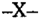

TOMO 316

Volumen 2

1993

DE JUSTICIA DE LA NACION

316

## FALLOS DE LA CORTE SUPREMA DE JUSTICIA DE LA NACION

1089

DE JUSTICIA DE LA NACION

316

1091

## R E P U B L I C A     A R G E N T I N A

## FALLOS

DE LA

CORTE  SUPREMA

DE

## JUSTICIA DE LA NACION

PUBLICACION A CARGO DE LA SECRETARIA DE JURISPRUDENCIA DEL TRIBUNAL

TOMO 316 - VOLUMEN 2

JUNIO - SEPTIEMBRE

LA LEY S.A.E. e I. Tucumán 1471 (1050) Buenos Aires 1993

## A C U E R D O S   D E   L A   C O R T E   S U P R E M A

## AÑO 1993

## JUNIO - SEPTIEMBRE

## CORTE SUPREMA. INSTRUCCION DE CAUSAS PENALES.

-N o  28-

En Buenos Aires, al 1  día del mes de junio del año mil novecientos noventa y tres, o reunidos en la Sala de Acuerdos del Tribunal, los señores Ministros que suscriben la presente,

## Consideraron:

Que resulta conveniente modificar lo establecido en la acordada 4/87 a fin de posibilitar la delegación de las facultades del presidente para instruir las causas penales, así como adecuar sus disposiciones al Código Procesal Penal e incorporarlas al Reglamento para la Justicia Nacional.

Por ello,

Acordaron:

Agregar, como artículo 84 bis del Reglamento para la Justicia Nacional, la siguiente disposición:

Causas penales de competencia originaria

84 bis.- Está a cargo de la instrucción del sumario en las causas penales de competencia originaria de la Corte Suprema, función que podrá delegar en algún otro de los ministros del tribunal.

El instructor podrá, a su vez, delegar en un secretario de jerarquía no inferior a la de juez de primera instancia, la realización de toda diligencia que estime conducente para el total esclarecimiento del hecho y la determinación de los responsables de la ejecución.

Todo lo cual dispusieron y mandaron, ordenando que se comunicase y registrase en el libro correspondiente, por ante mí, que doy fe. - ANTONIO BOGGIANO - CARLOS S. FAYT - AUGUSTO CÉSAR BELLUSCIO - ENRIQUE SANTIAGO PETRACCHI - MARIANO AUGUSTO CAVAGNA MARTÍNEZ - JULIO S. NAZARENO - RICARDO LEVENE (H) Claudio Marcelo Kiper (Secretario).

## ACUERDOS DE LA CORTE SUPREMA

## CORTE SUPREMA. PRORROGA DEL REGIMEN DE CONCURSOS.

-N o  29-

En Buenos Aires, a los 8 días del mes de junio del año mil novecientos noventa y tres, reunidos en la Sala de Acuerdos del Tribunal, los señores Ministros que suscriben la presente,

## Consideraron:

Que la acordada N  91/92 suspendió hasta el 3l de mayo de este año la vigencia de o la acordada 34/84 -y sus modificatorias- para cubrir cargos de secretario, prosecretario o equivalentes, en cualquiera de las tres instancias de los distintos fueros y jurisdicciones, ministerios públicos y defensorías oficiales.

## Acordaron:

Prorrogar hasta el 31 de mayo de 1994 la suspensión del régimen de concursos.

Todo lo cual dispusieron y mandaron, ordenando que se comunicase y registrase en el libro correspondiente, por ante mí, que doy fe. - ANTONIO BOGGIANO - RODOLFO C. BARRA - JULIO S. NAZARENO - RICARDO LEVENE (H) - EDUARDO MOLINÉ O'CONNOR Claudio Marcelo Kiper (Secretario).

## TRIBUNALES ORALES EN LO CRIMINAL FEDERAL DE CORDOBA.

-N o  30-

En Buenos Aires, a los 8 días del mes de junio del año mil novecientos noventa y tres, reunidos en la Sala de Acuerdos del Tribunal, los señores Ministros que suscriben la presente,

## Consideraron:

Que la ley 24.121 crea dos Tribunales Orales en lo Criminal Federal con asiento en Córdoba y el Poder Ejecutivo Nacional ha designado a los magistrados que se harán cargo de uno de ellos.

Que este Tribunal, mediante las resoluciones Nros. 1337/92; 875/93; 861/93 y 862/ 93, dispuso la creación de los cargos respectivos.

Que es propósito de esta Corte Suprema proveer lo necesario para asegurar la correcta prestación del servicio de justicia, por lo que la puesta en funcionamiento de un tribunal oral constituye una prioridad insoslayable.

Por ello,

## DE JUSTICIA DE LA NACION

Acordaron:

- 1) Disponer la habilitación de un Tribunal Oral Criminal Federal con asiento en la ciudad de Córdoba, a partir del día 11 del corriente mes y año.
- 2) Encomendar al señor Ministro de la Corte Suprema de Justicia de la Nación, Dr. Julio S. Nazareno para que se constituya en la ciudad de Córdoba y reciba el juramento de ley a los señores magistrados Dres. Jaime Domingo Jerónimo Díaz Gavier, José Vicente Muscara y Carlos Otero Alvarez designados por los decretos del Poder Ejecutivo Nacional Nros. 1050/93; 1060/93 y 1065/93 respectivamente, como así también a los funcionarios del ministerio público Dr. Alberto Gabriel Lozada y Carlos Armando Casas Noblega designados por las resoluciones del Ministerio de Justicia Nros. 526/92 y 535/92 respectivamente.

Todo lo cual dispusieron y mandaron, ordenando que se comunicase y registrase en el libro correspondiente, por ante mí, que doy fe. - ANTONIO BOGGIANO - RODOLFO C. BARRA - MARIANO AUGUSTO CAVAGNA MARTÍNEZ - JULIO S. NAZARENO - RICARDO LEVENE (H) - EDUARDO MOLINÉ O'CONNOR Claudio Marcelo Kiper (Secretario).

## CODIGO PROCESAL PENAL DE LA NACION.

-N o  31-

En Buenos Aires, a los 9 días del mes de junio del año mil novecientos noventa y tres, reunidos en la Sala de Acuerdos del Tribunal, los señores Ministros que suscriben la presente,

## Consideraron:

Que en el ámbito del Ministerio de Justicia de la Nación funciona una Comisión de Seguimiento de la Implementación del Juicio Oral, que tiene por objetivos 'programar, asesorar  y  realizar  el  seguimiento  de  todas  las  acciones  tendientes  a  la  plena implementación del Código Procesal Penal de la Nación' (art. 1 , Resolución N  357/92 o o del Ministerio de Justicia).

Que este Tribunal tiene especial interés en las actividades y conclusiones que surjan de dicha comisión, en razón de que están a su cargo las tareas vinculadas a la implementación.

Por ello,

Acordaron:

Asignar a los Dres. Mariano Augusto Cavagna Martínez y Ricardo Levene (h) la representación de esta Corte ante la comisión referida.

Todo lo cual dispusieron y mandaron, ordenando que se comunicase y registrase

1096

en el libro correspondiente, por ante mí, que doy fe. - ANTONIO BOGGIANO - RODOLFO C. BARRA - AUGUSTO CÉSAR BELLUSCIO - MARIANO AUGUSTO CAVAGNA MARTÍNEZ - JULIO S. NAZARENO - RICARDO LEVENE (H) - CARLOS S. FAYT - EDUARDO MOLINÉ O'CONNOR Claudio Marcelo Kiper (Secretario).

## COMISION ASESORA DE LA MAGISTRATURA.

-N o  32-

En Buenos Aires, a los 9 días del mes de junio del año mil novecientos noventa y tres, reunidos en la Sala de Acuerdos del Tribunal, los señores Ministros que suscriben la presente,

## Acordaron:

Modificar la Acordada 26/91 y designar, a partir del día de la fecha, a los Dres. Mariano Augusto Cavagna Martínez y Julio S. Nazareno, representantes de esta Corte Suprema para integrar la Comisión Asesora de la Magistratura.

Todo lo cual dispusieron y mandaron, ordenando que se comunicase y registrase en el libro correspondiente, por ante mí, que doy fe. - ANTONIO BOGGIANO - RODOLFO C. BARRA - AUGUSTO CÉSAR BELLUSCIO - MARIANO AUGUSTO CAVAGNA MARTÍNEZ - RICARDO LEVENE (H) - CARLOS S. FAYT - EDUARDO MOLINÉ O'CONNOR Claudio Marcelo Kiper (Secretario).

## TRIBUNAL ORAL EN LO CRIMINAL FEDERAL DE PARANA.

-N o  33-

En Buenos Aires, a los 16 días del mes de junio del año mil novecientos noventa y tres, reunidos en la Sala de Acuerdos del Tribunal, los señores Ministros que suscriben la presente,

## Consideraron:

Que la ley 24.121 crea un Tribunal Oral en lo Criminal Federal con asiento en Paraná y el Poder Ejecutivo Nacional ha designado a los magistrados que se harán cargo del mismo.

Que este Tribunal, mediante las resoluciones nros. 1342/92, 861 y 872/93 dispuso la creación de los cargos respectivos.

Que es propósito de esta Corte Suprema proveer lo necesario para asegurar la correcta prestación del servicio de justicia, por lo que la puesta en funcionamiento de un tribunal oral constituye una prioridad insoslayable.

Por ello,

## Acordaron:

- 1) Disponer la habilitación del Tribunal Oral Criminal Federal con asiento en la ciudad de Paraná, a partir del día 22 del corriente mes y año.
- 2) Encomendar a la Cámara Federal de Apelaciones de Paraná que reciba el juramento de ley a los señores magistrados Dres. Lilia Graciela Carnero, David Alejandro Chaulet y Guillermo Jorge Enderle, designados por los decretos del Poder Ejecutivo Nacional Nros. 1098/93, 1120/93 y 1124/93, respectivamente.

Todo lo cual dispusieron y mandaron, ordenando que se comunicase y registrase en el libro correspondiente, por ante mí, que doy fe. - RODOLFO C. BARRA - AUGUSTO CÉSAR BELLUSCIO - CARLOS S. FAYT - JULIO S. NAZARENO - EDUARDO MOLINÉ O'CONNOR - MARIANO AUGUSTO CAVAGNA MARTÍNEZ - RICARDO LEVENE (H) Claudio Marcelo Kiper (Secretario).

## TRIBUNAL ORAL EN LO CRIMINAL FEDERAL DE ROSARIO.

-N o  35-

En Buenos Aires, a los 17 días del mes de junio del año mil novecientos noventa y tres, reunidos en la Sala de Acuerdos del Tribunal, los señores Ministros que suscriben la presente,

## Consideraron:

Que la ley 24.121 crea dos Tribunales Orales en lo Criminal Federal con asiento en Rosario y el Poder Ejecutivo Nacional ha designado a los magistrados que se harán cargo de uno de ellos.

Que este Tribunal, mediante las resoluciones nros. 1336/92 y 194/93 dispuso la creación de los cargos respectivos.

Que es propósito de esta Corte Suprema proveer lo necesario para asegurar la correcta prestación del servicio de justicia, por lo que la puesta en funcionamiento de un tribunal oral constituye una prioridad insoslayable.

Por ello,

## Acordaron:

- 1) Disponer la habilitación del Tribunal Oral Criminal Federal con asiento en la ciudad de Rosario, a partir del día 18 del corriente mes y año.
- 2) Encomendar a la Cámara Federal de Apelaciones de Rosario que reciba el juramento de ley a los señores magistrados Dres. Laura Inés Cosidoy, Santiago Miguel

## DE JUSTICIA DE LA NACION

316

1098

Harte y Osvaldo Paulucci Oro, designados por los decretos del Poder Ejecutivo Nacional Nros. 1118/93, 1125/93 y 1129/93 y a los integrantes del Ministerio Público Dres. Eric Frank Warr y Beatríz Caballero de Barrabani, designados por resoluciones del Ministerio de Justicia de la Nación Nros. 383, 384 y 531/93 respectivamente.

Todo lo cual dispusieron y mandaron, ordenando que se comunicase y registrase en el libro correspondiente, por ante mí, que doy fe. - ANTONIO BOGGIANO - RODOLFO C. BARRA - MARIANO AUGUSTO CAVAGNA MARTÍNEZ - JULIO S. NAZARENO - AUGUSTO CÉSAR BELLUSCIO - EDUARDO MOLINÉ O'CONNOR Claudio Marcelo Kiper (Secretario).

## CORTE SUPREMA. CENTRALIZACION DE TAREAS ADMINISTRATIVAS.

-N o  36-

En Buenos Aires, a los 16 días del mes de junio del año mil novecientos noventa y tres, reunidos en la Sala de Acuerdos del Tribunal, los señores Ministros que suscriben la presente,

## Consideraron:

Que mediante acordada 6/93 dictada el 16 de febrero del año en curso, este Tribunal procedió a incorporar la Habilitación de la Dirección General de Mandamientos y Notificaciones a la Prosecretaría de la Corte.

Que tal medida fue dispuesta, frente a la necesidad de centralizar en forma paulatina, idénticas tareas administrativas y que en forma similar se desarrollan en diversas dependencias.

Que en efecto, en esta etapa y en atención a los fundamentos que fueron descriptos, es preciso transferir a la Prosecretaría del Tribunal, la atención de la liquidación de haberes de la totalidad de la Secretaría Letrada de Informática, del Archivo del Poder Judicial de la Nación, de la Fiscalía Nacional de Investigaciones Administrativas y de la Central de Comunicaciones del Poder Judicial de la Nación.

Que cabe advertir que en oportunidad del dictado de la acordada 6/93 fue necesario transferir funciones conjuntamente con su personal ejecutante, para que la planta de agentes así incrementada soportara la incorporación de futuras asignaciones.

Que por ello, la presente decisión habrá de importar el traslado de agentes afectados a las tareas de aquí se transfieren, lo que habrá de redundar en beneficio para las restantes gestiones que tramita la Subsecretaría de Administración.

Por ello,

Acordaron:

Transferir de la Subsecretaría de Administración la liquidación de haberes de la Secretaría Letrada de Informática, del Archivo del Poder Judicial de la Nación, de la

## DE JUSTICIA DE LA NACION

Fiscalía Nacional de Investigaciones Administrativas y de la Central de Comunicaciones del Poder Judicial de la Nación a la Prosecretaría del Tribunal.

Todo lo cual dispusieron y mandaron, ordenando que se comunicase y registrase en el libro correspondiente, por ante mí, que doy fe. - RODOLFO C. BARRA - AUGUSTO CÉSAR BELLUSCIO - ENRIQUE SANTIAGO PETRACCHI - MARIANO AUGUSTO CAVAGNA MARTÍNEZ - EDUARDO MOLINÉ O'CONNOR Javier Leal de Ibarra (Secretario).

## MEDIDAS DE FUERZA.

<!-- formula-not-decoded -->

En Buenos Aires, a los 24 días del mes de junio del año mil novecientos noventa y tres, reunidos en la Sala de Acuerdos del Tribunal, los señores Ministros que suscriben la presente,

## Consideraron:

Ante el anuncio de la realización de medidas de fuerza por parte de la Unión de Empleados de la Justicia Nacional, cuya efectivización provocará las graves perturbaciones que este tipo de actividades causan al servicio de justicia, es deber de esta Corte señalar que los motivos que se esgrimen para efectuar el movimiento de fuerza constituyen planteos cuya solución escapa a las posibilidades actuales del Tribunal conforme resulta del presupuesto votado por el Honorable Congreso de la Nación para el ejercicio en curso.

Por consiguiente, las medidas anticipadas por la organización gremial que las propone, sólo conducirán a la realización de un conflicto que en definitiva no aportará beneficio alguno para el personal, con las consecuencias que derivan de la aplicación de las normas en vigencia para quienes participen en ellas, sin que puedan arrojar resultado positivo alguno ante la imposibilidad material de apartarse del presupuesto actualmente vigente.

Por otra parte, no puede dejar de señalarse que esta Corte no es ni ha sido ajena a la situación del personal. En los años recientes no ha habido política de disminución del personal ni existen planes que contemplen esa posibilidad; y, no obstante la falta de partidas presupuestarias suficientes para encarar la implementación adecuada de los nuevos tribunales creados a raíz de la sanción del nuevo Código Procesal Penal, sensible al reclamo salarial del personal judicial, se otorgó un incremento general de pesos cien ($ 100) en octubre de 1992, que debió ser atendido con recursos propios. Ello obligó también a postergar algunos gastos calculados para el ejercicio venidero con el espíritu de privilegiar una justa y necesaria mejora de sus colaboradores (ver Acordada 57/92). Asimismo, en marzo del año pasado se dispuso un reescalafonamiento que produjo indudables mejoras económicas para gran parte del personal.

Además, se encuentra en trámite la ampliación del presupuesto correspondiente al ejercicio corriente con la inclusión específica de las partidas necesarias para atender, entre otras necesidades, mejoras salariales para el personal judicial.

Muchos años de inflación han hecho perder conciencia de una realidad que hoy se presenta como una novedad, pero que hace a la esencia de la actividad del Estado: la imperiosa necesidad de ajustarse al presupuesto que ahora, con una moneda estable, obliga a su estricto respeto como nunca ha sucedido en los años inmediatamente pasados.

Por lo expuesto, el Tribunal juzga innecesaria y estéril la huelga que se anticipa.

Por ello,

Acordaron:

Hacer saber el contenido de la presente a los otros Poderes del Estado Nacional, a las cámaras nacionales y federales, y llamar a la reflexión al personal judicial que con su esfuerzo y dedicación -que esta Corte reconoce en toda su dimensión- hace posible la administración de justicia.

Todo lo cual dispusieron y mandaron, ordenando que se comunicase y registrase en el libro correspondiente, por ante mí, que doy fe. - RODOLFO C. BARRA - EDUARDO MOLINÉ O'CONNOR - CARLOS S. FAYT - MARIANO AUGUSTO CAVAGNA MARTÍNEZ - RICARDO LEVENE (H) Claudio Marcelo Kiper (Secretario).

## CAMARA NACIONAL ELECTORAL.

-N o  39-

En Buenos Aires, a los 2 días del mes de julio del año mil novecientos noventa y tres, reunidos en la Sala de Acuerdos del Tribunal, los señores Ministros que suscriben la presente,

## Consideraron:

Que a raíz de las tareas preelectorales que se llevan a cabo con motivo del próximo acto eleccionario convocado por el Poder Ejecutivo Nacional, la Cámara Nacional Electoral dictó la acordada 41/93, en virtud de la cual dispuso suspender el goce de la feria del próximo mes de de julio de 1993 y de las licencias compensatorias del personal técnico administrativo, transitorio contratado y de servicio de ese tribunal y de las secretarías electorales de distrito; y la restricción de la concesión de licencias extraordinarias por motivos particulares y los plazos de las licencias por exámenes.

Que, examinados los argumentos que fundaron la decisión y de conformidad con lo normado por el art. 2 del Reglamento para la Justicia Nacional,

Acordaron:

Aprobar la acordada 41/93 dictada el 22 de junio último por la Cámara Nacional Electoral.

Todo lo cual dispusieron y mandaron, ordenando que se comunicase y registrase en el libro correspondiente, por ante mí, que doy fe. -ANTONIO BOGGIANO - RODOLFO C. BARRA - AUGUSTO CÉSAR BELLUSCIO - ENRIQUE SANTIAGO PETRACCHI - MARIANO AUGUSTO CAVAGNA MARTÍNEZ - JULIO S. NAZARENO - RICARDO LEVENE (H) - EDUARDO MOLINÉ O'CONNOR Claudio Marcelo Kiper (Secretario).

## EMPLEADOS JUDICIALES. EX COMBATIENTES DE MALVINAS.

-N o  40-

En Buenos Aires, a los 2 días del mes de julio del año mil novecientos noventa y tres, reunidos en la Sala de Acuerdos del Tribunal, los señores Ministros que suscriben la presente,

## Consideraron:

- 1 o ) Que las disposiciones de la ley 23.109 (B.O. 1/11/84) -de aplicación al ámbito de la Administración Pública Nacional-, han conferido una serie de beneficios a los ex soldados conscriptos que participaron en las acciones bélicas desarrolladas en el Atlántico Sur entre el 2 de abril y el 14 de junio de 1982.
- 2 o ) Que esta Corte considera justo adoptar medidas concordantes que favorezcan la situación de aquellos funcionarios y empleados que reúnen las condiciones enunciadas por el texto legal citado, y faciliten el ingreso de quienes deseen desempeñarse en el Poder Judicial de la Nación.

Por ello,

## Acordaron:

- 1 o ) Disponer que la Secretaría de Superintendencia Judicial de la Corte Suprema, y las de superintendencia de las cámaras nacionales y federales de apelaciones, abran un registro de los aspirantes que reúnan -además de los requisitos exigidos para el nombramiento de empleados-, la condición de haber participado en las acciones bélicas desarrolladas en el Atlántico Sur entre el 2 de abril y el 14 de junio de 1982, mediante certificación expedida por la autoridad militar competente, con el objeto de contemplar su designación.
- 2 o ) Hacer saber al señor Director General de la Obra Social del Poder Judicial de la Nación que los funcionarios y empleados que se hallen en las condiciones enunciadas en el considerando segundo quedarán exentos del pago de las sumas o porcentajes de cualquier prestación asistencial que corra por cuenta de los afiliados; a tal efecto, queda autorizado para dictar las disposiciones necesarias para concretar el beneficio (conf. art. 17, inc. g del Estatuto de la Obra Social, aprobado por acordada de Fallos: 303:56).
- 3 o )  Crear  un  suplemento mensual especial denominado 'Ex combatiente por la recuperación de las Islas Malvinas', equivalente al 10% sobre el total remunerativo de los funcionarios y empleados que acrediten los recaudos indicados precedentemente.

- 4 o ) Autorizar a la Subsecretaría de Administración a imputar el gasto resultante de lo dispuesto a la cuenta pertinente para el corriente ejercicio financiero.

Todo lo cual dispusieron y mandaron, ordenando que se comunicase y registrase en el libro correspondiente, por ante mí, que doy fe. - ANTONIO BOGGIANO - RODOLFO C. BARRA - CARLOS S. FAYT - MARIANO AUGUSTO CAVAGNA MARTÍNEZ - JULIO S. NAZARENO - RICARDO LEVENE (H) - EDUARDO MOLINÉ O'CONNOR Claudio Marcelo Kiper (Secretario).

## FERIA JUDICIAL DE JULIO. DESIGNACION DE AUTORIDADES.

-N o  41-

En Buenos Aires, a los 5 días del mes de julio del año mil novecientos noventa y tres, reunidos en la Sala de Acuerdos del Tribunal, los señores Ministros que suscriben la presente, y teniendo en cuenta la comunicación formulada por la Procuración General de la Nación,

Resolvieron:

- I) Designar como autoridades de feria del mes de julio del corriente año:
- 1 o ) Al doctor Augusto César Belluscio como juez de feria.
- 2 o )  A  la  doctora  Cristina  Alvarez  de  Magliano  -1a.  semana- y al doctor Jorge Migliore -2da. semana- como secretarios del Tribunal.
- II) Tener por designado, en la Procuración General de la Nación al doctor Oscar Luján Fappiano; y en la Defensoría ante la Corte Suprema de Justicia de la Nación y demás tribunales federales de la Capital a los doctores -en materia criminal y correccional- a la doctora Catalina E. M. Heilbron -1a. semana-, y a la doctora Silvia E. Martínez -2da. semana-; -en materia civil y comercial- a la doctora Graciela Saldivia -1a. y 2da. semana- y en los casos en que se requiera la intervención del defensor en representación de menores en lo civil y comercial a la Asesora doctora María Inés Coutinho.

III) Establecer el horario de atención al público de lunes a viernes, desde las 9 hasta las 13 horas.

IV) El personal que preste funciones durante la feria judicial deberá acreditarlo mediante certificación otorgada por los señores secretarios de feria.

Todo lo cual dispusieron y mandaron, ordenando que se comunicase y registrase en el libro correspondiente, por ante mí, que doy fe. - RODOLFO C. BARRA - AUGUSTO CÉSAR BELLUSCIO - ENRIQUE SANTIAGO PETRACCHI - EDUARDO MOLINÉ O'CONNOR - JULIO S. NAZARENO - MARIANO AUGUSTO CAVAGNA MARTÍNEZ - RICARDO LEVENE (H) Claudio Marcelo Kiper (Secretario).

## DE JUSTICIA DE LA NACION

## FALLECIMIENTO DEL INTENDENTE DEL PALACIO DE JUSTICIA.

-N o  43-

En Buenos Aires, a los 29 días del mes de julio del año mil novecientos noventa y tres, reunidos en la Sala de Acuerdos del Tribunal, los señores Ministros que suscriben la presente,

## Consideraron:

Que el día 25 del corriente mes ocurrió el sensible fallecimiento del señor Angel José Daneri, Intendente del Palacio de Justicia.

Que es deber del Tribunal asociarse al duelo que provoca la desaparición del distinguido funcionario.

Por ello,

Acordaron:

Dirigir nota de condolencia a la familia del extinto con transcripción de la presente acordada.

Todo lo cual dispusieron y mandaron, ordenando que se comunicase y registrase en el libro correspondiente, por ante mí, que doy fe. - ANTONIO BOGGIANO - RODOLFO C. BARRA - CARLOS S. FAYT - ENRIQUE SANTIAGO PETRACCHI - MARIANO AUGUSTO CAVAGNA MARTÍNEZ - JULIO S. NAZARENO Claudio Marcelo Kiper (Secretario).

## CAMARA NACIONAL DE APELACIONES DE LA SEGURIDAD SOCIAL

-N o  45-

En Buenos Aires, a los 6 días del mes de agosto del año mil novecientos noventa y tres, reunidos en la Sala de Acuerdos del Tribunal, los señores Ministros que suscriben la presente,

## Consideraron:

- 1 o )  Que por acuerdo n  89 de fecha 28 de abril de 1993, la Cámara Nacional de o Apelaciones de la Seguridad Social modificó el art. 3  inciso b del Reglamento para la o Promoción de los empleados del fuero, incluyendo el requisito del título habilitante para la designación de relatores.
- 2 o ) Que dicha medida resulta excesiva, pues el Reglamento para la Justicia Nacional no impone el recaudo enunciado para el desempeño del cargo citado.

Por ello,

## Acordaron:

Dejar sin efecto la modificación del art. 3  inc. b del Reglamento para la Promoción o de los Empleados de la Cámara Nacional de Apelaciones de la Seguridad Social.

Todo lo cual dispusieron y mandaron, ordenando que se comunicase y registrase en el libro correspondiente, por ante mí, que doy fe. - RODOLFO C. BARRA - AUGUSTO CÉSAR BELLUSCIO - ENRIQUE SANTIAGO PETRACCHI - EDUARDO MOLINÉ O'CONNOR - JULIO S. NAZARENO - MARIANO AUGUSTO CAVAGNA MARTÍNEZ Claudio Marcelo Kiper (Secretario).

## FISCALIAS DE INSTRUCCION.

-N o  47-

En Buenos Aires, a los 19 días del mes de agosto del año mil novecientos noventa y tres, reunidos en la Sala de Acuerdos del Tribunal, los señores Ministros que suscriben la presente,

## Consideraron:

Que el art. 28 de la ley 24.121 crea veintitrés fiscalías que actuarán ante los juzgados nacionales en lo criminal de instrucción que se identificarán con los números 27 al 49.

Que dichas fiscalías de instrucción se deben integrar con las secretarías de los juzgados nacionales de primera instancia en lo criminal de sentencia y con nueve secretarías de los juzgados nacionales en lo criminal de instrucción que cuenten con dos de ellas (arts. 33, 27 y 29 de la ley citada).

Que es obligación de este Tribunal dictar las medidas tendientes a la implementación de los nuevos organismos.

Por ello:

## Acordaron:

- 1) Habilitar a partir del 1  de octubre del corriente año, nueve Fiscalías Nacionao les que actuarán ante los Juzgados Nacionales en lo Criminal de Instrucción. Dichas fiscalías serán numeradas del 27 al 35.
- 2) Trasladar las secretarías Nros. 138, 141, 144, 151, 154, 157, 160, 163 y 127 a las fiscalías nacionales creadas en el punto precedente, respectivamente.
- 3) Habilitar también cuatro fiscalías más, numeradas del 36 al 39, que compartiran, cada una de ellas, la Secretaría correspondiente a las primeras cuatro habilitadas en el punto 1 ). o

- 4)  Las  causas en trámite ante las secretarías trasladadas precedentemente, se distribuirán en forma equitativa entre los juzgados nacionales en lo criminal de instrucción. Delégase en la Cámara Criminal y Correccional de la Capital Federal la distribución de dichas causas, la que deberá tener especialmente en cuenta su cantidad y complejidad.
- 5) Delegar en la Cámara Nacional de Apelaciones en lo Criminal y Correccional la instrumentación de lo dispuesto en la presente acordada.
- 6)  Encomendar a dicha Cámara la toma de juramento de los trece fiscales que indique el Sr. Ministro de Justicia.

Todo lo cual dispusieron y mandaron, ordenando que se comunicase y registrase en el libro correspondiente, por ante mí, que doy fe. - ANTONIO BOGGIANO - RODOLFO C. BARRA - MARIANO AUGUSTO CAVAGNA MARTÍNEZ - JULIO S. NAZARENO - RICARDO LEVENE (H) - EDUARDO MOLINÉ O'CONNOR Claudio Marcelo Kiper (Secretario).

## OFICINA DE ESTADISTICAS DE LA CORTE SUPREMA.

-N o  48-

En Buenos Aires, a los 19 días del mes de agosto del año mil novecientos noventa y tres, reunidos en la Sala de Acuerdos del Tribunal, los señores Ministros que suscriben la presente,

## Consideraron:

Que por razones de índole económico y práctico y teniendo en cuenta los argumentos expuestos por la Oficina de Estadísticas del Tribunal, resulta necesario modificar el art. 34  del Reglamento para la Justicia Nacional, en lo atinente a la cantidad de copias o en que se elevará el informe estadístico en febrero de cada año.

Por ello,

Acordaron:

Modificar el inciso 1 ) del art. 34 del Reglamento para la Justicia Nacional el cual o quedará redactado de la siguiente forma:

- '1.- En febrero de cada año las Cámaras de Apelaciones y los Jueces de primera instancia, por intermedio de aquéllas, remitirán a la Oficina de Estadística de la Corte Suprema, la estadística correspondiente al período anterior en un solo ejemplar con sello y firma del respectivo titular.

Las estadísticas de los juzgados se confeccionarán por duplicado, a fin de que uno de los ejemplares se destine a la Cámara respectiva...'.

Todo lo cual dispusieron y mandaron, ordenando que se comunicase y registrase en el libro correspondiente, por ante mí, que doy fe. - RODOLFO C. BARRA - CARLOS S. FAYT - AUGUSTO CÉSAR BELLUSCIO - JULIO S. NAZARENO - MARIANO AUGUSTO CAVAGNA MARTÍNEZ Claudio Marcelo Kiper (Secretario).

## TRIBUNAL ORAL CRIMINAL FEDERAL DE GENERAL ROCA.

-N o  49-

En Buenos Aires, a los 24 días del mes de agosto del año mil novecientos noventa y tres, reunidos en la Sala de Acuerdos del Tribunal, los señores Ministros que suscriben la presente,

## Consideraron:

Que la ley 24.121 crea un Tribunal Oral en lo Criminal Federal con asiento en General Roca y el Poder Ejecutivo Nacional ha designado a los magistrados que se harán cargo del mismo.

Que este Tribunal, mediante las resoluciones nros. 1338/92, 861 y 872/93 dispuso la creación de los cargos respectivos.

Que es propósito de esta Corte Suprema proveer lo necesario para asegurar la correcta prestación del servicio de justicia, por lo que la puesta en funcionamiento de un tribunal oral constituye una prioridad insoslayable.

Por ello,

## Acordaron:

- 1) Disponer la habilitación del Tribunal Oral Criminal Federal con asiento en la ciudad de General Roca, a partir del día 20 del mes de septiembre del corriente año.
- 2) Encomendar a la Cámara Federal de Apelaciones de General Roca que reciba el juramento de ley a los señores magistrados Dres. Ernesto Rubén Iglesias Hunt, Oscar Edmundo Nicolás Albrieu y Jorge Luis García Osella, designados por los decretos del Poder Ejecutivo Nacional Nros. 1116/93, 1122/93 y 1130/93, respectivamente.

Todo lo cual dispusieron y mandaron, ordenando que se comunicase y registrase en el libro correspondiente, por ante mí, que doy fe.- ANTONIO BOGGIANO - RODOLFO C. BARRA - AUGUSTO CÉSAR BELLUSCIO - JULIO S. NAZARENO - EDUARDO MOLINÉ O'CONNOR - RICARDO LEVENE (H) Claudio Marcelo Kiper (Secretario).

## DE JUSTICIA DE LA NACION

316

## CAMARA NACIONAL DE APELACIONES EN LO CONTENCIOSO ADMINISTRATIVO FEDERAL.

-N o  51-

En Buenos Aires, a los 27 días del mes de agosto del año mil novecientos noventa y tres, reunidos en la Sala de Acuerdos del Tribunal, los señores Ministros que suscriben la presente,

## Consideraron:

1) Que la puesta en funcionamiento e integración de los seis nuevos juzgados creados por la ley 23.803, sin estar acompañada por la constitución simultánea de una nueva Sala en la Cámara Nacional de Apelaciones en lo Contencioso Administrativo Federal -conforme había sido previsto en un proyecto de ley que tuvo estado parlamentario-,  provocó un sensible incremento en el número de causas en trámite ante las salas de dicha Cámara.

- 2) Que esa situación se ve agravada por la cantidad de expedientes sometidos al recurso  directo  (ante  los  mismos  tribunales)  que  prevén  -entre  otras-  las  leyes tributarias para el tratamiento de las controversias ante la Administración Nacional de Aduanas y la Dirección Nacional de Aduanas y la Dirección General Impositiva.
- 3) Que conforme a las estadísticas elaboradas por las Salas al 31 de diciembre de 1992, el número de causas en trámite ante esa Cámara era el siguiente: Sala I 402 causas, Sala II 353 causas, Sala III 171 causas y Sala IV 407 causas; y de la información que puede extraerse del sistema de Mesa de Entradas que depende de esta Corte Suprema de Justicia de la Nación, las causas entradas a la Cámara durante el año 1993 (computadas hasta el 4 de mayo del corriente) suman 1.275, número que resulta muy superior al que fundó la creación de las Salas III y IV.
- 4) Que es objetivo de esta Corte Suprema ofrecer a la sociedad una efectiva administración de justicia.

Por ello,

Acordaron:

Comunicar al Poder Ejecutivo Nacional, a través del Ministerio de Justicia de la Nación, el interés de este Tribunal de que se arbitren los mecanismos legislativos correspondientes para la creación de una Sala más en la Cámara Nacional de Apelaciones en lo Contencioso Administrativo Federal de la Capital Federal.

Todo lo cual dispusieron y mandaron, ordenando que se comunicase y registrase en el libro correspondiente, por ante mí, que doy fe. - ANTONIO BOGGIANO - RODOLFO C. BARRA - AUGUSTO CÉSAR BELLUSCIO - ENRIQUE SANTIAGO PETRACCHI - JULIO S. NAZARENO - EDUARDO MOLINÉ O'CONNOR - RICARDO LEVENE (H) Claudio Marcelo Kiper (Secretario).

## ACUERDOS DE LA CORTE SUPREMA

## REGLAMENTO PARA LA JUSTICIA NACIONAL. EMPLEADOS JUDICIALES.

-N o  57-

En Buenos Aires, a los 14 días del mes de septiembre del año mil novecientos noventa y tres, reunidos en la Sala de Acuerdos del Tribunal, los señores Ministros que suscriben la presente,

Consideraron:

Que resulta conveniente organizar un sistema que asegure el ingreso al Poder Judicial de los agentes más idóneos y capaces.

Por ello,

Acordaron:

Agregar al art. 11 del Reglamento para la Justicia Nacional, como quinto párrafo, el siguiente:

'Además de los requisitos mencionados, los aspirantes a ingresar como personal administrativo en todas aquellas dependencias en las que se realicen tareas de índole jurisdiccional, deberán aprobar en los seis meses siguientes a su designación el curso de capacitación que deberá ser organizado al efecto en cada fuero con la coordinación de la Escuela de Capacitación Judicial de la Asociación de Magistrados de la Justicia Nacional.

Tales cursos deberán ser organizados en el plazo de seis meses del dictado de la presente, fecha a partir de la cual será de aplicación.

A partir de ese momento sólo se designarán empleados con carácter provisorio o interino, y sus designaciones caducarán transcurridos seis meses del nombramiento, si no hubiesen aprobado el examen correspondiente, sin causa justificada. Para el cómputo de este plazo no se tomarán en cuenta las ferias judiciales. Quien resulte reprobado en la prueba pertinente, no podrá ser designado nuevamente hasta que transcurran seis meses desde el momento en el que aquella se efectuó.

Las cámaras nacionales y federales deberán poner en conocimiento de esta Corte, a través de su Secretaría de Superintendencia, los detalles y modalidades de los cursos que organicen en virtud de lo aquí dispuesto'.

Todo lo cual dispusieron y mandaron, ordenando que se comunicase y registrase en el libro correspondiente, por ante mí, que doy fe. - RODOLFO C. BARRA - CARLOS S. FAYT - AUGUSTO CÉSAR BELLUSCIO - ENRIQUE SANTIAGO PETRACCHI - JULIO S. NAZARENO - MARIANO AUGUSTO CAVAGNA MARTÍNEZ - RICARDO LEVENE (H) Claudio Marcelo Kiper (Secretario).

## DE JUSTICIA DE LA NACION

## PREMIO KONEX, OTORGADO AL DR. ARMANDO MACCAGNO.

-N o  59-

En Buenos Aires, a los 16 días del mes de septiembre del año mil novecientos noventa y tres, reunidos en la Sala de Acuerdos del Tribunal, los señores Ministros que suscriben la presente,

## Consideraron:

Que la Fundación Konex ha otorgado premio a las cien mejores figuras de la última década de la ciencia y la tecnología argentinas.

Que en el rubro 'Salud Pública' se ha hecho acreedor de la referida distinción el Dr. Armando Maccagno, quien ejerce la titularidad del decanato del Cuerpo Médico Forense de la Justicia Nacional.

Que la jerarquía del premio concedido, enmarca la destacada trayectoria científica del Sr. Decano, la que sumada a su solidez ética y moral ha llevado a este Tribunal a encomendarle oportunamente los destinos de un organismo de excelencia, cual es el del Cuerpo Médico Forense.

Que el premio recibido no debe pasar inadvertido para quienes, desde la asignación de otras misiones, integran la Justicia Nacional.

Que en efecto, este Tribunal se complace en contar entre sus colaboradores directos al distinguido funcionario.

Por ello,

Acordaron:

Hacer saber al señor Decano del Cuerpo Médico Forense -mediante nota de estilo- el contenido integro de la presente.

Todo lo cual dispusieron y mandaron, ordenando que se comunicase y registrase en el libro correspondiente, por ante mí, que doy fe. - ANTONIO BOGGIANO - RODOLFO C. BARRA - AUGUSTO CÉSAR BELLUSCIO - ENRIQUE SANTIAGO PETRACCHI - MARIANO AUGUSTO CAVAGNA MARTÍNEZ - JULIO S. NAZARENO Javier M. Leal de Ibarra (Secretario).

## INSCRIPCION DE PERITOS.

En Buenos Aires, a los 23 días del mes de septiembre del año mil novecientos noventa y tres, reunidos en la Sala de Acuerdos del Tribunal, los señores Ministros que suscriben la presente,

Consideraron:

Que corresponde fijar las fechas para el cumplimiento de los trámites previstos en la Acordada N  25 de 11985 para la inscripción y reinscripción de peritos en las especiao lidades determinadas en dicha acordada, ampliadas en las Nros. 45/85, 59/86, 24/87, 37/88, 41/89, 52/90, 41/91 y 68/92.

Por ello,

## Acordaron:

- 1 o ) Fíjase el plazo del 1  al 30 de noviembre de 1993 inclusive, para que los profeo sionales de las especialidades cuyo registro se lleva en esta Corte procedan a su inscripción o reinscripción para el año 1994.
- 2 o ) La lista a que se refiere el punto 5  de la Acordada N  25/85 se exhibirá por o o cinco días a partir del 10 de diciembre de 1993.
- 3 o ) Los trámites referidos en los puntos anteriores se efectuarán en la Dirección General Pericial de esta Corte, sita en Sarmiento 877, 12  piso, Capital Federal, durano te el plazo fijado y exclusivamente en el horario de 9 a 13 hs.
- 4 o ) Dése la publicidad pertinente por intermedio de la Dirección de Prensa.

Todo lo cual dispusieron y mandaron, ordenando que se comunicase y registrase en el libro correspondiente, por ante mí, que doy fe. - ANTONIO BOGGIANO - RODOLFO C. BARRA - CARLOS S. FAYT - ENRIQUE SANTIAGO PETRACCHI - MARIANO AUGUSTO CAVAGNA MARTÍNEZ - JULIO S. NAZARENO - RICARDO LEVENE (H) - EDUARDO MOLINÉ O'CONNOR Javier Leal de Ibarra (Secretario).

## NOMINA DE ESPECIALIDADES

(Acordadas nros. 25/85, 45/85, 59/86, 37/88, 41/89, 52/90, 41/91 y 68/92).

AGRIMENSORES

ARQUITECTOS

DRES. EN CIENCIAS ECONOMICAS

DRES. EN QUIMICA

ENOLOGOS FRUTICULTORES

ESPECIALISTAS EN IMAGENES SATELITALES

ESPECIALISTAS EN ESTADISTICAS

FOTOINTERPRETES

GEOLOGOS

HIDROGEOLOGOS

INGENIEROS CIVILES

INGENIEROS ELECTRONICOS

ING. c/ESPECIALIDAD EN HIDRAULICA

ING. INDUSTRIALES

ING. MECANICOS

ING. EN PETROLEO

ING. GEODESTAS GEOFISICOS

## DE JUSTICIA DE LA NACION 316

ING. QUIMICOS ING. EN TELECOMUNICACIONES ING. AGRONOMO LICENCIADO EN ECONOMIA METEOROLOGOS PERITOS DE ARTE VETERINARIOS

Fdo.: Javier Leal de Ibarra (Secretario)

## TRIBUNAL ORAL DE MAR DEL PLATA.

-N o  62-

En Buenos Aires, a los 23 días del mes de septiembre del año mil novecientos noventa y tres, reunidos en la Sala de Acuerdos del Tribunal, los señores Ministros que suscriben la presente,

## Consideraron:

- 1) Que el art. 51 de la ley 24.050 modificó el artículo 31 del decreto-ley 1285/58 respecto a subrogancia de las cámaras federales del interior del país, mas omitió hacerlo con respecto a los tribunales orales federales con asiento en el interior.
- 2) Que de acuerdo a lo dispuesto por los arts. 53 de la ley 24.050 y 91 de la ley 24.121, corresponde a esta Corte Suprema el dictado de las normas complementarias tendientes a la organización, integración y funcionamiento de los tribunales y organismos en ellas comprendidos.
- 3) Que en virtud de ello, el Tribunal considera necesario adoptar las medidas indispensables para posibilitar el funcionamiento del sistema.

Por ello,

Acordaron:

Hacer saber a la Cámara Federal de Apelaciones de La Plata y al Tribunal Oral en lo Criminal Federal de La Plata que en caso de vacancia, impedimento o ausencia de los miembros del Tribunal Oral de la jurisdicción, éste deberá ser integrado por sorteo entre los miembros de dicha Cámara.

Todo lo cual dispusieron y mandaron, ordenando que se comunicase y registrase en el libro correspondiente, por ante mí, que doy fe. - RODOLFO C. BARRA - CARLOS S. FAYT - ENRIQUE SANTIAGO PETRACCHI - MARIANO AUGUSTO CAVAGNA MARTÍNEZ - JULIO S. NAZARENO - EDUARDO MOLINÉ O'CONNOR Hugo L. Piacentino (Secretario).

## ACUERDOS DE LA CORTE SUPREMA

## TRIBUNAL ORAL EN LO CRIMINAL DE MENDOZA.

## -N o  63-

En Buenos Aires, a los 27 días del mes de septiembre del año mil novecientos noventa y tres, reunidos en la Sala de Acuerdos del Tribunal, los señores Ministros que suscriben la presente,

## Consideraron:

Que la ley 24.137 crea un Tribunal Oral en lo Criminal Federal y tres vocalías para integrar una nueva Sala en la Cámara Federal con asiento en la Provincia de Mendoza y el Poder Ejecutivo Nacional ha designado a los magistrados que se harán cargo de los mismos.

Que este Tribunal, mediante las resoluciones nros. 1604/93 y 1605/93, dispuso la creación de los cargos respectivos.

Que es propósito de esta Corte Suprema proveer lo necesario para asegurar la correcta prestación del servicio de justicia, por lo que la puesta en funcionamiento de un tribunal oral constituye una prioridad insoslayable.

Por ello,

## Acordaron:

- 1) Disponer la habilitación del Tribunal Oral en lo Criminal Federal N  2 y la Sala o de la Cámara Federal con asiento en la ciudad de Mendoza a partir del día 29 del mes de septiembre del corriente año.
- 2)  Encomendar a la Cámara Federal de Apelaciones de Mendoza que reciba el juramento de ley a los señores magistrados Dres. Enrique Alfredo Sosa Arditti, Jorge Roberto Burad, Roberto Julio Naciff, Otilio Ireneo Roque Romano Ruiz, Julio Demetrio Petra Fernández y Alfredo Juan Guillermo López Cuitiño, designados por los decretos del Poder Ejecutivo Nacional Nros. 625/93, 724/93, 1061/93, 626/93, 1063 y 1066, respectivamente, como así también a los funcionarios del ministerio público Dres. Raúl Washington Abalos y Héctor Fabián Cortés designados por las resoluciones del Ministerio de Justicia Nros. 589/93 y 591/92, para actuar ante el Tribunal Oral en lo Criminal Federal N  2. o

Todo lo cual dispusieron y mandaron, ordenando que se comunicase y registrase en el libro correspondiente, por ante mí, que doy fe. - ANTONIO BOGGIANO - RODOLFO C. BARRA - ENRIQUE SANTIAGO PETRACCHI - RICARDO LEVENE (H) - JULIO S. NAZARENO EDUARDO MOLINÉ O'CONNOR - MARIANO AUGUSTO CAVAGNA MARTÍNEZ Rubén Héctor Gorría (Secretario).

## DE JUSTICIA DE LA NACION 316

## CORTE SUPREMA. VISITAS A LOS TRIBUNALES FEDERALES.

## -N o  64-

En Buenos Aires, a los 28 días del mes de septiembre del año mil novecientos noventa y tres, reunidos en la Sala de Acuerdos del Tribunal, los señores Ministros que suscriben la presente,

## Consideraron:

Que el Tribunal estima conveniente prorrogar por un año más la distribución en zonas entre sus integrantes, dispuesta por acordada 48/90,

Por ello,

## Acordaron:

Prorrogar hasta el mes de agosto de 1994 la vigencia de la acordada 48/90, modificada por la acordada 25/91 y prorrogada por la acordada 36/92.

Todo lo cual dispusieron y mandaron, ordenando que se comunicase y registrase en el libro correspondiente, por ante mí, que doy fe. - ANTONIO BOGGIANO - RODOLFO C. BARRA - AUGUSTO CÉSAR BELLUSCIO - ENRIQUE SANTIAGO PETRACCHI - MARIANO AUGUSTO CAVAGNA MARTÍNEZ - EDUARDO MOLINÉ O'CONNOR - RICARDO LEVENE (H) Rubén Héctor Gorría (Secretario).

## CUERPO DE PERITOS CONTADORES.

-N o  65-

En Buenos Aires, a los 28 días del mes de septiembre del año mil novecientos noventa y tres, reunidos en la Sala de Acuerdos del Tribunal, los señores Ministros que suscriben la presente,

## Consideraron:

Que -mediante acordada N  10/91- el Tribunal retomó la superintendencia de los o cuerpos técnicos periciales, dependientes hasta ese momento de la Cámara Nacional de Apelaciones en lo Criminal y Correccional de la Capital Federal, sin disponer idéntico temperamento respecto de sus similares dependientes de la Cámara Nacional de Apelaciones en lo Penal Económico, como así tampoco respecto de los cargos técnicos existentes en la Cámara Nacional de Apelaciones en lo Criminal y Correccional Federal (formado por doce prosecretarios administrativos).

Que en efecto, en la actualidad dos peritos contadores cumplen funciones por ante el fuero en lo Penal Económico en cargos creados por ley 22.088 cuya exposición de motivos expresa:

- '...La ampliación de la dotación de funcionarios y empleados en la justicia en lo Penal Económico, también tiende a dar a ese fuero el debido apoyo técnico mediante la incorporación de peritos contadores y jefes de despacho, que cumplirán idénticas funciones  a  las  previstas  para  la  Cámara  Nacional  de  Apelaciones  en  lo  Criminal  y Correccional...'; éstos últimos, como se ha señalado, quedaron sometidos a la superintendencia de esta Corte.

Que a los citados expertos se suman doce prosecretarios administrativos que colaboran en la investigación de causas de tipo económico en trámite por ante el fuero en lo criminal y correccional federal -cargos creados por resoluciones del Tribunal N  1110/ o 89 y 306/90 -Superintendencia-, para desempeñar en los cuerpos técnicos periciales dependientes de la mencionada jurisdicción.

Que no todos los fueros cuentan con expertos en las materias de sus competencias, lo que en definitiva mantiene una situación de desigualdad entre distintas jurisdicciones que requiere ser subsanada.

Que las circunstancias señaladas imponen disponer la centralización de los mencionados cargos técnicos, medida que habrá de redundar en un marcado beneficio en orden a una más racional y equitativa distribución de tareas como consecuencia de la ampliación de la dotación del cuerpo técnico oficial.

Por ello,

Acordaron:

- 1 o ) Transferir de la Cámara Nacional de Apelaciones en lo Penal Económico los dos cargos de peritos contadores, con sus actuales titulares, a la Dirección General Pericial -Cuerpo de Peritos Contadores Oficiales-.
- 2 o ) Transferir de la Cámara Nacional de Apelaciones en lo Criminal y Correccional Federal los doce cargos de prosecretarios administrativos, con sus actuales titulares, a la Dirección General Pericial -Cuerpo de Peritos Contadores-, con carácter de auxiliares técnicos contables.
- 3 o )  Disponer que las cámaras citadas en el punto precedente deberán remitir a esta Corte los legajos personales correspondientes y demás antecedentes.

Todo lo cual dispusieron y mandaron, ordenando que se comunicase y registrase en el libro correspondiente, por ante mí, que doy fe. - CARLOS S. FAYT - AUGUSTO CÉSAR BELLUSCIO - ENRIQUE SANTIAGO PETRACCHI - JULIO S. NAZARENO - EDUARDO MOLINÉ O'CONNOR Javier Leal de Ibarra (Secretario).

DE JUSTICIA DE LA NACION

316

## FALLOS DE LA CORTE SUPREMA

## JUNIO

## MULTICAMBIO S.A.

RECURSO EXTRAORDINARIO: Requisitos propios. Cuestión federal. Cuestiones federales simples. Interpretación de las leyes federales. Leyes federales en general.

Procede el recurso extraordinario cuando se controvierte la interpretación de una norma federal -ley 18.526, art. 6 , inc. b)- y lo decidido por el superior o tribunal de la causa ha sido adverso al derecho que la apelante funda en ella.

## ARBITRAJE CAMBIARIO.

Se estará en presencia de un arbitraje, cuando ninguno de los puntos de la transacción cambiaria esté expresado en moneda argentina.

## IMPUESTO A LA COMPRA Y VENTA DE DIVISAS.

No pueden ser excluidas de la exención prevista en el art. 6 , inc. b), de la ley o 18.526 las transacciones efectuadas exclusivamente en moneda extranjera, por la circunstancia de que uno de sus extremos esté representado por billetes de ese carácter, toda vez que tal operación constituye arbitraje, al igual que si estuviese expresada únicamente por valores distintos a los billetes.

IMPUESTO: Interpretación de normas impositivas.

El principio de legalidad que rige en materia tributaria (arts. 4 , 17 y 67, inc. 2 , o o de la Constitución Nacional) impide que se exija un tributo en supuestos que no estén contemplados por la ley y también veda la posibilidad de que se excluyan de la norma que concede una exención situaciones que tienen cabida en ella con respecto a los términos del respectivo precepto.

IMPUESTO: Interpretación de normas impositivas.

Las  disposiciones  que  estatuyen  beneficios  de  carácter  fiscal  no  deben interpretarse con el alcance más restringido que el texto admita, sino en forma tal que el propósito de la ley se cumpla, lo que equivale a admitir que las exen-

1115

## FALLOS DE LA CORTE SUPREMA 316

ciones tributarias pueden resultar del indudable propósito de la norma y de su necesaria implicancia.

## IMPUESTO: Interpretación de normas impositivas.

Corresponde dejar sin efecto la sentencia que consideró que no regía la exención establecida por el art. 6 , inc. b), de la ley 18.526 (t.o. 1977) si con el propósito de o evitar una posible elusión del tributo llevó por vía interpretativa a establecer restricciones a los alcances de una exención que no surge de los términos de la ley ni pueden considerarse implícitas en ella, pues tal pauta hermenéutica no se ajusta al principio de legalidad o reserva.

## IMPUESTO: Interpretación de normas impositivas.

La interpretación del precepto tributario debe llevarse a cabo en el ámbito de las previsiones en ella contenidas, y no sobre la base de los resultados posibles de su aplicación, lo que importaría valorarlo en mérito a factores extraños a sus normas.

## IMPUESTO: Principios generales.

Es necesario que el Estado prescriba claramente los gravámenes y exenciones para que los contribuyentes puedan fácilmente ajustar sus conductas respectivas en materia tributaria.

## ARBITRAJE CAMBIARIO.

Al admitirse que uno de los extremos del arbitraje al que se refiere el art. 6 , inc. o b),  de  la  ley  18.526,  puede  estar  constituido  por  billetes  extranjeros,  resulta irrelevante que éstos correspondan a la misma moneda en que está expresado el documento que se cambie por ellos, o bien que sean representativos de una moneda extranjera distinta, pues las eventuales consecuencias de la operación, vinculadas con el ulterior cambio de aquellos billetes por moneda nacional -inc. d), del precitado artículo- serían las mismas en uno y otro supuesto.

## IMPUESTO: Interpretación de normas impositivas.

La expresión contenida en la última parte del inciso b), del art. 6 , de la ley o 18.526, no puede entenderse en un sentido que resulte excluyente de aquellos arbitrajes que tengan lugar entre dos especies de una misma moneda extranjera, sino, antes bien, debe considerarse como indicativa del rasgo fundamental de dicho instituto: la ausencia de valores expresados en moneda argentina en las respectivas transacciones.

IMPUESTO: Interpretación de normas impositivas.

Si se excluyera del art. 6 , inc. b), de la ley 18.526, a aquellos arbitrajes que o tuvieren lugar entre dos especies de una misma moneda extranjera, se marginaría de la prerrogativa a determinadas operaciones de arbitraje, sin una razón que justifique otorgarles un tratamiento diferente respecto de aquéllas que se encuentran claramente comprendidas en el precepto.

LEY: Interpretación y aplicación.

La inconsecuencia o falta de previsión no se suponen en el legislador.

## FALLO DE LA CORTE SUPREMA

Buenos Aires, 1  de junio de 1993. o

Vistos los autos: 'Multicambio S.A. s/ recurso de apelación'.

Considerando:

1 o ) Que la Sala III de la Cámara Nacional de Apelaciones en lo Contencioso Administrativo Federal revocó la sentencia del Tribunal Fiscal de la Nación, que dejó sin efecto la resolución de la Dirección General Impositiva por la que se determinó la obligación fiscal de la actora respecto del impuesto sobre las ventas, compras, cambio o permutas de divisas, en razón de haber considerado el organismo recaudador, sobre la base de su interpretación del concepto de arbitraje, que 'cuando el pago en lugar de efectuarse con otro documento, órdenes o transferencias, se realiza con billetes o moneda metálica, no rige la exención establecida por la norma' (fs. 15).

2 o ) Que, por su parte, el tribunal a quo sustentó su decisión en que, contrariamente a lo considerado por el Tribunal Fiscal, de acuerdo con el art. 6 , inc. b), de la ley 18.526 (t.o. 1977), para gozar del beneficio o que otorga no basta el hecho de que se trate de operaciones en moneda extranjera que no tengan equivalencia en pesos; porque de ese modo no se evita que, mediante una operación posterior, se produzca un ingreso masivo de divisas que quede al margen del tributo, con el solo arbitrio de su cambio por billetes extranjeros, y éstos, a su vez, en nacionales, operación -esta última- que se encuentra exenta en los términos del art. 6 , inc. d), de la citada ley. No obstante reconocer la o

imperfecta redacción de la regla que exime del tributo a los arbitrajes cambiarios entre distintas monedas extranjeras, señaló que debe preservarse su finalidad, la que -según su criterio- consiste en no gravar como si se tratase de un negocio autónomo, a uno de los dos pasos que integran un contrato de cambio a distancia, para evitar que sea más conveniente concertarlo en plazas foráneas; y de ahí -sostieneproviene la exigencia legal de que el negocio exento deba producirse entre dos monedas extranjeras distintas, pues de no ser así, el impuesto se eludiría, fuera de las situaciones que se quiso eximir, haciendo aparecer como arbitraje cambiario exento a un simple cambio material o menudo entre divisas y billetes de la misma moneda extranjera, precedido o proseguido por la compra o venta -exentas- de dichos billetes.

- 3 o ) Que al interponer recurso extraordinario la actora adjudica arbitrariedad a la sentencia y sostiene, asimismo, que la exigencia de que se trate de dos monedas extranjeras distintas carece de sustento legal, pues el art. 6  de la ley 18.526 no establece tal especificación; a lo o que añade que esa exigencia no evitaría la consecuencia que -según el criterio del a quo - el legislador quiso evitar, pues si sólo se requiere que las monedas sean distintas sería igualmente arbitraje el cambio de un cheque expresado en una moneda extranjera por billetes correspondientes a otra moneda de un tercer país, por lo que igualmente sería posible su ulterior cambio por pesos, al amparo de la exención que establece el inciso d) del citado artículo.
- 4 o ) Que el recurso extraordinario deducido resulta admisible, toda vez que se controvierte la interpretación de una norma federal, y lo decidido por el superior tribunal de la causa ha sido adverso al derecho que la apelante funda en ella.
- 5 o ) Que teniendo en cuenta que el organismo recaudador formuló su determinación sobre la base de una interpretación del concepto de arbitraje distinta de la efectuada tanto por la actora como por el Tribunal Fiscal, corresponde precisar su alcance. A tal fin, resulta imprescindible compulsar el informe producido por el Banco Central de la República Argentina, no tan sólo por emanar del ente rector de la actividad financiera y cambiaria, sino también porque se encuentra fundado en criterios técnicos y operativos que a dicha institución le compete reglar en ejercicio de su poder de policía en dicha materia. Surge de dicho informe, evacuado en el marco del procedimiento ad-

ministrativo (fs. 136/139 de las actuaciones agregadas) -y que el Fisco reconoció que debió tener en cuenta al resolver (párrafo segundo de los  considerandos de la determinación, fs. 13)- que los arbitrajes cambiarios consisten en las transacciones entre dos monedas extranjeras distintas, o bien entre dos especies de una misma moneda extranjera -billetes, cheques, giros o transferencias-, pues en ambos casos concurre el elemento esencial de tales operaciones, consistente en que el negocio no tenga fijada su equivalencia en pesos y, por lo tanto, no altere el monto de la 'posición de cambios' de la entidad interviniente, sino sólo la forma en que ella se compone (fs. 138/139). Añade que las transacciones en las que no opera variación de la posición de cambios 'son denunciadas a este Banco en la fórmula 112 'operaciones de arbitraje''. De tal modo, cabe concluir que en tanto ninguno de los puntos de la transacción cambiaria esté expresado en moneda argentina, se estará en presencia de un arbitraje.

- 6 o ) Que mediante el artículo 1  de la ley 18.526 se estableció un o impuesto, a partir del 1  de febrero de 1970, que alcanza a las ventas, o compras, cambio o permutas de divisas que se realicen en todo el territorio de la Nación, con la intervención de Bancos o entidades autorizadas a operar en cambios por el Banco Central de la República Argentina. En el art. 6 , inc. b), se consignó que no abonarán el impuesto 'los o arbitrajes que las instituciones autorizadas realicen entre sí o con sus corresponsales, o con firmas particulares del país o del exterior, siempre que se trate de una moneda extranjera contra otra moneda extranjera'.

7 o ) Que, de acuerdo con los términos de las referidas normas y en virtud del significado que cabe atribuir a las operaciones de arbitraje, resulta claro que no pueden ser excluidas de aquel precepto las transacciones efectuadas exclusivamente en moneda extranjera, por la circunstancia de que -tal como se pretende en la resolución administrativa- uno de sus extremos esté representado por billetes de ese carácter, toda vez que tal operación constituye un arbitraje, al igual que si estuviese expresada únicamente por valores distintos a los billetes. Debe observarse, además, que el texto del referido art. 6 , inc. b), no o establece una limitación de tal naturaleza ni autoriza a requerir pruebas adicionales respecto de la modalidad del negocio.

8 o ) Que cabe señalar en orden a lo expuesto que del mismo modo que el principio de legalidad que rige en la materia -confr. arts. 4 , 17 o

y 67, inc. 2 , de la Constitución Nacional- impide que se exija un tribuo to en supuestos que no estén contemplados por la ley, también veda la posibilidad de que se excluyan de la norma que concede una exención situaciones que tienen cabida en ella con arreglo a los términos del respectivo precepto. Corresponde añadir al respecto que las disposiciones que estatuyen beneficios de carácter fiscal no deben interpretarse con el alcance más restringido que el texto admita, sino en forma tal que el propósito de la ley se cumpla, lo que equivale a admitir que las exenciones tributarias pueden resultar del indudable propósito de la norma y de su necesaria implicancia (confr. C.164.XXIII. 'Camarero, Juan Carlos s/ recurso de apelación - impuesto a las ganancias', fallo del 10 de marzo de 1992; Fallos: 296:253 y 312:529).

9 o ) Que el propósito de evitar una posible elusión del tributo, que inspira, a su vez, a la decisión apelada, no puede llevar por vía interpretativa a establecer restricciones a los alcances de una exención, que no surgen de los términos de la ley ni pueden considerarse implícitas en ella, pues tal pauta hermenéutica no se ajusta al referido principio de legalidad o reserva.

No corresponde obviar que el debate que suscita la interpretación del precepto tributario debe llevarse a cabo en el ámbito de las previsiones en ellas contenidas, y no sobre la base de los resultados posibles de su aplicación, lo que importaría valorarlo en mérito a factores extraños a sus normas (confr. Fallos: 299:45).

La interpretación expuesta se corresponde de manera adecuada 'con la necesidad de que el Estado prescriba claramente los gravámenes y exenciones para que los contribuyentes puedan fácilmente ajustar sus conductas respectivas en materia tributaria' (Fallos: 312:912, entre otros).

10) Que, sin perjuicio de ello, cabe puntualizar que al admitirse -de acuerdo con lo expuesto- que uno de los extremos del arbitraje al que se refiere el art. 6 , inc. b), de la ley 18.526 puede estar constituido o por billetes extranjeros, resulta irrelevante que éstos correspondan a la misma moneda en que está expresado el documento que se cambie por ellos, o bien que sean representativos de una moneda extranjera distinta, pues las eventuales consecuencias de la operación, vinculadas con el ulterior cambio de aquellos billetes por moneda nacional

-inc. d) del precitado artículo- serían los mismos en uno y otro supuesto.

11) Que, en tales condiciones, cabe concluir que la expresión contenida en la última parte del inciso b) del art. 6  de la ley 18.526, no o puede entenderse en un sentido que resulte excluyente de aquellos arbitrajes que tengan lugar entre dos especies de una misma moneda extranjera, sino, antes bien, debe considerarse como indicativa del rasgo fundamental de dicho instituto: la ausencia de valores expresados en moneda argentina en las respectivas transacciones. Lo contrario implicaría introducir un elemento diferenciador que marginaría de la prerrogativa a determinadas operaciones de arbitraje, sin una razón que justifique otorgarles un tratamiento diferente respecto de aquéllas que se encuentran claramente comprendidas en el precepto, con el único respaldo de una singular pauta gramatical, a la que no cabe atenerse en desmedro de la racionalidad de la norma (arg. de Fallos: 306:1580 y sus citas), toda vez que en el caso no existen elementos que permitan afirmar que la voluntad del legislador haya sido la de sujetar al pago del impuesto a las operaciones en cuestión. Sin perjuicio de ello, debe ponderarse al respecto que la mentada expresión de la ley no es apta para evidenciar tal propósito pues, si esa hubiese sido la intención, le bastaba con indicar al legislador que las monedas debían ser distintas la una de la otra.

12) Que las conclusiones a que se arriban resultan plenamente compatibles con la pauta con que el art. 3  de la ley 18.526 reguló la o base imponible del gravamen instituido en el artículo primero, toda vez que mediante aquel precepto se estableció que el tributo se aplicaría 'sobre el precio de la operación en moneda argentina', sin referirse a los negocios cuyo valor sólo estuviese indicado en otras monedas; omisión que contrasta significativamente con los postulados de la ley del impuesto de sellos que se sancionó en la misma época (ley 18.524), cuyo art. 43 -t.o. 1981- contemplaba expresamente el caso en el que el valor imponible estuviera expresado en moneda extranjera, y fijaba el modo en que debía establecerse su equivalencia en pesos, a fin de liquidar la gabela, a lo que cabe agregar que la inconsecuencia o la falta de previsión en el legislador no se suponen (Fallos: 307:517, entre otros).

Por ello, se declara admisible el recurso extraordinario y se deja sin efecto la sentencia apelada. Costas por su orden en razón de lo novedoso del planteo y la ausencia de precedentes emanados de esta

Corte (art. 68, segundo párrafo, del Código Procesal). Vuelvan los autos al Tribunal de origen para que, por medio de quien corresponda, proceda a dictar un nuevo fallo con arreglo a lo resuelto. Notifíquese y devuélvase.

ANTONIO BOGGIANO - RODOLFO C. BARRA - AUGUSTO CÉSAR BELLUSCIO RICARDO LEVENE (H) - MARIANO AUGUSTO CAVAGNA MARTÍNEZ - JULIO S. NAZARENO

## RAMONA EMILIA OLMEDO DE HERNANDEZ V. NACION ARGENTINA (ESTADO MAYOR GENERAL DE LA ARMADA)

RECURSO EXTRAORDINARIO: Requisitos propios. Cuestión federal. Cuestiones federales simples. Interpretación de las leyes federales. Leyes federales en general.

El recurso extraordinario es formalmente procedente, si se funda en la inteligencia de normas federales, como lo son los arts. 38, inc. 3 , apartado a, y 41 de o la ley 19.101, y la decisión ha sido contraria a la validez del derecho fundado en aquellas disposiciones (art. 14, inc. 3 , de la ley 48). o

## PENSIONES MILITARES.

De acuerdo con los arts. 38, inc. 3  y 41 de la ley 19.101, no debe computarse a o los fines previsionales el tiempo de la pena privativa de libertad cumplido con posterioridad a la sentencia de condena.

## PENSIONES MILITARES.

De acuerdo con los arts. 38, inc. 3  y 41 de la ley 19.101, no debe computarse a o los fines previsionales el tiempo de cumplimiento de la prisión preventiva que hubiese precedido a la condena.

## PENSIONES MILITARES.

Si la condena llevase como pena accesoria la baja o destitución del militar, el cumplimiento posterior de la pena privativa de libertad resulta indiferente para el cómputo de la antigüedad a los fines previsionales pues supone una situación de mayor gravedad al quedar alterado el vínculo militar (art. 20, inc. 6 , de la ley o 19.101); de allí que en el art. 38, inc. 3 , apartado a), sólo se haya hecho refereno cia a la condena que no contuviese la accesoria de baja o destitución.

## PENSIONES MILITARES.

Corresponde confirmar la sentencia que rechazó la demanda deducida con el fin de obtener el reconocimiento del haber de pensión previsto en el art. 80 de la ley 19.101, en tanto no es admisible interpretar que, al haberse impuesto la pena accesoria  de  destitución,  el  tiempo  de  prisión  preventiva  cumplido  debe computarse para el cálculo de la antigüedad.

## FALLO DE LA CORTE SUPREMA

Buenos Aires, 1 de junio de 1993.

Vistos los autos: 'Olmedo de Hernández, Ramona Emilia c/ Estado Nacional (Estado Mayor General de la Armada) s/ pensión militar'.

Considerando:

- 1 o )  Que la Sala IV de la Cámara Nacional de Apelaciones en lo Contencioso Administrativo Federal confirmó la sentencia de primera instancia, que había rechazado la demanda deducida por la cónyuge de un suboficial de la Armada Argentina con el fin de obtener el reconocimiento del haber de pensión previsto en el art. 80 de la ley 19.101. Contra este pronunciamiento la actora interpuso el recurso extraordinario que fue concedido.
- 2 o ) Que el tribunal sostuvo que el suboficial no había cumplido el mínimo de quince años de servicios militares simples que exige la ley 19.101 (art. 75, inc. 2 , apartado c), ya que a ese fin no debía computarse o el tiempo en que estuvo bajo prisión preventiva rigurosa en la causa seguida por los delitos de defraudación militar y falsedad, y por la que fue condenado a la pena de dos años y un mes de prisión mayor con la accesoria de destitución. En sustento de tal conclusión citó los arts. 38, inc. 3 , apartado d y 41 de la ley mencionada. o
- 3 o ) Que el recurso interpuesto es formalmente procedente toda vez que se funda en la inteligencia de normas federales, como lo son los arts. 38, inc. 3 , apartado d, y 41 de la ley 19.101 (Fallos: 310:1883; o 311:130 y sus citas), y la decisión ha sido contraria a la validez del derecho fundado en aquellas disposiciones (art. 14, inc. 3 , de la ley o 48).

- 4 o ) Que el art. 38 define las situaciones de revista del personal en actividad del cuadro permanente de las fuerzas armadas, calificando de 'pasiva' la situación del que se encuentre castigado 'con suspensión de empleo durante el tiempo de la sanción, o en prisión preventiva, o condenado a pena de delito que no lleve como accesoria la baja o destitución' (inc. 3 , apartado d). Por su parte, el art. 41 dispone que el o 'tiempo pasado en pasiva no será computado para el ascenso ni para el retiro, salvo en el caso del personal que haya revistado en pasiva por estar procesado, y fuere absuelto o sobreseído en la causa que motivara su procesamiento'.
- 5 o )  Que de acuerdo a tales preceptos, no debe computarse a los fines previsionales el tiempo de la pena privativa de libertad cumplido con posterioridad a la sentencia de condena. Tampoco debe considerarse el tiempo de cumplimiento de la prisión preventiva que hubiese precedido a la condena. Si ésta llevase como pena accesoria la baja o destitución del militar, el cumplimiento posterior de la pena privativa de libertad resulta indiferente para el cómputo de la antigüedad a los fines previsionales pues supone una situación de mayor gravedad al quedar alterado el vínculo militar (confr. art. 20. inc. 6  de la ley). De o allí que en el art. 38, inc. 3 , apartado d -última parte-, sólo se haya o hecho referencia a la condena que no contuviese la accesoria de baja o destitución.

En tales condiciones, no es admisible interpretar -como sostiene la recurrente-, que al haberse impuesto en el caso la accesoria de destitución, el tiempo de prisión preventiva cumplido por el suboficial debe computarse para el cálculo de la antigüedad. La prisión anticipada no resulta indiferente a los fines de ley en tanto refleja una situación ocurrida antes de la destitución. De otro modo, se arribaría al absurdo de considerar que a mayor gravedad de la conducta por su incompatibilidad con el servicio, la ley previese una mejor situación previsional.

Por ello, se declara procedente el recurso extraordinario y se confirma la sentencia de fs. 102/105. Con costas. Notifíquese y oportunamente remítase.

ANTONIO BOGGIANO - AUGUSTO CÉSAR BELLUSCIO - RICARDO LEVENE (H) - MARIANO AUGUSTO CAVAGNA MARTÍNEZ - JULIO S. NAZARENO.

## DE JUSTICIA DE LA NACION 316

## ENRIQUE MANUEL BUTTY

## SUPERINTENDENCIA.

La potestad disciplinaria de los magistrados con las limitaciones que impone su investidura, constituye materia propia de la superintendencia que ejerce cada cámara, a la que incumbe apreciar las circunstancias del caso y, en principio, no es revisable por vía de avocación salvo supuestos de manifiesta extralimitación o cuando razones de superintendencia general lo tornan conveniente.

## SUPERINTENDENCIA.

Corresponde avocar las actuaciones y dejar sin efecto la sanción pecuniaria dispuesta por la Cámara Comercial por aplicación de lo dispuesto por el art. 167 del Código Procesal Civil y Comercial de la Nación, si del análisis de las actuaciones surgen las condiciones personales del magistrado y la circunstancia de que dictó la sentencia el mismo día de serle señalada la omisión por los denunciantes.

## RESOLUCION DE LA CORTE SUPREMA

Buenos Aires, 1  de junio de 1993. o

VISTO el expediente de Superintendencia S-2972/92 caratulado 'Butty, Enrique Manuel s/ avocación', y

## Considerando:

1 o ) Que el doctor Enrique Manuel Butty, titular del Juzgado Nacional de Primera Instancia en lo Comercial n 26, solicita la interveno ción del Tribunal por vía de avocación para que deje sin efecto la sanción pecuniaria que, por aplicación de lo dispuesto por el art. 167 del Código Procesal Civil y Comercial de la Nación, le impuso la Sala 'A' de la cámara del fuero en la causa 'Parenti, Héctor G. c/ Waingarten, Naum s/ ordinario' (expte. 48.341) (fs. 1 y 4/16).

Sintéticamente, sostiene: a) que la decisión es arbitraria; b) que no constituyó una derivación razonada del derecho vigente; c) que no se ajustó a los hechos de la causa ni a las circunstancias que invocó respecto de ella; d) que la multa fue aplicada a pedido de la parte perdidosa del pleito, formulado luego de consentir el vencimiento de los plazos para el dictado de la sentencia definitiva y después de conocer la deci-

sión adversa; e) que la cámara aplicó la norma en forma automática, lo que no se compadece -a su juicio- con el texto ordenado actual del aludido art. 167, ni con la doctrina plenaria sentada por la cámara in re 'Papp Aneris, Ana V. Jalles, Armando' (J.A. T  11, julio-septiembre o 1971, pág. 19 y ss.).

- 2 o ) Que la Sala A, al desestimar el recurso de reconsideración intentado por el juez, sostuvo que la sanción fue impuesta con fundamento en una norma legal vigente que no puede ser dejada de lado por motivos personales.
- 3 o ) Que la potestad disciplinaria respecto de los magistrados, con las limitaciones que impone su investidura, constituye materia propia de la superintendencia que ejerce cada cámara, a la que incumbe apreciar las circunstancias del caso; y, en principio, no es revisable por vía de avocación, salvo supuestos de manifiesta extralimitación o cuando razones de superintendencia general lo tornan conveniente (Fallos 308:608).
- 4 o ) Que, teniendo en cuenta las condiciones personales del magistrado (ver informe de fs. 22/23) y la circunstancia de que la sentencia se dictó el mismo día de serle señalada la omisión por los denunciantes (ver fs. 6/12), y sin que ello importe poner en tela de juicio el criterio valorativo que tuvo la cámara, este Tribunal estima conveniente intervenir, por esta única vez, y dejar sin efecto la sanción aplicada, sin perjuicio de llamar la atención del señor magistrado sobre el cumplimiento de la prescripción legal relativa a la puesta en conocimiento de situaciones como la presente y solicitud de la correspondiente prórroga.

## Se resuelve:

Avocar las actuaciones y, consecuentemente, dejar sin efecto la sanción impuesta por la Cámara Nacional de Apelaciones en lo Comercial al señor juez doctor Enrique Manuel Butty, en el expediente 'Parenti, Héctor G. c/ Waingarten, Naum s/ ordinario' (n  48.341). o

Regístrese, hágase saber y archívese.

RODOLFO C. BARRA - CARLOS S. FAYT - ENRIQUE SANTIAGO PETRACCHI JULIO S. NAZARENO - RICARDO LEVENE (H).

## DE JUSTICIA DE LA NACION 316

## AUTOSERVICIO T.M. S.R.L.

IMPUESTO: Interpretación de normas impositivas.

El artículo agregado a continuación del 44 de la ley 11.683 no contiene disposición alguna relativa a la obligación de que el imputado cuente con asistencia letrada.

RECURSO EXTRAORDINARIO: Requisitos propios. Cuestiones no federales. Sentencias arbitrarias. Procedencia del recurso. Defectos en la fundamentación normativa.

Es descalificable el pronunciamiento que -prescindiendo de aplicar las normas legales vigentes- declaró la nulidad del acto que dispuso la sanción de clausura prevista en el art. 44 de la ley 11.683, con fundamento en no habérsele señalado expresamente al presunto transgresor la conveniencia de tener asistencia letrada.

CONSTITUCION  NACIONAL: Derechos y garantías. Defensa en juicio. Procedimiento y sentencia.

Si en la instancia judicial se subsanó lo relativo a la falta de asistencia letrada, debe descartarse el agravio a la garantía de la defensa en juicio.

RECURSO EXTRAORDINARIO: Requisitos formales. Interposición del recurso. Fundamento.

El recurso extraordinario deducido sobre la base de la violación de la defensa en juicio requiere, para su procedencia, la demostración de un perjuicio efectivo a ese derecho (Voto del Dr. Boggiano).

CONSTITUCION  NACIONAL: Derechos y garantías. Defensa en juicio. Procedimiento y sentencia.

Si no se observa qué defensas se ven privados de ejercer los contribuyentes con motivo de la falta de asistencia letrada ante la Dirección General Impositiva, ni la influencia que ellas pudieran tener en el resultado final, no se advierte el gravamen que ello pudiera irrogarles, ni su irreparabilidad en la instancia judicial donde deben contar con dicha asistencia (Voto del Dr. Boggiano).

CONSTITUCION  NACIONAL: Derechos y garantías. Defensa en juicio. Procedimiento y sentencia.

Las normas sustanciales de la garantía de la defensa deben ser observadas en toda clase de juicios, sin que corresponda diferenciar causas criminales, los jui-

cios especiales o procedimientos seguidos ante tribunales administrativos (Voto de los Dres. Rodolfo C. Barra y Enrique Santiago Petracchi).

CONSTITUCION  NACIONAL: Derechos y garantías. Defensa en juicio. Procedimiento y sentencia.

La facultad reconocida a la Dirección General Impositiva de ejercer en ciertos casos funciones jurisdiccionales, la coloca en la necesidad elemental de respetar en tales funciones las garantías y derechos que consagra la Constitución Nacional, y, en particular, la de la inviolabilidad de la defensa en juicio (Voto de los Dres. Rodolfo C. Barra y Enrique Santiago Petracchi).

CONSTITUCION  NACIONAL: Derechos y garantías. Defensa en juicio. Procedimiento y sentencia.

El procedimiento llevado a cabo por la Dirección General Impositiva cumple con las exigencias del art. 18 de la Constitución Nacional, si la autoridad impositiva hizo conocer al imputado, al labrar el acta de la supuesta infracción, con anterioridad a la audiencia de descargo, que debía concurrir a ésta munido de las pruebas de que intentare valerse (Voto de los Dres. Rodolfo C. Barra y Enrique Santiago Petracchi).

CONSTITUCION  NACIONAL: Derechos y garantías. Defensa en juicio. Procedimiento y sentencia.

Ante la ausencia de una norma que expresamente lo disponga, no puede considerarse que la obligación de notificar la conveniencia de contar con asistencia letrada en el procedimiento ante la Dirección General Impositiva surja de la Constitución Nacional (Voto del Dr. Belluscio).

## FALLO DE LA CORTE SUPREMA

Buenos Aires, 8 de junio de 1993.

Vistos los autos: 'Autoservicio T.M. S.R.L. s/ ley 11.683'.

Considerando:

1 o ) Que la titular del Juzgado Federal N  3 de Rosario declaró la o nulidad del acto administrativo dictado por la Dirección General Impositiva en virtud del cual se dispuso la sanción de clausura prevista en el artículo 44, inciso 1 , de la ley 11.683 (t.o. 1978 y modif.). o

- 2 o ) Que tuvo en cuenta, para así decidir, que 'no se le señaló expresamente al presunto transgresor la conveniencia de tener asistencia letrada'; ponderando que ello opera en desmedro del derecho de defensa en juicio y de las condiciones para ejercer una defensa material idónea, técnica y oportuna en la audiencia de descargo.
- 3 o ) Que al articular el recurso extraordinario la representación del fisco cuestiona la interpretación de norma federal -artículo 44 y los agregados sin número de la ley 11.683- y sostiene la arbitrariedad de la sentencia. Dicho recurso fue concedido a fs. 50.
- 4 o ) Que, ante todo, y sin perjuicio de señalar que en el sub examine la  nulidad  del  acto  ha  sido  declarada  sin  previa  petición  de  parte -aspecto éste respecto del cual no median agravios del recurrente-, cuadra señalar que dicha sanción del acto -establecida en el artículo 14 o de la ley 19.549 (de aplicación al sub lite en virtud de lo dispuesto en el art. 112 de la ley 11.683)- deviene improcedente toda vez que el mencionado artículo agregado a continuación del 44 de la ley 11.683 no contiene disposición alguna relativa a la obligación de que el imputado cuente con asistencia letrada (confr. M.14.XXIV. 'Maulhardt, Juan H. y Cía. S.A. s/ apelación clausura - D.G.I.', fallada en la fecha).
- 5 o ) Que, en tales condiciones, la interpretación que se efectúa en la sentencia apelada importa haber prescindido de aplicar las normas legales vigentes; lo que torna descalificable el pronunciamiento por no constituir una derivación razonada del derecho vigente con relación a las  circunstancias concretas de la causa (Fallos: 312:630); máxime teniendo en cuenta que en la especie no media debate y declaración de inconstitucionalidad (Fallos: 285:353; 301:958; 307:2153).

Por lo demás, aun admitiendo por vía de hipótesis que el procedimiento adoleciera del señalado defecto, lo cierto es que tampoco se tuvo en cuenta que aquél habría sido subsanado en la instancia judicial; lo que descarta una supuesta afectación del derecho de defensa (Fallos: 258:299); máxime teniendo en cuenta que no alegó imposibilidad de defensa con motivo del sumario administrativo (Fallos: 270:481).

Por ello, se declara procedente el recurso extraordinario y se deja sin efecto el pronunciamiento recurrido, debiendo volver los autos al

tribunal de origen para que, por quien corresponda, se dicte un nuevo pronunciamiento. Con costas. Notifíquese y devuélvase.

ANTONIO BOGGIANO ( según su voto ) - RODOLFO C. BARRA ( por su voto ) -CARLOS S. FAYT - AUGUSTO CÉSAR BELLUSCIO ( según su voto ) - ENRIQUE SANTIAGO PETRACCHI ( según mi voto ) - RICARDO LEVENE (H) -  MARIANO AUGUSTO CAVAGNA MARTÍNEZ - JULIO S. NAZARENO - EDUARDO MOLINÉ O'CONNOR.

VOTO DEL SEÑOR PRESIDENTE DOCTOR DON ANTONIO BOGGIANO

## Considerando:

- 1 o ) Que contra la sentencia del juez federal de Rosario, que declaró la nulidad del acto administrativo por el cual la Dirección General Impositiva había dispuesto la sanción de clausura prevista por el artículo 44, inciso 1 , de la ley 11.683, el organismo fiscal interpuso recuro so extraordinario, que fue concedido.
- 2 o ) Que el juez sustentó su decisión en la circunstancia de que la autoridad administrativa no había informado al infractor la conveniencia de contar con asistencia letrada en la audiencia de descargo, razón por la cual estimó que se había impedido al sancionado el pleno ejercicio de su derecho de defensa en juicio.
- 3 o ) Que el recurso es formalmente procedente pues se halla en discusión la efectiva vigencia de la garantía de defensa en juicio y se cuestiona con apoyo en ella la validez constitucional de proceso administrativo llevado a cabo ante la Dirección General Impositiva.
- 4 o ) Que corresponde resolver si la falta de notificación de la posibilidad de contar con asesoramiento letrado en la audiencia de descargo prevista por la ley 11.683 (art. agregado a continuación del 44 por la ley 23.905) vicia de inconstitucionalidad la consiguiente resolución de la Dirección.
- 5 o ) Que en un caso anterior (Fallos: 312:1998), esta Corte resolvió, por ajustada mayoría, que la circunstancia de no haberse hecho saber su  derecho  a  contar  con  asistencia  letrada  a  los  procesados  por

encubrimiento de contrabando (art. 874 del Código Aduanero) viciaba de inconstitucionalidad las pertinentes actuaciones administrativas. No obstante, en el ámbito aduanero existe una norma que expresamente prevé que 'en todas las presentaciones en que se planteen o debatan cuestiones jurídicas será obligatorio el patrocinio letrado' (art. 1034 código citado). Ello no ocurre en el ámbito fiscal, lo que importa una relevante diferencia a los efectos de no extender al mismo la doctrina del precedente mencionado. Por otra parte, en la faz práctica, coadyuva a comprender la razonabilidad de esta solución, la diferente entidad de numerosas faltas reprimidas en el ámbito aduanero respecto de las infracciones formales que motivan las clausuras como la presente. Resulta plausible, entonces, que las exigencias del debido proceso sean mayores en el primer caso, lo cual fue prudentemente advertido por el legislador.

6 o ) Que cabe analizar, sin embargo, si aún en ausencia de una norma que expresamente obligue a notificar la posibilidad de asistencia letrada, puede considerarse que dicha obligación surge para estos casos directamente de la Constitución (art. 18 de la Constitución Nacional).

7 o ) Que las exigencias constitucionales del debido proceso administrativo no resultan menoscabadas por la actuación de la dirección cuestionada en esta instancia extraordinaria. En efecto, de conformidad con constante exigencia de esta Corte, el remedio deducido sobre la base de la violación de la defensa en juicio requiere, para su procedencia, la demostración de un perjuicio efectivo a ese derecho (Fallos: 302:583 y 1021; y 303:167). Sin embargo, en estos casos, no se observa qué defensas se ven privados de ejercer los contribuyentes con motivo de la falta de asistencia letrada ante la Dirección General Impositiva, ni la influencia que ellas pudieran tener en el resultado final, de manera que no se advierte el gravamen que ello pudiera irrogarles, ni su irreparabilidad en la instancia judicial donde deben contar con dicha asistencia (confr. la doctrina de la causa 'Lombardo, Héctor Raúl s/ art. 1 , inc. f, ley 8.895', del 4 de setiembre de 1984, y sus citas). o

Por ello, se declara procedente el recurso extraordinario y se revoca la sentencia apelada. Con costas. Vuelvan los autos al tribunal de origen para que, por quien corresponda, se dicte un nuevo pronunciamiento. Notifíquese y devuélvase.

ANTONIO BOGGIANO.

VOTO DEL SEÑOR VICEPRESIDENTE DOCTOR DON RODOLFO C. BARRA Y DEL SEÑOR MINISTRO DOCTOR DON ENRIQUE SANTIAGO PETRACCHI

## Considerando:

Que las cuestiones debatidas en la presente son sustancialmente análogas a las resueltas en la fecha, en la causa D.162.XXIV. 'De Soto, Arturo Constantino s/ apelación clausura' (voto de los jueces Barra y Petracchi), a cuyos fundamentos y conclusiones corresponde remitirse en razón de brevedad.

Por ello, se declara admisible el recurso extraordinario y se deja sin efecto la sentencia apelada. Con costas. Notifíquese y devuélvase con copia del fallo citado a fin de que, por quien corresponda, se dicte un nuevo pronunciamiento conforme a lo resuelto en la presente.

RODOLFO C. BARRA - ENRIQUE SANTIAGO PETRACCHI.

VOTO DEL SEÑOR MINISTRO DOCTOR DON AUGUSTO CÉSAR BELLUSCIO

## Considerando:

- 1 o ) Que contra la sentencia de la titular del Juzgado Federal N  3 o de Rosario, que declaró la nulidad del acto administrativo por el cual la Dirección General Impositiva había dispuesto la sanción de clausura prevista en el artículo 44, inciso 1 , de la ley 11.683 (t.o. 1978 y o modificatorias), el organismo fiscal interpuso el recurso extraordinario que fue concedido a fs. 50.
- 2 o ) Que el a quo sustentó su decisión en la circunstancia de que la autoridad administrativa no había informado al infractor la conveniencia de contar con asistencia letrada en la audiencia de descargo, razón por la cual estimó que se había impedido al sancionado el pleno ejercicio de su derecho de defensa en juicio, con menoscabo de sus condiciones para presentar una defensa material idónea y oportuna.
- 3 o ) Que el recurso extraordinario resulta formalmente admisible pues se halla en discusión la efectiva vigencia de la garantía de la defensa en juicio en el procedimiento administrativo fiscal y la cuestión se halla estrechamente relacionada con la interpretación que se asigne a normas de naturaleza federal, cual es el artículo 44 -y su agregado sin número- de la ley 11.683.

- 4 o ) Que, en primer lugar, y sin perjuicio de señalar que en el sub examine la nulidad del acto ha sido declarada sin previa petición de parte -aspecto que, sin embargo, no ha motivado los agravios del recurrente-, corresponde destacar que el artículo agregado a continuación del 44 de la ley 11.683 (ley 23.314) no contiene disposición alguna que imponga obligatoriamente el concurso de asistencia letrada en el procedimiento administrativo, a diferencia de lo que ocurre, por ejemplo, en el procedimiento aduanero (art. 1034 del Código Aduanero; causa M.14.XXIV. 'Maulhardt, Juan H. y Cía. S.A. s/ apelación clausura Dirección General Impositiva', resuelta en la fecha.
- 5 o ) Que, por otra parte, tampoco puede considerarse que, en ausencia de una norma que expresamente lo disponga, la obligación de notificar la posibilidad de contar con asistencia letrada en la audiencia de descargo surja directamente de la Constitución Nacional, en razón de hallarse comprendida en la garantía del debido proceso. En efecto, la lesión a la garantía de la defensa en juicio requiere, para su procedencia, la demostración de un perjuicio efectivo (Fallos: 303:167 y otros) circunstancia que no se advierte en esta causa en donde no se han invocado defensas de las que se vio privado el infractor por no contar con asistencia letrada ante la Dirección General Impositiva, ni la influencia que ellas hubieran podido tener en el resultado del conflicto. Por lo demás, tal como expresa la recurrente a fs. 38 vta., el derecho de defensa no resulta afectado debido a la asistencia letrada con que cuenta el administrado en la etapa jurisdiccional posterior.

Por ello, se declara procedente el recurso extraordinario y se revoca la sentencia apelada. Con costas. Vuelvan los autos al tribunal de origen para que, por quien corresponda, se dicte un nuevo pronunciamiento. Notifíquese y devuélvase.

AUGUSTO CÉSAR BELLUSCIO.

## ARTURO CONSTANTINO DE SOTO

RECURSO EXTRAORDINARIO: Requisitos propios. Cuestiones no federales. Sentencias arbitrarias. Procedencia del recurso. Defectos en la fundamentación normativa.

Debe descalificarse, por haber prescindido de las normas legales vigentes, la sentencia que anuló la clausura dispuesta por la Dirección General Impositiva

por aplicación del art. 44 de la ley 11.683, fundándose en que no se había señalado al presunto transgresor la conveniencia de tener asistencia letrada, pues no existe disposición alguna relativa a la obligación de que el imputado cuente con asistencia letrada.

CONSTITUCION  NACIONAL: Derechos y garantías. Defensa en juicio. Procedimiento y sentencia.

El remedio fundado en la violación de la defensa en juicio requiere, para su procedencia, la demostración de un perjuicio efectivo a ese derecho (Voto del Dr. Antonio Boggiano).

CONSTITUCION  NACIONAL: Derechos y garantías. Defensa en juicio. Procedimiento y sentencia.

No se observa qué defensas se ven privados de ejercer los contribuyentes con motivo de la falta de asistencia letrada en el proceso administrativo llevado a cabo ante la Dirección General Impositiva, ni la influencia que ellas pudieran tener en el resultado final, de manera que no se advierte el gravamen que ello pudiera irrogarles, ni su irreparabilidad en la instancia judicial donde deben contar con dicha asistencia (Voto del Dr. Antonio Boggiano).

CONSTITUCION  NACIONAL: Derechos y garantías. Defensa en juicio. Procedimiento y sentencia.

Las normas sustanciales de la garantía de la defensa deben ser observadas en toda clase de juicios, sin que corresponda diferenciar causas criminales, los juicios especiales o procedimientos seguidos ante tribunales administrativos (Voto de los Dres. Rodolfo C. Barra y Enrique Santiago Petracchi).

CONSTITUCION  NACIONAL: Derechos y garantías. Defensa en juicio. Procedimiento y sentencia.

La facultad reconocida a la Dirección General Impositiva de ejercer en ciertos casos funciones jurisdiccionales, la coloca en la necesidad elemental de respetar en tales funciones las garantías y derechos que consagra la Constitución Nacional, y, en particular, la de la inviolabilidad de la defensa en juicio (Voto de los Dres. Rodolfo C. Barra y Enrique Santiago Petracchi).

CONSTITUCION  NACIONAL: Derechos y garantías. Defensa en juicio. Procedimiento y sentencia.

El procedimiento llevado a cabo por la Dirección General Impositiva satisfizo las exigencias del art. 18 de la Constitución Nacional, si la autoridad impositiva hizo conocer al imputado, al labrar el acta de la supuesta infracción, con ante-

rioridad a la audiencia de descargo, que debía concurrir a ésta munido de las pruebas de que intente valerse (Voto de los Dres. Rodolfo C. Barra y Enrique Santiago Petracchi).

IMPUESTO: Interpretación de normas impositivas.

El patrocinio letrado no es obligatorio en el procedimiento tributario, y el artículo agregado a continuación del art. 44 de la ley 11.683, (ley 23.314) no contiene disposición alguna que imponga el concurso de tal asistencia (Voto del Dr. Augusto César Belluscio).

CONSTITUCION  NACIONAL: Derechos y garantías. Defensa en juicio. Principios generales.

Ante la ausencia de una norma que expresamente lo disponga, no puede considerarse que la obligación de notificar la conveniencia de contar con asistencia letrada en el procedimiento ante la Dirección General Impositiva surja directamente de la Constitución Nacional (Voto del Dr. Augusto César Belluscio).

## FALLO DE LA CORTE SUPREMA

Buenos Aires, 8 de junio de 1993.

Vistos los autos: 'De Soto, Arturo Constantino s/ apelación clausura'.

## Considerando:

- 1 o ) Que la titular del Juzgado Federal N  3 de Rosario declaró la o nulidad del acto administrativo dictado por la Dirección General Impositiva en virtud del cual se dispuso la sanción de clausura prevista en el artículo 44, inciso 1 , de la ley 11.683 (t.o. 1978 y modif.). o
- 2 o ) Que tuvo en cuenta, para así decidir, que 'no se le señaló expresamente al presunto transgresor la conveniencia de tener asistencia letrada'; ponderando que ello opera en desmedro del derecho de defensa en juicio y las condiciones para ejercer una defensa material idónea, técnica y oportuna en la audiencia de descargo.
- 3 o ) Que al articular el recurso extraordinario la representación del fisco cuestiona la interpretación de norma federal -artículo 44 y los agregados sin número de la ley 11.683- y plantea la arbitrariedad de la sentencia; el que fuera concedido a fs. 79.

4 o ) Que, ante todo, cuadra señalar que la nulidad del acto -establecida en el artículo 14 de la ley 19.549 (de aplicación al sub lite en virtud de lo dispuesto en el art. 112 de la ley 11.683)- deviene improcedente toda vez que el mencionado artículo agregado a continuación del 44 de la ley 11.683 no contiene disposición alguna relativa a la obligación de que el imputado cuente con asistencia letrada (Confr. M.14.XXIV. 'Maulhardt, Juan H. y Cía S.A. s/ apelación clausuraD.G.I.', fallada en la fecha).

5 o ) Que, en tales condiciones, la interpretación que se efectúa en la sentencia apelada importa haber prescindido de aplicar las normas legales vigentes; lo que torna descalificable el pronunciamiento por no constituir una derivación razonada del derecho vigente con relación a las circunstancias concretas de la causa (Fallos: 312:630), máxime teniendo en cuenta que en la especie no media debate y declaración de inconstitucionalidad (Fallos: 285:353; 301:958; y 307:2153).

Por lo demás, aun admitiendo por vía de hipótesis que el procedimiento adoleciera del señalado defecto, lo cierto es que tampoco se tuvo en cuenta que aquél habría sido subsanado en la instancia judicial; lo que descarta una supuesta afectación del derecho de defensa (Fallos 258:299).

No obsta a las conclusiones a que se arriban el precedente invocado por la recurrente (Fallos 312:1998), desde que en aquél la Corte declaró formalmente admisible el recurso extraordinario en tanto resultó fundado en la inteligencia de una norma federal, directamente vinculada con la garantía de la defensa en juicio (art. 1034 del Código Aduanero). En el sub lite , por el contrario, el mencionado artículo agregado a continuación del 44 de la ley 11.683, no contiene disposición alguna relativa a la obligación de que el imputado cuente con asistencia letrada.

Por ello, se declara procedente el recurso extraordinario y se deja sin efecto el pronunciamiento recurrido, debiendo volver los autos al tribunal de origen para que, por quien corresponda se dicte un nuevo pronunciamiento. Con costas. Notifíquese y devuélvase.

ANTONIO BOGGIANO ( según su voto ) - RODOLFO C. BARRA ( por su voto ) -CARLOS S. FAYT - AUGUSTO CÉSAR BELLUSCIO ( según su voto ) - ENRIQUE SANTIAGO PETRACCHI ( según mi voto )  -  MARIANO AUGUSTO CAVAGNA MARTÍNEZ - RICARDO LEVENE (H) - JULIO S. NAZARENO - EDUARDO MOLINÉ O'CONNOR.

## VOTO DEL SEÑOR PRESIDENTE DOCTOR DON ANTONIO BOGGIANO

## Considerando:

- 1 o ) Que contra la sentencia del juez federal de Rosario que declaró la nulidad de la resolución de la Dirección General Impositiva y dejó sin efecto la sanción de clausura dispuesta por el mismo organismo, éste interpuso el recurso extraordinario, que fue concedido.
- 2 o ) Que el recurso es procedente en cuanto se halla en discusión la efectiva vigencia de la garantía de la defensa en juicio toda vez que se cuestiona la validez constitucional del proceso administrativo llevado a cabo ante la Dirección General Impositiva.
- 3 o ) Que corresponde resolver si la falta de asesoramiento letrado en la audiencia de descargo prevista por la ley 11.683 (art. agregado a continuación del 44 por la ley 23.905) vicia de inconstitucionalidad la consiguiente resolución de la Dirección.
- 4 o ) Que si bien la norma citada no contiene disposición alguna que imponga obligatoriamente el concurso de asistencia letrada en la oportunidad que interesa, cabe analizar si puede considerarse que dicha obligación surge para estos casos directamente de la Constitución (art. 18 de la Constitución Nacional).
- 5 o ) Que las exigencias constitucionales del debido proceso administrativo no resultan menoscabadas por la actuación de la Dirección cuestionada en esta instancia extraordinaria. En efecto, de conformidad con constante exigencia de esta Corte, el remedio deducido sobre la base de la violación de la defensa en juicio requiere, para su procedencia, la demostración de un perjuicio efectivo a ese derecho (Fallos: 302:583 y 1021; y 303:167). Sin embargo, en estos casos no se observa qué defensas se ven privados de ejercer los contribuyentes con motivo de la falta de asistencia letrada ante la Dirección General Impositiva, ni la influencia que ellas pudieran tener en el resultado final, de manera que no se advierte el gravamen que ello pudiera irrogarles, ni su irreparabilidad en la instancia judicial donde deben contar con dicha asistencia (confr. la doctrina de la causa 'Lombardo, Héctor Raúl s/ art. 1 , inc. f, ley 8.895', del 4 de setiembre de 1984 y sus citas). o

Por ello, se declara procedente el recurso extraordinario y se revoca la sentencia apelada. Con costas. Vuelvan los autos al tribunal de origen para que, por quien corresponda, se dicte un nuevo pronunciamiento. Notifíquese y, oportunamente, devuélvase.

ANTONIO BOGGIANO.

VOTO DEL SEÑOR VICEPRESIDENTE DOCTOR DON RODOLFO C. BARRA Y DEL SEÑOR MINISTRO DOCTOR DON ENRIQUE SANTIAGO PETRACCHI

## Considerando:

- 1 o ) Que la señora juez a cargo del Juzgado Federal N  3 de Rosario o declaró la nulidad de la resolución N  443 dictada por la Dirección o General Impositiva y, en consecuencia, dejó sin efecto la sanción de clausura (art. 44, inc. 1 , de la ley 11.683, t.o. 1978 y sus modificatorias) o impuesta por el organismo fiscal a Arturo Constantino De Soto. Contra dicho pronunciamiento, la D.G.I. interpuso recurso extraordinario, que fue concedido a fs. 79.
- 2 o ) Que el a quo sustentó su decisión en un único argumento consistente en la falta de comunicación al presunto infractor de la posibilidad o conveniencia de contar con asistencia letrada en la audiencia de descargo, a la que asistió acompañado por un contador. Esta circunstancia, provocada por la falta de previsión de la Dirección General Impositiva, habría impedido al particular el pleno ejercicio de su derecho de defensa en juicio, con menoscabo de sus posibilidades de presentar su defensa en ocasión de la audiencia de descargo.
- 3 o ) Que el recurso extraordinario resulta formalmente admisible pues se halla en discusión la inteligencia de normas federales estrechamente vinculadas con la garantía constitucional de la defensa en juicio (art. 14, inc, 3 , ley 48). o
- 4 o )  Que, en primer lugar, corresponde señalar que el patrocinio letrado no es obligatorio en el procedimiento tributario y que el artículo agregado a continuación del 44 de la ley 11.683 (ley 23.314) no contiene disposición alguna que imponga el concurso de tal asistencia.

Por tal razón, no resultan aplicables al sub lite las conclusiones de esta Corte en el caso 'Salgán' (Fallos: 312:1998), en el cual se declaró la invalidez de un procedimiento llevado a cabo por la autoridad aduanera en razón de que aquélla no le había hecho saber a los procesados su derecho a contar con asistencia letrada, a pesar de que una norma del Código Aduanero establecía la obligación de dicho patrocinio.

5 o )  Que, en consecuencia, al no existir una norma que expresamente disponga la obligación de notificar la conveniencia de contar con asistencia letrada, los planteos del apelante deben ser resueltos a la luz de los principios generales elaborados por el Tribunal en punto a los requisitos del debido proceso.

Respecto de esta cuestión, la Corte ha establecido '...que las normas sustanciales de la garantía de la defensa deben ser observadas en toda clase de juicios (Fallos: 237:193), sin que corresponda diferenciar causas criminales (Fallos: 125:10; 127:374; 129:193; 134:242), los juicios especiales (Fallos: 193:408; 198:467) o procedimientos seguidos ante tribunales administrativos (Fallos: 198:78)...' (caso 'López', Fallos: 310:1797, cons. 5 ). o

6 o ) Que, en lo que concierne específicamente a los requisitos del debido proceso en sede administrativa, el Tribunal ha resuelto en el citado caso de Fallos: 198:78 que la facultad por ella reconocida a los organismos administrativos -como lo es la Dirección General Impositiva- de ejercer en ciertos casos funciones jurisdiccionales colocaba a aquéllos en la necesidad elemental de respetar en el ejercicio de tales funciones, '...las garantías y derechos que consagra la Constitución Nacional y, en particular, la de la inviolabilidad de la defensa en juicio. De manera que en tales supuestos ninguna persona sea objeto de sanción sin que su caso haya sido considerado por funcionarios imparciales; sin haber sido notificada la existencia del procedimiento que se le sigue o ha seguido, y sin que además se le de oportunidad de ser oída, y de probar de algún modo los hechos que creyere conducentes a su descargo ...' (causa 'Provincia de Santiago del Estero c/ Compagno', cons.  5 ;  doctrina  reiterada  modernamente  en  el  caso  'Zubdesa o S.A.C.I.F.I. c/ Municipalidad de la Ciudad de Buenos Aires', Fallos: 308:191).

7 o ) Que la aplicación de la jurisprudencia reseñada al presente caso -en el cual, cabe destacarlo, no está prevista la pena privativa de la libertad- permite concluir que el procedimiento llevado a cabo por la

D.G.I. satisfizo las exigencias del art. 18 de la Constitución Nacional. Ello es así toda vez que la autoridad impositiva hizo conocer a De Soto al labrar el acta de la supuesta infracción, con anterioridad a la audiencia de descargo de fs. 4, que debía concurrir a ésta, '...munido de todas aquellas pruebas que intente valerse con relación al hecho u omisión que motiva la presente...' (fs. 2 vta.). Tal conclusión lleva a descalificar el fallo apelado.

Por ello, se declara admisible el recurso extraordinario y se deja sin efecto la sentencia apelada. Con costas. Notifíquese y devuélvase al tribunal de origen a fin de que, por quien corresponda, se dicte un nuevo pronunciamiento conforme a lo resuelto en la presente.

RODOLFO C. BARRA - ENRIQUE SANTIAGO PETRACCHI.

VOTO DEL SEÑOR MINISTRO DOCTOR DON AUGUSTO CÉSAR BELLUSCIO

## Considerando:

- 1 o ) Que contra la sentencia de la titular del Juzgado Federal N  3 o de Rosario, que declaró la nulidad de la resolución 443 dictada el 20 de agosto de 1991 por la Dirección General Impositiva y dejó sin efecto la sanción de clausura prevista en el artículo 44, inciso 1 , de la ley 11.683 o (t.o. 1978 y sus modificatorias), el organismo fiscal interpuso el recurso extraordinario que fue concedido a fs. 79.
- 2 o ) Que el a quo sustentó su decisión en un único argumento consistente en la falta de comunicación al infractor de la posibilidad o conveniencia de contar con asistencia letrada en la audiencia de descargo, a la que asistió acompañado por un contador. Esta circunstancia,  provocada  por  la  falta  de  prevención  de  la  Dirección  General Impositiva, habría impedido al transgresor el pleno ejercicio de su derecho de defensa en juicio, con menoscabo de sus condiciones para presentar su descargo material.
- 3 o ) Que el recurso extraordinario resulta formalmente admisible pues se halla en discusión la efectiva vigencia de la garantía de la defensa en juicio en el procedimiento administrativo fiscal y la cuestión se halla estrechamente relacionada con la interpretación que se asigne a normas de naturaleza federal, a saber, el artículo agregado a

continuación del art. 44 de la ley 11.683 y el art. 18 de la Constitución Nacional.

- 4 o ) Que, en primer lugar, corresponde destacar que el patrocinio letrado no es obligatorio en el procedimiento tributario y que el artículo agregado a continuación del 44 de la ley 11.683 (ley 23.314) no contiene disposición alguna que imponga el concurso de tal asistencia. En tales condiciones resulta irrelevante la omisión que, según el criterio del juzgador, justifica la nulidad del acto administrativo.
- 5 o ) Que, por otra parte, tampoco puede considerarse que en ausencia de una norma que expresamente lo disponga, la obligación de notificar la conveniencia de contar con asistencia letrada en oportunidad de la audiencia de descargo, surja directamente de la Constitución Nacional. En efecto, la lesión a la garantía de la defensa en juicio requiere, para su procedencia, la demostración de un perjuicio efectivo (Fallos: 303:167 y otros), circunstancia que no se advierte en esta causa en donde no se han señalado cuáles son las defensas de las que se vio privado el sancionado por no contar con asistencia letrada ante la Dirección General Impositiva, ni la influencia que ellas hubieran podido tener en el resultado final del conflicto. Por lo demás, el derecho de defensa se ha visto debidamente resguardado debido al patrocinio letrado con que cuenta el administrado en la etapa jurisdiccional posterior.

Por ello, se declara procedente el recurso extraordinario y se revoca la sentencia apelada de fs. 47/47 vta. Con costas. Vuelvan los autos al tribunal de origen para que, por quien corresponda, se dicte un nuevo pronunciamiento. Notifíquese y oportunamente devuélvase.

AUGUSTO CÉSAR BELLUSCIO.

EDITOR RESPONSABLE Y/O DIRECTOR DEL DIARIO LA NACION

RECURSO EXTRAORDINARIO: Requisitos propios. Relación directa. Normas extrañas al juicio. Disposiciones constitucionales. Art 32.

El agravio federal vinculado con la libertad de prensa no guarda relación directa con lo resuelto, si la cámara, si bien ratificó la interpretación de la defensa

acerca de los alcances de aquélla y del derecho a la información, sustentó la condena por el delito de injurias en el carácter ofensivo de la expresión 'delincuente', la que atribuyó subjetivamente al querellado.

RECURSO EXTRAORDINARIO: Requisitos propios. Cuestiones no federales. Exclusión de las cuestiones de hecho. Varias.

Si bien las cuestiones que se suscitan en torno a los hechos, prueba e interpretación del derecho común y procesal son ajenas, como regla, a la vía del art. 14 de la ley 48, la Corte puede conocer en los casos cuyas particularidades hacen excepción al principio, con base en la doctrina de la arbitrariedad.

RECURSO EXTRAORDINARIO: Requisitos propios. Cuestiones no federales. Sentencias arbitrarias. Principios generales.

Con la doctrina de la arbitrariedad se tiende a resguardar la garantía de la defensa en juicio y el debido proceso, exigiendo que las sentencias de los jueces sean fundadas y constituyan una derivación razonada del derecho vigente con aplicación a las circunstancias comprobadas de la causa.

## PRUEBA: Apreciación.

Constituye una interpretación desprovista de razonabilidad, tener por aprobado el dolo eventual en el delito de injurias, por la actitud procesal que adoptó el imputado durante el proceso.

## RESPONSABILIDAD PENAL.

El art. 113 del Código Penal no establece un régimen de excepción respecto de los principios generales de la responsabilidad criminal.

## RESPONSABILIDAD PENAL.

Es requisito ineludible de la responsabilidad penal, la positiva comprobación de que la acción ilícita  pueda  ser  atribuida  al  procesado  tanto  objetiva  como subjetivamente.

CONSTITUCION  NACIONAL: Derechos y garantías. Defensa en juicio. Procedimiento y sentencia.

Exigir una actitud conciliatoria al imputado de un delito de acción privada -injurias- podría interpretarse como una manera de obligarlo, eventualmente, a declarar en su contra: y la Constitución rechaza categóricamente cualquier intento en ese sentido.

## CARGA  DE  LA  PRUEBA.

Supone invertir la carga de la prueba en perjuicio del procesado concluir que hubo un aporte subjetivo dirigido a la producción del resultado, al menos a título de dolo eventual, en razón de haber reconocido que es el director del diario, limitándose a ese reconocimiento toda su explicación acerca de la publicación impugnada.

## RECURSO EXTRAORDINARIO: Principios generales.

Pese al aparente carácter potestativo del art. 280 del Código Procesal, la obligación de hacer justicia por la vía del control de constitucionalidad torna imperativo desatender los planteos de cuestiones, aún federales, carentes de trascendencia (Voto del Dr. Antonio Boggiano).

## RECURSO EXTRAORDINARIO: Principios generales.

El art. 280 del Código Procesal permite a la Corte ejercer su jurisdicción extraordinaria en casos de trascendencia, aún cuando existiera algún obstáculo formal para acceder a la misma (Voto del Dr. Antonio Boggiano).

## SISTEMA REPRESENTATIVO.

Uno de los requisitos del sistema representativo republicano de gobierno es la fe en quienes tienen a su cargo la administración de justicia, eliminando, en el ámbito de su poder, todo lo que la afecte o disminuya. Tal quiebra de confianza sobreviene con arbitrariedades que lesionen el servicio de una imparcial administración de justicia: art. 5  de la Constitución Nacional (Voto del Dr. Antonio o Boggiano).

## CORTE SUPREMA.

No incumbe a la Corte revisar el acierto o error, la justicia o injusticia de las decisiones de los tribunales inferiores en las cuestiones de su competencia, tarea que sería prácticamente imposible en razón de su cuantiosa envergadura, impidiendo a la vez la apropiada consideración de las causas en las que se ventilan puntos inmediatamente regidos por normas de rango federal y constitucional (Voto del Dr. Antonio Boggiano).

## RECURSO EXTRAORDINARIO: Principios generales.

Obviamente, la desestimación de un recurso extraordinario con la sola invocación del art. 280 del Código Procesal no importa confirmar ni afirmar la justicia o el acierto de la decisión recurrida. Implica, en cambio, que la Corte ha decidido no pronunciarse sobre la presunta arbitrariedad invocada, por no haber hallado

en la causa elementos que tornen manifiesto a la frustración del derecho a la jurisdicción en debido proceso (Voto del Dr. Antonio Boggiano).

RECURSO EXTRAORDINARIO: Requisitos propios. Cuestiones no federales. Sentencias arbitrarias. Procedencia del recurso. Defectos en la consideración de extremos conducentes.

Contiene una equivocación tan grosera que aparece como inconcebible dentro de una racional administración de justicia, inferir el dolo eventual del querellado por el delito de injurias, de la circunstancia de que no compareció a la audiencia de conciliación (Voto del Dr. Antonio Boggiano).

RECURSO EXTRAORDINARIO: Requisitos propios. Cuestiones no federales. Sentencias arbitrarias. Procedencia del recurso. Defectos en la fundamentación normativa.

Es arbitraria la sentencia que, al momento de tener por acreditado el dolo eventual  del  acusado  por  el  delito  de  injurias,  incurre  en  un  grave  defecto  de fundamentación al apartase de lo prescripto por el art. 358, inc. 2 , del Código de o Procedimientos en Materia Penal en cuanto exige que, a los fines de tener por plena prueba aquélla que reposa en presunciones o indicios, resulta necesario que éstos sean 'anteriores al hecho y concomitantes con el mismo' (Voto del Dr. Carlos S. Fayt).

RECURSO EXTRAORDINARIO: Requisitos propios. Cuestiones no federales. Sentencias arbitrarias. Procedencia del recurso. Valoración de circunstancias de hecho y prueba.

Viola el principio constitucional según el cual es requisito ineludible de la responsabilidad penal la positiva comprobación de que la acción ilícita pueda ser atribuida al procesado tanto objetiva como subjetivamente (art. 18 de la Constitución Nacional) la sentencia que, más allá de la constatación del carácter de director del diario que ostentaba el querellado por el delito de injurias, sólo adujo su comportamiento procesal en la causa como base para inferir el dolo al momento de producirse la publicación, lo que contradice palmariamente lo dispuesto en el art. 358, inc. 2  del Código de Procedimientos en Materia Penal o (Voto de los Dres. Enrique Santiago Petracchi y Mariano Augusto Cavagna Martínez).

RECURSO EXTRAORDINARIO: Requisitos propios. Cuestiones no federales. Sentencias arbitrarias. Procedencia del recurso. Valoración de circunstancias de hecho y prueba.

La sola constatación del carácter de director del diario que ostentaba el querellado, es insuficiente para fundar una condena penal en los arts. 110 y 113 del Código Penal (Voto de los Dres. Enrique Santiago Petracchi y Mariano Augusto Cavagna Martínez).

## DICTAMEN DEL PROCURADOR GENERAL

Suprema Corte:

La Sala III de la Cámara Nacional de Apelaciones en lo Criminal y Correccional de la Capital Federal, al revocar el fallo de la instancia anterior (fs. 207/215), condenó a Bartolomé Luis Mitre como autor penalmente responsable del delito de injurias, a la pena de un mes de prisión, cuyo cumplimiento dejó en suspenso, con costas en ambas instancias y no hizo lugar a la indemnización solicitada por el querellante Santiago Costaguta (artículos 26, 29, 110 y 113 del Código Penal).

El a quo consideró que el condenado, en su carácter de director y editor responsable del periódico 'La Nación', cometió tal delito con la publicación del 22 de septiembre de 1988, al incluir en la Sección de Noticias de actividad policial, un artículo titulado 'Robaban taxis y los vendían como nuevos'. Se informó allí sobre las distintas personas que habían sido detenidas en un procedimiento policial, entre las que se incluyó el nombre del querellante, señalándolo como 'delincuente'.

Contra esa decisión, la defensa técnica del nombrado interpuso el remedio del artículo 14 de la ley 48 (fs. 222/228) que motivó el auto obrante a fs. 240. La Cámara, a partir de la distinción que efectuó el apelante en el Capítulo V de su escrito de interposición, consideró que el recurso se fundaba en un doble orden de razones. Así, resolvió concederlo respecto de la cuestión vinculada con la garantía constitucional de publicar las ideas por la prensa (art. 14 de la Constitución Nacional) y rechazarlo por la arbitrariedad que le atribuye el apelante a la sentencia recurrida, lo cual dio origen a la presentación directa que corra por cuerda.

V.E., en oportunidad de pronunciarse, el 7 de abril de 1992, en la causa A. 163, L. XXIII, 'Abad, Manuel Eduardo y otros s/ calumnias e injurias', recordó que '... la verdadera esencia del derecho a la libertad de imprenta radica fundamentalmente en el reconocimiento de que todos los hombres gozan de la facultad de publicar sus ideas por medio de la prensa sin censura previa, esto es, sin previo control de la

autoridad sobre lo que se va a decir; pero no en la subsiguiente impunidad de quien utiliza a la prensa como un medio para cometer delitos comunes previstos en el Código Penal (Fallos: 269:189; 269:195 y A. 283 XXII, 'Acuña, Carlos Manuel y Gainza, Máximo s/ infracción arts. 109, 110, 112, 113 y 114 del Código Penal', resuelta el 29 de junio de 1989)'.

Que '... el aludido derecho a la libre expresión e información no es absoluto en cuanto a las responsabilidades que el legislador puede determinar a raíz de los abusos producidos mediante su ejercicio, sea por la comisión de delitos penales o actos ilícitos civiles pues, si bien en el régimen republicano la libertad de expresión tiene un lugar eminente que obliga a particular cautela en cuanto se trata de deducir responsabilidades por su desenvolvimiento, puede afirmarse sin vacilación que ello no se traduce en el propósito de asegurar la impunidad de la prensa (Fallos: 308:789 y 310:508)' (cons. 4 ). o

Asimismo destacó que '... la función primordial que en toda sociedad moderna cumple el periodismo supone que ha de actuar con la más amplia libertad, pero el ejercicio del derecho de informar no puede extenderse en detrimento de la necesaria armonía con los restantes derechos constitucionales, entre los que se encuentran el de la integridad moral y el honor de las personas (Fallos: 308:789)' (cons. 5 ). o

Y que ese Tribunal '...ha tratado de conjugar el interés de los individuos a que no se afecte su honor mediante publicaciones o escritos que tuviesen tal aptitud, y el derecho a publicar las ideas por medio de la prensa y el de suministrar información, estableciendo que estos últimos prevalecen sobre aquél cuando la cuestión esté vinculada con un asunto de interés público, y sólo en la medida de ese interés. Sobre esta base, no ha exigido la prueba concluyente de esos hechos atribuidos al afectado, sino sólo la demostración de que se obró en el ejercicio prudente y sopesado de una cuestión de tal naturaleza'.

En tal sentido, declaró que '...así como no es dudoso que debe evitarse la obstrucción o entorpecimiento de la prensa libre y de sus funciones esenciales (Fallos: 257:308), no puede considerarse tal la exigencia de que su desenvolvimiento resulte veraz, prudente y compatible con el resguardo de la dignidad individual de los ciudadanos, impidiendo la propalación de imputaciones falsas que puedan dañarle injustificadamente. Ello no implica imponer a los responsables el de-

ber de verificar en cada supuesto la exactitud de una noticia sino de adecuar, primeramente, la información a los datos suministrados por la propia realidad, máxime cuando se trata de noticias con evidente potencialidad calumniosa o difamatoria, y en todo caso, el deber de difundir el informe atribuyendo directamente su contenido a la fuente, utilizando un tiempo de verbo potencial o guardando reserva sobre la identidad de los implicados en el hecho ilícito (Fallos: 308:789, consid. 7 o y 310:508, consid. 9 ).' (cons. 6 ). o o

De acuerdo con lo señalado, es mi parecer que la sentencia del a quo , que atribuyó responsabilidad al procesado, ha decidido la cuestión vinculada al derecho constitucional de expresar las ideas libremente por la prensa y al derecho de crónica, de un modo no sólo compatible  con  la  interpretación  que  V.  E.  les  ha  asignado,  sino coincidentemente con la inteligencia propuesta al punto por el recurrente.

En tales condiciones, no advierto que los agravios que dan origen a esta apelación versen sobre la garantía constitucional consagrada en el artículo 14 de la Ley Fundamental ni en la interpretación asignada por los jueces de la causa a normas de derecho común en condiciones tales que pueda tener relación directa con aquélla (Fallos: 303:267, cons. 4 ) sino que, más bien, el recurso reposa, a mi juicio, en la descao lificación que como acto jurisdiccional válido entiende el impugnante que cabe efectuar de la sentencia en lo que respecta al tratamiento de las cuestiones de hecho. Así expresamente lo pone de manifiesto a fs. 24 vta./ 25 de la queja que corre por cuerda, cuando formula la crítica del auto denegatorio.

En efecto, el escrito de interposición del recurso extraordinario, a cuyos términos corresponde circunscribirse porque delimitan la competencia del Tribunal (Fallos: 297:133; 298:354 y 612; 300:522; 302:346, 538 y 656; 304:1588; 306:384, 1472, 2088 y 2166, entre muchos otros), comienza por recordar, en esta instancia, que, a lo largo del proceso, el querellado trató de demostrar -para eximirse de responsabilidad- el origen de la publicación y su fuente, como así también la necesidad de la ejecución personal de la respectiva acción típica y la imposibilidad de cumplir para un director con la exigencia de controlar todas las acciones de un diario moderno.

Sentado lo cual argumenta que los términos en que la Cámara dio por acreditada la existencia de dolo eventual para fundar el reproche penal de su asistido constituyen una verdadera presunción que invierte el 'onus probandi' y conlleva a la atribución de una responsabilidad de tipo objetivo, violatorio del principio consagrado sobre el punto en materia penal por el artículo 18 de la Constitución Nacional.

Como fundamento de este agravio sostiene que para valorar el extremo en cuestión se tuvieron en cuenta elementos de juicio ajenos al hecho y no las pruebas antecedentes y coetáneas como el origen y caracteres de la noticia. Así, objeta la ponderación que, como prueba de cargo, realizó el a quo de la actitud asumida por el querellado durante el trámite del juicio, su desinterés por conciliar, la ausencia de todo elemento explicativo referente a una imposiblidad o dificultad de control directo sobre lo publicado y el amparo bajo una suerte de inmunidad en su calidad de director.

-IV-

Con tales antecedentes advierto que el a quo , a partir de los hechos que tuvo por probados y de cuya realidad no ha existido controversia no sólo llegó a la conclusión de que había presunciones e indicios suficientes para tener por acreditada la responsabilidad del recurrente (Fallos: 303:459), sino que además, preservando el derecho del vencedor en la primera instancia, se hizo cargo de todas las articulaciones conducentes para la adecuada solución del litigio (doctrina de Fallos 300:928), entre ellas la valoración de hechos coetáneos como el origen y caracteres de la noticia.

En tal sentido y más allá de sus términos, analizó el delito y desechó que la publicación pudiera incluirse en el ejercicio del derecho a informar desde que '... no se informaba sólo que había sido detenido -lo que, en rigor, como cuestión merecedora del conocimiento del público era irrelevante porque había sido puesto en libertad casi de inmediato- sino que, añadiendo sin necesidad y sin verdad, difundía de que era un delincuente detenido ...'.

Para concluir que 'Estamos pues, de modo patente, ante una demasía no legítima. Respecto de la cual ... no cabe tampoco el recurso de escudarse ante la versión policial; es de toda evidencia que la información recibida fue escrita en el periódico, lo que surge tanto del vocabu-

lario utilizado como de que no se aduce una transcripción textual ...' (fs. 209 vta.).

Y, agregó, 'a mayor abundamiento', recordando el precedente de V. E. 'Campillay' publicado en Fallos: 308:789, que 'Surge patente el apartamiento de las pautas fijadas por el Alto Tribunal relativas a un ejercicio razonable del derecho de crónica ...' ya que '... en el caso que nos ocupa no se rozó la reputación ... se la agravió rudamente; no se atribuyó con claridad la noticia a la fuente policial; no se usaron modos potenciales de verbos habiéndose utilizado un tiempo pretérito del modo indicativo para dar noticia del apresamiento del 'delincuente' y, por último, lejos se estuvo de dejar en reserva la identidad del implicado en la investigación policial'.

Siendo así, estimo que los agravios del recurrente en lo relativo a la falta de consideración del origen y caracteres de la noticia, sólo traducen su discrepancia con el criterio seguido por los jueces en la selección y valoración de las pruebas, que no justifica la tacha de arbitrariedad (Fallos: 303:550; 304:175 y 1154; 306:430) máxime que, tal como lo tiene establecido esa Corte a través de reiterada jurisprudencia, no basta con proponer determinada solución jurídica sino que es preciso señalar y demostrar, frente a las consideraciones vertidas por el a quo sobre el punto, en qué medida la falta de consideración de elementos de juicio arrimados al proceso permite demostrar la arbitrariedad del fallo ya que resultan conducentes para variar el resultado de la cuestión (Fallos: 307:142; 308:923 y sus citas), circunstancias de las que no se ha hecho cargo el recurrente.

Tampoco puede ser acogido, a mi juicio, el agravio con fundamento en la naturaleza culposa que dice se le atribuye al delito por el que se condena a su asistido, teniendo en cuenta las expresiones del Juez Loumagne al hacer referencia en su voto a 'La falta de preocupación puesta de relieve al endilgarle al querellante el calificativo de 'delincuente''.

La sola lectura de la sentencia pone de manifiesto que, más allá de los términos utilizados por ese vocal, los fundamentos que sirven de sustento al pronunciamiento son sustancialmente coincidentes en asignarle carácter doloso al delito y existe en la sentencia, sobre el punto,

la necesaria unidad lógico-jurídica que impide su descalificación por esta causa (Fallos: 304:590, considerando 5 , citado en T. 250, L. XX, o Recurso de Hecho, 'Troiani, Pedro Norberto c/Ford Motor Argentina S.A.', del 16 de agosto de 1988).

Máxime a poco que advierto que, al momento de vertirse las expresiones del voto en que funda su agravio el recurrente, las razones concordantes de los dos vocales preopinantes bastaban para sustentar el fallo en este aspecto (Fallos: 304:1074).

Por lo demás, el agravio de que la sentencia '...se mantiene al margen de los criterios racionales acerca de la protección de la libertad de prensa porque la atribución de responsabilidad penal por actos que no son propios constituye una manera eficaz de restringir la libertad de este fundamental medio de información pública...' (fs. 227) tampoco puede ser acogido desde que el recurrente no desvirtúa -ni desde el punto de vista de los hechos ni del derecho- lo sostenido por el tribunal apelado en el sentido de que la asignación de responsabilidad es por el hecho propio ya que sin su anuencia expresa o tácita el delito no habría podido cometerse.

Y si bien para así concluir citó la jurisprudencia especificada a fs. 211 vta., es criterio de V. E. que la remisión a consideraciones hechas en decisiones anteriores, sean del mismo u otro tribunal, no constituyen vicio que descalifique el pronunciamiento ( in re R.  453, L. XXI 'Roffo, José Antonio y otros s/ tormentos', del 28 de abril de 1988).

-VI-

Empero, tal remisión habrá de admitirse en la medida en que aparezca razonada a los hechos de la causa (Fallos: 298:565 y in re E. 52, L. XX, 'Enrique Santos Segundo y otros c/ Ingenio y Refinería San Martín del Tabacal S.A. s/ ordinario', del 13 de marzo de 1986).

Sobre el punto, es mi parecer que el tribunal apelado incurrió en la arbitrariedad que agravia al querellado, a partir del examen que efectuó de las circunstancias fácticas del caso para atribuirle responsabilidad penal a título de dolo eventual.

En efecto, V. E. tiene dicho reiteradamente que la apreciación de la prueba constituye, por vía de principio, facultad de los jueces de la

causa y no es susceptible de revisión en la instancia extraordinaria, aún en el caso de la de presunciones (Fallos: 264:301; 269:43; 279:171 y 312; 292:564; 294:331 y 425; 301:909; entre muchos otros).

Sin embargo, también estableció que esa regla no es óbice para que la Corte Suprema conozca de los casos cuyas particularidades hacen excepción a ella con base en la doctrina de la arbitrariedad, en supuestos de gravedad extrema, en los que fallas de razonamiento lógico  en  que  se  sustenta  la  sentencia  o  una  manifiesta  carencia  de fundamentación normativa, impiden considerar el pronunciamiento apelado como un acto jurisdiccional válido (Fallos: 304:375, 1074 y 1057; 306:94 y 307:2420), toda vez que con ésta se tiende a resguardar la garantía de la defensa en juicio y el debido proceso, exigiendo que las sentencias sean fundadas y constituyan una derivación razonada del derecho vigente con aplicación a las circunstancias comprobadas de la causa (M. 705. XXI. 'Martínez, Saturnino y otras s/ homicidio calificado', del 7 de junio de 1988, considerando 7 , y sus citas). o

Tal la hipótesis de autos en que el a quo, a los fines de tener por acreditado el dolo eventual del acusado, incurre en un grave defecto de  fundamentación ya que, al  apartarse  manifiestamente  de  lo prescripto por el art. 358 del código de forma en cuanto exige que, a los fines de tener por plena prueba aquella que reposa en presunciones o indicios, resulta necesario, entre otros recaudos, que éstos sean '...varios, reuniendo, cuando menos, el carácter de anteriores al hecho y concomitantes con el mismo' (inc. 2 ), priva de apoyo normativo a la o sentencia.

Así, los distintos indicios reunidos por el tribunal para atribuirle a Bartolomé Luis Mitre la comisión del delito a título de dolo eventual, no se ajustan a esa exigencia legal desde que, como sostiene con acierto el recurrente, todos ellos son posteriores al hecho ya que se refieren a la actitud asumida por el querellado durante la tramitación del juicio a partir del momento en que fue convocado a la audiencia de conciliación.

Adviértase, en tal sentido, que el tribunal apelado al analizar, en el considerando IV, 'La cuestión de la responsabilidad del acusado', luego de sentar el criterio de que no es posible que el director sea responsabilizado siempre por la publicación de todo el material publicado y que obviamente es posible condenarlo ante la prueba de dolo en

su accionar, pasó a '...examinar la actitud del acusado durante el juicio...'.

Y, a partir de tener por acreditado, con los informes producidos por el mismo periódico, obrantes a fs. 32 y 37, que el querellado era el director y editor responsable de la publicación, hizo mérito de '... su señalado desinterés por conciliar con el querellante manifiestamente ofendido, la conjunción de ello con la ausencia de todo argumento explicativo referente a una imposibilidad de control en el caso concreto y, finalmente, la insistencia en la inmunidad proveniente de la mera condición de director todo junto en el marco, recordemos, de la difusión por medio gráfico bajo su responsabilidad de un agravio al honor total y absolutamente indiscutible ...' (fs. 212), para concluir que ello evidencia el dolo eventual del querellado.

Lo expuesto pone de relieve un claro apartamiento de las reglas que rigen el medio probatorio en que se apoya el fallo desvirtuándolo en su esencia y prestándole a la sentencia un sustento sólo aparente toda vez que, en definitiva, a partir de tener por acreditada la circunstancia de que Bartolomé Mitre revestía, el día de la publicación, la calidad de director o editor responsable, en la sentencia se hace mérito exclusivamente de su comportamiento a lo largo del juicio como prueba del dolo en su accionar cuando esos hechos se encuentran claramente excluidos como indicios del precepto procesal antes mencionado.

Habida cuenta de ello, es mi parecer que el a quo no se ajustó a la doctrina sentada por V. E. en el caso publicado en Fallos: 303:267, según la cual el principio constitucional de culpabilidad como presupuesto de la aplicación de una pena exige, en casos como el presente, que la acción ilícita pueda ser atribuida al procesado tanto objetivamente como subjetivamente, a cuyo efecto, es decisiva la comprobación acerca de si el director de la publicación tuvo conocimiento previo del material publicado y, en su caso, si estuvo en condiciones de evitar su publicación ( in re A. 163, L. XXIII, Recurso de Hecho, 'Abad' antes citado, cons. 11 ), extremos éstos que, en el o sub lite no aparecen razonados con referencia a los hechos de la causa.

Opino, pues, que corresponde declarar procedente, con el alcance expuesto, el recurso extraordinario interpuesto por la asistencia técni-

ca de Bartolomé Luis Mitre y hacer lugar al recurso de hecho que corre por cuerda. Buenos Aires, 18 de septiembre de 1992. Oscar Luján Fappiano .

## FALLO DE LA CORTE SUPREMA

Buenos Aires, 8 de junio de 1993.

Vistos los autos: 'Editor Responsable y/o Director del Diario La Nación s/ art. 110 del C.P.'.

## Considerando:

- 1 o ) Que contra la sentencia de la Sala III de la Cámara Nacional de Apelaciones en lo Criminal y Correccional, que condenó a Bartolomé Luis Mitre, como autor responsable del delito de injurias publicadas por la prensa, a la pena de un mes de prisión en suspenso, interpuso la defensa recurso extraordinario, que fue parcialmente concedido respecto a la interpretación del art. 14 de la Constitución Nacional. Por lo demás, denegó la apelación en lo relacionado a los restantes agravios, lo que motivó la correspondiente presentación directa.
- 2 o ) Que el remedio federal intentado se basa, principalmente, en la violación del derecho constitucional de expresarse libremente por la prensa, la falta de consideración del origen y caracteres de la noticia; la naturaleza culposa que se atribuye al delito y, en general, en la doctrina de esta Corte sobre arbitrariedad, al contener el pronunciamiento impugnado anomalías que lo descalificarían como acto jurisdiccional válido.
- 3 o ) Que el agravio federal vinculado con la violación de la libertad de prensa, no guarda relación directa con lo resuelto, pues si bien la cámara ratificó la interpretación de la defensa acerca de los alcances de aquélla y del derecho a la información -que por otra parte concuerda con los precedentes de este Tribunal-, sustentó la condena en el carácter  ofensivo  de  la  expresión  'delincuente',  la  que  atribuyó subjetivamente al querellado, en calidad de autor. Además, no introdujo el recurrente la cuestión relativa a si en el caso se ha respetado, en la propalación de los juicios estimados injuriosos, la fuente de información, según el criterio sustentado en Fallos: 308:789.

- 4 o ) Que, en cambio, asiste razón al apelante en cuanto sostiene que resulta arbitraria la condena de Bartolomé Luis Mitre -director de la publicación- basada en afirmaciones dogmáticas y que se apartan de las reglas que rigen la responsabilidad penal y la valoración de la prueba en materia penal.
- 5 o ) Que si bien las cuestiones que se suscitan en torno a los hechos, prueba, interpretación de derecho común y procesal son ajenas, como regla, a la vía del art. 14 de la ley 48, ello no es óbice para que la Corte pueda conocer en los casos cuyas particularidades hacen excepción al principio, con base en la doctrina de la arbitrariedad, toda vez que con ésta se tiende a resguardar la garantía de la defensa en juicio y el debido proceso, exigiendo que las sentencias de los jueces sean fundadas y constituyan una derivación razonada del derecho vigente con aplicación a las circunstancias comprobadas de la causa (D.317 XXII 'Delano, Luis Alberto s/ adulteración de documento de identidad', del 26 de diciembre de 1989).
- 6 o ) Que el sub examine es uno de esos casos pues el a quo atribuyó al querellado responsabilidad a título de dolo eventual, el que tuvo por probado por la actitud procesal que adoptó el director del periódico durante el proceso -el desinterés por conciliar, al no haber concurrido a la audiencia de conciliación ni brindado explicaciones o ejercido defensas referentes a una imposibilidad de control en el caso concreto-; lo cual implica una interpretación desprovista de razonabilidad, por diversas razones.
- 7 o ) Que, en primer lugar, la mencionada conclusión implica desnaturalizar la esencia del art. 113 del Código Penal, que no establece un régimen de excepción respecto de los principios generales de la responsabilidad criminal. Así, el Tribunal ha considerado en forma reiterada que es requisito ineludible de la responsabilidad penal la positiva comprobación de que la acción ilícita pueda ser atribuida al procesado tanto objetiva como subjetivamente (Fallos: 271:297, entre muchos otros). Y en el caso a estudio del Tribunal, omitió la cámara considerar qué pruebas incorporadas al juicio permitían demostrar, con un grado probable de certeza, que el acusado tuvo conocimiento previo de la publicación y que estuvo en condiciones de evitarla.
- 8 o ) Que, además, exigir una actitud conciliatoria al imputado de un delito de acción privada, podría interpretarse como una manera de

obligarlo, eventualmente, a declarar en su contra. Y la Constitución rechaza categóricamente cualquier intento en ese sentido.

9 o ) Que, por último, el razonamiento de la cámara referente a que hubo un aporte subjetivo del acusado dirigido a la producción del resultado -al menos a título de dolo eventual-, en razón de haber reconocido que es el director del diario, limitándose a ese reconocimiento toda su explicación acerca de la publicación impugnada, supone invertir la carga de la prueba en perjuicio del procesado (Fallos: 292:561; 311:444) y resolver la cuestión con prescindencia de lo preceptuado en la disposición legal que regula la cuestión (art. 468 del Código de Procedimientos en Materia Penal), frustrando de manera directa e inmediata concretas garantías constitucionales (V.29 XXIV 'Vallejo, Gustavo César y otro s/ infracción ley 19.359', del 7 de julio de 1992). Ello determina que la sentencia examinada sea dejada sin efecto, a fin de que se considere,  sobre  la  base  de  las  pruebas  producidas,  si  el querellado tuvo conocimiento directo y previo del material publicado y si estuvo en condiciones de evitar su publicación. De tal modo se torna inoficioso el tratamiento de los restantes agravios.

Por ello, los fundamentos pertinentes del recurso examinado y los concordemente expresados por el señor Procurador General, se declara inadmisible el recurso extraordinario en cuanto fue concedido, se hace lugar a la queja, se declara procedente, en lo pertinente, el recurso extraordinario y se deja sin efecto la sentencia apelada, a fin de que la cuestión expuesta en el considerando 7 ) sea valorada y resuelta. o Costas por su orden. Hágase saber, incorpórese la queja al principal, y vuelva al tribunal de origen para que, por quien corresponda, se dicte nuevo fallo con arreglo a derecho.

ANTONIO BOGGIANO ( según su voto ) - RODOLFO C. BARRA -  CARLOS S. FAYT ( por su voto ) - AUGUSTO CÉSAR BELLUSCIO - ENRIQUE SANTIAGO PETRACCHI ( según mi voto ) - RICARDO LEVENE (H) - MARIANO AUGUSTO CAVAGNA MARTÍNEZ ( según su voto ).

VOTO DEL SEÑOR PRESIDENTE DOCTOR DON ANTONIO BOGGIANO

## Considerando:

1 o ) Que contra la sentencia de la Sala III de la Cámara Nacional de Apelaciones en lo Criminal y Correccional, que condenó a Bartolomé

Luis Mitre, como autor responsable del delito de injurias publicadas por la prensa, a la pena de un mes de prisión en suspenso, interpuso la defensa recurso extraordinario, que fue parcialmente concedido respecto a la interpretación del art. 14 de la Constitución Nacional. Por lo demás, denegó la apelación en lo relacionado a los restantes agravios, lo que motivó la correspondiente presentación directa.

- 2 o ) Que el agravio federal vinculado con la supuesta violación de la libertad de prensa no guarda relación directa e inmediata con lo resuelto, por lo cual se desestima el recurso extraordinario respecto de este punto.
- 3 o ) Que el recurrente también formula agravios sobre la base de la doctrina de la arbitrariedad de sentencias, referentes al modo en que la cámara infirió el dolo eventual del querellado.
- 4 o ) Que cabe recordar, en primer término, que el art. 280 del Código Procesal Civil y Comercial de la Nación impone a esta Corte el deber de seleccionar 'según su sana discreción' las causas en que conocerá por recurso extraordinario. Pese al aparente carácter potestativo de la norma, la obligación de hacer justicia por la vía del control de constitucionalidad torna imperativo desatender los planteos de cuestiones, aún federales, carentes de trascendencia. Asimismo, el art. 280 del código citado permite a esta Corte ejercer su jurisdicción extraordinaria en casos de trascendencia, aun cuando existiera algún obstáculo formal para acceder a la misma. La resolución de temas de notable repercusión institucional no puede quedar vedada al Tribunal por el incumplimiento de requisitos formales por parte de los interesados en casos cuya gravedad precisamente excede los hechos y las personas directamente involucradas. Este aserto, por lo demás, se entronca con una consolidada tradición jurisprudencial tendiente a no impedir el esclarecimiento de relevantes temas constitucionales por mediar 'ápices procesales' (Fallos: 167:423; 176:20; 251:218; 286:257 y 296:747 entre muchos otros).
- 5 o ) Que uno de los requisitos del sistema representativo republicano de gobierno es la fe en quienes tienen a su cargo la administración de justicia, eliminando, en el ámbito de su poder, todo lo que la afecte o disminuya ( in re : A.609.XXIII 'Acción Chaqueña s/ oficialización lista de candidatos', sentencia del 29 de agosto de 1991). Tal quiebra de confianza sobreviene con arbitrariedades que lesionen el servicio de

una imparcial administración de justicia (art. 5  de la Constitución o Nacional).

- 6 o ) Que no incumbe a esta Corte revisar el acierto o error, la justicia o injusticia de las decisiones de los tribunales inferiores en las cuestiones de su competencia, tarea que sería prácticamente imposible en razón de su cuantiosa envergadura, impidiendo a la vez la apropiada consideración de las causas en las que se ventilan puntos inmediatamente regidos por normas de rango federal y constitucional.
- 7 o ) Que, obviamente la desestimación de un recurso extraordinario con la sola invocación del art. 280 (código citado) no importa confirmar ni afirmar la justicia o el acierto de la decisión recurrida. Implica, en cambio, que esta Corte ha decidido no pronunciarse sobre la presunta arbitrariedad invocada, por no haber hallado en la causa elementos que tornen manifiesto a la frustración del derecho a la jurisdicción en debido proceso.
- 8 o ) Que, no obstante, en el caso la cámara infirió el dolo eventual del querellado de la circunstancia de que no compareció a la audiencia de conciliación.
- 9 o ) Que tal inferencia es particularmente merecedora del excepcional señalamiento acuñado hace ya décadas por Holmes: contener una equivocación tan grosera que aparezca como inconcebible dentro de una racional administración de justicia (su voto en 244 U.S. 25).

Por ello, se hace lugar a la queja y al recurso extraordinario con el alcance señalado en la presente, y se deja sin efecto la sentencia apelada. Vuelvan los autos al tribunal de origen para que, por quien corresponda, se dicte un nuevo pronunciamiento. Costas por su orden. Agréguese la queja al principal y notifíquese.

ANTONIO BOGGIANO.

VOTO DEL SEÑOR MINISTRO DOCTOR DON CARLOS S. FAYT

## Considerando:

- 1 o ) Que contra la sentencia de la Sala III de la Cámara Nacional de Apelaciones en lo Criminal y Correccional, que condenó a Bartolomé Luis Mitre, como autor responsable del delito de injurias publicadas

por la prensa, a la pena de un mes de prisión en suspenso, interpuso la defensa el recurso extraordinario de fs. 222, que fue parcialmente concedido respecto a la interpretación del art. 14 de la Constitución Nacional y rechazado en cuanto a los restantes agravios (fs. 240) lo que motivó la presentación directa también en examen.

- 2 o )  Que el a quo sustentó su decisión en que, en su carácter de director y editor responsable del periódico 'La Nación', el señor Mitre cometió el delito que le era imputado al publicar el día 22 de septiembre de 1988, en la sección de noticias de la actividad policial, un artículo que incluyó el nombre del querellante, calificándolo como 'delincuente', tras haber sido detenido con otras personas a las que se las relacionaba con la comisión de varios hechos ilícitos, aun cuando él había sido apartado de la causa al día siguiente de su arresto por considerárselo no vinculado a los hechos que se investigaban.

El tribunal sostuvo, sustancialmente, que si bien no existe la posibilidad de un reproche penal en virtud de la existencia de una responsabilidad objetiva, cabía en el caso hallar por configurado dolo eventual del querellado en la comisión de la injuria. Ello, -según afirmópues no puede tenerse sino por cierto que no le interesó el resultado lesivo para el honor del querellante que pudiera tener la noticia dada por la publicación bajo su dirección, extremo que se verificó una vez que su defensa técnica declinó de las probanzas que apuntaban a desvirtuar los elementos fácticos de la litis y aceptó el desarrollo de los hechos como los afirmaba el señor Costaguta. De allí -sostuvo el tribunal- que el director del diario se conformó aceptando los hechos y sus consecuencias antijurídicas, sin ofrecer siquiera al querellante la publicación de aclaraciones, lo cual hubiera servido para valorar de diferente modo el dolo en el acusado.

- 3 o ) Que el recurrente aduce, en lo substancial y en modo genérico, que se ha lesionado el derecho de expresarse libremente por medio de la prensa, como así también que el a quo ha incurrido en arbitrariedad al no considerar los caracteres de la noticia propalada, la naturaleza culposa del delito imputado y al haberse interpretado como elementos de juicio extremos ajenos al hecho reputado ilícito.
- 4 o )  Que, en primer término, corresponde afirmar que el agravio federal vinculado con la supuesta violación de la libertad de prensa, no guarda relación directa con lo resuelto, pues si bien la cámara ratificó la interpretación de la defensa acerca de los alcances de aquélla y del derecho a la información -que por otra parte concuerda con los

precedentes de este Tribunal-, sustentó la condena en el carácter ofensivo de la expresión 'delincuente', la que atribuyó subjetivamente al querellado en calidad de autor. A lo que cabe agregar que el recurrente no introdujo la cuestión relativa a si en el caso se han respetado las pautas establecidas por esta Corte en Fallos: 308:789, con relación a la reproducción de noticias, por lo que no corresponde el tratamiento de la cuestión.

- 5 o ) Que, en cambio, asiste razón al apelante en cuanto sostiene que resulta arbitraria la condena del señor Mitre -director de la publicación- basada en afirmaciones dogmáticas que se apartan de las reglas que rigen la responsabilidad penal y la valoración de la prueba en la sede correspondiente.
- 6 o ) Que si bien esta Corte tiene reiteradamente dicho que la apreciación de la prueba constituye, por vía de principio y por su naturaleza, facultad de los jueces de la causa y no es susceptible de revisión en la instancia extraordinaria, también ha establecido que esa regla no es óbice para que el Tribunal conozca de los casos cuyas particularidades hacen excepción a ella, con base en la doctrina de la arbitrariedad. Ello, en supuestos de gravedad extrema en los que fallas en el razonamiento lógico en que se sustenta la sentencia o una manifiesta carencia de fundamentación normativa, impiden considerar el pronunciamiento apelado como un acto jurisdiccional válido (Fallos: 304:375, 1074; 306:94 y 307:2420 entre muchos otros), toda vez que con la doctrina de la arbitrariedad se tiende a resguardar la garantía de la defensa en juicio y el debido proceso, exigiendo que las sentencias sean fundadas y constituyan una derivación razonada del derecho vigente con aplicación de las circunstancias comprobadas en la causa.
- 7 o ) Que, en el caso, se presenta el extremo antes señalado. Esto es así, toda vez que el a quo, al momento de tener por acreditado el dolo eventual del acusado, incurre en un grave defecto de fundamentación al apartarse de lo prescrito por el art. 358, inc. 2 , del Código de Proceo dimientos en Materia Penal en cuanto exige que, a los fines de tener por plena prueba aquélla que reposa en presunciones o indicios, resulta necesario que éstos sean 'anteriores al hecho y concomitantes con el mismo', requisito que no ha sido debidamente respetado en el caso.
- 8 o ) Que los distintos indicios reunidos por el tribunal de segunda instancia para atribuirle al director del diario la comisión de un delito penal a título de dolo eventual -su ausencia a la audiencia a la que fue

citado, su desinterés por conciliar, así como su desapego a la idea de ejercer defensas que se refieran a su imposibilidad de controlar la totalidad de lo publicado- no se ajustan a la precisa y específica exigencia legal antes señalada desde que, todos ellos son posteriores al hecho que dio origen a esta litis y se refieren a la conducta asumida por el querellado durante el proceso. Actitud, la antes detallada, que si bien no se condice con el relevante papel que la comunidad espera que desempeñe el director del matutino, no lo puede hacer pasible de una sanción que exceda el ámbito del reproche moral, sin perjuicio de que los magistrados de la causa se encontraban facultados a hacerlo comparecer con auxilio de fuerza pública.

- 9 o ) Que por último y en lo que atañe a la responsabilidad penal en este orden de circunstancias, corresponde reiterar que esta Corte ha considerado requisito ineludible para hallarla configurada la positiva comprobación de que la acción ilícita pueda ser atribuida al procesado tanto objetiva como subjetivamente (Fallos: 271:297; 274:482 y 484; 284:42; 289:336; 293:101, entre otros).
- 10) Que la existencia de esa interpretación constante, obliga al tribunal de segunda instancia a otorgarle a los preceptos en juego un alcance compatible con ella, máxime cuando el a quo da por establecido que no ha podido ser probada la participación del imputado en la redacción de la noticia ni el hecho de que pudiera haber tenido conocimiento de su publicación en forma previa.

Por ello, se hace lugar a la queja, se declara procedente el recurso extraordinario y se deja sin efecto el fallo apelado con los alcances establecidos en los considerandos precedentes, a fin de que por quien corresponda, se dicte un nuevo pronunciamiento acorde a lo resuelto. Costas por su orden. Agréguese la queja al principal. Notifíquese y devuélvase.

CARLOS S. FAYT.

VOTO DE LOS SEÑORES MINISTROS DOCTORES DON ENRIQUE SANTIAGO PETRACCHI Y DON MARIANO AUGUSTO CAVAGNA MARTÍNEZ

Considerando:

- 1 o )  Que  la  Cámara  Nacional  de  Apelaciones  en  lo  Criminal  y Correccional (Sala III) revocó parcialmente la sentencia de primera

instancia y condenó a Bartolomé Luis Mitre como autor penalmente responsable del delito de injurias publicadas por la prensa -arts. 110 y 113 del Código Penal- a la pena de un mes de prisión, de cumplimiento en suspenso, con costas de ambas instancias. Contra dicho pronunciamiento el abogado defensor del querellado Mitre interpuso recurso extraordinario, que fue concedido respecto de la interpretación del art. 14 de la Constitución y denegado en cuanto a los agravios fundados en la arbitrariedad de la sentencia de cámara.

2 o ) Que el a quo dio por probado que 'La Nación', periódico del cual el señor Mitre es director y editor responsable, publicó el día 22 de setiembre de 1988, en la sección de noticias de la actividad policial, un artículo que incluyó el nombre del querellante -Santiago Norberto Costaguta- calificándolo de 'delincuente', tras haber sido detenido con otras personas a las que se las relacionaba con la comisión de varios hechos ilícitos, aun cuando él había sido apartado de la causa el día siguiente de su arresto por considerárselo no vinculado a los hechos que se investigaban.

Luego de considerar que la información reseñada configuraba indudablemente el tipo objetivo del delito de injurias, el magistrado de cámara que votó en primer término hizo hincapié en las siguientes circunstancias para fundar la responsabilidad de Mitre en el hecho: '...su señalado desinterés por conciliar con el querellante manifiestamente ofendido, la conjunción de ello con la ausencia de todo argumento explicativo referente a una imposibilidad o dificultad de control en el caso concreto y, finalmente, la insistencia en la inmunidad proveniente de la mera condición de director, todo junto en el marco, recordemos, de la difusión por el medio gráfico bajo su responsabilidad de un agravio al honor total y absolutamente indiscutible...' (fs. 211 vta./212 de los autos principales).

Según el camarista, lo reseñado era prueba evidente del dolo eventual del querellado, en lo que coincidieron, sustancialmente, los restantes magistrados que votaron en la causa.

- 3 o ) Que el recurrente aduce, en forma vaga y genérica, que se ha lesionado el derecho de expresarse libremente por medio de la prensa. También sostiene que el fallo de cámara ha incurrido en arbitrariedad pues, no obstante la aparente argumentación fundada en la existencia de dolo eventual por parte de Mitre, habría condenado al nombrado en

base a una verdadera responsabilidad objetiva, con olvido del principio nulla poena sine culpa .

- 4 o )  Que, en primer término, corresponde afirmar que el agravio federal vinculado con la supuesta violación de la libertad de prensa, no guarda relación directa e inmediata con lo resuelto, por lo cual corresponde desestimar el recurso extraordinario en este punto.
- 5 o ) Que, en cambio, le asiste razón al apelante en cuanto afirma que en la sentencia recurrida se ha violado el principio constitucional, fundado en el artículo 18 de la Ley Fundamental, según el cual es requisito ineludible de la responsabilidad penal la positiva comprobación de que la acción ilícita pueda ser atribuida al procesado tanto objetiva como subjetivamente (Fallos: 310:2094 y sus citas).
- 6 o ) Que ello es así pues la cámara, más allá de la constatación del carácter de director de 'La Nación' que ostentaba el querellado -por sí sola insuficiente para fundar una condena penal en los artículos 110 y 113 del Código Penal (confr. Fallos: 303:267)- sólo adujo el comportamiento procesal de Mitre en esta causa como base para inferir el dolo al momento de producirse la publicación, tal como surge claramente de lo transcripto en el considerando 2 . Ello contradice palmariamente o lo dispuesto en el artículo 358, inc. 2 ), del Código de Procedimientos o en Materia Penal, según el cual para que haya plena prueba por presunciones o indicios, es preciso que éstos reúnan -entre otras- las condiciones de ser 'varios, reuniendo, cuando menos, el carácter de anteriores al hecho y concomitantes con el mismo'.
- 7 o ) Que lo expuesto es suficiente para concluir que deben acogerse los pertinentes agravios del recurrente planteados en la presentación directa, por cuanto el fallo apelado no satisface las exigencias del principio constitucional reseñado en el considerando 5 . o

Por ello, y lo concordemente dictaminado por el señor Procurador General, se declara inadmisible el recurso extraordinario en cuanto fue concedido, se hace lugar a la queja, se declara procedente en lo pertinente el recurso extraordinario y se deja sin efecto la sentencia apelada, con los alcances que surgen de la presente. Agréguese la queja al principal. Costas por su orden en atención a como es resuelto el caso. Notifíquese y, oportunamente, devuélvase, para que por quien

corresponda se dicte un nuevo pronunciamiento, con arreglo a este fallo.

ENRIQUE SANTIAGO PETRACCHI - MARIANO AUGUSTO CAVAGNA MARTÍNEZ.

## PRODUCTOS LA VASCONGADA S.A.

IMPUESTO: Interpretación de normas impositivas.

Las facultades eximentes previstas en el art. 52 in fine de la ley 11.683 (t.o. 1978 y modif.) alcanzan a la sanción de clausura prevista en el art. 44 de esa ley.

## PROCEDIMIENTO ADMINISTRATIVO.

Las facultades que la ley 11.683 otorga al juez administrativo se entienden como conferidas a los magistrados judiciales atento el carácter del recurso instituido por el art. 78 bis de dicha ley, comprensivo de la revisión del acto administrativo sancionatorio y del control de legitimidad que le compete a los jueces ordinarios, en la especie, referido a la denominada 'proporcionalidad' del acto respecto de la finalidad propuesta en la ley.

RECURSO EXTRAORDINARIO: Requisitos propios. Cuestión federal. Cuestiones federales simples. Interpretación de la Constitución Nacional.

Procede el recurso extraordinario, si se halla en discusión la efectiva vigencia de la garantía de la defensa en juicio, toda vez que se cuestiona la validez constitucional  del  proceso  administrativo  llevado  a  cabo  ante  la  Dirección  General Impositiva (Voto del Dr. Antonio Boggiano).

RECURSO EXTRAORDINARIO: Requisitos propios. Cuestión federal. Cuestiones federales simples. Interpretación de las leyes federales. Leyes federales en general.

Son idóneos para habilitar la vía extraordinaria los agravios referentes a la interpretación de las normas de carácter federal aplicables: arts. 44 y 52 de la ley 11.683 (Voto del Dr. Antonio Boggiano).

IMPUESTO: Interpretación de normas impositivas.

No se observa qué defensas se ven privados de ejercer los contribuyentes como motivo de la falta de asistencia letrada en la audiencia ante la Dirección General Impositiva prevista en el artículo agregado a continuación del art. 44 de la ley 11.683 por la ley 23.905, ni la influencia que ellas pudieran tener en el resultado final (Voto del Dr. Antonio Boggiano).

RECURSO EXTRAORDINARIO: Requisitos propios. Cuestiones no federales. Exclusión de las cuestiones de hecho. Impuestos y tasas.

Es una cuestión ajena al recurso extraordinario, propia del juez de la causa, la apreciación de las circunstancias que pueden conducir a eximir de sanción al contribuyente por considerar irrisoria la infracción: art. 52 in fine de la ley 11.683 (Voto del Dr. Antonio Boggiano).

## IMPUESTO: Principios generales.

La eximición de la sanción de clausura, por su absoluta irrazonabilidad respecto de una infracción (arg. art. 33 de la Constitución Nacional y art. 52 de la ley 11.683, por analogía) no puede fundarse en la crítica de las exigencias impuestas por la Dirección General Impositiva a los contribuyentes, ni en el desacuerdo con la conveniencia de tipificar ciertas conductas como infracciones formales (Voto del Dr. Antonio Boggiano).

IMPUESTO: Interpretación de normas impositivas.

No parece exorbitante que se sancione con clausura la no emisión de facturas o comprobantes en legal forma (Voto del Dr. Antonio Boggiano).

## IMPUESTO: Interpretación de normas impositivas.

La eximición de la sanción de clausura fundada en su intrínseca irrazonabilidad respecto de alguna de las conductas descriptas en el art. 44 de la ley 11.683 y las resoluciones de la Dirección General Impositiva que lo complementan, debe superar la presunción de legitimidad con que cuentan dichas normas fiscales de fuente legislativa y administrativa y contrarrestar los argumentos desarrollados por la Corte (Voto del Dr. Antonio Boggiano).

IMPUESTO: Interpretación de normas impositivas.

Si bien en el campo del derecho tributario rige el principio de culpabilidad, tal extremo no debe confundirse con la exigencia de un 'perjuicio efectivo en contra del fisco' ni tampoco de un peligro concreto para el bien jurídico tutelado, requisitos que no surgen del texto ni del espíritu del art. 44, inc. 1 , de la ley 11.683 o (Voto del Dr. Antonio Boggiano y disidencia del Dr. Augusto César Belluscio).

## IMPUESTO: Interpretación de normas impositivas.

No corresponde la indefectible aplicación de una sanción por el sólo hecho de comprobarse un incumplimiento objetivo al art. 44, inc. 1 ), de la ley 11.683, o pues cada caso deberá decidirse según las peculiaridades que ofrezca y las de-

fensas causales de exención que pueda invocar y demostrar el inculpado (Voto del Dr. Antonio Boggiano y disidencia del Dr. Augusto César Belluscio).

RECURSO EXTRAORDINARIO: Requisitos propios. Cuestiones no federales. Sentencias arbitrarias. Procedencia del recurso. Defectos en la consideración de extremos conducentes.

Es descalificable la sentencia que no contiene un adecuado examen de un planteo sustancial para la resolución de la litis, pues la aseveración de que la sanción  de  clausura  y  multa  están  previstas  en  la  ley  11.683,  no  responde  al interrogante de si esa ley respeta o no el principio del non bis in idem (Voto del Dr. Enrique Santiago Petracchi).

RECURSO EXTRAORDINARIO: Resolución. Límites en el pronunciamiento.

Si los agravios por vicio de arbitrariedad se encuentran inescindiblemente unidos a la interpretación y aplicación del derecho federal en juego, corresponde su examen conjunto (Disidencia del Dr. Augusto César Belluscio).

IMPUESTO: Interpretación de normas impositivas.

La obligación de contar con asistencia letrada, en oportunidad del descargo prevista en el artículo agregado a continuación del art. 44 de la ley 11.683 por la ley 23.905, no surge directamente de la Constitución Nacional (Disidencia del Dr. Augusto César Belluscio).

CONSTITUCION NACIONAL: Derechos y garantías. Defensa en juicio. Procedimiento y sentencia.

La lesión a la garantía de la defensa en juicio requiere, para su procedencia, la demostración de un perjuicio efectivo, circunstancia que no se advierte en la causa en la cual no se han invocado defensas de las que se hubiera visto privado por no contar con asistencia letrada en la audiencia de descargo prevista en el artículo agregado a continuación del art. 44 de la ley 11.683, por la ley 23.905, ni la influencia que ellas hubieran podido tener en el resultado del conflicto (Disidencia del Dr. Augusto César Belluscio).

## FALLO DE LA CORTE SUPREMA

Buenos Aires, 8 de junio de 1993.

Vistos los autos: 'Productos La Vascongada S.A. s/ ley 11.683'.

Considerando:

Que los agravios de la recurrente plantean cuestiones sustancialmente análogas a las resueltas por esta Corte el 5 de noviembre de 1991, en la causa M.421.XXIII. 'Dr. García Pinto, José p/ Mickey S.A. s/ infr. art. 44, inc. 1 , ley 11.683', y en la fecha, en la causa G.475.XXIII. o 'Godoy, Roberto Carlos s/ ley 11.683', a cuyas consideraciones cabe remitirse por razón de brevedad.

Por ello, se declara procedente el recurso extraordinario y se deja sin efecto la sentencia apelada, debiendo volver los autos al tribunal de origen para que, por quien corresponda, se dicte un nuevo pronunciamiento. Con costas. Notifíquese con copia de los precedentes a los que se remite y devuélvase.

ANTONIO BOGGIANO ( según su voto ) - RODOLFO C. BARRA - CARLOS S. FAYT - AUGUSTO CÉSAR BELLUSCIO ( en disidencia ) - ENRIQUE SANTIAGO PETRACCHI ( según mi voto ) - MARIANO AUGUSTO CAVAGNA MARTÍNEZ EDUARDO MOLINÉ O'CONNOR.

VOTO DEL SEÑOR PRESIDENTE DOCTOR DON ANTONIO BOGGIANO

## Considerando:

1 o ) Que contra la sentencia del juez nacional en lo penal económico que confirmó la clausura por tres días del establecimiento de la firma Productos La Vascongada S.A. decretada por la Dirección General Impositiva, la perjudicada interpuso el recurso extraordinario, que fue concedido.

- 2 o ) Que el recurso es procedente en cuanto se halla en discusión la efectiva vigencia de la garantía de la defensa en juicio toda vez que se cuestiona la validez constitucional del proceso administrativo llevado a cabo ante la Dirección General Impositiva. También son idóneos para habilitar la vía extraordinaria los agravios referentes a la interpretación de las normas de carácter federal aplicables (ley 11.683, arts. 44 y 52). Respecto de los restantes agravios, el recurso es inadmisible (art. 280 del Código Procesal Civil y Comercial de la Nación).

3 o ) Que corresponde resolver, en primer lugar, si la falta de asesoramiento letrado en la audiencia de descargo prevista por la ley 11.683

(art.  agregado  a  continuación  del  44  por  la  ley  23.905)  vicia  de inconstitucionalidad la consiguiente resolución de la Dirección.

- 4 o ) Que, si bien la norma citada no contiene disposición alguna que imponga obligatoriamente el concurso de asistencia letrada en la oportunidad que interesa, cabe analizar si puede considerarse que dicha obligación surge para estos casos directamente de la Constitución (art. 18 de la Constitución Nacional).
- 5 o ) Que las exigencias constitucionales del debido proceso administrativo no resultan menoscabadas por la actuación de la Dirección cuestionada en esta instancia extraordinaria. En efecto, de conformidad con constante exigencia de esta Corte, el remedio deducido sobre la base de la violación de la defensa en juicio requiere, para su procedencia, la demostración de un perjuicio efectivo a ese derecho (Fallos: 302:583 y 1021 y 303:167). Sin embargo, en estos casos, no se observa qué defensas se ven privados de ejercer los contribuyentes con motivo de la falta de asistencia letrada ante la Dirección General Impositiva, ni la influencia que ellas pudieran tener en el resultado final, de manera que no se advierte el gravamen que ello pudiera irrogarles, ni su irreparabilidad en la instancia judicial donde debe contar con dicha asistencia (confr. la doctrina de la causa 'Lombardo, Héctor Raúl s/ art. 1 , inc. f, ley 8895', del 4 de setiembre de 1984, y sus citas). o
- 6 o ) Que los planteos referidos a la irrazonabilidad de la resolución general 3118 deben ser rechazados pues encuentran adecuada respuesta en lo  decidido  recientemente  por  esta  Corte  en  la  causa M.421.XXIII. 'Dr. García Pinto, José p/ Mickey S.A. s/ infracción art. 44, inc. 1 , ley 11.683', del 5 de noviembre de 1991, a cuyos fundameno tos y conclusiones corresponde remitirse en razón de brevedad.
- 7 o ) Que el recurrente también se agravia de la interpretación dada por el juez al artículo 52 de la ley 11.683. El mismo dispone, en su último párrafo, que 'en los supuestos del artículo agregado a continuación del art. 42 y del art. 43, el juez administrativo podrá eximir de sanción al responsable cuando a su juicio la infracción no revistiera gravedad'. Como surge del texto legal transcripto, no se prevé dicha posibilidad para las sanciones de clausura, previstas en el artículo 44. Sin embargo, tal silencio normativo no debe conducir inexorablemente a una interpretación restrictiva del artículo 52 sin valorar las consecuencias de la misma (Fallos: 302:1284, entre muchos otros). Princi-

pios de integración constitucional aconsejan, ante la ausencia de una expresa autorización legal de aplicar analógicamente la norma, la extensión de la solución que prevé a la sanción dispuesta en el artículo 44. En efecto, la recta solución de los casos, a la luz de sus particulares circunstancias, puede conducir al juez administrativo, o al tribunal del poder judicial que conozca por vía de apelación (confr. artículo agregado a continuación del 78, ley 11.683), a eximir de sanción al infractor por considerar irrisoria la infracción. La apreciación de las circunstancias eventualmente habilitantes de esta solución excepcional corresponde al juez de la causa por constituir una cuestión de hecho y prueba ajena al recurso extraordinario, máxime teniendo en cuenta que carece, en principio, de suficiente trascendencia institucional (confr. artículo 280 del Código Procesal Civil y Comercial de la Nación), por interesar exclusivamente a la persona sancionada. De lo contrario, esta Corte se convertiría en una segunda instancia de revisión amplia con evidente perjuicio para el ejercicio de jurisdicción constitucional, que resultaría necesariamente desatendida en razón del enorme cúmulo de causas por clausuras que tramitan ante el tribunal, en razón de la inapelabilidad prevista por el artículo agregado a continuación del 78 (ley 11.683).

Sin embargo, la eximición de la sanción de clausura en casos particulares motivada en su absoluta irrazonabilidad respecto de una infracción (arg. artículo 33 de la Constitución Nacional, en tanto tutela el debido proceso sustantivo y artículo 52 de la ley 11.683, por analogía) no puede fundarse en la crítica de las exigencias impuestas por la Dirección a los contribuyentes (confr. resolución 3118), ni en el desacuerdo con la conveniencia de tipificar ciertas conductas como infracciones formales (confr. artículo 44, ley 11.683), pues de lo contrario se estaría prescindiendo del mandato legislativo con claro menoscabo de la  división  de  poderes  (Fallos:  240:223;  247:121;  250:410;  251:21  y 257:127).

A su vez, esta Corte ha declarado en la causa M.421.XXIII. 'Dr. García Pinto, José p/ Mickey S.A. s/ infracción art. 44, inciso 1 , ley o 11.683', del 5 de noviembre de 1991, que frente a la finalidad legislativa de recomponer el sistema impositivo como fuente principal de recursos para el funcionamiento del gasto público (confr. Diario de Sesiones Diputados, año 1985, ps. 6276 y 6277 y Diario de Sesiones Senadores, año 1985, ps. 3198 y 3199) no aparece exorbitante que se sancione con clausura la no emisión de facturas o comprobantes en legal forma, pues aunque se trata de un incumplimiento a deberes

formales, es sobre la base -al menos- de la sujeción a tales deberes que se aspira a alcanzar el correcto funcionamiento del sistema económico, la erradicación de circuitos marginales de circulación de los bienes y el ejercicio de una adecuada actividad fiscalizadora, finalidad que, en sí se ve comprometida por tales comportamientos. En virtud de ello, el ámbito de aplicación del artículo 52 de la ley 11.683 se ve notablemente reducido para el caso de las clausuras, pues a diferencia de lo que ocurre con las otras dos normas a las que remite (artículo agregado a continuación del 42 y artículo 43), el artículo 44 y las resoluciones de la Dirección que lo complementan (confr. cons. 8  de esta o sentencia) establecen detalladamente una serie de infracciones a las que corresponde la sanción mencionada. Luego, la eximición de la sanción fundada en su intrínseca irrazonabilidad respecto de algunas de las conductas descriptas deberá superar la presunción de legitimidad con que cuentan dichas normas fiscales de fuente legislativa y administrativa y contrarrestar los argumentos desarrollados por esta Corte en la causa M.421.XXIII. citada, sin olvidar que la declaración de inconstitucionalidad o de irrazonabilidad de las leyes constituye la última ratio del orden jurídico.

8 o ) Que, finalmente, ninguna modificación a lo resuelto por el juez se desprende de la invocación que efectúa el recurrente respecto del elemento subjetivo en la configuración de la infracción contemplada en el art. 44, inc. 1 , ley 11.683. Si bien conocida jurisprudencia del o Tribunal ha declarado que en el campo del derecho tributario rige el principio de culpabilidad (Fallos: 271:297 y muchos otros), tal extremo no debe confundirse con la exigencia de un 'perjuicio efectivo en contra del fisco' ni tampoco de un peligro concreto para el bien jurídico tutelado, requisitos que no surgen de los textos ni del espíritu de las normas en cuestión, las que sancionan el incumplimiento de determinados deberes formales precisamente por cuanto el legislador, mediante la sujeción del contribuyente a tales deberes, aspira a alcanzar el correcto funcionamiento del sistema económico y a erradicar los circuitos marginales de circulación de bienes. Ello no implica la indefectible aplicación de una sanción por el solo hecho de comprobarse un incumplimiento objetivo, pues cada caso deberá decidirse según las peculiaridades que ofrezca y las defensas y causales de exención que pueda invocar y demostrar el inculpado.

Por ello, se hace lugar al recurso extraordinario y se deja sin efecto al sentencia apelada, debiendo volver los autos al tribunal de origen para que, por quien corresponda, se dicte un nuevo pronunciamiento.

Con costas. Notifíquese con copia del precedente mencionado y devuélvase.

ANTONIO BOGGIANO.

VOTO DEL SEÑOR MINISTRO DOCTOR DON ENRIQUE SANTIAGO PETRACCHI

## Considerando:

- 1 o )  Que el señor juez a cargo del Juzgado Nacional en lo Penal Económico N o 4 confirmó la resolución dictada por la Dirección General Impositiva mediante la cual se impuso la clausura por tres días del establecimiento perteneciente a la firma 'Productos La Vascongada S.A'. Contra dicho pronunciamiento el representante de ésta interpuso recurso extraordinario, que fue concedido.
- 2 o )  Que la apelante expone en el remedio federal los siguientes agravios: a) que en la sentencia se han ignorado argumentos decisivos desarrollados por su parte o bien han sido desechados con 'postulaciones enteramente dogmáticas...e insuficientes' (fs. 86 vta.). Destaca, en especial, que no fue objeto de un adecuado tratamiento por parte del juez de primera instancia el agravio ante él expuesto en el sentido de que simples infracciones formales se hallaban sancionadas abusivamente por partida doble con las penas de multa y clausura, esto es, que por la comisión de una única infracción el contribuyente resultaba castigado dos veces con sanciones disímiles; b) que el art. 44 de la ley 11.683 es inconstitucional pues la pena allí prevista es irrazonable y desproporcionada en relación con la falta imputada; c) que el procedimiento llevado a cabo ante la Dirección General Impositiva ha sido irregular pues no se consideraron pruebas y descargos ofrecidos por la actora y se admitió su defensa en la audiencia sin que contara con asistencia letrada; d) que por imperio constitucional -art. 19 de la Constitución Nacional- requisito indispensable para punir una conducta la afectación de un bien jurídico en grado de lesión o al menos de peligro concreto, lo cual no ha ocurrido en el caso; e) que, contrariamente a lo sostenido por el a quo , por aplicación del art. 52 in fine de la ley 11.683 es posible dispensar al contribuyente de la sanción prevista por el art. 44 de la ley citada.
- 3 o ) Que, respecto del primero de los agravios reseñados asiste razón al apelante al señalar el defecto de fundamentación que contiene

la sentencia. Ello es así, pues frente al concreto cuestionamiento de la recurrente -quien adujo haber sido sancionada con multa además de clausura- en el sentido de que el art. 44 de la ley 11.683 vulnera el 'principio procesal penal del non bis in idem ', al establecer dos sanciones de índole penal (multa y clausura) por la misma infracción...'(confr. fs. 46), el a quo expresó que 'no existe violación del principio non bis in idem , pues en ningún momento se reprime dos veces el mismo, (hecho) sino que ello sucede en un solo y único proceso, que puede dar lugar a la aplicación de sanciones concurrentes, pero que no es el caso de autos , toda vez que se aplicó una sola de ellas'. Acotó que 'en la elección de la penalidad a aplicar, el ente administrativo no se ha apartado de las facultades que le concede la ley, eligiendo la que le pareció adecuada; que también se encuentre prevista la pena de multa y no haya sido elegida para el caso no torna irrazonable, por sí solo, la sanción, teniendo en cuenta que pudieron haber sido aplicadas en forma conjunta, con la consiguiente mayor gravedad para la sumariada' (confr. considerandos V y VI de la sentencia, fs. 80/80 vta.).

Sin embargo, al propio tiempo, se expresó en la sentencia que la circunstancia de 'que la empresa haya sido sancionada en otro sumario con pena de multa, como manifiesta su representante a fs. 71, siendo idéntica la infracción atribuida, no es argumento fundante de una arbitrariedad, pues el funcionario administrativo ha actuado dentro de sus límites en la elección de la penalidad que, por otra parte, puede relacionarse con las circunstancias fácticas del caso que pueden ser diferentes' (confr. considerando VIII) de la sentencia, fs. 81).

4 o ) Que lo expuesto en el considerando precedente, revela que la sentencia no contiene un adecuado examen de un planteo sustancial para la resolución de la litis e incurre en autocontradicción. Efectivamente, la aseveración de que ambas sanciones -clausura y multa- están previstas en la ley no responde en absoluto al interrogante de si esa ley respeta o no el principio del non bis in idem , cuya vulneración alega la apelante. A su vez, carece de toda lógica que para desechar los agravios de la actora se afirme, por un lado, que en el caso se le ha aplicado a ésta solamente una de las mencionadas sanciones si, acto seguido, se expresa que aunque la actora además fue sancionada con multa en otro sumario y por la misma infracción, ello se ajusta al régimen de penalidades que prevé el ordenamiento fiscal. En consecuencia, cabe concluir que median razones de entidad suficientes para descalificar el pronunciamiento de fs. 79/82 como acto jurisdiccional, con

arreglo a la doctrina de la arbitrariedad de sentencias de esta Corte (Fallos: 306:1700; 311:264 y 608, entre muchos otros).

5 o ) Que, lo expuesto hace innecesario el tratamiento de los restantes agravios relatados en el considerando 2 ) de la presente. o

Por ello, se declara admisible el recurso extraordinario y se deja sin efecto el pronunciamiento de fs. 79/82. Con costas. Notifíquese y vuelvan los autos al tribunal de origen a fin de que, por quien corresponda, se dicte un nuevo pronunciamiento con arreglo al presente.

ENRIQUE SANTIAGO PETRACCHI.

DISIDENCIA DEL SEÑOR MINISTRO DOCTOR DON AUGUSTO CÉSAR BELLUSCIO

## Considerando:

- 1 o ) Que contra la sentencia del Juez Nacional en lo Penal Económico N  4 que confirmó la clausura por tres días del establecimiento de la o firma Productos La Vascongada S.A. dispuesta el 10 de abril de 1991 por la Dirección General Impositiva, la sancionada interpuso el recurso extraordinario, que fue concedido a fs. 111 y vta.
- 2 o ) Que el remedio federal intentado es formalmente admisible pues se halla en discusión la efectiva vigencia de la garantía de la defensa en juicio en el procedimiento administrativo fiscal y la inteligencia de normas federales (ley 11.683, artículos 44 y 52). Cabe señalar, además, que corresponde el examen conjunto de ciertos agravios por vicio de arbitrariedad, toda vez que se encuentran inescindiblemente unidos a la interpretación y aplicación del derecho federal en juego.
- 3 o ) Que corresponde resolver en primer lugar si la falta de asesoramiento letrado en la audiencia de descargo prevista en el artículo agregado a continuación del 44, ley 11.683, menoscaba la garantía de defensa en juicio en el procedimiento administrativo fiscal y vicia de inconstitucionalidad la consiguiente resolución de la Dirección. Al respecto, cabe destacar que la norma citada no contiene disposición alguna que imponga obligatoriamente el concurso de asistencia letrada en la oportunidad que interesa, sin perjuicio de que en el sub judice se hizo saber al representante de Productos La Vascongada S.A. su dere-

cho a contar con auxilio letrado en la audiencia de que da cuenta el acta de fs. 19.

Por otra parte, tampoco puede considerarse que, en ausencia de una norma que expresamente lo disponga, la obligación de contar con asistencia letrada en oportunidad del descargo, surja directamente de la Constitución Nacional. En efecto, la lesión a la garantía de la defensa en juicio requiere, para su procedencia, la demostración de un perjuicio efectivo (Fallos: 303:167 y otros), circunstancia que no se advierte en esta causa en la cual no se han invocado defensas de las que se hubiera visto privado el sancionado por no contar con asistencia letrada ante la Dirección General Impositiva, ni la influencia que ellas hubieran podido tener en el resultado del conflicto. Máxime cuando el afectado cuenta con debido asesoramiento profesional en la etapa judicial posterior. Por las razones expuestas, corresponde desestimar esta primera impugnación constitucional del apelante.

4 o ) Que también deben ser rechazados los planteos atinentes a la inconstitucionalidad de la sanción prevista en el artículo 44, inc. 1 , de o la ley 11.683 e irrazonabilidad de las exigencias de tipo formal contempladas en la resolución 3118, por los argumentos recientemente expuestos por esta Corte al fallar la causa M.421.XXIII 'Dr. García Pinto, José p/ Mickey S.A. s/ infracción art. 44, inciso 1 , ley 11.683', o del 5 de noviembre de 1991, voto en disidencia parcial de los jueces Belluscio y Petracchi, especialmente considerandos 5 , 7  y 10 -en coino o cidencia, en lo que interesa en esta causa, con el voto mayoritario-, a cuyos fundamentos corresponde remitirse por razones de brevedad.

5 o ) Que en cuanto al agravio relativo a las facultades de los jueces ordinarios para la revisión del acto administrativo sancionatorio y a la aplicación al sub examine de las facultades otorgadas al juez administrativo por el artículo 52 in fine de la ley 11.863, es decir, a la exención de la pena en supuestos -que no revistieren gravedad- de infracciones formales sancionadas con clausura (art. 44 de la ley mencionada), corresponde desestimar la pretensión del recurrente. Ni del texto ni de los antecedentes parlamentarios de la ley 23.314, surge que el órgano legislativo, al incorporar a la ley 11.683 la sanción de clausura -para supuestos que precisamente por la sanción que entrañan han sido estimados relevantes para la satisfacción de una determinada política legislativa- haya tenido el propósito de extender a este instituto la exención de la pena que había sido prevista con anterioridad respecto de la multa. La autonomía de las sanciones previstas en el art. 43 y el

art. 44 no sólo surge del texto de este último, sino también del diferente tratamiento procesal que se ha asignado a uno y otro (capítulo X de la ley).

Una solución como la que propone el apelante supondría desconocer 'el ingente papel que en la elaboración del derecho incumbe a los jueces -comprensivo de la determinación de su conformidad con los principios y garantías de la Ley Fundamental- así como en la interpretación y sistematización de las normas infraconstitucionales, y la suplencia de sus lagunas (art. 16 del Código Civil) no incluye, obviamente, la facultad de instituir la ley misma. No es lícito que los magistrados judiciales argentinos procedan con olvido de su carácter de órganos de aplicación del derecho 'vigente' ni que se atribuyan, así sea por invocación de supuestas razones de 'emergencia' o de 'gravedad del interés público comprometido', potestades legislativas de las que carecen' (Fallos:  308:1848,  considerando  5 ;  y  causa  G.475.XXIII o 'Godoy, Roberto Carlos s/ ley 11.683', sentencia de la fecha, voto de los jueces Petracchi y Belluscio, considerando 6 ). o

6 o ) Que, finalmente, ninguna modificación a lo resuelto por el a quo se desprende de la invocación que efectúa el recurrente (fs. 90/90 vta.) respecto del elemento subjetivo en la configuración de la infracción contemplada en el art. 44, inciso 1 , ley 11.683. Si bien conocida o jurisprudencia del Tribunal ha declarado que en el campo del derecho tributario rige el principio de culpabilidad (Fallos: 271:297 y muchos otros), tal extremo no debe confundirse con la exigencia de un 'perjuicio efectivo en contra del fisco' ni tampoco de un peligro concreto para el bien jurídico tutelado, requisitos que no surgen de los textos ni del espíritu de las normas en cuestión, las que sancionan el incumplimiento de determinados deberes formales precisamente por cuanto el legislador, mediante la sujeción del contribuyente a tales deberes, aspira a alcanzar el correcto funcionamiento del sistema económico y a erradicar los circuitos marginales de circulación de bienes. Ello no implica la indefectible aplicación de una sanción por el solo hecho de comprobarse un incumplimiento objetivo, pues cada caso deberá decidirse según las peculiaridades que ofrezca y las defensas y causales de exención que pueda invocar y demostrar el inculpado.

Por ello, se confirma la sentencia apelada en cuanto fue materia de recurso. Las costas de esta instancia se imponen a la vencida (art. 68 del Código Procesal Civil y Comercial de la Nación). Notifíquese,

con copia del precedente mencionado en el considerando 4  y oportuo namente devuélvase.

AUGUSTO CÉSAR BELLUSCIO.

ASOCIACION CULTURAL BARKER V. PROVINCIA DE BUENOS AIRES

CONSTITUCION NACIONAL: Control de constitucionalidad. Principios generales.

Resulta inoficioso el tratamiento de inconstitucionalidad de la ley 10.427 de la Provincia de Buenos Aires, ya que la ley nacional 23.838, que establece que a partir de su sanción los aportes previsionales deben efectuarse a las provincias, por lo que la Dirección Nacional de Recaudación Previsional los dejará de percibir, puso fin a la falta de certeza que generaba la existencia de leyes en el ámbito nacional y provincial que establecían la obligación de efectuar los aportes, cada uno en su jurisdicción.

## CORTE  SUPREMA.

Las sentencias de la Corte deben atender a la situación existente en el momento de la decisión.

COSTAS: Resultado del litigio.

Si bien fue declarado inoficioso un pronunciamiento en la causa, corresponde imponer las costas a la provincia de Buenos Aires, en tanto fue la demandada la que generó, mediante la sanción de la ley. 10.427, el estado de incertidumbre propicio para que la actora efectuase el reclamo judicial.

COSTAS: Resultado del litigio.

Corresponde imponer las costas en el orden causado, si se declara inoficioso un pronunciamiento en la causa (Disidencia parcial de los Dres. Rodolfo C. Barra, Ricardo Levene (h.), Mariano Augusto Cavagna Martínez y Julio S. Nazareno).

## FALLO DE LA CORTE SUPREMA

Buenos Aires, 8 de junio de 1993.

Vistos los autos: 'Asociación Cultural Barker c/ Buenos Aires, Provincia  de  s/  acción  declarativa  (inconstitucionalidad  ley  provincial 10.427) s/ repetición', de los que

## Resulta:

I) A fs. 19/22 se presenta la 'Asociación Cultural Barker' e inicia la demanda meramente declarativa prevista por el art. 322 del Código Procesal Civil y Comercial de la Nación, contra la Provincia de Buenos Aires, 'a fin de hacer cesar el estado de incertidumbre que ha motivado la ley 10.427 de la Provincia de Buenos Aires, reglamentada por el decreto 1565/87, al imponer obligaciones que -a su juicio- se superponen con las similares, propias del Régimen Nacional de Previsión Social (arts. 2 , inc. f), 8 , 9  y conc. ley 18.037)'. o o o

Afirma que situaciones semejantes han sido sometidas a la Corte Suprema y reconocido el derecho por el Tribunal, como aconteció en el caso de la Asociación Civil Escuela Escocesa San Andrés. Describe algunos antecedentes de su gestión administrativa y puntualiza los fundamentos constitucionales que hacen inaplicables, a su respecto, la legislación provincial.

Pide que se cite como tercero a la Secretaría de Seguridad Social de la Nación.

II) A fs. 54/57 comparece el organismo citado. Reivindica la competencia nacional en la materia y sostiene que las normas dictadas por la provincia suscitan un conflicto de leyes que debe resolverse declarando su inconstitucionalidad.

III) A fs. 67/69 se presenta la demandada. Afirma que en el caso existen diferencias respecto del antecedente citado por la actora que tornan inaplicable el criterio allí establecido. Sostiene, en lo esencial, que por tratarse de establecimientos educacionales privados con subvención estatal como es el caso de autos, integran el régimen de educación primaria, asegurado por la provincia en virtud de lo dispuesto por el art. 5  de la Constitución Nacional. De tal manera, obligarla al pago o de los aportes jubilatorios en favor del Estado Nacional importaría lesionar su autonomía.

Sostiene que la ley 10.427 recibe plena aplicación en esos casos. Pide el rechazo de la demanda.

IV) A fs. 96 la Provincia de Buenos Aires denuncia el dictado de la ley nacional 23.838 que -según su entender- pone término al supues-

to conflicto de leyes, pues queda claro que a partir de su sanción la Dirección Nacional de Recaudación Previsional dejará de percibir los aportes cuyo pago exigía a la actora. Sostiene que ello importa el reconocimiento de la postura asumida al contestar la demanda y solicita -en virtud del principio objetivo de la derrota (artículo 68, Código Procesal Civil y Comercial de la Nación)- que le sean impuestas las costas a aquélla.

- V) A fs. 99 el apoderado de la Asociación Cultural Barker se opone a la postura asumida por el Estado provincial, ya que considera que el dictado de la ley no importa un hecho constitutivo, modificativo o extintivo que convierta el tema -sometido a pronunciamiento- en una cuestión abstracta. Asimismo sostiene que las costas deben ser impuestas a los demandados porque asistió a su parte el derecho a accionar.

VI) A fs. 103/104 el Estado Nacional reconoce el dictado de la ley 23.838 y sobre la base de fallos dictados por este Tribunal, solicita que las costas le sean impuestas a la codemandada quien, invadiendo la esfera de competencia de la Nación, dictó la ley 10.427 atacada de inconstitucionalidad en este proceso.

## Considerando:

- 1 o ) Que la Corte Suprema es competente para entender en estas actuaciones (artículos 100 y 101 de la Constitución Nacional).
- 2 o )  Que conocida jurisprudencia ha señalado que las sentencias deben atender a la situación existente en el momento de la decisión (Fallos 216:147; 243:146; 244:298; 259:76; 267:499; 308:1087); por lo que  corresponde  considerar  qué  efectos  produce  en  este  caso  la promulgación de la ley 23.838 que -como se explicó en los resultandos de esta sentencia- establece que a partir de su sanción los aportes previsionales deben efectuarse a las provincias, por lo que la Dirección Nacional de Recaudación Previsional los dejará de percibir.
- 3 o ) Que la pretensión interpuesta en la demanda tendía a que se disipara, por medio de un pronunciamiento judicial, la falta de certeza que generaba la existencia de sendas leyes en el ámbito nacional y provincial  que  establecían  la  obligación  de  efectuar  los  aportes previsionales, cada uno en su jurisdicción. El dictado de la legislación referida puso fin a la incertidumbre aludida, ya que a partir de enton-

ces la Dirección Nacional de Recaudación Previsional dejará de percibir los respectivos aportes y contribuciones quedando sin efecto toda citación, actas de intimación de deudas o reclamos judiciales o administrativos por aportes o contribuciones adeudados a partir de la fecha de vigencia de las leyes provinciales correspondientes (artículo 1 , ino corporado a la ley 13.047 como artículo 20 bis). Resulta claro, por consiguiente, que los establecimientos educativos sólo deben aportar a las provincias por los docentes privados incorporados a sus propios sistemas previsionales, en igualdad de condiciones con los docentes oficiales de su jurisdicción.

- 4 o ) Que, con arreglo a lo expuesto, la demanda deducida en autos carece de objeto actual, pues ha quedado materialmente satisfecha la pretensión que la sustentaba, lo que torna inoficioso el tratamiento de la inconstitucionalidad planteada (Fallos: 231:288; 253:346; 307:2061), ya que la nueva legislación hace desaparecer la incertidumbre que se buscaba despejar con la acción declarativa de certeza.
- 5 o ) Que, sin perjuicio de lo dicho, resulta necesario expedirse sobre las costas generadas como consecuencia de la promoción del litigio, las que deben ser impuestas a la Provincia de Buenos Aires. En efecto, fue la demandada la que dio motivo a la promoción de la acción (Fallos: 307:2061), ya que mediante la ley provincial 10.427 -reglamentada por el decreto 1565/87- generó el estado de incertidumbre propicio para que la actora efectuase el reclamo judicial.

Por lo demás, este reclamo encontraba respaldo en la sentencia de esta Corte recaída en Fallos: 312:418, seguido contra la demandada, en el cual se declaró la inconstitucionalidad de la ley provincial, también cuestionada en este proceso.

- 6 o ) Que no son óbice a lo expuesto las nuevas disposiciones -que según la demandada significan el reconocimiento de sus derechosporque además de no tener efectos retroactivos (artículo 3, Código Civil), no debilitan las razones y argumentos desarrollados en su momento a la luz de la legislación imperante, la que no se compadecía -como se dijo- con la Constitución Nacional (artículos 14 bis y 31).

Por lo demás , en materia de imposición de costas -en supuestos en que sobrevenga un hecho constitutivo, modificativo o extintivo (artículo 163, inciso 6 , Código Procesal Civil y Comercial de la Nación)o , debe estarse a la fundabilidad o no de la pretensión al tiempo en que

los actos procesales se cumplieron lo que priva de razón a la postura de la provincia demandada.

Por ello se resuelve: I.- Declarar inoficioso el pronunciamiento de declaración de certeza solicitado al Tribunal. II.- Imponer las costas a la Provincia de Buenos Aires con relación a los trabajos y gastos realizados por la actora (articulo 68, Código Procesal Civil y Comercial de la Nación).

Teniendo en cuenta la labor desarrollada en el principal y de conformidad con lo dispuesto por los arts. 6 , incs. b, c, y d; 9 , 37 y 38 de la o o ley 21.839, se regulan los honorarios del Dr. Horacio Américo Lusardi en la suma de mil cuatrocientos pesos ($ 1.400). Notifíquese y, oportunamente, archívese.

ANTONIO BOGGIANO - RODOLFO C. BARRA ( en disidencia parcial ) - CARLOS S. FAYT - AUGUSTO CÉSAR BELLUSCIO - ENRIQUE SANTIAGO PETRACCHI - RICARDO LEVENE (H) ( en disidencia parcial )  -  MARIANO AUGUSTO CAVAGNA MARTÍNEZ ( en disidencia parcial ) - JULIO S. NAZARENO ( en disidencia parcial ) - EDUARDO MOLINÉ O'CONNOR.

DISIDENCIA PARCIAL DEL SEÑOR VICEPRESIDENTE DOCTOR DON RODOLFO C. BARRA Y DE LOS SEÑORES MINISTROS DOCTORES DON RICARDO LEVENE (H), DON MARIANO AUGUSTO CAVAGNA MARTÍNEZ Y DON JULIO S. NAZARENO

## Considerando:

- 1 o ) Que la Corte Suprema es competente para entender en estas actuaciones (artículos 100 y 101 de la Constitución Nacional).
- 2 o )  Que conocida jurisprudencia ha señalado que las sentencias deben atender a la situación existente en el momento de la decisión (Fallos: 216:147; 243:146; 244:298; 259:76; 267:499; 308:1087); por lo que  corresponde  considerar  qué  efectos  produce  en  este  caso  la promulgación de la ley 23.838 que -como se explicó en los resultandos de esta sentencia- establece que a partir de su sanción los aportes previsionales deben efectuarse a las provincias, por lo que la Dirección Nacional de Recaudación Previsional los dejará de percibir.
- 3 o ) Que la pretensión interpuesta en la demanda tendía a que se

disipara, por medio de un pronunciamiento judicial, la falta de certeza que generaba la existencia de sendas leyes en el ámbito nacional y provincial  que  establecían  la  obligación  de  efectuar  los  aportes previsionales, cada uno en su jurisdicción . El dictado de la legislación referida puso fin a la incertidumbre aludida, ya que a partir de entonces la Dirección Nacional de Recaudación Previsional dejará de percibir los respectivos aportes y contribuciones quedando sin efecto toda citación, actas de intimación de deudas o reclamos judiciales o administrativos por aportes o contribuciones adeudados a partir de la fecha de vigencia de las leyes provinciales correspondientes (artículo 1 , ino corporado a la ley 13.047 como artículo 20 bis). Resulta claro, por consiguiente, que los establecimientos educativos sólo deben aportar a las provincias por los docentes privados incorporados a sus propios sistemas previsionales, en igualdad de condiciones con los docentes oficiales de su jurisdicción.

- 4 o ) Que, con arreglo a lo expuesto, la demanda deducida en autos carece de objeto actual, pues ha quedado materialmente satisfecha la pretensión que la sustentaba, lo que torna inoficioso el tratamiento de la inconstitucionalidad planteada (Fallos: 231:288; 253:346; 307:2061), ya que la nueva legislación hace desaparecer la incertidumbre que se buscaba despejar con la acción declarativa de certeza.

Por ello se resuelve: I.-Declarar inoficioso el pronunciamiento de declaración de certeza solicitado al Tribunal y en atención a ésta circunstancia, las costas son en el orden causado (confr. 'La Ibero Platense Cía. Argentina de Seguros S.A. c/ Cap. y/o Prop. y/o Arm. bq. Corrientes II s/ cobro de australes' L.333.XXIII. sentencia del 21 de abril de 1992). Notifíquese y, oportunamente, archívese.

RODOLFO C. BARRA - RICARDO LEVENE (H) - MARIANO AUGUSTO CAVAGNA MARTÍNEZ - JULIO S. NAZARENO.

RAUL ADOLFO GOMEZ V. MINISTERIO DE SALUD PUBLICA DE LA PROVINCIA DEL CHUBUT

JURISDICCION  Y  COMPETENCIA: Competencia federal. Competencia originaria de la Corte Suprema. Causas en que es parte una provincia. Generalidades.

La jurisdicción originaria de la Corte sólo procede, en razón de las personas,

cuando, a la condición de distinta vecindad, se suma el requisito de que el pleito tenga el carácter de 'causa civil' (1).

JURISDICCION  Y  COMPETENCIA: Competencia federal. Competencia originaria de la Corte Suprema. Causas en que es parte una provincia. Causas civiles. Causas que versan sobre normas locales y actos de las autoridades provinciales regidas por aquellas.

El concepto de causa civil no puede ser derivado del examen exclusivo de los términos que conforman la demanda, sino con relación a la efectiva naturaleza del litigio.

JURISDICCION  Y  COMPETENCIA: Competencia federal. Competencia originaria de la Corte Suprema. Causas en que es parte una provincia. Causas civiles. Causas que versan sobre normas locales y actos de las autoridades provinciales regidas por aquellas.

El respeto de la autonomía de las provincias requiere que se reserve a sus jueces el conocimiento y decisión de las causas que versen sobre aspectos propios del derecho provincial que no han sido impugnados de inconstitucionales sin perjuicio de que los jueces que en definitiva conozcan, integren las disposiciones del derecho público local con normas de otro carácter (2).

JURISDICCION  Y  COMPETENCIA: Competencia federal. Competencia originaria de la Corte Suprema. Causas en que es parte una provincia. Causas civiles. Causas que versan sobre normas locales y actos de las autoridades provinciales regidas por aquellas.

Es ajena a la competencia originaria de la Corte la demanda contra una provincia a fin de que cumpla con la intimación de depositar el monto de la indemnización derivada de una enfermedad profesional ya que la cuestión se encuentra relacionada con la aplicación e interpretación de normas de derecho público local que no han sido impugnadas como inconstitucionales (3).

## EZEQUIEL MARIA VILLAR

## JUICIO CRIMINAL.

Si se interpreta armónicamente el art. 12 de la ley 24.121 y el art. 445 bis del

- (1) 8 de junio. Fallos: 311:2065.
- (2) Causa: 'Di Biasi, D.A. c/ Gobernación de la Provincia de Misiones', del 17 de noviembre de 1992.
- (3) Fallos: 310:2841.

Código de Justicia Militar, es evidente que la intención del legislador ha sido la de no alterar sustancialmente el régimen de las causas que hasta entonces se encontraban regidas por la ley 2372 y que han alcanzado un considerable desarrollo procesal, otorgándoles de esta manera una continuidad en cuanto al procedimiento a esta clase de procesos.

## LEY: interpretación y aplicación.

Es regla en la interpretación de las leyes dar pleno efecto a la intención del legislador computando la totalidad de sus preceptos de manera que armonicen con el ordenamiento jurídico restante y con los principios y garantías de la Constitución Nacional, dicho propósito no puede ser olvidado por los jueces con motivo de las posibles imperfecciones técnicas de un instrumento legal.

## JURISDICCION Y COMPETENCIA: Competencia militar.

Corresponde a la Cámara Federal seguir conociendo del recurso interpuesto contra la sentencia del Consejo de Guerra Permanente para el Personal Subalterno del Ejército si a la fecha de entrada en vigencia del nuevo Código Procesal Penal de la Nación (ley 23.984) dicha causa se encontraba en trámite ante el tribunal.

DICTAMEN DEL PROCURADOR GENERAL

## Suprema Corte:

Esta contienda negativa de competencia, suscitada entre la Sala II de la Cámara Federal de Apelaciones de San Martín, Provincia de Buenos Aires, y la Sala provisoria de la Cámara Nacional de Casación Penal, se originó con motivo de los recursos deducidos por el fiscal militar, el procesado y su defensa (art. 445 bis del Código de Justicia Militar), contra el fallo del Consejo de Guerra Permanente para el Personal Subalterno del Ejército 'Buenos Aires' (fs. 158/162), que condenó al Suboficial Mayor de Infantería Ezequiel María Villar a la pena de tres años de reclusión, por el delito militar de insubordinación en actos del servicio de armas.

Las actuaciones fueron elevadas originalmente a la Sala I de la referida Cámara Federal, cuyo presidente, previa vista al señor fiscal, ordenó cumplir con los recaudos exigidos en el inciso 4  del citado artío culo 445 bis (v. fs. 177).

A fojas 183, con fundamento en lo dispuesto en la ley 23.937 y las Acordadas 31/92 de la Corte Suprema de Justicia de la Nación, y 26/92 de la propia Cámara Federal, dispuso la remisión de los autos a la Sala II del fuero.

Los integrantes de este último tribunal declinaron su competencia en favor de la Cámara Nacional de Casación (fs. 187/188), apoyándose en lo prescripto por el artículo 23 del Código Procesal Penal y en las leyes 24.050 y 24.121, así como también en las Acordadas de V.E. Nros. 37/92, 40/92 y 47/92. Asimismo, concluyeron que, conforme se derivaba de los incisos 3  y 5  del artículo 445 bis del ordenamiento castreno o se, no se había producido la apertura de la instancia, en la medida en que no existía pronunciamiento alguno acerca de la habilitación del recurso.

Este criterio fue rechazado por la Sala provisoria de la Cámara Nacional de Casación Penal (fs. 199/201), con base en que si bien por regla las leyes sobre procedimiento y competencia son de orden público y, por lo tanto, deben aplicarse a los procesos pendientes, ello admitía excepciones fundadas en los efectos de la radicación de causas, o bien, en la voluntad del legislador, como ocurre en el sub júdice . En este sentido, sus integrantes sostuvieron que los recursos interpuestos por las partes recibieron el trámite de rigor por la Cámara Federal de Apelaciones de San Martín desde el momento en que los autos fueron elevados a su conocimiento por la justicia militar (fs. 173). Por tal motivo, consideraron cumplido en el caso la clara expresión de la voluntad legislativa plasmada en el artículo 19 y su remisión al artículo 12, ambos de la ley 24.121, que establecen que las causas en trámite ante las cámaras federales de apelaciones del interior del país, quedarán allí radicadas y proseguirán sustanciándose y terminarán de conformidad con las disposiciones de la ley 2372 y sus modificatorias.

Por último, agregaron en apoyo de su postura, que frente a esa expresa previsión legal y ante la aplicación supletoria del Código de Procedimientos en Materia Penal que prevé en su inciso 9  el mismo o artículo 445 bis del C.J.M., resulta claro que el proceso se encuentra entre aquellos comprendidos en el citado artículo 12 de la ley 24.121, sin que exista razón alguna para suponer que el legislador quiso cercenar la continuidad procesal para el tipo de procesos como el que nos ocupa.

Con la insistencia de fojas 204/206, quedó formalmente trabada esta contienda que, a mi juicio, corresponde remediar a V.E. en uso de las facultades atribuidas por el artículo 24, inciso 7 , del decreto-ley o 6582/58.

A fin de precisar los motivos que originan el presente conflicto, cabe destacar que en esta última oportunidad la Cámara de San Martín compartió las razones vertidas en el pronunciamiento de fojas 199/ 201, salvo en lo concerniente al recurso previsto en el mencionado artículo 445 bis del Código de Justicia Militar. Insistió, al respecto, en que al no haberse emitido opinión alguna acerca de la admisibilidad sobre la concesión de dicho recurso, la causa no había alcanzado a tener radicación ante el tribunal, motivo por el cual el proceso quedó, a su juicio, al margen de las pautas reguladoras establecidas en la ley 24.121.

Considero que el alcance que este tribunal le asigna a la citada norma castrense, no alcanza a conmover los sólidos argumentos que al respecto desarrolla el representante del Ministerio Público en su dictamen de fojas 193/197. En efecto, limitada la cuestión a determinar si el proceso seguido al Mayor Ezequiel María Villar se encontraba o no en trámite ante esa Cámara -a la fecha de entrada en vigencia del nuevo ordenamiento procesal- no aprecio razón alguna que justifique supeditar la existencia de ese extremo, sobre el que se apoya la solución prevista por los artículos 12 y 19 de la ley 24.121, a la admisibilidad de los recursos deducidos en sede militar.

Y, aún más, entiendo que lo ordenado por la Cámara Federal a fojas 177 implicó ejercer su actividad jurisdiccional en cumplimiento de las pautas establecidas para el recurso previsto en el artículo 445 bis del Código de Justicia Militar, etapa procesal en la que dicho tribunal colegiado era, además, el único habilitado para impulsar el procedimiento de acuerdo con lo prescripto por aquella norma.

Por lo  expuesto,  y  demás  fundamentos  vertidos  por  el  doctor Norberto J. Quantin en el dictamen 'ut supra' indicado, encuentro suficientemente acreditado en el caso el extremo exigido en el primer párrafo del artículo 12 de la ley 24.121, razón por la cual soy de la opinión que debe continuar entendiendo la Sala II de la Cámara Federal de Apelaciones de San Martín. Buenos Aires, 21 de diciembre de 1992. Oscar Luján Fappiano .

## FALLO DE LA CORTE SUPREMA

Buenos Aires, 8 de junio de 1993.

## Autos y Vistos; Considerando:

1 o ) Que la Cámara Federal de Apelaciones de San Martín se declaró incompetente para conocer del recurso interpuesto, de conformidad con el artículo 445 bis del Código de Justicia Militar, por Ezequiel María Villar contra la sentencia dictada por el Consejo de Guerra Permanente para el Personal Subalterno de Ejército, que lo condenó a la pena de tres años de reclusión como autor responsable del delito militar de insubordinación en actos de servicio de armas.

El tribunal fundó esa decisión en que con posterioridad a su intervención, limitada al cumplimiento de lo prescripto en el inciso 4  del o citado artículo, se dictaron las normas necesarias para hacer efectiva la previsión del artículo 23 del Código Procesal Penal de la Nación -ley 23.984- que dispone que la Cámara Nacional de Casación Penal entenderá de este recurso. En virtud de ello, y de que a su juicio el trámite dado a la causa no había determinado la apertura de la instancia, remitió las actuaciones a la Sala Provisoria de aquélla (confr. fs. 187).

2 o ) Que la Cámara Nacional de Casación Penal rechazó dicha atribución de competencia sobre la base de considerar que, en la medida que el  Código  de  Procedimientos  en  Materia  Penal  regía  supletoriamente lo concerniente a este recurso -artículo 445 bis, inciso 9 -, o al caso era aplicable la regla del artículo 12 de la ley 24.121 -al cual reenvía el artículo 19 de ese mismo texto- que dice que las causas actualmente en trámite ante las cámaras quedarán radicadas ante las mismas. A ello agregó que si el legislador, al sancionar la norma, no había distinguido entre procesos radicados en virtud de esa norma castrense y los restantes, el artículo citado dictaba la solución al planteo y, por ende, la Cámara Nacional de Apelaciones de San Martín debía continuar con la sustanciación del recurso (confr. fs. 199/201).

3 o ) Que con la insistencia de fs. 204/206 quedó trabada la contienda negativa de competencia que corresponde dirimir a esta Corte Suprema, de acuerdo con la facultad que le otorga el artículo 24, inciso 7 , o del decreto-ley 1285/58.

- 4 o ) Que la ley 24.121 de organización de la justicia penal contiene algunas normas transitorias, relativas a la aplicación del nuevo Código Procesal Penal de la Nación -ley 23.984- a las causas iniciadas con anterioridad a la entrada en vigencia de este último.
- 5 o ) Que los artículos 12 y 19 contemplan el modo como ha de aplicarse el nuevo Código Procesal Penal de la Nación a las 'causas en trámite' ante las cámaras federales de apelaciones de todo el país.
- 6 o )  Que en este sentido el artículo 12 establece que 'las causas actualmente en trámite' ante las cámaras federales de todo el país -artículo 19-, quedarán radicadas ante ellas y proseguirán sustanciándose de conformidad con las disposiciones de la ley 2372 y sus modificatorias, salvo que el procesado o acusado solicitare la aplicación del procedimiento previsto en la ley 23.984 dentro de los quince días de notificado legalmente para el ejercicio de esa opción. Agrega la norma que en todos los casos la opción prevista en este artículo sólo podrá ser ejercitada con anterioridad a la contestación del traslado de la acusación.
- 7 o ) Que, así las cosas, a las causas actualmente en trámite se les aplicarán siempre las disposiciones de la ley procesal anterior, o sea, la ley 2372 y sus modificatorias, con excepción de aquellas causas en las que no se haya contestado aún el traslado de la acusación y el procesado solicite la aplicación de la nueva ley procesal penal, es decir, la ley 23.984.
- 8 o ) Que en este orden de ideas, el artículo 445 bis, inciso 9 , del o Código de Justicia Militar establece que para resolver las cuestiones no previstas en la ley militar se aplicará supletoriamente el anterior Código de Procedimientos en Materia Penal en todo en cuanto fuere compatible. En consecuencia, si se interpreta armónicamente el artículo 12 de la ley 24.121 y el artículo 445 bis del Código de Justicia Militar, es evidente que la intención del legislador ha sido la de no alterar sustancialmente el régimen de las causas que hasta entonces se encontraban regidas por la ley 2372 y que han alcanzado un considerable desarrollo procesal, otorgándoles de esta manera una continuidad en cuanto al procedimiento a esta clase de procesos. Ello porque es regla en la interpretación de las leyes dar pleno efecto a la intención del legislador computando la totalidad de sus preceptos de manera que armonicen con el ordenamiento jurídico restante y con los

principios y garantías de la Constitución Nacional. Ese propósito no puede ser olvidado por los jueces con motivo de las posibles imperfecciones técnicas de un instrumento legal.

9 o ) Que por otra parte, el artículo 12 de la ley 24.121 se refiere a las 'causas actualmente en trámite', entendiéndose por tales a aquellas en las cuales el tribunal ha dispuesto actos típicamente jurisdiccionales. En este aspecto, en el caso de autos, la causa se encontraba en trámite ante la Cámara Federal de Apelaciones de San Martín a la fecha de entrada en vigencia del nuevo Código Procesal Penal de la Nación, y ésta, de acuerdo a lo dispuesto a fs. 177, ejerció su actividad jurisdiccional convocando a las partes al proceso, corriéndoles la vista referida en el artículo 445 bis, inciso 4 , del Código de Justicia Militar, o en la etapa procesal en que dicho tribunal colegiado era el único habilitado  para  impulsar  el  procedimiento,  aun  previamente  a  la admisibilidad de los recursos deducidos en sede militar.

Por ello, de conformidad con lo dictaminado por el señor Procurador General, se declara que corresponde entender en estas actuaciones a la Sala II de la Cámara Federal de Apelaciones de San Martín, a la cual se remitirán. Hágase saber a la Cámara Nacional de Casación Penal.

CARLOS S. FAYT -  AUGUSTO CÉSAR BELLUSCIO - JULIO S. NAZARENO RICARDO LEVENE (H) - EDUARDO MOLINÉ O'CONNOR.

## DANTE ALFREDO MICELI V. SILVANA ETCHEVERRY

JURISDICCION  Y  COMPETENCIA: Competencia ordinaria. Por el territorio. Lugar del domicilio de las partes.

Cuando las partes se domicilian en provincias diferentes -o una en una provincia y otra en la Ciudad de Buenos Aires- no es una ley local la que puede establecer la competencia sino una ley nacional, que es la única que puede legislar teniendo en cuenta la necesidad de coexistencia de las diversas jurisdicciones (1).

## FALLOS DE LA CORTE SUPREMA

JURISDICCION  Y  COMPETENCIA: Competencia ordinaria. Por el territorio. Lugar del domicilio de las partes.

La opción que establece el art. 227 del Código Civil, reformado por la ley 23.515, respecto de las acciones que versan sobre los efectos del matrimonio sólo puede considerarse  admisible  en  el  caso  de  no  existir  un  juicio  de  divorcio  en sustanciación o con sentencia firme (1).

JURISDICCION  Y  COMPETENCIA: Competencia ordinaria. Por la materia. Cuestiones civiles y comerciales. Tenencia de hijos.

Es competente la Justicia Nacional de Primera Instancia en lo Civil de la Capital Federal para entender en la demanda de tenencia de hijos ya que ésta debe quedar radicada ante el magistrado actuante en el juicio de divorcio (art. 6 , inc. o 3 o , del Código Procesal Civil y Comercial de la Nación) (2).

ALVEAR PALACE HOTEL S.A.I. Y OTROS V. R.Z.S. Y A. PRODUCCIONES S.A.I.C.

RECURSO EXTRAORDINARIO: Requisitos propios. Sentencia definitiva. Resoluciones posteriores a la sentencia.

Si bien la resolución que interpreta o determina el alcance o decisión recaída con anterioridad no justifica el otorgamiento del recurso extraordinario, corresponde hacer excepción a tal principio cuando la que se recurre no se ajusta a lo decidido por la Corte en su anterior pronunciamiento (3).

RECURSO EXTRAORDINARIO: Requisitos propios. Cuestión federal. Cuestiones federales simples. Interpretación de otras normas y actos federales.

Corresponde dejar sin efecto la sentencia que denegó el recurso extraordinario interpuesto respecto de la regulación de honorarios del perito contador si importó  un  desconocimiento liso y llano de una decisión anterior que había hecho mérito de pautas expresas para fijar la retribución respectiva.

RECURSO EXTRAORDINARIO: Principios generales.

Debe desestimarse la queja por ser inadmisible el recurso extraordinario interpuesto contra la sentencia de cámara que decidió sobre los honorarios regulados al perito (Disidencia de los Dres. Antonio Boggiano, Enrique Santiago Petracchi y Mariano Augusto Cavagna Martínez).

(1) Fallos: 316:331.

(2) Fallos: 308:2108.

(3) 8 de junio. Fallos: 302:582; 305:2019.

## DE JUSTICIA DE LA NACION 316

## MANUEL ALVAREZ V. ROMAN INGENIERIA S.A.

RECURSO EXTRAORDINARIO: Requisitos propios. Cuestiones no federales. Sentencias arbitrarias. Procedencia del recurso. Falta de fundamentación suficiente.

Corresponde dejar sin efecto la sentencia que hizo lugar a la indemnización por daño moral reclamada por el actor si satisface sólo en forma aparente el requisito de adecuada fundamentación exigible a los fallos judiciales (1).

RECURSO EXTRAORDINARIO: Requisitos propios. Cuestiones no federales. Sentencias arbitrarias. Procedencia del recurso. Apartamiento de constancias de la causa.

Corresponde dejar sin efecto la sentencia que hizo lugar a la indemnización por daño moral si el tribunal se ha apartado abiertamente de las constancias de la causa y ha omitido considerar extremos conducentes.

## FLORENTINO BAEZ V. PROVINCIA DEL CHACO

RECURSO EXTRAORDINARIO: Requisitos formales. Interposición del recurso. Quiénes pueden interponerlo.

Constituye un acto jurídico inexistente e insusceptible de convalidación posterior, el escrito de interposición del recurso extraordinario firmado únicamente por el letrado patrocinante de la parte que debía deducirlo.

## FALLO DE LA CORTE SUPREMA

Buenos Aires, 8 de junio de 1993.

Vistos los autos: 'Recurso de hecho deducido por Florentino Baez en la causa Baez, Florentino c/ Provincia del Chaco', para decidir sobre su procedencia.

Considerando:

Que el recurso extraordinario firmado únicamente por el letrado patrocinante de la parte que debía deducirlo, constituye un acto jurí-

(1) 8 de junio. Fallos: 310:619; 311:119; 314:253; 315:804.

1190

dicamente inexistente y que no es susceptible de convalidación posterior (Fallos: 246:279, 263:474 y 278:84, entre otros).

Por ello,  se  desestima  la  queja.  Notifíquese  y,  oportunamente, archívese.

RODOLFO C. BARRA - CARLOS S. FAYT - ENRIQUE SANTIAGO PETRACCHI RICARDO LEVENE (H) - MARIANO AUGUSTO CAVAGNA MARTÍNEZ.

## NELI ADELA BUOMBICCI

## RESPONSABILIDAD PENAL.

En cuestiones de índole sancionatoria rige el criterio de la personalidad de la pena, que en su esencia responde al principio fundamental de que sólo puede ser reprimido quien sea culpable, es decir, aquél a quien la acción punible le pueda ser atribuida tanto objetiva como subjetivamente.

## RESPONSABILIDAD PENAL.

Aceptado que una persona ha cometido un hecho que encuadra en una descripción de conducta que merezca sanción, su impunidad sólo puede encuadrarse en la concreta y razonada aplicación al caso de alguna excusa admitida por el sistema penal vigente.

IMPUESTO: Interpretación de normas impositivas.

El art. 44 de la ley 11.683 (t.o. 1978 y modificaciones) para atender al núcleo de la acción prevista, remite a la norma complementaria para integrarla con un elemento de hecho cuya especificación se defiere al Poder Administrador, sin que ello suscite, en principio, objeciones de carácter constitucional.

## FACULTAD REGLAMENTARIA.

Las normas que se dicten en ejercicio de las autorizaciones a que aluden los arts. 7  y 44 de la ley 11.683, integran el conjunto de disposiciones imperativas o que instituyen y regulan la percepción de los impuestos y sólo cabría omitir su aplicación cuando ha mediado un amplio y explícito debate sobre su validez.

## JURISDICCION  ADMINISTRATIVA.

El rol asignado al juez como intérprete se desnaturaliza si sustituye a un órgano de otro poder del Estado en una función que le ha sido conferida por ser el más apto para cumplirla.

## JUECES.

El ingente papel que en la elaboración del derecho se asigna a los jueces, en tanto que órganos propios de interpretación y aplicación de la ley, sólo reconoce como límite el requerimiento de que sus sentencias estén sustentadas de manera objetiva y seria, pues las que sólo traducen las posturas subjetivas de los magistrados no son vividas como jurídicas. El indudable acatamiento que la interpretación judicial debe a la letra y al espíritu de la ley, encuentra su fundamento último en la objetividad con que dicha interpretación ha de formularse.

## SENTENCIA: Principios generales.

Como principio, las sentencias deben circunscribirse a meritar los elementos fácticos y jurídicos necesarios para resolver la causa y omitir consideraciones extrañas a su solución, o innecesarias para la decisión del caso concreto, absteniéndose además de hacer apreciaciones que puedan afectar a personas en aspectos que no están relacionados con el tema de su conocimiento.

RECURSO EXTRAORDINARIO: Requisitos propios. Cuestiones no federales. Sentencias arbitrarias. Procedencia del recurso. Defectos en la fundamentación normativa.

Corresponde revocar la sentencia que dejó sin efecto la clausura dispuesta por la Dirección General Impositiva por infracción al art, 44, inc. 1 ), de la ley 11.683, o si el juez excedió su cometido al pretender suplir al legislador en orden a las consecuencias que éste asigna a la configuración del tipo penal integrado y, eventualmente, a la reiteración del hecho ilícito.

## IMPUESTO: Interpretación de normas impositivas.

Carece a todas luces de razonabilidad el acogimiento del error de derecho fundado en que la norma desconocida no era una ley sino una resolución de la Dirección General Impositiva, pues se trataba de infracciones al art. 44 de la ley 11.683 que tan solo remite a la resolución general 3118 en lo referido a especificaciones secundarias, luego de haber fijado una clara política legislativa (Disidencia parcial del Dr. Antonio Boggiano).

## DIVISION  DE  LOS  PODERES.

La determinación por el juez de métodos más eficaces o convenientes para asegurar la correcta verificación del cumplimiento de los deberes fiscales por el

organismo recaudador, en reemplazo de los ya existentes, importa una clara intromisión en el ámbito de otras ramas del gobierno, con serio menoscabo de la división de funciones exigida por el régimen republicano (Disidencia parcial del Dr. Antonio Boggiano).

RECURSO EXTRAORDINARIO: Requisitos propios. Cuestiones no federales. Sentencias arbitrarias. Procedencia del recurso. Defectos en la fundamentación normativa.

Es arbitraria la sentencia que exime de la sanción de clausura dispuesta por la Dirección General Impositiva por infracción al art. 44 de la ley 11.683, considerando el error de derecho del contribuyente basándose en la pauta general que implica la admisión de esa causal exculpatoria, sin valorar el indudable deber de diligencia que pesa sobre comerciantes y empresarios respecto del conocimiento de sus obligaciones fiscales (Disidencia parcial del Dr. Antonio Boggiano).

CONSTITUCION NACIONAL: Constitucionalidad e inconstitucionalidad. Leyes nacionales.

Es constitucional el art. 44, inc. 1 ), de la ley 11.683, pues la autorización otorgao da al Congreso para establecer 'la forma y condiciones' en que se deben emitir las facturas, establece claramente la determinación de los intereses que deben ser protegidos penalmente y de las conductas específicas que ponen a aquéllos en peligro y sólo ha conferido al Poder Ejecutivo la autorización de reglar los pormenores y detalles necesarios para la ejecución de la norma legislativa (Disidencia parcial del Dr. Enrique Santiago Petracchi).

RECURSO EXTRAORDINARIO: Requisitos propios. Cuestiones no federales. Sentencias arbitrarias. Procedencia del recurso. Defectos en la fundamentación normativa.

Es arbitraria -por no constituir derivación razonada del derecho vigente- la sentencia que absolvió a la sancionada con clausura con el solo fundamento de que no existiría una obligación por parte de aquélla de conocer los mandatos de la  resolución  3118  de  la  Dirección  General  Impositiva,  debido  a  su  carácter 'infralegal' (Disidencia parcial del Dr. Enrique Santiago Petracchi).

## CULPABILIDAD.

El principio de culpabilidad, que exige, como presupuesto ineludible para la aplicación de una sanción, la posibilidad real y efectiva de ajustar la conducta individual a los mandatos de las normas jurídicas, rige en el campo del derecho represivo tributario (Disidencia parcial del Dr. Enrique Santiago Petracchi).

## IMPUESTO: Principios generales.

Para exculpar una conducta -que resulta ser violatoria de los mandatos impuestos por normas jurídicas dictadas por la Dirección General Impositiva- con fundamento en la ignorancia o error acerca del carácter ilegítimo de aquélla, se

deberá acreditar fehacientemente que el contribuyente, a pesar de haber actuado con la debida diligencia, no tuvo la posibilidad real y efectiva de comprender el carácter antijurídico de su conducta (Disidencia parcial del Dr. Enrique Santiago Petracchi).

## FALLO DE LA CORTE SUPREMA

Buenos Aires, 8 de junio de 1993.

Vistos los autos: 'Recurso de hecho deducido por Fátima Ruiz López (Fiscal Nacional para los Juzgados de Primera Instancia en lo Penal Económico) en la causa Buombicci, Neli Adela s/ apelación de clausura', para decidir sobre su procedencia.

## Considerando:

1 o ) Que el titular del Juzgado Nacional en lo Penal Económico N  2 o de la Capital Federal revocó la sanción de clausura dispuesta por la Dirección General Impositiva en el marco del sumario incoado por infracción al artículo 44, inciso 1 , de la ley 11.683 (t.o. 1978 y modif.). o

2 o ) Que para así resolver y no obstante encontrarse comprobada y admitida plenamente la materialidad de los hechos atribuidos a la imputada -concretamente, el incumplimiento de los recaudos establecidos por el artículo 7  de la resolución general 3118 de la Dirección o General Impositiva-, la eximió de responsabilidad infraccional por entender que en el caso había mediado ignorancia o error respecto de resoluciones o normas de inferior jerarquía a la ley dictada por el Congreso de la Nación. Entiende que la decisión así adoptada no entorpece el normal funcionamiento de la administración, desde que ante la eventualidad de una próxima inspección 'el contribuyente al estar ahora fehacientemente notificado de la existencia de la resolución, no podrá en el futuro oponer su ignorancia o error de derecho respecto de la misma'. Sostiene que 'dar a los agentes del Estado la peligrosa herramienta de elaborar y escoger una resolución sorpresiva e ignorada y por lo tanto incumplida, y en base al hecho consumado tener la posibilidad de castigar con sanciones del derecho penal, es un magnífico elemento extorsivo para que el contribuyente -simple ciudadano de buena fe-, deba optar entre ir preso o pagar soborno'. Afirma, asimismo, que las grandes empresas dedicadas a la actividad comercial cuentan con una gran infraestructura técnica y de asesoramiento profesio-

nal 'que les permite evitar en muchos casos incurrir en infracciones como la presente. En cambio el pequeño comerciante no cuenta con estos medios, y se transforma en el sancionado por este tipo de pena'.

- 3 o ) Que la denegación del recurso extraordinario interpuesto por el Ministerio Público origina la presente queja, la que resulta formalmente procedente, toda vez que se trata de una sentencia definitiva emanada del superior tribunal de la causa (art. 78 bis de la ley 11.683, según texto de la ley 23.314, art. 26) y que, sin perjuicio de la arbitrariedad alegada, se encuentra en juego la inteligencia de normas de raigambre federal, siendo que lo decidido ha sido contrario a la pretensión que el apelante sustentó en ellas.
- 4 o ) Que en cuestiones de índole sancionatoria, esta Corte tiene consagrado el criterio de la personalidad de la pena que, en su esencia, responde al principio fundamental de que sólo puede ser reprimido quien sea culpable, es decir aquél a quien la acción punible le pueda ser atribuida objetiva como subjetivamente (Fallos: 271:297).
- 5 o ) Que ello no obstante, si bien no cabe admitir la existencia de responsabilidad sin culpa, aceptando que una persona ha cometido un hecho que encuadra en una descripción de conducta que merezca sanción, su impunidad sólo puede encuadrarse en la concreta y razonada aplicación al caso de alguna excusa admitida por el sistema penal vigente (Fallos: 278:266).
- 6 o ) Que, en el sub judice , el error de derecho aludido en la sentencia, con sustento en que la resolución general 3118 (D.G.I.) constituye una norma de menor jerarquía, no surte el efecto que se le pretende asignar en ese decisorio; a poco que se advierta que el artículo 44 de la ley 11.683 (t.o. 1978 y modificaciones), para atender al núcleo de la acción prevista, remite a la norma complementaria para integrarla con un elemento de hecho cuya especificación se defiere al Poder Administrador; sin que ello suscite, en principio, objeciones de carácter constitucional (confr. K.57.XXIII. 'Krill Producciones Gráficas S.R.L. s/ apel. de clausura, fallada en la fecha).
- 7 o ) Que, en efecto, en la medida en que las autorizaciones a que aluden los artículos 7 y 44 de la ley 11.683 -t.o. 1978 y modif.- constituyen una delegación en el órgano administrativo de facultades legislativas limitadas a determinados aspectos de la recaudación y fiscali-

zación del cumplimiento de las obligaciones tributarias, se impone reconocer que las normas que se dicten en su ejercicio integran el conjunto de disposiciones imperativas que instituyen y regulan la percepción de los impuestos y que, por tanto, poseen la misma eficacia de tales preceptos, en tanto respeten su espíritu; razón por la cual sólo cabría omitir su aplicación cuando ha mediado un amplio y explícito debate sobre su validez (Fallos: 281:170 y su cita en lo pertinente).

- 8 o )  Que, en el sub lite ,  el  juez  excedió su cometido al pretender suplir al legislador en orden a las consecuencias que éste asigna a la configuración del tipo penal integrado y, eventualmente, a la reiteración del hecho ilícito. Además, el rol asignado al juez como intérprete se desnaturaliza si sustituye a un órgano de otro poder del Estado en una función que le ha sido conferida por ser el más apto para cumplirla (Fallos: 304:438).
- 9 o ) Que el ingente papel que en la elaboración del derecho se asigna a los jueces, en tanto que órganos propios de interpretación y aplicación de la ley, sólo reconoce como límite el requerimiento de que sus sentencias estén sustentadas de manera objetiva y seria, pues las que sólo traducen las posturas subjetivas de los magistrados no son vividas como jurídicas. El indudable acatamiento que la interpretación judicial debe a la letra y al espíritu de la ley, encuentra su fundamento último en la objetividad con que dicha interpretación ha de formularse (Fallos: 306:1472).
- 10) Que ello sentado, cuadra advertir que las consideraciones que surgen del fallo en recurso se exhiben como formulaciones que, además de conjeturales, importan una valoración errónea de los motivos que impulsaron al dictado de la norma penal bajo examen.
- 11) Que en orden al primero de los aspectos antes señalados, la sentencia predica, sin fundamento alguno, que respecto de los recaudos incumplidos y que dieran lugar al sumario de marras, ellos resultan ignorados en razón del fárrago de resoluciones que, 'casi a diario, se van sancionando, derogando, modificando' (fs. 26 vta.).

Sin embargo, de no haberse declinado la tarea de examinar la mentada resolución general 3118, se habría apreciado que desde la fecha de su dictado -1  de febrero de 1990- hasta la del procedimiento o de constatación que encabeza las actuaciones -25 de septiembre de

1990-, lapso más que suficiente para anoticiarse de su existencia, aquélla no sufrió modificaciones que pudieran suscitar error en el cumplimiento de los recaudos señalados en la instrucción.

12) Que en lo atinente al segundo de los aspectos señalados al final del considerando 10, ut supra , y a las reflexiones que formula el a quo en el sentido de que 'el sistema vigente y que aquí ataco implica directamente vulnerar el principio de igualdad ante la ley', cuadra recordar que la sujeción de los particulares a los reglamentos fiscales constituye el núcleo sobre el que gira todo el sistema económico y de circulación de bienes. La tan mentada equidad tributaria se tornaría ilusoria de no mediar, al menos, el cumplimiento de los deberes formales establecidos en cabeza de quienes tengan responsabilidad impositiva. Precisamente, resulta un hecho notorio la situación en que se encuentran aquellos que en el ejercicio de sus actividades cumplen con los recaudos que las leyes y reglamentos les imponen, frente a otros que operan  en  los  circuitos  económicos  informales  y  de  creciente marginalidad. El cumplimiento de los extremos formales constituye, en el caso, el instrumento que ha considerado el legislador para aproximarse al marco adecuado en el que deben desenvolverse las relaciones económicas y de mercado. En lo particular, las exigencias relativas a la emisión de facturas se establecen para garantizar la referida igualdad tributaria; desde que permiten determinar la capacidad tributaria del responsable y ejercer el debido control del circuito económico en que circulan los bienes (confr. M.421.XXIII. 'Dr. García Pinto, José p/ Mickey S.A. s/ infracción art. 44, inc. 1 , ley 11.683', fallo del 5 de o noviembre de 1991).

13) Que esta Corte no puede pasar por alto los reparos que, con fundamento en la ética y la seguridad jurídica, ha formulado el juez de primera instancia respecto del sistema creado por el legislador a fin de optimizar la fiscalización tributaria y que, por su expresa voluntad, se integra con las reglamentaciones emanadas del Director General del ente recaudador. Así, al referirse a las resoluciones que integran el tipo penal descripto en el artículo 44 de la ley de la materia, el magistrado alude a la 'peligrosa herramienta de elaborar... una resolución sorpresiva' que, según lo indica, constituye un 'magnífico elemento extorsivo para que el contribuyente -simple ciudadano, ignorante de buena fe-, deba optar entre ir preso o pagar soborno'; a lo que añade: 'por intermedio de resoluciones se crean impedimentos para poder vender soluciones' (fs. 28).

14) Estas manifestaciones, expresadas en el marco de un pronunciamiento judicial no advierten, cuanto menos, que, contrariamente a lo que se afirma, el incumplimiento de los recaudos establecidos en la resolución general 3118 no se sanciona con pena privativa de libertad, sino con clausura del establecimiento. Además, y sin fundamento alguno, se arrojan dudas sobre la integridad moral de los funcionarios encargados de fiscalizar el cumplimiento de las leyes y reglamentos. El reproche del magistrado, va de suyo, alcanza al legislador que ha delegado válidamente, en el órgano administrativo, facultades legislativas (Fallos: 304:438) y constituye una intromisión inaceptable y un agravio gratuito a la investidura del legislador y a la reputación de los funcionarios de la Dirección General Impositiva que son también ciudadanos que gozan de los derechos consagrados por la Constitución Nacional y de la protección de su reputación a través de la presunción de inocencia. La vía apropiada en caso de sospecharse de la extorsión que se achaca, es la prevista en el art. 177, inc. 1, del Código Procesal Penal de la Nación.

15) Que en tales condiciones cabe tener presente que, como principio, las sentencias deben circunscribirse a meritar los elementos fácticos y jurídicos necesarios para resolver la causa y omitir consideraciones extrañas a su solución, o innecesarias para la decisión del caso concreto, absteniéndose además de hacer apreciaciones que pueden afectar a personas en aspectos que no están relacionados con el tema de su conocimiento. La prudencia y la justicia, virtudes ínsitas en la calidad de magistrado, exigen adecuada ponderación y ajustada medida en el valorar las expresiones y los juicios que requieren las circunstancias de cada causa (Fallos: 300:949 y 303:2023).

16) Que los restantes argumentos que pretenden sustentar el pronunciamiento traducen, al menos, un inequívoco apartamiento de las constancias de autos desde que, para abonar los argumentos exculpatorios, se describe un cuadro en el que la sumariada aparece como pequeño comerciante que no cuenta con medios para valerse de asesoramiento profesional que lo pusiera al cubierto de incurrir en infracciones; siendo que, por el contrario, según lo ilustra la actuación obrante a fs. 12, 'su contador no le había advertido' acerca de la existencia de las normas relativas a los recaudos en materia de facturación.

Por ello, a mérito de los fundamentos expuestos en los acápites pertinentes, se declara procedente el recurso extraordinario y se revo-

ca la sentencia apelada; con costas. Notifíquese, agréguese la queja al principal y devuélvase.

ANTONIO BOGGIANO ( en disidencia parcial ) - RODOLFO C. BARRA - ENRIQUE SANTIAGO PETRACCHI ( disidencia parcial ) - RICARDO LEVENE (H) MARIANO AUGUSTO CAVAGNA MARTÍNEZ - JULIO S. NAZARENO - EDUARDO MOLINÉ O'CONNOR.

DISIDENCIA PARCIAL DEL SEÑOR PRESIDENTE DOCTOR DON ANTONIO BOGGIANO

## Considerando:

1 o ) Que contra la sentencia del Juzgado Nacional en lo Penal Económico N o 2 de la Capital Federal que revocó la sanción de clausura dispuesta por la Dirección General Impositiva en el marco del sumario incoado por infracción al artículo 44, inciso 1 , de la ley 11.683 (t.o. o 1978 y modif.), el Ministerio Público interpuso el recurso extraordinario cuya denegación originó la presente queja.

2 o ) Que para así resolver consideró que no obstante encontrarse comprobada y admitida plenamente la materialidad de los hechos atribuidos  a  la  imputada  -concretamente,  el  incumplimiento  de  los recaudos establecidos por el artículo 7  de la resolución general 3118 o de la Dirección General Impositiva-, correspondía eximirla de responsabilidad infraccional por haber mediado en el caso ignorancia o error respecto de resoluciones o normas de inferior jerarquía a la ley dictada por el Congreso de la Nación. Entendió que la decisión así adoptada no entorpece el normal funcionamiento de la Administración, pues ante la eventualidad de una próxima inspección 'el contribuyente al estar ahora fehacientemente notificado de la existencia de la resolución, no podrá en el futuro oponer su ignorancia o error de derecho respecto de la misma'. Sostuvo que 'dar a los agentes del Estado la peligrosa herramienta de elaborar y escoger una resolución sorpresiva e ignorada y por lo tanto incumplida, y en base al hecho consumado tener la posibilidad de castigar con sanciones del Derecho Penal, es un magnífico elemento extorsivo para que el contribuyente -simple ciudadano de buena fe-, deba optar entre ir preso o pagar soborno'. Afirmó, asimismo, que las grandes empresas dedicadas a la actividad comercial cuentan con una gran infraestructura técnica y de asesoramiento profesional 'que les permite evitar en muchos casos incurrir en infracciones como la presente. En cambio el pequeño comerciante no cuenta con estos medios, y se transforma en el sancionado por este tipo de pena'.

- 3 o ) Que el recurso es procedente, toda vez que se halla en tela de juicio la inteligencia de normas de carácter federal (ley 11.683) y la decisión del juez es contraria a los derechos que el apelante sustenta en las mismas.
- 4 o ) Que el acogimiento del error de derecho fundado en que la norma desconocida no era una ley sino una resolución de la Dirección General Impositiva carece a todas luces de razonabilidad, a poco que se advierta que se trataba en el caso de infracciones a la ley 11.683 (art. 44), que tan solo remite a la resolución general 3118 en lo referido a especificaciones secundarias, luego de haber fijado una clara política legislativa (confr. lo resuelto en la causa M.38.XXIV. 'Morillas, Juan Simón s/ apelación c/ resolución de la Dirección General Impositiva', sentencia de la fecha).
- 5 o ) Que, en efecto, en la medida en que las autorizaciones a que aluden los artículos 7 y 44 de la ley 11.683 -t.o. 1978 y modif.- constituyen una delegación en el órgano administrativo de facultades legislativas limitadas a determinados aspectos de la recaudación y fiscalización del cumplimiento de las obligaciones tributarias, se impone reconocer que las normas que se dicten en su ejercicio integran el conjunto de disposiciones imperativas que instituyen y regulan la percepción de los impuestos y que, por tanto, poseen la misma eficacia que tales preceptos, en tanto respeten su espíritu (confr. lo resuelto en la causa M.38.XXIV. citada y los precedentes allí mencionados). Por tanto, sólo cabe omitir su aplicación cuando ha mediado un amplio y explícito debate sobre su validez (Fallos: 281:170 y sus citas).
- 6 o ) Que, por otra parte, el fallo apelado se sustenta parcialmente en consideraciones de política legislativa ajenas a la tarea judicial. Ello es así, en cuanto sostiene que el sistema de no aplicar sanción en la primera inspección facilita y fomenta el cumplimiento de los deberes formales, asegurando su notificación al contribuyente, a la vez que evita prácticas de corrupción por parte de los funcionarios actuantes. Sin perjuicio de señalar que no son principalmente las leyes ni los sistemas sino las personas las que determinan la corruptibilidad de cualquier institución jurídica, la elección de los mecanismos adecuados para asegurar la correcta verificación del cumplimiento de los deberes fiscales por el organismo recaudador compete al legislador o, en su caso, al ejecutivo, con las limitaciones reseñadas (confr. Fallos: 304:438). La determinación por el juez de métodos más eficaces o convenientes  en  reemplazo  de  los  ya  existentes  importa  una  clara

intromisión en el ámbito de otras ramas del gobierno, con serio menoscabo de la división de funciones exigida por el régimen republicano.

7 o ) Que, por último, resulta arbitrario el pronunciamiento en cuanto al eximir de la sanción considerando el error de derecho del contribuyente, se basó en la pauta general que implica la admisión de esa causal exculpatoria sin valorar el indudable deber de diligencia que pesa sobre comerciantes y empresarios respecto del conocimiento de sus obligaciones fiscales (arg. artículo 902 del Código Civil), por demás facilitado por el ente recaudador mediante múltiples propagandas que son de público y notorio.

Por ello, se declaran procedentes la queja y el recurso extraordinario interpuestos y se revoca la sentencia apelada. Con costas. Vuelvan los autos al tribunal de origen, para que por quien corresponda, se dicte una nueva sentencia ajustada a la presente. Notifíquese con copia del precedente mencionado, agréguese la queja al principal y devuélvase.

ANTONIO BOGGIANO.

DISIDENCIA PARCIAL DEL SEÑOR MINISTRO DOCTOR DON ENRIQUE SANTIAGO PETRACCHI

## Considerando:

Que las cuestiones planteadas en el sub lite son sustancialmente análogas a las resueltas en el voto del suscripto en la causa K.57.XXIII. 'Krill Producciones Gráficas S.R.L. s/ apelación de clausura', sentencia de la fecha, a cuyos fundamentos y conclusiones corresponde remitirse en razón de brevedad.

Por ello, se declara admisible el recurso extraordinario y se deja sin  efecto  la  sentencia  apelada.  Agréguese  la  queja  al  principal. Notifíquese y devuélvase con copia del fallo citado a fin de que, por quien corresponda, se dicte un nuevo pronunciamiento con arreglo a lo resuelto en la presente.

ENRIQUE SANTIAGO PETRACCHI.

## DE JUSTICIA DE LA NACION

## CALUSTRO NICASIO CAMARA V. SITRA S.A. Y OTROS

RECURSO EXTRAORDINARIO: Principios generales.

Es inadmisible el recurso extraordinario deducido contra la sentencia que modificó el monto de la indemnización de daños y perjuicios establecida en primera instancia (art. 280 del Código Procesal Civil y Comercial de la Nación).

RECURSO EXTRAORDINARIO: Requisitos propios. Cuestiones no federales. Sentencias arbitrarias. Procedencia del recurso. Defectos en la consideración de extremos conducentes.

Procede el recurso extraordinario contra la sentencia que modificó el monto de la indemnización de daños y perjuicios establecida en primera instancia, si la suma fijada pone de manifiesto una desproporción de grave magnitud que justifica la descalificación de lo resuelto (Disidencia del Dr. Rodolfo C. Barra).

DAÑOS Y PERJUICIOS: Determinación de la indemnización. Daño material.

Si mediante una fórmula matemática se busca fijar una suma que permita resarcir un daño caracterizado como la pérdida de capacidad de ganancia, es indispensable precisar la entidad de ese daño a fin de justificar la proporción entre el mismo y aquella indemnización (Disidencia del Dr. Rodolfo C. Barra).

RECURSO EXTRAORDINARIO: Requisitos propios. Cuestiones no federales. Sentencias arbitrarias. Procedencia del recurso. Defectos en la consideración de extremos conducentes.

Corresponde dejar sin efecto la sentencia que modificó el monto de la indemnización de daños y perjuicios establecida en primera instancia, si prescindió de la consideración de extremos inequívocamente conducentes para la correcta solución del caso, por cuanto si se repara en los elementos de juicio que expresó haber tenido en cuenta, se advierte que el monto de la condena no guarda relación razonable con el menoscabo en la 'capacidad de ganancia' que sufrió el trabajador (Disidencia del Dr. Rodolfo C. Barra).

RECURSO EXTRAORDINARIO: Requisitos propios. Cuestiones no federales. Sentencias arbitrarias. Procedencia del recurso. Defectos en la consideración de extremos conducentes.

Corresponde dejar sin efecto la sentencia que, al aplicar mecánicamente una fórmula matemática como método para establecer el quantum de una indemnización de daños y perjuicios, condujo a la admisión de una solución notoriamente injusta que no se aviene con el ejercicio de la función judicial (Disidencia del Dr. Rodolfo C. Barra).

RECURSO EXTRAORDINARIO: Requisitos propios. Cuestiones no federales. Sentencias arbitrarias. Procedencia del recurso. Falta de fundamentación suficiente.

Corresponde dejar sin efecto la sentencia que modificó el monto de la indemnización de daños y perjuicios establecida en primera instancia, si se basa en argumentos que le proporcionan fundamentos sólo aparentes y por ello carece de los requisitos exigibles a las decisiones judiciales con lesión a las garantías constitucionales invocadas (Disidencia del Dr. Rodolfo C. Barra).

## FALLO DE LA CORTE SUPREMA

Buenos Aires, 8 de junio de 1993.

Vistos los autos: 'Recurso de hecho deducido por Sitra S.A. en la causa Cámara, Calustro Nicasio c/ Sitra S.A. y otros', para decidir sobre su procedencia.

## Considerando:

Que el recurso extraordinario, cuya denegación motivó la presente queja, es inadmisible (art. 280 del Código Procesal Civil y Comercial de la Nación).

Por ello, se desestima la queja. Declárase perdido el depósito de fs. 23 bis. Devuélvanse los autos principales. Hágase saber y, oportunamente, archívese.

ANTONIO BOGGIANO - RODOLFO C. BARRA ( en disidencia ) - CARLOS S. FAYT - AUGUSTO CÉSAR BELLUSCIO - ENRIQUE SANTIAGO PETRACCHI RICARDO LEVENE (H) - JULIO S. NAZARENO - EDUARDO MOLINÉ O'CONNOR.

DISIDENCIA DEL SEÑOR VICEPRESIDENTE DOCTOR DON RODOLFO C. BARRA

## Considerando:

1 o ) Que contra la sentencia de la Sala III de la Cámara Nacional de Apelaciones del Trabajo que, al revocar parcialmente la de primera instancia que había hecho lugar a la demanda por indemnización de daños y perjuicios fundada en el art. 1113 del Código Civil, modificó el importe de la condena por el resarcimiento del daño material solicita-

do por el actor -obrero de la construcción- la codemandada Sitra S.A. dedujo el recurso extraordinario cuya denegación motivó la queja en examen.

Para arribar al resultado que por dicha apelación se impugna, el a quo señaló que el monto de la indemnización 'debe consistir en principio en una suma tal que, puesta a un interés anual de 6%, permita un retiro periódico similar al que la incapacidad impide presuntivamente percibir, y se amortice en el lapso estimado de vida útil de la víctima. Esto puede obtenerse -añadió- mediante la aplicación de la fórmula...' que seguidamente indicó, y finalmente señaló que arrojaba un importe menor al fijado por el sentenciante de grado (confr. fs. 473/475 de los autos principales, cuya foliatura se mencionará en lo sucesivo).

- 2 o ) Que las impugnaciones traídas a conocimiento de esta Corte suscitan cuestión federal bastante para su tratamiento por la vía intentada, sin que obste a ello que las cuestiones debatidas sean de hecho, prueba y derecho común, y como regla, ajenas al recurso del art. 14 de la ley 48, toda vez que lo resuelto en temas de esa índole admite revisión en supuestos excepcionales en los que -como en el sub examine - la suma fijada por el tribunal con motivo de la indemnización solicitada pone de manifiesto una desproporción de grave magnitud que justifica la descalificación de lo resuelto (Fallos: 307:1246 y su cita).
- 3 o ) Que, como ha tenido oportunidad de señalar esta Corte en Fallos: 304:1269, 'al margen de la idoneidad de la mencionada fórmula matemática como método para establecer el quantum de la indemnización..., si con ella se buscó fijar una suma que permitiera resarcir un daño caracterizado como la pérdida de capacidad de ganancia, era indispensable precisar la entidad de ese daño a fin de justificar la proporción entre el mismo y aquella indemnización'.

La citada doctrina resulta aplicable en el sub lite ,  toda vez que tales precisiones no aparecen consagradas en el fallo, lo que resultaba conducente para una correcta solución del litigio. En efecto, si se atiende al monto de condena sólo por indemnización del daño patrimonial -que ascendió aproximadamente a U$S 210.000 al 31 de mayo de 1991, fecha del pronunciamiento que se impugna- para resarcir una incapacidad sólo parcial, no puede dejar de advertirse que dicho resultado importa un notorio apartamiento de la realidad económica, lo cual contradice el postulado que el a quo enunció como pauta para la correcta

solución del caso y consagra un grave menoscabo de la verdad jurídica objetiva y de los derechos de propiedad y de defensa en juicio (confr. fs. 475 vta.).

Ello es así, pues sin más base que la afirmación contenida en el considerando primero, el a quo ha prescindido de la consideración de extremos inequívocamente conducentes para la correcta solución del caso, por cuanto si se repara en los elementos de juicio que expresó haber tenido en cuenta, se advierte que el monto de la condena no guarda relación razonable con el menoscabo en la 'capacidad de ganancia' que sufrió el trabajador. Máxime si considera la magnitud de los valores en juego, lo que obligaba a un cuidadoso examen de la necesaria proporción a la que se aludió en el precedente de Fallos: 304:1269, así como de las diversas circunstancias personales del demandante, permitiendo a la vez contemplar sus legítimos intereses sin gravar innecesariamente el patrimonio de la parte obligada al pago.

De tal modo, la aplicación mecánica de la mencionada fórmula condujo a la admisión de una solución notoriamente injusta que no se aviene con el ejercicio de la función judicial, que debe traducirse en fallos que den razones suficientes de sus conclusiones. Como expresó este Tribunal en Fallos: 289:495, considerando 8  y sus citas, en el caso o en que el arbitrio de los jueces se basa en la sola afirmación dogmática, el pronunciamiento debe ser invalidado, pues carece de sustento en los principios jurídicos y en las máximas de experiencia, con auténtico significado para el caso concreto.

4 o ) Que, habida cuenta de lo expuesto, la sentencia impugnada se basa en argumentos que le proporcionan fundamentos sólo aparentes y por ello carece de los requisitos exigibles a las decisiones judiciales con lesión a las garantías constitucionales invocadas, por lo que corresponde su descalificación como acto jurisdiccional con arreglo a la doctrina de la arbitrariedad, pues media en el caso la relación directa e inmediata entre lo debatido y resuelto y las garantías constitucionales que se dicen vulneradas (art. 15 de la ley 48).

Por ello, se hace lugar a la queja y al recurso extraordinario interpuestos y se deja sin efecto la sentencia con el alcance indicado. Con costas (art. 68 del Código Procesal Civil y Comercial de la Nación). Vuelvan los autos al Tribunal de origen a fin de que, por quien corresponda, se dicte un nuevo pronunciamiento con arreglo al presente.

Acumúlese la queja al principal, notifíquese, y oportunamente remítase. Reintégrese el depósito de fs. 23 bis.

RODOLFO C. BARRA.

## CREDIBONO CÍA. FINANCIERA S.A.

RECURSO EXTRAORDINARIO: Requisitos propios. Cuestiones no federales. Sentencias arbitrarias. Principios generales.

Aún tratándose de cuestiones de hecho, derecho común y procesal, es admisible el recurso extraordinario cuando la sentencia ha omitido efectuar una apreciación crítica de los elementos relevantes de la litis apreciados en su conjunto y ha formulado conclusiones contradictorias.

## ENTIDADES FINANCIERAS.

La ilegitimidad de la decisión administrativa que dispuso la revocación de la autorización para funcionar y la liquidación de la entidad financiera, no puede, en principio, invocarse como causal de cesación del proceso colectivo ya abierto.

## ENTIDADES FINANCIERAS.

En tanto concurra el presupuesto objetivo del estado de cesación de pagos, la quiebra de la entidad financiera debe ser pedida y decretada, con prescindencia de la suerte que pudiera correr la resolución administrativa, en tanto la causal invalidante de esta última no obste a la subsistencia de aquél.

RECURSO EXTRAORDINARIO: Requisitos propios. Cuestiones no federales. Sentencias arbitrarias. Procedencia del recurso. Valoración de circunstancias de hecho y prueba.

Corresponde apartarse de la regla que sostiene que la selección y valoración de la prueba no es susceptible de revisión en la instancia extraordinaria, cuando la sentencia ha omitido examinar los antecedentes que obran en el expediente y se ha pronunciado sobre la inexistencia de los hechos consignados en la resolución administrativa en tanto que reveladores del estado de cesación de pagos de la entidad financiera, con prescindencia total de la prueba producida en la causa.

RECURSO EXTRAORDINARIO: Requisitos propios. Cuestiones no federales. Sentencias arbitrarias. Improcedencia del recurso.

No cabe pronunciarse sobre la arbitrariedad alegada, si aunque asistiera razón a la recurrente, la sentencia apelada reconoce otro fundamento autónomo, sufi-

ciente para sustentarla, concerniente a aspectos de derecho común, y los agravios articulados a su respecto no logran demostrar que la solución sea arbitraria (Disidencias parciales de los Dres. Enrique Santiago Petracchi, Mariano Augusto Cavagna Martínez y Eduardo Moliné O'Connor).

## FALLO DE LA CORTE SUPREMA

Buenos Aires, 8 de junio de 1993.

Vistos los autos: 'Recurso de hecho deducido por Nora Beatriz Binaghi y María Cristina Filigura (Apoderadas del B.C.R.A.) en la causa Credibono Cía. Financiera S.A. s/ quiebra s/ incidente de nulidad del auto de quiebra', para decidir sobre su procedencia.

## Considerando:

- 1 o ) Que el fallo de la Sala A de la Cámara Nacional de Apelaciones en lo Comercial, al confirmar lo decidido en la instancia anterior, mantuvo la nulidad del auto de quiebra de Credibono Cía. Financiera S.A., que había sido dictado el 27 de mayo de 1981 a pedido del Banco Central de la República Argentina. Contra ese pronunciamiento, el ente oficial interpuso el recurso extraordinario cuya denegación por el auto de fs. 1096 dio origen a la presente queja.
- 2 o ) Que el recurrente reclama la apertura del recurso extraordinario sobre la base de la doctrina de la arbitrariedad de sentencias, que fundamenta en los siguientes agravios: a) falta de fundamentación, dado que a su juicio el a quo ha repetido sin crítica alguna -y sin haber consultado las constancias del expediente respectivo- los argumentos del fallo dictado por la Sala II de la Cámara Nacional de Apelaciones en lo Contencioso Administrativo Federal el 17 de diciembre de 1987, sobre una cuestión ajena a los presupuestos sustanciales de la quiebra; b) prescindencia de la prueba producida en esta causa tendiente a demostrar el estado de impotencia patrimonial de la entidad financiera al tiempo del pedido de la quiebra; c) conclusión irrazonable respecto de la violación del derecho de defensa de la fallida -por la omisión de la citación que dispone el art. 91 de la ley 19.551- en razón de que se trataría de una exigencia formal pues los administradores naturales de la entidad habían sido desplazados por la delegación liquidadora y que la publicación de los edictos había sido suficiente notificación para el deudor, quien, incluso, hubiera podido presentar-

se espontáneamente para demostrar que se hallaba in bonis ; d) violación de etapas precluídas, habida cuenta de que la impugnación -ya se la calificara como recurso de reposición o como incidente de nulidadhabía sido efectuada tras el vencimiento de los plazos legales (art. 98 de la ley 19.551; art. 170 del Código Procesal Civil y Comercial de la Nación).

- 3 o ) Que algunos de los agravios planteados suscitan cuestión federal bastante para justificar la intervención del Tribunal por la vía del art. 14 de la ley 48 pues, aun cuando se trata de cuestiones de hecho, derecho común y procesal, ello no constituye óbice para invalidar lo resuelto como acto jurisdiccional cuando, como ocurre en el sub judice , el a quo ha omitido efectuar una apreciación crítica de los elementos relevantes de la litis apreciados en su conjunto y ha formulado conclusiones contradictorias, por lo cual la sentencia apelada sólo satisface de manera aparente la exigencia de constituir una derivación razonada del derecho vigente con aplicación a los hechos concretos de la causa.
- 4 o ) Que si bien lo atinente a la aplicación del art. 91 de la ley 19.551 en los supuestos de quiebra de entidades financieras constituye una cuestión opinable de derecho común, cuya decisión es propia de los jueces de la causa, cabe destacar que en lo que interesa a la supuesta transgresión de la garantía del debido proceso -materia ésta propia del  conocimiento  de  esta  Corte-,  la  cámara  formula  un  principio doctrinal abstracto, sin la debida ponderación del conjunto de circunstancias de la causa.

En primer lugar, no se trata en el sub examine de un pedido de quiebra formulado por un acreedor (art. 90 ley citada) sino por el ente oficial al cual le compete el ejercicio de la facultad de superintendencia en materia de funcionamiento y solvencia de las entidades financieras, y que, como presupuesto previo, ha debido disponer con anterioridad la liquidación de la entidad con pleno conocimiento de ésta. Por otra parte, en el régimen de la ley de concursos no existe un juicio de antequiebra sino una mera instrucción prefalencial, con la posibilidad de que el deudor impugne la existencia de los presupuestos sustanciales de la quiebra ya declarada mediante el recurso de reposición, con amplitud de debate y de prueba.

Con tales antecedentes, resulta inescindible la decisión de admitir como oportuna la impugnación que los actores han formulado una vez

vencido en exceso el plazo del art. 98 de la ley 19.551, de una conclusión negativa respecto de la violación de la garantía constitucional de la defensa en juicio. Precisamente lo primero se justifica con carácter excepcional en virtud de la necesidad del juez del concurso de oír a la entidad financiera.

- 5 o ) Que, en tales condiciones, resulta irrazonable la conclusión del a quo (considerando sexto, in fine , de la sentencia apelada), habida cuenta de que no se advierte qué descargos o pruebas pudo haber producido la entidad deudora con anterioridad al auto de quiebra del 27 de mayo de 1981, que no haya podido presentar en el trámite de la reposición. Asiste, pues, razón al recurrente en cuanto sostiene que el trámite seguido satisface el concepto de juicio en su sentido constitucional.
- 6 o ) Que tras admitir que la sentencia de quiebra debe dictarse sin sujeción a condición alguna y que el aspecto concursal se somete a una jurisdicción autónoma a la que corresponde dilucidar si se han configurado los presupuestos del estado falencial, el tribunal a quo incurre en abierta contradicción con tales postulados al inferir la nulidad del auto de quiebra de la nulidad absoluta de la resolución 395/80 dispuesta en el fuero federal contenciosoadministrativo.

Sin  perjuicio  de  lo  que  en  la  fecha  se  resuelve  en  las  causas 'S.90.XXII. y S.93.XXIII. Saiegh, Rafael y Conjunción S.A. c/ Banco Central de la República Argentina y Ministerio de Economía de la Nación', cabe destacar que la ilegitimidad de la decisión administrativa -atinente a la revocación de la autorización para funcionar y a la liquidación de la entidad financiera, que afectaría el presupuesto activo de esta quiebra (la calidad del Banco Central como liquidador, es decir, como sujeto exclusivamente legitimado por la ley para pedir la quiebra de la entidad financiera)- no puede, en principio, invocarse como causal de cesación del proceso colectivo ya abierto. La materia a debatir en el presente incidente de reposición es el presupuesto objetivo de la quiebra, dado que no existió controversia alguna sobre la calidad de la entidad financiera como sujeto pasible de concurso. Dicho en otros términos, en tanto concurra el presupuesto objetivo de la configuración del estado de cesación de pagos -que el juez del concurso debe  verificar-  la  quiebra  debe  ser  pedida  y  decretada,  con prescindencia de la suerte que pudiera correr la resolución administrativa, en tanto la causal invalidante de esta última no obste a la subsistencia de aquél.

7 o ) Que corresponde apartarse de la regla que sostiene que la selección y valoración de la prueba constituye, en principio, una facultad de los jueces de la causa no susceptible de revisión en la instancia extraordinaria (Fallos: 264:301; 308:1624 entre muchos otros), cuando, como ocurre en el sub judice ,  el a quo ha omitido examinar los antecedentes que obran en el expediente y se ha pronunciado sobre la inexistencia de los hechos consignados en la resolución 395/80 en tanto reveladores del estado de cesación de pagos, con prescindencia total de la prueba producida en esta causa.

8 o ) Que, en efecto, la cámara ha omitido ponderar las conclusiones que se infieren del dictamen pericial y de las impugnaciones consentidas por el experto, según las cuales en los meses de noviembre y diciembre de 1980 se habrían desequilibrado las relaciones técnicas de la financiera, dando lugar a excesivos cargos por transgresiones de circulares, con grave compromiso para la solvencia y funcionamiento de la entidad. Tampoco ha considerado la relación entre la responsabilidad patrimonial computable de Credibono Cía. Financiera S.A. y la deuda que la entidad mantenía con el Banco Central en concepto de adelantos de fondos conforme al régimen de la circular R.F. 1051.

Asimismo, el a quo soslayó apreciar el valor de la nota que el directorio de la entidad financiera dirigió al Banco Central el 18 de diciembre de 1980, como reconocimiento extrajudicial de la falta de disponibilidad de fondos para satisfacer su objeto social. Igual consideración cabe respecto de la satisfacción de los reclamos de los titulares de depósitos conforme al régimen legal de garantía previsto en el art. 56 de la ley 21.526, circunstancia que -lejos de revelar la situación in bonis que invoca el actor a fs. 79- es un claro indicio de la insuficiencia de los activos de la entidad para hacer frente a los compromisos asumidos. Máxime si se aprecia que en tales supuestos la deuda no quedó extinguida sino que la entidad financiera devino deudora del Banco Central, incluso con los intereses que marca la propia ley (art. 56 citado).

9 o ) Que, finalmente, lo argumentado en el considerando 7  del fallo o apelado sólo constituye un fundamento aparente que carece de todo rigor lógico pues formula una conjetura a partir de un presupuesto falso, cual es que el Banco Central de la República Argentina tenía la obligación de acceder a toda petición de adelanto de fondos que se le solicitaba bajo el régimen de la Circular R.F. 1051, sistema que generaba a favor de la entidad reclamante un verdadero derecho subjetivo.

Tal interpretación contradice la letra y el espíritu de la citada circular, tal  como  ha  resuelto  esta  Corte  en  el  día  de  la  fecha,  en  la  causa S.90.XXII 'Saiegh, Rafael y Conjunción S.A. c/Banco Central de la República Argentina y Ministerio de Economía de la Nación'.

10) Que en razón de lo expuesto, lo decidido guarda relación directa e inmediata con la lesión a las garantías constitucionales que ha invocado el recurrente y corresponde su descalificación sobre la base de la doctrina de la arbitrariedad.

Por ello, se hace lugar a la queja, se declara procedente el recurso extraordinario y se deja sin efecto la sentencia de fs. 980/987. Con costas. Vuelvan los autos al tribunal de origen a fin de que por quien corresponda, se dicte un nuevo pronunciamiento. Notifíquese. Reintégrese el depósito de fs. 1. Agréguese la queja a los autos principales; oportunamente, remítanse.

ANTONIO BOGGIANO - RODOLFO C. BARRA - CARLOS S. FAYT - AUGUSTO CÉSAR BELLUSCIO - ENRIQUE SANTIAGO PETRACCHI ( en disidencia ) - RICARDO LEVENE (H) - MARIANO AUGUSTO CAVAGNA MARTÍNEZ ( en disidencia ) - JULIO S. NAZARENO - EDUARDO MOLINÉ O'CONNOR ( en disidencia ).

DISIDENCIA DE LOS SEÑORES MINISTROS DOCTORES DON ENRIQUE SANTIAGO PETRACCHI, DON MARIANO AUGUSTO CAVAGNA MARTÍNEZ Y DON EDUARDO MOLINÉ O'CONNOR

## Considerando:

1 o ) Que la Sala A de la Cámara Nacional de Apelaciones en lo Comercial, al confirmar el pronunciamiento de la instancia anterior, mantuvo la declaración de nulidad del auto de quiebra de Credibono Cía. Financiera S.A., dictado a requerimiento del Banco Central de la República Argentina. Contra el fallo, la representación del ente oficial interpuso recurso extraordinario, cuya denegación motivó la queja en examen.

2 o ) Que, para adoptar la decisión cuestionada, el tribunal expuso los siguientes fundamentos: 1 ) que aunque la sentencia de quiebra se o dicta sin sujeción a condición alguna, puede sin embargo ser revocada

por medio de los recursos previstos para ello, cuando los presupuestos esenciales para la formación del concurso no hubieran existido, conforme con lo previsto por el art. 99 de la ley 19.551; 2 ) que el Banco o Central, al pedir la quiebra de la referida entidad financiera, denunció la existencia de determinados hechos reveladores del estado de cesación de pagos, que no eran sino aquéllos que habían fundamentado la resolución 395/80, por la que se revocó la autorización para funcionar otorgada a Credibono S.A. y se dispuso su liquidación. En virtud de ello el organismo adujo que había quedado claramente demostrada la incapacidad de la entidad para operar conforme con su objeto societario y cumplir con sus obligaciones exigibles, en los términos del art. 94 de la ley 19.550; 3 ) que la sentencia que declaró la quiebra de Credibono o S.A. contiene sólo una escueta fundamentación normativa, circunscripta a la cita del art. 50 de la ley 21.526 y a los arts. 256 y 257 de la ley 19.551, invocados por el peticionante, de lo que se sigue que el pronunciamiento fue dictado dando por sentada la existencia de los presupuestos esenciales que le son propios, en atención a la presumible fundamentación del acto administrativo de liquidación, que el organismo requirente afirmó que se encontraba firme; 4 ) que la senteno cia dictada por la Sala II de la Cámara Nacional de Apelaciones en lo Contencioso Administrativo Federal, al dejar sin efecto la referida resolución 395/80 del Banco Central, se pronunció sobre la inexistencia o falsedad de los hechos que la sustentaban y de tal modo, indirectamente, calificó de igual manera a los hechos que fundamentaron la declaración de quiebra, dada su identidad con los primeros; 5 ) que en o virtud de ello, y toda vez que de los hechos reseñados por la Cámara Federal surge que en el momento de declararse la quiebra no se había configurado el estado de cesación de pagos, la inexistencia de tal presupuesto esencial para la formación del concurso impone que éste sea dejado sin efecto, ya que la nulidad de los fundamentos que sustentaron el auto respectivo priva a éste de eficacia (art. 163, inc. 5 , del o Código Procesal Civil y Comercial de la Nación); 6 ) que la quiebra de o Credibono S.A. se dispuso sin dar la intervención que el art. 91 de la ley de concursos acuerda a aquél a quien se le atribuye el estado de falencia, no obstante que el ejercicio de la facultad acordada al Banco Central para peticionar la declaración de falencia debe cumplirse con la regularidad impuesta a los actos administrativos. Por ello, la petición de quiebra debió admitirse en las condiciones previstas por el art. 90 de la ley 19.551, para que la entidad cuya falencia se invocaba tuviera ocasión de refutar los argumentos esgrimidos por el requirente (art. 91 de la ley citada). Esta omisión, que en el caso adquiere especial

relevancia, ocasionó una lesión al derecho de defensa en juicio, lo que conduce a declarar la nulidad de la sentencia de quiebra.

- 3 o ) Que los agravios de la recurrente, en los que basa la tacha de arbitrariedad que formula contra la sentencia, se dirigen a cuestionar, en primer término, que en aquélla se hayan recibido las conclusiones del pronunciamiento emanado de la Cámara Nacional de Apelaciones en lo Contencioso Administrativo Federal, que -aunque ejecutoriadono se encontraba firme, en razón de habérselo impugnado mediante recurso extraordinario. Señala, al respecto, que el tribunal a quo debió ponderar la prueba producida en la misma causa -de la que, afirma, prescindió absolutamente- para arribar, en su caso, a la conclusión acerca de la inexistencia del estado de falencia y cuestiona, asimismo, la validez del fallo en cuanto hizo suyos los fundamentos que llevaron a la Cámara Federal a considerar nula la resolución administrativa, no obstante resultarle ajenas, por no haberlas consultado, las constancias del expediente respectivo.
- 4 o ) Que, como resulta de la reseña de argumentos que antecede, ellos se refieren a los fundamentos del pronunciamiento apelado que se glosaron en los puntos 1  a 5  del considerando 2  de este fallo, y o o o tienden a demostrar que en el caso se han configurado las circunstancias que esta Corte ha considerado aptas para descalificar una sentencia en los términos de la doctrina de la arbitrariedad.
- 5 o ) Que, sin embargo, no cabe pronunciarse sobre el punto, pues aunque asistiera razón a la recurrente, con arreglo a antigua doctrina la solución acordada al caso se mantendría incólume. En efecto, la sentencia apelada reconoce el fundamento autónomo del que da cuenta el punto 6  del considerando aludido (Fallos: 115:405; 253:181, sus o citas, entre muchos otros), que resulta suficiente para sustentarla.
- 6 o ) Que dicho fundamento concierne a aspectos de derecho común, en principio irrevisables por esta Corte, y los agravios articulados a su respecto sólo traducen una mera discrepancia del recurrente con lo resuelto que, en manera alguna, logran demostrar que la solución sea arbitraria. Este criterio es avalado por el mismo apelante quien, si bien afirma que el argumento de la Cámara es endeble, admite, a renglón seguido, que existe discusión acerca de si debe conferirse a las entidades financieras el traslado previsto en el art. 91 de la ley de concursos.

En tales condiciones, según se adelantó, el tratamiento del tema que es objeto de los restantes agravios sería claramente inoficioso, dada la carencia de virtualidad de un pronunciamiento sobre el punto para modificar la decisión apelada, que se mantendría con base en el mencionado fundamento irrevisable (Fallos: 193:43, y sus citas, entre otros).

Por ello, se desestima la queja. Declárase perdido el depósito de fs. 1. Hágase saber, devuélvanse los autos principales, y archívese.

ENRIQUE SANTIAGO PETRACCHI - MARIANO AUGUSTO CAVAGNA MARTÍNEZ EDUARDO MOLINÉ O'CONNOR.

## HUMBERTO JOSE FAVILLA Y OTRA V. JOSE RICARDO PIÑEYRO Y OTROS

RECURSO EXTRAORDINARIO: Principios generales.

Es inadmisible el recurso extraordinario deducido contra la sentencia que hizo lugar a la demanda de daños y perjuicios derivados de una intervención quirúrgica (art. 280 del Código Procesal Civil y Comercial de la Nación).

## RECURSO EXTRAORDINARIO: Principios generales.

Pese al aparente carácter potestativo del art. 280 del Código Procesal Civil y Comercial de la Nación, que impone a la Corte el deber de seleccionar 'según su sana discreción' las causas en que conocerá por recurso extraordinario, la obligación de hacer justicia por la vía del control de constitucionalidad torna imperativo desatender los planteos de cuestiones, aun federales, carentes de trascendencia (Voto del Dr. Antonio Boggiano).

RECURSO EXTRAORDINARIO: Principios generales.

El art. 280 del Código Procesal permite a la Corte ejercer su jurisdicción extraordinaria en casos de trascendencia, aun cuando existiera algún obstáculo formal para acceder a la misma (Voto del Dr. Antonio Boggiano).

## RECURSO EXTRAORDINARIO: Gravedad institucional.

La resolución de temas de notable repercusión institucional no puede quedar vedada a la Corte por el incumplimiento de requisitos formales por parte de los interesados en casos cuya gravedad precisamente excede los hechos y las personas directamente involucradas (Voto del Dr. Antonio Boggiano).

## SISTEMA REPUBLICANO.

Uno de los requisitos del sistema representativo republicano de gobierno es la fe en quienes tienen a su cargo la administración de justicia, eliminando, en el ámbito de su poder, todo lo que la afecte o disminuya. Tal quiebra de confianza sobreviene con arbitrariedades que lesionen el servicio de una imparcial administración de justicia (art. 5  de la Constitución Nacional) (Voto del Dr. Antonio o Boggiano).

RECURSO EXTRAORDINARIO: Requisitos propios. Cuestiones no federales. Sentencias arbitrarias. Principios generales.

No incumbe a la Corte revisar el acierto o error, la justicia o injusticia de las decisiones de los tribunales inferiores en las cuestiones de su competencia, tarea que sería prácticamente imposible en razón de su cuantiosa envergadura, impidiendo a la vez la apropiada consideración de las causas en las que se investigan puntos inmediatamente regidos por normas de rango federal y constitucional (Voto del Dr. Antonio Boggiano).

## RECURSO EXTRAORDINARIO: Principios generales.

La desestimación de un recurso extraordinario con la sola invocación del art. 280 del Código Procesal no importa confirmar ni afirmar la justicia o el acierto de la decisión recurrida, sino implica que la Corte ha decidido no pronunciarse sobre la presunta arbitrariedad invocada, por no haber hallado en la causa elementos que tornen manifiesta la frustración del derecho a la jurisdicción en debido proceso (Voto del Dr. Antonio Boggiano).

RECURSO EXTRAORDINARIO: Requisitos propios. Cuestiones no federales. Interpretación de normas y actos comunes.

Procede el recurso extraordinario contra la sentencia que hizo lugar a la demanda de daños y perjuicios derivados de una intervención quirúrgica, si el tribunal efectuó un examen parcial e inadecuado de los elementos de convicción aportados a la causa, utilizó argumentos contradictorios, y efectuó afirmaciones dogmáticas que sólo otorgan al fallo fundamentación aparente, lo que constituye un menoscabo al derecho de defensa en juicio amparado por el art. 18 de la Constitución Nacional (Disidencia de los Dres. Rodolfo C. Barra, Carlos S. Fayt, Augusto César Belluscio y Mariano Augusto Cavagna Martínez).

RECURSO EXTRAORDINARIO: Requisitos propios. Cuestiones no federales. Sentencias arbitrarias. Procedencia del recurso. Valoración de circunstancias de hecho y prueba.

Corresponde dejar sin efecto la sentencia que hizo lugar a la demanda de daños y perjuicios derivados de una intervención quirúrgica, si ha realizado un análisis aislado y parcial de los diversos elementos de juicio obrantes en la causa, sin

haberlos integrado ni armonizado debidamente en su conjunto, defecto que lleva a desvirtuar la eficacia que, según las reglas de la sana crítica, corresponde a los distintos medios probatorios (Disidencia de los Dres. Rodolfo C. Barra, Carlos S. Fayt, Augusto César Belluscio y Mariano Augusto Cavagna Martínez).

RECURSO EXTRAORDINARIO: Requisitos propios. Cuestiones no federales. Sentencias arbitrarias. Procedencia del recurso. Varias.

Es descalificable la sentencia de cámara que hizo lugar a la demanda de daños y perjuicios derivados de una intervención quirúrgica, si lo decidido con respecto a la existencia de consentimiento del padre de la víctima para practicar la operación, según el alcance que dos de los magistrados dieron al art. 1103 del Código Civil, privó a la resolución de aquello que debía constituir su esencia, es decir, una unidad lógico jurídica (Disidencia de los Dres. Rodolfo C. Barra, Carlos S. Fayt, Augusto César Belluscio y Mariano Augusto Cavagna Martínez).

## SENTENCIA: Principios generales.

La sentencia constituye una unidad lógico jurídica, cuya validez depende no sólo de que la mayoría convenga en lo atinente a la parte dispositiva, sino que también ostente una sustancial coincidencia en los fundamentos que permita llegar a una conclusión adoptada por la mayoría absoluta de los miembros del tribunal (Disidencia de los Dres. Rodolfo C. Barra, Carlos S. Fayt, Augusto César Belluscio y Mariano Augusto Cavagna Martínez).

RECURSO EXTRAORDINARIO: Requisitos propios. Cuestiones no federales. Interpretación de normas locales de procedimientos. Casos varios.

Cabe hacer excepción al principio según el cual el modo de emitir el voto de los tribunales colegiados y lo atinente a las formalidades de las sentencias, son materia extraña a la apelación del art. 14 de la ley 48, cuando no ha existido una mayoría real de sus integrantes que sustente las conclusiones del pronunciamiento (Disidencia de los Dres. Rodolfo C. Barra, Carlos S. Fayt, Augusto César Belluscio y Mariano Augusto Cavagna Martínez).

RECURSO EXTRAORDINARIO: Requisitos propios. Cuestiones no federales. Sentencias arbitrarias. Procedencia del recurso. Apartamiento de constancias de la causa.

Corresponde dejar sin efecto la sentencia que hizo lugar a la demanda de daños y perjuicios derivados de una intervención quirúrgica, si al decidir que no se había cumplido con el deber de informar previamente a los padres de la víctima acerca de las consecuencias de la cirugía, incurrió en una mera apreciación subjetiva, toda vez que de las constancias de autos surgía lo contrario (Disidencia de los Dres. Rodolfo C. Barra, Carlos S. Fayt, Augusto César Belluscio y Mariano Augusto Cavagna Martínez).

## FALLO DE LA CORTE SUPREMA

Buenos Aires, 8 de junio de 1993.

Vistos los autos: 'Recurso de hecho deducido por José Ricardo Piñeyro en la causa Favilla, Humberto José y otra c/ Piñeyro, José Ricardo y otros', para decidir sobre su procedencia.

## Considerando:

Que el recurso extraordinario, cuya denegación origina esta queja, es inadmisible (art. 280 del Código Procesal Civil y Comercial de la Nación).

Por ello, se desestima esta presentación directa y se da por perdido el depósito. Notifíquese, devuélvanse los autos principales y archívese.

ANTONIO BOGGIANO ( según su voto ) - RODOLFO C. BARRA ( en disidencia ) - CARLOS S. FAYT ( en disidencia ) - AUGUSTO CÉSAR BELLUSCIO ( en disidencia ) - ENRIQUE SANTIAGO PETRACCHI - RICARDO LEVENE (H) - MARIANO AUGUSTO CAVAGNA MARTÍNEZ ( en disidencia )  - JULIO S. NAZARENO EDUARDO MOLINÉ O'CONNOR.

VOTO DEL SEÑOR PRESIDENTE DOCTOR DON ANTONIO BOGGIANO.

## Considerando:

1 o ) Que el artículo 280 del Código Procesal Civil y Comercial de la Nación impone a esta Corte el deber de seleccionar 'según su sana discreción' las causas en que conocerá por recurso extraordinario. Pese al aparente carácter potestativo de la norma, la obligación de hacer justicia por la vía del control de constitucionalidad torna imperativo desatender los planteos de cuestiones, aun federales, carentes de trascendencia. Asimismo, el artículo 280 del código citado permite a esta Corte ejercer su jurisdicción extraordinaria en casos de trascendencia, aún cuando existiera algún obstáculo formal para acceder a la misma. La resolución de temas de notable repercusión institucional no puede

quedar vedada al Tribunal por el incumplimiento de requisitos formales por parte de los interesados en casos cuya gravedad precisamente excede los hechos y las personas directamente involucradas. Este aserto, por lo demás, se entronca con una consolidada tradición jurisprudencial tendiente a no impedir el esclarecimiento de relevantes temas constitucionales por mediar óbices procesales (Fallos: 167:423; 176:20; 251:218; 286: 257 y 296:747 entre muchos otros).

- 2 o ) Que uno de los requisitos del sistema representativo republicano de gobierno es la fe en quienes tienen a su cargo la administración de justicia, eliminando, en el ámbito de su poder, todo lo que la afecte o disminuya ( in re :  A.609.XXIII. 'Acción Chaqueña s/ oficialización lista de candidatos', sentencia del 29 de agosto de 1991). Tal quiebra de confianza sobreviene con arbitrariedades que lesionen el servicio de una imparcial administración de justicia (art. 5  de la Constitución o Nacional).
- 3 o ) Que no incumbe a esta Corte revisar el acierto o error, la justicia o injusticia de las decisiones de los tribunales inferiores en las cuestiones de su competencia, tarea que sería prácticamente imposible en razón de su cuantiosa envergadura, impidiendo a la vez la apropiada consideración de las causas en las que se ventilan puntos inmediatamente regidos por normas de rango federal y constitucional.
- 4 o ) Que, obviamente, la desestimación de un recurso extraordinario con la sola invocación del art. 280 (código cit.) no importa confirmar ni afirmar la justicia o el acierto de la decisión recurrida. Implica, en cambio, que esta Corte ha decidido no pronunciarse sobre la presunta arbitrariedad invocada, por no haber hallado en la causa elementos que tornen manifiesto la frustración del derecho a la jurisdicción en debido proceso.
- 5 o ) Que, en el caso, el recurso extraordinario, cuya denegación dio origen a la presente queja, es inadmisible (art. 280 del Código Procesal Civil y Comercial de la Nación).

Por ello, se desestima la queja y se da por perdido el depósito. Notifíquese,  devuélvanse los autos principales y, oportunamente, archívese.

ANTONIO BOGGIANO.

DISIDENCIA DEL SEÑOR VICEPRESIDENTE DOCTOR DON RODOLFO C. BARRA Y DE LOS SEÑORES MINISTROS DOCTORES DON CARLOS S. FAYT, DON AUGUSTO CÉSAR BELLUSCIO Y DON MARIANO AUGUSTO CAVAGNA MARTÍNEZ

## Considerando:

- 1 o ) Que contra el pronunciamiento de la Sala I de la Cámara Nacional de Apelaciones en lo Civil que confirmó el de primera instancia -que había hecho lugar a la demanda de daños y perjuicios derivados de una intervención quirúrgica realizada en el Hospital de Niños Ricardo Gutiérrez, respecto de la menor demandante- el codemandado Piñeyro dedujo el recurso extraordinario cuya denegación origina la presente queja.
- 2 o ) Que la niña Maricel Lourdes Favilla fue internada en el mencionado hospital con una lesión ósea que resultó ser una displasia simple de maxilar superior izquierdo; en dos ateneos se analizó la enfermedad y el plan terapéutico a seguir y se decidió efectuar un curetaje o resección parcial localizado por vía endo-oral, bien que el aquí recurrente consideró que se debía hacer una hemimaxilectomía.

El día de la operación, el médico que debía intervenir llegó tarde, motivo por el cual el Dr. Piñeyro -jefe del servicio- la efectuó de acuerdo con su criterio, ya que estimaba que por la poca apertura bucal y ante el riesgo de dejar tejido displásico con la consecuente posibilidad de una recidiva, sólo era posible una intervención radical.

- 3 o ) Que la vocal que votó en primer término sostuvo que la sentencia absolutoria en sede penal sólo hacía cosa juzgada respecto de la inexistencia del hecho o de la autoría del encausado, lo que no habría ocurrido en el presente caso pero nada impedía valorar la conducta del cirujano desde el punto de vista de la responsabilidad civil. De ahí que concluyó en que, sin que hubiese mediado un estado de necesidad, se había cambiado el plan quirúrgico a último momento sin haberse obtenido la autorización ni haberse hecho un tratamiento psíquico profiláctico quirúrgico, de suma importancia para prevenir las consecuencias que tornaron ilegítimo el acto médico, máxime cuando el diagnóstico se hizo sin contar con los elementos suficientes para considerarlo certero. Además manifestó que se podría haber hecho la resección parcial, pues en estos casos el porcentaje de malignización es reducido por cuanto el proceso de la enfermedad se detiene en la pubertad y su

evolución es generalmente lenta, de modo que sólo se habría justificado una resección total si hubiese habido síntomas de malignización o una evolución rápida de aquélla.

- 4 o ) Que, por su parte, el doctor Fermé señaló que, según surgía con carácter  de  cosa  juzgada  del  pronunciamiento  criminal,  el  doctor Piñeyro había contado con el consentimiento tácito del progenitor, de ahí que si se negara su existencia por sede civil se produciría un escándalo jurídico. Por ello, estimó que la cámara debía limitarse a tratar la falta médica en la conducta del demandado, problema respecto del cual compartía las conclusiones de su colega. Finalmente, formuló una apreciación acerca de la inexistencia de medidas preparatorias previas con respecto a los padres y a la menor acerca de la naturaleza y consecuencias de tal operación.
- 5 o ) Que el codemandado tacha de arbitraria la sentencia pues la alzada ha sustituido al médico en cuanto a los criterios de su especialidad sobre la base de meras apreciaciones dogmáticas y sin tener en cuenta que la técnica empleada fue correcta toda vez que se adoptó uno de los caminos aptos indicados por la ciencia.

Señala los defectos de fundamentación respecto del consentimiento paterno y la violación de la cosa juzgada. Alega que en la sentencia se ha omitido valorar o se han examinado en forma fragmentaria pruebas esenciales relacionadas con el método quirúrgico aconsejable y con la conclusión favorable a la resección parcial, sin tener en cuenta que todos aquéllos cuyas declaraciones fueron consideradas han hablado de la posibilidad de malignización y de la validez científica de la vía elegida.

Impugna la aserción referente a que no se hicieron los estudios para un diagnóstico certero, pues ello se contradice con las constancias de la causa.

Aduce también que los ateneos realizados en el hospital carecen de valor de una autoridad que debe imponerse al cirujano, ya que tienen una finalidad de capacitación y no emiten conclusiones obligatorias, aparte de que quienes allí opinaron, o bien eran alumnos de la carrera de cirugía plástica o no podían decir cuál era la intervención adecuada; de ahí que la conclusión que hace mérito de dichos ateneos, para justificar su culpabilidad, incurre en un vicio que la invalida.

Finalmente, señala que en la medida en que la sentencia hace recaer la condena a indemnizar de todas las disminuciones de la menor sobre el cirujano que practicó la última operación ignorando los efectos de su patología, congénita y sobreviniente, y las intervenciones que le fueron efectuadas con anterioridad, incurre en un exceso contrario a la garantía del art. 18 de la Constitución Nacional.

Impugna asimismo los montos fijados por el a quo , por considerarlos excesivos.

6 o )  Que los agravios del apelante suscitan cuestión federal suficiente para su consideración en la vía intentada, pues aunque remiten a temas de índole fáctica y de derecho común que son -como regla y por su naturaleza- ajenos a la instancia extraordinaria, ello no es óbice para invalidar lo resuelto cuando el tribunal ha efectuado un examen parcial e inadecuado de los elementos de convicción aportados a la causa, ha utilizado argumentos contradictorios, y ha efectuado afirmaciones dogmáticas que sólo otorgan al fallo fundamentación aparente, lo que constituye un menoscabo al derecho de defensa en juicio amparado por el art. 18 de la Constitución Nacional (Fallos: 308:1160 y 1790, entre otros).

7 o ) Que, en efecto, para sustentar la conducta ilegítima del médico, en cuanto no debió haber realizado una hemimaxilectomía, la cámara -sobre la base de meras afirmaciones dogmáticas- valoró en forma fragmentaria diversas pruebas, las cuales resultaban potencialmente conducentes para modificar el sentido de la decisión adoptada. Ello es así  toda  vez  que  de  los  dichos  de  los  testigos:  doctor  Luis  Vicente Dogliotti (ver causa penal fs. 98 y de estos autos fs. 578); doctora Susana Ruiz (fs. 137 de la causa penal); Dra. Schwartz (fs. 577 de estos autos); del dictamen del cuerpo médico forense (fs. 151 y 328 de la causa penal y ratificada en este proceso); del trabajo de Dabska y Buriaczewdi; y del peritaje del Dr. Flaherty (fs. 336/338) surge que la afección de la niña era susceptible de malignización y de recidiva, y particularmente que la hemimaxilectomía practicada por el doctor Piñeyro constituyó una opción por uno de los criterios científicamente avalados. En consecuencia, al existir en el sub lite argumentos médicos controvertidos, la cámara, a fin de fijar la responsabilidad del cirujano, no debió tomar partido en tales discusiones, pues ello no sólo está al margen del control judicial sino que ha importado la violación del principio de discrecionalidad que impera en el campo de la actividad médica.

8 o ) Que no obstan a lo expuesto las manifestaciones que fundan el informe del perito Latour -fs. 298/326- dado que el experto expresamente reconoció que la resección total era uno de los tratamientos posibles  y  que  la  displasia  fibrosa  era  susceptible  de  recidiva  y malignización. De ahí que las conclusiones del tribunal sólo ponen de manifiesto que ha realizado un análisis aislado y parcial de los diversos elementos de juicio obrantes en la causa sin haberlos integrado ni armonizado debidamente en su conjunto, circunstancia que lo llevó a desvirtuar la eficacia que, según las reglas de la sana crítica, corresponde a los distintos medios probatorios a que se ha hecho alusión en el considerando precedente (confr. Fallos: 308:112, 584).

9 o ) Que resulta igualmente descalificable el fallo en cuanto determina que el diagnóstico se había hecho sin contar con los elementos suficientes para considerarlo certero, dado que frente a la posición científica que avalaba el proceder del jefe del servicio, bastaba con los estudios que constan en la historia clínica, particularmente la biopsia y la tomografía computada de fs. 299 de la causa penal.

10) Que lo decidido con respecto a la existencia de consentimiento del padre para practicar la operación según el alcance que la Dra. Borda y el Dr. Fermé han dado al art. 1103 del Código Civil, priva a la resolución de aquello que debe constituir su esencia; es decir, una unidad lógico-jurídica, cuya validez depende no sólo de que la mayoría convenga en lo atinente a la parte dispositiva, sino que también ostente una sustancial coincidencia en los fundamentos que permita llegar a una conclusión adoptada por la mayoría absoluta de los miembros del  tribunal  (Fallos:  304:590;  308:139  y  causa:  R.485.XXII.  'Rossi Muñoz, Adalberto J. c/ Agencia Noticiosa Saporiti S.A.' del 10 de abril de 1990).

11) Que, por ser ello así, cabe hacer excepción al principio según el cual el modo de emitir el voto de los tribunales colegiados y lo atinente a las formalidades de las sentencias, son materia extraña a la apelación del art. 14 de la ley 48, habida cuenta de que no ha existido una mayoría real de sus integrantes que sustente las conclusiones del pronunciamiento respecto de la cuestión supra indicada, lo que invalida la decisión (Fallos: 304:590 y 305:2218), particularmente cuando los argumentos que contaron con apoyo mayoritario resultan ser arbitrarios de conformidad con la doctrina de este Tribunal.

12) Que, además, al decidir que no se había cumplido con el deber de informar previamente a los padres de la niña acerca de las consecuencias de la cirugía, la alzada ha incurrido en una mera apreciación subjetiva toda vez que de las constancias de autos surge lo contrario. En efecto, de la audiencia de careo practicada entre el doctor Piñeyro y el actor (ver fs. 169/170, de la causa penal) surge que este último reconoció que dos días antes de la primera o segunda postergación de la operación el jefe del servicio le había explicado 'que había un tumor y que se iba a sacar...' '...que antes de la operación el doctor Piñeyro le dijo que en el camino iba a ver lo que tenía que sacar, que iba a sacar todo lo que fuera necesario...'. Por su parte el demandado declaró que 'en el pre-operatorio tuvo una o dos charlas con el padre de la menor en las cuales recuerda si porque lo asumió como función personal concientizar a la familia de que la displasia ósea es un cáncer potencial  y  médicamente  una  lesión  precancerosa,  frecuentemente recidivante que el piso de la órbita estaba comprimido... y que era posible que se tuviera que hacer una operación mayor...' que el día de la operación les comunicó la no concurrencia de Barayobre y que la operación o sea la responsabilidad de la operación la iba a asumir el dicente...'.

13) Que, en consecuencia, la atribución de responsabilidad al demandado por no haber cumplido con un deber ético profesional, está impregnada de un excesivo rigor formal en la medida en que el deber de informar a los padres de la niña sobre el tipo y consecuencias de la operación fue cumplido mínimamente, según surge del acta de fs. 169 de la causa penal. Ello autoriza a descalificar lo decidido de conformidad con la doctrina de la arbitrariedad.

14) Que, en tales condiciones, la sentencia no satisface el requisito de constituír una derivación razonada del derecho vigente con aplicación a las circunstancias del caso, por lo que ante la relación directa e inmediata existente entre lo resuelto y las garantías constitucionales invocadas, corresponde declarar la invalidez del fallo.

15) Que no corresponde emitir pronunciamiento con respecto a las restantes impugnaciones ya que ello resulta inoficioso ante la descalificación del fallo impugnado que resulta de los términos del presente.

Por ello, se hace lugar a la queja, se declara procedente el recurso extraordinario y se deja sin efecto la sentencia apelada, con costas (art. 68 del Código Procesal Civil y Comercial de la Nación). Vuelvan

los autos al tribunal de origen para que, por quien corresponda, se dicte nuevo pronunciamiento con arreglo a lo expresado. Devuélvase el depósito de fs. 1. Agréguese la queja al principal. Notifíquese y remítase.

RODOLFO C. BARRA - CARLOS S. FAYT - AUGUSTO CÉSAR BELLUSCIO MARIANO AUGUSTO CAVAGNA MARTÍNEZ.

## ROBERTO CARLOS GODOY

RECURSO EXTRAORDINARIO: Requisitos propios. Relación directa. Normas extrañas al juicio. Disposiciones constitucionales. Art 18.

La ausencia de asistencia técnica en el procedimiento administrativo no guarda relación directa e inmediata con la garantía del art. 18 de la Constitución Nacional, si la solución alcanzada atendió a los recaudos previstos en la pertinente norma de procedimiento (artículo agregado a continuación del 44 de la ley 11.683) cuya validez no fue impugnada, y el imputado pudo, finalmente, acceder a los estrados judiciales con la debida asistencia letrada.

## ANALOGIA.

La proscripción, en el orden represivo, de la aplicación analógica o extensiva de la ley, no excluye la hermenéutica que cumpla el propósito legal, con arreglo a los principios de una razonable y discreta interpretación.

## ANALOGIA.

Las prohibiciones de analogía en el ámbito penal se sustentan en la debida correlación entre la sanción y el bien jurídico.

IMPUESTO: Interpretación de normas impositivas.

Las facultades eximentes previstas en el art. 52 in fine de la ley 11.683 (t.o. 1978 y modif.) alcanzan a la sanción de clausura prevista en el art. 44.

## PROCEDIMIENTO ADMINISTRATIVO.

Las facultades que la ley 11.683 otorga al juez administrativo se entienden como conferidas a los magistrados judiciales atento el carácter del recurso instituido por el art. 78 bis de dicha ley, comprensivo de la revisión del acto administrativo sancionatorio y del control de legitimidad que le compete a los jueces ordinarios,

en la especie, referido a la denominada 'proporcionalidad' del acto respecto de la finalidad propuesta en la ley.

RECURSO EXTRAORDINARIO: Requisitos propios. Cuestiones no federales. Exclusión de las cuestiones de hecho. Impuestos y tasas.

Es una cuestión ajena al recurso extraordinario, propia del juez de la causa, la apreciación de las circunstancias que pueden conducir a eximir de sanción al contribuyente por considerar irrisoria la infracción: art. 52 in fine de la ley 11.683 (Voto del Dr. Antonio Boggiano).

IMPUESTO: Principios generales.

La eximición de la sanción de clausura, por su absoluta irrazonabilidad respecto de una infracción (arg. art. 33 de la Constitución Nacional y art. 52 de la ley 11.683, por analogía) no puede fundarse en la crítica de las exigencias impuestas por la Dirección General Impositiva a los contribuyentes, ni en el desacuerdo con las conveniencias de tipificar ciertas conductas como infracciones formales (Voto del Dr. Antonio Boggiano).

IMPUESTO: Interpretación de normas impositivas.

No parece exorbitante que se sancione con clausura la no emisión de facturas o comprobantes en legal forma (Voto del Dr. Antonio Boggiano).

IMPUESTO: Interpretación de normas impositivas.

La eximición de la sanción de clausura fundada en su intrínseca irrazonabilidad respecto de alguna de las conductas descriptas en el art. 44 de la ley 11.683 y las resoluciones de la Dirección General Impositiva que lo complementan, deben superar la presunción de legitimidad con que cuentan dichas normas fiscales de fuente legislativa y administrativa y contrarrestar los argumentos desarrollados por la Corte (Voto del Dr. Antonio Boggiano).

IMPUESTO: Interpretación de normas impositivas.

Las facultades eximentes previstas en el art. 52 in fine de la ley 11.683 no alcanzan a la sanción de clausura prevista en su art. 44 (Disidencia de los Dres. Augusto César Belluscio y Enrique Santiago Petracchi y de los Dres. Ricardo Levene [h.] y Julio S. Nazareno).

CONSTITUCION  NACIONAL: Derechos y garantías. Defensa en juicio. Procedimiento y sentencia.

La circunstancia de que se absuelva a un procesado por uno de los hechos punibles que se le atribuyen y, sin embargo, se confirme la sanción aplicada en la instan-

cia  anterior,  no  constituye un exceso jurisdiccional vedado por la prohibición constitucional de la reformatio in pejus (Disidencia de los Dres. Augusto César Belluscio y Enrique Santiago Petracchi).

## FALLO DE LA CORTE SUPREMA

Buenos Aires, 8 de junio de 1993.

Vistos los autos: 'Recurso de hecho deducido por Roberto Carlos Godoy en la causa Godoy, Roberto Carlos s/ ley 11.683', para decidir sobre su procedencia.

## Considerando:

- 1 o ) Que el titular del Juzgado Nacional en lo Penal Económico N  7 o de la Capital Federal confirmó la sanción de clausura dispuesta por la Dirección General Impositiva en el marco del sumario incoado por infracción al art. 44 de la ley 11.683 (t.o. 1978 y modif.).
- 2 o )  Que para así resolver desestimó el planteo de nulidad de la resolución, sobre la base de considerar que la asistencia letrada en sede administrativa no se encuentra exigida por la norma incluida a continuación del art. 44 de la ley 11.683, por lo que consideró válido el trámite celebrado sin esa defensa técnica; y con respecto de las infracciones achacadas al régimen de facturación -falta de mención del domicilio fiscal del responsable y omisión de la leyenda 'a consumidor final'-, consideró, a partir de interpretar la resolución general 3118, que la encartada se encontraba exenta de responsabilidad en cuanto a la  segunda  imputación.  En  cambio,  desestimó  los  argumentos exculpatorios ensayados con relación a la restante infracción, descartando asimismo los atinentes al 'principio de insignificancia', también invocados (fs. 26/28).
- 3 o ) Que en el recurso extraordinario la apelante invoca la Constitución Nacional y doctrina judicial de esta Corte, en respaldo de la necesidad de defensa técnica -asistencia letrada de la imputada en sede administrativa- y sostiene que el vicio que afecta el procedimiento no se sanea con la ulterior defensa letrada ante los estrados judiciales. Puntualiza que el pronunciamiento recurrido vulnera el derecho federal, en tanto señala que el principio de insignificancia o bagatela carece de consagración legal. Expresa que dicha afirmación se contra-

dice con el texto expreso del art. 52 in fine de la ley 11.683 cuya aplicación propicia para el sub judice . Añade, en otro orden de ideas, que afecta el principio de legalidad 'suponer que la falta de indicación del domicilio lesiona la determinación, percepción, verificación o fiscalización de los tributos'; por lo que colige que 'la falta de indicación del domicilio en la factura de fs. 1 no lesionó ni puso en peligro en lo más mínimo la acción fiscalizadora del organismo fiscal'. Señala asimismo que de haberse advertido que no correspondía considerar infracción a la falta de la leyenda 'a consumidor final', tal como lo admitiera el fallo judicial, se habría sobreseído en el sumario o tal vez abierto un segundo sumario por la infracción formal del art. 43. Se agravia también del fallo, en cuanto, al decir del recurrente, 'no permite invocar como eximente la regularización acreditada con la pieza de fs. 8 bis al consignar el domicilio no incluido en la factura de fs. 1'. Destaca, sobre dicho aspecto, que si el principio de oportunidad opera para grandes evasores, por voluntad del derecho federal (art. 14 de la ley 23.771 o, en su caso, ley 22.262), 'resulta obvio, forzoso que dicha regla legal alcanza a faltas insignificantes'. Finalmente en un 'otrosídigo' manifiesta que el pronunciamiento de marras infringe la prohibición de la reformatio in pejus por cuanto al reconocer que la factura de mentas no debía llevar la leyenda cuya omisión se achacara como infracción, desaparece el 'factor concurrente' tenido en cuenta por la autoridad administrativa para aplicar la sanción de clausura; de modo tal que al reconocerse judicialmente que uno de los factores conducentes no se sustentaba en derecho 'el acto administrativo de clausura deviene insostenido por sí solo en el argumento restante'.

4 o ) Que la denegación del recurso extraordinario origina la presente queja, la que resulta formalmente procedente en tanto se cuestiona la interpretación de normas de carácter federal y lo decidido ha sido contrario a la pretensión que el apelante sustentó en ellas (art. 14, inc. 3 o , de la ley 48).

5 o ) Que respecto de lo decidido en torno al planteo de nulidad por ausencia de asistencia técnica en el procedimiento administrativo, cuadra señalar que la cuestión dilucidada es de carácter procesal y la solución alcanzada no adolece de arbitrariedad, toda vez que atendió a los recaudos previstos en la pertinente norma de procedimiento (art. agregado a continuación del 44 de la ley 11.683) -cuya validez no fue impugnada- y que el imputado pudo, finalmente, acceder a los estrados judiciales con la debida asistencia letrada. Por lo que, en tales condi-

ciones, la invocación de la garantía del art. 18 de la Constitución Nacional no guarda relación directa e inmediata, requisitos para abordar la instancia extraordinaria.

No obsta a dicha inferencia el precedente invocado por el recurrente (Fallos: 312:1998), desde que en aquél la Corte declaró formalmente admisible el recurso extraordinario en tanto resultó fundado en la inteligencia de una norma federal directamente vinculada con la garantía de la defensa en juicio (art. 1034 del Código Aduanero). En el sub lite , por el contrario, el mencionado artículo agregado a continuación del 44 de la ley 11.683 no contiene disposición alguna relativa a la obligación de que el imputado cuente con asistencia letrada. Sin perjuicio de ello, cuadra advertir que en la citación a la audiencia de descargo a celebrarse en sede administrativa, se hizo saber al imputado que podría concurrir a la misma con asistencia letrada o contador público nacional (ver fs. 6 del principal).

6 o ) Que los argumentos tendientes de denunciar violación del principio de la reformatio in pejus , carecen de entidad para acceder a la instancia extraordinaria, desde que la decisión impugnada, en este aspecto, no luce arbitraria. Ello así teniendo en consideración que, aun cuando el a quo desincriminó los hechos ponderados con relación a la supuesta violación del art. 7, punto 2.3.4 de la resolución general 3118 (D.G.I.), lo cierto es que se pronunció y condenó en lo atinente al otro presupuesto fáctico que, por el contrario, encuadraba en otro tipo infraccional diverso, cual es el previsto en el art. 7, punto 1.1 de la referida resolución.

7 o ) Que para dilucidar la controversia suscitada en torno a si resultan aplicables al sub lite las facultades eximentes previstas en el art. 52 in fine de la ley 11.683 (t.o. 1978 y modif.) -que alcanzaría, según surge de sus propios términos a los supuestos del artículo agregado a continuación del 42 y del 43 de dicha ley-, resulta menester puntualizar que es jurisprudencia clásica que la proscripción, en el orden represivo, de la aplicación analógica o extensiva de la ley, no excluye la hermenéutica que cumpla el propósito legal, con arreglo a los principios de una razonable y discreta interpretación (Fallos 179:337; 180:360; 182:486; 254:362 y 256:277, entre otros). Ello, claro está, sin dejar de puntualizar que las prohibiciones de analogía en el ámbito penal se sustentan en la debida correlación entre la sanción y el bien jurídico (Fallos: 312:1920) y que, en el caso, se trata de desentrañar el marco

en el que el juez puede ejercer las facultades eximentes que le confiere la ley. Más allá de lo expuesto, y a mayor abundamiento, cabe recordar que el Código de Procedimientos en Materia Penal establece la proscripción de la aplicación analógica y extensiva de la ley, cuando ella resulte en contra del procesado (art. 12).

8 o ) Que en cuanto interesa, el artículo 52 de la ley 11.683 -según el texto introducido por la ley 23.314- dispone que: 'En los supuestos del artículo agregado a continuación del 42 y del art. 43, el juez administrativo podrá eximir de sanción al responsable cuando a su juicio la infracción no revistiere gravedad'. El artículo 42 'bis' trata de la infracción formal consistente en la obligación de presentar declaraciones juradas y la pena de multa por violación del tipo. Por su parte, en el artículo 43 se legisla sobre la sanción de multa prevista respecto de 'los infractores a las disposiciones de esta ley, de las respectivas leyes tributarias, de los decretos reglamentarios dictados por el Poder Ejecutivo Nacional y de las resoluciones e instrucciones dictadas por el director general que establezcan o requieran el cumplimiento de deberes formales tendientes a determinar la obligación tributaria o a verificar y fiscalizar el cumplimiento que de ella hagan los responsables...'.

9 o ) Que la sanción de clausura prevista en el art. 44 de la ley 11.683 tiene un correlato con el precepto recientemente apuntado, desde que refiere a infracciones de deberes formales contenidos, en el caso, en la propia ley. Por si cupiera alguna duda, la propia norma la despeja al estatuir  que  'Sin  perjuicio  de  la  multa  prevista  en  el  art.  43,  se clausurarán ...'; de modo tal que el legislador se ocupó de señalar, mediante el reenvío, la conexidad entre los referidos artículos 43 y 44.

Para mayor sustento de la inferencia a que se accede, cabe destacar que la interpretación restrictiva, es decir la que limita la posibilidad del ejercicio de las facultades eximitorias a los supuestos en que cabría exclusivamente la pena de multa, no atiende a que aún con una exégesis ceñida a los términos literales de la norma de mentas corresponde concluir que aquellas alcanzan a los supuestos de clausura. Ello es así a poco que se advierta que la ley no dice que se podrá eximir de multa -tal como lo sugiere el concepto antagónico-, sino que se expresa en términos más genéricos en cuanto al marco de la penalidad: '...el juez administrativo podrá eximir de sanción al responsable cuando a su juicio la infracción no revistiere gravedad'. Va de suyo -sin perjuicio de lo sentado por esta Corte al resolver en M.421.XXIII. 'Dr. García

Pinto, José p/ Mickey S.A. s/ infracción art. 44, inc. 1 , ley 11.683', del o 5 de noviembre de 1991, especialmente considerando 10-, obviamente, que las facultades que la ley otorga al juez administrativo se entienden como conferidas a los magistrados judiciales atento el carácter del recurso instituido por el art. 78 bis de la ley 11.683 -texto según ley 23.314-; comprensivo de la revisión del acto administrativo sancionatorio y del control de legitimidad que le compete a los jueces ordinarios, en la especie, referido a la denominada 'proporcionalidad' del acto respecto de la finalidad propuesta en la ley (arg. art. 7 , inc. f), o de la ley 19.549, de aplicación supletoria, de conformidad con lo establecido en el art. 112 de la ley 11.683 (t.o. 1978 y modif.).

10) Que en tales condiciones deviene inoficioso el tratamiento de los restantes planteos.

Por ello, a mérito de los fundamentos expuestos en los acápites precedentes, se declara admisible la queja y procedente el recurso extraordinario en los aspectos puntualizados en los considerandos 7 , 8 o o y 9  y se deja sin efecto la sentencia apelada, debiendo volver los autos o al tribunal de origen para que, por quien corresponda se dicte un nuevo pronunciamiento; con costas. Notifíquese, agréguese la queja al principal y devuélvase.

ANTONIO BOGGIANO ( según su voto ) - RODOLFO C. BARRA - CARLOS S. FAYT - AUGUSTO CÉSAR BELLUSCIO ( en disidencia ) - ENRIQUE SANTIAGO PETRACCHI ( en disidencia )  -  RICARDO  LEVENE (H)  ( en disidencia )  -MARIANO AUGUSTO CAVAGNA MARTÍNEZ - JULIO S. NAZARENO ( en disidencia ) - EDUARDO MOLINÉ O'CONNOR.

VOTO DEL SEÑOR PRESIDENTE DOCTOR DON ANTONIO BOGGIANO

## Considerando:

1 o ) Que contra la sentencia del juez nacional en lo penal económico que confirmó la sanción de clausura dispuesta por la Dirección General Impositiva en el sumario incoado por infracción al artículo 44 de la ley 11.683, Roberto Carlos Godoy interpuso el recurso extraordinario cuya denegación motivó la presente queja.

2 o )  Que el recurso es formalmente procedente sólo en cuanto se halla en tela de juicio la interpretación de normas federales (artículo

52 de la ley 11.683) y lo decidido ha sido contrario a la pretensión que el apelante sustentó en ellas (artículo 14 de la ley 48). Respecto de los restantes agravios, el recurso es inadmisible (artículo 280 del Código Procesal Civil y Comercial de la Nación).

- 3 o ) Que el juez entendió que frente al texto del artículo 52 de la ley 11.683 resultaba imposible acoger la pretensión del recurrente de que el mismo se aplicase también a los supuestos del artículo 44.
- 4 o ) Que el artículo 52 de la ley 11.683 dispone en su último párrafo, que 'en los supuestos del artículo agregado a continuación del 42 y del artículo 43, el juez administrativo podrá eximir de sanción al responsable cuando a su juicio la infracción no revistiere gravedad'. Como surge del texto legal transcripto, no se prevé dicha posibilidad para las sanciones de clausura, previstas en el artículo 44. Sin embargo, tal silencio normativo no debe conducir inexorablemente a una interpretación restrictiva del artículo 52 sin valorar las consecuencias de la misma (Fallos: 302:1284, entre muchos otros). Principios de integración constitucional aconsejan, ante la ausencia de una expresa autorización legal de aplicar analógicamente la norma, la extensión de la solución que prevé a la sanción dispuesta en el artículo 44. En efecto, la recta solución de los casos, a la luz de sus particulares circunstancias, puede conducir al juez administrativo, o al tribunal del poder judicial que conozca por vía de apelación (confr. artículo agregado a continuación del 78, ley 11.683), a eximir de sanción al contribuyente por considerar irrisoria la infracción. La apreciación de las circunstancias habilitantes de esta solución excepcional corresponde al juez de la causa, ya que es una cuestión de hecho y prueba ajena al recurso extraordinario, máxime teniendo en cuenta que carece, en principio, de suficiente trascendencia institucional (confr. artículo 280 del Código Procesal Civil y Comercial de la Nación), por interesar exclusivamente a la persona sancionada. De lo contrario, esta Corte se convertiría en una segunda instancia de revisión amplia con evidente perjuicio para el ejercicio de su jurisdicción constitucional, que resultaría necesariamente desatendida a causa del enorme cúmulo de causas por clausuras que tramitan ante el tribunal.
- 5 o )  Que, no obstante, la eximición de la sanción de clausura en casos particulares motivada en su absoluta irrazonabilidad respecto de una infracción (arg. artículo 33 de la Constitución Nacional, en tanto tutela el debido proceso sustantivo, y artículo 52 de la ley 11.683,

por analogía) no puede fundarse en la crítica de las exigencias impuestas por la Dirección a los contribuyentes (confr. resolución 3118), ni en el desacuerdo con la conveniencia de tipificar ciertas conductas como infracciones formales (confr. artículo 44, ley 11.683), pues de lo contrario, se estaría prescindiendo del mandato legislativo con claro menoscabo de la división de poderes (Fallos: 240:223; 247:121; 250:410; 251:21: 253:352 y 257:127).

6 o ) Que a su vez, esta Corte ha declarado en la causa M.421.XXIII. 'Dr. García Pinto, José p/ Mickey S.A. s/ infr. art. 44, inc. 1 , ley 11.683', o del 5 de noviembre de 1991, que frente a la finalidad legislativa de recomponer el sistema impositivo como fuente principal de recursos para el funcionamiento del gasto público (confr. Diario de Sesiones Diputados, año 1985, pág. 6276 y 6277 y Diario de Sesiones Senadores, año 1985, pág. 3198 y 3199) no parece exorbitante que se sancione con clausura la no emisión de facturas o comprobantes en legal forma, pues aunque se trata de un incumplimiento de deberes formales, es sobre la base -al menos- de la sujeción a tales deberes que se aspira a alcanzar  el  correcto  funcionamiento  del  sistema  económico,  la erradicación de circuitos marginales de circulación de los bienes y el ejercicio de una adecuada actividad fiscalizadora, finalidad que se ve comprometida por tales comportamientos. En virtud de ello, el ámbito de aplicación del artículo 52 de la ley 11.683 se ve notablemente reducido para el caso de las clausuras pues, a diferencia de lo que ocurre con las dos normas a las que remite (artículo agregado a continuación del 42 y artículo 43), el artículo 44 y las resoluciones de la Dirección que lo complementan (confr. cons. 8  de esta sentencia, voto de la mao yoría) establecen detalladamente una serie de infracciones a las que corresponde la sanción mencionada. Luego, la eximición de la sanción fundada en su intrínseca irrazonabilidad respecto de algunas de la conductas descriptas deberá superar la presunción de legitimidad con que cuentan dichas normas fiscales de fuente legislativa y administrativa y contrarrestar los argumentos desarrollados por esta Corte en la causa  M.421.XXIII.  citada,  sin  olvidar  que  la  declaración  de inconstitucionalidad o de irrazonabilidad de las leyes constituye la última ratio del orden jurídico.

Por ello, se hace lugar a la queja y al recurso extraordinario interpuestos y se deja sin efecto la sentencia apelada con el alcance dispuesto en la presente. Vuelvan los autos al tribunal de origen para que, por quien corresponda, se dicte una nueva sentencia. Con costas.

Notifíquese con copia del precedente citado, agréguese la queja al principal y devuélvase.

ANTONIO BOGGIANO.

DISIDENCIA DE LOS SEÑORES MINISTROS DOCTORES DON AUGUSTO CÉSAR BELLUSCIO Y DON ENRIQUE SANTIAGO PETRACCHI

Considerando:

- 1 o ) Que el jefe de la División Jurídica 'E' de la Dirección General Impositiva dispuso, conforme a lo que establece el art. 44 de la ley 11.683 (t.o. 1978 y sus modif.), la clausura por tres días del establecimiento de propiedad de Roberto Carlos Godoy, con fundamento en haber omitido consignar el domicilio y la leyenda 'A consumidor final' en la factura de la que da cuenta el acta obrante a fs. 2 de los autos principales, en infracción a lo requerido por el art. 7 de la resolución general 3118. Contra dicha resolución, el afectado interpuso recurso de apelación ante el juez de primera instancia a cargo del Juzgado Nacional en lo Penal Económico N  7 de la Capital Federal. o
- 2 o ) Que si bien el magistrado consideró que no resultaba exigible en el caso concreto la inserción en la factura, de la leyenda aludida en el considerando anterior, confirmó la sanción con base en que la ausencia de mención del domicilio configuraba una infracción a lo previsto expresamente en la referida resolución general.
- 3 o ) Que, en el recurso extraordinario -cuya denegación motivó la queja en examen- el apelante formuló los siguientes agravios:
- a) en la sentencia recurrida se habría violado el derecho de defensa en juicio del recurrente -art. 18 de la Constitución Nacional- al convalidar la omisión de la D.G.I en proporcionar a aquél un defensor de oficio en el procedimiento administrativo. Cita en apoyo de su tesis el precedente dictado por esta Corte in re 'Salgán' (Fallos: 312:1998);

b) en el pronunciamiento apelado se infringirían también normas de naturaleza federal, al resolver que el principio de 'insignificancia' o 'bagatela' carece de consagración legal. En opinión del apelante, tal decisión sería abiertamente contraria al texto expreso del art. 52 in fine de la ley 11.683, que contiene dicho principio;

- c) en la sentencia de la instancia anterior se incurre en una interpretación equivocada de la resolución general 3118 y del art. 44 de la ley 11.683, al entender que la falta de indicación del domicilio afectó la acción fiscalizadora del organismo recaudador.
- d) por último, en la sentencia se habría infringido la prohibición constitucional de la reformatio in pejus , al confirmar la resolución administrativa a pesar de haber considerado, contrariamente a lo decidido por el organismo fiscal, que la omisión del recurrente de incluir la leyenda 'a consumidor final', no constituía una conducta punible.
- 4 o ) Que el recurso extraordinario deducido es formalmente admisible con respecto a tales agravios, pues se encuentra controvertido en autos el alcance de normas constitucionales y otras disposiciones federales, y la decisión ha sido contraria al derecho invocado con sustento en tales disposiciones (art. 14, inc. 3 , ley 48). o
- 5 o ) Que el agravio indicado bajo la letra 'a' no resulta idóneo para conmover en ese punto los fundamentos de la sentencia apelada. En efecto, al resolver el caso 'Salgán', citado por el recurrente en apoyo de sus pretensiones, el Tribunal resolvió que la omisión de la autoridad aduanera -que ejercía en el caso funciones jurisdiccionales- de hacer saber al procesado su derecho a contar con asistencia letrada en el procedimiento administrativo, era contraria a la garantía constitucional de la defensa en juicio, plasmada, en lo que al caso concernía, en la disposición del Código Aduanero que establecía la obligación de tal patrocinio. Esta doctrina judicial no resulta aplicable al sub lite pues, tal como surge de la constancia de fs. 6/8 del expediente principal, la autoridad impositiva hizo conocer al recurrente con anterioridad a la audiencia de descargo su derecho a contar en tal oportunidad con asistencia letrada. Por otra parte, no existen en autos las graves circunstancias de indefensión advertidas en el caso C.610.XXIII. 'Capranzano, Pompeo Pascual s/ acción de hábeas corpus en favor de Romero, Juan Carlos', del 8 de octubre de 1991, que llevaron a resolver que resultaba constitucionalmente imperativo que la autoridad policial, que ejercía funciones jurisdiccionales, asegurara la intervención de un letrado, ya fuera este particular o de oficio, en ocasión de notificarse al condenado privado de su libertad, el pronunciamiento dictado por la citada autoridad que le imponía la pena de 21 días de arresto (voto en disidencia de los jueces Cavagna Martínez, Barra, Fayt y Petracchi, consid. 9 ). o

Por las razones enunciadas, cabe concluir que el procedimiento llevado a cabo por la Dirección General Impositiva no resulta pasible de la objeción constitucional intentada.

- 6 o ) Que corresponde ahora examinar los agravios del apelante reseñados en el punto b) del considerando 3 ), relativos a la aplicación al o caso del art. 52 in fine de la ley 11.683.

La citada disposición establece: 'En los supuestos del artículo agregado a continuación del 42 y del artículo 43, el juez administrativo podrá eximir de sanción al responsable cuando a su juicio la infracción no revistiere gravedad'. Los mencionados artículos se refieren a las infracciones sancionadas exclusivamente con pena de multa.

Según el apelante, esa exención de pena sería aplicable por extensión también a la sanción de clausura prevista en el art. 44 de la ley mencionada. Tal pretensión debe ser desechada toda vez que ni del examen del texto ni de los antecedentes parlamentarios de la ley 23.314, que fue publicada el 8 de mayo de 1986, surge que el órgano legislativo, al incorporar a la ley 11.683 la sanción de clausura, haya tenido el propósito de extender a este instituto la exención de pena, que ya había sido prevista con mucha anterioridad respecto de la multa. Una solución como la que propone el apelante supondría desconocer que, en palabras de esta Corte, '...el ingente papel que en la elaboración del derecho incumbe a los jueces -comprensivo de la determinación de su conformidad con los principios y garantías de la Ley Fundamentalasí  como  en  la  interpretación  y  sistematización  de  las  normas infraconstitucionales y la suplencia de sus lagunas (art. 16 del Código Civil) no incluye, obviamente, la facultad de instituir la ley misma. No es lícito que los magistrados judiciales argentinos procedan con olvido de su carácter de órganos de aplicación del derecho 'vigente' ni que se atribuyan, así sea por invocación de supuestas razones de 'emergencia', o de 'gravedad del interés público comprometido', potestades legislativas de las que carecen...' (caso 'Rolón Zappa', Fallos: 308:1848, consid. 5 ). o

7 o ) Que tampoco puede prosperar el agravio individualizado bajo la letra c) del considerando 3 ). Ello es así pues ya se ha establecido o que, con el dictado de la ley 23.314, el legislador procuró asignar prioridad a la 'fiscalización y determinación de los impuestos, introduciendo modificaciones cuyo propósito consiste en crear un sistema equilibrado de apercibimientos y estímulos legales tendientes a inducir un

cambio en los hábitos de conducta de un gran número de contribuyentes evasores o simplemente remisos en el cumplimiento de sus obligaciones'. En este orden de ideas, se entendió que no era exhorbitante, frente a la finalidad aludida, la sanción prevista por el legislador para castigar la no emisión de facturas o comprobantes, o la ausencia en ellos de los recaudos exigidos legal o reglamentariamente (voto en disidencia  parcial  de  los  jueces  Belluscio  y  Petracchi  en  la  causa M.421.XXIII. 'Dr. García Pinto, José p/ Mickey S.A. s/ infracción art. 44, inc. 1 , ley 11.683', del 5 de noviembre de 1991). Y dado que el o apelante no ha invocado -excepto en lo que atañe al aspecto tratado y desechado en el considerando anterior- la existencia de causales de exención de responsabilidad que pudieran constituir una excepción al principio sentado en el voto mencionado, corresponde desestimar este agravio.

- 8 o ) Que resulta necesario, finalmente, examinar el planteo señalado bajo la letra d) en el considerando 3 , fundado en la supuesta violao ción de la prohibición constitucional de la reformatio in pejus .

El citado principio, que veda a los tribunales de alzada agravar la pena a un procesado cuando no media recurso acusatorio (Fallos: 312:1156 y sus citas, entre muchos otros), no fue desconocido por la sentencia apelada toda vez que ésta no agravó la sanción aplicada al recurrente por el organismo tributario sino que tan solo la confirmó. Tal como esta Corte ya lo ha resuelto, la circunstancia de que el a quo absuelva a un procesado por uno de los hechos punibles que se le atribuyen y, sin embargo, confirme la sanción aplicada en la instancia anterior, no constituye un exceso jurisdiccional vedado por el principio constitucional enunciado (Fallos: 304:389).

- 9 o )  Que corresponde desestimar, por último, el restante agravio del apelante que atribuye al a quo haber omitido la aplicación del principio de oportunidad -receptado en el art. 14 de la ley 23.771- a las conductas reprimidas en la ley 11.683. En efecto, tal planteo, introducido  por  vez  primera  en  el  recurso  extraordinario,  resulta  extemporáneo, y, por tanto su consideración es inadmisible en esta instancia,  conforme  a  una  conocida  jurisprudencia  del  Tribunal  (Fallos: 311:371 y sus citas; entre muchos otros).

Por ello, se declara admisible el recurso extraordinario en cuanto a los aspectos tratados en los considerandos 5  a 8  de este pronunciao o miento e inadmisible en lo restante, y se confirma el pronunciamiento

apelado. Con costas. Agréguese la queja al principal. Notifíquese y devuélvase.

AUGUSTO CÉSAR BELLUSCIO - ENRIQUE SANTIAGO PETRACCHI.

DISIDENCIA DE LOS SEÑORES MINISTROS DOCTORES DON RICARDO LEVENE (H) Y DON JULIO S. NAZARENO

## Considerando:

- 1 o ) Que contra la sentencia del Juzgado Nacional en lo Penal Económico N o 7 que confirmó la sanción de clausura dispuesta por la Dirección General Impositiva, en el sumario incoado por infracción al art. 44 de la ley 11.683 (t.o. 1978 y modif.), Roberto Carlos Godoy interpuso el recurso extraordinario cuyo rechazo motivó la presente queja.
- 2 o ) Que los agravios referentes a la presunta nulidad del procedimiento administrativo por falta de asistencia técnica y a la supuesta reformatio in pejus en que habría incurrido el a quo , carecen de fundamento suficiente como para habilitar esta instancia extraordinaria toda vez que el primero de ellos ha sido adecuadamente resuelto por el magistrado interviniente y el segundo no aparece mínimamente configurado.
- 3 o ) Que en cuanto al agravio del recurrente vinculado a la interpretación y alcance del artículo 52 in fine de  la  ley  11.683, resulta formalmente procedente en tanto se cuestiona una norma de carácter federal y lo decidido ha sido contrario a la pretensión que el apelante sustentó en ella (art. 14, inc. 3 , de la ley 48). o
- 4 o ) Que el recurrente sostiene que el mencionado artículo en su último párrafo, al disponer que 'En los supuestos del artículo agregado a continuación del 42 y del art. 43, el juez administrativo podrá eximir de sanción al responsable cuando a su juicio la infracción no revistiere gravedad', ha consagrado legalmente el denominado 'principio de insignificancia o bagatela' por el que no merecen sanción las infracciones que por su cuantía no ofenden el bien jurídico tutelado, al tiempo que considera que, aun cuando no lo mencione, la norma debe extenderse a las infracciones del art. 44.
- 5 o ) Que tal interpretación no sólo se opone a la letra de la ley sino también a su espíritu.

Ello es así por cuanto la autonomía de las sanciones previstas en el art. 43 y la del art. 44 no sólo surge del texto de este último ('Sin perjuicio de la multa prevista en el art. 43, se clausurarán...') sino también del diferente tratamiento procesal que merecen (Cap. X de la ley).

Por otra parte, el recurrente confunde el principio de insignificancia o bagatela que atiende a las características de la conducta examinada a fin de su desincriminación -y que efectivamente carece de consagración legal-, con una facultad conferida por la ley al juez administrativo, que atiende a su subjetivo criterio de oportunidad.

- 6 o ) Que en tales condiciones la interpretación que pretende el recurrente resulta inatendible y, en consecuencia corresponde rechazar el recurso extraordinario interpuesto.

Por ello, se hace lugar a la queja y se confirma la sentencia apelada, con costas. Notifíquese, agréguese la queja al principal y devuélvanse las actuaciones.

RICARDO LEVENE (H) - JULIO S. NAZARENO.

## HERNAN BAUTISTA HERRERA V. FERROCARRILES ARGENTINOS

RECURSO EXTRAORDINARIO: Principios generales.

Es inadmisible el recurso extraordinario deducido contra la sentencia que rechazó la demanda de indemnización por daños y perjuicios derivados de un accidente ferroviario (art. 280 del Código Procesal Civil y Comercial de la Nación) (1).

RECURSO EXTRAORDINARIO: Requisitos propios. Cuestiones no federales. Sentencias arbitrarias. Procedencia del recurso. Defectos en la consideración de extremos conducentes.

Procede el recurso extraordinario contra la sentencia que rechazó la demanda de indemnización por daños y perjuicios derivados de un accidente ferroviario, si  el  tribunal  realizó  un  examen  fragmentario y parcializado de la prueba y prescindió de la consideración de elementos conducentes para determinar la responsabilidad que compete a la empresa de ferrocarriles (Disidencia de los Dres. Mariano Augusto Cavagna Martínez y Eduardo Moliné O'Connor).

(1) 8 de junio.

RECURSO EXTRAORDINARIO: Requisitos propios. Cuestiones no federales. Sentencias arbitrarias. Procedencia del recurso. Apartamiento de constancias de la causa.

Corresponde dejar sin efecto la sentencia que rechazó la demanda de indemnización por daños y perjuicios derivados de un accidente ferroviario, si las conclusiones del a quo acerca de la forma en que ocurrió el accidente no encuentran adecuado sustento en la prueba producida en la causa (Disidencia de los Dres. Mariano Augusto Cavagna Martínez y Eduardo Moliné O'Connor).

## DAÑOS Y PERJUICIOS: Culpa. Extracontractual.

Los daños causados por los trenes en movimiento se rigen por las previsiones del art. 1113, segundo párrafo, parte final, del Código Civil sobre daños causados por el 'riesgo' de la cosa, y la culpa de la víctima con aptitud para cortar totalmente el nexo de causalidad entre el hecho y el perjuicio debe aparecer como la única causa del daño y revestir las características de imprevisibilidad e inevitabilidad propias del caso fortuito o fuerza mayor (Disidencia de los Dres. Mariano Augusto Cavagna Martínez y Eduardo Moliné O'Connor) (1).

## DAÑOS Y PERJUICIOS: Culpa. Extracontractual.

Ya sea que se aplique el art. 1113 del Código Civil, o el art. 184 del Código de Comercio, en cuanto ambos establecen como responsabilidad objetiva del porteador por los daños sufridos por el viajero en su persona, se llega a una misma conclusión en materia de responsabilidad, pues sólo puede eximírselo de sus efectos en caso de acreditar la culpa de la víctima, de un tercero o de caso fortuito  o  fuerza  mayor  (Disidencia  de  los  Dres.  Mariano  Augusto  Cavagna Martínez y Eduardo Moliné O'Connor).

## DAÑOS Y PERJUICIOS: Culpa. Extracontractual.

Aún si se demostrase la culpa de la víctima, es menester precisar en qué medida las circunstancias que determinaron el accidente habrían podido ser morigeradas si ambas partes hubiesen observado el comportamiento apropiado, pues la responsabilidad sólo puede surgir de la adecuada valoración del reproche de las conductas en orden a la previsibilidad de sus consecuencias (arg. arts. 512 y 902 del Código Civil) (Disidencia de los Dres. Mariano Augusto Cavagna Martínez y Eduardo Moliné O'Connor) (2).

RECURSO EXTRAORDINARIO: Requisitos propios. Cuestiones no federales. Sentencias arbitrarias. Procedencia del recurso. Excesos u omisiones en el pronunciamiento.

Corresponde dejar sin efecto la sentencia que rechazó la demanda de indemnización por daños y perjuicios derivados de un accidente ferroviario, si omitió la valoración acerca del cumplimiento de las condiciones de seguridad que impone

(1) Fallos: 308:1597; 311:1018; 312:2412.

(2) Fallos: 311:1227; 313: 995.

el art. 11 de la ley 2873, toda vez que no se adoptaron las diligencias que hubieran impedido la producción del accidente (Disidencia de los Dres. Mariano Augusto Cavagna Martínez y Eduardo Moliné O'Connor).

## KRILL PRODUCCIONES GRAFICAS S.R.L.

IMPUESTO: Principios generales.

Dado que el incumplimiento de la resolución general 3118 de la Dirección General Impositiva es susceptible de configurar un ilícito de naturaleza infraccional, resulta necesario, en resguardo de las garantías constitucionales de la defensa en juicio y del debido proceso, un examen de la necesaria adecuación de los extremos fácticos probados a la luz de las normas que describen el tipo.

IMPUESTO: Interpretación de normas impositivas.

La determinación del lugar de emisión, denominación social, condición frente al impuesto al valor agregado, numeración preimpresa en las facturas y emisión de duplicados en los comprobantes que instrumentan operaciones (resolución general 3118 de la Dirección General Impositiva, art. 7 ) no constituyen requisio tos contingentes, desde que ambos estarían contribuyendo a individualizar al emisor y permitir conocer el ámbito territorial del lugar de celebración de la operación, y para señalar si se trata del establecimiento principal o en cambio, de una sucursal o filial.

## RAZONABILIDAD DE LA LEY.

El debate sobre la razonabilidad de una ley no puede llevarse a cabo sino en el ámbito de las previsiones en ella contenidas y de modo alguno sobre la base de los resultados posibles de su aplicación, lo que importaría valorarla en mérito a factores extraños a sus normas.

IMPUESTO: Principios generales.

Las exigencias relativas a la emisión de facturas se establecen para garantizar la  igualdad tributaria del responsable y ejercer el debido control del circuito económico en que circulan los bienes.

## FACULTAD  REGLAMENTARIA.

El art. 86, inc. 2  de la Constitución Nacional alcanza no sólo a los decretos que o dicta el Poder Ejecutivo en razón de dicha norma, sino también a resoluciones

que emanen de organismos de la administración, pues es precisamente la razonabilidad con que se ejercen tales facultades el principio que otorga validez a los actos de los órganos del Estado , y que permite a los jueces, ante planteos concretos de la parte interesada, verificar el cumplimiento de dicho presupuesto.

## FACULTAD  REGLAMENTARIA.

Cuando se controvierte la legitimidad de resoluciones de la Dirección General Impositiva al emitir normas generales, la Corte debe limitarse a examinar si son o no compatibles con los principios de la Constitución Nacional, de las leyes a las que complementan, y a emitir juicio acerca de la procedencia de su aplicación al caso, tal como el organismo administrativo las concibió, ya que está vedado a los tribunales el juicio sobre el acierto o la conveniencia de disposiciones adoptadas por los otros poderes en ejercicio de sus propias facultades.

## IMPUESTO: Interpretación de normas impositivas.

Tratándose de una pena por infracción al cumplimiento de deberes formales del régimen de facturación del impuesto al valor agregado, no procede la consideración de agravios basados en la aplicación del decreto 292/91, referido al restablecimiento del régimen de presentación espontánea (art. 111 de la ley 11.683) para la regularización de las obligaciones fiscales omitidas.

## RESPONSABILIDAD PENAL.

Sólo puede ser reprimido quien sea culpable, es decir, aquel a quien la acción punible le pueda ser atribuida objetiva como subjetivamente.

## RESPONSABILIDAD PENAL.

Aceptado que una persona ha cometido un hecho que encuadra en una descripción de conducta que merezca sanción, su impunidad sólo puede apoyarse en la concreta y razonada aplicación al caso de alguna excusa por el sistema penal vigente.

## FACULTAD  REGLAMENTARIA.

Las facultades de reglamentación que confiere el art. 86, inc. 2 , de la Constituo ción Nacional, habilitan para establecer condiciones o requisitos, limitaciones o distinciones que, aún cuando no hayan sido contempladas por el legislador de manera expresa, cuando se ajustan al espíritu de la norma reglamentada o sirvan, razonablemente, a la finalidad esencial que ella persigue, son parte integrante de la ley reglamentada y tienen la misma validez y eficacia que la propia ley.

IMPUESTO: Interpretación de normas impositivas.

Carece a todas luces de razonabilidad el acogimiento del error de derecho fundado en que la norma desconocida no era una ley sino una resolución de la Dirección General Impositiva, pues se trataba de infracciones al art. 44 de la ley 11.683, que tan solo remite a la resolución general 3118 en lo referido a especificaciones secundarias, luego de haber fijado una clara política legislativa (Disidencia parcial del Dr. Antonio Boggiano).

## DIVISION DE LOS PODERES.

La determinación por el juez de métodos más eficaces o convenientes para asegurar la correcta verificación del cumplimiento de los deberes fiscales por el organismo recaudador, en reemplazo de los ya existentes, importa una clara intromisión en el ámbito de otras ramas del gobierno, con serio menoscabo de la división de funciones exigida por el régimen republicano (Disidencia parcial del Dr. Antonio Boggiano).

RECURSO EXTRAORDINARIO: Requisitos propios. Cuestiones no federales. Sentencias arbitrarias. Procedencia del recurso. Defectos en la fundamentación normativa.

Es arbitraria la sentencia que exime de la sanción de clausura dispuesta por la Dirección General Impositiva por infracción al art. 44 de la ley 11.683, considerando el error de derecho del contribuyente basándose en la pauta general que implica la admisión de esa causal exculpatoria, sin valorar el indudable deber de diligencia que pesa sobre comerciantes y empresarios respecto del conocimiento de sus obligaciones fiscales (Disidencia parcial del Dr. Antonio Boggiano).

CONSTITUCION NACIONAL: Constitucionalidad e inconstitucionalidad. Leyes nacionales.

Es constitucional el art. 44, inc. 1 , de la ley 11.683, pues la autorización otorgao da al Congreso para establecer 'la forma y condiciones' en que se deben emitir las facturas, establece claramente la determinación de los intereses que deben ser protegidos penalmente y de las conductas específicas que ponen a aquéllos en peligro y sólo ha conferido al Poder Ejecutivo la autorización de reglar los pormenores y detalles necesarios para la ejecución de la norma legislativa (Disidencia parcial de los Dres. Augusto César Belluscio y Enrique Santiago Petracchi).

RECURSO EXTRAORDINARIO: Requisitos propios. Cuestiones no federales. Sentencias arbitrarias. Procedencia del recurso. Defectos en la fundamentación normativa.

Es arbitraria -por no constituir derivación razonada del derecho vigente- la sentencia que absolvió a la sancionada con clausura con el solo fundamento de que no existiría una obligación por parte de aquélla de conocer los mandatos de la  resolución  3118,  de  la  Dirección  General  impositiva,  debido  a  su  carácter

'infralegal' (Disidencia parcial de los Dres. Augusto César Belluscio y Enrique Santiago Petracchi).

## CULPABILIDAD.

El principio de culpabilidad, que exige, como presupuesto ineludible para la aplicación de una sanción, la posibilidad real y efectiva de ajustar la conducta individual a los mandatos de las normas jurídicas, rige en el campo del derecho represivo tributario (Disidencia parcial de los Dres. Augusto César Belluscio y Enrique Santiago Petracchi).

## IMPUESTO: Principios generales.

Para exculpar una conducta -que resulta ser violatoria de los mandatos impuestos por normas jurídicas dictadas por la Dirección General Impositiva- con fundamento en la ignorancia o error acerca del carácter ilegítimo de aquélla, se deberá acreditar fehacientemente que el contribuyente, a pesar de haber actuado con la debida diligencia, no tuvo la posibilidad real y efectiva de comprender el carácter antijurídico de su conducta (Disidencia parcial de los Dres. Augusto César Belluscio y Enrique Santiago Petracchi).

## FALLO DE LA CORTE SUPREMA

Buenos Aires, 8 de junio de 1993.

Vistos los autos: 'Recurso de hecho deducido por Fátima Ruiz López (Fiscal Nacional para los Juzgados Nacionales de Primera Instancia en lo Penal Económico) en la causa Krill Producciones Gráficas S.R.L. s/ apelación de clausura', para decidir sobre su procedencia.

## Considerando:

Que los agravios de la recurrente plantean cuestiones sustancialmente  análogas  a  las  que  esta  Corte  resolvió  en  las  causas M.421.XXIII. 'Dr. García Pinto, José p/ Mickey S.A. s/ infr. art. 44, inc. 1 o ,  ley  11.683',  sentencia  del  5  de  noviembre  de  1991;  M.38.XXIV. 'Morillas, Juan Simón s/ apelación c/ resolución de la Dirección General Impositiva' y W.6.XXIV. 'Wortman, Jorge Alberto y otros s/ apelación- clausura (Dirección General Impositiva)', ambas de la fecha, vinculadas a la interpretación del art. 44, inc. 1 , de la ley 11.683 y de la o resolución general 3118 (D.G.I.) respectivamente, a cuyas consideraciones cabe remitir por razones de brevedad.

Que lo expuesto acerca de la existencia de error de derecho, -con sustento en que la resolución general 3118 (D.G.I.) se trata de una norma de menor jerarquía-, tampoco puede prosperar, habida cuenta que el art. 44 de la ley 11.683 (t.o. en 1978 y sus modificaciones), para atender al núcleo de la acción prevista, remite a la norma complementaria, para integrarla con un elemento de hecho cuya especificación se defiere al poder administrador, sin que ello pueda dar lugar, en principio, a objeciones de carácter constitucional.

En efecto, de acuerdo a reiterada doctrina de esta Corte, las facultades de reglamentación que confiere el art. 86, inc. 2 , de la Constituo ción Nacional, habilitan para establecer condiciones o requisitos, limitaciones o distinciones que, aun cuando no hayan sido contempladas por el legislador de una manera expresa, cuando se ajustan al espíritu de la norma reglamentada o sirvan, razonablemente, a la finalidad esencial que ella persigue (Fallos: 301:214), son parte integrante de la ley reglamentada y tienen la misma validez y eficacia que la propia ley (Fallos: 190:301; 202:193; 237:636 dictamen Procurador General; 249:189; 308:688).

Por ello, se hace lugar a la queja y se declara procedente el recurso extraordinario. Se revoca la sentencia en cuanto fue materia de recurso, y se confirma la resolución administrativa apelada. Las costas de esta instancia se imponen a la vencida (art. 68 del Código Procesal Civil y Comercial de la Nación). Notifíquese con copia de los precedentes mencionados, agréguese la queja al principal y devuélvase.

ANTONIO BOGGIANO ( en  disidencia  parcial )  -  RODOLFO  C.  BARRA  AUGUSTO CÉSAR BELLUSCIO ( en disidencia parcial ) - ENRIQUE SANTIAGO PETRACCHI ( en disidencia parcial )  - RICARDO LEVENE (H) - MARIANO AUGUSTO CAVAGNA MARTÍNEZ - JULIO S. NAZARENO - EDUARDO MOLINÉ O'CONNOR.

DISIDENCIA PARCIAL DEL SEÑOR PRESIDENTE DOCTOR DON ANTONIO BOGGIANO

## Considerando:

Que las cuestiones planteadas son sustancialmente análogas a las resueltas  por  esta  Corte  en  la  fecha,  en  la  causa  B.480.XXIII. 'Buombicci, Neli Adela s/ apelación de clausura' (voto del suscripto).

Por ello, se declaran procedentes la queja y el recurso extraordinario interpuestos y se revoca la sentencia apelada. Con costas. Vuelvan los autos al tribunal de origen, para que, por quien corresponda, se dicte una nueva sentencia ajustada a la presente. Notifíquese con copia del precedente mencionado, agréguese la queja al principal y devuélvase.

ANTONIO BOGGIANO.

DISIDENCIA PARCIAL DE LOS SEÑORES MINISTROS DOCTORES DON AUGUSTO CÉSAR BELLUSCIO Y DON ENRIQUE SANTIAGO PETRACCHI

## Considerando:

1 o ) Que el Jefe de la División Jurídica 'A' de la Dirección General Impositiva dispuso la clausura por tres días del establecimiento 'Krill Producciones Gráficas S.R.L.', con fundamento en haberse omitido consignar: el lugar de emisión, denominación social, condición frente al impuesto al valor agregado, numeración preimpresa en las facturas de las que da cuenta el acta de fs. 1 de los autos principales, y no haber emitido dichas constancias por duplicado, en infracción a lo requerido por la resolución general 3118. Contra dicho acto administrativo, el socio gerente de la citada empresa interpuso recurso de apelación ante el juez de primera instancia a cargo del Juzgado Nacional en lo Penal Económico N o 2 de la Capital Federal.

2 o ) Que el magistrado revocó la sanción mencionada y en consecuencia absolvió de culpa y cargo a la citada empresa por considerar la conducta de aquélla comprendida en una causal de inculpabilidad, al haber incurrido en error o ignorancia de derecho, en orden a la resolución general 3118. Para llegar a tal conclusión, el a quo señaló que: '...teniendo en cuenta los descargos vertidos por la apelante a fs. 15 -error de interpretación-, cabe resaltar que no admito la excusa de la ignorancia o error de la ley en sentido propio o restringido -ley del Congreso- y sí lo admito en la ignorancia o error de derecho -conjunto de resoluciones y/u otras normas de jerarquía inferior o que no sean ley del Congreso-; y admito por equidad, sinceridad y realidad social e individual ya que si vulneramos estos aspectos, la ficción resultaría totalmente inmoral, injusta, contraria al sentido común, a la seguridad jurídica, etc., factores que sumados -tarde o temprano- atenta-

rían contra la paz y el orden social...' (fs. 31 vta./32 de los autos principales). Contra este pronunciamiento, la fiscal en lo Penal Económico a cargo de la Fiscalía N  1 interpuesto recurso extraordinario, cuya deo negación originó la presente queja.

3 o ) Que la recurrente sostiene, en primer lugar, al cuestionar la diferenciación  efectuada  por  el a  quo entre  normas  legales  e infralegales, que si bien es cierto que el procedimiento de creación de las leyes del Congreso de la Nación y las normas administrativas es diferente, al igual que su rango y jerarquía, ambas forman parte de todo el ordenamiento jurídico de la sociedad...' (fs. 34 vta. de los autos principales). Señala, además, que toda persona que va a realizar una actividad comercial debe adoptar todos los recaudos necesarios exigidos por la ley y por las reglamentaciones específicas de cada caso. Agrega que las normas que establecen requisitos como los cuestionados en autos, son de público conocimiento y '...con más razón la persona que realiza una actividad comercial debe tener conocimiento de las mismas.... Los medios de comunicación masiva y las medidas de publicidad implementadas por la D.G.I. son de magnitud suficiente como para poder afirmar que el común de la población de nivel medio las conoce...' (fs. 35 vta. de los autos principales). En su opinión, si '...se aceptara la falta de conocimiento de las normas relativas a las distintas actividades económicas se estaría en presencia, a corto plazo, de un verdadero caos en la sociedad, ya que se tornaría impune las violaciones  legales  de  índole  patrimonial,  destacándose  que  las  normas impositivas no deben entenderse con el alcance más restringido, que su texto admita, sino en forma tal que el propósito de la ley se cumpla en forma razonable y discreta...' (fs. 35 vta./36). Concluye, así, que la sentencia apelada es arbitraria en tanto no se encuentra fundada y no constituye una derivación razonada del derecho vigente. A fs. 9 se dio traslado al señor Procurador General, quien manifestó que mantenía el recurso interpuesto (fs. 10/11).

4 o ) Que una muy conocida jurisprudencia del Tribunal ha establecido la validez constitucional de normas legislativas que confieren cierta autoridad al Poder Ejecutivo o a un cuerpo administrativo a fin de reglar los pormenores y detalles necesarios para la ejecución de aquéllas, entre las cuales se encuentra, precisamente, la autorización otorgada por el Congreso Nacional en el art. 44, inc. 1 , de la ley 11.683, al o organismo fiscal para establecer las 'formas y condiciones' en que se deben emitir las facturas (sentencia dictada en la fecha en la causa M.38.XXIV. 'Morillas, Juan Simón s/ apelación c/ resolución de la Di-

rección General Impositiva', voto de los jueces Belluscio y Petracchi, considerando 8  y sus citas; entre muchas otras). o

- 5 o ) Que, en tales condiciones, la decisión del a quo de absolver a la sancionada con el solo fundamento de que no existiría una obligación por parte de aquélla de conocer los mandatos de la R.G. 3118, debido al carácter 'infralegal' de esta última, no constituye una derivación razonada del derecho vigente, lo que lleva a su descalificación por arbitraria (Fallos: 311:927; entre muchos otros).
- 6 o ) Que lo expuesto no significa en forma alguna desconocer que, en determinadas circunstancias, el error o ignorancia respecto de las obligaciones impuestas por el organismo fiscal puede constituir una causal de exculpación, toda vez que el Tribunal ha reconocido en numerosas oportunidades que el principio de culpabilidad -el cual exige, como presupuesto ineludible para la aplicación de una sanción, la posibilidad real y efectiva de ajustar la conducta individual a los mandatos de las normas jurídicas- rige en el campo del derecho represivo tributario (casos 'Parafina del Plata', Fallos: 271:297; 'Usandizaga', Fallos: 303:1548 y sus citas; 'Cosecha Cooperativa de Seguros', Fallos: 312:149 y su cita; y las sentencias dictadas en las causas M.526.XXI. 'Mazza, Generoso', Fallos: 312:447, y sus citas; y M.38.XXIV. 'Morillas, Juan Simón', cit. supra , sentencia de la fecha).
- 7 o ) Que la aplicación de los principales enunciados precedentemente lleva a concluir que aquél que pretenda exculpar una conducta, que resulta ser violatoria de los mandatos impuestos por normas jurídicas dictadas por el organismo fiscal, con fundamento en la ignorancia o error  acerca  del  carácter  ilegítimo  de  aquélla,  deberá  acreditar fehacientemente que, a pesar de haber actuado con la debida diligencia, no tuvo la posibilidad real y efectiva de comprender el carácter antijurídico de su conducta.

Por ello, se declara admisible el recurso extraordinario y se deja sin  efecto  la  sentencia  apelada.  Agréguese  la  queja  al  principal. Notifíquese con copia de los precedentes mencionado, y devuélvase a fin de que, por quien corresponda, se dicte un nuevo pronunciamiento con arreglo a lo resuelto en la presente.

AUGUSTO CÉSAR BELLUSCIO - ENRIQUE SANTIAGO PETRACCHI.

## DE JUSTICIA DE LA NACION 316

## LOGITEX S.A.

RECURSO EXTRAORDINARIO: Requisitos propios. Sentencia definitiva. Concepto y generalidades.

La decisión del juez en lo penal económico, actuando como tribunal de apelación de acuerdo a lo previsto en la ley 11.683 (modificada por la ley 23.314) es la sentencia definitiva a los fines del recurso extraordinario.

RECURSO EXTRAORDINARIO: Requisitos propios. Tribunal superior.

El juez en lo penal económico que actúa como tribunal de apelación de acuerdo a lo previsto en la ley 11.683 (modificada por la ley 23.314) es el superior tribunal de la causa.

## RAZONABILIDAD DE LA LEY.

El examen de la razonabilidad de las leyes en punto a su legitimidad, no puede llevarse a cabo sino en el ámbito de las previsiones en ellas contenidas y de modo alguno sobre la base de los resultados obtenidos en su aplicación, pues ello importaría valorarlas en mérito a factores extraños.

## JUECES.

No cabe apartarse del principio primario de la sujeción de los jueces a la ley ni atribuirse el rol del legislador, para crear excepciones no admitidas por éste.

## LEY: Interpretación y aplicación.

La primera fuente de exégesis de la ley es su letra y cuando ésta no exige esfuerzo de interpretación debe ser aplicada directamente, con prescindencia de consideraciones que excedan las circunstancias del caso expresamente contempladas en aquella. De otro modo podría arribarse a una interpretación que, sin declarar la  inconstitucionalidad de la disposición legal, equivaliese a prescindir de su texto.

## IMPUESTO: Principios generales.

Las exigencias relativas a la emisión de facturas se establecen para garantizar la igualdad tributaria, desde que permiten determinar la capacidad tributaria del responsable y ejercer el debido control del circuito económico en que circulan los bienes.

RECURSO EXTRAORDINARIO: Requisitos propios. Cuestiones no federales. Sentencias arbitrarias. Procedencia del recurso. Defectos en la fundamentación normativa.

Corresponde revocar la sentencia que dejó sin efecto la clausura dispuesta por la Dirección General Impositiva por infracción al art. 44 de la ley 11.683 fundada en que no había existido peligro de que se afectara la renta fiscal, pues las omisiones detectadas en la facturación comprometieron los valores tutelados en la norma.

RECURSO EXTRAORDINARIO: Requisitos propios. Cuestión federal. Cuestiones federales simples. Interpretación de la Constitución Nacional.

Procede el recurso extraordinario, si se halla en discusión la efectiva vigencia de la garantía de la defensa en juicio, toda vez que se cuestiona la validez constitucional  del  proceso  administrativo  llevado  a  cabo  ante  la  Dirección  General Impositiva (Voto del Dr. Antonio Boggiano).

RECURSO EXTRAORDINARIO: Requisitos propios. Cuestión federal. Cuestiones federales simples. Interpretación de las leyes federales. Leyes federales en general.

Son idóneos para habilitar la vía extraordinaria los agravios referentes a la interpretación de las normas de carácter federal aplicables: arts. 44 y 52 de la ley 11.683 (Voto del Dr. Antonio Boggiano).

IMPUESTO: Interpretación de normas impositivas.

No se observa qué defensas se ven privados de ejercer los contribuyentes con motivo de la falta de asistencia letrada en la audiencia ante la Dirección General Impositiva prevista en el artículo agregado a continuación del art. 44 de la ley 11.683 por la ley 23.905, ni la influencia que ellas pudieran tener en el resultado final (Voto del Dr. Antonio Boggiano).

RECURSO EXTRAORDINARIO: Requisitos propios. Cuestiones no federales. Exclusión de las cuestiones de hecho. Impuestos y tasas.

Es una cuestión ajena al recurso extraordinario, propia del juez de la causa, la apreciación de las circunstancias que pueden conducir a eximir de sanción al contribuyente por considerar irrisoria la infracción: art. 52 in fine de la ley 11.683 (Voto del Dr. Antonio Boggiano).

IMPUESTO: Principios generales.

La eximición de la sanción de clausura, por su absoluta irrazonabilidad respecto de una infracción (arg. art. 33 de la Constitución Nacional y art. 52 de la ley

11.683, por analogía) no puede fundarse en la crítica de las exigencias impuestas por la Dirección General Impositiva a los contribuyentes, ni en el desacuerdo con la conveniencia de tipificar ciertas conductas como infracciones formales (Voto del Dr. Antonio Boggiano).

IMPUESTO: Interpretación de normas impositivas.

No parece exorbitante que se sancione con clausura la no emisión de facturas o comprobantes en legal forma (Voto del Dr. Antonio Boggiano).

IMPUESTO: Interpretación de normas impositivas.

La eximición de la sanción de clausura fundada en su intrínseca irrazonabilidad respecto de alguna de las conductas descriptas en el art. 44 de la ley 11.683 y las resoluciones de la Dirección General Impositiva que lo complementan, debe superar la presunción de legitimidad con que cuentan dichas normas fiscales de fuente legislativa y administrativa y contrarrestar los argumentos desarrollados por la Corte (Voto del Dr. Antonio Boggiano).

IMPUESTO: Interpretación de normas impositivas.

Si bien en el campo del derecho tributario rige el principio de culpabilidad, tal extremo no debe confundirse con la exigencia de un 'perjuicio efectivo contra el fisco' ni tampoco un peligro concreto para el bien jurídico tutelado, requisitos que no surgen del texto ni del espíritu del art. 44, inc. 1 , de la ley 11.683 (Voto o del Dr. Antonio Boggiano).

IMPUESTO: Interpretación de normas impositivas.

No corresponde la indefectible aplicación de una sanción por el sólo hecho de comprobarse un incumplimiento objetivo al art. 44, inc. 1 , de la ley 11.683, pues o cada caso deberá decidirse según las peculiaridades que ofrezca y las defensas causales de exención que pueda invocar y demostrar el inculpado (Voto del Dr. Antonio Boggiano).

DICTAMEN DEL PROCURADOR GENERAL

## Suprema Corte:

El señor Juez en lo Penal Económico, doctor Julio E. Cruciani, al actuar como tribunal de apelación de acuerdo a lo previsto por la ley 11.683 según ley 23.314, a continuación de su artículo 78, revocó la

resolución de la Dirección General Impositiva por la que se sancionó a la firma Logitex S.A., con tres días de clausura del establecimiento y, en consecuencia, la absolvió de culpa y cargo.

Contra ese fallo, el señor Fiscal interpuso recurso extraordinario -fs. 41/45- cuyo rechazo por el a quo -fs. 64- motivó la presente queja.

El recurrente se agravia, sustancialmente, por la arbitrariedad del fallo en cuestión, en cuanto en él se sostiene que la violación de las disposiciones del artículo 7 de la resolución general de la Dirección General Impositiva N 3118 establecen una infracción formal que no o causa perjuicio al fisco, toda vez que no existe un peligro concreto y, en consecuencia, tampoco una afectación al bien jurídico tutelado.

En este sentido, creo oportuno recordar que el señor juez en lo penal económico, sin que la parte impugnara la legitimidad de la resolución mencionada ni planteara la inconstitucionalidad de la misma, consideró en su sentencia que las figuras de peligro abstracto -tales las que reprimen el incumplimiento de obligaciones formales- no resultan válidas a la luz del artículo 19 de la Constitución Nacional si no se interpretan como de peligro concreto, esto es, si no se prueba en el caso particular la afectación del interés jurídico protegido.

-II-

Tiene dicho V.E. que aún cuando el apelante afirme que tacha la sentencia de arbitraria, si lo realmente impugnado es la inteligencia dada por el tribunal a una norma federal, el recurso extraordinario resulta procedente por aplicación del inciso 3 del artículo 14 de la ley 48 (Fallos 295:1008, entre otros).

A ello cabe agregar que los fundamentos del recurrente se dirigen, además, a criticar, con apoyo en la interpretación de disposiciones de la ley 11.683 -norma ésta de naturaleza federal (Fallos 306:1820)- los términos de la cuestión constitucional planteada en el fallo, razón por la cual también desde este punto de vista corresponde admitir formalmente la apelación.

-III-

En cuanto al fondo de la cuestión, V.E. ha entendido que, en los supuestos donde se controvierte la legitimidad de resoluciones de la Dirección General Impositiva, el Tribunal debe limitarse a examinar si son o no compatibles con los principios de nuestra Norma Fundamental y de las leyes a las que complementan, y a emitir juicios acerca de la procedencia de su aplicación al caso, tal como el organismo administrativo las concibió (Fallos 304:439).

En el fallo recurrido, se sostiene la inconstitucionalidad de las figuras de peligro abstracto en la medida que no se interpreten como de peligro concreto.

Sin embargo, opino que aceptar esa exégesis supone el absurdo de que el legislador disponga figuras de peligro abstracto que en realidad sólo pueden aplicarse cuando se acredite la existencia concreta de peligro para el bien tutelado por la norma.

Al respecto, V.E. ha tenido oportunidad de sostener la compatibilidad de los tipos penales de peligro abstracto con las disposiciones del artículo 19 de la Constitución Nacional (Fallos 300:254; 303:1205 y M.114.23, Montalvo, E. p.s.a. ley 20771, del 11 de diciembre de 1990), en tanto se demuestre la existencia de un nexo razonable entre la incriminación y la protección de un bien jurídico.

En el supuesto de autos, el cumplimiento de los denominados deberes formales por parte del contribuyente resulta un medio que guarda relación directa con la percepción de tributos, por cuanto permite el control y verificación de la existencia del hecho imponible.

El  artículo  7  de  la  ley  11.683  acuerda  a  la  Dirección  General Impositiva la facultad de impartir normas generales obligatorias para los responsables y terceros, -como es el caso de la resolución N  3118-, o cuya inobservancia, en virtud del artículo 44 de la ley citada, da lugar a la sanción de clausura.

La medida en cuestión aparece razonablemente vinculada con el bien jurídico que buscan tutelar las disposiciones de la ley 11.683, en tanto pretende asegurar un medio de contralor de la actividad económica.

En lo relativo a este aspecto cabe destacar que entre los mismos fundamentos del fallo recurrido, se considera que los responsables de la firma Logitex S.A. omitieron en las facturas agregadas a la causa las constancias correspondientes al domicilio del comprador, su CUIT y, lo que es relevante a los fines del bien jurídico tutelado, los precios unitarios y totales de cada artículo vendido.

Con ello se advierte de un modo cierto y ponderable el peligro para la percepción tributaria que supone el incumplimiento de las obligaciones formales apuntadas. Por ello, aparece sin fundamento en las constancias de los autos principales, lo afirmado por el a quo en el sentido de que no existió siquiera peligro de que se afecte la renta fiscal.

Por lo expuesto, y las demás razones invocadas por el apelante, entiendo que V.E. debe hacer lugar al recurso extraordinario y revocar el fallo impugnado, devolviendo los autos al tribunal de origen para que, por quien corresponda, se dicte una nueva sentencia con arreglo al criterio aquí expuesto. Buenos Aires, 26 de mayo de 1992. Oscar Luján Fappiano .

## FALLO DE LA CORTE SUPREMA

Buenos Aires, 8 de junio de 1993.

Vistos los autos: 'Recurso de hecho deducido por Jorge Alberto Pezzano Raba Fiscal en lo Penal Económico a cargo de la Fiscalía N  2 o en la causa Logitex S.A. s/ apelación ley 11.683', para decidir sobre su procedencia.

## Considerando:

- 1 o ) Que el magistrado a cargo del Juzgado Nacional en lo Penal Económico N o 2 de la Capital Federal revocó la sanción de clausura dispuesta por la Dirección General Impositiva, en el marco del sumario incoado por infracción al artículo 44 de la ley 11.683 (t.o. 1978 y modif.).

2 o )  Que  para  así  resolver  interpretó  que  la  norma  tributaria involucrada se corresponde con la figura de peligro abstracto y que,

por ende, no resulta válida a la luz de lo establecido en el artículo 19 de la Constitución Nacional. Añade que 'no puede penarse una conducta por la sola adecuación a la descripción de una obligación formal. Debe encontrarse probada la existencia de peligro efectivo, al menos de afectación del bien jurídico tutelado'. Señaló que, en el caso, 'la infracción solo consistió en la falta del lugar de emisión respecto del comprador y falta de domicilio y de clave de identificación tributaria, no conteniendo además la factura observada la descripción detallada de los precios unitarios y totales de cada artículo vendido, es decir una infracción formal que no causó perjuicio al fisco, no existiendo siquiera peligro de que se afecte la renta fiscal, por lo cual la conducta de autos no resulta antijurídica' (fs. 37/37 vta.).

- 3 o ) Que la denegación del recurso extraordinario interpuesto por el representante fiscal origina la presente queja, la que resulta formalmente procedente, toda vez que se trata de una sentencia definitiva emanada del superior tribunal de la causa (art. 78 bis de la ley 11.683. según texto de la ley 23.314, art. 26) y que, so color de la interpretación de la infracción tipificada en el artículo 44 de la ley 11.683 (t.o. 1978 y modif.) se ha puesto en tela de juicio su validez, bajo la pretensión de ser contrario al artículo 19 de la Constitución Nacional, siendo la decisión recurrida, contraria a dicha validez.
- 4 o ) Que el examen de la razonabilidad de las leyes en punto a su legitimidad no puede llevarse a cabo sino en el ámbito de las previsiones en ellas contenidas y de modo alguno sobre la base de los resultados obtenidos en su aplicación, pues ello importaría valorarlas en mérito a factores extraños (Fallos: 311:1565, consid. 5 ). o
- 5 o ) Que con arreglo a la jurisprudencia de esta Corte, no cabe apartarse del principio primario de la sujeción de los jueces a la ley ni atribuirse el rol del legislador para crear excepciones no admitidas por éste, pues de hacerlo así olvidaría que la primera fuente de exégesis de la ley es su letra, y que cuando ésta no exige esfuerzo de interpretación la norma debe ser aplicada directamente, con prescindencia de consideraciones que excedan las circunstancias del caso expresamente contempladas en aquélla (Fallos: 218:56 y 299:167). De otro modo podría arribarse a una interpretación que -sin declarar la inconstitucionalidad de la disposición legal- equivaliese a prescindir de su texto (Fallos: 279:128; 300:687; 301:958).

6 o ) Que con la salvedad que antecede cuadra precisar, por lo demás, que la sujeción de los particulares a los reglamentos fiscales constituye el núcleo sobre el que gira todo el sistema económico y de circulación de bienes. La tan mentada equidad tributaria se tornaría ilusoria de no mediar, al menos, el cumplimiento de los deberes formales establecidos en cabeza de quienes tengan responsabilidad impositiva. Precisamente, resulta un hecho notorio la situación en que se encuentran aquellos que en el ejercicio de sus actividades cumplen con los recaudos que las leyes y reglamentos les imponen, frente a otros que operan en los circuitos económicos informales y de creciente marginalidad. El cumplimiento de los extremos formales constituye, en el caso, el instrumento que ha considerado el legislador para aproximarse al marco adecuado en el que deben desenvolverse las relaciones económicas y de mercado. En lo particular, las exigencias relativas a la emisión de facturas se establecen para garantizar la referida igualdad tributaria; desde que permiten determinar la capacidad tributaria del responsable y ejercer el debido control del circuito económico en que circulan los bienes (confr. M.421.XXIII. 'Dr. García Pinto, José p/ Mickey S.A. s/ infracción art. 44, inc. 1 , ley 11.683', fallo del 5 de o noviembre de 1991).

7 o ) Que en tales condiciones, más allá de la contradicción en que incurre el pronunciamiento recurrido, en cuanto por un lado admite la existencia de infracción y al propio tiempo niega que la conducta resulte antijurídica, -lo que trae aparejada su descalificación en los términos de Fallos: 306:344-; lo cierto es que las omisiones detectadas en la facturación, comprometen los valores tutelados en la norma y que, como se tiene visto, se traducen en los aspectos señalados al final del considerando precedente.

Por ello, a mérito de los fundamentos expuestos y los concordantes del dictamen del señor Procurador General, se hace lugar a la queja, se declara procedente el recurso extraordinario y se revoca la sentencia apelada, debiendo volver los autos al tribunal de origen para que, por quien corresponda, dicte un nuevo pronunciamiento con arreglo al presente. Notifíquese, agréguese la queja al principal y devuélvase.

ANTONIO BOGGIANO ( según su voto ) - RODOLFO C. BARRA -  CARLOS S. FAYT - AUGUSTO CÉSAR BELLUSCIO - RICARDO LEVENE (H) - MARIANO AUGUSTO CAVAGNA MARTÍNEZ - JULIO S. NAZARENO - EDUARDO MOLINÉ O'CONNOR.

## DE JUSTICIA DE LA NACION 316

## VOTO DEL SEÑOR PRESIDENTE DOCTOR DON ANTONIO BOGGIANO

## Considerando:

Que las cuestiones planteadas son sustancialmente análogas a las resueltas por esta Corte en la fecha en la causa P.25.XXIV. 'Productos La Vascongada S.A. s/ ley 11.683' (voto del suscripto), considerandos 6 o y 8 . o

Por ello, de conformidad con lo dictaminado por el señor Procurador General, se hace lugar a la queja y al recurso extraordinario interpuestos y se revoca la sentencia apelada, con el alcance dispuesto en los considerandos 6  y 8  de la sentencia a la cual se remite. Vuelvan o o los autos al tribunal de origen para que por quien corresponda se dicte un nuevo pronunciamiento ajustado al presente. Notifíquese con copia del precedente mencionado, agréguese la queja al principal y devuélvase.

ANTONIO BOGGIANO.

## JUAN H. MAULHARDT Y CÍA. S.A.

RECURSO EXTRAORDINARIO: Requisitos propios. Cuestiones no federales. Interpretación de normas locales de procedimientos. Casos varios.

Los agravios concernientes a la falta de asistencia letrada durante el procedimiento cumplido en la instancia administrativa - clausura dispuesta por aplicación del art. 44 de la ley 11.683- son de carácter procesal, y la solución alcanzada no es arbitraria, toda vez que atendió a los recaudos previstos en la norma de procedimiento (art. agregado a continuación del 44 de la ley 11.683) cuya validez no fue impugnada.

RECURSO EXTRAORDINARIO: Requisitos propios. Relación directa. Normas extrañas al juicio. Disposiciones constitucionales. Art 18.

Si el imputado -en la causa en que se dispuso la clausura del establecimiento por aplicación del art. 44 de la ley 11.683- pudo finalmente acceder a los estrados judiciales con la debida asistencia letrada, la invocación de la garantía del art. 18 de la Constitución Nacional no guarda relación directa e inmediata con lo resuelto.

IMPUESTO: Interpretación de normas impositivas.

El artículo agregado a continuación del 44 de la ley 11.683 no contiene disposi-

## FALLOS DE LA CORTE SUPREMA

ción alguna relativa a la obligación de que el imputado cuente con asistencia letrada.

RECURSO EXTRAORDINARIO: Requisitos propios. Cuestiones no federales. Exclusión de las cuestiones de hecho. Varias.

Lo atinente al rechazo de la prueba pericial contable ofrecida en la instancia judicial remite al examen de cuestiones de hecho, prueba y derecho procesal, propias de los jueces de la causa y ajenas a la vía extraordinaria, máxime cuando la decisión cuenta con fundamento bastante que, más allá de su acierto o error, permite considerarla como un acto jurisdiccional válido.

RECURSO EXTRAORDINARIO: Resolución. Límites del pronunciamiento.

Mediante el recurso extraordinario sólo pueden ser sometidos a juzgamiento de la Corte los temas que fueron oportunamente debatidos en las instancias anteriores.

## IMPUESTO: Principios generales.

La sanción de clausura prevista en el art. 44, inc. 1 ), de la ley 11.683 -t.o. 1978 o y  sus  modificaciones- no se exhibe como exorbitante, teniendo en cuenta los fines perseguidos y los objetivos jurídicos y sociales tutelados.

IMPUESTO: Interpretación de normas impositivas.

La indagación de la voluntad del legislador permite inferir, sin ejercer violencia alguna sobre el texto legal, que el art. 44, inc. 1 ), de la ley 11.683 (t.o. 1978 y sus o modificaciones) no persigue como única finalidad la recaudación fiscal; sino que se inscribe en un marco jurídico general, de amplio y reconocido contenido social, en el que la sujeción de los particulares a los reglamentos fiscales constituye el núcleo sobre el que gira todo el sistema económico y la circulación de bienes.

RECURSO EXTRAORDINARIO: Requisitos propios. Cuestión federal. Cuestiones federales simples. Interpretación de la Constitución Nacional.

Procede el recurso extraordinario, si se halla en discusión la efectiva vigencia de la garantía de la defensa en juicio, toda vez que se cuestiona la validez constitucional  del  proceso  administrativo  llevado  a  cabo  ante  la  Dirección  General Impositiva (Voto del Dr. Antonio Boggiano).

RECURSO EXTRAORDINARIO: Requisitos propios. Cuestión federal. Cuestiones federales simples. Interpretación de las leyes federales. Leyes federales en general.

Son idóneos para habilitar la vía extraordinaria los agravios referentes a la interpretación de las normas de carácter federal aplicables: arts. 44 y 52 de la ley 11.683 (Voto del Dr. Antonio Boggiano).

IMPUESTO: Interpretación de normas impositivas.

No se observa qué defensas se ven privados de ejercer los contribuyentes con motivo de la falta de asistencia letrada en la audiencia ante la Dirección General Impositiva prevista en el artículo agregado a continuación del art. 44 de la ley 11.683 por la ley 23.905, ni la influencia que ellas pudieran tener en el resultado final (Voto del Dr. Antonio Boggiano).

RECURSO EXTRAORDINARIO: Requisitos propios. Cuestiones no federales. Exclusión de las cuestiones de hecho. Impuestos y tasas.

Es una cuestión ajena al recurso extraordinario, propia del juez de la causa, la apreciación de las circunstancias que pueden conducir a eximir de sanción al contribuyente por considerar irrisoria la infracción: art. 52 in fine de la ley 11.683 (Voto del Dr. Antonio Boggiano).

IMPUESTO: Principios generales.

La eximición de la sanción de clausura, por su absoluta irrazonabilidad respecto de una infracción (arg. art. 33 de la Constitución Nacional y art. 52 de la ley 11.683, por analogía) no puede fundarse en la crítica de las exigencias impuestas por la Dirección General Impositiva a los contribuyentes, ni en el desacuerdo con la conveniencia de tipificar ciertas conductas como infracciones formales (Voto del Dr. Antonio Boggiano).

IMPUESTO: Interpretación de normas impositivas.

No parece exorbitante que se sancione con clausura la no emisión de facturas o comprobantes en legal forma (Voto del Dr. Antonio Boggiano).

IMPUESTO: Interpretación de normas impositivas.

La eximición de la sanción de clausura fundada en su intrínseca irrazonabilidad respecto de alguna de las conductas descriptas en el art. 44 de la ley 11.683 y las resoluciones de la Dirección General Impositiva que lo complementan, debe superar la presunción de legitimidad con que cuentan dichas normas fiscales de fuente legislativa y administrativa y contrarrestar los argumentos desarrollados por la Corte (Voto del Dr. Antonio Boggiano).

IMPUESTO: Interpretación de normas impositivas.

Si bien en el campo del derecho tributario rige el principio de culpabilidad, tal extremo no debe confundirse con la exigencia de un 'perjuicio efectivo en contra del fisco' ni tampoco de un peligro concreto para el bien jurídico tutelado, requi-

sitos que no surgen del texto ni del espíritu del art. 44, inc. 1 , de la ley 11.683 o (Voto del Dr. Antonio Boggiano).

IMPUESTO: Interpretación de normas impositivas.

No corresponde la indefectible aplicación de una sanción por el solo hecho de comprobarse un incumplimiento objetivo al art. 44, inc. 1 ), de la ley 11.683, o pues cada caso deberá decidirse según las peculiaridades que ofrezca y las defensas causales de exención que pueda invocar y demostrar el inculpado (Voto del Dr. Antonio Boggiano).

## FALLO DE LA CORTE SUPREMA

Buenos Aires, 8 de junio de 1993.

Vistos los autos: 'Recurso de hecho deducido por Juan H. Maulhardt y Cía. S.A. en la causa Maulhardt, Juan H. y Cía. S.A. s/ apelación clausura - Dirección General Impositiva', para decidir sobre su procedencia.

## Considerando:

1 o ) Que el magistrado a cargo del Juzgado Nacional de Primera Instancia en lo Penal Económico N  5 confirmó en todas sus partes la o resolución de la Dirección General Impositiva que dispuso la clausura por tres días del establecimiento de la firma Juan H. Maulhardt y Cía S.A. por aplicación del artículo 44 de la ley 11.683 (texto ordenado en 1978 y sus modificaciones).

Para así resolver, consideró que la actora no había registrado las ventas al contado en el libro Ventas, y en la factura de venta contado N o 18.570  del  16  de  febrero  de  1990  no  había  establecido  la categorización frente al impuesto al valor agregado, de acuerdo con lo exigido por la resolución general 3118 en sus arts. 14 y 7, puntos 1.1. y 2.1.3.. Contra dicho pronunciamiento la actora interpuso recurso extraordinario, cuya denegación origina la queja en examen.

2 o )  Que en lo relativo a los agravios concernientes a la falta de asistencia letrada durante el procedimiento cumplido en la instancia administrativa, corresponde señalar que la cuestión dilucidada es de carácter procesal y la solución alcanzada no ostenta arbitrariedad, toda

vez que atendió a los recaudos previstos en la norma de procedimiento (art. agregado a continuación del 44 de la ley 11.683) -cuya validez no fue impugnada-, y que el imputado pudo finalmente acceder a los estrados judiciales con la debida asistencia letrada. En tales condiciones, la invocación de la garantía del art. 18 de la Constitución Nacional no guarda relación directa e inmediata con lo resuelto, requisitos necesarios para acceder a la instancia extraordinaria.

No obsta a dicha conclusión el precedente invocado por la recurrente (Fallos: 312:1998), desde que en éste la Corte declaró formalmente admisible el recurso extraordinario en tanto resultó fundado en la inteligencia de una norma federal, directamente vinculada con la garantía de la defensa en juicio (art. 1034 del Código Aduanero). En el sub lite, por el contrario, el mencionado artículo agregado a continuación del 44 de la ley 11.683, no contiene disposición alguna relativa a la obligación de que el imputado cuente con asistencia letrada. Sin perjuicio de ello, cabe advertir que en la citación a la audiencia de descargo que iba a celebrarse en sede administrativa, se hizo saber al imputado que podría concurrir con asistencia letrada (ver fs. 12 de los autos principales agregados).

3 o ) Que los argumentos relativos a la aplicación al sub lite del art. 14 de la ley 23.771 carecen de adecuada fundamentación, toda vez que al referirse la norma al '...cumplimiento de las obligaciones...' susceptibles de extinguir la acción penal, lo expuesto no demuestra la viabilidad de aplicarse a los deberes formales, dado que la deuda tributaria y el régimen de facturación y registración de ellas se refieren a los ilícitos que operan en distintos planos jurídicos. Además, la previsión contenida en el art. 18 alude a los delitos tipificados en la norma legal, y el art. 19 deroga los párrafos segundos de los arts. 46 y 47 y los arts. 48, 49, 50 y 77 de la ley 11.683 (t.o. 1978 y sus modificaciones), sin mencionar al art. 44 que sustenta la infracción formal examinada.

4 o ) Que lo expuesto en cuanto al rechazo de la prueba pericial contable ofrecida en la instancia judicial, también remite al examen de cuestiones de hecho, prueba y derecho procesal, propias de los jueces de la causa y ajenas a la vía intentada, máxime cuando, como en el caso, la decisión recurrida cuenta con fundamento bastante que, más allá de su acierto o error, permite considerarla como un acto jurisdiccional válido (Fallos: 306:2088, entre otros).

- 5 o ) Que, respecto a los agravios atinentes a la aplicación del art. 52 de la ley 11.683 texto ordenado vigente, es aplicable al caso la constante  doctrina de esta Corte en el sentido de que mediante el recurso articulado sólo pueden ser sometidos a su juzgamiento los temas que fueron oportunamente debatidos en las instancias anteriores (Fallos: 270:323 y 280:280).
- 6 o ) Que en cuanto a la interpretación del art. 44 de la norma legal mencionada y a la razonabilidad de la sanción que establece, las cuestiones así planteadas han sido convenientemente tratadas y resueltas en la causa M.421.XXIII. 'Dr. García Pinto, José p/ Mickey S.A. s/ infracción art. 44, inc. 1 , ley 11.683', del 5 de noviembre de 1991, a o cuyos fundamentos corresponde remitirse por razones de brevedad.

Por ello, se hace lugar parcialmente a la queja y al recurso extraordinario en cuanto a los aspectos tratados en el considerando 6 , se cono firma la sentencia apelada en ese aspecto, y se rechaza la queja en los restantes. Con costas (art. 68 del Código Procesal Civil y Comercial de la Nación). Notifíquese con copia del precedente mencionado, agréguese la queja al principal y devuélvase.

ANTONIO BOGGIANO ( según su voto ) - RODOLFO C. BARRA - CARLOS S. FAYT - AUGUSTO CÉSAR BELLUSCIO - RICARDO LEVENE (H) - MARIANO AUGUSTO CAVAGNA MARTÍNEZ - JULIO S. NAZARENO - EDUARDO MOLINÉ O'CONNOR.

VOTO DEL SEÑOR PRESIDENTE DOCTOR DON ANTONIO BOGGIANO

## Considerando:

Que las cuestiones planteadas son sustancialmente análogas a las resueltas por esta Corte en la fecha, en la causa P.25.XXIV. 'Productos La Vascongada S.A. s/ ley 11.683' (voto del suscripto).

Por ello, se hace parcialmente lugar a la queja y al recurso extraordinario interpuesto y se confirma la sentencia apelada. Con costas. Notifíquese con copia del precedente mencionado, agréguese la queja al principal y devuélvase.

ANTONIO BOGGIANO.

## DE JUSTICIA DE LA NACION 316

## JUAN SIMON MORILLAS

## IMPUESTO: Principios generales.

Dado que el incumplimiento de la resolución general 3118 de la Dirección General Impositiva es susceptible de configurar un ilícito de naturaleza infraccional, resulta necesario, en resguardo de las garantías constitucionales de la defensa en juicio y del debido proceso, un examen de la necesaria adecuación de los extremos fácticos probados a la luz de las normas que describen el tipo.

## IMPUESTO: Interpretación de normas impositivas.

La determinación del lugar y el domicilio de emisión en los comprobantes que instrumentan operaciones (resolución general 3118 de la Dirección General Impositiva, art. 7 ) no constituyen requisitos contingentes, desde que ambos o estarían contribuyendo a individualizar al emisor y permitir conocer el ámbito territorial del lugar de celebración de la operación, y para señalar si se trata del establecimiento principal o en cambio, de una sucursal o filial.

## RAZONABILIDAD DE LA LEY.

El debate sobre la razonabilidad de una ley no puede llevarse a cabo sino en el ámbito de las previsiones en ellas contenidas y de modo alguno sobre la base de los resultados posibles de su aplicación, lo que importaría valorarla en mérito a factores extraños a sus normas.

## IMPUESTO: Principios generales.

Las exigencias relativas a la emisión de facturas se establecen para garantizar la  igualdad tributaria del responsable y ejercer el debido control del circuito económico en que circulan los bienes.

## FACULTAD REGLAMENTARIA.

El art. 86, inc. 2 , de la Constitución Nacional alcanza no solo a los decretos que o dicta el Poder Ejecutivo en razón de dicha norma, sino también a resoluciones que emanen de organismos de la administración, pues es precisamente la razonabilidad con que se ejercen tales facultades el principio que otorga validez a los actos de los órganos del Estado, y que permite a los jueces, ante planteos concretos de la parte interesada, verificar el cumplimiento de dicho presupuesto.

## FACULTAD REGLAMENTARIA.

Cuando se controvierte la legitimidad de resoluciones de la Dirección General Impositiva al emitir normas generales, la Corte debe limitarse a examinar si son o no compatibles con los principios de la Constitución Nacional, de las leyes

a las que complementan, y a emitir juicio acerca de la procedencia de su aplicación al caso, tal como el organismo administrativo las concibió, ya que está vedado a los tribunales el juicio sobre el acierto o la conveniencia de disposiciones adoptadas por los otros poderes en ejercicio de sus propias facultades.

## IMPUESTO: Interpretación de normas impositivas.

Tratándose de una pena por infracción al cumplimiento de deberes formales del régimen de facturación del impuesto al valor agregado, no procede la consideración de agravios basados en la aplicación del decreto 292/91, referido al restablecimiento del régimen de presentación espontánea (art. 111 de la ley 11.683) para la regularización de las obligaciones fiscales omitidas.

## RESPONSABILIDAD PENAL.

Sólo puede ser reprimido quien sea culpable, es decir, aquél a quien la acción punible le pueda ser atribuida tanto objetiva como subjetivamente.

## RESPONSABILIDAD PENAL.

Aceptado que una persona ha cometido un hecho que encuadra en una descripción de conducta que merezca sanción, su impunidad sólo puede apoyarse en la concreta y razonada aplicación al caso de alguna excusa admitida por el sistema penal vigente.

CONSTITUCION NACIONAL: Constitucionalidad e inconstitucionalidad. Leyes nacionales.

Es constitucional el art. 44, inc. 1 , de la ley 11.683, pues la autorización otorgao da al Congreso para establecer 'la forma y condiciones' en que se deben emitir las facturas, establece claramente la determinación de los intereses que deben ser protegidos penalmente y de las conductas específicas que ponen a aquéllos en peligro y sólo ha conferido al Poder Ejecutivo la autorización de reglar los pormenores y detalles necesarios para la ejecución de la norma legislativa (Disidencia parcial de los Dres. Augusto César Belluscio y Enrique Santiago Petracchi y disidencia del Dr. Antonio Boggiano).

IMPUESTO: Interpretación de normas impositivas.

La valoración del elemento subjetivo en las infracciones formales del art. 44, inc. 1 , de la ley 11.683 no ofrece al juzgador un marco amplio de la actuación, o sin que quepa exigir la demostración del dolo del infractor (Disidencia del Dr. Antonio Boggiano).

IMPUESTO: Principios generales.

Los principios de raigambre constitucional referidos a la culpabilidad (art. 18 de la Constitución Nacional) conducen a excluir la aplicación de la sanción prevista en el art. 44, inc. 1 , de la ley 11.683, cuando se pruebe la absoluta e inimputable o imposibilidad de cumplir con el precepto legal, configurándose un supuesto de caso fortuito o fuerza mayor (Disidencia del Dr. Antonio Boggiano).

## FALLO DE LA CORTE SUPREMA

Buenos Aires, 8 de junio de 1993.

Vistos los autos: 'Recurso de hecho deducido por la defensa del Sr. Juan Simón Morillas en la causa Morillas, Juan Simón s/ apelación c/ resolución de la Dirección General Impositiva', para decidir sobre su procedencia.

## Considerando:

- 1 o ) Que el Juzgado Federal N  2 de Santa Fe rechazó el recurso de o apelación promovido por el actor, y confirmó la resolución de la Dirección General Impositiva que impuso tres días de clausura a su establecimiento comercial, en razón de que algunos de los comprobantes emitidos por las operaciones que realiza no se ajustan a los requisitos exigidos por la resolución general 3118 (D.G.I.).
- 2 o ) Que para así resolver, consideró que las deficiencias señaladas consistían en la omisión del domicilio del contribuyente, la determinación del lugar de emisión del comprobante de compra, la descripción detallada de lo adquirido por el cliente que permita identificar el bien -por cuanto correspondía indicar el código del artículo-, los importes parciales y el monto total de la operación. Tuvo en cuenta que el responsable emitía facturas y había habilitado un sistema de tickets para ciertas ventas. Contra dicho pronunciamiento, el recurrente interpuso recurso extraordinario, cuya denegación origina la queja en examen.
- 3 o )  Que los agravios expuestos por el actor implican un planteo respecto de la exégesis de las normas dictadas por el organismo fiscal en ejercicio de las facultades de reglamentación emergente de los arts. 7 y 40 de la ley 11.683 (t.o. en 1978 y sus modificaciones), -resolución

general 3118 (D.G.I.)- y un cuestionamiento de la valoración efectuada, al no ponderar en forma adecuada a su entender, los hechos que motivaron la emisión de tickets y facturas, vinculados al tipo de operación concreta que en cada caso instrumentan. A tales efectos, reconoce que si bien los tickets carecen de algunos de los requisitos necesarios, respaldan ventas de pan efectuadas al público consumidor en operaciones de contado, cuyos montos no exceden el importe mínimo, superado el cual recién se genera la obligación de facturar en la forma reclamada por el Fisco Nacional.

Señaló asimismo que el decisorio recurrido omitió la aplicación del decreto 292/91 -invocada como norma más favorable-, por el que se estableció un régimen de exención de intereses, multas y de cualquier otra sanción para los contribuyentes y responsables que regularizaran su situación, dando cumplimiento a las obligaciones fiscales omitidas.

Por otra parte, tachó de arbitraria la sentencia de primera instancia en tanto habría omitido toda consideración respecto del hecho y las pruebas aportadas acerca de que el recurrente habría encargado con mucha anterioridad a la inspección, la confección de 'clisés' para la máquina registradora, en los que constarían los datos cuya omisión generó el sumario y la clausura dispuesta.

- 4 o ) Que el recurso extraordinario planteado resulta formalmente procedente, toda vez que se encuentra controvertida la inteligencia de una norma de carácter federal, y la sentencia definitiva del superior tribunal de la causa es contraria a las pretensiones que el actor sustenta en ella.
- 5 o ) Que teniendo en cuenta que la conducta del contribuyente o responsable es susceptible de configurar un ilícito de naturaleza infraccional, tal como fue considerado por esta Corte en la doctrina de Fallos: 298:57, resulta necesario en resguardo de las garantías constitucionales de la defensa en juicio y del debido proceso, un examen de la necesaria adecuación de los extremos fácticos probados a la luz de las normas que describen el tipo.
- 6 o ) Que la resolución general 3118 (D.G.I.) en el artículo 7 , en lo o que al caso atañe dispone: 'Los comprobantes que se emitan de acuerdo con lo dispuesto por el artículo anterior deberán contener los siguientes datos: 1. Respecto del emisor 1.1. Nombre y apellido o deno-

minación, domicilio y clave única de identificación tributaria (C.U.I.T.) y  la  leyenda  'I.V.A.  responsable  inscripto',  'I.V.A.  responsable  no inscripto ' o 'no responsable I.V.A.' según corresponda. 1.2. Lugar y fecha de emisión. 1.3. Cuando se empleen máquinas registradoras que emitan 'tickets' y el importe de la operación no supere la suma de doscientos mil australes ( 200.000), el tratado requisito se considera cumplimentado con la indicación del código de artículo o descripción suscinta de este último, importes parciales y monto total de la operación'.

7 o ) Que el recurrente propicia un juicio adverso a la razonabilidad de los preceptos reglamentarios precedentemente mencionados; el que corresponde sea considerado en tanto haya sido oportunamente alegado y probado (Fallos: 247:121, cons. 14). En orden a ello, cabe precisar que la exigencia de la determinación del lugar y el domicilio de emisión, en los comprobantes que instrumentan operaciones, no constituyen requisitos contingentes, desde que ambos estarían contribuyendo -en el sub examine - a individualizar al emisor y permitir conocer el ámbito territorial del lugar de celebración de la operación, y para señalar si se trata del establecimiento principal o en cambio, de una sucursal o filial.

8 o ) Que ello guarda concordancia con la doctrina de esta Corte sostenida en la causa M.421.XXIII. 'Dr. García Pinto, José p/ Mickey S.A. s/ infr. art. 44, inc. 1 , ley 11.683' el 5 de noviembre de 1991, en cuanto o a que 'el debate sobre la razonabilidad de una ley no puede llevarse a cabo sino en el ámbito de las previsiones en ellas contenidas y de modo alguno sobre la base de los resultados posibles de su aplicación, lo que importaría valorarlas en mérito a factores extraños a sus normas (Fallos: 299:45), dado que... la indagación de la voluntad del legislador permite inferir, sin ejercer violencia alguna sobre el texto legal, que la ley fiscal no persigue como única finalidad la recaudación, sino que se inscribe en un marco jurídico general, de amplio y reconocido contenido social, en el que la sujeción de los particulares a los reglamentos fiscales constituye el núcleo sobre el que gira todo el sistema económico y de circulación de bienes. La tan mentada equidad tributaria se tornaría ilusoria de no mediar, al menos, el cumplimiento de los deberes formales establecidos en cabeza de quienes tengan responsabilidad impositiva...' atento a que 'El cumplimiento de los extremos formales constituye, en el caso, el instrumento que ha considerado el legislador para aproximarse al marco adecuado en el que deben desen-

volverse las relaciones económicas y de mercado. En lo particular, las exigencias relativas a la emisión de facturas se establecen para garantizar la referida igualdad tributaria del responsable y ejercer el debido control del circuito económico en que circulan los bienes' (cons. 5  y o 9 o ).

9 o ) Que ello es así, en virtud de que el art. 86, inc. 2 , de la Constio tución Nacional alcanza no sólo a los decretos que dicta el Poder Ejecutivo en razón de dicha norma, sino también a resoluciones que emanen de organismos de la administración (Fallos: 303:747, 1595), pues es precisamente la razonabilidad con que se ejercen tales facultades el principio que otorga validez a los actos de los órganos del Estado, y que permite a los jueces, ante planteos concretos de la parte interesada, verificar el cumplimiento de dicho presupuesto (Fallos: 306:400).

Ello  en  consideración  a  que  en  los  supuestos  en  los  cuales  se controvierte la legitimidad de resoluciones de la Dirección General Impositiva al emitir normas generales, esta Corte debe limitarse a examinar si son o no compatibles con los principios de la Constitución Nacional, de las leyes a las que complementan, y a emitir juicio acerca de la procedencia de su aplicación al caso, tal como el organismo administrativo las concibió (Fallos: 304:438), ya que está vedado a los tribunales el juicio sobre el acierto o la conveniencia de disposiciones adoptadas por los otros poderes en ejercicio de sus propias facultades.

10) Que en cuanto a los eximentes invocados con base en la aplicación del decreto 292/91, procede puntualizar que esta norma se refiere al restablecimiento del régimen de presentación espontánea previsto en el art. 111 de la ley 11.683 (t.o. 1978 y modif.) para la regularización de las obligaciones fiscales omitidas. En tal virtud, y habida cuenta de que en el sub examine se recurre una pena por infracción al cumplimiento de deberes formales del régimen de facturación del impuesto al valor agregado, cuya obligación sustancial no se discute, no resulta  procedente la consideración de los agravios vertidos al respecto (L.395.XXIII. 'López, Juan Carlos y López, Rubén s/ apelación c/ resolución de la D.G.I.', sentencia de la fecha).

11) Que en el sub examine , sin perjuicio de que los tópicos anteriormente examinados dan cuenta de la inadmisibilidad del remedio federal impetrado con sustento en el artículo 14 de la ley 48, cuadra advertir que el pronunciamiento recurrido omitió el examen y valoración de los argumentos exculpatorios ensayados por la recurrente, so-

bre la base de su imposibilidad de dar cumplimiento a las exigencias reglamentarias emergentes de la resolución general 3118 (D.G.I.).

Este examen resulta insoslayable desde que, en cuestiones de índole sancionatoria, la Corte ha consagrado el criterio de la personalidad de la pena que, en su esencia, responde al principio fundamental de que sólo puede ser reprimido quien sea culpable, es decir aquél a quien  la  acción  punible  le  pueda  ser  atribuida  objetiva  como subjetivamente (Fallos: 271:297).

Ello no obstante, procede señalar asimismo que si bien no cabe admitir la existencia de responsabilidad sin culpa, aceptado que una persona ha cometido un hecho que encuadra en una descripción de conducta que merezca sanción, su impunidad sólo puede apoyarse en la concreta y razonada aplicación al caso de alguna excusa admitida por el sistema penal vigente (Fallos: 278:266).

12) En los restantes aspectos, resulta necesario observarlo, la decisión recurrida ostenta fundamento bastante, inclusive en lo concerniente al supuesto error en que habría incurrido el a quo al ponderar el número de omisiones detectadas en los comprobantes; toda vez que, en este último aspecto el recurrente no ha demostrado -aun de ser cierta su afirmación- cómo ello podría conducir a una solución diferente del caso, lo cual convierte en conjeturales a los argumentos formulados en ese sentido (Fallos: 311:340, cons. 6  y su cita). o

Por lo demás, al haber dispuesto la ley la clausura en un tiempo de duración fija, exime de otras valoraciones para alcanzar a una graduación justa de la sanción aplicada.

Por ello, se declara admisible el recurso de hecho, procedente el recurso extraordinario planteado y, en virtud de lo sentado en el considerando 11 ut supra , se deja sin efecto el fallo apelado; con costas. Agréguese la queja al principal, notifíquese y devuélvase a fin de que, por quien corresponda, se dicte un nuevo pronunciamiento con arreglo al presente.

ANTONIO BOGGIANO ( en disidencia ) - RODOLFO C. BARRA - CARLOS S. FAYT - AUGUSTO CÉSAR BELLUSCIO ( en disidencia parcial ) - ENRIQUE SANTIAGO PETRACCHI ( en disidencia parcial ) - RICARDO LEVENE (H) MARIANO AUGUSTO CAVAGNA MARTÍNEZ - JULIO S. NAZARENO - EDUARDO MOLINÉ O'CONNOR.

## DISIDENCIA PARCIAL DE LOS SEÑORES MINISTROS DOCTORES DON AUGUSTO CÉSAR BELLUSCIO Y DON ENRIQUE SANTIAGO PETRACCHI

## Considerando:

1 o ) Que el Sr. juez de primera instancia a cargo del Juzgado Federal N  2 de la Provincia de Santa Fe confirmó la resolución dictada por o el jefe de la División Jurídica de la Dirección General Impositiva, Región Santa Fe, que dispuso, conforme a lo que establece el art. 44 de la ley 11.683 (t.o. 1978 y sus modificaciones), la clausura por tres días del establecimiento propiedad de Juan S. Morillas, en razón de comprobarse que en los 'tickets' emitidos con motivo de las ventas allí realizadas no constaba el domicilio del contribuyente, el lugar de emisión y la  descripción detallada que permitiera identificar el bien vendido. Contra dicho pronunciamiento, el sancionado interpuso recurso extraordinario, cuya denegación motivó la presente queja.

2 o ) Que, en el recurso extraordinario, el apelante formuló los siguientes agravios:

a) en la sentencia apelada se habría incurrido en un grave error al sostener que los 'tickets' no especificaban el nombre de la firma, su domicilio y el detalle de lo facturado cuando, en realidad, la sanción aplicada por el organismo fiscal se habría fundado únicamente en las dos últimas circunstancias mencionadas. De tal forma, concluye el apelante, en la sentencia de primera instancia se le habría imputado un hecho inexistente y se lo habría condenado por él;

b) el fallo impugnado sería arbitrario en tanto en él se atribuye al apelante haber admitido que la existencia del domicilio era un dato ineludible en la facturación cuando, por el contrario, aquél habría sostenido en todas sus presentaciones que dicho requisito era totalmente irrelevante;

c) el a quo habría violado el derecho constitucional de defensa en juicio al denegar una medida probatoria ofrecida por el recurrente, que acreditaría la existencia de facturas controladas y no objetadas por los inspectores de la D.G.I., y que no constarían en el acta labrada por aquéllos al verificar la supuesta infracción en los 'tickets';

- d) el a quo no habría valorado debidamente la circunstancia alegada por el apelante, en el sentido de que éste no se encontraba obligado a emitir factura alguna;
- e) la sentencia recurrida sería también arbitraria en tanto en ella se omitió aplicar una norma más favorable para el apelante, como lo sería el decreto 292/91, que estableció un régimen de exención de intereses, multas y de cualquier otra sanción para los contribuyentes y responsables que regularizaran su situación, dando cumplimiento a las obligaciones fiscales omitidas;
- f) en el fallo de la instancia anterior no se habrían analizado debidamente los planteos del apelante, fundados en la irrazonabilidad de la resolución general 3118. En opinión del recurrente, dicha irrazonabilidad se fundaría en la circunstancia de que la falta de mención del domicilio en el 'clisé' no obsta a la fiscalización del organismo tributario toda vez que el domicilio del sancionado sería perfectamente conocido por aquél. Sostiene que la sanción de clausura de un establecimiento que comercializa bienes también es irrazonable en tanto lesiona la libertad de comercio y el derecho de propiedad;
- g) el a quo tampoco habría examinado el argumento del recurrente, según el cual el art. 44, inc. 1 , de la ley 11.683, al atribuir a la o D.G.I. la forma y condiciones en que se deben emitir facturas y comprobantes, habría creado una norma penal en blanco, violatoria del principio constitucional de reserva; y

h) por último, en la sentencia apelada también se habría omitido toda consideración respecto del hecho -a pesar de haber aportado constancias que lo acreditarían- de que el apelante habría encargado la confección de 'clisés' en los que constaba el domicilio de la firma, con mucha anterioridad a la inspección y que aún no se habían recibido al momento de efectuarse aquélla.

- 3 o ) Que el agravio señalado bajo la letra 'a' no es idóneo para habilitar la instancia extraordinaria a su respecto, toda vez que, aun de ser cierto lo alegado por el apelante en cuanto al error en que habría incurrido el a quo ,  aquél no ha demostrado en concreto de qué modo el examen y resolución de dicho agravio podría conducir a una solución diferente a la adoptada en la instancia anterior, lo cual convierte en conjeturales a los argumentos formulados (Fallos: 311:340, cons. 6  y o

su cita). Tampoco constituye una cuestión federal susceptible de ser examinada por el Tribunal el planteo individualizado con la letra 'b', pues el a quo no ha fundado su decisión en la supuesta admisión efectuada por el sancionado, sino en un examen de las restantes circunstancias de la causa.

- 4 o ) Que el planteo indicado bajo la letra 'c' tampoco es formalmente admisible. En efecto, dado que la sanción aplicada al recurrente se fundó en la circunstancia de haber emitido, con motivo de las ventas, 'tickets', y no facturas, en forma deficiente, resulta irrelevante a los fines de la solución del caso -tal como lo señala el representante del organismo fiscal (fs. 72/76 vta. de los autos principales)- la alegada denegación por parte del a quo de una prueba tendiente a acreditar la existencia de factureros habilitados. Por las mismas razones, también corresponde declarar inadmisible el agravio individualizado con la letra 'd'.
- 5 o ) Que los restantes agravios formulados por el apelante resultan idóneos, en cambio, para habilitar la instancia extraordinaria toda vez que involucran la inteligencia de disposiciones constitucionales y de otras normas federales y la decisión ha sido contraria al derecho fundado en aquéllas (art. 14, inc. 3 , ley 48). o
- 6 o ) Que el planteo señalado bajo la letra 'e' no logra desvirtuar los fundamentos de la sentencia apelada, pues el régimen instituido por el decreto 292/91 no resulta aplicable en esta causa. Dicha norma establece, en su art. 1 , lo siguiente: 'Restablécese con carácter general y o temporario la vigencia del régimen de presentación espontánea previsto en el art. 111 de la ley 11.683 t.o. en 1978 y sus modificaciones, en la forma, condiciones y con los alcances dispuestos en el presente decreto...'. A su vez, el art. 3  del decreto mencionado dispone que: o 'Quedan exentos de intereses, multas y cualquier otra sanción que pudiere corresponder, los contribuyentes y responsables que regularicen su situación dando cumplimiento a las obligaciones fiscales omitidas -total o parcialmente-, cuyos vencimientos se hubieren operado hasta el 31 de enero de 1991, inclusive, relativas a los tributos cuya aplicación, percepción y fiscalización está a cargo de la Dirección General Impositiva. Se entenderá por cumplimiento de las obligaciones fiscales omitidas: a) cuando el tributo deba liquidarse obligatoriamente mediante declaración jurada: la presentación de ésta y, de corresponder, el pago simultáneo del gravamen y su actualización, al conta-

do o en cuotas; b) cuando se trate de impuesto cuya recaudación no se efectúe por declaración jurada: el pago al contado de la deuda y su actualización; c) cuando se trate de actualizaciones pendientes de ingreso: el pago de las mismas y su actualización, al contado o en cuotas... De regularizarse las obligaciones mediante la solicitud de planes de facilidades de pago, lo dispuesto en este artículo producirá efectos siempre que durante la vigencia de los mismos las obligaciones quedaran totalmente canceladas...'.

El examen de los términos empleados en la norma transcripta, especialmente la mención que se hace de conceptos tales como 'tributos' y 'pago', permite concluir sin hesitar que las 'obligaciones fiscales' a que se refiere el decreto 292/91, y que se encuentran alcanzadas por la exención allí prevista, son únicamente aquéllas de naturaleza pecuniaria y no, en cambio, los deberes de carácter formal, como los discutidos en autos. Esta conclusión se ve fortalecida si se advierte que de los debates parlamentarios realizados en ocasión de sancionarse los antecedentes legislativos del mencionado régimen de presentación espontánea, tales como los arts. 8  de la ley 13.649 y 1 , inc. 4 , de la ley o o o 15.273, surge claramente que el órgano legislativo tuvo la intención de limitar los beneficios del régimen en cuestión a las obligaciones de carácter patrimonial (confr. Diario de Sesiones del Senado de la Nación, 1949, T. III, págs. 2420/21, y Diario de Sesiones de la Cámara de Diputados de la Nación, 1959, T. VIII, págs. 6773/74, respectivamente). Por las razones expuestas, corresponde desestimar el agravio del apelante en este punto.

7 o ) Que los planteos indicados bajo la letra 'f' deben ser rechazados pues encuentran adecuada respuesta en lo decidido recientemente por esta Corte en la causa M.421 XXIII. 'Dr. García Pinto, José p/ Mickey S.A. s/ infracción art. 44, inciso 1 , ley 11.683', del 5 de noviemo bre  de  1991,  voto  en  disidencia  parcial  de  los  jueces  Belluscio  y Petracchi, esp. considerandos 5 , 7  y 10, a cuyos fundamentos y cono o clusiones corresponde remitirse en razón de brevedad.

8 o ) Que el art. 44, inc. 1 , de la ley 11.683, cuya constitucionalidad o es impugnada por el apelante en el agravio individualizado con la letra 'g', dice así: 'Sin perjuicio de la multa prevista en el art. 43, se clausurarán por tres días los establecimientos comerciales, industriales, agropecuarios o de servicios, que incurran en alguno de los hechos u omisiones siguientes: 1. No emitan facturas o comprobantes de sus ventas, locaciones o prestaciones de servicios en la forma y condicio-

nes que establezca la Dirección General; o no conserven sus duplicados o constancias de emisión'.

Esta Corte tiene establecido que la garantía del art. 18 de la Constitución Nacional pone en cabeza exclusiva del poder legislativo la determinación de los intereses que deben ser protegidos penalmente y de las conductas específicas que ponen a aquéllos en peligro (Fallos: 312:1920, cons. 10 y sus citas; entre muchos otros). Sin perjuicio de ello, el Tribunal ha reconocido, especialmente a partir del conocido caso 'Delfino' (Fallos: 148:430), la validez constitucional de normas legislativas que confieren cierta autoridad al Poder Ejecutivo o a un cuerpo administrativo a fin de reglar los pormenores y detalles necesarios para la ejecución de aquéllas. De conformidad con esta doctrina se aceptó, en un caso posterior, la validez de una ley que había autorizado al Poder Ejecutivo a llevar registros de industriales, importadores, etc., y que preveía sanciones para aquellas personas que infringieran sus disposiciones. La decisión de la Corte se fundó en el hecho de que, en dicha oportunidad, el P.E. se había limitado -conforme a una expresa autorización legislativa que había establecido una clara política sobre el punto- a crear el mencionado registro y a establecer las modalidades de la correspondiente inscripción (caso 'Soete', Fallos: 253:171; doctrina reiterada, entre muchas otras, en las causas 'Laboratorios Anodia', Fallos: 270:42; 'Luis Domínguez', Fallos: 280:25; 'Conevial', Fallos: 310:2193 y 'Verónica S.R.L.', Fallos: 311:2339).

El examen de la norma impugnada indica claramente que ésta se ajusta a los principios jurisprudenciales que se acaban de reseñar. Ello es así, pues la autorización allí otorgada a la D.G.I. por el Congreso, para establecer 'la forma y condiciones' en que se deben emitir las facturas y comprobantes, es sustancialmente idéntica a la conferida en el citado caso 'Soete' para 'crear un registro y establecer las modalidades de la correspondiente inscripción'; esto es, el organismo legislativo ha establecido claramente la determinación de los intereses que deben ser protegidos penalmente y de las conductas específicas que ponen a aquéllos en peligro y sólo ha conferido al Poder Ejecutivo la autorización de reglar los pormenores y detalles necesarios para la ejecución de la norma legislativa. Por las razones expuestas, también corresponde desestimar los planteos del apelante en este punto.

9 o ) Que resta, por último, examinar el agravio individualizado bajo la letra 'h', fundado en la imposibilidad -no imputable al apelante-

de dar cumplimiento a las exigencias reglamentarias establecidas por el organismo recaudador. Esta Corte advierte que, no obstante haber sido planteado ante el juez de primera instancia (confr. fs. 26 y vta. de los autos principales), éste último omitió completamente examinar y resolver dicho planteo; esto es, si en verdad el recurrente había incumplido con los deberes formales que le imponía la resolución general 3118 por causas que no le eran imputables y, en caso afirmativo, qué consecuencias jurídicas correspondía otorgar a tal extremo.

Si se advierte que dicha cuestión era decisiva para la solución del litigio, toda vez que una conocida jurisprudencia del Tribunal ha declarado que en el campo del derecho represivo tributario rige el principio  de  culpabilidad,  (casos  'Parafina  del  Plata',  Fallos:  271:297; 'Usandizaga', Fallos: 303:1548 y sus citas; 'Cosecha Cooperativa de Seguros', Fallos:312:149 y su cita; y 'Mazza, Generoso', Fallos: 312:447 y sus citas; entre otros), resulta ineludible concluir que la omisión en que incurrió el a quo constituye una causal de arbitrariedad que descalifica al fallo apelado (Fallos: 311:1866; entre muchos otros).

Por ello, se declara inadmisible el recurso extraordinario en cuanto a los aspectos tratados en los considerandos 3  y 4  de este pronuno o ciamiento y admisible en lo restante, y, con el alcance señalado en el considerando 9 ,  se  deja  sin  efecto  el  fallo  apelado.  Con  costas. o Agréguese la queja al principal. Notifíquese y devuélvase, a fin de que por, quien corresponda, se dicte un nuevo pronunciamiento con arreglo a lo aquí establecido.

AUGUSTO CÉSAR BELLUSCIO - ENRIQUE SANTIAGO PETRACCHI.

DISIDENCIA DEL SEÑOR PRESIDENTE DOCTOR DON ANTONIO BOGGIANO

## Considerando:

1 o ) Que contra la sentencia del juez federal de Santa Fe, que confirmó  la  sanción  de  clausura  dispuesta  por  la  Dirección  General Impositiva en el sumario incoado por infracción al artículo 44 de la ley 11.683, Juan Simón Morillas interpuso el recurso extraordinario cuya denegación motivó la presente queja.

2 o )  Que el recurso es formalmente procedente sólo en cuanto se halla en tela de juicio la interpretación de normas federales (artículo

44 de la ley 11.683 y decreto 292/91) y lo decidido ha sido contrario a la pretensión que el apelante sustentó en ellas (artículo 14 de la ley 48). Respecto de los restantes agravios, el recurso es inadmisible (artículo 280 del Código Procesal Civil y Comercial de la Nación).

3 o ) Que el art. 44, inc. 1 , de la ley 11.683, cuya constitucionalidad o es impugnada por el apelante, prescribe que 'sin perjuicio de la multa prevista en el art. 43, se clausurarán por tres días los establecimientos comerciales, industriales, agropecuarios o de servicios, que incurran en alguno de los hechos u omisiones siguientes: 1 ) no emitan facturas o o comprobantes de sus ventas, locaciones o prestaciones de servicios en la forma y condiciones que establezca la Dirección General; o no conserven sus duplicados o constancias de emisión'.

Esta Corte tiene establecido que la garantía del art. 18 de la Constitución Nacional pone en cabeza exclusiva del poder legislativo la determinación de los bienes jurídicos que deben ser protegidos penalmente y de las conductas específicas que ponen a aquéllos en peligro (Fallos: 312:1920, cons. 10 y sus citas; entre muchos otros). Sin perjuicio de ello, el Tribunal ha reconocido, especialmente a partir del conocido caso 'Delfino' (Fallos: 148:430), la validez constitucional de normas legislativas que confieren cierta autoridad al Poder Ejecutivo o a un cuerpo administrativo a fin de reglar los pormenores y detalles necesarios para la ejecución de aquéllas. De conformidad con esta doctrina se aceptó, en un caso posterior, la validez de una ley que había autorizado al Poder Ejecutivo a llevar registros de industriales, importadores, etc., y que preveía sanciones para aquellas personas que infringieran sus disposiciones. La decisión de la Corte se fundó en el hecho de que, en dicha oportunidad, el Poder Ejecutivo se había limitado -conforme a una expresa autorización legislativa que había establecido una clara política sobre el punto- a crear el mencionado registro y a establecer las modalidades de la correspondiente inscripción (caso 'Soete', Fallos: 253:171; doctrina reiterada, entre muchas otras, en las causas 'Laboratorios Anodia', Fallos: 270:42; 'Luis Domínguez', Fallos: 280:25; 'Conevial', Fallos: 310:2193 y 'Verónica S.R.L.', Fallos: 311:2339).

Del análisis de la norma impugnada surge claramente que ésta se ajusta a los principios jurisprudenciales reseñados. Ello así, pues la autorización allí otorgada a la D.G.I. por el Congreso, para establecer 'la forma y condiciones' en que se deben emitir las facturas y comprobantes, es sustancialmente idéntica a la conferida en el citado caso

'Soete' para 'crear un registro y establecer las modalidades de la correspondiente inscripción'; esto es, el organismo legislativo ha establecido claramente la determinación de los intereses que deben ser protegidos penalmente y de las conductas específicas que ponen a aquéllos en peligro y sólo ha conferido al Poder Ejecutivo la autorización de reglar los pormenores y detalles necesarios para la ejecución de la norma legislativa. Por las razones expuestas, también corresponde desestimar los planteos del apelante en este punto.

- 4 o ) Que el recurrente se agravia también del modo en que el juez interpretó los alcances del decreto 292/91. Considera arbitraria la no aplicación al supuesto de las clausuras de esta norma, que establece un régimen de exención de intereses, multas y cualquier otra sanción para los contribuyentes y responsables que regularicen su situación.
- 5 o ) Que el régimen instituido por el decreto 292/91 no resulta aplicable en esta causa. Dicha norma establece, en su art. 1 , el restablecio miento con carácter general y temporario de la vigencia del régimen de presentación espontánea previsto en el art. 111 de la ley 11.683 (t.o. en 1978 y sus modificaciones), en la forma, condiciones y con los alcances dispuestos en la misma. A su vez, el art. 3  del decreto mencionado o dispone que 'quedan exentos de intereses, multas y cualquier otra sanción que pudiere corresponder, los contribuyentes y responsables que regularicen su situación dando cumplimiento a las obligaciones fiscales omitidas -total o parcialmente-, cuyos vencimientos se hubieren operado hasta el 31 de enero de 1991, inclusive, relativas a los tributos cuya aplicación, percepción y fiscalización está a cargo de la Dirección General Impositiva. Se entenderá por cumplimiento de las obligaciones fiscales omitidas: a) cuando el tributo deba liquidarse obligatoriamente mediante declaración jurada: la presentación de ésta y, de corresponder, el pago simultáneo del gravamen y su actualización, al contado o en cuotas, b) cuando se trate de impuesto cuya recaudación no se efectúe por declaración jurada: el pago al contado de la deuda y su actualización; c) cuando se trate de actualizaciones pendientes de ingreso: el pago de las mismas y su actualización, al contado o en cuotas.... De regularizarse las obligaciones mediante la solicitud de planes de facilidades de pago, lo dispuesto en este artículo producirá efectos siempre que durante la vigencia de los mismos las obligaciones quedaran totalmente canceladas.

El examen de los términos empleados en la norma transcripta, especialmente la mención que se hace de conceptos tales como 'tribu-

tos' y 'pago', permite concluir sin hesitar que las 'obligaciones fiscales' a que se refiere el decreto 292/91, y que se encuentran alcanzadas por la exención allí prevista, son únicamente aquéllas de naturaleza pecuniaria y no, en cambio, los deberes de carácter formal, como los discutidos en autos. Esta conclusión se ve fortalecida si se advierte que, de los debates parlamentarios realizados en ocasión de sancionarse los antecedentes legislativos del mencionado régimen de presentación espontánea, tales como los arts. 8  de la ley 13.649 y 1 , inc. 4 , de la ley o o o 15.273, surge claramente que el órgano legislativo tuvo la intención de limitar los beneficios del régimen en cuestión a las obligaciones de carácter patrimonial (confr. Diario de Sesiones del Senado de la Nación, 1949, T. III., pág. 2420/21 y Diario de Sesiones de la Cámara de Diputados de la Nación, 1959, T. VIII., pág. 6773/74, respectivamente).

6 o ) Que el apelante también invoca la arbitrariedad del fallo apelado por haber omitido la valoración de circunstancias que acreditaban la imposibilidad de dar cumplimiento a las exigencias reglamentarias establecidas por el organismo recaudador. Corresponde desestimar este agravio por remitir a la consideración de cuestiones de hecho y prueba sujetas a la valoración exclusiva de los jueces de la causa y ajenas al recurso extraordinario. No obstante, la valoración del elemento subjetivo en las infracciones formales de que se trata no ofrece al juzgador un marco amplio de actuación, sin que quepa, de acuerdo a la redacción y a la finalidad de la norma fiscal, exigir la demostración del dolo del infractor. Los principios de raigambre constitucional referidos a la culpabilidad (confr. artículo 18 de la Constitución Nacional) conducen, en cambio, a excluir la aplicación de la sanción cuando se prueba la absoluta e inimputable imposibilidad de cumplir con el precepto legal, configurándose un supuesto de caso fortuito o fuerza mayor.

7 o ) Que, por otra parte, los argumentos expuestos por esta Corte en la causa M.421.XXIII. 'Dr. García Pinto, José p/ Mickey S.A. s/ infracción art. 44, inc. 1 , de la ley 11.683', sentencia del 5 noviembre de o 1991, referentes a la razonabilidad de la normativa vigente en esta materia impiden concluir que los mencionados principios constitucionales impongan la exigencia de que se configure un peligro concreto para los bienes jurídicos tutelados. Dicha exigencia tampoco surge de los textos legales, lo cual se desprende nítidamente de su inequívoca redacción.

Por ello, se hace lugar parcialmente a la queja y al recurso extraor-

dinario, y se confirma la sentencia apelada. Con costas. Notifíquese, agréguese la queja al principal y devuélvase.

ANTONIO BOGGIANO.

## MARIA MIGUEL DE SANTOALLA Y OTROS V. FERROCARRILES ARGENTINOS

RECURSO EXTRAORDINARIO: Requisitos propios. Cuestiones no federales. Sentencias arbitrarias. Procedencia del recurso. Excesos u omisiones en el pronunciamiento.

La jurisdicción de los tribunales de segunda instancia está limitada por el alcance  de  los  recursos  concedidos  que  determinan  el  ámbito  de  su  competencia decisoria, y la prescindencia de tal limitación causa agravio a las garantías constitucionales de la propiedad y de la defensa en juicio (1).

RECURSO EXTRAORDINARIO: Requisitos propios. Cuestiones no federales. Sentencias arbitrarias. Procedencia del recurso. Excesos u omisiones en el pronunciamiento.

Si la demandada, en su recurso de apelación, se limitó a reclamar la reducción del monto indemnizatorio fijado en la sentencia de primera instancia 'al expresado' en sus agravios, corresponde dejar sin efecto la sentencia de cámara que disminuyó el quantum de la reparación más allá de lo explícitamente pretendido por la condenada.

RECURSO EXTRAORDINARIO: Principios generales.

Es inadmisible el recurso extraordinario deducido contra la sentencia de cámara que modificó parcialmente la sentencia de la anterior instancia que había hecho lugar a la demanda de daños y perjuicios derivados de un accidente de trabajo (art. 280 del Código Procesal Civil y Comercial de la Nación) (Disidencia del Dr. Rodolfo C. Barra).

## OSCAR ALBERTO PAOPPI Y OTRA V. AMELIA ELSA BOUHEBENT

RECURSO EXTRAORDINARIO: Requisitos comunes. Subsistencia de los requisitos.

Las sentencias de la Corte han de ceñirse a las circunstancias existentes cuando ellas se dictan, aunque éstas sean sobrevinientes al recurso deducido (2).

(1) 8 de junio. Fallos: 235:171, 512; 237:328; 281:300; 301:925; 304:355; 311:1601.

(2) 8 de junio. Fallos: 310:112; 311:787; 315:2074.

1278

## FALLOS DE LA CORTE SUPREMA 316

RECURSO EXTRAORDINARIO: Requisitos comunes. Subsistencia de los requisitos.

Corresponde revocar la sentencia que hizo lugar a la demanda de desalojo, si con posterioridad al pronunciamiento recurrido, el mismo tribunal admitió la demanda de simulación promovida por la recurrente y declaró la nulidad de la venta del inmueble, ya que los actores carecían de legitimación para requerir el desalojo de la demandada, actual propietaria del inmueble.

## FLOREAL PRASSEL V. FRANCISCO SANCHEZ Y OTRO

RECURSO EXTRAORDINARIO: Principios generales.

Es inadmisible el recurso extraordinario deducido contra la sentencia que redujo la indemnización correspondiente a la incapacidad sufrida por el actor como consecuencia del accidente del cual fue víctima (art. 280 del Código Procesal Civil y Comercial de la Nación).

RECURSO EXTRAORDINARIO: Requisitos propios. Cuestiones no federales. Interpretación de normas y actos comunes.

Si bien lo atinente al monto indemnizatorio establecido por los jueces de la causa remite al examen de una cuestión de hecho, prueba y derecho común, ajena a la vía del art. 14 de la ley 48, ello no constituye óbice para que la Corte habilite la instancia cuando la decisión no se encuentra debidamente fundada (Disidencia de los Dres. Mariano Augusto Cavagna Martínez y Eduardo Moliné O'Connor).

RECURSO EXTRAORDINARIO: Requisitos propios. Cuestiones no federales. Sentencias arbitrarias. Procedencia del recurso. Apartamiento de constancias de la causa.

Corresponde dejar sin efecto la sentencia que redujo la indemnización correspondiente a la incapacidad sufrida por el actor como consecuencia del accidente del cual fue víctima, si traduce una violación de los términos en que el tema litigioso fue llevado a los estrados judiciales, lo que vino a frustrar el derecho del actor a obtener la tutela jurisdiccional de su pretensión, mediante el dictado de una sentencia que constituya la aplicación del derecho vigente a los hechos controvertidos (Disidencia de los Dres. Mariano Augusto Cavagna Martínez y Eduardo Moliné O'Connor).

## FALLO DE LA CORTE SUPREMA

Buenos Aires, 8 de junio de 1993.

Vistos los autos: 'Recurso de hecho deducido por la actora en la

causa Prassel, Floreal c/ Sánchez, Francisco y otro', para decidir sobre su procedencia.

## Considerando:

Que el recurso extraordinario, cuya denegación origina la presente queja, es inadmisible (art. 280 del Código Procesal Civil y Comercial de la Nación).

Por ello,  se  desestima  esta  presentación  directa.  Notifíquese  y archívese, previa devolución de los autos principales.

ANTONIO BOGGIANO - RODOLFO C. BARRA - CARLOS S. FAYT - AUGUSTO CÉSAR BELLUSCIO - ENRIQUE SANTIAGO PETRACCHI - RICARDO LEVENE (H) - MARIANO AUGUSTO CAVAGNA MARTÍNEZ ( en disidencia )  -  JULIO  S. NAZARENO - EDUARDO MOLINÉ O'CONNOR ( en disidencia ).

DISIDENCIA DE LOS SEÑORES MINISTROS DOCTORES DON MARIANO AUGUSTO CAVAGNA MARTÍNEZ Y DON EDUARDO MOLINÉ O'CONNOR

## Considerando:

1 o ) Que contra la sentencia de la Sala G de la Cámara Nacional de Apelaciones en lo Civil que, al modificar el pronunciamiento de la anterior instancia, redujo la indemnización correspondiente a la incapacidad sufrida por el actor como consecuencia del accidente del cual fue víctima, esta parte articuló el recurso extraordinario (fs. 326/335 vta.), cuya denegación (fs. 346) motivó la presente queja.

2 o ) Que si bien lo atinente al monto indemnizatorio establecido por los jueces de la causa remite al examen de una cuestión de hecho, prueba y derecho común, ajena -como principio- a la vía del art. 14 de la ley 48, ello no constituye óbice para que esta Corte habilite la instancia cuando la decisión no se encuentra debidamente fundada (Fallos: 312:287), en tanto se han ignorado planteamientos oportunamente introducidos y conducentes para la adecuada solución del caso, con manifiesto apartamiento de las constancias de la causa, y lo resuelto constituye una formulación dogmática que es producto de la sola voluntad de quienes suscriben el fallo.

3 o )  Que,  en  efecto,  la  alzada,  al  exponer  de  manera concreta la primera de las razones que la llevaron a disminuir en un 70% el quantum de la reparación debida en concepto de incapacidad, sostuvo que aun aceptando que la renuncia del demandante a su banca de concejal, así como la producción de otros acontecimientos, fueron consecuencia de los problemas de salud que aquél padeciera a raíz del accidente, era 'claro que el período para el que resultó electo sólo se extendía por casi seis meses después de su dimisión y la posibilidad de obtener una nueva designación para ese o para otros cargos electivos, no pasa de ser una posibilidad o 'chance' puesto que ante la infinidad de factores que pueden decidir una elección, no es posible asegurar cual hubiera sido el resultado, de modo que esta circunstancia debe valorarse al fijar el resarcimiento, que no tiende a indemnizar más que un hipotético nombramiento', añadiendo que también debía tenerse en cuenta la edad del damnificado 'y, paralelamente, el lapso estimable durante el cual hubiera podido continuar con su desempeño político' (v. fs. 321).

4 o ) Que, sin embargo, la mera consideración de los términos en que fue planteado el presente litigio conduce a restar validez al fundamento referido pues aun cuando en el escrito inicial se haya sostenido que el accidente sufrido por el demandante truncó la posibilidad de una carrera política, no sólo en lo referente al mantenimiento del cargo que ocupaba para entonces, sino con respecto a 'la 'chance' de un ascenso en el 'escalafón' político', no es menos cierto que a continuación, y en específica alusión a los verdaderos límites del perjuicio padecido, se afirmó que ello debía 'ser ampliado al plano social, laboral y a la actividad física', pues Prassel 'quedó marginado de tales actividades y en grado irreversible por las características de su dolencia' (v. fs. 16).

5 o ) Que, reconocida con tales alcances la pretensión resarcitoria de su contraria por parte de la demandada y de la citada en garantía (v. fs. 29 vta. y adhesión formulada a fs. 54, respectivamente), la sentencia de primera instancia se hizo cargo de la controversia suscitada sobre el punto; y si bien concluyó por admitir que el accidente frustró la carrera política del actor, no dejó de señalar que ese mismo hecho, no sólo lo incapacitó 'para continuar el desarrollo de sus tareas habituales, sino que las alteraciones -en especial de tipo intelectual- que padece le impidieron e impiden continuar con cualquier ocupación laboral en otro tipo de tareas', circunstancia que fue particularmente

ponderada al establecer el monto indemnizatorio relativo al rubro de que se trata (v. fs. 264 vta.).

- 6 o ) Que, como se desprende de lo reseñado, el inicial argumento empleado por la cámara resulta claramente inadecuado pues traduce una violación de los términos en que el tema litigioso fue llevado a los estrados judiciales (Fallos: 311:1969), lo que vino a frustrar el derecho del actor a obtener la tutela jurisdiccional de su pretensión -reparación integral del daño sufrido-, mediante el dictado de una sentencia que constituya la aplicación del derecho vigente a los hechos controvertidos (doctrina causa S.356.XXIII 'Sindicato de Empleados Públicos de la Provincia de Córdoba (S.E.P.) c/ Banco Hipotecario Nacional', sentencia del 3 de diciembre de 1991, considerando 6  y sus cio tas).
- 7 o ) Que el criterio expuesto a continuación por el a quo no puede sino merecer análogo reproche en tanto se funda en un manifiesto error respecto al contenido del escrito de demanda; pieza en la cual -contrariamente a lo afirmado en el primer párrafo de fs. 321 vta.- se sujetaron todas y cada una de las sumas reclamadas a 'lo que en más o en menos surja de las probanzas de autos', o a una fórmula de similar sentido (v. fs. 15 vta./16 vta.).
- 8 o ) Que, asimismo, resulta ineficaz para remediar el defecto indicado lo sostenido por la alzada en cuanto a que las reservas de esa índole no sustituyen las exigencias del artículo 330, inc. 6 , del Código o Procesal Civil y Comercial de la Nación respecto a la precisión que la demanda debe contener sobre el monto reclamado, puesto que ello no pasa de constituir  una  mera  aserción  abstracta,  absolutamente desvinculada de las particularidades fácticas que el caso presenta.
- 9 o ) Que, por las razones indicadas, corresponde hacer lugar al recurso extraordinario, pues el fallo apelado afecta en forma directa e inmediata las garantías constitucionales de propiedad y de defensa en juicio invocadas; sin que sea necesario tratar los restantes agravios del apelante en mérito al alcance y proyección de lo decidido.

Por ello, se hace lugar a la queja, se declara procedente el recurso extraordinario y se deja sin efecto la sentencia. Con costas (art. 68 del Código Procesal Civil y Comercial de la Nación). Vuelvan los autos al tribunal de origen a fin de que, por medio de quien corresponda, proce-

1282

da a dictar nuevo fallo. Agréguese la queja al principal. Notifíquese y remítase.

MARIANO AUGUSTO CAVAGNA MARTÍNEZ - EDUARDO MOLINÉ O'CONNOR.

CARLOS ALBERTO RODRIGUEZ V. AUTOLATINA ARGENTINA S.A.

RECURSO EXTRAORDINARIO: Requisitos propios. Cuestiones no federales. Sentencias arbitrarias. Procedencia del recurso. Falta de fundamentación suficiente.

Procede el recurso extraordinario contra la sentencia que rechazó la demanda por enfermedad-accidente sustentada en la ley 9688, si omitió dar respuesta a planteos oportunamente articulados por las partes y se sustentó en pautas de excesiva latitud que no conducen a una interpretación razonable del derecho aplicable al caso (1).

RECURSO EXTRAORDINARIO: Requisitos propios. Cuestiones no federales. Sentencias arbitrarias. Principios generales.

Es principio con base en la garantía de la defensa en juicio que los fallos de los jueces han de ser fundados , esto es: contener una exposición suficiente y clara de las razones que, con arreglo al régimen normativo vigente y a las circunstancias de la causa, den sustento a su decisión (2).

RECURSO EXTRAORDINARIO: Requisitos propios. Cuestiones no federales. Sentencias arbitrarias. Procedencia del recurso. Falta de fundamentación suficiente.

No constituye derivación razonada del derecho vigente con aplicación a los hechos concretos de la causa y sólo satisface en forma aparente el requisito de adecuada fundamentación exigible de los fallos judiciales, la sentencia que rechazó la demanda por enfermedad-accidente, si el a quo fundó su decisión sólo mediante la cita de un único elemento de juicio, sin atender a los argumentos de la  actora,  relativos  a  otras  pruebas  incorporadas  al  proceso  que  podrían  ser conducentes para la solución del caso.

(1) 8 de junio. Fallos: 312:683 y 315:804; Causa: 'Bariain, Narciso Teodoro c/ Mercedes Benz Argentina S.A.', del 7 de octubre de 1986.

(2) Fallos: 312:182.

## DE JUSTICIA DE LA NACION

## RAFAEL HECTOR SAIEGH Y OTRO V. BANCO CENTRAL DE LA REPUBLICA ARGENTINA Y OTRO

RECURSO EXTRAORDINARIO: Requisitos propios. Cuestión federal. Generalidades.

En la tarea de esclarecer la inteligencia de las normas federales que le asigna el inc. 3  del art. 14 de la ley 48, la Corte no se encuentra limitada por las posicioo nes de la cámara ni del recurrente, sino que le incumbe realizar una declaratoria sobre el punto disputado, según la interpretación que rectamente le otorga.

## ENTIDADES FINANCIERAS.

Hacer depender la solvencia de la entidad financiera del régimen de adelantos de fondos implementado por el Banco Central mediante la circular R.F. 1051, implica una interpretación que se aparta del espíritu y de la letra de la citada circular, que preveía amplias facultades de ponderación y decisión del Banco Central respecto de las solicitudes de quienes pretendían recibir recursos según el sistema.

## ENTIDADES FINANCIERAS.

En el régimen de adelantos de fondos implementado por el Banco Central mediante la circular R.F. 1051, la mera presentación de la respectiva solicitud no generaba en favor del peticionante un derecho subjetivo a percibir los beneficios del régimen, ni aún en el caso de satisfacer los recaudos de la norma.

## ENTIDADES FINANCIERAS.

No surge de norma alguna la supuesta obligación del Banco Central de exponer las razones que diesen lugar a la falta de pronunciamiento respecto del requerimiento de fondos de una entidad financiera y de notificarle fehacientemente los motivos de tal negativa.

## ENTIDADES FINANCIERAS.

La remisión que efectúa el inc. a) del art. 45 de la ley 21.526 comprende la hipótesis de hallarse reunidos los elementos demostrativos de la incapacidad de la  entidad para operar conforme con su objetivo societario y cumplir con sus obligaciones exigibles: art. 94 de la ley 19.550.

## ENTIDADES FINANCIERAS.

En el caso de que la entidad financiera se encuentre incapacitada para operar conforme su objetivo societario y para cumplir con sus obligaciones exigibles, se

abren para el Banco Central diversas alternativas previstas en el ordenamiento legal. La conveniencia de aplicar uno u otro criterio, según las condiciones de solvencia en que se encuentre la entidad y las necesidades de la coyuntura económica -parámetros cuya apreciación corresponde al Banco Central- es uno de los temas que tradicionalmente se han considerado ajenos a la competencia de los jueces, salvo las hipótesis de arbitrariedad o violación del derecho de defensa.

## ENTIDADES FINANCIERAS.

El plan de regularización y saneamiento tiene como presupuesto 'determinadas deficiencias' técnicas, pero siempre y cuando la entidad financiera conserve la posibilidad de operar conforme a su objetivo, extremo sin el cual carece de sentido hablar de regularización.

## ENTIDADES FINANCIERAS.

Del art. 34 de la ley 21.526 se infiere, a contrario sensu ,  que  de  no  resultar exigible el plan de regularización tampoco debía instruirse el pertinente sumario.

RECURSO EXTRAORDINARIO: Requisitos propios. Cuestiones no federales. Sentencias arbitrarias. Procedencia del recurso. Falta de fundamentación suficiente.

Es admisible la tacha de arbitrariedad, si las afirmaciones de la sentencia relativas a la inexistencia de los hechos consignados en las resoluciones del Banco Central impugnadas constituyen meras afirmaciones dogmáticas.

RECURSO EXTRAORDINARIO: Requisitos propios. Cuestión federal. Cuestiones federales simples. Interpretación de las leyes federales. Leyes federales de carácter procesal.

La decisión de la cámara de admitir formalmente la impugnación de los actores subsumiendo el supuesto en los arts. 42 y 46 de la ley 21.526, suscita una cuestión de índole procesal que, aún cuando es regida por normas de naturaleza federal, permanece, en principio, ajena a la instancia extraordinaria.

CONSTITUCION NACIONAL: Derechos y garantías. Defensa en juicio. Procedimiento y sentencia.

El agravio fundado en la violación de la defensa en juicio queda excluido ante la existencia de diversas tratativas tendientes a lograr el saneamiento de la entidad financiera en los términos del ordenamiento vigente, mediante cuya ponderación el tribunal anterior en grado pudo concluir que carecían de idoneidad

para lograr la finalidad propuesta (Disidencia de los Dres. Enrique Santiago Petracchi, Mariano Augusto Cavagna Martínez y Eduardo Moliné O'Connor).

## ENTIDADES FINANCIERAS.

El derecho a formular explicaciones y a oponer defensas previsto en el art. 31 de la ley 22.529 se ejerce suficientemente por medio de la presentación de planes de saneamiento, junto con los cuales se autoriza a las entidades involucradas a presentar respuestas explicativas o bien pruebas relativas a las exigencias que les haya formulado el Banco Central con relación a la mencionada regularización  (Disidencia  de  los  Dres.  Enrique  Santiago  Petracchi,  Mariano  Augusto Cavagna Martínez y Eduardo Moliné O'Connor).

RECURSO EXTRAORDINARIO: Requisitos propios. Cuestiones no federales. Sentencias arbitrarias. Principios generales.

La doctrina de la arbitrariedad no está destinada a cubrir las meras discrepancias del apelante con lo resuelto, sino que requiere que aquél logre demostrar mediante un desarrollo autónomo efectuado en el escrito de interposición del remedio federal, que el fallo contiene defectos graves de fundamentación o que en él se ha omitido el tratamiento de una cuestión conducente planteada en la instancia ordinaria (Disidencia de los Dres. Enrique Santiago Petracchi, Mariano Augusto Cavagna Martínez y Eduardo Moliné O'Connor).

DICTAMEN DEL PROCURADOR GENERAL

Suprema Corte:

Los jueces de la Sala II de la Cámara Nacional de Apelaciones en lo Contencioso Administrativo Federal, resolvieron a fs. 1353/1360 vta. de los autos principales (foliatura a la que me referiré de ahora en más) dejar sin efecto las resoluciones del Banco Central de la República Argentina N  395/80 y 400/80, y ordenaron volver la situación jurío dica y de hecho de las entidades afectadas, -Credibono S.A. y Dar S.A.por tales decisiones administrativas, al estado anterior a su dictado, y de no ser ello posible, reconocer su derecho a ser resarcidas por los perjuicios irrogados, los que habrían de cuantificarse por juicio ordinario a promover a partir del momento en que quede firme o ejecutoriado el pronunciamiento.

Para así decidir el tribunal a quo , estimó que de las constancias de la causa se desprende que el Presidente de Conjunción S.A. -Don Rafael Héctor Saiegh- en fecha 18/12/80 se informó que habían resultado infructuosas las gestiones realizadas ante el Banco Central de la República Argentina para que a Credibono S.A. se le otorgara la suma de $ 10.000.000.000 por el mecanismo previsto en la circular R.F., 1051; que se había presentado tal pedido y debía ser acordado el 17/12/80, y ante la insistencia del peticionario sólo se anticipó a cuenta la suma de $ 2.000.000.000 negándose en cambio el suministro de los fondos restantes.

Destacó  también  el  fallo  que  los  miembros  del  Directorio  y sindicatura de Credibono, carecían de facultades para obrar en el caso, por cuanto la situación excedía los límites de su mandato y que los accionistas de la empresa controlante habían cedido sus derechos accionarios al B.C.R.A. en caución constituida a su favor. Por tal razón -dijo- se hallaban las mencionadas autoridades impedidas de convocar a asamblea extraordinaria; motivo por el cual resolvieron, por unanimidad, comisionar al vicepresidente para que concurriera al B.C.R.A. a poner en su conocimiento la imposibilidad de atender la operatoria de la entidad y solicitar asimismo, al ente rector, que tomara las medidas conducentes a la liquidación, por cuanto se habría caído en virtual cesación de pagos. Señaló el fallo que, posteriormente, las autoridades aclararon que no debía entenderse tal pedido como que la entidad solicitaba su propia liquidación, por la imposibilidad de la toma de tal decisión, y que ello sucedió el 19/12/80 al tiempo en que se resuelve revocar la autorización para funcionar por resolución 395/80, que dispuso la liquidación y ordenó formular el pedido de quiebra.

Agregó el sentenciante que se desprende de autos que el 23/12/80, el Directorio de DAR S.A. solicitó al Banco Central de la República Argentina adelantos de fondos por la misma vía y la correlativa autorización para girar en descubierto, hasta tanto se acrediten los mismos y manifestó por nota que aceptaban todas las medidas que las circunstancias aconsejen al Directorio de B.C.R.A., así como por otra misiva de igual fecha, comunicaron que habían dejado de hacer efectivo los pagos a depositantes por carecer de fondos, requiriendo se adopten las medidas pertinentes, tomando el Banco Central de la República Argentina el mismo día 23/12/80 idéntica postura, que para Credibono S.A.

Señaló luego el a quo , que las citadas resoluciones tuvieron en consideración, que las entidades citadas habían recurrido en 1980 al uso de adelantos dentro del régimen de la circular RF 1051, y que por medio de sus directivos, habían requerido del ente rector, que adoptara las medidas correspondientes ante el estado de cesación de pagos en que se encontraban, con imposibilidad de reintegrar sus acreencias a los depositantes.

Como consecuencia de ello -continuó el juzgador- el Banco Central de la República Argentina estimó que estaban dados los elementos demostrativos de la incapacidad para operar conforme a su objeto societario, y se imponía la necesidad de asumir el procedimiento de ejecución colectiva de sus bienes conforme a las leyes 19.550 y 19.551, teniendo en consideración las facultades para decidir la liquidación de estas entidades, que le otorgaba la ley.

Sostuvo el fallo que conforme doctrina de V.E. a la que cita, la posibilidad de producir prueba de descargo constituye uno de los requisitos que se debe asegurar a los recurrentes en un adecuado proceso para ejercer su derecho de defensa.

Advirtió luego el a quo , que el actor fue tenido por parte en representación de las razones sociales Conjunción S.A., Credibono S.A. y Dar S.A. a fs. 900/1001, lo que no fue objetado por la contraparte conforme dice consta a fs. 909/911 y que del acta de Directorio de fecha 18/ 12/80,  se  desprende  que  el  citado  órgano  no  podía  solicitar  su autoliquidación toda vez que las acciones de la sociedad controlante (Conjunción S.A.), se encontraban caucionadas en el B.C.R.A., lo que se ratificó ante el ente con fecha 19/12/80, al señalársele por las autoridades que no tenían facultades para ello, ni podía convocar a asamblea por la situación accionaria.

Concluye también el tribunal que, de las constancias de las causas penales acompañadas como prueba, surge que el señor Saiegh se vio obligado a abandonar el país, lo que se produjo con antelación al dictado de las resoluciones cuestionadas y tal circunstancia, unida a la falta de notificación al mencionado y ausencia de intervención previamente a que el órgano resolviera, resultaba pertinente considerar como no extemporánea la presentación de la demanda.

Analizó luego que la circular RF. 1051 del 3/4/80, establece un mecanismo tendiente a facilitar adelantos para posibilitar el desen-

volvimiento de las entidades financieras, cuando sufren disminuciones en el nivel de sus depósitos, y que tal circular dispone que deberán observarse determinadas normas de procedimiento y recaudos, con el objeto de decidir en cada caso si procede o no otorgar los adelantos.

Hizo hincapié el decisorio en que corresponde exigir una adecuada ponderación de dichos recaudos, para impedir consecuencias dañosas fruto de una respuesta negativa, en situaciones económico financieras difíciles, tratamiento que entiende el tribunal -conforme surge del informe de la Dirección General de Asuntos Jurídicos del Ministerio de Economía de la Nación- no se dio en el caso; por el contrario, la situación mereció con extraña celeridad el mismo día o al siguiente, resolución que dispuso la liquidación de las entidades.

Reconoció también el fallo que tal régimen de adelantos se utiliza de manera discrecional por el B.C.R.A., y afirmó que ello exige del ente una esencial motivación suficientemente fundamentada, para que la decisión no sea susceptible de ataque por arbitrariedad o desviación de poder.

Apreció asimismo el a quo que en el caso, no aparecen demostradas las razones que dieran lugar a la falta de pronunciamiento sobre el pedido de adelantos de fondos, y tal inercia del ente se convierte en causa suficiente para la configuración del estado de cesación de pagos, el que es el resultado directo de la no resolución al pedido de adelantos, afirmando que con ello queda demostrada la falsedad de causa y la indefensión que se alegara por la actora.

Advirtió que a tal conclusión se arriba más allá del reconocimiento o no por las entidades, de su estado de cesación de pagos, y de haber ocurrido, cabe inferir que otorgados los adelantos, la consecuencia hubiera sido la desaparición de tal situación, por lo que reconoce un obrar negligente del B.C.R.A. para decidir los adelantos como presupuesto condicionante de las resoluciones impugnadas, y más allá de un obrar doloso, que estima no cabe en el momento apreciar, autoriza a tener por configuradas circunstancias precisas, graves y concordantes que acreditan un accionar irregular del B.C.R.A.

Consideró a continuación la sentencia, que del análisis integral del régimen aplicable para supuestos de deterioros operativos no co-

yunturales, establecido antes de los hechos en análisis, surgen medidas o procedimientos; entre ellos el previsto en el art. 34, 2  párrafo, o inc. c, de la ley 21.526, que garantizan el debido control de las entidades y resguardan sus derechos, los que no fueron observados. Por el contrario -dijo- aparece una excesiva celeridad en el trámite para decidir la liquidación. Afirmó también que debe tomarse en cuenta que la ley 22.267 determinó la facultad del B.C.R.A. para asumir en casos de entidades seriamente comprometidas o en las que se comprobara la realización de operaciones prohibidas, y no se dieran las causales de liquidación previstas en el art. 45 del cuerpo legal citado, la posibilidad de su intervención, con el objeto de reunir elementos de juicio suficientes que permitan discernir sobre la factibilidad de recuperación de la entidad, como decisión alternativa a la liquidación.

Por tales razones concluyó el tribunal a quo , el órgano estatal no pudo en tan corto lapso -un día- verificar si estaban dadas las causales de liquidación, ni estimó como razonable que la advertencia sobre el invocado estado de cesación de pagos, haya importado sin más el inmediato pedido de quiebra y el consiguiente proceso liquidatorio, ya que el art. 50, inc. b, de la ley 21.526, aplicable al caso preveía tal petición como facultativa y exige la utilización de un criterio de oportunidad o conveniencia exclusiva del ente para no incurrir en vicio de ilegalidad por falta de causa, motivación o debido proceso. Afirmó, asimismo, que la existencia de razonables presupuestos fácticos y una concreta y formal expresión, así como razonada relación, son extremos que no aparecen verificados en el sub lite con base en las constancias de la causa, por faltar antecedentes suficientes y no haber mediado un lapso adecuado de estudio para tomar las decisiones.

Finalmente, señaló que no puede obviarse que al tiempo de los hechos, se agudizó una situación crítica de notorio conocimiento por la liquidación del BIR, que provocó un descenso en el nivel de depósitos de los bancos y alteración de la oferta y la demanda de medios financieros, y que ello se intentó subsanar por la circular RF. 1051, destinada a proveer recursos a entidades financieras con disminuciones transitorias en sus depósitos, destacando que el B.C.R.A. no pudo dejar de advertir la ineptitud de las entidades en cuestión, para funcionar con anterioridad al dictado de las resoluciones, lo que le hubiera permitido adoptar los recaudos a que la ley lo faculta y obliga. Dijo también el a quo , que no se puede ignorar que la legitimidad del obrar administrativo no sólo se basa en la inexistencia o falsedad de los hechos que

sustentan los actos impugnados, sino en la omisión de un previo y debido análisis y constatación.

Contra tal resolución se interpone a fs. 1394/1423 recurso extraordinario por la demandada, el que desestimado a fs. 1530 da lugar a esta presentación directa.

El recurrente alega que se ha debatido en autos la interpretación de normas de una ley federal (21.526) que guardan directa e inmediata relación con la solución del conflicto de autos, así como también la interpretación y validez de actos federales emitidos por el B.C.R.A. (Resoluciones 395/801, 400/80) impugnados de nulidad, los que fueron realizados en nombre o comisión ejercida de autoridad nacional, y permite situar la cuestión dentro del marco de la ley 48. Ataca, por último, de arbitrariedad a la sentencia, la que debe entenderse -dicecomo inconstitucional, al ser violatoria de garantías contenidas en la Ley Fundamental.

Destaca el apelante, que la sustancia de la controversia, versa sobre la interpretación de la ley 21.526, puesto que se discute el ejercicio de las facultades de superintendencia bancaria y financiera del Banco Central de la República Argentina, y afirma que el fallo contiene errores al interpretar el art. 34 de la norma citada, sosteniendo sin fundamento o análisis alguno, que el ente se encontraba obligado por dicha norma a colocar a las entidades Dar S.A. y Credibono S.A. en situación de saneamiento o intervención.

Se trataría de pasos obligados previos a adoptar la decisión de su liquidación; cuando la posibilidad de sanear a las empresas requería de circunstancias positivas -que se encontrara en alguna de las situaciones previstas en los apartados a) b) y c)- y negativas -que no se hallaren en ninguno de los supuestos reseñados en el art. 45 de la leyy las entidades afectadas no reunían -alega- ninguna de estas características, por lo que la afirmación de la Cámara queda desvinculada de la situación que atravesaban las entidades.

De igual manera se plantea la aplicación del art. 4  de la ley 22.267, o que excluye su aplicación ante la concurrencia de situaciones previstas en el art. 45 de la Ley de Entidades Financieras, cuando la facul-

tad de intervenir cautelarmente a una entidad financiera es primordialmente discrecional y no reglada. Señala que en la exposición de motivos de la ley 22.529, que derogó el art. 34 y el 4 de las leyes mencionadas sustituyéndolos por los artículos 2, 3, y 34, se indica que las diversas alternativas pueden ejercerse en forma directa e independiente, no excluyentes entre sí o en forma secuencial.

Destaca que al sentenciar, la cámara anuncia que se dispone a formular una apreciación integral del régimen regulatorio aplicable, e implícitamente sostiene que debieron aplicarse al caso las alternativas previstas en el art. 34, segundo párrafo, inc. a), de la ley 21.526 y afirma que el Banco Central de la República Argentina debió fundar la improcedencia de decidir la intervención de la entidad sosteniendo entonces que las alternativas son previas y secuenciales a la liquidación.

Agrega que en el considerando 10  de la resolución, se incurre en o evidente error al interpretar el art. 50 de la Ley de Entidades Financieras, cuando expresa que la decisión de pedir la quiebra es facultativa del Banco Central de la República Argentina y exige la aplicación de un criterio de oportunidad y concurrencia.

Señala que conforme a la normativa legal aplicable (leyes 19.551 y 21.526) la existencia de la cesación de pagos obliga al ente rector, liquidador natural de la entidad a solicitar la quiebra, pues al producirse el presupuesto económico no existe otra solución que la concursal, pues la inactividad en tal sentido del Banco Central de la República Argentina podría acarrear un perjuicio para los acreedores que pretendieran sus cobros, alterando la igualdad de trato, si unos cobraran y otros no, al no disponer de suficiente activo la empresa en estado falencial.

Sostiene por otro lado el apelante, que el fallo desconoce la clara prescripción de los arts. 42 y 46 de la Ley de Entidades Financieras pues sostuvo que la falta de notificación al doctor Saiegh de las resoluciones, las despojaban de eficiencia y validez y tornaba oportuna la presentación del actor, cuando de conformidad con el art. 268 de la ley 19.550 el representante legal de la sociedad anónima es el Presidente del Directorio y a quien se debe notificar la resolución, a lo que el Banco dio debido cumplimiento, agregando que las autoridades estatutarias pueden interponer recursos en nombre de la sociedad en

liquidación, porque conservan su personalidad y los órganos y estructuras societarias no resultan aniquilados, como se desprende, a contrario sensu , de los citados artículos que establecen quiénes y cuándo pueden recurrir por las vías legales las decisiones del Banco Central.

Señala el apelante que la sentencia deviene arbitraria por cuanto, afirma, que no podía el Directorio de Credibono solicitar al B.C.R.A. su autoliquidación, en tanto las acciones de la sociedad controlante se encontraban caucionadas ante el propio Banco; ni tampoco podía convocar a Asamblea de accionistas para que trataran la cuestión, cuando la liquidación se decidió con arreglo a lo dispuesto en el artículo 45 y no a lo previsto en el 43, donde podía verificarse limitación a las atribuciones de los órganos estatutarios.

Asimismo -sostiene- incurre en arbitrariedad, al afirmar que la calidad de representante del doctor Saiegh, no fue materia de observación, prescindiendo del cuestionamiento que se hiciera oportunamente a través de la falta de legitimación para obrar, y que igualmente la referencia genérica a constancias y testimonios rendidos en causas penales, sin especificar en forma concreta a qué constancias y testimonios se refiere, coloca a su parte en indefensión, impidiéndole rebatir en forma puntual cada constancia, destacando que, de igual manera, las mismas no podrían haber servido para tener por acreditado lo dicho en la sentencia, acerca de que Saiegh se vio obligado a abandonar el país, en razón de amenazas e intimidaciones, por cuanto, dicha causa se halla en pleno trámite, habiéndose decretado el procesamiento, lo que no implica que los imputados sean culpables de los delitos que se les atribuyen, por lo que en el considerando 5  del fallo se o ha incurrido en apartamiento de la solución normativa aplicable, se prescindió de constancias incorporadas a la causa y se invocó prueba inexistente, sustentando el pronunciamiento en una afirmación dogmática o de excesiva latitud acerca del material incorporado a la litis.

Expresa, acto seguido, que en el considerando 6  sostiene el tribuo nal, con criterio arbitrario, que conforme surge del dictamen de la Dirección General de Asuntos Jurídicos del Ministerio de Economía de la Nación, que luce a fs. 423/436, no existe constancia alguna de que los pedidos de adelantos de fondos en los términos de la circular RF 1051, hayan merecido adecuado tratamiento o ponderación, sino que por el contrario, el mismo día y al siguiente de tal presentación, se dispuso la liquidación de Dar S.A. y Credibono S.A. respectivamente;

soslayando la ponderación de pruebas fehacientes incorporadas a la causa, como el informe de Inspección que corre agregado a fs. 1075/ 1078, con el agravante de que el dictamen referido en primer término carece de fuerza vinculante para quien debía decidir en el expediente 80.881/83, donde además el B.C.R.A. no tuvo intervención.

Sigue diciendo el recurrente, que el dictamen tomado como prueba, tiene serios reparos de orden formal y sustancial, porque se apoya en cuestiones que considera acreditadas, como la inexistencia de cesación de pagos, haciendo mérito de peritajes en el incidente de nulidad del auto de quiebra, que no se encontraba resuelto a su tiempo, así como en la actualidad no se halla firme el proveído que lo declara.

Añade que igual defecto se reitera en el considerando 8 , que se o apoya en tal dictamen y afirmaciones que se basan en hechos no probados,  como  los  delitos  denunciados  que  se  encuentran  en  etapa investigativa en los respectivos juicios.

También, expresa, se incurre en arbitrariedad al desinterpretar el contenido de un precedente cuya doctrina se intenta tomar como sostén del pronunciamiento, en el considerando 4  al citar el caso 'Oddone, o Luis Alberto y otros s/ resoluciones n  236, 328 y 362' cuando al refeo rirse a la posibilidad de producir prueba de descargo, se refiere al proceso judicial y no al proceso administrativo, haciendo hincapié, en que el B.C.R.A., se halla facultado para disponer sin más la liquidación de entidades financieras, cuando se hallen reunidas en la especie las circunstancias configurativas de su incapacidad patrimonial y la imposibilidad de funcionar como intermediador en el mercado financiero.

Por otro lado, destaca que el artículo 45, inc. a), de la Ley de Entidades Financieras expresamente invocado en las resoluciones, contempla la situación específica aplicable a las entidades, previendo su liquidación, facultad que puede ejercer con la mera comprobación de la situación de disolución de la sociedad. Tal procedimiento -dice- no es arbitrario, ni conculca el derecho de defensa, máxime cuando en el caso, la resolución recoge antecedentes merituados por organismos técnicos que acreditan tal impotencia patrimonial y porque siempre queda sometida a control jurisdiccional a requerir por el afectado.

Señala, además, que para disponer la revocación de la autorización para funcionar de una entidad financiera y liquidarla, la autori-

dad de control en uso de facultades de superintendencia, no tiene como requisito previo, la instrucción de sumario administrativo (conf. art. 24 de la ley 22.529), sin que ello implique coartar el derecho de defensa. Lo cual guarda relación con la necesaria celeridad de la medida en protección de los intereses generales, surgiendo de lo dispuesto en los arts. 15, 34, 41 y 45 de la Ley de Entidades Financieras y 26 y 30 de la ley 22.529, así como de la doctrina sentada por el tribunal en 'Nuevo Banco Santurce S.A. c/ Resolución 229/85 BCRA s/ apelación' -Expediente n  139- XX y 'Banco Popular de la Plata S.A. c/ Resolución o Banco Central' del 28/6/65 (Fallos: 264:165), destacándose en este último, que debe distinguirse entre las facultades del B.C.R.A. con miras a la regulación de la actividad bancaria y la necesaria prevención de los daños que su práctica puede ocasionar, en los supuestos en que exista culpa e infracción concreta, imputables a la entidad bancaria en el cumplimiento de las obligaciones respectivas.

Sostiene que en el caso Oddone, se alude a la necesidad de dotar al procedimiento judicial, de revisión de actos administrativos, de las garantías del debido proceso, y ese no desconocimiento está dado por la posibilidad de interponer los recursos que la ley autoriza, con lo cual reafirma que la citada jurisprudencia de la cámara, en el considerando 4 , no es aplicable a la litis y se constituye en defecto de fundamento o del decisorio.

Agrega el recurrente que, además, se incurre en arbitrariedad en el considerando 5 , cuando se afirma que la falta de notificación al Dr. o Saiegh de las resoluciones 395/80 y 400/80 despoja de validez a las mismas, puesto que surge de las presentes actuaciones que el mencionado no era el representante legal de Dar S.A., ni de Credibono S.A., ya que las disposiciones de la ley 19.550 (art. 268) determinan que la representación legal corresponde al Presidente del Directorio, señalando que en ambos supuestos se notificó a los representantes legales, con lo cual se perfeccionó el acto, y en ningún caso, ni la ley, ni la doctrina admiten que los accionistas asuman por sí esa representación, ni que los terceros estén obligados a notificarles las decisiones judiciales o administrativas, teniendo en cuenta que conforme al art. 101 de la ley de sociedades, la entidad en liquidación mantiene su personalidad jurídica, lo que se ratifica en la Ley de Entidades Financieras, al prever en sus artículos 42, 46 y 50 de la ley 22.529 la intervención e interposición de recursos por la entidad en liquidación, respecto de la resolución liquidatoria.

Destaca finalmente que en el caso de autos, no se ha interpuesto acción, ni recurso alguno por los órganos legitimados de las entidades liquidadas, sino que se pretende tardíamente, una presentación en cabeza de accionistas presuntamente mayoritarios, por lo que la misma adolece de falta de legitimación activa, en tanto los órganos de representación consintieron las resoluciones y los actos ejecutados en su consecuencia, por lo que lo expuesto en el considerando 5 , resulta o violatorio de las normas legales vigentes, -Ley de Sociedades y de Entidades Financieras-.

Concluye finalmente en que no se ha acreditado en autos, de ningún modo, que los representantes legales de las entidades liquidadas, hayan sido objeto de amenazas o intimidación y por tanto, aún en el supuesto de que se acreditara tal situación, afectando ello al doctor Saiegh, en nada se modifica la extemporaneidad de la presente acción, que debió intentarse oportunamente por los representantes legales de las sociedades, por lo cual el fallo resulta descalificado al haber omitido sin razón plausible alguna la aplicación del derecho vigente.

Considero ab-initio que el recurso es procedente en lo formal al hallarse en cuestión, la inteligencia dada a normas de naturaleza federal y haber sido la decisión del Superior Tribunal de la causa, adversa al derecho que en ellas fundó el apelante (art. 14, inc. 3 , de la ley o 48), Fallos: 292:254; 303:1266 y 305:1262, entre muchos otros.

En cuanto al fondo de la materia recursiva, advierto que el primer problema que la quejosa plantea es el referido a la legitimación del doctor Saiegh para deducir la acción de que se trata.

Cabe poner de relieve que al respecto el tribunal a quo comenzó por recordar a fs. 1355 vta. que ya había resuelto esta cuestión a fs. 999/1001.

Al decidir ello, procede a su vez advertir que, en lo substancial el juzgador entendió que no se estaba, en rigor, en presencia de una excepción de falta de legitimación para obrar, como lo había invocado el B.C.R.A., sino de otra de falta de personería, la cual, en definitiva, rechazó a través de diversas argumentaciones.

Pues bien, estas argumentaciones, así como en sí misma la referida decisión, constituyen materia no federal, desde que remiten al análisis de cuestiones de derecho común y procesal y de hecho que, por principio, no son susceptibles de ser revisadas por la vía extraordinaria del art. 14 de la ley 48 (conf. Fallos: 300:649, entre muchos otros).

A mi modo de ver, el recurso deducido sobre el particular, más allá de que sólo evidencia la mera discrepancia con la solución acordada por el a quo a dichas cuestiones de naturaleza no federal, lo cual como también está reiterado por V.E., no es suficiente para descalificar el fallo con arreglo a la doctrina de la arbitrariedad, asimismo carece de la debida fundamentación que es menester de acuerdo a lo previsto por el art. 15 de la mentada ley 48. Así cabe considerarlo, no solamente porque se remite a razones vertidas en otras piezas procesales anteriores a la resolución que se cuestiona (ver fs. 1403 vta.), sino, además, porque en realidad no se ha hecho efectivo cargo de un aspecto esencial como es la diversa calificación de la excepción oportunamente deducida que efectuó el tribunal. En este sentido, debo recordar que V.E. ha expresado que es privativo de los jueces calificar las pretensiones de las partes, facultad que deriva de la regla iura novit curia (Fallos: 283:137; 288:292; 300:1074, etc.); que si los apelantes no controvierten de manera eficaz la totalidad de los argumentos en que se apoyan las conclusiones del a quo , es inconducente el tratamiento en la instancia extraordinaria de los reparos formulados (Fallos: 301:651, etc.); que la adecuada fundamentación autónoma del recurso extraordinario no se satisface con la remisión a escritos anteriores (Fallos: 286:133, 278).

En consecuencia, cabe concluir que, al margen de su grado de acierto o error, el pronunciamiento del tribunal a quo en este aspecto contiene suficiente fundamentación en razones de derecho no federal y de hecho que lo ponen al abrigo de la tacha con que pretende atacársela.

Los defectos de fundamentación que, como quedó dicho, han impedido analizar lo resuelto por el sentenciador en punto a la personería o legitimación del actor para deducir esta acción, no se dan, en cambio, a mi criterio, en lo relativo a la deducción en tiempo de la misma, toda vez que al respecto considero atendibles los agravios desarrollados por la quejosa, con el fin de denunciar la arbitrariedad del fallo.

En efecto, procede acoger el agravio referido a que se tuvo por acreditada la imposibilidad por el actor de realizar la presentación de la demanda en forma oportuna, con fundamento en constancias y testimonios rendidos en causas penales a los que se refiere el a quo , para quien con ello se probaría que aquél se vio obligado, con antelación al dictado de las resoluciones, a salir del país y con ello impedido de ejercer su supuestamente ignorado derecho de defensa. Ello así lo estimo, porque la referencia aludida, realizada en forma genérica sin determinación concreta alguna, a más de impedir el control de la contraparte para su refutación, constituye sólo una afirmación dogmática que traduce una mera convicción del tribunal con fundamento sólo aparente y de excesiva latitud, por no tener apoyo en elementos de juicio definitivos, precisos y concretos.

Resulta también admisible el agravio referido a la manifestación que se hace en el fallo de que la demanda es 'temporánea', con fundamento en la circunstancia de que el actor no fue notificado de las resoluciones mencionadas, ni tuvo intervención previa a su dictado, por cuanto no alegó, ni acreditó, que al tiempo en que se dictaron las resoluciones, tenía la calidad de representante legal de las sociedades liquidadas, sino que se limitó a invocar el carácter de propietario del paquete accionario de la sociedad (Conjunción S.A.) que era, a su vez, titular de los paquetes accionarios de las entidades afectadas, y no surge de norma alguna, de la Ley de Entidades Financieras o de Sociedades, que tal procedimiento hubiera debido guardarse respecto de los accionistas, lo que torna a la afirmación carente de apoyo legal y fáctico.

Cabe tomar en cuenta que a los fines de ejercer los derechos correspondientes y plantear los recursos frente a la decisión del órgano de control, la ley de Entidades Financieras prevé en sus artículos 42 y 46 (texto según art. 30 de la ley 22.529) que los mismos podrán ser planteados por las entidades afectadas, y debe tomarse en consideración que las sociedades anónimas, conforme al artículo 268 de la ley 19.550, son representadas legalmente por el Presidente del Directorio.

De igual manera, carece de apoyo legal, a mi juicio, la afirmación del a quo , en el sentido que el directorio se hallaba impedido de convocar a asamblea por encontrarse caucionado el paquete accionario. Es esta una afirmación sin respaldo en norma alguna y que tampoco cabe presumir, si se considera que la no tenencia efectiva de los títulos re-

presentativos (acciones) no impiden el ejercicio de los derechos sociales, ni la alegación del carácter de socio para actos asamblearios, el que puede ser acreditado, con simples resguardos bancarios, (conforme artículo 238 de la ley 19.550) previsión ésta que surge de la propia constancia expedida por el B.C.R.A., al recibir las citadas acciones en caución por el actor en autos, según se desprende de la documentación que se acompañó con la demanda.

-V-

Si bien lo precedente bastaría, a mi juicio, para declarar la invalidez del pronunciamiento apelado, por si V.E. no lo llegase a considerar así según su mejor criterio, paso a analizar el fondo de la cuestión en debate, esto es, la legitimidad de las resoluciones administrativas recurridas.

Esta materia nos lleva necesariamente al análisis de la aplicación e interpretación de las normas federales en juego, lo cual hace adelantar mi opinión de que el a quo incurre al respecto en una errónea inteligencia de éstas. En efecto, no pudo válidamente afirmar, como lo hiciera en el último apartado de fs. 1359 vta., que el Banco Central de la República Argentina se encuentra obligado a adoptar -como paso previo  a  resolver  la  liquidación  de  las  entidades  financieras-  los recaudos previstos en los arts. 34 y concordantes de la ley 21.526 y 4 o de la ley 22.267, pues de tal suerte se ignora, no sólo la facultad discrecional del órgano para decidir sobre la naturaleza y entidad de las medidas a adoptar, con arreglo al ejercicio del poder de policía bancario que ejerce, sino que se aparta inequívocamente de los claros términos utilizados por el legislador, quien destacó, en el citado art. 4  de la o ley 22.267, de igual manera que en el art. 34 de la ley 21.526, que el Banco Central 'podrá' resolver su intervención, o la designación de veedores.

Por otro lado, tal criterio, desconoce la doctrina de V.E. in re 'Compañía Financiera Castelar S.A. s/ Resolución n  700 B.C.R.A. s/ Apelao ción ' -con remisión al dictamen de esta Procuración- C.596, L.XX del 17 de abril de 1986 y 'Banco Juncal Cooperativo Limitado s/ Resolución 458/85 B.C.R.A.' B.576, L. XX, del 4 de diciembre de 1986, donde se destacó '...las diversas alternativas que la ley 22.529, en sus arts. 2, 3 y 4 prevé para la regularización y consolidación de las entidades financieras, no se encuentran subordinadas unas a otras, lo que se

sigue de la simple interpretación literal de la ley así como del contenido de su exposición de motivos, que dice que tales alternativas pueden ejercerse en forma directa, independiente, no excluyentes entre sí o en forma secuencial y que la liquidación de entidades puede ser dispuesta sin más trámite por el B.C.R.A., con la revocación de la autorización para funcionar o sin ella'.

Se equivoca, de igual modo, el juzgador, cuando infiere la supuesta obligatoriedad de formación de sumario previo para poder decidir el ente rector, la revocación para funcionar u ordenar la liquidación de una entidad financiera. En tal sentido afirma, a mi criterio erróneamente, que ello lo es con el objeto de asegurar la garantía del debido proceso, mediante el cumplimiento de procedimientos esenciales y sustanciales previstos o implícitos en el ordenamiento jurídico, en particular o en forma general en la ley de procedimientos administrativos.

Tal afirmación, en mi parecer, no se ajusta a la economía o espíritu de la ley, así como tampoco toma en cuenta los fundamentos esgrimidos por el órgano de control al disponer la liquidación de las entidades afectadas.

Cabe poner de relieve que la ley de entidades financieras prevé diversos supuestos para disponer la liquidación de los referidos entes. En el caso, las resoluciones impugnadas, invocan la previsión contenida en el art. 45, inc. a), de la ley 21.526, según texto del art. 30 de la ley 22.529, por el cual podrá disponerse la liquidación en los supuestos de disolución previstos en el Código de Comercio o en las leyes que rijan su existencia como persona jurídica, supuesto éste, en que no se requiere, como se pretende, la formación de sumario previo, tal como se establece en el art. 41 o en los supuestos del art. 34 de la ley 21.526 donde la procedencia del sumario surge de la propia ley y de la naturaleza de las decisiones y sanciones a adoptar, así como del carácter de las infracciones en que hubiera incurrido el ente societario, que plantean situaciones distintas a las tomadas en consideración en el caso.

Tal inteligencia fue sostenida por esta Procuración en dictamen emitido, en el caso 'Oddone Luis y otros s/ nulidad resoluciones 236, 328 y 363 del Banco Central de la República Argentina', de fecha 16 de diciembre de 1985 y admitida por el Alto Tribunal en el fallo N.139, L. XX recurso de hecho en 'Nuevo Banco Santurce S.A. c/ resolución n o 229/85 BCRA s/ apelación' 1 de octubre de 1987.

Cabe tener en cuenta que si respecto de la adopción de una medida como la cuestionada, a la que se arribó con fundamento en las particulares circunstancias que aparecen reseñadas en las resoluciones administrativas, se exigiese la formación del sumario previo como lo pretende la actora y lo vino a admitir el a quo , tornaríase ilusoria, en mi opinión, la posibilidad de tomar en tiempo propio los recaudos necesarios en protección de los intereses generales, cuyo resguardo está a cargo del órgano en quien delegó tales funciones el Estado Nacional.

No puede obviarse, en el caso, que las razones alegadas por el Banco Central de la República Argentina para adoptar la decisión, se basaron en el propio pedido de las entidades, efectuado a través de sus órganos directivos, que aludía a una situación de impotencia para operar y cumplir con su objeto societario, denuncia ésta que, si bien aparece objetada en su validez por el actor al iniciar estas actuaciones, éste no llegó en rigor, a acreditar a su respecto los extremos en que fundó dicha invalidación, los que por su lado el ente rector no se halló tampoco en condiciones de admitir en la oportunidad, como paso previo a tomar las decisiones pertinentes, desde que éstas requerían urgente resolución.

Fuera de las precedentes cuestiones federales de inteligencia de las normas de esa naturaleza en juego, creo que debe también aceptarse, de su lado, los agravios expresados por la recurrente respecto de lo resuelto por el tribunal a quo acerca de la falta de ponderación debida en que incurrieron las resoluciones administrativas adoptadas.

Así cabe considerarlo, habida cuenta de que constituyen afirmaciones que no encuentran sustento legal ni apoyo en las constancias fácticas del expediente, tanto la expresión del a quo referida a que el pedido de adelantos de fondos no mereció adecuado tratamiento o ponderación, y que, por el contrario, al día siguiente de la solicitud, en un caso (Credibono S.A.) y el mismo día en el otro (Dar S.A.), tuvo como respuesta la liquidación de las sociedades, cuanto la que sostiene que por tratarse de una facultad discrecional exige una esencial motivación dotada de fundamento, siendo que en el caso -dijo- no aparecen demostradas ni expuestas las razones que dieron lugar a la falta de pronunciamiento.

Considero que esas afirmaciones, como dije, no se compadecen con las constancias de autos, en tanto, de las citadas resoluciones, se desprende el ajuste a las previsiones contenidas en la circular RF 1051, ya que en el apartado 5  de la norma, se establece que los pedidos o deberán resolverse el mismo día de su presentación y al decidir la liquidación valoró el B.C.R.A., en el marco de las actuaciones administrativas que venía sustanciando desde hacía tiempo, que las entidades habían recurrido por tiempo prolongado al régimen de adelantos y registraban una deuda por tales conceptos que excedía en mucho su responsabilidad patrimonial.

Igual juicio merece la expresión del tribunal de que la situación de cesación de pagos de las entidades, fue consecuencia de la falta de pronunciamiento por el Banco respecto de los adelantos financieros, y que tal estado hubiera devenido inexistente de haberse resuelto de modo favorable la asistencia financiera; ya que ello importaría tanto como suponer que tales auxilios económicos, que en realidad son de discrecional concesión por el B.C.R.A. resultan debidos y obligados y no como los ha previsto la normativa vigente, un recurso excepcional para paliar una situación de dificultad financiera preexistente y transitoria.

Ante todo, el estado antedicho, conforme lo sostiene tanto la doctrina como la jurisprudencia en forma pacífica, constituye una situación de impotencia patrimonial generalizada, que puede revelarse por múltiples circunstancias (art. 86 de la ley 19.551). En el caso, la sola solicitud de asistencia financiera al ente de control, puede configurar un supuesto de esta naturaleza, ya que constituye un medio no regular ni normal, de solventar sus compromisos patrimoniales, máxime cuando el citado recurso financiero había sido requerido en reiteradas oportunidades por las entidades, que no disponían de recursos propios para atender a sus obligaciones, y tales asiduos requerimientos excedían, por ello, el presupuesto de situación excepcional previsto por la circular RF 1051, que consiste en facilitar temporariamente el desenvolvimiento de las entidades que pudieran experimentar disminuciones en el nivel de sus depósitos; pero no puede constituirse en un comportamiento permanente del agente en dificultades, so pena de erigirse, con el conocimiento y participación del propio órgano de control, en una de las causales expresamente sancionadas por la ley de concursos en el inciso 5  del artículo 236. o

De todos modos, como colofón, no resulta ocioso recordar aquí, que los jueces no están para suplir a los órganos administrativos en sus atribuciones excluyentes, ni juzgar, por ende, la conveniencia o mérito de tales decisiones, sino, meramente, controlar su legalidad o razonabilidad.

Quiero dejar constancia expresa que este dictamen lo emito sin tomar en consideración el contenido de las copias de los escritos originales que, como era pertinente fueron presentados ante la Corte cuando los autos se encontraban en esta Procuración a raíz de la vista conferida a fs. 177 vta. de esta queja, desde que V.E. no me corrió vista de aquéllos y que en la fecha quedan puestas a disposición de su presentante en Mesa de Entradas para su retiro.

Por todas las razones expuestas, opino que corresponde hacer lugar a esta queja, admitiendo el recurso extraordinario deducido, y revocar la sentencia apelada, devolviendo los autos al tribunal de origen para que, por medio de quien corresponda, dicte un nuevo pronunciamiento con arreglo a derecho. Buenos Aires, 13 de junio de 1990. Oscar Eduardo Roger.

## FALLO DE LA CORTE SUPREMA

Buenos Aires, 8 de junio de 1993.

Vistos los autos: 'Recurso de hecho deducido por el Banco Central de la República Argentina en la causa Saiegh, Rafael Héctor y Conjunción S.A. c/ Banco Central de la República Argentina y Ministerio de Economía de la Nación', para decidir sobre su procedencia.

## Considerando:

1 o ) Que la Sala II de la Cámara Nacional de Apelaciones en lo Contencioso Administrativo Federal dejó sin efecto las resoluciones 395/ 80 y 400/80 por las cuales el Banco Central de la República Argentina había dispuesto en diciembre de 1980 la revocación de la autorización para funcionar y la liquidación de las entidades Credibono Cía. Financiera S.A. y Dar S.A. de Ahorro y Préstamo para la Vivienda u otros inmuebles, respectivamente. Contra ese pronunciamiento, el ente oficial interpuso el recurso extraordinario cuya denegación por el auto de fs. 1530 dio origen a la presente queja.

2 o ) Que, para así resolver, el tribunal a quo ponderó la conducta del Banco Central respecto de la asistencia financiera de las entidades que fueron objeto de las medidas que se controvierten en este litigio y llegó a la conclusión de que existía relación de causalidad entre la resistencia del ente oficial a satisfacer los adelantos de fondos contemplados en la circular R.F. 1051 y el estado de impotencia patrimonial que precedió a la liquidación de ambas financieras. En particular destacó la ausencia de un obrar diligente por parte del ente de fiscalización, tal como -en su opinión- resultaba del silencio frente a las solicitudes de urgente disponibilidad de fondos. Para formar su convicción se basó en un dictamen de la Dirección General de Asuntos Jurídicos del Ministerio de Economía, obrante en las actuaciones administrativas, y juzgó que las resoluciones impugnadas estaban viciadas de falsa causa y de desviación de poder.

Asimismo, la cámara estimó que la demandada había obviado las medidas dispuestas por el legislador para resguardar la continuación de la actividad de las entidades financieras en tiempo de crisis económica (a saber, los planes de regularización, saneamiento e intervención previstos en el art. 34 de la ley 21.526 y art. 4 de la ley 22.267).

En cuanto a los aspectos formales del recurso, que fue comprendido en los artículos 42 y 46 de la ley 21.526 (fs. 238/241), el a quo lo consideró oportuno en razón de la necesidad de resguardar el derecho de defensa del actor, quien habría sufrido situaciones de fuerza mayor que le habrían impedido efectuar su apelación en los plazos legales.

- 3 o )  Que el Banco Central de la República Argentina reclamó la apertura del recurso extraordinario por cuestión federal típica y por vicio de arbitrariedad, causales que reiteró al fundamentar su presentación directa.

En atención a que los argumentos que sustentan la sentencia apelada suponen la interpretación de normas federales, como lo son los artículos 34 y 45 de la ley 21.526, art. 4 de la ley 22.267, así como la circular R.F. 1051 del Banco Central de la República Argentina, y la decisión definitiva ha sido adversa al derecho que en aquéllas fundó el apelante, el recurso federal resulta formalmente procedente con relación a estas cuestiones (Fallos: 307:862). Cabe recordar la doctrina que sostiene que en la tarea de esclarecer la inteligencia de las normas federales que le asigna el inc. 3  del art. 14 de la ley 48, este Tribunal o

no se encuentra limitado por las posiciones de la cámara ni del recurrente, sino que le incumbe realizar una declaratoria sobre el punto disputado (art. 16, ley 48) según la interpretación que rectamente le otorga (Fallos: 307:1457).

4 o ) Que el argumento del tribunal a quo que hace depender la solvencia patrimonial de las entidades Credibono Cía. Financiera S.A. y Dar S.A. de Ahorro y Préstamo para la Vivienda u otros inmuebles, del régimen de adelantos de fondos implementado por el Banco Central mediante la circular R.F. 1051 del 3 de abril de 1980, implica una interpretación que se aparta del espíritu y de la letra de la citada circular, que preveía amplias facultades de ponderación y decisión de la autoridad titular del poder de policía bancario respecto de las solicitudes de quienes pretendían recibir recursos según el sistema.

Ciertamente, el objetivo de la medida fue facilitar temporariamente el desenvolvimiento de las entidades que pudiesen experimentar disminuciones en el nivel de sus depósitos, pero es claro que la mera presentación  de  la  respectiva  solicitud  no  generaba  en  favor  del peticionante un derecho subjetivo a percibir los beneficios del régimen, ni aun en el caso de satisfacer los recaudos de la norma.

En efecto, expresa el segundo párrafo del apartado 6.2: 'El Banco Central podrá requerir los elementos de juicio que considere necesarios para la utilización de este régimen. Asimismo podrá limitar el acceso de las entidades en los casos que, a su juicio, se justifique'.

5 o ) Que no surge de norma alguna la supuesta obligación del ente que ejerce el poder de policía bancario, de exponer 'las razones que diesen lugar a la falta de pronunciamiento' respecto del requerimiento de fondos de una entidad y de notificarle fehacientemente los motivos de tal negativa. La omisión de tales recaudos, a juicio de la cámara, configura una actitud de 'inercia' del Banco Central que, en la especie, se convirtió 'por sí sola en causa suficiente para la configuración del alegado estado de cesación de pagos', pues este último supuesto se presentó -insiste el a quo - como 'resultado directo de la irresolución, por falta de pronunciamiento respecto al tema de la solicitud del otorgamiento de los adelantos' (fs. 1357 vta.).

Tal interpretación es contraria al sistema expeditivo de resolución de las solicitudes contemplado en el párrafo 5 de la circular, del que se

infiere que la falta de aprobación en el día del pedido de adelanto de fondos equivale a una negativa implícita, que es una de las opciones comprendidas dentro del margen de discreción que el poder administrador ha confiado al ente oficial.

En tales condiciones, los recaudos exigidos por el tribunal a quo , lejos de ser idóneos para fundar un vicio de desviación de poder, expresan una interferencia del órgano judicial en la esfera propia de actuación del órgano administrador. Máxime si se pondera que el exceso demostrado en la utilización del régimen de adelantos por parte de las entidades financieras involucradas en este litigio durante los últimos meses del año 1980 -con los cargos subsiguientes- eran signos reveladores de la impotencia de aquéllas en cumplir las obligaciones propias  de  su  objeto,  lo  que  determina  que  la  decisión  del  ente fiscalizador no pueda reputarse irrazonable o arbitraria.

6 o ) Que tanto la resolución 395/80 como la 400/80 fundaron la revocación de la autorización para funcionar y la decisión de proceder a la liquidación (fs. 1127/1130) en el supuesto del inciso 'a' del art. 45 de la ley 21.526, ésto es, 'en los casos de disolución previstos en el Código de Comercio o en las leyes que rijan su existencia como persona jurídica'. Tal remisión comprende la hipótesis de hallarse reunidos los elementos demostrativos de la incapacidad de la entidad para operar conforme con su objetivo societario y para cumplir con sus obligaciones exigibles (art. 94, ley 19.550).

Si se verifica tal extremo -y no se ha producido prueba que demuestre lo contrario- se abren para el ente controlador diversas alternativas previstas en el ordenamiento legal (arts. 45 y 34, segundo párrafo, de la ley 21.526; art. 4, de la ley 22.267). La conveniencia de aplicar uno u otro criterio, según las condiciones de solvencia en que se encuentre la entidad y las necesidades de la coyuntura económica -parámetros cuya apreciación corresponde a la entidad rectora de la política financiera y monetaria- es uno de los temas que tradicionalmente se han considerado ajenos a la competencia de los jueces, salvo las hipótesis de arbitrariedad o violación del derecho de defensa que no se advierten en el sub judice .

7 o ) Que cabe señalar que del texto del art. 4, de la ley 22.267 resulta  que  la  intervención  allí  contemplada  supone  que  'no  se  dieran fehacientemente las causales de liquidación previstas en los artículos

45 y concordantes' de la ley 21.526. Por su parte, el plan de regularización y saneamiento tiene como presupuesto 'determinadas deficiencias' técnicas, pero siempre y cuando la entidad conserve la posibilidad de operar conforme a su objetivo, extremo sin el cual carece de sentido hablar de regularización. Precisamente, del art. 34 de la ley 21.526 se infiere, a contrario sensu , que de no resultar exigible el plan de regularización, tampoco debía instruírse el pertinente sumario.

- 8 o ) Que en razón de lo expuesto cabe admitir la procedencia del recurso extraordinario y revocar la solución expresada en la sentencia sobre la base de una inteligencia irrazonable de normas de naturaleza federal.

En cuanto a la tacha de arbitrariedad, los agravios del recurrente relativos al apartamiento del material fáctico de la causa suscitan cuestión federal bastante para justificar la intervención de esta Corte, pues frente a las constancias de este expediente - y las de la causa C.919.XXII 'Credibono Cía. Financiera S.A. s/quiebra s/ incidente de nulidad del auto de quiebra' que se tiene a la vista-, las afirmaciones relativas a la inexistencia de los hechos consignados en las resoluciones impugnadas constituyen meras afirmaciones dogmáticas de quienes suscriben el fallo, que invalidan lo resuelto como acto jurisdiccional.

9 o ) Que, en efecto, sostener que la decisión de revocar la autorización  para  funcionar  y  liquidar  las  entidades  fue  tomada  sorpresivamente por mero capricho o preconcepto del ente oficial demandado, implica omitir la circunstancia demostrada de que desde el 10 de noviembre de 1980 el Banco Central realizaba la inspección de que da cuenta el informe técnico de fs. 1135/1146. Por lo demás, de la causa que tramitó en el fuero comercial resulta que se efectuaron reuniones entre los representantes legales de Credibono Cía. Financiera S.A. y funcionarios del Banco Central y del Ministerio de Economía tendientes a formular una propuesta alternativa de saneamiento, que no fue viable. La cámara ha prescindido, también, de ponderar el valor de las notas que los directorios de las entidades involucradas dirigieron al Banco Central el 18 y el 23 de diciembre de 1980, reclamándole la implementación urgente de medidas en razón de una virtual cesación de pagos.

10) Que, por el contrario, la decisión del a quo de admitir formalmente la impugnación de los actores, subsumiendo el supuesto en los

artículos 42 y 46 de la ley 21.526, suscita una cuestión de orden procesal que, aun cuando es regida por normas de naturaleza federal, permanece en principio, ajena a la instancia extraordinaria.

Por lo expuesto y de conformidad con lo dictaminado por el señor Procurador General, se hace lugar a la queja, se declara procedente el recurso extraordinario y se revoca la sentencia apelada de fs. 1353/ 1360 vta. con el alcance que se desprende de los considerandos 4  a 9 o o del presente fallo. Con costas (art. 68 del Código Procesal Civil y Comercial de la Nación). Vuelvan los autos al tribunal de origen a fin de que, por quien corresponda, se dicte un nuevo pronunciamiento con arreglo al presente. Reintégrese el depósito. Notifíquese, agréguese la queja a los autos principales y devuélvanse.

ANTONIO BOGGIANO - RODOLFO C. BARRA - CARLOS S. FAYT - AUGUSTO CÉSAR BELLUSCIO - ENRIQUE SANTIAGO PETRACCHI ( en disidencia ) - RICARDO LEVENE (H) - MARIANO AUGUSTO CAVAGNA MARTÍNEZ ( en disidencia ) - JULIO S. NAZARENO - EDUARDO MOLINÉ O'CONNOR ( en disidencia ).

DISIDENCIA DE LOS SEÑORES MINISTROS DOCTORES DON ENRIQUE SANTIAGO PETRACCHI, DON MARIANO AUGUSTO CAVAGNA MARTÍNEZ Y DON EDUARDO MOLINÉ O'CONNOR

## Considerando:

1 o ) Que la Sala II de la Cámara Nacional de Apelaciones en lo Contencioso Administrativo Federal dejó sin efecto las resoluciones 395/ 80 y 400/80, por las cuales el Banco Central de la República Argentina revocó las autorizaciones para funcionar acordadas a Credibono Compañía Financiera Sociedad Anónima y Dar S.A. de Ahorro y Préstamo para la Vivienda u otros inmuebles, y dispuso su liquidación. Contra la sentencia, la representación del ente oficial interpuso recurso extraordinario, cuya denegación origina la queja en examen.

2 o ) Que al fundar la decisión adoptada, afirmó la Cámara que la posibilidad de producir prueba de descargo constituye uno de los requisitos que integran el concepto de juicio en sentido constitucional, lo que impone la necesidad de asegurar a los recurrentes un adecuado proceso, con la posibilidad de ejercer su derecho de defensa.

Asimismo, y en razón de diversas circunstancias que entendió acreditadas en la causa -entre ellas, la falta de intervención previa y de notificación  en  la  persona  del  recurrente-  concluyó  que  no  era extemporáneo el recurso interpuesto a fs. 24/77, y que la personería de quien lo dedujo se hallaba reconocida por el auto firme de fs. 999/1001.

En lo atinente a la legitimidad de los actos dictados por el Banco Central, al examinar lo dispuesto por la circular R.F. 1051, que regula el otorgamiento de adelantos para atender situaciones originadas en la reducción temporaria de depósitos, observó que las normas de procedimiento anexas a dicha circular fijan una serie de recaudos que deben adoptarse para decidir en cada caso el adelanto de fondos solicitado por una entidad financiera. Advirtió, en este sentido, que, como lo corrobora el dictamen de la Dirección General de Asuntos Jurídicos del Ministerio de Economía obrante en las actuaciones administrativas agregadas, no existía constancia alguna de que los pedidos formulados en el caso hubieran merecido adecuado tratamiento y que, por lo contrario, la liquidación de una de las entidades requirentes fue dispuesta el mismo día en que se formuló la solicitud de adelanto de fondos, en tanto que la de la restante lo fue al día siguiente, sin haber mediado respuesta alguna a aquellos requerimientos.

En la tarea de establecer el alcance de la circular mencionada, expresó el tribunal que la circunstancia de que el otorgamiento de fondos allí previsto revista carácter discrecional, no exime al Banco Central de expresar motivación suficiente al resolver sobre el punto según lo dispuesto por el art. 5 , ya que lo contrario importaría arbitrariedad o o desviación de poder; y que, toda vez que en el caso no aparecen expuestas ni demostradas las razones que determinaron la falta de pronunciamiento acerca de los pedidos aludidos, tal omisión -además de tener entidad suficiente para configurar el estado de cesación de pagos alegado por el organismo de control- evidencia la falta de causa de las resoluciones impugnadas.

Entendió la Cámara que la irregularidad en la actuación del Banco Central al adoptar las decisiones cuestionadas podía tenerse por configurada si se comparaba la mora de ese organismo para decidir los pedidos de provisión de fondos conforme con las normas vigentes, con la celeridad evidenciada al disponer la liquidación, y que esa presunción se robustecía al efectuar una apreciación integral del sistema que regulaba la actividad financiera al tiempo de los hechos.

Destacó, en tal orden de ideas, que para supuestos de deterioros operativos que excedieran la mera coyuntura contemplada por la circular R.F. 1051, el art. 34, 2  párrafo, inc. a), de la ley 21.526 prescribía o un procedimiento de regularización y saneamiento, destinado a garantizar, a la vez que el debido control de la situación de las entidades financieras, el efectivo ejercicio de los derechos de estas últimas.

Señaló que, con el mismo propósito, pocos meses antes de los sucesos debatidos en la causa entró en vigor la ley 22.267, en virtud de cuyo artículo 4  el Banco Central podría disponer la intervención de o aquellas entidades cuya solvencia o liquidez estuvieran seriamente comprometidas, o que hubieran realizado operaciones prohibidas o limitadas por la ley, cuando no se dieran, fehacientemente, las causales de liquidación previstas en el art. 45 y concordantes de la ley 21.526. Este procedimiento de intervención que, conforme con lo previsto por la ley, permitiría al ente rector contar con mayores elementos de juicio para determinar la posibilidad de recuperación, recomposición de cartera y reordenamiento de la eficiencia operativa, no fue observado en el caso, no obstante que, en el criterio del tribunal a quo , no pudo el Banco Central verificar, en el lapso de un día, si se encontraban fehacientemente dadas las causas del art. 45 citado que hicieran procedente prescindir del procedimiento de intervención.

Por ello concluyó el tribunal que las resoluciones dictadas por el Banco Central en tales condiciones vulneraban lo dispuesto por los arts. 1, inc. f), y 7 , incs. d) y e) de la ley 19.549, de aplicación supletoria o en la materia.

- 3 o ) Que en cuanto se aduce la indebida interpretación de normas federales, como lo son los arts. 34 de la ley 21.526 y 4  de la ley 22.267, o así como la circular R.F. 1051 del Banco Central, el recurso deducido es admisible, y con tal alcance se examinarán seguidamente los agravios vertidos.
- 4 o ) Que el recurrente sostiene que el mecanismo de adelanto de fondos instrumentado por la aludida circular es de carácter facultativo para su mandante y que, dado que las entidades reclamantes acudieron asiduamente a ese régimen, superando los límites técnicos por exceso de utilización de esos recursos, y atendiendo también a otros signos de insolvencia que, afirma, aquejaba a las sociedades, surge manifiesta la falta de arbitrariedad en la aplicación del referido régimen.

Afirma también que no hubo actuación negligente del Banco Central al no responder al pedido de financiación y, frente a lo dispuesto por el art. 5  de la circular R.F. 1051 -en cuanto establece que esas o solicitudes serán resueltas el mismo día de su presentación- aduce que esa decisión, aunque tácitamente, se tomó al no acreditarse los importes en las cuentas de las entidades. Señala que no se entiende cuál es la ponderación que la sentencia entiende omitida, cuando era obvia la carencia de fondos de las entidades para atender las obligaciones contraídas con los depositantes.

- 5 o ) Que lo alegado por la recurrente sobre este punto no constituye una crítica concreta y razonada de los fundamentos de la sentencia, ya que, además de no hacerse cargo del argumento relativo a la necesidad de una respuesta expresa a los pedidos de anticipos y a que un eventual rechazo de ellos debía contar con fundamentación suficiente, tampoco propone una inteligencia distinta a la alcanzada por la Cámara acerca del precepto en cuestión, al tiempo que omite la consideración de que situaciones de insuficiencia de fondos como las que destaca en las entidades liquidadas, fueron precisamente las que motivaron el dictado de la circular R.F. 1051.
- 6 o )  Que  la  apelante  se  agravia,  asimismo,  de  que  se  hayan invalidado, por falta de un procedimiento previo que garantizara el derecho de las entidades afectadas, las resoluciones que dispusieron la liquidación de éstas, y discrepa con la afirmación de que su mandante debió aplicar, como paso previo a esa liquidación, los mecanismos previstos en los arts. 34, 2  párrafo, inc. a), de la ley 21.526 y 4  de la ley o o 22.267.

Sostiene que ese criterio prescinde de lo dispuesto en esta última ley,  en  cuanto  a  que,  habiéndose  verificado  fehacientemente  las causales de liquidación, se tornarían inaplicables las alternativas restantes. Esa verificación, según lo sostiene, no fue llevada a cabo en el lapso de un día, sino que -de acuerdo con la prueba instrumental acompañada, en especial el informe de inspección de fs. 1135/1147- resulta acreditado que las entidades estaban bajo inspección y análisis exhaustivo de su operatoria desde hacía varios meses.

- 7 o )  Que sobre este aspecto del recurso cabe hacer notar que los argumentos traídos no sólo resultan, por su generalidad, insuficientes para controvertir el alcance asignado por la sentencia a las normas en

cuestión, sino que se tornan contrarios a lo sostenido por la apelante. En efecto, la queja sobre la falta de ponderación del informe referido pierde de vista que, según ese documento -concluido, por lo demás, con posterioridad al dictado de las resoluciones apeladas- la última inspección efectuada a la entidad databa del año 1976.

Tal aseveración, vertida en un documento emanado del propio organismo que dictó los actos administrativos cuestionados, priva de sustento al agravio que se trata.

8 o ) Que en el marco fijado en el considerando 3  de este pronunciao miento, resta examinar el argumento esgrimido contra la sentencia, en cuanto en ella se entiende vulnerada en la etapa administrativa la garantía del debido proceso.

9 o ) Que la objeción que la recurrente formula a la aplicación al caso del precedente invocado por la Cámara, no obsta a la consideración de que esta Corte ha señalado en oportunidad de resolver cuestiones que, regidas por diversas normas, guardaban no obstante sustancial analogía con las aquí debatidas, que el agravio fundado en la violación de la garantía de la defensa en juicio quedaba excluido ante la existencia de diversas tratativas tendientes a lograr el saneamiento de la entidad financiera en los términos del ordenamiento vigente, mediante cuya ponderación el tribunal anterior en grado pudo concluir que carecían de idoneidad para lograr la finalidad propuesta (Fallos: 307:212).

10) Que, asimismo, al discutirse si constituye obligación del Banco Central de la República Argentina la instrucción de un sumario en el que pudiera debatirse lo relativo a la regularización de una entidad financiera, el Tribunal entendió que el alcance que correspondía atribuir al art. 31 de la ley 22.529 era aquél conforme al cual el derecho a formular explicaciones y a oponer defensas previsto en esa norma se ejerce suficientemente por medio de la presentación de planes de saneamiento, junto con los cuales se autoriza a las entidades involucradas a presentar respuestas explicativas o bien pruebas relativas a las exigencias que les haya formulado el ente rector con relación a la mencionada regularización (Fallos: 310:2012).

11) Que bien se advierte que la doctrina emanada de esos precedentes, a la par que tendió a no desnaturalizar con recaudos innecesarios las atribuciones que el Banco Central debe ejercer con la premura y efectividad requeridas por la índole de los valores cuya custodia le

compete, tuvo como obvio límite la preservación del derecho de las sociedades afectadas de plantear sus observaciones y propuestas al ente rector, en orden, fundamentalmente, a la preservación del sistema financiero mediante su más adecuado funcionamiento. Este fue, asimismo, el propósito expresado en la ley 22.267, cuyo mensaje de elevación al Poder Ejecutivo señala que, mediante las medidas adoptadas, se procura permitir la continuidad de empresas viables, contemplando principalmente el interés de los accionistas y de los acreedores.

12) Que, al ser ello así, lo decidido por la Cámara en cuanto hace mérito de la inobservancia absoluta de procedimientos tendientes al logro de esa finalidad, tutelada legalmente, y más aún, de la inusual celeridad con la que se procedió a la liquidación de las entidades, enervándose, por ende, toda posibilidad de que ellas actuaran en el sentido indicado, guarda adecuación con las pautas a las que se aludió en el considerando que antecede, por lo que corresponde confirmar en este aspecto el fallo apelado.

13) Que en cuanto atañe a las restantes objeciones formuladas contra la sentencia, por vincularse con aspectos procesales, de hecho y prueba, y de derecho común, no resultan aptas para habilitar esta instancia de excepción. A ello no obsta la tacha de arbitrariedad esgrimida, ya que la doctrina elaborada al respecto no está destinada a cubrir las meras discrepancias del apelante con lo resuelto, sino que requiere que aquél logre demostrar mediante un desarrollo autónomo efectuado en el escrito de interposición del remedio federal, que el fallo contiene defectos graves de fundamentación o que en él se ha omitido el tratamiento de una cuestión conducente planteada en la instancia ordinaria, extremos que no aparecen cumplidos en el caso.

Por ello, y habiendo dictaminado el señor Procurador General, se hace lugar a la queja y se declara procedente el recurso extraordinario con respecto a los agravios tratados en los considerandos 8  a 12 de o esta sentencia, e improcedente con relación a las restantes cuestiones planteadas. Confírmase el fallo apelado en lo que ha sido materia del recurso declarado procedente. Con costas. Reintégrese el depósito de fs. 1. Agréguese la queja a los autos principales, notifíquese y devuélvanse.

ENRIQUE SANTIAGO PETRACCHI - MARIANO AUGUSTO CAVAGNA MARTÍNEZ EDUARDO MOLINÉ O'CONNOR.

## DE JUSTICIA DE LA NACION 316

## JORGE ALBERTO WORTMAN Y OTROS

IMPUESTO: Principios generales.

Comprobada la existencia de los elementos materiales de una infracción a los deberes formales de quienes tienen responsabilidad impositiva, le corresponde a la imputada cargar con la prueba de la inexistencia del elemento subjetivo.

## COSTAS: Derecho para litigar.

Corresponde imponer las costas por su orden, si las particularidades del caso pudieron generar expectativas razonables en el recurrente acerca del éxito de su pretensión.

## IMPUESTO: Principios generales.

A quien se le imputa el incumplimiento de los deberes formales de quienes tienen responsabilidad impositiva, le corresponde alegar que, a pesar de haber actuado con la debida diligencia, no tuvo la posibilidad real y efectiva de comprender el carácter antijurídico de su conducta (Voto del Dr. Enrique Santiago Petracchi).

RECURSO EXTRAORDINARIO: Requisitos propios. Cuestión federal. Cuestiones federales simples. Interpretación de la Constitución Nacional.

Procede el recurso extraordinario, si se halla en discusión la efectiva vigencia de la garantía de la defensa en juicio, toda vez que se cuestiona la validez constitucional  del  proceso  administrativo  llevado  a  cabo  ante  la  Dirección  General Impositiva (Disidencia parcial del Dr. Antonio Boggiano).

RECURSO EXTRAORDINARIO: Requisitos propios. Cuestión federal. Cuestiones federales simples. Interpretación de las leyes federales. Leyes federales en general.

Son idóneos para habilitar la vía extraordinaria los agravios referentes a la interpretación de las normas de carácter federal aplicables: arts. 44 y 52 de la ley 11.683 (Disidencia parcial del Dr. Antonio Boggiano).

IMPUESTO: Interpretación de normas impositivas.

No se observa qué defensas se ven privados de ejercer los contribuyentes con motivo de la falta de asistencia letrada en la audiencia ante la Dirección General Impositiva prevista en el artículo agregado a continuación del art. 44 de la ley  11.683,  por  la  ley  23.905,  ni  la  influencia  que  ellas  pudieran  tener  en  el resultado final (Disidencia parcial del Dr. Antonio Boggiano).

RECURSO EXTRAORDINARIO: Requisitos propios. Cuestiones no federales. Exclusión de las cuestiones de hecho. Impuestos y tasas.

Es una cuestión ajena al recurso extraordinario, propia del juez de la causa, la apreciación de las circunstancias que pueden conducir a eximir de sanción al contribuyente por considerar irrisoria la infracción: art. 52 in fine de la ley 11.683 (Disidencia parcial del Dr. Antonio Boggiano).

## IMPUESTO: Principios generales.

La eximición de la sanción de clausura, por su absoluta irrazonabilidad respecto de una infracción (arg. art. 33 de la Constitución Nacional y art. 52 de la ley 11.683, por analogía) no puede fundarse en la crítica de las exigencias impuestas por la Dirección General Impositiva a los contribuyentes, ni en el desacuerdo con la conveniencia de tipificar ciertas conductas como infracciones formales (Disidencia parcial del Dr. Antonio Boggiano).

## IMPUESTO: Interpretación de normas impositivas.

No parece exorbitante que se sancione con clausura la no emisión de facturas o comprobantes en legal forma (Disidencia parcial del Dr. Antonio Boggiano).

IMPUESTO: Interpretación de normas impositivas.

La eximición de la sanción de clausura fundada en su intrínseca irrazonabilidad respecto de alguna de las conductas descriptas en el art. 44 de la ley 11.683, y las resoluciones de la Dirección General Impositiva que lo complementan, debe superar la presunción de legitimidad con que cuentan dichas normas fiscales de fuente legislativa y administrativa y contrarrestar los argumentos desarrollados por la Corte (Disidencia parcial del Dr. Antonio Boggiano).

## IMPUESTO: Interpretación de normas impositivas.

Si bien en el campo del derecho tributario rige el principio de culpabilidad, tal extremo no debe confundirse con la exigencia de un 'perjuicio efectivo en contra del fisco' ni tampoco de un peligro concreto para el bien jurídico tutelado, requisitos que no surgen del texto ni del espíritu del art. 44, inc. 1 , de la ley 11.683 o (Disidencia parcial del Dr. Antonio Boggiano).

## IMPUESTO: Interpretación de normas impositivas.

No corresponde la indefectible aplicación de una sanción por el sólo hecho de comprobarse un incumplimiento objetivo al art. 44, inc. 1 ), de la ley 11.683, o pues cada caso deberá decidirse según las peculiaridades que ofrezca y las de-

fensas causales de exención que pueda invocar y demostrar el inculpado (Disidencia parcial del Dr. Antonio Boggiano).

## FALLO DE LA CORTE SUPREMA

Buenos Aires, 8 de junio de 1993.

Vistos los autos: 'Recurso de hecho deducido por Jorge Alberto Wortman en la causa Wortman, Jorge Alberto y otros s/ apelación clausura (Dirección General Impositiva)', para decidir sobre su procedencia.

## Considerando:

- 1 o ) Que el titular del Juzgado Nacional en lo Penal Económico N  5 o de la Capital Federal confirmó la sanción de clausura dispuesta por la Dirección General Impositiva en el marco del sumario incoado por infracción a los incisos 1  y 3  del art. 44 de la ley 11.683 -t.o. 1978 y o o modif.- (fs. 55/56).
- 2 o )  Que para así resolver desestimó el planteo de nulidad de la resolución administrativa y rechazó el de inconstitucionalidad de la norma cuya aplicación devino en la pena objeto de recurso. En cuanto a las infracciones bajo examen, consideró que pertenecen al género de aquellas que se configuran sin requerir la producción de ningún resultado o evento extraño a la acción del sujeto, con prescindencia de la 'consecuencia buscada'.
- 3 o ) Que al apelar la sentencia mediante el remedio instituido por el art. 14 de la ley 48, la recurrente refuta los argumentos relativos al rechazo de la impugnación de inconstitucionalidad del art. 44 de la ley 11.683, a la vez que cuestiona la caracterización de la infracción prevista en dicha norma, 'la que condujo al juzgador a prescindir de la conducta de mi parte y de la prueba documental rendida'. Señala que se está en presencia de un hecho ilícito tributario, en el que la conducta del sujeto resulta un elemento sustancial y puntualiza que 'en el caso de autos, la D.G.I. no ha probado ni intentado probar que mi parte tuvo intención expresa de violar la resolución general 3118'. Finalmente atribuye arbitrariedad al pronunciamiento en cuanto define el reconocimiento de la materialidad de la infracción.

- 4 o ) Que la denegación del recurso extraordinario origina la presente queja, la que resulta formalmente procedente en tanto se cuestiona la validez e interpretación de una ley y lo decidido ha sido contrario a la pretensión que el apelante sustentó en ella (art. 14, incs. 1  y 3 , o o respectivamente de la ley 48).
- 5 o ) Que, respecto de la inconstitucionalidad planteada, cuadra puntualizar que la cuestión debatida ha sido tratada y resuelta por esta Corte in re: Causa M.421. XXIII, 'Dr. García Pinto, José p/ Mickey S.A. s/ infracción art. 44, inciso 1 , ley 11.683' , del 5 de noviembre de o 1991, a cuyos fundamentos procede remitirse por razones de brevedad.
- 6 o )  Que en lo concerniente a la caracterización del hecho ilícito -aspecto que entraña la hermeneútica de la norma en examen- cuadra puntualizar que en cuestiones de índole sancionatoria, la Corte ha consagrado el criterio de la personalidad de la pena que, en su esencia, responde al principio fundamental de que sólo puede ser reprimido quien sea culpable, es decir, aquél a quien la acción punible le pueda ser atribuida objetiva como subjetivamente (Fallos: 271:297).
- 7 o ) Que, ello no obstante, si bien no cabe admitir la existencia de responsabilidad sin culpa, aceptado que una persona ha cometido un hecho que encuadra en una descripción de conducta que merezca sanción, su impunidad sólo puede apoyarse en la concreta y razonada aplicación al caso de alguna excusa admitida por el sistema penal vigente (Fallos: 278:266).
- 8 o ) Que en la especie, se está en presencia de una infracción concerniente al incumplimiento de los deberes formales colocados en cabeza de quienes tienen responsabilidad impositiva (confr. fallo citado ut supra , del 5 de noviembre de 1991) y está comprobada la existencia misma de los elementos materiales -(a) falta de identificación de las partes intervinientes en la operación realizada; (b) recibos emitidos en dólares sin la conversión a la moneda de curso legal; y (c) libro de registración en el que no consta con precisión la individualización y exteriorización de cada una de las operaciones-. Por tanto, al resultar su adecuación al tipo penal pertinente, corresponde -contrariamente a lo que pretende la recurrente a fs. 62 vta.- que sea la imputada quien cargue con la prueba tendiente a demostrar la inexistencia del elemento subjetivo.

9 o ) Que los reparos que formula la recurrente en lo atinente a la valoración de los extremos fácticos configurantes de la infracción de marras, ellos conducen al examen de cuestiones de hecho, prueba y de derecho común, reservadas a los jueces de la causa y ajenas a la vía excepcional del art. 14 de la ley 48; máxime si, como sucede en el sub judice , el pronunciamiento apelado está suficientemente fundado y no es pasible de la tacha de arbitrariedad que se alega, la cual sólo pone de manifiesto el desacuerdo del apelante con las conclusiones del a quo (Fallos: 306:2088).

Por ello, a mérito de lo expuesto, se hace lugar a la queja y se declara procedente el recurso extraordinario, confirmándose la sentencia apelada. Costas por su orden, en atención a que las particularidades del caso pudieron generar expectativas razonables en el recurrente acerca del éxito de su pretensión. Notifíquese con copia del precedente citado, agréguese la queja al principal y devuélvase.

ANTONIO BOGGIANO ( en disidencia parcial ) - RODOLFO C. BARRA - CARLOS S. FAYT - AUGUSTO CÉSAR BELLUSCIO - ENRIQUE SANTIAGO PETRACCHI ( según mi voto ) - RICARDO LEVENE (H) - MARIANO AUGUSTO CAVAGNA MARTÍNEZ - JULIO S. NAZARENO - EDUARDO MOLINÉ O'CONNOR.

VOTO DEL SEÑOR MINISTRO DOCTOR DON ENRIQUE SANTIAGO PETRACCHI

## Considerando:

1 o )  Que el señor juez a cargo del Juzgado Nacional en lo Penal Económico N o 5 confirmó la resolución dictada por la Dirección General Impositiva que dispuso la clausura por tres días del establecimiento  propiedad de Jorge Wortman. Contra dicho pronunciamiento, el nombrado interpuso recurso extraordinario, cuya denegación originó la presente queja.

2 o ) Que el apelante sostiene, en primer lugar, que la sanción contenida en el art. 44 de la ley 11.683 resulta inconstitucional en razón de ser irrazonable y desproporcionada respecto de la escasa entidad de la infracción allí tipificada. Por otra parte, considera que el a quo , al imputarle la infracción a mero título de responsabilidad objetiva, habría violado el art. 18 de la Constitución que receptaría el principio de culpabilidad.

- 3 o ) Que los agravios reseñados son idóneos para habilitar la instancia extraordinaria toda vez que involucran la inteligencia del art. 18 de la Constitución y la decisión ha sido contraria al derecho fundado en aquél (art. 14, inc. 3 , ley 48). o
- 4 o ) Que el primero de los planteos no puede tener éxito en razón de lo decidido en la causa: M.421.XXIII. 'Dr. García Pinto, José p/ Mickey S.A. s/ infracción art. 44, inciso 1 , ley 11.683', del 5 de noviembre de o 1991, voto en disidencia parcial de los jueces Belluscio y Petracchi, esp. considerandos 5  y 7 , a cuyos fundamentos y conclusiones correso o ponde remitirse en razón de brevedad.
- 5 o ) Que el segundo de los agravios tampoco logra conmover la sentencia apelada ya que, si bien esta Corte ha reconocido en numerosas oportunidades que el principio de culpabilidad rige en el campo del derecho represivo tributario (confr. casos 'Parafina del Plata', Fallos: 271:297; 'Usandizaga', Fallos: 303:1548 y su citas; 'Cosecha Cooperativa de Seguros', Fallos: 312:149 y su cita y 'Mazza, Generoso', Fallos: 312:447 y sus citas), el apelante ni siquiera ha alegado -tal como lo exige la doctrina reseñada- que, a pesar de haber actuado con la debida diligencia, no tuvo la posibilidad real y efectiva de comprender el carácter antijurídico de su conducta.

Por ello se hace lugar a la queja, se declara formalmente admisible el recurso interpuesto y se confirma la sentencia apelada. Costas por su orden en atención a que las particularidades del caso pudieron generar expectativas razonables en el recurrente acerca del éxito de su pretensión. Agréguese la queja al principal. Notifíquese con copia del precedente mencionado y devuélvase.

ENRIQUE SANTIAGO PETRACCHI.

DISIDENCIA PARCIAL DEL SEÑOR PRESIDENTE DOCTOR DON ANTONIO BOGGIANO

Considerando:

Que las cuestiones planteadas son sustancialmente análogas a las resueltas por esta Corte en la fecha, en la causa P.25.XXIV. 'Produc-

tos La Vascongada S.A. s/ ley 11.683' (voto del suscripto), a cuyas consideraciones cabe remitirse en razón de brevedad.

Por ello, se hace parcialmente lugar a la queja y al recurso extraordinario interpuestos y se confirma la sentencia apelada. Con costas. Notifíquese con copia del precedente mencionado. Agréguese la queja al principal y devuélvase.

ANTONIO BOGGIANO.

## BANCO SHAW S.A. V. BANCO CENTRAL DE LA REPUBLICA ARGENTINA

LEY: Interpretación y aplicación.

La primera fuente de interpretación de la ley es su letra, no siendo admisible una inteligencia que equivalga a prescindir del texto legal.

LEY: Interpretación y aplicación.

En principio, no es posible suponer la inconsecuencia o falta de previsión del legislador.

## BANCO CENTRAL.

La comunicación 'A' 716 del Banco Central de la República Argentina , en cuanto determina normativamente en su anexo los rubros sobre los que las entidades bancarias deben calcular la contribución prevista en el inc. f.) del art. 17 de la ley 19.322, constituye un exceso en el ejercicio de sus facultades ya que el art. 20 de dicha ley sólo le otorga facultades de fiscalización pero no potestades reglamentarias.

## BANCO CENTRAL.

Si  bien  se  admite  la  validez  de  las  normas  que  confieren  cierta  autoridad  al Poder Ejecutivo, o a un cuerpo administrativo, a fin de reglar los pormenores y detalles necesarios para la ejecución de las leyes -supuesto que se distingue nítidamente de la delegación del poder para regular aspectos reservados a la ley- en lo relativo a la contribución destinada al Instituto de Servicios Sociales Bancarios, no existe norma alguna que haya otorgado al Banco Central facultades de tal naturaleza (Voto de los Dres. Augusto César Belluscio, Mariano Augusto Cavagna Martínez y Ricardo Levene [h.]).

## FALLO DE LA CORTE SUPREMA

Buenos Aires, 16 de junio de 1993.

Vistos los autos: 'Banco Shaw S.A. c/ Banco Central de la República Argentina s/ nulidad de acto administrativo'.

Considerando:

- 1 o ) Que la Sala II de la Cámara Nacional de Apelaciones en lo Contencioso Administrativo Federal confirmó la sentencia de la anterior instancia que había hecho lugar a la demanda promovida por el Banco Shaw S.A. y declarado la nulidad parcial de la comunicación 'A' 716 del Banco Central de la República Argentina, mediante la cual éste había pretendido precisar los rubros que estarían sujetos a la contribución para el Instituto de Servicios Sociales Bancarios instituida por el art. 17, inciso f), de la ley 19.322.
- 2 o ) Que para así decidir, consideró que la potestad reglamentaria que pretendió ejercer la demandada carecía de asidero normativo, pues ella excedía la competencia específica que el art. 20 de la citada ley 19.322 otorgaba al Banco Central en lo relativo a la referida contribución. Sostuvo que las atribuciones reglamentarias que en materia de policía bancaria y financiera asistían a dicha entidad no podían aplicarse en la especie, porque en el caso se estaba en el ámbito de la asistencia social, en jurisdicción ministerial distinta y ante contribuciones sujetas a otra autoridad de aplicación.
- 3 o ) Que contra tal pronunciamiento la demandada interpuso el recurso extraordinario, que fue concedido por considerar el a quo que se hallaba en tela de juicio la interpretación y aplicación de normas federales, y rechazado en lo concerniente a la arbitrariedad del pronunciamiento que adujo la apelante. El remedio federal del art. 14 de la ley 48, en los términos en que fue concedido, resulta formalmente procedente, toda vez que se halla controvertida la inteligencia de normas de aquella naturaleza y lo decidido por el superior tribunal de la causa es contrario al derecho que el recurrente fundó en ellas.
- 4 o ) Que el art. 17, inc. f), de la ley 19.322 instituyó una contribución destinada al Instituto de Servicios Sociales Bancarios, consistente en el dos por ciento sobre el total percibido en concepto de intereses

y comisiones por parte de las entidades bancarias de la Nación, de las provincias, de las municipalidades, mixtas y privadas.

El Banco Central de la República Argentina, mediante la comunicación 'A' 716 de fecha 17 de julio de 1985, fijó los rubros sobre los que las entidades bancarias debían calcular dicha contribución, incluyendo algunos conceptos que, según el planteo de la parte actora, no estaban previstos en el texto legal. La mencionada parte cuestionó dicha comunicación, en cuanto dispuso sujetar a tal contribución los siguientes rubros: 'ingresos financieros por operaciones en oro y moneda extranjera -primas por venta de cambio a término-'; 'en lo atinente a operaciones de bienes dados en locación financiera... la porción de intereses implícitos que forman parte de cada cuota percibida periódicamente por las entidades'; 'ajustes correspondientes a operaciones actualizables por la variación que experimente el índice de ajuste financiero y actualización de préstamos, concertadas a corto plazo...'; 'en materia de refinanciaciones de préstamos, los intereses acumulados deben ser considerados percibidos...'; 'ingresos financieros por operaciones en pesos argentinos. Resultados por títulos públicos, por la parte de la renta solamente'.

- 5 o ) Que la demandada procuró sustentar sus facultades para dictar el referido acto en las atribuciones reglamentarias e interpretativas que dimanan de las leyes 20.539 y 21.526, y que resultan atinentes a su calidad de entidad rectora del sistema financiero nacional. Asimismo sostuvo que el art. 20 de la ley 19.322 se inscribe en ese contexto, y que a dicha norma se le debe otorgar un alcance más amplio que el asignado por el tribunal a quo .
- 6 o ) Que tales argumentos resultan inapropiados para la dilucidación del caso en examen desde que la cuestión aquí planteada no concierne al funcionamiento de dicho sistema, ni al gobierno de la específica actividad de las instituciones bancarias que justifica aquellas atribuciones de la entidad rectora, sino que se circunscribe a precisar los alcances de las facultades del Banco Central en lo atinente a la contribución destinada a la obra social del sector, establecida en el art. 17, inc. f), de la ley 19.322.
- 7 o ) Que cabe poner de resalto que, por el contrario, el marco de las atribuciones de la mencionada entidad cuyo alcance se controvierte con motivo de la apelación extraordinaria bajo examen, se encuentra

específicamente concretado en el art. 20 de la citada ley 19.322, cuerpo legal que regula el funcionamiento del Instituto de Servicios Sociales Bancarios, al que define como un organismo autárquico, en jurisdicción del Ministerio de Bienestar Social (art. 1 ), dedicado a la asisteno cia social de sus afiliados y de sus grupos familiares (art. 2 ). o

Esa previsión legislativa específica -y el contexto asistencial en el que se inscribe- corrobora la conclusión anteriormente expuesta acerca de la imposibilidad de proyectar en el sub lite las facultades reglamentarias del Banco Central que surgen de su carácter de titular del llamado 'poder de policía bancario'.

- 8 o ) Que por lo tanto, el tema en examen ha quedado limitado, en virtud del recurso deducido, a determinar si el mencionado art. 20 de la ley 19.322 otorga al Banco Central facultades suficientes como para reglamentar el art. 17, inc. f), de dicho texto legal y, en consecuencia, establecer -como lo hizo en la cuestionada comunicación 'A' 716- qué ingresos de las instituciones bancarias constituirían concretamente la base de cálculo de la contribución instituida por aquella norma.
- 9 o ) Que el citado artículo 20 atribuye al Banco Central de la República Argentina la facultad-deber de 'fiscalizar la correcta determinación de los importes que deben integrar la contribución que establece el inc. f) del art. 17... respecto de las entidades sometidas a su régimen'.
- El texto legal no le confiere a esa entidad potestades reglamentarias, sólo la autoriza a fiscalizar el correcto cumplimiento de la obligación por parte de los sujetos designados por la norma. Esta afirmación, cuadra puntualizarlo, se ve robustecida con lo establecido en la última parte del primer párrafo del citado art. 20, en el que se señala que 'dicha fiscalización' se efectuaría sin perjuicio de la prevista en el art. 16 de la ley 18.610 (t.o. 1971).
- 10) Que la primera fuente de interpretación de la ley es su letra, no siendo admisible una inteligencia que equivalga a prescindir del texto legal (Fallos: 312:2078). Por lo tanto, si la precitada norma sólo le otorga al Banco Central de la República Argentina facultades de fiscalización, no es válido concluir que también le ha asignado potestades reglamentarias. Por otra parte, esto último importaría asimismo suponer la inconsecuencia o falta de previsión del legislador, lo que por principio no es admisible (Fallos: 307:518 y 312:1680).

11) Que, en virtud de lo hasta aquí expuesto, corresponde concluir que la comunicación 'A' 716 del Banco Central de la República Argentina, en cuanto determina normativamente en su anexo los rubros sobre los que las entidades bancarias deben calcular la contribución prevista en el inciso f) del art. 17 de la ley 19.322, constituye un exceso en el ejercicio de las facultades que en lo concerniente a dicha materia le otorga la ley a la mencionada institución.

12) Que cabe señalar asimismo que la circular B.39 del año 1953 -también del Banco Central- constituye un acto normativo de distinto contenido que el de la comunicación 'A' 716, según se desprende inequívocamente del cotejo de ambos textos. Por lo tanto, el acatamiento de la primera no puede ser óbice para la impugnación de la segunda, pues ésta -al haber ampliado la gama de rubros sujetos a la contribución- puede generar agravios que aquélla no suscitaba.

13) Que en efecto, la citada circular B.39 -dictada como consecuencia de las modificaciones que la ley 14.171 introdujo en las contribuciones de los establecimientos bancarios destinadas a la 'Dirección General de Servicios Sociales para Bancarios'- dispuso que la contribución del dos por ciento sobre el total de intereses y comisiones percibidos por las entidades debía ser calculada sobre las sumas declaradas en los siguientes conceptos del 'haber' de la cuenta de pérdidas y ganancias: 'I. Intereses; J. Cambios -intereses y comisiones-; K. Comisiones; N. Otras utilidades -intereses sobre créditos castigados-' (confr. fs. 206 de autos).

Surge de dicha circular -independientemente de que el Banco Central haya tenido o no facultades para dictarla- una razonable adecuación de sus términos al texto legal respectivo, por lo que difícilmente ella pudiera generar agravios a las entidades del sector.

En cambio, la comunicación 'A' 716 incluyó en la base de cálculo de la contribución una serie de rubros -entre los que se encuentran los impugnados por la actora- que no se mencionaban en la citada circular y que, al no poderse identificar claramente con aquéllos respecto de los cuales el texto legal estableció la contribución, pudo afectar el derecho de propiedad de la actora (art. 17 Constitución Nacional). Es evidente que el hecho de no haber cuestionado una reglamentación que no la perjudicaba, no la puede privar de su derecho de impugnar judicialmente otra posterior, que si bien versa sobre la misma mate-

ria, tiene un distinto alcance, y respecto de la cual expuso fundados agravios para demostrar que ella pretendió sujetar a la contribución conceptos no mencionados en la ley.

Por ello,  se  confirma  el  pronunciamiento recurrido; con costas. Notifíquese y devuélvase.

ANTONIO BOGGIANO - RODOLFO C. BARRA - AUGUSTO CÉSAR BELLUSCIO ( según su voto )  -  RICARDO  LEVENE  (H)  ( según su voto )  -  MARIANO AUGUSTO CAVAGNA MARTÍNEZ ( según su voto )  - JULIO S. NAZARENO EDUARDO MOLINÉ O'CONNOR.

VOTO DE LOS SEÑORES MINISTROS DOCTORES DON AUGUSTO CÉSAR BELLUSCIO, DON MARIANO AUGUSTO CAVAGNA MARTÍNEZ Y DON RICARDO LEVENE (H)

## Considerando:

- 1 o ) Que la Sala II de la Cámara Nacional de Apelaciones en lo Contencioso Administrativo Federal confirmó la sentencia de la anterior instancia que había hecho lugar a la demanda promovida por el Banco Shaw S.A. y declarado la nulidad parcial de la comunicación 'A' 716 del Banco Central de la República Argentina, mediante la cual éste había pretendido precisar los rubros que estarían sujetos a la contribución para el Instituto de Servicios Sociales Bancarios instituida por el art. 17 inciso f) de la ley 19.322.
- 2 o ) Que para así decidir, consideró que la potestad reglamentaria que pretendió ejercer la demandada carecía de asidero normativo, pues ella excedía la competencia específica que el art. 20 de la citada ley 19.322 otorgaba al Banco Central en lo relativo a la referida contribución. Sostuvo que las atribuciones reglamentarias que en materia de policía bancaria y financiera asistían a dicha entidad no podían aplicarse en la especie, porque en el caso se estaba en el ámbito de la asistencia social, en jurisdicción ministerial distinta y ante contribuciones sujetas a otra autoridad de aplicación.
- 3 o ) Que contra tal pronunciamiento la demandada interpuso el recurso extraordinario, que fue concedido por considerar el a quo que se hallaba en tela de juicio la interpretación y aplicación de normas fede-

rales, y rechazado en lo concerniente a la arbitrariedad del pronunciamiento que adujo la apelante. El remedio federal del art. 14 de la ley 48, en los términos en que fue concedido, resulta formalmente procedente, toda vez que se halla controvertida la inteligencia de normas de aquella naturaleza y lo decidido por el superior tribunal de la causa es contrario al derecho que el recurrente fundó en ellas.

- 4 o ) Que el art. 17, inc. f), de la ley 19.322 instituyó una contribución destinada al Instituto de Servicios Sociales Bancarios, consistente en el dos por ciento sobre el total percibido en concepto de intereses y comisiones por parte de las entidades bancarias de la Nación, de las provincias, de las municipalidades, mixtas y privadas.

El Banco Central de la República Argentina, mediante la comunicación 'A' 716 de fecha 17 de julio de 1985, fijó los rubros sobre los que las entidades bancarias debían calcular dicha contribución, incluyendo algunos conceptos que, según el planteo de la parte actora, no estaban previstos en el texto legal. La mencionada parte cuestionó dicha comunicación, en cuanto dispuso sujetar a tal contribución los siguientes rubros: 'ingresos financieros por operaciones en oro y moneda extranjera -primas por venta de cambio a término-'; 'en lo atinente a operaciones de bienes dados en locación financiera... la porción de intereses implícitos que forman parte de cada cuota percibida periódicamente por las entidades'; 'ajustes correspondientes a operaciones actualizables por la variación que experimente el índice de ajuste financiero y actualización de préstamos, concertadas a corto plazo...'; 'en materia de refinanciaciones de préstamos, los intereses acumulados deben ser considerados percibidos...'; 'ingresos financieros por operaciones en pesos argentinos. Resultados por títulos públicos, por la parte de la renta solamente'.

- 5 o ) Que la demandada procuró sustentar sus facultades para dictar el referido acto en las atribuciones reglamentarias e interpretativas que dimanan de las leyes 20.539 y 21.526, y que resultan atinentes a su calidad de entidad rectora del sistema financiero nacional. Asimismo sostuvo que el art. 20 de la ley 19.322 se inscribe en ese contexto, y que a dicha norma se le debe otorgar un alcance más amplio que el asignado por el tribunal a quo .

6 o ) Que tales argumentos resultan inapropiados para la dilucidación del caso en examen desde que la cuestión aquí planteada no concierne

al funcionamiento de dicho sistema, ni al gobierno de la específica actividad de las instituciones bancarias que justifica aquellas atribuciones de la entidad rectora, sino que se circunscribe a precisar los alcances de las facultades del Banco Central en lo atinente a la contribución destinada a la obra social del sector, establecida en el art. 17, inc. f), de la ley 19.322.

7 o ) Que cabe poner de resalto que, por el contrario, el marco de las atribuciones de la mencionada entidad cuyo alcance se controvierte con motivo de la apelación extraordinaria bajo examen, se encuentra específicamente concretado en el art. 20 de la citada ley 19.322, cuerpo legal que regula el funcionamiento del Instituto de Servicios Sociales Bancarios, al que define como un organismo autárquico, en jurisdicción del Ministerio de Bienestar Social (art. 1 ), dedicado a la asisteno cia social de sus afiliados y de sus grupos familiares (art. 2 ). o

Esa previsión legislativa específica -y el contexto asistencial en el que se inscribe- corrobora la conclusión anteriormente expuesta acerca de la imposibilidad de proyectar en el sub lite las facultades reglamentarias del Banco Central que surgen de su carácter de titular del llamado 'poder de policía bancario'.

- 8 o ) Que por lo tanto, el tema en examen ha quedado limitado, en virtud del recurso deducido, a determinar si el mencionado art. 20 de la ley 19.322 otorga al Banco Central facultades suficientes como para reglamentar el art. 17, inc. f), de dicho texto legal y, en consecuencia, establecer -como lo hizo en la cuestionada comunicación 'A' 716- qué ingresos de las instituciones bancarias constituirían concretamente la base de cálculo de la contribución instituida por aquella norma.
- 9 o ) Que el citado artículo 20 atribuye al Banco Central de la República Argentina la facultad-deber de 'fiscalizar la correcta determinación de los importes que deben integrar la contribución que establece el inc. f) del art. 17... respecto de las entidades sometidas a su régimen'.

El texto legal no le confiere a esa entidad potestades reglamentarias, sólo la autoriza a fiscalizar el correcto cumplimiento de la obligación por parte de los sujetos designados por la norma. Esta afirmación, cuadra puntualizarlo, se ve robustecida con lo establecido en la última parte del primer párrafo del citado art. 20, en el que se señala

que 'dicha fiscalización' se efectuaría sin perjuicio de la prevista en el art. 16 de la ley 18.610 (t.o. 1971).

10) Que la primera fuente de interpretación de la ley es su letra, no siendo admisible una inteligencia que equivalga a prescindir del texto legal (Fallos: 312:2078). Por lo tanto, si la precitada norma sólo le otorga al Banco Central de la República Argentina facultades de fiscalización, no es válido concluir que también le ha asignado potestades reglamentarias. Por otra parte, esto último importaría asimismo suponer la inconsecuencia o falta de previsión del legislador, lo que por principio no es admisible (Fallos: 307:518 y 312:1680).

11) Que si bien la jurisprudencia de esta Corte admite la validez de las normas que confieren cierta autoridad al Poder Ejecutivo, o a un cuerpo administrativo, a fin de reglar los pormenores y detalles necesarios para la ejecución de las leyes -supuesto que, procede destacarlo, dicha jurisprudencia se ha encargado de distinguir nítidamente de la delegación del poder para regular aspectos reservados a la ley (confr. P.573.XXII. 'Propulsora Siderúrgica S.A.I.C. s/ recurso de apelación - A.N.A.', fallo del 1  de setiembre de 1992, considerando 12 y o sus citas)-, en lo relativo a la contribución destinada al Instituto de Servicios Sociales Bancarios, no existe norma alguna que le haya otorgado al Banco Central facultades de tal naturaleza.

12) Que, en virtud de lo hasta aquí expuesto, corresponde concluir que la comunicación 'A' 716 del Banco Central de la República Argentina, en cuanto determina normativamente en su anexo los rubros sobre los que las entidades bancarias deben calcular la contribución prevista en el inciso f) del art. 17 de la ley 19.322, constituye un exceso en el ejercicio de las facultades que en lo concerniente a dicha materia le otorga la ley a la mencionada institución.

13) Que cabe señalar asimismo que la circular B.39 del año 1953 -también del Banco Central- constituye un acto normativo de distinto contenido que el de la comunicación 'A' 716, según se desprende inequívocamente del cotejo de ambos textos. Por lo tanto, el acatamiento de la primera no puede ser óbice para la impugnación de la segunda, pues ésta -al haber ampliado la gama de rubros sujetos a la contribución- puede generar agravios que aquélla no suscitaba.

14) Que en efecto, la citada circular B.39 -dictada como consecuencia de las modificaciones que la ley 14.171 introdujo en las contribucio-

nes de los establecimientos bancarios destinadas a la 'Dirección General de Servicios Sociales para Bancarios'- dispuso que la contribución del dos por ciento sobre el total de intereses y comisiones percibidos por las entidades debía ser calculada sobre las sumas declaradas en los siguientes conceptos del 'haber' de la cuenta de pérdidas y ganancias: 'I. Intereses; J. Cambios -intereses y comisiones-; K. Comisiones; N. Otras utilidades -intereses sobre créditos castigados-' (confr. fs. 206 de autos).

Surge de dicha circular -independientemente de que el Banco Central haya tenido o no facultades para dictarla- una razonable adecuación de sus términos al texto legal respectivo, por lo que difícilmente ella pudiera generar agravios a las entidades del sector.

En cambio, la comunicación 'A' 716 incluyó en la base de cálculo de la contribución una serie de rubros -entre los que se encuentran los impugnados por la actora- que no se mencionaban en la citada circular y que, al no poderse identificar claramente con aquéllos respecto de los cuales el texto legal estableció la contribución, pudo afectar el derecho de propiedad de la actora (art. 17 Constitución Nacional). Es evidente que el hecho de no haber cuestionado una reglamentación que no la perjudicaba, no la puede privar de su derecho de impugnar judicialmente otra posterior, que si bien versa sobre la misma materia, tiene un distinto alcance, y respecto de la cual expuso fundados agravios para demostrar que ella pretendió sujetar a la contribución conceptos no mencionados en la ley.

Por ello,  se  confirma  el  pronunciamiento recurrido; con costas. Notifíquese y devuélvase.

AUGUSTO CÉSAR BELLUSCIO - RICARDO LEVENE (H) - MARIANO AUGUSTO CAVAGNA MARTÍNEZ.

## BASILIO ORLANDO CORTEGOZO Y OTROS

RECURSO EXTRAORDINARIO: Requisitos propios. Sentencia definitiva. Resoluciones anteriores a la sentencia definitiva. Varias.

Si bien las resoluciones que rechazan la prescripción de la acción penal no reúnen, por regla, la calidad de sentencia definitiva a los efectos del art. 14 de la

ley  48,  ello  es  así  sólo  en  la  medida  en  que,  en  el  caso  concreto,  no  existan circunstancias que determinen hacer excepción a ese principio.

CONSTITUCION  NACIONAL: Derechos y garantías. Defensa en juicio. Procedimiento y sentencia.

El respeto de la garantía de defensa en juicio incluye el derecho del procesado a obtener un pronunciamiento que, definiendo su posición frente a la ley y a la sociedad, ponga término, lo más brevemente posible, a la situación de incertidumbre y de restricción de la libertad que comporta el enjuiciamiento penal.

RECURSO EXTRAORDINARIO: Requisitos propios. Cuestiones no federales. Sentencias arbitrarias. Procedencia del recurso. Exceso ritual manifiesto.

La negativa del Superior Tribunal provincial a conocer el tema de la prescripción de la acción penal planteado en los recursos, extraordinarios locales sobre la base de la existencia de óbices procesales, importa un exceso de rigor formal, teniendo en cuenta los 15 años que lleva ya el trámite de la causa, que demuestran la irrazonabilidad del tiempo en que los recurrentes quedaron sometidos al proceso.

RECURSO EXTRAORDINARIO: Trámite.

A la apelación federal prevista en el art. 14 de la ley 48 no le son aplicables las normas del Código Procesal Penal del Chaco, sino que se rige por las disposiciones de dicha ley y del Código Procesal Civil y Comercial de la Nación.

RECURSO EXTRAORDINARIO: Requisitos formales. Interposición del recurso. Fundamento.

Así como la Corte extendió los efectos de su sentencia aún respecto de quienes no interpusieron recurso extraordinario, la misma solución cabe adoptar en el caso en que medió una expresa e inequívoca voluntad de hacerlo.

RECURSO EXTRAORDINARIO: Requisitos formales. Interposición del recurso. Fundamento.

Corresponde extender los efectos de la decisión de la Corte a quien se adhirió al recurso extraordinario deducido por otros coprocesados, solicitando que se le extendieran sus efectos, ya que el rechazo sobre la base del incumplimiento de la carga formal de fundamentación autónoma llevaría a la consecuencia inadmisible de que, existiendo respecto de todos los recurrentes idéntico agravio a la defensa en juicio, la queja de sólo algunos de aquéllos sea atendible, lo cual no sólo lesiona el principio de equidad sino, además, la conciencia de la comunidad.

## FALLO DE LA CORTE SUPREMA

Buenos Aires, 16 de junio de 1993.

Vistos los autos: 'Cortegozo, Basilio Orlando y otros s/ supuesto fraude a la Administración Pública, asociación ilícita, enriquecimiento ilícito, encubrimiento peculado y cohecho'.

## Considerando:

- 1 o ) Que el Superior Tribunal de Justicia de la Provincia del Chaco declaró  mal  concedidos  los  recursos  de  inconstitucionalidad  e inaplicabilidad de ley interpuestos por dos de los procesados y consecuentemente extinguida, de tal modo, la pretensión impugnativa adherente de otro de ellos. Contra esa decisión los primeros dedujeron recurso extraordinario que les fue concedido en tanto el restante se adhirió a dicha apelación solicitando que se le extendieran sus efectos, con arreglo a lo dispuesto en el art. 419 del Código Procesal Penal del Chaco. Frente a esta petición, el a quo resolvió declarar que lo relativo a esa adhesión era materia a considerar por esta Corte.
- 2 o ) Que para decidir como lo hizo, el tribunal de la instancia anterior estimó que el pronunciamiento de la cámara que rechazó el pedido de sobreseimiento definitivo por prescripción de la acción penal no constituía sentencia definitiva que legitimara a los apelantes para interponer los recursos extraordinarios locales.
- 3 o ) Que si bien es cierto que esta Corte ha declarado que las resoluciones que rechazan la prescripción de la acción penal no reúnen, por regla, la calidad de sentencia definitiva a los efectos del art. 14 de la ley 48; ello es así sólo en la medida en que, en el caso concreto, no existan circunstancias que determinen hacer excepción a ese principio (confr. sentencia del 4 de junio de 1991 in re : M.539.XXIII. 'Manuele, Carlos Alberto s/ prescripción -causa N  52-M-87' y sus citas). o
- 4 o ) Que esta última es la hipótesis que se verifica en autos, toda vez que los 15 años que lleva ya el trámite de la causa, en la que los recurrentes fueron procesados en abril de 1978 y en mayo de 1979, y en el caso de Longoni se le dictó la prisión preventiva en la primera de las oportunidades indicadas, sin que aún se haya fijado fecha para la audiencia de debate -ya que las anteriores providencias que así lo de-

cidían quedaron sin efecto por razones no imputables a los recurrentes- demuestran la irrazonabilidad del tiempo en que aquéllos han quedado sometidos al proceso.

- 5 o ) Que lo expuesto precedentemente hace aplicable al sub lite el criterio del Tribunal referente a que el respeto de la garantía de defensa en juicio incluye el derecho del procesado a obtener un pronunciamiento que, definiendo su posición frente a la ley y a la sociedad, ponga término, del modo más breve posible, a la situación de incertidumbre y de restricción de la libertad que comporta el enjuiciamiento penal (Fallos: 306:1705 y sus citas).
- 6 o ) Que en esas condiciones la decisión del Superior Tribunal de negarse a conocer el tema de fondo planteado sobre la base de la existencia de óbices procesales importa, en el caso, un exceso de rigor formal que resulta descalificable con arreglo a la doctrina de esta Corte sobre arbitrariedad.
- 7 o ) Que en lo atinente a la adhesión impugnativa del tercer procesado cabe señalar, en primer término que a la apelación federal prevista en el art. 14 de la ley 48 no le son aplicables las normas del Código Procesal Penal de la Provincia, sino que se rige por las disposiciones de dicha ley y del Código Procesal Civil y Comercial de la Nación.

No obstante ello, y aun careciendo el citado escrito de los requisitos mínimos exigidos por las normas supra citadas, corresponde aplicar al caso la doctrina de esta Corte según la cual deben extenderse los efectos de la decisión respecto del recurso a este apelante por un elemental principio de equidad. Ello es así porque el rechazo sobre la base del incumplimiento de la carga formal de fundamentación autónoma del recurso extraordinario llevaría a la consecuencia inadmisible de que, existiendo respecto de todos los recurrentes idéntica afectación de la defensa en juicio, la queja de sólo algunos de aquéllos sea atendible, lo cual no sólo lesiona ese principio sino, además, la conciencia de la comunidad (Fallos: 300:1102, considerando 5 ; 307:2236, o considerando 7 ). Así como esta Corte, por aplicación de este sentio miento de justicia, extendió los efectos de la sentencia aun respecto de quienes no interpusieron recurso extraordinario, la misma solución cabe adoptar en el presente caso en que ha mediado una expresa e inequívoca voluntad de hacerlo (confr. sentencia del 19 de diciembre

de 1991 in re : C. 318.XXIII. 'Consoli, Próspero Víctor s/ administración fraudulenta -causa N  37.141'). o

Por ello, se resuelve declarar la procedencia de los recursos de fs. 3930 y 3943 y dejar sin efecto la sentencia de fs. 3924 debiendo volver los autos al tribunal de origen para que, por quien corresponda, dicte nuevo pronunciamiento (art. 16, primera parte, de la ley 48). Hágase saber y devuélvase.

ANTONIO BOGGIANO - RODOLFO C. BARRA - CARLOS S. FAYT - ENRIQUE SANTIAGO PETRACCHI - RICARDO LEVENE (H) - MARIANO AUGUSTO CAVAGNA MARTÍNEZ - EDUARDO MOLINÉ O'CONNOR.

## GASPARRI Y CÍA. S.A.

IMPUESTO: Interpretación de normas impositivas.

Las normas impositivas, incluso las que estatuyen beneficios de carácter fiscal, no deben entenderse con el alcance más restringido que su texto admita sino en forma tal que el propósito de la ley se cumpla de acuerdo con los principios de una razonable y discreta interpretación, principio que, en el marco de la ley 11.683, se concreta en el art. 11, según el cual en la interpretación de las leyes tributarias se atenderá a su fin y a su significación económica.

## IMPUESTO AL VALOR AGREGADO.

La aceptación del criterio  restrictivo  propiciado  por  la  Dirección  General Impositiva, que limita el beneficio establecido en el art., 27, inc. f), de la ley 20.631, al sólo importe que incidiera sobre el producto principal, restringiría indebidamente la exención de la exportación globalmente considerada con olvido de que dicha disposición excede expresamente el límite del valor añadido por el exportador para abarcar de modo íntegro el impuesto al valor agregado que hubiera afectado el costo de la exportación en cualquiera de sus etapas.

## FALLO DE LA CORTE SUPREMA

Buenos Aires, 16 de junio de 1993.

Vistos los autos: 'Gasparri y Cía. S.A. s/ recurso de apelación I.V.A.'.

Considerando:

- 1 o )  Que la Sala IV de la Cámara Nacional de Apelaciones en lo Contenciosoadministrativo Federal, al confirmar el pronunciamiento de la instancia anterior, revocó la resolución por la que la Dirección General Impositiva determinó las obligaciones de la recurrente frente al impuesto al valor agregado correspondiente a los años 1977 a 1979. Contra la sentencia, la representación fiscal interpuso recurso extraordinario, que fue concedido a fs. 185.
- 2 o ) Que para adoptar la decisión cuestionada, consideró la Cámara que, al haberse acreditado en la causa que el impuesto al valor agregado le fue facturado a la actora por bienes vinculados a la exportación, resultaba procedente computar las sumas abonadas por tal concepto como crédito contra el impuesto que en definitiva resultara adeudar aquélla por sus operaciones gravadas, conforme con lo prescripto por el art. 27, inc. d), de la ley 20.631.
- 3 o ) Que en el recurso extraordinario sostiene la apelante que, toda vez que los productos de cuya exportación se trata -frutas frescas- se encontraban exentos en el mercado interno por hallarse clasificados en el capítulo 8  de la nomenclatura inserta en la planilla anexa al art. o 26 de la ley del gravamen, no han podido generar crédito fiscal alguno vinculado con la exportación, ni aun en la proporción correspondiente al material y servicios de empaque, ya que, no obstante encontrarse éstos alcanzados por el gravamen en el mercado interno, no corresponde atribuirles individualidad por integrar el costo de producción de mercadería exenta.
- 4 o ) Que el art. 27, inc. f), de la ley 20.631 en el texto vigente en los períodos cuestionados (correspondiente al inciso d en el texto modificado por la ley 22.294) eximió del gravamen a las exportaciones, y autorizó a los exportadores a computar contra el impuesto que en definitiva adeudaran por otras operaciones gravadas, el tributo que por bienes, servicios y locaciones destinados efectivamente a la exportación o a cualquier etapa en su consecución, les hubiera sido facturado, en la medida en que dicho tributo estuviera vinculado a la exportación y no hubiera sido ya utilizado por el responsable. Estableció asimismo el artículo que si la compensación aludida no pudiera realizarse, o sólo se efectuara parcialmente, el saldo de crédito de impuesto resultante sería acreditado contra otros impuestos a cargo de la Dirección General Impositiva o, en defecto de ello, reintegrado al responsable.

- 5 o ) Que para precisar el alcance del precepto aludido cabe recordar, conforme a conocida jurisprudencia, que las normas impositivas, incluso las que estatuyen beneficios de carácter fiscal, no deben entenderse con el alcance más restringido que su texto admita sino en forma tal que el propósito de la ley se cumpla de acuerdo con los principios de una razonable y discreta interpretación (Fallos: 303:763; 307:871; sentencias dictadas en las causas I.44.XXIII. 'Industrias Electrónicas Radio Serra S.A.', cons. 8 , y C.164.XXIII. 'Camarero, Juan Carlos', del 6 de o agosto de 1991 y 10 de marzo de 1992, respectivamente, y sus citas, entre otros muchos), principio que, en el marco de la ley 11.683, se concreta en el art. 11, según el cual en la interpretación de las leyes tributarias se atenderá a su fin y a su significación económica.

6 o ) Que al debatirse en la Cámara de Diputados de la Nación el proyecto de la ley 20.631, el miembro informante de la Comisión de Presupuesto y Hacienda se refirió al propósito del dictado de la norma referida, al señalar que: '...las exportaciones ...están exentas, pero para ellas la exención se realiza a tasa cero; es decir, que dan derecho al recupero total de los gravámenes que hubieran podido incidir en su costo, con lo cual se estimulará nuestro comercio exterior, favoreciendo sus condiciones competitivas...', como asimismo que el impuesto proyectado 'facilita también la incorporación de la República Argentina en una fluida y armónica integración económica latinoamericana, porque al transparentar las cargas fiscales en cualquier etapa del proceso económico permitirá los reingresos a los exportadores...' (Diario de Sesiones del 11 de diciembre de 1973, pág. 4781).

- 7 o ) Que, en tal contexto, la latitud con la que se halla redactado el precepto en examen al condicionar la operatividad del beneficio exclusivamente al cumplimiento de dos requisitos cuya reunión en la causa no se encuentra controvertida -vinculación del gravamen cuyo recupero se pretende con los bienes objeto de la exportación, y no utilización previa del crédito fiscal respectivo-, no permite sino concluir en la inadmisibilidad de la posición restrictiva propiciada por el organismo recaudador.
- 8 o ) Que, en efecto, la aceptación de aquel criterio implicaría contradecir el propósito al que explícitamente tendió el legislador en este punto, ya que al limitar el beneficio al solo importe que incidiera sobre el producto principal, se restringiría indebidamente la exención de la exportación globalmente considerada, con olvido de que la disposición

excede expresamente el límite del valor añadido por el exportador, para abarcar de modo íntegro el impuesto al valor agregado que hubiera afectado el costo de la exportación en cualquiera de sus etapas, permitiendo así el logro de una posición más favorable de los productos nacionales en el mercado externo, al evitar la llamada 'exportación de impuestos' y el consecuente encarecimiento de los bienes.

9 o ) Que, sin perjuicio de lo expuesto, cabe señalar que lo afirmado por la recurrente en esta causa en punto a la falta de individualidad tributaria de las prestaciones relativas al empaque, así como a la condición de exentos de los servicios respectivos, se encuentra en contradicción con un acto anterior que le es propio, como el dictamen 43/82. Al dilucidar allí si los servicios prestados a terceros por el empaque de frutas frescas debían abonar el tributo, el organismo fiscal sostuvo -si bien con fecha posterior a los períodos involucrados en la causa, con referencia a las normas vigentes durante ellos- que al haber servicios identificables que, individualmente considerados, estaban gravados, correspondía desagregarlos y aplicar el gravamen sobre el valor presunto de cada una de las prestaciones integrantes del servicio final no gravado, señalando, con relación a los materiales de embalaje incorporados por el locador, que de acuerdo con el art. 2 , inc. a), de la ley o 20.631, deberían recibir el tratamiento que pudiera corresponder a su venta.

Por ello, se declara procedente el recurso extraordinario y se confirma la sentencia apelada. Con costas. Hágase saber y devuélvase.

ANTONIO BOGGIANO - RODOLFO C. BARRA - CARLOS S. FAYT - AUGUSTO CÉSAR BELLUSCIO - ENRIQUE SANTIAGO PETRACCHI - RICARDO LEVENE (H) - MARIANO AUGUSTO CAVAGNA MARTÍNEZ - JULIO S. NAZARENO - EDUARDO MOLINÉ O'CONNOR.

## OSCAR JOSE CACHAU V. PROVINCIA DE BUENOS AIRES

DAÑOS  Y  PERJUICIOS: Responsabilidad del Estado. Obras públicas.

Es responsable la Provincia de Buenos Aires si se encuentra comprobada la relación causal entre su obrar legítimo -a través de un conjunto de obras tendientes a orientar las masas de agua hacia zonas de menor aptitud productivay el hecho generador de los daños en la propiedad del actor.

## FALLOS DE LA CORTE SUPREMA

## DAÑOS  Y  PERJUICIOS: Responsabilidad del Estado. Generalidades.

Cuando la actividad lícita de la autoridad administrativa, aunque inspirada en propósitos de interés colectivo, se constituye en causa eficiente de un perjuicio para los particulares -cuyo derecho se sacrifica por aquel interés general- esos daños deben ser atendidos en el campo de la responsabilidad del Estado por su obrar lícito.

## DAÑOS  Y  PERJUICIOS: Responsabilidad del Estado. Generalidades.

La realización de las obras requeridas para el correcto cumplimiento de las funciones estatales atinentes al poder de policía, como el resguardo de la vida, la salud, la tranquilidad y aún el bienestar de los habitantes, si bien es ciertamente lícita, no impide la responsabilidad del Estado en la medida en que con aquellas obras se prive a un tercero de su propiedad o se la lesione en sus atributos esenciales.

## DAÑOS  Y  PERJUICIOS: Responsabilidad del Estado. Generalidades.

Los actos lícitos producidos por el Estado no lo relevan de la obligación de resarcir los perjuicios sufridos por particulares que se hubiesen derivado de aquéllos, por lo que no pueden limitarse al daño emergente con exclusión del lucro cesante,  o  sea,  de  las  ventajas  económicas  esperadas  de  acuerdo  a  probabilidades objetivas debida y estrictamente comprobadas, principio éste que se traduce en el derecho a una indemnización plena que sólo podría encontrar obstáculo en razones de fuerza mayor, en el eventual marco contractual vinculante, o en una ley específica que dispusiera lo contrario en algún caso singular.

## DAÑOS  Y  PERJUICIOS: Responsabilidad del Estado. Obras públicas.

Corresponde desestimar el reclamo del resarcimiento proveniente del deterioro sufrido por la propiedad a raíz de la inundación si no existen pruebas concluyentes que demuestren su plena y definitiva inutilización para fines productivos y porque admitirla sin pérdida correlativa de la propiedad supondría un contrasentido jurídico.

## DAÑOS  Y  PERJUICIOS: Responsabilidad del Estado. Obras públicas.

Si los anegamientos que afectaron los campos de los actores fueron consecuencia directa e inmediata de las obras ejecutadas por la provincia demandada, el resarcimiento que aquéllos pretenden puede hallar sustento en normas y principios  de  mayor especificidad contenidos en los arts. 3100 y 3101 del Código Civil en concordancia con los arts. 3097, 3098, 2650 in fine y otros, de los que cabe inferir, sea por vía de analogía o de subsidiariedad del deber de indemnizar dichos perjuicios (Voto del Dr. Julio S. Nazareno).

## DE JUSTICIA DE LA NACION

## DAÑOS  Y  PERJUICIOS: Responsabilidad del Estado. Obras públicas.

De la base normativa que brindan los arts. 3100 y 3101, en concordancia con los arts. 3097, 3098, 2650 in fine y otros del Código Civil, es posible deducir que la reparación de los perjuicios causados por los anegamientos que afectaron los campos de los actores, debe ser plena, comprendiendo tanto la 'pérdida o disminución de valores económicos ya existentes' (daño emergente) como la frustración de ventajas económicas esperadas (lucro cesante) (Voto del Dr. Julio S. Nazareno).

## DAÑOS  Y  PERJUICIOS: Responsabilidad del Estado. Generalidades.

El deber de solidaridad social es un principio ético-jurídico que encuentra raíz constitucional en el art. 16 de la Constitución Nacional -al establecer la exclusión de cualquier tipo de prerrogativa, es decir, de privilegio o situación de excepción injustificada, como así también el requerimiento ineludible de participar en el soporte de 'las cargas públicas'- que llega al máximo de exigencia en la disposición de su art. 21 por el cual, al ciudadano, se le puede pedir hasta la vida en defensa de la Patria y la Constitución (Disidencia del Dr. Rodolfo C. Barra).

## DAÑOS  Y  PERJUICIOS: Responsabilidad del Estado. Generalidades.

El Estado en su actividad lícita puede ocasionar perjuicios a determinadas personas y ese obrar, aún siendo legítimo y ordenado al bien común -es decir, irreprochable, sin culpa o dolo, sin actuación irregular- exige que sea reparado, en el marco de la responsabilidad objetiva, cuando sobreviene, para el administrado, un daño diferenciado del sacrificio que necesariamente debe ser soportado como consecuencia de la vida en sociedad. Pero solamente en presencia de tal 'sacrificio especial' cabe acceder a su reparación y éste siempre será compensable, también, con el beneficio que, según el caso, la misma actividad podría reportarle (Disidencia del Dr. Rodolfo C. Barra).

## DAÑOS  Y  PERJUICIOS: Responsabilidad del Estado. Generalidades.

En el marco de la responsabilidad objetiva por el obrar lícito (conforme y exigido por el bien común) del Estado, la conexión causal jurídicamente relevante entre el accionar del Estado y el perjuicio cuya reparación se solicita, debe valorarse con un criterio estricto, más severo que en el supuesto de responsabilidad subjetiva, donde la conducta reprochable del agente amplía el alcance de la causalidad eficiente,  hasta  el  grado  máximo cuando concurre el dolo (Disidencia del Dr. Rodolfo C. Barra).

## DAÑOS  Y  PERJUICIOS: Responsabilidad del Estado. Generalidades.

En el caso de la responsabilidad objetiva estatal deben tenerse bien en cuenta las circunstancias sumatorias al hecho causal: el funcionamiento, uso o ubica-

ción de la cosa puede manifestarse como la causa eficiente del daño, pero siempre que un examen más atento de la cuestión no arroje razonables dudas acerca de que tal evento dañoso no hubiera ocurrido de no haberse sumado otras circunstancias azarosas, imprevisibles, extraordinarias, que normalmente no deberían ocurrir o que se originan (también) en hechos de terceros son no controlables por el agente (Disidencia del Dr. Rodolfo C. Barra).

## DAÑOS Y PERJUICIOS: Responsabilidad del Estado. Generalidades.

Fuera de los supuestos previstos específicamente por el legislador, la responsabilidad por actividad lícita del Estado debe ser interpretada restrictivamente, es decir, en favor de la obligación del afectado de soportar las cargas derivadas de la vida social (Disidencia del Dr. Rodolfo C. Barra).

## DAÑOS Y PERJUICIOS: Responsabilidad del Estado. Obras públicas.

Corresponde rechazar la demanda incoada contra la Provincia de Buenos Aires si la actora no demostró el carácter exclusivo -o al menos determinante- de la realización de las distintas obras ejecutadas por los organismos provinciales como causa de la inundación que afectó su propiedad ni que, frente a las circunstancias de orden natural tal inundación -razonablemente- no se hubiese producido de no haberse ejecutado las obras del caso (Disidencia del Dr. Rodolfo C. Barra).

## DAÑOS Y PERJUICIOS: Responsabilidad del Estado. Generalidades.

La responsabilidad estatal sólo resulta de la violación del orden jurídico, sea legal o constitucional y sólo existe violación de la garantía de la propiedad cuando se incurre en la conducta vedada por el art. 17 de la Constitución Nacional. Las demás afectaciones que pueda sufrir este derecho -como cualquier otro- no son más que una consecuencia de la vida en sociedad que impone entre otros, el deber de solidaridad (Disidencia del Dr. Carlos S. Fayt).

## DAÑOS Y PERJUICIOS: Responsabilidad del Estado. Obras públicas.

Corresponde desestimar la demanda de daños y perjuicios incoada contra la Provincia de Buenos Aires si los daños derivan de actos imperativos realizados por la misma frente al ingreso de grandes masas de agua, realizados con el fin de evitar que éstas se convirtieran, en una amenaza a poblaciones, con lo que dicha actividad lícita se produce en el ámbito de una relación de supremacía general presidida por razones de interés general de la comunidad (Disidencia del Dr. Carlos S. Fayt).

## FALLO DE LA CORTE SUPREMA

Buenos Aires, 16 de junio de 1993.

Vistos los autos: 'Cachau, Oscar José c/ Buenos Aires, Provincia de s/ daños y perjuicios'; 'Discam S.A. c/ Buenos Aires, Provincia de s/ daños y perjuicios' y 'Don Santiago S.C.A. c/ Buenos Aires, Provincia de s/ daños y perjuicios', de los que

Resulta:

I) A fs. 52/59 se presenta el Sr. Oscar José Cachau e inicia demanda por cobro de pesos a determinarse contra la Provincia de Buenos Aires y/o quien resulte civilmente responsable por los daños, lucro cesante, desvalorización de la moneda, intereses compensatorios, depreciación de la propiedad y gastos causados por la inundación del establecimiento Santa Ana de su propiedad durante los años 1984, 1985 y 1986,  más  los  años  venideros  para  el  caso  de  que  persista  la indisponibilidad del campo y continúen sus efectos ecológicos y económicos.

Expresa que a mediados de abril del año 1984, como se hizo saber a la gobernación de la provincia, el campo Santa Ana fue anegado en casi su totalidad por las aguas desbordadas del canal construido por la Dirección Provincial de Hidráulica en el campo vecino de La Dulce. Dicho canal fue trazado a fin de encauzar las aguas provenientes del río Quinto, que nace en la Provincia de San Luis y deriva de allí pasando por las de Córdoba y La Pampa para dirigirlas, finalmente, a la laguna existente en el Partido de Trenque Lauquen.

Su propiedad -que tiene una extensión de 1500 ha.- se encontraba, antes de la inundación, sembrada en parte con maíz y centeno y en parte con alfalfa, a fin de suministrar pastoreo a más de 2500 cabezas bovinas y fue cubierta por las aguas en aproximadamente un 70% de su superficie útil. Esta circunstancia fue puesta en conocimiento de las autoridades provinciales -como lo acreditan las piezas telegráficas acompañadas- y también del municipio de Rivadavia a fin de acogerse a los beneficios de la ley 8394 y el decreto 2237.

Entiende que la demandada es responsable del anegamiento como consecuencia de las obras realizadas por la Dirección de Hidráulica

que  desviaron  las  aguas  de  su  curso  natural  a  fin  de  evitar, presumiblemente, daños a la localidad de González Moreno. En ese sentido, destaca que se construyó un albardón en la estancia Don Remigio a fin de que derivaran a un canal a construirse denominado La Dulce-Bajo Vidania cuya capacidad de conducción, prevista para un volumen determinado, fue superada por la magnitud de la masa de agua que desbordó hacia los campos vecinos, entre ellos, los de su propiedad.

Destaca, asimismo, la existencia de una compuerta en el campo La Dulce que resulta insuficiente, y que la Dirección de Hidráulica construyó diversos 'tapones' en el canal que dificultan el traslado de las aguas hacia el bajo, posiblemente con el objeto de formar lagunas para que se produzca evaporación pero que aumentan la cantidad que irrumpe en las zonas aledañas. Por lo expuesto -afirma- cabe concluir que la inundación fue provocada por las obras encaradas por la demandada y sostiene que nunca se habría producido a no ser por esa circunstancia.

En cuanto a los daños, reitera que quedaron anegadas alrededor de 1000 ha., de las cuales 504 estaban sembradas con centeno, 89 con maíz y las restantes con alfalfa, describiendo en detalle los potreros que se vieron afectados y en que proporción. También describe las características físicas de la explotación con las que lograba, sin hesitación, 200 kg. por año por animal, ello sin perjuicio de que el perito determine con exactitud el lucro dejado de percibir. Agrega que mantenía pastando, al momento de los hechos, unas 1250 cabezas. Por último, señala que el peritaje pertinente informará sobre el estado de las tierras una vez que se produzca el retiro de las aguas.

II) A fs. 78/84 se presenta la Provincia de Buenos Aires. Opone, en primer término, la defensa de prescripción por cuanto 'de acuerdo a los antecedentes de la Provincia de Buenos Aires, que se agregarán oportunamente, el agua invadió el campo de la actora con anterioridad al mes de abril de 1984', circunstancia que apreciada según la doctrina sentada por la Corte en el caso: 'Juan A. Harriet S.A. y otros c/ Buenos Aires, Provincia de' (Fallos: 307:771) tornaría procedente la defensa.

En cuanto al fondo del asunto, realiza una negativa de los hechos expuestos en la demanda y pasa a fundar su postura señalando que la

situación creada tiene su origen en actividades llevadas a cabo por las Provincias de Córdoba y La Pampa. En cuanto a la primera, porque realizó canalizaciones uniendo los bajos existentes en la zona de La Amarga; y, en lo que hace a la segunda, porque encauzó artificialmente aguas que ingresaban en su territorio hacia el de Buenos Aires.

Destaca las características del río Quinto y explica las razones de los excesos pluviométricos registrados, como, asimismo, que coadyuvan al fenómeno los excedentes extraterritoriales que ingresan ante la falta de retención de los caudales en las provincias arriba citadas. Señala que la topografía de la zona por donde penetran las aguas dificulta su encauzamiento hacia cuencas abiertas lo que demanda la realización de obras para evitar perjuicios 'procurando acumular los excedentes en zonas bajas de menor valor económico relativo en su producción'. Las medidas adoptadas -agrega- perseguían evitar 'el anegamiento de poblaciones y tratando de concentrar los excedentes en bajos naturales con capacidad de almacenamiento mayor a la de los circundantes, logrando mediante este procedimiento que la extensión de tierras cultivables bajo las aguas resultase un mínimo'.

En el caso específico del campo Santa Ana señala la construcción en 1981 del canal La Dulce-Bajo Vidania y de otras obras durante los años 1981/86 que son -sostiene- muestra acabada de la preocupación de la Dirección Provincial de Hidráulica por evitar la inundación de tierras productivas, y destaca que de no llevarse a cabo esos trabajos las aguas habrían accedido de forma natural al establecimiento y en una proporción mayor. En cuanto a los taponamientos efectuados afirma que 'han tenido por objeto restituir el escurrimiento natural', una vez completada la capacidad de almacenamiento disponible.

Concluye que la cantidad de agua que ingresó en la Provincia de Buenos Aires habría ocupado igualmente las tierras de Cachau y que el canal 'no fue quien produjo la anegación de los terrenos de la actora sino que ese fue el medio idóneo para evitar que el agua ingresara en forma abundante con anterioridad'.

Por último, señala aspectos técnicos del canal y sostiene que su objetivo es poder transferir volúmenes de agua inundantes en sectores altamente productivos del Partido de Rivadavia al reservorio ubicado en el Partido de Trenque Lauquen. Pide la citación en el carácter de terceros de las provincias de La Pampa y Córdoba.

## III) A fs. 112/130 se presenta la Provincia de Córdoba, citada por la demandada como tercero.

Realiza una negativa general de los hechos invocados en la demanda en cuanto a la inundación de los campos de la actora y sus características de explotación y rechaza la afirmación de que el río Quinto finalice su curso en los bañados de La Amarga como así también que la Provincia de Córdoba haya proyectado o ejecutado obras que alteraran el curso del río, las que por otra parte no son objeto de ninguna especificación por parte de la Provincia de Buenos Aires. En ese sentido, destaca que las canalizaciones denunciadas o no existen -como sucede con la alegada unión de cuencas en la zona de La Amarga- o son endicamientos de carácter defensivo construidos por la Nación o, en todo caso, han sido llevadas a cabo dentro de establecimientos privados, hace ya muchos años, y con un propósito que para nada importaba reducir las lagunas o derivar sus aguas en otras direcciones.

Por esta causa la 'ausencia de obras por parte de la provincia (de Córdoba) que desvíen artificialmente el curso del río Quinto hacia el Sudeste es una razón fundamental, y a la vez suficiente', para excluir su responsabilidad.

A ese argumento agrega que la actora prescinde de considerar la existencia de factores climáticos determinantes que producen excedencias hídricas generalizadas en todo el país como así también en el caso particular del río Quinto. Estos excedentes provocan escurrimientos que superan el límite que para la actora suponen los bañados de La Amarga y se desplazan hacia el límite de la Provincia de Buenos Aires con Córdoba y La Pampa, tal como pudo comprobarlo el ingeniero Gandolfo en sus trabajos.

El ciclo meteorológico que persiste desde 1979 en el sistema del río Quinto le ha dado un carácter de río permanente que se encauza hacia el sudeste y penetra en zonas donde la saturación de las aguas subterráneas, al provocar el ascenso de las capas freáticas, impide la normal infiltración local de las aguas. Estos factores son los que han provocado el anegamiento del campo de la actora y de otras extensiones, y tienen un origen natural en el que ninguna o ínfima participación ha tenido Córdoba.

De todo lo expuesto, cabe concluir que no hay vínculo de causalidad entre los daños invocados y la conducta de la provincia.

Por último, invoca la prescripción del art. 4037 del Código Civil.

IV) A fs. 146/151 se presenta la Provincia de La Pampa. En primer lugar alega la prescripción de la acción y pasa luego a contestar la demanda. Efectúa una negativa general de los hechos en que sustenta su reclamo la actora y sostiene que las inundaciones tienen su origen en un ciclo hidrológicamente rico, de características excepcionales. Las crecientes del río Quinto y la abundancia de lluvias hacen que las aguas desborden la capacidad de almacenamiento de las lagunas y bañados del sureste de Córdoba y penetren en La Pampa para luego pasar a la Provincia de Buenos Aires. Este último proceso no tiene de modo alguno origen en obras llevadas a cabo en La Pampa con el fin de encauzar las aguas hacia el estado demandado.

V) Que a fs. 1301 se decide la acumulación de esta causa y las seguidas por Discam S.A. y Don Santiago S.C.A.

VI) Las posturas asumidas por las partes y los terceros en el juicio seguido por Cachau son reiteradas en lo sustancial, en los acumulados, con las naturales diferencias que suponen las características peculiares de cada caso.

En cuanto a Don Santiago S.C.A., se sostiene que la inundación se produjo hacia mayo de 1984 abarcando alrededor del 60% de las 2486 ha. que componen el predio. Hace referencia a las obras llevadas a cabo por la Provincia de Buenos Aires que son reiteración de las expuestas en 'Cachau', pero puntualiza que el canal La Dulce-Bajo Vidania pasa por el interior del campo y que al resultar insuficiente ante el avance de las aguas, la Dirección de Hidráulica construyó tapones, dos de los cuales están ubicados a la altura de su propiedad y tendrían por objeto evitar que la laguna Vidania resulte colmada. Si el canal no se hubiera construido dentro de la propiedad -afirma- la inundación no se habría producido porque el campo es uno de los más altos de la zona.

A continuación, efectúa una descripción de los perjuicios sufridos en los años 1984 y 1985 tanto en las cosechas como en la producción ganadera destacando en este último aspecto que obtenía como ingreso

bruto 200 kg. por año y por animal, aunque -sostiene- el peritaje técnico precisará con exactitud su cuantía. Reclama, asimismo, los daños a las mejoras.

VII) A fs. 119/133 se presenta la Provincia de Buenos Aires. Reproduce la defensa de prescripción basada en la fecha de construcción del canal que permitiría tener por cumplido el plazo del art. 4037 del Código Civil y realiza una negativa general de los hechos invocados. Reitera la descripción de los antecedentes del fenómeno natural acaecido y los objetivos del canal La Dulce-Bajo Vidania para sostener que no hay entre ellos y los daños aducidos relación causal.

Descarta la existencia de ilicitud en el comportamiento del estado provincial y considera que, eventualmente, su responsabilidad se extendería al reclamo por el daño emergente y no al lucro cesante extendiéndose en consideraciones sobre el carácter de la responsabilidad estatal.

La provincia -sostiene- se vio enfrentada a un estado de necesidad y obró lícitamente al prevenir los efectos del acto de la naturaleza. Los taponamientos obedecen a esa necesidad y la actividad estatal obedeció, en la especie, a la satisfacción de un interés general. Pide la citación de terceros.

VIII) A fs. 158/170 se presenta la Provincia de Córdoba. Reitera las defensas invocadas en el juicio de 'Cachau' y lo mismo hace La Pampa a fs. 188/194.

IX) En lo atinente a la demanda iniciada por 'Discam S.A.' cabe señalar que puntualiza que el 27 de noviembre de 1985 la Dirección de Hidráulica provincial cortó y abrió una brecha de aproximadamente 80 m. de longitud en el terraplén de la margen oeste del canal La Dulce-Bajo Vidania, exactamente frente a su campo.

Como es natural -expresa- la brecha determinó que las aguas que corrían por el canal abandonaran su cauce y penetraran en el campo tal como lo acredita el informe de fecha 17 de febrero de 1986 del ingeniero Alejandro Juan Gigena, ocasionando los daños que allí se describen, los que posteriormente se incrementaron y se mantienen al momento de iniciar este juicio.

Ante la inundación, remitió telegramas a las autoridades provinciales responsabilizándolas de los hechos, y ellas, por medio de los funcionarios enviados, pudieron verificar la magnitud del perjuicio, tal como surge de las actuaciones notariales practicadas por la escribana Ana María Peretti.

El ingreso de las aguas lo atribuye a las deficiencias de las obras hídricas realizadas por la demandada, agravadas por la decisión de abrir la brecha, lo que hizo que las que corrían por el canal abandonaran su cauce e ingresaran en su propiedad. Dice ignorar si el proceder de la provincia estaba justificado, pero recuerda que -según se expresó en un acta levantada el 25 de noviembre de 1985 en la Dirección de Hidráulica-, tuvo como objeto abrir un caudal aliviador al canal y evitar así la inundación de la localidad de Olavarría. Aun admitiendo que ese fuera el motivo -sostiene- ello no libera de responsabilidad al Estado provincial porque el fundamento del deber de indemnizar los daños ocasionados por el accionar del Estado está regido por principios de justicia distributiva que imponen la necesidad de que la obtención de una utilidad colectiva sea soportada proporcionalmente entre todos los miembros de la sociedad. Por otra parte -agrega- la Corte ha tenido oportunidad de resolver situaciones semejantes en las que admitió la responsabilidad estatal.

En cuanto a los perjuicios, los discrimina y describe a fs. 80 vta./ 88. Comprenden el daño emergente consistente en los deterioros sufridos por aguadas y alambrados como asimismo las pasturas perennes y sembrados y los ocasionados por la permanencia de las aguas. También reclama el lucro cesante proveniente de la imposibilidad de explotación agropecuaria. Por último, solicita el resarcimiento del daño moral sufrido.

X) A fs. 112/124, fs. 146/160 y fs. 173/178 obran las contestaciones de las provincias de Buenos Aires, Córdoba y La Pampa. Reiteran la defensa de prescripción y fundamentos ya expuestos en sus otras presentaciones.

## Considerando:

1 o ) Que la Corte Suprema es competente para entender en las presentes causas (arts. 100 y 101 de la Constitución Nacional).

2 o ) Que corresponde en primer lugar resolver las defensas de prescripción planteadas. De ellas, sólo es necesario considerar la opuesta por la demandada -Provincia de Buenos Aires- en los términos a los que ya se hizo referencia, toda vez que respecto de igual pretensión de los terceros debe estarse a lo ya decidido (resoluciones de fs. 195 del expediente iniciado por 'Discam S.A.' y de fs. 219/ 220 del que tramita 'Don Santiago S.C.A.').

En ese sentido debe tenerse en cuenta que tanto Cachau como Don Santiago S.C.A. fijan como fecha de los daños los meses de abril y mayo de 1984 y que Discam alude a la apertura de una brecha acaecida hacia noviembre de 1985. En los dos primeros casos, los trabajos denunciados involucran la construcción del canal La Dulce-Bajo Vidania, de una compuerta en la estancia La Dulce y además tapones a lo largo de su trayecto que aumentan la cantidad de agua que inunda los campos linderos (fs. 54/55 de 'Cachau', fs. 63/64 de Don Santiago).

Son las propias manifestaciones de la demandada las que hacen inadmisible su defensa. En efecto, el informe del ingeniero Mario O. Fraomeni que corre a fs. 278/280 de los autos 'Cachau', indica que 'en el año 1984 adquieren relevancia los excedentes que se escurren hacia la Provincia de Buenos Aires', que el 20 de marzo se reacondiciona el canal y que el 24 de abril -por el accionar de autores desconocidos- se eluden las obras de regulación produciéndose un desborde incontrolable que obliga a realizar taponamientos a lo largo de su recorrido, decisión ordenada el 2 de mayo y llevada a cabo a partir del 27 de mayo siempre de 1984. Toda vez que las demandas fueron iniciadas el 14 de marzo y el 21 de abril de 1986 parece claro que no había transcurrido a esas fechas el plazo del art. 4037 del Código Civil.

A su vez y en lo atinente al caso de 'Discam S.A.', otro informe del ingeniero Fraomeni destaca que la brecha en la progresiva 18000 a que alude la allí actora se produjo tal como ella lo menciona, el 26 de noviembre de 1985 (ver fs. 517/539 de esos autos). Por consiguiente corresponde rechazar aquí también la defensa opuesta.

3 o ) Que en la causa J.41.XX, 'Jucalán Forestal S. A. c/ Buenos Aires, Provincia de s/ daños y perjuicios', del 23 de noviembre de 1989, (Fallos: 312:2266), donde se debatía una cuestión similar originada en episodios vinculados con los efectos de la construcción del canal La Dulce-Bajo Vidania, este Tribunal sentó como conclusiones que defi-

nían la suerte del litigio que 'la Provincia de Buenos Aires debió adoptar una serie de medidas para evitar las consecuencias de una inundación, calificada por el perito como extraterritorial y proveniente esencialmente de la cuenca del río Quinto, que realizó a tal fin un conjunto de obras destinadas a impedir que los efectos negativos de esa situación afectaran sectores de alta productividad del Partido de Rivadavia o centros poblados, y que, entre esas obras, construyó el canal La Dulce-Bajo Vidania que, fuera de control, obligó a levantar terraplenes o cerramientos que cortaran el desemboque de las aguas en los bajos elegidos como reservorios una vez colmatados. Uno de esos cierres, el tapón ubicado en la progresiva 34, fue agente decisivamente productor de la inundación del campo Tatita. No se ha probado -en cambio y como lo pretendía la demandada- que esa inundación hubiera inevitablemente acontecido de no mediar la acción antrópica y, por el contrario, que aquel elemento artificial impulsó el avance de las aguas sobre el establecimiento, en ese sentido, si bien éstas siguieron luego un discurrir mantiforme acorde a los accidentes geográficos, ello no desvirtúa la gravitación del tapón en el fenómeno local, que parece ser su causa determinante. En efecto, si las aguas acomodaron su devenir a las condiciones naturales, ello fue después que el terraplén levantado por la Dirección de Hidráulica influyera decisivamente en su orientación' (considerando 7 ). Como las causas específicas que se invocan en o los tres expedientes acumulados provienen de los desbordes producidos en el canal y de los efectos de los taponamientos o brechas que se realizaron a lo largo de su curso, aquellas afirmaciones, corolario de lo expuesto en los considerandos anteriores del fallo citado, resultan plenamente aplicables al sub lite .

4 o ) Que, no obstante, es oportuno cotejar esas conclusiones y sus fundamentos fácticos con lo informado por los peritos intervinientes en éste y en los otros casos a sentencia. En ese sentido y como advertencia preliminar debe destacarse que es aceptado plenamente el hecho de que 'a partir del año 1979 las aguas provenientes de la cuenca del río Quinto ingresaron por el sector de la Provincia de Buenos Aires ahora afectado' (considerando 3 , sentencia en el juicio iniciado por o Jucalán) siguiendo -y profundizando- una orientación sudeste que se insinuó ya a partir de las inundaciones de 1915/1919/1923 y que significó abandonar el anterior encauzamiento hacia la laguna de Gómez, afluente del río Salado (informes ingeniero Vernet en 'Discam S.A.' a fs. 600 y 618/ 619; del ingeniero Ballester en 'Cachau', fs. 303/304, 319, 341 vta. /343 vta. y del ingeniero Mauriño en 'Don Santiago S.C.A.' a fs. 1070).

5 o ) Que el avance de las aguas hizo necesario un conjunto de obras llevadas a cabo por la provincia cuyo propósito es enunciado en su escrito de contestación cuando reconoce que 'las obras emprendidas y concretadas durante los años 1981 a 1986' y en particular el canal La Dulce-Bajo Vidania, 'son muestra acabada de la preocupación de la Dirección Provincial de Hidráulica de evitar la inundación de tierras productivas, mediante la metodología de aprovechar al máximo los bajos naturales, de menor valor económico, como almacenadores de excedentes' (fs. 81/81 vta. de estos autos). Ese propósito resulta aun más explícito al afirmarse que el objetivo de las obras era transferir volúmenes de agua inundantes en sectores altamente productivos del Partido de Rivadavia, al reservorio ubicado en el Partido de Trenque Lauquen, para lo cual se construyó el canal (fs. 82). En sentido similar se expresa en iguales piezas en los juicios de 'Discam S.A.' (fs. 115/116 vta.) y 'Don Santiago S.C.A.' (fs. 119/133).

Por lo demás, la decisión de las autoridades provinciales surge de las respuestas de la Dirección de Hidráulica a los oficios que le fueron cursados (ver fs. 278/ 280 en estos autos, fs. 517/539 de 'Discam S.A.' y fs. 583/605 de 'Don Santiago S.C.A.'). Aquel objetivo es admitido en los peritajes en materia hidráulica e hidrogeológica cumplidos en el ya citado caso de Jucalán (considerandos 4  y 5 ), en estos autos (informe o o del ingeniero Ballester, fs. 303/304), en 'Discam S.A.' (informe del ingeniero Vernet fs. 597) y en 'Don Santiago S.C.A.' (peritaje del ingeniero Mauriño).

Por último, cabe señalar que esa actividad de la provincia es definida por el ingeniero Devoto como una 'política de inundar campos para salvar poblaciones' ('Jucalán' considerando 6 ), reconocida por o Vernet a fs. 602 vta. en 'Discam S.A.' al señalar que las obras tenían la finalidad de 'evitar las inundaciones de las localidades próximas', y se hace ostensible en el informe de la demandada a fs. 442 de dichos autos cuando se contesta el punto b del oficio de fs. 439.

6 o )  Que, entre esas obras, asume particular relevancia en estos casos la construcción del canal ya mencionado, que constituyó una pieza vital para la conducción de las aguas a los reservorios elegidos. Esa obra, de 51,7 km. de extensión, modificó -según lo expresa el ingeniero Devoto en la causa de Jucalán en opinión recogida por la sentencia'las condiciones de escurrimiento natural' por cuanto actuó 'como un medio artificial de drenaje' que asignó a las aguas 'una dirección que

podría haber sido otra' (considerandos 4  y 6 ) en una clara demostrao o ción -a su juicio- de que las autoridades de Hidráulica 'estaba digitando para ello la trayectoria que seguirían las aguas, lo cual es una clara intervención sobre los escurrimientos' (considerando 4 ). o

Esa obra, explica el ingeniero Ballester en su informe en estos autos, 'rompió el equilibrio geomorfológico por la condición de su trazo' (fs. 307, 323 vta., 414/415, 418 vta.). Por su parte, el ingeniero Vernet atribuye a la construcción del canal, cuyo recorrido no se corresponde con el escurrimiento natural que fija más hacia el este (fs. 603/604 de 'Discam S.A.'), la 'intención de conducción de los excedentes hídricos ingresados a la Provincia de Buenos Aires, trasladándolos de zonas productivas hacia el Bajo de Vidania' (fs. 599).

En igual sentido se expide el ingeniero Mauriño quien acepta la modificación de las condiciones naturales a fs. 948 de la causa 'Don Santiago S.C.A.', y son igualmente ilustrativas las opiniones de los hidrogeólogos Jutorán y Siches (ver fs. 919/928 y 1089 de estos autos y 1494/1501 en 'Discam S.A.', respectivamente).

Por lo demás y como una prueba más de su gravitación, cabe destacar que la propia Dirección de Hidráulica admitió que su cierre, dispuesto hacia mayo de 1984 restituyó 'a las condiciones naturales el escurrimiento' (fs. 279 de estos autos, fs. 523 en 'Discam S.A.'). Estas conclusiones se verán reforzadas más adelante, al tratarse la cuestión vinculada con el recorrido que habrían seguido las aguas de no mediar las obras (considerando 11).

7 o ) Que las importantes corrientes de agua que ingresaban en la Provincia de Buenos Aires y las lluvias caídas en la zona hicieron que hacia 1984 apareciera notoria la insuficiencia del Bajo Vidania como reservorio. Así lo reconoce la demandada en el informe glosado a fs. 278/280 de estos autos y 517/539 de 'Discam S.A.', al señalar que el canal tenía su aptitud de transferencia 'limitada por la posibilidad de recepción' toda vez que la capacidad de almacenamiento de la cuenca receptora está acotada al valor 90,00 I.G.M. situación que hizo crisis en 1984 cuando adquieren relevancia 'los excedentes que se escurren hacia la provincia' (fs. 278). El 20 de marzo se dispuso la limpieza del cauce para una mejor conducción y un mes después manos anónimas producen una brecha que permite que las aguas eludan la regulación y pasen por el costado de la obra de compuerta escurriendo por el canal sin ningún control.

A esta ruptura siguieron desbordes en 'las zonas donde el canal se desarrolla en terraplén, abriéronse brechas que no pudieron ser controladas, produciéndose así el anegamiento de bajos atravesados por el canal', por lo que se decidió restituir a las condiciones naturales el escurrimiento produciéndose su cierre una vez alcanzada en el Bajo Vidania la citada cota 90,00 I.G.M. Con ese objetivo -continua el informe- se cegó el canal a la altura de las progresivas 48,500, 39,700, 37,400 y 33,600 para continuar ejecutando otros tapones 'a medida que las aguas en forma natural eludían los tapones cayendo al canal en las zonas donde el mismo corre en terraplén' (fs. 523/528 de 'Discam S.A.'). Estas afirmaciones se reiteran, en lo esencial, a fs. 583/ 605 de 'Don Santiago S.C.A.'.

8 o ) Que la sentencia dictada en el caso Jucalán hizo mérito de tal situación cuando, siguiendo el dictamen del ingeniero Devoto, concluyó que producida la brecha 'las aguas escurrieron sin control alguno hacia el Bajo Vidania según las leyes que gobiernan los escurrimientos a superficie libre' y que, por tal razón, el destinatario final resultó insuficiente  lo  que  obligó  a  neutralizar  su  acceso  mediante  taponamientos (considerando 4 ); similar es la conclusión de los informes o periciales agregados a estos expedientes. El ingeniero Vernet destaca que los bajos elegidos como reservorios 'presentan un escaso poder receptor frente a los ingresos del Río Quinto a la Provincia de Buenos Aires, conocidos previamente a la ejecución del canal' y explica su aserto a fs. 599 vta. de 'Discam S.A.'; de tal manera que a su juicio los taponamientos y esa condición gravitaron en la producción y extensión de los daños que sufre la actora (fs. 599 vta.). A su vez, el ingeniero Ballester admite que el canal resultó insuficiente cuando se intensificó el ingreso de las aguas (fs. 306 de esta causa). Esa insuficiencia, aunque expresada en términos más generales, es destacada en el informe del Instituto de Tecnología Agropecuaria ofrecido como prueba por la propia Provincia de Buenos Aires en esta causa (ver fs. 803/834) al señalar que la región noroeste de ese Estado configura 'una cuenca cerrada que sólo puede drenar sus excesos en forma vertical: por infiltración y/o evaporación y que no puede convertirse, en forma artificial, en receptora de aguas provenientes de otras cuencas porque ello contribuye a agravar las inundaciones provocadas por las propias lluvias locales', y da como prueba de esa afirmación la 'errónea política de canalizaciones' de la que son resultado 'las inundaciones provocadas en el Partido de Rivadavia en junio de 1984' cuando debió procederse al taponamiento del canal que, a la postre, sería una defensa

insuficiente (fs. 822). Iguales constancias obran en las causas 'Discam S.A.' (fs. 793/822) y 'Don Santiago S.C.A.' (fs. 1853/1885).

9 o ) Que, puestos de manifiesto estos antecedentes es conveniente recordar los que, según los escritos de demanda, constituyeron la causa determinante de los daños. En el caso de 'Discam S.A.' se alega que la brecha abierta por las autoridades de Hidráulica el 27 de noviembre de 1985 en el terraplén de la margen oeste del canal La Dulce-Bajo Vidania, a la altura de la progresiva 18,000, fue la causa de la inundación que sufría su propiedad (fs. 79 vta.); por su parte, el Sr. Cachau la encuentra en la irrupción, hacia el mes de mayo de 1984, de aguas desbordadas del canal y en el efecto negativo -para su establecimiento- de los tapones (fs. 54 vta.). Por su parte, Don Santiago S.C.A. funda en parecidas razones el reclamo (fs. 63/63 vta.). Es decir, entonces, que en todos los casos el desborde de las aguas transportadas por el canal y la gravitación de los tapones o brechas son denunciados como los factores que contribuyeron a causar el daño.

10) Que ha quedado suficientemente demostrado en el considerando 5  que el canal La Dulce-Bajo Vidania fue un medio artificial de o drenaje utilizado a designio por las autoridades provinciales para derivar el agua hacia reservorios especialmente elegidos con el propósito de evitar inundaciones en zonas que esas mismas autoridades calificaron de altamente productivas. También que fue un recurso insuficiente prontamente superado ante la irrupción de corrientes importantes de agua en la Provincia de Buenos Aires en cuyo curso, y a raíz de esas circunstancias, se ejecutaron tapones de contención que, a juicio de la demandada, procuraron restituir las condiciones naturales del discurrir de las aguas. Es precisamente este último argumento el que obliga a considerar las opiniones de los expertos, no sin antes advertir que, como es obvio, esas 'condiciones naturales' serán en todo caso las preexistentes a los taponamientos, los que no excluyen la existencia de un medio de derivación artificial como lo es el canal. Para dilucidar la cuestión, resultan importantes dos aspectos que los peritos hidráulicos y algún hidrogeólogo tratan: a) la idoneidad de los taponamientos para restituir las condiciones naturales del escurrimiento -como lo pretende la demandada- bien que acotado este concepto por la salvedad precedente, y b) la comprobación de si los campos de los actores habrían sido igualmente afectados por las aguas provenientes del río Quinto.

11) Que en lo atinente al primer punto ya el ingeniero Devoto asignó a los tapones una acción perturbadora que provocó el desborde de las  aguas,  pero  advirtió  que  'no  restablecen  las  condiciones  de escurrimiento natural que han sido modificadas por el canal que actúa como un medio artificial de drenaje' ('Jucalán' considerando 4 ); por o su parte, los expertos intervinientes en estos litigios coinciden con mayor o menor énfasis en esta opinión. Para Vernet, como se citó, 'los sucesivos taponamientos del canal derivador y la decisión de inundar campos aledaños al canal, como el de la actora, tratando de evitar la inundación de núcleos urbanos, evidencia el escaso poder receptor de los bajos Vidania y Cuero de Zorro, frente a las crecidas acaecidas, gravitando directamente en la producción y extensión de los daños que sufre la actora' (fs. 599 vta.). Más adelante afirma, ante una pregunta sobre el tema formulado por la provincia demandada, que los 'cierres no son suficientes para restituir el escurrimiento natural, dado que el canal sigue existiendo y funcionando como colector de drenaje superficial', agregando para avalar su afirmación que es prueba de ello el hecho de que 'producida una rotura en una margen del canal, la otra margen y el cierre funcionan como presa encerrando el agua como en el caso de 'El Carretero' (el establecimiento propiedad de Discam S.A.),  sin  dejar  que  drene  naturalmente  hacia  el  este-sudeste  y sobreelevando consecuentemente las cotas líquidas en los campos inundados' (fs. 603 vta./604). A su vez Ballester, al responder a igual requerimiento, tras señalar que el canal rompió el equilibrio geomorfológico de la región, se limita a señalar que los tapones obstruyeron la conducción del agua y permitieron trasvasarla a los bajos 'con las consecuencias que ello acarreó', afirmación que parece descartar el restablecimiento de las condiciones naturales de escurrimiento habida cuenta del efecto que atribuye a aquella obra (fs. 323/324 de 'Cachau'). Para Mauriño, finalmente, 'el canal modificó la condición natural y los tapones, en este caso, no lograron restablecerla' toda vez que, como lo explica antes, la respuesta técnica fue de relativa eficacia (fs. 947/ 948 de 'Don Santiago S.C.A.'). El manejo de los tapones y el propósito de restablecer las condiciones naturales, produjo una conducción de volúmenes de agua por el canal de un bajo a otro en formas y tiempos diferentes a los que hubiesen tenido lugar de no existir la vía de comunicación (fs. 911 en 'Don Santiago S.C.A.'). También reconoce gravitación a la acción de los tapones el hidrogeólogo Kreimer a fs. 1639 de esta última causa.

Todo lo expuesto evidencia que los esfuerzos de las autoridades hidráulicas de la Provincia de Buenos Aires no lograron restituir la

zona  a  las  condiciones  naturales  de  escurrimiento  con  sólo  los taponamientos, por cuanto el canal subsistía como un medio artificial de conducción que alteraba las condiciones naturales.

12) Que, como se anticipó en el considerando 9 , debe comprobarse o si las obras de la demandada fueron el factor que provocó la inundación de los campos o si, por el contrario, de no mediar ellas igualmente éstos hubieran sufrido tal efecto. En el caso 'Jucalán', reiteradamente mencionado, el ingeniero Devoto sostuvo, con criterio que el Tribunal hizo suyo, que el canal La Dulce-Bajo Vidania asignó a las aguas 'una dirección  que  podría  haber  sido  otra,  las  condujo  más  directa  y eficientemente (con menor pérdida de energía) cortando el vallado natural que en la región presentan los cordones de médanos que se oponen al escurrimiento y finalmente, en el caso específico del campo Tatita, transformó una inundación potencial en un hecho cierto', y agregó, en opinión también reproducida en la sentencia, que 'de no haber existido ese conjunto de obras la superficie inundada en la provincia, receptora de aguas extraterritoriales, hubiera sido semejante en cantidad de hectáreas pero muy probablemente otras hubieran sido las tierras afectadas' (considerando 6 ). o

A su vez, el ingeniero Vernet considera 'poco probable' que la inundación llegara a los campos de la actora 'pues la dirección del escurrimiento principal, debería haber sido más hacia el este' (fs. 603/604). Por su parte, las preguntas 2a y 9a de los cuestionarios de la parte actora y la provincia demandada, respectivamente, formuladas en este expediente,  requirieron  si  las  aguas  hubieran  tenido  otro encauzamiento en caso de no existir las obras y si éstas determinaron su ingreso al campo de Cachau, a ello el ingeniero Ballester respondió afirmando que el frente de agua, de no mediar obras, 'no hubiera alcanzado el campo de la actora' (fs. 324/325; en igual sentido, fs. 304/ 305 y 415). En cambio, la respuesta del ingeniero Mauriño en 'Don Santiago S.C.A.' es menos asertiva cuando a fs. 949 admite su ingreso aunque 'con una distribución espacial y temporal diferente con respecto a la ocurrida, ya que los recorridos indicados deberían haber producido un retardo significativo' que 'hubiese conducido a situaciones de menor criticidad', lo que reitera a fs. 1167. A estas opiniones cabría agregar las de los hidrogeólogos Siches y Jutorán, quienes expresaron sus criterios en las causas de 'Discam S.A.' y 'Cachau' respectivamente. El primero, tras descartar que el campo de Discam S.A. fuera proclive a anegarse por grandes lluvias (lo califica 'muy relati-

vamente anegable' a fs. 1500 vta.) sostiene que en condiciones naturales no puede recibir aporte del río Quinto (fs. 1501) y el segundo alude a la existencia de obras de conducción 'que están en franca oposición a la escorrentía que podría haberse derivado en forma natural' (fs. 928).

13) Que todo lo expuesto confirma el criterio de la sentencia dictada en el caso 'Jucalán'. En efecto, quedó acreditado que ante el ingreso de grandes masas de agua, la Provincia de Buenos Aires realizó un conjunto de obras que -como ella misma lo expresa- tendieron a orientarlas hacia zonas de menor aptitud productiva y evitar que se convirtieran en una amenaza a poblaciones. Entre ellas, y con singular gravitación para estos casos, el canal tantas veces citado, medio artificial de conducción que los llevó hacia zonas elegidas y alteró, como se ha dicho, el escurrimiento natural. Esa actividad ocasionó perjuicios a propietarios linderos a raíz de los desbordes alimentados por sucesivos taponamientos o la necesidad, alternativa, de abrir brechas. Así aconteció en el caso del campo propiedad de Discam S.A. frente al cual las autoridades provinciales produjeron un corte del canal con las consecuencias que se describen (fs. 597 vta./598, fs. 650 peritaje de Vernet, informe Dirección de Hidráulica fs. 442/444) o en el de propiedad de Cachau afectado por los tapones que describe el ingeniero Ballester (fs. 306/306 vta.) al igual que en el establecimiento Don Santiago en cuyo interior  se  construyeron  otros  como  lo  acredita  el  ingeniero Mauriño (fs. 910).

Pero  la  provincia  no  ha  podido  probar,  como  lo  indican  las peritaciones técnicas, que los taponamientos hayan anulado el canal al extremo de restituir las condiciones naturales de la escorrentía y, tampoco, que de no existir las obras las propiedades de los respectivos actores hubieran sufrido igualmente las inundaciones que denuncian.

14) Que otros elementos probatorios incorporados a los expedientes por iniciativa -en algún caso- de la propia demandada robustecen, aun más, todo lo expuesto. A fs. 1530/ 1533 de la causa 'Don Santiago S.C.A.'  obra  el  informe  del  Instituto  Nacional  de  Tecnología Agropecuaria en el cual se describen las características de la zona de Rivadavia y las condiciones de anegabilidad del campo propiedad de aquella empresa. Así se dice que el partido citado 'dotado de una mayor profundidad de sus suelos arenosos y por no haberse constituido en centro de tormenta hasta bien avanzado el presente ciclo húmedo no sufrió anegamientos en sus sectores intermedanosos durante los

episodios de inundación regional de febrero de 1973 ni de febrero de 1984'.

'Sin  embargo'  -continúa-  'es  posible  verificar  en  imágenes satelitarias de mayo, agosto y octubre de 1984 la aparición sucesiva de anegamiento dentro de las posiciones intermedanosas linderas al canal que fuera construido en 1983 por la Provincia de Buenos Aires para  derivar  aguas  del  Río  Quinto  al  Bajo  Vidania  en  Trenque Lauquen'.

Esos anegamientos se atribuyen a desbordes de los volúmenes conducidos por el canal debido a los taponamientos realizados a lo largo de su recorrido. El proceso, se afirma, tuvo períodos diversos, algunos con signos de recuperación y otros, como el correspondiente a setiembre de 1985, cuando afectó a sectores intermedanosos vinculados a los efectos de esa obra. En este último caso, ubica a los anegamientos producidos en el establecimiento Don Santiago S.C.A. cuya vinculación 'con la acción del canal es indudable'. A su vez, en el informe de fs. 1853/1885 que ya fue citado, emitido a solicitud de la Provincia de Buenos Aires sobre la base de un trabajo de alcances más generales, destaca las canalizaciones realizadas por 'productores y gobiernos provinciales que derivaron las aguas del Río Quinto desde Córdoba hasta el Bajo La Dulce en la Provincia de Buenos Aires' y sostiene que 'nuevas obras, decididas a partir de 1981, condujeron artificialmente las aguas hasta el Bajo Vidania, próximo a la ciudad Trenque Lauquen'. En 1984 -se agrega- se construyó un canal aliviador hacia el bajo del Zorro y durante 1986, otras obras.

Para los autores del informe, la zona en cuestión no puede -por su sistema de drenaje- convertirse en forma artificial en receptora de otras cuencas sin riesgo de agravar las situaciones que crean las lluvias locales y la prueba de 'esta errónea política de canalizaciones son las inundaciones provocadas en el Partido de Rivadavia en junio de 1984, cuando debe procederse al taponamiento del canal La DulceVidania en varios tramos para mantener la cota de 90 m. en el Bajo Vidania' (fs. 1870). Finalmente, recuerdan el 'comportamiento inconveniente que han tenido los canales construidos en la Provincia de Buenos Aires durante el presente ciclo húmedo' (fs. 1877). Estos informes se reproducen a fs. 803/834 de estos autos y a fs. 793/822 y 1393/ 1396 del juicio seguido por Discam S.A.

15) Que comprobada la responsabilidad de la Provincia de Buenos Aires por la directa repercusión que sus obras tuvieron sobre los daños alegados por los actores, corresponde estudiar si a ello concurrió el accionar de las de Córdoba y La Pampa, citadas como terceros a petición de aquélla. A tal fin, es necesario indagar si, en sus respectivos ámbitos jurisdiccionales, se realizaron obras por cuenta de sus organismos dependientes.

En ese sentido resulta paso previo determinar la gravitación de los bañados llamados de La Amarga donde, se sostiene, se han llevado a cabo obras de canalización que han obrado decisivamente, según la Provincia de Buenos Aires, en el destino ulterior de las aguas del río Quinto.

Los peritos intervinientes han debido opinar sobre el punto y resulta entonces oportuno considerar sus dichos. El ingeniero Vernet, en su dictamen en la causa de 'Discam S.A.' afirma que el Bañado de La Amarga constituye un nivel de trasvase local para épocas de grandes aportes y que 'durante las crecidas en análisis los excedentes líquidos a la altura de La Amarga se dirigen con rumbo Sureste hacia las Provincias de La Pampa y Buenos Aires (618 vta.) distinto del que otrora, las encauzaba hacia la laguna de Gómez' (fs. 619). En aquella región -agrega- y 'con el objeto de convertir los bañados de La Amarga en tierra fértil, productores agrícolas de la zona efectuaron canalizaciones que colaboran: por un lado en la desactivación del reservorio natural que atenuaba las crecidas del Río Quinto y por otro, en el encauzamiento de éste en la dirección en que actualmente se desarrollaron los desbordes' (fs. 616 vta.). Esas obras presentan una importante influencia (fs. 617).

16) Que para el ingeniero Ballester los bañados en cuestión constituyen el nivel de base local transitorio (fs. 343 vta. de estos autos) de un curso como el del río Quinto que ha sido estacional. Una serie de causas  concurrentes  prolongó,  a  partir  del  último  decenio,  su escurrimiento (fs. 344 vta.). No obstante, no adjudica relevancia decisiva a las obras de particulares y, en especial, a la canalización (fs. 340 vta./341;  en  igual  sentido,  ver  fs.  420/421).  A  su  vez,  el  ingeniero Mauriño sostiene que los bañados han sido superados en distintas oportunidades aunque nunca con el alcance y permanencia actual y en cuanto a la gravitación de las obras admite que cualquier acción antrópica puede ser gravitante (fs. 955 y 1069 de 'Don Santiago S.C.A.').

Para los hidrogeólogos Siches y Jutorán, los bañados son sobrepasados en épocas de grandes aportes y admiten la existencia de acción antrópica (fs. 1473, 1541, 1587/1588 en 'Discam S.A.' y fs. 910 de estos autos).

17) Que este reconocimiento de un accionar antrópico por los expertos  -quienes  mayoritariamente  le  asignan  importancia  en  el encauzamiento de los excedentes y, en parte, en su intensificación- no basta para comprometer la responsabilidad de las provincias de Córdoba y La Pampa. En efecto, no se ha acreditado suficientemente que las obras que de manera general se afirma fueron realizadas en sus respectivos territorios hayan sido llevadas a cabo por sus organismos dependientes o con su autorización, lo que impide atribuirles participación en la génesis de los acontecimientos. Esa orfandad probatoria se evidencia si se tiene en cuenta las respuestas de los peritos en hidráulica a puntos específicos propuestos por la Provincia de Córdoba en los cuales se requería la comprobación de la existencia de una acción antrópica en el territorio provincial, su importancia y autoría (puntos  'g'  e  'i').  En  ese  sentido,  los  informes  de  los  ingenieros  Vernet, Ballester y Mauriño, si bien en algún caso discrepan -como ya se destacó- acerca de la gravitación de las obras, no arrojan conclusión alguna que permita atribuirlas a organismos dependientes de la provincia mencionada (ver fs. 615 vta./617 de los autos 'Discam S.A.', fs. 339 vta./341 y 420/421 del expediente de 'Cachau' y fs. 1066/1070 de 'Don Santiago S.C.A.'). Es más, Vernet alude a obras de particulares (fs. 616/617 de 'Discam S.A.') y Mauriño es más explícito al señalar, con precisión y ante una pregunta puntual, que las existentes no fueron realizadas por la provincia (fs. 1169 de 'Don Santiago S.C.A.').

A estas afirmaciones pueden agregarse las efectuadas por los geólogos Siches y Jutorán, especialmente las del primero en Discam quien destaca que no puede atribuir autoría en lo que respecta a la Provincia de Córdoba (ver fs. 1588). Tales constancias robustecen -para el caso de aquella provincia- la respuesta de su Dirección de Hidráulica al pedido de informes que se le cursó (fs. 1037/1040 de 'Discam S.A.', fs. 1255/1258 de 'Don Santiago S.C.A.').

Igual situación se presenta respecto de La Pampa. El informe de Vernet hace saber que allí las aguas cruzaron siguiendo 'la dirección dominante del escurrimiento general' y desconoce la autoría de las obras que en ella se hubieran realizado (fs. 609 y 655 de 'Discam S.A.');

el ingeniero Ballester no aporta indicación alguna en ese aspecto (fs. 325 vta., 422 vta./423 de esta causa) ni tampoco el ingeniero Mauriño quien sólo destaca el sentido natural de su curso (fs. 1010 y 1164 de 'Don Santiago S.C.A.'). Por su parte, el hidrogeólogo Siches no puede atribuir autoría (ver fs. 1595 vta. de 'Discam S.A.') y Jutorán coincide en que no alteraron la dirección natural (fs. 1091 vta. de estos autos).

18) Que ante tales circunstancias, comprobada la 'relación causal entre el obrar, por cierto legítimo, de la provincia (de Buenos Aires) y el hecho generador de los daños' (sentencia en el caso de 'Jucalán', considerando 8 ) corresponde reconocer su responsabilidad. A la vez, o conducen a afirmar que no existe mérito para atribuir participación en la génesis de los acontecimientos a los terceros citados a juicio.

19) Que de todo lo hasta aquí expuesto surge que existe relación causal entre el obrar de la Provincia de Buenos Aires y los hechos generadores de los daños.

En efecto, esta Corte ha sostenido que cuando la actividad lícita de la autoridad administrativa, aunque inspirada en propósitos de interés colectivo, se constituye en causa eficiente de un perjuicio para los particulares -cuyo derecho se sacrifica por aquel interés general- esos daños deben ser atendidos en el campo de la responsabilidad del Estado por su obrar lícito (Fallos: 301:403; 305:321; 306: 1409). Se trata pues, de la doctrina que el Tribunal había desarrollado en diversos precedentes en los que sostuvo básicamente, que la 'realización de las obras requeridas para el correcto cumplimiento de las funciones estatales atinentes al poder de policía, como el resguardo de la vida, la salud, la tranquilidad y aun el bienestar de los habitantes, si bien es ciertamente lícita, no impide la responsabilidad del Estado en la medida en que con aquellas obras se prive a un tercero de su propiedad o se la lesione en sus atributos esenciales' (causa 'Jucalán' ya citada, considerando 8  y sus citas). Esta doctrina que encuentra fundamento o en normas constitucionales (arts. 14 y 17) es plenamente aplicable al caso en estudio.

20) Que corresponde ahora determinar la cuantía del resarcimiento que comprenderá el daño emergente y el lucro cesante pero que, naturalmente, deberá atender las características particulares de cada establecimiento, la calidad de sus mejoras y las modalidades de la explotación agropecuaria en ellos posible. En ese sentido, resulta nece-

sario tratar cada caso por separado lo que justifica considerar, previamente, un aspecto vinculado con los alcances de la indemnización aplicable con carácter general como es la procedencia, en casos semejantes, del reclamo del lucro cesante.

Como ya se ha expresado, los actos lícitos producidos por el Estado no lo relevan de la obligación de resarcir los perjuicios sufridos por particulares que se hubiesen derivado de aquéllos, por lo que no pueden limitarse al daño emergente con exclusión del lucro cesante, esto es, de las ventajas económicas esperadas de acuerdo a probabilidades objetivas  debida  y  estrictamente  comprobadas  (Fallos:  306:1409, considerandos 4  y 5 ). Este principio -dijo allí la Corte- se traduce en o o el derecho a una indemnización plena que sólo podría encontrar obstáculo en razones de fuerza mayor, en el eventual marco contractual vinculante, o en una ley específica que dispusiera lo contrario en algún caso singular (considerando 6 ). o

21) Que ninguna de estas situaciones se configura en la especie, y tampoco cabe omitir la reparación mediante la pretendida aplicación analógica de la ley de expropiaciones, toda vez que no es dable extender la norma legal que excluye ese resarcimiento a otros supuestos diversos. En primer lugar, porque la expropiación presupone una privación constitucional del derecho de propiedad mediante leyes del Congreso valorativas de la utilidad pública del objeto de desapropio (Fallos: 306:1409, considerando 8 ) y, en segundo término, porque la o aplicación analógica no parece hermenéutica apropiada cuando el término de comparación que tiene reconocimiento legal importa una solución de excepción -en este caso, frente al principio general de resarcimiento integral-. Es precisamente esta regla la que torna admisible el renglón reclamado, puesto que el daño sustantivo que aquí se repara es el sacrificio soportado sobre las utilidades probables, objetivamente esperadas y no -como en la expropiación- el daño emergente que, de constituir el único renglón indemnizable, estaría lejos de satisfacer aquel recordado principio.

## 22) Daños indemnizables en el caso 'Cachau'.

Que resulta premisa ineludible a fin de fijar el monto del perjuicio, la verificación de cuál ha sido la superficie de la propiedad afectada por la inundación. En ese aspecto, cabe señalar que la actora manifestó al iniciar su demanda que 'de las 1505 has. que componen el esta-

blecimiento, fueron anegadas prácticamente 1000 has. conforme al siguiente detalle: 504 has. sembradas con centeno, 89 has. con maíz y las restantes con pasturas perennes (alfalfa)'. Esa situación se mantuvo sin variantes durante los años 1984 y 1985, y afectó la explotación dedicada al engorde de novillos (fs. 55).

Estos datos deben ser cotejados con los que aporta el ingeniero Ballester quien, sobre la base de imágenes satelitarias, coincide en las estimaciones para los años 1984 y 1985, y tras destacar que la situación permaneció estacionaria durante ese último año, informa de un aumento hacia junio de 1987 que totaliza 1204 ha. y una marcada disminución al 22 de mayo de 1988 cuando sólo queda bajo el agua el 20% del total (fs. 308 vta.). Por su parte, la ingeniera Stella dice que, a mediados de 1988, en oportunidad de efectuar su peritaje, comprobó un retiro casi absoluto de la inundación y también que 'todo el establecimiento ha estado inundado' como lo evidencia la 'marca que ha quedado en los postes; y hablan del hecho las especies vegetales típicas que aparecen al retirarse las aguas luego del anegamiento' (fs. 291 vta.).

Finalmente, su informe complementario, producido como consecuencia de la inspección del día 13 de marzo de 1990, dispuesta en cumplimiento de la resolución de fs. 1295, indica que subsistían bajo el agua 165 ha. 'completamente inutilizadas', 336 ha. plenamente utilizables y el resto 'con peladales y vegetación enralecida, que impide su normal aprovechamiento'. Cabe señalar asimismo, que la Provincia de Buenos Aires, al cuestionar el informe de la ingeniera Stella que hablaba de una pasada inundación total, lo hizo invocando las propias afirmaciones de la parte actora acerca de que la inundación alcanzó al 70% de la superficie, lo que la hace decir que sus cálculos deben reducirse al menos a tal proporción (fs. 299/299 vta.) y que no impugnó, en este aspecto, los informes del ingeniero Ballester.

Por último, merece recordarse lo expresado a fs. 1312/1313 por su consultor técnico, ingeniero Olivares, quien puntualiza que el 19 de abril de 1990 el establecimiento 'todavía se halla afectado parcialmente por anegamiento', que 'la disminución de la rentabilidad en este momento, es una realidad concreta que involucra a la totalidad del predio como unidad de explotación', y destaca la disminución notoria del porcentaje de afectación aunque la señala con relación a 'épocas inmediatas' (fs. 1312).

Parece propio, por lo tanto, reconocer que durante el año 1984 y a partir del mes de mayo, se inundaron 1000 ha., extensión que subsistió sin grandes variantes durante los años 1985 y 1986, que sufrió un incremento de alrededor de 200 ha. hacia junio de 1987 y una manifiesta disminución en mayo de 1988 cuando sólo 300 ha. estaban bajo el agua. Desde entonces a la nueva visita de la ingeniera Stella, la inundación se redujo a 165 ha. No obstante, y como ya se señalara, la experta destacó que sólo 336 eran plenamente utilizables, lo que debe evaluarse a los fines indemnizatorios. Estos datos, a los que cabe agregar los aportados por el ingeniero Olivares, serán el marco de referencia para fijar el daño por la imposibilidad de explotación.

23) Que el informe de agronomía evidencia que el campo de Cachau está ubicado en una 'zona tradicional de invernada' (fs. 285) con una capacidad productiva que para 'el común de los productores' oscila entre 300 a 400 kg./ha. /año (fs. 285/285 vta.) y que, para el caso específico, fija en 340 kg. Señala en términos técnicos que la actividad ganadera puede coexistir con la agrícola y, en esta última, pondera rendimientos como los indicados a fs. 289 y 292, adjudicándole una participación del 40% en la explotación general.

En cuanto a los beneficios derivados de la explotación ganadera, los obtiene sobre la base de un modelo tipo para la región explicado a fs.  285 vta./287 que arroja márgenes de utilidad brutos que varían según los distintos períodos considerados. Así, al 30 de junio de 1985 es de 415,72, y para igual fecha de 1986, 1987 y 1988 de 660,73, 878,82 y 316,25 respectivamente, montos éstos calculados en moneda corriente de junio de 1988. Cabe señalar que la metodología para obtener esos márgenes es considerada correcta por la demandada que discrepa, en todo caso, con los rendimientos de carne por ha. atribuidos al establecimiento (alegato, fs. 1289).

En este aspecto, si bien el informe del Instituto Nacional de Tecnología Agropecuaria corriente a fs. 256/258 ofrece datos sobre producción en el Partido de Rivadavia que avalarían lo manifestado por la experta, no debe perderse de vista a los fines de determinar el monto de la indemnización que la propia actora cuantificó el rendimiento ganadero en 200 kg./ha./año, lo  que  constituye  un  impedimento insalvable para adoptar otros valores, y al que no resta trascendencia la remisión a las conclusiones periciales que contiene el escrito de demanda (ver fs. 55).

24) Que, por lo expuesto en esta pieza (ver fs. 55, 57 y 58), debe asignarse al establecimiento Santa Ana una actividad puramente ganadera y fijar el lucro cesante, sobre la base de los antecedentes aportados por la ingeniera Stella, de los que se hizo mérito en el considerando anterior bien que adaptado a la capacidad productiva de 200 kg./ ha./año y a las variantes sufridas por las superficies afectadas. Empero, no parece posible una precisa determinación de este fenómeno cuyas oscilaciones no pueden medirse con otra información que la resultante de las comprobaciones periódicas que ya han sido objeto de referencia. Tampoco coadyuva a lograr resultados homogéneos en cuanto a la utilidad obtenida, la circunstancia de que los elementos integrantes de la metodología aplicada a ese fin revelen variaciones temporales que se manifiestan de un período a otro. Por tales razones, parece conveniente acudir a la norma del art. 165 del Código Procesal Civil y Comercial de la Nación a fin de fijar la cuantía del perjuicio para lo cual se ha procurado medir el cómputo de la superficie afectada en etapas cuyos límites se ajusten razonablemente a las modificaciones registradas.

De tal manera, corresponde fijar, para el lapso que va del 1 de mayo de 1984 al 30 de junio de 1985, la cantidad en valores actualizados de treinta y nueve mil pesos ($ 39.000); para el que va desde el 1 de julio de 1985 al 30 de junio de 1986, la de treinta y cinco mil cuatrocientos pesos ($ 35.400); para el que corre del 1 de julio de 1986 al 30 de junio de 1987, la de cuarenta y tres mil seiscientos pesos ($ 43.600); para el correspondiente al 1 de julio de 1987 al 30 de mayo de 1988, la de veintitrés mil quinientos pesos ($ 23.500); para el que va del 1 de junio de 1988 al 30 de junio de 1989, la de once mil seiscientos pesos ($ 11.600); y, finalmente para el período del 1 de julio de 1989 al 30 de junio de 1990, la de diez mil setecientos pesos ($ 10.700). Cabe advertir, asimismo, que en cuanto a los períodos posteriores al 30 de junio de 1988 se han considerado valores meramente indicativos sobre la base de los datos suministrados a esa fecha por la ingeniera Stella y que, a los fines de este cálculo se ha tenido en cuenta la condición más o menos estable del campo durante los años 1984, 1985 y 1986, el relativo incremento de 1987 y la sensible disminución ulterior operada desde mayo de 1988. No obstante, no puede desconocerse que, a partir de entonces, subsistió una inutilización relativa como lo reconocen la ingeniera Stella y el propio consultor de la provincia quien alude a los efectos de tal situación en su rentabilidad.

25) Que, determinado el lucro cesante, corresponde considerar el daño emergente consecuencia del deterioro sufrido por los alambrados y aguadas, toda vez que el que se vincula a la reposición de pasturas no ha sido acreditado tal como surge del informe pericial (fs. 288 vta./ 292) en conclusiones que la actora no ha observado y que la estimación de gastos en ese aspecto efectuada a fs. 290 vta. aparece como meramente teórica.

En tal sentido, son aceptados los importes por aquellos conceptos estimados por la ingeniera Stella y que en valores actualizados al 1 de abril de 1991 ascienden a diecinueve mil cuatrocientos veintisiete pesos ($ 19.427) y veintidós mil cuatrocientos cincuenta y un pesos ($ 22.451), respectivamente.

## 26) Daños indemnizables en el caso Don Santiago S.C.A.

Que al igual que en la causa anteriormente estudiada resulta condición previa la determinación de las superficies que fueron afectadas por las aguas y la variación que han sufrido en el transcurso del tiempo.

En ese aspecto, se cuenta con la información satelitaria que suministró el Centro de Análisis y Procesamiento de Imágenes dependiente del Ministerio de Obras y Servicios Públicos de la demandada que hace saber que para agosto de 1984 se encontraba bajo el agua el 23,9% del campo Don Santiago (594 ha.) y que se registraron ligeras variantes hacia marzo de 1986 (26% es decir 646 ha.) y setiembre de 1987 (27,6% equivalente a 685 ha.). Estas cantidades deben relacionarse con las que con igual base técnica proporciona el perito Debernardi. El experto indica para octubre de 1984, 604 ha., para abril de 1985, 164 ha., para marzo de 1986, 610 ha., para mayo y octubre de ese año 630 ha. y 580 ha., respectivamente. En marzo y junio de 1987 la superficie inundada abarca 515 ha. y 470 ha. respectivamente y para marzo de 1988, se reduce a 230 ha. (ver fs. 805/809). Para el experto, finalmente, la superficie de la que no se dispuso desde 1984 se estima, por las razones que expone a fs. 823 vta./825, en 967 ha.

A estos antecedentes corresponde agregar el resultado de la visita realizada en cumplimiento de la medida para mejor proveer de fs. 2157, que obra a fs. 2169. Allí se afirma que 'en la inspección realizada el 12 de marzo de 1990, se verificó que aún las partes más afectadas por la

inundación se encontraban sembradas', lo que permitía su utilización aunque con rendimientos inferiores al 50% por lo que 'la renta a obtener del mismo se encuentra seriamente comprometida'.

Los datos enunciados permiten concluir que desde junio de 1984 y con la disminución registrada hacia abril de 1985, la superficie inundada rondó las 600 ha. hasta marzo de 1987 cuando comenzó a insinuarse una disminución progresiva que pasó de las 515 ha. para esa fecha a 230 en marzo de 1988 para cesar, pero con los efectos que indica el perito agrónomo, en marzo de 1990. Por último, cabe consignar que el consultor de la provincia demandada coincidió en aquella visita con el ingeniero Debernardi en cuanto a la inexistencia de inundaciones y afirma que el establecimiento se encontraba totalmente en explotación aunque con rendimientos menores que hace oscilar entre el 15 y 20% del promedio. Esa disminución productiva la atribuye a mal manejo empresarial (fs. 2181/2183).

27) Que al igual que en el caso de Cachau la parte actora denunció un rendimiento productivo ganadero de 200 kg./ha./año, por lo que esta estimación será aceptada a fin de evaluar el lucro cesante y sobre la base de los márgenes brutos indicados por el perito Debernardi a fs. 823, para lo cual deben tenerse presentes las reservas ya planteadas acerca de las variaciones de las superficies afectadas y los valores que indican los márgenes de beneficio siguiendo los lineamientos ya planteados -respecto de aquel caso- en el considerando 23.

Por consiguiente corresponde fijar para el período que va del 1 de junio de 1984 al 30 de junio de 1985, la cantidad de veinte mil ochocientos pesos ($ 20.800); para el período 1 de julio de 1985 al 30 de junio de 1986, la de veintidós mil setecientos pesos ($ 22.700); para el que corre desde el 1 de julio de 1986 al 30 de marzo de 1987 la de veintiún mil seiscientos pesos ($ 21.600); para el correspondiente al 1 de abril de 1987 al 30 de marzo de 1988 la de dieciséis mil seiscientos pesos ($ 16.600); para el correspondiente al 1 de abril de 1988 al 30 de marzo de 1990 la de quince mil trescientos pesos ($ 15.300) (art. 165, último párrafo, del Código Procesal Civil y Comercial de la Nación).

28) Que, como en el caso 'Cachau', no se ha acreditado la existencia de pasturas puesto que la respuesta al punto 5  del cuestionario de o la  actora no permite reconocer este renglón (fs. 801 vta.). En tales condiciones, sólo resta fijar la cuantía del daño sufrido por las mejoras que en lo atinente a los alambrados asciende a cuatrocientos setenta y

tres mil novecientos un australes ( 473.901) al mes de noviembre de 1988 y en cuanto al ocasionado a las aguadas, para igual fecha, a sesenta y siete mil australes ( 67.000) (fs. 797/798). Esos montos reajustados al 1 de abril de 1991 ascienden a veinticinco mil novecientos sesenta y dos pesos ($ 25.962) y tres mil seiscientos setenta pesos ($ 3.670), respectivamente.

## 29) Daños indemnizables en el caso 'Discam S.A.'

El escrito de demanda indica que el campo El Carretero propiedad de la firma Discam S.A., tiene una superficie de 1945 ha. 33 áreas y 95 centiáreas, de las que había 520 ha. sembradas con girasol y 52 ha. de pasturas perennes destinadas al engorde de animales, que no se pudieron explotar a partir de diciembre de 1985. Esa extensión es la indicada en oportunidad de levantarse el croquis que acompaña la actuación notarial que obra a fs. 26/31 y para la fecha en que los peritos hidráulico y agrónomo hicieron su visita (28 de abril de 1988) había disminuido. Para el primero, esa disminución había sido considerable (fs. 598) y para el segundo el campo seguía parcialmente cubierto por las aguas (fs. 389). No obstante, el agrónomo Bignoli destaca la subsistencia del perjuicio (fs. 391/392, 398).

30) Que, como se advierte de lo expuesto no existen en este caso otras referencias de orden temporal que las comprobaciones ya indicadas y una de ellas -la efectuada en oportunidad de la inspección de los peritos- es absolutamente imprecisa en cuanto a la superficie aún inundada. Esa indefinición, no obstante, es superada cuando el ingeniero Bignoli cumple lo ordenado a fs. 1784 ya que en tal oportunidad (19 de mayo de 1989) hizo saber que 'de las quinientas setenta y dos (572) hectáreas inundadas..., quedarían...alrededor de cien (100) hectáreas aún bajo agua. Alrededor de cincuenta (50) hectáreas donde el agua se ha retirado pero que no pueden ser utilizadas en este momento para implantar cultivos' (fs. 1803). De todos modos, parece apropiado considerar, a la luz de lo informado en los casos ya reseñados, que hacia fines del primer trimestre de 1988 la reducción de la superficie afectada era sensible tal como lo admiten Bignoli y Vernet. Cabe puntualizar que ninguno de los informes periciales agronómicos fue observado por la Provincia de Buenos Aires (ver fs. 445 y 1810).

31) Que a los efectos de fijar el lucro cesante debe tenerse en cuenta que la actora ha denunciado un sistema de explotación combinado

de agricultura y ganadería y que al momento de la inundación 520 ha. estaban sembradas con girasol (ver acta de constatación que en copia obra a fs. 26/31, labrada en presencia de representantes de la demandada).

En tal sentido, el ingeniero Bignoli fija un rendimiento de 2500 kg. por hectárea, adjudicándole un valor de 225 al 30 de junio de 1988, lo que le permite arribar a un monto de 2.925.000 como valor de la cosecha, del que deduce el costo de implantación y un porcentaje del 30% -al que cabría calificar como modesto- en concepto de gastos de comercialización para obtener un resultado neto de 1.862.431,50.

Estas cantidades, no obstante, deben ser objeto de algunos reparos. En efecto, el valor atribuido al quintal de girasol al 30 de junio de 1988 de 225, resulta sensiblemente superior al consignado por los otros expertos en los juicios de 'Cachau' y 'Don Santiago S.C.A.' por cuanto al 31 de mayo de 1988 la ingeniera Stella alude a un valor de 116,17  y  el  ingeniero  Debernardi  para  la  fecha  considerada  por Bignoli lo fija en 191,15. Pero no sólo en ese punto el dictamen de este experto revela valores superiores; igual situación se plantea respecto al rendimiento que estima en 25 q. por hectárea cuando en los casos citados se llega a estimaciones promedio de 20 y 18 q. que, en lo que hace a esta última, es la propia de la actora (fs. 83 vta.). Todo ello conduce a moderar sus cálculos que, por lo demás, no puede computar la inutilización absoluta sobre 520 ha. por lo menos cuando el retiro de las aguas se hizo ostensible y pudo permitir una utilización de relativo rendimiento. El lucro cesante proveniente de la pérdida de las cosechas de girasol debe complementarse con las de trigo duro en atención a las modalidades de siembra que denuncia el perito (fs. 396), cuyos rindes no registran discrepancias (ver fs. 790 de 'Don Santiago S.C.A.').

32) Que, asimismo, corresponde considerar el reclamo proveniente de la privación de explotación de 52 ha. destinadas al engorde de ganado como consecuencia de la pérdida de las pasturas allí implantadas. También aquí el dictamen del ingeniero Bignoli conduce a resultados excesivos.

Si bien es cierto que el aprovechamiento intensivo de esa extensión pueda generar un rendimiento ganadero importante parece que el de 400 kg./ha./año sólo sería posible de obtenerse en condiciones muy privilegiadas de explotación criterio al que prestan sustento los datos del informe del I.N.T.A. citado y agregado a fs. 256/258 de la

causa 'Cachau' (ver fs. 258 vta.) por lo que es razonable reducirlo a 340 kg./ha./año. También parece elevado el precio del kilo vivo de novillo que para el 30 de junio de 1988 se fija en 5,35 cuando Debernardi lo fija en 4,25 (fs. 823 de 'Don Santiago S.C.A.') y Stella en 3,37 para el 31 de mayo de ese año (fs. 287 de 'Cachau'), a lo que cabe agregar que en el cálculo del beneficio se omite considerar los costos de producción y comercialización que en el análisis económico del informe del I.N.T.A. -apreciado a título indicativo- se fija en aproximadamente el 64% del ingreso bruto (ver costo total operativo, fs. 258 vta).

33) Que los antecedentes reseñados conducen a una prudente estimación del perjuicio que, en este caso, involucra el lucro cesante agrícola y ganadero para lo cual se aplicará la facultad del art. 165 del Código Procesal Civil y Comercial de la Nación. Tal temperamento conduce a fijar para ambas actividades y por el período 1 de enero de 1986 al 28 de febrero de 1987, la suma actualizada de noventa y nueve mil setecientos pesos ($ 99.700); para el período 1 de marzo de 1987 al 30 de abril de 1988 la de noventa y nueve mil setecientos pesos ($ 99.700); para el que va del 1 de mayo de 1988 al 31 de mayo de 1989 la de cuarenta y seis mil trescientos ($ 46.300) y, finalmente, para el correspondiente al 1 de junio de 1989 al 30 de mayo de 1990 la de veinticuatro mil setecientos pesos ($ 24.700). En esta determinación influyen los superiores márgenes de utilidad que los peritos en los casos de Cachau y Don Santiago S.C.A. atribuyen a la agricultura (fs. 290 y 814/814 vta. y 823 respectivamente).

En cuanto a las mejoras, corresponde indemnizar los daños sufridos por las alambradas y aguadas que el perito discrimina a fs. 379/ 387 y cuyo monto total se expresa a fs. 402 en valores de junio de 1988 (ver fs. 386/387) el que reajustado al 1 de abril de 1991 asciende a setenta y ocho mil seiscientos veintitrés pesos ($ 78.623) sin que haya mediado observación de la demandada.

34) Que los reclamos de los actores se integran en todos los casos con el resarcimiento proveniente del deterioro sufrido por la propiedad a raíz de la inundación, los mayores costos de explotación producidos y del daño moral.

En el primer aspecto, es de recordar el criterio del Tribunal expresado en situaciones semejantes a partir de los casos registrados en

Fallos: 307:1515 y 2399 donde se desestimó el reconocimiento de la pérdida de valor de un campo inundado sobre la base de que no había 'pruebas actuales concluyentes que demuestren su plena y definitiva inutilización para fines productivos -máxime si se recuerda su ulterior explotación parcial mencionada a fs. 953- y porque admitirla sin pérdida correlativa de la propiedad supondría un contrasentido jurídico' (considerando 14, pág. 2408) fundamentos que resultan plenamente aplicables al sub lite . En cuanto al segundo, basta recordar que no se ha comprobado la trascendencia económica de la dificultad de acceder al establecimiento (ver fs. 399) y, por último, en lo que atañe al daño moral porque de manera constante la Corte lo ha desestimado en estos casos.

35) Que una consideración especial merece el reclamo por el lucro cesante futuro.

Este reclamo ha sido reconocido por el Tribunal sobre la base de que el perjuicio denunciado aparecía como un efecto aún no sucedido pero que se produciría con certeza objetiva dentro del curso natural del fenómeno porque, ya sea que las superficies afectadas se tornen permanentemente ineptas para la explotación o se opere su rehabilitación productiva, transcurriría según los dictámenes periciales, un lapso en que el perjuicio será evidente y por lo tanto indemnizable (Fallos: 307:1515, considerando 8 ; 307:2399, considerando 15; 308:337; o 311:233 y 744).

Pero en los casos en estudio aquellas evidencias no se presentan de manera tan notoria si se advierte que en los casos de 'Discam S.A.', y en particular en el de 'Don Santiago S.C.A.', los campos han entrado en una etapa de recuperación productiva que aunque no plena, es manifiesta como surge de los informes periciales (ver fs. 1803/1804 de los autos de 'Discam S.A.' y fs. 2169/2170 de 'Don Santiago S.C.A.' donde también obra la opinión del consultor técnico de la provincia a fs. 2181/2183). Estas constancias privan, entonces, de una certidumbre medianamente aceptable a la entidad de la futura subsistencia del daño. Por lo tanto, y habida cuenta de que el Tribunal privilegia la prudencia en este resarcimiento (ver sentencias ya recordadas) no corresponde, en las circunstancias actuales, admitir este renglón.

36) Que, por último, cabe recordar la doctrina sentada por el Tribunal a partir del caso registrado en Fallos: 307:1515 y al que ya se

hizo referencia. Allí se expresó que los planteos productivos como los aquí considerados responden a una apreciación que, aunque correcta desde el punto de vista técnico, 'supone una rentabilidad ideal, despojada de las incertidumbres propias de una explotación ganadera sujeta, por sus características, a variadas eventualidades que pueden producirse si se atiende a lo que indica el orden natural de las cosas en este ámbito económico. Este punto de vista, por cierto de inocultable realismo', preside los alcances de la indemnización que, en sus manifestaciones específicas, se traduce en los montos consignados en los considerandos 24, 27 y 33.

La extensión temporal por la que se reconoce el derecho de los actores no obsta a que de subsistir la afectación posterior de los establecimientos planteen, de considerarlo procedente, nuevos reclamos por los períodos cumplidos hasta el dictado de la sentencia los que podrán ser planteados en la etapa de ejecución.

37) Que en virtud de lo establecido por el art. 8  de la ley 23.928, o las cantidades que surgen de los considerandos precedentes han sido reajustadas por el índice de precios mayoristas agropecuarios que proporciona el Instituto Nacional de Estadística y Censos hasta el 1 de abril de 1991. Los intereses se calcularán a partir de que cada perjuicio se produjo hasta el 31 de marzo de 1991 a la tasa del 6% anual. Con posterioridad a esa fecha y hasta el efectivo pago se devengarán los intereses que correspondan, según la legislación que resulte aplicable (C.58.XXIII. 'Consultora Oscar G. Grimaux y Asociados S.A.T. c/ Dirección Nacional de Vialidad', pronunciamiento del 23 de febrero de 1993).

Por ello y lo dispuesto en los artículos 1067, 1112 y concs. del Código Civil, se decide: Hacer lugar parcialmente a las demandas iniciadas por Oscar José Cachau, Don Santiago S.C.A. y Discam S.A. y condenar a la Provincia de Buenos Aires a pagar, dentro del plazo de treinta días, la suma de doscientos cinco mil seiscientos setenta y ocho pesos ($ 205.678), la de ciento veintiséis mil seiscientos treinta y dos pesos ($  126.632)  y  la  de  trescientos  cuarenta  y  nueve  mil  veintitrés ($ 349.023), respectivamente. Los intereses se liquidarán de conformidad con lo que surge del considerando que antecede. Las costas serán soportadas, en cada caso, en un 85% por la Provincia de Buenos Aires y en un 15% por los actores en lo que respecta a la pretensión articulada contra la demandada.

Regúlanse los honorarios de los profesionales intervinientes en el juicio seguido por Oscar José Cachau de la siguiente manera: a los doctores Miguel Moreno Hueyo y Julio César Olivieri, en conjunto, por la dirección letrada y representación de la actora en la suma de cuarenta y un mil quinientos pesos ($ 41.500); a los doctores Héctor O. Pessolani, Ernesto A. Marcer, José T. Llerena, Jorge A. Tanuz, Luisa M. Petcoff y Alejandro J. Fernández Llanos, en conjunto por la dirección letrada y representación de la demandada, en la suma de veintiséis mil cuatrocientos pesos ($ 26.400); por el incidente resuelto a fs. 93, a los doctores Héctor O. Pessolani y Ernesto A. Marcer, en conjunto, en la suma de dos mil cien pesos ($ 2.100) (arts. 6 , 7 , 9 , 22, 33, 37, o o o 38 y concs. de la ley 21.839).

Regúlanse los honorarios de la ingeniera agrónoma Estela Cristina Stella, en la suma de trece mil quinientos pesos ($ 13.500) (decretoley 3771/57, modificado por la ley 21.165, en lo aplicable), los del ingeniero civil Carlos Alberto Ballester, en la suma de trece mil quinientos pesos ($ 13.500) (arts. 3 , 6 , 80 y 88, decreto-ley 7887/55, modificado o o por ley 21.165) y los del geólogo Abraham Jutorán en la suma de trece mil quinientos pesos ($ 13.500).

Regúlanse los honorarios de los profesionales intervinientes en el juicio seguido por Don Santiago S.C.A. de la siguiente manera: a los doctores Miguel Moreno Hueyo y Julio César Olivieri, en conjunto, por la dirección letrada y representación de la actora en la suma de veinticinco mil quinientos pesos ($ 25.500); por los incidentes de fs. 219/220 al doctor Julio César Olivieri en la suma de dos mil seiscientos pesos ($ 2.600); a los doctores Alejandro J. Fernández Llanos, Ernesto A. Marcer, Jorge A. Tanuz y Luisa M. Petcoff, en conjunto, por la dirección letrada y representación de la demandada, en la suma de dieciséis mil trescientos pesos ($ 16.300) (arts. 6 , 7 , 9 , 22, 33, 37, 38 y o o o concs. de la ley 21.839).

Regúlanse  los  honorarios  de  la  contadora  Claudia  Susana Lederman, en la suma de seis mil seiscientos pesos ($ 6.600) (decretoley 16.638/57), los del ingeniero agrónomo Ricardo Amador Debernardi, en la suma de ocho mil trescientos pesos ($ 8.300) (decreto-ley 3771/ 57, modificado por la ley 21.165, en lo aplicable); los del ingeniero civil Miguel Fermín Mauriño, en la suma de ocho mil trescientos pesos ($ 8.300) (arts. 3 , 6 , 80 y 88, decreto-ley 7887/55, modificado por ley o o 21.165) y los del geólogo Roberto Kreimer en la suma de ocho mil trescientos pesos ($ 8.300).

Regúlanse los honorarios de los profesionales intervinientes en el juicio seguido por Discam S.A. de la siguiente manera: a los doctores Rafael Eugenio Ayerza y Eugenio Aramburu, en conjunto, por la dirección letrada y representación de la actora en la suma de ochenta y nueve mil quinientos pesos ($ 89.500); por el incidente resuelto a fs. 195 en la suma de tres mil seiscientos pesos ($ 3.600), en conjunto, y por el incidente resuelto a fs. 787, al doctor Rafael Eugenio Ayerza, en la suma de tres mil seiscientos pesos ($ 3.600); a los doctores José T. Llerena, Ernesto A. Marcer, Jorge A. Tanuz, Luisa M. Petcoff y Héctor O. Pessolani, en conjunto, por la dirección letrada y representación de la demandada en la suma de cuarenta y cuatro mil setecientos pesos ($ 44.700); por el incidente resuelto a fs. 130, a los doctores José Tomás Llerena y Ernesto Alberto Marcer, en conjunto, en la suma de tres mil seiscientos pesos ($ 3.600) y por el incidente de fs. 266/267, a los doctores José Tomás Llerena y Luisa M. Petcoff, en conjunto, en la suma de tres mil seiscientos pesos ($ 3.600) (arts. 6 , 7 , 9 , 22, 33, 37, o o o 38 y concs. de la ley 21.839).

Regúlanse los honorarios del ingeniero agrónomo Darío Pedro Bignoli, en la suma de dieciocho mil trescientos pesos ($ 18.300) (decreto-ley 3771/57, modificado por la ley 21.165, en lo aplicable), los del ingeniero civil Gustavo Federico Vernet, en la suma de veintidós mil novecientos pesos ($ 22.900) (arts. 3 , 6 , 80 y 88, decreto-ley 7887/55, o o modificado por ley 21.165) y los del geólogo Carlos W. Siches, en la suma de veintidós mil novecientos pesos ($ 22.900). Agréguese copia de  la  presente  en  las  causas:  D.470.XX.  'Don  Santiago  S.C.A.'  y D.116.XXI. 'Discam S.A.'. Notifíquese y, oportunamente archívese.

ANTONIO BOGGIANO - RODOLFO C. BARRA ( en disidencia ) - CARLOS S. FAYT ( en disidencia ) - AUGUSTO CÉSAR BELLUSCIO - ENRIQUE SANTIAGO PETRACCHI - RICARDO LEVENE (H) - MARIANO AUGUSTO CAVAGNA MARTÍNEZ - JULIO S. NAZARENO ( según su voto ).

VOTO DEL SEÑOR MINISTRO DOCTOR DON JULIO S. NAZARENO

Considerando:

1 o ) Que la Corte Suprema es competente para entender en las presentes causas (arts. 100 y 101 de la Constitución Nacional).

2 o ) Que corresponde en primer lugar resolver las defensas de prescripción planteadas. De ellas, sólo es necesario considerar la opuesta por la demandada -Provincia de Buenos Aires- en los términos a los que ya se hizo referencia, toda vez que respecto de igual pretensión de los terceros debe estarse a lo ya decidido (resoluciones de fs. 195 del expediente iniciado por 'Discam S.A.' y de fs. 219/ 220 del que tramita 'Don Santiago S.C.A.').

En ese sentido debe tenerse en cuenta que tanto Cachau como Don Santiago S.C.A. fijan como fecha de los daños los meses de abril y mayo de 1984 y que Discam alude a la apertura de una brecha acaecida hacia noviembre de 1985. En los dos primeros casos, los trabajos denunciados involucran la construcción del canal La Dulce-Bajo Vidania, de una compuerta en la estancia La Dulce y además tapones a lo largo de su trayecto que aumentan la cantidad de agua que inunda los campos linderos (fs. 54/55 de 'Cachau', fs. 63/64 de Don Santiago).

Son las propias manifestaciones de la demandada las que hacen inadmisible su defensa. En efecto, el informe del ingeniero Mario O. Fraomeni que corre a fs. 278/280 de los autos 'Cachau', indica que 'en el año 1984 adquieren relevancia los excedentes que se escurren hacia la Provincia de Buenos Aires', que el 20 de marzo se reacondiciona el canal y que el 24 de abril -por el accionar de autores desconocidos- se eluden las obras de regulación produciéndose un desborde incontrolable que obliga a realizar taponamientos a lo largo de su recorrido, decisión ordenada el 2 de mayo y llevada a cabo a partir del 27 de mayo siempre de 1984. Toda vez que las demandas fueron iniciadas el 14 de marzo y el 21 de abril de 1986 parece claro que no había transcurrido a esas fechas el plazo del art. 4037 del Código Civil.

A su vez y en lo atinente al caso de 'Discam S. A.', otro informe del ingeniero Fraomeni destaca que la brecha en la progresiva 18000 a que alude la allí actora se produjo tal como ella lo menciona, el 26 de noviembre de 1985 (ver fs. 517/539 de esos autos). Por consiguiente corresponde rechazar aquí también la defensa opuesta.

3 o ) Que en la causa J.41.XX, 'Jucalán Forestal S. A. c/ Buenos Aires, Provincia de s/ daños y perjuicios', del 23 de noviembre de 1989, (Fallos: 312:2266), donde se debatía una cuestión similar originada en episodios vinculados con los efectos de la construcción del canal La

Dulce-Bajo Vidania, este Tribunal sentó como conclusiones que definían la suerte del litigio que 'la Provincia de Buenos Aires debió adoptar una serie de medidas para evitar las consecuencias de una inundación, calificada por el perito como extraterritorial y proveniente esencialmente de la cuenca del río Quinto, que realizó a tal fin un conjunto de obras destinadas a impedir que los efectos negativos de esa situación afectaran sectores de alta productividad del Partido de Rivadavia o centros poblados, y que, entre esas obras, construyó el canal La Dulce-Bajo Vidania que, fuera de control, obligó a levantar terraplenes o cerramientos que cortaran el desemboque de las aguas en los bajos elegidos como reservorios una vez colmatados. Uno de esos cierres, el tapón ubicado en la progresiva 34, fue agente decisivamente productor de la inundación del campo Tatita. No se ha probado -en cambio y como lo pretendía la demandada- que esa inundación hubiera inevitablemente acontecido de no mediar la acción antrópica y, por el contrario, que aquel elemento artificial impulsó el avance de las aguas sobre el establecimiento, en ese sentido, si bien éstas siguieron luego un discurrir mantiforme acorde a los accidentes geográficos, ello no desvirtúa la gravitación del tapón en el fenómeno local, que parece ser su causa determinante. En efecto, si las aguas acomodaron su devenir a las condiciones naturales, ello fue después que el terraplén levantado por la Dirección de Hidráulica influyera decisivamente en su orientación' (considerando 7 ). Como las causas específicas que se invocan en o los tres expedientes acumulados provienen de los desbordes producidos en el canal y de los efectos de los taponamientos o brechas que se realizaron a lo largo de su curso, aquellas afirmaciones, corolario de lo expuesto en los considerandos anteriores del fallo citado, resultan plenamente aplicables al sub lite .

4 o ) Que, no obstante, es oportuno cotejar esas conclusiones y sus fundamentos fácticos con lo informado por los peritos intervinientes en éste y en los otros casos a sentencia. En ese sentido y como advertencia preliminar debe destacarse que es aceptado plenamente el hecho de que 'a partir del año 1979 las aguas provenientes de la cuenca del río Quinto ingresaron por el sector de la Provincia de Buenos Aires ahora afectado' (considerando 3 , sentencia en el juicio iniciado por o Jucalán) siguiendo -y profundizando- una orientación sudeste que se insinuó ya a partir de las inundaciones de 1915/1919/1923 y que significó abandonar el anterior encauzamiento hacia la laguna de Gómez, afluente del río Salado (informes ingeniero Vernet en 'Discam S.A.' a fs. 600 y 618/ 619; del ingeniero Ballester en 'Cachau', fs. 303/304,

319, 341 vta. /343 vta. y del ingeniero Mauriño en 'Don Santiago S.C.A.' a fs. 1070).

5 o ) Que el avance de las aguas hizo necesario un conjunto de obras llevadas a cabo por la provincia cuyo propósito es enunciado en su escrito de contestación cuando reconoce que 'las obras emprendidas y concretadas durante los años 1981 a 1986' y en particular el canal La Dulce-Bajo Vidania, 'son muestra acabada de la preocupación de la Dirección Provincial de Hidráulica de evitar la inundación de tierras productivas, mediante la metodología de aprovechar al máximo los bajos naturales, de menor valor económico, como almacenadores de excedentes' (fs. 81/81 vta. de estos autos). Ese propósito resulta aun más explícito al afirmarse que el objetivo de las obras era transferir volúmenes de agua inundantes en sectores altamente productivos del Partido de Rivadavia, al reservorio ubicado en el Partido de Trenque Lauquen, para lo cual se construyó el canal (fs. 82). En sentido similar se expresa en iguales piezas en los juicios de 'Discam S.A.' (fs. 115/116 vta.) y 'Don Santiago S.C.A.' (fs. 119/133).

Por lo demás, la decisión de las autoridades provinciales surge de las respuestas de la Dirección de Hidráulica a los oficios que le fueron cursados (ver fs. 278/ 280 en estos autos, fs. 517/539 de 'Discam S.A.' y fs. 583/605 de 'Don Santiago S.C.A.'). Aquel objetivo es admitido en los peritajes en materia hidráulica e hidrogeológica cumplidos en el ya citado caso de Jucalán (considerandos 4  y 5 ), en estos autos (informe o o del ingeniero Ballester, fs. 303/304), en 'Discam S.A.' (informe del ingeniero Vernet fs. 597) y en 'Don Santiago S.C.A.' (peritaje del ingeniero Mauriño).

Por último, cabe señalar que esa actividad de la provincia es definida por el ingeniero Devoto como una 'política de inundar campos para salvar poblaciones' ('Jucalán' considerando 6 ), reconocida por o Vernet a fs. 602 vta. en 'Discam S.A.' al señalar que las obras tenían la finalidad de 'evitar las inundaciones de las localidades próximas', y se hace ostensible en el informe de la demandada a fs. 442 de dichos autos cuando se contesta el punto b del oficio de fs. 439.

6 o )  Que, entre esas obras, asume particular relevancia en estos casos la construcción del canal ya mencionado, que constituyó una pieza vital para la conducción de las aguas a los reservorios elegidos. Esa obra, de 51,7 km. de extensión, modificó -según lo expresa el ingenie-

ro Devoto en la causa de Jucalán en opinión recogida por la sentencia'las condiciones de escurrimiento natural' por cuanto actuó 'como un medio artificial de drenaje' que asignó a las aguas 'una dirección que podría haber sido otra' (considerandos 4  y 6 ) en una clara demostrao o ción -a su juicio- de que las autoridades de Hidráulica 'estaba digitando para ello la trayectoria que seguirían las aguas, lo cual es una clara intervención sobre los escurrimientos' (considerando 4 ). o

Esa obra, explica el ingeniero Ballester en su informe en estos autos, 'rompió el equilibrio geomorfológico por la condición de su trazo' (fs. 307, 323 vta., 414/415, 418 vta.). Por su parte, el ingeniero Vernet atribuye a la construcción del canal, cuyo recorrido no se corresponde con el escurrimiento natural que fija más hacia el este (fs. 603/604 de 'Discam S.A.'), la 'intención de conducción de los excedentes hídricos ingresados a la Provincia de Buenos Aires, trasladándolos de zonas productivas hacia el Bajo de Vidania' (fs. 599).

En igual sentido se expide el ingeniero Mauriño quien acepta la modificación de las condiciones naturales a fs. 948 de la causa 'Don Santiago S.C.A.', y son igualmente ilustrativas las opiniones de los hidrogeólogos Jutorán y Siches (ver fs. 919/928 y 1089 de estos autos y 1494/1501 en 'Discam S.A.', respectivamente).

Por lo demás y como una prueba más de su gravitación, cabe destacar que la propia Dirección de Hidráulica admitió que su cierre, dispuesto hacia mayo de 1984 restituyó 'a las condiciones naturales el escurrimiento' (fs. 279 de estos autos, fs. 523 en 'Discam S.A.'). Estas conclusiones se verán reforzadas más adelante, al tratarse la cuestión vinculada con el recorrido que habrían seguido las aguas de no mediar las obras (considerando 11).

7 o ) Que las importantes corrientes de agua que ingresaban en la Provincia de Buenos Aires y las lluvias caídas en la zona hicieron que hacia 1984 apareciera notoria la insuficiencia del Bajo Vidania como reservorio. Así lo reconoce la demandada en el informe glosado a fs. 278/280 de estos autos y 517/539 de 'Discam S.A.', al señalar que el canal tenía su aptitud de transferencia 'limitada por la posibilidad de recepción' toda vez que la capacidad de almacenamiento de la cuenca receptora está acotada al valor 90,00 I.G.M. situación que hizo crisis en 1984 cuando adquieren relevancia 'los excedentes que se escurren hacia la provincia' (fs. 278). El 20 de marzo se dispuso la limpieza del

cauce para una mejor conducción y un mes después manos anónimas producen una brecha que permite que las aguas eludan la regulación y pasen por el costado de la obra de compuerta escurriendo por el canal sin ningún control.

A esta ruptura siguieron desbordes en 'las zonas donde el canal se desarrolla en terraplén, abriéronse brechas que no pudieron ser controladas, produciéndose así el anegamiento de bajos atravesados por el canal', por lo que se decidió restituir a las condiciones naturales el escurrimiento produciéndose su cierre una vez alcanzada en el Bajo Vidania la citada cota 90,00 I.G.M. Con ese objetivo -continua el informe- se cegó el canal a la altura de las progresivas 48,500, 39,700, 37,400 y 33,600 para continuar ejecutando otros tapones 'a medida que las aguas en forma natural eludían los tapones cayendo al canal en las zonas donde el mismo corre en terraplén' (fs. 523/528 de 'Discam S.A.'). Estas afirmaciones se reiteran, en lo esencial, a fs. 583/ 605 de 'Don Santiago S.C.A.'.

8 o ) Que la sentencia dictada en el caso Jucalán hizo mérito de tal situación cuando, siguiendo el dictamen del ingeniero Devoto, concluyó que producida la brecha 'las aguas escurrieron sin control alguno hacia el Bajo Vidania según las leyes que gobiernan los escurrimientos a superficie libre' y que, por tal razón, el destinatario final resultó insuficiente  lo  que  obligó  a  neutralizar  su  acceso  mediante  taponamientos (considerando 4 ); similar es la conclusión de los informes o periciales agregados a estos expedientes. El ingeniero Vernet destaca que los bajos elegidos como reservorios 'presentan un escaso poder receptor frente a los ingresos del Río Quinto a la Provincia de Buenos Aires, conocidos previamente a la ejecución del canal' y explica su aserto a fs. 599 vta. de 'Discam S.A.'; de tal manera que a su juicio los taponamientos y esa condición gravitaron en la producción y extensión de los daños que sufre la actora (fs. 599 vta.). A su vez, el ingeniero Ballester admite que el canal resultó insuficiente cuando se intensificó el ingreso de las aguas (fs. 306 de esta causa). Esa insuficiencia, aunque expresada en términos más generales, es destacada en el informe del Instituto de Tecnología Agropecuaria ofrecido como prueba por la propia Provincia de Buenos Aires en esta causa (ver fs. 803/834) al señalar que la región noroeste de ese Estado configura 'una cuenca cerrada que sólo puede drenar sus excesos en forma vertical: por infiltración y/o evaporación y que no puede convertirse, en forma artificial, en receptora de aguas provenientes de otras cuencas porque ello

contribuye a agravar las inundaciones provocadas por las propias lluvias locales', y da como prueba de esa afirmación la 'errónea política de canalizaciones' de la que son resultado 'las inundaciones provocadas  en  el  Partido  de  Rivadavia  en  junio  de  1984'  cuando  debió procederse al taponamiento del canal que, a la postre, sería una defensa insuficiente (fs. 822). Iguales constancias obran en las causas 'Discam S.A.' (fs. 793/822) y 'Don Santiago S.C.A.' (fs. 1853/1885).

9 o ) Que, puestos de manifiesto estos antecedentes es conveniente recordar los que, según los escritos de demanda, constituyeron la causa determinante de los daños. En el caso de 'Discam S.A.' se alega que la brecha abierta por las autoridades de Hidráulica el 27 de noviembre de 1985 en el terraplén de la margen oeste del canal La Dulce-Bajo Vidania, a la altura de la progresiva 18,000, fue la causa de la inundación que sufría su propiedad (fs. 79 vta.); por su parte, el Sr. Cachau la encuentra en la irrupción, hacia el mes de mayo de 1984, de aguas desbordadas del canal y en el efecto negativo -para su establecimiento- de los tapones (fs. 54 vta.). Por su parte, Don Santiago S.C.A. funda en parecidas razones el reclamo (fs. 63/63 vta.). Es decir, entonces, que en todos los casos el desborde de las aguas transportadas por el canal y la gravitación de los tapones o brechas son denunciados como los factores que contribuyeron a causar el daño.

10) Que ha quedado suficientemente demostrado en el considerando 5  que el canal La Dulce-Bajo Vidania fue un medio artificial de o drenaje utilizado a designio por las autoridades provinciales para derivar el agua hacia reservorios especialmente elegidos con el propósito de evitar inundaciones en zonas que esas mismas autoridades calificaron de altamente productivas. También que fue un recurso insuficiente prontamente superado ante la irrupción de corrientes importantes de agua en la Provincia de Buenos Aires en cuyo curso, y a raíz de esas circunstancias, se ejecutaron tapones de contención que, a juicio de la demandada, procuraron restituir las condiciones naturales del discurrir de las aguas. Es precisamente este último argumento el que obliga a considerar las opiniones de los expertos, no sin antes advertir que, como es obvio, esas 'condiciones naturales' serán en todo caso las preexistentes a los taponamientos, los que no excluyen la existencia de un medio de derivación artificial como lo es el canal. Para dilucidar la cuestión, resultan importantes dos aspectos que los peritos hidráulicos y algún hidrogeólogo tratan: a) la idoneidad de los taponamientos para restituir las condiciones naturales del escurrimiento -como lo

pretende la demandada- bien que acotado este concepto por la salvedad precedente, y b) la comprobación de si los campos de los actores habrían sido igualmente afectados por las aguas provenientes del río Quinto.

11) Que en lo atinente al primer punto ya el ingeniero Devoto asignó a los tapones una acción perturbadora que provocó el desborde de las  aguas,  pero  advirtió  que  'no  restablecen  las  condiciones  de escurrimiento natural que han sido modificadas por el canal que actúa como un medio artificial de drenaje' ('Jucalán' considerando 4 ); por o su parte, los expertos intervinientes en estos litigios coinciden con mayor o menor énfasis en esta opinión. Para Vernet, como se citó, 'los sucesivos taponamientos del canal derivador y la decisión de inundar campos aledaños al canal, como el de la actora, tratando de evitar la inundación de núcleos urbanos, evidencia el escaso poder receptor de los bajos Vidania y Cuero de Zorro, frente a las crecidas acaecidas, gravitando directamente en la producción y extensión de los daños que sufre la actora' (fs. 599 vta.). Más adelante afirma, ante una pregunta sobre el tema formulado por la provincia demandada, que los 'cierres no son suficientes para restituir el escurrimiento natural, dado que el canal sigue existiendo y funcionando como colector de drenaje superficial', agregando para avalar su afirmación que es prueba de ello el hecho de que 'producida una rotura en una margen del canal, la otra margen y el cierre funcionan como presa encerrando el agua como en el caso de 'El Carretero' (el establecimiento propiedad de Discam S.A.),  sin  dejar  que  drene  naturalmente  hacia  el  este-sudeste  y sobreelevando consecuentemente las cotas líquidas en los campos inundados' (fs. 603 vta./604). A su vez Ballester, al responder a igual requerimiento, tras señalar que el canal rompió el equilibrio geomorfológico de la región, se limita a señalar que los tapones obstruyeron la conducción del agua y permitieron trasvasarla a los bajos 'con las consecuencias que ello acarreó', afirmación que parece descartar el restablecimiento de las condiciones naturales de escurrimiento habida cuenta del efecto que atribuye a aquella obra (fs. 323/324 de 'Cachau'). Para Mauriño, finalmente, 'el canal modificó la condición natural y los tapones, en este caso, no lograron restablecerla' toda vez que, como lo explica antes, la respuesta técnica fue de relativa eficacia (fs. 947/ 948 de 'Don Santiago S.C.A.'). El manejo de los tapones y el propósito de restablecer las condiciones naturales, produjo una conducción de volúmenes de agua por el canal de un bajo a otro en formas y tiempos diferentes a los que hubiesen tenido lugar de no existir la vía de comu-

nicación (fs. 911 en 'Don Santiago S.C.A.'). También reconoce gravitación a la acción de los tapones el hidrogeólogo Kreimer a fs. 1639 de esta última causa.

Todo lo expuesto evidencia que los esfuerzos de las autoridades hidráulicas de la Provincia de Buenos Aires no lograron restituir la zona  a  las  condiciones  naturales  de  escurrimiento  con  sólo  los taponamientos, por cuanto el canal subsistía como un medio artificial de conducción que alteraba las condiciones naturales.

12) Que, como se anticipó en el considerando 9 , debe comprobarse o si las obras de la demandada fueron el factor que provocó la inundación de los campos o si, por el contrario, de no mediar ellas igualmente éstos hubieran sufrido tal efecto. En el caso 'Jucalán', reiteradamente mencionado, el ingeniero Devoto sostuvo, con criterio que el Tribunal hizo suyo, que el canal La Dulce-Bajo Vidania asignó a las aguas 'una dirección  que  podría  haber  sido  otra,  las  condujo  más  directa  y eficientemente (con menor pérdida de energía) cortando el vallado natural que en la región presentan los cordones de médanos que se oponen al escurrimiento y finalmente, en el caso específico del campo Tatita, transformó una inundación potencial en un hecho cierto', y agregó, en opinión también reproducida en la sentencia, que 'de no haber existido ese conjunto de obras la superficie inundada en la provincia, receptora de aguas extraterritoriales, hubiera sido semejante en cantidad de hectáreas pero muy probablemente otras hubieran sido las tierras afectadas' (considerando 6 ). o

A su vez, el ingeniero Vernet considera 'poco probable' que la inundación  llegara  a  los  campos  de  la  actora  'pues  la  dirección  del escurrimiento principal, debería haber sido más hacia el este' (fs. 603/ 604). Por su parte, las preguntas 2a y 9a de los cuestionarios de la parte actora y la provincia demandada, respectivamente, formuladas en  este  expediente,  infirieron  si  las  aguas  hubieran  tenido  otro encauzamiento en caso de no existir las obras y si éstas determinaron su ingreso al campo de Cachau, a ello el ingeniero Ballester respondió afirmando que el frente de agua, de no mediar obras, 'no hubiera alcanzado el campo de la actora' (fs. 324/325; en igual sentido, fs. 304/ 305 y 415). En cambio, la respuesta del ingeniero Mauriño en 'Don Santiago S.C.A.' es menos asertiva cuando a fs. 949 admite su ingreso aunque 'con una distribución espacial y temporal diferente con respecto a la ocurrida, ya que los recorridos indicados deberían haber

producido un retardo significativo' que 'hubiese conducido a situaciones de menor criticidad', lo que reitera a fs. 1167. A estas opiniones cabría agregar las de los hidrogeólogos Siches y Jutorán, quienes expresaron sus criterios en las causas de 'Discam S.A.' y 'Cachau' respectivamente. El primero, tras descartar que el campo de Discam S.A. fuera proclive a anegarse por grandes lluvias (lo califica 'muy relativamente anegable' a fs. 1500 vta.) sostiene que en condiciones naturales no puede recibir aporte del río Quinto (fs. 1501) y el segundo alude a la existencia de obras de conducción 'que están en franca oposición a la escorrentía que podría haberse derivado en forma natural' (fs. 928).

13) Que todo lo expuesto confirma el criterio de la sentencia dictada en el caso 'Jucalán'. En efecto, quedó acreditado que ante el ingreso de grandes masas de agua, la Provincia de Buenos Aires realizó un conjunto de obras que -como ella misma lo expresa- tendieron a orientarlas hacia zonas de menor aptitud productiva y evitar que se convirtieran en una amenaza a poblaciones. Entre ellas, y con singular gravitación para estos casos, el canal tantas veces citado, medio artificial de conducción que los llevó hacia zonas elegidas y alteró, como se ha dicho, el escurrimiento natural. Esa actividad ocasionó perjuicios a propietarios linderos a raíz de los desbordes alimentados por sucesivos taponamientos o la necesidad, alternativa, de abrir brecha. Así aconteció en el caso del campo propiedad de Discam S.A. frente al cual las autoridades provinciales produjeron un corte del canal con las consecuencias que se describen (fs. 597 vta./598, fs. 650 peritaje de Vernet, informe Dirección de Hidráulica fs. 442/444) o en el de propiedad de Cachau afectado por los tapones que describe el ingeniero Ballester (fs. 306/306 vta.) al igual que en el establecimiento Don Santiago en cuyo interior  se  construyeron  otros  como  lo  acredita  el  ingeniero Mauriño (fs. 910).

Pero  la  provincia  no  ha  podido  probar,  como  lo  indican  las peritaciones técnicas, que los taponamientos hayan anulado el canal al extremo de restituir las condiciones naturales de la escorrentía y, tampoco, que de no existir las obras las propiedades de los respectivos actores hubieran sufrido igualmente las inundaciones que denuncian.

14) Que otros elementos probatorios incorporados a los expedientes por iniciativa -en algún caso- de la propia demandada robustecen, aun más, todo lo expuesto. A fs. 1530/ 1533 de la causa 'Don Santiago S.C.A.' obra el informe del Instituto Nacional de Tecnología Agro-

pecuaria en el cual se describen las características de la zona de Rivadavia y las condiciones de anegabilidad del campo propiedad de aquella empresa. Así se dice que el partido citado 'dotado de una mayor profundidad de sus suelos arenosos y por no haberse constituido en centro de tormenta hasta bien avanzado el presente ciclo húmedo no sufrió anegamientos en sus sectores intermedanosos durante los episodios de inundación regional de febrero de 1973 ni de febrero de 1984'.

'Sin  embargo'  -continúa-  'es  posible  verificar  en  imágenes satelitarias de mayo, agosto y octubre de 1984 la aparición sucesiva de anegamiento dentro de las posiciones intermedanosas linderas al canal que fuera construido en 1983 por la Provincia de Buenos Aires para derivar aguas del Río Quinto al Bajo Vidania en Trenque Lauquen'.

Esos anegamientos se atribuyen a desbordes de los volúmenes conducidos por el canal debido a los taponamientos realizados a lo largo de su recorrido. El proceso, se afirma, tuvo períodos diversos, algunos con signos de recuperación y otros, como el correspondiente a setiembre de 1985, cuando afectó a sectores intermedanosos vinculados a los efectos de esa obra. En este último caso, ubica a los anegamientos producidos en el establecimiento Don Santiago S.C.A. cuya vinculación 'con la acción del canal es indudable'. A su vez, en el informe de fs. 1853/1885 que ya fue citado, emitido a solicitud de la Provincia de Buenos Aires sobre la base de un trabajo de alcances más generales, destaca las canalizaciones realizadas por 'productores y gobiernos provinciales que derivaron las aguas del Río Quinto desde Córdoba hasta el Bajo La Dulce en la Provincia de Buenos Aires' y sostiene que 'nuevas obras, decididas a partir de 1981, condujeron artificialmente las aguas hasta el Bajo Vidania, próximo a la ciudad Trenque Lauquen'. En 1984 -se agrega- se construyó un canal aliviador hacia el bajo del Zorro y durante 1986, otras obras.

Para los autores del informe, la zona en cuestión no puede -por su sistema de drenaje- convertirse en forma artificial en receptora de otras cuencas sin riesgo de agravar las situaciones que crean las lluvias locales y la prueba de 'esta errónea política de canalizaciones son las inundaciones provocadas en el Partido de Rivadavia en junio de 1984, cuando debe procederse al taponamiento del canal La DulceVidania en varios tramos para mantener la cota de 90 m. en el Bajo

Vidania' (fs. 1870). Finalmente, recuerdan el 'comportamiento inconveniente que han tenido los canales construidos en la Provincia de Buenos Aires durante el presente ciclo húmedo' (fs. 1877). Estos informes se reproducen a fs. 803/834 de estos autos y a fs. 793/822 y 1393/ 1396 del juicio seguido por Discam S.A.

15) Que comprobada la responsabilidad de la Provincia de Buenos Aires por la directa repercusión que sus obras tuvieron sobre los daños alegados por los actores, corresponde estudiar si a ello concurrió el accionar de las de Córdoba y La Pampa, citadas como terceros a petición de aquélla. A tal fin, es necesario indagar si, en sus respectivos ámbitos jurisdiccionales, se realizaron obras por cuenta de sus organismos dependientes.

En ese sentido resulta paso previo determinar la gravitación de los bañados llamados de La Amarga donde, se sostiene, se han llevado a cabo obras de canalización que han obrado decisivamente, según la Provincia de Buenos Aires, en el destino ulterior de las aguas del río Quinto.

Los peritos intervinientes han debido opinar sobre el punto y resulta entonces oportuno considerar sus dichos. El ingeniero Vernet, en su dictamen en la causa de 'Discam S.A.' afirma que el Bañado de La Amarga constituye un nivel de trasvase local para épocas de grandes aportes y que 'durante las crecidas en análisis los excedentes líquidos a la altura de La Amarga se dirigen con rumbo Sureste hacia las Provincias de La Pampa y Buenos Aires (618 vta.) distinto del que otrora, las encauzaba hacia la laguna de Gómez' (fs. 619). En aquella región -agrega- y 'con el objeto de convertir los bañados de La Amarga en tierra fértil, productores agrícolas de la zona efectuaron canalizaciones que colaboran: por un lado en la desactivación del reservorio natural que atenuaba las crecidas del Río Quinto y por otro, en el encauzamiento de éste en la dirección en que actualmente se desarrollaron los desbordes' (fs. 616 vta.). Esas obras presentan una importante influencia (fs. 617).

16) Que para el ingeniero Ballester los bañados en cuestión constituyen el nivel de base local transitorio (fs. 343 vta. de estos autos) de un curso como el del río Quinto que ha sido estacional. Una serie de causas concurrentes prolongó, a partir del último decenio, su escurrimiento (fs. 344 vta.). No obstante, no adjudica relevancia decisiva a las obras de particulares y, en especial, a la canalización (fs. 340 vta./

341; en igual sentido, ver fs. 420/421). A su vez, el ingeniero Mauriño sostiene que los bañados han sido superados en distintas oportunidades aunque nunca con el alcance y permanencia actual y en cuanto a la gravitación de las obras admite que cualquier acción antrópica puede ser gravitante (fs. 955 y 1069 de 'Don Santiago S.C.A.'). Para los hidrogeólogos Siches y Jutorán, los bañados son sobrepasados en épocas de grandes aportes y admiten la existencia de acción antrópica (fs. 1473, 1541, 1587/1588 en 'Discam S.A.' y fs. 910 de estos autos).

17) Que este reconocimiento de un accionar antrópico por los expertos  -quienes  mayoritariamente  le  asignan  importancia  en  el encauzamiento de los excedentes y, en parte, en su intensificación- no basta para comprometer la responsabilidad de las provincias de Córdoba y La Pampa. En efecto, no se ha acreditado suficientemente que las obras que de manera general se afirma fueron realizadas en sus respectivos territorios hayan sido llevadas a cabo por sus organismos dependientes o con su autorización, lo que impide atribuirles participación en la génesis de los acontecimientos. Esa orfandad probatoria se evidencia si se tiene en cuenta las respuestas de los peritos en hidráulica a puntos específicos propuestos por la Provincia de Córdoba en los cuales se requería la comprobación de la existencia de una acción antrópica en el territorio provincial, su importancia y autoría (puntos  'g'  e  'i').  En  ese  sentido,  los  informes  de  los  ingenieros  Vernet, Ballester y Mauriño, si bien en algún caso discrepan -como ya se destacó- acerca de la gravitación de las obras, no arrojan conclusión alguna que permita atribuirlas a organismos dependientes de la provincia mencionada (ver fs. 615 vta./617 de los autos 'Discam S.A.', fs. 339 vta./341 y 420/421 del expediente de 'Cachau' y fs. 1066/1070 de 'Don Santiago S.C.A.'). Es más, Vernet alude a obras de particulares (fs. 616/617 de 'Discam S.A.') y Mauriño es más explícito al señalar, con precisión y ante una pregunta puntual, que las existentes no fueron realizadas por la provincia (fs. 1169 de 'Don Santiago S.C.A.').

A estas afirmaciones pueden agregarse las efectuadas por los geólogos Siches y Jutorán, especialmente las del primero en Discam quien destaca que no puede atribuir autoría en lo que respecta a la Provincia de Córdoba (ver fs. 1588). Tales constancias robustecen -para el caso de aquella provincia- la respuesta de su Dirección de Hidráulica al pedido de informes que se le cursó (fs. 1037/1040 de 'Discam S.A.', fs. 1255/1258 de 'Don Santiago S.C.A.').

Igual situación se presenta respecto de La Pampa. El informe de Vernet hace saber que allí las aguas cruzaron siguiendo 'la dirección dominante del escurrimiento general' y desconoce la autoría de las obras que en ella se hubieran realizado (fs. 609 y 655 de 'Discam S.A.'); el ingeniero Ballester no aporta indicación alguna en ese aspecto (fs. 325 vta., 422 vta./423 de esta causa) ni tampoco el ingeniero Mauriño quien sólo destaca el sentido natural de su curso (fs. 1010 y 1164 de 'Don Santiago S.C.A.'). Por su parte, el hidrogeólogo Siches no puede atribuir autoría (ver fs. 1595 vta. de 'Discam S.A.') y Jutorán coincide en que no alteraron la dirección natural (fs. 1091 vta. de estos autos).

18) Que ante tales circunstancias, comprobada la relación causal entre el obrar legítimo de la Provincia de Buenos Aires y el hecho generador de los daños (ver sentencia en el caso 'Jucalán', considerando 8 ), corresponde reconocer su responsabilidad. A la vez, el exao men de la causa conduce a afirmar que no existe mérito para atribuir participación en la génesis de los acontecimientos a los terceros citados a juicio.

19) Que, en punto a la responsabilidad de la Provincia de Buenos Aires en el caso, esta Corte ha sostenido que cuando la actividad lícita de la autoridad administrativa, aunque inspirada en propósitos de interés colectivo, se constituye en causa eficiente de un perjuicio para los particulares -cuyo derecho se sacrifica por aquel interés generalesos daños deben ser atendidos en el campo de la responsabilidad del Estado por su obrar lícito (Fallos: 301:403; 305:321; 306:1409). Se trata pues, de la doctrina que el Tribunal había desarrollado en diversos precedentes en los que sostuvo básicamente, que la 'realización de las obras requeridas para el correcto cumplimiento de las funciones estatales atinentes al poder de policía, como el resguardo de la vida, la salud, la tranquilidad y aun el bienestar de los habitantes, si bien es ciertamente lícita, no impide la responsabilidad del Estado en la medida en que con aquellas obras se prive a un tercero de su propiedad o se la lesione en sus atributos esenciales' (causa 'Jucalán' ya citada, considerando 8  y sus citas). Esta doctrina que encuentra fundamento o en normas constitucionales (arts. 14 y 17) es plenamente aplicable al caso en estudio.

20)  Que,  en  ese  mismo  orden  de  ideas,  toda  vez  que  los  anegamientos que afectaron los campos de los actores fueron consecuencia directa e inmediata de las obras ejecutadas por la provincia de-

mandada, el resarcimiento que aquéllos pretenden puede hallar sustento también en normas y principios de mayor especificidad contenidos en el Código Civil, como los arts. 3100 y 3101 en concordancia con los arts. 3097, 3098, 2650 in fine y otros, de los que cabe inferir, sea por vía de analogía o de subsidiariedad (arts. 16 y 2611, respectivamente, del código citado), el deber de indemnizar los perjuicios de que aquí se trata.

Esta base normativa indica, además, el alcance que es dable atribuir a la reparación del daño causado. En tal sentido, de las expresiones empleadas por la ley en los diversos textos particulares y sus análogos que regulan la misma materia, vgr.: 'previa una justa indemnización' (arts. 3100 y 2650) o 'resarciendo todo otro perjuicio' (art. 3068), es posible deducir que la reparación de los perjuicios causados debe ser plena (ver: Lafaille, Héctor, 'Derecho Civil', tomo IV, Tratado de los Derechos Reales: vol. II, p. 560 y ss., en particular números 1567, 1588 y 1590, Ediar, Buenos Aires, 1944; Salvat, Raymundo M., 'Tratado de Derecho Civil Argentino', Derechos Reales -edición anotada por Manuel J. Argañarás-, tomo III, pág. 566 y 591 y sgtes., números 1945, 1987/1990, TEA, Buenos Aires, 1959).

21) Que, en consecuencia, la indemnización ha de comprender tanto 'la pérdida o disminución de valores económicos ya existentes' (daño emergente) como 'la frustración de ventajas económicas esperadas', es decir, 'la pérdida de un enriquecimiento patrimonial previsto' (lucro  cesante),  según  la  caracterización  de  Alfredo  Orgaz  ('El  daño resarcible', pág. 43, ver también pág. 153 y sgtes., Bibliográfica Omeba, Buenos Aires, 1960), todo ello en la medida de la necesaria certeza exigida para su determinación. A este respecto, la cuantía del resarcimiento deberá atender a las características particulares de cada establecimiento, la calidad de sus mejoras y las modalidades de la explotación agropecuaria en ellos posible.

## 22) Daños indemnizables en el caso 'Cachau'.

Que resulta premisa ineludible a fin de fijar el monto del perjuicio, la verificación de cuál ha sido la superficie de la propiedad afectada por la inundación. En ese aspecto, cabe señalar que la actora manifestó al iniciar su demanda que 'de las 1505 has. que componen el establecimiento, fueron anegadas prácticamente 1000 has. conforme al siguiente detalle: 504 has. sembradas con centeno, 89 has. con maíz y

las restantes con pasturas perennes (alfalfa)'. Esa situación se mantuvo sin variantes durante los años 1984 y 1985, y afectó la explotación dedicada al engorde de novillos (fs. 54 vta./55).

Estos datos deben ser cotejados con los que aporta el ingeniero Ballester quien, sobre la base de imágenes satelitarias, coincide en las estimaciones para los años 1984 y 1985, y tras destacar que la situación permaneció estacionaria durante ese último año, informa de un aumento hacia junio de 1987 que totaliza 1204 ha. y una marcada disminución al 22 de mayo de 1988 cuando sólo queda bajo el agua el 20% del total (fs. 308 vta.). Por su parte, la ingeniera Stella dice que, a mediados de 1988, en oportunidad de efectuar su peritaje, comprobó un retiro casi absoluto de la inundación y también que 'todo el establecimiento ha estado inundado' como lo evidencia la 'marca que ha quedado en los postes; y hablan del hecho las especies vegetales típicas que aparecen al retirarse las aguas luego del anegamiento' (fs. 291 vta.).

Finalmente, su informe complementario, producido como consecuencia de la inspección del día 13 de marzo de 1990, dispuesta en cumplimiento de la resolución de fs. 1295, indica que subsistían bajo el agua 165 ha. 'completamente inutilizadas', 336 ha. plenamente utilizables y el resto 'con peladales y vegetación enralecida, que impide su normal aprovechamiento'. Cabe señalar asimismo, que la Provincia de Buenos Aires, al cuestionar el informe de la ingeniera Stella que hablaba de una pasada inundación total, lo hizo invocando las propias afirmaciones de la parte actora acerca de que la inundación alcanzó al 70% de la superficie, lo que la hace decir que sus cálculos deben reducirse al menos a tal proporción (fs. 299/299 vta.) y que no impugnó, en este aspecto, los informes del ingeniero Ballester.

Por último, merece recordarse lo expresado a fs. 1312/1313 por su consultor técnico, ingeniero Olivares, quien puntualiza que el 19 de abril de 1990 el establecimiento 'todavía se halla afectado parcialmente por anegamiento', que 'la disminución de la rentabilidad en este momento, es una realidad concreta que involucra a la totalidad del predio como unidad de explotación', y destaca la disminución notoria del porcentaje de afectación aunque la señala con relación a 'épocas inmediatas' (fs. 1312).

Parece propio, por lo tanto, reconocer que durante el año 1984 y a partir del mes de mayo, se inundaron 1000 ha., extensión que subsis-

tió sin grandes variantes durante los años 1985 y 1986, que sufrió un incremento de alrededor de 200 ha. hacia junio de 1987 y una manifiesta disminución en mayo de 1988 cuando sólo 300 ha. estaban bajo el agua. Desde entonces a la nueva visita de la ingeniera Stella, la inundación se redujo a 165 ha. No obstante, y como ya se señalara, la experta destacó que sólo 336 eran plenamente utilizables, lo que debe evaluarse a los fines indemnizatorios. Estos datos, a los que cabe agregar los aportados por el ingeniero Olivares, serán el marco de referencia para fijar el daño por la imposibilidad de explotación.

23) Que el informe de agronomía evidencia que el campo de Cachau está ubicado en una 'zona tradicional de invernada' (fs. 285) con una capacidad productiva que para 'el común de los productores' oscila entre 300 a 400 kg./ha./año (fs. 285/285 vta.) y que, para el caso específico, fija en 340 kg. Señala en términos técnicos que la actividad ganadera puede coexistir con la agrícola y, en esta última, pondera rendimientos como los indicados a fs. 289 y 292, adjudicándole una participación del 40% en la explotación general.

En cuanto a los beneficios derivados de la explotación ganadera, los obtiene sobre la base de un modelo tipo para la región explicado a fs.  285 vta./287 que arroja márgenes de utilidad brutos que varían según los distintos períodos considerados. Así, al 30 de junio de 1985 es de 415,72, y para igual fecha de 1986, 1987 y 1988 de 660,73, 878,82 y 316,25 respectivamente, montos éstos calculados en moneda corriente de junio de 1988. Cabe señalar que la metodología para obtener esos márgenes es considerada correcta por la demandada que discrepa, en todo caso, con los rendimientos de carne por ha. atribuidos al establecimiento (alegato, fs. 1289).

En este aspecto, si bien el informe del Instituto Nacional de Tecnología Agropecuaria corriente a fs. 256/258 ofrece datos sobre producción en el Partido de Rivadavia que avalarían lo manifestado por la experta, no debe perderse de vista a los fines de determinar el monto de la indemnización que la propia actora cuantificó el rendimiento ganadero en 200 kg./ha./año, lo  que  constituye  un  impedimento insalvable para adoptar otros valores, y al que no resta trascendencia la remisión a las conclusiones periciales que contiene el escrito de demanda (ver fs. 55).

24) Que, por lo expuesto en esta pieza (ver fs. 55, 57 y 58), debe asignarse al establecimiento Santa Ana una actividad puramente ga-

nadera y fijar el lucro cesante, sobre la base de los antecedentes aportados por la ingeniera Stella, de los que se hizo mérito en el considerando anterior bien que adaptado a la capacidad productiva de 200 kg./ ha./año y a las variantes sufridas por las superficies afectadas. Empero, no parece posible una precisa determinación de este fenómeno cuyas oscilaciones no pueden medirse con otra información que la resultante de las comprobaciones periódicas que ya han sido objeto de referencia. Tampoco coadyuva a lograr resultados homogéneos en cuanto a la utilidad obtenida, la circunstancia de que los elementos integrantes de la metodología aplicada a ese fin revelen variaciones temporales que se manifiestan de un período a otro. Por tales razones, parece conveniente acudir a la norma del art. 165 del Código Procesal Civil y Comercial de la Nación a fin de fijar la cuantía del perjuicio para lo cual se ha procurado medir el cómputo de la superficie afectada en etapas cuyos límites se ajusten razonablemente a las modificaciones registradas.

De tal manera, corresponde fijar, para el lapso que va del 1 de mayo de 1984 al 30 de junio de 1985, la cantidad en valores actualizados de treinta y nueve mil pesos ($ 39.000); para el que va desde el 1 de julio de 1985 al 30 de junio de 1986, la de treinta y cinco mil cuatrocientos pesos ($ 35.400); para el que corre del 1 de julio de 1986 al 30 de junio de 1987, la de cuarenta y tres mil seiscientos pesos ($ 43.600); para el correspondiente al 1 de julio de 1987 al 30 de mayo de 1988, la de veintitrés mil quinientos pesos ($ 23.500); para el que va del 1 de junio de 1988 al 30 de junio de 1989, la de once mil seiscientos pesos ($ 11.600); y, finalmente para el período del 1 de julio de 1989 al 30 de junio de 1990, la de diez mil setecientos pesos ($ 10.700). Cabe advertir, asimismo, que en cuanto a los períodos posteriores al 30 de junio de 1988 se han considerado valores meramente indicativos sobre la base de los datos suministrados a esa fecha por la ingeniera Stella y que, a los fines de este cálculo se ha tenido en cuenta la condición más o menos estable del campo durante los años 1984, 1985 y 1986, el relativo incremento de 1987 y la sensible disminución ulterior operada desde mayo de 1988. No obstante, no puede desconocerse que, a partir de entonces, subsistió una inutilización relativa como lo reconocen la ingeniera Stella y el propio consultor de la provincia quien alude a los efectos de tal situación en su rentabilidad.

25) Que, determinado el lucro cesante, corresponde considerar el daño emergente consecuencia del deterioro sufrido por los alambrados

y aguadas, toda vez que el que se vincula a la reposición de pasturas no ha sido acreditado tal como surge del informe pericial (fs. 288 vta./ 292) en conclusiones que la actora no ha observado y que la estimación de gastos en ese aspecto efectuada a fs. 290 vta. aparece como meramente teórica.

En tal sentido, son aceptados los importes por aquellos conceptos estimados por la ingeniera Stella y que en valores actualizados al 1 de abril de 1991 ascienden a diecinueve mil cuatrocientos veintisiete pesos ($ 19.427) y veintidós mil cuatrocientos cincuenta y un pesos ($ 22.451), respectivamente.

## 26) Daños indemnizables en el caso Don Santiago S.C.A.

Que al igual que en la causa anteriormente estudiada resulta condición previa la determinación de las superficies que fueron afectadas por las aguas y la variación que han sufrido en el transcurso del tiempo.

En ese aspecto, se cuenta con la información satelitaria que suministró el Centro de Análisis y Procesamiento de Imágenes dependiente del Ministerio de Obras y Servicios Públicos de la demandada que hace saber que para agosto de 1984 se encontraba bajo el agua el 23,9% del campo Don Santiago (594 ha.) y que se registraron ligeras variantes hacia marzo de 1986 (26% es decir 646 ha.) y setiembre de 1987 (27,6% equivalente a 685 ha.). Estas cantidades deben relacionarse con las que con igual base técnica proporciona el perito Debernardi. El experto indica para octubre de 1984, 604 ha., para abril de 1985, 164 ha., para marzo de 1986, 610 ha., para mayo y octubre de ese año 630 ha. y 580 ha., respectivamente. En marzo y junio de 1987 la superficie inundada abarca 515 ha. y 470 ha. respectivamente y para marzo de 1988, se reduce a 230 ha. (ver fs. 805/809). Para el experto, finalmente, la superficie de la que no se dispuso desde 1984 se estima, por las razones que expone a fs. 823 vta./825, en 967 ha.

A estos antecedentes corresponde agregar el resultado de la visita realizada en cumplimiento de la medida para mejor proveer de fs. 2157, que obra a fs. 2169. Allí se afirma que 'en la inspección realizada el 12 de marzo de 1990, se verificó que aún las partes más afectadas por la inundación se encontraban sembradas', lo que permitía su utilización aunque con rendimientos inferiores al 50% por lo que 'la renta a obtener del mismo se encuentra seriamente comprometida'.

Los datos enunciados permiten concluir que desde junio de 1984 y con la disminución registrada hacia abril de 1985, la superficie inundada rondó las 600 ha. hasta marzo de 1987 cuando comenzó a insinuarse una disminución progresiva que pasó de las 515 ha. para esa fecha a 230 en marzo de 1988 para cesar, pero con los efectos que indica el perito agrónomo, en marzo de 1990. Por último, cabe consignar que el consultor de la provincia demandada coincidió en aquella visita con el ingeniero Debernardi en cuanto a la inexistencia de inundaciones y afirma que el establecimiento se encontraba totalmente en explotación aunque con rendimientos menores que hace oscilar entre el 15 y 20% del promedio. Esa disminución productiva la atribuye a mal manejo empresarial (fs. 2181/2183).

27) Que al igual que en el caso de Cachau la parte actora denunció un rendimiento productivo ganadero de 200 kg./ha./año, por lo que esta estimación será aceptada a fin de evaluar el lucro cesante y sobre la base de los márgenes brutos indicados por el perito Debernardi a fs. 823, para lo cual deben tenerse presentes las reservas ya planteadas acerca de las variaciones de las superficies afectadas y los valores que indican los márgenes de beneficio siguiendo los lineamientos ya planteados -respecto de aquel caso- en el considerando 23.

Por consiguiente corresponde fijar para el período que va del 1 de junio de 1984 al 30 de junio de 1985, la cantidad de veinte mil ochocientos pesos ($ 20.800); para el período 1 de julio de 1985 al 30 de junio de 1986, la de veintidós mil setecientos pesos ($ 22.700); para el que corre desde el 1 de julio de 1986 al 30 de marzo de 1987 la de veintiún mil seiscientos pesos ($ 21.600); para el correspondiente al 1 de abril de 1987 al 30 de marzo de 1988 la de dieciséis mil seiscientos pesos ($ 16.600); para el correspondiente al 1 de abril de 1988 al 30 de marzo de 1990 la de quince mil trescientos pesos ($ 15.300) (art. 165, último párrafo del Código Procesal Civil y Comercial de la Nación).

28) Que, como en el caso 'Cachau', no se ha acreditado la existencia de pasturas puesto que la respuesta al punto 5  del cuestionario de o la  actora no permite reconocer este renglón (fs. 801 vta.). En tales condiciones, sólo resta fijar la cuantía del daño sufrido por las mejoras que en lo atinente a los alambrados asciende a cuatrocientos setenta y tres mil novecientos un australes ( 473.901) al mes de noviembre de 1988 y en cuanto al ocasionado a las aguadas, para igual fecha, a sesenta y siete mil australes ( 67.000) (fs. 797/798). Esos montos re-

ajustados al 1 de abril de 1991 ascienden a veinticinco mil novecientos sesenta y dos pesos ($ 25.962) y tres mil seiscientos setenta pesos ($ 3.670), respectivamente.

## 29) Daños indemnizables en el caso 'Discam S.A.'

El escrito de demanda indica que el campo El Carretero propiedad de la firma Discam S.A., tiene una superficie de 1945 ha. 33 áreas y 95 centiáreas, de las que había 520 ha. sembradas con girasol y 52 ha. de pasturas perennes destinadas al engorde de animales, que no se pudieron explotar a partir de diciembre de 1985. Esa extensión es la indicada en oportunidad de levantarse el croquis que acompaña la actuación notarial que obra a fs. 26/31 y para la fecha en que los peritos hidráulico y agrónomo hicieron su visita (28 de abril de 1988) había disminuido. Para el primero, esa disminución había sido considerable (fs. 598) y para el segundo el campo seguía parcialmente cubierto por las aguas (fs. 389). No obstante, el agrónomo Bignoli destaca la subsistencia del perjuicio (fs. 391/392, 398).

30) Que, como se advierte de lo expuesto no existen en este caso otras referencias de orden temporal que las comprobaciones ya indicadas y una de ellas -la efectuada en oportunidad de la inspección de los peritos- es absolutamente imprecisa en cuanto a la superficie aún inundada. Esa indefinición, no obstante, es superada cuando el ingeniero Bignoli cumple lo ordenado a fs. 1784 ya que en tal oportunidad (19 de mayo de 1989) hizo saber que 'de las quinientas setenta y dos (572) hectáreas inundadas..., quedarían...alrededor de cien (100) hectáreas aún bajo agua. Alrededor de cincuenta (50) hectáreas donde el agua se ha retirado pero que no pueden ser utilizadas en este momento para implantar cultivos' (fs. 1803). De todos modos, parece apropiado considerar, a la luz de lo informado en los casos ya reseñados, que hacia fines del primer trimestre de 1988 la reducción de la superficie afectada era sensible tal como lo admiten Bignoli y Vernet. Cabe puntualizar que ninguno de los informes periciales agronómicos fue observado por la Provincia de Buenos Aires (ver fs. 445 y 1810).

31) Que a los efectos de fijar el lucro cesante debe tenerse en cuenta que la actora ha denunciado un sistema de explotación combinado de agricultura y ganadería y que al momento de la inundación 520 ha. estaban sembradas con girasol (ver acta de constatación que en copia obra a fs. 26/31, labrada en presencia de representantes de la demandada).

En tal sentido, el ingeniero Bignoli fija un rendimiento de 2500 kg. por hectárea, adjudicándole un valor de 225 al 30 de junio de 1988, lo que le permite arribar a un monto de 2.925.000 como valor de la cosecha, del que deduce el costo de implantación y un porcentaje del 30% -al que cabría calificar como modesto- en concepto de gastos de comercialización para obtener un resultado neto de 1.862.431,50.

Estas cantidades, no obstante, deben ser objeto de algunos reparos. En efecto, el valor atribuido al quintal de girasol al 30 de junio de 1988 de 225, resulta sensiblemente superior al consignado por los otros expertos en los juicios de 'Cachau' y 'Don Santiago S.C.A.' por cuanto al 31 de mayo de 1988 la ingeniera Stella alude a un valor de 116,17  y  el  ingeniero  Debernardi  para  la  fecha  considerada  por Bignoli lo fija en 191,15. Pero no sólo en ese punto el dictamen de este experto revela valores superiores; igual situación se plantea respecto al rendimiento que estima en 25 q. por hectárea cuando en los casos citados se llega a estimaciones promedio de 20 y 18 q. que, en lo que hace a esta última, es la propia de la actora (fs. 83 vta.). Todo ello conduce a moderar sus cálculos que, por lo demás, no puede computar la inutilización absoluta sobre 520 ha. por lo menos cuando el retiro de las aguas se hizo ostensible y pudo permitir una utilización de relativo rendimiento. El lucro cesante proveniente de la pérdida de las cosechas de girasol debe complementarse con las de trigo duro en atención a las modalidades de siembra que denuncia el perito (fs. 396), cuyos rindes no registran discrepancias (ver fs. 790 de 'Don Santiago S.C.A.').

32) Que, asimismo, corresponde considerar el reclamo proveniente de la privación de explotación de 52 ha. destinadas al engorde de ganado como consecuencia de la pérdida de las pasturas allí implantadas. También aquí el dictamen del ingeniero Bignoli conduce a resultados excesivos.

Si bien es cierto que el aprovechamiento intensivo de esa extensión pueda generar un rendimiento ganadero importante parece que el de 400 kg./ha./año sólo sería posible de obtenerse en condiciones muy privilegiadas de explotación criterio al que prestan sustento los datos del informe del I.N.T.A. citado y agregado a fs. 256/258 de la causa 'Cachau' (ver fs. 258 vta.) por lo que es razonable reducirlo a 340 kg./ha./año. También parece elevado el precio del kilo vivo de novillo que para el 30 de junio de 1988 se fija en 5,35 cuando Debernardi lo fija en 4,25 (fs. 823 de 'Don Santiago S.C.A.') y Stella en 3,37

para el 31 de mayo de ese año (fs. 287 de 'Cachau'), a lo que cabe agregar que en el cálculo del beneficio se omite considerar los costos de producción y comercialización que en el análisis económico del informe del I.N.T.A. -apreciado a título indicativo- se fija en aproximadamente el 64% del ingreso bruto (ver costo total operativo, fs. 258 vta).

33) Que los antecedentes reseñados conducen a una prudente estimación del perjuicio que, en este caso, involucra el lucro cesante agrícola y ganadero para lo cual se aplicará la facultad del art. 165 del Código Procesal Civil y Comercial de la Nación. Tal temperamento conduce a fijar para ambas actividades y por el período 1 de enero de 1986 al 28 de febrero de 1987, la suma actualizada de noventa y nueve mil setecientos pesos ($ 99.700); para el período 1 de marzo de 1987 al 30 de abril  de  1988  la  de  noventa  y  nueve  mil  setecientos  pesos ($ 99.700); para el que va del 1 de mayo de 1988 al 31 de mayo de 1989 la de cuarenta y seis mil trescientos ($ 46.300) y, finalmente, para el correspondiente al 1 de junio de 1989 al 30 de mayo de 1990 la de veinticuatro mil setecientos pesos ($ 24.700). En esta determinación influyen los superiores márgenes de utilidad que los peritos en los casos de Cachau y Don Santiago S.C.A. atribuyen a la agricultura (fs. 290 y 814/814 vta. y 823 respectivamente).

En cuanto a las mejoras, corresponde indemnizar los daños sufridos por las alambradas y aguadas que el perito discrimina a fs. 379/ 387 y cuyo monto total se expresa a fs. 402 en valores de junio de 1988 (ver fs. 386/387) el que reajustado al 1 de abril de 1991 asciende a setenta y ocho mil seiscientos veintitrés pesos ($ 78.623) sin que haya mediado observación de la demandada.

34) Que los reclamos de los actores se integran en todos los casos con el resarcimiento proveniente del deterioro sufrido por la propiedad a raíz de la inundación, los mayores costos de explotación producidos y del daño moral.

En el primer aspecto, es de recordar el criterio del Tribunal expresado en situaciones semejantes a partir de los casos registrados en Fallos: 307:1515 y 2399 donde se desestimó el reconocimiento de la pérdida de valor de un campo inundado sobre la base de que no había 'pruebas actuales concluyentes que demuestren su plena y definitiva inutilización para fines productivos -máxime si se recuerda su ulte-

rior explotación parcial mencionada a fs. 953- y porque admitirla sin pérdida correlativa de la propiedad supondría un contrasentido jurídico' (considerando 14, pág. 2408) fundamentos que resultan plenamente aplicables al sub lite . En cuanto al segundo, basta recordar que no se ha comprobado la trascendencia económica de la dificultad de acceder al establecimiento (ver fs. 399) y, por último, en lo que atañe al daño moral porque de manera constante la Corte lo ha desestimado en estos casos.

35) Que una consideración especial merece el reclamo por el lucro cesante futuro.

Este reclamo ha sido reconocido por el Tribunal sobre la base de que el perjuicio denunciado aparecía como un efecto aún no sucedido pero que se produciría con certeza objetiva dentro del curso natural del fenómeno porque, ya sea que las superficies afectadas se tornen permanentemente ineptas para la explotación o se opere su rehabilitación productiva, transcurriría según los dictámenes periciales, un lapso en que el perjuicio será evidente y por lo tanto indemnizable (Fallos: 307:1515, considerando 8 ;  307:2399, considerando 15; 308:337; o 311:233 y 744).

Pero en los casos en estudio aquellas evidencias no se presentan de manera tan notoria si se advierte que en los casos de 'Discam S.A.', y en particular en el de 'Don Santiago S.C.A.', los campos han entrado en una etapa de recuperación productiva que aunque no plena, es manifiesta como surge de los informes periciales (ver fs. 1803/1804 de los autos de 'Discam S.A.' y fs. 2169/2170 de 'Don Santiago S.C.A.' donde también obra la opinión del consultor técnico de la provincia a fs. 2181/2183). Estas constancias privan, entonces, de una certidumbre medianamente aceptable a la entidad de la futura subsistencia del daño. Por lo tanto, y habida cuenta de que el Tribunal privilegia la prudencia en este resarcimiento (ver sentencias ya recordadas) no corresponde, en las circunstancias actuales, admitir este renglón.

36) Que, por último, cabe recordar la doctrina sentada por el Tribunal a partir del caso registrado en Fallos: 307:1515 y al que ya se hizo referencia. Allí se expresó que los planteos productivos como los aquí considerados responden a una apreciación que, aunque correcta desde el punto de vista técnico, 'supone una rentabilidad ideal, despojada de las incertidumbres propias de una explotación ganadera suje-

ta, por sus características, a variadas eventualidades que pueden producirse si se atiende a lo que indica el orden natural de las cosas en este ámbito económico. Este punto de vista, por cierto de inocultable realismo', preside los alcances de la indemnización que, en sus manifestaciones específicas, se traduce en los montos consignados en los considerandos 24, 27 y 33.

La extensión temporal por la que se reconoce el derecho de los actores no obsta a que, de subsistir la afectación posterior de los establecimientos, planteen, de considerarlo procedente, un nuevo reclamo por los períodos cumplidos hasta el dictado de la sentencia los que podrán ser planteados en la etapa de ejecución.

37) Que en virtud de lo establecido por el art. 8  de la ley 23.928, o las cantidades que surgen de los considerandos precedentes han sido reajustadas por el índice de precios mayoristas agropecuarios que proporciona el Instituto Nacional de Estadística y Censos hasta el 1 de abril de 1991. Los intereses se calcularán a partir de que cada perjuicio se produjo hasta el 31 de marzo de 1991 a la tasa del 6% anual. Con posterioridad a esa fecha y hasta el efectivo pago se devengarán los intereses que correspondan, según la legislación que resulte aplicable (C.58.XIII. 'Consultora Oscar G. Grimaux y Asociados S.A.T. c/ Dirección Nacional de Vialidad', pronunciamiento del 23 de febrero de 1993).

Por ello y lo dispuesto en los artículos 1067, 1112 y concs. del Código Civil, se decide: Hacer lugar parcialmente a las demandas iniciadas por Oscar José Cachau, Don Santiago S.C.A. y Discam S.A. y condenar a la Provincia de Buenos Aires a pagar, dentro del plazo de treinta días, la suma de doscientos cinco mil seiscientos setenta y ocho pesos ($ 205.678), la de ciento veintiséis mil seiscientos treinta y dos pesos ($  126.632)  y  la  de  trescientos  cuarenta  y  nueve  mil  veintitrés ($ 349.023), respectivamente. Los intereses se liquidarán de conformidad con lo que surge del considerando que antecede. Las costas serán soportadas, en cada caso, en un 85% por la Provincia de Buenos Aires y en un 15% por los actores en lo que respecta a la pretensión articulada contra la demandada.

Regúlanse los honorarios de los profesionales intervinientes en el juicio seguido por Oscar José Cachau de la siguiente manera: a los doctores Miguel Moreno Hueyo y Julio César Olivieri, en conjunto, por la dirección letrada y representación de la actora en la suma de cua-

renta y un mil quinientos pesos ($ 41.500); a los doctores Héctor O. Pessolani, Ernesto A. Marcer, José T. Llerena, Jorge A. Tanuz, Luisa M. Petcoff y Alejandro J. Fernández Llanos, en conjunto por la dirección letrada y representación de la demandada, en la suma de veintiséis mil cuatrocientos pesos ($ 26.400); por el incidente resuelto a fs. 93, a los doctores Héctor O. Pessolani y Ernesto A. Marcer, en conjunto, en la suma de dos mil cien pesos ($ 2.100) (arts. 6 , 7 , 9 , 22, 33, 37, o o o 38 y concs. de la ley 21.839).

Regúlanse los honorarios de la ingeniera agrónoma Estela Cristina Stella, en la suma de trece mil quinientos pesos ($ 13.500) (decretoley 3771/57, modificado por la ley 21.165, en lo aplicable), los del ingeniero civil Carlos Alberto Ballester, en la suma de trece mil quinientos pesos ($ 13.500) (arts. 3 , 6 , 80 y 88, decreto-ley 7887/55, modificado o o por ley 21.165) y los del geólogo Abraham Jutorán en la suma de trece mil quinientos pesos ($ 13.500).

Regúlanse los honorarios de los profesionales intervinientes en el juicio seguido por Don Santiago S.C.A. de la siguiente manera: a los doctores Miguel Moreno Hueyo y Julio César Olivieri, en conjunto, por la dirección letrada y representación de la actora en la suma de veinticinco mil quinientos pesos ($ 25.500); por los incidentes de fs. 219/ 220 al doctor Julio César Olivieri en la suma de dos mil seiscientos pesos ($ 2.600); a los doctores Alejandro J. Fernández Llanos, Ernesto A. Marcer, Jorge A. Tanuz y Luisa M. Petcoff, en conjunto, por la dirección letrada y representación de la demandada, en la suma de dieciséis mil trescientos pesos ($ 16.300) (arts. 6 , 7 , 9 , 22, 33, 37, 38 y o o o concs. de la ley 21.839).

Regúlanse los honorarios de la contadora Claudia Susana Lederman, en la suma de seis mil seiscientos pesos ($ 6.600) (decreto-ley 16.638/57), los del ingeniero agrónomo Ricardo Amador Debernardi, en la suma de ocho mil trescientos pesos ($ 8.300) (decreto-ley 3771/ 57, modificado por la ley 21.165, en lo aplicable); los del ingeniero civil Miguel Fermín Mauriño, en la suma de ocho mil trescientos pesos ($ 8.300) (arts. 3 , 6 , 80 y 88, decreto-ley 7887/55, modificado por ley o o 21.165) y los del geólogo Roberto Kreimer en la suma de ocho mil trescientos pesos ($ 8.300).

Regúlanse los honorarios de los profesionales intervinientes en el juicio seguido por Discam S.A. de la siguiente manera: a los doctores

Rafael Eugenio Ayerza y Eugenio Aramburu, en conjunto, por la dirección letrada y representación de la actora en la suma de ochenta y nueve mil quinientos pesos ($ 89.500); por el incidente resuelto a fs. 195 en la suma de tres mil seiscientos pesos ($ 3.600), en conjunto, y por el incidente resuelto a fs. 787, al doctor Rafael Eugenio Ayerza, en la suma de tres mil seiscientos pesos ($ 3.600); a los doctores José T. Llerena, Ernesto A. Marcer, Jorge A. Tanuz, Luisa M. Petcoff y Héctor O. Pessolani, en conjunto, por la dirección letrada y representación de la demandada en la suma de cuarenta y cuatro mil setecientos pesos ($ 44.700); por el incidente resuelto a fs. 130, a los doctores José Tomás Llerena y Ernesto Alberto Marcer, en conjunto, en la suma de tres mil seiscientos pesos ($ 3.600) y por el incidente de fs. 266/267, a los doctores José Tomás Llerena y Luisa M. Petcoff, en conjunto, en la suma de tres mil seiscientos pesos ($ 3.600) (arts. 6 , 7 , 9 , 22, 33, 37, o o o 38 y concs. de la ley 21.839).

Regúlanse los honorarios del ingeniero agrónomo Darío Pedro Bignoli, en la suma de dieciocho mil trescientos pesos ($ 18.300) (decreto-ley 3771/57, modificado por la ley 21.165, en lo aplicable), los del ingeniero civil Gustavo Federico Vernet, en la suma de veintidós mil novecientos pesos ($ 22.900) (arts. 3 , 6 , 80 y 88, decreto-ley 7887/55, o o modificado por ley 21.165) y los del geólogo Carlos W. Siches, en la suma de veintidós mil novecientos pesos ($ 22.900). Agréguese copia de  la  presente  en  las  causas:  D.470.XX.  'Don  Santiago  S.C.A.'  y D.116.XXI. 'Discam S.A.'. Notifíquese y, oportunamente archívese.

JULIO S. NAZARENO.

DISIDENCIA DEL SEÑOR VICEPRESIDENTE DOCTOR DON RODOLFO C. BARRA

## Considerando:

1 o ) Que la Corte Suprema es competente para entender en las presentes causas (arts. 100 y 101 de la Constitución Nacional).

2 o ) Que corresponde en primer lugar resolver las defensas de prescripción planteadas. De ellas, sólo es necesario considerar la opuesta por la demandada -Provincia de Buenos Aires- en los términos a los que ya se hizo referencia, toda vez que respecto de igual pretensión de los terceros debe estarse a lo ya decidido (resoluciones de fs. 195 del

expediente iniciado por 'Discam S.A.' y de fs. 219/ 220 del que tramita 'Don Santiago S.C.A.').

En ese sentido debe tenerse en cuenta que tanto Cachau como Don Santiago S.C.A. fijan como fecha de los daños los meses de abril y mayo de 1984 y que Discam alude a la apertura de una brecha acaecida hacia noviembre de 1985. En los dos primeros casos, los trabajos denunciados involucran la construcción del canal La Dulce-Bajo Vidania, de una compuerta en la estancia La Dulce y además tapones a lo largo de su trayecto que aumentan la cantidad de agua que inunda los campos linderos (fs. 54/55 de 'Cachau', fs. 63/64 de 'Don Santiago S.C.A.').

Son las propias manifestaciones de la demandada las que hacen inadmisible su defensa. En efecto, el informe del ingeniero Mario O. Fraomeni que corre a fs. 278/280 de los autos 'Cachau', indica que 'en el año 1984 adquieren relevancia los excedentes que se escurren hacia la Provincia de Buenos Aires', que el 20 de marzo se reacondiciona el canal y que el 24 de abril -por el accionar de autores desconocidos- se eluden las obras de regulación produciéndose un desborde incontrolable que obliga a realizar taponamientos a lo largo de su recorrido, decisión ordenada el 2 de mayo y llevada a cabo a partir del 27 de mayo siempre de 1984. Toda vez que las demandas fueron iniciadas el 14 de marzo y el 21 de abril de 1986 parece claro que no había transcurrido a esas fechas el plazo del art. 4037 del Código Civil.

A su vez y en lo atinente al caso de 'Discam S.A.', otro informe del ingeniero Fraomeni destaca que la brecha en la progresiva 18000 a que alude la allí actora se produjo tal como ella lo menciona, el 26 de noviembre de 1985 (ver fs. 517/539 de esos autos). Por consiguiente corresponde rechazar aquí también la defensa opuesta.

3 o ) Que en la causa J.41.XX, 'Jucalán Forestal S. A. c/ Buenos Aires, Provincia de s/ daños y perjuicios', (Fallos: 312:2266), donde se debatía una cuestión similar originada en episodios vinculados con los efectos de la construcción del canal La Dulce-Bajo Vidania, este Tribunal sentó como conclusiones que definían la suerte del litigio que 'la Provincia de Buenos Aires debió adoptar una serie de medidas para evitar las consecuencias de una inundación, calificada por el perito como extraterritorial y proveniente esencialmente de la cuenca del Río Quinto, que realizó a tal fin un conjunto de obras destinadas a

impedir que los efectos negativos de esa situación afectaran sectores de alta productividad del Partido de Rivadavia o centros poblados, y que, entre esas obras, construyó el canal La Dulce-Bajo Vidania que, fuera de control, obligó a levantar terraplenes o cerramientos que cortaran el desemboque de las aguas en los bajos elegidos como reservorios una vez colmatados' (considerando 7 ). Como las causas específicas o que se invocan en los tres expedientes acumulados provienen de los desbordes producidos en el canal por efecto de la apertura de una brecha en el terraplén, como así también, con motivo de los taponamientos que se realizaron a lo largo de su curso, aquellas afirmaciones, corolario de lo expuesto en los considerandos anteriores del fallo citado, resultan plenamente aplicables al sub lite .

4 o ) Que, no obstante, es oportuno cotejar esas conclusiones y sus fundamentos fácticos con lo informado por los peritos intervinientes en éste y en otros casos a sentencia, a los fines de determinar la eventual responsabilidad que se le atribuye a la Provincia de Buenos Aires por las obras realizadas por la Dirección Provincial de Hidráulica. En ese sentido y como advertencia preliminar debe destacarse que es aceptado plenamente el hecho de que 'a partir del año 1979 las aguas provenientes de la cuenca del Río Quinto ingresaron por el sector de la Provincia de Buenos Aires ahora afectado' (considerando 3 , sentencia o dictada el 23 de noviembre de 1989 en el juicio iniciado por Jucalán), siguiendo -y profundizando- una orientación sudeste que se insinuó ya a partir de las inundaciones de 1915, 1919 y 1923 y que significó abandonar el anterior encauzamiento hacia la laguna de Gómez, afluente del río Salado (informe ingeniero Vernet en 'Discam S.A.' a fs. 600 y 618/619; del ingeniero Ballester en 'Cachau' a fs. 303/304, 319, 341 vta./343 vta.; del ingeniero Mauriño en 'Don Santiago S.C.A.' a fs. 1070; como así también del ingeniero Dalmati a fs. 845, 930 y 933 en Estancias Marré S.A. -expte. E.116.XX.-).

Los peritajes hidráulicos elaborados por los ingenieros Pilnik (expte. 'Prada' P.405.XIX.) y Berrilio (expte. 'Prada' P.414.XX.), a los que expresamente se remite el ingeniero Ballester a fs. 303 en 'Cachau', presentan conclusiones concordantes en lo atinente al núcleo esencial de la cuestión. Ambos hacen referencia al curso del río Quinto y sus características y reconocen que los bañados de La Amarga, situados en la Provincia de Córdoba, constituían el receptáculo natural de sus aguas, que en ciclos hídricos ricos los superaban llegando a penetrar en la Provincia de Buenos Aires (ver fs. 301/305 en P.405.XIX y fs. 610/

612 y fs. 615/616 en P.414.XX). El ingeniero Berrilio describe, al igual que sus colegas en 'Cachau' y en las causas acumuladas, el fenómeno de anteriores inundaciones, y los dos expertos coinciden en señalar que después de 1978 las aguas ingresaron a Buenos Aires por Banderaló y Villa Sauze (Berrilio, a fs. 615 vta./ 618 y Pilnik a fs. 307/311).

5 o ) Que para atemperar los efectos de ese fenómeno que el ingeniero Mauriño describe in extenso a  fs.  900/904 -causa 'Don Santiago S.C.A.'- y el ingeniero Ballester a fs. 303/305 -en 'Cachau'-, la provincia demandada realizó una serie de trabajos que los peritos mencionan de manera particularizada, este último calificándolas como obras practicadas para 'la conducción del frente de agua a zonas bajas receptoras, dentro de una geomorfología plana y que hidrológicamente es considerada como arreica, con el objeto de tratar de disminuir las superficies inundadas por las aguas y tratar de evitar en alguna medida el deterioro de la actividad económica y de los suelos que la inundación estaba provocando; así como también evitar la entrada de las aguas en las localidades al NO de la Prov. de Bs. As.' (ver fs. 304 en 'Cachau'). Desde el año 1979 hasta la construcción de los tapones en 1984, expresa, es la Dirección de Hidráulica la responsable de la concepción de las obras, analizando dichas obras a partir de la construcción del terraplén emplazado a la altura de la Estancia Don Remigio; el corte de una loma ubicada al Noreste del mismo; el canal construido sobre la banquina norte de la ruta n  70 para encauzar el escurrimiento en o dirección oeste-este a las alcantarillas construidas por la Dirección de Vialidad; para finalmente tratar el cruce del terraplén del F.F.C.C. por las nuevas alcantarillas allí construidas. Menciona también la construcción del canal La Dulce-Bajo Vidania, de singular gravitación como se ha visto en los precedentes citados, cuyo objetivo -según opinión del perito- 'era transferir los volúmenes acumulados en el Bajo de La Dulce y conducirlos al bajo Vidania' (fs. 303 vta. de 'Cachau'). Términos parecidos surgen del dictamen pericial del ingeniero Mauriño a fs. 900/904 en 'Don Santiago S.C.A.' y del ingeniero Vernet a fs. 599/602 en 'Discam S.A.'.

Pareciera evidente, por lo expuesto, que fue la actividad de los organismos dependientes de la demandada la que, una vez ingresadas a su territorio, llevó las aguas al campo de la parte actora. Cabría considerar ahora si efectivamente las obras efectuadas alteraron el sentido del escurrimiento natural de las mismas.

6 o ) Que el avance de las aguas hizo necesario un conjunto de obras llevadas a cabo por la provincia cuyo propósito es anunciado en sus escritos de contestación 'líneas de acción inmediata que si bien no resolvían la situación, servían de paliativo, evitando el anegamiento de poblaciones y tratando de concentrar los excedentes en bajos naturales' (fs. 122 en 'Don Santiago S.C.A.', fs. 115/115 vta. en 'Discam S.A.' y fs. 81 de 'Cachau') y más detalladamente en el informe suministrado por el M.O.S.P. en dichas actuaciones (fs. 583/605; 517/539 y 278/ 280, respectivamente de las citadas causas), como así también el de 'reducir el área afectada por las aguas', 'procurando acumular los excedentes en zonas bajas de menor valor económico relativo en su producción' para lo cual realizó canalizaciones (fs. 163 del expte. P.414. XX.). Ese propósito de aprovechar al máximo los bajos naturales de menor valor económico como almacenadores de excedentes para evitar la inundación de tierras productivas, resulta aún más explícito al afirmarse que el objetivo de la ejecución del canal La Dulce-Bajo Vidania era 'transferir volúmenes de agua inundantes en sectores altamente productivos del Partido de Rivadavia, hacia un bajo natural denominado Vidania, ubicado en el Partido de Trenque Lauquen' (fs. 506 y 1296 de Estancias Marré S.A.) y testimonio del señor Donantueno, encargado del Distrito VI de la Delegación de Trenque Lauquen de la Dirección Provincial de Hidráulica a fs. 920 vta. del juicio promovido por Prada (expte. P.405.XIX).

Por último, cabe señalar que esa actividad de la provincia es definida por el ingeniero Devoto como una 'política de inundar campos para salvar poblaciones' impuesta por el ingreso de aguas extraregional (considerando 6   del  fallo  citado).  Un  pormenorizado  detalle  del o escurrimiento de dichos excedentes hídricos, como así también de los objetivos de cada una de las obras realizadas en el ámbito de la Provincia de Buenos Aires informa su Ministerio de Obras Públicas a fs. 583/605 del expediente de 'Don Santiago S.C.A.'.

7 o ) Que sobre el conjunto de obras que las accionantes atribuyen a la Provincia de Buenos Aires como generadoras de la inundación de sus campos, el ingeniero Ballester al contestar sobre la dirección natural del escurrimiento de las aguas, afirma que de no haber existido aquéllas la dirección de las aguas a partir del camino de la zanja -donde la provincia realizó algunas de las obras iniciales- se orientaban hasta la vieja alcantarilla del ferrocarril 'siguiendo este bajo en dirección NE-SO. rodeando por el Oeste la Estancia San Remigio, alcan-

zando las vías del ferrocarril, en donde se debió haber realizado la construcción de las alcantarillas y una parte del frente de agua habría alcanzado el bajo La Dulce y otra hubiese seguido la orientación natural, escurriendo al SO.'. 'De no haber realizado los mismos, el volumen del agua que llegó al bajo La Dulce hubiese sido menor' (fs. 305 de 'Cachau').

El ingeniero Pilnik, interviniente en el juicio promovido por Prada (P.405.XIX), al  contestar,  también,  sobre  la  dirección  natural  del escurrimiento, señala que 'parte se iría por la cuneta paralela a la vía y el excedente, escurriría hacia el campo del actor, pero con caudales regulados, mínimos, a través de las viejas alcantarillas' (fs. 317). Y si bien más adelante insiste en las modificaciones del escurrimiento ocasionado por las obras y determinantes de la inundación del campo, su opinión encuentra sustento en la contención que derivaría de la existencia del terraplén del ferrocarril; el volumen de agua que se iría por la cuneta paralela al mismo hacia la localidad de González Moreno; y, por último, el efecto regulador que tendrían las viejas alcantarillas respecto de los caudales que escurrirían hacia el campo de la actora, el que -como afirma el perito- 'solamente se hubiera inundado ...si las aguas hubieran sobrepasado el terraplén del ferrocarril (hecho poco probable, ya que las aguas se hubieran dirigido a la localidad de González Moreno)' como señala a fs. 318 del expte. P.405.XIX.

En consecuencia, cabe concluir, que para el experto las obras emprendidas por la Dirección Provincial de Hidráulica de la demandada, habrían modificado los efectos de otras obras anteriores que alteraban las condiciones naturales de su escurrimiento, ya que, por efecto del drenaje que se producía por la citada cuneta paralela al terraplén, se desviaba parte de su curso hacia la localidad de González Moreno y las alcantarillas allí  existentes  retardaban artificialmente, además, el movimiento natural de las aguas, regulando el paso de su volumen, pero no se proporciona elemento alguno que permita afirmar que -sin el aprovechamiento de otras obras antrópicas que constituyan un obstáculo para la transferencia natural de los excedentes hídricos- el agua no hubiera llegado al campo del actor sin las obras que debió efectuar la demandada. Al contrario, en la figura 2 de fs. 320 de la causa Prada (P.405.XIX), como así también en el plano 1 de fs. 351 de 'Cachau', puede apreciarse como convergen en el bajo existente en el predio de referencia, el escurrimiento que el perito señala como el que adoptarían las aguas con y sin las citadas obras realizadas por la Dirección

Provincial de Hidráulica, no siendo de extrañar que el frente de agua se localizara, también en aquel supuesto, en el bajo La Dulce, de acuerdo a la descripción de los gradientes topográficos. Manifestaciones parecidas reiteró a fs. 460 (P.405.XIX) al responder al pedido de explicaciones de la demandada.

Similar observación cabe formular al ingeniero Ballester, más aún frente al informe del ingeniero Mauriño que a fs. 953 de 'Don Santiago S.C.A.' es de la opinión que 'la dirección natural de evolución de las aguas en la zona, de acuerdo a la descripción de los gradientes topográficos disponibles, puede señalarse, en términos generales, como Sur/Sur-Este',  y  que  reconociendo  que  'cualquier  intervención antrópica, por insignificante que parezca, pueda traducirse en un factor decisivo en el instante inicial de rotura del inestable equilibrio que naturalmente describe el mecanismo de evolución del cauce'.

8 o ) Que el informe del ingeniero Berrilio -presentado en el juicio de Prada- coincide, en términos generales, con estas conclusiones.

En cuanto a la dirección natural del escurrimiento -y dentro de las limitaciones señaladas por el perito- a fs. 616 vta. del expte. P.414.XX, sostiene que 'sería perpendicular a las líneas de nivel, es decir en el sentido del máximo gradiente topográfico, que en la zona es noroestesudeste, con destino final en la zona más baja de la cuenca endorreica que corresponde al complejo lagunar Hinojo-Las Tunas (Anexo B.A. VII).', como ilustra a fs. 591. Criterio que le permite trazar una trayectoria que uniría las localidades de Villa Sauze y Pehuajó 'diferente a la impuesta por la canalización realizada' pero también sin incidencia alguna de 'otros factores antrópicos como por ejemplo, los terraplenes ferro-viales con sus alcantarillas o falta de éstas que condicionan también el curso natural de las aguas'. Asimismo, destaca que sólo 'una pequeña porción' del campo 'forma parte de un bajo encerrado en la cota +107,50m.' (fs. 619 vta.). Parece oportuno recordar que los peritajes agronómicos en ambas causas tampoco le atribuyen condición de bajo (ver fs. 421/422, expte. P.405.XIX; fs. 509, expte. P.414. XX, donde se limita la cota 107,5 a un sector de alrededor de 40 ha).

Merece una distinta clasificación, para el geólogo Dores, también interviniente en esas actuaciones, que se tornan de interés para estas actuaciones al tratarse de campos -Cachau y Don Santiago- vecinos al de La Dulce, para quien debe clasificarse el campo según la condi-

ción hidrológica imperante, dice que: 'en un período seco (1951) la casi totalidad de la propiedad corresponde a áreas sin peligro de sufrir inundaciones' con 'suelos bien drenados''. En cambio en un período húmedo (1985/86) un 70 % corresponde a 'áreas inundables que impiden el uso del suelo por afloramientos de agua freática' y 'suelos pobremente drenados (fs. 1157, 1169 vta./1173 -ver Fig. 9 de fs. 1134- del expte. P.414. XX). La geóloga Fresina -interviniente en el expte. P.405. XIXconcluye que: 'al haber ascendido el nivel freático en los últimos años a causa de la lenta pero cada vez mayor infiltración proveniente de lluvias más abundantes y por encontrarse por lo tanto todo el sistema saturado, se hace dificultosa la infiltración, razón por la que cualquier precipitación posterior provoca derrame superficial', problema que según ella 'se agudiza más, con la recarga del acuífero subterráneo proveniente de la infiltración del agua superficial estancada en la zona', aunque destaca que 'ocurrió un ascenso de la capa freática de unos 8 m en estos últimos 12 años, en todas las zonas cercanas al litigio; encontrándose ésta en la actualidad a unos 4,5 m de la superficie terrestre', sin embargo, entiende que toda esta situación no es suficiente 'para provocar las inundaciones de carácter regional, como la que se presenta, sin la intervención no siempre eficaz de la mano del hombre' (ver fs. 1201/1201 vta., 1203 vta. y fs. 1210 vta. del expte. P.405 XIX).

De tal manera, como se afirmara en el considerando 8  de Estano cias Marré S.A. 'El comportamiento y la presencia de las aguas superficiales, indiscutiblemente, responde a una conjunción de factores, entre los cuales adquieren preponderante gravitación los resultantes del ciclo  hidrológico,  como  así  también,  las  condiciones  geológicas  y morfológicas. A la magnitud de los aportes de las distintas fuentes hídricas que ingresan al área por los escurrimientos provenientes de la crecida del río Quinto, de por sí preocupante, se le sumó las derivadas de las 'extraordinarias precipitaciones' acaecidas en la zona; los ascensos de la capa freática y los propios rasgos geoestructurales de la mayor parte de la zona en estudio, donde evidentemente, tampoco dejan de tener su implicancia las obras de infraestructura en general'. Conclusión que encuentra respaldo, en estas actuaciones, en los dichos del ingeniero agrónomo Bignoli a fs. 357, ingeniero Vernet a fs. 605/607, 614 y 621 y el geólogo Siches a fs. 1469/1470, 1515 en 'Discam S.A.'; el ingeniero Ballester a fs. 308 vta./309, 320, 322 vta., 325, 346/346 vta. y el geólogo Jutorán a fs. 900/901 en 'Cachau' y el ingeniero Mauriño a fs. 916/917, 928, 1073, 1081 y el geólogo Kreimer a fs. 1614 y 1637 de 'Don Santiago S.C.A.'.

Del examen del informe final de la Consultora Franklin se puede extraer las mismas conclusiones (ver Tomo 1, págs. C-9, E-1/3 y J-17/ 18; Tomo 3, págs. 3-36, 3-45, 3-46, 3-47, 3-69, 3-96 y 3-212).

9 o ) Que, en otro orden de ideas, cabe señalar que la provincia ha puntualizado los efectos, a su juicio favorables para los campos en cuestión, de la canalización con destino al Bajo Vidania que, conviene tener presente, fue reclamada por el señor Prada como medio de permitir el desagüe de su campo La Dulce (ver cartas documentos de fs. 31, 33 y 35 del expte. P.405.XIX).

Los peritajes hidraúlicos elaborados por los ingenieros Pilnik (fs. 315 y 458 de P.405.XIX) y Berrilio (fs. 617 vta., 680/680 vta. y 683 de P.414.XX) le reconocen tal aptitud, pese a que el efecto buscado sólo pudo producirse mientras el canal funcionó libremente y, como es sabido, fue pronto taponado al colmarse aquel reservorio. Y no obstante el breve lapso que funcionó, indiscutible resulta su eficacia -en condiciones regulares de funcionamiento- para disminuir la cota de inundación en la zona de La Dulce (fs. 617 vta. del último juicio citado). El ingeniero Berrilio informa que dicha obra fue proyectada 'para disminuir la cota de inundación en toda la zona en cuestión' y que por el posterior cierre de su cauce 'se restituyen las condiciones iniciales sin la presencia del canal'. Esa obra, de 51,7 km. de extensión, modificó las condiciones de escurrimiento natural por cuanto actuó 'como un medio artificial de drenaje' que asignó a las aguas 'una dirección que podría haber sido otra' (considerandos 4  y 6  de Jucalán). o o

El canal La Dulce-Bajo Vidania, explican los funcionarios de la Dirección Provincial de Hidraúlica, tenía el objeto de 'satisfacer condiciones mínimas de escurrimiento de las aguas en la medida que la capacidad del bajo Vidania (receptor final de las aguas) lo posibilitara', agregando el señor Depaoli que: 'Dicha obra sólo es efectiva para condiciones de pluviometría, casi normal o sea que no tiene capacidad para conducir las grandes avenidas que se producen en ocasión de períodos muy lluviosos, por tal motivo en las nacientes de dicho canal se construyó una compuerta que posibilita el manejo de los caudales que pueden ser derivados hacia el bajo Vidania', que la compuerta 'tiene una sección máxima de erogación de un metro cuadrado dependiendo la capacidad de pasaje de agua de la altura que la misma pueda adquirir aguas arriba de la misma', luego da cuenta el mismo, que las precipitaciones extraordinarias acaecidas entre diciembre de 1983

y marzo de 1984, ocasionaron excesos 'de volúmenes de agua que no fue posible encauzarlos hacia el bajo Vidania, cuya capacidad receptora ya estaba colmada, por tal motivo se procedió al cierre de la compuerta, pero casi simultáneamente se produce la rotura de los terraplenes laterales de la misma', circunstancia que motivó 'la determinación de desactivar el canal' (ver fs. 917/919 del expte. P.405.XIX). En términos coincidentes declararon los  señores  Donantueno  y Micheloud (fs. 920, 921 vta. y 922 en las mismas actuaciones). Expresiones que se confirman con lo señalado por el ingeniero hidráulico Dalmati a fs. 1031 en Estancias Marré S.A.

Por lo demás, la propia Dirección Provincial de Hidráulica admitió que al escurrir las aguas por el canal sin ningún control, con motivo de eludir la compuerta de regulación por el accionar de terceros, se decide 'restituir a las condiciones naturales el escurrimiento, produciendo el cierre del canal' (fs. 589 del expte. 'Don Santiago S.C.A.').

10) Que a los fines de determinar la eventual responsabilidad que se le atribuye a la Provincia de Buenos Aires, cabe señalar que no está controvertido el hecho de que la Dirección Provincial de Hidráulica encaró la realización de obras destinadas, según la demandada, a transferir volúmenes de agua inundantes en sectores altamente productivos  del  Partido  de  Rivadavia,  hacia  un  bajo  natural  denominado Vidania,  ubicado  en  el  Partido  de  Trenque  Lauquen  (fs.  278  de 'Cachau').

El 24 de abril de 1984, poco tiempo después de su recepción definitiva y casi al año de la provisoria, 'manos anónimas' producen una excavación sobre la margen derecha de la alcantarilla, sobre la cual está apoyada la compuerta reguladora del gasto a conducir por el canal existente en la progresiva 46,700, que permite a las aguas eludirla escurriendo por el costado de la obra sin ningún control.

De tal manera, la Dirección Provincial de Hidráulica -frente a los incontrolables desbordes de las aguas en las zonas donde el canal se desarrolla en terraplén, con motivo de las distintas brechas que se le abren- decide, una vez lograda en el bajo Vidania la cota de +90 I.G.M., restituir las condiciones naturales del escurrimiento, mediante el cierre del canal.

Tampoco se discute que las aguas provenientes de la cuenca del río Quinto ingresaron por el sector de la Provincia de Buenos Aires ahora

afectado, siguiendo una dirección sur-sureste pasando por las cercanías de la localidad de Villa Sauze, cruzando el terraplén del F.F.C.C. que la une con Sansinena prosiguiendo los excedentes hídricos con dirección Sur-Este, en forma paralela al camino de La Zanja, para luego orientar,  en  las  proximidades  de  la  Estancia  La  Margarita -ubicada al norte de San Mauricio- su escurrimiento hacia al sur de la provincia (Informe Final, Franklin Consultora T 2 págs. 1-88) hasta alcanzar un grupo de depresiones naturales existentes en el campo de la Estancia La Dulce -luego de superar la Estancia Don Remigio y atravesar la ruta provincial N  70 y vías del F.F.C.C.- área inundada o que queda conectada posteriormente con el bajo Vidania en las cercanías de Trenque Lauquen por medio de un canal, como dictamina el Ingeniero Ballester a fs. 303 en 'Cachau' y el ingeniero Vernet a fs. 602  en  'Discam  S.A.'.  El  perito  geólogo  Siches  informa  que  el escurrimiento de las aguas 'penetraría un poco más al Sud, el camino del meridiano trabajaría como canal por la cuneta y terraplén guiando hacia cotas más bajas, caminos de tierra que unen Int. Alvear con Villa Sauze podrían concentrar en esta última localidad las aguas que al no poder seguir hacia el Este por la restricción impuesta por los médanos, buscarían su pendiente natural hacia el Sud, hacia la localidad de González Moreno, por la Ea. Don Remigio' (ver fs. 1493 vta. de 'Discam S.A.').

11) Que frente a esta situación la Provincia de Buenos Aires debió adoptar una serie de medidas para evitar o morigerar las consecuencias de una inundación, que fuera calificada como extraterritorial y proveniente de la cuenca del río Quinto, agravada -como ya se expresara- por las excepcionales precipitaciones de la zona y el ascenso de la capa freática, realizando a tal fin un conjunto de obras destinadas a impedir que los efectos negativos de esa situación afectaran sectores de alta productividad del Partido de Rivadavia o centros poblados o vías de comunicación, y que, entre esas obras, construyó el canal La Dulce-Bajo Vidania que, fuera de control, obligó a decidir sucesivos taponamientos en dicho canal derivador, una vez colmada la capacidad del reservorio del bajo Vidania, para que las aguas no alcancen la ciudad de Trenque Lauquen.

Los elementos aportados por los especialistas en hidráulica (ingeniero Vernet a fs. 597 y 601 en 'Discam S.A.', ingeniero Ballester a fs. 306, 307, 308 y 322 vta., en 'Cachau' y del ingeniero Mauriño a fs. 902, 906, 910/912, 917/918 y 947 en 'Don Santiago S.C.A.') como las res-

tantes afirmaciones sustentadas en los informes periciales por el geólogo Siches a fs. 1519 y el ingeniero agrónomo Bignoli en 'Discam S.A.', otorgan un respaldo decisivo al recordado informe de la Dirección  de  Hidráulica.  Allí,  y  como  ya  se  señaló,  se  admite  que  los escurrimientos superficiales ocurridos como consecuencia de la apertura de brechas en las zonas terraplenadas o con motivo de la colocación  de  tapones  tendientes  a  desactivar  el  Canal  río  Quinto-Bajo Vidania las aguas se orientaron hacia zonas aledañas (ver informes del M.O.S.P. de la Provincia de Buenos Aires de fs. 523 y 527 en 'Discam S.A.', de fs. 278 y 279 en 'Cachau' y fs. 585/587 y 589 en 'Don Santiago S.C.A.'). Por lo expuesto, si bien éstas siguieron luego un discurrir mantiforme acorde a los accidentes geográficos, ello no desvirtúa la gravitación que el taponamiento o la brecha del terraplén del canal -en las progresivas mencionadas- ha tenido para que las aguas accedieran a los campos vecinos. Queda por demostrar, no obstante, si tal gravitación fue absoluta o relativa, determinante o no del daño ocurrido, su única causa o una mera concausa, circunstancial, sin el carácter de hecho indispensable generador del daño.

12) Que así los hechos, y siendo análogos con la situación fáctica de la causa P.405.XIX 'Prada, Ivan Roberto c/ Buenos Aires, Provincia de s/ daños y perjuicios', resuelta en la fecha, corresponde remitirse a lo allí dicho en los considerandos 13, 14, 15, 16 y 17.

Por estas consideraciones se decide: Rechazar la demanda seguida contra la Provincia de Buenos Aires. Costas por su orden, atento a tratarse de una cuestión novedosa, por la que bien pudieron las actoras creerse con derecho a promover la demanda (art. 68, segundo párrafo, Código Procesal Civil y Comercial de la Nación). Agréguese copia de la presente en las causas D.470.XX. 'Don Santiago S.C.A.' y D.116.XXI. 'Discam S.A.'. Notifíquese y, oportunamente, archívese.

RODOLFO C. BARRA.

DISIDENCIA DEL SEÑOR MINISTRO DOCTOR DON CARLOS S. FAYT

Considerando:

1 o ) Que la Corte Suprema es competente para entender en las presentes causas (arts. 100 y 101 de la Constitución Nacional).

2 o ) Que esta Corte en supuestos similares al presente, ha sostenido que la realización de los trabajos requeridos para el cumplimiento de las funciones estatales por la Dirección de Hidráulica de la provincia demandada si bien, en principio, importa una actividad lícita, no impide la responsabilidad del Estado siempre que con ella se prive a terceros de 'su propiedad o se la lesione en sus atributos esenciales' (Fallos: 304:674, considerando 11 y precedentes allí citados). La responsabilidad del Estado aparece entonces fundada en la doctrina que impone la reparación del daño causado sin culpa a los particulares.

3 o ) Que el estudio de los precedentes de esta Corte en materia de responsabilidad estatal revela que, en un principio, el Tribunal sostuvo la indemandabilidad del Estado, consecuencia de su inmunidad soberana. Fundó esta solución, entre otros argumentos, en la jurisprudencia de los Estados Unidos de Norteamérica -a la que reconoció el carácter de guía para interpretar nuestra Constitución- con arreglo a la cual el Estado no puede ser demandado ante los tribunales en virtud de lo dispuesto por la cláusula del art. 3 , sección segunda, de la o Constitución de ese país, norma que se corresponde con el art. 100 de nuestra Ley Fundamental, y que sólo alude a la competencia de la justicia federal en los casos en que la Nación sea parte demandante (Fallos: 1:317). De allí que se exigió como requisito previo para demandar a la Nación la venia legislativa. Esta última limitación fue eliminada por las leyes 3952 en lo que se refiere a las causas regidas por el derecho civil (Fallos: 96:336) y en forma plena por la ley 11.634. Sin perjuicio de ello, la Corte negó que pudiera existir responsabilidad extracontractual del Estado. Partió para ello de la hoy superada doctrina de la doble personalidad estatal, sosteniendo que el Estado, como Poder Público, es irresponsable porque obra en virtud de su soberanía, solución que sólo puede modificarse por previsión del legislador (Fallos: 130:62, entre otros). A idéntica conclusión arribaba en punto a la responsabilidad extracontractual como persona jurídica con sustento además en que éstas no respondían por los actos ilícitos de sus representantes (arts. 36 y 43 del Código Civil; Fallos: 95:48; 105:254). Más tarde, a partir de la causa 'Tomás Devoto y Cía. c/ Gobierno Nacional' resuelta el 22 de septiembre de 1933 (Fallos: 169:111), la Corte admitió la responsabilidad extracontractual del Estado en los supuestos de culpa, con fundamento en lo dispuesto por los arts. 1109 y 1113 del Código Civil, tanto en el campo del derecho privado como del derecho público (Fallos: 182:5).

4 o ) Que una evolución semejante se advierte en lo que respecta a la responsabilidad extracontractual frente a los daños causados a los particulares por la actividad estatal lícita. En una primera etapa, la Corte rechazó tal responsabilidad, fundándose en diversos argumentos. Sostuvo en algunas ocasiones que es de 'ley que el ejercicio de un derecho propio no puede ser por sí causa eficiente de responsabilidades para el que lo ejecuta'. Tal el caso de la sentencia en la causa 'Fisco Nacional c/ José Badaraco', publicada en Fallos: 33:131, principio que -junto con otros- reiteró en el caso de Fallos: 180:107. Otras veces, desestimó pedidos semejantes basándose en que de lo contrario se detendría la actividad gubernativa (Fallos: 180:107); o que la garantía de la propiedad privada no podía interpretarse con semejante extensión (fallo antes citado). Este último principio fue luego reiterado en la causa 'Spurr, Carlos c/ la Nación' (Fallos: 182:146), donde se precisó que debe entenderse por la garantía de la propiedad, señalándose que como lo ha interpretado la Corte de los Estados Unidos, la cláusula constitucional referente a la propiedad siempre se ha considerado como aludiendo al desapoderamiento directo y no al consiguiente perjuicio resultante de poderes legítimos, ya que nunca se ha supuesto que tenga algún efecto sobre o para inhibir leyes que indirectamente produzcan daño o pérdida a los particulares (12 Wall 159; y Willoughby, t. 2, pág. 720).

5 o ) Que suelen citarse precedentes contemporáneos a los indicados como sustento de la solución opuesta, esto es, para admitir la responsabilidad estatal nacida del obrar lícito. Así los de Fallos: 111:339; 129:5; 159:207; 174:178. Tales citas son francamente inapropiadas pues en ninguno de ellos se estudió el punto que aquí interesa -responsabilidad del Estado por su obrar lícito- ni, por tanto, se arribó al principio opuesto. Así, en Fallos: 111:339 se resolvió -como expresamente lo señala el Tribunal (ver especialmente pág. 372)- un supuesto de responsabilidad contractual. En efecto, sostuvo la Corte que 'tratándose de actos regidos por un contrato bilateral entre partes civiles, es obvio que el Gobierno de la Nación ... desconocía ... el referido contrato, y es, por ello, responsable, como contratante de los daños y perjuicios que pudiera haber ocasionado'. Por su parte, el precedente de Fallos: 129:5 versó sobre una cuestión que tampoco guarda relación alguna con la materia que aquí interesa pues se trató de una acción de daños y perjuicios subsidiaria a la reivindicación, en los términos del art. 2779 del Código Civil. A mayor abundamiento, el Tribunal ni siquiera se detuvo en el estudio de la irresponsabilidad de las personas jurídicas públi-

cas o privadas por los actos de sus agentes en atención a que esta cuestión había sido extemporáneamente planteada (confr. considerando 7 o ). En Fallos: 159:207 la Corte declaró que frente a la actitud estatal de tomar posesión de un bien sujeto a expropiación sin recurrir al procedimiento correspondiente -actitud que sólo puede calificarse de ilícita- debía fijarse la indemnización sustitutiva de la reivindicación. No se trató, en consecuencia, el tema que aquí interesa, esto es, la responsabilidad extracontractual del Estado por su obrar lícito. En Fallos: 174:178 se resolvió un amparo, interpuesto con la única finalidad de hacer cesar una medida de fuerza tomada por la demandada con el auxilio de la autoridad policial (confr. sentencia de primera instancia pág. 179). Esa medida, por otra parte, fue calificada expresamente por la Corte como ilegal, de donde se sigue que no se estaba en presencia de actividad estatal lícita. Ninguna referencia existe en ese pronunciamiento al resarcimiento de los daños causados sin culpa por el Estado. Antes bien, se analizan las obligaciones de la actora como prestadora de un servicio público y las responsabilidades en que podría incurrir. También se citan como respaldo de esta tesitura los casos de Fallos: 143:321 y 145:89, que tampoco permiten extraer conclusiones sobre el tema en estudio. En el primero de esos casos (Fallos: 143:321) la Corte, sin pronunciarse sobre la licitud del acto estatal, sostuvo que ese obrar -si bien determinado por una situación apremiante y con el evidente propósito de salvaguardar intereses públicos- vulneraba el derecho de propiedad, inviolable por expresas disposiciones de nuestra legislación fundamental. El supuesto de hecho que dio motivo al reclamo fue la extracción -sin conformidad del propietario- de tierra de los lotes de la actora con el fin de rehacer y reforzar los costados destruidos de un canal derrumbado. Hubo aquí, en consecuencia, violación de la garantía de la propiedad pues el Estado se incautó de la tierra. En Fallos: 145:89 por su parte, se juzgó responsable al Estado de la privación del uso y goce de una isla de propiedad de los actores, así como de su parcial destrucción, ocasionada con motivo de la ocupación del bien, de cuya expropiación luego desistió el Estado. Señaló el Tribunal en esa oportunidad que una solución contraria importaría autorizar el uso y destrucción de la propiedad privada, so pretexto de expropiarla, sin la correspondiente indemnización. Como se ve, también en este supuesto había existido una violación lisa y llana de la garantía en cuestión.

6 o ) Que resumiendo entonces, puede decirse que en esta etapa no sólo no existe precedente alguno que reconozca la existencia de res-

ponsabilidad del Estado por su obrar lícito sino que, por el contrario, tal posibilidad ha sido expresamente negada con sustento, fundamentalmente, en dos órdenes de argumentos. Por un lado, el principio recibido por el art. 1071 del Código Civil y, por el otro, el alcance que corresponde asignar a la garantía de la propiedad privada, que no es otro que el reconocido por la jurisprudencia norteamericana, esto es, que la garantía ampara tan sólo frente al desapoderamiento directo de la propiedad.

7 o ) Que en la causa 'Juan Laplacette -su sucesión- y otros c/ Provincia de Buenos Aires', sentencia del 26 de febrero de 1943 publicada en Fallos: 195:66, existe una admisión clara de la doctrina opuesta. Se trataba de un reclamo por los daños producidos como consecuencia de una inundación, a raíz de la construcción de una obra pública. Señaló la Corte para admitir este tipo de responsabilidad, es decir, la que resulta de los daños causados sin culpa a los particulares, que es indudable que entre nosotros esa responsabilidad nace de la garantía de la inviolabilidad de la propiedad consagrada por los arts. 14 y 17 de la Constitución Nacional y que la forma de hacer efectiva esa garantía es necesario buscarla -a falta de disposición legal expresa- en los principios del derecho común pues, de lo contrario, la citada garantía constitucional sería ilusoria. A continuación sostuvo el Tribunal que la responsabilidad del Estado por los daños causados sin culpa, si bien con divergencias sobre sus fundamentos jurídicos, es aceptada por la doctrina en general (cita de Hauriou, Otto Mayer, Fritz Fleiner). Agregó que la misma doctrina ha sido aplicada por la Cámara Civil 2  en Gao ceta del Foro, t. 86, pág. 204, voto del doctor Salvat. Concluyó en que ésa es la única solución equitativa y justa que conduce a la protección de la propiedad perjudicada por obras del Estado; equidad y justicia que debe guiar la interpretación de los principios generales, de la doctrina y de los textos legales que así, por analogía son llevados a regir los casos no previstos expresamente pero que caben dentro del contexto general de los principios que los informan (cita de Fallos: 143:321; 145:89). Como se vio, los precedentes citados no guardan relación alguna con el tema que aquí interesa. Queda, en definitiva, como sustento de esta decisión, la doctrina extranjera citada, como así también el precedente de un tribunal inferior, a lo que se suma la dogmática referencia a la garantía de la propiedad, tema respecto del cual se deja de lado la anterior interpretación de esta Corte sin que, a la par, se la delimite ni reinterprete de manera alguna.

8 o )  Que  corresponde preguntarse si el precedente antes citado ('Juan Laplacette', de Fallos: 195:66) importó la admisión de la responsabilidad extracontractual del Estado por su obrar lícito, solución opuesta a la que hasta esa fecha se apegaba el Tribunal. Ello, por cuanto ocho meses después, con la firma de los mismos jueces, en Fallos: 197:9 la Corte -sin perjuicio de otras consideraciones que no es del caso estudiar- reiteró la doctrina de la causa 'Fisco Nacional c/ José Badaraco' (Fallos: 33:131) que consagraba la irresponsabilidad estatal cuando se trataba del ejercicio de un derecho propio.

Tal reflexión se impone ante la frecuente cita de precedentes contemporáneos a los aquí reseñados en sustento de la posición que admite  el  tipo  de  responsabilidad  aquí  cuestionada.  Así,  los  de  Fallos: 199:448; 201:432; 204:496; 211:46. En la primera de esas causas (Fallos: 199:448) la Corte no se pronunció expresamente sobre la cuestión, sino que se limitó a desestimar una pretensión posesoria, señalando que 'Si la medida ha sido arbitraria, errónea, injustificada o causado perjuicios, el actor debe recurrir, en defensa de sus derechos y para la reparación de los daños y perjuicios que se le hayan causado, a los otros medios legales que le otorguen las leyes provinciales o nacionales'. En la segunda (Fallos: 201:432), señaló que la provincia demandada carecía de derecho a ocupar los bienes de la actora, lo que transforma en ilícito su acto. A mayor abundamiento, agregó que la garantía del art. 17 de la Constitución Nacional sólo cede ante la expropiación, que en la especie no se concretó por lo cual no se había abonado precio alguno ni obtenido orden judicial de posesión cuando se produjo la ocupación. No se sentó en ese caso doctrina alguna en el punto que aquí interesa, esto es, la responsabilidad del Estado por su obrar lícito. Finalmente, en el antecedente de Fallos: 204:496 existió despojo obtenido por medio de la fuerza, por lo cual, por un lado, no puede hablarse de obrar lícito y, por el otro, la violación a la garantía de la propiedad es de la magnitud reconocida por la jurisprudencia de los Estados Unidos y receptada por el Tribunal.

Pero en Fallos: 211:46 la Corte sostuvo que nada cabía agregar a los fundamentos por los que las sentencias de ambas instancias habían admitido la responsabilidad del Estado. Esos pronunciamientos señalaron que la obligación de la Nación de resarcir los perjuicios se fundaba en lo dispuesto por el art. 17 de la Constitución Nacional desde que no sólo se priva de la propiedad en sentido lato cuando se la toma para incorporarla al dominio público sino también cuando se le

produce desmembración o limitación, principio éste que informa las soluciones jurisprudenciales sobre resarcimiento de daños por alteración de nivel de las calles. Se señaló igualmente -con cita del fallo publicado en J.A. t. 69, pág. 268- que los perjuicios causados por una obra pública deben ser indemnizados por el poder que ordenó su ejecución, no porque haya existido culpa o negligencia de su parte sino porque el beneficio común que se produce mediante la realización de dicha obra no debe ser obtenido en medida alguna, a costa del patrimonio ajeno, como ocurriría si el perjudicado no fuera resarcido de los daños sufridos. Nuevamente, se volvió sobre los pasos dados en el último precedente que expresamente había desestimado la existencia de responsabilidad por el obrar lícito (Fallos: 197:9), con la sola remisión a los argumentos de las instancias anteriores. Entre ellos, se destaca el de la tutela de la garantía de la propiedad que se entiende comprensiva no sólo de la incorporación al dominio público sino también de la desmembración o limitación.

No obstante que la sentencia recién citada permitiría concluir en que se había entrado definitivamente en el camino de admitir la responsabilidad que nos ocupa, ello no es así pues en Fallos: 245:146, con citas de los precedentes de Fallos: 180:107; 182:146, y frente a un supuesto en que se encontraba en juego el ejercicio de poderes de guerra, señaló el Tribunal que el ejercicio por parte del gobierno de poderes propios no puede -en principio- ser fuente de derecho a indemnización de los particulares, aun cuando traiga aparejado perjuicios para éstos, porque de lo contrario el respeto con semejante extensión de las garantías individuales podría detener la actividad gubernativa. No obstante, la Corte señaló que esa doctrina carecía de aplicación en el caso, pues éste debía resolverse no por aplicación de la responsabilidad por daños a la actora derivados de la ocupación de su propiedad, sino del enriquecimiento sin causa del Estado que usó del inmueble para objetos que ninguna vinculación tenían con el ejercicio de los poderes de guerra. Si de ese ejercicio no puede generar responsabilidad para el Estado, es evidente que, como contrapartida, tampoco puede significarle  ningún  beneficio  patrimonial.  Finalmente,  en  Fallos: 249:592, sostuvo la Corte que a partir de Fallos: 169:111 ha reconocido la responsabilidad del Estado por los hechos ilícitos de sus empleados. Señaló, sin embargo, que la doctrina de la responsabilidad reconoce excepciones, como la mencionada en el precedente de Fallos: 180:107 donde al acogerse el principio incorporado a la jurisprudencia de los Estados Unidos que puso fin a los denominados 'Legal Tender Cases'

(12, Wallace's Report, p. 457 y sgtes.), se declaró que el ejercicio por parte del Estado de poderes propios de él, 'no puede, en principio, ser fuente de derecho a indemnización para los particulares, aun cuando traiga aparejado perjuicio para éstos, porque de lo contrario el respeto con semejante extensión, de las garantías individuales podría detener la actividad gubernativa' (también Fallos: 182:146 y otros). Esta doctrina ha tenido principal aplicación en el ámbito de los poderes de policía y tributario, pero debe tratarse necesariamente del ejercicio de tales atribuciones de Gobierno, lo que no ocurre cuando, como en el caso de autos, resulta perjudicado quien es ajeno a los hechos que motivaron la conducta excesiva de los agentes del Estado (Fallos: 245:146).

Nuevamente el Tribunal vuelve sobre sus pasos en Fallos: 253:316, donde sostuvo, con cita de Fallos: 195:66; 211:46 y la doctrina de Fallos: 197:9, que no obstante el carácter lícito de la actividad estatal realizada para el correcto cumplimiento de las funciones atinentes al poder de policía, el resguardo de la vida, la salud, la tranquilidad y aun el bienestar de los habitantes, no impide la responsabilidad del Estado en la medida en que con aquellas obras se prive a un tercero de su propiedad o se lo lesione en sus atributos esenciales. Agregó que esa responsabilidad, que la jurisprudencia mencionada deriva del art. 17 de la Constitución Nacional en razón de que la garantía de la propiedad que consagra no debe ser allanada con base en el fin de bien público de la obra, encuentra su fundamento normativo en el art. 2512 del Código Civil, que si bien supedita el dominio privado a los requerimientos apremiantes de la necesidad común, en presencia de riesgos inminentes, coloca la excepcional facultad de disposición que acuerda a la autoridad pública 'bajo su responsabilidad', que se traduce en la pertinente indemnización (Fallos: 199:448; 201:432; 204:496; 211:46). Como ya se indicó (considerando 7 ) esos precedentes no guardan relao ción con el tema en estudio.

Tampoco la sentencia recién reseñada importó una admisión definitiva de este tipo de responsabilidad. Así, en Fallos: 256:87 el Tribunal volvió a sostener que el ejercicio por el Estado de sus poderes propios, no puede, en principio, ser fuente de indemnización para terceros (Fallos: 249:592 y sus citas). Y esto vale -sin perjuicio de las restricciones que esta Corte ha considerado viables en otros casos- en circunstancias como la del caso allí resuelto, respecto de las medidas de Gobierno en el ámbito de lo que es facultativo de las autoridades,

en la solución requerida por la conveniencia pública, en la administración de los servicios generales, tanto respecto al régimen de las tarifas y al otorgamiento de créditos cuanto a la remuneración del trabajo.

Este último criterio se reiteró en Fallos: 258:322, donde se sostuvo que el ejercicio razonable por el Estado de sus poderes propios no puede ser, por lo regular, fuente de indemnización para terceros, aun cuando traiga aparejados perjuicios para éstos, porque así lo exige la necesaria proscripción de las conclusiones susceptibles de detener la actividad gubernativa y la interpretación concertada de las cláusulas constitucionales (Fallos: 256:241). Este principio, que tiene especial aplicación en el ejercicio de los poderes de policía en uso de los cuales la jurisprudencia antes citada ha elaborado la doctrina atinente a la naturaleza y efectos del régimen reglamentario de las concesiones de servicios públicos, porque tales poderes de policía importan precisamente facultades propias de la soberanía y de gobierno, incluso pertinentes en la medida que restrinjan razonablemente los derechos de los  particulares  (Fallos:  253:133;  256:241  y  otros;  Willoughby, 'Principles', pág. 763).

Pero nuevamente en Fallos: 258:345, con cita de Fallos: 253:316, la Corte sostuvo que la realización de obras para el correcto cumplimiento de las funciones estatales si bien es lícita no impide la responsabilidad del Estado en la medida que con esas obras se prive a un tercero de su propiedad o se la lesione en sus atributos esenciales. Reiteró íntegramente la doctrina del citado precedente que admite la responsabilidad por el obrar lícito estatal, criterio que también siguió en Fallos: 259:398.

No obstante, en Fallos: 263:403, en un caso en que se cuestionaba la responsabilidad estatal por la suspensión de un permiso de explotación forestal -actividad lícita de la administración- sostuvo la Corte que resultaba aplicable la regla, de preferente vigencia en el ámbito del poder de policía, según la cual el ejercicio por el Estado de sus poderes propios no puede ser fuente de indemnización para particulares afectados (Fallos: 182:146; 249:592; 256:87; 258:322, entre otros).

9 o ) Que la lectura de los precedentes reseñados en el considerando anterior revela una posición variable de la doctrina del Tribunal que puede recibir dos lecturas. A primera vista, se trató simplemente de un errático camino en la consideración de este punto, que habría de

concluir en la admisión sin cortapisas de la responsabilidad estatal por los daños producidos como consecuencia del obrar lícito. Una segunda, tal vez más detenida y realista, permite entender que, como ya lo había sostenido la Corte en Fallos: 180:107, aun cuando postulados de equidad y justicia permitieron en determinadas ocasiones admitir la responsabilidad estatal, ello no autoriza a la generalización del principio para comprender situaciones distintas de las allí resueltas. Resulta válido entonces interpretar que, a través de los citados precedentes, la Corte sólo trató de brindar soluciones de especie motivadas -más allá de las doctrinas que ocasional y variadamente admitió- en esos postulados de equidad y justicia. Esa inquietud caritativa que no es de por sí negativa en el juez, se transforma en tal cuando se extienden remedios de especie, elaborando sobre ellos doctrinas de aplicación general que terminan por regular supuestos completamente diversos (causa L.291.XXI 'Lozano Gómez, Juan Carlos c/ Buenos Aires, Provincia de', voto de los doctores Barra, Levene y Fayt, pronunciamiento del 12 de mayo de 1992).

10) Que en su pronunciamiento en la causa 'Arturo Horacio Sánchez c/ S.E.G.B.A.', publicada en Fallos: 274:432 el Tribunal realizó lo que podría considerarse un intento de conciliar las dos líneas que inspiraron los precedentes por cierto erráticos y contradictorios que se registran a partir del citado caso 'Laplacette' de Fallos: 195:66 reseñados en el considerando octavo. Dijo la Corte que es su doctrina que el Gobierno no puede responsabilizarse de las obras que se ejecutan en terreno público sin tocar de manera alguna la propiedad individual que se dice perjudicada pues el ejercicio regular de un derecho propio no puede ser por sí misma causa eficiente de responsabilidad para quien lo ejecuta (art. 1071 del Código Civil; Fallos: 33:131; 197:9). No obstante, en el considerando siguiente agregó que pese al carácter lícito de esa actividad, si de ella resulta una privación en la propiedad o una lesión de sus atributos esenciales, el Estado compromete su responsabilidad (Fallos: 253:316; 258:345; 259:398). Esa afectación puede resultar de la necesidad de efectuar gastos para restablecer el goce normal del derecho afectado (Fallos: 211:46).

Se partió, en consecuencia, del principio de la irresponsabilidad, admitiéndose como excepción los supuestos en que mediara privación de la propiedad o lesión en sus atributos esenciales. Al respecto, cabe señalar que cuando media privación de la propiedad no hay, en realidad, acto lícito sino ilícito pues no reviste aquel carácter la privación

de tal derecho sin el pago de la correspondiente indemnización por expresa disposición constitucional. En consecuencia, queda como único supuesto en que se admite la responsabilidad por acto lícito aquel en que se la lesiona. Se vuelve aquí a dejar de lado la interpretación que originalmente recogió esta Corte sobre la mencionada garantía, sin sustentarla en argumento alguno más allá de los precedentes del Tribunal que tampoco rebatieron adecuadamente el punto.

En esta línea puede citarse también la sentencia registrada en Fallos: 291:507 en la que la Corte, tras admitir la posibilidad de que el Estado desista de la expropiación, dejó a salvo el eventual derecho del perjudicado de perseguir judicialmente las indemnizaciones que pudieran corresponder (Fallos: 206:195, 197).

11) Que a partir del precedente de Fallos: 293: 617, pronunciamiento dictado en la causa 'S.A. Corporación Inversora Los Pinos c/ Municipalidad de la Ciudad de Buenos Aires', la Corte ha admitido invariablemente la responsabilidad del Estado por su obrar lícito. Este precedente es el primero en el que no sólo se desecha la idea de que el ejercicio de un derecho o el cumplimiento de una obligación legal no puede constituir en ilícito ningún acto, sino que además se rebate ese principio. En consecuencia, no se parte ya de la base de la irresponsabilidad para concluir en ciertas y determinadas excepciones a ese principio sino que se lo abandona lisa y llanamente. Sostuvo en el caso el Tribunal que, declarada la legitimidad del obrar administrativo -consistente en la revocación de un permiso anteriormente otorgado para el funcionamiento de un 'albergue por horas'- la lesión inferida a la actora en el ejercicio de su derecho de propiedad encuentra su tutela en la indemnización reclamada (doctrina de Fallos: 159:207; 201:432; 249:654; 259:173 y 261:336), en la cual se resuelve la garantía superior del art. 17 de la Constitución Nacional. Agregó que la legitimidad del obrar estatal no era obstáculo para el respeto del derecho de la actora a solicitar la indemnización del daño inferido (Fallos: 174:178; 195:66; 253:316; 258:345), por cuanto dicha indemnización no era consecuencia del obrar ilegítimo sino que tenía por objeto tutelar la incolumnidad del patrimonio lesionado al dejar sin efecto la autorización de la que era beneficiaria, en base a la garantía que consagra el art. 17 de la Constitución Nacional, que hace inaplicable la máxima qui jure suo utitur naeminem laedit , consagrada por el art. 1071 del Código Civil. Señaló igualmente que el sacrificio impuesto en forma particular a la actora en beneficio de la comunidad no es propio que

sea soportado únicamente por aquélla pues de ese modo sería en desmedro del principio de igualdad ante la ley y las cargas públicas consagrado en el art. 16 de la Constitución Nacional. Por su parte, el voto concurrente del doctor Levene indicó que si es preciso admitir que el interés de la actora sea sacrificado en beneficio de la comunidad, también es justo y equitativo que se le confiera una indemnización pecuniaria en la medida de la lesión legítimamente inferida, puesto que es conforme al principio de igualdad de los ciudadanos ante las cargas públicas (art. 16 de la Constitución Nacional) que todos soporten por igual el perjuicio excepcional que exceda, por su naturaleza e importancia, de las incomodidades corrientes exigidas por la vida en sociedad. A partir de este precedente, y con excepción del de Fallos: 305:1045, la Corte admitió la responsabilidad del Estado por su obrar lícito ya sin señalar que en principio, el ejercicio razonable por parte del Estado de sus poderes propios no puede ser fuente de indemnización.  Pueden citarse así  los  pronunciamientos de Fallos: 300:143; 301:403; 302:159; 304:674; 308:1049, 2626; 310:943, 1826, 2717, 2824.

12)  Que  de  esta  reseña  resulta  entonces  que  se  partió  de  la indemandabilidad del Estado, sosteniéndose igualmente la inexistencia de responsabilidad en el campo extracontractual, para admitirla luego en los supuestos de culpa tanto en el campo del derecho privado como del derecho público. Finalmente, y tras una evolución que no puede calificarse como constante, se arriba a la doctrina actual del Tribunal que admite también la responsabilidad extracontractual del Estado por sus actos lícitos.

Ello establecido, corresponde detenerse ahora en el estudio de dos cuestiones ya propias de este último período, esto es, el fundamento de tal responsabilidad y las condiciones de su nacimiento.

Respecto de la primera cuestión, la responsabilidad se ha sustentado en primer lugar en la inviolabilidad de la propiedad privada. Así, en Fallos: 195:66; 211:46; 253: 316; 258:345; 274:432; 293:617; 301:403 302:159; 304:674; 310:943, 1826; 312:343. En ocasiones se relacionó esta garantía con la justicia y la seguridad jurídica (Fallos: 305: 1045). Igualmente, se sostuvo que el beneficio común que se produce con la realización de una obra no debe ser obtenido en medida alguna a costa del patrimonio ajeno (Fallos: 211: 46). También se utilizó el argumento del enriquecimiento sin causa (Fallos: 245:146). A partir del precedente de Fallos: 293:617 se agregan a estos argumentos consideracio-

nes en torno a la igualdad ante la ley y las cargas públicas, que imponen que todos soporten por igual el perjuicio excepcional que exceda, por su naturaleza e importancia, las incomodidades corrientes exigidas por la vida en sociedad (Fallos: 310:2824).

En cuanto a los requisitos para que nazca este tipo de responsabilidad, se han señalado como tales la existencia de un daño cierto, la relación de causalidad entre el accionar del Estado y el perjuicio, y la posibilidad de imputar jurídicamente esos daños a la demandada (Fallos: 312: 343). A ellos debe agregarse la ausencia en el sujeto pasivo del daño del deber de soportarlo (causa P.405.XIX. 'Prada, Iván Roberto c/ Buenos Aires, Provincia de', sentencia de la fecha, voto del doctor Barra).

Se ha entendido que ese daño debe ser necesariamente diferenciado del sacrifico que ineludiblemente debe ser soportado como consecuencia de la vida en sociedad (Fallos: 293:617). Se trata de un 'sacrificio especial' sólo reparable en la medida en que no sea compensable con el beneficio que -según el caso- la misma actividad podría reportarle (causa 'Prada' antes citada). A la par, se ha puesto el acento en la intensidad del daño, señalándose que es necesario que se prive a un tercero de su propiedad o se la lesione en sus atributos esenciales (Fallos:  310:2824).  Ello  permitió  descartar  la  procedencia  de  indemnizaciones en supuestos en que la propiedad no sufría una reducción en su carácter absoluto, tales como las provenientes de meras restricciones administrativas (Fallos: 308:2626).

En cuanto a la relación de causalidad, la Corte ha señalado que se trata de una comprobación esencial para la procedencia de la reparación a la luz de las reglas existentes en la materia (arts. 901 y sgtes. del Código Civil), de la cual no cabe eximir a quien reclama el resarcimiento por el carácter objetivo de la responsabilidad estatal (Fallos: 312:1382). Relacionando este requisito con el del 'sacrificio especial', se ha sostenido que este último no sólo apunta a la pérdida sufrida por la víctima, sino también a la incidencia que el obrar estatal tuvo sobre tal pérdida. Esa incidencia también tiene que ser 'especial', diferenciada, ajena al deber de solidaridad que obliga a sufrir tanto las cargas como comprometerse con las acciones que las generan, siempre que sean  generalizadas  o  que  no  constituyan  per  se  la  única  causa generadora del daño. Ello ha permitido poner un énfasis especial en la satisfacción de la carga de la prueba de la relación de causalidad (confr. causa 'Prada' antes citada).

Respecto del último de aquellos requisitos, se ha señalado que el deber de soportar el daño puede provenir tanto de una norma expresa como de principios jurídicos diversos, entre ellos y predominantemente, el deber de solidaridad. Este es un principio ético-jurídico que encuentra raíz constitucional en el art. 16 de la Constitución Nacional -al establecer la exclusión de cualquier tipo de prerrogativa, es decir, de privilegio o situación de excepción injustificada, como así también el requerimiento ineludible de participar en el soporte de 'las cargas públicas'- y que llega al máximo de exigencia en la disposición de su art. 21 por el cual, al ciudadano se le puede pedir hasta la vida 'en defensa de la Patria y de esta Constitución'.

13) Que tras esta reseña de los antecedentes que permitieron elaborar la doctrina actual de la Corte sobre la materia, conviene detenerse en el estudio de los extremos que sirvieron para variar la solución original. El primero de ellos, fue la reinterpretación del alcance de la garantía de la propiedad. No se trata aquí de establecer cuál es el contenido de ese derecho sino de saber, por el contrario, cuándo se desconoce la garantía en cuestión o dicho de otro modo, qué actos resultan vedados por las previsiones constitucionales. Como se señaló en el considerando séptimo, en la causa 'Juan Laplacette' publicada en Fallos: 195:66 se dejó de lado la doctrina de Fallos: 180:7 sobre este punto, sin formular reflexión alguna.

Pero, sin prejuicio de ello, la fundamentación de la responsabilidad estatal por el obrar lícito en la garantía de la propiedad merece una primera reflexión: no parece apropiado hablar de violación de las garantías constitucionales como consecuencia de un acto lícito. Si hay afectación de un derecho constitucional en grado vedado por la misma Constitución Nacional, no hay en realidad sino un acto ilícito pues no puede haber mayor ilicitud que la resultante de la violación de la Ley Fundamental. El punto es que los arts. 14 y 17 de la Constitución Nacional no brindan una protección absoluta al derecho de propiedad, sino sólo contra su avasallamiento.

- 14) Que en esta particular materia debe tenerse presente que la situación creada a raíz del fenómeno de las inundaciones constituye una situación de emergencia.

Esta Corte ha reconocido la validez de la legislación de emergencia, condicionada a la concurrencia de los requisitos que oportunamente

señaló. Si bien en el caso no existe tal legislación, lo cierto es que la situación provocada por las inundaciones origen de este pleito no puede ser calificada de otra forma, por lo que las consideraciones que permitieron al Tribunal sustentar la cuestionada constitucionalidad de esas disposiciones legales resultan ilustrativas en este punto, mucho más si se tiene en cuenta que la doctrina en general no formula distinciones en orden al origen legislativo o administrativo del acto lesivo a los efectos de determinar la responsabilidad estatal.

Así, se señaló que cuando el Congreso Nacional por razones de necesidad, sanciona una ley que no priva a los particulares de los beneficios patrimoniales legítimamente reconocidos ni les niega su propiedad y sólo limita temporalmente la percepción de tales beneficios o restringe el uso que puede hacerse de esa propiedad, no hay violación del art. 17 de la Constitución Nacional sino una limitación impuesta por la necesidad de atenuar o superar una situación de crisis. En el sistema constitucional argentino, no hay derechos absolutos y todos están subordinados a las leyes reglamentarias (causa V.61.XX 'Videla Cuello, Marcelo, sucesión de c/ La Rioja, Provincia de', pronunciamiento del 27 de diciembre de 1990). En esa sentencia se indicó igualmente que el límite del ejercicio del poder de policía con vistas a las grandes necesidades públicas es el de la propiedad privada, no susceptible de ser tomada sin declaración de utilidad pública y previamente indemnizada. Este y no otro es, entonces, el contenido de esa garantía constitucional.

Estas  consideraciones  han  permitido  reconocer  la  constitucionalidad de las leyes que suspenden temporalmente los efectos de los contratos o los de las sentencias firmes. Ello, siempre que no se altere la sustancia de unos y otras (Fallos: 243:467, entre otros; causa V.61.XX 'Videla Cuello...' antes citada), a fin de proteger el interés público en presencia de desastres o graves perturbaciones de carácter físico, económico o de otra índole (Fallos: 238:76). Ello, con el límite de la razonabilidad de la legislación que no debe desconocer las garantías constitucionales, sin que quepa asignar a las limitaciones de ellas resultantes una extensión que trabe el ejercicio de los poderes del Estado (Fallos: 171:79) pues acontecimientos extraordinarios justifican remedios de ese mismo carácter (Fallos: 238:76).

Del mismo modo, debe admitirse, en idénticas condiciones y por similares fundamentos, la existencia de poderes de emergencia en la administración respecto de funciones que, como la que nos ocupa, le

competen en forma directa. Reconocer su validez y legitimidad por un lado y, por el otro, imponerle la carga económica que significa reparar todo perjuicio que tal actividad genere, no sólo resulta incongruente sino que, en definitiva, importa trabar el ejercicio de los poderes del Estado, con perjuicio para toda la comunidad. Es que no se concibe que en los supuestos clásicos de legislación de emergencia, en los que el Estado suspende temporalmente la ejecución de las sentencias que se pronuncian en su contra difiriendo así el pago de sus deudas, paralelamente al reconocimiento de tal legitimidad se consagre el derecho de los particulares a percibir la indemnización de los daños y perjuicios que tal actividad estatal causa.

15) Que en cuanto al abandono de la aplicación en este campo de la regla recibida por el art. 1071 del Código Civil, situación que se produce a partir del precedente 'S. A. Corporación Inversora Los Pinos' de Fallos: 293:617 (ver considerando 10), tal temperamento no se compadece con la doctrina de esta Corte respecto de la aplicación subsidiaria en la materia de las normas de derecho privado y la limitación señalada en cuanto a que el hecho de tratarse de un ente público no determina que pueda exigirse una responsabilidad mayor que la requerida a los  particulares  entre  sí,  tal  como  lo  sostuvo  esta  Corte  en  Fallos: 310:2824.

Ese principio rector del Código Civil -bien que morigerado por la reforma de la ley 17.711- impide el nacimiento de responsabilidades en cabeza de quienes obran regularmente en el ejercicio de un derecho o el cumplimiento de una obligación legal, más allá de los supuestos de responsabilidad objetiva expresamente contemplados en la ley. Si tal limitación no se aplicara al Estado -en cuya actividad se encuentra comprometida la suerte de toda la comunidad y no un mero interés egoísta o individual- se le exigiría 'una responsabilidad mayor que la requerida a los particulares entre sí', pues se está frente a un supuesto en el que el particular no habría de responder.

16) Que, por otra parte, la doctrina extranjera que sustentó el precedente 'Laplacette' de Fallos: 195:66 no es unánime en este punto. Así, si bien en Francia parece prevalecer la admisión de este tipo de responsabilidad ella no es unánime. Así Teissier ('La responsabilité de la puissance publique', pág. 147) sostiene que el derecho a la reparación no surge sino cuando el perjuicio es imputable a un ejercicio ilegítimo del poder público o a la marcha defectuosa del servicio, salvo

que medie texto expreso en contrario. Para llegar a esta conclusión se funda en los antecedentes históricos. Así, señala que el art. 13 de la Declaración de Derechos de 1789 establecía que 'Para el mantenimiento de la fuerza pública, y para los gastos de la administración una contribución común es indispensable; ella debe ser equitativamente repartida entre todos los ciudadanos en relación a sus capacidades' ('Les Constitutions de la France depuis 1789', Garnier Flammarion, París, 1989) o, dicho en otros términos, ciertos ciudadanos no deben sufrir más que otros las cargas impuestas en interés de todos, y en la fórmula que reza: Las necesidades de la vida en sociedad y la existencia misma del Estado imponen a todos los ciudadanos, para que gocen de su organización y de sus servicios, la obligación de soportar sin indemnización -salvo que el legislador haya decidido otra cosa- todas las consecuencias perjudiciales derivadas del ejercicio legal y regular del poder público y del funcionamiento normal de los servicios de interés general.

Por otra parte, este estudio del derecho extranjero no puede dejar de lado -como inexplicablemente se ha hecho desde que se abandonó la doctrina de Fallos: 180:107 y 182:146- la jurisprudencia de los Estados Unidos de Norteamérica que, como ya lo sostuvo esta Corte en Fallos: 1:317, puede servirnos de guía para interpretar nuestra Constitución. En aquel país, en un principio, la responsabilidad por el acto o hecho ilícito recaía exclusivamente sobre el funcionario que había causado con su obrar el daño, sin generar obligación alguna a cargo del Estado (Miller v. Horton, 126 N.E. 100, 1891). En el año 1946 se sancionó la Federal Tort Claims Act que sentó el principio general de que el Estado Federal era responsable por los perjuicios ocasionados por sus funcionarios en los mismos casos en que, bajo las normas del derecho común, una persona respondía por los actos de sus dependientes. Ese principio general -que sólo alcanza a los supuestos de acciones u omisiones negligentes o erróneas- reconoce no obstante importantes excepciones pues el Estado no responde por la conducta dañosa discrecional (Dalehite v. United States, 346 U.S. 15, 1953) ni en otros numerosos supuestos expresamente excluidos por la ley. Paralelamente al reconocimiento bien que limitado de esta responsabilidad estatal, se comenzó a restringir la que antes pesaba sobre los funcionarios (Barr v. Matieo, 360 U.S. 564, 1959).

No obstante este reconocimiento de la responsabilidad del Estado, ella no alcanza más que a la que resulta de conductas negligentes o

erróneas, no autorizando en consecuencia la promoción de demandas basadas en principios de responsabilidad objetiva ya que se excluye toda posibilidad de que la Federal Tort Claims Act sea interpretada de forma de autorizar a demandar al Gobierno por los daños y perjuicios causados por el ejercicio de una actividad legalmente permitida -tal como un proyecto de control de inundaciones o irrigación- cuando no se acredite la comisión de ningún acto ilícito u omisión por parte de un agente del gobierno (406 U.S. 797, 1972).

Esta conclusión es sostenida no obstante que la Constitución de los Estados Unidos consagra expresamente la garantía de la propiedad sobre la que descansa su sistema social (212 U.S. 18) y pese a que ella -según se ha resuelto- tiene por objeto impedir que el gobierno obligue sólo a algunas personas a soportar cargas públicas que, legal y equitativamente, deben ser soportadas por el público en general (365 U.S. 85, 1969).

Igualmente, la Suprema Corte de ese país ha reconocido que en tiempos de peligro inminente -como cuando un incendio amenaza a toda una comunidad- el soberano puede destruir la propiedad de algunos para que la vida y los bienes de muchos más puedan ser salvados, sin que la garantía de la propiedad importe una promesa de que el Estado reparará todo daño sufrido (344 U.S. 149, 1952). Y ello es así por cuanto, como lo sostuvo ese Tribunal (ver 261 U.S. 502) si se toma la propiedad para afectarla al uso público, el Gobierno es responsable en los términos de la Quinta Enmienda. 'Pero la destrucción o daño a la propiedad frecuentemente se realiza sin una 'expropiación' en el sentido constitucional. Así, para evitar que un incendio se expanda, se puede destruir bienes sin indemnizar al dueño.... Hay muchas leyes y actividades del gobierno que afectan perjudicialmente el valor de la propiedad o la destruyen -por ejemplo, restricciones sobre la altura o características de los edificios, destrucción de ganado enfermo, árboles, etc., a efectos de evitar contagio- para las que no se ha previsto una reparación... El ejercicio adecuado del poder de policía..., aun cuando produzca una seria depreciación de la propiedad resulta compatible con la Quinta Enmienda si está fundado en un fin autorizado (118 U.S. 321, entre otros)'. La Suprema Corte reiteró en ese caso su doctrina de la causa 'Knox v. Lee' (12 Wall 457), oportunamente receptada por este Tribunal (Fallos: 180:107 y 182:146) según la cual siempre se ha entendido que la prohibición de tomar la propiedad privada para afectarla al uso público sin justa compensación, sólo se refiere a una

apropiación directa, y no a los perjuicios incidentales resultantes del ejercicio de un poder legal; nunca se ha supuesto que tenga incidencia sobre o que inhiba el dictado de leyes que indirectamente produzcan un daño o una pérdida a los particulares. Una nueva tarifa, un embargo, una revolución militar, o una guerra, inevitablemente causan pérdidas grandes a los particulares; pueden hacer, sin duda, que una propiedad valiosa resulte casi sin valor. Como conclusión sostuvo la Suprema Corte en 261 U.S. 502 que no existe una reparación para la pérdida o lesión incidentalmente producida por la acción gubernamental legalmente ejercida, por lo cual si se dañara o destruyera por una acción lícita la propiedad sin 'expropiación' el Gobierno no es responsable.

Sin duda, estas conclusiones, elaboradas en torno a normas constitucionales similares a las nuestras y que privilegian de un modo especial la garantía de la propiedad privada son directamente trasladables a nuestro sistema. No así las construcciones de otros países, cuya organización política e institucional difiere claramente de la adoptada por nuestra Constitución Nacional.

17) Que esta tesitura se compadece con la mera observación de la realidad. Así, el Estado cumple sus funciones en medio de una realidad en la cual los factores sociales y naturales ejercen sus efectos, y en relación a los actos de sus agentes, en tanto éstos no sean cumplidos 'de manera irregular', aquél no puede garantir que no se produzca daño alguno y resarcir el que pueda producirse. De lo contrario, concluiría por no haber desventura individual frente a la cual el Estado dejase de acudir con un remedio patrimonial.

Paralelamente -y ello se observa fundamentalmente en los supuestos en los que se imputa responsabilidad al Estado por la derogación de privilegios impositivos- la comunidad sólo debe acudir para remediar el perjuicio causado por la actividad estatal. Ese perjuicio en los supuestos antes indicados no deriva sino de la privación de un beneficio excepcional previamente concedido por el Estado, de cuyo resultado no participó la misma comunidad más allá del logro -muchas veces dudoso- de los objetivos de política económica que la medida derogada o suspendida perseguía. Si se interpreta -como lo han hecho los autores extranjeros citados en Fallos: 195:66- que este tipo de responsabilidad funciona como una suerte de seguro, fácil se advierte que la figura sólo resulta aplicable cuando se trata de percibir la indemnización y no cuando lo que está en juego es el pago de las primas.

18) Que, como corolario de lo expuesto, puede decirse que la solución que prevalece en la jurisprudencia del Tribunal en orden a la responsabilidad del Estado -construcción que a falta de toda regulación legislativa del tema debió elaborarse sobre la base de las normas constitucionales y de la doctrina y la legislación extranjera- se aparta inexplicablemente de las soluciones legales y jurisprudenciales adoptadas en los Estados Unidos sobre la base de una Constitución cuya similitud con la nuestra no hace falta destacar. Del mismo modo, se trata al Estado en forma más severa que a los particulares desvinculando su responsabilidad de toda idea de reproche y obligándolo a responder en supuestos en que no media para aquéllos semejante obligación legal. Ello, no obstante que en su acción se encuentra comprometida la suerte de toda la comunidad y que por tanto su obrar no resulta presidido por un interés puramente individual o egoísta, y pese a que se predica que no puede exigírsele mayor responsabilidad que a los particulares. Se convierte así al Estado en una suerte de asegurador de todo infortunio particular que no encuentre otro deudor solvente que lo repare. Se interpreta la garantía de la propiedad en esta materia con una amplitud que contrasta claramente con el alcance que se le asigna en otras situaciones semejantes -legislación de emergencia, por ejemplo- olvidando que en ambas se encuentra en juego el cumplimiento de esenciales e impostergables deberes del Estado.

19) Que estas consideraciones permiten concluir en que la responsabilidad estatal sólo resulta de la violación del orden jurídico, sea legal o constitucional. Y, en este sentido, sólo existe violación de la garantía de la propiedad cuando se incurre en la conducta vedada por el art. 17 de la Constitución Nacional. Las demás afectaciones que pueda sufrir este derecho -como cualquier otro- no son más que una consecuencia de la vida en sociedad que impone entre otros, como se indicó en el considerando decimoprimero, el deber de solidaridad. Ello es así por cuanto 'El cumplimiento del deber de cada uno es exigencia del derecho de todos. Derechos y deberes se integran correlativamente en toda actividad social y política del hombre. Si los derechos exaltan la libertad individual, los deberes expresan la dignidad de esa libertad. Los deberes de orden jurídico presuponen otros de orden moral que los apoyan conceptualmente' (confr. Preámbulo de la 'Declaración Americana de los Derechos y Deberes del Hombre' aprobada en Bogotá en 1948). Es que, como lo ha señalado esta Corte, todo derecho comporta en cuanto tal una relación con otro u otros que supone a su

vez, natural e indispensablemente, congruencia con el orden general de la comunidad, es decir, con aquellas exigencias de justicia a las que el régimen institucional de la sociedad política debe dar satisfacción para que la convivencia ordenada de quienes la integran sea por de pronto posible, y además asegure y promueva lo que en el Preámbulo de la Constitución se llama 'el bienestar general'. En suma, que el derecho de propiedad es inviolable en tanto en cuanto su ejercicio no obste al bien común, fundamento de todo derecho individual y por ende anterior y superior a ellos (Fallos: 208:430).

20) Que en el supuesto de autos la actividad del Estado no sólo ha sido lícita sino que, además, fue motivada por la imperiosa necesidad de evitar un riesgo cierto de inundación a centros poblados. Los daños derivan de actos imperativos realizados por la Provincia de Buenos Aires frente al ingreso -por cierto excepcional- de grandes masas de agua, realizados con el fin de evitar que éstas se convirtieran en una amenaza a poblaciones. Tal actividad lícita, en consecuencia, se produce en el ámbito de una relación de supremacía general, es decir, presidida por razones de interés general de la comunidad, todo lo cual hace particularmente aplicable en el caso las conclusiones indicadas en el  considerando precedente y determina que la demanda deba desestimarse.

Por ello, se decide: Rechazar la demanda, con costas en el orden causado en atención a que los precedentes de este Tribunal pudieron hacer que el actor se creyera fundadamente con derecho a demandar. Agréguese copia de la presente en las causas: D.470.XX 'Don Santiago S.C.A.' y D.116.XXI 'Discam S.A.'. Notifíquese y, oportunamente, archívese.

CARLOS S. FAYT.

ESTANCIAS MARRE S.A.I.A.F. E I. V. PROVINCIA DE CORDOBA Y OTRAS

DAÑOS Y PERJUICIOS: Responsabilidad del Estado. Obras públicas.

Corresponde condenar a la Provincia de Buenos Aires al pago de la indemnización del lucro cesante si existe relación causal entre el obrar de los organismos de la misma y los hechos generadores de los daños en el establecimiento agrícola-ganadero de la actora.

## DE JUSTICIA DE LA NACION

## DAÑOS  Y  PERJUICIOS: Responsabilidad del Estado. Obras públicas.

Corresponde rechazar la demanda de daños y perjuicios con respecto a las provincias de Córdoba y La Pampa si no existen elementos probatorios que demuestren la participación de sus organismos dependientes en las obras denunciadas como causantes de los daños o que la actividad antrópica que se atribuye a terceros haya contado con su autorización.

## DAÑOS  Y  PERJUICIOS: Responsabilidad del Estado. Obras públicas.

Corresponde rechazar el reclamo por el lucro cesante futuro si las manifestaciones del perito, unidas al retiro paulatino de las aguas y la potencial recuperación de las tierras privan de una certidumbre medianamente aceptable a la entidad de la alegada subsistencia futura del daño que impide admitirlo en las circunstancias actuales.

## DAÑOS  Y  PERJUICIOS: Responsabilidad del Estado. Obras públicas.

Si los anegamientos que afectaron los campos de los actores fueron consecuencia directa e inmediata de las obras ejecutadas por la provincia demandada, el resarcimiento que aquellos pretenden puede hallar sustento en normas y principios  de  mayor especificidad contenidos en los arts. 3100 y 3101 del Código Civil en concordancia con los arts. 3097, 3098, 2650 in fine y otros, de los que cabe inferir, sea por vía de analogía o de subsidiariedad el deber de indemnizar dichos perjuicios (voto del Dr. Julio S. Nazareno).

## DAÑOS  Y  PERJUICIOS: Responsabilidad del Estado. Obras públicas.

De la base normativa que brindan los arts. 3100 y 3101, en concordancia con los arts. 3097, 3098, 2650 in fine y otros del Código Civil es posible deducir que la reparación de los perjuicios causados por los anegamientos que afectaron los campos de los actores debe ser plena, correspondiendo tanto la pérdida o disminución de valores económicos ya existentes (daño emergente) como la frustración de ventajas económicas esperadas (lucro cesante) (Voto del Dr. Julio S. Nazareno).

## DAÑOS  Y  PERJUICIOS: Responsabilidad del Estado. Generalidades.

El deber de solidaridad social es un principio ético-jurídico que encuentra raíz constitucional en el art. 16 de la Constitución Nacional -al establecer la exclusión de cualquier tipo de prerrogativa, es decir, de privilegio o situación de excepción injustificada, como así también el requerimiento ineludible de participar en el soporte de las 'cargas públicas'- que llega al máximo de exigencia en la disposición de su art. 21, por el cual al ciudadano se le puede pedir hasta la vida en defensa de la Patria y la Constitución (Disidencia del Dr. Rodolfo C. Barra).

## DAÑOS  Y  PERJUICIOS: Responsabilidad del Estado. Generalidades.

El Estado en su actividad lícita puede ocasionar perjuicios a determinadas personas y ese obrar, aún siendo legítimo y ordenado al bien común -es decir, irreprochable, sin culpa o dolo, sin actuación irregular- exige que sea reparado en el marco de la responsabilidad objetiva, cuando sobreviene, para el administrado, un daño diferenciado del sacrificio que necesariamente debe ser soportado como consecuencia de la vida en sociedad. Pero solamente en presencia de tal 'sacrificio especial' cabe acceder a su reparación y éste siempre será compensable, también, con el beneficio que, según el caso, la misma actividad podría reportarle (Disidencia del Dr. Rodolfo C. Barra).

## DAÑOS  Y  PERJUICIOS: Responsabilidad del Estado. Generalidades.

En el marco de la responsabilidad objetiva por el obrar lícito (conforme y exigido por el bien común) del Estado, la conexión causal jurídicamente relevante entre el accionar del Estado y el perjuicio cuya reparación se solicita, debe valorarse con un criterio estricto, más severo que en el supuesto de responsabilidad subjetiva, donde la conducta reprochable del agente amplía el alcance de la causalidad eficiente;  hasta  el  grado  máximo cuando concurre el dolo (Disidencia del Dr. Rodolfo C. Barra).

## DAÑOS  Y  PERJUICIOS: Responsabilidad del Estado. Generalidades.

En el caso de la responsabilidad objetiva estatal deben tenerse bien en cuenta las circunstancias sumatorias al hecho causal: el funcionamiento, uso o ubicación de la cosa puede manifestarse como la causa eficiente del daño, pero siempre que un examen más atento de la cuestión no arroje razonables dudas acerca de que tal evento dañoso no hubiera ocurrido de no haberse sumado otras circunstancias azarosas, imprevisibles, extraordinarias, que normalmente no debieran ocurrir o que se originan (también) en hechos de terceros no controlables por el agente (Disidencia del Dr. Rodolfo C. Barra).

## DAÑOS  Y  PERJUICIOS: Responsabilidad del Estado. Generalidades.

Fuera de los supuestos previstos específicamente por el legislador, la responsabilidad por la actividad lícita del Estado debe ser interpretada restrictivamente, es decir, en favor de la obligación del afectado de soportar las cargas derivadas de la vida social (Disidencia del Dr. Rodolfo C. Barra).

DAÑOS  Y  PERJUICIOS: Responsabilidad del Estado. Obras públicas.

Corresponde rechazar la demanda incoada contra la Provincia de Buenos Aires si la actora no demostró el carácter exclusivo -o al menos determinante- de la realización de las distintas obras ejecutadas por los organismos provinciales

como causa de la inundación que afectó su propiedad ni que, frente a las circunstancias de orden natural, tal inundación -razonablemente- no se hubiese producido de no haberse ejecutado las obras del caso (Disidencia del Dr. Rodolfo C. Barra).

## FALLO DE LA CORTE SUPREMA

Buenos Aires, 16 de junio de 1993.

Vistos los autos: 'Estancias Marré S.A.I.A.F. e I. c/ provincias de Córdoba, La Pampa y Buenos Aires s/ daños y perjuicios', de los que

## Resulta:

I) A fs. 49/71, se presenta Estancias Marré S.A.I. Agropecuaria, Financiera e Inmobiliaria e inicia demanda contra las provincias de Buenos Aires, Córdoba y La Pampa para que se las condene a pagar los daños y perjuicios sufridos a causa de sus actos u omisiones, en las circunstancias y condiciones que destaca a lo largo de su escrito.

Dice que es propietaria del establecimiento denominado 'Paysandú' con una superficie total de 3022 ha., como surge del título de propiedad que acompaña, y pasa a exponer los antecedentes del caso. Afirma que constituye un hecho incontestable que siempre los caudales del río Quinto, nacido en las sierras de la Provincia de San Luis, llegaban al término de su curso a la depresión conocida como los Bañados de La Amarga, donde se infiltraban o evaporaban o, a todo evento, permanecían durante un tiempo. Circunstancialmente, y en ocasiones de grandes lluvias, dichos bañados extendían considerablemente su superficie.

Cita en apoyo de sus afirmaciones, los datos que reflejan antiguos planos coloniales y la opinión de autores que se ocuparon del tema para concluir que 'en síntesis, numerosísimos elementos de prueba acreditan la ausencia de evidencias de cualquier índole, en cuanto a que si en épocas de extraordinarias precipitaciones las aguas del Río Quinto se hubieren desplazado hacia el Sur, en dirección a las Provincias de La Pampa y Buenos Aires'.

Prueba de ello es que, 'la derivación hacia la laguna de Gómez mencionada, se produjo a fines del siglo pasado y nuevamente en los

primeros años del presente, en correspondencia con la construcción de los primeros canales de intercomunicación entre bajos en la zona de La Amarga'.

A renglón seguido y para demostrar la gravitación de la actividad antrópica en la orientación actual de las aguas y modificación de su curso que ocasiona los daños denunciados, describe las obras ejecutadas por las demandadas en relación con el río Quinto. Así, por ejemplo, afirma que 'desde el año 1903 se iniciaron en la Provincia de Córdoba trabajos de canalización, o encauzamiento, o unión de bajos, del Río Quinto, a partir de la ruta provincial N  35 -es decir, antes del ingreso o del río a los Bañados de La Amarga- que terminaban en las cercanías de la ruta provincial N  26 y de la localidad de Onagoity. Estas conso trucciones han continuado hasta la década del 70, sin responder a ningún plan de sistematización y/o control de crecidas. En definitiva, los bañados fueron transformados en explotables merced a la unión de sus tres cuencas u ollas terminadas después de las grandes lluvias de 1972/73 por las autoridades de la demandada'. Atribuye significación en tal aspecto a la circunstancia de que la Provincia de Buenos Aires facilitó a las autoridades cordobesas maquinaria destinada a la construcción y mantenimiento de canales entre 1976 y 1980.

Esos canales -finaliza- modificaron antrópicamente el medio natural y permitieron que las aguas se dirigieran en el año 1979 hacia las provincias de La Pampa y Buenos Aires.

Al igual que Córdoba -agrega- la Provincia de La Pampa realizó trabajos que procuraban desviar la correntada que invadió su territorio hacia el sudeste, los que se llevaron a cabo en el año 1984.

Por su parte, la Provincia de Buenos Aires encaró diversas obras a partir de 1979 para evitar o atenuar las perniciosas consecuencias que el ingreso de una gran masa de agua produciría en las zonas de los partidos de Gral. Villegas y Rivadavia.

En demostración de tal aserto realiza la enumeración de esos trabajos entre los que se destaca la construcción del canal La Dulce-Bajo Vidania por el que se trataba de utilizar este último como reservorio de los excedentes, señalando que desde su construcción la provincia dispuso taponamientos para evitar su ingreso al bajo citado. De esta manera, 'los campos ubicados aguas arriba en las vecindades del Canal quedaron inundados por sus desbordes laterales'.

Ese conjunto de obras realizadas en Córdoba y La Pampa alteró el escurrimiento natural del río Quinto, lo que compromete su responsabilidad en una medida que surge de los informes periciales, y, en lo que hace a las que llevó a cabo Buenos Aires, puntualiza que, aun admitiendo las buenas intenciones de las autoridades, agravaron notablemente la situación.

Así, por ejemplo: el terraplén construido en el establecimiento 'Don Remigio' -obra superflua a la que se le asignó equivocadamente la función de proteger a la localidad de González Moreno-, el puente sobre la ruta provincial N  70 y 'respecto del canal construido en direco ción al Bajo Vidania, es evidente que su taponamiento evita que el peligro de inundación alcance a Trenque Lauquen, aunque al muy alto costo de ocasionar el anegamiento de los campos linderos'.

En otro orden de ideas, resta gravitación a las lluvias y realiza algún comentario sobre la eliminación de aportes hídricos a los Bañados de La Amarga.

Describe luego los daños consistentes en las erogaciones extraordinarias que requirió el manejo de las explotaciones y el restablecimiento de la productividad, y las pérdidas por la imposibilidad de explotar los campos que genera un importante lucro cesante.

## II) A fs. 103/140 contesta la Provincia de Córdoba.

Opone en primer término la excepción de falta de personería y la defensa de prescripción. En este último aspecto, sostiene que se reiteran imputaciones hechas a las demandadas en otros juicios y descalifica el nuevo punto de partida de la prescripción fijado en mayo de 1984 cuando se sostiene que las inundaciones comenzaron en 1979. Estas circunstancias y otras que destaca, por las que atribuye a la actora conocimiento de los daños que se invocan, le impone la prueba concluyente de la fecha en que tuvo ese conocimiento.

En cuanto al fondo de la cuestión, realiza una negativa general de los hechos denunciados en la demanda y destaca que no se realizó obra alguna que haya derivado artificialmente las aguas del río Quinto. Se refiere, asimismo, a factores climáticos determinantes en la producción del fenómeno y afirma que es imposible relacionar el daño que sufre la actora con conducta alguna de la Provincia de Córdoba.

Refuta, a continuación, la opinión de la demandante que pretende fundar su eventual responsabilidad en una conducta omisiva dañosa. Pide el rechazo de la demanda.

III) A fs. 169/185 se presenta la Provincia de Buenos Aires. Tras oponer las defensas de prescripción y falta de legitimación, contesta la demanda. Sostiene que es inexacto que la actividad antrópica de las provincias sea la causa de la orientación actual del río Quinto, que se debe sólo a factores naturales, y resta gravitación al alegado préstamo de maquinaria efectuado a la Provincia de Córdoba; en cuanto a las obras que llevó a cabo, sostiene que obedecen a una acción planificada que mejoró 'el comportamiento natural que dentro de la provincia hubieren tenido los escurrimientos superficiales ingresados por el camino del Meridiano'. Esos trabajos contemplan la conducción de las aguas hacia reservorios naturales ubicados en bajos cuya expropiación se tramita y salvan de la inundación sectores destinados a la agricultura y la ganadería. Entre ellos, se destaca el canal que denomina río Quinto y que une el cuenco ubicado en el campo La Dulce con la laguna semipermanente Bajo Vidania. Este receptor se vio posteriormente cubierto, entre otras razones, por el accionar de individuos desconocidos que abrieron brechas en el canal, lo que determinó que para evitar que 'no se constituyera en un generador artificial de inundaciones aguas abajo sin una zona apta para recepcionar esos escurrimientos, se procedió a anularlos de tal forma que las aguas siguieran con su desplazamiento tal como naturalmente hubieran ocurrido'. Esos taponamientos se llevaron a cabo en el año 1984 y de 'aguas arriba a aguas abajo emplazándolos en los lugares más altos, permitiendo que las aguas continuaran por las áreas más deprimidas tal como si el canal no existiera'. Eso le permite sostener que 'no fueron los desbordes laterales al canal los que produjeron la inundación de los campos vecinos como lo afirma la parte actora'.

Esa obra evitó la inundación a Trenque Lauquen y no constituye ni constituirá amenaza para la demandante, cuyos perjuicios se deben a la magnitud de las precipitaciones. En apoyo de su postura, cita el informe de las firmas Franklin Consultora S.A. e Interconsult S.A. Pide el rechazo de la demanda.

IV) A fs. 237/259 contesta la Provincia de La Pampa. Al igual que la de Córdoba, plantea la excepción de falta de personería y la defensa de prescripción.

En lo sustancial, niega que haya ejecutado o dejado de ejecutar obras que tengan la virtualidad de conducir los escurrimientos del río Quinto, modificando su curso natural, que los Bañados de La Amarga hayan sido el nivel de base de las aguas y que hayan tenido escasa gravitación.

Describe la cuenca del río y las características de su devenir antes de que Córdoba realizara obras de desvío y reitera su total falta de participación en los hechos que denuncia la parte actora.

V) A fs. 213, 260 vta. y 279 se tiene a la actora por allanada a la excepción planteada y subsanada la falta de personería.

## Considerando:

- 1 o ) Que esta causa es de la competencia originaria de la Corte Suprema (arts. 100 y 101 de la Constitución Nacional).
- 2 o )  Que corresponde, en primer término, resolver la defensa de prescripción planteada por las demandadas. En ese sentido, conviene recordar que la actora, en su escrito de demanda, tras referirse a las obras que menciona como realizadas en las provincias de Córdoba, La Pampa y Buenos Aires, señala sus consecuencias, entre ellas, las derivadas de la  construcción  del  canal  La  Dulce-Bajo  Vidania  cuyo taponamiento -dice- 'evita que el peligro de inundación alcance Trenque Lauquen, aunque al muy alto costo de ocasionar el anegamiento de los campos linderos' y cita como momento en que las aguas ingresaron en su propiedad el mes de mayo de 1984.
- 3 o ) Que esta afirmación de la actora encuentra apoyo en los informes de la propia Provincia de Buenos Aires. En efecto, el que corre a fs. 1294/1306, emanado de la Dirección de Hidráulica provincial expresa que a 'partir del cierre del canal en progresivas 39,700 km., 37,400 las aguas siguiendo su escurrimiento natural se orientan hacia el establecimiento de la actora', hecho que sitúa como posterior a la apertura de la brecha producida hacia fines de abril de 1984 y agrega, con directa atinencia al tema en estudio, que 'el día 12-06-84 al efectuar un reconocimiento aéreo se verifica que los escurrimientos superficiales ocurridos como consecuencia de desactivar el canal 'Río V-Bajo Vidania', han accedido al predio de la actora'.

De lo expuesto, se desprende que los taponamientos mencionados en la demanda y atribuidos a las autoridades provinciales bonaerenses dispuestos -como se afirma- al comprobarse que los caudales excedían la capacidad receptiva del Bajo Vidania, y que provocaron que los campos ubicados aguas arriba de las vecindades del canal quedaran inundados por sus desbordes naturales, constituyen el hecho generador de la inundación.

De tal modo y dado la fecha en que según la propia codemandada se produjeron esos taponamientos, cabe rechazar la prescripción alegada.

- 4 o ) Que el campo Paysandú propiedad de la actora, está ubicado en las inmediaciones del canal La Dulce-Bajo Vidania. Así surge del informe del perito Müller a fs. 1707/ 1708 (ver asimismo fs. 1722), quien ubica la obra a 'tres kilómetros al este aproximadamente del campo', y del citado informe de fs. 1294/1306. De tal manera y como ya se destacó en los considerandos precedentes, el canal y los taponamientos en él realizados asumen singular gravitación en el avance de las aguas sobre aquel establecimiento.
- 5 o ) Que son entonces aplicables las conclusiones de las sentencias dictadas en los casos de Jucalán (Fallos: 312:2266), y Cachau, con sus acumulados Discam S.A. y Don Santiago, donde se han precisado los objetivos y efectos de esos trabajos. En particular, allí se puso en evidencia que el canal modificó las condiciones naturales del escurrimiento, las que no pudieron ser restablecidas por los taponamientos y las consecuencias que, de tales circunstancias, derivaron en la producción de los perjuicios soportados por la actora (ver considerando 7 ). o

Por lo  demás,  esas  afirmaciones  sustentadas  en  los  informes periciales  presentados  no  se  ven  controvertidas  por  los  expertos intervinientes en el sub examine .

Si bien el especialista en hidráulica, ingeniero Dalmati, no pudo dar respuesta a puntos esenciales del cuestionario propuesto por la Provincia de Buenos Aires por la propia incuria procesal de esa parte (ver resoluciones de fs. 1091 y 1138), el geólogo Müller aportó datos corroborantes.

Así, sostiene que la zona donde está ubicado el campo Paysandú recibe los aportes del río Quinto por acción antrópica y que aquél sufre

los efectos de la insuficiente capacidad del canal y de los taponamientos que tal circunstancia origina (fs. 1722), que agravaron la situación de los campos vecinos (fs. 1724 vta.). La inundación del establecimiento -dice a fs. 1758- proviene de la alternativa creada a las autoridades bonaerenses de optar entre inundar campos con perjuicio para las propiedades privadas o permitir la llegada de las aguas a la ciudad de Trenque Lauquen, y reitera su opinión a fs. 1845 vta., donde sostiene que 'el campo de la actora por acción antrópica se vio perjudicado por el taponamiento de la canalización efectuada por la Provincia de Buenos Aires'. Estas aseveraciones son confirmadas, de manera más enfática, a fs. 1741 vta. al señalar el perito que al colmarse los Bajos de Vidania y Cuero del Zorro con peligro de inundación sobre Trenque Lauquen, la Provincia de Buenos Aires debió taponar la canalización artificial construida (se refiere al canal La Dulce-Bajo Vidania) 'provocando las inundaciones de los campos aledaños entre los que se encuentra el de la actora Paysandú, sito a 3 km. aproximadamente al oeste del canal'. Por último, parece apropiado tener en cuenta que califica a la propiedad como 'poco inundable' a fs. 1723.

6 o ) Que a todos estos elementos de juicio otorga un respaldo decisivo el recordado informe de la Dirección de Hidráulica. Allí, y como ya se señaló, se admite que los escurrimientos superficiales ocurridos como consecuencia de desactivar al Canal río Quinto-Bajo Vidania han accedido al predio de la actora (fs. 1306). Por lo expuesto, toda vez que la gravitación de las obras encaradas por Buenos Aires resulta innegable y que ésta no ha podido demostrar que sean ajenas a los perjuicios denunciados, corresponde reconocer su responsabilidad.

Cabe agregar, por otro lado, que la provincia que en los casos citados trató, aunque infructuosamente, de acreditar sus manifestaciones acerca de que los taponamientos restituyen las condiciones naturales del escurrimiento y que las aguas habrían igualmente ingresado a los campos linderos al canal sin mediar las obras, no pudo en el presente, intentar siquiera la comprobación técnica de tales extremos por su inoperancia ya destacada previamente.

7 o ) Que de todo lo dicho surge que existe relación causal entre el obrar de los organismos de la Provincia de Buenos Aires y los hechos generadores de los daños cuya indemnización debe ser considerada en lo que respecta al lucro cesante, de acuerdo a los fundamentos expuestos en los precedentes citados a lo largo de esta sentencia (ver por ejemplo considerandos 19 a 20 del fallo en Cachau y acumulados).

8 o ) Que en cambio, no resulta acreditada la responsabilidad de las codemandadas provincias de Córdoba y La Pampa. En efecto, en las presentes actuaciones y tal como se destacó en la sentencia dictada en el caso Cachau, en el cual fueron incorporadas a la litis como terceros, no existen elementos probatorios que demuestren la participación de sus organismos dependientes en las obras denunciadas como causantes de los daños, o que la actividad antrópica que se atribuye a terceros haya contado con su autorización. Son, por consiguiente, aplicables las conclusiones vertidas en esa sentencia (considerando 17) toda vez que tanto los informes periciales del ingeniero Dalmati y del geólogo Müller como la restante documentación, no cuentan con elementos que las desvirtúen (ver por ejemplo, fs. 845 vta., 923/924, 1143/1144 informe de Dalmati, fs. 1842/1843 vta., informe Müller).

9 o ) Que a los fines de medir la magnitud del perjuicio económico causado por afectación de los suelos, es necesario determinar con carácter previo la extensión de la superficie inundada a lo largo del tiempo.

Para el perito Ruiz, cuyas conclusiones sobre este aspecto servirán como punto de partida para la decisión del Tribunal, la superficie cubierta por las aguas o afectada por saturación alcanzaba para enero de 1987 a 740 ha. situación 'que con variaciones en intensidad, relacionadas con períodos más húmedos o más secos'... 'ha sido relativamente la misma' desde el comienzo de la inundación (fs. 707 vta./ 713 vta./ 714). En una nueva inspección que practicó a solicitud del Tribunal hacia mediados de noviembre de 1988, esa extensión se había reducido por cuanto los sectores inundados o afectados donde era imposible el laboreo alcanzaban a 487 ha. (fs. 2195). Finalmente, la constatación de fs. 2237/ 2241, practicada el 6 de junio de 1990, arrojó un total de 451 ha. en las que no se pueden practicar labores productivas. Cabe señalar que respecto de las conclusiones mencionadas en primer término no ha mediado observación alguna de las partes, situación que se reiteró respecto del segundo informe que tampoco mereció impugnación específica. En cambio, las provincias de Buenos Aires y Córdoba expresaron sus reservas respecto de la última constatación. La primera ha cuestionado la afirmación del ingeniero Ruiz en el sentido de que subsistían áreas cubiertas por las aguas, extremo no comprobado en la visita de su consultor, pero no ha dado razones demostrativas de que la superficie denunciada no esté inutilizada para su explotación, ya que se limitó a señalar lo que entiende ser la posibilidad de su inmediata recuperación para el laboreo (fs. 2252/2253); y la segunda ha

insistido en el desconocimiento por parte de los expertos -entre ellos el agrónomo- de sistemas científicos más precisos, que comprobarían perjuicios menores. Empero, la acreditación de tal extremo requeriría confrontar piezas probatorias agregadas sólo en oportunidad de alegar, lo que resultaría improcedente en virtud del principio de preclusión procesal.

De tal manera, resulta propio admitir como superficie afectada a partir de junio de 1984 y hasta noviembre de 1988, la de 740 ha.; y, habida cuenta de las diferencias mínimas que arrojan entre sí las restantes constataciones, promediar en 470 ha. la que se vio inutilizada desde aquella última fecha hasta el presente.

Cabe señalar, por último, que las estimaciones del ingeniero Ruiz resultan las más conservadoras de las existentes en la causa si se las compara con las efectuadas por los peritos Dalmati y Müller, tal como lo pone de relieve en su alegato la Provincia de Córdoba (fs. 2118 vta.).

10) Que precisada así la extensión de los sectores afectados, corresponde determinar la cuantía del perjuicio. El experto adjudica al establecimiento una superficie de 3022 ha., que en un 87% corresponde a unidades de suelos de buena a muy buena aptitud tanto agrícola como ganadera, en tanto califica al resto como constituido por suelos con restricciones de uso de distinta gravedad. Los efectos negativos de la afectación son descriptos a fs. 709/709 vta. donde se ponderan, asimismo, las posibilidades de recuperación.

Según el ingeniero Ruiz, quien expone un criterio coincidente con el de otros expertos que intervinieron en litigios suscitados en la misma zona, la actividad productiva es agrícola ganadera con acentuado incremento de la primera en los últimos años (fs. 710 vta.). Un modelo productivo apropiado involucraría ambas actividades con rotaciones periódicas que contemplan los cultivos más comunes y rentables y un uso adecuado y no degradante del suelo (fs. 711/ 714). Propone así una metodología que considera en el aspecto ganadero la invernada, y en el agrícola, cultivos de girasol, trigo, maíz y soja (fs. 715), que le permite arribar a las estimaciones económicas que culminan a fs. 715/719, aspectos que no han sido objeto de impugnación por la Provincia de Buenos Aires. Empero, debe tenerse en cuenta que la intensidad de la afectación que evidencia diferencias como las comprobadas por el experto, como las variaciones que experimentan en el transcurso del tiem-

po los elementos integrantes de la metodología propuesta (precios de los productos, costos) hacen conveniente acudir a la norma del art. 165 del Código Procesal Civil y Comercial de la Nación a fin de determinar los montos de la indemnización (considerando 24 de la sentencia en el caso Cachau).

De tal manera, se fija para el período que comprende desde el 1 de junio de 1984 al 31 de mayo de 1985, la suma de treinta y cinco mil cien pesos ($ 35.100); para el que va desde el 1 de junio de 1985 al 31 de mayo de 1986, la de veintisiete mil pesos ($ 27.000); para el que abarca desde el 1 de junio de 1986 al 31 de mayo de 1987, la de veintisiete mil pesos ($ 27.000); para el que se extiende desde el 1 de junio de 1987 al 31 de mayo de 1988, la de veintisiete mil pesos ($ 27.000) y para los períodos que cubren del 1 de junio de 1988 al 31 de mayo de 1989 y del 1 de junio de ese año al mes de julio de 1990 la de dieciocho mil seiscientos pesos ($ 18.600) para cada uno de esos períodos. Tales cantidades contemplan valores reajustados hasta el 1 de abril de 1991 (art. 8 , ley 23.928) según los índices de precios mayoristas agropeo cuarios.

La extensión temporal por la que se reconoce el derecho de la parte actora no obsta a que de subsistir la afectación posterior del establecimiento plantee, de considerarlo procedente, un nuevo reclamo por los períodos cumplidos hasta el dictado de la sentencia los que podrán ser planteados en la etapa de ejecución.

Asimismo, corresponde reconocer el gasto indicado en el punto d) del capítulo de descripción de daños que contiene la demanda y que en valores actuales asciende a tres mil quinientos setenta pesos ($ 3.570), toda vez que se lo acredita con las constancias del informe pericial de fs. 2001/2006.

11) Que, en cambio, no es procedente indemnizar la alegada depreciación por pérdida de productividad ni los mayores gastos originados en concepto de movilidad y fletes -que el experto considera de imposible evaluación a fs. 725- por las razones expuestas en el considerando 34 de la sentencia dictada en el caso Cachau.

Tampoco resulta posible aceptar el reclamo por el lucro cesante futuro, habida cuenta de que son aplicables en el sub examine las razo-

nes expuestas en el considerando 35 de ese pronunciamiento. En efecto, las manifestaciones del ingeniero Ruiz vertidas a fs. 709/710, unidas al retiro paulatino de las aguas y la potencial recuperación de las tierras que se indica a fs. 2252/2253, privan de una certidumbre medianamente aceptable a la entidad de la alegada subsistencia futura del daño que impide admitirlo en las circunstancias actuales.

12) Que, por último, cabe recordar la doctrina sentada por el Tribunal a partir del caso registrado en Fallos: 307:1515. Allí se expresó que los planteos productivos como el aquí desarrollado por el ingeniero Ruiz, responden a una apreciación que, aunque correcta desde el punto de vista teórico, no contempla las incertidumbres propias de una explotación agropecuaria sujeta por sus características a variadas eventualidades que pueden producirse si se atiende a lo que indica el orden natural de las cosas en este ámbito económico (por ejemplo, las que se reconocen en la memoria que se agregó a fs. 1992). Este punto de vista, por cierto de inocultable realismo, preside los alcances de la indemnización que se traduce en los montos consignados en el considerando 10.

Por ello y lo dispuesto en los arts. 1067, 1112 y concordantes del Código Civil, se decide: Hacer lugar a la demanda seguida contra la Provincia de Buenos Aires y condenar a ésta a pagar la suma de ciento cincuenta y seis mil ochocientos setenta pesos ($ 156.870) dentro del plazo de 30 días. Los intereses se liquidarán a la tasa del 6% y se harán efectivos a partir de que cada perjuicio se produjo hasta el 31 de marzo de 1991. Con posterioridad a esa fecha y hasta el efectivo pago, se devengarán los intereses que correspondan, según la legislación que resulte aplicable (C.58.XXIII 'Consultora Oscar G. Grimaux y Asociados S.A.T. c/ Dirección Nacional de Vialidad' pronunciamiento del 23 de febrero de 1993). Las costas se imponen en un 85% a la Provincia de Buenos Aires y en el 15% restante a la actora en lo que respecta a la pretensión articulada contra la demandada. Rechazar las demandas seguidas contra las provincias de Córdoba y La Pampa.

Teniendo en cuenta la labor desarrollada en el principal y de conformidad con lo dispuesto por los arts. 6 , incs. a, b, c y d; 7 , 9 , 11, 22, o o o 37 y 38 de la ley 21.839, se regulan los honorarios de los doctores Juan Pablo LLorens y Miguel M. Padilla, en conjunto, por la dirección letrada y representación de la actora en la suma de treinta mil cuatrocientos pesos ($ 30.400) y los de los doctores Hugo Ricardo Zuleta, Melchor

R. Cruchaga, Ernesto A. Marcer, Héctor O. Pessolani, Jorge A. Tanuz, Luisa M. Petcoff y Alejandro J. Fernández LLanos, en conjunto, por la dirección letrada y representación de la Provincia de Buenos Aires en la de nueve mil cien pesos ($ 9.100).

En razón de lo establecido por el art. 33 de la ley citada, regúlanse los honorarios de los doctores Hugo R. Zuleta y Melchor R. Cruchaga, en conjunto, en la suma de ochocientos pesos ($ 800); los de los doctores Horacio Roitman, Julio B. J. Maier y Marcelo A. Sancinetti, en la de ochocientos pesos ($ 800) y los del doctor Francisco H. Ortíz, en la de ochocientos pesos ($ 800), por los incidentes resueltos a fs. 260 vta., 213 y 279, respectivamente; los de los doctores Héctor O. Pessolani y Jorge A. Tanuz, en conjunto, en la de mil seiscientos pesos ($ 1.600), por el incidente resuelto a fs. 821 y 1060; y los del doctor Marcelo M. Jolly en la de mil seiscientos pesos ($ 1.600), por el incidente resuelto a fs. 774.

En cuanto a la tarea cumplida en el incidente resuelto a fs. 295/ 297, se regulan los honorarios de los doctores Miguel M. Padilla y Juan Pablo LLorens, en conjunto, en la suma de mil seiscientos pesos ($ 1.600); los del doctor Hugo R. Zuleta en la de mil seiscientos pesos ($ 1.600) y los de los doctores Horacio Roitman, Julio B. J. Maier y Marcelo Sancinetti, en conjunto, en la de mil seiscientos pesos ($ 1.600).

Finalmente, se regulan los honorarios de los señores peritos: ingeniero agrónomo Adrián R. Ruiz en la suma de once mil novecientos pesos ($ 11.900) (decreto-ley 3771/57, modificado por la ley 21.165, en lo aplicable); ingeniero hidráulico Dante Dalmati en la de nueve mil novecientos pesos ($ 9.900) (arts. 3 , 6 , 80 y 88 del decreto-ley 7887/55, o o modificado por la ley 21.165); geólogo Raúl A. Müller en la de nueve mil novecientos pesos ($ 9.900) y contador César R. Verrier en la de nueve mil novecientos pesos ($ 9.900) (art. 3  del decreto-ley 16.638/ o 57);  y  los  de  los  consultores  técnicos  de  la  actora  Patricio  E. Amuchástegui y Armando Sánchez Guzmán en las sumas de mil pesos ($ 1.000) y cuatro mil novecientos pesos ($ 4.900), respectivamente. Notifíquese y oportunamente, archívese.

ANTONIO BOGGIANO - RODOLFO C. BARRA ( en disidencia ) - AUGUSTO CÉSAR BELLUSCIO - ENRIQUE SANTIAGO PETRACCHI - MARIANO AUGUSTO CAVAGNA MARTÍNEZ - JULIO S. NAZARENO ( por su voto ).

VOTO DEL SEÑOR MINISTRO DOCTOR DON JULIO S. NAZARENO

## Considerando:

- 1 o ) Que esta causa es de la competencia originaria de la Corte Suprema (arts. 100 y 101 de la Constitución Nacional).
- 2 o )  Que corresponde, en primer término, resolver la defensa de prescripción planteada por las demandadas. En ese sentido, conviene recordar que la actora, en su escrito de demanda, tras referirse a las obras que menciona como realizadas en las provincias de Córdoba, La Pampa y Buenos Aires, señala sus consecuencias, entre ellas, las derivadas de la construcción del canal La Dulce-Bajo Vidania cuyo taponamiento -dice- 'evita que el peligro de inundación alcance Trenque Lauquen, aunque al muy alto costo de ocasionar el anegamiento de los campos linderos' y cita como momento en que las aguas ingresaron en su propiedad el mes de mayo de 1984.
- 3 o ) Que esta afirmación de la actora encuentra apoyo en los informes de la propia Provincia de Buenos Aires. En efecto, el que corre a fs. 1294/1306, emanado de la Dirección de Hidráulica provincial expresa que a 'partir del cierre del canal en progresivas 39,700 km., 37,400 las aguas siguiendo su escurrimiento natural se orientan hacia el establecimiento de la actora', hecho que sitúa como posterior a la apertura de la brecha producida hacia fines de abril de 1984 y agrega, con directa atinencia al tema en estudio, que 'el día 12-06-84 al efectuar un reconocimiento aéreo se verifica que los escurrimientos superficiales ocurridos como consecuencia de desactivar el canal 'Río V-Bajo Vidania', han accedido al predio de la actora'.

De lo expuesto, se desprende que los taponamientos mencionados en la demanda y atribuidos a las autoridades provinciales bonaerenses dispuestos -como se afirma- al comprobarse que los caudales excedían la capacidad receptiva del Bajo Vidania, y que provocaron que los campos ubicados aguas arriba de las vecindades del canal quedaran inundados por sus desbordes naturales, constituyen el hecho generador de la inundación.

De tal modo y dado la fecha en que según la propia codemandada se produjeron esos taponamientos, cabe rechazar la prescripción alegada.

4 o ) Que el campo Paysandú propiedad de la actora, está ubicado en las inmediaciones del canal La Dulce-Bajo Vidania. Así surge del informe del perito Müller a fs. 1707/ 1708 (ver asimismo fs. 1722), quien ubica la obra a 'tres kilómetros al este aproximadamente del campo', y del citado informe de fs. 1294/1306. De tal manera y como ya se destacó en los considerandos precedentes, el canal y los taponamientos en él realizados asumen singular gravitación en el avance de las aguas sobre aquel establecimiento.

5 o ) Que son entonces aplicables las conclusiones de las sentencias dictadas en los casos de Jucalán (Fallos: 312:2266), y Cachau, con sus acumulados Discam S.A. y Don Santiago, donde se han precisado los objetivos y efectos de esos trabajos. En particular, allí se puso en evidencia que el canal modificó las condiciones naturales del escurrimiento, las que no pudieron ser restablecidas por los taponamientos y las consecuencias que, de tales circunstancias, derivaron en la producción de los perjuicios soportados por la actora (ver considerando 7 ). o

Por lo demás, esas afirmaciones sustentadas en los informes periciales presentados no se ven controvertidas por los expertos intervinientes en el sub examine .

Si bien el especialista en hidráulica, ingeniero Dalmati, no pudo dar respuesta a puntos esenciales del cuestionario propuesto por la Provincia de Buenos Aires por la propia incuria procesal de esa parte (ver resoluciones de fs. 1091 y 1138), el geólogo Müller aportó datos corroborantes.

Así, sostiene que la zona donde está ubicado el campo Paysandú recibe los aportes del río Quinto por acción antrópica y que aquél sufre los efectos de la insuficiente capacidad del canal y de los taponamientos que tal circunstancia origina (fs. 1722), que agravaron la situación de los campos vecinos (fs. 1724 vta.). La inundación del establecimiento -dice a fs. 1758- proviene de la alternativa creada a las autoridades bonaerenses de optar entre inundar campos con perjuicio para las propiedades privadas o permitir la llegada de las aguas a la ciudad de Trenque Lauquen, y reitera su opinión a fs. 1845 vta., donde sostiene que 'el campo de la actora por acción antrópica se vio perjudicado por el taponamiento de la canalización efectuada por la Provincia de Buenos Aires'. Estas aseveraciones son confirmadas, de manera más enfática, a fs. 1741 vta. al señalar el perito que al colmarse los Bajos de

Vidania y Cuero del Zorro con peligro de inundación sobre Trenque Lauquen, la Provincia de Buenos Aires debió taponar la canalización artificial construida (se refiere al canal La Dulce-Bajo Vidania) 'provocando las inundaciones de los campos aledaños entre los que se encuentra el de la actora Paysandú, sito a 3 km. aproximadamente al oeste del canal'. Por ultimo, parece apropiado tener en cuenta que califica a la propiedad como 'poco inundable' a fs. 1723.

6 o ) Que a todos estos elementos de juicio otorga un respaldo decisivo el recordado informe de la Dirección de Hidráulica. Allí, y como ya se señaló, se admite que los escurrimientos superficiales ocurridos como consecuencia de desactivar al Canal río Quinto-Bajo Vidania han accedido al predio de la actora (fs. 1306). Por lo expuesto, toda vez que la gravitación de las obras encaradas por Buenos Aires resulta innegable y que ésta no ha podido demostrar que sean ajenas a los perjuicios denunciados, corresponde reconocer su responsabilidad.

Cabe agregar, por otro lado, que la provincia que en los casos citados trató, aunque infructuosamente, de acreditar sus manifestaciones acerca de que los taponamientos restituyen las condiciones naturales del escurrimiento y que las aguas habrían igualmente ingresado a los campos linderos al canal sin mediar las obras, no pudo en el presente, intentar siquiera la comprobación técnica de tales extremos por su inoperancia ya destacada previamente.

7 o ) Que de todo lo dicho surge que existe relación causal entre el obrar de los organismos de la Provincia de Buenos Aires y los hechos generadores de los daños por los cuales se reclama, cuya reparación debe ser plena de acuerdo con los fundamentos del voto del doctor Julio  S.  Nazareno  expresados  al  resolver  en  los  autos  C.894.XX 'Cachau, Oscar José y otros c/ Buenos Aires, Provincia de s/ daños y perjuicios' y causas allí acumuladas, sentencia de la fecha. (Considerandos 19 a 21).

8 o ) Que en cambio, no resulta acreditada la responsabilidad de las codemandadas provincias de Córdoba y La Pampa. En efecto, en las presentes actuaciones y tal como se destacó en la sentencia dictada en el caso Cachau, en el cual fueron incorporadas a la litis como terceros, no existen elementos probatorios que demuestren la participación de sus organismos dependientes en las obras denunciadas como causantes de los daños, o que la actividad antrópica que se atribuye a terceros

haya contado con su autorización. Son, por consiguiente, aplicables las conclusiones vertidas en esa sentencia (considerando 17) toda vez que tanto los informes periciales del ingeniero Dalmati y del geólogo Müller como la restante documentación, no cuentan con elementos que las desvirtúen (ver por ejemplo, fs. 845 vta., 923/924, 1143/1144 informe de Dalmati, fs. 1842/1843 vta., informe Müller).

9 o ) Que a los fines de medir la magnitud del perjuicio económico causado por afectación de los suelos, es necesario determinar con carácter previo la extensión de la superficie inundada a lo largo del tiempo.

Para el perito Ruiz, cuyas conclusiones sobre este aspecto servirán como punto de partida para la decisión del Tribunal, la superficie cubierta por las aguas o afectada por saturación alcanzaba para enero de 1987 a 740 ha. situación 'que con variaciones en intensidad, relacionadas con períodos más húmedos o más secos'... 'ha sido relativamente la misma' desde el comienzo de la inundación (fs. 707 vta./ 713 vta./ 714). En una nueva inspección que practicó a solicitud del Tribunal hacia mediados de noviembre de 1988, esa extensión se había reducido por cuanto los sectores inundados o afectados donde era imposible el laboreo alcanzaban a 487 ha. (fs. 2195). Finalmente la constatación de fs. 2237/ 2241, practicada el 6 de junio de 1990, arrojó un total de 451 ha. en las que no se pueden practicar labores productivas. Cabe señalar que respecto de las conclusiones mencionadas en primer término no ha mediado observación alguna de las partes, situación que se reiteró respecto del segundo informe que tampoco mereció impugnación específica. En cambio, las provincias de Buenos Aires y Córdoba expresaron sus reservas respecto de la última constatación. La primera ha cuestionado la afirmación del ingeniero Ruiz en el sentido de que subsistían áreas cubiertas por las aguas, extremo no comprobado en la visita de su consultor, pero no ha dado razones demostrativas de que la superficie denunciada no esté inutilizada para su explotación, ya que se limitó a señalar lo que entiende ser la posibilidad de su inmediata recuperación para el laboreo (fs. 2252/2253); y la segunda ha insistido en el desconocimiento por parte de los expertos -entre ellos el agrónomo- de sistemas científicos más precisos, que comprobarían perjuicios menores. Empero, la acreditación de tal extremo requeriría confrontar piezas probatorias agregadas sólo en oportunidad de alegar, lo que resultaría improcedente en virtud del principio de preclusión procesal.

De tal manera, resulta propio admitir como superficie afectada a partir de junio de 1984 y hasta noviembre de 1988, la de 740 ha.; y, habida cuenta de las diferencias mínimas que arrojan entre sí las restantes constataciones, promediar en 470 ha. la que se vio inutilizada desde aquella última fecha hasta el presente.

Cabe señalar, por último, que las estimaciones del ingeniero Ruiz resultan las más conservadoras de las existentes en la causa si se las compara con las efectuadas por los peritos Dalmati y Müller, tal como lo pone de relieve en su alegato la Provincia de Córdoba (fs. 2118 vta.).

10) Que precisada así la extensión de los sectores afectados, corresponde determinar la cuantía del perjuicio. El experto adjudica al establecimiento una superficie de 3.022 ha., que en un 87% corresponde a unidades de suelos de buena a muy buena aptitud tanto agrícola como ganadera, en tanto califica al resto como constituido por suelos con restricciones de uso de distinta gravedad. Los efectos negativos de la afectación son descriptos a fs. 709/709 vta. donde se ponderan, asimismo, las posibilidades de recuperación.

Según el ingeniero Ruiz, quien expone un criterio coincidente con el de otros expertos que intervinieron en litigios suscitados en la misma zona, la actividad productiva es agrícola ganadera con acentuado incremento de la primera en los últimos años (fs. 710 vta.). Un modelo productivo apropiado involucraría ambas actividades con rotaciones periódicas que contemplan los cultivos más comunes y rentables y un uso adecuado y no degradante del suelo (fs. 711/ 714). Propone así una metodología que considera en el aspecto ganadero la invernada, y en el agrícola, cultivos de girasol, trigo, maíz y soja (fs. 715), que le permite arribar a las estimaciones económicas que culminan a fs. 715/719, aspectos que no han sido objeto de impugnación por la Provincia de Buenos Aires. Empero, debe tenerse en cuenta que la intensidad de la afectación que evidencia diferencias como las comprobadas por el experto, como las variaciones que experimentan en el transcurso del tiempo los elementos integrantes de la metodología propuesta (precios de los productos, costos) hacen conveniente acudir a la norma del art. 165 del Código Procesal Civil y Comercial de la Nación a fin de determinar los montos de la indemnización (considerando 24 de la sentencia en el caso Cachau).

De tal manera, se fija para el período que comprende desde el 1 de junio de 1984 al 31 de mayo de 1985, la suma de treinta y cinco mil

cien pesos ($ 35.100); para el que va desde el 1 de junio de 1985 al 31 de mayo de 1986, la de veintisiete mil pesos ($ 27.000); para el que abarca desde el 1 de junio de 1986 al 31 de mayo de 1987, la de veintisiete mil pesos ($ 27.000); para el que se extiende desde el 1 de junio de 1987 al 31 de mayo de 1988, la de veintisiete mil pesos ($ 27.000) y para los períodos que cubren del 1 de junio de 1988 al 31 de mayo de 1989 y del 1 de junio de ese año al mes de julio de 1990 la de dieciocho mil seiscientos pesos ($ 18.600) para cada uno de esos períodos. Tales cantidades contemplan valores reajustados hasta el 1 de abril de 1991 (art. 8 , ley 23.928) según los índices de precios mayoristas agropeo cuarios.

La extensión temporal por la que se reconoce el derecho de la parte actora no obsta a que de subsistir la afectación posterior del establecimiento plantee, de considerarlo procedente, un nuevo reclamo por los períodos cumplidos hasta el dictado de la sentencia los que podrán ser planteados en la etapa de ejecución.

Asimismo, corresponde reconocer el gasto indicado en el punto d) del capítulo de descripción de daños que contiene la demanda y que en valores actuales asciende a tres mil quinientos setenta pesos ($ 3.570), toda vez que se lo acredita con las constancias del informe pericial de fs. 2001/2006.

11) Que, en cambio, no es procedente indemnizar la alegada depreciación por pérdida de productividad ni los mayores gastos originados en concepto de movilidad y fletes -que el experto considera de imposible evaluación a fs. 725- por las razones expuestas en el considerando 34 de la sentencia dictada en el caso Cachau.

Tampoco resulta posible aceptar el reclamo por el lucro cesante futuro, habida cuenta de que son aplicables en el sub examine las razones expuestas en el considerando 35 de ese pronunciamiento. En efecto, las manifestaciones del ingeniero Ruiz vertidas a fs. 709/710, unidas al retiro paulatino de las aguas y la potencial recuperación de las tierras que se indica a fs. 2252/2253, privan de una certidumbre medianamente aceptable a la entidad de la alegada subsistencia futura del daño que impide admitirlo en las circunstancias actuales.

12) Que, por último, cabe recordar la doctrina sentada por el Tribunal a partir del caso registrado en Fallos: 307:1515. Allí se expresó

que los planteos productivos como el aquí desarrollado por el ingeniero Ruiz, responden a una apreciación que, aunque correcta desde el punto de vista teórico, no contempla las incertidumbres propias de una explotación agropecuaria sujeta por sus características a variadas eventualidades que pueden producirse si se atiende a lo que indica el orden natural de las cosas en este ámbito económico (por ejemplo, las que se reconocen en la memoria que se agregó a fs. 1992). Este punto de vista, por cierto de inocultable realismo, preside los alcances de la indemnización que se traduce en los montos consignados en el considerando 10.

Por ello y lo dispuesto en los arts. 1067, 1112 y concordantes del Código Civil, se decide: Hacer lugar a la demanda seguida contra la Provincia de Buenos Aires y condenar a ésta a pagar la suma de ciento cincuenta y seis mil ochocientos setenta pesos ($ 156.870) dentro del plazo de 30 días. Los intereses se liquidarán a la tasa del 6% y se harán efectivos a partir de que cada perjuicio se produjo hasta el 31 de marzo de 1991. Con posterioridad a esa fecha y hasta el efectivo pago, se devengarán los intereses que correspondan, según la legislación que resulte aplicable (C.58.XXIII 'Consultora Oscar G. Grimaux y Asociados S.A.T. c/ Dirección Nacional de Vialidad' pronunciamiento del 23 de febrero de 1993). Las costas se imponen en un 85% a la Provincia de Buenos Aires y en el 15% restante a la actora en lo que respecta a la pretensión articulada contra la demandada. Rechazar las demandas seguidas contra las provincias de Córdoba y La Pampa.

Teniendo en cuenta la labor desarrollada en el principal y de conformidad con lo dispuesto por los arts. 6 , incs. a, b, c y d; 7 , 9 , 11, 22, o o o 37 y 38 de la ley 21.839, se regulan los honorarios de los doctores Juan Pablo LLorens y Miguel M. Padilla, en conjunto, por la dirección letrada y representación de la actora en la suma de treinta mil cuatrocientos pesos ($ 30.400) y los de los doctores Hugo Ricardo Zuleta, Melchor R. Cruchaga, Ernesto A. Marcer, Héctor O. Pessolani, Jorge A. Tanuz, Luisa M. Petcoff  y Alejandro J. Fernández LLanos, en conjunto, por la dirección letrada y representación de la Provincia de Buenos Aires en la de nueve mil cien pesos ($ 9.100).

En razón de lo establecido por el art. 33 de la ley citada, regúlanse los honorarios de los doctores Hugo R. Zuleta y Melchor R. Cruchaga, en conjunto, en la suma de ochocientos pesos ($ 800); los de los doctores Horacio Roitman, Julio B. J. Maier y Marcelo A. Sancinetti, en la

de ochocientos pesos ($ 800) y los del doctor Francisco H. Ortíz, en la de ochocientos pesos ($ 800), por los incidentes resueltos a fs. 260 vta., 213 y 279, respectivamente; los de los doctores Héctor O. Pessolani y Jorge A. Tanuz, en conjunto, en la de mil seiscientos pesos ($ 1.600), por el incidente resuelto a fs. 821 y 1060; y los del doctor Marcelo M. Jolly en la de mil seiscientos pesos ($ 1.600), por el incidente resuelto a fs. 774.

En cuanto a la tarea cumplida en el incidente resuelto a fs. 295/ 297, se regulan los honorarios de los doctores Miguel M. Padilla y Juan Pablo LLorens, en conjunto, en la suma de mil seiscientos pesos ($ 1.600); los del doctor Hugo R. Zuleta en la de mil seiscientos pesos ($ 1.600) y los de los doctores Horacio Roitman, Julio B. J. Maier y Marcelo Sancinetti, en conjunto, en la de mil seiscientos pesos ($ 1.600).

Finalmente, se regulan los honorarios de los señores peritos: ingeniero agrónomo Adrián R. Ruiz en la suma de once mil novecientos pesos ($ 11.900) (decreto-ley 3771/57, modificado por la ley 21.165, en lo aplicable); ingeniero hidráulico Dante Dalmati en la de nueve mil novecientos pesos ($ 9.900) (arts. 3 , 6 , 80 y 88 del decreto-ley 7887/55, o o modificado por la ley 21.165); geólogo Raúl A. Müller en la de nueve mil novecientos pesos ($ 9.900) y contador César R. Verrier en la de nueve mil novecientos pesos ($ 9.900) (art. 3  del decreto-ley 16.638/ o 57); y los de los consultores técnicos de la actora Patricio E. Amuchástegui y Armando Sánchez Guzmán en las sumas de mil pesos ($ 1.000) y cuatro mil novecientos pesos ($ 4.900), respectivamente. Notifíquese y oportunamente, archívese.

JULIO S. NAZARENO.

DISIDENCIA DEL SEÑOR VICEPRESIDENTE DOCTOR DON RODOLFO C. BARRA

## Resulta:

I) A fs. 49/71, se presenta 'Estancias Marré Sociedad Anónima, Industrial, Agropecuaria, Financiera e Inmobiliaria' e inicia demanda contra las provincias de Buenos Aires, Córdoba y La Pampa para que se las condene a pagar los daños y perjuicios sufridos a causa de sus actos u omisiones, en las circunstancias y condiciones que destaca a lo largo de su escrito.

Dice que es propietaria del establecimiento denominado 'Paysandú' con una superficie total de 3.022 ha., como surge del título de propiedad que acompaña, y pasa a exponer los antecedentes del caso. Afirma que constituye un hecho incontestable que siempre los caudales del río Quinto, nacido en las sierras de la Provincia de San Luis, llegaban al término de su curso a la depresión conocida como los Bañados de La Amarga, donde se infiltraban o evaporaban o, a todo evento, permanecían durante un tiempo. Circunstancialmente, y en ocasiones de grandes lluvias, dichos bañados extendían considerablemente su superficie.

Cita en apoyo de sus afirmaciones, los datos que reflejan antiguos planos coloniales y la opinión de autores que se ocuparon del tema para concluir que 'en síntesis, numerosísimos elementos de prueba acreditan la ausencia de evidencias de cualquier índole, en cuanto a que si en épocas de extraordinarias precipitaciones las aguas del Río Quinto se hubieren desplazado hacia el Sur, en dirección a las Provincias de La Pampa y Buenos Aires'.

Prueba de ello es que, 'la derivación hacia la laguna de Gómez mencionada, se produjo a fines del siglo pasado y nuevamente en los primeros años del presente, en correspondencia con la construcción de los primeros canales de intercomunicación entre bajos en la zona de La Amarga'.

A renglón seguido y para demostrar la gravitación de la actividad antrópica en la orientación actual de las aguas y modificación de su curso que ocasiona los daños denunciados, describe las obras ejecutadas por las demandadas en relación con el río Quinto. Así, por ejemplo, afirma que 'desde el año 1903 se iniciaron en la Provincia de Córdoba trabajos de canalización, o encauzamiento, o unión de bajos, del Río Quinto, a partir de la ruta provincial N  35 -es decir, antes del o ingreso del río a los Bañados de La Amarga- que terminaban en las cercanías de la ruta provincial N  26 y de la localidad de Onagoity. o Estas construcciones han continuado hasta la década del 70, sin responder a ningún plan de sistematización y/o control de crecidas. En definitiva, los bañados fueron transformados en explotables merced a la unión de sus tres cuencas u ollas terminadas después de las grandes lluvias de 1972/1973 por las autoridades de la demandada'. Atribuye significación en tal aspecto a la circunstancia de que la Provincia de Buenos Aires facilitó a las autoridades cordobesas maquinaria destinada a la construcción y mantenimiento de canales entre 1976 y 1980.

Esos canales -finaliza- modificaron antrópicamente el medio natural y permitieron que las aguas se dirigieran en el año 1979 hacia las provincias de La Pampa y Buenos Aires.

Al igual que Córdoba -agrega- la Provincia de La Pampa realizó trabajos que procuraban desviar la correntada que invadió su territorio hacia el sudeste, los que se llevaron a cabo en el año 1984.

Por su parte, la Provincia de Buenos Aires encaró diversas obras a partir de 1979 para evitar o atenuar las perniciosas consecuencias que el ingreso de una gran masa de agua produciría en la zona de los partidos de General Villegas y Rivadavia.

En demostración de tal aserto realiza la enumeración de esos trabajos entre los que se destaca la construcción del canal La Dulce-Bajo Vidania por el que se trataba de utilizar este último como reservorio de los excedentes, señalando que desde su construcción la provincia dispuso taponamientos para evitar su ingreso al bajo citado. De esta manera, 'los campos ubicados aguas arriba en las vecindades del canal quedaron inundados por sus desbordes laterales'.

Ese conjunto de obras realizadas en Córdoba y La Pampa alteró el escurrimiento natural del río Quinto, lo que compromete su responsabilidad en una medida que surge de los informes periciales, y, en lo que hace a las que llevó a cabo Buenos Aires, puntualiza que, aún admitiendo las buenas intenciones de las autoridades, agravaron notablemente la situación.

Así por ejemplo: el terraplén construido en el establecimiento 'Don Remigio' -obra superflua a la que se asignó equivocadamente la función de proteger a la localidad de González Moreno-, el puente sobre la ruta provincial N  70 y 'respecto del canal construido en dirección al o Bajo Vidania, es evidente que su taponamiento evita que el peligro de inundación alcance a Trenque Lauquen, aunque al muy alto costo de ocasionar el anegamiento de los campos linderos'.

En otro orden de ideas, resta gravitación a las lluvias y realiza algún comentario sobre la eliminación de aportes hídricos a los Bañados de La Amarga.

Describe luego los daños consistentes en las erogaciones extraordinarias que requirió el manejo de las explotaciones y el restableci-

miento de la productividad, y las pérdidas por la imposibilidad de explotar los campos que genera un importante lucro cesante.

## II) A fs. 103/140 contesta la Provincia de Córdoba.

Opone en primer término la excepción de falta de personería y la defensa de prescripción. En este último aspecto, sostiene que se reiteran imputaciones hechas a las demandadas en otros juicios y descalifica el nuevo punto de partida de la prescripción fijado en mayo de 1984 cuando se sostiene que las inundaciones comenzaron en 1979. Esta circunstancia y otras que destaca, por las que atribuye a la actora conocimiento de los daños que se invocan, le impone la prueba concluyente de la fecha en que tuvo ese conocimiento.

En cuanto al fondo de la cuestión, realiza una negativa general de los hechos denunciados en la demanda y destaca que no se ejecutó obra alguna que haya derivado artificialmente las aguas del río Quinto. Se refiere, asimismo, a factores climáticos determinantes en la producción del fenómeno y afirma que es imposible relacionar el daño que sufre la actora con conducta alguna de la Provincia de Córdoba.

Refuta, a continuación, la opinión de la demandante que pretende fundar su eventual responsabilidad en una conducta omisiva dañosa. Pide el rechazo de la demanda.

III) A fs. 169/185 se presenta la Provincia de Buenos Aires. Tras oponer las defensas de prescripción y falta de legitimación, contesta la demanda. Sostiene que es inexacto que la actividad antrópica de las provincias sea la causa de la orientación actual del río Quinto, que se debe sólo a factores naturales, y resta gravitación al alegado préstamo de maquinaria efectuado a la Provincia de Córdoba; en cuanto a las obras que llevó a cabo, sostiene que obedecen a una acción planificada que mejoró 'el comportamiento natural que dentro de la provincia hubieren tenido los escurrimientos superficiales ingresados por el camino del Meridiano'. Esos trabajos contemplan la conducción de las aguas hacia reservorios naturales ubicados en bajos cuya expropiación se tramita y salvan de la inundación sectores destinados a la agricultura y la ganadería. Entre ellos, se destaca el canal que denomina río Quinto y que une el cuenco ubicado en el campo La Dulce con la laguna semipermanente Bajo Vidania. Este receptor se vio posteriormente cubierto, entre otras razones por el accionar de individuos des-

conocidos que abrieron brechas en el canal, lo que determinó que para evitar que 'no se constituyera en un generador artificial de inundaciones aguas abajo sin una zona apta para recepcionar esos escurrimientos, se procedió a anularlos de tal forma que las aguas siguieran con su desplazamiento tal como naturalmente hubieran ocurrido'. Esos taponamientos se llevaron a cabo en el año 1984 y de 'aguas arriba a aguas abajo emplazándolos en los lugares más altos, permitiendo que las aguas continuaran por las áreas más deprimidas tal como si el canal no existiera'. Eso le permite sostener que 'no fueron los desbordes laterales al canal los que produjeron la inundación de los campos vecinos como lo afirma la parte actora'.

Esa obra evitó la inundación a Trenque Lauquen y no constituye ni constituirá amenaza para la demandante, cuyos perjuicios se deben a la magnitud de las precipitaciones. En apoyo de su postura, cita el informe de las firmas Franklin Consultora S.A. e Interconsult S.A.. Pide el rechazo de la demanda.

IV) A fs. 237/259 la Provincia de La Pampa, al igual que la de Córdoba plantea la excepción de falta de personería y la defensa de prescripción.

En lo sustancial, niega que haya ejecutado o dejado de ejecutar obras que tengan la virtualidad de conducir los escurrimientos del río Quinto, modificando su curso natural, que los Bañados de La Amarga hayan sido el nivel de base de las aguas y que hayan tenido escasa gravitación.

Describe la cuenca del río y las características de su devenir antes de que Córdoba realizara obras de desvío y reitera su total falta de participación en los hechos que denuncia la parte actora.

V) A fs. 213, 260 vta. y 279 se tiene a la actora por allanada a la excepción planteada y subsanada la falta de personería.

## Considerando:

1 o ) Que esta causa es de la competencia originaria de la Corte Suprema (arts. 100 y 101 de la Constitución Nacional).

- 2 o )  Que corresponde, en primer término, resolver la defensa de prescripción planteada por las demandadas. En ese sentido, conviene

recordar que la actora, en su escrito de demanda, tras referirse a las obras que menciona como realizadas en las provincias de Córdoba, La Pampa y Buenos Aires, señala sus consecuencias, entre ellas, las derivadas de la  construcción  del  canal  La  Dulce-Bajo  Vidania  cuyo taponamiento -dice- 'evita que el peligro de inundación alcance Trenque Lauquen, aunque al muy alto costo de ocasionar el anegamiento de los campos linderos' y cita como momento en que las aguas ingresaron en su propiedad el mes de mayo de 1984.

3 o ) Que esta última afirmación de la actora encuentra apoyo en los informes de la propia Provincia de Buenos Aires. En efecto, el que corre a fs. 1294/1306, emanado de la Dirección de Hidráulica provincial expresa que 'Los primeros desbordes del canal denominado 'Río V-Bajo Vidania' fueron como consecuencia, de que manos anónimas produjeron una excavación en la margen derecha de la obra de control emplazada en la progresiva 47,650 km. aguas arriba del campo de la actora, esta acción tuvo efecto aproximadamente el 24-04-84. Con posterioridad y a partir del cierre del canal en progresivas 39,700 km., 37,400 Km. las aguas siguiendo su escurrimiento natural se orientan hacia el establecimiento de la actora' y agrega, con directa atinencia al tema en estudio, que 'el día 12-06-84 al efectuar un reconocimiento aéreo se verifica que los escurrimientos superficiales ocurridos como consecuencia de desactivar el canal 'Río V-Bajo Vidania', han accedido al predio de la actora'.

De lo expuesto, se desprende que los taponamientos mencionados en la demanda y atribuidos a las autoridades provinciales bonaerenses, dispuestos -como se afirma- al comprobarse que -por el accionar de autores desconocidos que abren una brecha en la margen derecha de la compuerta que regula el gasto a conducir por el canal- las aguas escurrían por el canal sin ningún control, constituyen el hecho material imputado como generador de la inundación y dada la fecha en que según la propia codemandada fueron realizados -el 29 de mayo en la progresiva 39,700 y el 8 de junio en la 37,400-, coincidentemente con lo manifestado por el ingeniero Dalmati a fs. 838, cabe rechazar la prescripción alegada, toda vez que al iniciar la demanda el 12 de marzo de 1985 no había transcurrido el plazo del art. 4037 del Código Civil.

4 o ) Que en la causa J.41.XX, 'Jucalán Forestal Agropecuaria S.A. c/ Buenos Aires, Provincia de s/ daños y perjuicios', donde se debatía

una cuestión similar originada en episodios vinculados con los efectos de la construcción del canal La Dulce-Bajo Vidania, este Tribunal sentó como conclusiones que definían la suerte del litigio que 'la Provincia de Buenos Aires debió adoptar una serie de medidas para evitar las consecuencias de una inundación, calificada por el perito como extraterritorial y proveniente esencialmente de la cuenca del Río Quinto, que realizó a tal fin un conjunto de obras destinadas a impedir que los efectos negativos de esa situación afectaran sectores de alta productividad del partido de Rivadavia o centros poblados, y que, entre esas obras, construyó el canal La Dulce-Bajo Vidania que, fuera de control, obligó a levantar terraplenes o cerramientos que cortaran el desemboque de las aguas en los bajos elegidos como reservorios una vez colmatados' (considerando 7 ). Como las causas específicas que se o invocan en estas actuaciones provienen de los desbordes producidos en el canal y de los efectos de los taponamientos que se realizaron en las progresivas 39,700 y 37,400, aquellas afirmaciones, corolario de lo expuesto en los considerandos anteriores del fallo citado, resultan plenamente aplicables al sub lite .

5 o ) Que, no obstante, es oportuno cotejar esas conclusiones y sus fundamentos fácticos con lo informado por los peritos intervinientes en este y en otros casos a sentencia, a los fines de determinar la eventual responsabilidad que se le atribuye a la Provincia de Buenos Aires por las obras realizadas por la Dirección Provincial de Hidráulica. En ese sentido y como advertencia preliminar debe destacarse que es aceptado plenamente el hecho de que 'a partir del año 1979 las aguas provenientes de la cuenca del Río Quinto ingresaron por el sector de la Provincia de Buenos Aires ahora afectado' (considerando 3 , sentencia o dictada el 23 de noviembre de 1989 en el juicio iniciado por Jucalán) siguiendo -y profundizando- una orientación sudeste que se insinuó ya a partir de las inundaciones de 1915-1919 y 1923 y que significó abandonar el anterior encauzamiento hacia la laguna de Gómez, afluente del río Salado (informe ingeniero Dalmati a fs. 845, 930 y 933; del ingeniero Vernet en Discam S.A. -expte. D.116.XX- a fs. 600 y 618/ 619; del ingeniero Ballester en Cachau -expte. C.894.XX- a fs. 303/ 304, 319, 341 vta./343 y del ingeniero Mauriño en Don Santiago S.C.A. -expte. D.470.XX- a fs. 1070).

6 o ) Que el avance de las aguas hizo necesario un conjunto de obras llevadas a cabo por la provincia cuyo propósito es enunciado en su escrito de contestación cuando reconoce que las obras construidas de-

muestran 'que su preocupación fundamental es conducir las aguas hacia los bajos naturales que son lagunas semipermanentes, evitando el encharcamiento de grandes superficies aptas para las labores culturales' (fs. 181 vta.). Ese propósito de aprovechar al máximo los bajos naturales de menor valor económico como almacenadores de excedentes para evitar la inundación de tierras productivas, resulta aún más explícito al afirmarse que el objetivo de las obras era 'transferir volúmenes de agua inundantes en sectores altamente productivos del partido de Rivadavia, hacia un bajo natural denominado Vidania, ubicado en el partido de Trenque Lauquen', para lo cual se construyó el canal (fs. 506 y reiterado a fs. 1296). En sentido similar se expresa en iguales piezas en los juicios de Discam S.A. (fs. 115/116 vta.) y Don Santiago S.C.A. (fs. 119/133), testimonio del señor Donantueno, encargado del Distrito VI de la Delegación de Trenque Lauquen de la Dirección Provincial de Hidráulica en el juicio promovido por Prada (P.405.XIX fs. 920 vta.).

Por último, cabe señalar que esa actividad de la provincia es definida por el ingeniero Devoto como una 'política de inundar campos para salvar poblaciones' (considerando 6  del fallo citado) y que para o el perito ingeniero hidráulico Dalmati 'tenían como finalidad adoptar medidas de previsión en los partidos de General Villegas, Rivadavia y Trenque Lauquen frente al ingreso de agua proveniente de las provincias de La Pampa y Córdoba' (fs. 1030) y en términos coincidentes el perito geólogo Müller (fs. 1757 vta.).

7 o ) Que entre esas obras, asume particular relevancia en este caso la construcción del canal ya mencionado, que constituyó una pieza vital para la conducción de las aguas a los reservorios elegidos. Esa obra, de 51,7 km. de extensión, modificó -según lo expresa el ingeniero Devoto en la causa Jucalán en opinión recogida por la sentencia- 'las condiciones de escurrimiento natural' por cuanto actuó 'como un medio artificial de drenaje' que asignó a las aguas 'una dirección que podría haber sido otra' (considerandos 4  y 6 ) en clara demostración o o -a su juicio- de que las autoridades de Hidráulica 'estaba digitando para ello la trayectoria que seguirían las aguas, lo cual es una clara intervención sobre los escurrimientos' (considerando 4 ). o

La obra del caso, explican los funcionarios de la Dirección Provincial de Hidráulica, tenía el objeto de 'satisfacer condiciones mínimas de escurrimiento de las aguas en la medida que la capacidad del Bajo

Vidania (receptor final de las aguas) lo posibilitara' agregando el señor Depaoli que 'Dicha obra sólo es efectiva para condiciones de pluviometría, casi normal o sea que no tiene capacidad para conducir las grandes avenidas que se producen en ocasión de períodos muy lluviosos, por tal motivo en las nacientes de dicho canal se construyó una compuerta que posibilita el manejo de los caudales que pueden ser derivados hacia el Bajo Vidania', que la compuerta 'tiene una sección máxima de erogación de un metro cuadrado dependiendo la capacidad de pasaje de agua de la altura que la misma pueda adquirir aguas arriba de la misma', luego da cuenta el mismo, que las precipitaciones extraordinarias acaecidas entre diciembre de 1983 y marzo de 1984, ocasionaron excesos 'de volúmenes de agua que no fue posible encauzarlos hacia el Bajo Vidania, cuya capacidad receptora ya estaba colmada, por tal motivo se procedió al cierre de la compuerta, pero casi simultáneamente se produce la rotura de los terraplenes laterales de la misma', circunstancia que motivó 'la determinación de desactivar el canal' (ver fs. 917/919 del juicio P.405.XIX iniciado por Prada). En términos coincidentes declararon los señores Donantueno y Micheloud (fs. 920, 921 vta. y 922 de dichas actuaciones). Expresiones que se confirman con lo señalado por el ingeniero hidráulico Dalmati a fs. 1031.

Por lo demás, y como una prueba más de su gravitación, cabe destacar que la propia Dirección de Hidráulica admitió que al escurrir las aguas por el canal sin ningún control, con motivo de eludir la compuerta de regulación por el accionar de terceros, se decide 'restituir a las condiciones naturales el escurrimiento, produciendo el cierre del canal' (fs. 1298 ).

8 o ) Que a los fines de determinar la eventual responsabilidad que se le atribuye a la Provincia de Buenos Aires, cabe señalar que no está controvertido el hecho de que la Dirección Provincial de Hidráulica encaró la realización de obras destinadas, según la demandada, a transferir volúmenes de agua inundantes en sectores altamente productivos  del  partido  de  Rivadavia,  hacia  un  bajo  natural  denominado Vidania, ubicado en el partido de Trenque Lauquen (ver fs. 1294/ 1306).

El 24 de abril de 1984, poco tiempo después de su recepción definitiva y casi al año de la provisoria, 'manos anónimas' producen una excavación sobre la margen derecha de la alcantarilla, sobre la cual está apoyada la compuerta reguladora del gasto a conducir por el canal existente en la progresiva 46,700, que permite a las aguas eludirla escurriendo por el costado de la obra sin ningún control (fs. 1297).

De tal manera, la Dirección Provincial de Hidráulica -frente a los incontrolables desbordes de las aguas en las zonas donde el canal se desarrolla en terraplén, con motivo de las distintas brechas que se le abren- decide, una vez lograda en el Bajo Vidania la cota + 90 I.G.M., restituir las condiciones naturales del escurrimiento, mediante el cierre del canal.

Tampoco se discute que las aguas provenientes de la cuenca del río Quinto ingresaron por el sector de la Provincia de Buenos Aires ahora afectado, siguiendo una dirección sur-sureste pasando por las cercanías de la localidad de Villa Sauze, cruzando el terraplén del F.F.C.C. que la une con Sansinena prosiguiendo los excedentes hídricos con dirección sur-este, en forma paralela al camino de la Zanja, para luego orientar, en las proximidades de la estancia 'La Margarita' -ubicada al norte de San Mauricio- su escurrimiento hacia el sur de la provincia (Informe Final, Franklin Consultora T 2 pág. 1-88) hasta alcanzar un grupo de depresiones naturales existentes en el campo de la estancia 'La Dulce' -luego de superar la estancia 'Don Remigio' y atravesar la ruta provincial N  70 y vías del F.F.C.C.- área inundada o que queda conectada posteriormente con el Bajo Vidania en las cercanías de Trenque Lauquen por medio de un canal, como dictamina el ingeniero Dalmati a fs. 1030/1031. El perito geólogo, también informa que el escurrimiento de las aguas responde 'a razones geológicas bien definidas y perfectamente determinadas' 'controlada por una estructura tectónica', tanto en lo referente a los escurrimientos superficiales como vías subterráneas, afirmando que 'sin lugar a dudas las grandes fracturas o fallas geológicas vinculadas a las cuencas mencionadas tienen una estrecha y directa relación en el escurrimiento de las aguas, por resultar normalmente el camino más simple o lógico para su desplazamiento, sencillamente por su conformación física apta para que ello ocurra, por su pendiente' geólogo Müller (fs. 1714 vta., 1716, 1719, 1728 vta. y 1845).

El comportamiento y la presencia de las aguas superficiales, indiscutiblemente, responde a una conjunción de factores, entre los cuales adquieren preponderante gravitación los resultantes del ciclo hidrológico, como así también, las condiciones geológicas y morfológicas. A la magnitud de los aportes de las distintas fuentes hídricas que ingresan al área por los escurrimientos provenientes de la crecida del río Quinto, de por sí preocupante, se le sumó las derivadas de las 'extraordinarias precipitaciones' acaecidas en la zona; los ascensos de la

capa freática y los propios rasgos geoestructurales de la mayor parte de la zona en estudio, donde evidentemente, tampoco dejan de tener su implicancia las obras de infraestructura en general, de lo que bien informa el ingeniero Ruiz a fs. 710, el ingeniero Dalmati en varios pasajes de su dictamen a fs. 832 vta./833, 867, 918, 931/931 vta., 1005, 1006, 1017 vta., 1043 y 1055. También hace similares apreciaciones el geólogo Müller a fs. 1714 vta., 1715 vta., 1720 vta. y 1722 vta.

Del examen del informe final de la Consultora Franklin se puede extraer las mismas conclusiones (ver Tomo 1 pág. C-9, E-1/3 y J-17/ 18; Tomo 3 pág. 3-36, 3-45, 3-46, 3-47, 3-69, 3-96 y 3-212).

9 o ) Que, frente a esta situación la Provincia de Buenos Aires debió adoptar una serie de medidas para evitar o morigerar las consecuencias de una inundación, que fuera calificada como extraterritorial y proveniente de la cuenca del río Quinto, agravada -como ya se expresara- por las 'extraordinarias' precipitaciones de la zona y el ascenso de la capa freática, realizando a tal fin un conjunto de obras destinadas a impedir que los efectos negativos de esa situación afectaran sectores de alta productividad del partido de Rivadavia o centros poblados o vías de comunicación, y que, entre esas obras, construyó el canal La Dulce-Bajo Vidania que, fuera de control, obligó a decidir sucesivos taponamientos en dicho canal derivador, una vez colmada la capacidad del reservorio del Bajo Vidania, para que las aguas no alcancen la ciudad de Trenque Lauquen.

Los elementos aportados por el especialista en hidráulica, ingeniero Dalmati, como las restantes afirmaciones sustentadas en los informes periciales por el geólogo Müller y el ingeniero agrónomo Ruiz otorgan un respaldo decisivo al recordado informe de la Dirección de Hidráulica. Allí, y como ya se señaló, se admite que los escurrimientos superficiales ocurridos como consecuencia de desactivar el canal río Quinto-Bajo Vidania se orientaron hacia el establecimiento de la actora (fs. 1306). Por lo expuesto, si bien éstas siguieron luego un discurrir mantiforme acorde a los accidentes geográficos, ello no desvirtúa la gravitación que el taponamiento del canal -en las progresivas mencionadas- ha tenido para que las aguas accedieran al predio de la actora. Queda por demostrar, no obstante, si tal gravitación fue absoluta o relativa, determinante o no del daño ocurrido, su única causa o una mera concausa, circunstancial, sin el carácter de hecho indispensable generador del daño.

10) Que así los hechos, resulta de aplicación lo dicho por esta Corte en la causa P.405 XIX 'Prada, Iván Roberto c/ Buenos Aires, Provincia de s/ daños y perjuicios', fallo de la fecha, voto del doctor Barra, por lo que corresponde remitir a los fundamentos y conclusiones expuestas en los considerandos 13, 14, 15 y 16 en orden a la inexistencia de responsabilidad estatal, a fin de evitar repeticiones innecesarias.

11) Que, tampoco resulta acreditada de las constancias de autos la responsabilidad de las provincias de Córdoba y La Pampa por la realización de obras realizadas en sus respectivos ámbitos jurisdiccionales.

En efecto, pese al reconocimiento de la existencia de un accionar antrópico en la Provincia de Córdoba -que para la opinión mayoritaria de los peritos de importancia en el encauzamiento de los excedentes hídricos y en parte, en su intensificación-, ello resulta insuficiente, por sí solo, para comprometer su responsabilidad, al no haberse acreditado que las obras -que de manera general se afirma fueron realizadas en su territorio- hayan sido llevadas a cabo por sus organismos dependientes o con su autorización.

En este sentido resulta valioso el informe del ingeniero hídrico que señala la importancia de la acción antrópica existente en la Provincia de Córdoba en la conducción de los excedentes hídricos (ver fs. 845 vta., 923 vta., 924, 928, 929, 1025, 1027 y 1140/1144). También, puede desprenderse, aunque no tan categóricamente, del perito geólogo Müller (ver fs. 1701/1705, 1731 vta.).

La ausencia de prueba por la que pueda atribuirse a la actividad de la Provincia de Córdoba la autoría material de los hechos que se invocan como generadores del daño o que lo mismo haya contado con su autorización, robustece los términos del informe proporcionado por la Dirección Provincial de Hidráulica de dicha provincia en el que niega haber proyectado, ejecutado o autorizado obra alguna relacionada con el río Quinto, en la zona de los Bañados de La Amarga (ver fs. 1337/1344).

Igual situación se presenta respecto de la Provincia de La Pampa. Del informe del ingeniero Dalmati de fs. 1028/1029 vta., tampoco surge acreditado suficientemente que las obras realizadas en dicha provincia hayan sido llevadas a cabo por sus organismos dependientes o con su autorización, al contrario, en la ruta nacional N  188 expresa o

que 'Vialidad de la Nación construye una batería de alcantarillas desde las cuales los propietarios de los campos por el paso de las aguas de esas alcantarillas construyen canales'.

Por estas consideraciones se decide: Rechazar las demandas seguidas contra las provincias de Buenos Aires, Córdoba y La Pampa. Costas por su orden, atento a tratarse de una cuestión novedosa, por la que bien pudo creerse la actora con derecho a promover la demanda. Notifíquese y oportunamente, archívese.

RODOLFO C. BARRA.

## FRIDA A. GOMEZ ORUE DE GAETE Y OTRA V. PROVINCIA DE BUENOS AIRES Y OTROS

JURISDICCION  Y  COMPETENCIA: Competencia federal. Competencia originaria de la Corte Suprema. Causas en que es parte una provincia. Generalidades.

El objeto de la jurisdicción originaria de la Corte conferida por el art. 101 de la Constitución Nacional no es otro que dar garantías a los particulares proporcionándoles para sus reclamos jueces al abrigo de toda influencia y parcialidad, principio que encuentra su límite en el respeto al principio constitucional que consagra la autonomía de los estados provinciales y de manera de no turbar su administración interna, porque si todos los actos de sus poderes pudieran ser objeto de una demanda ante la Corte vendría a ser ella quien gobernase a las provincias desapareciendo los gobiernos locales (1).

JURISDICCION  Y  COMPETENCIA: Competencia federal. Competencia originaria de la Corte Suprema. Causas en que es parte una provincia. Causas civiles. Distinta vecindad.

La jurisdicción originaria de la Corte es exclusiva e insusceptible de extenderse y  procede en razón de las personas cuando a la condición de vecino de otra provincia se une el requisito de que el litigio asume el carácter de causa civil (2).

JURISDICCION  Y  COMPETENCIA: Competencia federal. Competencia originaria de la Corte Suprema. Causas en que es parte una provincia. Causas civiles. Causas regidas por el derecho común.

Se atribuye el carácter de causa civil, a los fines de la jurisdicción originaria de

(1) 16 de junio. Fallos: 14:425.

(2) Fallos: 270:78; 271:145; 280:176; 285:209; 302:63.

la Corte, a los casos en los que la decisión del proceso torna sustancialmente aplicables disposiciones del derecho común, entendiendo como tal el que se relaciona con el régimen de legislación contenido en la facultad del art. 67, inc. 11, de la Constitución Nacional.

JURISDICCION  Y  COMPETENCIA: Competencia federal. Competencia originaria de la Corte Suprema. Causas en que es parte una provincia. Causas civiles. Causas regidas por el derecho común.

Son de competencia originaria de la Corte las causas por daños y perjuicios derivados de la responsabilidad estatal que se resuelven por la aplicación sustancial de normas del Código Civil, como las vinculadas con la naturaleza de los perjuicios patrimoniales (arts. 903, 904 y 1069 del Código Civil) ya que dicha aplicación no es subsidiaria sino el único marco legal dentro del cual debe dictarse sentencia, sin que obste a ello la posible existencia de actos administrativos locales, pues la intervención del Tribunal no tendrá por finalidad revisar dichos actos sino apreciar su incidencia en la solución de la causa civil (1).

JURISDICCION  Y  COMPETENCIA: Competencia federal. Competencia originaria de la Corte Suprema. Causas en que es parte una provincia. Causas civiles. Causas que versan sobre normas locales y actos de las autoridades provinciales regidas por aquellas.

No es causa civil 'aquella en que a pesar de demandarse restituciones, compensaciones o indemnizaciones de carácter civil, se tienda al examen y revisión de los actos administrativos, legislativos o judiciales de las provincias en que éstas procedieron dentro de las facultades propias reconocidas por los arts. 104 y siguientes de la Constitución Nacional, no bastando, para ello, con indagar la naturaleza de la acción a fin de determinar su carácter civil, siendo necesario, además, examinar su origen así como también las relaciones de derecho existentes entre las partes (Disidencia de los Dres. Rodolfo C. Barra y Carlos S. Fayt) (2).

JURISDICCION  Y  COMPETENCIA: Competencia federal. Competencia originaria de la Corte Suprema. Causas en que es parte una provincia. Causas civiles. Causas que versan sobre normas locales y actos de las autoridades provinciales regidas por aquellas.

Quedan excluidos del concepto de 'causa civil' los supuestos que requieren para su solución la aplicación de normas de derecho privado con carácter meramente supletorio respecto de las circunstancias no previstas en las disposiciones loca-

(1) Fallos: 310:1074; 315:2309.

(2) Fallos: 180:87; 308:2467, 2564; 311:2065, 2099; 315:1231.

les, ya que el principio del alterum non laedere , entrañablemente vinculado a la idea de reparación, tiene raíz constitucional y la reglamentación que hace el Código Civil en cuanto a las personas y las responsabilidades consecuentes no las arraiga con carácter exclusivo y excluyente en el derecho privado, sino que expresa un principio general que regula cualquier disciplina jurídica (Disidencia de los Dres. Rodolfo C. Barra y Carlos S. Fayt) (1).

JURISDICCION  Y  COMPETENCIA: Competencia federal. Competencia originaria de la Corte Suprema. Causas en que es parte una provincia. Causas civiles. Causas que versan sobre normas locales y actos de las autoridades provinciales regidas por aquellas.

Debe quedar excluida de la competencia originaria de la Corte la causa en la que se demanda al Estado provincial por los perjuicios derivados del accionar de un cadete de la Policía de la Provincia de Buenos Aires ya que traduce la responsabilidad extracontractual de dicha provincia por sus hechos ilícitos en el ámbito del derecho público local (Disidencia de los Dres. Rodolfo C. Barra y Carlos S. Fayt).

JURISDICCION  Y  COMPETENCIA: Competencia federal. Competencia originaria de la Corte Suprema. Causas en que es parte una provincia. Causas civiles. Causas que versan sobre normas locales y actos de las autoridades provinciales regidas por aquellas.

El respeto a las autonomías provinciales exige que se reserve a los jueces locales el conocimiento y decisión de las causas que en lo sustancial versan sobre aspectos propios del derecho provincial o nacen de relaciones jurídicas que, en esencia, se encuentran regidas por tal derecho (Disidencia de los Dres. Rodolfo C. Barra y Carlos S. Fayt) (2).

JURISDICCION  Y  COMPETENCIA: Competencia federal. Competencia originaria de la Corte Suprema. Causas en que es parte una provincia. Causas civiles. Causas que versan sobre normas locales y actos de las autoridades provinciales regidas por aquellas.

La eventual necesidad de hacer mérito de la aplicación del art. 1112 del Código Civil en la esfera del derecho público local hace que la causa no sea apta para instar la competencia originaria de la Corte Suprema, que es de orden público (Disidencia de los Dres. Rodolfo C. Barra y Carlos S. Fayt).

(1) Fallos:  269:270;  272:75;  279:368;  283:429;  302:1339;  304:1957;  308:1118; 311:1791; 312:1297; 314:620.

(2) Fallos: 311:1470.

## DE JUSTICIA DE LA NACION 316

## IVAN ROBERTO PRADA V. PROVINCIA DE BUENOS AIRES

## DAÑOS  Y  PERJUICIOS: Responsabilidad del Estado. Obras públicas.

Es responsable la Provincia de Buenos Aires si se encuentra acreditada la relación causal entre el obrar legítimo de organismos dependientes de la misma y los daños sufridos por la propiedad del actor ya que, si bien las obras fueron encaradas con el propósito de impedir que los efectos negativos de la inundación afectaran centros poblados o zonas rurales de alta productividad, la provincia demandada no pudo probar de forma que excluyera su responsabilidad que las obras mantuvieron el natural escurrimiento de las aguas o que éstas inevitablemente hubieran irrumpido en el campo del actor.

## DAÑOS  Y  PERJUICIOS: Responsabilidad del Estado. Obras públicas.

Si los anegamientos que afectaron los campos de los actores fueron consecuencia directa e inmediata de las obras, ejecutadas por la provincia demandada, el resarcimiento que aquéllos pretenden puede hallar sustento en normas y principios  de  mayor especificidad contenidos en los arts. 3100 y 3101 del Código Civil en concordancia con los arts. 3097, 3098, 2650 in fine y otros, de los que cabe inferir, sea por vía de analogía, o de subsidiariedad, el deber de indemnizar dichos perjuicios (Voto del Dr. Julio S. Nazareno).

## DAÑOS  Y  PERJUICIOS: Responsabilidad del Estado. Obras públicas.

De la base normativa que brindan los arts. 3100 y 3101, en concordancia con los arts. 3097, 3098, 2650 in fine y otros del Código Civil es posible deducir que la reparación de los perjuicios causados por los anegamientos que afectaron los campos de los actores debe ser plena, comprendiendo tanto la pérdida o disminución de valores económicos ya existentes (daño emergente) como la frustración de ventajas económicas esperadas (lucro cesante) (Voto del Dr. Julio S. Nazareno).

## DAÑOS  Y  PERJUICIOS: Responsabilidad del Estado. Generalidades.

El deber de solidaridad social es un principio ético-jurídico que encuentra raíz constitucional en el art. 16 de la Constitución Nacional -al establecer la exclusión de cualquier tipo de prerrogativa, es decir, de privilegio o situación de excepción injustificada, como así también el requerimiento ineludible de participar en el soporte de 'las cargas públicas'- y que llega al máximo de exigencia en la disposición de su art. 21 por el cual, al ciudadano, se le puede pedir hasta la vida en defensa de la Patria y la Constitución (Disidencia del Dr. Rodolfo C. Barra).

DAÑOS  Y  PERJUICIOS: Responsabilidad del Estado. Generalidades.

El Estado en su actividad lícita puede ocasionar perjuicios a determinadas personas y ese obrar, aún siendo legítimo y ordenado al bien común -es decir,

irreprochable, sin culpa o dolo, sin actuación irregular- exige que sea reparado en el marco de la responsabilidad objetiva, cuando sobreviene, para el administrado, un daño diferenciado del sacrificio que necesariamente debe ser soportado como consecuencia de la vida en sociedad. Pero solamente en presencia de tal 'sacrificio especial' cabe acceder a su reparación y éste siempre será compensable, también, con el beneficio que, según el caso, la misma actividad podría reportarle (Disidencia del Dr. Rodolfo C. Barra).

## DAÑOS  Y  PERJUICIOS: Responsabilidad del Estado. Generalidades.

En el marco de la responsabilidad objetiva por el obrar lícito (conforme y exigido por el bien común) del Estado, la conexión causal jurídicamente relevante entre el accionar del Estado y el perjuicio cuya reparación se solicita, debe valorarse con un criterio estricto, más severo que en el supuesto de responsabilidad subjetiva, donde la conducta reprochable del agente amplía el alcance de la causalidad eficiente,  hasta  el  grado  máximo cuando concurre el dolo (Disidencia del Dr. Rodolfo C. Barra).

## DAÑOS  Y  PERJUICIOS: Responsabilidad del Estado. Generalidades.

En el caso de la responsabilidad objetiva estatal deben tenerse bien en cuenta las circunstancias sumatorias al hecho causal: el funcionamiento, uso o ubicación de la cosa puede manifestarse como la causa eficiente del daño, pero siempre que un examen más atento de la cuestión no arroje razonables dudas acerca de que tal evento dañoso no hubiera ocurrido de no haberse sumado otras circunstancias azarosas, imprevisibles, extraordinarias, que normalmente no deberían ocurrir o que se originan (también) en hechos de terceros no controlables por el agente (Disidencia del Dr. Rodolfo C. Barra).

## DAÑOS  Y  PERJUICIOS: Responsabilidad del Estado. Generalidades.

Fuera de los supuestos previstos específicamente por el legislador, la responsabilidad por actividad lícita del Estado debe ser interpretada restrictivamente, es decir, en favor de la obligación del afectado de soportar las cargas derivadas de la vida social (Disidencia del Dr. Rodolfo C. Barra).

## DAÑOS  Y  PERJUICIOS: Responsabilidad del Estado. Obras públicas.

Corresponde rechazar la demanda incoada contra la Provincia de Buenos Aires si la actora no demostró el carácter exclusivo -o al menos determinante- de la realización de las distintas obras ejecutadas por los organismos provinciales como causa de la inundación que afectó su propiedad ni que, frente a las circunstancias de orden natural tal inundación -razonablemente- no se hubiera producido de no haberse ejecutado las obras del caso (Disidencia del Dr. Rodolfo C. Barra).

## DE JUSTICIA DE LA NACION 316

## FALLO DE LA CORTE SUPREMA

Buenos Aires, 16 de junio de 1993.

Vistos los autos: 'Prada, Iván Roberto c/ Buenos Aires, Provincia de s/ daños y perjuicios' y 'Prada, Iván Roberto y otro c/ Buenos Aires, Provincia de s/ daños y perjuicios', de los que

Resulta:

I) A fs. 113/128 se presenta Iván Roberto Prada e inicia demanda contra la Provincia de Buenos Aires por daños y perjuicios.

Dice que el 19 de noviembre de 1979 adquirió el campo La Dulce, ubicado en la localidad de Rivadavia, vecino a la ruta 70 que une la estación América con General Pico, en la Provincia de La Pampa, y que el 22 de julio de 1980 debió enviar sendos telegramas al gobernador de la provincia y a la Dirección de Hidráulica a fin de responsabilizarlos por los perjuicios que le ocasionaba la casi total inundación de su propiedad originada por las obras que se estaban realizando para desviar el curso regular de las aguas del río Quinto.

Este río -expresa- nace en la Provincia de San Luis y se dirige, después de recorrer alrededor de 250 km., hacia el sur, depositándose en la laguna La Amarga sita en la Provincia de Córdoba. En 1972 se construyó allí, debido a los desbordes, una canalización o unión de bajos, lo que determinó el drenaje de las aguas en dirección a la Provincia de La Pampa. A su vez, las autoridades de ésta realizaron otras obras artificiales que las llevaron hacia el partido de Gral. Villegas, Provincia de Buenos Aires, y luego hacia el de Rivadavia.

Fue entonces que la Dirección de Hidráulica de esta provincia, ante el peligro -a juicio del demandante inexistente- de que pudiera verse afectada la localidad de González Moreno, optó por construir un dique de tierra de grandes proporciones en las proximidades de la estancia Don Remigio desviando para ello abruptamente el curso de las aguas ante el estupor de muchos propietarios rurales quienes, de no mediar ese accionar, no habrían visto inundados sus campos.

Ante tal situación, aquel organismo construyó otras obras en la mencionada estancia las que resultaron ineficaces, por lo que se deci-

dió levantar un murallón de tierra que provocó un nuevo encauzamiento el que, a su vez, obligó a canalizar aguas abajo, lo que provocó la inundación total de su predio tal como lo evidencian las fotografías que adjunta.

Ante tales hechos, envió cartas documentos a las autoridades provinciales reiterando los telegramas anteriores y solicitando la habilitación de un canal de desagüe tal como se le había prometido. A su vez, la repartición estatal le hizo saber que la demora en realizar los trabajos obedecía a la circunstancia de que algunos propietarios importantes de la zona no permitían el acceso de los equipos y que, por otro lado, se había dispuesto la construcción de un tapón en la progresiva 47,600. Ese taponamiento, sostiene, convirtió a su establecimiento en una laguna y lo condenó a ser un reservorio de aguas. Agrega que en alguna oportunidad en que esa defensa falló, se levantó otra nueva con iguales efectos, lo que lo obligó a reclamar nuevamente hasta que se decidió construir un canal que se dirigiría desde su campo en línea recta al Bajo Vidania.

Como el taponamiento seguía impidiendo la normal explotación, volvió a reclamar, y fue entonces que la Dirección de Hidráulica le manifestó que no lo eliminaría porque esa defensa no modificaba en nada las condiciones naturales de anegamiento.

Tras un nuevo intercambio de notas se llegó al día 7 de abril de 1982, en que se le informó del retiro del tapón, el cual sería reemplazado por una compuerta reguladora, lo que dio origen a nuevas protestas de su parte.

Finaliza este capítulo destacando que la provincia desoyó sus advertencias y que, aun en la hipótesis de admitir que su actitud buscó evitar un mal mayor, ello no excluye su responsabilidad ante los daños. Las medidas adoptadas lo privaron 'del uso y goce del predio desde mediados de 1980 hasta fines de 1982, e incluso en la actualidad -afirma- el sembrado de la cosecha estival 1982/83 está sujeto a la posibilidad de ser destruida por la posibilidad del avance de las aguas y el cierre eventual de la compuerta que volvería a condenar al predio a ser una laguna artificial'.

Realiza, por último, un cálculo de las pérdidas sufridas en concepto de daño emergente y lucro cesante.

II) A fs. 156/166 contesta la Provincia de Buenos Aires. Opone, en primer término, la defensa de prescripción. En ese sentido, recuerda que el actor manifestó en su presentación que la inundación total del campo se había producido en el mes de julio de 1980, lo que evidencia que a la fecha de iniciación de la demanda había transcurrido en exceso el plazo del art. 4037 del Código Civil.

Plantea, también, la defensa de falta de legitimación pasiva. Sostiene en ese sentido que las obras llevadas a cabo por la Dirección de Hidráulica no son las causantes de la inundación por cuanto el campo conocido como La Dulce se habría inundado igualmente por ser su cota la más baja de la zona.

Los trabajos -continúa- fueron ejecutados de acuerdo a planes elaborados previamente y no consistieron en el desvío de las aguas de su curso natural sino en su encauzamiento por vías naturales, encadenando bajos hacia los cuales habrían igualmente escurrido, con el propósito de evitar daños a poblaciones y vías de comunicación. Así lo demuestran los planos y mapas que acompaña.

En el caso específico del terraplén construido en la estancia Don Remigio, tuvo como misión lograr ese encauzamiento hacia el punto más bajo de la ruta 70. Tal decisión se propuso evitar el corte de esa vía y superar el peligro de inundación que pesaba sobre la localidad de González Moreno. En tal sentido, refuta las afirmaciones de la parte actora que niegan la existencia de tal riesgo, y tras reiterar que el anegamiento, con obras o sin ellas habría afectado a La Dulce, demuestra con un croquis el camino seguido por las aguas y el que habría sido su desplazamiento natural, para señalar que, en ambos casos, aquel efecto habría sido inevitable.

En otro orden de ideas, sostiene que se pretende responsabilizar a la provincia por las consecuencias de un fenómeno natural y que, por lo tanto, no existe el necesario nexo causal entre los daños y la actividad de sus órganos. Destaca que la situación creada se encuadra en la figura del caso fortuito.

Sin perjuicio de esas defensas -sostiene más adelante- 'pasa a contestar detalladamente la demanda'. En ese sentido, realiza una negativa de carácter general, señala que las obras tuvieron un propósito protector, y niega que la construcción del tapón en la progresiva

47,600, al que alude en su presentación la actora, haya transformado al predio en una laguna artificial.

Precisamente el canal construido tiene como objetivo aliviar la situación del campo La Dulce y su taponamiento fue necesario durante la construcción porque 'de lo contrario el agua, en lugar de ser derivada al destino previsto, hubiera desbordado inundando otras propiedades que se hubieran visto afectadas por el hecho de un tercero' (el contratista encargado de la obra). Por lo demás, de no adoptarse esa medida, hubieran surgido dificultades para proseguir las obras y concluye: 'del hecho de que se haya decidido construir un canal para disminuir los perjuicios ocasionados por fenómenos naturales no puede inferirse que mientras dure la ejecución el Estado sea responsable de esos perjuicios'.

Agrega que el canal en cuestión fue terminado en 1982. En su inicio -sostiene- se emplazó una compuerta de control cuyo funcionamiento es erróneamente considerado por la parte actora por cuanto su capacidad de evacuación es superior a la de conducción que tiene el canal.

Rechaza, por último, la estimación de daños que se efectúa en la demanda, y pide la citación como terceros de las provincias de Córdoba y La Pampa, que es denegada a fs. 175.

III) A fs. 168/174 el actor contesta el traslado de fs. 167. Respecto de la prescripción planteada, invoca lo dispuesto en el segundo apartado del art. 3986 del Código Civil y destaca que parte de los daños reclamados son consecuencia de la instalación de la compuerta construida en 1982. Dice que sólo estuvo en condiciones de demandar cuando se retiraron las aguas y afirma, subsidiariamente, que es de aplicación al caso el plazo del art. 4023. Cita jurisprudencia. Refuta la defensa de falta de legitimación opuesta y rechaza la citación de terceros.

IV) El 1 de noviembre de 1985, el actor inició una nueva demanda contra la Provincia de Buenos Aires, cuya acumulación con la anterior se dispuso de conformidad con los arts. 188 y 194 del Código Procesal Civil y Comercial de la Nación (ver fs. 169, causa P.414.XX).

Allí afirma que aproximadamente hacia el 10 de abril de 1984 y como era de prever, se produjo nuevamente el ingreso de una gran

masa de agua ocasionada por el desborde del canal construido por la Dirección Provincial de Hidráulica para encauzar las aguas del río Quinto, cuya consecuencia fue el anegamiento de su establecimiento, lo que puso en conocimiento a las autoridades.

Cita y acompaña documentación periodística que indica la gravedad del fenómeno y reitera su convicción de que su propiedad será convertida en un gran reservorio de aguas, lo que producirá su indisponibilidad definitiva. Cuantifica los daños.

A fs. 114/119 se presenta la firma Sud y Oeste S.A. y manifiesta que el señor Iván R. Prada había adquirido el inmueble como gestor de negocios y que viene a asumir ahora la titularidad de la acción. En tal concepto, amplía la demanda, agrega documentación y, en cuanto al monto reclamado, lo extiende a los perjuicios derivados de la privación de uso del campo durante los años 1984, 1985, 1986 y así también a los venideros, ya que el agua permanecerá en el campo.

V) A fs. 160/166 contesta la Provincia de Buenos Aires. Opone, también en este caso, la excepción de prescripción. Dice que en la causa P.405.XIX se reclamaron los perjuicios sufridos durante los años 1980 a 1983 y que ahora se incorporan los producidos desde 1984. Toda vez que en esta demanda se aduce que el ingreso del agua se produjo hacia abril de 1984 'como era de prever' se hace aplicable la doctrina de esta Corte expuesta en la causa que le siguiera J. A. Harriet S.A..

Realiza una negativa general de los hechos invocados y una descripción de los antecedentes que motivaron las inundaciones, destacando las consecuencias que se derivaron de ellos.

Se refiere luego, de manera particular, a la situación del establecimiento del actor. En ese sentido, reitera que las obras no modificaron el curso natural del río Quinto y que el canal, en lugar de perjudicar al campo de la actora, lo favoreció haciendo que en un primer momento las aguas en el bajo La Dulce fueran inferiores a las que naturalmente hubieran ingresado. Cuando se completó la capacidad de almacenamiento del Bajo Vidania se ejecutó un terraplén de cierre en la progresiva 48,500 y se restituyeron las condiciones naturales de escurrimiento. A fs. 164/165 vta. pide la citación de las provincias de Córdoba y La Pampa.

VI) A fs. 190/209 se presenta la Provincia de Córdoba. Efectúa una negativa general sobre las circunstancias de hecho expuestas en la demanda y afirma la inexistencia de obras artificiales encaradas por sus organismos específicos toda vez que las existentes han sido ejecutadas por la Nación o particulares.

Hace referencia al fenómeno que plantean los factores climáticos generadores de importantes excedencias hídricas, que se manifiestan también en la cuenca del río Quinto. Opone la defensa de prescripción.

VII) A fs. 226/233 comparece la Provincia de La Pampa. Plantea las excepciones de falta de personería y prescripción. En cuanto al fondo de la cuestión describe el régimen hidrológico del río Quinto y su cuenca antes de que la Provincia de Córdoba realizara obras en su territorio, y niega la existencia de construcciones de su parte que tuvieran gravitación en los derrames que ocasionan los perjuicios invocados por la actora.

A fs. 255/256 se desestima la excepción de falta de personería.

Considerando:

- 1 o ) Que estos juicios son de la competencia originaria de la Corte Suprema (arts. 100 y 101 de la Constitución Nacional).
- 2 o ) Que corresponde, en primer término, resolver las defensas de prescripción planteadas; en ese sentido, sólo es necesario atender a la opuesta por la Provincia de Buenos Aires toda vez que respecto de igual pretensión de los terceros debe estarse a lo decidido a fs. 255/256 de la causa P.414.XX y en otros precedentes (demandas seguidas por Oscar José Cachau y las acumuladas).

Al contestar al traslado pertinente, la parte actora sostuvo, entre las  razones  que  a  su  juicio  obstaban  a  la  prescripción,  los  efectos suspensivos que a mérito de lo dispuesto en el art. 3986, segundo apartado, del Código Civil, cabía asignar a los telegramas remitidos con fecha 22 de julio de 1980 y que en copia corren a fs. 29 y 30.

El texto legal citado incorporó como causal suspensiva del plazo de prescripción -que solo opera una vez- a 'la constitución en mora del deudor, efectuada en forma auténtica. Esta suspensión sólo tendrá

efecto durante un año o el menor término que pudiere corresponder a la prescripción de la acción'. Entendida la exigencia legal por medio de una correcta hermenéutica, como imponiendo al acreedor la necesidad de requerir la interpelación del deudor, corresponde comprobar si en la especie se han cumplido los extremos necesarios para admitir ese efecto.

Los telegramas glosados a fs. 29 y 30, que cubren sin duda los recaudos formales requeridos, se emitieron, como se ha visto, el día 22 de julio de 1980 y, por consiguiente, tuvieron efectos suspensivos durante un año, esto es, hasta el 22 de julio de 1981. Como la propia demandada lo admite -es más, lo invoca para fundar su defensa- la inundación se produjo en el mes de julio de 1980, de manera que, iniciada la demanda el 10 de mayo de 1983, no se había cumplido desde el 22 de julio de 1981 el plazo previsto en el art. 4037 del Código Civil.

Tal interpretación es, por lo demás, la que mejor cuadra a los alcances que el art. 3983 acuerda a la suspensión que no es otro que 'inutilizar para la prescripción, el tiempo por el cual ella ha durado' a lo que cabe agregar que la mínima repercusión temporal del plazo en que aquélla corrió con anterioridad no altera la conclusión antedicha. Por lo demás no se advierte que otra exégesis muestre un resultado racional. Condicionar -por ejemplo- el mérito suspensivo al requerimiento de que el beneficiario inicie la demanda dentro de un año de efectuada la interpelación, importaría, en casos como el presente, una reducción del plazo legal de prescripción, incompatible con los propósitos de la norma.

3 o ) Que igualmente corresponde desestimar la prescripción planteada en la causa P.414.XX. En efecto, aquí la actora reclama por las consecuencias derivadas de la inundación producida hacia el mes de abril de 1984, lo que indica que a la fecha de iniciación de la demanda no se había cumplido el plazo legal aplicable (ver fs. 66). El fenómeno, por lo demás, ha sido reconocido en el informe del ingeniero Berrilio, quien pone de relieve el cambio de la situación operada desde febrero a mayo de aquel año (ver fs. 604) y los efectos del taponamiento del canal La Dulce-Bajo Vidania dispuesto para después del comienzo de su funcionamiento (fs. 638).

4 o ) Que en los presentes casos, la Provincia de Buenos Aires sostuvo para plantear su defensa que: 1) La inundación sufrida por la pro-

piedad del actor no se debió a las obras que realizó; 2) que de no existir éstas, las aguas lo habrían afectado igualmente; 3) que los trabajos no hicieron sino continuar el encauzamiento natural hacia bajos y que la estancia La Dulce las recibió porque tiene ese carácter ya que su cota es  107,5;  y  4)  finalmente,  porque  la  situación  provocada  por  el anegamiento es un típico ejemplo de caso fortuito. A los fines de considerar estos argumentos es necesario tener en cuenta lo resuelto por el Tribunal en casos similares, donde se estudió el comportamiento de las aguas y la gravitación de la acción antrópica sobre el escurrimiento.

Así en la causa J.41.XX 'Jucalán Forestal Agropecuaria S.A. c/ Buenos Aires, Provincia de s/ daños y perjuicios', publicada en Fallos: 312:2266, y posteriormente en la seguida por Oscar José Cachau, y las acumuladas sostuvo que 'la Provincia de Buenos Aires debió adoptar una serie de medidas para evitar las consecuencias de una inundación, calificada por el perito como extraterritorial y proveniente esencialmente de la cuenca del río Quinto, que realizó a tal fin un conjunto de obras destinadas a impedir que los efectos negativos de esa situación afectaran sectores de alta productividad del partido de Rivadavia o centros poblados' (causas citadas, considerandos 7  y 3  respectivao o mente).

Ese criterio es aplicable a los casos en estudio, si bien cabe destacar que se evidencia en ellos una singularidad geográfica que los distingue: mientras los precedentes corresponden a situaciones propias de establecimientos ubicados a lo largo de la traza del canal de La Dulce-Bajo Vidania, éste lo está en su nacimiento.

5 o ) Que los peritajes hidráulicos elaborados por los ingenieros Pilnik (expte. P.405.XIX) y Berrilio (expte. P.414.XX) presentan conclusiones concordantes en lo atinente al núcleo esencial de la cuestión. Ambos hacen referencia al curso del río Quinto y sus características y reconocen que los bañados de La Amarga, situados en la Provincia de Córdoba, constituían el receptáculo natural de sus aguas, que en ciclos hídricos ricos los superaban llegando a penetrar en la Provincia de Buenos Aires (ver fs. 301/305 en P.405.XIX y fs. 610/612 y 615/616 en P.414.XX). El ingeniero Berrilio describe, al igual que sus colegas en Cachau y en las causas acumuladas, el fenómeno de anteriores inundaciones, y los dos expertos coinciden en señalar que después de 1978 las  aguas  ingresaron a Buenos Aires por Banderaló y Villa Sauze (Berrilio, fs. 615 vta./618; Pilnik, fs. 307/311).

Para atemperar los efectos de ese fenómeno que el ingeniero Pilnik describe 'in extenso' a fs. 304/311 y en el que atribuye trascendencia a la acción antrópica (ver fs. 305), la provincia demandada realizó una serie de trabajos que el experto menciona con carácter general a fs. 311 y de manera particularizada a fs. 312/314, calificándolas como 'obras practicadas para dirigir las aguas' (fs. 311). En el año 1980, expresa, la Dirección de Hidráulica realizó 'la limpieza de los canales construidos en el año anterior, comenzando una canalización desde aguas abajo de las vías del F.C. hasta el Establecimiento 'La Dulce', donde se sitúa el frente de agua' (fs. 312). Asimismo, a partir de la alcantarilla que cita en el punto 2.5. de fs. 313 'se realizaron una serie de canalizaciones entre los años 1979/80 con retroexcavadoras, que guiaron las aguas hasta el campo en litigio'. Menciona también la construcción del canal La Dulce-Bajo Vidania, de singular gravitación como se ha visto en los precedentes citados.

A su vez, el ingeniero Berrilio que responde a un cuestionario diverso al propuesto al ingeniero Pilnik, destaca al responder sobre los antecedentes históricos del comportamiento del río Quinto que con posterioridad a 1978, los excedentes de las aguas que ingresaron por Banderaló y Villa Sauze 'fueron conducidos por acción antrópica hacia La Dulce' (fs. 615 vta.; en igual sentido, ver fs. 680 vta. y 682 vta.).

Pareciera evidente, por lo expuesto, que fue la actividad de organismos dependientes de la demandada la que, una vez ingresadas a su territorio, llevó las aguas al campo de la parte actora. Cabría considerar ahora si el encauzamiento natural las habría conducido a ese lugar, esto es si la inundación se habría producido igualmente en tales condiciones, toda vez que -según Buenos Aires- el establecimiento La Dulce está ubicado en un bajo, como lo indicaría la cota que le atribuye de 107,5.

- 6 o ) Que son los puntos periciales propuestos por la propia demandada los que dan una respuesta técnica que desbarata esa argumentación.
- A fs. 317/318 el ingeniero Pilnik, al contestar sobre la dirección natural del escurrimiento, afirma que de no haber existido obras 'la dirección de las aguas a partir del camino de la zanja' -donde Buenos Aires realizó algunas de las obras iniciales- se orientaba 'hasta la vieja alcantarilla del ferrocarril'. De allí, agrega, 'parte se iría por la

cuneta paralela a la vía y el excedente, escurriría hacia el campo del actor, pero con caudales regulados, mínimos, a través de las viejas alcantarillas' (fs. 317). Más adelante, y ante el requerimiento de la demandada para que informe si las obras encaradas por su Dirección de Hidráulica 'modificaron en general dicho escurrimiento' contestó que la 'respuesta es afirmativa' y que de no existir solamente se habría inundado el campo del actor si las aguas hubieran sobrepasado el terraplén del ferrocarril (hecho poco probable, ya que las aguas se habrían dirigido a la localidad de González Moreno). Su evacuación por medio de las alcantarillas ferroviarias sería de poca magnitud, por lo que -repite- 'el agua que, en forma regulada, hubiera llegado al campo del actor hubiera sido evacuada hacia otras zonas' (fs. 318).

Afirmaciones parecidas reiteró a fs. 460 al responder al pedido de explicaciones de la demandada. Allí, ante la pregunta específica sobre 'si naturalmente, sin la existencia de acciones antrópicas dentro de la Provincia de Buenos Aires, las aguas se hubieran ubicado en el campo del actor' (fs. 368 vta./369) contestó que 'sin la existencia de acciones antrópicas las aguas no hubieran ingresado' (fs. 460).

Por último, el ingeniero Pilnik afirmó a fs. 317 que en el campo La Dulce existen, según las cotas del Instituto Geográfico Militar, valores del orden de 108,40, 109,50 y 109,9 'y un pequeño bajo, respecto a la superficie del campo de cota 107,50 m'.

Por lo tanto no puede considerárselo un bajo natural como se alega a fs. 157 vta.

7 o ) Que el informe del ingeniero Berrilio coincide, en términos generales, con estas conclusiones.

Ya se ha señalado su opinión acerca del ingreso de las aguas a la Provincia de Buenos Aires y la dirección que les fue asignada, y a ello cabe agregar que a fs. 616 vta./617 sostiene, aunque con ciertas reservas, que la dirección natural del escurrimiento sería perpendicular a las  líneas  de  nivel,  es  decir,  en  el  sentido  del  máximo  gradiente topográfico, que en la zona es noreste-sudeste, con destino en el complejo Lagunar Hinojo-Las Tunas, uniendo las localidades de Villa Sauze y Pehuajó 'con una trayectoria diferente a la impuesta por la canalización realizada'.

Ese criterio le permite sostener que 'si los excedentes del Río Quinto hubieran seguido la dirección del gradiente topográfico determinado con la información disponible... y de no mediar acción antrópica alguna (canales, terraplenes y alcantarillas) difícilmente el campo de la actora hubiera sido alcanzado por las aguas' (fs. 617), información que reitera a fs. 683. Asimismo, destaca que solo una 'pequeña porción' del campo 'forma parte de un bajo encerrado por la cota + 107,50 m' (fs. 619 vta.). Parece oportuno recordar que los peritajes agronómicos en ambas causas no le atribuyen condición de bajo (ver fs. 421/422, expte. P.405.XIX; fs. 509, expte. P.414.XX, donde se limita la cota 107,5 a un sector de alrededor de 40 ha.) y que igual opinión emite el testigo Arnaldi a fs. 199 vta./200, repreguntas 3  y 4 , P.405.XIX. o o

8 o ) Que, en otro orden de ideas, cabe señalar que la provincia ha puntualizado los efectos, a su juicio favorables para el campo del actor, de la canalización con destino al Bajo Vidania que, conviene tener presente, fue reclamada por el actor como medio de permitir el desagüe (ver cartas documentos de fs. 31, 33 y 35 del expte. P.405.XIX).

Si bien es cierto que esa aptitud es reconocida por los peritos (Pilnik, fs. 458 de P.405.XIX, Berrilio, fs. 683 de P.414.XX), no lo es menos que el efecto buscado sólo pudo producirse mientras el canal funcionó libremente y, como es sabido, fue pronto taponado al colmarse aquel reservorio, lo que motivó los reclamos del actor (ver fs. 38, 40, 42, 44 y 46 de P.405.XIX). De tal suerte, la eficacia del canal resultó más aparente que real pues, según el ingeniero Berrilio, la fecha de recepción de la obra fue el 10 de abril de 1984 y la de la colocación del primer tapón el 27 de mayo de ese año, por lo que cabe afirmar que fue muy breve el lapso en que el canal funcionó para disminuir la cota de inundación en la zona de La Dulce (fs. 683).

Finalmente, debe tenerse en cuenta que en el caso Jucalán como en el de Cachau y sus acumulados, ya se destacó la gravitación negativa de las obras en el libre escurrimiento y los efectos de los tapones (considerandos 4 , 5  y 7  de Jucalán y 3 , 4 , 5 , 6  a 13 de Cachau). o o o o o o o

9 o ) Que, de lo expuesto, se evidencia que la actividad desarrollada por los organismos dependientes de la Provincia de Buenos Aires tuvo directa repercusión sobre los daños sufridos por la propiedad del actor y compromete la responsabilidad de la demandada.

Son aplicables entonces las conclusiones vertidas en los precedentes ya citados, en los cuales se acreditó la relación causal entre el obrar, por cierto legítimo, de la provincia y los hechos generadores de los daños. En efecto, si bien las obras fueron encaradas con el propósito de impedir que los efectos negativos de la inundación afectaran centros poblados o zonas rurales de alta productividad (ver considerando 3  en o el caso de Cachau), la demandada no ha podido probar de forma que excluyera su responsabilidad, que las obras mantuvieron el natural escurrimiento de las aguas o que éstas inevitablemente hubieran irrumpido en el campo del actor.

Tampoco aparece acreditada su alegación de que el inmueble estuviera ubicado en un bajo natural y menos aún que el canal La DulceBajo Vidania produjera las consecuencias positivas para atenuar su anegamiento que parece atribuirle.

En cuanto a la participación que la Provincia de Buenos Aires atribuye a las de Córdoba y La Pampa, a la luz de los antecedentes incorporados a las causas no existen razones para modificar el criterio del Tribunal expuesto en el caso de Cachau y sus acumulados, toda vez que la acción antrópica producida en sus territorios no reconoce su origen en la actividad de organismos dependientes de estos estados.

10) Que corresponde, en este estado, fijar el monto indemnizatorio, para cuya determinación deberán considerarse tanto el daño emergente como el lucro cesante como se decidió en los casos análogos mencionados.

A tal fin, resulta necesario fijar la magnitud de la inundación soportada por el campo La Dulce, la que se establecerá, en primer término, con relación al expediente P.405.XIX.

El perito agrónomo designado, ingeniero Baiocchi, pudo informar sobre su estado en oportunidad de la visita que efectuó el 26 de julio de 1985, cuando comprobó que 'un 40 % estaba cubierto por aguas de escurrimiento provenientes del Río V' (fs. 408) lo que ratifica a fs. 421. Con anterioridad a esa fecha sólo se cuenta con las declaraciones del señor Arnaldi, propietario de un campo vecino y contratista de Prada, obrantes a fs. 199/200, y las propias estimaciones del actor. Aquél sostuvo que La Dulce fue anegada de una manera casi total por las aguas del río Quinto hacia mediados del año 1980 afectándose 120 ha., sem-

bradas con trigo, que no se pudo sembrar ni cosechar en las campañas de los años 1980, 1981 y 1982, y que a las 120 ha. de trigo, debían agregarse dos lotes de centeno de 55 y 60 ha. En cuanto a la permanencia de las aguas, afirmó que 'se retiró parte en 1983, por lo que parte quedó libre, y después volvió a entrar de vuelta, que ahora' (29 de agosto de 1984) 'está todo inundado con unos ochenta centímetros de agua, porque está taponado, y hace un mes que está comenzando a bajar'.

Por su parte, las cartas documentos agregadas por el actor en oportunidad de iniciar la demanda aluden para julio de 1981 a una 'inundación total' (fs. 31) y para noviembre de 1982 a la existencia de 50 ha. inundadas (fs. 49). A estos datos cabe agregar las manifestaciones del perito ingeniero Berrilio en P.414.XX que menciona que el campo fue afectado en 1981 y luego en 1984.

11) Que estos antecedentes permiten aceptar la razonabilidad de las estimaciones efectuadas en el escrito de demanda por las que se reclaman los daños sufridos sobre 120 ha. sembradas con trigo en 1980 y se denuncia una inundación de 470 ha. para las campañas 1980/81 y 1981/82. En cambio, la propia actora (ver fs. 49) es la que determina que para la campaña 1982/83 se admita el anegamiento de 50 ha. y no de 140 como se pretende.

12) Que en la causa P.414.XX obran numerosas cartas documentos en las cuales se denuncia la situación del campo a partir de la inundación de 1984, acompañadas con la demanda y su posterior ampliación. El 15 de mayo de ese año el actor denuncia que se encuentra 'afectado totalmente habiendo empeorado la situación' (fs. 32); el 29 de ese mes destaca la pérdida de aproximadamente 430 ha. listas para cosechar sorgo y girasol (fs. 34); el 30 de octubre reclama por las obras 'que lo condenan a inundación permanente' (fs. 91 y 93) y el 18 de abril de 1985 destaca la imposibilidad de explotación, lo que reitera el 7 de octubre (fs. 102 y 106).

A su vez, el perito Berrilio indica, sobre la base del estudio de imágenes satelitarias, que en febrero de 1984 'solo una parte baja del campo se encuentra con agua, pero en cambio en la imagen de octubre de 1984 se ve que prácticamente la totalidad del campo ha sido cubierta por las aguas a excepción de dos pequeñas lomadas que representan unas 80 ha.'. En febrero de 1985 -continúa- 'unas 180 has. aproximadamente se encontraban ocupadas por las aguas', superficie redu-

cida 'hacia abril de ese año'. 'A partir de dicha fecha el agua se retira prácticamente del campo para volver a ingresar en marzo de 1986, mes en el que de acuerdo a la fotografía aérea consultada se agregan unas 330 ha.'. Según el ingeniero Berrilio 'las imágenes satelitales posteriores muestran una superficie mayor cubierta por las aguas, del mismo orden que las ha. ocupadas en 1984, es decir el campo aparece casi totalmente inundado'. Para septiembre de 1988 la inundación abarcaba las zonas más bajas aunque estaba entrando agua (fs. 604/ 604 vta.).

Las estimaciones del perito agrónomo, ingeniero Múscolo, coinciden en buena medida con las de Berrilio. En octubre de 1984 se observa el campo con la superficie casi totalmente anegada, para abril de 1985 se insinúa una recuperación, y posteriormente, hacia marzo de 1986, se evidencia un casi total anegamiento, lo que significó la imposibilidad de efectuar cultivos para el año 1986/87. El 9 de noviembre la imagen satelitaria indica una recuperación que atribuye 'tal vez a la evaporación' pero destaca que por el estado de saturación de la tierra no es posible realizar trabajos de laboreo (fs. 479/480).

13) Que, por lo expuesto, puede sostenerse que la inundación producida en mayo de 1984 afectó la casi totalidad del campo, situación que mejoró hacia febrero de 1985, en que se redujo a 180 ha., para empeorar en marzo de 1986, cuando abarca alrededor de 330 ha.. Desde entonces el anegamiento fue casi total hasta que el reconocimiento del ingeniero Múscolo efectuado el 15 de marzo de 1990, demostró que seguían anegadas 125 ha. y no utilizables 279. De esta superficie deben excluirse 16 ha. afectadas por expropiación (fs. 1377).

14) Que los peritos agrónomos han definido las características del establecimiento La Dulce en sus informes. Para el ingeniero Baiocchi en P.405.XIX, el campo es de 'buena calidad', 'típico de invernada, y totalmente apto para la práctica agrícola' aunque se encuentra ahora afectado por los efectos de la inundación (fs. 408/409). No escapa -agrega- a las características generales de la zona, es suavemente ondulado 'con un bajo natural de escasa importancia en cuanto a superficie, unas 15 o 20 ha., que incluso podría ser cultivado, y el resto en suave pendiente en dirección SE' (fs. 421).

A su vez, el ingeniero Múscolo en P.414.XX, tras destacar que la zona se ha convertido ahora en semihúmeda por el aumento que regis-

tran los promedios de lluvia, señala que se ha caracterizado por sus campos de pastoreo para engorde de hacienda y que últimamente han incrementado los cultivos  agrícolas  para  producción  de  especies forrajeras de alto rendimiento, e informa que el establecimiento es propio para la actividad agrícola-ganadera, de aptitud productiva corriente, con suelos aptos 'para el girasol, sorgo granífero, trigo y otras especies en particular forrajeras y muy bueno para el engorde de vacunos' (fs. 503/506).

15) Que tanto la parte actora como la demandada han requerido de los expertos su opinión acerca de la productividad en orden a establecer el lucro cesante (ver pregunta c de la actora y g y h de la demandada en el expte. P.405.XIX, pregunta a de la actora 7, 8, 9 y 10 de la demandada en P.414.XX). En el primer caso, el ingeniero Baiocchi debió responder a dos preguntas de similar contenido conceptual, efectuadas por la actora y la demandada para que se expidiera sobre la bondad de las estimaciones efectuadas en el escrito de demanda; señaló al respecto que 'el informe practicado por la actora respecto a pérdidas y lucro cesante es correcto y se encuentra dentro de un razonable cálculo de rendimiento', apreciado según la metodología de costos sugerida por el Instituto Nacional de Tecnología Agropecuaria (ver fs. 409/417 de P.405.XIX). Tal conclusión no mereció reserva alguna a la Provincia de Buenos Aires.

De tal modo, cabe admitir las estimaciones efectuadas por la actora, salvo en lo que atañe a los costos de comercialización y producción. En efecto, no sólo existen diferencias con relación a los que maneja el ingeniero Baiocchi sino que resultan sustancialmente diversos a los datos que suministra el ingeniero Múscolo en el expte. P.414.XX que, a más de reflejar la gravitación de las variables que afectan a ese renglón, se adecuan mejor al criterio consagrado por el Tribunal en sus precedentes (ver fs. 491/502; 513/518).

16) Que, en lo atinente al aludido expediente, el citado profesional -sin observación de la demandada- ha fijado el perjuicio sufrido en la campaña agrícola 1983/84 por la pérdida de los cultivos de sorgo granífero y girasol denunciada por la actora, sobre la base de atribuir a cada una de esas especies un rendimiento del orden de los 45 y 17 qs. por hectárea respectivamente tal como se denuncia en la demanda (fs. 517/518). Pero las consideraciones que se vierten a fs. 517 acerca de la productividad en la zona que ese año registró el girasol, aconsejan reducir prudentemente la utilidad reconocida para este rubro.

En cuanto a las campañas de los años 1984/85 y 1985/86, los resultados sobre los que ilustran las planillas de fs. 494/502, tampoco fueron objeto de impugnación por parte de la provincia. Para estos períodos, el ingeniero Múscolo elaboró sus cálculos sobre la base de una superficie de 315 ha. cultivadas con sorgo y de 109 ha. de trigo, modalidades de cosecha que la demandada aceptó implícitamente como posibles, tal como se infiere de su cuestionario (puntos 7 , 8 , 9  y 10 ). o o o o

Aunque en esos años la extensión de la inundación sufrió las variaciones temporarias que se indican en los considerandos 12 y 13, parece apropiado admitir aquella superficie como la que persistió afectada por las aguas toda vez que el experto, en su informe final de fs. 1375/1379, emitido como consecuencia de la medida para mejor proveer dispuesta a fs. 1371, indicó que al 15 de marzo de 1990 subsistían anegadas 125 ha. y no utilizables 279, de las que corresponde descontar 16 ha. afectadas a la traza del canal y las ocupadas por las mejoras, las que unidas a otras 100 aptas para ser aprovechadas, dan el total de la superficie del campo.

Por lo demás, tal temperamento parece compatible con la perduración de los efectos negativos sobre la productividad del suelo mencionados a fs. 482/484.

Resulta asimismo procedente indemnizar el perjuicio sufrido en las campañas 1986/87, 1987/88 y 1988/89, en razón de que subsistió la afectación, como se expresó antes, y toda vez que en su ampliación de demanda el actor hizo reserva de tal derecho (fs. 116 vta.).

Cabe reiterar que las conclusiones de los peritos en agronomía no fueron objeto de impugnación alguna por parte de la Provincia de Buenos Aires, salvo la parcial y tardía observación de fs. 1383/1384 del expediente P.414.XX.

A los daños descriptos corresponde incorporar los sufridos en concepto de daño emergente que involucran las mejoras existentes. El perito agrónomo los ha fijado a fs. 427 en la suma de quinientos veintisiete australes ( 527) en valores de mayo de 1983, estimación que la provincia no ha cuestionado y que reajustados al 1 de abril de 1991 ascienden a setenta y un mil novecientos noventa y siete pesos ($ 71.997). En cambio no resulta procedente la indemnización reclamada sobre la base del deterioro experimentado por la propiedad, tal

como ya se  decidió  en  Fallos:  307:1515  y  2399.  También  debe desestimarse el lucro cesante futuro por los fundamentos expresados sobre el particular en estos últimos casos.

17) Que, por último, debe tenerse en cuenta lo establecido por esta Corte en punto a la prudencia que debe presidir la determinación del perjuicio económico. En efecto, es ya criterio reiterado el de que planteos productivos como los considerados, responden a una apreciación que, aunque correcta desde el punto de vista técnico, 'supone una rentabilidad ideal, despojada de las incertidumbres propias de una explotación ganadera sujeta, por sus características, a variadas eventualidades que pueden producirse si se atiende a lo que indica el orden natural de las cosas en este ámbito económico' (Fallos: 307:1515). Este punto de vista, por cierto de inocultable realismo, unido a las conclusiones precedentes, conduce a fijar las siguientes indemnizaciones para cuya determinación se hará uso de la facultad prevista en el art. 165 del Código Procesal Civil y Comercial de la Nación: a) daños sufridos en el año 1980, la cantidad de seis mil setecientos pesos ($ 6.700); b) en la campaña 1980/81, treinta y tres mil cuatrocientos pesos ($ 33.400); c) en la correspondiente a los años 1981/82, treinta y tres mil cuatrocientos pesos ($ 33.400); d) en los años 1982/83, tres mil cuatrocientos pesos ($ 3.400); e) en la del período 1983/84, veinticinco mil cien pesos ($  25.100);  f)  en  la  de  los  años  1984/85,  veinticinco  mil  cien  pesos ($ 25.100); g) en la de los años 1985/86, veinte mil cien pesos ($ 20.100); h) en la de los años 1986/87, veinte mil cien pesos ($ 20.100); i) en la de los años 1987/88, veinte mil cien pesos ($ 20.100); j) en la de los años 1988/89, veinte mil cien pesos ($ 20.100); k) en la de los años 1989/90, veinte mil cien pesos ($ 20.100). Tales cantidades contemplan valores actualizados al 1 de abril de 1991 (art. 8 , ley 23.928) según la variao ción de índice de precios mayoristas agropecuarios.

A esos montos, corresponde adicionar el de mil ochocientos cincuenta y cinco australes ( 1855) según el reconocimiento de fs. 669, el que reajustado hasta la fecha indicada precedentemente asciende a treinta y ocho mil trescientos ochenta y tres pesos ($ 38.383).

La extensión temporal por la que se reconoce el derecho de la parte actora no obsta a que de subsistir la afectación posterior del establecimiento plantee, de considerarlo procedente, un nuevo reclamo por los períodos cumplidos hasta el dictado de la sentencia los que podrán ser planteados en la etapa de ejecución.

Las costas serán soportadas en un 85% por la demandada y en el 15% restante estarán a cargo de la actora en lo que respecta a la pretensión articulada contra la demandada.

Por ello y lo dispuesto en los arts. 1067, 1112 y concordantes del Código Civil, se decide: Hacer lugar parcialmente a la demanda seguida contra la Provincia de Buenos Aires y condenarla a pagar, dentro del plazo de 30 días, la suma de trescientos treinta y siete mil novecientos ochenta pesos ($ 337.980). Los intereses se liquidarán a partir de que cada perjuicio se produjo hasta el 31 de marzo de 1991 a la tasa del 6% anual. Con posterioridad a esa fecha y hasta el efectivo pago se devengarán los intereses que correspondan, según la legislación que resulte aplicable (C.58. XXIII 'Consultora Oscar G. Grimaux y Asociados S.A.T. c/ Dirección Nacional de Vialidad', pronunciamiento del 23 de febrero de 1993). Con costas como quedó expresado en el considerando precedente.

Regúlanse los honorarios de los profesionales intervinientes en los autos P.405.XIX de la siguiente manera: a los doctores Miguel Moreno Hueyo y Julio César Olivieri, en conjunto, por la dirección letrada y representación de la actora, en la suma de treinta mil pesos ($ 30.000); a  los  doctores  Hugo  Ricardo  Zuleta,  Noemí  Binda,  Héctor  Oscar Pessolani y Ernesto Alberto Marcer, en conjunto, por la dirección letrada y representación de la demandada, en la de diecinueve mil pesos ($ 19.000); al doctor Julio César Olivieri en la de mil quinientos pesos ($ 1.500) y al mismo profesional y al doctor Miguel Moreno Hueyo, en conjunto, en la de mil quinientos pesos ($ 1.500) por los incidentes resueltos a fs. 441/441 vta. y 470/471, respectivamente (arts. 6 , incs. o a, b, c y d; 7 , 9 , 22, 33, 37 y 38 de la ley 21.839). o o

Regúlanse los honorarios del ingeniero agrónomo Alejandro Santiago Baiocchi en la suma de nueve mil ochocientos pesos ($ 9.800) (decreto-ley 3771/57 modificado por la ley 21.165); los del ingeniero civil Jorge León Pilnik en la de nueve mil ochocientos pesos ($ 9.800) (decreto-ley 7887/55, modificado por la ley 21.165); los de la licenciada en geología Mirta Elida Fresina en la de nueve mil ochocientos pesos ($ 9.800) y los del contador Sergio Ant en la de siete mil ochocientos pesos ($ 7.800) (art. 3  decreto-ley 16.638/57). o

Regúlanse los honorarios de los profesionales intervinientes en los autos P.414.XX de la siguiente manera: a los doctores Miguel Moreno Hueyo y Julio César Olivieri, en conjunto, por la dirección letrada y

representación de la actora, en la suma de treinta y ocho mil doscientos pesos ($ 38.200); a los doctores José Tomás Llerena, Ernesto Alberto Marcer, Jorge Alberto Tanuz, Luisa Margarita Petcoff y Alejandro J. Fernández Llanos, en conjunto, por la dirección letrada y representación de la demandada, en la de veinticuatro mil doscientos pesos ($ 24.200); y al doctor Julio César Olivieri en la de mil novecientos pesos ($ 1.900) por el incidente resuelto a fs. 255/256 (arts. 6 , incs. a, o b, c y d; 7 , 9 , 22, 33, 37 y 38 de la ley 21.839). o o

Regúlanse los honorarios del ingeniero agrónomo Vicente Obdulio Múscolo en la suma de doce mil cuatrocientos pesos ($ 12.400) (decreto-ley 3771/57, modificado por la ley 21.165, en lo aplicable); los del ingeniero civil Daniel Américo Berrilio en la de doce mil cuatrocientos pesos ($ 12.400) (arts. 3 , 6 , 80 y 88, decreto-ley 7887/55, modificado o o por la ley 21.165); los del licenciado en geología Oscar Emilio Dores en la de doce mil cuatrocientos pesos ($ 12.400) y los del contador Osvaldo Hugo Amici en la de nueve mil novecientos pesos ($ 9.900) (art. 3  del o decreto-ley  16.638/57).  Agréguese  copia  de  la  presente  a  la  causa P.414.XX. Notifíquese y, oportunamente, archívese.

ANTONIO BOGGIANO - RODOLFO C. BARRA ( en disidencia ) - AUGUSTO CÉSAR BELLUSCIO - ENRIQUE SANTIAGO PETRACCHI - MARIANO AUGUSTO CAVAGNA MARTÍNEZ - JULIO S. NAZARENO ( por su voto ).

VOTO DEL SEÑOR MINISTRO DOCTOR DON JULIO S. NAZARENO

## Considerando:

1 o ) Que estos juicios son de la competencia originaria de la Corte Suprema (arts. 100 y 101 de la Constitución Nacional).

- 2 o ) Que corresponde, en primer término, resolver las defensas de prescripción planteadas; en ese sentido, sólo es necesario atender a la opuesta por la Provincia de Buenos Aires toda vez que respecto de igual pretensión de los terceros debe estarse a lo decidido a fs. 255/256 de la causa P.414.XX y en otros precedentes (demandas seguidas por Oscar José Cachau y las acumuladas).

Al contestar al traslado pertinente, la parte actora sostuvo, entre las  razones  que  a  su  juicio  obstaban  a  la  prescripción,  los  efectos

suspensivos que a mérito de lo dispuesto en el art. 3986, segundo apartado, del Código Civil, cabía asignar a los telegramas remitidos con fecha 22 de julio de 1980 y que en copia corren a fs. 29 y 30.

El texto legal citado incorporó como causal suspensiva del plazo de prescripción -que sólo opera una vez- a 'la constitución en mora del deudor, efectuada en forma auténtica. Esta suspensión sólo tendrá efecto durante un año o el menor término que pudiere corresponder a la prescripción de la acción'. Entendida la exigencia legal por medio de una correcta hermenéutica, como imponiendo al acreedor la necesidad de requerir la interpelación del deudor, corresponde comprobar si en la especie se han cumplido los extremos necesarios para admitir ese efecto.

Los telegramas glosados a fs. 29 y 30, que cubren sin duda los recaudos formales requeridos, se emitieron, como se ha visto, el día 22 de julio de 1980 y, por consiguiente, tuvieron efectos suspensivos durante un año, esto es, hasta el 22 de julio de 1981. Como la propia demandada lo admite -es más, lo invoca para fundar su defensa- la inundación se produjo en el mes de julio de 1980, de manera que, iniciada la demanda el 10 de mayo de 1983, no se había cumplido desde el 22 de julio de 1981 el plazo previsto en el art. 4037 del Código Civil.

Tal interpretación es, por lo demás, la que mejor cuadra a los alcances que el art. 3983 acuerda a la suspensión que no es otro que 'inutilizar para la prescripción, el tiempo por el cual ella ha durado' a lo que cabe agregar que la mínima repercusión temporal del plazo en que aquélla corrió con anterioridad no altera la conclusión antedicha. Por lo demás no se advierte que otra exégesis muestre un resultado racional. Condicionar -por ejemplo- el mérito suspensivo al requerimiento de que el beneficiario inicie la demanda dentro de un año de efectuada la interpelación, importaría, en casos como el presente, una reducción del plazo legal de prescripción, incompatible con los propósitos de la norma.

3 o ) Que igualmente corresponde desestimar la prescripción planteada en la causa P.414.XX. En efecto, aquí la actora reclama por las consecuencias derivadas de la inundación producida hacia el mes de abril de 1984, lo que indica que a la fecha de iniciación de la demanda no se había cumplido el plazo legal aplicable (ver fs. 66). El fenómeno, por lo demás, ha sido reconocido en el informe del ingeniero Berrilio, quien pone de relieve el cambio de la situación operada desde febrero

a mayo de aquel año (ver fs. 604) y los efectos del taponamiento del canal La Dulce-Bajo Vidania dispuesto para después del comienzo de su funcionamiento (fs. 638).

4 o ) Que en los presentes casos, la Provincia de Buenos Aires sostuvo para plantear su defensa que: 1) La inundación sufrida por la propiedad del actor no se debió a las obras que realizó; 2) que de no existir éstas, las aguas lo habrían afectado igualmente; 3) que los trabajos no hicieron sino continuar el encauzamiento natural hacia bajos y que la estancia La Dulce las recibió porque tiene ese carácter ya que su cota es  107,5;  y  4)  finalmente,  porque  la  situación  provocada  por  el anegamiento es un típico ejemplo de caso fortuito. A los fines de considerar estos argumentos es necesario tener en cuenta lo resuelto por el Tribunal en casos similares, donde se estudió el comportamiento de las aguas y la gravitación de la acción antrópica sobre el escurrimiento.

Así en la causa J.41.XX 'Jucalán Forestal Agropecuaria S.A. c/ Buenos Aires, Provincia de s/ daños y perjuicios', publicada en Fallos: 312:2266, y posteriormente en la seguida por Oscar José Cachau, y las acumuladas sostuvo que 'la Provincia de Buenos Aires debió adoptar una serie de medidas para evitar las consecuencias de una inundación, calificada por el perito como extraterritorial y proveniente esencialmente de la cuenca del río Quinto, que realizó a tal fin un conjunto de obras destinadas a impedir que los efectos negativos de esa situación afectaran sectores de alta productividad del partido de Rivadavia o centros poblados' (causas citadas, considerandos 7  y 3  respectivao o mente).

Ese criterio es aplicable a los casos en estudio, si bien cabe destacar que se evidencia en ellos una singularidad geográfica que los distingue: mientras los precedentes corresponden a situaciones propias de establecimientos ubicados a lo largo de la traza del canal de La Dulce-Bajo Vidania, éste lo está en su nacimiento.

5 o ) Que los peritajes hidráulicos elaborados por los ingenieros Pilnik (expte. P.405.XIX) y Berrilio (expte. P.414.XX) presentan conclusiones concordantes en lo atinente al núcleo esencial de la cuestión. Ambos hacen referencia al curso del río Quinto y sus características y reconocen que los bañados de La Amarga, situados en la Provincia de Córdoba, constituían el receptáculo natural de sus aguas, que en ciclos hídricos ricos los superaban llegando a penetrar en la Provincia de

Buenos Aires (ver fs. 301/305 en P.405.XIX y fs. 610/612 y 615/616 en P.414.XX). El ingeniero Berrilio describe, al igual que sus colegas en Cachau y en las causas acumuladas, el fenómeno de anteriores inundaciones, y los dos expertos coinciden en señalar que después de 1978 las  aguas  ingresaron a Buenos Aires por Banderaló y Villa Sauze (Berrilio, fs. 615 vta./618; Pilnik, fs. 307/311).

Para atemperar los efectos de ese fenómeno que el ingeniero Pilnik describe 'in extenso' a fs. 304/311 y en el que atribuye trascendencia a la acción antrópica (ver fs. 305), la provincia demandada realizó una serie de trabajos que el experto menciona con carácter general a fs. 311 y de manera particularizada a fs. 312/314, calificándolas como 'obras practicadas para dirigir las aguas' (fs. 311). En el año 1980, expresa, la Dirección de Hidráulica realizó 'la limpieza de los canales construidos en el año anterior, comenzando una canalización desde aguas abajo de las vías del F.C. hasta el Establecimiento 'La Dulce', donde se sitúa el frente de agua' (fs. 312). Asimismo, a partir de la alcantarilla que cita en el punto 2.5. de fs. 313 'se realizaron una serie de canalizaciones entre los años 1979/80 con retroexcavadoras, que guiaron las aguas hasta el campo en litigio'. Menciona también la construcción del canal La Dulce-Bajo Vidania, de singular gravitación como se ha visto en los precedentes citados.

A su vez, el ingeniero Berrilio que responde a un cuestionario diverso al propuesto al ingeniero Pilnik, destaca al responder sobre los antecedentes históricos del comportamiento del río Quinto que con posterioridad a 1978, los excedentes de las aguas que ingresaron por Banderaló y Villa Sauze 'fueron conducidos por acción antrópica hacia La Dulce' (fs. 615 vta.; en igual sentido, ver fs. 680 vta. y 682 vta.).

Pareciera evidente, por lo expuesto, que fue la actividad de organismos dependientes de la demandada la que, una vez ingresadas a su territorio, llevó las aguas al campo de la parte actora. Cabría considerar ahora si el encauzamiento natural las habría conducido a ese lugar, esto es si la inundación se habría producido igualmente en tales condiciones, toda vez que -según Buenos Aires- el establecimiento La Dulce está ubicado en un bajo, como lo indicaría la cota que le atribuye de 107,5.

6 o ) Que son los puntos periciales propuestos por la propia demandada los que dan una respuesta técnica que desbarata esa argumentación.

A fs. 317/318 el ingeniero Pilnik, al contestar sobre la dirección natural del escurrimiento, afirma que de no haber existido obras 'la dirección de las aguas a partir del camino de la zanja' -donde Buenos Aires realizó algunas de las obras iniciales- se orientaba 'hasta la vieja alcantarilla del ferrocarril'. De allí, agrega, 'parte se iría por la cuneta paralela a la vía y el excedente, escurriría hacia el campo del actor, pero con caudales regulados, mínimos, a través de las viejas alcantarillas' (fs. 317). Más adelante, y ante el requerimiento de la demandada para que informe si las obras encaradas por su Dirección de Hidráulica 'modificaron en general dicho escurrimiento' contestó que la 'respuesta es afirmativa' y que de no existir solamente se habría inundado el campo del actor si las aguas hubieran sobrepasado el terraplén del ferrocarril (hecho poco probable, ya que las aguas se habrían dirigido a la localidad de González Moreno). Su evacuación por medio de las alcantarillas ferroviarias sería de poca magnitud, por lo que -repite- 'el agua que, en forma regulada, hubiera llegado al campo del actor hubiera sido evacuada hacia otras zonas' (fs. 318).

Afirmaciones parecidas reiteró a fs. 460 al responder al pedido de explicaciones de la demandada. Allí, ante la pregunta específica sobre 'si naturalmente, sin la existencia de acciones antrópicas dentro de la Provincia de Buenos Aires, las aguas se hubieran ubicado en el campo del actor' (fs. 368 vta./369) contestó que 'sin la existencia de acciones antrópicas las aguas no hubieran ingresado' (fs. 460).

Por último, el ingeniero Pilnik afirmó a fs. 317 que en el campo La Dulce existen, según las cotas del Instituto Geográfico Militar, valores del orden de 108,40, 109,50 y 109,9 'y un pequeño bajo, respecto a la superficie del campo de cota 107,50 m'.

Por lo tanto no puede considerárselo un bajo natural como se alega a fs. 157 vta.

7 o ) Que el informe del ingeniero Berrilio coincide, en términos generales, con estas conclusiones.

Ya se ha señalado su opinión acerca del ingreso de las aguas a la Provincia de Buenos Aires y la dirección que les fue asignada, y a ello cabe agregar que a fs. 616 vta./ 617 sostiene, aunque con ciertas reservas, que la dirección natural del escurrimiento sería perpendicular a

las  líneas  de  nivel,  es  decir,  en  el  sentido  del  máximo  gradiente topográfico, que en la zona es noreste-sudeste, con destino en el complejo Lagunar Hinojo-Las Tunas, uniendo las localidades de Villa Sauze y Pehuajó 'con una trayectoria diferente a la impuesta por la canalización realizada'.

Ese criterio le permite sostener que 'si los excedentes del Río Quinto hubieran seguido la dirección del gradiente topográfico determinado con la información disponible... y de no mediar acción antrópica alguna (canales, terraplenes y alcantarillas) difícilmente el campo de la actora hubiera sido alcanzado por las aguas' (fs. 617), información que reitera a fs. 683. Asimismo, destaca que solo una 'pequeña porción' del campo 'forma parte de un bajo encerrado por la cota + 107,50 m' (fs. 619 vta.). Parece oportuno recordar que los peritajes agronómicos en ambas causas no le atribuyen condición de bajo (ver fs. 421/422, expte. P.405. XIX; fs. 509, expte. P.414.XX, donde se limita la cota 107,5 a un sector de alrededor de 40 ha.) y que igual opinión emite el testigo Arnaldi a fs. 199 vta./200, repreguntas 3  y 4 , P.405.XIX. o o

- 8 o ) Que, en otro orden de ideas, cabe señalar que la provincia ha puntualizado los efectos, a su juicio favorables para el campo del actor, de la canalización con destino al Bajo Vidania que, conviene tener presente, fue reclamada por el actor como medio de permitir el desagüe (ver cartas documentos de fs. 31, 33 y 35 del expte. P.405.XIX).

Si bien es cierto que esa aptitud es reconocida por los peritos (Pilnik, fs. 458 de P.405.XIX, Berrilio, fs. 683 de P.414.XX), no lo es menos que el efecto buscado sólo pudo producirse mientras el canal funcionó libremente y, como es sabido, fue pronto taponado al colmarse aquel reservorio, lo que motivó los reclamos del actor (ver fs. 38, 40, 42, 44 y 46 de P.405.XIX). De tal suerte, la eficacia del canal resultó más aparente que real pues, según el ingeniero Berrilio, la fecha de recepción de la obra fue el 10 de abril de 1984 y la de la colocación del primer tapón el 27 de mayo de ese año, por lo que cabe afirmar que fue muy breve el lapso en que el canal funcionó para disminuir la cota de inundación en la zona de La Dulce (fs. 683).

Finalmente, debe tenerse en cuenta que en el caso Jucalan como en el de Cachau y sus acumulados, ya se destacó la gravitación negativa de las obras en el libre escurrimiento y los efectos de los tapones (considerandos 4 , 5  y 7  de Jucalán y 3 , 4 , 5 , 6  a 13 de Cachau). o o o o o o o

9 o ) Que de todo lo dicho surge que existe relación causal entre el obrar de los organismos de la Provincia de Buenos Aires y los hechos generadores de los daños por los cuales se reclama, cuya reparación debe ser plena de acuerdo con los fundamentos del voto del doctor Julio S. Nazareno expresados al resolver los autos C.894.XX. 'Cachau, Oscar José c/ Buenos Aires, Provincia de s/ daños y perjuicios' y causas allí acumuladas, sentencia de la fecha (considerandos 19 a 21).

10) Que corresponde, en este estado, fijar el monto indemnizatorio, para cuya determinación deberán considerarse tanto el daño emergente como el lucro cesante como se decidió en los casos análogos mencionados.

A tal fin, resulta necesario fijar la magnitud de la inundación soportada por el campo La Dulce, la que se establecerá, en primer término, con relación al expediente P.405.XIX.

El perito agrónomo designado, ingeniero Baiocchi, pudo informar sobre su estado en oportunidad de la visita que efectuó el 26 de julio de 1985, cuando comprobó que 'un 40 % estaba cubierto por aguas de escurrimiento provenientes del Río V' (fs. 408) lo que ratifica a fs. 421. Con anterioridad a esa fecha sólo se cuenta con las declaraciones del señor Arnaldi, propietario de un campo vecino y contratista de Prada, obrantes a fs. 199/200, y las propias estimaciones del actor. Aquél sostuvo que La Dulce fue anegada de una manera casi total por las aguas del río Quinto hacia mediados del año 1980 afectándose 120 ha., sembradas con trigo, que no se pudo sembrar ni cosechar en las campañas de los años 1980, 1981 y 1982, y que a las 120 ha. de trigo, debían agregarse dos lotes de centeno de 55 y 60 ha. En cuanto a la permanencia de las aguas, afirmó que 'se retiró parte en 1983, por lo que parte quedó libre, y después volvió a entrar de vuelta, que ahora' (29 de agosto de 1984) 'está todo inundado con unos ochenta centímetros de agua, porque está taponado, y hace un mes que está comenzando a bajar'.

Por su parte, las cartas documentos agregadas por el actor en oportunidad de iniciar la demanda aluden para julio de 1981 a una 'inundación total' (fs. 31) y para noviembre de 1982 a la existencia de 50 ha. inundadas (fs. 49). A estos datos cabe agregar las manifestaciones del perito ingeniero Berrilio en P.414.XX que menciona que el campo fue afectado en 1981 y luego en 1984.

11) Que estos antecedentes permiten aceptar la razonabilidad de las estimaciones efectuadas en el escrito de demanda por las que se reclaman los daños sufridos sobre 120 ha. sembradas con trigo en 1980 y se denuncia una inundación de 470 ha. para las campañas 1980/81 y 1981/82. En cambio, la propia actora (ver fs. 49) es la que determina que para la campaña 1982/83 se admita el anegamiento de 50 ha. y no de 140 como se pretende.

12) Que en la causa P.414.XX obran numerosas cartas documentos en las cuales se denuncia la situación del campo a partir de la inundación de 1984, acompañadas con la demanda y su posterior ampliación. El 15 de mayo de ese año el actor denuncia que se encuentra 'afectado totalmente habiendo empeorado la situación' (fs. 32); el 29 de ese mes destaca la pérdida de aproximadamente 430 ha. listas para cosechar sorgo y girasol (fs. 34); el 30 de octubre reclama por las obras 'que lo condenan a inundación permanente' (fs. 91 y 93) y el 18 de abril de 1985 destaca la imposibilidad de explotación, lo que reitera el 7 de octubre (fs. 102 y 106).

A su vez, el perito Berrilio indica, sobre la base del estudio de imágenes satelitarias, que en febrero de 1984 'solo una parte baja del campo se encuentra con agua, pero en cambio en la imagen de octubre de 1984 se ve que prácticamente la totalidad del campo ha sido cubierta por las aguas a excepción de dos pequeñas lomadas que representan unas 80 ha.'. En febrero de 1985 -continúa- 'unas 180 has. aproximadamente se encontraban ocupadas por las aguas', superficie reducida 'hacia abril de ese año'. 'A partir de dicha fecha el agua se retira prácticamente del campo para volver a ingresar en marzo de 1986, mes en el que de acuerdo a la fotografía aérea consultada se agregan unas 330 ha.'. Según el ingeniero Berrilio 'las imágenes satelitales posteriores muestran una superficie mayor cubierta por las aguas, del mismo orden que las ha. ocupadas en 1984, es decir el campo aparece casi totalmente inundado'. Para septiembre de 1988 la inundación abarcaba las zonas más bajas aunque estaba entrando agua (fs. 604/ 604 vta.).

Las estimaciones del perito agrónomo, ingeniero Múscolo, coinciden en buena medida con las de Berrilio. En octubre de 1984 se observa el campo con la superficie casi totalmente anegada, para abril de 1985 se insinúa una recuperación, y posteriormente, hacia marzo de 1986, se evidencia un casi total anegamiento, lo que significó la impo-

sibilidad de efectuar cultivos para el año 1986/87. El 9 de noviembre la imagen satelitaria indica una recuperación que atribuye 'tal vez a la evaporación' pero destaca que por el estado de saturación de la tierra no es posible realizar trabajos de laboreo (fs. 479/480).

13) Que, por lo expuesto, puede sostenerse que la inundación producida en mayo de 1984 afectó la casi totalidad del campo, situación que mejoró hacia febrero de 1985, en que se redujo a 180 ha., para empeorar en marzo de 1986, cuando abarca alrededor de 330 ha. Desde entonces el anegamiento fue casi total hasta que el reconocimiento del ingeniero Múscolo efectuado el 15 de marzo de 1990, demostró que seguían anegadas 125 ha. y no utilizables 279. De esta superficie deben excluirse 16 ha. afectadas por expropiación (fs. 1377).

14) Que los peritos agrónomos han definido las características del establecimiento La Dulce en sus informes. Para el ingeniero Baiocchi en P.405.XIX, el campo es de 'buena calidad', 'típico de invernada, y totalmente apto para la práctica agrícola' aunque se encuentra ahora afectado por los efectos de la inundación (fs. 408/409). No escapa -agrega- a las características generales de la zona, es suavemente ondulado 'con un bajo natural de escasa importancia en cuanto a superficie, unas 15 o 20 ha., que incluso podría ser cultivado, y el resto en suave pendiente en dirección SE' (fs. 421).

A su vez, el ingeniero Múscolo en P.414.XX, tras destacar que la zona se ha convertido ahora en semihúmeda por el aumento que registran los promedios de lluvia, señala que se ha caracterizado por sus campos de pastoreo para engorde de hacienda y que últimamente han incrementado los cultivos  agrícolas  para  producción  de  especies forrajeras de alto rendimiento, e informa que el establecimiento es propio para la actividad agrícola-ganadera, de aptitud productiva corriente, con suelos aptos 'para el girasol, sorgo granífero, trigo y otras especies en particular forrajeras y muy bueno para el engorde de vacunos' (fs. 503/506).

15) Que tanto la parte actora como la demandada han requerido de los expertos su opinión acerca de la productividad en orden a establecer el lucro cesante (ver pregunta c de la actora y g y h de la demandada en el expte. P.405.XIX, pregunta a de la actora 7, 8, 9 y 10 de la demandada en P.414.XX). En el primer caso, el ingeniero Baiocchi debió responder a dos preguntas de similar contenido conceptual, efectuadas por la actora y la demandada para que se expidiera sobre la bon-

dad de las estimaciones efectuadas en el escrito de demanda; señaló al respecto que 'el informe practicado por la actora respecto a pérdidas y lucro cesante es correcto y se encuentra dentro de un razonable cálculo de rendimiento', apreciado según la metodología de costos sugerida por el Instituto Nacional de Tecnología Agropecuaria (ver fs. 409/417 de P.405.XIX). Tal conclusión no mereció reserva alguna a la Provincia de Buenos Aires.

De tal modo, cabe admitir las estimaciones efectuadas por la actora, salvo en lo que atañe a los costos de comercialización y producción. En efecto, no sólo existen diferencias con relación a los que maneja el ingeniero Baiocchi sino que resultan sustancialmente diversos a los datos que suministra el ingeniero Múscolo en el expte. P.414.XX que, a más de reflejar la gravitación de las variables que afectan a ese renglón, se adecuan mejor al criterio consagrado por el Tribunal en sus precedentes (ver fs. 491/502; 513/518).

16) Que, en lo atinente al aludido expediente, el citado profesional -sin observación de la demandada- ha fijado el perjuicio sufrido en la campaña agrícola 1983/84 por la pérdida de los cultivos de sorgo granífero y girasol denunciada por la actora, sobre la base de atribuir a cada una de esas especies un rendimiento del orden de los 45 y 17 qs. por hectárea respectivamente tal como se denuncia en la demanda (fs. 517/518). Pero las consideraciones que se vierten a fs. 517 acerca de la productividad en la zona que ese año registró el girasol, aconsejan reducir prudentemente la utilidad reconocida para este rubro.

En cuanto a las campañas de los años 1984/85 y 1985/86, los resultados sobre los que ilustran las planillas de fs. 494/502, tampoco fueron objeto de impugnación por parte de la provincia. Para estos períodos, el ingeniero Múscolo elaboró sus cálculos sobre la base de una superficie de 315 ha. cultivadas con sorgo y de 109 ha. de trigo, modalidades de cosecha que la demandada aceptó implícitamente como posibles, tal como se infiere de su cuestionario (puntos 7 , 8 , 9  y 10 ). o o o o

Aunque en esos años la extensión de la inundación sufrió las variaciones temporarias que se indican en los considerandos 12 y 13, parece apropiado admitir aquella superficie como la que persistió afectada por las aguas toda vez que el experto, en su informe final de fs. 1375/1379, emitido como consecuencia de la medida para mejor proveer dispuesta a fs. 1371, indicó que al 15 de marzo de 1990 subsistían

anegadas 125 ha. y no utilizables 279, de las que corresponde descontar 16 ha. afectadas a la traza del canal y las ocupadas por las mejoras, las que unidas a otras 100 aptas para ser aprovechadas, dan el total de la superficie del campo.

Por lo demás, tal temperamento parece compatible con la perduración de los efectos negativos sobre la productividad del suelo mencionados a fs. 482/484.

Resulta asimismo procedente indemnizar el perjuicio sufrido en las campañas 1986/87, 1987/88 y 1988/89, en razón de que subsistió la afectación, como se expresó antes, y toda vez que en su ampliación de demanda el actor hizo reserva de tal derecho (fs. 116 vta.).

Cabe reiterar que las conclusiones de los peritos en agronomía no fueron objeto de impugnación alguna por parte de la Provincia de Buenos Aires, salvo la parcial y tardía observación de fs. 1383/1384 del expediente P.414.XX.

A los daños descriptos corresponde incorporar los sufridos en concepto de daño emergente que involucran las mejoras existentes. El perito agrónomo los ha fijado a fs. 427 en la suma de quinientos veintisiete australes ( 527) en valores de mayo de 1983, estimación que la provincia no ha cuestionado y que reajustados al 1 de abril de 1991 ascienden a setenta y un mil novecientos noventa y siete pesos ($ 71.997). En cambio no resulta procedente la indemnización reclamada sobre la base del deterioro experimentado por la propiedad, tal como ya se  decidió  en  Fallos:  307:1515  y  2399.  También  debe desestimarse el lucro cesante futuro por los fundamentos expresados sobre el particular en estos últimos casos.

17) Que, por último, debe tenerse en cuenta lo establecido por esta Corte en punto a la prudencia que debe presidir la determinación del perjuicio económico. En efecto, es ya criterio reiterado el de que planteos productivos como los considerados, responden a una apreciación que, aunque correcta desde el punto de vista técnico, 'supone una rentabilidad ideal, despojada de las incertidumbres propias de una explotación ganadera sujeta, por sus características, a variadas eventualidades que pueden producirse si se atiende a lo que indica el orden natural de las cosas en este ámbito económico' (Fallos: 307:1515). Este punto de vista, por cierto de inocultable realismo, unido a las conclusiones

precedentes, conduce a fijar las siguientes indemnizaciones para cuya determinación se hará uso de la facultad prevista en el art. 165 del Código Procesal Civil y Comercial de la Nación: a) daños sufridos en el año 1980, la cantidad de seis mil setecientos pesos ($ 6.700); b) en la campaña 1980/81, treinta y tres mil cuatrocientos pesos ($ 33.400); c) en la correspondiente a los años 1981/82, treinta y tres mil cuatrocientos pesos ($ 33.400); d) en los años 1982/83, tres mil cuatrocientos pesos ($ 3.400); e) en la del período 1983/84, veinticinco mil cien pesos ($  25.100);  f)  en  la  de  los  años  1984/85,  veinticinco  mil  cien  pesos ($ 25.100); g) en la de los años 1985/86, veinte mil cien pesos ($ 20.100); h) en la de los años 1986/87, veinte mil cien pesos ($ 20.100); i) en la de los años 1987/88, veinte mil cien pesos ($ 20.100); j) en la de los años 1988/89, veinte mil cien pesos ($ 20.100); k) en la de los años 1989/90, veinte mil cien pesos ($ 20.100).

Tales cantidades contemplan valores actualizados al 1 de abril de 1991 (art. 8 , ley 23.928) según la variación de índice de precios mayoo ristas agropecuarios.

A esos montos, corresponde adicionar el de mil ochocientos cincuenta y cinco australes ( 1.855) según el reconocimiento de fs. 669, el que reajustado hasta la fecha indicada precedentemente asciende a treinta y ocho mil trescientos ochenta y tres pesos ($ 38.383).

La extensión temporal por la que se reconoce el derecho de la parte actora no obsta a que de subsistir la afectación posterior del establecimiento plantee, de considerarlo procedente, un nuevo reclamo por los períodos cumplidos hasta el dictado de la sentencia los que podrán ser planteados en la etapa de ejecución.

Las costas serán soportadas en un 85% por la demandada y en el 15% restante estarán a cargo de la actora en lo que respecta a la pretensión articulada contra la demandada.

Por ello y lo dispuesto en los arts. 1067, 1112 y concordantes del Código Civil, se decide: Hacer lugar parcialmente a la demanda seguida contra la Provincia de Buenos Aires y condenarla a pagar, dentro del plazo de 30 días, la suma de trescientos treinta y siete mil novecientos ochenta pesos ($ 337.980). Los intereses se liquidarán a partir de que cada perjuicio se produjo hasta el 31 de marzo de 1991 a la tasa del 6% anual. Con posterioridad a esa fecha y hasta el efectivo pago se devengarán los intereses que correspondan, según la legislación que

resulte aplicable (C.58.XXIII 'Consultora Oscar G. Grimaux y Asociados S.A.T. c/ Dirección Nacional de Vialidad', pronunciamiento del 23 de febrero de 1993). Con costas como quedó expresado en el considerando precedente.

Regúlanse los honorarios de los profesionales intervinientes en los autos P.405.XIX de la siguiente manera: a los doctores Miguel Moreno Hueyo y Julio César Olivieri, en conjunto, por la dirección letrada y representación de la actora, en la suma de treinta mil pesos ($ 30.000); a  los  doctores  Hugo  Ricardo  Zuleta,  Noemí  Binda,  Héctor  Oscar Pessolani y Ernesto Alberto Marcer, en conjunto, por la dirección letrada y representación de la demandada, en la de diecinueve mil pesos ($ 19.000); al doctor Julio César Olivieri en la de mil quinientos pesos ($ 1.500) y al mismo profesional y al doctor Miguel Moreno Hueyo, en conjunto, en la de mil quinientos pesos ($ 1.500) por los incidentes resueltos a fs. 441/441 vta. y 470/471, respectivamente (arts. 6 , incs. o a, b, c y d; 7 , 9 , 22, 33, 37 y 38 de la ley 21.839). o o

Regúlanse los honorarios del ingeniero agrónomo Alejandro Santiago Baiocchi en la suma de nueve mil ochocientos pesos ($ 9.800) (decreto-ley 3771/57 modificado por la ley 21.165); los del ingeniero civil Jorge León Pilnik en la de nueve mil ochocientos pesos ($ 9.800) (decreto-ley 7887/55, modificado por la ley 21.165); los de la licenciada en geología Mirta Elida Fresina en la de nueve mil ochocientos pesos ($ 9.800) y los del contador Sergio Ant en la de siete mil ochocientos pesos ($ 7.800) (art. 3  decreto-ley 16.638/57). o

Regúlanse los honorarios de los profesionales intervinientes en los autos P.414.XX de la siguiente manera: a los doctores Miguel Moreno Hueyo y Julio César Olivieri, en conjunto, por la dirección letrada y representación de la actora, en la suma de treinta y ocho mil doscientos pesos ($ 38.200); a los doctores José Tomás Llerena, Ernesto Alberto Marcer, Jorge Alberto Tanuz, Luisa Margarita Petcoff y Alejandro J. Fernández Llanos, en conjunto, por la dirección letrada y representación de la demandada, en la de veinticuatro mil doscientos pesos ($ 24.200); y al doctor Julio César Olivieri en la de mil novecientos pesos ($ 1.900) por el incidente resuelto a fs. 255/256 (arts. 6 , incs. a, o b, c y d; 7 , 9 , 22, 33, 37 y 38 de la ley 21.839). o o

Regúlanse los honorarios del ingeniero agrónomo Vicente Obdulio Múscolo en la suma de doce mil cuatrocientos pesos ($ 12.400) (decre-

to-ley 3771/57, modificado por la ley 21.165, en lo aplicable); los del ingeniero civil Daniel Américo Berrilio en la de doce mil cuatrocientos pesos ($ 12.400) (arts. 3 , 6 , 80 y 88, decreto-ley 7887/55, modificado o o por la ley 21.165); los del licenciado en geología Oscar Emilio Dores en la de doce mil cuatrocientos pesos ($ 12.400) y los del contador Osvaldo Hugo Amici en la de nueve mil novecientos pesos ($ 9.900) (art. 3  del o decreto-ley  16.638/57).  Agréguese  copia  de  la  presente  a  la  causa P.414.XX. Notifíquese y, oportunamente, archívese.

JULIO S. NAZARENO.

DISIDENCIA DEL SEÑOR VICEPRESIDENTE DOCTOR DON RODOLFO C. BARRA

Resulta:

I) A fs. 113/128 se presenta Iván Roberto Prada e inicia demanda contra la Provincia de Buenos Aires por daños y perjuicios.

Dice que el 19 de noviembre de 1979 adquirió el campo La Dulce, ubicado en la localidad de Rivadavia, vecino a la ruta 70 que une la estación América con General Pico, en la Provincia de La Pampa, y que el 22 de julio de 1980 debió enviar sendos telegramas al gobernador de la provincia y a la Dirección de Hidráulica a fin de responsabilizarlos por los perjuicios que le ocasionaba la casi total inundación de su propiedad originado por las obras que se estaban realizando para desviar el curso regular de las aguas del río Quinto.

Este río -expresa- nace en la Provincia de San Luis y se dirige, después de recorrer alrededor de 250 km., hacia el sur, depositándose en la laguna La Amarga sita en la Provincia de Córdoba. En 1972 se construyó allí, debido a los desbordes, una canalización o unión de bajos, lo que determinó el drenaje de las aguas en dirección a la Provincia de La Pampa. A su vez, las autoridades de ésta realizaron otras obras artificiales que las llevaron hacia el partido de General Villegas, Provincia de Buenos Aires, y luego hacia el de Rivadavia.

Fue entonces que la Dirección de Hidráulica de esta provincia, ante el peligro -a juicio del demandante inexistente- de que pudiera verse afectada la localidad de González Moreno, optó por construir un dique de tierra de grandes proporciones en las proximidades de la estancia

Don Remigio desviando para ello abruptamente el curso de las aguas ante el estupor de muchos propietarios rurales quienes, de no mediar ese accionar, no habrían visto inundados sus campos.

Ante tal situación, aquel organismo construyó otras obras en la mencionada estancia, las que resultaron ineficaces, por lo que se decidió levantar un murallón de tierra que provocó un nuevo encauzamiento el que, a su vez, obligó a canalizar aguas abajo, lo que provocó la inundación total de su predio tal como lo evidencian las fotografías que adjunta.

Ante tales hechos, envió cartas documentos a las autoridades provinciales reiterando los telegramas anteriores y solicitando la habilitación de un canal de desagüe tal como se le había prometido. A la vez, la repartición estatal le hizo saber que la demora en realizar los trabajos obedecía a la circunstancia de que algunos propietarios importantes de la zona no permitían el acceso de los equipos y que, por otro lado, se había dispuesto la construcción de un tapón en la progresiva 47,600. Ese taponamiento, sostiene, convirtió a su establecimiento en una laguna y lo condenó a ser un reservorio de aguas. Agrega que en alguna oportunidad en que esa defensa falló, se levantó otra nueva con iguales efectos, lo que lo obligó a reclamar nuevamente hasta que se decidió construir un canal que se dirigiría desde su campo en línea recta al Bajo Vidania.

Como el taponamiento seguía impidiendo la normal explotación, volvió a reclamar, y fue entonces que la Dirección de Hidráulica le manifestó que no lo eliminaría porque esa defensa no modificaba en nada las condiciones naturales de anegamiento.

Tras un nuevo intercambio de notas se llegó al día 7 de abril de 1982, en que se le informó del retiro del tapón, el cual sería reemplazado por una compuerta reguladora, lo que dio origen a nuevas protestas de su parte.

Finaliza este capítulo destacando que la provincia desoyó sus advertencias y que, aun en la hipótesis de admitir que su actitud buscó evitar un mal mayor, ello no excluye su responsabilidad ante los daños. Las medidas adoptadas lo privaron 'del uso y goce del predio desde mediados de 1980 hasta fines de 1982 e incluso en la actualidad -afirma- el sembrado de la cosecha estival 1982/83 está sujeto a la

posibilidad de ser destruida por la posibilidad del avance de las aguas y el cierre eventual de la compuerta que volvería a condenar al predio a ser una laguna artificial'.

Realiza, por último, un cálculo de las pérdidas sufridas en concepto de daño emergente y lucro cesante.

II) A fs. 156/166 contesta la Provincia de Buenos Aires. Opone, en primer término, la defensa de prescripción. En ese sentido, recuerda que el actor manifestó en su presentación que la inundación total del campo se había producido en el mes de julio de 1980, lo que evidencia que a la fecha de iniciación de la demanda había transcurrido en exceso el plazo del art. 4037 del Código Civil.

Plantea, también, la defensa de falta de legitimación pasiva. Sostiene en ese sentido que las obras llevadas a cabo por la Dirección de Hidráulica no son las causantes de la inundación por cuanto el campo conocido como La Dulce se habría inundado igualmente por ser su cota la más baja de la zona.

Los trabajos -continúa- fueron ejecutados de acuerdo a planes elaborados previamente y no consistieron en el desvío de las aguas de su curso natural sino en su encauzamiento por vías naturales, encadenando bajos hacia los cuales habrían igualmente escurrido, con el propósito de evitar daños a poblaciones y vías de comunicación. Así lo demuestran los planos y mapas que acompaña.

En el caso específico del terraplén construido en la estancia Don Remigio, tuvo como misión lograr ese encauzamiento hacia el punto más bajo de la ruta 70. Tal decisión se propuso evitar el corte de esa vía y superar el peligro de inundación que pesaba sobre la localidad de González Moreno. En tal sentido, refuta las afirmaciones de la parte actora que niegan la existencia de tal riesgo, y tras reiterar que el anegamiento, con obras o sin ellas, había afectado a La Dulce, indica con un croquis el camino seguido por las aguas y el que habría sido su desplazamiento natural, para señalar que, en ambos casos, aquel efecto habría sido inevitable.

En otro orden de ideas, sostiene que se pretende responsabilizar a la provincia por las consecuencias de un fenómeno natural y que, por lo tanto, no existe el necesario nexo causal entre los daños y la activi-

dad de sus órganos. Destaca que la situación creada se encuadra en la figura del caso fortuito.

Sin perjuicio de esas defensas -sostiene más adelante- 'pasa a contestar detalladamente la demanda'. En ese sentido, realiza una negativa de carácter general, señala que las obras tuvieron un propósito protector, y niega que la construcción del tapón en la progresiva 47,600, al que alude en su presentación la actora, haya transformado al predio en una laguna artificial.

Precisamente el canal construido tiene como objetivo aliviar la situación del campo La Dulce y su taponamiento fue necesario durante la construcción porque 'de lo contrario el agua, en lugar de ser derivada al destino previsto, hubiera desbordado inundando otras propiedades que se hubieran visto afectadas por el hecho de un tercero' (el contratista encargado de la obra). Por lo demás, de no adoptarse esa medida, hubieran surgido dificultades para proseguir las obras y concluye: 'del hecho de que se haya decidido construir un canal para disminuir los perjuicios ocasionados por fenómenos naturales no puede inferirse que mientras dure la ejecución el Estado sea responsable de esos perjuicios'.

Agrega que el canal en cuestión fue terminado en 1982. En su inicio -sostiene- se emplazó una compuerta de control cuyo funcionamiento es erróneamente considerado por la parte actora por cuanto su capacidad de evacuación es superior a la de conducción que tiene el canal.

Rechaza, por último, la estimación de daños que se efectúa en la demanda, y pide la citación como terceros de las provincias de Córdoba y La Pampa, que es denegada a fs. 175.

III) A fs. 168/174 el actor contesta el traslado de fs. 167. Respecto de la prescripción planteada, invoca lo dispuesto en el segundo apartado del art. 3986 del Código Civil y destaca que parte de los daños reclamados son consecuencia de la instalación de la compuerta construida en 1982. Dice que sólo estuvo en condiciones de demandar cuando se retiraron las aguas y afirma, subsidiariamente, que es de aplicación al caso el plazo del art. 4023. Cita jurisprudencia. Refuta la defensa de falta de legitimación opuesta y rechaza la citación de terceros.

IV) El 1 de noviembre de 1985, el actor inició una nueva demanda contra la Provincia de Buenos Aires, cuya acumulación con la anterior se dispuso de conformidad con los arts. 188 y 194 del Código Procesal Civil y Comercial de la Nación (ver fs. 169, causa P.414.XX).

Allí afirma que aproximadamente hacia el 10 de abril de 1984 y como era de prever, se produjo nuevamente el ingreso de una gran masa de agua ocasionada por el desborde del canal construido por la Dirección Provincial de Hidráulica para encauzar las aguas del río Quinto, cuya consecuencia fue el anegamiento de su establecimiento, lo que puso en conocimiento a las autoridades.

Cita y acompaña documentación periodística que indica la gravedad del fenómeno y reitera su convicción de que su propiedad será convertida  en  un  gran  reservorio  de  aguas,  lo  que  producirá  su indisponibilidad definitiva. Cuantifica los daños.

A fs. 114/119 se presenta la firma Sud y Oeste S.A. y manifiesta que el señor Iván R. Prada había adquirido el inmueble como gestor de negocios y que viene a asumir ahora la titularidad de la acción. En tal concepto, amplía la demanda, agrega documentación y, en cuanto al monto reclamado, lo extiende a los perjuicios derivados de la privación de uso del campo durante los años 1984, 1985, 1986 y así también a los venideros, ya que el agua permanecerá en el campo.

V) A fs. 160/166 contesta la Provincia de Buenos Aires. Opone, también en este caso, la excepción de prescripción. Dice que en la causa P.405.XIX se reclamaron los perjuicios sufridos durante los años 1980 a 1983 y que ahora se incorporan los producidos desde 1984. Toda vez que en esta demanda se aduce que el ingreso del agua se produjo hacia abril de 1984 'como era de prever' se hace aplicable la doctrina de esta Corte expuesta en la causa que le siguiera J. A. Harriet S.A..

Realiza una negativa general de los hechos invocados y una descripción de los antecedentes que motivaron las inundaciones, destacando las consecuencias que se derivaron de ellos.

Se refiere luego, de manera particular, a la situación del establecimiento del actor. En ese sentido, reitera que las obras no modificaron el curso natural del río Quinto y que el canal, en lugar de perjudicar al campo de la actora, lo favoreció haciendo que en un primer momento

las aguas en el bajo La Dulce fueran inferiores a las que naturalmente hubieran ingresado. Agrega que, cuando se completó la capacidad de almacenamiento del Bajo Vidania se ejecutó un terraplén de cierre en la progresiva 48,500 y se restituyeron las condiciones naturales de escurrimiento. A fs. 164/165 vta. pide la citación de las provincias de Córdoba y La Pampa.

VI) A fs. 190/209 se presenta la Provincia de Córdoba. Efectúa una negativa general sobre las circunstancias de hecho expuestas en la demanda y afirma la inexistencia de obras artificiales encaradas por sus organismos específicos toda vez que las existentes han sido ejecutadas por la Nación o particulares.

Hace referencia al fenómeno que plantean los factores climáticos generadores de importantes excedencias hídricas, que se manifiestan también en la cuenca del río Quinto. Opone la defensa de prescripción.

VII) A fs. 226/233 comparece la Provincia de La Pampa. Plantea las excepciones de falta de personería y prescripción. En cuanto al fondo de la cuestión describe el régimen hidrológico del río Quinto y su cuenca antes de que la Provincia de Córdoba realizara obras en su territorio, y niega la existencia de construcciones de su parte que tuvieran gravitación en los derrames que ocasionan los perjuicios invocados por la actora.

A fs. 255/256 se desestima la excepción de falta de personería.

## Considerando:

1 o ) Que estos juicios son de la competencia originaria de la Corte Suprema (arts. 100 y 101 de la Constitución Nacional).

- 2 o ) Que corresponde, en primer término, resolver las defensas de prescripción planteadas; en ese sentido, sólo es necesario atender a la opuesta por la Provincia de Buenos Aires toda vez que respecto de igual pretensión de los terceros debe estarse a lo decidido a fs. 255/256 de la causa P.414.XX y en otros precedentes (demandas seguidas por Oscar José Cachau -expte. C.894.XX- y las acumuladas).

Al contestar el traslado pertinente, la parte actora sostuvo, entre las  razones  que  a  su  juicio  obstaban  a  la  prescripción,  los  efectos

suspensivos que a mérito de lo dispuesto en el art. 3986, segundo apartado, del Código Civil, cabía asignar a los telegramas remitidos con fecha 22 de julio de 1980 y que en copia corren a fs. 29 y 30.

El texto legal citado incorporó como causal suspensiva del plazo de prescripción -que sólo opera una vez- a 'la constitución en mora del deudor, efectuada en forma auténtica. Esta suspensión sólo tendrá efecto durante un año o el menor término que pudiere corresponder a la prescripción de la acción'. Entendida la exigencia legal por medio de una correcta hermenéutica, como imponiendo al acreedor la necesidad de requerir la interpelación del deudor, corresponde comprobar si en la especie se han cumplido los extremos necesarios para admitir ese efecto.

Los telegramas glosados a fs. 29 y 30, que cubren sin duda los recaudos formales requeridos, se emitieron, como se ha visto, el día 22 de julio de 1980 y, por consiguiente, tuvieron efectos suspensivos durante un año, esto es, hasta el 22 de julio de 1981. Como la propia demandada lo admite -es más, lo invoca para fundar su defensa- la inundación se produjo en el mes de julio de 1980, de manera que, iniciada la demanda el 10 de mayo de 1983, no se había cumplido desde el 22 de julio de 1981 el plazo previsto en el art. 4037 del Código Civil.

Tal interpretación es, por lo demás, la que mejor cuadra a los alcances que el art. 3983 acuerda a la suspensión que no es otro que 'inutilizar para la prescripción, el tiempo por el cual ella ha durado' a lo que cabe agregar que la mínima repercusión temporal del plazo en que aquélla corrió con anterioridad no altera la conclusión antedicha. Por lo demás no se advierte que otra exégesis muestre un resultado racional. Condicionar -por ejemplo- el mérito suspensivo al requerimiento de que el beneficiario inicie la demanda dentro de un año de efectuada la interpelación, importaría, en casos como el presente, una reducción del plazo legal de prescripción, incompatible con los propósitos de la norma.

3 o ) Que igualmente corresponde desestimar la prescripción planteada en la causa P.414.XX. En efecto, aquí la actora reclama por las consecuencias derivadas de la inundación producida hacia el mes de abril de 1984, lo que indica que a la fecha de iniciación de la demanda no se había cumplido el plazo legal aplicable (ver fs. 66). El fenómeno, por lo demás, ha sido reconocido en el informe del ingeniero Berrilio,

quien pone de relieve el cambio de la situación operada desde febrero a mayo de aquel año (ver fs. 604) y los efectos del taponamiento del canal La Dulce-Bajo Vidania dispuesto para después del comienzo de su funcionamiento (fs. 638).

4 o ) Que en los presentes casos, la Provincia de Buenos Aires sostuvo para plantear su defensa que: 1) La inundación sufrida por la propiedad del actor no se debió a las obras que realizó; 2) que de no existir éstas, las aguas lo habrían afectado igualmente; 3) que los trabajos no hicieron sino continuar el encauzamiento natural hacia bajos y que la estancia La Dulce las recibió porque tiene ese carácter ya que su cota es  107,5;  y  4)  finalmente,  porque  la  situación  provocada  por  el anegamiento es un típico ejemplo de caso fortuito. A los fines de considerar estos argumentos es necesario tener en cuenta lo resuelto por el Tribunal en casos similares, donde se estudió el comportamiento de las aguas y la gravitación de la acción antrópica sobre el escurrimiento.

Así en la causa J.41.XX. 'Jucalán Forestal Agropecuaria S.A. c/ Buenos Aires, Provincia de s/ daños y perjuicios', publicada en Fallos: 312:2266, y posteriormente en la seguida por Oscar José Cachau y las acumuladas, sostuvo que 'la Provincia de Buenos Aires debió adoptar una serie de medidas para evitar las consecuencias de una inundación, calificada por el perito como extraterritorial y proveniente esencialmente de la cuenca del río Quinto, que realizó a tal fin un conjunto de obras destinadas a impedir que los efectos negativos de esa situación afectaran sectores de alta productividad del partido de Rivadavia o centros poblados, y que, entre esas obras, construyó el canal La Dulce-Bajo Vidania que, fuera de control, obligó a levantar terraplenes o cerramientos que cortaran el desemboque de las aguas en los bajos elegidos  como  reservorios  una  vez  colmatados'  (causas  citadas, considerandos 7  y 3 , respectivamente). o o

Ese criterio es aplicable a los casos en estudio, si bien cabe destacar que se evidencia en ellos una singularidad geográfica que los distingue: mientras los precedentes corresponden a situaciones propias de establecimientos ubicados a lo largo de la traza del canal de La Dulce-Bajo Vidania, éste lo está en su nacimiento.

5 o ) Que, no obstante, es oportuno cotejar esas conclusiones y sus fundamentos fácticos con lo informado por los peritos intervinientes en este y en otros casos a sentencia, a los fines de determinar la eventual responsabilidad que se le atribuye a la Provincia de Buenos Aires

por las obras realizadas por la Dirección Provincial de Hidráulica. En ese sentido y como advertencia preliminar debe destacarse que es aceptado plenamente el hecho de que 'a partir del año 1979 las aguas provenientes de la cuenca del Río Quinto ingresaron por el sector de la Provincia de Buenos Aires ahora afectado' (Considerando 3 , senteno cia dictada el 23 de noviembre de 1989 en el juicio iniciado por Jucalán), siguiendo -y profundizando- una orientación sudeste que se insinuó ya a partir de las inundaciones de 1915, 1919 y 1923 y que significó abandonar el anterior encauzamiento hacia la laguna de Gómez, afluente del río Salado (informe ingeniero Dalmati a fs. 845, 930 y 933 en Estancias Marré S.A. -expte. E.116.XX-; del ingeniero Vernet a fs. 600 y 618/619 en Discam S.A. -expte. D. 116.XXI-; del ingeniero Ballester a fs. 303/304, 319, 341 vta./343 en Cachau -expte. C.894.XXy del ingeniero Mauriño en Don Santiago S.C.A. -expte. D.470.XX- a fs. 1070).

Los peritajes  hidráulicos  elaborados  por  los  ingenieros  Pilnik (P.405.XIX) y Berrilio (P.414.XX) presentan conclusiones concordantes en lo atinente al núcleo esencial de la cuestión. Ambos hacen referencia al curso del río Quinto y sus características y reconocen que los bañados de La Amarga, situados en la Provincia de Córdoba, constituían el receptáculo natural de sus aguas, que en ciclos hídricos ricos los superaban llegando a penetrar en la Provincia de Buenos Aires (ver fs. 301/305 en P.405.XIX y fs. 610/612 y 615/616 en P.414.XX). El ingeniero Berrilio describe, al igual que sus colegas en Cachau y en las causas acumuladas, el fenómeno de anteriores inundaciones, y los dos expertos coinciden en señalar que después de 1978 las aguas ingresaron a Buenos Aires por Banderaló y Villa Sauze (Berrilio, a fs. 615 vta./618 y Pilnik, a fs. 307/311).

6 o ) Que para atemperar los efectos de ese fenómeno que el ingeniero Pilnik describe 'in extenso' a fs. 304/311 y en el que atribuye trascendencia a la acción antrópica (ver fs. 305), la provincia demandada realizó una serie de trabajos que el perito menciona con carácter general a fs. 311 y de manera particularizada a fs. 312/314, calificándolas como 'obras practicadas para dirigir las aguas' (fs. 311). En el año 1980, expresa, la Dirección de Hidráulica realizó 'la limpieza de los canales construidos en el año anterior, comenzando una canalización desde aguas abajo de las vías del F.C. hasta el Establecimiento 'La Dulce', donde se sitúa el frente de agua' (fs. 312). Asimismo, a partir de la alcantarilla que cita en el punto 2.5. de fs. 313 'se realizaron una

serie de canalizaciones entre los años 1979/80, con retroexcavadoras, que guiaron las aguas hasta el campo en litigio'. Menciona también la construcción del canal La Dulce-Bajo Vidania, de singular gravitación como se ha visto en los precedentes citados.

A su vez, el ingeniero Berrilio que responde a un cuestionario diverso al propuesto al ingeniero Pilnik, destaca al responder sobre los antecedentes históricos del comportamiento del río Quinto que con posterioridad a 1978, las aguas que ingresaron por Banderaló y Villa Sauze 'fueron conducidos por acción antrópica hacia La Dulce' (fs. 615 vta., 680 vta. y fs. 682 vta.).

Pareciera evidente, por lo expuesto, que fue la actividad de los organismos dependientes de la demandada la que, una vez ingresadas a su territorio, llevó las aguas al campo de la parte actora. Cabría considerar ahora si efectivamente las obras efectuadas alteraron el sentido del escurrimiento natural de las mismas.

7 o ) Que el avance de las aguas hizo necesario un conjunto de obras llevadas a cabo por la provincia cuyo propósito es anunciado en sus escritos de contestación 'de evitar daños a poblaciones y vías de comunicación' (fs. 157 del expte. P.405.XIX) y más detalladamente en el informe suministrado por el M.O.S.P. (fs. 1053/1070), como así también el de 'reducir el área afectada por las aguas', 'procurando acumular los excedentes en zonas bajas de menor valor económico relativo en su producción' para lo cual realizó canalizaciones (fs. 163 del expte. P.414.XX). Ese propósito de aprovechar al máximo los bajos naturales de menor valor económico como almacenadores de excedentes para evitar la inundación de tierras productivas, resulta aún más explícito al afirmarse que el objetivo de la ejecución del canal La Dulce-Bajo Vidania era 'transferir volúmenes de agua inundantes en sectores altamente productivos del Partido de Rivadavia, hacia un bajo natural  denominado Vidania, ubicado en el Partido de Trenque Lauquen' (fs. 506 y 1296 de Estancias Marré S.A.; fs. 115/116 vta. de Discam S.A. y fs. 119/133 de Don Santiago S. C.A.) y testimonio del señor Donantueno, encargado del Distrito VI de la Delegación de Trenque Lauquen de la Dirección Provincial de Hidráulica a fs. 920 vta. del juicio promovido por Prada (expte. P.405.XIX).

Por último, cabe señalar que esa actividad de la provincia es definida por el ingeniero Devoto como una 'política de inundar campos

para salvar poblaciones' impuesta por el ingreso de aguas extraregional (considerando 6   del  fallo  citado).  Un  pormenorizado  detalle  del o escurrimiento de dichos excedentes hídricos, como así también de los objetivos de cada una de las obras realizadas en el ámbito de la Provincia de Buenos Aires informa su Ministerio de Obras Públicas a fs. 1053/1071 del expte. P.405.XIX.

8 o ) Que sobre el conjunto de obras que la actora atribuye a la Provincia de Buenos Aires como generadoras de la inundación de su predio,  el  ingeniero  Pilnik  al  contestar  sobre  la  dirección  natural  del escurrimiento de las aguas, afirma que de no haber existido aquéllas 'la dirección de las aguas a partir del camino de la zanja' -donde la provincia realizó algunas de las obras iniciales- se orientaban 'hasta la vieja alcantarilla del ferrocarril'. De allí, agrega, 'parte se iría por la cuneta paralela a la vía y el excedente, escurriría hacia el campo del actor, pero con caudales regulados, mínimos, a través de las viejas alcantarillas' (fs. 317). Y si bien más adelante insiste en las modificaciones del escurrimiento ocasionado por las obras y determinantes de la inundación del campo, su opinión encuentra sustento en la contención que derivaría de la existencia del terraplén del ferrocarril; el volumen de agua que se iría por la cuneta paralela al mismo hacia la localidad de González Moreno; y, por último, el efecto regulador que tendrían las viejas alcantarillas respecto de los caudales que escurrirían hacia el campo de la actora, el que -como afirma el perito- 'solamente se hubiera inundado... si las aguas hubieran sobrepasado el terraplén del ferrocarril (hecho poco probable, ya que las aguas se hubieran dirigido a la localidad de González Moreno)' como señala a fs. 318 del expte. P.405.XIX. En consecuencia, cabe concluir, que para el experto las obras emprendidas por la Dirección Provincial de Hidráulica de la demandada, habrían modificado los efectos de otras obras anteriores que alteraban las condiciones naturales de su escurrimiento, ya que, por efecto del drenaje que se producía por la citada cuneta paralela al terraplén, se desviaba parte de su curso hacia la localidad de González Moreno y las alcantarillas allí existentes retardaban artificialmente, además, el movimiento natural de las aguas, regulando el paso de su volumen, pero no se proporciona elemento alguno que permita afirmar que -sin el aprovechamiento de otras obras antrópicas que constituyan un obstáculo para la transferencia natural de los excedentes hídricos- el agua no hubiera llegado al campo del actor sin las obras que debió efectuar la demandada. Al contrario, en la figura 2 de fs. 320 puede apreciarse como convergen en el bajo existente en el

predio de referencia, el escurrimiento que el perito señala como el que adoptarían las aguas con y sin las citadas obras realizadas por la Dirección Provincial de Hidráulica. Manifestaciones parecidas reiteró a fs. 460 al responder al pedido de explicaciones de la demandada.

9 o ) Que el informe del ingeniero Berrilio coincide en términos generales, con estas conclusiones.

En cuanto a la dirección natural del escurrimiento -y dentro de las limitaciones señaladas por el perito- a fs. 616 vta. del expte. P.414.XX, sostiene que 'sería perpendicular a las líneas de nivel, es decir en el sentido del máximo gradiente topográfico, que en la zona es noroestesudeste, con destino final en la zona más baja de la cuenca endorreica que corresponde al complejo lagunar Hinojo-Las Tunas (Anexo B.A. VII).', como ilustra a fs. 591. Criterio que le permite trazar una trayectoria que uniría las localidades de Villa Sauze y Pehuajó 'diferente a la impuesta por la canalización realizada' pero también sin incidencia alguna de 'otros factores antrópicos como por ejemplo, los terraplenes ferro-viales con sus alcantarillas o falta de éstas que condicionan también el curso natural de las aguas'. Asimismo, destaca que sólo 'una pequeña porción' del campo 'forma parte de un bajo encerrado en la cota 107,50 m' (fs. 619 vta.). Parece oportuno recordar que los peritajes agronómicos en ambas causas tampoco le atribuyen condición de bajo (ver fs. 421/422, expte. P.405.XIX;  fs. 509, expte. P.414.XX, donde se limita la cota 107,5 a un sector de alrededor de 40 ha.).

Merece una distinta clasificación, para el geólogo Dores, para quien debe clasificarse el campo según la condición hidrológica imperante, dice que: 'en un período seco (1951) la casi totalidad de la propiedad corresponde a 'áreas sin peligro de sufrir inundaciones' con 'suelos bien drenados''. En cambio en un período húmedo (1985/86) un 70% corresponde a 'áreas inundables que impiden el uso del suelo por afloramientos de agua freática' y 'suelos pobremente drenados' (fs. 1157, 1169 vta./1173 -ver fig. 9 de fs. 1134- del expte. P.414.XX). La geóloga Fresina -interviniente en el expte. P.405.XIX- concluye que: 'al haber ascendido el nivel freático en los últimos años a causa de la lenta pero cada vez mayor infiltración proveniente de lluvias más abundantes y por encontrarse por lo tanto todo el sistema saturado, se hace dificultosa la infiltración, razón por la que cualquier precipitación posterior provoca derrame superficial', problema que según ella 'se agudiza más, con la recarga del acuífero subterráneo proveniente de la infiltración

del agua superficial estancada en la zona', aunque destaca que 'ocurrió un ascenso de la capa freática de unos 8 m en estos últimos 12 años, en todas las zonas cercanas al litigio; encontrándose ésta en la actualidad a unos 4,5 m de la superficie terrestre', sin embargo, entiende que toda esta situación no es suficiente 'para provocar las inundaciones de carácter regional, como la que se presenta, sin la intervención no siempre eficaz de la mano del hombre' (ver fs. 1201/1201 vta., 1203 vta. y 1210 vta. del expte. P.405.XIX).

De tal manera, como se afirmara en el considerando 8  de Estano cias Marré S.A. 'El comportamiento y la presencia de las aguas superficiales, indiscutiblemente, responde a una conjunción de factores, entre los cuales adquieren preponderante gravitación los resultantes del ciclo hidrológico, como así también, las condiciones geológicas y morfológicas. A la magnitud de los aportes de las distintas fuentes hídricas que ingresan al área por los escurrimientos provenientes de la crecida del río Quinto, de por sí preocupante, se le sumó las derivadas de las 'extraordinarias precipitaciones' acaecidas en la zona; los ascensos de la capa freática y los propios rasgos geoestructurales de la mayor parte de la zona en estudio, donde evidentemente, tampoco dejan de tener su implicancia las obras de infraestructura en general'. Conclusión que encuentra respaldo en los dichos del ingeniero Pilnik a fs. 301, 305, 307, 309 y 459; y en los de la geóloga Fresina a fs. 1191, 1194, 1200 y 1201 en el expte. P.405.XIX y en el ingeniero agrónomo Múscolo a fs. 503, 504 y 510; ingeniero Berrilio a fs. 609, 613, 613 vta., 615, 681 vta.; y en el informe del Instituto Nacional de Tecnología Agropecuaria INTA de fs. 1065/1066, 1068, 1071 y 1079 y geólogo Dores a fs. 1134, 1156, 1157 vta., 1160, 1161, 1163, 1167 vta., 1170 vta., 1174 vta. y 1175 del expte. P.414.XX.

10) Que, en otro orden de ideas, cabe señalar que la provincia ha puntualizado los efectos, a su juicio favorables para el campo del actor, de la canalización con destino al Bajo Vidania que, conviene tener presente, fue reclamada por el actor como medio de permitir el desagüe (ver cartas documentos de fs. 31, 33 y 35 del expte. P. 405.XIX).

Los peritajes hidráulicos elaborados por los ingenieros Pilnik (fs. 315 y 458 de P.405.XIX) y Berrilio (fs. 617 vta., 680, 680 vta. y 683 de P.414.XX) le reconocen tal aptitud, pese a que el efecto buscado sólo pudo producirse mientras el canal funcionó libremente y, como es sabido, fue pronto taponado al colmarse aquel reservorio, lo que motivó los reclamos del actor (ver fs. 38, 40, 42, 44 y 46 del P.405.XIX). Y no

obstante el breve lapso que funcionó, indiscutible resulta su eficacia -en condiciones regulares de funcionamiento- para disminuir la cota de inundación en la zona de La Dulce (fs. 617 vta. del P.414.XX). El ingeniero Berrilio informa que dicha obra fue proyectada 'para disminuir la cota de inundación en toda la zona en cuestión' y que por el posterior cierre de su cauce 'se restituyen las condiciones iniciales sin la presencia del canal'. Esa obra, de 51,7 km. de extensión, modificó las condiciones de escurrimiento natural por cuanto actuó 'como un medio artificial de drenaje' que asignó a las aguas 'una dirección que podría haber sido otra' (considerandos 4  y 6  de Jucalán). o o

El canal 'La Dulce-Bajo Vidania', explican los funcionarios de la Dirección Provincial de Hidraúlica, tenía el objeto de 'satisfacer condiciones mínimas de escurrimiento de las aguas en la medida que la capacidad del Bajo Vidania (receptor final de las aguas) lo posibilitara', agregando el señor Depaoli que 'Dicha obra sólo es efectiva para condiciones de pluviometría, casi normal o sea que no tiene capacidad para conducir las grandes avenidas que se producen en ocasión de períodos muy lluviosos, por tal motivo en las nacientes de dicho canal se construyó una compuerta que posibilita el manejo de los caudales que pueden ser derivados hacia el Bajo Vidania', que la compuerta 'tiene una sección máxima de erogación de un metro cuadrado dependiendo la capacidad de pasaje de agua de la altura que la misma pueda adquirir aguas arriba de la misma', luego da cuenta el mismo, que las precipitaciones extraordinarias acaecidas entre diciembre de 1983 y marzo de 1984, ocasionaron excesos 'de volúmenes de agua que no fue posible encauzarlos hacia el Bajo Vidania, cuya capacidad receptora ya estaba colmada, por tal motivo se procedió al cierre de la compuerta, pero casi simultáneamente se produce la rotura de los terraplenes laterales de la misma', circunstancia que motivó 'la determinación de desactivar el canal' (ver fs. 917/919 del expte. P.405.XIX). En términos coincidentes declararon los  señores  Donantueno  y Micheloud (fs. 920, 921 vta. y 922). Expresiones que se confirman con lo señalado por el ingeniero hidráulico Dalmati a fs. 1031 en Estancias Marré S.A..

Por lo demás, la propia Dirección Provincial de Hidráulica admitió que al escurrir las aguas por el canal sin ningún control, con motivo de eludir la compuerta de regulación por el accionar de terceros, se decide 'restituir a las condiciones naturales el escurrimiento, produciendo el cierre del canal' (fs. 1060/1061 del expte. P.405.XIX).

11) Que a los fines de determinar la eventual responsabilidad que se le atribuye a la Provincia de Buenos Aires, cabe señalar que no está controvertido el hecho de que la Dirección Provincial de Hidráulica encaró la realización de obras destinadas, según la demandada, a transferir volúmenes de agua inundantes en sectores altamente productivos  del  partido  de  Rivadavia,  hacia  un  bajo  natural  denominado Vidania, ubicado en el partido de Trenque Lauquen (fs. 1058 del P.405.XIX).

El 24 de abril de 1984, poco tiempo después de su recepción definitiva y casi al año de la provisoria, 'manos anónimas' producen una excavación sobre la margen derecha de la alcantarilla, sobre la cual está apoyada la compuerta reguladora del gasto a conducir por el canal existente en la progresiva 46,700, que permite a las aguas eludirla escurriendo por el costado de la obra sin ningún control (fs. 1060 del P.405.XIX).

De tal manera, la Dirección Provincial de Hidráulica -frente a los incontrolables desbordes de las aguas en las zonas donde el canal se desarrolla en terraplén, con motivo de las distintas brechas que se le abren- decide, una vez lograda en el Bajo Vidania la cota de + 90 I.G.M., restituir las condiciones naturales del escurrimiento, mediante el cierre del canal.

Tampoco se discute que las aguas provenientes de la cuenca del río Quinto ingresaron por el sector de la Provincia de Buenos Aires ahora afectado, siguiendo una dirección sur-sureste pasando por las cercanías de la localidad de Villa Sauze, cruzando el terraplén del F.F.C.C. que la une con Sansinena, prosiguiendo los excedentes hídricos con dirección sur-este, en forma paralela al camino de la Zanja, para luego orientar, en las proximidades de la Estancia 'La Margarita' -ubicada al norte de San Mauricio- su escurrimiento hacia el sur de la provincia hasta alcanzar un grupo de depresiones naturales existentes en el campo de la Estancia La Dulce -luego de superar la Estancia Don Remigio y atravesar la ruta provincial N  70 y las vías del F.F.C.C.o área inundada que queda conectada posteriormente con el Bajo Vidania en las cercanías de Trenque Lauquen por medio de un canal.

12) Que, de lo expuesto, se evidencia que los organismos dependientes de la Provincia de Buenos Aires adoptaron una serie de medidas dirigidas a evitar o morigerar las consecuencias de una inunda-

ción,  que  fuera  calificada  como extraterritorial y proveniente de la cuenca del río Quinto, agravada -como ya se expresara- por las 'extraordinarias precipitaciones' de la zona y el ascenso de la capa freática, realizando a tal fin un conjunto de obras destinadas a impedir que los efectos negativos de esa situación afectaran sectores de alta productividad del partido de Rivadavia o centros poblados o vías de comunicación, y que, entre esas obras construyó el canal 'La Dulce-Bajo Vidania' que, fuera de control, obligó a decidir sucesivos taponamientos en dicho canal derivador, una vez colmada la capacidad del reservorio del Bajo Vidania, para que las aguas no alcanzaran la ciudad de Trenque Lauquen.

Los elementos aportados por el especialista en hidráulica, ingeniero Pilnik, especialmente la 'Figura 2' de fs. 320 del P.405.XIX permiten apreciar cómo convergen en el bajo existente en el campo de la actora, el curso que adoptaron las aguas de acuerdo al escurrimiento conducido por la demandada y el que debieron seguir conforme el curso natural. Ello le otorga respaldo decisivo al recordado informe del M.O.S.P. de la Provincia de Buenos Aires. Queda por demostrar, no obstante, si la gravitación que tuvo el canal fue absoluta o relativa, determinante o no del daño ocurrido, su única causa o una mera concausa, circunstancial, sin el carácter de hecho indispensable generador del daño.

13) Que aún desde la perspectiva que señalan diversos precedentes de esta Corte en lo atinente a los principios generales que rigen el tema bajo examen, en los que se determina la responsabilidad extracontractual del Estado por los daños causados a los particulares en ejercicio de su actividad lícita (Fallos: 300:143; 301:403; 302:159; 305:321, 1045; 306:1409; 307:1515, entre otros), corresponde examinar si en la especie concurren los requisitos ineludibles para la procedencia de la pretensión de la actora, esto es, la existencia de un daño cierto, la relación de causalidad entre el accionar del Estado y el perjuicio, y la posibilidad de imputar jurídicamente esos daños a la demandada (Fallos: 312:343).

A estos requisitos debe agregársele la ausencia, en el sujeto pasivo del daño, del deber de soportarlo, deber jurídico que puede provenir tanto de una norma expresa como de principios jurídicos diversos, entre ellos y predominantemente, el deber de solidaridad social. Este es un principio ético-jurídico que encuentra raíz constitucional en el art.

16 de la Constitución Nacional -al establecer la exclusión de cualquier tipo de prerrogativa, es decir, de privilegio o situación de excepción injustificada, como así también el requerimiento ineludible de participar en el soporte de 'las cargas públicas'- y que llega al máximo de exigencia en la disposición de su art. 21 por el cual, al ciudadano, se le puede pedir hasta la vida 'en defensa de la Patria y de esta Constitución'.

14) Que en efecto, el Estado en su actividad lícita puede ocasionar perjuicios a determinadas personas y ese obrar, aún siendo legítimo y ordenado al bien común -es decir, irreprochable, sin culpa o dolo, sin actuación irregular- exige que sea reparado -en el marco de la responsabilidad objetiva- cuando sobreviene, para el administrado, un daño diferenciado del sacrificio que necesariamente debe ser soportado como consecuencia de la vida en sociedad. Pero solamente en presencia de tal 'sacrificio especial' cabe acceder a su reparación y este siempre será compensable, también, con el beneficio que, según el caso, la misma actividad podría reportarle.

Debe tenerse en cuenta que, en este marco de la responsabilidad objetiva por el obrar lícito (conforme y exigido por el bien común) del Estado, la conexión causal jurídicamente relevante entre el accionar del Estado y el perjuicio invocado por la actora y cuya reparación se solicita, debe valorarse con un criterio estricto, más severo que en el supuesto de responsabilidad subjetiva, donde la conducta reprochable del agente amplía el alcance de la causalidad eficiente, hasta el grado máximo cuando concurre el dolo. En el caso de la responsabilidad objetiva  estatal,  deberá  tenerse  bien  en  cuenta  las  circunstancias sumatorias al hecho causal: el funcionamiento, uso o ubicación de la cosa puede manifestarse como la causa eficiente del daño, pero siempre que un examen más atento de la cuestión no arroje razonables dudas acerca de que tal evento dañoso no hubiera ocurrido de no haberse sumado otras circunstancias azarosas, imprevisibles, extraordinarias, que normalmente no deberían ocurrir o que se originan (también) en hechos de terceros no controlables por el agente.

Si la investigación de la relación de causalidad es frecuentemente una cuestión compleja, por la concurrencia de diversas circunstancias que actúan como condición del resultado, más complicado se presenta en  el  caso  de  autos  por  la  naturaleza  de  los  acontecimientos,  su excepcionalidad con relación a la intensidad y generalidad de la re-

gión afectada, como sostuvo el ingeniero Dalmati en la causa E.116.XX 'Estancias Marré S.A.I.A.F. e I. c/ provincias de Córdoba, La Pampa y Buenos Aires s/ daños y perjuicios', donde expresara que 'la hidrología como disciplina definida y específica es una ciencia reciente, que comenzó a superar el empirismo y el desconocimiento de las leyes naturales que rigen los fenómenos y procesos vinculados con el agua en las últimas décadas y aún hoy las lagunas e incógnitas no superadas son grandes' (fs. 832 vta.); 'Es en general imposible, resolver todos los problemas que se presentan en hidrología y las ciencias conexas a ellas; pues desafortunadamente las complejidades de la mayoría de los fenómenos y las limitaciones de las habilidades científicas disponibles, restringen la aplicación científica a determinados casos particulares'; 'No hay fórmula mágica que permita determinar con seguridad absoluta, los eventos que se producen en el ciclo hidrológico', 'lo que sí se puede hacer, es a partir de los datos de la realidad, tomar las decisiones más razonables posibles' (fs. 833/833 vta.).

En cuanto al caso particular de las inundaciones en el área en cuestión, resulta incuestionable la existencia de hechos ajenos a la Provincia de Buenos Aires, que por su implicancia y eficiencia han conducido al resultado dañoso. La cuestión, en la materia propia de la relación causal cuando se trata de la responsabilidad civil, radica en establecer cuál de los hechos antecedentes, en presencia de una pluralidad de circunstancias, puede razonablemente ser considerado la causa directa y no una mera condición del resultado dañoso. Es así que no puede considerarse causa eficiente del daño más que aquellos hechos que son ineludiblemente necesarios para producirlos, según el curso natural y ordinario de las cosas. O bien, del análisis del hecho dañoso pueda deducirse que, aún generado por situaciones anormales o extraordinarias, hayan sido razonablemente previsibles sus consecuencias, a menos que -de la valoración del caso- dichos perjuicios se tornaran inevitables.

En el caso de autos, además, adquiere una particular dificultad establecer el vínculo de causalidad, en atención a que el daño deviene como resultado de la concurrencia de múltiples hechos que han intervenido con mayor o menor intensidad en el evento. La distinción entre los diversos antecedentes que se producen en forma sucesiva y que actúan como factores determinantes, condicionantes e interfiriéndose recíprocamente en sus consecuencias, complica dicha investigación ya que no todos aquellos acontecimientos que participan en la realización

de un perjuicio tienen en él un papel decisivo, como para que puedan ser considerados causa idónea del resultado dañoso.

15) Que, en función a lo expresado, los elementos obrantes en la causa no resultan aptos para deducir que hubiera existido efectivamente una relación de causalidad jurídicamente relevante entre el hecho imputado como generador y el daño cuya reparación se persigue, a la luz de las reglas existentes en la materia (arts. 901 y siguientes del Código Civil), exigencia esta de comprobación esencial para la procedencia de la reparación perseguida, y de la cual no es eximida la actora, en modo alguno, por el carácter objetivo de la responsabilidad estatal (Fallos: 312:1382).

Por el contrario, como ya se ha dicho antes, es en estos casos donde la exigencia de la 'carga de la prueba' se torna más 'pesada', más fuerte y estricta. Es que el requisito del 'sacrificio especial' no sólo apunta a la pérdida sufrida por la víctima, sino también a la incidencia que el obrar estatal tuvo sobre tal pérdida. Dicha incidencia también tiene que ser 'especial', diferenciada, ajena al deber de solidaridad que obliga a sufrir tanto las cargas como comprometerse con las acciones que las generan, siempre que sean generalizadas o, como en el caso, que lleguen, en su consecuencia sobre el sujeto pasivo, entremezcladas con otras causas, con otros hechos, fruto de las circunstancias, entre ellas, las de carácter ecológico que, también, la mano del hombre -incluso con una finalidad positiva- ayuda a conformar.

En efecto, no fue demostrado que las obras realizadas por la Dirección Provincial de Hidráulica alteraran el sentido natural del escurrimiento de las aguas, como así tampoco, que la construcción del canal mencionado o los taponamientos efectuados para su cierre, frente a las características y dimensiones desconocidas del fenómeno que rebasaron las previsiones existentes, constituyó per  se un  acontecimiento susceptible de producir la inundación de parte del predio de la actora, en condiciones normales de funcionamiento, pues tampoco se ha demostrado que resultaba 'previsible' in genere - ese efecto (arts. 377 del Código Procesal Civil y Comercial de la Nación y 905 del Código Civil).

En suma, la actora no ha demostrado el carácter exclusivo -o al menos determinante- de la realización de las distintas obras o del

taponamiento del canal derivador 'La Dulce-Bajo Vidania', como causa de la inundación. No ha demostrado que, frente a las circunstancias de orden natural ya reseñadas, tal inundación -razonablemente- no se hubiese producido de no haberse ejecutado las obras del caso. Tratándose de un supuesto de responsabilidad del Estado por su obrar lícito, la carga de la prueba se amplía hasta ese límite -la prueba de la singularidad del hecho dañoso- ya que de lo contrario se restituirían las prerrogativas abolidas por el art. 16 de la Constitución Nacional, creando una categoría de ciudadanos ajenos a las consecuencias -sólo a las negativas- de la vida social y de la lucha del hombre por dominar las fuerzas -en lo inmediato desordenadas- de la naturaleza. Así, en este campo del derecho administrativo, la previsión del último párrafo del art. 1113 del Código Civil se completa con un recaudo propio de este especial régimen jurídico, cual es la prueba de la singularidad especial del hecho estatal que, por su finalidad del bien común, sólo puede ser causa jurídicamente relevante del daño si es capaz de producirlo en forma singularizada de los restantes hechos que ordinariamente ocurren en la vida social o de los hechos ordinarios -sin duda, y con más razón, los extraordinarios- de la naturaleza.

16) Que en consecuencia, es posible insistir en la formulación de ciertos principios que deben regir la denominada por la doctrina 'responsabilidad lícita del Estado', frente a la ausencia de una acabada regulación legislativa en la materia. Dicha ausencia no es óbice para la procedencia de acciones indemnizatorias derivadas de dicha responsabilidad, habida cuenta que ellas encuentran suficiente y directa base -en los casos en que claramente ello así resulte- en el art. 16 de la Constitución Nacional.

Sin embargo deberá estarse primero a lo que disponga el legislador, que en ciertos casos ha previsto este tipo de responsabilidad: así en el supuesto de revocación de actos administrativos por razones de oportunidad (art. 18, ley 19.549) o, por las mismas razones, los casos de revocación de contratos administrativos, en tanto cabe considerarlos sustentados en una estructura medular de actos administrativos y, por lo tanto, también alcanzados por la norma citada. También habrá que considerar, como el legislador lo ha dispuesto, los supuestos alcanzados por la ley 21.499, y todos aquellos casos abarcados por una expresa disposición legislativa. Por las mismas razones deberán excluirse las situaciones en las que la ley no admita la procedencia de indemnización alguna, o establezca limitaciones en su alcance.

Fuera de estos supuestos, la responsabilidad por actividad lícita del Estado deberá ser interpretada restrictivamente, es decir, en favor de la obligación del afectado de soportar las cargas derivadas de la vida social. Pesarán en compensación de esta interpretación restrictiva la singularidad de la acción estatal -una conducta ajena a la ordinaria, excepcional, fuera de las actividades normales de gobierno o administración- la singularidad del daño -la carga no se expande a la generalidad de la comunidad, sino sólo a sujetos particularizados- la mera razón de oportunidad o conveniencia de la decisión que genera el hecho dañoso -no así las justificadas para afrontar situaciones de emergencia o resultantes de una actividad reglada- la falta  de razonabilidad de la decisión, aún en los supuestos de actividad discrecional -así, la elección de la vía más dañosa; el injustificado descarte de opciones inocuas- y la generación, en la víctima, de una situación de indudable desventaja sustancial.

Cabe insistir que siempre se trata -la admisión de la responsabilidad del Estado por su actividad lícita- de un supuesto de extrema excepcionalidad, aplicable sólo a casos también notablemente excepcionales, que serán interpretados por el juez, caso por caso, con una severa orientación restrictiva, teniendo en cuenta que mayor daño habrá -incluso para la víctima- si el Estado queda paralizado en su accionar, o bien agobiado presupuestariamente, frente a la larga cadena de pretensiones indemnizatorias que, como en muchos de los supuestos semejantes a los de autos, han 'inundado' la agenda de esta Corte, como si se hubiese generado, para ciertas actividades productivas, una nueva fuente de rentabilidad: las obras que el Estado realiza con la intención de morigerar los efectos perjudiciales de determinados fenómenos naturales.

17) Que, atento al resultado de la demanda se torna innecesario examinar si se encuentra acreditada la supuesta responsabilidad de la Provincia de Córdoba, como la de La Pampa -citadas como terceras por la demandada- por la realización de obras realizadas en sus respectivos ámbitos jurisdiccionales.

Por estas consideraciones se decide: Rechazar la demanda incoada contra la Provincia de Buenos Aires. Costas por su orden, atento a tratarse de una cuestión novedosa, por la que bien pudo creerse la actora con derecho a promover la demanda (art. 68, segundo párrafo, del Código Procesal Civil y Comercial de la Nación). Agréguese copia

de la presente a la causa P.414.XX. Notifíquese y, oportunamente, archívese.

RODOLFO C. BARRA.

## MARCOS AZERRAD

JURISDICCION Y COMPETENCIA: Competencia federal. Causas penales. Delitos contra el orden público, seguridad de la Nación, poderes públicos y orden constitucional.

Las causas en las que se imputa la comisión de alguno de los delitos previstos en el art. 3 , inc. 5 , de la ley 48, introducidos por la ley 20.661, deben tramitar en o o primer lugar ante la justicia federal, sin perjuicio de la competencia ordinaria en los casos en que, del conocimiento prioritario de los tribunales federales, lo actuado revele inequívoca y fehacientemente que los hechos tienen, estricta motivación particular y que, además, no existe posibilidad de que resulte afectada, directa o indirectamente, la seguridad del Estado Nacional o de alguna de sus instituciones.

DICTAMEN DEL PROCURADOR GENERAL

Suprema Corte:

La Sala 3a. de la Cámara Nacional de Apelaciones en lo Criminal y Correccional de esta Capital, declaró la competencia de la justicia federal para conocer en esta causa, iniciada con motivo del secuestro extorsivo en perjuicio de Mauricio Macri, cuya sustanciación derivó en la  investigación  de  otros  hechos  similares  que  guardaban  cierta conexidad con aquél.

Para arribar a tal conclusión, dicho tribunal se remitió a las razones vertidas por el señor Fiscal de Cámara a fojas 29/31, tendientes a demostrar la ausencia de la hipótesis de excepción emanada de la doctrina que la Corte elaboró al interpretar el alcance del artículo 3, inciso 5 o , de la ley 48 (v. fs. 99).

Por su parte, el señor juez federal, doctor Miguel Guillermo Pons, rechazó ese planteo (fs. 107/109), al considerar que los fundamentos invocados en aquel dictamen para sostener la competencia del fuero

de excepción constituían conjeturas, inferencias y meras presunciones no confirmadas, por lo que entendió prematura la declinatoria resuelta al no estar precedida de una adecuada investigación. Si bien en el sub judice no se respetó la jurisprudencia sentada por V.E. -al no otorgarse intervención originaria a la justicia federal-, advierte que transcurrido casi un año desde que se iniciara la pesquisa, no concurre circunstancia alguna que revele inequívoca y fehacientemente que los hechos no tengan estricta motivación particular, así como tampoco se infiere la posibilidad de que resulte afectada, directa o indirectamente la seguridad del Estado Nacional o algunas de sus instituciones.

Con la insistencia obrante a fojas 124, quedó formalmente trabada la presente contienda.

Cabe destacar, ante todo, que la Corte tiene establecido que las causas en las que se imputa la comisión de alguno de los delitos previstos en el artículo 3, inciso 5 , de la ley 48, introducido por la ley o 20.661, deben tramitar en primer lugar ante la justicia federal, sin perjuicio de la competencia ordinaria en los casos en que, del conocimiento prioritario de los tribunales federales, lo actuado revele inequívoca y fehacientemente que los hechos tienen estricta motivación particular y que, además, no existe posibilidad de que resulte afectada, directa o indirectamente, la seguridad del Estado Nacional o de alguna de sus instituciones (Comp. N  296, XXIII o in  re 'Ibáñez, Guillermo Diego s/secuestro extorsivo', sentencia del 13 de julio de 1990, y sus citas; Comp. N  247, XXIII o in re 'Combal, Fernando Alberto s/secuestro extorsivo', sentencia del 27 de diciembre de 1990).

Como correlato de lo expuesto y en relación con el delito previsto en el artículo 170 del Código Penal, contemplado en la norma antes mencionada, V.E. estableció como regla general la intervención originaria del fuero federal (v. considerando 3  del precedente citado en o último término).

Entiendo que la circunstancia de no haberse iniciado la presente investigación conforme las pautas fijadas por la Corte, no impide resolver el conflicto suscitado en base a la doctrina 'ut supra' citada, pues, en definitiva, lo que corresponde determinar es si en el caso, de lo actuado hasta la fecha, surgen los elementos de convicción suficientes para apartarse de aquella regla.

En este sentido, opino que asiste razón a la Cámara del Crimen cuando se remite a diversos aspectos obrantes en autos puntualizados en el aludido dictamen de fojas 29/31, que impiden tener por acreditada una estricta motivación particular en la perpetración de los hechos que 'prima facie' se le imputan a los procesados. En este orden de ideas, conviene reiterar las serias y fundadas razones invocadas por el doctor Ricardo G. Rongo, cuando hace referencia, entre otras cosas, a lo manifestado por Raúl González acerca de su intervención en el hecho que tuvo como víctima al mencionado Macri, aspecto que podría involucrar al propio jefe de la Policía Federal. De igual manera, tampoco puede perderse de vista el análisis efectuado por el representante del Ministerio Público con relación al hecho denunciado por Oscar Alberto Balmaceda, en cuanto a la presunta participación de funcionarios policiales (Andersen y Arza) y su motivación para cometer el ilícito que se les reprocha.

A esas consideraciones cabe agregar otras que avalan el temperamento adoptado a fojas 98. En efecto, advierta V.E. que el procesado José Ahmed refiere a la autoridad policial que procedió a su detención, que la organización de la que formaba parte perseguía fines políticos en los secuestros cometidos (v. fs. 412 vta.). Por otra parte, al ser indagado por el magistrado que previno, justifica su intervención en el secuestro de Mauricio Macri expresando textualmente que '...le entregan al exponente una serie de libros y documentación y recortes periodísticos, para que el exponente los leyera y estudiara, y sacara sus propias conclusiones y se convenciera de lo justo de la causa (o causa justa) del secuestro del candidato ... que así fue que el exponente, redactó un comunicado muy extenso, dando las explicaciones y motivaciones de porqué el secuestro de Mauricio Macri, y de todos los negociados que el grupo económico que éste representa llevó a cabo durante el gobierno del Dr. Alfonsín, y otros ... el hecho que cometió o la intervención que tuvo en el hecho en perjuicio del Sr. Macri, no fue por razones económicas sino por razones de orden filosófico y moral, ya que luego de haber padecido prisión por un hecho que llevó a cabo en cumplimiento de órdenes recibidas, no se lo trató dentro de la obediencia debida, y se lo condenó como delincuente común; por tal motivo quedó resentido con la justicia y la sociedad ...' (v. fs. 497 vta. y 499).

En una posterior ampliación de su declaración ratifica estos términos (fs. 1683 vta./1684), al expresar '... que la sumatoria de elementos y datos lo motivó al deponente y por ello hizo el escrito que dijo confec-

cionó. Que la motivación a que hace referencia fue netamente intelectual, a consecuencia de estar convencido que mientras tantos inocentes morían de un lado y del otro, este Sr. Macri, con deshonestos gobernantes se enriquecía...'.

Lo expuesto refleja claramente que el conflicto suscitado no se limita a una mera cuestión formal, tal como lo sostiene el titular del Juzgado Federal N  6, al referirse a la intervención originaria de la o justicia común. Por el contrario, la organización y planificación con que operaban los procesados, la elección de las víctimas y sus motivaciones, que surge no sólo de todo lo dicho precedentemente sino también del análisis de la numerosa documentación incautada (v. fs. 1226/ 1236); el conocimiento técnico de alguno de los encausados con motivo de pertenecer o haber pertenecido a fuerzas de seguridad, constituyen pautas objetivas para presumir, a esta altura de la investigación, el riesgo que estos hechos suponen para la seguridad del Estado o alguna de sus instituciones.

Tampoco puede el magistrado federal ampararse en una presunta falta de investigación -al no considerar probado que los hechos objeto del proceso pudieran afectar alguno de los intereses de la Nación o el desenvolvimiento de sus instituciones- y rechazar la competencia que se le pretende atribuir, sin fundar tal aseveración ni indicar las constancias que, a su juicio, hacen aplicable el supuesto de excepción a la norma que determina la competencia federal en estos casos.

En consecuencia, soy de opinión que corresponde seguir entendiendo en esta causa al señor juez a cargo del Juzgado Nacional de Primera Instancia en lo Criminal y Correccional Federal N  6. Buenos Aires, o 9 de diciembre de 1992. Oscar Luján Fappiano .

## FALLO DE LA CORTE SUPREMA

Buenos Aires, 16 de junio de 1993.

Autos y Vistos; Considerando:

1 o ) Que la presente contienda negativa de competencia se trabó entre la Sala III de la Cámara Nacional de Apelaciones en lo Criminal y Correccional y el Juzgado Nacional de Primera Instancia en lo Cri-

minal y Correccional Federal N  6 en la causa 'Macri, Mauricio s/ prio vación ilegítima de libertad'.

- 2 o ) Que el tribunal de grado revocó la resolución del Juzgado Nacional de 1ra. Instancia en lo Criminal de Instrucción N  25 -secretao ría 145- que había denegado la declinatoria formulada por la defensa del procesado Raúl González, por entender que no se daban en el caso las hipótesis de excepción que esta Corte tuvo en cuenta para atribuir el conocimiento de este tipo de delitos a la justicia común ya que, con remisión al dictamen del señor fiscal en esa instancia, consideró que las confesiones de algunos acusados, las características de la organización delictiva descubierta y las motivaciones que surgirían respecto de uno de los hechos denunciados, así lo indicaban (fs. 98/98 vta.).
- 3 o ) Que, por su parte, el señor juez federal rechazó la competencia atribuida sobre la base de que la incompetencia dispuesta por la justicia ordinaria se funda en meras conjeturas, sin que exista certeza de que el hecho haya perseguido atentar contra los intereses de la Nación, ya que no concurre ninguna circunstancia que revele inequívoca y fehacientemente que los hechos no tienen estricta motivación particular y que, además, tampoco se infiere la posibilidad de que resulte afectada, directa o indirectamente, la seguridad del Estado Nacional o algunas de sus instituciones (fs. 107/109).
- 4 o ) Que esta Corte tiene dicho que las causas en las que se imputa la comisión de alguno de los delitos previstos en el art. 3 , inciso 5 , de o o la ley 48, introducidos por la ley 20.661, deben tramitar en primer lugar ante la justicia federal, sin perjuicio de la competencia ordinaria en los casos en que, del conocimiento prioritario de los tribunales federales, lo actuado revele inequívoca y fehacientemente que los hechos tienen estricta motivación particular y que, además, no existe posibilidad de que resulte afectada, directa o indirectamente, la seguridad del Estado Nacional o de alguna de sus instituciones (Fallos: 306:1391 y sus citas, Competencia N  296.XXIII, 'Ibáñez, Guillermo Diego s/ seo cuestro extorsivo -incidente de inhibitoria-' del 13 de julio de 1990 y Competencia N o 247.XXIII 'Combal, Fernando Alberto s/ secuestro extorsivo' del 27 de diciembre de 1990).
- 5 o ) Que la carencia de certeza sobre los aspectos que esta Corte tuvo en cuenta en los mencionados precedentes -que señala el mismo juez federal- como también las circunstancias puntualizadas por el

tribunal de grado y por el señor Procurador General impiden, por el momento, hacer excepción a lo dispuesto por el inciso 5  del art. 3  de o o la ley 48, sin que obste a tal conclusión el lapso en que la causa estuvo radicada ante el Juzgado de Instrucción N  25. o

Por ello, de conformidad con lo dictaminado por el señor Procurador General, se declara que corresponde entender en la causa en la que se originó este incidente al Juzgado Nacional de Primera Instancia en lo Criminal y Correccional Federal N  6. Remítase a la Sala III o de la Cámara Nacional de Apelaciones en lo Criminal y Correccional a fin de que se cumpla con lo dispuesto. Hágase saber al señor juez federal.

RODOLFO C. BARRA - AUGUSTO CÉSAR BELLUSCIO - ENRIQUE SANTIAGO PETRACCHI - RICARDO LEVENE (H) - JULIO S. NAZARENO.

## NUNES HNOS.

JURISDICCION  Y  COMPETENCIA: Competencia ordinaria. Por la materia. Cuestiones penales. Prevención en la causa.

El juez federal que sólo consideró uno de los hechos denunciados al declararse incompetente, omitiendo toda referencia a aquéllos que podrían haber perjudicado  a  un  organismo  nacional  de  seguridad  social,  debe  continuar  con  la sustanciación de la causa a fin de individualizar correctamente los hechos y las calificaciones que le puedan ser atribuidas (1).

## ESTEBAN EMILIO LOPEZ

JURISDICCION  Y  COMPETENCIA: Cuestiones de competencia. Intervención de la Corte Suprema.

La Cámara Nacional de Casación Penal -creada por el art. 2 , inc. b), de la ley o 24.050- es la habilitada para decidir una cuestión de competencia entre un tribunal oral en lo criminal y un juzgado nacional en lo correccional.

(1) 16 de junio. Fallos: 305:570, 1286; 306:137, 280, 419.

JURISDICCION Y COMPETENCIA: Cuestiones de competencia. Intervención de la Corte Suprema.

La Cámara Nacional de Casación Penal constituye una jurisdicción de revisión de las decisiones de los tribunales orales en lo criminal y los juzgados nacionales en lo correccional, por lo que debe ser considerada superior común en los términos del art. 24, inc. 7 , del decreto-ley 1285/58, no obstando a ello la circunstano cia de que tanto los jueces del tribunal citado como los que integran los tribunales orales sean considerados jueces de cámara de acuerdo con la ley 24.121, ya que lo que importa no es la jerarquía de los magistrados sino la competencia funcional de los mencionados en primer término para rever las decisiones de éstos últimos.

JURISDICCION Y COMPETENCIA: Cuestiones de competencia. Intervención de la Corte Suprema.

Corresponde intervenir a la Corte Suprema en la contienda de competencia planteada entre un tribunal oral en lo criminal y un juzgado nacional en lo correccional, teniendo en cuenta la limitada competencia atribuida por el art. 23 del Código Procesal Penal a la Cámara Nacional de Casación para juzgar solamente en los recursos de inconstitucionalidad, casación y revisión y el alcance que al recurso de casación le atribuye el art. 456 de dicho Código (Disidencia de los Dres. Carlos S. Fayt, Ricardo Levene [h.], Julio S. Nazareno y Eduardo Moliné O'Connor).

DICTAMEN DEL PROCURADOR GENERAL

## Suprema Corte:

A fs. 152/153 el señor Fiscal de Cámara, doctor Norberto J. Quantin, acusó a Esteban Emilio López como autor de lesiones leves reiteradas y agravadas por haber sido cometidas en ocasión de un espectáculo deportivo (arts. 65 y 89 del Código Penal, en función del art. 2 de la ley 23.184).

Con la intervención de la entonces Sala 3a. de la Cámara Nacional de Apelaciones en lo Criminal y Correccional, tanto la defensa (fs. 190/ 192) como la representante del Ministerio Público Fiscal (fs. 195/197) ofrecieron la prueba pertinente, conforme a lo previsto en los artículos 36 y 38 de la ley 23.077.

Al entrar en vigencia la ley 23.984 y en virtud de lo dispuesto por la Acordada 47/92 de la Corte Suprema de Justicia de la Nación, dicha

sala fue transformada en el actual Tribunal Oral en lo Criminal N  2. o A fojas 219, sus integrantes resolvieron declinar su competencia en favor de la justicia correccional, en razón de que la pena máxima prevista para el delito que se le reprocha a López no supera los tres años (arts. 27, inciso 2 , 34 y 35 del Código Procesal Penal). o

Por su parte, la titular del Juzgado en lo Correccional Letra 'I', doctora María Susana Nocetti de Angeleri, rechazó ese criterio, por las razones que lucen en el auto de fojas 225/226.

Con la insistencia obrante a fojas 236/237, quedó formalmente trabada la presente contienda.

Comparto el criterio sustentado por los jueces del mencionado tribunal oral para justificar la intervención de la Corte en la cuestión planteada, sobre la base de lo dispuesto en el artículo 24, inciso 7 , del o decreto-ley 6582/58 y ante lo prescripto en el artículo 24, inciso 3 , del o Código Procesal Penal, luego de la reforma introducida por la ley 24.121 (art. 88). En efecto, originalmente dicha norma establecía que la Cámara de Apelación conocerá '... de las cuestiones de competencia entre los jueces de instrucción, correccional, tribunales en lo criminal y de menores'. Actualmente, alude a '...las cuestiones de competencia que se planteen entre ellos...', refiriéndose a los jueces de instrucción, correccional, de menores y de ejecución que se mencionan en el inciso 1 . o

Advierto además, que tampoco existe respecto de dicho tribunal colegiado un órgano superior jerárquico para resolver cuestiones o conflictos como el suscitado en el sub judice , habida cuenta de la limitada competencia atribuida por el artículo 23 del Código Procesal Penal a la Cámara Nacional de Casación.

En cuanto al tribunal que corresponde entender en esta causa, atento las particularidades que presenta el caso, entiendo indispensable efectuar ciertas consideraciones.

De acuerdo con lo dispuesto en el artículo 538 del mencionado Código Procesal Penal -según ley 24.121- se derogó el artículo 11 de la ley 23.184, que establecía para la Capital Federal y territorios nacionales el juzgamiento oral y público de los delitos previstos en dicha legislación por los tribunales nacionales con competencia ordinaria, y por el procedimiento establecido en la ley 23.077.

De lo expuesto, surge con claridad que la conducta de López en orden al delito que se le incrimina debe ser juzgada de acuerdo con las reglas instauradas por el nuevo ordenamiento procesal, sin que ello se encuentre supeditado a opción alguna por parte del procesado, toda vez que ésta sólo ha sido prevista para aquellos supuestos expresamente contemplados en el artículo 46 de la ley 24.121 y, únicamente, en relación con las disposiciones de la ley 2372.

De manera tal que, al no hallarse controvertida por los jueces entre los que se plantea la presente contienda la índole correccional del delito que se le endilga al encausado, no encuentro óbice alguno que impida sostener la intervención de la justicia con competencia en tal materia. Por ello, opino que resultan atendibles las razones que al respecto expone a fojas 236/237 el citado Tribunal Oral en lo Criminal N o 2.

No paso por alto lo dicho reiteradamente por V.E., en el sentido de que si bien las normas sobre jurisdicción y competencia se aplican en forma inmediata, aún en los procesos pendientes (Fallos: 306:1223, 1616 y 2101), dicho principio exige como condición que no se afecte la validez de los actos concluidos ni se deje sin efecto lo actuado con anterioridad a la vigencia de la nueva ley (Fallos: 200:180), toda vez que ello importaría un obstáculo para la pronta terminación de los procesos que requiere una buena administración de justicia (Fallos: 303:688 y 883). Lo expuesto tiene mayor incidencia aún si, como en el caso, la persona sometida a juicio se encuentra detenida.

Sin embargo, entiendo que nada de esto último sucedería en el sub lite ante la aplicación del nuevo régimen procesal, dada su similitud con el procedimiento establecido por la ley 23.077 en lo que concierne a los actos cumplidos hasta la fecha -acusación fiscal y prueba ofrecida por las partes para producir en el debate-, razón por la cual no encuentro motivo para sostener que la estabilidad de aquéllos se vería comprometida por las reglas a las que debe estar sometido el juicio (arts. 405 y siguientes del Código Procesal Penal).

En consecuencia, opino que corresponde continuar entendiendo en estas actuaciones el Juzgado en lo Correccional Letra 'I', de esta Capital Federal. Buenos Aires, 26 de noviembre de 1992. Oscar Luján Fappiano .

## FALLO DE LA CORTE SUPREMA

Buenos Aires, 16 de junio de 1993.

## Autos y Vistos; Considerando:

- 1 o ) Que la presente contienda negativa de competencia se trabó entre el Tribunal Oral en lo Criminal n  2 y el Juzgado Nacional en lo o Correccional n  3 en la causa seguida a Esteban Emilio López por los o delitos de lesiones leves, agravadas por haber sido cometidas en ocasión de un espectáculo deportivo (ley 23.184), reiteradas en dos oportunidades (confr. requerimiento fiscal de fs. 152/153).
- 2 o ) Que el tribunal oral fundó su decisión declinatoria de competencia en que el delito por el cual el fiscal acusó a López -art. 89 del Código Penal en función del art. 2  de la ley 23.184- tiene prevista una o pena privativa de libertad cuyo máximo no excede de tres años, y en tal caso su juzgamiento, de acuerdo con lo dispuesto por los arts. 27, apartado 2 , 34 y 35 del Código Procesal Penal, corresponde a la justio cia  correccional  (confr.  fs.  219).  Por  su  parte,  la  magistrada  en  lo correccional rechazó tal atribución de jurisdicción (fs. 225/226).
- 3 o ) Que es facultad de la Corte Suprema dirimir las cuestiones de competencia que en juicio se planteen entre jueces y tribunales del país, a condición de que no tengan un órgano superior jerárquico común que deba resolverlas, salvo que dichas cuestiones se susciten entre jueces nacionales de primera instancia, en cuyo caso serán resueltos por la cámara de que dependa el juez que primero hubiese conocido (art. 24, inc. 7 , del decreto-ley 1285/58). o

Esa norma no ha sido expresamente reformada por el nuevo Código Procesal Penal de la Nación -ley 23.984-, por lo que corresponde establecer cómo debe ser interpretada aquélla a partir de su vigencia.

- 4 o ) Que el artículo 44 del Código Procesal Penal dispone que si dos tribunales se declaran simultánea y contradictoriamente competentes o incompetentes para juzgar un delito, el conflicto será resuelto por la cámara de apelaciones superior del juez que previno. Tal regla se correspondía con la redacción original del art. 24, inciso 3 , de la ley o 23.984, que asignaba a la cámara de apelación el conocimiento de esta clase de contiendas, pues expresaba que entendería 'De las cuestiones

de competencia entre los jueces de instrucción, correccional, tribunales en lo criminal y de menores'.

Sin embargo, la modificación introducida a esa norma por el art. 88 de la ley 24.121, restringió la competencia de aquélla a las cuestiones que se planteen entre los jueces de instrucción, correccional, de menores y de ejecución, excluyendo de su enunciación a los tribunales en lo criminal y de menores. Consecuentemente, el artículo 44 citado debe ser interpretado en ese sentido.

- 5 o ) Que la cámara de apelación tampoco estaría habilitada para decidir sobre el punto por vía del art. 24, inc. 7  última parte, del deo creto-ley 1285/58, en la medida en que, producida la reforma del sistema de enjuiciamiento penal a raíz de la sanción del Código Procesal Penal -que derogó el artículo 11 de la ley 23.184 y sometió el trámite de esta causa al nuevo procedimiento- y de la ley 24.050 de organización y competencia de la justicia penal nacional, los tribunales orales no pueden ser considerados 'jueces nacionales de primera instancia' ni dependientes de esa cámara, en los términos del citado artículo.
- 6 o )  Que, en consecuencia, corresponde determinar si algún otro órgano puede ser reputado superior jerárquico común de los tribunales orales y de los juzgados correccionales, a los fines de la aplicación de la norma recordada en el considerando 3 . o
- 7 o ) Que a juicio de esta Corte Suprema, en el caso, es la Cámara Nacional de Casación Penal -creada por el art. 2 , inc. b), de la ley o 24.050-, la habilitada para decidir la cuestión de competencia.
- 8 o ) Que ello es así pues ese tribunal colegiado ha sido establecido, aun con los límites propios de cada medio de impugnación, para examinar por vía de los recursos de casación e inconstitucionalidad, y aun de revisión, las sentencias que dicten, sobre los puntos que hacen a su procedencia, tanto los tribunales orales en lo criminal como los juzgados en lo correccional.

Y esto es así, inclusive respecto de las decisiones que se adopten en materia de competencia. En efecto, el segundo motivo de casación se refiere a la inobservancia de las normas que el código establece bajo pena de inadmisibilidad, caducidad o nulidad (art. 456, inc. 2 , del o Código Procesal Penal). A su vez, el artículo 376 habilita a plantear la

incompetencia territorial hasta inmediatamente después de abierto el debate, bajo pena de caducidad, y el artículo 36 establece la sanción de nulidad para la inobservancia de las reglas que rigen la competencia por razón de la materia, cuestión que según el artículo 35 puede ser declarada en cualquier estado del proceso. Estos principios son también aplicables para el proceso correccional de conformidad con la regla establecida en el artículo 405 del mismo texto legal.

Ese cuadro normativo no deja dudas acerca de que la Cámara Nacional de Casación Penal constituye una jurisdicción de revisión de las decisiones de los tribunales orales en lo criminal y los juzgados nacionales en lo correccional, por lo que debe ser considerada superior común en los términos del artículo 24, inciso 7 , del decreto-ley 1285/58. o

9 o ) Que a esa conclusión no empece la circunstancia de que tanto los jueces del tribunal citado como los que integran los tribunales orales sean considerados jueces de cámara de acuerdo con la ley 24.121, pues lo que importa no es la jerarquía de los magistrados, sino la competencia funcional de los mencionados en primer término para rever las decisiones de estos últimos.

Por ello, habiendo dictaminado el señor Procurador General, se declara que corresponde a la Cámara Nacional de Casación Penal dirimir la contienda suscitada entre el Tribunal Oral en lo Criminal n o 2 y el Juzgado Nacional en lo Correccional n  3, a la cual se le remitio rán las actuaciones. Hágase saber a los tribunales indicados.

ANTONIO BOGGIANO-RODOLFO C. BARRA-CARLOS S. FAYT ( en disidencia )-AUGUSTO CÉSAR BELLUSCIO-ENRIQUE SANTIAGO PETRACCHI-RICARDO LEVENE (H)  ( en  disidencia )-MARIANO AUGUSTO CAVAGNA MARTÍNEZ-JULIO S. NAZARENO ( en disidencia )-EDUARDO MOLINÉ O'CONNOR ( en disidencia ).

DISIDENCIA DE LOS SEÑORES MINISTROS DOCTORES DON CARLOS S. FAYT, DON RICARDO LEVENE (H), DON JULIO S. NAZARENO Y DON EDUARDO MOLINÉ O'CONNOR

## Considerando:

1 o ) Que la presente contienda negativa de competencia se trabó entre el Tribunal Oral en lo Criminal n  2 y el Juzgado Nacional en lo o

Correccional n  3 en la causa seguida a Esteban Emilio López por los o delitos de lesiones leves, agravadas por haber sido cometidas en ocasión de un espectáculo deportivo (ley 23.184), reiteradas en dos oportunidades (confr. requerimiento fiscal de fojas 152/153).

- 2 o ) Que el tribunal oral fundó su decisión declinatoria de competencia en que el delito por el cual el fiscal acusó a López -art. 89 del Código Penal en función del art. 2  de la ley 23.184- tiene previsto una o pena privativa de la libertad cuyo máximo no excede de tres años, y en tal caso su juzgamiento, de acuerdo con lo dispuesto por los arts. 27, apartado 2 , 34 y 35 del Código Procesal Penal, corresponde a la justio cia  correccional  (confr.  fs.  219).  Por  su  parte,  la  magistrada  en  lo correccional rechazó tal atribución de jurisdicción (fs. 225/226).
- 3 o ) Que con la insistencia obrante a fs. 236/237 quedó formalmente trabada la presente contienda que esta Corte debe resolver de conformidad con lo dispuesto por el art. 24, inc. 7 , del decreto-ley 1285/58 y o lo prescripto en el art. 24, inc. 3 , del Código Procesal Penal, luego de o la reforma introducida por la ley 24.121 (art. 88).
- 4 o ) Que la mencionada norma legal asigna a la Cámara de Apelación el conocimiento de esta clase de contiendas que se planteen entre los jueces de instrucción, correccional, de menores y de ejecución; excluyendo de su enunciación a los tribunales en lo criminal y de menores.
- 5 o ) Que asimismo, la Cámara de Apelación tampoco estaría habilitada para decidir sobre el punto por vía del art. 24, inc. 7 , última paro te, del decreto-ley 1285/58, en la medida que producida la reforma del sistema de enjuiciamiento penal a raíz de la sanción del Código Procesal Penal -que derogó el art. 11 de la ley 23.184 y sometió el trámite de esta causa al nuevo procedimiento- y de la ley 24.050 de organización y competencia de la justicia penal nacional, los tribunales orales no pueden ser considerados 'jueces nacionales de primera instancia' ni dependientes de esa cámara, en los términos del citado artículo.
- 6 o ) Que, por otro lado, no existe respecto de los tribunales orales un órgano superior jerárquico para resolver cuestiones o conflictos como el suscitado en el sub judice , habida cuenta de la limitada competencia atribuida por el art. 23 del Código Procesal Penal a la Cámara Nacional de Casación que juzga solamente de los recursos de inconstitu-

cionalidad, casación y revisión. En este sentido, el art. 456 del citado cuerpo legal restringe el recurso de casación a los casos de inobservancia o errónea aplicación de la ley sustantiva; e inobservancia de las normas que ese código establece bajo pena de inadmisibilidad, caducidad o nulidad, siempre que, con excepción de los casos de nulidad absoluta, el recurrente haya reclamado oportunamente la subsanación del defecto, si fuera posible, o hecho protesta de recurrir en casación.

- 7 o ) Que en este orden de ideas, corresponde intervenir a esta Corte en la presente contienda de competencia, toda vez que la Cámara de Apelación no se encontraría habilitada -de acuerdo a lo prescripto en los arts. 24, inc. 3 , del Código Procesal Penal, luego de la reforma o introducida por la ley 24.121 (art. 88) y art. 24, inc. 7 , del decreto-ley o 1285/58- como así tampoco la Cámara Nacional de Casación -en virtud de lo estatuido en los arts. 23 y 456 del Código Procesal Penal-.
- 8 o ) Que en el caso de autos, la conducta que se le imputa al procesado López configuraría el delito de lesiones leves calificadas reiteradas en dos ocasiones y por las cuales el fiscal solicitó la pena de un año de prisión. En este sentido, el art. 27, inc. 2 , del Código Procesal Penal o establece que el juez en lo correccional investigará y juzgará en única instancia en los delitos reprimidos con pena privativa de la libertad cuyo máximo no exceda de tres años. En consecuencia, cabe afirmar la intervención de la justicia con competencia en materia correccional.

Por ello, de conformidad con lo dictaminado por el señor Procurador General, se declara que deberá seguir interviniendo en la causa el Juzgado Nacional en lo Correccional N  3. Hágase saber al Tribunal o Oral en lo Criminal N  2. o

CARLOS S. FAYT - RICARDO LEVENE (H) - JULIO S. NAZARENO - EDUARDO MOLINÉ O'CONNOR.

CAMARA NACIONAL DE APELACIONES EN LO CIVIL

JURISDICCION  Y  COMPETENCIA: Cuestiones de competencia. Intervención de la Corte Suprema.

La contienda negativa de competencia que se trabó entre un juzgado nacional en lo criminal y correccional federal y otro en lo criminal de instrucción debe ser

dirimida -de acuerdo a lo dispuesto por el art. 24, inc. 7 , del decreto-ley 1285/ o 58- por el tribunal superior correspondiente a aquél que primero hubiese conocido, que, en el caso, es la Cámara Nacional de Apelaciones en lo Criminal y Correccional Federal (1).

## COMPAÑIA GENERAL DE COMBUSTIBLES S.A.

## HONORARIOS: Regulación.

Corresponde obligar a la parte condenada en costas a que adicione al pago de los honorarios regulados al profesional que actuó en juicio por su contraria, el importe  correspondiente al  impuesto al valor agregado que recae sobre tales emolumentos.

## IMPUESTO AL VALOR AGREGADO.

El gravamen al valor agregado ha sido concebido por el legislador como un impuesto indirecto al consumo, esencialmente trasladable.

## IMPUESTO: Principios generales.

Si bien la traslación impositiva es un fenómeno regido por las leyes de la economía, existen casos en los que es posible y además necesario reconocer trascendencia jurídica a los efectos económicos de los impuestos para arribar a una solución que resulte armónica con los derechos y garantías que establece la Constitución Nacional y con el ordenamiento jurídico vigente.

## IMPUESTO: Interpretación de normas impositivas.

Debe atenderse al fin con que las leyes impositivas han sido dictadas, ya que es misión del intérprete indagar el verdadero sentido y alcance de la ley, mediante un examen atento y profundo de sus términos que consulte la realidad del precepto y la voluntad del legislador.

## LEY: Interpretación y aplicación.

No hay método mejor de interpretación de la norma, cualquiera sea su índole, que el que tiene primordialmente en cuenta su finalidad.

(1) 16 de junio. Fallos 303:206; 304:169; 305:1109. Causas: 'Mathieu, Adrián y otros' y 'Romano, Fernando', del 22 de octubre de 1991 y 25 de febrero de 1992, respectivamente.

## FALLO DE LA CORTE SUPREMA

Buenos Aires, 16 de junio de 1993.

Vistos los autos: 'Recurso de hecho deducido por Arístides Horacio M. Corti en la causa Compañía General de Combustibles S.A. s/ recurso de apelación', para decidir sobre su procedencia.

## Considerando:

- 1 o ) Que se discute en los presentes autos si la parte condenada en costas puede ser obligada a adicionar al pago de los honorarios regulados al profesional que actuó en juicio por su contraria el importe correspondiente al impuesto al valor agregado que recae sobre tales emolumentos.
- 2 o ) Que la Sala II de la Cámara Nacional de Apelaciones en lo Contencioso Administrativo Federal, al confirmar lo decidido al respecto por el Tribunal Fiscal de la Nación, rechazó la solicitud formulada por el letrado. Consideró que -independientemente de la naturaleza del mencionado tributo- no existía norma legal alguna que permitiera incluir el monto de tal gabela en las costas del juicio. Contra tal pronunciamiento el abogado de la actora -acreedor de los honorariosdedujo el recurso extraordinario, cuya denegación dio motivo a la queja bajo examen.
- 3 o ) Que el planteo efectuado por el apelante se sustenta en la interpretación y alcances que le asigna a las normas de la ley 23.349, las que -según sostiene- ordenan incrementar el precio de los servicios gravados con el impuesto al valor agregado; aduce que si no se reconociese la incidencia del gravamen, se afectaría de manera directa la garantía constitucional de la defensa en juicio, lo cual implicaría asimismo privación de justicia.
- 4 o ) Que, en tales condiciones, el recurso extraordinario deducido resulta admisible, toda vez que se controvierte la inteligencia de normas de naturaleza federal, como lo son las contenidas en la ley precedentemente citada, y lo decidido por el superior tribunal de la causa ha sido adverso al derecho que el apelante funda en ellas (art. 14, inc. 3 , de la ley 48). No obsta a tal conclusión la circunstancia de o que la materia controvertida proyecte su resultado en el monto de las

costas del juicio, pues el planteo efectuado no gira en torno de cuestiones de hecho y de derecho procesal (confr. Fallos: 303:888 y 1009; 304: 948, entre muchos otros), sino que remite al examen de los alcances de preceptos de carácter federal concernientes a aspectos sustanciales de un impuesto nacional.

- 5 o ) Que los honorarios que han sido regulados al profesional apelante, responsable inscripto en el impuesto al valor agregado, se encuentran alcanzados por dicho tributo en virtud de lo dispuesto en los arts. 3  -inc. e), apartado 20, punto f)- y 5  -inc. b), apartado 3 - de la o o o ley  23.349,  según  el  texto  introducido  por  la  ley  23.871.  Tales emolumentos han sido fijados judicialmente sin haberse computado en el pertinente cálculo la incidencia del mencionado tributo.
- 6 o )  Que el gravamen al valor agregado ha sido concebido por el legislador  como  un  impuesto  indirecto  al  consumo,  esencialmente trasladable. Si bien la traslación impositiva es un fenómeno regido por las leyes de la economía, existen casos en los que es posible y además necesario reconocer trascendencia jurídica a los efectos económicos de los impuestos para arribar a una solución que resulte armónica con los derechos y garantías que establece la Constitución Nacional y con el ordenamiento jurídico vigente (Fallos: 308:2153).
- 7 o ) Que en el examen del caso planteado no cabe prescindir de la indicada circunstancia, toda vez que el propio texto legal, en su art. 48, impone el ajuste de los precios concertados en la medida de la incidencia fiscal que sobre ellos tengan las modificaciones del régimen de exenciones, o de las respectivas alícuotas, o bien el establecimiento de nuevos hechos imponibles. Aun cuando los honorarios regulados judicialmente no pueden asimilarse literalmente a los 'precios concertados' a que se refiere la mencionada norma, ello no permite obviar la ponderación de que tal precepto revela inequívocamente que el legislador previó el funcionamiento del tributo de manera tal que su carga se traslade hacia quien ha de pagar por el bien o el servicio gravado, sin que existan elementos que autoricen a suponer que la materia bajo examen constituya una excepción a ese principio.
- 8 o ) Que lo decidido por el a quo -al no admitir que el importe del impuesto al valor agregado integre las costas del juicio, adicionándose a los honorarios regulados- implica desnaturalizar la aplicación del referido tributo, pues de acuerdo con el criterio en que se sustenta el

pronunciamiento recurrido, la gabela incidiría directamente sobre la renta del profesional, en oposición al modo como el legislador concibió el funcionamiento del impuesto. Dicha conclusión no resulta admisible pues, de acuerdo con lo establecido por el art. 11 de la ley 11.683, debe atenderse al fin con el que las leyes impositivas han sido dictadas, ya que es misión del intérprete indagar el verdadero sentido y alcance de la ley, mediante un examen atento y profundo de sus términos que consulte la realidad del precepto y la voluntad del legislador. Cualquiera que sea la índole de la norma, no hay método de interpretación mejor que el que tiene primordialmente en cuenta la finalidad de aquélla (Fallos: 308:215).

Por ello, se hace lugar a la queja, y se deja sin efecto la resolución recurrida. Con costas. Vuelvan los autos al Tribunal de origen, a fin de que, por medio de quien corresponda, proceda a dictar un nuevo pronunciamiento con arreglo a lo aquí resuelto. Agréguese la queja al principal y reintégrese el depósito de fs. 1. Notifíquese y devuélvase.

ANTONIO BOGGIANO - RODOLFO C. BARRA - CARLOS S. FAYT - AUGUSTO CÉSAR BELLUSCIO - RICARDO LEVENE (H) - MARIANO AUGUSTO CAVAGNA MARTÍNEZ - JULIO S. NAZARENO - EDUARDO MOLINÉ O'CONNOR.

## OSCAR CINALLI V. MARIA ELENA DECURGEZ DE CORTES Y OTRO

RECURSO EXTRAORDINARIO: Requisitos propios. Cuestiones no federales. Sentencias arbitrarias. Procedencia del recurso. Excesos u omisiones en el pronunciamiento.

Corresponde dejar sin efecto la sentencia que no hizo lugar a la demanda de simulación e indemnización de agravio moral si, al rechazar la acción intentada por considerarla ilícita, no tuvo en cuenta la real causa del acto, desatendiendo así un principio básico en la materia como es el que sostiene que la licitud o ilicitud de la simulación debe ser evaluada según el contenido de la causa simulada y no del acto aparente.

## SIMULACION.

El art. 501 del Código Civil al disponer que 'la obligación será válida aunque la causa expresada en ella sea falsa si se funda en otra causa verdadera' hace prevalecer la voluntad real sobre la declarada.

## SIMULACION.

El concepto de 'causa verdadera' previsto en el art. 501 del Código Civil, debe interpretarse como causa oculta lícita puesto que, de no ser así, el acto oculto sería nulo.

RECURSO EXTRAORDINARIO: Requisitos propios. Cuestiones no federales. Sentencias arbitrarias. Procedencia del recurso. Defectos en la fundamentación normativa.

Corresponde dejar sin efecto la sentencia que rechazó la demanda de simulación e indemnización de agravio moral por considerarla ilícita, ya que no es la disposición contenida en el art. 959 del Código Civil, ni el sistema general de las nulidades contenido en ese mismo ordenamiento, el marco legal llamado a dilucidar el litigio (Voto del Dr. Eduardo Moliné O'Connor).

## HONORARIOS DE ABOGADOS Y PROCURADORES.

Las disposiciones arancelarias referentes a la actividad de abogados y procuradores son de orden público y resultan aplicables de oficio aún prescindiendo de los estrictos planteos de las partes (Voto del Dr. Eduardo Moliné O'Connor).

## HONORARIOS DE ABOGADOS Y PROCURADORES.

Las disposiciones arancelarias referentes a la actividad de abogados y procuradores trascienden el mero interés de los profesionales y clientes de que se trate en cada caso particular para satisfacer mediante un estricto cumplimiento fines de  orden  comunitario  y  de  justicia  general  (Voto  del  Dr.  Eduardo  Moliné O'Connor).

## LEY: Interpretación y aplicación.

Corresponde reconocer el deber de ajustarse al arancel para abogados y procuradores en todos los casos, aún en aquéllos en que se esté en presencia de una renuncia anticipada o de un pacto por un monto inferior, ya que no admitirlo importaría una renuncia a la aplicación de la ley en determinados supuestos cuando lo que ella misma dispone es el indeclinable y absoluto respeto a las disposiciones (Voto del Dr. Eduardo Moliné O'Connor).

RECURSO EXTRAORDINARIO: Requisitos propios. Cuestiones no federales. Sentencias arbitrarias. Procedencia del recurso. Falta de fundamentación suficiente.

Corresponde dejar sin efecto la sentencia que no hizo lugar al reclamo de los honorarios profesionales de un abogado por la vía de una pretendida simulación absoluta que habría importado la renuncia anticipada de aquellos, pues aún cuando se esté en presencia de un acto nulo (art. 5  de la ley 21.839), al tratarse o

de una actividad onerosa, esa circunstancia no basta para eximir del pago de la remuneración de acuerdo al mandato de la ley (Voto del Dr. Eduardo Moliné O'Connor).

## RECURSO EXTRAORDINARIO: Principios generales.

Es inadmisible el recurso extraordinario deducido contra la sentencia que rechazó la demanda de simulación e indemnización de agravio moral (art. 280 del Código Procesal Civil y Comercial de la Nación) (Disidencia de los Dres. Augusto César Belluscio, Enrique Santiago Petracchi, Ricardo Levene [h.] y Julio S. Nazareno).

## FALLO DE LA CORTE SUPREMA

Buenos Aires, 16 de junio de 1993.

Vistos los autos: 'Recurso de hecho deducido por la actora en la causa Cinalli, Oscar c/ Decurgez de Cortés, María Elena y otro', para decidir sobre su procedencia.

## Considerando:

1 o ) Que contra la sentencia de la Sala G de la Cámara Nacional de Apelaciones en lo Civil que, al revocar el fallo de primera instancia, rechazó la demanda de simulación e indemnización de agravio moral, el actor dedujo el recurso extraordinario cuya denegación origina la presente queja.

2 o ) Que para así decidir, el a quo sostuvo que cuando la acción de simulación es ejercida por una parte contra otra, en tanto existe ilicitud, tropieza con un primer escollo en la norma del art. 959 del Código Civil.  Esa situación se presentaría en autos al haber el recurrente suscripto un documento por el cual afirmaba recibir una suma de dinero menor a la que establece como mínimo la ley 21.839, en concepto de única retribución por la labor profesional realizada en la sucesión de quien fuera cónyuge y padre respectivamente de los demandados. El sentenciante expresó que la finalidad de la preceptiva que contiene el Código Civil sobre la simulación ilícita, es impedir que cualquiera de las partes en su búsqueda por violar la ley, pueda desistir después de haberlo hecho para evitar los efectos de la transgresión y recobrar la plenitud de las facultades que el ordenamiento le reconoce. La ilicitud en este caso sería objetiva y se caracterizaría sólo por la violación a las

normas de derecho, con prescindencia de cuál haya sido la voluntad del agente.

Expresó en idéntico sentido, que la nulidad absoluta no puede tampoco ser alegada por quien la ejecuta sabiendo o debiendo saber el vicio que invalidaba el acto, extremo que se daría en autos toda vez que se trata de una cuestión atinente a la regulación de honorarios profesionales del actor.

Concluyó que no existía duda respecto de que la manifestación del letrado, hecha por medio de un instrumento privado, de haber cobrado anticipadamente sus honorarios, configuraría un supuesto de renuncia anticipada que es severamente sancionado por la ley de arancel. Esa situación de hecho habría sido corroborada y genera el sustrato fáctico necesario para la aplicación de la sanción civil prevista, esto es, la pérdida de acción.

- 3 o ) Que el recurrente expresa que al momento de trabarse la litis, la pretensión se focalizaba en sostener la existencia de un supuesto de simulación absoluta, mientras que la parte demandada al pretender el rechazo de la acción, aseveró haber pagado, por lo tanto negó la existencia de cualquier tipo de acto simulado. La disputa no incluiría el problema de si hubo o no renuncia anticipada de honorarios o rebaja de los mismos. Esta última cuestión no habría sido traída por las partes al litigio y el tribunal al haberla resuelto, según sostiene, extralimitó sus facultades y lesionó el principio de congruencia. El a quo habría modificado las pretensiones de las partes al iniciarse la causa, las que deberían haber ceñido su competencia en el caso.

Adujo, que al recurrir al encuadre normativo del art. 959 del Código Civil, la cámara utilizó una norma que no se corresponde con el objeto procesal ni con las pretensiones expuestas por las partes. Lo sometido a su jurisdicción sería la existencia o no de un efectivo pago y no su calificación según éste sea lícito o ilícito.

- 4 o ) Que las imputaciones traídas a conocimiento de este Tribunal justifican su examen por la vía elegida, sin que obste a ello que las cuestiones debatidas sean de hecho, prueba y derecho común, y como regla ajenas al recurso del art. 14 de la ley 48, toda vez que lo resuelto sobre temas de esa índole admite revisión en supuestos como el presente, en el que el pronunciamiento posee un fundamento sólo aparente, lo que concluye por afectar el derecho constitucional de defensa.

5 o ) Que el a quo , si bien concluye en rechazar la acción intentada por considerar ilícita la simulación aducida, no tiene en cuenta la real causa del acto, tal como es presentada por el actor en su demanda.

Desatiende así un principio básico en la materia, como es el que sostiene que la licitud o ilicitud de la simulación debe ser evaluada según el contenido de la causa simulandi , y no el del acto aparente. Si éste fuese ilícito, en el criterio del juzgador, ello no autoriza a aquél a otorgarle la virtualidad que según su propio razonamiento no contiene. Así, el art. 501 del Código Civil, al disponer que 'la obligación será válida aunque la causa expresada en ella sea falsa, si se funda en otra causa verdadera', hace prevalecer la voluntad real sobre la declarada. El concepto de 'causa verdadera', debe interpretarse en este caso como causa oculta lícita, puesto que de no ser así el acto oculto sería nulo. Debe poseer, como se ha dicho, determinante gravitación en la solución del sub examine la valoración de lo que ha constituido la causa simulandi , el motivo que induce a dar apariencia a un negocio jurídico que no existe, o a presentarlo en forma distinta de la que corresponde. En este sentido, la sentencia apelada resulta autocontradictoria, lo que torna aplicable reiterada doctrina del Tribunal en la materia ('Mendoza, Nicolás c/ Ace Seguridad S.R.L.', del 10 de febrero de 1987, Fallos: 310:236; 'Viviendas Bancarias S.A.C.I.C.I.F. y M. c/ Luis, Carlos y otros' del 14 de febrero de 1989, Fallos: 312:173 y F.536.XXII 'Franco, Alberto Antonio c/ Municipalidad de la Ciudad de Buenos Aires' del 13 de marzo de 1990, entre otros).

6 o )  Que, teniendo en cuenta en qué forma se resuelve, se torna innecesario pronunciarse sobre los restantes agravios expuestos en el recurso extraordinario, y corresponde descalificar el pronunciamiento apelado en los términos de la doctrina de esta Corte sobre arbitrariedad.

Por ello, se declara procedente el recurso extraordinario y se deja sin efecto la sentencia apelada, con costas por su orden. Vuelvan los autos al tribunal de origen para que, por quien corresponda, se dicte una nueva con arreglo al presente. Reintégrese el depósito. Agréguese la queja al principal. Notifíquese.

ANTONIO BOGGIANO-RODOLFO C. BARRA-CARLOS S. FAYT-AUGUSTO CÉSAR BELLUSCIO ( en disidencia )- ENRIQUE SANTIAGO PETRACCHI ( en disidencia )-RICARDO LEVENE (H) ( en disidencia )-MARIANO AUGUSTO CAVAGNA MARTÍNEZ-JULIO S. NAZARENO ( en disidencia )-EDUARDO MOLINÉ O'CONNOR ( según su voto ).

VOTO DEL SEÑOR MINISTRO DOCTOR DON EDUARDO MOLINÉ O'CONNOR

## Considerando:

1 o ) Que contra la sentencia de la Sala G de la Cámara Nacional de Apelaciones en lo Civil que, al revocar el fallo de primera instancia, rechazó la demanda de simulación e indemnización de agravio moral, el actor dedujo el recurso extraordinario cuya denegación origina la presente queja.

2 o ) Que, para así decidir, el a quo sostuvo que cuando la acción de simulación es ejercida por una parte contra otra, en tanto existe ilicitud, tropieza con un primer escollo en la norma del artículo 959 del Código Civil. Esa situación se presentaría en autos al haber suscripto el recurrente, de manera anticipada, en mayo de 1983, un documento por el cual afirmaba recibir una suma de dinero en concepto de única retribución por la labor profesional realizada en la sucesión de quien fue cónyuge y padre, respectivamente, de los demandados. El sentenciante expresó que la finalidad de la normativa que contiene el Código Civil sobre la simulación ilícita es impedir que cualquiera de las partes, en su búsqueda de violar la ley, pueda desistir después de haberlo hecho, para evitar los efectos de la transgresión y recobrar la plenitud de las facultades que el ordenamiento le reconoce. La ilicitud en este caso sería objetiva y se caracterizaría sólo por la violación a las normas de derecho, con prescindencia de cual haya sido la voluntad del agente.

Expresó en idéntico sentido, que la nulidad absoluta no puede tampoco ser alegada por quien la ejecuta sabiendo o debiendo saber el vicio que invalidaba el acto, extremo que se daría en autos toda vez que se trata de una cuestión atinente a la regulación de honorarios profesionales del actor.

Concluyó que no existía duda respecto de que la manifestación del letrado, hecha por medio de un instrumento privado, de haber cobrado anticipadamente sus honorarios, configuraría un supuesto de renuncia anticipada que es severamente sancionado por la ley de arancel. Esa situación de hecho habría sido corroborada y genera el sustrato fáctico necesario para la aplicación de la sanción civil prevista, esto es, la pérdida de acción.

3 o ) Que aun cuando los agravios del recurrente remiten al examen

de cuestiones de hecho y de derecho común, ajenas en principio a esta instancia extraordinaria, cabe hacer excepción a dicha regla cuando, como acontece en el sub lite , se configura un apartamiento inequívoco de la solución prevista por el legislador y se efectúa una interpretación de  la  norma  aplicable  que  equivale  a  decidir  en  contra  o  con prescindencia de sus términos, al no constituir ello una derivación razonada del derecho vigente aplicable con particular referencia a las circunstancias comprobadas de la causa, lo que concluye por afectar el derecho constitucional de defensa.

- 4 o ) Que, en efecto, ante la existencia de un específico régimen al que estrictamente se ajustan los términos en que se basa la presente controversia -reclamo de los honorarios profesionales de un abogado por la vía de una pretendida simulación absoluta del acto que habría importado la renuncia anticipada a aquéllos-, y al que corresponde remitir  el  caso  en  atención  al  marco  temporal  por  él  involucrado (adviértase que los acontecimientos que motivaron la controversia habrían ocurrido en los meses de mayo de 1983 y octubre de 1984) no es la disposición contenida en el artículo 959 del Código Civil ni el sistema general de las nulidades contenido en ese mismo ordenamiento el marco legal llamado a dilucidar el litigio.
- 5 o ) Que, ciertamente, es en el artículo 5  del arancel de honorarios o para abogados y procuradores -ley N  21.839- en donde se establece o como principio que 'toda renuncia anticipada de honorarios o pacto por un monto inferior al que correspondiere de acuerdo con esta ley, será nulo de nulidad absoluta', mas de ello no se sigue, contrariamente a lo sostenido en el fallo recurrido, que cuando el profesional renunció anticipadamente a sus honorarios o pactó por monto menor al del arancel, no puede luego -invocando la nulidad de la renuncia- pretender cobrar. Por el contrario, ese criterio propone una exégesis irrazonable de la norma que la desvirtúa, la torna inoperante y conduce a un apartamiento inequívoco de la finalidad perseguida mediante su sanción.
- 6 o ) Que al recurrir al dispositivo legal indicado, lo cual -como se dijo- resulta pertinente en razón de las circunstancias de tiempo que especifican en el sub lite , cabe recordar que, por su contenido, las disposiciones arancelarias referentes a la actividad de abogados y procuradores -cuyo carácter de orden público ha sido reconocido por esta Corte (Fallos: 224:752; 227:518), y que, como tales, resultan aplicables

de oficio, aun prescindiendo de los estrictos planteos de las partes-, trascienden el mero interés de los profesionales y clientes de que se trate en cada caso particular para satisfacer, mediante su estricto cumplimiento, fines de orden comunitario y de justicia general. Para alcanzar este resultado final, mas sin dejar de contemplar las consecuencias de las conductas individuales merecedoras de reproche, tanto de los profesionales como de sus clientes, el legislador ha previsto un doble orden de mandatos en la materia aquí involucrada que, lejos de excluirse, se complementan en total armonía.

- 7 o ) Que, en primer lugar, no cabe sino reconocer el deber de ajustarse al arancel en todos los casos, aun en aquéllos en que se esté en presencia de una renuncia anticipada de honorarios o de un pacto por un monto inferior al que corresponde de acuerdo con sus previsiones. No admitirlo importaría una palmaria renuncia a la aplicación de la ley en determinados supuestos cuando, precisamente, lo que ella misma dispone es el indeclinable y absoluto respeto a sus disposiciones.
- 8 o ) Que, desde esta perspectiva, como se dijo, no es directamente en favor de los profesionales en que se constituye el mencionado deber sino en beneficio de la ley misma y de los fines que ella persigue, motivo por el cual, aun con el enfoque de la alzada, la solución que prevé la norma específica no compromete la regla nemo auditur turpitudinem suam allegans , invocada para desestimar la pretensión del actor.
- 9 o ) Que, por otra parte, el temperamento adoptado por la cámara conduce a una injustificada liberación del restante partícipe del acto cuestionado quien, como consecuencia de esa interpretación, quedaría eximido de satisfacer la prestación prevista en la legislación vigente. Ello resulta inadmisible pues, aun cuando se esté en presencia de un acto nulo, lo cierto es que al tratarse de una actividad onerosa esa circunstancia no basta para eximir del pago de la remuneración correspondiente (Fallos: 310:1069), de acuerdo al categórico e inexcusable mandato de la ley.
- 10) Que este obligado sometimiento objetivo al arancel encuentra, sin embargo, justa correspondencia en la previsión que le sigue como lógica e imperativa derivación; 'El profesional que hubiere renunciado anticipadamente a sus honorarios o convenido un monto inferior al previsto en esa ley, si reclamare el pago de honorarios u honorarios superiores a los pactados según fuere el caso, será suspendido de seis

meses hasta cinco años en la matrícula y sufrirá una multa del 50% al 100% del monto del honorario que se reclamare', sanciones éstas que, con claro significado, 'serán impuestas por el juez de la causa', por el trámite previsto para los incidentes en el Código Procesal Civil y Comercial de la Nación (art. 5  del arancel, ya citado, párrafos segundo y o tercero, el subrayado pertenece al Tribunal). De este modo se contempla un ámbito específico en el cual se debe debatir la cuestión con la amplitud de debate y garantía de la defensa acordes a la gravedad de las sanciones fijadas.

- 11) Que el inequívoco contenido de la norma en cuestión brinda adecuada respuesta a los valores en juego; por una parte, se asegura el irrestricto cumplimiento del arancel, por la otra, superándose todo conflicto posible, se brinda plena satisfacción a la regla moral, previéndose la imposición de graves sanciones a las conductas profesionales que la ofenden.
- 12) Que, en las condiciones expresadas, habiéndose rechazado la demanda con argumentos que en forma manifiesta prescinden de la solución normativa prevista por el legislador con directa e inmediata afectación de las garantías constitucionales invocadas, corresponde dejar sin efecto el fallo recurrido con arreglo a la doctrina de esta Corte en materia de arbitrariedad con el objeto de que las cuestiones planteadas sean objeto de un nuevo pronunciamiento.

Por ello, se declara procedente el recurso extraordinario y se deja sin efecto la sentencia apelada. Vuelvan los autos al tribunal de origen a fin de que, por medio de quien corresponda, proceda a dictar un nuevo fallo con arreglo a lo resuelto. Reintégrese el depósito. Agréguese la queja al principal. Notifíquese y remítase.

EDUARDO MOLINÉ O'CONNOR.

DISIDENCIA DE LOS SEÑORES MINISTROS DOCTORES DON AUGUSTO CÉSAR BELLUSCIO, DON ENRIQUE SANTIAGO PETRACCHI, DON RICARDO LEVENE (H) Y DON JULIO S. NAZARENO

Considerando:

Que el recurso extraordinario, cuya denegación origina la presente queja, es inadmisible (art. 280 del Código Procesal Civil y Comercial de la Nación).

Por ello, se desestima la queja y se da por perdido el depósito. Devuélvanse los autos principales. Notifíquese y archívese.

AUGUSTO CÉSAR BELLUSCIO - ENRIQUE SANTIAGO PETRACCHI - RICARDO LEVENE (H) - JULIO S. NAZARENO.

CARLOS RISSO V. PARTIDO JUSTICIALISTA ORDEN NACIONAL

RECURSO EXTRAORDINARIO: Requisitos comunes. Subsistencia de los requisitos.

Resulta inoficioso que la Corte se pronuncie con respecto al recurso extraordinario deducido contra la sentencia de la Cámara Electoral -que dejó sin efecto la intervención a un distrito dispuesta por las autoridades nacionales del Partido Justicialista- si los términos de la controversia han sido sustancialmente modificados por los hechos, ya que, vencido el plazo, el Plenario del Consejo Nacional de ese partido resolvió ampliar la intervención y establecer un día para la elección y facultar a la Mesa o Cuerpo Ejecutivo de ese Consejo para designar, ratificar y remover a los interventores partidarios.

RECURSO EXTRAORDINARIO: Requisitos comunes. Gravamen.

Si el punto sometido a decisión de la Corte es una cautelar respecto de la intervención a un distrito de un partido político, resulta evidente que el agotamiento temporal de la medida torna innecesario todo estudio de los agravios (Voto de los Dres. Augusto César Belluscio y Enrique Santiago Petracchi).

RECURSO EXTRAORDINARIO: Resolución. Límites del pronunciamiento.

La Corte Suprema no está habilitada para hacer consideraciones acerca del acto invocado por la recurrente como expedido por el Consejo Nacional Justicialista, relativo a la ampliación de la intervención al distrito demandante, para no producir una grave e irreparable violación de la garantía de la defensa en juicio de la actora, ya que ningún traslado le fue conferido sobre tales documentos (Voto de los Dres. Augusto César Belluscio y Enrique Santiago Petracchi).

CONSTITUCION  NACIONAL: Derechos y garantías. Defensa en juicio. Procedimiento y sentencia.

El precepto audiatur altera pars es un principio inherente a la justicia misma, no es sólo una expresión de la sabiduría común, es una regla necesaria del derecho procesal (Voto de los Dres. Augusto César Belluscio y Enrique Santiago Petracchi).

RECURSO EXTRAORDINARIO: Resolución. Límites del pronunciamiento.

Los agravios vertidos en el recurso extraordinario dan la medida de la competencia de la Corte Suprema (Voto de los Dres. Augusto César Belluscio y Enrique Santiago Petracchi).

## FALLO DE LA CORTE SUPREMA

Buenos Aires, 17 de junio de 1993.

Vistos los autos: 'Recurso de hecho deducido por Carlos Corach - Apoderado Nacional del Partido Justicialista y César Arias - Apoderado del Partido Justicialista en la causa Risso, Carlos c/ Partido Justicialista Orden Nacional', para decidir sobre su procedencia.

Considerando:

- 1 o ) Que la Cámara Nacional Electoral, al revocar lo resuelto en la instancia precedente, hizo lugar a la medida precautoria solicitada por la parte actora y, en consecuencia, dejó en suspenso la intervención dispuesta en fecha 29 de diciembre del año 1992 por las autoridades nacionales del Partido Justicialista respecto del distrito Córdoba. Contra esta decisión la demandada interpuso el recurso extraordinario cuya denegación dio lugar a la presente queja.
- 2 o ) Que, en primer lugar, corresponde examinar las circunstancias sobrevinientes al momento en que fue deducido el remedio federal, en orden a establecer si la cuestión objeto de controversia reviste carácter actual. En este sentido cabe ante todo señalar que la parte recurrida expuso a fs. 200/202 que la referida intervención del distrito fue dispuesta por el término de 90 días y, por consiguiente, el plazo respectivo se halla vencido desde el día 7 de abril de 1993, circunstancia que a su modo de ver (v. fs. 208) ha tornado abstracta la consideración del asunto materia del litigio.

- 3 o )  Que por lo demás es menester destacar que por su parte el recurrente manifestó que, vencido dicho plazo, mediante la resolución N o 302 -cuya copia luce a fs. 211/212- el Plenario del Consejo Nacional del Partido Justicialista celebrado en fecha 4 de junio del año 1993 resolvió, en cuanto interesa, 'ampliar la intervención dispuesta al Distrito Córdoba por el plazo máximo de 180 días y fijar el 25 de julio de 1993 para la elección de cargos electivos y autoridades partidarias' y, asimismo, 'facultar a la Mesa o Cuerpo Ejecutivo de este Consejo Nacional para designar ratificar y remover a los Interventores partidarios así como también para disponer las medidas necesarias para el cumplimiento de los fines propuestos'.
- 4 o ) Que las circunstancias apuntadas precedentemente evidencian que los términos de la controversia han resultado sustancialmente modificados por los hechos indicados, por lo que deviene inoficioso emitir un pronunciamiento en estos autos (cfr. causa B.580.XXIII 'Barragán, Horacio Luis c/Universidad Nacional de La Plata', del 11 de abril de 1992, y las allí citadas).

Por ello, se declara que no cabe actualmente un pronunciamiento en las presentes actuaciones. Notifíquese, devuélvanse los autos principales y, oportunamente, archívese.

ANTONIO BOGGIANO - RODOLFO C. BARRA - CARLOS S. FAYT - AUGUSTO CÉSAR BELLUSCIO ( según su voto ) - ENRIQUE SANTIAGO PETRACCHI ( por mi voto ) - RICARDO LEVENE (H) - MARIANO AUGUSTO CAVAGNA MARTÍNEZ - JULIO S. NAZARENO - EDUARDO MOLINÉ O'CONNOR.

VOTO DE LOS SEÑORES MINISTROS DOCTORES DON AUGUSTO CÉSAR BELLUSCIO Y DON ENRIQUE SANTIAGO PETRACCHI.

## Considerando:

- 1 o ) Que lo pretendido ante esta Corte en la presente causa, por el Partido Justicialista -Orden Nacional-, reside, exclusivamente, en que se haga lugar al recurso extraordinario interpuesto por dicha parte contra la sentencia de la Cámara Nacional Electoral que, por unanimidad, hizo lugar a la medida precautoria solicitada por el distrito Córdoba del mencionado partido y, por ende, dejó en suspenso la in-

tervención de dicho distrito, dispuesta por la 'Mesa Ejecutiva del Consejo Nacional' de dicha agrupación por el 'plazo máximo de 90 días...'.

- 2 o ) Que, con posterioridad a la deducción de la queja antes aludida, la recurrente expresó ante el Tribunal que el plazo citado para el cumplimiento de la intervención había concluido (fs. 223 vta. y 225), circunstancia que también fue sostenida por la parte adversaria (fs. 208).
- 3 o ) Que en tales condiciones, y habida cuenta de que el punto sometido a la decisión de la Corte es una cautelar respecto de la recordada intervención, resulta evidente que el agotamiento temporal de la medida, torna innecesario todo estudio de los agravios, con arreglo a conocida jurisprudencia (Fallos 303:347, entre otros).
- 4 o ) Que, con todo, debe ser señalado que, bajo ningún concepto, el Tribunal está habilitado para hacer consideraciones acerca del acto invocado por la recurrente como expedido por el Consejo Nacional partidario el 4 de junio del corriente año, relativo a la ampliación de la intervención al distrito demandante.

Sustentan esa afirmación diversos motivos. En primer lugar, el vinculado con que de seguirse un criterio opuesto se produciría una grave e irreparable violación de la garantía de defensa en juicio de la actora, en la medida en que ningún traslado le ha sido conferido sobre la alegación y documentos de su contraria, precedentemente mencionados. El precepto audiatur altera pars es un principio 'inherente a la justicia misma'; no es sólo 'una expresión de la sabiduría común', es una regla necesaria del derecho procesal (Couture, 'Fundamentos del Derecho Procesal Civil', 1974, p. 97).

Al respecto, no puede soslayarse que se encuentra a estudio el expediente P.431. XXIV. 'Partido Justicialista de Santiago del Estero s/ incompetencia', en el que también se controvierte la intervención de un distrito del mismo partido político aquí recurrente. Y, en tal sentido, es conveniente tener en cuenta el serio reproche que le dirigió la Cámara Nacional Electoral a la jueza inferior en grado, por menoscabo de la garantía de defensa, en cuanto, con fundamento en un acto de similar contenido al antedicho, y planteado cuando la causa se hallaba en estado de sentencia, desestimó las pretensiones del distrito sin que, previamente, le hubiese concedido a éste la oportunidad de alegar sobre dicho planteo.

En segundo término, cabe observar que toda referencia al mentado acto rompería con la continencia de la causa y con los alcances de los agravios vertidos, que dan la medida de la competencia de este Tribunal (Fallos 303:191, entre otros). Si de algo tratan ambos aspectos, es de la intervención citada al comienzo, siendo ajeno a los términos de la litis contestatio el tema de la mentada ampliación de la intervención.

Luego, el pronunciamiento de esta Corte que quisiera fundarse en las circunstancias aludidas en este considerando, sería francamente inválido, a la luz de los arts. 18 de la Constitución Nacional, 15 y 16 de la ley 48, y 277 del Código Procesal Civil y Comercial de la Nación.

Por ello, se declara abstracto el presente recurso con arreglo a las circunstancias señaladas en el considerando 3 . Hágase saber, devuélo vase el expediente principal, y archívese.

AUGUSTO CÉSAR BELLUSCIO - ENRIQUE SANTIAGO PETRACCHI.

## MARIO FERNANDEZ V. ROBERTO GONZALEZ

JURISDICCION Y COMPETENCIA: Cuestiones de competencia. Intervención de la Corte Suprema.

Si la decisión de la jueza local de no remitir las actuaciones ni suspender su trámite, importó una virtual privación de justicia y un estado de indefensión para el demandado -además de un inútil dispendio jurisdiccional- la Corte debe decretar la nulidad de todo lo actuado en sede provincial y decidir la competencia (1).

JURISDICCION Y COMPETENCIA: Cuestiones de competencia. Intervención de la Corte Suprema.

Si el juez provincial exhortado sólo ha puesto objeciones de carácter formal a los reiterados oficios inhibitorios que el Juez Nacional le dirigió, pero nunca cuestionó su competencia, no se advierte una discrepancia entre magistrados judiciales  que  se  la  atribuyan  recíprocamente, sin perjuicio de lo cual y dado el extenso tiempo transcurrido desde la iniciación del pleito -1987- sin que se

(1) 22 de junio.

haya enviado la causa al juez que se declaró competente, la Corte, atendiendo a razones de economía procesal y a fin de evitar una virtual denegación de justicia, puede prescindir de los reparos procedimentales que merezca la forma en que se trabó la cuestión y dirimirla sin más trámite (1).

JURISDICCION  Y  COMPETENCIA: Cuestiones de competencia. Inhibitoria; planteamiento y trámite.

La cuestión de competencia puede prosperar después de concluido un proceso, si no ha existido negligencia por parte de quien promovió el incidente con el pedido de inhibitoria toda vez que, al momento en que había quedado firme la sentencia definitiva dictada en jurisdicción local, el magistrado nacional, a pedido de parte, había expedido ya cuatro oficios poniendo en conocimiento del juez provincial la solicitud de inhibitoria.

JURISDICCION  Y  COMPETENCIA: Cuestiones de competencia. Generalidades.

Las cuestiones de competencia entre jueces de distinta jurisdicción, deben dirimirse por aplicación de las leyes nacionales de procedimientos (2).

JURISDICCION  Y  COMPETENCIA: Competencia ordinaria. Por el territorio. Lugar de cumplimiento de la obligación.

Tratándose de pretensiones fundadas en derechos creditorios de origen contractual -en el caso, obligaciones dinerarias nacidas de un contrato de locación de obra y de venta de mercadería celebrado entre las partes- el art. 5 , inc. 3 , del o o Código Procesal Civil y Comercial de la Nación, establece, en materia de competencia territorial, que el fuero principal está determinado por el lugar en que deba cumplirse la obligación ( Forum solutionis ) en tanto surja en forma expresa del convenio o resulte implícitamente establecido (3).

JURISDICCION  Y  COMPETENCIA: Competencia ordinaria. Por el territorio. Lugar del domicilio de las partes.

Si no estuviese designado el lugar en que ha de cumplirse la obligación, debe serlo en aquél en que se ha contraído; en cualquier otro caso la entrega de la suma debida debe hacerse en el lugar del domicilio del deudor (art. 618 C. Civil) (4).

(1) Fallos: 294:400; 298:721; 306:2000; 307:76, 1340 y 1842; 315:1693.

(2) Fallos: 302:1380; 307:1057 y 1245.

(3) Fallos: 308:721; 310:1101 y 2010; 311:1895.

(4) Fallos: 298:44. Causa: 'Germán, Ricardo c/ Gerez, Herminio', del 14 de octubre de 1992.

## DE JUSTICIA DE LA NACION 316

JURISDICCION  Y  COMPETENCIA: Competencia ordinaria. Por el territorio. Lugar del domicilio de las partes.

Si de las constancias de la causa no surge de modo fehaciente el lugar en que debe cumplirse con la obligación, ni aquel donde el contrato se celebró, cabe presumir, dada la naturaleza de las prestaciones que se requieren y del domicilio del deudor, que el lugar de pago de la obligación dineraria reclamada en el juicio se encuentra en la Capital Federal, razón por la cual debe prevalecer la competencia del juez de esa circunscripción territorial.

## JUECES.

El art. 8 de la Convención Americana sobre Derechos Humanos erige al juez 'competente' en una garantía judicial indispensable.

JURISDICCION Y COMPETENCIA: Cuestiones de competencia. Intervención de la Corte Suprema.

La decisión de la jueza provincial de no remitir las actuaciones ni de suspender el trámite, no sólo traduce una traba a la labor desarrollada por el juez nacional en violación a lo dispuesto por el art. 13 de la ley 48, sino que implica además una decisión de injustificado rigor formal, en detrimento de valores superiores como son las garantías del debido proceso y de la defensa en juicio, establecidos por el art.  18  de  la  Constitución  Nacional,  constituyendo una especie de los conflictos entre magistrados que le incumbe a la Corte solucionar de conformidad con las atribuciones acordadas por el art. 24,  inc.  7 ,  del  decreto-ley o 1285/58 (1).

JORGE MARCELO ARGÜELLO VARELA V. NACION ARGENTINA (C.S.J.N.)

RECURSO EXTRAORDINARIO: Requisitos propios. Cuestión federal. Cuestiones federales simples. Interpretación de otras normas y actos federales.

Procede el recurso extraordinario si en el pleito se ha cuestionado la validez de actos de autoridad nacional -en el caso, las acordadas de la Corte Suprema que establecieron un suplemento en beneficio de funcionarios y magistrados en servicio activo como contrarios a normas constitucionales-, y la decisión final del litigio ha sido contraria a los derechos que el apelante funda en tales actos (art. 14, inc. 1 , de la ley 48). o

(1) Fallos: 315:2960.

## CORTE  SUPREMA.

Las acordadas n  56/91 y 75/91 de la Corte Suprema, que establecieron un suo plemento para los funcionarios y magistrados en actividad, excluyendo a quienes se hallaban en situación de retiro, son actos de alcance general que, al haber sido dictados por el Tribunal bajo la invocación del ejercicio de facultades que le fueron delegadas por el Congreso, son revisables en las mismas condiciones en que puede serlo cualquier reglamento administrativo.

ACCION  DE  AMPARO: Actos u omisiones de autoridades públicas. Requisitos. Ilegalidad o arbitrariedad manifiestas.

Procede el amparo para cuestionar todo acto que, de modo manifiestamente ilegal,  imponga una reducción sustancial en los haberes que les corresponde percibir a los magistrados jubilados.

## JUBILACION  DE  MAGISTRADOS  Y  DIPLOMATICOS.

Las acordadas 56/91 y 75/91 excedieron manifiestamente las atribuciones delegadas por el Congreso de la Nación -mediante el art. 7  de la ley 23.853- a la o Corte Suprema, al asignar al suplemento el carácter no 'remunerativo', desconociendo la evidente naturaleza retributiva del incremento, extender indebidamente sus efectos respecto de los retirados y alterar de modo sustancial y por vía reglamentaria los términos de la movilidad de los haberes jubilatorios previstos en la ley 16.464.

## LEY: Derogación.

La ley 24.018, que reiteró la plena vigencia de las reglas atinentes a la movilidad de los haberes jubilatorios de los funcionarios y magistrados judiciales, fue sancionada con posterioridad a la acordada 56/91, por lo que cabe entender que ésta quedó sin efecto, más aún cuando su art. 35 deroga toda otra norma que se oponga a ella.

CONSTITUCION  NACIONAL: Derechos y garantías. Derecho de propiedad.

Una vez que el actor hubo adquirido el derecho a que el suplemento fuese computado para determinar el importe de sus haberes con arreglo a las normas legales vigentes al tiempo en que aquél fue instituido, no cabe admitir que ese derecho resulte menoscabado como consecuencia de la aplicación de una ley posterior.

## JUBILACION  DE  MAGISTRADOS  Y  DIPLOMATICOS.

El sentido y alcance de la protección que el régimen de jubilaciones dispensa a los magistrados en situación de retiro, aparece inspirado en propósitos de ga-

rantía e independencia funcional, análogos a los que sustentan el principio de la intangibilidad de la remuneración de los jueces durante el ejercicio de la judicatura (Voto de los Dres. Enrique Víctor Rocca y Carlos Herrera).

## JUBILACION  DE  MAGISTRADOS  Y  DIPLOMATICOS.

La acordada 56/91 ha violado el derecho que tienen las cajas a recibir los aportes previsionales que correspondan, con lo cual se produce una especie de vaciamiento con referencia a los fondos de que deben disponer las mencionadas cajas para abonar a su vez las jubilaciones y pensiones a los beneficiarios (Voto de los Dres. Enrique Víctor Rocca y Carlos Herrera).

## LEY: Principios generales.

El art. 20 de la ley 24.191 no cumple con los requisitos de abstracción y generalidad que son el apoyo de las leyes en sentido material (Voto de los Dres. Enrique Víctor Rocca y Carlos Herrera).

## JUECES.

Los jueces no cumplen funciones ejecutivas sino jurisdiccionales y no son 'dependientes' de la administración nacional (Voto de los Dres. Enrique Víctor Rocca y Carlos Herrera).

## JUBILACION  Y  PENSION.

En épocas de emergencia económica la interpretación de las normas contenidas en los regímenes previsionales no puede derivar en el desconocimiento del carácter tuitivo que funda su existencia, y en el quebrantamiento de la naturaleza sustitutiva del haber jubilatorio (Voto de los Dres. Enrique Víctor Rocca y Carlos Herrera).

## FALLO DE LA CORTE  SUPREMA

Buenos Aires, 30 de junio de 1993.

Vistos los autos: 'Argüello Varela, Jorge Marcelo c/ Estado Nacional (C.S.J.N.) s/ amparo', para decidir sobre su procedencia.

## Considerando:

1 o ) Que la Sala III de la Cámara Nacional de Apelaciones en lo Contencioso Administrativo Federal, al confirmar por mayoría la de-

cisión recaída en la instancia precedente, hizo lugar a la demanda de amparo promovida por don Jorge Argüello Varela, quien fue juez federal en la Provincia del Neuquén, a fin de que el importe del suplemento instituido por las acordadas N  56 y 75 del año 1991 en beneficio de o funcionarios y magistrados de la justicia nacional en servicio activo, fuese incluido en la base de cálculo adoptada para determinar el haber jubilatorio que goza en su condición de magistrado en situación de retiro. Contra este pronunciamiento, el Estado Nacional -Ministerio de Justicia- dedujo el recurso del art. 14 de la ley 48, concedido a fs. 165.

- 2 o ) Que el recurso extraordinario resulta formalmente admisible, toda vez que en el pleito se ha cuestionado la validez de actos de autoridad nacional como contrarios a normas constitucionales, y la decisión final del litigio ha sido contraria a los derechos que el apelante funda en tales actos (art. 14 inc. 1 ) de la ley 48; causa M.709.XXII. o 'Martiré, Eduardo F.A. c/Poder Judicial de la Nación s/ ordinario', del 4 de marzo de 1993).
- 3 o ) Que, en primer término, corresponde destacar que las referidas acordadas N o 56 y 75 del año 1991, en cuanto dispusieron la creación de un suplemento en las remuneraciones para todos los funcionarios y magistrados en actividad y, simultáneamente, mandaron excluir dicho suplemento a los fines de determinar la cuantía de los haberes de jubilación de los funcionarios y magistrados en situación de retiro, constituyen actos de alcance general que, al haber sido dictados por el Tribunal bajo la invocación del ejercicio de facultades que le fueron delegadas por el Congreso, son revisables en las mismas condiciones en que puede serlo cualquier reglamento administrativo (Fallos: 311:1517).
- 4 o ) Que, en relación con las objeciones expuestas por el apelante en punto a la falta de idoneidad de la vía del amparo para sustanciar la controversia cabe advertir que, en cuanto el sentido y alcance de la protección que el régimen de jubilaciones dispensa a los magistrados en situación de retiro aparece inspirada en propósitos últimos de garantía e independencia funcional análogos a los que sustentan el principio de la intangibilidad de la remuneración de los jueces durante el ejercicio de la judicatura, resultan atinentes al caso las razones expresadas en Fallos: 307:2175 y 308:1932 en favor de la procedencia de la vía indicada. En consecuencia cabe concluir que, de encontrarse reunidos los extremos requeridos por el art. 1  de la ley 16.986, es procedeno

te la vía del juicio de amparo para cuestionar todo acto que, de modo manifiestamente ilegal, imponga una reducción sustancial en los haberes que les corresponde percibir a los magistrados jubilados. De otro lado, es del caso añadir que la mera aserción referente a la existencia de otras vías procesales aptas para proporcionar adecuada tutela a los derechos invocados, no comporta agravio fundado respecto de las razones expuestas por el actor relativas a la ineptitud de las vías ordinarias para proteger esos derechos en las concretas circunstancias de la causa (cfr. Fallos: 306:77).

5 o ) Que en cuanto al fondo de la cuestión planteada, es menester recordar que la Corte Suprema de Justicia de la Nación mediante acordada N o 56 de fecha 8 de noviembre, aclarada por la N  75 del 27 de o diciembre del año 1991, dispuso la creación de un suplemento mensual destinado a incrementar drásticamente las retribuciones de los funcionarios y magistrados en actividad. Sobre la base de las condiciones previamente señaladas en la parte segunda del Acta suscripta en fecha 20 de agosto del año 1991 por el Ministro de Justicia y el de Economía y Obras y Servicios Públicos y, en particular, a partir de lo manifestado por los firmantes de ese acta en punto a la concordancia de la modalidad de la recomposición salarial proyectada para los funcionarios y magistrados del Poder Judicial con la política adoptada en el seno de la propia administración pública en materia de incrementos de remuneración de los agentes que 'ocupan funciones ejecutivas', se asignó al suplemento el carácter de 'no remunerativo', vale decir, impusieron al referido incremento la condición de no ser computable a los fines de la determinación de la cuantía de los haberes correspondientes a los funcionarios y magistrados en situación de retiro.

6 o ) Que, en tales condiciones, resulta claro que las normas discutidas excedieron manifiestamente las atribuciones delegadas por el Congreso de la Nación, mediante el art. 7  de la ley 23.853, a la Corte o Suprema de Justicia.

Ello es así pues, no obstante hallarse tales facultades claramente circunscriptas a la determinación de las remuneraciones correspondientes a los funcionarios y magistrados en servicio activo, los actos cuestionados asignaron al suplemento el indicado carácter de 'no remunerativo', lo cual significó desconocer la evidente naturaleza retributiva del incremento (Fallos: 312:296); extender indebidamente sus efectos respecto de los funcionarios y magistrados en situación de reti-

ro (confr. causa M.709.XXII ya citada, consid. 4 ); y alterar de modo o sustancial y por vía reglamentaria los términos de la movilidad de los haberes jubilatorios previstos en los arts. 7 y 14 de la ley 18.464, de conformidad con la cual el actor se jubiló.

- 7 o )  Que, por lo demás, de modo prácticamente inmediato la ley 24.018 reiteró la plena vigencia de la reglas atinentes a la movilidad de los haberes establecidas en aquella norma. En cuanto interesa, dispuso que las remuneraciones totales que perciban los funcionarios y magistrados comprendidos en el régimen, cualquiera fuere su denominación, quedan sujetas al pago de aportes previsionales con la sola excepción de los viáticos y gastos de representación por los cuales se deba rendir cuentas (art.15), destacando que el importe de las jubilaciones debe ser móvil y, por consiguiente, modificado de manera proporcional a la variación experimentada en la remuneración del cargo que se tuvo en cuenta para determinar el haber de prestación (art. 27). Por último, habiéndose sancionado esta ley con posterioridad a la acordada 56/91, cabe entender sin necesidad de mayor explicación que ésta quedó sin efecto, más aún cuando su art. 35 deroga toda norma que se oponga a ella.

8 o ) Que, en otro orden de ideas, es del caso añadir que las conclusiones antes expuestas, con relación a la absoluta incompetencia del Tribunal para modificar por vía reglamentaria la movilidad de los haberes de los funcionarios y magistrados en situación de pasividad, no varían por el hecho de que el art. 24 de la ley 24.061 -de presupuesto para el año 1992- aclarase que los suplementos otorgados al personal dependiente de la administración nacional como retribución por el desempeño en cargos que implicasen el ejercicio de las indicadas 'funciones ejecutivas' tendrían carácter de 'no remunerativos' y, por consiguiente, no podrían ser considerados para incrementar los haberes de jubilación o de retiro de quienes fueron titulares de cargos de igual o similar denominación. En efecto, en la especie no se configuran los presupuestos de hecho necesarios para la aplicación de esa norma, en tanto no cabe duda de que el incremento otorgado por las acordadas en cuestión no constituyó un suplemento otorgado a personal dependiente de la administración pública nacional, ni estuvo destinado a retribuir el ejercicio de funciones de naturaleza ejecutiva.

9 o ) Que, finalmente, corresponde también considerar lo dispuesto con ulterioridad por el art. 20 de la ley 24.191 -de presupuesto para el

año 1993-, que expresó: 'Aclárase que el concepto de 'funciones ejecutivas' a que alude el art. 24 de la ley 24.061, incorporado a la ley complementaria permanente de presupuesto alcanza, en el ámbito del Poder Judicial de la Nación, al suplemento creado por la acordada N o 75 de fecha 27 de diciembre de 1991'. Sobre el particular cabe advertir que la pretendida virtualidad aclaratoria de la norma examinada resulta inaceptable, en la medida en que ésta no se limitó a determinar uno de los sentidos que ab initio fuese posible predicar como perteneciente al significado original de la disposición aclarada, sino que incorporó a esta última un sentido nuevo, cual fue el de autorizar de manera retroactiva a excluir el suplemento, instituido en favor de funcionarios y magistrados en actividad, a los fines del cómputo de los haberes de jubilación de quienes se hallaban en situación de retiro, modificando a posteriori las reglas relativas a la movilidad de las prestaciones. Tales circunstancias obligan a señalar que, una vez que el actor hubo adquirido el derecho a que el suplemento fuese computado para determinar el importe de sus haberes con arreglo a las normas legales vigentes al tiempo en que aquél fue instituido, no cabe admitir que ese derecho resulte menoscabado como consecuencia de la aplicación de una ley posterior (Fallos: 303:995; 304:564; y, en particular, 307: 305, consids. 14  y 15 ). o o

Por ello, se resuelve: confirmar la sentencia apelada. Costas por su orden en todas las instancias atento la naturaleza de la cuestión debatida  (art.  68,  del  Código  Procesal  Civil  y  Comercial  de  la  Nación). Notifíquese y devuélvanse.

ENRIQUE V. ROCCA ( según su voto ) - CARLOS HERRERA ( según su voto ) -MARIO O. BOLDÚ - ANGEL A. ARGAÑARAZ - GABRIEL CHAUSOVSKY MARIANO A. GONZÁLEZ PALAZZO - ESTER A. HERNÁNDEZ - HUGO FOSSATTI.

VOTO DEL SEÑORES CONJUECES DOCTORES DON ENRIQUE VÍCTOR ROCCA Y DON CARLOS HERRERA

## Considerando:

1 o ) Que la Sala III de la Cámara Nacional de Apelaciones en lo Contencioso Administrativo Federal, al confirmar por mayoría la decisión recaída en la instancia precedente, hizo lugar a la demanda de

amparo promovida por don Jorge Argüello Varela, al rechazar las distintas partes de la apelación del Estado Nacional, y decidió que el importe del suplemento instituido por las acordadas N  56 y 75 del año 1991 o en beneficio de funcionarios y magistrados de la Justicia Nacional en servicio activo, debía ser incluido en la base de cálculo adoptada para determinar el haber jubilatorio que goza en su condición de magistrado en situación de retiro.

Contra este pronunciamiento, el Estado Nacional -Ministerio de Justicia- dedujo el recurso del art. 14 de la ley 48, concedido a fs. 165.

- 2 o ) Que el recurso extraordinario resulta formalmente admisible, toda vez que en el pleito se ha cuestionado la validez de actos de autoridad nacional como contrarios a normas constitucionales, y la decisión final del litigio ha sido contraria a los derechos que el apelante funda en tales actos (art. 14, inc. 1 , de la ley 48; causa M.709.XXII. o 'Martiré, Eduardo F. A. c/ Poder Judicial de la Nación s/ ordinario' del 4 de marzo de 1993).
- 3 o ) Que, en primer término, corresponde destacar que las referidas acordadas N  56 y 75 del año 1991, dispusieron la creación de un suo plemento en las remuneraciones para todos los magistrados y funcionarios en actividad, lo que llevó implícita la exclusión de que dicho suplemento se aplicara en los haberes jubilatorios de quienes se encontraban en situación de retiro por haberse definido tal suplemento como 'no remuneratorio'. Que por otra parte en la acordada 75/91 que modificó a la n  56 se estableció que el suplemento mensual no remuo nerativo ni bonificable era similar al que en el Poder Ejecutivo Nacional tiene lugar mediante la aplicación del 'régimen de cargos con funciones ejecutivas'. Tal acto, administrativo y no jurisdiccional, fue dictado ejerciendo facultades delegadas por la ley 23.853 art. 7 . Dado su o naturaleza son revisables en las mismas condiciones en que puede serlo cualquier reglamento administrativo (Fallos: 311:1517). Además en este  momento es también la Corte Suprema (ahora integrada por conjueces) la que dispone su revisión con la misma autoridad y facultades de la Corte Titular.
- 4 o ) Que, en relación con las objeciones expuestas por el apelante en punto a la falta de idoneidad de la vía del amparo para sustanciar la controversia, cabe advertir que, en cuanto el sentido y alcance de la protección que el régimen de jubilaciones dispensa a los magistrados

en situación de retiro, aparece inspirada en propósitos de garantía e independencia funcional, análogos a los que sustentan el principio de la intangibilidad de la remuneración de los jueces durante el ejercicio de la judicatura, resultan atinentes al caso las razones expresadas en Fallos: 307:2175 y 308:1932 en favor de la procedencia de la vía indicada. En consecuencia cabe concluir que, por encontrarse reunidos los extremos requeridos por el art. 1  de la ley 16.986, es procedente la vía o del juicio de amparo para cuestionar todo acto que, de modo manifiestamente ilegal, imponga una reducción sustancial en los haberes que les corresponde percibir a los magistrados jubilados. Por lo demás, esta vía procesal ha sido reconocida reiteradamente por la Corte Suprema (confr. causas: A.302.XXII. 'Almeida Hansen, Jorge A. y otros c/ Estado Nacional (Ministerio de Educación y Justicia) s/ amparo', del 28/3/1990; y V.271.XXII. 'Vilela, Julio y otros c/ Estado Nacional (Ministerio de Educación y Justicia)', del 11/12/1990.

5 o ) Que la cuestión sub examine nace con motivo de la acordada N o 56 del 8 de noviembre de 1991, en la que los Señores Ministros de la Corte decidieron en el punto 2 ): 'crear en el ámbito del Poder Judicial o de la Nación, a partir del 1  de octubre de 1991 un suplemento meno sual no remunerativo ni bonificable,(...) cuyo importe queda establecido conforme surge de la planilla anexa ....'.

Ahora bien, si se leen los considerandos de dicha acordada surge evidente el verdadero origen de la cuestión. En ella se dice que, ante el requerimiento efectuado por la Corte al Poder Ejecutivo, sobre la necesidad de fondos destinados a llevar a la práctica el programa de recomposición salarial, éste ha entregado un monto incapaz de cumplir con la totalidad de esa recomposición salarial. Por eso la acordada en su punto 4 ) expresa que: 'no habiendo suministrado el Ministerio o de  Economía  los  recursos  necesarios  para  los  restantes  niveles escalafonarios, cuya adecuada remuneración constituye una preocupación permanente de esta Corte, ha de requerirse al Poder Ejecutivo Nacional que arbitre las medidas necesarias para su debida atención'.

Como se ve la Corte Suprema ha tratado de solucionar el problema de la retribución salarial del Poder Judicial. Pero sin embargo se advierte la incongruencia entre lo dicho en los considerandos y cuanto se dice en la parte resolutiva (punto 2 ) referente al suplemento mensual o no remunerativo ni bonificable.

Debe tenerse en cuenta que, más adelante, ante una solicitud de la Asociación de Magistrados, en la que pidió al Tribunal que ordenara efectuar el descuento respectivo en concepto de aporte jubilatorio sobre el mencionado 'suplemento no remuneratorio' se resolvió que atento la jurisprudencia sentada en el caso Piccirilli, y considerando que la modalidad del suplemento aprobado en la acordada 56/91 ha sido ajena a la ponderación del Tribunal, correspondía enviar y así lo hizo la solicitud formulada, al Ministro de Justicia.

6 o ) Que lo cierto es que la acordada 56/91 ha violado el derecho que tienen los jubilados a percibir el importe proporcional del que reciben los activos, derecho que les reconocen las leyes de jubilación. Es más, se ha violado también el derecho que tienen las cajas a recibir los aportes previsionales que corresponden, con lo cual se produce una especie de vaciamiento con referencia a los fondos de que deben disponer las mencionadas cajas para abonar a su vez las jubilaciones y pensiones a los beneficiarios.

En la actualidad el Estado está haciendo gran hincapié en el pago de los aportes previsionales, fustigando severamente a los sueldos 'en negro'. Basta ver las publicaciones cotidianas en los diarios, en las emisiones radiales y televisivas que efectúa el Gobierno, requiriendo que se cumpla con los aportes previsionales correspondientes.

Por lo que se ve, es el propio Estado, en el caso una repartición del Poder Ejecutivo Nacional, la que solicita repetidamente que se efectúen tales aportes.

7 o ) Que con fecha 27 de diciembre de 1991 por acordada N  75 se o modifica el art. 2  de la 56, estableciendo que 'el suplemento no remuo nerativo ni bonificable es similar al que en el Poder Ejecutivo Nacional tiene lugar mediante la aplicación del 'régimen de cargos con funciones ejecutivas'. Afirmación dogmática que resultan inaceptable, pues el Poder Judicial no cumple funciones ejecutivas sino jurisdiccionales.

Es evidente que en el ámbito judicial de ninguna manera puede aceptarse lo que se dice en aquélla.

El caso de los jueces y funcionarios del Poder Judicial no es precisamente el de aquellos agentes del Poder Ejecutivo Nacional a quienes se les atribuyen funciones eventuales o transitorias, ya que los

jueces desarrollan con carácter habitual y permanente una función estrictamente jurisdiccional.

Resulta, pues, carente de toda validez constitucional querer eludir el pago del aporte previsional mediante el artificioso recaudo de considerar a los jueces cumpliendo funciones ejecutivas.

Es fácilmente advertible la fragilidad jurídica de la acordada 75/ 91, que se pretendió legitimar con la incorporación a la ley de presupuesto nacional de gastos de los años 1992 y 1993.

De aquí la invalidez del art. 20 de la ley 24.191 en cuanto dice: 'aclárase que el concepto 'funciones ejecutivas' a que alude el art. 24 de la ley 24.061 incorporado a la ley complementaria permanente de presupuesto alcanza en el ámbito del Poder Judicial de la Nación al suplemento creado por acordada n  75 de fecha de diciembre'. o

Tal expresión que pretende dar fuerza de ley a la acordada 75/91, viola la Constitución y la leyes de previsión y sobre remuneración, y transgrede también inaceptablemente la ley general N  24.156, dono de, con todo acierto, se ha estructurado el contenido que debe llevar la ley de presupuesto, y por otra parte cuanto no puede establecer, ya que el art. 20 de esta ley establece que las normas de presupuesto no podrán contener disposiciones de carácter permanente, no podrán reformar o derogar leyes vigentes ni crear, modificar o suprimir tributos u otros ingresos.

En definitiva, el art. 20 de la ley 24.191 no puede tener validez jurídica alguna pues no cumple con el requisito de abstracción o generalidad que son el apoyo de las leyes en sentido material. Por otro lado importa una pretensión legislativa de desconocer la consolidada doctrina de esta Corte establecida tanto en el caso Piccirilli como en el caso Fabris. Se reitera, los jueces no cumplen funciones ejecutivas sino jurisdiccionales y tampoco son 'dependientes' de la administración nacional.

La separación de los poderes y la vigencia de las normas contenidas en la Constitución Nacional no pueden ser violadas ni desdichas por una simple afirmación dogmática sin valor jurídico alguno.

8 o ) Que, en cuanto a la cuestión de fondo, cabe traer a colación lo decidido en la Resolución 617/89: 'en épocas de emergencia económi-

ca,  la  interpretación  de  las  normas  contenidas  en  los  regímenes previsionales, no puede derivar en el desconocimiento del carácter tuitivo que funda su existencia, y en el quebrantamiento de la naturaleza sustitutiva del haber jubilatorio (doctrina de Fallos: 307:274); y que no pueden aceptarse situaciones que conduzcan al deterioro ostensible y progresivo de las jubilaciones'. Allí se resolvió que procede computar para el cálculo de los haberes jubilatorios y de retiro, el adicional que en concepto de dedicación exclusiva estableció el Decreto 2474/75.

Como se advierte se decidió entonces tutelar el monto del haber de los jubilados, y dada la semejanza con la cuestión debatida en autos, corresponde arribar a idéntica solución.

9 o ) Que la ley N  18.037 establece en su art. 11 que: 'se considera o remuneración, a los fines de la presente ley, todo ingreso que percibiere el afiliado en dinero o en especies susceptible de apreciación pecuniaria, en retribución o compensación o con motivo de su actividad personal, en concepto de sueldo ... y suplementos adicionales que revistan el carácter de habituales y regulares ... y toda otra retribución, cualquiera fuere la denominación que se le asigne, percibida por servicios ordinarios o extraordinarios prestados en relación de dependencia ...'.

Por su parte la ley 18.464, específica para magistrados y funcionarios judiciales, determina claramente en su art. 14) lo siguiente: 'las remuneraciones totales que perciban los magistrados y funcionarios enumerados en el art. 1 ), cualquiera fuere su denominación, estarán o sujetas al pago de aportes y contribuciones, con la sola excepción de los viáticos y gastos de representación'.

La ley 22.940 en su art. 14 contiene idéntica disposición.

Por su parte, el Poder Ejecutivo por Decreto 2700/83 en el texto ordenado de la ley de jubilaciones y retiros para magistrados y funcionarios del Poder Judicial repite idéntico principio, declarando que estarán sujetas a aportes las remuneraciones totales que perciban los magistrados y funcionarios cualquiera fuere su denominación.

La ley 24.018 del 9/12/1991 que se refiere a las jubilaciones y pensiones de los magistrados y funcionarios, en su art. 15 expresa: 'las remuneraciones totales que perciban los magistrados y funcionarios

incluidos en el art. 8  cualquiera fuere su denominación, estarán sujeo tas al pago de aportes, con la sola excepción de viáticos y gastos de representación'.

Para aclarar aún más el concepto de remuneratorio o no remuneratorio, un reciente Decreto del Poder Ejecutivo Nacional, el N  333 o del 3/3/93, establece con toda claridad los casos que deben considerarse como de carácter remuneratorio.

Y como puede comprobarse, en ninguno de los distintos incisos en que aparecen los no remuneratorios, figura el establecido por la acordada 56/91.

10) Que el fallo de primera instancia de estos autos, coincidente con lo que se expone, al hacer lugar a la acción instaurada destaca que 'la facultad legislativa que le correspondía a la Corte Suprema según la ley 23.853 sólo le permitía a ésta establecer la remuneración de los magistrados judiciales, sea que lo hiciera fijando una suma global o que lo integrara mediante suplementos o retribuciones especiales cualquiera sea su denominación'; y agrega el señor Juez 'pero para lo que no tenía competencia, por no haberle sido delegada, era para establecer que tal asignación o suplemento no formara parte de la remuneración del magistrado'.

Como se dijo en la instancia de origen, el carácter del suplemento mal llamado 'no remunerativo', no deviene como consecuencia de la calificación unilateral que le atribuye el empleador -en este caso una autoridad nacional-, sino que nace de su propia naturaleza, que como se aprecia es simplemente un aumento de sueldo pretendidamente encubierto.

Así, acertadamente, lo ha sintetizado el mencionado magistrado: 'a) que toda remuneración debe estar sujeta al pago de aportes; b) que el total de las remuneraciones debe computarse a los efectos del haber previsional; c) que la Corte sólo se encontraba facultada para fijar la remuneración de los magistrados judiciales, y que por tanto no estaba facultada a reformar las leyes previsionales mediante una simple acordada'.

11) Que es del caso señalar que los magistrados mantienen su condición de tales, al grado de poder ser convocados para desempeñarse

en el cargo que tenían al momento de jubilarse sin posibilidad de negarse o excusarse (ley 24.018 art. 16 y 17).

Eso significa el 'Estado Judicial', de donde puede concluirse que los magistrados jubilados continúan amparados por el art. 96 de la Constitución Nacional.

Se afirma así también, el derecho a recibir en la proporción fijada por la ley jubilatoria, la parte correspondiente del total de lo percibido por el juez en actividad, salvo lo establecido sobre viáticos y gastos de representación sujetos a rendición de cuentas.

- 12) Que, en síntesis: a) la disposición de la acordada 56/91 que fija un suplemento no remunerativo ni bonificable, además de ser violatoria de la Constitución Nacional en sus arts. 14 bis, 17 y 96 vulnera las leyes 18.037, 18.464, 22.940 y 24.018; y transgrede asimismo en lo que a remuneraciones se refiere, la ley 23.853 y el Decreto del Poder Ejecutivo Nacional N  333/93. o
- b) La ley 23.853 ha otorgado a la Corte Suprema la facultad de establecer la remuneración de los magistrados judiciales, pero no le ha acordado aptitud para fijar remuneraciones que eludan los aportes previsionales.
- c) Los jueces no ejercen funciones ejecutivas sino jurisdiccionales, por lo cual, no tiene validez alguna lo determinado en el art. 20 de la ley 24.191, ni tampoco sus antecedentes, la acordada 75/91 y la ley 24.061, art. 24.
- d)  Por  tanto,  el  denominado  suplemento  'no  remunerativo  ni bonificable' no puede legalmente existir como tal. Por el contrario, debe tenérselo como parte integrante del sueldo o compensación del magistrado, y en consecuencia, obligatoriamente sujeto al aporte jubilatorio y al cálculo de los demás items legales aplicables.
- e) Resulta entonces, conforme a derecho, reconocer favorablemente lo solicitado en la acción de amparo.

Por ello, se decide: I) Declarar admisible el recurso extraordinario; II) modificar el punto 2 ) de la acordada N  56/91 de esta Corte, en o o cuanto estableció el carácter de no remunerativo ni bonificable del su-

plemento mensual ahí fijado, y decidir que dicho suplemento deberá ser  considerado como parte integrante del sueldo; III) declarar sin validez legal alguna la acordada 75/91 y el art. 20 de la ley 24.191; IV) confirmar la sentencia apelada que reconoce el derecho del jubilado a percibir la parte proporcional que fija la ley, sobre el total del sueldo del Juez en actividad; en la medida de lo solicitado por la parte actora; V) imponer las costas por su orden en todas las instancias, atento la naturaleza de la cuestión debatida. Notifíquese y devuélvase.

CARLOS HERRERA - ENRIQUE V. ROCCA.

## HOJA COMPLEMENTARIA

Hoja incorporada a los efectos de permitir la búsqueda por página dentro del Volumen.

## JULIO

BOLLAND y CIA. S.A. v. NACION ARGENTINA (MINISTERIO DE ECONOMIA)

RECURSO EXTRAORDINARIO: Requisitos propios. Cuestión federal. Cuestiones fe,dcrales simples. Interpretación de las leyes federales. Leyes federales en general.

Procede el recurso extraordinario si la cuestión controvertida supone la ¡nter. pretación de normas federales -8rts. 825 y 827 del C6digoAduanero y art. 4°, ley 17.246y la inteligencia asignada por el a qua contraría el derecho que en aquéllas funda el apelante (art. 14, inc. 3°, de la ley 48).

IMPUESTO: Interpretación de normas impositivas.

La razón de ser del arto 4° de la ley 17.246 fue modificar la situación existente respecto de aquellas compañías petroleras que, en virtud de los contratos firma. dos con yp¡.~podían importar libre de lodo derecho y recargo cambiario los elementos y maquinarias que necesitaran para sus operaciones. Para que la industria nacional pudiera competir con los materiales y equipos fabricados en el exterior se incluyó una disposición que establece en su favor "'reintegros de derechos y recargos y exenciones impositivas".

IMPUESTO: Interpretaci6n de normas impositivas.

El decreto 6656/69, que reglamentó la ley 17.246, reconoció a los fabricantes nacionales el reintegro de impuestos -arto alL y el reint.egro de "'derechos y otros gravámenes a la importación" n que se refiere el régimen del decreto 8051/62 (DrawBack), únicamente con arreglo al procedimiento que indica.

IMPUESTO: Interpretaci6n de n.ormas impositivas.

La ley 17.246, su decreto reglamentario 6656/69, y las resoluciones y decretos dictados en su consecuencia, reconocen en favor de los fabricantes nacionales el derecho a peticionar "reintegros" en el sentido técnico de la expresi6n, esto es, a percibir los importes que se hubieran pagado en concepto de tributos interiores y el derecho a solicitar en concepto de "'draw-back", la restitución de los derechos, tributos y recargos cambiarios que gravaron la pre~ia importación para consumo.

## IMPUESTO: Interpretación de normas impositivas.

No se corresponde con la finalidad de la ley 17.246 sostener que la ficción -referida a que los fabricantes nacionales gozarán de las restituciones establecidas por la ley como si los elementos fueran exportadosconsiste en brindar a dichos fabricantes las .prerrogativas que otros regímenes específicos, por razones diversas -sectoriales, industriales o de regionalizacián-, otorgaran a un exportador en especial, respecto de las operaciones de exportación efectivamente concretadas por éL

IMPUESTO: Interpretación de normas impositivas.

Es inadmisible la pretensión de un tratamiento extensivo o analógico en el caso en que el beneficio instituido en forma adicional por el arto 10 del decreto 712/81 y el que consagra el arto 4º de la ley 17.246, difieren no sólo en su literalidad sino en el espíritu que guió el dictado de ambos.

## RECURSO EXTRAORDINARIO: Principios generales.

Es inadmisible (art. 280 del Código Procesal Civil y Comercial de la Nación) el recurso extraordinario deducido contra la sentencia que, sin desconocer virtualidad a la clara distinción que formulan las normas aduaneras entre reintegro y reembolso sostuvo que las particularidades de la causa, dadas por la aplicación del arto 4" de la ley 17.246, exigían una interpretación amplia de los reintegros previstos por esta norma, que por ser lex specialis desplazaba a otras (Disidencia del Dr. Antonio Boggiano).

RECURSO EXTRAORDINARIO: Requisitos propios. Cuestión federal. Generalidades.

En la tarea de esclarecer la inteligencia de las normas federales la Corte no se encuentra limitada por las posiciones de la cámara ni del recurrente, sino que le incumbe realizar una declaratoria sobre el punto disputado (art. 16, ley 48) según la interpretación que rectamente le otorga (Disidencia del Dr. Augusto César Belluscio).

IMPUESTO: Interpretación de normas impositivas.

El arto 4º de la ley 17.246, cuando concede a los fabricantes nacionales las mismas ventajas a las que serían acreedores en la hipótesis de exportación de los bienes involucrados, ~lejos de encasillar los beneficios acordados dentro de cate~ gorías específicas-, se encuentra formulado en sentido genérico y no técnico, sin perjuicio de lo establecido en el Código Aduanero con respecto a la diferencia entre reintegros y reembolsos (Disidencia del Dr. Augusto César Belluscio).

IMPUESTO: Interpretaci6n de normas impositivas.

Dado que las previsiones de la ley 17.246 no fueron modificadas por las de la ley 21.608, que regula el régimen de promoción industrial, y que tales normas deben ser interpretadas en su conjunto y atendiendo al fin perseguido con su creación, no procede utilizar criterio de exclusivo contenido fiscal, ya que no ha sido éste el móvil que inspiró su dictado (Disidencia del Dr. Augusto César Belluscio).

## FALLO DE LACORTE SUPREMA

Buenos Aires, 2 de julio de 1993.

Vistos los autos: "Bolland y Cía. S.A. d Est. Nac. (Ministerio de Economía) si nulidad de resolución y cobro de australes".

Considerando:

1') Que la Sala 1de la Cámara Nacional de Apelaciones en lo Contencioso Administrativo Federal, al confirmar la decisión de primera instancia, admitió la demanda deducida por la actora contra el Estado Nacional (Ministerio de Economía) y declaró la nulidad de las resoluciones administrativas impugnadas. En consecuencia, hizo lugar a]a pretensión de Bolland y Cía. S.A. consistente en que se le abonaran las sumas reclamadas en concepto del reembolso adicional previsto por el decreto 712181, respecto de ciertas facturas mediante las cuales aquélla documentó la venta efectuada en el mercado interno a la firma Argentina Cities Service Development Company, en los términos de lo previsto por el arto 4' de la ley 17.246.

2') Que para llegar a tal conclusión, el a quo interpretó -sustancialmenteque las expresiones "reintegros y exenciones impositivas" contenidas en la ley mencionada ((se encuentran formuladas con sentido genérico y no técnico", pues la norma -según el fin que inspiró su dictado'1ejos de encasillar los beneficios establecidos dentro de categorías específicas, buscó por sobre todo conceder a los fabricantes nacionales las mismas ventajas a las que serían acreedores en la hipótesis de exportación de los bienes involucrados" (fs. 404/406).

3') Que contra este pronunciamiento el representante del Estado Nacional interpuso recurso extraordinario que fue concedido y resulta

procedente, toda vez que se halla controvertida la inteligencia de normas federales y la sentencia definitiva del superior tribunal de la causa es contraria a las pretensiones que el recurrente funda en ellas (art. 14, inciso 32 , ley 48).

42 ) Que la ley 17.246 en su artículo 42 dispone: "Por los elementos, equipos y maquinarias de fabricación nacional que las compañías contratistas adquieran para la ejecución de los contratos comprendidos en los artículos primero y segundo de esta ley, los fabricantes nacionales gozarán de los reintegros y exenciones impositivas a que serían acreedores en el caso de que tales elementos fueran exportados".

52) Que la razón de ser de esta norma, fue modificar la situación existente respecto de aquellas compañías petroleras que, en virtud de los contratos firmados con Y.P.F.,podían importar libre de todo derecho y recargo cambiario los elementos y maquinarias que necesitaran para sus operaciones. Dicha situación dificultó la participación de la industria nacional e, incluso, obligó a Y.P.F. a que -para fomentar la industria nacionalpagara la diferencia de precios existente entre el mercado interno y el internacional. Es por ello que se incluyó en la ley una disposición que establece "reintegros de derechos y recargos y exenciones impositivas, otorgando a la industria proveedora de equipos las ventajas de que gozarían si estos elementos fueran exportados, permitiéndole de esta manera competir con los materiales y equipos fabricados en el exterior" (confr. nota al Poder Ejecutivo que acompañó al proyecto de la ley 17.246).

62) Que la aparente disparidad de conceptos que exhibe, por un lado, la letra del artículo 42 de la ley antes transcripto -"reintegros y exenciones impositivas"Y, por el otro, la nota que acompañó al proyecto de dicha ley -"reintegros de derechos y recargos y exenciones impositivas"-, encuentra claridad en los términos del decreto 6656/69, que reglamentó la ley 17.246 y cuyo dictado tuvo por objeto establecer "en forma precisa el alcance de las franquicias impositivas que se reconocen" en la ley mencionada. Mediante dicho decreto se reconoció a los fabricantes nacionales el reintegro de impuestos -arto 3 2 -y el reintegro de "derechos y otros gravámenes a la importación" a que se refiere el régimen del decreto 8051/62 (Draw-Back), únicamente con arreglo al procedimiento que indica -arto 4 2 -.

Asimismo, conformelo dispone el arto 10del aludido decreto 6656/69, mediante resolución conjunta N2 1809/69 de Hacienda, Industria y

j

Comercio Interior y Energía, se estableció el modo de tramitación de las respectivas solicitudes de "reintegro de impuestos" -arto 2ºy de "reintegro en concepto de Draw-Back" -arto 8º-.

7') Que la extensión concedida por aquellas normas a los beneficios otorgados a los fabricantes nacionales, es compatible con la finalidad referida en el considerando 5' de la presente y con la terminología utilizada por la normativa vigente al momento del dictado de aquéllas. En efecto, por entonces, los mecanismos de estímulos a la exportación que se conocían bajo el rótulo de ((reintegros"comprendían tanto la devolución de impuestos pagados en el orden ínterno (confr. a título de ejemplo, los decretos 12.913/62; 1127/63; 46/65 Y 7083/68) cuanto la restitución de derechos aduaneros y/o recargos cambiarios que hubieran gravado la previa importación de productos utilizados en el 'proceso de elaboración de mercaderías, o sus embalajes -régimen de "draw-back"(confr. vgr. decreto 8051/62; 7567/63 Y 4123/64).

8º) Que, quiere decir entonces que el ordenamiento reseñado reconoce en favor de los fabricantes nacionales el derecho a peticionar ((reintegros" en el sentido técnico que en la actualidad tiene su expresión, esto es, a percibir los importes que se hubieran pagado en concepto de tributos interiores y, además, el derecho a solicitar en concepto de lo que denomina "draw-back", la restitución de los derechos, tributos y recargos cambiarios que gravaron la previa importación para consumo, en ambos casos, si se acreditaren las condiciones. que tales normas establecen para su percepción.

9') Que, asimismo, la ley sujetó el otorgamiento de esas restituciones a una ficción: los fabricantes nacionales gozarán de éstas como si los "elementos fueran exportados". Resulta fácil advertir que, si el legíslador acudió a tal recurso con el objeto de colocar al fabricante nacional en condiciones de competir con la industria extranjera, dicha finalidad se satisface con permitir que aquél, cuando efectúa sus ventas en el mercado interno, obtenga idénticos estímulos que los que habitualmente se conceden a los exportadores, respecto de aquellos conceptos que inciden en el costo de las mercaderías.

En cambio, carece de toda lógica y no se corresponde con la finalidad declarada por la ley 17.246, el sostener por vía de hermenéutica que aquella ficción consiste, además, en brindar a dichos fabricantes, las prerrogativas que otros regímenes específicos por razones diver-

sas a las aquí analizadas -sectoriales, industriales o de regionalizaciónotorgaran a un exportador en especial, respecto de las operaciones de exportación efectivamente concretadas por él.

10) Que, en este sentido, cabe recordar que mediante el decreto 712/81 se declaró a la firma actora comprendida "en el régimen del decreto 1238, del 8 de julio de 1976, reglamentario regional de la ley 21.608 de Promoción Industrial para la construcción, instalación, puesta en marcha y explotación de la planta industrial destinada a la fabricación de bombas de profundidad para extracción de petróleo, elementos componentes de bombas, accesorios de producción y productos químicos destinados a la actividad extractiva de petróleo, en el Macizo 6 del Parque Industrial de Comodoro Rivadavia, Departamento Escalante, Provincia del Chubut ..." (art. 1').Asimismo, se dispuso que la firma beneficiaria gozaría en los términos del arto 12 del decreto 1238/76 de un reembolso del 10 % por las exportaciones que ella realice directamente que será de un 20 % "enlos casos en que la exportación se realice directamente desde la región" (art. 10).

11) Que tales concesiones se fundan en razones de "planificación industrial dentro del marco regional y nacional, posibilitando un crecimiento armónico de las distintas provincias y el territorio, que conforman la región" y, específicamente respecto del "reembolso" que se pretende en esta causa, en el hecho de "promover e incrementar las exportaciones industriales de y desde la región" --eonfr.decreto 1238/76, artículo 3', incisos D y h)-.

12) Que, en consecuencia, el beneficio instituido en forma adicional por el artículo 10 del decreto 712/81 y el que consagra el artículo 4' de la ley 17.246, difieren no sólo en su literalidad sino en el espíritu que guió el dictado de ambos. En consecuencia, es inadmisible la pretensión de un tratamiento extensivo o analógico (confr. doctrina de Fallos: 289:508; 292:357 y 300:1153).

Por ello, se declara procedente el recurso extraordinario y se revoca el pronunciamiento recurrido en cuanto fue materia de recurso (art. 16, segunda parte, ley 48). Con costas. Notifíquese y, oportunamente, devuélvase.

ANTONIO BOGGIANO (en disidencia) -RODOLFO C. BARRA -AUGUSTO CÉSAR BELLUSCIO (en disidencia) -ENRIQUE SANTIAGO PETRACCHI -RICARDO LEVENE (H) ~ MARIANO AUGUSTO CAVAGNA MARTiNEZ -JULIO S. NAZARENO -EDUARDO MOLINÉ O'CONNOR.

## DISIDENCIA DEL SEÑOR PRESIDENTE DOCTOR DON ANTONIO BOGGIANO

## Considerando:

- 1') Que la Cámara Nacional de Apelaciones en lo ContenciosoAdministrativo Federal confirmó la sentencia de primera instancia que admitió la demanda deducida por la actora contra el Estado Nacional (Ministerio de Economía), declaró la nulidad de la resolución administrativa impugnada y ordenó abonarle determinadas sumas.

Contra este pronunciamiento la demandada dedujo recurso extraordinario que fue concedido.

- 2') Que en el caso se discute la inteligencia de las normas que establecen los conceptos de "reintegro" y "reembolso" en el ámbito aduanero (confr. arts. 825 y 827 del CódigoAduanero).
- 3') Que la cámara no ha desconocido virtualidad a la clara distinción que formulan las normas generales vigentes en materia aduanera entre reintegro y reembolso. Sostuvo, en cambio, que las particularidades de la causa, dadas por la aplicación de la ley 17.246 (art. 4'), exigían una interpretación amplia de los reintegros previstos por esta última norma, que por ser lex specialis desplazaba otras eventualmente aplicables.
- 4') Que las particulares circunstancias del caso posibilitaban la interpretación que la cámara hizo de las normas federales en juego. Dicha interpretación es inobjetable desde la perspectiva constitucional, única que debe adoptar esta Corte.
- 5') Que en tales condiciones, el recurso extraordinario es inadmisible (arg. artículo 280 del Código Procesal Civil y Comercial de la Nación).

Por ello, se desestima el recurso extraordinario. Con costas. Notifíquese y devuélvase.

ANTONIO BOGGIANO.

DISIDENCIA DEL SEÑOR MINISTRO DOCTOR DON AUGUSTO CÉSAR BELLUSCIO

## Considerando:

- 1') Que la sentencia de la Sala 1de la Cámara Nacional de Apelaciones en lo Contencioso Administrativo Federal, al confirmar lo resuelto en la primera instancia, admitió la demanda deducida por la actora contra el Estado Nacional (Ministerio de Economía), declaró la nulidad de la resolución impugnada y ordenó abonarle determinadas sumas. Contra ese pronunciamiento la demandada interpuso el recurso extraordinario, que le fue concedido a fs. 421.
- 2') Que, para así resolver, el tribunal sostuvo -sin desconocer virtualidad a la distinción que formulan las normas generales vigentes en materia aduanera entre reintegros y reembolsosque las particularidades de la causa, dadas por la aplicación de la ley 17.246, exigían una interpretación amplia de los reintegros previstos por esta última norma, que por ser lex specialis desplazaba otras eventualmente aplicables.
- 3') Que el recurso extraordinario es procedente, toda vez que la cuestión controvertida supone la interpretación de normas federales -arts. 825 y 827 del CódigoAduanero y arto 4', ley 17.246- y la inteligencia asignada por el a quo contraría el derecho que en aquéllas funda el apelante (art. 14,inc. 3', de la ley 48; Fallos: 307:862, entre otros). Cabe recordar la doctrina que sostiene que en la tarea de esclarecer la inteligencia de las normas federales este Tribunal no se encuentra limitado por las posiciones de la cámara ni del recurrente, sino que le incumbe realizar una declaratoria sobre el punto disputado (art. 16, ley 48) según la interpretación que ella rectamente le otorga (Fallos: 307:1457).
- 4') Que aunque el CódigoAduanero distingue claramente las prerrogativas fiscales señaladas, la fórmula consignada en cl artículo 4' de la citada ley 17.246 se debe apreciar exclusivamente en su contexto, valorando, básicamente, el fin perseguido con su dictado.

En efecto, la finalidad de dicha ley fue la de solucionar juicios en trámite con empresas petroleras. Yel objetivo precisado en aquel precepto -desarrollado en la nota del Poder Ejecutivo que acompañó el proyecto, después convertido en leyfue, dado que "los contratos origínales permitían a los contratistas importar libre de todo derecho y

recargo cambiario los elementos, equipos y maquinarias que necesitaran para sus operaciones", posibilitar la utilización de elementos de fabricación nacional que pudieran competir con los materiales yequipos fabricados en el exterior. Por ello es que -como complementase establecieron reintegros de derechos y exenciones impositivas.

- 5') Que de estos fundamentos surge -puesque las disposiciones del mencionado artículo 4' de la ley 17.246, cuando concede a los fabricantes nacionales las mismas ventajas a las que serían acreedores en la hipótesis de exportación de los bienes involucrados, -lejos de encasillar los beneficios acordados dentro de categorías específicas-, se encuentran formuladas en sentido genérico y no técnico, sin perjuicio de que el CódigoAduanero establezca la antes apuntada diferencia conceptual entre reintegros y reembolsos (arts. 825 y 827 citados).
- 6') Que a ello cabe agregar que las previsiones de la recordada ley 17.246 no fueron modificadas por las de la ley 21.608 que regula el régimen de promoción industrial -a cuyos beneficios se halla acogida la actora y entre los cuales se encuentra el adicional pretendido (confr. decretos 1238/76 y 712/81)- y que tales normas deben ser interpretadas en su conjunto y atendiendo al fin perseguido con su creación, por lo que no procede utilizar criterios de exclusivo contenido fiscal, ya que no ha sidó éste el móvil que inspiró su dictado (doctrina de Fallos: 300:1027).

Por ello, se declara procedente el recurso extraordinario y se confirma la sentencia apelada. Con costas. Notifíquese y, oportunamente, devuélvase.

AUGUSTO CÉSAR BELLUSCIO.

CONSORCIO RIOBAMBA 1190 v. COMERCIAL INMOBILIARiA y FINANCIERA CINAG S.A

RECURSO EXTRAORDINARIO: Requisitos propios. Cuestiones no federales. Interpretación de normas locales de procedimientos. Costas y honorarios.

Lo atinente a las impugnaciones del apelante referentes a la base económica a los fines arancelarios, y la omisión de aplicar la norma que específicamente rige

.

1576

## FALLOS DE LA CORTE SUPREMA 316

el caso, resultan ineficaces para habilitar la instancia extraordinaria, habida cuenta de que remiten al examen de cuestiones de hecho y derecho procesal, materia propia de losjueces de la causa y ajena -como regla y por su naturalezaal remedio del arto 14 de la ley 48 (1).

RECURSO EXTRAORDINARIO: Requisitos propios. Cuestiones no federales. Interpretación de normas locales de procedimientos. Costas y honorarios.

Si bien es cierto que -en principio... lo relacionado con el monto de los honorarios remite al examen de cuestiones de derecho no federal, ello no constituye óbice para abrir el recurso cuando 10 decidido conduce a la frustración de garantías que cuentan con amparo constitucional.

RECURSO EXTRAORDINARIO: Requisitos propios. Cuestiones no federales. Sentencias arbitrarias. Procedencia del recurso. Contrac!icci6n.

Es descalificable la regulación de los honorarios del perito ingeniero, si el a quo incurrió en autocontradicción al afirmar que elevaba los emolumentos del experto, fijando su retribución en un monto que, medido a valores constantes, resultaba ostensiblemente inferior al establecido en el fallo de primera instancia (2).

RECURSO EXTRAORDINARIO: Requisitos propios. Cuestiones no federales. Sentencias arbitrarias. Procedencia del recurso. Valoración de circunstancias de hecho y prueba.

Es arbitrario el pronunciamiento que, al fijar la base regulatoria """"Consistente en elaO % del valor de reposición del inmuebleestimó el costo por metro cuadrado sin considerar las cuestiones oportunamente propuestas por el perito, las cuales podrían resultar conducentes para determinar la base económica computable, particularmente cuando no se han dado fundamentos que justifiquen su prescindencia .

RECURSO EXTRAORDINARIO: Principios generales.

Es inadmisible el recurso extraordinario deducido contra la sentencia que reguló los honorarios del perito ingeniero (art. 280 del Código Procesal Civil y Comercial de la Nación) (Disidencia de los Ores. Rodolfo C. Barra, Ricardo Levene Ih.l y Julio S. Nazareno).

(1) 2 de julio.

(2) Fallos: 314:1080.

## CARLOTA GREITER v. JUAN CARLOS MENDONGA y OTRO

RECURSO EXTRAORDINARIO: Requisitos propios. Cuestiones no federales. Interpretación de normas locales de procedimientos. Costas y honorarios.

Si bien lo atinente a los honorarios regularlos en las instancias ordinarias constituye, en principio, materia extraña a la vía del arto 14 de la ley 48, configura excepción a este principio la falta de sustento normativo de lo resuelto, pues es condición de las sentencias judiciales que constituyan derivación razonada del derecho vigente con aplicación a las circunstancias del proceso (1).

RECURSO EXTRAORDINARIO: Requisitos propios. Cuestiones no federales. Sentencias arbitrarias. Procedencia del recurso. Excesos u omisiones en el pronunciamiento.

Corresponde dejar sin efecto la sentencia, si 10decidido se apartó de los límites expresamente establecidos por la ley de arancel para ia regulación de hono. rarios -arts. 62 , 72 , 92 Y40 de la ley 21.839hecho que reconoció expresamente pues existe un nexo directo' e inmediato entre las objeciones del apelante y la garantía constitucional que se invoca como vulnerarla, según lo exige el arto 15 de la ley 48.

## PFIZER S.A.C.!.

RECURSO EXTRAORDINARIO: Requisitos propios. Cuestión federal. Cuestiones federales simples. Interpretación de las leyes federales. Leyes federales en general.

Procede el recurso extraordinario si se ha cuestionado la validez e interpretación de una ley federal-arto 44, inc. 3(/,de la ley 11.683 (texto según ley 23.314) y lo decidido ha sido contrario a la pretensión que el apelante sustentó en ella (art. 14, inc. 3º, de la ley 48).

## RESPONSABILIDAD PENAL.

El criterio de la personalidad de la pena responde al principio fundamental de que sólo puede ser reprimido quien sea culpable, es decir, aquél a quien la acción punible le pueda ser atribuida tanto objetiva como subjetivamente.

## RESPONSABILIDAD PENAL.

- Si bien no cabe admitir la existencia de responsabilidad sin culpa, aceptando que una persona ha cometido un hecho que encuadra en una descripción de conducta que merezca sanción, su impunidad sólo puede encuadrarse en la concreta y razonada aplicación al caso de alguna excusa admitida por el sistema penal vigente.

RECURSO EXTRAORDINARIO: Requisitos propios. Cuestiones no federales. Sentencias arbitrarias. Procedencia del recurso. Defectos en la consideración de extremos conducentes.

Es arbitraria la sentencia que confirmó la sanción de clausura dispuesta por la D.G.I. por infracción al arto 44, inc. 3 Q , de la ley 11.683 sobre la base del incumplimiento de las normas relativas al registro de operaciones de compra, si omitió considerar que la resolución general ha reparado en la necesidad de adaptar los planes de cuentas respectivos y el informe pericial técnico que resulta relevante a los efectos de la ponderación de los extremos exculpatorios.

RECURSO EXTRAORDINARIO: Requisitos propios. Cuestión federal. Generalidades.

Cuando se encuentra en discusión el alcance que cabe asignar a una norma de derecho federal, la Corte no se encuentra limitada en su decisión por los argumentos dé las partes o los fundamentos del a qua, sino que le incumbe realizar una declaratoria sobre el punto disputado (Disidencia parcial del Dr. Enrique Santiago Petracchi).

IMPUESTO: Interpretación de normas impositivas.

El arto 14 de la resolución general 3118, en tanto se pretenda invocar como sustento de una sanción de eminente naturaleza penal como lo es la clausura, debe ser entendido en concordancia con los elementales principios constitucionales que vedan la previsión de conductas mediante fórmulas extremadamente vagas o que por su laxitud impidan a los individuos,conocer con antelación me~ diante pautas inequívocas cuáles conductas están permitidas y cuáles prohibidas (Disidencia parcial del Dr. Enrique Santiago Petracchi).

## TIPlCIDAD.

La prohibición de la previsión de conductas mediante fórmulas extremadamente vagas o que por su laxitud impidan conocer con antelación cuáles están permitidas y cuáles prohibidas, no sólo constriñe la actuación del Poder Legislativo por imperio del arto 18 de la Constitución Nacional sino que constituye un imperativo que rige el actuar del poder administrador cuando, en ejercicio de facultades legales, integra los pormenores y detalles necesarios para la ejecución de las leyes penales en blanco (Disidencia parcial del Dr. Enrique Santiago Petracchi).

## DIVISION DE LOS PODERES.

El Poder Judicial no está constitucionalmente habilitado para arrogarse el ejer* cicio de las facultades legales conferidas al poder administrador a fin de reglar los pormenores y detalles necesarios para la ejecución de las llamadas leyes pe* nales en blanco (Disidencia parcial del Dr. Enrique Santiago Petracchi).

CONSTITUCION NACIONAL: Constitucionalidad e inconstitucionalidad. Leyes nacionales.

Si la sanción de clausura establecida en el arto 44 de la ley 11.683 para atender al núcleo de la acción prevista, remite a la norma complementaria para integrarla con un elemento de hecho cuya especificación se refiere al poder administrador, suscita objeciones de carácter constitucional (Disidencia del Dr. Rodolfo C. Ba* rra, Ricardo Levene [h.] y Julio S. Nazareno).

RECURSO EXTRAORDINARIO: Requisitos propios. Cuestiones no federales. Sentencias arbitrarias. Improcedencia del recurso.

Es improcedente el recurso extraordinario deducido contra la sentencia que con* firmó la sanción de clausura dispuesta por la DGI. por infracción al arto 44, inc. 3Q , de la ley 11.683 sobre la base del incumplimiento de las normas relativas al registro de operaciones de compra, si no se advierte un caso de arbitrariedad que justifique su intervención en materias que según el arto 14 de la ley 48 son ajenas a su competencia extraordinaria (Disidencia de los Ores. Rodolfo C. Barra, Ricardo Levene [h.] y Julio S. Nazareno).

## FALLODE LACORTE SUPREMA

Buenos Aires, 2 de julio de 1993.

Vistos los autos:

"Pfizer S.A.C.I. sI ley 11.683".

Considerando:

1') Que el magistrado a cargo del Juzgado Nacional en lo Penal Económico NQ4 de la Capital Federal confirmó la sanción de clausura dispuesta por la Dirección General Impositiva, en el marco del sumario incoado por infracción al inciso 3' del arto 44 de la ley 11.683 . -texto según ley 23.314sobre la base del incumplimiento de las normas relativas al registro de operaciones de compra celebradas por la firma encartada.

2') Que para así resolver rechazó el planteo de inconstitucionalidad de la norma cuya aplicación devino en la pena objeto de recurso, al tiempo que desestimó los argumentos exculpatorios articulados por el recurrente sobre la base de factores "técnicamente insuperables" que le habrían impedido adaptar el programa de computación por el que se registran las operaciones.

3') Que contra lo así resuelto se interpuso recurso extraordinario, el que fue coilcedido y resulta formalmente procedente, toda vez que se trata de una sentencia definitiva emanada del Superior Tribunal de la causa (art. 78 bis de la ley 11.683, según texto de la ley 23.314, arto 26) y en tanto, sin perjuicio de la arbitrariedad alegada -la que será objeto de consideración-, se cuestiona la validez e interpretación de nna ley federal y 10 decidido ha sido contrario a la pretensión que el apelante sustentó en ella (art. 14, incs. l' y 3', respectivamente, de la ley 48).

42 ) Qne la recurrente interpreta qne la omisión detectada en sus registros de compras no constituye infracción a la luz de las previsiones del inciso 3' de la ley de la materia (texto según ley 23.314), desde que dicho precepto -en cuanto prescribe que los registros deben ser llevados conforme a los recaudos de oportunidad, orden y respaldo--, "no puede ser alterado por vía de resoluciones administrativas comola RG 3118, que adiciona datos que el tipo legal no exige" (fs. 100 vta.). Sugiere que eljuzgamiento de los hechos se ha efectuado sobre la base de la determinación de responsabilidades objetivas a la vez que califica de arbitraria la decisión judicial en cuanto desatiende que "dada la complejidad en su sistema de computación (la sancionada) no pudo cumplir contal disposición pese a los esfuerzos realizados" (fs. 101vta.). Por último, reitera su planteo de inconstitucionalidad de la sanción de clausura establecida en el arto 44 de la ley 11.683.

52) Que en lo concerniente al planteo de inconstitucionalidad cuadra puntualizar que la cuestión debatida ha sido tratada y resuelta por esta Corte in re: M.421.XXIlI. "Dr. García Pinto, José pi Mickey S.A. s! infracción arto 44, inciso 12 , ley 11.683", del 5 de noviembre de 1991 -voto de la mayoría y de la minoría coincidentes en lo que interesa en el sub ju,dice-, a cuyos fundamentos procede remitirse por razones de brevedad.

62 ) Que el artículo 44 de la ley 11.683 (t.o. 1978 y modificaciones), para atender al núcleo de la acción prevista, remite a la norma com-

plementaria para integrarla con un elemento de hecho cuya especificación se refiere al Poder Administrador; sin que ello suscite, en principio) objeciones de carácter constitucional; motivo por el cual corresponde desestimar los reparos que en dicho sentido realiza la recurrente.

- 7º) Que en tales condiciones procede señalar que esta Corte tiene consagrado el criterio de la personalidad de la pena que, en su esencia, responde al principio fundamental de que sólo puede ser reprimido quien sea culpable, es decir, aquél a quien la acción punible le pueda ser atribuida tanto objetiva comosubjetivamente (Fallos: 271:297).
- 8º) Que ello no obstante, si bien no cabe admitir la existencia de responsabilidad sin culpa, aceptando que una persona ha cometido un hecho que encuadra en una descripción de conducta que merezca sanción, su impunidad sólo puede encuadrarse en la concreta y razonada aplicación al caso de alguna excusa admitida por el sistema penal vigente (Fallos: 278:266).
- 9º) Que, en el sub judice, frente a los argumentos exculpatorios ensayados por la recurrente -dirigidos, fundamentalmente, a poner de relieve su imposibilidad, no obstante los esfuerzos realizados, de adecuar los programas de computación a las nuevas exigencias de la resolución general 3118el juez de grado estimó que el lapso comprendido entre la fecha de su publicación en el Boletín Oficial (l º de febrero de 1990) y el día en que tuvo lugar la constatación que encabeza las actuaciones (19 de junio de 1990) "ha transcurrido más que un instante" ya que "son más que cinco meses en los que holgadamente se pudo subsanar la dificultad técnica señalada por la sumariada".
- 10) Que el pronunciamiento recurrido ha omitido considerar especialmente que la propia resolución general 3118 ha reparado en la necesidad de "adaptar los planes de cuenta respectivos" (art. 14, primera parte) y que en el sub examine obra un informe pericial técnico que resulta relevante a los efectos de la ponderación de los invocados extremos exculpatorios, ya que en ella el experto se ha expedido acerca de las características del sistema computarizado de registro, y como asimismo respecto de las dificultades que tuvo que soportar la responsable para llegar a la adaptación requerida en la aludida norma administrativa. Tales particularidades del fallo apelado lo tornan descalificable en orden a la doctrina de la arbitrariedad (Fallos: 304:788 y 307:950).

1582

Por ello, se declara procedente el recurso extraordinario y se deja sin efecto la sentencia apelada; debiendo volver los autos al tribunal de origen para que, por quien corresponda se dicte un nuevo pronunciamiento con arreglo al presente; con costas. Notifíquese con copia del precedente citado y devuélvase.

ANTONIO BOGGIANO -RODOLFO C. BARRA (endisidencia) CARLOS S. FAYT -AUGUSTO CÉSAR BELLUSCIO -ENRIQUE SANTIAGO PETRACCHI (en disidencia parcial) -RICARDO LEVENE (H) (en disidencia) -MARIANO AUGUSTO CAVAGNA MARTÍNEZ -JULIO S. NAZARENO (en disidencia) -EDUARDO MOLINÉ O'CONNOR.

DISIDENCIA PARCIAL DEL SEÑOR MINISTRO DOCTOR DON ENRIQUE SANTIAGO PETRACCHI

Considerando:

- 1') Que el señor Juez a cargo del Juzgado Nacional en lo Penal EconómicoN' 4 confirmó la resolución dictada por la Dirección General Impositiva mediante la cual se impuso la clausura por tres días del establecimiento perteneciente a la firma "Pfizer S.A.C.!.". Contra dicho pronunciamiento el representante de ésta interpuso recurso extraordinario, que fue concedido.
- 2') Que la apelante expone en el remedio federal los siguientes agravios: a) la sentencia no evaluó el argumento de la actora consistente en que a ésta se le endilgó haber cometido la infracción prevista en el arto 44, inciso 3', de la ley 11.683-por el hecho de no registrar sus operaciones de compra con el recaudo de "denominación" que exige el arto 14, punto I, de la resolución 3118- pese a la ausencia de tipicidad de la conducta desarrollada. Sostiene, en tal sentido, que mientras aquella ley sólo permite castigar a quienes lleven sus registraciones sin reunir los requisitos de "oportunidad, orden y respaldo que exija la Dirección General", la reglamentación antes citada -al requerir que también figure en las registraciones la "denominación" de los comprobantesadiciona datos que eltipo legal no contiene, en pugna con principios que acoge nuestra Constitución Nacional, como lo son el de la división de poderes y el respeto al nullum crimen sine lege; b) que la pena que establece el arto 44 de la ley 11.683contraría el arto 18 de la Constitución Nacional, pues al ser aquélla "fija" -esto es, de

tres días cualesquiera sea la conductaimpide graduar la sanción según las peculiaridades de cada caso; c)que el arto 44 antes citado también es inconstitucional pues al ser el castigo allí previsto irrazonable y desproporcionado en relación con la falta imputada, vulnera los artículos 14, 17, 28 Y33 de la Constitución Nacional; d) que pese a lo aseverado por el a qua acerca de que l"en un actuar libre', Pfizer no cumplió con la norma ... está acreditado a través de la pericia contable exactamente lo contrario"; e) que el a quo ha efectuado una arbitraria valoración de la prueba pues de acuerdo a lo manifestado por el perito contador la adaptación de un programa de computación, si se puede hacer, lleva llun tiempo más que prolongado";f) que, teniendo en cuenta lo dispuesto por el arto 19 de la resolución general 3118, el a quo habría calculado erróneamente la demora en que incurrió la actora para adaptar su sistema de registración, lo cual-en su conceptotorna arbitraria la sentencia.

32 ) Que, el planteo reseñado bajo la letra f) es idóneo para habilitar la vía extraordinaria, pues con independencia de la denominación utilizada por la parte actora al formularlo, se halla en debate el alcance de una norma de derecho federal y la decisión apelada ha sido contraria al derecho fundado en aquélla (art. 14, inciso 3 2 , ley 48). Es oportuno recordar, entonces, que tratándose de supuestos en los que se controvierte la inteligencia que cabe acordar a preceptos de aquella índole, esta Corte no se encuentra limitada en su decisión por los argumentos de las partes o del a quo, sino que le incumbe realizar una declaratoria sobre el punto disputado (Fallos: 308:647;310:2200y 2682; G.14.XXIII. "Gaiatto, Rino y otros cJ Armando Automotores SACIF", del 4 de junio de 1991; B.331.XXII. "Basgall, Juan C. cJ Delegación Argentina -CTMSGsI ordinario", del 5 de noviembre de 1991; T.150.XXIII. "Trobo, David Eduardo cl Estado Nacional -MOSPslcobro de australes", del 19 de mayo de 1992, entre otros).

42) Que, en efecto, el a quo descartó la dificultad "técnicamente insuperable" alegada por la actora comofundamento de la imposibilidad de cumplir, que consistió en que sus registraciones no contenían la "denominación" que exige la resolución general 3118 antes citada porque debió adaptar su programa de computación. El razonamiento expuesto en la sentencia sobre este tópico fue el siguiente: "...entre el día 12 de febrero de 1990, fecha de la publicación en el Boletín Oficial de la norma en cuestión, y el día 19de junio de 1990 en que se realizó la inspección que originara la presente ..., ha transcurrido más que lun instante'; son más de cinco meses en los que holgadamente se pudo

subsanar la dificultad técnica señalada por la sumariada". Acto seguido, el magistrado expresó que si bien el arto 14 de la resolución mencionada otorga un plazo para poner al día las registraciones, dicho plazo "no es tácito: el arto 19 de la misma resolución general, concretamente dice que la registración de las operaciones '...deberá estar totalmente realizada el último día hábil del mes calendario subsiguiente a aquel en el cual tuvieron lugar', de donde se sigue que a la fecha del procedimiento, el plazo legal estaba largamente vencido" (ver considerando VI de la sentencia, a fs. 85).

5') Que, el artículo 14 de la resolución general 3118 -en cuanto aquí interesadispone: "Las registraciones de las operaciones deberán indicar como mínimo, los siguientes datos, a cuyos efectos corresponderá adaptar los planes de cuenta respectivos ..." (el subrayado no pertenece al texto). El artículo 19 de la citada resolución, a su vez, establece que: "La registración de las operaciones, inclusive aquellas por las cuales en virtud de lo previsto en el artículo 3' no corresponda la emisión de comprobantes, deberá estar totalmente realizada el último día hábil del mes calendario subsiguiente a aquel en el cual tuvieron lugar las mismas". "No obstante lo previsto en el párrafo anterior, las operaciones indicadas en el inciso n) del artículo mencionado, deberán encontrarse registradas dentro del plazo de tres (3) días hábiles de realizadas".

6') Que es de toda claridad que, mientras el primero de los artículos referidos se limita a admitir la necesidad de que en algunos casos se deban adaptar los planes de cuenta, sin establecer límite temporal para dicha adaptación, el segundo sí fija un plazo legal dentro del cual deberán realizarse las registraciones. Pero, en modo alguno cabe colegir que dicho plazo es, al propio tiempo, el que la ley otorga como máximo para la adaptación de los planes de cuenta, puesto que la disposición en cuestión simplemente prevé -atendiendo a necesidades de práctica contableun lapso prudencial para que pueda cumplirse con la obligación de registración.

7') Que el artículo 14 de la resolución general 3118, en tanto se pretenda invocar como sustento de una sanción de eminente naturaleza penal como lo es la clausura) debe ser entendido en concordancia con elementales principios constitucionales que vedan la previsión de conductas mediante fórmulas extremadamente vagas o que por su laxitud impidan a los individuos conocer con antelación mediante pautas inequívocas cuáles conductas están permitidas y cuáles prohibidas (confr. doctrina de Fallos: 308:2236, considerando 7'). Esto es así pues

tal prohibición no solamente constriñe la actuación del Poder Legislativo por imperio del artículo 18 de la Constitución Nacional (confr. Fallos: 312:1920, cons. 9', 10 Ysus citas y voto en disidencia de. los jueces Belluscio y Petracchi in re: A.263.xXIII. "Arpemar S.A.P.C. e I. y otros s/infracción Ley 19.359", del 12 de mayo de 1992) sino que, con mayor razón, constituye un imperativo que rige el actuar del poder administrador cuando, en ejercicio de facultades legales, integra les pormenores y detalles necesarios para la ejecución de las llamadas leyes penales en blanco.

- 8') Que dichas facultades han sido reconocidas en cabeza del Poder Administrador por esta Corte en tanto se ajusten rigurosamente a ciertos principios desarrollados desde antiguo por el Tribunal (confr. Fallos: 148:430; 253:171 y 311:2339, voto de la mayoría Yvoto concurrente del juez Petracchi), pero lo que no admite dudas es que el Poder Judicial no está habilitado constitucionalmente para arrogarse el ejercicio de aquéllas.
- 9') Que, por ello, no se ajusta a derecho la integración que -según se relató en el considerando 4º de la presentepretendió realizar el señor juez a qua.
- 10) Que, lo expuesto deja sin sustento a la decisión recurrida y, en consecuencia, hace innecesario el tratamiento de los restantes agravios relatados en el considerando 22 de la presente.

Por ello, se declara admisible el recurso extraordinario, se revoca el pronunciamiento de fs. 83/86 y, en consecuencia, se deja sin efecto la sanción de clausura aplicada a la actora por la Dirección General Impositiva mediante la resolución agregada a fs. 18/23. Con costas (art. 16, segunda parte, ley 48). Notifíquese con copia del precedente citado y devuélvase.

ENRIQUE SANTIAGO PETRACCHI.

DISIDENCIA DEL SEÑOR VICEPRESIDENTE DOCTOR DON RODOLFO C. BARRA y DE LOS SENORES MINISTROS DOCTORES DON RICARDO LEVENE (H) y DON JULIO S. NAZARENO

Considerando:

1') Que el magistrado a cargo del Juzgado Nacional en lo Penal Económico Nº 4 de la Capital Federal confirmó la sanción de clausura

dispuesta por la Dirección General Impositiva, en el marco del sumario incoado por infracción al inciso 3' del arto 44 de la ley 11.683 -texto según ley 23.314sobre la base del incumplimiento de las normas relativas al registro de operaciones de compra celebradas por la firma encartada.

- 2') Que para así resolver rechazó el planteo de inconstitucionali. dad de la norma cuya aplicación devino en la pena objeto de recurso, al tiempo que desestimó los argumentos exculpatorios articulados por el recurrente sobre la base de factores "técnicamente insuperables" que le habrían impedido adaptar el programa de computación por el que se registran las operaciones.
- 3') Que contra lo así resuelto se interpuso recurso extraordinario, el que fue concedido y resulta formalmente procedente, toda vez que se trata de una sentencia definitiva emanada del superior tribunal de la causa (art. 78 bis de la ley 11.683, según texto de la ley 23.314, arto 26) y en tanto, sin perjuicio de la arbitrariedad alegada -la que será objeto de consideración-, se cuestiona la validez e interpretación de una ley federal y lo decidido ha sido contrario a la pretensión que el apelante sustentó en ella (art. 14, incs. l' y 3', respectivamente, de la ley 48).
- 4') Que la recurrente interpreta que la omisión detectada en sus registros de compras no constituye infracción a la luz de las previsiones del inciso 3' de la ley de la materia (texto según ley 23.314), desde que dicho precepto -en cuanto prescribe que los registros deben ser llevados conforme a los recaudos de oportunidad, orden y respaldo-, "no puede ser alterado por vía de resoluciones administrativas como la RG 3118, que adiciona datos que el tipo legal no exige" (fs. 100 vta.). Sugiere que eljuzgamiento de los hechos se ha efectuado sobre la base de la determinación de responsabilidades objetivas a la vez que califi. ca de arbitraria la decisión judicial en cuanto desatiende que "dada la complejidad en su sistema de computación (la sancionada) no pudo cumplir con tal disposición pese a los esfuerzos realizados" (fs. 101 vta.). Por último, reitera su planteo de inconstitucionalidad de la sanción de clausura establecida en el arto 44 de la ley 11.683.

5') Que en lo concerniente al planteo de inconstitucionalidad cuadra puntualizar que la cuestión debatida ha sido tratada y resucita por esta Corte in re: M.421.XXIII. "Dr. Garela Pinto, José pI Mickey S.A. si infracción arto 44, inciso 1', ley 11.683", del 5 de noviembre de 1991, a cuyos fundamentos procede remitirse por razones de brevedad.

- 6') Que el articulo 44 de la ley 11.683 (t. o. 1978 y modificaciones), para atender al núcleo de la acción prevista, remite a la norma complementaria para integrarla con un elemento de hecho cuya especificación se refiere al Poder Administrador; sin que ello suscite, en principio, objeciones de carácter constitucional; motivo por el cual correspon. de desestimar los reparos que en dicho sentido realiza la recurrente.
- 7º) Que respecto a los restantes agravios, a juicio de esta Corte, no se advierte un caso de arbitrariedad que justifique su intervención en materias que, según el arto 14 de la ley 48, son ajenas a su competencia extraordinaria.

Por ello, se declara procedente el recurso extraordinario y se confirma la sentencia. Con costas. Hágase saber con copia del precedente citado y devuélvase.

RODOLFO C. BARRA -RICARDO LEVENE (H) -JULIO S. NAZARENO.

AQUILES BERNARDO CIDmo y OTRAv. PROVINCIA DE BUENOS AIRES

DAÑOS Y PERJUICIOS: Responsabilidad del Estado. Obras públicas.

Corresponde hacer lugar a la demanda deducida por el propietario de un hospedaje ubicado en la localidad de Epecuén, que debió ser evacuado por la inundación que arrasó la ciudad, destruyendo la propiedad y aniquilando toda posibilidad de explotación comercial, si ello tuvo su causa en la actividad desarrollada por las dependencias de la Provincia de Buenos Aires (1).

DAÑOS Y PERJUICIOS: peterminación de la indemnización. Daño material.

No corresponde resarcir las ganancias futuras si se tiene en cuenta que se in. demniza de manera integral el valor de la construcción y las instalaciones hoteleras (2).

DAÑOS Y PERJUICIO$: Determinación de la indemnización. Dalla moral.

Si no se ha demostrado que los actores hayan sufrirlo perjuicios de carácter extra patrimonial suficientes para justificar el reclamo por daño moral, corresponde desestimarlo (3).

(1) 2 de julio.

(2)

Fallos: 308:265.

(3) Fallos:

307:2399.

## FAI.LOS DIo;LA CORTE SUPREMA 316

## YACIMIENTOS PETROLIFEROS FISCALES (SOCIEDAD DEL ESTADO) v, ADMINISTRACION NACIONAL DE ADUANAS

## ADUANA: Infracciones. Manifestaci6n inexacta.

El bien juridico tutelado en el arl. 954, inc. e), del Código Aduanero resulta ser, en principio ·.la veracidad y exactitud de la manifestación o declaración de In mercadería que es objeto de una operación o destinación de aduana.

## ADUAJllA: Infracciones. Manifeslacwn inexacta.

El arto 954 del Código Aduanero da prioridad a la veracidad y exactitud de la declaración, con prescindencia de otra actividad ulterior del declarante -salvo los supuestos previstos por la propia leyo del control que pueda efectuar el servicio aduanero.

ADUANA: Infracciones. Manifestación inexacta ..

Debe dictarse un nuevo pronunciamiento con respecto a la pretendida ate. nuación de la pena, exhibida como alternativa diferenciada de la reducción dispuesta en orden a las previsiones del arto 917 del Código Aduanero para el supuesto de autodenuncias, si al tiempo en que tuvieron lugar los hechos que dieron origen a las actuaciones, regía la modificación introducida por la ley 17.586 al an. 178 de la Ley de Aduana, referida a que la mencionada reducción no obsta al ejercicio de las facultades de atenuación o absolución.

## RESPONSAB/UDAD DEL ESTADO,

Al haberse modificado sustancialmente 10 dispuesto en el arto 43 del Código Civil, por la ley 17.711, el precedente que consideró que, tratándose de personas jurídicas "de existencia necesaria", no correspondía hacer excepción a la regla general de la irresponsabilidad penal de las personas de existencia ideal y el decreto 27.774/49 dictado en su consecuencia, han perdido todo sustento norma. tivo (Disidencia de los Ores. Carlos S. Fayt, MarianoAugusto Cavagna Martíncz, Augusto César Belluscio y Enrique Santiago Petracchi).

## RESPONSAB/LlDAD PENAl",

A la luz de lo dispuesto por el arto 1027 bis de las Ordenanzas de Aduana -vigente al momento del hecho-, que consagraba la responsabilidad penal o ¡nfraccional de las personas de existencia ideal, corresponde concluir que YPF no goza de inmunidad en materia infraccional aduanera (Disidencia de los Ores. Carlos S. Fayt, Mariano Augusto Cavagna Martínez, Augusto César Belluscio y Enrique Santiago Pctracchi).

ADUANA; Infracciones. Manifestación inexacta.

No cabe admitir la pretensión vinculada a la aplicación de la atenuante genérica prevista en el arto 916 del Código Aduanero; si los argumentos del apelante, relativos a que la conducta de la empresa no habría tenido consecuencias dañosas para el Fisco, no avalan concretamente la pretensión for¡pulada, sino que se vinculan con la cuestión del encuadre típico de su conducta (Disidencia de los Dres. Carlos S. Fayt, Mariano Augusto Cavagna Martínez, Augusto César Belluscio y Enrique Santiago Petracchi).

## DICTAMEN DEL PROCURADOR GENERAL

## Suprema Corte:

-1-

Se originan estas actuaciones con motivo de la falsa manifestación efectuada por Yacimientos Petrolíferos Fiscales en las operaciones de importación documentadas en los despachos Nos. 565/79 y 566/79, al declarar un precio de compraventa firme de petróleo con el proveedor extranjero inferior al real, omitiendo poner en conocimiento de la autoridad aduanera que los precios de las facturas a presentar estaban sujetos a modificaciones o reajustes con posterioridad a la recepción de la mercadería en el país. En la investigación que se llevó a cabo, se concluyó que aquella inadecuada documentación provocó perjuicio fiscal, al producirse un menor ingreso en concepto de derechos de importación, condenándose a Yacimientos Petrolíferos Fiscales al pago de una multa equivalente al veinticinco por ciento del valor de la diferencia constatada, por la comisión de la infracción prevista en el artículo 954, inciso c), del CódigoAduanero (v. fs. 97/8 del expediente que corre por cuerda).

Esta resolución fue confirmada por el Tribunal Fiscal de la Nación, a fojas 26/33.

Igual temperamento adoptó la Sala I de la Cámara Nacional de Apelaciones en lo Contencioso Administrativo Federal, ante la apelación deducida por el letrado apoderado de la empresa (fs. 100/102).

Contra este último pronunciamiento se interpuso recurso extraordinario, que fue concedido a fojas 125.

Sucintamente, los agravios invocados por el apelante comofundamento del remedio federal deducido, consisten en:

al Haber omitido el tribunal a qua considerar una cuestión oportunamente planteada y conducente para la solución del proceso, en detrimento del derecho de defensa en juicio que consagra el artículo 18 de la Constitución Nacional. El argumento soslayado consiste en la imposibilidad de aplicar, por parte del Estado, sanciones por infracciones aduaneras a una entidad estatal, ya que la responsabilidad es tan sólo personal del funcionario que la cometiera, según la interpretación que le asigna el recurrente a la doctrina sentada por V.E. en FaHas: 200:419 y lo dispuesto en el decreto 27.774/49 -que aquél entendió vigente a la fecha de los hechos que motivaron la formación de esta causapor el cual se dispuso con carácter general que tal criterio debía ser imperativamente seguido por todas las dependencias de la Administración Nacional.

bl Considerar que el casojuzgado escapa a las previsiones del artículo 954, apartado 1, inciso cl, del CódigoAduanero, de acuerdo con la inteligencia y alcance que el quejoso atribuye a tal norma. En este sentido, entendió que cuando en el párrafo de la Exposición de Motivos, citado en la sentencia, se emplea el término ((todas", este alude sólo a las diferencias punibles mas no a todas las declaraciones aduaneras, tal comosostuvo el tribunal a qua.

Según el apelante, lo expuesto se encuentra corroborado en la propia Exposición de Motivos, al afirmarse también que en el régimen del CódigoAduanero no es punible la sóla declaración inexacta, sino únicamente aquella que produzca o pueda producir algunas de las consecuencias dañosas previstas en los distintos incisos del artículo 954.

Agrego que, en el caso de autos, de acuerdo con la calificación legal efectuada por la Cámara, resulta imposible que se produzca algún perjuicio derivado de la declaración de un precio pagado o por pagar inferior al real -subfacturacióntoda vez que se transfieren al exterior menos divisas que las que corresponden a la mercadería importada, arrojando, en definitiva, un saldo favorable para la economía nacional. El perjuicio fiscal que eventualmente podría ocasionar esa subfacturaci6n, a criterio del recurrente se encuentra contemplado en

el inciso a) de la norma antes citada, infracción por la que no se sancionara a la empresa estatal en el fallo impugnado.

Para concluir, sostuvo que sin bien el artículo 954, en su inciso c) castiga la declaración de un importe pagado o por pagar distinto del que efectivamente correspondiere -sin efectuar aclaración alguna si el precio es superior o inferior al real-, ello se debe a que el texto no reprime solamente las declaraciones inexactas en las importaciones, sino también en las exportaciones, donde la situación punible está conformada precisamente por la subfacturación.

- c) Cuestionar la sanción impuesta, al considerar que en el fallo impugnado no se contempló adecuadamente los atenuantes que para el caso prevé el artículo 916 del CódigoAduanero.

## -III-

En mi opinión, el recurso extraordinario deducido resulta formalmente admisible únicamente respecto del agravio detallado en el punto b) del apartado que antecede pues, en definitiva, sólo ahí se pretende discutir el alcance o inteligencia de una norma de carácter esencialmente federal -artículo 954, inciso c), del Código Aduanero~ y la decisión apelada resuelve el caso en forma contraria al derecho que el recurrente funda en ella -artículo 14, inciso 3 2 , de la ley 48(Fallos: 300:902; 304:1109; 307.928; 308:920; 311:1759 entre muchos otros).

En cuanto a su mérito oprocedencia, corresponde determinar, como bien se puntualiza en el fallo recurrido, si la conducta atribuída a la empresa condenada puede encuadrarse en el tipo infraccional previsto en el artículo 954, apartado 1, inciso cl, de la ley 22.415.

En este sentido, debo comenzar por advertir que en la actualidad se ha afianzado una concepción respecto del servicio aduanero dirigida al control de la importación y exportación de mercaderías, no sólo como actividad específicamente recaudatoria, sino también, como una forma de ejecutar la política económica establecida por el Estado en relación con el comercio exterior. Esta última función de la aduana ha tenido incidencia, entre otros aspectos, en el control de cambios -así se ha reconocido en la nota dirigida al Poder Ejecutivo acompañando el proyecto de la ley 19.881, antecedente inmediato del artículo 954 del CódigoAduanerodonde la verificación del precio de la mercade:

ría que se importa o exporta adquiere relevancia a los efectos de constatar eventuales evasiones de divisas.

Precisamente, las infracciones previstas en esta última norma sancionan ciertas conductas que pueden poner en peligro el referido control que ejerce la aduana, en la medida que produjere ohubiere podido producir, de pasar inadvertida, alguna de las consecuencias previstas en sus tres incisos, con absoluta independencia de que pudiese menoscabarse la renta fiscal.

Desde este punto de vista, la veracidad de las declaraciones en toda operación aduanera constituye el bien jurídico tutelado por aquella figura infraccional, y así lo ha reconocido específicamente V.E. al pronunciarse en Fallos: 308:546, considerando 7", sosteniendo, con referencia al supuesto previsto en el inciso a) de la norma cuestionada, que la conducta punible consiste en la transgresión a los principios de veracidad y exactitud que deben regir las declaraciones efectuadas por los responsables, sobre los cuales reposa el sistema aduanero en su conjunto, sumada, en el caso, a la posibilidad o existencia de perjuicio fiscal.

Cabe también destacar que la Corte sostuvo, incluso con anterioridad a la sanción de la ley 22.415, la naturaleza penal de las infracciones aduaneras (Fallos: 288:356; 289:336; 290:202; 310:1822), al consagrar la aplicación de principios generales del derecho penal a este tipo de transgresiones.

Si bien el artículo 166 bis incorporado en la ley de aduana por la ley 21.898 -vigente al tiempo de cometerse el hecho que nos ocupaestableció la responsabilidad objetiva de las infracciones aduaneras, haciendo imposible, por ende, la aplicación de aquellos principios del derecho penal, con la sanción del Código Aduanero quedó derogado dicho precepto legal y se contempló expresamente la aplicación de tales principios generales en la materia (artículos 861, 894 y siguientes).

Pero estas infracciones están previstas, en el ordenamiento legal vigente, como figuras de peligro abstracto, en la medida que no se requiere -eomo ya lo adelantéla existencia de un perjuicio o de un peligro concreto a los bienes tutelados, bastando con la mera posibilidad de su existencia. Justifica así la sanción de estas infracciones el intento por proteger el correcto uso de los medios operativos aduane-

ros, con miras a que el control que la autoridad debe ejercer en toda importación o exportación no se vea expuesto a peligro alguno.

Por tal motivo, en cuanto a la norma cuyos alcances y aplicación se cuestiona en el recurso extraordinario, cabe destacar que los deberes impuestos para la importación de petróleo surgen en el sub judice al exigir el propio ente administrador que el agente comunicara, al momento de presentar la correspondiente documentación, que los precios pactados eran pasibles de modificaciones o reajustes con posterioridad a la recepción de la mercadería en el país (v. fs. 40/1 del expte. N0 4792-A que corre por cuerda). Basta entonces para constituir esa infracción con la voluntad de violar aquel deber, previendo el resultado típico o conociendo la situación de peligro que su conducta podía traer aparejada para el bien jurídico tutelado, de modo tal, que la circunstancia de que el representante de la empresa importadora hubiera creído, tal comose pretende en el recurso, que aquella diferencia no suponía la consecuencia prevista en el inciso c) por la que en definitiva fuera condenada, carece de trascendencia, -todavez que, tal como quedó establecido, su conducta importó, de todos modos, un incumplimiento de la obligación de declarar correctamente con menosprecio de las posibles consecuencias que ello podría acarrear.

Más aún, advierta v.E. que los fundamentos que invoca el propio recurrente para sustentar su apelación contra el fallo aduanero (fs. 7/9), no se dirigen concretamente a cuestionar la inteligencia atribuida a la norma federal-ello será recién introducido y mantenido en las instancias posterioressino que se limitan a sostener la imposibilidad de que una empresa estatal sea sancionada y, subsidiariamente, a que se le atenúe la pena. Esto último, es obvio, importa reconocer la infracción. Sin embargo, no paso por alto, a los efectos de la procedencia formal del recurso extraordinario, que no rige la exigencia del oportuno planteo de la cuestión federal, si la decisión apelada resuelve el caso según la inteligencia que le asigna a la norma en cuestión (Fallos: 307:1257 y sus citas).

El razonamiento hasta aquí desarrollado, me inclina a compartir los argumentos expuestos en el pronunciamiento que se impugna (fs. 100/102) sobre la base del propio contenido de la norma y de la Exposición de Motivos de la ley 22.415, que aluden, respectivamente, al ingreso o egreso desde o hacia el exterior de un importe distinto del que efectivamente correspondiere y a la regulación de un régimen punitivo único que comprende a todas las diferencias y declaraciones

inexactas que pueden cometerse en el curso de las distintas operaciones o destinaciones aduaneras.

En este orden de ideas, la alegada sobrefacturación en las importaciones de mercadería, no constituye, a mi juicio, la única causa determinante de punibilidad en los términos del citado articulo 954, apartado 1, inciso c), del CódigoAduanero. Por el contrario, el menor valor declarado bien pudo afectar el referido control que la autoridad debe ejercer en este tipo de operaciones tendiente, en definitiva, a proteger aquel interés general de posibilitar las políticas económicas en el ámbito del comercio internacional, el otro aspecto esencial que el derecho penal aduanero busca tutelar en la actualidad, según quedó dicho.

-IV-

- a) En cuanto al resto de los agravios invocados, entiendo que el recurso extraordinario resulta improcedente. Ello es asi pues, contrariamente a lo que sostiene el apelante (apartado n, punto a), la cuestión que ahora pretende replantear ha sido resuelta por VE. en ocasión de pronunciarse a fojas 90/91 al admitir la posibilidad de que el Poder Judicial pueda revisar la legitimidad de la multa administrativa impuesta a una persona estatal.

En efecto, para arribar a tal decisión, la Corte admitió implícitamente la posibilidad de imponer sanciones penales contra las empresas del Estado, citando entre otras disposiciones legales, aquella cuya aplicación al caso insiste el recurrente discutir en esta instancia. Por tal motivo, al acatar el tribunal a qua lo decidido por VE. en el sentido indicado (v. fs. 100/2, apartado n, no resulta atendible el reproche dirigido por el quejoso sobre la base de la doctrina de la arbitrariedad:

b) Tampoco habilita la instancia del articulo 14de la ley 48, el agravio mencionado en el apartado n, punto c), del presente, toda vez que los argumentos en que se funda la defensa no van más allá de una mera discrepancia entre lo sostenido por el apelante y lo decidido por el a qua acerca de la graduación de la sanción aplicada a Yacimientos Petrolíferos Fiscales, facultad propia de los jueces de la causa cuyo ejercicio, dentro de los limites ofrecidos por las leyes respectivas, constituye materia ajena al recurso extraordinario (Fallos: 304:1626; 310:2844).

-V-

Por las razones expuestas, opino que corresponde declarar, con el alcance antes indicado, parcialmente procedente el recurso extraordi-

nario interpuesto a fojas 105/118, y confirmar la sentencia recurrida en todo cuanto pudo ser materia de apelación. Buenos Aires, 3 de junio de 1992. Osear Luján Fappiano.

## FALLO DE LACORTE SUPREMA

Buenos Aires, 2 de julio de 1993.

Vistos los Autos: "Yacimientos Petrolíferos Fiscales (Sociedad del Estado) el Administración Nacional de Aduanas s/ recurso de apelación".

## Considerando:

- 1') Que la Sala 1de la Cámara Nacional de Apelaciones en lo ContenciosoAdministrativo Federal confirmó el pronunciamiento del Tribunal Fiscal de la Nación que mantuvo el fallo N' 45/82 de la Administración Nacional de Aduanas por el que se condenaba a Yacimientos Petroliferos Fiscales al pago de una multa por infracción al artículo 954, apartado 1', inciso c), del Código Aduanero .
- .2') Que para así resolver estimó que la comprobada diferencia de valor entre lo declarado en'el despacho de importación y lo resultante de la solicitud de rectificación presentada por la actora, trae aparejada la configuración del ilícito previsto en el arto 954, apartado 1', inc. c), del Código Aduanero ya que, "la finalidad del precepto -con total independencia de los casos previstos en los dos incisos anteriores-, es evitar una negociación a resultas del cual ingrese (efectiva o potencialmente) al territorio aduanero o se envíe (también efectiva o potencialmente) al exterior un importe indebido, sin merituar si éste es superior o inferior al que en verdad correspondía". Asimismo mantuvo la reducción de la multa aplicada, concretada en un 75 % de la diferencia comprobada y desestimó los argumentos tendientes a una reducción mayor.
- 3') Que en el recurso extraordinario la representación de la actora se agravia del decisorio de la cámara en cuanto, afirma, ha omitido

toda consideración respecto de la defensa esgrimida en orden a la "impunibilidad de mi mandante por parte de la Aduana en razón de su condición de entidad estatal". En apoyode su pretensión invoca el precedente de Fallos: 200:419 y el decreto nacional 27.774/49. Añade que no sería aplicable al caso el arto 910 del CódigoAduanero, el cual establece la plena responsabilidad infraccional de las entidades estatales, dado que dicha norma no se encontraba vigente al tiempo de cometerse los hechos que motivaron la formación de la causa. Sin perjuicio de ello estima que el caso bajo examen escapa a las previsiones del artículo 954, apartado 1', inciso c), del CódigoAduanero, según la interpretación y alcance que le asigna a dicha norma. Considera que mediante la norma aludida se intenta evitar que los importadores transfieran al exterior mayor cantidad de divisas que la correspondiente al precio de la mercadería importada, evitándose de tal forma una disminución de la riqueza nacional. En la importación, señala el apelante, dicha afectación ocurre cuando se declara un precio mayor que el real (sobrefacturación). En cambio, al producirse una subfacturación -como la del caSD-, no existiría esa consecuencia dañosa; por lo que, concluye, la conducta imputada no encuadraría en la norma legal examinada. Finalmente, reitera su crítica al faIJo sancionatorio en tanto importa un desconocimiento de las normas aplicables respecto de las facultades de eximición de sanciones. Entiende que en el subjudice no existen óbices para que la Aduana aplicara las prerrogativas del artículo 916 del CódigoAduanero, "norma, al igual que su antecedente el artículo 1056 de las Ordenanzas de Aduana, consagra una facultad discrecional del juzgador de atenuar la multa por debajo de los mínimos legales, cuando existieren en el caso motivos que considerare suficientes para hacerlo".

4') Que en lo concerniente a los agravios vertidos acerca de la omisión en que habría incurrido la cámara en ponderar los argumentos ensayados en torno a la impunibilidad de la actora en razón de su condición de entidad estatal, aquéllos devienen improcedentes a poco que se advierta que, contrariamente a lo que sostiene]a recurrente, la cuestión ha sido zanjada por esta Corte en su pronunciamiento obrante a fs. 90/91 vta. Siendo ello así, cabe advertir que el a quo no ha hecho más que ajustarse a lo resuelto por esta Corte; motivo por el cual no resulta atendible el reproche dirigido por el quejoso sobre la base de la doctrina de la arbitrariedad.

5') Que respecto de los agravios formulados en torno a la interpretación del arto 954, apartado 1', inc. c), del CódigoAduanero, resulta

aplicable lo resuelto por esta Corte in re: S.227.xXII. "Subpga SAC.1.E. e 1. el Estado Nacional (AN.A) si nulidad de resolución", fallo del 12 de mayo de 1992, a cuyos fundamentos corresponde remitirse por razones de brevedad.

62)Que, finalmente, en lo que se refiere a la pretendida atenuación de la pena, exhibida como alternativa diferenciada de la reducción dispuesta en orden a las previsiones del artículo 917 del Código Aduanero para el supuesto de autodenuncias, procede puntualizar que al tiempo en que tuvieron lugar los hechos que dieron origen a estas actuaciones (despachos de importación del año 1979, vd. fs. 6/16 de las actuaciones administrativas), regía la modificación introducida por la ley 17.586 al artículo 178 de la Ley de Aduana; la que disponía que, para los supuestos de autodenuncia aludidos en esta norma, "La reducción de la pena establecida en el párrafo anterior no obsta al ejercicio adicional de las facultades de atenuación o absolución para casos de falsa manifestación, si ello correspondiere".

72)Que en tales condiciones, la inteligencia del precepto federal involucrado, efectuada con arreglo al precedente de Fallos: 308:647, torna procedente el remedio federal impetrado y habilita un pronunciamiento ulterior de la cámara, en orden al tópico en discusión.

Por ello, habiendo dictaminado el señor Procurador General, se declara procedente el recurso extraordinario en razón de los extremos que dan cuenta los considerandos 52y 6 2 ut supra y se revoca la sentencia recurrida, debiendo volver los autos al tribunal de origen al solo efecto de que, por quien corresponda, pondere la sanción a aplicar a la luz de los fundamentos expresados en el último de los considerandos precedentemente aludidos. Costas por su orden, en atención al resultado de la apelación extraordinaria. Notifíquese,con copia del fallo citado en el considerando 52de la presente, y devuélvase.

RODOLFO C. BARRA -CARLOS S. FAYT (en disidR.ncia) -AUGUSTO CÉSAR BELLUSCIO (en disidR.ncia) -ENRIQUE SANTIAGO PETRACCHI (en disidencia) -ANTONIO BOGGIANO -JULIO S. NAZARENO -MARIANO AUGUSTO CAVAGNA MARTfNEZ (en disidencia) -RICARDO LEVEN E (H) -EDUARDO MOLINÉ O'CONNOR. .

DISIDENCIA DE LOS SEÑORES MINISTROS DOCTORES DON CARLOS S. FAYT, DON AUGUSTO CÉSAR BELLUSCIO, DON ENRIQUE SANTIAGO PETRACCHI y DON MARIANO AUGUSTO CAVAGNA MARTINEZ

## Considerando:

1") Que las presentes actuaciones tuvieron origen en la solicitud de rectificación, efectuada por Yacimientos Petrolíferos Fiscales el 15 de enero de 1980, de los valores del despacho de importación NI' 565179. En el citado despacho, la mencionada empresa había documentado la descarga de petróleo crudo a granel realizado en el puerto de La Plata por el buque tanque de bandera griega "Cristina II", en el cual se había determinado una base imponible de $ 24.642.429.353. Al haberse modificado el valor del producto, Y.P.F.hizo saber al Administrador de la Aduana de la mencionada ciudad que la base imponible real era de $ 26.789.685.104 Y que, en consecuencia, la diferencia a pagar por la empresa era de $ 214.725.584.

Después del correspondiente sumario administrativo, las autoridades aduaneras condenaron a Y.P.F.a una multa atenuada equivalente al 25 % de la diferencia, en razón de que su conducta encuadraba en el arto 954, apartado 1",inc. c), del Código Aduanero. Esta decisión fue ratificada por el pronunciamiento del Tribunal Fiscal de la Na. ción, el cual, a su vez, fue confirmado por la Sala 1 de la Cámara Nacional de Apelaciones en lo Contencioso Administrativo Federal. Contra este último fallo, el representante de Y.P.F.interpuso recurso extraordinario, que fue concedido a fs. 125.

- 2') Que, en su presentación ante el Tribunal, el apelante formula los siguientes agravios:
- a) Y.P.F., en su carácter de empresa estatal, no sería pasible de sanciones penales. En tal sentido, invoca el precedente de la Corte de Fallos: 200:419 y el decreto 27.774/49, del Poder Ejecutivo Nacional, que habrían fijado la citada inmunidad. Agrega que no sería aplicable al caso el arto 910 del CódigoAduanero, pI cual establece la plena responsabilidad infraccional de las entidades estatales, toda vez que la citada norma no estaba vigente al cometerse el hecho motivo de autos. Señala, por último, que si bien el arto 175 de la hoy derogada Ley de Aduana -que regía al momento del hechocontenía una excepción al mencionado principio de la inmunidad de las empresas estatales, la conducta imputada a la compañía no encuadraría en dicha figura típica;

b) a mayor abundamiento, sostiene que, aun cuando no se hiciese lugar al planteo anterior, también correspondería absolver a su representada pues la conducta realizada por aquélla no encuadraría en el arto 954, apartado 1', inc. c), del CódigoAduanero, que dice lo siguiente: "1'. El que, para cumplir cualquiera de las operaciones o destinaciones de importación o de exportación, efectuare ante el servicio aduanero una declaración que difiera con la que resultare de la comprobación y que, en caso de pasar inadvertida, produjere o hubiere podido producir: ...c) el ingreso o el egreso desde o hacia el exterior de un importe pagado o por pagar distinto del que efectivamente correspondiere, será sancionado con multa de uno (1) a cinco (5) veces el importe de la diferencia ...". Considera, así, que la disposición transcripta intenta evitar que los importadores transfieran al exterior mayor cantidad de divisas que las correspondientes al precio de la mercadería importada, evitándose de tal forma una disminución en la riqueza nacional. En la importación, señala el apelante, la afectación a la riqueza nacional ocurre cuando se declara un precio mayor que el real (sobrefacturación). En cambio, al producirse una subfacturación -como la del caso-, no existiría dicha consecuencia dañosa. Concluye, entonces, que la conducta imputada a Y.P.F.no puede encuadrar en la norma aduanera examinada;

- c) finalmente, para el supuesto de que no se decidiese en favor de la absolución de su mandante, el apelante solicita que se ejerzan "al máximo las facultades atenuatorias previstas en el artículo 916 del Código Aduanero, atendiendo a la ausencia de perjuicio y demás consideraciones formuladas en los capítulos precedentes".
- 3º) Que los agravios reseñados son admisibles a los fines del recurso extraordinario toda vez que el apelante ha cuestionado la inteligencia dada por el a qua a normas federales y la decisión ha sido contraria al derecho fundado en ellas (art. 14, inc. 3', ley 48).
- 4º) Que, en consecuencia, corresponde examinar el agravio señalado bajo la letra "a".

En la causa "Diebel y Saporiti y Dirección General de Hospitales de Santiago del Estero v.Aduana", fallada el 20 de diciembre de 1944 (Fallos: 200:419), que el recurrente cita en apoyo de sus pretensiones, esta Corte resolvió que era ",..inconcebible un órgano del Estado condenado por defraudación al mismo Estado; una provincia condenada' por defraudación al Estado General. Si los gobernantes o los funciona-

1600

rios cometieran actos de defraudación aduanera oparticipación en las defraudaciones cometidas por terceros la responsabilidad no puede ser, en tal caso, sino s610 personaL.".

Para arribar a esa solución, el Tribunal consideró que, tratándose de personas jurídicas "deexistencia necesaria", no correspondía hacer excepción a la regla general de la irresponsabilidad penal de las personas de existencia ideal que, en opinión de la Corte, establecía el arto 43 del Código Civil.

Por su parte, con fecha 4 de noviembre de 1949, el Poder Ejecutivo Nacional dictó el decreto 27.7Ú/49, en el cual dispuso, con expresa remisión a la doctrina jurisprudencial reseñada, la exención de la exAdministración de los Ferrocarriles del Estado de las multas que le había impuesto la ex-Aduana de Mendoza.

- 52) Que, a diferencia de lo afirmado por el apelante, esta Corte considera que la doctrina jurisprudencial y legal mencionada en el considerando anterior no resulta idónea para fundar en autos la inmunidad pretendida por Y.P.F.respecto a la sanción aduanera que le fue aplicada.

En efecto, al haber modificado sustancialmente la ley 17.71110 dispuesto en el antiguo arto 43 del Código Civil, resulta fácil advertir que el pronunciamiento de Fallos: 200:419 y el decreto dictado en su consecuencia han perdido todo sustento normativo, lo cual impide otorgar a aquellos antecedentes los alcances que pretende el apelante.

- 62 ) Que, ello sentado, a la luz de lo dispuesto por el arto 1027 bis de las Ordenanzas de Aduana -vigente al momento del hecho-, que consagraba la responsabilidad penal o infraccional de las personas de existencia ideal, corresponde concluir que Y.P.F.no goza en autos de inmunidad en materia infraccional aduanera.

72) Que, atento a comofue resuelto el primer planteo del apelante, corresponde examinar su agravio vinculado a la inteligencia del arto 954, apartado 12 , inc. c), del CódigoAduanero.

Cabe señalar que, en lo que a este punto se refiere, deviene adecuado remitirse a lo decidido el 12 de mayo de 1992 por el Tribunal in re: S.227.XXIl. "Subpga S.A.C.LE. e 1. el Estado NacioI)al (A.N.A.) si nulidad de resolución", a los fines de resolver que la conducta impu-

tada en autos a Y.P.F. se encuentra alcanzada por la citada norma aduanera. Por tal razón, cabe concluir que, en esta cuestión, el fallo de cámara se ajusta a derecho.

8Q ) Que, por último, tampoco resulta admisible la restante pretensión del apelante vinculada a la aplicación en el sub lite de la atenuante genérica prevista en el arto 916 del CódigoAduanero. Ello es así pues los argumentos a que se remite el apelante en este punto, relativos a que la conducta de Y.P.F. no habría tenido consec.uenciasdañosas para el Fisco, no avalan concretamente la petición aquí formulada, sino que se vinculan, en rigor, con la cuestión del encuadre típico de su conducta, que ya fue examinada precedentemente.

Por ello, y oído el señor Procurador General, se confirma el pronunciamiento de fs. 100/102 vta .. Costas por su orden atento a la complejidad de las cuestiones debatidas. Notifíquese, con copia del fallo citado en el considerando 72 de la presente, y devuélvase.

CARLOS S. FAYT -AUGUSTO CÉSAR BELLUSCIO -ENRIQUE SANTIAGO PETRACCHI -MARIANO AUGUSTO CAVAGNAMARTíNEZ.

JUAN BERNANDO CIDDro V. PROVINCIA DE BUENOS AIRES

DAÑOS Y PERJUICIOS: Responsabilidad del Estado. Obras públicas.

Corresponde hacer lugar a la demanda -por el daño emergente derivado de la destrucción del edificio, la pérdida del terreno y mejoras y enseres existentesdeducida por el propietario de un lote de terreno con vivienda ubicado en la localidad de Epecuén, donde tenía su hogar, que debió abandonar ante la inundación que arrasó la ciudad, si ello tuvo su causa en la actividad desarrollada por las dependencias de la Provincia de Buenos Aires (l).

DAÑOS Y PERJUICIOS: Caso fortuito.

El hecho ocurrido que determinó el perjuicio reclamado por la actora no cae dentro de los supuestos contemplados por el arto514 del Código Civil, si no sólo era

(1) 2 de julio.

1602

## FALLOS DE LA CORTE SUPREMA 316

previsible la contingencia que lo originó sino que ella pudo evitarse, en caso de que 'Jos trabajos se hubiesen llevado a cabo con la amplitud y capacidad técnica requerida (1).

DAÑOS Y PERJUICIOS: Determinación de la indemnización. Dario material.

No cabe hacer lugar aJ,ceclamo por la pérdida de la ocupación, que se estimó en el valor locativo de una propiedad equivalente desde que se produjo el daño hasta la fecha del efc"ctivo pago, si no se ha demostrado que la propiedad fuera vivienda permanénle del actor, ni hay evidencias de que hubiera incurrido en gas. tos locativos ocasionados por la destrucción del inmueble.

DAÑOS Y PERJUICIOS: Determinación de la indenmizaci6n. Dario moral.

Corresponde desestimar el daño moral si no se ha demostrado que los actores hayan sufrido perjuicios de carácter extrapatrimonial suficientes para justificarlo (2),

## ALFONSO SUN YONG y OTRo

JURISD1CCION y COMPETENCIA: Competencia ordinaria. Por el territorio. Lugar del delito. .

El delito de falsificación de instrumento privado -en el caso, cheques de viajerodebe reputarse cometido en el lugar de su utilización (3).

JURISD1CCION y COMPETENClA: Competencia ordinaria. Por el territorio. Lugar del delito.

Si las estafas llevadas a cabo con la entrega de los cheques de viajero falsificados en Mar del Plata constituyen -más allá de una posible vinculación por su origenhechos distintos de las que se efecluaron en In Capital Federal, corresponde que el juez provincial siga entendiendo en la causa.

(1) Fallos: 276:32.

(2) Fallos: 308:265.

(3) 2 de julio. Fallos: 300:1112; 307:452; 315:]737.

## JUZGADO DE 1NSTRUCCION N' 6 -CAPITAL CORRIENTES-

JUR1SDICCION y COMPETENCIA: Competencia federal. Por la materia. Causas excluidas de la competencia federal.

No es de la competencia federal, lo atinente a las posibles irregularidades acaecidas en los comicios convocados por la intervención federal para elegir autoridades provinciales o a la validez misma del acto ya que la actuación del mencionado funcionario en el orden local no pierde su carácter por razón de invocarse el orígen de su investidura.

## DICTAMEN DEL PROCURADOR FISCAL

## Suprema Corte:

-1-

Estas actuaciones se iniciaron a raíz de la denuncia de presuntas irregularidades que se habrlan cometido durante los comicios para la elección de electores de gobernador y vicegobernador.y de convencionales constituyentes, convocados por la Intervención Federal en la Provincia de Corrientes, que se llevaron a cabo el 20 de diciembre de 1992. Dichas irregularidades, de acuerdo a los términos del denunciante, se habrlan cometido sobre la base de la presentación, en diversas mesas, de documentos nacionales de identidad apócrifos.

-II-

La Junta Electoral Permanente de la referida provincia remitió las actuaciones al Juzgado Provincial de Instrucción NO 6, cuyotitular se declaró incompetente por considerar que la mentada denuncia aludía a "la supuesta comisión de hechos delictivos" que "habrían lesionado intereses del Estado Nacional" (fs. 6).

El Juez Federal de esa jurisdicción, al que le fue remitido el expediente, también declaró su incompetencia para entender en la causa, al encuadrar la cuestión como vinculada sólo a supuestos hechos delictivos de índole electoral y de exclusivo ámbito provincial.

## -III-

A mi modo de ver, si bien es éierto, como lo aduce el juez federal, que los términos de la denuncia apuntan más que nada a cuestionar la validez del acto eleccionario, acerca de lo cual aquél carece de competencia, no es menos cierto que lo denunciado involucra la eventual comisión del delito federal de falsificación de documento nacional (art. 3., inc. 32 de la ley 48), respecto de cuya investigación es sin ninguna duda el competente.

En tal sentido, si de avocarse a investigar la denuncia en sí misma se tratara, esto es, de indagar acerca de las supuestas irregularidades en la emisión de algunos sufragios, la postura del juez federal sería correcta. Mas lo que procede entender es que las actuaciones no le han sido remitidas para que asuma ese propósito, sino que lo fueron de modo exclusivo para que se haga cargo de la hipotética comisión del delito federal al que se alude. Ello es lo que se desprende de los términos -si bien escuetosde la decisión del magistrado provincial, que cita la ley 48, en consonancia con lo dictaminado por el agente fiscal a fs. 5.

De tal modo, sin perjuicio de advertir que la justicia provincial-la Junta Electoral Permanenteno ha venido a proveer sustanciación alguna respecto de la materia fundamental de la denuncia, en punto a la cual, empero, no compete a V.E. pronunciarse, opino que correspon. de declarar que el juez federal de Corrientes debe reasumir el conocimiento de la causa en lo que atañe a la posible falsificación de documentos nacionales de identidad, devolviéndola a la sede provincial, en cambio, con la extracción certificada de las piezas pertinentes, en atención a la vigencia del objeto principal de la denuncia, que consiste en cuestionar la validez de la elección provincial, a los efectos que corresponda. BuenosAires, 15 de abril de 1993. Felipe Daniel Obarrio.

## FALLO DE LACORTE SUPREMA

Buenos Aires, 2 de julio de 1993.

Autos y Vistos; Considerando:

1") Que la presente contienda negativa de competencia se trabó entre el Juzgado de lnstrucción N.6 de la ciudad de Corrientes, pro-

vincia homónima, y el Juzgado Federal de dicha localidad, con motivo de denuncias formuladas ante la Junta Electoral Permanente de la mencionada provincia, según las cuales cuatro personas se vieron impedidas de votar pues constaba en el padrón, falsamente, que ya habían sufragado.

- 2') Que la Junta Electoral remitió las actuaciones al Juzgado de Instrucción N" 6 de la Provincia de Corrientes. A su vez, este último tribunal se declaró incompetente por entender que los hechos denunciados habrían lesionado intereses nacionales (fs. 6).

Por su parte, el magistrado federal rechazó la competencia atribuida ya que entendió que los supuestos hechos delictivos consistirían en delitos electorales previstos en el Código Electoral Nacional (ley 19.945y sus modíficaciones) de aplicación supletoria a esas elecciones según lo dispuesto por la intervención federal a esa provincia.

- 3') Que, como afirma el señor juez federal, lo atinente a las posibles irregularidades acaecidas en los comicios convocados por la intervención federal para elegir autoridades provinciales o a la validez misma del acto no provoca la intervención del fuero de excepción ya que la actuación del mencionado funcionario en el orden local no pierde su carácter por razón de invocarse el origen de su investidura (Competencia Nº SlS.XXIII. "Juzgado de Primera Instancia de Segunda Nominación remite Expte: 095/91 si incompetencia 'González Ruzo, Margarita E. Ponnesa de el Poder Ejecutivo si amparo'" resuelta el 25 de febrero de 1992).
- 4') Que, por otra parte, si de la investigación que pudiera realizarse se advirtiera que para llevar a cabo tales conductas fueron utilizados documentos nacionales de identidad apócrifos -circunstancias que a juicio de esta Corte aún no se encuentra acreditadala competencia del juzgado federal sobre ellas sería indudable (art. 3', inc. 3', de la ley 48).

Por ello, y oído el señor Procurador Fiscal, se declara que deberá proseguir con la presente causa el Juzgado de Instrucción N' 6 con asiento en la ciudad de Corrientes. Hágase saber al señor juez federal.

AUGUSTO CÉSAR BELLUSCIO -ENRIQUE SANTIAGO PETRACCHI -RICARDO LEVENE (H) -JULIO S. NAZARENO EDUARDO MOLINÉ Ü'CONNOR.

1606

## FALLOS DE LA CORTE SUPREMA 316

## HORACIO CONESSA MONES RUlZ v. DIARIO PREGON S.R.L.

RECURSO EXTRAORDINARIO: Requisitos propios. Cuestiones no federales. Interpretación de normas locales de procedimientos. Casos uarios.

Lo atinente al rechazo del recurso de casación y el de ¡nconstitucionalidad por la causal de arbitrariedad de la sentencia de cámara (art. 249, inc. 3°, del Código Procesal Civil de la Provincia de Jujuy), remite al estudio de cuestiones de hecho y de derecho procesal ajenas al recurso extraordinario.

RECURSO EXTRAORDINARIO: Requisitos propios. Cuestión federal. Cuestiones federales complejas. lnconslitucionalidad de normas y acros prouinciales.

Procede el recurso extraordinario deducido contra el pronunciamiento que desestimó el recurso local en el que se había planteado la contradicción entre el arto 23, inc. 4 Q , de la Constitución de Jujuy y lo dispuesto por los arts. 14, 17 Y32, de la Constitución Nacional.

RECURSO EXTRAORDINARIO: Requisitos propios. Cuestiones no federales. Sentencias arbitrarias. Procedencia del recurso. Exceso ritual manifiesto.

Si bien es facultad privativa de losjueces de la causa valorar el recurso ante ellos planteado, a los fines de detenninar si cumple con los requisitos relativos a su procedencia formal, es descalificable lo decidido si de los términos del escrito surje que el resultado que arrojó su apreciación traduce un injustificado rigor formal que afecta la garantía de la defensa en juicio.

RECURSO EXTRAORDINARIO: Principios generales.

Es inadmisible (art. 280 del Código Procesal Civil y Comercial) el recurso extraordinario deducido contra el pronunciamiento que rechazó los recursos de casación e ¡nconstitucionalidad de la Provincia de Jujuy (Disidencia de los Ores. Ricardo Levene (h.l y Julio S. Nazareno).

## FALLO DE LA CORTE SUPREMA

Buenos Aires, 2 de julio de 1993.

Vistos los autos: "Recurso de hecho deducido por la demandada en la causa Conessa Monez Ruiz, Horacio d Diario Pregón S.R.L. l ', para decidir sobre su procedencia.

## Considerando:

l.) Que el Superior Tribunal de Justicia de la Provincia de Jujuy declaró formalmente inadmisibles los recursos de casación e inconstitucionalidad, deducidos por el representante de la empresa "Diario Pregón S.R.L," contra la sentencia que la había condenado a publicar una carta documento del actor en el periódico que edita. Sostuvo, en esencia, que los recursos eran infundados por carecer de autonomía, no expresarse con claridad los agravios y "haberse hecho referencia a doctrina y jurisprudencia que en modo alguno aludían a la norma tachada de inconstitucional.

Ello motivó la interposición del recurso extraordinario cuya denegación origina la presente queja.

- 2.) Que las objeciones del apelante dirigidas a cuestionar el rechazo del .recurso de casación, así como el de inconstitucionalidad. por la causal de arbitrariedad de la sentencia de cámara (art. 249, inc. 3., del Código Procesal Civil de la provincia), remiten al estudio de cuestiones de hecho y de derecho procesal -ajenas, como regla, al recurso del arto 14 de la ley 48-, que fueron resueltas por el a quo con argumentos suficientes de igual índole. El recurso es, en este aspecto, inadmisible (art. 280 del Código Procesal Civil y Comercial de la Nación).

3 2 ) Que, en cambio, asiste razón al recurrente en cuanto considera arbitrario el pronunciamiento por desestimar el recurso de inconstitucionalidad en el que había planteado la contradicción entre el arto 23, inc. 4., de la Constitución de Jujuy y lo dispuesto por los arts. 14, 17 y 32 de la Constitución Nacional. Ello es así, pues aun cuando en este aspecto el escrito respectivo pudiera set calificado como esquemático, de su simple lectura no sólo surge una expresa referencia de tales normas, sino también los siguientes planteos: a) que el derecho de rectificación orespuesta previsto en la Constitución Provincial afecta la libertad de expresión" por obligar al responsable de un medio de prensa a publicar algo en contra de su voluntad o criterio editorial; y b) que, al mismo tiempo, menoscaba el patrimonio de la empresa periodística cualquiera que sea la maguitud de los perjuicios económicos que pudiera ocasionar la publicación gratuita (fs. 10 vta.lll del expte. 3057).

- 4.) Que, en tales condiciones, si bien es facultad privativa de los jueces de la causa valorar el recurso ante ellos planteado, a los fines

1608

de determinar si cumple con los requisitos relativos a su procedencia formal, en el sub lite corresponde hacer excepción a tal principio, pues el examen de los términos del escrito bajo estudio permite concluir que el resultado que arrojó su apreciación traduce un injustificado exceso ritual que afecta la garantía de la defensa en juicio (Fallos: 307:1067; 310:264, 572 y 799; 311:1513 y 312:406, entre otros).

Por ello, se hace lugar a la queja, se declara procedente el recurso extraordinario, y se deja sin efecto la sentencia. Costas por su orden. Vuelvan los autos al tribunal de origen para que, por quien corresponda, se dicte un nuevo fallo. Reintégrese el depósito de fs. 1.Agréguese la queja al principal, notifíquese y remítase.

ANToNIO BOOGlANO -RoDOLFO C. BARRA -CARLOS S. FAYT -AUGUSTO CÉSAR BELLUSCIO -ENRIQUE SANTIAGO PETRACCHI -RICARDO LEVENE (H) (en disidencia) -MARIANO AUGUSTO CAVAGNA MARTINEZ -JULIO S. NAZARENO (en disidencia) -EDUARDO MOLINÉ O'CONNOR.

DISIDENCIA DE LOS SE!'lORES MINISTROS DOCTORES DON RICARDO LEVENE (H) Y DON JULIO S. NAZARENO

Considerando:

Que el recurso extraordinario, cuya denegación origina esta queja, es inadmisible (art. 280 del Código Procesal Civil y Comercial de la Nación).

Por ello, se desestima la queja. Dase por perdido. el depósito de fs. 1. Hágase saber y, oportunamente, archívese, previa devolución de los autos principales.

RICARDO LEVENE (H) -JULIO S. NAZARENO.

## ANTONIO ROMULO LUNA v. AGENCIA MARITIMA RIGEL S.A y OTROS

RECURSO EXTRAORDINARIO: Requisitos propios. Cuestiones 1W federales. Sentencias arbitrarias. Principios generales.

Aunque las cuestiones debatidas sean ajenas por su naturaleza al recurso extraordinario, la prescindencia de circunstancias concretas del caso, la omisión de una adecuada exégesis de las normas invocadas y el apoyo en pautas de excesiva latitud, constituyen causales de procedencia de dicha apelación, ya que redundan en menoscabo de la adecuada fundamentación exigible a los fallos judiciales y lesionan gravemente el derecho de defensa enjuicio.

## RECURSO EXTRAORDINARIO: Principios generales.

En el caso en que se trata de la aplicación del art: 30 de la Ley de Contrato de Trabajo concurren las circunstancias excepcionales en relación con la trascen. dencia y significación del caso requeridas por el arto 280 del Código Procesal Civil y Comercial de la Nación, tanto desde el punto de vista de las relaciones laborales como de las diversas modalidades de contratación comercial, pues la solución puede contribuir a afianzar la seguridad jurídica y poner un necesario aquietamiento en la evolución de las diversas tendencias jurisprudenciales que distan de ser pacíficas.

## DERECHO DEL TRABAJO.

La regulación de las obligaciones patronales con arreglo a las exigencias de justicia, constituye un deber para el Estado, y las consecuencias que puedan derivar del cumplimiento de ese deber representan una contingencia de la cual la empresa contemporánea no puede desentenderse, en tanto: subsista la relación de trabajo.

."

## DERECHO DEL TRABAJO.

- Tratándose de cargas razonables, que impliquen prestaciones que no sean exorbitantes o expoliatorias, rige el principio según el cual el cumplimiento de las obligaciones patronales no se supedita al éxito de la empresa, que de ningún modo podría hacerse depender jurídicamente de la subsistencia de regímenes inequitativos.

## DERECHO DEL TRABAJO.

La función estatal de regulación de las relaciones de trabajo afecta de manera particularmente honda la tranquilidad y la paz pública, y responde a principios de justicia, cuya observación también incumbe a la empresa contemporánea, que ésta asume regularmente por la vía de su cumplimiento.

## DERECHO DEL TRABAJO.

En la denegación de beneficios de naturaleza alimentaria, como los que informan el derecho del trabajo, ha de procederse con suma cautela, buscando siem. pre una interpretación valiosa de lo que las normas han querido mandar, de suerte que la admisión de soluciones iojustllS cuando es posible arbitrar otras de mérito opuesto, no resulte incompatible con el fin común de la tarea legislativa como de la judicial.

## DERECHO DEL TRABAJO.

En relación con los principios de interpretación del derecho del trabajo, cabe tener presente sus finalidades, sobre todo sus aspectos protectorios, pero, por otro lado, también la necesidad de equilibrio de fuerzas e intereses opuestos y considerar la finalidad del bienestar colectivo mediante una interpretaci6n deontol6gica, amparando los derechos de ambas partes en la medida en que la igualdad jurídica es compatible con aquellos aspectos tuitivos.

## DERECHO DEL TRABAJO.

En la tutela de los créditos laborales el intérprete debe extremar su cautela frente a las hip6tesis de insolvencia o fraude, pero no a riesgo de poner en tela de juicio otros derechos también garantizados constitucionalmente, pues ello podría conducir a debilitar la confianza en el régimen jurídico como sistema de contrapesos destinado a otorgar seguridad a las relaciones econ6micas, entre otras.

## DERECHO DEL TRABAJO.

Resulta imperativa para la labor judicial la fijaci6n de pautas claras que 8segu~ ren el adecuado balance entre los intereses eventualmente contrapuestos de trabajadores y empleadores, no ya con miras exclusivas al ámbito jurídico nacional sino también al internacional, máxime cuando ~omo en el casola actividad atañe a la exportaci6n.

## DERECHO DEL TRABAJO.

Conforme con el arto 30 de la Ley de Contrato de Trabajo, quienes cedan total o parcialmente 8 otros el establecimiento o explotación habilitado a su nombre, o contraten o subcontraten, cualquiera que sea el acto que le dé origen, trabajos o servicios correspondientes a la actividad normal y especifica propia del establecimiento, dentro o fuera de su ámbito, deben exigir el adecuado cumplimiento de las normas del derecho del trabajo y la seguridad social, y son solidariamente responsables por tales obligaciones durante la vigencia del contrato de trabajo o al tiempo de su extinción.

## CONTRATO DE TRABAJO.

( . ". La solidaridad establecida por el art. 30 de la Ley de Contrato de Trabajo se refiere a las empresas ~rganización y gestión propia que asume los riesgos, obligaciones y responsabilidadesque, teniendo una actividad propia normal y específica o habiéndose encargado de ella, estiman conveniente o pertinente no realizarla por sí en todo o en parte: sino encargar a otra u otros esa realización de bienes o servicios. Ello debe determinarse en cada caso atendiendo al tipo de vinculación y asunci6n de riesgos empresariales.

RECURSO EXTRAORDINARIO: Requisitos propios. Cuestiones no federales. Senteri. cia.·· arbitrarias. Procedencia del recurso. Defectos en la fundamentación normatiua.

Es descalificable la sentencia que -basada en afirmaciones dogmáticasestable. ció la responsabilidad solidaria de una exportadora por el pago de las diferencias de salarios reclamados por un grupo de trabajadores, -estibadorescontra su empleadora y otras empresas, ya que colegir que se trata de la prestación por un tercero de una "actividad normal y específica propia del establecimiento" (art. 30, Ley de ConLrato de Trabajo), generadora de solidaridad por cesión total o parcial es extender desmesuradamente el ámbito de aplicación de l~ norma de un modo que su texto no consiente.

## RECURSO EXTRAORDINARIO: Principios generales.

Es inadmisible (art. 280 del Código Procesal Civil y Comercial de la Nación) el recurso extraordinario deducido contra la sentencia que estableció la responsa. bilidad solidaria de una exportadora por el pago de diferencias salarialés recla: madas por un grupo de trabajadores -estibadorescontra su empleadora y otras empresas (Disidencia del Dr. Carlos S. Fayt).

## FALLO DE LA CORTE SUPREMA

Buenos Aires, 2 de julio de 1993.

Vistos los autos: "Recurso de hecho deducido por NideraArgentina S.A. en la causa Luna, Antonio Rómulo éI.Agencia Marítima Rigel S.A. y otros", para decidir sobre su procedencia.

## Considerando:

1") Que contra la sentencia de la Suprema Corte de la Provincia de Buenos Aires que, al confirmar la del tribunal de trabajo, impuso la responsabilidad solidaria de Nidera SA por el pago de las diferencias de salarios reclamadas por un grupo de trabajadores contra su empleadora y otras empresas, la codemandada vencida dedujo el recurso extraordinario cuya denegación motivó la queja en examen.

Para así decidir, el a quo consideró que el tribunal de grado había determinado que la responsabilidad solidaria era indudable, "pues reconoció que la otra Rigel le atendía las tareas de estibaje, es decir cargar en barcos el cereal que exportaba"; que la diferenciación entre empresa y establecimiento en lo que respecta a la aplicación del artículo 30 de la Ley de Contrato de Trabajo resultaba irrelevante en el caso, en virtud de la relación entre la específica actividad de la empresa Nidera -la exportacióny la coadyuvante y necesaria por la que se vinculó contractualmente con la otra Rigel-Ia estiba de los productos exportados-o Agregó que no .sehabía demostrado el quebrantamiento del citado artículo 30, toda vez que la codemandada contrató con Rigel servicios que si bien podían calificarse de accesorios correspondían a su actividad normal y específica.

2")Q1.!.eon sustento c en la doctrina de la arbitrariedad de sentenc~~~, r~~tir~enteel la ~ agravia y formul~ diversas tachas relativas a I'a afectación de sus garantías constitucionales, en especial al derecho de defensa. En su opinión, el a quo, sin dar razones para ello, ha incurrido en un violento apartamiento del texto de la ley, ya que no sólo ha extendido desmesuradamente la aplicación del artículo 30 de la Ley de Contrato de Trabajo, sino que no.ha considerado -en particular relación con las circunstancias de la causa-los conceptos que la misma ley de contrato de trabajo expresa respecto de la empresa y el establecimiento.

3") Que, no obstante que las cuestiones debatidas sean -como se advierteajenas por su naturaleza a la esfera del recurso extraordinario, la prescindencia de circunstancias concretas del caso, la omisión de una adecuada exégesis de las normas invocadas y el apoyo en pautas de excesiva latitud, constituyen causales de procedencia de la apelación planteada, ya que redundan en el menoscabo de la adecuada fundamentación exigible a los fallos judiciales y, por ende, lesionan gravemente el derecho de"defensa.en juicio de la impU"gnante.

42) Que a ello cabe agregar que concurren en el sub examine las circunstancias" excepcionales en relllción coNla trascendencia y significación del caso requeridas por el artículo 280 del Código Procesal Civil y Comercial de la Nación, tanto desde el punto de vista de las relaciones laborales como de las diversas modalidades de contratación comercial, pues la solución del presente caso puede contribuir a afianzar la seguridad jurídica y poner un necesario aquietamiento en la evolución de las diversas tendencias jurisprudenciales que -en relación con la aplicación del arto 30 de la Ley de Contrato de Trabajodistan de ser pacíficas, como surge de numerosos pronunciamientos dictados en distintos fueros laborales.

En esas condiciones, corresponde habilitar la vía extraordinaria y hacer uso de la facultad que concede a esta Corte el arto 16 de la ley 48 para pronunciarse respecto del fondo del asunto.

52) Que un grupo de trabajadores (estibadores en el puerto de San Nicolás) demandó a su empleadora -la Agencia Marítima Rigel S.A.ya varias empresas más por diferencias de salarios abonados durante el período comprendido entre mayo de 1984 y marzo de 1985, reclamo que después hicieron extensivo a la codemandada Nidera S.A. Según se desprende del ve'redicto y la sentencia del tribunal de grado, la demandada principal se dedicó a la carga de buques con cereales; no así las otras dos codemandadas; en cuanto a Nidera S.A. -reconocido su objeto como exportadora de cerealesse relacionó contractualmente con la empresa de trabajos portuarios para la carga de cereal, a realizarse en el muelle después de ser traído en camiones y a granel hasta ese lugar. De tal modo, la sentencia desestimó el reclamo en cuanto a dos codemandadas, la admitió contra la empresa de estibajes empleadora e hizo extensiva la responsabilidad por la condena a la exportadora, ya que la primera "le atendía las tareas de estibaje, es decir cargar en barcos el cereal que ella exportaba".

Como quedó dicho, la Corte provincial consideró, en lo relacionado con las cuestiones traídas a conocimiento de este Tribunal, que ese contrato incluyó servicios que si bien podían calificarse de "accesorios" correspondían a la actividad "normal y específica" de la compañía exportadora ya que la estiba era coadyuvante y necesaria, por lo cual era irrelevante la diferenciación entre establecimiento y empresa.

62) Que no desconoce esta Corte los principios especiales que informan el derecho del trabajo desde su nacimiento en el país. Ya en los

.

casos de Fallos: 176:22; 1B1:209; 20B:430 y sus citas; 23B:496 y sus citas; y más aún en Fallos: 252:15B, se señaló que la regulación de las obligaciones patronales con arreglo a las exigencias dejusticia, constituye un deber para el Estado, y las consecuencias que puedan derivar del cumplimiento de ese deber representan una contingencia de la cual la empresa contemporánea no puede desentenderse, en tanto subsista el vínculo de trabajo. Dicho de otro modo, tratándose de cargas razonables, que impliquen prestaciones que no sean exorbitantes o expoliatorias, rige el principio según el cual el cumplimiento de las obligaciones patronales no se supedita al éxito de la empresa, que de ningún modo podría hacerse depender jurídicamente de la subsistencia de regímenes inequitativos. Ha reconocido reiteradamente, además, que la función estatal de regulación de las relaciones de trabajo afecta de manera particularmente honda la tranquilidad y la paz pública, y responde a principios de justicia, cuya observación también incumbe a la empresa contemporánea, que ésta asume regularmente por la vía de su cumplimiento (Fallos: 262:102; 263:529 y 545). Reafirmó asimismo. que en la tlenegación' de beneficios de naturaleza alimentaria, comolos que informan el derecho' del trabajo ha de procederse con'suma 'cautela, buscando siempre una interpretación valiosa de lo que las normas han 'querido mandar, de suerte que la admisión de soluciones injustas cuando es posible arbitrar otras de mérito opuesto, no' resulte incompatible con el fin común de la tarea legislativa como de la juaicial. Del mismo modo, lía reiterado la doctrina de Fallos: 307:1246, considerandos 5"y 6.y sus citas, en el sentido de que el resultado a que se arribe no debe importar un apartamiento palmario de'la realidad econórilica con grave menoscabo de la verdad jurídica objetiva.

Como expresó con acierto Ernesto Krotoschin en relación con los principios 'de interpretación del derecho del trabajo, cabe tener presente sus finalidades, sobre todb sus aspectos protectorios, 'pero, por otro lado, también la necesidad de equilibrio de fuerzas e intereses opuestos y considerar la fmalidad del bienestar colectivo mediante una interpretación cteontológica,amparando los derechos' de ambas partes en la medida en que la igualdad jurídica es compatible con aquellos ~spectos tuitivos señalados; ello es consecuencia", a su vez, de que el elemento motivador del derecho laboral tiende a construir y organizar un sistema que garantice la colaboración constante de todos los que intervienen en el trabajo (Inst,ituciones de,Derecho del Trabajo"edición de 1947 y Tratado, edición de 19B1). ,

70) Que, habida cuenta de que la tutela de los créditos laborales constituye una de las derivaciones de aquel principio protectorio', el intérprete debe extremar su cautela frente a las hipótesis de insolvencia o fraude; pero no a riesgo de poner en tela de juicio otros derechos también garantizados constitucionalmente, pues ello podría conducir a debilitar la confianza en el régimen jurídico comosistema de contrapesos destinado a otorgar seguridad a las relaciones económicas, entre otras, De tal modo, resulta imperativa para la labor judicial la fijación de pautas claras que aseguren el adecuado balance entre los intereses eventualmente contrapuestos de trabajadores y empleadores, no ya con miras exclusivas al ámbito jurídico nacional sino también al internacional; máxime cuando --eomoen el sub examine-,la actividad atañe a la exportación, ' ' '

Adviértase que, por ejemplo, en la aprobación parlamentaria mediante la ley 23,9S1, del Tratado para la constitución de un Mercado Común entre la RepúblicaArgentina, la República Federativa del Brasil, la República del Paraguay y la República Oriental del Uruguay, Mercosur, uno de los elementos claves puestos de relieve por ellegislador, consistió en la modernización de las economías a fin de ampliar la oferta y la calidad de bienes y servicios disponibles y el mejoramiento de las condiciones de vida de los habitantes, En el marco de dicho Tratado se ha efectivizado ya la constitución del subgrupo dedicado a las ineludibles cuestiones laborales y sociales propias de un proceso de integración, Frente a esa importancia reconocida por el legislador en el marco del derecho internacional, a la vinculación entre los aspectos comerciales y el derecho del trabajo, las pautas de interpretación de este último -mencionadas en los considerandos cuarto y sexto de esta sentenciadeben contemplar necesariamente la estabilidad de las relaciones jurídicas de modo de no soslayar la imprescindible previsión de riesgos que se tienen en mira al contratar y realizar inversiones (confr, Cámara de Senadores de la Nación, Diario de Sesiones, días 24 y 25 de julio; Cámara de Diputados de la Nación, Diario de Sesiones, días 14 y 15 de agosto, ambos de 1991),

SO) Que en ese marco de referencia, cabe tener en cuenta la finalidad perseguida por el artículo 30 de la Ley de Contrato de Trabajo, conforme con el cual quienes cedan total o parcialmente a otros el establecimiento o explotación habilitado a su nombre, o contraten o subcontraten, cualquiera que sea el acto que le dé origen, trabajos o servicios correspondientes a la actividad normal y específica propia del establecimiento, dentro o fuera de su ámbito, deben exigir el ade-

cuado cumplimiento de las normas del derecho del trabajo y la seguridad' social, y son solidariamente responsables por t'áles obligaciones durante la vigencia del contrato de trabajo o al tiempo de su extinción.

Con ello se persigue evitar la interposición de "hombres de paja" entre un trabajador y su verdadero empleador, y realizar los fines del ordenamiento laboral y del sistema de seguridad social (confr. opinión del senador Pennisi, Diario de Sesiones de la Cámara de Senadores del Honorable Congreso de la Nación, año 1974, T" l, págs. 480/481). Para ello el artículo citado se refiere específicamente al establecimiento, esto es, '1a unidad técnica o de ejecución destinada al logro de los fines de la empresa, a través de una o más explotaciones" (art. 6', L.C.T.), en los casos en que se complete o complemente su real actividad, aun. que ésta sea inherente a la dinámica del giro comercial y no se persiga el propósito de fraude.

En el sub examine, dadas sus particularidades, cabe agregar a esa distinción entre empresa y establecimiento, que debe tenerse en cuenta que la regulación legal no implica que todo empresario deba responder por las relaciones laborales que tengan todos aquellos otros empresarios con quienes establece contratos que hacen a la cadena de comercialización oproducción -ya se trate de bienes o servicios-, máxime frente a la gran variedad de contratos que se generan actualmente en el seno de las relaciones interempresariales y el vasto campo comercial de relaciones que así se manifiestan. Puede señalarse, a modo de ejemplo, el suministro de productos determinados con desligamiento expreso de su ulterior procesamiento, elaboración y distribución; los contratos de concesión, distribución, franquicia, "engineerlng", fabricación de partes, accesorios, etc. y su posterior venta, entre muchos otros.

Ello es así pues, dada la redacción del precepto en cuestión queda en claro que la solidaridad está impuesta ex lege a las empresas -&lt;Jrganización y gestión propia que asume los riesgos, obligaciones y responsabilidadesque, teniendo una actividad propia normal y específica o habiéndose encargado de ella, estiman conveniente o pertinente no realizarla por sí en todo o en parte, sino encargar a otra u otros esa realización de bienes o servicios. Ello debe determinarse en cada caso atendiendo al tipo de vinculación y asunción de riesgos empresariales. La asignación de responsabilidad no ha sido establecida por la ley sin más requisito que la sola noción de que algunas actividades resulten coadyuvantes o necesarias para el desenvolvimiento empresario. Si

tanta amplitud fuera admitida mediante la interpretación judicial, caería en letra muerta no sólo el texto legal sino la posibilidad cierta de que más empresas asuman los riesgos propios del desarrollo económico. Máxime si el resultado de la interpretación deja plenamente vigente la debida tutela de los derechos del trabajador en los supuestos en que sus créditos, así como los de la seguridad social, puedan estar afectados.

9') Que en el sub examine, es claro que -como expresó el a quola carga de los cereales en los buques es un paso necesario para su exportación, así como SU transporte antes y después de la salida de puerto. No se podría concebir de otro modo. También lo es -y ha sido probado en la causaque la actividad de una de las empresas está destinada a la carga y otra --&lt;le la otra empresaa la exportación mediante la utilización de diferentes buques y por determinados períodos. Está asimismo acreditado que los demandantes eran dependientes de la primera de ellas, sin vinculación laboral con la segunda. No se ha probado ni alegado que exista relación entre las codemandadas más allá de la atención de esa carga durante el período en cuestión en los días señalados en los informes de la Administración General de Puertos, de la Prefectura Naval Argentina y de la Capitanía de Puertos del Litorial Fluvial, durante los cuales la empresa de estibaje atendió también a otras exportadoras; ni que los créditos laborales afrontaran posibilidad alguna de insolvencia.

Colegir de aquellas coincidencias -corrientes en quienes participan en el desenvolvimiento de un proceso comercial que se desarrolla en diversas fases complementariasque se ha configurado en este caso una hipótesis de la prestación por un tercero de una "actividad normal y específica propia del establecimiento", en los términos del artículo 30 de la Ley de Contrato de Trabajo, generadora de solidaridad por cesión total o parcial, es extender desmesuradamente el ámbito de aplicación de la norma de un modo que su texto no consiente, desnaturalizando su contenido al asignarle un significado que excede inaceptablemente sus fines, y que por eso debe ser descartado.

10) Que, media en el caso el nexo necesario entre lo debatido y resuelto y las garantías constitucionales que se dicen vulneradas (art. 15de la ley 48), habida cuenta de que el a qua basó su pronunciamiento en afirmaciones dogmáticas que no constituyen fundamento suficiente de la sentencia recurrida y que, por su excesiva latitud y apartamiento de las constancias probadas de la causa, lesionan gravemente el derecho

de defensa de la apelante. En consecuencia, se impone su descalifica-' ció))' y, por las razones' desarrolladas eh el considerado' 9., la desestimación de la pretensión propuesta por la parte actora respecto de la recurrente.

Por ello, se hace lugar a la queja, se declara procedente el recurso extraordinario deducido y se rechaza la demanda respecto de Nidera Argentina S.A. Con costas. Reintégrese el depósito de fs. l. Agréguese la queja al principal, hágase saber y, oportunamente, 'envíese.

AmoNIO BOGGIANO -RODOLFO C. BARRA CARLOS S. FAYT (en disidencia) -AUGUSTO CÉSAR BELLUSCIO -RICARDO LEVENE (H) -EDUARDO MOLINÉ O'CONNOR.

DISIDENCIA DEL SEi'lOR MINISTRO DOCTOR DON CARLOS S. FAYT

## Considerando:

Que el recurso extraordinario, cuya denegación motivó la presente queja, es inadmisible (art. 280 del Código Procesal Civil y Comercial de la Nación).

Por ello, se desestima la queja. Declárase perdido el depósito de fs. l. Devuélvanse los autos principales. Hágase saber y,oportunamente, archívese.

CARLOS S. FAYT.

RAFAEL MARCHESE y OTROS v. AUTOLATINA ARGENTINA S.A.

RECURSO EXTRAORDINARIO: Requisitos propios. Cuestiones no federales. Sentencias arbttrarias. Procedencia del recurso. Defectos en la consideración de extremos conducentes.

Es arbitraria la sentencia que -al hacer lugar a los reclamos por diferencias en la conrpensación por retiro voluntario-no tuvo en cuenta que las cláusulas de tal

acuerdo, negociado entre la empresa y el sindicato con intervención del Ministerio de Trabajo, facultaban a los trabajadores a exigir la satisfacción de su crédito al aceptar la propuesta, que la validez de dicho convenio no fue cuestionada por los actores al deducir su reclamo y que la prestación fue satisfecha íntegramente en el momento en que fue exigida, haciendo extensivos los principios que rigen el despido arbitrario a un distracto por mutuo acuerdo (1).

RECURSO EXTRAORDINARIO: Requisitos formales. Introducción de la cuestión federal. Mantenimiento.

Corresponde desestimar la queja si la cuestión federal alegada en el recurso extraordinario no ha sido mantenida en el proceso (Disidencia de los Dres.AntoDio Boggiano, Carlos S. Fayt, Enrique Santiago Petracchi y Julio S. Nazareno).

## CLEMENTINA ANTONIA OJEDA v. MANLIBA S.A.

RECURSO EXTRAORDINARIO: Principios generales.

Es inadmisible (arto 280 del Código Procesal Civil y Comercial de la Nación) el recurso extraordinario deducido contra la sentencia que fijó la indemnización por las lesiones sufridas por un menor en un accidente de tránsito.

RECURSO EXTRAORDINARIO: Requisitos propios. Cuestiones no federales. Exclusión de las cuestiones de hecho. Varias.

Los agravios vinculados con la atribución de responsabilidad, con el rechazo del rubro "pérdida de chance matrimonial" y los montos correspondientes a la incapacidad sobreviniente y lesión estética, son ajenos al recurso extraordinario, pues remiten al examen de cuestiones fácticas y de derecho común, máxime si han sido resueltas con fundamentos que excluyen la tacha de arbitrariedad (Disidencia de los Dres. Mariano Augusto Cavagna Martínez, Julio S. Nazareno y Eduardo Moliné O'Connor).

RECURSO EXTRAORDINARIO: Requisitos propios. Cuestiones no federales. Sentencias arbitrarias. Procedencia del recurso. lobloración de circunstancias de hecho y prueba.

- Si bien los criterios para fijar el resarcimiento de los daños remiten al análisis de una cuestión de hecho y de derecho común, la tacha de arbitrariedad resulta

(1) 2 de julio.

1620

procedente cuando la solución alcanzada desvirtúa y torna inoperante la finaH. dad de las normas que regulan la reparación, al establecer por ese concepto una suma de dinero que, con total evidencia, no cubre el desmedro del damnificado (Disidencia de los Dres. MarianoAugusto Cavagna Martínez, Julio S. Nazareno y Eduardo Moliné O'Connor),

RECURSO EXTRAORDINARIO: Requisitos propios. Cuestiones no federales. Sentencias arbitrarias. Procedencia del recurso. Valoración de circunstancias de hecho y prueba.

Es descalificable la sentencia que estableció valores fnfimos para la reparación del daño moral reclamado, pese a mencionar los antecedentes fácticos relevan. tes que pudieron conducir -en términos razonablesal establecimiento de una indemnización que satisficiera el principio de integralidnd en función de la gravedad de los padecimientos espirituales experimentados por la víctima (Disidencia de los Dres. MarianoAugusto Cnvagna Martinez, Julio S. Nazareno y Eduardo Molioé O'Conoor).

RECURSO EXTRAORDINARIO: Requisitos propios. Cuestiones no federales. Sentencias arbitrarias. Procedencia del recurso. Defectos en la fundamentación normativa.

La sentencia que fijó el resarcimiento en un importe que no guarda razonable relación con la intensidad de la lesión en las afecciones legítimas, convierte virtualmente en inoperante la indemnización prevista en el arto 1078 del Código Civil (Disidencia de los Dres. Mariano Augusto Cnvagna Martínez, Julio S. Nazareno y Eduardo Moliné O'Connor).

## FALLODE L\ CORTE SUPREMA

Buenos Aires, 2 de julio de 1993.

Vistos los autos: "Recurso de hecho deducido por la actora en la causa Ojeda, Clementina Antonia dManliba S.A.", para decidir sobre su procedencia.

Considerando:

Que el recurso extraordi~ario, cuya denegación origina esta qüeja, es inadmisible (art. 280 del Código Procesal Civil y Comercial de la Nación).

Por ello, se desestima esta presentación directa. Notifiquese y archívese, previa dévolución de los autos principales.

RODOLFO C. BARRA -CARLOS S. FAYT -AUGUSTO CÉSAR BELLUSCIQENRIQUE SANTIAGO PETRACCHI -RICARDO LEVENE (H) -MARIANO AUGUSTO CAVAGNA MARTlNEZ &lt;endisidencia) -JULIO S. NAZARENO (en disidencia) \_ EDUARDO MOLINÉ O'CONNOR (en disidencia).

DISIDENCIA DE LOS SEÑORES MINISTROS DOCTORES DON MARIANO AUGUSTO CAVAGNA MART1NEZ, DON JULIO S. NAZARENO y DON EDUARDO MOLINÉ O'CONNOR

## Considerando:

1.) Que contra el pronunciamiento de la Sala F de la Cámara Nacional de Apelaciones en lo Civil que confirmó el de primera instancia en lo principal y fijó los montos que correspondía indemnizar con motivo de las lesiones que había sufrido un menor en un accidente de tránsito, la representante legal de este último interpuso el recurso extraordinario cuya denegación motiva la presente queja.

2.) Que los agravios de la apelante vinculados con la atribución de responsabilidad, con el rechazo del rubro "pérdida de chance matrimonial" y los montos fijados en concepto de incapacidad sobreviniente y lesión estética, resultan ineficaces para habilitar la vía intentada, pues remiten al examen de cuestiones fácticas y de derecho común, materia propia de los jueces de la causa y ajena -como regla y por su naturalezaal remedio del arto 14 de la ley 48, máxime cuando el tribunal ha expresado razones suficientes de igual carácter que, más allá de su acierto o error, excluyen la tacha de arbitrariedad invocada.

3.) Que, en cambio, el planteo que atañe al monto de la indemnización establecida para compensar el daño moral suscita cuestión federal bastante para su consideración en esta vía, pues si bien es cierto que los criterios para fijar el resarcimiento de los daños remiten al análisis de una cuestión de hecho y de derecho común, la tacha de arbitrariedad resulta procedente cuando la solución alcanzada desvirtúa y torna inoperante la finalidad de las normas que regulan la repa-

ración, al establecer por ese concepto una suma de dinero que, con total evidencia, no cubre el desmedro del damnificado (causa: V.317.XXlI. ''Vargas, Carlos Raúl el E.N.Te!. y Caja Nacional de Ahorro y Seguro sI indemnización por accidente de trabajo -ley 9688-", del 30 de julio de 1991).

4") Que tal situación se configura en el sub lite pues la cámara ha establecido valores ínfimos para la reparación del daño moral reclamado, pese a mencionar los antecedentes fácticos relevantes que pudieron conducir --{!ntérminos razonablesal establecimiento de una indemnización que satisficiera el principio de integralidad en función de la gravedad de los padecimientos espirituales experimentados por la víctima.

5") Que ello es así pues, no obstante que el a qua tuvo aparentemente en cuenta '1a índole y la ubicación de la lesión sufrida por el menor, las innumerables intervenciones quirúrgicas de las que fue objeto, el hecho de tener que permanecer colgado boca abajo durante varios meses y la incidencia de la .lesión para el futuro" (fs. 763 vta.l 764), fijó el resarcimiento en un importe que no guarda razonable relación con la intensidad de la lesión en las afecciones legíti';'~s y que virtualmente convierte en inoperante la indemnización prevista en el arto 1078 del Código Civil (causas: A.287. XXIII. "Albornoz, Juan Carlos el Barrios, Jorge Ornar", del 26 de febrero de 1991; T.249.XXlI. "Tello de Rasso, Hilda Liliana y otros el Estrella de Mar S.A.", del 14 de mayo de 1991).

6") Que en este orden de ideas, el monto establecido .en $ 20.000 dista de ser una ponderación apropiada del serio daño inferido a un menor que, a los siete años además de la fractura de la cadera, padeció la destrucción de gran parte del periné y el aparatp esfinteriano; debió soportar complicaciones -shock séptico, síndrome neurológico, escaras-, reiteradas cirugías reparadoras, colostomía y colocación de esfínter plástico; con la perspectiva futura de nuevas intervenciones para reconstruir la masa muscular perdida en el accidente. De ahí que el exiguo importe asignado desatiende la realidad del caso y no cubre mínimamente los requerimientos de la prudencia en la determinación del daño, en punto a lo dispuesto por el arto 165 del Código Procesal Civil y Comercial de la Nación (causas: G.124.XXIV."Garay Diartes, Eduardo el Rodríguez, José Francisco y otros", del 22 de setiembre. de 1992; T.182.XXIIL "Tabares, Silvia Graciela el Sanatorio Agote y otros", del 25 de febrero de 1Ilfl2).

7') Que de este modo, la sentencia apelada sólo satisface en apariencia la exigencia de adecuada fundamentación y desvirtúa el principio de la reparación integral propio de la materia en examen (causa: C.643.XXIl. "Cabral, Norma Ester rJ Benítez, Raúl y otros", del 25 de setiembre de 1990), por lo que al afectar en forma directa e inmediata las garantías constitucionales de propiedad y defensa en juicio, corresponde descalificar lo decidido con fundamento en la doctrina de esta Corte en materia de arbitrariedad.

Por ello, con el alcance indicado, se declara parcialmente procedente el recurso extraordinario y se deja sin efecto el fallo apelado. Costas en un 70 % a cargo de la actora y un 30 % a cargo de la demandada y citada en garantía, en función del éxito obtenido y del principio establecido en el arto 71 del Código Procesal Civil y Comercial de la Nación. Vuelvan los autos al tribunal de origen a fm de que, por medio de quien corresponda, proceda a dictar una nueva sentencia con arreglo a lo resuelto. Agréguese la queja al principal. Notifiquese y devuélvase.

lVIARIANOAUGUSTO CAVAGNA MARTfNEZ -JULIO S. NAZARENO -EDUARDO MOLINÉ O'CONNOR.

## ANTONIO PEREZ ARRIAGA v. ARTE GRAFICA EDITORIAL ARGENTINA S.A.

CONSTITUCION NACIONAL: Derechos y garantfas. Libertad de prensa.

La libertad que la Constitución Nacional otorga a la prensa, al tener un sentido más amplio que la mera exclusión de la censura previa, ha de imponer un manejo especialmente cuidadoso de las normas y circunstancias relevantes que impida la obstrucción o entorpecimiento de su función.

CONSTITUCION NACIONAL: Derechos y garanlía.&lt;;.Libertad de prensa.

La Ley Suprema confiere al derecho de dar y recibir información una especialrelevancia, que se hace aún más evidente para con la difusión de asuntos atinentes a la cosa pública o que tengan trascendencia para el interés general.

## 1624

FALLOS DE LA CORTE SUPREMA

316

## CONSTITUCION NACIONAL: Derechos y garant(as. Libertad de prensa.

La exigencia de que en su desenvolvimiento la prensa libre resulte veraz, pru · . dente y compatible con el resguardo de la dignidad individual de los ciudadanos, no implica imponer a los cronistas el deber de autolimitsr su función, especialmente cuando el substracto fáctico sobre el que reposa la noticia es un pronunciamiento judicial.

## CONSTITUCION NACIONAL: Derechos y garantías. Libertad de prensa.

Mientras un diario reproduzca una información objetiva, persiguiendo un interés público, resulta claro que no puede merecer reproche judicial de ninguna especie ni estar obligado a .pagar resarcimiento civil.y pecuniario.

## DANOS Y PERJUICIOS: Principios generales.

El derecho de informar no escapa al sistema general de responsabilidad por los daños que su ejercicio pueda causar a terceros. Por tanto, si la información es lesiva al honor, el órgano de difusión debe responder por el perjuicio moral causado.

## DAÑOS Y PERJUICIOS: Culpa. Generalidades.

Comprobado el exceso informativo, quien pretenda el resarcimiento deberá demostrar la culpa o negligencia en que incurrió el informador conforme al régimen general de responsabilidad por el hecho propio que contiene la fórmula del arto 1109 del Código Civil.

## RESPONSABILIDAD OBJETIVA.

No existe en el ordenamiento legal de nuestro país un sistema excepcional de responsabilidad objetiva para aplicar a la actividad supuestamente riesgosa de la prensa.

## DAÑOS Y PERJUICIOS: Principios generales.

En el sistema legal vigente, es imprescindible pro.bar aún el factor de imputabilidad subjetivo -sea la culpa o el dolo- de la persona u órgano que dio la noticia o publicó la crónica.

## PRENSA.

El derecho de prensa, reconocido como derecho de crónica en cuanto a la difusión de noticias que conciernen a la comunidad como cuerpo social y cultural, requiere para su ejercicio que las restricciones, sanciones o limitaciones deban imponerse únicamente por ley y su interpretación deba ser restrictiva.

## PRENSA.

La prensa, es decir, el periódico como medio y el periodista como comunicador, no responde por las noticias falsas, cuando la calidad de la fuente los exonera de indagar la veracidad de Joshechos y la crónica se reduce a la reproducción imparcial y exacta de la noticia proporcionada para su difusión por autoridad pública competente.

## PRENSA.

Debe serIe reconocida al periodismo una amplia libertad para destacar --en el título o en el texto de las oot8Saquellos aspectos de la información a los que desea dar particular relieve o énfasis (Voto de los Ores. Antonio Boggiano y Enrique Santiago Petracchi).

## RECURSO EXTRAORDINARIO: Principios generales.

- Es inadmisible el recurso extraordinario contra la sentencia que hizo lugar a la acción de daños y perjuicios que el demandante fundó en haberse lesionado su derecho a la intimidad: arto 280 del Código Procesal (Disidencia de los Dres. Augusto César Belluscio, Julio S. Nazareno y Eduardo Moliné O'Connor).

## FALLO DE LA CORTE SUPREMA

Buenos Aires, 2 de julio de 1993.

Vistos los autos: "Recurso de hecho deducido por la demandada en la causa Pérez Arriaga, Antonio el Arte Gráfica Editorial Argentina S.A.", para decidir sobre su procedencia.

## Considerando:

- l.) Que contra el pronunciamiento de la Sala A de la Cámara Nacional de Apelaciones en 10 Civil, que confirmó el de primera instancia que había hecho lugar a la demanda de daños y perjuicios, la demandada dedujo el recurso extraordinario cuya denegación origina la presentación directa sub examine.
- 2.) Que el conflicto se suscitó con motivo de que el diario "Clarín" publicó una noticia relacionada con un faJlo -que desestimó la impug-

nación de inconstitucionalidad planteada en torno de la ley 23.515 efectuada por el cónyugesin excluir el nombre de las partes, circunstancia que -según el demandantehabía lesionado su derecho a la intimidad y afectado su vida de relación, la de su actual mujer y la de las dos hijas habidas de esa unión.

La pretensión se sustentó en que, si bien era cierto que se justificaba la publicación de la doctrina del fallo por tratarse de un leading case, al ser un expediente de familia -que tiene carácter reservadodebió mantenerse en secreto el nombre de las partes, conforme a lo dispuesto por el arto 64, inc. b), del Reglamento para la Justicia Nacional.

3') Que el tribunal anterior en grado consideró que la difusión de la noticia periodística conindividualización de quienes estaban alcanzados en su intimidad, se produjo con "alguna negligencia" del diario, lo que genera la obligación indemnizatoria en los términos del art. 1109 del Código Civil, sin necesidad de acudir a una concepción objetiva en la interpretación del arto 1071 bis. Expresó, en idéntico sentido, que en el terreno de la responsabilidad subjetiva no es menester la configuración del dolo, pues la mera culpa sustenta la reparación. Por último sostuvo que, aun cuando se aduzca que todos los derechos constitucionales tienen igual jerarquía, ante la colisión de éstos y con la necesidad de armonizar la coexistencia de los bienes jurídicos protegídos, debía darse preeminencia a la dignidad del hombre y sus derivados -entre los que se halla la intimidadpor sobre la libertad de prensa.

4') Que el recurrente critica el pronunciamiento recaído por un doble orden de fundamentos. En primer lugar, aduce que aquél se basó en una inaceptable renuncia a la búsqueda de la verdad jurídica objetiva que remite a la entrega de la sentencia sin testar los nombres de las partes por la misma sala. En segundo término, porque se han desconocido expresas disposiciones constitucionales que amparan la libertad de prensa.

Expuso que, en el orden jurídico nacional, los medios de prensa no tienen acceso directo a las sentencias judiciales en litigíos suscitados por cuestiones de familia (art. 64 del Reglamento para la Justicia Nacional). En tales situaciones, que pueden rozar la intimidad de las personas, los medios de prensa sólo acceden al conocimiento de las sentencias mediante las copias para la publicidad, que según dispone el arto 164 del Código Procesal Civil y Comercial de la Nación, expiden

los tribunales respectivos. El libramiento de estas copias, es facultad excluyente de los jueces de la causa, mas una vez proveídas a los medios, su publicidad no se halla sujeta a limitación alguna, cercenamiento que se ha pretendido efectuar en este caso -según expresó-, con el sólo argumento de que el diario debió, por su propia iniciativa y como una obligación legal, no publicar los nombres de las partes intervinientes.

5') Que el recurso extraordinario resulta formalmente procedente, toda vez que se encuentra en tela de juicio la garantía constitucional de 'la libertad de prensa que ha sido interpretada por el a qua en forma contraria a los derechos que en ella funda el apelante.

6') Que la libertad que la Constitución Nacional otorga a la prensa, al tener un sentido más amplio que la mera exclusión de la censura previa, ha de imponer un maneio especialmente cuidadoso de las normas y circunstancias relevantes que impida la obstrucción o entorpecimiento de su función. En tal sentido, es preciso remarcar como nota esencial dentro de las previsiones de la Ley Suprema, que ésta confiere al derecho de dar y recibir información una especial relevancia que se hace aún más evidente para con la difusión de asuntos atinentes a la cosa pública o que tenga trascendencia para el interés general.

7') Que la exigencia de que en su desenvolvimiento la prensa libre resulte veraz, prudente y compatible con el resguardo de la dignidad indivídual de los ciudadanos, no implica imponer a los cronistas el deber de autolimitar su función, especialmente cuando, como en el caso, el substrato fáctico sobre el que reposa la noticia es un pronunciamiento judicial.

8') Que con relación al tratamiento que cabe atribuir al uso de las fuentes, mientras un diario reproduzca una información objetiva, persiguiendo un interés público, resulta claro que no puede merecer reproche judicial de ninguna especie ni estar obligado a pagar resarcimiento civil o pecuniario. En esa inteligencia no parece por lo tanto viable su condena por la sola sospecha de haber incurrido en alguna clase de culpa, como sostuvo el a qua, sin haberse producido prueba para sostener los argumentos de la aetora. Esta afirmación no significa impunidad ni privilegio, ni erigir al derecho de prensa, y por extensión al de información como un derecho superior, mas sí otorgarle un

ámbito de protección básica que le asegure al cuerpo social el cumplimiento de su tarea.

9.) Que para evaluar los extremos de la importancia pública de la noticia en cuestión, no puede dejar de mencionarse la trascendencia especial del pronunciamiento sobre el cual recayó la nota publicada en el contexto de la sanción de la ley 23.515. Esto es así, toda vez que en el caso se definió el alcance de una norma que, como la que posibilita la disolución del vínculo matrimonial, concitó el mayor interés comunitario. Del mismo modo, tampoco parece prudente desconocer la trascendencia que puede investir un primer precedente para decisiones futuras en el mismo tipo de casos, al grado que este mismo tribunal ha equiparado, en ciertas ocasiones, sus efectos a cambios de orden normativo.

10) Que como se ha expresado en reiteradas oportunidades, el derecho de informar no escapa al sistema general de responsabilidad por los daños que su ejercicio pueda causar a terceros. Por tanto, si la información es lesiva al honor, el órgano de difusión debe responder por el perjuicio moral causado. En tal caso, comprobado el exceso informativo, quien pretenda el resarcimiento deberá demostrar la culpa onegligencia en que incurrió el informador conforme al régimen general de responsabilidad por el hecho propio que contiene la fórmula del arto 1109 del Código Civil. En efecto, no existe en el ordenamiento legal de nuestro país un sistema excepcional de responsabilidad objetiva para aplicar a la actividad supuestamente riesgosa de la prensa. Si fuera así, el deber de resarcir debería imponerse ante la sola comprobación del daño. Por ello, en el sistema legal vigente es imprescindible probar aun el factor de imputabilidad subjetivo -sea la culpa o el dolode la persona u órgano que dio la noticia o publicó la crónica.

11) Que el derecho de prensa, reconocido como derecho de crónica en cuanto a la difusión de noticias que conciernen a la comunidad como cuerpo social y cultural, requiere para su ejercicio que las restricciones, sanciones o limitaciones deban imponerse únicamente por ley y su interpretación deba ser restrictiva. La prensa, es decir el periódico como medio y el periodista comocomunicador, no responde por las noticias falsas, cuando la calidad de la fuente los exoneran de indagar la veracidad de los hechos y la crónica se reduce a la reproducción imparcial y exacta de la noticia proporcionada para su difusión por autoridad pública competente, dentro de los límites que ha sentado este Tribunal en Fallos: 308:789.

12) Que en la misma línea de razonamiento no es lógicamente posible presuponer, como lo ha hecho el a qua sin que medie evidencia suficiente en tal sentido, que tres periódicos de una importante circulación en nuestro pais hayan podido contemporáneamente obtener sendas copias no autorizadas de una sentencia de carácter reservado y hayan publicado el nombre de las partes, si éste no se les habia provisto. Como se ha dicho, no existe norma que disponga en este supuesto hacer abstracción de los principios generales que dan basamento a todo el orden que rige en materia de responsabilidad por daños causados, según los cuales ni la culpa ni el dolo se presumen y quien los alel¡'a como factores de imputabilidad debe demostrarlos.

13) Que idénticas consideraciones a las reseñadas precedentemente ha suscitado en el seno de la Corte Suprema de los Estados Unidos el conflicto planteado en este caso. Asi, in re: "Cox Broadcasting Corp. y otros VS. Cohn" (420, U.s.D., 469) en el que, frente a una demanda dirigida contra un medio noticioso por haber dado a conocer el nombre de una mujer que habia sido objeto de violación, aquel tribunal tuvo oportunidad de expresar que: "Se impone una gran responsabilidad a los medios noticiosos en cuanto a la información completa y precisa de la actuación del gobierno ... En relación a los procesos judiciales en particular, la función de la prensa sirve para garantizar la imparcialidad de los juicios y para ofrecer los efectos benéficos del escrutinio público sobre la administración de justicia, ver también: 'Sheppard vS. Maxwell' (384, U.s. 333, 350)". En el caso citado se concluyó: "Los intereses a favor de la protección del derecho a la intimidad palidecen cuando la información cuestionada ya se encuentra en registros públicos, especialmente si se los considera desde la óptica de las Primera y Decimocuarta Enmienda y del interés público apuntado a promover la existencia de una prensa vigorosa".

14) Que, por lo tanto la correcta hermenéutica de las prescripciones constitucionales en juego, y de los hechos de la causa, debe prevalecer sobre cualquier interpretación que por excesivamente literal, conduzca a un ritualismo desmedido, con grave menoscabo de aquellos principios superiores.

Por ello, se hace lugar a la queja y al recurso extraordinario interpuestos y se deja sin efecto el fallo con el alcance indicado, debiendo volver las actuaciones al tribunal de origen, para que, por quien corresponda se dicte uno nuevo con arreglo al presente. Con costas. Há-

gase saber, agréguese el recurso a las actuaciones principales y, oportunamente remítase.

ANTONIO BOGGIANO (según su voto) -RODOLFO C. BARRA -CARLOS S. FAYT -AUGUSTO CÉSAR BELLUSCIO (en disidencia) -ENRIQUE SANTIAGO PETRACCHI (según su voto) -MARIANO AUGUSTO CAVAGNA MARTINEZ -JULIO S. NAZARENO (en disidencia) -EDUAROO MOLINÉ O'CONNOR (en disidencia).

VOTO DEL SEJ'lOR PRESIDENTE DOCTOR DON ANTONIO BOGGIANO y DEL SEJ'lOR MINISTRO DOCTOR DON ENRIQUE SANTIAGO PETRACCHI

## Considerando:

- 1') Que contra la sentencia de la Sala Ade la Cámara Nacional de Apelaciones en lo Civil, que confirmó la de primera instancia que había hecho lugar a la demanda de daños y perjuicios promovida por el actor, la demandada interpuso recurso extraordinario, cuya denegación motiva la presente queja.
- 2 2 ) Que las partes del fallo apelado que se refieren a la invocada lesión del derecho a la intimidad que se habría producido por haberse publicado los nombres de las partes en un juicio de divorcio al difundirse la sentencia dictada en éste, plantean cuestiones análogas a las decididas y resueltas en la sentencia dictada en la fecha in re; P.525.xXIlI. "Pérez Arriaga, Antonio d Diario La Prensa si daños y perjuicios", a la que cabe remitirse en razón de brevedad.
- 3 2 ) Que, por otro lado, al afirmar el a qua que "más allá, entonces, de lo acertado que pudo hab~r sido el título de la nota periodística, lo cierto es que al no hacerse ninguna aclaración en su texto, PérezArriaga aparecía comointentando liberarse de una obligación legalmente impuesta, cuando la misma nunca le había sido judicialmente exigida", incurrió en una afirmación dogmática que no se compadece con los textos en análisis y que pretende erigirse en fundamento autónomo del fallo. En efecto, el título dado por "Clarín" a Ú, nota ("D~smujeres que se divorciaron continuarán cobrando alimentos", fs. 6), resulta compatible con el texto de un fallo que -eomo el que dio origen a aquéllaexpli'citaba que la resolución que convertía el divorcio en vincu-

lar no afectaba los derechos alimentarios de la cónyuge inocente. Esa sentencia expresaba que "en tanto la recurrente en su calidad de beneficiario de la prestación alimentaria no contraiga nuevas nupcias o haya incurrido en las causales previstas en la última parte del precepto legal citado (art. 218 del Código Civil), mantiene intactos sus derechos", "desde que la resolución recurrida no sólo no afecta la previsión legal sino que, por el contrario, ha hecho expresa invocación de la norma que preserva el derecho de la esposa" (fs. 125).

Ello sin perjuicio de que debe serIe reconocida al periodismo una amplia libertad para destacar -en el título o en el texto de las notasaquellos aspectos de la información a los que desea dar particular relieve o énfasis. Es irrelevante, en este sentido, que terceras personas -eoncepto comprensivo del propio juzgadorpuedan 'entender que otro encabezamiento o contenido traducirían más adecuadamente la sustancia de lo acaecido.

Por las razones apuntadas, el reseñado fundamento del pronunciamiento es sólo aparente, por lo que aquél debe ser descalificado también en este aspecto.

Por ello, se hace lugar a la queja, se declara procedente el recurso extraordinario y se deja sin efecto la sentencia apelada. Con costas. Vuelvan los autos al tribunal de origen para que, por quien corresponda, dicte un nuevo pronunciamiento con arreglo al presente. Agréguese la queja al principal y reintégrese el depósito de fs. 63. Notifíquese y, oportunamente, devuélvase.

ANTONIO BOGGIANO -ENRIQUE SANTIAGO PETRACCHI.

DISIDENCIA DE LOS SEl'lORES MINiSTROS DOCTORES DON AUGUSTO CÉSAR BELLUSCIO, DON JULIO S. NAZARENO y DON EDUARDO MOLINÉ O'CONNOR

## Considerando:

Que el recurso extraordinario, cuya denegación origina la presente queja, es inadmisible (art. 280 del Código Procesal Civil y Comercial de la Nación).

Por ello, se desestima esta presentación directa y se da por perdido el depósito. Notifíquese y arcrnvese, previa devolución de los autos principales.

AUGUSTO CÉSAR BELLUSCIO JULIO S. NAZARENO EDUARDO MOLlNÉ Ü'CONNOR.

ANTONIO PEREZ ARRIAGA v. DIARIO LA PRENSA S.A.

CONSTITUCION NACIONAL: Derechos y garantías. Libertad de prensa.

La libertad que la Constitución Nacional otorga a la prensa, al tener un sentido más amplio que la mera exclusión de la censura previa, ha de imponer un mane. jo especialmente cuidadoso de las normas y circunstancias relevantes que impida la obstrucción o entorpecimiento de su [unción.

CONSTITUCION NACIONAL: Derechos y garantías. Libertad de prensa.

La Ley Suprema confiere al derecho de dar y recibir información una especial relevancia, que se hace aún más evidente para conla difusión de asuntos atinentes a la cosa pública o que tengan trascendencia para el interés general.

CONSTITUCION NACIONAL: Derechos y garantía.&lt;;.Libertad de prensa.

- La exigencia de que en su desenvolvimiento lEÍprensa libre resulte veraz, pru. dente y compatible con el resguardo de la dignidad individual de los ciudadanos, no implica imponer a los cronistas el deber de autolimitar su fundón, especialmente cuando el substracto fáctico sobre el que reposa la noticia es un pronunciamiento judicial. .

CONSTITUCION NACIONAL: Derechos y gar(lntüu;. Libertad de prensa.

Mientras un diario reproduzca una información objetiva, persiguiendo un inle. rés público, resulta claro que no puede merecer reproche judicial de ninguna especie ni eslnr obligado a pagar resarcimien,to civil o pecuniario.

## DAÑOS Y PERJUICIOS: Principios generales.

El derecho de informar no escapa al sistema general de responsabilidad por los daños que su ejercicio pueda causar a terceros. Por tanto, si la. información es lesiva al honor, el órgano de difusión debe responder por el perjuicio moral causado.

## DAÑOS Y PERJUICIOS: Culpa. Generalidades.

Comprobado el exceso infonnativo, quien pretenda el resarcimiento deberá demostrar la culpa o negligencia en que incurrió el informador conforme al régimen general de responsabilidad por el hecho propio que contiene la fórmula del arto 1109 del Código Civil. .

## RESPONSABILIDAD OBJETNA.

No existe en el ordenamiento legal de nueslro pafs un sistema excepcional de responsabilidad objetiva para aplicar a la actividad supuestamente r¡esgosa de la prensa.

## DAÑOS Y PERJUICIOS: Principios generales.

En el sistema legal vigente, es imprescindible probar aún el factor de imputabilidad subjetivo -sea la culpa o el dolode la persona u órgano que dio la noticia o publicó la crónica.

## PRENSA.

El derecho de prensa, reconocido como derecho de crónica en cuanto a la difusión de noticias que concierne a la comunidad como cuerpo social y cultural, requiere para su ejercicio que las reslricciones, sanciones o limitaciones deban imponerse únicamente por ley y su interpretación deba ser restrictiva.

## PRENSA.

La prensa, es decir el periódico como medio y el periodista como comunicador, no responde por las noticias falsas, cuando la calidad de la fuente los exonera de indagar la veracidad de los hechos y la crónica se reduce a la reproducción imparcial y exacta de la noticia proporcionada para su difusión por autoridad pública competente.

1634

## FALI..OS DE LA CORTE SUPREMA 316

## CONSTITUCION NACIONAL: Derechos y garantías. Libertad.de prensa.

Entre las libertades que la Constitución Nacional consagra, la de prensa es una de las que poseen mayor entidad, al extremo que sin su debido resguardo existiría tan sólo una democracia desmedrada o puramente nominal (Voto de los Ores. Antonio Boggiano y Enrique Santiago Petracchi).

## CONSTITUCION NACIONAL: Derechos y garantlas. Libertad di! prensa.

Aun cuando el arto 14 de la Constitución Nacional enuncie derechos meramente individuales, está claro que la ConstitucIÓn, al legislar sobre la libertad de prensa, 'protege fundamentalmente su propia esencia democrática contra toda pesi-. ble desviaci6n tiránica (Votode los Ores. Antonio Boggiano y Enrique Santiago Petracchi).

## C.ONSTITUCION NACIONAL: Derechos y garantías. Libertad de prensa.

La libertad constitucional de prensa tiene sentido más amplio que la mera exclusión de la censura previa y por lo tanto, la protección constitucional debe impo. "ner un manejo especialmente cuidadoso de las normas y circunstancias relevantes para impedir la obstrucción o entorpecimiento de la prensa libre y sus funciones esenciales (Votode los Dres. Antonio Boggiano y Enrique Santiago Petracchi).

## PRENSA.

En una sociedad en la que los individuos no pueden obseIVar personalmente todos los actos de su gobierno, estos -necesariamentedeben ser conocidos a través de la prensa (Voto de los Dres. Antonio Boggiano y Enrique Santiago Petracchi).

## SISTEMA REPUBLICANO.

Es esencial en todo sistema republicano la publicidad de los actos de gobierno, no pudiendo negarse que revisten aquella condición, en un sentido lato, las sentencias definitivas (Voto de los Dres. Antonio Boggiano y Enrique Santiago Petracehi).

CONSTITUCION NACIONAL: Derechos y garanUas. Libertad de prensa.

La libertad de prensa juega un importante rol al difundir las sentencias definitivas emanadas de los tribunales, pues de esa manera se permite un amplio y crítico escrutinio público del servicio dejusticia (Votode los Dres.Antonio Boggiano y Enrique Santiago Petracchi).

## CONSTITUCION NACIONAL: Derechos y garantías. Libertad de prensa.

- Si el6rgano jurisdiccional decidió deliberadamente no retacear la publicidad de un fallo, no se advierte a título de qué otras personas podrían hacer primar su criterio sobre el del tribunal. En cualquiera de los dos supuestos sólo compete a
- los jueces que dictan las sentencias evaluar si su difusión lesiona "cl decoro" o "la intimidad" (Voto de los Ores. Antonio Boggiano y Enrique Santiago Petracchi).

## SENTENCIA: Prirlcipios generales.

Por ser la regla la publicidad íntegra dc las sentencias dcfinitivas -y su limita. ción, la excepciónel actor debió haber acreditado que la cámara había restringido la posibilidad de dar a conocer el nombre de los litigantes (Voto de los Ores. Antonio Boggiano y Enrique Santiago Petracchi).

## SENTENCIA: Principios generales.

Si de ninguna parte surge que el tribunal ha ejercido la facultad de limitar la publicidad íntegra del fallo, debe regir el principio que impone la libre difusión de las decisiones judiciales (Voto de los Ores. Antonio Boggiano y Enrique Santiago Petracchi).

## DAÑOS Y PERJUICIOS: Principios generales.

Es constitucionalmente inaceptable postular -en el marco de la responsabilidad subjetiva del arto 1109 del Código Civiluna "negligencia" del periódico supuestamente fundante del 'resarcimiento, cuando no existe antijuridicidad (Voto de los Ores. Antonio Boggiano y Enrique Santiago Petracchi).

## CONSTITUCION NACIONAL: Derechos y garontias. Libertad de prensa.

No procede limitar la libertad de prensa con vagas alusiones a "la autodisciplina que el medio informativo debía practicar", pues por ese camino el deslizamiento hacia la autocensura parece inevitablc (Voto de los Ores. Antonio Boggiano y Enrique Santiago Petracchi).

## RECURSO EXTRAORDINARIO: Principios generales.

Es inadmisible el recurso extraordinario contra la sentencia que hizo lugar a la acción de daños y perjuicios que el demandante fundó en haberse lesionado su derecho a la intimidad: arto 280 del Código Procesal Civil y Comercial de la Na. ción (Disidencia de los Ores. Augusto César Belluscio, Julio S. Nazareno y Eduardo Moliné O'Connor).

## FALLODE LACORTE SUPREMA

Buenos Aires, 2 de julio de 1993.

Vistos los autos: "Recurso de hecho deducido por la demandada 'en la causa Pérez Arriaga, Antonio d Diario La Prensa S.A.", para decidir sobre su procedencia.

## Considerando:

Que las presentes actuaciones guardan sustancial analogía con las resueltas por esta Corte en la causa P.36. XXIV."Pérez Arriaga, Antonio d Arte Gráfica Editorial Argentina S.A.", de la fecha, a las que cabe remitir en razón de brevedad.

Por ello, se hace lugar a la queja y al recurso extraordinario interpuestos y se deja sin efecto el fallo con el alcance indicado, debiendo volver las actuaciones al tribunal de origen, para que, por quien corresponda se dicte uno nuevo con arreglo al presente. Con costas. Há. gase saber, agréguese el recurso a las actuaciones principales, devuélvase el depósito y, oportunamente, remítase.

ANTONIO BOGGIANO (según su uoto) RODOLFO C. BARRA -CARLOS S. FAYT -AUGUSTO CÉSAR BELLUSCIO (en disidencia) -ENRIQUE SANTIAGO PETRACCHI (según su uoto) MARIANO AUGUSTO CAVAGNA MARTfNEZ -JULIO S. NAZARENO (según su uoto en disidencia) -EDUARDO MOLIN~ O'CONNOR (en disidencia).

VOTO DEL SEÑOR PRESIDENTE DOCTOR DON ANTONIO BOGGIANO y DEL SEÑOR MINISTRO DOCTOR DON ENRIQUE SANTIAGO PETRACCHI

## Considerando:

1°)Que el señor Antonio Pérez Arriaga promovió demanda de daños y perjuicios contra el diario "La Prensa" y su director, con fundamento en que la noticia publicada por el aludido periódico, el día 13 de febrero de 1988, afectaba su derecho a la intimidad. La aludida nota se refería a dos sentencias y mencionaba el nombre de las partes. Una

de aquéllas se originó en el juicio de divorcio entre el aquí demandante y su primera cónyuge. En esas actuaciones el señor Pérez Arriaga había peticionado la conversión de la primitiva sentencia, en el divorcio vincular consagrado en la ley 23.515, lo que suscitó un planteo de inconstitueionalidad de dicha norma legal efectuado por la otra parte, el que -desestimado por el tribunaldio relevancia jurídica al caso.

El señor Pérez Arriaga se encontraba, al momento de la publicación, unido de hecho con otra persona conla que constituía "un matrimonio aparente en su vida de relación, por cuanto en forma ininterrumpida han cohabitado y se han dispensado el trato recíproco de verdaderos esposos" (demanda, fs. 11). Sostuvo que la noticia de tILa Prensa" afectó su vida de relación, pues sus amistades "se enteran por la aludida publicación que Antonio Pérez Arriaga se encontraba divorciado de su cónyuge y mantenía una relación de hecho con la persona que el círculo de sus relaciones conocían y creían su esposa" (fs. 11vta.) y afirmó que "su derecho a la intimidad ha sido violado por la demandada, por la innecesaria publicación de su nombre" al difundir la mencionada sentencia (loe. cit.).

2.) Que el fallo de primera instancia que hizo lugar a la demanda (fs. 144 vta./148) fue confirmado por la Sala C de la Cámara Nacional de Apelaciones en lo Civil (fs. 194/202).

El camarista que votó en primer término sostuvo -frente al planteo de la demandada en el sentido de que las copias de la sentencia le habían sido entregadas por personal del tribunal, sin testar los nombres de las partesque la inconducta administrativa no puede presumirse y que "hasta podría jugar en contra de los demandados la suposición de que por alguna otra vía ilegítima obtuvieron la copia o los nombres de las partes" (fs. 195).Afirmó que "la difusión de la noticia periodística con individualización de quienes estaban alcanzados en su intimidad, se produjo por alguna negligencia del diario, lo que explica la obligación indemnizatoria en los términos del arto 1109 del Código Civil" (fs. 195 vta.).

El camarista que votó en segundo lugar expresó que, aunque estuviera probado que llegó al periódico una copia oficial de la sentencia sin los nombres testados, el diario -al publicarla íntegramentehabría evidenciado "poca diligencia y precaución, en contra de la autodisciplina que el medio informativo debía practicar" (fs. 198).

- 32) Que contra el reseñado pronunciamiento la demandada interpuso recurso extraordinario (fs. 207/216) cuya denegación motiva la presente queja. En el remedio federal la apelante cuestionó la sentencia por ser lesiva de la garantía constitucional de la libertad de prensa y, además, por ser arbitraria.
- 42) Que el recurso extraordinario resulta formalmente procedente, pues está en juego la inteligencia de cláusulas de la Constitución Nacional y la decisión ha sido contraria al derecho que se pretende fundar en ellas (art. 14, inc. 32 , de la ley 48).
- 52) Que la Corte ha tenido oportunidad de reiterar que "...entre las libertades que la Constitución Nacional consagra, la de prensa es una de las que poseen mayor entidad, al extremo de que sin su debido resguardo existiría tan sólo una democracia desmedrada opuramente nominal, incluso no sería aventurado afirmar que, aun cuando el arto 14 enuncie derechos meramente individuales, está claro que la Constitución, al legislar sobre la libertad de prensa, protege fundamentalmente su propia esencia democrática contra toda posible desviación tiránica ...". Por otra parte, "el Tribunal ha dicho que la libertad constitucional de prensa tiene sentido más amplio que la mera exclusión de la censura previa y que, por lo tanto, la protección constitucional debe imponer un manejo especialmente cuidadoso de las normas y circunstancias relevantes para impedir la obstrucción oentorpecimiento de la prensa libre y sus funciones esenciales" (Fallos: 311:2553, voto de la mayoría, considerando 9 2 y sus citas).

Asimismo, en una sociedad en la que los individuos no pueden observar personalmente todos los actos de su gobierno, éstos -necesariamentedeben ser conocidos a través de la prensa. Sin la información suministrada por los medios de comunicación sobre la administración del gobierno -y su crítica-, no se podría ejercer adecuadamente el derecho a elegir autoridades (ver Cox Broadcasting Coro. V. Cohn 420, U.S. 469, pág. 491/492 -1975-).

- 62) Que es esencial en todo sistema republicano la publicidad de los actos de gobierno, no pudiendo negarse que revisten aquella condición -en un sentido latolas sentencias definitivas. Esa es la razón por la cual están llamadas a ser difundidas. Esta publicidad debe ser preservada tanto más, cuando en el proceso civil nacional, de hecho, es muy menguada la posibilidad de que la sociedad fiscalice la administración de justicia.

Es por ello que, cuando la difusión de esos actos se produce a través del periodismo, se está potenciando la señalada característica y, de esa forma, respetando la verdadera naturaleza de aquéllos, en adecuada consonancia con los principios que informan el sistema constitucional.

72 ) Que, por lo expuesto, la libertad de prensa juega un importante rol al difundir las sentencias definitivas emanadas de los tribunales pues, de esa manera, se permite un amplio y crítico escrutinio público del servicio de justicia (ver Shepoard v. MaxwelL Warden, 384 U.s. 333,350 -1966-). Resulta ilustrativo indicar que la Suprema Corte de los Estados Unidos sostuvo que "siempre que 'no exista amenaza o peligro para la integridad del juicio', Craig v. Harney, 331 U.S. 367, 377 (1947), hemos exigido en forma sistemática que la prensa tenga sus manos libres) aunque a veces deploremos su sensacionalismo" (confr. Sheppard v. Maxwel, cit., loc. cit.).

Por lo demás, la doctrina norteamericana afirma que cuando se difunde información obtenida de registros públicos (public recordsl, los jueces no suelen hacer lugar a las demandas de daños y perjuicios por invasión a la privacidad. Aun cuando alguna persona se vea perturbada por la difusión de su fecha de casamiento, de nacimiento o de cualquier otro dato que surja de registros públicos si dicha información es fiel a éstos, no se genera responsabilidad (ver Harold L. Nelson y Dwight L. Teeter Jr., "Law of Mass Communications", cuarta edición, The Foundation Press, lnc., pág. 199 Y sus citas, 1982).

82 ) Que, sin duda, el órgano judicial del que emana la decisión impondrá limitaciones a su publicación -más o menos extensas-, por "razones de decoro" o en resguardo de '1a intimidad de las partes o de terceros" (confr. arto 164 del Código Procesal Civil y Comercial de la Nación). Estas son excepciones a la regla republicana de la publicidad de los mencionados pronunciamientos, en razón de la importancia de dichos valores (confr. "Protecting privacy under the fourth amendment", The Yale Law Journal, Vol.91, pág. 313, en especial nota 42 , 1981).

Es el tribunal que generó el acto el único que debe examinar si su difusión afecta derechos como los aludidos y, por lo tanto, si se configuran algunas de las citadas excepciones.

Si este control no se ha cumplido, no corresponde constituir al resto de los habitantes en subrogantes de tal deber. Si, en cambio, el órgano jurisdiccional decidió deliberadamente no retacear la publicidad del fallo, no se advierte a título de qué otras personas podrían hacer primar su criterio por sobre el del tribunal. En cualquiera de los dos supuestos sólo compete a los jueces que dictan las sentencias evaluar si su difusión lesiona "el decoro"o lela intimidad",

- 9") Que, en consecuencia, por ser la regla la publicidad integra de las sentencias definitivas -y su limitación, la excepciónel actor debió haber acreditado que la cámara había restringido la posibilidad de dar a conocer el nombre de los litigantes. Si de ninguna parte surge que el tribunal haya ejercido la facultad de limitar la publicidad íntegra del fallo, debe regir el principio que impone la libre difusión de las decisiones judiciales.

10) Que tampoco se compadece con la libertad de prensa la "suposición" de que la demandada habría obtenido la copia de la sentencia "por alguna otra vía ilegitima" (fs. 195) ni la afirmación de que el periódico habría incurrido en "alguna negligencia" (fs. 195 vta.). No se puede sacrificar, por una mera conjetura, una garantía tan esencial para el sistema republicano, como es la tutelada en el arto 14 de la Carta Magna. Además, también es constitucionalmente inaceptable postular --&lt;ln el marco de la responsabilidad subjetiva del arto 1109 del Código Civil utilizado por el a quauna "negligencia" del periódico supuestamente fundante del resarcimiento, cuando no existe antijuridicidad en razón de lo expuesto en los considerandos precedentes.

Por fin, tampoco procede limitar la libertad de prensa -cuya importancia ya fue destacadacon vagas alusiones a "la autodisciplina que el medio informativo debía practicar" (fs. 198), pues por ese camino el deslizamiento hacia la autocensura parece inevitable.

- 11) Que la aludida lesión a la libertad prevista en el arto 14 de la Constitución Nacional, resulta suficiente para resolver el sub examine y hace innecesario abordar los restantes agravios propuestos por el apelante en su recurso extraordinario.

Por ello, se hace lugar a la queja, se declara procedente el recurso extraordinario y se deja sin efecto la sentencia apelada. Con costas.

Vuelvan los autos al tribunal de origen para que, por quien correspon.da, dicte un nuevo pronunciamiento con arreglo al presente.Agréguese la queja al principal y reintégrese el depósito de fs. l. Notifíquese y, oportunamente, devuélvase.

ANToNIO BOGGIANO -ENRIQUE SANTIAGO PETRACCHI.

DISIDENCIA DE LOS SEÑORES MINISTROS DOCTORES DON AUGUSTO CÉSAR BELLOSCIO; DON JULIO S. NAZARENO y DON EDUARDO MOLINÉ O'CONNOR

## Considerando:

Que el recurso extraordinario cuya denegación origina la presente queja, es inadmisible (art. 280 del Código Procesal Civil y Comercial de la Nación).

Por ello, se desestima esta presentación directa y se da por perdido el depósito. Notifíquese y archlvese, previa devolución de los autos principales.

AUGUSTO CÉSAR BELLOSCIO -JULIO S. NAZARENO -EOUAROO MOLINÉ O'CONNOR.

## GUILLERMO J. TISCORNIA

## SUPERINTENDENCIA.

La intervepción de la Corte por vía de la avocación sólo procede cuando media manifiesta extralimitación o cuando razones de superintendencia general lo hacen pertinente.

1642

## SUPERINTENDENCIA.

El ejercicio de la potestad disciplinaria es, en principio, propia de los tribunales inferiores.

## SUPERINTENDENCIA.

La valoración que hace de la falta cuyo reconocimiento efectuó la pretendida falta de antecedentes relevantes en materia disciplinaria alegada, resultan insuficientes para eximir de responsabilidad al Secretario que violó los arts. 163, inc. ~o. de la ley 1893 y 135 del Reglamento de la Justicia Nacional.

## RESOLUCION DE LA CORTE SUPREMA

Buenos Aires, 2 de julio de 1993.

Visto el expediente S-37/93 caratulado "Tiscornia, Guillermo Juan s/ avocación (sanción)" y,

## Considerando:

10)Que por los fundamentos expuestos a fs. 1/4 el doctor Guillermo Juan Tiscornia, titular de la Secretaría N°6 del Juzgado Nacional en lo Penal Económico N° 3, solicita la avocación del Tribunal para que deje sin efecto la sanción de apercibimiento que, con fecha 29/12192, le impuso la cámara del fuero en el sumario administrativo 3/91 que corre por cuerda, por la actuacióÍl que le cupo cuando era titular de la Secretaría N° 4 del Juzgado del fuero NO2.

20)Que en la causa 14.768 caratulada "Ardiles, Ramón David si arto 302 C.P."el 22112187 , al diligenciarse un pedido de prescripción de la acción penal, se advirtió que no se había dado curso a la apelación interpuesta por el fiscal cuatro años antes, circunstancia que motivó la instrucción del sumario administrativo 3/91. En éste, se pudo probar que el secretario había asentado una nota por la cual se reservaron las actuaciones en cuestión en diciembre de 1987, prescindiendo de la apelación que obraba en la misma foja y que con ocasión del

proveído dictado en octubre de 1989, tampoco cumplió con el trámite pendiente.

- 3 2 )El hecho enunciado permitió que el imputado opusiera -cuatro años más tarde-la excepción de prescripción, en cuya virtud la cámara del fuero declaró mal concedida la apelación deducida, por considerar que se había tornado abstracta (ver fs. 49, 51 y 69).
- 42)Que la avocación procede únicamente en casos estrictamente excepcionales, cuando media manifiesta extralimitación en el ejercicio de las facultades de superintendencia por parte de los tribunales respectivos o cuando razones de orden general lo hacen conveniente. Ello es así por cuanto el ejercicio de la potestad disciplinaria es, en principio, propio de los tribunales inferiores (Fallos: 307:606, entre otros).
- 52)Que ningUno de los recaudos enunciados concurre en el caso examinado, pues la medida disciplinaria aplicada tuvo adecuado sustento en el comportamiento del secretario, quien violó los arts. 163, inc. 3 2 , de la ley 1893 y 135 del R.J.N. La valoración que hace de su propia falta (cuyo reconocimiento efectuó), y la pretendida ausencia de antecedentes relevantes en materia disciplinaria -circunstancia enervada por las actuaciones que tramitaron por ante este Tribunalresultan insuficientes para eximirlo de responsabilidad.

Por ello,

Se resuelve:

No hacer lugar a la avocación solicitada por el doctor Guillermo Juan Tiscornia, titular de la Secretaría N26 del Juzgado Nacional de Primera Instancia en 10 Penal Económico N23.

Regístrese, hágase saber, devuélvase el sumario administrativo agregad~ y fecho, archívese.

RODOLFO C. BARRA -AUGUSTO CÉSAR BELLUSCIO -ENRIQUE 'SANTIAGO PETRACCHI -JULIO S. NAZARENO -EDUARDO MOLINÉ O'CONNOR.

## JOSE LOPEZ REGA v. AN!BAL !BARRA y OTROS

RECURSO EXTRAORDINARIO: Requisitos comunes. Subsistencia de los requisitos.

Si los fiscales de primera y segunda instancia cesaron en sus funciones, corresponde desestimar el recurso extraordinario, en tanto se ha tornado abstracta la cuestión relativa a la inmunidad de enjuiciamiento civil que correspondería a tales funcionarios mientras permanecen en ejercicio de sus cargos.

## FALLODE LACORTE SUPREMA

Buenos Aires, 7 de julio de 1993.

Vistos los autos: "López Rega, José el Ibarra, Aníbal y otros si daños y perjuicios".

Considerando:

Que el recurso extraordinario debe desecharse cuando el agravio que lo fundamenta no subsiste en oportunidad del pronunciamiento de la Corte. En el sub examine, el cese de funciones de los fiscales de primera y segunda instancia ha tornado abstracta la cuestión planteada, relativa a la inmunidad de enjuiciamiento civil que correspondería a tales funcionarios mientras permanecen en ejercicio de sus cargos.

Por ello, sin abrir juicio respecto a la cuestión que plantea la situación actual, se desestima el recurso extraordinario de fs. 184/194. Notifiquese y devuélvase.

ANTONIO BOGGIANO -RODOLFO C. BARRA CARLOS S. FAYT -AUGUSTO CESAR BELLUSCIO -ENRIQUE SANTIAGO PETRACCHI -EDUARDO MOLINE O'CONNOR.

## DE JUSTICIA DE LA NACION 316

## TRIBUNAL DE CUENTAS DE ENTRE RIOS

JURISDICCION y COMPETENCIA: Competencia federal. Causas penales. Delitos en perjuicio de los bienes y rentas eh la Naciórl y de sus entidad.cs autárquicas.

Es.competente la justicia provincial para conocer en la causa en la que se investiga el manejo irregular de fondos afectados, de conformidad con lo dispuesto por la ley 23.767, a satisfacer un plan alimentario provincial, en tanto el patrimonio lesionado por)a maniobra investigada no es otro que el del Estado provincial (J).

## MARIA CRISTINA ARISTIZABAL DF. DOLDAN v. MUNICIPALIDAD DE LA CIUDAD DF. BUENOS AIRES

RECURSO EXTRAORDINARIO: Principios generales.

Es inadmisible el recurso extraordinario deducido contra la sentencia que fijó los honorarios correspondientes a la demandante con motivo de la instrumentación de una serie de actos jurídicos que le fueron encomendados (art. 280 del Código Procesal Civil y Comercial de la Nación) (2).

RECURSO EXTRAORDINARIO: Requisitos propios. Cuestiones no federales. Sentencias arbitrarias. Procedencia del recurso. Falta de fundamentación suficierlte.

Procede el recurso extraordinario deducido contra la sentencia que fijó los hono. rados correspondientes a la demandante con motivo de la instrumentación de una serie de actos jurídicos que le fueron encomendados toda vez que lo resuelto contiene serias fallas de fundamentación, que redundan en menoscabo de los derechos de propiedad y defensa enjuicio (arts.17 y 18 de la Constitución Nacional) (Disidencia de los Ores. Carlos S. Fayt y Eduardo Moliné O'Connor).

RECURSO EXI'RAORDINARIO: Requisitos propios. Cuestiolles 110 federales. Sentencias arbitrarias. Procedencia del recurso. Defectos en la consideració'l de extremos conducentes.

Corresponde dejar sin efecto la sentencia que, al fijar los honorarios del escriba. no autorizante de un reglamento de copropiedad, sobre ¡a·. base de lo dispuesto

(I) 7 dejulio. Fallos: 295:775; 304:1677; 305:190; 310:2235.

(2) 7 de julio.

por la circular ~2, de la escribanía general de la Municipalidad de la Ciudad de Buenos Aires, liberó de responsabilidad a la Comisión Municipal de la Vivienda, si omitió ponderar que la elaboración de dicho reglamento le babia sido enco. mendada con antelación a que se hubiese dictado la referida circular (Disidencia de los Dres. Carlos S. Fayt y Eduardo Maliné Oteannor).

RECURSO EXTRAORDINARIO: Requisitos propios. Cuestiones no federales. Senten. cias arbitrarias. Procedencia del recurso. Defectos en la consideración de extremos conducentes.

Corresponde dejar sin efecto la sentencia que al fijar los honorarios del escribano autorizante de un reglamento de copropiedad, se apoyó en que la encomienda había sido efectuada sobre la base de ciertas directivas, omitiendo ponderar que aquéllas fueron dejadas sin efecto, en tanto conduce a un resultado desvinculado de las circunstancias comprobadas en la causa, lo que afecta el derecho de propiedad de la demandante al convertir en dificil e incierta la posibilidad de perci~ bir los honorarios que les son debidos (Disidencia de los Ores. Carlos S. Fayt y Eduardo Moliné O'Connor) .

. ANTONIO EGISTO HECTOR CARTAÑA y OrRO v. MUNICIPALIDAD DE lA CIUDAD DE BUENOS AIRES

RECURSO EXTRAORDINARIO: Requisitos propios. Cuestioll.es 11.0 federales.IlI.terpretación de normas locales de procedimiell.tos. Casos varios.

Es improcedente el recurso extraordinario deducido contra la sentencia que no hizo lugar a.la acción de amparo contra el decreto 5584/90, dictado por el intendente de la Municipalida~ de la Ciudad de Buenos Aires, ya que los agravios vinculados con la viabilidad de esa acción remiten al estudio de temas de carácter procesal, ajenos por su naturaleza a la instancia federal, máxime cuando la decisión del a qua exhibe fundamentos suficientes que, más allá de su acierto o error, descartan un supuesto de arbitrariedad.

COSTAS: PertW'las ell. litigio.

Es inadmisible la ejecución de la condena en costas por la Municipalidad de la Ciudad de Buenos Aires contra la controladuría general comunal, toda vez que la propiedad de los bienes con los que esta última debería afrontar los gastos causídicos de la primera le pertenecen a esta -última.

RECURSO EXTRAORDINARIO: Requisitos propios. Sentencia definitiva. Concepto y gemralidades.

La sentencia que rechaza el amparo es asimilable a definitiva cuando se demuestra que 10 decidido causa un' agravio de imposible o muy dificultosa reparación ulterior (Disidencia del Dr. Carlos S, Fayt).

RECURSO E)(TRAORDINARIO: Requisitos propios. Cuestiones no federales. Sentencias arbitrarias. Procedencia del recurso. Defectos en la consideración de extremos conducentes.

Procede el recurso extraordinario deducido contra la sentencia que no hizo lugar a la acción de amparo contra el decreto 5584/90, dictado por el intendente de la Municipalidad de la Ciudad de Buenos Aires, pues si bien la interpretación y aplicación de normas de derecho procesal no da lugar a una cuestión federal que justifique la intervención de la Corte, cabe hacer excepción a tal principio cuando la solución a la que se arribó, no puede ser considerada aplicación razonada del derecho vigente en relación con las circunstancias del caso (Disidencia del Dr. Carlos S. Fayt).

ACCION DE AMPARO: Actos u omisiones de autoridades públicas. Requisitos. Inexistencia de otra..&lt;;ías. v

Si bien la acción de amparo no está destinada a reemplazar los medios ordinarios instituidos para la solución de las controversias, su exclusión por la existencia de otros recursos administrativos yjudiciales no puede fundarse en una apreciación meramente ritual, toda vez"que la institución tiene por objeto una efectiva protección de derechos más que una ordenación o resguardo de las competencias (Disidencia del Dr. Carlos S. Fayt).

RECURSO EXTRAORDINARIO: Requisitos propios. Cuestiones no federales. Sentencias arbitrarias. Procedencia del recurso. Falta de fundamentación suficiente.

Corresponde dejar sin efecto la sentencia que no hizo lugar ala acción de amparo contra el decreto 5584190, d1ctaclo por el intendente de la Ciudad de Buenos Aires, si fundó su decisorio en la descalificación del camino procesal elegido con argumento en la necesidad de un mayor debate y prueba, sin demostrar en forma concreta. de qué elementos probatorios se habría hallado privado y la gravi. tación que éstas hubieran podido tener sobre la decisión final a recaer en el proceso (Disidencia del Dr. Carlos S. Fayt).

## FALLOS DE LA CORTE SUPREMA 316

## FALLO DE LACORTE SUPREMA

Buenos Aires, 7 de julio de 1993.

Vistos los autos: "Recurso de hecho deducido por Antonio Egisto Héctor Cartañá y Esteban Centanaro (h.) en la causa Cartañá, Antonio Egisto Héctor y otro d Municipalidad de la Ciudad de Buenos Aires", para decidir sobre su procedencia.

## Considerando:

1 2 ) Que el Controlador General Comunal de la Municipalidad de la Ciudad de Buenos Aires, inició acción de amparo "contra el decreto N25584/90", dictado por el intendente de la comuna citada, por el que fue adjudicada la licitación para la concesión del Complejo Jardín Zoológico de dicha ciudad. Sostuvo, entre otros motivos, que el acto afectaba (lvalores históricos, culturales, científicos, arquitectónicos y paisajísticos involucrados en la concesión". La legitimación del demandante fue rechazada en primera instancia, pero reconocida por la Sala K de la Cámara Nacional de Apelaciones en lo Civil, con base, entre otras razones, en el arto 2 2 de la ordenanza 40.831/85, de la recordada municipalidad, en cuanto dispone que "es misión fundamental del Controlador General Comunal: proteger los derechos, intereses legítimos y difusos de los habitantes de la Ciudad de Buenos Aires contra las arbitrariedades, las desviaciones de poder y los errores administrativos ... ".

2 2 )Que vuelto el expediente a primera instancia, y sustanciado el informe previsto en el arto 8 2 de la ley de amparo (16.986), la demanda fue desestimada -por razones atinentes a la inadmisibilidad de esa vía procesalcon costas a cargo del controlador general comunal. Apelados los dos aspectos señalados, el pronunciamiento fue confirmado por la sala antes mencionada, lo cual dio lugar al recurso extraordinario cuya denegación origina esta queja.

3 2 ) Que los agravios vinculados con la viabilidad de la acción de amparo remiten al estudio de temas de carácter procesal, ajenos por su naturaleza a esta instancia federal, mayormente cuando la decisión del a quo exhibe fundamentos suficientes que, más allá de su acierto o error, descartan un supuesto de arbitrariedad, con arreglo a conocida y reiterada doctrina de esta Corte.

42) Que, aunque por una razón diversa, tampoco ha de ser acogida la impugnación vinculada con la condena en costas, impuesta a la controladuría con fundamento en que constituyen "un resarcimiento de los gastos que ha debido efectuar la parte (vencedora) con el fin de lograr la declaración del derecho". Esto es así, toda vez que la decisión no le irroga a la apelante gravamen alguno. .

En efecto, la mencionada controladuría general comunal es un órgano que integra la Municipalidad de la Ciudad de Buenos Aires, tal comolo precisa el cuerpo legal que la ha creado (ordenanza 40.831 cit. -arto 12). Luego, cuando aquélla litiga frente a esta última en cumplimiento de lo que ha sido tenido comouna de sus "misiones fundamentales" (art. 22 cit., y sentencia firme del a qua cit. en el considerando 12), la ejecución de la condena en costas por la municipalidad contra la controladuría resultaría inadmisible, toda vez que la propiedad de los bienes con los que esta última debería afrontar los gastos causídicos de la primera le pertenece a esta última. En tal sentido, es de señalar el arto 10 de la ordenanza cit., en cuanto prevé que "el Controlador General Comunal propondrá (al Consejo Deliberante), por intermedio de la Comisión de Enlace, la asignación de las partidas presupuestarias pertinentes ...",que se inscriben, naturalmente, en el presupuesto general de la comuna (dicha comisión, designada por el Consejo Deliberante, es la "encargada de relacionarse con el Controlador General Comunal" y de ((informar"a aquél "en cuantas ocasiones sea necesario"; y "estará integrada por nueve concejales ... y presidida por el Presidente del Concejo Deliberante" -arto 32 , ordenanza cit.-).

Por ello, se desestima la queja. Hágase saber, devuélvase el principal y, oportunamente, archívese.

ANTONIO BOGG1ANO -RODOL,'O C. BARRA -CARLOS S. FAYT (en disidencia) -AUGUSTO CÉSAR BELLUSCIO -ENRIQUE SANTIAGO PETRACGHI -RICARDO LEVENE (H) -MARIANO AUGUSTO CAVAGNA MARTINEZ -JULIO S. NAZARENO -EDUARDO MOLINÉ O'CONNOR.

DISIDENCIA DEL SEÑOR MINISTRO DOCTOR DON CARLOS S. FAYT

Considerando:

12) Que el Controlador General Comunal de la Municipalidad de la Ciudad de Buenos Aires, inició acción de amparo "contra el decreto

- 5584", dictado por el intendente de la comuna, por el que fue adjudicada la liCitación para la concesión del Complejo Jardín Zoológicode esa ciudad. Sostuvo, de modo genérico, que el acto afectaba "valores históricos, culturales, científicos, arquitectónicos y paisajísticos involucrados en la concesión".

La acción fue rechazada en primera instancia por falta de legitimación, después admitida por la Sala K de la Cámara NaCional de Apelaciones en lo Civil, sobre la base entre otras razones, del arto 2' de la ordenanza 40.831/85, del gobierno municipal, en cuanto dispone que "es misión fundamental del controlador general comunal: proteger los derechos, intereses legitimos y difusos de los habitantes de la Ciudad de Buenos Aires contra las arbitrariedades, las desviaCiones de poder y los errores administrativos".

- 2') Que vuelto el expediente a primera instanCia, y evacuado el informe previsto en el arto 8' de la ley 16.986, la demanda fue desestimada -por razones atinentes a la inadmisibilidad de esa vía procesalcon costas a cargo del controlador general comunal. Apelados los dos aspectos señalados, el pronunciamiento fue confirmado por la cámara, lo cual dio lugar al recurso extraordinario cuya denegación origina esta queja.
- 3') Que el recurrente sostiene, sustancialmente, que el a qua ha incurrido en arbitrariedad al cercenar el ejerCiCiode la vía procesal elegida -el amparo-, mediante afirmaciones dogmáticas sin sustento en las probanzas de autos.
- 4º) Que cabe reiterar, una vez más, que la sentencia que rechaza el amparo es asimilable a definitiva cuando se demuestra que lo deCidido causa un agravio de imposible o muy dificultosa reparación ulterior, situación que se da en sub judice, en el que resulta verosímil la lesión al patrimonio arquitectónico o ambiental de la Ciudad de BuenosAires (confrontar al efecto Fallos: 310:324; 312:1367).
- 5') Que, sentado ello, y si bien en prinCipio la interpretación y aplicación de normas de derecho procesal no pueden dar lugar a cuestión federal que justifique la intervenCión de esta Corte por vía del arto 14 de la ley 48, corresponde hacer excepción a dicho prinCipio en este supuesto, pues la solución a la que arribó el a quo, no puede ser considerada aplicación razonada del derecho vígente en relación con las circunstancias del caso.

62) Que, en tal sentido, es del caso poner de manifiesto que el a quo fundó sustancialmente su decisorio en la descalificación del camino procesal elegido con argumento en la necesidad de un mayor debate y prueba, al igual que lo sostuvo el representante del gobierno comunal a fs. 165 y siguientes, sin demostrar en forma concreta, de qué elementos probatorios se habría hallado privado y la gravitación que éstos hubieran podido tener sobre la decisión fmal a recaer en el proceso.

72) Que, por lo expuesto, los agravios' del apelante justifican su examen en la vía intentada, pues si bien la acción de amparo no está 'destinada a reemplazar los medios ordinarios instituidos para la solución de las controversias (Fallos: 300:1033) su exclusión por la existencia de otros recursos administrativos yjudiciales no puede fundarse en una apreciación meramente ritual, toda vez que la institución tiene por objeto una efectiva protección de derechos más que una ordenación o resguardo de las competencias (Fallos: 299:358, 417; 305:307). A tales consideraciones cabe agregar, por último, la necesidad de una pronta resolución del caso, en observancia del largo tiempo transcurrido desde el inicio de esta controversia,

Por ello, se hace lugar a la queja, se declara procedente el recurso extraordiriario y se deja sin efecto la sentencia. Vuelvan los autos al tribunal de origen a fin de que, por quien corresponda, se dicte un nuevo pronunciamiento. Notifíquese, agréguese la queja al principal y remítase.

CARLOS S. FAYT.

## AURELIO FLORES

RECURSO EXTRAORDINARIO: Requisitos propios. Sentencia d.efinitiva. Resoluciones anteriores a la sentencia definitiva. Medidas precautorias.

Es sentencia definitiva la decisión que determinó el importe a depositar como garantía de los gastos y costas del juicio (art. 226 de la Ley de Concursos) en tanto el agravio invocado debe considerarse irreparable, pues el depósito de la suma fijada podría conducir al1evantarniento definitivo del concurso y, ante su insuficiencia, a la violación del derecho de propiedad de los profesionales.

RECURSO EXTRAORDINARIO: Requisitos propios. Cuestiones no federales. Sentencias arbitrarias. Procedencia del recurso. Falta de fundamentaeión suficiente.

Corresponde dejar sin efecto la sentencia que determinó el importe a depositar como garantía de los gastos y costas del juicio (art. 226 de la Ley de Concursos) si el monto establecido no resulta razonablemente derivado de J8 base patrimonial ni de las pautas en que dice haberse apoyado para calcularlo.

RECURSO EXTRAORDINARIO: Requisitos propios. Cuestiones no federales. Sentencias arbitrarias. Procedencia del recurso. Falta de fundamentaci6n suficiente.

Corresponde dejar sin efecto la sentencia de la cámara que, al estimar el monto de la garantía de los gastos y costas del juicio (art. 226 de la Ley de Concursos) de conformidad con lo dispuesto en una resolución anterior de la Corte, incurrió en un avance sobre la decisión que ha de adoptar oportunamente la Corte al regular los honorarios, eTectuando una valoración que si no resultara ajustada al criterio que en definitiva sostenga la Corte, redundaría en grave peIjuicio para el profesional, desprotegiendo su crédito (Voto del Dr. Rodolfo C. Barra y disidencia parcial del Dr. Eduardo Moliné OtConnor).

## RECURSO EXTRAORDINARIO: Principios generales.

Es inadmisible (art. 280 del Código Procesal Civil y Comercial de la Nación) el planteo que sólo traduce una mera discrepancia con las pautas utilizadas por la cámara para actualizar los valores o con respecto a la aplicación de las normas del arancel (Voto del Dr. ,RodoJfoC. Barra).

RECURSO EXTRAORDINARIO: Requisitos propios. Cuestioltes no federales. Sentencias arbitrarias. Procedencia del recurso. Falta de fundamentaci6n suficiente.

Corresponde dejar sin efecto la sentencia que reguló los honorarios de los profesionales intervinientes en el concurso si, al actualizar prudencialmente la base regulatoria fijada, se apartó de los índices de .evolución de precios, sin aportar razones serias acerca de ]a procedencia de las pautas seguidas, ni de su razonabilidad (Disidencia parcial del Dr. Eduardo Moliné .otConnor).

## FALLO DE LA CORTE SUPREMA

Buenos Aires, 7 de julio de 1993.

Vistos los autos: "Recurso de hecho deducido por Julio H. Otaegui, Jorge L. Landaburu, Santiago L. Feder y Julio C. Otaegui en la causa

- Flores, Aurelio s/ concurso civil si incidente de ejecución de honorarios", para decidir sobre su procedencia.

## Considerando:

- 12)Que en el año 1984 eljuez de primer grado declaró concluido el presente concurso. Apelada la decisión, la Sala B de la Cámara Nacional de Apelaciones en lo Comercial la confirmó. Uno de los acreedores (el Sr. Sanfilippo) interpuso contra esta decisión el recurso extraordinario en tanto consideraba que sus derechos quedarían desprotegidos ante la clausura dispuesta. Esta Corte admitió los agravios, dejó sin efecto el pronunciamiento de la cámara y devolvió las actuaciones para que se dictase un nuevo fallo.

22) Que en cumplimiento de lo dispuesto, esta vez la Sala C de la cámara, con sujeción a las pautas fijadas, dictó en el año 1986 una nueva sentencia en virtud de la cual confirmó la conclusión del concurso oportunamente dispuesta en la primera instancia. El falJo de la Sala Cquedó firme.

.

32) Que en dicho pronunciamiento, una vez salvadas las objeciones que habían llevado a la revocación del fallo anterior, el a quo consideró el avenimiento al que había llegado el fallido con la mayoría de sus acreedores y el pago que habían recibido otros para dar por concluida la falencia con sujeción a las pautas que para el avenimiento fijan los arts. 225, 226 Y227 de la ley 19.551. De acuerdo a ello, determinó el pago de un crédito faltan te, comprensivo de las costas impuestas en el incidente de revisión deducido por el acreedor Sanfilippo y las devengadas en el recurso extraordinario. En atención, pues, a lo dispuesto por el arto 226 citado, el trámite del concurso quedó interrumpido a las resultas del pago o constitución de garantías respecto de los créditos señalados.

42) Que, ante un pedido de los herederos del fallido, esta Corte, que había resuelto diferir la fijación de los honorarios generados en la instancia federal para el momento en que se hubiese determinado el valor patrimonial en juego (fs. 98 de la queja), resolvió que correspondía a la cámara fijar la fianza que garantizara la percepción de los emolumentos (fs. 99/100).

52) Que en cumplimiento de dicho cometido, la Sala B, al confirmar lo resuelto en la instancia anterior, determinó el importe a depo-

sitar por los herederos del fallido como garantía de los honorarios que debería en su oportunidad regular esta Corte por los trabajos realizados en el aludido recurso extraordinario (fs. 107/109), lo cual motivó a su vez el planteo federal deducido por los letrados acreedores (fs. 122/127) cuyo rechazo origina la presente queja (fs. 169/183).

6.) Que para así decidir el a qua, tuvo en cuenta que los trabajos profesionales cuyo pago se afianzaba sostuvieron el crédito del Sr. Sanfilippo, comoasí también su eventual derecho a participar en la percepción de la multa que en los términos del inc. 4. del arto 246 de la ley de concursos se había impuesto por la cesión fraudulenta del paquete accionario de la deudora, y que, en consecuencia, dichos trabajos incidieron en la conclusión de la quiebra. Por ello, tomó como base patrimonial para la estimación de la garantía el valor atribuible a dicho paquete accionario con la adición del monto correspondiente al crédito del Sr. Sanfilippo. Sobre el resultado, aplicó los porcentajes establecidos en el arto 290 de la ley 19.551 y en los arts. 14 y 33 de la ley 21.839.

7")Que, al respecto, los profesionales recurrentes sostienen que la cámara se apartó de lo dispuesto en su momento por esta Corte y que, además, incurrió en arbitrariedad al fijar la garantía de sus honorarios.

8.) Que si bien ha señalado este Tribunal en reiteradas oportunidades que las resoluciones que versan sobre la pro'cedencia de las medidas cautelares no constituyen la sentencia definitiva requerida por el arto 14 de la ley 48 como requisito de admisibilidad del remedio federal (Fallos: 267:432 y sus citas; 307:1994; entre muchos otros), cabe en el caso hacer excepción a dicha regla en tanto el agravio invocado por los apelantes debe considerarse irreparable si se advierte que el depósito de la suma fijada podría conducir al levantamiento definitivo del concurso y, ante su insuficiencia, a la violación del derecho de propiedad de los recurrentes (art. 17 de la Constitución Nacional) sin posibilidad de corrección ulterior.

9.) Que cabe destacar al respecto que, si bien el a qua, lejos de incumplir el mandato de esta Corte, procedió a fijar la garantía de los honorarios como le había sido indicado, la confirmación del monto establecido en la instancia anterior no aparece razonablemente derivada de la base patrimonial establecida por la cámara y de las pautas en que ella dijo apoyarse para su cálculo. Se configura, de tal modo, un caso de arbitrariedad que torna descalificable a la decisión.

10) Que, en tales condiciones, corresponde declarar procedente el recurso extraordinario e invalidar lo decidido, pues media relación directa e inmediata entre lo resuelto y las garantías constitucionales que se dicen vulneradas (art. 15, ley 48).

11) Que, en cuanto a los restantes agravios, toda vez que sólo traducen una mera discrepancia con las pautas utilizadas por la cámara para actualizar los valores o con respecto a la aplicación de las normas del arancel, el planteo federal resulta inadmisible (art. 280 del Código Procesal Civil y Comercial de la Nación).

Por ello, se hace lugar a la queja, se declara parcialmente admisible el recurso extraordinario y se deja sin efecto la sentencia con el alcance indicado. Con costas. Vuelvan los autos al tribunal de origen a fin de que, por medio de quien corresponda, proceda a dictar un nuevo fallo con arreglo a lo expresado. Agréguese la queja el principal. Rein. tégrese el depósito. Notifíquese y remítase.

RODOLFO C. BARRA (según su voto) CARLOS. FAYT -AUGUSTO CÉSAR BELLUSCIO ENRIQUE SANTIAGO ETRACCHI RICARDOEVENE (H)--P -L JULIO S. NAZARENO EDUARDOOLINÉ O'Connor -M (en disidencia parcial).

VOTODELSE&gt;lOR VICEPRESIDENTECTORON RODOLFO. BARRA DO D C

## Considerando:

12) Que en el año 1984 el juez de primer grado declaró concluido el presente concurso. Apelada la decisión, la Sala B de la Cámara Nacional de Apelaciones en lo Comercial la confirmó. Uno de los acreedores (el Sr. SanfiJippo) interpuso contra esta decisión el recurso extraordinario en tanto consideraba que sus derechos quedarían desprotegidos ante la clausura dispuesta. Esta Corte admitió los agravios, dejó sin efecto el pronunciamiento de la cámara y devolvió las actuaciones para que se dictase un nuevo fallo.

22) Que en cumplimiento de lo dispuesto, esta vez la Sala C de la cámara, con sujeción a las pautas fijadas, dictó en el año 1986 una nueva sentencia en virtud de la cual confirmó la conclusión del concurso oportunamente dispuesta en la primera instancia. El fallo de la Sala C quedó firme.

3 2 ) Que en dicho pronunciamiento, una vez salvadas las objeciones que habían llevado a la revocación del fallo anterior, el a quo consideró el avenimiento al que había llegado el fallido con la mayoría de sus acreedores y el pago que habían recibido otros para dar por concluida la falencia con sujeción a las pautas que para el avenimiento fijan los arts. 225, 226 y 227 de la ley 19.551. De acuerdo a ello, determinó el pago de un crédito faltante, comprensivo de las costas impuestas en el incidente de revisión deducido por el acreedor Sanfilippo y las devengadas en el recurso extraordinario. En atención, pues, a lo dispuesto por el arto 226 citado, el trámite del concurso quedó interrumpido a las resultas del pago o constitución de garantías respecto de los créditos señalados.

4 2 ) Que, ante un pedido de los herederos del fallido, esta Corte, que había resuelto diferir la fijación de los honorarios generados en la instancia federal para el momento en que se hubiese determinado el valor patrimonial en juego (fs. 98 de la queja), resolvió que correspondía a la cámara fijar la fianza que garantizara la percepción de los emolumentos (fs. 99/100).

52) Que en cumplimiento de dicho cometido, la Sala B, al confirmar lo resuelto en la instancia anterior, determinó el importe a depositar por los herederos del fallido como garantía de los honorarios que debería en su oportunidad regular esta Corte por los trabajos realizados en el aludido recurso extraordinario (fs. 107/109),lo cual motivó a su vez el planteo federal deducido por los letrados acreedores (fs. 122/127) cuyo rechazo origina la presente queja (fs. 169/183).

6 2 ) Que para así decidir el a qua, tuvo en cuenta que los trabajos profesionales cuyo pago se afianzaba sostuvieron el crédito del Sr. Sanfilippo, como así también su eventual derecho a participar en la percepción de la multa que en los términos del inc. 42 del arto 246 de la ley de concursos se había impuesto por la cesión fraudulenta del paquete accionario de la deudora, y que, en consecuencia, dichos trabajos incidieron en la conclusión de la quiebra. Por ello, tomó como base patrimonial para la estimación de la garantía el valor atribuible a dicho paquete accionario con la adición del monto correspondiente al crédito del Sr. Sanfilippo. Sobre el resultado, aplicó los porcentajes establecidos en el arto 290 de la ley 19.551 y en los arts. 14 y 33 de la ley 21.839.

7") Que, al respecto, los profesionales recurrentes sostienen que la cámara se apartó de lo dispuesto en su momento por esta Corte y que, además, incurrió en arbitrariedad al fijar la garantía de sus honorarios.

S")Que si bien ha señalado este Tribunal en reiteradas oportunidades que las resoluciones que versan sobre la procedencia de las medidas cautelares no constituyen la sentencia definitiva requerida por el arto 14 de la ley 4S como requisito de admisibilidad del remedio federal (Fallos: 267:432 y sus citas; 307:1994; entre muchos otros), cabe en el caso hacer excepción a dicha regla en tanto el agravio invocado por los apelantes debe considerarse irreparable si se advierte que el depósito de la suma fijada podría conducir al levantamiento definitivo del concurso y, ante su insuficiencia, a la violación del derecho de propiedad de los recurrentes (art. 17 de la Constitución Nacional) sin posibilidad de corrección ulterior.

9") Que cabe destacar al respecto que, si bien el a qua, lejos de incumplir el mandato de esta Corte, procedió a fijar la garantía de los honorarios comole había sido indicado, la confirmación del monto establecido en la instancia anterior no aparece razonablemente derivada de la base patrimonial establecida por la cámara y de las pautas en que ella dijo apoyarse para su cálculo. Se configura, de tal modo, un caso de arbitrariedad que torna descalificable a la decisión.

10) Que, por otra parte, el tribunal a qua estimó el monto de la garantía con fundamento en diversas normas, juzgando aplicable al caso la limitación que deriva del arto 33 de la ley 21.S39. Ese aspecto de la decisión importa un avance sobre la que ha de adoptar oportunamente este Tribunal, en tanto restringe significativamente el monto de la garantía mediante una valoración que, si no resultara ajustada al criterio que en definitiva sostenga esta Corte, redundaría en grave perjuicio para el recurrente, al quedar desprotegida esa hipotética porción de su crédito. La decisión recurrida no se adecua, en este aspecto, al principio enunciado por el mismo tribunal en el sentido de que la garantía debe cubrir razonablemente el máximo de los montos a que pudiese alcanzar la regulación, por lo que los agravios formulados sobre el punto, serán también admitidos.

11) Que, en cuanto a los restantes agravios, toda vez que sólo traducen una mera discrepancia con las pautas utilizadas por la cámara para actualizar los valores o con respecto a la aplicación de las normas

del arancel, el planteo federal resulta inadmisible (art. 280 del Código Procesal Civil y Comercial de la Nación).

Por ello, se hace lugar a la queja, se declara parcialmente admisible el recurso extraordinario y se deja sin efecto la sentencia con el alcance indicado. Con costas. Vuelvan los autos al tribunal de origen a fin de que, por medio de quien corresponda, proceda a dictar un nuevo fallo con arreglo alo expresado. Agréguese la queja al principal. Reintégrese el depósito. Notifiquese y remítase.

RODOLFO C. BARRA.

## DISIDENCIA PARCIAL DEL SEÑOR MINIsrRO DOCTOR DON EDUARDO MOLINÉ O'CONNOR

## Considerando:

- 1') Que en el año 1984 eljuez de primer grado declaró concluido el presente concurso. Apelada la decisión, la Sala B de la Cámara Nacional de Apelaciones en lo Comercial la confirmó. Uno de los acreedores (el Sr. Sanfilippo) interpuso contra esta decisión el recurso extraordinario en tanto consideraba que sus derechos quedarían desprotegidos ante la clausura dispuesta. Esta Corte admitió los agravios, dejó sin efecto el pronunciamiento de la cámara y devolvió las actuaciones para que se dictase un nuevo fallo.
- 2') Que en cumplimiento de lo dispuesto, esta vez la Sala C de la cámara, con sujeción a las pautas fijadas, dictó en el año 1986 una nueva sentencia en virtud de la cual confirmó la conclusión del concurso oportunamente dispuesta en la primera instancia. El fallo de la Sala C quedó firme.
- 3') Que en dicho pronunciamiento, una vez salvadas las objeciones que habían llevado a la revocación del fallo anterior, el a qua consideró el avenimiento al que había llegado el fallido con la mayoría de sus acreedores y el pago que habían recibido otros para dar por concluida la falencia con sujeción a las pautas que para el avenimiento fijan los

arts. 225, 226 Y227 de la ley 19.551. De acuerdo a ello, determinó el pago de un crédito faltante, comprensivo de las costas impuestas en el incidente de revisión deducido por el acreedor Sanfilippo y las devengadas en el recurso extraordinario. En atención, pues, a lo dispuesto por el arto 226 citado, el trámite del concurso quedó interrumpido a las resultas del pago o constitución de garantías respecto de los créditos señalados.

- 42) Que, ante un pedido de los herederos del fallido, esta Corte, que había resuelto diferir la fijación de los honorarios generados en la instancia federal para el momento en que se hubiese determinado el valor patrimonial en juego (fs. 98 de la queja), resolvió que correspondía a la cámara fijar la fianza que garantizara lá percepción de los emolumentos (fs. 99/100).
- 52) Que en cumplimiento de dicho cometido, la Sala B, al confirmar lo resuelto en la instancia anterior, determinó el importe a depositar por los herederos del fallido como garantía de los honorarios que debería en su oportunidad regular esta Corte por los trabajos realizados en el aludido recurso extraordinario (fs. 107/109),lo cual motivó a su vez el planteo federal deducido por los letrados acreedores (fs. 122/127) cuyo rechazo origina la presente queja (fs. 169/183).
- 62) Que para así decidir el a quo tuvo en cuenta que los trabajos profesionales cuyo pago se afianzaba sostuvieron el crédito del Sr. Sanfilippo, como así también su derecho a deducir la acción prevista en el inc. 42 del arto 246 de la ley 19.551, en virtud de la cesión fraudulenta del paquete accionario de la deudora, y que, en consecuencia, dichos trabajos incidieron en la conclusión de la quiebra. Por ello, tomó como base patrimonial para la estimación de la garantía el valor atribuible a dicho paquete accionario con la adición del monto correspondiente al crédito del Sr. Sanfilippo. Sobre el resultado, aplicó los porcentajes establecidos en el arto 290 de la ley 19.551 y en los arts. 14 y 33 de la ley 21.839.
- 72) Que, al respecto, los profesionales recurrentes sostienen que la cámara se apartó de lo dispuesto en su momento por esta Corte y que, además, incurrió en arbitrariedad al fijar la garantía de sus honorarios.
- 82) Que si bien ha señalado este Tribunal en reiteradas oportunidades que las resoluciones que versa!, sobre la procedencia de las

medidas cautelares no constituyen la sentencia definitiva requerida por el arto 14 de la ley 48 comorequisito de admisibilidad del remedio federal (Fallos: 267:432 y sus citas; 307:1994; entre muchos otros), cabe en el caso hacer excepción a dicha regla en tanto el agravio invocado por los apelantes debe considerarse irreparable si se advierte que el depósito de la suma fijada podría conducir al levantamiento definitivo del concurso y, ante su insuficiencia, a la violación del derecho de propiedad de los recurrentes (art. 17 de la Constitución Nacional) sin posibilidad de corrección ulterior.

9") Que cabe destacar al respecto que, si bien el a quo, lejos de incumplir el mandato de esta Corte, procedió a fijar la garantía de los honorarios comole había sido indicado, la confirmación del monto establecido en la instancia anterior no aparece razonablemente derivada de la base patrimonial establecida por la cámara y de las pautas en que ella dijo apoyarse para su cálculo. Se configura, de tal modo, un caso de arbitrariedad que torna descalificable a la decisión.

10) Que, por otra parte, el tribunal a quo estimó el monto de la garantía con fundamento en diversas normas, juzgando aplicable al caso la limitación que deriva del arto 33 de la ley 21.839. Ese aspecto de la decisión importa un avance sobre la que ha de adoptar oportunamente este Tribunal, en tanto restringe significativamente el monto de la garantía mediante una valoración que, si no resultara ajustada al criterio que en definitiva sostenga esta Corte, redundaría en grave perjuicio para el recurrente, al quedar desprotegida esa hipotética porción de su crédito. La decisión recurrida no se adecua, en este aspecto, al principio enunciado por el mismo tribunal en el sentido de que la garantía debe cubrir razonablemente el máximo de los montos a que pudiese alcanzar la regulación, por lo que los agravios formulados sobre el punto, serán también admitidos.

11) Que los agravios formulados respecto de la actualización de la tasación del paquete accionario que sirve de base a esta regulación) han sido tratados en el voto en disidencia del suscripto en la causa F.320.XXIII, resuelta en la fecha, y a la que cabe remitirse brevitatis causa. Por ello, los agravios deben ser admitidos con el alcance que resulta de la mencionada disidencia.

Por ello, se hace lugar a la queja, se declara procedente el recurso extraordinario y se deja sin efecto la sentencia con el alcance que surge de los considerandos. Con costas. Vuelvan los autos al tribunal de

origen a fin de que, por quien corresponda, se dicte nuevo pronunciamiento con arreglo a lo resuelto. Agréguese la queja al principal. Reintégrese el depósito.Notifíquese y remítase.

EDUARDO MOLIN~ O'CONNOR.

## AURELIO FLpRES

RECURSO EXTRAORDINARIO: Requisitos propios. Sentencia definitiva. Concepto y generalidades.

La sentencia que no hizo lugar a la declaración de ineficacia de una compraventa de acciones, fundada en la imposibilidad de subsumir el caso en el arto 122 de la ley 19.551, sin sustanciación alguna, no causa agravio definitivo dado que existe una medida precautoria sobre las acciones en cuestión, y la ley de concursos prevé otras vías para declarar la ineficacia cuando las circunstancias que la determinan no resultan manifiestas.

## CONCURSOS.

Basta con la comprobación objetiva de que los actos han tenido lugar en las condiciones descriptas por el arto 122 de la Ley de Concursos, para que deba ser dictada la declaración de ineficacia sin necesidad de acción o petición expresa y sin tramitación (Disidencia de los Dres. Rodolfo C. Barra y Eduardo Moliné O'Connor).

RECURSO EXTRAORD1NARIO: Requisitospropios. Cuestiones no federales. Sen-tencias arbitrarias. Procedencia del recurso. Falta de {und,amentación suficiente.

Corresponde dejar sin efecto la sentencia que no hizo lugar a la declaración de ineficacia pedida con fundamento en el art. 122 de la Ley de Concursos, si se ha fundado en un inadecuado razonamiento, que desvirtúa el sentido de la norma invocada, al atribuirle un alcance procesal en virtud del cual omite el examen de las cuestiones conducentes para la solución del litigio (Disidencia de los Dres. Rodolfo C. Barra y Eduardo Moliné O'Connor).

## FALLO DE LA CORTE SUPREMA

Buenos Aires, 7 de julio de 1993.

Vistos los autos: ."Recurso de hecho deducido por Julio H. Otaegui, Alfredo M. Sanfilippo, José María Celis y Maximino Lamas en la causa Flores, Aurelio sI concurso civil -incidente de declaración de ineficacia", para decidir sobre su procedencia.

## Considerando:

Que la decisión de los jueces de la causa se sustenta en la imposibilidad de subsumir el negocio jurídico impugnado en autos, sin sustanciación alguna, en los supuestos comprendidos en el arto 122 de la ley 19.551, que contempla la declaración judicial de ineficacia "sin tramitación" .

Que habida cuenta la medida cautelar trabada sobre las acciones en cuestión, la sentencia apelada no causa el agravio definitivo que exige la vía extraordinaria del arto 14 de la ley 48, en atención a la existencia de otras vías previstas por la ley concursal para declarar la ineficacia de un acto del deudor cuando las circunstancias que la determinan no resultan manifiestas.

Por ello, se desestima la queja. Dáse por perdido el depósito de fs. 1. Notifíquese y archivese, previa devolución de los autos principales.

- RODOLFO C. BARRA (en disidencia) -CARLOS S. FAYT -AUGUSTO CÉSAR BELLUSCIO -ENRIQUE SANTIAGO PETRACCHI -RICARDO LEVENE (H) -JULIO S. NAZARENO -EDUARDO MOLINÉ O'CONNOR (en disidencia).

DISIDENCIA DEL SEÑOR VICEPRESIDENTE DOCTOR DON RODOLFO C. BARRA y DEL SEÑOR MINISTRO DOCTOR DON EDUARDO MOLINÉ O'CONNOR

## Considerando:

1 2 ) Que contra la sentencia de la Sala B de la Cámara Nacional de Apelaciones en lo Comercial de la Capital Federal que, confirmando la

de primera instancia, rechazó la demanda, dedujeron los incidentistas recurso extraordinario, el que al ser denegado motivó la presente queja.

2') Que los recurrentes solicitan la descalificación del pronunciamiento con arreglo a la doctrina de esta Corte en materia de arbitrariedad, pues afirman que el tribunal ha omitido resolver una cuestión oportunamente planteada, que la decisión contradice constancias de la causa, se sustenta en una afirmación dogmática y prescinde de prueba decisiva.

3') Que si bien, en principio, el examen de cuestiones de hecho, prueba y derecho común, constituye materia propia de los jueces de la causa y ajena al recurso extraordinario previsto en el arto 14 de la ley 4B, ello no resulta óbice para habilitar tal instancia cuando el tribunal a quo prescinde de dar un tratamiento adecuado a la controversia de acuerdo con las constancias de la causa y la normativa aplicable (causa: LA76.XXI. "Lambrechi, Norma Beatriz y otra elWilton Palace Hotel y otro", Fallos: 311:1171; causa: M.B46.xXI. "Macchi, Marcelo Gustavo el Institutos Médicos S.A. y otro", Fallos: 311:1229), omitiendo la consideración de extremos conducentes para la solución del litigio, de modo que la decisión satisface sólo en apariencia la exigencia de adecuada fundamentación (cauRa:M.790.XXII. "Mannarino, Luis Alberto y otros el Servicios Eléctricos del Gran Buenos Aires S.A.", del 11 de diciembre de 1990; causa: SA03.XXIII. "Suaya, Carlos el Jalouse S.A." del lB de junio de 1991, entre muchos otros).

4') Que los incidentistas solicitaron la declaración de ineficacia de una compraventa de acciones celebrada por el fallido Aurelio Flores con una sociedad panameña, por entender que el caso encuadraba dentro de lo previsto en el arto 122, inc. 3', de la ley 19.551.

5') Que para rechazar la petición, eljuez de primera instancia sostuvo que sólo se hallaban legitimados para accionar dos de los cuatro demandantes, cuyos créditos no aparecían íntegramente satisfechos, y que tal legitimación encontraba un límite en la medida de su interés, determinado por la cuantificación y pago de esos créditos, y advirtió también que esa situación remitía a la consideración de la garantía prevista por el arto 226 de la ley 19.551, ámbito que juzgó adecuado para lograr el resguardo de los créditos de referencia.

6') Que, sin perjuicio de tales razones, se pronunció también acerca del fondo de la cuestión planteada, rechazando la demanda inter-

puesta por considerar que las complejas circunstancias invocadas por los demandantes y la participación de diversos sujetos en el negocio que motiva el litigio, impedían juzgar configurado un supuesto de ineficacia de pleno derecho y que la transmisión en cuestión se hubiese efectuado por el mismo título que había originado la anterior declaración de ineficacia, señalando, finalmente, que en el caso exisUa un sujeto interpuesto entre el fallido y los beneficiarios de la compraventa, cuya personalidad no podía ser allanada a los fines pretendidos por los demandantes, por no haberse tramitado un proceso contradictorio en el cual hubiese ejercido plenamente su derecho de defensa.

72 ) Que, recurrida la sentencia por los actores, la cámara de apelacionesjuzgó que en el memorial no se había controvertido idóneamente la conclusión del juez de grado de que no existían en la causa elementos suficientes para declarar la ineficacia de pleno derecho y que, dado que no se trataba de determinar la procedencia de la instancia incoada para lograr tal declaración, sino dejuzgar si las irregularidades alegadas eran tan evidentes que permitieran decidirlo en esa ocasión liminar sin dar audiencia a los sujetos que habían participado en el negocio, desestimó los recursos interpuestos.

S2)Que el arto 122 de la ley 19.551, en el cual fundan los recurrentes su demanda, enumera una serie de actos que declara ineficaces de pleno derecho cuando han sido realizados por el deudor en el período de sospecha. Por consiguiente, basta con la comprobación objetiva de que tales actos han tenido lugar en las condiciones descriptas por la norma, para que deba ser dictada la declaración de ineficacia, sin necesidad de acción o petición expresa y sin tramitación.

92) Que, por ello, la adecuada solución del litigio exige el examen de las constancias arrimadas a la causa con el fin de determinar si se ha configurado la hipótesis invocada por los incidentistas -pago por entrega de bienes-, para juzgar en consecuencia si la demanda de ineficacia debe ser admitida o rechazada. El pronunciamiento que sobre tales bases se adopte, constituye la decisión final de la cuestión propuesta, que no podrá ser sometida nuevamente a juzgamiento en condiciones diversas de las que hallaron marco en este proceso.

10) Que, según surge de las consideraciones expuestas, la cámara de apelaciones ha fundado su decisión en un inadecuado razonamiento, que desvirtúa el sentido de la norma invocada por los recurrentes, al atribuirle un alcance procesal en virtud del cual omíte el examen de

las cuestiones conducentes para la solución del litigio, de modo que impone su descalificación conforme a la doctrina de esta Corte en materia de arbitrariedad.

11) Que la línea de razonamiento adoptada por el tribunal a qua, lo condujo igualmente a omitir el tratamiento de un aspecto de decisiva trascendencia para la suerte de la acción intentada, referente a la legitimación de los incidentistas según la medida de su interés, y a la eficacia y virtualidad de las garantías exigidas por el arto 226 de la ley 19.551 para la conclusión de la quiebra por avenimiento, comopresupuesto de viabilidad de la presente acción. La desatención de tal cuestión por la cámara de apelaciones, otorga al pronunciamiento ~ecurrido un fundamento sólo aparente, en tanto no contiene un riguroso examen de la materia litigiosa que permita arribar a la correcta decisión de la controversia.

Por ello, se hace lugar a la queja, se declara procedente el recurso extraordinario y se deja sin efecto el pronunciamiento recurrido. Reintégrese el depósito de fs. 1. Vuelvan los autos al tribunal de origen a fin de que, por quien corresponda, se dicte nuevo pronunciamiento con arreglo a lo resuelto. Notifíquese y remítase.

RODOLFO C. BARRA -EDUARDO MOLINÉ Q'CONNOR.

## AURELIO FLORES

RECURSO EXTRAORDINARIO: Principios generales.

Es inadmisible el recurso extraordinar~ deducido contra la sentencia que reguló los honorarios de los profesionales intervinicntes en el concurso (art. 280 del Código Procesal Civil y Comercial de la Nación).

RECURSO EXTRAORDINARIO: Requisitos propios. Cuestiones no federales. Interpretación de normas locales de procedimientos, Costas y honorarios,

Procede el recurso extraordinario contra la sentencia que reguló los honorarios del perito, si carece de la debida fundamentación y se aparta de las normas lega-

les aplicables con afectación del derecho a lajusta retribución de los profesiona. les, privándolos de derechos dcfinitivamenLc incorporados a su patrimonio como consecuencia de las tareas realizadas (Disidencia del Dr. Eduardo Moliné O'Conoor).

RECURSO EXTRAORDINARIO: Requisitos propios. Cuestiones no federales. Sentencias arbitrarias. Procedencia del recurso. Defectos en la fundamentación normatiua.

Corresponde dejar sin efecto la sentencia que se apartó del mínimo previsto en el art. 290 de la ley 19.551 al regular los honorarios de los profesionales inlervinientes eireI concurso, por haber dispuesto s610la afectación del 5,6 % del activo prudencialmente estimado, en lugar del 8 % que establece la norma citada (Disidencia del Dr. Eduardo Moliné O'Connor).

RECURSO EXTRAORDINARIO: Requisitos propios, Cuestiones no federales. Sentencias arbitrarias. ProcedCTlciadel recurso. Falta de fundamentación suficiente.

Corresponde dejar sin efecto la sentencia que reguló los honorarios de los profesionales intervinientes en el concurso, si al actualizar prudencialmente la base regulatoria fijada, se apartó de los índices de evolución de precios, sin aportar razones serias acerca de la procedencia de las pautas seguidas, ni de su razonabilidad (Disidencia del Dr. Eduardo Moliné O'Connor).

## FALLO DE LA CORTE'SUPREMA

Buenos Aires, 7 de julio de 1993.

Vistos los autos: "Recurso de hecho deducido por Leonardo Monneret de Villars (perito in/¡eniero) en la causa Flores, Aurelio sI concurso civil", para decidir sobre su procedencia,

## Considerando:

Que el recurso extraordinario, cuya denegación origina la presente queja, es inadmisible (art. 280 del Código Procesa) Civil y Comercial de la Nación).

Por ello, se desestima la queja. Declárase perdido el depósito de fs. 1. Notifiquese y, oportunamente, archívese.

RODOLFO C. BARRA -AUGUSTO CÉSAR BELLUSCIO -ENRIQUE SANTIAGO PETRACCHI -RICARDO LEVENE (H) -JULIO S. NAZARENO -EDUARDO MOLINÉ O'CONNOR (en disidencia).

## DISIDENCIA DEL SEÑOR MINISTRO DOCTOR DON EDUARDO MOLINÉ O'CONNOR

## Considerando:

1°)Que contra la sentencia dictada a fs. 6504/6516 por la Cámara Nacional de Apelaciones en lo Comercial, que fijó los honorarios del recurrente, dedujo éste recurso extraordinario el que, al ser denegado, originó la presente queja.

- 2°) Que si bien, en principio, las cuestiones que versan sobre lo atinente a los honorarios regulados en las instancias ordinarias S9!? ajenas al recurso extraordinario, tal principio cede cuando el pronun. ciamiento carece de la debida fundamentación y se aparta de las normas legales aplicables, con afectación del derecho a la justa retribución de los profesionales, privándolos de derechos definitivamente incorporados a su patrimonio como consecuencia de las tareas realizadas (Fallos: 302:688; 310:925, 1822, entre muchos otros).
- 3°) Que la cámara de "il.pela'ciones determinó el valor del paquete accionario correspondiente a Competrol S.A., como componente de la base regulatoria para fijar los honorarios del r"ecurrente. Para arribar a esa decisión, se apartó de la tasación efectuada por los peritos intervinientes en la causa -entre cUas el apelantey ponderó el resultado de las valuaciones realizadas por el síndico y" por el fallido, obteniendo así una cifra que luego actualizó prudencialmente. Fijó de tal modo la cantidad de '" 350.000.000.000 como base regulatoria en razón de las tenencias accionarias del fallido en la mencionada sociedad.

42) Que las razones expresadas por el a qua para no sujetarse estrictamente al resultado de la tasación efectuada por los peritos, otorgan a ese aspecto del pronunciamiento fundamentación suficiente que permite desestimar la tacha de arbitrariedad formulada por el recurrente.

52)Que, en cambio, asiste razón al apelante cuando señala que la cámara de apelaciones se apartó del mínimo previsto en el arto 290 de la ley 19.551 al regular los honorarios de los profesionales intervinientes en el concurso, por haber dispuesto sólo la afectación del 5,6 % del activo prudencialmente estimado, en lugar del 8 % que establece la norma citada. Incurrió así el tribunal en contradicción con lo afirmado en el punto 11.3 e) de la misma sentencia, al no haber hecho concreta aplicación de las pautas allí establecidas. No obsta a tal conclusión la eventual existencia de reservas a que alude la decisión aclaratoria de fs. 6664/6665, pues aun si se admitiera la virtualidad de tal pronunciamiento -que incorpora nuevos fundamentos a la sentencia recurrida-, la forma en que se declara disponer de tales reservas, excede la razonable proporción en que cabe distribuir el 8 % del activo entre los profesionales que actuaron en el concurso. Tal defecto conduciría, igualmente, a la descalificación del fallo por aplicación de la doctrina de esta Corte en materia de arbitrariedad.

62) Que cabe admitir también los agravios referentes a la actualización que prudencialmente efectuó la cámara de apelaciones de la base regulatoria fijada, para lo cual se apartó de los índices de evolución de precios, sin aportar razones serias acerca de la procedencia de las pautas seguidas, ni de su razonabilidad, máxime cuando con anterioridad había fijado esa misma base empleando un criterio "prudencial". El pronunciamiento aparece, así, desprovisto de adecuada fundamentación que avale la reducción de la base regulatoria, lo que impone su descalificación en este aspecto, conforme a la doctrina de esta Corte antes mencionada.

Por ello, se hace lugar a la queja y se admite parcialmente el recurso extraordinario deducido, dejándose sin efecto el fallo con el alcance expresado en los considerandos. Reintégrese el depósito de fs. 1. Notifiquese y remítase.

EDUARDO MOLINÉ O'CONNOR.

## FIBRACA CONSTRUCTORA S.C.A. v. COMISION TECNICA MIXTA DE SALTO GRANDE

## TRIBUNAL ARBITRAL.

La.inmunidad dejurisdicci6n de que goza la Comisión Técnica Mixta de Salto Grande (art. 4 11 del Acuerdo de Sede aprobado por la ley 21.756) impide la revi. sión por la Corte del laudo del Tribunal Arbitral de Salto Grande.

## TRATADOS.

El Acuerdo de Sede aprobado por la ley 21.756 es un tratado, en los términos del arto 2 11 , inc. 1 11 , ap. a), de la Convención de Viena sobre el Derecho de los Tratados.

## TRATADOS.

La necesaria aplicación del arto27 de la Convención de Viena sobre el Derecho de los Tratados, impone a los órganos del EstadoArgentino, una vez asegurados los principios de derecho público constitucionales. asignar primada a los tratados ante un eventual conflicto con cualquier norma interna contraria.

## TRIBUNAL ARBITRAL.

La obligación de contar con procedimientos convenientes para la solución de las controversias en las cuales sea parte. que trae aparejada la inmunidad dejurisdicción de que goza la Comisión Técnica Mixta de Salto Grande (art. 4 delAcuerdo 11 de Sede aprobado por la ley 21.756) encuentra adecuada satisfacción en el Tribunal Arbitral de Salto Grande, creado para tales fines.

## FALLO DE LA CORTE SUPREMA

Buenos Aires, 7 de julio de 1993.

Vistos los autos: "Recurso de hecho deducido por la actora en la causa Fibraca Constructora S.C.A. d Comisión Técnica Mixta de Salto Grande", para decidir sobre su procedencia.

## Considerando:

1") Que contra la decisión del Tribunal Arbitral de Salto Grande que rechazó el recurso extraordinario deducido por el perito contador,

Arturo José Vázquez Ávila, por considerar que sus decisiones son totalmente independientes de la jurisdicción argentina, comoconsecuencia de la inmunidad que en esta materia goza la organización intergubernamental, el apelante dedujo la presentación en examen.

2') Que en el arto 4' del Acuerdo de Sede, aprobado por la ley 21.756, se establece que "La Comisión, sus bienes, documentos y haberes, en cualquier parte de la República Argentina y en poder de cualquier persona gozaran de inmunidad contra todo procedimiento judicial o administrativo, excepto en los casos especiales en que aquélla renuncie expresamente a esa inmunidad". Dicho acuerdo es un tratado en los términos del artículo 2', inc 1', ap. a), de la Convención de Viena sobre el Derecho de los Tratados; esto es, un acuerdo internacional celebrado por escrito entre Estados y regido por el derecho internacional, más allá de la denominación particular que las partes le asignaron.

3') Que la Convención de Viena sobre el Derecho de los Tratados -aprobada por ley 19.865, ratificada por el Poder Ejecutivo Nacional el 5 de diciembre de 1972 y en vigor desde el 27 de enero de 1980es un tratado internacional, constitucionalmente válido, que en su arto 27 dispone: "Una parte no podrá invocar las disposiciones de su derecho interno comojustificación del incumplimiento de un tratado". La necesaria aplicación de este artículo impone a los órganos del Estado Argentino -una vez asegurados los principios de derecho público constitucionalesasignar primacía a los tratados ante un eventual conflicto con cualquier norma interna contraria.

Esta conclusión resulta la más acorde a las presentes exigencias de cooperación, armonización e integración internacionales que la República Argentina ha hecho propias y elimina la eventual responsabilidad del Estado por los actos de sus órganos internos.

4') Que la doctrina que emana de Fallos: 305:2150 no resulta aplicable al caso toda vez que, en dicho precedente, el Tribunal declaró la inconstitucionalidad del arto 4' de la ley 21.756 por considerar que vulneraba el derecho a la jurisdicción amparado por nuestra Constitución Nacional en razón de que, al momento de los hechos, la organización internacional no contaba con procedimientos apropiados para dirimir los conflictos.

Por el contrario, en el sub examine, la obligación que trae aparejada la inmunidad de jurisdicción de contar con procedimientos conve-

nientes para la solución de las controversias en las cuales sea parte la organización encuentra adecuada satisfacción en el Tribunal Arbitral creado para tales fmes. No puede, por tanto, alegarse válidamente privación dejusticia ya que existe una jurisdicción internacional aceptada por nuestro país y a la que las partes voluntariamente se sometieron y menos aún, preten~er que esta Corte, sobre la base de las argumentaciones desarrolladas por el recurrente, revise la decisión del Tribunal Arbitral pues ello entra en contradicción con el espíritu de la norma internacional que ambas partes acordaron. En efecto, las objeciones del apelante, que sólo están dirigidas a cuestionar la no aplicación de determinado régimen legal al estimar su remuneración por la tarea pericial desarrollada, no pueden ser atendidas pues su tratamiento presupone la existencia de una jurisdicción nacional ..

52) Que; en consecuencia, descartada la hipótesis que justificó la solución de Fallos: 305:2150 y no habiéndose impugnado constitucionalmente ni los tratados constitutivos de la organización intergubernamental, ni el acuerdo de sede, sólo cabe concluir que la inmunidad de jurisdicción de que goza la Comisión Técnica Mixta de Salto Grande impide la revisión del laudo por este Tribunal.

Por ello, se desestima la presentación efectuada. Notifiquese y, oportunamente archívese.

RODOLFO C. BARRA -AUGUSTO CÉSAR BELLUSCIO -RICARDO LEVENE (H) -MARIANO AUGUSTO CAVAGNA MARTfNEZ -JULIO S. NAZARENO \_ EDUARDO MOLINÉ O'CONNOR.

FlORE GlORDANO v. AUTOLATINA ARGENTINA S.A.

HONORARIOS: Regulación.

Los principios contenidos en el art. 6 0 de la ley 21 ,839 exclu)'~n la posibilidad de retribuir las tareas cuando la actuación cumplida resulte inoficiosa, es decir, carente de toda utilidad para lograr el efecto perseguido con su presentación.

1672

HONORARIOS: Regulación.

No corresponde hacer lugar al pedido de regulación de honorarios del letrado que interpuso un recurso de hecho, en el que se tuvo al recurrente por desistido, por no haber dado cumplimiento a la intimación de integrar el depósito que determina el arto 286 del Código Procesal, recaudo esencial para la viabilidad de la queja.

## FALLO DE LACORTE SUPREMA

Buenos Aires, 7 de julio de 1993.

Autos y Vistos; Considerando:

Que los principios contenidos en él artículo 6 2 de la ley 21.839 excluyen la posibilidad de retribuir las tareas cuando la actuación cumplida resulte inoficiosa, es decir, carente de toda utilidad para lograr el efecto perseguido con su presentación (confr.causa: R.518.xXI. "Rojo, Enrique Millán y otros rJ Compañía Argentina de Planeamiento, Consultora, Asesora y Mandataria S.A. y otros", sentencia del 19 de diciembre de 1991, entre otras).

Que tal extremo se verifica en el sub examine, en el que se tuvo al recurrente por desistido de la queja por no haber dado cumplimiento a la intimación de integrar el depósito que determina el arto 286 del Código Procesal, recaudo esencial para la viabilidad de la presentación directa (Fallos: 304:1201; 307:671, entre muchos otros), por h que no corresponde acceder al pedido de fs. 35.

Por ello, no ha lugar a la regulación de honorarios solicitada. Hágase saber y, oportunamente, archívese.

RODOLFO C. BARRA -AUGUSTO CÉSAR BELLUSCIO' -ENRIQUE SANTIAGO PETRACCHl -RICARDO L~NE (H) -EDUARDO MOLINÉ O'CONNOR.

## PARTIDO JUSTICIALISTA -SANTIAGO' DEL ESTERO-

## PARTIDOS POLITICOS,

Los partidos políticos revisten la condición de auxiliares del Estado, y son organizaciones de derecho público no estatal, necesarias para el desenvolvimiento de la democracia y, por lo tanto, instrumentos de gobierno cuya institucionalización genera vínculos y efectos jurídicos entre los miembros del partido, y entre estos y la asociación.

## PARTIDOS POLITICOS,

Los partidos politicos condicionan los aspectos más íntimos de la vida politica nacional e, incluso, la acción de los poderes gubernamentales. En consecuencia, al reglamentarios, el Estado cuida una de las piezas principales y más sensibles de su complejo mecanismo vital.

## PARTIDOS POLITICOS

En virtud de Ja misión que compete a los partidos políticos como mediadores entre la sociedad y eJ Estado, se requiere que la Constitución, autoridades y cuerpos orgánicos de aquéllos sean transparente expresión de reprcsentatividad, a la vez que una clara manifestación programática de las corrientes de opinión que fluyeran en el seno de tales agrupaciones.

## PARTIDOS POLITICOS,

Es función natural del Poder Judicial velar por la transparente expresión de representatividad de los partidos políticos, que incluye tanto el debido funcionamiento de los órganos partidarios como de las interrelaciones de éstos.

CONSTITUCION NACIONAL: Derechos y garantías. Defensa enjuicio. Procedimiento y sentencia ..

Como regla general, no cabe a la Corte fundar de oficio su decisión en defensas no planeadas por la parte y que son ajenas a la regla iura curia nouit, pues esto, en principio, vulnera el principio de bilateralidad y la garantfa de defensa en juicio.

## PARTIDOS POLITICOS,

Con los principios de predominio de la verdad material en el proceso electoral y de regularidad en el funcionamiento de los partidos políticos se pretende una mayor eficacia del sistema orgánico interno de las agrupaciones, sobre la base del respeto irrestricto a la expresión de la voluntad soberana del partido, conforme al orden normativo interno de éste.

## PARTIDOS POLITICOS.

Los poderes del Estado, cntre ellos el judicial, tienen límites para evaluar las decisiones de los partidos, cuyo "ámbito de resen'a" ampara las opciones de emi. nente contenido político y encuentra una de sus formulaciones más claras en los arts. 11!y 21 de la ley 23.298 con lo que se garantiza la autodeterminación y gestión de este especial tipo de asociaciones.

## PARTIDOS POLITICOS.

Dado que la facultad de intervención con respecto a los partidos de distrito está sujeta a las disposiciones de la carta orgánica, la valoración de la causa de la intervención queda supeditada a la evaluación del mérito y conveniencia hecha por las autoridades partidarias y, 'por lo tanto, en principio excluidas del conocimiento de los tribunales de justicia, salvo manifiesta irrazonabilidad en lo decidido.

## PARTIDOS POLlTICOS.

Resultan suficientes para descartar la irrazonabilidad de la intervención a un partido de distrito, los argumentos desarrollados como fundamento de la medida adoptada, tales como que los enfrentamientos internos en el distrito adquirieron dimensiones' tamañas que llegaron al límite de provocar fracturas en las estruc~ turas de la asociación política, y que las autoridades intervenidas produjeron exclusiones del padrón partidario sin justificación aparente, con las que se lesionó el carácter representativo de las elecciones que pudieran ser convocadas en el futuro.

## RECURSO EXTRAORDINARIO: Requisitos comunes. Subsistencia de los requisitos.

Juzgar omitiendo con~iderar si por el transcurso del tiempo y por imperio de determinados hechos, o, incluso, de la ausencia de éstos, se pudieron haber modificado los términos de la litis, constituiría una renuncia consciente a los principios de la verdad jurídica objetiva.

## CORTE SUPREMA.

Aun cuando la litis se transforme claramente en "moot"y está pendiente de decisión ante la Corte, cOrresponde, en determinadas circunstancias, revocar la sent~ncia: apelada. .

## NULIDADES.

La invalidez manifiesta de los actos cuya ilegitimidad o irregularidad aparece patente en los mismos sin que sea necesario investigar vicio oculto alguno, cans"tituye un concepto general del orden jurídico, que s610 requiere una decl~raci6n ju'dicial o '3dministrativa a su respecto, a diferencia de la invalidez oculta, que requiere enjuiciamiento previo para que se torne visi,ble (pisidencia de los Dres. Antonio Boggiano y Ricardo Levene Ih.)).

## RECURSO EXTRAORDINARIO: Grauedad institucional.

Para que exista gravedad institucional deben estar en juego las instituciones fundamentales de la Nación (Disidencia del Dr. Augusto César Belluscio).

## RECURSO EXTRAORDINARIO: Gravedad institucional.

No existe gravedad institucional si se.trata de una mera disputa sobre el alcance de las atribuciones de los órganos de gobierno de un partidó político (Disidencia del Dr. Augusto César Belluscid);"¡

## RECURSO Ex:TRAORDINARIO: Graued{ld institucional.

La configuración de gravedad institucional sólo autoriza a prescindir de algún recaudo formal mas no a revisar una sentencia de cámara en una suerte de tercera instancia ordinaria extraña a la competencia constitucional de la Corte (Disidencia del Dr. Augustg .César Belluscio).

RECURSO EXTRAORDINARIO: Requisitos formales. Introducción de la cuestión federal. Oportunidad. Generalidades.

La cuestión constitucional debe ser introducida en el litigio en la primera oportunidad que éste haya ofrecido en el curso de las instancias ordinarias (Disidencia del Dr. Augusto César Belluscio).

RECURSO EXTRAORDINARIO: Requisitos formales. Introducción de la cuestión fede~ ralo Oportunidad. Generalidades.

No puede considerarse sorpresiva la decisión que se funda en argumentos formulados por el adversario y no contestados oportunamen~ (Disidencia del Dr. Augusto César Belluscio).

RECURSO EXTRAORDINARIO ..Requisitos formales. Interposición del recurso. Fundamento.

Es inadmisible el recurso extraordinario que no refuta todos y cada uno de los fundamentos de la decisión apelada (Disidencia del Dr. Augusto César Belluscio).

## PARTIDOS POLlTICOS.

La mera afirmación de que los motivos determinantes de la intervenció'n de un partido de distrito son hechos "de público conocimiento en los medios polÍticos y en la opinión pública santiagueña'" no constituye demostración alguna ni suple

## ~'ALLOS DE LA CORTE SUPREMA 316

la prueba que de ellos debió ser aportada oportunamente, ya que no se trata de hechos públicos y notorios, menos aún en la Capital Ferleral (Disidencia del Dr. Augusto César Belluscio),

RECURSO EXTRAORDINARIO: Requisitos formales. lntroducció'l de la cuestión federal. Oportunidad. Generalidades.

La cuestión federal que se pretenda someter a conocimiento de la Corte por la vía del recurso extraordinario, ha de haber sido introducida en el litigio en la primera oportunidad que éste ofreció en el curso de las instancias (Disidencia del Dr. Enrique Santiago Petracchi).

RECURSO EXTRAORDINARIO: Requisitos formales. Introduccion de la cuestión fede. ralo Oportunidad. Generalidades.

El progreso y el rechazo de las pretensiones y defensas de las partes son circunstancias previsibles para éstas (Disidencia del Dr. Enrique Santiago Petracchi).

RECURSO EXTRAORDINARIO: Requisitos formales, Introducci6n de la cuesti6n fede. ralo Oportunidad, Planteamiento en el escrito de interposición del recurso extraor. dinario.

- Mal,puede un liEgante alegar que los fundamentos de un fallo configuren una cuestión federal "sorpresiva" que habilite su introducción junto con el recurso extraordinario, cuando dicho's fundamentos no han sid~ otros que' los formulados por su adversario ante el a quo, y aquél omitió contestarlos en esa oportunidad (Disidencia del Dr. Enrique Santiago Petracchi).

RECURSO EXTRAORDINARIO: Requisitos propios. Cuestiones no federales. Sentencias arbitrarias. improcedencia df!l recurso.

No resulta atendible la imputación de arbitrariedad formulada por quienes consideraron innecesario llamar la alención de los magistrados sobre cuestiones que ahora reputan irrazonablemente resuellas (Disidencia del Dr. Enrique Santiago Petracchi).

## PARTIDOS POLlTICOS.

Debe ser calificada de "jnexisLente" la resolución que dispone la intervención de un distrito partidario, en la medida en que el órgano emisor es inexistente dentro de la estructura partidaria y hábría actuado en todo caso, con una manifiesta falta de quórum (Dis!d~'ncia del "J?r. Enrique .SB:~tiago Petracchi).

## NULIDADES.

Es nula de nulidad absoluta la resolución que dispone la interVención de un distrito partidario, emanada de un órgano que carece manifiestamente de competencia (Disidencia del Dr. Enrique Santiago Petracchi).

## PARTIDOS POLITICOS.

El fuócionamiento regular de un partido político interesa 'al orden público, pues constituye un instrumento básico del sistema democrático que hoy nos rige (Disidencia del Dr. Enrique Santiago Petracchi).

## INEXISTENCIA DE ACTOS JURIDICOS.

Los actos inexistentes no son susceptibles de ratificación (Disidencia del Dr. Enrique Santiago Petracchi).

## NULIDADES.

Los actos viciados de nulidad absoluta no son sanables por una posterior ratificación (Disidencia del Dr. Enrique Santiago Petracchi). .

CONSTITUCION NACIOJ:lAL: Derechos y garantías. Defensa enjuicio. Procedimiento y sentencia.

Nunca será bueno, incluso para una Corte Suprema, introducir de oficio defensas que suponen ir más allá de lo postulado por la parte a la que benefician, con notorio perjuicio para la adversaria y que, además, son ajenas a la regla iura curia nouit (Disidencia del Dr. Enrique Santiago Petracchi).

RECURSO EXTRAORDINARIO: Requisitos propios. Cuestiones no federales. Sentencias arbitrarias. Principios generales.

La Corte Suprema ha de ser sumamente cuidadosa cuando interviene en cuestiones que tocan la vida interna de los partidos políticos, máxime si lo hace al cobijo de la doctrina de la arbitrariedad de sentencias (Disidencia del Dr. Enrique Santiago Petracchi).

## FALLO DE LA CORTE SUPREMA

Buenos Aires, 7 de julio de 1993.

Vistos los autos: "Recurso de hecho deducido por Carlos Corach y César Arias apoderados nacionales del Partido Justicialista en la causa Partido Justicialista Santiago del Estero sI incompetencia", para decidir sobre su procedencia.

## Considerando:

12) Que contra la sentencia de la Cámara Nacional Electoral por la que, al revocarse la de primera instancia, se declaró la nulidad absoluta de la resolución 247 de la Mesa Directiva del Consejo Nacional del Partido Justicialista -por la que se había dispuesto la intervenci(in del distrito Santiago del Esteroy la ineficacia de la resolución 275 del plenario de aquel Consejo -ratificatoria de aquélla-los apoderados del partido en el orden nacional interpusieron el recurso extraordinario de fs. 210/225 del expediente principal-cuya foliatura se mencionará en lo sucesivoque, al ser denegado a fs. 245/247 vta., originó la presentación directa en examen.

2") Que, para resolver así, el a quo, en esencia expresó: 1) que la Mesa Directiva del Consejo Nacional, cuando dispuso la intervención y designó al interventor, había sesionado sin el quórum exigido en la carta orgánica partidaria; 2) que, asimismo, aquella Mesa Directiva era incompetente para decretar la intervención de organismos o distritos, pues tal atribución correspondía originariamente al Congreso Nacional y, por excepción, al Consejo Nacional ad referendum del Congreso; 3) que la ratificación, por parte del plenario del Consejo Nacional por medio de la resolución 275, de la 247 de la Mesa Directiva, era ineficaz para subsanar los vicios de ésta, pues la nulidad de 1"segunda era de carácter absoluto y, en consecuencia, de imposible.convalidación ulterior; y 4) que la nulidad de las resoluciones adoptadas por las autoridades del partido se debía, asimismo, a la "falta de causa" de la intervención del distrito.

3") Que en el recurso extraordinario, la demandada invocó la arbitrariedad del pronunciamiento apelado -por violación de la defensa en juicio-, sobre la base de considerar que la cámara había incurrido en excesiv¿ rigor formal en la apreciación de las normas de la carta orgánica referentes a la competencia en materia de intervenciones, y

en error inexcusable al desconocer la ratificación efectuada por medio de la resolución 275 del Consejo Nacional. En el recurso de hecho, aquella parte sostuvo que no era procedente el fundamento central utilizado para denegar la apelación extraordinaria -la falta de introducción en término de la cuestión constitucionalya que el caso federal había sobrevenido con la sentencia recurrida, al desconocerse esenciales principios que deben caracterizar al proceso.

4') Que liminarmente cabe recordar que esta Corte ha establecido que los partidos políticos revisten la condición de auxiliares del Estado, y son organizaciones de derecho público no estatal, necesarias para el desenvolvimiento de la democracia y, por lo tanto, instrumentos de gobierno cuya institucionalización genera vínculos y efectos jurídicos entre los miembros del partido, y entre éstos y la' asociación. Estas agrupaciones condicionan los aspectos más íntimos de la vida política nacional e, incluso, la acción de los poderes gubernamentales. En consecuencia, al reglamentarlos, el Estado cuida una de las piezas principales y más sensibles de su complejo mecanismo vital (Fallos: 312:2192).

5') Que en virtud de la aludida misión que compete a los partidos políticos como mediadores entre la sociedad y el Estado, se requiere que la constitución, autoridades y cuerpos orgánicos de aquéllos, sean transparente expresión de representatividad, a la vez que una clara manifestación programática 'de las corrientes de opinión que fluyeran en el seno de tales agrupaciones (Fallos: 307:1774). Esta exigencia no es más que la expresión de lo que se ha dado en llamar el principio de normalidad funcional, que tiene por objeto preservar la existencia del sistema de partidos y el cumplimiento de los fines de éstos, al operar como garantía de que su inserción en el régimen representativo -que rige el destino de la vida política nacionalno producirá distorsiones o indebidos avances en espacios de poder incompatibles con la característica, de tales asociaciones, de ser instrumentos para la designación de candidatos y para la formación y realización de las políticas del Estado. Consecuentemente, es función natural del Poder Judicial velar por aquella transparente expresión, que incluye tanto el debido funcionamiento de los órganos partidarios, como el de las interrelaciones de éstos (Fallos: 310:4'56 y 311:1630).

6') Que en la ley orgánica de los partidos políticos se establece que la facultad de intervenir a los distritos corresponde a los "organismos . centrales competentes" (confr. arto 11, ley 23.298). expresión genérica

que reenvía a las disposiciones de la carta orgánica de cada partido. En el caso del Partido Justicialista, la decisi6n de "intervenirlo.s organismos partidarios" compete, en principio, al Congreso Nacional de la agrupaci6n (confr. arto 21, inc. g), de la carta orgánica), pero también se faculta al Consejo Nacional a disponer intervenciones en dos supuestos. El primero de éstos se presenta cuando el Congreso delega en el Consejo Nacional aquella funci6n "previa determinaci6n específica del organismo nacional o del distrito a ser intervenido y la duraci6n de la intervenci6n que no podrá ser superior a un año". El segundo se configura dada la facultad propia del Consejo de resolver "ad referendum del Congreso Nacional" la intervenci6n del distrito o de los organismos partidarios en los casos en que graves razones institucionales hagan necesaria e impostergable la medida, "debiendo poner en conocimiento del Congreso Nacional los motivos, alcance y tiempo de la intervenci6n ... a los fines de su tratamiento por el plenario del organismo supremo en la primera sesión ordinaria a que sea convoca. do a partir de ese momento".

7') Que frente a los términos de la carta orgánica, que son claros y no ambiguos, resulta conducente examinar la aptitud de la resoluci6n 275, dispuesta por 92 de Jos no miembros que -en aquel momentocomponían el plenario del Consejo del Partido Justicialista (conforme a las copias obrantes a fs. 127/133 de esta causa y al arto 24 de la carta orgánica partidaria), para disponer la intervenci6n en el distrito de Santiago del Estero.

8') Que cabe aclarar, en primer término, que la mencionada resoluci6n N' 275 del Consejo Nacional partidario fue agregada en copia simple a esta causa y esto motiv6 agravios de la actora ante el a qua, referentes a la autenticidad de los instrumentos presentados y al contenido de la decisi6n de la que aquéllos dan cuenta (v. fs. 152). No obstante haber sido planteada tal cuesti6n, la cámara de apelaciones omiti6 examinarla, pese a que le había sido sometida ajuzgamiento, y a que el mismo a quo estableci6 que la garantía de defensa de la demandante quedaba resguardada con el examen de la apelaci6n de ésta. Por lo tanto, al disponer el tribunal anterior "la nulidad absoluta de la resoluci6n N' 275 del plenario del Consejo Nacional en cuanto convalida la resoluci6n N' 247 referida en el punto anterior", obviamente dio por superada toda duda acerca de la existencia material y el contenido de aquel acto. El planteo referente a este último tema no s610no fue mantenido suficientemente por la actora al contestar el traslado del recurso extraordinario, sino que aquélla reiter6 los fundamentos de la

instancia anterior vinculados con la nulidad de la resolución N° 275 (v. fs. 240 vta., 241 y 242 vta.). En consecuencia, ha quedado definitivamente precluida la cuestión relativa a la autenticidad y contenido de la resolución 275 del Consejo, ya que -como regla generalno cabe a esta Corte fundar de oficio su decisión en defensas no planteadas por la parte y que son ajenas a la regla iura curia Ilouit, pues esto -en principiovulnera el principio de bilateralidad y la garantía de defensa en juicio.

90) Que cuando los integrantes del Consejo Nacional Justicialista, reunidos a este especial efecto, resolvieron "ratificar lo actuado respecto del distrito de Santiago del Estero por la Mesa Ejecutiva de este Consejo Nacional y convalidar las resoluciones 247 ...", hicieron suyos los argumentos y motivaciones desarrollados en aquella oportunidad. Ratificar, enseña la Academia, significa "Aprobar o confirmar actos, palabras o escritos dándolos por valederos y ciertos". Con independencia de la remisión efectuada a los fundamentos dados por el Consejo, en buena medida tal fundamentación fue reiterada de manera expresa (ver fs. 102). En consecuencia, no cabía formular una interpretación -como la expresada por la cámaracon la que se paralizó, en sus efectos, la decisión de uno de los órganos cuya aptitud para expresar la voluntad partidaria, en el tema de que se trata, y con las modalidades aquí reseñadas, no ha sido cuestionada.

10) Que con respecto a lo resuelto en segunda instancia acerca de la validez y el alcance de la resolución 275 no se tuvo en cuenta que, a los efectos de la intervención, tal decisión era, al menos, autónoma en su materialidad, con un objetivo inequívoco que le proveía su causa. En efecto, más allá de la posibilidad de subsanar, mediante ratificación, una resolución hipotéticamente afectada -según el a quode "nulidad absoluta", lo cierto es que el Consejo Nacional se expidió concretamente en el sentido de intervenir el distrito Santiago del Estero, expresando de manera inequívoca la voluntad partidaria.

11) Que, por otra parte, con los principios establecidos por esta Corte -íntimamente relacionados con la efectiva vigencia del régimen representativo-, de predominio de la verdad material en el proceso electoral y de regularidad en el funcionamiento de los partidos políticos, se pretende una mayor eficacia del sistema orgánico interno de las agrupaciones, sobre la base del respeto irrestricto a la expresión de la voluntad soberana del partido, conforme el orden normativo in.terno de éste. En el caso, estos principios reclaman con pareja intensi-

dad el respeto, tanto por la decisión del Consejo Nacional del partido, como por el refrendo que esta resolución recibirá, o no, del Congreso Nacional partidario, en la primera sesión ordinaria de éste, de acuerdo con lo dispuesto en el arto 21, inc. gl, de la carta orgánica de la asociación.

12) Que los poderes del Estado -entre ellos el judicialtienen límites para evaluar las decisiones de los partidos, cuyo "ámbito de reserva" ampara las opciones de eminente contenido político y encuentra una de sus formulaciones más claras en los arta. l"y 21 de la ley 23.298, con los que se garantiza la autodeterminación y gestión de este especial tipo de asociaciones. En el caso, dado que la facultad de intervención con respecto a los partidos de distrito -eontemplada, por otra parte, en forma expresa en el arto 11 de la ley citadaestá sujeta a las disposiciones .de la carta orgánica, la valoración de la causa de la intervención queda supeditada a la evaluación de mérito y conveniencia hecha por las autoridades partidarias y, por lo tanto, en principio excluida del conocimiento de los tribunales de justicia, salvo manifiesta irrazonabilidad en lo decidido, extremo que no se ha configurado en el sub examine. En tal sentido, los argumentos desarrollados comofundamento de la medida adoptada tales como, por ejemplo, que los enfrentamientos internos en el distrito adquirieron dimensiones tamañas que llegaron al límite de provocar fracturas en las estructuras de la asociación política, y que las autoridades intervenidas produjeron exclusiones del padrón partidario, sin justificación aparente, con las que se lesionó el carácter representativo de las elecciones que pudieran ser convocadas en el futuro, resultan suficientes para descartar aquella irrazonabilidad.

13) Que sin perjuicio de todo lo establecido en los considerandos anteriores, resulta imprescindible que esta Corte se pronuncie según las especiales c,!racterísticas de la causa, existentes al momento de esta decisión. No se trata tan sólo de determinar si se mantiene la existencia de gravamen del recurrente -cuya ausencia obstaría a la admisibilidad del recurso federal, confr. doctrina de Fallos: 276:207; 310:819; entre muchos otros-, sino de establecer si por el transcurso del tiempo y por imperio de determinados hechos -o, incluso, de la ausencia de éstosse pudieron haber modificado los términos de la litis. Juzgar omitiendo Gonsiderar estas circunstancias constituiría una renuncia consciente a los principios de la verdad jurídica objetiva -eensurada por este Tribunal a lo largo de toda su historia-o Desde esta óptica, y sin entrar a considerar la validez o invalidez de la io-

tervención dispuesta por medio de la resolución 247 de la Mesa Directiva del Consejo Nacional partidario, se advierte que esta medida se determinó el 28 de noviembre de 1991. Con posterioridad, el plenario del Consejo se expidió en idéntico sentido el 23 de junio de 1992.

En consecuencia, ha transcurrido más de un año desde esta última fecha hasta el presente, sinque la demandada haya acreditado en autos que en algún momento el Consejo pusiera en conocimiento del Congreso la adopción de la intervención y de las característícas de ésta, en los términos del arto 21, inc. g), segundo párrafo de la carta orgánica. También sin entrar a valorar si esta comunicación constituye, o no, un requisito formal de validez de aquel remedio, lo cierto es que aquella ausencia de demostración, sumada al largo lapso transcurrido, impiden considerar subsistente la medida harto excepcional que bastante tiempo atrás adoptó la apelante. En efecto, si se examina nuevamente el primer párrafo de la norma que se acaba de citar se observa que, aun en la hipótesis en la que el Congreso -órgano de jerarquía superiordelega en el Consejo -órgano de jerarquía inferior-la facultad de intervenir -o, inclusive, si el mismo Congreso determinara la intervenci6n-, la medida (j .,\_ en ningún caso podrá extenderse más de un año" (confr. norma citada). Por lo tanto, prima facie no parecería posible que el Consejo, por sí mismo, pudiera disponer que la medida de excepción llegara a extenderse, en el tiempo, por un lapso más prolongado que el que se permite -en la carta orgánícaen el caso en que el Congreso delegara esta atribución propia, en aquel órgano de menor grado.

- 14) Que a pesar de lo expresado en el considerando anterior esta Corte no puede soslayar que, aún hoy, sigue exístiendo un interés concreto e importante de la recurrente en obtener la revocación de la sentencia impugnada.

En efecto, del examen de la causa surge que estuvo en juego la conducta desplegada por dos de los órganos centrales partidarios y, según se ha determinado en los considerandos 1 2 a 12 de la presente, lo resuelto en la instancia anterior no resultó ajustado a derecho. Tampoco cabe perder de vista que la agrupaciqn de la que se trata ocupa un lugar y un espacio de primer orden en la vida nacional -&lt;expresión,ésta, que. no implica desmedro alguno de las demás asociaciones de idéntica índole; y que tampoco constituye un reconocimiento especial sino, por el contrario, una exigencia mayor (art. 902, CódigoCivil}-.

15) Que, por lo tanto, juzgar teniendo en mira sólo lo determinado en el considerando 13 implicaría dejar firme el fallo del a qua a pesar de -se reitera-lo establecido en los considerandos l' a 12, y esto podría acarrear a la interesada consecuencias no atribuibles a los actos de ésta (Fallos: 291:133; 307:2061, cons. 7', voto de la mayoría). De este modo, se advierte que el sub lite tiene puntos de contacto con los casos que constituyeron una particular línea de excepción, registrados en Fallos: 253:346; 257:227; 267:499: 281:401; 292:140; y los citados en el primer párrafo de este considerando. En todos se estableció un apartamiento de los cánones habituales, ya que a pesar de que el Tribunal expresó -según lo específico de cada casoque se encontraba frente a situaciones en las que parecía inoficioso dictar sentencia, pese a esto lo hizo de modo muy concreto. En consecuencia, si aun cuando la litis se transforma claramente en "moot" y está pendiente de decisión ante el Tribunal corresponde -según el criterio de la Corte Suprema norteamericana (confr. Robertson y Kirkham, "Jurisdiction ofthe Supreme Court of the Unites States", págs. 437/439), luego seguido por la nuestra; confr. el dictamen del Procurador General de la Nación en Fallos: 291:133-, en determinadas circunstancias, revocar la sentencia apelada, máxime si se debe resolver así en el sub examine en el que, además de lo que resulta de los considerandos l' a 12, se presentan las tr ... exigencias ineludibles de justicia cuya preservación incumbe a todo tribunal sin distinción de grados" (doctrina de Fallos: 257:227). No obsta a esto la ineludible necesidad de declarar la no subsistencia de la o las intervenciones dispuestas en el distrito Santiago del Estero por medio' de las resoluciones 247 de la Mesa Directiva del Consejo Nacional del Partido Justicialista de fecha 28 de noviembre de 1991, y 275 del plenario del mismo órgano de fecha 23 de junio de 1992, de acuerdo con lo establecido en el considerando 13 de la presente, por lo que cabe reintegrar a sus cargos a las autoridades del Partido Justicialista Distrito Santiago del Estero; y todo por medio de la aplicación de la segunda parte del arto 16 de la ley 48.

16) Que, por último, los fundamentos anteriores eximen de formular otras consideraciones, ajenas al ámbito del recurso e innecesarias para su solución jurisdiccional, restricción que este Tribunal se impone en estricto cumplimiento de su deber de juzgar, por resultar estéril detenerse en cuestiones intrascendentes para resolver las causas, que alguna vez suscitaron su atención con reflexiones que resultaron definitivas para su debido juzgamiento (Fallos: 12:134). Por ello, se revoca la sentencia apelada y se declara la no subsistencia de la olas intervenciones determinadas en el distrito Santiago del Estero por el Partido

Justicialista por medio de las resoluciones 247 de la Mesa Directiva del Consejo Nacional partidario de fecha 28 de noviembre de 1991 y 275 del plenario del mismo órgano de fecha 23 dejunio de 1992(art. 16, segunda parte, ley 48). Costas en el orden causado, en atención a las dificultades y particularidades de las cuestiones planteadas. Notifiquese y remítase.

ANTONIO BOGGIANO (en disidencia) -RODOLFO C. BARRA -CARLOS S. FAYT \_ AUGUSTO CÉSAR BELLUSCIO (en disidencia) -ENRIQUE SANTIAGO PETRACCHI (en disidencia) -RICARDO LEVENE (H) (en disidencia) -MARIANo AUGUSTO CAVAGNA MARTINEZ -JULIO S. NAZARENO -EDUARDO MOLINÉ Ü'CONNOR.

DISIDENCIA DEL SEÑOR PRESIDENTE DOCTOR DON ANTONIO BOGGIANO y DEL SEÑOR MINISTRO DOCTOR DON RICARDO LEVENE (1I)

## Considerando:

l.) Que la Cámara Nacional Electoral revocó la sentencia de primera instancia, y declaró la nulidad absoluta de la decisión de la Mesa Directiva del Consejo Nacional del Partido Justicialista -adoptada en la sesión del 28 de noviembre de 1991-, por la que se había dispuesto la intervención del distrito de Santiago del Estero. Declaró asimismo la nulidad absoluta de la resolución NO247 de la Mesa Ejecutiva de dicho Consejo, que establecía igual medida, y de la resolución N. 275 del plenario de ese Consejo, que la ratificaba. Contra este pronunciamiento, los apoderados del partido en el orden nacional interpusieron el recurso extraordinario cuya denegación dio lugar a la queja que esta Corte declaró procedente a fs. 383.

2.) Que en lo esencial, el tribunal sostuvo: a) que la Mesa Directiva había sesionado sin el quórum exigido por la carta orgánica partidaria; b) que la resolución N. 247 no representa más que la forma instrumental de aquella decisión, por lo que resulta igualmente invá. lida; c) que aun cuando se considere que esta resolución es un acto autónomo, también es nula por haber sido dictada por un órgano inexistente en la terminología de la carta partidaria -la "Mesa Ejecu-

tiva"-, cuya composición y forma de integración se desconoce; d) que sin perjuicio de lo expuesto, tanto la Mesa Directiva como la "Mesa Ejecutiva" -considerando a ésta como el "cuerpo ejecutivo" que menciona el arto 24 del estatuto-, son incompetentes para disponer la in. tervención pues tal atribución corresponde originariamente al Con. greso Nacional del partido y, por excepción, al Consejo Nacional ad referendum del Congreso; e) que la ratificación de la resolución N"247 por parte del plenario del Consejo -por medio de la resolución NO275-, es ineficaz para subsanar sus vicios en razón del carácter absoluto de la nulidad de aquélla; y f) que la nulidad de la intervención surgia, asimismo, por la falta de causa para decretada.

3") Que los agravios del recurrente son ineficaces para rebatir la conclusión del a quo en el sentido de que la decisión de intervenir el distrito era nula de nulidad absoluta por falta del quórum exigido en el estatuto partidario. Si la resolución N" 247 no era más que la forma instrumental de lo resuelto por la Mesa Directiva en la sesión del día 28 de noviembre de 1991 -como señaló el.recurrente y destacó la cá. mara-, y si a ella concurrieron sólo diecisiete de los cincuenta miembros de ese organismo, resultaba evidente que no se había reunido la mitad más uno de los miembros necesarios para funcionar (art. 24 del estatuto).

A lo que cabe agregar -como también subrayó el a quo-, que no surge de constancia alguna que aquella sesión haya sido la resultante de un segundo llamado o convocatoria, para la cual sólo se requiere la presencia de un tercio de los miembros (confr. arto 24 citado). Las ma. nifestaciones del apelante tendientes a demostrar que se trató de la segunda convocatoria -aludiendo a que "en un sinfín de oportunidades, la práctica cotidiana, la urgencia de las reuniones, hace que se sesioné en segunda citación y dicha segunda citación no consta en el Acta correspondiente"-, además de extemporáneas son manifiestamen. te infundadas.

4') Que esta Corte ha sostenido que la invalidez manifiesta de los actos cuya ilegitimidad o irregularidad aparece patente en los mismos sin que sea necesario investigar vicio oculto alguno, constituye un concepto general del orden jurídi~o, que sólo requiere una decl"r.ación judicial o administrativa a su respecto, a diferencia de la invalidez oculta que requiere enjuiciamiento previo para que se torne visible (Fallos: 293:133).

5') Que, en tales condiciones, el tribunal de la causa no ha hecho más que aplicar el referido criterio a los aspectos fácticos que estimó relevantes, para concluir que el acto impugnado care'cía de un requisito esencial de validez -el quórum necesario-, lo que surgía del simple cotejo entre las constancias documentales de dicho acto y la reglamentación pertinente. Tal desarrollo argumental de la sentencia constituye un fundamento autónomo que, al no haber sido adecuadamente refutado por el apelante, por sí mismo basta para sustentarla.

Por ello, habiéndose declarado procedente la queja y formalmente admisible el recurso extraordinario (fs. 383), se confirma la sentencia apelada. Con costas. Notifiquese y devuélvase.

ANTONIO BOGGIANO -RICARDO LEVENE (H).

DISIDENCIA DEL SEÑOR MINISTRO DOCTOR DON AUGUSTO CESAR BELLUSCJO

## Considerando:

1') Que la sentencia de la Cámara Nacional Electoral de fs. 192/201, al revocar el pronunciamiento de primera instancia, declaró la nulidad de la resolución de la Mesa Directiva del Consejo Nacional del Partido Justicialista del 28 de noviembre de 1991 por la cual se dispuso la intervención del distrito de Santiago del Estero, así como la resolución 247 de la misma fecha de la "Mesa Ejecutiva" del "Consejo Nacional" y la del plenario del Consejo Nacional que convalidó la anterior, declarando legítimas a las autoridades proclamadas el 1 de diciembre de 1991. Contra esa sentencia, los apoderados del partido en el orden nacional interpusieron el recurso extraordinario de fs. 210/225, cuya denegación a fs. 245/247 determinó la deducción del recurso de queja que esta Corte, por mayoría, declaró procedente a fs. 383.

2') Que el recurso extraordinario deducido se funda en la supuesta gravedad institucional del caso, y en la arbitrariedad que atribuye a la sentencia recurrida, a la que imputa asimismo excesivo rigor formal en la interpretación de la carta orgánica del partido.

3") Que dicho recurso se presenta comomanifiestamente inadmisible por un cúmulo de razones que habrían justificado que esta Corte hiciese uso de la facultad conferida por el arto 280 del Código Procesal Civil y Comercial de la Nación.

En primer lugar, no se observa la gravedad institucional del caso, pues, por una parte, para que ella se diera deberían estar en juego las instituciones fundamentales de la Nación -lo que no ocurre en una mera disputa sobre el alcance de las atribuciones de los órganos de gobierno de un partido político (doctrina de Fallos: 300:417; 311:593 y 1960; causa T.50.xXIII. "Tavares, FlavioArístides si calumnias e injurias", del 19 de agosto de 1992)- y, por otra, el hipotético caso de que ella se configurara sólo autorizaría a prescindir de algún recaudo formal mas no a revisar una sentencia de cámara en una suerte de tercera instancia ordinaria extraña a la competencia constitucional del Tribunal (Fallos: 262:155; 311:1490; 312:640).

Desde otro punto de vista, a más de no presentarse la existencia de cuestión federal alguna, es constante jurisprudencia de esta Corte -basada en los claros términos del arto 15 de la ley 48que, de existir, ella debe haber sido introducida en el litigio en la primera oportunidad que éste haya ofrecido en el curso de las instancias ordinarias (Fallos: 304:390; 305:1998), lo que no ha ocurrido en el caso. Y no puede sostenerse que se trate de un agravio sorpresivo, pues -como también el Tribunal ha establecido en pacífico criterioel progreso y el rechazo de las pretensiones y defensas de las partes son circunstancias previsibles para éstas, de modo que no puede considerarse sorpresiva la decisión que se funda en argumentos formulados por el adversario y no contestados oportunamente (Fallos: 306:111; 307:599). En el caso, los fundamentos de la sentencia recurrida fueron invocados por la parte 'actora al plantear la demanda, en la audiencia de fs. 114 (fs. 115/119) y en el memorial de agravios de fs. 165/171, pero la supuesta cuestión federal no fue introducida en la contestación (fs. 87/88) ni fueron respondidas las alegaciones de fs. 115/119 ni los fundamentos del recurso de apelación (confr. fs. 122 y 175).

Amayor abundamiento, el escrito de apelación extraordinaria carece de otro de los requisitos invariablemente exigidos por esta Corte, ya que no refuta todos y cada uno de los fundamentos de la decisión apelada (Fallos: 302:220; 304:1048; 312:1283). En efecto, nada expresa acerca del argumento de la sentencia de cámara relativo a la violación del derecho de defensa por no haberse oído a la parte actora sobre

el hecho nuevo argüido en la primera instancia, ni al referente a la inexistencia de una "Mesa Ejecutiva del Consejo Nacional" y al incumplimiento de la intimación a acreditar cuántos y quiénes serían sus integrantes.

- 4') Que, sin embargo, en decisión válida y firme adoptada por la mayoría del Tribunal se ha establecido que la queja es procedente y que el recurso extraordinario es admisible, motivo por el cual es preciso pronunciarse sobre el fondo del asunto.

En este aspecto, los confusos argumentos vertidos en el recurso carecen de eficacia a fin de sustentarlo.

Así, no tiene apoyo alguno en la carta orgánica partidaria ni en las actuaciones la afirmación de que el cuerpo ejecutivo del consejo esté integrado por los primeros 32 consejeros, ni que ese cuerpo ejecutivo esté facultado para intervenir distritos -atribución del Congreso Nacional y, excepcionalmente, del Consejo Nacional, arto 21, inc. g-, ni que el qu6rum establecido para las sesiones del Consejo se aplique igualmente al cuerpo ejecutivo. Todo ello, fuera de que la resolución impugnada no emana de dicho cuerpo sino de una supuesta Mesa Ejecutiva cuya existencia e integración no se han demostrado, y de que los consejeros que habrían actuado no alcanzan al número requerido para sesionar en primera citación, ni se ha acreditado el fracaso de la primera y la existencia de una segunda.

En cuanto a los supuestos hechos invocados a fs. 214 como motivos determinantes de la intervención, la mera afirmación de que son ~(de público conocimiento en los medios políticos y en la opinión pública santiagueña" no constituye demostración alguna ni suple la prueba que de ellos debió ser aportada oportunamente, ya que no se trata de hechos públicos y notorios, menos aún en la Capital Federal, donde se dictó la sentencia recurrida y se pronuncia la de esta Corte. Por tanto, no resulta desvirtuada -por ausencia de demostración, que no puede ser suplida por meras aseveraciones sin apoyo en las constancias de la causa-la afirmación de la sentencia recurrida de que la intervención dispuesta careció de causa justa, lícita y necesaria.

Finalmente, no está acreditada en la causa la existencia de la resolución cuya copia obra a fs. 126, y que con notorio agravio del arto 18 de la Constitución fue tenida en cuenta como circunstancia decisiva en la sentencia de primera instancia, pues no se trata de un instru-

mento público, y su autenticidad fue negada en la primera oportunidad de que la parte contraria dispuso frente a la omisión de oírla en primera instancia (fs. 152), sin réplica alguna de los recurrentes, quienes tampoco suministran argumento alguno para fundar su eficacia probatoria en el recurso extraordinario.

Por ello, se confirma la sentencia recurrida, con costas. Notifiquese y devuélvase.

AUGUSTO CÉSAR BELLUSCIO.

DISIDENCIA DEL SEÑOR MINISTRO DOCTOR DON ENRIQUE SANTIAGO PETRACCHI

## Considerando:

1') Que el Partido Justicialista interpone la presente queja por la denegación del recurso extraordinario que dedujo contra la sentencia de la Cámara Nacional Electoral que, revocando la de la instancia anterior, declaró la invalidez de la intervención al distrito de Santiago del Estero de dicha agrupación política.

2') Que es doctrina inveterada y centenaria de esta Corte, que la cuestión federal que se pretenda someter a su conocimiento por la vía del recurso extraordinario, ha de haber sido introducida en el litigio en la primera oportunidad que éste ofreció en el curso de las instancias (Fallos: 289:78; 291:146, 268, 354; 293:374; 296:124; 303:586, 623, 659, 1072, 1425, 2091; 304:390; 305:1998, 2091, entre muchísimos otros). No es menos conocida, la que asienta el principio de que el progreso y el rechazo de las pretensiones y defensas de las partes son circunstancias previsibles para éstas (Fallos: 287:327;291:146;293:253; 294:373; 303:386, 841, 2091; 307:959, entre muchísimos otros). Asimismo, es corolario de esta última jurisprudencia, que mal puede un litigante alegar que los fundamentos de un fallo configuren una cuestión federal "sorpresiva" que habilite su introducción junto con el recurso extraordinario, cuando dichos fundamentos no han sido otros que los formulados por su adversario ante el a quo, y aquél omitió contestarlos en esa oportunidad (Fallos: 289:78; 303:494; 304:1325; 305:1761,1835; 306:111,137; 307:599, 959, entre muchísimos otros).

En el sub examine concurren, singularmente, todos los impedimentos mencionados. El a qua ha acogido, en definitiva, los argumentos expuestos por la actora en tres estadios procesales: al plantear la demanda; en la audiencia de fs. 113;y al apelar ante la cámara. No obstante ello, la demandada no introdujo la ahora invocada cuestión federal al contestar la demanda (fs. 87/88), guardó absoluto silencio frente a las alegaciones de su contraria expuestas en la'mentada audiencia (fs. 113, 115/118Y122), e igual conducta siguió frente a los agravios de aquélla, no obstante que en todos esos actos le fue conferido el pertinente traslado (confr. fs. 87/89, 114 vta., 122, 173 Y 186).

Es evidente, por lo tanto, que el planteo traído mediante el recurso extraordinario es, insalvablementc, ICfruto de una reflexión tardía", según una tradicional y bien conocida expresión de este Tribunal.

Noresulta atendible la imputación de arbitrariedad formulada por quienes consideraron innecesario llamar la atención de los magistrados sobre cuestiones que ahora reputan irrazonablemente resueltas (Fallos: 303:1307).

Luego, no se advierte razón alguna por la cual, a los recursos extraordinario y de queja, deducidos por los apoderados de la demandada, no se les exija el cumplimiento de un requisito que frustró la admisibilidad de miles y miles de apelaciones.

Sería esto, y no los argumentos del a qua, lo que, en verdad, resultaría sorpresivo.

3") Que, asimismo, tampoco la apelación observa el recaudo de fundamentación crítica suficiente, circunstancia que, como la anterior, ha conducido a esta Corte a rechazar innumerables recursos. La lectura del memorial respectivo y su comparación conla sentencia que intenta enervar, es prueba elocuente de que fundamentos decisivos de aquélla han sido soslayados y, por ende, consentidos.

Tampoco en este aspecto, es posible precisar los motivos jurídicos para levantar tal impedimento a la admisibilidad del remedio traído por el Partido Justicialista.

4")Que no menor sorpresa causaría que esta Corte, salvando todos los óbices apuntados, considerase arbitraria la decisión de la cámara.

Son tantos y tan variados los argumentos que respaldan esta conclusión, que se torna conveniente su examen particularizarlo.

Esto, empero, requiere una advertencia preliminar. Las siguientes consideraciones no tienen por objeto la interpretación de las disposiciones partidarias que rigen el caso -o de los hechos con ellas relacionadossino tan sólo demostrar que lo resuelto por el a qu.o acerca de esos temas no es arbitrario -como lo afirma la mayoría-, antes bien constituye una interpretación posible de esos preceptos y circunstancias.

Por otra parte, debe señalarse la incerteza y oscuridad que la propia actividad e inactividad de la demandada, tanto extrajudicial como judicial, ha proyectado sobre relevantes aspectos litigiosos, habiéndose llegado al extremo, por ejemplo, de que no se haya podido determinar cuál fue el órgano que dictó la medida impugnada, esto es, la resolución N' 247. Así como obran elementos de juicio que señalarían que lo fue la "Mesa Ejecutiva" del Consejo Nacional partidario (fs. 23/24 y 1111112), no están ausentes los que mencionan a la "Mesa Directiva" de ese Consejo (fs. 61162), o al "cuerpo ejecutivo" de la "Mesa Directiva" del citado Consejo (fs. 213). Corresponde, entonces, analizar la cuestión desde las perspectivas señaladas:

## 1. Mesa Ejecutiva.

## 1.1. En cuanto a su existencia:

La llamada "Mesa Ejecutiva" no tiene ex:istencia según la Carta Orgánica del Partido Justicialista. Su artículo 21, repetidamente invocado por la demandada, sólo habla -amén del Consejo Nacionalde la ffI\1esaDirectiva" y de su ¡'cuerpo ejecutivo", La denominación empleada en la resolución N' 247 -"Mesa Ejecutiva"parece haber tomado partes de cada uno de los nombres mencionados.

## 1.2. En cuanto al documento que instrumentaría la decisión:

La parte resolutiva reza: "La Mesa Ejecutiva del Consejo Nacional Resuelve"; a pesar de ello, no fue acompañada de constancia alguna de que la intervención hubiese sido tratada y votada por "Mesa Ejecutiva" alguna. Por otro Jado, si se considerase que esa actividad se encuentra reflejada en el acta de fs. 61162, cabría observar que ésta: a) corresponde a la "Mesa Directiva", b) no expresa el resultado de la aparente votación -"como consecuencia de lo analizarlo se resuelve"-,

c) no exhibe en su pie las firmas -o el señalamientode los supuestos votantes, y d) no contiene la mención de los asistentes, indicados sólo en hojas aparte (fs. 63/64). Tales ausencias son significativas, ya que la resolución 247 citada no cuenta más que con la firma de los vicepresidentes 12 y 22 y del secretario de Actas.

## 2. Mesa Directiva.

## 2.1. En cuanto a su competencia:

Carece de competencia para disponer la intervención a un distrito. La Carta citada prevé, con toda claridad, que tal medida corresponde, por regla, al Congreso Nacional partidario ("Corresponderá al Congreso Nacional... intervenir los organismos partidarios .. ," -arto 21, inc. g)-. Admite, sin embargo, por un lado, que dicho Congreso pueda "delegar (aquella) función en el Consejo Nacional, previa determinación específica del organismo nacional o del distrito a ser intervenido y la duración de la intervención, que en ningún caso podrá extenderse más de un año" (ídem), y, por el otro, "faculta al Consejo Nacional a resolver ad referendum del Congreso Nacionalla intervención del distrito o de los organismos partidarios en los que graves razones institucionales o de urgente requerimiento político hagan necesaria e impostergable la medida, debiendo poner en conocimiento de la Mesa del Congreso Nacional los motivos, alcances y tiempo de la intervención, así como la, o las personas designadas para cumplir esa función, a los fines de su tratamiento por el plenario del organismo supremo en la primera sesión ordinaria a que sea convocado a partir de ese momento" (ídem). Resulta de una claridad intergiversable que es al Consejo Nacional y no a la Mesa Directiva, a quien le ha sido conferida, y como excepción, la facultad de intervenir, y siempre supeditada a los recaudos puntualizados.

No es necesario abundar en que la medida de intervención a un distrito partidario es un asunto grave. Por lo menos así lo ha entendido la Carta del Justicialismo, al depositar su ejercicio regular en el Congreso Nacional, "organismo supremo del Partido", que "representa directamente a la soberanía partidaria" (arts. 21, inc. g, y 19). De tal suerte, no puede menos que, afirmarse que las "facultades" dadas al Consejo Nacional deben ser interpretadas rigurosamente, sobre todo cuando el propio texto que las consagra, supedita su ejercicio a condiciones y cargas expresas, y ad referendum del Congreso.

Corrobora esta inteligencia el hecho argüido por la demandada, en cuanto a que la recordada "facultad" excepcional concedida al Consejo Nacional, es producto de una puntual y reciente reforma de la carta orgánica (septiembre de 1991, fs. 213 vta.). En efecto, síguese de esto que, cuando la Carta habla, en punto a intervenciones, del Consejo Nacional, debe entenderse, necesariamente, que habla de éste y no de algún otro órgano o cuerpo. No sólo la letra así lo indica, sino el más sencillo sentido común. 0, debe ser preguntado, ¿olvidÓla Carta la existencia de otros cuerpos? ¿la expresa reforma a la Carta, que consagró el texto habilitante del Consejo, incurrió en análoga inadvertencia? ¿puede suponerse que el fruto de una modificación del instrumento normativo por excelencia del partido, soslayó dicha circunstancia? ¿que se hizo una reforma irreflexiva? La respuesta negativa no puede, por cierto, demorarse.

En este contexto, causa perplejidad que la demandada invoque en su favor el debate que precedió a la mencionada reforma, toda vez que de aquél surge con toda evidencia que no ha sido a otro que al Consejo Nacional a quien se ha querido autorizar a intervenir en los términos antes recordados. Valga, a modo de ejemplo, citar las propias palabras del Dr. César Arias (apoderado de la demandada en esta causa), a la sazón congresal y promotor de la reforma aprobada, tendiente, según ]0 expresó, a superar "interpretaciones contradictorias de carácter judicial y sobre la competencia del órgano en el cual queda depositada la facultad de actuar en cada circunstancia", por lo que era necesario "que se defina de una buena vez por todas que el único órgano de decisiones de estas determinaciones polfticas es el que está contenido en la Carta Orgánica del Partido Justicialista. Cuando funciona, el Congreso Nacional y cuando se encuentra en receso por delegación del mismo, el Consejo Nacional que, como se ha remarcado en forma reiterada en esta reuni6n,'tiene un carácter eminentemente federativo"; y agregó: "¿cuál es el sentido, en definitiva, de la moción? Que sea el Peronismo quien decida las actitudes políticas en cada encrucijada de la Historia a través del órgano competente por antonomasia, que es el Congreso Nacional y cuando éste se encuentre en receso, que sea el que 10 reemplaza en la jerarquía institucional que marca la propia Carta Orgánica" (fs. 269 y 270 vta.l271). Sean recordadas, asimismo, todas las exposiciones que tuvieron lugar en apoyo de la modificación: Perl-"dejemos que el Consejo pueda tener esta atribución de intervenir"-; Morales -"el Consejo Nacional está formado también por hombres de todos los distritos políticos y de todas las provincias argentinas ... no nos puede animar la idea de que el Consejo Nacional va a

.

actuar con digitaciones y con arbitrariedades"-; Pepe -"que el Congreso y el Consejo compartan las responsabilidades sobre la materia"-; Canea -"sepan comprender que en las etapas difíciles, en etapas donde a veces las internas partidarias, por distintas causas, hacen peligrar el triunfo electoral, el Consejo Nacional se ve obligado a intervenir, esto que lleva al Consejo Nacional a plantearse hoy incorporar nuevamente en la carta orgánica la necesidad de que este Consejo esté capacitado para poder realizar intervenciones ad referendum de este órgano máximo"-; Balestrini -"apoyo la propuesta del compañero Arias"(fs. 269 vta./270 vta., énfasis agregado).

No sólo fue mencionado exclusivamente el "Consejo Nacional", y omitida toda "Mesa", sino que también se hizo hincapié en la naturaleza "eminentemente federativa" de aquél, condición ésta que difícilmente podría predicarse de una "Mesa".

## 2.2. En cuanto al quórum:

Aun cuando se admitiese la, por cierto, inadmisible tesis de que la Mesa Directiva hubiese tenido competencia para resolver la intervención sub examine, es manifiesto que en el caso habría actuado sin quórum. En efecto, si aquélla, como 10 manda la Carta citada, se encuentra compuesta por 50 miembros, y para sesionar requiere de la "mitad más uno" en "primera citación" y de "un tercio" en "segunda citación" (art. 24), no cabe duda, si las aritméticas partidarias son comunes a las judiciales, que los 17 miembros presentes que invoca la demandada no son la "mitad más uno" de 50. Además, no existe en el expediente constancia alguna de que la Mesa Directiva hubiese actuado en "segunda citación", de manera que corresponde descartar esa hipótesis, ya desechada por el a qua en decisión firme por falta de agravios concretos al respecto (confr. fs. 218).

Más todavía. Tampoco cabe computar 17 miembros, sino 14, pues 3 de aquéllos no eran miembros del Consejo Nacional-como lo requiere la Carta citada (art. 24)tal como10 admitió la demandada, al no contestar este expreso planteo de su contraria (fs. 115/115vta. y 122), y tal como surge de las listas aportadas por el propio apoderado del Partido Justicialista (fs. 276/280). Luego, incluso en la hipótesis de "segunda citación", tampoco se habría dado el "tercio" de 50. Y, si se quiere, tan desventajosa situación de la demandada, se alcanza en el mejor de los supuestos para ella. En efecto, ésta ha omitido aportar los nOJl.lbresde los componentes de la Mesa Directiva y, una vez más,

mantuvo silencio ante la alegación de la actora, efectuada en repetidas oportunidades procesales, acerca de que "no todos dentro de los catorce son integrantes de la Mesa Directiva" (fs. 116vta. y 147 vta.). Asimismo, no puede dejar de señalarse la singular conducta de la apelante en este punto: intimada judicialmente a que informara sobre "quiénes integran la Mesa Ejecutiva del Consejo Nacional y de la Mesa Ejecutiva de la Mesa Directiva", omitió toda contestación. El silencio, cabe acotar, lo ha mantenido hasta el presente.

## 3. "Cuerpo Ejecutivo" de la Mesa Directiva.

Se trataría del órgano que, anfibológicamente, la demandada denomina "conducción ejecutiva" (fs. 213), y al cual alude la Carta citada, cuando expresa que "tanto el Consejo como su Mesa Directiva tendrán un cuerpo ejecutivo que asegure el cumplimiento operativo de sus resoluciones y adopte las que fueren de urgente requerimiento político" (art. 24, énfasis agregado).

## 3.1. En cuanto a su actuación en el caso:

Corresponde desconocer que dicho "Cuerpo" haya participado en la intervención puesta en el debate. El acta y la resolución 247 ya mencionadas hablan a las claras de la "Mesa Directiva" o de la "Mesa Ejecutiva", pero siempre pertenecientes al "Consejo Nacional"; nunca lo hacen del "cuerpo ejecutivo" de la primera. La repercusión de la diferencia es mayúscula, comose desprende de lo antedicho en cuanto al quórum (2.2.).

## 3.2. En cuanto a su composición:

La demandada sostiene que el número de sus integrantes es de 32. Empero, no ha probado de ninguna manera cuál es el fundamento de ello; tampoco la forma en que aquéllos son nombrados o escogidos.

Por lo demás, su afirmación de que se trata de los "primeros 32 Consejeros) que están a cargo de las Secretarías", sólo redunda en su perjuicio (fs. 217 vta. y 372). En efecto, el elemento de ilustración al que esa defensa remite comorespaldo demuestra (fs. 276/280), respecto de los participantes en la presunta sesión del 28 de noviembre de 1991, que: a) uno de ellos no estaba a cargo de secretaría alguna, pues era el vicepresidente 2' del Consejo Nacional; b) otros siete no sólo no

eran titulares de secretarías, sino que tampoco se hallaban dentro de los 1132 primeros", ya que ocupaban los ordinales: 43 11 , 44 11 , 47 11 , 50 11 , 51 2 , 56. Y93., considerados a partir de la primera secretaría de la lista; c) finalmente, tres no figuran comointegrantes del Consejo. En síntesis, a estar a las propias palabras de la recurrente, el ~fcuerpo ejecutivo" habría actuado en este caso con sólo 7 de sus miembros. No sería casual, por ende, que dicha parte haya guardado silencio, tanto frente a la memorada intimación judicial a que denunciase los nombres de los que componen ese Cuerpo, cuanto ante la repetida impugnación de su adversaria acerca de que "no todos (eran) miembros de la Mesa Directiva" (fs. 116 vta. y 147).

## 3.3. En cuanto a su competencia:

El "Cuerpo Ejecutivo" carecería absolutamente de atribuciones para dictar una intervención. Es incontrastable que, lo que no pudo realizar el órgano del que ese "cuerpo" es brazo ejecutivo, mal podría válidamente haber sido realizado por éste.

Ya ha quedado demostrado que el órgano a quien compete como regla dictar una intervención es el Congreso del partido. Con carácter excepcional y bajo expresas condiciones, le ha sido reconocida tal atribución al Consejo. Descartado que tal habilitación pudiese llegar a la Mesa Directiva de dicho Consejo (supra 2.1.), es impensable que pueda alcanzar al llcuerpo"ejecutivo de la nombrada Mesa.

En este sentido, la interpretación que sostiene la demandada respecto del artículo 24 de la carta orgánica, en cuanto faculta al "cuerpo ejecutivo" de la Mesa Directiva a adoptar las resoluciones que fueren "de urgente requerimiento político", para, a partir de ello, darle competencia a dicho lfcuerpo"en punto a disponer una intervenci6n, s6lo puede merecer la calificación de absolutamente infundada. Esto es así, por la concluyente razón de que tal tesitura importaría hacer tabla rasa con la reforma de la carta orgánica ya indicada (supra 2.1.), pues: ¿qué sentido hubiera tenido semejante modificación, que no fue otra que conceder la atribución en juego al Consejo Nacional, cuando ya la tenía, con anterioridad, nada menos que un órgano totalmente menor y dependiente de aquél, comolo es dicho "cuerpo", dependiente de la Mesa Directiva, a su vez dependiente del Consejo? Ninguno, por cierto.

De otro lado, no es necesario volver sobre las exposiciones de los congresales, ni acerca de la gravedad de la medida en litigio.

## 3.4. En cuanto a su quórum:

Si, como lo quiere la demandada, ese "cuerpo" está compuesto por 32 miembros y rige para él, el mismo quórum que el varias veces señalado, resulta claro que 7 miembros no son la {Imitad más uno", ni constituyen el "tercio" en una "segunda citación", que ni siquiera es con~ cretamente alegada por lo que cuadra tener por firme la conclusión negativa del a qua.

- 4. Finalmente, sea cual fuere de los mencionados, el órgano que decidió la intervención, es apropiado observar que tampoco habría acomodado su conducta a la carta orgánica, en cuanto exige que tal medida sea dictada ad referendum del Congreso Nacional, y puesta en conocimiento de la "1\1e5a" de este último en cuanto a los "motivos, alcances y tiempo" de aquélla, a los ((fines de su tratamiento por el plenario del organismo supremo" (art. 21, inc. g, citado). No obra en la causa prueba alguna de que tales recaudos hayan sido observados.
- 5.) Que, en suma, la resolución 247, por un lado, debe ser calificada de "inexistente" en la medida en que e16rgano emisor es inexistente dentro de la estructura partidaria, y, en todo caso, habría actuado con una manifiesta falta de quórum; luego, se vuelve patente la ausencia de un elemento esencial de los actos jurídicos: el "sujeto". Aun si no se aceptara la categoría de llinexistencia" del acto, éste sería nulo -nulidad absolutapor haber emanado de un órgano que, de existir, habría carecido manifiestamente de competencia y cuya actividad produjo una grave perturbación en el funcionamiento regular de un partido político, institución que interesa al orden público pues constituye un instrumento básico del sistema democrático que hoy nos rige (Fallos: 312:2192, entre muchos otros).

Por lo demás, dicha incompetencia habría sido reconocida por el propio Consejo Nacional, cuando pretendió "ratificar" la resolución 247, ya que la ratificación presupone la existencia de un acto celebrado por otro a nombre del ratifican te sin mandato o autorización de éste (Llambías, Jorge J., "Tratado de Derecho Civil Parte General", 2" ed., Bs. As., 1964, JI, N. 2053, pág. 621).

- 6.) Que no modifica estas conclusiones, el hecho precedentemente apuntado, esto es, que el "Plenario del Consejo Nacionar', mediante la resolución 275, haya resueIto "ratificar lo actuado respecto del Distri.

to de Santiago del Estero por la Mesa Ejecutiva (de ese Consejo), y convalidar las Resoluciones NO 247..." (fs. 126).

Concurren a formar este aserto, otro buen número de razones que cuadra exponer separadamente, y que, en considerable medida, repiten circunstancias ya indicadas respecto de la resolución 247:

## 1. En cuanto al documento que la instrumentaría (fs. 126):

No pasa de ser una fotocopia simple, firmada por el apoderado que la presentó, no advirtiéndose sobre qué base jurídica ese profesional está habilitado para dar fe de que las copias son reproducciones fieles de originales no traídos a la causa. Asimismo, negada su autenticidad por la actora (ver fs. 152 contestación del recurso extraordinario; fs. 237 vta1238), nada ha hecho la demandada para levantar esa impugnación, carga ésta que le correspondía (art. 377 del Código Procesal Civil y Comercial de la Nación).

## 2. En cuanto a su contenido:

La parte resolutiva está redactada en los términos anteriormente transcriptos; empero, no fue aportado al expediente la prueba de que lo resuelto hubiese sido objeto de tratamiento y votación en la supuesta sesión del "plenario" a que dicho instrumento pretende responder} máxime cuando éste sólo contaría con la firma de los vicepresidentes 1"y 2"y del secretario de Actas, y las fotocopias simples de fs. 123/133 no darían cuenta más que del nombre y número de asistentes a dicha sesión, pero no del contenido de ésta ni de cuál fue la expresión de voluntad de aquéllos. Es por demás llamativo que, habiendo sido desconocida la autenticidad materia! e ideológica de los mencionados elementos en la instancia anterior (fs. 152), la demandada haya dejado de contestar semejantes alegaciones, y de acompañar la documentación pertinente (vgr.: libro de actas, documentos originales, copias autenticadas, etc.; arto 377 citado).

## 3. En cuanto a sus efectos:

- 3.1. Los actos inexistentes no son susceptibles de ratificación por el muy elemental hecho de que mal puede un sujeto hacer propio una nada jurídica.

- 3.2. Tampoco los actos viciados de nulidad absoluta son sanables por una posterior ratificación, sobre todo cuando ello se produce en perjuicio del agraviado por el primer acto, el cual, asimismo, ya había cuestionado, con anterioridad, la validez de éste.
- 3.3. La ratificación, comofue anticipado, atañe a la "incompetencia" o falta de capacidad del que actuó a nombre de otro, por carecer aquél de mandato o autorización de éste. Y si ello es así, es del caso subrayar que no sólotales aptitudes son las aquí controvertidas pues, además de su falta de atribuciones, la "Mesa Directiva" o la "Mesa Ejecutiva", o el "Cuerpo Ejecutivo" habrían actuado sin quórum. El acto que habrían pronunciado, no sólo excedería sus facultades, sino que tampoco habría existido por la patente falta del número de miembros mínimo.

¿Cabe pensar seriamente que pueda ratificarse la nada, olo que ni siquiera fue expresado por otro? ¿Corresponde admitir que sea posible que un cuerpo ratifique como"decidido"algo que no fue decidido? ¿Que acepte lo hecho por un órgano, en tanto que tal, pero compuesto por extraños a éste? Nuevamente, la negativa se impone, vigorosamente.

- 72) Que, por otro lado, sería inaudito que en el caso se afirmara que la citada resolución 275 del Consejo, aunque carezca de efectos ratificatorios, valdría como decisión originaria de intervenir el distrito de Santiago del Estero. En efecto:
- 1. Los términos en los que se habría pronunciado el Consejo, si es que lo hizo (considerando 62 , puntos 1. y 2,), serían inequívocos en cuanto a que, si algo quiso, fue ratificar lo actuado, y no promover per se la medida en juego. La simple lectura de esa presunta decisión lo demuestra indudablemente (fs. 126).
- 2. Semejante tesis, a su vez, iría más allá de lo pretendido judicialmente por la demandada, la que, en oportunidad de invocar dicha re. solución en el proceso, se limitó a mencionar sus efectos "ratificatorios" (fs. 134).

Nunca será bueno, incluso para una Corte Suprema, introducir de oficiodefensas que, comoésta, suponen ir más allá de lo postulado por la parte a la que benefician, con notorio perjuicio de la adversaria, y que, además, son ajenas a la regla iura curia novit. El equilibrio de las partes y la garantía de defensa en juicio, parecen pedir -exigirlo contrario.

- 3. Asimismo, este infundado lineamiento tampoco conduciría a un mejor final para la demandada. Si la resolución 275 del Consejo Nacional fuese tenida como declarativa de la intervención -y no como ratificatoria-, resultaría nula pues no habría satisfecho recaudos esenciales de validez:
- 3.1. No está dictadaad referendum del Congreso Nacional del partido (art. 21, inc. g, Carta citada).
- 3.2. Sus escasos tres renglones de motivación no dan cuenta de "razones institucionales o de urgente requerimiento político (que) hagan necesaria e impostergable la medida" (ídem, artículo anterior).
- 3.3. No prevé el "tiempo" de la intervención (ídem).
- 3.4. Finalmente, no prevé, ni ha sido probado lo contrario, su "puesta en conocimiento de la Mesa del Congreso Nacional" (ídem).
- 4. Por otro lado, esta singular manera de discurrir, pasa por alto que el acto así interpretado, produciría efectos sólo desde el momento de su dictado, en tanto que, a partir de la inexistencia o de la nulidad de la medida dispuesta por la "Mesa Ejecutiva", podría seguirse el aniquilamiento de las consecuencias derivadas de ésta. Luego, ha de pensarse: ¿cuál era la situación del Distrito de Santiago del Estero que consideró el Consejo? Si su propósito explícito fue el de ratificar la resolución 247, es lógico entender que no se hizo cargo de la hipótesis que, gratuitamente) le pone en mientes la tesis sub examine. En otras palabras, el Consejo, necesariamente, no tuvo en cuenta la nueva realidad que podría originar la inexistencia o insanable nulidad del acto de dicha "Mesa".Se pronunció, como no podía ser de otra manera para quien ratifica, estimando que la situación sobre la que actuaba no era otra que la que generaban los efectos ex tunc del saneamiento, y no los posibles ex nunc derivados de la inexistencia o nulidad. Síguese de esto que la interpretación en estudio implica, en este caso, una paladina renuncia a la realidad, método éste que, habitualmente, se ha tenido como inapropiado para los jueces.
- 5. El argumento sub examine, si se lo articula técnicamente) traduciría el obrar de una suerte de uconversión". Pero, ocurre que) entre otros motivos, no podría aplicarse este instituto en favor del emitente de un acto inválido en el sentido en que lo expresó, si con ello se agra-

via a su destinatario que, a su vez, ya había atacado judicialmente la primera intervención.

S2)Que, en resumen, declarar admisibles los recursos extraordinario y de queja, no obstante las deficiencias y obstáculos apuntados (considerandos 22y 3 2 ),constituiría un error sólo comparable al que traduciría considerar que, no obstante todo lo expresado, el fallo sub examine puede ser arbitrario.

Si después de ser afirmado que la atribución de intervenir un distrito partidario corresponde al Congreso y, excepcionalmente, al Consejo Nacional, se concluyese en que también puede hacerlo no sólo su Mesa Directiva, sino también el "cuerpo ejecutivo" de ésta, incluso formado por personas extrañas, la situación creada remedaría el remoto juego de las cajas chinas, en el que los cubos mayores no terminan encerrando otro misterio que el que contuviese el menor de ellos.

Si algo razonable puede establecerse, es que dichos recursos deben ser desestimados in limine.

9 2 )Que, finalmente, se hace necesaria una breve reflexión, atento la existencia de recientes fallos de esta Corte particularmente vinculados con la materia del presente. Tal el casoA.647.XXIll. "Apoderado del Partido Justicialista -Distrito CorrientessI requiere cese de intervención al distrito", en el cual fue apelada ante la Corte, por la misma parte que hoy lo hace en el sub examine, la decisión de la Cámara Nacional Electoral en cuanto suspendía cautelarmente la intervención del distrito Corrientes dispuesta por la Mesa Ejecutiva del Consejo Nacional del Partido Justicialista. En dicha oportunidad, la mayoría resolvió, primeramente, la admisibilidad de la queja por involucrar sus "argumentos, prima {acie, cuestiones de índole federal", al paso que fue suspendida la medida cautelar citada (sentencia del 12de setiembre de 1991). Posteriormente, "dicha medida fue revocada por presentarse sólo prima {aeie claramente resentida ..., frente a lo dispuesto por el arto 57, primer párrafo, de la ley 23.29S" (sentencia del 26 de setiembre de 1991). Asimismo, en el expediente J.S.XXIV. "César Arias en los autos 'Juan Rodrigo y Carlos Schamas sI queja Expte. 2014/91''', la mayoría del Tribunal explícitamente trató los efectos procesales de actuaciones ajenas a sus estrados, no obstante la evidente inadmisibilidad del medio procesal por el que el Partido Justicialista pretendía la actuación de la Corte (sentencia del 27 de noviembre de 1991). Súmase a todo ello que, en el caso en estudio, ya

se ha reiterado la declaración de admisibilidad de la queja y la suspensión de los efectos del fallo apelado, en términos que reproducen los de la recordada resolución del 12 de setiembre de 1991 (v.[s. 383).

Es menester, entonces, subrayar que este pronunciamiento supone una oposición a los lineamientos que informan a los precedentes antes citados.

La Corte Suprema ha de ser sumamente cuidadosa cuando interviene en cuestiones que tocan la vida interna de los partidos políticos, máxime si lo hace al cobijo de la doctrina de la arbitrariedad de sentencias.

Empero, si debe hacerlo, porque así lo impusiera el deber de ejercer su jurisdicción, un seguro faro debería guiar sus pronunciamientos: que las instituciones por las que hoy se encauza la vida democrática de los argentinos, en el caso, los partidos políticos, sean un modelo de legalidad, que sus actos sean los más fieles testimonios de las virtudes, y exigencias, de las repúblicas democráticas, en especial, la del respeto a las normas jurídicas, la de la repulsa a todo autoritarismo.

El gobierno de '1eyes y no de hombres", tantas veces repetido y muchas olvidado, debe presidir toda institución humana adulta, y máxime si ésta se ha vuelto necesaria para la convivencia en democracia.

Cuando los afanes de la política llevan a la ofuscación a los hombres más eminentes ((seguirá siendo una inmensa garantía para .los pueblos que la palabra definitiva salga siempre de las regiones desapasionadas y serenas de la judicatura" (Zavalía, Clodomiro, "Derecho Federal", 1941, pág. 308).

Por ello, se desestima la queja. ;Hágase saber, devuélvase el expediente principal y, oportunamente, arcWvese.

ENRIQUE SANTIAGO PETRACCHI.

•

1 '

1704

## MARlO ALBERTO SANTOS OF.L CAMPO

RECURSO EXTRAORDINARIO: Requisitos propios. Cuestiones no federales. Interpretación de normas locales de procedimientos, Casos varios.

Si bien lo relativo a la eficacia de las pruebas producidas en un proceso criminal para la condenación del acusado es materia propia de los jueces de la causa y ajena, por principio, al recurso extraordinario, ello no es óbice para que la Corte pueda conocer en los casos cuyas particularidades hace excepción al principio, con base en la doctrina de la arbitrariedad (1).

RECURSO EXTRAORDINARIO: Requisitos propios. Cuestiones no federales. Sentencias arbitrarias. Principios generales.

Por vía de la doctrina de la arbitrariedad se tiende a resguardar la garantía de la defensa enjuicio y el debido proceso, exigiendo que las sentencias sean fundadas y constituyan derivación razonada del derecho vigente con aplicación a las circunstancias comprobadas de la causa (2).

RECURSO EXTRAORDINARIO: Requisitos propios. Cuestiones no fed.erales. Sentencias arbitrarias. Procedencia del recurso. Falta de fundamentación suficiente.

Corresponde dejar sin efecto el pronunciamie'nto que rechazó el recurso de inaplicabilidad de ley interpuesto contra la sentencia que había condenado al procesado, si no se hizo cargo, ni refutó, la fundada exposición efectuada por el encausado; quien propuso una cuestión que atacaba en su raíz el fundamento último del' fallo condenatorio, la que mereció una respuesta que no excedió la . naturaleza de una mera desestimación dogmática.

RECURSO EXTRAORDINARIO: Requisitos propios. Cuestiones no federales. Se.ntencias ~rbitrarias. J:rocedencia d~l recurso. Valoración de circunstancias de hecho y prueba.

Corresponde dejar sin efecto el pronunciamiento que rechazó el recurso de inaplicabilidad de ley interpuesto contraJa sentencia que había condenado al procesado. si prescindió de toda consideración referente a los agravios respecto de la naturaleza hipotética del razonamiento con el cual el tribunal de grado pretendió demostrar los elementos subjetivos de la responsabilidad penal que evidentemente no se encontraban presentes en las declaraciones del encausado.

## DE JUSTICIA DE LANACION 316

RECURSO EXTRAORDINARIO: Requisitos propios. Cuestiones no federales. Sentencias arbitrarias. Procedencia del recurso. Defectos en la consideración de extremos conducentes.

Corresponde dejar sin efecto el pronunciamiento que rechazó el recurso de inaplicabilidad de ley interpuesto contra la sentencia que había condenado al procesado, si no se hizo cargo de las argumentaciones oportunamente planteadas que resultaron conducentes para la suerte del litigio (1).

RECURSO EXTRAORDINARIO: Principios generales.

Es inadmisible el recurso extraordinario interpuesto contra el pronunciamiento que rechazó el recurso de inaplicabilidad de ley deducido contra la sentencia que había condenado al procesado (art. 280 del Código Procesal Civil y Comercial de la Nación) (Disidencia del Dr. Enrique Santiago Petracchi).

## MARTA ELENA WEITZBAUER v. CAJA NACIONAL DE PREVISION PARA TRABAJADORES AUTONOMOS

RECURSO EXTRAORDINARIO: Requisitos propios. Cuestiones no feder.ales. Interpretación de normas y actos comunes.

Procede el recurso extraordinario contra la sentencia que denegó la jubilación por invalidez en razón de no haberse acreditado los requisitos exigidos por el arto 20 de la ley 18.038, si lo decidido conduce a la frustración de derechos que cuentan con amparo constitucional (2).

RECURSO EXTRAORDINARlO: Requisitos propios. Cuestiones no federales. Sentencias arbitrarias. Procedencia del recurso. Defectos en la consideración de extremos conducentes.

Corresponde dejar sin efecto la sentencia que denegó la jubilación por invalidez en razón de no haberse acreditado los requisitos exigidos por el arto 20 de la ley 18.038, si eJelos el~mentos agregados a la causa surge que en razón de su edad, d~ las carac~rísticas de'las dolencias padecidlls y su incidencia en la realización de las activid"ades denúnciadas, la peticionaria había perdido su capacidad de ganancia.

(1) Fallos: 298:214.

(2) 7 de julio.

1706

## JUBlLACIONY PENSION.

Si los temas discutidos se vinculan con el otorgamiento de una prestación de naturaleza alimentaria, ello exige de los jueces proceder con suma cautela en el examen de los requisitos que h.Been a su reconocimiento o denegación.

RECURSO EXTRAORDINARIO: Requisitos propios. Cuestiones no federales. Sentencias arbitrarias. Procedencia del recurso. Defectos en la consideración de extremos con. ducentes. .

Si aspectos sustanciales de ]a relación procesal no fueron considerados por el tribunal a qua, es fundada la impugnación que se formula sobre la base de haberse violado el derecho de defensa que consagra el arto 18 de la Constitución Nacional (Voto del Dr. Rodolfo C. Barra) (l):

RECURSO EXTRAORDINARIO: Requisitos propios. Cuestiones no federales. Sentencias arbitrarias. Procedencia del recurso. Valoración de circunstancias de hecho y prueba.

- Corresponde dejar sin efecto la sentencia que denegó la jubilación por invalidez en razón de no haberse acreditado el requisito exigido por el arto 20' de la ley 18.038 (t. o. 1980). Si en el dictamen del Cuerpo Médico Forense, ordenado por la Corte, se estimó que, tanto a la fecha del examen como desde la solicitud del beneficio, la incapacidad de la solicitante alcanzaba a un 80 % de la total obrera (Volo del Dr. IWdolfo C. Barra) (2). .

## VERONICA CAEIRO v. RENATO DALLE NOGARE

## RECURSO DE REPOSICION.

Los pronunciamientos de la Corte no son susceptibles de reposición cuando han sido dictados en un recurso de queja por apelación extraordinaria denegada.

(l) Fallos: 239:76; 295:120; 306:1786; .315:801.

(2)

Fallos:

306:441.

RECURSO EXTRAORDINARIO: Requisitos formales. Introducción de la cuestión federal. Oportunidad. Planteamiettlo en el escrito de interposición del recurso extraordinario.

No corresponde acoger los agravios vertidos en el recurso de reposición deducido contra la denegatoria del recurso extraordinario, referidos a la aplicación del arto280 del Código Procesal Civil y Comercial de la Nación, si no se ha controvertido su constitucionalidad ni en el remedio federal, ni en la posterior queja, por lo que resultan el fruLode una reflexión tardía.

## FALLO DE LA CORTE SUPREMA

Buenos Aires, 29 de julio de 1993.

Autos y Vistos; Considerando:

Que según conocida jurisprudencia de esta Corte, las sentencias del Tribunal no resultan, en principio, susceptibles de reposición cuando han sido dictadas en un recurso de queja por apelación extraordinaria denegada (Fallos: 286:68; 302:1319; 306:76, entre otros), sin que en el sub lite se adviertan razones que justifiquen un apartamiento de aquella regla general.

Que, por lo demás, el apelante no ha controvertido la constitucionalidad del artículo 280 del Código Procesal Civil y Comercial de la Nación, de manera que sus agravios en cuanto a su aplicación en el fallo de fs. 68/70 no pueden tener acogimiento en esta instancia, habida cuenta de que no fueron propuestos oportunamente en el recurso extraordinario ni en la posterior queja, por lo que resultan el fruto de una reflexión tardía (confr. causa C.31.XXlV. "Consorcio de Copropietarios Avda. Libertador Gral. San Martín 4496/98 el Edificadora Libertador S.A.F. el. y otros", del lO de junio de 1992).

Por ello, se desestima la revocatoria interpuesta a fs. 74/75 contra la decisión de fs. 68/70. Notifíquese y archívesc.

ENRIQUE SANTIAGO PETRACCHI -RICARDO LEVENE (Il) -MARIANO AUGUSTO CAVAGNA MARTINEZ -JULIO S. NAZARENO -EDUARDO MOLINÉ O'CONNOR.

1708

## HUGHES SERVlCES COMPANY S.A. v. MUNICIPALIDAD DE l.. CIUDAD m, Bm;NOS AIRES

## CADUCIDAD DE LA INSTANCIA.

- Atento el caráctCr restrictivo de In perención, es descalificable el pronunciamiento que declaró la caducidad de la segunda instancia, si la última actuación fue una cédula de notificación en la cual el letrado que la suscribió no aclaró su firma. Ello así, pues sería de excesivo rigor formal interpretar que tal circunstancia -inadvertida k1.nto para ellelrado como para la secretaría acluanteimportó el abandono del proceso.

## CADUCIDAD DE LA INST1NCIA.

La.idea de abandono del proceso es la razón de ser y el fundamento principal del instituto de la caducidad.

## RECURSO EXTRAORDINARIO: PriTlcipios generales.

Es inadmisible el recurso extraordinario deducido contra la sentencia que decretó la caducidad de la instancia por entender que la cédula de notificación suscripta por un letrado que onliti6 ac1~rar su finna, no tenía eficacia para intcrr~mpir la perención (a~t. 280 del Código Procesal Civil' y Comercial de la Nación) (Disidencia d"c los Ores. Antonio Boggiano y Julio S. Nazareno).

"

','

## FALLO DE LA CORTE SUPREM1I.

Buenos Aires; 29 de'julio de 1993'.

.

.

'

Vistos los autos: "Recutso de hecho deducido por la demandada en la causa Hughes Services Company S.A. el Municipalidad de la Ciudad de Buenos Aires": para deCidir sobre 'su procedencia..

## Considerando:

I .'

· .",. o' lO) Qué contra el pronunciamiento de la Sala Mde la Cámara Nacional de Apelaciones en lo Civil que declaró la caducidad de la segun-

da instancia y dejó firme el fallo de primera instancia que había hecho lugar a la demanda, la demandada dedujo el recurso extraordinario cuya denegación origina la presente queja.

- 2') Que los agravios de la apelante suscitan cuestión federal para su consideración en la vía intentada, habida cuenta de que al decidir acerca de la caducidad planteada, el a qua ha incurrido en exceso ritual que frustra el acceso a la segunda instancia y redunda en menoscabo de los derechos de defensa en juicio y propiedad (arts. 17 y 18 de la Constitución Naciana]).
- 3') Que ello es así pues aunque la cédula de notificación presentada con fecha 26 de marzo de 1992 no contuviese aclaración de la firma del letrado que la suscribió, tal circunstancia parece insuficiente para negarle toda eficacia a los fines de interrumpir la perención, ya que resulta claro que excluye toda idea de abandono del proceso que es la razón de ser y el fundamento principal del instituto de la caducidad.
- 4') Que, por otra parte, no cabe sino pensar que el defecto señalado obedece a una mera omisión que pasó inadvertida tanto para elletrado como para la secretaría actuante; de modo que frente al carácter restrictivo con que debe ser interpretado el tema (confr. Fallos: 310:663 y 1009), es de excesivo rigor formal la decisión que desatiende esa directiva y niega también efecto a la expresión de agravios subsiguiente, a pesar de importar actos claramente opuestos a la viabilidad de la incidencia admitida.
- 5') Que, en tales condiciones las garantías constitucionales invocadas guardan nexo directo inmediato con lo resuelto, por lo que corresponde admitir el recurso intentado e invalidar lo resuelto.

Por ello, se declara procedente el recurso extraordinario y se deja sin efecto la resolución de fs. 294/294 vta. Con costas. Vuelvan los autos al tribunal de origen a fin de que, por medio de quien corresponda, proceda a dictar nuevo fallo con arreglo a lo expresado. Agréguese la queja al principal. Notifíquese y devuélvase.

ANTONIO BOGGJANO (en disidencia) -RODOLFO C. BARRA -CARLOS S. FAYT -RICARDO LEVENE (H) -MARIANO AUGUSTO CAVAGNA MARTINEZJULIO S. NAZARENO (en disidencia) -EDUARDO MOLINÉ O'CONNOR.

DISIDENCIA DEL SEÑOR PRESIDENTE DOCTOR DON A.~TONIO BOGGlANO y DEL SEÑOR MINISTRO DOCTOR DON JULIO S. NAZARENO

## Considerando:

Que el recurso extraordinario cuya denegación origina la presente queja, es inadmisible (art. 280 del Código Procesal Civil y Comercial de la Nación).

Por ello, se desestima esta presentación directa. Notifiquese y archívese, previa devolución de los autos principales.

ANTONIO BOGGlANO -JULIO S. NAZARENO.

NORMA BEATRIZ SHAIrlI'.~ v, RAMON ENRIQUE HERRERA y OtROS

RECURSO ExTRAORDINARIO: Requ.i!::itos'propios. Cuestiones no federales. Sentencias arbitrarias. Procedencia del recurso. Apa.rtamicllto de c01J.Stallcias de la causa.

Corresponde dejar sin efecto el pronunciamiento en cuya deliberación y votación participó un juez de ec.'\mara oportunamente recusado sin causa, pues en tales condiciones se encuentra conculcada la garantía constitucional de la defensa en juicio (art. lB) de la que deriva el instituto de la recusaci6n.

## FALLO DE LACORTE SUPREMA'

Buenos Aires, 29 de julio de 1993.

Vistos los autos: "Recurso de hecho deducido por la actora en la ..... ',causa, Shartes, ~ ,Norma ~eatriz d Herrera, Ramón Enrique y otros", . para decidir sobre su procedencia.

## Considerando:

- 1º) Que la parte actora deduce la presente queja ante la denegación del recurso extraordinario que interpuso contra la sentencia de la Sala G de la Cámara Nacional de Apelaciones en lo Civil. Cuestiona, en síntesis, dicho fallo, en cuanto al importe de la indemnización por el que se hizo lugar a su reclamo, y por haber intervenido un juez recusado.
- 2') Que el pronunciamiento apelado es descalificable como acto judicial pues, tal como lo invoca la recurrente, ha participado en la deliberación y votación, un juez de cámara recusado sin causa oportunamente, tal como se desprende, por un lado, de la resolución simple que tuvo presente dicho planteo en los términos del arto 14 del Código Procesal Civil y Comercial de la Nación y, por el otro, del señalamiento que exhibe la denegación arriba mencionada en la cual, aunque tardíamente, se advierte que el Dr. Montes de Oca "no firma por haber sido recusado".
- 3') Que, en tales condiciones, la sentencia debe ser dejada sin efecto por conculcar la garantía constitucional de defensa en juicio (art. 18), de la que deriva el instituto de la recusación, lo cual hace innecesario el tratamiento de los restantes agravios.

Por ello, se hace lugar a la queja, se declara procedente el recurso extraordinario y se deja sin efecto la sentencia apelada, de manera que el expediente deberá ser devuelto a fin de que, por quien corresponda, sea dietada una nueva. Hágase saber, agréguese la queja al principal y, oportunamente, remítase.

ANTONIO BOGGIANO -RODOLFO C. BARRA CARLOS S. FAYT ENRIQUE SANTIAGO PETRACCHlRICARDO LEVENE (H) MARlANoAUGUSTO CAVAGNA MARTÍNEZ -JULIO S. NAZARENO EDUARDO MOLINÉ O'CONNOR.

## HOJA COMPLEMENTARIA

Hoja incorporada a los efectos de permitir la búsqueda por página dentro del Volumen.

## AGOSTO

## MARIA UNA JUANAAIMO DE MAQUIEYRA v. COLEGIO LINCOLN

RECURSO EXTRAORDINARIO: Requisitos propios. Cuestiones no federales. Sentencias arbitrarias. Procedencia del recurso. Falta de fundamentación suficiente.

Es descalificable la sentencia que hizo lugar al despido indirecto con fundamento en que, al haber dispuesto la empleadora -3consecuencia del hurto que se había producidoque se revisaran las pertenencias de la aetora sin que tal medida se extendiera al resto del personal, se había menoscabado su dignidad personal, si la cámara se limitó a expresar una mera convicción subjetiva sin hacer ningún tipo de referencia a los planteas de las partes, a las concretas circ\IDstancias de la causa y a las diversas pruebas producidas (1),

RECURSO EXTRAORDINARIO: Requisitos formules. Introducción de la cuestión federal. Oportunidad. Generalidades.

Corresponde declarar la improcedencia del recurso extraordinario concedido, si la cuestión federal no ha sido introducida oportunamente en el proceso (Disidencia de los Dres. Ricardo Levene [h.] y Eduardo Moliné O'Connor).

RECURSO EXTRAORDINARIO: Principios generales.

Es inadmisible (art. 280 del Código Procesal Civil y Comercial de la Nación) el recurso extraordinario deducido contra la sentencia que hizo lugar a la demanda por cobro de indemnización por despido indirecto (Disidencia de los Dres. Ricardo Levene [h.] y Eduardo Moliné O'Cormor).

BODEGAS y VII'lEDOS CHACRAS DE CORIA S.C.A. v. NACION ARGENTINA

RECURSO EXTRAORDINARIO: Resolución. Límites df!lpronunciamiento.

Si el recurrente no interpuso queja frente a la denegación parcial, la jurisdicción de la Corte ha quedado abierta en la medida en que la cámara concedió el recurso.

(1) 5 de agosto.

1714

RECURSO EXTRAORDINARIO: Requisitos COT1Wn.eS. Suhsistenda de los requisitos .

- . . La Corte debe resolver conforme a las circunstancias exiStentes al momento de dictar su sentencia, aunque sean sobrevinientes a la interposición del recurso extraordinario.

RECURSO EXTRAORDINARIO: Requisiics comunes. Subsistencia de los requisitos.

No corresponde pronunciamiento alguno de la Corte, si ambas partes están de acuerdo en que no se expida acerca de la cuestión que motiv61a interposición del recurso extraordinario.

## PODER JUDICIAL.

Es de la esencia del Poder Judicial decidir colisiones efectivas de derecho.

## COSTAS: Principios generales.

La costas deben ser impuestas en el orden causado en el caso enque ambas partes estuvieron de acuerdo en que la Corte no se expidiera acerca de la cuestión que motivó la apelación extraordinaria.

## RECURSO EXTRAORDINARIO: Resoluci6n. Limites del pronunciamiento.

Si el recurso extraordinario sólo fue concedido en cuanto a la interpretación de una norma federal -a la que resulta extrafio el fundamento por el que, en definitiva, se desestimó el planteo subsidiario-, al no haberse interpuesto la correspondiente queja, la Corte enrecio de competencia para pronunciarse sobre este aspecto del reclamo y, en consecuencia, no cabe modificar la imposición de costas al respecto (Voto de los Dres. Rodolfo C. Barra, Carlos S. Fayty Ricardo Levene lb.J).

## FALLO DE LA CORTE SUPREMA

Buenos Aires, 5 de agosto de 1993.

Vistos los autos: "Bodegas y Viñedos Chacras de Coria S.C.A. el Estado Nacional si inconstitucionalidad -daños y perjuicios".

Considerando:

1') Que contra el pronunciamiento de la Sala Bde la Cámara Federal de Rosario que, al confirmar el fallo de la instancia anterior, desestimó

la pretensión de inconstitucionalidad del arto 1- de la ley 23.149 en mérito a los precedentes de este Tribunal, así como la indemnizatoria subsidiaria, la actora interpuso el recurso extraordinario, que fue concedido.

- '2') Que la recurrente se agravia por considerar que la ley mencionada le impide trabajar y ejercer una industria lícita; que se produce una desigualdad entre los fraccionamientos de distintos tipos de envases; que la prohibición no resulta razonable pues los medios elegidos son desproporcionados con el fin perseguido; y que se ha avasallado el poder de policía de las provincias. Además imputa arbitrariedad al fallo en cuanto no se dio intervención a los empleados del establecimiento, por no haberse valorado debidamente las alegaciones hechas por la parte y porque no se hizo lugar a la pretensión subsidiaria.
- 3-) Que, al pronunciarse respecto de la admisibilidad de la apelación extraordinaria intentada, el tribunal la concedió únicamente en cuanto se encontraría en tela d.ijuicio la interpretación de una norma federal-ley 23.149-. Puesto que la actora no dedujo la queja pertinente, la jurisdicción de esta Corte ha quedado limitada en la medida en que se ha otorgado el recurso de alzada (Fallos: 300: 130; D. 432. XXII "Dorsay Industria Farmacéutica Ltda. el Disprovent S.A.C.I.F. YM. Y otras si oposición registro de marca", del 26 de diciembre de 1989, entre o.tros).
- 4') Que de los términos de los escritos de fs. 484/486 y 490/498 resulta que ambas partes están de acuerdo en que este Tribunal no se expida acerca de la cuestión que motivó la interposición del recurso extraordinario; a tal fin invocan el arto 46 del decreto 2284/91.
- 5-) Que, en tales condiciones, y atento a que la Corte debe resolver conforme a las circunstancias existentes al momento de dictar su sentencia aunque sean sobrevinientes a la interposición del recurso extraordinario (Fallos: 307:2483 y 308:1489), y a que es de esencia del Poder Judicial decidir colisiones efectivas de derecho, no corresponde pronunciamiento alguno de este Tribunal, por haberse tornado inoficiosa la decisión pendiente (Fallos: 293:730 y 307:2080).
- Go) Que, por otro lado, de acuerdo a lo solicitado por ambas partes en los escritos a que se ha hecho referencia precedentemente y a lo

dispuesto por el arto 73 del Código Procesal Civil y Comercial de la Nación, corresponde imponer en el orden causado las costas del presente proceso -en lo que a la demanda de inconstitucionalidad de la ley 23.149 se refiere-, en todas las instancias.

Por ello,se declara que resulta inoficiosoel pronunciamiento de esta Corte en la presente causa. Costas en el orden causado en todas las instancias (art. 73 del CódigoProcesal Civil y Comercial de la Nación). Notifíquese y devuélvase.

ANTONlOBOGGIANO-RODOI,FO C. BARRA (según su vOtO)-CARLOS S. FATI (por su voto) -AUGUSTO CÉSAR BELLUSClOENRIQUE SANTIAGOPETRACCHI -RICARDO LEVENE (H) (según su voto) -MARIANO AUGUSTO CAVAGNA MARTINEZ -JULIO S. NAZARENO EDUARDO MOLINÉ O'CONNOR.

VOTO DEL SEÑOR VICEPRESIDENTE DOCTOR DON RODOLFO C. BARRA y DE LOS SEÑORES MINIS'l'ROS DOCTORES DON CARLOS S. FAYT Y DON RICARDO LEVENE (H)

## Considerando:

- 1') Que contra la sentencia de la Sala B de la Cámara Federal de Apelaciones de Rosario que al confirmar la de primera instancia rechazó la demanda declarativa de inconstitucionalidad de la ley 23.149 y la supletoria de indemnización de daños y peIjuicios, la parte actora dedujo recurso extraordinario que le fue concedido por cuanto se encontraba en tela dejuicio la interpretación de una norma federal y el fallo le asignó un alcance distinto a aquel en que el apelante basó sus pretensiones.
- 2') Que con posterioridad alllamamiento'de autos la parte actora solicitó a fs. 484/486-con sustento en las disposiciones que citaque se las declarara de aplicación al.caso de autos y se la exímiera de costas. La contraria, por su parte, prestó conformidad a tal pedido (confr. fs. 490/498), con excepción de las costas relativas a la demanda subsidiaria de.. indemnizació~ de d.años y peIjuicios.
- 3') Que en atención a lo m~nifestado por ambas partes, la cuestión planteada en el recurso extraordinario resulta abstracta, por lo que nada cabe resolver ahespedo.

4') Que de acuerdo con lo solicitado por ambas partes y lo dispuesto por el arto 73 del Código Procesal Civil y Comercial de la Nación, corresponde imponer en el orden causado las costas del presente proceso, en todas las instancias.

5') Que ello es así en lo que a la demanda de inconstitucionalidad de la ley 23.149 se refiere. En cambio, debe desestimarse idéntico planteo con relación al reclamo subsidiario de daños y perjuicios. En efecto, tal petición había sido desestimada en primera instancia en atención a que no existía perjuicio alguno a indemnizar desde que la ley en cuestión no había sido aplicada a la actora en virtud de la medida precautoria dictada en esta causa. El a qua, por su parte, declaró desierto este aspecto del recurso al no haber mediado crítica concreta y razonada de aquellas consideraciones por parte del recurrente (confr. fs. 415 vta., considerando 7'). El recurso extraordinario sólo fue concedido en cuanto se encontraba en tela de juicio la interpretación de una norma federal, a la que resulta extraño el fundamento por el que, en definitiva, se desestimó el planteo subsidiario. En esas condiciones, y toda vez que no se ha interpuesto la correspondiente queja, el Tribunal carecía de competencia para pronunciarse sobre este aspecto del reclamo y, por tanto, no puede modificarse la imposición de costas al respecto.

Por ello, se declara que resulta inoficioso el pronunciamiento de esta Corte en la presente causa. Costasen el orden causado en todas las instancias (art. 73 del Código Procesal Civil y Comercial de la Nación). Notiñquese y devuélvase.

RoOOLFO C. BARRA CARLOS S. FAYT.RICARDO LEVENE (H).

## ROBERTO CESAR BAÑO

RECURSO EXTRAORDINARIO: Requisitos propios. Cuestiones rw federales. Sentencias arbitrarias. Principios generales.

Si bien la tacha de arbitrariedad no es aplicable a la discrepancia de los apelantes con la apreciaci6ntípica de los hechos y la interpretaci6n de las pruebas y normas

del derecho común efectuadas por el tribunalaquo, cualquiera que sea su acierto o error, esa regla no es óbice para que In Corte conozca en los casos cuyas particularidades hacen excepción a ella, con base'en la doctrina de la arbitrarie\_ dad (1).

RECURSO EXTRAORDINARIO: Requisitos propios. Cuestiones no federales. Sentencias arbitrarias. Principios generales.

Con la doctrina de la arbitrariedad se tiende a resguardar la garantía de la defensa enjuicio y el debido proceso exigiendo que las sentencias sean fundadas y constituyan una derivación razonada del derecho vigente con aplicación a las circunstancias comprobadas de la causa (2).

RECURSO EXTRAORDINARIO: Requisitos propios. Cuestiones M federales. Sentencias arbitrarias. Procedencia del recurso. Valoraci6n de circunstancias de hecho y pruc. bao

- Corresponde dejar sin efecto la sentencia que absolvió al procesado del delito de homicidio culposo, si las pruebas han sido consideradas en forma fragmentaria y aislada, incurriéndose en omisiones y falencias respecto de la verificación de hechos conducentes para la solución del litigio.

## INDICIOS.

La falta de valoración integral de los,indicios no se cohonest8 con la invocación del arto 13 del Código de Procedimientos ,en Materia Penal (3).

DOLORES GIL DE GIMENEZ COLODRERO y OTRo,Y. NAClON ARGENTINA (MINISTERIO DE EDUCACION y JUSTICIA)

RECURSO EXTRAORDINARIO: Requisitos propios. Cuestión federal. Cuestiones fede. ra1cs simples. Interpretación de las leyes federales. Leyes federales en general.

Procede el recurso extraordinario cuando se ha controvertido la inteligencia de normas federales -en el caso, decreto 1592/79y la decisión ha sido contraria al derecho fundado en ellas (art.14, inc. 3. ley 48).

(1) 5 de agosto. Fallos: 267:283.

(2) Fallos,

31H48.

(3) Fallo",

30U

74; 303,944;

308,1892.

31G

LEY: Interpretación y aplicación.

La exposición de motivos de las normas legales constituye un valioso criterio interpretntivo acerca de la intención de sus autores.

## DOCENTE.

Si la transcripción de los fundamentos del decreto 1592179 indica claramente que la intención del Poder Ejecutivo Nacional fue la de excluir al personal docente de supervisión y directivo de los establecimientos de enseñanza primaria de los alcances de aquél, debe confirmarse la sentencia que así lo resolvió y rechazar el agravio referido a que en la parte dispositiva de Innorma no se hace referencia a tal exclusión.

CONSTITUCION NACIONAL: Control de constitucionalidad. Facultades del Poder Judicial..

La escueta y genérica alegación de inconstitucionalidad no basta para que la Corte Suprema ejerza la atribución que reiteradamente ha calificado como la más delicada de las funciones que puede encomendarse nun tribunal de justicia y acto de suma gravedad que debe considerarse como ultima ratio del orden jurídico.

## FALLO DE LA CORTE SUPREMA

Buenos Aires, 5 de agosto de 1993.

Vistos los autos: "Gil de Giménez Colodrero, Dolores y otros el Estado Nacional (Mrio. de Educación y Justicia) sI daños y peIjuicios".

Considerando:

- 1') Que la señora Dolores Gil de Giménez Colodrero y otros funcionarios de la Dirección Nacional del Adulto (DINEA), iniciaron una demanda ordinaria contra el Ministerio de Educación y Justicia de la Nación con el objeto de reclamar indemnización por daño material y moral.

Al momento de la demanda, los actores se desempeñaban como supervisores del citado organismo en el nivel secundario, con excepción de la señora Gil de Giménez Caladre ro, que ejercía dicho cargo en el nivel primario.

La presentación se fundaba, en primer lugar, en el decreto 1592 (B.O. 1617/1979), cuya exposición de motivos decía lo siguiente: "...Que los distintos aumentos salariales fijados masivamente para todo el personal docente, han producido una situación irregular desde el punto de vista de la responsabilidad que le compete al personal de supervisión y directivo. Que para regularizar este aspecto retributivo, comoasimismomantener en un nivel aceptable las funciones inherentes al sistema educativo general, es menester actualizar las diferencias de sueldos que deben existir entre categoriasjerarquizadas, anticipando el cumplimiento de las disposiciones que en tal sentido establece el decreto N' 3859177. Que todo ello, redundará notablemente en beneficio de la educación, significando por otra parte para el respectivo personal, la adecuación de las retribuciones ...··. Así, el arto l' de la norma decía así: "Fíjase para el personal docente de supervisión y directivo comprendido en la ley N' 14.473 (Estatuto del Docente), los índices de remuneración que en cada caso se indican en el Anexo 1 que forma parte integrante del presente decreto". Asu vez, el arto 2' establecía que: "Los beneficios emergentes del presente decreto, comenzarán a regir a partir del l' de mayo de 1979". Por su parte, el arto 3' disponía: "Autorizase a los Ministerios de Cultura y Educación y de Economía para que por medio de resolución conjunta extiendan los beneficios de la presente medida a cargos docentes equivalentes".

Los presentantes señalaron que, a pesar de los términos del decreto reseñado, el Ministerio sólo había otorgado el beneficio, con carácter retroactivo al primero de mayo de 1979, a los supervisores y directivos de la enseñanza media en general, excluyendo total e ilegítimamente a los que se desempeñaban en DINEA y en la Superintendencia Nacional de Enseñanza Primaria.

2') Que la Cámara Nacional de Apelaciones en lo Contencioso Administrativo Federal (Sala n, al confirmar parcialmente la sentencia de primera instancia, hizo lugar a la indemnización reclamada en punto al daño material y la rechazó respecto del moral en lo que concierne a todos los actores, con excepción de la señora Dolores Gil de Giménez Colodrero. Respecto de esta última, el a qua consideró que debía rechazarse la pretensión en su totalidad pues, en su opinión, el decreto 1592179 comprendía al personal docente de supervisión de enseñanza media y superior -incluido el que se desempeñaba en

DINEA- Yno se extendía, en cambio, a los supervisores y directivos de la enseñanza primaria, como era el caso de la señora Gil de Giménez Colodrero. Se agregó que, al ser la norma clara en su sentido y alcance, y al no existir un cuestionamiento acerca de su validez constitucional en cuanto al diferente tratamiento de los supervisores actuantes en nivel primario y secundario, no cabía de ella otra interpretación que la dada en primera instancia. A"mayorabundamiento", la cámara señaló que no se advertía que la norma en cuestión afectara la garantía constitucional de igualdad ante la ley. Contra dicho pronunciamiento, el representante de la señora Gil de Giménez Colodrero, interpuso recurso extraordinario que fue concedido a fs. 311.

3') Que, en primer lugar, el apelante considera que la parte dispositiva del mencionado decreto no limita el otorgamiento de sus beneficios al personal de "enseñanza media y superior". En su opinión, la circunstancia de que el "visto" del decreto si se refiriera a dicho personal es irrelevante ya que sería la parte dispositiva de la norma la que prevalecería frente a cualquier otra. Por otra parte, sostiene que es erróneo lo afirmado por e) a qua en el sentido de que la inconstitucionalidad del decreto 1592/79 no habría sido planteada por su parte, toda vez que tal cuestión habría sido introducida desde la primera presentación de la actora.

4') Que el primero de los agravios reseñados es idóneo para habilitar la instancia extraordinaria pues el recurrente ha controvertido la inteligencia de normas federales y la decisión ha sido contraria al derecho fundado en ellas (art. 14, inc. 3', ley 48).

En cuanto al fondo de la cuestión, cabe resolver que no le asiste razón a la actora.

En efecto, la transcripción de los fundamentos del decreto 1592/79 indica claramente que la intención del Poder Ejecutivo Nacional fue la de excluir al personal docente de supervisión y directivo de los establecimientos de enseñanza primaria de los alcances de aquél: "..,VISTO lo solicitado por el Ministerio de Cultura y Educación, en el sentido de proceder a la modificación de las categorías correspondientes al personal docente de supervisión y directivo de los establecimientos de enseñanza media y superior ..." (el subrayado ha sido agregado).

Cantrariamente a la afirmada par el apelante, tal antecedente resulta claramente idónea para determinar el alcance del citada decreta, tada vez que en numeras as apartunidades esta Carte ha utilizada la expasición de mativas de las narmas legales cama un valiasa criteria interpretativa acerca de la intención de sus autores (canfr., entre muchas .otros, Fallas: 307:146, cansid. 7' y 2091, cansid. 6').

Par la expuesto, carrespande resalver que resulta carrecta la inteligencia atargada par la cámara al decreta 1592/79 en tanta resalvió que la señara Gil de Giménez Caladrera n.o se en cantraba alcanzada par esta dispasición.

5') Que si bien es cierta que la actara, desde su primera presentación, alegó que su exclusión de las beneficiasotargadas a .otras dacentes 'era "discriminataria" y "vialataria del principia de igualdad", cabe señalar que su plantea se limitó -además de esas genéricas afirmacianesa la cita de las arts. 14 bis y 16 de la Canstitución Nacianal.

Resulta así aplicable al sub lite la canacida jurisprudencia del Tribunal, según la cual la escueta y genérica alegación de la incanstitucianalidad, n.obasta para que la Carte Suprema ejerza la atribución que reiteradamente ha calificada cama la más delicada de las funcianes que puede encamen darse a un tribunal de justicia y acta de suma gravedad que debe cansiderarse cama ultima ratia del .ordenjurídica (canfr. entre muchas .otras, el pranunciamienta dictada en la causa R. 191. XXIII "Rallín, Huga Félix y .otras si cantrabanda y vialación de las deberes de funcianaria pública, causa N' 93.991/83", del 7 de maya de 1991).

Por ella, se declara farmalmente admisible el recurso interpuesta respecto del primero de los agravios reseñadas y se lo declara inadmisible respecto del restante. Se confirma la sentencia apelada. Can costas. Natifiquese y devuélvase.

ANTONIO BOGGJANO RoDOI.Fa C. BARRA ENRIQUE SANTIAGO PETRACCHI -RICARDO LEVENE (H) -MAJ&lt;TANOAUGUSTO CAVAGNA MARTJNEz -JULIO S. NA2ARENO -EDUARDO MOLlN~ O'CONNOR.

## MIRTA LillSA JURIO v. UNIVERSIDAD NACIONAL DE LA PLATA

RECURSO EXTRAORDINARIO: Requisitos propios. Cuestión federal. Cuestiones fede. rales simples. Interpretación de las leyes federales. Leyes federales en general.

Procede el recurso extraordinario si se halla en tela de juicio la interpretación de diversas normas de carácter federal-leyes 23.068 y 19.549 Ydecreto 1759/72- y la decisión ha sido adversa a las pretensiones del recurrente.

## UNIVERSIDAD.

Adiferencin de las provincias, que en nuestra estructura constitucional SOI1 las únicas entidades aut6nomas porque se dictan SUB propias normas (arts. 5'1 y 106 de la Constituci6n Naciona1),las universidades nacionales s610están dotadas de autarquía administrativa, econ6mica y financiera, para adoptar y ejecutar por sí mismas las decisiones que hacen al cumplimiento de sus fines, de conformidad con las normas que les SOI1 impuestas (art. 67, inc.16, de la Constituci6n Nacional).

I I

## UNIVERSIDAD.

La necesidad de defender la llamada autonomía universitaria, no debe llevar n confundir su verdadero alcance -centrado en los aspectos académicos del funcionamiento de la vida universitariacon aquél que debe regir el control de legitimidad de los órganos y entes estatales, pertenezcan éstos a la administración central o descentrnlizada.

## UNIVERSIDAD.

La denominada autonomía universitaria no impide que otros órganos controlen la legitimidad de sus actos.

## UNIVERSIDAD.

Las decisiones universitarias no escapan al ámbito de aplicación de las leyes de la Naci6n ni confieren privilegios especiales a los integrantes de sus claustros.

## UNIVERSIDAD.

El sistema constitucional argentino ha otorgado el control de los aspectos académicos de la materia universitaria al Congreso de la Naci6n (art. 67, inc. 16,

de nuestra Ley Suprema) sin sustraer a las universidades nacionales, en los restantes ámbitos de su funcionamiento, de la estructura administrativa de la República.

## ENTIDADES AUTARQUICAS.

Las disposiciones de la Constitución Nacional que confieren al presidente el carácter de ''jefe supremo de la Nación", a cuyo cargo se halla la "administración general del país" (art. 86, ine. 111 ), y le facultan para requerir informes a "todos los ramos y departamentos de la administración" (art. 86, ines. 10Y20), acuerdan fundamento nonnativo suficiente alcontralor administrativo que le corresponde ejercer a la administración ceniral, sobre las entidades autárquicas en general y respecto de las universidades en particular.

## UNNERSIDAD.

La llamada autonomía universitaria debe ser considerada como una autonomía imperfecta ovirtual que, producto de la delegaci6n legislativa. no s610puede ser retomada en cualquier momento porel6rgano delegante, sino que debe someter. se a los límites y condiciones impuestos constitucionalmente a éste; en modo alguno, esta transferencia transitoria de competencias, permitiría sustraer a los 6rganos o entes administrativos del control al que se encuentran sometidos por parte del Presidente de la Naci6n comojefe supremo de la administraci6n.

## UNNERSIDAD.

Es en concordancia con las normas de organizaci6n de las universidades nacio. nales que debe ser interpretada la ley23.06B, cuando restablece la vigencia de los estatutos que regían la vida universitaria al29 dejuliode 1966,tanto más cuando sus disposiciones no permiten deducir un encuadre jurídico distinto.

## UNNERSIDAD.

En la ley 23.068 se encuentran ejemplos clásicos del contralor que sobre los entes autárquicos compete al ministro del ramo.

## UNNERSIDAD.

No corresponde suponer una derogaci6n tácita del arto 94 del decreto 1759/72, y del arto 1 11 , incs. 20, del decreto 9101172,como consecuencia de lo dispuesto en el arto 211., de la ley 23.06B -en cuya virtud fue restablecida la vigencia del estatuto universitario que regía en 1966 mientras no se opusiera a la citada ley-, pues tal

l.

!

i

alcance no podría ser asignado sin menoscabo de las atribuciones propias del Poder Ejecutivo.

## UNIVERSIDAD.

Cuando el arto 52. me. ¡!l. del estatuto universitari~. otorga al consejo superior el carácter de máxima jurisdicción universitaria de contralor de legitimidad, no impide que fuera del ámbito universitarioesajurisdicci6n sea a su vez controlada por la administración central, de acuerdo con los criterios generales de supervi. sión de las entidades autárquicas.

## UNIVERSIDAD.

El régimen establecido por la ley 23.068, tiene un carácter provisorio, hasta tanto una ley de fondo -aún no sancionadareemplace la ley orgánica de las univer. sirlades nacionales Nll 22.207 que aquélla expresamente derog6.

## ACTOS ADMINlSTRATNOS.

El pronunciamiento del presidente de la Universidad Nacional de La Plata que declara inejecutable una resoluci6n del Ministerio de Educación y Justicia de la Nación, que había hecho lugar n los reclamos formulados por una profesora mediante recurso de alzada, constituye una decisión administrativa viciada de incompetencia.

## UNIVERSIDAD.

Las universidades nncionaleshan sido organizadas en el ordenamiento argenti. no, desde antafio, como entes de derecho público bajo el régimen de la autarquía (Voto de los Ores. Augusto César Belluscio y Enrique Santiago Petracchil.

## UNIVERSIDAD.

La "expresión "autonomía universitaria" debe ser interpretada más allá de su sentido técnico, como expresión que trasciende el marco meramente jurídico para manifestar uno. aspiraci6no ideal de independencia: la plasmada no sólo en la alta apreciación que nuestra comunidad tiene por las entidades a las que confía la promoción, difusión y preservación de la cultura superior, sino además la creencia ampliamente compartida de que es bueno y deseable que en el cumplimiento de las delicadas tareas a su cargo y en el manejo de sus propios asuntos, las universidades gocen de la mayor libertad de acción compatible con

el régimen constitucional al que deben por cierto, pleno acatamiento (Votode los Dres. Augusto César Bellu5cio y Enrique Santiago Petracchi).

## UNTVERSIDAD.

La universidad se encuentra protegida par una libertad académica referente a la organización y gobierno de los claustros que representa una independencia tal que le pennita alcanzar los objetivos para 10B que fueron creadas (Voto de los Dres. Augusto César Belluscio y Enrique Santiago Petrncchi).

## UNIVERSIDAD.

La universidad se encuentra protegida por una libertad doctrinal o de cátedra, que posibilite a los docentes poner en cuestión la ciencia recibida, para investigar nuevas fronteras de lo cognoscible, para transmitir versiones propias de la ciencia, no reproductivas de versiones establecidas (Voto de los Dres. Augusto César Belluscio y Enrique Santiago Petracchi).

## UNNERSIDAD.

La delegación legislativa que genera la autonomía universitaria s610 podría abarcar aquellos aspectos atribuidos constitucionalmente al Congreso (Voto de los Dres. Augusto César Belluscio y Enrique Santiago Petracchi).

## UNNERSIDAD.

La delegaci6n legislativa que genera la autonomía universitaria no permitiría sustraerla del control al que se encuentra sometida por parte del Presidente de la Nación como.jefe supremo de la administración: arlo 86, inc. l{l, de la Constitución Nacional (Voto de los Dres. Augusto César Belluscio y Enrique . Santiago Petracchi).

## UNIVERSIDAD.

La llamada "autonomía universitaria" no impide que otros órganos del Estado controlen la legitimidad de sus actos (Votode los Dres. Augusto César Belluscio y Enrique Santiago Petracchi).

## UNNERSIDAD.

Las decisiones adoptadas en el ámbito universitario no escapan al ámbito de la aplicaci6n de las .leyes de la Naci6n ni confieren privilegios a los integrantes de

## DE JUSTICIA DE .I,A NACTON '16

sus claustros (Voto de los Dres. Augusto César Belluscio y Enrique Santiago Petracchi).

## UNNERSIDAD.

Las universidades nacionales son personas de existencia ideal, habilitadas para estar enjuicio no mediando inhabilidades expresas (Disidencia del Dr. Carlos S. Fayt).

## ENTIDADES AUTARQUlCAS.

La calificación de "autárquica", no mentada en la Constitución Nacional, es fruto de elaboraciones efectuadas en ramas del derecho infraconstitucional, a las que sólo es adecuado recurrir frente a problemas de constitucionalidad cuando contribuyen a su esclarecimiento mediante aportes congruentes con la "Ley Fundamental, y siempre que sean de pertinente aplicación en la materia del pleito (Disidencia del Dr. Carlos S. Fayt).

## UNNERSIDAD.

La "autonomía universitaria" implica no sólo la libertad académica y de cátedra en las altas casas de estudio, sino la facultad que se les concede de redactar por sí mismas sus estatutos, determinando el modo en que se gobernarán, designarán su claustro docente y personal administrativo y sus autoridades (Disidencia del Dr. Carlos S. Fayt).

## PODER LEGISLATIVO.

Notoda "ejécución" de políticas del Congreso requiere el necesario concurso de la administraci6n (Disidencia del Dr. Carlos S. Fayt).

## PODER LEGISLATIVO.

Paralelamente a In existencia de un campo de facultades propias del Presidente, existe la posibilidad de que en ocasiones señaladas el Congreso asegure el cumplimiento de sus decisiones, encomendándolo a cuerpos determinados, cuyas facultades él fija (Disidencia del Dr. Carlos S. Fayt).

RECURSO EXTRAORDINARIO: Requisitos comunes. Cuestión justiciable.

No hay un "caso" o "juicio"propiamente dicho, en tanto la Universidad Nacional de La Plata no está legitimada para demandar la nulidad de la resolución

## }O~AI.LOS DE LA CORTE SUPREMA

mediante la cual el Ministerio de Educación y Justicia de la Naci6n revocó la decisión del presidente de esa universidad, dictada para declarar el carácter inejecutable de la decisión ministerial que, con sustento en el principÍo de la autonomía universitaria, había vedado el recurso de alzada ante el Ministerio (Disidencia del Dr. Eduardo Moliné O'Connor).

## FALLO DE LA CORTE SUPREMA

Buenos Aires, 5 de agosto de 1993.

Vistos los autos: "Juno: Mirta LUisa ci U.N.L.P. sI daños y peIjuicios",

## Considerando:

- 1') Que contra la sentencia de la Cámara Federal de Apelaciones de La Plata de fs. 194/200, que -al confirmar el pronunciamiento de primera instancia de fs. 162/165 vta.hizo lugar a la demanda interpuesta por Mirta Luisa Juno contra la Universidad Nacional de La Plata, ésta entabló el recurso extraordinario de fs. 207/212, que tras el traslado de fs. 217/218 vta., le fue concedido.a fs. 219.
- 2') Que la sentencia del a qua sostiene, en lo que es materia del presente recurso, que la demandada debe arbitrar los medios para hacer efectiva la resolución N' 859/87 del Ministerio de Educación y Justicia de la Nación, por la que se revocó la decisión del Consejo Superior Provisorio de la Universidad Nacional de La Plata que dejó sin efecto el concurso para profesor titular de la Cátedra de Elementos de Derecho en la Escuela Superior de'Periodismo y Comunicación Social de esa universidad, y por la que también se dispuso la designación de la actora para dicho cargo, en razón de haber ocupado el primer orden de mérito en el.concurso efectuado.

Para arribar a esta solución el a.qua descalifica la resolución N' 8161 87 del presidente de la Universidad de La Plata, dictada para declarar

el carácter inejecutable de la decisión ministerial antes mencionada, por no ajustarse a la resolución C.S. N' 15/86 que, con sustento en el principio de la autonomía universitaria y en la ordenanza N' 101 que regla el procedimiento interno de esa universidad, había vedado el recurso de alzada ante el Ministerio de Educación y Justicia de la Nación, salvo en los casos de la ley 23.569 sobre régimen económicofinanciero de las universidades nacionales.

3') Que el recurrente impugna la sentencia en crisis, porque ella le niega validez al acto universitario que dispone la inaplicabilidad de la resolución N' 859/87 del Ministerio de Educación y Justicia. Sostiene que para ello el tribunal agita una discusión abstracta sobre la autarquía o la autonomía de las universidades nacionales, pero retacea analizar el verdadero régimen normativo de éstas, signado por la ley 23.068 que restableció los estatutos vigentes al 29 de julio de 1966, con las modificaciones que los consejos superiores universitarios le introdujeran y fueran aprobadas por el ministerio del ramo. Esto es lo que aconteció con la Universidad Nacional de La Plata, donde en un todo coherente con ese plexo normativo se dictó la resolución N" 15/86, la que, según su criterio, pudo válidamente disponer que las resoluciones definitivas del consejo superior no serían susceptibles de recursos de alzada ante el Ministro de Educación y Justicia; guardando correspondencia con la aplicación sólo supletoria de la ley 19.549 y del decreto 1759/72, dispuesta por la ordenanza N' 101 de la universidad de conformidad conel régimen establecido por el arto 1', inc. 20, del decreto 9101172.

4") Que, conferido el traslado del arto 257, segundo párrafo, del Código Procesal Civil y Comercial de la Nación, la doctora Mirta Luisa Juno, por derecho propio, sustancialmente sostiene que resulta innegable la procedencia del recurso de alzada, en el marco del derecho del Poder Ejecutivo a ejercer el control de legalidad de los actos de las entidades estatales que integran la Administración Pública. Esto no lesiona la autonomía universitaria que -concluyeha de entenderse en un sentido científico y docente, y no con una connotación que es patrimonio exclusivo de las provincias en nuestro régimen constitucional(art. 86, inc. 1', Constitución Naciona!). Por ello peticiona el rechazo de la apelación federal entablada.

5.) Que toda vez que los agravios deducidos por el apelante suscitan cuestión federal suficiente para su tratamiento por la via intentada-en tanto se halla en tela dejuicio la interpretación de diversas normas de carácter federal y la decisión recaída ha sido adversa a las pretensiones del recurrentecorresponde pronunciarse sobre los agravios formulados por el representante legal de la Universidad Nacional de La Plata.

6') Que, en efecto, como ha sido sostenido por esta Corte, a diferencia de las provincias que en nuestra estructura constitucional son las únicas entidades autónomas porque se dictan sus propias normas (arts. 5' y 106 de la Constitución Nacional), las universidades nacionales sólo están dotadas de autarquía administrativa, económica y financiera, para adoptar y ejecutar por sí mismas las decisiones que hacen al cumplimiento de sus fines, de conformidad con normas que les son impuestas (art. 67, inc. 16, de la Constitución Nacional) (Fallos: 299:185). De modo que los loables propósitos perseguidos en nuestro país como en el extranjero al proclamarse la necesidad de defender la llamada autonomía universitaria, no deben llevar a confundir su verdadero alcance -centrado en los aspectos académicos del funcionamiento de la vida universitariacon aquél que debe regir el control de legitimidad de los órganos y entes estatales, pertenezcan éstos a la administración central o descentralizada. La denominada autonomía universitaria -expresión entendida noen un sentido técnico, sino como un propósito compartido de que en el cumplimiento de sus altos fines de promoción y preservación de la ciencia y la cultura, las universidades alcancen la mayor libertad de acción compatible con la Constitución y las leyesno impide que otros órganos controlen la conformidad a derecho de sus actos (Fallos: 235:337), ya que las decisiones universitarias no escapan al ámbito de aplicación de las leyes de la Nación ni confieren privilegios especiales a los integrantes de sus claustros (Fallos: 269:293; U. 9. XXIII. ''Universidad de Buenos Aires r:J Estado Nacional (PEN) si in constitucionalidad de decreto", del 18 de junio de 1991).

7') Que, el sistema constitucional vigente en nuestro país ha otorgado el control de los aspectos académicos de la materia universitaria al Congreso de la Nación (art. 67, inc. 16, de nuestra Ley Suprema) sin sustraer a las universidades nacionales, en los restantes ámbitos de su

funcionamiento, de la estructura administrativa de la República. Las disposiciones de la Constitución Nacional que confieren al presidente el carácter de 'jefe supremo de la Nación", a cuyo cargo se halla la "administración general del país" (art. 86, inc. 1'), y le facultan para requerir informes a "todos los ramos y departamentos de la administración"(art. 86, incs. 10y 20), acuerdan fundamento normativo suficiente al contralor administrativo que le corresponde ejercer a la administración central, sobre las entidades autárquicas en general y respecto de las universidades en partIcular.

La falta de este contralor las convertiría en entidades independientes, desnaturalizando su régimen jurídico como entes de derecho público bajo el sistema de la autarquía, dispuesto por el legislador desde la primera ley sobre la materia, la 1597 del año 1885, conocida como ley Avellaneda, en cuyos debates parlamentarios previos se sostuvo: el proyecto "sólo da bases administrativas que el congreso puede sancionar y luego sobre esas bases la universidad da su reglamento". Por ello, corresponde destacar que si se analiza ahora la llamada autonomia universitaria desde un punto de vista técnico, debe ser considerada comouna autonomía imperfecta ovirtual que, producto de la delegación legislativa, no sólo puede ser retomada en cualquier momento por el órgano delegante, sino que debe someterse a los límites y condiciones impuestas constitucionalmente a éste; en modo alguno, esta transferencia transitoria de competencias, permitiría sustraer a los órganos o entes administrativos del control al que se encuentran sometidos por parte del presidente de la Nación comojefe supremo de la administración (D. 9. XXIII "Universidad de Buenos Aires el Estado Nacional (PEN) si inconstitucionalidad de decreto", y sus citas, del 18 de junio de 1991).

8') Que esta inteligencia, única compatible conel sistema de nuestra Constitución, se vio plasmada -como se ha dichopor sucesivos regímenes: el decreto 477/55 -en tanto restableció la vigencia de la ley 1597-, el decreto-ley 6403/55 de organización de las universidades nacionales -dictado con el propósito de volver a los contenidos de la llamada ley Avellaneda-, y el decreto-ley 10.775/56, que a pesar de que redujo en alguna medida el control ejercido por la administración sobre las universidades nacionales (art. 5'), no modificó en modo alguno su carácter de ente autárquico ni impidió que con base en tal condición,

posteriormente se reinstaurara un control de tutela por parte de la administración central. Es por tanto en concordancia con esas normas superiores de organización que debe ser interpretada la ley 23.068, cuando restablece la vigencia de los estatutos que regían la vida universitaria al 29 dejulio de 1966;tanto más cuando sus disposiciones no permiten deducir un encuadre jurídico de las universidades nacionales distinto del señalado (U. 9. XXIII "Universidad de Buenos Aires e/Estado Nacional (PEN) si inconstitucionalidad de decreto" ·. deI18 de junio de 1991).

9') Que, en la ley 23.068, se encuentran ejemplos clásicos del contralor que sobre los entes autárquicos compete al ministro del ramo: por una parte, la autorización previa que en ciertos casos la administración central debe prestar para la validez de los actos de una entidad autárquica, se expresa en el arto 6", a), de la ley, cuando dispone que sea el Ministerio de Educación y Justicia quien apruebe las modificaciones de los estatutos universitarios que los consejos universitarios impulsen; por otra parte, el arto 4",cuando consagra cuatro supuestos para autorizar la máxima expresión de ese control administrativo, que es la sustitución de los órganos directivos de la entidad mediante el mecanismo de la intervención. Como corolario de lo expuesto cabe decir: que la existencia de relaciones administrativas en las que el control de un órgano superior es posible, motiva la presencia de vías recursivas para los administrados que vieran afectados sus derechos subjetivos o intereses legítimos; que no son ajenas a este principio las entidades autárquicas, como lo demuestra el arto 94 del decreto 1759/ 72.

10) Que como esta Corte ha manifestado, no corresponde suponer una derogación tácita del arto 94 del decreto 1759/72, y del arto 1', inc. 20, del decreto 9101172, como consecuencia de lo dispuesto en el arto 2' de la ley 23.068 -en cuya virtud fue restablecida la vigencia del estatuto universitario que regía en 1966 mientras no se opusiera a la citada ley-, pues tal alcance no podría ser asignado sin menoscabo de las atribuciones propias del Poder Ejecutivo. En efecto, si los estatutos deben ser aprobados por el Ministerio de Educación y Justicia, conforme lo establecido por el arto 6' de la misma ley 23.068, ello significa que las universidades nacionales carecen de atribuciones normativas propias y excluyentes. Consiguientemente, cabe reconocer al citado minis-

terio la atribución de controlar el comportamiento de las autoridades universitarias, para verificar si se adecúa a los estatutos que se han aprobado con su intervención.

Por otra parte, ni la ley 23.068 ni el estatuto vigente -aun cuando se 10entendiera comouna actividad legisferante delegadacontienen referencia alguna al ejercicio del recurso de alzada contra las decisiones definitivas de las máximas autoridades universitarias; y el arto 52, inc. 1', del estatuto, cuando otorga al consejo superior el carácter de máxima jurisdicción universitaria de contralor de legitimidad, no impide que fuera del ámbito universitario esa jurisdicción sea a su vez controlada por la administración central, de acuerdo con los criterios generales de supervisión de las entidades autárquicas (D. 9. XXIII. "Universidad de Buenos Aires el Estado Nacional (PEN) s/ inconstitucionalidad de decreto", del 18 de junio de 1991).

11)Que corresponde desestimar la afirmación del apelante, cuando sostiene que transcurrido el período transitorio (art. 1') y producido el restablecimiento de la vigencia de los estatutos que regían la universidad al 29 de julio de 1966 (art. 2') -con las modificaciones que el Ministerio de Educación yJusticia quisiera introducirle al momento de proceder a su aprobación (art. 6')-, cesaba toda posible intervención de ese ministerio en el futuro, porque -eonc1uyeel régimen que definitivamente la ley 23.068 había querido instaurar, era el de una completa desvinculación de la universidad de todo tipo de control de legítimidad por parte de cualquier instancia o competencia administrativa de índole jurisdiccional.

Sin perjuicio de 10que al respecto se expresa en los considerandos 8' y lO, es preciso añadir que el régimen establecido por la ley 23.068 tiene un carácter provisorio, hasta tanto una ley de fondo -aún no sancionada-reemplace la ley orgánica de las universidades nacionales N' 22.207 que aquélla expresamente derogó (art. 3'). El mensaje del Poder Ejecutivo que con fecha 13 de diciembre de 1983 acompañó el proyecto que luego se convertiría en ley, no permite abrigar dudas. Allí se dice que la situación funcional de las universidades nacionales sometidas al régimen autocrático de la ley 22.207 del 11 de abril de 1980, determinó al Poder Ejecutivo a dictar el decreto 154/83 sobre normalización autónoma de dichas universidades, el que para lograr esos fines apeló a la designación de consejos superiores provisorios y

rectores y decanos nonnalizadores, con amparo en los arta. 43, 48, 51, 54 Y 58 de la ley 22.207, todavía vigente. Si bien tal decreto se ajusta a la norma del arto 86 inc. 2', de la Constitución Nacional -continúa el mensajeencontrándose el Congreso Nacional en sesiones abiertas (art. 86, ines. 11 y 12,.de la Constitución Nacional) "y con el propósito de superar legislativamente las restricciones establecidas en la ley 22.207 o eventuales colisiones, que podrían afectar el proceso de normalización constitucional de las universidades nacionales, buscado por el dictado del decreto 154/83, el Poder Ejecutivo requiere de vuestra honorabilidad la derogación de la ley 22.207 mencionada y la aprobación del régime':l transitorio establecido en dicho decreto, hasta tanto se sancione la nueva ley universitaria" (Diario de Sesiones de la Honorable Cámara de Diputados de la Nación, del 16 de diciembre de 1983, pág. 130. Conceptos reiterados en el dictamen de la comisión de educación: ibídem, 11de enero de 1984, pág. 538). Lo dicho alcanza para concluir que la ley orgánica prometida con sujeción al arto 67, inc. 16, de la Constitución Nacional, no puede ser sustituida por un complejo normativo de inferior rango, como son los restablecidos estatutos del año'1966. Estos conservan la jerarquía que las decisiones de esta Corte le atribuyen (Fallos: 267:293; 299: 185), y la exigencia contenida en el arto 6&lt;&gt;e la ley 23.068 mantiene d su vigor hasta tanto otra ley disponga 10 contrario (art. 31 Constitución Nacional).

12) Que de confonnidad con 10 expuesto en los considerandos anteriores, el dictado por parte del presidente de la Universidad Nacional de La Plata de la resolución N' 816/87, por la cual declara inejecutable la resolución N' 859/87 del Ministerio de Educación y Justicia de la Nación, que había hecho lugar a los reclamos formulados por la actora mediante recurso de alzada, constituye una decisión administrativa viciada de incompetencia.

Por ello, se declara formalmente admisible el recurso extraordinario y se confIrma el fallo apelado. Con costas. Notifíquese y devuélvase.

RODOLFO C. BARRA CARLOS S. FAYT (en disidencia) -AUGUSTO CJ':SAR BELLUSCIO (según su voto) ENRIQUE SANTIAGO PETRAccm (según su voto) -RICARDO LEVEN E (H) -MARIANO AUGUSTO CAVAGNA MARTfNEZJULIO S. NAZARENO EOUARDO MOLlNJ': O'CONNOR (en disidencia).

## DE JUSTICIA DE LA NACION 316

## VOTO DE LOS SEÑORES MINISTROS DOCTORES DON AUCUSTO CÉSAR BELLUSCIO y DON ENRIQUE SANTIAGO PETRACCHI

## Considerando:

1') Que contra la sentencia de la Cámara Federal de Apelaciones de La Plata de fs. 194/200 que -al confirmar el pronunciamiento de primera instancia de fs. 162/165 vta.hizo lugar a la demanda interpuesta por Mirla Luisa Juno contra la Universidad Nacional de La Plata, ésta entabló el recurso extraordinario de fs. 207/212, que tras el traslado de fs. 217/218 vta., le fue concedido a fs. 219.

2') Que la sentencia del a quo sostiene, en lo que es materia del presente recurso, que la demandada debe arbitrar los medios para hacer efectiva la resolución N' 859/87 del Ministerio de Educación y Justicia' de la Nación, por la que se revocó la decisión del Consejo Superior Provisorio de la Universidad Nacional de La Plata que dejó sin efecto el concurso para profesor titular de la cátedra de Elementos de Derecho en la Escuela Superior de Periodismo y Comunicación Social de esa universidad, y por la que también se dispuso la designación de la actora para dicho cargo, en razón de haber ocupado el primer orden de mérito en el concurso efectuado.

Para arribar a esta solución el a quo descalifica la resolución N' 816/ 87 del presidente de la Universidad de La Plata, dictada para declarar el carácter inejecutable de la decisión ministerial antes mencionada, por no ajustarse a la resolución C.S. N' 15/86 que, con sustento en el principio de la autonomía universitaria y en la ordenanza N' 101 que regla el procedimiento interno de esa universidad, había vedado el recurso de alzada ante el Ministerio de Educación y Justicia de la Nación, salvo en los casos de la ley 23.569 sobre régimen económicofinanciero de las universidades nacionales.

3') Que el recurrente impugna la sentencia apelada, porque ella le niega validez al acto universitario que dispone la inaplicabilidad de la resolución N' 859/87 del Ministerio de Educación y Justicia. Sostiene que para ello eltribunal agita una discusión abstracta sobre la autarquía

o la autonomía de las universidades nacionales, pero retacea analizar el verdadero régimen normativo de éstas, signado por la ley 23.068 que .restableció los estatutos vigentes al 29 de julio de 1966, con las modificaciones que los consejos superiores universitarios le introdujeron y fueron aprobadas por el ministerio del ramo. Esto es lo que aconteció con la Universidad Nacional de La Plata, donde en un todo coherente con ese plexo normativo se dictó la resolución N" 15/86, la que, según su criterio, pudo válidamente disponer que las resoluciones defmitivas del Consejo Superior no serían susceptibles de recursos de alzada ante el Ministerio de Educación y Justicia; guardando correspondencia con la aplicación sólo supletoria de la ley 19.549 y del decreto 1759n2, dispuesta por la ordenanza N" 101 de la universidad de conformidad con el régimen establecido por el arto 1", inc. 20, del decreto 9101/72.

- 4") Que, conferido el traslado del arto 257, segundo párrafo del Códígo Procesal Civil y Comercial de la Nación, la doctora Mirta Luisa Juno, por derecho propio, sustancialmente sostiene que resulta ínnegable la procedencia del recurso de alzada, en el marco del derecho del Poder Ejecutivo a ejercer el control de legalidad de los actos de las entidades estatales que integran la Administración Pública. Esto no lesiona la autonomía universitaria que -concluyeha de entenderse en un sentido científico y docente, y no con una connotación que es patrimonio exclusivo de las provincias en nuestro régimen constitucional (art. 86, inc. 1",Constitución Naciona]). Por ello peticiona el rechazo de la apelación federal entablada. '

5") Que toda vez que los agravios deducidos por el apelante suscitan cuestión federal suficiente para su tratamiento por la via intentada -en tanto se halla en tela de juicio la interpretación de diversas normas de carácter federal y la decisión recaída ha sido adversa a las pretensiones del recurrentecorresponde pronunciarse sobre los agravios formulados por el representante legal de la Universidad Nacional de La Plata.

- 6") Que la cuestión es esencialmente análoga a la resuelta in re: U. 9. XXIII. "Universidad de Buenos Aires clEstado Nacional (PEN) si in constitucionalidad de decreto", fallado el 18 dejunio de 1991 (voto de los jueces Bel1uscioy Petracchi), a cuyos términos corresponde remitirse en razón de brevedad.

Por ello, se declara procedente el recurso extraordinario y se confIrma la sentencia apelada. Concostas. Agréguesecopia del pronunciamiento citado. Notifiquese y devuélvase.

AUGUSTO CÉSAR BELLUSCIO -ENRIQUE SANTIAGO PETRACCHI.

## DISIDENCIA DEL sEJ'lOR MINISTRO DOCTOR DON CARLOS S. FATI

## Considerando:

Que resulta aplicable al caso la doctrina sentada por esta Corte en los autos U. 9. XXIII. ''Universidad de Buenos Aires e/Estado Nacional (PEN) s/inconstitucionalidad de decreto", fallada el 18 dejunio de 1991 -disidencia deljuez Fayt-, a cuyos fundamentos y conclusiones corresponde remitir en razón de brevedad.

Por ello, se declara admisible el recurso extraordinario y se deja sin efecto la sentencia apelada. Vuelvan las actuaciones al tribunal de origen para que, por quien corresponda, se dicte una nueva con arreglo a la presente. Notifíquese y devuélvase.

CARLOS S. FATI.

## DISIDENCIA DEL SE¡q-ORMINISTRO DOCTOR DON EDUARDO MOLINÉ O'CONNOR

## Considerando:

Que la causa sub examine resulta sustanciah~ente análoga a la resuelta por sentencia del 18 de junio de 1991 in re: U. 9. XXIII. "Universidad de Buenos Aires c/ Estado Nacional (PEN) s/ inconstitucionalidad de decreto" -voto de la mayoría-, a cuyos fundamentos corresponde remitirse en razón de brevedad.

Por ello, se rechaza el recurso extraordinario. Con costas. Notifíquese y devuélvase.

EDUARDO MOLINÉ O'CONNOR.

MARIA TERESALAMBERT1 VD~ DE GARClA RElNOSO v. lNSTITUTO DE AYUDA FlNANClERA PARA EL PAGO DE RETIROS y PENSIONES MiLITARES

RECURSO EXTRAORDINARIO: Requisitos propios. Cuestión federal. Cuestiones fe4 e. rales simples. Interpretaci6n de las leyes federales. LeyC! federales en general.

Procede el recurso extraordinario cuando se encuentra en tela de juicio la interpretación de normas de carácter federal-leyes 19.101 Y20.508- Yla decisión final en la causa es contraria a las pretensiones que el apelante fundó en BUS disposiciones.

## AMNISTIA.

La finalidad manifiesta de la ley 20.508 no se vincula con el otorgamiento de beneficios pecuniarios, sino con la restitución de derechos a quienes vieron postergada BU carrera o sumeron sanciones con motivo de los acontecimientos a que haee referencia.

## MIUTARES.

Corresponde dejar sin efecto la sentencia que hizo lugar al pago del suplemento por tiempo mínimo cumplido, por entender que está contemplado en el espíritu de la ley y la reglamentación y que una interpretación estricta no puede conducir al cercenamiento de su alcance amplio, ya que tal remisión al espíritu de la ley resulta insúficiente para acordar un beneficio patrimonial no previsto por sus disposiciones e importarla reconocer a losjueces facultades propias del Poder Legislativo.

## FALLO DE LA CORTE SUPREMA

Buenos. Aires, 5 de agosto de 1993.

Vistos los autos: "Lamberti Vda. de García Reinoso, María Teresa cl Instituto de Ayuda Financiera para el Pago de Retiros y Pensiones Militares sI retiro militar".

## Considerando:

- 1") Que la Sala III de la Cámara Nacional de Apelaciones en lo Contencioso Administrativo Federal confirmó la sentencia de la anterior instancia que hizo lugar a la demanda y, en consecuencia, condenó al instituto demandado a abonar al actor -&lt;:on efecto retroactivoel denominado suplemento por tiempo mínimo cumplido. Contra esa decisión, la parte demandada interpuso recurso extraordinario, que le fue concedido.
- 2")Que el re'Cursoes formalmente procedente pues se encuentra en tela de juicio la interpretación de normas de carácter federal -leyes 19.101 y 20.508y la decisión fmal en la causa es contraria a las pretensiones que el apelante fundó en sus disposiciones.
- 3")Que para así decidir, ela qua tuvo en cuenta que el suple-mento por tiempo mínimo cumplido está contemplado "en él espíritu de la ley y la reglamentación"; agregó asimismo que una interpretación estricta "nopuede conducir al cercenamiento de su alcance amplio".

Destacó que el caso no se trata de un ascenso obtenido a través del progreso en la carrera militar, sino del reconocimiento del grado de capitán de navío operado por un mecanismo legal específico, por lo que no correspondía exigir al reclamante el cumplimiento de ese lapso cuando no tuvo posibilidad de hacerlo.

- 4") Que el apelante sostiene que si el grado superior se obtiene por ."un mecanismo legal específico", es éste el que debe establecer los propios alcances y en forma textual, sin necesidad de recurrir a otro tipo

de interpretaciones. Expresa que la. propia decisión impugnada -al remitirse "al espíritu de la ley y la reglamentación"pone en evidencia que el reclamo carece de sustento legal. En razón de ello-añade-el fallo no se sustenta en argumentos suficientes, ni se vincula con las disposiciones legales aplicables al caso.

5") Que, como lo ha señalado esta Corte en el precedente de Fallos: 310:2096, la finalidad manifiesta de la ley 20.508 no se vincula con el otorgamiento de beneficios pecuniarios, sino con la restitución de derechos a quienes vieron postergada su carrera o sufrieron sanciones con motivo de los acontecimientos a que hace referencia. En esas condiciones la remisión al espíritu de la ley resulta insuficiente para acordar un beneficio patrimonial no previsto por sus disposiciones, lo que, como se indico en el pronunciamiento antes citado, importa reconocer a los jueces facultades propias del Poder Legislativo (confr. W. 20. XXIII "Wahnish, José Argentino dlnstituto de Ayuda Financiera para el pago de Retiros y Pensiones Militares sI nulidad de resolución", fallada el 17 de noviembre de 1992).

Por ello, se hace lugar al recurso extraordinario interpuesto y se deja sin efecto la sentencia recurrida. Con costas por su orden porque se trata de una cuestión jurídica dudosa (art. 68 del Código Procesal Civil y Comercial de la Nación). Vuelvan los autos al tribunal de origen para que, por quien corresponda, proceda a dictar nuevo fallo con arreglo al presente. Notifíquese.

ANTONIO BOCGlANORoDOLFO C. BARRA CARLOS S. FATI-AUGUSTO CÉSAR BELLUSCIO --'-MAR,,,,,,o AUGUSTO CAVAGNA MARTfNEZ -JULIO S. NAZARENO -EDUARDO MOUNÉ O'CoNNOR

EROVINCIA DE BUENOS AIRES v. FABRlCENTER S.A.

JURISDICCION y COMPETENCIA: Compelcnciafedcral. Competencia originaria de la Corte Suprema. Causas en que es parte una prouirn:ia. Causas civiles. Causas que uersan sobre MT71UtS locales y actos de la autoridades provinciales regidas por aquéllas.

El-resPeto del sistema federal exige que se reserve a los jueces locales el conocimiento y decisión de las causas que en lo sustancial versan sobre aspectos

propios del derecho local. Las autonomías provinciales así lo aconsejan, sin peIjuicio del conocimiento que le pueda corresponder a la Corte por la vía del arto 14 de la ley 48.

JURlSDICCION y COMPETENCIA: Competencia federal. Competencia originaria de la Corte Suprema. Causas en que es parte una provincia. Generalidades.

Es la naturaleza pública del contrato y las normas que lo rigen lo que determina que se trate de litigios que deben tramitarse ante los tribunales locales.

JURlSDICCION y COMPETENCIA: Competencia federal. Competencia originaria de la Corte Suprema. Causas en que es parte una provincia. Causas civiles. Causas que versan sobre normas locales y actos de las autoridades prouinciales regidas por aquéllas.

El concepto de causa civil, que hace nacer la competencia originaria de la Corte, queda reservado para aquellos asuntos en los que las relaciones jurídicas entre una provincia y el vecino de otras se rigen por el derecho común de manera sustancial y no --como en el caso en que la adjudicataria de un contrato de suministro, que no cumplió con el compromiso, es demandada por una provincia confundamento en el Reglamento de Contrataciones local- en forma tangencial.

JURlSDICCION y COMPETENCIA: Competencia federal. Competencia originaria de la Corte Suprema. Causas en .que es parte una prouincia. Causas civiles. Causas que versan sobre normas locales y actos de las autoridades provinciales regidas por aquéllas.

El sólo hecho de que una provincia interponga la demanda contra un vecino de la Capital Federal no surte la competencia originaria de la Corte basada en la distinta vecindad. toda vez que no resultan de su competencia los pleitos en los que deba aplicarse el derecho local, pues las relaciones jurídicas en las que aquélla actuó comoautoridad de derecho público, regida por sus propias normas, deben ser juzgadas por sus jueces.

JURISDICCION y COMPETENCIA: Competencia federal. Competencia originaria de la Corte Suprema. Causas en que es parte una provincia. Generalidades.

Por provenir la competencia originaria de la Corte de una norma constitucional de carácter excepcional que no es susceptible de ampliarse, modificarse ni restringirse la Provincia no está legitimada para requerir su aplicación cuando son sus magistrados los que deben dirimir la contienda; de lo contrario, sin razón legal suficiente, se excluiría dela causa alosjueces naturales por lasola voluntad del Poder Ejecutivo provincial.

.

## DICTAMEN DEL PROCURADOR GENERAL

Suprema Corte:

-1-

La Provincia de Buenos Aires inicia demanda contra "Fabricenter S.A." a fin de obtener el cobro de la garantía correspondiente al contrato celebrado con ésta para la provisión de guardapolvos y chaquetas con destino. al Hospital Zonal Especializado de Odontologia Infantil "Dr. Adolfo M. Bollini", que fuera rescindido por Disposición N" 252190 aplicando las penalidades previstas en el arto 72, inc. 3, ap. b), del reglamento de contrataciones vigenteante la falta de entrega de dichos elementos.

Funda su derecho en los ro-ts. 1197 y concordantes del Código Civil, en la Circular 3 de la Contaduría General de la Provincia, en la citada Disposición N" 252/90 Ysu ratificatoria N" 381/90 Yen la Resolución 006043/90, por la que se rechazó el recurso de revocatoria interpuesto por la adjudicataria.

-II-

Cabe señalar que causa civil, en los términos elaborados por la doctrina del Tribunal a los efectos de la competencia originaria, es la que surge de "estipulación o contrato" y no aquélla en que, a pesar de demandarse restituciones, compensaci'ones o indemnización de carácter civil, tiende al examen de revisión de los actos administrativos, legislativos o judiciales de las provincias en que éstas procedieron dentro de las facultades propias reconocidas por los arts. 104y siguientes de la Constitución Nacional (conf. Fallos: 180:87; 311:1653 y 2065 Ysentencia del 23 de octubre de 1990, in l'e C. 351. XXIII "Campos, Ana . María d Santa Cruz, Provincia de s/ demanda laboral").

La razón de esta doctrina se encuentra en el hecho de que las provincias conservan todo el poder no delegado por la Constitución

Nacional al gobierno federal, se dan sus propias instituciones y se rigen por ellas (artículos 104 y 105 de la Constitución Nacional), sin más limitaciones que las enumeradas en el arto 108 de la Carta Fundamental. La competencia de la justicia local en tales casos no es sino consecuencia del ordenamiento constitucional cuya economía veda -como modo de preservar la autonomía de los Estados localesa los tribunales nacionales juzgar sobre aquellas instituciones, salvo la hipótesis de alegada violación a la Ley Fundamental oa normas de derecho federal, supuesto en cuya ocurrencia las eventuales cuestiones federales que puedan suscitarse hallan adecuada tutela por vía del recurso previsto en el arto 14 de la ley 48 (conf. Fallos: 310:2841 y 311:1597, entre muchos otros).

Finalmente, también es doctrina de V.E. que para la dilucidación del tema, no basta indagar la naturaleza de la acción; es necesario, además, exanúnar su origen, como así también la relación de derecho existente entre las partes, desde que el concepto de causa civil no puede ser tomado sobre la base exclusivamente de los términos formales de la demanda, sino con relación a la efectiva naturaleza del litigio (conf. Fallos: 296:36; 311:1635 y 2065).

## -I1I-

Desde mi punto de vista, la relación jurídica de que se trata en elsub lite es de derecho público, toda vez que se persigue el cobro de la garantía correspondiente a un contrato administrativo y que el examen del fondo del asunto exige ineludiblemente valorar los actos de la misma naturaleza relativos a su rescisión, pues dicho examen resulta el antecedente natural para determinar si es procedente o no el cobro pretendido, con la obvia consecuencia de un control por parte de un tribunal nacional de actos provinciales, incompatible con las previsiones de los arts. 104 y 105 de la Constitución Nacional. Una solución contraria, a los fines de determinar la existencia de causa civil, importaría considerar de mayor trascendencia determinar la procedencia de la demanda de cobro que establecer su causa, lo que resulta lógicamente inaceptable (conf., en análogo sentido, voto en disidencia del Señor Presidente doctor don Ricardo Levene (h), del Señor Vicepresidente segundo doctor don Rodolfo C. Barra y del Señor Ministro

doctor don Carlos S. 'Fayt, in re D. 236, L. XXIII, "De Gandía, Beatriz Isabel cl Buenos Aires, Provincia de si indemnización por daño moral", sentencia del 6 de octubre de 1992 y sus citas).

-IV-

No obstante, debo poner de resalto que en el precedente citado en último término la mayoría del Tribunal opinó que, aún cuando para resolver la materia civil de la causa resulte necesario enjuiciar de modo incidental oprevio cuestiones de derecho público local, la consideración de estas cuestiones no tiene por fin revisar actos locales, sino apreciar su incidencia en la solución de la causa civil.

Por aplicación de este criterio, considero que V. E. es competente para entender en forma originaria en la demanda de autos, sin peIjuicio de .reservar mi opinión concordante con el citado voto en disidencia. Buenos Aires, 23 de abril de 1993. Osear Luján Fappiano.

## FALLO DE LA CORTE SUPREMA

Buenos Aires, 5 de agosto de 1993.

Autos y Vistos; Considerando:

1') Que la Provincia de Buenos Aires demanda a Fabricenter S.A. a fm de que se la condene a pagar la suma de 470,20 pesos, más la desvalorización monetaria eintereses. Relata que la demandadaresultó adjudicataria de la licitación 080/89 cuyo fin era proveer de guardap.olvos y chaquetas al Hospital Zonal Especializado de Odontologia Infantil "Dr. Adolfo M. Bollini" y que no cumplió con el compromiso asumido. Como consecuencia de ello debe abonar las sumas referidas en virtud de las penalidades previstas en el Reglamento de Contrataciones vigente dictado por el Estado provincial. Funda la competencia originaria de esta Corte en la distinta vecindad de la demandada y el

carácter de causa civil que debe reconocérsele -según sostienea la materia del litigio.

- 2.) Que en el caso resultan aplicables las conclusiones expuestas por este Tribunal en la causa D. 286. XX."DYCASA-Dragados y Construcciones Argentinas S.A.LC.L d Santa Cruz, Provincia de si cobro de intereses y actualizaciones" con fecha 10 de febrero de 1987. Tal como allí se expuso el respeto del sistema federal exige que se reserve a los jueces locales el conocimiento y decisión de las causas que en lo sustancial versan sobre aspectos propios del derecho local. Las autonomías provinciales asilo aconsejan, sin perjuicio del conocimiento que le pueda corresponder a esta Corte por la vla prevista en el artículo 14 de la ley 48.
- 3.) Que es la naturaleza pública del contrato y las normas que lo rigen lo que determina que se trate de litigios que deben tra-mitarse ante los tribunales locales.

El concepto de causa civil, que hace nacer la competencia originaria de esta Corte, queda reservado para aquellos asuntos en los que las relacionesjuridicas entre una provincia y el vecino de otra se rijan por el derecho común de manera sustancial y no -co-mo en la especieen forma tangencial.

- 4.) Que el solo hecho de que la provincia interponga la demanda contra un vecino de la Capital Federal no surte la competencia originaria de esta Corte basada en la distinta vecindad, toda vez que no resultan de su competencia los pleitos en los que deba aplicarse el derecho local, pues las relaciones jurídicas en las que aquélla actuó como autoridad de derecho público, regida por sus propias normas, deben ser juzgadas por sus jueces. Así -como sucede en el casofrente a un contrato de suministro (Fallos: 293:412; 295:543; causa S. 278. XXIII "Santa Fe, Provincia de d Jorge H. Barreiro S.A. si daños y peIjuicios y restitución" del 5 de marzo de 1991).

5.) Que por provenir la competencia originaria de este Tribunal de una norma constitucional de carácter excepcional que no es susceptible de ampliarse, modificarse, ni restringirse (Fallos: 302:63; 305:1067; 306:105; y sus citas) la provincia no está legitimada para requerir su

aplicación cuando son sus magistrados los que deben dirimir la contienda. De lo contrario, sin razón legal suficiente, se excluiría de la causa a los jueces naturales por la sola voluntad del Poder Ejecutivo provincial.

Por ello se resuelve: Declarar que la presente causa es ajena a la competencia originaria de esta Corte ..Notifíquese.

CARLOS S. FAYT -AUGUSTO CÉSAR BELLUSGIO -ENRIQUE SANTIAGO PETRACCHI MARIANO AUGUSTO CAVAGNA MARTINEz -EDUARDO MOLINÉ O'CONNOR.

## MASTELLONE HNOS. S.A. v. S.E.NA.SA.

JURISDICC!ON y COMPETENCIA: Competencia federal. Por la materia. Causas regidas por normas federales.

Las sanciones aplicadas por el administrador general del SelVicio Nacional de Sanidad Animal (o por el funcionario en quien éste delegue tal facultad) son recurribles ante la Cámara Federal concompetencia en el lugar donde se hubiera cometido el hecho (art. 26 de la ley 23.899).

JURlSDICCION y COMPETENCIA: Competencia federal. Por la materia. Causas regidas por MrmetS fe~rales.

Si la empresa despachó y transport6 mercaderías en infracción con las disposiciones sanitarias-decreto 2899nO y arto2:, ap. VIde la resoluci6ndel SENASA.por lo que el-administrador general del Servicio de Sanidad Animal le aplicó sendas multas, es competente la Cámara Federal de San Martín para entender en su apelación, pues la infracción cometida se consumó a partir de que el vehículo salió de la planta elaboradora -sita en la localidad de San Martínsin el previo cumplimiento de los requisitos legales, más allá de la circunstancia de que la transgresión se haya comprobado en una u otra etapa del trayecto.

## DICTAMEN DEL PROCURADOR GENERAL SUSTITUTO

Suprema Corte:

-1-

Mastellone Hnos. S.A. interpuso el recurso previsto por el artículo 26 de la ley 23.899, a fin de que se deje sin efecto la resolución del Administrador General del Servicio Nacional de Sanidad Animal, que le aplicó sendas multas a raíz de la infracción de disposiciones sanitarias contempladas en el decreto 2899170 y Resolución 180/81 del mencionado organismo.

A fs. 54, la Cámara Federal de Apelaciones de San Martín, a la que fueron remitidos los autos según lo dispuesto por el Subadministrador General del S.E.N.A.S.A. (v. fs. 38), declinó su. competencia para entender en la causa, con fundamento en que el lugar en que fueron cometidos los hechos que motivaron la sanción apelada se encuentra fuera de su jurisdicción.

Por su parte, la Sala 1de la Cámara Federal de Apelaciones de Bahía Blanca, tampoco admitió su competencia para conocer de la cuestión, sobre la base de que la infracción que dio origen a las actuaciones, esto es el despacho de la mercadería sin los correspondientes certificados, se cometió en el lugar donde se encuentra la planta elaboradora de la recurrente, ubicada en jurisdicción de la Cámara declinante. Con la insistencia a fs 78 de la Cámara de San Martín, quedó trabado el presente conflicto de competencia que corresponde a V.E. resolver en los términos del arto 24, inc. 7 del decreto 1285/58.

-II-

Creo oportuno poner de resalto, en primer término, que conforme lo dispone el artículo 26 de la ley 23.899, las sanciones aplicadas por el Administrador General del Servicio Nacional de Sanidad Animal (o por

el funcionario en quien éste delegue tal facultad) son recurribles ante la Cámara Federal con competencia en el lugar donde se hubiera cometido el hecho.

V.E. también ha sostenido en casos análogos la competencia ratione tenitoriae de los tribunales con jurisdicción sobre el lugar de comisión de la infracción (v. sobre el particular doctrina de Fallos: 311:1330).

Aefectos, entonces, de dilucidar esta contienda, procede determinar si la infracción de que se trata consistió en no haber .cumplido el transportista con la obligación que exige eJ arto 2', apartado V1, de la resolución 180/81 del S.E.N.A.S.A., o en haber introducido la mercadería en la zona comprendida entre los ríos Barrancas y Colorado y el paralelo 42' sin ese cumplimiento, exigido también en el arto 8' del decreto 2899170.

La primera de las norm"as citadas establece que el transporte de carnes y subproductos comestibles con destino a la zona patagónica debe estar amparado con el correspondiente certificado sanitario desde su salida de la planta elaboradora. La segunda, autoriza la introducción en esa zona de 1( ··· carnes) menudencias y subproductos enfriados y/o congelados provenientes de establecimientos habilitados en el orden nacional amparados por la certificación correspondiente".

Cabe, entonces, cónc1uir, luego de armonizar ambas disposiciones, que el certificado que exige el decreto 2899 antes aludido es aquél que debe amparar la mercadería que pretende introducirse en la zona patagónica desde que es despachada de la planta elaboradora. Por ende, la infracción que habría cometido la sociedad apelante se debe tener por consumada a partir de que el vehículo que efectuó el transporte salió de dicha planta sin el previo cumplimiento de esa obligación, más allá de la circunstancia de que aquella se haya comprobado en una u otra etapa del trayecto previsto.

¡"

Por ello, soy de opinión que corresponde a la Cámara Federal de Apelaciones de San Martín conocer de la presente causa. Buenos Aires, 20 de mayo de 1993. Felipe Daniel Obarrio.

## DE JUmC1A DE LA NACJON 31'

## FALLO DE LA CORTE SUPREMA

Buenos Aires, 5 de agosto de 1993.

## Autos y Vistos:

De confonnidad con lo dictaminado por el señor Procurador General sustituto, declárase que la Cámara Federal de Apelaciones de San Martín, resulta competente para seguir conociendo en las actuaciones, las que se le remitirán. Hágase saber a la Sala 1de la Cámara Federal de Bahía Blanca.

RoDOLFO C. BARRA -CARLOS S. FAYT -ENRIQUE SANTIAGO PETRACCHIMARIANO AUGUSTO CAVAGNA MA!ITINEZ -EOUARDO MOLINE O'CONNOR.

BEATRIZ LEONOR AMESTOY DE PETRECCA v. NACION ARGENTINA -MINISTERIO DE DEFENSA-

## RETIRO MILITAR.

Las sumas otorgadas al personal militar en actividad, en las condiciones establecidas por el decreto 1897/85, y la resolución del Ministerio de Defensa NI. 500/85, no tienen naturaleza de préstamo sino de gratificación, de modo que al integrar los conceptos de haber o asignación a los que aluden las disposiciones de la ley 19.101, deben recibirlas también los militares retirados.

RECURSO EXTRAORDINARIO: Requisitos propios. Cuestiones no federales. Sentencias arbitrarias. Procedencia del recurso. Euso de ritual manifiesto.

Procede el recurso extraordinario contra la sentencia que declaró prescriptos los reajustes del haber de pensión solicitados en virtud de lo dispuesto por el decre'to 1897/85 y la resolución 500/85, del Ministerio de Defensa, al computar el plazo de prescripción desde la fecha del dictado de dichas normas, sin considerar el planteo respecto de la dificultad que tuvo el actor para conocerlas, inculTÍ6 en un injustificado rigor formal, incompatible con el derecho de defensa.

## fo"ALLOS DIo: LA CORTE SUPREMA 316

## FALLO DE LA CORTE SUPREMA

Buenos Aires, 5 de agosto de 1993.

Vistos los autos; "Recurso de hecho deducido por la actora en la causa Amestoy de Petrecca, Beatriz Leonor el Estado Nacional \_ Ministerio de Defensa", para decidir sobre su procedencia.

## Considerando;

1') Que la Sala IJI de la Cámara Nacional de Apelaciones en lo Contencioso Administrativo Federal revocó la sentencia de primera instancia y declaró prescriptos los.reajustes del haber de pensión solicitados en' virtud de lo dispuesto por el decreto 1897/85 y la resolución 500185 del Ministerio de Defensa.

Atal fin, la alzada aceptó que las sumas en cuestión no revestían la calidad de Ilpréstamo", como lo establecían las nonnas, sino que eran incrementos en los haberes mensuales de los militares, por lo que correspondía aplicar la prescripción quinquenal del arto 4027 del Código Civil, conforme con la interpretaciónjurisprudencial invocada.

2') Que, contra ese pronunciamiento, la actora dedujo el recurso extraordinario cuya denegación dio origen a la presente queja, que es procedente aun cuando los agravios se vinculan concuestiones dehecho y de derecho no federal, puesto que al omitir el examen del planteo que controvierte el comienzo del curso de la prescripción, el a qua emite una decisión que lesiona la garantía de la defensa en juicio y priva a la interesada de un beneficio sin razones suficientes.

3') Que en los autos ''Martínez, Marcelino Hilario el Estado Nacional (Ministerio de Defensa) sI cobro de pesos", publicada en Fallos; 312:787, esta Corte declaró que las sumas otorgadas al personal militar en actividad, en las condiciones establecidas por el decreto 1897/85 y la resolución del Ministerio de Defensa N' 500185, no tenían naturaleza de préstamo sinode gratificación, de modo que al integrar los conceptos de habero asignación a los que aluden las disposiciones de la ley 19.101, debían recibirlas también los militares retirados.

4') Que, por lo tanto; si se pondera la falta de pub]jcación en el Boletín Oficial del decreto y de la resolución respectiva, así como la cuestionada naturaleza de las sumas reclamadas, se advierte que la sentencia que computa el plazo de prescripción desde la fecha de dictado de las normas sin considerar el planteo de la actora respecto a la dificultad que tuvo para conocerlas, se encuentra revestida de un injustificado rigor formal, incompatible con el derecho de defensa.

5') Que, en tales condiciones, corresponde admitir los agravios que se invocan con sustento en la doctrina de la arbitrariedad, puesto que ponen de manifiesto el nexo directo entre lo resuelto y las garantías constitucionales pertinentes (arts. 17Y18dela Constitución Naciona]).

Por ello, se declara procedente el recurso extraordinario y se deja sin efecto la sentencia apelada. Vuelvan los autos al tribunal de origen para que, por quien corresponda, dicte un nuevo fallo. Agréguese la queja al principal. Notifiquese y remítase.

ANTONIO BOGGIANO CARLOS S. FATI -AUGUSTO C~SAR BELLUSCIOENRIQUE SANTIAGOPETRACCHIRICARDOLEnNE (H) MARIANO AUGUSTO CAVAGNA MARTfNEZ EDUARDO MOLIN~ O'CONNOR.

JESUS ALBERTO CASTRO v. NACION ARGENTlNA -MINISTERIO DE DEFENSA NACIONALESTADO MAYOR GENERAL DE LA FUERZA AEREA ARGENTINA

## RETIRO MILITAR.

Corresponde dejar sin efecto la sentencia que rechaz6 la demanda tendiente a que se reconociera el derecho a percibir el haber de retiro en el grado inmediatamente superior -de conformidad con los términos del arto76, inc. 2:', ap. a), de la ley 19.101por cuanto los informes y testimonios que vinculan la conducta del actor con problemas surgidos como consecuencia de la actividad castrense, no fueron examinados en la instancia ordinaria correspondiente (1).

## RETIRO MILITAR.

La.índole excepcional del retiro militar -arto 76, ine. 2", ap. a), de la ley 19.101no habilita a los jueces de la causa a prescindir de elementos probatorios que resultan conducentes para determinar si "cabeadmitir la pretensión, máxime si los agravios propuestos evidencian el nexo directo e inmediato entre lo decidido y las garantías que se dicen vulneradas.

## RECURSO EXTRAORDINARIO: Principios generales.

Es inadmisible el recurso extraordinario contra la sentencia que rechazó la demanda tendiente a que se reconociera el derecho a percibir el ha ber de retiro en el grado inmediatamente superior. de conformidad conlos términos del arto 76, ine. 2", apartado a), de la ley 19.101 (art. 280 del Código Procesal Civil y Comercial de la Nación) (Disidencia de los Dres. Antonio Boggiano, Rodolfo C. BalTa y Julio S. Nazareno).

## ORLANDO DUARTE

RECURSO EXTRAORDINARIO: Requisitos propios. Cuestiones no feckralcs. Sentencias arbitraricu. Proceckncia del recurso. Defectos en la consideraci6n de extremos conducentes.

Es arbitraria la sentencia que desestimó la defensa de la prescripción de la acción opuesta por el defensor oficial y dispuso el procesamiento del apelante, con el argumento de que cada vez que dispuso un nuevo comparendo para llevar a cabo la declaración ordenada interrumpió el correspondiente plazo, cuando lo que debió tener en cuenta fue la fecha en que originariamente ordenó dicha declaración (1).

RECURSO EXI'RAORDINARIO: Principios generales.

El recurso extraordinario contra la sentencia que rechazó la prescripción de la acción opuesta por el defensor oficial es inadmisible (art. 280 del Código Procesal

(1) 5 de agosto. Fallos: 303:434.

## DE JUsrICL\ DE I.A NACION 3JG

Civil Y Comercial) (Disidencia de los Dres. Antonio Boggiano, "Augusto César Belluscio, Enrique Santiago Petracchi y Ricardo Levene [b.J).

## SEBASTlAN MAXIMlLlANO DOLDAN y OTRA

RECURSO EXTRAORDINARIO: Requisitos propios. Cuestiones no federales. Senten. cias arbitrarias. Principios generales.

La apreciación de la prueba, incluso la de presunciones, incumbe a los jueces de la causa yes, como principio, insusceptible de revisión en la instancia extraordi. naria (1).

RECURSO EXTRAORDINARIO: Requisitos propios. Cuestiones no federales. Sentencias arbitrarias. Principios gCTU!rales.

Con la doctrina de la arbitrariedad se tiende a resguardar la garantía de la defensa enjuicio y el debido proceso, exigiendo que las sentencias sean fundadas y constituyan una derivación razonada del derecho vigente con aplicación a las circunstancias comprobadas de la causa (2).

RECURSO EXI'RAORDINARIO: Requisitos propios. Cuestiones no federales. Sentencias arbitrarias. Procedencia del recurso. Contradicción ..

Corresponde dejar sin efecto la sentencia en tanto importa una contradicción con la lógica más elemental y el sentido común sostener que el automóvil del que se apoderaron los acusados era o aparentaba ser cosa perdida para su duefio, pues en las condiciones en que los imputados sostienen haberlo encontrado era, o aparentaba ser, una cosa robada cuyo dominio y posesión conservaba su duefio (3).

- (1) 5 de agosto. Fallos: 264:301; 269:43; 279:171, 312; 292:564; 294:331,425; 301:909.
- (2) Fallos: 311:948, 2402, 2547.
- (3) Fallos: 311:2314; 314:787.

1754

RECURSO EXTRAORDINARIO: Requisitos propios. Cuestiones no federales. Sentencias arbitrarias. Procedencia del recurso. Deteclcs en la consideración de extremos conducentes.

Es arbitraria la sentencia que -al sostener que el automóvil del que se apoderaron los acusados era o aparentaba ser cosa perdidaefectuó una inadecuada inteligencia del derecho común que dejó en letra muerta las disposiciones penales que prevén el robo y el hwto de automotores (1).

FUNDACION &gt;ARA EL DESARROLLO DEL DISERo y LAS ARTES APL1CADAS

## RECURSO DE QUEJA: Depósito preuio.

La obligación que impone el arto286 del Código Procesal Civil y Comercial de la Naci6n s610 cede respecto de quienes están exentos de pagar sellado o tasajuelicia!, conforme a las disposiciones de las leyes nacionales respectivas, esto es, de aquellos que se encuentren comprendidos en el arto 13 de la ley 23.898 yen las normas especiales que contemplan excepciones a tales tributos.

RECURSO DE QUEJA: Depósito preuio.

La inclusi6nde quienes se encuentren comprendidos enel arto13 de la ley 23.898 debe ser expresa e interpretada con criterio restrictivo, por tratarse de excepci6n a reglas generales.

## FALLO DE LA CORTE SUPREMA

Buenos Aires, 5 de agosto de 1993.

Autos y Vistos; Considerando:

1') Que la recurrente hizo efectivo -con fundamento en el artículo 3', inciso g, de la ley 23.898el50% del depósito previsto por el artículo 286

(1) Fallos: 239:204; 251:309; 261:223; 278:35; 298:214.

del Código Procesal Civil y Comercial de la Nación (confr. acordadas 77/90 y 28/91).

- 2') Que este Tribunal ha señalado en la causa F. 404. XXIII, "Fernández Estévez de Mondino, Martha sI quiebra si incidente de subasta" del 3 de septiembre de 1991, que la obligación que impone el artículo 286 del ordenamiento ritual sólo cede respecto de quienes están exentos de pagar sellado o tasa judicial, conforme a las disposi-' ciones de las leyes nacionales respectivas, esto es, de aquellos que se encuentren comprendidos en el artículo 13 de la ley 23.898 y en las normas especiales que contemplan excepciones a tales tributos, inclusión que debe ser expresa (Fallos: 269: 180;285:235) e interpretada con criterio restrictivo por tratarse de excepción a reglas generales (Fallos: 302:1116; 306:467).
- 3') Que, en consecuencia, dicha exención rige únicamente para las personas exceptuadas expresamente por la ley de tasas judiciales y no en relación a aquellos procesos especificos respecto de los cuales esa norma sólo prevé -en mérito al carácter de las respectivas actua'Cionesuna reducción de la tasa a percibir por los tribunales ordinarios .
- . Por ello, se desestima el pedido que antecede y se intima a la recurrente a que, dentro del plazo de cinco días, complete el depósito efectuado a fs. 28, bajo apercibimiento de desestimar el recurso sin más trámite. Notifíquese.

CARLOS S. FATI -ENRIQUE SANTIAGO PETRACCHI MARIANO AUGUSTO CAVAGNA MARTIN&gt;;Z JULIO S. NAZARENO EDUARDO MOLTNÉ O'CONNOR.

BERTA ROSA DE KASS1S v. AMERICO TOLEDO

RECURSO DE QUEJk Plazo.

Los feriados locales no inciden en el cómputo del término para recurrir ante la Corte por denegaci6n de la apelación extraordinaria.

## FALLOS DE LA CORTE SUPREMA 316

## FALLO DE LA CORTE SUPREMA

Buenos Aires, 5 de agosto de 1993.

Autos y Vistos; Considerando:

Que los feriados locales no inciden en el cómputo del término para recurrir ante esta Corte por denegación de la apelación extraordinaria (Fallos: 302:1140 y 307:2384).

Que, en consecuencia, la queja ha sido deducidaextemporáneamente (art. 282 del Código Procesal Civil y Comercial de la Nación).

Por ello, se desestima esta presentación directa y se da por perdido el depósito de fs. 31. Notifiquese y, oportunamente, archivese.

AUGUSTO CtSAR BELLUSCIO ENRIQUE SANTIAGO PETRACCIII -RICARDO LEVENE (¡,) -MARIANO AUGUSTO CAVAGNA MARTfNEZ EDUARDO MOLINt O'CONNOR.

SERVANDO MENOR y OTRO'v. ENTIDAD BINACIONAL YACYRETÁ

RECURSO EXTRAORDINARIO: Requisitos propios. Cuestión federal. Cuestiones federales simples. Interpretación de las leyes federales. Leyes federales en general.

Procede el recurso extraordinario si se encuentra cuestionado el alcance de los arts. 10 y 20 de la ley 21.499, Donna de carácter federal, y la decisión final es CODtraria al derecho que la demandada funda en ella (art. 14, inc. 3"de la ley 48).

EXPROPIACION: Indemnización. Determinación del ualor real. Generalidades.

No corresponde admitir el resarcimiento del "valor llave" en materia de expropiaci6n.

INTERESES: Relaciónjurídica entre las partes. Expropiación.

No corresponde el reconocimiento de intereses en los juicios de expropiación, donde no existe desapoderamiento ni, en consecuencia, retardo en el pago en concepto de indemnizaci6n previa a aquél.

EXPROPIA ClaN: Indemnización. Detenninaci6n del valor real. Generalidades.

Si bien la indisponibilidad del bien habilita la acci6n de expropiaci6n irregular (art. 51 de la ley21.499), no nlcanza a configurar la desposesión del inmueble que exige el arto20 de dicha nonna para computar los accesorios. ya que s610 a raíz de este hecho el expropiado pierde toda posibilidad de uso y goce.

EXPROPIACION: Indemnización. Detemlinaci6n del valor real, Generalidades.

Si el tribunal a qua comprendi6 bajo la denominación "valor llave" rubros que corresponden a la estimación del valor del fondo de comercio, sin considerar la probable obtención de utilidades, los agravios, en cuanto se refieren a la improcedencia de resarcir las expectativas de futuras utilidades. no importan controversias de la procedencia de los rubros admitidos ni de su monto (Disidencia parcial de los Dres. Augusto César Belluscio, Enrique Santiago Petracchi y Eduardo Moliné O'Connor).

## FALLO DE LA CORTE SUPREMA

Buenos Aires, 5 de agosto de 1993.

Vistos los autos: "Recurso de hecho deducido por la demandada en la causa Menor, Servando; Menor, Antonio y otros rJEntidad Binacional Yacyretá", para decidir sobre su procedencia.

## Considerando:

1') Que la Cámara Federal de Apelaciones de Posadas confinnó el fallo de primera instancia en cuanto hizo lugar a la expropiación irregular promovida por la actora y lo modificó incrementando -al doble de la suma establecida por el Tribunal de Tasaciones de la Naciónel rubro valor llave, y admitiendo el reclamo por intereses -los que estableció al 6% anual desde la fecha de la notificación de la demanda-o Impuso además las costas de la alzada a la demandada.

- 2') Que contra dicho pronunciamiento la demandada interpuso el recurso extraordinario cuya denegación motivó la queja en examen. En él sostiene la improcedencia de los rubros valor llave e intereses por considerar que el a qua prescindió de 10 dispuesto por los arts. 10 y 20 de la ley 21.499. Cuestiona además la imposición de costas de acuerdo con 10 establecido en el arto 71 del Código Procesal Civil y Comercial de la Nación.
- 3') Que con respecto al rubro intereses el recurso es procedente en razón de que se encuentra cuestionado el alcance de los arts. 10 y 20 de la ley 21.499, norma de carácter federal, y la decisión final es contraria al derecho que la demandada funda en ella (inc. 3 del arto 14 de la ley 48).
- 4') Que en cuanto al resarcimiento admitido en la sentencia del denominado valor '1lave" por considerar el tribunal a qua que dicho concepto se encuentra comprendido en la disposición del arto 10 de la ley 21.499, el agravio del expropiante es admisible pueses de aplicación la doctrina establecida por esta Corte en reiterados precedentes (Fallos: 242:254; 259:237; 300:692; 303:1011)en el sentido de no reconocer este rubro en materia expropiatoria, ya que en el caso no se presenta un supuesto de excepción que justifique apartarse de dicha solución como el que fue considerado por esta Corte en la causa E. 32. XXII. "Estado Nacional c/Textil Escalada S.A. s/ expropiación", sentencia del 19 de diciembre de 1989.
- 5') Que en cuanto al rubro intereses es aplicable en el caso la reiterada jurisprudencia del tribunal en el sentido de que en los juicios de expropiación indirecta, donde no existe efectivo desapoderamiento ni, en consecuencia, retardo en el pago en concepto de indemnización previa a aquél, no corresponde el reconocimiento del citado rubro (Fallos: 293:161 y sus citas). En efecto, la indisponibilidad del bien, en la que el a qua sustentó el reconocimiento de los intereses, si bien habilita la acción de expropiación irregular (art. 51, ley 21.499), no alcanza a configurar la desposesión del inmueble que exige el artículo 20 de dicha norma para computar los accesorios, ya que sólo a raíz de este hecho el expropiado pierde toda posibilidad de uso y goce [conf. causa S. 148. XXII "Servicio Nacional de Parques NacionalesFisco Nacional e/Amelia García del Río de Calero y otros s/expropiación (Finca "El Porongal" o "San Martín")", del 18 diciembre de 1990].

60) Que en mérito a cómo se resuelve no corresponde tratar el agravio referente a la imposición de costas, toda vez que éstas deberán adecuarse al contenido del nuevo pronunciamiento a dictarse.

Por ello, se hace lugar a la quejay al recurso extraordinario;y se deja sin efecto la sentencia con el alcance indicado. Vuelvan los autos al tribunal de origen para que, por quien corresponda, se dicte una nueva con arreglo a la presente. Con costas (art. 68 del Código Procesal Civil y Comercial de la Nación). Notifiquese, agréguese la queja al principal y remítase.

ANTONIO BOGGIANO RODOLFO C. BARRA CARLOS S. FAYT AUGUSTO C~SAR BELLUSCIO (en disidencia parcial] -ENRIQUE SANTIAGO PETRACCHI (en disidencia parcial) -RICARDO LEVENE (n) -MARIANO AUGUSTO CAVAGNA MARTfNEZ -JULIO S. NAZARENO EDUARDO MOLIN~ O'CONNOR (en disidencia parcial).

DISIDENCIA PARCIAL DE LOS SER ORES MINISTROS DOCTORES DON AUGUSTO C~SAR BELLUSCIO. DON ENRIQUE SANTIAGO PETRACCIlI y DON EDUARDO MOLTN~ O'CONNOR

Considerando:

1') Que la Cámara Federal de Apelaciones de Posadas confirmó el fallo de primera instancia en cuanto hizo lugar a la expropiación irregular promovida por la actora y lo modificó incrementando -al doble de la suma establecida por el Tribunal de Tasaciones de la Naciónel rubro valor llave, y admitiendo el reclamo por intereses -los que estableció al 6% anual desde la fecha de la notificación de la demanda-o Impuso además las costas de la alzada a la demandada.

Posteriormente el tribunal a fs. 598 -ante el recurso de aclaratoria presentado por la actoradispuso modificar la parte resolutiva de la decisión en orden a que "cuando se menciona el valor llave en la parte dispositiva del fallo está ello refiriéndose a la indemnización por los

daños y peIjuicios derivados de la frustración de la venta del fondo de comercio, del cual, la primera es sólo uno de los elementos constitutivos".

2') Que contra el primer pronunciamiento la demandada interpuso el recurso extraordinario cuya denegación motivó la queja en examen. En él sostiene la improcedencia de los rubros valor llave e intereses por considerar que el a qua prescindió de lo dispuesto por los arts. 10 y 20 de la ley 21.499. Cuestiona además la imposición de costas de acuerdo con lo establecido en el arto 71 del Código Procesal Civil y Comercial de la Nación.

3') Que en lo atinente al "valor llave", debe tenerse en cuenta que el tribunal a qua comprendió bajo esa denominación conceptos ajenos a su significado técnico, como surge de la descricpción efectuada en fs. 591, 591 vta. y 592. Los rubros que componen ese aspecto de la indemnización otorgada corresponden, en realidad, a la estimación del valor del fondo de comercio, sin consideración de la probable obtención de utilidades. Por consiguiente, los agravios formulados sobre el punto por el recurrente, en cuanto se refieren a la improcedencia de resarcir las expectativas de futuras utilidades, si bien se ajustan a la noción de "valor llave", no importan controversia de la procedencia de los rubros admitidos ni de su monto, lo que conduce a la desestimación de la queja.

- 4') Que con respecto al rubro intereses el recurso es procedente en razón de que se encuentra cuestionado el alcance de los arta. 10 y 20 de la ley 21.499, norma de carácter federal, y la decisión final es contraria al derecho que la demandada funda en ella (inc.3 del arto 14 de la ley 48).

5') Que en el caso es aplicable la reiterada jurisprudencia del tribunal en el sentido de que en los juicios de expropiación indirecta, donde no existe efectivo desapoderamiento ni, en consecuencia, retardo en el pago en concepto de indemnización previa a aquél, no corresponde el reconocimiento del citado rubro (Fallos: 293:161 y sus citas). En efecto, la in disponibilidad del bien, en la que el a qua sustentó el reconocimiento de los intereses, si bien habilita lá acción de expropiaciónirregular (art. 51, ley21.499), no alcanza a configurar la desposesión del inmueble que exige el articulo 20 de dicha norma para computar los accesorios, ya que sólo a raíz de este hecho el expropiado pierde toda

posibilidad de uso y goce (conf. causa S. 148. XXII. "Servicio Nacional de Parques Nacionales -Fisco Nacional el Amelia García del Río de Calero y otros si expropiación (Finca "El Porongal" o"San Martín")", del 18 diciembre de 1990).

6') Que en mérito a cómo se resuelve no corresponde tratar el agravio referente a la imposición de costas, toda vez que éstas deberán adecuarse al contenido del nuevo pronunciamiento a dictarse.

Por ello se bace lugar parcialmente a la queja y al recurso extraordinario, y se deja sin efecto la sentencia con el alcance indicado. Vuelvan los autos al tribunal de origen para que, por quien corresponda, se dicte una nueva con arreglo a la presente. Con costas (art. 68 del Código Procesal Civil y Comercial de la Nación). Notifíquese, agréguese la queja al principal y remítase.

AUGUSTO CÉSAR BELLUSCIO -ENRIQUE SANTIAGO PETRACCUI EDUARDO MOLINÉ O'CONNOR.

## RAMON ALBERTO AGUIRRE v. PROVINCIA D. ENTRE RlOS

RECURSO EXTRAORDINARIO: Requisitos propios. Cuestiones no federales. Sentencias arbitrarias. Procedencia del recurso. Falta de fundamentaci6n suficiente.

- Corresponde dejar sin efecto la sentencia que adolece de una evidente falta de coherencia al sostener , porun lado, que la resoluci6n cuya nulidad oportunamente se planteara, es perfectamente válida y por el otro, disponer el reintegro del actor a sus funciones policiales, si se advierte que la citada resoluci6n dispuso la cesantía del nombrado.

CONSTITUCION NACIONAL: Derechos y garantlas. Defensq en juicio. Procedimiento y sentencia.

Deben ser calificados como viola torios del arto18 de la Constituci6nNacional, los pronunciamientos judiciales que evidencian falta de coherencia entre la conclusi6n y los fundamentos que los sostienen.

1762

SENTENCIA: Principios generales.

Una sentencia judicial constituye un todo indivisible en cuanto a la recíproca integración de su parte dispositiva con los fundamentos que la sustentan.

## FALLO DE LA CORTE SUPREMA

Buenos Aires, 10 de agosto de 1993.

.Vistos los autos: "Aguirre, Ramón Alberto el Provincia de Entre Ríos sI demanda contenciosoadministrativa",

Considerando:

1') Que el Jefe de la Policía de Entre Ríos dictó la resolución 1125/ 88 por medio de la cual dispuso -en lo que al caso interesa-la cesantía de los agentes de policía Ramón Alberto Aguirre y Lucas Néstor Romero (fs. 288/290 del expediente administrativo agregado por cuerda). Los nombrados interpusieron recurso jerárquico de apelación ante el gobernador de la provincia, quien -mediante el decreto 3186/89recbazó el recurso presentado por el primero, hizo lugar al del segundo, dejó sin efecto la cesantía dispuesta a su respecto y conmutó la sanción por la de cincuenta días de arresto (fs. 2/3 de los autos principales).

2') Que a fs. 7/12 Ramón Alberto Aguirre promovió acción contenciosoadministrativa contra la Provincia de Entre Ríos con el objeto de solicitar: a) la anulación de la resolución 1125/88 Yel decreto 3186/89; b) la inmediata reincorporación con lajerarquía que tenía al momento del acto separativo, y c) el pago de los haberes que había dejado de percibir desde ese momento.

3') Que el Superior Tribunal de Justicia local resolvió -por el voto de la mayoría de sus integranteshacer lugar parcialmente a la demanda y, en consecuencia, declaró la nulidad del arto l' del decreto 3186, dispuso el reintegro de.Ramón Alberto Aguirre a las funciones de las

que era titular a la fecha del decreto mencionado y no hizo lugar al pago de haberes, su actualización e intereses reclamados. Contra dicho pronunciamiento, el Fiscal de Estado de la Provincia de Entre Ríos interpuso recurso extraordinario -fundado en la doctrina de la arbitrariedadque fue concedido.

4') Que eljuez que votó en primer término sostuvo, en principio, que no correspondía hacer lugar a la nulidad de la resolución 1125/88 que había dispuesto la cesantía de Aguirre por disposición de la Jefatura de Policía dado que -en su opinión-la falta había existido, "...fue debidamente comprobada y la cesantía aplicada responde al catálogo de sanciones que la ley prevé ..." (fs. 125 vta.). En cambio, consideró que el decreto 3186/89 era arbitrario por carecer de motivación ya que no daba razones para distinguir entre la situación de Aguirre -por un ladoy la de Romero, por el otro y, en consecuencia, declaró su nulidad absoluta. Sin embargo, agregó que la nulidad del decreto no generaba la posibilidad de reenvio de las actuaciones al Poder Ejecutivo para que resolviera nuevamente el recurso de apelación jerárquico pues, en su opinión, la vía administrativa había quedado precluida en su operatividad. El acto impugnado adquirió estabilidad administrativa como último eslabón en la secuencia recursiva y el Poder Ejecutivo agotó oportunamente su potestad decisoria. La admisibilidad del proceso, fs. 31, reunidos que fueron los recaudos legales, para viabilizar la acción, supone la acreditación de la t'existencia de una decisión administrativa definitiva que cause estado", arto 4' L.P.A. Consecuentemente, la receptación de la impugnación por nulidad no puede generar para el demandante la eventualidad de una posición más desfavorable que si hubiere consentido el acto administrativo gravoso yen virtud del cual se produjo el desgaste jurisdiccional ya operado (fs. 126 vta./127).

Por las razones expuestas, el magistrado concluyó que correspondía disponer el reintegro del demandante a las funciones de las que era titular hasta la resolución declarada írrita.

5') Que asiste razón al recurrente en tanto afirma que el pronunciamiento reseñado es autocontradictorio toda vez que resulta palmariamente incoherente sostener por una parte --como 10hace el a quoque la resolución 1125/88 es perfectamente válida y, por el otro, disponer el reintegro del actor Aguirre a sus funciones policiales, si se

advierte que la citada resolución dispuso -precisamentela cesantía del nombrado.

- 6') Que, en tales condiciones, deviene aplicable al caso la conocida. doctrina del Tribunal, según la cual deben ser descalificados como violatorios del arto 18 de la Constitución Nacional los pronunciamientos judiciales que evidencian falta de coherencia entre la conclusión y los fundamentos que los sostienen, ya que la sentencia judicial constituye un todo indivisible en cuantO a la recíproca integración de su parte dispositiva con sus fundamentos (Fallos: 311: 2120, considerando 8° y su cita; entre muchos otros).

Por ello, se declara admisible el recurso interpuesto y se deja sin efecto la sentencia de fs. 119/132. Con costas. Notifiquese y devuélvase a fin de que, por quien corresponda, se dicte un nuevo pronunciamiento conforme a lo resuelto en la presente.

ANTONIO BOGGlANO -RoDOLFO C. BARRA AUGUSTO CtSAR BELLUSCIO -ENRIQUE SANTIAGO PETRACCIII -RICARDO LEVENE (n) -MARIANO AUGUSTO CAVAGNA MARTINEZ -JULIO S. NAZARENO -EDUARDO MOLlNt O'CONNOR.

## ALBERTO ANIBAL BOGADO

RECURSO EXTRAORDINARIO: Requisitos propios. Cuesti6n federal. Cuestiones federales simples. Interpretación de las leyes federales.

Procede el recurso extraordinario si se ha cuestionado la inteligencia de normas federales -arto 947 del Código Aduaneroy la decisión apelada es contraria al derecho que en ella funda el recurrente (art. 14, inc. 3 D , de la ley 48).

CONSTITUCION NACIONAL, Derechos y goron/Ias. 19uaUUui.

No lesionan el derecho de igualdad las distinciones efectuadas por el legislador para supuestos que se estimen diferentes, en tanto no sean arbitrarias, ni obedezcan a propósitos de injusta persecuci6n o indebido privilegio, sirio a una causa objetiva que dé fundamento al diferente tratamiento.

## ADUANA: Penalidades.

El legislador, al establecer que la adualizaci6ndel arto 884 del Código Aduanero, se haga mensualmente y que la del arto 953 del mismo texto legal se efectúe anualmente, no viola el arto 16de la Constitución Nacional, pues las razones que justifican la actualización de las penas de multa --el impedir que quien ha sido condenado como autor de una infracción no reciba sanción alguna por efecto de las distorsiones económicas que el mismo contribuye a producir violando las obligaciones fiscales y aduaneras pertinentesno resultan necesariamente aplicables a la situación regulada en el arl. 953 ya mencionado.

CONSTITUCION NACIONAL: Constitucionalidad e inconstitucionaUdad. Leyes na. cionales.

Es constitucionalmente inobjetable que el6rgano legislativo haya creído neceo sario establecer UDsistema distinto de actualización respecto de los arts. 884 Y 953 del Código Aduanero.

## ADUANA: Penalidcules.

Debe dejarse sin efecto la sentencia que, al modificar el tope numérico del arto 947 del Código Aduanero -según UDaactualizaci6n mensual y no anual, como determina la leyreformó a sabiendas la misma, con lo cual incurrió en violación del principio de división de poderes, fundamental en nuestro sistema republicano.

ADUANA: Principios generales.

Corresponde dejar sin efecto la sentencia que prescindi6 de la aplicaci6n de disposiciones contenidas en el arto 953 del Código Aduanero y se fund6 en una supuesta interpretación progresiva que en realidad reformó la ley e implic6 UD ineqlÚvooodesconocimiento de la soluci6n legal vigente para el supuesto juzgado y su reemplazo por la libre estimaci6n de los jueces que la suscriben.

## FALLO DE LA CORTE SUPREMA

Buenos Aires, 10 de .agosto de 1993.

Vistos los autos: "Bogado, Alberto Anibal si contrabando".

Considerando:

1') Que contra 'la sentencia de la Cámara Federal de Comodoro Rivadavia, por la que absolvió a Alberto Aníbal Bogado del delito de

contrabando simple en grado de tentativa (arts. 864, inc. d, 871 Y 872 del Código Aduanero), interpuso el señor fiscal de cámara recurso extraordinario, que fue concedido a fs. 112 y sostenido por el señor Procurador General.

2') Que de las constancias de autos surge que en noviembre de 1982, en Río Grande, las autoridades aduaneras revisaron un camión conducido por el procesado, en cuyo interior hallaron ocultos 215 cartones de cigarrillos nacionales, que no tenían permiso de la Aduana de Río Grande para su salida del territorio y, según las manifestaciones del procesado, iban a ser introducidos en territorio chileno. La mercadería fue aforada en diciembre de 1982 en $ 7.675.500 (fs. 8).

3') Que el tribunal de la instancia anterior descartó la configuración del delito de contrabando. Para así resolver entendió que el valor en plaza de la mercadería objeto de contrabando no excedía el tope que fija el arto 947 del Código Aduanero para excluir la figura de contrabando y constituir una mera infracción aduanera. Al respecto, el arto 947 dispone que en los supuestos previstos en los arts. 863, 864, 865, incisos a y h, 871 Y873, cuando el valor en plaza de la mercadería objeto de contrabando o de su tentativa, fuere menor de determinada suma de dinero, el hecho se considerará infracción aduanera de contrabando menor y se aplicará exclusivamente una multa. Por su parte, el arto 953 establece la regla para fijar el importe del arto 947: "El límite monetario indicado en los arts. 947 y 949 se actualizará anualmente en forma automática al 31 de octubre de cada año, de conformidad con la variación de los índices de precios al por mayor (nivel general) elaborados por el Instituto Nacional de Estadística y Censos o por el organismo oficial que cumpliere sus funciones. Esta actualización surtirá efectos a partir del l' de enero del año siguiente".

Para descartar la existencia de delito, la Cámara consideró ajustada a derecho la actualización mensual del monto fijo del arto 947 del Código Aduanero, que quedó finalmente establecido en la suma de '$ 15.083.492,26 y, como consecuencia, el aforo de la mercadería secuestrada -$ 7.675.500-, no excedió el tope que circunscribe el hecho en una infracción aduanera de contrabando menor.

4') Que el recurrente sostiene que la sentencia apelada vulnera los .principios de legalidad y reserva, por tratarse de una decisión contra

legem. Alega que el a qua, con el pretexto de interpretar la ley según el fenómeno inflacionario, decidió modificar el tope del arto 947 del Código Aduanero, con lo cual reemplazó la voluntad del legislador por la del juez.

5') Que en la medida en que en la causa se ha puesto en cuestión la validez de una ley federal yla decisión ha sido contraria a la pretensión que el apelante sustentó en ella, el recurso es formalmente procedente (art. 14, inc. 1', de la ley 4S).

6') Que el a qua, al modificar el tope numérico del arto 947 del Código Aduanero según una actualización mensual yno anual comodetermina la ley, reformó a sabiendas la ley, con lo cual ha incurrido en violación del principio de división de poderes, fundame,ntal en nuestro sistema republicano de gobierno.

7') Que, en lo que respecta a la alegada violación del arto 16 de la Constitución Nacional, cabe recordar que el Tribunal ha resuelto en innumerables ocasiones que no lesionan el derecho de igualdad las distinciones efectuadas por el legislador para supuestos que se estimen diferentes en tanto no sean arbitrarias, ni obedezcan a propósitos de injusta persecución o indebido privilegio, sino a una causa objetiva que dé fundamento al diferente tratamiento (caso "Alvarez Domínguez", Fallos 312:1905, considerando 3' y sus citas; entre muchos otros).

S,) Que, en el caso, no se demuestra que el legislador, al establecer que la actualización del arto SS4 del Código Aduanero se realice mensualmente y que, en cambio, la del arto 953 sólo anualmente, haya incurrido en algunos de los vicios señalados en el considerando anterior. Ello es así pues las razones que justifican la actualización de las penas de multa -el impedir que quien ha sido condenado comoautor de una infracción no reciba sanción alguna por efecto de las distorsiones económicas que él mismo contribuye a producir violando las obligaciones fiscales y aduaneras pertinentesno resultan necesariamente aplicables a la situación regulada en el arto 953. Por tal razón, resulta inobjetable desde el punto de vista constitucional que el órgano legislativo haya creído necesario establecer un sistema distinto de actualización a su respecto.

9') Que, por lo tanto, al hallarse en vigencia el arto 953 del Código Aduanero, el juez y la sala a qua no debieron prescindir de su aplica-

ción, fundándose en una supuesta interpretación progresiva que en realidad llevó a reformar la ley, e implicó un inequívoco desconocimiento de la solución legal vigente para el supuesto juzgado y su reemplazo por la libre estimación de los jueces que la suscriben.

Por ello, se h¡lce lugar al recurso extraordinario y se deja sin efecto la sentencia apelada. Hágase saber y vuelva al tribunal de origen para que, por quien corresponda, se dicte nuevo fallo con arreglo a derecho.

ANTONIO BOGGJANO-RoOOLFO C. BARRA CARLOS S. FAY1'AUGUSTO CÉSAR BELLUSCIO ENRIQUE SANTIAGO PETRACCHI RICARDO LEVENE (H) \_ MARIANO AUGUSTO CAVAGNAMARTINEz-JuLJO S. NAZARENO EDUAR. DOMOUNÉ O'CONNOR.

## DIARIO LA NUEVA PROVINClA SR.L.

ACCION DE AMPARO: Actos u Offll.$lOneS de autoridades públicas. Requisitos. Ilegalidad o arbitrariedad manifiestas.

Debe revocarse In sentencia que hizo lugar al amparo promovido por un diario y concluyó que existía una restricción ilegítima a la libertad de prensa sobre la única base de constatar que 1~ resoluci6n 919/90 del Ministerio de Trabajo y Seguridad Social incluía entre los declarados dias de descanso en los que las empresas editoras "nolanzarán ala venta sus ediciones", a17 de noviembre, "díadel canillita", pues determinar si la lliJ1itaci6n aludida se encontraba o nojustificada, requería un análisis complejo ,3elque la cámara prescindió.

ACCION DE AMPARO: Actos u omisiones de autoridades públiccu. Requisitos. Ile. galidad o arbitrariedad manifiestas. '

La mera comprobación de que en ¡¡un determinado día del afio no pueden "lanzar a la venta pública las ediciones ¡ln cuestión", no es un elemento suficiente que permite determinar -por sí sol~isi en el caso ha existido una restricción ilegítima a la libert~d de prensa. l!'.

ACCION DE AMPARO: Actos u onuSUJMSde autoridades públicas. Requisitas. Ilegalidad o arbitrariedad manifiestas.

Para la admisibilidad del amparo, resulta condición esencial, que se haya configurado "arbitrariedad o ilegalidad manifiesta" (art. l' de la ley 16.986),

## FALLO DE LA CORTE SUPREMA

Buenos Aires, 10 de agosto de 1993.

Vistos los autos: "Diario La Nueva Provincia S.R.L. sI acción de amparo".

## Considerando:

- 1.) Que contra la sentencia de la Cámara Federal de Bahía Blanéa que al confirmar la de primera instancia hizo lugar a la acción de amparo iniciada por Diario La Nueva Provincia S.R.L., el representante del Estado Nacional (Ministerio de Trabajo y Seguridad Social) interpuso recurso extraordinario, que fue concedido.
- 2.) Que la actora sostuvo en su demanda que la inclusión, por resolución 919/90 del Ministerio de Trabajo y Seguridad Social, del día del canillita entre los declarados días de descanso en los que las empresas editoras no lanzarán a la venta sus ediciones, constituía una manifiesta violación de la libertad de prensa y de comercio.
- 3.) Que la sentencia apelada se limitó a concluir -siguiendo en esto lo expresado en la demanda por la actoraque en au"tos existía una restricción ilegítima a la libertad de prensa sobre la única base de constatar que la resolución 919190 del Ministerio de Trabajo y Seguridad Social dispuso que 'las empresas editoras no lanzarán a la venta sus ediciones" el 7 de noviembre (día del canillita).
- 4.) Que, en tales condiciones, la mera comprobación de que en un determinado día del año no pueden '1anzar a la venta pública" las ediciones en cuestión no es un elemento suficiente que permita determinar -por sí solosi en el caso ha existido una restricción ilegítima a la libertad de prensa. En efecto, resulta imprescindible establecer,

asimismo, si la señalada limitación objetiva -que prima faeie parece afectar exclusivamente a la faz mercantil de la actividad editorialse encuentra o no justificada, análisis complejo del que prescindió totalmente la cámara.

5") Que lo apuntado adquiere singular relevancia si se advierte que el ministerio citado ya había dictado una resolución similar, la 455/76, en la que establecía la misma restricción para otros días del año. Dicha norma no ha sido impugnada por la actora, que omitió toda explicación sobre por qué la restricción seria inconstitucional ert el caso de la resolución 919/90 y no lo sería en el supuesto de la 455/76.

6") Que, por último, respecto del "exceso ostensible de competencia" en que habría incurrido el Ministerio de Trabajo al dictar la resolución 919/90, la sentencia de cámara incurre en el mismo dogmatismo señalado en el considerando cuarto de esta sentencia.

7") Que, por lo expuesto, no se presenta en el sub lite "arbitrariedad o ilegalidad manifiesta" que, conforme lo establece el arto l' de la ley 16.986, resulta condición esencial para la admisibilidad del amparo. Ello lleva al acogimiento del recurso y al rechazo de la presentación de fS.9/12.

Por ello, se declara procedente el recurso extraordinario, se revoca la sentencia apelada y se rechaza la demanda, con costas (art. 16, segunda parte, de la ley 48). Notifíquese y, oportunamente, devuélvase.

ANTONIO BOCGIANO -RoDOLFO C. BARRA-AUGUSTO CÉSAR BELLUSCIOENRIQUE SANTIAGO P';TRACCHI -RICARDO LEVEN E (H) -MARIANO AUGUSTO CAVAGNA MART1NEZ -EDUARDO MOLINÉ O'CONNOR.

## JULIO DACHARRY V. NAC10N ARGENTINA

RECURSO EXTRAORDINARIO: Principios generales.

Es inadmisible (art. 280 del Código Procesal Civil y Comercial de la Nación) el recurso extraordinario deducido contra la sentencia que rechazó la apelación

deducida por el Estado Nacional -con fundamento en que lo resuelto se habría apartado del régimen de la ley 23.982contra la resoluci6n que había ordenado ~l depósito de los fondos correspondientes a la asignaci6n por dedicación exclusiva reconocidos a un magistrado jubilado.

RECURSO EXTRAORDINARIO: Requisitos propios. Cuestión federal. Cuestiones federales simples. Interpretación de las leyes federales. Leyes federales en general.

Procede el recurso extraordinario cuando se encuentra controvertida la aplicación e interpretación de una ley federal-en el caso, la ley 23.982-, y la decisión, insusceptible de reparación ulterior, del tribunal Buperiorde la causa es contraria a las pretensiones que la recurrente sustenta en ella (Disidencia del Dr. Rodolfo C. Barra).

## RECURSO EXTRAORDINARIO: Requisitas propios. Cuesti6n federal. Generalidades.

Al encontrarse en discusión el alcance que cabe asignar a una norma de derecho federal, la Corte no se encuentra limitada en su decisión por los argumentos de las partes o del a qua, sino que, le incumbe realizar una declaratoria sobre el punto disputado (Disidencia del Dr. Rodolfo C. BalTa).

## LEYES DE EMERGENCIA

El régimen de consolidaci6n de deudas del Estado Nacional tiene carácter de orden público (Disidencia del Dr. Rodolfo C. Barra).

## LEYES DE EMERGENCIA

La consolidación establecida por la ley 23.982 implica la extinción de todos los efectos inmediatos, mediatos o remotos que la imposibilidad de cumplir BUS obligaciones por parte de cualquiera de las personas jurídicas u organismos comprendidos pudieran provocar o haber provocado (Disidencia del Dr. Rodolfo C. Barra).

## LEYES DE EMERGENCIA.

Corresponde revocar la sentencia que rechazó la apelación deducida por el Estado Nacional ~on fundamento en que 10resuelto se habría apartado del régimen de la ley 23.982contra la resolución que había ordenado el depósito de los fondos correspondientes a la asignación por dedicación exclusiva reconocidos a un magistrado jubilado (Disidencia del Dr. Rodolfo C. Barra).

1772

## FALLO DE LA CORTE SUPREMA

Buenos Aires, 10 de agosto de 1993.

Vistos los autos: "Dacharry, Julio el Estado Nacional s/ juicio de conocimiento".

## Considerando:

Que el recurso extraordinario es inadmisible (art. 280 del Código Procesal Civil y Comercial de la Nación).

Por ello, se desestima el recurso extraordinario, con costas (art. 68 del Código Procesal Civil y Comercial de la Nación). Notifiquese y devuélvase.

ANTONIO BOGGIANO -RODOI.FO C. BARRA (en disidencia) -CARLOS S. FATI -AUGUSTO CÉSAR BELLUSCIO -ENRIQUE SANTIAGO PETRACCIII -MARIANO AUGUSTO CAVACNA MARTfNEZ -JULIO S. NAZARENO -EDUARDO MOLlNÉ O'CONNOR.

DISIDENCIA DEL SEI'lOR V1CEPRESIDENTE DOCTOR DON RoDOLFO C. BARRA

Considerando:

- 1') Que contra la sentencia de la Sala II de la Cámara Nacional de Apelaciones en lo Contencioso Administrativo Federal, que declaró improcedente el recurso de apelación deducido por la demandada, ésta interpuso recurso extraordinario (fs. 95/102 vta.) que fue concedido por el a quo (fs. 108/108 vta.).
- . 2') Que una vez firme la sentencia que hizo lugar a la demanda promovida por el actor -magistrado jubiladocontra el Estado Nacional, para que se le abonasen cornoparte de su haber de retiro los mon-

tos correspondientes a la asignación por dedicación exclusiva que el decreto 2474/85 otorgó a sus pares en actividad, solicitó éste el libramiento de oficioa la Subsecretaría de Administración de este Tribunal para que disponga lo necesario para el cumplimiento del fallo dictado.

En respuesta a dicho oficio, la mencionada repartición informó (fs. 63/64 vta.) que, de conformidad a lo resuelto por esta Corte Suprema mediante resolución 1555/91, ha procedido a practicar las liquidaciones requeridas y a solicitar los fondos al organismo previsional, los que fueron recibidos en esa dependencia y depositados a la orden de este Tribunal, a la espera de las instrucciones para disponer de los fondos mencionados.

Frente a lo informado por la Subsecretaría de Administración la actora solicitó que se le libre oficiopara que efectúe el depósito de dichos fondos a la orden del juzgado, y comoperteneciente a la causa. Una vez despachado el oficio, la demandada se presentó apelando la resolución que ordenó el depósito, alegando, al expresar agravios, que la decisión se habría apartado de un régimen de orden público como es el establecido en la ley 23.982. Sin embargo, antes de la presentación de esos agravios, ya la subsecretaría mencionada acreditó que había efectuado el depósito según lo ordenado (fs. 72173).

- 3') Que la sentencia recurrida, haciendo mérito de la conducta manifiestamente contradictoria de la demandada que el mismo relato de los hechos pone de manifiesto -lo que sólo es explicable, en la opinión del a qua, por el desconocimiento de las presentaciones de fs. 63/ 64 y 72173 de parte del letrado representante del Estado Nacionaldeclaró improcedente la apelación deducida.
- 4') Que contra dicha decisión interpuso la demandada recurso extraordinario que fue bien concedido, toda vez que se encuentra controvertida en autos la aplicación e interpretación de una ley federal, y la decisión insusceptible de reparación ulterior del tribunal superior de la causa es contraria a las pretensiones que la recurrente sustenta en ella.

Resulta oportuno recordar, ante la parquedad del escrito de expresión de agravios de fs. 74/74 vta., que este Tribunal ha sostenido en

reiteradas oportunidades que "al encontrarse en discusión el alcance que cabe asignar a una norma de derecho federal, el Tribunal no se encuentra limitado en su decisión por los argumentos de las partes o del a qua, sino que le incumbe realizar una declaratoria sobre el punto disputado" (Fallos: 308:647; 310:2200, 2682; E.64.XXIJI "Ekmekdjian, Miguel Angel el Sofovich, Gerardo y otros", sentencia del 7 de julio de 1992).

- 5') Que si bien es claro que no es coincidente la conducta de la demandada-manifestada en las presentaciones de la Subsecretaría de Administración y representante legal del Estado Nacional-, ello no pudo ser fundamento para el dictado de la resolución recurrida. En efecto, aun en el supuesto de considerar a las presentaciones de la mencionada dependencia como un allanamiento a la pretensión de la actora, el texto mismo del arto 307 del Código Procesal Civil y Comercial de la Nación, así como la jurisprudencia de este Tribunal (doctrina de Fallos: 312:1108), han determinado que el allanamiento carece de efectos si se encuentra comprometido el orden público. Restaría entonces analizar si el régimen establecido por la ley de consolidación de deudas del Estado Nacional tiene dicho carácter. La respuesta sólo puede ser afirmativa, a poco que se advierte que la misma norma expresamente dispone que '1a presente leyes de orden público y se dicta en ejercicio de los poderes de emergencia del Congreso de la Nación" (art. 16), lo que por otra parte es coincidente con el sentido en el que la norma ha sido aplicada por esta Corte Suprema en la sentencia dictada en autos K50.XX "Kasdorf S.A. el Jujuy, Provincia de si daños y perjuicios", el 23 de diciembre de 1992.
- 6') Que, por lo demás, resultan aplicables al caso los argumentos expresados por este Tribunal en la causa "Kasdorf', citada en el considerando anterior, a los cuales corresponde remitir por razón de brevedad.

Por ello, se declara procedente el recurso extraordinario y se revoca la resolución apelada. Notifiquese y devuélvase para que, por quien corresponda, se resuelva el caso con arreglo a la presente. Costas por su orden, en razón de existir circunstancias que pudieron inducir al actor a sostener su posición.

RoDOLFO C. BARRA.

## DE JU5I'.ICIA DE LA NACION '1'

1775

## FRANCISCO PARRILLA v. MINISTERIO DE SALUD y ACCION SOCIAL DE LA NACION

RECURSO EXTRAORDINARIO: Requisitos propios. Cuestüm federal. Generalidades.

Procede el recurso extraordinario si la recurrente cuestion6 la inteligencia del arto 10de la ley 23.982 y la decisión apelada fue contraria al derecho que aquélla fundó en dicho precepto y, además, si el tema objeto de la controversia tiene suficiente trascendencia parnjustificar la apertura de la instancia de excepción (arts. 14, inc. 30,de la ley 48 y 280 del Código Procesal Civil y Comercial de la Nación).

## CONSOLIDACION.

En los términos de la ley 23.982, la "causa" de las obligaciones la constituyen los hechos o actos que de modo directo e inmediato les hubiesen dado origen.

## OBLIGACIONES.

Son los hechos, actos o prestaciones, los elementos relevantes para dete~minar la "causa" de las obligaciones y no los contratos a que aquellos se vinculen (ley 23.982).

## RECURSO EXTRAORDINARIO: Requisitos propios. Relación directa.

Si el incumplimiento que llev6 al actor a iniciar el juicio -amparo por mora de la Administración (art. 28 de la ley 19.549)no se relaciona sino de modo indirecto con la obligación de pagar astreintes, pues ella tiene su causa directa en la falta de cumplimiento de la obligación de hacer impuesta a la demandada con posterioridad a la sentencia en la decisión de fecha 16de septiembre de 1991, resulta inaplicable el régimen de la ley 23,982, pues es posterior a la fecha de corte prevista en la misma.

## FALLO DE LA CORTE SUPREMA

Buenos Aires, 10 de agosto de .1993.

Vistos los autos: "Parrilla, Francisco el, Mrio. de Salud y Acción Social de la Nación sI amparo por mora".

## Considerando:

- 1') Que la Sala IV de la Cámara Nacional de Apelaciones en lo Contencioso Administrativo Federal confirmó el pronunciamiento de primera instancia, que había declarado inaplicable el régimen de la ley 23.982 a la obligación de pagar las astreintes impuestas a la demandada. Contra esta decisión, dicha parte interpuso el recurso extraordinario que fue concedido por haberse cuestionado el alcance de normas de índole federal y denegado en cuanto se invocó la doctrina de esta Corte sobre arbitrariedad de sentencias.

2') Que el tribunal sostuvo que elsistema de consolidación de deudas previsto en aquella ley alcanza a las obligaciones de causa o título anterior al 1 de abril de 1991 (confr. arto 1'), requisito que, a su entender, no cumple la obligación que se intenta ejecutar en autos-de pagar una suma de dinero en concepto de astreintes-, por ser de causa otítulo posterior a esa fecha. Ello es así, indicó, ya sea que se considere "causa" de ella al mandato judicial cuyo cumplimiento se persigue mediante la imposición de las astreintes (sentencia del 14 de mayo de 1991, fs. 39), o a la decisión por la cual se las estableció (del 16 de setiembre del mismo año, fs. 82).

- 3') Que el remedio federal fue bien concedido pues la recurrente cuestionó la inteligencia del arto la de la ley 23.982, y la decisión apelada fue contraria al derecho que aquella parte fundó en dicho precepto. Por lo demás, el tema objeto de la controversia tiene suficiente trascendencia parajustificar la apertura de la instancia de excepción (arta. 14, inc. 3', de la ley 48 y 280 del Código Procesal Civil y Comercial de la Nación).

4') Que en el sub lite se discute cuál es la causa de la obligación que se pretende ejecutar: si el incumplimiento que motivó al actor a iniciar este juicio -amparo por mora de la Administración, arto 28 de la -ley 19.549-, o la falta de ejecución por parte de la demandada de la resolución dictada a fs. 39. Ello conduce a establecer el sentido del concepto "causa" en el régimen de la ley 23.982.

.

.

Según el arto 2', inc. d, del decreto 2140191-reglamentario de la ley-, se denominan obligaciones de causa o título anterior al 1 de abril de 1991 a las "que tuvieren su origen en hechos o actos ocurridos

con anterioridad" a tal fecha. En la norma se destacó también que "los créditos causados en prestaciones cumplidas o hechos ocurridos con posterioridad a la fecha de corte no están alcanzados por la consolidación dispuesta por la ley, aun cuando los contratos respectivos se hubiesen celebrado con anterioridad a la fecha de corte".

En los términos de la ley, la "causa" de las obligaciones la constituyen los hechos o actos que de modo directo e inmediato les hubiesen dado origen. Es lo que surge de la segunda parte del inc. d antes transcripto, en la que se ejemplifica que son los hechos, actos o prestaciones los elementos relevantes a tal fin y no los contratos a los que aquéllos se vinculen.

- 5') Que, en tales condiciones, el incumplimiento que llevó al actor a iniciar este juicio no se relaciona sino de modo indirecto con la obliga. ciÓnde pagar las astreintes. Ella tiene su causa directa en la falta de cumplimiento de la obligación de hacer impuesta a la demandada en el pronunciamiento de fs. 39, lo que habría ocurrido a partir del 16 de setiembre de 1991 (confr. resolución de fs. 82).

Por ello, se declara bien concedido el recurso extraordinario y se confirma la sentencia. Con costas. Notifíquese y, oportunamente, remítase.

ANTONIO BOGGIANO -CARLOS S. FATI -AUGUSTO C~SAR BELLUSCIORICARDO LEVENE (H) -MARIANO AUGUSTOCAVAGNAMAR"fNEZ -JULIO S. NAZARENO -EDUARDO MOLlN~ O'CONNOR.

TELEFONICA DE ARGENTINA S.A. v. MUNICIPALIDAD DE VILLARINO

RECURSO EXTRAORDINARIO: Requisitos propias. Resolución contraria.

Procede el recurso extraordinario contra la sentencia que deniega el fuero federal invocado por la recurrente.

1778

JURISDICCION y COMPETENCIA: Cuestiones de competencia. Generalidades.

Afin de determinar la competencia se ha de tener en cuenta, en primer lugar, la exposici6n de los hechos que el actor hace en su demanda y después, s610 en la medida en que se adecue a ellos, el derecho que invoca como garantía de su pretensión ..

JURISDICCION y COMPETENCIA: Cuestiones de competencia.. Gen.eralir:lat:ks.

Para decidir cuál es eljuez competente DO cabe atenerse a la ley que en definitiva sea aplicable, sino a la que se invoca como fundamento de la acción intentada.

JURlSDICCION y COMPETENCIA: Competeru:ia (eckra!. Priru:ipios ge1U!ra!es.

Si bien la Duda violación de garantías constitucionales provenientes de particuJareso de autoridades de provincia, no sujeta por sí sola las causas que así swjan al fuero federal, procede su intervención cuando medien razones vinculadas a la tutela y al resguardo de la competencia que la Constitución confiere al Gobierno Nacional.

JURISDICCION y COMPETENCIA: Competencia federal. Por la materia. Causas regidas por normas federales.

El caso en que una compafiía telefónica dedujo acción declarativa a fin de que se determine la existencia y alcance de su relación jurídica como sujeto imponible de la habilitación comercial de una central de teléfonos y el pago de tasas exigidas por una municipalidad de la Provincia de Buenos Aires es de aquellos especial. mente regidos por la Constitución (art. 2°,inc. 1°,de la ley 48) y esto hace que sea la Justicia Nacionalla única competente para conocer en ella, puesto que el tema no puede resolverse sin una adecuada inteligencia del sistema de competencia previsto en la Ley Fundamental.

DICTAMEN DEL PROCURADOR GENERAL SUSTITUTO

Suprema Corte:

-1-

A fs. 53/55, la Cámara Federal de Apelaciones de Bahía Blanca, Provincia de Buenos Aires -al confinnar lo resuelto en primera instan-

ciadeclaró la incompetencia del fuero para entender en la acción declarativa que, en los términos del arto 322 del Código Procesal Civil y Comercial de la Nación, promueve Telefónica de Argentina S.A. a fin de que "se determine la existencia y alcance" de su relación jurídica como sujeto imponible de la habilitación comercial de la Central Telefónica de Médanos y el pago de la tasa por inspección de seguridad e higiene exigidas por la Municipalidad de Villarino, Provincia de Buenos Aires.

Para así decidir, expresó -en síntesisese tribunal, por el voto de la mayoría de sus integrantes, que la demandada no controlará ni afectará el servicio telefónico con la imposición cuestionada, ni ésta configura una intromisión en el derecho reglamentario de las comunicaciones.

-H-

Disconforme, la actora dedujo el recurso extraordinario obrante a fs. 57/68 que, amimodo dever, es procedente, toda vez que elaquo denegó el fuero federal oportunamente reclamado por aquélla (coní. Fallos: 298:441; 298:581; 300:839 y 302:258, entre otros).

-III-

Cabe señalar que, a los fines de resolver cuestiones de competencia, se ha de tener en cuenta, en primer lugar, la exposición de los hechos que el actor hace en su demanda y después, sólo en la medida en que se adecue a ellos, el derecho que invoca comofundamento de su pretensión (conf. Fallos: 305:1453, 1465; 306:1056 y 308:2230;entre otros). Además, para decidir cuál es el juez competente no cabe atenerse a la ley que en definitiva sea aplicable, sino a la que se invoca comofundamento de la acción intentada (conf. Fallos: 305:384).

A la luz de esos principios, debo concluir que, contrariamente a lo declarado por eljuzgador, compete a la justicia federal conocer en esta causa ratione materiae, desde que la actora aduce, entre otros argumentos, que el tributo pretendido por la comuna demandada es in-

constitucional, por cuanto implica desconocer las facultades de fiscalización que el arto 4 de la ley nacional de telecomunicaciones otorga al Poder Ejecutivo Nacional. Agrega, asimismo, que el arto 27 de ese ordenamiento, al disponer que las "instalaciones" para servicios de telecomunicaciones deben ser habilitados por la autoridad de aplicación, se refiere tanto a los equipos como a los edificios y es sobre estos últimos que recaen los tributos cuestionados, que, por otra parte, también tienen directa incidencia sobre las tarifas, cuestiones ambas de nítida naturaleza federal.

En efecto, al resolver un caso análogo, declaró la Corte que, si bien la nuda violación de garantías constitucionales provenientes de particulares ode autoridades de provincia no sujeta por sí sola las causas que así surjan al fuero federal, procede su intervención cuando medien razones vinculadas a la tutela y al resguardo de las competencias que la Constitución confiere al Gobierno Nacional.

En esa oportunidad, estimó el Tribunal que, dado que el alcance que se diera a la sujeción del servicio telefónico interprovincial a la jurisdicción nacional sería determinante para la solución del caso -en que se dedujo amparo contra la ordenanza municipal por la que se intimó, a la prestataria del servicio telefónico de la Provincia de Entre Ríos, para que colocara medidores en el domicilio de los usuarios que lo pidieron-, y puesto que tal comprensión no podía alcanzarse sin una adecuada inteligencia del sistema de competencia -federal, provincial, municipalprevisto por nuestra Ley Fundamental, la causa era de aquellas especialmente regidas por la Constitución, a las que alude el arto 2', inc. 1', de la ley 48 y esto hacía que, consiguientemente, fuera la justicia nacional la única competente para conocer en ella (conf. Fallos: 308:610 y, en sentido concordante, pronunciamientos del30 de abril y del 3 de septiembre de 1987, in re L. 125, L. XXI, "Lavalle, Cayetano Alberto y Gutiérrez de Lavalle, Juana" y C. 439, L. XXI, "Centurione, Jorge Alberto", respectivamente).

En virtud de lo expuesto, opino que corresponde revocar la sentencia de fs. 53/55 en cuanto fue materia de recurso extraordinario y

declarar la competencia federal en el caso. Buenos Aires, 12 de mayo de 1993. Felipe Daniel ObarriD.

## FALLO DE LA CORTE SUPREMA

Buenos Aires, 10 de agosto de 1993.

Autos y Vistos; Considerando:

Que esta Corte comparte las conclusiones del dictamen del señor Procurador General sustituto, a cuyas consideraciones cabe remitirse en razón de brevedad. .

Por ello, se declara procedente el recurso extraordinario y se deja sin efecto la sentencia apelada en lo que fue materia del recurso, declárandose la competencia del fuero federal para el conocimiento de las presentes actuaciones. Notifíquese y remítase.

AUGUSTO CÉSAR BELLUSCIO -ENRIQUE SANTIAGO PETRACCHI -MARIANO AUGUSTO CAVAGNA MARTíNEZ -JULIO S. NAZARENO -EDUARDO MOLINÉ O'CONNOR.

## PEDRO ALEJANDRO SALVATORI

JURISDICCION y COMPETENCIA: Competencia federal. Por la materia. Causas excluidas de la competencia federal.

El hecho de que los servicios de radiodifusión están sujetos a la jurisdicción nacional, -arto 2 U de la ley 22.285no habilita por sí al fuero de excepción en materia criminal, pues dicha norma y las disposiciones que le suceden aluden a las relaciones derivadas de la prestación del servicio y no asignan a las autoridades judiciales federales, el juzgamiento de los delitos que se cometan mediante el uso de los medios de radiodifusión.

JURISDICCION y COMPETENCIA: Competencia federal. Por la materia. Causas excluidas de la competencia federal.

La ley 11.723 -modificada por la ley 23.741no reviste carácter federal sino común, por lo que las infracciones cometidas contra ella -€D el caso, la re. transmisión de un programa de radio emitido desde la Capital Federal ilegalmente captado y retransmitido en forma simultánea por una emisora provincial que vulneró así el derecho a la exclusividad previamente contratado por otra deberá ser juzgado por la justicia local.

DICTAMEN DEL PROCURADOR GENERAL

## Suprema Corte:

La presente contienda negativa de competencia, suscitada entre la señora Juez a cargo del Juzgado Federal de Neuquén y el titular del Juzgado de Instrucción N' 4 de la misma ciudad, reconoce como antecedente la denuncia que formuló Pedro Alejandro Salvatori contra los directivos de la Empresa "Brisas FM". El delito habría consistido en que esa entidad habría tomado la señal correspondiente a la emisión de un recital, de la que era titular exclusivo el denunciante, para difundirla luego en su programa "El Discómano Travieso". La justicia nacional sostuvo que no se encontraba comprometida materia federal alguna y que tampoco se advertía la participación de ningún agente de ese carácter. Aello agregó que no existía ninguna disposición legal que estableciera la .competencia federal en los casos en que se vulnera un medio de comunicación que excede el ámbito provincial. Sobre la base de estas consideraciones, declaró su incompetencia en favor de la justicia local.

Esta última consideró, a partir de los principios de la ley de Radiodifusión N' 22.285 -artículos 2',3',4' y 29'que esos servicios están sujetos a lajurisdicción nacional y son de competencia exclusiva del Poder Ejecutivo. Por último agregó que la cuestión excedía el marco contractual privado.

Con la insistencia del magistrado declinante, quedó trabada esta contienda (fs. 35).

Amijuicio, la cuestión debatida excede el marco de la norma que el magistrado provincial pretende hacer valer, por cuanto en el caso no se trata de la concesión por parte del Estado Nacional de una autorización para funcionar como servicio de radiodifusión o de la interferencia entre servicios debidamente habilitados, sino de la violación de los derechos de reproducción de una obra musical de la que el denunciante alega ser titular exclusivo, con apoyo en la documentación obrante en fotocopias a fs. 4/9.

Sin peIjuicio de ello, cabe agregar que la circunstancia de que los servicios de radiodifusión estén sujetos a la jurisdicción nacional, no habilita por sí la competencia del fuero de excepción en materia criminal. Así lo ha sostenido V.E. al señalar que dicha norma y las disposiciones que le suceden, aluden a relaciones derivadas de la prestación del servicio, más no asignan a las autoridades judiciales federales el juzgamiento de los delitos que se cometan a través de los medios de radiodifusión (conf. Competencia 344, L. XXIV, "GilIy, Héctor A. sI denuncia", resuelta ellO de diciembre de 1992).

En este sentido, opino que la normativa principalmente aplicable al caso resulta ser la ley 11.723 y su modificatoria, ley 23.741, que en sus artículos 71 y siguientes tipifica aquellas conductas que de cualquier forma defrauden los derechos intelectuales que la misma norma reconoce.

Sobre esa base, considero que corresponde a la justicia provincial entender en las presentes actuaciones, por cuanto la ley 11.723 no es una norma de carácter federal sino de derecho común (conf. Fallos: 311:438), por lo que su aplicación corresponde a los tribunales ordinarios (Fallos: 3Í1:613).

Atodo ello cabe agregar que no se advierte en autos ninguno de los supuestos que establece el artículo 3', inciso 3', de la ley 48, toda vez que el hecho denunciado no ha entorpecido ni interrumpido las comunicaciones, ni afecta el buen servicio de los empleados de la Nación (conf. Fallos: 302:1189 y Competencia 743, L. XXII, "N.N. p.s.a. de hurto -incidente de competencia-", del 13 de febrero de 1990).

Por lo expuesto, opino que corresponde al señor Juez a cargo del Juzgado de Instrucción N' 4 de Neuquén entender en las presentes actuaciones, sin peIjuicio de lo que resulte de una posterior investigación. -Buenos Aires, 19 de febrero de 1993. Osear Luján Fappiano.

## FALLO DE LA CORTE SUPREMA

Buenos Aires, 10 de agosto de 1993.

Autos y Vistos; Considerando:

- 1') Que la presente contienda negativa de competencia se suscitó entre el Juzgado Federal de Neuquén, provincia homónima, y el Juzgado de Instrucción N' 4 de la mencionada localidad, a raíz de la denuncia formulada por Pedro Alejandro Salvatori.
- 2') Que en su presentación de fs. 1114ante la Justicia Federal, el nombrado manifestó que en su carácter de perrnisionario de ]a emisora radial "Frecuencia Láser del Neuquén" contrató los servicios de programación de una radio de la Capital Federal, adquiriéndole también los derechos a la transmisión en exclusiva de un evento musical internacional a realizarse el día 20 de abril de 1992. Indicó que el día de la transmisión la señal fue ilegalmente captada y retransmitida -en forma simultáneapor otra emisora local, vulnerándose así el derecho a la exclusividad.
- 3') Que la titular del mencionado tribunal declinó su intervención por cuanto entendió que no se hallaba comprometida materia federal alguna (confr. fs. 19).

Este criterio fue rechazado por el magistrado local, ya que consideró que las disposiciones contenidas en la ley22.285 son de carácter federal pues sujetan los servicios de radio'difusión a la jurisdicción nacional y establecen que las interferencias entre servicios habilitados serán resueltas por el Comité Federal de Radiodifusión (confr. fs. 33).

- 4") Que con la insistencia del tribunal federal, de fs. 35, quedó trabada la cuestión de competencia que este Tribunal debe resolver, conforme lo establecido por el arto 24, inc. 7°, del decreto-Iey 1285/58.

5.) Que esta Corte ha resuelto que si bien los servicios de radiodifusión están sujetos ajurisdicción nacionalarto 2. de la ley 22.285ello no habilita por sí la competencia del fuero de excepción en materia criminal. Dicha norma y las disposiciones que le suceden aluden a las relaciones derivadas de la prestación del servicio, y no asignan a las autoridades judiciales federales el juzgamiento de los delitos que se cometan mediante el uso de los medios de radiodifusión (confr. doctrina Competencia 344.XXIV."Gilly, Héctor A sI denuncia", resuelta el 1. de diciembre de 1992).

- &amp;) Que por otra parte resulta adecuado, prima facie y a los fines de la presente contienda, adoptar la calificación jurídica postulada por el señor Procurador General -infracción ley 11.723, modificada por ley 23.741y, en la medida en que dicha normativa no reviste carácter federal sino de derecho común, corresponde que prosiga con la causa el juzgado local (Fallos: 311:438, 613).

Por ello, de conformidad con lo dictaminado por el señor Procurador General, se declara que deberá intervenir en la causa en la que se originó el presente incidente el Juzgado de Instrucción N. 4 de Neuquén, al que se le remitirá. Hágase saber al Juzgado Federal de la mencionada localidad.

RoDOLFO C. BARRA -AUGUSTO CÉSAR B.:LLUSCIO -ENRIQUE SANTIAGO PETRACCHI -RICARDO LEVENE (H) -JULIO S. NAZARENO.

## TELEFONICADE ARGENTINA

JURlSDICCION y COMPETENCIA: Competencia federal. Por la materia. Causas excluidas de la competencia federal ..

Es competente la justicia provincial para conocer respecto de la apelaci6n de la multa impuesta a la empresa Telef6nica de Argentina por la justicia de faltas

de una municipalidad, ya "quela posible colisi6n entre las ordenanzas del municipio y una iey nacional -ley 19.798debe ser debatida en el pleito y revisada por medio de las impugnaciones que el ordennmiento procesal provincial y nacional permiten. .

DICTAMEN DEL PROCURADOR GENERAL

Suprema Corte:

La presente contienda de competencia, suscitada entre el señor Juez a cargo del Juzgado en lo Correccional N' 1de Mercedes, Provincia de Buenos Aires y el señor Juez Federal de dicha ciudad, se inició con motivo de la apelación que el representante de Telefónica de Argentina interpuso contra la resolución de la señora Juez de Faltas de la Municipalidad de General Rodríguez por la que se impuso multa a 'Telefónica de Argentina S.A." en orden a una contravención municipal.

A fs. 18, el magistrado local sobre la base de los argumentos del apelante, en el sentido de que la prestación del servicio de telecomunicaciones se desenvuelve en el marco de la ley 19.798, y el decreto del Poder Ejecutivo N' 1185/90, de carácter nacional, declinó su competencia en favor de la justicia de excepción para conocer de la decisión recurrida.

Por su parte, el magistrado federal, no aceptó la competencia atribuída por considerar que, la Provincia de Buenos Aires, én momento alguno delegó en la Nación la instancia judicial para acudir en apelación de los dictamenes de los tribunales de faltas.

Con la insistencia de la justicia local (fs. 23) quedó trabada esta contienda.

Si bien es cierto que por imperio del artículo l'de la ley 19.798, y del decreto 1185/90, los servicios de telecomunicaciones están sujetos a la

jurisdicción nacional, ello no habilita por síla competencia del fuero de excepción en materia criminal.

En efecto, la norma invocada alude a las relaciones derivadas de la prestación del servicio y de manera alguna asigna a las autoridades judiciales federales el juzgamiento de delitos y mucho menos, de presuntas infracciones a ordenanzas de municipios provinciales que se cometan a través de aquélla o con motivo de su gestión comercial (conforme se desprende de la competencia NL 344, L. XXIV del 1 de diciembre de 1992 in /'e "GilIy, Héctor s/denuncia").

Por lo expuesto, entiendo corresponde a la Justicia en lo Correccional conocer de la causa. Buenos Aires, 23 de febrero de 1993. Osca/' Luján Fappiano.

## FALLO DE LA CORTE SUPREMA

Buenos Aires, 10 de agosto de 1993.

Autos y Vistos; Considerando:

- 1') Que la presente contienda negativa de competencia se trabó entre el Juzgado en lo Correccional N' 1 del Departamento Judicial de Mercedes, Provincia de Buenos Aires y el Juzgado Federal con asiento en dicha ciudad respecto a la apelación deducida por la empresa Telefónica de Argentina S. A. contra la multa impuesta por la justicia de faltas de la Municipalidad de General Rodríguez, por no contar una de sus oficinas de atención al público y locutorios con la habilitación correspondiente (ordenanza 1438, apartado 11,inciso 1', b).
- 2') Que eljuez provincial se declaró incompetente ya que entendió que la controversia debía dilucidarse según las normas nacionales en cuanto se veía comprometida una empresa prestataria de un servicio que se desenvolvia en el marco de la ley N' 19.798. Por su parte, el magistrado federal la rechazó por considerar que la provincia no de-

.

legó en la Nación la instancia judicial respecto a las apelaciones de las sentencias de los tribunales de faltas mu"nicipales (22/22 vta.).

- 3') Que con el fin de precisar los alcances de la controversia que esta Corte debe resolver, es necesario señalar -como lo hizo el señor juez federalque ella no consiste en definir si el municipio se encuentra facultado para imponer tasas a la empresa sancionada en autos, antes bien, finca en establecer cuál es el tribunal de alzada que debe conocer sobre la impugnacion deducida contra la multa que efectivamente se le impuso.
- 4') Que, en la medida en que no fue controvertido por los magistrados intervinientes que la norma municipal le atribuye esa facultad al señor juez en lo correccional, tales disposiciones -de orden estrictamente local y como principio ajenas a la jurisdicción federalno pueden ser dejadas sin efecto en virtud de una posible colisión entre las ordenanzas del municipio y una ley nacional ya que ese punto debe ser debatido en el pleito y, eventualmente, revisado por medio de las impugnaciones que el ordenamiento procesal provincial y nacional permiten.

Por ello, y habiendo dictaminado el señor Procurador General, se declara que deberá seguir entendiendo en la causa el Juzgado en lo Correccional N' 1 del Departamento Judicial de Mercedes, Provincia de Buenos Aires. Hágase saber al Juzgado Federal con asiento en dicha localidad.

RODOLFO C. BARRA AUGUSTO CÉSAR B8LLUSGIO -ENRIQUE SANTIAGO P8TRAGCHI RICARDO L8VEN8 (H) -JULIO S. NAZAR8NO.

## VICTORIA PP.L VALLE PAVON

JURISDICCION y COMPETENCIA: Competencia ordinario. Por el territorio. Lugar del delito.

Ante la multiplicidad de lugares en los que se perpetraron los delitos, para otorgar la jurisdicci6n, debe tenerse en cuenta lo que resulta más conveniente

desde el punto de vista deuna más eficaz investigaci6n, mayor economía procesal y mejor defensa de los procesados (1).

JURlSDICCION y COMPETENCIA: Competencia ordinaria. Por el territorio. Lugar del delito.

Es competente la justicia provincial para conocer de la privaci6n ilegítima de la libertadyviolaci6no, en sudefecto, estupro, pues, si bien la víctima fue sustraída de su domicilio en la Capital, situación que se habría prolongado en sede provincial -donde fue accedida carnalmente y retenida durante dos díaslos delitos se han cometido en ambas jurisdicciones y resulta aplicable la doctrina que sostiene que ante la multiplicidad de lugares de perpetuación del delito, debe determinarse lajusticia competente de acuerdo a lo que resulte más conveniente desde el punto de vista de una más eficaz investigación, mayor economía procesal y mejor defensa de los procesados.

## ALBERTO CONCOLlNO

## CONCURSO DE DELITOS.

El delito de supresión de estado civil (art. 139, inc. 2", del C6digo Penal) concurre idealmente con la falsificación de los certificados de nacimiento que dan cuenta de una relación parental inexistente (2).

## FALSIFICACION DE DOCUMENTOS.

El delito de supresión de estado civil (art. 139, inc. 2°, del Código Penal) es distinguible de aquel otro que se habría cometido al lograr la expedici6n de documentos falsos destinados a acreditar la identidad de las personas (3).

JURlSDICCION y COMPETENCIA: Competencia ordinaria. Por el territorio. Lugar &lt;kl &lt;klito.

Tratándose de los delitos de supresión de estado civil-en concurso ideal con las falsificaciones de las actas de .Iiacimiento-y de falsedad ideológica de documento público, y habiéndose suscitado la contienda de competencia entre un juzgado federal y otro provincial, corresponde, respectivamente, la intervención de ambos; el juzgado provincial que previno, deberá continuar con la investigación

(1) 10 de ago6to. Fallos: 303:934; 304:1322; 305:610; 306:1024; 314:160.

- (2) 10 de agosto.

(3) Fallos: 312:2217; 314:1321.

del primero de los delitos, en tanto que el análisis de la falsedad ideológica de los documentos públicos, en razón de su carácter n'aciana! deberá estar a cargo del magistrado federal.

## MONICA ISABEL DE MORAES

JURISDICCION y COMPETENCIA: Cuestiones de competencia. Generalidades.

Cuando lo aconsejan razones de economía procesal cabe prescindir de losreparos procedimentales que merezca la forma en que se trabó la contienda y dirimir la cuestión de competencia (1).

JURISDICCION y COMPETENCIA: Competencia ordinaria. Por la materia. Cuestiones penales. Principios generales.

Si tanto el domicilio de las presuntas víctimas como la sede de la institución donde se realizaron las tratativas previas a la consumación del delito de estafa se encuentran en la Capital Federal y no se advierten elementos de juicio a favor de la competencia del juez provincial -que previnodebe conocer eljuez nacional (2). . ,

## GUSTAVO DANIEL HEREl'IU

JURISDICCION y COMPETENCIA: Competencia federal. Causas penales. GeneralidaMS.

Las reglas de conexidad sólo resultan aplicables cuando el conflicto de competencia se suscita entre jueces nacionales (3).

(1) Fallos: 307:1340.

(2) 10 de agosto. Fallos: 305:732.

(3) 10 de agosto. Fallos: 306:1024; 307:1208; 308:214; 311:1514, 1515, 2536; 314:283.

JURISDICCION y COMPETENCIA: Competencia ordinaria. Por la materia. Cuestiones penales. Delitos en particula,. Apropiación indebida.

Aefedos de determinar la competencia territorial en el supuesto de apropiación indebida debe atenderse al lug~r donde se manifestó el "animus rem sibi habendi" (1).

## LA QUIETUD S.R.L. v. MALBECK SAo

RECURSO E)ITRAORDINARlO: Requisitos propios. Sentencia definitiua. Resoluciones anteriores a la sentencia definitiua. Cuestiones de competencia.

Las decisiones que resuelven la excepción de incompetencia tienen carácter de sentencia definitiva cuando importan denegatoria del fuero federal e impiden por dicho medio el acceso a la instancia excepcional (2).

RECURSO EXTRAORDINARIO: Requisitos propios. Cuestio'nes no federales. Sentencias arbitrarias. Procedencia del recurso. Exceso ritual numifiesto.

La exigencia de acompañar copias constituye un apartamiento injustificado del precepto legal aplicable -en el caso, ley 2275 de la Provincia de San Juan-, y un exceso ritual manifiesto por cuanto las circunstancias que por la falta de dichas copias dice desconocer el a quo, surgen con claridad del escrito mencionado (3).

## LEY: Interpretación y aplicación.

La tarea de interpretación y aplicación de las leyes -aun en el orden localno debe adolecer de un excesivo rigor formal que desvirtúe el espíritu que las ha inspirado (4).

RECURSO EXTRAORDINARIO: Requisitos propios. Cuestione,s no federales. Interpretación de normas locales de procedimientos. Doble instancia y recursos.

Si bien los aspectos vinculados con la improcedencia de los recursos extraordinarios en el orden provincial son ajenos -como regla y por su naturaleza-al remedio

- (l)Fallos: 300:533; 302:819; 303:329. Causa: "Arar, Claudia Ornar", del 23 de octubre de 1990.
- (2) 10 de agosto. Fallos: 298: 441, 581; 302:258.
- (3) Fallos: 304:950.

(4) Fallos:

304:1340.

federal del arto 14 de la ley 48, tal circullBtancia no resulta 6bice decisivo para invalidar lo resuelto, cuando surgen con nitidez vicios frustra torios de la garantía constitucional de la defensa enjuicio (1).

## JORGE ANTONIO MILAN

RECURSO DE QUEJA: Trámite.

Si mientras estaba en trámite la presentación directa, se orden61a captura del procesado, corresponde paralizar las actuaciones hasta tanto se presente o sea habido.

## FALLO DE LA CORTE SUPREMA

Buenos Aires, 10 de agosto de 1993.

Autos y Vistos; Considerando:

Que según resulta de lo informado a fs. 151 se ha ordenado la captura de Jorge Antonio Milán, en la causa en la cual se interpuso la apelación extraordinaria, cuya denegación motivó la presente queja.

Que la circunstancia apuntada se produjo cuando la presentación directa se hallaba ya en trámite, razón por la cual corresponde paralizar las actuaciones hasta tanto el nombrado se presente o sea habido (confr. L. 312. XVIII, "Laboureau, Gabriel", del2 de marzo de 1982, F. 139. XXIII, "Falcón Olivera, Mario", del 11 de diciembre de 1990y F. 64. XXIV, "Froman, Ricardo Félix", del 21 de abril de 1992).

Por ello, se resuelve: Reservar las actuaciones hasta que el procesado comparezca a estar a derecho. Hágase saber al Juzgado Nacional de Primera Instancia en lo Criminal de Sentencia letra "z" para que, en el

(1) Fallos:

311:2193.

caso de que Jorge Antonio Milán comparezca o sea habido, lo comunique al Tribunal. Notifiquese.

RODOLFO C. BARRA -AUGUSTO CÉSAR BELWSCIO -ENRIQUE SANTIAGO PETRACClII -RICARDO LEVEN E (ll) -JULIO S. NAZARENO.

## LUIFEIYUE

CONSTITUCION NACIONAL: Derechos y garantías. Defensa enjuicio. Procedimiento y sentencia.

El cambio de calificación no configura agravio constitucional alguno siempre que la condena verse sobre los mismos hechos que fueran objeto de debate en la causa (1).

RECURSO EXI'RAORDINARIO: Requisitos propios. Cuestiones nofederales. Sentencias arbitrarias. Procedencia del recurso. Excesos u omisiones en el pronunciamiento.

Es arbitraria la sentencia que modific6la calificación de conducta realizada en primera instancia, convirtiendo el homicidio simple en concurso real con lesiones leves en homicidio simple en concurso real con tentativa de homicidio calificado, pues incorporó el dolo específico de Intentativa de homicidio calificado mediante el mencionado cambio de calificaci6n, e introdujo un hecho nuevo respecto del cual no ha existido posibilidad de ejercer el derecho de defensa en juicio, amparado por el arto 18 de la Constitución Nacional.

DOLORES GIL o, GIMENEZ COLODRERO y OTROS.,NACION ARGENTINA (MINISTERIO o, EDUCACION. JUSTICIA O'LANACION)

RECURSO EXTRAORDINARIO: Requisitos propios. Sentencia definitiva. Resoluciones anteriores a la sentencia definitiva. Medidas precautorias.

Es sentencia definitiva a los fmes de habilitar la instancia del arto 14 de la ley 48 la que, al mantener los fondos afectados al cumplimiento de la sentencia recaída

(1) 10 de agosto. Fallos: 306:423, 784.

,

en la causa poz:considerarque los créditos respectivos no se hallan alcanzados por el régimen de consolidación de la deuda pública invocado por el Estado, frustra los derechos invocados por el apelante de modo que no resulta susceptible de reparación ulterior oportuna y adecuada.

RECURSO EXTRAORDINARIO: Requisitos propios. Cuestión federal. Cuestiones fede. rales simples. Interpretación de las leyes federales. Leyes federales en gent!ral.

Procede el recurso extraordinario cuando se halla en juego la interpretación de la ley 23.982, que reviste carácter federal, y la decisión final del pleito ha sido adversa a las pretensiones que el apelante funda en dicha nonna.

## LEYES DE EMERGENCIA.

Corresponde dejar sin efecto el pronunciamiento que rechaz6 la solicitud -formulada con sustento en la ley 23.982de levantamiento del embargo decretado en el proceso de ejecución de sentencia; ya que no cabe tener por configurada la excepción prevista en el arto r, inc. b), infin.e, de dicha ley, pues -como lo precisa el arto 4", inc. e), del decreto reglamentario 2140/91la voluntad estatal de disponer la atenci6n de las deudas referidas en el citado artículo de la ley de consolidaci6n por medios ajenos a los previstos en su régimen, ha de manifestarse por actos expresos, dirigidos a satisfacer esa finalidad, y emanados de los órganos competentes para decidir en la materia.

## LEYES DE EMERGENCIA.

La consolidación establecida por la ley 23.982 implica la extinción de todos los efectos inmediatos, mediatos o remotos que la imposibilidad de cumplir BUB obligaciones por parte de cualquiera de las personas jurídicas u organismos comprendidos pudieran provocar o haber provocado. Desde esta perspectiva es evidente que tales efectos resultan incompatibles con una suelte de excepción originada en la perduración del embargo.

## EMBARGO.

El embargo, aún el ejecutorio, no consagra automáticamente derechos ya que su ámbito es, por naturaleza, instrumental.

## EMBARGO.

El embargo sirve al fin del cumplimiento de la ley, que es la única fuente esencial de derechos.

## DEJUSfIClA DE LA NACION 816

## LEY: Principios generales.

Si el contenido de la ley se altera no cabe que por un mero juego de relaciones temporales de índole procesal, ciertos derechos se petrifiquen al margen del cambio legislativo y aseguren a quien no es sino titular de una disposici6n de carácter instrumental, el gocede un derecho de fondo que ha cesado de asistirle.

## DERECHOS ADQUIRIDOS.

Nadie tiene un derecho adquirido al mantenimiento de las leyes.

## EMBARGO.

Una contingente medida cautelar destinada a asegurar un derecho no debe prevalecer por sobre una decisi6n del Congreso de la Naci6n que ha modificado aquel derecho.

## LEYES DE EMERGENCIA.

El arto 4"de la ley 23.982 no vulnera ningún derecho adquirido desde que no Jos hayal mantenimiento de las leyes. No cabe alegar la existencia de un derecho adquirido frente a un embargo que, por naturaleza, resulta provisional y no reviste la calidad de un derecho sino la de un simple medio para hacerlo efectivo.

## EMBARGO.

Debe desestimarse el pedido de levantamiento del embargo basado en que su rechazo alteraría el regular desenvolvimiento de la Administraci6n si los bienes se encuentran a disposici6ndel Tribunal &lt;Disidencia de 10sDres. Ricardo Levene [b.J, Augusto César Belluscio, Enrique Santiago Petracchi y Eduardo Moliné Q'Connor).

## FALLO DE LA CORTE SUPREMA

Buenos Aires, 10 de agosto de 1993.

Vistos los autos: "Recurso de hecho deducido por la demandada en la causa Gil de Giménez Colodrero, Dolores y otros cl Estado Nacional

(Ministerio de Educación y Justicia de la Nación)", para decidir sobre su procedencia.

## Considerando:

1') Que la Sala l de la Cámara Nacional de Apelaciones en lo Contencioso Administrativo Federal, al confIrmar lo resuelto por el juez de grado, desestimó la solicitud de levantamiento del embargo decretado en el transcurso del proceso de ejecución de sentencia, formulada por el Estado Nacional con sustento en las disposiciones de la ley 23.982 y, en consecuencia, denegó el reintegro de los fondos remanentes. Contra esta decisión, el interesado dedujo el recurso extraordinario cuya denegación dio lugar a esta presentación directa.

- 2') Que, para decidir como lo hizo, el tribunal de alzada ponderó en primer término que los fondos se hallaban depositados a la orden del juzgado en donde tramita la ejecución e, incluso, que los actores habían alcanzado a percibir una parte de su crédito, antes de que se formulase la petición denegada. Expresó que, en tales condiciones, correspondía tener por confIgurada en el caso la hipótesis prevista en el arto 1, inc. b), in fine de la ley mencionada, de conformidad con la cual cabe exceptuar del régimen de consolidación a los créditos alcanzados por suspensiones dispuestas en las leyes odecretos dictados confundamento en los poderes de emergencia hasta el l' de abril de 1991, cuando el Estado Nacional hubiese dispuesto atender a su cumplimiento por medios distintos de los establecidos por la norma en cuestión. Por otra parte, añadió que el arto4' de la ley referida sóloimpone ellevantamiento inmediato de las medidas "ejecutivas ocautelares", y sostuvo que no era posible aplicar tal prescripción al caso de autos, en virtud del carácter "ejecutorio" del embargo cuyo levantamiento solicitó la demandada.
- 3') Que la resolución impugnada reviste carácter defInitivo a los fInes de habilitar la instancia del arto 14 de la ley 48 toda vez que, al mantener los fondos afectados al cumplimiento de la sentencia recaída en la causa por considerar que los créditos respectivos no se hallan alcanzados por el régimen de la consolidación de la deuda pública invocado por el Estado, frustra los derechos invocados por el apelante en modo que no resulta susceptible de reparación ulterior oportuna y adecuada.

40) Que los agravios expuestos por el interesado suscitan cuestión federal suficiente para su examen en la vía intentada, pues en la especie se halla enjuego la inteligencia de la ley 23.982, que reviste ese carácter, cuyos preceptos aquél invoca sosteniendo que, según los términos de la norma indicada, no corresponde distinguir entre embargos "ejecutivos" y "ejecutorios" para admitir la procedencia del levantamiento de la medida ni tampoco atender al hecho de que se hubiese cumplido parcialmente la sentencia de cuya ejecución se trata; y la decisión final del pleito ha sido adversa a las pretensiones que el apelante funda en dichos preceptos.

5') Que, con l;I&gt;lación al fondo del asunto examinado cabe advertir, por un lado, que en la especie no cabe tener por configurada la excepción prevista en el arto 1, inc. b), in fine, de la ley de 23.982 pues -tal como lo precisa el arto 40,inc. a), del decreto 2140 de fecha 10 de octubre de 1991, reglamentario de aquéllala voluntad estatal de disponer la atención de las deudas referidas en el artículo 1', inc. b), de la ley de consolidación por medios ajenos a los previstos en dicho régimen, ha de manifestarse por actos expresos, dirigidos a satisfacer esa finalidad, y emanados de los órganos competentes para decidir en la materia. En otro orden de cosas es menester destacar que, en lo atinente a la cuestión relativa al levantamiento del embargo caracterizado como "ejecutorio", las circunstancias relevantes del presente caso resultan esencialmente análogas a las que fueron objeto de debate y decisión en la causa K 50. XX. "Kasdorf S.A. cl Jujuy, Provincia de sI daños y perjuicios", fallada el 23 de diciembre de 1992, a cuyos fundamentos cabe remitirse -en lo pertinentepor razones de brevedad.

Por ello, se deja sin efecto el pronunciamiento apelado. Con costas. Vuelvan los autos al tribunal de origen a fin de que, por medio de quien corresponda, se dicte un nuevo fallo con arreglo a lo dispuesto. Exímese a la demandada de efectuar el depósito cuyo pago se encuentra diferido según lo dispuesto a fs. 29 vta. Notifíquese, agréguese la queja al principal y remítase.

ANTONIO BOGGIANO RoIJOLFO C. BARRACARLOS S. FAYT-AuGUSTO CÉSAR BELLUSCIO (en disidencia) -ENRIQUE SANTIAGO PETRACCHI (en disidencia) -RICARDO LEVENE (H) (en disidencia) -MARIANO AUGUSTO CAVAGNA MARTfNEZ JULIO S. NAZARENO EDUARIJO MOLINÉ O'CONNOR (en disidencia).

DISIDENCIA DE LOS SElloRES MINISTROS DOCTORES DON RICARDO LEVENE (1i), DON AUGUSTO CÉSAR BEI,LUSCIO. DON ENRIQUE S. PETRACCHI y DON EDUARDO MOLlNÉ O'CONNOR

## Considerando:

Que en virtud de las razones expuestas en la disidencia formulada en la causa K 50. XX. "Kasdorf S.A c/Jujuy, Provincia de s1daños y perjuicios", en la especie corresponde confirmar el pronunciamiento apelado.

Por ello, se confirma la sentencia apelada. Con costas. Exímese a la demandada de efectuar el depósito cuyo pago se encuentra diferido según lo dispuesto a fs. 29 vta. Notifíquese, agréguese la queja al principal y remítase. .

AUGUSTO CÉSAR BELLUSCIO -ENRIQUE SANTIAGO PETRACCHI -RICARDO LEVENE (H) -EDUARDO MOLINÉ O'CONNOR.

MARIA FLORENCIA BERRINI v. UNNERSIDAD NACIONAL DEL SUR

RECURSO EXTRAORDINARIO: Requisitos propios. Cuestión federal. Cuestiones fede. rales simples. Interpretación de las leyes federales. Le)'cs federales en general.

Es formalmente admisible el recurso extraordinario si se ha cuestionado la inteligencia de una norma de carácter federal-arto 10 de la ley 23.068y la decisi6n ha sido contraria al derecho fundado en ella. (art. 14, me 3", ley 48).

## UNIVERSIDAD.

La potestad revisora prevista en el arto 10 de la ley 23.068, s610 puede ser ejercida con relación a los casos ocurridos durante el gobierno de facto que se extendió desde marzo de 1976 hasta diciembre de 1983.

## UNIVERSIDAD.

Teniendo en cuenta que la facultad revisora del arto10de la ley 23.068 s610puede ser ejercida con relación al período marzo de 1976/diciembre de 1983, corresponde revocar -por no existir objeción jurídica alguna por parte de la universidadla sentencia quehizolugaral reclamo, de quien fuera reincorporada al sólo efecto del reconocimiento de la antigüedad, de percepción de la diferencia entre su actual remuneración y el equivalente a 18 horas cátedra con que se retribuía a las encargadas de grupo cuyas funciones fueron suprimidas en mayo de 1975.

## FALLO DE LA CORTE SUPREMA

Buenos Aires, 19 de agosto de 1993.

Vistos los autos: "Berrini, María Florencia dUniversidad Nacional del Sur sI nulidad de acto jurídico (ordinario)".

## Considerando:

1') Que María Florencia Berrini promovió demanda ante el Juzgado Federal de Bahía Blanca contra la Universidad Nacional del Sur con el objeto de que se declarara la nulidad de la resolución 369/86 dictada por el Consejo Universitario de la citada universidad, reconocimiento de antigüedad y daños y perjuicios.

Según consta en el expediente administrativo agregado por cuerda, la nombrada -junto con otras personasse desempeñaba corno encargada de grupo en las Escuelas de Enseñanza Media de esa universidad cuando, con fecha 5 de mayo de 1975, el rector interventor de la mencionada casa de estudios dictó la resolución 310 por la .cual se suprimió dicha función de encargado de grupo (fs. 3).

También está acreditado que, mediante la resolución 37 del 30 de abril de 1976, la directora del Departamento de Enseñanza Media dispuso la reincorporación de la actora con carácter de preceptor titular (fs. 37/39). Conforme a 10 señalado por la Sra. Berrini, dichas funciones equivalían aproximadamente a 12 horas de cátedra; es decir, con una pérdida de 6 horas respecto de la actividad anterior.

2') Que, con fecha 13 de junio de 1984, el Congreso de la Nación sancionó la ley 23.068, que estableció el Régimen Provisorio de Normalización de las Universidades Nacionales y cuyo arto 10 dice lo siguiente: "Dentro de los sesenta (60) días de promulgada la presente ley, cada universidad asegurará la existencia de un régimen de reincorporación que contemple la situación del personal docente y no docente cesanteado, prescindido u obligado a renunciar por motivos políticos, gremiales o conexos, reconociendo las categorías al momento de las cesantías y computándosele la antigüedad hasta el momento de su reincorporación, que no deberá exceder los noventa (90) días de promulgada la presente ley".

El 10 de agosto de 1984 la actora dirigió una nota a la directora de la Escuela de Ciclo Básico, en la cual solicitaba -con fundamento en la ley citadaque se la reincorporara a la situación de revista en que se hallaba con anterioridad al dictado de la mencionada resolución N'3101 75 (fs. 7 de las actuaciones administrativas). Es así que, con fecha 28 de marzo de 1985, el rector normalizador de la Universidad Nacional del Sur, basado en la ley 23.068, dictó la resolución 144 por la cual se reincorporó a la actora "al solo efecto del reconocimiento de antigüedad" (fs. 28/29).

Con posterioridad al dictado de esta resolución, la actora dirigió una nueva nota mediante la cual solicitaba que se le reintegrara la asignación que le correspondía, por medio de la percepción de la diferencia entre su actual remuneración y el equivalente a 18 hs. cátedra con que se retribuía a las encargadas de grupo (fs. 34). Este pedido fue rechazado por el Consejo Universitario mediante la resolución 369, del 19 de diciembre de 1986, la cual en su arto l' declaró que el cometido legal de la Universidad quedaba agotado con el dictado de la resolución 144/85 y que no correspondía acoger en esa sede los demás requerimientos de la presentan te (fs. 63/64). La citada resolución fue objeto de la acción judicial reseñada en el considerando anterior.

3') Que la Cámara Federal de Apelaciones de Bahía Blanca (Sala 11), al revocar la sentencia de primera instancia, acogió parcialmente el recurso de apelación intentado, hizo lugar a la nulidad impetrada respecto de la resolución 369/86 y dispuso el reenvío del expediente a la Universidad Nacional del Sur para que dictara un nuevo acto.

El a qua consideró, en primer lugar, que el arto 10 de la ley 23.068 alcanzaba a la resolución 310/75. Asimismo, sostuvo que la resolución

369/86 era nula por falta de motivación, en razón de que no coincidía con diversas opiniones anteriores, emanadas de otros organismos de la Universidad Nacional del Sur, que habían aconsejado hacer lugar a la petición de la actora.

Sin embargo, la cámara decidió que tal solución no determinaba la procedencia del restante reclamo indemnizatorio toda vez que, en su opinión, el juzgador no se encontraba facultado a reemplazar el acto declarado nulo por otro, sino que era necesario reenviar el trámite a la Universidad Nacional del Sur para que decidiera sobre la petición de la actora. Contra este pronunciamiento interpusieron sendos recursos extraordinarios la Universidad Nacional del Sur y la actora. El a qua concedió el primero y denegó el segundo (fs. 160/161), sin que se haya interpuesto recurso de queja respecto de la denegación.

4') Que el apelante sostiene que la demandada, contrariamente a lo resuelto por el a qua, ha efectuado una correcta interpretación del arto 10 de la ley 23.068 en lo que concierne a la situación de la actora. Considera que es errónea la decisión de la instancia anterior de reenviar las actuaciones administrativas para que la Universidad Nacional del Sur dicte una nueva resolución pues la demandada no se encontraria en condiciones de incrementar las horas-cátedras de la actora en razón de que ésta se hallaria en situación pasiva. En opinión del recurrente, no se podría reconocer más antigüedad que la devengada, ya que nohabría antigüedades /ictas de origen administrativo ojudicial y, en consecuencia, no correspondería indemnizar por trabajos no prestados.

5') Que el recurso interpuesto es formalmente admisible toda vez que el apelante ha cuestionado la inteligencia otorgada a normas federales yla decisión ha sido contraria al derecho fundado en ellas (art .. 14, inc. 3', ley 48).

Go) Que, en la causa S. 408. XXII. "Sosa Padilla, Raúl Milagro cl Universidad Nacional de Córdoba", del 3 de diciembre de 1991, esta Corte resolvió lo siguiente acerca de los alcances de la ley 23.068: "Go) Que aun cuando la norma en estudio no establece hitos temporales que delimiten un lapso dentro del cual debieran haberse dispuesto los ceses, debe interpretarse que la potestad revisora allí prevista sólo puede ser ejercida conrelación a loscasos ocurridos durante el gobierno de facto que se extendió desde marzo de 1976 hasta diciembre de 1983...".

7') Que la aplicación del citado precedente al ca80 de autos lleva a la ineludible conclusión de que -más allá de las consecuencias jurídicas que se hayan podido producir a partir del dictado de la resolución 144/ 85result.a evidente que no existía obligaciónjurídica alguna por parte de la Universidad Nacional del Sur de hacer lugar a la pretensión formulada por la actora en estas actuaciones. En corisecuencia, deviene necesario descalificar el fallo apelado, resolviendo, al mismo tiempo, el fondo del asunto.

Por ello, se declara formalmente admisible el recurso interpuesto, se revoca la sentencia apelada y se rechaza la demanda de fs. 2/6 (art. 16, 2da. parte, ley 48). Con costas. Notifíquese y devuélvase.

RODOLFO C. BARRA CARLOS S. FAYT AUGUSTO CÉSAR BELLUSCIOENRIQUE SANTIAGO PETRACCHI RICARDO LEVENE (H) MARIANO AUGUSTO CAVAGNA MARTíNEZ -JULIO S. NAZARENO EDUARDO MOLINÉ O'CONNOR.

## GUILLERMO JAlME BIDONE v. NACION ARGENTINA (MINISTERIO D' DEFENSA NACIONAL)

RECURSO EXTRAORDINARIO: Requisitos propios. Cuestión federal. Cuestiones federales simples. Interpretación de las leyes federales. Leyes federales en general.

Es procedente el recurso extraordinario si se cuestiona el alcance y aplicación de normas de naturaleza federal-en el caso leyes 21.350 y 22.480Yla decisión ha sido contraria a los derechos invocados por la recw-rente.

## ACTOS PROPIOS.

Nadie puede ponerse en contradicción con sus propios actos ejerciendo una conducta incompatible con otra anterior deliberada, juridicamente relevante y plenamente eficaz.

## RECURSO EXTRAORDINARIO: Requisitos comunes. Gravamen.

Él voluntario sometimiento del interesado, sin reserva expresa, a un régimen jurídico, a una decisión judicial o a una determinada jurisdicción, comporta un

inequívoco acatamiento que fija la improcedencia de impugnaci6n posterior-&lt;:on base constitucionalmediante el recurso extraordinario.

## RETIRO MILITAR.

Debe confirmarse la sentencia que rechaz61a demanda deducida por un teniente coronel retirado contra el Estado Nacional, tendiente a obtener el reintegro de los haberes adeudados por la aplicaci6n de la ley 21.350 -modificada por la ley 22.480y el decreto 236/83 pues la voluntaria aceptaci6n del actor del descuento del 25% de sus haberes y, además, la opci6n que efectu6 por los haberes en la sociedad estatal en que fue designado (CEAMSE) sin formular protesta alguna, implicó la manifestaci6n voluntaria de hallarse comprendido en las leyes men. cionadas, razón que impedía su posterior impugnaci6n.

## FALLO DE LACORTE SUPREMA

Buenos Aires, 19 de agosto de 1993.

Vistos los autos: "Bidone, Guillermo Jaime el Estado Nacional (Ministerio de Defensa Nacional) sI cobro de australes".

Considerando:

- 1') Que la Sala II de la Cámara Nacional de Apelaciones en lo Contencioso Administrativo Federal revocó la sentencia de la anterior instancia y, en consecuencia, rechazó la demanda deducida por el Teniente Coronel(R) Guillermo Jaime Bidone contra el Estado Nacional (Ministerio de Defensa Nacional) tendiente a obtener el reintegro de los haberes adeudados por la aplicación de la ley 21.350-modificada por la ley 22.480y el decreto N' 236/83. Contra el pronunciamiento la vencida interpuso recurso extraordinario que fue concedido a fs. 2091 209 vta.
- 2') Que para así resolver el a quo tuvo en cuenta la voluntaria aceptación del actor del descuento del 25% de sus haberes y, además, la opción de éste por los haberes en la sociedad estatal en que fue

designado (CEAMSE) sin formular protesta alguna. Dicha aceptación implicó -dijo-Ia manifestación voluntaria de hallarse comprendido en las leyes mencionadas, razón que impedía la impugnación posterior conforme la doctrina de esta Corte.

- 3') Que el apelante se agravia a partír del supuesto de que se le obligó a optar entre el haber correspondiente al cargo en la sociedad estatal y el haber de retiro, sin otra alternativa que cumplir el imperativo legal; ello de ningún modo importaba conformidad con la normativa que le imponía esa obligación. Sobre esa base expresa que lo resuelto es ('grave, injusto, inconstitucional y sin respaldo nonnativo".

Aduce que el acto que dispuso la aplicación del arto 2' bis de la ley 21.350 -modificado por el arto 3' de la ley 22.480contiene un vicio que afecta su validez, y por ende, adolece de ilegitimidad. Añade que su situación está excluida de la ley 21.350 "porque su ingreso fue como profesional y por concurso, y no como militar retirado designado para cumplir fines del proceso de reorganización nacional" (fs. 200 vtaJ.

- 4') Que el recurso extraordinario es procedente pues se cuestiona el alcance y aplicación de normas de naturaleza federal-leyes 21.350 y 22.480y la decisión ha sido contraria a los derechos invocados por la recurrente.
- 5') Que según las constancias de la causa la interesada aceptó -sin ninguna reserva-el régimen impuesto por las leyes 21.350y 22.480. En efecto, no cabe extraer otra conclusión de la opción formulada en la nota de fs. 51 -en la cual pidió la suspensión del pago del haber de retiropara pasar a percibir la remuneración que correspondía al cargo en la sociedad estatal en que había sido designado (fs. 29 vta. y 30).
- 6') Que tal comportamiento surge en forma clara, deliberada, jurídicamente relevante y plenamente eficaz (confr. Fallos: 307:1602; D. 14. XXII. "De Miguel, Alfredo Jorge y otros el Empresa Nacional de Telecomunicaciones", fallada el 29 de marzo de 1990), sin evidencia alguna en contrario.
- 7D.) Que el voluntario sometimiento, sin reserva expresa, a un régimen jurídico, a una decisión judicial o a una determinadajurisdicción, comporta un inequívoco acatamiento que fija la improcedencia de impugnación posterior -con base constitucionalmediante el recurso extraordinario (Fallos: 184:361; 246:172; 269:333; 271:183; 300:51; 307: 431).

Por ello, se declara procedente el recurso extraordinario y se confirma la sentencia apelada. Notifíquese y, oportunamente, remítase.

ANTONIO BOGGlANO RoDOLFO C. BARRA CARLOS S. FAYTRICARDO LEVEN E(H) MARIANO AUGUSTOCAvAGNAMARrJNEzJULIO S. NAZARENO -EDUARDO MOLlN~ O'CONNOR.

FISCO NACIONAL (DIRECCION GENERAL IMPOSITIVA) v, COMUNA o.CASAS DE LA PROVINCIA DE SANTA FE

JURlSDICCION y COMPETENCIA: Competencia federal. Competencia originaria t:k la Corte Suprema. Causas en que es parte una provincia. Generalidades.

Los entes municipales no resultan identificables con el estado provincial a los fines de la competencia originaria de la Corte (1).

## ALEJANDRODANlliLRffiEffiO

JURlSDICCION y COMPETENCIA: Competencia federal. Por la materia .. Causas excluidas de la competencia federal.

Si de las constancias de la causa no surge que el material secuestrado carezca de autenticidad en sus sellos o marcas. el hecho en cuesti6n -reproducci6n y comercializaci6n de la obras610quedaría aprehendido en las previsiones de la . ley 11.723, cuyo conocimiento corresponde a la justicia local (2).

(1) 19 de agosto. Fallos: 314:405. Causa: "Asociación de Trabajadores del Estado d Municipalidad de Formosa", del 9 de octubre de 1990.

(2) 19 de agosto, Fallos: 313:522,

1806

## FAU.oS OB LA CORTE SUPREMA 316

## HORAero ALVAREZ VALDEZ

JURlSDICCION y COMPETENCIA: Competencia ordinaria. Por el territorio. Lugar del delito.

- Corresponde a Iajusticia provincial y DO n la nacional, continuar entendiendo en . la investigación de las irregularidades cometidas por un dirigente de la Asocia~ ci6n de Empleados de la Administración Nacional de Aduanas -Subdelegación de San Antonio Oesteasociación que, según afirme el denunciante, se habría visto damnificada por el delito de administración fraudulenta. Ello es así, pues tal delito debe estimarse cometido en el lugar donde se ejecuta el aeto infiel-en el caso San Antonio Oesteaún en el supuesto de que el organismo social tenga su sede en extraña jurisdicción (1).

## JORGE PEREZ ALEN

JURISDICCION y COMPETENCIA: Competencia ordinaria. Por el territorio. Lugar del delito. .

Corresponde a In justicia nacional y no n la provincial, seguir entendiendo en la querella de un particular contra quien, presuntamente celebro -sin autorizaciónun convenio de pastoreo y no restituyó a los propietarios la suma percibida por tal concepto. Ello por cuanto si bien el campo objeto del contrato se encuentra en la Provincia de Buenos Aires, el delito de administración fraudulenta (art. 173, inc. 7",del Código Penal) debe estimarse cometido en el lugar donde se efectúa el acto infiel peljudicial, en violación al deber y. en el caso, el convenio, los recibos de pago y la transacción cuestionada, permiten sostener que los aetas ilícitos se realizaron en esta ciudad, lugar donde se domicilia el imputado (2).

(1) 19 de agost? Fallos: 311:458, 484. (2) 19 de agosto. Fallos: 308:1372, 2470.

## DE JUSTICIA DE LA NACION 316

## ASUNCION GAMBOAREYES

JURISDICCION y COMPETENCIA: Cuestiones de competencia. Intervención de la Corte Suprema.

No obstante la insuficiente investigación practicada en la causa, por razones de economía procesal, corresponde que la Corte dirima.sin más trámite, el conflicto de competencia suscitado (1).

JURlSDICCION y COMPETENCIA: Competencia federal. Por la materia. Causas excluidas de la competencia federal.

Corresponde a la justicia provincial conocer de la denuncia efectuada por una interna relativa a la desatención de la que eran víctimas tanto ella como sus compañeras en el lugar en que se hallaban detenidas -imputada al personal policial de la Provincia de Santa Cruztoda vez que no corresponde atribuir el conocimiento de la causa a la justicia federal puesto que no se verifica en autos que el personal policial haya actuado en su carácter de auxiliar de la justicia federal o que se haya afectado la regularidad de su funcionainiento (2).

## MARIELA RAMONA ALBARRACIN

RECURSO EXI'RAORDINARIO: Requisitos comunes. Gravamen.

La circunstancia de que el recurrente se encuentre prófugo obsta a la procedencia del recurso extraordinario.

## FALLO DE LA CORTE SUPREMA

Buenos Aires, 19 de agosto de 1993.

.Vistos los autos: "Recurso de hecho deducido por la defensa eilla causa Albarracín, Mariela Ramona si infracción a la ley 23.737 causa N' 8724", para decidir sobre su procedencia.

(1) 19 de agosto. Fallos: 311:333, 744,1388. Causa: ''Pintar, Arturo y otra", del 19 de agosto de 1992.

(2) Fallos: 292:342; 301:79; 313:367.

## Considerando:

Que, según resulta del certificado obrante a fs. 26, Mariela Ramona AlbarracÍn se encuentra prófuga, circunstancia que con arreglo a la jurisprudencia del Tribunal obsta a la procedencia de la queja (Fallos: 310:2268).

Por ello, se desestima la queja. Hágase saber, líbrese oficio al Juzgado Nacional en lo Criminal y Correccional Federal N' 6, de Capital Federal, a fin de que, una vez habida, haga conocer dicha circunstancia a este Tribunal, y, oportunamente, intímese al recurrente a que dentro del quinto día efectúe el depósito que dispone el arto 286 del Código Procesal Civil y Comercial de la Nación, en el Banco de la Ciudad de Buenos Aires, a la orden de esta Corte y bajo apercibimiento de ejecución. ArchÍvese.

AUGUSTO CÉSAR BELLUSCIO -ENRIQUE SANTIAGO PETRACCHI RICARDO LEVENE (H) -JULIO S. NAZARENO EDUARDO MOLINÉ O'CONNOR.

INDUSTRIAS ELECTRONICAS RADIO SERRA S.A.

RECURSO EXTRAORDINARIO: Requisitos propios. Cuestiones no federales. Interpretación de normas locales de procedimientos. Costas y honorarios.

Procede el recurso extraordinario contra la resolución que reguló los honorarios del síndico y los letrados que intervinieron en un incidente de verificación, si el tribunal ha prescindido de efectuar un tratamiento adecuado de la cuestión y se ha apartado del derecho vigente.

HONORARIO&amp; Regulación.

En los incidentes de verificación la base regulatoria resulta del monto del crédito verificado (art. 31, ine. e), de la ley 21.839).

## HONORARIOS: Regulación.

Para determinar el monto que indica el valor económico comprometido en un proceso incidental, deben aplicarse las normas concursales que rigen el caso.

## CONCURSOS.

En la quiebra la aplicación de lo dispuesto en el arto 133 de la ley 19.551, impide que la actualización monetaria y accesorios de los créditos verificados se calculen más allá del decreto de falencia, salvo que -En la etapa procesal oportunacorresponda aplicar la ley 21.488 ante la existencia de remanente, o que tal cálculo resulte pertinente en virtud de la naturaleza de dichos créditos.

## HONORARIOS: Regulación.

La determinación del monto del crédito a fin de regular los honorarios no puede exceder de las sumas que, establecidas conforme las pautas concursales, correspondan a la verificación en el pasivo, sin perjuicio del eventual derecho de los beneficiarios de la regulación de obtener un reajuste, si éste ha sido dispuesto en la quiebra para los créditos que gocen de igual graduación.

## HONORARIOS: Regulación.

Para regular los honorarios del síndico y de sus letrados en un incidente de verificación de crédito, debe valo'rarse su actuación fuera de las hipótesis previstas enel arto288 de la ley 19.551 y bajo una modalidad' asimilable a la que contemple el arto 31, inc. c), de la ley 21.839.

RECURSO EXTRAORDINARIO: Requisitos propios. Cuestiones no federales. Sentencias arbitrarias. Procedencia del recurso. Defectos en la fundamentación normativa.

- Es arbitraria la sentencia que, al regular loshonorarios del síndico y letrados que actuaron en el incidente de verificación de crédito, determinó la base regulatoria mediante pautas que implican un claro apartamiento de lo previsto en el arto 31, inc. c), de la ley 21.839.

## RECURSO EXTRAORDINARIO: Principios generales.

El recurso extraordinario contra la sentencia que reguló los honorarios del síndico y de sus letrados, en el incidente de verificación promovido por el Fisco Nacional, es inadmisible (art. 280 del C6digo Procesal Civil y Comercial de la Nación) (Disidencia de los Dres. Carlos S. Fayt, Augusto César Belluscio y Enrique Santiago Petracchi).

## FALLO DE LACORTE SUPREMA

Buenos Aires, 19 de agosto de 1993.

Vistos los autos: "Recurso de hecho deducido por el Fisco Nacional -Dirección General Impositiva en la causa Industrias Electrónicas Radio Serra S.A. si quiebra -incidente de verificación por Fisco Naciana!", para decidir sobre su procedencia.

## Considerando:

- 1') Que contra la sentencia dictada en fs. 279/280 por la Sala Bde la Cámara Nacional de Apelaciones en lo Comercial, interpuso recurso extraordinario la incidentista, el que, al ser denegado, motivó la presente queja.
- 2') Que, si bien lo relativo a las retribuciones profesionales fijadas en las instancias ordinarias constituye, como principio, materia extra. ña a la vía del arto 14 de la ley .48, cabe hacer excepción a dicha regla general cuando el tribunal ha prescindido de efectuar un tratamiento adecuado de la cuestión y se ha apartado del derecho vigente (Fallos: 312:177, 1897, entre muchos otros).
- 3') Que el arto 31, inc. e, de la ley 21.839 establece una solución específica para los incidentes de verificación, según la cual la base regulatoria resulta del monto del crédito verificado (Fallos; 310:1833). Ese monto es el que indica el valor económico comprometido en el proceso incidental, y su determinación debe efectuarse mediante la aplicación de las normas concursales que rigen el caso.
- 40) Que, en el sub lite, por tratarse de una quifibra, la aplicación de lo dispuesto en el arto 133 de la ley 19.551 impide que la actualización monetaria y accesorios de los créditos verificados se calculen más allá del decreto de falencia, salvo que --en la etapa procesal oportunacorresponda aplicar la ley 21.488 ante la existencia deremanente, oque tal cálculo resulte pertinente en virtud de la naturaleza de dichos créditos (Fallos; 303: 1708).

Por consiguiente, la determinación del monto del crédito a los fmes regulatorios no puede exceder de las sumas que, establecidas del modo

indicado, correspondan a la verificación en el pasivo, sin peIjuicio del eventual derecho de los beneficiarios de la regulación de obtener un reajuste, si éste ha sido dispuesto en la quiebra para los créditos que gocen de igual graduación.

5') Que las pautas indicadas resultan aplicables aun cuando se trate de regular los honorarios del síndico y de sus letrados en el incidente, ya que la valoración de su actuación se realiza fuera de las hipótesis previstas en el arto 288 de la ley 19.551, y bajo una modalidad asimilable a la que contempla el citado arto 31, inc. c, de la ley 21.839.

6') Que, por las razones expuestas, el pronunciamiento del a quo, en tanto determina la base regulatoria mediante pautas que implican un claro apartamiento de lo previsto en el arto 31, inc. c, de la ley 21.839, resulta descalificable por aplicación de la doctrina de esta Corte en materia de arbitrariedad.

Por ello, se hace lugar a la queja y al recurso. extraordinario deducidos y se deja sin efecto el pronunciamiento recurrido. Costas en el orden causado en atención a las particularidades de la cuestión debatida. Vuelvan los autos al tribunal de origen a fin de que, por quien corresponda, se dicte nuevo pronunciamiento con arreglo a lo resuelto. Reintégrese el depósito de fs. 34 y acumúlese la queja al principal. Notifíquese.

RODOLFO C. BARRA CARLOS S. FAYT (en disidencia) -AUGUSTO CÉSAR BELLUSCIO (en disidencia) -ENRIQUE SANTIAGO PETRACCHI (en disidencia) -RICARDO LEVENE (H) -MARIANO AUGUSTO CAVAGNA MART!NEZ -JULIO S. NAZARENO EDUARDO MOLINÉ O'CONNOR.

DISIDENCIA DE LOS SEÑORES MINISTROS DOCTORES DON CARLOS S. FAYT, DON AUGUSTO CÉSAR BELLUSCIO y DON ENRIQUE SANTIAGO PETRACCHI

## Considerando:

Que el recurso extraordinario, cuya denegación motivó la presente queja es inadmisible (art. 280 del Código Procesal Civil y Comercial de la Nación).

Por ello, se desestima la queja. Dase por perdido el depósito de fs. 34. Notifíquese y previa devolución de los autos principales, archívese.

CARLOS S. FAYT -AUGUSTO CÉSAR BELLUSCIO -ENRIQUE SANTIAGO PETRACCHI.

## ALDO REVELLO

EXTRADICION: Extradición con países extranjeros. Procedimiento.

No corresponde acoger el agravio referido a que la documentación en que se apoya el pedido de extradición carece de las firmas indispensables para otorgarles verosimilitud, si el recurrente omitió hacerse cargo de refutar la afirmación de que tales documentos gozan de autenticidad suficiente, dada la intervención que les cupo a' las autoridades requirientes y a las del Ministerio de Relaciones Exteriores de nuestro país que les dio curso.

EXTRADICION: Extradición con países extranjeros. Generalidades.

En los casos en que la legalización de documentos extranjeros no es exigida por los tratados internacionales firmados por la República Argentina, basta con su introducción por la vía diplomática, pues se encuentran al amparo de la fe que le prestan, doblemente, el ministro extranjero que solicita la extradición y el l\1inisterio de Relaciones Exteriores que le da curso.

EXTRADICION: Extradición con países extranjeros. Procedimiento.

No cabe acoger el planteo referido a que la potencia requirente de la extradición no envió las constancias de las notificaciones de las sentencias de las anteriores instancias, si el apelante no rebatió los argumentos del tribunal de grado con respecto a que éste tomó conocimiento de las mismas cuando se encontraba en prisión, contemporáneamente ala sustanciación de dichas etapas procesales, por lo que la omisión de acompañar las notificaciones en la que se centra su argumentación es insustancial.

EXTRADICION: Extradición con países extranjeros. Proce.dimiento.

El agravio referido a la certeza de que la condena haya sido dictada de conformi~ dad con el orden público nacionaly supuestamente en rebeldía importa, por parte del recurrente, una conducta contradictoria, pues su afinnación en la tercera

instancia ordinaria ante la Corte Suprema colisiona con la formulada en oportunidad de contestar el traslado previsto por el arto 656 del Código de Procedimientos en lo Criminal, en el sentido que debía deducirse del pedido de extradición que el requerido recuperó su libertad por orden del mismo tribunal que lo reclama.

## EXTRADICION: Extradición con paises extranjeros. Procedimiento.

La circunstancia de que el requerido se encontraba en el país con antelación al dietado de la sentencia del tribunal italiano no permite concluir que aquél se hallara en situación de rebeldía, pues esa apreciación implicaría negar que el procesado puede ausentarse del ámbito territorial del tribunal mientras se sustancia el proceso, extremo que no se probó.

## EXTRADICION: Extradición con países extranjeros. Procedimiento.

La legislación adjetiva nacional otorga al magistrado a cargo de una causa la facultad de conceder autorización al requerido para ausentarse del ámbito territorial del tribunal mientras se sustancia el proceso (art. 326 de la ley 23.894 y arto 386 de la ley 2.372).

DICTAMEN DEL PROCURADOR GENERAL

Suprema Corte:

-1-

Llegan estas actuaciones a conocimiento de V.E. con motivo del recurso interpuesto por el requerido AIdoRevello(fs.374)contra el auto de fS.358/62 que, al confirmar el de la instancia anterior, hizo lugar a la extradición solicitada por la República de Italia respecto del nombrado para el cumplimiento de la pena residual de 4 años y 10 meses de reclusión y una multa de 60 millones de liras en relación a la condena recaída en su contra, por los delitos de importación y posesión en grandes cantidades de estupefacientes.

El Tribunal de Alzada dispuso su concesión a fs. 392/3, en los términos del artículo 24, inciso 6', ap. "b", del decreto-ley 1285/58.

La apelación reconoce fundamento, principalmente, en las deficiencias formales de que adolecería el pedido de extradición al carecer de los requisitos esenciales normados porel artículo 12del Tratado con Italia aplicado al caso y el artículo 651 del Código de Procedimientos en Materia Penal.

- a. Al respecto, considera la asistencia técnica del recurrente que "...Ia forma de presentación de la documentación respaldatoria del pedido de extradición formulado resulta poco seria y hasta irrespetuosa, para fundar una petición de tal naturaleza, hasta el punto de carecer de firmas indispensables para otorgar verosimilitud a la deficiente e incompleta documentación acompañada por las autoridades italianas" (fs. 402, punto IJI, segundo párrafo).

Tal objeción resulta, en mi parecer, infundada en la medida en que no es sino una genérica manifestación, mas no se hace cargo de rebatir las razones dadas por el Tribunal apelado que, en coincidencia con lo resuelto sobre el punto por el señor juez de primera instancia, desestimó el agravio (fs. 317 vta, último párrafo/318, primer párrafo).

Ello con fundamento en que "...los documentos presentados se encuentran avalados por la fe que les presta la rúbrica del Canciller Renato Manzo, y la legalización efectuada por la Fiscalía del Tribunal de Roma (firmadas por el Fiscal Sustituto Franco lonta el 11 dejulio de 1989), los cuales fueron introducidos por el Ministerio de Gracia y Justicia de la República de Italia. Esto, sumado a que el Ministerio de Relaciones Exteriores les dió curso ..." (fs. 360, tercer párrafo).

Yen concordancia con el criterio de V.E. al decidir que en los casos en que la legalización de documentos extranjeros no es exigida por los tratados internacionales firmados por la República Argentina, basta con su introducción por vía diplomática para que los jueces los tengan por auténticos sin más requisitos, pues aquellos se encuentran al amparo de la fe que les prestan, doblemente, el Ministro extranjero que solicita la extradición y el Ministerio de Relaciones Exteriores que le da curso. Y, respecto a este último, basta con que la solicitud sea cursada a la autoridad judicial por un funcionario del Ministerio a cuyo alcance se encuentra el conocimiento y acreditación del embajador extranjero que introduce el pedido de extradición (in re P. 294, L.XXJI, 'Testimonio del pedido de cese de detención de Fernando Pruna Bertot", del 28 de noviembre de 1989, cons. 8' y sus citas).

No es sino ésta la hipótesis de autos, según el Tratado de Extradición vigente, durante el trámite del presente conla República de Italia, aprobado por ley N' 3055; extremo que expresamente contempla el nuevo acuerdo de voluntades aprobado por ley N' 23.719, cuya entrada en vigor durante la elaboración de este dictamen importó el fenecimiento del anterior (art. 25). Sobre el punto, dispone que "Los documentos previstos en la presente Convención estarán exentos de toda legalización" (art. 23).

De ahí que, al no rebatir el recurrente los fundamentos y conclusiones hasta aquí expuestos, su planteo deviene insustancial (conf.M.818, L.XXII, R.O., "Martinelli, Roberto Carlos si extradición solicitada por la República del Paraguay, del 20 de febrero de 1990, cons. 2').

b. Los mismos defectos de fundamentación presenta, a míjuicio, su agravio con apoyo en la ausencia de constancias que acrediten la notificación de la sentencia de condena recaída en sede extranjera, tanto en primera como en segunda instancia, ya que ello no es sino reiteración deloya puesto en conocimiento de los jueces intervinientes, donde ha recibido respuesta. En efecto, elTribunal de Alzada consideró que "...si bien no se encuentran presentes elementos que acrediten literalmente la notificación de las resoluciones al requerido, he de coincidir con eljuez de grado en que ha podido conocerlas" (fs. 359 vta, tercer párrafo. Conf., asimismo, en la resolución de primera instancia, fS.316 vta, último párrafo; 317; 317 vta, 1,2 y 3 párrafo).

Para ello tuvo en cuenta que el nombrado ejerció el derecho de apelar el fallo de primera instancia a través de su letrado defensor y que, al momento de dictar condena elTribunal de Roma, Revello se encontraba alojado en la cárcel de Rebibbia, siendo obvio que debió entonces conocer el pronunciamiento.

Por lo demás, surge de la documentación incorporada a estas actuaciones que si bien no estuvo presente en la audiencia pública, del 4 de junio de 1985, en la cual el Tribunal Penal de Roma lo condenó a 17 (diecisiete) años de reclusión (fs.190), ello fue "por renuncia" (conf. fS.100 del acta obrante a fs.100/194).

Asimismo, que sí asistió a la C'audienciapública" en la que el Tribunal de Apelación de Roma, III Sección Penal, el 17 de mayo de 1986, se pronunció sobre las apelaciones deducidas contra la sentencia de primera instancia -entre otros, por Aldo Revello (fs.199, primer

párrafo)reduciendo su condena a 9 (nueve años). Ello según constancia del acta correspondiente, obrante en autos a fs.196/200, donde se hace referencia a él como"Detenido-presente" (conUs.197, 4 0 renglón).

Sin perjuicio de lo cual, advierto que el recaudo en cuestión -que según fue interpretado en las instancias anterioresresultaba exigible de acuerdo a la redacción del artículo 12del anterior tratado, en cuanto incluía, entre la documentación que debía acompañar el pedido de extradición, en estos casos, "La sentencia de condenación, notificada según la forma prescripta por la legislación del país requirente ..." (inc.1'), no aparece contemplado en el texto actual de esa cláusula que sólo menciona el "original o copia autenticada de una sentencia de condena ejecutable ...emitidos en la forma prescripta por la ley de la Parte requirente" (inc.lta").

- c. Se agravia también el recurrente porque no fue agregada al trámite, la sentencia completa dictada por el Tribunal de Casación italiano, elemento que reputa como ",..esencial para garantizar el derecho de defensa de mi representado" toda vez que esa omisión le "...impide verificar si llegó a la última instancia por él o por el Ministerio Público" (fs.402 vta, segundo párrafo).

En mi opinión, dicho extremo no resulta atingente a los fmes extraditorios desde que el pedido se funda en una sentencia condenatoria que no sólo,según expresiones delpaís requirente, ha sido pasada en autoridad de cosa juzgada (conf. fS.210/211) sino que, además, la orden de arresto que da origen a estas actuaciones, emitida el 24 de marzo de 1989, por la Fiscalía General de la República de Roma también hace referencia a tal extremo en la medida en que consigna que la condena cuyo cumplimiento parcial motiva la requisitoria ('devenuta esecutiva iI21.11.88 Cass." (fs.23 y su traducción a fS.97).

-III-

Resta analizar el agravio introducido con apoyo en la violación del derecho de defensa en juicio que dice haber sufrido Revello, en el proceso que concluyó con su condena en sede italiana. Según alega, ésta habría sido dictada en contumacia, circunstancia que, confome el criterio consagrado por V.E. en Fallos:228:640, considera incompatible con el orden público argentino por ser violatorio de la garantía de la defensa en juicio (art.18 de la Constitución Nacional). Asu respecto, advierto que tal agravio no sólofue introducido por la asistencia técnica

del recurrente recién al expresar agravios en segunda instancia (fs.337/ 349): esto es, extemporáneamente, sino que, además, se contradice con el reconocimiento efectuado por la misma parte al contestar el traslado previsto por el artículo 656 del Código Procesa!. Allí sostuvo, refiriéndose al proceso principal que funda la requisitoria, que "...debe suponerse, certeramente, que Revello no escapó, sino sería rebelde y que estuvo sometido al proceso, sino hubiera sido condenado en contumacia, de todo lo cual debe deducirse que Revello recuperó su libertad por orden del mismo tribunal que ahora supuestamente lo requiere." (fs.232, párrafo 5'. El subrayado me pertenece).

Si bien ello hubiera bastado para descalificar el agravio traído a esta instancia, por falta de gravamen, sin embargo el tribunal apelado trató la cuestión y entendió que no medió desconocimiento de la garantía de la defensa en juicio en la medida en que "...el nombrado estuvo a derecho tanto en primera comoen segunda instancia, etapa esta última donde consiguió la reducción de las penas impuestas en aquélla, adoptando la actitud de rebelde, recién frente al Tribunal de Casación" (fs. 360 vta.).

Pese a lo cual el recurrente incurre, nuevamente, en un defecto de fundamentación al pretender el tratamiento de esa defensa en esta instancia ya que no controvierte, una vez más, las motivaciones de la decisión apelada, deviniendo insustancial su agravio al no ser sino una mera reiteración del formulado, en iguales términos, en la instancia anterior, donde recibió respuesta, pese a su tardía introducción.

Sin perjuicio de lo cual, no puedo dejar de señalar, de acuerdo a los antecedentes incorporados a este trámite de extradición, que no sólo no advierto en autos constancia alguna de que Revello fue condenado en un proceso contumacial sino que, por el contrario, además de la participación de referencia en las audiencias públicas antes mencionadas, al resolverse en primer y segundo grado (conf. fs. cit.), estuvo presente "en estado de detención cautelar" en oportunidad de celebrarse el debate (conf.fs. 108), comoasí también prestó declaración (fs.ll1).

Asimismo, que permaneció detenido desde el 12 de octubre de 1982 hasta el 12 de diciembre de 1986 (fs. 97/98 y 197) -esto es, con posterioridad al dictado de la sentencia de segunda instancia-fecha en la que obtuvo su excarcelación por vencimiento del período de custodia cautelar (fs.260), no firme aún la condena por estar presuntamente en trámite un recurso ante el Tribunal de Casación. Que en esta última

instancia, también estuvo a derecho (conf.expresiones de su defensa a fs. 232 cit.), siendo que recién con motivo de devenir ejecutoria la condena se dispuso su encarcelamiento, a cuyofin se libró la correspondiente orden que da fundamento a este pedido (fs. 23 y 97 antes cit.).

Nosurge, pues, de autos que el proceso que concluyó con la condena de Revello fuera sustanciado en contumacia (artículos 487,489 y ss. del Código Procesal Italiano), siquiera en alguna de sus instancias. Tampoco -como sostuvo el tribunal apeladoque hubiera adquirido el carácter de rebelde ("latitante" coní. artículos 296 y 656 del mismo cuerpo legal) con posterioridad a quedar firme la sentencia condenatoria.

Frente a ese contexto fáctico, el argumento defensista encuentra apoyo en una mera manifestación, no sólo contradictoria con la asumida en la instancia anterior sino que, además, desprovista de toda significación jurídica desde que no se ha hecho cargo de probar el extremo que afirma, como era menester, en las etapas procesales que tuvo a su alcance (fs.238 y 328; artículos 518 y ss; 527 y ss., y 657). En consecuencia, una decisión sobre el punto traído en apelación deviene inoficioso, al no verificar el presupuesto fáctico sobre el que apoya el agravio el recurrente. Por lo demás, éste o cualquier otro reparo que pudiera merecerle al apelante la tramitación del proceso principal que motiva este pedido, corresponde lohaga valer ante sus jueces naturales y/o ante las instancias supranacionales a las que el país requirente se encuentra sometido, en la inteligencia de que ellas han sido erigidas con competencia para que, dentro del sistema de protección de los derechos humanos y libertades fundamentales creado por el Convenio Europeo, velen porque lasAltasPartes Contratantes, entre las que está incluída la República de Italia, no desconozcan los derechos y libertades allí consagrados según el compromiso asumido en el correspondiente instrumento de creación.

En tal sentido se pronunció la Corte Suprema de Justicia de la República de Costa Rica al decidir los recursos de hábeas corpus interpuestos por Sheid Kadir Sahib Tajudeen, conmotivo del pedido de extradición formulado por la República de Francia a su respecto ante los tribunales costarricenses.

En efecto, al decidir ese tribunal, el4 de agosto de 1989, el recurso N° 147-89 rebatió la argumentación de la defensa en el sentido de que la sentencia condenatoria se encontraba firme por haber transcurrido

el plazo correspondiente para su impugnación a pesar de tratarse de un proceso en ausencia, por contumacia o rebeldía.

Así, sostuvo que "...del estudio que se ha hecho de este asunto no queda claro que tal situación se haya producido ...··yque "En todo caso, queda abierta la posibilidad de interponer el recurso extraordinario de revisión contra la sentencia que aquí se ha cuestionado, con base en el artículo 622 inciso 4' del Código Procesal Penal Francés aludido, así como recurrir a los instrumentos del Derecho Internacional Europeo relativos a la protección de los derechos humanos que eventualmente se estimaren lesionados (por ej. el artículo 6' de la Convención Europea de Derechos Humanos, referido al derecho a un juicio equitativo e imparcial). Todo lo anterior puede y debe ser discutido y resuelto en el Estado que reclamó la extradición del señor Tajudeen".

Solución que llevó al Magistrado Coto, a apartarse de la que, en minoría, había propuesto en un recurso anterior (el 90-89 del 27 de abril de 1989). Conceptos que fueron reiterados, asimismo, por la Sala Constitucional de ese mismo tribunal, el 13 de diciembre de 1989 al decidir el expediente N' 112-C-89 (punto I1I).

Igual fundamentación reconoce el informe N~2/92 de la Comisión Interamericana de Derechos Humanos, al desestimar el reclamo del extraditado en ese caso, el N'10.289. Sostuvo, en la ocasión, que "...Ias acciones y decisiones de las autoridades judiciales y administrativas costarricenses ...a raíz del pedido de extradición del Gobierno de Francia, no configuran violación de los derechos reconocidos por la Convención Americana sobre Derechos Humanos ...··para lo cual hizo mérito del pronunciamiento U.t supra citado, del superior tribunal del país requerido, en el que "...se describen los recursos que el peticionante posee ante lajusticia francesa y eventualmente ante el sistema europeo de defensa de los derechos humanos que eventualmente se estimaren lesionados por la gestión judicial en sede francesa" (conf. informe cit., del 4 de febrero de 1992, parágrafo 17, punto "f', "Informe Anual de la Comisión Interamericana de Derechos Humanos 1991", fs.77/84, Secretaría General, Organización de los Estados Americanos, Washington D.C., 1992).

Opino, pues, que aún de considerar V.E. suficientemente fundado el recurso concedido respecto de la apelación deducida por A1doRevello,

corresponde rechazarlo y confirmar el auto de fS.358/62 en cuanto fue materia de recurso, haciendo lugar a la extradición solicitada por la República de Italia, a su respecto, para el cumplimiento de la pena residual en relación a la condena recaída en su contra por los delitos de importación y posesión, en grandes cantidades, de estupefacientes.

-V-

Por último, para el hipotético supuesto que V.E. decidiera no hacer lugar a la extradición, soy de la opinión que corresponde que el caso se rija según lo prescripto por la Convención de las Naciones Unidas contra el Tráfico Ilícito de Estupefacientes y Sustancias Psicotrópicas, aprobada por ley N' 24.072, (arts. 3, párrafo 1; 4 y 6), según sea el fundamento que motiva la denegatoria. Buenos Aires, 23 de diciembre de 1992. Oscar Luján Fappiano.

## FALLO DE LA CORTE SUPREMA

Buenos Aires, 24 de agosto de 1993.

Vistos los autos: "Revello, Aldo sI extradición".

Considerando:

- 1') Que la Sala 1de la Cámara Nacional de Apelaciones en lo Criminal y Correccional Federal concedió el recurso de apelación deducido por Aldo Revello contra la sentencia que, confirmando la de primera instancia, admitió la extradición del apelante solicitada por la República de Italia (art. 24, inc. 6', apartado b, del decreto-ley 1285/58).
- 2') Que en su memorial de fs. 4021403 la defensa del recurrente plantea los siguientes agravíos: a) la documentación en que se apoya el pedido de auxilio internacional carece de las firmas indispensables para otorgarle verosimilitud; b) no fueron envíadas por la potencia requirente las constancias de las notificaciones de la sentencia de

primera y segunda instancia; y c)no existe la certeza de que la condena haya sido dictada de conformidad con el orden público nacional, ya que al carecerse de la sentencia completa del tribunal de casación italiano existe la posibilidad que haya sido dictada en contumacia o rebeldía, circunstancia que impide acceder a la solicitud.

- 3') Que, en cuanto al primero de sus agravios, la argumentación que lo sustenta constituye una mera reiteración del planteo efectuado ante el a quo, omitiendo el recurrente hacerse cargo de refutar la afirmación de que los documentos en que se apoya la solicitud de auxilio internacional gozan de autenticidad suficiente a los efectos a que fueron destinados dada la intervención que les cupo a las autoridades requirentes ya las del Ministerio de Relaciones Exteriores de nuestro país que les dio curso (confr. G. 286 XXIII R.O. "González Jofré, Arturo sI extradición" resuelta el 7 de mayo de 1991).
- Con relación a ello, cabe agregar que loresuelto observa lo decidido por esta Corte en los precedentes de Fallos: 296:600; 298:126, 306:67 y 312:2324.
- 4') Que, del mismo modo, es infundado el segundo de los planteos pues tampoco se advierte que el apelante haya rebatido los argumentos del tribunal de grado.

En efecto, en la medida en que el a qua señaló que el requerido tomó conocimiento de las sentencias de primera y segunda instancia dictadas por los tribunales italianos -afirmación que sustentó en la privación de libertad que padecía el requerido contemporáneamente a la sustanciación de esas etapas procesales-la omisión de acompañar las notificaciones en la que centra su argumentación aparece insustancial.

- 5') Que, por último, es de advertir que el tercero de los agravios expone de parte del recurrente una conducta procesalmente contradictoria ya que, tal como lo señaló el señor Procurador General, su afirmación en esta instancia colisiona con la formulada en oportunidad de contestar el traslado previsto por el arto 656 del Código de Procedimientos en lo Criminal en el sentido que debía deducirse del pedido extraditorio que Revello recuperó su libertad por orden del mismo tribunal que lo requiere.

Esa ambigüedad en la postulación se explica, ajuicio de esta Corte, en que nada hay en la causa que permita sostener que la sentencia del

Tribunal de Casación del país requirente fuera dictada en contumacia. En efecto, de la circunstancia de que el requerido se encontrara en el país con anterioridad a la decisión de ese tribunal no se si gue como consecuencia necesaria que Aldo Revello se hallara en esa situación procesal pues esa afirmación implicarla negar que el procesado puede ausentarse del ámbito territorial del tribunal mientras se sustancia el proceso, extremo que debió ser probado.

Cabe poner de resalto que la legislación adjetiva nacional otorga al magistrado a cargo de la causa la facultad de conceder la autorización a esos efectos (art. 326 ley 23.984 y arto 386 de la ley 2372).

Por ello, habiendo dictaminado el señor Procurador General, se confirma el pronunciamiento recurrido. Notifiquese y devuélvase.

RODOLFO C. BARRA AUGUSTO CÉSAR BELLUSGIO -RICARDO LEVENE (H)JULIO S. NAZARENO -EDUARDO MOLINÉ O'CONNOR.

## BANCO DE LA NACION ARGENTINA

SENTENCIA: Principios generales.

Las defensas invocadas originariamente por la parte apelada ymantenidas en la litis,' deben ser tratadas por el tribunal que reviBa la sentencia, pues de lo contrario se peIjudicaría a quien triunfe en la instancia de mérito, que no puede recurrir una sentencia que lo favorece.

,

RECURSO EXTRAORDINARIO: Requisitos propios. Cuestiones no federales. ,'Sentendas arbitrarias. Procedencia del recurso. Excesos uomisiones en el pronuncia'hiento. ;(

Es arbitraria la sentencia que, al hacer lugar al recurso deducido por el concursado, no trató el agravio formulado por el acreedor en forma subsidiaria .referido a los accesorios y para el caso en que la Cámara confrrmase en lo principal el pronunciamiento recurrido. pues la decisión no constituyó una derivación razonada de las constancias de la causa, al prescindir de la conside. ración de cuestiones oportunamente planteadas para la solución del litigio, con grave afectación de las garantías constitucionales invocadas por el recurrente.

DE .ruSTIClA DE I.· A NACION 316

## FALLO DE LA CORTE SUPREMA

Buenos Aires, 24 de agosto de 1993.

Vistos los autos: "Banco de la Nación Argentina sI incidente de revisión de los autos caratulados 'MartÍnez Saravia, Miguel Angel si concurso civil preventivo m .

## Considerando:

- 1') Que contra la sentencia dictada por la Corte de Justicia de Salta que, al hacer lugar al recurso de in constitucionalidad opuesto por el concursado, revocó la sentencia de la cámara de apelaciones y confirmó la de primera instancia, dedujo el Banco de laN ación Argentina recurso extraordinario, que fue concedido en fs. 239/241.
- 2') Que el recurrente sostiene que el tribunal a qua incurrió en exceso dejurisdicción al fallar acerca del fondo de la cuestión debatida, según los términos de la legislación local que rige el caso. No obstante, limita el agravio federal a la arbitrariedad del fallo por la omisión de considerar cuestiones planteadas y relevantes para la resolución de la causa.
- 3') Que el banco acreedor, al apelar de la sentencia dictada en primera instancia, formuló un agravio en forma subsidiaria para el caso en que la cámara de apelaciones confirmara en lo principal el pronunciamiento recurrido. Expresó que, si se aplicaba en elsub lite la teoría de la imprevisión invocada por la concursada, debía admitirse la actualización monetaria calculada según los índices pertinentes, con adición de los intereses puros que correspondiesen (fs. 89).
- 4') Que la cámara de apelaciones local acogió los agravios del Banco de la Nación Argentina yrevocó la sentencia apelada, pronunciamiento contra el cual dedujo el concursado el recurso de inconstitucionalidad que preve el arto 297 del Código de Procedimientos Civil y Comercial de la Provincia de Salta. La Corte de Justicia hizo lugar al recurso interpuesto y, sin tratar el agravio formulado en forma subsidiaria por el acreedor, revocó la sentencia de la cámara de apelaciones y confirmó la dictada por el juez de primera instancia.

5'}Que, conforme lo ha sostenido en forma reiterada esta Corte, las defensas invocadas originariamente por la parte apelada y mantenidas en la litis, deben ser tratadas por el tribunal que revisa la sentencia, pues de lo contrario se perjudicaría a quien triunfa en la instancia de mérito, que no puede recurrir una sentencia que lo favorece (Fallos: 247:111; 313:83 y sus citas).

- 6') Que, en tales condiciones, el pronunciamiento recurrido no constituye derivación lógica y fundada de las constancias de la causa, ya que prescinde de la consideración de cuestiones oportunamente planteadas, relevantes para la solución del litigio, con grave afectación de las garantías constitucionales invocadas por el recurrente.
- 7') Que ello descalifica la sentencia como acto jurisdiccional válido, de conformidad con la conocida doctrina de esta Corte en materia de arbitrariedad, por lo que resulta procedente el remedio federal intentado por el recurrente.

Por ello, se declara procedente el recurso extraordinario deducido y se deja sin efecto el fallo con el alcance que surge de la presente, debiendo dictarse nuevo pronunciamiento por quien corresponda, con arreglo a lo resuelto. Con costas. Notifiquese y remítase.

ANTONIO BOGGIANO -RODOLFO C. BARRACARLOS S. FAYTAUGUSTO CÉSAR BELLUSCIO -RICARDO LEVENE (H) -MARIANO AUGUSTO CAVAGNA MARTINEZ -JULtO S. NAZARENO -EDUARDO MOLINÉ O'CONNOR.

## oseAR LORENZO DEANDREIS

RECURSO EXTRAORDINARIO: Requisitos comunes. Subsistencia de los requisitos.

Las sentencias de la Corte Suprema deben ceñirse a las circunstancias existentes al momento de ser dictadas, aunque sean sobrcvinientes a la interposici6n del recurso extraordinario.

RECURSO EXTRAORDINARIO: Requisitos comunes. Subsistencia de los requisitos.

La existencia de los requisitos jurisdiccionales es comprobable de oficio y su desaparición importa la del poder de juzgar.

RECURSO EXI'RAORDINARIO: Requisitos conwnes. Subsistencia de los requisitos.

Es inoficioso el pronunciamiento de la Corte si de las constancias existentes surge que la cuestión traída a suconocimiento notiene uninterés concreto y actual para el apelante.

RECURSO EXTRAORDINARIO:'Requisitos conwnes. Subsistencia de los requisitos.

Es inoficioso todo pronunciamiento en el recurso extraordinario interpuesto por el Colegio de Farmacéuticos de laProvinciade Entre Ríos contra la sentencia del Superior Tribunal de esa provincia -que dejó sin efecto la suspensión impuesta a un farmacéutico por el Tribunal de Disciplina de dicha entidad, si el recurrente sostiene que, en razón del cambio legislativo operado, la sanción administrativa cuya validez defendió, ha quedado sin sustento alguno (Voto de los Dres. Antonio Boggiano, Rodolfo C. Barra y Eduardo Moliné ü'Connor).

## RECURSO EITRAORDINARIO: Requisitos comunes. Gravamen.

Si con posterioridad al llamamiento de autos el recurrente solicitó - con sustento en lo dispuesto por el decreto 2284/91 que se declarara procedente el recurso extraordinario y abstracta la cuestión planteada, carece de objeto un pronunciamiento respecto de una cuestiónquehadevenidotal(Voto delDr. Carlos S. Fayt).

## FALLO DE LACORTE SUPREMA

Buenos Aires, 24 de agosto de 1993.

Vistos los autos: "Deandreis, Osear Lorenzo -s/recurso de apelaciónc/ resolución del Tribunal de Disciplina del Colegio de Farmacéuticos de Entre Ríos del 3/6/1989".

## Considerando:

- 1') Que contra el pronunciamiento del Superior Tribunal de Justicia de Entre Ríos que, al revocar la resolución del Tribunal de Disciplina del Colegio de Farmacéuticos, dejó sin efecto la sanción de suspensión de la matrícula profesional, el citado colegio interpuso el recurso extraordinario que fue concedido a fs. 95/102.

- 2') Que este Tribunal ha resuelto en reiteradas oportunidades que sus sentencias deben ceñirse a las circunstancias existentes al momento de ser dictadas, aunque sean sobrevinientes al recurso extraordinario (Fallos: 301:947 y 306:1160), que la existencia de los requisitos jurisdiccionales es comprobable de oficio y que su desaparición importa la del poder juzgar (Fallos: 307: 188 y 308:1489).
- 3') Que en atención a lo expuesto y a los términos del escrito de fs. 114, resulta inoficioso todo pronunciamiento sobre la cuestión sometida a conocimiento de esta Corte, por falta de un interés concreto y actual del apelante.

Por ello, se declara que resulta inoficioso el pronunciamiento de esta Corte en la presente causa. Con costas en el orden causado (art. 73 del Código Procesal Civil y Comercial de la Nación). Reintégrese el depósito de fs. 111. Notifíquese y devuélvase.

ANTONIO BOGG1ANO (según su voto) -RoDOLFO C. BARRA (según su voto) -CARLOS S. FAYT (por su voto) -AUGUSTO CÉSAR BELLUSGIO -ENRIQUE SANTIAGO PETRACCHI RICARDO LEVENE (H) MARIANO AUGUSTO CAVAGNA MARTINEZ JULIO S. NAZARENO -EDUARDO MOLlNÉ O'CONNOR (por su voto).

VOTO DEL SE~OR PRESIDENTE DOCTORDON ANTONIO BOGG1ANO. DEL SE~OR VICEPRESIDENTE DOCTORDON RoDOLFO C. BARRA y DEL SE~OR MINISTRO DOCTORDON EDUARDO MOLINÉ O'CONNOR

## Considerando:

Que contra el pronunciamiento del Superior Tribunal de Justicia de la Provincia de Entre Ríos que revocÓ la resolución del Tribunal de Disciplina del Colegio de Farmacéuticos de la citada provincia y, en consecuencia, dejó sin efecto la sanción de suspensión de la matrícula profesional, el citado colegio interpuso el recurso extraordinario que le fue concedido a fs. 95/102.

Que toda vez que a fs. 114 el recurrente sostiene que, en razón del cam6io legislativo operado, la sanción administrativa cuya validez defendió en el curso del proceso ha quedado sin sustento alguno,

corresponde declarar inoficioso todo pronunciamiento sobre la cuestión sometida a conocimiento de este Tribunal.

Por ello, se declara inoficioso todo pronunciamiento sobre el recurso extraordinario. Costas en el orden causado (art. 73 del Código Procesal Civil y Comercial de la Nación). Reintégrese el depósito de fs. 111. Notifíquese y devuélvase.

ANTONIO BOGGIANO -RoDOLFO C. BARRA -EDUARDO MOLINÉ O'CONNOR.

VOTO DEL SEÑOR MINISTRO DOCTOR DON CARLOS S. FAYT

Considerando:

- 1') Que contra el pronunciamiento del Superior Tribunal deJusticia de la Provincia de Entre Ríos que revocóla resolución del Tribunal de Disciplina del Colegio de Farmacéuticos de la citada provincia y, en consecuencia, dejó sin efecto la sanción de suspensión de la matrícula profesional, el citado colegio interpuso recurso extraordinario que le fue concedido.
- 2') Que para así decidir el superior tribunal local entendió que las normas locales en virtud de las cuales el interesado había sido sancionado no podían interpretarse y aplicarse sino en armonía con la ley nacional 17.565. Remitió para ello a la doctrina de Fallos: 308:943, por lo cual concluyó en que la prohibición contenida en las primeras no podía ir más allá de las previsiones de las normas nacionales, las que no habían sido transgredidas.
- 3') Que con posterioridad al llamamiento de autos el recurrente solicitó a fs. 114 -con sustento en lo dispuesto por el decreto 2284/91que se declarara procedente el recurso extraordinario y abstracta la cuestión planteada en autos. .
- 40) Que de acuerdo a losolicitado, carece de objeto en el estado actual del juicio un pronunciamiento respecto de una cuestión que se ha convertido en abstracta (Fallos: 306:1272, entre muchos otros). Sin perjuicio de ello, de conformidad con lo dispuesto por el arto 73 del

1828

Código Procesal Civil y Comercial de la Nación, corresponde imponer las costas en el orden causado.

- Por ello, se declara inoficioso todo pronunciamiento sobre el recurso extraordinario, con costas en el orden causado. Reintégrese el depósito de fs. 111. Notifiquese y devuélvase.

CARLOS S. FATI.

## HUBERTO RUJZ

JURISDICCION y COMPETENCIA: Competencia feckral. Por la materia.

Corresponde a la justicia federal entender en la causa en que se investiga la conexión clandestina en un medidor de gas, denunciada por un inspector de la entonces empresa Gas del Estado, pues a la fecha de la denuncia, el patrimonio nacional se encontraba directamente afectado por el hecho denunciado, en los términos del arto 3°, ine. 3 D , de la ley 48.

DICTAMEN DEL PROCURADOR GENERAL

Suprema Corte:

Entre el Juzgado Federal N' 3 de Morón, provincia de Buenos Aires, y el Juzgado en lo Criminal N' 6 del Departamento Judicial de aquella ciudad, se ha suscitado la presente contienda negativa de competencia, referida al conocimiento de la causa instruida por la presunta comisión del delito de hurto.

A mi juicio, corresponde a la Justicia Federal seguir conociendo de la causa, toda vez que en el estado actual de su trámite no puede eliminarse la posibilidad de que el hecho materia de investigación sea de aquellos susceptibles de producir perjuicio a la empresa prestataria del servicio de gas que, a la fecha de su acaecimiento, se encontraba a

cargo del Estado Nacional (Competencia N' 537, L. XXIV"Rodriguez, Osmar y otro si infracción artículo 261 del Código Penal" fallada ellO de noviembre de 1992). Buenos Aires, 18 de junio de 1993. Oscar Luján Fappiano.

## FALLO DE LACORTE SUPREMA

Buenos Aires, 24 de agosto de 1993.

Autos y Vistos; Considerando:

- 1') Que la presente contienda negativa de competencia se trabó entre el Juzgado Federal N' 3 de Morón, Provincia de Buenos Aires, y el Juzgado en lo Criminal N' 6 del Departamento Judicial de dicha localidad, en la causa en la que se investiga la conexión clandestina en un medidor de gas, denunciada por un inspector de la empresa Gas del Estado (fs.1, 6 y 9).
- 2') Que el magistrado federal se declaró incompetente por considerar que ese hurto ocasionó un pmjuicio indirecto al Estado Nacional, al ser la empresa damnificada de carácter mixto (fs. 14/14 vta.).

Por su parte, el juez provincial no compartió el criterio sustentado precedentemente fundado en que la composición accionaria de la empresa y sus órganos de gobierno tenían participación estatal (fs. 15).

3') Que, al haberse verificado elhecho en cuestión el8 de septiembre de 1992, es aplicable el criterio sostenido por esta Corte en cuanto corresponde a la justicia. federal entender en la causa cuando el patrimonio nacional se encuentra directamente afectado por el hecho denunciado, en los términos del artículo 3', inciso 3', de la ley 48 (Fallos: 243:550; 255:167 y a contrario sensu competencia N' 511. XXIII "Curiqueo, Ruperto si denuncia", resuelta el 27 de agosto de 1991).

Por ello, y lo concordemente dictaminado el señor Procurador General, se declara que deberá seguir entendiendo en la causa en la que

se originó este incidente el Juzgado Federal N"3 de Morón, Provincia de Buenos Aires, al que se le renútirá. Hágase saber al Juzgado en lo Crinúnal N" 6, con asiento en dicha localidad.

AUGUSTO CÉSAR BELLUSCIO -ENRIQUE SANTIAGO PETRACCHI -RICARDO LEVENE (H) -JULIO S. NAZARENO -EDUARDO MOLINÉ O'CONNOR.

## POLlCIA FEDERAL -DELEGACION AVELLANEDA

JURISDICCION y COMPETENCIA: Competencia ordinaria. Por la materia. Cuestiones penales. Pluralidad de delitos.

Corresponde a la justicia federal conocer en la causa que investiga la venta de casetes falsos con marca registrada falsificada, y a la provincial, en la que .se refiere a la grabación de temas musicales no autorizados (art. 72 bis, ines. a) y e) de la ley 11.723), cuyo conocimiento corresponde a la justicia ordinaria, yde las circunstancias del incidente de competencia planteado no resulta que exista entre los hechos que se sustancian, el concurso previsto por el arto 54 del Código ProcesaL

DICTAMEN DEL PROCURADOR GENERAL

## Suprema Corte:

A fs. 139, el señor Juez Federal a cargo del Juzgado N" 1 de la localidad de La Plata, provincia de Buenos Aires, declinó parcialmente su competencia, en favor del Juzgado en lo Crinúnal de Quilmes N"3, para conocer de la denuncia obrante a fs. 112y 60/65, por entender que las infracciones a la ley 11.723, modificada por la ley 23.741, escapan a su conocimiento, pero no el de los delitos previstos por la ley 22.362, dado su carácter federal.

Por su parte, el magistrado local, sobre la base de que las figuras concurren idealmente, y ante la posibilidad de que se dicten resoluciones contradictorias, no aceptó la competencia atribuída (fs.162).

Con la insistencia del magistrado nacional qnedó trabada esta contienda (fs. 165).

Si bien asiste razón a este último magistrado en cuanto a que, corresponde a la justicia ordinaria el conocimiento relativo a las infracciones previstas por la ley 11.723 (conforme sentencia del 12 de junio de 1990 in re "Berczely, George Enston sI querella por defraudación" Comp. 135 XXIII) y a la justicia federal el relativo a la violación de las disposiciones de la ley 23.362 (conforme sentencia del 17 de noviembre de 1992 in re "Rizzi, Roberto sI inf. arto 172 del Código Penal" Comp. 354 XXIV) creo necesario precisar cuáles serían los hechos ilícitos en análisis para así poder luego, atribuir competencia.

En efecto, de la lectura de la denuncia (fs. 112),de las actuaciones de fs. 11113y del escrito de querella de fs. 60/65, se desprende la comisión de varias conductas por parte de los aquí imputados. En primer lugar la venta al público de casetes apócrifos con marca registrada falsificada y, en segundo término, la grabación no autorizada, para terceros, de temas musicales con fmes de lucro.

En cuanto al primero de esos hechos creo oportuno destacar que, aún cuando el caso resulta comprendido por dos disposiciones penales -arts. 31, inc. d), de la ley 22.362 y arto 72, inc. d), de la ley 11.723entiendo que ellas se encuentran ligadas por la relación concursal del artículo 54 del Código Penal pues ambas infracciones fueron consumadas simultáneamentey mediante una única conducta al poner los casetes ilegalmente reproducidos y con marca falsificada en exhibición para su venta. Sobre esa base opino que respecto de esos hechos corresponde conocer al magistrado federal, más allá de que la infracción ala ley 11.723 sea ajena a su conocimiento (competencia N' 73; L.XXIV"Ayala, Bernardo sI robo", considerando 7', resuelta el 17 de marzo de 1992 y Fallos: 307:533 y 308:564).

Respecto al segundo hecho ilícito, grabación no autorizada de temas musicales, constitutivos del delito previsto por el artículo 72 bis, incs. a) y c), Ley N' 11.723, entiendo que debe asiguarse competencia a la justicia ordinaria no sólo en virtud de lajurisprudencia mencionada al comienzo de este dictamen, sino también por tratarse de un delito independiente del anterior.

En tal sentido opino que cabe dirimir esta contienda. Buenos Aires, 3 de junio de 1993. Oscar Luján Fappiano.

## FALLO DE LA CORTE SUPREMA

Buenos Aires, 24 de agosto de 1993.

Autos y Vistos; Considerando:

- 1') Que la presente contienda negativa de competencia se trabó entre el Juzgado Federal N° 1 de la ciudad de La Plata y el Juzgado en lo Criminal N" 3 del Departamento Judicial de Quilmes, Provincia de Buenos Aires, en la causa iniciada con motivo de la denuncia que, por infracción a las leyes 11.723 y 22.362, efectuó el representante de varias empresas discográficas.

2') Que el señor juez federal se declaró incompetente p.ara continuar la investigación respecto de la grabación no autorizada de temas musicales, reservando para sí el conocimiento de lo relativo a la venta de casetes falsos con marca registrada falsificada (fs. 139).

Por su parte, el juez local rechazó el conocimiento atribuido en cuanto estimó que no resultaba pertinente que la investigación fuera dividida atento la existencia de un concurso ideal entre ambos delitos (fs. 162).

- 3') Que con la insistencia del juez federal de fs. 165, se dio por trabada la contienda en los términos del arto 24, inc. 7', del decreto-Iey 1285/58. ·
- 4') Que, respecto de la conducta en cuestión -infracción al arto 72 bis, incs. a) y c), de la ley 11.723corresponde atribuir su conocimiento al fuero local, de conformidad con la doctrina sostenida por esta Corte (Competencia N' 135.XXIlI. "Berczely, George Einston.sf querella por defraudación", resuelta el 12 de junio de 1990), ya que, de las circunstancias de este incidente, no resulta que exista entre este hecho y aquél

que se sustancia ante lajusticia federal, el concurso previsto por el arto 54 del Código Penal.

Por ello, y de conformidad con lo dictaminado por el señor Procurador General, se declara que deberá conocer el magistrado a cargo del Juzgado en lo Criminal N' 3 del Departamento Judicial de Quilmes, Provincia de Buenos Aires, al que se le remitirá el presente incidente. Hágase saber al Juzgado Federal N' 1 de La Plata.

AUGUSTO CÉSAR BELLUSCIO -ENRIQUE SANTIAGO PETRACCHI -RICARDO LEVENE (H) -JULIO S. NAZARENO -EDUARDO MOLINÉ O'CONNOR.

## JUAN CARLOS BULACIO MALMIERCA y 0"0' y BANCO DE LA NACION ARGENTINA

RECURSO Ex:rRAORDINARIO: Requisitos propios. Sentencia definitiva. Resoluciones anteriores a la sentencia definitiua. Medidas precautorias.

Si bien las reso~uciones que decretan medidas cautelares no constituyen, en principio, la sentencia definitiva o equiparable a ésta a los fines del arto 14 de la ley 48, cabe obviar este principio cuando la medida normativa decretada puede ocasionar un agravio de insuficiente, tardía o dificultosa reparación ulterior.

## MEDIDAS CAUTELARES.

La viabilidad de las medidas precautorias se halla supeditada a que se demuestre la verosimilitud del derecho invocado y el peligro en la demora.

## MEDIDAS CAUTELARES.

Dentro de las medidas precautorias, la innovativa es una decisión excepcional porque altera el estado de hecho o de derecho existente al tiempo de su dietado, ya que configura un anticipo de jurisdicción favorable respecto del fallo final de la causa, lo que justifica una mayor prudencia enla apreciación de los recaudos que hacen a su admisión.

## BANCO DE LA NAClON ARGENTINA.

Una disposición emanada regularmente de las autoridades del Banco de la N ación Argentina vinculada con el ejercicio de sus autoridades propias--como son las que hac,en a su situación económica financieragoza de presunción de legitimidad.

## BANCO DELA NACION ARGENTINA

En el reducido marco cognoscitivo en que se ha dictado la circular del Banco de la Nación -que redujo el modo de contribuci6n de la entidad al régimen de juhilaciones-, no resulta fundado admitir siquiera prima (acie, que la decisi6n adoptada por la recurrente haya respondido a un obrar injustificado y abusivo.

## BANCO DE LA NACION ARGENTINA

Si el Banco Nación hizo referencia a la transitoriedad "dela circular -que redujo el modo de contribución de la entidad al régimen de jubilacionesy a la falta de alternativas entre esa medida y la afectación del servicio público, debe revocarae el pronunciamiento que -mediante una medida innovativaanticipó una decisión que puede traducirse en un deterioro del servicio y hasta del propio sistema complementario de jubilaciones.

## JUBILA ClaN DEEMPLEADOS BANCARIOS.

El carácter alimentario del beneficio no basta para sustentar la medida mnovativa que dejó en suspenso la circular del Banco de la Nación, que redujo su contribución al regimen de jubilaciones, ya que la reducción es parcial y no llega a su confiscatoriedad.

## FALLO DE LA CORTE SUPREMA

Buenos Aires, 24 de agosto de 1993.

Vistos los autos: "Recurso de hecho deducido por la demandada en la causa Bulacio Malmierca, Juan Carlos y otros el Banco de la Nación Argentina", para decidir sobre su procedencia.

## Considerando:

1') Que contra el pronunciamiento de la Cámara Federal de Apelaciones de Tucumán que confirmó el de primera instancia que --&lt;lnla demanda promovida por un grupo de jubilados-había hecho lugar a la medida cautelar innovativa y dejado en suspenso la decisión del Banco de la Nación Argentina a que se refiere la circular 8304 del 29 dejulio

de 1991 -que redujo en los hechos el modo de contribución de dicha entidad al régimen complementario de jubilaciones-, la demandada dedujo el recurso extraordinario cuya denegación origina la presente queja.

- 2') Que los agravios de la apelante suscitan cuestión federal para su consideración en la vía intentada, pues aunque las resoluciones que decretan medidas cautelares no constituyen, en principio, la sentencia definitiva o equíparable a ésta a los fmes del arto 14 de la ley 48, cabe obviar ese principio cuando la medida innovativa decretada puede ocasionar un agravio de insuficiente, tardía o dificultosa reparación ulterior (causa U. 8. XXIV"U.O.M.R.A.Unión Obrera Metalúrgica de la República Argentina el S.O.M.I.S.A. Sociedad Mixta Siderúrgica Argentina si medida cautelar" del26 de diciembre de 1991y sus citas).
- 3') Que, en tal sentido, interesa destacar previamente que la viabilidad de las medidas precautorias se halla supeditada a que se demuestre la verosimilitud del derecho invocado y el peligro en la demora, y que dentro de aquellas la innovativa es una decisión excepcional porque altera el estado de hecho ode derecho existente al tiempo de su dictado, habida cuenta de que configura un anticipo dejurisdicción favorable respecto del fallo final de la causa, lo que justifica una mayor prudencia en la apreciación de los recaudos que hacen a su admisión.
- 4') Que, en relación al primero de los requisitos aludidos, por tratarse en el caso de una disposición emanada regularmente de las autoridades del Banco de la Nación Argentina que se vincula con el ejercicio de atribuciones propias -como son las que hacen a la evaluación de su situación económico-financiera y las medidas conducentes a su saneamiento en épocas de crisisgoza de presunción de legitimidad, lo que autoriza a afirmar que en el reducido marco cognoscitivo en que se ha dictado la medida impugnada, no resulta fundado admitir siquiera prima facie que la decisión adoptada por la recurrente haya respondido a un obrar injustificado y abusivo.
- 5') Que, por otra parte, sin tener elementos dejuício que evidencien la sinrazón de las medidas adoptadas por la demandada para sanear su situación patrimonial, en ambas instancias se ha prescindido de las razones que determinaron la adopción de aquellas, para lo.cual no sólo se había invocado la necesidad de no agravar ''la delicada situación del Banco" -que, como todo el sector financiero, se veía enfrentado a reducir drásticamente sus costossino también las atribuciones para

adecuar el sistema a las "actuales circunstancias económicas" y a las disposiciones del decreto 1757/90, que tiende a concretar una severa disminución del gasto público, en especial respecto de las empresas y organismos del Estado.

- 6') Que, sin peIjuicio de lo expresado, cabe señalar que la entidad bancaria ha hecho referencia a la transitoriedad de la medida y a la falta de alternativas entre la reducción del aporte y su mantenimiento con afectación del servicio público que cumple, por lo que no cabe anticipar una decisión que podría -atento la existencia de otras demandas similares y al importante número de jubilados del bancotraducirse en un deterioro del servicio y hasta eventualmente del propio sistema complementario dejubilaciones si no se evalúa prudentemente la compleja situación que enfrenta a ambas partes.
- 7') Que en cuanto atañe al segundo requisito, no se aprecia que aparezca configurado con claridad ni que el carácter alimentario del beneficio baste para obviar el tratamiento de otras facetas que resultan determinantes de la desestimación de la medida innovativa; aseveración que cobra relevancia si"se tiene en cuenta que la reducción dispuesta sólo disminuye en parte la contribución del banco, que su maguitud no es -actualmentede aquellas que la Corte ha reputado confiscatorias, y que el acogimiento ulterior de la demanda -en el caso de que se estimare viableno hará ilusorios los derechos invocados frente a la demostración de la arbitrariedad del acto impuguado.

8') Que, en tales condiciones, y ante las diversas modificaciones que ha tenido durante su vigencia el régimen complementario dejubilaciones, la mera alegación de su carácter contractual no basta tampoco para sustentar debidamente los presupuestos de la medida decretada, por loque corresponde admitir la existencia de nexo directo e inmediato entre lo resuelto y las garantías superiores alegadas.

Por ello, se declara procedente el recurso extraordinario y se revoca la sentencia de fs. 117. Con costas por su orden atento al carácter de la situación resuelta. Agréguese la queja al principal. Reintégrese el depósito. Notifíquese y devuélvase.

ANTONIO BOGGIANO RoDOLFO C. BARRA AUGUSTO CÉSAR BELLUSCIOMARIANO AUGUSTO CAVAGNA MARTfNEZ -JULIO S. NAZARENO EDUARDO MOLINÉ O'CONNOR.

## DE JUSTICIA DE LA NACION 316

## COMPAÑIA DE PERFORACIONES RIO COLORADO S.A. v. FISCO NACIONALDIRECCION GENERAL IMPOSITNA

RECURSO EXTRAORDINARIO: Requisitos propios. Sentencia definitiva. Resoluciones anteriores a la sentencia definitiva. Medidas precautorias.

Si bien el pronunciamiento que -al hacer lugar al amparo -ordenó a la D.G.I. que se abstuviera de efectuar contra la aetora cualquier procedimiento destinado al cobro de impuesto que supusiera tener por configurado un incUmplimiento del contrato de promoción industrial hasta tanto la controversia sobre su interpretación no estuviese resuelta por sentencia firme, no reviste el carácter de sentencia definitiva, corresponde hacer una excepción, toda vez que lo decidido es susceptible de incidir en la percepción de la renta pública, lo que revela un factor de retardo y perturbación en el desarrollo de la política económica del Estado, con menoscabo de los intereses de la comunidad.

RECURSO EXTRAORDINARIO: Requisitos propios. Cuestión federal. Cuestiones federales simples. Interpretación de las leyes federales. Leyes federales de carácter procesal.

Procede el recurso extraordinario aunque el debate versa sobre la aplicación de los arts. 21y 129de la ley 11.683 (reformados por la ley 23.658), que son normas de índole procesal, por cuanto la regla de que éstas son ajenas a la apelación extraordinaria reconoce excepción cuando lo decidido compromete instituciones básicas de la Nación.

ACCION DE AMPARO: Actos u omisiones de autoridades públicas. Principios generales.

La pretensión que acogela sentencia -tendiente a enervar mediante la demanda de amparo las facultades de poder de policía tributaria y de recaudación asignadas a la Dirección General Impositivacomporta un desconocimiento del carácter excepcional de la acción instituida por la ley 16.986.

ACCION DE AMPARO: Actos u omisiones de autoridades públicas. Requisitos. Inexistencia de otras vías.

Resulta indispensable para la admisión del remedio excepcional y sumarísimo del amparo que quien solicita la protección judicial acredite, en debida forma, la inoperancia de las vías procesales ordinarias a fin de reparar el perjuicio invocado.

ACCION DE AMPARO: Actos u omisiones de autoridades públicas. Principios generales.

La acción de amparo debe quedar reservada para las delicadas y extremas situaciones en las que, por falta de otros medios legales, peligra la salvaguardia de derechos fundamentales.

ACCION DE AMP ARo.-Actos u omisiones de autoridades públicas. Principios generales.

La acción de amparo no puede ser utilizada como accesorio de una demanda iniciada o que corre~ponda iniciar.

ACCION DE AMPARO: Actos u omisiones de autoridades públicas. Principios generales.

La acción de amparo no puede ser utilizada como accesorio para obstaculizar el ejercicio de acciones judiciales, porque mediante esta indirecta vía se soslayaría lainadmisibilidaddel amparo contra decisiones adoptadas porel Poder Judicial, establecida en el arto 2°, ine. b), primera parte, de la ley 16.986.

## RECURSO EXTRAORDINARIO: Gravedad institucional.

Procede el recurso extraordinario si, no obstante existir óbices decisivos a la procedencia de la demanda de amparo -incisos a) y e) del arto 2°, de la ley 16.986-, la Cámara ha ordenado conductas que constituyen una evidente intromisión en las facultades de fiscalización y percepción de los tributos que la ley ha otorgado al organismo recaudador, con evidente perturbación de los intereses de la comunidad (Voto de los Dres. Antonio Boggiano y Augusto César Belluscio).

ACCION DE AMPARO: Actos u omisiones de autoridades públicas. Requisitos. Inexistencia de otras vías.

Debe revocarse la sentencia que cercenó las facultades del organismo recaudador si la actora no demostró que su pretensión -de carácter estrictamente patrimonialno podría hallar tutela adecuada en los procedimientos ordinarios ni que se encontraba impedida de obtener, mediante ellos, la reparación de los perjuicios que eventualmente podría causarle la aplicación de normas legales que han modificado las facultades de la demandada para adecuarlas a las exigencias de la política económica vigente (Voto de los Dres. Antonio Boggiano y Augusto César Belluscio).

## FALLO DE LA CORTE SUPREMA

Buenos Aires, 24 de agosto de 1993.

Vistos los autos: "Recurso de hecho deducido por el Fisco Nacional - Dirección General Impositiva en la causa Compañía de Perforaciones Río Colorado S.A. cl Dirección General Impositiva", para decidir sobre Su procedencia.

## Considerando:

1') Que mediante la remisión al fallo de primera instancia. la Cámara Federal de Apelaciones de Tucumán confirmó la sentencia por la que, al hacer lugar al amparo interpuesto, se ordenó a la Dirección General Impositiva que se abstuviera de iniciar o continuar contra la actora cualquier procedimiento destinado al cobro de impuesto que supusiera tener por configurado un incumplimiento del contrato de promoción celebrado entre el Estado Nacional y Papel del Tucumán S.A. -empresa en la que había hecho inversionesen tanto existiese respecto de dicho incumplimiento una controversia sobre la interpretación de dicho contrato y sin que tal controversia hubiera sido resuelta previamente por sentencia judicial firme.

2') Que contra lo así decidido se interpuso recurso extraordinario, cuya denegación origina la queja bajo examen. En cuanto a su procedencia formal. si bien lo decidido en la causa, por su provisoriedad, no reviste el carácter de pronunciamiento defmitivo que hiciese viable el recurso extraordinario. se configura en el sub lite un supuesto de excepción, toda vez que lo decidido en la acción de amparo es susceptible de incidir en la percepción de la renta pública, circunstancia que revela prima faeie un factor de retardo y perturbación en el desarrollo de la política económica del Estado. con menoscabo de los intereses de la comunidad (F. 499. XXII. "Firestone de laArgentinaS.AJ.C .··· fallo del 11 de diciembre de 1990 y sus citas y M. 455. XXIII. "Massalín Particulares S.A. el resolución N' 37/90 de la Subsecretaría de Finanzas Públicas de la Nación si acción de amparo". del 16 de abril de 1991).

3') Que por la misma razón ha de considerarse viable la apelación del arto 14de la ley 48 pese a que el debate de autos versa sobre la aplicación de los artículos 21 y 129 de la ley 11.683. según la reforma introducida por la ley 23.658, que son normas federales de índole procesal. por cuanto la regla de que éstas son ajenas a la apelación extraordinaria reconoce excepción cuando lo decidido compromete instituciones básicas de la Nación (Fallos: 281:67; 297:301; 300:762), lo cual acontece cuando median cuestiones de gravedad institucional de la naturaleza de la planteada en el sub lite.

40)Que en virtud de lo dispuesto en el artículo 129 de la ley 11.683, según la reforma introducida por la ley 23.658: "En los regimenes de promoción industriales. regionales y sectoriales o de otra clase que

concedan beneficios impositivos de cualquier índole, las respectivas autoridades de aplicación estarán obligadas a recibir, considerar y resolver en términos de preferente o urgente despacho según las circunstancias, las denuncias que formule la Dirección ante las mismas y que se refieran al presunto incumplimiento por parte de los responsables de las cláusulas legales ocontractuales delas cuales dependieren los beneficios aludidos. Trascurrido un plazo de noventa días sin haberse producido la resolución de la autoridad de aplicación, la Dirección quedará habilitada para iniciar el procedimiento dispuesto en el párrafo siguiente, sin perjuicio de observar los recaudos en él establecidos. Cuando en uso de las facultades que le otorga esta ley la Dirección compruebe el incumplimiento de las cláusulas a que se refiere el primer párrafo de este artículo, podrá considerar a los fines exclusivamente tributarios, como caducos, total o parcialmente, los beneficios impositivos acordados, debiendo, en dicho caso, previa vista por quince días al organismo de aplicación respectivo, proceder a la determinación y percepción de los impuestos no ingresados con motivo de la promoción acordada, con más su actualización e intereses. Asimismo, deberá intimar a los inversionistas simultáneamente y sin necesidad de aplicar el procedimiento normado en los arts. 23 y siguientes, el ingreso de los impuestos diferidos en la empresa cuyos beneficios se consideran caducos. En caso de incumplimiento la Dirección deberá proceder conforme lo establecido por el capítulo XII de este título.

La determinación e intimación previstas en el párrafo anterior, en relación con los incumplimientos que la originan, serán procedentes aun cuando subsistan formalmente los actos administrativos mediante los cuales la autoridad de aplicación haya acordado los beneficios tributarios, y sólo podrá recurrirse cuando dicha autoridad, en uso de las facultades que le son propias y mediante resolución debidamente fundada, decidiera mantener los beneficios promocionales por los períodos a que se refiere la mencionada determinación. Dicho recurso deberá interponerse, exclusivamente, por la vía establecida en el arto 81 de esta ley y las sumas repetidas se actualizarán desde la fecha en que fueron ingresadas".

Por su parte, el artículo 21 de la misma ley, en lo que ahora interesa, establece que en caso de diferimiento impropio de deudas tributarias (mediante certificados de cancelación de deuda falsos, regímenes promocionales incumplidos, caducos, etc.) no procederá el procedi-

miento normado en los arts. 23 y siguientes de la ley, "sino que bastará la simple intimación de pago de los conceptos reclamados o de la diferencia que generen en el resultado de la declaración jurada correspondiente".

5') Que atendiendo a dichas prescripciones legales, la pretensión que acoge la sentencia en recurso, tendiente a enervar mediante la demanda de amparo las facultades de poder de policía tributaria y de recaudación asignadas a la Dirección General Impositiva, comporta un desconocimiento del carácter excepcional de la acción instituida por la ley 16.986.

Ello es así, a poco que se advíerta que, según doctrina constante de esta Corte, resulta indispensable para la admisión del remedio excepcional y sumarísimo del amparo que quien solicita la protección judicial acredite, en debida forma, la inoperancia de las vías procesales ordinarias a fin de reparar el peIjuicio invocado (Fallos: 274:13, considerando 3";283:335; 300:1231, entre otros).

6') Que con arreglo a lo expuesto, cabe puntualizar asimísmo que la acción de amparo debe quedar reservada para las delicadas y extremas situaciones en las que, por falta de otros medios legales, peligra la salvaguardia de derechos fundamentales (Fallos: 303:422 y sus citas, entre otros) y no puede ser utilizada como accesorio de una demanda iniciada oque corresponda iniciar (Fallos: 244:68; 245:11;252:301 y sus citas); ni, menos aún, para obstaculizar el ejercicio de accionesjudiciales, porque mediante esta indirecta vía se soslayaría la inadmisibilidad del amparo contra decisiones adoptadas por el Poder Judicial, establecida en el arto 2",inciso b), primera parte, de la ley 16.986. Por ello, a mérito de los fundamentos expuestos en los acápites precedentes, se declara admisible la queja, procedente el recurso extraordinario y se revoca el pronunciamiento apelado. Por tanto, se rechaza la acción de amparo interpuesta (art. 16, segunda parte, ley 48); con costas. Agréguese la queja al principal, notifíquese y devuélvase.

ANTONIO BOGGIANO (según su voto) AUGUSTO CÉsARBELLuscIO(según su voto) -RICARDO LEVENE (H) -JULIO S. NAZARENO -EDUARDO MOLINÉ O'CONNOR.

VOTO DEL SEÑOR PRESIDENTE DOCTOR DON ANTONIO BOGGIANO y DEL SEÑOR MINISTRO DOCTOR DON AUGUSTO CÉSAR BELLUSCIO

## Considerando:

1') Que contra el fallo de la Cámara Federal de Apelaciones de Tucumán que, al confirmar lo resuelto en la instancia anterior, hizo lugar al amparo deducido por la actora -en su calidad de inversionista de Papel del Tucumán S. A.contra la Dirección General Impositiva, el Fisco Nacional interpuso el recurso extraordinario que fue denegado por el auto de fs. 130 y dio motivo a la presente queja.

2') Que la decisión final apelada ordenó que la Dirección General Impositiva se abstuviera de iniciar o continuar contra la actora cualquier procedimiento destinado al cobro de ciertos impuestos -respecto de los cuales se habría otorgado un beneficio particular en el contrato de promoción concertado oportunamente con Papel del Tucumán S.A. y aprobado mediante el decreto 2140/76hasta tanto la configuración del incumplimiento que justificaría la exigencia del tributo hubiese sido resuelta por sentencia judicial firme.

3') Que, para así resolver, la cámara estimó que el trámite instituido en el artículo agregado al 129 de la ley 11.683 (por ley 23.658) no contemplaba la posibilidad de que la justicia ordinaria resolviese una controversia relativa a la interpretación de las cláusulas contractuales -y a la verificación de incumplimientos que justificasen la caducidad del régimen de promociónantes de que el organismo fiscal iniciara la ejecución por cobro pertinente. En consecuencia y con fundamento en la garantía constitucional de la propiedad, entendió que la actora tenía derecho a utilizar la via del amparo frente al peligro inminente de una posible ejecución fiscal.

4') Que los agravios de la apelante suscitan cuestión federal bastante para su tratamiento en la instancia del arto 14 de la ley 48, pues no obstante existir óbices decisivos a la procedencia de la demanda de amparo, cuales son los contemplados en los incisos a y c, del arto 2', de la ley 16.986, la cámara ha ordenado conductas que constituyen una evidente intromisión en las facultades de fiscalización y percepción de los tributos que la ley ha otorgado al organismo recaudador, con

evidente perturbación de los intereses de la comunidad (doctrina de Fallos: 307:178).

- 5') Que esta Corte ha tenido oportunidad de señalar en reiteradas oportunidades que para la admisión del remedio excepcional y sumarísimo del amparo, resulta indispensable que quien lo solicita demuestre en debida forma la inoperancia de las vias procesales ordinarias a fin de reparar el perjuicio invocado (Fallos: 274:13 consid. 3°;283:335; 300:1231 entre muchos otros). En oposición a tal doctrina, la actora ha soslayado en el presente la intervención del tribunal elegido por la citada cláusula del convenio de promoción (lajurisdicción federal competente en la Capital Federal), y ha intentado obtener la extraña jurisdicción y por -medio de una acción reservada a otros supuestos en que peligra la salvaguarda de derechos fundamentales, el mismo objetivo que habría podido lograr mediante una medida cautelar dictada en un juicio ordinario donde se discutiese -con la amplitud necesaria-la caducidad de un régimen promociona!.
- 6') Que en las circunstancias de la presente causa la actora ha omitido demostrar que su pretensión -de carácter estrictamente patrimonialno pueda hallar tutela adecuada en los procedimientos ordina-. rios ni que se encuentra impedida de obtener, mediante ellos, la reparación de los peJjuicios que eventualmente pudiera causarle la aplicación de las normas legales que han modificado las facultades de la demandada a efectos de adecuarlas a las exigencias de la política económica vigente.
- 7') Que, en tales condiciones, el pronunciamiento apelado debe ser revocado pues, por una parte, obstaculiza el ejercicio de acciones judiciales -soslayando la vigencia del arto 2', inciso b, de la ley 16.986y, por la otra, favorece la prescindencia de la ley (reforma introducida por ley 23.658).

Por ello, se hace lugar a la queja, se declara procedente el recurso extraordinario y se revoca al pronunciamiento apelado. En uso de las facultades otorgadas por el arto 16, segunda parte, de la ley 48, se rechaza la acción de amparo interpuesta, con costas. Notifíquese, agréguese la queja al principal y, oportunamente, devuélvase.

ANTONIO BOGGIANO -AUGUSTO CÉSAR BELLUSCIO.

## FALLOS DE LA CORTE SUPREMA 316

## GALMOS S.A. v. PARKING NAUTICO S.A.

RECURSO EXTRAORDINARIO: Requisitos propios. Cuestiones no federales. Interpretación de 1Wrmas locales de procedimientos. Casos varios.

Si bien la determinaci6n de los puntos comprendidos en la litis y los alcances de las peticiones de las partes remiten al examen de cuestiones de hecho y derecho procesal que son --&lt;:amoregla y por su naturalezaajenas a la instancia extraordinaria, este principio reconoce excepciones cuando, con menoscabo del derecho de propiedad y el de defensa en juicio, el a quo ha reconocido como impaga una cantidad superior a la indicada en el escrito de demanda (1).

RECURSO EXTRAORDINARIO: Requisitos propios. Cuestiones no federales. Senten~ das arbitrarias. Procedencia del recurso. Defectos en la consideración de extremos conducentes.

Es descalificable la sentencia que -al admitir la demanda por cobro de certificados de obra impagos y daños y perjuicios derivados del incumplimiento de un contrato de locación de obrafijó el monto en una suma tres veces mayor a la reclamada, por entender que tales montos habían sido reclamados en la ampliación de demanda, sin advertir que en esa oportunidad sólo se adjuntaron los certificados de obra que no habían sido acompañados conel escrito inicial, sin que se hubiera modificado la cuantía del reclamo originario.

## JORGE OSCAR LAClAR y OTRA v. CONORT SOClEDAD COOPERATIVA DE CREDlTO

RECURSO EXTRAORDINARIO: Principios generales.

Es inadmisible (art. 280 del Código Procesal Civil y Comercial de la Nación) el recurso extraordinario deducido contra la sentencia que modificó la de primera instancia en cuanto a las costas de la cancelación de la hipoteca y a la indemnización del daño moral.

RECURSO EXTRAORDINARIO: Requisitos propios. Cuestiones no federales. Interpretación de normas locales de procedimientos. Casos varios.

Los agravios vinculados con la exención de las costas correspondientes a la cancelación de la hipoteca y al daño moral impetrado, suscitan cuestión federal

(1)"24de agosto.

para su tratamiento por la Corte, ya que si bien conducen al estudio de materias ajenas como principio, a la instancia del arto 14 de la ley 48, ello no obsta para descalificar lo resuelto cuando, con menoscabo de la defensa enjuicio, el a quo prescindió de efectuar un tratamiento adecuado de la cuestión de acuerdo con las constancias de la causa (Disidencia del Dr. Eduardo Moliné O'Cormor).

RECURSO EXTRAORDINARIO: Requisitos propios. Cuestiones no federales. Sentencias arbitrarias. Procedencia del recurso. Valoración de circunstancias de hecho y prueb~

.

Si los demandantes habían interpelado mucho tiempo antes de la demanda a la entidad financiera para que se cancelara la hipoteca que gravaba su propiedad y tal pretensión fue rechazada de plano por la acreedora, es descalificable el pronunciamiento que consideró oportuno el allanamiento de la demandada por ha~ berse expresado ante el primer requerimiento de los actores -la demanda judicialypor lotanto hábil para eximir de las costas (art. 70 del Código Procesal Civil y Comercial de la Nación) (Disidencia del Dr. Eduardo Moliné O'Connor).

COSTAS: Desarrollo del juicio. Allanamiento.

Constituye un indebido apartamiento del principio general en materia de costas la exigencia de un nuevo requerimiento a posteriori de lo resuelto en sede penal y casi cinco años después de la primitiva interpelación (Disidencia del Dr. Eduardo Moliné O'Connor).

RECURSO EXTRAORDINARIO: Requisitos propios. Cuestiones no federales. Sentencias arbitrarias. Procedencia del recurso. Valoración de circunstancias de hecho y prueba.

Es descalificable la sentencia que no hizo lugar al daño moral en un caso en que la oposición injustiflcada de la acreedora, la invocación por su parte de un título de crédito apócrifo y la subsistencia de la hipoteca que gravaba el inmueble -situación que duró siete años y exigióla promoción de acciones civiles ypenalesredundan en el menoscabo de las afecciones legítimas de los actores (Disidencia del Dr. Eduardo Maliné O'Connor).

## FALLO DE LA CORTE SUPREMA

Buenos Aires, 24 de agosto de 1993.

Vistos los autos; "Recurso de hecho deducido por Jorge Osear Laciar y Graciela Elisa Moruzzi de Laciar en la causa Laciar, Jorge Osear y

otra el Conort Sociedad Cooperativa de Crédito", para decidir sobre su procedencia.

## Considerando:

Que el recurso extraordinario, cuya denegación origina la presente queja, es inadmisible (art. 280 del Código Procesal Civil y Comercial de la Nación).

Por ello, se desestima esta presentación directa. Notifiquese y, previa devolución de los autos principales, archívese.

RoDOLFO C. BARRA -AUGUSTO C~SAR BELLUSCIO -ENRIQUE SANTIAGO PETRACCHI -RICARDO LEVENE (H) -MARIANO AUGUSTO CAVAGNA MARTINEZ -Juuo S. NAZARENO -EDUARDO MOLlN~ O'CONNOR (en disidencia).

DISIDENCIA DEL SEl'lOR MINISTRO DOCTOR DON EDUARDO MOL¡N~ O'CONNOR

## Considerando:

1') Que contra el pronunciamiento de la Sala G de la Cámara Nacional de Apelaciones en lo Civil que confirmó parcialmente la sentencia de primera instancia, modificándola en cuanto a las costas de la cancelación de la hipoteca -que se impusieron en el orden causadoy a la indemnización del daño moral -que fue desestimada-, la actora interpuso el recurso extraordinario cuya denegación motivó la presente queja.

2') Que los agravios atinentes ala procedencia de los daños materiales reclamados resultan ineficaces para su consideración en la vía intentada, pues las cuestiones debatidas en eljuicio remiten al examen de temas de hecho, prueba y derecho común, materia propia de los jueces de la causa y extraña a'la instancia extraordinaria, máxime cuando lo resuelto se apoya en argumentos de igual carácter que, más allá de su acierto o error, le confieren sustento jurídico y descartan la tacha de arbitrariedad invocada (Fallos: 305:2081; 306:357).

3') Que, en cambio, las impugnaciones del recurrente vinculadas con la exención de las costas correspondientes a la cancelación de la hipoteca y al daño moral impetrado, suscitan cuestión federal para su tratamiento por esta Corte, ya que si bien es cierto que conducen al tratamiento de materias ajenas, como principio, a la instancia del artículo 14 de la ley 48, tal circunstancia no constituye óbice decisivo para descalificar lo resuelto cuando, con menoscabo al derecho constitucional de defensa en juicio, el tribunal prescindió de efectuar un tratamiento adecuado de la cuestión de acuerdo con las constancias de la causa (Fallos: 310:1882; 311:561, 935,1171,1229,1515, 1656y2437; 312: 177, 1058 y 1897).

- 40)Que ello es así, pues la alzada consideró que el allanamiento de la demandada había resultado oportuno por haberse expresado ante el primer requerimiento de los actores -la demanda judicialy por lo tanto hábil para eximir de las costas (art. 70 del Código Procesal Civil y Comercial de la Nación), aserto que traduce una inapropiada valoración de las circunstancias del caso por cuanto los demandantes habían interpelado mucho tiempo antes a la entidad financiera con el objeto de que se cancelara la hipoteca que gravaba su propiedad (cartas documento de fs. 23/25, del legajo de documentación anexo a la causa penal agregada ad effectum videndi), pretensión que fue rechazada de plano por la acreedora (confr. respuesta en el legajo citado).
- 5') Que en tal sentido cabe señalar que, aun cuando la primigenia oposición al requeriroiento del deudor podría haberse sustentado en la sincera convicción sobre la autenticidad de los documentos acreditantes de la deuda que se aduCÍa impaga, lo cierto es que tras la sustanciación de la causa penal iniciada a instancia de los actores -donde se demostró pericialmente y se tuvo por cierta la falsedad de las firmas que se les atribuían (fs.420)no podía continuar justificándose la negativa de la entidad demandada, de modo tal que fue exclusivamente dicha actitud 'dado que no era necesario el concurso del deudor para la cancelación del gravamen-la que dio lugar al reclamo judicial de autos (art. 70, inc. 1°, in fine, del Código Procesal Civil y Comercial de la Nación).
- Go) Que, en tales condiciones, el a qua incurrió en un indebido apartamiento del principio general vigente en la materia (art. 68 del Código Procesal Civil y Comercial de la Nación) (Fallos: 312:756), pues la exigencia de un nuevo requerimiento a posteriori de lo resuelto en sede penal -casi cinco años después de la primitiva interpelaciónse

manifestaba comouna fundamentación insuficiente y excesivamente ritual de acuerdo con los antecedentes del caso. Igualmente inidóneo resultaba el argumento fundado en la supuesta creencia de las demandadas en un eventual "deseo de las contrarias" de continuar con el crédito abierto -garantizado con la hipoteca por un plazo de diez años-, toda vez que frente a la existencia de un reclamo reiterado, categórico e indudable de los deudores -que tuvo comosecuela la promoción de un proceso penalla inferencia del tribunal aparecía como manifiestamente alejada de la realidad.

7') Que, asimismo, en cuanto al reclamo por daño moral el decisorio recurrido hizo aplicación a la especie del arto 522 del Código Civil y adujo que, atento a la falta de mora de la demandada, al carácter excepcional de esta reparación en el ámbito contractual y a la orfandad probatoria evidenciada correspondía la revocación de lo resuelto en la anterior instancia, donde había admitido este tipo de resarcimiento.

8') Que tal argumentación resulta descalificable, en primer término por ser derivación de una premisa errónea -la ausencia de mora en la demandada-, y en segundo lugar por su marcado dogmatismo pues, más allá del régimen de responsabilidad aplicable en la especie, lo cierto es que prescindió de una adecuada ponderación del daño inferido, cuya comprobación se desprendía inequívocamente de los antecedentes de la causa. En efecto, no puede sostenerse válidamente que la oposición -a la postre injustificadadeducida por la acreedora, la invocación por su parte de un título de crédito apócrifo y la consecuente subsistencia de la hipoteca que gravaba el inmueble de los actores -situación que se prolongaría casi por el lapso de siete años y que les exigiría la promoción de acciones civiles y penales para su esclarecimientono pudiera redundar en el menoscabo de sus afecciones legitimas, tales comola tranquilidad de espíritu, la certidumbre de las relaciones jurídicas y la estabilidad de la sede del hogar familiar. Por el contrario, la angustia y la perturbación del ánimo son de presumir en situaciones como la sub e~ámine, donde la exigencia de una prueba fehaciente del agravio conduciría a una comprensión ritualy notoriamente injusta del problema (causa W. 11.XXIII. ''Wlos, Rebeca Raquel cl Pellejero, Armando J. A.", del 26 de marzo de 1991), en tanto importaría la frustración del principio de reparación integral, amén de una exoneración de responsabilidad para la financiera por la conducta -al menos negligentede quienes eran sus dependientes.

9') Que, de acuerdo con lo expuesto, lo resuelto sólo satisface en apariencia la exigencia de adecuada fundamentación, de modo que, al mantener relación directa e inmediata con las garantías constitucionales que se dicen vulneradas (art. 15 de la ley 48), corresponde la descalificación de la sentencia como acto jurisdiccional.

Por ello, con el alcance indicado, se declara procedente el recurso extraordinario y se deja sin efecto la sentencia apelada. Costas de esta instancia por su orden, atento a la suerte de los agravios (art. 71 del Código Procesal Civil y Comercial de la Nación). Vuelvan los autos al tribunal de origen a fin de que, por medio de quien corresponda, proceda a dictar un nuevo fallo con arreglo a lo expresado. Agréguese la queja al principal. Notifíquese y devuélvase.

EDUARDO MOLINÉ O'CONNOR.

## ERMINDA ROSA PONTI

RECURSO EXTRAORDINARIO: Requisitos comunes. Gravamen.

Si bien el convenio que tuvo por objeto la cancelación íntegra de las deudas emergentes de las reliquidaciones de haberes dispuestas por sentencias judiciales anteriores a junio de 1988 no importaba la renuncia a derecho alguno, al aceptar la jubilada que con los pagos se le cancelaban en forma total las deudas emergentes a la fecha de aquél, no es revisable la sentencia según la cual se practicó la liquidación respectiva conposterioridad al cumplimiento íntegro por parte de la autoridad administrativa (1).

## JUBlLACION y PENSION.

Si, frente a la falta de satisfacción del crédito en forma regular, la jubilada no solicitó la caducidad de lo pactado --comolo autorizaban las cláusulas del convenio que tuvo por objeto la cancelación íntegra de las deudas emergentes de las reliquidaciones de haberes dispuestas por sentencias judiciales anteriores a la fecha de aquélsino que aceptó que se le abonaran las últimas cuotas con bonos de consolidación de la deuda, se cumplió la obligación en los términos convenidos.

RECURSO EXTRAORDINARIO: Requisitos comunes. Gravamen.

Al haber aceptado la jubilada la modificaci6n del modo de cancelaci6n de las sumas debidas sin haber efectuado reserva alguna de derechos, juega el efecto liberatorio del pago y los agravios planteados en el recurso extraordinario resultan abstractos, lo que no obsta a que la recurrente pueda plantear en sede administrativa los reclamos que se estimen conducentes por los períodos no comprendidos en el convenio.

## SIGMA CONSTRUCCIONES S.R.L. v. NACION ARGENTINA (MINISTERIO DE EDUCACION V JUSTICIA)

RECURSO EXTRAORDINARIO: Principios generales.

Es inadmisible el recurso extraordinario (art. 280 del Código Procesal Civil y .Comercial de la Nación) si las objeciones de la recurrente están dirigidas a demostrar la existencia de culpa en la conducta de la contratista, pues remiten al estudio del cuestiones de hecho y prueba que son extrañas, como regla, a la ~nstancia del art. 14 de la iey 48.

RECURSO EXTRAORDINARIO: Requisitos propios. Cuestiones no federales. Exclusión de las cuestiones de hecho. Reglas generales.

Si bien la determinación de las cuestiones comprendidas en la litis y el alcan~ ce de las peticiones de las partes constituyen extremos ajenos, en principio, al recurso extraordinario -por ser de índole fáctica y procesal-, corresponde hacer excepción a dicha regla cuando la sentencia traduce una comprensión del objeto litigioso que se aparta de las constancias 'de la causa y de los principios que gobiernan el debido proceso adjetivo consagrado en el arto 18 de la Constitución Nacional. -

RECURSO EXI'RAORDINARIO: Requisitos propios. Cuestiones no federales. Sentencias arbitrarias. Procedencia del recurso. Defectos en la .consideración de extre1lWS conducentes.

Es arbitraria la sentencia que admitió el resarcimiento de los "gastos generales" de acuerdo a lo previsto en el pliego de condiciones, sin advertir que en la misma cláusula se había establecido que ese era el único rubro que se reconocería en el caso de que se configurase la reducción del ritmo de la obra, y no excluyó, como la propia norma individual lo impone, cualquier otro tipo de reclamo formulado por el contratista con fundamento en aquella situación.

## DE JUSfIClA DE LA NACION 316

## FALLO DE LA CORTE SUPREMA

Buenos Aires, 24 de agosto de 1993.

Vistos los autos: "Sigma Construcciones S.R.L. el Estado Nacional (Minister'o de Educación y Justicia) si ordinario".

Considerando:

- 1') Que la Sala IV de la Cámara Nacional de Apelaciones en lo Contencioso Administrativo Federal modificó la sentencia de primera instancia y, en cuanto al caso concierne, condenó a la comitente de una obra pública a resarcir a la contratista determinados gastos que ésta habría afrontado durante el período comprendido entre la paralización de los trabajos y la rescisión del.contrato.

Contra este pronunciamiento la vencida interpuso el recurso extraordinario, que fue concedido por estimarse que se había cuestionado el alcance de normas federales, y denegado en cuanto se invocó arbitrariedad. Esto último motivó la deducción de la pertinente queja.

- 2') Que el tribunal sostuvo -por mayoría de votos-, que la paralización de los trabajos se había originado en una situación de fuerza mayor, y que resultaban aplicables los arts. 39y 54, última parte, de la ley 13.064, que imponían a la comitente la obligación de resarcir los gastos improductivos que se hubiesen devengado hasta el momento de la rescisión contractual. Calificó de ese modo a los denominados "gastos de bombeo" y gastos en concepto de "sueldo, jornales y seguros", considerando procedentes tales rubros por los valores estimados en el peritaje contable. Admitió, asimismo, el reclamo por "gastos generales", aunque limitando su extensión a lo previsto en la cláusula 9.6 del Pliego de Condiciones.
- 3') Que las objeciones de la recurrente dirigidas a demostrar la existencia de culpa en la conducta de la contratista, remiten al estudio de cuestiones de hecho y prueba que son extrañas, como regla, a la instancia del arto 14 de la ley 48. El recurso es, en este aspecto, inadmisible (art. 280 del Código Procesal Civil y Comercial de. la Nación). .

4') Que, en cambio, los restantes agravios suscitan cuestión federal suficiente para su tratamiento por la vía intentada. Si bien la determinación de las cuestiones comprendidas en la litis y el alcance de las peticiones de las partes constituyen también extremos ajenos, en principio, al recurso extraordinario -por ser de Índole fáctica y procesal-, corresponde hacer excepción a dicha regla cuando, como ocurre en el caso, la sentencia traduce una comprensión del objeto litigioso que se aparta de las constancias de la causa y de los principios que gobiernan el debido proceso adjetivo consagrado en el arto 18 de la Constitución Nacional (Fallos: 311:2416 y sus citas, entre otros).

5') Que ello es aSÍ, pues el a quo admitió el resarcimiento de los "gastos generales" de acuerdo a lo previsto en la cláusula 9.6 del Pliego de Condiciones, sin advertir que en ella se había establecido, además, que ese era el único rubro que se reconocería en el caso de que se configurase la situación de reducción del ritmo de la obra. En tales condiciones, al haberse estimado aplicable dicha cláusula a la hipótesis de autos, correspondería excluir -como la propia norma individual lo impone-, cualquier otro tipo de reclamo formulado por la contratista con fundamento en aquella situación.

A ello no obsta que la comitente haya sustentado su rechazo a la procedencia detodos los rubros en otra clase de razones, ya que la parte contraria, al inv~car la aplicación de dicha cláusula con relación a una de sus pretensiones, había sometido el tema a conocimiento de la alzada.

6') Que, de acuerdo a lo expuesto, el pronunciamiento resulta descalificable por arbitrario en tanto exhibe un examen parcial de los planteos formulados por las partes, y equivale a decidir en contra o con prescindencia de los términos de la norma contractual considerada aplicable (Fallos: 305:963 y causa E. 35. XXIII "Establecimientos Textiles San Andrés S.A. sI concurso preventivo sI incidente de impugnación del síndico promovido por el Banco de Intercambio Regional S.A. revisión", del 18 de setiembre de 1990 y sus citas).

Por ello, se hace lugar a la queja, se declara procedente el recurso extraordinario con el alcance indicado, y se revoca la sentencia. Costas por su orden. Vuelvan los autos al tribunal de origen a fin de que, por

quien corresponda, se dicte un nuevo fallo. Agréguese la queja al principal, reintégrese el depósito, notifíquese y remítase.

ANTONIO BOGGIANO RoDOLFO C. BARRACARLOS S. FAYT-AuGUSTO CESAR BELLUSCIO -RICARDO LEVENE (H) -MARIANO AUGUSTO CAVAGNA MARTíNEZ -JULIO S. NAZARENO EDUARDO MOLINE O'CONNOR.

## DIEGO ALBERTO PEYRU

## FACULTAD REGLAMENTARIA.

El arto 18 de la ley 48 autoriza a la Corte Suprema a establecer los reglamentos necesarios para la ordenada tramitación de los pleitos, con taLde que no sean repugnantes a las prescripciones de la ley de procedimientos.

EXTRADICION: Extradición con países extranjeros. Procedimiento.

La intervención de los fiscales en el procedimiento de extradición -arto 656 del Códigode Procedimientos en MateriaPenal~ no loes en el ejercicio de una acción penal pública sino para vigilar el fiel cumplimiento de las leyes y reglas del procedimiento -arto 118, inc. 4°, del citado código~.

EXTRADICION: Extradición con países extranjeros. Procedimiento.

En los procedimientos de extradición los fiscales no están obligados a impugnar decisiones contra las cuales no tienen agravios que expresar.

EXTRADICION: Extradición con países extranjeros. Procedimiento.

El control del fiel cumplimiento de las leyes y reglas de procedimiento que efectúan los fiscales en los procedimientos de extradición no es facultativo, sino que emana de un deber del cargo, que no pueden declinar a voluntad -arto 656 del Código de Procedimientos en Materia Penal-o

1854

## FAI.LOS DE lA CORTE SUPREMA 316

## EXTRADICION: Extradición con paises extranjeros. Procedimiento.

Es deber del Procurador General intervenir en todos los asuntos en que hubiesen sido parte los procuradores fiscales ante los jueces inferiores -arto 116, me. 2", del Código de Procedimientos en Materia Penal-o

EXTRADICION: Extradid6n con palses extranjeros. Procedimiento.

Concedido el recurso ordinario de apelación contra las sentencias dictadas en materia de extradición por las Cámaras Federales de Apelación, debe darse vista al Procurador General, pues él no se halla equiparado a una parte particular en el proceso.

RECURSO ORDINARIO DE APELACION: Tercera instancia. Causas criminales.

Dado que el recurso ordinario de apelación del arto 24, me. 6", del decreto -ley 1285/58 no Be fundamenta al momento de su interposición ni se sustancia ante el tribunal apelado, debe atenderse la defensa en juicio de los requeridos de extradición, otorgándoles la posibilidad de presentar un memorial dentro de los diez días siguientes al de la notificación de la providencia de autos.

## EXTRADICION: Extradici6n con paises extranjeros. Generalidades.

Si bien en los casos de extradición el proceso judicial no va enderezado a determinar la inocencia oculpabilidad de la persona reclamada, nocabe prescindir del carácter contencioso del debate que se desarrolla en él, fruto de la contraposición de los intereses que subyacen (Disidencia de los Dres. Augusto César Belluscio y Enrique Santiago Petracchi).

EXTRADICION: Extradici6n con países extranjeros. Generalidades.

Cuando una persona se ha colocado fuera del territorio en que, en forma exclusiva, se ejerce la soberanía de un Estado que pretende ejercer sobre ella su jurisdicción criminal, para refugiarse en el de otro, el primero no pude hacer efectiva aquella pretensi6n sin la colaboraci6n de éste (Disidencia de los Dres. Augusto César Belluscio y Enrique Santiago Petracchi).

EXTRADICION: Extradici6n con paises extranjeroll. Generalidades.

En el proceso de extradición se debaten, por un lado, el interés del Estado Nacional de dar satisfacción al requerimiento de la potencia reclamante y por el otro el del sujeto requerido a que tal solicitud sea rehusada (Disidencia de los Dres. Augusto César Belluscio y Enrique Santiago Petracchi).

## DE JUSTICIA DE I,A NACION 3lG

## EXTRADICION: Extradici6n con países extranjeros. Generaliclades.

En los casos de extradición pasiva el interés de la potencia requirente de hacer efectiva su jurisdicción sobre el reclamado alcanza a éste a través de la colaboración que le presta el Estado Argentino, sobre la base de las obligaciones impuestas por el Derecho Internacional, sea mediante una convención particular, sea a través de las que resultan de la costumbre internacional afirmada sobre una práctica uniforme, a la luz del interés común en el castigo y prevención de los delitos (Disidencia de los Dres. Augusto César Belluscio y Enrique Santiago Petracchi).

## EXTRADICION: Extradicwn con países extranjeros. Generalidades.

El ordenamiento legislativo del proceso a que la extradición da lugar, prevé la actuación como partes, por un lado, del Estado Nacional, representado por los funcionarios a quienes naturnlmente compete hacerlo. el Ministerio Público Fiscal, y por la otra a la persona requerida, asistida por letrado defensor (Disidencia de los Dres. Augusto César Belluscio y Enrique Santiago Petracchi).

## EXTRADICION: Extradici6n con países extranjeros. Generalidades.

Si el papel del Estado Argentino en el procedimiento de extradición es el de poner, a través de las ramas de su gobierno a las que incumbe el manejo de sus relacio. oes internacionales, sus potestades al servicio del país amigo que solicitó su asistencia, es él quien debe actuar como la parte encargada de obtener una decisión contraria a la pretensión del reclamado de permanecer en el territorio (Disidencia de los Dres. Augusto César Belluscio yEnrique Santiago Petracchi).

## EXTRADICION: Extradici6n con países extranjeros. Generalidades.

Por ser el de extradición un proceso de derecho publico y más aún de naturaleza penal, donde el orden público cobra relevancia particular, la actuación del Estado a través de los fiscales estará presidida por el principio de legalidad, es decir inspirada, ante todo, por el propósito de que las disposiciones del ordenamiento jUJ1dico logren cabal realización, aún cuando, en definitiva, ellas arrojen un resultado adverso a la pretensión que originalmente se decidió representar (Disidencia de los Dres. Augusto César Belluscio y Enrique Santiago Petracchi).

EXTRADICION: Extradici6n con países extranjeros. Procedimiento.

Teniendo en cuenta que la adopción de las normas de procedimientos civil para la sustanciación ante la Corte de procesos que corresponden a otras materias, reconoce una larga tradición en la jurisprudencia del Tribunal, corresponde revocar la providencia del secretario que llamó a autos y dio vista al Procurador General e imprimir al procedimiento de extradición el trámite previsto en el arto

1856

280 del Código Procesal Civil y Comercial de la Nación (Disidencia de los Dres. Augusto César Belluscio y Enrique Santiago Petracchi).

## FALLO DE LA CORTE SUPREMA

Buenos Aires, 27 de agosto de 1993.

Vistos los autos: "Peyrú, Diego Alberto si pedido de extradición Embajada de la República de Chile".

Considerando:

1') Que el defensor del requerido de extradición ha solicitado a esta Corte que se aclare cuál es el procedimiento por el que tramitará el recurso ordinario de apelación interpuesto por el fiscal ante la Cámara Nacional de Apelaciones en lo Criminal y Correccional Federal contra la decisión de fs. 175por la cual no se hizo lugar al pedido de extradición formulado por la República de Chile respecto de Diego Alberto Peyrú. Subsidiariamente, dedujo reposición de la providencia del secretario del tribunal, que corre a fs. 181, por la cual llamó a autos y dio vista al señor Procurador General.

2') Que, al resolver el caso del que da cuenta el precedente publicado en Fallos: 310:1510, esta Corte hizo mérito del vacío legal existente respecto del procedimiento de los recursos ordinarios de apelación ante la Corte Suprema interpuestos en causas criminales, debido a la sucesión de leyes de organización de tribunales y reforma de los procedimientos que dejaron sin regulación expresa a estos recursos (confr. esp. considerandos 5' y 6'). Sobre tal base, decidió por mayoría que en las apelaciones ordinarias deducidas con arreglo al arto 5' de la ley 23.521, debía aplicarse un procedimiento análogo al del derogado arto 8' dé la ley 4055.

3') Que para resolver de ese modo tuvo en cuenta criterios generales referentes a la compatibilidad de los procedimientos que rigen los recursos deducidos en causas civiles, con los principios del derecho penal y procesal penal, y, por otra parte, la compatibilidad de los

procedimientos impugnativos vigentes en el orden procesal penal con las características de la ley 23.521, que estableció el recurso sometido a decisión de la Corte en aquella oportunidad. Ello impone advertir que la decisión de Fallos: 310:1510 no puede extenderse de modo automático a la regulación del procedimiento de otros recursos ordinarios que no fueron motivo de consideración en ese caso.

- 4') Que el arto 18 de la ley 48 autoriza a la Corte Suprema a establecer los reglamentos necesarios para la ordenada tramitación de los pleitos, con tal de que no sean repugnantes a las prescripciones de la ley de procedimientos. Tal reglamentación no puede establecerse sin considerar si, una vez interpuesto y concedido el recurso ordinario de apelación previsto en el arto 24, inc. 6', b) del decreto-ley 1285/58, la intervención efectiva del Procurador General es obligatoria, o si esa intervención es sólo facultativa y sujeta a las mismas reglas que las de las partes.

Al respecto cabe señalar que esta Corte ha declarado ya que la intervención de los fiscales en el procedimiento de extradición -arto 656 del Código de Procedimientos en Materia Penalno lo es en el ejercicio de una acción penal pública sino para vigilar el fiel cumplimiento de las leyes y reglas del procedimiento -arto 118,inc. 4', del citado código--.De ello se deriva, por una parte, que no están obligados a impugnar decisiones contra las cuales no tienen agravios que expresar (Fallos: 311:1925, cons. 12, in (ine), pero, por la otra, que ese control no es facultativo sino que emana de un deber del cargo, que no pueden declinar a voluntad -arto 656 del mencionado cuerpo legal-. A su vez, es deber del Procurador General intervenir en todos los asuntos en que hubiesen sido parte los procuradores fiscales ante losjueces inferiores -arto 116, inc. 2', del mismo código-o Por ello, concedido el recurso ordinario de apelación contra las sentencias dictadas en materia de extradición por las Cámaras Federales de Apelación, debe darse vista al Procurador General, pues él no se halla equiparado a una parte particular en el proceso. Esa era en definitiva la solución expresamente consagrada por el arto 659 del Código de Procedimientos en Materia Penal.

5') Que, por otra parte, puesto que el recurso ordinario de apelación del arto 24, inc. 6', del decreto--ley 1285/58 no se fundamenta al momento de su interposición, y que, por ende, tampoco se sustancia

ante el Tribunal apelado, debe atenderse a la defensa enjuicio de los requeridos de extradición otorgándoles la oportunidad de expresar agravios contra la sentencia que concede la extradición, odemejorar los fundamentos de la que la deniega (Fallos: 310: 1510, cons. 8'). En ese sentido, satisface adecuadamente la defensa enjuicio la posibilidad de presentar un memorial dentro de los diez días siguientes al de la notificación de la providencia de autos.

Por ello, se hace lugar parcialmente a lo solicitado, y se deja sin efecto el llamado de autos de fs. 181. Hágase saber y vuelva en vista al señor Procurador General.

ANTONIO BOGGIANO RODOLFO C. BARRA CARLOS S. FAYTAUGUSTO CÉSAR BELLUSCIO (en disidencia) -ENRIQUE SANTIAGO PETRACCHI (en disidencia) -RICARDO LEVENE (H) -MARrANO AUGUSTO CAVAGNA MARTfNEZ JULIO S. NAZARENO EDUARDO MOLINÉ O'CONNOR.

DISIDENCIA DE LOS SENORES MINISTROS DOCTORES DON AUGUSTO CÉSAR BELLUSCIO y DON ENRIQUE SANTIAGO PETRACCHI

## Considerando:

1') Que el peticionario impugna la providencia suscripta a fs. 181 por el secretario, afirmando que ella no se compadece con el procedimiento establecido por el Tribunal para los recursos ordinarios en materia penal en Fallos: 310:1510, ni al criterio propuesto por la minoría de esta Corte en su anterior integración, ni a los contemplados por el Código de Procedimientos en Materia Penal (ley 2372) -vigente aún respecto de las extradiciones por el imperio del arto 538 del Código Procesal Penal (texto según el arto l' de la ley 24.131)para recursos de apelación en el fuero criminal. Solicita, además) que se precise el rol del Procurador General en el caso, por vía de señalar que dicho funcionario ejerce la representación exclusiva ante esta Corte del Ministerio Público que dedujera la apelación.

2') Que, al haberse derogado, mediante el arto 2', inc. VIII de ley 22.434, el arto 8' de la ley 4055 sin determinarse un procedimiento que

lo sustituyera, quedó suprimida la regulación legislativa del trámite a imponer a las apelaciones ordinarias ante este Tribunal deducidas contra sentencias emanadas de las cámaras nacionales de apelación en materia penal.

Ante tal vacío legislativo, corresponde al Tribunal llenarlo, sea disponiendo que el recurso tramite de acuerdo a las disposiciones que regulan apelaciones análogas, sea ejerciendo las facultades que le otorga el arto 18 de la ley 48 (Fallos: 207:6; 217:20; 220:130; 264:268; 286:198 y 310:1510).

- 3') Que, llamada la Corte a pronunciarse nuevamente sobre el punto, con distinta integración, y en el caso específico del recurso ordinario previsto en el arto24, inc. 6', apartado b, del decreto-Iey 1285/ 58 contra las sentencias definitivas de las cámaras nacionales de apelación respecto de la extradición solicitada por estados extranjeros, conviene hacerlo atendiendo a la naturaleza de la materia en juego.
- 4') Que si bien en tales casos, comolo ha señalado reiteradamente el Tribunal, el proceso judicial no va enderezado a determinar la inocencia o culpabilidad de la persona reclamada, no cabe prescindir del carácter contencioso del debate que se desarrolla en él, fruto de la contraposición de los intereses que subyacen.
- 5') Que, en efecto, cuando una persona se ha colocado fuera del territorio en que, en foma exclusiva, se ejerce la soberanía de un Estado que pretende ejercer sobre ella su jurisdicción criminal, para refugiarse en el de otro, el primero no puede hacer efectiva aquella pretensión sin la colaboración de éste.

Atal colaboración, que se brinda sobre la base de un tratado o de la cortesía intemacional apoyada sobre la reciprocidad y la práctica uniforme de las naciones (art. 646, inc. 2', del Códigode Procedimientos en Materia Penal) se contrapone la pretensión de la persona reclamada de ejercer su derecho de permanecer en el territorio argentino que le reconoce el arto 14 de la Constitución Nacional.

En consecuencia, en el proceso de extradición se debaten, por un lado el interés del Estado Nacional de dar satisfacción al requerimiento

de la potencia reclamante y por el otro el del sujeto requerido a que tal solicitud sea rehusada.

Así comola posibilidad de satisfacer el primero, comocualquier acto estatal, se encontrará circunscripta por los límites establecidos en todo el ordenamiento jurídico, aquella garantía del particular sólo tendrá eficacia en la medida en que subsista al ser puesta en relación con las restricciones y derechos que surgen de otras disposiciones 'constitucionales, de lo establecido en los tratados internacionales, en particular el que regule la extradición solicitada pero no exclusivamente, y de las leyes de la Nación (arts. 14 y 31 de la Constitución Nacional).

Establecer cuáles son en el caso concreto esos contornos y, en función de ellos cuál de esas pretensiones contrapuestas debe prevalecer, es el cometido del Poder Judicial y constituirá el objeto del proceso que para el caso se substancie.

- 6') Que el procedimiento que se adopte debe brindar adecuada oportunidad de actuación a los representantes de esos intereses y conciliar las exigencias de simplicidad que la materia requiere con las que derivan de la garantía establecida en el arto 18 de la Constitución Nacional.

Comoya se pusiera de manifiesto en el considerando anterior, en los casos de extradición pasiva el interés de la potencia requirente de hacer efectiva sujurisdicción sobre el reclamado alcanza a éste a través de la colaboración que le presta el Estado Argentino, sobre la base de las obligaciones impuestas por el Derecho Internacional, sea mediante una convención particular, sea a través de las que resultan de la costumbre internacional afirmada sobre una práctica uniforme, a la luz del interés común en el castigo y prevención de los delitos.

Es por ello que el ordenamiento legislativo del proceso, a que tal situación da lugar, prevé la actuación como partes, por un lado, del Estado Nacional, representado por los funcionarios a quienes natural. mente compete hacerlo, el Ministerio Público Fiscal, y por la otra a la persona requerida, asistida por letrado defensor.

La intervención directa en el proceso de la potencia requirente, aunque posible de concebirse como se observa a veces en la legislación

comparada, sólo sería necesaria si se concibiese a la extradición como una contraposición entre ella y el requerido, en la que al Estado Argentino le correspondiera, a través de sus órganos judiciales, el papel de árbitro. Si, en cambio y como se dijera más arriba, su papel es el de poner, a través de las ramas de su gobierno a las que incumbe el manejo de sus relaciones internacionales, sus potestades al servicio del país amigo que solicitó su asistencia, es él quien debe actuar como la parte encargada de obtener una decisión contraria a la pretensión del reclamado de permanecer en el terri1iorio.

Naturalmente, y con mayor claridad por tratarse de un proceso de derecho público y más aún de naturaleza penal, donde el orden público cobra relevancia particular, la actuación del Estado a través de los fiscales estará presidida por el principio de legalidad, es decir inspirada, ante todo, por el propósito de que las disposiciones del ordenamiento jurídico logren cabal realización, aun cuando, en definitiva, ellas arrojen un resultado adverso a la pretensión que originalmente se decidió representar.

En esa característica finca la diferencia entre la actuación del Ministerio Público, no obstante el carácter de parte que le asigna el arto 656 del Código de Procedimientos en Materia Penal, con la que corresponde a las partes en el proceso civil, en el que no se encuentran atadas a otra cosa que a los intereses, normalmente disponibles de sus representados. Esas diferencias, sin embargo, no pueden conducir a otorgarle una posición predominante o superior a la que corresponde a la defensa.

7') Que, establecidas esas premisas, corresponde revisar el criterio adoptado por la mayoría del Tribunal en su anterior integración, en el caso de Fallos: 310:1510 a la luz de la desaparición del principal inconveniente señalado en su considerando 7' para adoptar en causas penales el procedimiento previsto para las apelaciones en materia civil o comercial, esto es, la consecuencia de deserción del recurso cuando la parte apelante no lo sostuviera en la instancia.

En efecto, el nuevo Código Procesal Penal de la Nación, arto 453, establece precisamente esa consecuencia para cualquiera de las partes, incluso el Ministerio Público Fiscal, previendo además la posibilidad de que éste se adhiera al recurso interpuesto en favor del procesado.

8') Que tal criterio ha sido el adoptado por el Tribunal con posterioridad a esa reforma del régimen del proceso penal, en las decisiones de fecha 15 y 22 de diciembre de 1992, respectivamente, en los casos: L. 284. XXIV "Liendo Arriaga, Edgardo si extradición" y C. 550. XXIV "Canda, Alejandro Guido si extradición", en la última de las cuales, evacuada la vista respectiva por el Procurador General en representación de la recurrente, se corrió traslado de lo manifestado en ella a la defensa recurrida (providencia del 10 de mayo de 1993, en la causa C. 801. XXIV, número de orden que se asignó después de la apertura de la queja a tenor de la sentencia citada anteriormente).

Por otra parte, la adopción de las normas de procedimiento civil para la substanciación ante el Tribunal de procesos que corresponden a otras materias, reconoce una larga tradición en la jurisprudencia de esta Corte (Fallos: 156:5; 236:170; 240:168; 245:268; 246:317; 250:231; 273:82; 275:49; 296:251; 297:26; 302:1492, entre muchos).

Por ello, se revoca la providencia impugnada e imprímase a estos actuados el trámite previsto en el arto 280 del Código Procesal Civil y Comercial de la Nación. Hágase saber.

AUGUSTO CÉSAR BELLUSCIO -ENRIQUE SANTIAGO PETRACCHI.

## ADMINISTRADOR DE LA ADUANA DE CORDOBA

RECURSO EXTRAORDINARIO: Requisitos propios. Cuestión federal. Cuestiones federales simples. Interpretación de las leyes federales. Leyes federales en general.

Procede el recurso extraordinario cuando se halla en tela de juicio la inteligencia que corresponde asignar a las normas federales enjuego -arto 10 bis de la ley 20.785 (agregado por ley 22.129) y arta. 3",6" Y12 de la ley 23.853y la decisión ha sido contraria al derecho que el recurrente fundó en una de ellas.

ADUANA: Infr~ciones. Contrabando.

Si el automotor objeto de la causa por contrabando fue incautado con motivo de una denuncia anónima por la Policía Federal Argentina, en un procedimiento

dispuesto por el Juez Federal y en un taller mecánico de la ciudad de Córdoba, la situación no encuadra en los supuestos previstos en la ley 23.993.

## ADUANA: Infracciones. Contrabando.

Corresponde confirmar la sentencia que .fundadaenel art.10 bis de la ley 20.785 (agregado por ley22.129), los arts. 3",6"y 12 de la ley 23.853, yenlas acordadas N' 8/91y 37/91 de la Corte Suprema- concluyó que el precio obtenido en la subasta del automotor cuyo comiso se había ordenado en una causa por contrabando, seguida ante la justicia federal de Córdoba, debía ingresar a los recursos del Poder Judicial de la Nación.

DICTAMEN DEL PROCURADOR GENERAL

## Suprema Corte:

-1-

Las presentes actuaciones, caratuladas: "Elías, Alejandro p.s.a. sI contrabando", se iniciaron el día 3 de abril de 1991 a raíz de una denuncia anónima presentada en la sede de la Policía Federal Argentina, delegación Córdoba, por la que se puso en conocimiento de esa autoridad de prevención que diversas personas habrían ingresado vehículos en infracción a la ley de franquicias para discapacitados.

Luego de diversas diligencias la autoridad policial procedió a secuestrar el vehículo Mercedes Benz D-300, dominio X-541.469, que se encontraba en un taller mecánico de aquella ciudad, ubicado en la calle Lavalleja N' 1545.

Con fecha 18 de febrero de 1992 eljuez federal dictó sentencia por la que condenó aAlejandro Elías por el delito de contrabando, ordenando, además, a la Administración Nacional de Aduanas (punto 2', considerando XIV),la inmediata subasta del bien objeto del ilícito y el depósito de lo producido a la orden del tribunal para que, en su momento, se disponga su transferencia a la cuenta N' 1940100, en atención a lo previsto en el artículo 3', inciso b), de la ley 23.853 y en las

Acordadas de la Corte Suprema de Justicia de la Nación números 8/91 y 37/91.

La sentencia le fue notificada el día 28 de febrero de 1992.

Contemporáneamente con la avocación de la alzada al estudio de la apelación deducida por el defensor de Alejandro Elías, el organismo aduanero dedujo conflicto de competencia por entender que lo resuelto en el punto 2~ del fallo de. primera instancia cercenó facultades propias previstas en el artículo 1121, inciso 3' y concordante s de la ley N' 22.415.

-11-

La Cámara Federal de Córdoba no hizo lugar a dicha excepción, al considerar que lo resuelto por eljuez de grado se ajusta a las prescripciones de las leyes 20785 -modificada por la ley 22.129y 23.853, en concordancia con lo dispuesto por V.E. en las Acordadas 8/91 y 37/91.

Contra dicho pronunciamiento la Administración Nacional de Aduanas interpuso recurso extraordinario (fs. 11/18 vta.), el que fue concedido por el a quo a fs. 20.

-I1I-

En lo sustancial, el recurrente alega que los importes de la venta de mercaderías involucradas en sumarios aduaneros, respecto de los cuales la Aduana pueda aplicar pena de decomiso, deben ser depositados a disposición de dicho organismo, ya que de lo contrario éste vería cercenadas las funciones que expresamente le fueron conferidas en los artículos 439, 445 y 1121, inciso b), del Código Aduanero. A su entender, el fallo en crisis es arbitrario, por cuanto desconoce los preceptos de la ley 23.993 y lo dispuesto por V.E. en la Acordada 70/91, además de violatorio de los artículos 18, 19 y 33 de la Constitución Nacional. Finalmente, plantea la posibilidad de un conflicto de poderes, atento las disposiciones contrapuestas de las leyes 23.853 y 23.993.

Al estimar el tribunal de alzada que se encuentra cuestionada en autos la interpretación de normas federales, y que lo resuelto es "contra la validez del derecho que correspondería a la Administración Nacional

de Aduanas, según una de esas leyes", concedió, sobre esta base, el recurso interpuesto (fs. 211vta.).

-IV-

Si bien adelanto que, a mi juicio, resulta en lo formal procedente el remedio federal intentado, considero necesario efectuar algunas precisiones, previo al análisis de las cuestiones que constituyen el fondo del asunto. En este sentido, opino que, no obstante no constituir sentencia defmitiva lo resuelto por el a qua, en los términos del artículo 14 de la ley 48, resulta equiparable a ella por causar un gravamen irreparable, derivado de la falta de percepción de determinados importes que -según lo aduce-Ia ley establecería en favor de la parte recurrente, como así también del hecho de que la Administración Nacional de Aduanas vería limitadas sus funciones. Empero, advierto que lo planteado no constituye técnicamente en rigor una cuestión de competencia, sino que, a mi entender, lo que se presenta en verdad en el subjudice es un conflicto entre un poder del Estado yun organismo autárquico, toda vez que la Administración Nacional de Aduanas parece desconocer -o al menos cuestionarlo decidido por un magistrado de la Nación respecto de un automóvil que ordenó secuestrar por haber sido enajenado en violación a la legislación que regula la adquisición de automotores importados bajo el régimen de exención impositiva, para personas discapacitadas, acordado por las leyes 19.279 y 22.499

Frente a esta situación, yhallándose enjuego en la causa valores de interés institucional, y ante la posibilidad de un conflicto revestido de estas características, entiendo que no cabe negar a la recurrente la posibilidad de revisión de lo resuelto sobre la base de que ésta nunca haya adquirido la calidad de parte en el proceso, -como lo señaló el tribunal de alzada a fs. 8máxime si se tiene en cuenta que la Aduana bien pudo no apreciar los extremos por los que se agravia hasta el momento en que tomó conocimiento de lo dispuesto por el sentenciador (fs. 70, considerando XIVdel sumario de la Administración Nacional de Aduanas que corre por cuerda), desde que no tenía porqué presumir que eljuez se apartaría del principio que, según su criterio, consagraba con claridad la norma aplicable.

Al ser todo ello aSÍ, la decisión de la que recurre le estaría quitando a la autoridad aduanera la posibilidad de que el Alto Tribunal entienda

en la resolución del conflicto de poderes que propugna, afectando de modo definitivo derechos de raigambre federal, lo cual torna viable el recurso extraordinario que se intenta.

-v-

En cuanto al fondo del asunto cabe observar, como quedó relatado, que el juez de primera instancia ordenó la subasta del automóvil Mercedes Benz D-300, dominio X 541.460, Ydispuso que el importe de dicha venta se deposite en la cuenta del Poder Judicial, ya que consideró que aquél constituye un recurso específico y propio de este poder, conforme lo dispuesto en el artículo 3', inciso b), de la ley 23.853, norma que ha venido a derogar, según su criterio, todas aquellas disposiciones en contrario (artículo 12). Sostuvo que esta es la interpretación dada por V.E. en la Acordada 8/91, que dispone: "El producto de la venta de los efectos secuestrados con arreglo al régimen establecido por la ley 20.785 deberá ser ingresado por las respectivas instituciones bancarias ... a favor de la Subsecretaría de Administración de la Corte Suprema de Justicia de la Nación ..." , aclarándose el alcance de la expresión "efectos secuestrados en causas penales que no hayan podido entregarse a sus dueños" y "objetos comisados", en la Acordada 37/91, que extiende sus alcances a todos los bienes, de cualquier naturaleza, que se encuentren sometidos a una decisión jurisdiccional dentro del proceso judicial.

Al respecto, el recurrente aduce -en prieta síntesisque, teniendo en cuenta lo dispuesto en la Acordada 70/91, la cual,a su juicio, no fue considerada por el a qua, los efectos secuestrados y comisados a partir de la entrada en vigencia de la ley 23.993 -régimen de autarquía de la Administración Nacional de Aduanasse exceptúan del tratamiento previsto en las leyes 20785 y 23853, por lo que no constituyen recursos propios del Poder Judicial.

En definitiva, lo que se cuestiona en autos es el destino de los fondos provenientes de la subasta de un bien sujeto a un proceso penal ya que,

según la inteligencia del juzgador, en virtud de la ley 23.853, se trata de recursos del Poder Judicial y en cambio, de acuerdo a la interpretación de laAduana, aquellos deben ingresar en rentas generales, previo las deducciones correspondientes.

La ley 20.785 -modificada por la ley 22.129que regula la custodia y disposición de bienes secuestrados en causas penales, determina la subasta de las aeronaves o vehículos automotores en tanto no corresponda su entrega a quien tenga derechos sobre ellos. Por su parte la ley 23.853 establece que los efectos secuestrados en causas penales, que no hayan podido entregarse a sus dueños, los objetos comisados y todo otro ingreso que, no teniendo un destino determinado, se origine en causas judiciales, constituyen recursos específicos, propios del Poder Judicial, afectados al presupuesto de gastos e inversiones (artículo 3°, inciso b), norma que, literalmente añade que deja sin efecto "todas las disposiciones legales y reglamentarias que se opongan a su cumplimiento" (artículo 12).

Ambos textos, en principio, fueron interpretados por V.E. en la Acordada 8/91, en la que dispuso que el producto de la venta de los efectos secuestrados, conforme el régimen prescripto por la ley 20.785, debe ingresar en la Subsecretaría de Administración de la Corte Suprema de Justicia de la Nación.

Empero, a partir de las disposiciones de la ley 23.993 -en la que sustancialmente se apoya la tesis de la autoridad aduaneraV.E. suscribió una nueva Acordada, la número 70191, de la que se desprende que aquellos efectos secuestrados y objetos comisados provenientes de causas instruidas por el delito de contrabando quedan sujetos al régimen de la ley 20.785 y lo dispuesto por V.E. en la Acordada 8/91; y que en consecuencia, pueden ser subastados y el producido del remate ingresa en el Poder Judicial, más ahora con una excepción: la de aquellos supuestos en que la mercadería objeto del ilícito se encuentre, al momento del procedimiento, dentro de la zona primaria aduanera que establece el artículo 5' del Código Aduanero, o en los pasos fronterizos no habilitados o en aquellos donde las fuerzas de seguridad cumplan funciones aduaneras, delegadas por la autoridad competente (art. 3' de la ley 23.993). Es decir, que dándose alguno de estos supuestos, no resulta de aplicación el régimen estatuído por la ley 20.785 y por ende, el producto de la subasta de un bien secuestrado

dentro de alguno de estos perímetros, ingresará en rentas generales, previo las deducciones correspondientes (artículo 2' de la ley 23.993).

En este orden de ideas y teniendo en cuenta que de las constancias de la causa se desprende que el automóvil secuestrado en autos fue hallado en un garage de la calle Lavalleja 1545 de la Ciudad de Córdoba, no corresponde -a mi juicioaplicar al caso la excepción contemplada en la Acordada 70/91 y a la que acabo de referirme.

Por lo demás, cabe agregar que, si bien asiste razón al recurrente en cuanto afIrma que las disposiciones de una ley no pueden ser derogadas mediante una acordada, no es ello lo que efectivamente acontece en el sub lite. De lo que en rigor se trata es que ésta efectúa una interpretación acerca del alcance de las normas que regulan la materia en el caso concreto, y que ha de ser la que seguramente aplicará el Tribunal, esta vez en su carácter de máximo órgano jurisdiccional y último intérprete de las leyes y tal inteligencia resulta razonable -por lo que este Ministerio Público se adhiere a elladesde que, con arreglo a lo normado en el Código Aduanero de conformidad con la ley 23.993, se reconoce el benefIcio de lo decomisado a la Aduana sólo respecto de los bienes que fueron aprehendidos dentro de los perímetros de sujurisdicción.

Sobre la base de estas consideraciones, opino que no corresponde declarar la nulidad de lo dispuesto en orden a la subasta del automóvil Mercedes Benz D-300, dominio X541.460. Buenos Aires, 2 de abril de 1993. Oscar Luján Fappiano.

## FALLO DE LA CORTE SUPREMA

Buenos Aires, 27 de agosto de 1993.

Vistos los autos: "Administrador de laAduana de Córdoba s/planteo de competencia en autos: 'Elías, Alejandro p.s.a. contrabando'''.

## Considerando:

- 1') Que contra la resolución de la Cámara Federal de Apelaciones de Córdoba, queno hizo lugar al planteo de incompetencia del Administrador de la Aduana de esa ciudad respecto de las facultades judiciales para disponer la subasta de un automotor cuyo comiso se había ordenado en una causa por contrabando y de su producto, aquél interpuso recurso extraordinario que fue concedido.
- 2') Que el a qua fundó su decisión en las disposiciones del arto 10 bis de la ley 20.785 (agregado por ley 22.129), de los arts. 3',6' y 12 de la ley 23.853, así como en las acordadas N' 8191 y 37/91 de este Tribunal, concluyendo en que el precio obtenido en la subasta del citado vehículo, debía ingresar a los recursos del Poder Judicial de la Nación.
- 3') Que el apelante invocó las prescripciones de la ley 23.993 y acordada N" 70/91 de esta Corte, interpretando que el caso constituía la excepción allí contemplada y, por ende, que el importe obtenido del remate del bien debía depositarse a la orden de la Aduana.
- 40) Que el recurso extraordinario resulta formalmente procedente por hallarse en tela de juicio la inteligencia que corresponde asignar a las normas federales mencionadas y la decisión ha sido contraria al derecho que el recurrente fundó en una de ellas.
- 5') Que, en el caso, en el que se ha investigado el delito de contrabando, deben distinguirse las atribuciones judiciales y administrativas para entender sobre el hecho punible y situación jurídica de las mercaderías objeto del delito, respectivamente (vid. arts. 439, 876 y 1026 Yconcordantes del Código Aduanero -ley 22.415-), de las previsiones legales sobre el destinatario de los recursos provenientes de la subasta de esos bienes (leyes 23.853 y 23.993).
- 6') Que, formulada esta distinción, se observa que el sub lite no encuadra en los supuestos previstos en la ley 23.993, pues el automotor objeto de las actuaciones fue incautado con motivo de una denuncia anónima por la Policía Federal Argentina, en un procedimiento dispuesto por el Juez Federal y en un taller mecánico de la ciudad de Córdoba, es decir, fuera de las zonas y circunstancias que aquella norma prevé.

7°)Que en tales condiciones, corresponde la aplicación de las leyes 20.785 -ref. porley 22.129y 23.853, como se señaló en la acordada N' 70/91 de este Tribunal, que determina que el producido del remate deba depositarse a la orden del Poder Judicial, como lo expresó el a quo.

Por todo ello, y de conformidad con .]0 dictaminado por el señor Procurador General, se confirma la sentencia apelada, en todo cuanto fuera materia de recurso. Hágase saber y devuélvase.

ANTONIO BOGGIANO RoOOLFO C. BARRA CARLOS S. FAYTENRIQUE SANTIAGO PETRACCHI -RICARDO LEVENE (H) -MARIANO AUGUSTO CAVAGNA MARTjNEZ -JULIO S. NAZARENO EDUAROO MOLINÉ O'CONNOR.

## DANIEL ENRIQUE coceo y OTRO

RECURSO EXTRAORDINARIO: Requisitos propios. Sentencia definitiva. Concepto y generalidades.

En los juicios de amparo resulta particularmente necesario que, al interponerse el recurso extraordinario, el apelante demuestre que el pronunciamiento impugnado tenga carácter definitivo, en el sentido de que el agravio alegado sea de insuficiente, imposible o tardía reparación ulterior, precisamente porque no habría oportunidad en adelante para volver sobre lo resuelto.

RECURSO EXTRAORDINARIO: Requisitos propios. Sentencia definitiva. Resoluciones anteriores a la sentencia definitiva. Varias.

Debe rechazarse el recurso extraordinario interpuesto contra el pronunciamiento que no hizo lugar al amparo deducido por un interno contra la decisión de la autoridad carcelaria que no lo autorizó a abandonar la unidad para rendir los exámenes de la carrera de abogacía, si el apelante omitió acreditar la falta de oportunidad en el futuro de solicitar su traslado a otra unidad en la que exista la posibilidad de llevar a cabo estudios universitarios.

## FALLO DE LA CORTE SUPREMA

Buenos Aires, 27 de agosto de 1993.

Vistos los autos: "Cocco, Daniel Enrique y otro sI amparo".

## Considerando:

1') Que Daniel Enrique Cocco, quien se encontraba alojado en la Prisión Regional del Norte, Unidad N' 7 del Servicio Penitenciario Federal (Resistencia, Chaco), cumpliendo una condena de prisión perpetua por el delito de homicidio calificado dictada por la Cámara de Primera Instancia en lo Criminal de la 3a. Circunscripción Judicial San Carlos de Bariloche, Provincia de Río Negro, inició la presente acción de amparo ante el Juzgado Federal de Primera Instancia de Resistencia.

El nombrado Coceofundó su acción en la alegada violación, por parte de las autoridades carcelarias, de los derechos de aprender y de igualdad ante la ley tutelados, respectivamente, por los artículos 14 y 16 de la Constitución Nacional y de las disposiciones de la ley penitenciaria federal (decreto-ley 412/58, ratificado por ley 14.467). Estas últimas normas establecen la obligación de adoptar las medidas necesarias para mejorar la educación e instrucción de los internos y de orientar la enseñanza hacia la reforma moral de éstos y la comprensión de sus deberes sociales (arts. 77y 78).Según el actor, el Servicio Penitenciario Federal habría infringido las mencionadas disposiciones al dictar la resolución que le impidió inscribirse para rendir la primera materia de la carrera de abogacía (Derecho Romano) en la Facultad de Derecho y Ciencias Sociales de la Universidad Nacional del Nordeste. Para el presentante, tal actitud del organismo penitenciario estaría en abierta contradicción con su anterior decisión de inscribirlo como alumno libre en la citada Facultad.

Después de señalar que existía una clara violación del artículo 16de la Constitución Nacional al negársele un beneficio que se había concedido a internos alojados en otras unidades del Servicio Penitenciario Federal, Cocco solicitó que se intimara al citado organismo para que

dispusiera su alojamiento en una unidad de la institución "o no" (sic) que tuviese convenio con una Universidad Nacional a fin de cursar la carrera de abogacía y que asegurara su permanencia en dicho lugar por los términos de los estudios o hasta que obtuviese la libertad (fs. 4).

2') Que, al confirmar la sentencia de primera instancia, la Cámara Federal de Resistencia rechazó la acción de amparo. En primer lugar, el a qua hizo hincapié en el carácter excepcional del amparo, cuya razón de ser no era la de "... someter a vigilancia judicial el desempeño de los funcionarios y organismos administrativos, sino proveer el remedio adecuado contra la arbitraria violación de los derechos y garantías reconocidos por la Constitución Nacional ..." (fs. 53). Señaló que el apelante se encontraba expresamente sometido a un régimen penitenciario, con las limitaciones emergentes de la pérdida de su libertad ambulatoria y demás consecuencias. Por tal razón, concluyó que" ...no puede pasarse por alto que sólo pueden cursar estudios, aquellos internos que de acuerdo a normas reglamentarias en vigencia, se encuentran incorporados al período de prueba, modalidad -salidas transitorias,-..." (fs. 53), situación ésta que no se daba, según la Cámara, respecto de Daniel Enrique Cocco. Contra dicho pronunciamiento, el nombrado interpuso recurso extraordinario, que fue concedido a fs. 63/63 vta.

3') Que el apelante sostiene, en primer lugar, que el a qua omitió examinar la solución alternativa por él propuesta. Según el actor, al informársele que no podía abandonar la unidad carcelaria para rendir los exámenes correspondientes, admitió tal limitación y solicitó que se lo trasladara a la Unidad de Devoto para poder ejercer su derecho, sin las limitaciones existentes en la unidad carcelaria en que se encontraba alojado. Por otra parte, considera que la decisión de la instancia anterior realiza una discriminación violatoria del articulo 16 de la Constitución Nacional, toda vez que otras personas condenadas que se encontrarían en su misma situación estarían cursando la carrera de abogacía en la citada unidad carcelaria.

4') Que esta Corte ha establecido que en los juicios de amparo resulta particularmente necesario que, al interponerse el recurso extraordinario, el apelante demuestre que el pronunciamiento impugnado tenga carácter definitivo, en el sentido de que el agravio alegado sea de insuficiente, imposible o tardía reparación ulterior, precisamen-

te porque no habría oportunidad en adelante para volver sobre lo resuelto (caso "Video Visión", Fallos: 312:262, considerando 3° y su cita).

- 5°)Que en el presente caso el apelante no ha satisfecho el requisito mencionado. En efecto, si bien surge del examen de las actuaciones administrativas agregadas al expediente que las autorídades carcelarias, ante el pedido de Coceo,señalaron las dificultades que existían en trasladar al nombrado a las dependencias de la Universidad del Noreste para rendir examen (fs. 30 y 38), no existe en autos constancia alguna de que el actor haya solicitado ante dichas autoridades su traslado a la Unidad Carcelaria de Devoto con el objeto de realizar allí sus estudios universitarios y que éstas hayan denegado sin fundamento dicho pedido.
- 6°) Que, en tales condiciones, cabe concluir que el apelante ha omitido acreditar la falta de oportunidad en el futuro de solicitar ante las autoridades carcelarias su traslado a otra unidad en la que exista la posibilidad de llevar a cabo estudios universitarios, lo cual lleva a desestimar el remedio federal intentado.

Por ello, se declara inadmisible el recurso interpuesto. Notifíquese y devuélvase.

ANTONIO BOGGIANO RODOLFo C. BARRA AUGUSTO CÉSAR BELLUSCIOENRIQUE SANTIAGO PETRACCHI -RICARDO LEVENE (H) MARIANO AUGUSTO CAVAGNA MARTíNEZ -JULIO S. NAZARENO EDUARDO MOLINÉ O'CONNOR.

## MIGUEL CARLOS CASAVILLA v. HERMES CoMPAl&lt;IAARGENTINA DE SEGUROS

RECURSO EXTRAORDINARIO: Requisitos propios. Cuestiones no federales. Sentencias arbitrarias. Procedencia del recurso. Valoración de circunstancias de hecho y prueba.

Es descalificable lo resuelto si, pese a que el a qua consideró que la prueba de testigos resultaba elocuentemente demostrativa de que el actor no había desempeñado tareas típicas de una relación laboral, se ha apartado de ella sin

explicar las razones de tal actitud y sin ponderar los serios argumentos que, a su respecto, articuló la demandada en su expresión de agravios.

RECURSO EXTRAORDINARIO: Requisitos propios. Cuestiones no federales. Sentencias arbitrarias. Procedencia del recurso. Defectos en la consideración de extremos conducentes.

La invocación del arto 103 de la Ley de Contrato de Trabajo -en lo concerniente al deber de abonar remuneraciones por la mera puesta a disposición del empleador de la fuerza de trabajo aunque no se desarrollen tareas específicaspresupone necesariamente la existencia de un contrato de trabajo, por lo que es descalificable el pronunciamiento que lo aplicó sin dilucidar en forma previa tal hipótesis.

## FALLO DE LACORTE SUPREMA

Buen08 Aires, 27 de agosto de 1993.

Vistos los autos: "Casavilla, Miguel Carlos d Hermes Compañía Argentina de Seguros sI despido".

Considerando:

1') Que la Sala VI de la Cámara Nacional de Apelaciones del Trabajo, por mayoría, confirmó la sentencia de primera instancia que había hecho lugar a las indemnizaciones laborales que el actor -quien se desempeñó como director titular de la demandada desd~ 1977reclamó después de haberse colocado en situación de despido indirecto ante la falta de pago de remuneraciones.

Para así decidir, en el voto que fundó la decisión se consideró, entre otros aspectos, que no había ningu.na duda de que después de 1977 el actor no había desempeñado tareas típicas de la relación laboral pero que el arto 103 de la Ley de Contrato de Trabajo no supeditaba tal relación a la prestación de tareas y, en ese sentido, las remuneraciones y los aportes y contribuciones a las agencias de seguridad social demostraban que estaba a disposición de la demandada. En consecuencia -sostuvo- la relación laboral continuó sin solución de continuidad.

Con apoyo en consideraciones acerca de la realidad -entre otrasdesestimó los restantes agravios y rechazó la apelación.

- 2') Que, contra tal pronunciamiento la demandada interpuso el recurso extraordinario que fue concedido parcialmente con respecto a la impugnación relativa a los intereses a computarse a partir del l' de abril de 1991, y denegado en relación con las restantes circunstancias que motivó la queja agregada por cuerda.

Con sustento en la doctrina de la arbitrariedad la recurrente sostiene, en síntesis, que la sentencia se apoya en afirmaciones dogmáticas, aplica erróneamente el derecho y omite ponderar prueba conducente -comola de testigos- que, en su opinión, es demostrativa de que en el período cuestionado el actor no realizó ninguna tarea que tuviera las características de tiempo dedicado, habitualidad, indelegabilidad y sujeción a instrucciones o directivas.

- 3') Que tales agravios suscitan cuestión federal bastante para habilitar la vía elegida pues, aunque se refieren a cuestiones de hecho, prueba y derecho común, materia ajena -en principioa la instancia del arto 14 de la ley 48, tal extremo no constituye óbice decisivo para admitir el recurso cuando, como en el caso, lo resuelto no se apoya en una valoración suficiente de los distintos elementos incorporados al proceso, omite la consideración de extremos prima facie condúcentes para la solución del litigio y se sustenta en pautas de excesiva latitud, todo lo cual redunda en menoscabo de la adecuada fundamentación exigible de los fallos judiciales y lesiona el derecho de defensa (confr. doctrina de Fallos: 306:712, 1282 y 1693; 308:641; 310:485 y 925; 311:119y causa B.440.XX"Bariaín, Narciso Teodoro el Mercedes Benz Argentina S.A.", pronunciamiento del 7 de octubre de 1986, entre otros).
- 4') Que, en efecto, pese a que el a quo consideró que la prueba testifical resultaba elocuentemente demostrativa de que el actor no había desempeñado tareas típicas de una relación laboral, se ha apartado de ella sin explicar las razones de tal actitud y sin ponderar los serios argumentos que, a su respecto, articuló la demandada en su expresión de agravios (confr. fs. 245 vta.l248 de los autos principales).
- 5') Que, por lo demás, la solución a la que se arriba en el fallo impugnado se basa en consideraciones excesivamente amplias, vincu-

ladas conlo establecido por el arto 103 de la Ley de Contrato de Trabajo en lo concerniente al deber de abonar remuneraciones por la mera puesta a disposición del empleador de la fuerza de trabajo aunque no se desarrollen tareas específicas. Ello es así, ya que no se mencionan las circunstancias comprobadas de la causa que hubiesen autorizado a reputar aplicables al sub examine tales disposiciones legales, las que presuponen necesariamente la existencia de un contrato de trabajo y tal hipótesis fue, precisamente, la que debía dilucidar el a qua en forma previa.

- 6°)Que tampoco resultan adecuadas, por pecar de extrema generalidad y nó atender a las circunstancias concretas del caso, las respuestas dadas a la invocación del acuerdo. en virtud del cual se procuró justificar elpago de remuneraciones y elmantenimiento dela afiliación del actor al régimen previsional propio de la actividad dependiente, como a la alegada extinción del contrato de trabajo después de la elección del demandante comodirector titular de la empresa.
- 7°)Que, en tales condiciones, el pronunciamiento impugnado sólo satisface en forma aparente la exigencia de constituir una derivación razonada del derecho vigente con aplicación a los hechos concretos de la causa, particularidad que impone su descalificación como acto jurisdiccional válido, con arreglo a la doctrina de esta Corte sobre arbitrariedad de sentencias.

En consecuencia, corresponde dejar sin efecto el fallo -sin que ello signifique emitirjuicio sobre la solución que, en definitiva, corresponda otorgar al litigiopues media relación directa entre lo resuelto y las garantías constitucionales que se dicen vulneradas (art. 15 de la ley 48).

En atención al resultado a que se arriba deviene insustancial el tratamiento de las impugnaciones vinculadas conla desestimación de los hechos nuevos denunciados y con los intereses a computarse según la resolución de la Cámara N°6/91 antes de la modificación introducida por acta 2100 del año 1992, punto, éste último, en relación con el cual el recurso extraordinario fue concedido.

Por ello, se hace lugar a la queja y al recurso extraordinario interpuestos y se deja sin efecto el pronunciamiento recurrido; con

costas (art. 68 del Código Procesal Civil y Comercial de la Nación). Vuelvan las actuaciones al tribunal de origen para que, por quien corresponda, se dicte un nuevo fallo con arreglo a lo expuesto. Agréguese la queja al principal y reintégrese el depósito de fs. 126. Notifíquese y, oportunamente, remítase.

ANTONIO BOGGIANO -RODOLFO C. BARRA -AUGUSTO CÉSAR BELLUSCIOENRIQUE SANTIAGO PETRACCHI -RICARDO LEVEN E (H) -MARIANO AUGUSTO CAVAGNA MART1NEZ -EDUARDO MOLINÉ O'CONNOR.

## ROBERTO FABIO DI DONATO v. INMSOL I.M.Le.A.SA SA y OTRO

RECURSO EXTRAORDINARIO: Requisitos propios. Cuestiones no federales. Interpretación de normas y actos comunes.

La circunstancia de que los agravios del recurrente remitan al examen de temas fácticos y de derecho común, no constituye óbice decisivo para abrir el recurso, cuando la fundamentación que sustenta la sentencia se aparta de las reglas de la sana crlticajudicial, de modo tal que consagra una solución manifiestamente contraria a las reglas de la lógica y la experiencia, esto es, del correcto entendimiento judicial.

RECURSO EXTRAORDINARIO: Requisitos propios. Cuestiones no federales. Sentencias arbitraria..s. Procedencia del recurso. Defecros en la fundamentación normativa.

Corresponde dejar sin efecto la sentencia que consideró que el contrato eelebrado entre las partes era nulo de nulidad absoluta, por aplicación de la segunda y tercera parte del arto 271 de la Ley de Sociedades, pues al considerar que la doble función cumplida por el actor exeedía la normal actividad de las empresas demandadas, incurrió en contradicción con la lógica más elemental y el sentido común.

## SOCIEDAD ANONIMA.

No puede postularse razonablemente que la contratación profesional de una dirección o representación técnica, cuya intervención resulta insoslayable y habitual en orden a la construcción de ciertas obras, pueda resultar un negocio ajeno a la actividad normal de una empresa cuyo objeto social es propiamente la edificación (art. 271 de la Ley de Sociedades) en tanto su desenvolvimiento no puede ceñirse a la específica realización de locaciones de obra "materiales".

## FALLO DE LA CORTE SUPREMA

Buenos Aires, 27 de agosto de 1993.

Vistos los autos: "Di Donato, Roberto Fabio d Inmsol I.M.I.C.AS.A. S.A. y otro sI cobro sumario".

Considerando:

- 1°)Que contra la sentencia de la Corte Suprema de Justicia de la Provincia de Tucumán que, al hacer lugar al recurso de casación local, revocó el fallo de la instancia anterior que había hecho lugar a la pretensión de cobro de honorarios, el actor interpuso el recurso extraordinario que, al ser concedido parcialmente -por supuesta omisión de pronunciamiento respecto de la aplicación del arto 1052 del Código Civil-, motivó la causa D.191.XXIV y la presente queja, las que por razón de mayor orden se resolverán conjuntamente.
- 2°) Que para así decidir el tribunal consideró que al contrato celebrado entre las partes le eran aplicables la segunda y la tercera parte del arto 271 de la Ley de Sociedades y, en consecuencia, aquél era nulo de nulidad absoluta. Agregó que ello era así toda vez que la actividad desempeñada por el demandante en su doble carácter de director de obra y representante técnico había excedido la actividad normal de las empresas -la que consistía en construir obras o edificios de distinta índolesin que la asamblea hubiese autorizado tal contratación.
- 3°) Que los agravios del recurrente referentes a que lo decidido no constituye una derivación razonada del arto 271 de la ley 19.550 ni de las circunstancias de la causa suscitan cuestión federal suficiente para su consideración por la vía intentada, pues aunque remiten al examen de temas fácticos y de derecho común, tal circunstancia no constituye óbice decisivo para abrir el recurso cuando la fundamentación que sustenta la sentencia se aparta de las reglas de la sana critica judicial, de modo tal que consagra una solución manifiestamente contraria a las reglas de la lógica y la experiencia, esto es, del correcto entendimiento judicial (confr. Fallos: 310:2091 y 312:1311, entre otros).

- 4°)Que, en efecto, al considerar que la doble función cumplida por el actor excedía la normal actividad de las empresas demandadas, toda vez que ella constituía una locación de obra intelectual y, por lo tanto, de distinta naturaleza al contrato de locación de obra, el a quo ha incurrido en una contradicción conla lógica más elemental y el sentido común (confr. causa G. 420 XXIII "Godoy,Marcelo Francisco y otro si robo de automotor", delG de agosto de 1991). Ello es así habida cuenta de que no puede postularse razonablemente que la contratación profesional de una dirección o representación técnica -cuya intervención resulta insoslayable y habitual en orden a la construcción de ciertas obraspueda resultar un negocio ajeno a la actividad normal de una empresa cuyo objeto social es propiamente la edificación, en tanto su desenvolvimiento no puede ceñirse a la específica realización de locaciones de obra "materiales l '.
- 5°)Que de este modo, la sentencia apelada evidencia un grave vicio en su fundamentación, por lo que no da cumplimiento a la exigencia de ser derivación razonada del derecho vigente con aplicación a las circunstancias de la causa. Tal deficiencia implica un detrimento a las garantías constitucionales invocadas, por lo que corresponde descalifi. car lo resuelto.
- GO) Que en atención al modo como se resuelve la presente litis, resulta inoficioso que este Tribunal se expida con respecto a los restantes agravios, tanto el referente al exceso de jurisdicción en que habría incurrido el a quo comolos que dieron lugar al recurso extraordinario D.191

Por ello, se hace lugar a la queja y parcialmente al recurso extraordinario. Se declara inoficioso el examen del recurso extraordinario D.191. Se deja sin efectola sentencia conelalcance indicado, con costas. Vuelvan los autos al tribunal de origen a fin de que, por medio de quien corresponda, se dicte una nueva. Agréguese la queja al principal. Reintégrese el depósito de fs. 202. Notifiquese y remítase.

ANTONIO BOGGIANO -AUGUSTO CÉSAR BELLUSCIO -ENRIQUE SANTIAGO PETRACCHI -RICARDO LEVENE (H) MARIANO AUGUSTO CAVAGNA MARTí. NEZ JULIO S. NAZARENO EDUARDO MOLlNÉ O'CONNOR (por su voto).

## FALLOS DEI", CORTE SUPREMA

## VOTO DEL SE~OR MlNISTRO DOCTOR DON EDUARDO MOLlNÉ O'CONNOR

## Considerando:

1°)Que la sentencia de la Corte Suprema de Justicia de la Provincia de Tucumán hizo lugar al recurso de casación deducido por una de las codemandadas y dispuso revocar las decisiones de primera y segunda instancia -que habían admitido el progreso de la pretensiónen razón de la nulidad absoluta de los contratos celebrados entre las partes, y en los que la actora había fundado su reclamo. Contra dicho pronunciamiento, la vencida interpuso el recurso extraordinario federal que fue concedido parcialmente a fs. 832/835 -por la supuesta omisión de pronunciamiento respecto de una cuestión sometida a decisión del Tribunal-, lo que motivó también el recurso de queja D.165.XXIV.

2°)Que los agravios del apelante suscitan cuestión federal bastante para su consideración en la via intentada, pues aunque remiten al examen de temas fácticos y de derecho común, tal circunstancia no constituye óbice decisivo para abrir el recurso cuando el razonamiento argumentativo que sustenta la sentencia se aparta de las reglas de la sana crítica judicial, de modo tal que consagra una solución manifiestamente contraria a las reglas de la lógica y la experiencia, esto es, del correcto entendimiento judicial (confr. Fallos: 310:2091; 312:1311; causa D.140.XXIII "Dadi Criado, Edgardo Manuel y otro", del 2 de julio de 1991).

3°)Que, en efecto, el a quo consideró que las relaciones contractuales que vincularon a las partes -el actor se habria desempeñado como director de obra de la comitente y a la vez como representante técnico de la empresa constructorano se ajustaban a las condiciones bajo las cuales el arto 271 de la Ley de Sociedades -texto original de la ley 19.550admite la contratación entre la sociedad y sus directores. En tal sentido se afirmó que siendo las demandadas empresas constructoras, constituía su clactividad normal" la construcción de obras o edificios de distinta índole y características, actividad que encuadra jurídicamente en la figura de locación de obra material; por ello, al calificar a la doble función cumplida por el demandante como una "locación de obra intelectual", el superior tribunal concluyó que la relación del arquitecto Di Donato con las demandadas excedía la normal actividad de las empresas involucradas (fs. 770 vta.l771).

4°)Que la sola enunciación de tal forma de razonamiento revela que lo resuelto importa una contradicción con la lógica más elemental y el sentido común (causa GA20 XX1II "Godoy, Marcelo Francisco y otro sI robo de automotor", delG de agosto de 1991),ya que no puede postularse razonablemente que la contratación profesional de una dirección o representación técnica -cuya intervención resulta insoslayable en orden a la construcción de ciertas obras-, pueda resultar un negocio ajeno a la "actividad normal" de una empresa cuyo objeto social es propiamente la edificación, en tanto su desenvolvimiento no puede ceñirse a la específica realización de locaciones de obra "materiales".

5°)Que, de este modo, la sentencia apelada evidencia un grave vicio en su fundamentación o razonamiento, por lo que no da cumplimiento a la exigencia de ser derivación razonada del derecho vigente con aplicación a las circunstancias de la causa. Tal deficiencia se traduce en detrimento de las garantías constitucionales invocadas, por lo que corresponde descalificar lo resuelto sin que ello importe emitir juicio sobre las demás cuestiones que hacen al fondo de la litis.

G')Que en atención a lo resuelto en la presente causa, no corresponde emitir pronunciamiento alguno en el recurso de queja D.IG5.XXIV, lo que así se declara.

Por ello, se declara procedente el recurso extraordinario, se deja sin efecto la sentencia y no corresponde emitir pronunciamiento alguno en la queja D.IG5. Con costas. Vuelvan los autos al tribunal de origen a fin de que, por medio de quien corresponda, proceda a dictar nuevo fallo con arreglo a lo expresado. Agréguese la queja al principal yreintégrese el depósito de fs. 202. Notifiquese y remítase.

EDUARDOMOLIN~ O'CONNOR.

JOSE REYNALDO DEL CORAZON DE JESUS FLORES

## PROCEDIMIENTO JUDICIAL.

Corresponde hacer excepci6n al principio según el cual las nuevas leyes de procedimiento se aplican a las causas pendientes, en el caso en que su

consecuencia es privar de validez a los actos procesales cumplidos o dejar sin efecto lo actuado de conformidad con las leyes anteriores.

RECURSO EXTRAORDINARIO: Requisitos propios. Sentencia definitiva. Resoluciones anteriores a la sentencia definitiva. Cuestiones de competencia.

Es admisible el recurso extraordinario contra la resolución que decide una cuestión de competencia, si media denegación del fuero federal.

JURISDICCION y COMPETENCIA: Competencia ordinaria. Por la materia. Cuestiones penales. Delitos enparticular. Tenencia de armas de guerra.

Es descalificable la decisión de la cámara federal si, existiendo sentencia de primera instancia en la causa por tenencia de armas de guerra, se declará incompetente fundándose en la modificación introducida por la ley 23.817 al arto 3",inc. 5", de la ley 48 ..

## FALLO DE LA CORTE SUPREMA

Buenos Aires, 27 de agosto de 1993.

Vistos los autos: "Flores, José Reynaldo del Corazón de Jesús sI robo a mano armada de automotor y tenencia de arma de guerra".

## Considerando:

1') Que la Cámara Federal de Apelaciones de Tucumán -que debía resolver la apelación interpuesta por el fiscal de primera instancia contra la sentencia que absolvió a José Reynaldo del Corazón de Jesús Flores, Juan José Chocobar y Antonio Solís por el delito de tenencia de arma de guerradeclaró su incompetencia para entender en la causa. Fundó tal criterio en la modificación que la ley 23.817 introdujo al articulo 3', inciso 5', de la ley 48, por la cual losjueces de sección debían conocer de los delitos previstos en el artículo 189bis del Código Penal, a excepción de la simple tenencia de arma de guerra, salvo que ésta estuviere vinculada con otros delitos de competencia federal, circunstancia que, según el tribunal de grado, no se hallaba presente en el caso (fs.386).

2') Que contra ese pronunciamiento Flores dedujo recurso extraordinario, que fue concedido (fs.407). Sustentó su impugnación, esencial-

mente, en que la declinatoria de competencia implicó una evidente arbitrariedad pues fue dispuesta después de la sentencia de primera instancia, retrotrayendo asi el proceso a etapas superadas, con la consecuente violación a la garantía de la defensa en juicio. Asimismo sostuvo que no era aplicable al hecho de la causa la modificación introducida a la ley 48 por ser aquélla posterior a la comisión del delito (fs. 395/402).

- 3') Que si bien, comoregla, las resoluciones que deciden cuestiones de competencia no son apelables por la vía del arto 14 de la ley 48, ello es así salvo que medie en el caso denegación del fuero federal tal como ocurre en el sub lite (Fallos: 306:190; 307:671, 1831,2430).
- 4') Que esta Corte ha establecido el criterio según el cual las leyes de procedimiento son de orden público y, por consiguiente, las nuevas que se dicten, aun en el supuesto de silencio de ellas, se aplican a las causas pendientes, reconociendo también que corresponde hacer excepción a tal principio en los casos en que su consecuencia fuese privar de validez a los actos procesales cumplidos o dejar sin efecto lo actuado de conformidad con las leyes anteriores (Competencia N' 551.XXIII. "IlIescas, Luis Alberto sI infr. arto 189 bis del Código Penal" con fecha 16 de abril de 1991).
- 5') Que la doctrina expuesta fue reiterada al fallar en la causa F304-XXlII. "Fiscal cl Rojas, Juan Rubén sIinfr. arto 189 bis 3' ap. C.P.", con fecha 30 de julio de 1991, oportunidad en la que, además, se tuvo en cuenta que en ella se había dictado sentencia por el tribunal de primera instancia, advirtiéndose asimismo, que ese pronunciamiento sólo sería revisable por la cámara conforme al reconocido principio del derecho procesal que limita la competencia de los tribunales de grado al conocimiento de las causas en las que han intervenido, previamente, sus magistrados inferiores, doctrina ésta aplicable al sub lite.

Por ello, se declara procedente el recurso extraordinario y se deja sin efecto la sentencia apelada; debiendo volver los autos al tribunal de origen para que, por quien corresponda, dicte una nueva con arreglo a las pautas fijadas en la presente. Hágase saber y devuélvase.

ANTONIO BOGGIANO RoDOLFO C. BARRA AUGUSTO CÉSAR BELLUSCIO -RICARDO LEVENE (H) -MARIANO AUGUSTO CAVAGNA MART1NEZ -JULIO S. NAZARENO EDUARDO MOLINÉ O'CONNOR.

## SINDICO CPN JULIO UBEID v. ARTURO SANCHEZ LAGARTERA

RECURSO EXTRAORDINARIO: Principios generales.

Es inadmisible el recurso extraordinario interpuesto contra la sentencia que desestim6 el recurso de casación contra la decisión que hizo lugar a la revocatoria concursal: art 280 del Código Procesal.

RECURSO EXTRAORDINARIO: Requisitos propios. Cuestiones no federales. Sentencias arbitrarias. Procedencia del recurso. Excesos u omisiones en el pronunciamiento.

Mecta la garantía de la defensa en juicio, la decisión que omitió considerar los concretos agravios del recurrente acerca de que la acción de revocatoria concursal no podía ser dirigida únicamente contra el subadquirente del bien (Disidencia de los Dres. Carlos S. Fayt y Eduardo Moliné O'Connor).

RECURSO EXTRAORDINARIO: Requisitos propios. Cuestiones no federales. Sentencias arbitrarias. Procedencia del recurso. Varias.

Es descalificable la sentencia del superior tribunal provincial que declaró extemporáneo el agravio del subadquirente del bien respecto a la integración de la litis en la acción revocatoria concursal, pues dado que la demanda había sido rechazada en primera instancia al progresar la excepción de falta de acción por él interpuesta, carecía de interés en que el tercero compareciese (Disidencia de los Dres. Carlos S. Fayt y Eduardo Moliné O'Connor).

RECURSO EXTRAORDINARIO: Requisitos propios. Cuestio1U!sno federales. Interpretación de normas y actos comunes.

Aún tratándose de cuestiones de hecho, prueba y derecho común, es admisible el recurso extraordinario cuando el tribunal prescinde de dar un tratamiento adecuado a la controversia de acuerdo con las constancias de la causa y la normativa aplicable (Disidencia de los Dres. Carlos S. Fayt y Eduardo Moliné O'Connor).

## FALLO DE LA CORTE SUPREMA

Buenos Aires, 27 de agosto de 1993.

Vistos los autos: "Síndico CPN Julio Ubeid. r:J Arturo Sánchez Lagartera sI recurso de casación int. en expte. Nro. 1425/89".

## Considerando:

Que el recurso extraordinario es inadmisible (art. 280 del Código Procesal Civil y Comercial de la Nación).

Por ello, se declara improcedente el recurso extraordinario. Declárase perdido el depósito efectuado. Con costas. Notifiquese y devuélvase.

ANTONIO BOGGIANO -RODOLFO C. BARRA CARLOS S. FAYT (en disidencia) -AUGUSTO CÉSAR BELLUSCIO -RICARDO LEVENE (H) -JULIO S. NAZARENO -EDUARDO MOLINÉ O'CONNOR (en disidencia).

DISIDENCIA DE LOS SENORES MINISTROS DOCTORES DON CARLOS S. FAYTY DON EDUARDO MOLINÉ O'CONNOR

## Considerando:

- 1') Que contra la sentencia del Superior Tribunal de Justicia de Jujuy que desestimó el recurso de casación local, interpuso el demandado recurso extraordinario, el que fue concedido en fs. 96/97.
- 2') Que el recurrente sostiene que el tribunal a quo omitió el tratamiento de cuestiones oportunamente planteadas y conducentes para la solución del litigio, prescindió de la consideración de prueba esencial e interpretó en forma caprichosa otras probanzas, juzgando el caso mediante pautas de excesiva latitud, con grave afectación del derecho de defensa y de la garantía del debido proceso, por todo lo cual solicita la descalificación del pronunciamiento mediante la aplicación de la doctrina de esta Corte en materia de arbitrariedad.
- 3') Que el demandado opuso la excepción de falta de acción, alegando que la revocatoria concursal intentada por el síndico de la quiebra para obtener la declaración de ineficacia de la venta de un inmueble, había sido indebidamente promovida en su contra. Ello, en razón de que había adquirido dicho inmueble de un tercero y no directamente del fallido.
- 4') Que el tercero que había contratado con el fallido, que no fue demandado por el síndico de la quiebra, se presentó espontáneamente

en la causa (fs. 93), cuando se encontraba corriendo el plazo para alegar. Manifestó que tomaba intervención en forma voluntaria, en calidad de tercero codemandado o coadyuvante, en los términos de lo previsto en los arts. 75 y 77 del Código de Procedimientos local. Esa presentación no fue proveída por el juzgado, y en tales condiciones se dictó la sentencia, en la que eljuez acogióla excepción de falta de acción opuesta por el demandado. Señaló también que, examinando la cuestión con un criterio amplio, la litis debía haber sido integrada con todos los otorgantes del acto impugnado (el fallido, el tercero y todos los subadquirentes), unidos en un litisconsorcio pasivo necesario.

5') Que, recurrida la sentencia por el síndico, la cámara de apelaciones consideró que el tercero había comparecido allanándose a los términos de la demanda, con lo cual se había subsanado el inicial defecto en la integración de la litis. Añadió que, de tal modo, la sentencia involucraria tanto al tercero que había contratado con el fallido, como al subadquirente. Respecto de la defensa de falta de acción, expresó que la acción de revocatoria concursal podía ser deducida contra los subadquirentes del bien, y que la existencia de perjuicio derivado del acto de enajenación, se presume dentro de ese marco normativo, quedando a cargo del demandado probar lo contrario. En orden a esas consideraciones -y a otras, referentes a las restantes cuestiones planteadas-, revocó la sentencia e hizo lugar íntegramente a la demanda.

6') Que, deducido recurso de casación por el demandado, el Superior Tribunal de Justicia de Jujuy estimó que no había mediado valoración absurda de la prueba producida en la causa y declaró abstracta la cuestión referente al efectivo conocimiento de la cesación de pagos, dado que éste podía ser probado mediante la valoración de presunciones graves, precisas y concordantes. Señaló también que el agravio relativo a la falta de integración de la litis era extemporáneo, en razón de que el demandado no había hecho uso de su facultad de solicitar la citación del tercero con quien considerase que la controversia era común y que, además, había omitido "adherirse al recurso de apelación interpuesto por la sindicatJIra, denunciando allí la violación de las formas y solemnidades sustanciales prescriptas para el procedimiento..." (fs. 84 vta. del expediente N' 2632 del Superior Tribunal de Justicia de Jujuy).

7') Que el demandado -como se dijo suprainterpuso la excepción de falta de acción, con fundamento en que la acción de ineficacia

regulada en el arto 123 de la ley 19.551 no podía ser deducida contra el subadquirente de un bien del fallido, planteo que fue desestimado por la cámara de apelaciones. Tal cuestión no fue considerada por la Corte provincial, lo que afecta severamente el derecho de defensa del recurrente, en la medida en que expresó concretos agravios acerca de la improcedencia de que la acción mencionada fuese dirigida únicamente contra el subadquirente del bien, y cuestionó asimismo la eficacia de la intervención del tercero a los efectos considerados por el tribunal de segunda instancia.

8') Que el a quo desatendió igualmente la postura del demandado cuando declaró extemporáneo el agravio referente a la integración de la litis, ya que, habiendo opuesto aquél la falta de acción de la sindicatura para dirigir la demanda en su contra, carecía de interés en que el tercero compareciese a juicio. En atención a que su alegación había sido acogida favorablemente en primera instancia, no tenía tampoco interés alguno en adherir al recurso del síndico, pues la demanda había sido rechazada precisamente por el progreso de la excepción de falta de acción.

9') Que, en las condiciones descriptas, cabe considerar la totalidad del marco normativo en virtud del cual el demandado puede ser responsabilizado por la ineficacia de la compraventa inmobiliaria, mediante un examen ordenado de las cuestiones debatidas en la causa. En tal orden de ideas, afecta igualmente el derecho de defensa del recurrente, la falta de tratamiento de la cuestión relativa a la existencia de peIjuicio para los acreedores, derivado del acto impugnado. Ello porque el demandado mantuvo, en los agravios que fonnuló ante la Corte local, la invocación de los diferentes recaudos de procedencia y ulteriores efectos que tiene la acción de revocatoria concursal regulada en el arto 123 de la ley 19.551, respecto de la acción pauliana prevista en los arta. 961 a 972 del Código Civil, entre los que reviste especial importancia el aspecto que el a quo omitió examinar (arts. 962 y 965 del Código Civil).

10) Que si bien, en principio, el examen de cuestiones de hecho, prueba y derecho común, constituye materia propia de los jueces de la causa y ajena al recurso extraordinario previsto en el arto 14 de la ley 48, ello no resulta óbice para habilitar tal instancia cuando -como acontece en el sub liteel tribunal prescinde de dar un tratamiento adecuado a la controversia de acuerdo con las constancias de la causa

•

•

1888.

y la normativa aplicable (Fallos: 310:927, 2114; 311:1171, entre otros), lo que impone la descalificación del fallo en los aspectos indicados.

- 11) Que, con relación a los restantes agravios formulados por el recurrente, la cuestión federal alegada no fue introducida oportunamente en el proceso, por lo que el recurso extraordinario será desestimado en tales aspectos.

Por ello, se declara parcialmente procedente el recurso extraordinario deducido y se deja sin efecto el fallo con el alcance que surge de los considerandos, debiendo dictarse nuevo pronunciamiento, por quien corresponda, con arreglo a lo resuelto. En atención a la forma en que se resuelve, las costas se imponen en el orden causado. Notifiquese y remítase.

CARLOS S. FATI -EDUARDO MOLlNÉ O'CONNOR.

LUISA MABEL ETCHEVERRY y OTRO'v. PROVINClA OEBUENOS AIRES

HONORARIOS DE ABOGADOS Y PROCURADORES.

La actualización del crédito por honorarios debe efectuarse de acuerdo con el índice de precios al por mayor, nivel general, que publica el Indec. (art. 61 de la ley 21.839) y no de acuerdo con el de precios al consumidor.

## HONORARIOS DE ABOGADOS Y PROCURADORES.

Cuando la deudora, en uso de la facultad conferida por el arto1"de la ley 23.982, opta por pagar su deuda por honorarios con 105bonos que perciba, los intereses s610pueden ser. con posterioridad all"de abril de 1991, la tasa promedio de caja de ahorro común que publica el Banco Central.

## HONORARIOS DE ABOGADOS Y PROCURADORES.

Es admisible la traba de medidas cautelares, si el deudor de los honorarios no se ha liberado de su obligación mediante la cesión prevista por el arto 1° de la ley 23.982, argumentando que no puede efectuarla hasta tanto no le sean

entregados los bonos respectivos, pues dicha ley no establece como condición previa a la transmisión, que el acreedor haya recibido los bonos'.

## FALLO DE LA CORTE SUPREMA

Buen08 Aire8, 27 de agosto de 1993.

Autos y Vistos; Considerando:

- 1') Que a fs. 80 el represe'ntante de la Fiscalía de Estado de la Provincia de Buenos Aires practica liquidación de lo que considera adeudado en concepto de honorarios actualizados e intereses. En la misma oportunidad solicita que se trabe embargo sobre los bonos de consolidación de deuda pública que a la actora le corresponda percibir contra el Estado Nacional. A fs. 83/85 la deudora impugna la cuenta presentada y se opone a la medida cautelar pedida.
- 2') Que la impugnación interpuesta debe ser admitida, pues la liquidación no resulta ajustada a derecho. De conformidad con lo dispuesto por el artículo 61 de la ley 21.839la actualización del crédito por honorarios debe efectuarse de acuerdo con el índice de precios al por mayor nivel general que publica el Instituto Nacional de Estadística y Censos y no el de precios al consumidor utilizado por la província a fs. 80.
- 3') Que también debe ser admítida la observación hecha al tipo de interés calculado por el Estado provincial. La deudora, en uso de la facultad conferida por el artículo l' de la ley 23.982, ha optado por pagar su deuda por honorarios con los bonos que perciba del Estado Nacional del cual es acreedora y en consecuencia no es posible que la cuentadante pretenda percibir intereses diferentes a los fijados por dicha normativa con posterioridad al l' de abril de 1991.

En efecto, al ser la obligada al pago titular de un crédito alcanzado por la consolidación y al haber optado por pagar en la forma prevísta en dicha normativa, no le es exigible el cumplimiento de sus obligaciones accesorias en condiciones distintas a las establecidas en la ley. Así lo

establece en forma expresa el segundo párrafo del artículo 16 al determinar que "...No serán exigibles a los titulares de créditos consolidados el cumplimiento de sus obligaciones accesorias a dichos créditos, sino en las condiciones de esta ley".

- 4') Que, en consecuencia y en virtud del interés legal previsto en el artículo 6° del ordenamiento referido, sólo cabe computar a partir del l"de abril de 1991 la tasa promedio de caja de ahorro común que publica el Banco Central de la República Argentina y no la pasiva tenida en cuenta en la liquidación.
- 5') Que en dicho orden de ideas esta Corte ha establecido a partir del precedente recaído en la causa C. 58. XXIII. "Consultora Oscar G. Grimauxy Asociados.S.A.T. el Dirección Nacional de Vialidad", con fecha 23 de febrero de 1993, que la tasa de interés que debe considerarse con posterioridad a la fecha indicada varía según la legislación que resulte aplicable.
- 6') 'Que no existe razón para rechazar el pedido de embargo interpuesto a fs. 80, pues, en esta instancia procesal y ante la postura asumida por la obligada al pago, resultan aplicables las disposiciones contenidas en la legislación ordinaria que no se oponen a las previsiones especiales de la ley d~ deuda pública. En efecto, nada impide trabar medidas cautelares con el propósito de asegurar la percepción del crédito en la medida en que el deudor aún no ha ajustado su conducta a las exigencias que le impone la legislación en examen.
- 7') 'Que, como lo establece el artículo l' de la ley 23.982: "...El acreedor cuyos créditos queden sometidos al régimen de la presente ley podrá liberarse de sus deudas respecto a los profesionales que hubieren representado o asistido a las partes en el juicio ....y respecto a los peritos en su caso ...mediante cesión por su valor nominal de los derechos emergentes de esta ley, respetándose, en su caso, la proporción de lo percibido en títulos o en efectivo".
- 8') Que, en el caso, el deudor no se ha liberado de su obligación mediante la cesión prevista por la norma referida, por lo que corresponde acceder al pedido de la provincia a fin de garantizar y asegurar la percepción del crédito reconocido en la sentencia.
- 9') Que no es óbice a lo expuesto el argumento que se desarrolla a fs. 83/84, en virtud del cual el oponente llega a la conclusión de que

no puede efectuar la ceSlOn de referencia hasta tanto no le sean entregados los bonos respectivos.

La ley de deuda pública no establece como condición previa a la transmisión aludida que el acreedor haya recibido los bonos para posibilitar el traspaso. En consecuencia, el argumento expuesto no puede ser atendido, pues nada obsta que se ceda la proporción del crédito que se tiene contra el Estado Nacional de tal manera que en adelante el cesionario pueda ejercer los derechos emergentes en nombre propio.

Por ello, se resuelve: 1.Hacer lugar a la impugnación formulada a fs. 83/85 y en consecuencia aprobar la liquidación practicada hasta la suma de $ 7.690,80 más los intereses que devenguen los bonos de consolidación de deuda sobre dicha suma de conformidad con lo dispuesto en el artículo 6' de la ley 23.982; II.Rechazar la oposición interpuesta en dicha presentación y en consecuencia trabar embargo sobre los bonos que a la actora le corresponda percibir hasta cubrir la cantidad aludida. A fin de poner en conocimiento del organismo administrativo correspondiente la medida ordenada, líbrese oficio; III.Costas por su orden (artículo 71, Código Procesal Civil y Comercial de la Nación). Notifiquese.

ANTONIO BOCGlANO RoDOLFO C. BARRACARLOS S. FAYTAUGUSTO CÉSAR B&gt;:LWSCIO ENRIQUE SANTIAGOPETRAGGHIRIGARDOLEVENE (H) -MARJANoAUGUSTOCAVAGNAMARTfNEZ-JULIO S. NAZARENoEDUARDO MOLINÉ O'CONNOR.

MAGAR SOCIEDAD EN COMANDITA POR ACCIONES v.PROVINCIA o,BUENOS AIRES

DAÑOS Y PERJUICIOS: Responsabilidad del Estado. Registro de la propi&lt;dad.

Si el registro de la propiedad provincial, pese a haber anotado un embargo, procedi6 a inscribir la transferencia de dominio del inmueble, vino a frustrar la garantía individualizada con el embargo, lo que constituye un dañojurídico cierto que compromete su responsabilidad.

1892

## DAÑOS Y PERJUICIOS: Responsabilidad del Estad&lt;&gt;. Registro de la propiedad.

Si el registro de la propiedad provincial, pese a haber anotado un embargo, procedi6 a inscribir la transferencia de dominio del inmueble, se trata de la responsabilidad extracontractual del Estado que se ve comprometida por la actividad de uno de sus órganos, lo que genera un dafio independiente de la antecedente relación entre la parte adora y su respectivo deudor.

DAÑOS Y PERJUICIOS: Responsabilidad del Estad&lt;&gt;.Registro de la propiedad.

Cuando el registro de la propiedad provincial, pese a haber anotado un embargo, procedió a inscribir la transferencia de dominio del inmueble, la responsabilidad del Estado se limita al importe por el que se tmb61a medida cautelar al tiempo de la venta efectuada sobre la base del informe omisivo, debidamente actualizado y con sus accesorios correspondientes, siempre que no fuese superior al crédito del embargante y sus accesorios, según las pautas fijadas en la sentencia que puso fin aljuicio en el que se dispuso el embargo y que el valor del bien embargado hubiera sido suficiente para cubrirlo.

DAÑOS Y PERJUICIOS: ResponsabUidad del Estado. Registro de la propiedad.

Tratándose de los datios y perjuicios causados por el registro de la propiedad provincial que, pese a haber anotado un embargo, procedi6 a inscribir la transferencia de dominio del inmueble, frustrando así la garantía, no corres. pende hacer lugar al reclamo por los honorarios que le pudieran corresponder al letrado por su intervenci6n en el juicio ejecutivo, si la aetara no lo ha hecho aún efectivo.

## FALLO DE LA CORTE SUPREMA

Buenos Aires, 27 de agosto de 1993.

Vistos los autos: "Magar Sociedad en Comandita por Acciones cl Buenos Aires~ Provincia de sI daños y peIjuicios", de los que

Resulta:

I) A fs. 4 se presenta "Magar Sociedad en Comandita por Acciones", por medio de apoderado, e inicia demanda contra la Provincia de

Buenos Aires por indemnización de daños y peIjuicios. Manifiesta que en los autos "MagarS.C.A. cl Asnal, Raúl Alfredo y otras! ejecutivo" que tramitaron por ante el Juzgado Nacional de Primera Instancia en lo Comercial N' 9, Secretaria N' 17 se ordenó el embargo de un bien perteneciente al demandado, el que fue anotado en el Registro de la Propiedad Inmueble de la Provincia de Buenos Aires el día 27 de mayo de 1982 bajo eIN'97679, F'681. Agrega que el 10de noviembre de 1983 solicitó un informe sobre las condiciones de dominio, del que surgió que se había tomado nota de la medida y se habían expedido certificados el 28 de septiembr~ y ese mismo día. Posteriormente se ordenó el remate del inmueble por lo que en julio de 1985 se pidió un nuevo informe, en el que se dejó constancia de la venta del bien a un tercero y de que la escritura de compraventa se había anotado en el registro a pesar de la existencia del embargo. En atención a lo ocurrido, la actora se presentó ante el Ministerio de Economía del Estado provincial solicitando el pago de lo adeudado en el juicio ejecutivo, diligencia que tuvo un resultado negativo a pesar de haberse verificado la existencia de errores registrales, como lo reconoció el director del Registro de la Propiedad Inmueble. Considera que la condena deberá comprender el pago de los créditos por capital, honorarios, sellados y gastos judiciales, todo con sus intereses y la debida actualización monetaria, además de los intereses compensatorios y moratorias. Ofrece prueba y solicita que se haga lugar a la demanda, con costas.

II) A fs. 76/81 la Provincia de Buenos Aires opone las excepciones de prescripción y de falta de legitimación activa y contesta la demanda en forma subsidiaria. Niega los hechos y el derecho allí invocados y manifiesta que la sociedad actora no sólo no acreditó estar constituida regularmente sino tampoco la causa de la obligación, es decir, el presunto peIjuicio invocado. Considera que, en el caso de que se admíta la demanda, sólo debe responder hasta el monto del embargo. Ofrece prueba y solicita la citación comoterceros interesados de los demandados en el juicio ejecutivo, de los funcionarios del Registro de la Propiedad que permitieron que se extendiera el certificado erróneo y que se inscribiera la transferencia respectiva y del escribano interviniente en la operación. Pide, en definitiva, que se rechace la demanda, con costas.

III) Afs. 88/89 el Tribunal rechazó las excepciones previas de falta de legitimación sustancial activa y de prescripción y a fs. 112 admitió,

únicamente, la citación como terceros de Miriam Tomaryn y Néstor Julio Fontana, funcionarios intervinientesen el supuesto errorregistral.

IV) A fs. 122 se presenta Miriam Tomaryn, quien manifiesta que no le constan los hechos invocados por la actora y que en tal sentido se adhiere a las negativas formuladas por el Estado provincial, así como también a las excepciones articuladas. Niega en forma especial que haya expedido el certificado en cuestión y cometido el error que se le atribuye.

V) A fs. 128 vta. se da por perdido a la Provincia de Buenos Aires el derecho a citar como tercero a Néstor Julio Fontana.

Considerando:

- 1") Que este juicio es de la competencia originaria de la Corte Suprema (artículos 100 y 101 de la Constitución Nacional).
- 2') Que a fs. 63 vta. de los autos "MagarS.C.A. elAsnal, Raúl Alfredo y otra si ejecutivo", venidos ad effectum videndi del Juzgado Nacional de Primera Instancia en lo Comercial N' 9, se decretó un embargo sobre el inmueble ubicado en la calle Neuquén 1192, de la localidad de El Palomar, medida que fue anotada el 27 de mayo de 1982, bajo el N" 9'7679, F&gt;681.
- 3") Que a fs. 313/321 de las presentes actuaciones obra copia de la escritura de compraventa efectuada el 16 de noviembre de 1983, en la que se deja constancia de que sobre el inmueble no pesa embargo ni gravamen alguno, y del certificado emitido por el Registro de la Propiedad Inmueble de la Provincia de Buenos Aires que le da sustento. A su vez, la citada institución reconoce haber anotado el embargo ordenado por eljuez comercial y que a pesar de ello procedió a inscribir la transferencia del dominio del inmueble en cuestión en la matrícula 24.633 (confr. fs.140 del juicio ejecutivo y fs. 26 de estos autos).
- 4") Que estos antecedentes revelan el comportamiento irregular de la dep'endencia provincial, que vino a frustrar la garantía individualizada con el embargo, lo que constituye un daño jurídico cierto que compromete su responsabilidad, tal como lo ha decidido el Tribunal por medio de reiterada jurisprudencia (Fallos: 306:2030; 307:1233, 1507, 1942; B.101.XXIl "Brumeco S.A. el Buenos Aires, Provincia de si cobro de australes" y.M. 827. XXI "Mascaró de Manuilo, Martba Esther cl

Buenos Aires, Provincia de si daños y peIjuicios", sentencias del 18 de septiembre y 18 de diciembre de 1990, respectivamente).

5') Que resulta indiferente a los fines de resolver el caso el argumento esgrimido por la demandada respecto de la cónstitución de la sociedad a la vez que tampoco son aceptables los que aduce con relación a que la actora no acreditó la causa que dio origen a la obligación. En efecto, en este sentido cabe recordar que se trata aquí de la responsabilidad extracontractual del Estado que se ve comprometida por la actividad de uno de sus órganos, lo que genera un daño independiente de la antecedente relación entre la parte actora y su respectivo deudor (Fallos: 307:1668 y B.101. XXII, ya citado).

Por los mismos fundamentos tampoco cabe tener en cuenta las consideraciones acerca de los efectos del embargo decretado en eljuicio ejecutivo sobre el sueldo de Asnal, el que no pudo hacerse efectivo en virtud del levantamiento dispuesto a fs. 53 de esos autos, pues constituye, también, una cuestión ajena a la discutida en autos y que en su caso deberá dirimirse entre los interesados en el proceso correspondiente.

&amp;) Que habida cuenta de lo expuesto, cabe fijar el monto de la indemnización. En tal sentido debe tenerse presente que, según lo ha establecido el Tribunal, la responsabilidad del Estado provincial en situaciones comola aquí tratada se limita al importe por el que se trabó la medida cautelar al tiempo de la venta efectuada sobre la base del informe omisivo (debidamente actualizado y con sus accesorios correspondientes) pues por ese importe habría respondido a su vez el adquirente en caso de que el certificado se hubiera librado con constancia del embargo subsistente (Fallos: 307:1233 y causa M. 827. XXI ya citada), siempre que no fuese superior al crédito del embargante y sus Jlccesorios según las pautas fijadas en la sentencia que puso fin al juicio en el que se dispuso el embargo -crédito que, en el caso, resulta de la liquidación aprobada a fs. 151 de esos autos-, y que el valor del bien embargado hubiera sido suficiente para cubrirlo (Fallos: 308:2508, causas B. 101. XXII, ya citada y Z. 75. XXII "Zelener, Rafael el Buenos Aires, Provincia de si daños y peIjuicios", sentencia del 14 de octubre de 1992).

No corresponde, en cambio, hacer lugar al reclamo por los honorarios que le pudieran corresponder al letrado por su intervención en el juicio ejecutivo, toda vez que la sociedad actora no los ha hecho aún efectivos.

7') Que si bien en las presentes actuaciones no se ha procedido a efectuar una tasación del bien, el precio consignado en la escritura traslativa de dominio obrante a fs. 317/321 permite comprobar que su valor cubría suficientemente el importe del crédito, que ascendía a A 1.229,56, el que debe ser reajustado por efecto de la depreciación monetaria al l' de abril de 1991, conforme el índice de precios al consumidor, de lo que resulta una indemnización de $ 1.632. Los intereses respectivos se liquidarán desde el 12 de febrero de 1987 -fecha en que se aprobó la liquidaciónhasta el1' de abril de 1991 a la tasa del6% anual. Con posterioridad a esa fecha y hasta el efectivo pago se devengarán los intereses que correspondan, según la legislación que resulte aplicable (C. 58. XXIII "Consultora Oscar G. Grimaux y Asociados S.A.T. el Dirección Nacional de Vialidad", pronunciamiento del 23 de febrero de 1993).

Por ello y lo que disponen los arts. 1112 y concordantes del Código Civil, se decide: Hacer lugar parcialmente a la demanda y condenar a la Provincia de Buenos Aires a pagar dentro del plazo de treinta días la suma de mil seiscientos treinta y dos pesos ($ 1.632) con más los intereses de conformidad con lo establecido en el considerando 7'. Con costas (art. 68, Código Procesal Civil y Comercial de la Nación).

En razón de lo establecido por los arts. 6', incs. a, b, c y d; 7', 9', 22, 33, 37 Y 38 de la ley 21.839, se regulan los honorarios del doctor Mauricio Rubinstein en la suma de cuatrocientos pesos ($ 400), por la labor desarrollada en el principal y en la de setenta pesos ($ 70), por los incidentes resueltos a fs. 88/89. Asimismo, se regulan los honorarios del doctor Héctor Oscar Pessolani en la suma de cuarenta y cinco pesos ($ 45), por el incidente resuelto a fs. 152/152 vta.

De acuerdo con lo previsto por el arto 3' del decreto-Iey 16.638/57, se fija la retribución del perito contador José María Aguinalde en la suma de cien pesos ($ 100). Notifíquese, devuélvase el expediente agregado y, oportunamente, archívese.

ANTONIO BOGGIANO CARLOS S. FAYT AUGUSTO C~SAR BELLUSCIOENRIQUE SANTIAGOPETRACCHI RICARDOLEVEN E(H) MARIANO AUGUSTO CAVAGNA MARTfNEz-JULlO S. NAZARENO EDUARDO MOLlN~ O'CONNOR.

## DE JUSI'rCIA DE LA NACION 316

## BANCO mSPANO CORFIN S.A.

RECURSO EXI'RAORDINARIO: Requi.$itos propios. Cuestiones no federales. Sentencias arbitrarias. Proccckncia ckl recurso. Excesos u omisiones en el pronunciamiento.

Si la demandante solicitó sólo la verificaci6n de su crédito, la admisi6n del pronto pago importa el reconocimiento de una cuesti6n que no es congruente con los términos de la demanda, de lo que resulta un manifiesto apartamiento de la relaci6n procesal.

CONSTITUCION NACIONAL: Derechos y garanttas. Defensa enJuicio. Procedimiento y sentencia.

Reconocer a una de las partes derechos no reclamados resulta incompatible con el arto 18 de la Constituci6n NacionaL

## ENTIDADES FINANCIERAS.

Los acreedores del concurso (art. 264 de la ley 19.551) no resultan pospuestos por el privilegio del Banco Central: arto54 de la ley 21.526 &lt;Disidencia de los Dres. Mariano Augusto Cavagna Martínez y Eduardo Moliné O'Connor).

DICTAMEN DEL PROCURADOR GENERAL

## Suprema Corte:

Los Dres. Rodolfo López Aragón y Ricardo López Aragón promovieron en la quiebra del ex Banco Hispano Corfin S.A. incidente de verificación de los honorarios regulados en las actuaciones "Banco Hispano Corfm S.A. el Vinexport S.R.L. si ejecutivo", donde resultara condenada la actora al pago de las costas, en razón de haberse decretado la perención de instancia.

Los incidentistas reclamaron el pago por entender que se trataba de créditos por costas judiciales impuestas por la actuación de la fallida.

La Sindicatura -Banco Central de la República Argentinaformuló oposición al pronto pago, con fundamento en el arto 54 de la ley 21.526 modificada por la 22.529 y en la inteligencia de que el privilegio absoluto consagrado en dicha norma impide el pago de las acreencias del inciso 4'del arto 264 de la ley 19.551. Destacó por otro lado que tenía un crédito verificado en incidente que tramitara oportunamente ante el tribunal.

El magistrado de primera instancia, admitió la pretensión de los incidentistas (v. fs. 13/14 de los autos principales) y ordenó el pago inmediato al considerar que para gozar el Banco Central del privilegio que invocó, debe realizar los gastos, o lo que es lo mismo, pagar las deudas, entre las cuales se halla la reclamada en el incidente, y citó para fundar ello jurisprudencia del propio tribunal y la alzada.

Apelada la resolución por el Síndico Liquidador el tribunal de grado confinnódicho pronunciamiento (v.fs. 33/33 vta.), limitándose a tal fin, a invocar precedentes donde se diera situación similar a la discutida en autos.

De igual manera, al ser planteado el recurso extraordinario, se lo denegó a fs. 64 con fundamento en el antecedente: "Fiorito, Jorge A. incidente de pronto pago en los autos de quiebra de Banco Hispano Corfm" y ello dio lugar a esta presentación directa.

En tales condiciones, estimo que la cuestión que motivara la interposición del recurso extraordinario en el sub lite guarda, en lo sustancial, analogia con la que examiné al dictaminar en el recurso de hecho "B. 139, L. XXIlI, Banco Hispano Corfin S.A. s/quiebra" (incidente de ejecución de honorarios promovido por Germano Carlos), cuyos fundamentos doy por reproducidos para evitar reiteraciones estériles.

Opino, por tanto, que cabe admitir esta queja, conceder el recurso federal planteado a fs. 49/56, con los mismos alcances que en aquel precedente y mandar que, por quien corresponda, se dicte nueva sentencia de acuerdo a derecho. Buenos Aires, 10 de abril de 1991. Osear Eduardo Roger.

## FALLO DE LA CORTE SUPREMA

Buenos Aires, 27 de agosto de 1993.

Vistos los autos: "Recurso de hecho deducido por la sindicatura en la causa Banco Hispano Corfin S.A. s/ quiehra si incidente de verificación por López Aragón -causa N° 250.101-", para decidir sobre su. procedencia.

## Considerando:

- 1') Que contra el pronunciamiento de la Sala C de la Cámara Nacional de Apelaciones en lo Comercial que, al confirmar el fallo de la instancia anterior, declaró procedente el pago inmediato del crédito reconocido al incidentista, la sindicatura interpuso el recurso extraordinario que al ser desestimado motivó la presente queja.
- 2') Que los agravios de la apelante suscitan cuestión federal bastante para habilitar la vía intentada, pues aunque remiten al examen de cuestiones de hecho y derecho procesal, materia aj ena -como regla y por su naturalezaal remedio del arto 14 de la ley 48, tal circunstancia no constituye óbice decisivo para abrir el recurso cuando el a qua ha incurrido en exceso de jurisdicción con grave lesión de los derechos y garantías establecidas en la Constitución Nacional.
- 3') Que ello es así toda vez que la demandante solicitó sólo la verificación de su crédito (ver fs. 7/8; 26; 60/62), de ahí que la admisión por el a qua del pronto pago de aquél importe el reconocimiento de una cuestión que no es congruente con los términos de la demanda, de lo que resulta un manifiesto apartamiento de la relación procesal, máxime cuando los fundamentos dados a tajes fmes son insuficientes para convalidar tal proceder.
- 40)Que, en tales condiciones, corresponde descalificar el pronunciamiento en los términos de la doctrina sobre la arbitrariedad, pues reconocer a una de las partes derechos no reclamados resulta incompatible con el arto 18 de la Constitución Nacional (causa: M.734.XXII. ''Moreno Salvador y otros d Servicios Eléctricos del Gran Buenos Aires S.A." del 11 de septiembre de 1990, entre otros).

\

Por ello, oído el señor Procurador General, se declara procedente el recurso extraordinario y, con el alcance indicado, se deja sin efecto la sentencia apelada. Sin costas atento a los términos del escrito de fs. 601 62. Vuelvan los autos al tribunal de origen a fin de que, por medio de quien corresponda, proceda a adecuar el pronunciamiento a los términos de este fallo. Agréguese la queja al principal. Notifíquese y devuélvase.

A'ITONlO BOGGlANO RoDOLFO C. BARRA AUGUSTO CÉSAR BELWSGIORICARDO LEVEN E (H) MARIANO AUGUSTO CAVAGNA MARTINEZ (en disidencia) -JULIO S. NAZARENoEDUARDO MOLlNÉ O'CONNOR (en disidencia).

DISIDENCIA DE LOS SEI'l'ORESMINISTROS DOC1'ORES DON MARIANO AUGUSTO CAVAGNA MARTINEZ y DONEDUARDO MOI,INÉ O'CONNOR.

## Considerando:

Que los agravios de la recurrente remiten al examen de cuestiones' sustancialmente análogas a las resueltas en la causa B. 53. XXIII. "Banco Sidesa S.A. si quiebra sI incidente de cobro de honorarios del doctor Eduardo Usandivaras", fallada el 6 de abril de 1993, a cuyos fundamentos cabe remitirse en razón de brevedad.

Por ello, oído el señor Procurador General, se admite la queja, se declara formalmente procedente el recurso y se confirma la sentencia apelada. Costas en el orden causado, en atención a que la decisión se adopta en virtud de un cambio en la jurisprudencia de este Tribunal. Agréguese la queja al principal. Notifíquese y devuélvase.

MARIANO AUGUSTO CAVAGNA MARTfNEZ -EDUARDO MOLINÉ O'CONNOR.

## DE JUSTICIA DE LA NACION 'l'

## BANCO HISPANO CORFIN SA.

RECURSO EXTRAORDINARIO: Requisitos propios. Cuestiones no federales. Interpretación de normas locales de procedimientos.

Es admisible el recurso extraordinario contra la sentencia que declaró procedente el pago inmediato del crédito reconocido al incidentista, si lo decidido no constituye derivación razonada del derecho vigente con aplicación a los hechos comprobados de la causa (1).

RECURSO EXTRAORDINARIO: Requisitos propios. Cuestiones 7W federales. Sentencias arbitrarias. Procedencia del recurso. Excesos u omisioMs en el pronunciamiento.

Corresponde dejar sin efecto la sentencia que, al considerar pertinente tratar la cuestión referente al pronto pago, aún cuando no había sido propuesta al juez de la instancia anterior incurrió en exceso de jurisdicción.

RECURSO EXTRAORDINARIO: Requisitos propios. Cuestiones no federales. Sentencias arbitrarias. Procedencia del recurso. Falta de fundamentación suficiente.

Corresponde dejar sin efecto la sentencia que resuelve la cuestión referente al pronto pago, en mérito a los argumentos dados por los precedentes que cita, careciendo de fundamentación adecuada.

RECURSO EXTRAORDINARIO: Requisitos propios. Cuestio1U!s no federales. Sentencias arbitrarias. Procedencia del recurso. Falta de fundamentación suficiente.

La sola remisión a lo resuelto en pronunciamientos anteriores, sin referencia concreta a los agravios propuestos y a los hechos de la causa, es insuficiente para convalidar lo decidido (2).

## ENTIDADES FINANCIERAS.

Los acreedores del concurso (art. 264 de la ley 19.551) no resultan pospuestos por el privilegio del Banco Central: nrt. 54 de la ley 21.526 (Disidencia de los Dres. Mariano Augusto Cavagna Mnrtínez y Eduardo Moliné O'Connor) (3).

(1) 27 de agosto.

(2) Fallos:

308:54.

(3) Causa: ''Banco Sidesa S.A.", del 6 de abril de 1993.

## MARCELO AUGUSTO CASTIJIlEIRA DE ACHAVAL v. MARIA GABRIELA GANDUGLIA PIROVANO

RECURSO EXTRAORDINARIO: Principios generales.

Es inadmisible el recurso extraordinario contra la sentencia que rechazó la demanda de separación personal entablada con fundamento en la causal de injurias graves prevista en el arto 202, me. 4°, del Código Civil: arto 280del Código Procesal.

RECURSO EXTRAORDINARIO: Requisitos propios., Cuestiones no federales. Sentencias arbitrarias. Procedencia del recurso. Excesos u omisiones en el pronunciamiento.

El acogimiento implícito de la prueba incorporada por el actor, en términos que s6lo podían ser objeto de revisión mediando agravio específico, lleva a privar de razonabilidad a los fundamentos en que se Bustent61a decisión y pone de relieve una lesión constitucional derivada del exceso de jurisdicción (Disidencia de los Dres. Carlos S. Fayt y Mariano Augusto Cavagna Martínez).

## FALLO DE LA CORTE SUPREMA

Buenos Aires, 27 de agosto de 1993.

Vistos los autos; "Recurso de hecho deducido por Marcelo Augusto Castiñeira de Achával en la causa Castiñeira de Achával, Marcelo Augusto cl Ganduglia Pirovano, María Gabriela", para decidir sobre su procedencia.

## Considerando;

Que el recurso extraordinario, cuya denegación origina esta queja, es inadmisible (art. 280 del Código Procesal Civil y Comercial de la Nación).

Por ello, se desestima la queja. Notifiquese y archivese, previa devolución de los autos principales.

CARLOS S. FATI (en disidencia) -AUGUSTO CÉSAR BELLUSGIO ENRIQUE SANTIAGO Pf:TRACCHI.RICARDO LEVENE (H) MARIANO AUGUSTO CAVAGNA MARTfNEZ (en disidencia) -JULIO S. NAZARENO EDUARDO MOLINÉ O'CONNOR.

## DISIDENCIA DE LOS SEÑORES MINISTROS DOCTORES DON CARLOS S. FAYT y DON MARIANO AUGUSTO CAVAGNA MARTfNEZ

## Considerando:

- 1') Que Contra el pronunciamiento de la Sala A de la Cámara Nacional de Apelaciones en lo Civil que, al revocar el fallo de primera instancia, rechazó la demanda de separación personal entablada con fundamento en la causal de injurias graves prevista en el arto 202, inciso 4', del Código Civil, el cónyuge dedujo el recurso extraordinario cuya denegación origina la presente queja.
- 2') Que los agravios del apelante suscitan cuestión federal para su consideración en la via intentada, habida cuenta de que, no obstante referirse a temas de hecho y de derecho común y procesal, ajenos -como regla y por su naturaleza a la instancia del arto 14 de la ley 48-, el a quo ha incurrido en excesivo rigor formal y ha traspasado los límites de su jurisdicción con menoscabo del derecho de defensa en juicio (art. 18 de la Constitución Nacional).
- 3°)Que, en efecto, el informe de la asistente social que había actuado en el incidente sobre régimen de visitas -cuya incorporación al expediente de divorcio requirió el cónyuge ya lo cual se opuso la demandadafue objeto de consideración expresa en la sentencia de origen, al estimar el juzgador que no había sido impugnado en su contenido por ninguna de las partes, además de que sostuvo también la necesidad de valorar todas las constancias del proceso para conocery entender mejor la "dinámica existente en el grupo familiar" (fs. 2391242).
- 4') Que de lo expresado se sigue una decisión implícita favorable al acogimiento del informe aludido comomedio probatorio, solución que fue impugnada al expresar agravios por la demandada sólo por su falta de contemporaneidad con los hechos ajuzgar, por su "evidente parcialidad en favor del actor" y por su "ampulosidad improcedente y vacua en su contenido"; causales todas ellas que fueron desarrolladas con el propósito de restarle la eficacia probatoria de la prueba testifica!.

- 5') Que el planteo de la demandada no apuntaba a renovar la discusión sobre la oportunidad de hacer valer el informe; de modo que resulta teñido de un claro formalismo el razonamiento del tribunal que, sin mediar un agravio específico sobre el punto, vuelve a examinar una cuestión desde una perspectiva que había sido consentida y prescinde de que la impugnación de la cónyuge no lo habilitaba a su nuevo tratamiento.
- 6') Que no se trata de saltar por sobre las reglas procesales en busca de "una justicia más lograda", ni de consentir una violación de las normas que hacen al debido proceso -como afirma la alzada-, puesto que el acogimiento implícito de la prueba incorporada por el actor en términos que sólo podían ser objeto de revisión mediando agravio específico, lleva a privar de razonabilidad a los fundamentos en que se sustentó la decisión y pone de relieve una lesión constitucional derivada del referido excesodejurisdicción (Fallos: 248:548; 302:264; 307:948).
- 7') Que, al haberse admitido la impugnación precedente, los agravios que se refieren al valor probatorio de la prueba testifical deben tener también acogimiento, ya que por mediar relación entre ambas pruebas y los hechos a que ellas se refieren, se impone al tribunal que deba fallar nuevamente en esta causa la apreciación en conjunto de todos los elementos de convicción, según es criterio admitido cuando se trata de juicios de divorcio y separación personal.
- 8') Que, por último, debe señalarse que el certificado médico a que se refiere la decisión recurrida no fue autenticado en la etapa procesal oportuna, de modo que sin abrir juicio sobre el resultado que corresponda a una ponderación final de los diversos temas aquí planteados, por mediar nexo directo e inmediato entre lo resuelto y el derecho constitucional de defensa enjuicio, resulta procedente el recurso y debe descalificarse el pronunciamiento en la forma indicada.

Por ello, se declara procedente el recurso extraordinario y se deja sin efecto la sentencia de fs. 295/300. Con costas. Vuelvan los autos al tribunal de origen a fin de que, por medio de quien corresponda, proceda a dictar nuevo fallo con arreglo a lo expresado. Agréguese la queja al principal. Notifíquese y remítase.

CARLOS S. FAYT -MARIANO AUGUSTO CAVAGNA MARTfNEz

## DE JUSTICIA DE LA NACION 31'

## oseAR ALFREDO DEBANDI y OvRO'

RECURSO DE QUEJA: Principios generales.

Debe desestimarse la queja si la cuesti6n federal alegada en el recurso extraordiriario no fue introducida oportunamente en el proceso.

RECURSO EXTRAORDINARIO: Requisitos propios. Sentencia definitiva. Resoluciones anteriores a la sentencia definitiua.. Varias.

La decisión que determina el monto de la cauci6n real en una eximici6n de prisión es sentencia definitiva cuando de ella se deriva la frustración del beneficio otorgado, pues en ese caso el recurrente vería conculcado su derecho a permanecer en libertad, agravio que sería de imposible reparación ulterior (Disidencia de los Dres. Mariano Augusto Cavagna Martínez y Eduardo Moliné O'Connor).

RECURSO EXTRAORDINARIO: Requisitos propios. Cuestiones no federales.lnterpretadón de normas y actos comunes.

Es admisible el recurso extraordinario respecto al quantum de la caución en una eximiciónde prisión, cuando la cámara no ha dado fundamentos suficientes para apoyar el sustancial incremento que establece y su decisión no constituye derivación razonada del derecho vigente (Disidencia de los Dres. Mariano Augusto Cavagna Mnrtínez y Eduardo Moliné O'Connor).

## EXCARCELACION.

La caución real no tiene por finalidad asegurar la reparación del dafio ocasionado, objetivo este que se ctunple mediante la adopción de las medidas cautelares dispuestas al dictarse la prisión preventiva (Disidencia de los Dres. Mariano Augusto Cavagna Martínez y Eduardo Moliné O'Connor).

RECURSO EXTRAORDINARIO: Requisitos propios. Cuestiones no federales. Sentencias arbitrarias. Procedencia del recurso. Varias.

Corresponde dejar sin efecto la decisión que incrementó, a valores constantes, en un 9400%, según el índice de precios al consumidor nivel general, la caución fijada en la eximición de prisión, prescindiendo de que el procesado llevaba cinco afios y medio en libertad, y no existían constancias que, a pesar del escaso monto de la anterior caución, permitieran presumir que intentara eludir en oportuni. dad alguna la acción de la justicia, a lo que cabe agregar su condición de quebrado, y la inhibición general que pesa sobre él (Disidencia de los Dres. Mariano Augusto Cavagna Martínez y Eduardo Moliné O'Connor).

## FALLOS DE LA CORTE SUPREMA 316

## FALLO DE LA CORTE SUPREMA

Buenos Aires, 27 de agosto de 1993.

Vistos los autos: "Recurso de hecho deducido por Osear Alfredo Debandi en la causa Debandi, Osear Alfredo y otros sI estafas reiteradas causa N' 43.039", para decidir sobre su procedencia.

## Considerando:

Que la cuestión federal alegada en el recurso extraordinario no ha sido introducida oportunamente en el proceso.

Por ello, se desestima la queja. Intímese a la parte recurrente a que dentro del quinto día, efectúe el depósito que dispone el arto 286 del Código'Procesal Civil y Comercial de la Nación, a la orden de esta Corte y bajo apercibimiento de ejecución. Hágase saber yarchívese.

ANTONIO BOGGIANO -RODOLFO C. BARRA -CARLOS S. FAYT AUGUSTO CÉSAR BELLUSCIO -RICARDO LEVENE (H) -MARIANO AUGUSTO CAVAGNA MARTíNEZ (en disidencia) -EDUARDO MOLINÉ O'CONNOR (en disidencia).

DISIDENCIA DE LOS SEJ'lORES MINISTROS DOCTORES DON MARIANO AUGUSTO CAVAGNA MARTfNEZ y DON EDUARDO MOLINÉ O'CONNOR

## Considerando:

1') Que el recurso extraordinario cuya denegación origina esta queja, se interpuso contra la sentencia de la Sala V de la Cámara Nacional de Apelaciones en lo Criminal y Correccional de la Capital Federal, que confirmó la del juez de grado en cuanto amplió a 100.000 pesos el monto de la caución real fijada en A 500 al momento de concederse la eximición de prisión a Osear Alfredo Debandi, en la causa que se le sigue por estafa en forma reiterada.

2') Que el beneficio antes aludido fue otorgado al nombrado Debandi ellO de octubre de 1986, en tanto el aumento del importe de la cautela se fijó el 20 de marzo de 1992. Al ser ello así cabe concluir en que la nueva suma establecida -a valores constantestomando como factor de corrección el índice de precios al consumidor nivel general, arroja un incremento de 9400% y adoptando como índice de actualización el de los precios mayoristas nivel general del 15.500%.

3') Que, con arreglo a la jurisprudencia de esta Corte, las decisiones que determinan el monto de la caución real en una eximición de prisión no son, como principio, sentencia definitiva en los términos del arto 14 de la ley 48, salvo que de ellas se derive -tal como ocurre en el sub litela frustración del beneficio otorgado, pues en ese caso el recurrente vería conculcado su derecho de permanecer en libertad, agravio éste que sería de imposible reparación ulterior.

4') Que si bien las cuestiones relativas al quántum de la caución son temas de hecho, prueba y derecho común, propias de los jueces de la causa y ajenas, como regla general, a la instancia extraordinaria, cabe hacer excepción a dicho principio cuando, como en el supuesto de autos, el a quo no ha dado fundamentos suficientes para apoyar el sustancial incremento que establece y su decisión no constituye derivación razonada del derecho vigente.

5') Que, en efecto la Cámara omitió tratar todos los agravios vertidos en el memorial de apelación, y dio como único fundamento de su fallo la simple y lacónica remisión a los argumentos vertidos por el juez de la instancia anterior, que sólo tuvo en cuenta para resolver como lo hizo, que el desarrollo de la pesquisa había permitido establecer de un modo más concreto el número de damnificados -setentay el consecuente peIjuicio. Tal criterio es inidóneo respecto del fin perseguido por un doble orden de razones: a) el número aproximado de peIjudicados ya podía estimarse a los siete meses de iniciada la causa (ver informe del arto 206 del Código de Procedimientos en Materia Penal de fs. 1270), y b) la caución real no tiene por finalidad asegurar la reparación del daño ocasionado, objetivo éste que se cumple mediante la adopción de las medidas cautelares dispuestas al dictarse la prisión preventiva.

6') Que el arto 383 de la ley procesal establece que "se tomarán en cuenta -para fijar la caución realla naturaleza del delito y las

condiciones personales y antecedentes del sujeto", toda vez que con ella se tiende a asegurar tanto la comparecencia del procesado cada vez que ésta sea requerida, como el efectivo cumplimiento de una eventual condena, que en elcaso elpropio magistrado admitió en la interlocutoria confirmada por la alzada que sería susceptible de cumplimiento condicional.

7') Que los parámetros enunciados en la norma supra citada debieron ser meritados en la resolución impugnada, no sólo porque así lo mandaba esa disposición legal sino porque así también lo imponían las particulares circunstancias de la causa que fueron expresamente planteadas en el memorial de apelación. En efecto, el a quo no pudo prescindir, para resolver como lo hizo, de que Debandi llevaba cinco años y medio en libertad y no existían constancias que, a pesar del escaso monto de la anterior caución, permitieran presumir que el procesado intentara eludir en oportunidad alguna la acción de la justicia; a lo que cabe agregar su condición de quebrado, a quien se le han rematado parte de sus bienes, y la inhibición general que sobre ellos pesa desde el comienzo de la investigación (fs. 305, 306,438, 1147 Y1903 de los autos principales).

8') Que en las condiciones expuestas el pronunciamiento recurrido resulta descalificable con arreglo a la doctrina de esta Corte sobre arbitrariedad de sentencias, toda vez que adolece de suficiente fundamentación, omite tratar siquiera mínimamente los agravios vertidos por el recurrente y no constituye derivación razonada del derecho vigente, lo cual vulnera la garantía de la defensa en juicio consagrada en el arto 18 de la Constitución Nacional.

Por ello, se hace lugar a la queja, se declara procedente el recurso extraordinario y se deja sin efecto el pronunciamiento apelado, debiendo volver los autos al tribunal de origen para que, por quien corresponda, dicte uno nuevo (art. 16, primera parte, de la ley 48). Acumúlese al principal. Hágase saber y devuélvase.

MARIANO AUGUSTO CAVAGNA MARl'fNEZ -EDUARDO MOLINÉ O'CONNOR.

## CARLOS HORACIO ELLIFF v. ¡;jANCO CENTRAL DE LA REPUBLICA ARGENTINA y OTRO

RECURSO EXTRAORDINARIO: Requisitos propios. Sentencia definitiua. Concepto y generalidades.

La sentencia que rechaza el amparo es asimilable a definitiva cuando se demuestra que lo decidido causa un agravio de imposible o muy dificultosa reparaci6n posterior.

## RECURSO DE APELACION.

Lajurisdicci6n de los tribunales de segunda instancia está limitada por el alcance de los recursos deducidos ante ellos, limitaci6n ésta que tiene garantía constitucional.

RECURSO EXTRAORDINARIO: Requisitos propios. Cuestiones no federales. Sentencias arbitrarias. Procedencia del recurso. Excesos u omisiones en el pronunciamiento.

Configura una extensi6n indebida de los límites de lajurisdicci6n concedida por el ordenamiento legal a los tribunales de segunda instancia la incorporaci6n al litigio de una defensa no alegada y admisibilidad y procedencia.

CONSTITUCION JlfACIONAL: Derechos y garantías. Defensa enjuicw. Procedimiento y sentencia.

Mecla la garantía constitucional del debido proceso, la admisi6n de planteas que no fueron oportunamente introducidos por las partes.

RECURSO EXTRAORDINARIO: Requisitos propios. Cuestiones no federales. Sentencias arbitrarias. Procedencia del recurso. Defectos en la consideracién de extremos conducentes.

Debe descalificarse el pronunciamiento cuya fundamentaci6n es solo aparente, en tanto se aparta de la normativa vigente y prescinde de considerar elementos conducentes que obran en la causa, con grave afectaci6n de los derechos constitucionales invocados por el recurrente.

RECURSO EXTRAORDINARIO: Requisitos propios. Cuestiones no federales. Sentencias arbitrarias. Procedencia del recurso. Apartamiento de constancias de la causa.

Es arbitrario el pronunciamiento que -por entender que existía un procedimiento específico para resolver la cuestión que no había sido intentadorechaz6 el

1910

amparo tendiente a lograr el cese de la inhabilitación como cuentacorrentista impuesta al actor, sin considerar el expediente administrativo promovido ante el . Banco Centtal, ni advertir la manifiesta inoperancia del trámite para obtener una decisión rápida y eficaz de la petición.

RECURSO EXTRAORDINARIO: Requisitos propios. Cuestiones no federales. Sentencias arbitrarias. Procedencia del recurso. Defectos en' la consideración de extrenws conducentes.

Es descalificable in sentencia que prescindi6 de considerar elementos conducentes para la solución de la causa, como la omisión de enviar los avisos de rechazo de cheques girados contra la cuenta del actor antes de que ésta hubiese sido cerrada voluntariamente, pues se apartó de la reglamentación vigente que impone al banco la obligaci6n de cursar tales avisos por escrito y sobre esa emnea base formul6 un razonamiento contrario al sentido de las normas aplicables al caso.

## RECURSO EXTRAORDINARIO: Principios generales.

Es inadmisible el recurso extraordinario (art. 280 del C6digo Procesa) contra la sentencia que rechaz6 el amparo interpuesto por el actor y, como consecuencia,

- lo inhabilitó para operar en cuentas bancarias por el ténnino de cuatro años (Disidencia de los Dres. Carlos S. Fayt, Augusto César Belluscio, Enrique Santiago Petracchi y Ricardo Levene [h.l).

## FALLO DE LA CORTE SUPREMA

Buenos Aires, 27 de agosto de 1993.

Vistos los autos: "Recurso de hecho deducido por Carlos Horacio Elliff en la causa Elliff, Carlos Horacio dBanco Central de la República Argentina y otro", para decidir sobre su procedencia. .

## Considerando:

- 1') Que contra la sentencia de la Sala I de la Cámara Nacional de Apelaciones en lo Civil y Comercial Federal que, revocando la de primera instancia, rechazó el recurso de amparo deducido por el actor, interpuso éste recurso extraordinario el que, al ser denegado, motivó la presente queja. .

.

2') Que el recurrente solicita la descalificación del pronunciamiento con arreglo a la doctrina de esta Corte en materia de arbitrariedad, pues afirma que el fallo viola los principios de congruencia y de debido proceso e incurre en exceso de jurisdicción, contiene fundamentos genéricos o aparentes, se aparta de las constancias de la causa y omite pronunciarse sobre aspectos conducentes oportunamente alegados, todo ello con afectación de los derechos contemplados en los arts. 18 y 33 de la Constitución Naciona!.

3') Que esta Corte tiene establecido que la sentencia que rechaza el amparo es asimilable a definitiva cuando se demuestra que lo decidido causa un agravio de imposible o muy dificultosa reparación ulterior (Fallos: 254:377; 310: 324; 312: 1367, entre otros).

4» Que, como consecuencia de la sentencia apelada, se encuentra vigente la inhabilitación del actor para operar en cuentas bancarias por el término de cuatro años, dispuesta por el Banco Central de la República Argentina. En el caso, el agravio deriva de los efectos propios del acto cuestionado que, al excluir .al actor del sistema bancario y fmanciero, revelan la falta de aptitud de las vías judiciales ordinarias para otorgar al afectado una protección rápida y eficaz, puesto que la actÚal privación en el ejercicio de los derechos constitucionales invocados no podría ser reparada por una eventual decisión favorable dictada con posterioridad. Por tales razones, resulta debidamente acreditado en el sub lite el cumplimiento del recaudo mencionado supra, con lo que e!recurso extraordinario interpuesto resulta formalmente procedente.

5') Que es doctrina reiterada de esta Corte que el régimen del arto 277 del Código Procesal Civil y Comercial de la Nación sólo atribuye al tribunal de segunda instancia la jurisdicción que resulta de los recursos deducidos ante ella, limitación ésta que tiene jerarquía constitucional (Fallos: 230:478; 276:216; 307:948). Así, configura una extensión indebida de los límites de tal jurisdicción, la incorporación al litigio de una defensa no alegada y en una oportunidad impropia para posibilitar la discusión de su admisibilidad yprocedencia (Fallos: 276:216; 310: 1753; 311:569). Del mismo modo, afecta la garantía constitucional del debido proceso la admisión de planteos que no fueron oportunamente introducidos por las partes (Fallos: 298:642; 306:447, 843).

6') Que asiste razón al recurrente cuando señala que el fallo ha hecho mérito de defensas no alegadas por los demandados y de argu-

mentos no propuestos ante el juez de primera instancia, a tenor de las respuestas de las entidades requeridas por dicho magistrado (fs. 56/57 y 156). De conformidad con la doctrina de esta Corte citada supra yen orden al exceso con que actuó el tribunal a quo en tales cuestiones, corresponde descalificar el fallo en los aspectos indicados.

- 7'} Que, sin perjuicio de lo expuesto, cabe destacar que la cámara de apelaciones juzgó improcedente la vía del amparo intentada por el recurrente, por estimar que existía un procedimiento administrativo reglado en forma específica para resolver la cuestión planteada, que no había sido íntentado por el actor. Para arribar a esa conclusión, omitió la consideración del expediente administrativo promovido por el actor ante el Banco Central de la República Argentina, por lo que tampoco advirtió la manifiesta inoperancia de ese trámite para obtener una decisión rápida y eficaz acerca de los planteos formulados.
- 8'} Que el tribunal a quo prescindió igualmente de considerar elementos conducentes para la solución de la causa, comola omisión de enviar los avisos de rechazo de cheques girados contra la cuenta del actor, antes de que ésta hubiese sido cerrada voluntariamente. Se apartó en ese aspecto de la reglamentación vigente, que impone al banco la obligación de cursar tales avisos por escrito (confr. OPAS! 2, comunicación "A" 1317, 1.3.4.3) Ysobre esa errónea base, formuló un razonamiento contrario al sentido de las normas aplicables al caso.
- 9'} Que, como consecuencia de la equivocada interpretación del ordenamiento de referencia, convalidó el tribunal el estado de indefensión al que sevio sometido el actor, al admitir que las sanciones previstas en la reglamentación mencionada fueran aplicadas sin que el cuentacorrentista conociera en forma oportuna los antecedentes fácticos que las motivaban, para efectuar los descargos pertinentes. Ello, por vía de suponer que 'el ejercicio de las defensas previstas podía efectuarse válidamente después de impuestas tales sanciones, en un claro apartamiento de lo dispuesto en los puntos 1.3.4.1, 1.3.4.2 Y 1.3.4.3 de la OPAS! 2, comunicación "A" 1317.
- ID} Que los defectos que presenta el pronunciamiento recurrido lo descalifican como acto jurisdiccional, pues su fundamentación resulta sólo aparente, en tanto se aparta de la normativa vigente y prescinde de considerar elementos conducentes que obran en la causa, con grave afectación de los derechos constitucionales invocados por el recurrente

(entre otros, Fallos: 311:119, 512, 561,1656,1969; 312: 145,431,951, 1311).

- 11) Que, en orden a las consideraciones precedentemente expuestas, de las que resulta que el banco no dio cumplimiento a la normativa vigente para proceder al cierre de la cuenta corriente del actor y que el procedimiento administrativo intentado no fue útil para satisfacer los planteos formulados, y teniendo en cuenta la naturaleza de la acción deducida, así comolos efectos que derivan del acto cue'stionado, corresponde emitir directamente pronunciamiento sobre el fondo de la cuestión, acogiendo la acción de amparo promovida por el recurrente (art. 16 de la ley 48).

Por ello, se hace lugar a la queja y se declara procedente el recurso extraordinario interpuesto, dejándose sin efecto el fallo de fs. 316/318. Admítese la acción de amparo intentada y dispón ese el levantamiento de la inhabilitación como cuentacorrentista del actor, ordenada por el Banco Central de la República Argentina. Con costas. Agréguese la queja al principal. Reintégrese el depósito. Notifíquese y remítase.

ANTONIO BOGGIANORODOLFO C. BARRA -CARLOS S. FAYT(endisidencia) -AUGUSTO CÉSAR BELLUSCIO (en disidencia) -ENRIQUE SANTIAGO PETRACCHJ (en disidencia) -RICARDO LEVENE (H) (en disidencia) -MARIANO AUGUSTO CAVAGNA MARTINEZ -JULIO S. NAZARENO -EDUARDO MOLINt O'CONNOR.

DISIDENCIA DE LOS SEJ'lORES MINISTROS DOCTORES DON CARLOS S. FATI. DON AUGUSTO CtSAR BELLUSCrO. DON ENRIQUE SANTIAGO PETRACCHI y DON RICARDO LEVENE (H)

## Considerando:

Que el recurso extraordinario, cuya denegación origina esta queja, es inadmisible (art. 280 del Código Procesal Civil y Comercial de la Nación).

Por ello, se desestima la queja. Declárase perdido el depósito de fs. 103. Notifíquese y, previa devolución de los autos principales, archívese.

CARLOS S. FAYT -AUGUSTO CÉSAR BELLUSCIO -ENRIQUE SANTIAGO PETRACCHI -RICARDO LEVEN E (H).

## FARAT SIRÉ SALIM v! CAJA DE PREVISION SOCIAL DE LA PROVINCIA y PROVINCIA DE SALTA

RECURSO EXTRAORDINARIO: Requisitos propios. Cuestiones no federales. Interpre~ lación de normas y actos locales en general.

Es admisible el recurso extraordinario contra la decisión que no hizo lugar al reajuste delhaberjubilatorio solicitado, no obstante que los agravios se vinculen con la aplicación de normas de derecho público local y su invalidez respecto de lo dispuesto por la constitución provincial, cuando, sin dar razones valederas, lo decidido prescinde de lo dispuesto expresamente porel texto legal que rige el caso y conduce a la frustración de un beneficio previsional al que se tiene derecho.

## JUBlLACION y PENSION.

La doctrina según la cual la correcta inteligencia que corresponde asignar a las normas que consagran beneficios previsionales de excepción no se aviene con reglas amplias de interpretación que se aplican en materia de seguridad social, no autoriza a prescindir del texto legal con la excusa de determinar su alcance.

## JUBlLACION y PENSION.

Si bien la preservación del acervo común de los afiliados y beneficiarios de los sistemasjubilatorios reviste interés institucional, tal protección no puede extenderse al punto de que los jueces excedan el ámbito de su jurisdicción e invadan las facultades de otros poderes del Estado.

## JUBlLACION y PENSION

No es lícito que las sentencias judiciales se dieten con olvido del carácter deórgano de aplicación del derecho vigente que tiene el Poder Judicial, ni que los jueces procedan ejercitando facultades legislativas de que carecen, invocando supuestas razones de emergencia económica del sistemajubilatorio.

916

RECURSO EXTRAORDINARIO: Requisitos propios. Cuestiones no federales. Sentencias arbitrarias. Procedencia del recurso. Defectos en la fundamentación normativa.

La aplicación del topejubilatorio dispuesto.por el arto59 de la ley 6335 de Salta, a unajubilación otorgada porel régimen especial para los ciudadanos que ejercen cárgos de conducción en los poderes legislativo, ejecutivo y judicial (art. 38, restablecido por la ley 6396) no resulta ser derivación razonada del derecho vigente con aplicación a las circunstancias probadas de la causa.

## FALLO DE LA CORTE SUPREMA

Buenos Aires, 27 de agosto de 1993.

Vistos los autos; "Recurso de hecho deducido por Farat Siré Salim en la causa Farat Siré Salim cl Caja de Previsión Social de la Provincia y Provincia de Salta", para decidir sobre su procedencia.

## Considerando:

- 1') Que contra el pronunciamiento de la Corte de Justicia de Salta que revocó la sentencia del juez de primera instancia en lo contenciosoadministrativo y no hizo lugar al reajuste del haber jubilatorio solicitado, el actor dedujo el recurso extraordinario cuya denegación dio origen a la presente queja.
- 2') Que aun cuando los agravios propuestos se vinculan con la aplicación de normas de derecho público local y su invalidez respecto de lo dispuesto por la Constitución provincial, temas ajenos a la instancia del arto 14 de la ley 48, ello no resulta óbice para la habilitación de la via intentada cuando, sin dar razones valederas, lo decidido prescinde de lo dispuesto expresamente por el texto legal que rige el caso y conduce a la frustración de un beneficio previsional al que se tiene derecho.
- 3') Que, al respecto, cabe recordar que la ley local 6396 restableció -con modificacionesla vigencia del arto 38 de la ley 6335, que había sido vetado por decreto 1914/85, e incorporó en el nuevo régimen de jubilaciones, retiros y pensiones para los agentes de la administración

pública provincial, un régimen especial para los ciudadanos que ejercieran cargos de conducción en los poderes legislativo, ejecutivo y judicial.

- 4') Que, al igual que el artículo anterior observado, el vigente dispone que las personas que ocupen en períodos constitucionales los cargos que taxativamente enumera, tendrán derecho -si además reúnen las condiciones que se establecena acceder a una jubilación especial conun haber equivalente a182%móvil, del sueldo de actividad.
- 5') Que si bien es cierto que este Tribunal tiene decidido que la correcta inteligencia que corresponde asignar a las normas que consagran beneficios previsionales de excepción, no se aviene con reglas amplias de interpretación que se aplican en materia de seguridad social, no lo es menos que esa doctrina no autoriza a prescindir del texto legal con la excusa de determinar su alcance.
- 6') Que, por otra parte, aun cuando resulte indiscutible que la preservación del acervo común de los afiliados y beneficiarios de los sistemas jubilatorios reviste interés institucional (Fallos: 278:85), tal protección no puede extenderse al punto de que los jueces excedan el ámbito de su jurisdicción e invadan las facultades de otros poderes del Estado.
- 7') Que, sin perjuicio de ello, es preciso recordar que no es lícito que las sentencias judiciales se dicten con olvi.dodel carácter de órgano de aplicación del derecho vigente que tiene el poder judicial, ni que los jueces procedan ejercitando facultades legislativas de que carecen, invocando supuestas razones de emergencia económica del sistema jubilatorio (Fallos: 308:1848).
- 8') Que ello es lo que sucede en el caso, ya que la aplicación del tope jubilatorio dispuesto por el arto 59 de la ley 6335 al actor -ex juez del Superior Tribunal de Justiciase aparta de la voluntad del legislador expresada claramente en las normas aplicables e importa desconocer derechos'que cuentan con amparo en la Constitución Nacional y que han sido incorporados al patrimonio del jubilado.
- 9') Que, en efecto, con posterioridad al dictado de la ley especial 6396, la ley 6335 regula dos regimenes jubilatorios bien diferenciados

en cuanto a las personas que incluyen, los requisitos para el acceso y las prestaciones que otorgan; por lo tanto, la aplicación del topejubilatorio establecida para el sistema común al régimen especial no resulta ser derivación razonada del derecho vigente con aplicación a las circunstancias probadas de la causa.

- 10) Que, en tales condiciones, deben proceder los agravios que invocan la doctrina de la arbitrariedad ya que ponen de manifiesto que existe relación directa entre lo decidido y las garantías constitucionales que se dicen vulneradas.

Por ello, se declara procedente el recurso extraordinario y se deja sin efecto la sentencia apelada. Vuelvan los autos al tribunal de origen para que, por quien corresponda, se dicte nuevo faUo. Agréguese la queja al principal. Notifíquese y remítase.

ANTONIO BOGGlANO -AUGUSTO CÉSAR Bf:LLUSCIO -ENRIQUE SANTIAGO PETRACCHIRICARDO LEVEN E (H) -MARIANO AUGUSTO CAVAGNAMARTfNEZ -JULIO S. NAZARENO -EDUARDO MOLINÉ O'CONNOR.

HILDA MARTA ILLESCAS v, JOSEFINA GRlMALDI DE ILLESCAS y OTROS

RECURSO EXTRAORDINARIO: Principios generales.

Es inadmisible el recurso extraordinario que desestim61a demanda porlos daños y perjuicios derivados de la falta de suscripci6n preferente de acciones origina. das en el aumento de capital en una sociedad an6nima de familia: (art. 280 del Código Procesal).

## SOCIEDAD ANONIMA,

En las sociedades de familia, se relativizan los efectos de los medios formales previstos en la legislaci6n societaria para comunicar la realizaci6n de la asamblea (Disidencia de los Dres. Rodolfo C. Barra y Eduardo Moliné O'Connor).

RECURSO EXTRAORDINARIO: Requisitos propios. Cuestiones no federales. Exclusión de las cuestiones de hecho. Reglas generales.

Es admisible el recurso extraordinario, no obstante tratarse de cuestiones de hecho, prueba y derecho común, si el tribunal prescindió de dar un tratamiento adecuado a la controversia de acuerdo con las constancias de la causa y la normativa aplicable y formula una consideración fragmentaria de los elementos conducentes para la dilucidación del litigio, lo cual impide una visión de conjunto sobre la prueba reunida y frustra el derecho del recurrente a obtener una sentencia que sea derivación razonada del derecho vigente (Disidencia de los Dras. Rodolfo C. Barra y Eduardo Moliné O'Cannor).

RECURSO EXTRAORDINARIO: Requisitos propios. Cuestiones no federales. Sentencias arbitrarias. Procedencia del recurso. Defectos en la consideración de extremos conducentes.

Corresponde dejar sin efecto la sentencia que desestimó la demanda de cobro de los daños y peIjuicios derivados de la falta de suscripción preferente de acciones originadas en el aumento de capital en una sociedad anónima de familia, si el defecto en que incurrió en la apreciaéión de la relación entre la cuestión litigiosa y las constancias obrantes en la causa, y la valoración fragmentaria de la prueba que ese razonamiento implica, resulta trascendente, ya que la demanda se fundó en la aparente regularidad de los actos celebrados y su intrínseca ilicitud (Disidencia de los Dres. Rodolfo C. Barra y Eduardo Molíné O'eonnor).

## FALLO DE LA CORTE SUPREMA

Buenos Aires, 27 de agosto de 1993.

Vistos los autos: "Recurso de hecho deducido por la actora en la causa Il!escas, Hilda Marta cl Grimaldi de Il!escas, Josefina y otros", para decidir sobre su procedencia.

## Considerando:

Que el recurso extraordinario, cuya denegación origina esta queja, es inadmisible (art. 280 del Código Procesal Civil y Comercial de la Nación).

Por ello, se desestima la queja. Notifíquese y, oportunamente, archívese, previa devolución de los autos principales.

RoDOLFO C. BARRA (en disidencia) -CARLOS S. FAYT -AUGUSTO CÉSAR BELLUSCIO -ENRIQUE SANTIAGO PETRACCHI -RICARDOLEVENE (H) -JULIO S. NAZARENO -EDUARDO MOLINÉ O'CONNOR (en disidencia).

DISIDENCIA DEL SEÑOR VICEPRESIDENTE DOCTOR DON RODOLFO C. BARRA y DEL SEÑOR MINISTRO DOCTOR DON EDUARDO MOLINÉ O'CONNOR

## Considerando:

- 1') Que contra la sentencia de la Sala A de la Cámara Nacional de Apelaciones en lo Comercial que, confirmando la de primera instancia, desestimó en todas sus partes la demanda, interpuso la actora recurso extraordinario el que, al ser denegado, motivó la presente queja.
- 20) Que la recurrente solicita la descalificación del fallo con arreglo a la doctrina de esta Corte en materia de arbitrariedad, pues le atribuye excesivo rigor formal, autocontradicción, y omisión en la consideración de cuestiones conducentes oportunamente propuestas y de elementos. relevantes para la solución de la causa, todo ello con grave afectación de los derechos amparados por los arts. 17 y 18 de la Constitución Nacional.
- 3') Que si bien, en principio, el examen de cuestiones de hecho, prueba y derecho común, constituye materia propia de losjueces de la causa y ajena al recurso extraordinario previsto en el arto 14 de la ley 48, ello no constituye óbice para habilitar tal instancia cuando el tribunal a quo prescinde de dar un tratamiento adecuado a la controversia de acuerdo con las constancias de la causa y la normativa aplicable (Fallos: 310:927, 2114; 311:1171, entre otros), y formula una consideración fragmentaria de los elementos conducentes para la decisión del litigio, lo cual impide una visión de conjunto sobre la prueba reunida y frustra el derecho del recurrente a obtener una sentencia que sea derivación razonada del derecho vigente (Fallos: 311:608, 621, 880; causa: V. 63. XXIII "Valea López, José Angel cl Corporación Fabricantes de Muebles S.A.Corfan", del 21 de abril 1992, entre muchos otros).

4') Que la actora demanda el cobro de los daños y peI'JUlClOS derivados de la falta de suscripción preferente de acciones, originadas en un aumento de capital efectuado en una sociedad anónima de familia, que -según afIrmase realizó por medios formalmente legales, pero en fraude de sus derechos. Expresó que, como consecuencia de tal maniobra, su participación accionaria disminuyó de un 10,108% a un 0,0042117%, con el consiguiente perjuicio económico que de ello deriva.

5') Que la cámara de apelaciones desestimó la demanda, expresando que la convocatoria a la asamblea que dispuso el aumento de capital se había formalizado en la forma prescripta por el arto 237 de la ley 19.550, sin que se advirtieran razones válidas por las cuales se hubiese debido" notifIcar a la actora en forma personal. AJirmó también que las alegaciones relativas a la existencia de una maniobra en perjuicio de la actora aparecían desprovistas de sustento legal, porque la recurrente no había acudido a las vías legales específIcamente previstas, que le hubiesen permitido peticionar la nulidad de lo decidido, y -demásporque no había probado los presuntos actos delictivos cometidos por los demandados ni los perjuicios que de ellos se habrían derivado para su parte.

6') Que surge de las constancias de la causa que, en la época en que se"celebró la asamblea por la que se dispuso el aumento de capital, los demandados se hallaban en tratativas con la actora para adquirir su paquete accionarlo, o para vender la totalidad de las acciones de la sociedad. De las declaraciones prestadas por los profesionales que intervinieron en las negociaciones resulta, además, que éstas continuaron aun después de concretado el aumento de capital, a pesar de que con él se habían alterado defmitivamente las bases de la concertación, de modo que tornaba inconducente la prosecución de las conversaciones (v. declaraciones de los testigos Mahía, fs. 240/241 y Sporetti, fs. 242/ 244).

7') Que resulta de la absolución de posiciones de uno de los demandados, que la realización de la asamblea se le había comunicado en forma personal, y también que la actora se hallaba en esa época totalmente desvinculada de la marcha de la sociedad (fs. 236).

8') Que los elementos probatorios mencionados no fueron adecuadamente valorados por el a quo, en función de la intención denunciada por la recurrente de ocultar la celebración de la asamblea -comunicándola

por los medios formalss previstos en la legislación societaria, cuyos efectos se relativizan sensiblemente en las sociedades de familia, y disimulándola con aparentes tratativas de compra para impedir que ésta suscribiera el aumento de capital-, y la eventual incidencia que el transcurso del tiempo que llevaron las conversaciones y su interrup­ ción durante las vacaciones, pudiera tener sobre el ejercicio de las acciones que el tribunal estima que debieron haberse intentado. Este defecto en la apreciación de la relación existente entre la cuestión litigiosa y las constancias obrantes en la causa, y la valoraci6n frag­ mentaria de la prueba que ese razonamiento implica, resulta trascen­ dente en el sub lite, ya que la demanda se funda en la aparente regularidad de los actos celebrados y su intrinseca ilicitud, en funci6n del resultado a que conducen que, según la actora, menoscaba severa­ mente su derecho de propiedad.

9') Que la cámara de apelaciones enunci6 como una de las cuestiones a dilucidar, si la decisi6n asamblearia se manifestaba como irrazona­ ble, fraudulenta o enderezada lisa y llanamente al provecho personal de algún accionista en detrimento de otro, a pesar de lo cual omiti6 su tratamiento, y -por ende-la consideraci6n de los agravios vertidos so­ bre el punto y de la prueba aportada, que refleja la magnitud de la dis­ minuci6n de la participaci6n accionaria de la recurrente, reducida en un 99,96% (v. pericia contable). Por otra parte, el escaso aporte de capital que requirió el aumento dispuesto el 27 de diciembre de 1984 ($a 119.950) y la magnitud de su proyecci6n respecto de la proporci6n de las tenencias accionarias de loe socios sobre el capital originario (que result6 aumentado dos mil cuatrocientas veces), cons­ tituyen elementos cuya consideración resulta ineludible para arribar a una correcta decisi6n del litigio.

10) Que la cuesti6n descripta tiene relevancia decisiva para dirimir 111controversia planteada, motivo por el cual la omisión en que ha incurrido el tribunal a quo en el tratamiento de agravios conducentes para la soluci6n de la causa, priva a lo resuelto de adecuado sustento y conduce a la descalificaci6n del pronunciamiento en tal aspecto (Fallos: 311:1438; 312:1150; causa A 125. XXIII "Almir6n, Dalmacio LucioYotros clServicios Eléctricos del GLYPH(cmap:df00)ran Buenos Aires S.A.", fallada el 30 de julio 1991, entre muchos otros).

11) Que, en méritoa las consideraciones expuestas, el fallo recurrido presenta graves defectos de fundamentaci6n, que lo invalidan como

1922

acto jurisdiccional e imponen su descalificación, conforme a la doctri­ na de esta Corte en materia de arbitrariedad a que se ha hecho referencia supra.

Por ello, se admite la queja intentada y se hace lugar al recurso extraordinario deducido, dejándose sin efecto la sentencia de fs. 5741 576. Con costas. Vuelvan los autos al tribunal de origen a fm de que, por quien corresponda, se dicte nuevo fallo con arreglo a lo resuelto. Notiffquese y remítase.

RoOOLFO C. BARRA - EDUARDO MOLIN O'CONNOR.

NORlNSAS.A

•

RECURSO EX17/AOIWINARIO: Rsquioi"'" propios. Cun'io.... /10 (edutJk·. &amp;\_". cicu arbitruritu. ProcetUncia del reeurllO. Exceso ritual tnGLYPH(cmap:df00)nifú.to.

Ea arbitraria la leD.t.ncia que, con excesivo apelO a l·· fOrmas, decl.1lI'6 1. inauficiencia crítica del memorial, prescindiendo de lo expue.to por la apelante encuantohablalDvoeado.l rálimen de taa·· de i!lten. previeto porla ley 28.928 y IU reglamentación y lo.tenido que dicha. norma. de.p1azarin a aquella del C6digo de Comercio que -analógicamente- habría aplicado .1 juez de primer grado.

RECURSOEX:l'RAOIWINARIO: Principio. ,....rat...

E. inadmisible .1 recurso extraordinario (alt. 280 dal C6diso Proca.al Civil y Comercial de la Nación) que fij6 el die. IJ qua de la indexaci6n de un er4dito verificado ydeterminól. tua d. intena aplicable a partir de la vipncia de la ley 23.928 (Disidencia d. 108 Dre·. Augusto César BellUBCio, Enriqu&amp; SantialO Petracchi y Eduardo Molin' O'Connor). ·

RECURSOEX:l'RAORDINARIO: Rsquioi.ospropio·. C/U.,""",\_ /10(edutJk·. Inkrpr.. taeitSn de norm.tu y acto. comune·.

No cabe acogerel agravio referido a la eleterminaci6n del. fecha ele.de la cual" computarin lo. &amp;CCe80rio.. en tanto el reeuno extraordinario no tiene porobjeto IUftituiraloajuec:e. de la eau.. &amp;nla deciei6n de eue.tionel que le .onprivativu.

ni abrir una nueva instancia ordinaria para debatir temas ajenos a la competencia específica de la Corte, cuando no se demuestra que el pronunciamiento impugnado contenga graves defectos de fundamentación o de razonamiento que lo invaliden como acto jurisdiccional

## FALLO DE LA CORTE SUPREMA

Buenos Aires, 27 de agosto de 1993.

Vistos los autos: "Recurso de hecho deducido por la concursada en la causa Norinsa S.A. si concurso preventivo -incidente de revisiónpromovido por Pace, Reinaldo Jacinto", para decidir sobre su procedencia.

## Considerando:

- 1') Que contra el pronunciamiento de la Sala D de la Cámara Nacional de Apelaciones en lo Comercial que, al modificar lo resuelto en la instancia anterior, fijó eldies a quo de la indexación de un crédito verificado y determinó la tasa de interés aplicable a partir de la vigencia de la ley N' 23.928, la concursada interpuso el recurso extraordinario cuyo rechazo motivó la presente queja.
- 2&lt;» Que para así decidir el a qua consideró que el crédito debía ser abonado en los términos del acuerdo homologado a partir del vencimiento de la cuota concordataria. Por otra parte,juzgó que, al no haber criticado la apelante la aplicación del arto 565 del Código de Comercio, el memorial no resultaba idóneo para generar un apartamiento de 10 decidido por el juez de primera instancia en cuanto a que a partir del l' de abril de 1991 la deudora debía abonar intereses a la tasa promedio mensual que aplicase el Banco de la Nación Argentina para sus operaciones habituales de descuento.
- 3') Que si bien, con arreglo a la jurisprudencia de esta Corte, las resoluciones que declaran desierto un recurso ante el tribunal de alzada no son, en principio, en razón de su naturaleza fáctica y procesal, impugnables por la vía del arto 14 de la ley 48, tal regla reconoce

excepción cuando lo decidido revela -como en el caso ocurreun exceso ritual susceptible de frustrar la garantía de la defensa enjuicio (Fallos: 302:176; 307:1430; 311:1513 y 2193; 312:406 y 426; entre muchos otros).

- 4') Que, en el sub lite, el a quo, con excesivo apego a las fonnas, declaró la insuficiencia crítica del memorial prescindiendo de lo expuesto por la apelante en cuanto había invocado el régimen de tasas de interés previsto por la ley 23.928 y sus decretos reglamentarios e incluso sostenido que, a sujuicio, dichas nonnas desplazarían a aquella del Código de Comercio que analógicamente había aplicado eljuez de primer grado.
- 5') Que, en tales condiciones, corresponde declarar procedente el recurso extraordinario e invalidar lo decidido, pues media relación directa e inmediata entre lo resuelto y las garantías constitucionales que se dicen vulneradas (art. 15, ley 48).
- 6') Que el restante agravio referente a la determinación de la fecha desde la cual se computarán indexación y réditos no merece tener favorable acogimiento; en tanto el recurso extraordinario no tiene por objeto sustituir a los jueces de la causa en la decisión de cuestiones que le son privativas, como así tampoco abrir una nueva instancia ordinaria para debatir temas ajenos a la competencia específica de la Corte cuando no se demuestra que el pronunciamiento impugnado contenga en estos aspectos graves defectos de fundamentación o de razonamiento que lo hagan inválido como acto jurisdiccional.

Por ello, se hace lugar parcialmente a la queja, se declara admisible el recurso extraordinario y se deja sin efecto la sentencia con el alcance indicado. Con costas (art. 71 del Código Procesal Civil y Comercial de la Nación). Vuelvan los autos al tribunal de origen a fin de que, por medio de quien corresponda, proceda a dictar un nuevo fallo con arreglo a lo expresado. Agrégnese la queja al principal. Reintégrese el depósito. Notifiquese y remítase.

~ ANTONIO BOGGIANORoDOLFO C. BARRA CARWS S. FAYTAUGUSTO CÉSAR BELLUsclo (en disidencia) -ENRIQUE SANTIAGO PETRACCHI (en disidencia) -RICARDO LEVENE(H)MARIANOAuGUSTO CAVAGNAMARTÍNEZ -JULIO S. NAZARENO EDUARDO MOLINÉ O'CONNOR (en disidencia).

## DE JUSTICIA DE LA NACION

## DISIDENCIA DE LOS SEÑORES MINISTROS DOCTORES DON AUGUSTO CÉSAR BELLUSCIO, DON ENRIQUE SANTIAGO PETRACCHI y DON EDUARDO MOLINÉ O'CONNOR

## Considerando:

Que el recurso extraordinario, cuya denegación origina esta presentación directa, es inadmisible (art, 280 del Código Procesal Civil y Comercial de la Nación),

Por ello, se desestima la queja, Declárase perdido el depósito de fs, 69, Notifíquese, devuélvanse los autos principales y, oportunamente, archívese.

AUGUSTO CÉSAR BELLUSCIO -ENRIQUE SANTIAGO PETRACCHI -EDUARDO MOLINÉ O'CONNOR,

## JaSE VARELA HELGUERO v. LAPSA S.A. y O'RO

RECURSO Ex:I'RAORDINARIO: Requisitos propios. Sentencia definitiva. Resoluciones anteriores a la sentencia definitiva. Varias.

No se dirige contra una sentencia definitiva o equiparable a tal, el recurso extraordinario interpuesto contra el pronunciamiento que revocó el rechazo de una demanda y mand6 dictar un nuevo fallo (1).

## CONTRATO DE TRABAJO.

Si lo que se pretendía mediante la demanda por cobro de salarios, era el cumplimiento de un contrato por el cual se le encomendaba al actor-en su calidad de ingeniero-la puesta en marcha de una planta de cerámica, cOlTElsponde, en virtud del mismo, reconocerle sus acreencias porel término enque estuvo vigente (Disidencia de los Dres. Rodolfo C. Barra, Carlos S. Fayt y Mariano Augusto Cavagna Martínez).

1926

RECURSO EXTRAORDINARIO.; Requisitos propios. Cuestiones no federales. Senten. cias arbitrarias. Procedencia del recurso. Valoración de circunstancias de hecho y prueba.

- Es arbitrario el pronunciamiento que -por entender que la declarada presunción del cese de la relaci6n laboral constituía una inversión de la carga de la pruebaomitió ponderar adecuadamente que, frente al lapso de cinco meses transcurridos luego de que el actor dejara de prestar colaboración a la empresa o de haber puesto su capacidad laboral a disposición de ésta, solo cabía concluir -aplicando principios generalesen que había cesado tal relación. .

## CONSTITUCION NACIONAL: Derechos y garcmtlas. Derecho ck propiedad.

- Es lesiva a la garantía de propiedad la~bligaci6n de pagar remuneraciones que no responden a contraprestación de trabajo alguno, ni pueden considerarse indemnizatorias de daños, pues lo común es que las personas capaces logren ocupar su tiempo en otra labor retributiva (Disidencia de los Dres. Rodolfo C. Barra, Carlos S. Fayt y Mariano Augusto Cavagna Martínez) (1).

## SEPTIEMBRE

## CRISTOBAL DI LERNIA y OTRO

RECURSO EXTRAORDINARIO: Requisitos propios. Sentencia definitiva. Concepto y generalidades.

Es sentencia definitiva del superior tribunal de la causa, el fallo del juez de primera instancia que revocó la sanción de clausura dispuesta por la Dirección General Impositiva, en el marco del sumario instruido por infracción al arto 44, ine. 10-, de la ley 11.683 (t.o. 1978 y modificaciones),

RECURSO EXTRAORDINARIO: Requisitos propios. Cuestión federal. Generalidades.

Las cuestiones relativas a la aplicación de la ley penal más benigna (art. 211. del Código Penal) suscitan cuestión federal cuando para acceder a la aplicación de aquella pauta de derecho común, se efectuó una ponderación de las normas fede~ rales involucradas.

## IMPUESTO: Interpretación de normas impositivas.

La consecuencia que el arto 1 11 de la Resolución General NII 3542 de la Dirección General Impositiva asigna al incumplimiento de los recaudos a los que debe ceñirse la facturación mediante la emisión de "tickets", no obsta a la configuración de la infracción resultante de la aplicación del arto 44, inc. 1!1, de la ley 11.683 -t.o. 1978 y modif,-, toda vez que mediante esa resolución se procura evitar que se' continúen emitiendo "tickets" que no cumplan con los pertinentes requisitos, más allá de las sanciones que correspondan.

## LEY: Interpretación y aplicación.

,

Las nOrmas deben interpretarse evitando darles un sentido que ponga en pugna sus disposiciones, destruyendo las unas por las otras, 'Yadoptando comoverdadero el que las concilie Ydeje a todas con valor y efecto.

## FALLODE LA CORTE SUPREMA

Buenos Aires, 7 de septiembre de 1993.

Vistos los autos: "Di Lernia, Cristóbal y Nicolás si su apelación multa (infr. arto 44-inc. l' ley 11.683)".

## Considerando:

- 1') Que el juez federal de primera instancia de Azul, Provincia de Buenos Aires, revocó la sanción de clausura dispuesta por la Dirección General Impositiva, en el marco del sumario instruido por infracción al artículo 44, inciso 1', de la ley 11.683 (to. 1978 y modiO, al haberse comprobado la emisión de comprobantes en infracción al régimen establecido en la resolución general 3419 (D.G.!.).

2') Que para así resolver consideró que lo dispuesto en el artículo l' de la resolución general 3542, vigente al tiempo del pronunciamiento judicial -en cuanto dispone que frente a la constatación de máquinas registradoras que no reúnan las condiciones establecidas en los puntos 1, 2 y 3 del arto 11 de la resolución general 3419, deberá procederse a inhabilitar aquéllas, "debiendo en consecuencia los contribuyentes y responsables facturar según las previsiones del segundo párrafo del arto 13 de la precitada Resolución General"-, tornaba aplicable el principio general del artículo 2' del Código Penal.

3') Que contra esa decisión el apoderado del organismo recaudador interpuso recurso extraordinario, el que fue concedido a fs. 60 y que resulta formalmente procedente, toda vez que se trata de una sentencia definitiva emanada del superior tribunal de la causa (art. 78, in fine, de la ley 11.683, según texto de la ley 23.905) y que si bien, por principio; las cuestiones relativas a la aplicación de la ley penal más benigna -arto 2' del Código Penalno suscitan cuestión federal (Fallos: 293:218; 300:602, entre otros), corresponde hacer excepción cuando, como sucede en el sub examine, para acceder a la aplicación de aquella pauta de derecho común, se efectuó una ponderación de las normas federales involucradas -resolución general 3542, arto 1', yartículos 13 y 11, puntos 1, 2 y 3, de la resolución general 3419-.

4') Que sin perjuicio de la doctrina de Fallos: 311:2453, en cuanto consagra la aplicación restrictiva del principio de la retroactividad

ben;gna del arto 2' del Código Penal con referencia a la legislac;ón especial en materia económica (en sentjdo concordante voto de los doctores Nazareno y Moliné O'Connor en H.25.XXIV."Heen MoonYoung", fallo del8 de septjembre de 1992), lo cierto es que el precepto conten;do en el ;nvocado artículo l' de la resolución general 3542, examinado a la luz de las normas citadas de su similar N' 3419, carece de v;rtualidad para surtir el efecto que le pretende asignar el juez de la instancia inferior.

- 5') Que, por un lado la resolución general 3419 establece, en los puntos 1, 2 Y 3 del artículo 11, diversos recaudos a los que deberá ceñirse la facturación mediante la emisión de "tjckets". Además, en el párrafo segundo del artículo 13 se prevé que "de no reururse todos los requisitos y condiciones aludidos en el párrafo anterior, deberá emitirse otro tipo de comprobante que se ajuste a lo establecido por los arts. 5',6',7',8' Y 9"'. Por otro lado, el arto l' de la resolución general 3542 preceptúa que "en los casos en que el personal fiscalizador de este organismo constatare que las máquinas registradoras -informadas de acuerdo con lo dispuesto en el artículo 24 de la resolución general n' 3419, sus normas complementarias y modificatorias-, no reúnan las conmciones establecidas en los puntos 1, 2 Y 3 del artículo 11 de la citada norma, se procederá a inhabilitar las mismas a los efectos de emitir válidamente los "tickets" o vales. En este supuesto los contribuyentes y responsables deberán facturar sus operaciones con arreglo a las previsiones contenidas en el segundo párrafo del artículo 13 de la resolución general 3419".
- 6') Que, en tales condiciones, la consecuencia qUIl la norma precedentemente citada asigna al incumplimiento de los señalados recaudos para emitir "tjckets" no obsta a la configuración de la infracción resultante de la aplicación del artículo 44, inc. 1', de la ley 11.683 -t.O. 1978 y modif.-, toda vez que mediante esa resolución se procura evitar que se continúen emitiendo "tjckets" que no cumplan con los pertinentes requisitos, más allá de las sanciones que correspondan. De tal modo, la administración fiscal ha dictado una norma que persigue, precautoriamente, enervar la posibilidad de emitir comprobantes en infracción antes y con posterioridad a la efectivización de la clausura.
- 7') Que este análisis de la normatjva, resulta adecuado a la regla que impone que la exégesis de los preceptos debe hacerse evitando darles un sentjdo que ponga en pugna sus disposiciones, destruyendo

las unas por las otras, y adoptando comoverdadero el que las concilie y deje a todas con valor y efecto (Fallos: 307:993, entre otros). Por ello, se declara procedente el recurso extraordinario y se deja sin efecto la sentencia apelada; con costas. Notifíquese y devuélvase.

ANTONIO BOGGlANO -CARLOS S. FATI -RICARDO LEVENE (H) -MARIANO AUGUSTO CAVAGNA MART1NEZ -JULIO S. NAZARENO -EDUARDO MOLINÉ O'CONNOR.

## EL TAMBOLAR v. FISCO NACIONAL (DIRECCION GENERAL IMPOSITIVA)

RECURSO EXTRAORDINARIO: Requisitos propios. Sentencia definitiva. Resoluciones anterwres a la sentencia de(iTlitiua. Varias.

Si bien las cuestiones de índole procesal que no resuelven el fondo de la cuesti6n controvertida no son impugnables por la vía del recurso extraordinario, cabe equipararlas a un pronunciamiento definitivo cuando concurre un supuesto de privación de justicia que afecte en forma directa el derecho de defensa en juicio.

RECURSO EXTRAORDINARIO: Requisitos propios. Cuestiones no federales.Interpretación de normas locales de procedimientos. Casos uarios.

Procede el recurso extraordinario contra la decisión que dispuso tener por inexistente la representación de la Dirección General Impositiva y ordenó la devolución de los escritos, pues si bien es ajena a la vía del recurso extraordinario la dilucidación de las cuestiones de índole procesal federal, cabe hacer excepción a tal principio cuando la aplicación de los preceptos procesales excede de una manera irrazonable los límites que impone el respeto de la garantía de la defensa.

RECURSO EXTRAORDINARIO: Requisitos propios. Cuestiones no federales. Sentencias arbitrarias. Procedencia del recurso. Defectos en la fundamentaci6n normatiua.

Es arbitraria la decisión que dispuso tener por inexistente la representación de la Dirección General Impositiva que se había invocado con sustento en preceptos de derecho público, entre los cuales se incluyeron normas especificas que rigen la materia tributaria, si al prescindir de aquéllos, se apartó de la normativa prevista para el caso.

## DERECHO PUBLICO.

Sólo excepcionalmente en la medida en que el Código Civil contiene principios o normas generales de derecho, rige también en el campo del derecho público porque las normas jurídicas de derecho privado y las normas de derecho público fiscal actúan o pueden actuar en ámbitos diferentes.

## IMPUESTO: Principios generales.

Las normas jurídicas de derecho privado versan sobre las relaciones de las personas de existencia ideal o de existencia visible, entre si o con terceros; en tanto que, las normas de derecho público fiscal rigen solamente en orden al propósito impositivo del Estado, que fija las reglas sin atenerse a las diferencias que el derecho privado establece y teniendo en cuenta la mejor recaudación de sus recursos y la mayor justicia en la distribución de las cargas que impone.

RECURSO EXTRAORDINARIO: Requisitos propios. Sentencia definitiva. Resoluciones anteriores a la sentencia definitiva.

Es improcedente el recurso extraordinario contra la decisión que dispuso tener por inexistente la representación de la Dirección General Impositiva que se había invocado y ordenó la devolución de los escritos presentados pues no se dirige contra una sentencia definitiva o equiparable a tal (art. 14 de la ley 48) (Disidencia del Dr. Augusto César Belluscio).

## FALLO DE LA CORTE SUPREMA

Buenos Aires, 7 de septiembre de 1993.

Vistos los autos: "El Tambolar el Estado Nacional y D.G.!. si acción declarativa sI medida cautelar".

## Considerando:

l') Que la Cámara Federal de Apelaciones de Mendoza confirmó la sentencia por la que se dispuso tener por inexistente la representación de la Dirección General Impositiva que se había invocado, y ordenó la devolución de los escritos presentados.

2') Que para así resolver consideró que la documentación agregada a estos autos -certificación de fs. 133 y 181 Yresolución de fs. 182,

dictada por el titular de la Dirección General Impositivano permite tener por acreditada la personería para actuar en nombre de ese organismo fiscal. Sostiene, mediante la remisión a un pronunciamiento anterior, que la personería debe acreditarse por conducto de testimonio y que la resolución 2930170de la Dirección General Impositiva no suple la exigencia del poder otorgado por escritura pública, que impone el arto 1184 del Código Civil. Entiende que las previsiones de los artículos 92, 96 Y97 de la ley 11.683 a tenor de los cuales se permite acreditar la personería mediante certificaciones, se refieren a los procesos de ejecución fiscal, "lo que de ningún modo puede ser extendido a aquellos juicios que comparten la naturaleza de autos". Desestimó asimismo que la resolución y certificación del jefe de región y el decreto n' 1265/87 del Ministerio de Economía sean asimilables al recaudo establecido en el arto 1184 del Código Civil por cuanto "la resolución y el decreto que cita el recurrente es una norma de grado inferior que no puede modificar el Código Civil, conjerarquía de ley de la Nación" (fs. 2111212vta.).

- 3') Que contra este pronunciamiento se dedujo recurso extraordinario, que fue concedido a fs. 238/239.
- 4') Que si bien es cierto que, en principio, las cuestiones de índole procesal que no resuelven el fondo de la cuestión controvertida no son impugnables por la vía del recurso extraordinario (Fallos: 245:179; 268:567, entre muchos otros), no lo es menos que cabe equiparar al interlocutorio impugnado a un pronunciamiento definitivo cuando concurre un supuesto de privación de justicia que afecte en forma directa el derecho de defensa en juicio (Fallos: 308:2230 y los allí citados).

5') Que este supuesto adquiere especial entidad en el subjúdice, a poco que se repare que la desestimación de la personería invocada trajo aparejado el rechazo de los escritos que sustentan la defensa del Fisco Nacional; constituyendo para la accionada, en este caso, un gravamen de imposible reparación ulterior.

- 6') Que en tales condiciones, aun cuando la interpretación efectuada de las normas involucradas, atañe a la dilucidación de cuestiones de índole procesal federal, de las que, por principio no autoriza la intervención de esta Corte por la vía del recurso extraordinario, lo cierto es que corresponde hacer excepción cuando, como acaece en el sub exalnin.£, la aplicación de los preceptos procesales excede de una manera irrazonable los límites que impone el respeto de la garantía de la

,

defensa, la cual requiere que se brinde a los interesados ocasión adecuada para ser escuchados en sus razones, pues si bien el contenido de las normas rituales posee su reconocida importancia que exige su riguroso cumplimiento, su desnaturalización, su sobredimensionamiento por encima de su razón de ser, termina por convertir a esoS imprescindibles preceptos en una suerte de trampas o valladares tendientes a frustrar el derecho constitucional al debido proceso (Fallos: 307:1054).

- 7') Que en el sub lite los motivos que sustentan la decisión recurrida, en cuanto se exhiben como confrontando rangos entre una norma del Código Civil -arto 1184--y los preceptos de derecho público que afirman la acreditación de la personería, devienen contrarios a los precedentes de Fallos: 243:98. En efecto, sólo excepcionalmente, en la medida en que el Código Civil contiene principios o normas generales de derecho, rige también en el campo del derecho público, porque las normas jurídicas de derecho privado y las normas de derecho público fiscal actúan o pueden actuar en ámbitos diferentes. De un lado, las primeras versan sobre las relaciones de las personas de existencia ideal o de existencia visible, entre sí o con terceros; en tanto que, del otro, las segundas rigen solamente en orden al propósito impositivo del Estado, que fija las reglas sin atenerse a las diferencias que el derecho privado establece y teniendo únicamente en cuenta la mejor recaudación de sus recursos y la mayor justicia en la distribución de las cargas que impone (Fallos: 251:379, considerando 14).

8') Que, en tales condiciones, y toda vez que la representación de la demandada ha sido invocada con sustento en preceptos de derecho público, entre los cuales se incluy~n normas específicas. que rigen la materia tributaria, la decisión recurrida resulta arbitraria, en cuanto, al prescindir de aquéllos, se aparta de la solución normativa prevista para el caso (Fallos: 302:958, 1429; 306:1265; 308:721).

Por ello, se declara procedente el recurso extraordinario y se deja sin efecto la sentencia de fs. 211/212; debiendo volver los autos al tribunal de origen para que, po~ quien corresp'onda, se, diéte nuevo pronunciamiento (art. 16, parte primera, ley 48); con costas. Notifíquese y remítase.

ANTONIO BOGG1ANO AUGUSTO CÉSAR BELLUSCIO (en disidencia) -RICARDO LEVENE (H) -MARIANO AUGUSTO CAVAGNA MARTINEZ -JULIO S. NAZARENO ~ EDUARDO MOLlNÉ O'CONNOR.

DISIDENCIA DEL SEÑOR MINISTRO DOCTOR DON AUGUSTO CÉSAR BELLUSCIO

Considerando:

Que el recurso extraordinario no se dirige contra una sentencia definitiva o equiparable a tal (art. 14 de la ley 48).

Por ello, se declara mal concedido el recurso extraordinario. Con costas. Notifíquese y devuélvase.

AUGUSTO CÉSAR BELLUSCIO.

LUIS M. GOTELLI (H)

RECURSO EXTRAORDINARIO: Requisitos propios. Cuestión federal. Cuestiones fedeoralessimples. Interpretación de las leyes federales. Leyes federales en general.

Procede el recurso extraordinario toda vez que se ha cuestionado la validez del arto 379, ine. lQ,del Código de Procedimientos en Materia Penal-ley 2372y la decisión ha sido contraria a ella (art. 14, ine. IQ,de la l.ey48).

RECURSO EXTRAORDINARIO: Requisitos propios. Sentencia definitiva. Resoluciones anteriores a la sentencia definitiva. Varias.

Debe equipararse a una senten~ia definitiva, en los términos del art. 14, ine. 19, de la ley 48, la resolución que no hizo lugar a la eximición de prisión, en tanto restringe la libertad del imputado con anterioridad al fallo final de la causa ocasionando un perjuicio que podría resultar de imposible reparación ulterior.

## JUICIO CRIMINAL.

En el sistema penal argentino la determinación. acerca de la procedencia de la pena de ejecución condicional presupone un juicio de culpabilidad que debe rea-

¡izarse en la etapa del plenario (arts, 26, 40 Y41 del Código Penal) en la cual rige el principio contradictorio,

CONSTITUCION NACIONAL,' Derechos y garantías. Defensa enjuicio. Procedimiento y sentencia,

En materia criminal, la garantía consagrada por el art 18 de la Constitución Nacional, exige que el juicio lSObrela culpabilidad tenga como paso previo la observancia de las formas sustanciales relativas a la acusación, defensa, prueba y sentencia dictada por los jueces naturales.

CONSTITUCION NACIONAL: Derechos y garantías, Defensa enjuicio. Procedimiento y sentencia.

Corresponde dejar sin efecto la resolución que denegó la concesión de la eximición de prisión si al efectuar un juicio anticipado del monto concreto de la pena a imponer, privó al procesado de la garantía constitucional de la defensa enjuicio.

CONSTITUCION NACIONAL: Derechos y garantías. Defensa enjuicio. Procedimiento y sentencia.

Las normas procesales dictadas por el Congreso de la Nación en materia de excarcelación son inmediatamente reglamentarias del derecho consagrado por el arto 18 de la Constitución Nacional (Votode los Dres. Antonio Boggiano y Julio S. Nazareno).

CONSTITUCION NACIONAL.' Derechos y garantías. Defensa enjuicio. Procedimiento y sentencia.

La excarcelación procede como garantía constitucional y no como simple concesión de la ley de forma (Votode los Dres. Antonio Boggiano YJulio S, Nazareno),

## JUICIO CRIMINAL.

La idea de justicia impone que el derecho de la sociedad a defenderse contra el delito sea conjugado con el del individuo sometido a proceso, en forma que ninguno de ellos sea sacrificado en aras del otro (Votode los Dres. Antonio Boggiano y Julio S. Nazareno),

## PRISION PREVENTIVA.

- La prisión preventiva, necesario presupuesto del instituto de excarcelación, posee raigambre constitucional, desde que el arto 18 de la Carta Fundamental au-

- . toriza el arresto en virtud-de orden'escrita de autoridad-competente (Voto de los Dres. Antonio Boggiano y Julio S. Nazareno).

## JUICIO CRIMINAL.

El respeto debido a la libertad individual no puede excluir el legítimo derecho de la sociedad a adoptar todas las medidas de precaución que sean necesarias no sólo para asegurar el éxito de la investigación sino también para garantizar, en casos graves, que no se siga delinquiendo y no se frustre la ejecución de la eventual condena por la incomparecencia del reo, procurándose así conciliar el derecho del individuo a no sufrir persecución injusta con el interés general de no facilitar la impunidad del delincuente (Voto de los Dres. Antonio Boggiano y Julio S. Nazareno).

## JUICIO CRIMINAL.

La reglamentación razonable que establece el Código de Procedimientos en Ma~ teria Penal, al regular la procedencia de la eximición de prisión y la excarcelación, del derecho a permanecer en libertad durante el debido proceso previo, puede perder ese carácter si su aplicación automática -en supuestos extremosdestruye el delicado equilibrio entre el interés individual y el general (Voto de los Dres. Antonio Boggiano y Julio S. Nazareno).

## EXIMICION DE PRISION.

El institutp de la exención de prisión, por su naturaleza, exige que sus normas sean interpretadas de modo que favorezcan al sometimiento real del imputado al proceso otorgándose preeminente valor a circunstancias tales como la posibilidad de entorpecimiento de la investigación o la elusión de la acción de justicia (Voto de los Dres. Antonio Boggiano y Julio S. Nazareno).

RECURSO EXTRAORDINARIO: Requisitos propios. Cuestiones no federales. Sentencias arbitrarias. Procedencia del recurso. Defectos en la consideración de extremos conducentes.

Corresponde dejar sin efecto la sentencia que no hizo lugar a la eximición de prisión si al establecer una aplicación automática de los criterios objetivos establecidos por el arto 379, inc. 1~,del Código de Procedimientos en Máteria Penal, no tuvo en cuenta las particularísimas circunstancias de'la catlsa, pues dicha omisión constituye un defecto grave que autoriza su invalidación (Voto de los Dres. Antonio Boggiano y Julio S. Nazareno).

Suprema Corte:

-1-

La Cámara Nacional de Apélaciones en lo Criminal y Correccional Federal, Sala 1, en su sentencia del 26 de marzo de 1991, revocó la eximición de prisión otorgada en primera instancia a Lúis Maria Gotelli (h), y ordenó su inmediata d~tención.

Contra ese pronunciamiento la defensa interpuso recurso extraordinario, el que fue concedido a fs. 99/103.

Entre los fundamentos de esa decisión, consideró la Cámara, que al nombrado Gotelli se le había dictado auto de prisión preventiva en orden al delito de administración fraudulenta, cometido en forma reiterada, y que, junto. con su hermano, también procesado en la causa, habría ejercido las"mismas prerrogativas crediticias en relación al Banco de Italia y"Río de la Plata para llevar a cabo, de ese modo, una política financiera dirigida'exclusivamente a beneficiarse con perjuicio para el patrimonio de aquella entidad.

Juzgó además' la' Cámara que las circunstancias que rodearoJ;lla intervención en los delitos investigados de Luis María Gotelli resultan idénticas a las acreditadas respecto de su hermano Ricardo, tanto en lo relativo a la gravedad de los hechos, como en la extensión del daño causado e, incluso, en'las condiciones personales que, a su juicio, debían ser ponderadas.

-II-

Sobre esas bases concluyó el a qua que la situación del encausado no encuadraba en ninguno de los supuestos del artículo 379, inciso 1', del Código de Procedimientos en Materia Penal y, por ende, revocó la eximición de prisión que, bajo caución real, había sido concedida por el juez de primera instancia.

Sostienen los recurrentes que la inteligencia que los jueces otorgaron a esa norma ritual, al evaluar anticipadamente si, de acuerdo a

## DICTAMEN DEL PROCURADOR GENERAL

las pautas mensurativas de los artículos 40 y 41 del Código Penal, la pena a imponer permitida suspender su ejecución) importa un menoscabo para la garantía de defensa enjuicio, ya que dada la etapa procesal en que se encuentra la causa, el imputado no tiene posibilidad de probar que reóne las condiciones que exige el artículo 26 del mismo cuerpo legal.

Entienden además los apelantes que la Cámara aplicó inconstitucionalmente el artículo 41 del Código Penal, porque concluyó que no cabía la posibilidad de condena de ejecución condicional sin reparar, entre otros aspectos que esa norma contempla, que no se encuentra probada la extensión del daño supuestamente causado por el delito; que tampoco se halla demostrado en autos que los créditos presuntamente otorgados de modo irregular hayan afectado la liquidez y solvencia de la institución bancaria, ni acreditado que el imputado hubiese influido en su dirección o que reuniese alguna de las calidades que, para los autores de administración fraudulenta, exige el artículo 173, inciso 7', del Código Penal.

También se sostiene en la apelación que el a qua ha incurrido en arbitrariedad al equiparar la situación procesal de Luis María Gotelli (h) a la de su hermano Ricardo, sin reparar en que al primero sólo se le atribuyen la mitad de los hechos, carece de antecedentes y adoptó una distinta conducta comercial posterior.

En similar defecto habría incurrido la Cámara al calificar los hechos como constitutivos de administración fraudulenta, cometido en forma reiterada, pues a juicio de los recurrentes, se trataría de un delito continuado. Ese mismo vicio atribuyen al fallo en cuanto en él se imputa aquel delito a Luis María Gotelli a título de autor pues, segón su criterio, apoyar esa conclusión sobre una supuesta calidad de administrador de hecho importa extender la inteligencia de la ley penal más allá de sus límites.

-IlI- a) Segón tiene establecido V.E. a través de reiterada jurisprudencia, la decisión que restringe la libertad del imputado con anterioridad al fallo final de la causa, en tanto ocasiona un perjuicio que podría resultar de imposible reparación ulterior, debe equipararse a sentencia definitiva en los términos del artículo 14 de la ley 48, por afectar

un derecho que requiere tutela inmediata (Fallos: 310:1835 y 2245; 311:358; 312:461 y 772).

Sin embargo, adelanto que no procede habilitar la instancia extraordinaria en la medida en que no se encuentre involucrada en el caso alguna cuestión federal.

En efecto, creo oportuno recordar que los apelantes sostienen la inconstitucionalidad del artículo 379, inciso 1 2 ,del Código de Procedimientos en Materia Penal, por considerar que la interpretación que, según su criterio, le asignó la Cámara, es contraria al artículo 18 de la Norma Fundamental. Comobase de ese agravio alegan que la aplicación que de ella hizo el a quo importa subordinar la libertad durante el proceso a un juicio anticipado acerca de la pena que eventualmente podría imponerse de acuerdo a las pautas de los artículos 26, 40 Y41 del Código Penal, lo cual constituye una lesión al derecho de defensa del acusado, ya que dado el estado actual de la causa, aquél carece de oportunidad para ofrecer y producir pruebas que demuestren que es merecedor del beneficio de la condicionalidad.

Sin embargo, advierto que en el recurso no se ha demostrado el gravamen que la decisión causa en lo relativo al aspecto constitucional que se pretende someter a conocimiento de V.E., ya que los recurrentes no han indicado cuáles son los elementos de juicio que se ven privados de ofrecer ni, mucho menos, demostrado su incidencia en el resultado del pleito.

Frente a ese defecto de fundamentación, no resulta posible apreciar, a mi modo de ver, que la garantía constitucional invocada guarde relación directa e inmediata con la decisión (Fallos: 303:113; 304:760 y 1678; 310:2306 y 311:522).

Ese requisito resulta aún más exigible en el caso si se repara en que en el mismo recurso se intenta luego demostrar, con base en la doctrina de la arbitrariedad y a partir de los elementos de juicio incorporados al proceso, la procedencia del beneficio solicitado.

El agravio de los apelantes sólo traduce, pues, su desacuerdo con la inteligencia asignada por el a quo a una norma de derecho procesal, lo que remite al examen de cuestiones ajenas a la vía del artículo 14 de la ley 48 (Fallos: 312:1904, consid. 52).

b) También se sostiene que la aplicación que en el caso hizo la Cámara del artículo 379, inciso 1', del Código de Procedimientos en Materia Penal, resulta inconstitucional por importar el cumplimiento de una pena sin sentencia definitiva, ya que no existe, según el criterio de los apelantes, ningún peligro de que el imputado pueda aprovechar de su libertad para obstaculizar la investigación o eludir el trámite del plenario. Advierto, sin embargo, que en lo relativo a este aspecto el recurso carece de adecuados fundamentos, ya que los apelantes no exponen razón alguna en la que pueda sustentarse esa afirmación sobre la que se apoya su agravio. Además, tampoco la defensa ha intentado demostrar que la circunstancia de que, según las pautas ponderadas por los jueces, en caso de recaer condena ésta seria de cumplimiento efectivo, no constituya una base razonable para emitir juicio acerca de la probabilidad de que el imputado pueda intentar eludir la acción de la justicia.

En este sentido creo oportuno recordar que a partir del precedente que se registra en Fallos: 280:297, V.E. estableció que frente a la garantía constitucional de no ser privado de la libertad personal hasta el dictado de una sentencia que imponga pena en función de la culpabilidad por el hecho cometido, existe también, con igual apoyo constitucional, el legítimo interés de la sociedad en que esa decisión judicial no pueda verse frustrada en su ejecución por la incomparecencia del procesado. También concluyó entonces la Corte que la necesidad de conciliar esos intereses aparentemente contrapuestos se refleja en la forma en que ha sido legislada la excarcelación, ya sea prohibiendo directamente en unos casos su otorgamiento, o bien condicionándolo en otros a la concurrencia de determinarlas circunstancias.

Luego, en su sentencia de Fallos: 300:642, el Tribunal admitió desde el punto de vista constitucional que el legislador establezca a partir de pautas objetivas de valoración en qué casos y bajo qué condiciones los jueces deben dar por sentado que una persona no ha de eludir, prima racie, la acción de la justicia represiva, manteniéndose sometida a su jurisdicción.

En consecuencia, el recurso carece, también en lo vinculado a este aspecto, del requisito de adecuada fundamentación, pues los recurrentes no han demostrado que las circunstancias contempladas en la ley y tenidas en consideración por los jueces resulten, en este caso, irrazonables frente a esos fines.

Por otra parte debo señalar que ese defecto no se ve subsanado por la circunstancia puesta de relieve en la apelación en el sentido de que, en virtud de la complejidad de este proceso, existen serios riesgos de que la prisión preventiva se prolongue hasta convertirse en una verdadera pena anticipada. Entiendo que ello es así pues se trata de una situación por el momento hipotética, razón por la cual el agravio que sobre ella se fundamenta resulta meramente conjetural y, por ende, no puede ser sometido a conocimiento del Tribunal, el que sólo podría intervenir una vez llegado el caso de que la garantía constitucional que se invoca fuese efectivamente vulnerada, en ocasión del recurso que pudiere entonces deducirse contra la sentencia que la afectare (Fallos: 303:447; 304:1796; 306:1698 y 307:673).

No se me escapa que reconociendo el carácter excepcional de la detención preventiva resulta necesario que, como principio, no se prolongue durante todo el proceso; pero ello se resuelve mediante un control periódico, a intervalos razonables, para examinar si debe continuar o no; control al que habilita la naturaleza eminentemente revocable de la decisión sobre el particular.

c) También sostienen los apelantes que la aplicación que hizo el a quo de las pautas meu.surativas de los artículos 40 y 41 del Código Penal importan una lesión al principio constitucional de inocencia. En este sentido señalan que la Cámara ponderó, entre otras circunstancias, para emitir su juicio adverso acerca de la posibilidad de que en caso de recaer condena ésta fuera de ejecución condicional, la extensión del daño y del peligro causados, sin que esos extremos se hallasen suficientemente demostrados en autos.

Entiendo que, en lo vinculado a este aspecto, pI recurso tampoco resulta procedente, pues los agravios no sólo conduc.~n al examen de cuestiones de hecho y prueba, ajenas por regla a la materia extraordinaria (Fallos: 303:169; 304:279; 306:974 y 312:1904), sino porque además, se refieren a circunstancias ligadas a la existencia misma del delito que el tribunal tuvo por demostrado en el auto de prisión preventiva con el carácter provisorio propio de esta etapa procesal. De ese modo la apelación aparece dirigida a cuestionar el contenido de ese decisorio que, según reiterada jurisprudencia de V.E., no constituye sentencia definitiva ni es equiparable a tal (Fallos: 310:1835 y 2245; 311:667 y 1414; YG. 323, XXIII "Gundin, Jorge Omar sI robo de automotor -causa n2 27.626...,sentencia del 14 de mayo de 1991, considerando 52).

d) Similar consideración merecen los demás agravios de los apelantes en cuanto se dirigen a cuestionar, sobre la base de la doctrina de la arbitrariedad, las conclusiones que, en cuanto a la existencia de los hechos, su calificación jurídica y grado de reiteración, contiene el auto de prisión preventiva.

Tampoco aprecio que en el recurso se haya demostrado arbitrariedad en la forma en que el a qua ponderó las condiciones personales del imputado comobase de su juicio acerca de la posibilidad de aplicar en el caso condena de ejecución condicional. En este sentido estimo oportuno recordar que los apelantes sostienen que el a qua incurrió en ese vicio al equiparar la situación de Luis María Gotelli (h) a la de su hermano Ricardo sin reparar en que, a diferencia de éste, aquél no registra condenas anteriores ni otras causas pendientes, a la vez que adoptó una conducta comercial distinta luego de los hechos materia de investigación.

Sin embargo, advierto a partir de los fundamentos de la resolución que el mismo tribunal dictó con fecha 26 de marzo de 1991, al denegar la libertad de Ricardo Gotelli -a la que remite el pronunciamiento apelado(ver fs. 84/86 de los autos G. 301, L. XXIV en los que V.E. también me ha corrido vista) que sus conclusiones, en lo vinculado a este aspecto, se apoyan sustancialmente en el carácter de su participación en el hecho. En efecto, luego de considerar entonces la Cámara que bajo las circunstancias fácticas allí reseñadas no "resultaba a'Tiesgado presumir que los negocios emprendidos por el justiciable y su hermano Luis María a través de las empresas vinculadas, constituyen el centro de la maniobra investigada" concluyóque "dichoprocedimiento habría importado un verdadero "vaciamiento" de una de las entidades. financieras más importantes del país ...ejecutado a despecho de la más elemental prudencia y responsabilidad por quien aparece, indudablemente como un avezado hombre de negocios, lo cual resulta imperativamente mensurable a efectos de determinar "...sus características personales ...".

El agravio de los apelantes sólo aparece así comouna mera discrepancia con el criterio seguido por los jueces en la selección y valoración de pruebas, y en la interpretación de normas de derecho procesal, que no cubre la doctrina de la arbitrariedad.

Por otra parte no puede pasarse por alto que eljuicio de la Cámara en ese aspecto se apoya, tal como quedara expuesto, sobre circunstancias fácticas relativas a la existencia misma del delito y la participa-

ción de los imputados que, por haber sido materia del auto de prisión preventiva, no resultan revisables por V.E. en la medida en que aquél no constituye sentencia definitiva ni resulta equiparable a ella.

Nopaso por alto que la Cámara también consideró la ausencia de todo intento de cancelación de créditos al referirse a las mencionadas condiciones personales y que los apelantes procuran demostrar que su asistido, a diferencia de su hermano, trató de pagar esas deudas. Sin embargo entiendo que la consideración de ese agravio no resulta conducente para modificar la sentencia, ya que sólo fue tomado por el a quo comoun elemento de prueba más de la conducta asumida respecto del hecho que, según el criterio de los jueces, resulta, de las demás circunstancias fácticas por ellos reseñadas, tal como quedara antes expuesto.

Por ello opino que v.E. debe declarar improcedente el recurso extraordinario interpuesto. Buenos Aires, 23 de octubre de 1992. Oscar Luján Fappiano.

## FALLO DE LACORTE SUPREMA

Buenos Aires, 7 de septiembre de 1993.

Vistos los autos: "Gotelli, Luis M. (h) si eximición de prisión".

Considerando:

- 1") Que la Cámara Nacional de Apelaciones en lo Criminal y Correccional Federal (Sala l) revocó la resolución que concedió a Luis María Gotelli (h) -respecto del cual se había dictado auto de prisión preventiva en orden al delito de administración fraudulenta reiteradael beneficio de la eximición de prisión y ordenó la inmediata detención del nombrado. Contra dicho pronunciamiento, los letrados defensores de Gotelli interpusieron recurso extraordinario, el que fue concedido.
- 2") Que, al fundar la decisión reseñada, la cámara señaló que: "...Luis María Gotelli (h) ejerció, con su hermano y coprocesado Ricardo Pablo Gotelli, las mismas prerrogativas crediticias en relación al B.I.R.P. (Banco de Italia y Río de la Plata), habiendo integrado el Comité Asesor de la entidad y desempeñado cargos en varias empresas vinculadas, teniendo una injerencia real en el banco a través del con-

trol indirecto del paquete accionario mayoritario, lo que le permitió beneficiarse directamente en la concesión de préstamos e incluso lograr la designación de uno de sus empleados -Diego Saavedraen el sector Banca de Inversión. Juntamente con Ricardo P. Gotelli, habría llevado a cabo en sus empresas una política financiera que tendría por única finalidad usufructuar en beneficio propio el crédito proveniente del B.I.R.P. Las circunstancias que rodearan su intervención en las maniobras investigadas revisten idénticas características que las acreditadas prima facie respecto de su hermano, ajustándose tanto en la gravedad de los hecho comoen la extensión del daño causado, e incluso, en las condiciones personales que cabe ponderar ..." (fs. 89/89 vta. del incidente de excarcelación que corre por cuerda). Por todo ello, el a quo concluyó que la situación del nombrado no resultaba susceptible de ser encuadrada en ninguno de los supuestos previstos en el arto 379, inc. 1', del Código de Procedimientos en Materia Penal-ley 2372-, por lo cual correspondía denegar el beneficio solicitado. Esta norma -conforme al texto de la ley 23.050otorga al juez la posibilidad de otorgar la excarcelación cuando "...la detención o prisión preventiva se hubiesen decretado con relación a uno o más hechos por los que pudiere corresponderle, según las escalas respectivas y, en su caso, lo dispuesto en el artículo 55 del Código Penal, un máximo no superior a los ocho (8) años de pena privativa de la libertad. Noobstante, procederá la excarcelación aun cuando el máximo de pena aplicable fuere mayor si de las circunstancias del hecho y las características personales del procesado, pudiera corresponder condena de ejecución condicional".

3') Que, en uno de sus agravios, los apelantes sostienen que el a quo realizó una interpretación inconstitucional del arto 379, inc. 1', del código de forma pues denegó la concesión de la eximición de prisión con base en una apreciación anticipada del monto concreto de pena a imponer, cuando aún no se ha abierto el debate en el proceso y ni siquiera se ha cumplido con el principio mínimo de inmediación que contiene el arto 41, ine. 2', in fine del Código Penal, esto es, la audiencia de conocimiento personal al acusado por parte del juzgador. Por tal razón, en opinión de los recurrentes, la única inteligencia de]a citada norma procesal compatible con la garantía constitucional de la defensa en juicio es la que lleva a l'... conceder el beneficio cuando ab initio, es decir simplemente por el monto mínimo de pena y la ausencia de antecedentes condenatorios, no se puede descartar que una eventual condena podría ser de ejecución condiciona!..." (fs. 14 de los autos principales).

4') Que el agravio reseñado es idóneo para habilitar la instancia extraordinaria toda vez que en el pleito se ha puesto en cuestión la validez de una ley del Congreso y la decisión ha sido en contra de su validez (art. 14,inc. 1', ley 48), y además, la decisión apelada, en tanto restringe la libertad del imputado con anterioridad al fallo final de la causa ocasionando un perjuicio que podría resultar de imposible reparación ulterior, debe equipararse a una sentencia definitiva en los términos de la norma citada (caso "López Rega", Fallos: 312:772 y sus citas; entre muchos otros).

5') Que, en cuanto al fondo del asunto, cabe resolver que le asiste razón a los apelantes.

En efecto, si se parte del indiscutido principio que en el sistema penal argentino la determinación acerca de la procedencia de la pena de ejecución condicional presupone un juicio de culpabilidad que debe realizarse en la etapa del plenario (arg. arts. 26, 40 y 41 del Código Penal) -en la cual rige el principio del contradictorio-resulta claro que el juicio anticipado efectuado por la cámara en el sumario de autos acerca de dicha eventualidad ha privado al procesado de la garantía constitucional de la defensa en juicio, según la cual en materia criminal el juicio sobre la culpabilidad exige como paso previo la observancia de las formas sustanciales del juicio relativas a la acusación, defensa, prueba y sentencia dictada por losjueces naturales (Fallos: 310:745 y sus citas; entre muchos otros).

Por lo expuesto, el arto 379, inc. 1', 2a parte, del Códigode Procedimientos en Materia Penal -con el alcance que se le ha otorgado en la sentencia apeladaresulta violatorio del arto 18 de la Constitución Nacional, lo que determina su descalificación. Ello hace innecesario el examen de los restantes agravios de los apelantes.

Por ello, habiendo dictaminado el señor Procurador General, se declara admisible el recurso interpuesto y se deja sin efecto el pronunciamiento apelado. Con costas. Notifíquese y devuélvase a fin de que, por quien corresponda, se dicte un nuevo pronunciamiento conforme a lo resuelto en la presente.

ANTONIO BOGGIANO (según su voto) CARLOS S. FAYT ENRIQUE SANTIAGO PETRACCHI -MARIANO AUGUSTO CAVAGNA MART1NEZ -JULIO S. NAZARENO (según su voto).

## VOTO DEL SEÑOR PRESIDENTE DOCTOR DON ANTONIO BOGGIANO y DEL SE:ÑOR MINISTRO DOCTOR DON JULIO S. NAZARENO

## Considerando:

- 1")Que contra la resolución de la Cámara Nacional deApelaciones en lo Criminal y Correccional Federal-Sala 1- que revocó la eximición de prisión, bajo caución real, otorgada a Luis María Gotelli (h), interpuso recurso extraordinario la defensa particular, el que fue concedido.
- 2") Que, entre otros agravios, la parte recurrente ha expresado el de que, en este caso, la aplicación automática de los criterios objetivos establecidos por el arto 379, inc. 1",apartado 1",del Código de Procedimientos en Materia Penal, implica la vulneración de los derechos constitucionales involucrados.

En efecto, en un proceso de muy prolongado trámite -lleva más de seis años en la etapa instructoria-, en el que todavía se discute el perjuicio causado por los fraudes investigados, se encuentran pendientes diligencias que habrán de insumir considerable tiempo y en el que el imputado ha permanecido en libertad a disposición de la justicia, no existiría -según los apelantesjustificación para el encarcelamiento preventivo, pues no media peligro de que el procesado siga delinquiendo o que su fuga frustre la ejecución de la eventual condena que pudiere recaer.

Es por ello que, a juicio de los defensores, convalidar el encarcelamiento cautelar -que necesariamente acarreará la revocación de la exención de prisiónen un proceso de tan particulares características, importará conculcar el derecho a gozar de libertad durante su trámite en vez de armonizarlo con el también legítimo interés de la sociedad en que no queden sin sanción los hechos delictivos que afecten su normal desenvolvimiento.

Ante tal situación -sostienen los letrados defensorescorresponde a los jueces, en aras de mantener aquel equilibrio, compatibilizar la reglamentación genérica de la medida cautelar indirecta con el derecho a la libertad, la garantía de la defensa enjuicio y el principio de inocencia. Y en tal sentido, "deben establecer, con prescindencia de las penas hipotéticamente posibles, si existe un peligro real de que la fuga del imputado torne ilusoria la aplicación de una eventual condena, y

si su libertad durante el proceso habrá de entorpecer la marcha del mismo". Ello, sin perjuicio de que se adopten los máximos recaudos que permitan asegurar la comparecencia de aquél.

- 3') Que la decisión apelada, en tanto restringe la libertad del imputado con anterioridad al fallo final de la causa, y ocasiona un pmjuicio que podría resultar de imposible reparación ulterior, es equiparable a una sentencia definitiva, en lo términos del arto 14 de la ley 48, pues afecta un derecho que requiere tutela inmediata (Fallos: 307:549; 310:1835; 311:652 y 667, entre otros).
- 4') Que esta Corte tiene decidido que la excarcelación procede como garantía constitucional y no comosimple concesión de la ley de forma (Fallos: 7:368; 16:88; 54:264; 64:352; 102:219 y 312:185), y que las normas procesales dictadas por el Congreso de la Nación en esa materia son inmediatamente reglamentarias del derecho consagrado por el arto 18 de la Constitución Nacional (causa: R.324.XXIII, "Rodríguez Landívar, Blanca Solla si incidente de excarcelación", del 6 de agosto de 1991).
- 5') Que el Tribunal ha reconocido también la raigambre constitucional de la prisión preventiva, necesario presupuesto del instituto de la excarcelación, desde que el art, 18 de la Carta Fundamental autoriza el arresto en virtud de orden escrita de autoridad competente. El respeto debido a la libertad individual -ha dicho la Corteno puede excluir el legítimo derecho de la sociedad a adoptar todas las medidas de precaución que sean necesarias no sólo para asegurar el éxito de la investigación sino también para garantizar, en casos graves, que no se siga delinquiendo y que no se frustre la ejecución de la eventual condena por la incomparecencia del reo. Se trata, en definitiva, de conciliar el derecho del individuo a no sufrir persecución injusta con el interés general de no facilitar la impunidad del delincuente (Fallos: 280:297), pues la idea de justicia impone que el derecho de la sociedad a defenderse contra el delito sea conjugado con el del individuo sometido a proceso, en forma que ninguno de ellos sea sacrificado en aras del otro (Fallos: 272:188).
- &amp;-) Que, en consecuencia, el derecho constitucional a permanecer en libertad durante el debido proceso previo encuentra su reglamentación razonable, en este caso, en las normas del Código de Procedimientos en Materia Penal que regulan la procedencia de la eximición de prisión y la excarcelación. Sin embargo, dicha reglamentación puede perder ese carácter si su aplicación automática -en supuestos de

extrema excepcióndestruye el delicado equilibrio entre el interés individual y el interés general que la Corte procura mantener en tan trascendente materia. Yello ocurrirá cuando la detención cautelar no encuentre -en tan excepcionalísimos casosrespaldo en la estricta necesidad de asegurar la consecución de los fines del proceso penal: averiguación de la verdad real y efectiva aplicación de la pena que pudiere corresponder al delincuente.

- 7') Que este criterio debe ser observado particularmente cuando se trata del instituto de la exención de prisión pues, por su naturaleza, exige -al menos cuando su procedencia debe ser examinada, como en este caso, después de largo tiempo desde la iniciación del proceso, durante el cual el imputado se ha sometido en libertad, a la jurisdicción-, que sus normas sean interpretadas de modo que favorezca el sometimiento real del imputado al proceso, otorgándose preeminente valor a circunstancias tales como la posibilidad de entorpecimiento de la investigación o la elusión de la acción de la justicia.
- 8') Que, en estas condiciones, el pronunciamiento del a quo, que revocó la eximición de prisión del procesado concedida en primera instancia, sin tener en cuenta -a la luz de los principios destacadoslas particularisimas circunstancias de la causa en la que se halla involucrado -reseñadas por los recurrentes en su agravio del modo indicado en el considerando segundo-, resulta revisable en la instancia extraordinaria pues esa omisión constituye un defecto grave de dicho fallo denegatorio del citado beneficio, que autoriza su invalidación por esta Corte (Fallos: 300:642; 301:664; 302:865; 305:1022; 306:262, 1462; 312:772, 1904; causa: R. 324.XXIIl, "Rodríguez Landívar, Blanca Sofía si incidente de excarcelación", del 6 de agosto de 1991).
- 9') Que la solución a la que se llega precedentemente hace innecesario el tratamiento de los demás agravios expresados en el recurso que se examina.

Por ello, habiendo dictaminado el señor Procurador General, se declara procedente el recurso extraordinario y se revoca la resolución recurrida. Con costas. Hágase saber y devuélvase para que, por intermedio de quien corresponda se dicte otra con arreglo a la presente.

ANTONIO BOGGI"'''O -JULIO S. NAZARENO.

## JORGE ROBERTO MALDONADO v. HECTOR VALLE y OTRO

RECURSO EXTRAORDINARIO: Requisitos propios. Cuestiones no federales. Interpretación de normas y actos comunes.

Si bien los criterios para fijar el resarcimiento de daños remiten al examen de una cuestión de hecho y de derecho común, ajena al recurso extraordinario, ello no constituye óbice para que la Corte habilite la instancia cuando la solución alcanzada desvirtúa y torna inoperante la finalidad de las normas que regulan la reparación, al establecer por ese concepto una cantidad de dinero que, con total evidencia, no cubre el desmedro del damnificado.

RECURSO EXTRAORDINARIO: Requisitos propios. Cuestiones no federales. Senten. cias arbitrarias. Procedencia del recurso. Defectos en la consideración de extremos conducentes.

Corresponde dejar sin efecto la sentencia que fijó el monto de la indemnización por accidente de trabajo, si la suma fijada, por su insignificancia, traduce un resultado irrazonable, contrario a las más elementales reglas de la lógica y de la experiencia.

RECURSO EXTRAORDINARIO: Requisitos propios. Cuestiones no federales. Sentencias arbitrarias. Procedencia del recurso. DefeCtos en la consideración de extremos conducentes.

Corresponde dejar sin efecto la sentencia que estableció el monto de la indemnización por accidente de trabajo, si la suma fijada no guarda proporción alguna con la entidad del daño resarcible, importando dicho resultado un apartamiento de la realidad económica, con grave menoscabo de la verdad jurídica objetiva y de los derechos de propiedad y defensa en juicio.

## FALLO DE LA CORTE SUPREMA

Buenos Aires, 7 de septiembre de 1993.

Vistos los autos: "Maldonado, Jorge Roberto e/Valle, Héctor y otro si accidente-acción civil".

Considerando:

1') Que contra la sentencia de la Sala VIII de la Cámara Nacional de Apelaciones del Trabajo que, al revocar la de primera instancia,

elevó el monto de la indemnización por accidente de trabajo reclamada con apoyo en lo dispuesto por el arto 1113 deI.Código Civil, la parte actora interpuso el recurso extraordinario concedido a fs. 192.

Para así decidir el a quo consideró que el quántum del resarcimiento quedaba librado a la prudente apreciación de los jueces, quienes debían determinarlo en razón de diversos elementos de juicio tales como la índole de la lesión, sus proyecciones en diversos ámbitos y la situación patrimonial de la víctima. Sobre esas bases, estimó reducido el importe al que había arribado el pronunciamiento de grado y fijó otro comprensivo de la totalidad de los daños.

2 2 ) Que con sustento en la doctrina de la arbitrariedad el recurrente sostiene, en síntesis, que la suma establecida resulta insuficiente, toda vez que no guarda proporción alguna con la magnitud del perjuicio, por lo que el fallo vulnera las garantías de igualdad, propiedad y debido proceso.

3 2 ) Que si bien los criterios para fijar el resarcimiento de daños remiten al examen de una cuestión de hecho y de derecho común, materia propia de los jueces de la causa y ajena a la instancia del arto 14 de la ley 48, ello no constituye óbice para que el Tribunal habilite la instancia cuando la solución alcanzada desvirtúa y torna inoperante la finalidad de las normas que regulan la reparación al establecer por ese concepto una cantidad de dinero que, con total evidencia, no cubre el desmedro del damnificado (Fallos: 307:933, causa V.317.XXIl ''Vargas, Carlos Raúl d E.N.Te1.y Caja Nacional de Ahorro y Seguro sI indemnización por accidente de trabajo-ley 9688", sentencia del 30 de julio de 1991).

4 2 ) Que esa situación se configura en el sub examine, habida cuenta de que la suma fijada, por su insignificancia, traduce un resultado irrazonable, contrario a las más elementales reglas de la lógica y de la experiencia. En efecto, el monto total de condena, con inclusión de intereses, asciende a $ 3.000 en valores del 29 de mayo de 1992, fecha de la sentencia impugnada. Si se repara en la edad del demandante (49 años), sus ingresos, la limitación funcional en su pie que afecta el equilibrio y origina una incapacidad parcial y permanente, lo cual sin duda influye tanto en sus posibilidades de reinsertarse en el mercado laboral -especialmente en tareas atinentes a su actividad habitualcomoen su vida de relación, resulta forzoso concluir que aquella suma no guarda proporción alguna con la entidad del daño resarcible. En esas condiciones, no puede dejar de advertirse que. dicho resultado

importa un notorio apartamiento de la realidad económica, lo que contradice los postulados que el a qua enunció comopauta para la correcta solución del caso, con grave menoscabo de la verdad jurídica objetiva y de los derechos de propiedad y defensa en juicio (confr. causa M.253.XXIII "Monastirsky, Salomón y otro el Falconi, Sergio y otro", sentencia del 7 de abril de 1992, considerando 4').

Ello es así por cuanto la cámara, al efectuar su propia apreciación ha establecido un valor irrisorio -en términos constantespara reparar la minusvalía del actor y por el desmedro extrapatrimonial reclamado, pese a mencionar los antecedentes fácticos que pudieron conducir -en términos razonablesal establecimiento de una indemnización que satisfaciera el principio de integralidad en función de la gravedad de la lesión, su incidencia en la capacidad de ganancia del trabajador, así como la repercusión moral, social y espiritual del menoscabo (art. 1086 del Código Civil, Fallos: 308:1109; causa V317.XXII "Vargas",antes citada),

De ese modo, el fallo desatiende a la necesaria relación que debe existir entre el daño y el resarcimiento y no contempla en forma adecuada las circunstancias personales del demandante, ni la índole de las secuelas del infortunio.

5.ll.) Que en tales circunstancias, el pronunciamiento en recurso sólo satisface en forma aparente la exigencia de constituir una derivación razonada del derecho aplicable con adecuada referencia a los hechos comprobados de la causa y, por ende, debe ser descalificado como acto jurisdiccional válido, toda vez que media en el caso la relación directa e inmediata entre lo debatido y resuelto y las garantías constitucionales que se dicen vulneradas (art. 15 de la ley 48 y doctrina de Fallos: 312:287 y sus citas).

Por ello, se declara procedente el recurso extraordinario y se deja sin efecto la sentencia. Con costas (art. 68 del Código Procesal Civil y Comercial de la Nación). Vuelvan los autos al tribunal de origen a fin de que, por quien corresponda, proceda a dictar un nuevo pronunciamiento. Notifíquese y, oportunamente, remítase,

CARLOS S. FAYT AUGUSTO CÉSAR BELLUSCIO -RICARDO LEVENE (H)MARIANO AUGUSTO CAVAGNA MARTÍNEZ -EDUARDO MOLINÉ O'CONNOR.

## FALI.OS DE LA CORTE SUPREMA 316

## TIBURCIO OJEDA v. ALlVER S.A.

RECyRSO EXTRAORDINARIO: Requisitos propios. Cuestiones no federales. Interpretación de normas y actos comunes.

Si bien lo atinente al monto de la indemnización establecido por los jueces de In causa, remite al examen de una cuestión de hecho, prueba y derecho común, ajcna -como principioa la vía del arto 14 de la ley 48, ello no constituye óbice para que la Corte habilite la instancia, cuando la decisión no se encuentra debidamente fundada.

RECURSO EXTRAORDINARIO: Requisitos propios. Cuestiones ,M federales. Sentencias arbitrarias. Procedencia del recurso. Contradicción.

Corresponde dejar sin efecto la sentencia que fijó el monto de la indemnización por accidente de trabajo, si el a qua, después de afirmar que como pauta indicativa debía tenerse en cuenta que el resarcimiento integral del daño debe consistir en una suma que, puesta a interés, permita a la víctima el retiro de sumas mensuales similares a la reducción de sus ingresos provocada por la incapacidad, finalmente fijó una cantidad que no guarda relación alguna con el sistema indicado.

RECURSO EXTRAORDINAR10: Requisitos propios. Cuestiones no federales. Senten. cias arbitrarias. Procedencia del recurso. Apartamiento de con.'tancias de la causa.

Corresponde dejar sin efecto la sentencia que fijó el monto de la indemnización por accidente de trabajo, si de las constancias de la causa se desprende que los valores a los que arribó no satisfacen el principio de integralidad en función de la gravedad de la secuela invalídante, ni la repercusión moral, social y espiritual del menoscabo.

## FALLO DE LA CORTE SUPREMA

Buenos Aires, 7 de septiembre de 1993.

Vistos los autos: "Ojeda, Tiburcio r:J Aliver S.A. si accidente-acción civil" .

## Considerando:

1') Que la Sala JI de la Cámara Nacional de Apelaciones del Trabajo revocó la sentencia de primera instancia y elevó el monto de conde-

na por indemnización por accidente de trabajo reclamada con apoyo en las disposiciones del derecho común.

- 2") Que contra dicho pronunciamiento, ambas partes interpusieron recurso extraordinario. El de la actora, tendiente a impugnar el aspecto sustancial de la decisión, fue denegado, lo que motivó la queja O.92.XXIVque corre agregada por cuerda. El de la demandada y de la citada en garantía, concerniente a la tasa de interés, fue concedido.
- 3") Que con sustento en la doctrina de la arbitrariedad el demandante sostiene, en síntesis, que el monto de condena no guarda congruencia con el método empleado para su determinación, por lo que el fallo vulnera las garantías de propiedad y debido proceso.
- 42 ) Que si bien lo atinente al monto de la indemnización establecido por los jueces de la causa, remite al examen de una cuestión de hecho, prueba y derecho común, ajena -como principioa la vía del arto 14 de la ley 48, ello no constituye óbice para que el Tribunal habilite la instancia cuando, como ocurre en el caso, la decisión no se encuentra debidamente fundada (Fallos: 312:287).
- 5")Que ello es así, habida cuenta de que el a qua, después de afirmar que comopauta indicativa debía tenerse en cuenta que el resarcimiento integral del daño debe consistir en una suma que, puesta a interés, permita a la víctima el retiro de sumas mensuales similares a la reducción de sus ingresos provocada por la incapacidad, finalmente fijó una cantidad que no guarda relación alguna con el sistema indicado. En efecto, de las constancias de la causa se desprende que los valores a los que arribó no satisfacen el principio de integralidad en función de la gravedad de la secuela invalidante en los términos antedichos ni la repercusión moral, social y espiritual del menoscabo (confr. causa V.317.XXII''Vargas, Carlos Raúl el E.N.Te!. y Caja Nacional de Ahorro y Seguro si indemnización por accidente de trabajo -ley 9688", sentencia del 30 de julio de 1991, considerando 4"). De tal modo, se advierte con claridad que la sentencia apelada no contiene precisión alguna acerca de la entidad de esos daños (60% de la t.o.), ni su proporción con la indemnización fijada (causa P.292.XXI "Puddu, Julio elJorge Sequenza S.A.", sentencia del 18 de agosto de 1987 y sus citas, publicado en Fallos: 310:1591, consíderando 4').
- &amp;-) Que,"entales circunstancias, el pronunciamiento en recurso sólo satisface en forma aparente la exigencia de constituir una deriva-

.

ción razonada del derecho aplicable con adecuada referencia a los hechos comprobados de la causa y, por ende, debe ser descalificado como acto jurisdiccional válido, toda vez que media en el caso la relación directa e inmediata entre lo debatido y resuelto y la garantías constitucionales que se dicen vulneradas (art. 15 de la ley 48 y doctrina de Fallos: 312:287 y sus citas).

- 7') Que atento el resultado al que se arriba, deviene insustancial el tratamiento de la apelación extraordinaria deducida por la demandada y la citada en garantía.

Por ello, se declara procedente la queja y el recurso extraordinario interpuesto por la actora y se deja sin efecto la sentencia. Con costas (art. 68 del Código Procesal Civil y Comercial de la Nación). Vuelvan los autos al tribunal de origen para que, por quien corresponda, se dicte una nueva con arreglo a la presente. Acumúlese la queja al principal, hágase saber y, oportunamente, remítase.

CARLOS S. FAYT AUGusro CÉSAR BELLUSCIO -RICARDO LEVENE (H)MARIANO AUGUSTO CAVAGNA MARTfNEZ -JULIO S. NAZARENO -EDUARDO MOLINÉ O'CONNOR.

## TACCONI y CIA. S.A.

IMPUESTO AL VALOR AGREGADO.

La resolución general 2542 de la Dirección General Impositiva no contiene precepto que disponga expresamente la exclusión de su régimen de los saldos a favor de los responsables que surjan de sus declaracionesmensuales del impuesto al valor agregado.

IMPUESTO: Principios generales.

Lo establecido en el arto 2(1 de la resolución general 2542 de la Dirección General Impositiva no puede constituir óbice a la compensación, cuando su procedencia encuentra sustento en otras disposiciones del ordenamiento tributario.

## IMPUESTO AL VALOR AGREGADO.

La posibilidad de que los saldos a favor de los responsables que surjan de sus declaraciones mensuales del impuesto al valor agregado sean objeto de compen~ sación, deriva del carácter de "libre disponibilidad" que le atribuyó el arto 811 de la resolución general 2294.

## FALLODE LACORTE SUPREMA

Buenos Aires, 7 de septiembre de 1993.

Vistos los autos: "Tacconi y Cía. S.A. si impugnación judicial acto administrativo D.G.I.".

Considerando:

1")Que la Cámara Federal de Apelaciones de Rosario confirmó la sentencia de la instancia anterior que dejó sin efecto las resoluciones de la Dirección General Impositiva denegatorias de las compensaciones solicitadas por la sociedad aetora, a las que en consecuencia hizo lugar, y tuvo por extinguidas las respectivas obligaciones de impuestos internos con el saldo a su favor proveniente de ciertas declaraciones mensuales del impuesto al valor agregado.

Consideró el tribunal a qua que cabía atribuir al remanente que resultaba de las informaciones relativas a los anticipos mensuales del tributo al valor agregado, en cada uno de los períodos indicados por la aetora,\_el carácter de sumas líquidas y exigibles, susceptibles de ser compensadas con deudas que el mismo responsable tuviera respecto del Fisco. Fundó tal conclusión en jurisprudencia de esta Corte, y en disposiciones contenidas en las resoluciones generales de la Dirección General Impositiva números 2223, 2294 Y2590.

2") Que contra tal pronunciamiento la demandada interpuso el recurso extraordinario que fue concedido a fs. 95. Manifiesta el apelante que el tribunal a qua prescindió de la consideración delart. 34 de la ley 11.683 y de las normas de la resolución general 2542 de la Dirección General Impositiva. Asimismo sostiene que sólo al cerrarse el ejercicio fiscal del impuesto al valor agregado -arto 16 de la ley 20.631puede surgir la existencia o inexistencia de un saldo a favor del contribuyente, disponible de acuerdo con el arto 35 de la ley 11.683

y con el arto l' de la citada resolución, y niega que el crédito fiscal que pretende hacer valer la actora sea un saldo de "libre disponibilidad" en los términos del arto 8' de la resolución general 2294.

3') Que la apelación deducida resulta admisible pues se c9ntrovierte la interpretación de normas de naturaleza federal y lo decidido por el superior tribunal de la causa, en sentencia definitiva, es contrario a la pretensión que la recurrente funda en aquéllas.

- 4') Que los planteos efectuados por la apelante -excepto el que se basa en la mencionada resolución general 2542han sido consid,:rados por esta Corte al dictar sentencia el 3 de agosto de 19S9 en una causa seguida entre las mismas partes (Fallos: 312:1239), a cuyos fundamentos corresponde remitir, por razón de brevedad.

5') Que, sentado lo que antecede, cabe señalar que la conclusión a la que allí se arribó no resulta enervada por la circunstancia de que el régimen de compensaciones instituido por la resolución general 2223 --&lt;¡uese ponderó en el mencionado fallohaya sido sustituido por el establecido en la resolución general 2542 (con la modificación introducida por la número 2590). Al respecto cuadra puntualizar que la mencionada resolución 2542 no contiene ningún precepto que disponga expresamente la exclusión de su régimen de los saldos a favor de los responsables que surjan de sus declaraciones mensuales del impuesto al valor agregado y, asimismo, que lo establecido en su arto 2' no puede constituir óbice a la compensación, cuando la procedencia de ésta encuentra sustento en otras disposiciones del ordenamiento tributario, máxime teniendo en consideración los genéricos términos empleados en el inciso d) de dicho artículo. En tales condiciones cabe concluir que la posibilidad de que aquellos saldos sean objeto de compensación deriva del carácter de '1ibre disponibilidad" que les atribuyó el propio titular del ente fiscal en el arto S' de la resolución general 2294 (confr. Fallos: 312:1239, considerando S'), norma que no fue derogada por la resolución a que se ha hecho referencia precedentemente.

- 6') Que la conclusión a que se accede se adecua al principio establecido por esta Corte, conforme al cual las normas impositivas deben interpretarse computando la totalidad de los preceptos que las integran (confr. Fallos: 302:661; 307:2010 y otros).
- 7') Que en orden a lo expuesto, debe ponderarse asimismo que no surge de estos autos que el Fisco Nacional haya impugnado los saldos impositivos cuya compensación solicitó la sociedad actora.

Por ello, se declara admisible el recurso extraordinario y se confirma el pronunciamiento apelado en cuanto fue materia de agravios. No se imponen costas en esta instancia a favor de la actora en razón de no haber mediado actividad útil de su parte. Notifíquese, acompañándose copias del precedente citado, y devuélvase.

ANTONIO BOGGIANO -CARLOS S. FAYT -AUGUSTO CÉSAR BELLUSCIO -RICARDO LEVENE (H) -MARIANO AUGUSTO CAVAGNA MART1NEZ -JULIO S. NAZARENO -EDUARDO MOLINÉ O'CONNOR.

## EVE MARGARITA VIDELA v. PROVINCIA DE BUENOS AIRES (!.P.8.)

RECURSO EXTRAORDINARIO: Requisitos propios. Cuestiones no federales. Interpretación de normas y actos locales en general.

Es admisible el recurso extraordinario contra la sentencia que rechazó in limine la demanda tendiente a que se dejara sin efecto la resolución administrativa que había denegado el beneficio de pensión, fundada en que la aetora no había impugnado en aquella sede el acto que resolvió su reclamo, aun cuando los temas planteados remitan al examen de cuestiones de derecho público local, si la decisión apelada ha incurrido en un injustificado rigor formal que lesiona la garantía constitucional de la defensa en juicio.

## ACClON CONTENClOSOADMINISTRATIVA.

Si la aetora planteó el reclamo por vía administrativa, obteniendo decisión desfavorable, y en la instancia judicial intentó someter las mismas cuestiones, no existe violación del principio de congruencia ni de la garantía constitucional de la defensa, en desmedro del Instituto de Previsión Social como consecuencia de la ausencia de deducción de la revocatoria (Votodel Dr. Eduardo MolinéO'Cormor).

## ACClON CONTENClOSOADMINISTRATIVA.

Si el planteo formulado en sede administrativa tiene las mismas bases que la acción judicial intentada, y el asesor general de gobierno y el fiscal de Estado

emitieron dictamen en el mismo sentido en que se expidió finalmente el ente administrativo, no era dable suponer que ese organismo fuera a modificar sus decisiones ante un eventual recurso de revocatoria por lo que pretender que la pcticionante dedujera revocatoria ante esa misma autoridad, significaría someterla a un ritualismo estéril (Voto del Dr. Eduardo Moliné O'Connor).

CONSTITUCION NACIONAL: Derechos y garanttas. Defensa enjuicio. Procedimiento y sentencia.

La garantía consagrada en el arto 18 de la Constitución Nacional requiere que no se prive a nadie arbitrariamente de la adecuada y oportuna tutela de los dere. chos que pudieran asistir le, sino por medio de un proceso conducido en legal forma y que concluya con el dictado de una sentencia fundada. Ello significa, ni más ni menos, la real posibilidad de obtener la efectiva primacía de la verdad jurídica objetiva, que reconoce base constitucional, concorde con el adecuado ser. vicio de justicia (Voto del Dr. Eduardo Moliné Q'Connor),

## RECURSO EXTRAORDINARIO.' Pri'lcipios ge'lerales.

Es inadmisible el recurso extraordinario interpuesto contra la sentencia que rechazó in limine la demanda tendiente a que se dejara sin efecto la resolución administrativa que había denegado el beneficio de pensión, fundada en que la actora no había impugnado en aquella sede el acto que resolvió el reclamo: arto 280 del Código Procesal (Disidencia dQlDr. Augusto César Belluscio),

## FALLODE LACORTE SUPREMA

Buenos Aires, 7 de septiembre de 1993.

Vistos los autos: ''Videla, Eve Margarita c /Provincia de Buenos Aires (LP.S.)".

Considerando:

l.) Que la Suprema Corte de Justicia de la Provincia de Buenos Aires rechazó in limine la demanda tendiente a que se dejara sin efecto la resolución administrativa que había denegado el beneficio de pensión solicitado por la peticionaria, decisión que el tribunal a quo fundó en que la parte actora había omitido impugnar en aquella sede el acto que resolvió su reclamo. Contra ese pronunciamiento el vencido interpuso el recurso extraordinario de fs. 30/38, que fue concedido a. fs.40.

- 2") Que aun cuando los temas planteados remiten al examen de cuestiones de derecho público local que son, como regla y por su naturaleza, ajenas al remedio federal intentado, ello no es óbice para habilitar la instancia del art 14 de la ley 48 cuando la decisión apelada ha incurrido en un injustificado rigor formal que lesiona la garantía constitucional de defensa en juicio (art. 18 de la Ley Fundamental).
- 3") Que los temas propuestos guardan substancial analogía con lo decidido por esta Corte en la causa R.1l3 XXIII "Revol, Hermes el Caja de Previsión Social para Abogados de la Provincia de Buenos Aires", fallada el 13 de agosto de 1991, y precedentes allí citados, a cuyas consideraciones corresponde remitir por razón de brevedad.
- 4") Que en las condiciones expresadas, la solución del tribunal a qua de vedar in limine litis la instancia revisora configura un exceso ritual manifiesto que frustra en forma definitiva la posibilidad de obtener la efectiva primacía de la verdad jurídica objetiva, circunstancia que justifica la descalificación del fallo como acto judicial con arreglo a la doctrina de esta Corte en materiá de arbitrariedad.

Por ello, se declara procedente el recurso extraordinario y se deja sin efecto la sentencia. Vuelvan los autos al tribunal de origen a fin de que, por medio de quien corresponda, proceda a dictar un nuevo pronunciamiento con arreglo a lo resuelto. Notifíquese, agréguese copia del precedente citado y, oportunamente, remítase.

ANTONIO BOGGIANO -CARLOS S. FAYT -AUGUSTO CÉSAR BELLUSCIO (en disidencia) -RICARDO LEVENE (H) -JULIO S. NAZARENO -EDUARDO MOLINÉ O'CONNOR (por mi voto).

VOTO DEL SEÑOR MINISTRO DOCTOR DON EDUARDO MOLINÉ O'CONNOR

## . Considerando:

- 1")Que contra la sentencia de la Suprema Corte de Justicia de la Provincia de Buenos Aires que desestimó in limine la demanda contenciosoadministrativa intentada, por no haber deducido la actora recurso de revocatoria contra el acto administrativo impugnado lo que a juicio del mencionado tribunal era requisito ineludible para habilitar la instancia judicial, por aplicación de la doctrina establecida en la causa "Lesieux" del 11de diciembre de 1986-, dedujo esa parte recurso extraordinario federal, el que fue concedido por el tribunal a quo.

2")Que si bien, en principio, io resuelto conduce al examen de cuestiones de derecho público local, ajenas como regla general a esta instancia extraordinaria, en el caso existe cuestión federal bastante para apartarse de dicha regla, en tanto la resolución que es objeto del remedio federal incurre en un injustificado rigor formal (Fallos: 242:234; 267:293; 268:266; 299:344; 311:2082).

3")Que, según surge de las constancias de la causa, la actora planteó su reclamo por vía administrativa y obtuvo decisión -desfavorableemanada del Directorio del Instituto de Previsión Social de la Provincia de Buenos Aires. En las presentaciones efectuadas por esa vía, la actora planteó esencialmente las mismas cuestiones que luego intentó someter a decisión judicial, por lo que no existe violación del principio de congruencia -y, por ello, de la garantía constitucional de defensaen desmedro de la entidad administrativa, comoconsecuencia de la ausencia de deducción de la revocatoria. La situación así planteada difiere de la configurada en la citada causa "Lesieux"--€n que la Suprema Corte de la Provincia de Buenos Aires entendió que la pretensión ante ella deducida aparecía como original e intempestiva-, por lo que las cuestiones aquí debatidas no son sustancialmente análogas a las que fueron consideradas en el antecedente invocado por el tribunal a quo.

- 4")Que, en el caso, la actora ofreció la producción de diversas medidas de prueba, que no fueron proveídas por el organismo administrativo. Al tomar vista de las actuaciones (fs. 74 del expediente 47.475), reiteró el ofrecimiento de prueba y solicitó, en subsidio, que se adoptaran medidas para mejor proveer, las que tampoco fueron ordenadas por el mencionado ente, que tenía a su cargo la decisión del conflicto.
- 5")Que, antes de dictar resolución, el Instituto de Previsión Social de la Provincia de Buenos Aires requirió el dictamen del señor asesor general de gobierno (fs. 63/66 del exped. cit.) y del señor fiscal de Estado de la provincia (fs. 67), funcionarios cuya intervención se encuentra prevista en el arto 101 de la ley 7647 y en sus leyes orgánicas, para la sustanciación de los recursos de revocatoria.
- 6") Que, según surge de lo expuesto, la decisión impugnada fue dictada sin haber atendido al expreso pedido de la recurrente de que se verificasen determinados extremos fácticos, que habrían de dar apoyo a sus pretensiones, con lo que tuvo la demandada oportunidad suficiente para revisar su criterio, de haberlo estimado conveniente.

.

7 U ) Que, si se tiene en cuenta que el planteo formulado por la peticionante en sede administrativa reconoce las mismas bases que el que sirve de fundamento a la acciónjudicial intentada, y que el asesor general de gobierno y el fiscal de Estado emitieron dictamen en el mismo sentido en que se expidió finalmente el ente administrativo, no resultaba dable suponer que ese organismo fuera a modificar sus decisiones ante un eventual recurso de revocatoria, en el que habrían de dictaminar los mismos funcionarios cuya opinión había servido de sustento para la decisión adoptada. En tales condiciones, pretender que la peticionante dedujera un recurso de revocatoria ante esa misma autoridad superior, significaría someterla a un ritualismo estéril, incluso con inútil dispendio de la actividad de la propia administración (Fallos: 311:2082; 312:767).

8 U) Que, en orden a lo expuesto, cabe concluir que el tribunal anterior en grado efectuó una interpretación meramente literal y aislada de las normas en que fundó su decisión, sin atender a las particularidades del caso para determinar si la resolución atacada judicialmente podia considerarse defmitiva y si el recorrido administrativo -en el sub litese hallaba concluido. De tal modo, la decisión recurrida por vía extraordinaria, al vedar in limine la instancia judicial revisora, no halla debido sustento en los antecedentes invocadós por la superior instancia provincial, en concreta aplicación a las circunstancias de la causa, y se traduce, además, en un grave cercenamiento de la garantía consagr.ada en el arto 18 de la Constitución Nacional, en cuanto ésta requiere que no se prive a nadie arbitrariamente de la adecuada y oportuna tutela de los derechos que pudieran asistir!e, sino por medio de un proceso conducido en legal forma y que concluya con el dictado de una sentencia fundada (Fallos: 268:266; 295:906; 299:421, entre otros).

Ello significa, ni más ni menos, la real posibilidad de obtener la efectiva primacía de la verdadjuridica objetiva, que reconoce base constitucional, concorde con el adecuado serviciodejusticia (Fallos: 247:176; 268:413; 279:239; 283:88; 311:2082, 312:767, entre muchos otros).

Por ello, se declara procedente el recurso extraordinario y se deja sin efecto la sentencia. Vuelvan los autos al tribunal de origen a fin de que, por medio de quien corresponda, se dicte nuevo pronunciamiento con arreglo a lo resuelto. Notifiquese y remítase.

EDUARDO MOLINÉ O'CONNOR.

DISIDENCIA DEL SEÑOR MINISTRODOCTORDONAUGUSTO CÉSAR BELLUSCIO

Considerando:

Que el recurso extraordinario es inadmisible (art. 280 del Código Procesal Civil y Comercial de la Nación).

Por ello, se declara improcedente el recurso extraordinario. Notifiquese y devuélvase.

AUGUSTO CÉSAR BELLUSCIO.

SOCIEDAD ANONIMAAGRICOLA, GANADERA, INMOBILIARIA "EL BAGUAL" v. PROVINCIA DEENTRE RIOS

JURISDICCION y COMPETENCIA: Competencia federal. Competencia originaria de la Corte Suprema. Causas en que es parte una provincia. Generalidades.

Es de la competencia originaria de la Corte Suprema (arts.lOO y 101 de la Cons.· titución Nacional) la demanda iniciada contra la Provincia de Entre Rfos por fa repetición de los importes abonados en concepto de tasa de expedición de gufas de traslado y consignación creado por el arto 7D. del decreto provincial 4676/90.

CONSTITUCION NACIONAL: Constitucionalidad e inconstitucionalidad.lmpuestos y contribuciones provinciales.

La aplicación del tributo establecido en el art. 7 Q ), del decreto 4676/90 de la pro. vincia de Entre Ríos afecta la supremacía de las normas constitucionales ya que las provincias no pueden afectar el comercio O la libre circulación de mercaderfas (arts. gg a llQ de la Constitución Nacional).

IMPUESTO: Interpretación de normas impositiuas.

Corresponde admitir la repetición de los importes abonados en concepto de tasa de expedición de gufas de traslado y consignación de hacienda ya que el tributo establecido por el arto 7 Q ). del decreto 4676190 de la Provincia de Entre Ríos funciona como requisito para autorizar la extracción de ganado del territorio provincial pues se aplica únicamente en dicha oportunidad como lo demuestra la

excepción prevista respecto de los traslados que se efectúan dentro del ámbito de la provincia.

CONSTITUCION NACIONAL: Constitucionalidad e inconstitucionalidad. Impuestos y contribuciones provinciales.

Las provincias no pueden afectar el comercio o la libre circulación de mercaderías (arts. 9!l a 11 11 de la Constitución Nacional) eventualidad invalidante que se produce cuando el gravamen establecido por las autoridades locales funciona de hecho como un derecho aduanero, afectando la entrada, tránsito y salida de un producto o cuando las mercaderías son gravadas en forma diferencial en razón de su destino.

## FALLODE LACORTE SUPREMA

Buenos Aires, 7 de septiembre de 1993.

Vistos los autos: "Sociedad Anónima Agrícola, Ganadera, Inmobiliaria 'El Bagual' cl Entre Ríos, Provincia de sI devolución de tributos" de los que resulta:

1)A fs. 16/21 se presenta la S.A.Agrícola, Ganadera, Inmobiliaria "El Bagual" e inicia demanda contra la Provincia de Entre Ríos por repetición de la suma de A 5.288.520 ($ 528,85), pagados bajo protesta por la "tasa de expedición de guías de traslado y consignación de hacienda" creado por el arto 7' del decreto 4676/90 del Poder Ejecutivo provinciaL

Dice que se dedica a la explotación agropecuaria y que lleva a cabo la cría de ganado en los campos que posee en la Provincia de Buenos Aires para su engorde.

El gobierno de Entre Ríos -continúacreó mediante la norma legal citada una tasa del 1,20%,por la "expedición de guías de traslado y consignación de hacienda". Esos documentos, regulados por los códigos rurales de ambas provincias, son necesarios para el traslado del ganado. En el caso, el arto 7' del decreto 4676/90 sólo grava esa operación cuando se realiza hacia fuera del territorio provincial y exceptúa del pago a las guías que se expiden para el ámbito local. El tributo, agrega, no es trasladable a terceros dadas las modalidades específicas de la explotación ganadera. Enumera las guías que fueron pagadas

bajo protesta y su monto. Recuerda jurisprudencia del Tribunal que desconoció validez a tales guías sobre la base de que funcionan como impuestos al tránsito incompatibles con el régimen constitucional.

Asimismo destaca que aunque efectuó la protesta previa en cada pago, tal exigencia no es contemplada por la legislación local y por tanto no es requisito necesario para reclamar la devolución como lo ha dicho esta Corte. Por otro lado, completa su reclamo mediante la accióndeclarativa que interpone respecto a los tributos cuya percepción está en ciernes y que gravarán las guías que en el futuro se requieran.

Por último, plantea la inconstitucionalidad de la ley 23.928 si su aplicación llega a traducirse en los hechos en una confiscatoria privación del valor real del dinero cuya repetición demanda.

II) A fs. 43/45 contesta la Provincia de Entre Ríos. Realiza una negativa de alcance genérico, aunque reconoce la expedición de guí~s y su pago, con excepción de la individualizada bajo el NQ319.879.

Dice que el actor omite señalar que si bien la norma provincial cuestionada establece la imposición de la tasa allí prevista, una disposición posterior estableció que será deducible por la parte contribuyente del impuesto a los ingresos brutos. El marco normativo provincial no constituye de manera alguna un entorpecimiento del libre tránsito comercial, por cuanto el gravamen funciona como una tasa de servicio cual es la expedición de la guía que otorga seguridad al traslado del ganado. Considera inaplicables algunos precedentes jurisprudenciales citados por la parte actora y sostiene, por último, que no cualquier imposición al traslado significa interferencia en el tránsito interprovincial. Reitera la condición de tasa de servicio que atribuye a la que grava las guías.

Considerando:

- 1') Que este juicio es de la competencia originaria de la Corte Suprema (arts. 100 y 101 de la Constitución Nacional).
- 2 Q ) Que en los términos en que ha quedado trabada la litis corresponde decidir sobre la constitucionalidad del gravamen cuestionado por la actora, que le atribuye carácter violatorio de los arts. 9', 10, 11 Y108 de la Constitución Nacional.

3")Que el arto 7"del decreto provincial 4676/90 establece una "tasa" de un entero con veinte centésimos por ciento por la expedición de guías de traslado y consignación de hacienda" de la que se exceptúan los casos en que la venta o el traslado se realice dentro del territorio provincial. De ese texto surge claramente que el tributo funciona en la práctica comorequisito para autorizar la extracción de ganado del territorio provincial pues se aplica únicamente en dicha oportunidad comolo demuestra la excepción prevista respecto de los traslados que se efectúan dentro del ámbito provincial (Fallos: 298:341 y sus citas).

Tal aplicación afecta la supremacía de las normas constitucionales. En efecto, tal comoloha dicho esta Corte \iesde antiguo, el otorgamiento al gobierno nacional de la facultad de "reglar el comercio marítimo y terrestre con las naciones extranjeras y de las provincias entre sí" (art. 67, inc. 12) ha limitado las atribuciones provinciales, que no pueden afectar el comercio o la libre circulación de mercaderías (arts. 9" a 11 de la Constitución Nacionall, eventualidad invalidante que se produce cuando el gravamen establecido por las autoridades locales funciona de hecho -y aunque no se le acuerde formalmente tal caráctercomoun derecho aduanero, afectando la entrada, tránsito y salida de un producto (Fallos: 135:171; 163:285; 174:193; 280:203) o cuando las mercaderías son gravadas en forma diferencial en razón de su destino (Fallos: 298:341).

4") Que no obsta a tal criterio el argumento de la Provincia de Entre Ríos en el sentido de que el texto legal impone una tasa por el servicio de expedición de la guía que tiende a otorgar seguridad al movimiento de hacienda, toda vez que -como se destaca en el dictamen del señor Procurador General de fs. 74/78si ese fuera el propósito perseguido no se advierte la razón de su aplicación discriminada según se trata de traslados de ganado dentro y hacia fuera de su territorio, a menos que se considere que los de carácter local no merezcan igual protección que los interprovinciales. Por otro lado, no resulta relevante la condición de tasa atribuida al tributo puesto que -como también lo recuerda el referido dictamenno influye en la validez constitucionalla denominación con que se pretende encubrir su real carácter si su aplicación importa -en la prácticauna restricción indebida al derecho de tránsito interjurisdiccional.

5")Que tampoco justifica la imposición dispuesta por la autoridad provincial la circunstancia de que el pago de la guía sea deducible del

impuesto a los ingresos brutos, ya que cuando la venta de la hacienda se realiza fuera del territorio de Entre Ríos, parece evidente que escapa a la facultad impositiva de la provincia. En el caso, ha quedado acreditado el transporte de la hacienda hacia la Provincia de Buenos Aires según surge de fs. 55/60, 61 Y63/64.

6') Que cabe entonces admitir la repetición de los importes abonados en concepto de tasa de expedición de guías de traslado y consignación de hacienda, a cuyo fin se actualizan desde que cada uno de ellos fue pagado hasta el l' de abril 1991 (art. 8', ley 23.928) por el índice de precios mayoristas, nivel general que publica el Instituto Nacional de Estadística y Censos. Por aplicación de tales pautas se fija la suma de $ 143,21 para la guía N' 319697; la de $ 133,86 para la guía N' 319997; la de $ 66,93 para la guía N' 319879; la de $ 98,37 para la guía N' 0408418; la de $ 48,64 para la guía N"0408817; la de $ 48,64 para la guía N' 0408816; la de $ 48,64 para la guía N' 0408484 Yla de $ 49,45 para la guía N' 0408490. Los intereses se liquidarán por igual período a la tasa del 6% anual. Con posterioridad a esa fecha y hasta el efectivo pago se devengarán los intereses que correspondan, según la legislación que resulte aplicable (C.58.XXIII "Consultora Oscar G. Grimaux yAsociados S.A.T. el Dirección Nacional de Vialidad", sentencia del 23 de febrero de 1993).

7') Que, por último, el agravio referente a la inconstitucionalidad de la ley 23.928 planteada en los términos de que da cuenta el escrito de demanda resulta en el momento meramente conjetural por lo que no se justifica su tratamiento en este estado de la causa.

Por ello se decide: Hacer lugar a la demanda seguida por la Sociedad Anónima, Agrícola, Ganadera, Inmobiliaria "El Bagual" contra la Provincia de Entre Ríos y condenarla a pagarle, dentro del plazo de treinta días, la suma de seiscientos treinta y siete pesos con setenta y cuatro centavos ($ 637,74), con más los intereses liquidados de conformidad con las pautas indicadas en el considerando 6'. Hacer lugar a la acción declarativa incoada y ordenar a la demandada abstenerse de aplicar la tasa impugnada en casos semejantes al presente. Con costas.'

Teniendo en cuenta la labor desarrollada en el principal y de acuerdo con lo establecido por los arts. 6', incs. a, b, c y d; 7', 9', 22, 37 Y38 de la ley 21.839, se regulan los honorarios del Dr. Rafael M. González Arzac, por la dirección letrada y representación de la actora en la suma

de ciento sesenta y un pesos ($ 161). Notifiquese y, oportunamente, archívese.

ANTONIO BOGGIANO - AUGUSTO CÉSAR BELLUSCIO - ENRIQuE SANTIAGO PETRACCHI - RICARDO LEVENE (H) - MARIANO AUGUSTO CAVAGNA MARTÍNEZ - JULIO S. NAZARENO - EDUARDO MOLINÉ Ü'CONNOR.

## FISCAL FEDERAL

JURISDICCION y COMPETENCIA: Cuestiones de competencia, Generalidades.

Las declaraciones de competencia deben hallarse precedidas de una adecuada investigación que permita individualizar. los hechos' sobre los que versa.y encuadrarlos, prima facie, en alguna figura determinada, pues sólo en relación a un delito concreto es que cabe pronunciarse acerca del juez a quien compete investigarlo (1).

GUILLERMO JUAN JOSE CORNES v. MASSUH SA -DIVlSION CELULOSA y PAPEL PLANTA QUILMES -

RECURSO EXTRAORDINARIO: Requisitos formales. Interposición del recurso. Fun- damento.

Es inadmisible el recurso que no cumple con el requisito de fundamentación autónoma.

RECURSO EXTRAORDINARIO: Principios generales.

La finalidad más significativa del nuevo texto del arto 280 del Código Procesal (ley 23.774) es la de destacar el emplazamiento que la Corte tiene en el orden de las instituciones que gobiernan a la Nación, posibilitando que -de una manera realista- su labor pueda concentrarse en aquellas cuestiones vinculadas con la

(1) 7 de septiembre. Fallos:303:1531; 304:1656; 305:435; 306:1997.

1968

## FALLOS DE LA CORTE SUPREMA 316

custodia y salvaguarda de la supremacía de la Constitución Nacional (Disidencia de los Dres. MarianoAugusto Cavagna Martínez y Eduardo Moliné O'Connor).

## RECURSO EXTRAORDINARIO: Principios generales.

La reforma del arto 280 del Código Procesal por la ley 23.774 tiende a reforzar el criterio de especialidad que orienta a las funciones de la Corte al hacerle posible ahondar en los graves problemas constitucionales y federales que se encuentran entrañablemente unidos a su naturaleza institucional (Disidencia de los Dres. Mariano Augusto Cavagna Martínez y Eduardo Moliné O'Connor).

## RECURSO EXTRAORDINARIO: Principios generales.

Más que una inteligencia pormenorizada de cada uno de los términos expresados en el arto 280 del Código Procesal reformado por la ley 23.774 (falta de agravio federal suficiente, cuestiones insustanciales o carentes de trascendencia) debe rescatarse el carácter análogo de éstos y su convergencia en una misma finalidad: la de preservar a la Corte a fin de que, -según su sana discreción-, pueda centrar su tarea en los asuntos que pongan en juego su relevante función (Disidencia de los Dres. Mariano Augusto Cavagna Martínez y Eduardo Moliné O'Connor).

## RECURSO EXTRAORDINARIO: Principios generales.

El arto 280 del Código Procesal (ley 23.774) también habilita a considerar admisibles las apelaciones que entrañen claramente cuestiones de trascendencia, no obstante la inobservancia de determinados recaudos formales (Disidencia de los Dres. Mariano Augusto Cavagna Martínez y Eduardo Moliné O'Connor).

## RECURSO EXTRAORDINARIO: Principios generales.

La Corte tiene hoy la grave autoridad de seleccionar por imperio del arto 280 del Código Procesal (ley 23.774) los asuntos que tratará sustancialmente. Ello deberá ser cumplido antes que con una ilimitada discrecionalidad, con arreglo a la -sanadiscreción que la norma le impone y que la razonabilidad le exige, sin olvidar los arts. 14 y 15 de la ley 48 y &amp; de la ley 4055 y las pautas y estándares del arto 280 citado (Disidencia de los Dres. Mariano Augusto Cavagna Martínez y Eduardo Moliné Q'Connor).

RECURSO EXTRAORDINARIO: Requisitos formales. Interposición del recurso. Fundamento.

La Corte está habilitada para intervenir cuando se trata de cuestiones de trascendencia, aunque el recaudo de fundamentación no se encuentre debidamente cumplido (Disidencia de los Dres. Mariano Augusto Cavagna Martínez y Eduardo Moliné O'Connor).

RECURSO EXTRAORDINARIO: Principios generales.

Existe una cuestión de trascendencia, que hace admisible el recurso extraordinario (art. 280 del Código Procesal, ley 23.774) si hallándose en debate la aplicación, en materia comercial, de los efectos atribuidos por el arto 3986 del Código Civil a la interpelación por el acreedor, el rechazo del recurso por motivos puramente formales llevaría a que existiendo en la causa un agravio federal idéntico al habido en una causa sustanciada entre las mismas partes, sólo hallaría reparación el sufrido en una de ellas (Disidencia de los Dres. MarianoAugusto Cavagna Martínez y E~uardo Moliné O'Connor).

## FALLO DE LACORTE SUPREMA

Buenos Aires, 7 de septiembre de 1993.

Vistos los autos: "Recurso de hecho de\lucido por la actora en la causa Comes, Guillermo Juan José el Massuh S.A.-División Celulosa y Papel Planta Quilmes-", para decidir sobre su procedencia.

## Considerando:

Que el recurso extraordinario, cuya denegación origina esta queja, no cumple con el requisito de fundamentación autónoma.

Por ello, se desestima la queja. Declárase perdido el depósito de fs. l. Notifiquese y, previa.devolución de los autos principales, archívese.

ANTONIO BOGGIANO -.AUGUSTO CÉSAR BELLUSCIO -ENRIQUE SANTIAGO PETRACCHI -RICARDO LEVENE'(H) -MARIANO AUGUSTO CAVAGNA MARTINEZ (en disidencia) -JULIO,S. NAZARENO -EDUARDO MOLINÉ O'CONNOR (en disidencia) .

DISIDENCIA DE LOS SEÑORES MINISTROS DOCTORES DON MARIANO AUGUSTO CAVAGNA MARTíNEZ y DON EJ)UARDO MOLINÉ O'CONNOR

## Considerando:

1")Que contra la sentencia de la SalaAde la Cámara Nacional de Apelaciones en lo Comercial que, al confirmar la de primera instancia,

hizo lugar a la excepción de prescripción opuesta por el demandado, interpuso la actora el recurso extraordinario cuya denegación origina la presente queja.

2")Que el recurrente afirma que el a qua incurrió en arbitrariedad al omitir la consideración de cuestiones conducentes para la solución del litigio -oportunamente propuestasy también al remitirse a otro pronunciamiento dictado por el mismo tribunal que, a su vez, remitía a los fundamentos expuestos por eljuez de grado, sin hacerse cargo de los agravios vertidos en cuanto a la aplicación de determinado régimen legal a la relación jurídica que motiva el pleito.

- 3")Que, si bien este recurso no cumple con el requisito de fundamentación autónoma, las particularidades del caso autorizan a prescindir de dicho recaudo.

Como se ha señalado en la causa: E.64 XXIII "Ekmekdjian, Miguel Angel el Sofovich, Gerardo y otros", fallada el 7 de julio de 1992 (disidencia de los doctores Petracchi y Moliné O'Connor), la ley 23.774 ha introducido una importante modificación en el ámbito del recurso extraordinario, al reformar el texto del arto 280 del Código Procesal Civil y Comercial de la Nación.

La finalidad más significativa del nuevo texto es la de destacar el emplazamiento que esta Corte tiene en el orden de las instituciones que gobiernan a la Nación, posibilitando que -de una manera realistasu labor pueda concentrarse en aquellas cuestiones vinculadas con la custodia y salvaguarda de la supremacía de la Constitución Nacional, cometido éste que, desde temprana hora, el Tribunal ha reconocido como el más propio de su elevado ministerio (Fallos: 1:340, del 17 de octubre de 1864).

La reforma tiende, pues, a reforzar el criterio de especialidad que orienta a las funciones de este Tribunal, al hacerle posible ahondar en los graves problemas constitucionales y federales que se encuentran entrañablemente unidos a su naturaleza institucional.

- 42 ) Que, consecuentemente, más que una inteligencia pormenorizada de cada uno de los términos expresados en la norma (falta de agravio federal suficiente, cuestiones insustanciales o carentes de trascendencia), debe rescatarse el carácter análogo de éstos y su convergencia en una misma finalidad: la de preservar a esta Corte a fin de

que, "según su sana discreción",pueda centrar su tarea en los asuntos que pongan en juego su relevante función.

5 11 ) Que, como se señaló en la causa mencionada supra, corresponde precisar que el arto 280 citado no debe ser entendido comoun medio que sólo consienta la desestimación de los recursos que no superen sus estándares. Si aquél constituye una herramienta de selección dirigida a que la Corte tenga un marco adjetivo que le haga posible un acabado y concentrado desarrollo de su papel institucional, deberá reconocerse, al unísono, que esa disposición también habilita a considerar admisibles las apelaciones que entrañen claramente cuestiones de trascendencia, no obstante la inobservancia de determinados recaudos formales, a efectos de que el rito de los procedimientos no se vuelva un elemento frustratorio de la eficiencia con que dicho rol debe desempeñarse.

Este aserto, por lo demás, se entronca con una consolidada tradiciónjurisprudencial tendiente a no impedir el esclarecimiento de relevantes temas constitucionales por los eventuales "ápices procesales" que puedan obstaculizarlos (Fallos: 167:423; 182:293; 185:188; 188:286; 194:284; 197:426; 243:496; 247:601; 248:612 y 664; 250:699; 251:218; 253:344; 256:62, 94, 491 Y 517; 257:132; 260:204; 261:36; 262:168; 264:415; 266:81; 286:257; 295:95 y 296:747).

6') Que, en orden a lo expuesto, es innegable que este Tribunal tiene hoy la grave autoridad de seleccionar por imperio de la citada norma, los asuntos que tratará sustancialmente. Ello deberá ser cumplido antes que con una ilimitada discrecionalidad, con arreglo a la "sana"discreción que la norma le -impone y que la razonabilidad le exige, sin olvidar los arts. 14 y 15 de la ley 48, y 6' de la ley 4055, y las pautas o estándares del arto 280 citado.

7') Que, por consiguiente, así comola Corte se encuentra habilitada para desestimar las cuestiones insustanciales o carentes de trascendencia, así también lo está para intervenir cuando aparezca esa trascendencia aunque, comosucede en el sub lite, el recaudo de fundamentación no se encuentre debidamente cumplido.

8') Que lo relevante del caso consiste en hallarse en debate la aplicación, en materia comercial, de los efectos que el arto 3986 del Código Civil atribuye a la interpelación efectuada por el acreedor, aspecto sobre el cual esta Corte modificó su anterior criterio, en la causa: C.337

XXIII"Comes, GuillermoJuan José d Massuh S.A.-División Adamas-", fallada el 3 de diciembre de 1991, que se sustanció entre las mismas partes.

9') Que, en las condiciones descriptas, estima este Tribunal que el rechazo del recurso por motivos puramente formales llevaría a que, existiendo en ambas causas idéntico agravio federal, en una cuestión trascendente por su proyección, sólo hallara reparación el sufrido en una de ellas, no obstante la identidad de partes, la similitud de las pretensiones deducidas y la conexidad entre los procesos, que llevó a los tribunales de grado a concentrar su radicación ante el mismo juzgado de primera instancia y la misma sala de la cámara de apelaciones, y a que los fallos dictados en este proceso hicieron expresa remisión a los pronunciados en el otro.

10)Que, en mérito a tales razones, y a lo resuelto por esta Corte en la causa mencionada -fundamentos a los que cabe remitirse por razones de brevedaddeben acogerse los agravios referentes a la aplicación al caso de lo previsto en la segunda parte del arto 3986 del Código Civil.

Por ello, se admite la queja intentada y se declara procedente el recurso extraordinario interpuesto, con el alcance que surge de la presente, dejándose sin efecto el fallo en los aspectos indicados. Con costas. Vuelvan los autos al tribunal de origen a fin de que, por quien corresponda, se dicte nuevo pronunciamiento con arreglo a lo resuelto.Agréguese la queja al principal. Reintégrese el depósito. Notifíquese y remítase.

MARIANO AUGUSTO CAVAGNA MARTfNEZ -EDUARDO MOLINÉ Ü'CONNOR.

ROBERTO RENE MELGAREJO v. ALBERTO CÉSAR CHACAR y OrRO

RECURSO EXTRAORDINARIO: Requisitos propios. Cuestiones no federales. Interpretación, de normas locales de procedimientos. Doble instancia y recursos.

Los agravios del apelante contra la sentencia que desestimó el recurso de inaplicabilidad de ley suscitan cuestión federal para su consideración en la vía

extraordinaria, aunque remitan al examen de cuestiones de hecho y de índole procesal, pues ello no es óbice para descalificar la decisión que traduce un palmario menoscabo de los derechos de propiedad y de defensa en juicio garantizados por la Constitución Nacional.

RECURSO EXTRAORDINARIO: Requisitos propios. Cuestiones no federales. Sentencias arbitrarias. Procedencia del recurso. Varias.

La sentencia que condenó a los compradores al pago del saldo de precio reajustado según el índice de precios al consumidor, al sujetarse a un procedimiento genérico de actualización de valores y prescindir del valor actual del inmueble, dio una solución que se desentiende de las consecuencias inequitativas que ocasiona, a la par que transforma el saldo adeudado en una fuente injustificada de lucro.

RECURSO EXTRAORDINARIO: Requisitos propios. Cuestiones no federales. Interpretación de normas locales de procedimientos. Doble instancia y recursos.

Es admisible el recurso extraordinario contra la resolución que declara la improcedencia de un recurso deducido para ante los tribunales de la causa, si el pronunciamiento revela un rigor excesivo al apreciar el escrito de expresión de agravios.

## RECURSO ORDINARIO DE APELACION: Segunda instancia.

No deben.extremarse los requisitos de la expresión de agravios, si el contenido sustancial de la condena eleva el saldo adeudado en una compraventa a valores tales que, al margen de su apoyo en puras abstracciones matemáticas, resultan absurdos con relación al precio actual del inmueble, a la vez que importa, lisa y llanamente, la sumisión económica de por vida al mandato judicial, lo que es contrario al desarrollo actual del derecho y de la justicia.

## DEPRECIACION MONETARIA: Indices oficiales.

La distorsión en el incremento de los distintos precios de mercado, propias del período hiperinf1acionario, hacen necesario un examen circunstanciado de la rea. lidad económica imperante al momento del fallo y en función de la proporcionalidad que debe mediar entre el saldo de precio y el valor del inmueble.

## DEPRECIACION MONETARIA: Indices oficiales.

El empleo de los índices oficiales sólo constituye un arbitrio tendiente a obtener un resultado que pondere objetivamente, en la mejor medida posible, una reali-

dad económica. Empero, cuando el resultado al que se llega se vuelve objetivamente injusto, aquellos índices deben dejarse de lado en tanto dicha realidad debe prevalecer sobre abstractas fórmulas matemáticas.

## FALLO DE LACORTE SUPREMA

Buenos Aires, 7 de septiembre de 1993.

Vistos los autos: "Recurso de hecho deducido por Alberto César Chacar y OIga Beatriz Balije en la causa Melgarejo, Roberto René d Chacar, Alberto César y otro", para decidir sobre su procedencia.

## Considerando:

1') Que contra la sentencia de la Suprema Corte de Justicia de la Provincia de Buenos Aires que -al confirmar lo resuelto por la alzadadesestimó el recurso de inaplicabilidad deducido por los adquirentes de un inmueble, éstos interpusieron el recurso extraordinario cuya denegación motiva la presentación directa en examen.

2') Que en las constancias de autos surge que los recurrentes habían adquirido la unidad funcional mediante boleto sus cripta en 1977, cuyo saldo de precio debía abonarse en cuotas que se actualizarían conforme al incremento del salario básico del peón industrial (fs. 3441346); por diversos problemas se suscribe un nuevo contrato en el cual se modifican las condiciones de entrega, el número de cuotas y el precio (fs. 14/16 vta.). El acuerdo se cumplió normalmente hasta que el decreto N' 439/82, al disponer un aumento del salario del peón industrial -100%vino a causar el desequilibrio de las prestaciones y dio lugar a sucesivas e infructuosas tratativas (fs. 246/255).

En esas circunstancias la enajenante promovió una demanda por "cobro de pesos y escrituración" (fs. 38/43), a la que se acumuló -por vía de reconvenciónel reajuste de precio reclamado por las adquirentes (fs. 116/118 vta.). Sustanciado el proceso eljuez hizo lugar a la demanda, rechazó la reconvención y condenó a los compradores al pago del saldo -A 3.385,99-, reajustado según el índice de precios al consumidor (fs. 775/781 vta.). Apelada la sentencia por los adquirentes la alza-

da declaró desierto el recurso por no contener una crítica concreta y razonada de las partes del fallo que se entendían equivocadas. Contra la decisión se interpuso el recurso de inaplicabilidad de ley que fue rechazado por el superior tribunal loca!.

- Para así resolver el a qua tuvo en cuenta que en la instancia anterior -al considerarse incumplidas las cargas de los arts. 260 y 261 del CódigoProcesal Civil y Comercial localse declaró desierto el recurso fundado a fs. 794/ 799 vta., y que esta decisión no fue cuestionada en el recurso extraordinario de inaplicabilidad. Dijo que se trataba de una cuestión de hecho y que en dicho recurso no se había denunciado infracción a la ley, ni calificado de absurdas las conclusiones del tribuna!.
- 3') Que los agravios del apelante suscitan cuestión federal para su consideración en la vía extraordinaria, pues aunque remiten al examen de cuestiones de hecho y de índole procesal que son -como regla y por su naturalezaajenas a la instancia del arto 14 de la ley 48, ello no es óbice para descalificar la decisión que traduce un palmario menoscabo de los derechos de propiedad y defensa en juicio garantizados por la Constitución Naciona!.
- 4Jl.) Que ello es así, pues el procedimiento de revalorización utilizado por el juez de primera instancia con relación al saldo de precio -correspondiente a la unidad de tres ambientes adquirida por los recurrentesconduce a un resultado irrazonable, toda vez que prescinde de toda apreciación de la realidad que tuvo en mira determinar y altera la necesaria relación de proporcionalidad que debe mediar entre el saldo aludido y el valor del inmueble recibido en cambio.
- 5') Que la distorsión en el incremen,to de los distintos precios de mercado -propias del período hiperinflacionario en que se ha desenvuelto el conflicto-, hacen necesario un examen circunstanciado de la realidad económica imperante al momento del fallo y, en el caso concreto, en función de la proporcionalidad arriba señalada. El empleo de los índices oficiales sólo constituye un arbitrio tendiente a obtener un resultado que pondere objetivamente, en la mejor medida posible, una realidad económica. Empero, cuando el resultado al que se llega se vuelve objetivamente injusto, aquellos índices deben dejarse de lado en tanto dicha realidad debe prevalecer sobre abstractas fórmulas

o

matemáticas, según tiene dicho esta Corte (confr. C.96.XXIII "Cukierman, Moisés sI sucesión" del 11 de septiembre de 1990 y sus citas).

- &amp;) Que, en consecuencia, al sujetarse a un procedimiento genérico de actualización de valores y prescindir del valor actual del inmueble, el superior tribunal de la causa dio una solución que se desentiende de las consecuencias inequitati vas que ocasiona, a la par que transforma el saldo adeudado en una fuente injnstificada de lucro (confr.I.102.XXIII "Itkin, Mario el Amaya, Ornar Guillermo y otro", del 5 de noviembre de 1991).
- 7') Que las resoluciones que declaran la improcedencia de los recursos deducidos para ante los tribunales de la causa son cuestiones de hecho y de derecho procesal, en principio irrevisables en la instancia extraordinaria (Fallos: 307:1599; 312:294, entre otros). Tal regla reconoce excepción, sin embargo, cuando el pronunciamiento impugnado revela un rigor excesivo al apreciar el escrito de expresión de agravios, puesto que éste -cuanto la fundamentación del recurso de inaplicabilidad-, no obstante su inconsistencia técnico.formal, bien dejaba comprender y anticipaba un resultado patrimonial absolutamente extraviado de las cotizaciones del mercado inmobiliario.
- 8') Que no deben extremarse los req uisitos de la expresión de agravios -que hace al continente formalsi, como en la causa, el contenido sustancial de la condena eleva el saldo adeudado a valores tales que, al margen de su apoyo en puras abstracciones matemáticas, resultan absurdos con relación al precio actual del inmueble en cuestión, a la vez que importa, lisa y llanamente, la sumisión económica de por vida al mandato judicial, lo que es contrario al desarrollo actual del derecho y de la justicia.
- 9') Que, en la medida expresada, la decisión vulnera en forma directa e inmediata las garantías constitucionales invocadas, por lo que debe ser descalificada comoacto jurisdiccional sobre la base de la doctrina de esta .corte en materia de arbitrariedad.

Por ello, con el alcance indi.cado, se declara procedente el recurso extraordinario y se deja.sin efecto la sentencia apelada. Con costas en los términos del arto 71 del Código Procesal Civil y Comercial de la Nación. Vuelvan los autos al tribunal de origen a fin de que, por medio de quien corresponda, proceda a dietar un nuevo fallo con arreglo a lo

expresado. Agréguese la queja al principal. Reintégrese el depósito. Notifíquese y remítase.

ANTONIO BOGGIANO -CARLOS S. FAYT ENRIQUE SANTIAGO PETRACCHI -RICARDO LEVENE (H) -MARIANO AUGUSTO CAVAGNA MARTÍNEZ -JULIO S. NAZARENO.

ERNESTO ANTONIO SANCHEZ v. OSCARALFREDO CENDRA y OTROS

RECURSO EXTRAORDINARIO: Requisitos propios. Cuestiones no federales. Interpretación de normas y actos comunes.

Si bien la determinación de los puntos comprendidos en la litis y los alcances de las peticiones de las partes no constituyen cuestión federal, procede el recurso extraordinario deducido contra la sentencia que fijó el monto del resarcimiento derivado de un accidente de tránsito, si con menoscabo del derecho de propiedad y el de defensa en juicio (arts. 17 y 18 de la Constitución Nacional), el a quo concedió una indemnización que excedía lo pedido en el escrito de demanda.

RECURSO EXTRAORDINARIO: Requisitos propios. Cuestiones no federales. Sentencias arbitrarias. Procedencia del recurso. Defectos en la fundamentación normativa.

Corresponde dejar sin efecto la sentencia que, al admitir la demanda de daños y perjuicios derivados de un accidente de tránsito, concedió una indemnización que excedía lo pedido en el escrito de demanda, pues dicha solución que se sus~ tenta en la interpretación de los arts. 34, inc. 42., y 163, inc. 611., del CódigoProcesal, Civil.y Comercial de la Nación desvirtúa el alcance de tales normas y las vuelve inoperantes, lo que equivale a decidir en contra o con prescindencia de sus claros términos.

## FALLO DE LA CORTE SUPREMA

Buenos Aires, 7 de septiembre de 1993.

Vistos los autos: "Recurso de hecho deducido por Transportes 22 de Septiembre S.A.C., Belgrano Sociedad Cooperativa Limitada de Se-

guros y Oscar Alfredo Cendra en la causa Sánchez, Ernesto Antonio d Cendra, Oscar Alfredo y otros", para decidir sobre su procedencia.

## Considerando:

1') Que contra el pronunciamiento de la Sala B de la Cámara Nacional de Apelaciones en lo Civil que, al admitir la demanda de daños y perjuicios derivados de un accidente de tránsito, fijó el monto de la indemnización y la tasa de interés que correspondía aplicar con posterioridad al l' de abril de 1991, los vencidos dedujeron el recurso extraordinario que, denegado, dio motivo a esta presentación directa.

2') Que con respecto a los agravios atinentes al monto del resarcimiento cabe señalar que si bien es cierto que la determinación de los puntos comprendidos en la litis y los alcances de las peticiones de las partes, no constituyen cuestión federal, este principio reconoce excepción cuando con menoscabo del derecho de propiedad y el de defensa en juicio (arts. 17y 18 de la Constitución Naciona1), el a qua ha concedido una indemnización que excede lo pedido en el escrito de demanda.

3') Que, al respecto, cabe destacar que el actor había reclamado en concepto de incapacidad sobreviniente y de daño moral las sumas de A 6.500 y A 975, respectivamente, (confr. liquidación de fs. 18) y su actualización monetaria, no obstante lo cual los importes admitidos por la cámara de $ 60.000 y $ 15.000 para cada uno de los ítems mencionados exceden a los montos que se obtienen de reajustar las cantidades demandadas, cualquiera que sea el módulo que se utilice para ello y el punto de partida que se considere para realizar dicha actualización.

4")Que para justificar tal solución el a qua afirmó que el principio de congruencia no debía ser entendido como un nexo puramente procesal, porque más allá de que se realizaran construcciones legales aparentemente válidas, la sentencia debía declarar la justicia del caso concreto, mas dicha solución que se sustenta en la interpretación de los arts. 34, inc. 4",y 163, inc. 6",del Código Procesal Civil y Comercial de la Nación desvirtúa el alcance de tales normas y las vuelve inoperantes, lo que equivale a decidir en contra o con prescindencia de sus claros términos.

5') Que, por otra parte, cabe señalar que la referencia que hizo el a quo acerca de que el actor habría hecho reserva de reclamar "lo que

en más o en menos" resultare de la prueba a producir en el proceso resulta inapropiada, pues dicha reserva sólo se había circunscripto al reclamo efectuado por la lesión estética y no a las demás partidas.

- 6') Que, en tales condiciones, la sentencia apelada contiene defectos de fundamentación que justifican su descalificación como acto jurisdiccional, ya que media relación directa e inmediata entre lo decidido y las garantías constitucionales que se invocan como vulneradas (art. 15 de la ley 48).
- 7') Que en lo atinente al modo de calcular los intereses devengados con posterioridad al día 1 de abril de 1991 (fs. 215/216), cabe señalar que atento el allanamiento formulado por la parte actora resulta innecesario que el Tribunal se expida sobre el planteo constitucional.

Por ello, con el alcance indicado, se declara procedente el recurso extraordinario y se deja sin efecto la sentencia en cuanto fue materia de agravios. Con respecto a la tasa de interés se admite el allanamiento formulado por la demandada. Con costas (art. 68 del Código Procesal Civil y Comercial de la Nación). Vuelvan los autos al tribunal de origen a fm de que, por medio de quien corresponda, proceda a dictar un nuevo fallo con arreglo a lo expresado. Agréguese la queja al principal. Reintégrese el depósito. Notifiquese y remítanse.

ANTONIO BOGGIANO -CARLOS S. FAYT AUGUSTO CÉSAR BELLUSCIO -RICARDO LEVENE (H) -MARIANO AUGUSTO CAVAGNA MARTjNEZ -JULIO S. NAZARENO -EDUARDO MOLINÉ O'CONNOR.

## TREBASS.A.

RECURSO ORDINARIO DE APELACION: Tercera instancia. Generalidades.

Si la resolución de la Dirección General Impositiva aplicó el arto 25, inc c), de la ley 11.683, por considerar, tan sólo, que para justificar el incremento patrimo-

1980

## FALLOS DE LA CORTE SUPREMA 316

oial se debía probar fehacientemente que los fondos dimanaban de una auténtica capacidad económica y financiera de la sociedad extranjera que efectuó los aportes de capital, el plantflo realizado en el memorial con sustento en presuntas irregularidades que permitirían aplicar la presunción contenida en la norma citada, implica la introducción de un argumento distinto, que no puede ser considerado en la instancia ordinaria de apelación ante la Corte.

## RECURSO ORDINARIO DE APELACION: Tercera instancia. Generalidades.

Los agravios que constituyen meras discrepancias con el criterio del sentenciante, pero distan de contener una crítica concreta y razonada de los fundamentos que informan la sentencia, resultan ineficaces.

## PRINCIPIO DE CONGRUENCIA

Afecta el principio de congruencia, la revocación dispuesta por la cámara de aspectos del acto udmini:::;trativo que no fueron objeto del pertinente recurso que dedujo el contribuyente ante el Tribunal Fiscal.

## IMPUESTO A LAS GANANCIAS.

La resolución de la Dirección General Impositiva que presume injustificados los ingresos provenientes de un "paraíso fiscal" y exige, para desvirtuar esa presunción, la prueba de que no fueron generados en el país, no constituye una derivación razonada del del'ccho vigente con aplicación a las circunstancias de la causa, sino que traduce consideraciones de política' legislativa en materia económica conducentes a prescindir de las decisiones que, por acción u omisión, adopte el Poder Legislativo (Votodel Dr. Antonio Boggiano).

## IMPUESTO A LAS GANANCIAS.

Al no existir voluntad legislativa de ejercer el poder tributario para distinguir el tratamiento de los ingresos provenientes de "paraísos fiscales", tal silencio debe entenderse comoomisión jurídicamente decisiva (Votodel Dr. Antonio Boggi-ano).

## JURISDICCION y COMPETENCIA: Principios generales.

Lajurisdicción internacional del órgano de aplicación depende de lajurisdicción legislativa, con arreglo al principio según el cual la aplicabilidad de la ley depende de su validez (Votodel Dr. Antonio Boggiano).

## FALLO DE LA CORTE SUPREMA

Buenos Aires, 14 de septiembre de 1993.

Vistos los autos: "Trebas S.A. sI recurso de apelación-impuesto a las ganancias".

## Considerando:

1")Que al impugnar las declaraciones juradas de la actora, relativas'al impuesto a las ganancias"correspondientes a los ejercicios fiscales de los años 1979 a 1984, la Dirección General Impositiva determinó de oficio la materia imponible y el gravamen resultante -salvo en el último de los referidos ejercicios, en el que ajustó el quebranto declaradoy le aplicó una multa en los términos del arto 46 de la ley 11.683 (t.o. en 1978 y sus modificaciones). El organismo recaudador no admitió que los aportes de capital efectuados desde el exterior por una sociedad domiciliada en el Principado de Liechtenstein -que era el principal accionista de Trebas S.A.- justificaran el incremento patrimonial que se produjo en la entidad accionante y, por ende, aplicó la presunción establecida por el arto25, inc. e, de la citada ley, a tenor de la cual "los incrementos patrimoniales nojustificados con más un diez por ciento (10 %) en concepto de renta dispuesta o consumida en gastos no deducibles constituyen ganancia neta del ejercicio en que se producen, a los efectos de la determinación del impuesto a las ganancias".

La determinación de oficio realizada se fundó asimismo en impugnaciones concernientes a gastos que la autoridad administrativa consideró que no estaban fehacientemente probados, al cálculo dé amortizaciones, y a la inclusión de ciertos rubros en el "ajuste por inflación" .

2") Que el Tribunal Fiscal de la Nación declaró prescriptas las facultades de la Dirección General Impositiva para determinar y exigir el impuesto correspondiente al período fiscal 1979, confirmó la resolución administrativa en cuanto en ella se determinó el tributo correspondiente a los años 1980 a 1983, y modificó el encuadramiento legal de la infracción -no obstante lo cual mantuvo la graduación de la multa impuesta-, pues consideró que se había configurado la descripta en el arto 45 de la ley 11.683 -"omisión de impuestos"-, en lugar de la con-

templada en el arto 46 de dieho texto legal, que reprime la "defraudación".

3') Que el mencionado tribunal señaló que los agravios de la actora se referían exclusivamente al ajuste efectuado respecto de los aportes de capital realizados con ingresos provenientes del exterior, por lo que se encontraban consentidas las restantes impugnaciones que motivaron la determinación de oficio.En lo concerniente a los referidos aportes, sostuvo que para enervar la presunción anteriormente referida debía probarse el efectivo ingreso de los fondos, y que éstos provenían de actividades o capitales que no hubieran estado sujetos a imposición en jurisdicción nacional. Tuvo por acreditado el primero de tales extremos, pero no el segundo. Ponderó respecto de este último que se desconocía a los integrantes de la sociedad extranjera aportante de los fondos, así como la actividad que le producía beneficios; a lo que añadió que el hecho de que los capitales pudieran provenir de un "paraíso fiscal" -así consideró al Principado de Liechtensteinrobustecía la presunción relativa a la falta de justificación del origen de tales ingresos.

4') Que la Sala II de la Cámara Nacional deApelaciones en lo Conten~ioso Administrativo Federal confirmó el pronunciamiento del Tribunal Fiscal en lo referente a la prescripción que declaró, y lo revocó en cuanto mantuvo la resolución administrativa respecto de la determinación del impuesto correspondiente a los años 1980 a 1983, y en lo concerniente a la multa. Asimismo revocó la mentada resolución del organismo recaudador en lo relativo a tales puntos.

5') Que respecto del incremento patrimonial de la sociedad actora, el a qua consideró que ésta había acreditado el ingreso de los fondos del exterior e individualizado a sus aportantes, de acuerdo con lo que disponía la ley argentina aplicable en la especie. Señaló que la legislación nacional no contenía otra exigencia 1 y que no era principio recibido en ella que, en tales circunstancias, debiera exigirse la prueba que acreditara que los fondos invertidos se hubiesen generado en actividades o capitales provenientes de extraña jurisdicción, sin perjuicio de que cuando concurrieran circunstancias que autorizaran a presumir que se tratase de capitales que pudieran haber sido ganancias de fuente argentina, procediera el requerimiento de tal extremo. Ponderó que, ante la ausencia de sustento normativo, la circunstancia de que la sociedad inversora tuviera su domicilio en un "paraíso fiscar', no autorizaba a exigir la referida prueba.

6') Que contra el referido pronunciamiento el Fisco Nacional dedujo el recurso ordinario de apelación, que fue admitido por esta Corte al acoger la queja que aquél interpuso respecto de la resolución denegatoria del tribunal a qua (confr.fs. 382/383 vta.).

7') Que en el memorial de fs. 474/482 el apelante refiere las supuestas irregularidades que habrían sido advertidas por los inspectores del organismo recaudador, las que -según su criteriojustifican aplicar la presunción legal contenida en el arto 25, inc. e, de la ley 11.683. Afirma que la exigencia de que se acredite que los fondos remesados a la actora desde el exterior se hubieran generado o provinieran de capitales que no estuviesen sujetos a imposición enjurisdicción nacional, se encuentra dentro de las facultades que dicha norma otorga al Fisco Nacional, pues son medidas de prueba que hacen a la propia naturaleza del sistema indiciario opresuntivo, cuya valoración le compete efectuar. Sostiene que el fallo de la cámara se ha quedado inmerso en aspectos estrictamente formales, sin indagar acerca de la verdad material. Expresa que la determinación efectuada es procedente, sin necesidad de recurrir comoelemento de convicciónpreponderante a la circunstancia de que los fondos provengan de un llamado "paraíso fiscal", pues entiende que tal extremo no es decisivo. Señala asimismo que el contribuyente se ha agraviado ante el Tribunal Fiscal exclusivamente respecto del ajuste efectuado por los aportes de capital provenientes del exterior, y consintió la determinación impositiva en cuanto ésta derivaba de otras impugnaciones, no obstante lo cual la cámara, al revocar el pronuncialniento de aquel tribunal, y por ende la resolución administrativa, no atendió a dicha circunstancia.

8 u ) Que cabe puntualizar que en la resolución administrativa -conforme a lo que surge del informe al que ella se remite (confr.fs. 227 del agregado)se admitió que se encontraba formalmente acreditado el ingreso de divisas desde el exterior y la existencia de la sociedad extranjera, no obstante lo cual se aplicó la norma contenida en el inc. e del arto 25 de la ley 11.683por considerarse, tan solo,que para justificar el incremento patrimonial el interesado debía probar fehacientemente que los fondos dimanaban de una auténtica capacidad económica y financiera de aquella empresa.

9') Que, por lo tanto, el planteo que se realiza en el memorial con sustento en presuntas irregularidades que permitirían aplicar la presunción contenida en el inc. e del arto 25 de la ley 11.683, implica la

introducción de un argumento distinto del que motivó la resolución del organismo recaudador, cuya revisión constituye el objeto de esta causa. En tales condiciones, resulta aplicable al caso la jurisprudencia de esta Corte según la cual es improcedente considerar en esta instancia cuestiones no sometidas a la decisión de los tribunales inferiores (Fallos: 310:2475 y sus citas). Sin perjuicio de ello, procede señalar que las irregularidades aducidas quedaron desvirtuadas con la pericia que corre a fs. 112/116,cuyas conclusiones no han sido impugnadas por la demandada.

10) Que cabe señalar, por otra parte, que la citada norma se limita a establecer una determinada consecuencia legal, vinculada con el impuesto a las ganancias, para aquellos supuestos en que se compruebe un aumento injustificado del patrimonio. Toda vez que la materia en discusión no gira en torno de los efectos que cabe atribuir a un incremento de tal característica, sino que ella consiste en determinar si el aumento de capital de la actora ha sido debidamente justificado con las constancias obran tes en]a causa, o bien si para ello es menester que se acredite una circunstancia adicional, la reiterada invocación de dicha norma que el Fisco Naciana] realiza en su memorial no resulta apta para demostrar el respaldo legal que le pretende asignar a la exigencia de esa otra prueba, relativa a que los fondos remesados desde el exterior no han sido producto de alguna actividad o capital gravado por la legislación argentina.

11)Que el apelante no se ha hecho cargo de los sólidos fundamentos en que el a qua basó su decisión, tales comoque la legislación argentina no establece otras exigencias para justificar los incrementos patrimoniales derivados de aportes de capital provenientes del exterior que la acreditación de su ingreso: y la individualización de los aportantes, y que aquélla no requiere que a tales fines se deba probar que los fondos invertidos se hubiesen generado en actividades o capitales provenientes de extraña jurisdicción. Ello es así toda vez que en el memorial no se invoca otra norma que la precedentemente referida . -que, como se señaló, no es idónea para desvirtuar lo decidido~, ni se criticaron aquellos argumentos sobre la base de disposiciones específicas de la ley del impuesto a las ganancias, ni de ninguna otra ley tributaria, ni con arreglo a los preceptos concernientes a las inversiones extranjeras, ni se alega concretamente que Trebas S.A. o la sociedad del exterior hubiesen realizado actividad alguna que se encontrara gravada de acuerdo con la ley argentina, que pudiera haber genera-

r

do utilidades no declaradas; incluso se admitió en esta instancia que el hecho de que la sociedad aportante de los fondos tuviese su domicilio en un Estado al que se calificó de "paraíso fiscal" no constituía un elemento decisivo.

12) Que, por otra parte, carece de consistencia el agravio relativo a que el fallo apelado no ha indagado acerca de la verdad material, toda vez que la posición que sustentó el Fisco Nacional en este juicio ha estado encaminada a obtener la aplicación de una presunción legal, sin haber especificado en qué consiste la realidad que invoca.

- 13) Que en virtud de las consideraciones expuestas cabe concluir que, en el aspecto examinado precedentemente, los agravios del recurrente constituyen meras discrepancias con el criterio del sentenciante, pero distan de contener una crítica concreta y razonada de los fundamentos que informan la sentencia y resultan, finalmente ineficaces al fin perseguido (confr. Fallos: 310:2475 y 2907; 311:1989; 312: 609, entre otros), por lo que corresponde declarar desierto el recurso con arreglo a lo establecido en el arto 280, segundo párrafo, del Código Procesal Civil y Comercial de la Nación.

14) Que, en cambio, el recurso resulta procedente en cuanto se aduce que el a qua revocó la resolución administrativa sin haber considerado que ciertos aspectos de la determinación efectuada por el organismo recaudador no fueron cuestionados por la actora. En efecto, en su apelación ante el Tribunal Fiscal dicha parte no se agravió respecto de la totalidad de los rubros que motivaron el dictado de aquélla sino que limitó la impugnación a lo concemiente al incremento patrimonial derivado de los aportes provenientes del exterior. En tales condiciones, la revocación que dispuso la cámara no puede alcanzar a aquellos aspectos del acto administrativo que no fueron objeto del pertinente recurso que dedujo el contribuyente ante el Tribunal Fiscal toda vez que, de otro modo, se afectaría el principio de congruencia (confr. Fallos: 310:1068). Por tanto, corresponde restringir los alcances del pronunciamiento apelado a los límites que resultan de lo expuesto.

Por ello, se declara desierto el recurso ordinario de apelación deducido por el Fisco Nacional, salvo en lo relativo al planteo tratado en el considerando 14. En este aspecto se modifica el pronunciamiento apelado de acuerdo con lo allí establecido. Las costas de esta instancia

se imponen de acuerdo con lo establecido en el arto 71 del Código Procesal Civil y Comercial de la Nación. Notifíquese y devuélvase.

ANTONIO BOGGIANO (según su uoto) -RODOLFO C. BARRA -CARLOS S. FAYT -AUGUSTO CÉSAR BELLUSCIO -ENRIQUE SANTIAGO PETRACCHI ~ RICARDO LEVENE (H) -MARIANO AUGUSTO CAVAGNA MARTÍNEZ -JULIO S. NAZARENO.

VOTO DEL SENOR PRESIDENTE DOCTOR DON ANTONIO BOGGIANO

## Considerando:

1') Que al impugnar las decJaracionesjuradas de la actora, relativas al impuesto a las ganancias, correspondientes a los ejercicios fiscales de los años 1979 a 1984, la Dirección General Impositiva determinó de oficio la materia imponible y el gravamen resultante -salvo en el último de los referidos ejercicios, en el que ajustó el quebranto decJaradoy le aplicó una multa en los términos del arto 46 de la ley 11.683 (Lo. en 1978 y sus modificaciones). El organismo recaudador no admitió que los aportes de capital efectuados desde el exterior por una sociedad domiciliada en el Principado de Liechtenstein -que era el principal accionista de Trebas S.A.- justificaran el incremento patrimonial que se produjo en la entidad accionante y,por ende, aplicó la presunción establecida por el arto 25, inc. e, de la citada ley, a tenor de la cual "los incrementos patrimoniales no justificados con más un diez por ciento (10 %) en concepto de renta dispuesta o consumida en gastos no deducibles constituyen ganancia neta del ejercicio en que se producen, a los efectos de la determinación del impuesto a las ganancias".

La determinación de oficio realizada se fundó asimismo en impugnaciones concernientes a gastos que la autoridad administrativa consideró que no estaban fehacientemente probados, al cálculo de amortizaciones, y a la inclusión de ciertos rubros en el "ajuste por inflación" .

2') Que el Tribunal Fiscal de la Nación declaró prescriptas las facultades de la Dirección General Impositiva para determinar y exigir el impuesto correspondiente al'período fiscal 1979, confirmó la resolu-

ción administrativa en cuanto determinó el tributo correspondiente a los años 1980 a 1983,y modificóel encuadre legal de la infracción -no obstante lo cual mantuvo la gratluación de la multa impuesta-, pues consideró que se había configurado la descrípta en el arto 45 de la ley 11.683 -omísión de ímpuestos-, en lugar de la contemplada en el arto 46 de dicho texto legal, que reprime la defraudación.

3') Que el mencionado tribunal señaló que los agravíos de la actora se referían exclusivamente al ajuste efectuado respecto de los aportes de capital realizados con ingresos provenientes del exterior, por lo que se encontraban consentidas las restantes impugnaciones que motivaron la determinación de oficio. En lo concerniente a los referidos aportes sostuvo que para enervar la presunción del arto25, inc. e, de la ley 11.683, debía probarse el efectivo ingreso de los fondos, y que éstos provenían de actividades o capitales que no hubieran estado sujetos a imposición en jurisdicción nacional. Tuvo por acreditado el primero de tales extremos, pero no el segundo. Ponderó respecto de este último que se desconocía a los integrantes de la sociedad extranjera aportante de los fondos, así comola actividad que le producía beneficios; a lo que añadió que el hecho de que los capitales pudieran provenir de un "paraíso fiscal" robustecía la presunción de la falta de justificación del origen de tales ingresos.

4') Que la SalaII de la Cámara Nacional deApelaciones en lo Contencioso Administrativo Federal confirmó el pronunciamiento del Tribunal Fiscal en lo referente a la prescripción y lo revocó en cuanto mantuvo la resolución administrativa respecto de la determinación del impuesto correspondiente a los años 1980 a 1983, y en lo concerniente a la multa. Asimismo, revocó dicha resolución del organismo recaudador respecto de tales puntos.

52) Que la cámara consideró, respecto del incremento patrimonial de la sociedad actora, que ésta acreditó el ingreso de los fondos del exterior e individualizó a sus aportantes, de acuerdo con lo que disponía la ley argentina aplicable en la especie. Señaló que la legislación nacional no contenía otra exigencia, como la referente a la acreditación de que los fondos invertidos se hubiesen generado en actividades o capitales provenientes de extraña jurisdicción. Dejó a salvo, no obstante, la posibilidad de que cuando concurrieran circunstancias que autorizasen a presumir que se tratare de ganancias de fuente argentina, procediera el requerimiento de tal extremo. Ponderó que, ante ]a ausencia de sustento &lt;normativo, la circunstancia de que la sociedad

inversora tuviera su domicilio en un "paraíso fiscal", no autorizaba a exigir la referida prueba.

- &amp;) Que contra el referido pronunciamiento el Fisco Nacional dedujo el recurso ordinario de apelación, que fue admitido por esta Corte al acoger la queja que aquél interpuso respecto de la resolución denegatoria de la cámara.

7') Que en el memorial, el apelante refiere las supuestas irregularidades que habrían sido advertidas por los inspectores del organismo recaudador, las que según su criterio justifican aplicar la presunción legal contenida en el arto 25, inc. e, de la ley 11.683. Afirma que la exigencia de que se acredite que los fondos remesados a la actora desde el exterior se generaron O provinieron de capitales que no estuvieron sujetos a imposición en jurisdicción nacional, se encuentra dentro de las facultades que dicha norma otorga al Fisco Nacional, pues son medidas de prueba que hacen a la propia naturaleza del sistema indiciario o presuntivo, cuya valoración le compete efectuar. Sostiene que el fallo de la cámara ha quedado inmerso en aspectos estrictamente formales, sin indagar acerca de la verdad material debatida en la causa. Expresa que la determinación efectuada es procedente, sin necesidad de recurrir como elemento de convicción preponderante a la circunstancia de que los fondos provengan de un llamado "paraíso fiscal", pues entiende que tal extremo no es decisivo. Señala, asimismo, que el contribuyente se había agraviado ante el Tribunal Fiscal exclusivamente respecto del ajuste efectuado por los aportes de capital provenientes del exterior y había consentido, en cambio, la determina~ ción impositiva en cuanto ésta derivaba de otras impugnaciones, no obstante lo cual la cámara, revocó el pronunciamiento de aquel tribunal, y por ende la resolución administrativa, sin atender a dicha circunstancia.

8') Que en relación al primer agravio, el Tribunal Fiscal había considerado que el ingreso de los fondos del exterior estaba acreditado en la causa. No obstante, añadió otra exigencia probatoria para tener por justificado el incremento patrimonial: la prueba de que los fondos se hubieran generado por actividades o capitales provenientes de extraña jurisdicción.

f)2) Que el núcleo de la cuestión radica, pues, en determinar si en ausencia de una norma legal específica y precisa el organismo fiscal pudo presumir injustificados los ingresos provenientes de un "paraíso

fiscal" y exigir, para desvirtuar esa presunción, la prueba de que ellos no fueron generados en el país.

10) Que la introducción de una exigencia probatoria adicional, fundada en la circunstancia ddl lugar de origen de los fondos, no constituye una derivación razonada del derecho vigente con aplicación a las circunstancias de la causa. Traduce, en cambio, consideraciones de política legislativa en materia económica conducentes a prescindir de las decisiones que, por acción u omisión, adopte el Poder Legislativo.

11) Que, en efecto, la determinación de un eventual tratamiento impositivo diferente para las inversiones provenientes de determinados países -aunque sea en lo referente a la prueba de su origenconstituye una decisión de política económica que incumbe al Congreso (arg. artículo 67, incs. 1 y 2, de la Constitución Nacional), y no a la Dirección General Impositiva o al Tribunal Fiscal de la Nación, máxime considerando la afectación de las relaciones de nuestro país con otros estados extranjeros que podría derivarse de aquella discriminación (arg. artículos 67, inciso 19 y 86 inciso 14, de la Constitución Nacional).

12) Que de otro modo resultaría seriamente desvirtuado el sistema de independencia de poderes establecido en la Constitución Naciana!. En efecto, si no se respetase la competencia de los órganos respectivos podría suceder que las decisiones adoptadas por aquéllos, por ejemplo, disponiendo una política de apertura para los capitales extranjeros (confr. vgr. la ley 21.382, de inversiones extranjeras, con las modificaciones introducidas por la ley 23.697), resultasen frustradas por resoluciones administrativas ojurisdiccionales que no hacen sino expresar un criterio de política legislativa precisamente opuesto.

13) Que, además, el estudio de la cuestión desde la perspectiva de la doctrina de la jurisdicción internacional en materia impositiva conduce al mismo resultado. Según tal doctrina, el análisis de la jurisdicción para aplicar la ley impositiva en casos con elementos internacionales se halla conceptualmente subordinado a la validez de dicha ley, esto es, a su respeto por las normas y prinéipios de derecho internacional fiscal sobre jurisdicción para prescribir tributos. No obstante, es imposible en el caso juzgar sobre la validez referida, pues no ha existido voluntad legislativa de ejercer el poder tributario para distinguir el tratamiento de los ingresos provenientes de "paraísos fiscales", por lo que tal silencio debió entenderse como omisión jurídicamente decisi-

- va. En tales condiciones, tampoco cabe pronunciarse sobre la jurisdicción internacional del órgano de aplicación, ya que ella depende de la jurisdicción legislativa, con arreglo al principio según el cual la aplicabilidad de la ley depende de su validez (confr. Rutsel Silvestre J. Martha, The jurisdiction to tax in international law. Theory and practice of legislative fiscal jurisdiction, IGuwer Law and Taxation Publishers, Boston, 1988, págs. 59 a 66, y sus citas).
- 14) Que los informes mencionados en la sentencia del Tribunal Fiscal para corroborar sus conclusiones, confirman, por el contrario, lo antes considerado. Ello es así, ya que en aquellos informes se citan diversas disposiciones de naturaleza legislativa que algunos países han adoptado para evitar la utilización abusiva de paraísos fiscales, como un modo de evasión impositiva.
- 15) Que resta analizar la procedencia del otro agravio, referente al alcance de la revocación de la sentencia del Tribunal Fiscal por parte de la alzada.
- 16) Que asiste razón al recurrente en cuanto sostiene que la cámara revocó la resolución administrativa sin haber considerado que ciertos aspectos de la determinación efectuada por el organismo recaudador no habían sido cuestionados por la actora. En efecto, en su apelación ante el Tribunal Fiscal aquélla limitó su impugnación a lo concerniente al incremento patrimonial derivado de los aportes provenientes del exterior. En tales condiciones, la revocación que dispuso la cámara no puede alcanzar a aquellos aspectos del acto administrativo que no fueron objeto del pertinente recurso que dedujo el contribuyente ante el Tribunal Fiscal, toda vez que, de otro modo, se afectaría el principio de congruencia (confr. Fallos: 310:1068). Por tanto, corresponde restringir los alcances del pronunciamiento apelado a los lími. tes que resultan de lo expuesto.

Por ello, se confirma la sentencia apelada excepto en lo relativo al planteo tratado en el considerando 16. En este aspecto se modifica el pronunciamiento de acuerdo con lo allí establecido. Las costas de esta instancia se imponen de acuerdo con lo establecido en el arto 71 del Código Procesal Civil y Comercial de la Nación. Notifiquese y devuélvase.

ANTONIO BOGGIANo.

## DEJUSTICIADE LANACrON 316

## OSVALDO FERNANDEZ DF.LARREA v. BANCO ESPAÑOL DF.LRIO DF. CA PLATA LTDo. S.A.

RECURSO EXTRAORDINARIO: Requisitos formales. Interposición del recurso. Fundamento.

No obsta a la procedencia del recurso extraordinario el hecho de que el escrito recursivo no presente una crítica precisa de todos los fundamentos del fallo apelado si en un mínimo grado contiene el desarrollo de las circunstancias esenciales del proceso, del tema que pretende someter a la Corte, así como de su nexo con las garantías constitucionales que se entienden violadas.

RECURSO EXTRAORDINARIO: Requisitos propios. Cuestiones no federales. Sentencias arbitrarias. Procedencia del recurso. Falta de fundamentación suficiente.

Corresponde dejar sin efecto la sentencia que hizo lugar a la demanda por diferencias salariales si los votos que en apariencia sustentan la decisión no guardan entre sí la mínima concordancia lógica y argumental requerida a los fallos judiciales.

RECURSO EXTRAORDINARIO: Requisitos propios. Cuestiones no federales. Sentencias arbitrarias. Prucedencia del recurso. Valoración de circunstancias de hecho y prueba.

Es arbitraria la sentencia que hizo lugar a la demanda por diferencias salariales si no examinó los agravios relacionados con las diversas pruebas agregadas a la causa ni tampoco las defensas esgrimidas por la demandada vinculados con la derogación del denominado estatuto del bancario.

## FALLO DE LA CORTE SUPREMA

Buenos Aires, 14 de septiembre de 1993.

Vistos los autos: "Fernández de Larrea, Osvaldo el Banco Español del Río de la Plata Ltdo. S.A. si cobro de salarios".

Considerando:

1') Que contra la sentencia de la Sala VI de la Cámara Nacional de Apelaciones del Trabajo que, al confirmar la de primera instancia por

mayoría de votos, hizo lugar a la demanda por diferencias de salarios computados desde los dos años anteriores a su interposición, la demandada dedujo el recurso extraordinario concedido a fs. 236.

Tanto mediante la invocación de la doctrina de la arbitrariedad como por considerar que los jueces han declarado en forma improcedente la inconstitucionalidad de una norma, solicita la apelante que el pronunciamiento se deje sin efecto e invoca en su apoyo distintos precedentes de 'la misma cámara que resolvieron la cuestión en sentido favorable a sus pretensiones.

&lt;1') Que, como esta Corte puso de manifiesto en los casos de Fallos: 305:1872 y sus citas, cabe la admisión de la vía excepcional del arto 14 de la ley 48 si -no obstante el hecho de que el escrito recursivo no presente una crítica precisa de todos los fundamentos del fallo apelado- en mínimo grado contiene el desarrollo de las circunstancias esenciales del proceso, del tema que se pretende someter a la Corte, así como de su nexo con las garantías constitucionales que se entienden violadas. En atención a que tal es la situación que se presenta en el escrito de fs. 223/230, corresponde habilitar la instancia y examinar los agravios allí vertidos.

3') Que, en primer término, advierte esta Corte que los votos que en apariencia sustentan la decisión de confirmar la sentencia de primera instancia, no guardan entre sí la mínima concordancia lógica y argumental requerida a los fallos judiciales. En efecto, el primero de ellos se basó en la necesidad de declarar la inconstitucionalidad de una ley -sin advertir que había sido derogada al tiempo del reclamoyen la falta de interés de "analizar" otra posterior que, dijo, esa sala ya había declarado también inconstitucional. El siguiente juez de cámara, a su vez, emitió su opinión inclinándose -por los fundamentos que expusopor la revocación del fallo de primera instancia. Por su parte, el restante voto, después de descartar la aplicación al caso de un precedente de esta Corte en atención a la época de los reclamos, invocó otra ley -vigentepero descartó su incidencia en la solución de la causa pues entendió que no se relacionaba con el tipo de cláusulas -eondiciones de trabajoque habían motivado el conflicto ventilado en el pleito. Invocó, finalmente, los argumentos del fallo apelado y de otra sala de ese mismo tribunal en otra causa.

4lJ ) Que, por lo demás, no fueron examinados en esa instancia los agravios relacionados con las diversas pruebas agregadas a la causa,

en especial, las bases en que se asentó el informe pericial contable; ni tampoco las diversas defensas esgrimidas por la demandada vinculadas con la derogación del denominado estatuto del bancario por la ley 22.425 o las disposiciones del decreto 3858/77 y los numerosos acuerdos celebrados entre las partes colectivas durante el período en cuestión.

5') Que todo ello convierte a la decisión en arbitraria de conformidad con la doctrina de esta Corte pues, con desmedro de los derechos y garantías de raigambre constitucional -en especial de la de defensa en juicioel a qua ha sustentado su fallo en argumentos sólo aparentes, lo que conduce a su descalificación pues carece de la debida fundamentación exigible a las decisiones judiciales. Media en el caso, de tal modo, la relación directa e inmediata entre lo debatido y resuelto y las cuestiones de naturaleza federal, requerida por el artículo 15 de la ley 48.

Habida cuenta de la solución a que se arriba, el tratamiento de las restantes cuestiones planteadas por el apelante deviene insustancial.

Por ello, se declara procedente el recurso extraordinario y se deja sin efecto la sentencia. Con costas. Vuelvan los autos al tribunal de origen a fin de que, por quien corresponda, se dicte nuevo pronunciamiento con arreglo a lo expresado. Hágase saber y, oportunamente, remítase.

ANTONIO BOGGIANO -RODOLFO C. BARRA -AUGUSTO CÉSAR BELLUSCIORICARDO LEVENE (H) -MARIANO AUGUSTO CAVAGNA MARTfNEZ -JULIO S. NAZARENO.

ALCIDES HERNAN MAYMO y OTRA v. BANCO CENTRAL DE LA REPUBLICA ARGENTINA

RECURSO EXTRAORDINARIO: Requisitos propios. Cuesti6n federal. Cuestiones federales simples. Interpretación de las leyes federales. Leyes federales en general.

Las leyes 21.526 y 22.051 son de naturaleza federal.

1994

## FALLOS DE LA CORTE SUI'HEMA 316

## ENTIDADES FINANCIERAS.

La declaración jurada referida a los depósitos (art. 56 de la ley 21.526) puede ser cuestionada.

## ENTIDADES FINANCIERAS.

La garantía establecida en el arto 56 de la ley 21.526 no comporta una obligación automática a cargo del Banco Central, sino adecuada a los fines de índole macroeconómica que han inspirado la sanción del régimen.

## ENTIDADES FINANCIERAS.

El art. 56 de la ley 21.526 tiende a asegurar que aquellos depositantes que vie~ ron frustradas sus expectativas y en peligro sus ahorros por causas que no les son imputables, puedan recuperar las sumas efectivamente incorporadas en el sistema financiero, sin que les sean oponibles los defectos y omisiones en que pudiese incurrir el depositario.

## ENTIDADES FINANCIERAS.

Es razonable la carga del Banco Central, que tiene el ejercicio del poder de policía financiero, de controlar la efectiva imposición de las sumas de que se trata en cada caso, y de velar por la legitimidad de los reclamos de los ahorristas (art. 56 de la ley 21.526).

## ENTIDADES FINANCIERAS.

El Banco Central no asume una obligación de garantía personal concreta a favor de determinado acreedor, sino que es una responsabilidad de carácter general e indeterminada instituida por el art. 56 de la ley 21.526 para el caso de liquidación de la entidad depositaria adherida al sistema, que no participa de las características que configuran a la fianza regulada en el derecho común.

## ENTIDADES FINANCIERAS.

El Banco Central sólo se encuentra obligado a garantizar las relaciones genuinas y legítimas (art. 56 de la ley 21.526) y no aquéllas cuya causa u origen aparece como fraudulento o simulado.

## DE JUSTICIA DE LANACION 316

## ENTIDADES FINANCIERAS.

En el régimen de garantía de los depósitos (art. 56 de la ley 21.526) el Banco Central es quien debe allegar al proceso la prueba de los hechos que constituyen presunciones, las que por su número, precisión y concordancia, pueden llevar al juez a formar convicción sobre la e~istencia de un negocio simulado.

## CONSTITUCION NACIONAL: Derechos y garantías. Igualdad.

No se afecta la garantía de la igualdad ante la ley, porque en el régimen de la garantía de los depósitos (art. 56 de la ley 21.526) el Banco Central haya procedido a pagar algunas imposiciones de características similares a las que constituyen el objeto de la controversia.

## CONSTITUCION NACIONAL: Derechos y garantías. Igualdad.

No se configura violación alguna al principio constitucional de igualdad ante la ley en los casos en que la supuesta desigualdad no resulta de la norma sino que deriva de la aplicación que de ella se habría efectuado.

## SENTENCIA: Principios generales.

Los jueces únicamente tienen el deber de expresar en sus sentencias la valoración de las pruebas que fueren esenciales y decisivas.

## ENTIDADES FINANCIERAS.

En principio, en el régimen del arto 56 de la ley 21.526..el único requisito exigible por el Banco Central, además de la acreditación de la imposición bancaria de que se trate en cada caso, es la declaración jurada que la ley menciona (Voto de los Dres. Rodalfo C. Barra y Carlos S. Fayt).

## ENTIDADES FINANCIERAS.

La garantía establecida en el arto 56 de la ley 21.526 no debe ser considerada en términos absolutos ni opera de manera automática (Votode los Dres. Rodolfo C. Barra y Carlos S. Fayt).

## ENTIDADES FINANCIERAS.

El arto 56 de la ley 21.526 tiende a asegurar a aquellos depositantes que vieron frustradas sus expectativas y en peligro sus ahorros por causas que no le son imputables., que ruedan recuperar las sumas efectivamente incorporadas en el

1996

## FALLOS DE LA CORTE SUPREMA 316

sistema financiero, sin otro requisito que el exigido por la ley. esto es, que la institución bancaria intervenida funcione con normalidad (Voto de los Dres. RodaJfo C. Barra y Carlos S. Fayt).

## ENTIDADES FINANCIERAS.

En el régimen del arto 56 de la ley 21.526, el cometido del Banco Central constituye una derivación del ejercicio del poder de policía financiera, por 10que toda idea que propicie una limitación en aquella potestad, deberá apreciarse restrictivamente (Voto de los Dres. Rodolfo C. Barra y Carlos S. Fayt).

## ENTIDADES FINANCIERAS.

La preservación del poder de policía financiera adquiere una especial connotación tratándose de cuestiones que involucran la garantía de los depósitos, desde que, en el supuesto de que se pretendiera hacer efectiva la responsabilidad prevista en el art. 56 de la ley 21.526 respecto de una operación inexistente, se estaría poniendo en riesgo el sistema monetario nacional (art. 67, inc. 10, de la Constitución Nacional) toda vez que para satisfacer la falsa acreencia, sería inexorablemente necesario emitir moneda (Voto de los Dres. Rodolfo C. Barra y Carlos S. ¡"ayt).

## ENTIDADES FINANCIERAS.

~0 Las exigencias que el régimen aplicable establece para la percepción de los depósitos amparados por la garantía del arto 56 de la ley 21.526 no constituyen un mero recaudo formal, sino que suponen la asunción por parte de los pretendientes al beneficio de la garantía, de una especial responsabilidad, particularmente exigible cuando de la prueba rendida no surge con claridad la autenticidad-o "gcnuinidad" -de los depósitos (Voto de los Dres. Rodolfo C. Barra y Carlos S. Fayt).

## ENTIDADES FINANCIERAS.

Cuando, en el régimen del arto 56 de la ley 21.5261a5 imposiciones bancarias no se encuentran debidamente contabilizadas, la dilucidación de la controversia pasa por una correcta ponderación de las pruebas aportadas (Voto de los Dres. Rodolfo C. Barra y Carlos S. Fayt).

RECURSO EXTRAORDINARIO: Requisitos propios. Cuestiones no federales. Sentencias arbitraria,.;. Principios generales.

La arbitrariedad requiere para su andamiento, que haya mediado un apartamiento inequívoco de la solución prevista para el caso o una carencia absoluta de fundamentación (Voto de los Dres, RodoJfo C. Barra y Carlos S. Fayt).

## ENTIDADES FINANCIERAS.

La garantía de los depósitos (art. 56 de la ley 21.526) se extiende a todas las personas amparadas por el régimen, y el único requisito exigible por el Banco Central, además de la acreditación de su imposición, es la declaración jurada que la ley menciona (Disidencia de los Dres. Antonio Boggiano, Enrique Santiago Petracchi, Ricardo Levene Ch.),y Mariano Augusto Cavagna Martínez).

## ENTIDADES FINANCIERAS.

Aun cuando la garantía de los depósitos (art. 56 de la ley 21.526) no tiene por objeto asegurar el cobro por parte de un acreedor particular sino que obedece a fines de regulación macroeconómica, la ley no autoriza a exigir de los depositantes conductas más gravosas que las que habitualmente exigen las entidades financieras a quienes les confían sus ahorros. En consecuencia, no pueden imputarse a los depositantes los defectos y omisiones en que puedan incurrir los depositarios, salvo que una connivencia fuere terminantemente probada (Disidencia de los Dres. Antonio Boggiano,Enrique Santiago Petracchi, Ricardo Levene Ch.),y Mariano Augusto Cavagna Martínez).

## ENTIDADES FINANCIERAS.

En el régimen del arto 56 de la ley 21.526, resultan inoponibles a los depositantes, la falta de contabilización de las operaciones por las entidades o el hecho de que éstas no conserven los duplicados de las boletas de depósito (Disidencia de los Dres. Antonio Boggiano, Enrique Santiago Petracchi, Ricardo Levene (h.), y Mariano Augusto Cavagna Martínez).

## ENTIDADES FINANCIERAS.

En el régimen del arto 56 de la ley 21.526, no obsta al derecho invocado por el particular la circunstancia de que en los certificados expedidos en formularios utilizados habitualmente por la depositaria, el sello no corresponda al de "caja", pues habida cuenta de la forma en que se realizan las operaciones bancarias, sería en exceso riguroso exigirle a aquél el control de tales extremos, cuan~ do quien debe cumplirlos es el depositario (DisidenCia de los Dres. Antonio Boggiano, ~nrique Santiago Petracchi, Ricardo Levene (h.), y Mariano Augusto Cavagna Martínez).

## ENTIDADES FINANCIERAS.

En el régimen del arto 56 de la ley 21.526 no corresponde exigir la acreditación del origen de los fondos (Disidencia de los Dres. Antonio Boggiano, Enrique Santiago Petracchi, Ricardo Levene (h.), y Mariano Augusto Cavagna Martínez).

## {&lt;'ALLOS DE LA CORTE SUPREMA 316

## FALLO DE LA CORTE SUPREMA

Buenos Aires, 14 de septiembre de 1993.

Vistos los autos: "Mayrno, Alcides Hernán y otra d Banco Central de la República Argentina s/ cobro de australes".

Considerando:

1") Que la Cámara Nacional de Apelaciones en lo ContenciosoAdministrativo Federal, Sala III, revocó la sentencia de la instancia anterior que había hecho lugar a la demanda promovida por Alcides Hernán Maymo y Nelly Planas de Maymo contra el Banco Central de la República Argentina por cumplimiento de la garantía legal de los depósitos respecto de ocho certificados a plazo fijo que fueron impuestos en noviembre de 1983 en la Caja de Crédito Versailles Cooperativa Limitada. Contra ese pronunciamiento, los actores dedujeron el recurso extraordinario federal (fs. 458/470 vta.), que fue parcialmente concedido (fs. 484/484 vta.) en cuanto se encuentra en tela de juicio la inteligencia de normas federales y fue denegado en cuanto a la tacha de arbitrariedad invocada, lo que dio lugar a la promoción de la correspondiente queja.

2") Que para hacer lugar a la defensa de simulación opuesta por la entidad oficial demandada, la cámara efectuó el siguiente razonamiento: a) que la garantía legal del arto 56 de la ley 21.526 y sus modificatorias funciona frente a depósitos genuinos y regulares, razón que justifica el derecho del Banco Central de la República Argentina a exigir la presentación de constancias y antecedentes idóneos para verificar aquellos extremos; b) que el requerimiento extrajudicial que en ese sentido efectuó la entidad liquidadora fue rechazado por los actores por considerarlo improcedente; además, como resultado de la prueba producida en la instancia judicial no puede concluirse que los depositantes hayan demostrado la efectividad del depósito sino tan solo la autenticidad de las firmas que aparecen en los certificados involucrados en el conflicto; c) que del estudio de la totalidad de las probanzas no surge que los actores hayan intentado siquiera la prueba efectiva del carácter genuino de los depósitos, lo cual obsta al funcionamiento de la garantía instituida en el arto 56 de la ley 21.526 y sus modificatorias; d) que existen presunciones e indicios corroborante s de que se trata en el sub judice de una imposición simulada.

3') Que el recurso extraordinario deducido por los actores resulta formalmente admisible en cuanto involucra la interpretación y aplicación de normas de naturaleza federal comoson las leyes 21.526y 22.051, Yla conclusión a la que el tribunal a quo arriba resulta adversa al derecho que los recurrentes fundaron en aquellas normas (art. 14,inc. 3', ley 48).

4') Que el arto 56 de la ley 21.526 y su modificatoria, la ley 22.051, estableció que los depósitos constituidos en las entidades adheridas al régimen de garantía de los depósitos a nombre de personas físicas, serían reintegrados en las condiciones y hasta el monto que el Banco Central de la República Argentina estableciera por vía reglamentaria, en ejercicio de la competencia que le fue expresamente delegada en la ley (art. 4, ley 21.526) (Fallos: 307:534, considerando 4'). Tras la redacción dada por ley 22.051, la norma establece: "... podrá disponerse que los depositantes formulen una declaración jurada referida a los depósitos que mantengan en la entidad en liquidación. Los responsables, en caso de incurrir en inexactitud o falseamiento, quedarán sujetos a las sanciones previstas en el arto 293 del Código Penal". El último párrafo transcripto pone en evidencia la posibilidad de cuestionar el contenido de esa declaración.

En ejercicio de la potestad reglamentaria, el Banco Central de la República Argentina dispuso por circular R.F. 1070 del 25 de abril de 1980'que: "Para hacer efectiva la garantía total, en caso de liquidación de una entidad financiera incorporada al régimen de garantía, el Banco.Central de la República Argentina podrá requerir la presentación de los depositantes en caja de ahorros y a plazo, de una declaración jurada manifestando ser titulares de depósitos de esa clase en la entidad, cuyo saldo conjunto a la fecha de la resolución de liquidación no supere el establecido para ese fin conforme a los procedimientos previstos" (punto 1.4.2.). Esta norma se encontraba vigente en las fechas que interesan en este litigio.

El citado requerimiento no const~tuye un recaudo meramente formal, sino el medio de poner en funcionamiento la garantía establecida en el arto 56 de la ley 21.526 y sus modificatorias, la cual no comporta una obligación automática a cargo del ente rector de nuestro sistema financiero, sino adecuada a los fines de índole macroeconómica que han inspirado la sanción del régimen. En efecto, el citado precepto legal tiende a asegurar que aquellos depositantes que vieron frustra. das sus expectativas y en peligro sus ahorros por causas que no les son imputables, puedan recuperar las sumas efectivamente incorporadas

en el sistema financiero, sin que les sean oponibles los defectos y omisiones en que pudiese incurrir el depositario (Fallos: 311: 2746, considerando 6'). De ahí la razonabilidad de la carga del ente oficial, que tiene el ejercicio del poder de policía financiero, de controlar la efectiva imposición de las sumas de que se trata en cada caso, y de velar por la legitimidad de los reclamos de los ahorristas.

5') Que indudablemente el Banco Central de la República Argentina, en tanto ocupa el lugar de un tercero en la relación obligacional nacida entre la entidad financiera y el inversor, no asume una obligación de garantía personal concreta a favor de un determinado acreedor, sino que es una responsabilidad de carácter general e indeterminado instituida por la ley para el caso de liquidación de la entidad depositaria adherida al sistema, que no participa de las características que configuran a la fianza regulada en el derecho común (Fallos: 307:534, considerando 6'). De ello se colige que el demandado sólo se encuentra obligado a garantizar las relaciones genuinas y legítimas y no aquéllas cuya causa u origen aparece comofraudulento o simulado.

Ello sin perjuicio de que, al no tratarse de un caso en el que la ley presume la simulación, es el Banco Central quien debe allegar al proceso la prueba de los hechos que constituyen presunciones, las que por su número, precisión, gravedad y concordancia, pueden llevar al juez a formar convicción sobre la existencia de un negocio simulado (causa D.331.XXII. "De Seta, Juan Carlos el Banco Centrafde la República Argentina sI ordinario", fallada el 6 de octubre de 1992, considerando 7' del voto del juez Belluscio).

- 6') Que de lo expuesto se desprende que la dilucidación de .la presente controversia pasa por aspectos fácticos y de derecho procesal, que fueron impugnados por arbitrariedad y que pueden ser objeto de tratamiento en esta instancia en virtud de la deducción de la queja pertinente por parte de los actores (expediente M.725.xXIJ. agregado por cuerda).
- 7') Que los recurrentes fundan el vicio de arbitrariedad en dos argumentos esenciales: por un lado, la afectación de la garantía de igualdad ante la ley, en tanto el Banco Central de la República Argentina ha procedido a pagar algunas imposiciones de características similares a las que constituyen el objeto de esta controversia; y, por el otro, la lesión a la garantía de la defensa en juicio, que se configuraría -a juicio de los recurrentespor la apreciación parcial y fragmentaria de

la prueba producida y por la exclusión de constancias favorables a la pretensión de los actores.

- 8') Que el primer agravio no puede prosperar en razón de que no se configura violación alguna al principio constitucional de igualdad ante la ley en casos como el presente, en que la supuesta desigualdad no resulta de la norma sino que deriva de la aplicación que de ella se habría efectuado (Fallos: 292:289; 310:471, entre otros).

9') Que en lo atinente a los gravísimos defectos en que habría incurrido el a quo en la ponderación del material fáctico de la causa, cabe señalar que los jueces únicamente tienen el deber de expresar en sus sentencias la valoración de las pruebas que fueren esenciales y decisivas. En autos, ni las manifestaciones de la demandada al formular las posiciones ni el contenido del escrito que en copia consta a fs. 341/343, tienen entidad suficiente como para variar el sentido del fallo apelado, razón por la cual su falta de ponderación por la cámara deviene irrelevante. Máxime si se considera la coherencia del conjunto de los indicios sobre los cuales el a. quo formó su convicción respecto de la existencia de un negocio simulado (considerando n, "d", de fs. 450 vta.l 451). Por ello, se declara formalmente admisible el recurso extraordinario, en la materia federal que justificó su concesión, y se confirma lo resuelto al respecto en la sentencia apelada. Con costas. Se desestima el recurso de queja. Dése'por perdido el.depósito de fs. 1 de la presentación directa y, previa devolución de los autos principales, archívese. Notifiquese.

ANTONIO BOGGIANO (en disidencia) -RODOLFO C. BARRA (según su voto) -CARLOS S. FAYT (según su voto) -AUGUSTO CÉSAR BELLUSCIO -ENRIQUE SANTIAGO PETRACGHI (en disidencia) -RICARDO LEVENE (H) (en disidencia) -MARIANO AUGUSTO CAVAGNA MARTINEZ (en disidencia) -JULIO S. NAZARENO -GUILLERMO M. PETRA RECASARREN.

VOTO DEL SEÑOR V1CEPRESIDENTE DOCTOR DON RODOLFO C. BARRA y DEL SEÑOR MINISTRO 'DOCTOR DON CARLOS S. FAYT

## Considerando:

1') Que la Sala In de la Cámara Nacional de Apelaciones en lo. Contencioso Administrativo Federal dictó .sentencia (fs. 449/451 vta.)

2002

en cuya' virtud revocó, con costas, el pronunciamiento de la anterior instancia (fs. 406/417) que, a su vez, habia hecho lugar a la demanda y condenado al Banco Central de la República Argentina, a abonar a los actores la suma de pesos argentinos 5.596.152, con más actualización e intereses, rechazado la excepción de nulidad por simulación opuesta por la demandada e impuso las costas a la vencida.

- 2') Que contra el fallo de la cámara los actores interpusieron recurso extraordinario (fs. 458/470 vta.) que luego de ser respondido por la demandada (fs. 473/476) fue resuelto por el a qua (fs. 484/484 vta.) concediéndolo en cuanto estaba referido a la cuestión federal planteada y denegándolo en tanto se lo sustentaba en la arbitrariedad que los apelantes atribuyeron al fallo de la cámara, lo que dio lugar a la promoción de la correspondiente queja.
- 3Jl ) Que el recurso extraordinario deducido por los actores resulta formalmente procedente, toda vez que se interpone contra la sentencia definitiva dictada por el superior tribunal de la causa, quien para decidir, realizó una tarea de interpretación y aplicación de normas de naturaleza federal como lo son las leyes 21.526 (de entidades financieras), 22.051 y 22.529 Yasimismo, de los arts. 16, 17 Y 18 de la Constitución Nacional; de manera tal que la conclusión alcanzada por el a qua ha devenido adversa al derecho sobre el cual los accionantes han fundado su pretensión.
- 4Jl ) Que la cámara a qua basó su pronunciamiento en las siguientes circunstancias: a) que en razón de lo previsto por las leyes citadas ut supra, el Banco Central se encuentra dotado del ejercicio del poder de policía financiera, que lo faculta para realizar la supervisión, control, sanción, intervención y liquidación de las entidades bancarias de todo tipo que, por voluntad del legislador, se encuentran alcanzadas por aquella potestad; b) que por carta documento del 7 de febrero de 1984 (fs. 15) los actores fueron intimados por la intervención del Banco Central de la República Argentina en la Caja de Crédito "Versailles", para que cumplieran con los recaudos administrativos enderezados a acreditar la genuinidad de los depósitos a plazo fijo instrumentados mediante los ocho documentos extendidos con los números que van del 78.819 al 78.826 (ambos inclusive); c) que los actores rechazaron tal exigencia del Banco Central (fs. 19); d) que los demandantes ofrecieron prueba que tuvo por único objetivo comprobar la autenticidad de las firmas que figuran en los certificados antes indicados (fs. 109 y sgtes.); e) que no acreditaron la indudable disponibilidad de los fon-

dos ni la efectividad del depósito instrumentado mediante los certificados enumerados; f) que los accionantes tuvieron garantido en todo momento, el concreto ejercicio del derecho de defensa; g) que para valorar los hechos controvertidos, el a qua tuvo en consideración la prueba pericial caligráfica (fs. 155/159), la contable propuesta por ambas partes (fs. 160/228vta. sobre puntos de la actora, y fs. 323/329 sobre puntos de la demandada), la informativa que surge de las constancias de fs. 243/251, la testifical (fs. 305/306) y el resultado que se extrae de la prueba confesaría (fs. 288/290).

5') Que luego de valorar todos los elementos probatorios reseñados precedentemente, el a qua arribó, a modo de consecuencia -ya sea de manera directa o bien de modo indiciarioa las siguientes conclusiones: 1) que el monto de los certificados era casi siete veces mayor al importe de la totalidad de los restantes depósitos a plazo fijo realizados el mismo dia de la imposición de aquéllos; 2) que el ingreso de los fondos no estaba registrado ni tampoco se encontraba contabilizada la operación bancaria en cuestión; 3) que los certificados no contaban -como hubiera correspondidocon el sello de la caja habilitada para la recepción de tales depósitos y que en cambio, los sellos de tesorería que esos documentos presentaban, no coincidían con los que habitualmente se emplean en este tipo de operatoría; 4) que de los ocho certificados emitidos, seis lo habían sido en original únicamente y los dos restantes en original y un solo duplicado, cuando en rigor lo que se exige en estos casos, es la emisión por cada certificado de imposición, de un original y tres copias; y 5) que al realizarse sucesivos arqueos en la entidad financiera intervenida (informe de fs. 251 y sus agregados) se comprobó que los certificados cuestionados se encontraban en blanco al 16 de diciembre de 1983,igualmente se constató la desaparición de certificados en blanco y asimismo se detectó la presentación por la entidad intervenida, de distintos talonarios de certificados de depósito que no habían sido localizados oportunamente, entre los que se hallaban los correspondientes a los certificados de depósito cuyo pago se reclama en el sub lite.

6') Que los demandantes fundaron su recurso extraordinario básicamente en tachar de arbitraria la sentencia de la cámara por considerar que ésta había hecho una apreciación parcial de la prueba rendida e interpretado sus conclusiones de una manera contraria a la que un apropiado razonamiento debía conducir. De esa manera, el a qua receptó -según opinión de los apelantesalgunas de las probanzas producidas y dejó de considerar otras igualmente incorporadas, lo que

a criterio de los recurrentes descalifica al fallo recurrido. Alegan que el Banco Central-según su conocimientoabonó a otros depositantes, certificados que se encontraban en las mismas condiciones que los documentos cuestionados en autos, además que aquél no probó la falta de capacidad patrimonial de los demandantes.

Aducen que contrariamente a lo sostenido por el a qua, allegaron documentación a los fines de acreditar la efectiva realización del depósito debitado y que las imputaciones que le ha hecho el Banco Central de la República Argentina y el proceder adoptado en el caso, les han significado una evidente lesión a los derechos al debido proceso y de defensa enjuicio que el arto 18 de la Constitución Nacional garantiza. Finalmente invocan en su descargo, que no fueron citados en ningún momento a comparecer a sede penal, que las fallas internas de la entidad depositaria no les son oponibles, que no se les puede obligar a precisar el origen de los fondos ni justificar su tenencia y, por último, que en la querella tramitada en aquella sede, se acreditó -según sus propias manifestacionesque los fondos depositados correspondían en su totalidad, a un tercero.

7') Que, en primer lugar, cabe recordar que a través del arto 56 de la ley 21.526 y su modificatoria, la ley 22.051, se estableció que los depósitos constituidos en las entidades adheridas al régimen de garantía de los depósitos a nombre de personas fisicas, en las condiciones y hasta el monto que por vía reglamentaria establezca el Banco Central de la República Argentina, serán reintegrados en su totalidad. A ese fin podrá disponerse que los depositantes formulen una declaración jurada referida a los depósitos que mantengan en la entidad en liquidación. Los responsables, en caso de incurrir en inexactitud o falseamiento, quedarán sujetos a las sanciones previstas por el arto 293 del Código Penal. De este precepto legal la Corte infirió, en cuanto ahora interesa, que -en principioel único requisito exigible por el Banco Central, además de la acreditación de la imposición bancaria de que se trate en cada caso, es la declaración jurada que la ley menciona (Fallos: 311:2746).

8")Que tales precisiones no implican, sin embargo, que la garantía establecida por el arto 56 de la ley 21.526 deba ser considerada en términos absolutos ni tampoco que la reparación por parte del ente rector de nuestro sistema financiero, opere de manera automática. Por el contrario, a lo que tiende el mentado precepto legal es a asegurar a aquellos depositantes que vieron frustradas sus expectativas y

en peligro sus ahorros por causas que no les son imputables, que puedan recuperar las sumas efectivamente incorporadas en el sistema financiero, sin otro requisito que el exigido por la ley, esto es, que la institución bancaria intervenida funcione con normalidad.

- 9') Que el requisito aludido, antepuesto a la pretensión de cobro articulada, exige un análisis que excede el ámbito jusprivatistico. Ello es así, a poco que se advierta que la obligación que como garante asume el Banco Central no deriva del contrato de depósito bancario sino de la ley. No se trata de una garantía personal constituida para asegurar el pago de una obligación concreta a favor de un determinado acreedor, sino que es una responsabilidad de carácter general e indeterminado para el caso de liquidación de la entidad depositaria adherida al sistema, por lo que, en suma, no participa de las características que configuran a la fianza, regulada por el derecho común (Fallos: 307:534).
- 10) Que ello sentado, cabe inferir que en la emergencia, el cometido del ente rector de la actividad bancaria constituye una derivación del ejercicio del poder de policía financiera, por lo que toda idea que propicie una limitación de aquella potestad, deberá apreciarse restrictivamente. En tal sentido, este Alto Tribunal no sujetó la facultad asignada al Banco Central -en lo relativo a la presentación de las declaraciones juradasal dictado de disposiciones reglamentarias. Así, en el precedente de Fallos: 312:238, esta Corte aludió expresa y específicamente, al requerimiento de presentación de la "declaración jurada que permite exigir el arto 56 de la ley 21.526".
- 11)Que por lo demás, la preservación del poder de policía financiera adquiere una especial connotación, tratándose de cuestiones que involucran, como en la especie, la garantía de los depósitos, desde que, en el supuesto que se pretendiera hacer efectiva la responsabilidad prevista en el arto 56 de la ley de la materia, respecto de una operación inexistente, se estaría poniendo en riesgo el sistema monetario nacional (art. 67, inc. 10, de la Constitución Nacional); toda vez que para satisfacer la falsa acreencia, sería inexorablemente necesario emitir moneda. Ello así, a poco que se repare que dicho supuesto implica que las sumas involucradas no han ingresado jamás al circuito financiero y formado parte del "circulante" (voto en disidencia de los jueces Barra y Fayt y voto coincidente del juez Moliné O'Connor en la causa: B.676.XXII. "Bellini, Carlos Humberto d Banco Central de la República Argentina si cobro de pesos argentinos", sentencia del 26 de noviembre de 1991).

12) Que en lo que atañe a las normas reglamentarias que rigen el caso, debe hacerse referencia a la circular R.F. 1070 (Banco Central de la República Argentina) del 25 de abril de 1980, mediante la que se dispuso que "Para hacer efectiva la garantía total, en caso de liquidación de una entidad financiera incorporada al régimen de garantía, el Banco Central de la República Argentina podrá requerir la presentación de los depositantes en caja de ahorros y a plazo, de una declaración jurada Jilanifestando ser titulares de depósitos de esa clase en la entidad, cuyo saldo conjunto a la fecha de esa resolución de liquidación, no supere el establecido para ese fin conforme a los procedimienw tos previstos" (punto 1.4.2). Este régimen de exigencia de presentación de las aludidas declaraciones juradas por los depositantes -cuya regulación se encuentra a cargo del Banco Central de la República Argentinano solamente fue posteriormente confirmado sino perfeccionado mediante el dictado la circular OPASI-1, puntos: 7, 7.1 Y 7.1.4.2. (confr.: comunicación A-59, modificada por comunicación A145). Dichas normas se encontraban vigentes no solamente a la fecha de efectivización de los depósitos (2 de noviembre de 1983), sino también al momento de producirse el vencimiento de dichas imposiciones: 31 de enero de 1984 (confr. fs. 5/7 del principal).

13) Que en el su.b examine no se encuentra controvertido que el Banco Central de la República Argentina haya exigido en sede administrativa que los actores acreditasen el origen y disponibilidad de los fondos que se afirma fueron depositados en la fecha de las ocho imposiciones cuestionadas (2 de noviembre de 1983). Antes bien, de las constancias de autos no solamente se extrae que tal requerimiento fue formulado por la demandada, sino también que fue satisfecho por los actores; como así se comprueba mediante la lectura: 1) de la carta documento de fs. 15; 2) del escrito de contestación de demanda (fs. 77 vta.); 3) de las respuestas a la 3a. y 4a. posición de la absolución formulada a fs. 148/151 por el presidente del Banco Central de la República Argentina; 4) de la contestación a la pregunta tercera del interrogatorio, dada por el actor seI10r Maymo (fs. 289/290); 5) de lo expresado a fs. 341/341 vta. y fs. 342 vta. de la copia autenticada del escrito de "ampliación de querella" que luce glosada a fs. 341/343; y por último, 6) de las manifestaciones vertidas por el Banco Central al expresar agravios ante la cámara a qu.o (fs. 434/438 vta.) y particularmente el tercero de los agravios invocados en aquella oportunidad (fs. 436/437). Las referidas constancias son finalmente aludidas de modo genérico por el Banco Central al responder al recurso extraordinario

deducido por los actores contra el fallo del a qua (confr. especialmente: fs.474/475).

14) Que el requerimiento realizado por la demandada relativo al suministro de información, no puede sino ser interpretado con los alcances establecidos en el arto 56 de la ley 21.526, según la modificación introducida por la ley 22.051. Tanto lo reseñado en el considerando que antecede, como lo que acaba de expresarse, resulta indicativo de que los actores necesariamente debieron tener plena conciencia de que los depósitos por ellos realizados en la entidad financiera intervenida, estaban siendo objeto de una rigurosa investigación y por ello, que podrían presentarse inconvenientes para su cobro. Sin duda, no podían desconocer las exigencias que el régimen aplicable establece para la percepción de los depósitos a plazo fijo que se encuentran amparados por la garantía estatuida por el arto 56 de la ley de entidades financieras. Esas exigencias, precisamente, posibilitan al Banco Central hacer efectiva la referida garantía, previa satisfacción de los recaudos estipulados por la ley, los cuales justamente, hacen al derecho reclamado, pues son el presupuesto que precede -de modonecesario e ineludiblea su ejercicio.

Debe destacarse que aquellos requerimientos no constituyen un mero recaudo formal, sino que suponen la asunción, por parte de los pretendientes al beneficio de la garantía, de una especial responsabilidad, particularmente exigible cuando, 'comoen el caso, de la prueba rendida en autos no surge con claridad la autenticidad -o si se prefiere, la "genuinidad"de los depósitos, de conformidad con las reglamentaciones vigentes en la materia y que han sido detalladas con puntualidad en los considerandos que lucen ut supra (confr. causa B.676.XXII. "Bellini, Carlos Humberto", ya citada, voto en disidencia de los jueces Barra y Fayt).

15) Que, habida cuenta que de las constancias de autos surge que las imposiciones bancarias cuestionadas no se encuentran debidamente contabilizadas (confr.considerandos 4'), 5")y 13)del presente decisorio) la dilucidación de la controversia pasa por una correcta ponderación' de las pruebas aportadas y que corresponde analizar (confr. causa D.331.XXII. "De Seta, Juan Carlos d Banco Central de la República Argentina si ordinario", voto en disidencia de los jueces Barra y Fayt, sentencia del 6 de octubre de 1992).

Así las cosas, sin perjuicio de hacer remisión -en honor a la brevedada lo reseñado en los considerandos 4') y 5') de este fallo -cuyo

contenido debe tenerse aquí por reiteradoresulta pertinente añadir a aquellas consideracion~s otras más que hacen a las circunstancias de hecho sobre las que versó la prueba producida en el pleito. En ese orden de ideas no puede dejar de mencionarse que los actores, en ningún momento, lograron acreditar la genuinidad de los depósitos, ni tampoco probar de manera indubitable contar con un patrimonio que rermitiera estimar razonable que aquéllos tuvieran disponibles sumas de dinero de la envergadura de las que se afirma fueron depositadas en la entidad financiera intervenida. Esta última posibilidad -E:strict. .imente conjeturalno se compadece con la circunstancia de que les actcres hayan peticionado -de modo real y efectivo, ya no eventualel ctorgamiento del beneficio de litigar sin gastos -del que da cuenta fehaciente el agregado que corre por cuerday en el que finalmente se decretó la caducidad de la instancia de ese "incidente" procesal (fs. 20 del adjunto).

Todas estas particularidades que ya han merecido adecuada ponderación por parte del tribunal a quo, sumadas a las irregulsridades comprobadas por el Banco Central en la entidad financiera intervenida y a las que se ha hecho expresa mención en considerandos anteriores, permiten concluir -en lo que está vincul "do con lo substancial del recurso extraordinario concedido, esto es, la cuestión federal planteadaque corresponde desestimar el excepcional remedio federal intentado y confirmar el pronunciamiento de la cámara, en todo ~uanto ha sido materia de apelación.

16) Que, por último y en relación con la arbitrariedad invocada por los actores, debe señalarse que dicha tacha se funda según sus propias manifestaciones (fs. 461) en que aquélla "resulta de la contradicción existente entre las 'inferencias' (léase del a quo) y las pruebas producid as". En apoyo de su aseveración, los demandantes invocan que la cámara no ha ponderado debidamente los medios probatorios incorporados a estos actuados, haciendo especial hincapié en que, contrariamente a lo sostenido en su pronunciamiento por el a quo, los accionantes han acreditado el origen y disponibilidad de los fondos (fs. 46JJ463).

Al respecto cuadra subrayar que 10 que distingue a este agravio, es que versa sobre la valoración realizada sobre cuestiones de hecho y prueba que han sido resueltas por la cámara con fundamentos suficientes de igual naturaleza que bastan para sustentar el pronunciamiento apelado y hacer inaplicable al caso, la doctrina excepcional de la arbitrariedad (Fallos: 273:285; 274:35 y 243; 279:15 y 280:320; en-

tre muchos otros). La arbitrariedad que se acusa, por lo demás, requiere para su andamiento, que haya mediado un apartamiento inequívoco de la solución prevista para el caso o una carencia absoluta de fundamentación (Fallos: 276:132), supuestos que en manera alguna se han configurado en la especie.

Si se tiene presente, ante todo, que los jueces únicamente tienen el deber de expresar en sus sentencias la valoración de las pruebas que fueren esenciales y decisivas para el fallo de la causa (art. 386, in fine, CódigoProcesal Civily Comercial de la Nación),conviene reparar igualmente en que en el sub judiee no se ha producido desconocimiento de las probanzas arrimadas. Particularmente y en lo que atañe a lo manifestado por el actor señor Maymo, de que el 100% del depósito correspondia al señor Sabaté y que este último corroboró, no puede dejar de subrayarse que, por otro lado, las declaraciones de un integrante del directorio de la empresa para la cual el segundo de los nombrados afirmó haber trabajado, desvirtuaron por completo los descargos que intentó efectuar el tercero aludido.

En tales condiciones, más allá del acierto o error en que pudo haber incurrido la cámara en la ponderación de la prueba efectivamente aportada, cuadra puntualizar que las circunstancias que acaban de relatarse carecen de entidad suficiente como para variar el sentido del pronunciamiento apelado, toda vez que no se presentan como conducentes para la concreta y correcta solución del litigio.

Por consiguiente, la no valoración por el tribunal a qua de los hechos que se relatan en el escrito de ampliación de querella que en copia obra a fs. 341/343, no torna en arbitraria la sentencia recurrida; habida cuenta que tales elementos no posibilitan tener por acreditados el origen y disponibilidad de los fondos depositados, cuyo reintegro se encuentra cuestionado.

Por ello, se declara formalmente admisible el recurso extraordinario en la materia federal que justificó su concesión y se confirma lo resuelto al respecto en la sentencia apelada. Con costas. Se desestima el recurso de queja. Dése por perdido el depósito de fs. 1 de la presentación directa y, previa devolución de los autos principales, archívese. Notifíquese.

RODOLFO C. BARRA -CARLOS S. FAYT.

DISIDENCIA DEL SEÑOR PRESIDENTE DOCTOR DON ANTONIO BOGGIANO y DE LOS SEÑORES MINISTROS DOCTORES DON ENRIQUE SANTIAGO PETRACCHI, DON RICARDO LEVENE (H) Y DON MARIANO AUGUSTO CAVAGNA MARTÍNEZ

## Considerando:

- 1') Que la Sala JII de la Cámara Nacional en lo Contencioso Administrativo Federal revocó la decisión de la instancia anterior que había admitido la demanda deducida contra el Banco Central de la República Argentina con el objeto de que éste, en cumplimiento de la garantía que prevé el arto 56 de la ley 21.526, modificado por la ley 22.051, reintegre a los actores el importe correspondiente a ocho certificados de depósitos a plazo fijo nominativo transferible, expedidos por la Caja de Crédito Versailles Cooperativa Limitada.

2.0) Que contra la sentencia, los recurrentes interpusieron recurso extraordinario que fue concedido, en tanto se cuestiona en él la inteligencia que cabe asignar a normas de naturaleza federal, y denegado en cuanto a la arbitrariedad esgrimida. Esta denegación dio origen al recurso de queja respectivo.

3') Que los apelantes endilgan arbitrariedad a la sentencia pues -según sostienenel razonamiento efectuarlo en ésta se fundó en inferencias que carecen de sustento lógico. En tal sentido, manifiestan que el hecho de que los actores no hayan probado el origen de los fondos depositados no permitía colegir -como lo hizo el a quoque no disponían de dichos fondos; ni resultaba razonable concluir que como los recurrentes solicitaron en este pleito la concesión del beneficio de litigar sin gastos, es dudoso que poseyeran capacidad patrimonial al tiempo en que dicen haber efectuado los depósitos, si -como ocurre en el casoéstos comprendían una importante suma de dinero; ni tampoco era pertinente considerar que debe obrar en contra de la pretensión de los demandantes, la circunstancia de que la operación se haya realizado en un entidad cuya sede era lejana al domicilio de aquéllos y respecto de la cual no se alegó que gozara de "...buen nombre ni reconocida solvencia aparente".

En el mismo orden de ideas, acotan que las anomalías destacadas por el a qua, tales como la falta de contabilización de los certificados de depósito o que los originales de los formularios que figuraban emi-

tidos el 2 de noviembre de 1983 estaban en blanco en un arqueo efectuado con posterioridad, como asimismo, el hecho de que dichos certificados fuesen emitidos sin llenarse los duplicados en la forma habitual, no permitían aseverar que la operación no se realizó.

Además, los recurrentes arguyen que -en contraposición con las referidas conclusiones extraídas porel a quaexisten en la causa otras circunstancias acreditadas que son idóneas para el progreso de la pretensión, a saber: que las firmas estampadas en los certificados son auténticas y corresponden a funcionarios responsables y habilitados para la emisión por la entidad depositaria; que los sellos contenidos en los instrumentos presentados por los actores pertenecen a dicha entidad y que, de acuerdo con una declaración testifical prestada en la causa, los certificados que poseían sello de tesorería respondían a los depósitos no contabilizados por la depositaria; que según resulta -entre otras probanzasdel peritaje contable, el Banco Central reintegró fondos correspondientes a operaciones que exhibían similares irregularidades que las relatadas en estos autos; que no existe prueba alguna producida por la demandada respecto a la supuesta falta de capacidad patrimonial de los actores y que aun cuando ninguna norma legal obliga a éstos a probar el origen de los fondos, han allegado la documentación sobre el particular.

Asimismo, los recurrentes objetan la decisión por haber desconocÍdo garantías constitucionales. En especial, afirman que la sentencia, al presumir la existencia de fraude o connivencia entre los actores y los representantes de la entidad liquidada, vulneró la garantia de la defensa en juicio y del debido proceso, máxime si se repara en que los apelantes no fueron citados a prestar declaración alguna ante ]ajusticia penal, en la que se investiga la actuación de dichos representantes, pese a los años que han transcurrido. Finalmente, cuestionan la inteligencia acordada por el a quo al arto 56 de la ley 21.526, modificado por la ley 22.051, pues con sustento en los precedentes de esta Corte "Galarraga" (Fallos: 311:2746); "Lowenstein" (Fallos: 311:2148) y "Ferreira" (Fallos: 311:769), enfatizan que son inoponibles a los actores las irregularidades cometidas por la entidad liquidada y que aquéllos tienen al amparo de la ley, el derecho de no expresar el origen ni justificar la tenencia de las sumas invertidas.

4ll) Que, con el alcance de la concesión, el recurso extraordinario es procedente toda vez que se halla en tela de juicio la interpretación de

normas federales y el fallo defInitivo del superior tribunal de la causa es contrario a las pretensiones que los apelantes sustentan en aquéllas.

52)Que esta Corte reiteradamente ha dicho que la garantía de los depósitos otorgada por la ley 21.526, modifIcado por la ley 22.051 se extiende a todas las personas amparadas por el régimen, y que el único requisito exigible por el Banco Central de la República Argentina, además de la acreditación de su imposición, es la declaración jurada que la ley menciona (Fallos: 311:2746). Ha mantenido también, que aun cuando aquella garantía no tiene por objeto asegurar el cobro por parte de un acreedor particular sino que obedece a fInes de regulación macroeconómica, la ley no autoriza a exigir de los depositantes conductas más gravosas que las que habitualmente exigen las entidades financieras a quienes les confían sus ahorros. En consecuencia, no pueden imputarse a los depositantes los defectos y omisiones en que puedan incurrir los depositarios, salvo que una connivencia fuere terminantemente probada (Fallos: 312:92, 693 y 721).

62)Que, en tal orden de ideas, el Tribunal ha considerado inoponibles a los depositantes, la falta de contabilización de las operaciones por las entidades o el hecho de que éstas no conserven los duplicados de las boletas de depósito, y en el caso de certifIcados expedidos en formularios utilizados habitualmente por la depositaria, reputó que no obstaba al derecho invocado por el particular la circunstancia de que el sello no corresponda al de "caja",pues habida cuenta de la forma en que se realizan las operaciones 'bancarias sería en exceso riguroso exigirle a aquél el control de tales extremos, cuando quien debe cumplirlos es el depositario (Fallos: 311:2746y 312:238, considerandos 8 2 y 10). Tal distorsión del principio distributivo de la carga de la prueba lesionaría la defensa enjuicio del depositante (D.331.XXII"De Seta, Juan Carlos cl Banco Central de la República Argentina sI ordinario", de fecha 6 de octubre de 1992). Asimismo, esta Corte ha descartado que corresponda admitir la acreditación del origen de los fondos para que prosperen reclamos como el de autos (Fallos: 312:2095).

7 0 ) Que, en mérito a la doctrina expuesta precedentemente, las objeciones de los actores referentes a que la sentencia les impone obligaciones no requeridas por la ley, deben prosperar. Al ser ello así, no resulta pertinente expedirse sobre los restantes agravios ni sobre el recurso de queja (confr. L.328.XXII. y L.330.XXII. "Loiácono, Julio Al-

berto y otro el Banco Central de la República Argentina si ordinario -cert. de depósito-", del 26 de octubre de 1989).

Por ello, se revoca la sentencia de fs. 449/451, en cuanto ha sido materia de recurso extraordinario y se declara que no corresponde pronunciamiento alguno acerca del recurso de queja. Vuelvan los autos al tribunal de origen, para que por quien corresponda, se diete un nuevo pronunciamiento con arreglo a los fundamentos del presente fallo. Con costas. Reintégrese el depósito de fs. 1 del recurso de hecho, agréguese a éste copia de dicho fallo y archivese.

ANTONIO BOGGIANO -ENRIQUE SANTIAGO PETRACCHI -RICARDO LEVENE (H) -MARIANO AUGUSTO CAVAGNA MARTÍNEZ.

MIGUEL PARED v. ANA TERESA STRAZBERG y OTROS

RECURSO EXTRAORDINARIO: Requisitos propios. Cuestiones no federales. Sentencias arbitrarias. Procedencia del recurso. Falta de fundamentación suficiente.

Procede el recurso extraordinario contra la sentencia que desestimó la pretensión de que se reajustara el saldo de precio, de una compraventa, hasta la fecha del efectivo pago cuando la falta de adecuada fundamentación se traduce en un menoscabo de l~ integridad del crédito del acreedor y llega a un resultado que aparece desvinculado notoriamente de la realidad económicavigente al momento del fallo (art. 17 de la Constitución Nacional).

RECURSO EXTRAORDINARIO: Requisitos propios. Cuestiones no federales. Sentencias arbitrarias. Procedencia del recurso. Defectos en la consideración de extremos conducentes.

Corresponde dejar sin efecto la sentencia que desestimó la pretensión de que se reajustara el saldo de precio, en una compraventa, hasta la fecha del efectivo pago si no tuvo en cuenta que, conforme con la reiterada jurisprudencia de la Corte, no corresponde cristalizar el monto de la prestación ni siquiera por la presencia de la mora de una de las partes, porque no es esa situación jurídica la que habilita el reconocimiento del reajuste, sino la variación del valor de la moneda que se da con independencia de tales extremos.

## DEPRECIACION MONETARIA: Principios generales.

No obsta a la persistencia del reajuste del saldo de precio el hecho de que se hubiera dictado ya sentencia por la que se actualizaba el monto a la fecha del pronunciamiento, pues la actualización del importe de la condena no comprome. te sino que preserva la 8utoddad de la cosa juzgada y busca fijar-definitivamente mns que el texto formal del mismo la solución real adoptada en c¡' fallo, la que se frustraría de no efectuarse el reajuste cuando por causas ajenas al acreedor no media cumplimiento oportuno.

## FALLO DE LACORTE SUPREMA

Buenos Aires, 14 de septiembre de 1993.

Vistos los autos: "Recurso de hecho deducido por los demandados en la causa Pared, Miguel el Strazberg, Ana Teresa y otros", para decidir sobre su procedencia.

## Considerando:

1') Que contra la sentencia del Superior Tribunal de Justicia de la Provincia de Formosa que -al confirmar la de la alzadadesestimó la pretensión de los vendedores de un inmueble relativa a que se mantuviera el reajuste del saldo de precio en una compraventa hasta la fecha del efectivo pago, los vencidos interpusieron el recurso extraordinario cuya denegación motiva esta queja.

2') Que los agravios de los apelantes suscitan cuestión federal para su examen en la vía intentada, pues aunque remiten al examen de temas extraños cornoregla -y por su naturalezaa la materia del arto 14 de la ley 48, tal circunstancia no es óbice para invalidar lo resuelto cuando la falta de adecuada fundamentación se traduce en un menoscabo de la integridad del crédito del acreedor y llega a un resultado que aparece desvinculado notoriamente de ]a realidad económica vigente al momento del fallo (art. 17 de la Constitución Nacional; Fallos: 310:1706).

3 11 ) Que, en efecto, el tribunal superior consideró que ]a situación de retardo imputable en que se hallaba la vendedora en un contrato

con prestaciones recíprocas -que no había cumplido el compromiso de escriturar a su cargo pese a la ejecución respectiva-le impedía constituir en mora o ac~rrear consecuencias patrimoniales al otro contratante (confr. artículo 510 del Código Civil).

- 4") Que, asimismo, estimó que la interpretación realizada por la alzada -en cuanto había desestimado la revalorización del saldo de precio conposterioridad al depósito del demandanteera procesalmente válida y resultaba la más adecuada respecto al desarrollo del proceso y a la conducta de las partes, después de haber adquirido carácter de cosa juzgada la decisión jurisdiccional que había puesto fin al pleito.
- 5') Que para llegar a esa conclusión -amén de haber soslayado el carácter parcial del depósito por el que el comprador pretendía abonar en marzo de 1988 el saldo de precio actualizado sólo hasta diciembre de 1985-, el a qua no tuvo en cuenta la reiterada jurisprudencia de esta Corte en el sentido de que no corresponde cristalizar el monto de la prestación ni siquiera por la presencia de mora de una de las partes, porque no es esa situación jurídica la que habilita el reconocimiento del reajuste, sino la variación del valor de la moneda que se da con independencia de tales extremos (Fallos: 303:380; 312:1681, entre otros).
- 6') Que a ello cabe añadir que no obsta a la persistencia del reajuste el hecho de que se hubiera dictado ya sentencia por la que se actualizaba el monto a la fecha del pronunciamiento, pues el reajuste del importe de la condena no compromete sino que preserva la autoridad de la cosa juzgada y busca fijar definitivamente más que el texto formal del pronunciamiento la solución real adoptada en el fallo, la que se frustraría de no efectuarse el reajuste cuando por causas ajenas al acreedor no media cumplimiento oportuno (Fallos: 300:777; 944, 1000; 301:104 y 312:751).
- 7 Q ) Que, en tales condiciones, las garantías constitucionales que se invocan como vulneradas guardan relación directa e inmediata con lo resuelto (artículo 15 de la ley 48), por lo que corresponde descalificar la sentencia como acto jurisdiccional.

Por ello, se hace lugar a la queja, se declara formalmente procedente el recurso extraordinario y se deja sin efecto, con el alcance indicado, el pronunciamiento de fs. 337/339. Con costas. Notifiquese,

agréguese la queja a los autos principales, reintégrese el depósito de fs. 59 y remítase al tribunal de origen.

ANTONIO BOGGIANO -AUGUSTO CÉSAR BELLUSCIO -ENRIQUE SANTIAGO PETRACCHIRICARDO LEvENE (H) -MARiANO AUGUSTO CAVAGNA MARTfNEZ -JULIO S. NAZARENO.

COLEGIO PUBLICO DE ABOGADOS DE lA CAPITAL FEDERAL v. NACION ARGENTINA (PODER EJECUTIVO NACIONAL y . PODER JUDICIAL DE LA NACION)

ACCION DE'AMPARO: Actos u omisiones de autoridades públicas. Principios generales.

En los juicios de amparo debe fallarse con arreglo a la situación fáctica yjurídica existente a la fecha de la sentencia, teniendo en cuenta no s610 los factores iniciales sino también los sobrevinientes, sean agravantes o no, que resulten de las actuaciones producidas.

Ace/ON DE AMPARO: Actos u omisiones de autoridades públicas. Principios gern:rales,

Corresponde declarar inoficioso un pronunciamiento sobre el fondo de la eues: tión, en la acción de amparo en que se reclama el cese del comportamiento omisivo del Estado Nacional con relación al cierre de edificios donde funcionaban dependencias del Poder Judicial, si tal cese se ha operado.

## PODER JUDICIAL.

Corresponde exhortar al Poder Ejecutivo Nacional y al H. Congreso de la Nación, a colaborar para que se tornen las medidas necesarias para la solución definitiva del problema suscitado por el cierre de los edificios donde funcionaban dependencias del Poder Judicial.

## DE JUSTICIA DE LA NACION a16

RECURSO EXTRAORDINARIO: Requisitos propios. Cuestiones no federales. Sentencias arbitrarias. Procedencia del recurso. Defectos en la consideración de extremos condW]entes.

Debe acogerse el recurso, si la sentencia incurre en arbitrariedad por error o confusión de los hechos relevantes que son objeto de la litis y de la petición de la demandante (Disidencia de los Dres. Ricardo Emilio Planes y Luis Francisco Miret).

## VERDAD JURIDICA OBJETNA.

No cabe conducir el proceso en términos estrictamente formales con menoscabo del valor justicia y de la garantía de la defensa en juicio; y por ello no debe desatenderse a la verdad jurídica objetiva de los hechos que de alguna manera aparecen en la causa como de decisiva relevancia para la pronta decisión del litigio (Disidencia de los Dres. Ricardo Emilio Planes y Luis Francisco Miret).

RECURSO EXTRAORDINARIO: Resolución. Revocación de la sentencia apelada.

Ante la arbitrariedad, la Corte, en su calidad de juez final del recurso extraordinario, tiene la alternativa de anular la resolución recurrida y bajar los autos para que se dicte una nueva sentencia definitiva corrigiendo el vicio y dando la solución (Disidencia de los Dres. Ricardo Emilio Planes y Luis Francisco Miret).

RECURSO EXTRAORDINARIO: Resolución. Revocación de la sentencia apelada.

Dado que se ha concedido el recurso parcialmente, por existir cuestión federal en juego y atendiendo a las características del proceso de amparo donde se reclama el cese del comportamiento omisivo del Estado Nacional con relación al cierre de edificios donde funcionaban dependencias del Poder Judicial, que torna aconsejable celeridad de juzgamiento, corresponde que en el mismo pronunciamiento se resuelva integralmente la causa, decidiendo simultáneamente dos expedientes (Disidencia de los Dres. Ricardo Emilio Planes y Luis Francisco Miret).

## RECURSO EXTRAORDINARIO: Gravedad institucional.

Existe gravedad institucional, en tanto la permanencia del cierre de un tribunal, aún con solución parcial, puede importar peligro de no poder ocurrir ante un órgano jurisdiccional, 10que se trueca, por el tiempo transcurrido, en privación dejusticia (Disidencia de los Dres. Ricardo Emilio Planes y Luis Francisco Miret).

316

## RECURSO EXTRAORDINARIO: Grauedad iru;titucionai.

El ejercicio regular del acceso a la jurisdicción no puede Quedar supeditado alas facultades de política administrativa de la Corte Suprema, en exclusiva, si la permanencia del cierre de sedes lribunalicias faculta a conceder el remedio federal basado en la gravedad institucional que pueda importar una virtual privaci6n de justicia (Disidencia de los Ores. Ricardo Emilio Planes y Luis Francisco Miret).

ACCION DE AMPARO: Actos u omisiones d.eautoridades públicas. Principios generales.

Los preceptos constitucionales, tanto como la experiencia institucional del pais, reclaman de consuno el goce y ejercicio pleno de las garantías individuales para la efectiva vigencia del estado de derecho e imponen a los jueces el deber de asegurarlas (Disiden"cia de los Dres. Ricardo Emilio Planes y Luis Francisco Miret).

ACCION DE AMPARO: Actos u omisiolles de autoridades públicas. Principios generales.

Las omisiones administrativas pueden ser materia judiciable, al igual que los actos administrativos (Disidencia de los Dres. Ricardo Emilio Planes y Luis Francisco Miret).

ACCION DE AMPARO: Aetos u omisiones de autoridades públicas. Principios generales.

La actividad o inactividad administrativa del Poder Judicial es menester que tenga siempre un posible control de legalidad y legitimidad (Disidencia de los Dres. Ricardo Emilio Planes y Luis Francisco Miret).

## CORTE SUPREMA.

Es valioso, para que se transparente el estado de derecho, que la actividad administrativa de la Corte pueda ser sometida a juicio de revisión de legitimidad (Disidencia de los Dres. Ricardo Emilio Planes y Luis Francisco Miret).

## PODER JUDICIAL.

La circunstancia legislativa de reconocer que la Corte tiene la facultad de proponer el presupuesto anual de gastos e inclusive que tenga asignados por ley de

.

presupuesto anual determinados recursos, de modo ninguno significa que a partir de la vigencia de la ley 23.853 tenga el Estado Nacional un comportamiento estanco ante el cual el Poder Ejecutivo, como administrador general de la cosa pública, pueda dejar de atender (Disidencia de los Dres. Ricardo Emilio Planes y Luis Francisco Miret).

## DIVISION DE LOS PODERES.

De ningún modo la separación de poderes es dable entenderla con caracteres absolutos en el manejo de los fondos públicos yde los bienes del Estado Nacional, que conviene recalcar, es uno (Disidencia de los Dres. Ricardo Emilio Planes y Luis Francisco Miret).

## FALLO DE LACORTE SUPREMA

Buenos Aires, 22 de septiembre de 1993.

Vistos los autos: "Colegio Público de Abogados de la Capital Federal d Estado Nacional (Poder Ejecutivo Nacional y Poder Judicial de la Nación)", para decidir sobre su procedencia.

## Considerando:

- 1').Que el Colegio Público de Abogados de la Capital Federal promovió acción de amparo contra el Estado Nacional, a fin de que cesara su comportamiento omisivo con relación al cierre dispuesto por la .Corte Suprema de Justicia de los edificios ubicados en Cerrito 536 y Paraguay 1536 de esta ciudad, en donde funcionaban dependencias del Poder Judicial correspondientes a los fueros laboral y civil.

Sostuvo que su legitimación para actuar surgia de los preceptos de la ley 23.187 que lo autorizaba para defender a sus miembros a fin de asegurarles el libre ejercicio profesional, velando por su dignidad y decoro.

Añadió que el comportamiento cuestionado resulta manifiestamente ilegitimo y violatorio de los artículos 14, 14 bis, 17 y 18 de la Constitución Nacional.

- 2') Que la Sala IV de la Cámara Nacional de Apelaciones en lo Contencioso Administrativo Federal, al confirmar la sentencia de primera instancia, rechazó la demanda.

Para hacerlo señaló que "no se da una causa o caso contencioso que permita el ejercicio de ese poder judicial cuando, como en el sub examine, no se persigue en concreto la determinación del derecho debatido entre partes adversas ... sino que se pretende una declaración genérica de ilegalidad de actos u omisiones de los otros órganos o poderes y la adopción de medidas tendientes, en realidad, a encauzar una actividad de gobierno propia de ellos, a los fines de asegurar su eficacia.".

Agregó que "de admitirse la postura de la entidad actora, bajo pretexto de que el Poder Judicial ejerciera su función de control, se lo podría investir, en su caso, de amplias atribuciones también para dirigir aquella acción de gobierno en materia educativa, sanitaria, de seguridad, etc., reemplazando con su obrar a los órganos constitucionalmente encargados de tales cometidos".

- 3') Que contra este pronunciamiento se interpuso recurso extraordinario, que fue denegado en cuanto tachó de arbitrario el fallo del a qua y concedido en la medida en que se cuestionó el principio de división de poderes. Frente a aquella denegación, la actora articuló recurso de queja.
- 4") Que la mejor comprensión del caso traído a la decisión de este Tribunal exige historiar, en lo pertinente, los antecedentes fácticos y jurídicos que motivan esta litis.

En efecto, el 11 de septiembre de 1992, la Cámara Nacional de Apelaciones del Trabajo dispuso el cierre preventivo del edificio ubicado en Cerrito 536. Dicha medida se fundó en la comprobación de los inconvenientes que aparejaba la excesiva sobrecarga del inmueble. Solicitó entonces la declaración de feriado judicial para todos los tribunales y organismos con sede en dicho inmueble, pedido que fue acogido por la resolución 915/92 del 15-9-1992 de esta Corte.

- 5') Que, trás la adquisición del edificio sito en la calle Lavalle 1554, se procedió al traslado de la Cámara Nacional de Apelaciones del Trabajo que comenzó a funcionar el 9-12-1992 en su totalidad, con excepción de sus salas II y VII que fueron habilitadas a partir del 152-1993, de acuerdo a la resolución 186/93 del Tribunal.

Asimismo, los juzgados de primera instancia fueron instalados -aunque en forma transitoriaen la Avenida Roque Sáenz Peña 1190 el 14 de diciembre de 1992.

6') Que, a fin de proceder a la ubicación definitiva de estos últimos, mediante la ley 24.230 (B.O. del 10-8-1993) se declaró de utilidad pública y sujeto a expropiación, el inmueble ubicado en la calle Tte. Gral. Juan Domingo Perón 974/980/990, habiéndose tomado posesión del mismo el 10-9-1993.

Por otra parte, con relación a los tribunales con sede en la calle Paraguay 1536, en la actualidad, un total de catorce juzgados fueron instalados en los edificios ubicados en las calles Bartolomé Mitre 718/ 720 y Maipú 92/98.

Finalmente, considerando de "especial relevancia el mejoramiento de la infraestructura edilicia planificando edificios adecuados a la fmalidad que deberán cumplir", el Poder Ejecutivo Nacional mediante el decreto 1801 del 26-8-1993 creó la "Comisión de Infraestructura Edilicia de la Justicia Nacional y Federal", a cuyo seno fue invitada a participar esta Corte (art. 4).

7') 'Que es doctrina de este Tribunal que en los juicios de amparo debe fallarse con arreglo a la situación fáctica yjurídica existente a la fecha de la sentencia, teniendo en cuenta no sólo los factores iniciales sino también los sobrevinientes, sean agravantes o no, que resulten de las actuaciones producidas (Fallos: 304:1020, entre otros muchos).

8') Que -sin que esto implique pronunciamiento en torno a la legitimación que pueda corresponder a la entidad demandante para accionar en el modo en que lo hizoesta pauta resulta de estricta aplicación al sub judiee. En efecto, con posterioridad a la promoción de la acción de amparo se han desarrollado las circunstancias que quedaron reseñadas en los considerandos anteriores. Ello revela que la alegada omisión lesiva de los derechos constitucionales que sustentó la promoción de la demanda, no tiene entidad frente a la realidad de los hechos que originan esta litis.

En otros términos, la institución demandante reclamó el cese de un comportamiento omisivo por parte de las autoridades competentes y ese cese, según ya se expuso, se ha operado en el caso. Esta circunstancia obsta al Tribunal -por aplicación de la doctrina antes recordadaa pronunciarse sobre el punto.

9') Que, sin embargo, no pasa inadvertido a esta Corte que la especial gravedad de la situación planteada -que no sólo compromete los

derechos de los profesionales nucleados en la institución actora, sino también el normal desarrollo de una de las funciones del Estadorequiere, de consuno, la colaboración de los restantes poderes que deberán proveer, desde el ámbito de sus competencias, los medios adecuados para la pronta y mejor solución de la situación planteada.

10') Que en estas condiciones corresponde declarar inoficioso un pronunciamiento sobre el fondo de la cuestión, exhortando al Poder Ejecutivo Nacional y al H. Congreso de la Nación a colaborar para que se tomen las medidas necesarias para la solución definitiva del rroblema, a cuyo efecto se remitirá copia de la presente haciendo saber lo aquí resuelto.

Las costas se imponen por su orden en todas las instancias, en atención al modo en que se decide el pleito.

Por ello, se resuelve: a) Declarar inoficioso un pronunciamiento en la causa; b) Dar noticia de la presente al Poder Ejecutivo Nacional y al H. Congreso Nacional; c) Imponer las costas en el orden causado en todas las instancias. Notifiquese, devuélvanse los autos principales y archívese la queja.

RAUL SANCHEZ FREYTES -RICARDO EMILIO PLANES (en disidencia) -CARLOS ANTONIO MÜLLER -ESTER ANDREA HERNÁNDEZ -ALEIDA A. MARTINEREZ DE VARELA SARO -ROBERTO M. MORDEGLIA -MARINA MARIANI DE VIDAL -LUIS FRANCISCO MIRET (en disidencia) -GABRIEL BENJAMÍN CHAUSOVSKY.

DISIDENCIA DE LOS SEÑORES CONJUECES DOCTORES DON RICARDO EMILIO PLANES y LUIS FRANCISCO MIRET

Considerando:

1') Que la parte accionante del amparo articula la queja en cuanto la Sala IV de la Cámara Nacional de Apelaciones en lo Contencioso Administrativo Federal de Capital Federal denegó el recurso extraordinario por arbitrariedad de la sentencia que dictara rechazando la acción, a la vez que concedió el remedio' procesal estimando que procedía por existir "cuestión federal suficiente ...sobre las atribuciones de los 'poderes' del Estado". .

2') Que si bien es cierto que la accionante ha usado un lenguaje que da lugar a entender que su petición es de una amplitud que torna improcedente que se remedie en un proceso de amparo, no es menos cierto que lo sustancial de los hechos denunciados son dos circunstancias puntuales -el cierre de dos edificios tribunaliciossobre los que principalmente discurre la demandante, señalando que tales hechos afectan los derechos constitucionalizados de propiedad y de trabajo de los abogados y que constituirían violaciones del deber de obediencia al artículo l' de la Constitución Nacional, que establece -junto a otros concordantesel sistema republicano de gobierno.

3') Que a la luz del esclarecimiento que merece el objeto de este amparo, surge como consecuencia que ha incurrido en arbitrariedad la sala recurrida, en cuanto predica que no se está ante una causa o caso contencioso que permita el ejercicio del Poder Judicial. La accionante persigue en concreto que se le posibilite, en un plazo breve, defender sus derechos de propiedad, de defensa y de ejercer su profesión en los tribunales cerrados y se expresa que se habiliten a tal efecto otros locales, que el Estado Nacional tiene o puede conseguir. Ha confundido la sala la materia de la petición con la forma en que la problemática debe solucionarse. De tal confusión deriva que termine dicho considerando ponderando que la extensión que se pretende de la función jurisdiccional traería aparejado que los jueces entraran a "dirigir la acción de gobierno en materia educativa, sanitaria, de seguridad, etc. reemplazando con su obrar a los órganos constitucionalmente encargados de tales cometidos".

Por lo expuesto, la presente queja debe ser acogida, porque el di.ctum sub análisis incurre en arbitrariedad por error o confusión de los hechos relevantes que son objeto de la litis y de la petición de la demandante. "No cabe conducir el proceso en términos estrictamente formales con menoscabo del valor justicia y de la garantía de la defensa en juicio; y por ello no debe desatenderse a la verdad jurídica objetiva de los hechos que de alguna manera aparecen en la causa como de decisiva relevancia para la pronta decisión del litigio" (Fallos: 303:2048).

4') Que de conformidad con lo establecido en el artículo 16 de la ley 48 y de acuerdo con pacífica doctrinajurisprudencial de la Corte, tiene ésta, en su calidad de juez final del recurso extraordinario -ante la arbitrariedad-, la alternativa de anular la resolución recurrida y bajar los autos para que se dicte una nueva sentencia o bien dictar sentencia definitiva corrigiendo el vicio y dando la solución.

Ahora bien, la circunstancia de haberse concedido el recurso parcialmente, por existir cuestión federal en juego y la característica de este proceso de amparo, que torna aconsejable celeridad de juzgamiento, impone que sea en este mismo pronunciamiento que se resuelva integralmente la causa, decidiendo simultáneamente los dos expedientes llamados al acuerdo, que virtualmente quedan así acumulados.

5D) Que, corresponde explicitar que se deja predicada gravedad institucional a las cuestiones debatidas, en tanto la permanencia del cierre de un tribunal-aun con solución parcialpuede importar peligro de no poder ocurrir ante un órgano jurisdiccional, lo que se trueca -por el tiempo transcurridoen privación de justicia (denunciado hecho público y notorio) que es potestad indelegable de esta Corte corregir, ya que en la actualidad permanece el cierre de varios juzgados civiles y -parcialmenteotros laborales.

El ejercicio regular de acceso a la jurisdicción no puede quedar supeditado a las facultades de política administrativa de la Corte Suprema, en exclusiva, si la permanencia del cierre de sedes tribunalicias faculta a conceder el remedio federal basado en la gravedad institucional que pueda importar una virtual privación de justicia.

Ilustra el aserto lo que ha resuelto la Corte Suprema, vgr. in re "Alonso, Jorge Francisco y otros s1contrabando de estupefacientes y otros delitos-causa 3161" del 23/7/1991, al decir que es facultad de la Corte intervenir para remediar situaciones en las cuales las sucesivas declinatorias de competencia de los magistrados han dejado al justiciable sin tribunal ante el cual recurrir ... yque la garantía constitucional de la defensa en juicio impone la posibilidad de ocurrir ante un órgano jurisdiccional en procura de justicia.

o en el caso de Fallos: 312:1839, al decir que si hasta la fecha el actor, que reclamó como dependiente de relaciones laborales no ha obtenido sino declaraciones de incompetencia de los magistrados ante los que pudo razonablemente ocurrir ... su situación configura, atento el tiempo transcurrido y las demás particularidades del caso una efectiva privación de justicia cuya reparación ha solicitado ....

o en el caso de Fallos: 311:1827, al señalar que el recargo de tareas que pesa sobre las salas de la Cámara Nacional de Apelaciones de Trabajo resulta insuficiente para justificar una demora de más de dos

años en la asignación del tribunal... pues atendiendo a la índole alimentaria del reclamo y las circunstancias económicas actuales se caería en caso contrario en una suerte de denegación de justicia respecto de quienes necesitan especialmente de la tutela jurisdiccional. En igual sentido cabe remitirse a lo resuelto en los casos de Fallos: 311:700; "Marcial Correa el Obras Sanitarias de la Nación" del 13/8/87 y "Transportes Automotores Chevallier S.A. el Provincia de Buenos Aires" del 31/3/92.

- 6 2 ) Que en torno a la procedencia de la acción debe ponderarse que la institución del amparo, antes de ser establecida y reglada por la ley 16.986, en cuyo marco se ha accionado, tuvo vida y realidad en el orden nacional argentino porque sus jueces dijeron que a las normas de la Constitución Nacional debía otorgárseles operatividad (casos Siri, Kot, etc.). Del primero de estos fallos ejemplares cabe recordar una consideración suscrita por los Dres. Orgaz, Argañaráz, Galli y Villegas Basavilbaso el 27 de díciembre de 1957: "Los preceptos constitucionales tanto comola experiencia institucional del país reclaman de consuno el goce y ejercicio pleno de las garantías individuales para la efectiva vigencia del Estado de Derecho e imponen a los jueces el deber de asegurarlas" (Fallos: 239:459).
- 7 2 ) Que respecto de la judicialidad de los actos administrativos y su límite, sin establecer una doctrina generalizada, visualizase en esta causa que no se trata de juzgar de la legalidad o legitimidad -y menos del acierto o errorde los actos de cierre preventivo de los edificios tribunalicios de Cerrito 536 y Paraguay 1536, sino que el asunto sub juditio consiste en la omisión de dar solución y reabrir ciertos tribunales, que por prolongado lapso permanecen sin brindar el esencial servicio de justicia. Asi surge de los expedientes administrativos de esta Corte números 2119/92 y 2131/92 Ylas resoluciones en ellos contenidas.
- Es de destacar que las omisiones administrativas, pueden ser materiajudiciable al igual que los actos administrativos. Así surge del arto 1 2 de la ley de amparo 16.986 y lo sostiene la más caracterizada doctrina.
- 8 2 ) Que, en punto a lajudicialidad del accionar administrativo proveniente de órganos judiciales, esta Corte no advierte que tal origen sea obstáculo a tenor del arto 22 , inciso b, de la ley 16.986 pues el mismo se refiere a la función jurisdiccional y no a la actividad o inactivi-

dad administrativa del Poder Judicial, la que resulta menester que tenga, -al igual que el accionar del Poder Ejecutivosiempre un posible control de legalidad y legitimidad, que es en definitiva de constitucionalidad, al que están sujetos los demás órganos administradores.

9') Que, por otra parte, la demanda se entabló contra el Estado Naciona!, y se especificó contra el Poder Judicial y contra el Poder Ejecutivo.

Este último a fs. 17/19 compareció y expresó a través del señor Secretario de Justicia del Ministerio de Justicia de la Nación que el cierre fue una medida adoptada por el Poder Judicial en uso de atribuciones privativas, como asimismo que la Corte, de acuerdo con la ley 23.853 (artículos l' Y5'), tiene facultades para preparar su presupuesto.

Luego el mismo ministerio, a través de una apoderada de su Dirección de Asuntos Jurídicos asumió la defensa del Poder Judicial, por encomienda que le hiciese su órgano administrativo máximo de acuerdo con el artículo 94 de la Constitución Nacional, la Corte Suprema de Justicia de la Nación. Es valioso para que se transparente la existencia del estado de derecho, que la actividad administrativa del Máximo Tribunal pueda ser sometido a juicio de revisión de legitimidad, ante quien demanda por sus derechos. Ello justifica la integración de esta Corte Suprema de Justicia de la Nación ad hoc, de conformidad con lo prescrito por el artículo 100de la Constitución Naciona! y la ley 23.498.

En cambio es inadmisible la auto exclusión que ensayara el Poder Ejecutivo, sopretexto de la autarquía proveniente de la ley 23.853. Es así porque la circunstancia legislativa de reconocer que la Corte tiene la facultad de proponer el presupuesto anual de gastos e inclusive que tenga asignados por ley de presupuesto anual determinados recursos, de modo ninguno significa que a partir de la vigencia de la ley 23.853 tenga el Estado Nacional un compartimento estanco ante el cual el Poder Ejecutivo pueda, comoadministrador general de la cosa pública, dejar de atender. Ni la ley ni la Constitución Nacional dan basamento jurídico a tal interpretación.

De acuerdo con lo que se desprende de la Constitución Nacional -especialmente artículos 1',36,74 y 94el Estado Nacional es uno y uno es su poder o su impotencia en el grado que la sufra. Trina es la división funcional en los tres organismos que se los denomina poderes

legislativo, ejecutivo y judicial. Además y ello es lo atingente, de ningún modo la separación de poderes es dable entenderla con caracteres absolutos en el manejo de los fondos públicos y de los bienes del Estado Nacional, que conviene recalcar, es uno. Se impone entonces la solidaridad en la responsabilidad y el rechazo de la postura procesal pretendida por el Poder Ejecutivo en este juicio.

10) Que ponderando si la reapertura de los tribunales en cuestión es de posible cumplimiento, este Tribunal, sin necesidad de aquilatar los medios con los que (o"el cómo")se deben reabrir los juzgados laborales y civiles cerrados estima que ello es factible y que es prudente concretarlo en un plazo breve.

En virtud de lo e"puesto, se resuelve: 1)Hacer lugar a la queja y al recurso extraordinario interpuestos por la parte actora, dejando sin efecto la sentencia recurrida. 2) Acoger parcialmente la demanda de amparo y emplazar al Estado Nacional para que en treinta días hábiles restablezca el funcionamiento de diecinueve juzgados civiles y la plena actividad jurisdiccional de los diez laborales que a setiembre de 1992 tenían su sede en Paraguay 1536 y Cerrito 536 de Capital Federal. 3) Las costas del proceso deberán ser soportadas por su orden, en atención a la novedad de la interpretación jurídica que esta sentencia contiene.

RICARDO EMILIO PLANES -LUIS FRANCISCO M1RET.

CARLOS MIGUEL KUNKEL

JURISDICCION y COMPETENCIA: Competencia federal. Por la materia. Causas regidas por normas federales.

De conformidad con 10establecido en el arto 24, inc. 7fJ., del decreto+ley 1285/58 (texto según ley 21.708) y lo prescripto en la ley 23.298, corresponde a la justicia federal con competencia electoral en la Provincia de Buenos Aires, conocer en las cuestiones vinculadas con las elecciones internas de candidatos del Partido Justicialista de Florencia Varela.

## FALLOS DE LA CORTE SUPREMA 316

## DICTAMEN DEL PROCURADOR GENERAL

## Suprema Corte:

El apoderado de la lista 22 -Carpinetti conducciónde la localidad de Florencia Varela, Provincia de Buenos Aires, interpuso ante el Juzgado Federal con competencia electoral de la citada jurisdicción, acción de nulidad de las resoluciones N' 127 Y150 de la Junta Electoral del Partido Justicialista, requiriendo la suspensión del acto electoral.

El señor Juez Federal se declaró incompetente para entender en la causa, con fundamento en que se trataba en el caso de situaciones referidas a la elección de autoridades partidarias locales, por lo cual correspondía entender a la Junta Electoral Provincial máxime cuando se pedía la nulidad de la resolución de la junta electoral de un Partido Político (ver fs. 16).

Recibidas las actuaciones por la Junta Electoral de la Provincia de Buenos Aires, consideró que no resultaba competente para entender en la causa y elevó los autos a V.E.

En tales condiciones, la naturaleza de las cuestiones en juego y la inexistencia de un órgano jerárquico superior común, de ambos órganos, autorizan ]a intervención de V. E. para resolver el conflicto eon-. forme a lo dispuesto en el artículo 24, inciso 7', del decreto-ley 1285/58 -texto según ley 21.708-.

La cuestión en examen, remite al a~álisis de temas que a mi ver corresponden a la competencia de los tribunales federales. Así lo pienso, en tanto se desprende de las actuaciones que resultan de aplicación normas de tal naturaleza, cuales son las referidas al ejercicio del derecho de sufragio, cuya afectación se alegó en el caso y que además de las disposiciones reglamentarias partidarias, se encuentra re"guIado en la preceptiva del Código Electoral Nacional (artículos 77 y concordantes).

Por otro lado, cabe destacar que, si bien de autos no surge, si se trata en el sub-lite de la elección de candidatos a cubrir cargos en el orden nacional, corresponde puntualizar que se encuentra involucrada

una entidad partidaria que actúa en ese ámbito, y lo hace a los fines de designar candidatos para las elecciones a verificarse en el mes de octubre del presente año, lo cual permite inferir que también se determinarán en el acto comicial interno partidario, candidatos para el orden citado. (Diputados de la Nación).

Respecto de lo expuesto, cabe destacar que lo relativo al funcionamiento de los partidos políticos para la elección de autoridades en el orden nacional, más allá de que se trate de actos referidos a las elecciones partidarias internas, se encuentra sometido al régimen legal de la ley 23.298 y consecuentemente, a la jurisdicción federal, sin perjuicio de que también concurran -como parece suceder en el supuesto en estudiocon la elección de candidatos para cargos locales y se apliquen normas de tal índole. (Conf. doctrina,sentada en fallos 305:926 y aclaratoria de página 928).

Por ello, soy de opinión, que V. E. habrá de dirimir el conflicto declarando que resulta competente para entender en la causa el Juzgado Federal con competencia electoral de la Provincia de Buenos Aires. Buenos Aires, 2 de julio de 1993. Osear Luján Fappiano.

## FALLO DE LACORTE SUPREMA

Buenos Aires, 23 de septiembre de 1993.

Autos y Vistos; Considerando:

Que de conformidad con lo dictaminado por el señor Procurador General, declárase que el Juzgado Federal con competencia electoral de la Provincia de Buenos Aires, resulta competente para conocer en las actuaciones, las que se le remitirán. Hágase saber a la Junta Electoral de la Provincia de Buenos Aires.

RODOLFO C. BARRA -CARLOS S.FAYT -ENRIQUE SANTIAGO PETRACCHI ~ MARIANO AUGUSTO CAVAGNA MARTfNEZ -EDUARDO MOLINÉ O'CONNOR.

2030

## FALLOS DE LA CORTE SUPREMA 316

## DARCI BEATRIZ SAMPIETRO

## ELECCIONES.

Corresponde confirmar el pronunciamiento que ordenó al Partido Justicialista de Entre Ríos, que por medio del organismo que corresponda proceda a rehacer la lista de candidatos a diputados nacionales ubicando a la candidata dentro de alguno de los tres primeros lugares de la misma, ya que el decreto 939/93 sólo exceptuó, en los supuestos que precisa, el cumplimiento del decreto 379/93, mas no el de la ley 24.012, que establece que dichas listas deberán tener mujeres en un mínimo del 30% de los candidatos a los cargos a elegir yen proporciones con posibilidad de resultar electas.

## RECURSO EXTRAORDINARIO: Requisitos comunes. Gravamen.

Corresponde rechazar la queja interpuesta contra la sentencia que ordenó al Partido Justicialista de Entre Ríos, rehacer la lista de candidatos a diputados nacionales, ubicando a la candidata dentro de alguno de los tres primeros lugares, si la omisión de dar un concreto tratamiento al decreto 939/93, carece de toda significación en favor del recurrente.

## FALLODE LACORTE SUPREMA

Buenos Aires, 23 de septiembre de 1993:

Vistos los autos: "Recurso de hecho deducido por Mario Francisco Mathieu en la causa Darci Beatriz Sampietro si impugnación lista de candidatos a diputados nacionales del Partido Justicialista-Distrito Entre Ríos", para decidir sobre su procedencia.

## Considerando:

1') Que el Partido Justicialista de Entre Ríos, requirió la oficialización de la lista de candidatos a diputados nacionales -para las elecciones del 3 de octubre de 1993en la que, comoresultado de sus comicios internos de noviembre de 1992, figuraban varones en los cuatro primeros lugares, y una mujer, Darci Beatriz Sampietro, en el quinto y último. La nombrada impugnó su ubicación con base en el arto 60, del decreto 2135/83, modificado por la ley 24.012, en cuanto establece que dichas listas "deberán tener mujeres en un mínimo del 30% de los

candidatos a los cargos a elegir y en proporciones con posibilidad de resultar electas. No será oficializada ninguna lista que no cumpla estos requisitos". Eljuez federal de primera instancia, por un lado, desestimó la petición y, por el otro, oficializó la lista presentada (resoluciones del 19 y 20 de julio de 1993). Ello dio lugar a las apelaciones de la candidata, que fueron favorablemente acogidas por la Cámara Nacional Electoral que, en suma y mediante sendas sentencias, resolvió revocar al pronunciamiento atacado y "ordenar al Partido Justicialista de la provincia de Entre Ríos, que por medio del organismo que corresponde proceda a rehacer la lista de candidatos a diputados nacionales, ubicando a la señora Darci Beatriz Sampietro dentro de alguno de los tres primeros lugares de la misma". Este pronunciamiento motivó los recursos extraordinarios de los cuatro candidatos varones, cuyas denegaciones originaron las quejas de solo uno de aquéllos, Mario Francisco Mathieu, que resultó desplazado del tercer lugar originario (D.531.XXV,"Darci Beatriz Sampietro s/impugnación lista de candidatos a diputados nacionales del Partido Justicialista-Distrito Entre Ríos" y P.589.XXV,"Partido Justicialista s/presenta lista de candidatos a diputados nacionales para oficialización"). Estos recursos de hecho, dada su conexidad, fueron acumulados a fin de su resolución en conjunto, bajo la carátula del primero de los citados.

22)Que el a qua, en síntesis, se fundó en un doble orden de argumentos. Sostuvo, en primer lugar, que la ley 24.012 -de 1991era aplicable en el caso y que prevalecía sobre la Carta Orgánica del partido, con arreglo a la cual éste-había formado la lista en los términos arriba indicados. Agregó, en segundo lugar, que la interpretación de dicha norma debía hacerse con arreglo a la realidad, descartándose así la mera posibilidad de que todo candidato sea potencialmente susceptible de ser electo. En tal sentido, concluyó en que, habida cuenta que en el último acto electoral la agrupación -que obtuvo la mayoríalogró tres diputados de los cinco que elige el distrito, correspondía fallar, según el arto 60 cit., del modo en que antes quedó señalado.

32)Que el apelante expresa que la ley 24.012 fue reglamentada por el decreto 379, del 8 de marzo de 1993, en cuanto a la forma en que debía ser entendida la primera. Empero, con posterioridad, el decreto 939, del 6 de mayo siguiente, dispuso que hacían excepción al decreto anterior los casos que, como el presente, a la fecha de entrada en vigencia de este último, ya habían sido celebrados los actos comiciales internos para la nominación de candidaturas a los cargos parlamentarios nacionales.

Sostiene, en suma, que el fundamento por el cual el a quo emplazó a la candidata dentro de los tres primeros lugares "podría haber sido sólido y apto para una sentencia justa si no hubiera existido el Decreto 939/93 que excluye al Partido Justicialista entrerriano de aplicar el Decreto reglamentario (n' 379 cit.)". Por ello, esto es, por haber soslayado el citado decreto 939, el recurrente peticiona la revocatoria de las sentencias de la Cámara Electoral.

4') Que los pronunciamientos apelados no irrogan el agravio sostenido ante esta Corte. En efecto, con prescindencia de que en aquéllos no se hubiese dado un concreto tratamiento al decreto 939 cit., es de advertir que la causa exhibe una circunstancia decisiva para su suerte. Esto es así, por la muy sencilla razón de que dicho decreto solamente exceptuó, en los supuestos que precisa, el cumplimiento del decreto 379 cit., mas no el de la ley 24.012. Esto surge con toda elocuencia del propio texto del decreto 939 cit., en cuanto expresa: "exceptúase de las disposiciones del dec. 379/93...sin perjuicio de la directa aplicación de la ley 24.012".

De ahí, que la omisión reprochada carece de toda significación en favor del recurrente, toda vez que la aplicación de la norma que invoca, lejos de redundar en su beneficio, lo hace en el de las decisiones del a quo, puesto que éstas tradujeron la directa aplicación de la ley tantas veces mencionada.

5') Que por lo que se lleva expuesto, se vuelve innecesario examinar el agravio relativo a la violación del derecho de defensa derivado de no haber podido, el apelante, introducir la cuestión precedentemente tratada durante el curso del proceso. Luego, y habida cuenta de que no ha sido puesta en juego la interpretación de la ley 24.012 llevada a cabo por la Cámara Nacional Electoral, comosurge del último párrafo del considerando 3', corresponde rechazar las quejas por inexistencia de gravamen.

Por ello, se desestiman las quejas. Hágase saber y, oportunamente, archivese.

ANTONIO BOGGIANO -RODOLFO C. BARRA CARLOS S. FAYT ENRIQUE SANTIAGO PETRACCHI -RICARDO LEVENE (H) -MARIANO AUGUSTO CAVAGNA MARTíNEZ -JULIO S. NAZARENO -EDUARDO MOLINÉ Ü'CONNOR.

## TURISMO INTERNACIONAL S.R.L. v. ROYAL CARIBBEAN CRUISE LINE INC.

RECURSO EXTRAORDINARIO: Requisitos propios. Cuestiones no federales. Sentencias a;bitrarias. Procedencia del recurso. Falta de fundameittaci6n'suficien~e,

Si bien es cierto que determinar en qué clase de situaciones existe ejercicio abusivo de un derecho, constituye una cuestión reservada a los jueces de la causa y ajena, por regla, a la instancia extraordinaria, el principio debe ceder cuando la decisión no se apoya en las constancias de autos, ni en criterio alguno, sino que es el resultado de afirmaciones dogmáticas sustentadas en la sola voluntad de los jueces.

RECURSO EXTRAORDINARIO: Requisitos propios. Cuestiones no federales. Sentencias arbitrarias. Procedencia del recurso. Excesos u omisiones en el pronunciamiento.

Corresponde dejar sin efecto la sentencia que omitió señalar cuál era el motivo que hacía desaprensiva o intempestiva la propuesta que había conducido a la ruptura del contrato de agencia sin plazo estipulado celebrado entre las partes y condenó a resarcir a la actora de los daños y perjuicios derivados de la rescisión unilateral del mismo.

## FALLO DE LA CORTE SUPREMA

Buenos Aires, 23 de septiembre de 1993.

Vistos los autos: "Recurso de hecho deducido por la demandada en la causa Turismo Internacional S.R.L. elRoyal Caribbean Cruise Line Inc.", para decidir sobre su procedencia.

## Considerando:

p) Que la sala B de la Cámara Nacional de Apelaciones en lo Comercial modificó la sentencia de primera instancia, e hizo lugar a la demanda condenando a "Royal Caribbean Cruise Line Inc." a resarcir a la actora los daños y perjuicios derivados de la rescisión unilateral del contrato que las vinculaba. Contra este pronunciamiento la vencida interpuso el recurso extraordinario cuya denegación origina la presente queja.

- 2') Que el tribunal sostuvo que entre las partes había mediado un contrato de agencia sin plazo estipulado, por el cual la actora se había comprometido a vender pasajes, para la demandada a cambio de una comisión sobre tales ventas, y que ésta, de modo unilateral, intempestivo y sorpresivo decidió modificar sustancialmente el contrato reduciendo el monto de la comisión y despreocupándose por las consecuencias patrimoniales en perjuicio de la actora.
- 3') Que si bien es cierto que determinar en qué clase de situaciones existe ejercicio abusivo de un derecho, constituye una cuestión reservada a los jueces de la causa y ajena, por regla, a la instancia extraordinaria, el principio debe ceder cuando.la decisión no se apoya en las constancias de autos ni en criterio alguno, sino que es el resultado de afirmaciones dogmáticas sustentadas en la sola voluntad de los jueces (Fallos: 311:1337).
- 4') Que ello es lo que ocurre en la especie, pues la cámara omitió señalar cuál era el motivo que hacía desaprensiva o intempestiva la propuesta que había conducido a la ruptura del contrato. Según surge de la sentencia, la actora no había obtenido ganancias durante los doce años en que estuvo vinculada con la comitente, lo cual imponía demostrar que el tiempo transcurrido hasta la rescisión no había sido suficiente para darle a la agente la oportunidad de recuperar su inversión y obtener el lucro esperado, o que habiendo sido suficiente dicho lapso, la ausencia de un razonable preaviso había agravado la situación patrimonial de aquélla (confr. causa: C.346.XXIII. "Cherr-Hasso, Waldemar Petery otro clThe Seven Up Co.y otro s/ordinario", del5 de noviembre de 1991, considerandos 6' y 7').

Por ello, se hace lugar a la queja, se declara procedente el recurso extraordinario y se deja sin efecto la sentencia. Con costas. Vuelvan los autos al tribunal de origen a fin de que, por quien corresponda, se dicte un nuevo fallo. Agréguese la queja al principal. Reintégrese el depósito de fs. 95, notifiquese y remítase.

ANTONIO BOGGIANO -RODOLFO C. BARRA -CARLOS S. FAYT -RICARDO LEVENE (H) -EDUARDO MOLINÉ O'CONNOR.

## JORGE ALBERTO ESCOBAR

## RECURSO EXI'RAORDINARIO: Trámite.

Le corresponde a la Corte adoptar las medidas pertinentes para tutelar el adecuado ejercicio de su jurisdicción; esta regla general es consecuencia del efecto suspensivo de la concesión del recurso federaL

## RECURSO EXI'RAORDINARIO: Trámite.

Es el superior tribunal ordinario de la causa el que resuelve, en primer término, acerca de los efectos de la interposición de la vía excepcional del arto 14 de la ley 48, aunque es en la instancia ante la Corte donde se juzga tal cuestión de modo definitivo.

## RECURSO EXI'RAORDINARIO: Trámite.

Si la apelación contra la sentencia de primera instancia que certificó que no existían impedimentos para que el recurrente ,se presentase como candidato a diputado nacional fue concedida al sólo efecto devolutivo, y habiéndose deducido recurso extraordinario contra la sentencia revocatoria de la cámara, ésta no es susceptible de ejecución (art. 499 del Código Procesal) no se advierte gravamen para el recurrente, pues mantiene su calidad de candidato a diputado nacional, por lo que no corresponde que la Corte disponga la suspensión inmediata de los efectos de la sentencia de cámara.

## RECURSO EXI'RAORDINARIO: Trámite.

Si el tribunal de la causa no se ha pronunciado sobre la procedencia del recurso extraordinario interpuesto, no corresponde que la Corte emita resolución alguna sobre el pedido de suspensión inmediata de los efectos de la sentencia de la cámara (Disidencia del Dr. Carlos S. Fayt).

## RECURSO EXI'RAORDINARIO: Trámite.

Lo atinente a la ejecución de la sentencia apelada por la vía del arto 14 de la ley 48 debe proponerse ante el superior tribunal de la causa (Disidencia de los Dres. Carlos S~Fayt y Enrique Santiago Petracchi).

## RECURSO EXTRAORDINARIO; Principios generales ..

La gravedad institucional exigida para la aplicación del per saltum no puede predicarse del s610 hecho de que el litigio ponga en juego la posibilidad de que un sujeto pueda ser considerarlo judicialmente como habilitado o no para concurrir a un comicio en calidad de candidato (Disidencia del Dr. Enrique Santiago Petracchi).

## RECURSO EXTRAORDINARIO: 'Ilúmite.

Si la Corte ejerciera su facultad de suspender la ejecución de sentencias dictadas en las instancias anteriores sin que exista un recurso extraordinario concedido o uno de queja, estaría, lisa y llanamente, -saltandopor encima de los órganos que conservan la competencia sobre la causa y de su facultad para resolver sobre la admisibilidad del recurso extraordinario (Disidencia del Dr. Enrique Santiago Petracchi).

## FALLO DE LACORTE SUPREMA

Buenos Aires, 23 de septiembre de 1993.

Vistos los autos: "Escobar, Jorge Alberto si presentación".

Considerando:

l') Que el señor Jorge Alberto Escobar solicitó al juez federal de San Juan que le otorgase una certificación donde se hiciera constar la vigencia de su status de afiliado al Partido Justicialista, así como la inexistencia de impedimentos para presentarse comocandidato a cargos partidarios o electivos, inclusive el cargo de diputado nacional, por la indicada agrupación política. Entre otros antecedentes, acompañó a su petición copia de la decisión de la Cámara de Diputados de la provincia que, juicio político mediante, dispuso destituirlo del cargo de gobernador e inhabilitarlo para ocupar cargos públicos y del recurso extraordinario local que dedujo contra ese pronunciamiento y, asimismo, copia de la resolución judicial que ordenó su prisión preventiva y las constancias que acreditaron la concesión del recurso de apelación interpuesto respecto de esta última. El tribunal requerido, con fundamento en la circunstancia. de que tales decisiones no habían llegado a adquirir firmeza en razón de haber sido oportunamente impugnadas, expidió la certificación en los términos solicitados.

2') Que, con posterioridad, la agrupación política denominada "Frente de la Esperanza" pidió la oficialización de la candidatura del Sr. Escobar. Por su parte, el ciudadano Ghiglione impugnó la validez de esa candidatura, solicitando que no fuese oficializada con fundamento en que la destitución del cargo de gobernador e inhabilitación para ejercer cargos públicos fue dispuesta por la Cámara de Diputados con sustento en las causales de falta de cumplimiento de los deberes propios del cargo y comisión de delitos en el desempeño de sus funciones previstas en la constitución local. Subrayó que las consecuencias de la inhabilitación recaída en el juicio político tramitado en la provincia debían considerarse comoimpedimentos para ocupar cargos públicos en el orden nacional y, por otro lado, señaló que -de conformidad con el derecho localel hecho de haberse declarado formalmente admisible el recurso extraordinario local deducido por el candidato cuestionado no podía comportar la suspensión de los efectos de la decisión recurrida, pues a pesar de ello el ex gobernador no había sido repuesto en el cargo.

3') Que el juez federal de San Juan -doctor Correaresolvió oficializar la lista de candidatos encabezada por el candidato objetado y, simultáneamente, dispuso rechazar la impugnación planteada por el ciudadano Ghiglione. Para decidir así expresó, en primer término, que el arto 33, inc. a), de la ley 23.298 dispone que no podrán ser candidatos a cargos partidarios ni electivos quienes se hallasen excluidos del padrón de electores como consecuencia de la aplicación de las disposiciones legales vigentes en la materia y, además, añadió que los arts. 4' y 36 de la ley 19.945 prescriben que las inhabilitaciones sólo pueden ser tenidas en cuenta una vez que la sentencia que las ordenó hubiese quedado firme y hubiera sido comunicada al juez electoral respectivo, extremos no satisfechos en el caso. Por lo demás agregó que, tratándose en la especie de una candidatura para ocupar cargos públicos en el orden nacional, no correspondía hacer extensivos al supuesto de autos los alcances de la exclusión derivada de lo resuelto por la Cámara de Diputados de la provinci~ que inhabilitó al interesado para ocupar cargos públicos exclusivamente en el orden local.

4') Que, contra este último pronunciamiento, el impugnante dedujo recurso de apelación que, de conformidad con lo dispuesto por el arto 66 de la ley 23.298, le fue concedido en relación y al solo efecto devolutivo.

5') Que la Cámara Nacional Electoral revocó la sentencia apelada y, en consecuencia, declaró que el señor Jorge Alberto Escobar no podía ser candidato a diputado nacional en las elecciones del próximo 3 de octubre de 1993, por lo cual debía modificarse la lista presentada por la alianza "Frente de la Esperanza" que había sido oficializada por el juez de grado.

6') Que el tribunal a qua sostuvo, sustancialmente, que quien había sido destituido mediante juicio político comogobernador de la provincia -y por ende como agente del gobierno federal en los términos del artículo 110de la Constitución Nacional-, no podía postularse para ocupar un cargo en el gobierno federal a través de una candidatura de diputado nacional, máxime si tal destitución se encontraba plenamente vigente. Asimismo, dijo que resultaba contradictorio admitir que quien fue destituido por los representantes del pueblo de la provincia como gobernador pudiera representar a ese mismo pueblo como diputado nacional. Agregó que no resultaba óbice a esta conclusión el hecho de que el fallo de la Sala Juzgadora de la Cámara de Diputados provincial no se encontrara firme por haberse interpuesto el recurso extraordinario federal contra la sentencia de la Suprema Corte de Justicia de San Juan, que había desestimado el recurso extraordinario local dirigido contra aquella decisión, -según afirmópuesto que el fallo del órgano político era de cumplimiento inmediato sin perjuicio alguno de los recursos judiciales pertinentes. De allí -sostuvo el a quaque la sanción principal -oestituciónse había efectivizado y se mantenía hasta la fecha, y que la accesoria -inhabilitación para ocupar cargos públicosdebía seguir la misma suerte. Puso de resalto que lo expuesto en nada contradecía las previsiones del artículo 4' del Código Nacional Electoral, en cuanto exige que la sentencia se encontrara firme, pues de dicho precepto sólo contemplaba las inhabilitaciones dispuestas por los jueces del Poder Judicial, mas no las establecidas por un acto institucional de naturaleza estrictamente política. Enfatizó que, no obstante no encontrarse el señor Escobar excluido del padrón de electores nacionales, correspondía considerarlo inhabilitado "comoresultado de lo dispuesto por un acto institucional de un Poder del Gobierno de la Provincia de San Juan dictado en ejercicio de atribuciones constitucionales regladas", Afirmó que, entre las diversas causales de inhabilitación enumeradas por el artículo 3 de la ley 19.945, se hallaban comprendidos ciertos supuestos de exclusión del padrón de electores nacionales, originados en actos de autoridades de orden provincial (confr. incs. c, d, fy g), circunstancia demostrativa de que '1as sanciones impuestas por órganos provinciales, por violación de nor~

mas de ése orden o nacionales, resultan aptas para inhibir una candidatura nacional".

7') Que contra esa decisión el señor Jorge A. Escobar interpuso el recurso extraordinario federal. El recurrente aduce) en lo sustancial) por un lado que la decisión por la cual la Honorable Cámara de Diputados lo destituyó de su cargo y lo inhabilitó para el cumplimiento de cargos públicos no se hallaba firme, toda vez que su parte dedujo el recurso extraordinario local, que rechazado dio lugar a la deducción del recurso previsto por el arto 14 de la ley 48, que se halla en trámite; y, por otro, que la inhabilitación para el desempeño de cargos públicos en el orden local no constituye uno de los supuestos contemplados en las leyes 19.945 y 23.298, como constitutivo de impedimento para ser candidato en el orden nacional. Asimismo, el recurrente solicitó en este escrito la suspensión de los efectos de la sentencia apelada. Por su parte la Cámara Nacional Electoral dispuso correr el traslado que prescribe el arto 257 del Código Procesal Civil y Comercial de la Nación el día 21 de septiembre de 1993.

8') Que en la presentación designada con la letra E. Número 176, Escobar solicitó la suspensión inmediata de los efectos de las sentencias dictadas por la Cámara Nacional Electoral en la causas 2311193y 2312/93, ambas de fecha 16/9/93. Fundó dicho pedido en que lo resuelto por el a. qua y la proximidad del acto eleccionario le imposibilitarían ser elegido como diputado nacional, causándole un daño irreparable.

9') Que es principio establecido por este Tribunal, desde tiempo atrás, que le corresponde adoptar las medidas pertinentes para tutelar el adecuado ejercicio de su jurisdicción; y esta regla general es consecuencia del efecto suspensivo de la concesión del recurso federal (confr. lo resuelto el 28 de agosto de 1986 in re: "Llaver, Santiago Felipe y Teresita Llaver de Berrios en J'; 15.480 'Llaver, Santiago F. y otra en J'; 14.148 Bco. de Los Andes S.A. quiebra-incidente de que se ordene pago' s1casación").

En efecto, es el superior tribunal ordinario de la causa el que resuelve, en primer término, acerca de los efectos de la interposición de la vía excepcional del arto 14 de la ley 48, aunque es en esta instancia donde se juzga tal cuestión de modo definitivo. Desde esta óptica es inevitable advertir que, en el caso, el vencimiento del término para contestar el traslado del recurso interpuesto se producirá con posterioridad a la fecha de realización de las próximas elecciones, por lo

que sólo a partir de ese momento el a qua se encontrará en condiciones de resolver acerca de la concesión o denegación del recurso.

Por lo tanto, de mantenerse los efectos de las sentencias de la cámara, el agravio que se inferiría a los recurrentes resultaría, sin lugar a dudas, de imposible reparación posterior, pues Jorge Alberto Escobar se vería privado de la posibilidad de participar, comocandidato, en los comicios. En tales circunstancias es ostensible que, si obtuviera sentencia favorable del Tribunal, ésta sería de cumplimiento imposible.

10) Que, sin embargo, cabe advertir que la apelación interpuesta contra la sentencia de primera instancia fue concedida al solo efecto devolutivo -en resolución que no ha sido cuestionada-o En consecuencia, al haber deducido los peticionarios el recurso extraordinario contra las sentencias de la cámara electoral, éstas no resultan susceptibles de ejecución -arto 499 del Código Procesal Civil y Comercial de la Nación (confr. J.8.XXIV, "César Arias en los autos 'Juan Rodrigo y Carlos Schamas si quejaExpte. 2014/91"', sentencia del 27 de noviembre de 1991) y, por lo tanto, hasta que el tribunal a quo se pronuncie con respecto a la concesión o denegación del recurso federal, no se advierte que la situación de aquéllos les apareje el gravamen denunciado, toda vez que Jorge Alberto Escobar mantiene su calidad de candidato a diputado nacional por el "Frente de la Esperanza", para el acto eleccionario del 3 de octubre de 1993.

Por ello, se desestima la solicitud formulada. Notifíquese a los presentantes, a la Cámara Nacional Electoral, al Juzgado Federal de San Juan -que deberá comunicar íntegramente los términos de la presente a la Junta Electoraly a las demás partes que han tenido intervención en la segunda instancia. Cumplido, archívese.

ANTONIO BOGGIANO -RODOLFO C. BARRA -CARLOS S. FAYT (en disidencia) ENRIQUE SANTIAGO PETRACCHI (en disidencia) -MARIANO AUGUSTO CAVAGNA MARTíNEZ -JULIO S. NAZARENO -EDUARDO MqLINÉ O'CONNOR.

DISIDENCIA DEL SEÑOR MINISTRO DOCTOR DON CARLOS S. FAYT

## Considerando:

Que en atención a que el a qua no se ha pronunciado sobre la procedencia del recurso extraordinario interpuesto por el peticionario, no corresponde que esta Corte emita resolución alguna sobre el punto.

Que, por lo demás, lo atinente a la ejecución de la sentencia apelada por la vía del arto 14 de la ley 48 debe proponerse ante el superior tribunal de la causa (Fallos: 245:425 y su cita).

Por ello, se desestima la solicitud formulada. Notífiquese yoportunamente archívese.

CARLOS S. FAYT.

## DISIDENCIA DEL SEÑOR MINISTRO DOCTOR DON ENRIQUE SANTIAGO PETRACCHI

## Considerando:

- 1') Que la Cámara Nacional Electoral revocó la sentencia de la instancia anterior y,por ende, resolvió que el licenciadoJorgeA. Escobar no podía ser candidato a diputado nacional para las próximas elecciones del 3 de octubre de 1993, en la medida en que sobre aquél pesaba una decisión del órgano juzgador local, por la que fue destituido del cargo de gobernador de la Província de San Juan e inhabilitado "...por el término de cuatro (4) años para ejercer cargos públicos ...". Ese pronunciamiento dió lugar a que, el 20 de septiembre de 1993, el vencido interpusiera un recurso extraordinario, sobre cuya dE?negacióno concesión el a qua aún no se ha pronunciado. Es en tales circunstancias que Escobar se presenta ante esta Corte, el mismo día 20 citado, solicitando "avocamiento" y que se declare la "suspensión de los efectos de la sentencia".
- 2') Que la competencia de esta Corte, en casos como el que originó las presentes actuaciones, sólo podría verse autorizada en el supuesto de que la apelación extraordinaria hubiese sido concedida, o, de ser denegada, se hubiese interpuesto la respectiva queja (arts. 100 y 101 de la Constitución Nacional, 14 de la ley 48,6' de la ley 4055, y 256, 280 Y285 del Código Procesal Civíl y Comercial de la Nación).
- 3') Que ninguna de las dos hipótesis antedichas se da en el sub examine. Baste para ello señalar que, como ya se expresó, la apelación extraordinaria se encuentra a estudio del a qua a efectos de determinar su admisibilidad o inadmisibilidad, lo cual exige la prevía sustanciación con la parte contraria (art. 257 citado).

4") Que síguese de esto que únicamente por .medio de una suerte de per saltum podría ser resuelto favorablemente lo peticionado, tal como,por otro lado, lo pone de manifiesto el propio peticionario cuando titula su solicitud como de uavocamiento". Empero, no es menos claro que el sub judice dista enormemente de exhibir las excepcionales circunstancias que esta Corte requirió en la oportunidad en que asentó su jurisprudencia en la recordada materia, a la que reconoció como de alcances "sumamente restringidos y de marcada excepcionalidad" (sentencia del 6 de septiembre de 1990, in re: D.I04.xXIIL "Dromi, José Roberto (Ministro de Obras y Servicios Públicos de la Nación) si avocación en autos: 'Fontela, Moisés Eduardo el Estado Nacional'"). En efecto, entre los requisitos asentados por el Tribunal en dicho caso, fue claramente puntualizado que debía de tratarse de procesos que ('entrañan cuestiones de gravedad institucional, entendida ésta en el sentido más fuerte que le han reconocido los antecedentes del Tribunal". No es dudoso, por cierto, que tan excepcional y grave carácter no puede predicarse del solohecho de que el litigio ponga en juego la posibilidad de que un sujeto pueda ser considerado judicialmente comohabilitado ono para concurrir a un comicio en calidad de candidato. Si se admitiese que las "instituciones" pudieran verse necesaria y gravemente conmovidas por la exclusiva cir. cunstancia apuntada, poca consistencia tendrían aquéllas, y menos aún la tendría la mencionada doctrina del Tribunal, que se vería llevado a sustituir en forma casi regular a los órganos judiciales ordinarios, dado el lapso habitualmente breve que suele mediar entre los comicios y la resolución del trámite de oficialización de los candidatos.

5') Que si bien la Corte ha reconocido su facultad de suspender la ejecución de sentencias dictadas en las instancias anteriores, ello ha tenido lugar en litigios en los que, amén de presentarse aspectos de neta excepcionalidad, la competencia para intervenir en aquéllos estaba dada por la existencia de un recurso extraordinario concedido o de uno de queja. Si lo hiciera fuera de esas hipótesis, estaría, lisa y llanalnentc, "saltando" por encima de los órganos que conservan la competencia sobre la causa, tal como aquí ocurre respecto de]a Cámara Nacional Electoral y de su facultad para resolver sobre la mentada admisibilidad del recurso extraordinario (art. 257 citado). Estaría, también, actuando fuera del propio y riguroso marco que la Corte le impuso a ese singular medio regulador de su instancia extraordinaria, como lo es el llamado recurso per saltum (causa: D.I04.XXIII citada).

6') Que, desde.1uego, lo expuesto no traduce que el presentante

carezca de medios procesales para plantear la cuestión relativa a la ejecución o suspensión del fallo que le resultó adverso. Esto es así, de acuerdo con conocidosprecedentes de la Corte, con arreglo a los cuales todo lo atinente a esos aspectos "debe proponerse ante el superior tribunal de la causa" (Fallos: 245:425, entre otros).

Por ello, se desestima lo peticionado. Hágase saber y, oportunamente, archívese.

ENRIQUE SANTIAGO PETRACCHI.

## MARIO TAMBURRINO SEGUI

CONSTITUCION NACIONAL: Derechos J:' garanUas. Defensa enjuicio. Principios generales.

Las garantías constitucionales del debido proceso y de la defensa enjuicio son de inexcusable observancia en todo tipo de actuaciones, inclusive en los procedi~ mientas administrativos de naturaleza disciplinaria -haya o no sumario-, .de modo que el imputado pueda tener oportunidad de ser oído (1). .

SECRETARIA ELECTORAL DE U\ CAPITAL FEDERAL

## EMPLEADOS JUDICIALES.

Si sobre la remuneración de los empleados judiciales se practican descuentos en concepto de aportes, mal puede entenderse que sobre las horas extras no se siga el mismo criterio cuando éstas constituyen, en definitiva, remuneración (2).

(1) 23 de septiembre. Fallos: 312:2040.

(2) 23 de septiembre.

2044

## FALLOS DE LA CORTE SUPREMA 316

## EMPLEADOS JUDICIALES.

Si ningún agente del fuero electoral fue obligado a realizar servicios extraordi. narios resulta un contrasentido que quienes aceptaron hacerlo -y seguramente para beneficiarse con un ingreso adicionala la vez cuestionen el valor fijado a cada hora extra de trabajo, de por si bastante alto si se lo compara con la remuneración de las categorías inferiores y con la de quienes fueron contratados temporariamente. .

## CONSTITUCION NACIONAL: Derechos y garantías. Derecho de propiedad.

- Nadie tiene un derecho adquirido' al mantenimiento de leyes o reglamentaciones, ni a la inalterabilidad de los requisitos creados o regidos por ellas (1).

DOS ARROYOS S.C.A. v. DIRECCION NACIONAL DE VIALIDAD

## CONTRATO DE OBRAS PUBLICAS.

Dado que la acción para -impugnar la resolución 4633/83 de la Dirección Nacional de Vialidad y sus complementarias y para que se incluya el contrato de la demandahte en los términos de la especificación A-3-xx, con el consecuente pago de los mayores costos así calculados, es de sustancia diversa a aquella que persigue'la recomposición de la fórmula, por haber devenido inequitativa, mediante el procedimiento previsto en el decreto 2875n5, el rechazo de la segunda de esas acciones, por haberse intentado la primera, no constituye un exceso de rigor formal.

## CONTRATO DE OBRAS PUBLICAS.

Para la admisibilidad del reclamo fundado en el decreto 2875n5, no basta con demostrar una inequidad genérica y con alegar que no hay causas que impidan encuadrar el caso en ese supuesto, sino que es necesario determinar en forma

(l) Fallos: 303:1835; 304:1374:

punluallas distorsiones efectivamente producidas y cuya reparación se pretende mediante la recomposición de la fórmula contractual.

## PROCEDIMIENTO ADMINISTRATNO.

No configura exceso de jurisdicción por resolver temas no planteados en la litis, ni violación de la defensa en juicio, que la cámara limite su pronunciamiento a los temas debati~os en la instancia administrativa, invocando a esos fines el alcance revisor de la intervención del órgano jurisdiccional, sin que la parte opusiese expresamente ese argumento a lo largo del pleito.

## PROCEDIMIENTO ADMINISTRATNO.

El principio que admite que los jueces limiten su pronunciamiento a los temas debatidos en la instancia administrativa invocando el alcance revisor del órgano jurisdiccional, aunque el argumento no fuera opuesto por la parte, no resulta desvirtuado por la jurisprudencia que reconoce la admisibilidad de declarar de oficio la caducidad de la instancia para recurrir ante la justicia decisiones administrativas.

## CONTRATO DE OBRAS PUBLICAS.

La magnitud de wda obra pública y de los intereses en ellas en juego, imponen a los contratistas actuar de modo de prever cualquier eventualidad que pudiese incidir negativamente sobre sus derechos, adoptando a ese efecto las diligencias apropiadas que exigfan las circunstancias de persona, tiempo y lugar (art. 512 del Código Civil).

## CONTRATO DE OBRAS PUBLICAS.

No viola el principio de igualdad que se acuerde un régimen para todos aquellos contratistas que adoptaron una determinada conducta en protección de sus derechos, excluyendo de él a quienes no lo hicieron.

## CONSTITUCION NACIONAL: Derechos y gorontlas. Igualdad.

La garantía de igualdad ante la ley radica en consagrar un trato legal igualitario a quienes se hallan en una razonable igualdad de circul.lstancias.

.

2046

## ADMINISTRACION PUBLICA.

El mayor o menor acierto O error, mérito o conveniencia de la solución adoptada por la autoridad administrativa, constituyen puntos sobre los que no cabe al Poder Judicial pronunciarse, en la medida en que el ejercicio de esas facullades discrecionales no se .compruebe como irrazonable, inicuo o arbitrario. ()

## CONTRATO DE OBRAS PUBLICAS.

No resulta Hegítima la: exigencia de acreditar el perjuicio cuando la comisión liquidadora así lo considerara necesario, pues en la medida en que la especifica. ción A.3.XX constituyó una fórmula genérica para compensar las diferencias de los reales costos experimentados y el procedimiento establecido por la especifica. ción A-3.XVIII, ello no importó desconocer la posibilida~ de que en determinados. casos concretos esas diferencias pudieran ser mayores, menores o inexistentes.

RECURSO EXTRAORDINARIO: Requisitos comunes. Subsistencia de los requisitos.

- Los pronunciamientos de la Corte deben atender a las circunstancias existentes al momento en que se los dicta, aunque ellas sean sobrevinientcs a la interposi. ción del recurso (Disidencia del Dr. Rodolfo C. Barra) .

## CONTRATO DE OBRAS PUBLICAS.

Si al tiempo en que la Corte debe pronunciarse se ha modificado la resolución 4633/83 de la Dirección Nacional de Vialidad tornando discrecional para la nd. ministración la exigencia de acreditados elementos demostrativos de la distorsión operada, corresponde reenviar la causa a la Dirección Nacional de Vialidad a efecto de que resuelva el reclamo a la luz de las nuevas normas (Disidencia del Dr. Rodolfo C. Barra).

## FALLODE LACORTE SUPREMA

Buenos Aires, 28 de septiembre de 1993.

Vistos los autos: "Dos Arroyos S.C.A. el Dirección Nacional de Vialidad sI nulidad de acto".

## Considerando:

1') Que la Sala II! de la Cámara Nacional de Apelaciones en lo Contencioso Administrativo Federal rechazó el recurso de apelación

deducido por la actora contra el fallo del juez de primera instancia que no había hecho lugar a la demanda iniciada por Dos Arroyos S.C.A. contra la Dirección Nacional de Vialidad, tendiente a que se declarase la nulidad de la denegación tácita del reclamo administrativo efectuado, y a que se reconociera y pagase la diferencia por variaciones de costos en los rubros amortización de equipos, reparaciones y repuestos, concernientes al contrato de obra pública que las vinculó. Contra tal pronunciamiento la parte vencida interpuso el recurso ordinario de apelación, que fue concedido.

2') Que el remedio intentado resulta formalmente procedente toda vez que se trata de una sentencia definitiva dictada en una causa en que la Nación es parte y el valor debatido, actualizado a la fecha de la interposición del recurso, supera el mínimo previsto por el arto 24, inc. 6', apartado a), del decreto-ley 1285/58, modificado porla ley 21.708 Y la resofución n' 1242/88 de esta Corte.

3') Que Dos Arroyos S.C.A. resultó adjudicataria de la obra pública denominada "Obra Ruta 12 Pcia. de Entre Ríos, Tramo: Paran á Guazú-Ceibas. Sección: A. Sagastume-Ceibas". El contrato, suscripto en 1980, determinó que la fórmula de variaciones de costos (Especifi. cación A-3-XVlII) para la amortización de equipos, reparaciones y repuestos, se integrase multiplicando el índice conceptual por la variación porcentual del valor del equipo "tipo" (integrado por dos cargadores frontales, tres motoniveladoras y dos tractores neumáticos) entre el mes de certificación y el establecido en la "tabla de costos" (fs. 144).

4') Que a raíz de que existieron diferencias significativas entre los métodos anteriores y posteriores a 1982, la Comisión Liquidadora de la ley 12.910 sugirió la posibilidad de modificar los reconocimientos de variaciones de costos efectuados por aquellos conceptos en todas las obras licitadas con anterioridad a octubre de 1982, utilizando la especificación A-3-XX con el fin de lograr mayor representatividad en los parámetros de comparación, para lo que amplió el número de máqui. nas viales que integraban el equipo "tipo", incluyendo además equipos de importación (fs. 150).

5') Que el Administrador General de la Dirección Nacional de Vialidad dictó la resolución n' 4633/83, que estableció que se aplicaría en las obras licitadas con anterioridad a octubre de 1982 la metodología implementada por la especificación A-3-XXpara determinar el cálculo de las variaciones de costos de la amortización de equipos, reparacio-

nes y repuestos (fs. 104/109). Sin embargo, ello se supeditó al cumplimiento de varias condiciones, entre las cuales estaban las siguientes: que los certificados de variaciones de costos por tales rubros hubieran sido "disconformados y fundamentados" dentro de los términos legales, y que se hubiera demostrado en cada caso (mes por mes e ítem por ítem) la falta de representatividad del sistema citado en el contrato (art. 1', incs. c) y d) ). Además, se estableció que era necesaria la previa adhesión y el desistimiento de los reclamos que se.hubiesen interpuesto con anterioridad; y que los reconocimientos no se practicarían de oficio, sino previa solicitud (art. 3', incs. 1') y 2'); arto 4') ).

6")Que la resolución n' 4633/83 fue complementada por la n' 5784/83 que limitó las éondiciones antes enunciadas, disponiendo que era posible utilizar la nueva metodología si los certificados de variaciones de costos hubieran sido firmados con expresa reserva acerca de la inequidad del reconocimiento y ésta hubiese sido fundamentada dentro de los términos legales; o bien cuando hubiese mediado un reclamo de carácter general referente al tema -presentado por cada contratistael que se tendría comoreserva válida para todas las certificaciones emitidas con posterioridad. Asimismo, tal norma atemperó las exigencias de la resolución anterior, estableciendo que en caso de considerarlo necesario la Comisión Liquidadora, bastaba con que el contratista aportase los documentos demostrativos de las distorsiones producidas, mes por mes e ítem por ítem (art. 1') (fs. 140/141).

7') Que Dos Arroyos dedujo reclamo administrativo y firmó en disconformidad los certificados fmales de cierre de cuenta (fs. 9/20 del expediente administrativo 5533), quejándose porque al no haber hecho lo mismo con los certificados anteriores ni efectuado un reclamo individual previo, se la excluía del nuevo régimen. Entonces, inició demanda judicial ante lo que consideró una denegación tácita, y una vez que la Dirección Nacional de Vialidad rechazó expresamente su reclamos (resolución 359/86, fs. 93/94 del expte. administrativo citado) y dictó la resolución 2782/85 que suspendió la vigencia de la 4633/83 y sus complementarias (fs. 759/760), la contratista amplió la demanda, solicitando que se declarara la nulidad de la resolución denegatoria del reclamo administrativo; la inaplicabilidad de la 4633/83 que obstó a la procedencia de su reclamo; y la ilegitimidad de la resolución n' 2782/85.

8') Que el juez de primera instancia rechazó la demanda, para lo que tuvo en cuenta que a pesar de que las distorsiones invocadas se

habrían producido a partir de abril de 1981, la actora dejó transcurrir varios años sin efectuar reclamos -que concretó sólo en noviembre de 1983, cuando la obra estaba por finalizarpor lo que había caducado la posibilidad de hacerlos conforme al decreto 3772/64. Dicho magistrado también entendió que no hubo circunstancias fortuitas que alteraran esencialmente lo pactado, ni las distorsiones significativas referidas en el decreto 2875/75; que las presentaciones efectuadas por la Cámara Argentina de la Construcción carecían de aptitud para reemplazar los reclamos individuales a que cada contratista estaba obligado; y que de la prueba producida no surgia que Dos Arroyos hubiera demostrado la existencia de hechos imprevisibles o alteraciones de dicho carácter (fs. 658/695).

9') Que para decidir el rechazo de la apelación de la contratista, la cámara ponderó que el mantenimiento de la ecuación económico financiera no constituía un seguro de la empresa contra los déficit de explotación ni eliminaba el riesgo, de tal suerte que cuando las variaciones de costos estaban instrumentadas a través de fórmulas polinómicas incorporadas al contrato, ambas partes debían aceptar sus resultados, fuera que aumentasen o disminuyesen los precios ofertados. Reseñó las circunstancias de emergencia que dieron origen a los decretos 2874/75 y 2875/75 y recordó que de acuerdo con este último, en caso de comprobar distorsiones significativas en los sistemas de variaciones de costos incluidos en los contratos en ejecución, las comisiones liquidadoras podrían adoptar una nueva mecánica que reflejase equitativamente las verdaderas fluctuaciones, pero que para que ello ocurriese era preciso haber cumplido con lo exigido por el arto l' del decreto, acreditando que existían distorsiones de tal magnitud que desqui' ciaban la economía del acuerdo, pues no cualquier alteración en los costos justificaba un cambio en las fórmulas contractuales; toda vez que la teoría de la imprevisión -cuyos principios informa el decretono era una técnica utilizable para desligarse de los malos negocios.

10) Que el a quo entendió que en virtud de los diferentes reclamos presentados individualmente por varios contratistas, la Dirección Nacional de Vialidad dictó las resoluciones 4633/83 y 5784/83, al solo efecto de determinar pautas que permitieran dirimir los conflictosplanteados. Éstas fijaron una nueva metodologia para que se adhirieran los reclamantes que hubiesen cumplido con los requisitos señalados en las resoluciones citadas e instrumentaron una solución de equidad para resolver las protestas planteadas, limitando el reconocimiento de los mayores costos a una cuantificación ta¡sada, consistente en la

diferencia que resultara entre la aplicación de la mecánica de mayores costos convenida y la adoptada por la especificación A-3-XX. El tribunal anterior destacó que estas resoluciones no vedaron otros caminos a los empresarios que hubieran efectuado reclamos, a quienes se dio oportunidad de no adherirse al nuevo régimen y acreditar la existencia de daños mayores; probando debidamente su existencia; ni tampoco impidieron a los contratistas excluidos por no haber recurrido previamente a denunciar la inequidad de las fórmulas contractuales, siguiendo el procedimiento del decreto 2875/75.

11) Que en virtud de ello el a quo concluyó en que las condiciones establecidas en las resoluciones cuestionadas fueron razonables y no afectaron la validez de los actos, ya que por tener éstos el objeto exclusivo de resolver planteos formulados en cada caso y en forma particular, los requisitos del recurso previo y de su desistimiento resultaron coherentes con el fin perseguido y fueron, por ende, legítimos -al crear un sistema que procuró la solución de los recursos según un criterio de equidad-o Al ser ello así, el sentenciante convalidó que quedaran excluidos automáticamente quienes no dedujeron reclamo, y descartó que las protestas individuales hubieran podido ser sustituidas por los planteos globales efectuados por la Cámara Argentina de la Construcción.

12) Que, por otro lado, recordó que su análisis debía ceñirse al examen de las impugnaciones expuestas en el reclamo administrativo previo y reiteradas en la demanda judicial, sin suplir de oficio el contenido de las peticiones. En ese sentido, observó que nunca la actora había intentado seguir el procedimiento previsto en el decreto 2875/75 para los casos de distorsiones significativas en los sistemas de variaciones de costos, ni demostrado la inequidad o falta de representatividad del sistema; sino que su pretensión se limitó a cuestionar la validez de los requisitos establecidos en las resoluciones impugnadas, buscando que se la incluyera en los beneficios del nuevo sistema instaurado, sin cumplir con ninguna de las exigencias fijadas para tener acceso. Ello -dijoobstaba por sí a la procedencia del recurso, sin perjuicio del derecho que pudiera asistir a DosArroyos para seguir el procedimiento fijado por el decreto 2875/75, efectuando el pertinente planteo en sede administrativa.

13) Que, por último, el tribunal inferior rechazó la pretensión subsidiaria de que el reclamo prosperase por las variaciones de costos correspondientes a los certificados 34 RT y 34 CO (RP), que fueron

firmados en disconformidad. Loresolvió así por tratarse de un planteo extemporáneo introducido en la expresión de agravios y porque no se había aducido ni probado la invalidez de los argumentos de la decisión recurrida y de los actos preparatorios que le sirvieron de fundamento (fs. 764/768).

14) Que la actora sostiene que los argumentos reseñados en los considerandos anteriores son en su totalidad erróneos. Reitera la invalidez de la resolución 4633/83 y sus complementarias por estimar que las condiciones por éstas impuestas para acceder al nuevo régimen establecido son inválidas. Por otro lado sostiene que su parte demostró la inequidad de la especificación A.3-XVIII para calcular las variaciones de costos de los ítems equipos, reparaciones y repuestos, por lo cual la demanda debió admitirse en virtud de lo establecido por el decreto 2875/75 pues en todo pleito debe primar la verdad jurídica objetiva sobre formalismos procesales. En subsidio, expone que el reclamo efectuado por la Cámara Argentina de la Construcción fue hecho en nombre de las entidades a ella asociadas por lo que beneficiaría a su parte. Respecto de los certificados 34 RT Y34 ca (RP), reitera que encuadraban en el nuevo régimen establecido y que fueron objeto de reclamo oportuno ante la autoridad administrativa y en la demanda.

15)Que la cámara sostiene que la pretensión deducida por la actora, tanto en su reclamo administrativo como en sede judicial, estuvo dirigida a cuestionar la validez de los recaudos establecidos en las resoluciones impugnadas, a la vez que intentó su inclusión en los beneficios del régimen que ellas instauraron sin cumplir ninguna de las exigencias fijadas para su acceso. La recurrente, por el contrario, afirma que el pedido de ilegitimidad de aquellos actos sólo constituyó un requisito previo y necesario para poder lograr que se le reconociera la inequidad de la fórmula de cálculo de mayores costos aplicable a los ítems equipos, reparaciones y repuestos, por la vía prevista en el decreto 2875/75. A ello agrega que, a lo sumo, la solicitud de invalidez de las resoluciones citadas pudo resultar un procedimiento inoficioso pero nunca perjudicial para los intereses de su parte.

16) Que la acción dirigida a impugnar los mencionados actos y a la inclusión del contrato de la demandante en los términos de la especificación A-3-XX,con el consecuente pago de las diferencias de mayores costos así calculados, es de sustancia diversa a la de aquélla que persigue la recomposición de la fórmula por haber devenido ésta inequitativa

mediante el procedimiento previsto en el decreto 2875175. En efecto, ambos supuestos reconocen fundamento distinto en razón de la diferente naturaleza de la causa que les da origen, lo cual determina los límites propios de cada reclamo, los requisitos procesales de su admisibilidad y la aplicación de un régimen de prescripción también diverso (doctrina de Fallos: 312:2043).

17) Que en virtud de ello no es dable concluir en que el rechazo de la segunda de las acciones mencionadas, por haberse intentado en autos la primera, constituya un exceso de rigor formal descalificante de lo resuelto por apartarse de la verdad jurídica objetiva, pues aunque el contenido económico de la pretensión pudiera coincidir, su distinta naturaleza hace imposible la aplicación al sub lite del principio jura. nouit curia.

18) Que tampoco es admisible el argumento de que para restaurar el equilibrio del sistema originalmente pactado fuera necesario impugnar la validez de las resoluciones cuestionadas, pues al no ser aquéllas aplicables a la recurrente -toda vez que ella no encuadraba en los supuestos allí previstosdebía válidamente obtener el reconocimiento de sus derechos sin atacar tales actos, utilizando para ello el procedimiento contemplado en el decreto 2875175. Si así no lo hizo, porque incurrió en error acerca de la vía apta para obtener dicha tutela, aquél provendría de una negligencia culpable que impide su invocación (arg. arto 929 del Código Civil; Fallos: 303:323, considerando 10).

19) Que de las manifestaciones formuladas en autos por la actora tanto en su presentación ante la autoridad administrativa el 23 de noviembre de 1983 como en el escrito de demanda y sus ampliaciones, surge que la pretensión de aquélla fue solicitar --en lo que aquí interesa-la invalidez de las resoluciones 4633/83 y 5784/83 en la medida en que la excluían del nuevo régimen establecido, a la vez que intentar el cobro de las diferencias derivadas de comparar las liquidaciones practicadas mediante la especificación A-3-XXy las pagadas conforme al régimen contractualmente pactado.

20) Que robustece tal conclusión el contenido de la prueba pericial ofrecida por la contratista y producida en autos, toda vez que dicho informe se limita a establecer las diferencias apuntadas en el considerando anterior, pero no acredita en forma precisa la inequidad imprevisible y sobreviniente que habría afectado al contrato de modo con-

creta, recaudo éste indispensable para la procedencia de la pretensión cuando se la funda en las normas del decreto 2875/75.

Ello es así, pues en esta última hipótesis no alcanza para la admisibilidad del reclamo con demostrar una inequidad genérica o con alegar que no hay causas que impidan encuadrar el caso en ese supuesto, sino que es necesario determinar en forma puntual las distorsiones efectivamente producidas y cuya reparación se pretende mediante la recomposición de la fórmula contractua!.

21) Que el hecho de que el a qua haya limitado su pronunciamiento a los temas debatidos en la instancia administrativa invocando a esos fines el alcance revisor de la intervención del órgano jurisdiccional sin que la contraparte opusiese expresamente ese argumento a lo largo del pleito, no importa que se verifique en autos un supuesto de exceso de jurisdicción por resolver temas no planteados en la litis ni que medie un caso de violación a la garantía de defensa en juicio.

22) Que ello es así pues esta Corte ha reconocido en reiterados pronunciamientos la validez de la tesis sostenida por la cámara (confr. Fallos: 311:1914 y 312:103, entre otros) sin que tal principio pueda verse desvirtuado por otros fallos del Tribunal que reconocieron la inadmisibilidad de declarar de oficiola caducidad de la instancia para recurrir ante la justicia decisiones administrativas, pues este último supuesto se vincula con una situación diferente a la de autos y, por ende, no cabe la aplicación al sub lite en forma analógica de dicha doctrina. En ese sentido, es posible no aceptar una defensa procesal cuando se trata de resguardar intereses económicos renunciables) aun cuando la parte que así actúa sea el Estado Naciana!. Distinto, en cambio, es el límite que impone la competencia revisora judicial en virtud de su carácter de orden público, que encuentra su fuente en las normas constitucionales sobre la división de poderes del Estado.

23) Que la recurrente funda la invalidez de las resoluciones cuya legitimidad cuestiona, en que éstas no pudieron razonablemente exigir la existencia de un reclamo previo para admitir la aplicación del nuevo régimen a los diversos contratos, toda vez que era imposible durante un cierto tiempo para cada contratista en particular comprobar la existencia de distorsiones significativas y, menos aún, fundar eventuales reclamos; a la vez que señala que ese distinto tratamiento vulnera el principio de igualdad consagrado en la Constitución Naciana!.

24) Que en cuanto a la alegada imposibilidad de que cada empresa individualmente pudiera efectuar y fundar su reclamo antes del establecimiento de la especificaciónA-3-XX, tal circunstancia se contrapone con las constancias de autos. En efecto, no se ha desvirtuado que un número indeterminado de contratistas presentaron reclamos fundados o de carácter general con anterioridad a la fecha de emisión de los actos impugnados. Por otro lado, cabe señalar que la Cámara Argentina de la Construcción ya el 28 de octubre de 1981 había remitido a la Comisión Asesora Mixta un estudio completo de la equidad de la reclamación que luego volvió a plantear, similar a la que pretende la apelante. Es decir, que más de dos años antes de que la empresa demandante formulara su reclamo, las distorsiones o inequidad de la especificación A-3-XVIII ya habían sido denunciadas por la mencionada asociación y otros contratistas individualmente, sin que ello motivara conducta alguna de la recurrente que durante ese lapso pudo y debió conocer los desequilibrios producidos respecto de su contrato.

25) Que lo expuesto demuestra que la actora omitió asumir sus responsabilidades en tiempo oportuno, pues era su obligación obrar durante la ejecución de la obra con pleno conocimiento de las cosas (arg. arto 902 del Código Civil), puesto que la magnitud de toda obra pública y de los intereses en ellas en juego le imponían actuar de modo de prever cualquier eventualidad que pudiese incidir negativamente sobre sus derechos, adoptando a ese efecto las diligencias apropiadas que exigían las circunstancias de persona, tiempo y lugar (art. 512 del Código Civil; doctrina de Fallos: 300:273).

26) Que, por lo demás, no se advierte que exista violación al principio de igualdad por acordarse un régímen para todos aquellos contratistas que adóptaron una determinada conducta en protección de sus derechos, excluyéndose de él a quienes así no lo hicieron. Es que, con arreglo a la jurisprudencia de esta Corte, la garantía de igualdad ante la ley radica en consagrar un trato legal igualitario a quienes se hallan en una razonable igualdad de circunstancias (Fallos: 270:374; 286:97; 300:1084, entre muchos otros), y el mayor o menor acierto o error, mérito o conveniencia de la solución adoptada por la autoridad administrativa, constituyen puntos sobre los que no cabe al Poder Judicial pronunciarse, en la medida en que el ejercicio de esas facultades discrecionales no se compruebe como irrazonable, inicuo o arbitrario, hipótesis éstas que quedan descartadas en el caso por lo expuesto precedentemente.

27) Que en lo concerniente a que la denuncia formulada por la Cámara Argentina de la Construcción suplió el reclamo que la demandante está obligada a efectuar, debe señalarse que la actora no demuestra en virtud de qué norma legal o convencional el a quo debió considerar que la mencionada entidad ejercía su representación para resguardar sus legítimos derechos, sin que obre en las actuaciones copia del instrumento que acredite esa representación o elemento alguno que así permita suponerlo.

28) Que tampoco se revela ilegítima la exigencia de acreditar el perjuicio cuando la comisión liquidadora así lo considerara necesario, pues en la medida en que la especificación A-3-XXconstituyó una fórmula genérica para compensar las diferencias de los reales costos experimentados y el procedimiento establecido por la especificación A-3XVIII, ello no importó desconocer la posibilidad de que en determinados casos concretos esas diferencias pudieran ser mayores, menores o inexistentes.

29) Que el agravio vinculado con los certificados 34 RT y 34 CO (RP) ha sido bien rechazado por la cámara. En efecto, para acreditar que el tema fue tempestivamente introducido en el pleito, la empresa se limita a citar un párrafo de fs. 243 vta., del que no surge una crítica puntual de la decisión administrativa que rechazó esa pretensión y, por lo demás, no ha demostrado a lo largo del sub lite que respecto de tales certificados concurriera la totalidad de las condiciones exigidas en las resoluciones simultáneamente impugnadas.

30) Que en punto a las costas del recurso, éstas deben ser a cargo de la actora, toda vez que no existen mo~ivos que autoricen en esta instancia a apartarse del criterio objetivo de la derrota consagrado en el arto 68 del Código Procesal Civil y Comercial de la Nación.

Parella, se confirma la sentencia apelada. Costas a la parte vencida (art. 68 -primera partedel Código Procesal Civil y Comercial de la Nación). Hágase saber y devuélvase.

ANTONIO BOGGIANO -RODOLFO C. BARRA (en disidencia) -CARLOS S. FAYT AUGUSTO CÉSAR BELLUSCIO -ENRIQUE SANTIAGO PETRACCHI -RICARDO LEVENE (H) -MARIANO AUGUSTO CAVAGNA MARTINEZ -JULIO S. NAZARENO -EDUARDO MOLlNÉ O'CONNOR.

DISIDENCIA DEL SEÑOR VICEPRESIDENTE DOCTOR DON RODOLFO C. BARRA

## Considerando:

- 1') Que la Sala III de la Cámara Nacional de Apelaciones en lo Contencioso Administrativo Federal rechazó el recurso de apelación deducido por la actora contra el fallo del juez de primera instancia que no había hecho lugar a la demanda iniciada por Dos Arroyos S.C.A. contra la Dirección Nacional de Vialidad, tendiente a que se declarase la nulidad de la denegación tácita del reclamo administrativo efectuado, y a que se reconociera y pagase la diferencia por variaciones de costos en los rubros amortización de equipos, reparaciones y repuestos, concernientes al contrato de obra pública que las vinculó. Contra tal pronunciamiento la parte vencida interpuso el recuso ordinario de apelación, que fue concedido.
- 2') Que el remedio intentado resulta formalmente procedente toda vez que se trata de una sentencia definitiva dictada en una causa en que la Nación es parte y el valor debatido, actualizado a la fecha de la interposición del recurso, supera el mínimo previsto por el art., 24 inc. 6", apartado a), del decreto-ley 1285/58, modificado por la ley 21.708 y la resolución n' 1242/88 de esta Corte.
- 3') Que Dos Arroyos S.CA resultó adjudicataria de la obra pública denominada "Obra Ruta 12 Pcia. de Entre Ríos, Tramo: Paran á Guazú-Ceibas. Sección: A. Sagastume-Ceibas". El contrato, suscripto en 1980, determinó que la fórmula de variaciones de costos (Especificación A-3-XVIII) para la amortización de equipos, reparaciones y repuestos, se integrase multiplicando el índice conceptual por la variación porcentual del valor del equipo "tipo" (integrado por dos cargadores frontales, tres motoniveladoras y dos tractores neumáticos) entre el mes de certificación y el establecido en la "tabla de costos" (fs. 144).
- 40) Que a ra(z de que existieron diferencias significativas entre los métodos anteriores y posteriores '.a 1982, la Comisión Liquidadora de la ley 12.910 sugirió la posibilidad de modificar los reconocimientos de variaciones de costos efectuados por aquellos conceptos en todas las obras licitadas con anterioridad a octubre de 1982, utilizando la especificación A-3-XXcon el fin de lograr mayor representatividad en los parámetros de comparación, para lo que amplió el número de máquinas viales que integraban el equipo "tipo", incluyendo además equipos de importación (fs. 150).

5") Que el Administrador General de la Dirección Nacional de Vialidad dictó la resolución n" 4633/83, que estableció que se aplicarla en las obras licitadas con anterioridad a octubre de 1982 la metodología implementada por la especificación A-3-XXpara determinar el cálculo de las variaciones de costos de la amortización de equipos, reparaciones y repuestos (fs. 104/109). Sin embargo, ello se supeditó al cumplimiento de varias condiciones, entre las cuales estaban las siguientes: que los certificados de variaciones de costos por tales rubros hubieran sido "disconformados y fundamentados" dentro de los términos legales, y que se hubiera demostrado en cada caso (mes por mes e ítem por ítem) la falta de representatividad del sistema citado en el contrato (art. 1",incs. c) y d). Además, se estableció que era necesaria la previa adhesión y el desistimiento de los reclamos que se hubiesen interpuesto con anterioridad; y que los reconocimientos no se practicarían de oficio, sino previa solicitud (art. 3",incs. 1"y 2";arto 4").

6") Que la resolución n" 4633/83 fue complementada por la n" 5784/83 que limitó las condiciones antes enunciadas, disponiendo que era posible utilizar la nueva metodoiogía si los certificados de variaciones de costos hubieran sido firmados con expresa reserva acerca de la inequidad del reconocimiento y ésta hubiese sido fundamentada dentro de los términos legales; o bien cuando hubiese mediado un reclamo de carácter general referente al tema -presentado por cada contratistael que se tendría como reserva válida para todas las certifi. caciones emitidas con posterioridad. Asimismo, tal norma atemperó las exigencias de la resolución anterior, estableciendo que en caso de considerarlo necesario la Comisión Liquidadora, bastaba con que el contratista aportase los documentos demostrativos de las distorsiones producidas, mes por mes e ítem por ítem (art. 1")(fs. 140/141).

7") Que Dos Arroyos dedujo reclamo administrativo y firmó en disconformidad los certificados finales de cierre de cuenta (fs. 9/20 del expediente administrativo 5533), quejándose porque al no haber hecho lo mismo con los certificados anteriores ni efectuado un reclamo individual previo, se la excluía del nuevo régimen. Entonces, inició demanda judicial ante lo que consideró una denegación tácita, y una vez que la Dirección Nacional de Vialidad rechazó expresamente su reclamo (resolución 359/86, fs. 93/94 del expte. administrativo citado) y dictó la resolución 2782/85 que suspendió la vigencia de la 4633/83 y sus complementarias (fs. 7591760), la contratista amplió la demanda, solicitando que se declarara la nulidad de la resolución denegatoria del reclamo administrativo, la in aplicabilidad de la 4633/83, en orden

a los condicionamientos que impuso para la aplicación al contrato de autos de la Especificación A-3-XX,y la ilegitimidad de la resolución n' 2782/85.

SO) Que el juez de primera instancia rechazó la demanda, para lo que tuvo en cuenta que a pesar de que las distorsiones invocadas se habrían producido a partir de abril de 1981, la actora dejó transcurrir varios años sin efectuar reclamos -que concretó sólo en noviembre de 1983, cuando la obra estaba por finalizarpor lo que había caducado la posibilidad de hacerlos conforme al decreto 3772/64. Dicho magistrado también entendió que no hubo circunstancias fortuitas que alteraran esencialmente lo pactado, ni las distorsiones significativas referidas en el decreto 2875175;que las presentaciones efectuadas por la Cámara Argentina de la Construcción carecían de aptitud para reemplazar los reclamos individuales a que cada contratista estaba obligado; y que de la prueba producida no surgía que Dos Arroyos hubiera demostrado la existencia de hechos imprevisibles o alteraciones de dicho carácter (fs. 658/695).

90) Que para decidir el rechazo de la apelación de la contratista, la cámara ponderó que el mantenimiento de la ecuación económica financiera no constituía un seguro de la empresa contra los déficit de explotación ni eliminaba el riesgo, de tal suerte que cuando las variaciones de costos estaban instrumentadas a través de fórmulas polinómicas incorporadas al contrato, ambas partes debían aceptar sus resultados, fuera que aumentasen o disminuyesen los precios ofertados. Reseñó las circunstancias de emergencia que dieron origen a los decretos 2874175 y 2875175 Yrecordó que de acuerdo con este último, en caso de comprobar distorsiones significativas en los sistemas de variaciones de costos incluidos en los contratos en ejecución, las comisiones liquidadoras podrían adoptar una nueva mecánica que reflejase equitativamente las verdaderas fluctuaciones, pero que para que ello ocurriese era preciso haber cumplido con lo exigido por el arto l' del decreto, acreditando que existian distorsiones de tal magnitud que desquiciaban la economía del acuerdo, pues no cualquier alteración en los costos justificaba un cambio en las fórmulas contractuales; toda vez que la teoría de la imprevisión -euyos principios informa el decretono era una técnica utilizable para desligarse de los malos negocios.

10) Que el a qua entendió que en virtud de los diferentes reclamos presentados individualmente por varios contratistas, la Dirección

Nacional de Vialidad dictó las resoluciones 4633/83 y 5784/83, al solo efecto de determinar pautas que permitieran dirimir los conflictos planteados. Estas fijaron una nueva metodología para que se adhirieran los reclamantes que hubiesen cumplido con los requisitos señalados en las resoluciones citadas e instrumentaron una solución de equidad para resolver las protestas planteadas, limitando el reconocimiento de los mayores costos a una cuantificación tasada, consistente en la diferencia que resultara entre la aplicación de la mecánica de mayores costos convenida y la adoptada por la especificación A-3-XX. El tribunal anterior destacó que estas resoluciones no vedaron otros caminos a los empresarios que hubieran efectuado reclamos, a quienes se dio oportunidad de no adherirse al nuevo régimen y acreditar la existencia de daños mayores, probando debidamente su existencia; ni tampoco impidieron a los contratistas excluidos por no haber recurrido previamente a denunciar la inequidad de las fórmulas contractuales, siguiendo el procedimiento del decreto 2875/75.

11) Que en virtud de ello el a quo concluyó en que las condiciones establecidas en las resoluciones cuestionadas fueron razonables y no afectaron la validez de los actos, ya que por tener éstos el objeto exclusivo de resolver planteos formulados en cada caso y en forma particular, los requisitos del recurso previo y de su desistimiento resultaron coherentes con el fin perseguido y fueron, por ende, legítimos -al crear un sistema que procuró la solución de los recursos según un criterio de equidad-o Al ser ello así, el sentenciante convalidó que quedaran excluidos automáticamente quienes no dedujeron reclamo, y descartó que las protestas individuales hubieran podido ser sustituidas por los planteos globales efectuados por la Cámara Argentina de la Construcción.

12) Que, por otro lado, recordó que su análisis debía ceñirse al examen de las impugnaciones expuestas en el reclamo administrativo previo y reiteradas en la demanda judicial, sin suplir de oficio el contenido de las peticiones. En ese setltido, observó que nunca la actora había intentado seguir el procedimiento previsto en el decreto 2875/75 para los casos de distorsiones significativas en los sistemas de variaciones de costos, ni demostrado la inequidad o falta de representatividad del sistema; sino que su pretensión se limitó a cuestionar la validez de los requisitos establecidos en las resoluciones impugnadas, buscando que se la incluyera en los beneficios del nuevo sistema instaurado, sin .cumplir con ninguna de las exigencias fijadas para tener acceso. Ello -&lt;lijo- obstaba por sí a la procedencia del re-

curso, sin perjuicio del derecho que pudiera asistir a DosArroyos para seguir el procedimiento fijado por el decreto 2875175, efectuando el pertinente planteo en sede administrativa.

13) Que, por último, el tribunal inferior rechazó la pretensión subsidiaria de que el reclamo prosperase por las variaciones de costos correspondientes a los certificados 34 RT Y34 ca (RP), que fueron firmados en di'sconformidad. Lo resolvió así por tratarse de un planteo extemporáneo introducido en la expresión de agravios y porque no se había aducido ni probado la invalidez de los argumentos de la decisión recurrida y de los actos preparatorios que le sirvieron de fundamento (fs. 764/768).

14) Que la actora sostiene que los argumentos reseñados en los considerandos anteriores son en su totalidad erróneos. Reitera la invalidez de la resolución 4633/83 y sus complementarias por estimar que las condiciones por éstas impuestas para acceder al nuevo régimen establecido son inválidas. Por otro lado sostiene que su parte demostró la inequidad de la especificación A-3-XVIII para calcular las variaciones de costos de los ítems equipos, reparaciones y repuestos, por lo cual la demanda debió admitirse en virtud de lo establecido por el decreto 2875/75 pues en todo pleito debe primar la verdad jurídica objetiva sobre formalismos procesales. En subsidio, expone que el reclamo efectuado por la Cámara Argentina de la Construcción fue hecho en nombre de las entidades a ella asociadas por lo que beneficiaría a'su parte. Respecto de los certificados 34 RT Y34 ca (RP), reitera que encuadraban en el nuevo régimen establecido y que fueron objeto de reclamo oportuno ante la autoridad administrativa y en la demanda.

15) Que la cámara sostiene que la pretensión deducida por la actora, tanto en su reclamo administrativo comoen sede judicial, estuvo dirigida a cuestionar la validez de los recaudos establecidos en las resoluciones impugnadas, a ]a vez que intentó su inclusión en los beneficios del régimen que ellas instauraron sin cumplir ninguna de las exigencias fijadas para su acceso. La recurrente, por el contrario, afirma que el pedido de ilegitimidad de aquellos actos sólo constituyó un requisito previo y necesario para poder lograr que se le reconociera la inequidad de la fórmula de cálculo de mayores costos aplicable a los ítems equipos, reparaciones y repuestos, por la vía prevista en el decreto 2875/ 75.Aello agrega que, a lo sumo, la solicitud de invalidez de las resolu-

ciones citadas pudo resultar un procedimiento inoficioso pero nunca perjudicial para los intereses de su parte.

16) Que la acción dirigida a impugnar los mencionados actos y a obtener la inclusión del contrato de la demandante en los términos de la especificación A-3-XX,con el consecuente pago de las diferencias de variaciones de costos así calculados, se sustenta en la obligación de las comisiones liquidadoras, como órganos técnicos y legalmente competentes para estudiar los casos en que se detecten distorsiones significativas en el resultado de la aplicación de los regimenes de liquidación pactados y, en tal caso, proponer las soluciones que correspondan a fin de establecer la pertinente equidad en los reconocimientos, según lo exigido por el arto 62 de la ley 12.910.

Que reafirma lo expuesto --elcometido de la Comisión Liquidadora respectiva para, de oficio o a petición de parte, modificar o reemplazar las fórmulas de reconocimiento pactadas originalmente, de constatar la existencia de los presupuestos de hecho que lo hagan viablelos términos del arto 12 del decreto 2875/75 (ratificado por ley 21.250) que prescribe que "...en caso de comprobar distorsiones significativas en los sistemas de liquidación de variaciones de costos incluidas en los contratos en ejecución, deberán resolver ... la adopción de una nueva mecánica que se adecue a las condiciones existentes en el momento de la ejecución de los trabajos, reflejando equitativamente las verdaderas variaciones de costos producidas durante dicho período".

- 17) Que a raíz de las observaciones que el consejo técnico de la Dirección Nacional de Vialidad formulara a las disposiciones contenidas en la resolución 4633/83 y sus complementarias, y ante la necesidad de que las dependencias que en su momento tuvieron intervención produjeran nuevamente informes y dictámenes ampliatorios, sin perjuicio de la consulta a la Procuración del Tesoro de lá Nación, dicha repartición ordenó, mediante la resolución 2782/85, la suspensión de las normas en cuestión.

18) Que al momento en que esta Corte ha de dictar sentencia, la aquí demandada, una Vez concluida la revisión ordenada, ha modificado el sistema implementado por la resolución 4633/83, en orden a los requisitos establecidos para la aplicación de la especificación A-3XXa los contratos en ejecución. En efecto, con el dictado de la resolución 978/91 (agregada a la causa por la recurrente a fs. 866/868); y luego de analizar la doctrina de la Procuración del Tesoro de la Na-

ción, la Dirección Nacional de Vialidad consideró objetable el sistema implementado por las normas aquí impugnadas, por cuanto cercena el derecho a reclamar el reconocimiento de las variaciones de costos en determinados rubros.

19) Que la reiterada doctrina de esta Corte, en el sentido de que sus pronunciamientos deben atender a las circunstancias existentes al momento en que se los dicta, aunque ellas sean sobrevinientes a la interposición del recurso (Fallos: 310:112; 311:870, 2131, entre muchos otros), obliga a analizar la situación en la que el complejo normativo en el caso ha quedado luego de la nueva norma dictada.

20) Que, en primer lugar, y considerando que la suspensión ordenada por la resolución 2782/85 ha quedado sin efecto, la impugnación que de dicha suspensión sostuviera la recurrente ha devenido abstracta.

21) Que, por otra parte, la resolución 978/91 ha introducido importantes modificaciones a los requisitos que estableciera la 4633/83 para la aplicación de la especificación A-3-XXa las obras en ejecución, por lo que el grueso de las impugnaciones formuladas por la recurrente han sido admitidas por la nueva norma. En efecto, la resolución 978/91 ha establecido que el derecho a la revisión del procedimiento contractual del reajuste de variaciones de costos del rubro "amortizaciones de equipos, reparaciones y repuestos", subsiste hasta la emisión del certificado final del cierre de cuentas, sin que su ejercicio se halle condicionado a la observación o cuestionamiento de cada certificado provisorio. Según surge de las constancias de la causa, la empresa constructora ha firmado en disconformidad los certificados finales de cierre de cuentas. Por consiguiente, a la luz de las modificaciones introducidas al sistema, el reclamo de la empresa DosArroyos podría resultar procedente, si se cumplen los requisitos que la Dirección Nacional de Vialidad ha exigido para ello. Sin embargo, y en atención a que la modificación introducida a la resolución 4633/83 por la 5784/83, ha tornado en discrecional para la administración la exigencia de acreditar los elementos demostrativos de las distorsiones operada, no puede esta Corte resolver la inclusión o exclusión de la obra en cuestión en la mencionada resolución. En efecto, y para respetar el margen de discrecionalidad que el legislador le ha reconocido a la au" toridad administrativa, se considera necesario reenviar la presente causa a la sede de la Dirección Nacional de Vialidad a efectos de que, mediante una nueva intervención de los organismos pertinentes, emi-

ta el acto administrativo que resuelva el reclamo de la empresa, a la luz de las nuevas normas sancionadas como resultado del proceso de revisión al que se sometió a las resolúciones aquí cuestionadas.

Por ello, se declara formalmente admisible el recurso ordinario y, con el alcance indicado, se revoca la sentencia apelada, y se ordena que, con intervención de las autoridades administrativas competentes, se resuelva el reclamo de la recurrente según corresponda en derecho, conforme con la competencia adjudicada a la Dirección Nacional de Vialidad. Costas por su orden en atención a la complejidad de la situación debatida y a la forma en que se resuelve (art. 68 del Código Procesal Civil y Comercial de la Nación). Notifíquese y devuélvase.

RODOLFO C. BARRA.

## ADMINISTRACION NACIONAL DE ADUANAS

RECURSO EXTRAORDINARIO: Requisitos propios. Sentencia definitiva. Resoluciones anteriores a la sentencia definitiva. Varias.

Las resoluciones cuya consecuencia seRla obligación de seguir sometido a proceso penal no reúnen, por regla, la calidad de sentencia definitiva a que se refiere el artículo 14 de la ley 48.

RECURSO EXTRAORDINARIO: Requisitos propios. Sentencia definitiva. Concepto y generalidades.

- Son equiparables a sentencia definitiva, a los fines del recurso extraordinario, los pronunciamientos que, por su índole y consecuencias, pueden llegar a frustrar el derecho federal invocado, acarreando perjuicios de imposible o tardía reparación ulterior.

CONSTITUCION NACIONAL: Derechos y garantías. Defensa enjuicio. Procedimiento y sentencia.

La garantía constitucional de la defensa enjuicio incluye el derecho de todo imputado a obtener un pronunciamiento que, definiendo su posición frente a la ley

2064

I

## FALLOS DE LA CORTE SUPREMA 316

ya la sociedad, ponga término, del modo más breve, a la situación de incertidumbre y de restricción de la libertad que comporta el enjuiciamiento penal.

## PRECLUSlON.

Tanto "elprincipio de progresividad como el de preclusi6n reconocen su fundamento en.motivos de seguridad jurídica y en la necesidad de lograr una administración de justicia rápida, dentro de lo razonable, evitando así que Jos procesos se retrotraigan a etapas ya superadas y se prolonguen indefinidamente.

CONSTITUCION NACIONAL: Derechos y garantías. Defensa enjuicio. Procedimiento y sentencia.

Los litigantes se han visto privados del debido proceso legal si después de doce años de trámite la causa se encuentra aún en estado de sumario, en flagrante violación al art. 206 del Código de Procedimientos en Materia Penal.

CONSTITUCION NACIONAL: Derechos y garant(as. Defensa enjuicio. Procedimiento y sentencia.

Si 105 tribunales pudieran dilatar sin término la decisi6n de los casos, los derechos podrían quedar indefinidamente sin su debida aplicación, con grave e injustificado perjuicio de quienes los invocan y vulneración de la garantía de la defensa en juicio.

RECURSO EXTRAORDINARIO: Requisitos propios. Cuestiones IlOfederales. Sen tencia.r; arbitrarias. Procedencia del recurso. Valoraci~n de circunstancias de heellOy prueba.

Debe dejarse sin efecto el pronunciamiento de cámara que -al revocar un sobreseimiento definitivo por entender que era absolutamente improcedente en orden a calificaciones legalesimporta ignorar el alcance de que la garantía constitucional de la defensa enjuicio incluye el derecho a obtener un pronunciamiento rápido, dentro de lo razonable, circunstancia que no se cumple en el caso, que lleva }2 años de trámite y en el que ni las partes ni el tribunal de segunda instancia solicitaron o propusieron medida procesal alguna.

DICTAMEN DEL PROCURADOR FISCAL

## Suprema Corte:

Contra la resolución de fs. 6176/77 dictada por. la Sala II de la Cámara Nacional de Apelaciones en lo Penal Económico que, con fe-

•

cha 28 de noviembre de 1991,revocóel sobreseimiento defuritivo recaído en primera instancia, la defensa de los procesados Roberto Ricciardi y Ramón Villagra interpuso recurso extraordinario que fue concedido a fS.6228.

El recurrente fundamenta su agravio manifestando que la incertidumbre generada por tan prolongado sumario -{)nce años de instrucciónimporta una denegación de justicia y violación al derecho de defensa.

Sostiene, asimismo, que la resolución,recurrida adolece de arbitrariedad, por cuanto en ella no se toma en consideración la principal fundamentación del auto revocado, cual es justamente la violación al derecho de defensa en juicio provocado por la consecución del trámite procesal.

Es doctrina reiterada de v.E. que su intervención por vía del recurso extraordinario exige que se haya dictado una sentencia definitiva, como lo prevé el artículo 14 de la ley 48. A tales fmes ha decidido que reviste ese carácter la que pone fin al pleito, impide su prosecución o causa un gravamen de imposible oinsuficiente reparación ulterior (Fallos: 291:202; 275:18; entre otros).

De tal forma, no se presenta este requisito esencial para habilitar la instancia extraordinaria, cuando las cuestiones federales que se planteen pueden ser tratadas en el curso ordinario del proceso.

Sobre la base de estos principios, cabe concluir que la sentencia apelada de fs. 6176/77 no es definitiva ni tampoco equiparada a tal, toda vez que, lo que dispone no es otra cosa que la continuación del trámite del proceso, de tal modo que los agravios invocados por el apelante no son imposibles de repararse ulteriormente en la instancia ordinaria (Fallos: 274:440; 276:130 y 366; 295:405 y 704; 282:165; 288:159, entre muchos otros).

Por otro lado, cita el recurrente, en apoyo de su tesis) varias sentencias de V.E. en las que -a su modo de verse han satisfecho solicitudes de similares características a las de autos, fallos que, según aquel, serían de aplicación al caso.

Considero que las circunstancias que el Tribunal ha debido merituar en los antecedentes traídos a colación por la parte no resuJ-

tan análogas a las que concurren en el sub examine, ya que en aquellos el tema central en debate era respetar el principio de preclusión de los actos procesales para mayor garantía de la defensa en juicio, toda vez que, al declararse nulo el procedimiento, se ordenaba una nueva instrucción del sumario con el consiguiente riesgo de conculcar la garantía constitucional referida, mientras que en el presente, la resolución apelada ordena la prosecución de la investigación sin retrotraerla a etapas procesales anteriores, con lo cual entiendo que no se vulnera el derecho de defensa en juicio que se dice conculcado.

Opino, pues, que no siendo aplicable al caso la excepción mencionada, corresponde declarar improcedente la apelación extraordinaria interpuesta en autos. BuenosAires, 15 de abril de 1993. Luis Santiago González Warcalde.

## FALLODE LACORTE SUPREMA

Buenos Aires, 28 de septiembre de 1993.

Vistos los autos: "Administración Nacional de Aduanas si denuncia contrabando".

## Considerando:

- 1")Que contra la resolución de la Cámara Nacional de Apelaciones en lo Penal Económico que revocó el sobreseimiento definitivo dictado en primera instancia, la defensa de Roberto Ricciardi y de Ramón Faustino Villagra interpuso el recurso extr'\ordinario de fs. 6203/6213 que fue concedido.
- 2") Que en el escrito que contiene la apelación federar se afirma que la sentencia, al resolver como lo hizo, prolonga la situación de incertidumbre que pesa sobre los nombrados, violando así los principios del debido proceso y la defensa en juicio.
- 3") Que esta Corte ha declarado que las resoluciones cuya consecuencia sea la obligación de seguir sometido a proceso penal no reúnen, por regla, la calidad de sentencia definitiva a que se refiere el artículo 14 de la ley 48 (Fallos: 295:405; 310:195); principio que reconoce excepción cuando se puede llegar a frustrar el derecho federal

invocado, acarreando perjuicios de imposible o tardia reparación ulterior (Fallos: 272:188; 296:691; 301:197 y 306:1705).

4') Que los autos principales ingresaron en eljuzgado el 13 de mayo de 1981. En la misma fecha se procesó a Roberto Ricciardi, y el 27 de noviembre de 1989 se hizo lo mismo respecto de Ramón Faustino Villagra. Desde esa oportunidad y hasta el dictado del sobreseimiento -8 de agosto de 1991que fue revocado por el a qua, no se realizó medida alguna que impulse el proceso dándole vida cierta e indudable.

5') Que en su dictamen del 24 de mayo de 1991, el señór agente fiscal, sugirió que se adoptase una solución de carácter provisional en la causa y respecto de todos los procesados.

6') Que el 8 de agosto del mismo año, el juez de primera instancia dictó un sobreseimiento definitivo en el que incluyó a la totalidad de los imputados. Tuvo en cuenta, entre otras consideraciones, que "la cuantiosa probanza acumulada" no tenía entidad suficiente como para llevar al tribunal al convencimiento de dictar el cierre del sumario, y que una resolución provisional importaría una negación de justicia y prolongar en el tiempo la expectativa de los justiciables de obtener una decisión jurisdiccional que dirimiera la cuestión. Sin considerar esta argumentación, el a qua revocó ese pronunciamiento por entender que el sobreseimiento en orden a calificaciones legales era absolutamente improcedente.

7') Que esta Corte ha dicho reiteradamente que la garantía constitucional de la defensa en juicio incluye el derecho de todo imputado a obtener un pronunciamiento que, defrniendo su posición frente a la ley y a la sociedad, ponga término del modo más breve a la situación de incertidumbre y de restricción de la libertad que comporta el enjuiciamiento penal. Por lo tanto, es una necesidad lograr una administración de justicia rápida dentro de lo razonable, evitando así que los procesos se prolonguen indefinidamente; pero además -y esto es esencialatento 'a que los valores que entran en juego en el juicio penal, obedecen al imperativo de satisfacer una exigencia consubstancial con el respeto debido de la dignidad del hombre, cual es el reconocimiento del derecho que tiene toda persona a liberarse del estado de sospecha que importa la acusación de haber cometido un delito, mediante una sentencia que establezca de una vez para siempre, su situación frente

a la ley penal (Fallos: 272:188; 297:486; 298:50 y 312; 300:226 y 1102; 305:913; 306:1705, entre otros).

8")Que por ello el presente, es un caso excepcional, pero lamentable, toda vez que no hubo un debido proceso legal, ya que después de doce años de trámite, la causa se encuentra aún en estado de sumario, en flagrante violación al artículo 206 del Código de Procedimientos en Materia Penal; a lo que cabe agregar que el juez de primera instancia consideró que la prueba obtenida carecía de entidad suficiente como para disponer el cierre del sumario; el agente fiscal solicitó el sobreseimiento provisional; al contestar el traslado que se le confirió a raíz del presente recurso, el fiscal de cámara dictaminó su procedencia con arreglo a la jurisprudencia de esta Corte expuesta precedentemente, y sin que las partes ni el tribunal de segunda instancia hayan solicitado o propuesto medida procesal alguna. Nopuede olvidarse que si los tribunales pudieran dilatar sin término la decisión referente al caso controvertido, los derechos podrían quedar indefinidamente sin su debida aplicación, con grave e injustificaqo perjuicio de quienes los invocan y vulneración de la garantía de la defensa enjuicio (Fallos: 308:694 y sus citas).

9') Que, así las cosas, el argumento aportado por el a quo para fundar su decisión importa ignorar el alcance de que la garantía constitucional de la defensa en juicio incluye el derecho a obtener un pronunciamiento rápido dentro de lo razonable (Fallos: 287:248; 289:181; 300:1102; 305:913), circunstancia que no se cumple en el caso.

Por lo tanto, oído el señor Procurador Fiscal, se declara procedente el recurso extraordinario y se deja sin efecto la sentencia de fs. 6176/6177 vta., debiendo volver los autos al tribunal de origen para que por quien corresponda, se diete un nuevo pronunciamiento. Hágase saber y devuélvase.

RODOLFO C. BARRA CARLOS S. FAYT -AUGUSTO CÉSAR BELLUSCIO -RICARDO LEVENE (H) JULIO S. NAZARENO -EDUARDO MOLINÉ O'CONNOR.

## DE JUSTICIA DE LA NACION 316

## BANCO ROBERTS S.A.

RECURSO EXTRAORDINARIO: Requisitos propios. Cuestiones no federales.Interpretación de normas y eu:tos comunes.

La Corte puede conocer en planteos referentes a los requisitos propios de la imprevisión y la configuración del abuso del derecho cuando, sobre la base de meras afirmaciones dogmáticas se ha prescindido de aspectos sustanciales para la correcta dilucidación del litigio, con fundamento en normas inaplicables a las concretas circunstancias fácticas.

## TEORIA DE LA IMPREVISION.

Cuando el mutuo en moneda extranjera está inescindiblemente vinculado a una operación financiera internacional en moneda extranjera, aceptar la excesiva onerosidad sobreviniente en favor de la deudora, haría soportar la carga a quien sólo se constituyó en la vía de canalización del aporte crediticio, produciendo una indebida traslación, que no concuerda con las razones que inspiran el art. 1198 del Código Civil.

RECURSO EXTRAORDINARIO: Requisitos propios. Cuestiones no federales. Interpretación de normas y actos comunes.

Tratándose de la exégesis de la voluntad contractual es admisible el recurso extraordinario cuando los jueces le asignan a las 'Cláusulas de un contrato un alcance reñido con la clara intención de las partes y lo decidido no se basa en explícitas razones de derecho, llegándose a una inteligencia del contrato carente de razonabilidad.

## TEORIA DE LA IMPREVISION ..

La mora del deudor tuvo gran relevancia, al haberse hecho exigible toda la obligación con anterioridad al hecho imprevisible, pues de lo contrario el acreedor no hubiera iniciado la ejecución hipotecaria y no se habría producido la mayor onerosidad sobreviniente.

RECURSO EXTRAORDINARIO: Requisitos propios. Cuestiones no federales. Sentencias arbitrarias. Procedencia del recurso. Falta de fundamentación suficiente.

Carece de la fundamentadón necesaria la sentencia que al aplicar la teoría del abuso del derecho se limita a una simple manifestación de voluntad, sin demostrar concretamente si el derecho o su ejercicio eran abusivos.

## ABUSO DEL DERECHO.

La cláusula de reajuste en dólares del mutuo no constituyó un uso antifuncional del derecho, si en la época de la concertación y hasta que se produjo el incumplí. miento, aquel reajuste estaba por debajo del que se habría obtenido aplicando los índices oficiales.

## ABUSO DEL DERECHO.

Cuando se trata de privar de efectos a una cláusula contractual, la teoria del abuso del derecho debe utilizarse restrictivamente, solamente cuando aparezca manifiesto el antifuncionalismo,

Rl?CURSO EXTRAORDINARIO: Requisitos propios. Cuestiones na federales. Interpretación de normas y actos comunes.

Los agravios vinculados con la concurrencia de los recaudos del arto 1198 del Código Civil no suscitan cuestión federal bastante (Disidencia de los Dres. Carlos S. Fayt y Eduardo Moliné O'Connor).

RECURSO EXTRAORDINARIO: Requisitos propios. Cuestiones na federales. Interpretación de normas locales de procedimientos. Costas y honorarios.

Los agravios vinculados con el orden de la imposición de costas no suscitan cuestión federal bastante (Djsidencia de los Dres. Carlos S. Fayt y Eduardo MoUné O'Connor),

RECURSO EXTRAORDINARIO: Principios generales.

Es inadmisible el recurso extraordinario contra la sentencia que admitió el reajuste de un mutuo hipotecario en vjrtud de la teoría de la imprevisión: arto 280 del Código Procesal (Disidencia del Dr. Enrique Santiago Petracchi).

## FALLO DE LA CORTE SUPREMA

Buenos Aires, 28 de septiembre de 1993.

Vistos los autos: "Banco Roberts S.A. si recurso de revisión en los autos caratulados 'Martinez Saravia, Miguel Angel si concurso preventivo"'.

## Considerando:

1")Que contra la sentencia de la Corte de Justicia de la Provincia de Salta que -al hacer lugar al recurso de inconstitucionalidadrevocó el pronunciamiento de la cámara y confirmó el de la primera instatlcia que había admitido el reajuste del mutuo hipotecario en virtud de la teoría de la imprevisión, la entidad acreedora interpuso el recurso extraordinario de fs. 256/279 que fue concedido a fs. 303/304.

2") Que los agravios propuestos suscitan cuestión federal bastante para su examen por la vía intentada, pues si bien los temas referentes a los requisitos propios de la imprevisión y la configuración del abuso del derecho remiten, en principio, al análisis de cuestiones de hecho y de derecho común ajenas a la instancia del arto 14 de la ley 48, ello no impide a esta Corte conocer en planteas de tal naturaleza cuando el a qua, sobre la base de meras afirmaciones dogmáticas, prescinde de aspectos sustanciales para la correcta dilucidación del litigio y se funda en normas inaplicables a las concretas circunstancias fácticas de autos.

3") Que en el mes de junio de 1979, el Banco Roberts S.A y Miguel Angel Martínez Saravia celebraron un mutuo hipotecario por U$S 400.000, que equivalían -según cambio a esa fechaa la suma de pesos ley 516.000.000. El deudor no pagó los servicios 'de intereses que habían vencido el 17 de septiembre de 1979, el 17 de junio de 1980 y el 17 de diciembre de 1980, ni tampoco la primera cuota del capital que había vencido el 17 de diciembre de 1980. Ante ello y en virtud de la cláusula sexta del contrato la entidad bancaria inició ejecución hipotecaria ante el Juzgado de Primera Instancia en 10 Especial en lo Civil y Comercial N" 18, a la que se hizo lugar. Posteriormente, y a raíz de la presentación en concurso preventivo por parte de Martínez Saravia -31 de agosto de 1981-, el acreedor se presetltó ante el juez concursal a fin de insinuar sus acreencias. La sindicatura y la concursada reconocieron la legitimidad del crédito y del privilegio, aunque objetaron los intereses punitorios e invocaron la aplicación de la teoría de la imprevisión y del abuso del derecho.

4") Que al concluir en el reajuste equitativo de la prestación emergente del convenio entre las partes, el tribunal hizo mérito de la imprevisibilidad de los hechos económicos acaecidos a principios de febrero de 1981 y prescindió de la consideración de diversos planteas del apelante, susceptibles de incidir directamente en la solución final

a adoptarse, tales como: a) la naturaleza de la deuda, cuya recomposición perseguía el síndico y la fallida; b) la existencia de una cláusula de caducidad, libremente pactada por las partes; c) las fechas en que la ahora concursada incurrió en mora automática y en la que se produjo el hecho imprevisible; d) si se había acreditado en autos que la deudora había incurrido en cesación de pago por razones de caso fortuito,o fuerza mayor; yD si el derecho del acreedor de cobrar su crédito conforme lo pactado y su ejercicio posterior habían implicado un ejercicio antifuncional en relación a todo el período de vida de la relación jurídica establecida entre las partes.

5") Que desde la promoción de este incidente el acreedor hizo hincapié en que el contrato celebrado era en dólares y que para poder realizar el préstamo tuvo que concertar primero la operación con un banco extranjero (ver fs. 4/7, 32, 36 vta. y 73 vta.). Por su parte, la deudora consideró que aquél fue otorgado en pesos argentinos con cláusula dólar. Ante tal circunstancia, el tribunal debió dilucidar en primer término la naturaleza del contrato, pues ello resultaba esencial a fm de resolver las demás cuestiones planteadas, sin que importe fundamento idóneo lo relativo a que al haber estado el mutuo garantiza. do con hipoteca, la operación tradujo un préstamo en dinero y por lo tanto el dólar funcionó como cláusula de estabilización, toda vez que ello se contrapone a lo dispuesto por los arts. 608 y 3109 del Código Civil y especialmente a lo que surge del contrato de mutuo, en el cual se estableció el equivalente en moneda nacional comovalor estimativo.

&amp;) Que ello es así habida cuenta de que si el mutuo en moneda extranjera con garantía hipotecaria había tenido origen en un préstamo del exterior estaría inescindiblemente vinculado a una operación financiera internacional en moneda extranjera, por lo que aceptar la excesiva onerosidad sobreviniente como medio tuitivo de la deudora importaría menguar drásticamente la acreencia de quien debe restituir esos fondos al que se los ha proporcionado con el fin de represtarlos a aquélla y, en definitiva, haría soportar la carga a quien sólo se constituyó en la via de canalización del aporte crediticio. En suma, se produciría una indebida trasla'ción, que no concuerda con las razones que inspiran el arto 1198 del Código Civil.

7")Que, sin perjuicio de lo expuesto y atento a que el a qua consideró -aunque sin ningún fundamento serioque se trataba de un contrato con cláusula de reajuste en dólar, resulta pertinente tratar las restantes objeciones.

A fm de desvirtuar el supuesto obstativo que prevé el arto 1198, párrafo cuarto, del Código Civil, el a quo consideró que el incumplimiento no había tenido una magnitud adecuada a la sanción prevista en esa norma, dado que al constituir la cláusula sexta del contrato un pacto comisorio expreso -y no una cláusula resolutoriael no pago de los tres servicios de intereses y de la primera cuota del capital -que sólo representaba el 30% de la deuda-, no podía hacer exigible automáticamente toda la obligación.

Tal argumento resulta descalificable de conformidad con la doctrina de la arbitrariedad, habida cuenta de que ello sólo pone de mani. fiesta que el tribunal, sobre la base de una disquisición dogmática, se apartó de lo que voluntaria y expresamente convinieron las partes. En efecto, de la cláusula sexta -ver fs. 325/330surge en forma evidente que la intención de ellas fue la de establecer que ante el no pago del primer servicio de interés -ocurrido el 17 de septiembre de 1979la deuda debía hacerse exigible en su totalidad a esa fecha, sin que ello importe, por otro lado, un ejercicio abusivo del derecho. De ahí que el incumplimiento tuvo magnitud suficiente, lo que habría acontecido igualmente si no se hubiese pactado aquella cláusula, dado que el no pago de tales servicios y de la primera cuota representaban más del 30% del valor total de la deuda.

8') Que, en tal sentido, esta Corte ha resuelto en reiteradas oportunidades que si bien lo atinente a la exégesis de la voluntad contractual es materia de derecho común ajena al recurso extraordinario, ello reconoce excepción cuando los jueces asignan a las cláusulas de un contrato un alcance reñido con la clara intención de las partes, y lo decidido no se basa en explícitas razones de derecho, llegando de tal manera, a una inteligencia del contrato carente de razonabilidad (confr. causa A.170.XXIIl "Administración General de Puertos él Empresa de Navegación Juan Tomasello S.C.Ay otros" del 27 de diciembre de 1990).

9') Que a igual solución corresponde llegar con respecto a lo decidido por el a quo en cuanto a que la mora del deudor resultaba irrelevante, en atención a lo dispuesto por el art. 892 del Código Civil, toda vez que al haberse hecho exigible toda la obligación con anterioridad al hecho imprevisible --devaluación del 2 de febrero de 1981-- el incumplimiento tuvo gran relevancia, pues si aquél hubiese pagado la deuda con anterioridad a la fecha en que se produjo el factum, el acreedor no habría iniciado la ejecución hipotecaria y en consecuencia no se

habría producido la mayor onerosidad sobreviniente que el concursado pretende ahora paliar.

10) Que, además, al considerar que el incumplimiento que se atribuía al deudor había implicado tan sólo un mero retraso no imputable, dado que aquél se encontraba, a esa fecha, en estado de cesación de pagos, el tribunal ha incurrido en una apreciación subjetiva que no está avalada con las constancias de la causa ni con las normas que específicamente rigen el caso (arts. 509 y 513 del Código Civil, yart. l' de la ley de concursos). Ello es así habida cuenta de que de la simple mención de que el deudor hizo hincapié en las causales de insolvencia al pedir su concurso y de que ello fue receptado por el síndico, no surge si aquel estado había sido producido por causas ajenas a su voluntad.

11) Que lo expuesto está corroborado por la circunstancia de que al momento en que el deudor solicitó el préstamo que motiva el presente juicio ya se encontraba en estado de cesación de pagos, pues -según surge de fs. 40aquélla fue fijada a partir del5 de noviembre de 1978. Aspecto, éste, que si hubiese sido examinado debidamente por el a quo lo habría inducido a una conclusión distinta a la que arribó.

12) Que, por otro lado, al aplicar la teoría del abuso del derecho en forma subsidiaria, el a quo se ha limitado a una simple manifestación de voluntad sin demostrar concretamente si el derecho o su ejercicio eran abusivos, lo cual autoriza a descalificar el fallo como acto judicial válido en la medida de que la sentencia carece de la fundamentación necesaria a tales fmes, particularmente si se tiene en cuenta el carácter comercial de la relación y el uso restrictivo que se debe hacer de esta institución.

13) Que, en efecto, en el caso de que lo convenido hubiese sido un mutuo con cláusula de reajuste en dólares, ello no resulta un uso antifuncional del derecho habida cuenta de que esa cláusula de estabilización no producía ningún peJjuicio al deudor, por el contrario, lo beneficiaba dado que en la época de la concertación y hasta que se produjo el incumplimiento, el reajuste con cláusula dólar estaba por debajo de los resultados que se habrían obtenido mediante la utilización de los índices oficiales proporcionados por el INDEC.

14) Que, asimismo, el ejercicio de ese derecho tampoco encuadra en el arto 1198 del Código Civil dado que no se advierte que durante todo el período de vida de la relación jurídica establecida entre la entidad bancaria y la ahora concursada -desde el momento en que se con-

cretó el negocio, pues si a esa fecha se hubiese previsto el hecho ocurrido en febrero de 1981, las partes podrían haber pactado otro tipo de cláusula de estabilización, como las proporcionadas por el INDEC, hasta la fecha de la sentencia apeladahaya sobrevenido una abrupta ruptura del sinalagma contractual.

15) Que ello es así, toda vez que si se realiza un simple cálculo objetivo consistente en actualizar, por los índices proporcionados por el INDEC, la suma de 400.000 dólares convertida a junio de 1979 a pesos ley, hasta marzo de 1991, se llega a valores superiores a los que se obtendrían de convertir directamente aquellos dólares a la última fecha mencionada.

16) Que este Tribunal ha resuelto que "conclusiones contrarias a las aquí desarrolladas podrían resultar altamente peligrosas para la seguridad jurídica, pues la ejecución y el cumplimiento de los contratos se sometería al arbitrio de los jueces, quienes terminarían por convertirse en contratantes, o en sustituir a las partes en el ejercicio de su libertad contractual, garantía que se encuentra firmemente amparada por la Constitución Nacional" .., y que "cuando la teoría del abuso del derecho es utilizada para privar de efectos a una cláusula contractual, su uso debe ser restrictivo; solamente cuando aparezca manifiesto el antifuncionalismo debe acudirse a este remedio excepcional. .." (Fallos: 311:1337, considerando 13).

17) Que en atención a lo resuelto, resulta inoficiosoque este Tribunal se expida acerca de los restantes agravíos. En tales condiciones, cabe atender a las objeciones señaladas a la luz de lo expresado, pues en esa medida la sentencia guarda nexo directo e inmediato con las garantías constitucionales que se invocan como vulneradas (art. 15 de la ley 48), circunstancia que hace procedente el acogimiento del remedio federal.

Por ello, se declara procedente el recurso extraordinario y se deja sin efecto la sentencia. Con costas. Vuelvan los autos al tribunal de origen a fin de que, por medio de quien corresponda, proceda a dictar nuevo fallo con arreglo a lo expresado. Reintégrese el depósito, notifiques e y, oportunamente, remítase.

ANTONIO BOGGIANO RODOLFO C. BARRA CARLOS S. FAYT (en disidencia) -AUGUSTO CÉSAR BELLUSCIO -ENRIQUE SANTIAGO PETRACCHI (en disidencia) -RICARDO LEVENE (H) -JULIO S. NAZARENO -EDUARDO MOLINÉ O'CONNOR (en disidencia).

## DISIDENCIA DE LOS SEÑORES MINISTROS DOCTORES DON CARLOS S. FAYT y DON EDUARDO MOLINÉ O'CONNOR

## Considerando:

- 1') Que contra la sentencia de la Corte de Justicia de la Provincia de Salta que, al hacer lugar al recurso de inconstitucionalidad, revocó el pronunciamiento de la cámara y confirmó el de primera instancia que había admitido el reajuste del mutuo hipotecario en virtud de la teoría de la imprevisión, la entidad acreedora interpuso el recurso extraordinario que fue concedido a fs. 303/304.
- 2') Que los agravios del apelante vincul~dos con la concurrencia de los recaudos del arto 1198 del Código Civil y el orden de imposición de las costas no suscitan cuestión federal bastante para habilitar la vía intentada, toda vez que remiten al examen de cuestiones de hecho, prueba y derecho común, propias de los jueces de la causa, y ajenas como regla a la instancia extraordinaria, máxime cuando -como en el casola sentencia cuenta con fundamentos de aquel carácter que -mas allá de su acierto o errorobstan al progreso de la tacha de arbitrariedad (Fallos: 302:999, 1039 y 1141; 304:478; entre otros).
- 3') Que en lo que hace al resultado económico del reajuste dispuesto por el a qua -en tanto podría resultar lesivo del derecho de propiedad-, el recurso es improcedente por prematuro, toda vez que -atento al diferimiento dispuesto en la sentencia de fs. 50sólo con la liquidación a presentar por la sindicatura se tendrá ilna demostración cierta y acabada del gravamen concreto que puede irrogar la sentencia, y es en dicha oportunidad cuando la interesada deberá intentar los recursos y planteos que considere idóneos.

Por ello, se desestima el recurso extraordinario. Con costas en el orden causado atento al resultado del recurso. Notifiquese y devuélvase.

CARLOS S. FAYT -EDUARDO MOLlNÉ O'CONNOR.

## DE JUSTICIA DE LA NACION 316

## DISIDENCIA DEL SEÑOR MINISTRO DOCTOR DON ENRIQUE SANTIAGO PETRACCHI

## Considerando:

Que el recurso extraordinario es inadmisible (art. 280 del Código Procesal Civil y Comercial de la Nación).

Por ello, se declara improcedente el recurso extraordinario. Costas por su orden. Notifiquese y remítanse.

ENRIQUE SANTIAGO PETRACCHI.

## CARGENS.A.

RECURSO EXTRAORDINARIO: Requisitos propios. Cuestiones no federales. Interpretación de normas locales de procedimientos. Doble instancia y recursos.

Es admisible el recurso extraordinario cuando la cámara excede el ámbito de su jurisdicción apelada con menoscabo de las garantías constitucionales de propiedad y defensa en juicio.

RECURSO EXTRAORDINARIO: Requisitos propios. Cuestiones no federales. Sentencias arbitrarias. Procedencia del recurso. Varias.

Es descalificable la sentencia de cámara que aumentó los honorarios, no obstante que habían sido apelados únicamente por la obligada, por considerarlos elevados. '

## RECURSO DE APELACION.

Tjene jerarquía constitucional la limitación que establece el arto 277 del Código Procesal, en cuanto sólo atribuye al tribunal de segunda instancia lajurisdicci6n que resulta de los recursos deducidos.

2078

## FALLOS DE LA CORTE SUPREMA 316

RECURSO EXTRAORDINARIO: Requisitos {ormales.Introducción de la cuesti6n fede. ralo Oportunidad. Planteamiento en el escrito de interposición d.el recurso extraordinario.

La cuesti6n fue introducida tardíamente en el recurso extraordinario, si el recu. Trente no contestó los memoriales mediante los cuales se solicitó la actualización admitida en la sentencia apelada.

RECURSO EXTRAORDINARIO: Requisitos propios. Cuestiones no federales.Interpretación de normas locales de procedimientos.

Es inadmisible el recurso extraordinario relacionado con la existencia de un Iitisconsorcio en el incidente de caducidad de la instancia.

RECURSO EXTRAORDINARIO: Requisitos propios. Cuestiones no federales. Sentencias arbitrarias. Procedencia del recurso. Varias.

- Es admisible el recurso extraordinario respecto a las retribuciones profesionales fijadas en las instancias ordinarias, cuando la decisión traduce pautas de excesiva latitud, omite pronunciarse sobre articulaciones conducentes oportunamente planteadas por los interesados, e importa una variación sustancial de lo regulado en la anterior instancia, sin fundamentación suficiente (Disidencia parcial de los Dres. Augusto César Belluscio, Enrique Santiago Petracchi, MarianoAugusto Cavagna Martínez y Eduardo Motiné O'Connor).

## CONCURSOS.

En el incidente de revisión (art. 38 de la Ley de Concursos) la base para regular los honorarios del síndico y sus letrados, resulta de la determinación del monto del crédito verificado, aunque haya concluido sin una decisión de mérito acerca de la pretensión verificatoria; tratándose de una quiebra en la que no existe acuerdo resolutorio, deben aplicarse los arts. 131 y 133 de la Ley de Concursos, que impiden que la actualización monetaria y accesorios se calculen más allá de la fecha del decreto de quiebra, salvo que corresponda aplicar la ley 21.488 (Disi. dencia parcial" de Jos Dres. Augusto César Bel1uscio, Enrique Santiago Petracchi, Mariano Augusto Cavagna Martfnez y Éduardo Moliné O'Connor).

RECURSO EXTRAORDINARIO: Requisitos propios. Cuestiones TU) federales. Sentencias arbitrarias. Procedencia del recurso. Varias.

Corresponde descalificar el fallo que resulta incongruente con el planteo formulado (Disidencia parcial de los Ores. Augusto César BeUuscio, Enrique Santiago Petracchi, Mariano Augusto Cavagna Martínez y Eduardo Moliné O'Connor).

RECURSO EXTRAORDINARIO: Requisitos propios. Cuestiones no federales. Sentencias arbitrarias. Procedencia del recurso. Varias.

Corresponde descalificar la decisión que no discrimina las etapas del proceso que estimó cumplidas para fijar los honorarios y no distingue entre la regulación correspondiente a la tramitación del proceso y lo referente al incidente de caducidad de la instancia (Disidencia parcial de los Dres. Augusto César Belluscio, Enrique Santiago Petracchi, Mariano Augusto Cavagna Martínez y Eduardo Moliné O'Connor).

## FALLODE LACORTE SUPREMA

Buenos Aires, 28 de septiembre de 1993.

Vistos los autos: "Cargen S.A. si quiebra sI incidente de revisión promovido por La Plata Cereal CoB.A.C.1.A.F.eL".

## Considerando:

12 ) Que contra la sentencia de la SalaAde la Cámara Nacional de Apelaciones en lo Comercial que reguló los honorarios de todos los profesionales que intervinieron en el incidente de revisión previsto en el arto 38 de la ley 19.551, la obligada al pago interpuso recurso extraordinario, el que fue concedido con respecto a las retribuciones de los letrados de la apelante y denegado con relación a los restantes profesionales, lo que dio lugar a la deducción de un recurso de queja ante esta Corte.

2') Que en lo que concierne al monto de las retribuciones correspondientes a los letrados que asistieron y representaron a la actora, el agravio de la recurrente suscita una cuestión federal que justifica la apertura de la instancia extraordinaria, pues el tribunal a qua excedió el ámbito de su jurisdicción con menoscabo de las garantías constitucionales de propiedad y defensa en juicio que se invocan (Fallos: 229:953; 230:478; 248:548; 302:263; 307:948).

32 ) Que, en efecto, no obstante que los honorarios regulados a dichos profesionales en la resolución de primera instancia habían sido

apelados únicamente por la obligada en razón de considerarlos elevados, la alzada aumentó su cuantía superando los límites de su competencia, toda vez que el arto 277 del Código Procesal Civil y Comercial de la Nación sólo atribuye al tribunal de segunda instancia la jurisdicción que resulta de los recursos deducidos ante ella, limitación ésta que tiene jerarquía constitucional (Fallos: 313:528).

En las condiciones expresadas, corresponde acceder al planteo del recurrente y, en consecuencia, descalificar la sentencia en el aspecto examinado con arreglo a la doctrina de esta Corte en materia de arbitrariedad.

- 4') Que, en cambio, los agravios atinentes a la base regulatoria considerada por la cámara y a las consecuencias que de tal decisión invoca el apelante, no son susceptibles de ser considerados por la vía del arto 14 de la ley 48, pues dicha cuestión es tardiamente introducida en el recurso extraordinario, ya que el recurrente no contestó los memoriales presentados por el síndico y los letrados que asistieron a éste y a la fallida, mediante los cuales solicitaron al tribunal a qua la actualización admitida en la sentencia apelada, omisión que constituye óbice insalvable para la apertura del remedio federal (Fallos: 298:368; 300:596; 302:705; 311:1445 y causa M.893 XXII "Modegraf S.C.A. d Estado Nacional", sentencia del 28 de diciembre de 1989).
- 5') Que, asimismo, tampoco justifica la apertura del recurso extraord'nario el planteo efectuado sobre la existencia de un litis consorcio en el incidente de caducidad de la instancia, pues su consideración remite al examen de cuestiones de hecho y de derecho procesal que son ajenas a la via intentada y que han sido resueltas con fundamentos de igual naturaleza que bastan para excluir la arbitrariedad alegada.

Por ello, se declaran procedentes el recurso extraordinario y la queja y se deja sin efecto el fallo recurrido, con el alcance indicado en los considerandos. Las costas se distribuyen en el orden causado en cuanto el recurso resulta procedente respecto a las regulaciones de los doctores Juan Maria Marchionato, Virgilio Loiácono e Ida Loiácono; en relación a las demás retribuciones se imponen a la recurrente (art. 68 del Código Procesal Civil y Comercial de la Nación). Vuelvan los autos al tribunal de origen a fin de que, en lo pertinente, proceda a dictar un

nuevo fallo con arreglo a lo expresado. Agréguese la queja al principal. Reintégrese el depósito. Notifiquese y remítase.

ANTONIO BOGGIANO -RODOLFO C. BARRA -CARLOS S. FAYT -AUGUSTO CÉSAR BELLUSCIO (en disidencia parcial) -ENRIQUE SANTIAGO PETRACCHI (en disidencia parcial) -RICARDO LEVENE (H) -MARIANO AUGUSTO CAVAGNA MARTíNEZ (en disidencia parcial) -JULIO S. NAZARENO -EDUARDO MOLINÉ O'CONNOR (en disidencia parcial).

DISIDENCIA PARCIAL DE LOS SEÑORES MINISTROS DOCTORES DON AUGUSTO CÉSAR BELLUSCIO, DON ENRIQUE SANTIAGO PETRACCHI, DON MARIANO AUGUSTO CAVAGNA MARTíNEZ y DON EDUARDO MOLINÉ O'CONNOR

## Considerando:

- 1') Que contra la sentencia dictada en fs. 294 por la Sala A de la Cámara Nacional de Apelaciones en lo Comercial, interpuso recurso extraordinario la incidentista, el que fue parcialmente concedido en fs. 393 (aclaratoria de fs. 400). Con relación a los aspectos en que el recurso fue denegado, la actora dedujo recurso de queja ante esta Corte.
- 2') Que los letrados que asistieron a la incidentista no apelaron -por derecho propiosus honorarios, no obstante lo cual fueron elevados por el a quo, en un exceso de jurisdicción que determina la procedencia del recurso extraordinario concedido y de la queja interpuesta, en tal aspecto.
- 3') Que se agravia también la incidentista en razón de que el tribunal de grado actualizó la base regulatoria más allá de la fecha del decreto de quiebra, elevó sustancialmente los honorarios sin discriminar ni las tareas realizadaf3 ni las etapas del juicio que consideró cumplidas, para lo cual invocó las normas legales aplicables sin referirlas concretamente a los supuestos fácticos del litigio, y efectuó una doble regulación por la misma tarea, por todo lo cual ,!olicita que el pronunciamiento sea descalificado conforme a la doctrina de esta Corte en materia de arbitrariedad.

4') Que, si bien lo relativo a las retribuciones profesionales fijadas en las instaD;cias ordinarias constituye, como principio, materia extraña a la vía del arto 14 de la ley 48, cabe hacer excepción a dicha regla general cuando la decisión traduce pautas de excesiva latitud, omite pronunciarse sobre articulaciones conducentes, oportunamente planteadas por los interesados, e importa una variación sustancial de lo regulado en la anterior instancia, sin fundamentación suficiente (Fallos: 310:236; 311:357 y causa C.510. XXIII "Caeiro, Verónica d Dalle Nogare, Renato", del 27 de agosto de 1991, entre muchos otros).

5') Que esta Corte expresó en Fallos: 310:1833, que el incidente de revisión regulado por el arto 38 de la ley concursal tiene asiguada una solución específica por el arto 31, inc. c, de laJey 21.839, que se refiere al "monto del crédito", con prescindencia del que pudiere tener el proceso principal.

De conformidad con lo dispuesto por la norma legal mencionada, la base regulatoria resulta de la determinación del monto del crédito verificado, que es en realidad el que indica el valor económico comprometido en el proceso incidental. Como es evidente, la fijación de ese monto -que corresponde a la insinuación en el pasivo concursal por parte del acreedordebe efectuarse mediante la aplicación de las normas concursales que rigen el caso.

6') Que, en el sub lite, trátase de un incidente de revisión en una quiebra en la que no existe acuerdo resolutorio, por lo que resultan de estricta aplicación los arts. 131 y 133 de la ley 19.551, que impiden que la actualización monetaria y accesorios se calculen más allá de la fecha del decreto de quiebra, salvo que --en la etapa procesal oportunacorresponda aplicar la ley 21.488 ante la existencia de remanente.

Por consiguiente, la determinación del monto del crédito a los fines regulatorios no puede exceder de las sumas que, establecidas del modo indicado, configuren la insinuación en el pasivo, sin perjuicio del eventual derecho del beneficiario de la regulación de obtener un ulterior reajuste, si éste ha sido dispuesto en la quiebra para los créditos que gozan de igual graduación.

7') Que los principios antes expuestos resultan de aplicación aun cuando, como en el caso, el proceso incidental haya concluido sin una decisión de mérito acerca de la pretensión verificatoria, pues en tal

supuesto es la demanda incidental la que otorga el contenido patrimonial al que se refiere el arto 31, inc. c, de la ley 21.839.

- 8') Que igualmente resultan aplicables las pautas indicadas cuando se trata de regular los honorarios del síndico y de sus letrados en el incidente, ya que la valoración de su actuación se efectúa fuera de las hipótesis previstas en el arto 288 de la ley 19.551, y bajo una modalidad asimilable a la que contempla el citado arto 31, inc. c, de la ley 21.839. Por semejantes razones, alcanzan también a las regulaciones que corresponda efectuar, en el incidente, a los letrados de la fallida.
- 9') Que, en mérito a las consideraciones antes expuestas, el pronunciamiento del a qua, en cuanto actualiza la base regulatoria más allá de la fecha de declaración de quiebra, importa una inadecuada aplicación de las normas legales que rigen el caso, lo que exige su descalificación, conforme a la doctrina de esta Corte en materia de arbitrariedad.
- 10) Que la cámara de apelaciones desestimó los agravios de la incidentista referentes a la existencia de una doble regulación por idéntica tarea en el incidente de caducidad de la instancia, bajo la argución de que en el proceso no había existido un litisconsorcio en los términos de los arts. 88 y 89 del Código Procesal Civil y Comercial de la Nación.

Cabe advertir al respecto, que no fue ésa la cuestión sometida a decisión del tribunal, sino la eventual existencia de un litisconsorcio en el incidente de caducidad de la instancia (fs. 284), por lo que la decisión resulta incongruente con el planteo formulado. En consecuencia, corresponde admitir el recurso extraordinario deducido y descalificar el fallo en el aspecto indicado.

- 11)Que el tribunal a qua se ha limitado a efectuar cita de disposiciones legales contenidas en la ley de arancel, sin discriminar las etapas del proceso que estimó cumplidas para fijar los honorarios, y sin distinguir entre la regulación correspondiente a la tramitación del proceso y la referente al incidente de caducidad de instancia. En tales condiciones, el pronunciamiento ha de ser descalificado, conforme a la doctrina de esta Corte en materia de arbitrariedad.

Por ello, se hace lugar a la queja y al recurso extraordinario deducido, y se deja sin efecto el fallo recurrido, con el alcance indicado en los considerandos. Con costas a los vencidos en lo principal, y con cos-

tas en el orden causado en el recurso referente a los letrados de la incidentista, por haber sido éstos ajenos a la cuestión suscitada. Vuelvan los autos al tribunal de origen para que, por quien corresponda, se dicte nuevo pronunciamiento con arreglo a lo resuelto. Agréguese la queja al principal. Reintégrese el depósito. Notifiquese y remftase.

AUGUSTO CÉSAR BELLUSCIO -ENRIQUE SANTIAGO PETRACCHI -MARIANO AUGUSTO CAVAGNA MART1NEZ -EDUARDO MOLINÉ O'CONNOR.

JORGE AMADO CORONACHIS v. FORESTAL LAS ACEQUIAS S.A.

RECURSO EXTRAORDINARIO: Requisitos propios. Cuestiones no federales. Sentencias arbitrarias. Procedencia del recurso. Falta de fundamentación suficiente.

Corresponde dejar sin efecto-por incurrir en una descalificable formulación dogmáticala sentencia que admitió la indemnización con sustento en el arto 1113 del Código Civil, si el a qlUJ no estableció la base obligatoria específica en virtud de la cual deberían haberse adoptado las medidas de seguridad que enunció (1).

RECURSO EXTRAORDINARIO: Requisitos propios. Cue.&lt;:tiones no federales. Sentencias arbitrarias. Procedencia del recurso. Excesos u omisiones en el pronunciamiento.

Es arbitraria la sentencia que admitió la indemnización con sustento en el arto 1113 del Código Civil, si el a quo no examinó debidamente los argumentos referi. dos a la existencia del caso fortuito o fuerza mayor interruptivo de la relación de causalidad existente entre la hipotética omisión patronal y el suceso dafioso, pues tal omisión quita a 10decidido la validez exigible a los actos jurisdiccionales.

RECURSO EXTRAORDINARIO: Principios generales.

Es inadmisible el recurso extraordinario contra la sentencia que confirmó el pro. nunciamiento que había admitido la demanda por indemnización con sustento

(1) 28 de septiembre.

en el arto 1113del Código Civil: arto 280 del Código Procesal Civil y Comercial de la Nación (Disidencia de los Dres. Carlos S. Fayt, Mariano Augusto Cavagna Martínez y Eduardo Moliné O'Connor).

## RUGO RICARDO LIBAAK v. NACION ARGENTINA

RECURSO EXTRAORDINARIO: Principios generales.

Es inadmisible el recurso extraordinario contra la sentencia que hizo lugar a la demanda por daños y perjuicios interpuesta por quien estuvo detenido a disposi~ ción del Poder Ejecutivo: arto 280 del Código Procesal.

RECURSO EXTRAORDINARIO: Requisitos propios. Cuestiones no federales. Sentencias arbitrarias. Procedencia del recurso. Defectos en la consideración de extremos conducentes,

Corresponde dejar sin efecto la sentencia que, al hacer lugar a la demanda por daños y perjuicios interpuesta por quien estuvo detenido a disposición del Poder Ejecutivo, computó el resarcimiento hasta que fue puesto en libertad vigilada, omitiendo considerar que este régimen importaba fuertes restricciones a su libertad personal (Disidencia de los Dres. Augusto César Belluscio, Enrique Santiago Petracchi, Mariano Augusto Cavagna Martínez y Eduardo Moliné O'Connor).

## FALLO DE LA CORTE SUPREMA

Buenos Aires, 28 de septiembre de 1993.

Vistos los autos: "Libaak, Rugo Ricardo el Gobierno de la Nación si ordinario".

Considerando:

Que el recurso extraordinario es inadmisible (art. 280 del Código Procesal Civil y Comercial de la Nación).

Por ello, se desestima el recurso extraordinario, con costas (art. 68 del Código Procesal Civil y Comercial de la Nación). Notifíquese y devuélvase.

ANTONIO BOGGIANO -RODOLFO C. BARRA -CARLOS S. FAYT -AUGUSTO CÉSAR BELLUSCIO (en disidencia) -ENRIQUE SANTIAGO PETRACCHI (en disidencia) -RICARDO LEVENE (H) -MARIANO AUGUSTO CAVAGNA MARTiNEZ (en disidencia) -JULIO S. NAZARENO -EDUARDO MOLINÉ O'CONNOR (en disidencia) .

DISIDENCIA DE LOS SEÑORES MINISTROS DOCTORES DON AUGUSTO CÉSAR BELLUSCIO, DON ENRIQUE SANTIAGO PETRACCHI, DON MARIANO AUGUSTO CAVAGNA MARTíNEZ y DON EDUARDO MOLINÉ O'CONNOR

## Considerando:

1') Que, en la presente causa, Rugo Ricardo Libaak oLibaak Vilches inició demanda contra el Estado Nacional ante el señor juez a cargo del Juzgado Federal W 1de la Provincia de Córdoba a fin de obtener la reparación de los daños y perjuicios materiales que le habría causado la privación de la libertad a la que se le sometió entre los años 1977 y 1983.

22) Que el citado magistrado dio por acreditado que el actor fue detenido, mientras se encontraba cumpliendo el servicio militar, el 7 de enero de 1977 y que fue puesto a disposición del Poder Ejecutivo Nacional el 23 de noviembre de ese año, mediante el decreto 3560. También consideró probado que tal situación de arrestado a disposición del Poder Ejecutivo se mantuvo hasta el 23 de noviembre de 1982, fecha en la cual se le concedió la libertad vigilada. Esta situación cesó definitivamente el 21 de setiembre de 1983 en que, por decreto 2468/ 83, se dejó sin efecto el arresto. .

Después de concluir que la conducta estatal reseñada era ilegítima, el juez de primera instancia acogió parcialmente la pretensión resarcitoria. En tal sentido, resolvió que no correspondía otorgar indemnización alguna en concepto de daño emergente, toda vez que en autos no existiría prueba alguna que acreditara el monto del daño efectivamente experimentado. En cambio, respecto al lucro cesante, entendió que el mantenimiento de la ilegítima privación de la libertad

resultaba prueba suficiente del peIjuicio causado al actor, en cuanto lo privó de desempeñarse en una tarea remunerada. Dado que el actor no se encontraba prestando actividad remunerada en el momento de su detención, el magistrado consideró justo fijar como indemnización por dicho rubro el valor del salario mínimo, vital y móvil. A los efectos de cuantificar dicha reparación, el magistrado consideró como fecha inicial, la presumible de su baja del servicio militar, que hipotéticamente habría ocurrido el 19 de abril de 1977, y comofecha final, aquella en la que se le concedió la libertad vigilada. Respecto de la indemnización del daño moral, la sentencia de primera instancia, después de tomar en consideración que el actor estuvo privado de su libertad por un lapso de 5 años y 10meses, entendió que resultabajusto y equitativo que el Estado reparara los sufrimientos que dicha situación debió provocar en el actor. En consecuencia, estimó el daño moral ocasionado en la suma de cuatro millones doscientos mil australes a la fecha del pronunciamiento (6 de noviembre de 1989), con más actualización según índices de precios al consumidor en la ciudad de Córdoba e intereses al 6% anual hasta el pago efectivo. Dicho pronunciamiento fue apelado por el actor y el Procurador Fiscal.

3 2 ) Que la Cámara Federal de Apelaciones de Córdoba (Sala B) modificó la sentencia apelada y en consecuencia dispuso:. a) que la fecha inicial del período de resarcimiento de daños era el 7 de enero de 1977; b) que el daño moral debía elevarse a la suma de cinco millones cuatrocientos sesenta mil australes a la fecha del pronunciamiento de primera instancia y c) que la actualización monetaria e intereses del 6% anual debía admitirse, por aplicación de la ley de convertibilidad N2 23.928, solamente hasta el 12 de abril de 1991 y que, a partir de dicha fecha, se aplicarían los intereses previstos en las normas pertinentes. Contra dicho fallo, el representante del actor ínterpuso recurso extraordinario, que fue concedido.

42 ) Que el apelante formula los siguientes agravios: a) en punto a la cuestión del daño emergente, la sentencia de cámara sería arbitraria, pues su competencia estaba limitada a examinar el agravio del apelante dirigido a cuestionar la sentencia de primera instancia en tanto ésta había aceptado la existencia del daño pero había rechazado la pretensión del actor en razón de no estar acreditado el monto de aquél. En:consecuencia, agrega el apelante, la decisión de cámara de considerar no probada la existencia del daño, constituiría un exceso jurisdiccional al resolver una cuestión que se encontraba precluida; b)

la cámara, al compartir el criterio de primera instancia en tanto resolvió que la fecha final para el cómputo del resarcimiento correspondía al momento en que el actor fue puesto en situación de "libertad vigilada", habria omitido examinar y resolver los agravios del recurrente dirigidos a acreditar que la privación de la libertad del actor subsistió hasta el momento en que aquél recuperó su libertad plena; c) en el fallo del a quo se habría omitido tratar el agravio de Libaak vinculado a la irrazonable valoración que habría efectuado el juez de primera instancia respecto del daño moral sufrido por el actor al verse privado de su libertad. Para el recurrente, la omisión de tratar una cuestión tan fundamental, constituye una clara denegatoria de justicia que resulta violatoria de la garantía constitucional del debido proceso; d) la sentencia del a qua sería igualmente arbitraria al considerar como "no idóneos" a los hechos indicados por el actor en su expresión de agravios, tendientes a demostrar el error en que habría incurrido la sentencia de primera instancia, que había valorado la entidad del lucro cesante con base en el salario mínimo, vital y móvil y no, como lo pretendía el actor, conforme al Convenio Colectivo del Gremio Gastronómico. Según el apelante, en lo que respecta a este punto, el pronunciamiento apelado sería asimismo arbitrario al no tener en cuenta lo dispuesto por el decreto del P.E.N. N' 70/91 (B.O. 16/1/91), que estableció en su arto 6" a la "treintava parte de la remuneración mensual asignada a la máxima categoría del escalafón para el personal civil de la Administración Pública Nacional", comopauta remunerativa diaria para aquellas personas que durante la vigencia del estado de sitio habían sido puestas a disposición del P.E.N., y e) el apelante también considera arbitraria la decisión de la instancia anterior de no considerar atendible su planteo consistente en reclamar resarcimiento patrimonial en concepto de daño moral por la violación de cada uno de sus derechos individuales -libertad, reputación, intimidad, etc.y de resolver, en cambio, que todos los daños morales poseían una causa común -la privación de la libertad-, por lo cual debían ser objeto de un resarcimiento conjunto.

5') Que a fs. 378 el tribunal dio traslado a las partes a fin de que manifestasen lo que estimasen corresponder respecto de la ley 24.043 (B.O. 2/1/92), publicada con posterioridad a la interposición del recurso extraordinario, que estableció un beneficio indemnizatorio idéntico al del decreto 70/91 para las personas que durante la vigencia del estado de sitio hubieran sido puestas a disposición del P.E.N., hubieran o no iniciado juicio por daños o perjuicios, siempre que no hubieran percibido indemnización alguna en virtud de sentencia judicial con

motivo de los hechos contemplados en dicha ley (art. 1").A su vez, el arto 9" dispuso que el pago del beneficio importaba la renuncia a todo derecho por indemnización en razón de la puesta a disposición del P.E.N. y que era excluyente de todo otro beneficio o indemnización por el mismo concepto.

En la vista correspondiente, el recurrente señaló que la citada norma no aportaba nada nuevo respecto del decreto 70/91, toda vez que las pautas indemnizatorias fijadas por la ley ya existían al momento de dictarse la sentencia de cámara, y que la omisión del a qua de aplicarlas había determinado los correspondientes agravios federales en el recurso extraordinario.

Por su parte, la Procuradora General sustituta sostuvo que el juego armónico de las disposiciones reseñadas había venido a establecer un sistema de indemnización tarifada que era excluyente de cualquier otro reclamo por el mismo concepto. Dado que no existiría intención alguna por parte del actor de renunciar a las indemnizaciones concedidas o que eventualmente pudieren concedérsele en el presente juicio, la representante del Estado Nacional concluyó que la sanción de la ley 24.043 ninguna trascendencia tenía en el caso dado que era excluyente de cualquier otro reclamo por el mismo concepto.

6")Que el agravio individualizado bajo la letra "a" no resulta idóneo para habilitar la instancia extraordinaria, pues -frente al recurso de apelación del actorla cámara se limitó a confirmar el rechazo de la indemnización requerida porun supuesto daño emergente, sin agravar la situación del apelante, lo que implica que no ha excedido los límites de la jurisdicción devuelta.

7")Que, en cambio, asiste razón al recurrente respecto del punto individualizado bajo la letra "b". Ello es así porque el a qua, al confirmar la sentencia de primera instancia en el tema en cuestión, no consideró siquiera mínimamente lo señalado por el actor en su expresión de agravios, en el sentido de que tal conclusión no se avenía a las constancias de fs. 12,48/49 Y159, que acreditaban que el sistema normativo que regulaba el régimen de "libertad vigilada" había importado fuertes restricciones a la libertad personal del actor. Tal omisión de examinar un planteo que era fundamental para la solución del caso constituye una causal de arbitrariedad que descalifica en este punto al fallo apelado (Fallos: 312:1150 y sus citas; entre muchos otros).

8') Que, en cambio, los restantes planteas del apelante no son idóneos para habilitar la instancia extraordinaria toda vez que remiten al examen de cuestiones de hecho, prueba y derecho común, materia ajena, comoregla, al remedio federal del arto 14 de la ley 48, máxime cuando el Tribunal expuso razones suficientes en apoyo de su decisión.

Por ello, se declara parcialmente admisible el recurso extraordinario y se deja sin efecto la sentencia apelada con el alcance que surge de los considerandos anteriores. Notifíquese y devuélvase a fin de que, por quien corresponda, se dicte un nuevo pronunciamiento conforme a lo resuelto en la presente.

AUGUSTO CÉSAR BELLUSCIO -ENRIQUE SANTIAGO PETRACCHI -MARIANO AUGUSTO CAVAGNA MARTfNEZ -EDUARDO MOLINÉ O'CONNOR.

## ELDO EITHEL MAROZZI v. PROVINCIA DE SANTA FE

## JUBlLACION y PENSION.

El principio de que no hay derecho adquirido mientras el beneficio no es acordado se circunscribe a aquellos petícionantes que permanecen en actividad, quedando excluidos de su campo de aplicación los supuestos en que medió cesación antes de entrar a regir la nueva ley.

## JUBlLACION y PENSION.

El derecho del empleado que cesa o el de sucesores en caso de muerte, queda fijado en lo substancial, por el hecho de la cesación o del fallecimiento.

## DERECHOS ADQUIRIDOS.

Existe un derecho adquirido cuando bajo la vigencia de una ley el particular ha cwnplido todos los actos y condiciones sustanciales y los requisitos formales pre-

## DE JUSTICIA DE LANACION 316

vistos en aquella para ser titular de un determinado derecho, de manera que la situación jurídica general creada por esa ley se transforma en una situación jurídica concreta e individual en cabeza del sujeto que, como tal, se hace inalterable y no puede ser suprimida por ley posterior sin agravio al derecho de propiedad consagrado en el arto 17 de la Constitución Nacional.

## JUBlLACION y PENSION.

Frente a la inequívoca declaración de voluntad de obtener el beneficio establecido por la ley vigente al tiempo de la petición, el derecho a la prestación resultante de dicho régimen queda consolidado en el patrimonio y amparado por la garantía de la propiedad.

## JUBlLACION y PENSION.

La decisión sobre si al reclamante le asiste o no el derecho que invoca no puede depender de que el peticionario o la caja hayan procedido con más o menos diligencia en la gestión administrativa de reconocimiento del haber.

## JUBlLACION y PENSION.

Frente al cumplimiento por el peticionario de los recaudos legales y a la circunstancia de haber cesado en el servicio con anterioridad a la entrada en vigencia de la ley 9429 de Santa Fe, el acto administrativo que comprueba dichas. circunstancias sólo tiene efecto declarativo de un derecho consolidado con anterioridad, por lo que la condición de jubilado que reconoce la autoridad de aplicación tiene efectos retroactivos.

## DERECHOS ADQUIRIDOS.

No corresponde identificar la adquisición de un derecho (situación que se produce al reunir todos los presupuestos exigidos por la norma para su imputación a favor del sujeto en calidad de prerrogativa jurídica individualizada) con el ejercicio del mismo (Votodel Dr. Rodolfo C. Barra).

## DERECHOS ADQUIRIDOS.

Derecho adquirido y derecho ejercido, si bien difieren sustancialmente entre sí, gozan, en la medida que constituyen prerrogativas de la misma índole jurídica, de idéntica garantía constitucional: la inviolabilidad de la propiedad (Voto del Dr. RorlolfoC. Barra).

2092

## FALLOS DE LA CORTE SUPREMA 316

## DERECHOS ADQUIRIDOS.

La Constitución Nacional no exige que el derecho adquirido sea utilizado o ejer~ ciclo, como tampoco el resto del ordenamiento jurídico (Voto del Dr. Rodolfo C. Barra).

## DERECHOS ADQUIRIDOS.

Cuando los hechos jurídicos, fuente o productores de derechos, como que son la causa eficiente del nacimiento de éstos, se han consumado en la forma prevista en la ley, debe considerarse que han producido su efecto específico de crear un derecho pleno y no una mera expectativa (Voto del Dr. Rodalfo C. Barra).

## CONSTITUCION NACIONAL: Derechos y garantías. Derecho de propiedad.

El carácter retro~ctivo de la norma que desconozca derechos incorporados al patrimonio del actor, viola el principio consagrado en el arto 17 de la Constitu~ ción Nacional (Voto del Dr. Rodolfo C. Barra).

CONSTITUCION NACIONAL: Constitucionalidad e inconstitucionalidad. Leyes nacionales.

Resulta contradictoria de la Ley Suprema la aplicación retroactiva de la ley 9429 de Santa Fe, en tanto co~lleva el rechazo de las solicitudes de aquellos que durante la vigencia de la ley 9214, habían cumplido todos los actos y condiciones sustanciales y los requisitos formales previstos por esa ley para optar por el beneficio jubilatorio por ella establecido (Voto del Dr. Rodolfo C. Barra).

## DERECHOS ADQUIRIDOS.

- Debe considerarse que hay derecho adquirido aunque falte la declaración formal de una sentencia o de un acto administrativo (Voto del Dr. Rodolfo C. Barra).

## CONSTITUCION NACIONAL: Derechos y garantías. Igualdad.

Un régimen jubilatorio especial no implica violación de disposiciones constitucionales, porque nada impide al legislador contemplar de manera distinta situaciones diferentes, en tanto la discriminación no sea arbitraria ni importe ilegíti~ ma persecución o indebido p"rivilegio de personas o grupos de personas (Voto del Dr. Rodolfo C. Barra).

## JUBlLACION y PENSION.

Los sistemas jubila torios especiales pueden ser acordados por el legislador, atendiendo a las circunstancias concretas que los fundamentan, quien podrá, a posteriori, sostener el criterio opuesto (en tanto están sometidos a políticas legislativas de tipo circunstancial) cuando así expresamente lo señale sin menoscabo de derechos adquiridos, ejercidos o no por sus titulares, salvo cuando la exorbitancia de lo concedido y su desproporción con la situación especial que se quiere contemplar, el caso encuadre en la prohibición contemplada en el arto 16 de la Constitución Nacional (Voto del Dr. Rodolfo C. Barra).

## FALLO DE LA CORTE SUPREMA

Buenos Aires, 28 de septiembre de 1993.

Vistos los autos: "Marozzi, Eldo Eithel d Provincia de Santa Fe sI recurso contenciosoadministrativo de plena jurisdicción".

## Considerando:

- 1') Que contra la sentencia de la Corte Suprema de Justicia de la Provincia de Santa Fe que declaró improcedente el recurso que había interpuesto el particular reclamante, éste dedujo la apelación extraordinaria del arto 14 de la ley 48, que fue concedida por el tribunal a quo.
- 2') Que el recurso extraordinario es admisible, toda vez que se funda en la invocación de garantías de la Constitución Nacional que -se dicehabrían sido violadas por una ley provincial, y el fallo recurrido ha sido favorable a la validez de esta última (art. 14, inc. 2', de la ley 48).
- 3') Que según lo establece el tribunal a quo en el pronunciamiento impugnado, las circunstancias del caso guardan sustancial analogía con las examinadas y decididas por esta Corte en la causa G.26l.XXIII "Gaggíamo, Héctor José Carlos d Provincia de Santa Fe si recurso contenciosoadministrativo de plena jurisdicción", en que se dictó sentencia el 19 de noviembre de 1991 y a cuyas consideraciones corresponde remitir por razones de brevedad.
- 4') Que no es óbice a la solución adoptada la circunstancia de que, con apoyo en que el beneficio previsional solicitado a:Iamparo de la ley

9214 había sido dejado sin efecto por la ley derogatoria 9429, la caja haya denegado la prestación requerida, toda vez que en el sub lite se verifica la existencia de una efectiva lesión a un derecho amparado por la Constitución Nacional que es de igual entidad al considerado en el precedente aludido.

5') Que, en efecto, el principio de que no hay derecho adquirido mientras el beneficio no es acordado ha sido explícitamente circunscripta por esta Corte para aquellos peticionarios que permanecen en actividad, señalando que quedan excluidos de su campo de aplicación los supuestos en que ha de considerarse que hubo mediado cesación antes de entrar a regir la nueva ley, de modo que el derecho del empleado que cesa o el de sus sucesores, en caso de muerte, queda fijado, en lo substancial, por el hecho de la cesación o del fallecimiento (Fallos: 210:808; 222:122; 283:161; 310:241; 312:2315, causa M.354.xXII "Mitivie, Carlos Miguel el Estado Argentino", sentencia del 23 de noviembre de 1989).

6') Que, con tal comprensión y frente a las circunstancias del caso, no interesa precisar si el beneficio fue concedido sino cuándo se adquirió el derecho de acogerse al régimen establecido pOI'la ley 9214 y, en el sentido indicado, esta Corte ha decidido que debe considerarse que existe un derecho adquirido cuando bajo la vigencia de una ley el particular ha cumplido todos los actos y condiciones sustanciales y los requisitos formales previstos en aquélla para ser titular de un determinado derecho, de manera que la situación jurídica general creada por esa ley se transforma en una situación jurídica concreta e individual en cabeza del sujeto que, comotal, se hace inalterable y no puede ser suprimida por ley posterior sin agravio al derecho de propiedad consagrado en el artículo 17 de la Constitución Nacional (Fallos: 306:1799).

De ahí, pues, que frente a la inequívoca declaración de voluntad del recurrente de obtener el beneficio establecido por la ley vigente al tiempo de su petición, el derecho a la prestación resultante de dicho régimen quedó consolidado en su patrimonio y amparado por la garantía aludida, máxime cuando no parece adecuado que la decisión sobre si al reclamante le asiste o no el derecho que invoca puede depender -dada la especie del derecho en cuestiónde que el peticionario o la caja hayan procedido con más o menos diligencia en la gestión administrativa de reconocimiento del haber (Fallos: 210:808 y su cita).

- 7') Que, además, frente al invocado cumplimiento por parte del peticionario de los recaudos legales y a la circunstancia de haber cesado en el servicio con anterioridad a la entrada en vigencia de la ley 9429, el acto administrativo que comprueba dichas circunstancias sólo tiene efecto declarativo de un derecho consolidado con anterioridad y es por ello que la condición de jubilado que reconoce la autoridad de aplicación tiene efectos retroactivos (causa G.218.XXIV "Guinot de Pereira, Blanca Marcelina d Instituto Municipal de Previsión Social", sentencia del 27 de octubre de 1992, y sus citas).

Por ello, se admite la procedencia del recurso extraordinario y se revoca la sentencia apelada. Declárase la nulidad del decreto 2433/85 del Poder Ejecutivo de la Provincia de Santa Fe y de las resoluciones 1255/84 y 5000/84 de la Caja de Jubilaciones y Pensiones de dicha provincia, sin perjuicio del cumplimiento por parte del peticionario de los requisitos legales para acceder al beneficio pretendido. Con costas (art. 68 del CódigoProcesal Civil y Comercial de la Nación). Notifíquese y devuélvase.

ANTONIO BOGGIANO -RODOLFO C. BARRA (según su voto) CARLOS S. FAYT (en disidencia) -AUGUSTO CÉSAR BELLUSCIO (en disidencia) -ENRIQUE SANTIAGO PETRACCHI (en disidencia) -MARIANO AUGUSTO CAVAGNA MARTíNEZ -JULIO S. NAZARENO EDUARDO MOLINÉ O'CONNOR.

VOTO DEL SEÑOR VICEPRESIDENTE DOCTOR DON RODOLFO C. BARRA

## Considerando:

- 1') Que contra la sentencia de la Corte Suprema de Justicia de la Provincia de Santa Fe de fs. 48/50 que declaró improcedente el recurso interpuesto por la actora, ésta dedujo el recurso extraordinario (fs. 53176) que fue concedido por el tribunal a qua a fs. 86/87 vta.
- 2') Que el recurso extraordinario es admisible, toda vez que se funda en la invocación de garantías de la Constitución Nacional que -se dice- habrían sido violadas por una ley provincial (la ley N' 9429), Yel fallo recurrido ha sido favorable a la validez de esta última.

.

- 3') Que la demandada, mediante el decreto N' 2433/ 85, confirmó las resoluciones 1255/84 y 5000/84 de la Caja de Jubilaciones y Pensiones de la provincia por las que no se hizo lugar a la petición del actor, quien -ejerciendo la opción que autoriza el arto 3' de la ley 9214solicitó el beneficio jubilatorio correspondiente al cargo de diputado provincial que ejerció entre el 3 de mayo de 1973 y el 24 de marzo de 1976.
- 4') Que al declarar improcedente el recurso, la Corte Provincial -remitiendo a la causa "Gaggiamo, Héctor José Carlos el Provincia de Santa Fe si recurso contenciosoadministrativo de plenajurisdicción"sostuvo la constitucionalidad de la ley 9429 -derogatoria de la de facto N' 9214por ser el régimen jubilatorio establecido por esta última "opuesto al ordenamiento jurídico fundamental", señalando "la insanable nulidad del acto de otorgamiento del beneficio, que quedó desprovisto de sustento norma~ivo, impidiendo ello la constitución de un derecho subjetivo de carácter inmutable".
- 5') Que la recurrente, invocando arbitrariedad y gravedad institucional, cuestiona: la declaración de inconstitucionalidad "de oficio" de la ley 9214 (con lo que, sostiene, se vulnera el principio de la división de poderes); la arbitraria interpretación de la ley 9429 (señalando que en esa ley sólo se determinó que se derogaba la ley 9214, sin declarar su inconstitucionalidad) y la "legitimación" de actos y normas provinciales conculcatorios de derechos adquiridos (disponiendo una confiscación de bienes, violando los derechos a la seguridad social y de defensa, así comolos principios de igualdad y de seguridadjurídica).
- 6') Que respondiendo el traslado del recurso extraordinario, la demandada señala que este caso difiere sustancialmente del precedente "Gaggiamo" -invocado por la actora y al que remite el a quo en la sentencia recurridadestacando que aquí no existió acto administrativo que concediera el beneficio "por lo que la expresión singular de 'derecho adquirido en virtud de acto propio de la Administración' o la denunciada incompetencia de la Caja de Jubilaciones para revocar la decisión que acuerda el beneficio sin el ejercicio de la 'acción de lesividad', resultan notoriamente intransferibles e inidóneos para fundar el agravio de la 'confiscación'" (fs. 83). Asimismo, advierte que el recurso sólo trasunta la mera disconformidad de la recurrente, solicitando su denegación.

72) Que la cuestión debatida en autos se refiere a la constitucionalidad de la ley provincial N29429, derogatoria en forma retroactiva de la ley N29214 -que establecía un régimen jubilatorio específico para diputados, senadores, gobernador, vicegobernador, ministros del Poder Ejecutivo provincial, miembros del Tribunal de Cuentas, fiscal de Estado, miembros de la Corte Suprema provincial, miembros de la Convención Constituyente, secretarios y subsecretarios de Estadodeclarando caducos todos los beneficios otorgados en virtud de esta última.

En tanto estas cuestiones guardan sustancial analogía con las examinadas y decididas por esta Corte en la causa G.261.XXIII"Gaggiamo, Héctor José Carlos cl Provincia de Santa Fe sI recurso contenciosoadministrativo de plena jurisdicción" (del 19 de noviembre de 1991), corresponde -por razones de brevedadremitirse a las consideraciones allí efectuadas.

82) Que, asimismo, cabe señalar que la circunstancia -oportunamente destacada por la demandadade que en el caso de autos no había sido otorgado el beneficio no obsta a la solución adoptada. Ello es así en tanto, si bien el derecho no había sido aún ejercido por él recurrente (quien no había percibido aún suma alguna correspondiente al beneficio en cuestión), el derecho a percibir el haber jubilatorio solicitado ya había sido por él adquirido.

A ese respecto, no corresponde identificar la "adquisición" de un derecho (situación que se produce al reunir todos los presupuestos exigidos por la norma para su imputación a favor del sujeto en calidad de prerrogativa jurídica individualizada, confr. Fallos: 296:719 y 723; 298:472; 305:899 y 306:1799) con el "ejercicio" del mismo (su uso o disposición efectiva). Así, "derecho adquirido" y "derecho ejercido", si bien difieren sustancialmente entre sí, gozan -en la medida que constituyen "prerrogativas de la misma índole jurídica"de idéntica garantía constitucional: la inviolabilidad de la propiedad (confr. Marienhoff, Miguel S., "Tratado de Derecho Administrativo", Buenos Aires, 1987, tomo IV,pág.765 sgtes. y, en especial, del mismo destacado jurista "Ley aplicable y que rige el derecho de obtener una jubilación", El Derecho, 21 de septiembre de 1992). La Constitución Nacional no exige que el derecho adquirido sea utilizado o ejercido como tampoco el resto del ordenamiento jurídico: "el dominio es perpetuo y subsiste independientemente del ejercicio que se pueda hacer -de él" (art. 2510 del Código Civil).

9') Que el criterio aquí expuesto, ha sido señalado por esta Corte en Fallos: 296:723: "cuando los hechos jurídicos, fuente o productores de derechos, como que son la causa eficiente del nacimiento de éstos (nota in fine del Codificador a la Sección Segunda del Libro II del Código Civil y nota al arto 896 del mismo) se han consumado en la forma prevista en la ley, debe considerarse que han producido su efecto específico de crear un derecho pleno y no una mera expectativa. No se trata, por cierto, de atender a la mera contingencia fáctica de un hecho-natural ohumano (nota arto896, CódigoCivil).-sino la virtualidad jurídica que les asigna la ley y cuando esa virtualidad se ha actualiz'ado en la realidad, el efecto se ha concretado e individualizado, entrando a la categoría de situación pasada y consumada". El carácter retroactivo de la norma que desconozca derechos incorporados al patrimonio del actor, viola el principio consagrado en el artículo 17 de la Constitución Nacional (Fallos: 137:47 y 294; 163:155; 178:431; 238:496 y 251:78 entre otros), razón por la cual el legislador no puede desconocerla con posterioridad, "porque no son consecuencias futuras de situaciones existentes (art. 3', Código Civil) sino situaciones consolidadas con derechos adquiridos e incorporados al patrimonio de su titular con raigambre constitucional",

10) Que en el caso de autos, la adquisición del derecho se produjo al tiempo de haberse reunido los requisitos establecidos por la ley entonces vigente (N' 9214), independientemente del momento en que haya cesado la prestación de los servicios e independientemente del momento en que haya sido presentada la solicitud por parte del interesado.

En consecuencia, resulta contradictoria de la Ley Suprema la aplicación retroactiva de la ley 9429, en tanto conlleva el rechazo de las solicitudes de aquellos que -durante la vigencia de la ley 9214-- habían cumplido todos los actos y condiciones sustanciales y los requisitos formales previstos por esa ley para optar por el beneficio jubilatorio por ella establecido.

11)Que, si bien el sistema establecido por la norma derogada, creaba una situación diferenciada que, como tal, debe interpretarse restrictivamente, no debe por ello exigirse el acto administrativo que conceda el beneficio, en tanto esa exigencia -del reconocimiento formal del derecho del recurrente mediante un acto meramente declarativo y destinado, exclusivamente, a la comprobación de la exis-

tencia de los requisitos exigidos para el nacimiento del derechoimplicaría establecer que la titularidad de un derecho individual dependería de la voluntad discrecional del obligado renuente en satisfacer ese derecho. En ese sentido, en Fallos: 296:723 se estableció que "debe considerarse que hay derecho adquirido aunque falte la declaración formal de una sentencia o de un acto ~dministrativo, pues éstos sólo agregan el reconocimiento de ese derecho o el apoyo de la fuerza coactiva necesaria para que se haga efectivo".

12) Que en orden al análisis de la diferenciación con respecto al régimen jubilatorio general que en la normativa aplicable se consagra, cabe destacar que si bien implica un régimen jubilatorio especial, no por ello implica violación de disposiciones constitucionales pues, tal comoha sostenido esta Corte en Fallos: 312:840 y sus citas, nada impide al legislador contemplar de manera distinta situaciones diferentes, en tanto la discriminación no sea arbitraria ni importe ilegítima persecución o indebido privilegio de personas o grupos de personas. Así, estos regimenes jurídicos especiales pueden ser acordados por el legislador -atendiendo a las circunstancias concretas que lo fundamentanquien podrá, a posteriori, sostener el criterio opuesto (en tanto están sometidos a políticas legislativas de tipo circunstancia!), cuando así expresamente lo señale y sin menoscabo de derechos adquiridos, ejercidos o no por sus titulares, salvo cuando por la exorbitancia de lo concedido y su desproporción con la situación especial que se quiere contemplar, el caso encuadre en la prohibición contemplada en el artículo 16 de la Constitución Naciona!. La demandada no invocó que tal calidad afectara a la ley 9214, ni ello surge de su atenta lectura.

Por ello, se admite la procedencia del recurso extraordinario y se revoca la sentencia recurrida. Declárase la nulidad del decreto 2433/ 85 del Poder Ejecutivo de la Provincia de Santa Fe y de las resoluciones 1255/84 y 5000/84 de la Caja de Jubilaciones y Pensiones de dicha provincia, sin perjuicio del cumplimiento por parte del peticionario de los requisitos legales para acceder al beneficio pretendido. Con costas (art. 68 del CódigoProcesal Civily Comercial de la Nación). Notifíquese y devuélvase.

RODOLFO C. BARRA.

## DISIDENCIA DEL SEÑOR MINISTRO DOCTOR DON CARLOS S. FAYT

## Considerando:

Que las cuestiones planteadas en el caso guardan sustancial analogía con las examinadas y decididas por esta Corte en la causa G.261.XXIII "Gaggiamo, Héctor José Carlos d Provincia de Santa Fe si recurso contenciosoadministrativo de plena jurisdicción", fallada el 19 de noviembre de 1991, disidencia del juez Carlos S. Fayt, a cuyas consideraciones corresponde remitir por razones de brevedad.

Por ello, se admite la procedencia del recurso extraordinario y se confirma la sentencia apelada. Con costas. Notifíquese y devuélvase.

## CARLOS S. FAYT.

DISIDENCIA DEL SEÑOR MINISTRO DOCTOR DON AUGUSTO CÉSAR BELLUSCIO

## Considerando:

1') Que contra la sentencia de la Corte Suprema de Justicia de la Provincia de Santa Fe que declaró improcedente el recurso que había interpuesto el particular reclamante, éste dedujo la apelación extraordinaria del arto 14 de la ley 48, la que fue concedida.

2")Que el recurso extraordinario es admisible, toda vez que se funda en la invocación de garantías de la Constitución Nacional que -se dicehabrían sido violadas por una ley provincial, y el fallo recurrido ha sido favorable a la validez de esta última.

3") Que las circunstancias del caso guardan sustancial analogia con las examinadas y decididas por esta Corte en la causa G.261.XXIII "Gaggiamo, Héctor José CarIos el Provincia de Santa Fe si recurso contenciosoadministrativo de plena jurisdicción", fallarla el 19 de noviembre de 1991, por lo que son aplicables las consideraciones efec-

tuadas en los votos disidentes de los jueces Fayt, Belluscio y Petracchi. Por ello, se declara admisible el recurso y se confirma la sentencia apelada. Con costas. Notifíquese y devuélvase.

AUGUSTO CÉSAR BELLUSCIO.

DISIDENCIA DEL SEÑOR MINISTRO DOCTOR DON ENRIQUE SANTIAGO PETRACCHI

## Considerando:

Que las cuestiones planteadas en el caso guardan sustancial analogia con las examinadas y decididas por esta Corte en la causa G.261.XXIII "Gaggiamo, Héctor José Carlos el Provincia de Santa Fe si recurso contenciosoadministrativo de plena jurisdicción", fallada el 19 de noviembre de 1991, disidencia del juez Enrique Santiago PetraccID, a cuyas consideraciones corresponde remitir por razones de brevedad.

Por ello, se confirma el pronunciamiento apelado. Costas por su orden. Notifiquese y devuélvase.

ENRIQUE SANTIAGO PETRACCHI.

PRODUCTOS OSA S.A.C.I.F.I.A v. ADM1NISTRAClON NAClONAL DE ADUANAS

RECURSO EXTRAORDINARIO: Requisitos propios. Cuestión federal. Cuestiones federales simples. Interpretación de las leyes federales. Leyes federales en general.

Si el planteo propone una distinta interpretación de las disposiciones sobre cuya base debía clasificarse arancelariamente la mercadería importada (arts. 11 y 12 del Código Aduanero) el recurso extraordinario es formalmente admisible.

ADUANA: Importación. En general.

La nota del capítulo 29 de la Nomenclat.ura del Consejo de Cooperación Aduanera no resulta aplicable en los casos en los que las circunstancias que motiva la exclusión de la mercadería de dicho capítulo no es la disolución del compuesto qufmico definido, sino la presentación del producto en envases para su venta al por menor como desinfectante o insecticida, por 10 que aquél queda comprendido en la partida 38.11.

## RECURSO EXTRAORDINARIO: Principios generales.

Es inadmisible el recurso extraordinario interpuesto contra la sentencia que mantuvo la exigencia de mayores derechos formulada por la Administración Nacional de Aduanas (Disidencia de los Dres. Antonio 'Boggiano, RodaJfo C. Barra y Julio S. Nazareno).

## FALLO DE LA CORTE SUPREMA

Buenos Aires, 28 de septiembre de 1993.

Vistos los autos: "Productos Osa SAC.I.F.I.A. el Administración Nacional de Aduanas sI recurso de apelación".

Considerando:

1') Que la Sala II de la Cámara Nacional de Apelaciones en lo ContenciosoAdministrativo Federal, al revocar lo decidido por el Tribunal Fiscal de la Nación, mantuvo la exigencia de mayores derechos formulada por la Administración Nacional deAduanas en el trámite del despacho de importación n' 126913/85, como consecuencia de entender que la mercadería -bromuro de metilo con un dos por ciento de cloropicrina, envasado en cilindros de una libra, con rótulo identificatorio del producto y literatura ilustrativa de su empleo como insecticidadebía clasificarse en la posición arancelaria NADI 38.11.02.99.99, con un nivel arancelario del 39 %, y no en la posición 29.02.04.02.01, gravada con un 10 % de derechos, como la había documentado el importador.

'

2') Que para así decidir señaló que el capítulo 29 de la Nomenclatura del Consejo de Cooperación Aduanera comprendía, en principio;. a los compuestos orgánicos de constitución química definida, pero' que""

se encontraban excluidos de aquél los desinfectantes e insecticidas presentados en acondicionamientos para la venta al por menor para esos usos, a los que correspondía la partida 38.11. Consideró, en tal sentido, que eran inconducentes las razones a las que pudiera obedecer que el producto hubiese sido importado en tales condiciones, así como la circunstancia de que pudiera no ser apto para el consumo doméstico, toda vez que en materia de clasificación en los aranceles aduaneros interesaba el hecho objetivo, verificable al momento del ingreso de la mercadería, consistente en que el producto fuera apto para ser aplicado por el consumidor final, en su finalidad específica, en el mismo acondicionamiento en que ingresó al territorio aduanero, sin que para ello debiera ser sometido a un trabajo intermedio de fraccionamiento o acondicionamiento.

3') Que contra tal decisión la actora interpuso el recurso extraordinario a fs. 121/126, en el que sostiene que la conclusión a la que arribó el tribunal a quo es errónea, a la luz de la nota interpretativa 1, punto d), del capítulo 29 de la Nomenclatura Arancelaria del Consejo de Cooperación Aduanera, de la que surgiría, según la tesis que propicia, que el bromuro de metilo, si se encuentra acondicionado en envases de pequeño volumen por razones de seguridad o por necesidades de transporte y ello es usual o indispensable, permanecería ubicado arancelariamente en el mentado capítulo. Se agravia asimismo por entender que la decisión aduanera que dio origen a esta causa se encuentra fundada en la resolución (ANA)n' 1333/86, que no estaba vigente cuando se registró el despacho.

4') Que el referido planteo propone una distinta interpretación de las disposiciones sobre cuya base debía clasificarse arancelariamente la mercadería importada (conf. arts. 11 y 12 del CódigoAduanero), toda vez que el tribunal a quo -como se señaló en el considerando 2"sostuvo que a tales efectos eran inconducentes las razones a las que pudiera obedecer que el producto hubiese sido importado en un acondicionamiento que permitiera su empleo directo por el usuario o consumidor fmal. En tales condiciones, el recurso extraordinario -que fue concedido por el a quoresulta formalmente admisible, pues se halla controvertida la inteligencia de normas de naturaleza federal, y lo decidido por el superior tribunal de la causa ha sido contrario al derecho que el apelante funda en ellas.

5') Que la nota del capítulo 29 a la que alude la apelante sólotiene por efecto establecer que las soluciones de los productos enunciados

en los primeros tres incisos de aquélla -efectuadas utilizando como disolvente elementos distintos al agua-, quedan comprendidas en dicho capítulo "siempre que estas soluciones constituyan un modo de acondicionamiento usual e indispensable, exclusivamente motivado por razones de seguridad o por necesidades del transporte, y que el disolvente no haga al producto más bien apto para usos particulares que para uso general". Ello, a diferencia de lo que ocurre cuando la solución es acuosa, pues en este supuesto, y sin necesidad de que se verifiquen los referidos requisitos, el producto continúa clasificándose en el citado capítulo 29.

6")Que surge de lo precedentemente expuesto que la mencionada nota no resulta aplicable en los casos en los que la circunstancia que motiva la exclusión de la mercadería del mentado capítulo 29 no es la disolución del compuesto químico definido sino -eomo ocurre en el sub lite-la presentación del producto en envases para su venta al por menor como desinfectante o insecticida, por lo que cabe concluir que aquél, en estas circunstancias, queda comprendido en la partida 38.11, por las razones que expuso la cámara en el pronunciamiento recurrido.

- 72 ) Que, en otras palabras, la nota en la que la actora funda sus agravios, s6lo sería relevante si la materia litigiosa consistiera en determinar si la disolución del producto de constitución química definida pudiera modificar la ubicación arancelaria que le correspondería a éste aisladamente considerado, pero no cuando su exclusión del capítulo 29 y su inclusión en el38 no obedece a ese motivo, sino al hecho de haber sido importado en condiciones apropiadas para su uso por el consumidor final como insecticida.
- &amp;) Que con respecto a la aplicación al caso, por parte de la autoridad aduanera, de la resolución (ANA)1333/86 -e independientemente de que el a quo no haya sustentado su pronunciamiento en dicha resoluciónprocede señalar que con arreglo al arto 793 del Código Aduanero, no resultan admisibles las determinaciones tributarias suplementarias fund3:dasen una interpretación de la legislación tributaria que se haya adoptado con posterioridad al momento del pago originario, cuando ello modifique la interpretación general, hasta entonces vigente, fijada por el Poder Ejecutivo, el Ministro de Economía, el Secretario de Estado de Hacienda o el Administrador Nacional de Aduanas.

9")Que en el sub lite, la actora no ha invocado la existencia de un criterio interpretativo respecto de la ubicación arancelaria del pro-

dueto en cuestión, vigente al momento en que pagó los derechos por ella liquidados en el despacho de importación, que hubiera sido establecido con carácter general por alguno de los funcionarios mencionados en el arto 793 del Código Aduanero, sino que, por el contrario, ha señalado comotal a un dictamen emanado de la División Clasificaciones Arancelarias del organismo aduanero, el que, evidentemente, no puede conllevar los efectos que prevé dicha norma legal. En tales condiciones debe desestimarse el agravio esgrimido por el apelante.

Por ello, se declara formalmente procedente el recurso extraordinario, y se confirma el pronunciamiento apelado .. Con costas. Notifíquese y devuélvase.

ANTONIO BOGGIANO (en disidencia) -RODOLFO C. BARRA (en disidencia) \_ CARLOS S. FAYT -AUGUSTO CÉSAR BELLUSCIO -RICARDO LEVENE (H) -MARIANO AUGUSTO CAVAGNA MARTjNEZ -JULIO S. NAZARENO (en disidencia) -EDUARDO MOLINÉ Ü'CONNOR.

DISIDENCIA DEL SEÑOR PRESIDENTE DOCTOR DON ANTONIO BOGGIANO, DEL SEÑOR VICEPRESIDENTE DOCTOR DON RODOLFO C. BARRA y DEL SEÑOR MINISTRO DOCTOR DON JULIO S. NAZARENO

## Considerando:

Que el recurso extraordinario es inadmisible (art. 280 del Código Procesal Civil y Comercial de la Nación).

Por ello, se desestima el recurso extraordinario planteado. Con costas. Notifíquese y devuélvase.

ANTONIO BOGGIANO -RODOLFO C. BARRA -JULIO S. NAZARENO.

## ESTHER LEONOR PAEZ DE GONZALEZ v. CAJA DE RETIROS, JUBILACIONES y PENSIONES DE LA POLICIA FEDERAL

## JUBILACION y PENSION.

El representante del organismo previsional está legitimado para apelar la sen. tencia que reconoció a la aetora el derecho a percibir una cuota parte de una pensión, pues el Estado Nacional actúa como poder público en resguardo de los intereses generales de la comunidad.

## JUBILACION y PENSION.

En la solución de conflictos sobre derechos previsionales, Jos jueces no deben sujetarse en forma estricta a las disposiciones del derecho de familia.

## JUBILACION y PENSION.

En el campo de la seguridad social, en el cual lo esencial es cubrir riesgos de subsistencia y ancianidad, los requisitos formales del derecho común no se exigen con rigor extremo.

## JUBILACION y PENSION.

- Para reconocer un beneficio de naturaleza previsional no corresponde determiDar si puede estrictamente llamarse viuda a la sobreviviente de un matrimonio que se hallaba disuelto por divorcio vincular, al morir su ex esposo.

## JUBILACION y PENSION.

La negativa de un derecho de naturaleza previsional, fundada en que no puede llamarse viuda R la sobreviviente de un matrimonio que se hallaba disuelto por un divorcio vincular al morir su ex esposo, estaría revestida de un excesivo rigor formal.

## JUBILACION y PENSION.

No es admisible sostener que el legislador ha previsto la pérdida del derecho a pensi6n por divorcio vincular en el arto 207, inc. 411, del Código Civil.

## DIVORCIO VINCULAR.

El arto 207, inc. 4"-, del Código Civil alude a todos los sistemas legales, existentes o futuros, en los que se haya previsto la pérdida del derecho a pensión a causa de la separación personal o el divorcio vincular; alude inclusive a aquellos casos convencionales, en los que tales circunstancias impliquen la extinción del derecho a una prestación periódica de carácter alimentario.

## JUBlLACION y PENSION.

Tiene derecho a coparticipar en la pensión (art. 102, inc. a), de la ley para el personal de la Policía Federal Argentina nll. 21.965) la cónyuge inocente divorciada vincularmente, a cuyo favor se fijaron alimentos.

## JUBlLACION y PENSION.

El representante del organismo previsional carece de legitimación para apelar la sentencia que reconoció a la actora el derecho a percibir una cuotaparte de una pensión, pues se trata de la defensa de intereses sustancialmente privados (Disidencia de los Dres. Augusto César Belluscio, Enrique Santiago Petracchi y Mariano Augusto Cavagna Martínez).

## JUBlLACION y PENSION.

La ex esposa divorciada vincularmente del beneficiario fallecido no goza del derecho a pensión, pues no se trata de la viuda a que se refiere el arto 102, inc. a), de la ley para el Personal de la Policía Federal Argentina nll. 21.965 (Disidencia de los Dres.Augusto César Belluscio, Enrique Santiago Petracchi y MarianoAugusto Cavagna Martínez).

## FALLO DE LACORTE SUPREMA

Buenos Aires, 28 de septiembre de 1993.

Vistos los autos: "Páez de González el Caja de Retiros, Jubilaciones y Pensiones de la Policía Federal si pensión".

## Considerando:

1') Que Argentina Ojeda de González y Jorge Carlos González se presentaron ante la Caja de Retiros, Jubilaciones y Pensiones de la

Policía Federal solicitando el beneficio de pensión en sus caracteres de viuda e hijo menor, respectivamente, del extinto comisario (R) de la Policía Federal, don Jorge Ramón González, fallecido el 28 de octubre de 1988. La primera había contraído matrimonio el 3 de octubre de 1988 con el causante, quien estaba divorciado vincularmente de su primera esposa, Esther Leonor Páez de González. Afs. 51 se presentó ésta y solicitó el mismo beneficio en su calidad de cónyuge divorciada del causante, divorcio que había sido decretado el 8 de noviembre de 1965 por culpa del marido y convertido en divorcio vincular el 17 de junio de 1988 (fs. 73).

- 2» Que la Cámara Nacional de Apelaciones en lo ContenciosoAdministrativo Federal, Sala JII, revocó la decisión del directorio del citado organismo previsional en tanto había rechazado el beneficio de pensión solicitado por la señora Páez de González, y, en consecuencia, reconoció a la nombrada el derecho a recibir una cuota parte de la pensión, la cual debía calcularse según la proporción de los alimentos oportunamente pactados y homologados judicialmente.
- 3» Que contra dicho pronunciamiento interpusieron sendos recursos extraordinarios el representante del organismo previsional y el de la señora Ojeda de González que fueron concedidos a fs. 196 y resultan procedentes, porque tanto el Estado Nacional, que actúa comopoder público en resguardo de los intereses generales de la comunidad (Fallos: 243:398, 463; 304:535 y causa: G.471.XXIII "Gay, Enriqueta Isabel d Estado Nacional-Ministerio de Educación y Justicia, Dirección Nacional del Servicio Penitenciario Federalsi nulidad de resolución", del 30 de marzo de 1993), como la señora Ojeda de González, que tiene un interés propio en la solución del litigio, han controvertido la inteli. gencia de normas federales y la decisión ha sido contraria al derecho invocado con sustento en ellas (art. 14, inc. 3', ley 48).
- 4') Que el agravio central de las recurrentes que consiste en que para reconocer la coparticipación de la prestación previsional el a qu.a habría efectuado una interpretación errónea del arto 102, inc. a, de la ley para el personal de la Policía Federal Argentina, n' 21.965, la cual incluye, entre los deudos del personal con derecho a pensión, a la viuda, "siempre que no estuviere separada o divorciada por su culpa en virtud de sentencia firme de autoridad judicial", no puede prosperar.

5') Que, al respecto, es preciso recordar la doctrina de este Tribunal en el sentido de que en la solución de conflictos como el que se

plantea en estas actuaciones los jueces no deben sujetarse en forma estricta a las disposiciones del derecho de familia, puesto que en el campo de la seguridad social, en el cual lo esencial es cubrir riesgos de subsistencia y ancianidad, los requisitos formales del derecho común no se exigen con rigor extremo (Fallos: 288:149; 293:331, 336).

6') Que, por lo tanto, no corresponde para reconocer un beneficio de naturaleza previsional determinar -como lo pretende la apelantesi puede estrictamente llamarse viuda a la sobreviviente de un matrimonio que se hallaba disuelto por divorcio vincular, al morir su ex esposo (Fallos: 267:336), pues la negativa que sólo se fundara en esa circunstancia estaría revestida de un excesivo rigor formal incompatible con el derecho de defensa en juicio.

7') Que, por otra parte, dado que la norma en cuestión fue sancionada cuando no estaba vigente en el país el divorcio vincular -que fue introducido por la ley 23.515el tema planteado en estas actuaciones no cuenta con una regulación en la ley específica que excluya el beneficio concedido por el a quo; en consecuencia, frente a esta situación legislativa corresponde a los jueces efectuar la exégesis del caso con la máxima prudencia y teniendo en cuenta que deben prevalecer los principios que rigen la materia en razón de la naturaleza del beneficio discutido.

8') Que, al respecto, este Tribunal ha sostenido en conocida jurisprudencia, que los efectos de la culpa de ambos cónyuges que el arto 67 bis de la ley 2393 establecía para la respectiva sentencia de divorcio regulaban sus consecuencias civiles, pero no traían aparejado la pérdida de la pensión cuando uno de los esposos había conservado el derecho a percibir alimentos (Fallos: 311:2432 y causas: B.329.XX "Berutti, Lily Helena si pensión" y G.297.XX"García, Laura Noemí sI pensión", falladas con fecha 11 de junio y 8 de agosto de 1985, entre muchas otras). Esta solución tuvo, posteriormente, consagración legislativa en el arto l' de la ley 17.562, con la modificación que se efectuó por la ley 23.263.

9') Que, para así decidir, el Tribunal en esa oportunidad, dio prioridad a la naturaleza del beneficio del que se trataba y ponderó la importancia del desamparo que la solución contraria le ocasionaría al cónyuge que durante su vida útil había recibido sostén económico del otro y que, precisamente durante la ancianidad, cuando .las posibili-

dades de proveérselo por sí habían desaparecido, perdiera aquella protección que se le había reconocidojudicialmente.

10) Que los fundamentos que dieron lugar a esa doctrina tienen entidad para sustentar la sentencia apelada, máxime cuando -como lo destaca el fallo-, la ex esposa había sido declarada inocente en el divorcio.

No empece a lo expuesto la circunstancia de que el arto 207 del CódigoCivilestablezca -entre los puntos que se deberán tener en cuenta para fijar la cuota alimentaria del cónyuge que no dio lugar a la separación o al divorcio vincular (art. 217)"la eventual pérdida de un derecho de pensión" (inc. 4' del primer artículo citado).

11)Que, en efecto, lo eventual es algo incierto o conjetural que, por lo tanto, podrá suceder o no, en consecuencia, es tarea de los jueces examinar -en cada casosi se concretaron las razones capaces de conducir a la pérdida señalada, aspectos que no se observan en la causa ya que no está acreditado por la recurrente que la señora Páez de González hubiera incurrido en alguna de las conductas que, a la luz de las normas de la seguridad social, la hubieran hecho pasible de aquella pérdida.

12) Que, por otra parte, tampoco es admisible sostener que el propio legislador civil ha previsto la pérdida del derecho a pensión por divorcio vincular en el aludido inc. 4' del arto 207, dado que para establecer la eventualidad a la que esa norma se refiere debe acudirse, en principio, al régimen legal de pensiones de la seguridad social aplicable al caso y verificar si en él se ha previsto la pérdida del derecho a pensión por aquella causal. La circunstancia de que dicho régimen no la prevea no le hace perder aplicación práctica a la citada norma del Código Civil, pues ella no alude a un régimen en particular, sino a todos los sistemas legales, existentes o futuros, en los que se haya previsto la pérdida del derecho a pensión a causa de la separación personal o el divorcio vincular. Alude inclusive a aquellos casos convencionales en los que tales circunstancias impliquen la extinción del derecho a una prestación periódica de carácter alimentario.

13) Que, en tales condiciones, puesto que losjueces de la causa -al reconocer a la ex cónyuge inocente del divorcio y a cuyo favor se fijaron alimentos, el derecho a coparticipar de la pensión dejada por el causantehan efectuado una interpretación valiosa de lo que las nor-

mas en juego han querido mandar y han evitado, de ese modo, una solución que -sin razonabilidadhubiera conducido a la pérdida de un bien patrimonial que cuenta con la protección de la Constitución Nacional, corresponde confirmar la sentencia apelada.

Por ello, se declaran procedentes los recursos de la Caja de Retiros, Jubilaciones y Pensiones de la Policía Federal, de la cónyuge e hijo del causante y se confirma la sentencia apelada. Notifíquese y remítase.

ANTONIO BOGGIANO (según su voto) RODOLFO C. BARRA (según su voto) -CARLOS S. FAYT -AUGUSTO CÉSAR BELLUSCIO (en disidencia) -ENRIQUE SANTIAGO PETRACCHI (en disidencia) -RICARDO LEVENE (H) -MA¡UANOAUGUSTO CAVAGNAMARTíNEZ (en disidencia) -JULIO S. NAZARENO -EDUARDO MOLINÉ O'CONNOR.

VOTO DEL SEÑOR PRESIDENTE DOCTOR DON ANTONIO BOGGIANO y DEL SEÑOR VICEPRESIDENTE DOCTOR DON RODOLFO C. BARRA

Considerando:

1') Que Argentina Ojeda de González y Jorge Carlos González se presentaron ante la Caja de Retiros, Jubilaciones y Pensiones de la Policía Federal solicitando el beneficio de pensión en sus caracteres de viuda e hijo menor, respectivamente, del extinto comisario (R) de la Policía Federal, don Jorge Ramón González, fallecido el 28 de octubre de 1988. La primera había contraído matrimonio el 3 de octubre de 1988 con el retirado, quien estaba divorciado vincularmente de su primera esposa, Esther Leonor Páez de González. A fs. 51 se presentó ésta, quien solicitó el mismo beneficio en su calidad de cónyuge divorciada del causante, divorcio que había sido decretado el 8 de noviembre de 1965 por culpa del marido y convertido en divorcio vincular el 17 de junio de 1988 (fs. 73).

2') Que la Cámara Nacional de Apelaciones en lo ContenciosoAdministrativo Federal, Sala IJI, revocó la decisión del directorio del citado organismo previsional en tanto había rechazado el beneficio de pensión solicitado por la señora Páez de González, y, en consecuencia, reconoció a la nombrada el derecho a recibir una cuota parte de la

pensión, la cual debía calcularse según la proporción de los alimentos oportunamente pactados y homologados judicialmente.

- 3') Que contra tal pronunciamiento interpusieron sendos recursos extraordinarios el representante del organismo previsional y el de la señora Ojeda de González, que fueron concedidos a fs. 196 y resultan formalmente admisibles, porque tanto el Estado Nacional, que actúa como poder público en resguardo de los intereses generales de la comunidad (Fallos: 243:398, 463; 304:535 y causa G.471.XXIII, "Gay, Enriqueta Isabel d Estado Nacional-Ministerio de Educación y Justicia, Dirección Nacional del Servicio Penitenciario FederalsI nulidad de resolución", del 30 de marzo de 1993), como la señora Ojeda de González, que tiene un interés propio en la solución del litigio, han controvertido la inteligencia de normas federales y la decisión ha sido contraria al derecho invocado con sustento en ellas (art. 14, inc. 3', de la ley 48).
- 4') Que el agravio central de las recurrentes consiste en que el a qua habría efectuado una interpretación errónea del arto 102, inc. a, de la ley para el personal de la Policía Federal Argentina, n' 21.695, la cual incluye entre los deudos del personal con derecho a pensión, a la viuda, "siempre que no estuviere separada o divorciada por su culpa en virtud de sentencia firme de autoridad judicial" ..
- 5') Que en Fallos: 267:336 el Tribunal sostuvo que las soluciones resultantes del derecho de familia no son estrictamente aplicables en materias regidas por sistemas de previsión social, pues en este campo "los requisitos formales del derecho común no son exigibles con el mismo rigor extremado, en tanto aquí lo esencial es cubrir riesgos de subsistencia y de ancianidad, sin relación con la perfección de su estado civil". Se dijo también que no es relevante determinar si estrictamente puede llamarse viuda a la sobreviviente de un matrimonio que se hallaba disuelto por divorcio vincular, al morir su ex esposo; sino establecer el alcance de las normas de previsión social aplicables. Y se concluyó, finalmente, por reconocer el derecho de pensión a la ex cónyuge inocente del divorcio vincular, ya que en el régimen de la ley 14.394 se admitía el derecho alimentario de aquélla, solución que era aplicable al caso de la pensión debido a la similitud entre tales derechos, "puesto que ambos tienden a cubrir las primeras necesidades de los beneficiarios" (FalJo cit., considerandos 4' y 5').
- 6') Que la cuestión planteada es sustancialmente análoga a la de dicho precedente pues, en lo que al caso concierne, son similares tanto

las normas previsionales aplicables cuanto los regímenes de divorcio vincular de las leyes 14.394 y 23.515. Aquéllas otorgan el derecho de pensión a la viuda divorciada sin culpa y fueron sancionadas cuando no regía en el país el divorcio con disolución del vínculo. Los regímenes, por su parte, reconocen el derecho alimentario del ex cónyuge inocente (respecto de la ley 14.394, la doctrina que así lo admitía se consolidó en el arto B2de la ley 17.711;ycon relación al nuevo régimen: arts. 217 y 218 del Código Civil).

72 ) Que, en tales condiciones, corresponde admitir formalmente los recursos y confirmar la sentencia. Aello no obsta que, a diferencia del anterior régimen de divorcio vincular, en el vigente desaparezca el derecho hereditario, ni que el derecho alimentario pueda ser más restringido. En el citado precedente, se destacó que más allá de las distintas posiciones doctrinarias sobre la existencia de vocación hereditaria del cónyuge inocente -discusión generada porque la ley 14.394 había omitido regular las consecuencias del divorciovincular-, lo esencial era la coincidencia total sobre la subsistencia del derecho a los alimentos, razón que imponía igual solución respecto de la pensión reclamada.

82 ) Que, por otra parte, tampoco es admisible sostener que el propio legislador civil ha previsto la pérdida del derecho de pensión por divorcio vincular. El arto 207, inc. 42 , del Código Civil, modificado por la ley 23.515, enuncia entre los elementos que deben ser tenidos en consideración para la fijación de la cuota alimentaria a "la eventual pérdida de un derecho de pensión". Para establecer tal eventualidad debe acudirse, en principio, al régimen legal de pensiones de la seguridad social aplicable al caso, y verificar si en él se ha previsto la pérdida del derecho de pensión por aquella causal. La circunstancia de que dicho régimen no la prevea no le hace perder aplicación práctica a la citada norma del Código Civil, pues ella no alude a un régimen en particular, sino a todos los sistemas legales, existentes o futuros, en los que se haya previsto la pérdida del derecho de pensión a causa de la separación personal o el divorcio vincular. Alude inclusive a aquellos casos convencionales en los que tales circunstancias impliquen la extinción del derecho a una prestación periódica de carácter alimentario.

Por ello, se declaran formalmente admisibles los recursos extraordinarios y se confirma la sentencia apelada. Notifiquese y remítase.

ANTONIO BOGGIANO -RODOLFO C. BARRA.

DISIDENCIA DE LOS SEÑORES MINISTROS DOCTORES DON AUGUSTO CÉSAR BELLUSCIO, DON ENRIQUE SANTIAGO PETRACCHI y DON MARIANO AUGUSTO CAVAGNA MARTINEZ

## Considerando:

- 1') Que Argentina Ojeda de González y Jorge Carlos González se presentaron ante la Caja de Retiros, Jubilaciones y Pensiones de la Policía Federal solicitando el beneficio de pensión en sus caracteres de viuda e hijo menor, respectivamente, del extinto comisario (R) de la Policía Federal, don Jorge Ramón González, fallecido el 28 de octubre de 1988. La primera había contraído matrimonio el 3 de octubre de 1988 con el retirado, quien estaba divorciado vincularmente de su primera esposa, Esther Leonor Páez de González. A fs. 51 se presentó' ésta, quien solicitó el mismo beneficio en su calidad de cónyuge divorciada del causante, divorcio que había sido decretado el 8 de noviembre de 1965 por culpa del marido y convertido en divorcio vincular el 17 de junio de 1988 (fs. 73).
- 22) Que la Cámara Nacional de Apelaciones en lo Contencioso Administrativo Federal, Sala III, revocó la decisión del directorio del citado organismo previsional en tanto había rechazado el beneficio de pensión solicitado por la señora Páez de González, y, en consecuencia, reconoció a la nombrada el derecho a recibir una cuota parte de la pensión, la cual debía calcularse según la proporción de los alimentos oportunamente pactados y homologados judicialmente.
- 32) Que contra dicho pronunciamiento interpusieron sendos recursos extraordinarios el representante del organismo previsional y el de la señora Ojeda de González, que fueron concedidos a fs. 196.
- El primero de dichos recursos es inadmisible toda vez que el apelante carece de legitimación para interponerlo en defensa de intereses sustancialmente privados, máxime en el caso, en el que la decisión de la cámara no irroga perjuicio patrimonial alguno a la caja en cu~sti6n (Fallos: 294:192 y sus citas, entre otros).
- 42) Que, en cambio, resulta idónea para habilitar la instancia extraordinaria la apelación de la señora Ojeda de González, pues ella tiene un interés propio en la solución del litigio, y, además, ha controvertido la inteligencia de normas federales y la decisión ha sido con-

traria al derecho invocado con sustento en ellas (art. 14, inc. 3', ley 48).

- 5') Que el planteo central de la recurrente consiste en que el a qua habría efectuado una interpretación errónea del art. 102, inc. a, de la ley para el personal de la Policía Federal Argentína, n' 21.965, la cual incluye, entre los deudos del personal con derecho a pensión, a la viuda, "siempre que no estuviere separada o divorciada por su culpa en virtud de sentencia firme de autoridad judicial".
- 6') Que asiste razón a la recurrente en su planteamiento. En efecto, la mencionada disposición legal requiere, para la obtención del beneficio de pensión, la calidad de viuda de la requirente, calidad que la señora Páez de González no revestía al tiempo de fallecer su ex esposo, ya que el vínculo matrimonial había sido disuelto por sentencia judicial pasada en autoridad de cosa juzgada. No puede revestir la calidad de viuda quien no era cónyuge del causante al producirse el deceso de éste.
- 7') Que no empece a esa conclusión el texto del mencionado artículo, en tanto se refiere a la mujer que no estuviere divorciada por su culpa, pues se trata de una norma sancionada cuando no regía en el país el divorcio vincular -que fue introducido por la ley 23.515de manera que la citada expresión sólopuede referirse al divorcio no vincular que legislaba la ley de matrimonio civil.
- 8') Que la situación no es análoga a la que dio motivo a las sentencias de Fallos: 267:336 y 293:708, pues éstas contemplaban el régimen de disolución del vínculo matrimonial transitoriamente vigente en virtud de la ley 14.394, ya que éste era sustancialmente diferente del actual.

En primer lugar, conforme a la doctrina que se consolidó en el arto 6' de la ley 17.711, en ese sistema legal el cónyuge inocente del divorcio que no hubiese pedido la disolución del vínculo, contraído nuevas nupcias ni incurrido en actos de grave inconducta moral, conservaba el derecho a alimentos y la vocación hereditaria a pesar de haber perdido la calidad de cónyuge a raíz de la disolución del vínculo. En el de la ley 23.515, en cambio, si bien el derecho alimentario subsiste con tal de que no se contraigan nuevas nupcias, no se viva en concubinato ni se íncurra en injurias graves, el derecho hereditario desaparece

(arts. 217, 218 Y3574 del Código Civil, textos modificados por la ley citada).

En segundo término, la extensión del derecho alimentario es diferente, pues en tanto en el régimen anterior el derecho de la mujer inocente no tenía más límite que la existencia de medios propios suficientes (art. 79 de la ley de matrimonio civil), lo que implicaba que no estuviese obligada a trabajar para obtener su sustento, en el actual se halla limitado por una serie de circunstancias enunciadas en el arto 207 del texto actualizado del Código Civil, entre las cuales se encuentra, por ejemplo, la posibilidad de acceso a un empleo.

9') Que si bien no es inadmisible que el legislador atribuya derecho alimentario al ex cónyuge, para que así ocurra debe existir una norma legal que se lo conceda, la cual no existe en el caso.

Por otra parte, el propio legislador civil ha previsto la pérdida del derecho a pensión por el divorcio vincular. En efecto, el arto 207, inc. 4', del Código Civil, modificado por la ley 23.515, enuncia entre los elementos que deben ser tenidos en consideración para la fijación de la cuota alimentaria a "la eventual pérdida de un derecho de pensión". y esa eventualidad sólo se concibe en el caso de la conversión de la separación personal en divorcio vincular, pues los hechos que dan lugar a la pérdida del derecho a pensión del cónyuge sobreviviente, o bien implicarían igualmente la del derecho a alimentos (nuevo matrimonio o vida marital de hecho, arto 108, inc. a, ley 21.965), o son de tal naturaleza que no justificarían ser tenidos en consideración para la fijación de la cuota alimentaria (ausencia del país, vida deshonesta, condena a inhabilitación absoluta o a la pérdida de los derechos de ejercicio de la ciudadanía, estado religioso, arto 108, incs. e, f, g y h, ley cit.). De lo contrario, habría que aceptar que se trata de una disposición de imposible aplicación en la práctica, lo cual resulta inadmisible.

10) Que, por tanto, ha de concluirse que la ex esposa divorciada vincularmente del beneficiario fallecido no goza de derecho a pensión pues no se trata de la viuda a que se refiere el arto 102, inc. a, de la ley 21.965.

Por ello: 1') Se declara inadmisible el recurso de fs. 169/175; 2') Se hace lugar al recurso de fs. 1821188, se revoca el pronunciamiento apelado y se declara firme la resolución de fs. 83/86. Costas por su orden

en razón de tratarse de una cuestión jurídica dudosa y no existir precedentes jurisprudenciales. Notifiquese y devuélvase.

AUGUSTO CÉSAR BELLUSCIO -ENRIQUE SANTIAGO PETRACCHI -MARIANO AUGUSTO CAVAGNA MART!NEZ.

## PARTIDO JUSTICIALISTA

## PARTIDOS POLITICOS.

Del juego armónico de las leyes 19.798 Y 23.298 Ydecretos 396/89 y 1169/89, resulta que las organizaciones políticas son usuarias del servicio telefónico 1 pero el único obligado directo al pago es el Ministerio del Interior; no puede exigírsele a ellas el pago ni suspender o rescindir el servicio como consecuencia de su falta.

## PARTIDOS POLITICOS.

Los partidos políticos son organizaciones de derecho público no estatal, necesarias para el desenvolvimiento de la democracia representativa y, por tanto, instrumentos de gobierno; su función consiste en actuar como intermediarios entre el gobierno y las fuerzas sociales (Voto delOr. Carlos S. Fayt).

## PARTIDOS POLITICOS.

El legislador, al disponer que es de orden público (art. 5°) ha definido a la ley 23.298 como contenedora de un conjunto de principios de orden superior estrechamente vinculados a la existencia y conservación de la organización social establecida y limitadora de la autonomía de la voluntad (Voto del Dr. Carlos S. Fayt).

## TELEFONOS.

El acuerdo de transferencia de la prestación del servicio telefónico y el decreto de aprobación correspondiente no pudieron haber modificado el régimen reglamentario que se desprende de la ley 23.298 (Voto del Dr. Carlos S. Fayt).

## FALLO DE LA CORTE SUPREMA

Buenos Aires, 28 de septiembre de 1993.

Vistos los autos:

"Partido Justicialista sI acción de amparo".

Considerando:

Que las cuestiones planteadas en autos son sustancialmente análogas a las resueltas en el voto de la mayoría en la causa P.166.xXIV "Partido Demócrata Progresista (distrito Río Negro) el Telefónica de Argentina S.A. si recurso de amparo", fallada en la fecha, al cual corresponde remitirse en razón de brevedad.

Por ello, se confirma el pronunciamiento apelado. Con costas. Notifiquese y devuélvase con copia del fallo citado supra.

ANTONIO BOGGlANORODOLFO C. BARRACARLOS S. FAYT (por su voto) \_ AUGUSTO CÉSAR BELLUSCIO -ENRIQUE SANTIAGO PETRACCHI -RICARDO LEVENE (H) -MARIANO AUGUSTO CAVAGNA MARTINEZ -JULIO S. NAZARENO -EDUARDO MOLINÉ O'CONNOR.

VOTO DEL SEÑOR MINISTRO DOCTOR DON CARLOS S. F AYT

Considerando:

1') Que contra la sentencia de la Cámara Nacional Electoral, que confirmó la de primera instancia que había hecho lugar a la acción de amparo interpuesta por el apoderado del Partido Justicialista -Provincia de San Luis-, con motivo de la intimación al pago realizada por la empresa Telefónica de Argentina S.A., esta última interpuso el re. curso extraordinario de fs. 130, que fue concedido a fs. 151.

2') Que para arribar a la conclusión que se impugna, el a qua consideró que la expresión "sin cargo" empleada por el artículo 13 del decreto 396/89, modificado por el decreto 1169/89, excluye la posibilidad de que el partido tenga obligación de pagar suma alguna -siempre que no exceda el servicio que se halla incluido en la franquiciapor el abono telefónico. Expuso que ello debe interpretarse de tal modo,

porque si se le otorgase al precepto la inteligencia que pretende atribuirle la demandada, esto es, que el partido político debe afrontar el costo del servicio y luego reclamar su reembolso del "Fondo Partidario Permanente" que rige el Estado Nacional, se estaría contradiciendo el sentido expreso de la disposición, toda vez que cuando se prevé un servicio "sin cargo" o "gratuito" es del caso entender que no debe otorgarse suma de dinero alguna a cambio, ni siquiera a título provisional. Como corolario de lo antedicho, al.decir del a qua, surge que el obligado entonces, no puede ser otro que el Ministerio del Interior, cuya "Dirección de Contabilidad y Finanzas" es la administradora del "Fondo Partidario Permanente". Amás de lo expuesto, agregó, que en el régimen legal vigente -hasta el momento de dictarse el pronunciamientoexistían dos sistemas de respaldo a la actividad partidaria, las "franquicias" y los "subsidios", de tal modo que si se exigiese el pago previo a los partidos en los casos en que se ven beneficiados por la primera categoría, ésta no hubiera tenido razón de existir en la previsión legal. Por último expuso que el partido tiene derecho al uso del servicio telefónico con las pautas establecidas, en virtud de normas cuyo contenido es de orden público; agregó que, el contrato de transferencia de la empresa telefónica y su decreto aprobatorio, no contienen ninguna alusión al respecto, por lo cual no modifican el régimen instituido por la ley 23.298 y los decretos antes mencionados.

3') Que el recurrente sostiene, en lo substancial, que la solución de la cámara cercena la facultad prevista por la ley 19.798, así como del decreto 1246/75, otorgada a los prestadores del servicio para disponer su suspensión por falta de pago. Aduce que el decisorio apelado vulnera de manera inmediata los artículos 16y 17de la Constitución Nacional, toda vez que mediante la sentencia recurrida se ha creado un privilegio en favor de una de las partes en la relación obligacional cuya directa contrapartida, a su entender, es el perjuicio de los prestadores del servicio.

- 4') Que el remedio federal intentado es formalmente procedente, toda vez que se controvierte la interpretación asignada a normas de carácter federal y la sentencia recaída es contraria al derecho que el apelante funda en ellas.

5') Que, históricamente, lo atinente a la financiación de la actividad partidaria ha despertado un especial interés y merecido diversos tratamientos, tanto por parte de la doctrina comode lajurisprudencia y ello es así porque el problema se halla relacionado, en forma íntima,

con el tipo de participación que los adeptos a la agrupación ejercitan en su seno. En tal sentido Duverger, al tratar el punto y examinar la experiencia europea, sostuvo que: "En Gran Bretaña la financiación de los sindicatos olas cooperativas produjo el nacimiento de los partidos indirectos. En Alemania, donde los sindicatos eran más débiles, en Francia donde eran más desconfiados cón respecto a la acción política, no era concebible semejante estructura. Se imaginó entonces enrolar directamente en un partido a la mayor masa posible de adherentes, de forma permanente, haciéndoles pagar una cotización regular (anual oincluso mensual) que alimentaria una caja electoral. Al )lO poder llenar ésta con algunas importantes participaciones financieras de notables, comoen los partidos de cuadros, se la alimentaba con una masa de pequeños óbolos regulares, entregados por los simples ciudadanos" (Maurice Duverger, "SociologiaPolítica", Colección Demos, Ed. Ariel, Barcelona 1968, p. 312). Max Weber al revisar la cuestión, dejó de lado la posibilidad de que las agrupaciones partidarias solventaran sus gastos por medio de un aporte estatal y planteó su visión en un sentido bipolar, "hay que elegir entre que los candidatos carguen con la parte leonina de los gastos electorales (sistema inglés) -resultado: plutocracia de candidatoso el empleo de la 'machine' -resultado: dependencia de los candidatos de la burocracia del partido-. Con una u otra forma ha ocurrido asi desde que los partidos existieron comoorganizaciones duraderas, tanto en la Italia del siglo XIV como en la Alemania actual" (Weber Max, "Economía y Sociedad", Fondo de Cultura Económica, tercera edición, Bogotá 1977, Tomol, p. 2311232).

6') Que corresponde, también, observar la teleologia y evolución de disposiciones que, como la que se halla en tela juicio, tienden a solventar la actividad partidaria mediante el aporte estatal.

En el derecho comparado, resulta particularmente ilustrativa la experiencia de la República Federal de Alemania, la cual presenta un singular proceso en su desarrollo. El Tribunal Constitucional de aquel estado, en sentencia del 24 de junio de 1958, consideró viable el sistema de subsidios que el Estado a partir de entonces otorgó a las agrupaciones políticas para permitir su desenvolvimiento. Expuso que: "puesto que el convocar a elecciones es cometido del Estado y puesto que, con arreglo a la Constitución, compete a los partidos un papel decisivo en la realización de dicho cometido, debe admitirse que el Estado ponga a disposición medios financieros no sólo para las mismas elecciones, sino también para los partidos políticos que son sus

protagonistas". En 1966, el mismo tribunal, en oportunidad de declarar inconstitucional el régimen de aportes sentenció: "En un sistema de libre democracia el proceso de formación de la opinión política y de la voluntad popular debe quedar fundamentalmente exento de control o influencia condicionante del estado. Dicho proceso debe desarrollarse desde la base, desde el pueblo, hacia el vértice, hacia los órganos del estado y no en sentido contrario, desde los órganos estatales hacia el pueblo". Sin perjuicio de ello, ese tribunal consideró posible el reembolso, por parte de las arcas del Estado, de los gastos electorales conla sola limitación de que se mantengan dentro de ciertos límites razonables.

7') Que en nuestro medio, se ha dicho y lo ha señalado esta Corte en Fallos: 310:819, que los partidos políticos son organizaciones de derecho público no estatal, necesarias para el desenvolvimiento de la democracia representativa y, por tanto, instrumentos de gobierno. Su función consiste en actuar comointermediarios entre el gobierno y las fuerzas sociales; de ellos surgen los individuos que han de gobernar nuestra sociedad. De allí que, una vez observados los estrictos recaudos que la ley impone para su reconocimiento como tales, la comunidad busque su fomento y respalde su actividad -más allá de la valoración que este sistema pueda merecer-, sin perjuicio de revisar en todo momento las condiciones de forma que les dieron razón de ser y optar, en casos extremos y dentro de los cánones legales, por retirarles esa actitud de "soporte" que les ofrece el reconocimiento de su personería jurídico-política [(confr. Fallos: 253:133 y P.233.XXIII "Partido Obrero sI artículo 50, inc. c), de la ley 23.298 (expte. N' 1661/90 C.N.E. -Neuquén-)", del 17 de marzo de 1992, entre muchos otros)].

Para concretar el respaldo aludido a la actividad partidaria, el artículo 46 de la ley 23.298, dispuso la creación del "Fondo Partidario Permanente" con "la finalidad de proveer a los partidos reconocidos de los medios económicos que contribuyan a facilitarles el cumplimiento de sus fmes institucionales", delegando en el Poder Ejecutivo Nacional, el establecimiento de franquicias. En virtud de esa disposición y por medio del decreto 396/89, se reglamentó la eximición de pago para las agrupaciones partidarias de sus gastos de servicios telefónicos.

8') Que el decreto antes citado, modificado a su vez por el 1169/89, estableció que las agrupaciones políticas reconocidas tendrían derecho a la instalación gratuita de dos aparatos telefónicos en la sede del máximo organismo ejecutivo nacional, o de distrito, y que "el abono y

las comunicaciones desde uno de los dos aparatos telefónicos amparados por la presente franquicia serían sin cargo para las agrupaciones beneficiarias, siempre que se verifiquen entre dos puntos del territorio nacional" (artículos 12 y 13). A su vez, el artículo 1', inc. b), ap. n, previó que el "Fondo Partidario Permanente" solventara los servicios que constituyan franquicias transitorias o permanentes.

9') Que de la simple transcripción del plexo normativo aplicable al caso, se desprende la intención del legislador de evitar que el partido asuma la calidad de sujeto pasivo de la obligación de pagar el servicio, aun cuando resulte ser el usuario. En tal sentido mediante lo prescripto, se ha pretendido relevar de la responsabilidad a.las agrupaciones políticas, aligerando sus compromisos económicos.

10) Que lo antedicho no puede ceder frente al argumento que propugna un cambio absoluto en las circunstancias jurídicas de la relación reseñada por la sola razón, de que el prestador del servicio sea actualmente una empresa privada. Ello debe afirmarse, en cuanto se advierte el contenido intrínseco de la ley 23.298. Cabe recordar que en su artículo 5', la citada norma dispone expresamente que: "Esta leyes de orden público ...", de tal modo que debe entenderse que el legislador la ha definido como contenedora de un conjunto de principios de orden superior estrechamente vinculados a la existencia y conservación de la organización social, establecida y limitad ora de la autonomía de la voluntad. En otros términos, el acuerdo de transferencia de la prestación del servicio telefónico y el decreto de aprobación correspondiente no pudieron haber modificado el régimen reglamentario que se desprende de la ley vigente, más aún si se observa que en ninguno de ellos, existe referencia expresa a las normas que regularon el sistema de franquicias -como la propia demandada lo reconoce a fs. 54 y ss.-. Esto, por lo demás, resulta congruente con el sistema general establecido por el decreto 396/89, dónde el partido no está obligado a pagar múltiples servicios que presta el Estado, pero tampoco otros que ofrecen los particulares, en condiciones expresamente previstas por la norma, como por ejemplo, los espacios para la radiodifusión de mensajes partidarios (confr. artículo 28 decreto citado).

11) Que, en otro orden, corresponde desechar de plano las alegaciones del recurrente que se relacionan con un supuesto menoscabo de los artículos 16y 17 de la Constitución Nacional por el hecho de que el obligado al pago sea el Estado Naciona!. Esto, por cuanto en primer lugar, no se advierte de qué manera afecta el contenido de aquel dere-

cho la persona del deudor a quien en el caso no cabe sino presumir solvente. Por lo demás, la determinación en la especie del obligado pasivo resulta de expresas disposiciones legales y reglamentarias previas a la transferencia de la explotación del servicio telefónico y que, por tanto, la demandada conocía o debió conocer al momento de hacerse cargo de aquél.

Por ello, se declara procedente el recurso extraordinario y se confirma la sentencia apelada. Con costas. Notifíquese y devuélvase.

## CARLOS S. FAYT.

## PARTIDO OBRERO

## PARTIDOS POLITICOS.

La franquicia telefónica otorgada a los partidos políticos (decreto 396/89) modifi~ cado por el decreto 1169/89)no ha quedado suspendida por el arto 211. de la ley 23.697, pues se halla comprendida en la excepción del inc. g), del arto 211. del decreto 824/89.

## LEY: Interpretación y aplicación.

Se debe dar pleno efecto a la intención del legislador, computando la totalidad de los preceptos, de manera que se compadezcan con el ordenamiento jurídico res~ tanteo

## PARTIDOS POLITICOS.

Cuando el arto 211., inc. g), del decreto 824/89 se refiere a "el aporte económico" alude a todos los fondos destinados a los partidos políticos que signifiquen una erogación para el Estado Nacional, siendo indiferente que los fondos S'e entreguen directamente a los partidos políticos, o que sirvan para que el mismo Estado cancele las deudas por servicios públicos que se originan con motivo de las franquicias previstas en los artículos siguientes de la misma norma.

## PARTIDOS POLITICOS.

La suspensión de cualquiera de los beneficios otorgados a los partidos políticos por la ley 23.298 debe interpretarse restrictivamente; sólo en los supuestos en que ha existido una expresa declaración de voluntad por parte de los poderes públicos en tal sentido corresponderá concluir que se pa operado la pérdida de dichos beneficios (Voto de los Dres. Augusto César Bel1uscio, Enrique Santiago Petracchi y Julio S. Nazareno).

## PARTIDOS POLITICOS.

La expresión aporte económico (art. 2 11 , ine. g, del decreto 824/89) debe interpretarse que se refiere a toda subvención estatal, atendiendo a la amplitud y generalidad de los términos de la norma, y la trascendencia institucional que las agrupaciones partidarias ostentan en nuestro derecho (Voto del Dr. Carlos S. Fayt).

## FALLO DE LACORTE SUPREMA

Buenos Aires, 28 de septiembre de 1993.

Vistos los autos: "Partido Obrero si amparo y medida cautelar".

## Considerando:

- 1")Que contra la sentencia de la Cámara Nacional Electoral que, al confirmar la de primera instancia, hizo lugar a la acción de amparo iniciada por el apoderado del Partido Obrero tendiente a obtener el restablecimiento del servicio telefónico a cargo de la demandada, ésta interpuso recurso extraordinario, que fue concedido.
- 2")Que las cuestiones planteadas guardan sustancial analogía con las resueltas por esta Corte en la causa P.166.XXIV"Partido Demócrata Progresista (distrito Río Negro) el Telefónica de Argentina S.A. s! recurso de amparo", fallada en la fecha, a la que cabe remitirse en honor a la brevedad.
- 3")Que, no obstante, el recurrente introduce un argumento no tratado en la sentencia mencionada. Sostiene que la franquicia telefónica otorgada a los partidos políticos por el decr,eto 396/89, modificado por el 1169/89, reglamentario de la ley 23.298, ha quedado suspendida por

el artículo 22de la ley 23.697, llamada de emergencia económica. Argumenta que el decreto 824/89, que reglamenta dicha norma, incluye en la suspensión dispuesta la reducción o eximición de las tarifas de los servicios públicos. También afirma que no puede considerarse comprendida la franquicia en la excepción establecida en el inciso g), del artículo 22 de ese decreto, referida al aporte económico dispuesto por la ley 23.298.a los partidos políticos.

- 42)Que la cuestión planteada resulta idónea para habilitar la jurisdicción extraordinaria del Tribunal, al igual que las ya resueltas en la causa P.166.XXIV,pues se halla en tela de juicio la inteligencia de normas federales y la decisión recaída es contraria al derecho fundado en ellas (artículo 14 de la ley 48).
- 52)Que el inciso c) del artículo 1 2 del decreto 824/89 establece que quedan incluidos en la suspensión dispuesta por la ley 23.697 los beneficios que se hagan efectivos mediante: "Reducción-o eximición del precio de las tarifas de los servicios públicos". No obstante, a continuación en el mismo inciso se aclara que; "Se considerará, en general, que existe rebaja o exención de precios cuando habiendo igualdad entre los usuarios se fije una tarifa diferencial para alguno de ellos de acuerdo a la modalidad de consumo o cuando se apliquen descuentos o bonificaciones en los cuadros tarifarios vigentes, cualquiera sea la causa jurídica que determinó tal resolución". Como surge claramente de la sola lectura de la norma, las reducciones o eximiciones a las que se refiere nada tienen que ver con la franquicia de que se trata en autos, por lo que mal puede invocársela en el sentido que pretende el recurrente.
- 62)Que el artículo 22del decreto 824/89 establece una serie de ex- . cepciones a la suspensión de subvenciones ordenada por la ley 23.697. En su inciso g) declara exceptuados a los subsidios que tengan por finalidad: "El aporte económico dispuesto por la ley 23.298 a los partidos políticos". El recurrente sostiene que la excepción sólo se refiere a los aportes por afiliado, para la impresión de boletas electorales y por voto obtenido, previstos en los artículos 3 2 a 10 del decreto 396/89. Sin embargo este modo de entender la norma no es compatible coula regla de interpretación de las leyes según la cual se debe dar pleno efecto a la intención del legislador, computando la totalidad de sus preceptos de manera que se compadezcan con el ordenamiento jurídico restante (Fallos: 182:486; 184:5; 200:165; 296:22; 301:460; 311:2223). Ello es así, pues es razonable pensar que cuando el legislador se refirió a

"el aporte económico" no aludía exclusivamente a los a.portes mencionados, sino a todos los fondos destinados a los partidos políticos que signifiquen una erogación para el Estado Naciona!. En tales condiciones, es indiferente a los efectos de configurar una erogación el hecho de que los fondos aportados se entreguen directamente a los partidos politicos, comoocurre con los aportes de los artículos 3' al 10 del decreto 396/89, o que sirvan para que el mismo Estado cancele las deudas por servicios públicos que se originan con motivo de las franquicias previstas en los artículos siguientes de la misma norma (confr. lo resuelto en la causa P.166.XXIVcitada).

Por ello, se declara procedente el recurso extraordinario y se confirma la sentencia apelada. Notifiquese y devuélvase con copia del precedente mencionado en el considerando 2' de la presente.

ANTONIO BOGGIANO -RODOLFO C. BARRA -CARLOS S. FAYT (por su voto) -AUGUSTO CÉSAR BELLUSCIO (según su voto) -ENRIQUE SANTIAGO PETRACCHI (según mi voto) -RICARDO LEVENE (H) -MARIANO AUGUSTO CAVAGNA MARTfNEZ -JULIO S.NAZARENO (según su uoto) -EDUARDO MOLINÉ O'CONNOR.

VOTO DE LOS SE¡ilORES MINISTROS DOCTORES DON AUGUSTO CÉSAR BELLUSCIO, DON ENRIQUE SANrIAGO PETRACCHI y DON JULIO S. NAZARENO

## Considerando:

- 1') Que las cuestiones planteadas en autos en relación a la inteligencia de la ley orgánica de los partidos políticos N' 23.298 Ysus decretos reglamentarios, por un lado, y la ley nacional de telecomunicaciones N' 19.798, por el otro, son idénticas a las resueltas en el voto de la mayoría en la causa P.166.XXIV"Partido Demócrata Progresista (distrito Río Negro) d Telefónica de Argentina SA si recurso de amparo", fallada en la fecha, al cual corresponde remitirse en razÓn de brevedad.
- 2') Que, por otra parte, el recurrente introduce un argumento no tratado en la sentencia mencionada. Sostiene que la franquicia telefónica otorgada a los partidos políticos por el decreto 396/89, modificado por el 1169/89, reglamentario de la ley 23.298, ha quedado suspendida

por el artículo 2' de la ley 23.697, llamada de emergencia económica, y sus normas complementarias.

- 3') Que la cuestión planteada resulta idónea para habilitar la instancia extraordinaria, al igual que la ya resuelta en la causa P.166.XXIV,pues se halla en tela dejuicio la inteligencia de normas federales y la decisión recaída es contraria al derecho fundado en ellas (artículo 14, inciso 3', ley 48).
- 4') Que la ley 23.697 (B.O. 25 de .septiembre de 1989) dispone lo siguiente en su artículo 2': "Suspéndase por el plazo de ciento ochenta (180) días a contar desde la vigencia de esta ley, con carácter general, los subsidios, subvenciones y todo otro compromiso del mismo carácter que, directa o indirectamente, afecten los recursos del Tesoro Nacional y/olas cuentas del balance del Banco Central.de la República Argentina y/o la ecuación económico-financiera de las empresas de servicios públicos de cualquier naturaleza jurídica, en especial cuando éstas facturen tarifas o precios diferenciales ...".

Por su parte, el artículo l' del decreto 824 (B.O. 25 de septiembre de 1989), establece: "...A los fines de la suspensión establecida por .el arto 2', cap. II de la ley 23.697 se entiende por subsidio, subvención o compromiso del mismo carácter, a todas .aquellas asignaciones y/o erogaciones de carácter público, extraordinarias o permanentes, recibidas directa o indirectamente por -cualquierpersona de existencia visible o jurídica, fundadas en r.azonesde mérito u oportunidad, sin compensación, ni contraprestación eoonómica o de otra especie, o que cuando éstas existan, fueren manifiestamente insuficientes o desproporcionadas al beneficio recibido... Entre otros, quedan incluidos en la suspensión dispuesta, los benefieios que se hagan efectivos mediante: ... c) Reducción o eximieión del precio de las tarifas de los servicios públicos. Se considerará, en general, que existe rebaja o exención de precios cuando habiendo igualdad entre los usuarios se fije una tarifa diferencial para alguno de eUosde acuerdo a la modalidad de consumo o cuando se apliquen descuentos o bonificaciones en los cuadros tarifarios vigentes, cualquiera sea la causa jurídica que determinó la resolución;...".

A su vez, el artículo 22, inciso g), del mencionado decreto exceptúa de la suspensión establecida en el artículo 2' de la ley 23.697 al " aporte económico dispuesto por la ley 23.298 a los partidos politicos ".

5') Que, en opinión del representante de la demandada -"Telefónica de Argentina S.A."-, la citada excepción alude únicamente a los aportes en favor de los partidos políticos y no se refiere, en cambio, a las franquicias, por lo cual estas últimas estarían alcanzadas por la suspensión dispuesta en la ley 23.697 y el decreto 824. Si bien el apelante no lo explica, los aportes en cuestión lo son "por afiliado", "para la impresión de boletas electoras" y "por voto obtenido" (artículos 3' a 10 del decreto 396/89).

6') Que el aspecto central del debate en autos consiste en determinar el alcance de la expresión "aporte económico" empleada por el artículo 2', inciso g), del decreto 824, que establece una excepción al principio general que suspendió los beneficios económicos otorgados por el Estado Nacional.

Cabe señalar, en primer lugar, que resulta posible la solución propuesta por el apelante: la suspensión dispuesta en el artículo 1', inciso c), del decreto 824 en la eximición del precio de las tarifas de los servicios públicos alcanzarla también a los partidos políticos dado que el concepto de "aporte económico" debe entenderse en el sentido estricto del término, esto es, limitado a los aportes previstos en los artículos 3' a 10 del decreto 396, que se reseñaron supra.

Sin embargo, resulta obvio que esta inteligencia de la expresión utilizada en el decreto 824 no es la única posible. En efecto, dado que el artículo 2', inciso g), de este decreto se refiere en forma genérica al aporte económico dispuesto por "la ley 23.298", bien podría entenderse que aquél no ha empleado el concepto de "aporte económico" como exacta equivalencia de "aporte" según la terminología del decreto 3961 89, sino que ha pretendido abarcar cualquier tipo de beneficio otorgado a los partidos políticos por la ley citada, incluyéndose, dentro de éstos, también a las "franquicias" de servicios públicos concedidas a éstos.

7') Que a los fines de resolver cuál de las dos soluciones reseñadas es la adecuada corresponde recordar, en primér lugar, que en el mensaje del Poder Ejecutivo al Congreso de la Nación que contenía el proyecto de la tantas veces citada ley 23.298 se señaló que los partidos políticos eran " ...los instrumentos esenciales para la permanencia y desarrollo del régimen representativo en pleno vigor..." (Diario de Se-

siones de la Cámara de Diputados de la Nación, del 27 y 28 de septiembre de 1985, pág. 6623).

Respecto de este punto, el Tribunal ha dicho que "...la vida política de la sociedad contemporánea no puede concebirse sin los partidos, como fuerzas que materializan la acción política ..."y que "...el afianzamiento de las formas democráticas exige, como condición ineludible, que los partidos políticos se fortalezcan y consoliden en su irremplazable rol de servir de intermediarios entre los individuos y el poder, entre el legislador y el pueblo ..." (caso "Ríos", Fallos: 310:819, voto de la mayoría, considerando 14 y voto concurrente del juez Petracchi, considerando 12, respectivamente).

En dicho caso, también se dijo que el objetivo de restablecer y afianzar en su totalidad las fuerzas democráticas y republicanas debía orientar la hermenéutica constitucional en todos los campos (voto del juez Petracchi, considerando 12).

- 82.) Que, conforme a los principios que se acaban de reseñar, resulta razonable sostener que la suspensión de cualquiera de los benefi. cios otorgados a los partidos políticos por la ley 23.298 debe interpretarse restrictivamente. Ello significa que sólo en los supuestos en que ha existido una expresa declaración de voluntad por parte de los poderes públicos en tal sentido corresponderá concluir que se ha operado la pérdida de dichos beneficios.

9")Que, atento lo señalado en el considerando 6"de la presente, no es posible concluir que tal fue la expresa intención del Poder Ejecutivo Nacional al dictar el decreto 824/89.

Por tal razón, corresponde resolver que se ajusta a derecho la sentencia del a qua en tanto hizo lugar a la pretensión del Partido Obrero.

Por ello, se declara formalmente admisible el recurso interpuesto y se confirma la sentencia apelada. Notifiquese y devuélvase concopia del fallo citado en el considerando 1"de la presente.

AUGUSTO CÉSAR BELLUSCIO -ENRIQUE SANTIAGO PETRACCHI -JULIO S. NAZARENO.

## VOTO DEL SEÑOR MINISTRO DOCTOR DON CARLOS S. FAYT

## Considerando:

1') Que las cuestiones debatidas en la presente causa vinculadas a la inteligencia de la ley orgánica de los partidos políticos 23.298 y sus decretos reglamentarios, por un lado, y la ley nacional de telecomunicaciones 19.798, por el otro, son idénticas a las resueltas por esta Corte en el pronunciamiento recaído en la fecha in re: P.344.XXIV"Partido Justicialista si acción de amparo", a cuyos fundamentos y conclusiones corresponde remítirse en razón de brevedad.

- 2') Que el recurrente introduce un argumento no tratado en la sentencia mencionada. Sostiene que la franquicia telefónica otorgada a los partidos políticos por el decreto 396/89, modificado por el 1169/ 89, reglamentario de la ley 23.298, ha quedado suspendida por el artículo 2' de la ley 23.267, llamada de emergencia económica, y sus normas complementarias.
- 3') Que la cuestión planteada resulta idónea para habilitar la instancia extraordinaria, por idénticas razones a las expuestas en el pronunciamiento antes citado, pues se halla en tela de juicio la inteligencia de normas federales y la decisión recaída es contraria al derecho fundado en ellas (artículo 14, inciso 3', de la ley 48).
- 4') Que el artículo 2' de la ley 23.697, dispone: "suspéndase por el plazo de ciento ochenta (180) días a contar desde la vigencia de esta ley, con carácter general, los subsidios, subvenciones y todo otro compromiso del mismo carácter que, directa o indirectamente, afecten los recursos del Tesoro Nacional y/o las cuentas del balance del Banco Central de la República Argentina y/o la ecuación económico-financiera de las empresas de servicios públicos de cualquier naturaleza jurídica, en especial cuando éstas facturen tarifas o precios diferenciales ...",

El artículo l' del decreto 824 (B.O. 25 de septiembre de 1989), prescribe que: "A los fines de la suspensión establecida porel arto 2', cap. II de la ley 23.697, se entiende por subsidio, subvención o compromiso del mismo carácter, a todas aquellas asignaciones y/o erogaciones de carácter público, extraordinarias o permanentes, recibidas directa o indirectamente por cualquier persona de existencia visible ojurídi-

ca, fundadas en razones de mérito u oportunidad, sin compensación, ni contraprestación económica o de otra especie, o que cuando éstas existan, fueren manifiestamente insuficientes o desproporcionadas al beneficio recibido ..., Entre otros, quedan incluidos en la suspensión dispuesta, los beneficios que se hagan efectivos mediante: ... c) Reducción o eximición del precio de las tarifas de los servicios públicos. Se considerará, en general, que existe rebaja o exención de precios cuando habiendo igualdad entre los usuarios se fije una tarifa diferencial para alguno de ellos de acuerdo a la modalidad de consumo o cuando se apliquen descuentos o bonificaciones en Jos cuadros tarifarios vigentes, cualquiera sea la causa jurídica que determinó la resolución; ...".

- 5') Que, a su vez, el artículo 2', inciso g), del mencionado decreto exceptúa de la suspensión establecida en el artículo 2' de la ley 23.697 a las agrupaciones partidarias. Así, la norma prescribe expresamente que no resulta de aplicación para "el aporte económico dispuesto por la ley 23.298 a los partidos políticos".
- 6') Que, conforme surge de las normas transcriptas, la cuestión a resolver se encuentra centrada en el alcance que cabe otorgarle a la expresión Il aporte económico"empleada porel artículo 2.0., inciso g), del decreto 824.

7') Que en cuanto al punto debatido, debe interpretarse que el sentido de esas palabras se refiere a toda subvención estatal en forma comprensiva de la franquicia de la que se trata en autos. Ello, a poco que se observe la amplitud y generalidad de los términos de la norma -en el que no se efectúa diferencia alguna respecto del tipo de apoyo estatal en juegoy la trascendencia institucional que las agrupaciones partidarias ostentan en nuestro ordenamiento, la cual ha sido puesta de manifiesto por este Tribunal, en innumerables oportunidades (Fallos: 310:819, entre otros).

8') Que, por último, lo dicho hasta aquí viene a hallar su confirmación implícita en el dictado por parte del Poder Ejecutivo Nacional, del decreto 2089/92 (B.O. del 20 de noviembre de 1992), mediante el cual se ha dispuesto un nuevo sistema de subvención a la actividad partidaria, en el que se incluye un régimen de franquicias que modifica la anterior reglamentación. Todolo cual obviamente, supone la vigencia del beneficio cuestionado en autos, al momento de interponerse la demanda.

Por ello, se declar.a formalmente admisible el recurso interpuesto y se confirma la sentencia apelada. Notifíquese y devuélvase, con copia del fallo citado en el considerando 1"de la presente.

CARLOS S. FAYT.

## SANJIMARS.A

RECURSO EXTRAORDINARIO: Requisitos propios. Cuestiones no federales. Sentencias arbitrarias. Procedencia del recurso. Excesos u omisiones en el pronunciamiento.

Corresponde dejar sin efecto la sentencia que, con apartamiento del principio tantum deuolutum quantum appellalum, declaró verificado en moneda extranjera el crédito de la incidentista, aspecto éste que, al no haber sido objeto de agravio concreto, había quedado firme y no podía ser revisado en la alzada sin' desmedro de las garantías del debido proceso y de la propiedad.

RECURSO EXTRAORDINARIO: Requisitos propios. Cuestiones no federales. Senten.cias arbitrarias. Procedencia del recurso. Excesos u omisiones en el pronunciamiento.

Corresponde dejar sin efecto la sentencia que declaró verificado en moneda extranjera el crédito de la incidentista, si resolvió una cuestión que, por haber sido consentida por ella, se hallaba fuera de la concreta materia de pronunciamiento, pues al hacerlo, el tribunal excedió los límites &lt;le.lajurisdicción abierta por el recurso ante él concedido.

## FALLO DE LA CORTE SUPREMA

Buenos Aires, 28 de septiembre de 1993.

Vistos los autos: "Sanjimar S.A. si quiebra sI incidente de revisión por S.AM. Langenauer e Hijos C.LF.LAG.".

## Considerando:

1")Que contra la sentencia de la Sala Dde la Cámara Nacional de Apelaciones en lo Comercial que, al revocar lo resuelto en la instancia anterior, declaró verificado en moneda extranjera el crédito de la incidentista S.AM. Langenauer e Hijos C.LF.LAG. en la quiebra de

Sanjimar S.A., esta última dedujo el recurso extraordinario, que fue concedido a fs. 393/394.

2') Que los agravios de la apelante suscitan cuestión federal bastante para justificar la descalificación del fallo sobre la base de la doctrina de la arbitrariedad pues la cámara --eon apartamiento del principio tantum devolutum quantum appellatumdecidió que correspondía proceder a la verificación en moneda extranjera, aspecto éste que, al no haber sido objeto de agravio concreto, había quedado firme y no podía ser revisado en la alzada sin desmedro de las garantías del debido proceso Y de la propiedad (Fallos: 304:1482; 305:1624 y 2119; 307:156, entre muchos otros).

3') Que, en efecto, aun cuando el memorial de fs. 333/335 vta. contiene expresiones confusas, resulta indudable que la incidentista ha admitido (fs. 334 vta) el criterio seguido en la primera instancia para fundar el rechazo de la revisión, esto es, que la divisa norteamericana fue tomada como pauta de estabilización. Criterio que coincide, por lo demás, según sus propias expresiones, con lo decidido en la ejecución hipotecaria que promovió contra Yarques S.A, en su carácter de garante del crédito que motivó el pedido deverificación. El consentimiento de S.A.M. Langenauer e Hijos C.I.F.I.A.G. es reiterado a fs. 335 -"mi parte se ve forzada a acatar una solución impuesta ..."- y es corroborado por los términos de la conclusión (fs. 335), en donde la incidentista se limita a solicitar la revocación de la sentencia en lo concerniente a la imposición de las costas.

4') Que corresponde, pues, dejar sin efecto la decisión apelada pues el tribunal a quo ha excedido los límites de la jurisdicción abierta por el recurso ante él concedido y ha resuelto una cuestión que, por haber sido consentida por la incidentista, se hallaba fuera de la concreta materia de pronunciamiento.

Por ello, se declara procedente el recurso extraordinario y se deja sin efecto la sentencia de fs. 369/372. Con costas. Vuelvan los autos al tribunal de origen a fin de que, por quien corresponda, se dicte un nuevo pronunciamiento. Notifíquese y, oportunamente, devuélvase.

ANToNIO BOGGIANO -RODOLFO C. BARRA -AUGUSTO CÉSAR BELLUSCIOENRIQUE SANTIAGO PETRACCHI -RICARDO LEVENE (E) -MARIANO AUGUSTO CAVAGNA MARTINEZ -JULIO S. NAZARENO -EDUARDO MOLlNÉ O'CONNOR.

## FALLOS DE LA CORTE SUPREMA 316

## DOMINGO VALENZUELA

INTERESES: Liquidación. Tipo de intereses.

A partir de la consolidación, las obligaciones devengarán solamente un interés equivalente a la tasa promedio de la caja de ahorro común que publique el Banco Central, capitalizable mensualmente: 3rt. 6 u,.in fine, de la ley 23.982.

## FALLO DE LA CORTE SUPREMA

Buenos Ai~es,:28.de.septiembre de 1993.

Vistos .los autos: "Valenzuela, Domingo.sI res ..apel. del Tribunal Fiscal .de la Nación".

Oonsiderando:

- 1") Que .contra la resolución de la Salalll de la Cámara Nacional de Apelaciones en 10Contencioso Administrativo F",deral que, alordenar una nueva liquidación, dispuso -en 'Cuanto aquí importaque a partir del Pde abril de 1991se apliquen intereses de acuerdo a la tasa pasiva del Hanen Nación, el .FiscoNacional interpuso el recurso extraordinario de fs. 19lJ195 vta., que fue concedido a fs. 201.
- 2') Que sostiene el recurrente que, encontrándose la deuda a su cargo incluida en el régimen que establece la ley 23.982, resultan de aplicación las disposiciones contenidas en dicho ordenamiento, las cuales --en punto a lo decidido en el fallo atacadoprevén de manera específica el tipo de intereses que habrán de devengar las obligaciones consolidadas.
- 3') Que el recurso extraordinario articulado resulta admisible pues se encuentra en tela de juicio la interpretación que corresponde asignar a una ley federal, como lo es la 23.982, y la decisión cuestionada fue contraria al derecho que fundó en ella el apelante.
- 4') Que, de acuerdo a lo ordenado en la citada ley 23.982, "para solicitar el pago de las deudas que se consolidan, los titulares de los derechos que hayan sido definitivamente reconocidos deberán presentar la liquidación judicial aprobada y firme de sus acreencias ...expre-

sada en australes al l' de abril de 1991"(art. 5'), data que fue definida como"fecha de corte" por el decreto reglamentario 2140/91 (art. 2', b).

- 5') Que, a partir de la consolidación -que se produce de "pleno derecho"-, cualquiera que sea el acreedor (art. 3' del decreto citado), "las obligaciones consolidadas devengarán solamente un interés equivalente a la tasa promedio de la caja de ahorro común que publique el Banco Central de la República Argentina, capitalizable mensualmente" (art. 6', in fine, de la ley 23.982).
- 6') Que no se discute en autos que el crédito por honorarios en favor de los letrados apoderados de la actora se encuentra alcanzado por la ley 23.982 (ver, en particular, lo manifestado por dichos profesionales a fs. 164 y 182). Por lo tanto, corresponde que los interesados practiquen la liquidación de sus acreencias basta el l' de abril de 1991, la cual, una vez "aprobada y firme", deberá presentarse "en la forma y condiciones que determine la reglamentación" (art. 5' de la ley 23.982 y disposiciones pertinentes del decreto reglamentario 2140/91).
- 72) Que, en tales condiciones, la controversia mantenida entre las partes resultó desde un comienzo inconducente. Adviértase, al respecto, que si bien la actual pretensión del Fisco Nacional es coincidente con el criterio antes expuesto, éste requirió inicialmente que a partir del l' de abril de 1991 se aplicaran los intereses del 6% anual "que fija el arto 61, último párrafo, de la ley del arancel n' 21.839" (fs. 170).

Desde esta perspectiva, careció de sentido discutir si eran dichos intereses o era la tasa de interés "pasiva" -según lo sostenido a su tumo por los acreedores-, lo que correspondía emplear a partir de la fecha antes indicada, cuando la ley contiene una disposición específica al respecto (confr. considerando 5').

Por ello, se declara bien concedido el recurso extraordinario y se revoca la sentencia. Vuelvan los autos al tribunal de origen a fin de que, por quien corresponda, se dicte un nuevo fallo con arreglo a lo expuesto. Costas por su orden en atención a la forma como se resuelve (art. 68, segunda parte, del Código Procesal Civil y Comercial de la Nación). Notifíquese y remítase.

ANTONIO BOGGIANO -RODOLFO C. BARRA AUGUSTO CÉSAR BELLUSCIO -ENRIQUE SANTIAGO PETRACCHIRICARDO LEVENE (H) -JULIO S. NAZARENO -EDUARDO MOLINÉ Ü'CONNOR.

2136

## FALLOS DE LA CORTE SUPREMA 316

## ESPAÑA y RlO DE LA PLATA CIA.ARGENTINA Df, SEGUROS S.A. v. PROVINCIA DE BUENOS AIRES

PRESCRIPCION: Tiempo de la prescripción. Materia civil.

En el caso en que se atribuye responsabilidad extracontractual a una provincia como consecuencia de la desaparición de un rodado secuestrado en un procedimiento policial, es aplicable el plazo de prescripción del arto 4037 del Código Civil, debiendo partirse para su cómputo del momento en que el damnificado tomó conocimiento del hecho y de sus consecuencias dañosas (1).

PRESCRIPCION: Tiempo de la prescripción. Materia civil,

Corresponde rechazar la defensa de prescripción, si a la fecha de iniciarse la demanda que atribuyó responsabilidad extracontractual a una provincia como consecuencia de la desaparición de un rodado secuestrado en un procedimiento policial, no se encontraba cumplido el plazo dispuesto por el arto 4037 del Código Civil.

## DAÑOS Y PERJUICIOS: Responsabilidad del Estado. Policía de seguridad.

Es responsable la provincia, si del cumplimiento defectuoso de la función de conservación y vigilancia de los objetos secuestrados a los fines probatorios, a cargo de la autoridad policial, derivó un perjuicio para la actora.

DAÑOS Y PERJUICIOS: Responsabilidad del Estado. Generalidades.

Quien contrae la obligación de prestar un servicio lo debe realizar en condiciones adecuadas para llenar el fin para el que ha sido establecido, y es responsable de los daños causados por su incumplimiento o su ejecución irregular; esta idea objetiva de falta de servicio encuentra fundamento en la aplicación por vía subsidiaria del arto 1112 del Código Civil (2).

(1) 28 de septiembre. Fallos: 300:143; 310:626, 1932.

(2) FallDs:

306:2030;

312:1656.

## DE JUSTICIA DE LA NACION 316

## JULlO A. LOPEZ CASARlEGO v. PROVINCIA DE BUENOS AIRES

PRESCRIPCION: Tiempo de la prescripción. Materia civil.

Corresponde rechazar la defensa de prescripción, si a la fecha de iniciarse la demanda por daños y peIjuicios originados en el obrar irregular del Registro de la Propiedad provincial, no se encontraba cumplido el plazo de dos años dispuesto por el arto 4037 del Código Civil (1).

## PRESCRIPCION: Comienzo.

Tratándose de los perjuicios derivados del comportamiento irregular de un Registro de la Propiedad provincial, el curso de la prescripción comienza desde que el actor tomó conocimiento del daño invocado, y tal exigencia se' satisface con una razonable posibilidad de información (2).

DAÑOS Y PERJUICIOS: Responsabilidad d.el Estado. Registro de la Propiedad.

Si el comportamiento irregular del registro inmobiliario provincial posibilitó la enajenación del bien y frustró el embargo que el actor pretendiÓ trabar en salvaguarda de su derecho, ello constituye un daño jurídico cierto que compromete la responsabilidad de la provincia (3).

## GUILLERMO GRISSIA y OTRA V. LUIS IRAOLA PEBE

JURISDICCION y COMPETENCIA: Competencia federal. Por las personas. Distinta nacionalidad.

Si no se ha demostrado fehacientemente la nacionalidad extranjera del demandado, puesto que a ese fin no resulta suficiente la presentación del pasaporte, no puede invocarse el fuero federal, cuya procedencia requiere la prueba de los extremos necesarios para su otorgamiento (4).

(1) 28 de septiembre.

(2) Fallos: 304:1872; 307:2048.

(3) Fallos: 306:2030; 307:1233, 1507, 1942; 313:907, 1465.

(4) 28 de septiembre.

JURISDICCION y COMPETENCIA: Competencia federal. Por las personas. Distinta nacionalidad.

El estado de incerteza en que ha quedado la nacionalidad del demandado debe ser soportado por él, pues es a quien incumbía la carga de probar su extranjería, dado que la índole renunciable del fuero por razón de la persona obliga a pronunciarse a favor de la justicia local cuaI)do existen dudas respecto a los recaudos condicionantes del fuero de excepción (1).

CAJA DE SUBSIDIOS FAMILIARES PARA EL PERSONAL DE LA INDUSTRIA v. JORGE OMAR CORBETA (SUCESIÓN)

JURISDICCION y COMPETENCIA: Competencia ordinaria. Por la materia. Cuestiones civiles y comerciales. Sucesión. Fuero de atracción.

Tanto los juicios universales de sucesión como de concurso, atraen al juzgado en que estos tramitan, todas las acciones personales que se deduzcan contra el causante o fallido, aun cuando se trate de procesos que correspondieran al fuero federal y sea cual fuere la causa que determine esa jurisdicción (2).

JURISDICCION y COMPETENCIA: Competencia ordinaria. Por la materia. Cuestiones civiles y comerciales. Sucesión. Fuero de atracción.

La sucesión atrae a la ejecución fiscal, aunque ésta incluya deudas posteriores al fallecimiento del causante.

## LUIS ARBELIO AREVALO RODRIGUEZ

RECURSO EXTRAORDINARIO: Requisitos propios. Cuestión federal. Cuestiones federales simples. Interpretación de las leyes federales. Leyes federales en general.

Es formalmente procedente el recurso extraordinario contra la sentencia que dispuso abonar a la quiebra una suma de dinero con más la actualización rnone-

(1) FallDs:

305:70.

(2) 28 de septiembre.

Fallos:

306:969; 313:826.

taria correspondiente y un interés equivalentes al de las operaciones de descuentos que fija el Banco de la Nación Argentina.

RECURSO EXTRAORDINARIO: Requisitos propios. Cuestiones no federales. Interpretación de normas y actos comunes.

A fin de determinar la tasa de interés a aplicar como consecuencia del régimen establecido por la ley 23.928, no se ha establecido una distinción según se trate de obligaciones civiles y comerciales que pudieran estar regidas en punto a los intereses por los arts ..622 del Código Civil y 565 del Código de Comercio pues la ley 23.928 no distingue su aplicación según la naturaleza jurídica del reclamo o negocio vinculante.

LEY: Interpretación y aplicación.

La decisión de aplicar la tasa pasiva promedio mensual que publica el Banco Central de la R€públicaArgentina a los intereses que corresponden a partir de la entrada en vigencia de la ley de convertibilidad, responde a razones diversas que están íntimamente conectadas a la contención de la inflación que intenta la nueva política económica que se instrumentó jurídicamente en la ley 23.928 y su decr~to reglamentario 529/91.

## LEY: Interpretación y aplicación.

Corresponde a los jueces interpretar si las tasas de operaciones de descuento a aplicar habrán de ser las activas o las pasivas, según los vaivenes de la economía, ya que ni el arto 622 del Código Civil ni el 565 del Código de Comercio lo definen expresamente.

RECURSO EXTRAORDINARIO: Requisitos propios. Cuestiones no federales. Sentencias arbitrarias. Principios generales.

Cuando el asunto remite a la interpretación de normas de derecho no federal, la jurisdicción extraordinaria de la Corte con apoyo en la doctrina de la arbitrariedad queda reservada para los supuestos en que se efectúa una inteligencia de las normas en juego que prescinde de éstas o que las desvirtúe y vuelva inoperantes (Disidencia de los Ores. Augusto César Belluscio, Enrique Santiago Petracchi, Julio S. Nazareno y Eduardo Moliné O'Connor).

RECURSO EXTRAORDINARIO: Requisitos propios. Cuestiones no federales. Interpretación de normas y actos comunes.

La determinación de la tasa de interés a aplicar en los términos del arto 622 del Código Civil, comoconsecuencia del régimen establecido por la ley 29.928, queda

ubicada en el espacio de la razonable discreción de los jueces de la causa que interpretan dichos ordenamientos sin lesionar garantías constitucionales, en tanto sus normas no imponen una versión reglamentaria única del ámbito en cuestión (Disidencia de los Dres. Augusto César Bel1uscio, Enrique Santiago Petracchi, Julio S. Nazareno y Eduardo Moliné Q'Connor).

## FALLODE LACORTE SUPREMA

Buenos Aires, 28 de septiembre de 1993.

Vistos los autos: "Recurso de hecho deducido por Plan Rombo S.A. de Ahorro para Fines Determinados en la causa Arévalo Rodríguez, Luis Arbelio si quiebra si incidente de información y recuperación de bienes l1 , para decidir sobre su procedencia.

## Considerando:

- 1') Que contra el pronunciamiento de la Sala Dde la Cámara Nacional de Apelaciones en lo Comercial que condenó a Plan Rombo S.A. -sociedad de ahorro para fines determinadosa abonar a la quiebra una suma de dinero, con más la actualización monetaria correspondiente, y un interés equivalente al de las operaciones de descuento que fija el Banco de la Nación Argentina, tasas activas, la obligada interpuso el recurso extraordinario cuya denegación origina esta queja.
- 2') Que los agravios del apelante referentes al tipo de tasa de interés adoptada por el a quo suscitan cuestión federal bastante para su consideración en la vía intentada, pues según se desprende de los fundamentos expuestos en los votos de la mayoría pronunciados por esta Corte iit re: Y,ll.XXII ''Yacimientos Petrolíferos Fiscales d Corrientes, Provincia de y Banco de Corrientes si cobro de australes" y L.44.XXIV "López, Antonio Manuel d Explotación Pesquera de la Patagonia S.A. si accidente-acción civil", falladas el3 de marzo y 10 de junio de 1992, respectivamente, la decisión de aplicar la tasa pasiva promedio mensual que publica el Banco Central de la República Argentina a los intereses que corresponden a partir de la entrada en vigencia de la ley de convertibilidad, responde a razones diversas que están íntimamente conectadas a la contención de la inflación que intenta la nueva polí-

tica económica que se instrumentó jurídicamente en la ley 23.928 y su decreto reglamentario 529/91.

- 3') Que dichos precedentes no establecieron una doctrina distinta según se trate de obligaciones civiles o comerciales que pudieran estar regidas -en punto a los interesespor los arta. 622 del Código Civil {) 565 del Código de Comercio, pues la legislación vigente no distingue su aplicación según la naturaleza jurídica del reclamo o negocio vinculante; máxime, si se tiene en cuenta que ninguna de las normas mencionadas define -en forma expresa-la controversia suscitada. En efecto, ni uno ni otro artículo, dicen si la tasa de las operaciones de descuento habrán de ser las activas o las pasivas, de ahí, que los jueces hayan debido interpretar su alcance según los vaivenes de la economía.
- 4') Que, en tales condiciones, corresponde hacer lugar al recurso extraordinario e invalidar lo resuelto, pues media relación directa e inmediata entre lo decidido y las garantías constitucionales que se dicen vulneradas (art. 15, ley 48).

Por ello, se admite el remedio federal y se deja sin efecto -en lo pertinente-el fallo apelado. Con costas. Vuelvan los autos al tribunal de origen a fin de que, por medio de quien corresponda, proceda a dictar una nueva sentencia de acuerdo con lo expresado. Agréguese la queja al principal. Reintégrese el depósito de fs. 1. Notifíquese y remítase.

ANTONIO BOGGlANO -RODOLFO C. BARRA -CARLOS S. FAYT -AUGUSTO CÉSAR BELLUSCIO (en disidencia) -ENRIQUE SANTIAGO PETRACCHI (en disidencia) -RICARDO LEVENE (H) -MARIANO AUGUSTO CAVAGNA MARTINEZ -JULIO S. NAZARENO (en disidencia) -EDUARDO MOLINÉ O'CONNOR (en disidencia) .

DISIDENCIA DE LOS SEÑORES MINISTROS DOCTORES DON AUGUSTO CÉSAR BELLUSCIO, DON ENRIQUE SANTIAGO PETRACCHI, DON JULIO S. NAZARENO y DON EDUARDO MOLINÉ O'CONNOR

## Considerando:

Que las cuestiones traídas a conocimiento de esta Corte, según se trate de obligaciones civiles o comerciales, guardan sustancial analo-

gia con las debatidas y resueltas en la causa: L.44.xXIV "López, Antonio Manuel el Explotación Pesquera de la Patagonia S.A. si accidenteacción civil" del 10 de junio de 1992 (voto en disidencia de los doctores Belluscio, Petracchi, Nazareno y Moliné O'Connor), a cuyos fundamentos y conclusiones corresponde remitir, en lo pertinente, en razón de brevedad.

Por ello, se desestima la queja. Dése por perdido el depósito. Notifíquese y, previa devolución de los autos principales, archívese.

AUGUSTO CÉSAR BELLUSCIO -ENRIQUE SANTIAGO PETRACCHI -JULIO S. NAZARENO -EDUARDO MOLINÉ O'CONNOR.

## CRISOLMET S.A.l.C.

RECURSO EXTRAORDINARIO: Requisitos propios. Sentencia definitiva. Resoluciones anteriores a la se'lte'lcia definitiva. Juicios de apremio y ejecutivo.

Si bien la decisión que ordenó a la Dirección General Impositiva que se abstenga de continuar con el trámite de ejecución fiscal no reviste en principio, carácter de sentencia definitiva, se configura un supuesto de excepción que torna viable el recurso extraordinario, toda vez que la cuestión debatida excede el interés iodi. vidunl de las parles y afecta de manera directa al de la comunidad, en razón de que incide en la percepción de la renta pública y puede postergarla considerablemente.

TRIBUNAL FISCAL DE LA NACION.

El efecto suspensivo de la obligación tributaria tiene vigencia mientras penden los procedimientos ante el Tribunal Fiscal y tiene por exclusivo objeto garantizar al contribuyente que la determinación del gravamen se ajusta a la ley tributaria, lo que significa que, en el plano jurídico, ese efecto suspensivo opera siempre que concurra la circunstancia que 10funda, esto es, siempre que haya determinación de oficio.

RECURSO EXTRAORDINARIO: Requisitos propios. Cuestiones no federales. Selltencias arbitrarias. Procedencia del recurso. Defectos en la consideración de extremos conducentes.

Corresponde dejar sin efecto el pronunciamiento que ordenó a la Dirección General Impositiva que se abstenga de continuar con el trámite de ejecución fiscal ya que la decisión del a qua resulta inadecuada desde que la actualización de los monlos ha sido reclamada a raíz de una decisión administrativa cuyo recurso de reconsideraci6n cerr61a vía ante dicho organismo jurisdiccional, según decisión firme del Tribunal Fiscal, en tanto que respecto de los intereses del arto 150 de la ley 11.683 (t.o. 1978 y modiO,de los elementos aportl~.dos surge tan sólo que éstos han sido intimados en cumplimiento de lo dispuesto en un pronunciamiento anterior.

## RECURSO EXTRAORDINARIO: Principios generales.

Es inadmisible (arto 280 del Código Procesal Civil y Comercial de la Nación) el recurso extraordinario interpuesto contra la sentencia que ordenó a la Dirección General Impositiva que se abstenga de continuar con el trámite de ejecución fiscal (Disidencia del Dr. Antonio Boggiano).

## FALLODE LACORTE SUPREMA

Buenos Aires, 28 de septiembre de 1993.

Vistos los autos: "Recurso de hecho deducido por la Dirección General Impositiva. en. la causa Crisolmet S.A.J.C. si apelación", para de.cidir sobre su procedencia.

Considerando:

1') Que la Sala II de la Cámara Nacional de Apelaciones en lo Contencioso Administrativo Federal ordenó a la Dirección General Impositiva que se abstenga de continuar con el trámite de ejecución fiscal iniciada en los autos: "Fisco Nacional (D.G.I.) d Crisolmet S.A. s/ ejecución fiscal, expte. N' 57.600".

2') Que consideró, para así decidir, que los montos reclamados en esas actuaciones guardan relación con los que motivaron la apelación en curso ante dicha alzada y que si bien el Tribunal Fiscal de la Nación declaró la improcedencia formal del recurso interpuesto por la actora contra la intimación de pago formulada por el organismo re-

caudador, la apelación contra lo así resuelto ha sido concedida en los términos del artículo 176 de la ley 11.683 (t.o. 1978 y modif.), por lo que surte efectos suspensivos respecto de las sumas reclamadas mediante ejecución fiscal.

- 3') Que contra la medida dispuesta, el Fisco Nacional dedujo recurso extraordinario a fs. 60/64 de los autos principales, cuya denegación origina la queja en examen y que resulta formalmente procedente porque, aun cuando la decisión impugnada se funda en una disposición de carácter procesal (art. 176 de la ley fiscal), y no reviste, en principio, carácter de sentencia definitiva que haga viable el recurso extraordinario (Fallos: 298:409; 300:1036, entre otros), se configura en el sub lite un supuesto de excepción, toda vez que la cuestión debatida excede el interés individual de las partes y afecta de manera directa al de la comunidad, en razón de que incide en la percepción de la renta pública y puede postergarla considerablemente (Fallos: 268:126 y sus citas; 297:227; 298:626; 312:1010 y causa F.499.XXII,"Firestone de la Argentina S.A.LC. sI recurso de apelación -LV.A.- sI medida de no innovar", del 11de diciembre de 1990.
- 4') Que según se desprende de las constancias allegadas a la causa, la Dirección General Impositiva intimó el pago de los importes que, en concepto de impuesto de sellos, surge de lo resuelto por el Tribunal Fiscal en la causa N' 7271-1de su nomenclatura, su actualización y los intereses del artículo 150 del citado ordenamiento normativo; estos últimos calculados en cumplimiento de lo ordenado por dicho tribunal.
- 5') Que la actora ocurrió ante el Tribunal Fiscal reclamando por la actualización e intereses intimados; lo que motivó que el organismo jurisdiccional declare la improcedencia formal del recurso interpuesto (fs. 20). La apelación deducida por la contribuyente trajo los autos al conocimiento de la cámara, la que, a su turno, dictó la medida impugnada por la vía del recurso extraordinario,
- 6') Que ya con anterioridad esta Corte señaló que el efecto suspensivo de la obligación tributaria tiene vigencia "mientras penden los procedimientos ante el Tribunal (Fiscal)" y tiene por exclusivo objeto garantizar. al contribuyente "que la determinación del gravamen se ajusta a la ley tributaria", lo que significa que, en el plano jurídico, "ese efecto suspensivo opera siempre que concurra la circunstancia que lo funda, esto es, siempre que haya determinación de ofi-

cio"("Firestone de la Argentina S.A.I.C.", del 11de diciembre de 1990, considerando 7&lt;y su remisión).

7&lt;)Que, en la especie, la decisión del a qua se exhibe como inadecuada respecto de las premisas anteriormente señaladas, desde que la actualización de los montos ha sido reclamada a raíz de una decisión administrativa cuyo recurso de reconsideración cerró la vía ante dkho organismo jurisdiccional, según decisión firme del Tribunal Fiscal, en tanto que, respecto de los intereses del artículo 150 de la ley 11.683 (t.o. 1978 y modif.J, de los elementos aportados surge tan sólo que éstos han sido intimados en cumplimiento de Jo dispuesto en un pronunciamiento anterior. .

8&lt;)Que en tales condiciones, devienen aplicables al caso, en lo pertinente, las conclusiones que abonaron lo resuelto por esta Corte al fallar en las causas: "Firestone de la Argentina S.A.I.C.", antes citada y F.301.XXIJI. "Fisco Nacional (D.G.I.) el Maderas Industrializadas Delta S.A.C.I.F. e l.", del 3 de diciembre de 1991, a las que corresponde remitirse brevitatis callsae.

Por ello se declara procedente el recurso extraordinario y se deja sin efecto la sentencia apelada; con costas. Agréguese la queja al principal, notifiquese y devuélvase.

AmONIO BOCGlANO (en disidencia) -HODOLFO C. BAHRA -AUGUSTO CÉSAH BELLUSCIO -HICAHDO LEVENE (H)MAHIANoAucusTo CAVAGNAMAIlT1NEZ -JULIO S. NAZAHENO EDUAHDO MOLlNÉ O'CONNOH.

DISIDENCIA DEL SEÑOR PRESIDENTE DOCTOR DON ANTONlO BOGGIANO

Considerando:

Que el recurso extraordinario, cuya denegación origina esta queja, es inadmisible (art. 280 del Código Procesal Civil y Comercial de la Nación).

Por ello, se desestima la queja. Hágase saber y archivese, previa devolución de los autos principales.

ANTONIO BOGGIANO.

2146

## FALLOS DE LA CORTE SUPREMA 316

## HILARlO JOSE CABRAL FORRER v. DIRECCION NACIONAL DE VIALIDAD

RECURSO EXTRAORDINARIO: Requisitos propios. Cuestiones no federales. Sentencias arbitrarias. Procedencia del recurso. Defectos en la fundamentación normativa.

Procede el recurso extraordinario respecto del pronunciamiento que redujo los honorarios de los letrados, si prescindió delLcxto legal aplicable al caso, lo cual redunda en menoscabo de garantías que cuentan con amparo constitucional (arts. 14,17 Y18 de la Constitución Nacional).

RECURSO EXTRAORDINARIO: Requisitos propios. Cuestiones no federales. Sentencias arbitrarias. Procedencia del recurso. Defectos en la (undamentaciórl normativa.

- Corresponde dejar sin efecto la regulación que, al establecer un monto inferior al mínimo de la escala legal aplicable, se aparta de la solución normativa prevista para el caso.

## FALLO DE LACORTE SUPREMA

Buenos Aires, 28 de septiembre de 1993.

Vistos IDsautos: "Recurso de hecho deducido por Alejandro Tonelli en la causa Cabral Forrer, Hilario José el Dirección NaciDnal de Vialidad", para decidir sobre su procedencia.

## CDnsiderando:

- ID) Que contra el prDnunciamiento de la Sala III de la Cámara Nacional de Apelaciones del TrabajD que redujo los honorarios de los letrados de la parte demandada, éstDs dedujeron el recurSDextraordinario, cuya denegación dio origen a la presente queja.
- 2D) Que los agraviDs del apelante suscitan cuestión federal para su tratamiento en la vía intentada, pues aunque remiten al examen de temas de hecho y de derecho común que son -&lt;:omoregla y por su naturalezaajenas a la instancia extraordinaria, tal circunstancia no cDnstituye óbice para invalidar lo resuelto cuando la alzada prescindió del texto legal aplicable al caso, lo cual redunda en menoscabo de garantías que cuentan con amparo cDnstituciona1'(arts. 14, 17 Y18 de la Constitución NaciDnal).

3') Que, en efecto, al prosperar la apelación deducida por la Dirección Nacional de Vialidad la demanda resultó rechazada en su totalidad, por lo que la base a considerar a los fines regulatorios había quedado configurada por las sumas de las diferencias salariales reclamadas cuyo monto surge del peritaje contable. Sin embargo, al calcular los emolumentos, éstos resultaron inferiores al mínimo de la escala legal aplicable, circunstancia que importa un apartamiento de la solución normativa prevista para el caso (causa: V.187.XXIII, ''Viani, Jorge Eduardo d Dirección Nacional de Vialidad" fallada con fecha 5 de mayo de 1992, sus citas y otros).

- 4') Que;p"or lo tanto, corresponde descalificar la regulación efectuada a favor del apelante con arreglo a la doctrina de este Tribunal sobre sentencias arbitrarias, pues media nexo directo e inmediato entre lo resuelto y las garantías constitucionales que se invocan como vulneradas (art. 15 de la ley 48).

Por ello se declara procedente el recurso extraordinario y se deja sin efecto la sentencia apelada con el alcance indicado. Con costas (art. 68 Código Procesal Civil y Comercial de la Nación). Vuelvan los autos al tribunal de origen a fin de que, por medio de quien corresponda, proceda a dictar un nuevo fallo con arreglo a lo expuesto. Reintégrese el depósito efectuado. Agréguese la queja al principal. Notifíquese y remítase.

ANTONIO BOGGIANO -AUGUSTO CÉSAR BELLUSCIO -ENRIQUE SANTIAGO PErRACCH! -MARIANO AUGUSTO CAVAGNA MARTINEZ -EDUARDO MOLINÉ O'CONNOR.

## ESTACION BELGRANO S.A.

RECURSO EXTRAORDINARIO: Requisitos propios. Tribunal superior.

Procede el recurso extraordinario contra el pronunciamiento que revocó la sanción de clausura impuesta por]a Dirección General Impositiva, por transgresión al régimen establecido por la resolución general 3118 (DGU, toda vez que se trata de una sentencia definitiva emanada del superior tribunal de la Causa (art. 78 bis de la ley 11.683, según texto de la ley 23.314, art. 26) y en tanto los agra-

2148

- vios propuesLos suscitan cuestión federal bastant.e para su tratamiento por la vía intent.ad~.

RECURSO EXTRAORDINARIO: Requisitos formales. Interposición del recurso. FUll. damento.

Es improcedenle el recurso extraordinario deducido por el Fisco respecia de la supuesta infracción al régimen de facturación establecido por la resolución general 3118 .(DGl.), si no se ha hecho cargo de los fundamentos en los que, a su respecto, reposa la absolución, especialmente la dispensa de emitir comprobantes por la venta d~ combustibles líquidos, que se atribuye al organismo recaudador.

RECURSO EXTRAORDINARIO: Requisitos propios. Cuestiorlcs no federales. Sentr:n. cias arbitrarias. Procedencia del recurso. Defectos en la fundamentat:ión normativa.

Corresponde dejar sin efecto la sentencia que revocó la sanci6n de clausura impuesta por la Dirección General Impositiva, por transgresión al régimen de facturación y registraci6n establecido por la resolución genera131l8 (DGl.), ya que el cumplimiento tardío de dichos recaudos y la invocada falta de perjuicio fiscal, carecen de virtualidad para eximir de la responsabilidad prevista en el arto 44, inc. 2; de la ley 11.683 (t.o. 1978 y modif.).

## FALLODE LACORTE SUPREMA

Buenos Aires, 28 de septiembre de 1993.

Vistos los autos: "Recurso de hecho deducido por el Fisco Nacional-Dirección General Impositiva en la causa: Estación Belgrano S.A. sI apelación", para decidir sobre su procedencia.

## Considerando:

- 1")Que el magistrado a cargo del Juzgado Federal de Primera Instancia de Paraná, Provincia de Entre Ríos, revocó la sanción de clausura impuesta por la Dirección General Impositiva, con motivo del procedimiento administrativo llevado a cabo por transgresión al régimen de facturación y registración establecido por la resolución general 3118 (D.G.l.).
- 2") Que para así resolver, y respecto de la infracción achacada en orden a defectos en la facturación, estimó que la comprobada emisión

de factura solamente en pieza original, no constituye infracción "puesto que las estaciones de servicios están exentas de facturar ventas de combustibles líquidos" y que "la misma autoridad administrativa reconoce que no existe obligación de dar facturas por los combustibles líquidos". En lo concerniente al atraso verificado en la registraeión de operaciones consideró que si al tiempo de hacer su defensa démuestra el imputado la subsanación de las omisiones incurridas, ello obsta a la aplicación de la pena prevista en la ley.

- 3') Que contra lo así decidido el representante del fisco interpuso recurso extraordinario, el que fue concedido y que resulta formalmente procedente, toda vez que se trata de una sentencia definitiva emanada del superior tribunal de la causa (art. 78 bis de la ley 11.683, según texto de la ley 23.314, arto 26) y en tanto los agravios propuestos suscitan cuestión federal bastante para su tratamiento por la via intentada, según quedará evidenciado en los considerandos siguientes.
- 4') Que, según surge de los antecedentes allegados a la causa, se adjudica al responsable la transgresión a lo previsto en el artículo 6' de la resolución general 3118 (D.G.L) al haberse constatado la emisión de dos facturas, por venta de combustibles, en pieza original sin duplicado. Asimismo, se comprobó que el libro IV A-Ventas verifica un atraso de registración, incumpliendo de tal modo lo dispuesto en el art. 23, puntos 1.1.1. de la resolución general 3419.

5') Que cuadra puntualizar, en lo atinente a lo decidido respecto de la supuesta infracción al régimen de facturación, que el recurso extraordinario deducido por la representación fiscal no se ha hecho cargo de los fundamentos en los que, a su respecto, reposa la absolución; especialmente, la dispensa de emitir comprobantes por la venta de combustibles líquidos, que se atribuye al organismo recaudador.

6') Que, en cambio, el cumplimiento tardío de los recaudos inherentes al régimen de registración y la invocada falta de perjuicio fiscal, carecen de virtualidad para eximir de la responsabilidad prevista en el artículo 44, inc. 2', de la ley 11.683 (t.o. 1978 y modif.), según lo sentado por esta Corte al decidir las causas: M.421.XXllI "Dr. García Pinto, José pI Mickey S.A. sI infracción arto 44 inc. 1', ley 11.683", fallo del 5 de noviembre de 1991 y T. 11XXIV "Turnier, Eduardo d Dirección General Impositiva", fallo del 7 de abril de 1992 y a cuyos fundamentos corresponde remitirse por razón de brevedad.

2150

Por ello, se declara la admisibilidad de la queja, procedente el recurso extraordinario y se revoca la sentencia apelada (art. 16, segunda parte, ley 48); con costas. Agréguese la queja al principal, notifiquese con copia de los fallos ,en remisión y devuélvase.

ANTONIO BOGGIANO RODOLFO C. BARRA RICARDO LEVENE(H) MARIANOUCUSTO CAVAGNAARTlNEZ JULIOS. NAZARENO EDUARDO A M --'MOLINÉ O'CONNOR.

## PEDRO PABLO F1NAZZI

RECURSO EXTRAORDINARIO: Requisitos propios. Cuestiones no federales. Sentencias arbitrarias. Improcedencia-del recurso.

Es improcedente el recurso extraordinario deducido contra la sentencia que condenó al imputado a la pena de prisión e inhabilitación especial, para ser titular de cuentas corrientes bancarias, ya que si bien el voto de uno de los magistrados podría parecer poco ciaro, resulta fácil advertir, del.examen de sus oxpresiones, que los votos condenatorios de ambos magistrados poseen una fundamentación en común. . .

## FALLO DE LA CORTE SUPREMA

Buenos Aires, 28 de septiembre de 1993.

Vistos los autos: "Recurso de hecho deducido por la defensa en la causa Finazzi, Pedro Pablo si arto 302 del Código Penal -Causa N° 8165-", para decidir sobre su procedencia.

Considerando:

lO) Que la Cámara Nacional de Apelaciones en lo Penal Económico de la Capital Federal (Sala 1I) -por el voto de la mayoría de sus integrantesrevocÓ la sentencia de primera instancia y condenó a Pedro

Pablo Finazzi a la pena de siete (7) meses de prisión de cumplimiento efectivo y dieciocho (18) meses de inhabilitación especial para ser titular de cuentas corrientes bancarias a nombre propio o estar autorizado para operar en las de terceras personas, como autor penalmente responsable del delito previsto en el arto 302, inciso 1', del Código Penal, en forma reiterada -dos hechos(art. 55 del Código Penal). Contra dicho pronunciamiento, el abogado defensor del nombrado interpuso recurso extraordinario, cuya denegación origina la presente queja.

2') Que el planteo central del recurrente consiste en que los dos magistrados de la instancia anterior que votaron por la condena del acusado se habrían fundado en argumentos que se excluyen entre sí, lo cual determinaría la arbitrariedad del fallo apelado.

3') Que el tribunal no comparte el argumento reseñado. En efecto, el juez de primer voto, doctor Repetto, al fundar la condena del procesado, señaló lo siguiente acerca de la autorización para girar en descubierto en el delito de cheque sin fondos: "...debo aclarar que la ley no exige que tal autorización cumpla con alguna formalidad determinada, bastando que sea expresa ..." (fs. 18). Luego indicó cuáles eran, en su opinión, los elementos que debían tenerse en cuenta para dar por acreditada dicha autorización: "...a) cantidad de cheques pagados en descubierto; b) monto de los cheques cuestionados en relación con el de otros pagados en descubierto o con el saldo promedio mantenido en esas condiciones; c) persistencia de los pagos en descubierto durante la vigencia de la cuenta y d) si la autorización estaba vigente al tiempo dela presentación al cobro de los cheques ..." (fs. 19). Y después de evaluar dichos elementos en el caso de autos, concluyó: "...no resulta razonable pensar que el acusado creyera que los cheques de autos serían abonados en descubierto por el banco a sus presentaciones, toda vez que sus libramientos no se ajustaban a las condiciones en que venía operando su cuenta corriente ..." (fs. 20).

Por su parte, el magistrado, que votó en tercer término y que participó de la solución condenatoria, si bien comenzó su exposición señalando que "...la autorización expresa que la ley establece debe revestir un carácter formal que se ajuste a las normas bancarias de rigor..." (fs. 23), agregó que "...y más allá de las argumentaciones que al respecto se vierten en voto del Dr. Repetto, comparto su criterio en cuanto a que, en el caso, no medió tal autorización expresa para girar en descubierto, adviértase, a simple título de ejemplo, que en la pericia de fs.

265/266 Y268/271 se destaca que el banco abonaba los cheques presentados al cobro cuando éstos contaban con depósitos en efectivo y en pocas oportunidades con cheques pendientes de acreditación y que, en caso contrario, los mismos eran rechazados ..." (fs. 23/24). Así, concluyó que "...En las condiciones expuestas no aparece que el cuenta correntista pudiera tener la certeza de pago a que alude en su dictamen el Ministerio Público de Alzada ..., más aún si se tiene en cuenta que la falta de cierre de la cuenta corriente por parte de la Institución girada durante un lapso relativamente prolongado, no suple ni puede suplir la autorización expresa para girar en descubierto que concretamente contempla el precepto de aplicación ..." (fs. 24).

- 4") Que si bien el votó reseñado podría pa'recer poco claro, resulta fácil advertir -del examen de sus expresionesque el doctor Oyucla, además de apoyar su solución condenatoria en un criterio l/formar' (corifr. fs. 23), también recurrió -al igual que el doctor Repettoa un examen pormenorizado de las circunstancias de la causa -lo cual podría denominarse criterio "informal"- para concluir que no existía en autos la autorización para girar en descubierto (confr. fs. 23/24).
- 5') Que cabe concluir entonces que, contrariamente a lo que afirma el recurrente, los votos condenatorios de ambos magistrados poseen una fundamentación en común, lo. cual lleva a desestimar el recurso interpuesto.

Por ello, se desestima la queja. Intímese a la parte recurrente a que, dentro del quinto día, efectúe el depósito que dispone el arto 286 del Código Procesal Civil y Comercial de la Nación, en el Banco de la Ciudad de Buenos Aires, a la orden de esta Corte y bajo apercibimiento de ejecución. Notifiquese y archívese.

ANTONIO BOGGlANO -RODOLFO C. BARRA AUGUSTO CÉSAR BELLUSCIO -ENRIQUE SANTIAGO PETRACCHI -EDUARDO MOLINÉ O'CONNOR.

## DE JUSTICIA DE LA NACION 316

## FISCO NACIONAL (DIRECCION GENERAL IMPOSITIVA) v. DROGUERIA BUENOS AIRES S.A.

RECURSO EXTRAORDINARIO: Requisitos propios. Sentencia definitiva. Resoluciones anteriores a la sentencia definitiva. Juicios de apremio y ejecutivo.

Es 'sentencia definitiva la dictada en -un proceso de ejecución fiscal, cuando el fisco recurrente no dispondrá en el futuro de otra oportunidad procesal para hacer valer sus derechos (1).

RECURSO EXTRAORDINARIO: Requisitos propios. Sentencia definitiva. Resoluciones anteriores a la sentencia definitiva. Juicios de apremio y ejecutivo.

Tratándose de ejecuciones fiscales cabe admitir las defensas sustentadas en la inexistencia de la deuda, con sujeción a que ellas resulten manifiestas sin necesidad de adentrarse en mayores demostraciones (2).

## EJECUCION FISCAL.

Corresponde dejar sin efecto la sentencia. que hizo lugar a la excepción de inhabilidad de título opuesta y rechazó la ejecución fiscal mediante la declaración de inconstitucionalidad de la ley 23.549, si los pianteos de la ejecutante deben .ventilarse 'forzosamente en un marco de mayor amplitud de debate y prueba.

## HORAOIO MARIO GRINBERG v. BEATRIZ MARGARITA GUNTIN y OTRO

RECURSO EXTRAORDINARIO: Requisitos propios. Sentencia definitiva. Resoluciones anteriores a la sentelJ,cia d€}finitiva. Medidas precautárias.

No es sentencia definitiva, a los fines del recurso extraordinario, la resolución que admitió la pretensión del adquirente de un inmueble de levantar el embargo trabado por el actor mediante el depósito de las sumas que contaban en la inscrÍpción registral, sin incrementarlas por efecto de la desvalorización nu)netaria'.

(1) 28 de septiembre. Fallos:255:266; 258:36; 271:158; 294:363.

(2) Fal1os:

312:178.

.

.

RECURSO EXTRAORDINARIO: Requisitos propios. Sentencia definitiva. Resoluciones anteriores a la sentencia definitiva. Medidas precautorias.

Si bien las decisiones referentes a medidas cautelares no son, en principio, susceptibles de recurso extraordinario, por no tratarse de sentencias definitivas, tal principio cede cuando la medida adoptada puede producir un agravio insusceptible de reparación ulterior (Disidencia de los Dres. Antonio Boggiano, RodaJfo C. Ba~ rra, MarianoAugusto Cavagna Martínez y Eduardo MaUné O'CanDor).

## EMBARGO.

La inscripción registral que da cuenta de la existencia de un embargo no limita su eficacia a la literal expresión monetaria que consta en la anotación, en tanto remite a las actuaciones judiciales que permiten conocer la extensión del crédito amparado por la cautela (Disidencia de los Ores. Antonio Boggiano, Rodolfo C. Barra, Mariano Augusto Cavagna Martínez y Eduardo Moliné O'Connor).

## DEPRECIACION MONETARIA: Principios generales.

El reajuste por depreciación monetaria no constituye algo sustancialmente diverso de la deuda originaria, pues sólo la expresa razonablemente traducida n valores vigentes en tiempo posterior, sin hacerla por ello más onerosa, y sin be. neficiar al acreedor ni perjudicar al deudor (Disidencia de los Ores. Antonio Boggiano, Rodolfo C. Barra, Mariano Augusto Cavagna Martinez y Eduardo Moliné O'Connor).

## EMBARGO.

El tercero de buena fe que conoce mediante una inscripción registralla existencia de un embargo trabado por una suma determinada, no puede invocar en su favor una apariencia que no es tal, pues la estabilidad de una deuda en épocas de inflación es una hipótesis que no se inserta en la realidad económica que afecta a todos los habitantes del país, y contradice los principios imperantes en la materia, según los cuales el valor de la moneda está dado por su poder adquisitivo (Disidencia de los Ores. Antonio Boggiano, Rodolfo C. Barra, Mariano Augusto Cavagna Martínez y Eduardo MoUné O'Connor).

## EMBARGO.

El adquirente de un inmueble embargado es responsable por el importe por el que se trabó la medida cautelar, al tiempo de la venta efectuada, debidamente actualizado y con sus accesorios, siempre que no fuese superior al crédito del embargante y sus accesorios, según las pautas fijadas en la sentencia que puso fin al juicio en que se dispuso el embargo, y que el valor del bien embargado

fuese suficiente para responder a dicho crédito (Disidencia de los Dres. Antonio Boggiano, Rodolfo ~. Barra, Mariano Augusto Cavagnn Martínez y Eduardo Moliné O'Connor).. .

RECURSO EXTRAORDINARIO: Requisitos propios. Cuestiones no federa.les. Sentencias arbitrarias. Procedencia del recurso. Falta de fundamentaci6n suficiente.

Contiene graves defectos de fundamentación que la descalifican como acto jurisdiccional, la sentencia que admitió la pretensión del adquirente de un inmueble de levantar el embargo mediante el depósito de las sumas que constaban en la inscripCión registral, ya que, sin razón plausible, impidió el cómputo del reajuste por depreciación monetaria para estimar el alcance de la medida cautelar trabada (Disidencia de los Dres. Antonio Boggiano, Rodolfo C. Barra, MarianoAugusto Cavagna Martínez y Eduardo Moliné O'Connor).

## FALLO DE LA CORTE SUPREMA

Buenos Aires, 28 de septiembre de 1993.

Vistos los autos: "Recurso de hecho deducido por la actora en la causa Grinberg, Horado Mario d Guntin, Beatriz I\1argarita y otro", para decidir sobre su procedencia.

## Considerando:

Que el recurso extraordinario, cuya denegación origina esta queja, no se-dirige contra una sentencia definitiva oequiparable a tal (art. 14 de la ley 48).

Por ello, se desestima la queja. Declárase perdido el depósito de fs. 1.Notifiquese y,previa devolución de los autos principales, archívese.

ANTONIO BOGmANO (en disidencia) -RODOLFO C. BARRA (en disidencia) -CARLOS S. FAYT -AUGUSTO CÉSAR BELLUSCIO -ENRIQUE SANTIAGO PETRACCHI -RICARDO LEVENE (H) -MARIAI"O AUGUSTO CAVAGNA MARTfNEZ (en disidencia) -JULIO S. NAZARENO -EDUARDO MOLINÉ O'CONNOR (en disidencia).

DISIDENCIA DEL SEÑOR PRESIDENTE DOCTOR DON ANTONIO BOGGlANO, DEL SEÑOR VICEPRESIDENTE DOCTOR DON RODOLFO C. BARRA y DE LOS SEÑORES MINISTROS DOCTORES DON MARIANO AUGUSTO CAVAGNA MARTíNEZ y DON EDUARDO MOLINÉ O'CONNOR

## Considerando:

1') Que contra la sentencia de la Sala B de la Cámara Nacional de Apelaciones en lo Comercial que, confirmando la de primera instancia, admitió la pretensión del adquirente de un inmueble de levantar el embargo trabado por el actor mediante el depósito de las sumas que constan en la inscripción registral, sin incrementarlas por efecto de la desvalorización monetaria, dedujo el actor el recurso extraordinario que, al ser desestimado, motivó la presente queja.

2') Que el recurrente solicita la descalificación del fallo por aplicación de la doctrina de esta 'Corte en materia de arbitrariedad de sentencias, alegando que no constituye derivación razonada del derecho vigente, en cuanto desconoce que la actualización de las sumas adeudadas constituye una mera adecuación de la expresión monetaria, que permite mantener vigente su poder adquisitivo, con lo cual el pronunciamiento apelado afecta gravemente los derechos constitucionales de propiedad e igualdad ante la ley.

3') Que es doctrina reiteradamente establecida por esta Corte que las decisiones referentes a medidas cautelares no son, en principio, susceptibles de recurso extraordinario federal, por no tratarse de sentencias definitivas, principio que admite excepciones cuando -como acontece en el sub litela resolución puede producir un agravio insusceptible de reparación ulterior, al enervar en forma decisiva la garantia obtenida por el actor para la ejecución de la sentencia.

4') Que la insttipciónregistral que da cuenta de la existencia de un embargo, no limita su eficacia a la literal expresión monetaria que consta en la anotación, en tanto remite a las actuaciones judiciales que permiten conocer la extensión del crédito amparado por la cautela. Ello es una s.impleconsecuencia del principio reiteradamente establecido por esta Corte, en el sentido de que el reajuste por depreciación monetaria no constituye algo sustancialmente diverso de la deu~a originaria, pues sólo la expresa razonablemente traducida a valo-

res vigentes en tiempo posterior (entre muchos otros: Fal1os: 294:434; 295:973; 297:152; 300:845), sin hacerla por ello más onerosa, y sin beneficiar al acreedor ni perjudicar al deudor (Fallos: 311:947, entre muchos otros).

5') Que el tercero de buena fe que conocemediante una inscripción registralla existencia de un embargo trabado por una suma determinada, no puede invocar en su favor una apariencia que no es tal, pues la estabilidad de una deuda en épocas de inflación es una hipótesis que no se inserta en la realidad económica que afecta a todos los habitantes del país y que ha sido reconocida por todos sus tribunales, y contradice abiertamente los principios imperantes en la materia, según los cuales el valor de la moneda está dado por su poder adquisitivo.

6') Que, en tal sentido, esta Corte ha reconocido -al establecer el monto de las indemnizaciones por daños derivados de omisiones en los informes registralesque el adquirente de un inmueble embargado es responsable por el importe por el que se trabó la medida cautelar, al tiempo de la venta efectuada, debidamente actualizado y con sus accesorios, siempre que no fuese superior al crédito del embargante y sus accesorios} según las pautas fijadas en la sentencia que puso fin al juicio en que se dispuso el embargo y que el valor del bien embargado fuese suficiente para responder a dicho crédito (Fallos: 307:1233; causas: M.827. XXI, "Mascaró de Manuilo, Martha Esther d Buenos Aires, Provincia de si daños y perjuicios" del 18 de diciembre de 1990, y sus citas; PA13 XXII "Pelayo González S.A. d BuenosAires, Provincia de si resarcimiento de daños y perjuicios", del l' de diciembre de 1992 y sus citas).

7') Que, en las condiciones descriptas, el fallo recurrido contiene graves defectos de fundamentación que lo descalifican como acto jurisdiccional, ya que sin razón plausible impide el cómputo del reajuste por depreciación monetaria para estimar el alcance de la medida cautelar trabada, con grave lesión de la entidad del crédito garantizado y severa afectación del derecho constitucional de propiedad (Fallos: 310:571; 311:149, 947 entre muchos otros).

Por ello, se admite la queja, se hace lugar al recurso extraordinario deducidó y se deja sin efecto el fallo. Vuelvan los autos al juzgado de origen a fin de que, por quien corresponda, se dicte nuevo pronun.

ciamiento con arreglo a lo resuelto. Reintégrese el depósito de fs. 1. N otifíquese y remítase.

ANTONIOBOGGlANO RODOLFOC. BARRAMARIANO AUGUSTOCAVAGNA MART1NEZ EDUARDO MOL1NÉO'CONNOR.

## KATIC y HENDIC S.R.L. v. YACIMIENTOS PETROLIFEROS FISCALES

RECURSO ORDINARIO DE APELACION: Tercera instaTlCia. Juicios en que la Na. o ción es parte.

Cuando las costas no han sido impuestas a cargo del Estado -por resolución firme-, las cuestiones referentes a las regulaciones de honorarios no son de interés para la Nación, por lo que no procede el recurso ordinario de apelación "que autoriza el art. 24, inc. &amp;-, ap. a), del decreto-ley 1285/58.

RECURSO EXTRAORDINARIO: Requisitos comunes. Grauamen.

Resullan inadmisibles los planteos de la aetora referentes a que en caso de mediar insolvencia de su parte la demandada podrfa llegar a tener que afrontar el pago de los honorarios de sus abogados, pues se sustentan en el interés de terceros y no en el propio del recurrente.

## FALLO DE LA CORTE SUPREMA

Buenos Aires, 28 de septiembre de 1993.

Vistos los autos: "Recurso de hecho deducido por la actora en la causa Katic y Hendic S.R.L. dYacimientos Petrolíferos Fiscales", para decidir sobre su procedencia. .

## Considerando:

1') Que, según doctrina del Tribunal, cuando las costas no han sido impuestas a cargo del Estado -por decisión que se encuentra fir-

me-, las cuestiones referentes a las regulaciones de honorarios no son de interés para la Nación, parlo quena procede el recurso ordinario de apelación que autoriza el arto 24, inc. 6', apartado a, del decreto-ley 1285/58 (Fallos: 301:1050; causas: G.23.XXIII, "Gas del Estado el Contreras Hnos. S.A. s/ daños y perjuicios" y S.698. XXII, "Supercemento S.A.LC. y Sociedade Brasilera de Engenharia e Comercio 'Sobrenco S.A.' el Comisión Mixta Argentina-Brasilera para la construcción de un puente sobre el Río 19uazú 'Comix' si juicio arbitral", del 3 de septiembre de 1991 y 30 de junio de 1992, respectivamente).

2') Que, por lo tanto, es correcta la decisión del a qua que denegó la apelación ordinaria deducida por la parte actora -condenada en costas en el juicio principalsobre la base de que no alcanzaba al mínimo legal la diferencia existente entre el monto de los honorarios a cargo de la demandada -con motivo de unos incidentes en los que resultó vencida y de una apelación declarada inadmisibleque ascendían a la suma de $ 210.896,26 y el máximo del arancel pretendido por el recurrente -$ 4.696,15(art. 24, inc. 6', apartado a, del decreto-ley 1285/58 y resolución N' 1360/91 de esta Corte).

3') Que, por lo demás, resultan inadmisibles los planteas de la actora referentes a que en caso de mediar insolvencia de su parte la demandada podría llegar a tener que afrontar el pago de los honorarios de sus abogados, pues se sustentan en el interés de terceros y no en el propio del recurrente (cau.sa: F.568.xXlI, "Fisco Nacional (D.G.L) el Coop. de Energía Eléctrica y Consumos de lbarlucea Ltda. s/ ejecución fiscal", del 22 de septiembre de 1992), máxime cuando ni siquiera se ha precisado la naturaleza de la relación que mantienen los profesionales que actuaron en defensa de la demandada con esta última, requisitos que -en su casoresultarían indispensables para demostrar la procedencia del recurso intentado.

Por ello, se desestima esta presentación directa. Notifíquese y archívese.

AUGUSTO CÉSAR BELLUSCIO -ENRIQUE SANTIAGO PETRACCHI -MARIANO AUGUSTO CAVAGNA MART1NEZ -JULIO S. NAZARENO -EDUARDO MOLINÉ O'CONNOR.

MARIA LUCAS 1)8 OVEJERO v. ASOCIACION BANCARIA Sr;CCIONAL JUJUY

RECURSO E&gt;"'TRAORDINARJO: Principios generales.

Es inadmisible el recurso extraordinario deducido contra la sentencia que hizo lugar a la indemnización por enfermedad.accidente (art. 280 de') Código Procesal Civil y Comercial de la Naci6n) (1).

RECURSO E}"'TRAORD1NARIO: Requisitos propios. Cuestiones,1O federales.Interpretación de normas y actos comunes.

Es admisible el recurso cxtraordinnrio contra la sentencia que hizo lugar a las indemnizaciones de la ley 9688, si sus fundamentos no dan adecuada respuesta a los planteos formulados por la parte y se basan en pautas de excesiva latitud (Disidencia de los Dres. Rodalfo C. Barra, August.o César Belluscio y Eduardo Moliné Q'Connor) (2).

RECURSO EXTRAORDINARIO: Requisitos propios. Cuestiones no federales. Sentencias a,rbitrarias. Procedencia del recurso. Defectos en la fundamentació'l normatiua.

No constituye derivación razonada del derecho vigente, la sentencia que hizo lugar a la indemnización por enfermedad-accidente, omitiendo examinar si la situación de hecho debatida guardaba relación con las normas que regían el caso (Disidencia de los Ores. 'Rodolfo C. Barra, Augusto César Belluscio y Eduardo Moliné Q'Conoor).

RECURSO EXTRAORDINARIO: Requisitos propios. Cuestiones no federales. Sentencias arbitrarias. Procedencia del recurso. Falta de fundamentación su.ficiente.

Corresponde descalificar la sent.cncia que hizo lugar a la indemnización por enfermedad-accidente, considerando que, aún cuando el ambiente de trabajo no hubiera sido hostil, podía fundarse válidamente la responsabilidad de la demandada en el esk'ldo subjetivo del trabajador, que se sintió victima de persecución por sus superiores, porque de acuerdo con la teoría de la concausn no se requiere que la afección sea consecuencia exclusiva de las labores desempeñadas; la decisión prescinde de tratar adecuadamente los argumentos relacionados con el apartamienio de las constancias de la causa y con el hecho u ocasión del trabajo como un dato objetivo de insoslayable consideración (Disidencia de los Ores. Rodolfo C. Barra, Augusio César Belluscio y Eduardo Moliné O'Connor).

(1) 28 de septiembre.

(2) Fallos: 304:775. Causa: "Bariain, Narciso 1bodoro d Mercedes Benz Argenti na S.A.", del 7 de octubre de 1986.

## DE JUSTICIA DE LA NACION 3]6

## JUAN CARLOS MILETTI v. SADE S.A.C.C.LF.LM.

## CADUCIDAD DE LA INSTANCIA

Corresponde desestimar el recurso de reposición interpuesto contra la sentencia de la Corte que declaró de oficio la caducidad de la instancia, si la parte dejó transcurrir ampliamente el plazo previsto por el arto310, inc. 22., del Código Procesal sin informar al tribunal en qué fecha le había sido notificado el auto denegatorio del recurso extraordinario.

## FALLODE LACORTE SUPREMA

Buenos Aires, 28 de septiembre de 1993.

Autos y Vistos: La revocatoria presentada por el recurrente a fs.35;

## Considerando:

1') Que contra el pronunciamiento de fs. 33 que declaró de oficiola caducidad de la instancia en esta queja, el apelante dedujo recurso de reposición, que resulta formalmente procedente (art. 317 del Código Procesal Civil y Comercial de la Nación).

2') Que mediante la providencia de fs. 32, notificada por ministerio de la ley (Fallos: 310:1475; 311:513 y 1960; causa I.64.XXIII "Ingalmet S.A. el Trillo, Manuel y otros", sentencia del 11 de junio de 1991, entre muchas otras), se requirió al recurrente que manifestara en qué fecha le había sido notificado el auto denegatorio del recurso extraordinario, recaudo que no fue cumplido. Al respecto cabe señalar que -lejos de ser superflul&gt;- ese requerimiento tuvo por finalidad el control de uno de los requisitos de admisibilidad del recurso de hecho atinente a su presentación en término. La comprobacióri de tal extremo era imprescindible por cuanto el escrito de fs. 25/31 no contiene mención alguna al respecto y la copia de la cédula agregada a fs. 24 -de la que, según el recurrente, surgiría el dato requeridl&gt;- no resulta eficaz para suplir tal omisión, máxime si se tiene en cuenta que en ella aparecen anotadas fechas disímiles, sin firma-ni correlación 'alguna.

3') Que, en consecuencia, toda vez que el plazo previsto por el arto 310, inc. 2', del Código Procesal Civil y Comercial de la Nación se en-

. contraba ampliamente cumplido al decretarse la caducidad de la in stanciá, correspo'nde desestimar eI:recursode revocatoria interpuesto, sin que sea obstáculo para ello que aquel instituto deba aplicarse en forma restrictiva, habida cuenta de que tal criterip interpretativo sólo conduce a descartar la procedencia de ese modo anormal de terminación del proceso en supuestos de duda, lo que no ocurre en la especie.

Por ello, se desestima lo solicitado en el escrito de fs. 35. Hágase saber y estése a lo resuelto a fs. 33.

ANTONIO BOGGIANO CARLOS S. FAYT AUGUSTO CÉSAR BELLUSCIO ENRIQUE SANTIAGO PETRACCHI RICARDO LEVENE (H).

ELSA GRACIELA NUÑEZ v. OBRA SOCIAL DE MECANICOS DEL TRANSPORTE AUTOMOTOR

RECURSO DE QUEJA: Dep6sito preuio.

Los agentes del seguro de salud no están exentos del depósito previo.

## FALLO DE LA CORTE SUPREMA

Buenos Aires, 28 de septiembre de 1993.

Autos y Vistos; Considerando:

1')Que la recurrente interpone recurso de reposición contra la providencia del secretario que la intimó a efectuar el depósito del arto 286 del Código Procesal Civil y Comercial de la Nación, pues considera hallarse exenta de su pago en su carácter de agente.d"l seguro de la Administración Nacional del Seguro Social de Salud (confr. arto 39 de la ley 23.661).

- 2U)Que este Tribunal ha señalado en la acordada Nu47/91 -£On remisÍón a lo dispuesto en la acordada Nu"66/90que en lo concerniente a la obligación de ingresar los importes previstos en el arto 286 del Código Procesal Civil y Comercial de la Nación resultan aplicables, genéricamente, las reglas que rigen en lo atinente a la tasa de justicia.
- 3u)Que, en el caso, la norma particular sobre la que el apelante funda su pedido de dispensa del pago es anterior al régimen impositivo establecido por la ley 23.898, que no especifica que los agentes del seguro se encuentren exentos del pago del mencionado depósito.
- 4u)Que, por consiguiente, atento el principio transcrito en el precedente citado y la falta de invocación de una causal suficiente que justifique apropiadamente la excepción del pago del depósito previsto por el citado código,no corresponde modificar la intimación dispuesta por secretaria a fs. 51.

Por ello, se desestima el pedido que antecede y se intima al recurrente a que, dentro del plazo de cinco dias, efectúe el depósito previsto en el arto 286 del Código Procesal Civil y Comercial de la Nación, bajo apercibimiento de desestimar el recurso sin más trámite. Notifíquese.

ANTONIO BOGGIANO -AUGUSTO CÉSAR BELLUSCIO -ENRIQUE SANTIAGO PETRACCHI \_ MARIANO AUGUSTO CAVAGNA MARTINEZ -EDUARDO MOLINÉ O'CONNOR.

MARIA JOSE RODRIGUEZ RICO V. PROVINCIA DE BUENOS AIRES (REGISTRO DE LA PROPIEDAD)

RECURSO EXTRAORDINARIO: Requisitos propios. Cuestiones no federales. Sentencias arbitrarias. Procedencia del recurso. Defectos en la consideración de extremos conducentes.

Corresponde dejar sin efecto la sentencia que rechazó la demanda dirigida a obtener la anulación de la resolución del Director Provincial del Registro de la

Propiedad que denegó la inscripción de una escritura y estableció la existencia de una hipoteca, contradiciendo las constancias del certificado de dominio y gravámenes emitido oportunamente, pues omitió valorar si la denominada reserva de prioridad operaba con relación a todo otro documento ingresado al re. ~ gistro o si s610 lo hacía con los ingresados con posterioridad a la expedición del certificado en cuestión y qué norma autorizaba a aquél a desconocer la información oportunamente suministrada.

## RECURSO EXTRAORDINARIO: Principios generales.

Es inadmisible (art. 280 del Código Procesal Civil y Comercial de la Nación) el recurso extraordinario deducido contra la sentencia que rechazó la demanda di* rigida a obtener la nnulación de Jas resoluciones 21/87 y 18/88 emanadas del Director Provincial del Registro de In Propiedad (Disidencia de los Dres.Antonio Boggiano y Augusto César Belluscio).

## FALLO DE LA CORTE SUPREMA

Buenos Aires, 28 de septiembre de 1993.

Vistos los autos: "Recurso de hecho deducido por la .actora en la causa Rodríguez Rico, María José dProvincia de Buenos Aires (Registro de .Ia Prop.)", para decidir sobre su procedencia.

## Considerando:

l') Que la Suprema Corte de la Provincia de Buenos Aires rechazó la demanda dirigida a obtener la anulación de las resoluciones 2JJ87 y 18/88 emanadas del Director Provincial del Registro de la Propiedad.

Para arribar a esa conclusión el tribunal solo tuvo en cuenta que la escritura cuya inscripción definitiva se pretende tuvo entrada en el registro una vez vencido el plazo de 45 días establecido por el arto 5' de la ley 17.801, circunstancia esencial que hizo fenecer la garantía registral que la amparaba.

Contra dicho pronunciamiento la actora interpuso el recurso extraordinario cuya denegación originó esta preséntación directa.

2') Que si bien los agravios del recurrente remiten al análisis de cuestiones de derecho común.y público local, aje,nas en principio a la

instancia extraordinaria del arto 14 de la ley 48, corresponde hacer excepción a tal doctrina toda vez que la decisión impugnada omite considerar argumentos oportunamente propuestos por las partes y conducentes para la correcta solución del litigio.

- 3') Que, en efecto, según se desprende de las constancias de la causa, la escribana aetora, con base en un certificado de dominio y gravámenes emitido por el Registro de la Propiedad, procedió -dentro del plazo de validez y vigencia de aquéla otorgar y autorizar la escritura 696 del 23 de diciembre de 1985. La citada documentación acreditaba que el bien objeto de transmisión se encontraba '1ibre" de todo gravamen, no obstante lo cual, al producirse el ingreso de la escritura en el organismo registral, éste la rechazó por encontrarse extraviado el folio real respectivo y, posteriormente, contradiciendo las constancias del certificado oportunamente expedido, denegó la inscripción y estableció la existencia de una hipoteca.
- 4') Que, al demandar, la apelante sostuvo que entre la fecha en que se instrumentó el acto, 23 de diciembre de 1985, y aquella en la que ingresó la escritura en el registro 26 de febrero de 1986-, "no existió ninguna presentación de documentación inscribible que ganara en prioridad al título presentado" y que, en consecuencia, dicho organismo debía proceder a efectuar la inscripción del título en cuestión, libre de todo gravamen, como en su momento se informó mediante el pertinente certificado.
- 5') Que, no obstante lo expuesto, el a qua omitió valorar si la denominada reserva de prioridad operaba con relación a todo otro documento ingresado al registro o si sólo lo hacía con los ingresados con posterioridad a la expedición del certificado en cuestión y, además, qué norma autorizaba a aquél-al margen de sus propios actosa desconocer la información oportunamente suministrada.
- 6') Que, en tales condiciones, cabe dejar sin efecto la sentencia impugnada pues no contiene adecuada respuesta a los argumentos que expuso la apelante en su defensa ni constituye una derivación razonada del derecho vigente con aplicación a las concretas circunstancias de la causa.

Por ello, se hace lugar a la queja y al recurso extraordinario, y se deja sin efecto la sentencia. Con costas (art. 68 del Código Procesal Civil y Comercial de la Nación). Vuelvan los autos al tribunal de ori-

gen para que, por quien corresponda, se dicte una nueva con arreglo a la presente. Reintégrese el depósito de fs. 50. Agréguese la queja al principal. Hágase saber y, oportunamente remítase.

ANTONIO BOGGIANO (en disidencia) -RODOLFO C. BARRA -CARLOS S. FAYT AUGUSTO CÉSAR BELLUSCIO (en disidencia) -ENRIQUE SANTIAGO PETRACCHI -RICARDO LEVENE (H) -JULIO S. NAZARENO -EDUARDO MOLINÉ O'CONNOR.

DISIDENCIA DEL SEÑOR PRESIDENTE DOCTOR DON ANTONIO BOGGIANO y DEL SENOR MINISTRO DOCTOR DON AUGUSTO CÉSAR BELLUSCIO

Considerando:

Que el recurso extraordinario, cuya denegación origina esta queja, es inadmisible (art. 280 del Código Procesal Civil y Comercial de la Nación).

Por ello, se desestima la queja. Declárase perdido el depósito de fs. 50. Notifíquese, devuélvanse los autos principales y, oportunamente, archívese.

ANTONIO BOGGIANO -AUGUSTO CÉSAR BELLUSCIO.

## PEDRO RUEDA

RECURSO EXTRAORDINARIO: Requisitos propios. Cuestiones no federales. Interpretación de normas locales de procedimientos. Costas y honorarios.

Procede el recurso extraordinario respecto de los honorarios regulados en las instancias ordinarias, cuando la resolución respectiva utiliza pautas de excesiva latitud y omite pronunciarse sobre articulaciones serias y conducentes para la decisión, formuladas oportunamente por los interesados.

RECURSO EXTRAORDINARIO: Requisitos propios. Cuestiones no federales. Sentencias arbitrarias. Procedencia del recurso. Defectos e'l la consideración de extremos conducentes.

Corresponde dejar sin efecto la sentencia que redujo los honorarios de los letrados que iniciaron el trámite sucesorio, si prescindió, con invocación de pautas excesivamente genéricas, de la consideración de un planteo serio y oportuno, susceptible de incidir en la solución final a adoptarse: la existencia de dos valuaciones del acervo hereditario en el mismo informe.

## RECURSO EXTRAORDINARIO: Principios generales.

Es inadmisible el recurso extraordinario deducido contra la sentencia que redujo los honorarios de los letrados que iniciaron el trámite sucesorio (art. 280 del Código Procesal Civil y Comercial de la Nación) (Disidencia de los Dres. Antonio Boggiano, Rodolfo C. Barra y Ricardo Levene (h.]).

## FALLO DE LACORTE SUPREMA

Buenos Aires, 28 de septiembre de 1993.

Vistos los autos: "Recurso de hecho deducido por Lila del Carmen Mesquita y Alberto Germán Ví'dal en la causa Rueda, Pedro sI sucesión ab intestato", para decidir sobre su procedencia.

## Considerando:

1') Que contra el pronunciamiento de la Sala J de la Cámara Nacional de Apelaciones en lo Civil que redujo los honorarios regulados a favor de los letrados que iniciaron el trámite sucesorio, éstos dedujeron el recurso extraordinario cuya denegación dio origen a la presente queja.

2') Que los agravios propuestos suscitan cuestión federal para su examen en la vía intentada, pues .si bien es cierto que 10concerniente a los emolumentos fijados en las instancias ordinarias no da lugar, en principio, al recurso del arto 14 de la ley 48, tal regla debe dejarse de lado cuando la solución respectiva utiliza pautas de excesiva latitud y omite pronunciarse sobre articulaciones serias y conducentes para la decisión respectiva, formuladas oportunamente por los interesados.

- 3') Que, en efecto -apelados por bajos los honorariosel tribunal a qua redujo por elevada la retribución de la letrada apoderada a la suma de $ 3.005,10 Yla del patrocinante a .Iade $ 7.512,75 -al mes de septiembre de 1991- cuando el juez de la anterior instancia las había regulado a esa fecha en $ 7.920 Y$19.800 respectivamente; asimismo, hizo mérito la alzada del "monto del proceso, importancia, complejidad y extensión de la labor desarrollada" con cita de los arts. 6', 7', 9', 19, 22, 24 Yconcordantes de la ley 21.839.
- 4') Que al resolver de este modo el a qua prescindió -con indicación de pautas excesivamente genéricasde la consideración de un planteo serio y oportuno de los apelantes, susceptibles de incidir en la solución final a adoptarse: la existencia de dos valuaciones del acervo hereditario en el mismo informe, una de ellas calculada al tiempo de las estimaciones propuestas por las partes y la otra referente a una fecha posterior, esto es, cuando se efectuó el peritaje (fs. 219).
- 5') Que, en tal sentido, los recurrentes puntualizaron que los honorarios se habían calculado sobre el valor de los bienes a la fecha de las estimaciones de las partes, valuación útil para determinar quién cargaría con las costas del estudio pero que distaba del valor real de las propiedades a los fines de regular los honorarios, circunstancia que, ponderaron, irrogaba un perjuicio para los letrados y un enriquecimiento 'indebido del heredero.

6') Que, en las condiciones expresadas, lo resuelto afecta en forma directa e ínmediata las garantías constitucionales invocadas.

Por ello, se declara procedente el recurso extraordinario y se deja sin efecto la sentencia apelada. Con costas (art. 68, Código Procesal Civil y Comercial de la Nación). Vuelvan los autos al tribunal de origen a fin de que, por medio de quien corresponda, proceda a dictar un nuevo fallo con arreglo a lo resuelto. Agréguese la queja al principal. Reintégrese el depósito. Notifiquese y remítase.

ANTONIO BOGGIANO (en disidencia) -RODOLFO C. BARRA (en disidencia) -CARLOS S. FAYT -AUGUSTO CÉSAR BELLUSCIO -ENRIQUE SANTIAGO PETRACCIlI -RICARDO LEVENE (n) (en disidencia) -MARIANO AUGUSTO CAVAGNA MARTINEZ -JULIO S. NAZARENO -EDUARDO MOLlNÉ O'CONNOR.

DE JUS'f[CTA DE LA NACTON 316

2169

DISIDENCIA DEL SEÑOR PRESIDENTE DOCTOR DON ANTONIO BOGGIANO, DEL SEÑOR VICEPRESIDENTE DOCTOR DON RODOLFO C. BARRA y DEL SEÑOR MINISTRO DOCTOR DON RICARDO LEVENE (H)

## Considerando:

Que el recurso extraordinario, cuya denegación origina esta queja, es inadmisible (art. 280 del Código Procesal Civil y Comercial de la Nación).

Por ello, se desestima la queja. Declárase perdido el depósito de fs. 1. Notifiquese y, oportunamente archivese, previa devolución de los autos principales.

ANTONIO BÓGGIANO -RODOLFO C. BARRA -RICARDO LEVENE (H).

## MONIeA SLAFMAN y OTRA

RECURSO EXTRAORDINARIO: Principios generales.

Es inadmisible (art. 280 del CódigoProcesal Civil y Comercial de la Nación) el recurso extraordinario interpuesto contra la sentencia que hizo lugar a la remoción de una contadora, comosíndico concursal, su inhabilitación por diez años y su exclusión de las listas pertinentes (1).

RECURSO EXTRAORDINARIO: Requisitos propios. Cuestiones no federales. Sentencias arbitrarias. Procedencia del recurso. Valoración de circunstancias de hecho y prueba.

c.orresponde dejar sin efecto la sentencia que hizo lugar a la remoción de una contadora, comosíndico concursal, su inhabilitación por diez años y su exclusión de las listas pertinentes, si se tiene en cuenta la diversidad de opiniones expre-

(1) 28 de septiembre.

sadas por el fiscal de cámara y la comisión pertinente, respecto de la conducta seguida por la recurrente en su carácter de síndico, y que la decisión apelada fue tomada s610sobre la base de la testifical de la imputada, sin darle oportunidad de descargo alguno con relación a los argumentos CXPl;lcstos en los dictámenes en cuestión (Disidencia de los Ores. Enrique Santiago Petracehi, Augusto Cavagna MartÍnc? y Eduardo Moliné O'Connor).

## VALENTIN CAON E HIJos

RECURSO EXTRAORDINARIO: Requisitos propios. Tribunal superior.

Procede el recurso extraordinario contra'la sentencia que confirmó la sanción de clausura dispuesta por la Dirección General Impositiva por infracción al arto 44, inc. la, de la ley 11.683 (t.o.1978y rnodif.), toda vez que se trata de una sentencia definitiva emanada del tribunal de la causa (art. 78 bis de la ley 11.683, según texto de la ley 23.314, arto 26) y la solución a que se arriba resulta susceptible de menoscabar el derecho de defensa (1).

IMPUESTO: Interpretación de normas impositivas.

Si bien es cierto que la norma incorporada al art. 78 de la ley 11.683 por el arU. culo 26 de la ley 23.314 establece que el escrito de recurso contra la sanción de clausura deberá ser fundado e interpuesto en sede administrativa dentro de los cinco días de notificada la resolución, también lo es que dicha norma se remite a los arts. 588 y 589 del Código de Procedimientos en lo Criminal y el primero de ellos prevé que el recurso deberá resolverse previa audiencia del apc'lante .

RECURSO EXTRAORDINARIO: Requisitos propios. Cuestiones no federales. Sentencía.~arbitrarias. Procedencia del recurso. Excesos u omisiones en el pronunciamiento.

Corresponde dejar sin efecto la sentencia que confirmó la sanción de clausura dispuesta por la Dirección General Impositiva por infracción al arto 44, inc.l", de la ley 11.683 (t.o. 1978 y modif.), y desestimó los agravios y nulidades articulados por la recurrenlc en ocasión de la audiencia practicada de conformidad con el arto 588 del Código de Procedimientos en Materia Penal por considerarlos

(1) 28 de septiembre. Fallos: 303:2059; 307:1457.

extemporáneos, pues al omitir la ponderación de las pruebas ofrecidas en el memorial incurrió en una privación arbitraria del derecho de defensa consagrado en el arto 18 de la Constitución Nacional (1).

RECURSO EXTRAORDINARIO: Requú;itos propios, Cuestión federal. Cuestiones federales simples. Interpretación de las leyes federales. Leyes {edf!rales de carácter procesal.

Es improcedente el recurso extraordinario deducido contra la sentencia que confirmó la sanción de clausura impuesta por lá Dirección General Impositiva, por infracción al arto 44, inc. 11l., de la ley 11.683 (t,o. 1978 y modif.) si se cuestiona la interpretación de normas procesa"les que, aún cuando se las considere de naturaleza federal, resultan materia ajena al remedio del arto 14 de la ley 48, cuando la solución a que se arriba no afecta el derecho de defensa (Disidencia de los Dres. Augusto César Belluscio, Endque Santiago Petracchi, Ricardo Levene Ih.l, y JuHo S. Nazareno).

IMPUESTO: Interpretaci6n de normas impositivas.

El arto 26 de la ley 23.314 establece claramente la oportunidad en que el recurso contra la sanción de clausura debe ser interpuesto y fundado, en tanLo que el art. 588 del Código de Procedimientos en lo Criminal dispone la celebración de una audiencia previa a la resolución pero de ninguna manera autoriza a la jnLroduc~ ción de nuevos planteas ya que de permitirlos se convertirían en letra muerta las previsiones de la ley 23.314 al habilitar una segunda oportunidad para expresar agravios (Disidencia de los Dres. Augusto César Belluscio, Enrique Santiago Petracchi, Ricardo Levene [h.l, y Julio S. Nazareno).

## EDUARDO JOSE CANO

## OBEDIENCIA DEBIDA.

- . La eximente introducida por el arto 11l.e la ley 23.521 d sólo resulta aplicable si el delito es de aquellos a los que se refiere el arto 10, punto 1, de la ley 23.049, es decir, si fue cometido por el personal allí indicado entre el 24 de marzo de 1976 y

el 26 de septiembre de 1983 y durante las operaciones emprendidas con el moti. vo alegado de reprimir el terrorismo.

## RECURSO ORDINAIUO DE APEI.ACION: 1crcera instancia. Causas criminales.

Corresponde rechaznr el recurso ordinario de apeladón, previsto en el art, 50de la ley 23.521, interpuesto por el condenado a fin de que se lo encuadre en la eximente introducida por el arto l.ll de dicha ley, si de la relación de los hechos y de las probanzas de In causa, resulta que In intervención del recurrente en los hechos no se originó en órdenes emanadas de sus superiores y que su perpetración fue ajena al tipo de operaciones emprendidas con motivo de reprimir el terrorismo.

## DICTAMEN DEL PROCURADOR GENERAL SUSTITUTO

Suprema Corte:

Contra el pronunciamiento de la Cámara Segunda en 10Criminal de la Ciudad de Córdoba que rechazó, a fs. 382 y vta., el pedido de fs. 377/79 por el cual el condenado Eduardo José Cano solicitó la aplicación de la ley 23.521 interpuso éste, a fs. 383/91 vta., la apelación ordinaria que dicho dispositivo prevé en el artículo 5', y cuya denegatoria, obrante a fs. 392, dio lugar a la presentación directa de fs. 408/09 vta., declarada formalmente procedente por V.E. a fs. 419 y vta ..

-1-

Eduardo José Cano fue condenado, por sentencia N' 6 de la Cámara Segunda en lo Criminal de la Ciudad de Córdoba de fecha 16 de abril de 1984 -355/68 vta-, como autor responsable de los delitos de tormentos reiterados -dos hechos, en concurso realy lesiones leves reiteradas -dos hechos, en concurso realen concurso ideal entre sí (Código Penal, articulas 144 ter, 89, 54 y 55) imponiéndole la pena única de cuatro 81105 y seis meses de prisión e inhabilitación absoluta y perpetua, con adicionales y costas, al componerla con la impuesta por sentencia N' 27 de fecha 2 de setiembre de 1983 -fs. 290/306 vta.de la Cámara Primera en 10Criminal de esa ciudad que, en cuanto fue

confirmada por la sentencia n' 2 de fecha 6 de marzo de 1984 -fs. 332/39 y vta.del Tribunal Superior de Justicia de esa Provincia, lo condenó por su autoría en los delitos de privación ilegítima de la libertad calificada y lesiones leves, en concurso ideal y de exacciones ilegales calificadas, en concurso real (Código Penal, artículos 144 bis, inc. 1', y última parte en función del 142, inc. 1', primer supuesto, 89, 54, 268 en función del 266, 267 Y55).

-II-

El tribunal cordobés, al denegar el pedido de fs. 377/79, sostuvo que la ley 23.521 fue sancionada exclusivamente para exceptuar de responsabilidad penal a quienes hubieran intervenido en hechos cometidos en la lucha antisubversiva y que los perpetrados por Eduardo José Cano no están vinculados a la represión del terrorismo.

Al interponer el recurso ordinario de apelación de fs. 383/91 vta., el quejoso expresó, en lo que aquí concierne, que la ley cuya aplicación reclama fue prevista en favor de todo el personal militar, de seguridad y policial, que hubiese obrado en virtud de órdenes recibidas de sus superiores inmediatos, sin que la ley distinga, si los hechos por los que aquél es perseguido, fueron cometidos o no en la lucha contra el terrorismo. Ello es así, según su interpretación, porque de acuerdo al artículo 1', párrafo 3' de esa ley, se considera que el personal mencionado siempre obró en estado de coerción por actuar bajo la subordinación de una autoridad superior yen cumplimiento de órdenes, sin posibilidad de inspección, oposición o resistencia a ellas en cuanto a su oportunidad o legítimidad.

Manifestó que, en relación a los dos sucesos que motivaron su condena, no hizo más que cumplir órdenes de sus superiores inmediatos en un caso y en el otro, las que le impartiera personal de inteligencia. Acreditados dichos extremos, correspondía sin otra consideración, beneficiarlo con la presunción ju.ris et &lt;k ju.re prevista en la ley de obediencia debida.

Por su parte, el seíior Defensor Oficial, al asumir 'la representación de Cano ante el Tribunal, definió la pretensión de su pupilo sobre la base de dos argumentos: uno, vinculado al cumplimiento de órdenes de la superioridad; y otro, referido a que los injustos por los que se

lo responsabilizara, se inscribieron en el marco de actividades conexas con el propósito alegado de combatir el terrorismo.

El primero de los hechos que motivó la condena de Cano, fue fijado en la sentencia de fs. 290/306 vta., determinándose allí que el día l' de octubre de 1982, Luis Enrique Arellano se hizo presente en dependencias de la Brigada de Investigaciones de la Unidad Regional III de Villa Carlos Paz a fin de interesarse por su mujer, Ana María.Pasiecznik, quien se encontraba detenida en esa repartición. En tal oca,. sión, Eduardo José Cano, quién por entonces se desempeñaba como funcionario de policía con el grado de cabo, adscripto a aquél organismo, lo atacó a golpes de puño, para luego privarlo ilegalmente de su libertad. En esas circunstancias le requirió dinero bajo amenazas de imputarle la comisión de un hecho delictuoso a él y a su cónyuge.

Al día siguiente Arellano fue dejado en libertad por su aprehensor quien, horas más tarde, concurrió al domicilio de aquél acompañado por otros policías, conduciendo a la mujer de Arellano. En esa oportunidad, los funcionarios requisaron el lugar, luego de lo cual se retiraron, trasladando nuevamente a Ana María Pasiecznik hasta dependencias de la Brigada de Investigaciones. El dos de octubre Cano se presentó, una vez más, en aquel domicilio en demanda del dinero antes solicitado, entregándole Arellano, la suma de cinco millones de pesos.

En cuanto al segundo hecho, cometido en perjuicio de Norberto Domingo Duarte y Carlos Wagner, motivo de la sentencia de condena de fs. 355/68 vta., quedó acreditado que el día 10 de julio de 1982, por la noche, en circunstancias en que éstos se hallaban detenidos en dependencias de la Brigada de Investigaciones de la Unidad Regional n' III de la ciudad de Villa Carlos Paz, provincia de Córdoba, el cabo Eduardo José Cano procedió a castigarlos con el fin de hacerles confesar su responsabilidad en la sustracción de partes de un vehículo que se encontraba en la ruta n' 20. De esa forma, los obligó a desnudarse, y esposándolos hizo que se acostaran de espaldas y luego de darles puntapiés, los roció con agua, aplicándoles descargas eléctricas en diversas partes del cuerpo.

Sobre la base de estos hechos, reseñados según fueran fijados en ambas sentencias de condena, entiendo que no puede prosperar lo propugnado por el quejoso pues, a mi modo de ver, su conducta ilícita--en ambas oportunidadesno se encuentra comprendida en la previsión del artículo 1. de la ley 23.521, conforme al punto 1., artículo 10, de la ley 23.049. .

Ello es así, por cuanto la eximente de obediencia debida resulta aplicable cuando concurren las circunstancias que enumera el último de estos dispositivos legales. Esto es, si el hecho fue cometido por el personal que en ella se menciona, en el lapso allí determinado --entre el24 de marzo de 1976 y el 26 de setiembre de 1983-, en ocasión de las operaciones emprendidas con el motivo alegado de reprimir el terrorismo y bajo el mando operacional de las Fuerzas Armadas.

En ese sentido, V.E. ha reiterado que tal exclusión de la punibilidad opera siempre que se acredite la concurrencia de todos los requisitos previstos en la ley, y también, en cuanto aquí importa, los referidos a que los hechos debieron obedecer al propósito de combatir el terrorismo y que quienes actuaron en ellos, lo hicieron bajo el mando operacional de las Fuerzas Armadas (Fallos: 311:2447 y 312:720).

Por lo tanto, no resulta bastante que el condenado reúna, al momento de los injustos, la condición personal que la ley describe y que los delitos se hubieren consumado en el período indicado si, además, no concurren los otros extremos señalados, y es precisamente en este último aspecto que la pretensión de Cano no encuentra apoyatura en las constancias de la causa.

-1-

En efecto, en relación a que los hechos debieron obedecer al propósito de combatir el terrorismo, el examen que a fs. 292/300 hiciera el señor Juez de Cámara de primer voto, doctor Dhers Lages, al que adhirieron los restantes miembros de la Sala, deja en claro que el que motivó la primera de las condenas, no presenta vinculación con operaciones que tuvieran aquel propósito.

Así, luego de evaluar las distintas explicaciones que en forma sucesiva Cano propuso para justificar su conducta -que se buscaba reprimir la realización de actos inmorales en ese hotel; que Ana María Pasiecznik y sus acompañantes provocaron actos contrarios al pudor en la vía pública; que ArelJano poseía armas en forma ilegal; etc.concluye teniendo por históricamente verdadero que la detención de Pasiecznik, Novero y Gutiérrez en la vía pública fue indebida y que ArelJano fue golpeado en oportunidad de concurrir a la comisaría a interesarse por su cónyuge, ocasión en que Cano le exigió, además, la entrega de una suma de dinero para cesar con el procedimiento ilegal.

Por su parte, a fs. 87/9, el comisario Mayor Carlos Humberto García, jefe de la Unidad Regional III, de la ciudad de Villa Carlos Paz prestó la declaración testimonial que fuera incorporada al debate según constancia del acta de fs. 286, y en la que manifestó que no podía precisar la fecha en que ocurrieron los hechos por ser "comunes y corrientes" y que en consecuencia no les dio mayor trascendencia -fs. 88 vta-. Precisó que la pesquisa se inició a raíz de comentarios de vecinos que daban cuenta de supuestos actos contrarios a la moral -fs. 87 vta.-.

Explicación coincidente con la ofrecida, a fs. 55, por el comisario Roberto Freytes que confirmó que las averiguaciones tuvieron su origen en las denuncias de vecinos del hotel "El Rosario", lo que contribuye a aclarar, aún más, que el motivo de la investigación, en todo caso, resulta ajeno a operaciones destinadas a combatir el terrorismo.

Respecto a la invocación que efectúa Cano en su presentación de fs. 383/91 vta., en cuanto sostiene que actuó en el cumplimiento de órdenes de sus superiores, siempre en relación al primer hecho que ocasionó su condena, queda desvirtuada, a mi modo de ver, por las expresas declaraciones del comisario Freytes, incorporadas por lectura al debate -acta de fs. 287-, quien a fs. 55 manifestó que en razón de aquellos comentarios instruyó al inspector Humberto Valentino Maretta a efectos de realizar las averiguaciones pertinentes y que en ningún momento impartió instrucciones a Cano para que se hiciera cargo de dicha comisión.

Asu vez, el inspector Maretta dijo, a fs. 63/64 y vta., que no sabía quien estaba a cargo de las investigaciones respecto de los habitantes del hotel.

-2-

En lorelativo al caso en que resultaron damnificados Carlos Wagner y Norberto Domingo Duarte, entiendo que la prueba también es adversa al quejoso.

En ese sentido, tanto del contexto del hecho atribuido como de la declaración de Cano de fs. 173, ratificada a fs. 207 e incorporada al debate según constancia del acta de fs. 346/49 vta., surge que tampoco se trató de un hecho destinado a la represión del terrorismo o conectado con alguno que tuviese este objetivo.

En efecto, en su exposición Cano afirma que la razón por la que instruyó un sumario en contra de Wagner y Duarte radicó en que pudo advertir el momento en que a este último se le cayeron del bolsillo de su camisa, tuercas del vehículo desmantelado, en cuyas proximidades fueran sorprendidos por dos agentes de policía.

Estos, -Florencia Ricardo Arce y Ramón Alberto Miranda, policías adscriptos a la delegación de Inteligencia de la Unidad Regional IIItambién pusieron en evidencia --el primero en su declaración de fs. 218 y el segundo en la de fs. 217, ambas incorporadas al debate según constancia del acta de fs. 346/49que el apresamiento tanto de Wagner como de Duarte, obedeció no a una pesquisa propia de tareas de inteligencia, sino a que, casualmente, los habrían sorprendido en el momento en que sustraían piezas de un vehículo abandonado en la ruta n2 20, luego de lo cual los entregaron al cabo Eduardo José Cano.

Por otra parte, la afirmación del recurrente respecto de haber, asimismo, actuado en este suceso cumpliendo órdenes de sus superiores, se ve desvirtuada por las declaraciones de Humberto Valentino Maretta, 22 Jefe de la Brigada de Investigaciones, de la Unidad Regional III, que lucen a fs. 219 y vta. también incorporadas al debate conforme da cuenta el acta de fs. 346/49, donde sostiene que sólo tomó conocimiento de las detenciones, pero que la averiguación del hecho delictivo la conducía Cano.

Por fin, el ensayo que introduce Cano al afirmar que se desempeñó como adscripto a organismos de inteligencia, buscando darle a su actividad ilícita los perfiles objetivos que la ley describe, no sirve en modo alguno a los fines de componer una excusación por cuanto aquella actividad la desplegó, en todo caso, en época anterior a la fecha de los hechos que dieron lugar al reproche en su contra. En efecto, según surge del relato contenido en el recurso de revisión -fs. 377/79-, fue trasladado, con fecha 2 de junio de 1982, desde Cosquín -donde habríá cubierto aquéllas tareasa la Brigada de Investigaciones de Carlos Paz, lugar y función en que se desempeñaba al tiempo de los sucesos que motivaron su condena -1' de octubre de 1982 y 10 de julio de 1982-.

Opino, conforme lo expuesto, que V E. no debe hacer lugar a la apelación, por no corresponder la aplicación de la ley 23.521 en beneficio del condenado Eduardo José Cano, confirmando el pronunciamiento recurrido. Buenos Aires, 10 de junio de 1993. Luis Santiago González \Varcalde.

## FALLO DE LACORTE SUPREMA

Buenos Aires, 28 de septiembre de 1993.

Autos y Vistos; Considerando:

1') Que contra la sentencia de la Cámara Segunda del Crimen de la ciudad de Córdoba que condenó a Eduardo José Cano a la pena única de cuatro años y seis meses de prisión e inhabilitación absoluta y perpetua, comprensiva de la impuesta por ella por los delitos de tormentos reite:rados.y lesiones leves reiteradas, en concurso ideal, y de la condena.dictadaporla Cámara Primera del Crimen de la misma ciudad por los.delitos.de privación ilegítima de la libertad calificada y

lesiones leves en concurso ideal y de exacciones ilegales calificadas en concurso real (confr. fs. 350 y 355/368), el nombrado interpuso el recurso ordinario de apelación previsto en el art. 5' de la ley 23.521, el cual fue declarado formalmente procedente por esta Corte (vid. fs. 419).

2') Que el recurrente considera que su caso debe encuadrarse en la ley antes citada y revisarse el pronunciamiento mediante el cual se lo condenó -antes de la promulgación de aquélla~ pues en ambos hechos intervino sin capacidad decisoria y cumpliendo órdenes superiores que le habían encomendado establecer si se trataba de delincuentes sub. versivos e informar a los organismos de inteligencia pertinentes sobre el resultado de sus investigaciones, ya que por haberse desempeñado en la subdelegación de inteligencia del Area Militar 311 dependiente del Tercer Cuerpo de Ejército y en el destacamento de inteligencia 141 de San José de la Quintana, era nexo entre éstos y la policía de Córdoba.

3') Que al apelante se le atribuye en el primer hecho, acaecido a principios de octubre de 1982, haber lesionado, privado ilegalmente de su libertad y exigido una suma de dinero bajo amenazas de imputaciones de un hecho delictuoso a Luis Enrique Arellano y su mujer, Ana María Pasiecznik, que se encontraba detenida y por cuya situación aquél había concurrido a interesarse a dependencias de la Brigada de Investigaciones de la Unidad Regional III de Villa Carlos Paz, donde el imputado se desempeñaba como cabo de.la policía. Al día siguiente Arellano fue dejado en libertad pero, al poco tiempo, Cano en compañía de otros policías y de Pasiecznik, se presentó en su domicilio, que fue requisado; luego se retiraron con la mujer, que continuó detenída hasta poco tiempo después; y, finalmente, Cano se apersonó varías veces en dicha morada en demanda del dinero antes solicitado, a lo cual accedió Arellano con el conocimíento del juez interviniente en la denuncia que había formulado.

El segundo hecho, de julio de 1982, consistió en los golpes y tormentos que Cano inningió a Norberto DomingoDuarte y Carlos Wagner con motivo de su detención en la misma dependencia, con el fin de lograr la confesión de su responsabilidad en la sustracción de partes de un automotor.

4') Que la eximente introducida por el artículo l' de la ley 23.521 sólo resulta aplicable, comosurge expresamente de su texto, si el deli-

to es de aquellos a los que se refiere el arto 10, punto 1, de la ley 23.049, es decir, si fue cometido por el personal allí indicado entre el 24 de marzO de 1976 y el 26 de setiembre de 1983 y durante "las operaciones emprendidas con el motivo alegado de reprimir el terrorismo" (Fallos: 311:2445).

5') Que de la sintética relación de los hechos punibles efectuada en el considerando 2' y de las probanzas de la causa, resulta que la intervención del recurrente en los hechos no se originó en órdenes emanadas de sus superiores (vid. fs. 54/57 y 87/89) y que su perpetración fue ajena al tipo de operaciones aludidas, desde que no cabe concebir como un acto de represión del terrorismo la exigencia de dinero para propio provecho a raíz de una detención originada en la sospecha de actos contrarios a la moral (ver fs. 63/64, 65/66 y 70173),ni las torturas aplicadas a los sospechosos para que confiesen la comisión de un delito común (ver fs. 177/178, 217 y 218), ambos, sin vinculación alguna con el propósito que exige la ley (fs. 219).

Por ello, y concordemente con lo dictaminado por el señor Procurador General sustituto, se resuelve: Rechazar el recurso ordinario interpuesto por aplicación de la ley 23.521, con costas. Hágase saber y devuélvase.

RODOLFO C. BARRA -AUGUSTO CÉSAR BELLUSCIO -ENRIQUE SANTIAGO PETRACCHI -RICARDO LEVENE (H) -JULIO S. NAZARENO.

ADALBERTO JOSE ACOSTA y OTRA v. HUBlTO ARGENTINO RABANAL

RECURSO DE QUEJA: Plazo .

- . Corresponde desestimar la queja, si el escrito fue presentado una vez vencido el plazo de gracia.

## FALLO DE LA CORTE SUPREMA

Buenos Aires, 28 de septiembre de 1993.

Autos y Vistos; Considerando:

Que la queja ha sido interpuesta extemporáneamente, puesto que aun cuando se tuviesen en cuenta las circunstancias invocadas j el plazo para la presentación del recurso se habría agotado en las dos primeras horas del día 16 de abril y el escrito ha sido presentado una vez vencido dicho plazo de gracia.

Por eUo, se desestima la queja. Notifiquese e intimese a los recurrentes a que informen a este Tribunal, sobre la resolución recaída en el trámite del beneficio de litigar sin gastos. Resérvese en Mesa de Entradas de la Corte a fin del cumplimiento de la'presente intimación.

RODOLFO C. BARRA -AUGU8TO CJ':SAR BELLUSCIO -ENRIQUE SANTIAGO PETRACCHI -JULIO S. NAZARENO -EDUARDO MOLINJ': O'CONNOR.

NACION ARGENTINA v. TEXTIL ESCALADA S.A.

RECURSO DE REPOSICION.

Las resoluciones de la Corte Suprema no son susceptibles del recurso de ,reposi-. cióo.

## FALLO DE LA CORTE SUPREMA

Buenos Aires, 28 de septiembre de 1993.

Autos y Vistos; Considerando:

Que en atención a lo solicitado a fs. 2122 y en virtud de lo dispuesto en el arto 166, inciso 2', del Código Procesal Civil.y Comercial de la

Nación, corresponde aclarar la resolución de fs. 2120 en el sentido de que los honorarios allí regulados han sido establecidos, en el caso, al l' de abril de 1991.

Que en cuanto al monto de la retribución, lo requerido configura un recurso de reposición respecto del cual corresponde aplicar, en el caso, el reiterado criterio de esta Corte según el cual sus decisiones no son susceptibles de recurso alguno (Fallos: 297:543; 302:1319; 306:141).

Por ello, se decide: Aclarar la resolución de fs. 2120 con el alcance indicado precedentemente. Notifiquese.

RODOLFO C. BARRA -AUGUSTO CÉSAR BELLUSCIO -MARIANO AUGUSTO CAVAGNA MARTfNEZ -JULIO S. NAZARENO -EDUARDO MOLlNÉ Ü'CONNOR.

## LA PLATA REMOLQUES S.A. v. PROVlNClA DE BUENOS AIRES

PRESCRIPCION: Principios generales.

Las normas de carácter local atinentes a los plazos de prescripción no resultan aplicables en el caso de demandas por repetición de impuestos que surtan la competencia originaria, por 10 que cabe estar al plazo del arto 4023 del Código Civil.

JURISDICCION y COMPETENCIA: Competencia federal. Competencia originaria de la Corte Suprema. Generalidades.

La intervención de la Corte Suprema por vía originaria no puede quedar subordinada al cumplimiento de requisitos exigidos por leyes locales, como son las que imponen el agotamiento de las instancias administrativas.

IMPUESTO: Facultades-im¡Jositiuas de la Nación, prouincias y municipalidades.

- La disposición contenida en el arto 67, inc. 12, de la Constitución Nacional no invalida de modo absoluto los tributos locales sobre el comercio interprovincial.

## DE JUSTICIA DE LA NACION 316

pero sí preserva esa actividad de aquellos que encarezcan su desenvolvimiento, dificultando su ejercicio.

IMPUESTO: Facultades impositivas de la Nación, provincias y municipalidades.

Corresponde hacer lugar a la repetición del impuesto local a los ingresos brutos, que resulta inaplicable al servicio público de remolque de maniobra que la actora cumple en el puerto de Bahía Blanca; ya que ello no violenta la esfera de los poderes no delegados de las provincias, sino que es consecuencia de las previsiones de los arts. 31 y 67, inc. 12, de la Constitución Nacional.

IMPUESTO: Facultades impositivas de la Nación, provincias y municipalidades.

La Constitución Nacional no confiere al Gobierno Federal la potestad exclusiva de imposición sobre todas las actividades susceptibles de considerarse alcanzadas por la facultad del arto 67, inc. 12, (Disidencia de los Ores. Antonio Boggiano, Carlos S. Fayt y Ricardo Levene {h.l).

IMPUESTO: Facultndes impositivas de la Nación, provincias y municipalidades.

El arto 67, inc. 12, de la Constitución Nacional no fue concebido para invalidar absolutamente todos los tributos locales que inciden sobre el comercio interprovincial, sino que sólo alcanza a preservarlo de los impuestos discriminatorios y de aquellos que encarecen su desenvolvimiento al extremo de dificultare impedir la libre circulación {Disidencia de los Dres.Antonio Boggiano, Carlos S. Fayt y Ricardo Levene {h.J).

IMPUESTO: Inú!rprelación.d.£ JWrmW3impositivas.

El principio general del arto 9'\ inc. b, de la ley 20.221 (t.o. ley 22.006) que establece el compromiso de las provincias de no aplicar gravámenes locales análogos a los nacionales coparticipados encuentra su excepción en su párrafo 4l! que excluye expresamente de esta obligación, entre otros, al impuesto provincial sobre los ingresos brutos {DisideIlcia de los Dres. Antonio Boggiano, Carlos S. Fayt y Ricardo Levene {b.l).

## IMPUESTO A LOS INGRESOS BRUTOS.

La Comisión Federal de Impuestos --euya función es decidir si los gravámenes nacionales o locales se oponen al régimen de coparticipaciónconsideró que la obligación a cargo de las provincias de no establecer impuestos análogos, no es de aplicación respecto de los impuestos a los ingresos brutos (Disidencia de los Dres. Antonio Boggiano, Carlos S. Fayt y Ricardo Levene [h.J).

## PROVINCIAS.

En virtud de lo dispuesto en los arts. 31 y 104 de la Ley Fundamental y de los más sanos principios de la razón, Jos actos de la legislatura de una provincia no pueden ser invalidados sino cuando la Constitución concede expresamente al Congreso Nacional un exclusivo poder, o cuando el ejercicio de idénticos poderes ha sido expresamente prohibido a las provincias, o cuando hay una directa y absoluta incompatibilidad en el ejercicio de ellos por estas últimas; fuera de estos casos, es incuestionable que las provincias retienen una autoridad concurrente con el Congreso (Disidencia de los Dres. Antonio Boggiano, Carlos S. Fayt y Ricardo Lcvene [h.]).

IMPUESTO: Facultades impositivas de la Nación, prouincias y municipalidades.

Aun cuando se considere que existe yuxtaposición entre el impuesto a las ganan. cias y el impuesto a los ingresos brutos, tal superposición no entraña, por sí misma, una violación constitucional (Disidencia de los Dres. Antonio Boggiano, Carlos S. Fayt y Ricardo Levene Ih.)).

## IMPUESTOS PROVINCIALES.

La plenitud de la potestad fiscal de las provincias constituye algo así como la base material de sustentación de las autonomías provinciales (Disidencia de los Dres. Antonio Boggiano, Carlos S. Fayt y Ricardo Levene Ih.J).

## IMPUESTO: Principios generales.

Si bien un régimen impositivo razonablemente organizado no ha de desenLen. derse de las peligrosas consecuencias que la excesiva presión tributaria puede causar en la economía del país, el problema que ello plantea no concierne al régimen impositivo de la Constitución Nacional sino a la política de las relaciones económicas de la Nación con las provincias (Disidencia de los Ores. Antonio Boggiano, Carlos S. Fayt y Ricardo Levene (h.J).

IMPUESTO: Facultades impositiua.&lt;;de la Nación, provincias y municipalidades.

Las supuestas omisiones de los empleados del Gobierno Nacional, no pueden justificar un cercenamiento de las facultades impositivas del fisco provincial (Di. sidencia de los Ores. Antonio Boggiano, Carlos S. Fayt y Ricardo Levene [h.)).

## CORTE SUPREMA.

. Una de las funciones más importantes de la Corte Suprema es interpretar la Constitución Nacional de modo que el ejercicio de la autoridad nacional y provin.

cial se desenvuelva annoniosamente, evitando interferencias o roces susceptibles de acrecentar los poderes del gobierno central en detrimento de las facultades provinciales y viceversa (Disidencia de los Dres. Antonio Boggiano, Carlos S. Fayt y Ricardo Levene [h.]).

IMPUESTO: Facultades impositivas de la Nación, provincias y municipalidades.

La interpretación del alcance del arto 67, inc. 12, de la Constitución Nacional ha de tender al desenvolvimiento armonioso de las autoridades federales y locales, de modo de lograr un razonable equilibrio con relación al principio que resguarda la facultad de las provincias de crear impuestos sobre las actividades ejercidas dentro de ellas y sobre los bienes que forman parte de la riqueza que se halla dentro de sus fronteras (Disidencia del Dr. Augusto César Belluscio).

## PROVINCIAS.

Sin perjuicio de que la potestad impositiva de las provincias debe ceder frente a aquellos privilegios que el Gobierno Nacional otorgue en ejercicio de sus atribuciones (arts. 31 y 67, incs. 16y 27 de la Constitución Nacional), cuando no existe la voluntad expresa o razonablemente implícita del Congreso de hacer uso de tales facultades, corresponde admitir que una potestad legislativa nacional y una provincial puedan ejercerse conjunta y simultáneamente, sin que de ello derive violación de principio o precepto jurídico alguno, siempre que ambas actúen respetando las limitaciones que la Constitución les impone (Disidencia del Dr. Augusto César Belluscio).

IMPUESTO: Facultades impositivas de la Nación, provincias y municipalidades.

Es improcedente la descalificación constitucional del impuesto local a los ingresos brutos, fundada en una suerte de inmunidad de la actividad que realiza la aetora -servicio público de remolque de maniobra en el Puerto de Bahía Blancafrente al poder de imposición de la provincia (Disidencia del Dr. Augusto César Belluscio).

IMPUESTO: Facultades impositivas de la Nación, provincias y municipalidades.

La falta de previsión de la autoridad competente al fijar las tarifas del servicio de remolque maniobra en los puertos dejurisdicción nacional sin tomar en cuentá la incidencia del tributo local, así como la propia actitud de la actora, que se consideró exenta de tal obligación, no pueden justificar un cercenamiento a las facultades impositivas del fisco local, máxime si no se demostró que su pretensión fuera confiscatoria (Disidencia del Dr. Augusto César Belluscio).

## FALLOS DE LA CORTE SUPREJ\.1A 316

## DICTAMEN DEL PROCURADOR GENERAL

## Suprema Corte:

'Ibda vez que la causa es federal por la materia y la demandada una provincia, V.E. resulta competente para conocer del juicio en forma originaria. BuenosAires, 15dejunio de 1987. Juan Octavio Gauna.

## DICTAMEN DEL PROCURADOR GENERAL

Suprema Corte:

-1-

En autos, la aetora funda su reclamo, por repetición, en la inconstitucionalidad del impuesto a los ingresos brutos con que la Provincia de Buenos Aires grava la actividad de remolque llevada a cabo por ella ya que, según sostiene, ese tributo es violatorio del arto 67, inciso 12, de la Constitución Nacional y contrario al régimen de coparticipación federal que veda la doble imposición.

Asimismo, plantea la invalidez de diversas disposiciones del Código Fiscal de la Provincia de Buenos Aires.

Relata que, siendo prestataria del servicio público de remolque maniobra, regulado por la ley nacional 21.892 (fs. 234), durante el período que comprende la litis se vio obligada a abonar a la demandada un gravamen sobre sus ingresos brutos, al par que aportaba,.a nivel nacional, el Impuesto al Valor Agregado.

Aduce con apoyo en precedentes emanados de este 'Tribunal, que si bien compete a los estados provinciales la aplicación de impuestos de aquella clase, ello no es admisible en la medida en que no sean trasladables, lo que no sucede en el caso de autos, por encontrarse sus servicios sujetos a la tarifa que determina la Secretaría de Estado de

Intereses Marítimos, dependiente del Ministerio de Obras y Servicios Públicos.

Tal circunstancia convierte al impugnado en un tributo directo, "por esencia no trasladable", superpuesto al que recae sobre las ganancias, en contradicción con lo establecido por el arto 9', inciso b, de la ley 22.006, en cuanto dispone. que las provincias no gravarán las materias imponibles sujetas a los impuestos nacionales coparticipados.

Como consecuencia de ello, concluye, se ve afectada la libre circulación territorial al ser la prestataria del servicio la que debe soportar las sumas abonadas, en tal concepto, con el consiguiente desmedro económico.

Reclama la devolución de los importes percibidos, en consecuencia, por el estado provincial, actualizados desde el día del pago sin causa y no desde la fecha de iniciación de la demanda de repetición, como dispone el arto 95 del Código Fiscal local. Por tal motivo deja planteada la inconstitucionalidad de esa disposición y la del arto 57 del mismo cuerpo legal por considerar que las pautas que establece -a su juicio, de actualizaciónno alcanzan a recomponer el capital cuya repetición pretende.

-II-

Según pienso, corresponde, en primer término, examinar ]a excepción de prescripción deducida por la Provincia de Buenos Aires al progreso de la demanda, sobre la base de lo dispuesto por el artículo 98 de su Código Fiscal, y el planteo de inconstitucionalidad introducido, respecto a esa norma, por "La Plata Remolques S.A.".

La discusión se centra en determinar si el plazo de prescripción de cinco años que establece el artículo citado es aplicable en autos; en caso afirmativo, si ello contraría el artículo 4023 del Código Civil, como alega la actora y, de ser así, qué decisión debe adoptarse para la solución del conflicto de leyes resultante.

La disposición legal está contenida .en el Título XI: De la Prescripción y establece distintos plazos de prescripción. En lo que aquí concierne dice "... Prescribe por el transcurso de cinco (5) años la acción de

repetición de gravámenes y sus accesorios a que se refiere el artículo 90". Este, incluido en el Título X: Del Procedimiento Contencioso Fiscal, acuerda a los contribuyentes la facultad de interponer "... ante la Autoridad de Aplicación, demandas de repetición de los gravámenes y sus accesorios, cuando consideren que el pago hubiere sido indebido o sin causa ..." (párrafo 1'), así como que tal reclamo constituirá requisito indispensable "...para ocurrir ante la justicia." (último párrafo).

El criterio de hermenéutica conforme al cual el alcance de las leyes tributarias debe establecerse mediante una razonable y discreta interpretación de los preceptos propios del régimen impositivo, computando la totalidad de las normas que la integran para que el propósito de la ley se cumpla (in re A. 455, L. XXI "Alpargatas S.A.LC. s/ recurso de apelación", resuelta el 22 de noviembre de 1988), indica, a mi juicio, que el plazo de prescripción establecido en el artículo cuya impugnación se pretende en autos, no se refiere a la acción de repetición entablada en sede judicial, sino a la acción de índole administrativa, ejercible ante la autoridad de aplicación, prevista en el artículo 90 del Código Fiscal de la Provincia de Buenos Aires.

Así surge de la propia letra del artículo 98 que expresamente remite al citado artículo 90, en concordancia con el resto de los preceptos de la ley provincial, entre ellos el artículo 100que, en su último párrafo, establece como causal de interrupción del curso de la prescripción ~adeducción de esa demanda de repetición.

Por lo demás, según lo dispuesto por el artículo 94 en su último párrafo, la resolución recaída en esa demanda "... tendrá todos los efectos de la resolución del recurso de reconsideración y podrá ser objeto del recurso de apelación en los mismos casos y términos que los previstos en los artículos 76, 78, 79 y 80 de este Código", disposiciones que regulan la intervención del Tribunal Fiscal local. Lo mismo ocurrirá, de no mediar un pronunciamiento por parte de aquel órgano administrativo, a tenor del artículo 96: "...el recurrente podrá considerarlo como resuelto negativamente y presentar recurso de apelación ante la Autoridad de Aplicación, la que elevará las actuaciones a conocimiento y decisión del Tribunal Fiscal".

Se advierte, pues, que el Código Fiscal regula bajo la denominación "demanda de repetición" una acción de índole administrativa con plazos de prescripción propios para habilitar la intervención de sus distintos órganos, siempre dentro de esa esfera. Toda ello a fin de de-

.

jar expedita la vía para la deducción de la correspondiente demanda conte~ciosoad~inistrativa ante la Suprema Corte Provincial (artículo 89).

En este sentido, y dentro del régimen de competencias asignado por la Constitución Nacional, sabido es que es facultad no delegada por las provincias al Gobierno Nacional la de organizar su régimen jurisdiccional, tanto en el orden de lo propiamente judicial como administrativo (artículos 104, 105 Y 108 de la Ley Fundamental).

Es esa facultad constitucional de las provincias, para darse sus propias instituciones y regirse por ellas, la que justifica y ampara la legislación provincial autónoma, en lo referente al ejercicio y requisitos a que deben ajustarse las acciones que tutelan los derechos acordados y reconocidos por el ordenamiento jurídico local. Tal el criterio consagrado desde antiguo por este Tribunal en Fallos: 200:444 y 226:727, donde las circunstancias de hecho eran sustancialmente análogas a las de autos.

Más desde un principio, y Y'l en esos mismos precedentes, V. E. también estableció que el límite a esa facultad viene dado en la exigencia de que la legislación dictada en su consecuencia no restrinja derechos acordados por normas de carácter nacional (doctrina de Fallos: 173:185; 176:115; 180:96; 183:144; 200:444; 203:274; 210:144; 211:945; 220:202; 226:727; 227:100; 268:544; 276: 401; 282:20; 284:319; 285:209; 301:709 y 304:163 y, más recientemente, en la causa G. 295, L. XX "Guardamagna, RubénAlfredo el Caja de Jubilaciones ... si demanda contenciosoadministrativa", resuelta en su actual composición, el 28 de noviembre de 1985).

Aclarados los alcances de la norma impugnada como he tratado de hacerlo en los párrafos anteriores, no advierto que exista entre ella y la norma nacional la colisión que surtiría su invalidez.

Por un lado, aunque las acciones reguladas en una y otra persigan un mismo objeto, la repetición de lo abonado sin una causa legítima, el hecho de que ellas hayan sido creadas para ser deducidas en ámbitos distintos y en ejercicio de facultades, no concurrentes sino, en cada caso, exclusivas de la Nación y las provincias, descarta su identificación y, por ende, cualquier superposición conflictiva entre ellas.

Por otro lado, la acción de índole administrativa no puede -en el caso concretoconstituir óbice alguno al progreso de esta demanda,

por aplicación de la doctrina uniforme y reiterada de este Tribunal, según la cual su competencia originaria, que proviene de la Constitución Nacional no puede quedar subordinada al cumplimiento de requisitos exigidos por leyes locales, como el haber agotado los recaudos administrativos que regulan tales preceptos (conf. D. 407, L. XXI "Dirección General de Fabricaciones Militares el Jujuy, Provincia de y otra", resuelta el 15 de diciembre de 1988, y sus citas, entre muchos otros), ya que aquélla no puede ser extendida ni limitada ni siquiera por las leyes que reglamentan los artículos 100 y 101 de la Constitución Nacional (conf. doctrina a partir de Fallos: 32:120 y, más recientemente, in re K. 31, "Kaznii Kftikhar Hussein ... su denuncia", resuelta el 27 de diciembre de 1988).

Por lo que, opino que la defensa de prescripción, opuesta al progreso de la demanda, basada en una disposición referida a una acción distinta de la deducida en autos, debe rechazarse.

La solución que propongo torna, por lo demás, inoficiosa la declaración de inconstitucionalidad requerida por "La Plata Remolques S.A.", ya que las consideraciones efectuadas en párrafos precedentes, en cuanto a la distinta naturaleza de las acciones a las que se refieren los plazos en cuestión, convierte en abstracta, al menos en el caso, toda posible colisión de normas.

En síntesis, opino que corresponde rechazar la excepción de prescripción interpuesta por la demandada, y declarar abstracto el planteo de inconstitucionalidad deducido por la contraria respecto del artículo 98 del Código Fiscal de la Provincia de Buenos Aires.

-1II-

En cuanto al fondo de la cuestión, pienso que asiste razón al estado local cuando afirma que la inequívoca intención constitucional, consagrada en el arto 67, inciso 12, de la Ley Fundamental es la de preservar el comercio interprovincial de los gravámenes discriminatorios, de la superposición de tributos locales y de aquéllos que encarezcan su desenvolvimiento al extremo de dificultar o impedir la libre circulación territorial (Fallos: 306: 516, considerando 10, segundo párrafo).

Empero, si bien la traslación impositiva es un fenómeno regido por las leyes de la economía (Fallos: 297:500), existen casos en los que es posible y además necesario, reconocer trascendencia jurídica a los efectos económicos de los impuestos para arribar a una solución que resulte armónica con los derechos y garantías que establece la Constitución Nacional y el ordenamiento jurídico vigente (doctrina de Fallos: 307:944).

En este sentido, en oportunidad de pronunciarse V.E. en una cuestión sustancialmente análoga a la presente, por mayoría de votos, sostuvo que cuando el impuesto provincial a los ingresos brutos no es trasladable, por no estar contemplada su incidencia en el precio fijado mediante tarifa oficial, hipótesis que se verifica en autos según da cuenta el informe obrante a fs. 215, su determinación conduce a que sea inexorablemente soportado por la actora (peritaje contable de fs. 240/41).

Como consecuencia de lo cual, dijo esta Corte en el mismo precedente, tal gravamen queda excluido de la previsión del arto 9",inciso b, párrafo cuarto, de la ley 20.221 (texto según ley 22.006) y encuadrado en el supuesto que contempla el párrafo segundo del mismo artículo, en cuyo texto se plasmó el principio básico que privilegió el legislador, consistente en la prohibición de mantener o establecer impuestos locales sobre la materia imponible sujeta a imposición nacional coparticipable (in re A. 400, L. XIX Originario "Aerolíneas Argentinas Sociedad del Estado el Provincia de Buenos Aires s/ repetición", resuelta el 13 de noviembre de 1986. En igual sentido se pronunció V.E. en las causas C. 1064, L. XX"Chaco, Provincia del el Empresa AerolíneasArgentinas s/ ejecución fiscal" y E. 48, L. XIX"Empresa del Sur y Media Agua el Mendoza Provincia de s/ repetición", resueltas el 9 de agosto de 1988).

De ahí que, encontrándose las rentas de la sociedad demandante sujetas al impuesto a las ganancias (leyes 20.628, 22.016, Y sus modificatorias), extremo corroborado mediante los informes de fs. 205 y 299, la aplicación del tributo local importa que se configure la hipótesis de doble imposición contraria a la regla señalada en párrafos precedentes.

Estimo que carece de sustento la defensa ensayada por el estado provincial tendiente a acreditar que no se verifica tal circunstancia, por la vía de sostener que sólo hay una identidad en la materia

imponible de uno u otro impuesto más no en el hecho imponible, extremo este último determinante, a su juicio, para que se configure la doble imposición. Así lo pienso, pues la prohibición contenida en la ley 22.006, de Coparticipación Federal de Impuestos, se refiere precisamente a las "materias imponibles" sujetas a los impuestos nacionales coparticipados, estableciendo que éstas, y no los "hechos imponibles", no podrán ser gravados por los estados locales.

Aún cuando pueda asistir razón a la demandada cuando sostiene que las provincias se ven, de esta manera, obligadas a soportar una situación que no está a su alcance remediar ya que es el Estado Nacional el que fija las tarifas en cuestión, VE. destacó, en la causaA. 400, L. XIX citada, que la solución adoptada en esos precedentes tiende a revertir la incoherencia que revelan los actos del Estado que, por un lado, no incluye el impuesto a los ingresos brutos en el costo de la tarifa oficial de la actividad de que se trate y, por el otro, el mismo Estado lato sensu -al respecto debe tenerse en cuenta la especial naturaleza de la Ley de Coparticipaciónintenta percibir dicho impuesto, cuando la aludida exclusión desvirtúa la sustancia técnica de éste, con lesión al principio de ejemplaridad que debe presidir sus actos (cons. 10 de la causa A. 400, L. XIX citada).

Ello no violenta la esfera de los poderes no delegados de las provincias, sino que es consecuencia de las previsiones de los arts. 31 y 67, inciso 12, de la Constitución Nacional, y atiende a la necesidad de asegurar una efectiva unión nacional (cons. 11de la causa citada).

Los restantes planteas de inconstitucionalidad deducidos por "La Plata Remolques S.A." están referidos a otras disposiciones del Código Fiscal de la Provincia de Buenos Aires.

En primer lugar, la actora se agravia respecto del arto 95 de ese ordenamiento legal que dispone que, en caso de tener éxito la demanda de repetición -refiriéndose a la del artículo 90-, la devolución de los importes abonados indebidamente incluirá, "el interés establecido en el arto 57, desde la fecha de la interposición de la demanda con

todos los recaudos formales que establezca este Código, hasta el momento de notificarse la resolución que disponga la devolución, o se autorice la acreditación o compensación",

Concluye, por ende, que el hecho de que la norma circunscriba la actualización monetaria a partir de la fecha de iniciación de la demanda, afecta su derecho de propiedad ya que aquélla debería extenderse desde la fecha del pago efectuado por el contribuyente hasta su devolución por parte del estado local.

En segundo lugar, considera que la tasa tenida en cuenta por el Estado local para fijar el tipo de interés a que se refieren los artículos 57 y 95 citados es confiscatoria, toda vez que resulta -a su juicioinsuficiente para recomponer el capital originario.

Entiendo, sobre la base de las consideraciones expuestas en el acápite que antecede, que la círcunstancia de que las disposiciones del Código Fiscal referidas a la demanda de repetición contemplada en su artículo 90 no sean de aplicación a este proceso, convierten en abstractos los agravios introducidos conrelación a los artículos 95 y 57 de ese ordenamiento legal, en atención a la vinculación que guardan con aquélla.

- Opino, pues, que la ausencia de gravamen al respecto veda su consideración y que, por ende, la actualización monetaria e.intereses que el actor reclama deberán regirse por las normas y principios generales del derecho común.

-v-

Sin perjuicio de ello, y para el supuesto de no compartir V. E. la solución que propongo, me expediré a continuación sobre las normas citadas en el acápite que antecede, cuya invalidez constitucional plantea la sociedad demandante.

- 1') Es pacífica y reiterada la jurisprudencia de V E. que señala que una vez que el deudor ha incurrido en mora, nace para el acreedor el derecho de percibir su crédito actualizado en función de la depreciación de la moneda desde que tuvo lugar el nacimiento de la obligación, criterio que no supone desmedro patrimonial alguno para el deudor y

sólo reafirma la vigencia del derecho de propiedad, puesto que la actualización del monto nominal no hace la deuda más onerosa en su origen, sino que sólomantiene su valor económico real frente al paulatino envilecimiento de la moneda (Fallos: 308:1042, causa F. 28, L. XXI, "Farina, Osvaldo el Municipalidad de Buenos Aires s/expropiación irregular", resuelta el 14 de junio de 1988, y sus citas, entre muchos otros).

Ello se configura cuando el capital nominal y el plus compensatorio por la depreciación de la moneda confluyen a reconstituir el valor actual del signo monetario, es decir el mismo valor económico que el crédito tenia en su origen (Fallos: 307:901, causa C. 318, L. XXII "Contreras Hermanos S.A. el C.A.S.F.P.I. si apelación", resuelta el 2 de febrero de 1989, entre muchos otros).

Es necesario, entonces, determinar la naturaleza del interés que contempla el artículo 95 del Código Fiscal de la Provincia de Buenos Aires para apreciar si éste, al fijar el hito temporal que la actora cuestiona, delimita el período de actualización monetaria en supuestos de repetición de impuestos.

Entiendo que una adecuada interpretación de las normas contenidas en el Código Fiscal local, según las reglas expuestas en párrafos precedentes, autoriza a sostener que la norma dispone la aplicación de un mismo tipo de interés para el supuesto de "...falta total o parcial de pago de las deudas ..." por parte de los contribuyentes cuando "...no se abonen dentro de los plazos establecidos al efecto ..." (artículo 57), como para cuando aquéllos "...solicitan la devolución de importes abonados indebidamente o en exceso, si el reclamo fuera procedente ..." (artículo 95).

Atendiendo al tipo de tasa que la ley fija en el artículo 57, para el cálculo de esos intereses -la que percibe el Banco de la Provincia de BuenosAires en operaciones de descuento a treinta días, incrementada hasta un cien por ciento--, cabe concluir que, en principio, ésta incluye una porción compensatoria de la desvalorización monetaria con elobjeto de recomponer el capital, y otro como modo específico de indemnización al acreedor por el retraso en la satisfacción pecuniaria, a fin de pagar su uso y sancionar la renuencia en su restitución.

Ello importa, a mi juicio, la consagración por parte del Estado local de un sistema específico de actualización del capital e indemniza-

ción por la privación de su uso, para los supuestos a que se refieren los artículos 57 y 95 citados. Ello descarta que, comointerpreta la demandante, tal sistema importa desconocimiento al principio general de que da cuenta la jurisprudencia citada al inicio de este acápite. De todos modos, quedará por cuenta del actor indicar y demostrar, en el caso concreto y en la oportunidad procesal pertinente, si las pautas legislativas resultan insuficientes a dichos efectos.

2') De 10dicho en el último párrafo del punto anterior, resulta que, de ser aplicables al caso los artículos 57 y 95 del Código Fiscal de la Provincia de Buenos Aires, resulta prematuro tratar ahora la impugnación que efectúa la demandante al monto de la tasa allí fijada.

En efecto, sólo al momento de liquidar capital e intereses cabrá comparar la suma resultante del sistema legislativo previsto con la que arrojaría la actualización del primero, con el índice que corresponda, adicionada con los intereses calculados a una tasa que refleje su valor puro.

Opino, pues, que corresponde rechazar la excepción de prescripción opuesta por la Provincia de Buenos Aires al progreso de la demanda; declarar la inconstitucionalidad del impuesto a los ingresos brutos con que la Provincia de Buenos Aires grava la actividad llevada a cabo por la sociedad actora; declarar abstractos los pedidos de inconstitucionalidad formulados por la sociedad actora respecto de los artículos 95 y 98 del Código Fiscal de la Provincia de Buenos Aires o, en caso de no compartir V.E.dicho criterio, no hacer lugar a la invalidez del primero y reservar para el momento oportuno la consideración de la tacha formulada acerca del monto de la tasa fijada en el arto 57 de ese cuerpo legal. Buenos Aires, 25 de julio de 1989. Andrés José D'Alessio.

## FALLODE LACORTE SUPREMA

Buenos Aires, 30 de septiembre de 1993.

Vistos los autos: "La Plata Remolques S.A. el Buenos Aires, Provincia de sI repetición", de los que

Resulta:

Afs. 65/73 se presenta la empresa La Plata Remolques S.A. e inicia demanda contra la Provincia de Buenos Aires por repetición de la suma de '" 78.595,88 con más la depreciación monetaria y los intereses computados desde la fecha en que efectuó cada uno de los pagos.

Dice que es prestataria del servicio público de remolque maniobra, regulado por la ley nacional 21.892, y que durante el período que constituye el lapso temporal de su reclamo, se vio obligada a abonar a la demandada el gravamen sobre los ingresos brutos a la par que, en el ámbito nacional, pagaba el impuesto a las ganancias.

Si bien compete a las provincias la aplicación de impuestos de la naturaleza del que es motivo de su reclamo, ello no es admisible cuando aquéllos no son trasladables, lo que sucede en la especie por encontrarse sus servicios sujetos a tarifas fijadas por lá autoridaa pertinente. Por tal circunstancia, el tributo impugnado opera comoun impuesto directo, superpuesto con el que recae sobre las ganancias y contrariando así lo establecido por el arto 9', inc. b), de la ley 22.006 que dispone que los estados provinciales no gravarán las materias imponibles sujetas a los impuestos nacionales coparticipables.

De tal manera, el gravamen aplicado resulta inconstitucional toda vez que es violatorio del arto 67, inc. 12, de la Ley Fundamental. Es procedente, entonces, la devolución de los importes reclamados actualizados desde la fecha de cada uno de los pagos y no, como lo establecen las normas locales que cita, a partir de la notificación de la demanda de repetición. En ese sentido plantea) asimismo, la inconstitucionalidad de los arte. 57 y 95 del Código Fiscal de la provincia.

Il) A fs. 1041110 contesta la demandada. Realiza una negativa de los hechos invocados y reivindica sus facultades impositivas para lo

cual hace el encuadre histórico constitucional del art.. 67, inc.. 12, y cita la jurisprudencia del Tribunal que entiende apropiado a su derecho. En otro orden de ideas, considera que no existe doble imposición por cuanto este fenómeno se presenta cuando se afecta un mismo hecho imponible, situación que no se configura en este caso. Descarta el argumento-de la actora acerca de la no traslación del impuesto como consecuencia de la fijación oficial del cuadro tarifario y por último, tras defender la constitucionalidad de las normas locales cuestiona. das por aquélla opone, basada en el arto 98 del Código Fiscal, la prescripción.

## Considerando:

- 1") Que el presente juicio es de la competencia originaria de la Corte Suprema (arts. 100 y 101 de la Constitución Nacional).
- 2") Que tal como lo sostiene el señor Procurador General en su dictamen de fs. 337/344, las normas de carácter local atinentes a los plazos de prescripción no resultan, por las razones que allí se expresan, aplicables en el caso de demandas por repetición de impuestos que surtan la competencia originaria. Por lo tanto, cabe estar al plazo que en la materia contiene el arto 4023 del Código Civil que no se ha cumplido (Fallos: 226:727; 276:401; 301:709). Por lo demás, es conocida la jurisprudencia de esta Corte en el sentido de que su intervención por vía originaria no puede quedar subordinada al cumplimiento de requisitos exigidos por leyes locales, como,por ejemplo, las que imponen el agotamiento dé las instancias administrativas. Por las razones expuestas se torna inoficioso considerar la inconstitucionalidad del arto 98 del Código Fiscal de la Provincia de Buenos Aires.
- 3") Que en cuanto al fondo del asunto, el Tribunal reitera su opinión mayoritaria expresada en Fallos: 308:2153 y comparte los fundamentos del dictamen citado a cuyas conclusiones cabe remitir en razón de brevedad (ver acápite UI).
- 4") Que, por último, y en lo atinente a los planteas de inconstitucionalidad de los arts. 57 y 95 del Código Fiscal, basta recordar que, como se ha señalado en el considerando 22 , las disposiciones de ese cuerpo legal no son de aplicación en este proceso, lo que convierte en abstracta esa impugnación. Detal manera, el cómputo de la desvalorización monetaria y los respectivos intereses se efectuará a partir

de que cada una de las sumas cuya repetición se persigue fue pagada. Este criterio, compatible con el alcance que cabe asignar a las normas locales, importa modificar el sustentado en Fallos: 308:2153.

5")Que por todo lo expuesto, corresponde admitir la repetición intentada toda vez que ha quedado acreditado el pago de las sumas reclamadas (ver fs. 228 y 240).

Por ello y lo dictaminado por el señor Procurador General, se decide: Hacer lugar a la demanda seguida por La Plata Remolques S.A. contra la Provincia de Buenos Aires y condenar a ésta a pagar las sumas reclamadas con más la depreciación monetaria calculada según los índices para precios mayoristas nivel general que elabora el Instituto Nacional de Estadística y Censos hasta el!" de abril de 1991 (artículo 8",ley 23.928)y los intereses a16% anual a partir de que cada suma es debida hasta la fecha indicada y de allí en más los que correspondan según la legislación que resulte aplicable (C.58.XXIII. "Consultora Osear G. Grimaux y Asociados S.A.T. d Dirección Nacional de Vialidad", del 23 de febrero de 1993). Con eostas. Notifiquese y, oportunamente, archívese.

AmONIO BOGGIANO (en disidencia) -RODOLFO C. BARRA -CARLOS S. FAYT (en disidencia) -AUGUSTO CÉSAR BELLUSCIO (en disidencia) -ENRIQUE SANTIAGO PETRACCHI -RICARDO LEVENE (H) (en disidencia) -MARIANO AUGUSTO CAVAGNA MARTÍNEZ -JULIO S. NAZARENO -EDUARDO MOLINÉ O'CONNOR.

DISIDENCIA DEL SEÑOR PRESIDENTE DOCTOR DON ANTONIO BOGGIANO y DE LOS SEÑORES MINISTROS DOCTORES DON CARLOS S. FAYT y DON RICARDO LEVENE (H)

## Resulta:

I) A fs. 65/73 se presenta la empresa La Plata Remolques S.A. e inicia demanda contra la Provincia de Buenos Aires por repetición de la suma de A 78.595,88 con más.la depreciación monetaria y losintereses computados desde la fecha en que efectuó cada uno de los pagos.

Sostiene que es prestataria del servicio público de remolque maniobra, regulado por la ley nacional 21.892, y durante marzo de 1980 y noviembre de 1986 -período que amplió en sucesivas presentaciones hasta marzo de 1988se vio obligada a abonar a la demandada el gravamen sobre los ingresos brutos a la vez que, en el ámbito nacional, pagaba el impuesto a las ganancias.

Argumenta que si bien compete a las provincias la aplicación de impuestos de la naturaleza del que es motivo de su reclamo, ello no es admisible cuando aquéllos no son trasladables, lo que sucedería en la especie por encontrarse sus servicios sujetos a tarifas fijadas por la autoridad pertinente sin contemplar en su monto la incidencia del tributo local. Por tal circunstancia, el gravamen impugnado operaría como un impuesto directo, superponiéndose con el que recae sobre las ganancias y contrariando así lo establecido por el arto 9",inc. b), de la ley 22.006, que dispone que las provincias no gravarán las materias imponibles sujetas a los impuestos nacionales coparticipables. De esta manera, agrega, se configuraría la incoherencia de que el Estado, por un lado, no incluye el impuesto a los ingresos brutos en el costo de la tarifa y,por otro, intenta percibir dicho impuesto, violando así el principio de ejemplaridad de los actos estatales. Cita en su apoyo el precedente de este Tribunal publicado en Fallos: 308:2153 y tacha de inconstitucional el tributo aplicado toda vez que violaría el arto 67, inc. 12, de la Ley Fundamental. Sostiene, también, que el gravamen se opondría a lo dispuesto por la ley 21.892, que garantiza a los prestatarios del servicio una "razonable rentabilidad".

Reclama, por último, la devolución de los importes reclamados actualizados desde la fecha de cada uno de los pagos y no, como lo establecen las normas locales que cita, a partir de la notificación de la demanda de repetición. En ese sentido, plantea la inconstitucionalidad de los arts. 57, 95 y 98 del Código Fiscal de la provincia.

II) A fs. 104/110 el representante de la Provincia de Buenos Aires contesta la demanda. Realiza una negativa de los hechos invocados, reivindica las facultades impositivas de la provincia para lo cual hace el encuadre histórico constitucional del arto 67, inc. 12, y cita la jurisprudencia del Tribunal que, entiende, da sustento a su derecho.

Además, considera que no existe doble imposición señalando que este fenómeno se presenta cuando se afecta un mismo hecho imponible, situación que, a su juicio, no se configuraría en este caso. Descarta el

argumento de la actora acerca de la no traslación del impuesto sosteniendo que el mismo le es inoponible por carecer de responsabilidad en la determinación de las tarifas que efectúa la autoridad nacional.

Por último, tras defender la constitucionalidad de las normas locales impugnadas por la actora, opone la prescripción. Se funda para ello en el arto 98 del Código Fiscal.

HI) A fs. 337/344 dictamina el señor Procurador General de la Nación.

## Considerando:

1') Que el presente juicio es de la competencia originaria de la Corte Suprema (arts. 100 y 101 de la Constitución Nacional).

- 2') Que, tal comolosostiene el Procurador General de la Nación en su dictamen, las normas de carácter local atinentes a los plazos de prescripción no resultan, por las razones que allí se expresan, aplicables en el caso de demandas por repetición de impuestos que surtan la competencia originaria de este Tribunal. Por lo tanto, cabe estar al plazo que en la materia contiene el arto 4023 del Código Civil, que no se ha cumplido (Fallos: 226:727; 276:401; 301:709). Es conocida, además, la jurisprudencia de esta Corte en el sentido de que su intervención por vía originaria no puede quedar subordinada al cumplimiento de requisitos exigidos por leyes locales. Por las razones expuestas, se torna inoficioso considerar la inconstitucionalidad del arto 98 del Código Fiscal de la Provincia de Buenos Aires.
- 3') Que -€n cuanto al fondo- para discernir si es justa la repetición reclamada es necesario examinar, en primer término, el alcance de lo dispuesto en el arto 67, inc. 12, de la Constitución Nacional, toda vez que la actora sostiene que el gravamen local se opone a lo prescripto en dicha cláusula.
- 4') Que la Constitución Nacional no confiere al Gobierno Federal la potestad exclusiva de imposición sobre todas las actividades susceptibles de considerarse alcanzadas por la facultad del arto 67, inciso 12 (Fallos: 307:374). Es doctrina de esta Corte que esta disposición no fue concebida para invalidar absolutamente todos los tributos locales que inciden sobre el comercio interprovincial, sino que sólo alcanza a preservarlo de los impuestos discriminatorios y de aquellos que enca-

recen su desenvolvimiento al extremo de dificultar o impedir la libre circulación (Fal1os: 306:516). Cabe, por lo tanto, rechazar la impugnación referida.

- 5') Que, en segundo término, es igualmente indispensable considerar el espíritu que informa al régimen de coparticipación de impuestos nacionales. Para el1o,debe recurrirse a la letra de la propia ley de coparticipación y a los principios jurídicos y políticos que dan forma a nuestro sistema federal de Estado.
- 6') Que el arto 9', inc. b, de la ley 20.221 (t.o. según ley 22.006) establece que las provincias que resuelvan adherirse al régimen de coparticipación de impuestos nacionales deberán hacerlo por medio de una ley que disponga, entre otras obligaciones, el compromiso de no aplicar gravámenes locales análogos a los nacionales coparticipados. Sin embargo, este principio general encuentra su excepción en el párrafo 4' del mismo articulo por el que excluye "expresamente" de esta obligación, entre otros, al impuesto provincial sobre los ingresos brutos. Resulta clara, entonces, la adecuada inteligencia que cabe dar a esta norma, máxime cuando el1a se refuerza con la sanción de la ley 23.548 -vigente desde el l' de enero de 1988que, en lo que aquí concierne, repite textualmente lo establecido en la ley 20.221 (t.o. 1979).
- 7') Que, por otra parte, la Comisión Federal de Impuestos -cuya función, entre otras, es decidir si los gravámenes nacionales o locales se oponen al régimen de coparticipación-, al confirmar la resolución N' 43 de su Comité Ejecutivo consideró que la obligación a cargo de las provincias de no establecer impuestos análogos, no es de aplicación respecto de los impuestos a los ingresos brutos (res. de plenario N' 21 del l' de julio de 1986).

8') Que desde antiguo esta Corte ha juzgado que en virtud de lo dispuesto en los arts. 31 y 104 de la Constitución Nacional y de los más sanos principios de la razón, los actos de la legislatura de una provincia no pueden ser invalidados sino en aquel10s casos en que la Constitución Nacional concede al Congreso Nacional en términos expresos un exclusivo poder, o en los que el ejercicio de idénticos poderes ha sido expresamente prohibido a las provincias, o cuando hay una directa y absoluta incompatibilidad en el ejercicio de el10spor estas últimas; fuera de estos casos, es incuestionable que las provincias retienen una autoridad concurrente con el Congreso (Fal1os: 3:131). De ahí que, aun cuando se considere -como sostiene la actoraque existe

yuxtaposición entre el impuesto a las ganancias y el impuesto a los ingresos brutos, tal superposición no entraña, por sí misma, una violación constitucional (Fallos: 185:209, entre otros).

9') Que de esta manera no se afecta el objetivo perseguido por los constituyentes de constituir la unión nacional. Todo lo contrario, se afirma su vigencia por medio del respeto a la forma federal de Estado que nos rige (Preámbulo y arta. l' y concordantes de la Constitución Nacional). La finalidad de hacer realidad, el principio de "un solo territorio para un solo pueblo" no puede interpretarse únicamente con el objeto de oponerse a las posibles extralimitaciones de la potestad fiscal de las provincias, sino también en favor de la plenitud de dicha potestad, que constituye algo así comola base material de sustentación de las autonomías provinciales (Fallos: 208:521).

10) Que si bien un régimen impositivo razonablemente organizadono ha de desentenderse de las peligrosas consecuencias que la excesiva presión tributaria puede causar en la economía del país, el problema que ello plantea no concierne al régimen impositivo de la Constitución Nacional sino a la política de las relaciones económicas de la Nación con las provincias (Fallos: 208:521). Por otra parte, y en cuanto atañe a la supuesta incoherencia que, según la actora, resulta de la falta de previsión del funcionario nacional que fijó las tarifas sin tomar en cuenta la incidencia del tributo local, cabe señalar que tal circunstancia no puede justificar un cercenamiento de las facultades impositivas del fisco provincial, ajeno a las omisiones de los empleados del Gobierno Nacional.

11)Que, por último, la mera afirmación de la actora respecto a que por la vía del impuesto a los ingresos brutos se viola la garantía de obtener una "razonable rentabilidad", no merece respuesta de esta Corte, toda vez que dicha aseveración fue expresamente controvertida por la demandada (fs. 104) y no ha sido debidamente comprobada en autos (fs. 240).

12) Que en virtud de las razones expuestas, esta Corte se aparta de la solución adoptada en Fallos: 308:2153 cumpliendo de este modo con una de sus funciones más importantes: interpretar la Constitucíón Nacional de modo que el ejercicio de la autoridad nacional y provincial se desenvuelva armoniosamente, evitando interferencias o roces susceptibles de acrecentar los poderes del gobierno central en de-

trimento de las facultades provinciales y viceversa (Fallos: 186:170 y 307:374).

13) Que, de esta manera, se torna también inoficioso considerar los planteas de inconstitucionalidad de los arts. 57 y 95 del Código Fiscal de la Provincia de Buenos Aires.

Por ello y oído el señor Procurador General, se resuelve: Rechazar la demanda seguida por La Plata Remolques S.A. contra la Provincia de Buenos Aires. Costas por su orden en atención a la existencia de precedentes que pudieron inducir a la actora a creerse con derecho a demandar (art. 68, segunda parte, del Código Procesal Civil y Comercial de la Nación). Notifiquese y, oportunamente, archivese.

ANTONlO BOGGIANO -CARLOS S. FAYT -RICARDO LEVENE (H).

DISIDENCIA DEL SEí&lt;OR MINISTRO DOCTOR DON AUGUSTO CÉSAR BELLUSClO

Resulta:

l) Afs. 65/73 se presenta la empresa La Plata Remolques S.A. e inicia demanda contra la Provincia de Buenos Aires por repetición de la suma de Á 78.795,88 con más la depreciación monetaria y los intereses computados desde la fecha en que efectuó cada uno de los pagos.

Sostiene que es prestataria del servicio público de remolque maniobra en el puerto de Buenos Aires, regulado por la ley nacional 21.892, y que durante los meses de marzo de 1980 a noviembre de 1986 -período que amplió en sucesivas presentaciones hasta marzo de 1988se vio obligada a abonar a la demandada el gravamen sobre los ingresos brutos a la vez que, en el ámbito nacional, pagaba el impuesto a las ganancias.

Argumenta que si bien compete a las provincias la aplicación de impuestos de la naturaleza del que es motivo de su reclamo, ello no es admisible cuando aquéllos no son trasladables en razón de que los servicios que se prestan están sujetos, como en el caso, a tarifas fijadas por la autoridad pertinente que no han contemplado la influencia del tributo local. Portal circunstancia, el gravamen impugnado opera-

.

ría -sostienecomo un impuesto directo, que se superpondría con el que recae sobre las ganancias y violenta lo establecido en el arto 9', inciso b, de la ley 22.006, que dispone que las provincias no gravarán las materias imponibles sujetas a los impuestos nacionales coparticipables. Se configuraría -agregaun incoherente comportamiento del Estado que, por un lado, no incluye el impuesto a los ingresos brutos en el costo de la tarifa y, por el otro, intenta percibir dicho impuesto en violación al principio de ejemplaridad de los actos estatales. Cita en apoyo de su postura el precedente de este Tribunal publicado en Fallos: 308:2153 y tacha de inconstitucional el tributo aplicado por lesión al arto 67, inciso 12, de la Ley Fundamental. Sostiene, asimismo, que el gravamen se opondría a lo dispuesto por la ley 21.892, que garantiza a los prestatarios del servicio una "razonable rentabilidad".

Reclama, por último, la devolución de los importes reclamados actualizados desde la fecha de cada uno de los pagos y no según las pautas establecidas por las normas locales que cita. En ese sentido, plantea la inconstitucionalidad de los artículos 57, 95 y 98 del Código Fiscal de la provincia.

I1)A fs. 104/110 la Provincia de Buenos Aires contesta la demanda. Realiza una negativa de los hechos invocados, reivindica las facultades impositivas de la provincia sobre la base de la interpretación histórico-constitucional del artículo 67, inciso 12, y cita la jurisprudencia de este Tribunal que, a su juicio, daría sustento a su reclamo.

Descarta, además, la configuración del fenómeno de doble imposición y aduce que le es inoponible el argumento de la actora relativo a la imposibilidad de trasladar el impuesto, en atención a que es ajena a la determinación de las tarifas por parte de la autoridad nacional.

Por último, tras defender la constitucionalidad de las normas locales impugnadas por la actora, opone la defensa de prescripción, con fundamento en el arto 98 del Código Fiscal local.

!II) A fs. 337/344 dictamina el señor Procurador General de la Nación.

## Considerando:

1') Que el presente juicio es de la competencia originaria de la Corte Suprema (arts. 100 y 101 de la Constitución Nacional).

2') Que corresponde en primer lugar examinar la defensa de prescripción deducida por la Provincia de Buenos Aires sobre la base de lo dispuesto por el arto 98 de su Código Fiscal. Al respecto, tal como lo sostiene el Procurador General de la Nación en su dictamen, el planteo de prescripción se basa en una disposición local concerniente a una acción distinta de la deducida en autos. Por lo demás, y fundamentalmente, la defensa debe ser rechazada por aplicación de conocida jurisprudencia de esta Corte en el sentido de que su intervención por vía originaria no puede quedar subordinada al cumplimiento de requisitos exigidos en las leyes locales (Fallos: 311:2680 y sus citas). Esta solución torna inoficioso considerar el planteo de inconstitucionalidad deducido por La Plata Remolques SA respecto del are tículo 98 del Código Fiscal provincial.

- 3') Que, en cuanto al fondo del asunto, las cuestiones a resolver en el presente litigio son sustancialmente análogas a las tratadas en la causa S.205.XXII "Satecna Costa Afuera S.A. d Buenos Aires, Provincia de si cláusula comercial (transporte marítimo)", fallada en la fecha, -voto en disidencia del juez Belluscio, coincidente con la disidencia de los jueces Belluscio y Bacqué en Fallos: 308:2153 y con la doctrina de Fallos: 306:516-, a cuyos fundamentos cabe remitir por razones de brevedad.
- 4') Que esta decisión torna inoficioso considerar los planteas de inconstitucionalidad deducidos por la parte actora respecto de los artículos 57 y 95 del Código Fiscal de la Provincia de Buenos Aires.

Por ello y oído el señor Procurador General, se resuelve: Rechazar la demanda interpuesta por La Plata Remolques S.A. contra la Provincia de Buenos Aires. Costas por su orden en atención a la existencia de precedentes que pudieron inducir a la actora a creerse con derecho a demandar (art. 68, segundo párrafo, Código Procesal Civil y Comercial de la Nación). Notifiquese y, oportunamente, archívese.

AUGUSTO CÉSAR BELLUSCIO.

2206

## FALLOS DE LA CORTE SUPREMA 316

## SATECNA COSTA AFUERA S.A. v. PROVINCIA DE BUENOS AIRES

## ACClON DECLARATNA.

Nada obsta a que la Corte Suprema entienda íntegramente respecto del planteo de ¡nconstitucionalidad del impuesto provincial a los ingresos brutos por entenderlo violatorio de los ¡Des. 90. ] 2 Y27 del arto 67 de la Constitución Nacional y de la garantía del arto 17 de]a Ley Fundamental, y de su ilegalidad por contrariar el principio del régimen de coparticipación federal en cuanto éste veda la doble imposición.

IMPUESTO: Facultades impositiuas de la Nación, provincias y municipalidades.

La disposición contenida en el 8rt. 67, inc. 12, de la Constitución Nacional no invalida de modo absoluto los tributos locales sobre el comercio interprovincial, pero sí preserva esa actividad de aquellos que encarezcan su desenvolvimiento, dificultando su ejercicio.

IMPUESTO: Facultades impositivas de la Nación, provincias y municipalidades.

La potestad impositiva provincial no se inhibe, sin más, frente a actividades vinculadas con el comercio maritimo y fluvial interprovincial o internacional.

IMPUESTO: Facultades impositiva..r;de la Nación. prouincias y municipalidades.

El impuesto local a los ingresos brutos resulta inaplicable al servicio público de remolque de maniobra que la actora cumple en el Puerto de Bahía Blanca, si ha quedado acreditado que las tarifas pertinentes son fijadas por la autoridad nacional (art. &amp;, ley 21.892), que en su determinaciónno se tuvo en cuenta, entre Jos elementos del costo, al mencionado impuesto provincial, y que la actora es contribuyente, en el orden nacional, del impuesto a las ganancias.

## ACClON DECLARATNA.

Sin perjuicio de las facultades atribuidas a la Comisión Federal de Impuestos por el arto 15 de la ley 20.221, es formalmente admisible la acción declarativa que tiene sustento principal en la incompatibilidad de la pretensión impositiva provincial con los preceptos constitucionales (Disidencia de los Ores. Antonio Boggiano, Carlos S. Fayt, Ricardo Levene Ih.1 y Augusto César Belluscio).

## ACClON DECLARA:I'NA.

La acción declarativa es la que mejor satisface indudables razones de economía procesal vinculadas con la pronta terminación del proceso -en el que se plantea la incompatibilidad de la pretensión impositiva provincial con los preceptos cons. titucionalesy con la claridad de las obligaciones tributarias de una empresa prestataria de servicios públicos (Disidencia de los Dres. Antonio Boggiano, Carlos S. Fayt, Ricardo Levene [h.» y Augusto César BeUuscio).

IMPUESTO: Facultades impositivas de la Nación, provincias y municipalidades.

La Constitución Nacional no confiere al Gobierno Federal la potestad exclusiva de imposición sobre todas las actividades susceptibles de considerarse alcanza. das por la facultad del arto 67, inc. 12, (Disidencia de los Dres. Antonio Boggiano, Carlos S. Fayt y Ricardo Levene [h.)).

IMPUESTO: Facultades impositiuas de la Nación, prouincias y municipalidades.

El arto 67, inc. 12, de la Constitución Nacional no fue concebido para invalidar absolutamente todos los tributos locales que inciden sobre el comercio interprovincial, sino que sólo alcanza a preservarlos de los impuestos discriminatorios y de aquellos que encarecen su desenvolvimiento al extremo de difi. cuItar o impedir la libre circulación (Disidencia de los Ores. Antonio Boggiano, Carlos S. Fayt y Ricardo Levene Ih.».

IMPUESTO: Interpretación de normas impositiuas.

El principio general del arto 911., inc. b, de la ley 20.221 (t.o. ley 22.006) que establece el compromiso de las provincias de no aplicar gravámenes locales análogos a los nacionales coparticipados encuentre su excepción en su párrafo 4R que ex-' c1uye expresamente de esta obligación, entre otros, al impuesto provincial sobre los ingresos brutos (Disidencia de los Dres. Antonio Boggiano, Carlos S. Fayt y Ricardo Levene (h.]).

## IMPUESTO A LOS INGRESOS BRUTOS.

La Comisión Federal de Impuestos -cuya función es decidir si los gravámenes nacionales o locales se oponen al régimen de coparticipaciónconsideró que la obligación a cargo de las provincias de no establecer impuestos análogos, no es de aplicación respecto de los impuestos a los ingresos brutos (Disidencia de los Dres. Antonio Boggiano, Carlos S. Fayt y Rica.rdo Levene Ih.J).

2208

## FALLOS DE LA CORTE SUPREMA 316

## PROVINCIAS.

En virtud de lo dispuesto en los arts. 31 y 104 de la Ley Fundamental y de los más sanos principios de la razón, los actos de la legislatura de una provincia no pueden ser invalidados sino cuando la Constitución concede expresamente al Congreso Nacional un exclusivo poder, o cuando el ejercicio de idénticos poderes ha sido expresamente prohibido a las provincias, o cuando hay una directa y absoluta incompatibilidad en el ejercicio de ellos por estas últimas, fuera de estos casos, es incuestionable que las provincias retienen una autoridad concurrente con el Congreso (Disidencia de los Dres.Antonio Boggiano, Carlos S. Fayt y Ricardo Levene Ih.l).

IMPUESTO: Facultades impositivas de la Nación, provincias y municipalidades .

- . Aun cuando se considere que existe yuxtaposición entre el impuesto a las ganancias y el impuesto a los ingresos brutos, tal superposición no entraña, por sí misma, una violación constitucional (Disidencia de los Dres. Antonio Boggiano, Carlos S. Fayt y Ricardo Levene Ih.]).

## IMPUESTOS PROVINCIALES.

La plenitud de la potestad fiscal de las provincias constituye algo así como la base material de la sustentación de las autonomías provinciales (Disidencia de los Dr.. cs. Antonio Boggiano, Carlos S. Fayt y Ricardo Levene [h.]).

## IMPUESTO: Principios generales.

Si bien un régimen impositivo razonablemente organizado no ha de desentenderse de las peligrosas consecuencias que la excesiva presión tributaria puede causar en la economía del país, el problema que ello plantea no concierne al régimen impositivo de la Constitución Nacional sino a la política de las relacio. nes económicas de la Nación con las provincias (Disidencia de los Ores. Antonio Boggiano, Carlos S. Fayt y Ricardo Levene [h.]).

IMPUESTO: Facultades impositif)as de la Nación, prof)incias y municipalidades.

Las supuestas omisiones de los empleados del Gobierno Nacional, no pueden justificar un cercenamiento de las facultades impositivas del fisco provincial (Di. sidencia de los Dres. Antonio Boggiano, Carlos S. Fayt y Ricardo Levene Ih.J).

## CORTE SUPREMA.

Una de las funciones más importantes de la Corte Suprema es interpretar la Constitución Nacional de modo que el ejercicio de la autoridad nacional y provincial se desenvuelva armoniosamente, evitando interferencias o roces susceptibles de acrecentar los poderes del gobierno central en detrimento de las facu~tades provinciales y viceversa (Disidencia de los Ores. Antonio Boggiano, Carlos S. Fayt y Ricardo Levene (h.]).

IMPUESTO: Facultades impositivas de la Naci6n, provincias y municipalidades.

La interpretación del alcance del arto 67, inc.12, de la Constitución Nacional ha de tender al desenvolvimiento armonioso de las autoridades federales y locales, de modo de lograr un razonable equilibrio con relación al principio que resguarda la facultad de las provincias de crear impuestos sobre las actividades ejercidas dentro de ellas y sobre los bienes que forman parte de la riqueza que se halla dentro de sus fronteras (Disidencia del Dr. Augusto César Belluscio).

## PROVINCIAS.

Sin perjuicio de que la potestad impositiva de las provincias debe ceder frente a aquellos privilegios que el Gobierno Nacional otorgue en ejercicio de sus atribuciones (arta. 31 y 67, incs.16 y 27, de la Constitución Nacional), cuando no existe la voluntad expresa o razonablemente implícita del Congreso de hacer uso de tales facultades, corresponde admitir que una potestad legislativa nacional y una provincial puedan ejercerse conjunta y simultáneamente, sin que de ello derive violación de principio o precepto jurídico alguno, siempre que ambas actúen respetando las limitaciones que la Constitución les impone (Disidencia del Dr. Augusto César Belluscio).

IMPUESTO: Facultades impositivas de la Nación, provincias y municipalidades.

Es improcedente la descalificación constitucional del impuesto local a los ingresos brutos, fundada en una suerte de inmunidad de la actividad que realiza la actora -servicio público de remolque de maniobra en el Puerto de Bahia Blancafrente al poder de imposición de la provincia (Disidencia del Dr. Augusto César Belluscio),

IMPUESTO: Facultades impositivas de la Nación, provincias y municipalidades.

La falta de previsión de la autoridad competente al fijar las tarifas del servicio de remolque maniobra en los puertos dejurisdicción nacional sin to'mar en cuenta la incidencia del tributo local, asi como la propia actitud de la actora, que se consideró exenta de tal obligación, no pueden justificar un cercenamiento a las

facultades impositivas del fisco local, máxime si no se demostró que su preten~ sión fuera confiscatoria (Disidencia del Dr. Augusto César Belluscio).

## DICTAMEN DE LA PROCURADORA FISCAL

## Suprema Corte:

-1-

Afs. 152/178, "Satecna Costa Muera S.A.",por medio de apoderado, promovió demanda originaria contra la Provincia de Buenos Aires para que se declare que, durante los períodos comprendidos entre enero de 1981 y octubre de 1984, no puede aplicársele el impuesto de los Ingresos Brutos a su actividad como prestataria del servicio público de remolque de maniobra en el Puerto de Bahía Blanca.

Alos efectos de fundar la competencia originaria de la Corte, sostuvo que la materia reviste naturaleza federal, no sólo por la incidencia perjudicial que implica la pretensión del fisco Provincial sobre una actividad propia e inherente del establecimiento portuario, sujeto a la jurisdicción exclusiva de la autoridad nacional (art. 67, incisos 9 y 27, Constitución Nacional), sino también porque viola las atribuciones conferidas al Congreso para la regulación del comercio interjurisdiccional, marítimo y fluvial (art. 67, incisos 9 y 12, C.N.). Asimismo, afirmó que las normas de la ley nacional de remolque N"21.892 y de la ley general de navegación N"20.094 que rigen la actividad de la actora, resultan infringidas por la pretensión de la Provincia demandada, desconociéndose así el principio normativo estatuido por el arto 31 de la Constitución Nacional.

Agregó que, además de las cuestiones federales articuladas, se controvierte la norma del arto gQ, inciso "b",segundo párrafo, de la Ley Convenio de Coparticipación Federal (texto según la ley 22.006), sin que se verifiquen los supuestos de exclusión previstos por su cuarto párrafo. Pero arguyó que la cuestión planteada excede las atribuciones conferidas -a la Comisión Federal de Impuestospor el artículo 11, inciso "d",de la ley últimamente citada, pues si bien el órgano

federal específico puede decidir acerca de los reclamos que le formulen los contribuyentes de los respectivos fiscos, carece de competencia para resolver los agravios en que se funda la presente demanda, que persigue la declaración de inconstitucionalidad de la pretensión impositiva de la Provincia de Buenos Aires.

Relató que la empresa, constituida en la ciudad de Buenos Aires donde tiene su sede social ha prestado el servicio de remolque de maniobra en el Puerto de Bahía Blanca, conforme a la concesión otorgada por el Gobierno de la Nación en el proceso de privatización de la Empresa Flota Fluvial del Estado Argentino dispuesta por la ley 22.385, en el marco .de la ley 22.177.

Sostuvo que la organización, regulación, contralor y buen ordenamiento de los servicios portuarios, entre ellos el de remolquemaniobra, le compete a la autoridad federal, la que a ese efecto ejerce una jurisdicción legislativa exclusiva, destinada a asegurar el cumplimiento de los fines de utilidad nacional del establecimiento (art. 67, inc. 27, de la C.N.). La ley 21.892, que regula el servicio público de remolque-maniobra, confiere a la autoridad nacional de aplicación la facultad de establecer las tarifas, con el recaudo de que "para la determinación de las tarifas se atenderá a una razonable rentabilidad del permisionario para la explotación del servicio" (art. 5'). La estructura de costos ponderada, por la autoridad nacional, para la fijación de tarifas, no previó el tributo que reclama la Provincia de Buenos Aires; y como el Impuesto a los Ingresos Brutos es un gravamen "indirecto" no J puede pretenderse su imposición, pues existe la imposibilidad de trasladarlo a los precios fijados en las tarifas.

Por otra parte, adujo que la actora tributa al Fisco Nacional el impuesto directo a las ganancias, que es coparticipable, por lo que la aplicación del gravamen provincial no trasladable configuraría el supuesto de doble imposición, expresamente prohibido por el arto 9', inc. "b", párrafo segundo, de la Ley de Coparticipación Federal.

Agregó que el ejercicio de los poderes impositivos nacionales no se ha limitado al impuesto a las ganancias, sino que ha incluido otro de estructura semejante al pretendido por la demandada, es decir, de carácter "indirecto" l como el "gravamen a los servicios auxiliares de la navegación" (leyes 19.870 y 20.452) y una contribución específica al ejercicio de la actividad del remolque-maniobra, con destino al "Fondo Nacional de la Marina Mercante".

Concluy6 que la acentuada exacci6n econ6mica que implicaría la efectivizaci6n de esta extraordinaria presi6n tributaria incidiría directamente sobre la rentabilidad de la empresa concesionaria, cuya difícil situaci6n econ6mica surge del dictamen contable producido por el perito designado de oficiopor el Tribunal Fiscal provincial y obrante a fs. 83.

Invoc6, como precedente favorable al acogimiento de la demanda, el fallo dictado por V.E. en la causa A. 400. L. XIX. Originario, "Aerolíneas Argentinas Sociedad del Estado d Provincia de Buenos Aires sI repetici6n", cuyo paralelismo con el presente caso destac6, pese a advertir las siguientes circunstancias diferenciales:

- a) la materia en discusi6n abara es una actividad de interés nacional, cumplida en jurisdicci6n portuaria federal, por lo que la pretensi6n fiscal provincial colisiona no s6lo con el inciso 12 del arto 67 de la Constituci6n Nacional, sino también con el inciso 27 del mismo artículo;

b) si bien en ambas causas se invoca la ilegalidad del impuesto a los ingresos brutos, por contrariar la prohibici6n del arto 9",inciso "b", párrafo 2", de la Ley de Coparticipaci6n Federal, ahora se agrega la desproporci6n del tributo en relaci6n con la capacidad contributiva de la actora, que implica la conculcaci6n de la garantía de la propiedad privada (art. 17 C.N.).

- c) la competencia originaria del Tribunal se encuentra justificada no s6lo porque el cuestionamiento constitucional excede las facultades de la Comisi6n Federal de Impuestos, sino porque la presente causa fue precedida por el agotamiento de la via administrativa, mediante el pronunciamiento del Tribunal Fiscal provincial.
- d) n;lientras que en el caso "Aerolíneas" la acci6n ejercida era una repetici6n, aquí se demanda una declaraci6n de improcedencia de la pretensi6n fiscal bonaerense; antes de haberse ingresado el impuesto.

Esta circunstancia exige -a su entenderrevisar la aplicaci6n rigurosa del principio "salve et repete", frente a la manifiesta ilegalidad de la pretensi6n provincial, a la razonabilidad de la postura de la actora y al daño patrimonial irreparable que significaría tener que desembolsar una suma que excede absolutamente su capacidad econ6micofmanciera.

Precisamente, para justificar la falta de capacidad contributiva de la actora, desarrolló sus argumentos en el capítulo VI de la demanda, con remisión a las pruebas producidas en el Tribunal Fiscal, en especial al dictamen pericial contable citado ut supra.

Por último, en el capítulo VIII de la pieza procesal que se reseña, la accionante procuró demostrar la interferencia, de la pretensión fiscal bonaerense, con la finalidad del establecimiento portuario. Señaló, en ese sentido, que si bien la provincia no cuestiona la atribución de la autoridad federal para fijar las tarifas, considera que debió incluir -en la estructura de los costosel monto del impuesto a los ingresos brutos, expresando que la omisión en que ha incurrido el Estado Nacional no puede peIjudicar al Estado local. Adujo que tal razonamiento olvida que "los precios y condiciones de las tarifas aplicables a los servicios portuarios deben producir el efecto de atraer los buques a los puertos, pues de esa manera se contribuye a la expansión del comercio y al consiguiente desarrollo de la economía nacional y regional 1.../. El régimen tarifario y la consiguiente fijación de los precios constituye el instrumento vital que tiene en sus manos la Nación, para servir los intereses generales de la economía nacional. De ahí que los puertos de la República no apliquen iguales precios para la prestación de los servicios. Han sido clasificados en categorías, lo que permite aplicar menores precios por iguales servicios, cuando se trata de establecimientos que por la índole de su actividad, opor lo reducido de su movimiento, requieren para su desarrollo un tratamiento más favorable".

-II-

Afs. 195, V.E. declaró formalmente admisible la acción meramente declarativa interpuesta, por concurrir en la causa los requisitos que conocida jurisprudencia del Tribunal exige al respecto (cf. C.42.XXII. "Colegio San Lucas S.R.L. el Estado Nacional y Provincia de Buenos Aires sI acción declarativa", sentencia del 29 de marzo de 1988 y sus citas).

-III-

La Provincia de Buenos Aires contestó el traslado de la demanda a fs. 213/218, ocupándose primeramente de refutar los agravios, de la actora, de base constitucional ..

Negó que las provincias argentinas hubieran delegado sus facultades impositivas, en las materias en que sólo delegaron las atribuciones ordenatorias, En lo que respecta específicamente a los alcances de los poderes tributarios locales en materi a de comercio interprovincial o internacional, luego de reseñar la evolución de la jurisprudencia de la Corte, dijo la accionada que "la Constitnción Nacional no confiere al Gobierno Federal la potestad exclusiva de imposición sobre todas las actividades susceptibles de ser alcanzadas por la facultad del art. 67, inciso 12, sino que únicamente le otorga la facultad de exigir derechos de importación y exportación" y que los arts, 9,10,11,12,67, inc, 12 y 108 de la Ley Fundamental no fueron concebidos para invalidar absolutamente todos los tributos locales que recaen sobre el comercio interjurisdiccional,

Agregó que la resolución del caso de autos requiere abrir juicio sobre la convergencia de dos principios: el de la competencia federal exclusiva para regla'r el comercio marítimo y terrestre con las naciones extranjeras (art, 67, inc, 12,C.N.), por una parte; y, por la otra, el de la atribución de las Provincias para establecer libremente impuestos sobre las actividades ejercidas dentro de sus territorios y sobre los casos que forman parte,de la riqueza general, así como determinar los medios de distribución sin otras limitaciones que las que resulten de la Constitución Nacional.

Con cita de precedente" del Tribunal, afirmó que la interpretación constitucional ha de tender al desenvolvimiento armonioso de las autoridades locales y federales, y no al choque y oposición de ellas, En ese sentido, precisó que "reglar el comercio" significa dictar leyes fundamentales para el ejercicio de ese derecho; disponer lo relativo a la iniciación, funcionamiento y organización de una actividad. Pero si las provincias se hallan impedidas de reglar el comercio, ello no significa que no puedan exigir el pago de gravámenes carentes de un fin regulador, como el que tienen los que se imponen a modo de condición para el funcionamiento de úna actividad, o con una finalidad prohibitiva.

Recordó que la ley 22.016 suprimió las exenciones subjetivas que, en materia de impuestos, beneficiaban a las empresas y sociedades del Estado Nacional-entre ellas, la Flota Fluvial del Estado Argentino-, las que a partir de su sanción quedaron sujetas a In.potestad tributaria provincial.

Como consecuencias y, dado que la actora afirma que resultó concesionaria del servicio de remolques por la privatización de la Flota Fluvial, se concluye -a su entenderque no puede invocar mayores derechos que.la empresa estatal, conforme al principio jurídico de que no se pueden transferir mejores derechos que los que se poseen (art. 3270, Código Civil).

En lo que respecta a los argumentos de la actora, vinculados con la alegada violación del arto 9, inciso "b", párrafo segundo, de la Ley de Coparticipación Federal, la accionada afirmó que, si bien en la norma citada se plasma el principio básico que privilegió el legislador, consistente en la prohibición de establecer o mantener gravámenes locales sobre la materia imponible sujeta a imposición nacional coparticipable, en el párrafo cuarto del mismo precepto se excluye expresamente -del principio en cuestióna los impuestos provinciales a los ingresos brutos.

Por otra parte, negó que exista, en el sub examine, un supuesto de doble imposición. Ello así, por cuanto -sostuvoel hecho imponible en el gravamen sobre los ingresos brutos es el ejercicio habitual y a título oneroso de cualquier actividad (art. 118-Ley 10.397Código Fiscal), mientras que, en el impuesto a las ganancias, el hecho imponible es el rendimiento, renta o beneficio definido por el arto 2' de la ley 20.628. De ahí que -a su juiciono se pueda calificar jurídicamente de doble imposición, sino de hechos imponibles que tienen el mismo objeto económico, ° que inciden sobre la misma riqueza.

La ilegalidad que alega la actora -agregóse configura solamente por la circunstancia de que el impuesto sobre los ingresos brutos no ha sido formalmente trasladado a los precios, porque en la elaboración de las tarifas de remolque-maniobra no se incluye la incidencia de tal gravamen. Si se hubiera dado el caso de la traslación de la carga, del contribuyente de derecho al de facto, en tal hipótesis el ingreso o rendimiento de la empresa no hubiera sido afectado.

Por último, aseguró que pretender que la facultad impositiva provincial dependa del funcionario nacional encargado de confeccionar las tarifas, es atribuirle la posibilidad de enervar las competencias constitucionales de los Estados locales, según incluya o no la incidencia de tales gravámenes en la tarifa; e incluso, otorgársela al propio contribuyente, que es quien confecciona su propia estructura de costos.

-IV-

Producida la prueba y clausurado el período a ella destinado, las partes presentaron sus alegatos, llegando los autos a esta Procuración General para que se conteste la vista conferida a fs. 357.

En cuanto a la procedencia formal de la demanda meramente declarativa en la que sustenta su pretensión la actora, el Tribunal se expidió a fs. 195, declarando que concurren en la causa los requisitos que conocida jurisprudencia de la Corte exige a su respecto, con cita de sus precedentes.

-v-

El problema de fondo reside en resolver si la Provincia de Buenos Aires, en ejercicio de su potestad tributaria, pudo gravar con el impuesto a los ingresos brutos la actividad que desarrolla la actora, como prestataria del servicio público de remolque de maniobra en un puerto de jurisdicción nacional (conforme arto 1",ley 21.892), en el caso, el Puerto de Bahía Blanca.

Habida cuenta de lo expuesto supra, en el capítulo 1, los agravios federales de la demandante, de los que se debe ocupar mi dictamen, se refieren al cuestionamiento de la pretensión fiscal bonaerense como violatoria de las siguientes disposiciones de la Constitución Nacional:

- a) Los incisos 9' y 27', del arto 67, por afectarse una actividad propia e inherente del establecimiento portuario, sujeto a jurisdicción exclusiva federal;
- b) El inciso 12', del mismo arto 67, por violar las atribuciones conferidas, al Congreso de la Nación, para la regulación del comercio interjurisdiccional, marítimo y fluvial;
- c) El arto 17, que garantiza la propiedad privada, por cuanto el tributo exigido es desproporcionado respecto del hecho imponible y de la capacidad contributiva de la empresa. Aesa situación se arriba-a su entenderporque el hecho imponible es la actividad empresaria que se circunscribe al servicio público de remolque -maniobra en el

Puerto de Bahía B1anca-. Así, el único "ingreso bruto" percibido -núcleo positivo de la base imponiblees la tarifa que cobra como retribución del servicio, la que es fijada por el Estado Nacional, en ejercicio de su poder de regulación exclusiva de la actividad de "comercio inteIjurisdiccional", prestada en un establecimiento de utilidad nacional (puerto). Para la determinación de la tarifa, no se ha tenido en cuenta -€n la estructura de costos ponderadael impuesto a los ingresos brutos provincial, sino el impuesto nacional a las ganancias y la contribución para el Fondo Nacional de Marina Mercante; por lo cual el gravamen local no podría ser trasladado, desnaturalizándose su carácter indirecto.

Pero, asimismo, por esta última razón, la actora 'agrega un planteo con apoyo en la Ley de Coparticipación Federal (texto según ley 22.00S), sosteniendo que el tributo cuestionado viola el arto 9', inciso "b", segundo párrafo, de la norma legal citada, sin que se verifiquen los supuestos de exclusión previstos por su cuarto párrafo.

Con tales antecedentes, no escapa a mi criterio que el reclamo de autos se funda en el mismo doble orden de razones -de inconstitucionalidad y de ilegalidadque dio fundamento a la pretensión de las sociedades actoras en la ya citada causa A. 400. L. XIX. "Aerolíneas Argentinas" (Fallos: 308:2153); en la causa A.S28.XVIII. Qriginario, "Austral Líneas Aéreas S.A. el Mendoza, Provincia de si repetición", sentencia del 27 de septiembre de 1984 y, más recientemente, en la causa A. 576.L. XXII. Originario, "Austral Líneas Aéreas S.A. el Mendoza, Provincia de si inconstitucionalidad", en la cual me expedí, con fecha 21 de noviembre próximo pasado, aconsejando hacer lugar a la excepción de incompetencia deducida por el Estado local demandado.

Sostuve, en el dictamen recién citado, que "...la pretensión de autos, en cuanto persigue privar de efectos a los actos emanados de la provincia accionada y, en definitiva, obtener una declaración para ser eximida del pago del impuesto a los ingresos brutos C..), en la medida en que tiene como sustento la tacha de ilegitimidad, se revela comode aquellas cuestiones reservadas a la competencia originaria y específica de la Comisión Federal de Impuestos; sin perjuicio C..) de la revi. sión que a V.E. pudiera serIe sometida por vía del recurso extraordinario, respecto de lo allf decidido o de cualquier otra cuestión federal que, introducida en sede administrativa o judicial, surta la jurisdicción apelada de V.E., en los términos del arto 14 de la ley 48". Por ello,

agregué que "... prescindir del organismo específico del régimen convencional de.coparticipación impositiva, creado para satisfacer el reclamo declarativo de ilegalidad que pretende la actora en el sub examine, importaría desnaturalizar, por las razones expuestas, los principios sobre los que reposa la jurisdicción originaria de v.E. ratione materiae".

Por los fundamentos ampliamente desarrollados en el parecer indicado, a los que me remito "brevitatis causae", considero que VE. no es competente para seguir conociendó en la presente causa.

-VI-

Nose me escapa, no obstante, que en un caso que guarda sustancial analogia con el sub examine (L. 338. L. XXI. Originario, "La Plata Remolques S.A. el Buenos Aires, Pcia. de sI repetición"), el ex-Procurador General doctor Andrés J. D'Alessio, admitiendo que V.E. era competente en instancia originaria, meritó la circunstancia -probada en autosdé que el impuesto a los ingresos brutos aplicado a la actora no era trasladable, por no estar contemplada su incidencia en el precio fijado mediante tarifa oficial, lo que conducía a que fuera inexorablemente soportado por la empresa. Como asimismo las rentas de la sociedad demandante se encontraban sujetas al impuesto a las ganancias -extremo también probado-Ia aplicación del tributo local importaba, a su juicio, que se configurase la lúpótesis de doble imposición, contraria al principio básico que privilegió el legislador, consistente en la prohibición de mantener o establecer impuestos locales sobre la materia imponible sujeta a imposición nacional coparticipable. En consecuencia, por aplicación de la ya citada doctrina de V.E. in re A. 400. L. XIX. Originario, "Aerolíneas Argentinas", el Procurador General opinó -con fecha 25 de julio de 1989que correspondía declarar la inconstitucionalidad del tributo cuestionado.

Asimismo, el 12 de julio de 1990, me expedí en otra causa seguida entre las mismas partes (L. 118. L. XXII.), pero en la que se tramita una acción meramente declarativa. Si bien dictaminé, entonces, en sentido concordante con la opinión del ex-Procurador General recién citada, señalé que en el sub examine podía haberse configurado una situación de hecho que obstaría al reconocimiento del daño aducido

por la actora, toda vez que el impuesto a los ingresos brutos hubiera sido deducido, como egreso, a los efectos del impuesto a las ganancias.

Sin embargo, un nuevo examen de la cuestión sometida a dictamen en el sub lite, así como el criterio que, en concordancia con lo resuelto por VE. en Fallos: 303:2069, sostuve en los dictámenes que emití en las causas T. 2¡. L. XXII. "Transporte Automotores Chevalier S.A. el Resolución N' 21..."; D. 279. L. XXII. "Dirección Provincial de Rentas de la Provincia de Santa Cruz el Y.P.F. sI ejecución fiscal" y la antes citada A. 576. L. XXII. "Austral Líneas Aéreas el Mendoza, Provincia de y otros si inconstitucionalidad", el 29 de diciembre de 1989, el 8 de febrero de 1990 y el 21 de noviembre de 1990, respectivamente, me inclinan a separarme de las soluciones propiciadas por este Ministerio Público en L. 338. L. XXI Y L. 118, L. XXII. causas en.las cuales no ha recaído aún pronunciamiento de V.E.

En consecuencia, opino que corresponde que V E. se declare incompetente sin que encuentre obstáculo, la solución que aconsejo, en el principio de que incumbe exclusivamente a los tribunales de justicia declarar la inconstitucionalidad de las leyes, como así también anular actos dictados en su consecuencia (confr. B. 26.L. XXI, "Bruno, Raúl Osvaldo si amparo", resuelta el 12 de abril de 1988, entre muchos otros), cuando como en el sub examine se plantea, a la vez la ilegalidad del tributo que se cuestiona. '

La actora precisamente funda, en ese argumento, la competencia originaria de V.E. ya que sostiene que la cuestión planteada excede las atribuciones conferidas a la Comisión Federal de Impuestos en el arto 11, inc. d), de la Ley Convenio de Coparticipación Federal, porque el Organismo carece de competencia para conocer de los cuestionamientos de inconstitucionalidad articulados en autos (cf. fs. 154 vta).

Estimo que tal argumento debe ser desechado, por aplicación del criterio que VE. sentó en Fallos; 298:511, in re "Provincia de Mendoza el Nación Argentina"; criterio que -com6 ya recordé en el dictamen varias veces indicado supra (en A. 576. L. XXII)coincide con la doctrina del "factor de argumento exclusivo" de la jurisprudencia norteamericana, y que el Justice Burger, siendo presidente del Tribunal Supremo, al votar en disidencia en el caso "Moore V. City of Each Cleveland, Ohio" (431 USo494-1977) explicitó, al sostener que no es necesario pronunciarse acerca de la inconstitucionalidad de una ley o reglamento cuando el caso puede ser resuelto satisfactoriamente con

.

otros argumentos. Porque, de lo contrario, se obligaría al tribunal judicial a pronunciarse sobre el planteo de inconstitucionalidad cuando la solución podría encontrarse en otros motivos -también alegados por la accionanteque tornarían inoficioso aquél.

En resumen, en el sub lite la actora ha argumentado que el tributo cuestionado viola el arto 91l , inciso "b",segundo párrafo, de la Ley de Coparticipación Federal, sin que se verifiquen los supuestos de exclusión previstos en su cuarto párrafo. Ello, además de violar -a su juicioderechos y garantías de la Ley Fundamental (cf. fs. 153 vta. 162 vta.).

El derecho invocado por la actora es así un derecho sujeto a los límites fijados por el propio régimen convencional de coparticipación impositiva y debe hacerse valer ante el organismo específico del sistema, donde puede obtener satisfacción su pretensión declarativa, con un alcance que trasciende incluso a las partes y beneficia a todos los contribuyentes comprendidos en la hipótesis contemplada por la decisión.

El resultado de esa instancia obligatoria estatuida en el sistema legal, puede tornar inoficiosos el pronunciamiento de inconstitucionalidad que pretende la accionante, ultima ratio del ordenjurídico, al que sólo cabe acudir -ha declarado V.E.- cuando no existe otro modo de salvaguardar algún derecho ogarantía amparado poda Constitución, sino es a costa de remover el obstáculo que representan las normas de inferior jerarquía (confr. M. 354. L. XXII "Mitivie, Carlos Miguel clEstadoArgentino ...". sentencia del 23 de noviembre de 1989).

-v.II-

Para el supuesto de que V.E.no comparta la solución que propicio en el capítulo anterior y decida -eomo lo hizo en la causa A. 628. L. XVIII. "Austral" ya citadarechazar el planteo de ilegalidad por considerarlo de!' resorte de la Comisión Federal de Impuestos y seguir adelante .con el trámite de la causa, con sustento en el de inconstitucional, paso a evacuar la vista considerando los agravios federales de la demandante, en el orden en que han sido expuestos.

## -VIII-

Atento el cuestionamiento de inconstitucionalidad articulado por la actora, corresponde determinar el alcance de lo dispuesto en el inciso 27, del arto 67, de la Constitución Nacional, a fin de decidir si, en el sub lite, el tributo local ha interferido ono en la satisfacción del propósito de utilidad nacional del establecimiento portuario.

Cabe señalar, de modo liminar, que la norma constitucional recién citada ha originado importantes cambios jurisprudenciales a través del tiempo y que V.E., en los iíltimos años, ha precisado su criterio acerca del conflicto entre el poder impositivo provincial y los poderes ejercidos por el &lt;rt&gt;bierno Federal con el propósito de satisfacer la utilidad nacional, desechando la latitud interpretativa expuesta --en anteriores composiciones del Tribunalcon relación a los alcances de la "legislación exclusiva" del Congreso de la Nación (Fallos: 306:1883; 307:1268; 308:647, entre otros).

A

En efecto, en una primera etapa de la jurisprudencia de la Corte en esta materia, puede advertirse que adhirió a un criterio restrictivo respecto de la subsistencia de atribuciones impositivas de las provincias, sobre los establecimientos de utilidad nacional ubicados en su territorio, a los que consideró excluidos de la jurisdicción territorial local (Fallos: 103:408; 154:312; 155:104; 168:96; 19'(:292).

Así, en Fallos: 155:104, se declaró in'lplicable la ley de impuesto al comercio e industria de la Provincia de Buenos Aires, a un frigorífico situado dentro de la zona del Puerto de La Plata. Dijo entonces la Corte que: "...la extensión de la facultad atribuida al Congreso, en el sentido de la disposición en debate, fluye de la misma letra del inciso 27, que equipara los poderes de legislación/ ..} sobre los lugares adquiridos por la Nación para fines de utilidad general, a los que ejerce sobre el territorio de la Capital de la Nación, los cuales no pueden discutirse ni se han discutido en su carácter de exclusivos y absolutos. De modo que dicho alcance lo fija el Congreso y nada más qué el Congreso, ya que, como es sabido, la atribución de una facultad significa asimismo, el otorgamiento de otras nece~arias para ponerla en movi-

miento"; concluyendo que el impuesto no era aplicable al frigorífico "... toda vez que se ha evidenciado que él se halla situado fuera de la jurisdicción territorial de la Provincia y por tanto- también libre de todo impuestos local" (énfasis agregado).

Esta doctrina fue reiterada en Fallos: 168:96, en juicio seguido entre las mismas partes, oportunidad en que el Tribunal expresó asimismo: "... el concepto con que ha.sido empleada, por los constituyentes, la palabra establecimiento, se desprende del propio inciso 27, que los equipara a las fortalezas, arsenales o almacenes, es decir, a fundaciones que son de utilidad pública. Sostener que un puerto no es un establecimiento de utilidad nacional, es desconocer el espíritu de la disposición citada y aún el funcionamiento benéfico para todo el país de las actividades portuarias, y de los servicios anexos que le son necesarios",

En síntesis, en esta primera etapa, la Corte interpretó que:

La definición de lo que debe entenderse, en cada caso, por establecimiento de utilidad nacional, corresponde al Congreso, resultando tal caracterización asunto ajeno al Poder Judicial de la Nación;

Creado el establecimiento, en lugar ubicado en una provincia, el traspaso de la jurisdicción se opera por imperio del arto 67, inc. 27, de la Constitución 'Nacional, sin necesidad de consentimiento de la Legislatura local.

Los poderes que ejerce el Gobierno Federal, en esos establecimientos, son equivalentes en su extensión a los que ejerce en la Capital de la República, es decir, son exclusivos y excluyentes -en términos absolutosde la jurisdicción provincial. Sería contrario al arto 67, inc. 27, admitir concurrencia de facultades de la Nación y de las provincias en dichos lugares.

B

En una segunda etapa, la Corte recortó los alcances anteriormente atribuidos al inciso 27, del arto 67, fundando su interpretación constitucional sobre nuevas bases. Yano basta con que el Gobierno Federal erija el establecimiento de utilidad nacional para que se opere el

traspaso absoluto de jurisdicción, sino que compete al Poder Judicial examinar la naturaleza y finalidad del establecimiento para determinar el alcance de los poderes federales frente a los de la provincia en cuyo territorio está situado. Estos últimos subsisten en toda la medida que aquella naturaleza y finalidad, apreciadas por la Justicia, lo consienten. Es decir que "...Ias facultades legislativas y administrativas de la provincia en que la obra de utilidad nacional se establece con la adquisición del lugar indispensable no quedan excluidas de este último, sino en tanto y en cuanto ese ejercicio interfiera con la realización de la finalidad de la obra nacional y la obste directa o indirectamente" (Fallos: 201:536; 240:311; 248:824; 259:418; 262:186).

En el precedente de Fallos: 240:311, el Tribunal hizo mérito de las diferencias entre el texto del arto 67, inc. 27, de la Constitución Nacional, y la cláusula de la Constitución de los Estados Unidos que es su fuente inmediata (art. 1", Seco8", cláusula 17), que "permiten inferir que la voluntad de los constituyentes, al apartarse de su fuente, fue la de extender la atribución del Congreso, para dictar una legislación exclusiva, a todos los lugares adquiridos en las provincias con destino a establecimientos de utilidad nacional, sin necesidad del consentimiento de las legislaturas provinciales (Fallos: 154:312; 155:104; 197:292), pero esta prescindencia del consentimiento no puede significar la federalización de los lugares adquiridos" (énfasis agregado).

Es decir, que la Corte, en la señalada sentencia del 18 de abril de 1958, distinguió claramente dos supuestos: a) la federalización de lugares situados dentro de los límites territoriales de las provincias, que implica la absorción por la Nación de toda la potestad legislativa, administrativa yjudicial en esos lugares, pero que exige, comocondición sine qua non, el consentimiento expreso y formal de las provincias (arts. 3"y 13, Constitución Nacional); b) la adquisición de lugares en los territorios de las provincias, sin consentimiento de sus respectivas Legislaturas, para ser destinados a establecimientos de utilidad nacional, que determina la necesaria subordinación de las jurisdicciones locales por la preeminencia de los fines de la Nación; pero "el imperium y lajurisdictio de las provincias ....no quedan excluidos en absoluto, sino sólo en la medida en que su ejercicio obstaculice directa oindirectamente el fin de esos establecimientos".

Sin embargo, dentro de esta misma etapa que vengo analizando, corresponde destacar el cambio que se operó a partir de Fallos: 215:250, .pero más precisamente en Fallos: 259:413, al establecer el Tribunal

que corresponde a la legislación nacional, o a la reglamentación supletoria, determinar el fin nacional a cumplir por el establecimiento del caso y la forma y medios para satisfacer tal finalidad. Es decir, que lo que resuelvan el Congreso o el Poder Ejecutivo sobre los alcances de la jurisdicción nacional (y por implicancia la provincial) es definitivo. Sólo en ausencia de esta regulación federal, cabe a los tribunales entrar a juzgar sobre si los poderes ejercidos por la provincia son o no compatibles con la naturaleza, fines y propósitos del establecimiento de utilidad nacional.

Aplicando esté criterio, se rechazaron las pretensiones de una Municipalidad de recaudar dentro del "lugar" adquirido por el Gobierno Federal para instalar un establecimiento de utilidad nacional, el Puerto de Santa Fe, ciertas tasas que disposiciones reglamentarias de la Administración General de Puertos habían establecido como recursos de esta última repartición (Fallos: 259:413).

A su turno, convalidó las pretensiones tributarias de la Provincia de Buenos Aires, respecto del Frigorífico Armour de La Plata, sito en la zona adyacente del puerto del mismo nombre, en concepto de impuesto al consumo de energía eléctrica determinado por leyes locales. Dijo, entonces, el Tribunal que "...Ia subsistente cuestión del alcance de lo que constituye 'materia específica del establecimiento creado' se vincula sin duda con su concreta naturaleza y remite a la legislación o reglamentación nacional que establezca los recaudos necesarios para su adecuado y eficiente ejercicio. Pues tratándose de atribuciones de orden federal notorio -la creación y conducción de establecimientos de utilidad nacionalla determinación razonable del modo de su funcionamiento no puede desconocerse al Gobierno Federal" (Fallos: 262:186, considerando 2».

Sintetizando las pautas jurisprudenciales de esta segunda etapa, pueden definirse así:

La legislación exclusiva del arto 67, inc. 27, de la Constitución Nacional, excluye las potestades legislativa, ejecutivo-administrativa y judicial, sólo cuando la provincia ha otorgado una cesión con desmembración de territorio, que queda así federalizado;

La legislación y reglamentaciones nacionales prevalecen en la determinación de las competencias recíprocas de la Nación y la provincia dentro del establecimiento nacional, por cuanto al Gobierno Fede-

ral corresponde fijar los medios para satisfacer la finalidad que se persigue con tal fundación.

A falta de ese deslinde de competencias, la Justicia puede examinar si los poderes ejercidos por la provincia son o no compatibles con la naturaleza, fines y propósitos del establecimiento nacional.

C

Sin embargo, a partir de Fallos: 271:386 y 273:348, la Corte volvió a su criterio restrictivo de la primera etapa jurisprudencial ut supra reseñada. Así, en el primero de esos dos precedentes, in re "Marconetti, Ltda. SA.LC. si apelación de multa del Departamento Provincial del Trabajo", el Tribunal declaró inconstitucionales las sanciones aplicadas, por infracción a leyes locales de la Provincia de Santa Fe, a una firma cuyo establecimiento se encontraba ubicado en el Puerto del mismo nombre. Para así decidir, reiteró la doctrina de Fallos: 154:312 155:104 y señaló que un puerto reviste indudablemente el carácter de establecimiento de utilidad nacional, por el artículo 67, inc. 9, de la Constitución. Frente a la determinación hecha por el Gobierno Nacional, no cabe discutir a posteriori el alcance de la jurisdicción federal, a fin de lograr una definición distinta por parte del Poder Judicial. SegúI\ la Corte,. esto es lo que ha .querido.la .Constitución al utilizar la palabra "exclusiva" -"que quiere decir única y no compartida"en el arto 67, inc. 27; y también que "...son evidentes las dificultades que entraña la adopción de tal criterio (el que estableció que las facultades legíslativas y administrativas de las provincias no quedan excluidas de los lugares a que se refiere esa norma, sino en tanto y en cuanto su ejercicio interfiera en la realización de los fines de utilidad nacional de la obra y la obste directa o indirectamente), porque siempre, en alguna medida, la coexistencia de las jurisdicciones nacionales y provinciales sobre un mismo ámbito da lugar a su ejercicio superpuesto, comolo demuestra la cantidad de cuestiones litigíosas que se han suscitado con tal motivo".

En la misma línea interpretativa, en Fallos; 281:407 y 284:407, se declaró la inconstitucionalidad de los arts. 2' y 3' de la ley 18.310, en cuanto reconocen jurisdicción a las provincias en los establecimientos de utilidad nacional, en tanto su ejercicio no interfiera en las activida~es nor,¡nales que dicha utilidad implique.

D

En una cuarta etapa, que se inicia en Fallos: 296:432, se vuelve a la teoría de la interferencia. En la causa allí registrada, "Brizuela, Pablo César el Cía. Swift S.A.F. sI daños y peljuicios en sede laboral", resuélta por la Corte el 23 de noviembre de 1976, se declaró -con la disidencia de los doctores Heredia y Gabriellique "...el criterio para excluir la jurisdicción provincial debe circunscribirse a los casos en que su ejercicio interfiera en la satisfacción del propósito de interés público que requiere el establecimiento nacional, situación que no se da en autos ya que no se advierte en qué obstaculiza o interfiere, así fuere indirectamente, la intervención de la justicia local en las actividades del puerto, si la cuestión a resolver la constituye una demanda laboral dirigida contra una empresa privada", radicada en el ámbito de la zona portuaria.

En la misma fecha, la Corte dictó sentencia in re "Aerovías Nacionales de Colombia -Avianca-", en igual sentido, en una demanda laboral de un trabajador aeronáutico, por considerar que el conocimiento de la causa por tribunales del Trabajo de la Provincia de Buenos Aires en nada perturbaría o frustraría el buen funcionamiento del Aeropuerto Internacional de Ezeiza, ni la defensa nacional (Fallos: 296:449).

El criterio favorable a la subsistencia de la jurisdicción provincial en los establecimientos de utilidad nacional se repitió en Fallos: 297:421, in re "Liguori", en que se admitió la intervención de la Justicia local en el juzgamiento de un robo cometido en el interior de un establecimiento hospitalario nacional.

Pero en lo que se refiere a la potestad tributaria provincial en los establecimientos de que me vengo ocupado, la teoría de la "interferencia" originó pronunciamientos divergentes.

En Fallos: 299:442, se declaró inconstitucional el impuesto de sellos de la Provincia de Santa Cruz, aplicado a un contrato entre Yacimientos Petrolíferos Fiscales y una empresa privada, para la ejecución de obras de instalaciones en yacimientos de petróleo y gas, que según los arts. l' y 3' de la ley 17.319 constituyen establecimientos de utilidad nacional. Cabe señalar que el voto de los doctores Heredia y Gabrielli aplicó el criterio excluyente de la potestad local de Fallos:

271:386 y 281:407; mientras que el doctor Rossi, que contribuyó a la formación de la mayoría, la fundamentó en el criterio de la interferencia, que definió en su propio voto. Según el doctor Rossi, "...la interferencia no puede ser tomada en un sentido físico o geográfico sino en relación a la naturaleza y características del establecimiento de que se trate y en función de los fines de utilidad nacional que con él se persigan. Todo acto de legislación provincial en tales lugares ha de quedar excluido en tanto y en cuanto incida desde cualquier punto de vfsta (jurídico, económico, social etc. según la clase del establecimiento) en los fines propios del establecimiento, cualquiera sea su ubicación geográfica dentro del lugar. Ello así porque obviamente han de preservarse la integridad y eficacia de todos los medios necesarios a la consecución del fin, los que exigen, además, unidad de dirección y funcionamiento en miras a este último. Quien tiene jurisdicción y autoridad sobre el fin las ha de tener sobre los medios conducentes al mismo, so pena de que aquéllas resulten ilusorias" (considerando 7"del voto del doctor Rossi).

En la misma cal,lsa "S,A. Sade C.C.I.F.I.M. d Provincia de Santa Cruz", los doctores Frías y Daireaux votaron en disidencia, considerando que el impuesto provincial no interfería con los fines tenidos en vista por el establecimiento nacional, El primero de los nombrados señaló que: "...El ejercicio de los poderes locales, siempre que sean de su genuina competencia, que no afecten la exención de los instrumentos del gobierno central, que no violen normas convencionales y legales a los poderes del Congreso para crear 'concesiones temporales de privilegios y recompensas de estímulo' y que, finalmente, no impidan, condicionen o menoscaben el interés nacional son en principio compatibles con la jurisdicción federal que deriva del arto 67, inc. 27, de la Constitución. Porque es también de interés nacional que las provincias desenvuelvan conplenitud los servicios territoriales divisibles que constituyen su normal competencia y que se sustentan de su poder impositivo" (considerando 5"del voto del doctor Frías).

Sin embargo, poco después, en la causa "S.A. Vialco v Nación Argentina", con una modificación en su integración, el Tribunal declaró legítimo ejercicio del poder tributario de la Provincia de Buenos Aires, la aplicación del impuesto de sellos a las órdenes de compra emitidas por Y.P.F., a favor de la actora, para la construcción de cuatro estaciones de bombeo en el oleoducto Puerto Rosales -La Plata-, aunque la obra debía realizarse en un establecimiento de utilidad nacional, el Puerto de La Plata (Fallos: 301:1122). En el voto mayoritario de los

doctores Frías, Daireaux y M.J. López, se aplicó la teoría de la interferencia, concluyendo que no se daba en la especie; agregándose que el Gobierno Nacional pudo legítimamente hacer uso de las facultades legislativas que le otorga el inciso 16, del arto 67 de la Constitución, en punto. a la concesión de algún privilegio de tipo fiscal a favor de los particulares que tomaran parte en la ejecución de ese tipo de obras, lo cual no se había concretado.

El doctor Frías ampÍió fundamentos, respectó de la "no interferencia" del impuesto local, basándose en que: "...es periférico o extrínseco respecto de la utilidad pública del establecimiento nacional, sin que condicione, menoscabe o impida la ejecución de las obras contratadas ni menos las operaciones a que se destinan; ... porque la ley 17.319 de hidrocarburos demuestra ...que gravar las operaciones a título oneroso de la contratista no es contrario a su régimen (arts. 56 y 95);...porque el ordenamiento sancionado por el gobierno central para el futuro excluye las exenciones de que puedan gozar las Empresas del Estado NacionaL.por lo cual resulta lógico admitir que los tributos locales son compatibles con el interés nacional a que esas Empresas sirven y con el régimen del arto 67, inc. 27, de la Constitución Nacional" (considerando 2' de la ampliación de fundamentos del doctor Frías). .

En Fallos: 302:1223; 302:1236 y 304:163, la Corte declaró inconstitucionales gravámenes provinciales (de sellos, de ingresos brutos y de actividades lucrativas) aplicados a empresas privadas contratistas de Gas del Estado y de Y.P.F., considerando que interferían con los fines nacionales de los yacimientos de hidrocarburos. En los dos primeros fallos citados, el doctor Frías votó en disidencia, manteniendo el criterio su~tentado in re "Víalco".

Contemporánea mente con los pronunciamientos recién citados, en Fallos: 302:1252; la Corte introdujo un cambio de fundamentación sobre el tema examinado, que sería desarrollado a partir de Fallos: 306:1883. El núcleo de esa doctrina, que se entronca con la inaugurada en Fallos: 215:250; 259:413, puede enundarse así: "...nada impide a que el legislador nacional-que expresa su voluritad mediante el dictado de leyesreglamente los alcances de la legislación exclusiva a que se refiere el arto 67 de la Constitución Nacional, previendo los

medios y modalidades para alcanzar los fines perseguidos. salvo que se conculque alguna de las garantías individuales o se afecte la autonomía provincial" (énfasis agregado, considerando 7" de Fallos: 302:1252).

Así, en la causa: "S.A. Vial Hidráulica", contratista de Hierro Patagónico Sierra Grande S.A. Minera, se declaró constitucional el impuesto a las actividades lucrativas de la Provincia de Río Negro, en base al examen de las leyes 17.318 y 18.605 Ydel decreto 5925/67, del que surgía que "...la Nación ha consentido la imposición de los impuestos locales a la referida sociedad, pues sólo previó la posibilidad de que la Dirección General de Fabricaciones Militares gestionase ante los gobiernos provinciales el otorgamiento de las exenciones que sí se concedieron en el orden nacional / .../ que sobre esa base, es lógico deducir que si la sociedad constituida por la Nación para promover el desarrollo del yacimiento ferrífero no fue exceptuada del pago de los impuestos locales, tampoco lo hayan sido, las empresas actoras que contrataron con aquélla" (considerandos 4"Y5"de fallos 302:1252).

En Fallos: 305:1381, a su tumo, se declaró constitucional el impuesto a los ingresos brutos de la Provincia del Neuquén, aplicado a la empresa ((B.J. Service Argentina", contratista de Y.P.F., por períodos posteriores a la vigencia de la ley 22.016. Luego de meritar la doctrina de la '''voluntad del legislador nacional" para determinar la existencia del fin nacional, comola elección de los medios y modo de satisfacerlo, el Tribunal reconoció que la incorporación -de los yacimientos de hidrocarburosentre los establecimientos amparados por el arto 67, inc. 27, es consecuencia de la interpretación de las normas de la ley 17.319 y que es la ley nacional asimismo la que determina el marcO concreto de prot~cción para satisfacer ese interés, precisando el alcance del ejercicio de la jurisdicción federal. Sobre esas bases, se pronunció a favor de la constitucionalidad de la ley 22.016, que no sólo derogó todas las disposiciones que eximen o permiten capitalizar el pago de tributos nacionales, provinciales o municipales, a las entidades estatales previstas en su arto 1",así como también las acordadas a los particulares y/o inversores que integraren alguna de aquéllas, o fuesen contratistas, subcontratistas y/o proveedores, sino que además dispuso la sujeción de todos ellos a la potestad tributaria provincial (art. 3").

Para así decidir, dijo la Corte que "...mientras medie decisión del legislador orientada a determinar los intereses de la Nación, el sometimiento de ciertas empresas al poder impositivo local no signifi-

ca violación de cláusula constitucional alguna pues el impuesto, en tanto "valioso instrumento de regulación económica" (Fallos: 151:359; 243:98; 298:341) se aprecia comomedio para satisfacerlos. No es sino, el caso, una manifestación de la voluntad de la autoridad federal que armoniza la función impositiva con los propósitos y consiguientes facultades, previstos en los incs. 16 y 27 del arto 67". Y concluyó que "la ley 22.016 ha discernido sobre un instrumento tendiente a amparar el sobredicho interés sin menoscabo de las potestades previstas en el texto constitucional y de la distribución de competencias entre las provincias y el gobierno central que aquél establece" (considerandos 11' y 12').

Esta línea interpretativa fue ratificada por la Corte en su integración posterior al advenimiento del Gobierno "dejure" en 1983, en Fallos: 306:1883, declarando constitucional el impuesto a las actividades lucrativas de la Provincia de Mendoza, aplicado a la misma empresa "B.J. Service Argentina", contratista de Y.P.F.Con remisión a la doctrina de la voluntad del legislador nacional (Fallos; 259:413, cons. 8'; 302:1252 y 305:1381), declaró que ··...resulta procedente, como principio, que el Gobierno Nacionallibere a determinadas entidades o actividades del pago de gravámenes nacionales y locales siempre que lo estime adecuado al mejor desempeño y funcionamiento de un servicio de la aludida naturaleza, (se refiere a los de utilidad nacional) o bien, consienta la imposición local a empresas cuyas actividades contribuyan al logro de tal interés ...Tales decisiones importan el ejercicio de las facultades que el arto 67, incs. 16 y 28, le confieren para promover la prosperidad y el bienestar general; a la vez que obedecen a que ningún precepto constitucional acuerda a quienes realizan actividades de ese carácter, una inmunidad fiscal oponible a la autoridad nacional" (considerando 4').

Luego de realizar la exégesis de la legislación nacional en materia de hidrocarburos y más específicamente, lo atinente al régimen fiscal en ella consagrado, dijo el Tribunal: ··...que de esa descripción resulta claro que el legislador federal, a la vez que declaró de manera concluyente la utilidad nacional de los yacimientos, no consideró contrario a esa afirmación el reconocimiento expreso de las facultades impositivas locales" (considerando 11).

Por último afirmó que la voluntad del gobierno federal concretada de la ley 17.319 tiende a armonizar el derecho tributario de las provin-

cias con los propósitos y consiguientes facultades previstas en los incs.16 y 27, del arto 67.

En igual sentido se pronunció el Tribunal en Fallos: 307:613, declarando constitucional el impuesto sobre ingresos brutos aplicado, por la Provincia de Mendoza, a una empresa contratista de Agua y Energía Eléctrica S.E. para la ejecución de los trabajos y provisión de los suministros necesarios para la instalación de la Central termoeléctrica de Luján de Cuyo.

Luego de valorar lo previsto en el arto 12 de la ley 15.336 en el sentido de que las obras e instalaciones de generación, transformación y transmisión de la energía eléctrica de jurisdicción nacional no pueden ser gravadas con impuestos y contribuciones locales qüe restrinjan o dificulten su libre producción y circulación, sostuvo la Corte que "".esa norma no debe interpretarse comouna exclusión absoluta de la potestad impositiva local y resulta compatible con la convicción de que, admitido el privilegio del gobierno nacional en su propio interés o beneficio, es obvio que pueda valerse de él en la forma que mejor satisfaga sus objetivos, reconociendo, en su caso, que aquella prerrogativa no lo contraría" y que "".la autoridad federal puede considerar 'innecesaria la inmunidad fiscal como un medio para satisfacer el interés nacional que supone la actividad de que se trata' (Fallos: 305:142, considerando 3'), como sucedió en la especie conAgua y Energía, que aceptó contractualmente que los precios incorporaran en el costo gravámenes como el que se intenta repetir" (considerandos 6' y 7' de la sentencia del 7 de mayo de 1985).

También en Fallos: 307:1268, en base a la doctrina de Fallos: 306:1883, se rechazó la demanda de repetición del impuesto a los ingresos brutos de la Provincia del Neuquén aplicado a la empresa "Compañía Constructora de El Chacón impregilo Sollazzo S.A.",porque del examen de las cláusulas contractuales del convenio celebrado con Hidronor S.A. se desprende '~".quela empresa estatal consideró innecesaria una plena inmunidad fiscal comomedio destinado a satisfacer el interés nacional que supone la actividad de que en la especie se trata" (considerando 7').

Por otra parte, en Fallos: 308:647, la Corte rechazó la pretensión de la Universidad de Buenos Aires de ser exceptuada, del pago de la tasa por conservación, reparación y mejorado de la red vial municipal,

que le aplicó la Municipalidad de Laprida a un establecimiento rural, perteneciente a la Facultad de Ingeniería de esa casa de estudios.

En lo que aquí interesa especialmente, es decir lo argumentado por la Universidad en el sentido de la exención impositiva provincial que fluye del arto 67, inc. 27, la Corte reconoció el carácter de establecimiento de utilidad nacional del predio en cuestión, pero aplicó a su respecto el criterio jurisprudencial de la "interferencia". Con cita del voto del doctor Pedro J. Frías en Fallos: 301:1122, recordó que "...Debe concluirse que si esa facultad provincial no condiciona, menoscaba o impide el interés nacional, es compatible con él. Los tres efectos censurados, en cuanto disputan en diverso grado su primacía al interés nacional, indican que el ejercicio del poder provincial es incorrecto".

Asimismo, en Fallos: 310:1567, rechazó el reclamo de Hidroeléctrica Norpatagónica S.A. (Hidronor), de repetición de los pagado a la Provincia del Neuquén en concepto de impuesto de sellos local aplicado a un contrato que celebró, con una empresa proveedora de medidores y registradores de energía, con destino a obras en establecimientos de utilidad nacional, con base en las franquicias impositivas contenidas en la ley 15.336, 17.574, Y20.050, de las que se consideró beneficiario.

Para así decidir, el Tribunal aplicó la ley 22.016 -cuya constitucionalidad volvió a declarara la empresa actora, por su condición de sociedad anónima con participación estatal mayoritaria, desechando el argumento de la misma basado en la distinción entre exenciones tributarias objetivas y subjetivas, ya que el arto l' de la ley citada no contiene esa interpretación. Agregó que la nota que acompañó el proyecto de ley, "...al señalar la conveniencia de las medidas propiciadas, menciona la desfavorable gravitación que sobre las finanzas de las provincias, tienen las que denomina "exenciones vigentes", expresión de suyo tan lata que no abona una interpretación comola que aduce Hidronor. Por lo demás, la subsistencia de tales franquicias sólo podría justificarse de existir una manifestación suficientemente explícita habida cuenta de que un régimen de tal naturaleza impone la apreciación estricta de sus beneficios. Estos -ha dicho el Tribunaldeben surgir de la letra de la ley, de la indudable intención del legisladar Q de la necesaria implicancia de las normas que las establezcan (Fallos: 277:373; 279:247, entre otros)" (considerando 40).

El señor Ministro doctor Belluscio votó en disidencia, meritando la distinción entre exenciones tributarias objetivas y subjetivas, la que conduce a admitir que la ley 22.016 constituye un ordenamiento de carácter subjetivo, pues sus normas tienden a privar de beneficios a cierta categoría de personas jurídicas, con prescindencia de la actividad desarrollada, por lo cual su arto 1"no se apoya en hecho imponible alguno. En cambio, "la exención tributaria dispuesta por el arto 12 de la ley 15.336, como la resultante del arto 15 del convenio anexo a la ley 17.574, es de naturaleza objetiva, toda vez que apunta a las actividades de la industria eléctrica destinadas a la generación, transformación, transmisión y distribución de la electricidad, y no a la índole de los sujetos autorizados a su explotación. Se refiere a hechos que, al realizarse, no generan obligaciones tributarias para ningún sujeto; por el contrario, si fuera subjetiva, debió haber excluido tales obligaciones para determinadas personas, sin excluir el posible nacimiento de la deuda a cargo de sujetos distintos" Cc£. considerando 4",del voto disidente del doctor Belluscio).

Cabe destacar, por último, que en Fallos: 308:403, aunque en un tema ajeno al del reparto de competencias tributarias, el Tribunal aplicó nuevamente el criterio de la "interferencia") para decidir que la ley 4.114 de la Provincia de Santa Fe, aplicada por el Consejo de Ingenieros de dicho Estado local, a una actividad cumplida para la construcción del Centro de Prensa del Ente Autárquico Mundial 78, en Rosario, no interfiere, con el fin nacional del establecimiento.

Así reseñadas las distintas posiciones que la Corte -a través de los años y con integraciones diversasha adoptado respecto de la interpretación de la cláusula constitucional sub examine, puede advertirse claramente que la clave para el reparto de competencias entre el Gobierno Federal y el de la Provincia en cuyo territorio se erige un establecimiento de utilidad nacional, ha sido buscada en la actividad del Congreso, én orden a la legislación que lo autoriza a dictar el tantas veces citado a.rt. 67, inciso 27.

Es cierto que esa voluntad del legislador operaba, en los primeros pronunciamientos, para definir el establecimiento de utilidad nacio-

nal, ya que su sola caracterización como tal implicaba el desplazamiento absoluto de las competencias provinciales en ese ámbito, por imperio de la norma constitucional interpretada con esa latitud (cf. párrafo "A"del capítulo anterior).

En cambio, se descartó más tarde el criterio de atracción -por la Naciónde toda potestad, de manera exclusiva y excluyente, fenómeno propio de la federalización territorial y se admitió que, en los establecimientos de utilidad nacional, se da un ámbito de competencias concurrentes entre el Gobierno Federal y el Estado local; y que el alcance y modalidades de la jurisdicción federal es materia propia de la. legislación y reglamentación nacionales, puesto que la autoridad que tiene atribuciones para determinar la existencia del fin nacional, las tiene asimismo para elegir los medios y modo de satisfacerlo.

Por ello, -en materia de potestades tributariasla Corte ha reconocido que compete, al Gobierno Nacional, como principio, liberar a determinadas entidades o actividades del pago de gravámenes nacionales y locales, siempre que lo estime adecuado al mejor desempeño y funcionamiento de un servicio de utilidad nacional, obien consentir la imposición local a empresas cuyas actividades contribuyan al logro de tal utilidad. Tales exenciones subjetivas u objetivas de tributos importan el ejercicio de las facultades que el arto 67, incisos 16 y 28, le confieren al Congreso para promover la prospeTidad y el bienestar general.

Pero, como también se ha dicho, "la función más importante de esta Corte consiste en interpretar la Constitución de modo que el ejercicio de la autoridad nacional y provincial se desenvuelva armoniosamente, evitando interferencias o roces susceptibles de acrecentar los poderes del gobierno central en detrimento de las facultades provinciales y viceversa" (Considerando 6' de Fallos: 306:1883 y sus citas). De ahí que el Tribunal, en definitiva, haya adoptado un criterio restrictivo respecto del desplazamiento de las competencias provinciales en los enclaves de jurisdicción federal, limitado a los supuestos en que la facultad provincial condiciona, menoscaba o impide el interés nacional. "Los tres efectos censurados, en cuanto disputan, en diverso grado, su primacía al interés nacional, indican que el ejercicio del poder provincial es incorrecto" (cf. voto del doctor Pedro J. Frías, en Fallos: 301:1122).

-x-

En ese marco interpretativo sobre los alcances de la jurisdicción federal en los establecimientos de utilidad nacional, debe considerarse el cuestionamiento de inconstitucionalidad del impuesto a los Ingresos Brutos de la Provincia de Buenos Aires aplicado a la actividad de la actora de remolque-maniobra en el Puerto de Bahía Blanca.

A efectos de resolver este caso, resulta necesaria la exégesis de la legislación nacional que regula el servicio de remolque de maniobra en los puertos de jurisdicción nacional. La ley 21.892 declara que dicha actividad constituye "servicio público" (art. 1') y que la autoridad de aplicación establecerá las tarifas, horarios y demás condiciones que considere pertinentes para la prestación del servicio. "Para la determinación de las tarifas se atenderá a una razonable rentabilidad del permisionario por la explotación del servicio" (art. 5').

Pero ni la citada ley 21.892, ni tampoco la N' 22.385 por la que se dispuso la privatización total de la empresa Flota Fluvial del Estado Argentino que tenía a su cargo los servicios de remolque-maniobra, contiene previsión alguna que establezca exenciones tributarias de naturaleza objetiva, con base en la naturaleza del servicio y en el interés público que rodea a la actividad portuaria.

A su vez, del examen de las cláusulas del Pliego de Licitación PÚblica N' 4/p-81, correspondiente a la venta de remolcadores de maniobra para los Puertos de Campana, La Plata, Bahía Blanca, Quequén y Mar del Plata, acompañado en copias parla actora (fs. 43 a 67) y de las del boleto de compraventa agregado a fs. 70 a 78, se desprende claramente que la empresa estatal y la autoridad privatizadora nacional han considerado innecesaria una plena inmunidad fiscal, comomedio destinado a satisfacer el interés nacional que supone la actividad de que, en la especie, se trata.

Más aun cuando, comola propia actora alega, se encuentra sujeta al pago del "gravamen a los servicios auxiliares de la navegación" y del "impuesto a las ganancias" (cf. Anexos "LL" y "M", fs. 88 a 148), ambos tributos correspondientes a la jurisdicción nacional a cuya utilidad propende la actividad comercial de la empresa contribuyente.

Con ello, dejo expresada mi opinión en el sentido de que la ausencia de voluntad expresa, o razonablemente implícita del Congreso, de

hacer uso de las atribuciones exclusivas que le autoriza a dictar el arto 67, inc. 27, así como la similar actitud de los organismos específicos del Poder Ejecutivo Nacional que intervinieron en el proceso de privatización de la Flota Fluvial del Estado Argentino y en el traspaso de los servicios auxiliares de remolque-maniobra, deja expedita la vía -en principiopara que la Provincia de Buenos Aires ejercite su potestad impositiva.

En lo que respecta a la pretensión de la actora de que V.E. declare la inconstitucionalidad del gravamen local cuestionado en autos, por resultar -a su juicioviolatorio del inciso 12, del arto 67 de la Ley Fundamental, cabe destacar que el Tribunal expresó en Fallos: 306:516, "...que los arts. 9', 10, 11, 12, 67, inc. 12 y 108, de la Constitución Nacional no fueron concebidos para invalidar absolutamente todos los tributos locales que inciden sobre el comercio interprovincial, reconociendo a éste una inmunidad o privilegio que lo libere de la potestad de imposición general que corresponde a las provincias. Ciertamente no se advierte en la Carta Magna, ni en sus fuentes de interpretación elementos que evidencien la existencia de razones por las cuales los contribuyentes de una provincia o de la Capital Federal deban subsidiar permanentemente los servicios que utilizan las entidades dedicadas al comercio de aquella índole (174 U.S. 70; 303 U.S. 250 -en A.L. R. vol. 115, p. 944-, 423 U.S. 276). La protección que dichos preceptos acuerdan s610 alcanza, pues, a preservar el comercio interprovincial de los gravámenes discriminatorios, de la superposición de tributos locales y de aquellos que encarezcan su desenvolvimiento al extremo de dificultar o impedir la libre circulación territoriaL" (considerando 10).

Esta inteligencia del arto 67, inc. 12, ha significado superar el criterio jurisprudencial anterior, según el cual el comercio interestaduaJ estaba sustraído totalmente del poder de imposición provincial, lo que implicaba subsumir indebidamente la potestad tributaria en la "cláusula comercial", haciendo de dos competencias -que la Constitución distingue, separa y distribuye de manera propia en cada casoun solo bloque de competencia, lo que conduce a conclusiones erradas. Es cla-

ro que, si el impuesto local supone un verdadero gravamen al tráfico territorial ointernacional, es inconstitucional; pero lo es por afectar la libre circulación de las personas o bienes, o por equivaler a derechos aduaneros (que son exclusivamente federales).

La doctrina precedentemente citada (in re "Transporte Vidal S.A. el Provincia de Mendoza", sentencia de la Corte del 31 de mayo de 1984), fue luego aplicada en una causa -que cita la demandada de autos en su defensaen la que el Tribunal declaró que el impuesto a los ingresos brutos de la Provincia del Chubut. que gravaba la actividad desarrollada por una agencia marítima (consistente en operar en el estibaje y desestibaje de buques afectados al transporte interjurisdicciona1), no es susceptible de descalificación constitucional, si bien se admitió que dicha actividad se encuentra comprendida en el arto 67, inciso 12, (Fallos: 307:374).

Ese pronunciamiento dictado, el2 de abril de 1985, in re "Agencia Marítima San BIas S.R.L. el Chubut, Provincia del sI repetición de impuestos", significó apartarse de los fundamentos que sustentaron las decisiones de Fallos: 188:48 y 114; 278:210 y 282:104, adoptadas por la Corte con anteriores integraciones. Precisamente, en el último de los precedentes citados, se había resuelto que las tareas de carga, estibaje y descarga de buques no podian ser gravadas con el impuesto a las actividades lucrativas establecido por la Municipalidad de la Ciudad de Buenos Aires, por aplicación del arto 67, inc. 12, de la Ley Fundamental.

La nueva inteligencia de la "cláusula comercial" permitió a la Corte afirmar que la actividad prestada por la actora -vinculada con el comercio marítimo y fluvial, interprovincia1 e internacional-" ... es una de aquellas que admite que una potestad legislativa nacional y una provincial puedan ejercerse conjunta y simultáneamente, sin que de esa circunstancia derive violación de principio o precepto jurídico alguno, siempre que ambas actúen respetando las limitaciones que la Ley Fundamental les impone". Por ello, se meritó -para rechazar la impugnación del tributo-- que, en el caso, "...la actora no invocó que el gravamen pagado vulnere una exención contenida en una norma nacional, o un principio expreso o implícito de un convenio internacional en el que la Nación sea parte, ni que resulte discriminatorio o que le haya sido exigido como condición para ejercer su actividad. Tampoco adujo que el tributo encarezca sus operaciones en grado tal que desaliente la actividad principal, ni que sea producto de un desborde de

los límites territoriales del poder de imposición de la demandada" (Fallos: 307:374, considerandos 17' y 21').

En el marco interpretativo que vengo describiendo, es mi parecer que se encuentran fundamentos que conducen al rechazo de la impugnación de índole constitucional que la accionante dirige, contra el impuesto a los ingresos brutos de la Provincia de Buenos Aires, con fundamento en que la pretensión tributaria local vioJaría las facultades conferidas, al Congreso de la Nación, para la regulación del comercio interjurisdiccional, marítimo y fluvial. Una inteligencia tan lata de los alcances del inc. 12, del arto 67, de la Constitución Nacional, "implicaría la abdicación total del poder tributario provincial sobre aquellas actividades", lo que no puede razonablemente afirmarse que estuviera en el ánimo de los Constituyentes de 1853 (cf. considerandos 13' y 15', del precedente citado en el párrafo anterior).

-XII-

No obstante las razones expuestas en los capítulos precedentes, que me inclinan a considerar que la pretensión tributaria de la Provincia de Buenos Aires no resulta irrita en relación con las atribuciones del Gobierno Federal con sustento en los incisos 12, 16, 27 Y 28, del artículo 67, de la Constitución Nacional, considero en cambio, que las circunstancias particulares por las que atraviesa la empresa actora, y la actividad sobre la que se aplicaría el tributo cuestionado -que han sido materia de prueba en el sub lite gravitan a favor del acogimiento del agravio de la accionante, por violación de su derecho de propiedad (art. 17 de la Constitución Nacional), por cuanto el tributo exigido aparece desproporcionado respecto del hecho imponible y de la capacidad contributiva de la empresa. Ello así por cuanto:

a) el hecho imponible es la actividad empresaria de la actora, que se circunscribe al servicio público de remolque-maniobra en el Puerto de Bahía Blanca; "sien&lt;joésta la única actividad y fuente de ingresos de la firma" (cf. sentencia del Tribunal Fiscal de la Provincia demandada, que en copia se agregó a fs. 34/42, en especial fs. 40 "in fine" y 40/vta., 1er. párrafo;

b) que las tarifas correspondientes al servicio que presta son fijadas por la autoridad nacional de aplicación (art. 5', ley 21.892), la que no autoriza que los impuestos directos sean trasladados al usuario, salvo que la traslación hubiera sido pactada expresamente entre las entidades involucradas Ccf.contestación al oficio librado a la Subsecretaria de Transportes Marítimos y Fluviales, obrante a fs. 253);

- c) que, en la determinación de la tarifa, no se ha tenido en cuenta -en la estructura de costos ponderada el impuesto a los ingresos brutos provincial, sino el impuesto a las ganancias y la contribución para el Fondo Nacional de Marina Mercante Ccf. sentencia del Tribunal Fiscal fs. 39 vta. "in fine"/40);
- d) que la efectivización del impuesto local configuraría una presión tributaria extraordinaria que incidiría directamente sobre la rentabilidad de la empresa, superando su capacidad contributiva, atento los resultados de sus balances Ccf. dictamen contable producido por el perito designado de oficiopor el Tribunal Fiscal provincial, y obrante a fs. 83/87, en especial a fs. 86).
- Si bien la dilucidación de este punto remite al análisis de cuestiones de hecho y prueba ajenas a mi dictamen, no puedo dejar de advertir que, habiendo sido alegado por la actora que el impuesto que cuestiona es desproporcionado y excede su capacidad contributiva, de tenerse por probadas las circunstancias aducidas, se habría configurado el gravamen necesario para que proceda la declaración de inconstitucionalidad que se pretende en el sub lite.

-XIII-

Por lo expuesto en el capítulo precedente y, con las limitaciones allí señaladas, opino que procedería declarar inconstitucional el impuesto a los ingresos brutos con que la Provincia de Buenos Aires gravó la actividad desarrollada por "Satecna Costa Muera S.A.", durante los períodos fiscales involucrados en la demanda. Buenos Aires, 14 de diciembre de 1990. Marta Graciela Reiriz.

## FALLOS DE LA CORTE SUPREMA

## FALLODE LACORTE SUPREMA

Buenos Aires, 30 de septiembre de 1993.

Vistos los autos: "Satecna Costa Afuera S.A. d Buenos Aires, Provincia de sI cláusula comercial (transporte marítimo)", de los que

## Resulta:

1)A fs. 152/178 la firma Satecna Costa Muera S. A. ínicia demanda contra la Provincia de Buenos Aires a fin de que se declare que durante el período comprendido entre los meses de enero de 1981 y octubre de 1984resulta inaplicable el impuesto a los ingresos brutos a su activídad consistente en la prestación del servicio público de remolque de maniobra que cumple en el puerto de Bahía Blanca.

Sostiene p.ara.ello que la pretensión del Fisco provincial gravita sobre una actividad propia e inherente de los establecimientos portuarios sujetos por mandato constitucional a la jurisdicción federal (artículo 67, incisos 9' y 27) sino también porque viola las atribuciones conferidas al Congreso para la regulación del comercio interjurisd.iccional(artículo 67, incisos 9' y 12, de la Constitución Nacional). La : actividad provincial infringe, asimismo, las leyes nacionales 21.892 y 20.094 lo que importa el desconocimiento del principio constitucional de supremacía. Por otro lado, continúa, controvierte lo dispuesto en el artícuh 9', inciso b, segundo párrafo, de la Ley de Coparticipación Federal.

Expresa que es concesionaria del servicio de remolque maniobra y que está sujeta a la fijación de tarifas por parte de la autoridad nacional que ejerce, comoya señalara, jurisdicción legislativa exclusiva sobre el ámbito portuario. E'lla determinación del cuadro tarifario que contempla "una razonable rentabilidad del permisionario por la explotación" (artículo 5', ley 21.892) no se ha considerado la gravitación del impuesto que cuestiona en la estructura de costos y toda vez que es tributo indirecto y no es posible su traslación, se lo convierte en directo y por lo tanto, debe ser soportado por la explotadora del servicio. El efecto consiguiente -agregaes la doble imposición a que está sometida toda vez que en el orden nacional tributa el impuesto a las ganancias de manera que se contraviene lo dispuesto en la ley de coparticipación. Destaca asimismo que soporta otros impuestos indio

rectos comolos previstos en las leyes 19.870 y 20.452 Yla contribución al Fondo Nllcional de la Marina Mercante lo que evidencia una extraordinaria presión tributaria que gravita sobre la rentabilidad de la empresa tal como lo pone de manifiesto el informe del perito contador de oficio en las actuaciones seguidas ante el Tribunal Fiscal.

Invoca a su favor la sentencia dictada por esta Corte en el juicio seguido por Aerolíneas Argentinas contra la demandada (Fallos: 308:2153) y destaca circunstancias que se presentan en este caso que justifican aún más su reclamo. Entre ellas, que la actitud fiscal no sólo contraviene lo dispuesto en el inciso 12 del artículo 67 de la Constitución Nacional sino lo consagrado en el inciso 27, que además de ser ilegal a la luz de la ley de coparticipación, resulta desproporcionado en relación a la capacidad contributiva de la actora y lesiona la garantía del artículo 17 de la Constitución Nacional. A la vez justifica la competencia originaria del Tribunal señalando el agotamiento de la instancia administrativa y sostiene la in aplicabilidad de la regla solve et repete a una acción declarativa como la que propone. Realiza, por último, otras consideraciones que tratan de poner de relieve la interferencia que la pretensión fiscal supone respecto de los fines de utilidad nacional que asumen los establecimientos portuarios.

11) Afs. 213/218 contesta la Provincia de Buenos Aires. En primer lugar, reivindica la potestad impositiva de las provincias y menciona jurisprudencia de la Corte que se refiere específicamente a los alcances de los poderes tributarios locales en materia de comercio interjurisdiccional y en los establecimientos de utilidad nacional.

Menciona las disposiciones de la ley 22.016 y niega que medie en el caso doble imposición. Por último, puntualiza que pretender que la facultad impositiva provincial dependa del funcionario nacional encargado de confeccionar las tarifas significa enervar competencias institucionales que vienen impuestas por la Constitución Nacional.

## Considerando:

1') Que la presente causa es de la competencia originaria de esta Corte (artículos 100 y 101 de la Constitución Nacional).

2') Qué la actora funda su pretensión en .]a inconstitucionalidad del impuesto a los ingresos brutos por resultar violatorio de los incisos 9',12 Y27, del arto 67 de la Constitución Nacional y porque su aplica-

ción viola la garantía del artículo 17 de la Ley Fundamental. Ala par, plantea su ilegalidad por contrariar el principio del régimen de coparticipación federal en cuanto éste veda la doble imposición.

- 3') Que nada obsta a que el Tribunal entienda íntegramente en las cuestiones suscitadas tal como lo decidió ante una situación análoga en el precedente citado (Fallos: 308:2153) y con su actual composición, en la causa: D.279. XXI. "Dirección Provincial de Rentas de la Provincia de Santa Cruz elYacimientos Petrolíferos Fiscales si ejecución fiscal", sentencia del 17 de diciembre de 1991.
- 4') Que esta Corte declaró en el caso publicado en Fallos: 306:516 que la disposición contenida en el artículo 67, inciso 12, de la Constitución Nacional no invalida de modo absoluto los tributos locales sobre el comercio interprovincial, pero sí preserva esa actividad de aquellos que encarezcan su desenvolvimiento, dificultando su ejercicio y más específicamente en Fallos: 307:374 admitió que la potestad impositiva provincial no se inhibía, sin más, frente a actividades vinculadas con el comercio marítimo y fluvial interprovincial o internacional.
- 5') Que igualmente, precisó los alcances de esa facultad con relación a los supuestos contemplados en el inciso 27 del artículo 67 de la Constitución Nacional (Fallos: 305:1381; 306:1883 yen la causa citada D.279.XX1."Dirección Provincial de Rentas de la Provincia de Santa Cruz el Yacimientos Petrolíferos Fiscales si ejecución fiscal").
- 6') Que no obstante, la pretensión de la actora debe ser acogida a la luz de la doctrina de Fallos: 308:2153, reiterada en la causa: L.338.XX1. "La Plata Remolques S.A. el Buenos Aires, Provincia de si repetición", fallada en la fecha, donde se consideró situación similar respecto a una empresa prestataria de idéntico servicio.

En efecto, ha quedado acreditado que las tarifas pertinentes son fijadas por la autoridad nacional (artículo 5', ley 21.892), que en su determinación no se tuvo en cuenta, entre los elementos del costo, al impuesto a los ingresos brutos provincial (ver fs. 265/269, peritaje contable y sentencia del Tribunal Fiscal de fs. 378/387 en el expediente administrativo N' 2306-47333/84 agregado por cuerda), y que la actora es contribuyente, en el orden nacional, del impuesto a las ganancias (fs. 264), lo que toma aplicable lo decidido en los precedentes indicados, a cuyos fundamentos cabe remitir en razón de brevedad.

Por ello, y lo dictaminado por la señora Procuradora Fiscal se decide: Hacer lugar a la demanda y declarar la improcedencia de la pretensión fiscal de la demandada. Con costas. Notifíquese, devuélvase el expediente administrativo y, oportunamente, archívese.

ANTONIO BOGGIANO (en disidencia) -RODOLFO C. BARRA -CARLOS S. FAYT (en disidencia) -AUGUSTO CÉSAR BELLUSCIO (en disidencia)ENRIQUE SANTIAGO PETRACCHI -RICARDO LEVENE (H) (en disidencia) -MARIANO AUGUSTO CAVAGNA MARTINEZ -JULIO S. NAZARENO -EDUARDO MOLINÉ O'CONNOR.

## DISIDENCIA DEL SEJ'lOR PRESIDENTE DOCTOR DON ANTONIO BOGGIANO y DE LOS SEJ'lORES MINISTROS DOCTORES DON CARLOS S. FAYT y DON RICARDO LEVENE (H)

## Resulta:

1)A fs. 152/178 la firma Satecna Costa Afuera S. A. promueve demanda contra la Provincia de Buenos Aires a fin de que se declare la improcedencia de la intimación efectuada por las autoridades fiscales provinciales a efectos de que la actora abone -&lt;:onrelación a los periodos comprendidos entre enero de 1981 y octubre de 1984- el impuesto sobre los ingresos brutos respecto de su actividad prestataria del servicio público de remolque-maniobra en el puerto de Bahía Blanca.

Funda la procedencia de la vía deducida en la índole eminentemente federal de la controversia, habida cuenta de la incidencia, que califica de indebida, del Fisco provincial en una actividad propia de un establecimiento portuario sujeto a la jurisdicción exclusiva de la autoridad nacional (art. 67, incisos 9' y 27, de la Constitución Naciona!), como así también de la violación de las atribuciones conferidas al Poder Legislativo de la Nación para la regulación del comercio interjurisdiccional, maritimo y fluvial (art. 67, incisos 9' y 12, de la Ley Fundamenta!). Aduce que las cuestiones planteadas exceden las atribuciones propias de la Comisión Federal de Impuestos creada por el arto 11, inciso d, de la ley-convenio de coparticipación federal (ley 20.221), dado que ese organismo carece de competencia para conocer en cuestionamientos de inconstitucionalidad como el planteado en autos.

En cuanto al fondo, critica por inconstitucional e ilegítima la pretensión impositiva provincial, pues: a) entra en colisión con las facultades de la Nación relativas a una actividad de interés nacional desarrollada en jurisdicción federal respecto de la cual el Estado Nacional tiene la intención de ejercer una autoridad excluyente; incurre, por tanto, en violación de los artículos 67, incisos 12 y 17, Y 108 de la Constitución Nacional; b) lesiona el principio de proporcionalidad tributaria pues menoscaba la capacidad económico-financiera de la prestataria del servicio mediante una excesiva presión que infringe el principio contenido en el arto 5' de la ley nacional 21.892 -en cuanto resguarda una razonable rentabilidad en el permisionarioe implica un desconocimiento al orden de prelación consagrado en el arto 31 de la Constitución Nacional; c) contraría la prohibición de la doble imposición, principio básico plasmado en el párrafo segundo, inciso b, del arto 9' de la ley 20.221 (texto según la ley 22.006), en atención a que la imposibilidad de trasladar a las tarifas el impuesto provincial sobre los ingresos brutos, desnaturaliza el carácter "indirecto" del tributo y obsta a su encuadramiento en la previsión del arto 9', inciso b, párrafo cuarto, de la citada norma.

La demandante invoca a su favor el precedente de Fallos: 308:2153 y destaca las circunstancias particulares del presente que justificarían de modo aún más evidente la razón de su reclamo.

II) A fs. 195 esta Corte declaró formalmente procedente la acción meramente declarativa interpuesta por concurrir en la causa los requisitos que conocida jurisprudencia del Tribunal exige al respecto.

!II) A fs. 213/218 se presenta la Fiscalía de Estado de la Provincia de Buenos Aires y contesta la demanda, cuyo rechazo solicita. En lo esencial niega las restricciones a la facultad impositiva provincial que la actora infiere de los preceptos constitucionales y de las leyes nacionales invocadas, y argumenta sobre la compatibilidad entre su pretensión de percibir el impuesto sobre los ingresos brutos y las facultades conferidas al Congreso de la Nación para la regulación del comercio interjurisdiccional, marítimo y fluvial.

Niega que el impuesto a las ganancias y el impuesto sobre los ingresos brutos afecten al. contribuyente respecto de un mismo hecho imponible y destaca que la imposibilidad de trasladar el gravamen local a las tarifas obedece a una imprevisión de la autoridad de aplica-

ción y de la actora que no puede conducir a un cercenamiento de las facultades impositivas del Fisco provincial.

## Considerando:

- 1') Que esta causa es de la competencia originaria de la Corte Suprema (arts. 100 y 101 de la Constitución Nacional).
- 2') Que nada obsta en las circunstancias del caso al tratamiento íntegro de los planteos de la actora pues, sin perjuicio de las facultades atribuidas a la Comisión Federal de Impuestos por el arto 15 de la ley 20.221 y al criterio adoptado por el Tribunal en Fallos: 303:2069, considerandos 5', 6' Y7' yen el auto interlocutorio del 27 de septiembre de 1984 en la causa: A.628.XVIII. "Austral Líneas Aéreas S.A. el Mendoza, Provincia de sI repetición", en el sub judice la demanda declarativa tiene sustento principal en la incompatibilidad de la pretensión impositiva provincial con los preceptos constitucionales. Además, tal solución es la que mejor satisface indudables razones de economía procesal vinculadas conla pronta terminación del proceso y con la claridad de las obligaciones tributarias de una empresa prestataria de servicios públicos.
- 3.0.) Que, en cuanto al fondo del asunto, las cuestiones a resolver en el presente litigio son sustancialmente análogas a las tratadas en la causa: L.338.XXI. "La Plata Remolques S.A. el Buenos Aires, Provincia de si repetición" fallada en la fecha, a cuyos fundamentos cabe remitir en razón de brevedad.
- 4') Que, asimismo, no puede invocarse la exclusión de la potestad tributaria lócal con fundamento en el inc. 27 del arto 67 de la Constitución Nacional pues la legislación propia del Congreso Federal en los lugares adquiridos en las provincias para establecimientos de utilidad nacional, no autoriza a concluir que se pretende federalizar esos territorios en medida tal que la Nación atraiga toda potestad de manera exclusiva y excluyente; la supresión de la jurisdicción provincial debe limitarse a los casos en que su ejercicio interfiera con la satisfacción del propósito de interés público que requiere el establecimiento (Fallos: 305:215).
- 5') Que, por lo demás, ante la ausencia de voluntad expresa, o razonablemente implícita del Congreso, de hacer uso de las atribuciones exclusivas que le autoriza a dictar el arto 67, inc. 27, de la Constitu-

ción Nacional, corresponde concluir que las facultades del Gobierno Federal y los estados provinciales pueden ejercerse en forma conjunta y simultánea sobre un mismo objeto o una misma materia, sin que de ello se derive violación de principio o precepto jurídico alguno.

Por ello, y oída la señora Procuradora Fiscal, se rechaza la demanda interpuesta. Costas por su orden en atención a la existencia de precedentes que pudieron inducir a la actora a creerse con derecho a demandar (art. 68, segunda parte, del Código Procesal Civil y Comercial de la Nación). Notifíquese, devuélvase el expediente administrativo, y, oportunamente, archívese.

ANTONIO BOGGIANO -CARLOS S. FAYT RICARDO LEVENE (H).

DISIDENCIA DEL SEÑOR MINISTRO DOCTOR DON AUGUSTO CÉSAR BELLUSCIO

## Resulta:

1)A fs. 152/178 la firma Satecna Costa Afuera S. A. promueve demanda contra la Provincia de Buenos Aires a fin de que se declare la improcedencia de la intimación efectuada por las autoridades fiscales provinciales a efectos de que la actora abone -eon relación a los períodos comprendidos entre enero de 1981 y octubre de 1984- el impuesto sobre los ingresos brutos respecto de su actividad comoprestataria del servicio público de remolque maniobra en el puerto de Babia Blanca.

Funda la procedencia de la vía deducida en la índole eminentemente federal de la controversia, habida cuenta de la inéidencia que califica de indebida del Fisco provincial en una actividad propia de un establecimiento portuario sujeto a la jurisdicción exclusiva de la autoridad nacional (art. 67, incisos 9' y 27, de la Constitución Naciona!), como así también de la violación de las atribuciones conferidas al Poder Legislativo de la Nación para la regulación del comercio interjurisdiccional, marítimo y fluvial (art. 67, incisos 9' y 12, de la Ley Fundamenta!). Aduce que las cuestiones planteadas exceden las atribuciones propias de la Comisión Federal de Impuestos creada por el arto 11, inciso d, de la ley-convenio de coparticipación federal (ley 20.221), dado que ese organismo carece de competencia para conocer en cuestionamientos de inconstitucionalidad como el planteado en autos.

En cuanto al fondo, critica por inconstitucional e ilegítima la pretensión impositiva provincial, pues: a) entra en colisión con las facultades de la Nación relativas a una actividad de interés nacional desarrollada en jurisdicción federal respecto de la cual el Estado Nacional tiene la intención de ejercer una autoridad excluyente; incurre, por tanto, en violación de los artículos 67, incisos 12 y 17, Y 108 de la Constitución Nacional; b) lesiona el principio de proporcionalidad tributaria pues menoscaba la capacidad económico-fmanciera de la prestataria del servicio mediante una excesiva presión que infringe el principio contenido en el arto 5' de la ley nacional 21.892 --en cuanto resguarda una razonable rentabilidad en el permisionarioe implica un desconocimiento al orden de prelación consagrado en el art. 31 de la Constitución Nacional; c) contraría la prohibición de la doble imposición, principio básico plasmado en el párrafo segundo, inciso b, del arto 9' de la ley 20.221 (texto según la ley 22.006), en atención a que la imposibilidad de trasladar a las tarifas el impuesto provincial sobre los ingresos brutos, desnaturaliza el carácter "indirecto" del tributo y obsta a su encuadramiento en la previsión del arto 9', inciso b, párrafo cuarto, de la citada norma.

La demandante invoca a su favor el precedente de Fallos: 308:2153 y destaca las circunstancias particulares del presente que justificarían de modo aún más evidente la razón de su reclamo.

lI) Afs. 195 esta Corte declaró formalmente procedente la acción meramente declarativa interpuesta por concurrir en la causa los requisitos que conocida jurisprudencia del Tribunal exige al respecto.

IlI)A fs. 213/218 se presenta la Fiscalía de Estado de la Provincia de Buenos Aires y contesta la demanda, cuyo rechazo solicita. En lo esencial niega las restricciones a la facultad impositiva provincial que la actora infiere de los preceptos constitucionales y de las leyes nacionales invocadas, y argumenta sobre la compatibilidad entre su pretensión de percibir el impuesto sobre los ingresos brutos y las facultades conferidas al Congreso de la Nación para la regulación del comercio interjurisdiccional, marítimo y fluvial.

Niega que el impuesto a las ganancias y el impuesto sobre los ingresos brutos afecten al contribuyente respecto de un mismo hecho imponible y destaca que la imposibilidad de trasladar el gravamen local a las tarifas obedece a una imprevisión de la autoridad de aplica-

ción y de la actora que no puede conducir a un cercenamiento de las facultades impositivas del Fisco provincial.

## Considerando:

- 1') Que esta causa es de la competencia originaria de la Corte Suprema (arts. 100 y 101 de la Constitución Nacional).
- 2') Que nada obsta en las circunstancias del caso al tratamiento íntegro de los planteos de la actora pues, sin perjuicio de las facultades atribuidas a la Comisión Federal de Impuestos por el arto 15 de la ley 20.221 y al criterio adoptado por el Tribunal en Fallos: 303:2069, considerandos 5', 6' y 7', Yen el auto interlocutorio del 27 de septiembre de 1984 en la causa: A.628JCVIIl "Austral Líneas Aéreas S.A. el Mendoza, Provincia de si repetición", en el sub judice la demanda declarativa tiene sustento principal en la incompatibilidad de la pretensión impositiva provincial con los preceptos constitucionales. Además, tal solución es la que mejor satisface indudables razones de economía procesal vinculadas con la pronta terminación del proceso y con la claridad de las obligaciones tributarias de una empresa prestataria de servicios públicos.
- 3') Que esta Corte ha decidido que la Constitución Nacional no confiere al gobierno federal la potestad exclusiva de imposición sobre todas las actividades susceptibles de considerarse alcanzadas por la facultad del arto 67, inc. 12, (Fallos: 307:374 considerando 13), sino que la interpretación del alcance de tal precepto ha de tender al desenvolvimiento armonioso de las autoridades federales y locales, de modo de lograr un razonable equilibrio con relación a otro principio que es el que resguarda la facultad de las provincias de crear impuestos sobre las actividades ejercidas dentro de ellas y sobre los bienes que forman parte de la riqueza que se halla dentro de sus fronteras (Fallos: 306:516, considerando 5').

Ello significa que, sin perjuicio de que la potestad impositiva de las provincias debe ceder frente a aquellos privilegios que el Gobierno Nacional otorgue en ejercicio de sus atribuciones (arts. 31 y 67, incisos 16 y 27, de la Constitución Nacional), cuando no existe la voluntad expresa o razonablemente implícita del Congreso de hacer uso de tales facultades, corresponde admitir que una potestad legislativa nacional y una provincial puedan ejercerse conjunta y simultáneamente, sin que de esa circunstancia derive violación de principio o precep-

to jurídico alguno, siempre que ambas actúen respetando las limitaciones que la Constitución Nacional les impone (Fallos: 306:516, considerando 9'; 307:374, considerando 17). En tales condiciones, es improcedente la descalificación constitucional que pretende la actora fundada en una suerte de inmunidad de la actividad que realiza frente al poder de imposición de la demandada.

- 4') Que tampoco es admisible la impugnación que se sustenta en la violación del 'art. 31 de la Constitución Nacional en cuanto declara la supremacía de las leyes que dicta el Congreso, pues no existe relación directa entre el acto de la autoridad local y la transgresión al principio de la "razonable rentabilidad del permisionario" contenido en el arto 5' de la ley 21.892. Este último es un criterio dependiente de la relación entre costos y tarifas correspondiente al servicio público de que se trata, cuya regulación es materia completamente ajena al ámbito de competencia de la demandada.
- 5') Que si bien se ha demostrado que en la determinación de las tarifas por parte de la autoridad nacional competente (art. 5' de la ley 21.892) no se tuvo en cuenta, como elemento del costo, al impuesto sobre los ingresos brutos provincial (fs. 361 del expediente administrativo n' 2306-47333/84 agregado por cuerda), tal circunstancia no transforma la naturaleza del impuesto ni determina su exclusión del supuesto contemplado en el arto 9', inciso b, párrafo cuarto, de la ley 20.221 (texto según la ley 22.006), ni significa que la demandada, al reclamar el tributo local, interfiera en la actividad de la prestataria del servicio al extremo de obstaculizar la satisfacción de la finalidad de utilidad nacional.

6') Que, en efecto, la falta de previsión de la autoridad competente al fijar las tarifas del servicio de remolque maniobra en los puertos de jurisdicción nacional sin tomar en cuenta la incidencia del tributo local, así como la propia actitud de la actora, que se consideró exenta de tal obligación y asumió compromisos que entrañan la afectación de su capacidad económico-financiera, no pueden justificar un cercenamiento a las facultades impositivas del fisco local. Máxime cuando no se ha demostrado que su pretensión sea confiscatoria.

Por ello, y oída la señora Procuradora Fiscal, se rechaza la demanda interpuesta. Costas por su orden en atención al sustento que da a la pretensión actora el precedente de Fallos: 308:2153 (art. 68, segunda parte, del Código Procesal Civil y Comercial de la Nación). Noti-

2250

## FALWS DE LA CORTE SUPREMA 316

fiquese, devuélvase el expediente administrativo y oportunamente, archívese.

AUGUSTO CÉSAR BELLUSCIO.

## ARCHIVO GENERAL DEL PODER JUDICIAL DE LA NACION

## SUPERINTENDENCIA.

Corresponde imponer una multa a la empleada que si bienjustific6 sus reitera. das ausencias por el Servicio de Reconocimientos Médicos, omitió en cada caso dar oportuno aviso a sus superiores de la causa de las mismas, con 10que contrarió instrucciones expresas que le habían sido notificadas, pues ello configura una falta administrativa pasible de sanci6n disciplinaria, máxime teniendo en cuenta la inadmisible respuesta que por la reiterada falta de aviso de las ausencias a la oficina dio a su jefe inmediato (1).

(1) 30 de septiembre.

## ENCUENTRO DE LAS CORTES SUPREMAS DE ,ESTADOS UNIDOS DE NORTEAMERICA y LA REPUBLICA ARGENTINA

## SEPARACION DE PODERES

## LmERTAD DE EXPRESION

## DISCURSO DE APERTURA

Pronunciado por Antonio Boggiano Presidente de la Corte Suprema de la República Argentina

Señores:

Permítaseme ante todo expresar, en representación de la Corte Suprema de Justicia de la Nación Argentina, nuestro reconocimiento por la visita de los jueces de la Corte Suprema de los Estados Unidos, Sandra Day O'Connor y Anthony M. Kennedy; visita que alcanza muy alta significación institucional para nuestro país. Su presencia es ocasión singular para renovar y fortalecer los comentarios y estudios comparativos de nuestras jurisprudencias constitucionales, que en los últimos tiempos han recibido la atención de jueces, abogados:i profesores en diversas disciplinas del mundo académico.

Nuestras constituciones ocupan un lugar central en la vida pública y privac:lade nuestros países. Particularmente desde el celebre caso "Marbury vs. Madison" la jurisprudencia argeritina ha seguido tam.bién la doctrina de la revisión judicial o control de constitucionalidad.

Las relaciones entre la revisión judicial, los métodos de interpretación constitucional y la legitimidad de aquella revisión judicial han venido a suscitar una de las cuestiones más trascendentes de nuestra jurisprudencia.

Con el tiempo, la doctrina y la opinión pública opusieron la objeción antimayoritaria al poder de revisión judicial, objeción que ve en la revisión de una decisión legislativa por la Corte el posible enfren-. tamiento con una postura democrática mayoritaria.

Aquella doctrina constitucional distinguió entre argumentos interpretativos: históricos, textuales y estructurales; y argumentos no interpretativos: éticos, prudenciales y doctrinales. Otra doctrina sostuvo que la objeción antimayoritaria no se sostierie, pues la legitimidad del control de constitucionalidad está dada, no por criterios mayoritarios sino por el seguimiento de formas convencionalmente aceptadas, que no tendrían posibilidad de aplicación si no hubiera revisión judicial. Por ello algunos sostuvieron que la revisión es inevitable.

En este contexto es interesante comparar la evolución del pensamiento académico sobre el tema con la atención que el mismo recibió desde diversos ámbitos políticos. La objeción antimayoritaria revivió y alcanzó un punto de inusitada controversia ante decisiones vitales sobre los derechos humanos y el proceso criminal.

Más tarde se agudizó el debate sobre la legitimidad misma de la revisión judicial de los actos legislativos y ejecutivos, y no tanto sobre sus métodos. En los '80 el discurso volvió a centrarse sobre los métodos aceptables de la revisión judicial. Se sostuvo, en ciertos círculos polfticos y académicos, que sólo era adecuado el método histórico, textual y estructural para una revisión judicial legitima. Hecha por otras vías, implicaría una usurpación del poder democrático.

Cierta jurisprudencia, en cambio, adoptó una concepción más amplia y esgrimió argumentos éticos y prudenciales de revisión judicial.

· La controversia ha llegado a tal punto que algunas posturas extremas han alegado que los métodos de argumentación e interpretación son meros instrumentos al servicio de ideologías polfticas. Pero estos criterios de extremo escepticismo jurídico no han prevalecido.

La Constitución es una ley. No un poema. La Constitución no significa cualquier cosa que a alguien le plazca. Si fuera así, no sería una ley. No expresaría el derecho. Es verdad que no siempre es claro el sentido de la Constitución y se plantea el problema de su interpretación legítima. Problema que afecta las raíces mismas de la hermenéutica, de la teoría del derecho y de la filosofía jurídica.

La Constitución suele requerir, para su interpretación y aplicación, el recurso a principios generales y no sólo a las palabras de su texto. Los principios y valores que determinan una elección constitucional pueden resultar implicados en su texto, y aun cuando no pue-

dan desprenderse del texto mismo, aquellos principios y valores integran el derecho constitucional.

Así, la Constitución no puede tener cualquier significado. No es absolutamente indeterminada. No siempre provee una solución inequívoca. En ocasiones, la preferencia de un principio o de un valor, como la vida, la libertad, la certeza, puede razonablemente prevalecer sobre otros valores, para configurar la elección constitucional en determinadas controversias.

En estas circunstancias el diálogo entre quienes de uno u otro modo son protagonistas de la vida constitucional en nuestros países será fecundo para la más plena vigencia de ambas Constituciones, tan vinculadas históricamente, como leyes fundamentales de armonía social y concordia política.

Nuestra jurisprudencia constitucional está siempre abierta al escrutinio crítico de profesionales, académicos, políticos, de los medios y la opinión pública. En una sociedad pluralista las opiniones de los jueces son también el blanco de las críticas, especialmente las de aquellos jueces de última instancia.

Ante todo ello sólo podemos expresar que nuestra labor actual de interpretación y control constitucional no tiene más pretensión de infalibilidad que la de nuestros predecesores.

Buenos Aires, 31 de agosto de 1993.

## LA SEPARACION DE PODERES. AMIGA DEL CIUDADANO

Discurso pronunciado por Sandra Day O'Connor, Juez adjunta, Suprema Corte de Justicia de los EE. uu.

1

En palabras del ex-primer ministro canadiense Elliot Trudeau, el tratar con un gobierno nacional moderno es como dormir junto a un

elefante: "Noimporta qué tan amistosa sea o qué buen carácter tenga la bestia, ... cada movimiento y gruñido afecta a uno" (1). Esto es particularmente cierto desde el punto de vista de un ciudadano particular, el cual, aislado y solo, se enfrenta a una burocracia monstruosa. La nación moderna no sólo tiene la singular habilidad de mantener el bienestar público, sino también la capacidad inigualada de destruirlo o ignorarlo. No es necesario remontarnos mucho, o buscar en otros continentes, para toparnos con ejemplos en los cuales'los gobiernos hayan oprimido, o hasta matado, porciones importantes de su ciudadanía.

Desde luego, el problema más común es la ocasión fortuita en la cual el gobierno, aunque actuando de buena fe, sin embargo actúa en forma opresiva. "La libertad se pierde tan fácilmente por los mordiscos insistentes de funcionarios del gobierno que intentan llevar a cabo sus funciones demasiado bien como por aquellos cuyo propósito es la opresión; la piraña puede ser tan mortffera como el tiburón" (2). Por esta razón las cartas constitucionales nacionales, o aún los pafses democráticos mejor gobernados, le dedican considerable atención no sólo a crear un gobierno, sino también a limitarlo.

La Constitución de los Estados Unidos no es excepción: A la vez que establece un gobierno nacional, crea límites estrictos al poder de ese gobierno. Los límites más obvios en la Constitución son las prohibiciones contenidas en sus primeras diez enmiendas. Esas enmiendas, conocidas colectivamente como la Declaración de Derechos (Bm of Rights), se adueñan áreas sustantivas de las libertades individuales en las cuales el gobierno no puede interferir. Quizás la más famosa de las Enmiendas es la que el Juez Kennedy mencionará mañana, la Primera Enmienda, la cual le prohíbe al Gobierno establecer una religión nacional, interferir con el libre culto, o suprimir la libertad de expresión.

Aunque podría hablar muy detalladamente sobre la Declaración de Derechos en conjunto, o también sobre uno solo de los derechos allí incluidos, preferiría enfocarme en otra manera en la cual una carta constitucional puede limitar las acciones gubernamentales y de tal manera resguardar la vida, la libertad y la propiedad de sus ciudada-

(1) N. Y. Times, 26 de marzo de 1969, pág. 15, cole. 3-4.

(2) Ullited

States u.

$

124,570

U.S.

Gurrency,

873 F. 2d

1240,

1246

(GA9 1989).

nos. Hay, después de todo, límites a la eficacia de las prohibiciones explícitas. En primer lugar, su campo es a menudo bastante específico. Como resultado, pueden no dirigirse a formas de opresión no anticipadas. En segundo lugar, y más importante, son de poco valor si no hay nada que obligue al gobierno a acatarlas. El máximo garante de la libertad tiene que ser una estructura que requiera que el gobierno acate los límites escritos en un texto un diseño que obligue al gobierno, por el pueblo por encima del pueblo, "a controlarse a st mismo" (3). Deseo hablar hoy sobre esa estructura.

n.

Los autores de la Constitución de los Estados Unidos creían firmemente que la concentración de las facultades del poder en una sola institución era una receta para la tiranía. Para evitar esto, dividieron y diluyeron las facultades gubernamentales. En primer lugar, a nivel nacional, dividieron las facultades en forma horizontal en tres poderes, estableciendo un gobierno de poderes separados y divididos. En segundo lugar, dividieron las facultades en forma vertical entre el gobierno nacional y los gobiernos de los estados. Ese sistema de soberanía dual se llama, por supuesto, federalismo (4). Me referiré a cada una de estas estructuras a su tiempo.

A.

El concepto de la separación de poderes no era de ninguna manera nuevo cuando la Constitución de los Estados Unidos fue escrita. Los escritos de Locke y Montesquieu, que propusieron ambos la división

(3) The Federalisl No. 51, pág. 322 (James Madison) (Clinton Rossiter ed. 1961).

(4) Fue por esa razón que James Madison se refirió a los Estados Unidos como una "república compuesta". Como él explicó:

"En una república única, todo el poder cedido por el pueblo se somete a la administración por un solo gobierno; y se protege en contra de las usurpaciones por medio de la división del gobierno entre departamentos separados y diferentes. En la república compuesta de América, el poder cedido por el pueblo primero se divide entre dos gobiernos diferentes, y después la parte repartida a cada uno se subdivide entre departamentos separados y diferentes. De aquí, surge una doble seguridad a los derechos del pueblo. Los gobiernos diferentes se controlarán uno al otro, al mismo tiempo que cada uno será controlado por sí mismo" The Federalisl, No. 51, pág. 323 (C. Rossiter ed. 1961).

de las facultades gubernamentales en poderes diferentes y separados, eran bien conocidos por toda Europa y' en las Colonias antes de la Revolución Norteamericana (5).

La Constitución establece tres poderes de gobierno, cada uno con una función distinta: Primero, el legislativo para crear la ley; segundo, el ejecutivo para hacerla cumplir; y tercero, el judicial para interpretarla y aplicarla.

Esta división tripartita hace que sea necesario que los poderes cooperen entre sí en los deberes del gobierno. De hecho, en la mayoría de los casos "por lo menos dos poderes completos del gobierno federal [deben) cooperar antes que se les pueda dar vigencia a las opciones del gobierno potencialmente hostiles a los derechos o necesidades individuales" (6).

El Poder Legislativo puede aprobar un proyecto de ley,pero el Presidente lo tiene que firmar.

El Poder Ejecutivo puede hacer cumplir una ley y empezar procesamientos, pero debe contar con el Poder Judicial para someter los casos a juicio. Y el Poder Judicial puede interpretar la ley, pero debe aguardar a que haya un caso o controversia real -una contienda legal entre dos litigantesantes de poder interpretarla.

Por tanto, la preocupación totalmente humana de prevenir la acumulación del poder inspiró un sistema que era mecánico, en efecto de diseño casi "newtoniano" (7). Se evitaría la tiranía al dividir el poder para que las "fuerzas y contrafuerzas" de cada poder del gobierno se "entretejieran a la medida necesaria para llevar a cabo los propósitos de la nación", al mismo tiempo que "se contuvieran uno al otro a la medida necesaria para proteger al individuo y a la comunidad de la opresión y discriminación gubernamentales" (8).

Esta división de facultades en tres poderes no se da, desde luego, sin sus costos. Al igual que la separación de poderes detiene acciones

(5) J. Nowak, R. Rotunda &amp; J. Young, Constitutional Law 126 (1978).

(6) L. Tribe, American Constitutional Law ~ 22, pág. 19 (2ft ed. 1988).

(7) Tribe, supra, en la pág. 2.

(8) Tribe, supra, en la pág. 18.

gubernamentales que violarían las libertades individuales, también puede impedir acciones gubernamentales que promuevan el bien común. Parece ser que ésto inicialmente formó parte del gran plan. Para los expertos en ciencia política del siglo dieciocho, el concepto de un gobierno bueno era hasta cierto punto una contradicción. Un gobierno no era bueno, sino un mal necesario. Se le atribuye a George Washington haber dicho que "El gobierno no es raciocinio, no es elocuencia, sino fuerza; como el fuego, un servidor problemático y un amo temeroso" (9). Como resultado, los autores de la Constitución de los Estados Unidos, al igual que Thoreau, "aceptaron de corazón el lema 'El mejor gobierno es el que menos gobierna'" (10). Tengo la sospecha de que la mayoría dé los ciudadanos norteamericanos estaría de acuerdo con esa misma filosofía hoy en día.

Sin embargo, esa aparente concordancia esconde un cambio sutil pero importante en el pensamiento político norteamericano del siglo veinte. Aunque la mayoría de los ciudadanos norteamericanos puedan reconocer una preferencia por un gobierno pasivo, en realidad la sociedad ha aceptado, y ha llegado a exigir, más gobierno afirmativo. Cada día el pueblo exige que el gobierno nacional se comprometa más a resolver los problemas sociales y económicos. Si la respuesta no es la. creación de programas nuevos, quizás es la eliminación o la reforma de programas viejos. Por tanto, aún aquellos que prefieren un gobierno pequeño quieren que el gobierno actúe, reformando o eliminando su burocracia.

La exigencia para la a.cci6n gubernamental de fomentar el bien común fue principalmente un resultado de la Gran Depresión de la década de 1930. Durante esa época, el gobierno de los Estados Unidos se comprometió cada vez más con los asuntos sociales y económicos, tratando de mitigar las duras consecuencias de las condiciones econó-. micas globales. El modo de pensar detrás de esta tendencia fue resumido de mejor manera por el entonces Presidente Franklin Delano Rnosevelt:

"Los gobiernos pueden errar, los presidentes sí se equivocan, pero el inmortal Dante nos dice que la justicia divina pesa los pecados de los de sangre fría y los pecados de los de buen corazón en balanzas

(9) S. Platt, Re,pectfully Quoted 147 (1989) (apócrifo).

(lO) H. Thoreau, Civil Disobedience, 224 (O. Thomas ed. 1966).

distintas. Mejor las fallas ocasionales de un gobierno que vive en un espíritu de caridad que las omisiones consistentes de un gobierno congelado en el hielo de su propia indiferencia" (11).

En breve, el público norteamericano empezó a exigir que el gobierno no se cruzara de brazos cuando la mala fortuna cayera sobre la ciudadanía.

Como es predecible, la exigencia de sensibilidad de un gobierno diseñado para la inmovilidad resulta en una tensión intrínseca. Por una parte, nuestro "sistema de poderes diluidos y de controles y equilibrios" ha venido a ser extraordinariamente eficaz para prevenir que el gobierno se sobrepasara, especialmente al institucionalizar la inmovilidad (12).

Por otra parte, las exigencias del siglo veinte y un pueblo exigente piden al gobierno que movilice sus recursos a menudo y rápidamente. Es sobre este fondo -la tensión entre la necesidad de eficiencia y el requisito de reservaque deseo hablar sobre algunos temas más complicados de la separación de poderes.

B.

El breve bosquejo de los tres poderes del gobierno que di anteriormente -el legislativo que crea la ley, el ejecutivo que la hace cumplir, y el judicial que la interpreta y la aplicaes, desde luego, una simplificación exagerada. Resulta ser que el alcance exacto de las facultades ejercidas por cada poder no está bien definido. La misma Constitución declara que le confiere "todos los poderes legislativos" al Congreso (13), pero no explica en ninguna parte cuáles son esos poderes. Igualmente no explica el significado tanto del "poder ejecutivo" (14) que le confiere

(11) Discurso aceptando la renominación a la presidencia, 27 dejunio de 1936, en The Public Papera sud Addresses ofFranklin D. Roosevelt, 1936. pág. 235 (1938).

(12) Véase Bator, Legalistic Constitutionalism and OUt lnefIective Government pág. 226, en The Fettered Presidency (Crovitz &amp; Rabkin, eds. 1989) (el sistema actual "-haceque sea sumamente dificil para el gobierno crear o llevar a cabo cualquier progra. ma coherente de política gubernamental, o planear y hacer cumplir cualquier iniciativa útil").

(13)

Consto EE.UU.,

Art.

1, ~ 1.

(14) Consto EE.UU.,Art.H, ~ l.

al presidente y sus funcionarios, comodel "poder judicial" (15) que le confiere a la Suprema Corte y a los tribunales federales (16).

Aunque puede haber alguna interpretación compartida de aquellos términos ralos -"legislativo", "ejecutivo" y 'judicial"simplemente no es el caso de que todo lo que pueda clasificarse como facultad legislativa le corresponde únicamente al poder legislativo, ni que el poder ejecutivo no tenga ninguna autoridad en el campo de la adjudicación. Por el contrario, el sistema contempla un cierto grado de superposición. Por ejemplo, el primer mandatario de la nación, el Presidente, a menudo participa en el proceso legislativo. No sólo puede presentar proyectos de ley al Congreso para que sean considerados, sino que desempeña una función claramente legislativa cuando, al vetar un proyecto de ley aprobado por el Congreso, evita que se convierta en ley.

Complicando de igual manera cualquier debate sobre la separación de poderes es el hecho de que el poder judicial rara vez decide casos que tengan que ver con asuntos de la separación de poderes. La rareza de 'litigio sobre la separación de poderes es, a mi modo de ver, una señal de salud institucional. Parece ser que el gobierno funciona lo suficientemente bien que los poderes raramente invaden la esfera de los otros. En efecto, casi todos los asuntos se tratan en forma regular y por medio de vías claramente establecidas.

Efectivamente, se considera al sistema tan saludable que algunos comentaristas han sugerido que los asuntos sobre la separación de poderes no deberían ser justiciables en tribunales; los conflictos entre los poderes, alegan, pueden ser, deben ser, y principalmente son, tratados por medio del proceso político (17).

Una última complicación es que, cuando la Suprema Corte ha decidido casos sobre la separación de poderes, lo ha hecho sin recurrir a una metodologia consistente (18). Pero la meta del sistema al cual

(15) Const. EE.UU., Art. IlI, ~ 1.

(6) Gwyn, The Indeterminancy of the Separation of Powers in the Age of the Framers, 30 WiIliam &amp; Mary L. Rev. 263, 266 (1989).

(l7) J. Choper, Judicial Review and the National Political Process 263 (1980).

(l8)

La misma

Corte ha admitido

ésto,

Commodiry

Futures

Trading

Comm'n

Schor,

478

U.S.

833,

847

(1986)

(''Nuestros precedentes

en esta

área no admiten

u.

una

sirve -garantizar la preservación de la libertad al mantener la separación de los poderes del gobiernoya ni siquiera se duda.

1.

Las raras veces en que uno de los poderes se ha acercado a los límites de su autoridad por lo general conciernen un intento de resolver un problema el cual no se ha podido resolver por los medios usuales. La cuestión en Bowsher u. Synar (19), que, por ejemplo, fue el intento del Congreso de prohibirle al gobierno hacer lo que todo gobierno sabe hacer demasiado bien: gastar dinero que no tiene. Para 1985, el Congreso había intentado repetidamente controlar el gasto de déficit; tales esfuerzos fallaron repetidamente. Parecía que las reducciones al gasto público no se podían llevar a cabo sin privarles a algunos ciudadanos de servicios o fondos que ellos sentían les correspondían por derecho. Y cualquiera que favoreciera tales reducciones sin lugar a duda se vería cara a cara durante los siguientes comicios con la ira de los votantes afectados. Como resultado, año tras año los esfuerzos en reducir el gasto público fallaron (20).

Exasperado con el estancamiento, el Congreso intentó una solución novedosa: promulgó una ley que le facultaba y le ordenaba al Interventor de la Moneda indicar cuáles reducciones se iban a hacer; la ley requería que el Presidente acatara los señalamientos del Interventor. Esta ley, en efecto, le dio facultades sobre el Poder Ejecutivo al Interventor de la Moneda. Sin embargo, el Interventor es funcionario del Poder Legislativo, y no del Ejecutivo. Comparece ante el Congreso y sólo puede ser despedido por el Congreso mismo.

La Suprema Corte invalidó la ley en base a la separación de poderes. La labor del Congreso terminó en cuanto empleó su poder legislativo para decretar reducciones al gasto. Le correspondía al Poder Eje-

síntesis fácil"), y los comentaristas se refieren a lo mismo a menudo, véase, por ej., Gewirtz, Realism in Separation of Powers Thinking, 30 William and Mary L. Rev, 343 (1989); Krent, SeparatingThe Strands in Separation ofPowers Controversies, 74 Va.L. Rev, 1253, 1255 (J988).

(19) 478 U.S. 714 (J98G).

(20) Véase Gramm. The Fate ofDiets that RealIy Work, Washington Times, 25 de junio de 1993, pág. F-2.

cutivo -el Presidente y sus funcionarios subalternosllevar a cabo el decreto del Congreso. La ley de reducción del déficit, sin embargo, violó esa regla. En vez de permitirles a los funcionarios del Poder Ejecutivo determinar la manera de llevar a cabo el decreto, le otorgó el poder al Interventor de la Moneda, un empleado del Poder Legislativo. Si el Congreso querría determinar, explicó la Suprema Corte, la manera precisa en la cual se llevaría a cabo la reducción del déficit, tenía el poder de hacerlo. Mas sólo podía hacerlo por medio de legislación directa dándole al presidente indicaciones precisas. No podía promulgar una ley fijando solamente pautas generales y después nombrar su propio funcionario para manejar la ejecución de la ley.

La decisión en el caso Bowsher no significa que todas las delegaciofies innovativas de poder son inconstitucionales. Por el contrario, dos años después de que se decidiera el caso Bowsher, la Suprema Corte reconfirmó la validez de un novedoso plan del Congreso que trataba otro problema embrollado. En los Estados Unidos, la facultad de entablar un procesamiento, y la responsabilidad de llevarlo adelante, está conferida en su totalidad al Poder Ejecutivo. El Poder Judicial desempeña un papel relativamente pasivo: dirige principalmente el proceso durante el cual el fiscal y el defensor le presentan al jurado sus pruebas y sus razonamientos. Por lo general, el Poder Judicial no tiene la facultad de exigir un procesamiento cuando el Poder Ejecutivo se rehusa a acusar (21).

Aunque el colocar la facultad de procesamiento dentro de un poder que responde al proceso político garantiza que las leyes se hagan valer en forma eficaz y enérgica, también crea un problema serio: si el Presidente y sus funcionarios tienen la facultad exclusiva de entablar procesamientos, ¿quién procesaría al Presidente y sus funcionarios si algunos de ellos violara la ley? En respuesta a tal pregunta, el Congreso promulgó la Ley de la Etica en el Gobierno, la cual le daba la facultad a un tribunal de nombrar un fiscal especial, destituible sólo por motivos justificados, para investigar y procesar la actividad criminal dentro del Poder Ejecutivo.

En Morrison u. Olson (22), la Suprema Corte de los Estados Unidos reconfirmóla constitucionalidad de la Ley de la Etica en el Gobier-

no. La ley sobrevivió el escudriñamiento constitucional más que nada porque seguía de cerca las pautas de la Constitución misma. La Constitución explícitamente declara que el Congreso puede conferirle la facultad de nombrar funcionarios del ejecutivo subalternos no sólo al Presidente sino también a los tribunales (23). Una vez que la Suprema Corte determinó que el fiscal especial de hecho era un funcionario subalterno en vez de uno superior, era claro que la facultad de nombramiento podía corresponderle a un tribunal especial (24). Del mismo modo, el límite a la facultad de destitución no era visto como una violación inconstitucional al Poder Ejecutivo. El Congreso no se había apoderado de la facultad de destituir o de evitar la destitución del fiscal especial, un funcionario del Ejecutivo. Más bien, había establecido, por meditl de ley, los criterios sustantivos a aplicarse cuando se decide si la destitución fue apropiada (25).

Así, a diferencia de la ley en disputa en Bowsher, la ley en Morrison no le confería al Congreso o sus funcionarios la habilidad de cumplir la ley. Más bien, le daba instrucciones precisas al Poder Ejecutivo de CÓmodebía cumplir la ley. La moraleja de estos casos, por tanto, es que el Poder Legislativo puede contener o dirigir la manera en la cual el Ejecutivo hace cumplir la ley. Sin embargo, puede hacer esto solamente promulgando una ley que controle la discreción del Poder Ejecutivo; no lo puede hacer apropiándose de la facultad de hacer cumplir la ley que promulga.

2.

Después de hablar de cómo el Poder Legislativo no se puede adueñar por sí solo de las funciones del Poder Ejecutivo, se me hace justo hablar ahora sobre los límites a las facultades ejecutivas. Sentirán consuelo al saber que no hay mucho que decir. El grado al que llegan las facultades del Poder Ejecutivo es más tema de debate que de ponencia. Más de 125 años después de que se firmara la Constitución, los presidentes aún debatían hasta dónde llegaba el Poder Ejecutivo (26), en gran parte porque la línea que separa el hacer una ley con hacer cumplir una ley no es clara.

(23) Consto EE.UU., Art. n, ~ 2, el. 2. (24) Véase 487 U.s.,

págs.

670-677.

(25) Idem.

págs.

685-693.

(26) VéaseJ. Barron &amp; C. Dienes, Constitutional Law Principies aud Policy 269 (2a ed. 1982).

La distinción es más borrosa en el área del derecho administrativo.Yaque algunas áreas que requieren regulación nacional requieren mucha pericia. El Congreso a menudo ha encontrado conveniente delegar la autoridad de regulación a agencias administrativas expertas las cuales se encuentran en el ejecutivo. Por ejemplo, el Congreso podría promulgar una ley requiriendo la reducción de la contaminación del aire, pero sin indicar los métodos exactos que se deben emplear para lograr tal meta. Más bien, la ley delega tales detalles a la Agencia de Protección Ambiental (Environmental Protection Agency), una rama del poder ejecutivo. La agencia, a su vez, promulga reglas y las hace cumplir, llevando a la práctica así la orden del Congreso. Efectivamente, el Congreso ha establecido un conjunto claro de procedimientos a seguir cuando las agencias redactan nuevos reglamentos (27).

Esta práctica delega al ejecutivo alguna autoridad "legislativa". Comolos reglamentos expedidos por la agencia están autorizados por la ley, tienen vigencia de ley. Los tribunales los considerarán, siempre que estén basados en una interpretación razonable de la orden del Congreso (28).Así, la división entre el Ejecutivo y el Legislativo no es de ninguna manera clara; el Poder Legislativo puede, entre límites, delegar autoridad legislativa a agencias administrativas expertas dentro del Poder Ejecutivo.

Sin embargo, a falta de una delegación tan expresa, la posibilidad del Poder Ejecutivo de actuar es un pocolimitada. Por ejemplo, el Caso de la incautación del acéro (29) tuvo que ver con el intento del Presidente Harry S. Truman de resolver una disputa laboral intratable por medio de la incautación de las fábricas de acero. Al considerar si la decisión sin antecedentes y unilateral del Presidente de incautar las fábricas invadía la esfera del Legislativo, la Suprema Corte explicó que los poderes del Presidente se limitaban a esos razonablemente implícitos en la Constitución o en las leyes del Congreso. Al no encontrar ninguna autoridad dentro de la Constitución O las leyes para tal acción, la Corte falló que el Presidente se había excedido en sus facultades y había invadido el ámbito de la legislatura. Si la incautación

(27) Administrative ProcedureAct. (Ley de Procedimiento Administrativo). 5 U.S.C. ~ 551 et -'ego

(28) Cheuron U.S.A. ¡ne. u. Natural Resouree Defense Couneil, ¡ne., 467 U.S. 837 (1984).

(29) Youngstown Sheet &amp; Thbe eo. O. Sawyer, 343 U.S. 579 (1952).

llegara a ser un método apropiado para resolver disputas laborales, la legislatura tendría que autorizarlo. De hecho, el Congreso ya había legislado el tema del desorden laboral y no había autorizado medidas tan drásticas.

3.

El último Poder del cual vaya hablar es el Poder que mejor conozco -el Poder Judicial-. Aislados de las presiones mayoritarias por cargos vitalicios y una cláusula constitucional que prohíbe la reducción de sus salarios, los Jueces de la Suprema Corte son vistos como los garantes máximos de los derechos individuales. Por medio de la facultad de revisión judicial, ellos pueden declarar inconstitucionales y sin vigencia aquellas leyes que traspasen los límites constitucionales. Alexis de Tocqueville, el cual escribió mucho sobre sus viajes por los Estados Unidos a principios del siglo XIX, elogió la revisión judicial como"una de las más fuertes barreras quejamás se haya inventado en contra de la tiranía por asambleas políticas".

La facultad de revisión judicial no es, sin embargo, una facultad de veto político. En cambio, es un atributo del papel judicial. En la decisión de casos, los jueces por necesidad deben interpretar y aplicar la ley. Si dos cláusulas de la ley están en conflicto, una debe ceder; la inferior le da paso a la superior. En los Estados Unidos, la Constitución es la ley máxima de la nación. Como resultado, cuando un juez concluye que una ley estatal o federal está en conflicto con la Constitución, deberá declarar que la Constitución, y no la ley inferior, es la que rige. Este fue el fallo de Marbu.ry u. Madison, decidido en 1803, y ha sido la ley desde entonces.

Como resultado, el Poder Judicial es poderoso, al mismo tiempo que está limitado. Primero, está limitado por el contexto en el cual se puede usar. A diferencia de una legislatura, la cual puede dirigirse a casi cualquier problema que requiera atención, los tribunales no tienen la libertad de ir a buscar problemas y tratar de resolverlos. En cambio, están limitados a resolver casos y controversias reales (30), y deben esperar a que la cuestión les llegue en forma de una disputa

concreta entre litigantes opuestos (31). Esto se entendió desde el comienzo de los tiempos. Por ejemplo; en 1793, el Secretario de Estado Thomas Jefferson le escribió a la Suprema Corte, buscando la opinión de los Jueces sobre un asunto legal concerniente a la neutralidad de los Estados Unidos en la guerra entre Francia e Inglaterra. Los Jueces le mandaron una respuesta, en la cual se negaban cortésmente a contestar la pregunta. Los consejos legales, le explicaron, deberian venir del mismo Poder Ejecutivo. Como su autoridad se limitaba a decidir los casos que se les presentaban, no podían contestar las preguntas legales de Jefferson (32).

Aun cuando un caso esté debidamente ante un tribunal, su poder está aún más limitado por la gran responsabilidad que conlleva su ejecución. La característica que define a nuestro gobierno no es tanto la revisión judicial como la democracia. Aún de Thcqueville, el cual había elogiado tanto a la revisión judicial, le puso como título a su libro "Democracia en América", señalando su opinión que las elecciones democráticas eran una caracteristica distintiva del gobierno de los Estados Unidos. Como el Poder Judicial no es elegido por voto popular sino nombrado en forma vitalicia, los jueces se cuidan de no substituir sus opiniones sobre política sabia por aquellas de la legislatura. En cambio, se limitan a determinar cuál ley, estatal, federal o constitucional, se debe aplicar al caso a decidirse.

Dado que la Suprema Corte Norteamericana no es representativa y no responde al proceso político, y dado el poder concedido a la Corte por la doctrina de revisión judicial, probablemente es poco sorprendente que la Corte a veces se encuentre en el centro de alguna controversia pública. Cuando en los años 30 la Corte invalidó comoinconstitucional gran parte de la legislación del New Deal, diseñada para tratar con los apuros de una economía en depresión severa (33), la Corte fue tema de criticas que disminuyeron sólo cuando la composición de' la Corte -y el resultado de algunos casos clavesse alteró por la muer-

(31) Véase en general Allen v. Wright, 468 V.S. 737 (984).

(32) Esas preguntas se pueden encontrar en 10 Sparks, Writings oC Washington 542.545 (1836); las respuestas se encuentran en 3 Correspondence and Public Papers oC Joho Jay 486-489 (Johnston ed. 1891). Ambos se han reunido en P. Bator, D. Meltzer, P. Mishkin. D. Shapiro, The Federal Courls and The Federal System 65.67 (3a ed. 1988).

(33) Véase, por ej., A.L.A. Schecchter Poultry Carpo U. United States, 295 U.S. 495 (1935); Carter u. Carter Coal Ca" 298 U,S, 238 (1936),

te y substitución de algunos de sus miembros más conservadores. Cuando en los años 50 la Corte invalidó comoinconstitucional el sistema escolar segregado en el Sur de los Estados Unidos, fue necesario acudir a los soldados de la Guardia Nacional para hacer cumplir algunos de los mandatos de la Corte. Y hace solamente algunos años, el fallo de la Corte declarando inconstitucional una acción'que prohibía la desfiguración de la bandera norteamericana (34) ocasionó un movimiento serio, aunque breve, de derogar el fallo de la Corte por medio de una enmienda a la Constitución.

Pero la Corte, y con ella el poder de revisión judicial, sobrevivió la turbulencia del New Deal y de la desegregación; tanto la Corte comola doctrina de revisión judicial tienen buenas posibilidades de sobrevivir controversias actuales y futuras. Creo que estas dos instituciones entrelazadas han resultado ser tan duraderas en gran medida porque la Corte tan a menudo se vale de la doctrina anti-mayoritaria de la revisión judicial a favor de la cláusula más anti-mayoritaria de la Constitución: la Declaración de Derechos. Los miembros del Primer Congreso delinearon los objetivos amplios de la Declaración de Derechos para asegurarles a los individuos que la mayoría, no obstante su poder político, nunca pudiera quitarles ciertas libertades. Las libertades individuales a veces le ganan al poder del estado. La doctrina de revisión judicial ha puesto gran parte de la interpretación y ejecución de aquellas libertades en manos de la Suprema Corte, en parte precisamente porque la Corte no forma parte del Poder Ejecutivo o Legislativo. Como diría un agricultor norteamericano, no se manda al zorro a cuidar el gallinero.

IlI.

Aunque esta larga ponencia sobre la separación de los poderes los puede dejar con la impresión de que el gobierno nacional es el centro de la vida política de los Estados Unidos, sería negligente si no les dijera que en realidad lo contrario es cierto. La mayor parte del gobierno cotidiano --&lt;el establecimiento de leyes penales y civiles, su ejecución, y la revisión judicialse lleva a cabo al nivel del gobierno estatal.

Esta realidad está de acuerdo una vez más con el esquema constitucional. La Décima "Enmienda a la Constitución, la cual se añadió como parte de la Declaración de Derechos en 1791, .declara que '10s poderes que no hayan sido delegados por la Constitución a los Estados Unidos, ni prohibidos por la misma a los estados, están reservados respectivamente a los estados o al pueblo". Esta enmienda codifica un principio fundamental que ya existía en la Constitución de 1787: el principio que el gobierno nacional es un gobierno de facultades limitadas. Tal como lo explicó el Juez Story en su famoso Commentaries: "Esta enmienda es meramente una afirmación de lo que, con cualquier razonamiento justo, eS una regla necesaria para interpretar la Constitución. Siendo un instrumento de facultades limitadas y numeradas, le sigue irresistiblemente que lo que no se otorga se retiene, y le pertenece a las autoridades estatales" (35).

Parece ser que los federalistas se proponían una especie de competencia entre los estados y el gobierno nacional, una competencia que favorecería al pueblo. "O la forma en que se construya el Gobierno Federal le resultará lo suficientemente supeditado al pueblo, o no le resultará", escribió James Madison en El Federalista NI' 46. "En la primera suposición", continuó, "aquella supeditación 10 limitará de formar esquemas ofensivos a los electores. En la otra suposición no tendrá la confianza del pueblo, y sus esquemas de usurpación serán fácilmente vencidos por los Gobiernos Estatales, los cuales serán apoyados por el pueblo (36)".

Además de proporcionar una fortificación en contra del gobierno nacional, los gobiernos estatales también proporcionan un laboratorio para la experimentación (37). En la última década del siglo XIX y a. principios del siglo XX, por ejemplo, estados como Nueva York promulgaron leyes las cuales establecían salarios mínimos y jornadas máximas para tratar con las condiciones de trabajo terribles en fábricas urbanas y otros medios (38). Cuando esas leyes resultaron efica-

(35) Citado en New York v. United Stales, 112 S. Cl. 2408, 2418 (992).

(36) Madison. The Federahst, No. 46, pág. 300.

(37) New States Ice Co. u. Li€bmann, 285 U.S. 262, 311 (1932) (disenso del Juez Brandeis).

(38) Véase Moorehead u. New York, 298 U.S. 587 (1936) (ley de salario mínimo de Nueva York); Lochner u.New York, 198 U.S. 45 (1905) (ley de jornada máxima de Nueva York); Holden v. Hardy, 169 U.S. 366 (1898) (ley laboral minera de Utah).

ces, el gobiemo federal aprendió del ejemplo de los estados pioneros y adoptó sus propias leyes similares (39). Más recientemente, algunos estados han tomado la delantera en el desarrollo de programas de reentrenamiento para trabajadores despedidos ("workfare"), de nuevas formas de seguro médico, y de leyes ambientales. De la misma forma, los estados pueden, en el uso de su soberanía, ir más allá de la garantías de libertad individual contenidas en la Declaración de Derechos. Falta ver si estos experimentos audaces funcionarán. Pero en donde tengan éxito, el gobiemo nacional sin duda aprenderá del ejemplo si algún día considera la legislación para la nación entera.

Durante un tiempo la Suprema Corte cumplió un papel activo en garantizar que el gobierno nacional no actuara para debilitar la soberanía de los estados (40). Sin embargo, en 1985, en García v. San Antonio Metropolitan '!ransit Authority (41) la Corte renunció a ese papel. Los estados, sostuvo, estaban adecuadamente protegidos por el proceso político. Cada estado, después de todo, tenía la misma representación en el Senado; esa representación, la Corte razonó, sería suficiente para asegurarse que el Congreso no abusara de la soberanía estatal.

Yodisentí en el fallo de García, al igual que otros tres Jueces. Sostuve que la Corte debería considerar la autonomía estatal como un factor en la evaluación de la constitucionalidad de leyes del Congreso. Pero García no mega que los estados tengan un interés en la autonoll\Ía constitucionalmente protegido. Simplemente falla que este interés no siempre se puede hacer cumplir por el Poder Judicial. El punto de la teoría del "proceso político" en Garda es que los intereses del federalismo se llevarán a cabo, en parte, sin la acción por parte de los tribunales.

Sin embargo, de mayor importancia es que García dejó abierta la posibilidad de que la Suprema Corte invalidará una ley que sea demasiado intrusiva. Y hace solamente un año hicimos precisamente éso. En New York v. United States, la Corte se vio enfrentada con un

(39) Véase Adkins u. Children's Hospital. 261 U.S. 525, 527 (l923) (opinión de Felix Frankfurter) (notando que el Congreso "siguió el ejemplo de muchos estados" cuando promulgó la ley del salario mínimo para el Distrito de Columbia). (40) Véase, por ej., Notional Leogue o{Cities u. Usery, 426 U.S. 833, 852 (1976). (41) 469 U.S. 528 (985).

tipo de intrusión a la autonomía estatal particularmente problemático (42). El Congreso había promulgado una ley que, en parte, forzaba a los estados a regular los desperdicios nucleares de bajo nivel. La Corte invalidó la cláusula ofensiva de la ley. Explicamos que la Cláusula de Comercio no "autoriza al Congreso a regular la regulación del comercio interestatal por parte de los gobiernos estatales" (43). "Donde el gobierno federal le ordena a los estados a regular, puede ser que los funcionarios estatales sean los que lleven el peso de la censura pública, mientras que los funcionarios federales que diseñaron el programa regulatorio permanecerán aislados de las ramificaciones electorales de su decisión" (44). Por tanto, al igual que la Suprema Corte ha protegido a la autonomía individual por medio de su interpretación y aplicación de la Declaración de Derechos, así también ha protegido al sistema federalista, resguardando la libertad al impedir que el gobierno nacional se entrometa demasiado en la soberanía estatal.

IV.

Aunque he hablado bastante sobre la separación de poderes y el federalismo, estoy segura que quedan muchas preguntas e incertidumbres a responder. Doscientos años de experiencia con tal sistema no han producido una doctrina judicial totalmente coherente en cuanto a la división horizontal de la autoridad entre los poderes del gobierno nacional. Tampoco ha proporcionado una visión clara de la división vertical de la autoridad entre los gobiernos nacional y estatales. En efecto, no ha producido la forma de gobiemo más eficiente que se conozca. Lo que sí ha producido, sin embargo, es un sistema de gobierno que no sólo responde y tiene que rendir cuentas al pueblo, sino que respeta los derechos y las libertades de sus ciudadanos.

El sistema, claro, tiene sus detractores. El gran liberador de buena parte de Latinoamérica, Simón Bolívar, expresó su escepticismo con el modelo norteamericano. "Entre los sistemas populares y representativos", escribió, "no favorezco el sistema federal. Es demasiado perfecto, y exige virtudes y talentos políticos mucho más superiores" a

(42)

112 S. Ct.

2408 (1992).

(43) Idem, pág.

(44) Idem, pág.

2423.

2424.

lo que es humanamente posible (45). No comparto la noción de Bolívar de que el federalismo está más allá de la capacidad humana. Aunque nuestro sistema federalista tiene demasiadas tensiones e ineficiencias como para ser llamado perfecto, son precisamente esas tensiones y conflictos internos los que lo mueven hacia la protección de nuestros ciudadanos. Muchísimas gracias.

Buenos Aires, 31 de agosto de 1993.

## LA CORTE SUPREMA DE JUSTICIA DE LA NACION y LA SEPARACION DE PODERES

Discurso pronunciado por RodaJfo Barra

Ministro de la Corte Suprema de Justicia de la República Argentina

## Introducción

No es inoportuno, ni meramente retórico, comenzar esta exposición recordando la tan conocida afirmación de los revolucionarios franceses, en el arto 16 de la Declaración de los Derechos del Hombre y del Ciudadano, de 1789: "Toda sociedad en la cual no esté asegurada la garantía de los derechos ni determinada la separación de poderes, no tiene Constitución". En esta sentencia ¿hay dos O una sola condición para la existencia de una Constitución? La Constitución es la piedra angular de todo el sistema jurídico, pero ella en sí misma es un sistema. y este sistema reconoce como idea directriz la limitación de los poderes públicos frente a los derechos de los individuos, es decir, la Constitución como un sistema de garantias. Entonces la fórmula podría expresarse de la siguiente manera: "'Ibda sociedad en la cual no

(45) Bolívar, Respuesta de un sudamericano a un caballero de esta isla. Carta de Jamaica, 6 de septiembre de 1815, Selected Writings ofBoHvar (New York: The Colonial Press, 1951) 1: 118-119.

esté asegurada la garantía de los derechos ni determinada, como instrumento indispensable para la misma, la separación de los poderes, no tiene Constitución". Es que la separación de poderes no es sólo un requisito funcional, orgánico, para la mayor eficiencia de la gestión estatal; no es el principio de la división del trabajo traducido al lenguaje del derecho público. Es mucho más. Es garantía de la protección de los derechos, a través del imperio de la ley emanada del órgano que representa la voluntad soberana del pueblo, órgano de formación y origen democrático y que actúa según un procedimiento para la toma de decisiones también democrático; es asimismo garantía de la administración adecuada de la cosa pública por un complejo de órganos que actúan según el principio de vinculación positiva a la ley y que, en su cabeza, también reconoce un origen democrático. La separación de poderes asegura igualmente el control de la aplicación de la ley a los casos concretos, en los conflictos que se presenten entre los particulares o entre éstos y el poder público, control realizado por un complejo de órganos que es ajeno al debate político, y por ello independiente de las otras ramas del Gobierno, de la voluntad de las mayorías, de los grupos de interés, de los factores de poder, y de todo otro elemento que sí, en cambio, debe influir en el proceso democrático para la imposición de reglas de conducta particulares o generales. El Poder Judicial se presenta así como la perla de la separación de poderes, su núcleo esencial; controla la efectiva vigencia de la separación funcional y orgánica para garantizar los derechos afectados por su incumplimiento, pero aun controla la actividad de los restantes órganos, cumplida dentro de la esfera de sus respectivas competencias, para impedir que los derechos fundamentales de los individuos puedan verse invadidos por el error o la voluntad desmedida de quienes representan a las ocasionales mayorías políticas o a las más perdurables mayorías culturales, religiosas o raciales.

En estas condiciones, hay Constitución, pero una Constitución que no es sólo una carta política, o una solemne declaración de principios e ideales, o un magistral reglamento de organización estatal. El secreto del sistema fue y es, concebir a la Constitución como una norma jurídica, la principal de todas las que ella misma -yen un determinado orden jerárquicoautoriza y origina. Sin la conformidad con la Constitución, no hay norma válida, ni como acto general ni como acto particular. Losjueces deben juzgar aplicando el ordenamiento jurídico al caso concreto, pero siempre bajo la primacía de la Constitución: las leyes y otras disposiciones normativas deben ser interpretadas en el sentido que no contradiga a la Constitución, y cuando tal interpreta-

ción no es posible y ello configura un agravio concreto a un particular, que no ocurriría de ser posible tal interpretación, la ley, el reglamento, el acto administrativo, serán inconstitucionales, y por lo tanto inaplicables al caso traído para el conocimiento judicial. Nuestra Constitución en su arto 100, consagró expresamente los principios del valor normativo supremo de la misma y por tanto, de su obligatoria aplicabilidad judicial: "Corresponde a la Corte Suprema de Justicia y a los tribunales inferiores de la Nación, el conocimiento y decisión de todas las causas que versen sobre puntos regidos por la Constitución y por las leyes de la Nación ...".Ala vez, dicha norma estableció también el principio de la revisión o control judicial de constitucionalidad, ya que, sin él -y sin la supremacía normativa constitucional¿cómo resolver una causa en la que se plantea un conflicto entre normas de distinto origen? Poco tiempo después de sancionada la Constitución, el legislador, en la ley 27 del 13/10/1862, todavía vigente, interpretó con precisión al mencionado arto 100. Conviene repasar su articulado:

- "1. La justicia nacional procederá siempre aplicando la Constitución y las leyes nacionales a la decisión de las causas en que versen intereses, actos o derechos de Ministros oagentes públicos, de simples individuos, de Provincia o de la Nación ... 3. Uno de sus objetos es sostener la observancia de la Constitución Nacional, prescindiendo, al decidir las causas, de toda disposición de cualquiera de los otros poderes nacionales, que esté en oposición con ella".

De esta manera nuestro ordenamiento jurídico consagraba una feliz paradoja -y una anticipación casi secular a la solución que luego se daría en las naciones europeas-o mientras que todo el sistema jurídico subconstitucional reconoce una matriz claramente europea -en particular francesa, país singularmente refractario a la revisión judicial de constitucionalidadla Constitución y el sistema judicial implementado se inspiran en el modelo americano y con ello la inmediata vigencia, desde el origen mismo de la organización nacional, de la judicial review.

El caso constitucional tipico aparece cuando el agraviado por una ley, un reglamento o un acto administrativo, plantea la inconstitucionalidad de cualquiera de ellos por su directa contradicción con la Constitución, independientemente de la validez de origen de la norma cuestionada. Es que la supremacía de la Constitución -y la obligación de los jueces de aplicarla directamente al caso-- es sustancial y no sólo formal; la Constitución es una norma jurídica con contenido material

que define derechos que pueden ser hechos valer en cualquier relación jurídica pública o privada, y cualquiera sea el origen del gravamen constitucional. Pero aquí también se plantea el problema de la separación de poderes, aunque por la negativa: ¿hasta dónde puede el juez actuar sobre la decisión de los órganos de origen y con responsabilidad electoral, es decir, sobre decisiones tomadas de acuerdo con el procedimiento d.e la participación democrática?

En todo conflicto constitucional se encuentra envuelto, entonces, un problema de separación de poderes. Por ello -no podía ni puede ser de otra manerael tema siempre estuvo presente en la jurisprudencia de nuestra Corte Suprema de Justicia, en los 130 años de su historia. Así, ya en un temprano caso -"Ramón Ríos", Fallos: 1:36, del año 1863la Corte sostuvo que la separación de poderes es "un principio fundamental de nuestro sistema político" y que su violación "destruiría la base de nuestra forma de gobierno".

Por supuesto que la Corte no sólo ha hecho este tipo de afirmaciones que, por generales y principistas, podrían aparecer como dogmáticas. Por el contrario, el principio de la separación de poderes es la idea directriz que orientó la solución, de importantes casos constitucionales que, rápidamente, c-onviene analizar:

## 1. La interpretación constitucional

Como vimos, la Constitución es la norma suprema del ordenamiento jurídico, primacía que es invocable ante los jueces, quienes deben aplicar dicho principio para resolver los casos traídos a su conocimiento. Pero aplicar una norma supone interpretarla y el problema de la interpretación constitucional es particularmente dificil, ya que en él no juegan sólo cuestiones de técnica jurídica, sino de valoración y legitimidad política.

La interpretación no puede evitar ser una suerte de reconstrucción de la norma para su aplicación al caso concreto. Cuando la norma interpretada es la Constitución, el juez se enfrenta a dos principios que pueden aparecer como contradictorios: primero, la Constitución necesariamente contiene -en gran partedisposiciones de límites abiertos y, en su conjunto, se encuentra destinada a perdurar en el tiempo, para regir a muchas generaciones de ciudadanos, en distintas circunstancias históricas, con valores cambiantes y, ahora, en medio de una

profunda transformación tecnológica de efectos culturales cuya dimensión es todavía dificil de medir. Esta cuestión es particularmente significativa en nuestro caso, ya que contamos con una Constitución que ha establecido un riguroso procedimiento para su modificación, el que exige especialísimos compromisos políticos, y que, seguramente por ello, casi no ha sufrido modificaciones a lo largo del siglo y medio de su vigencia. ¿Cómo interpretar la Constitución, entonces, con el mismo criterio que el utilizado por los constituyentes, en un mundo, como el de hoy, que enos no podrían reconocer por ningún signo familiar -ni siquiera por el paisajesi fuesen traídos aquí, abruptamente, por algún milagro de la fantaciencia? Pero también eljuez se enfrenta, comosegundo principio, al problema de su legitimidad para efectuar tal interpretación que, pocas veces, puede evitar ser una opción razonable entre otras interpretaciones también razonables pero contradictorias. Es cierto que el constituyente, en el arto 100, encomendó al Juez juzgar "en todas las causas que versen sobre puntos regidos por la Constitución", pero ¿con qué alcances interpretativos? lo que sería lo mismo que preguntar -exageradamente, pero no tanto-¿con qué Constitución? La Constitución es la máxima expresión de la soberanía popular, pero también lo es la ley. Esta afirmación no viola el principio de jerarquía normativa ya que, desde un punto de vista político, es obvio que los diputados y senadores representan también a la voluntad soberana del pueblo, y aunque se trate de poderes constituidos, su gestión representativa es contemporánea a dicho mandato político, por lo que se encuentran sometidos de manera mucho más cercana al juicio de la voluntad popular.

En definitiva, pueden ser cambiados comoresultado de la próxima elección, directa o indirecta. Los jueces, por el contrario, no sólo, en nuestro sistema} carecen de origen electora], SIDOque carecen de responsabilidad electoral, es decir, no rinden cuenta a los electores de sus acciones en la próxima consulta electoral. Con sus decisiones no perjudican ni benefician a la suerte electoral de ningún partido. Están, comoya vimos, fuera del debate político. De ahí que resulte válida la afirmación de que el primer intérprete de la Constitución es el legisladar, aunque su intérprete final sean los jueces, en particular la Corte Suprema. Pero para llegar a la Corte, entonces, hay que pasar por el legislador, quien, al legislar, decide cuál es la opción constitucional que el pueblo quiere. Nos encontramos así frente a un claro problema de separación de poderes. ¿Cuál de las dos interpretaciones es la válida? En nuestra doctrina y jurisprudencia no se ha planteado con la misma intensidad el conflicto, inacabado, que en los Estados Unidos

divide las aguas de la interpretación constitucional entre originalistas y no originalistas, si bien pueden encontrarse decisiones que parecen adscribir a alguna de esas dos posturas fundamentales.

En el caso "Sejean, Juan B. c. Zaks de Sejean, Ana M.". fallado el 27 de noviembre de 1986, donde se planteó la inconstitucionalidad del entonces vigente arto 64 de la ley de matrimonio civil 2.393, en tanto establecía la indisolubilidad del vínculo matrimonial (salvo el supuesto de viudez) la mayoría de la Corte optó por una posición claramente no originalista afirmando la inconstitucionalidad de la ley por afectar ésta el derecho no enumerado a la dignidad humana, a la libertad de conciencia "y de elección para elaborar su (del interesado) propio proyecto de vida con la sola restricción de no afectar la moral pública o iguales derechos de los demás". En estas condiciones, el divorcio es considerado como un derecho derivado del derecho constitucional a la privacidad.

En cambio, para los votos disidentes, la Constitución no se expidió sobre la cuestión del divorcio, dejando librada al legislador la decisión al respecto, sopesando los valores en juego en cada circunstancia histórica y decidiendo sobre la preferencia de unos sobre los otros. Desde esta perspectiva, podría sostenerse que aquí la Corte no puso en práctica los valores queridos por el constituyente, ni tampoco respetó la elección de valores que aquél dejó al legislador, sino que impuso su propia opción valorativa, legislando judicialmente. De todas formas la decisión de la Corte en el caso "Sejean" admite una razonable valoración positiva. Más allá de lo que cada uno piense sobre un tema tan conflictivo como el del divorcio, lo cierto es que se encontraba en la preocupación de la comunidad desde hacía mucho tiempo. La especulación política, la inercia, el deseo de no comprometer opinión en un tema de especial sensibilidad generaban una tendencia al silencio por parte del Congreso. Para los no originalistas esta situación -{:uando se encuentran en juego derechos fundamentales y, por lo menos, la razonable apariencia de una omisión de la mayoría en tratar cuestiones que afectan a las minoríasjustifica el avance de la Corte sobre cuestiones que, en puridad, corresponde sean resueltas por el legisladar. Precisamente, en este caso concreto, la Corte rompió esa inercia y, aun cuando se considere que su decisión superó los límites de la revísión judicial de el Congreso definió la cuestión, coincidiendo con la Corte, de manera que todo cuestionamiento al respecto ha quedado salvado ya que la decisión definitiva fue tomada por aquellos a quienes la Constitución encomendó el ejercicio de la opción.

En síntesis, la aplicación de la Constitución al caso concreto, es decir, su interpretación, representa un serio problema de separación de poderes y comotal afecta directamente al sistema de garantías que la Constitución establece. Quizás pueda lograrse una síntesis de las distintas posturas doctrinarias -incluso entre aquellas que ven en la Constitución principalmente un sistema de valores, frente a las que cargan el acento en considerarla comola garantía de un expedito proceso de participación democráticaen el juego armónico de competencias que la separación de poderes, a 200 años de los primeros entusiasmos revolucionarios, representa. El legislador es el primer intérprete de la Constitución y su interpretación debe ser respetada por los jueces siempre que, sin contradecir un texto constitucional expreso, la opción de valores que ella significa sea decidida conforme un incuestionable proceso democrático y no tenga como resultado la imposición de los valores -en lo que a derechos fundamentales se refierede las mayorías con respecto a las minorías. Creo que con otras palabras, a veces; o sin decirlo, en otras oportunidades, nuestra Corte Suprema siempre se ha guiado por estos principios.

En congruencia con ellos -en particular el severo contralor constitucional cuando se encuentran en juego derechos fundamentalesla Corte resolvió la causa "Portillo", del 18/4/89, donde un "objetor de conciencia", por razones de índole religiosa, se negaba a prestar el servicio militar obligatorio. La Corte admitió esta zona de reserva personal -al menos en la exclusión del uso de armasya que no puede pretenderse la contribución a las cargas constitucionales si para hacerlo se destruyen los valores -libertad de conciencia, en el casoa los que tales cargas se refieren comoel medio al fin, en especial cuando la Nación se encuentra en estado de paz.

De la misma manera, en la causa "Bahamondez", del 6/4/93, la Corte defendió el derecho de una persona adulta y capaz que, por razón de su credo religioso -testigo de Jehováse negó a someterse a un tratamiento médico que exigía transfusiones de sangre. Allí la Corte -en voto concurrenterecordó que" ...Además del señorío de las cosas que deriva de la propiedad o del contrato ... está el señorío del hombre a su vida, su cuerpo, su identidad, su honor, su intimidad, sus creencias trascendentes, entre otros, es decir, los que configuran su realidad integral y su personalidad, que se proyecta al plano jurídico como transferencia de la persona humana ...". "De ahí" -continúa"que el eje central del sistema jurídico sea la persona que en cuanto tal, desde antes de nacer hasta después de su muerte". Y define así la Corte,

siempre en votos concurrentes, el núcleo esencial del control de constitucionalidad: "... La convivencia pacífica y tolerante también impone el respeto de los valores religiosos del objetor de conciencia ... aunque la sociedad no los asume mayoritariamente. De lo contrario, bajo el pretexto de la tutela de un orden público erróneamente concebido, podría violentarse la conciencia de ciertas personas que sufrirían una arbitraria discriminación por parte de la mayoría, con perjuicio para el saludable pluralismo de un estado democrático".

## 2. La legitimación para accionar. "Causa o controversia".

Cualquiera sea la consideración acerca del papel de los jueces en la interpretación constitucional, lo cierto es que dicho papel es sustancial y de gran relevancia en el proceso político. La gravedad de la declaración de inconstitucionalidad de una ley o de otros actos normativos de los poderes representativos impulsó, en nuestro sistema, a que la competencia judicial en tal sentido, estuviese restringida a los conflictos concretos, en los que un agraviado por la medida cuya constitucionalidad es cuestionada requiriese tal declaración de inconstitucionalidad comoconducente para el reconocimiento de su derecho afectado. Por ello no existen, en nuestro caso, cuestiones abstractas de constitucionalidad, ni tampoco se le otorgó a la Corte Suprema competencia para resolver los eventuales conflictos entre las otras ramas del Gobierno. El arto 100 de la Constitución, ya citado otorga la competencia judicial sólo para la resolución de "causas" y así lo interpretó, inmediatamente después de sancionada la Constitución, el legislador de la ley 27, en su arto 2: "Nunca procede de oficio (se refiere a la justicia nacional) y sólo ejerce su jurisdicción en los casos contenciosos en que es requerida a instancia de parte".

Esta limitación legal -de origen constitucional, como ya vimosimpone, para la jurisdicción judicial, dos tipos de limitaciones: una subjetiva y otra objetiva.

Desde el punto de vista subjetivo, hay un claro impedimento de los jueces de actuar "deoficio", es decir, en lo que aquí interesa, de iniciar por propio impulso la revisión de la decisión legislativa o administrativa. Pero no sólo no pueden actuar de oficio, sino que deben hacerlo "a instancia de parte", dice la ley 27 y sólo es parte para el procesojudicial quien previamente participa -voluntaria o involuntariamenteen una relación jurídica. Quien no posee esta cualidad carece de legiti-

maci6n para accionar, es decir, el ordenamiento jurídico no le reconoce -salvo excepción expresacapacidad para provocar la actuación -accionar es poner en movimientode los jueces. Si la solución fuese la contraria, el juez se convertiría en un árbitro de lo conflictos políticos al acceder a actuar en casos abstractos por ser ajenos -los accionantesa una relación jurídica anterior de la cual surja un interés personal, concreto, particularizado, propio, de quien reclama la actividad judicial para la solución de su agravio.

La Corte tuvo ocasión de resolver, no hace mucho y reiterando su tradicional jurisprudencia, un interesante caso de separación de poderes a través del análisis de la legitimación para accionar, tal como se planteó en la causa "Dromi, José Roberto (Ministerio de Obras y Servicios Públicos de la Nación) s1avocaciónen autos 'Fontenla Moisés cJEstado Nacional'", D. 104.XXIlI).La cuestión surgió comoconsecuencia de la privatización de la compañía aérea de propiedad estatal, privatización decidida por el Congreso al declarar, por ley, a tal empresa sujeta a privatización total o parcial. En ejecución de la ley el Poder Ejecutivo estableció que la privatización alcanzaría al 95 % del paquete accionario de la compañía reservándose el Estado la tenencia del restante 5 %. Esto fue cuestionado por un diputado de la Nación, invocando tal calidad y su carácter de ciudadano, y sosteniendo -€quiv.ocadamenteque la decisión antes comentada violaba una supuesta exigencia legal por la cual el Estado debía reservarse el 51 % de la participación accionarla de la compañía. El juez de primera instancia hizo lugar al amparo judicial, lo que fue finalmente revocado por la Corte sosteniendo la falta de legitimación del accionante, con argumentos claramente apoyados en el principio de separación de poderes, evitando así la "judicialización" del proceso político.

Por ello la Corte advirtió que la mera condición de ciudadano no habilita el amparo judicial, ya que tal carácter "es de una generalidad tal que no permite, en el caso, tener por configurado el interés concreto inmediato y sustancial que lleve a considerar a la presente como una 'causa', 'caso' o 'controversia"'. Tampoco -continuó la Corteconfiere legitimación para accionar la calidad de diputado nacional, invocada por el accionante, ya que la representación popular que aquella calidad significa solo tiene valor en el proceso de formación y sanción legislativa que se lleve a cabo en el Congreso de la Nación. En consecuencia, señaló la Corte, la decisión del juez de grado de admitir la acción planteada "produjo una indebida ynojustificada ampliación de las facultades del poder judicial. En el presente caso, tal exceso se ha

traducido en una inmotivada interferencia en la marcha de los negocios públicos de evidente importancia y repercusión político económica, que, de conformidad con los numerosos precedentes jurisprudenciales (que el tribunal cita) configura un caso de gravedad institucional. ..".

Sólo en las condiciones. expuestas se configura la exigencia de la "causa o controversia", requerida por el art., 100 de la Constitución para habilitar la competencia judicial, tal como lo señaló la Corte en un antiguo precedente (Fallos: 156:319) "El Poder Judicial de la Nación... no se extiende a todas las violaciones posibles de la Constitución, sino a las que le son sometidas en la forma de un caso por una de las partes. Si así no sucede, no hay caso y no hay, por lo tanto, jurisdicción acordada".

Pero, dijimos antes, la limitación que surge del arto 100 tiene también un contenido objetivo, cuando la inexistencia -por la naturaleza de la cuestiónde "causa judicial" o causa residenciable en los tribunales convierte en imposible cualquier legitimación para accionar.

Este criterio fue sustentado recientemente por la Corte -reiterando una clásica jurisprudencia que se remonta a precedentes tan lejanos como los de Fallos: 11:405y 23:257en cuestiones en las que sustancialmente se encontraban en juego relaciones entre partidos políticos así como potenciales conflictos entre las ramas Ejecutiva y Legislativa del gobierno que, en nuestro sistema, sólo pueden ser resueltas a través del proceso político -fundamentalmente parlamentarioy no por el proceso judicial. Así, en un caso donde se debatía si la intervención federal al Poder Judicial de una provincia decidida por decreto del Poder Ejecutivo Nacional era o no constitucional, la Corte meritó la circunstancia de haber sido enviado tal decreto, por el Ejecutivo, para conocimiento del Congreso y que dicho problema ya tenía estado y análisis parlamentario. La Corte decidió que la cuestión era "abstracta" -en definitiva) una razón que, en el caso, es de la misma n¡lturaleza que la falta de legitimación, por la ausencia de "causa", según el lenguaje constitucional"Ello, porque la decisión que se pretende habría de sustraer la cuestión del conocimiento del Poder Legislativo, que en las actuales circunstancias se halla habilitado regularmente para pronunciarse, según las atribuciones previstas en la Constitución Nacional que los (actores) invocan en su presentación" (Causa R. 210, "Rossi Cibils, Miguel Angel y otros s/amparo").

En consecu~ncia, resultan extrañas al conocimiento judicial las controversias de naturaleza política que poseen otro ámbito apropiado para su solución, salvo que, por carecerse de tal sede natural, la intervención judicial se torne indispensable para asegurar el normal funcionamiento de las instituciones, en garantía del proceso democrático querido por la Constitución Nacional.

## 3. Zona de reserva

## 3.a. Del Legislador

Si bien toda tarea de interpretación de la leyes, en cierto sentido, una creación normativa -para el caso concreto, pero con efectos generales cuando la jurisprudencia es constanteel principio de autorrestricción del juez impone respetar la competencia propia del legislador. Así nuestra Corte ha dicho que la primera regla de interpretación de las leyes es dar pleno efecto a la intención del legislador (Fallos: 301: 973, en 10 que nos ocupa) y la primera fuente para determinar esa voluntad es la letra de la ley (Fallos: 299: 167);también que losjueces no deben sustituir al legislador sino aplicar la norma tal como éste la concibió (Fallos: 300: 700) o que las leyes deben interpretase conforme el sentido propio de las palabras que emplean sin molestar su significado específico (Fallos 295: 376) máxime cuando aquél concuerda con la acepción corriente en el entendimiento común y la técnica legal empleada en el ordenamiento jurídico vigente (Fallos: 295:376). Sólo cuando estos criterios producen, en el caso, un resultado absurdo o notoriamente injusto, se deberá recurrir al espíritu o sentido de la norma, aunque no desde una perspectiva abstracta, sino desde la misma voluntad del autor para llegar, en procedimiento de equidad, a la aplicación de la ley en las circunstancias del caso, como si el legislador se hubiese enfrentado, sin variar su voluntad, a dichas circunstancias del caso a decisión del juez. Si aún así la solución legal es disvaliosa, igualmente debe ser aplicada, ya que el Poder Judicial carece de competencia constitucional legislativa.

Pero la tarea de interpretación, en los conflictos constitucionales, sin duda no se agota con la interpretación de la ley en sí misma, sino de cara a la Constitución, ya que ésta, comonorma suprema del ordenamiento, es el primer criterio de interpretación de toda otra norma jurídica y el principal contexto de la ley que debe ser aplicada al caso concreto. Por ello sólo pueden ser aplicadas las normas que resulten

conformes con la Constitución -es esta la pieza clave del control de constitucionalidadpero esta es también una técnica interpretativa que, por el principio de autorrestricción que supone el reconocimiento en el legislador de la calidad de primer intérprete de la Constitución, obliga a que el juez opte por la interpretación de la norma cuestionada en el sentido que más convenga a su constitucionalidad, relegando la declaración de inconstitucionalidad al último extremo de la actuación judicial (Fallos: 234: 229). '

Estos principios en cuestión se encuentran en -entre otrosdos recientes pronunciamientos de la Corte en materia de penalización de la tenencia de estupefacientes en cantidades sólo suficientes para el consumo personal. En el caso "Bazterrica, Gustavo si tenencia de estupefacientes", sentenciado el 29 de agosto de 1986 (Fallos: 308: 1392), la Corte tuvo oportunidad de expedirse acerca de la impugnación por inconstitucionalidad del arto 6to. de la ley 20.771, que, según el impugnante, al reprimir la tenencia de estupefacientes para uso personal vulneraría el "principio de reserva" consagrado en el arto 19 de la Constitución Nacional: "Las acciones privadas de los hombres que de ningún modo ofendan al orden y la moral pública, ni perjudiquen a un tercero, están sólo reservadas a Dios y exentas de la autoridad de los magistrados ...". En una decisión alcanzada con la estricta mayoría, la Corte coincidió con el impugnante. Si bien el núcleo de la decisión se fundamenta en una determinada valoración sobre la trascendencia o no del consumo personal de drogas con respecto a la esfera privada del individuo -circunstancia fáctica que puede ser apreciada por losjueces y de allí comparar la norma impugnada con la previsión constitucional, en concreto, con su arto 19-10 cierto es que el marco del fallo no puede escaparse de la problemática que estamos analizando. Si la incidencia del consumo personal de drogas sobre la vida social es una cuestión debatible, donde tanto la postura positiva como la negativa encuentran fundamentos de razonabilidad, ¿no debe suponerse que el constituyente ha querido que este tipo de casos quedara a la decisión de quienes representan electoralmente a la población? Es decir, ¿no es una cuestión de política legislativa?

En este caso, a diferencia de lo ocurrido con el divorcio, el legislador no siguió el criterio de la Corte Suprema. Por el contrario, al reformar la ley 20.771, en el arto 14, 2a. parte de la ley 23.737 repitió (con modificaciones insustanciales, en lo que aqui interesa) la incriminación de la tenencia de estupefacientes para consumo personal. De esta manera, el balance de los intereses sociales comprometidos efectuado

por el legislador luego de haber escuchado la opinión de la Corte, le condujo a la misma conclusión que la Corte había rechazado. La Corte Suprema, con una composición parcialmente renovada, al examinar nuevamente la cuestión ("Montalvo, EmestoA. si infracción ley 20.771", sentencia del 11 de diciembre de 1990) hizo mérito de las razones que llevaron al legislador a reprimir este tipo de conductas, "... entre las que figura la necesidad de proteger a la comunidad ante uno de los más tenebrosos azotes que atenta contra la salud humana ...". Estos motivos, según la Corte, involucran cuestiones de política criminal en las que no debe inmiscuirse la Corte "... so riesgo de arrogarse ilegítimamente la función legislativa". Tal abstención también es procedente en lo que hace a la consideración de "... la mayor O menor utilidad real que la pena puede proporcionar para combatir el flagelo de la droga ...", salvo violación de las garantías constitucionales o "... manifiesta desproporción entre los fines tenidos en mira por el legislador y los medios arbitrados para alcanzarlos". "Los jueces -concluyóla Cortetienen el deber de formular juicios de validez constitucional, pero les está prohibido basarse en juicios de conveniencia; si el más alto tribunal hace esto último, desplaza a los poderes políticos y se convierte en una superlegislatura".

Estos argumentos de la Corte son continuados en la causa "Pupelis, María s/robo con armas", del 14 de mayo de 1991. Aquí se cuestionó la constitucionalidad del arto 38 del dec. ley 6582/58, ratificado por la ley 14.467, que establece que si el robo de un automotor se cometiera con armas, se aplicará reclusión o prisión de nueve a veinte años. La constitucionalidad de esta ley fue desafiada sobre la base de la desproporción de la pena, con relación a otras establecidas, incluso, para delitos de mayor gravedad. La Corte, luego de recordar la doctrina de la "autorrestricción" (consid. 42 ) y la competencia del legislador para "declarar la criminalidad de los actos, desincriminar otros e imponer penas", como también la de "aumentar o disminuir la escala penal", afirmó que si bien puede ser admitida la cuestión constitucional cuando se imputa a la ley crueldad o desproporcionalidad, lo que equivale a cuestionar su razonabilidad, "el juicio sobre tal razonabilidad no puede fundarse exclusivamente en la comparación de las penas conminadas para los distintos delitos definidos en el catálogo penal, pues el intérprete sólo puede obtener, como resultado de tal comparación, la convicción de que existe un tratamiento distinto de los bienes; pero de ningún modo decidir cuál de las dos normas de igual jerarquía legal comparadas es la que no respeta la proporcionalidad, ya que tan imperfecto método de interpretación lo llevará al dilema insoluble de

saber si la una es desproporcional por exceso o si la otra lo es por defecto". Se trata entonces de un balance de bienes, valores e intereses que representa un dilema insoluble para el juzgador, pero no para el legislador, quien posee la experiencia necesaria, el mandato apropiado y la responsabilidad política de hacerlo.

## 3.b Del Ejecutivo

Tampoco los jueces pueden invadir el territorio de la Administración Pública para decidir cuestiones que fueron confiadas por el constituyente y por el legislador a órganos que cuentan con la especialización, las habilidades, la experiencia y los recursos necesarios para intervenir en materia que hacen a la "administración general del país", según lo dice el arto 86, inc. 1 de la Constitución. Así lo resolvió la Corte, por ejemplo, en la causa "Astilleros Alianza, S.A. d Estado Nacional", al revocar la decisión de los jueces inferiores de suspender la ejecución de una obra pública, frente al planteo de quien se consideró afectado por la altura o gálibo de un puente, cuyo proyecto había sido elaborado por la Administración considerando razonablemente todas las variables técnicas y económicas posibles. Pero esto no importa negar que corresponda al Poder Judicial controlar la legalidad de la decisiones administrativas -del Presidente y sus ministros .y órganos subordinados, o de los entes descentralizados de la Administración Pública-, control que es estricto cuando se trata de una actividad reglada -donde sólo cabe determinar, y aplicar, la consecuencia jurídica que le corresponda a una determinada hipótesis fáctica prevista por el legisladory más amplio cuando la decisión controlada corresponde a una actividad discrecional, donde el administrador puede optar por diversas soluciones igualmente válidas, frente a los hechos definidos por el legislador. Pero aún cuando en la actividad discrecional no existe una vinculación a la ley tan automática comosí ocurre en la actividad reglada, aún así, la Administración es una rama del gobierno sometida a la ley, y la ley le impone que sus decisiones sean razonables y proporcionadas, dictadas conforme a un procedimiento previsto, que tengan en cuenta los hechos y demás circunstancias relevantes y conducentes para la toma de la decisión, debidamente motivadas, con audiencia de los interesados cuando la decisión pueda afectar sus derechos, y siempre de acuerdo con la finalidad querida por el legislador -la política legislativacontenida en la ley que otorga la competencia . al administrador y que autoriza la actividad en cuestión. Estos elementos deben ser controlados por los jueces, revocando aún la decisión administrativa discrecional por resultar ésta contradictoria con

los elementos esenciales impuestos por el legislador para la toma de la decisión respectiva.

## 4. El problema de los denominados decretos de necesidad y urgencia

Si bien no se trata de una práctica constitucional desconocida en la historia de nuestro país, la situación de extrema crisis que nos envolvió en los últimos cuarenta años seguramente obligó a recurrir a una institución que aunque se encuentra reglamentada en las modernas constituciones europeas, no es expresa en la nuestra. Se trata de los denominados decretos de necesidad y urgencia, o más exactamente de emergencia, por medio de los cuales el Ejecutivo dispone sobre ciertas materias que se encuentran reservadas por la Constitución al Poder Legislativo. En una primera aproximación, formal, esta práctica es contraria al principio de separación de poderes, pero, si bien estas medidas deben ser valoradas por los jueces con especial rigor, su validez, en ciertos supuestos, puede ser admitida en función de una adecuada interpretación constitucional. En la causa "Peralta, Luis A. c/ Estado Nacional", fallada el 27 de diciembre de 1990, se desafió la constitucionalidad del dec. 36/90, del Poder Ejecutivo Nacional, por el cual, invocando una situación de emergencia y, por ella, entendiéndose facultada para dictar ese decreto "de necesidad y urgencia", el Presidente de la Nación incidió sobre una determinada categoría de,contrataciones bancarias disponiendo la modificación de la forma de devolución de las inversiones financieras pactadas a muy corto plazo y con una muy alta tasa de interés, de manera tal que, por encima de una suma mínimá, tales inversiones se reembolsarían en títulos de la deuda pública. La Cámara de Apelaciones declaró la inconstitucionalidad del citado decreto, sobre el que pesaban dos cuestiones constitucionales: la afectación a la garantía de la propiedad en lo relativo al respeto de la estabilidad de los contratos y el agravio de la separación de poderes, por haberse constituido el Ejecutivo en legislador, sin estar, para ello, expresamente autorizado por la Constitución Nacional.

La primera cuestión que emerge del caso es la relativa a la denominada "situación de emergencia" y sus efectos. El tema es en realidad más simple de lo que parece, pues más que de una construcción constitucional para llegar a una definición originalmente no prevista por los constituyentes, de lo que se trata es de una interpretación armónica de sus disposiciones, en especial de la primera frase del arto 14

-"'Ibdos los habitantes de la Nación gozan de los siguientes derechos conforme a las leyes que reglamenten su ejercicio"-, de la garantía de la propiedad y la cláusula dejusta compensación del arto 17, y de la limitación del arto 28: "Los principios, garantías y derechos reconocidos en los anteriores artículos, no podrán ser 'alterados' por las leyes que reglamenten su ejercicio". ¿Cuándo una reglamentación (ley) del Congreso comienza a 'alterar' la garantía o derecho constitucional en juego?

En "Peralta" la Corte no dejó de destacar que de nada valdría la protección a la garantía de la propiedad en una situación de hiperinflación -que la norma cuestionada tuvo como finalidad evitardevoradora, en definitiva, del capital invertido y de los elevadísimos -pero en la realidad falsos frente a la pérdida del valor adquisitivo de la monedaintereses pactados.

En esta línea argumental la Corte recordó la doctrina inaugurada en "Avico,Oscar A., el de la Pesa, Saúl C." (Fallos: 172: 21) inspirada en el precedente norteamericano "Rome Building v. Blaisdell" (290 U.8. 398-1934).

Sintetizando, la Corte recordó las reglas bajo las cuáles las disposiciones de emergencia económica, aún cuando incidan sobre el derecho de propiedad, pueden ser sostenidas comoconstitucionales: 1) que exista una situación de emergencia que imponga al Estado el deber de amparar los intereses vitales de la comunidad; 2) que tal situación de emergencia se encuentre legalmente reconocida (en el caso, por las leyes 23.696 y 23.697); 3) que la disposición de emergencia tenga por finalidad proteger los intereses generales de la sociedad y no a determinados individuos; 4) que la medida de emergencia sea razon.able y proporcionada a las circunstancias; 5) que su duración sea limitada razonablemente al plazo indispensable para que desaparezcan las causas que hicieron necesaria la disposición objetada; 6) que no se altere la sustancia del derecho en cuestión, sino sólo sus efectos o modalidades de ejercicio. Antes bien, de no mediar la razonable medida de emergencia .adoptada, paradojalmente se afectaría el derecho de propiedad que se quiere defender, desafiando la constitucionalidad de aquella medida, derecho de propiedad que corría "... el riesgo de convertirse en ilusorio por un proceso de desarticulación del sistema económico y financiero" (cons. 56), dice la Corte.

La segunda cuestión que la Corte enfrentó en "Peralta" es la relativa a la validez formal -por su origendel decreto 36/90. Es cierto

.

que el Congreso había declarado el estado de emergencia por medio de las leyes 23.696 y 23.697, pero no había delegado en el Poder Ejecutivo competencia alguna para regular materias comolas contenidas en el decreto impugnado.

La Corte, que ya había admitido la validez constitucional de este tipo de normas, en ''Porcelli, Luis el Banco de la Nación Argentina", del 20 de abril de 1989, afirmó la validez del reglamento de necesidad y urgencia por las mismas razones que justifican la norma de emergencia, con dos requisitos adicionales a los analizados más arriba: 1) que el Congreso no rechace la medida; 2) que la situación de grave riesgo social, que justifica la norma de emergencia, requiera de medidas súbitas "cuya eficacia no parece concebible por medios distintos a los arbitrados" (cons. 24, in fine).

En estos ejemplos -como en otras causas resueltas por la Corte a lo largo de su historiase advierte el núcleo de todo caso constitucional o administrativo, que en esencia, como se dijo al principio, son casos de separación de poderes. Recordando al constitucionaJista alemán Bachof -en la cita de García de Enterríatambién podemos aquí comparar a la justicia constitucional con la labor del juez ordinario. Este en muchas ocasiones se encuentra en el conflicto que le genera la aplicación estricta de la ley cuando trae injusticia en el caso concreto. Para el juez constitucional, en cambio, "el conflicto no está en el contraste entre la fidelidad a la norma y la justicia individual, sino en el enfrentamiento entre el mandato jurídico y la racionalidad o la necesidad política entre el rigor de la norma y la exigencia del bien general". Así frente a sentencias que naturalmente van a trascender los límites del caso concreto, debe observarse que "estas sentencias pueden ocasionar catástrofes no sólo para el caso concreto; sino para un invisible número de casos; cuando esas sentencias son políticamente inexactas o falsas -en el sentido que desbaratan las tareas políticas legitimas de la dirección del Estadola lesión puede alcanzar a la comunidad política entera". Esto no supone que el Juez deba renunciar a su más delicada tarea, que es el control de constitucionalidad. Sólo que debe tener conciencia de que dicha tarea es precisamente delicada. De su delicadeza -&lt;le su prudenciadepende que la separación de poderes sea un principio vigente pero, a la vez, eficaz para la consecución del Bien Común, que es responsabilidad compartida -cada uno en su esferade las tres ramas del gobiemo.

Buenos Aires, 31 de agosto de 1993.

## SOBRE LA DIVISION DE PODERES

Síntesis de las conferencias de los Sres. Jueces Sandra Day O'Connor y Rodolfo C. Barra

## Por: Julio Oyhanarte

## l. -El tema

Es para mí un motivo de gran satisfacción personal el hecho de participar en este acto, que no tiene precedentes en la historia judicial de nuestro país y ratifica la circunstancia de que los vínculos de solidaridad y hermandad entre los Estados Unidos y la Argentina son hoy más estrechos que nunca, equiparables, tal vez, a los que existieron en los tiempos del Presidente Frondizi. Es sigoificativo que la solidez de esos vínculos sea mostrada hoy por los órganos judiciales supremos de ambos países.

El tema que me ha sido asigoado es la doctrina de la división de poderes y el corto tiempo de que dispongo me obliga a ser muy parco en su desarrollo. Me limitaré, pues, a la exposición de cuatro puntos que estimo sustanciales.

## 2. Un mecanismo esencial

El primero se refiere a la significación institucional de esa doctrina. El complejo aparato de la democracia política supone un vasto conjunto de mecanismos sincronizados, divisibles en dos categorlas: los mecanismos funcionales, que influyen en la eficiencia del sistema, como la duración del mandato presidencial o el número de ministros del Poder Ejecutivo; y los mecanismos esenciales, de los que depende la real existencia del régimen político. A esta segunda especie pertenece la división de poderes. Comolo declaró la Corte Suprema de la Argentina en su sentencia del caso "Ramón Ríos y otros", dictada en 1863, y publicada en el tomo 1de la colección de sus fallos, y comolo sostuvo la Corte Suprema de los Estados Unidos en el clásicoprecedente "Kilbourn. uso Thompson", 1881, voto del juez MilIer, y en el caso "Grossman", 1925, voto del juez Taft, si la división de poderes no está plenamente asegurada la forma republicana de gobierno es una ficción; ó sea que

la división de poderes constituye un pre-requisito neces,ario\_ del régi-, men político de la Constitución, Se trata, en suma, de un presupuesto insustituible y vital, cuya eliminación o desvirtuación excluye a la democracia.

## 3. La preeminencia ejecutiva

El segundo punto de que debo ocuparme es este: división de poderes no quiere decir igualación absoluta de ellos.

La realidad material de las cosas hace evidente que en el proceso de gobierno, que es esencialmente dinámico 1 debe existir l por necesidad, un órgano preeminente que sobresale y conduce.

El desarrollo de la doctrina de la división de poderes no fue el fruto de la lógica sino de la experiencia, y, fundamentalmente de la lucha librada entre la Corona y el Parlamento, en la Europa del siglo XVII. El resultado de esa lucha fue, como se sabe, la preeminencia del Poder Legislativo, a la cual se aceptó durante mucho tiempo, mas no como un hecho histórico consumado sino comouna especie de verdad jurídica objetiva que tuvo su principal expositor en el filósofo inglés John Locke, hacia 1690.

Desde luego, no es éste el régimen vigente en la Argentina. Basta leer el arto 86 de la Constitución de nuestro país para comprobar, inmediatamente, que aquí la preeminencia es la del Poder Ejecutivo, y el Presidente, como lo dice el inciso 1°de ese precepto, tiene asignada la función de "Jefe Supremo de la Nación". Esta frase es mucho más que una expresión literaria. Bajo el influjo de las ideas de Alberdi y de su adhesión al principio del liderazgo personalizado, que él asociaba a los nombres de Napoleón, Washington y Urquiza, el aserto de que el Presidente es "el Jefe Supremo de la Nación" define el aspecto clave de nuestro sistema político.

En Estados Unidos las cosas no son tan claras en el plano normativo. Las dudas de los constituyentes se tradujeron en una relativa imprecisión de las normas. No obstante, la preeminencia del Poder Ejecutivo, que Hamilton había defendido en "El Federalista", terminó siendo consagrada en los hechos como una imposición de la realidad, que la Corte Suprema norteamericana aceptó en sus sentencias de los casos UNeagle" (1890)y "Myers" (1926), sobre poderes implícitos del Presidente.

El Gobierno -repitoes un proceso dinámico que requiere conducción hacia objetivos y es natural que esta conducción quede en manos del órgano más apto, que lo es el que tiene carácter unipersonal y actúa los doce meses del año y puede hacerlo con máxima celeridad, con coherencia y con unidad de información. Está en la naturaleza de las cosas que la mayor aptitud para la preeminencia corresponda a quien pueda manejarse con decisiones unipersonales y no quede sujeto a centenares de voluntades heterogéneas, divididas en bloques y partidos.

En su Discurso sobre las Décadas de Tito Livio, recuerda Maquiavelo que cuando los romanos enviaron contra los equos a Quintio y a Agripa, éste decidió que sólo Quintío tomara la dirección, y dijo: en los asuntos importantes, conviene al éxito que uno solo ejerza el mando supremo. No sé si Alberdi había leído este pasaje de Maquiavelo, pero sí es obvio que, al menos, lo había intuido.

En Estados Unidos, la actuación del Poder Ejecutivo comoórgano preeminente se vio favorecida por dos circunstancias relevantes y dramáticas -la crisis de 1929 y la segunda guerra mundialque acentuaron el presidencialismo. Y es, desde luego, muy difícil que el Poder o un órgano del Poder devuelva espontáneamente potestades que tomó para sí en tiempos de grave emergencia.

Este hecho que señalo (la preeminencia del Poder Ejecutivo en Estados Unidos) fue expresado por dos clásicas teorías oficiales en ese país: la teoría del "slewardship" de Teodoro Roosevelt en 1913, y la teoría de la "prerrogativa presidencial" de Franklin Roosevelt en 1943.

La segunda de ellas, en efecto, establece que cuando una grave razón de interés público lo reclama, si el Congreso falla en su deber de actuar adecuadamente, el Presidente debe hacerlo por sí y asumir la responsabilidad correspondiente ante la historia. Esta teoría de la "prerrogativa presidencial" guarda notoria semejanza con ciertas afirmaciones oficiales hechas recientemente en la Argentina. Creo que muchos ciudadanos de nuestro país, colocados hoy ante la concepción de Franklin Roosevelt que dejo explicada, han de pensar seguramente que quien fue abanderado de la civilización universal en la lucha contra el fascismo era, en realidad, fascista y padecía inclinaciones ~'hegem6nicas") como ahora se dice.

Comoquiera que sea, mi afirmación básica es que la doctrina de la división de poderes -en nuestro paísno supone igualación absoluta

.

.

de ellos, sino preeminencia del Ejecutivo sobre el Legislativo y el Judicial; y esta preeminencia no es el resultado de los "afanes hegemónicos" de nadie, sino que proviene del plan político pensado por Alberdi y acogido por la Constitución.

La división de poderes está a salvo si el órgano preeminente respeta la vida autónoma de los otros dos y se detiene ante los valores implícitos que le son inherentes.

## 4. Los jueces: seres animados

Llego así al tercer punto que debo examinar y que se relaciona con un tema poco conocido, vinculado con el papel de los jueces dentro de la concepción originaria de la división de poderes.

En su versión francesa inicial, expuesta por Montesquieu, al Poder Judicial se lo consideraba como un poder invisible y prácticamente nulo y a los jueces como seres inanimados. Losjueces, escribió Montesquieu, son nada más que la boca que pronuncia las palabras escritas en la ley; y fue ésta la opinión de Robespierre y la decisión de los decretos revolucionarios de agosto de 1790, del decreto de Federico Il de Prusia de abril de 1789 y de la instrucción bávara de 1813, que prohibían la interpretación judicial de las leyes y consagraban lo que Neumann ha llamado la "teorw. fonográfica de la magistratura",

El derecho público norteamericano, desde luego, es la antítesis. Hamilton, en el n" 78 de El Federalista, había sostenido que la misión propia y peculiar de los jueces es la interpretación de las normas y el insigne John Marshall, en "Marbury usoMadison", 1803, creÓel control judicial de la validez de los actos estatales de los poderes políticos (leyes y decretos) y convirtió a losjueces en guardianes de la supremacía constitucional y de la efectiva vigencia de los derechos de la persona humana.

Esta misma fue la concepción del derecho argentino, establecida por la ley 48 de 1863, con fundamento en el arto 31 de la Constitución Nacional. Las premisas, también en este orden de cosas, habían sido anticipadas, naturalmente, por Alberdi, en el capítulo 34 de "Las Bases": "La jurisprudencia es el suplemento (o complemento) de la legislación, siempre incompleta".

La razón jurídica que asiste a la concepción alberdiana surge de las enseñanzas .de Kelsen. La interpretación jurídica, como regla general 1 no conduce a una solución única y preestablecida; en rigor, lleva a un marco normativo dentro del cual caben varias soluciones regulares, entre las cuales los jueces han de elegir, acogiendo siempre la que sea más valiosa, esto es, la que mejor se adapte a los requerimientos actuales y vitales del bien común concreto e histórico. Talla doctrina de la Corte Suprema en la Argentina en el caso "Manzanares" de 1961; los jueces ocurren en complemento de la ley, en la "tarea común" común a legisladores y magistrados" de "servir al Derecho para la realización de la justicia".

Esta es la idea en Estados Unidos y aquí. Los jueces no son seres inanimados; son seres animados y animan!es que tienen la facultad de actualizar la ley a través de una interpretación dinámica y vivificante.

El derecho positivo argentino acepta este principio fundamental que ha recibido, mas no por transmisión de Robespierre y Montesquieu, sino de Hamilton y Marshall, a quienes, por esto debemos estar agradecidos.

Debo hacer aquí una salvedad, que coincide con algunas de las reflexiones de la Justice O'Connor. Sin perjuicio de su elevada misión, los magistrados judiciales están sujetos a estrictas reglas de "selr restraint", como dicen los juristas norteamericanos. Lo cual significa que los poderes políticos tienen derecho a esperar que los magistrados no veten u obstruyan sus decisiones gubernamentales por discrepancias ideológicas de contenido económico o sociaL Los jueces pueden formular juicios de validez constitucional, pero no juicios de acierto 1 oportunidad o conveniencia. Desconocer esta restricción supone caer en lo que despectivamente se ha calificado como "gobierno de los jueces", que es, en esencia, una "anomalía axiológica y constitucional" y una grave "desviación de la justicia", como lo declaró nuestra Corte Suprema en el caso "Partido Justicialista" del año 1965.

## 5. El recelo institucional

y termino aquí con una reflexión que vale como síntesis, y coincide con 10que dije al comienzo.

Podría pensarse que la doctrina de la división de poderes inspira al derecho positivo de los Estados Unidos y de la Argentina por razones de e{u:iencia, es decir, porque aporta los beneficios de la especialización de funciones y de la división de trabajo. Pero no es así.

Sin perjuicio de que en realidad ayuda a .la eficiencia, el fundamento esencial del principio de la división de poderes no es la eficiencia. Esto fue dicho con énfasis por el juez Brandeis, de la Corte Suprema de Estados Unidos, en su voto del caso "Myers": "La doctrina de la división de poderes fue adoptada implícitamente por la Constitución de 1787, no para fomentar la eficiencia sino para impedir el ejercicio del poder arbitrario ... y salvar al pueblo de la autocracia". Es así, en efecto. La división de poderes se basa en un juicio pesimista sobre la naturaleza humana. Los constituyentes pensaron que el Gobierno está en manos de personas, de seres de carne y hueso, y por eso hay en él una fatal tendencia al abuso, que se contrarresta usando al Poder para frenar al Poder. Con este punto de partida, esa doctrina es un resguardo preventivo de la libertad y una insustituible garantía contra todo eventual deslizamiento hacia el despotismo. Es una inteligente manifestación del recelo institucional que nace del hecho de que el Gobierno, en rigor, es cosa de hombres, potencialmente abusivos, propensos al exceso y siempre falibles. Amás de dos siglos de distancia, las reflexiones escritas en "El espíritu de las leyes" conservan una autoridad y una vigencia verdaderamente asombrosas. En tan dilatado espacio de tiempo no se ha inventado nada que pueda suplir la división de poderes como postulado inviolable de la República.

Buenos Aires, 31 de agosto de 1993.

## LA LffiERTAD DE EXPRESION UN PUNTO DE VISTA DE LOS ESTADOS UNIDOS

Discurso pronunciado por Anthony M. Kennedy, Magistrado de la Corte Suprema de los Estados Unidos

Doctor Boggiano, Presidente de la Suprema Corte, honorables magistrados de la Suprema Corte, funcionarios de la judicatura ar-

gentina, Magistrada O'Connor y mis correligionarios en la idea y en la realidad del imperio de la Ley. Gracias por su hospitalaria bienvenida a este país espléndido. Mehonra tener la ocasión de dirigirles la palabra.

En uno de sus ensayos más conocidos, Jorge Luis Borges hace la reseña de una gran obra literaria de una inmensa novela dinástica que abarca a varias generaciones y a la cual Borges dedica algunas censuras y muchas alabanzas. Recordarán, sin embargo, que la obra que criticaba es una falacia literaria, una ironía, una pequeña farsa a su propia costa. El trabajo que revisó era una novela que no existió. Borges hizo uso de ese atajo tan notable, de este extraordinario artificioliterario, para criticar una novela que no se había tomado la molestia de escribir.

Los que no han estudiado el derecho tal vez tengan la falsa impresión de que los abogados y los jueces nos dedicamos a criticar y a perfeccionar los conceptos y las pautas que nosotros mismos hemos inventado como ejercicios académicos y profesionales. Tal vez opinan que vivimos en el mundo de nuestras propias creaciones metafísicas. Esa opinión está errada. Y una de la más claras refutaciones a esa idea es la ley de la libertad de expresión y de prensa que consagra la Constitución de los Estados Unidos. La libre expresión es una realidad, y es la necesidad vital de nuestro derecho y de nuestra libertad. No es un concepto abstracto. Ese será mi tema de hoy.

La libertad de expresión es esencial para la idea que los Estados Unidos de América tienen hoy de sí mismos. Cuando los estadounidenses piensan en sus libertades, piensan no sólo en los ingredientes fundamentales de la sociedad libre en la que viven (a saber, el sistema democrático de gobierno y la economía de mercado) sino también en las libertades explícitas otorgadas al pueblo por las primeras diez enmiendas de la Constitución, o sea, por la Declaración de Derechos. De estas libertades, la preeminente es la libertad de expresión y de prensa que se enuncia en la Primera Enmienda, que para los estadounidenses constituye la libertad esencial. Creo que eso se debe a que no hay otro aspecto del derecho estadounidense en el que la teoría y la práctica, lo abstracto y lo concreto, converjan con tanta precisión e integridad como en el caso de la ley de la libertad de expresión. Los ciudadanos de los Estados Unidos sienten reverencia por la libertad de expresión precisamente porque consideran que está vinculada a la propia Constitución. Se trata de un vínculo feliz y sumamente afortu-

nado, que forma una de las mejores salvaguardas de cualquier constitución. La palabra es un ingrediente tan esencial de la libertad humana que cada ciudadano se da cuenta de la inmensa importancia que para él tiene la conservación de la Constitución. El elemento de mayor peso para la continuidad del régimen constitucional es que cada generación esté dispuesta a defender la Carta Fundamental. Nuestra consagración a la libertad de expresión fortifica esa resolución.

Dicho eso, debo reconocer que las defensas rigurosas y algo complicadas de la libertad de expresión que prevalecen hoy en día no las elucidaron con ningún detalle los Fundadores de la República, sino que son producto de decenios, incluso de siglos, de pensamiento, de debate y de lucha. Puesto que las doctrinas del derecho evolucionan siempre y, si no se corrigen, pueden tender a evolucionar en direcciones indeseables, debemos sospechar siempre de los mecanismos nuevos y sutiles que restrinjan la libertad de expresión. Como nos dice Thomas Jefferson, "el precio de la libertad es la vigilancia eterna".

La ley de la libertad de expresión se fundamenta en tres justificaciones filosóficas que han surgido para explicar y respaldar la regla de que el Estado no puede restringir ni la palabra ni la prensa. La primera justificación tiene que ver con la misma índole del gobierno democrático. Nopuede haber república en que el pueblo domine al Estado y no al revés, ni verdadera libertad, tal y comola conocemos, ni democracia a menos que los ciudadanos tengan margen para criticar al Estado y su política e incluso para mofarse de él o ridiculizarlo, sin el menor miedo al castigo o al desquite. Esta es la justificación fundamental y más fácil de entender de la libertad de expresión. En este sentido, la libertad de expresión forma parte de la estructura de la democracia constitucional. Ayer, mi apreciada colega, la Magistrada O'Connor, habló de la estructura del Estado; hoy, hablaremos de las libertades garantizadas por esa estructura.

La libertad de expresión es el puente que salva el foso que hay entre la esencia y la estructura. En esa libertad hay elementos de ambas. La libertad de expresión, naturalmente, es un derecho fundamental. Pero la libertad de expresión es también una protección estructural de la misma importancia, se podría argüir, que la separación de poderes. En efecto, la fuerza de la disposición sobre la libertad de expresión se deriva, en parte, de su notable utilidad. Sirve para un propósito estructural de carácter decisivo, el de que los diversos poderes del Estado democrático se mantengan sujetos a la critica de los

ciudadanos; de que, por lo tanto, el Estado esté sometido a los ciudadanos y esté obligado a rendirles cuentas. La corriente sin restricciones de información acerca del Estado es condición estructural de toda sociedad que quiera llamarse libre.

Ha de reconocerse que en los Estados Unidos este principio de la libre expresión se lleva muy lejos. Se lleva tan lejos que, en la mayoría de los casos, denegamos a los que ocupan cargos públicos el derecho a proteger su propia reputación, su propio buen nombre, contra lo que en otras circunstancias serían difamaciones procesables. En 1964, nuestra Corte decidió la causa del New York Times contra Sullivan (376 U.S. 254), en la que pronunció, como cuestiones de derecho constitucional, que los funcionarios y los políticos difamados y ofendidos en su honor y reputación por declaraciones falsas no tienen derecho jurídico a la reparación, a menos que pruebe que el autor sabía que su acusación era falsa o que al hacerla mostró un menosprecio temerario por la verdad. La consecuencia práctica de esto es que, por lo general, los políticos y altos funcionarios no pueden cobrar daños y perjuicios en los pleitos por libelo o difamación, incluso cuando se trata de las afirmaciones más atroces acerca de sus personas. Aeste respecto, nuestra legislación se aparta de la legislación de muchos otros países.

No se puede negar que esta inclinación deliberada de la balanza, en favor de la libertad de expresión y en contra de los cargos públicos, acarrea grandes costos y graves consecuencias. Significa que a los funcionarios cuya reputación se ha dañado se les deniega la vía legal para reivindicar la verdad, amén del cobro de daños monetarios. La consecuencia de ello es que ciertas personas buenas y honradas prefieren no ejercer cargos públicos. No están dispuestas a perder la protección de su reputación, dignidad y buen nombre que de lo contrario les concedería la ley. A pesar de estas inconveniencias, no veo ningnna índicación en nuestras decisiones o comentario general de que la regla del New York Times vaya a ser abandonada. Esa regla es ahora una característica aceptada de la vida pública y de la cultura política de los Estados Unidos.

Una de las razones por las cuales aceptamos la decisión acerca del New York Times y la doctrina afin sobre la libertad de expresión es que redundan en beneficio de la democracia a todos los niveles. Es verdad que en algunos de los casos más importantes se trataba de periódicos poderosos, como el Washington Post y elNew York Times, yeso podría dejar la impresión de que la defensa de la libertad de expresión bene-

ficia sólo a los ricos y a los poderosos, tanto personas como publicaciones. Pero esa impresión, comohe tratado de explicar, es falsa. La realidad es que nuestra legislación protege no sólo al New York Times sino a millares de pequeños periódicos y revistas esparcidos por todo el país. Estas publicaciones desempeñan una función decisiva, puesto que exponen los casos de corrupción y venalidad de toda suerte de funcionarios y políticos locales, los cuales, sin el freno del posible desenmascaramiento público, con toda probabilidad seguirían abusando de su autoridad.

En verdad, la libertad no puede funcionar si no está enlazada a la responsabilidad. Podemos sin duda encontrar supuestos en que la prensa no ha sido responsable en el ejercicio de su libertad casi irrestricta. Pero no corresponde a los tribunales, jueces ni funcionarios públicos imaginar causales de responsabilidad de la prensa que vayan más allá de los standards mínimos sentados en la regla del New York TIm£s. Estos otros criterios superiores que imponen responsabilidad a la prensa deben ser definidos y aplicados por la prensa y el público. Sí la prensa es libre y vital, sus miembros no responsables se pondrán de manifiesto en el proceso de diálogo y debate sin necesidad de intervención ni control gubernamental.

Por lo tanto, la facultad de expresión, particularmente si se enlaza a una prensa libre y moderna, sigue siendo uno de los grandes pilares estructurales de todo sistema democrático. La esencialidad de la libertad de expresión y de prensa ha sido artículo de fe inquebrantable entre las democracias que surgen en Sudamérica, y asimismo en el Pacíficoy en la Europa Oriental. En nuestros propios tiempos, en efecto, en el último decenio o así, hemos visto que el mundo se va dando cuenta cada vez más de la necesidad y de la promesa de la libertad. Para ello es indispensable el fuerte compromiso a la idea de que la libertad de expresión y de prensa es necesaria no sólo para establecer la democracia, sino también para preservarla. El reconocimiento de la protección estructural y democrática que nos otorga la libertad de expresión constituye un vínculo bastante evidente y común entre todas las naciones libres.

Lo que ya no es ni tan evidente ni tan universal es la opinión de que la libertad de expresión va más allá de las expresiones acerca de la política y el gobierno. En los Estados Unidos, la Primera Enmienda, por lo general, no limita su tutela a la expresión política. La protección de la expresión de otra índole, por ejemplo, la protección a la poe-

sía, la literatura y el cine, ya sea noble o vil, es característica esencial de la cultura y del pensamiento estadounidense y de nuestro sistema constitucional.

No me atrevería a decirle a ningún estadounidense que sus debates sólo cuentan con una protección de segunda clase cuando no se refieren a la política. En la tradición de los Estados Unidos, uno de los beneficios principales de la libertad de expresión es la libertad de debatir, de manera abierta, intensa y esclarecedora, cuestiones apolíticas tan varias como el deporte, las artes, la literatura y hasta las vidas de los personajes populares. La cultura de los Estados Unidos escandaliza y pone en entredicho muy a menudo las costumbres establecidas; esto no es consecuencia infeliz de la libertad de expresión, sino su resultado lógico y necesario.

Es evidente que la libertad de expresión irrestricta conduce muchas veces a lo trivial y excesivo. Para la Primera Enmienda, Mozart y Madonna, "Miami Vice"y las Negociaciones de Comercio Multilaterales están todos a la misma altura. Como dijo nuestra Corte hace más de veinte años, '10 que es grosería para uno es poesfa para el otro" (Cohen contra California), 403 U.S. 15,25 (1971)). Yla música o el mensaje de Madonna o de Mozart a menudo son objeto de tanta atención por parte de los medios informativos como las expresiones po1fticas de apoyo o de rechazo dirigidas al Presidente de los Estados Unidos. Hay poca diferencia, si es que la hay, entre la protección otorgada a la expresión po1ftica y la de la expresión cultural.

Habrá a quienes esta tesis les resulte difícil de aceptar. Fuera de los Estados Unidos, oigo con frecuencia este comentario: "Sabemos la importancia que para la democracia tiene la libertad de expresión y de prensa, en la que se fundamenta y preserva nuestra libertad. Pero ¿significa eso que tengamos que aguantar su horrible televisión, con su violencia y su ordinariez, simplemente para mantener libre a la expresión polftica?".

Esta cuestión resulta difícil de resolver porque a veces no es fácil ver cuáles son los beneficios de ciertas 'expresiones culturales. En los últimos años, algunos estudios han llegado a la conclusión de que la violencia en la televisión, en las pelfculas e incluso en la música, provoca la violencia entre los que la ven o la escuchan. Esto preocupa especialmente en una sociedad donde es corriente que los niños, especialmente en los casos en que los dos padres trabajan, pasen un tiem-

po desmesurado delante del televisor. Sin duda, estas preguntas suscitan cuestiones graves para la Primera Enmienda. Tenemos que estar dispuestos a dejarnos persuadir en estos asuntos pero me parece acertado decir que nuestra jurisprudencia, y la larga tradición de proteger la libertad de expresión del ataque cultural, imponen una pesada carga a los que abogan por clasificar las expresiones en diversos niveles. Cualquier desvío importante de la legislación actual presentaría peligros fundamentales para la libertad de una sociedad moderna. Uno de los temas más debatidos y discutidos en la actualidad es si otras naciones de nuestro hemisferio, o de Europa oAsia, están preparadas para adoptar un sistema unitario en materia de libertad de expresión, o si les conviene adoptar en cambio un sistema de dos o varias categorías que brinde menos protección a la expresión no politica. En nuestro país, la propuesta de establecer un sistema de dos categorías seria recibida con gran nerviosismo.

Una vez dicho todo esto, sigue siendo necesario explicar la justificación filosófica de esa protección tan general que concedemos a la expresíón apolítica. La única justificación que he dado hasta ahora se refiere a la necesidad de apertura en el sistema polftico. Queda por explicar por qué la expresión libre y vigorosa es un derecho fundamental aun cuando no haya cuestiones politicas en juego. Que la libertad de expresión abarque todas las manifestaciones de la palabra significa que no sólo se basa en la garantía estructural de la que he hablado. Para insistir en proteger la expresión apolítica, hay que aducir una justificación apolftica. Esto me lleva a la segunda y tercera justificaciones filosóficas de la libertad de expresión.

La teoría mercantil de las ideas representa la segunda justificación de la libertad de expresión. Esa tesis, que ustedes conocen bien, dice que la mejor manera de valorar una idea, una declaración o una opinión, en realidad, la única manera de valorarla, consiste en que se permita su expresión sin restricciones. Confiamos en una idea cuando es capaz de competir con cualquier otra que pudiere oponérsele. Reconocemos que toda idea incapaz de competir es falsa. lbleramos lo absurdo para poder buscar lo racional; consentimos con lo odioso porque confiamos en que las opiniones a las que aspira nuestro mejor carácter prevalecerán en el diálogo libre y abierto.

Empleamos el mercado del libre debate, en lugar del Estado, para eliminar las ideas falsas, a fin de que la mayoría no sienta la tentación de hacer uso del poder oficial para sofocar las expresiones impopula-

res. Si el Estado tiene el poder de suprimir las expresiones supuestamente falsas o indignas, no podemos estar seguros de que ejerza ese poder con equidad, neutralidad y acierto. Además, nos oponemos a la idea de que nadie (dentro o fuera del Estado) sea competente para fijar qué es lo que debe suprimirse. Al suprimirse una idea, se confiesa que la idea opuesta es incapaz de sobrevivir por sí misma. Las ideas que necesitan la protección del Estado para sobrevivir son sospechosas. La supresión no es compatible con nuestra larga tradición, la cual se aferra a la idea de que las ideas positivas, las ideas válidas, no necesitan en su defensa a los censores del Estado.

Aunque la teoría mercantil de la ideas es muy poderosa, no es suficiente para explicar la protección que se da a la expresión apolítica. En primer lugar, la analogía mercantil adolece de un cierto defecto, puesto que sabemos que en la realidad el gobierno, de vez en cuando, interviene para corregír las imperfecciones que observa en el mercado. Si se reglamenta el mercado de la expresión de la misma manera que el mercado de los bienes, la analogía de la competencia puede resultar destructora para el principio de la libertad de expresión, en lugar de respaldarlo. Además, incluso si pasamos por alto o justificamos ese defecto teórico, le faltaría todavía algo a la teoría mercantil, puesto que no tiene en cuenta el valor de la palabra aparte de su función de transmitir información pura. Hay que recordar que algunas ideas son más poéticas que concretas.

Por lo tanto, necesitamos una tercera justificación, parte de los principios de estructura democrática y de competencia que también cimientan la libertad de expresión. Y es que protegemos la palabra porque la expresión es elemento esencial de la personalidad humana. Loque expresamos y cómolo expresamos define, al menos en la superficie, nuestra identidad, nuestra comprensión de nosotros mismos, nuestra misma existencia. Amordazarme la palabra es denegarme la oportunidad de aprender y de ser quien soy y lo que soy. En un poema denominado "Carta de Testimonio", Octavio Paz expuso esta idea. Escribió:

Las palabras son inciertas y dicen cosas inciertas. Pero digan esto o aquello, nos dicen.

La expresión es central para que logremos conocernoS e identificamos a nosotros mismos.

Esta idea impartantísima la ilustra una causa pequeña que llegó a nuestra Carte pracedente del estada de New Hampshire. Cama ustedes saben, cada una de nuestras estadas exige que las residentes calaquen en sus autamóviles placas de matrícula características. El estada de New Hampshire se enargullecía de su lema histórica, ''Vivir libres a marir". New Hampshire, sin embarga, debió dudar un paca de que tadas sus habitantes hiciesen hanar a ese lema, y par ella ardenó que el lema figurara en las placas de tadas las autamóviles del estada. Aun señar Maynard, residente de New Hampshire, na le agradó que le dictaran la exhibición de ese lema en su autamóvil. Entabló demanda en la que alegaba que exigirle que exhibiera el mensaje infringía sus libertades amparadas en la Primera Enmienda. Tal vez les parecerá que nuestra Carte está demasiada acupada cama para admitir esa demanda. Pera las pequeñas demandas a veces exhiben el núcleo. de algún gran principia. La Carte ayó el pleita y sastuva que New Hampshire na padía exigir que el señar Maynard exhibiera el lema y que la ley en cuestión na era canstitucianal. Ese pleita representa la tesis de que hay "una esfera del intelecto. y del espíritu que el Estada na puede tratar de daminar" (Wooley vs. Moynard, 430 U.S. 705 (1977)).

Por ese mismo razonamiento, hace unos treinta años nuestra Corte sostuvo que no se puede obligar a las escolares a jurar nuestra propia bandera. La libertad fundamental de la persona a expresarse es, pues, la justificación final de la protección que damos a la libertad de palabra. Yes el motivo por el cual al texto de la Primera Enmienda se le ha dado tal primacía en nuestras decisiones.

Comose puede suponer, si bien lo fundamental de la Primera Enmienda resulta claro, aún restan difíciles cuestiones de aplicación. Estas dificultades resaltan en un ejemplo que demuestra cómoempieza a apartarse la jurisprudencia estadounidense de las europeas. Me refiero a las leyes por las que se'prohíben las "expresiones de odio", o sea, las expresiones de desprecio hacia alguien o hacia algunos par razones de raza, nación de origen, creencias religiosas o cosas parecidas. Se puede entender lo que ha impulsado a esas leyes en Europa. Ha sido la repugnancia que se .siente por los horrores del Holocausto y por el odio racial que lo incitó. Se puede entender el deseo de los Estados eurapeas cantemparáneas de prohibir las expresianes difamatorias y dañinas que comunican el odio y la animosidad raciales. Asimismo.,en la histaria de las Estadas Unidos tenemas capítulas atraces de injusticia racial.

Nuestra judicatura acaba de comenzar a tratar esta cuestión de la reglamentación de las expresiones de odio. Por ser tan reciente y compleja, no me atrevería a opinar en esta ocasión acerca de su resolución. Me parece que todos debemos reconocer que las leyes que prohíben estas expresiones, y nada más que ellas, presentan divergencias considerables con respecto a las tres justificaciones de la libertad de expresión de las que hemos hablado, a saber, la necesidad del diálogo político sin trabas, la teoría mercantil de las ideas y el carácter fundamental de la expresión para la personalidad humana.

Los que están a favor de la validez constitucional y del acierte de unaS leyes que regulasen las expresiones de odio podrían argüir, naturalmente, que esas expresiones de odio, igual que las obscenas, agravian a toda una clase de inocentes y carecen de propósitos sociales compensatorios. Sin embargo, los que desean prohibir cualquier categoría nueva de la expresión tienen una enorme responsabilidad. Los Estados Unidos, aunque forman un Estado rebosante, tumultuoso e imperfecto, sin embargo constituyen una democracia estable y constitucional, consagrada a su propia multiplicidad racial. Para resolver la cuestión de las expresiones de oelio,no podemos causar crisis de la confianza en los valores constitucionales que nos han llevado a donde estamos.

No hay nada nuevo en esta petición urgente de que ciertas clases de expresiones queden exentas de la protección de la Primera Enmienda. En los años 20, esa petición se elirigía a los anarquistas y a los que protestaban contra la guerra; en los años 50, se dirigía a los comunistas; ahora, en los años 90, se dirige a los racistas. Pero los tribunales de los Estados Unidos se han resistido a ceder ante los caprichos del momento, y en su lugar se han aferrado a su orientación tradicional respecto de la Primera Enmienda, y esa orientación, que lleva prestando servicios valiosos a los Estados Unidos desde hace más de doscientos años, admite muy pocas excepciones.

No dudo de que los insultos y epítetos racistas hieren al que los escucha y a la sociedad. Mas, a la postre, si el sufrimiento del que los escucha se convierte en la medida por la que reglamentamos la palabra, la libertad de expresión sólo nos daría la libertad para decir lo que a nadie le molestase; inevitablemente, el debate abierte y vigoroso desaparecería.

No puedo hacer demasiado hincapié en la importancia de preservar, en la conciencia del pueblo, el valor y la inviolabilidad de su pro-

pia Constitución. Aunque nuestra jurisprudencia en materia de la expresión tiene sus complicaciones, representa un aspecto del derecho en el cual las reglas fundamentales están bastante claras. Ycada vez que esas reglas se hacen menos claras, cada vez que se menoscaba la vitalidad de la libertad de expresión, nos encontramos ante el riesgo de perder la valiosa confianza del público en nuestra Constitución y en nuestra estructura constitucional. Toda constitución preserva su vigor sólo si se mantiene constante de generación en generación. La constancia es importante, no sólo porque la estabilidad es un requisito esencial de la supervivencia de cualquier forma de gobierno, sino también por una segunda razón que es particularmente aplicable a las repúblicas constitucionales: tal como advirtiera James Madison -uno de los Redactores de nuestra Constituciónhace más de doscientos años, las enmiendas frecuentes de la Constitución "privarían al gobierno de la veneración que el tiempo confiere a todo" (El Federalista NQ49). El reconocimiento por parte de los ciudadanos de que las garantías constitucionales están establecidas y seguras y que no son efimeras resulta crucial para que puedan considerar que la Constitución merece ser preservada. Sus libertades fundamentales, entonces, no deben sufrir alteraciones a medida que suben al poder o lo pierden los diversos personajes y grupos.

Nopretendo que siempre hayamos concedido a la expresión la protección que merece. Durante los tiempos de angustia, cuando se sentían grandes amenazas internas y externas, en los Estados Unidos ha habido ataques lamentables contra la libertad de expresión. Ejemplos de ellos son la Ley de Extranjería y Sedición del último decenio del siglo XVIII, y la represión de las ideas socialistas en los años 20 y de las comunistas en los años 50. Esos episodios no nos enseñan a sucumbir en una tentación que nos es común a todos, sino a mantener una vigilancia constante en la salvaguarda de este derecho, el más precioso e importante de todos.

La idea de que habría que penar las expresiones de odio proviene de la tesis seductora de que cada mal ha de tener su remedio, y de que las expresiones de odio son males evidentes porque resultan dolorosas.

Supongo que para contestar a esto habría que decir que la Primera Enmienda no nos da un remedio para cada mal. Piensen en el político a quien la difamación ofende gravísimamente, y que, sin embargo, no puede, cobrar daños y perjuicios en la mayoría de los casos. Y

piensan en el ciudadano particular a quien lo llaman tonto o bobo. Tampoco puede cobrar por esto, por tratarse de una opinión y no de la afirmación de un hecho. Pero duele igual.

Con decir que la Primera Enmienda no da lugar a ningún recurso no hemos agotado el asunto. La Primera Enmienda no sólo significa que la expresión es algo bueno en sí y que todos tenemos que sufrir el dolor que permite, sino algo más. Es el de enseñar, fomentar y preservar el elemento esencial de la tolerancia en las sociedades libres y democráticas. La democracia puede basarse en permitir el desacuerdo, el debate y la polémica pero esos son sólo los instrumentos de la democracia, no sus fines. El objetivo es el de formular unos enlaces cívicos, un consenso, unos propósitos comunes que vinculen a la sociedad. El gran instrumento democrático de la libertad de expresión, con toda su dinámica y tensiones, e incluso con sus ofensas, está dirigido a suscitar, en el que habla y en el que escucha, la consagración a la tolerancia que es el único medio seguro de fundar el sentido de la colectividad. Yese sentido de la colectividad es la mejor garantía de que nuestra civilización democrática posee la fuerza y la voluntad de seguir progresando.

Me honra estar acá en una nación cuya Constitución reconoce la función esencial de la palabra y de la expresión. Esa libertad otorga a su pueblo la capacidad y la oportunidad de continuar contribuyendo brillantemente a la cultura universal, al derecho de las naciones, y a los nexos de amistad que existen entre nuestros dos pueblos.

Buenos Aires, 1"de setiembre de 1993.

## LA LffiERTAD DE EXPRESION

Discurso pronunciado por Eduardo Moliné O'Connor Ministro de la Corte Suprema de Justicia de la República Argentina ".

## l. El tema a desarrollar

Hemos incluido, como uno de los temas para ser tratados por los miembros de ambas Cortes, la protección constitucional de la libertad

.

de expresión y el modo como ha sido considerado por su jurisprudencia.

Dentro del amplfsimo campo que ofrece la materia, nos referiremos, sucintamente, a los medios que comprende, a algunos aspectos salientes de su evolución, las razones que motivaron cambios notables en su tratamiento jurisprudencial, y las consecuencias del contenido de la garantía examinado a través de esas motivaciones.

## II. Los medios que comprende

- 1. El pensamiento es el hecho humano que suscita la necesidad de protección desde el momento en que se manifiesta. Protección que se concreta dentro del orden jurídico, en su máximo grado, a través de las garantías establecidas por la Constitución Nacional en favor de la libertad de expresión y de la libertad de prensa.

Estos conceptos, aunque afines, no presentan una perfecta sinonimia. La libertad de expresión se refiere -primordialmentea las manifestaciones del pensamiento individual: ideas, creencias, religiones, opiniones. La prensa, por su parte, exhibe un elemento diferencia dar digno de atención: constituye -sobre todo en la actualidadun universo de organizaciones, generalmente comerciales, destinadas principalmente a la difusión de toda clase de información, que en gran parte opera como elemento transmisor del pensamiento individual y colectivo.

Esa distinción ha sido reconocida por nuestra Corte, en tanto u·.· en la sociedad moderna coexisten el derecho de la industria o comercio de la prensa, el derecho individual de información mediante la emisión y expresión del pensamiento, y el derecho social a la información; es decir, el derecho empresario, el derecho individual y el derecho social" (La Prensa S.A., 1/9/87, disidencia de los Dres. Petracchi y Bacqué, Fallos 310:1715).

Aunque se ha sostenido que la prensa libre configura un cuarto poder, creado deliberadamente por los constituyentes como un mecanismo adicional que complementa el sistema de controles recíprocos instituidos para equilibrar el funcionamiento de los distintos poderes del estado (Potter Stewart, discurso pronunciado en la Universidad de Yale el2 de noviembre de 1974,26 Hastings Law Joumal 631, 1975),

los pronunciamientos judiciales de las Cortes Supremas Norteamericana y Argentina no le han asignado una protección diferente de la que beneficia a los habitantes considerados individualmente (v.g., First National Bank v. Bellotti, 435 U.S. 765 (1978), 797-802; no hay fallo de la Corte Suprema Argentina en que se haya debatido el tema).

- 2. Cabe señalar que en nuestra Constitución, las normas que reconocen estas garantías se refieren a la libertad de prensa, no a la libertad de expresión. El artículo 14 establece la garantía de publicar las ideas por la prensa sin censura previa; el artículo 32, al limitar las atribuciones del congreso federal, establece que no podrá dictar leyes que restrinjan la libertad de imprenta.

No obstante esta específica referencia a un medio en particular de difusión de las ideas, la interpretación restringida al ámbito literal de estas normas no ha merecido favorable repercusión; para superar sus limitaciones textuales y darles un contenido más abarcador a estas garantías, nuestra Corte ha adoptado un criterio de interpretación dinámica de la Constitución, indudablemente adecuado a la materia examinada.

Este criterio exegético, que avanza con la altura de los tiempos, tiene ilustre linaje. Sus orígenes se registran en algunos pasajes de un lejano fallo de la Corte de los Estados Unidos, pertenecientes a uno de sus más preclaros presidentes: el Chief Justice John Marshall, quien allí sentó sus bases, predicando la necesidad de ajustar la hermenéutica de los textos constitucionales a la evolución de los tiempos históricos. Es el caso Me Culloeh v. Maryland, 17 U.s. 316 (1819).

"Una Constitución, que contuviera un cuidadoso detalle de todas las subdivisiones que sus poderes admiten, y de todos los medios por los cuales ellos podrían ser ejercidos, demandaría la prolijidad de un código legal, y apenas podría ser comprendida por la mente humana . ... Su naturaleza, por ello, requiere que sólo sus grandes principios queden establecidos, sus importantes objetivos designados, y que los ingredientes menores que integran tales objetivos puedan ser deducidos del contenido de esos mismos principios y finalidades ... Considerando esta cuestión, no debemos olvidar que es una constitución de lo que estamos hablando ... Esta provisión está contenida en una Constitución concebida para durar para las épocas por venir, y por eso mismo, debe adaptarse a las diferentes crisis propias de los asuntos humanos".

La Corte Suprema Argentina ha seguido desde antiguo una análoga línea de pensamiento:

"El valor mayor de la Constitución no está en los textos escritos que adoptó y que antes de ella habían adoptado los ensayos constitucionales que se sucedieron en el país durante cuarenta años, sin lograr realidad, sino en la obra práctica, realista, que significó encontrar la fórmula que armonizaba intereses, tradiciones, pasiones contradictorias y belicosas. Su interpretación auténtica no puede olvidar los antecedentes que hicieron de ella una creación viva, impregnada de realidad argentina, a fm de que dentro de su elasticidad y generalidad que le impide envejecer con el cambio de ideas, crecimiento o redistribución de intereses, siga siendo el instrumento de la ordenación política y moral de la Nación" ("Bressani cfProv. de Mendoza", 2/06/ 1937, Fallos 178:9, la cita es de pág. 22; ver también 311:1950 y 2553, y "Peralta clEstado Nacional", del 27 de diciembre de 1990).

La Corte Suprema Argentina, mediante esta interpretación dinámica de la Carta Fundamental, no ha encontrado dificultades para extender la garantía constitucional a todos los medios de expresión del pensamiento, sin limitarla solamente a la libertad de prensa (Fallos 306:1892, del 11 de diciembre de 1984).

Las circunstancias históricas resultan relevantes para valorar el acierto de esta interpretación, pues en los albores de nuestra organización nacional la prensa era el único medio efectivo para la difusión del pensamiento. No había otros medios, excluidos por omisión: simplemente, ellos no existían.

Entre los antecedentes históricos que llevaron -en sentido coincidentea la sanción del arto 32 de la Ley Fundamental, debe recordarse que la Comisión Examinadora de la Constitución Federal -en el informe que presentó ante la Convención del Estado de Buenos Aires-, expresó que "Siendo la palabra escrita o hablada uno de los derechos naturales de los hombres que derivan de la libertad de pensar, él se halla comprendido entre los derechos intransmisibles de que se ha hablado" (Ravignani, "Asambleas Constituyentes Argentinas", t" IV págs. 772/3).

## m.Algunos aspectos salientes de la evolución de estas garantías.

## 1. Los efectos de su ejercido.

La historia de la libertad de expresión ofrece, entre sus aspectos dominantes, un doble panorama de:

- a) las tensiones que su ejercicio genera entre gobernantes y gobernados, y

b) las fricciones provocadas por el derecho a la difusión del pensamiento frente a la necesidad de proteger el buen nombre y honor de quienes resultan afectados por la manifestación de las ideas.

No es la finalidad de esta exposición efectuar un 'aporte a la historia de la libertad de expresión; pero es bueno recordar algunos antecedentes relevantes que permiten alcanzar una más viva comprensión de los fenómenos actuales, y, fundamentalmente, de los cambios acaecidos en el criterio de los jueces.

## 2) Los or(gelU'.s(siglos XVII y XVIII)

- a) La tensi6n gelU'.rada por la difusión de las ideas en la relación existente entre gobernantes y gobernados.

En este periodo, este primer aspecto puede ilustrarse con el recordado caso del Tribunal inglés de La Estrella, de 1606:

"La difamación contra una persona privada puede ser objeto de una sanción penal con fuíldamento en la teoría de que provoca la venganza y que por ello tiende, aunque fuere remotamente, a la ruptura de la paz social. Pero la difamación contra un funcionario público significa una ofensa aún más grave, porque "concierne no sólo a la ruptura de la paz, sino también al escándalo del gobierno". Las leyes medievales establecían la falsedad de la acusación como la esencia del crimen, pero el Tribunal de la Cámara de La Estrella estableció en 1606 que la veracidad o falsedad era insustancial para definir la ofensa, porque una afirmación verdadera que peljudica la imagen del gobierno o de un funcionario es más peligrosa para la paz social" (FrankIin, Marc y Anderson, David A., en "Mass Media Law-Cases and Material", 4a. Ed. The Foundation Press Inc., Westbury, New York, 1990, pág. 3 In (ine).

b) La difusión de las ideas y la fama del afectado.

Siglo y medio más tarde, este segundo aspecto, concerniente a la búsqueda del equilibrio entre la libertad de expresión y la protección de la fama, se refleja en los conceptos desarrollados por Blackstone en

sus "Comentarios sobre las Leyes de Inglaterra, Londres, 1765/69, libro 4, capftulo II, págs. 151/2:

"Cuando una difamación blasfema, inmoral, traidora, cismática, sediciosa o escandalosa es reprimida por la ley inglesa ... la libertad de prensa, correctamente entendida, no es afectada ni violada. La libertad de prensa es indudablemente esencial en la naturaleza de un estado libre; pero ella consiste en no establecer ninguna restriccióu previa sobre las publicaciones, no en una liberación de la censura sobre el material publicado. 'Ibdo hombre libre tiene el indudable derecho de enunciar los sentimientos que él desee ante el público: prohibirlo sería destruir la libertad de prensa; pero si lo que publica es indecoroso, deshonesto, dañoso, o ilegal, debe soportar la consecuencias de su propia temeridad ... el castigo (como la ley lo hace actualmente) de cualquier escrito peligroso u ofensivo, juzgado en juicio justo e imparcial comopernicioso, es necesario para la preservación de la paz y el buen orden".

## 3. El tratamiento actual &lt;Úl estas cuestiones.

Si mediante un enérgico salto de casi cuatrocientos años nos desplazamos hasta nuestros dfas para examinar el tratamiento jurisprudencial actual de los criterios enunciados por el Tribunal de la Cámara de La Estrella y por Blackstone, advertimos la desigual suerte que ambas opiniones han padecido en el curso de este lapso.

En el campo de las tensiones que genera la difusión de las ideas frente a la protección del buen nombre y honor -fuera del ámbito de la función pública-, casi podrfamos decir que la do"ctrina sentada por Blackstone no exhibe alteraciones en sus aspectos sustanciales.

En cambio, las consideraciones emitidas por el Tribunal de la Cámara de La Estrella sobre las razones ponderables respecto de la difamación de los funcionarios públicos se proyectan sobre un cuadro inmensamente diferente.

- a) Primer aspecto: la libertad &lt;Úl expresión y la relación entre gobernantes y gobernados.

La Corte Suprema de Justicia Argentina sostuvo en Fallos 269:189 (1967), que "debe reputarse esencial manifestación de ese derecho el ejercicio de la libre critica de los funcionarios por razón de actos de

gobierno, ya que ello hace a los fundamentos mismos del régimen republicano" (la cita es de pág. 192).

y más recientemente; "... que las críticas al ejercicio de la función pública no pueden ser sancionadas aun cuando estén concebidas en términos cáusticos, vehementes, hirientes, excesivamente duros e irritantes, si no resulta la existencia de un propósito específico de denigrar o menoscabar, con el pretexto de la crítica formulada, a la persona misma de quien desempeña la función","Costa,Héctor Rubén c/M.C.B.A. Y otros", del 12 de marzo de 1987, Fallos 310;508, con cita de Fallos 269;200.

La Suprema Corte de los Estados Unidos, por su parte, ha desarrollado una serie de decisiones según las cuales una figura pública no puede accionar con buen éxito contra el responsable de la difusión de información injuriosa o calumniosa, salvo que pueda acreditar su falta de veracidad y la real malicia del imputado, en el sentido del conocimiento de la falsedad de su contenido o con temerario desinterés en comprobar si era falsa o no, New York TImes Co. v. Sullivan, 376 US 254 (1964) y otros fallos que siguieron idéntica línea.

Entre los fundamentos del fallo, dijo la Corte Norteamericana que los debates sobre temas públicos deben ser abiertos, vigorosos y desinhibidos, los que pueden incluir ataques vehementes, cáusticos y a veces desagradablemente agudos contra el gobierno y los funcionarios públicos. La cuestión es si la falsedad de algunas partes del contenido de lo publicado y la alegada difamación del afectado excluyen la protección constitucional. Autorizadas interpretaciones de las garantías concedidas en la primera enmienda se han rehusado, reiteradamente, a reconocer excepciones basadas en la demostración de la verdad, expecialmente si se intenta poner la carga de demostrar esa verdad en cabeza de quien emite la opinión de que se trate. Si ello ocurriese, los críticos de la conducta oficial se verían inhibidos de formular su crítica, aún creyendo que expresan la verdad y aún siendo ella cierta, por el temor de la duda acerca de si podrán probarlo en juicio. Se dijo en tal sentido, que las garantías constitucionales exigen una regla federal que prohíba a los funcionarios públicos obtener indemnizaciones por una falsedad infamatoria vinculada con su conducta oficial, a menos que prueben que la declaración fue hecha con "actual malice", esto es "verdadera malicia".

La Corte Norteamericana, definió este concepto como el "conocimiento de que la difamación publicada era falsa o con temeraria

despreocupación de si era falsa o no" ("reckless negligence", 376 U.S. en pág. 280). Luego, en Garrison v. Louisiana, 379 U.s 64 (1964), excluyó a la mera negligencia de los alcances de su doctrina; en StoAmant V. Thompson, 390 US 727 (1968), expresó que para establecer la responsabilidad del imputado, debía probarse que al tiempo de la publicación, el demandado sabía que la declaración era falsa, o debía haber tenido serias dudas acerca de la veracidad de su contenido y la publicó a pesar de tales dudas.

Estos principios fueron en alguna medida adoptados, por nuestro Tribunal, en el ya citado fallo "Costa" (Fallos 310:508) (1987), en el que se dejó expresamente establecida la distinción entre la "protección débil del funcionario público" frente a la "protección fuerte del ciudadano común". Similar postura se expuso en "VagoJorge Antonio d Ediciones La Urraca S.A. y otros", fallo del 19/11191,en el voto de los Dres. Fayt y Barra, que sostuvieron que el derecho de prensa no ampara los agravios, la injuria, la calumnia, la difamación ... no protege la falsedad ni la mentira, ni la inexactitud cuando es fruto de la total y absoluta despreocupación por verificar la realidad de la información. Ampara, sí, a la prensa, cuando la información se refiere a cuestiones públicas, a funcionarios, figuras públicas o particulares involucrados en ellas, aún si la noticia tuviera expresiones falsas o inexactas, en cuyo caso los que se consideran afectados deben demostrar que el periodista conocía la falsedad de la noticia y obró con real malicia con el propósito de injuriar o calumniar.

b) El seguTUioaspecto de la cuestión: el conflicto entre la libertad de expresión y la fama de los afectados.

No hay aquí un vencedor incontrastable: la Constitución no consagra la impunidad de la prensa, sino que los jueces tienen a su cargo el amparo de la "integridad moral y el honor de las personas", Fallos 308: 789, "Campillay" del 15 de mayo de 1986, pues "el derecho del hombre a la protección de su propia reputación de una injustificada afectación e injusto daño, no refleja sino nuestro fundamental concepto de la esencial dignidad y valor de cada ser humano; un concepto que se encuentra en las raíces de todo sistema decente de libertad ordenada", voto concu. rrente del juez Stewart en Rosenblatt V. Baer, 383 U.S. 75, 1966.

En este orden de ideas nuestra Corte ha expresado en Fallos: 269:189 (1967) que la verdadera esencia de este derecho "radica fundamentalmente en el reconocimiento de que todos los hombres gozan

de la facultad de publicar las ideas por la prensa sin censura previa, esto es, sin el previo contralor de la autoridad sobre lo que va a decir, pero no en la subsiguiente impunidad de quien utiliza la prensa como un medio para cometer delitos comunes previstos en el Código Penal" (la cita corresponde a pág. 193).

También ha dicho que, de acuerdo con la Constitución Nacional y comoprincipio, la prensa tiene el derecho de publicar lo que le plazca, pero si publica lo que es impropio, perverso o ilegal, debe afrontar las consecuencias de su propia temeridad. Máxime cuando, con temeraria despreocupación acerca de su falsedad o acierto, y sin que lojustifique un interés público legítimo, se incurre en el abuso de proyectar sospechas que afecten la fama, honra y estimación de una persona (Fallos 311:1950; disidencia de los doctores Fayt y Bacqué del 20 de setiembre de 1988).

La Suprema Corte de Justicia de los Estados Unidos ha tratado la cuestión en Gertz v. Robert Welch [nc., 418 US 323,1974.

Allí el juez Powell, a quien siguió la mayoría, puntualizó:

"Aún si las precedentes generalizaciones no son aplicables siempre, los medios de comunicación están autorizados para actuar asumiendo que los funcionarios y las figuras públicas se han expuesto voluntariamente a un crecido riesgo de falsedades infamantes respecto de sus personas. Esta presunción no se justifica respecto del individuo común. El no ha aceptado incorporarse a la función pública ni ha asumido 'una ubicación influyente en el ordenamiento social'. Curis Publishing Co v. Butts, 388 US 164 (1967), voto concurrente del Chief Justice Warren. El individuo común no se ha despojado de ninguna parte de su interés en la protección de su buen nombre, y por consiguiente , tiene una más poderosa voz ante los tribunales para obtener la reparación de la injuria infligída por las falsedades infamatorias. Así el individuo común no sólo es más vulnerable a la injuria que los funcionarios públicos y figuras públicas; también, son más merecedores de obtener una decisión judicial favorable".

## Iv. Las razones que motivaron estos significativos cambios jurisprudenciales.

El examen de ambas cuestiones permite comprobar que el tratamiento jurisprudencial de ambos aspectos de la libertad de expresión

ha evolucionado de manera significativamente despareja en este período de casi cuatro siglos.

Resulta evidente que las soluciones escogidas por el Tribunal de la Cámara de La Estrella, inspiradas en la conveniencia de evitar el "escándalo" en el seno del gobierno, y,que orientaba la doctrina establecida en aquel caso de 1606, se debilita sensiblemente en tierra americana, y desaparece por completo con el curso de los años. Por el contrario, la protección del honor del individuo común, el derecho a la conservación de su fama, no exhibe desvíos de similar magnitud. Esta diferencia en su evolución -de superlativo grado-- exige reflexionar sobre las causas de su fortuna dispar, y detenernos a indagar acerca de los posibles motivos de esta diversa navegación y destino.

De esta meditación brota un hecho determinante acontecido en estos tiempos, un suceso de inmensa importancia política, que trascendió, necesariamente, a lojurídico. Es que en el curso del período al cual nos referimos encontramos que ha cambiado la respuesta, nada menos, a la pregunta de quién es el Soberano. Entre los siglos dieciocho y diecinueve, quiebra el principio del origen divino del poder ejercido por el monarca, que deja paso a la doctrina de la soberanía del pueblo, el poder ejercido con base popular. Este giro implica que para nuestros constituyentes, donde antes el Soberano era el rey, ubicaron al pueblo: la autoridad, que antes pertenecía a la corona, se transfirió al conjunto de los que hasta entonces eran súbditos, quienes la ejercen a través de sus representantes (en el caso argentino, artículos 1 y 22 de la Constitución Nacional).

Esta es la clave sobre la cual descansa aquella divergencia, aparecida al comparar las soluciones jurisprudenciales vigentes en las diferentes épocas indicadas. La instalación del principio de la soberanía del pueblo es el factor que ha incidido, decisivamente, en el enfoque de la cuestión, con poderosas razones derivadas de la revolución política acontecida.

No podía ser de otra manera. Al desplazarse el poder soberano, abandonando comoun fantasma la realeza para encarnarse en el conjunto del pueblo, no sólo perdió sentido la finalidad de proteger al gobierno -y sus funcionariosde la difamación, censura o ridiculización sino que se afirmó la necesidad de su crítica. El principio de la soberanía con base popular, ejercida mediante el gobierno de los representantes del pueblo, esfuma como por mágico encantamiento la conve-

niencia de reprimir el escándalo del gobierno que invocaba el Tribunal de La Estrella en aras de la consolidación de su autoridad. Por el contrario, la filosofía misma del nuevo sistema sometió los actos de gobierno a un escrutinio severo y constante por parte del electorado, como una necesidad inherente a su adecuado funcionamiento.

Es que el sistema representativo republicano así lo demanda; la actuación del funcionario público se traduce en una responsabilidad política ante aquellos que mediante el ejercicio del sufragio los han ubicado -directa o indirectamenteen el ejercicio de sus cargos. En este escenario, el control de la conducta del cual derivarán los alcances y las consecuencias de esa responsabilidad política sólo puede ejercerse debidamente por parte del cuerpo electoral si éste se encuentra permanentemente informado de los actos de gobierno ejecutados por aquellos a quienes han elegido. Examen que sólo puede concretarse eficazmente con el auxilio de las diversas opiniones que tales actos generan en el seno de la comunidad.

Es por ello que la libertad de opinión es un elemento esencial, inseparable de nuestro sistema representativo republicano, como los adoptados por los Estados Unidos y por otros sistemas de análogo contenido. El predominio de las mayorías no resulta suficiente para asegurar su vigencia efectiva y existen, y han existido, ejemplos llamativos al respecto. Solamente la existencia efectiva de una vigorosa y vital libertad de expresión asegura el gobierno del pueblo por el pueblo: la libertad sólo está presente cuando se ofrece a quien debe ejercer sus derechos políticos el más completo elenco de opiniones, tanto para recibirlas como para proclamarlas sin temores por los resultados que puedan derivarse de su contenido.

Como sostuvo Vélez Sársfield hace más de un siglo, "No basta que un gobierno dé cuenta al pueblo de sus actos; sólo por medio de la más absoluta libertad de imprenta, puede conocerse la verdad e importancia de ellos y determinarse el mérito o la responsabilidad de los poderes públicos" cita del Juez Boffi Boggero, (en Fallos 257:308 del 30 de diciembre de 1963).

En recientísimo pronunciamiento ("Servini de Cubría, María Romilda sobre amparo", del 8/9/92), nuestra Corte sostuvo, en el mismo sentido (voto concurrente mayoritario) que "... entre las libertades que la Constitución Nacional consagra, la de prensa es una de las que posee más entidad, al extremo de que sin su debido resguardo existi-

ría tan sólo una democracia desmedrada o puramente nominal. .. aun cuando el arto 14 enuncie derechos meramente individuales, está claro que la Constitución al legislar sobre libertad de prensa, protege fundamentalmente su propia esencia democrática contra toda posible desviación tiránica (Fallos 248:291, consid. 25). De lo contrario, existiría riesgo evidente de un fácil deterioro de las libertades republicanas".

La difusión de las ideas se inserta así, en este cuadro, como el factor principal comprometido para asegurar el acierto del pueblo en el ejercicio de sus derechos políticos. La defensa de una completa información se constituye así en un fundamento. básico del más robusto funcionamiento del sistema representativo republicano, que reposa no sólo en la posibilidad de exponer las ideas, sino en la limitación de aquellos condicionantes que puedan perturbar la plemtud de su contenido, sin temores derivados de un ejercicio honesto y prudente, por lo que, en principio, los medios periodísticos deberían abstenerse cuando tuviesen "serias dudas de la veracidad de su publicación", Sto Amont u. Thompson, 390 U.S. 727 (1968).

## V.Las consecuencias del contenido de la garantía examinado a través de las razones que motivaron las recordadas mutaciones jurisprudenciales.

Admitir que la irrupción del sistema representativo republicano de gobierno es la causa del cambio sustancial que se observa en el tratamiento de la crítica a los actos de gobierno, tiene repercusiones poderosas en varias áreas, algunas de las cuales, significativamente imp&lt;;&gt;rtantes,son:

- -la identificación del ''beneficiario'' de la libertad de expresión;
- -su naturaleza relativa, no absoluta;
- -las manifestaciones protegidas son principalmente aquellas que sirven al control efectivo de los actos de gobierno.

Examinaremos cada uno de estos aspectos.

## 1. El titular último de lo goront(o constitucional.

¿Es el medio de difusión, o lo es quien recibe la información que el medio propala? Esta es la pregunta que debemos responder. Y, no caben dudas, su beneficiario es, fundamentalmente, el pueblo.

Como hemos dicho antes, el ciudadano ejerce el gobierno de la Nación a través de sus representantes; la fiscalización del accionar de esos representantes sóloresulta posible con el conocimiento constante de su comportamiento en los cargos para los cuales fueron elegidos, conocimiento que, sin una prensa libre, se tornaría inaccesible. Ergo, la interpretación de los textos constitucionales, y de sus alcances, debe orientarse en el sentido de que la protección ha sido instituida con el objetivo primordial de asegurar la efectiva vigencia del sistema de autogobierno que nuestros constituyentes eligieron para ambas naciones.

Desde esa perspectiva, que atiende a la organización política de la sociedad moderna, esta premisa conduce a la necesaria conclusión de que la protección de la libertad de expresión es un medio instrumental predispuesto para la perfección operativa del sistema de gobierno representativo republicano instituido por la Constitución Nacional en los artículos 1 y 22.

Pero precisamente por ello, ha señalado la Corte argentina que el acrecentamiento de la influencia que detentan los medios de información tiene como contrapartida una mayor responsabilidad por parte de los diarios, empresas editoriales, estaciones y cadenas de radio y televisión, pues si grande es la libertad, grande debe ser también la responsabilidad. La importancia que los medios de comunicación tienen en la sociedad contemporánea, y la situación estratégica que se reconoce a la prensa escrita dentro del sistema constitucional argentino, los obliga moral y materialmente a cumplir con responsabilidad sus funciones, para beneficio de los mismos y de la comunidad, y evitar, corregir y reparar los abusos y excesos que pudieren cometer ("Ekmekdjian, Miguel Angel c/Sofovich Gerardo y otros", 7 de julio de 1992).

También se ha dicho que "el derecho de información, de naturaleza individual, adquiere conexión de sentido con el derecho a la información, de naturaleza social, al garantizar a cada persona el conocimiento y la participación en todo cuanto se relaciona con los procesos políticos, gubernamentales y administrativos, los recursos de la cultura y las manifestaciones del espíritu como un derecho humano esencial" (''Vago Jorge Antonio c/Ediciones de la Urraca S.A.", 19 de noviembre de 1991, voto de los doctores Fayt y Barra).

La Corte norteamericana por su parte ha señalado con claridad quién es el protagonista en el escenario de la líbertad de expresión en Red Lion Broadcasting Co. v. FCC, 395 US 367 (1969):

"El pueblo, como un todo, conserva su interés en la libertad de expresión ejercida a través de la radio, y su derecho colectivo de que el medio funcione en forma consistente con las finalidades y propósitos de la Primera Enmienda. Es el derecho de los televidentes y de los escuchas, no el derecho de las emisoras el que debe prevalecer como superior. Es el derecho del público a recibir un adecuado acceso a las ideas y experiencias corrientes en lo social, político, estético, moral, entre otras, lo que es crucial en este punto".

## 2. La naturaleza relativa, no absoluta, de la libertad de expresión, en función de su teleologta.

Las garantías constitucionales no son absolutas, sino que su marco se acota dentro de los objetivos que las inspiran. En el caso de la .libertad de expresión, los medios a través de los cuales se manifiesta el ejercicio de esta garantía son principalmente instrumentales de esa garantía, puestos al servicio del cuerpo electoral dentro del sistema de "autogobierno" en que consiste el sistema representativo republicano; y por ello, las manifestaciones protegidas -en función de su finalidadson fundamentalmente aquellas que sirven al ciudadano para ejercer el control efectivo de los actos de gobierno.

Esta naturaleza de la garantía fue afirmada por la Corte argentina en Campillay, Fallos 308:789: "el aludido derecho a la libre expresión no es absoluto" ni asegura '1a impunidad de la prensa" (en pág. 799).

En "Servini de Cubría", del 8 de setiembre de 1992, dijo que "las garantías constitucionales ... se desenvuelven dentro de un marco que está dado por la finalidad con que son instituidas; y que en el caso de la libertad de prensa, consiste en asegurar a los habitantes la posibilidad de estar suficientemente informados para opinar y ejercer sus derechos respecto de todas las cuestiones que suceden en la república en un momento dado, tutelando la libre difusión de las ideas como concepto esencial del bien jurídico protegido". Y continúa este precedente afinnando que "ese derecho es inherente a toda la población y no exclusivo y excluyente de los titulares o permisionarios de los medios de difusión", con cita de "Red Lion", al que nos referimos previamente.

La Corte norteamericana, en ((Gertz", voto del Juez Powell, ya citado, advirtió que la necesidad de evitar la autocensura no es el único valor social en debate ya que, si ello fuera así, ese tribunal habría

abrazado hace tiempo '1a doctrina de que los editores y medios de comunicación gozan de una incondicional e indestructible inmunidad en materia de difamación". Tal regla no puede ser admitida, pues"Ia absoluta protección de los medios de comunicación exigiría un sacrificio total de otros valores concurrentes, atendidos por el derecho respecto de la difamación", de cuyo amparo la Corte no está dispuesta a abdicar.

## 3. Los alcances de la libertad de expresión.

La finalidad principal de la garantía constitucional que ampara la libertad de expresión define los alcances con los cuales ha sido concebida. Es el contenido de lo que se expresa a través de los medios lo que es susceptible de amparo bajo la protección de esta garantía.

Así, en "Servini de Cubría", se dijo que '10s medios de comunicación son el vehículo por el cual se transmiten las ideas o informaciones, pero no necesariamente todo lo que ellos dan a conocer se identifica con los actos protegidos por la tutela constitucional -libre expresión de ideaso por el pacto mencionado (Pacto Interamericano de Derechos Humanos), búsqueda, recepción y difusión de ideas e información ...no todo lo que se difunde por la prensa escrita, o se emite en programas radiales o televisivos o por cualquier otro medio, goza del amparo otorgado por la prohibición de la censura previa, sino aquello que por su contenido encuadra en la noción de información o difusión de ideas".

Esta relatividad de la garantía sub examine impone a los jueces -según se expresó en el voto de la mayoría en la causa mencionadael deber de examinar, en cada caso sometido a su escrutinio, si el material emitido por los medios y que afecta a un tercero se encuentra dentro de aquellas hipótesis cubiertas por la protección.

La Corte Norteamericana, en Chaplinsky v. New Hampshire, 315 U. S. 568 (1942) se refirió concretamente a manifestaciones desprovistas de sentido como elementos del ágora de ideas, y excluyó de la garantía constitucional aquellas expresiones sin valor informativo, "cuya prevención y castigo nunca han suscitado problemas constitucionales: ellas incluyen lo lascivo y obsceno, lo blasfemo, lo difamatorio y las palabras insultantes o que incitan a la riña, cuya mera emisión inflige daño o buscan incitar una inmediata ruptura de la paz. Tal lenguaje ,,~ integra parte esencial de ninguna exposición de las ideas y son de

tan mínimo valor comunitario como un paso hacia la verdad que cualquier beneficio que pudiera derivarse de ellas está claramente superado por el interés social en el mantenimiento del orden y la moral". Ver, más recientemente FCC u. Padfica Foundation, 438 U. S. 726 (1978), y Hustler Magazine ¡ne. u. Falwell, 485 U. S. 46 (1988), ambas con cita de Chaplinsky.

## VI. Conclusiones

Este viaje por el tiempo y el espacio ha resultado de indudable valor para ubicar la garantía constitucional examinada dentro de su llrazón histórica".

La actividad de los medios de difusión se vuelca sobre el público, contemporáneamente, con una frecuencia, intensidad y vigor desconocida hasta ahora.

Hoy, el auxilio de la prensa y los medios de difusión en favor del ciudadano, que se hallaría inerme frente al poder del estado para decidir con acierto cada vez que debiera ejercer sus derechos políticos, constituye su riqueza principal y hace a la esencia, fundamento y debido funcionamiento del sistema representativo y republicano.

Pero si ésta es la principal fuente de su significado actual, no puede soslayarse otro aspecto indudablemente relevante que influye en la relación gobernante-gobernado. Y no es. otro que ofrecer a quienes desempeñan los Poderes del Estado un permanente repertorio de las opiniones, reacciones y actitudes que sus actos generan en el seno de la comunidad sobre la cual ejercen sus mandatos.

Esta fecunda interacción alimenta, hace posible y perfecciona el sistema representativo y republicano. El examen constante de los actos de gobierno es indispensable para la salud de la Nación, otorgando una debida perspectiva al accionar del hombre de gobierno, y aproximándole una visión de la realidad sobre la cual opera que de otro modo sería difícil de ponderar.

De ahí que cada vez sea mayor la responsabilidad de los medios con capacidad para difundir informaciones, opiniones e ideas, y más exigente el deber de amparar ese complejo mecanismo que transmite demandas y respuestas entre la comunidad y el gobierno. En su armó-

nico funcionamiento reposan las bases de una organización política perdurable, con la autoridad que deriva del poder ejercido con acierto y con respeto de las necesidades propias de la comunidad toda.

El sistema representativo republicano, con sus controles internos -el principio de separación de los poderesy externos -el acceso del pueblo a las urnas para provocar la renovación periódica de las autoridadesse integra armónicamente con la libertad de expresión, que constituye así un amoliar indispensable para asegurar el acierto del control popular (comofinalidad superior), y brinda además al hombre de Estado el conocimiento de los efectos que produce su conducta en el escenario donde actúa, comoguía para poder concretar las correcciones que todo comportamiento humano -esencialmente faliblerequiere.

Hemos encontrado en nuestro viaje, por un lado a la información satisfaciendo estos irigredientes indispensables de todo sistema auténticamente representativo republicano; por el otro, la fama, el honor, que a veces queda expuesto -involuntaria o maliciosamentepor el ejercicio de aquella esencial actividad.

La prensa con toda su variedad actual -diarios, revistas, radio, televisión, etc.abasteciendo aquel flujo constante de noticias, ideas, opiniones, críticas y alabanzas; y, en el esquema constitucional de nuestros dos países, el Poder Judicial, amparando vigorosamente el ejerciciodel derecho de propalarlas, custodio también de aquel inmenso valor, de delicada trama y fragilísima textura, que es el honor individual. Asegurar la vigencia de los contrapuestos valores en juego es uno de los temas jurisprudenciales de nuestro tiempo: el conflicto entre la maledicencia y la libertad de expresión exige de los jueces hallar un "adecuado equilibrio entre el interés público en una prensa sin inhibiciones y una igualmente compulsiva necesidad de soluciones judiciales para las acusaciones calumniosas", como ha expresado la Corte norteamericana en "Time Ine. v. Firestone", 424 U. S. 448 (1976).

Si para finalizar, enfocamos nuestra mirada sobre un pasado mucho más remoto, encontraremos los criterios jurisprudenciales aquí desplegados encarnarse vívidamente en aquella otrora poderosa democracia ateniense.

Recuerda Plutarco que estando Perides en el ágora, con importantes asuntos para resolver, consintió en ser injuriado y vilipendiado

durante todo el día por un molesto truhán, sin proferir una sola palabra como respuesta. Al anochecer, mientras volvía a su hogar, imperturbable, el mismo hombre lo seguía lanzándole toda cIase de denuestos. PericIes, entrando en su casa, como estaba ya oscuro, ordenó a uno de sus sirvientes que con una antorcha escoltara al insultante seguidor hasta su propia casa (Plutarco, Biografia de Pericles en "Vidas Paralelas", en "The Rise and Fall of Athens: Nine Greek Líves", Penguin Books, 1960).

EI'espíritu y la lección de esta actitud de insuperable grandeza es la que se aloja en la tolerancia y valoración de la crítica, comprendida como uno de los elementos esenciales del sistema republicano, que ahora, dos mil cuatrocientos años más tarde, aflora en nuestra jurisprudencia comouno de aquellos principios consustanciales al hombre, cuya vigencia se funda en que no son de hoy ni de ayer, sino que han estado, desde siempre, alojados en el corazón de la humanidad que sigue latiendo, vitalmente, a su compás. ·

Muchas gracias.

Buenos Aires, 12 de setiembre de 1993.

## LA LffiERTAD DE EXPRESION

Síntesis de las conferencias de los Sres. Jueces Anthony Kennedy y Eduardo MoUné O'Connor

Por Alberto B. Bianchi

## l. Introducción

Me toca hacer la síntesis de dos magníficas exposiciones acerca de la libertad de expresión y debo señalar, en primer lugar, que cuando la Corte Suprema me distinguió con esta tarea, me sentí orgulloso y preocupado al mismo tiempo.

Orgulloso, pues considero un verdadero privilegio poder estar aquí, en este ámbito judicial y académico tan calificado, donde se han dado cita personalidades del más alto relieve.

y preocupado, precisamente, por la exigencia que ello implica, por el compromiso que impone la excelencia ~cadémica del evento.

Pero, indudablemente, la claridad expositiva de los oradores y la sencillez con que han sabido exponer sobre una temática compleja y controvertida, me facilita en gran medida la tarea.

,

Comenzaré exponiendo los lineamientos que han presidido la exposición de nuestro ilustre visitante, el Justice Kennedy.

## IT. Exposición del Justice Anthony M. Kennedy

Como idea preliminar y fundamental comenzó afirmando que la libertad de expresión es algo central en la imagen que los Estados Unidos tienen de sí mismos. Es la libertad más esencial de todas las que protege el Bill of Rights.

Seguidamente dedicó su conferencia a explicar las tres razones filosóficas sobre las que descansa la primacía de la libertad de expresión.

Ellas son:

## a. La justificación política.

No hay demo'~'acia cuando no hay libertad de expresión, cuando un ciudadano tiene miedo a ser reprimido por criticar a su gobierno. La libertad de expresión es un componente estructural de una democracia.

En los Estados Unidos, este principio ha sido llevado tan lejos, que la Corte Suprema ha obligado a los funcionarios públicos que se sienten afectados por una publicación presuntamente difamatoria, a demostrar que el autor de las mismas ha obrado con dolo o con absoluto desprecio por la verdad. De no obtenerse tal probanza, no puede haber acción de responsabilidad contra el autor de la publicación (New York Times Ca. us. Sulliuan (1964)).

## b. La justificación del mercado de ideas.

Para saber si una idea es buena o no, debemos permitir que sea expresada y evaluarla en comparación y competencia con las demás. Si deseamos creer en algo, si pretendemos que las ideas que sostenemos sean buenas, debemos permitir que confronten con las demás y salgan victoriosas de esa justa, de lo contrario nunca podremos saber su valor.

Nadie en absoluto ni tampoco el Gobierno, está en condiciones de decir cuáles ideas son buenas y cuáles son malas. Por eso es necesario dejarlas competir abiertamente.

## c. La justificación de la personalidad humana.

La libertad de expresión es un componente esencial de la persona humana. Nuestra identidad, nuestro entendimiento, nuestra existencia están definidas por la forma en que nos expresamos. Impedirle a una persona que se exprese, es prohibirle no sólo que sepamos quién es, sino además que se conozca a sí misma.

De la misma forma, tampoco puede nadie ser obligado a expresar lo que no siente.

Por ello, han sido declaradas inconstitucionales en los Estados Unidos, ciertas leyes que han obligado a efectuar compulsivamente ciertos actos que implicaban una expresión.

Así por ejemplo, la obligación de colocar en la patente de los automóviles la leyenda "viva libre o muera", la que era obligatoria en el estado de New Hampshire. O también, la obligación de saludar a la bandera en las.escuelas.

Estos tres principios -señaló el oradorconsagran una amplitud tal de la libertad de expresión, que impiden que la misma se vea negada incluso, a quienes pregonan ideas tan antidemocráticas como el odio racial.

Es cierto que el odio racial puede causar daño a muchas personas, pero si la libertad de expresión -dijoestuviera sólo permitida en casos que no dañara a nadie, su campo sería enormemente limitado.

Pretender la represión de los que pregonan el odio racial, supone ilusamente, que existe un castigo para cada conducta errada. Pero, lamentablemente, no existe un castigo para cada conducta errada.

El mejor ejemplo de ello lo brinda la indefensión en que se enéuentran las personas públicas frente a la doctrina de New York Times uso Sulliuan.

Al concluir, sostuvo que las herramientas de una democracia son el disenso, el debate y la disputa. El propósito de la misma es lograr el consenso, la comunidad de propósitos, la tolerancia.

## 111. Exposición del señor Ministro doctor Eduardo Moliné O'Connor

Me voy a referir ahora a la conferencia del Sr. Juez doctor Moliné O'Connor.

## 1. Temática general

El punto central de la misma ha sido señalar la evolución jurisprudencial en tomo a la amplitud de la libertad de expresión cuando, con motivo de la misma, se rozan a personalidades públicas, sean éstas funcionarios o particulares ampliamente conocidos.

Su preocupación ha girado en demostrar los efectos que dicha evolución ha producido sobre la libertad de expresión.

- 2. Libertad de prensa y libertad de expresión. Diferencias y semejanzas.

En la primera parte de su exposición fue señalado que si bien nuestra Constitución sólo se refiere a la libertad de prensa, lo que se justifica por la fecha de su sanción siendo por entonces la prensa el medio que prácticamente monopolizaba el ejercicio de la expresión de las ideas, la interpretación jurisprudencial de la Corte Suprema ha extendido, con acierto, la protección del artículo 14 a todos los restantes medios.

- 3. Breve semblanza histórica de la libertad de expresión, signada por dos elementos básicos:

- a. La tensión secular entre autoridad y libertad, enfocada específicamente en las ofensas dirigidas a funcionarios o personas públicas.
- b. La protección del buen nombre y honor de las personas particulares.

En el primer aspecto, fue recordado que mientras en los orígenes del sistema constitucional, especialmente en Inglaterra, los tribunales pusieron un especial acento en la protección del buen nombre y honor de los gobernantes, ello ha cambiado fundamentalmente en el mundo actual.

. Esta mutación se ve, con precisión, en la doctrina de la denominada rea! malicia desarrollada por la Corte Suprema de los Estados Unidos a partir del caso New York Times Co. vs. Su.llivan en 1964 y por la Corte Suprema Argentina en casos como "Costa clMCBA" en 1987 o ''Vago clEdiciones La Urraca" en 1991, especialmente en los votos de los Jueces Dres. Barra y Fayt.

Según esta doctrina, comoya fue señalado coincidentemente en la exposición del Justice Kennedy, sólo puede invocarse la responsabilidad de quien difama a una personalidad pública, cuando se logra probar el dolo en el obrar o el manifiesto desinterés por la obtención de la verdad.

En el orden de la afectación de los derechos de las personas particulares, la jurisprudencia en cambio, ha tenido una preocupación especia! por obtener un equilibrio entre la libertad de expresión y el respeto por los derechos individuales que puedan ser afectados por un' ejercicio irregular de aquélla. Ejemplo de ello en nuestro país es el caso "Campillay" de 1986.

## 4. Razones de esta evolución jurisprudencia!.

La tercera parte de la conferencia del doctor Moliné O'Connor, estuvo dedicada a investigar por qué la jurisprudencia de los tribunales, ha producido este cambio.

Su respuesta inmediata es que ello ha tenido lugar como cops'ecuencia de la traslación del eje de la soberanía del monarca hacia el pueblo.

Ello produjo, una concepción política completamente diferente, poniéndose más acento en los derechos individuales que en los gobernantes, quienes son meros representantes de los detentadores reales de esos derechos.

- 5. Consecuencias del cambio.

El cambio en la jurisprudencia ha producido un triple efecto:

- a. Determinar que el verdadero beneficiario de la libertad de expresión no es el medio en sí sino el pueblo.
- b. Establecer el carácter relativo y no absoluto de la libertad de expresión.
- c. Extender el beneficio de la protección constitucional solamente a aquellas manifestaciones tendientes al control efectivo de los actos de gobierno.

## IV. Conclusiones

Veamos por último cuáles son las conclusiones que ambas exposiciones nos dejan.

Aún cuando ambos expositores han abordado el tema desde puntos de vista diferentes, subyace en ambos la exaltación de la libertad de expresión como valor cardinal de una democracia.

- Si bien parece que los derechos más esenciales de un individuo son su vida y su libertad física, no caben dudas que si a ellos no se les suma la libertad de expresión, poco queda de la vida humana.

Desde este punto de vista, el tercero de los argumentos expuestos por el Justice Kennedy es concluyente. La libertad de expresión es tan amplia que nos permite tanto escuchar la música de Mozart, como recitar públicamente los salmos de la Biblia, hacer una sentada en una plaza pública, escribir un artículo en un diario o, incluso, quemar la bandera o negarnos a saludarla por motivos políticos.

Cualquier gobierno que decidiera suprimir la libertad de expresión en alguno de esos aspectos, sólo obtendría de sus ciudadanos la

(76)

uniformidad de los cementerios comobien dijo el Justice Jackson en el célebre caso Board of Education us. Barnette, 319 U. S. 624 (1943).

En suma, no existe mayor desafio para un Gobierno que el pleno ejercicio de la libertad de expresión. No existe mejor test para medir la fuerza democrática del aparato gubernamental que la amplitud con que tolera la critica, con que admite el disenso.

Cuando un funcionario es capaz de tolerar incluso, hasta el insulto o el ridículo y hace funcionar la ecuación que Blackstone predicara hace dos siglos acerca de la libertad conresponsabilidad, podemos decir que el.nervio motor de la democracia está en marcha.

Nada más.

Buenos Aires, 12 de setiembre de 1993.

## DISCURSO DE ClliRRE

Pronunciado por Mariano Augusto Cavagna Martínez Ministro de la Corte Suprema. de Justicia de la República Argentina

Deseo destacar el honor que para mí significa la posibilidad de efectuar algunas brevísimas consideraciones con motivo de la clausura de este primer encuentro de las Cortes Supremas de Justicia de los Estados Unidos de América y de la República Argentina.

Seria sobreabundante insistir sobre la importancia de una reunión comola efectuada y sobre la profundidad con que se han abordado los temas tratados, y -por ello-- sólo me permitiré reflexionar sobre la semejanza de la función última que en ambos países se adjudica al Poder Judicial: el de ser, como intérprete final de l'a Constitución, el engranaje sobre el que se articula el juego de las instituciones democráticas de cada nación y el custodio de las libertades individuales por ella reconocidas.

Sin duda, han pasado muchos años desde que los Estados Unidos de América sancionaron su Constitución y también muchos desde que la República Argentina la adoptara comobase de la suya.

Evidentemente, el mundo que hoy nos toca vivir guarda muy poca relación -como aquí se ha recordadocon el de nuestros constituyentes originales, pero -pese a ellola sabiduría de antiguas instituciones ha continuado regulando nuestras sociedades.

y permítaseme reivindicar el papel que han jugado nuestros respectivos poderes judiciales para que ello así ocurriera, mediante una interpretación permanentemente dinámica de sus propias disposiciones constitucionales; en forma tal de que pudieran continuar operando normas que habían sido previstas para regir circunstancias tan diversas.

Naturalmente, el proceso no ha sido fácil y, con toda seguridad, sus dificultades no decrecerán en el futuro.

El afianzamiento de las instituciones democráticas comporta, como consecuencia ineludible, una creciente demanda de justicia que desnuda las ineficiencias de los sistemas judiciales en una medida no menor que las bruscas transformaciones que se desarrollan en el seno de las sociedades a las que sirven.

Podrían señalárseles múltiples falencias desde una óptica técnica y, desde luego, muchas más desde el punto de vista de nuestros ciudadanos comunes, a quienes no es dado exigirles una acabada compren-' sión de sus complejidades ni, mucho menos, de la vocación, capacidad y sacrificio que ponen por igual todos aquellos hombres y mujeres que integran el Poder Judicial.

Frente a tales atendibles críticas, y más allá de las necesidades en materia de recursos a las que cada uno de nuestros poderes judiciales debe enfrentarse cotidianamente, desearía destacar una imagen -simple tal vezpero alentadora: la realización de la justicia es sólo un camino y en la grandeza de su final siempre estará el desafio a alcanzarlo.

Excedería naturalmente el marco de estas breves palabras citar cómo,en todo tipo de sociedades y en todos los tiempos, los ciudadanos han expresado su disconformidad con el servicio de justicia de que

(78)

## FALLOS DE LA CORTE SUPREMA 316

disponían. Sin embargo, no considero errado conceptuar tal insatisfacción cornoel verdadero motor para su perfeccionámiento.

Basta recordar, cornoejemplo, los llamados "camers de doléance" que, ya en 1789, reprochaban a lajusticia su lentitud, su costo exorbitante y su lenguaje, al que juzgaban cornopremeditamente hermético.

La búsqueda de la mayor seguridad jurídica a la que sea posible acceder es, desde luego, un imperativo particularmente sensible para quienes formarnos parte del Poder Juwcial porque conocernoscuánto tiene de perfectible.

y de allí la importancia de este tipo de encuentros, ya que permiten un fructífero intercambio de experiencias y un trabajo conjunto para el logro de una aproximación a tales ~omunes objetivos.

Sólo me resta, pues, agradecer -en nombre de.la Corte Suprema de Justicia de la República Argentinasu. visita a los honorables' O'Connor y Kennedy y, sin temor a equivocarme, manifestar nuestro deseo de tener nuevas oportunidades de tratar en común ternas de la trascendencia institucional de los que aquí se han analizado.

Buenos Aires, 1" de setiembre de 1993.

NOMBRES DE LAS PARTES

## INDICE POR LOS NOMBRES DE LAS PARTES

A

Banco Central de la Repœblica Argentina (Banco Shaw S.A. c/): p. 1321.

Acosta, Adalberto JosØ y otra c/ Rabanal, Hubito

Argentino: p. 2180. Administración Nacional de Aduanas: p. 2063. Administración Nacional de Aduanas (Productos Osa S.A.C.I.F.I.A. c/): p. 2101.

Administración Nacional de Aduanas (Yacimientos

Petrolíferos Fiscales (Sociedad del Estado) c/):

p. 1588. Administrador de la Aduana de Córdoba: p. 1862. Agencia Marítima Rigel S.A. y otros (Luna, Antonio Rómulo c/): p. 1609.

- Aguirre, Ramón Alberto c/ Provincia de Entre Rios: p. 1761.
- Aimo de Maquieyra, Maria Lina c/ Colegio Lincoln: p. 1713.

Albarracín, Mariela Ramona: p. 1807.

Aliver S.A. (Ojeda, Tiburcio c/): p. 1952.

Alvarez, Manuel c/ RomÆn Ingeniería S.A.:  p. 1191. Alvarez Valdez, Horacio: p. 1806.

Alvear Palace Hotel S.A.I. y otros c/ R.Z.S. y A. Producciones S.A.I.C.: p. 1190.

Amestoy de Petrecca, Beatriz Leonor c/ Nación Argentina - Ministerio de Defensa: p. 1749.

Archivo General del Poder Judicial de la Nación:  p.

2250.

ArØvalo Rodríguez, Luis Arbelio: p. 2138.

- Argüello Varela, Jorge Marcelo c/ Nación Argentina (C.S.J.N.): p. 1553.

AristizÆbal de DoldÆn, Maria Cristina c/ Municipali- dad de la Ciudad de Buenos Aires: p. 1645.

Arte GrÆfica Editorial Argentina S.A. (PØrez  Arriaga,

Antonio c/): p. 1623.

Asociación Bancaria Seccional Jujuy (Lucas de Ovejero, Maria c/): p. 2160.

Asociación Cultural Barker c/ Provincia de Buenos

Aires: p. 1177.

- Autolatina Argentina S.A. (Giordano, Fiore c/): p. 1671.
- Autolatina Argentina S.A. (Marchese, Rafael y otros c/): p. 1618.
- Autolatina Argentina S.A. (Rodríguez, Carlos Alberto c/): p. 1284.

Autoservicio T.M.   S.R.L.: p. 1129.

Azerrad, Marcos: p. 1521.

B

BÆez, Florentino c/ Provincia del Chaco: p. 1191.

Banco Central de la Repœblica Argentina (Maymo, Alcides HernÆn y otra c/): p. 1993.

- Banco Central de la Repœblica Argentina y otro (Elliff, Carlos Horacio c/): p. 1909.

Banco Central de la Repœblica Argentina y otro

(Saiegh, Rafael HØctor y otro c/): p. 1285.

Banco de la Nación Argentina: p. 1822.

Banco de la Nación Argentina (Bulacio Malmierca, Juan Carlos y otros c/): p. 1833.

Banco Espaæol del Rio de la Plata Ltdo. S.A. (FernÆndez de Larrea, Osvaldo c/): p. 1991. Banco Hispano Corfin S.A.: ps. 1897, 1901.

Banco Roberts S.A.: p. 2069.

Banco Shaw S.A. c/ Banco Central de la Repœblica Argentina: p. 1321.

Baæo, Roberto CØsar: p. 1717.

- Berrini, María Florencia c/ Universidad Nacional del Sur: p.  1798.
- Bidone, Guillermo Jaime c/ Nación Argentina (Ministerio de Defensa Nacional): p. 1802.
- Bodegas y Viæedos Chacras de Coria S.C.A. c/ Nación Argentina: p. 1713.

Bogado, Alberto Anibal: p. 1764.

- Bolland y Cía. S.A. c/ Nación Argentina (Ministerio de Economía): p. 1567.
- Bouhebent, Amelia Elsa (Paoppi, Oscar Alberto y otra c/): p. 1279.
- Bulacio Malmierca, Juan Carlos y otros c/ Banco de la Nación Argentina: p. 1833.
- Buombicci, Neli Adela: p. 1192.

Butty, Enrique Manuel: p. 1127.

C

Cabral Forrer, Hilario JosØ c/ Dirección Nacional de Vialidad: p. 2146.

- Cachau, Oscar JosØ c/ Provincia de Buenos Aires: p. 1337.
- Caeiro, Verónica c/ Dalle Nogare, Renato: p. 1706. Caja de Previsión Social de la Provincia y Provincia de Salta (Farat SirØ, Salim c/): p. 1914.
- Caja de Retiros, Jubilaciones y Pensiones de la Policia Federal (PÆez de GonzÆlez, Esther Leonor c/): p. 2106.
- Caja de Subsidios Familiares para el Personal de la Industria c/ Corbeta, Jorge Omar (Sucesión): p. 2138.

(79)

(80)

| Caja Nacional de Previsión para Trabajadores Au- tónomos (Weitzbauer, Marta Elena c/):  p. 1705. Camara, Calustro Nicasio c/ Sitra S.A. y otros: p. 1203. CÆmara Nacional de Apelaciones en lo Civil: p. 1534. Cano, Eduardo JosØ: p. 2171. Cargen S.A.: p. 2077. CartaæÆ, Antonio Egisto HØctor y otro c/ Municipa- lidad de la Ciudad de Buenos Aires: p. 1646. Casavilla, Miguel Carlos c/ Hermes Compaæía Ar- gentina de Seguros: p. 1873. Castiæeira  de  AchÆval,  Marcelo Augusto  c/ Ganduglia Pirovano, María Gabriela: p. 1902. Castro, Jesœs Alberto c/ Nación Argentina -Minis- terio de Defensa Nacional- Estado Mayor Ge- neral de la Fuerza AØrea Argentina: p. 1751. Cendra, Oscar Alfredo y otros (SÆnchez, Ernesto Antonio c/): p.  1977.   |
|---------------------------------------------------------------------------------------------------------------------------------------------------------------------------------------------------------------------------------------------------------------------------------------------------------------------------------------------------------------------------------------------------------------------------------------------------------------------------------------------------------------------------------------------------------------------------------------------------------------------------------------------------------------------------------------------------------------------------------------------------------------|
| Chacar, Alberto CØsar y otro (Melgarejo, Roberto Rene c/): p. 1972. Ciddio, Aquiles Bernardo y otra c/ Provincia de                                                                                                                                                                                                                                                                                                                                                                                                                                                                                                                                                                                                                                           |
| Buenos Aires: p. 1587.                                                                                                                                                                                                                                                                                                                                                                                                                                                                                                                                                                                                                                                                                                                                        |
| Ciddio, Juan Bernardo c/ Provincia de Buenos Ai- res: p. 1601.                                                                                                                                                                                                                                                                                                                                                                                                                                                                                                                                                                                                                                                                                                |
| Cinalli, Oscar c/ Decurgez de CortØs, María Elena                                                                                                                                                                                                                                                                                                                                                                                                                                                                                                                                                                                                                                                                                                             |
| y otros: p. 1538. Cocco, Daniel Enrique y otro: p. 1870. c/): p. 1713.                                                                                                                                                                                                                                                                                                                                                                                                                                                                                                                                                                                                                                                                                        |
| Colegio Lincoln (Aimo de Maquieyra, Maria Lina Colegio Pœblico de Abogados de la Capital Fede- ral c/ Nación  Argentina (Poder Ejecutivo Nacio-                                                                                                                                                                                                                                                                                                                                                                                                                                                                                                                                                                                                               |
| nal y Poder Judicial de la Nación): p. 2016. (Consorcio Riobamba 1190 c/): p. 1575.                                                                                                                                                                                                                                                                                                                                                                                                                                                                                                                                                                                                                                                                           |
| Comercial Inmobiliaria y Financiera Cinag S.A.                                                                                                                                                                                                                                                                                                                                                                                                                                                                                                                                                                                                                                                                                                                |
| Comisión TØcnica Mixta de Salto Grande (Fibraca Constructora S.C.A. c/): p. 1669.                                                                                                                                                                                                                                                                                                                                                                                                                                                                                                                                                                                                                                                                             |
| Fisco Nacional (Dirección General Impositiva):                                                                                                                                                                                                                                                                                                                                                                                                                                                                                                                                                                                                                                                                                                                |
| p. 1837.                                                                                                                                                                                                                                                                                                                                                                                                                                                                                                                                                                                                                                                                                                                                                      |
| p. 1805.                                                                                                                                                                                                                                                                                                                                                                                                                                                                                                                                                                                                                                                                                                                                                      |
| S.R.L.: p. 1606.                                                                                                                                                                                                                                                                                                                                                                                                                                                                                                                                                                                                                                                                                                                                              |
| co Nacional (Dirección General Impositiva) c/):                                                                                                                                                                                                                                                                                                                                                                                                                                                                                                                                                                                                                                                                                                               |
| ria y Financiera Cinag S.A.: p. 1575. c/): p. 2138.                                                                                                                                                                                                                                                                                                                                                                                                                                                                                                                                                                                                                                                                                                           |
| Compaæía de Perforaciones Rio Colorado S.A. c/                                                                                                                                                                                                                                                                                                                                                                                                                                                                                                                                                                                                                                                                                                                |
| Concolino, Alberto: p. 1789.                                                                                                                                                                                                                                                                                                                                                                                                                                                                                                                                                                                                                                                                                                                                  |
| Comuna de Casas de la Provincia de Santa Fe (Fis- Conessa Mones Ruíz, Horacio c/ Diario Pregón                                                                                                                                                                                                                                                                                                                                                                                                                                                                                                                                                                                                                                                                |
| Compaæía General de Combustibles S.A.:  p. 1535.                                                                                                                                                                                                                                                                                                                                                                                                                                                                                                                                                                                                                                                                                                              |
| Jorge Oscar y otra c/): p. 1844.                                                                                                                                                                                                                                                                                                                                                                                                                                                                                                                                                                                                                                                                                                                              |
| Conort Sociedad Cooperativa de CrØdito (Laciar,                                                                                                                                                                                                                                                                                                                                                                                                                                                                                                                                                                                                                                                                                                               |
| Consorcio Riobamba 1190 c/ Comercial Inmobilia-                                                                                                                                                                                                                                                                                                                                                                                                                                                                                                                                                                                                                                                                                                               |
| Corbeta, Jorge Omar (Sucesión) (Caja de Subsi-                                                                                                                                                                                                                                                                                                                                                                                                                                                                                                                                                                                                                                                                                                                |
| Cornes, Guillermo Juan JosØ c/ Massuh S.A. -Divi-                                                                                                                                                                                                                                                                                                                                                                                                                                                                                                                                                                                                                                                                                                             |
| Coronachis, Jorge Amado c/ Forestal Las Acequias                                                                                                                                                                                                                                                                                                                                                                                                                                                                                                                                                                                                                                                                                                              |
| sión Celulosa y Papel Planta Quilmes-:  p. 1967.                                                                                                                                                                                                                                                                                                                                                                                                                                                                                                                                                                                                                                                                                                              |
| dios Familiares para el Personal de la Industria                                                                                                                                                                                                                                                                                                                                                                                                                                                                                                                                                                                                                                                                                                              |

CortØs, María Elena Decurgez de y otros (Cinalli, Oscar c/): p. 1538. Credibono Cía. Financiera S.A.: p. 1207. Crisolmet S.A.I.C.: p. 2142.

## D

Dacharry, Julio c/ Nación Argentina: p. 1770. Dalle Nogare, Renato (Caeiro, Verónica c/):  p. 1706. De Moraes, Mónica Isabel: p. 1790. De Soto, Arturo Constantino : p. 1135. Deandreis, Oscar Lorenzo: p. 1824. Debandi, Oscar Alfredo y otros: p. 1905. Decurgez de CortØs, María Elena y otros (Cinalli, Oscar c/): p. 1538. Di Donato, Roberto Fabio c/ Inmsol I.M.I.C.A.S.A. S.A. y otro: p. 1877. Di Lernia, Cristóbal y otro: p. 1927. Diario La Nueva Provincia S.R.L.: p. 1768. Diario La Prensa S.A. (PØrez Arriaga, Antonio c/): p. 1632. Diario  Pregón  S.R.L.  (Conessa  Mones  Ruíz, Horacio c/): p. 1606. Dirección  Nacional  de  Vialidad  (Cabral  Forrer, Hilario JosØ c/): p. 2146. Dirección Nacional de Vialidad (Dos Arroyos S.C.A. c/): p. 2044. DoldÆn, Maria Cristina AristizÆbal de c/ Municipalidad de la Ciudad de Buenos Aires: p. 1645. DoldÆn, SebastiÆn Maximiliano y otra: p. 1753. Dos Arroyos  S.C.A.  c/  Dirección  Nacional  de Vialidad: p. 2044. Droguería Buenos Aires S.A. (Fisco Nacional (Dirección General Impositiva) c/): p. 2153. Duarte, Orlando: p. 1752.

## E

| Editor Responsable y/o Director del Diario La Na- ción: p. 1143.                                  |
|---------------------------------------------------------------------------------------------------|
| El Tambolar c/ Fisco Nacional (Dirección General Impositiva): p. 1930.                            |
| Elliff, Carlos Horacio c/ Banco Central de la Repœ- blica Argentina y otro: p. 1909.              |
| Entidad Binacional YacyretÆ (Menor, Servando y otros c/): p. 1756.                                |
| Escobar, Jorge Alberto: p. 2035.                                                                  |
| Espaæa y Rio de la Plata Cía. Argentina de Segu- ros S.A. c/ Provincia de Buenos Aires:  p. 2136. |
| Estación Belgrano S.A.: p. 2147.                                                                  |
| Estancias MarrØ S.A.I.A.F. e I. c/ Provincia de Cór- doba y otras: p. 1430.                       |
| Etcheverry, Luisa Mabel y otros c/ Provincia de Buenos Aires: p. 1888.                            |
| Etcheverry, Silvana (Miceli, Dante Alfredo c/): p. 1189.                                          |

F

Fabricenter S.A. (Provincia de Buenos Aires c/): p. 1740.

Farat SirØ, Salim c/ Caja de Previsión Social de la Provincia y Provincia de Salta: p. 1914.

Favilla, Humberto JosØ y otra c/ Piæeyro, JosØ Ricardo y otros: p. 1215.

FernÆndez, Mario c/ GonzÆlez, Roberto: p. 1551.

FernÆndez de Larrea, Osvaldo c/ Banco Espaæol del Rio de la Plata Ltdo. S.A.: p. 1991.

Ferrocarriles Argentinos (Herrera, HernÆn Bautista c/): p. 1239.

Ferrocarriles Argentinos (Miguel de Santoalla, María y otros c/): p. 1279.

Fibraca Constructora S.C.A. c/ Comisión TØcnica Mixta de Salto Grande: p. 1669.

Finazzi, Pedro Pablo: p. 2150.

Fiscal Federal: p. 1967.

Fisco  Nacional  (Dirección  General  Impositiva) (Compaæía de Perforaciones Rio Colorado S.A. c/): p. 1837.

Fisco Nacional (Dirección General Impositiva) (El Tambolar c/): p. 1930.

Fisco Nacional (Dirección General Impositiva) c/ Comuna de Casas de la Provincia de Santa Fe: p. 1805.

Fisco Nacional (Dirección General Impositiva) c/ Droguería Buenos Aires S.A.: p. 2153.

Flores, Aurelio: ps. 1651, 1661, 1665.

Flores, JosØ Reynaldo del Corazón de Jesœs: p. 1881.

Forestal  Las Acequias S.A. (Coronachis, Jorge Amado c/): p. 2084.

Fundación para el Desarrollo del Diseæo y las Artes Aplicadas: p. 1754.

G

Gaete, Frida A. Gómez Orue de y otra c/ Provincia de Buenos Aires y otros: p. 1464.

Galmos S.A. c/ Parking NÆutico S.A.: p. 1844.

Gamboa Reyes, Asunción: p. 1807.

Ganduglia Pirovano, María Gabriela (Castiæeira de AchÆval, Marcelo Augusto c/): p. 1902.

García Reinoso, María Teresa Lamberti Vda. de c/ Instituto de Ayuda Financiera para el Pago de Retiros y Pensiones Militares: p. 1738.

Gasparri y Cía. S.A.: p. 1334.

- Gil de GimØnez Colodrero, Dolores y otros c/ Nación Argentina (Ministerio de Educación y Justicia): p. 1718.
- Gil de GimØnez Colodrero, Dolores y otros c/ Nación Argentina (Ministerio de Educación y Justicia de la Nación): p. 1793.

GimØnez Colodrero, Dolores Gil de y otros c/ Nación Argentina (Ministerio de Educación y Justicia): p. 1718.

GimØnez Colodrero, Dolores Gil de y otros c/ Nación Argentina (Ministerio de Educación y Justicia de la Nación): p. 1793.

Giordano, Fiore c/ Autolatina Argentina S.A.: p. 1671.

Godoy, Roberto Carlos: p. 1225.

- Gómez, Raœl Adolfo c/ Ministerio de Salud Pœblica de la Provincia del Chubut: p. 1182.
- Gómez Orue de Gaete, Frida A. y otra c/ Provincia de Buenos Aires y otros: p. 1464.
- GonzÆlez, Esther Leonor PÆez de c/ Caja de Retiros, Jubilaciones y Pensiones de la Policia Federal: p. 2106.

GonzÆlez, Roberto (FernÆndez, Mario c/): p. 1551. Gotelli (h.), Luis M.: p. 1934.

- Greiter, Carlota c/ Mendonga, Juan Carlos y otro: p. 1557.

Grimaldi de Illescas, Josefina y otros (Illescas, Hilda Marta c/): p. 1917.

- Grinberg, Horacio Mario c/ Guntin, Beatriz Margarita y otro: p. 2153.
- Grissia, Guillermo y otra c/ Iraola Pebe, Luis: p. 2137.
- Guntin, Beatriz Margarita y otro (Grimberg, Horacio Mario c/): p. 2153.

H

Hereæu, Gustavo Daniel: p. 1790.

Hermes  Compaæía  Argentina  de  Seguros (Casavilla, Miguel Carlos c/): p. 1873.

HernÆndez, Ramona Emilia Olmedo de c/ Nación Argentina (Estado Mayor General de la Armada): p. 1124.

Herrera, HernÆn Bautista c/ Ferrocarriles Argentinos: p. 1239.

- Herrera, Ramón Enrique y otros (Shartes, Norma Beatriz c/):  p. 1239.
- Hughes Services Compaæy S.A. c/ Municipalidad de la Ciudad de Buenos Aires: p. 1708.

I

Ibarra,  Anibal y otros (López Rega, JosØ c/): p. 1644. Illescas,  Hilda  Marta  c/  Grimaldi  de  Illescas, Josefina y otros: p. 1917.

Illescas, Josefina Grimaldi de y otros (Illescas, Hilda Marta c/): p. 1917.

Industrias Electrónicas Radio Serra S.A.: p. 1808. Inmsol I.M.I.C.A.S.A. S.A. y otro (Di Donato, Roberto Fabio c/): p. 1877.

Instituto de Ayuda Financiera para el Pago de Retiros y Pensiones Militares (Lamberti Vda. de García Reinoso, María Teresa c/): p. 1738.

(82)

Iraola Pebe, Luis (Grissia, Guillermo y otra c/): p. 2137.

J

Juan H. Maulhardt y Cía. S.A.: p. 1257. Jurio, Mirta Luisa c/ Universidad Nacional de La

Plata: p. 1723. Juzgado de Instrucción N' 6 -Capital Corrientes-: p. 1603.

## K

Kassis, Berta Rosa de c/ Toledo, AmØrico: p. 1755. Katic y Hendic S.R.L. c/ Yacimientos Petrolíferos Fiscales: p. 2158.

Krill Producciones GrÆficas S.R.L.: p. 1241. Kunkel, Carlos Miguel: p. 2027.

## L

La Plata Remolques S.A. c/ Provincia de Buenos Aires: p. 2182.

La Quietud S.R.L. c/ Malbeck S.A.: p. 1791.

Laciar, Jorge Oscar y otra c/ Conort Sociedad Cooperativa de CrØdito: p. 1844.

Lamberti Vda. de García Reinoso, María Teresa c/ Instituto de Ayuda Financiera para el Pago de Retiros y Pensiones Militares: p. 1738.

Lapsa S.A. y otro (Varela Helguero, JosØ c/): p. 1925.

Libaak, Hugo Ricardo c/ Nación Argentina: p. 2085. Logitex S.A.: p. 1249.

López, Esteban Emilio: p. 1526.

- López Casariego, Julio A. c/ Provincia de Buenos Aires: p. 2137.

López Rega, JosØ c/ Ibarra, Anibal y otros: p. 1644. Lucas de Ovejero, Maria c/ Asociación Bancaria Seccional Jujuy: p. 2160.

- Luna, Antonio Rómulo c/ Agencia Marítima Rigel S.A. y otros: p. 1609.

## M

Magar Sociedad en Comandita por Acciones c/ Provincia de Buenos Aires: p. 1891.

Malbeck S.A. (La Quietud S.R.L. c/): p. 1791.

Maldonado, Jorge Roberto c/ Valle, HØctor y otro: p. 1949.

- Manliba S.A. (Ojeda, Clementina Antonia c/): p. 1619.
- Maquieyra, Maria Lina Aimo de c/ Colegio Lincoln: p. 1713.
- Marchese, Rafael y otros c/ Autolatina Argentina S.A.: p. 1618.
- Marozzi, Eldo Eithel c/ Provincia de Santa Fe: p. 2090.
- Massuh S.A. -División Celulosa y Papel Planta Quilmes- (Cornes, Guillermo Juan JosØ c/): p. 1967.

Mastellone Hnos. S.A. c/ S.E.N.A.S.A.: p. 1746. Maymo, Alcides HernÆn y otra c/ Banco Central de la Repœblica Argentina: p. 1993.

- Melgarejo, Roberto RenØ c/ Chacar, Alberto CØsar y otro: p. 1972.
- Mendonga, Juan Carlos y otro (Greiter, Carlota c/): p. 1577.
- Menor, Servando y otros c/ Entidad Binacional YacyretÆ: p. 1756.

Miceli, Dante  Alfredo c/ Etcheverry, Silvana: p. 1189.

Miguel de Santoalla, María y otros c/ Ferrocarriles

Argentinos: p. 1279.

MilÆn, Jorge Antonio: p. 1792.

Miletti, Juan Carlos c/ Sade S.A.C.C.I.F .I.M.: p. 2161. Ministerio  de  Salud  Pœblica  de  la  Provincia  del Chubut (Gómez, Raœl Adolfo c/): p. 1182.

Ministerio de Salud y Acción Social de la Nación

(Parrilla, Francisco c/): p. 1775.

Morillas, Juan Simón: p. 1263.

Multicambio S.A.: p. 1117.

- Municipalidad de Villarino (Telefónica de Argentina S.A. c/): p. 1777.
- Municipalidad  de  la  Ciudad  de  Buenos  Aires (AristizÆbal  de  DoldÆn,  María  Cristina  c/):  p. 1645.
- Municipalidad  de  la  Ciudad  de  Buenos  Aires (CartaæÆ, Antonio Egisto HØctor y otro c/): p. 1646.
- Municipalidad  de  la  Ciudad  de  Buenos  Aires (Hughes Services Compaæy S.A. c/): p. 1708.

## N

Nación Argentina - Ministerio de Defensa (Amestoy de Petrecca, Beatriz Leonor c/): p. 1749.

- Nación Argentina (Bodegas y Viæedos Chacras de Coria S.C.A. c/): p. 1713.
- Nación Argentina (C.S.J.N.) (Argüello Varela, Jorge Marcelo c/): p. 1553.

Nación Argentina (Dacharry, Julio c/): p. 1770.

- Nación Argentina (Estado Mayor General de la Armada) (Olmedo de HernÆndez, Ramona Emilia c/): p. 1124.
- Nación Argentina (Libaak, Hugo Ricardo c/): p. 2085.
- Nación Argentina (Ministerio de Defensa Nacional) (Bidone, Guillermo Jaime c/): p. 1802.
- Nación Argentina -Ministerio de Defensa NacionalEstado Mayor General de la Fuerza AØrea Argentina (Castro, Jesœs Alberto c/): p. 1751.

Nación  Argentina (Ministerio de Economía) (Bolland y Cía. S.A. c/): p. 1567.

Nación Argentina (Ministerio de Educación y Justi-

cia) (Gil de GimØnez Colodrero, Dolores y otros c/): p. 1718. Nación Argentina (Ministerio de Educación y Justicia) (Sigma Construcciones S.R.L. c/): p. 1850. Nación Argentina (Ministerio de Educación y Justicia de la Nación) (Gil de GimØnez Colodrero, Dolores y otros c/): p. 1793. Nación Argentina (Poder Ejecutivo Nacional y Poder Judicial de la Nación) (Colegio Pœblico de Abogados de la Capital Federal c/): p. 2016. Nación Argentina c/ Textil Escalada S.A.: p. 2181. Norinsa S.A. : p. 1922. Nunes Hnos.: p. 1526.

Nuæez, Elsa Graciela c/ Obra Social de MecÆnicos del Transporte Automotor: p. 2162.

## O

Obra Social de MecÆnicos del  Transporte  Automotor (Nuæez, Elsa Graciela c/): p. 2162. Ojeda, Clementina Antonia c/ Manliba S.A.: p. 1619. Ojeda, Tiburcio c/ Aliver S.A.: p. 1952. Olmedo de HernÆndez, Ramona Emilia c/ Nación Argentina (Estado Mayor General de la Armada): p. 1124.

Ovejero, Maria Lucas de c/ Asociación Bancaria Seccional Jujuy: p. 2160.

## P

PÆez de GonzÆlez, Esther Leonor c/ Caja de Retiros, Jubilaciones y Pensiones de la Policia Fe- deral: p. 2106. Paoppi, Oscar Alberto y otra c/ Bouhebent, Amelia Elsa: p. 1279. Pared, Miguel c/ Strazberg, Ana Teresa y otros: p. 2013. Parking NÆutico S.A. (Galmos S.A. c/): p. 1844. Parrilla, Francisco c/ Ministerio de Salud y Acción Social de la Nación: p. 1775. Partido Justicialista: p. 2117. Partido Justicialista -Santiago del Estero-: p. 1673. Partido Justicialista Orden Nacional (Risso, Carlos c/): p. 1547. Partido Obrero: p. 2123. Pavón, Victoria del Valle: p. 1788. PØrez Alen, Jorge: p. 1806. PØrez Arriaga, Antonio c/ Arte GrÆfica Editorial Argentina S.A.: p. 1623. PØrez Arriaga, Antonio c/ Diario La Prensa S.A.: p. 1632. Petrecca, Beatriz Leonor Amestoy de c/ Nación Argentina - Ministerio de Defensa: p. 1749. Peyrœ, Diego Alberto: p. 1853. Pfizer S.A.C.I.: p. 1577.

Piæeyro, JosØ Ricardo y otros (Favilla, Humberto JosØ y otra c/): p. 1215.

Policía Federal - Delegación Avellaneda: p. 1830. Ponti, Erminda Rosa: p. 1849.

- Prada, IvÆn Roberto c/ Provincia de Buenos Aires: p. 1467.

Prassel, Floreal c/ SÆnchez, Francisco y otro: p.

1280.

Productos La Vascongada S.A.: p. 1165.

- Productos Osa S.A.C.I.F.I.A.  c/  Administración Nacional de Aduanas: p. 2101.

Provincia de Buenos Aires (Asociación Cultural Barker c/): p. 1177.

Provincia de Buenos Aires (Cachau, Oscar JosØ c/): p. 1337.

Provincia de Buenos Aires (Ciddio, Aquiles Bernar- do y otra c/): p. 1587.

- Provincia de Buenos Aires (Ciddio, Juan Bernardo c/): p. 1601.
- Provincia de Buenos Aires (Espaæa y Rio de la Plata Cía. Argentina de Seguros S.A. c/): p. 2136.
- Provincia de Buenos Aires (Etcheverry,  Luisa Mabel y otros c/): p. 1888.
- Provincia  de  Buenos Aires (I.P.S.)  (Videla,  Eve Margarita c/): p. 1957.
- Provincia de Buenos Aires (La Plata Remolques S.A. c/): p. 2182.
- Provincia de Buenos Aires (López Casariego, Julio A. c/): p. 2137.
- Provincia de Buenos Aires (Magar Sociedad en Comandita por Acciones c/): p. 1891.
- Provincia de Buenos Aires (Prada, IvÆn Roberto c/): p. 1467.
- Provincia de Buenos Aires (Registro de la Propiedad) (Rodríguez Rico, María JosØ c/): p. 2163. Provincia de Buenos Aires (Satecna Costa Afuera S.A. c/): p. 2206.
- Provincia de Buenos Aires c/ Fabricenter S.A.: p. 1740.
- Provincia de Buenos Aires y otros (Gómez Orue de Gaete, Frida A. y otra c/): p. 1464.
- Provincia de Córdoba y otras (Estancias MarrØ S.A.I.A.F. e I. c/): p. 1430.
- Provincia de Entre Rios (Aguirre, Ramón Alberto c/): p. 1761.
- Provincia de Entre Ríos (Sociedad Anónima Agrícola, Ganadera, Inmobiliaria «El Bagual» c/): p. 1962.
- Provincia de Santa Fe (Marozzi, Eldo Eithel c/): p. 2090.

Provincia del Chaco (BÆez, Florentino c/): p. 1191.

## R

R.Z.S. y A. Producciones S.A.I.C. (Alvear Palace Hotel S.A.I. y otros c/): p. 1190.

- Rabanal, Hubito Argentino (Acosta, Adalberto JosØ y otra c/): p. 2180.

Revello, Aldo: p. 1812.

Ribeiro, Alejandro Daniel: p. 1805.

(84)

Risso, Carlos c/ Partido Justicialista Orden Nacional: p. 1547.

Rodríguez, Carlos Alberto c/ Autolatina Argentina S.A.: p. 1284. Rodríguez Rico, María JosØ c/ Provincia de Buenos Aires (Registro de la Propiedad): p. 2163. RomÆn Ingeniería S.A. (Alvarez, Manuel c/): p. 1191. Royal Caribbean Cruise Line Inc. (Turismo Internacional S.R.L. c/): p. 2033. Rueda, Pedro: p. 2166. Ruíz, Huberto: p. 1828.

## S

S.E.N.A.S.A. (Mastellone Hnos. S.A. c/): p. 1746. Sade S.A.C.C.I.F.I.M. (Miletti, Juan Carlos c/): p. 2161.

Saiegh, Rafael HØctor y otro c/ Banco Central de la Repœblica Argentina y otro: p. 1285.

Salvatori, Pedro Alejandro: p. 1781.

Sampietro, Darci Beatriz: p. 2030.

SÆnchez, Ernesto Antonio c/ Cendra, Oscar Alfredo y otros: p. 1977.

SÆnchez, Francisco y otro (Prassel, Floreal c/): p.

1280.

SÆnchez Lagartera, Arturo (Ubeid, Julio -Síndico

CPN-  c/): p. 1884.

Sanjimar S.A.: p. 2132.

Santoalla, María Miguel de y otros c/ Ferrocarriles Argentinos: p. 1279.

Santos del Campo, Mario Alberto: p. 1704.

Satecna Costa Afuera S.A. c/ Provincia de Buenos

Aires: p. 2206.

Secretaria Electoral de la Capital Federal:  p.  2043. Shartes, Norma Beatriz c/ Herrera, Ramón Enrique y otros: p. 1710.

Sigma Construcciones S.R.L. c/ Nación Argentina

(Ministerio de Educación y Justicia): p. 1850.

Sitra S.A. y otros (CÆmara, Calustro Nicasio c/):

## p.  1203.

Slafman, Mónica y otra:  p.  2169.

Sociedad Anónima Agrícola, Ganadera, Inmobiliaria «El Bagual» c/ Provincia de Entre Ríos: p. 1962.

Strazberg, Ana Teresa y otros (Pared, Miguel c/): p. 2013.

Sun Yong, Alfonso y otro: p. 1602.

T

Tacconi y Cía. S.A. : p. 1954.

Tamburrino Seguí, Mario: p.  2043.

Telefónica de Argentina: p. 1785. Telefónica de Argentina S.A. c/ Municipalidad de Villarino: p. 1777. Textil Escalada S.A. (Nación  Argentina c/):  p.  2181. Tiscornia, Guillermo J.: p. 1641. Toledo,  AmØrico (Kassis, Berta Rosa de c/): p. 1755. Trebas S.A.: p. 1979. Tribunal de Cuentas de Entre Rios: p. 1645.

- Turismo Internacional S.R.L. c/ Royal Caribbean Cruise Line Inc.: p. 2033.

U

Ubeid, Julio -Síndico CPN-  c/ SÆnchez Lagartera, Arturo: p. 1884. Universidad Nacional de La Plata (Jurío, Mirta Luisa c/): p. 1723. Universidad  Nacional  del  Sur  (Berrini,  María Florencia c/): p. 1798.

V

Valentín Caón e Hijos: p. 2170.

Valenzuela, Domingo: p. 2134.

Valle, HØctor y otro (Maldonado, Jorge Roberto c/):

## p. 1949.

Varela Helguero, JosØ c/ Lapsa S.A. y otro: p. 1925. Videla, Eve Margarita c/ Provincia de Buenos Aires (I.P.S.): p. 1957.

Villar, Ezequiel María: p. 1183.

## W

Weitzbauer, Marta Elena c/ Caja Nacional de Previsión para Trabajadores Autónomos: p. 1705. Wortman, Jorge Alberto y otros: p. 1315.

Y

Yacimientos Petrolíferos Fiscales (Katic y Hendic S.R.L. c/): p. 2158. Yacimientos Petrolíferos Fiscales (Sociedad del Estado) c/ Administración Nacional de Aduanas: p. 1588. Yue, Lui Fei: p. 1793.

## INDICE ALFABETICO POR MATERIAS

A

## ABOGADO

Ver: Recurso extraordinario, 328.

## ABSOLUCION DEL ACUSADO

Ver: Constitución Nacional, 4.

## ABUSO DEL DERECHO (1)

- 1. La cláusula de reajuste en dólares del mutuo no constituyó un uso antifuncional del derecho, si en la época de la concertación y hasta que se produjo el incumplimiento, aquel reajuste estaba por debajo del que se habría obtenido aplicando los índices oficiales: p. 2069.
- 2. Cuando se trata de privar de efectos a una cláusula contractual, la teoría del abuso del derecho debe utilizarse restrictivamente solamente cuando aparezca manifiesto el antifuncionalismo: p. 2069.

## ACCIDENTES DE TRANSITO

Ver: Recurso extraordinario, 15, 98, 188.

## ACCIDENTES DEL TRABAJO

Ver.: Recurso extraordinario, 2, 51, 102, 147, 148, 171, 191, 195, 216, 217, 2230, 272.

(1) Ver también: Recurso extraordinario, 103, 166, 167.

(85)

## ACCIDENTES FERROVIARIOS

Ver: Daños y perjuicios, 6, 8; Recurso extraordinario, 1, 198, 226, 250.

## ACCION CONTENCIOSOADMINISTRATIVA

- 1. Si la actora planteó el reclamo por vía administrativa, obteniendo decisión desfavorable, y en la instancia judicial intentó someter las mismas cuestiones, no existe violación del principio de congruencia ni de la garantía constitucional de la defensa, en desmedro del Instituto de Previsión Social como consecuencia de la ausencia de deducción de la revocatoria (Voto del Dr. Eduardo Moliné O'Connor): p. 1957.
- 2. Si el planteo formulado en sede administrativa tiene las mismas bases que la acción judicial intentada, y el asesor general de gobierno y el fiscal de Estado emitieron dictamen en el mismo sentido en que se expidió finalmente el ente administrativo, no era dable suponer que ese organismo fuera a modificar sus decisiones ante un eventual recurso de revocatoria por lo que pretender que la peticionante dedujera revocatoria ante esa misma autoridad, significaría someterla a un ritualismo estéril (Voto del Dr. Eduardo Moliné O'Connor): p. 1957.

## ACCION DE AMPARO (1)

## Actos u omisiones de autoridades pœblicas

## Principios generales

- 1. La pretensión que acoge la sentencia -tendiente a enervar mediante la demanda de amparo las facultades de poder de policía tributaria y de recaudación asignadas a la Dirección General Impositiva- comporta un desconocimiento del carácter excepcional de la acción instituida por la ley 16.986: p. 1837.
- 2. La acción de amparo debe quedar reservada para las delicadas y extremas situaciones en las que, por falta de otros medios legales, peligra la salvaguardia de derechos fundamentales: p. 1837.
- 3. La acción de amparo no puede ser utilizada como accesorio de una demanda iniciada o que corresponda iniciar: p. 1837.
- 4.  La  acción  de  amparo  no  puede ser utilizada como accesorio para obstaculizar el ejercicio  de  acciones  judiciales,  porque  mediante  esta  indirecta  vía  se  soslayaría  la inadmisibilidad del amparo contra decisiones adoptadas por el Poder Judicial, establecida en el art. 2°, inc. b), primera parte, de la ley 16.986: p. 1837.
- 5. En los juicios de amparo debe fallarse con arreglo a la situación fáctica y jurídica existente a la fecha de la sentencia, teniendo en cuenta no sólo los factores iniciales
- (1) Ver también: Corte Suprema, 5; Recurso extraordinario, 122, 158, 229, 292, 295, 296, 303, 308, 341, 357.

sino también los sobrevinientes, sean agravantes o no, que resulten de las actuaciones producidas: p. 2016.

- 6. Corresponde declarar inoficioso un pronunciamiento sobre el fondo de la cuestión, en la acción de amparo en que se reclama el cese del comportamiento omisivo del Estado Nacional con relación al cierre de edificios donde funcionaban dependencias del Poder Judicial, si tal cese se ha operado: p. 2016.
- 7. Los preceptos constitucionales, tanto como la experiencia institucional del país, reclaman de consuno el goce y ejercicio pleno de las garantías individuales para la efectiva vigencia del estado de derecho e imponen a los jueces el deber de asegurarlas (Disidencia de los Dres. Ricardo Emilio Planes y Luis Francisco Miret): p. 2016.
- 8. Las omisiones administrativas pueden ser materia judiciable, al igual que los actos administrativos (Disidencia de los Dres. Ricardo Emilio Planes y Luis Francisco Miret): p. 2016.
- 9. La actividad o inactividad administrativa del Poder Judicial es menester que tenga siempre un posible control de legalidad y legitimidad (Disidencia de los Dres. Ricardo Emilio Planes y Luis Francisco Miret): p. 2016.

## Requisitos

Ilegalidad o arbitrariedad manifiestas

- 10. Procede el amparo para cuestionar todo acto que, de modo manifiestamente ilegal, imponga una reducción sustancial en los haberes que les corresponde percibir a los magistrados jubilados: p. 1553.
- 11. Debe revocarse la sentencia que hizo lugar al amparo promovido por un diario y concluyó que existía una restricción ilegítima a la libertad de prensa sobre la única base de constatar que la resolución 919/90 del Ministerio de Trabajo y Seguridad Social incluía entre los declarados días de descanso en los que las empresas editoras 'no lanzarán a la venta sus ediciones', al 7 de noviembre, 'día del canillita', pues determinar si la limitación aludida se encontraba o no justificada, requería un análisis complejo del que la cámara prescindió: p. 1768.
- 12. La mera comprobación de que en un determinado día del año no pueden 'lanzar a la venta pública las ediciones en cuestión', no es un elemento suficiente que permite determinar -por sí solo- si en el caso ha existido una restricción ilegítima a la libertad de prensa: p. 1768.
- 13. Para la admisibilidad del amparo, resulta condición esencial, que se haya configurado 'arbitrariedad o ilegalidad manifiesta' (art. 1° de la ley 16.986): p. 1768.

Inexistencia de otras vías

- 14. Si bien la acción de amparo no está destinada a reemplazar los medios ordinarios instituidos para la solución de las controversias, su exclusión por la existencia de otros recursos administrativos y judiciales no puede fundarse en una apreciación meramen-

(88)

te ritual, toda vez que la institución tiene por objeto una efectiva protección de derechos más que una ordenación o resguardo de las competencias (Disidencia del Dr. Carlos S. Fayt): p. 1646.

- 15. Resulta indispensable para la admisión del remedio excepcional y sumarísimo del amparo que quien solicita la protección judicial acredite, en debida forma, la inoperancia de las vías procesales ordinarias a fin de reparar el perjuicio invocado: p. 1837
- 16. Debe revocarse la sentencia que cercenó las facultades del organismo recaudador si la actora no demostró que su pretensión -de carácter estrictamente patrimonial- no pudiera hallar tutela adecuada en los procedimientos ordinarios ni que se encontraba impedida de obtener, mediante ellos, la reparación de los perjuicios que eventualmente pudiera causarle la aplicación de normas legales que han modificado las facultades de la demandada para adecuarlas a las exigencias de la política económica vigente (Voto de los Dres. Antonio Boggiano y Augusto César Belluscio): p. 1837.

## ACCION DECLARATIVA (1)

- 1. Nada obsta a que la Corte Suprema entienda íntegramente respecto del planteo de inconstitucionalidad del impuesto provincial a los ingresos brutos por entenderlo violatorio de los incs. 9°, 12 y 27 del art. 67 de la Constitución Nacional y de la garantía del art. 17 de la Ley Fundamental, y de su ilegalidad por contrariar el principio del régimen de coparticipación federal en cuanto éste veda la doble imposición: p. 2206.
- 2. Sin perjuicio de las facultades atribuidas a la Comisión Federal de Impuestos por el art. 15 de la ley 20.221, es formalmente admisible la acción declarativa que tiene sustento principal en la incompatibilidad de la pretensión impositiva provincial con los preceptos constitucionales (Disidencia de los Dres. Antonio Boggiano, Carlos S. Fayt, Ricardo Levene [h] y Augusto César Belluscio): p. 2206.
- 3.  La  acción  declarativa  es  la  que  mejor  satisface  indudables  razones  de  economía procesal vinculadas con la pronta terminación del proceso -en el que se plantea la incompatibilidad de la pretensión impositiva provincial con los preceptos constitucionales- y con la claridad de las obligaciones tributarias de una empresa prestataria de servicios públicos (Disidencia de los Dres. Antonio Boggiano, Carlos S. Fayt, Ricardo Levene [h.]) y Augusto Cesar Belluscio): p. 2206.

## ACCION DIRECTA DE INCONSTITUCIONALIDAD

Ver: Acción declarativa, 1.

## ACCION PENAL

Ver: Extradición, 14 a 17; Recurso extraordinario, 23, 208, 266, 307.

(1) Ver también: Jurisdicción y competencia, 40.

## ACCIONES PERSONALES

Ver: Jurisdicción y competencia, 33.

## ACORDADAS

Ver: Corte Suprema, 3; Jubilación de magistrados y diplomáticos, 1; Ley, 3; Recurso extraordinario, 89.

## ACORDADAS Y RESOLUCIONES

## Acordadas

- 1. Corte Suprema. Instrucción de Causas Penales. -Nº 28-: p. 1093.
- 2. Corte Suprema. Prórroga del Régimen de Concursos. -Nº 29-: p. 1094.
- 3. Tribunales Orales en lo Criminal Federal de Córdoba. -Nº 30-: p. 1094.
- 4. Código Procesal Penal de la Nación: -Nº 31-: p. 1095.
- 5. Comisión Asesora de la Magistratura. -Nº 32-: p. 1096.
- 6. Tribunal Oral en lo Criminal Federal de Paraná. -Nº 33-: p. 1096.
- 7. Tribunal Oral en lo Criminal Federal de Rosario. -Nº 35-: p. 1097.
- 8. Corte Suprema. Centralización de Tareas Administrativas. -Nº 36-: p. 1098.
- 9. Medidas de Fuerza. -Nº 37-: p. 1099.
- 10. Cámara Nacional Electoral. -Nº 39-: p. 1100.
- 11. Empleados Judiciales. Ex Combatientes de Malvinas. -Nº 40-: p. 1101.
- 12. Feria Judicial de Julio. Designación de Autoridades. -Nº 41-: p. 1102.
- 13. Fallecimiento del Intendente del Palacio de Justicia. -Nº 43-: p. 1103.
- 14. Cámara Nacional de Apelaciones de la Seguridad Social. -Nº 45-: p. 1103.
- 15. Fiscalías de Instrucción. -Nº 47-: p. 1104.
- 16. Oficina de Estadísticas de la Corte Suprema. -Nº 48-: p. 1105.
- 17. Tribunal Oral Criminal Federal de General Roca. -Nº 49-: p. 1106.
- 18. Cámara Nacional de Apelaciones en lo Contencioso Administrativo Federal. -Nº 51-: p. 1107.
- 19. Reglamento para la Justicia Nacional Empleados Judiciales. -Nº 57-: p. 1108.
- 20. Premio Konex. Otorgado al Dr. Armando Maccagno. -Nº 59-: p. 1109.
- 21. Inscripción de Peritos. -Nº 61-: p. 1109.

(90)

- 22. Tribunal Oral de Mar del Plata. -Nº 62-: p. 1111.
- 23. Tribunal Oral en lo Criminal de Mendoza. -Nº 63-: p. 1112.
- 24. Corte Suprema. Visitas a los Tribunales Federales. -Nº 64-: p. 1113.
- 25. Cuerpo de Peritos Contadores. -Nº 65-: p. 1113.

## Eventos

'Encuentro de las Cortes Supremas de Estados Unidos de Norteamérica y la República Argentina: p. (1).

## ACTOS ADMINISTRATIVOS (1)

- 1. El pronunciamiento del presidente de la Universidad Nacional de La Plata que declara inejecutable una resolución del Ministerio de Educación y Justicia de la Nación, que había hecho lugar a los reclamos formulados por una profesora mediante recurso de alzada, constituye una decisión administrativa viciada de incompetencia: p. 1723.

## ACTOS DE GOBIERNO

Ver: Constitución Nacional, 48; Sentencia, 4; Sistema republicano, 1.

## ACTOS JURIDICOS

Ver: Nulidades, 3; Recurso extraordinario, 328.

## ACTOS PROPIOS

- 1. Nadie puede ponerse en contradicción con sus propios actos ejerciendo una conducta incompatible con otra anterior deliberada, jurídicamente relevante y plenamente eficaz: p. 1802.

## ACTUALIZACION

Ver: Aduana, 9.

(1) Ver también: Acción de amparo, 8; Administración pública, 1; Banco de la Nación Argentina, 1 a 3; Corte Suprema, 3; Entidades financieras, 1; Procedimiento administrativo, 1; Recurso extraordinario, 52.

## ACUSACION

Ver: Constitución Nacional, 23.

## ADMINISTRACION FRAUDULENTA

Ver: Jurisdicción y competencia, 23, 27.

## ADMINISTRACION PUBLICA (1)

- 1. E1 mayor o menor acierto o error, mérito o conveniencia de la solución adoptada por la autoridad administrativa, constituyen puntos sobre los que no cabe al Poder Judicial pronunciarse, en la medida en que el ejercicio de esas facultades discrecionales no se compruebe como irrazonable, inicuo o arbitrario: p. 2044.

## ADUANA (2)

## Principios generales

- 1. Corresponde dejar sin efecto la sentencia que prescindió de la aplicación de disposiciones contenidas en el art. 953 del Código Aduanero y se fundó en una supuesta interpretación progresista que en realidad reformó la ley e implicó un inequívoco desconocimiento de la solución legal vigente para el supuesto juzgado y su reemplazo por la libre estimación de los jueces que la suscriben: p. 1764.

## Importación

## En general

- 2. La nota del capítulo 29 de la Nomenclatura del Consejo de Cooperación Aduanera no resulta aplicable en los casos en los que las circunstancias que motiva la exclusión de la mercadería de dicho capítulo no es la disolución del compuesto químico definido, sino la presentación del producto en envases para su venta al por menor como desinfectante o insecticida, por lo que aquél queda comprendido en la partida 38.11: p. 2101.

## Infracciones

## Manifestación inexacta

- 3. El bien jurídico tutelado en el art. 954, inc. c), del Código Aduanero resulta ser, en

(1) Ver también: Universidad, 2 a 5.

(2) Ver también: Constitución Nacional, 54; Impuesto, 49 a 54; Jurisdicción y competencia, 23; Recurso extraordinario, 13, 46, 79, 83; Responsabilidad penal, 7.

principio, la veracidad y exactitud de la manifestación o declaración de la mercadería que es objeto de una operación o destinación de aduana: p. 1588.

- 4. E1 art. 954 del Código Aduanero da prioridad a la veracidad y exactitud de la declaración, con prescindencia de otra actividad ulterior del declarante -salvo los supuestos previstos por la propia ley- o del control que pueda efectuar el servicio aduanero: p. 1588.
- 5. Debe dictarse un nuevo pronunciamiento con respecto a la pretendida atenuación de la pena, exhibida como alternativa diferenciada de la reducción dispuesta en orden a las previsiones del art. 917 del Código Aduanero para el supuesto de autodenuncias, si al tiempo en que tuvieron lugar los hechos que dieron origen a las actuaciones, regía la modificación introducida por la ley 17.586 al art. 178 de la Ley de Aduana, referida a que la mencionada reducción no obsta al ejercicio de las facultades de atenuación o absolución: p. 1588.
- 6. No cabe admitir la pretensión vinculada a la aplicación de la atenuante genérica prevista en el art. 916 del Código Aduanero, si los argumentos del apelante, relativos a que la conducta de la empresa no habría tenido consecuencias dañosas para el fisco, no avalan concretamente la pretensión formulada, sino que se vinculan con la cuestión del encuadre típico de su conducta (Disidencia de los Dres Carlos S. Fayt, Mariano Augusto Cavagna Martínez, Augusto César Belluscio y Enrique Santiago Petracchi): p. 1588.

## Contrabando

- 7. Si el automotor objeto de la causa por contrabando fue incautado con motivo de una denuncia anónima por la Policía Federal Argentina, en un procedimiento dispuesto por el Juez Federal y en un taller mecánico de la ciudad de Córdoba, la situación no encuadra en los supuestos previstos en la ley 23.993: p. 1862.
- 8. Corresponde confirmar la sentencia que -fundada en el art. 10 bis de 1a ley 20.785 (agregado por ley 22.129), los arts. 3°, 6° y 12 de la ley 23.853, y en las acordadas N° 8/ 91 y 37/91 de la Corte Suprema- concluyó que el precio obtenido en la subasta del automotor cuyo comiso se había ordenado en una causa por contrabando, seguida ante la justicia federal de Córdoba, debía ingresar a los recursos del Poder Judicial de la Nación: p. 1862.

## Penalidades

- 9. El legislador, al establecer que la actualización del art. 884 del Código Aduanero, se haga mensualmente y que la del art. 953 del mismo texto legal se efectúe anualmente, no viola el art. 16 de la Constitución Nacional, pues las razones que justifican la actualización de las penas de multa -impedir que quien ha sido condenado como autor de una infracción no reciba sanción alguna por efecto de las distorsiones económicas que el mismo contribuye a producir violando las obligaciones legales y aduaneras pertinentes- no resultan necesariamente aplicables a la situación regulada en el art. 953 ya mencionado: p. 1764.

10. Debe dejarse sin efecto la sentencia que, al modificar el tope numérico del art. 947 del Código Aduanero -según una actualización mensual y no anual como determina la ley- reformó a sabiendas la misma, con lo cual incurrió en violación del principio de división de poderes, fundamental en nuestro sistema republicano: p. 1764.

## AHORRO OBLIGATORIO

Ver: Ejecución fiscal, 1.

## ALIMENTOS

Ver: Derecho del trabajo, 4; Divorcio vincular, 1; Jubilación de empleados bancarios, 1; Jubilación y pensión, 2.

## ALLANAMIENTO

Ver: Recurso extraordinario, 241.

## AMINISTIA (1)

1. La finalidad manifiesta de la ley 20.508 no se vincula con el otorgamiento de beneficios pecuniarios, sino con la restitución de derechos a quienes vieron postergada su carrera o sufrieron sanciones con motivo de los acontecimientos a que hace referencia: p. 1738.

## AMPARO POR MORA DE LA ADMINISTRACION

Ver: Recurso extraordinario, 287.

## ANALOGIA (2)

- 1. La proscripción, en el orden represivo, de la aplicación analógica o extensiva de la ley, no excluye la hermenéutica que cumpla el propósito legal, con arreglo a los principios de una razonable y discreta interpretación: p. 1225.
- 2. Las prohibiciones de analogía en el ámbito penal se sustentan en la debida correlación entre la sanción y el bien jurídico: p. 1225

(1) Ver también: Militares, 1; Recurso extraordinario, 79.

(2) Ver también: Daños y perjuicios, 23; Tipicidad, 1.

(94)

## APORTES

Ver: Empleados judiciales, 1, 2;.

## APORTES JUBILATORIOS

Ver: Constitución Nacional, 1; Costas, 5.

## APORTES PREVISIONALES

Ver: Jubilación de magistrados y diplomáticos, 3.

## ARBITRAJE CAMBIARIO (1)

- 1. Se estará en presencia de un arbitraje, cuando ninguno de los puntos de la transacción cambiaria esté expresado en moneda argentina: p. 1117.
- 2. A1 admitirse que uno de los extremos del arbitraje al que se refiere el art. 6°, inc. b), de la ley 18.526, puede estar constituido por billetes extranjeros, resulta irrelevante que éstos correspondan a la misma moneda en que está expresado el documento que se cambie por ellos, o bien que sean representativos de una moneda extranjera distinta, pues las eventuales consecuencias de la operación, vinculadas con el ulterior cambio de aquellos billetes por moneda nacional -inc. d), del precitado artículo- serían las mismas en uno y otro supuesto: p. 1117.

## ARBITRARIEDAD

Ver: Recurso extraordinario, 123, 137, 142.

## ASISTENCIA LETRADA

Ver: Constitución Nacional, 4, 6, 10, 13; Impuesto, 22, 23, 25, 30, 35; Recurso extraordinario, 119, 176, 177, 284, 285.

## ASTREINTES

Ver: Recurso extraordinario, 287.

## AUTARQUIA

Ver: Universidad, 1, 2.

(1) Ver también: Impuesto, 20, 21; Impuesto a la compra y venta de divisas, 1.

## AUTOMOTORES

Ver: Aduana, 7, 8; Daños y perjuicios, 32; Recurso extraordinario, 209, 271.

## AUTONOMIA

Ver: Universidad, 2 a 4; 6 a 9.

## AUTONOMIA PROVINCIAL

Ver: Jurisdicción y competencia, 55, 64, 69; Universidad, 1.

## AUTONOMIA UNIVERSITARIA

Ver: Universidad 2 a 4, 6 a 9.

## AVOCACION

Ver: Superintendencia, 2 a 5.

B

## BANCO

Ver: Banco Central, 1; Recurso extraordinario, 213.

## BANCO CENTRAL (1)

- 1. La comunicación 'A' 716 del Banco Central de la República Argentina, en cuanto determina normativamente en su anexo los rubros sobre los que las entidades bancarias deben calcular la contribución prevista en el inc. f.) del art. 17 de la ley 19.322 constituye un exceso en el ejercicio de sus facultades ya que el art. 20 de dicha ley sólo le otorga facultades de fiscalización pero no potestades reglamentarias: p. 1321.
- 2. Si bien se admite la validez de las normas que confieren cierta autoridad al Poder Ejecutivo, o a un cuerpo administrativo a fin de reglar los pormenores y detalles necesarios para la ejecución de las leyes -supuesto que se distingue nítidamente de la delegación del poder para regular aspectos reservados a la ley- en lo relativo a la contribución destinada al Instituto de Servicios Sociales Bancarios, no existe norma alguna que

(1) Ver también: Entidades financieras, 3 a 10; Recurso extraordinario, 146.

(96)

haya otorgado al Banco Central facultades de tal naturaleza (Voto de los Dres. Augusto César Belluscio, Mariano Augusto Cavagna Martínez y Ricardo Levene [h.]): p. 1321.

## BANCO DE LA NACION ARGENTINA (1)

- 1. Una disposición emanada regularmente de las autoridades del Banco de la Nación Argentina vinculada con el ejercicio de sus autoridades propias -como son las que hacen a su situación económica financiera- goza de presunción de legitimidad: p. 1833.
- 2. En el reducido marco cognoscitivo en que se ha dictado la circular del Banco de la Nación -que redujo el modo de contribución de la entidad al régimen de jubilaciones-, no resulta fundado admitir siquiera prima facie , que la decisión adoptada por la recurrente haya respondido a un obrar injustificado y abusivo: p. 1833.
- 3. Si el Banco Nación hizo referencia a la transitoriedad de la circular -que redujo el modo de contribución de la entidad al régimen de jubilaciones- y a la falta de alternativas entre esa medida y la afectación del servicio público, debe revocarse el pronunciamiento que -mediante una medida innovativa- anticipó una decisión que puede traducirse en un deterioro del servicio y hasta del propio sistema complementario de jubilaciones: p. 1833.

## BENEFICIO DE LA DUDA

Ver: Indicios, 1.

## BIEN COMUN

Ver: Daños y perjuicios, 11, 12.

## BUENA FE

Ver: Embargo, 6.

C

## CADUCIDAD DE LA INSTANCIA (2)

- 1. Atento el carácter restrictivo de la perención, es descalificable el pronunciamiento que declaró la caducidad de la segunda instancia, si la última actuación fue una cédula de notificación en la cual el letrado que la suscribió no aclaró su firma. Ello así, pues

(1) Ver también: Jubilación de empleados bancarios, 1.

(2) Ver también: Recurso extraordinario, 22, 128, 279.

sería de excesivo rigor formal interpretar que tal circunstancia -inadvertida tanto para el letrado como para la secretaría actuante- importó el abandono del proceso: p. 1708.

- 2. La idea de abandono del proceso es la razón de ser y el fundamento principal del instituto de la caducidad: p. 1708.
- 3. Corresponde desestimar el recurso de reposición interpuesto contra la sentencia de la Corte que declaró de oficio la caducidad de la instancia, si la parte dejó transcurrir ampliamente el plazo previsto por el art. 310, inc. 2°, del Código Procesal sin informar al tribunal en qué fecha le había sido notificado el auto denegatorio del recurso extraordinario: p. 2161.

## CAMARA NACIONAL DE CASACION PENAL

Ver: Juicio criminal, 1; Jurisdicción y competencia, 9 a 11.

## CAMARAS NACIONALES DE APELACIONES

Ver: Superintendencia, 1.

## CAMBIO

Ver: Arbitraje cambiario, 1, 2; Impuesto, 18, 20, 50; Impuesto a la compra y venta de divisas, 1.

## CARCELES

Ver: Recurso extraordinario, 308.

## CARGA DE LA PRUEBA (1)

- 1. Supone invertir la carga de la prueba en perjuicio del procesado concluir que hubo un aporte subjetivo dirigido a la producción del resultado, al menos a título de dolo eventual, en razón de haber reconocido que es el director del diario, limitándose a ese reconocimiento toda su explicación acerca de la publicación impugnada: p. 1143.

## CARGAS PUBLICAS

Ver: Daños y perjuicios, 10.

(1) Ver también: Impuesto, 2; Recurso extraordinario, 244.

## CASO FORTUITO

Ver: Daños y perjuicios, 6, 7; Impuesto, 9.

## CAUSA

Ver: Obligaciones, 1; Recurso extraordinario, 287.

## CAUSA DE LA OBLIGACION

Ver: Simulación, 1, 2.

## CENSURA

Ver: Constitución Nacional, 40, 49.

## CERTIFICADO DE DOMINIO

Ver: Recurso extraordinario, 221.

## CERTIFICADO DE OBRA

Ver: Recurso extraordinario, 210.

## CESACION DE PAGOS

Ver: Entidades financieras, 2; Recurso extraordinario, 231.

## CESANTIA

Ver: Recurso extraordinario, 161.

## CHEQUE

Ver: Recurso extraordinario, 213.

## CLAUSURA

Ver: Constitución Nacional, 9, 50 a 54; Impuesto, 4, 5, 7, 9, 24, 26 a 29, 31, 33, 36 a 39, 41 a 44, 55, 58, 59; Procedimiento administrativo, 1; Recurso extraordinario, 79 a 81, 87, 131, 132, 172 a 176, 179, 192, 193, 199, 265, 281, 284, 285, 293, 317, 318, 336.

(99)

COMPENSACION DE SALDOS

## CODIGO ADUANERO

Ver: Constitución Nacional, 54.

## CODIGO CIVIL

Ver: Daños y perjuicios, 23, 24; Derecho público, 1; Jurisdicción y competencia, 62.

## CODIGO DE JUSTICIA MILITAR

Ver: Juicio criminal, 1; Jurisdicción y competencia, 74.

## CODIGO DE PROCEDIMIENTOS EN MATERIA PENAL

Ver: Juicio criminal, 1.

## COMERCIO INTERPROVINCIAL

Ver: Constitución Nacional, 56; Impuesto, 61, 64, 70.

## COMISION FEDERAL DE IMPUESTOS

Ver: Acción declarativa, 2; Impuesto a los ingresos brutos, 1.

## COMISION TECNICA MIXTA DE SALTO GRANDE

Ver: Tribunal arbitral, 1.

## COMISO

Ver: Aduana, 8; Recurso extraordinario, 79.

## COMPENSACION

Ver: Recurso extraordinario, 200.

## COMPENSACION DE SALDOS

Ver: Impuesto, 13; Impuesto al valor agregado, 3, 4.

(100)

## COMPRAVENTA

Ver: Depreciación monetaria, 3; Recurso extraordinario, 165, 276; Recurso ordinario de apelación, 1.

## CONCURSO DE DELITOS (1)

- 1. El delito de supresión de estado civil (art. 139, inc. 2°, del Código Penal) concurre idealmente con la falsificación de los certificados de nacimiento que dan cuenta de una relación parental inexistente: p. 1789.

## CONCURSOS (2)

- 1. Basta con la comprobación objetiva de que los actos han tenido lugar en las condiciones descriptas por el art. 122 de la Ley de Concursos, para que deba ser dictada la declaración de ineficacia sin necesidad de acción o petición expresa y sin tramitación (Disidencia de los Dres. Rodolfo C. Barra y Eduardo Moliné O'Connor): p. 1661.
- 2. En 1a quiebra la aplicación de lo dispuesto en el art. 133 de la ley 19.551, impide que la actualización monetaria y accesorios de los créditos verificados se calculen más allá del decreto de falencia, salvo que -en la etapa procesal oportuna- corresponda aplicar la ley 21.488 ante la existencia de remanente, o que tal cálculo resulte pertinente en virtud de ]a naturaleza de dichos créditos: p. 1808.
- 3. En el incidente de revisión (art. 38 de la Ley de Concursos) la base para regular los honorarios del síndico y sus letrados, resulta de la determinación del monto del crédito verificado, aunque haya concluido sin una decisión de mérito acerca de la pretensión verificatoria; tratándose de una quiebra en la que no existe acuerdo resolutorio, deben aplicarse los arts. 131 y 133 de la Ley de Concursos, que impiden que la actualización monetaria y accesorios se calculen más allá de la fecha del decreto de quiebra, salvo que corresponda aplicar la ley 21.488 (Disidencia parcial de los Dres. Augusto César Belluscio, Enrique Santiago Petracchi, Mariano Augusto Cavagna Martínez y Eduardo Moliné O'Connor): p. 2077.

## CONDENA

Ver: Pensiones militares, 1 a 3; Recurso extraordinario, 233.

(1) Ver también: Falsificación de documentos, 1; Jurisdicción y competencia, 30.

(2) Ver también: Entidades financieras, 1, 2, 11; Honorarios, 1, 5 a 7; Jurisdicción y competencia, 33; Recurso extraordinario, 19, 30, 126, 152 a 155, 162, 183, 184, 255 a 257, 260, 263, 264, 275, 291, 301.

(101)

CONSTITUCION NACIONAL

## CONEXIDAD

Ver: Jurisdicción y competencia, 26, 35, 50.

## CONFISCATORIEDAD

Ver: Jubilación de empleados bancarios, 1.

## CONGRESO NACIONAL

Ver. Universidad, 5.

## CONSOLIDACION (1)

1. En los términos de la ley 23.982, la 'causa' de las obligaciones la constituyen los hechos o actos que de modo directo e inmediato les hubiesen dado origen: p. 1775.

## CONSOLIDACION DE DEUDAS

Ver: Honorarios de abogados y procuradores, 4, 5.

## CONSTITUCION NACIONAL (2)

## INDICE SUMARIO

Absolución del acusado: 4. Actos de gobierno: 48. Acusación: 23. Aduana: 54. Aportes jubilatorios: 1. Asistencia letrada: 5, 6, 10, 13.

Censura: 40, 49. Clausura: 9, 50 a 53. Código Aduanero: 54. Comercio interprovincial: 56. Contrato de trabajo: 32. Corte Suprema: 17, 18.

Culpabilidad: 23.

Daños y perjuicios: 43. Debido proceso: 3, 21, 29. Defensa en juicio: 23, 24, 28. Defensor: 23. Delitos de acción privada: 12. Depreciación monetaria: 54. Derecho a la información: 41, 43, 49. Derecho a la intimidad: 48.

Derechos adquiridos: 31, 33.

Dirección General Impositiva: 8 a 10.

Entidades financieras: 14, 36.

- (1) Ver también: Embargo, 4; Intereses, 2; Jubilación y pensión, 3; Leyes de emergencia, 1, 2, 4 a 6; Recurso extraordinario, 26, 75, 79, 82, 287, 302.
- (2) Ver también: Facultad reglamentaria, 2, 4; Impuesto, 5, 9, 16, 18, 30, 55; Ley, 6; Prisión preventiva, 1; Recurso de apelación, 2; Recurso extraordinario, 93, 190, 246, 248.

(102)

Excarcelación: 25, 26. Eximición de prisión: 24. Facultad reglamentaria: 50 a 52.

Igualdad: 35.

Impuesto: 50 a 53.

Injurias: 12.

Iura novit curia: 17, 18.

Jubilación y pensión: 1, 39, 55. Jueces: 17, 18. Jueces naturales: 23. Juicio criminal: 19, 23 a 25, 28. Jurisdicción administrativa: 6.

Ley: 33. Ley posterior: 31. Leyes previsionales: 1. Libertad de comercio: 56, 57.

Pena: 24. Poder Judicial: 47. Prensa: 42, 44 a 49.

Privación de justicia: 30. Procedimiento administrativo: 9, 10. Pronunciamiento inoficioso: 1. Provincias: 1, 56, 57.

Prueba: 9, 11, 23.

Reformatio in pejus: 4. Reglamentación de la ley: 50 a 52. Retardo de justicia: 28.

Retroactividad: 34.

Salario: 32.

Sentencia: 20, 48.

Sentencia arbitraria: 29.

Sentencia de la Corte Suprema: 17, 18.

Sumario administrativo: 3.

Superintendencia: 3.

Tributo: 57.

Verdad jurídica objetiva: 27.

Vigencia de la ley: 31.

## Control de constitucionalidad

## Principios generales

- 1. Resulta inoficioso el tratamiento de inconstitucionalidad de la ley 10.427 de la Provincia de Buenos Aires, ya que la ley nacional 23.838, que establece que a partir de su sanción los aportes previsionales deben efectuarse a las provincias, por lo que la Dirección Nacional de Recaudación Previsional los dejará de percibir, puso fin a la falta de certeza que generaba la existencia de leyes en el ámbito nacional y provincial que establecían la obligación de efectuar los aportes, cada uno en su jurisdicción: p. 1177.

## Facultades del Poder Judicial

- 2. La escueta y genérica alegación de inconstitucionalidad no basta para que la Corte Suprema ejerza la atribución que reiteradamente ha calificado como la más delicada de las funciones que puede encomendarse a un tribunal de justicia y acto de suma gravedad que debe considerarse como última ratio del orden jurídico: p. 1718.

## Derechos y garantías

## Defensa en juicio

Principios generales

- 3. Las garantías constitucionales del debido proceso y de la defensa en juicio son de inexcusable observancia en todo tipo de actuaciones, inclusive en los procedimientos

administrativos de naturaleza disciplinaria -haya o no sumario-, de modo que el imputado pueda tener oportunidad de ser oído: p. 2043.

## Procedimiento y sentencia

- 4. La circunstancia de que se absuelva a un procesado por uno de los hechos punibles que se le atribuyen y, sin embargo, se confirme la sanción aplicada en la instancia anterior, no constituye un exceso jurisdiccional vedado por la prohibición constitucional de la reformatio in pejus (Disidencia de los Dres. Augusto César Belluscio y Enrique Santiago Petracchi): p. 1225.
- 5. Si en la asistencia judicial se subsanó lo relativo a la falta de asistencia letrada, debe descartarse el agravio a la garantía de la defensa en juicio: p. 1129.
- 6.  Si  no  se  observa  qué  defensas  se  ven  privados  de  ejercer  los  contribuyentes  con motivo de la falta de asistencia letrada ante la Dirección General Impositiva, ni la influencia que ellas pudieran tener en el resultado final, no se advierte el gravamen que ello pudiera irrogarles, ni su irreparabilidad en la instancia judicial donde deben contar con dicha asistencia (Voto del Dr. Antonio Boggiano): ps. 1129, 1135.
- 7. Las normas sustanciales de la garantía de la defensa deben ser observadas en toda clase de juicios, sin que corresponda diferenciar causas criminales, los juicios especiales o procedimientos seguidos ante tribunales administrativos (Voto de los Dres. Rodolfo C. Barra y Enrique Santiago Petracchi): ps. 1129, 1135.
- 8. La facultad reconocida a la Dirección General Impositiva de ejercer en ciertos casos funciones jurisdiccionales, la coloca en la necesidad elemental de respetar en tales funciones las garantías y derechos que consagra la Constitución Nacional, y, en particular, la de la inviolabilidad de la defensa en juicio (Voto de los Dres. Rodolfo C. Barra y Enrique Santiago Petracchi): ps. 1129, 1135.
- 9. El procedimiento llevado a cabo por la Dirección General Impositiva cumple con las exigencias del art. 18 de la Constitución Nacional, si la autoridad impositiva hizo conocer al imputado, al labrar el acta de la supuesta infracción, con anterioridad a la audiencia de descargo, que debía concurrir a ésta munido de las pruebas de que intentare valerse (Voto de los Dres. Rodolfo C. Barra y Enrique Santiago Petracchi): ps. 1129, 1135.
- 10. Ante la ausencia de una norma que expresamente lo disponga, no puede considerarse que la obligación de notificar la conveniencia de contar con asistencia letrada en el procedimiento ante la Dirección General Impositiva surja de la Constitución Nacional (Voto del Dr. Augusto César Belluscio): ps. 1129, 1135.
- 11. El remedio fundado en la violación de la defensa en juicio requiere para su procedencia, la demostración de un perjuicio efectivo a ese derecho (Voto del Dr. Antonio Boggiano): p. 1135.
- 12. Exigir una actitud conciliatoria al imputado de un delito de acción privada -injurias- podría interpretarse como una manera de obligarlo, eventualmente, a declarar en su contra: y la Constitución rechaza categóricamente cualquier intento en ese sentido: p. 1143.

(104)

- 13. La lesión a la garantía de la defensa en juicio requiere, para su procedencia, la demostración de un perjuicio efectivo, circunstancia que no se advierte en la causa en la cual no se han invocado defensas de las que se hubiera visto privado por no contar con asistencia letrada en la audiencia de descargo prevista en el artículo agregado a continuación del art. 44 de la ley 11.683, por la ley 23.905, ni la influencia que ellas hubieran podido tener en el resultado del conflicto (Disidencia del Dr. Augusto César Belluscio): p. 1165.
- 14. El agravio fundado en la violación de la defensa en juicio queda excluido ante la existencia de diversas tratativas tendientes a lograr el saneamiento de la entidad financiera en los términos del ordenamiento vigente, mediante cuya ponderación el tribunal anterior en grado pudo concluir que carecían de idoneidad para lograr la finalidad propuesta (Disidencia de los Dres. Enrique Santiago Petracchi, Mariano Augusto Cavagna Martínez y Eduardo Moliné O'Connor): p. 1285.
- 15. El precepto audiatur altera pars es un principio inherente a la justicia misma, no es sólo una expresión de la sabiduría común, es una regla necesaria del derecho procesal (Voto de los Dres. Augusto César Belluscio y Enrique Santiago Petracchi): p. 1547.
- 16. El respeto de la garantía de defensa en juicio incluye el derecho del procesado a obtener un pronunciamiento que, definiendo su posición frente a la ley y a la sociedad, ponga término, lo más brevemente posible, a la situación de incertidumbre y de restricción de la libertad que comporta el enjuiciamiento penal: p. 1330.
- 17. Como regla general, no cabe a la Corte fundar de oficio su decisión en defensas no planeadas por la parte y que son ajenas a la regla iura curia novit , pues esto, en principio, vulnera el principio de bilateralidad y la garantía de defensa en juicio: p. 1673.
- 18. Nunca será bueno, incluso para una Corte Suprema, introducir de oficio defensas que suponen ir más allá de lo postulado por la parte a la que benefician, con notorio perjuicio para la adversaria y que, además, son ajenas a la regla iura curia novit (Disidencia del Dr. Enrique Santiago Petracchi): p. 1673.
- 19. El cambio de calificación no configura agravio constitucional alguno siempre que la condena verse sobre los mismos hechos que fueran objeto de debate en la causa: p. 1793.
- 20. Deben ser calificados como violatorios del art. 18 de la Constitución Nacional, los pronunciamientos judiciales que evidencian falta de coherencia entre la conclusión y los fundamentos que la sostienen: p. 1761.
- 21. Afecta la garantía constitucional del debido proceso, la admisión de planteos que no fueron oportunamente introducidos por las partes: p. 1909.
- 22. Reconocer a una de las partes derechos no reclamados resulta incompatible con el art. 18 de la Constitución Nacional: p. 1893.
- 23. En materia criminal, la garantía consagrada por el art. 18 de la Constitución Nacional, exige que el juicio sobre la culpabilidad tenga como paso previo la observancia de

las formas sustanciales relativas a la acusación, defensa, prueba y sentencia dictada por los jueces naturales: p. 1934.

- 24. Corresponde dejar sin efecto la resolución que denegó la concesión de la eximición de prisión si al efectuar un juicio anticipado del monto concreto de la pena a imponer, privó al procesado de la garantía constitucional de la defensa en juicio: p. 1934.
- 25. La excarcelación procede como garantía constitucional y no como simple concesión de la ley de forma (Voto de los Dres. Antonio Boggiano y Julio S. Nazareno): p. 1934.
- 26.  Las  normas  procesales  dictadas  por  el  Congreso  de  la  Nación  en  materia  de excarcelación son inmediatamente reglamentarias del derecho consagrado por el art. 18 de la Constitución Nacional (Voto de los Dres. Antonio Boggiano y Julio S. Nazareno): p. 1934.
- 27. La garantía consagrada en el art. 18 de la Constitución Nacional requiere que no se prive a nadie arbitrariamente de la adecuada y oportuna tutela de los derechos que pudieran asistirle, sino por medio de un proceso conducido en legal forma y que concluya con el dictado de una sentencia fundada. Ello significa, ni más ni menos, la real posibilidad de obtener la efectiva primacía de la verdad jurídica objetiva, que reconoce base constitucional, concorde con el adecuado servicio de justicia (Voto del Dr. Eduardo Moliné O'Connor): p. 1957.
- 28. La garantía constitucional de la defensa en juicio incluye el derecho de todo imputado a obtener un pronunciamiento que, definiendo su posición frente a la ley y a la sociedad, ponga término, del modo más breve, a la situación de incertidumbre y de restricción de la libertad que comporta el enjuiciamiento penal: p. 2063.
- 29. Los litigantes se han visto privados del debido proceso legal si después de doce años de trámite la causa se encuentra aún en estado de sumario, en flagrante violación al art. 206 del Código de Procedimientos en Materia Penal: p. 2063.
- 30. Si los tribunales pudieran dilatar sin término la decisión de los casos, los derechos podrían quedar indefinidamente sin su debida aplicación, con grave e injustificado perjuicio de quienes los invocan y vulneración de la garantía de la defensa en juicio: p. 2063.

## Derecho de propiedad

- 31. Una vez que el actor hubo adquirido el derecho a que el suplemento fuese computado para determinar el importe de sus haberes con arreglo a las normas legales vigentes al tiempo en que aquél fue instituido, no cabe admitir que ese derecho resulte menoscabado como consecuencia de la aplicación de una ley posterior: p. 1553.
- 32. Es lesiva a la garantía de propiedad la obligación de pagar remuneraciones que no responden a contraprestación de trabajo alguno, ni pueden considerase indemnizatorias de daños, pues lo común es que las personas capaces logren ocupar su tiempo en otra labor retributiva (Disidencia de los Dres. Rodolfo C. Barra, Carlos S. Fayt y Mariano Augusto Cavagna Martínez): p. 1925.

(106)

- 33. Nadie tiene un derecho adquirido al mantenimiento de leyes o reglamentaciones, ni a la inalterabilidad de los requisitos creados o regidos por ellas: p. 2043.
- 34. El carácter retroactivo de la norma que desconozca derechos incorporados al patrimonio del actor, viola el principio consagrado en el art. 17 de la Constitución Nacional (Voto del Dr. Rodolfo C. Barra): p. 2090.

## Igualdad

- 35. No lesionan el derecho de igualdad las distinciones efectuadas por el legislador para supuestos que se estimen diferentes, en tanto no sean arbitrarias, ni obedezcan a propósitos de injusta persecución o indebido privilegio, sino a una causa objetiva que dé fundamento al diferente tratamiento: p. 1764.
- 36. No se afecta la garantía de la igualdad ante la ley, porque en el régimen de la garantía de los depósitos (art. 56 de la ley 21.526) el Banco Central haya procedido a pagar algunas imposiciones de características similares a las que constituyen el objeto de la controversia: p. 1993.
- 37. No se configura violación alguna al principio constitucional de igualdad ante la ley en los casos en que la supuesta desigualdad no resulta de la norma sino que deriva de la aplicación que de ella se habría efectuado: p. 1993.
- 38. La garantía de igualdad ante la ley radica en consagrar un trato legal igualitario a quienes se hallan en una razonable igualdad de circunstancias: p. 2044.
- 39. Un régimen jubilatorio especial no implica violación de disposiciones constitucionales, porque nada impide al legislador contemplar de manera distinta situaciones diferentes, en tanto la discriminación no sea arbitraria ni importe ilegítima persecución o indebido privilegio de personas o grupos de personas (Voto del Dr. Rodolfo C. Barra): p. 2090.

## Libertad de prensa

- 40. La libertad que la Constitución Nacional otorga a la prensa, al tener un sentido más amplio que la mera exclusión de la censura previa, ha de imponer un manejo especialmente cuidadoso de las normas y circunstancias relevantes que impida la obstrucción o entorpecimiento de su función: ps. 1623, 1632.
- 41.  La  Ley  Suprema confiere al derecho de dar y recibir información una especial relevancia, que se hace aún más evidente para con la difusión de asuntos atinentes a la cosa pública o que tengan trascendencia para el interés general: ps. 1623, 1632.
- 42. La exigencia de que en su desenvolvimiento la prensa libre resulte veraz, prudente y compatible con el resguardo de la dignidad individual de los ciudadanos, no implica imponer a los cronistas el deber de autolimitar su función, especialmente cuando el substracto fáctico sobre el que reposa la noticia es un pronunciamiento judicial: ps. 1623, 1632.

- 43. Mientras un diario reproduzca una información objetiva, persiguiendo un interés público, resulta claro que no puede merecer reproche judicial de ninguna especie ni estar obligado a pagar resarcimiento civil o pecuniario: ps. 1623, 1632.
- 44. Entre las libertades que la Constitución Nacional consagra, la de prensa es una de las que poseen mayor entidad, al extremo que sin su debido resguardo existiría tan solo una democracia desmedrada o puramente nominal (Voto de los Dres. Antonio Boggiano y Enrique Santiago Petracchi): p. 1632.
- 45. Aun cuando el art. 14 de la Constitución Nacional enuncie derechos meramente individuales, está claro que la Constitución, al legislar sobre la libertad de prensa, protege fundamentalmente su propia esencia democrática contra toda posible desviación tiránica (Voto de los Dres. Antonio Boggiano y Enrique Santiago Petracchi): p. 1632.
- 46. La libertad constitucional de prensa tiene sentido más amplio que la mera exclusión de la censura previa y por lo tanto, la protección constitucional debe imponer un manejo especialmente cuidadoso de las normas y circunstancias relevantes para impedir la obstrucción o entorpecimiento de la prensa libre y sus funciones esenciales (Voto de los Dres. Antonio Boggiano y Enrique Santiago Petracchi): p. 1632.
- 47. La libertad de prensa juega un importante rol al difundir las sentencias definitivas emanadas de los tribunales, pues de esa manera se permite un amplio y crítico escrutinio  público  del  servicio  de  justicia  (Voto  de  los  Dres.  Antonio  Boggiano  y  Enrique Santiago Petracchi): p. 1632.
- 48. Si el órgano jurisdiccional decidió deliberadamente no retacear la publicidad de un fallo, no se advierte a título de qué otras personas podrían hacer primar su criterio sobre el del tribunal. En cualquiera de los dos supuestos sólo compete a los jueces que dictan las sentencias evaluar si su difusión lesiona 'el decoro' o 'la intimidad' (Voto de los Dres. Antonio Boggiano y Enrique Santiago Petracchi): p. 1632.
- 49. No procede limitar la libertad de prensa con vagas alusiones a 'la autodisciplina que el medio informativo debía practicar', pues por ese camino el deslizamiento hacia la autocensura parece inevitable (Voto de los Dres. Antonio Boggiano y Enrique Santiago Petracchi): p. 1632.

## Constitucionalidad e inconstitucionalidad

## Leyes nacionales

- 50. Es constitucional el art. 44, inc. 1°, de la ley 11.683, pues la autorización otorgada al Congreso para establecer 'la forma y condiciones' en que se deben emitir las facturas, establece claramente la determinación de los intereses que deben ser protegidos penalmente y de las conductas específicas que ponen a aquéllos en peligro y sólo ha conferido al Poder Ejecutivo la autorización de reglar los pormenores y detalles necesarios para la ejecución de la norma legislativa (Disidencia parcial de los Dres. Augusto César Belluscio y Enrique Santiago Petracchi y disidencia del Dr. Antonio Boggiano): p. 1263.

(108)

- 51. Es constitucional el art. 44, inc. 1°), de la ley 11.683, pues la autorización otorgada al Congreso para establecer 'la forma y condiciones' en que se deben emitir las facturas, establece claramente la determinación de los intereses que deben ser protegidos penalmente y de las conductas específicas que ponen a aquéllos en peligro y sólo ha conferido al Poder Ejecutivo la autorización de reglar los pormenores y detalles necesarios para la ejecución de la norma legislativa (Disidencia parcial del Dr. Enrique Santiago Petracchi): p. 1192.
- 52. Es constitucional el art. 44, inc. 1°), de la ley 11.683, pues la autorización otorgada al Congreso para establecer 'la forma y condiciones' en que se deben emitir las facturas, establece claramente la determinación de los intereses que deben ser protegidos penalmente y de las conductas específicas que ponen a aquéllos en peligro y sólo ha conferido al Poder Ejecutivo la autorización de reglar los pormenores y detalles necesarios para la ejecución de la norma legislativa (Disidencia parcial de los Dres. Augusto César Belluscio y Enrique Santiago Petracchi): p. 1241.
- 53. Si la sanción de clausura establecida en el art. 44, de la ley 11.683 para atender al núcleo de la acción prevista, remite a la norma complementaria para integrarla con un elemento de hecho cuya especificación se refiere al poder administrador, suscita objeciones de carácter constitucional (Disidencia del Dr. Rodolfo C. Barra, Ricardo Levene [h] y Julio S. Nazareno): p. 1577.
- 54. Es constitucionalmente inobjetable que el órgano legislativo haya creído necesario establecer un sistema distinto de actualización respecto de los arts. 884 y 953 del Código Aduanero: p. 1764.
- 55. Resulta contradictoria de la Ley Suprema la aplicación retroactiva de la ley 9429 de Santa Fe, en tanto conlleva el rechazo de las solicitudes de aquellos que durante la vigencia de la ley 9214 habían cumplido todos los actos y condiciones sustanciales y los requisitos formales previstos por esa ley para optar por el beneficio jubilatorio por ella establecido (Voto del Dr. Rodolfo C. Barra): p. 2090.

## Impuestos y contribuciones

- 56. Las provincias no pueden afectar el comercio o la libre circulación de mercaderías (arts. 9° a 11° de la Constitución Nacional) eventualidad invalidante que se produce cuando el gravamen establecido por las autoridades locales funciona de hecho como un derecho aduanero, afectando la entrada, tránsito y salida de un producto o cuando las mercaderías son gravadas en forma diferencial en razón de su destino: p. 1962.
- 57. La aplicación del tributo establecido en el art. 7°), del decreto 4676/90 de la provincia de Entre Ríos afecta la supremacía de las normas constitucionales ya que las provincias no pueden afectar el comercio o la libre circulación de mercaderías (arts. 9° a 11° de la Constitución Nacional): p. 1962.

## CONTADOR PUBLICO

Ver: Recurso extraordinario, 134.

(109)

CONTRATO DE OBRAS PUBLICAS

## CONTRABANDO

Ver: Recurso extraordinario, 79.

## CONTRATO DE AGENCIA

Ver: Recurso extraordinario, 261.

## CONTRATO DE OBRAS PUBLICAS

- 1. Dado que la acción para impugnar la resolución 4633/83 de la Dirección Nacional de Vialidad y sus complementarias y para que se incluya el contrato de la demandante en los términos de la especificación A-3-XX, con el consecuente pago de los mayores costos así calculados, es de sustancia diversa a aquella que persigue la recomposición de la fórmula, por haber devenido inequitativa, mediante el procedimiento previsto en el decreto 2875/75, el rechazo de la segunda de esas acciones, por haberse intentado la primera, no constituye un exceso de rigor formal: p. 2044.
- 2. Para la admisibilidad del reclamo fundado en el decreto 2875/75, no basta con demostrar una inequidad genérica y con alegar que no hay causas que impidan encuadrar el caso en ese supuesto, sino que es necesario determinar en forma puntual las distorsiones efectivamente producidas y cuya reparación se pretende mediante la recomposición de la fórmula contractual: p. 2044.
- 3. La magnitud de toda obra pública y de los intereses en ellas en juego, imponen a los contratistas actuar de modo de prever cualquier eventualidad que pudiese incidir negativamente sobre sus derechos, adoptando a ese efecto las diligencias apropiadas que exigían las circunstancias de persona, tiempo y lugar (art. 512 del Código Civil): p. 2044.
- 4.  No viola el principio de igualdad que se acuerde un régimen para todos aquellos contratistas que adoptaron una determinada conducta en protección de sus derechos, excluyendo de él a quienes no lo hicieron: p. 2044.
- 5.  No  resulta  ilegítima  la  exigencia  de  acreditar  el  perjuicio  cuando  la  comisión liquidadora así lo considerara necesario, pues en la medida en que la especificación A3-XX constituyó una fórmula genérica para compensar las diferencias de los reales costos experimentados y el procedimiento establecido por la especificación A-3-XVIII, ello no importó desconocer la posibilidad de que en determinados casos concretos esas diferencias pudieran ser mayores, menores o inexistentes: p. 2044.
- 6. Si al tiempo en que la Corte debe pronunciarse se ha modificado la resolución 4633/ 83 de la Dirección Nacional de Vialidad tornando discrecional para la administración la exigencia de acreditar los elementos demostrativos de la distorsión operada, corresponde reenviar la causa a la Dirección Nacional de Vialidad a efecto de que resuelva el reclamo a la luz de las nuevas normas (Disidencia del Dr. Rodolfo C. Barra): p. 2044.

(110)

CONTROLADURIA GENERAL COMUNAL

## CONTRATO DE SUMINISTROS

Ver: Jurisdicción y competencia, 72, 73.

## CONTRATO DE TRABAJO (1)

- 1. La solidaridad establecida por el art. 30 de la Ley de Contrato de Trabajo se refiere a las empresas -organización y gestión propia que asume los riesgos, obligaciones y responsabilidades- que, teniendo una actividad propia normal y específica o habiéndose encargado de ella, estiman conveniente o pertinente no realizarla por sí en todo o en parte, sino encargar a otra u otros esa realización de bienes o servicios. Ello debe determinarse en cada caso atendiendo al tipo de vinculación y asunción de riesgos empresariales: p. 1609.
- 2. Si lo que se pretendía mediante la demanda por cobro de salarios, era el cumplimiento de un contrato por el cual se le encomendaba al actor -en su calidad de ingeniero- la puesta en marcha de una planta de cerámica, corresponde, en virtud del mismo, reconocerle sus acreencias por el término en que estuvo vigente (Disidencia de los Dres. Rodolfo C. Barra, Carlos S. Fayt y Mariano Augusto Cavagna Martínez): p. 1925.

## CONTRATOS

Ver: Abuso del derecho, 2; Contrato de trabajo, 2; Recurso extraordinario, 104, 211, 261.

## CONTRATOS ADMINISTRATIVOS

Ver: Contrato de obras públicas, 1, 2, 5; Jurisdicción y competencia, 72, 73.

## CONTRAVENCIONES

Ver: Jurisdicción y competencia, 45.

## CONTROL DE LEGITIMIDAD

Ver: Universidad, 2, 3.

## CONTROLADURIA GENERAL COMUNAL

Ver: Costas, 2.

(1) Ver también: Constitución Nacional, 32; Recurso extraordinario, 11, 181, 215, 243.

## CONVENCION DE VIENA

Ver: Tratados, 1.

## CONVERTIBILIDAD

Ver: Ley, 13, 15; Recurso extraordinario, 84, 101.

## COPARTICIPACION DE IMPUESTOS NACIONALES

Ver: Impuesto, 60; Impuesto a los ingresos brutos, 1.

## COPIAS

Ver: Recurso extraordinario, 268.

## CORTE SUPREMA (1)

- 1. Las sentencias de la Corte deben atender a la situación existente en el momento de la decisión: p. 1177.
- 2. No incumbe a la Corte revisar el acierto o error, la justicia o injusticia de las decisiones de los tribunales inferiores en las cuestiones de su competencia, tarea que sería prácticamente imposible en razón de su cuantiosa envergadura, impidiendo a la vez la apropiada consideración de las causas en las que se ventilan puntos inmediatamente regidos por normas de rango federal y constitucional (Voto del Dr. Antonio Boggiano): ps. 1143, 1215.
- 3. Las acordadas N° 56/91 y 75/91 de la Corte Suprema, que establecieron un suplemento para los funcionarios y magistrados en actividad, excluyendo a quienes se hallaban en situación de retiro, son actos de alcance general que, al haber sido dictados por el Tribunal bajo la invocación del ejercicio de facultades que le fueron delegadas por el Congreso, son revisables en las mismas condiciones en que puede serlo cualquier reglamento administrativo: p. 1553.
- 4. Aún cuando la litis se transforme claramente en 'moot' y está pendiente de decisión ante la Corte, corresponde, en determinadas circunstancias, revocar la sentencia apelada: p. 1673.
- 5. Es valioso, para que se transparente el estado de derecho, que la actividad adminis-
- (1) Ver también: Constitución Nacional, 17, 18; Extradición, 19; Facultad reglamentaria, 6; Jubilación de magistrados y diplomáticos, 1; Jurisdicción y competencia, 72; Ley, 3; Recurso de reposición, 1; Recurso extraordinario, 5, 36 a 40, 66, 71, 72, 89, 334, 337, 340, 343, 353.

(111)

CORTE SUPREMA

(112)

trativa de la Corte pueda ser sometida a juicio de revisión de legitimidad (Disidencia de los Dres. Ricardo Emilio Planes y Luis Francisco Miret): p. 2016.

- 6. Una de las funciones más importantes de la Corte Suprema es interpretar la Constitución Nacional de modo que el ejercicio de la autoridad nacional y provincial se desenvuelva armoniosamente, evitando interferencias o roces susceptibles de acrecentar  los  poderes  del  gobierno  central  en  detrimento  de  las  facultades  provinciales  y viceversa (Disidencia de los Dres. Antonio Boggiano, Carlos S. Fayt y Ricardo Levene [h.]): ps. 2182, 2206.

## COSA JUZGADA

Ver: Depreciación monetaria, 1.

## COSAS PERDIDAS

Ver: Recurso extraordinario, 271.

## COSTAS (1)

## Principios generales

- 1. La costas deben ser impuestas en el orden causado en el caso en que ambas partes estuvieron de acuerdo en que la Corte no se expidiera acerca de la cuestión que motivó la apelación extraordinaria: p. 1713.

## Personas en litigio

- 2. Es inadmisible la ejecución de la condena en costas por la Municipalidad de la Ciudad de Buenos Aires contra la Controladuría General Comunal, toda vez que la propiedad de los bienes con los que esta última debería afrontar los gastos causídicos de la primera le pertenecen a ésta última: p. 1646.

## Derecho para litigar

- 3. Corresponde imponer las costas por su orden, si las particularidades del caso pudieron generar expectativas razonables en el recurrente acerca del éxito de su pretensión: p. 1615.

## Desarrollo del juicio

## Allanamiento

- 4. Constituye un indebido apartamiento del principio general en materia de costas la exigencia de un nuevo requerimiento a posteriori de lo resuelto en sede penal y casi
- (1) Ver también: Recurso extraordinario, 28, 118, 125, 152, 153, 241, 301, 356; Recurso ordinario de apelación, 4.

(113)

CULPABILIDAD

cinco años después de la primitiva interpelación (Disidencia del Dr. Eduardo Moliné O'Connor): p. 1844.

## Resultado del litigio

- 5. Si bien fue declarado inoficioso un pronunciamiento en la causa, corresponde imponer las costas a la provincia de Buenos Aires, en tanto fue la demandada la que generó, mediante la sanción de la ley 10.427, el estado de incertidumbre propicio para que la actora efectuase el reclamo judicial: p. 1177.
- 6.  Corresponde imponer las costas en el orden causado, si se declara inoficioso un pronunciamiento en la causa (Disidencia parcial de los Dres. Rodolfo C. Barra, Ricardo Levene (h.), Mariano Augusto Cavagna Martínez y Julio S. Nazareno): p. 1177.

## CUENTA CORRIENTE

Ver: Recurso extraordinario, 283.

## CUERPO MEDICO FORENSE

Ver: Recurso extraordinario, 239.

## CUESTION ABSTRACTA

Ver: Recurso extraordinario, 57, 58, 65.

## CUESTION JUSTICIABLE

Ver: Administración pública, 1.

## CULPA

Ver: Contrato de obras públicas, 3; Daños y perjuicios, 2, 6, 7, 8; Recurso extraordinario, 199; Responsabilidad penal, 1, 5.

## CULPABILIDAD (1)

- 1. El principio de culpabilidad, que exige, como presupuesto ineludible para la aplicación de una sanción, la posibilidad real y efectiva de ajustar la conducta individual a los

(1) Ver también: Constitución Nacional, 23; Impuesto, 28, 38, 42; Juicio criminal, 2.

(114)

DAÑOS Y PERJUICIOS

mandatos de las normas jurídicas, rige en el campo del derecho represivo tributario (Disidencia parcial de los Dres. Augusto César Belluscio y Enrique Santiago Petracchi): p. 1192.

- 2. El principio de culpabilidad, que exige, como presupuesto ineludible para la aplicación de una sanción, la posibilidad real y efectiva de ajustar la conducta individual a los mandatos de las normas jurídicas, rige en el campo del derecho represivo tributario (Disidencia parcial del Dr. Enrique Santiago Petracchi): p. 1241.

D

## DAÑO EMERGENTE

Ver: Daños y perjuicios, 24.

## DAÑO MORAL

Ver: Daños y perjuicios, 1, 3; Recurso extraordinario, 10, 28, 125, 149, 180, 182, 224, 236, 237, 242, 251.

## DAÑOS Y PERJUICIOS (1)

## INDICE SUMARIO

Accidentes ferroviarios: 6, 8. Analogía: 23.

Automotores: 32.

Bien común: 11, 12.

Cargas públicas: 10.

Caso fortuito: 6, 7. Código Civil: 23, 24. Culpa: 2, 6 a 8.

Daño emergente: 17, 24. Daño moral: 1, 3. Derecho a la información: 1, 3, 5. Derecho de propiedad: 18. Dolo: 2.

Embargo: 37.

Ferrocarriles Argentinos: 6, 8. Fuerza mayor: 6, 7.

Honorarios de abogados y procuradores: 36.

Igualdad: 10. Indemnización: 8. Interés público: 29.

Libertad de prensa: 5.

Lucro cesante: 17, 20, 22, 24, 38.

Poder de policía: 16.

- (1) Ver también: Constitución Nacional, 43; Prescripción, 2 a 5; Recurso extraordinario, 1 a 4, 8, 14, 15, 28, 44, 92, 98 a 100, 125, 133, 150, 182, 188, 194 a 196, 198, 216, 217, 220, 225 a 227, 230, 236, 237, 242, 249, 250, 261, 272, 273, 356.

Policía de seguridad: 32. Policía provincial: 32. Prensa: 1 a 3.

Prueba: 32.

Responsabilidad: 4. Responsabilidad del Estado por sus actos lícitos: 10 a 18, 25 a 29. Responsabilidad objetiva: 6, 7, 11 a 14, 25.

Riesgo de la cosa: 6.

Secuestro: 32.

Servicios públicos: 19.

Solidaridad: 10, 11, 18, 29.

Transporte de pasajeros: 7.

Transporte terrestre: 7.

## Principios generales

- 1.  El  derecho  de  informar  no  escapa  al  sistema  general  de  responsabilidad  por  los daños que su ejercicio pueda causar a terceros. Por tanto, si la información es lesiva al honor, el órgano de difusión debe responder por el perjuicio moral causado: p. 1623.
- 2. En el sistema legal vigente, es imprescindible probar aún el factor de imputabilidad subjetivo -sea la culpa o el dolo- de la persona u órgano que dio la noticia o publicó la crónica: ps. 1623, 1632.
- 3. El derecho a informar no escapa al sistema general de responsabilidad por los daños que su ejercicio pueda causar a terceros. Por tanto, si la información es lesiva al honor, el órgano de difusión debe responder por el perjuicio moral causado: p. 1632.
- 4. Es constitucionalmente inaceptable postular -en el marco de la responsabilidad subjetiva del art. 1109 del Código Civil- una 'negligencia' del periódico supuestamente fundante del resarcimiento, cuando no existe antijuridicidad (Voto de los Dres. Antonio Boggiano y Enrique Santiago Petracchi): p. 1632.

## Culpa

## Generalidades

- 5. Comprobado el exceso informativo, quien pretenda el resarcimiento deberá demostrar la culpa o negligencia en que incurrió el informador conforme al régimen general de responsabilidad por el hecho propio que contiene la fórmula del art. 1109 del Código Civil: ps. 1623, 1632.

## Extracontractual

- 6. Los daños causados por los trenes en movimiento se rigen por las previsiones del art. 1113, segundo párrafo, parte final, del Código Civil sobre daños causados por el 'riesgo' de la cosa, y la culpa de la víctima con aptitud para cortar totalmente el nexo de causalidad entre el hecho y el perjuicio debe aparecer como la única causa del daño y revestir las características de imprevisibilidad e inevitabilidad propias del caso fortuito o fuerza mayor (Disidencia de los Dres. Mariano Augusto Cavagna Martínez y Eduardo Moliné O'Connor): p. 1239.
- 7. Ya sea que se aplique el art. 1113 del Código Civil, o el art. 184 del Código de Comercio, en cuanto ambos establecen como responsabilidad objetiva del porteador por los

(116)

daños sufridos por el viajero en su persona, se llega a una misma conclusión en materia de responsabilidad, pues sólo puede eximírselo de sus efectos en caso de acreditar la culpa de la víctima, de un tercero o de caso fortuito o fuerza mayor (Disidencia de los Dres. Mariano Augusto Cavagna Martínez y Eduardo Moliné O'Connor): p. 1239.

- 8. Aún si se demostrase la culpa de la víctima, es menester precisar en qué medida las circunstancias que determinaron el accidente habrían podido ser morigeradas si ambas partes hubiesen observado el comportamiento apropiado, pues la responsabilidad sólo puede surgir de la adecuada valoración del reproche de las conductas en orden a la previsibilidad de sus consecuencias (arg. arts. 512 y 902 del Código Civil) (Disidencia de los Dres. Mariano Augusto Cavagna Martínez y Eduardo Moliné O'Connor): p. 1239.

## Caso fortuito

- 9. El hecho ocurrido que determinó el perjuicio reclamado por la actora no cae dentro de los supuestos contemplados por el art. 514 del Código Civil, si no sólo era previsible la contingencia que lo originó sino que ella pudo evitarse, en caso de que los trabajos se hubiesen llevado a cabo con la amplitud y capacidad técnica requerida: p. 1601.

## Responsabilidad del Estado

## Generalidades

- 10. El deber de solidaridad social es un principio ético-jurídico que encuentra raíz constitucional en el art. 16 de la Constitución Nacional -al establecer la exclusión de cualquier tipo de prerrogativa, es decir, de privilegio o situación de excepción injustificada, como así también el requerimiento ineludible de participar en el soporte de 'las cargas públicas' - que llega al máximo de exigencia en la disposición de su art. 21 por el cual, al ciudadano, se le puede pedir hasta la vida en defensa de la Patria y la Constitución (Disidencia del Dr. Rodolfo C. Barra): ps. 1337, 1430, 1467.
- 11. El Estado en su actividad lícita puede ocasionar perjuicios a determinadas personas y ese obrar, aún siendo legítimo y ordenado al bien común -es decir, irreprochable, sin culpa o dolo, sin actuación irregular- exige que sea reparado en el marco de la responsabilidad objetiva, cuando sobreviene, para el administrado, un daño diferenciado del sacrificio que necesariamente debe ser soportado como consecuencia de la vida en sociedad. Pero solamente en presencia de tal 'sacrificio especial' cabe acceder a su reparación y éste siempre será compensable, también, con el beneficio que, según el caso, la misma actividad podría reportarle (Disidencia del Dr. Rodolfo C. Barra): ps. 1337, 1430, 1467.
- 12. En el marco de la responsabilidad objetiva por el obrar lícito (conforme y exigido por el bien común) del Estado, la conexión causal jurídicamente relevante entre el accionar del Estado y el perjuicio cuya reparación se solicita, debe valorarse con un criterio estricto, más severo que en el supuesto de responsabilidad subjetiva, donde la conducta reprochable del agente amplía el alcance de la causalidad eficiente, hasta el grado máximo cuando concurre el dolo (Disidencia del Dr. Rodolfo C. Barra): ps. 1337, 1430, 1467.
- 13. En el caso de la responsabilidad objetiva estatal deben tenerse bien en cuenta las circunstancias sumatorias al hecho causal: el funcionamiento, uso o ubicación de la

cosa puede manifestarse como la causa eficiente del daño, pero siempre que un examen más atento de la cuestión no arroje razonables dudas acerca de que tal evento dañoso no hubiera ocurrido de no haberse sumado otras circunstancias azarosas, imprevisibles, extraordinarias, que normalmente no deberían ocurrir o que se originan (también) en hechos de terceros no controlables por el agente (Disidencia del Dr. Rodolfo C. Barra): ps. 1337, 1430, 1467.

- 14. Fuera de los supuestos previstos específicamente por el legislador, la responsabilidad por actividad lícita del Estado debe ser interpretada restrictivamente, es decir, en favor de la obligación del afectado de soportar las cargas derivadas de la vida social (Disidencia del Dr. Rodolfo C. Barra): ps. 1337, 1430, 1467.
- 15.  Cuando la actividad lícita de la autoridad administrativa, aunque inspirada en propósitos de interés colectivo, se constituye en causa eficiente de un perjuicio para los particulares, -cuyo derecho se sacrifica por aquel interés general- esos daños deben ser atendidos en el campo de la responsabilidad del Estado por su obrar lícito: p. 1337.
- 16. La realización de las obras requeridas para el correcto cumplimiento de las funciones estatales atinentes al poder de policía, como el resguardo de la vida, la salud, la tranquilidad y aun el bienestar de los habitantes, si bien es ciertamente lícita, no impide la responsabilidad del Estado en la medida en que con aquellas obras se prive a un tercero de su propiedad o se la lesione en sus atributos esenciales: p. 1337.
- 17. Los actos lícitos producidos por el Estado no lo relevan de la obligación de resarcir los perjuicios sufridos por particulares que se hubiesen derivado de aquellos, por lo que no pueden limitarse al daño emergente con exclusión del lucro cesante, o sea, de las ventajas económicas esperadas de acuerdo a probabilidades objetivas debida y estrictamente comprobadas principio éste que se traduce en el derecho a una indemnización plena que sólo podría encontrar obstáculo en razones de fuerza mayor, en el eventual marco contractual vinculante, o en una ley específica que dispusiera lo contrario en algún caso singular: p. 1337.
- 18. La responsabilidad estatal sólo resulta de la violación del orden jurídico, sea legal o constitucional y sólo existe violación de la garantía de la propiedad cuando se incurre en la conducta vedada por el art. 17 de la Constitución Nacional. Las demás afectaciones que pueda sufrir este derecho -como cualquier otro- no son mas que una consecuencia de la vida en sociedad que impone entre otros, el deber de solidaridad (Disidencia del Dr. Carlos S. Fayt): p. 1337.
- 19. Quien contrae la obligación de prestar un servicio lo debe realizar en condiciones adecuadas para llenar el fin para el que ha sido establecido, y es responsable de los daños causados por su incumplimiento o su ejecución irregular; esta idea objetiva de falta  de  servicio  encuentra fundamento en la aplicación por vía subsidiaria del art. 1112 del Código Civil: p. 2136.

## Cargas pœblicas

- 20. Corresponde condenar a la Provincia de Buenos Aires al pago de la indemnización del lucro cesante si existe relación causal entre el obrar de los organismos de la misma y los hechos generadores de los daños en el establecimiento agrícola-ganadero de la actora: p. 1430.

(118)

- 21. Corresponde rechazar la demanda de daños y perjuicios con respecto a las provincias de Córdoba y La Pampa si no existen elementos probatorios que demuestren la participación de sus organismos dependientes en las obras denunciadas como causantes de los daños o que la actividad antrópica que se atribuye a terceros haya contado con su autorización: p. 1430.
- 22. Corresponde rechazar el reclamo por el lucro cesante futuro si las manifestaciones del perito, unidas al retiro paulatino de las aguas y la potencial recuperación de las tierras privan de una certidumbre medianamente aceptable a la entidad de la alegada subsistencia futura del daño que impide admitirlo en las circunstancias actuales: p. 1430.
- 23. Si los anegamientos que afectaron los campos de los actores fueron consecuencia directa e inmediata de las obras ejecutadas por la provincia demandada, el resarcimiento que aquellos pretenden puede hallar sustento en normas y principios de mayor especificidad contenidos en los arts. 3100 y 3101 del Código Civil en concordancia con los arts. 3097, 3098, 2650 in fine y otros, de los que cabe inferir, sea por vía de analogía o  de  subsidiariedad el deber de indemnizar dichos perjuicios (voto del Dr. Julio S. Nazareno): ps. 1337, 1430, 1467.
- 24. De la base normativa que brindan los arts. 3100 y 3101, en concordancia con los arts. 3097, 3098, 2650 in fine y otros del Código Civil es posible deducir que la reparación de los perjuicios causados por los anegamientos que afectaron los campos de los actores debe ser plena, correspondiendo tanto la pérdida o disminución de valores económicos ya existentes (daño emergente) como la frustración de ventajas económicas esperadas (lucro cesante) (Voto del Dr. Julio S. Nazareno): ps. 1337, 1430, 1467.
- 25. Corresponde rechazar la demanda incoada contra la Provincia de Buenos Aires si la actora no demostró el carácter exclusivo -o al menos determinante- de la realización de las distintas obras ejecutadas por los organismos provinciales como causa de la inundación que afectó su propiedad ni que, frente a las circunstancias de orden natural, tal inundación -razonablemente- no se hubiese producido de no haberse ejecutado las obras del caso (Disidencia del Dr. Rodolfo C. Barra): ps. 1337, 1430, 1467.
- 26. Es responsable la Provincia de Buenos Aires si se encuentra acreditada la relación causal entre el obrar legítimo de organismos dependientes de la misma y los daños sufridos por la propiedad del actor ya que, si bien las obras fueron encaradas con el propósito de impedir que los efectos negativos de la inundación afectaran centros poblados o zonas rurales de alta productividad, la provincia demandada no pudo probar de forma que excluyera su responsabilidad que las obras mantuvieron el natural escurrimiento de las aguas o que éstas inevitablemente hubieran irrumpido en el campo del actor: p. 1467.
- 27. Es responsable la Provincia de Buenos Aires si se encuentra comprobada la relación causal entre su obrar legítimo -a través de un conjunto de obras tendientes a orientar las masas de agua hacia zonas de menor aptitud productiva- y el hecho generador de los daños en la propiedad del actor: p. 1337.
- 28.  Corresponde desestimar el reclamo del resarcimiento proveniente del deterioro sufrido por la propiedad a raíz de la inundación si no existen pruebas concluyentes que

demuestren su plena y definitiva inutilización para fines productivos y porque admitirla sin pérdida correlativa de la propiedad supondría un contrasentido jurídico: p. 1337.

- 29. Corresponde desestimar la demanda de daños y perjuicios incoada contra la Provincia de Buenos Aires si los daños derivan de actos imperativos realizados por la misma frente al ingreso de grandes masas de agua, realizados con el fin de evitar que éstas se convirtiera en una amenaza a poblaciones, con lo que dicha actividad lícita se produce en el ámbito de una relación de supremacía general presidida por razones de interés general de la comunidad (Disidencia del Dr. Carlos S. Fayt): p. 1337.
- 30. Corresponde hacer lugar a la demanda deducida por el propietario de un hospedaje ubicado en la localidad de Epecuén, que debió ser evacuado por la inundación que arrasó la ciudad, destruyendo la propiedad y aniquilando toda posibilidad de explotación comercial, si ello tuvo su causa en la actividad desarrollada por las dependencias de la Provincia de Buenos Aires: p. 1587.
- 31.  Corresponde hacer lugar a la demanda -por el daño emergente derivado de la destrucción del edificio, la pérdida del terreno y mejoras y enseres existentes- deducida por el propietario de un lote de terreno con vivienda ubicado en la localidad de Epecuén, donde tenía su hogar, que debió abandonar ante la inundación que arrasó la ciudad, si ello tuvo su causa en la actividad desarrollada por las dependencias de la Provincia de Buenos Aires: p. 1601.

## Policía de seguridad

- 32. Es responsable la provincia, si del cumplimiento defectuoso de la función de conservación y vigilancia de los objetos secuestrados a los fines probatorios, a cargo de la autoridad policial, derivó un perjuicio para la actora: p. 2136.

## Registro de la propiedad

- 33. Si el registro de la propiedad provincial, pese a haber anotado un embargo, procedió a  inscribir  la  transferencia  de  dominio  del  inmueble,  vino  a  frustrar  la  garantía individualizada con el embargo, lo que constituye un daño jurídico cierto que compromete su responsabilidad: p. 1891.
- 34. Si el registro de la propiedad provincial, pese a haber anotado un embargo, procedió a inscribir la transferencia de dominio del inmueble, se trata de la responsabilidad extracontractual del Estado que se ve comprometida por la actividad de uno de sus órganos, lo que genera un daño independiente de la antecedente relación entre la parte actora y su respectivo deudor: p. 1891.
- 35. Cuando el registro de la propiedad provincial, pese a haber anotado un embargo, procedió a inscribir la transferencia de dominio del inmueble, la responsabilidad del Estado se limita al importe por el que se trabó la medida cautelar al tiempo de la venta efectuada sobre la base del informe omisivo, debidamente actualizado y con sus accesorios correspondientes, siempre que no fuese superior al crédito del embargante y sus accesorios, según las pautas fijadas en la sentencia que puso fin al juicio en el que se dispuso el embargo y que el valor del bien embargado hubiera sido suficiente para cubrirlo: p. 1891.

(120)

36. Tratándose de los daños y perjuicios causados por el registro de la propiedad provincial que, pese a haber anotado un embargo, procedió a inscribir la transferencia de dominio del inmueble, frustrando así la garantía, no corresponde hacer lugar al reclamo por los honorarios que le pudieran corresponder al letrado por su intervención en el juicio ejecutivo, si la actora no lo ha hecho aún efectivo: p. 1891.

- 37. Si el comportamiento irregular del registro inmobiliario provincial posibilitó la enajenación del bien y frustró el embargo que el actor pretendió trabar en salvaguarda de su derecho, ello constituye un daño jurídico cierto que compromete la responsabilidad de la provincia: p. 2137.

## Determinación de la indemnización

## Daæo material

38. Si mediante una fórmula matemática se busca fijar una suma que permita resarcir un daño caracterizado como la pérdida de capacidad de ganancia, es indispensable precisar la entidad de ese daño a fin de justificar la proporción entre el mismo y aquella indemnización (Disidencia del Dr. Rodolfo C. Barra): p. 1203.

- 39. No corresponde resarcir las ganancias futuras si se tiene en cuenta que se indemniza de manera integral el valor de la construcción y las instalaciones hoteleras: p. 1587.
- 40. No cabe hacer lugar al reclamo por la pérdida de la ocupación, que se estimó en el valor locativo de una propiedad equivalente desde que se produjo el daño hasta la fecha del efectivo pago, si no se ha demostrado que la propiedad fuera vivienda permanente del actor, ni hay evidencias de que hubiera incurrido en gastos locativos ocasionados por la destrucción del inmueble: p. 1601.
- 41.  Si  no  se  ha  demostrado  que  los  actores  hayan  sufrido  perjuicios  de  carácter extrapatrimonial suficientes para justificar el reclamo por daño moral, corresponde desestimarlo: ps. 1587, 1601.

## DEBIDO PROCESO

Ver: Constitución Nacional, 3, 21, 29; Recurso extraordinario, 7, 129, 137, 263.

## DECLARACION INDAGATORIA

Ver: Recurso extraordinario, 208.

## DECRETO

Ver: Facultad reglamentaria, 1; Recurso extraordinario, 79.

## DEFENSA EN JUICIO

Ver: Acción contenciosoadministrativa, 1; Constitución Nacional, 23, 24, 28; Impuesto, 8, 9, 23, 25, 30, 35; Jurisdicción y competencia, 14; Procedimiento administrativo, 2; Recurso extraordinario, 91, 98, 107 a 109, 111, 119, 124, 125, 129, 137, 138, 140, 157, 161, 177, 202, 228, 232, 246 a 248, 252, 254, 260, 266, 267, 284, 285, 312, 329, 331, 353; Recurso ordinario de apelación, 5.

## DEFENSOR

Ver: Constitución Nacional, 23; Extradición, 6; Impuesto, 25, 35.

## DEFRAUDACION

Ver: Jurisdicción y competencia, 52.

## DELEGACION DE ATRIBUCIONES LEGISLATIVAS

Ver: Banco Central, 2; Corte Suprema, 3; Jubilación de magistrados y diplomáticos, 1; Universidad, 16, 17.

## DELITOS

Ver: Juicio criminal, 3.

## DELITOS CONEXOS

Ver: Jurisdicción y competencia, 26.

## DELITOS DE ACCION PRIVADA

Ver: Constitución Nacional, 12.

## DEMOCRACIA

Ver: Partidos políticos, 11, 13.

## DEPOSITO

Ver: Honorarios, 4; Recurso de queja, 4, 5.

## DEPRECIACION MONETARIA (1)

## Principios generales

- 1. No obsta a la persistencia del reajuste del saldo de precio el hecho de que se hubiera dictado ya sentencia por la que se actualizaba el monto a la fecha del pronunciamiento, pues la actualización del importe de la condena no compromete sino que preserva la autoridad de la cosa juzgada y busca fijar definitivamente más que el texto formal del mismo la solución real adoptada en el fallo, la que se frustraría de no efectuarse el reajuste cuando por causas ajenas al acreedor no media cumplimiento oportuno: p. 2013.
- 2. El reajuste por depreciación monetaria no constituye algo sustancialmente diverso de la deuda originaria, pues sólo la expresa razonablemente traducida a valores vigentes en tiempo posterior, sin hacerla por ello más onerosa, y sin beneficiar al acreedor ni perjudicar al deudor (Disidencia de los Dres. Antonio Boggiano, Rodolfo C. Barra, Mariano Augusto Cavagna Martínez y Eduardo Moliné O'Connor): p. 2153.

## Indices oficiales

- 3. La distorsión en el incremento de los distintos precios de mercado, propias del período hiperinflacionario, hacen necesario un examen circunstanciado de la realidad económica imperante al momento del fallo y en función de la proporcionalidad que debe mediar entre el saldo de precio y el valor del inmueble: p. 1972.
- 4. El empleo de los índices oficiales sólo constituye un arbitrio tendiente a obtener un resultado que pondere objetivamente, en la mejor medida posible, una realidad económica. Empero, cuando el resultado al que se llega se vuelve objetivamente injusto, aquellos índices deben dejarse de lado en tanto dicha realidad debe prevalecer sobre abstractas fórmulas matemáticas: p. 1972.

## DERECHO A LA INFORMACION

Ver: Constitución Nacional, 41, 43, 49; Daños y perjuicios, 1, 3, 5; Recurso extraordinario, 286.

## DERECHO A LA INTIMIDAD

Ver: Constitución Nacional, 48; Recurso extraordinario, 14.

(1) Ver también: Aduana, 10; Concursos, 2, 3; Constitución Nacional, 54; Embargo, 5, 7; Honorarios de abogados y procuradores, 3; Recurso extraordinario, 20, 34, 84, 94, 154, 155, 165, 170, 207, 276, 305; Recurso ordinario de apelación, 1.

(123)

DERECHO DEL TRABAJO

## DERECHO A LA JUSTA RETRIBUCION

Ver: Recurso extraordinario, 115.

## DERECHO DE PROPIEDAD

Ver: Daños y perjuicios, 18; Derechos adquiridos, 1, 2, 4; Expropiación, 2; Leyes de emergencia, 3; Jubilación y pensión, 9; Recurso extraordinario, 98, 109, 111, 124, 157, 206, 248, 263.

## DERECHO DE REPLICA

Ver: Recurso extraordinario, 90.

## DERECHO DEL TRABAJO

- 1. La regulación de las obligaciones patronales con arreglo a las exigencias de justicia, constituye un deber para el Estado, y las consecuencias que pueden derivar del cumplimiento de ese deber representan una contingencia de la cual la empresa contemporánea no puede desentenderse, en tanto subsista la relación de trabajo: p. 1609.
- 2. Tratándose de cargas razonables, que impliquen prestaciones que no sean exorbitantes o expoliatorias, rige el principio según el cual el cumplimiento de las obligaciones patronales no se supedita al éxito de la empresa, que de ningún modo podría hacerse depender jurídicamente de la subsistencia de regímenes inequitativos: p. 1609.
- 3. La función estatal de regulación de las relaciones de trabajo afecta de manera particularmente honda la tranquilidad y la paz pública, y responde a principios de justicia, cuya observación también incumbe a la empresa contemporánea, que ésta asume regularmente por la vía de su cumplimiento: p. 1609.
- 4. En la denegación de beneficios de naturaleza alimentaria, como los que informan el derecho del trabajo, ha de procederse con suma cautela, buscando siempre una interpretación valiosa de lo que las normas han querido mandar, de suerte que la admisión de soluciones injustas cuando es posible arbitrar otras de mérito opuesto, no resulte incompatible con el fin común de la tarea legislativa como de la judicial: p. 1609.
- 5. En relación con los principios de interpretación del derecho del trabajo, cabe tener presente sus finalidades, sobre todo sus aspectos protectorios, pero, por otro lado, también la necesidad de equilibrio de fuerzas e intereses opuestos y considerar la finalidad del bienestar colectivo mediante una interpretación deontológica, amparando los derechos de ambas partes en la medida en que la igualdad jurídica es compatible con aquellos aspectos tuitivos: p. 1609.
- 6. En la tutela de los créditos laborales el intérprete debe extremar su cautela frente a las hipótesis de insolvencia o fraude, pero no a riesgo de poner en tela de juicio otros derechos también garantizados constitucionalmente, pues ello podría conducir a debi-

(124)

litar la confianza en el régimen jurídico como sistema de contrapesos destinado a otorgar seguridad a las relaciones económicas, entre otras: p. 1609.

- 7. Resulta imperativa para la labor judicial la fijación de pautas claras que aseguren el adecuado balance entre los intereses eventualmente contrapuestos de trabajadores y empleadores, no ya con miras exclusivas al ámbito jurídico nacional sino también al internacional, máxime cuando -como en el caso- la actividad atañe a la exportación: p. 1609.
- 8.  Conforme con el art. 30 de la Ley de Contrato de Trabajo, quienes cedan total o parcialmente a otros el establecimiento o explotación habilitado a su nombre, o contraten o subcontraten, cualquiera que sea el acto que le de origen, trabajos o servicios correspondientes a la actividad normal y específica propia del establecimiento, dentro o fuera de su ámbito, deben exigir el adecuado cumplimiento de las normas del derecho del trabajo y la seguridad social, y son solidariamente responsables por tales obligaciones durante la vigencia del contrato de trabajo o al tiempo de su extinción: p. 1609.

## DERECHO PRIVADO

Ver: Derecho público, 1; Impuesto, 14.

## DERECHO PUBLICO (1)

- 1.  Sólo  excepcionalmente en la medida en que el Código Civil contiene principios o normas generales de derecho, rige también en el campo del derecho público porque las normas jurídicas de derecho privado y las normas de derecho público fiscal actúan o pueden actuar en ámbitos diferentes: p. 1930.

## DERECHO PUBLICO LOCAL

Ver: Jurisdicción y competencia, 64.

## DERECHO TRIBUTARIO

Ver: Culpabilidad, 1, 2.

## DERECHOS ADQUIRIDOS (2)

- 1. Nadie tiene un derecho adquirido al mantenimiento de las leyes: p. 1793.
- (1) Ver también: Impuesto, 14.
- (2) Ver también: Constitución Nacional, 31, 33; Jubilación y pensión, 7, 8, 10 a 12; Leyes de emergencia, 3.

- 2.  Existe  un  derecho  adquirido cuando bajo la vigencia de una ley el particular ha cumplido todos los actos y condiciones sustanciales y los requisitos formales previstos en aquella para ser titular de un determinado derecho, de manera que la situación jurídica general creada por esa ley se transforma en una situación jurídica concreta e individual en cabeza del sujeto que, como tal, se hace inalterable y no puede ser suprimida por ley posterior sin agravio al derecho de propiedad consagrado en el art. 17 de la Constitución Nacional: p. 2090.
- 3. No corresponde identificar la adquisición de un derecho (situación que se produce al reunir todos los presupuestos exigidos por la norma para su imputación a favor del sujeto en calidad de prerrogativa jurídica individualizada) con el ejercicio del mismo (Voto del Dr. Rodolfo C. Barra): p. 2090.
- 4. Derecho adquirido y derecho ejercido, si bien difieren sustancialmente entre sí, gozan, en la medida que constituyen prerrogativas de la misma índole jurídica, de idéntica garantía constitucional: la inviolabilidad de la propiedad (Voto del Dr. Rodolfo C. Barra): p. 2090.
- 5. La Constitución Nacional no exige que el derecho adquirido sea utilizado o ejercido, como tampoco el resto del ordenamiento jurídico (Voto del Dr. Rodolfo C. Barra): p. 2090.
- 6.  Cuando los hechos jurídicos, fuente o productores de derechos, como que son la causa eficiente del nacimiento de éstos, se han consumado en la forma prevista en la ley, debe considerarse que han producido su efecto específico de crear un derecho pleno y no una mera expectativa (Voto del Dr. Rodolfo C. Barra): p. 2090.
- 7. Debe considerarse que hay derecho adquirido aunque falte la declaración formal de una sentencia o de un acto administrativo (Voto del Dr. Rodolfo C. Barra): p. 2090.

## DERECHOS Y GARANTIAS

Ver: Recurso extraordinario, 246.

## DEROGACION DE LA LEY

Ver: Ley, 3; Universidad, 9.

## DESALOJO

Ver: Recurso extraordinario, 62.

## DESERCION DEL RECURSO

Ver: Recurso extraordinario, 269.

(126)

DIVISION DE LOS PODERES

## DESPIDO

Ver: Recurso extraordinario, 25, 149, 160, 224.

## DESPIDO INDIRECTO

Ver: Recurso extraordinario, 25, 160.

## DESPOSESION

Ver: Expropiación, 2.

## DESTITUCION

Ver: Pensiones militares, 3, 4.

## DETENCION DE PERSONAS

Ver: Jurisdicción y competencia, 46.

## DIPUTADOS NACIONALES

Ver: Elecciones, 1; Recurso extraordinario, 59.

## DIRECCION GENERAL IMPOSITIVA

Ver: Acción de amparo, 1; Constitución Nacional, 8 a 10; División de los poderes, 1; Facultad reglamentaria, 2, 4; Impuesto, 4, 5, 8, 10, 11, 25, 27, 31, 35, 37, 41; Recurso extraordinario, 77, 78, 172 a 176, 179, 187, 313, 341.

## DIRECTORES DE SOCIEDADES ANONIMAS

Ver: Recurso extraordinario, 186; Sociedad anónima, 2.

## DIVISION DE LOS PODERES (1)

1. La determinación por el juez de métodos más eficaces o convenientes para asegurar la correcta verificación del cumplimiento de los deberes fiscales por el organismo re-

(1) Ver también: Aduana, 10; Facultad reglamentaria, 2, 4; Jurisdicción administrativa, 1; Militares, 1.

caudador, en reemplazo de los ya existentes, importa una clara intromisión en el ámbito de otras ramas del gobierno, con serio menoscabo de la división de funciones exigida por el régimen republicano (Disidencia parcial del Dr. Antonio Boggiano): p. 1192.

- 2. El Poder Judicial no está constitucionalmente habilitado para arrogarse el ejercicio de las facultades legales conferidas al poder administrador a fin de reglar los pormenores y detalles necesarios para la ejecución de las llamadas leyes penales en blanco (Disidencia parcial del Dr. Enrique S. Petracchi): p. 1577.
- 3. De ningún modo la separación de poderes es dable entenderla con caracteres absolutos en el manejo de los fondos públicos y de los bienes del Estado Nacional, que conviene recalcar, es uno (Disidencia de los Dres. Ricardo Emilio Planes y Luis Francisco Miret): p. 2016.

## DIVORCIO

Ver: Jurisdicción y competencia, 35; Recurso extraordinario, 31.

## DIVORCIO VINCULAR (1)

- 1. El art. 207, inc. 4°, del Código Civil alude a todos los sistemas legales, existentes o futuros, en los que se haya previsto la pérdida del derecho a pensión a causa de la separación personal o el divorcio vincular; alude inclusive a aquellos casos convencionales, en los que tales circunstancias impliquen la extinción del derecho a una prestación periódica de carácter alimentario: p. 2106.

## DOCENTE (2)

- 1. Si la transcripción de los fundamentos del decreto 1592/79 indica claramente que la intención del Poder Ejecutivo Nacional fue la de excluir al personal docente de supervisión y directivo de los establecimientos de enseñanza primaria de los alcances de aquél, debe confirmarse la sentencia que así lo resolvió y rechazar el agravio referido a que en la parte dispositiva de la norma no se hace referencia a tal exclusión: p. 1718.

## DOLARES ESTADOUNIDENSES

Ver: Abuso del derecho, 1.

## DOLO

Ver: Daños y perjuicios, 2; Impuesto, 34; Prueba, 1; Recurso extraordinario, 178, 197, 232.

(1) Ver también: Jubilación y pensión, 16 a 19, 21.

(2) Ver también: Recurso extraordinario, 79; Universidad, 15.

(128)

## DOMICILIO

Ver: Jurisdicción y competencia, 18.

## EFECTO SUSPENSIVO DEL RECURSO EXTRAORDINARIO

Ver: Recurso extraordinario, 42, 345 a 349.

## EJECUCION DE SENTENCIA

Ver: Depreciación monetaria, 1; Embargo, 1, 2, 4; Ley, 2.

## EJECUCION FISCAL (1)

- 1. Corresponde dejar sin efecto la sentencia que hizo lugar a la excepción de inhabilidad  de  título  opuesta  y  rechazó  la  ejecución  fiscal  mediante  la  declaración  de inconstitucionalidad de la ley 23.549, si los planteos de la ejecutante deben ventilarse forzosamente en un marco de mayor amplitud de debate y prueba: p. 2153.

## ELECCIONES (2)

- 1. Corresponde confirmar el pronunciamiento que ordenó al Partido Justicialista de Entre Ríos, que por medio del organismo que corresponda proceda a rehacer la lista de candidatos a diputados nacionales ubicando a la candidata dentro de alguno de los tres primeros lugares de la misma, ya que el decreto 939/93 sólo exceptuó, en los supuestos que precisa, el cumplimiento del decreto 379/93, más no el de la ley 24.012, que establece que dichas listas deberán tener mujeres en un mínimo del 30% de los candidatos a los cargos a elegir y en proporciones con posibilidad de resultar electas: p. 2030.

## EMBARGO (3)

- 1.  El  embargo, aun el ejecutorio, no consagra automáticamente derechos ya que su ámbito es, por naturaleza, instrumental: p. 1793.
- (1) Ver también: Jurisdicción y competencia, 34; Recurso extraordinario, 47, 297, 298.
- (2) Ver también: Jurisdicción y competencia, 41, 42; Partidos políticos, 8; Recurso extraordinario, 59, 347, 350.
- (3) Ver también: Daños y perjuicios: 37; Ley, 2; Leyes de emergencia, 1 a 3; Recurso extraordinario, 170, 302, 305.

- 2. El embargo sirve al fin del cumplimiento de la ley, que es la única fuente esencial de derechos: p. 1793.
- 3. Una contingente medida cautelar destinada a asegurar un derecho no debe prevalecer por sobre una decisión del Congreso de la Nación que ha modificado aquel derecho: p. 1793.
- 4. Debe desestimarse el pedido de levantamiento del embargo basado en que su rechazo alteraría el regular desenvolvimiento de la administración si los bienes se encuentran a disposición del Tribunal (Disidencia de los Dres. Ricardo Levene [h.], Augusto César Belluscio, Enrique Santiago Petracchi y Eduardo Moliné O'Connor): p. 1793.
- 5. La inscripción registral que da cuenta de la existencia de un embargo no limita su eficacia a la literal expresión monetaria que consta en la anotación, en tanto remite a las actuaciones judiciales que permiten conocer la extensión del crédito amparado por la cautela (Disidencia de los Dres. Antonio Boggiano, Rodolfo C. Barra, Mariano Augusto Cavagna Martínez y Eduardo Moliné O'Connor): p. 2153.
- 6. El tercero de buena fe que conoce mediante una inscripción registral la existencia de un embargo trabado por una suma determinada, no puede invocar en su favor una apariencia que no es tal, pues la estabilidad de una deuda en épocas de inflación es una hipótesis que no se inserta en la realidad económica que afecta a todos los habitantes del país, y contradice los principios imperantes en la materia, según los cuales el valor de la moneda está dado por su poder adquisitivo (Disidencia de los Dres. Antonio Boggiano, Rodolfo C. Barra, Mariano Augusto Cavagna Martínez y Eduardo Moliné O'Connor): p. 2153.
- 7. El adquirente de un inmueble embargado es responsable por el importe por el que se trabó la medida cautelar, al tiempo de la venta efectuada, debidamente actualizado y con sus accesorios, siempre que no fuese superior al crédito del embargante y sus accesorios, según las pautas fijadas en la sentencia que puso fin al juicio en que se dispuso el embargo, y que el valor del bien embargado fuese suficiente para responder a dicho crédito (Disidencia de los Dres. Antonio Boggiano, Rodolfo C. Barra, Mariano Augusto Cavagna Martínez y Eduardo Moliné O'Connor): p. 2153.

## EMERGENCIA ECONOMICA

Ver: Jubilación y pensión, 6; Partidos políticos, 15 a 18.

## EMPLEADOS JUDICIALES (1)

- 1.  Si  sobre  la  remuneración de los empleados judiciales se practican descuentos en concepto de aportes, mal puede entenderse que sobre las horas extras no se siga el mismo criterio cuando éstas constituyen, en definitiva, remuneración: p. 2043.

(1) Ver también: Superintendencia, 6.

(130)

- 2. Si ningún agente del fuero electoral fue obligado a realizar servicios extraordinarios resulta un contrasentido que quienes aceptaron hacerlo -y seguramente para beneficiarse con un ingreso adicional- a la vez cuestionen el valor fijado a cada hora extra de trabajo, de por sí bastante alto si se lo compara con la remuneración de las categorías inferiores y con 1a de quienes fueron contratados temporariamente: p. 2043.

## EMPRESA

Ver: Contrato de trabajo, 1.

## ENFERMEDAD ACCIDENTE

Ver: Recurso extraordinario, 51, 147, 148, 191.

## ENFERMEDADES PROFESIONALES

Ver: Jurisdicción y competencia, 65.

## ENTIDADES AUTARQUICAS (1)

- 1. Las disposiciones de la Constitución Nacional que confieren al presidente el carácter de 'jefe supremo de la Nación', a cuyo cargo se halla la 'administración general del país' (inc. 1°), y le facultan para requerir informes a 'todos los ramos y departamentos de la administración' (art. 86, incs. 10 y 20), acuerdan fundamento normativo suficiente al contralor administrativo que le corresponde ejercer a la administración central, sobre las entidades autárquicas en general y respecto de las universidades en particular: p. 1723.
- 2. La calificación de 'autárquica', no mentada en la Constitución Nacional, es fruto de elaboraciones efectuadas en ramas del derecho infraconstitucional, a las que sólo es adecuado recurrir frente a problemas de constitucionalidad cuando contribuyen a su esclarecimiento mediante aportes congruentes con la Ley Fundamental, y siempre que sean de pertinente aplicación en la materia del pleito (Disidencia del Dr. Carlos S. Fayt): p. 1723.

## ENTIDADES FINANCIERAS (2)

## INDICE SUMARIO

Actos administrativos: 1.

Cesación de pagos: 2.

Banco Central: 3 a 10.

Concursos: 1, 2, 11.

- (1) Ver también: Universidad, 1, 2, 6 a 9, 12.
- (2) Ver también: Banco Central, 1; Constitución Nacional, 14, 36; Recurso extraordinario, 79, 85, 231.

Fianza: 16.

Garantía de los depósitos: 12 a 30.

Poder de policía: 22, 23.

Privilegios: 11.

Quiebra: 2.

- 1. La ilegitimidad de la decisión administrativa que dispuso la revocación de la autorización para funcionar y la liquidación de la entidad financiera, no puede, en principio, invocarse como causal de cesación del proceso colectivo ya abierto: p. 1207.
- 2. En tanto concurra el presupuesto objetivo del estado de cesación de pagos, la quiebra de la entidad financiera debe ser pedida y decretada, con prescindencia de la suerte que pudiera correr la resolución administrativa, en tanto la causal invalidante de esta última no obste a la subsistencia de aquél: p. 1207.
- 3. Hacer depender la solvencia de la entidad financiera del régimen de adelantos de fondos implementado por el Banco Central mediante la circular R. F. 1051 , implica una interpretación que se aparta del espíritu y de la letra de la citada circular, que preveía amplias facultades de ponderación y decisión del Banco Central respecto de las solicitudes de quienes pretendían recibir recursos según el sistema: p. 1285.
- 4. En el régimen de adelantos de fondos implementado por el Banco Central mediante la circular R.F. 1051, la mera presentación de la respectiva solicitud no generaba en favor del peticionante un derecho subjetivo a percibir los beneficios del régimen, ni aún en el caso de satisfacer los recaudos de la norma: p. 1285.
- 5. No surge de norma alguna la supuesta obligación del Banco Central de exponer las razones que diesen lugar a la falta de pronunciamiento respecto del requerimiento de fondos de una entidad financiera y de notificarle fehacientemente los motivos de tal negativa: p. 1285.
- 6. La remisión que efectúa el inc. a) del art. 45 de la ley 21.526 comprende la hipótesis de hallarse reunidos los elementos demostrativos de la incapacidad de la entidad para operar conforme con su objetivo societario y cumplir con sus obligaciones exigibles: art. 94 de la ley 19.550: p. 1285.
- 7. En el caso de que la entidad financiera se encuentre incapacitada para operar conforme su objetivo societario y para cumplir con sus obligaciones exigibles, se abren para el Banco Central diversas alternativas previstas en el ordenamiento legal. La conveniencia de aplicar uno u otro criterio, según las condiciones de solvencia en que se encuentre la entidad y las necesidades de la coyuntura económica -parámetros cuya apreciación corresponde al Banco Central- es uno de los temas que tradicionalmente se han considerado ajenos a la competencia de los jueces, salvo las hipótesis de arbitrariedad o violación del derecho de defensa: p. 1285.
- 8. El plan de regularización y saneamiento tiene como presupuesto 'determinadas deficiencias' técnicas, pero siempre y cuando la entidad financiera conserve la posibilidad de operar conforme a su objetivo, extremo sin el cual carece de sentido hablar de regularización: p. 1285.

(132)

- 9. Del art. 34 de la ley 21.526 se infiere, a contrario sensu , que de no resultar exigible el plan de regularización tampoco debía instruirse el pertinente sumario: p. 1285.
- 10. El derecho a formular explicaciones y a oponer defensas previsto en el art. 31 de la ley 22.529 se ejerce suficientemente por medio de la presentación de planes de saneamiento, junto con los cuales se autoriza a las entidades involucradas a presentar respuestas explicativas o bien pruebas relativas a las exigencias que les haya formulado el Banco Central con relación a la mencionada regularización (Disidencia de los Dres. Enrique Santiago Petracchi, Mariano Augusto Cavagna Martínez y Eduardo Moliné O'Connor): p. 1285.
- 11. Los acreedores del concurso (art. 264 de la ley 19.551) no resultan pospuestos por el privilegio del Banco Central- art. 54 de la ley 21.526 (Disidencia de los Dres. Mariano Augusto Cavagna Martínez y Eduardo Moliné O'Connor): ps. 1897, 1901.
- 12. La declaración jurada referida a los depósitos (art. 56 de la ley 21.526) puede ser cuestionada: p. 1993.
- 13. La garantía establecida en el art. 56 de la ley 21.526 no comporta una obligación automática  a  cargo  del  Banco  Central,  sino  adecuada  a  los  fines  de  índole macroeconómica que han inspirado la sanción del régimen: p. 1993.
- 14. El art. 56 de la ley 21.526 tiende a asegurar que aquellos depositantes que vieron frustradas sus expectativas y en peligro sus ahorros por causas que no les son imputables, puedan recuperar las sumas efectivamente incorporadas en el sistema financiero, sin que les sean oponibles los defectos y omisiones en que pudiese incurrir el depositario: p. 1993.
- 15. Es razonable la carga del Banco Central, que tiene el ejercicio del poder de policía financiero, de controlar la efectiva imposición de las sumas de que se trata en cada caso, y de velar por la legitimidad de los reclamos de los ahorristas (art. 56 de la ley 21.526): p. 1993.
- 16. El Banco Central no asume una obligación de garantía personal concreta a favor de determinado acreedor, sino que es una responsabilidad de carácter general e indeterminado instituida por el art. 56 de la ley 21.526 para el caso de liquidación de la entidad depositaria adherida al sistema, que no participa de las características que configuran a la fianza regulada en el derecho común: p. 1993.
- 17. El Banco Central sólo se encuentra obligado a garantizar las relaciones genuinas y legítimas (art. 56 de la ley 21.526) y no aquéllas cuya causa u origen aparece como fraudulento o simulado: p. 1993.
- 18. En el régimen de garantía de los depósitos (art. 56 de la ley 21.526) el Banco Central es quien debe allegar al proceso la prueba de los hechos que constituyen presunciones, las que por su numero, precisión y concordancia, pueden llevar al juez a formar convicción sobre la existencia de un negocio simulado: p. 1993.
- 19. En principio, en el régimen del art. 56 de la ley 21.526, el único requisito exigible por el Banco Central, además de la acreditación de la imposición bancaria de que se

trate en cada caso, es la declaración jurada que la ley menciona (Voto de los Dres. Rodolfo C. Barra y Carlos S. Fayt): p. 1993.

- 20. La garantía establecida en el art. 56 de la ley 21.526 no debe ser considerada en términos absolutos ni opera de manera automática (Voto de los Dres. Rodolfo C. Barra y Carlos S. Fayt): p. 1993.
- 21. El art. 56 de la ley 21.526 tiende a asegurar a aquellos depositantes que vieron frustradas sus expectativas y en peligro sus ahorros por causas que no le son imputables, que puedan recuperar las sumas efectivamente incorporadas en el sistema financiero, sin otro requisito que el exigido por la ley, esto es, que la institución bancaria intervenida funcione con normalidad (Voto de los Dres. Rodolfo C. Barra y Carlos S. Fayt): p. 1993.
- 22. En el régimen del art. 56 de la ley 21.526, el cometido del Banco Central constituye una derivación del ejercicio del poder de policía financiera, por lo que toda idea que propicie una limitación en aquella potestad, deberá apreciarse restrictivamente (Voto de los Dres. Rodolfo C. Barra y Carlos S. Fayt): p. 1993.
- 23. La preservación del poder de policía financiero adquiere una especial connotación tratándose de cuestiones que involucran la garantía de los depósitos, desde que, en el supuesto de que se pretendiera hacer efectiva la responsabilidad prevista en el art. 56 de la ley 21.526 respecto de una operación inexistente, se estaría poniendo en riesgo el sistema monetario nacional (art. 67, inc. 10, de la Constitución Nacional) toda vez que para satisfacer la falsa acreencia, sería inexorablemente necesario emitir moneda (Voto de los Dres. Rodolfo C. Barra y Carlos S. Fayt): p. 1993.
- 24. Las exigencias que el régimen aplicable establece para la percepción de los depósitos  amparados por la garantía del art. 56 de la ley 21.526 no constituyen un mero recaudo formal, sino que suponen la asunción por parte de los pretendientes al beneficio de la garantía, de una especial responsabilidad, particularmente exigible cuando de la prueba rendida no surge con claridad la autenticidad -o 'genuinidad'- de los depósitos (Voto de los Dres. Rodolfo C. Barra y Carlos S. Fayt): p. 1993.
- 25. Cuando, en el régimen del art. 56 de la ley 21.526 las imposiciones bancarias no se encuentran debidamente contabilizadas, la dilucidación de la controversia pasa por una correcta ponderación de las pruebas aportadas (Voto de los Dres. Rodolfo C. Barra y Carlos S. Fayt): p. 1993.
- 26. La garantía de los depósitos (art. 56 de la ley 21.526) se extiende a todas las personas amparadas por el régimen, y el único requisito exigible por el Banco Central, además de la acreditación de su imposición, es la declaración jurada que la ley menciona (Disidencia de los Dres. Antonio Boggiano, Enrique Santiago Petracchi, Ricardo Levene [h.], y Mariano Augusto Cavagna Martínez): p. 1993.
- 27. Aun cuando la garantía de los depósitos (art. 56 de la ley 21.526) no tiene por objeto asegurar el cobro por parte de un acreedor particular sino que obedece a fines de regulación macroeconómica, la ley no autoriza a exigir de los depositantes conductas más gravosas que las que habitualmente exigen las entidades financieras a quienes les confían sus ahorros. En consecuencia, no pueden imputarse a los depositantes los de-

(134)

fectos y omisiones en que puedan incurrir los depositarios, salvo que una connivencia fuere terminantemente probada (Disidencia de los Dres. Antonio Boggiano, Enrique Santiago Petracchi, Ricardo Levene [h.], y Mariano Augusto Cavagna Martínez): p. 1993.

28. En el régimen del art. 56 de la ley 21.526, resultan inoponibles a los depositantes, la falta de contabilización de las operaciones por las entidades o el hecho de que éstas no conserven los duplicados de las boletas de depósito (Disidencia de los Dres. Antonio Boggiano, Enrique Santiago Petracchi, Ricardo Levene [h.], y Mariano Augusto Cavagna Martínez): p. 1993.

29.  En el régimen del art. 56 de la ley 21.526, no obsta al derecho invocado por el particular la circunstancia de que en los certificados expedidos en formularios utilizados habitualmente por la depositaria, el sello no corresponda al de 'caja', pues habida cuenta de la forma en que se realizan las operaciones bancarias, sería en exceso riguroso  exigirle  a  aquél  el  control  de  tales  extremos,  cuando  quien  debe  cumplirlo  es  el depositario (Disidencia de los Dres. Antonio Boggiano, Enrique Santiago Petracchi, Ricardo Levene [h.], y Mariano Augusto Cavagna Martínez): p. 1993.

30. En el régimen del art. 56 de la ley 21.526 no corresponde exigir la acreditación del origen de los fondos (Disidencia de los Dres. Antonio Boggiano, Enrique Santiago Petracchi, Ricardo Levene [h.], y Mariano Augusto Cavagna Martínez): p. 1993.

## EQUIDAD

Ver: Contrato de obras públicas, 2; Recurso extraordinario, 331.

## ERROR

Ver: Impuesto, 10, 11; Recurso extraordinario, 173.

## ESCRIBANO

Ver: Recurso extraordinario, 18, 157, 205, 206.

## ESTADO DE SITIO

Ver: Recurso extraordinario, 44, 220.

## ESTAFA

Ver: Jurisdicción y competencia, 28.

## ESTUPRO

Ver: Jurisdicción y competencia, 25.

## EXCARCELACION (1)

- 1. La caución real no tiene por finalidad asegurar la reparación del daño ocasionado, objetivo este que se cumple mediante la adopción de las medidas cautelares dispuestas al dictarse la prisión preventiva (Disidencia de los Dres. Mariano Augusto Cavagna Martínez y Eduardo Moliné O'Connor): p. 1905.

## EXCEPCIONES

Ver: Ejecución fiscal, 1.

## EXCESO RITUAL MANIFIESTO

Ver: Acción contenciosoadministrativa, 2; Contrato de obras públicas, 1; Jubilación y pensión, 17; Ley, 11.

## EXENCIONES

Ver: Arbitraje cambiario, 2; Impuesto, 1, 16, 17, 21, 48 a 54; Impuesto al valor agregado, 1; Recurso de queja, 4 a 6; Recurso extraordinario, 13, 79.

## EXHORTO

Ver: Jurisdicción y competencia, 7, 12, 13.

## EXIMICION DE PRISION (2)

- 1. El instituto de la exención de prisión, por su naturaleza, exige que sus normas sean interpretadas de modo que favorezcan al sometimiento real del imputado al proceso otorgándose preeminente valor a circunstancias tales como la posibilidad de entorpecimiento de la investigación o la elusión de la acción de justicia (Voto de los Dres. Antonio Boggiano y Julio S. Nazareno): p. 1934.

## EXPORTACION

Ver: Impuesto, 48, 51 a 54; Impuesto al valor agregado, 1; Recurso extraordinario, 13, 181.

(1) Ver también: Constitución Nacional, 25, 26; Juicio criminal, 5; Prisión preventiva, 1; Recurso extraordinario, 97, 274, 309.

(2) Ver también: Constitución Nacional, 24; Juicio criminal, 3, 5; Recurso extraordinario, 97, 218, 274, 309, 311.

(136)

## EXPRESION DE AGRAVIOS

Ver: Impuesto, 58, 59; Recurso extraordinario, 110, 243, 265, 269; Recurso ordinario de apelación, 1.

## EXPROPIACION (1)

## Indemnización

## Determinación del valor real

## Generalidades

- 1. No corresponde admitir el resarcimiento del 'valor llave' en materia de expropiación: p. 1756.
- 2. Si bien la indisponibilidad del bien habilita la acción de expropiación irregular (art. 51 de la ley 21.499), no alcanza a configurar la desposesión del inmueble que exige el art. 20 de dicha norma para computar los accesorios, ya que sólo a raíz de este hecho el expropiado pierde toda posibilidad de uso y goce: p. 1756.
- 3. Si el tribunal a quo comprendió bajo la denominación 'valor llave' rubros que corresponden a la estimación del valor del fondo de comercio, sin considerar la probable obtención de utilidades, los agravios, en cuanto se refieren a la improcedencia de resarcir las expectativas de futuras utilidades, no importan controversias de la procedencia de los rubros admitidos ni de su monto (Disidencia parcial de los Dres. Augusto César Belluscio, Enrique Santiago Petracchi y Eduardo Moliné O'Connor): p. 1756.

## EXTRADICION (2)

## Extradición con países extranjeros

## Generalidades

- 1. En los casos en que la legalización de documentos extranjeros no es exigida por los tratados internacionales firmados por la República Argentina, basta con su introducción por la vía diplomática, pues se encuentran al amparo de la fe que le prestan, doblemente, el ministro extranjero que solicita la extradición y el Ministerio de Relaciones Exteriores que le da curso: p. 1812.
- 2. Si bien en los casos de extradición el proceso judicial no va enderezado a determinar la inocencia o culpabilidad de la persona reclamada, no cabe prescindir del carácter contencioso del debate que se desarrolla en él, fruto de la contraposición de los intere-

(1) Ver también: Recurso extraordinario, 79.

(2) Ver también: Recurso ordinario de apelación, 5.

ses que subyacen (Disidencia de los Dres. Augusto César Belluscio y Enrique Santiago Petracchi): p. 1853.

- 3. Cuando una persona se ha colocado fuera del territorio en que, en forma exclusiva, se  ejerce  la  soberanía  de  un  Estado  que  pretende  ejercer  sobre  ella  su  jurisdicción criminal, para refugiarse en el de otro, el primero no pude hacer efectiva aquella pretensión sin la colaboración de éste (Disidencia de los Dres. Augusto César Belluscio y Enrique Santiago Petracchi): p. 1853.
- 4. En el proceso de extradición se debaten, por un lado, el interés del Estado Nacional de dar satisfacción al requerimiento de la potencia reclamante y por el otro el del sujeto requerido a que tal solicitud sea rehusada (Disidencia de los Dres. Augusto César Belluscio y Enrique Santiago Petracchi): p. 1853.
- 5.  En  los  casos  de  extradición  pasiva  el  interés  de  la  potencia  requirente  de  hacer efectiva su jurisdicción sobre el reclamado alcanza a éste a través de la colaboración que le presta el Estado Argentino, sobre la base de las obligaciones impuestas por el Derecho Internacional, sea mediante una convención particular, sea a través de las que resultan de la costumbre internacional afirmada sobre una práctica uniforme, a la luz del interés común en el castigo y prevención de los delitos (Disidencia de los Dres. Augusto César Belluscio y Enrique Santiago Petracchi): p. 1853.
- 6. El ordenamiento legislativo del proceso a que la extradición da lugar, prevé la actuación como partes, por un lado, del Estado Nacional, representado por los funcionarios a quienes naturalmente compete hacerlo, el Ministerio Público Fiscal, y por la otra a la persona requerida, asistida por letrado defensor (Disidencia de los Dres. Augusto César Belluscio y Enrique Santiago Petracchi): p. 1853.
- 7. Si el papel del Estado Argentino en el procedimiento de extradición es el de poner, a través de las ramas de su gobierno a las que incumbe el manejo de sus relaciones internacionales, sus potestades al servicio del país amigo que solicitó su asistencia, es él quien debe actuar como la parte encargada de obtener una decisión contraria a la pretensión del reclamado de permanecer en el territorio (Disidencia de los Dres. Augusto César Belluscio y Enrique Santiago Petracchi): p. 1853.
- 8. Por ser el de extradición un proceso de derecho público y más aún de naturaleza penal, donde el orden público cobra relevancia particular, la actuación del Estado a través de los fiscales estará presidida por el principio de legalidad, es decir inspirada, ante todo, por el propósito de que las disposiciones del ordenamiento jurídico logren cabal realización, aún cuando, en definitiva, arrojen un resultado adverso a la pretensión que originalmente se decidió representar (Disidencia de los Dres. Augusto César Belluscio y Enrique Santiago Petracchi): p. 1853.

## Procedimiento

- 9. No corresponde acoger el agravio referido a que la documentación en que se apoya el pedido de extradición carece de las firmas indispensables para otorgarles verosimilitud, si el recurrente omitió hacerse cargo de refutar la afirmación de que tales documentos gozan de autenticidad suficiente, dada la intervención que les cupo a las autoridades requirientes y a las del Ministerio de Relaciones Exteriores de nuestro país que les dio curso: p. 1812.

(138)

- 10. No cabe acoger el planteo referido a que la potencia requirente de la extradición no envió las constancias de las notificaciones de las sentencias de las anteriores instancias, si el apelante no rebatió los argumentos del tribunal de grado con respecto a que éste  tomó  conocimiento  de  las  mismas  cuando  se  encontraba  en  prisión, contemporáneamente a la sustanciación de dichas etapas procesales, por lo que la omisión de acompañar las notificaciones en la que se centra su argumentación es insustancial: p. 1812.
- 11. El agravio referido a la certeza de que la condena haya sido dictada de conformidad con el orden público nacional y supuestamente en rebeldía importa, por parte del recurrente, una conducta contradictoria, pues su afirmación en la tercera instancia ordinaria ante la Corte Suprema colisiona con la formulada en oportunidad de contestar el traslado previsto por el art. 656 del Código de Procedimientos en lo Criminal, en el sentido que debía deducirse del pedido de extradición que el requerido recuperó su libertad por orden del mismo tribunal que lo reclama: p. 1812.
- 12. La circunstancia de que el requerido se encontraba en el país con antelación al dictado de la sentencia del tribunal italiano no permite concluir que aquél se hallara en situación de rebeldía, pues esa apreciación implicaría negar que el procesado puede ausentarse del ámbito territorial del tribunal mientras se sustancia el proceso, extremo que no se probó: p. 1812.
- 13. La legislación adjetiva nacional otorga al magistrado a cargo de una causa la facultad de conceder autorización al requerido para ausentarse del ámbito territorial del tribunal mientras se sustancia el proceso (art. 326 de la ley 23.894 y art. 386 de la ley 2372): p. 1812.
- 14. La intervención de los fiscales en el procedimiento de extradición - art. 656 del Código de Procedimientos en Materia Penal -no lo es en el ejercicio de una acción penal pública sino para vigilar el fiel cumplimiento de las leyes y reglas del procedimiento art. 118, inc. 4°, del citado código-: p. 1853.
- 15. En los procedimientos de extradición los fiscales no están obligados a impugnar decisiones contra las cuales no tienen agravios que expresar: p. 1853.
- 16. El control del fiel cumplimiento de las leyes y reglas de procedimiento que efectúan los fiscales en los procedimientos de extradición no es facultativo, sino que emana de un deber del cargo, que no pueden declinar a voluntad -art. 656 del Código de Procedimientos en Materia Penal-: p. 1853.
- 17. Es deber del Procurador General intervenir en todos los asuntos en que hubiesen sido parte los procuradores fiscales ante los jueces inferiores -art. 116, inc. 2°, del Código de Procedimientos en Materia Penal-: p. 1853.
- 18. Concedido el recurso ordinario de apelación contra las sentencias dictadas en materia de extradición por las Cámaras Federales de Apelación, debe darse vista al Procurador General, pues él no se halla equiparado a una parte particular en el proceso: p. 1853.
- 19. Teniendo en cuenta que la adopción de las normas de procedimiento civil para la sustanciación ante la Corte de procesos que corresponden a otras materias, reconoce

una larga tradición en la jurisprudencia del Tribunal, corresponde revocar la providencia del secretario que llamó a autos y dio vista al Procurador General e imprimir al procedimiento de extradición el trámite previsto en el art. 280 del Código Procesal Civil y Comercial de la Nación (Disidencia de los Dres. Augusto César Belluscio y Enrique Santiago Petracchi): p. 1853.

## EXTRANJEROS

Ver: Jurisdicción y competencia, 48, 49.

F

## FACULTAD REGLAMENTARIA (1)

- 1. El art. 86, inc. 2°, de la Constitución Nacional alcanza no sólo a los decretos que dicta el Poder Ejecutivo en razón de dicha norma, sino también a resoluciones que emanen de organismos de la administración, pues es precisamente la razonabilidad con que se ejercen tales facultades el principio que otorga validez a los actos de los órganos del Estado, y que permite a los jueces, ante planteos concretos de la parte interesada, verificar el cumplimiento de dicho presupuesto: ps. 1241, 1263.
- 2.  Cuando se controvierte la legitimidad de resoluciones de la Dirección General Impositiva al emitir normas generales, la Corte debe limitarse a examinar si son o no compatibles con los principios de la Constitución Nacional, de las leyes a las que complementan, y a emitir juicio acerca de la procedencia de su aplicación al caso, tal como el organismo administrativo las concibió, ya que está vedado a los tribunales el juicio sobre el acierto o la conveniencia de disposiciones adoptadas por los otros poderes en ejercicio de sus propias facultades: p. 1241.
- 3. Las facultades de reglamentación que confiere el art. 86, inc. 2°, de la Constitución Nacional, habilitan para establecer condiciones o requisitos, limitaciones o distinciones que, aun cuando no hayan sido contempladas por el legislador de manera expresa, cuando se ajustan al espíritu de la norma reglamentada o sirvan, razonablemente, a la finalidad esencial que ella persigue, son parte integrante de la ley reglamentada y tienen la misma validez y eficacia que la propia ley: p. 1241.
- 4.  Cuando se controvierte la legitimidad de resoluciones de la Dirección General Impositiva al emitir normas generales, la Corte debe limitarse a examinar si son o no compatibles con los principios de la Constitución Nacional, de las leyes a las que com-

(1) Ver también: Banco Central, 1; Constitución Nacional, 50 a 52; Impuesto, 40, 41; Recurso extraordinario, 174, 175.

(140)

FALSIFICACION DE DOCUMENTOS

plementan, y a emitir juicio acerca de la procedencia de su aplicación al caso, tal como el organismo administrativo las concibió, ya que está vedado a los tribunales el juicio sobre el acierto o la conveniencia de disposiciones adoptadas por los otros poderes en ejercicio de sus propias facultades: p. 1263.

- 5. Las normas que se dicten en ejercicio de las autorizaciones a que aluden los arts. 7° y 44 de la ley 11.683, integran el conjunto de disposiciones imperativas que instituyen y regulan la percepción de los impuestos y sólo cabría omitir su aplicación cuando ha mediado un amplio y explícito debate sobre su validez: p. 1192.
- 6.  El  art.  18  de  la  ley  48  autoriza  a  la  Corte  Suprema a establecer los reglamentos necesarios para la ordenada tramitación de los pleitos, con tal de que no sean repugnantes a las prescripciones de la ley de procedimientos: p. 1853.

## FACULTADES CONCURRENTES

Ver: Impuesto, 65; Provincias, 1, 2.

## FACULTADES DELEGADAS

Ver: Provincias, 1, 2.

## FACULTADES DISCRECIONALES

Ver: Contrato de obras públicas, 6.

## FACULTADES NO DELEGADAS

Ver: Provincias, 1, 2.

## FALSIFICACION DE DOCUMENTOS (1)

- 1. El delito de supresión de estado civil (art. 139, inc. 2°, del Código Penal) es distinguible de aquel otro que se habría cometido al lograr la expedición de documentos falsos destinados a acreditar la identidad de las personas: p. 1789.

(1) Ver también: Concurso de delitos, 1; Jurisdicción y competencia, 21, 22, 26.

(141)

FUERZAS ARMADAS

## FEDERALISMO

Ver: Jurisdicción y competencia, 71.

## FERIADOS

Ver: Recurso de queja, 2.

## FERIADOS LOCALES

Ver: Recurso de queja, 2.

## FERROCARRILES ARGENTINOS

Ver: Daños y perjuicios, 6, 8; Recurso extraordinario, 1, 198, 226, 250.

## FIANZA

Ver: Entidades financieras, 16.

## FIRMA

Ver: Recurso extraordinario, 328.

## FONDO DE COMERCIO

Ver: Expropiación, 3.

## FUERO DE CITACION

Ver: Jurisdicción y competencia, 33, 34.

## FUERZA MAYOR

Ver: Daños y perjuicios, 6, 7; Impuesto, 9.

## FUERZAS ARMADAS

Ver: Pensiones militares, 1 a 4; Recurso extraordinario, 79.

(142)

## FUNCIONARIOS JUDICIALES

Ver: Corte Suprema, 3; Ley, 3; Recurso extraordinario, 89; Superintendencia, 5.

G

## GARANTIA DE LOS DEPOSITOS

Ver: Entidades financieras, 12 a 30.

## GAS DEL ESTADO

Ver: Jurisdicción y competencia, 37.

## GOBIERNO DE FACTO

Ver: Universidad, 22.

## GRAVEDAD INSTITUCIONAL

Ver: Recurso extraordinario, 6, 297, 350.

## HECHO NUEVO

Ver: Recurso extraordinario, 254.

## HIPOTECA

Ver: Recurso extraordinario, 28, 125, 221, 241, 242.

## HOMICIDIO

Ver: Recurso extraordinario, 254.

H

## HOMICIDIO CULPOSO

Ver: Recurso extraordinario, 240.

## HONORARIOS (1)

## Regulación

- 1.  La  determinación del monto del crédito a fin de regular los honorarios no puede exceder de las sumas que, establecidas conforme las pautas concursales, correspondan a la verificación en el pasivo, sin perjuicio del eventual derecho de los beneficiarios de la regulación de obtener un reajuste, si éste ha sido dispuesto en la quiebra para los créditos que gocen de igual graduación: p. 1808.
- 2. Corresponde obligar a la parte condenada en costas a que adicione al pago de los honorarios regulados al profesional que actuó en juicio por su contraria, el importe correspondiente al impuesto al valor agregado que recae sobre tales emolumentos: p. 1535.
- 3. Los principios contenidos en el art. 6° de la ley 21.839 excluyen la posibilidad de retribuir las tareas cuando la actuación cumplida resulte inoficiosa, es decir, carente de toda utilidad para lograr el efecto perseguido con su presentación: p. 1671.
- 4. No corresponde hacer lugar al pedido de regulación de honorarios del letrado que interpuso un recurso de hecho, en el que se tuvo al recurrente por desistido, por no haber dado cumplimiento a la intimación de integrar el depósito que determina el art. 286 del Código Procesal, recaudo esencial para la viabilidad de la queja: p. 1671.
- 5. En los incidentes de verificación la base regulatoria resulta del monto del crédito verificado (art. 31, inc. c), de la ley 21.839): p. 1808.
- 6. Para determinar el monto que indica el valor económico comprometido en un proceso incidental, deben aplicarse las normas concursales que rigen el caso: p. 1808.
- 7. Para regular los honorarios del síndico y de sus letrados en un incidente de verificación de crédito, debe valorarse su actuación fuera de las hipótesis previstas en el art. 288, de la ley 19.551 y bajo una modalidad asimilable a la que contemple el art. 31, inc. c), de la ley 21.839: p. 1808.

## HONORARIOS DE ABOGADOS Y PROCURADORES (2)

- 1. Las disposiciones arancelarias referentes a la actividad de abogados y procuradores trascienden el mero interés de los profesionales y clientes de que se trate en cada caso
- (1) Ver también: Concursos, 2, 3; Recurso extraordinario, 18, 19, 113, 117, 154, 155, 157, 183, 184, 205, 206, 277 a 279; Recurso ordinario de apelación, 4.
- (2) Ver también: Daños y perjuicios, 36; Honorarios, 2 a 4; Ley, 9; Recurso extraordinario, 20, 49, 60, 114, 151, 189, 190, 222.

(144)

particular para satisfacer mediante un estricto cumplimiento fines de orden comunitario y de justicia general (Voto del Dr. Eduardo Moliné O'Connor): p. 1538.

- 2. Las disposiciones arancelarias referentes a la actividad de abogados y procuradores son de orden público y resultan aplicables de oficio aún prescindiendo de los estrictos planteos de las partes (Voto del Dr. Eduardo Moliné O'Connor): p. 1538.
- 3. La actualización del crédito por honorarios debe efectuarse de acuerdo con el índice de precios al por mayor, nivel general, que publica el Indec. (art. 61, de la ley 21.839) y no de acuerdo con el de precios al consumidor: p. 1888.
- 4. Cuando la deudora, en uso de la facultad conferida por el art. 1° de la ley 23.982, opta por pagar su deuda por honorarios con los bonos que perciba, los intereses sólo pueden ser, con posterioridad al 1° de abril de 1991, la tasa promedio de caja de ahorro común que publica el Banco Central: p. 1888.
- 5. Es admisible la traba de medidas cautelares, si el deudor de los honorarios no se ha liberado de su obligación mediante la cesión prevista por el art. 1°, de la ley 23.982, argumentando que no puede efectuarla hasta tanto no le sean entregados los bonos respectivos, pues dicha ley no establece como condición previa a la transmisión, que el acreedor haya recibido los bonos: p. 1888.

## HONORARIOS DE PERITOS

Ver: Recurso extraordinario, 9, 17, 88, 112, 115, 235, 270.

## HONORARIOS DEL SINDICO

Ver: Recurso extraordinario, 116.

## HURTO

Ver: Recurso extraordinario, 209, 271.

## IGNORANCIA

Ver: Impuesto, 10, 11.

## IGUALDAD

Ver: Aduana, 9; Constitución Nacional, 35; Contrato de obras públicas, 4; Daños y perjuicios, 10; Impuesto, 6; Jubilación y pensión, 12.

## IMPORTACION

Ver: Impuesto, 49.

## IMPUESTO (1)

## INDICE SUMARIO

Aduana: 49 a 54. Arbitraje cambiario: 20, 21. Asistencia letrada: 22, 23, 25, 30, 35.

Cambio: 18, 20.

Carga de la prueba: 2.

Caso fortuito: 9.

Clausura: 4, 5, 7, 9, 24, 26 a 29, 31, 33, 36 a 39, 41 a 44, 55, 58, 59.

Comercio interprovincial: 61, 64, 70.

Compensación de saldos: 13.

Constitución Nacional: 5, 9, 16, 18, 30, 55. Coparticipación de impuestos nacionales: 60.

Culpabilidad: 28, 38, 42.

Defensa en juicio: 8, 9, 23, 25, 30, 35.

Defensor: 25, 35. Derecho privado: 14. Derecho público: 14. Dolo: 34.

Dirección General Impositiva: 4, 5, 8, 10, 11, 25, 27, 31, 35, 37, 41.

Error: 10, 11. Exportación: 48, 51 a 54.

Exenciones: 1, 16, 17, 21, 48 a 54.

Expresión de agravios: 58, 59.

Facultad reglamentaria: 40, 41. Facultades concurrentes: 65. Fuerza mayor: 9.

Ignorancia: 10, 11.

Igualdad: 6. Importación: 49. Impuesto a las ganancias: 65. 68, 71. Impuesto al valor agregado: 33. Impuestos nacionales: 15.

Impuesto a la compra y venta de divisas: 18, 20, 21.

Impuesto a los ingresos brutos: 60, 62, 65,

Impuestos provinciales: 15, 57.

Infracciones: 2 a 5, 8, 10, 11, 33, 34, 41. Interpretación de la ley: 10, 11, 16 a 19, 23, 26 a 28, 32, 36 a 38, 42, 45, 46, 56.

Jurisdicción administrativa: 23.

Ley: 41.

Leyes impositivas: 10, 11, 16, 18 a 20, 56. Libertad de comercio: 57.

Moneda extranjera: 20, 21.

Nación: 15, 60, 68.

Pena: 33.

Principio de legalidad: 16, 18.

Procedimiento administrativo: 22, 23.

Provincias: 15, 57, 60, 68.

Prueba: 2, 9 a 11, 25, 29, 35, 39, 43, 59.

Puertos: 62, 68, 71.

Razonabilidad: 4, 5, 27, 37, 41.

(1) Ver también: Acción de amparo, 1, 16; Acción declarativa, 1 a 3; Constitución Nacional, 50 a 53; Culpabilidad, 1, 2; Facultad reglamentaria, 5; Jurisdicción y competencia, 1; Principio de congruencia, 1; Procedimiento administrativo, 1; Recurso extraordinario, 13, 79 a 81, 86, 119, 131, 132, 223, 281, 303, 318, 341; Recurso ordinario de apelación, 2; Tribunal Fiscal de la Nación, 2.

Recurso de apelación: 58. Reglamentación de la ley: 40, 41. Repetición de impuestos: 50, 62. Resolución administrativa: 8, 41. Responsabilidad: 3.

Sanciones: 24, 31. Servicios públicos: 62, 68, 71.

Tributo: 57.

Yacimientos Petrolíferos Fiscales: 48.

## Principios generales

- 1. Es necesario que el Estado prescriba claramente los gravámenes y exenciones para que los contribuyentes puedan fácilmente ajustar sus conductas respectivas en materia tributaria: p. 1117.
- 2. Comprobada la existencia de los elementos materiales de una infracción a los deberes formales de quienes tienen responsabilidad impositiva, le corresponde a la imputada cargar con la prueba de la inexistencia del elemento subjetivo: p. 1315.
- 3. A quien se le imputa el incumplimiento de los deberes formales de quienes tienen responsabilidad impositiva, le corresponde alegar que, a pesar de haber actuado con la debida diligencia, no tuvo la posibilidad real y efectiva de comprender el carácter antijurídico de su conducta (Voto del Dr. Enrique Santiago Petracchi): p. 1315.
- 4. La eximición de la sanción de clausura, por su absoluta razonabilidad respecto de una infracción (arg. art. 33 de la Constitución Nacional y art. 52, de la ley 11.683, por analogía) no puede fundarse en la crítica de las exigencias impuestas por la Dirección General Impositiva a los contribuyentes, ni en el desacuerdo con la conveniencia de tipificar ciertas conductas como infracciones formales (Disidencia parcial del Dr. Antonio Boggiano): p. 1315.
- 5. La eximición de la sanción de clausura, por su absoluta irrazonabilidad respecto de una infracción (arg. art. 33 de la Constitución Nacional y art. 52 de la ley 11.683, por analogía) no puede fundarse en la crítica de las exigencias impuestas por la Dirección General Impositiva a los contribuyentes, ni en el desacuerdo con la conveniencia de tipificar ciertas conductas como infracciones formales (Voto del Dr. Antonio Boggiano): ps. 1165, 1225, 1249, 1257.
- 6. Las exigencias relativas a la emisión de facturas se establecen para garantizar la igualdad tributaria, desde que permiten determinar la capacidad tributaria del responsable y ejercer el debido control del circuito económico en que circulan los bienes: ps. 1241, 1249, 1263.
- 7. La sanción de clausura prevista en el art. 44, inc. 1°), de la ley 11.683 -t.o. 1978 y sus modificaciones- no se exhibe como exorbitante, teniendo en cuenta los fines perseguidos y los objetivos jurídicos y sociales tutelados: p. 1257.
- 8. Dado que el incumplimiento de la resolución general 3118 de la Dirección General Impositiva es susceptible de configurar un ilícito de naturaleza infraccional, resulta necesario, en resguardo de las garantías constitucionales de la defensa en juicio y del debido proceso, un examen de la necesaria adecuación de los extremos fácticos probados a la luz de las normas que describen el tipo: ps. 1241, 1263.

- 9. Los principios de raigambre constitucional referidos a la culpabilidad (art. 18 de la Constitución Nacional) conducen a excluir la aplicación de la sanción prevista en el art. 44, inc. 1°, de la ley 11.683, cuando se pruebe la absoluta e inimputable imposibilidad de cumplir con el precepto legal, configurándose un supuesto de caso fortuito o fuerza mayor (Disidencia del Dr. Antonio Boggiano): p. 1263.
- 10. Para exculpar una conducta -que resulta ser violatoria de los mandatos impuestos por normas jurídicas dictadas por la Dirección General Impositiva- con fundamento en la  ignorancia  o  error  acerca  del  carácter  ilegítimo  de  aquélla,  se  deberá  acreditar fehacientemente que el contribuyente, a pesar de haber actuado con la debida diligencia, no tuvo la posibilidad real y efectiva de comprender el carácter antijurídico de su conducta (Disidencia parcial de los Dres. Augusto César Belluscio y Enrique Santiago Petracchi): p. 1241.
- 11. Para exculpar una conducta -que resulta ser violatoria de los mandatos impuestos por normas jurídicas dictadas por la Dirección General Impositiva- con fundamento en la  ignorancia  o  error  acerca  del  carácter  ilegítimo  de  aquélla,  se  deberá  acreditar fehacientemente que el contribuyente, a pesar de haber actuado con la debida diligencia, no tuvo la posibilidad real y efectiva de comprender el carácter antijurídico de su conducta (Disidencia parcial del Dr. Enrique Santiago Petracchi): p. 1192.
- 12. Si bien la traslación impositiva es un fenómeno regido por las leyes de la economía, existen casos en los que es posible y además necesario reconocer trascendencia jurídica a los efectos económicos de los impuestos para arribar a una solución que resulte armónica con los derechos y garantías que establece la Constitución Nacional y con el ordenamiento jurídico vigente: p. 1535.
- 13. Lo establecido en el art. 2º, de la resolución general 2542 de la Dirección General Impositiva no puede constituir óbice a la compensación, cuando su procedencia encuentra sustento en otras disposiciones del ordenamiento tributario: p. 1954.
- 14. Las normas jurídicas de derecho privado versan sobre las relaciones de las personas de existencia ideal o de existencia visible, entre sí o con terceros; en tanto que, las normas de derecho público fiscal rigen solamente en orden al propósito impositivo del Estado, que fija las reglas sin atenerse a las diferencias que el derecho privado establece y teniendo en cuenta la mejor recaudación de sus recursos y la mayor justicia en la distribución de las cargas que impone: p. 1930.
- 15. Si bien un régimen impositivo razonablemente organizado no ha de desentenderse de las peligrosas consecuencias que la excesiva presión tributaria puede causar en la economía del país, el problema que ello plantea no concierne al régimen impositivo de la Constitución Nacional sino a la política de las relaciones económicas de la Nación con las provincias (Disidencia de los Dres. Antonio Boggiano, Carlos S. Fayt y Ricardo Levene [h.]): ps. 2182, 2206.

## Interpretación de normas impositivas

- 16. El principio de legalidad que rige en materia tributaria (arts. 4º , 17 y 67, inc. 2°, de la Constitución Nacional) impide que se exija un tributo en supuestos que no estén contemplados por la ley y también veda la posibilidad de que se excluyan de la norma

(148)

que concede una exención situaciones que tienen cabida en ella con respecto a los términos del respectivo precepto: p. 1117.

- 17. Las disposiciones que estatuyen beneficios de carácter fiscal no deben interpretarse con el alcance más restringido que el texto admita, sino en forma tal que el propósito de la ley se cumpla, lo que equivale a admitir que las exenciones tributarias pueden resultar del indudable propósito de la norma y de su necesaria implicancia: p. 1117.
- 18. Corresponde dejar sin efecto la sentencia que consideró que no regía la exención establecida por el art. 6 , inc. b),  de la ley 18.526 (t.o. 1977) si con el propósito de evitar una posible elusión del tributo llevó por vía interpretativa a establecer restricciones a los alcances de una exención que no surge de los términos de la ley ni pueden considerarse implícitas en ella, pues tal pauta hermenéutica no se ajusta al principio de legalidad o reserva: p. 1117.
- 19. La interpretación del precepto tributario debe llevarse a cabo en el ámbito de las previsiones en ella contenidas, y no sobre la base de los resultados posibles de su aplicación, lo que importaría valorarlo en mérito a factores extraños a sus normas: p. 1117.
- 20. La expresión contenida en la última parte del inciso b), del art. 6 , de la ley 18.526, no puede entenderse en un sentido que resulte excluyente de aquellos arbitrajes que tengan lugar entre dos especies de una misma moneda extranjera, sino, antes bien, debe considerarse como indicativa del rasgo fundamental de dicho instituto: la ausencia de valores expresados en moneda argentina en las respectivas transacciones: p. 1117.
- 21. Si se excluyera del art. 6°, inc. b), de la ley 18.526, a aquellos arbitrajes que tuvieren lugar entre dos especies de una misma moneda extranjera, se marginaría de la prerrogativa a determinadas operaciones de arbitraje, sin una razón que justifique otorgarles un tratamiento diferente respecto de aquéllas que se encuentran claramente comprendidas en el precepto: p. 1117.
- 22. El patrocinio letrado no es obligatorio en el procedimiento tributario, y el artículo agregado a continuación del art. 44 de la ley 11.683, (ley 23.314) no contiene disposición alguna que imponga el concurso de tal asistencia (Voto del Dr. Augusto César Belluscio): p. 1135.
- 23. El artículo agregado a continuación del 44 de la ley 11.683 no contiene disposición alguna relativa a la obligación de que el imputado cuente con asistencia letrada: ps. 1129, 1257.
- 24. Las facultades eximentes previstas en el art. 52 in fine de la ley 11.683 (t.o. 1978 y modif.) alcanzan a la sanción de clausura prevista en el art. 44 de esa ley: ps. 1165, 1225.
- 25. No se observa qué defensas se ven privados de ejercer los contribuyentes con motivo de la falta de asistencia letrada en la audiencia ante la Dirección General Impositiva prevista en el artículo agregado a continuación del art. 44 de la ley 11.683 por la ley 23.905, ni la influencia que ellas pudieran tener en el resultado final (Voto del Dr. Antonio Boggiano): ps. 1165, 1249, 1257.

- 26. No parece exorbitante que se sancione con clausura la no emisión de facturas o comprobantes en legal forma (Voto del Dr. Antonio Boggiano): ps. 1165, 1225, 1249, 1257.
- 27. La eximición de la sanción de clausura fundada en su intrínseca irrazonabilidad respecto de alguna de las conductas descriptas en el art. 44 de la ley 11.683 y las resoluciones de la Dirección General Impositiva que lo complementan, debe superar la presunción de legitimidad con que cuentan dichas normas fiscales de fuente legislativa y administrativa y contrarrestar los argumentos desarrollados por la Corte (Voto del Dr. Antonio Boggiano): ps. 1165, 1225, 1249, 1257.
- 28.  Si  bien  en  el  campo  del  derecho  tributario  rige  el  principio  de  culpabilidad,  tal extremo no debe confundirse con la exigencia de un 'perjuicio efectivo en contra del fisco' ni tampoco de un peligro concreto para el bien jurídico tutelado, requisitos que no surgen del texto ni del espíritu del art. 44, inc. 1°, de la ley 11.683 (Voto del Dr. Antonio Boggiano y disidencia del Dr. Augusto César Belluscio): p. 1165.
- 29. No corresponde la indefectible aplicación de una sanción por el sólo hecho de comprobarse un incumplimiento objetivo al art. 44, inc. 1°), de la ley 11.683, pues cada caso deberá decidirse según las peculiaridades que ofrezca y las defensas causales de exención que pueda invocar y demostrar el inculpado (Voto del Dr. Antonio Boggiano y disidencia del Dr. Augusto César Belluscio): p. 1165.
- 30. La obligación de contar con asistencia letrada, en oportunidad del descargo prevista en el artículo agregado a continuación del art. 44 de la ley 11.683 por la ley 23.905, no surge directamente de la Constitución Nacional (Disidencia del Dr. Augusto César Belluscio): p. 1165.
- 31. Las facultades eximentes previstas en el art. 52 in fine de la ley 11.683 no alcanzan a la sanción de clausura prevista en su art. 44 (Disidencia de los Dres. Augusto César Belluscio y Enrique Santiago Petracchi y de los Dres. Ricardo Levene [h.] y Julio S. Nazareno): p. 1225.
- 32.  La  determinación del lugar y el domicilio de emisión en los comprobantes que instrumentan operaciones (resolución general 3118 de la Dirección General Impositiva, art. 7°) no constituyen requisitos contingentes, desde que ambos estarían contribuyendo a individualizar al emisor y permitir conocer el ámbito territorial del lugar de celebración de la operación, y para señalar si se trata del establecimiento principal o en cambio, de una sucursal o filial: p. 1263.
- 33. Tratándose de una pena por infracción al cumplimiento de deberes formales del régimen de facturación del impuesto al valor agregado, no procede la consideración de agravios basados en la aplicación del decreto 292/91, referido al restablecimiento del régimen de presentación espontánea (art. 111 de la ley 11.683) para la regularización de las obligaciones fiscales omitidas: ps. 1241, 1263.
- 34. La valoración del elemento subjetivo en las infracciones formales del art. 44, inc. 1°,  de  la  ley  11.683  no  ofrece  al  juzgador  un  marco amplio de la actuación, sin que quepa exigir la demostración del dolo del infractor (Disidencia del Dr. Antonio Boggiano): p. 1263.

(150)

- 35. No se observa qué defensas se ven privados de ejercer los contribuyentes con motivo de la falta de asistencia letrada en la audiencia ante la Dirección General Impositiva prevista en el articulo agregado a continuación del art. 44 de la ley 11.683, por la ley 23.905, ni la influencia que ellas pudieran tener en el resultado final (Disidencia parcial del Dr. Antonio Boggiano): p. 1315.
- 36. No parece exorbitante que se sancione con clausura la no emisión de facturas o comprobantes en legal forma (Disidencia parcial del Dr. Antonio Boggiano): p. 1315.
- 37. La eximición de la sanción de clausura fundada en su intrínseca irrazonabilidad respecto de alguna de las conductas descriptas en el art. 44 de la ley 11.683, y las resoluciones de la Dirección General Impositiva que lo complementan, debe superar la presunción de legitimidad con que cuentan dichas normas fiscales de fuente legislativa y administrativa y contrarrestar los argumentos desarrollados por la Corte (Disidencia parcial del Dr. Antonio Boggiano): p. 1315.
- 38.  Si  bien  en  el  campo  del  derecho  tributario  rige  el  principio  de  culpabilidad,  tal extremo no debe confundirse con la exigencia de un 'perjuicio efectivo en contra del fisco' ni tampoco de un peligro concreto para el bien jurídico tutelado, requisitos que no surgen del texto ni del espíritu del art. 44, inc. 1°, de la ley 11.683 (Disidencia parcial del Dr. Antonio Boggiano): p. 1315.
- 39. No corresponde la indefectible aplicación de una sanción por el sólo hecho de comprobarse un incumplimiento objetivo al art. 44, inc. 1°), de la ley 11.683, pues cada caso deberá decidirse según las peculiaridades que ofrezca y las defensas causales de exención que pueda invocar y demostrar el inculpado (Disidencia parcial del Dr. Antonio Boggiano): p. 1315.
- 40. El art. 44 de la ley 11.683 (t.o. 1978 y modificaciones) para atender al núcleo de la acción prevista, remite a la norma complementaria para integrarla con un elemento de hecho cuya especificación se defiere al Poder Administrador, sin que ello suscite, en principio, objeciones de carácter constitucional: p. 1192.
- 41. Carece a todas luces de razonabilidad el acogimiento del error de derecho fundado en que la norma desconocida no era una ley sino una resolución de la Dirección General Impositiva, pues se trataba de infracciones al art. 44 de la ley 11.683 que tan solo remite a la resolución general 3118 en lo referido a especificaciones secundarias, luego de  haber  fijado  una  clara  política  legislativa  (Disidencia  parcial  del  Dr.  Antonio Boggiano): ps. 1192, 1241.
- 42.  Si  bien  en  el  campo  del  derecho  tributario  rige  el  principio  de  culpabilidad,  tal extremo no debe confundirse con la exigencia de un 'perjuicio efectivo contra el fisco' ni tampoco un peligro concreto para el bien jurídico tutelado, requisitos que no surgen del  texto  ni  del  espíritu  del  art.  44,  inc.  1°,  de  la  ley  11.683  (Voto  del  Dr.  Antonio Boggiano): ps. 1249, 1257.
- 43. No corresponde la indefectible aplicación de una sanción por el sólo hecho de comprobarse un incumplimiento objetivo al art. 44, inc. 1°, de la ley 11.683, pues cada caso deberá decidirse según las peculiaridades que ofrezca y las defensas causales de exención que pueda invocar y demostrar el inculpado (Voto del Dr. Antonio Boggiano): ps. 1249, 1257.

- 44. La indagación de la voluntad del legislador permite inferir, sin ejercer violencia alguna sobre el texto legal, que el art. 44, inc. 1°), de la ley 11.683 (t.o. 1978 y sus modificaciones) no persigue como única finalidad la recaudación fiscal; sino que se inscribe en un marco jurídico general, de amplio y reconocido contenido social, en el que la sujeción de los particulares a los reglamentos fiscales constituye el núcleo sobre el que gira todo el sistema económico y la circulación de bienes: p. 1257.
- 45. La determinación del lugar de emisión, denominación social, condición frente al impuesto al valor agregado, numeración preimpresa en las facturas y emisión de duplicados en los comprobantes que instrumentan operaciones (resolución general 3118 de la Dirección General Impositiva, art. 7°), no constituyen requisitos contingentes, desde que ambos estarían contribuyendo a individualizar al emisor y permitir conocer el ámbito territorial del lugar de celebración de la operación, y para señalar si se trata del establecimiento principal o en cambio, de una sucursal o filial: p. 1241.
- 46. Las normas impositivas, incluso las que estatuyen beneficios de carácter fiscal, no deben entenderse con el alcance más restringido que su texto admita sino en forma tal que el propósito de la ley se cumpla de acuerdo con los principios de una razonable y discreta interpretación, principio que, en el marco de la ley 11.683, se concreta en el art. 11, según el cual en la interpretación de las leyes tributarias se atenderá a su fin y a su significación económica: p. 1334.
- 47. Debe atenderse al fin con que las leyes impositivas han sido dictadas, ya que es misión del intérprete indagar el verdadero sentido y alcance de la ley, mediante un examen atento y profundo de sus términos que consulte la realidad del precepto y la voluntad del legislador: p. 1535.
- 48. La razón de ser del art. 4° de la ley 17.246 fue modificar la situación existente respecto de aquellas compañías petroleras que, en virtud de los contratos firmados con YPF., podían importar libre de todo derecho y recargo cambiario los elementos y maquinaras que necesitaran para sus operaciones. Para que la industria nacional pudiera competir con los materiales y equipos fabricados en el exterior se incluyó una disposición que establece en su favor 'reintegros de derechos y recargos y exenciones impositivas': p. 1567.
- 49. El decreto 6656/69, que reglamentó la ley 17.246, reconoció a los fabricantes nacionales el reintegro de impuestos -art. 3º- y el reintegro de 'derechos y otros gravámenes a la importación' a que se refiere el régimen del decreto 8051/62 (Draw-Back), únicamente con arreglo al procedimiento que indica: p. 1567.
- 50. La ley 17.246, su decreto reglamentario 6656/69, y las resoluciones y decretos dictados en su consecuencia, reconocen en favor de los fabricantes nacionales el derecho a peticionar 'reintegros' en el sentido técnico de la expresión, esto es, a percibir los importes que se hubieran pagado en concepto de tributos interiores y el derecho a solicitar  en  concepto  de  'draw-back',  la  restitución  de  los  derechos,  tributos  y  recargos cambiarios que gravaron la previa importación para consumo: p. 1567.
- 51. No se corresponde con la finalidad de la ley 17.246 sostener que la ficción -referida a que los fabricantes nacionales gozaran de las restituciones establecidas por la ley como si los elementos fueran exportados- consiste en brindar a dichos fabricantes las

(152)

prerrogativas que otros regímenes específicos, por razones diversas -sectoriales, industriales o de regionalización-, otorgan a un exportador en especial, respecto de las operaciones de exportación efectivamente concretadas por él: p. 1567.

- 52. Es inadmisible la pretensión de un tratamiento extensivo o analógico en el caso en que el beneficio instituido en forma adicional por el art. 10 del decreto 712/81 y el que consagra el art. 4°, de la ley 17.246, difieren no sólo en su literalidad sino en el espíritu que guió el dictado de ambos: p. 1567.
- 53. El art. 4° de la ley 17.246, cuando concede a los fabricantes nacionales las mismas ventajas a las que serían acreedores en la hipótesis de exportación de los bienes involucrados, lejos de encasillar los beneficios acordados dentro de categorías específicas, se encuentra formulado en sentido genérico y no técnico, sin perjuicio de lo establecido en el Código Aduanero con respecto a la diferencia entre reintegros y reembolsos (Disidencia del Dr. Augusto César Belluscio): p. 1567.
- 54. Dado que las previsiones de la ley 17.246 no fueron modificadas por las de la ley 21.608, que regula el régimen de promoción industrial, y que tales normas deben ser interpretadas en su conjunto y atendiendo al fin perseguido con su creación, no procede utilizar criterio de exclusivo contenido fiscal, ya que no ha sido éste el móvil que inspiró su dictado (Disidencia del Dr. Augusto César Belluscio): p. 1567.
- 55. El art. 14 de la resolución general 3118, en tanto se pretenda invocar como sustento de una sanción de eminente naturaleza penal como lo es la clausura, debe ser entendido en concordancia con los elementales principios constitucionales que vedan la previsión de conductas mediante fórmulas extremadamente vagas o que por su laxitud impidan a los individuos conocer con antelación mediante pautas inequívocas cuáles conductas están permitidas y cuáles prohibidas (Disidencia parcial del Dr. Enrique Santiago Petracchi): p. 1577.
- 56. La consecuencia que el art. 1° de la Resolución General N° 3542 de la Dirección General Impositiva asigna al incumplimiento de los recaudos a los que debe ceñirse la facturación mediante la emisión de 'tickets', no obsta a la configuración de la infracción resultante de la aplicación del art. 44, inc. 1°, de la ley 11.683 -t.o. 1978 y modif.-, toda vez que mediante esa resolución se procura evitar que se continúen emitiendo 'tickets' que no cumplan con los pertinentes requisitos, más allá de las sanciones que correspondan: p. 1927.
- 57. Corresponde admitir la repetición de los importes abonados en concepto de tasa de expedición de guías de traslado y consignación de hacienda ya que el tributo establecido por el art. 7°), del decreto 4676/90 de la Provincia de Entre Ríos funciona como requisito para autorizar la extracción de ganado del territorio provincial pues se aplica únicamente en dicha oportunidad como lo demuestra la excepción prevista respecto de los traslados que se efectúan dentro del ámbito de la provincia: p. 1962.
- 58. Si bien es cierto que la norma incorporada al art. 78 de la ley 11.683 por el artículo 26 de la ley 23.324 establece que el escrito de recurso contra la sanción de clausura deberá ser fundado e interpuesto en sede administrativa dentro de los cinco días de notificada la resolución, también lo es que dicha norma se remite a los arts. 588 y 589 del Código de Procedimientos en lo Criminal y el primero de ellos prevé que el recurso deberá resolverse previa audiencia del apelante: p. 2170.

- 59. El art. 26 de la ley 23.314 establece claramente la oportunidad en que el recurso contra la sanción de clausura debe ser interpuesto y fundado, en tanto que el art. 588 del Código de Procedimientos en lo Criminal dispone la celebración de una audiencia previa a la resolución pero de ninguna manera autoriza a la introducción de nuevos planteos ya que de permitirlos se convertirían en letra muerta las previsiones de la ley 23.314 al habilitar una segunda oportunidad para expresar agravios (Disidencia de los Dres. Augusto César Belluscio, Enrique Santiago Petracchi, Ricardo Levene [h.], y Julio S. Nazareno): p. 2170.
- 60. El principio general del art. 9°, inc. b, de la ley 20.221 (t.o. ley 22.006) que establece el compromiso de las provincias de no aplicar gravámenes locales análogos a los nacionales coparticipados encuentra su excepción en su párrafo 4° que excluye expresamente de esta obligación, entre otros, al impuesto provincial sobre los ingresos brutos (Disidencia de los Dres. Antonio Boggiano, Carlos S. Fayt y Ricardo Levene [h.]): ps. 2182, 2206.

## Facultades impositivas de la Nación, provincias y municipalidades

- 61. La disposición contenida en el art. 67, inc. 12, de la Constitución Nacional no invalida de modo absoluto los tributos locales sobre el comercio interprovincial, pero sí preserva esa actividad de aquellos que encarezcan su desenvolvimiento, dificultando su ejercicio: ps. 2182, 2206.
- 62. Corresponde hacer lugar a la repetición del impuesto local a los ingresos brutos, que resulta inaplicable al servicio público de remolque de maniobra que la actora cumple en el puerto de Bahía Blanca; ya que ello no violenta la esfera de los poderes no delegados de las provincias, sino que es consecuencia de las previsiones de los arts. 31 y 67, inc. 12, de la Constitución Nacional: p. 2182.
- 63. La Constitución Nacional no confiere al Gobierno Federal la potestad exclusiva de imposición sobre todas las actividades susceptibles de considerarse alcanzadas por la facultad del art. 67, inc. 12 (Disidencia de los Dres. Antonio Boggiano, Carlos S. Fayt y Ricardo Levene [h.]): ps. 2182, 2206.
- 64.  El  art.  67,  inc.  12,  de  la  Constitución  Nacional  no  fue  concebido  para  invalidar absolutamente todos los tributos locales que inciden sobre el comercio interprovincial, sino que sólo alcanza a preservarlo de los impuestos discriminatorios y de aquellos que encarecen su desenvolvimiento al extremo de dificultar o impedir la libre circulación (Disidencia de los Dres. Antonio Boggiano, Carlos S. Fayt y Ricardo Levene [h.]): ps. 2182, 2206.
- 65. Aun cuando se considere que existe yuxtaposición entre el impuesto a las ganancias y el impuesto a los ingresos brutos, tal superposición no entraña, por sí misma, una violación constitucional (Disidencia de los Dres. Antonio Boggiano, Carlos S. Fayt y Ricardo Levene [h.]): ps. 2182, 2206.
- 66. Las supuestas omisiones de los empleados del Gobierno Nacional, no pueden justificar un cercenamiento de las facultades impositivas del fisco provincial (Disidencia de los Dres. Antonio Boggiano, Carlos S. Fayt y Ricardo Levene [h.]): ps. 2182, 2206.

(154)

- 67. La interpretación del alcance del art. 67, inc. 12, de la Constitución Nacional ha de tender al desenvolvimiento armonioso de las autoridades federales y locales, de modo de lograr un razonable equilibrio con relación al principio que resguarda la facultad de las provincias de crear impuestos sobre las actividades ejercidas dentro de ellas y sobre los bienes que forman parte de la riqueza que se halla dentro de sus fronteras (Disidencia del Dr. Augusto César Belluscio): ps. 2182, 2206.
- 68. Es improcedente la descalificación constitucional del impuesto local a los ingresos brutos, fundada en una suerte de inmunidad de la actividad que realiza la actora -servicio público de remolque de maniobra en el Puerto de Bahía Blanca- frente al poder de imposición de la provincia (Disidencia del Dr. Augusto César Belluscio): ps. 2182, 2206.
- 69. La falta de previsión de la autoridad competente al fijar las tarifas del servicio de remolque maniobra en los puertos de jurisdicción nacional sin tomar en cuenta la incidencia del tributo local, así como la propia actitud de la actora, que se consideró exenta de tal obligación, no pueden justificar un cercenamiento a las facultades impositivas del fisco local, máxime si no se demostró que su pretensión fuera confiscatoria (Disidencia del Dr. Augusto César Belluscio): ps. 2182, 2206.
- 70. La potestad impositiva provincial no se inhibe, sin más, frente a actividades vinculadas con el comercio marítimo y fluvial interprovincial o internacional: p. 2206.
- 71. El impuesto local a los ingresos brutos resulta inaplicable al servicio público de remolque de maniobra que la actora cumple en el puerto de Bahía Blanca, si ha quedado acreditado que las tarifas pertinentes son fijadas por la autoridad nacional (art. 5°, ley  21.892),  que  en  su  determinación no se tuvo en cuenta, entre los elementos del costo, al mencionado impuesto provincial, y que la actora es contribuyente, en el orden nacional, del impuesto a las ganancias: p. 2206.

## IMPUESTO A LA COMPRA Y VENTA DE DIVISAS (1)

- 1. No pueden ser excluidas de la exención prevista en el art. 6°, inc. b), de la ley 18.526 las transacciones efectuadas exclusivamente en moneda extranjera, por la circunstancia de que uno de sus extremos esté representado por billetes de ese carácter, toda vez que tal operación constituye arbitraje, al igual que si estuviese expresada únicamente por valores distintos a los billetes: p. 1117.

## IMPUESTO A LAS GANANCIAS (2)

- 1.  La  resolución  de  la  Dirección  General  Impositiva  que  presume injustificados los ingresos provenientes de un 'paraíso fiscal' y exige, para desvirtuar esa presunción, la prueba de que no fueron generados en el país, no constituye una derivación razonada

(1) Ver también: Impuesto: 18, 20, 21; Recurso extraordinario, 79.

(2) Ver también: Impuesto: 65.

del derecho vigente con aplicación a las circunstancias de la causa, sino que traduce consideraciones de política legislativa en materia económica conducentes a prescindir de las decisiones que por acción u omisión, adopte el Poder Legislativo (Voto del Dr. Antonio Boggiano): p. 1979.

- 2. A1 no existir voluntad legislativa de ejercer el poder tributario para distinguir el tratamiento de los ingresos provenientes de 'paraísos fiscales', tal silencio debe entenderse como omisión jurídicamente decisiva (Voto del Dr. Antonio Boggiano): p. 1979.

## IMPUESTO A LOS INGRESOS BRUTOS (1)

- 1. La Comisión Federal de Impuestos -cuya función es decidir si los gravámenes nacionales o locales se oponen al régimen de coparticipación- consideró que la obligación a cargo de las provincias de no establecer impuestos análogos, no es de aplicación respecto de los impuestos a los ingresos brutos (Disidencia de los Dres. Antonio Boggiano, Carlos S. Fayt y Ricardo Levene [h.]): ps. 2182, 2206.

## IMPUESTO AL VALOR AGREGADO (2)

- 1. La aceptación del criterio restrictivo propiciado por la Dirección General Impositiva, que limita el beneficio establecido en el art., 27, inc. f), de la ley 20.631, al sólo importe que incidiera sobre el producto principal, restringiría indebidamente la exención de la exportación globalmente considerada con olvido de que dicha disposición excede expresamente el límite del valor añadido por el exportador para abarcar de modo íntegro el impuesto al valor agregado que hubiera afectado el costo de la exportación en cualquiera de sus etapas: p. 1334.
- 2. El gravamen al valor agregado ha sido concebido por el legislador como un impuesto indirecto al consumo, esencialmente trasladable: p. 1535.
- 3. La resolución general 2542 de la Dirección General Impositiva no contiene precepto que disponga expresamente la exclusión de su régimen de los saldos a favor de los responsables que surjan de sus declaraciones mensuales del impuesto al valor agregado: p. 1954.
- 4. La posibilidad de que los saldos a favor de los responsables que surjan de sus declaraciones mensuales del impuesto al valor agregado sean objeto de compensación, deriva del carácter de 'libre disponibilidad' que le atribuyó el art. 8° de la resolución general 2294: p. 1954.

## IMPUESTOS NACIONALES

Ver: Impuesto, 15.

(1) Ver también: Acción declarativa, 1; Impuesto, 60, 65, 68, 71.

(2) Ver también: Honorarios, 2; Impuesto, 33.

(156)

## IMPUESTOS PROVINCIALES (1)

- 1. La plenitud de la potestad fiscal de las provincias constituye algo así como la base material de sustentación de las autonomías provinciales (Disidencia de los Dres. Antonio Boggiano, Carlos S. Fayt y Ricardo Levene [h.]): ps. 2182, 2206.

## INCAPACIDAD

Ver: Recurso extraordinario, 3, 133, 201, 227, 230, 239.

## INCIDENTES

Ver: Honorarios, 1, 5, 6.

## INDEMNIZACION

Ver: Daños y perjuicios, 8; Jurisdicción y competencia, 65; Recurso extraordinario, 1 a 4, 8, 10, 45, 51, 92, 98 a 100, 102, 149, 150, 180, 188, 191, 194 a 196, 216, 217, 224 a 227, 230, 249 a 251, 272, 273.

## INDICIOS

- 1. La falta de valoración integral de los indicios no se cohonesta con la invocación del art. 13 del Código de Procedimientos en Materia Penal: p. 1717.

## INEFICACIA CONCURSAL

Ver: Concursos, 1; Recurso extraordinario, 30, 260, 275, 291.

## INEXISTENCIA DE ACTOS JURIDICOS

- 1. Los actos inexistentes no son susceptibles de ratificación (Disidencia del Dr. Enrique Santiago Petracchi): p. 1673.

## INFLACION

Ver: Embargo, 6; Ley, 13, 15.

(1) Ver también: Impuesto, 15, 57.

(157)

INTERES PUBLICO

## INFRACCIONES

Ver: Culpabilidad, 1, 2; Impuesto, 2 a 5, 8, 10, 11, 33, 34, 41; Recurso extraordinario, 80, 81, 131, 172.

## INFRACCIONES ADUANERAS

Ver: Aduana, 9.

## INGENIERO

Ver: Recurso extraordinario, 17, 112, 270.

## INHABILIDAD DE TITULO

Ver: Ejecución fiscal, 1.

## INJURIAS

Ver: Constitución Nacional, 12; Prueba, 1; Recurso extraordinario, 178, 197, 232, 233, 286.

## INMUEBLES

Ver: Expropiación, 2; Recurso extraordinario, 62, 170.

## INMUNIDAD DE JURISDICCION

Ver: Tribunal arbitral, 1, 2.

## INSTITUTO DE SERVICIOS SOCIALES BANCARIOS

Ver: Banco Central, 1, 2.

## INTENDENTE MUNICIPAL

Ver: Recurso extraordinario, 122.

## INTERES PUBLICO

Ver: Daños y perjuicios, 29.

(158)

## INTERESES (1)

## Relación jurídica entre las partes

## Expropiación

- 1. No corresponde el reconocimiento de intereses en los juicios de expropiación, donde no existe desapoderamiento ni, en consecuencia, retardo en el pago en concepto de indemnización previa a aquél: p. 1766.

## Liquidación

## Tipo de intereses

- 2. A partir de la consolidación, las obligaciones devengarán solamente un interés equivalente a la tasa promedio de la caja de ahorro común que publique el Banco Central, capitalizable mensualmente: art. 6°, in fine de la ley 23.982: p. 2134.
- 3.  A  fin  de  determinar  la  tasa  de  interés  a  aplicar  como  consecuencia  del  régimen establecido por la ley 23.928, no se ha establecido una distinción según se trate de obligaciones civiles y comerciales que pudieran estar regidas en punto a los intereses por los arts. 622 del Código Civil y 565 del Código de Comercio pues la ley 23.928 no distingue su aplicación según la naturaleza jurídica del reclamo o negocio vinculante: p. 2138.

## INTERPELACION

Ver: Costas, 4.

## INTERPRETACION

Ver: Recurso extraordinario, 241.

## INTERPRETACION DE LA CONSTITUCION

Ver: Corte Suprema, 6.

## INTERPRETACION DE LA LEY

Ver: Aduana, 1; Analogía, 1; Consolidación, 1; Docente, 1; Facultad reglamentaria, 5; Impuesto, 10, 11, 16 a 19, 23, 26 a 28, 32, 36 a 38, 42, 45, 46, 56; Jubilación y pensión,

(1) Ver también: Concursos, 2; Expropiación irregular, 2; Honorarios de abogados y procuradores, 4; Ley, 13, 15; Recurso extraordinario, 34, 84, 94, 269.

1, 4, 15; Jueces, 1, 2; Juicio criminal, 1; Ley, 4 a 7, 9 a 15; Militares, 1; Obligaciones, 1; Recurso extraordinario, 13, 174, 175, 177; Tipicidad, 1; Universidad, 7.

## INTERPRETACION DE LOS CONTRATOS

Ver: Abuso del derecho, 2; Contrato de trabajo, 2; Recurso extraordinario, 104, 211.

## INTERVENCION

Ver: Partidos políticos, 8 a 10; Recurso extraordinario, 53, 63, 353.

## INTERVENCION FEDERAL

Ver: Jurisdicción y competencia, 42.

## IURA NOVIT CURIA

Ver: Constitución Nacional, 17.

J

## JUBILACION DE EMPLEADOS BANCARIOS (1)

- 1. El carácter alimentario del beneficio no basta para sustentar la medida innovativa que dejó en suspenso la circular del Banco de la Nación, que redujo su contribución al régimen de jubilaciones, ya que la reducción es parcial y no llega a su confiscatoriedad: p. 1833.

## JUBILACIONES DE MAGISTRADOS Y DIPLOMATICOS (2)

- 1. Las acordadas 56/91 y 75/91 excedieron manifiestamente las atribuciones delegadas por el Congreso de la Nación -mediante el art. 7° de la ley 23.853- a la Corte Suprema, al asignar al suplemento el carácter no 'remunerativo', desconociendo la evidente naturaleza retributiva del incremento, extender indebidamente sus efectos respecto de

(1) Ver también: Banco de la Nación Argentina, 3.

(2) Ver también: Acción de amparo, 10; Ley, 3; Leyes de emergencia, 6; Recurso extraordinario, 26.

(160)

JUBILACION Y PENSION

los retirados y alterar de modo sustancial y por vía reglamentaria los términos de la movilidad de los haberes jubilatorios previstos en la ley 16.464: p. 1553.

- 2. El sentido y alcance de la protección que el régimen de jubilaciones dispensa a los magistrados en situación de retiro, aparece inspirado en propósitos de garantía e independencia funcional, análogos a los que sustentan el principio de la intangibilidad de la remuneración de los jueces durante el ejercicio de la judicatura (Voto de los Dres. Enrique Víctor Rocca y Carlos Herrera): p. 1553.
- 3. La acordada 56/91 ha violado el derecho que tienen las cajas a recibir los aportes previsionales que correspondan, con lo cual se produce una especie de vaciamiento con referencia a los fondos de que deben disponer las mencionadas cajas para abonar a su vez las jubilaciones y pensiones a los beneficiarios (Voto de los Dres. Enrique Víctor Rocca y Carlos Herrera): p. 1553.

## JUBILACION POR INVALIDEZ

Ver: Recurso extraordinario, 93, 201, 239.

## JUBILACION Y PENSION (1)

## INDICE SUMARIO

Alimentos: 2.

Consolidación: 3.

Derecho de familia: 14. Derecho de propiedad: 9. Derechos adquiridos: 7, 8, 10 a 12. Divorcio vincular: 16 a 19, 21.

Emergencia económica: 6.

Exceso ritual manifiesto: 17.

Igualdad: 12.

Interpretación de la ley: 1, 4, 15.

Legitimación procesal: 13, 20.

Matrimonio: 16, 17, 21.

Pago: 3. Poder Judicial: 6. Policía Federal: 19.

- 1. En épocas de emergencia económica la interpretación de las normas contenidas en los regímenes previsionales no puede derivar en el desconocimiento del carácter tuitivo que funda su existencia, y en el quebrantamiento de la naturaleza sustitutiva del haber jubilatorio (Voto de los Dres. Enrique Víctor Rocca y Carlos Herrera): p. 1553.
- 2. Si los temas discutidos se vinculan con el otorgamiento de una prestación de natura-
- (1) Ver también: Banco de la Nación Argentina, 2, 3; Constitución Nacional, 1, 39, 55; Costas, 5; Divorcio vincular, 1; Jubilación de empleados bancarios, 1; Pensiones militares, 1 a 4; Recurso extraordinario, 35, 56, 57, 93, 106, 107, 185, 201, 239; Retiro militar, 2, 3.

leza alimentaria, ello exige de los jueces proceder con suma cautela en el examen de los requisitos que hacen a su reconocimiento o denegación: p. 1705.

- 3. Si, frente a la falta de satisfacción del crédito en forma regular, la jubilada no solicitó la caducidad de lo pactado -como lo autorizaban las cláusulas del convenio que tuvo por objeto la cancelación íntegra de las deudas emergentes de las reliquidaciones de haberes dispuestas por sentencias judiciales anteriores a la fecha de aquél- sino que aceptó que se le abonaran las últimas cuotas con bonos de consolidación de la deuda, se cumplió la obligación en los términos convenidos: p. 1849.
- 4.  La  doctrina  según  la  cual  la  correcta  inteligencia  que  corresponde  asignar  a  las normas que consagran beneficios previsionales de excepción no se aviene con reglas amplias de interpretación que se aplican en materia de seguridad social, no autoriza a prescindir del texto legal con la excusa de determinar su alcance: p. 1914.
- 5. Si bien la preservación del acervo común de los afiliados y beneficiarios de los sistemas jubilatorios reviste interés institucional, tal protección no puede extenderse al punto de que los jueces excedan el ámbito de su jurisdicción e invadan las facultades de otros poderes del Estado: p. 1914.
- 6. No es lícito que las sentencias judiciales se dicten con olvido del carácter de órgano de aplicación del derecho vigente que tiene el Poder Judicial, ni que los jueces procedan ejercitando facultades legislativas de que carecen, invocando supuestas razones de emergencia económica del sistema jubilatorio: p. 1914.
- 7. El principio de que no hay derecho adquirido mientras el beneficio no es acordado se circunscribe a aquellos peticionantes que permanecen en actividad, quedando excluidos de su campo de aplicación los supuestos en que medió cesación antes de entrar a regir la nueva ley: p. 2090.
- 8. El derecho del empleado que cesa o el de sucesores en caso de muerte, queda fijado en lo substancial, por el hecho de la cesación o del fallecimiento: p. 2090.
- 9. Frente a la inequívoca declaración de voluntad de obtener el beneficio establecido por la ley vigente al tiempo de la petición, el derecho a la prestación resultante de dicho régimen queda consolidado en el patrimonio y amparado por la garantía de la propiedad: p. 2090.
- 10. La decisión sobre si al reclamante le asiste o no el derecho que invoca no puede depender de que el peticionario o la caja hayan procedido con más o menos diligencia en la gestión administrativa de reconocimiento del haber: p. 2090.
- 11. Frente al cumplimiento por el peticionario de los recaudos legales y a la circunstancia de haber cesado en el servicio con anterioridad a la entrada en vigencia de la ley 9429 de Santa Fe, el acto administrativo que comprueba dichas circunstancias sólo tiene efecto declarativo de un derecho consolidado con anterioridad, por lo que la condición de jubilado que reconoce la autoridad de aplicación tiene efectos retroactivos: p. 2090.

(162)

- 12. Los sistemas jubilatorios especiales pueden ser acordados por el legislador, atendiendo a las circunstancias concretas que los fundamentan, quien podrá, a posteriori , sostener el criterio opuesto (en tanto están sometidos a políticas legislativas de tipo circunstancial) cuando así expresamente lo señale sin menoscabo de derechos adquiridos, ejercidos o no por sus titulares, salvo cuando la exorbitancia de lo concedido y su desproporción con la situación especial que se quiere contemplar, el caso encuadre en la  prohibición  contemplada en el art. 16 de la Constitución Nacional (Voto del Dr. Rodolfo C. Barra): p. 2090.
- 13. El representante del organismo previsional está legitimado para apelar la sentencia que reconoció a la actora el derecho a percibir una cuota parte de una pensión, pues el Estado Nacional actúa como poder público en resguardo de los intereses generales de la comunidad: p. 2106.
- 14. En la solución de conflictos sobre derechos previsionales, los jueces no deben sujetarse en forma estricta a las disposiciones del derecho de familia: p. 2106.
- 15. En el campo de la seguridad social, en el cual lo esencial es cubrir riesgos de subsistencia y ancianidad, los requisitos formales del derecho común no se exigen con  rigor extremo: p. 2106.
- 16. Para reconocer un beneficio de naturaleza previsional no corresponde determinar si  puede estrictamente llamarse viuda a la sobreviviente de un matrimonio que se hallaba disuelto por divorcio vincular, al morir su ex esposo: p. 2106.
- 17. La negativa de un derecho de naturaleza previsional, fundada en que no puede llamarse viuda a la sobreviviente de un matrimonio que se hallaba disuelto por un divorcio vincular al morir su ex esposo, estaría revestida de un excesivo rigor formal: p. 2106.
- 18.  No es admisible sostener que el legislador ha previsto la pérdida del derecho a pensión por divorcio vincular en el art. 207, inc. 4°, del Código Civil: p. 2106.
- 19. Tiene derecho a coparticipar en la pensión (art. 102, inc. a], de la ley para el personal  de  la  Policía  Federal  Argentina  N°  21.965)  la  cónyuge  inocente  divorciada vincularmente, a cuyo favor se fijaron alimentos: p. 2106.
- 20. El representante del organismo previsional carece de legitimación para apelar la sentencia que reconoció a la actora el derecho a percibir una cuotaparte de una pensión, pues se trata de la defensa de intereses sustancialmente privados (Disidencia de los  Dres.  Augusto César Belluscio, Enrique Santiago Petracchi y Mariano Augusto Cavagna Martínez): p. 2106.
- 21. La ex esposa divorciada vincularmente del beneficiario fallecido no goza del derecho a pensión, pues no se trata de la viuda a que se refiere el art. 102, inc. a), de la ley para el Personal de la Policía Federal Argentina N° 21.965 (Disidencia de los Dres. Augusto César Belluscio, Enrique Santiago Petracchi y Mariano Augusto Cavagna Martínez): p. 2106.

## JUECES (1)

- 1. El ingente papel que en la elaboración del derecho se asigna a los jueces, en tanto que órganos propios de interpretación y aplicación de la ley, sólo reconoce como límite el requerimiento de que sus sentencias estén sustentadas de manera objetiva y seria, pues las que sólo traducen las posturas subjetivas de los magistrados no son vividas como jurídicas. El indudable acatamiento que la interpretación judicial debe a la letra y al espíritu de la ley, encuentra su fundamento último en la objetividad con que dicha interpretación ha de formularse: p. 1192.
- 2.  No  cabe  apartarse del principio primario de la sujeción de los jueces a la ley ni atribuirse el rol del legislador, para crear excepciones no admitidas por éste: p. 1249.
- 3. El art. 8 de la Convención Americana sobre Derechos Humanos erige al juez 'competente' en una garantía judicial indispensable: p. 1551.
- 4. Los jueces no cumplen funciones ejecutivas sino jurisdiccionales y no son 'dependientes' de la administración nacional (Voto de los Dres. Enrique Víctor Rocca y Carlos Herrera): p. 1553.

## JUECES NATURALES

Ver: Constitución Nacional, 23.

## JUECES PROVINCIALES

Ver: Jurisdicción y competencia, 56, 57, 71 a 73.

## JUICIO CIVIL

Ver: Extradición, 19; Recurso extraordinario, 273.

## JUICIO CONCURSAL

Ver: Recurso extraordinario, 208.

(1) Ver también: Acción de amparo, 10; Aduana, 10; Constitución Nacional, 17, 18; Corte Suprema, 3; División de los poderes, 1; Facultad reglamentaria, 2, 4; Jubilación de magistrados y diplomáticos, 1 a 3; Jurisdicción administrativa, 1; Ley, 6, 11; Militares, 1; Procedimiento administrativo, 1; Recurso extraordinario, 89, 101, 138; Sentencia, 1; Superintendencia, 2.

## JUICIO CRIMINAL (1)

- 1. Si se interpreta armónicamente el art. 12 de la ley 24.121 y el art. 445 bis del Código de Justicia Militar, es evidente que la intención del legislador ha sido la de no alterar sustancialmente el régimen de las causas que hasta entonces se encontraban regidas por la ley 2372 y que han alcanzado un considerable desarrollo procesal, otorgándoles de esta manera una continuidad en cuanto al procedimiento a esta clase de procesos: p. 1183.
- 2. En el sistema penal argentino la determinación acerca de la procedencia de la pena de ejecución condicional presupone un juicio de culpabilidad que debe realizarse en la etapa del plenario (arts. 26, 40 y 41 del Código Penal) en la cual rige el principio contradictorio: p. 1934.
- 3. La idea de justicia impone que el derecho de la sociedad a defenderse contra el delito sea conjugado con el del individuo sometido a proceso, en forma que ninguno de ellos sea sacrificado en aras del otro (Voto de los Dres.  Antonio Boggiano y Julio S. Nazareno): p. 1934.
- 4. El respeto debido a la libertad individual no puede excluir el legítimo derecho de la sociedad a adoptar todas las medidas de precaución que sean necesarias no sólo para asegurar el éxito de la investigación sino también para garantizar, en casos graves, que no se siga delinquiendo y no se frustre la ejecución de la eventual condena por la incomparecencia del reo, procurándose así conciliar el derecho del individuo a no sufrir persecución injusta con el interés general de no facilitar la impunidad del delincuente (Voto de los Dres. Antonio Boggiano y Julio S. Nazareno): p. 1934.
- 5. La reglamentación razonable que establece el Código de Procedimientos en Materia Penal, al regular la procedencia de la eximición de prisión y la excarcelación, del derecho a permanecer en libertad durante el debido proceso previo, puede perder ese carácter si su aplicación automática -en supuestos extremos- destruye el delicado equilibrio entre el interés individual y el general (Voto de los Dres. Antonio Boggiano y Julio S. Nazareno): p. 1934.

## JUICIO DE APREMIO

Ver: Recurso extraordinario, 298.

## JUICIOS UNIVERSALES

Ver: Jurisdicción y competencia, 33, 34.

(1) Ver también: Constitución Nacional, 19, 23 a 25, 28; Eximición de prisión, 1; Extradición, 8, 19; Jurisdicción y competencia, 74; Recurso extraordinario, 21, 23, 79, 123, 203, 238, 246, 254, 266, 273, 314; Recurso ordinario de apelación, 6; Responsabilidad penal, 6.

## JUNTA ELECTORAL

Ver: Jurisdicción y competencia, 42.

## JURISDICCION ADMINISTRATIVA (1)

1. El rol asignado al juez como intérprete se desnaturaliza si sustituye a un órgano de otro poder del Estado en una función que le ha sido conferida por ser el más apto para cumplirla: p. 1192.

## JURISDICCION INTERNACIONAL

Ver: Jurisdicción y competencia, 1.

## JURISDICCION Y COMPETENCIA (2)

## INDICE SUMARIO

Acción declarativa: 40. Acciones personales: 33. Administración fraudulenta: 23, 27. Aduana: 23.

Autonomía provincial: 55, 64, 69.

Cámara Nacional de Casación Penal: 9 a

11.

Código Civil: 62.

Código de Justicia Militar: 74.

Concurso de delitos: 30.

Concursos: 33.

Conexidad: 26, 35, 50.

Contrato de suministros: 72, 73.

Contratos administrativos: 72, 73.

Contravenciones: 45.

Corte Suprema: 72.

Defensa en juicio: 14.

Defraudación: 52.

Delitos conexos: 26.

Derecho público local: 64.

Detención de personas: 46.

Divorcio: 35.

Domicilio: 18.

Ejecución fiscal: 34.

Elecciones: 41, 42.

Enfermedades profesionales: 65.

Estafa: 28.

Estupro: 25.

Exhorto: 7, 12, 13.

Extranjeros: 48, 49.

Falsificación de documentos: 21, 22, 26. Federalismo: 71. Fuero de atracción: 33, 34.

Gas del Estado: 37.

Impuesto: 1. Indemnización: 65. Intervención federal: 42.

Jueces provinciales: 56, 57, 71 a 73.

Juicio criminal: 74.

Juicios universales: 33, 34.

Junta Electoral: 42.

- (1) Ver también: Constitución Nacional, 6; Impuesto, 23; Procedimiento administrativo, 1; Recurso extraordinario, 77, 78, 177.
- (2) Ver también: Recurso extraordinario, 289.

(166)

Jurisdicción internacional: 1. Justicia electoral: 41.

Marcas de fábrica: 30, 47. Multas: 45.

Municipalidades: 58.

Nacionalidad: 48, 49.

Negligencia: 7.

Nulidad: 12.

Obras sociales: 29.

Ordenanzas municipales: 45.

Partidos políticos: 41.

Pasaporte: 48.

Pastoreo: 27.

Patrimonio nacional: 37.

Prevención en la causa: 8.

Privación de justicia: 12, 13.

Privación ilegal de la libertad: 25.

Propiedad intelectual: 30, 44, 47. Provincias: 55 a 58, 64, 66, 67, 69, 71 a 73. Prueba de la nacionalidad: 48, 49.

Radiodifusión: 43, 44.

Renuncia: 49. Responsabilidad del Estado: 62, 68. Responsabilidad extracontractual del Es-

tado: 68.

Sanidad animal: 39. Seguridad social: 29. Servicio Nacional de Sanidad Animal: 38. Servicios públicos: 45.

Sucesión: 33, 34.

Telecomunicaciones: 45.

Teléfonos: 40, 45.

Tenencia de hijos: 35.

Violación: 25.

## Principios generales

- 1.  La  jurisdicción  internacional  del  órgano  de  aplicación  depende de la jurisdicción legislativa, con arreglo al principio según el cual la aplicabilidad de la ley depende de su validez (Voto del Dr. Antonio Boggiano): p. 1979.

## Cuestiones de competencia

## Generalidades

- 2. Las cuestiones de competencia entre jueces de distinta jurisdicción, deben dirimirse por aplicación de las leyes nacionales de procedimientos: p. 1551.
- 3. Cuando lo aconsejan razones de economía procesal cabe prescindir de los reparos procedimentales que merezca la forma en que se trabó la contienda y dirimir la cuestión de competencia: p. 1790.
- 4. A fin de determinar la competencia se ha de tener en cuenta, en primer lugar, la exposición de los hechos que el actor hace en su demanda y después, sólo en la medida en que se adecue a ellos, el derecho que invoca como garantía de su pretensión: p. 1777.
- 5. Para decidir cuál es el juez competente no cabe atenerse a la ley que en definitiva sea aplicable, sino a la que se invoca como fundamento de la acción intentada: p. 1777.
- 6. Las declaraciones de competencia deben hallarse precedidas de una adecuada investigación que permita individualizar los hechos sobre los que versa y encuadrarlos, prima facie , en alguna figura determinada, pues sólo en relación a un delito concreto es que cabe pronunciarse acerca del juez a quien compete investigarlo: p. 1967.

## Inhibitoria, planteamiento y trÆmite

- 7. La cuestión de competencia puede prosperar después de concluido un proceso, si no ha existido negligencia por parte de quien promovió el incidente con el pedido de inhibitoria toda vez que, al momento en que había quedado firme la sentencia definitiva dictada en jurisdicción local, el magistrado nacional, a pedido de parte, había expedido ya cuatro oficios poniendo en conocimiento del juez provincial la solicitud de inhibitoria: p. 1551.

## Intervención de la Corte Suprema

- 8. La contienda negativa de competencia que se trabó entre un juzgado nacional en lo criminal y correccional federal y otro en lo criminal de instrucción debe ser dirimida -de acuerdo a lo dispuesto por el art. 24, inc. 7°, del decreto-ley 1285/58- por el tribunal superior correspondiente a aquél que primero hubiese conocido, que, en el caso, es la Cámara Nacional de Apelaciones en lo Criminal y Correccional Federal: p. 1534.
- 9.  La  Cámara Nacional de Casación Penal -creada por el art. 2°, inc. b), de la ley 24.050- es la habilitada para decidir una cuestión de competencia entre un tribunal oral en lo criminal y un juzgado nacional en lo correccional: p. 1526.
- 10. La Cámara Nacional de Casación Penal constituye una jurisdicción de revisión de las decisiones de los tribunales orales en lo criminal y los juzgados nacionales en lo correccional, por lo que debe ser considerada superior común en los términos del art. 24, inc. 7°, del decreto - ley 1285/58, no obstando a ello la circunstancia de que tanto los jueces del tribuna] citado como los que integran los tribunales orales sean considerados jueces de cámara de acuerdo con la ley 24.121, ya que lo que importa no es la jerarquía de los magistrados sino la competencia funcional de los mencionados en primer término para rever las decisiones de éstos últimos: p. 1526.
- 11. Corresponde intervenir a la Corte Suprema en la contienda de competencia planteada entre un tribunal oral en lo criminal y un juzgado nacional en lo correccional, teniendo en cuenta la limitada competencia atribuida por el art. 23 del Código Procesal Penal a la Cámara Nacional de Casación para juzgar solamente en los recursos de inconstitucionalidad, casación y revisión y el alcance que al recurso de casación le atribuye el art. 45 de dicho Código (Disidencia de los Dres. Carlos S. Fayt, Ricardo Levene [h.], Julio S. Nazareno y Eduardo Moliné O'Connor): p. 1526.
- 12. Si la decisión de la jueza local de no remitir las actuaciones ni suspender su trámite, importó una virtual privación de justicia y un estado de indefensión para el demandado -además de un inútil dispendio jurisdiccional- la Corte debe decretar la nulidad de todo lo actuado en sede provincial y decidir la competencia: p. 1551.
- 13. Si el juez provincial exhortado sólo ha puesto objeciones de carácter formal a los reiterados oficios inhibitorios que el juez nacional le dirigió, pero nunca cuestionó su competencia, no se advierte una discrepancia entre magistrados judiciales que se la atribuyan recíprocamente, sin perjuicio de lo cual y dado el extenso tiempo transcurrido desde la iniciación del pleito -1987- sin que se haya enviado la causa al juez que se declaró competente, la Corte, atendiendo a razones de economía procesal y a fin de

(168)

evitar una virtual denegación de justicia, puede prescindir de los reparos procedimentales que merezca la forma en que se trabó la cuestión y dirimirla sin más trámite: p. 1551.

- 14. La decisión de la jueza provincial de no remitir las actuaciones ni de suspender el trámite, no sólo traduce una traba a la labor desarrollada por el juez nacional en violación a lo dispuesto por el art. 13 de la ley 48, sino que implica además una decisión de injustificado rigor formal, en detrimento de valores superiores como son las garantías del debido proceso y de la defensa en juicio, establecidos por el art. 18 de la Constitución Nacional, constituyendo una especie de los conflictos entre magistrados que le incumbe a la Corte solucionar de conformidad con las atribuciones acordadas por el art. 24, inc. 7°, del decreto-ley 1285/58: p. 1551.
- 15. No obstante la insuficiente investigación practicada en la causa, por razones de economía procesal, corresponde que la Corte dirima sin más trámite, el conflicto de competencia suscitado: p. 1807.

## Competencia ordinaria

## Por el territorio

Lugar de cumplimiento de la obligación

- 16. Tratándose de pretensiones fundadas en derechos creditorios de origen contractual -en el caso, obligaciones dinerarias nacidas de un contrato de locación de obra y de venta de mercadería celebrado entre las partes- el art. 5°, inc. 3°, del Código Procesal Civil y Comercial de la Nación, establece, en materia de competencia territorial, que el fuero principal está determinado por el lugar en que deba cumplirse la obligación ( forum solutionis ) en tanto surja en forma expresa del convenio o resulte implícitamente establecido: p. 1551.

## Lugar del domicilio de las partes

- 17. Cuando las partes se domicilian en provincias diferentes -o una en una provincia y otra en la Ciudad de Buenos Aires- no es una ley local la que puede establecer la competencia sino una ley nacional, que es la única que puede legislar teniendo en cuenta la necesidad de coexistencia de las diversas jurisdicciones: p. 1189.
- 18. La opción que establece el art. 227 del Código Civil, reformado por la ley 23.515, respecto de las acciones que versan sobre los efectos del matrimonio sólo puede considerarse admisible en el caso de no existir un juicio de divorcio en sustanciación o con sentencia firme: p. 1189.
- 19. Si no estuviese designado el lugar en que ha de cumplirse la obligación, debe serlo en aquél en que se ha contraído; en cualquier otro caso la entrega de la suma debida debe hacerse en el lugar del domicilio del deudor (art. 618 C. Civil): p. 1551.
- 20. Si de las constancias de la causa no surge de modo fehaciente el lugar en que debe cumplirse con la obligación, ni aquel donde el contrato se celebró, cabe presumir, dada la naturaleza de las prestaciones que se requieren y del domicilio del deudor, que el lugar de pago de la obligación dineraria reclamada en el juicio se encuentra en la

Capital Federal, razón por la cual debe prevalecer la competencia del juez de esa circunscripción territorial: p. 1551.

## Lugar del delito

- 21. El delito de falsificación de instrumento privado -en el caso, cheques de viajerodebe reputarse cometido en el lugar de su utilización: p. 1602.
- 22.  Si las estafas llevadas a cabo con la entrega de los cheques de viajero falsificados en Mar del Plata constituyen -más allá de una posible vinculación por su origen- hechos distintos de las que se efectuaron en la Capital Federal, corresponde que el juez provincial siga entendiendo en la causa: p. 1602.
- 23. Corresponde a la justicia provincial y no a la nacional, continuar entendiendo en la investigación de las irregularidades cometidas por un dirigente de la Asociación de Empleados de la Administración Nacional de Aduanas - Subdelegación de San Antonio Oeste, asociación que, según afirmó el denunciante, se habría visto damnificada por el delito de administración fraudulenta. Ello es así, pues tal delito debe estimarse cometido en el lugar donde se ejecuta el acto infiel -en el caso San Antonio Oeste- aún en el supuesto de que el organismo social tenga su sede en extraña jurisdicción: p. 1806.
- 24. Ante la multiplicidad de lugares en los que se perpetraron los delitos, para otorgar la jurisdicción, debe tenerse en cuenta lo que resulta más conveniente desde el punto de vista de una más eficaz investigación, mayor economía procesal y mejor defensa de los procesados: p. 1788.
- 25. Es competente la justicia provincial para conocer de la privación ilegítima de la libertad y violación o, en su defecto, estupro, pues, si bien la víctima fue sustraída de su domicilio en la Capital, situación que se habría prolongado en sede provincial donde fue accedida carnalmente y retenida durante dos días -los delitos se han cometido en ambas jurisdicciones y resulta aplicable la doctrina que sostiene que ante la multiplicidad de lugares de perpetuación del delito, debe determinarse la justicia competente de acuerdo a lo que resulte más conveniente desde el punto de vista de una más eficaz investigación, mayor economía procesal y mejor defensa de los procesados: p. 1788.
- 26. Tratándose de los delitos de supresión de estado civil -en concurso ideal con las falsificaciones de las actas de nacimiento- y de falsedad ideológica de documento público, y habiéndose suscitado la contienda de competencia entre un juzgado federal y otro provincial, corresponde, respectivamente, la intervención de ambos; el juzgado provincial que previno, deberá continuar con la investigación del primero de los delitos, en tanto que el análisis de la falsedad ideológica de los documentos públicos, en razón de su carácter nacional deberá estar a cargo del magistrado federal: p. 1789.
- 27. Corresponde a ]a justicia nacional y no a la provincial, seguir entendiendo en la querella de un particular contra quien, presuntamente celebró - sin autorización - un convenio de pastoreo y no restituyó a los propietarios la  suma percibida por tal concepto. Ello por cuanto si bien el campo objeto del contrato se encuentra en la Provincia de Buenos Aires, el delito de administración fraudulenta (art. 173, inc. 7°, del Código Penal) debe estimarse cometido en el lugar donde se efectúa el acto infiel perjudicial, en violación al deber y, en el caso, el convenio, los recibos de pago y la transacción

(170)

cuestionada, permiten sostener que los actos ilícitos se realizaron en esta ciudad, lugar donde se domicilia el imputado: p. 1806.

## Por la materia

Cuestiones penales

Principios generales

- 28. Si tanto el domicilio de las presuntas víctimas como la sede de la institución donde se realizaron las tratativas previas a la consumación del delito de estafa se encuentran en la Capital Federal y no se advierten elementos de juicio a favor de la competencia del juez provincial -que previno- debe conocer el juez nacional: p. 1790.

## Prevención en la causa

- 29.  El  juez  federal  que  sólo  consideró  uno  de  los  hechos  denunciados  al  declararse incompetente, omitiendo toda referencia a aquéllos que podrían haber perjudicado a un organismo nacional de seguridad social, debe continuar con la sustanciación de la causa a fin de individualizar correctamente los hechos y las calificaciones que le puedan ser atribuidas: p. 1526.

## Pluralidad de delitos

30.  Corresponde a la justicia federal conocer en la causa que investiga la venta de casetes falsos con marca registrada falsificada, y a la provincial, en la que se refiere a la  grabación de temas musicales no autorizados (art. 72 bis, incs. a) y c), de la ley 11.723), cuyo conocimiento corresponde a la justicia ordinaria, ya que de las circunstancias del incidente de competencia planteado no resulta que exista entre los hechos que se sustancian, el concurso previsto por el art 54 del Código Procesal: p. 1830.

## Delitos en particular

Apropiación indebida

- 31. A efectos de determinar la competencia territorial en el supuesto de apropiación indebida debe atenderse al lugar donde se manifestó el animus rem sibi habendi: p. 1790.

Tenencia de armas de guerra

- 32. Es descalificable la decisión de la cámara federal si, existiendo sentencia de primera instancia en la causa por tenencia de armas de guerra, se declaró incompetente fundándose en la modificación introducida por la ley 23.817 al art. 3°, inc. 5°, de la ley 48: p. 1881.

Cuestiones civiles y comerciales

## Sucesión

Fuero de atracción

33. Tanto los juicios universales de sucesión como de concurso, atraen al juzgado en

que estos tramitan, todas las acciones personales que se deduzcan contra el causante o fallido, aun cuando se trate de procesos que correspondieran al fuero federal y sea cual fuere la causa que determine esa jurisdicción: p. 2138.

- 34. La sucesión atrae a la ejecución fiscal, aunque ésta incluya deudas posteriores al fallecimiento del causante: p. 2138.

## Tenencia de hijos

35. Es competente la Justicia Nacional de Primera Instancia en lo Civil de la Capital Federal para entender en la demanda de tenencia de hijos ya que ésta debe quedar radicada ante el magistrado actuante en el juicio de divorcio (art. 6°, inc. 3°, del Código Procesal Civil y Comercial de la Nación): p. 1189.

## Competencia federal

## Principios generales

36. Si bien la nuda violación de garantías constitucionales provenientes de particulares o de autoridades de provincia, no sujeta por sí sola las causas que así surjan al fuero federal, procede su intervención cuando medien razones vinculadas a la tutela y al resguardo de la competencia que la Constitución confiere al Gobierno Nacional: p. 1777.

## Por la materia

- 37. Corresponde a la justicia federal entender en la causa en que se investiga la conexión clandestina en un medidor de gas, denunciada por un inspector de la entonces empresa Gas del Estado, pues a la fecha de la denuncia, el patrimonio nacional se encontraba directamente afectado por el hecho denunciado, en los términos del art. 3 , inc. 3 , de la ley 48: p. 1828.

Causas regidas por normas federales

38. Las sanciones aplicadas por el administrador general del Servicio Nacional de Sanidad Animal (o por el funcionario en quien éste delegue tal facultad) son recurribles ante la cámara federal con competencia en el lugar donde se hubiera cometido el hecho (art. 26 de la ley 23.899): p. 1746.

- 39. Si la empresa despachó y transportó mercaderías en infracción con las disposiciones sanitarias -decreto 2899/70 y art. 2°, ap. VI de la resolución del SENASA- por lo que el administrador general del Servicio de Sanidad Animal le aplicó sendas multas, es competente la Cámara Federal de San Martín para entender en su apelación, pues la  infracción  cometida  se  consumó  a  partir  de  que  el  vehículo  salió  de  la  planta elaboradora sita en la localidad de San Martín sin el previo cumplimiento de los requisitos legales, más allá de la circunstancia de que la transgresión se haya comprobado en una u otra etapa del trayecto: p. 1746.

40. El caso en que una compañía telefónica dedujo acción declarativa a fin de que se determine la existencia y alcance de su relación jurídica como sujeto imponible de la habilitación comercial de una central de teléfonos y el pago de tasas exigidas por una

(172)

municipalidad de la Provincia de Buenos Aires es de aquellos especialmente regidos por la Constitución (art. 2°, inc. 1°, de la ley 48) y esto hace que sea la Justicia Nacional la única competente para conocer en ella, puesto que el tema no puede resolverse sin una adecuada inteligencia del sistema de competencia previsto en la Ley Fundamental: p. 1777.

- 41.  De conformidad con lo establecido en el art. 24, inc. 7°, del decreto-ley 1285/58 (texto según ley 21.708) y lo prescripto en la ley 23.928, corresponde a la justicia federal con competencia electoral en la Provincia de Buenos Aires, conocer en las cuestiones vinculadas con las elecciones internas de candidatos del Partido Justicialista de Florencio Varela: p. 2027.

Causas excluidas de la competencia federal

- 42. No es de la competencia federal, lo atinente a las posibles irregularidades acaecidas en los comicios convocados por la intervención federal para elegir autoridades provinciales o a la validez misma del acto ya que la actuación del mencionado funcionario en el orden local no pierde su carácter por razón de invocarse el origen de su investidura: p. 1603.
- 43. El hecho de que los servicios de radiodifusión están sujetos a la jurisdicción nacional, -art. 2° de la ley 22.285- no habilita por sí al fuero de excepción en materia criminal, pues dicha norma y las disposiciones que le suceden aluden a las relaciones derivadas de la prestación del servicio y no asignan a las autoridades judiciales federales, el juzgamiento de los delitos que se cometan mediante el uso de los medios de radiodifusión: p. 1781.
- 44. La ley 11.723 -modificada por la ley 23.741- no reviste carácter federal sino común, por lo que las infracciones cometidas contra ella -en el caso, la retransmisión de un programa de radio emitido desde la Capital Federal ilegalmente captado y retransmitido en forma simultánea por una emisora provincial que vulneró así el derecho a la exclusividad previamente contratado por otra- deberá ser juzgado por la justicia local: p. 1781.
- 45. Es competente la justicia provincial para conocer respecto de la apelación de la multa impuesta a la empresa Telefónica de Argentina por la justicia de faltas de una municipalidad, ya que la posible colisión entre las ordenanzas del municipio y una ley nacional -ley 19.798- debe ser debatida en el pleito y revisada por medio de las impugnaciones que el ordenamiento procesal provincial y nacional permiten: p. 1785.
- 46. Corresponde a la justicia provincial conocer de la denuncia efectuada por una interna relativa a la desatención de la que eran víctimas tanto ella como sus compañeras en el lugar en que se hallaban detenidas -imputada al personal policial de la Provincia de Santa Cruz- toda vez que no corresponde atribuir el conocimiento de la causa a la justicia federal puesto que no se verifica en autos que el personal policial haya actuado en su carácter de auxiliar de la justicia federal o que se haya afectado la regularidad de su funcionamiento: p. 1807.
- 47. Si de las constancias de la causa no surge que el material secuestrado carezca de autenticidad en sus sellos o marcas, el hecho en cuestión -reproducción y comercialización

de la obra- sólo quedaría aprehendido en las previsiones de la ley 11.723, cuyo conocimiento corresponde a la justicia local: p. 1805.

## Por las personas

## Distinta nacionalidad

- 48. Si no se ha demostrado fehacientemente la nacionalidad extranjera del demandado, puesto que a ese fin no resulta suficiente la presentación del pasaporte, no puede invocarse el fuero federal, cuya procedencia requiere la prueba de los extremos necesarios para su otorgamiento: p. 2137.
- 49. El estado de incerteza en que ha quedado la nacionalidad del demandado debe ser soportado por él, pues es a quien incumbía la carga de probar su extranjería, dado que la índole renunciable del fuero por razón de la persona obliga a pronunciarse a favor de la justicia local cuando existen dudas respecto a los recaudos condicionantes del fuero de excepción: p. 2137.

## Causas penales

## Generalidades

- 50. Las reglas de conexidad sólo resultan aplicables cuando el conflicto de competencia se suscita entre jueces nacionales: p. 1790.

Delitos contra el orden público, seguridad de la Nación, poderes públicos y orden constitucional

- 51. Las causas en las que se imputa la comisión de alguno de los delitos previstos en el art. 3°, inc. 5°, de la ley 48, introducidos por la ley 20.661, deben tramitar en primer lugar ante la justicia federal, sin perjuicio de la competencia ordinaria en los casos en que, del conocimiento prioritario de los tribunales federales, lo actuado revele inequívoca y fehacientemente que los hechos tienen estricta motivación particular y que, además, no existe posibilidad de que resulte afectada, directa o indirectamente, la seguridad del Estado Nacional o de alguna de sus instituciones: p. 1521.

Delitos en perjuicio de los bienes y rentas de la Nación y de sus entidades autárquicas

- 52. Es  competente la justicia provincial para conocer en la causa en la que se investiga el  manejo irregular de fondos afectados, de conformidad con lo dispuesto por la ley 23.767, a satisfacer un plan alimentario provincial, en tanto el patrimonio lesionado por la maniobra investigada no es otro que el del estado provincial: p. 1645.

## Competencia originaria de la Corte Suprema

## Generalidades

- 53. La intervención de la Corte Suprema por vía originaria no puede quedar subordinada al cumplimiento de requisitos exigidos por leyes locales, como son las que imponen el agotamiento de las instancias administrativas: p. 2182.

(174)

Causas en que es parte una provincia

## Generalidades

- 54. La jurisdicción originaria de la Corte sólo procede, en razón de las personas, cuando, a la condición de distinta vecindad, se suma el requisito de que el pleito tenga el carácter de 'causa civil': p. 1182.
- 55. El objeto de la jurisdicción originaria de la Corte conferida por el art. 101 de la Constitución Nacional no es otro que dar garantías a los particulares proporcionándoles para sus reclamos jueces al abrigo de toda influencia y parcialidad, principio que encuentra su límite en el respecto al principio constitucional que consagra la autonomía de los estados provinciales y de manera de no turbar su administración interna, porque si todos los actos de sus poderes pudieran ser objeto de una demanda ante la Corte vendría a ser ella quien gobernase a las provincias desapareciendo los gobiernos locales: p. 1464.
- 56. Es la naturaleza pública del contrato y las normas que lo rigen lo que determina que se trate de litigios que deben tramitarse ante los tribunales locales: p. 1740.
- 57. Por provenir la competencia originaria de la Corte de una norma constitucional de carácter excepcional que no es susceptible de ampliarse, modificarse, ni restringirse, la provincia no está legitimada para requerir su aplicación cuando son sus magistrados los que deben dirigir la contienda; de lo contrario, sin razón legal suficiente, se excluiría de la causa a los jueces naturales por la sola voluntad del Poder Ejecutivo provincial: p. 1740.
- 58. Los entes municipales no resultan identificables con el estado provincial a los fines de la competencia originaria de la Corte: p. 1805.
- 59. Es de la competencia originaria de la Corte Suprema (arts. 100 y 101 de la Constitución Nacional) la demanda iniciada contra la Provincia de Entre Ríos por la repetición de los importes abonados en concepto de tasa de expedición de guías de traslado y consignación creado por el art. 7° del decreto provincial 4676/90: p. 1962.

## Causas civiles

Distinta vecindad

- 60. La jurisdicción originaria de la Corte es exclusiva e insusceptible de extenderse y procede en razón de las personas cuando a la condición de vecino de otra provincia se une el requisito de que el litigio asume el carácter de causa civil: p. 1464.

Causas regidas por el derecho común

- 61. Se atribuye el carácter de causa civil, a los fines de la jurisdicción originaria de la Corte, a los casos en los que la decisión del proceso torna sustancialmente aplicables disposiciones del derecho común, entendiendo como tal el que se relaciona con el régimen de legislación contenido en la facultad del art. 67, inc. 11, de la Constitución Nacional: p. 1464.

- 62. Son de competencia originaria de la Corte las causas por daños y perjuicios derivados de la responsabilidad estatal que se resuelven por la aplicación sustancial de normas del Código Civil, como las vinculadas con la naturaleza de los perjuicios patrimoniales (arts. 903, 904 y 1069 del Código Civil) ya que dicha aplicación no es subsidiaria sino el único marco legal dentro del cual debe dictarse sentencia, sin que obste a ello la posible existencia de actos administrativos locales, pues la intervención del Tribunal no tendrá por finalidad revisar dichos actos sino apreciar su incidencia en la solución de la causa civil: p. 1464.

Causas que versan sobre normas locales y actos de las autoridades provinciales regidas por aquellas

- 63. El concepto de causa civil no puede ser derivado del examen exclusivo de los términos que conforman la demanda, sino con relación a la efectiva naturaleza del litigio: p. 1182.
- 64. El respeto de la autonomía de las provincias requiere que se reserve a sus jueces el conocimiento y decisión de las causas que versen sobre aspectos propios del derecho provincial que no han sido impugnados de inconstitucionales sin perjuicio de que los jueces que en definitiva conozcan, integren las disposiciones del derecho público local con normas de otro carácter: p. 1182.
- 65. Es ajena a la competencia originaria de la Corte la demanda contra una provincia a fin de que cumpla con la intimación de depositar el monto de la indemnización derivada de una enfermedad profesional ya que la cuestión se encuentra relacionada con la aplicación e interpretación de normas de derecho público local que no han sido impugnadas como inconstitucionales: p. 1182.
- 66. No es causa civil 'aquella en que a pesar de demandarse restituciones, compensaciones o indemnizaciones de carácter civil, se tienda al examen y revisión de los actos administrativos, legislativos o judiciales de las provincias de que éstas procedieron dentro de las facultades propias reconocidas por los arts. 104 y siguientes de la Constitución Nacional, no bastando, para ello, con indagar la naturaleza de la acción a fin de determinar su carácter civil, siendo necesario, además, examinar su origen así como también las relaciones de derecho existentes entre las partes (Disidencia de los Dres. Rodolfo C. Barra y Carlos S. Fayt): p. 1464.
- 67. Quedan excluidos del concepto de 'causa civil' los supuestos que requieren para su solución la aplicación de normas de derecho privado con carácter meramente supletorio respecto de las circunstancias no previstas en las disposiciones locales, ya que el principio del alterum non laedere , entrañablemente vinculado a la idea de reparación, tiene raíz constitucional y la reglamentación que hace el Código Civil en cuanto a las personas y las responsabilidades consecuentes no las arraiga con carácter exclusivo y excluyente en el derecho privado, sino que expresa un principio general que regula cualquier disciplina jurídica (Disidencia de los Dres. Rodolfo C. Barra y Carlos S. Fayt): p. 1464.
- 68. Debe quedar excluida de la competencia originaria de la Corte la causa en la que se demanda al Estado provincial por los perjuicios derivados del accionar de un cadete de la Policía de la Provincia de Buenos Aires ya que traduce la responsabilidad extracon-

(176)

tractual de dicha provincia por sus hechos ilícitos en el ámbito del derecho público local (Disidencia de los Dres. Rodolfo C. Barra y Carlos S. Fayt): p. 1464.

- 69. El respeto a las autonomías provinciales exige que se reserve a los jueces locales el conocimiento y decisión de las causas que en lo sustancial versan sobre aspectos propios del derecho provincial o nacen de relaciones jurídicas que, en esencia, se encuentran regidas por tal derecho (Disidencia de los Dres. Rodolfo C. Barra y Carlos S. Fayt): p. 1464.
- 70. La eventual necesidad de hacer mérito de la aplicación del art. 1112 del Código Civil en la esfera del derecho público local hace que la causa no sea apta para instar la competencia originaria de la Corte Suprema, que es de orden público (Disidencia de los Dres. Rodolfo C. Barra y Carlos S. Fayt): p. 1464.
- 71. El respeto del sistema federal exige que se reserve a los jueces locales el conocimiento y decisión de las causas que en lo sustancial versan sobre aspectos propios del derecho local. Las autonomías provinciales así lo aconsejan, sin perjuicio del conocimiento que le pueda corresponder a la Corte por la vía del art. 14 de la ley 48: p. 1740.
- 72. El concepto de causa civil, que hace nacer la competencia originaria de la Corte, queda reservado para aquellos asuntos en los que las relaciones jurídicas entre una provincia y el vecino de otra se rigen por el derecho común de manera sustancial y no -como en el caso en que la adjudicataria de un contrato de suministro, que no cumplió con el compromiso, es demandada por una provincia con fundamento en el Reglamento de Contrataciones local- en forma tangencial: p. 1740.
- 73. El sólo hecho de que una provincia interponga la demanda contra un vecino de la Capital Federal no surte la competencia originaria de la Corte basada en la distinta vecindad, toda vez que no resultan de su competencia los pleitos en los que deba aplicarse el derecho local, pues las relaciones jurídicas en las que aquélla actuó como autoridad de derecho público, regida por sus propias normas, deben ser juzgadas por sus jueces: p. 1740.

## Competencia militar

- 74. Corresponde a la cámara federal seguir conociendo del recurso interpuesto contra la sentencia del Consejo de Guerra Permanente para el Personal Subalterno del Ejército si a la fecha de entrada en vigencia del nuevo Código Procesal Penal de la Nación (ley 23.984) dicha causa se encontraba en trámite ante el tribunal: p. 1183.

## JURISPRUDENCIA

Ver: Recurso extraordinario, 163; Responsabilidad del Estado, 1.

## JUSTICIA

Ver: Juicio criminal, 3.

## JUSTICIA ELECTORAL

Ver: Jurisdicción y competencia, 41.

## LEGALIZACION

Ver: Extradición, 1.

## LEGITIMACION PROCESAL

Ver: Jubilación y pensión, 13, 20.

## LESIONES

Ver: Recurso extraordinario, 254.

LEY (1)

## Principios generales

1. El art. 20 de la ley 24.191 no cumple con los requisitos de abstracción y generalidad que son el apoyo de las leyes en sentido material (Voto de los Dres. Enrique Víctor Rocca y Carlos Herrera): p. 1553.

- 2.  Si  el  contenido  de  la  ley  se  altera  no  cabe  que  por  un  mero  juego  de  relaciones temporales de índole procesal, ciertos derechos se petrifiquen al margen del cambio legislativo  y  aseguren  a  quien  no  es  sino  titular  de  una  disposición  de  carácter instrumental, el goce de un derecho de fondo que ha cesado de asistirle: p. 1793.

## Derogación

3. La ley 24.018, que reiteró la plena vigencia de las reglas atinentes a la movilidad de los haberes jubilatorios de los funcionarios y magistrados judiciales, fue sancionada con posterioridad a la acordada 56/91, por lo que cabe entender que ésta quedó sin efecto, más aún cuando su art. 35 deroga toda otra norma que se oponga a ella: p. 1553.

(1) Ver también: Constitución Nacional, 33; Derechos adquiridos, 1; Embargo, 2; Impuesto, 41; Jueces, 2; Recurso extraordinario, 175; Universidad, 11.

L

## Interpretación y aplicación

- 4. En principio, no es posible suponer la inconsecuencia o falta de previsión del legislador: p. 1321.
- 5. La primera fuente de exégesis de la ley es su letra y cuando ésta no exige esfuerzo de interpretación debe ser aplicada directamente, con prescindencia de consideraciones que excedan las circunstancias del caso expresamente contempladas en aquella. De otro modo podría arribarse a una interpretación que, sin declarar la inconstitucionalidad de la disposición legal, equivaliese a prescindir de su texto: p. 1249.
- 6. Es regla en la interpretación de las leyes dar pleno efecto a la intención del legislador computando la totalidad de sus preceptos de manera que armonicen con el ordenamiento jurídico restante y con los principios y garantías de la Constitución Nacional, dicho propósito no puede ser olvidado por los jueces con motivo de las posibles imperfecciones técnicas de un instrumento legal: p. 1183.
- 7. La primera fuente de interpretación de la ley es su letra, no siendo admisible una inteligencia que equivalga a prescindir del texto legal: p. 1321.
- 8. No hay método mejor de interpretación de la norma, cualquiera sea su índole, que el que tiene primordialmente en cuenta su finalidad: p. 1535.
- 9. Corresponde reconocer el deber de ajustarse al arancel para abogados y procuradores en todos los casos, aún en aquéllos en que se esté en presencia de una renuncia anticipada o de un pacto por un monto inferior, ya que no admitirlo importaría una renuncia a la aplicación de la ley en determinados supuestos cuando lo que ella misma dispone es el indeclinable y absoluto respeto a las disposiciones (Voto del Dr. Eduardo Moliné O'Connor): p. 1538.
- 10.  La  exposición  de  motivos  de  las  normas  legales  constituye  un  valioso  criterio interpretativo acerca de la intención de sus autores: p. 1793.
- 11. La tarea de interpretación y aplicación de las leyes -aun en el orden local- no debe adolecer de un excesivo rigor formal que desvirtúe el espíritu que las ha inspirado: p. 1791.
- 12. Las normas deben interpretarse evitando darles un sentido que ponga en pugna sus disposiciones, destruyendo las unas por las otras, y adoptando como verdadero el que las concilie y deje a todas con valor y efecto: p. 1927.
- 13. La decisión de aplicar la tasa pasiva promedio mensual que publica el Banco Central de la República Argentina a los intereses que corresponden a partir de la entrada en vigencia de la ley de convertibilidad, responde a razones diversas que están íntimamente conectadas a la contención de la inflación que intenta la nueva política económica que se instrumentó jurídicamente en la ley 23.928 y su decreto reglamentario 529/ 91: p. 2138.
- 14. Se debe dar pleno efecto a la intención del legislador, computando la totalidad de los preceptos, de manera que se compadezcan con el ordenamiento jurídico restante: p. 2123.

- 15. Corresponde a los jueces interpretar si las tasas de operaciones de descuento a aplicar habrán de ser las activas o las pasivas, según los vaivenes de la economía, ya que ni el art. 622 del Código Civil ni el 565 del Código de Comercio lo definen expresamente: p. 2138.

## LEY ESPECIAL

Ver: Recurso extraordinario, 13.

## LEY PENAL EN BLANCO

Ver: División de los poderes, 2; Tipicidad, 1.

## LEY PENAL MAS BENIGNA

Ver: Recurso extraordinario, 76.

## LEY POSTERIOR

Ver: Constitución Nacional, 31; Procedimiento judicial, 1:

## LEYES DE EMERGENCIA (1)

- 1. Corresponde dejar sin efecto el pronunciamiento que rechazó la solicitud -formulada con sustento en la ley 23.982- de levantamiento del embargo decretado en el proceso de ejecución de sentencia; ya que no cabe tener por configurada la excepción prevista en el art. 1°, inc. b), in fine , de dicha ley, pues - como lo precisa el art. 4°, inc. a), del decreto reglamentario 2140/91 la voluntad estatal de disponer la atención de las deudas referidas en el citado artículo de la ley de consolidación por medios ajenos a los previstos en su régimen, ha de manifestarse por actos expresos, dirigidos a satisfacer esa finalidad, y emanados de los órganos competentes para decidir en la materia: p. 1793.
- 2. La consolidación establecida por la ley 23.982 implica la extinción de todos los efectos inmediatos, mediatos o remotos que la imposibilidad de cumplir sus obligaciones por parte de cualquiera de las personas jurídicas u organismos comprendidos pudieran provocar o haber provocado. Desde esta perspectiva es evidente que tales efectos resultan incompatibles con una suerte de excepción originada en la perduración del embargo: p. 1793.
- 3. El art. 4° de la ley 23.982 no vulnera ningún derecho adquirido desde que no los hay al mantenimiento de las leyes. No cabe alegar la existencia de un derecho adquirido

(1) Ver también: Embargo, 3, 4; Recurso extraordinario, 79, 302.

(180)

LIBERTAD DE COMERCIO

frente a un embargo que, por naturaleza, resulta provisional y no reviste la calidad de un derecho sino la de un simple medio para hacerlo efectivo: p. 1793.

- 4. El régimen de consolidación de deudas del Estado Nacional tiene carácter de orden público (Disidencia del Dr. Rodolfo C. Barra): p. 1770.
- 5. La consolidación establecida por la ley 23.982 implica la extinción de todos los efectos inmediatos, mediatos o remotos que la imposibilidad de cumplir sus obligaciones por parte de cualquiera de las personas jurídicas u organismos comprendidos pudieran provocar o haber provocado (Disidencia del Dr. Rodolfo C. Barra): p. 1770.
- 6. Corresponde revocar la sentencia que rechazó la apelación deducida por el Estado Nacional -con fundamento en que lo resuelto se habría apartado del régimen de la ley 23.982- contra la resolución que había ordenado el depósito de los fondos correspondientes a la asignación por dedicación exclusiva reconocidos a un magistrado jubilado (Disidencia del Dr. Rodolfo C. Barra): p. 1770.

## LEYES FEDERALES

Ver: Recurso extraordinario, 72.

## LEYES IMPOSITIVAS

Ver: Impuesto, 10, 11, 16, 18 a 20, 56.

## LEYES PENALES

Ver: Analogía, 2; Tipicidad, 1.

## LEYES PREVISIONALES

Ver: Constitución Nacional, 1.

## LEYES PROVINCIALES

Ver: Costas, 5.

## LIBERTAD CORPORAL

Ver: Juicio criminal, 4, 5.

## LIBERTAD DE COMERCIO

Ver: Constitución Nacional, 56, 57; Impuesto, 57.

(181)

MAYORES COSTOS

## LIBERTAD DE PRENSA

Ver: Acción de amparo, 11, 12; Daños y perjuicios, 5; Prensa, 3; Recurso extraordinario, 286; Sentencia, 3.

## LITISCONSORCIO

Ver: Recurso extraordinario, 128.

## LITISCONTESTACION

Ver: Recurso extraordinario, 124.

## LOCACION DE OBRA

Ver: Recurso extraordinario, 210.

## LUCRO CESANTE

Ver: Daños y perjuicios, 20, 22, 24, 38.

M

## MAGISTRADOS JUDICIALES

Ver: Acción de amparo, 10; Corte Suprema, 3; Jubilación de magistrados y diplomáticos, 1 a 3; Ley, 3; Recurso extraordinario, 89.

## MARCAS DE FABRICA

Ver: Jurisdicción y competencia, 30, 47.

## MATRIMONIO

Ver: Jubilación y pensión, 16, 17, 21.

## MAYORES COSTOS

Ver: Contratos de obras públicas, 1, 5.

(182)

## MEDICOS

Ver: Recurso extraordinario, 4, 225, 273.

## MEDIDAS CAUTELARES (1)

- 1. La viabilidad de las medidas precautorias se halla supeditada a que se demuestre la verosimilitud del derecho invocado y el peligro en la demora: p. 1833.
- 2. Dentro de las medidas precautorias, la innovativa es una decisión excepcional porque altera el estado de hecho o de derecho existente a1 tiempo de su dictado, ya que configura un anticipo de jurisdicción favorable respecto del fallo final de la causa, lo que justifica una mayor prudencia en la apreciación de los recaudos que hacen a su admisión: p. 1833.

## MEDIDAS PRECAUTORIAS

Ver: Medidas cautelares, 2.

## MEMORIAL

Ver: Recurso extraordinario, 269, 325; Recurso ordinario de apelación, 5.

## MERCADERIAS

Ver: Aduana, 3, 4.

## MILITARES (2)

- 1. Corresponde dejar sin efecto la sentencia que hizo lugar al pago del suplemento por tiempo mínimo cumplido, por entender que está contemplado en el espíritu de la ley y la reglamentación y que una interpretación estricta no puede conducir al cercenamiento de su alcance amplio, ya que tal remisión al espíritu de la ley resulta insuficiente para acordar un beneficio patrimonial no previsto por sus disposiciones e importaría reconocer a los jueces facultades propias del Poder Legislativo: p. 1738.

(1) Ver también: Banco de la Nación Argentina, 3; Embargo, 1 a 4, 7; Honorarios de abogados y procuradores, 5; Jubilación de empleados bancarios, 1; Ley, 2; Leyes de emergencia, 2, 3, 5; Recurso extraordinario, 170, 304 a 306.

(2) Ver también: Amnistía, 1; Pensiones militares, 1 a 4; Recurso extraordinario, 79, 267; Retiro militar, 1.

## MINISTERIO PUBLICO

Ver: Extradición, 6, 8, 14 a 19.

## MONEDA

Ver: Abuso del derecho, 1; Arbitraje cambiario, 1; Depreciación monetaria, 1, 2; Embargo, 6; Recurso extraordinario, 20, 84.

## MONEDA EXTRANJERA

Ver: Abuso del derecho, 1; Arbitraje cambiario, 1, 2; Impuesto, 20, 21; Impuesto a la compra y venta de divisas, 1; Recurso extraordinario, 263, 264; Teoría de la imprevisión, 1.

## MORA

Ver: Recurso extraordinario, 207.

## MOVILIDAD

Ver: Jubilación de magistrados y diplomáticos, 1, 3; Ley, 3.

## MULTAS

Ver: Aduana, 9; Jurisdicción y competencia, 45; Recurso extraordinario, 193.

## MUNICIPALIDAD DE LA CIUDAD DE BUENOS AIRES

Ver: Costas, 2; Recurso extraordinario, 122, 158.

## MUNICIPALIDADES

Ver: Jurisdicción y competencia, 58.

## MUTUO

Ver: Abuso del derecho, 1; Recurso extraordinario, 43; Teoría de la imprevisión, 1, 2.

(184)

N

## NACION

Ver: Acción declarativa, 1, 3; Corte Suprema, 6; Impuesto, 15, 60, 68.

## NACIONALIDAD

Ver: Jurisdicción y competencia, 48, 49.

## NEGLIGENCIA

Ver: Jurisdicción y competencia, 7.

## NON BIS IN IDEM

Ver: Recurso extraordinario, 193.

## NULIDAD

Ver: Jurisdicción y competencia, 12; Recurso extraordinario, 180.

## NULIDAD DE ACTOS ADMINISTRATIVOS

Ver: Actos administrativos, 1; Recurso extraordinario, 177.

## NULIDAD DE ACTOS JURIDICOS

Ver: Simulación, 2.

## NULIDADES

- 1. La invalidez manifiesta de los actos cuya ilegitimidad o irregularidad aparece patente en los mismos sin que sea necesario investigar vicio oculto alguno, constituye un concepto general del orden jurídico, que sólo requiere una declaración judicial o administrativa a su respecto, a diferencia de la invalidez oculta, que requiere enjuiciamiento previo para que se torne visible (Disidencia de los Dres. Antonio Boggiano y Ricardo Levene [h.]): p. 1673.
- 2. Es nula de nulidad absoluta la resolución que dispone la intervención de un distrito partidario, emanada de un órgano que carece manifiestamente de competencia (Disidencia del Dr. Enrique Santiago Petracchi): p. 1673.

(185)

- 3. Los actos viciados de nulidad absoluta no son sanables por una posterior ratificación (Disidencia del Dr. Enrique Santiago Petracchi): p. 1673.

O

## OBEDIENCIA DEBIDA (1)

- 1. La eximente introducida por el art. 1° de la ley 23.521 sólo resulta aplicable si el delito es de aquellos a los que se refiere el art. 10, punto 1, de la ley 23.049, es decir, si fue cometido por el personal allí indicado entre el 24 de marzo de 1976 y el 26 de septiembre de 1983 y durante las operaciones emprendidas con el motivo alegado de reprimir el terrorismo: p. 2171.

## OBLIGACIONES (2)

- 1. Son los hechos, actos o prestaciones, los elementos relevantes para determinar la 'causa' de las obligaciones y no los contratos a que aquellos se vinculen (ley 23.982): p. 1775.

## OBRAS SOCIALES

Ver: Jurisdicción y competencia, 29, Recurso de queja, 6.

## ORDEN PUBLICO

Ver: Extradición, 8; Honorarios de abogados y procuradores, 2; Leyes de emergencia, 4; Partidos políticos, 14.

## ORDENANZAS MUNICIPALES

Ver: Jurisdicción y competencia, 45.

(1) Ver también: Recurso ordinario de apelación, 6.

(2) Ver también: Consolidación, 1; Simulación, 1, 2.

P

## PACTO DE SAN JOSE DE COSTA RICA

Ver: Jueces, 3.

## PAGO

Ver: Jubilación y pensión, 3; Recurso extraordinario, 56, 57.

## PARTES

Ver: Costas, 1; Recurso extraordinario, 66.

## PARTIDOS POLITICOS (1)

- 1. Los partidos políticos revisten la condición de auxiliares del Estado, y son organizaciones de derecho público no estatal, necesarias para el desenvolvimiento de la democracia y, por lo tanto, instrumentos de gobierno cuya institucionalización genera vínculos y efectos jurídicos entre los miembros del partido, y entre estos y la asociación: p. 1673.
- 2. Los partidos políticos condicionan los aspectos más íntimos de la vida política nacional e, incluso, la acción de los poderes gubernamentales. En consecuencia, al reglamentarlos, el Estado cuida una de las piezas principales y más sensibles de su complejo mecanismo vital: p. 1673.
- 3. En virtud de la misión que compete a los partidos políticos como mediadores entre la sociedad y el Estado, se requiere que la Constitución, autoridades y cuerpos orgánicos de aquéllos sean transparente expresión de representatividad, a la vez que una clara manifestación programática de las corrientes de opinión que fluyeran en el seno de tales agrupaciones: p. 1673.
- 4.  Es  función  natural  del  Poder  Judicial  velar  por  la  transparente  expresión  de representatividad de los partidos políticos, que incluye tanto el debido funcionamiento de los órganos partidarios como de las interrelaciones de éstos: p. 1673.
- 5. Con los principios de predominio de la verdad material en el proceso electoral y de regularidad en el funcionamiento de los partidos políticos se pretende una mayor eficacia del sistema orgánico interno de las agrupaciones, sobre la base del respeto irrestricto

(1) Ver también: Elecciones, 1; Jurisdicción y competencia, 41; Recurso extraordinario, 53, 59, 63, 141, 339, 353; Teléfonos, 1.

a la expresión de la voluntad soberana del partido, conforme al orden normativo interno de éste: p. 1673.

- 6. Los poderes del Estado, entre ellos el Judicial, tienen límites para evaluar las decisiones de los partidos, cuyo 'ámbito de reserva' ampara las opciones de eminente contenido político y encuentra una de sus formulaciones más claras en los arts. 1° y 21 de la ley 23.298 con lo que se garantiza la autodeterminación y gestión de este especial tipo de asociaciones: p. 1673.
- 7.  Dado que la facultad de intervención con respecto a los partidos de distrito está sujeta a las disposiciones de la carta orgánica, la valoración de la causa de la intervención queda supeditada a la evaluación del mérito y conveniencia hecha por las autoridades partidarias y, por lo tanto, en principio excluidas del conocimiento de los tribunales de justicia, salvo manifiesta irrazonabilidad en lo decidido: p. 1673.
- 8. Resultan suficientes para descartar la irrazonabilidad de la intervención a un partido de distrito, los argumentos desarrollados como fundamento de la medida adoptada, tales  como que los enfrentamientos internos en el distrito adquirieron dimensiones tamañas que llegaron al límite de provocar fracturas en las estructuras de la asociación política,  y  que  las  autoridades  intervenidas produjeron exclusiones del padrón partidario sin justificación aparente, con las que se lesionó el carácter representativo de las elecciones que pudieran ser convocadas en el futuro: p. 1673.
- 9. La mera afirmación de que los motivos determinantes de la intervención de un partido  de  distrito  son  hechos  'de  público  conocimiento  en  los  medios  políticos  y  en  la opinión pública santiagueña' no constituye demostración alguna ni suple la prueba que de ellos debió ser aportada oportunamente, ya que no se trata de hechos públicos y notorios, menos aún en la Capital Federal (Disidencia del Dr. Augusto César Belluscio): p. 1673.
- 10. Debe ser calificada de 'inexistente' la resolución que dispone la intervención de un distrito partidario, en la medida en que el órgano emisor es inexistente dentro de la estructura partidaria y habría actuado en todo caso, con una manifiesta falta de quórum (Disidencia del Dr. Enrique Santiago Petracchi): p. 1673.
- 11. El funcionamiento regular de un partido político interesa al orden público, pues constituye un instrumento básico del sistema democrático que hoy nos rige (Disidencia del Dr. Enrique Santiago Petracchi): p. 1673.
- 12. Del juego armónico de las leyes 19.798 y 23.298 y decretos 396/89 y 1169/89, resulta que las organizaciones políticas son usuarias del servicio telefónico, pero el único obligado directo al pago es el Ministerio del Interior; no puede exigírsele a ellas el pago  ni suspender o rescindir el servicio como consecuencia de su falta: p. 2117.
- 13. Los partidos políticos son organizaciones de derecho público no estatal, necesarias para el desenvolvimiento de la democracia representativa y, por tanto, instrumentos de gobierno; su función consiste en actuar como intermediarios entre el gobierno y las fuerzas sociales (Voto del Dr. Carlos S. Fayt): p. 2117.
- 14. El legislador, al disponer que es de orden público (art. 5°) ha definido a la ley 23.298 como contenedora de un conjunto de principios de orden superior estrechamente vin-

(188)

culados a la existencia y conservación de la organización social establecida y limitadora de la autonomía de la voluntad (Voto del Dr. Carlos S. Fayt): p. 2117.

- 15. La franquicia telefónica otorgada a los partidos políticos (decreto 396/89) modificado por el decreto 1169/89) no ha quedado suspendida por el art. 2° de la ley 23.697, pues se halla comprendida en la excepción del inc. g) del art. 2° del decreto 824/89: p. 2123.
- 16. Cuando el art. 2°, inc. g), del decreto 824/89 se refiere al aporte económico alude a todos los fondos destinados a los partidos políticos que signifiquen una erogación para el Estado Nacional, siendo indiferente que los fondos se entreguen directamente a los partidos políticos, o que sirvan para que el mismo Estado cancele las deudas por servicios públicos que se originan con motivo de las franquicias previstas en los artículos siguientes de la misma norma: p. 2123.
- 17. La suspensión de cualquiera de los beneficios otorgados a los partidos políticos por la ley 23.298 debe interpretarse restrictivamente; sólo en los supuestos en que ha existido una expresa declaración de voluntad por parte de los poderes públicos en tal sentido corresponderá concluir que se ha operado la pérdida de dichos beneficios (Voto de los Dres. Augusto César Belluscio, Enrique Santiago Petracchi y Julio S. Nazareno): p. 2123.
- 18. La expresión 'aporte económico' (art. 2°, inc. g, del decreto 824/89) debe interpretarse que se refiere a toda subvención estatal, atendiendo a la amplitud y generalidad de los términos de la norma, y a la trascendencia institucional que las agrupaciones partidarias ostentan en nuestro derecho (Voto del Dr. Carlos S. Fayt): p. 2123.

## PASAPORTE

Ver: Jurisdicción y competencia, 48.

## PASTOREO

Ver: Jurisdicción y competencia, 27.

## PATRIMONIO NACIONAL

Ver: Jurisdicción y competencia, 37.

## PENA

Ver: Aduana, 5, 6; Constitución Nacional, 24; Impuesto, 33; Juicio criminal, 2; Pensiones militares, 1, 3; Recurso extraordinario, 199; Responsabilidad penal, 1, 5.

## PENSIONES MILITARES

- 1. De acuerdo con los arts. 38, inc. 3°, y 41 de la ley 19.101, no debe computarse a los fines previsionales el tiempo de la pena privativa de libertad cumplido con posterioridad a la sentencia de condena: p. 1124.

- 2. De acuerdo con los arts. 38, inc. 3°, y 41 de la ley 19.101, no debe computarse a los fines  previsionales el tiempo de cumplimiento de la prisión preventiva que hubiese precedido a la condena: p. 1124.
- 3. Si la condena llevase como pena accesoria la baja o destitución del militar, el cumplimiento posterior de la pena privativa de libertad resulta indiferente para el cómputo de la antigüedad a los fines previsionales pues supone una situación de mayor gravedad al quedar alterado el vínculo militar (art, 20, inc. 6°, de la ley 19.101); de allí que en el art. 38, inc. 3°, apartado a), sólo se haya hecho referencia a la condena que no contuviese la accesoria de baja o destitución: p. 1124.
- 4. Corresponde confirmar la  sentencia que rechazó la demanda deducida con el fin de obtener el reconocimiento del haber de pensión previsto en el art. 80 de la ley 19.101, en tanto no es admisible interpretar que, al haberse impuesto la pena accesoria de destitución, el tiempo de prisión preventiva cumplido debe computarse para el cálculo de la antigüedad: p. 1124.

## PER SALTUM

Ver: Recurso extraordinario, 350.

## PERICIA

Ver: Recurso extraordinario, 134, 239.

## PERITO CONTADOR

Ver: Recurso extraordinario, 9, 88.

## PERSONAS JURIDICAS

Ver: Responsabilidad del Estado, 1; Universidad, 20.

## PERSONERIA

Ver: Recurso extraordinario, 187.

## PLAZO DE GRACIA

Ver: Recurso de queja, 3.

## PODER DE POLICIA

Ver: Acción de amparo, 1; Entidades financieras, 22, 23.

(190)

POLICIA FEDERAL

## PODER EJECUTIVO

Ver: Banco Central, 2; Entidades autárquicas, 1; Poder Judicial, 3; Poder Legislativo, 1, 2.

## PODER JUDICIAL (1)

- 1. Es de la esencia del Poder Judicial decidir colisiones efectivas de derechos: p. 1713.
- 2. Corresponde exhortar al Poder Ejecutivo Nacional y al H. Congreso de la Nación, a colaborar para que se tomen las medidas necesarias para la solución definitiva del problema suscitado por el cierre de los edificios donde funcionaban dependencias del Poder Judicial: p. 2016.
- 3. La circunstancia legislativa de reconocer que la Corte tiene la facultad de proponer el presupuesto anual de gastos e inclusive que tenga asignados por ley de presupuesto anual determinados recursos, de modo ninguno significa que a partir de la vigencia de la ley 23.853 tenga el Estado Nacional un comportamiento estanco ante el cual el Poder Ejecutivo, como administrador general de la cosa pública, pueda dejar de atender (Disidencia de los Dres. Ricardo Emilio Planes y Luis Francisco Miret): p. 2016.

## PODER LEGISLATIVO (2)

- 1. No toda 'ejecución' de políticas del Congreso requiere el necesario concurso de la administración (Disidencia del Dr. Carlos S. Fayt): p. 1723.
- 2.  Paralelamente a la existencia de un campo de facultades propias del Presidente, existe la posibilidad de que en ocasiones señaladas el Congreso asegure el cumplimiento de sus decisiones, encomendándolo a cuerpos determinados, cuyas facultades él fija (Disidencia del Dr. Carlos S. Fayt): p. 1723.

## POLICIA DE SEGURIDAD

Ver: Daños y perjuicios, 32; Recurso extraordinario, 161.

## POLICIA FEDERAL

Ver: Jubilación y pensión, 19.

(1) Ver también: Acción de amparo, 9; Constitución Nacional, 47; División de los  poderes,  2;  Jubilación  de  magistrados  y  diplomáticos,  2;  Jubilación  y pensión, 6; Jueces, 1, 4; Militares, 1; Partidos políticos, 4, 6; Recurso extraordinario, 342, 343, 357; Sistema representativo, 1.

(2) Ver también: División de los poderes, 2; Militares, 1; Tipicidad, 1.

## POLICIA PROVINCIAL

Ver: Daños y perjuicios, 32.

## PRECLUSION

- 1. Tanto el principio de progresividad como el de preclusión reconocen su fundamento en motivos de seguridad jurídica y en la necesidad de lograr una administración de justicia rápida, dentro de lo razonable, evitando así que los procesos se retrotraigan a etapas ya superadas y se prolonguen indefinidamente: p. 2063.

## PRENSA (1)

- 1. El derecho de prensa, reconocido como derecho de crónica en cuanto a la difusión de noticias que conciernen a la comunidad como cuerpo social y cultural, requiere para su ejercicio que las restricciones, sanciones o limitaciones deban imponerse únicamente por ley y su interpretación deba ser restrictiva: ps. 1623, 1632.
- 2. La prensa, es decir, el periódico como medio y el periodista como comunicador, no responde por las noticias falsas, cuando la calidad de la fuente los exonera de indagar la veracidad de los hechos y la crónica se reduce a la reproducción imparcial y exacta de la noticia proporcionada para su difusión por autoridad pública competente: ps. 1623, 1632.
- 3. Debe serle reconocida al periodismo una amplia libertad para destacar -en el título o  en  el  texto  de  las  notas-  aquellos  aspectos  de  la  información  a  los  que  desea  dar particular relieve o énfasis (Voto de los Dres. Antonio Boggiano y Enrique Santiago Petracchi): p. 1623.
- 4. En una sociedad en la que los individuos no pueden observar personalmente todos los actos de su gobierno, éstos -necesariamente- deben ser conocidos a través de la prensa (Voto de los Dres. Antonio Boggiano y Enrique Santiago Petracchi): p. 1632.

## PRESCRIPCION (2)

## Principios generales

- 1. Las normas de carácter local atinentes a los plazos de prescripción no resultan aplicables en el caso de demandas por repetición de impuestos que surtan la competencia originaria, por lo que cabe estar al plazo del art. 4023 del Código Civil: p. 2182.

(1) Ver también: Constitución Nacional, 42, 44 a 49; Daños y perjuicios, 1 a 3; Responsabilidad objetiva, 1; Sentencia, 3.

(2) Ver también: Recurso extraordinario, 23, 41, 208, 266, 267, 307.

(192)

## Comienzo

- 2. Tratándose de los perjuicios derivados del comportamiento irregular de un Registro de la Propiedad provincial, el curso de la prescripción comienza desde que el actor tomó conocimiento del daño invocado, y tal exigencia se satisface con una razonable posibilidad de información: p. 2137.

## Tiempo de la prescripción

## Materia civil

- 3. Corresponde rechazar la defensa de prescripción, si a la fecha de iniciarse la demanda por daños y perjuicios originados en el obrar irregular del Registro de la Propiedad provincial, no se encontraba cumplido el plazo de dos años dispuesto por el art. 4037 del Código Civil: p. 2137.
- 4. En el caso en que se atribuye responsabilidad extracontractual a una provincia como consecuencia de la desaparición de un rodado secuestrado en un procedimiento policial, es aplicable el plazo de prescripción del art. 4037 del Código Civil, debiendo partirse para su cómputo del momento en que el damnificado tomó conocimiento del hecho y de sus consecuencias dañosas: p. 2136.
- 5. Corresponde rechazar la defensa de prescripción, si a la fecha de iniciarse la demanda que atribuyó responsabilidad extracontractual a una provincia como consecuencia de la desaparición de un rodado secuestrado en un procedimiento policial, no se encontraba cumplido el plazo dispuesto por el art. 4037 del Código Civil: p. 2136.

## PRESUNCIONES

Ver: Recurso extraordinario, 143.

## PREVENCION EN LA CAUSA

Ver: Jurisdicción y competencia, 8.

## PRINCIPIO DE CONGRUENCIA (1)

- 1. Afecta el principio de congruencia, la revocación dispuesta por la cámara de aspectos del acto administrativo que no fueron objeto del pertinente recurso que dedujo el contribuyente ante el Tribunal Fiscal: p. 1979.

(1) Ver también: Acción contenciosoadministrativa, 1; Recurso extraordinario, 169, 188.

(193)

PROCEDIMIENTO ADMINISTRATIVO

## PRINCIPIO DE LEGALIDAD

Ver: Extradición, 8; Impuesto, 16, 18.

## PRINCIPIOS GENERALES DEL DERECHO

Ver: Derecho público, 1.

## PRISION PREVENTIVA (1)

- 1. La prisión preventiva, necesario presupuesto del instituto de excarcelación, posee raigambre constitucional, desde que el art. 18 de la Carta Fundamental autoriza el arresto en virtud de orden escrita de autoridad competente (Voto de los Dres. Antonio Boggiano y Julio S. Nazareno): p. 1934.

## PRIVACION DE JUSTICIA

Ver: Constitución Nacional, 30; Jurisdicción y competencia, 12, 13; Recurso extraordinario, 312, 342, 343.

## PRIVACION ILEGAL DE LA LIBERTAD

Ver: Jurisdicción y competencia, 25.

## PRIVILEGIOS

Ver: Entidades financieras, 11.

## PROCEDIMIENTO ADMINISTRATIVO (2)

- 1. Las facultades que la ley 11.683 otorga al juez administrativo se entienden como conferidas a los magistrados judiciales atento el carácter del recurso instituido por el art. 78 bis de dicha ley, comprensivo de la revisión del acto administrativo sancionatorio y del control de legitimidad que le compete a los jueces ordinarios, en la especie, referido a la denominada 'proporcionalidad' del acto respecto de la finalidad propuesta en la ley: p. 1165.
- 2. No configura exceso de jurisdicción por resolver temas no planteados en la litis, ni violación de la defensa en juicio, que la cámara limite su pronunciamíento a los temas
- (1) Ver también: Pensiones militares, 2, 4; Recurso extraordinario, 311.
- (2) Ver también: Constitución Nacional, 9, 10; Impuesto, 22, 23; Recurso extraordinario, 77 a 79, 177, 285.

(194)

debatidos en la instancia administrativa, invocando a esos fines el alcance revisor de la intervención del órgano jurisdiccional, sin que la parte opusiese expresamente ese argumento a lo largo del pleito: p. 2044.

- 3. El principio que admite que los jueces limiten su pronunciamiento a los temas debatidos en la instancia administrativa invocando el alcance revisor del órgano jurisdiccional, aunque el argumento no fuera opuesto por la parte, no resulta desvirtuado por la jurisprudencia que reconoce la admisibilidad de declarar de oficio la caducidad de la instancia para recurrir ante la justicia decisiones administrativas: p. 2044.

## PROCEDIMIENTO JUDICIAL

- 1. Corresponde hacer excepción al principio según el cual las nuevas leyes de procedimiento se aplican a las causas pendientes, en el caso en que su consecuencia es privar de validez a los actos procesales cumplidos o dejar sin efecto lo actuado de conformidad con las leyes anteriores: p. 1881.

## PROCURADOR GENERAL DE LA NACION

Ver: Extradición, 18.

## PROFESOR UNIVERSITARIO

Ver: Actos administrativos, 1; Recurso extraordinario, 79; Universidad, 15, 22, 23.

## PROFUGO

Ver: Recurso de queja, 7; Recurso extraordinario, 54.

## PROMOCION INDUSTRIAL

Ver: Acción de amparo, 1; 16; Recurso extraordinario, 86, 303.

## PRONUNCIAMIENTO INOFICIOSO

Ver: Constitución Nacional, 1; Costas, 5, 6; Recurso extraordinario, 66, 68, 69.

## PROPIEDAD INTELECTUAL

Ver: Jurisdicción y competencia, 30, 44, 47.

## PROVINCIAS (1)

- 1. En virtud de lo dispuesto en los arts. 31 y 104 de la Ley Fundamental y de los más sanos principios de la razón, los actos de la legislatura de una provincia no pueden ser invalidados sino cuando la Constitución concede expresamente al Congreso Nacional un exclusivo poder, o cuando el ejercicio de idénticos poderes ha sido expresamente prohibido a las provincias, o cuando hay una directa y absoluta incompatibilidad en el ejercicio  de  ellos  por  estas  últimas,  fuera  de  estos  casos,  es  incuestionable  que  las provincias retienen una autoridad concurrente con el Congreso (Disidencia de los Dres. Antonio Boggiano, Carlos S. Fayt y Ricardo Levene [h.]): p. 2206.
- 2.  Sin  perjuicio  de  que  la  potestad  impositiva  de  las  provincias  debe  ceder  frente  a aquellos privilegios que el Gobierno Nacional otorgue en ejercicio de sus atribuciones (arts. 31 y 67, incs. 16 y 27 de la Constitución Nacional), cuando no existe la voluntad expresa o razonablemente implícita del Congreso de hacer uso de tales facultades, corresponde admitir que una potestad legislativa nacional y una provincial pueden ejercerse conjunta y simultáneamente, sin que de ello derive violación de principio o precepto jurídico alguno, siempre que ambas actúen respetando las limitaciones que la Constitución les impone (Disidencia del Dr. Augusto César Belluscio): p. 2182.

## PRUEBA (2)

## Apreciación

- 1. Constituye una interpretación desprovista de razonabilidad, tener por aprobado el dolo eventual en el delito de injurias, por la actitud procesal que adoptó el imputado durante el proceso: p. 1143.

## PRUEBA DE TESTIGOS

Ver: Recurso extraordinario, 243.

## PRUEBA DE LA NACIONALIDAD

Ver: Jurisdicción y competencia, 48, 49.

(1) Ver también: Acción declarativa, 1, 3; Constitución Nacional, 1, 56, 57; Corte Suprema, 6; Costas, 5; Impuesto, 15, 57, 60, 68; Impuestos provinciales, 1; Jurisdicción y competencia, 55 a 58, 64, 66, 67, 69, 71 a 73; Universidad, 1.

(2) Ver también: Constitución Nacional, 9, 11, 23; Daños y perjuicios, 32; Impuesto, 2, 9 a 11, 25, 29, 35, 39, 43, 59; Recurso extraordinario, 123, 134, 143, 148, 158, 178, 226, 234, 238 a 240, 244, 245, 247, 258, 265; Responsabilidad penal, 1; Sentencia, 7.

(196)

## PUERTOS

Ver: Impuesto, 62, 68, 71.

## QUIEBRA

Ver: Entidades financieras, 2.

## RADIODIFUSION

Ver: Jurisdicción y competencia, 43, 44.

## RAZONABILIDAD

Ver: Facultad reglamentaria, 1, 3; Impuesto, 4, 5, 27, 37, 41; Partidos políticos, 8; Recurso extraordinario, 266.

## RAZONABILIDAD DE LA LEY

- 1.  El  debate  sobre  la  razonabilidad  de  una  ley  no  puede  llevarse  a  cabo  sino  en  el ámbito de las previsiones en ella contenidas y de modo alguno sobre la base de los resultados posibles de su aplicación, lo que importaría valorarla en mérito a factores extraños a sus normas: ps. 1241, 1249, 1263.

## REALIDAD ECONOMICA

Ver: Recurso extraordinario, 217.

## REBELDIA

Ver: Extradición, 11, 12.

REBELDIA

Q

R

## RECURSO DE ALZADA

Ver: Actos administrativos, 1.

## RECURSO DE APELACION (1)

- 1. La jurisdicción de los tribunales de segunda instancia está limitada por el alcance de los recursos deducidos ante ellos, limitación ésta que tiene garantía constitucional: p. 1909.
- 2. Tiene jerarquía constitucional la limitación que establece el art. 277 del Código Procesal, en cuanto sólo atribuye al tribunal de segunda instancia la jurisdicción que resulta de los recursos deducidos: p. 2077.

## RECURSO DE INAPLICABILIDAD DE LEY

Ver: Recurso extraordinario, 21, 159, 203, 238.

## RECURSO DE QUEJA (2)

## Principios generales

- 1. Debe desestimarse la queja si la cuestión federal alegada en el recurso extraordinario no fue introducida oportunamente en el proceso: p. 1905.

## Plazo

- 2. Los feriados locales no inciden en el cómputo del término para recurrir ante la Corte por denegación de la apelación extraordinaria: p. 1755.
- 3.  Corresponde desestimar la queja, si el escrito fue presentado una vez vencido el plazo de gracia: p. 2180.

## Depósito previo

- 4.  La obligación que impone el art. 286 del Código Procesal Civil y Comercial de la Nación sólo cede respecto de quienes están exentos de pagar sellado o tasa judicial, conforme a las disposiciones de las leyes nacionales respectivas, esto es, de aquellos que se encuentren comprendidos en el art. 13 de la ley 23.898 y en las normas especiales que contemplan excepciones a tales tributos: p. 1754.
- 5. La inclusión de quienes se encuentren comprendidos en el art. 13 de la ley 23.898
- (1) Ver también: Impuesto, 58; Recurso extraordinario, 223, 249, 259, 263, 264, 277, 325; Tribunal Fiscal de la Nación, 1.
- (2) Ver también: Honorarios, 4; Recurso extraordinario, 355.

(198)

RECURSO EXTRAORDINARIO

debe ser expresa e interpretada con criterio restrictivo, por tratarse de excepción a reglas generales: p. 1754.

- 6. Los agentes del seguro de salud no están exentos del depósito previo: p. 2162.

## TrÆmite

- 7. Si mientras estaba en trámite la presentación directa, se ordenó la captura del procesado, corresponde paralizar las actuaciones hasta tanto se presente o sea habido: p. 1792.

## RECURSO DE REPOSICION (1)

- 1. Las resoluciones de la Corte Suprema no son susceptibles del recurso de reposición: p. 2181.
- 2. Los pronunciamientos de la Corte no son susceptibles de reposición cuando han sido dictados en un recurso de queja por apelación extraordinaria denegada: p. 1706.

## RECURSO EXTRAORDINARIO (2)

## INDICE SUMARIO

Abogado: 328. Abuso del derecho: 103, 166, 167. Accidentes de tránsito: 15, 98, 188. Accidentes del trabajo: 2, 51, 102, 147, 148, 171, 191, 195, 216, 217, 230, 272. Accidentes ferroviarios: 1, 198, 226, 250. Acción de amparo: 122, 158, 229, 292, 295, 296, 303, 308, 341, 357. Acción penal: 23, 208, 266, 307. Acordadas: 89. Actos administrativos: 52. Actos jurídicos: 328. Aduana: 13, 46, 79, 83. Allanamiento: 241. Amnistía: 79. Amparo por mora de la Administración: 287. Arbitrariedad: 123, 137, 142. Asistencia letrada: 119, 176, 177, 284, 285. Astreintes: 287.

Automotores: 209, 271.

Banco Central: 146. Bancos: 213.

Caducidad de la instancia: 22, 128, 279. Cárceles: 308. Carga de la prueba: 244. Causa: 287. Certificado de dominio: 221. Certificado de obra: 210. Cesación de pagos: 231. Cesantía: 161. Cheque: 213, 283. Clausura: 79 a 81, 87, 172 a 176, 179, 192, 193, 199, 265, 281, 284, 285, 293, 317, 318, 336. Comiso: 79. Compensación: 200.

Compraventa: 165, 276.

(1) Ver también: Caducidad de la instancia, 3.

(2) Ver también: Costas, 1; Recurso de queja, 1.

Concursos: 19, 30, 126, 152 a 155, 162, 183, 184, 255 a 257, 260, 263, 264, 275, 291, 301.

Condena: 233.

Consolidación: 26, 75, 79, 82, 287, 302.

Constitución Nacional: 93, 190, 246, 248.

Contador público: 134.

Contrabando: 79.

Contrato de agencia: 261.

Contrato de trabajo: 11, 181, 215, 243.

Contratos: 104, 211, 261.

Convertibilidad: 84, 101.

Copias: 268.

Corte Suprema: 5, 36 a 40, 66, 71, 72, 89, 334, 337, 340, 343, 353.

Cosas perdidas: 271.

Costas: 28, 118, 125, 152, 153, 241, 301, 356.

Cuenta corriente: 283.

Cuerpo Médico Forense: 239.

Cuestión abstracta: 57, 58, 65.

Culpa: 199.

Daño moral: 10, 28, 125, 149, 180, 182, 224, 236, 237, 242, 251.

Daños y perjuicios: 1 a 4, 8, 14, 15, 28, 44, 92, 98 a 100, 125, 133, 150, 182, 188, 194 a 196, 198, 216, 217, 220, 225 a 227, 230, 236, 237, 242, 249, 250, 261, 272, 273, 356.

Debido proceso: 7, 129, 137, 263.

Declaración indagatoria: 208.

Decreto: 79.

Defensa en juicio: 91, 98, 107 a 109, 111, 119, 124, 125, 129, 137, 138, 140, 157, 161, 177, 202, 228, 232, 246 a 248, 252, 254, 260, 266, 267, 284, 285, 312, 329, 331, 353.

Depreciación monetaria: 20, 34, 84, 94, 154, 155, 165, 170, 207, 276, 305.

Derecho a la información: 286.

Derecho a la intimidad: 14.

Derecho a la justa retribución: 115.

Derecho de propiedad: 98, 109, 111, 124, 157, 206, 248, 263.

Derecho de réplica: 90.

Derechos y garantías: 246.

Desalojo: 62.

Deserción del recurso: 269.

Despido: 25, 149, 160, 224.

Despido indirecto: 25, 160.

Diputados nacionales: 59.

Dirección General Impositiva: 77, 78, 172 a 176, 179, 187, 313, 341.

Directores de sociedades anónimas: 186.

Divorcio: 31.

Docente: 79.

Dolo: 178, 197, 232.

Efecto suspensivo del recurso extraordinario: 42, 345 a 349.

Ejecución fiscal: 47, 297, 298.

Elecciones: 59, 347, 350.

Embargo: 170, 302, 305.

Enfermedad accidente: 51, 147, 148, 191. Entidades financieras: 79, 85, 231. Equidad: 331.

Error: 173.

Escribano: 18, 157, 205, 206.

Estado de sitio: 44, 220.

Excarcelación: 97, 274, 309.

Exenciones: 13, 79.

Eximición de prisión: 97, 218, 274, 309,

311.

Exportación: 13, 181.

Expresión de agravios: 110, 243, 265, 269. Expropiación: 79.

Facultad reglamentaria: 174, 175.

Ferrocarriles Argentinos: 1, 198, 226, 250.

Firma: 328.

Fuerzas armadas: 79.

Funcionarios judiciales: 89.

Gravedad institucional: 6, 297, 350.

Hecho nuevo: 254.

Hipoteca: 28, 125, 221, 241, 242.

Homicidio: 254.

Homicidio culposo: 240.

Honorarios: 18, 19, 113, 117, 154, 155, 157, 183, 184, 205, 206, 277 a 279.

Honorarios de abogados y procuradores: 20, 49, 60, 114, 151, 189, 190, 222. Honorarios de peritos: 9, 17, 88, 112, 115, 235, 270.

Honorarios del síndico: 116.

Hurto: 209, 271.

Impuesto: 13, 79 a 81, 86, 119, 131, 132,

223, 281, 303, 318, 341.

Impuesto a la compra y venta de divisas: 79.

Incapacidad: 3, 133, 201, 227, 230, 239. Indemnización: 1 a 4, 8, 10, 45, 51, 92, 98 a 100, 102, 149, 150, 180, 188, 191, 194 a 196, 216, 217, 224 a 227, 230, 249 a 251, 272, 273.

Ineficacia concursal: 30, 260, 275, 291.

Infracciones: 80, 81, 131, 172.

Ingeniero: 17, 112, 270.

Injurias: 178, 197, 232, 233, 286.

Inmuebles: 62, 170.

Intendente municipal: 122.

Intereses: 34, 84, 94, 269.

Interpretación: 241.

Interpretación de la ley: 13, 174, 175, 177. Interpretación de los contratos: 104, 211. Intervención: 53, 63, 353.

Jubilación de magistrados y diplomáticos: 26.

Jubilación por invalidez: 93, 201, 239. Jubilación y pensión: 35, 56, 57, 93, 106, 107, 185, 201, 239.

Jueces: 89, 101, 138.

Juicio civil: 273.

Juicio concursal: 208.

Juicio criminal: 21, 23, 79, 123, 203, 238, 246, 254, 266, 273, 314.

Juicio de apremio: 298.

Jurisdicción administrativa: 77, 78, 177.

Jurisdicción y competencia: 289.

Jurisprudencia: 163.

Lesiones: 254. Ley: 175. Ley especial: 13. Ley penal más benigna: 76. Leyes de emergencia: 79, 302. Leyes federales: 72. Libertad de prensa: 286. Litisconsorcio: 128. Litiscontestación: 124. Locación de obra: 210.

Magistrados judiciales: 89.

Médicos: 4, 225, 273.

Medidas cautelares: 170, 304 a 306.

Memorial: 269, 325.

Militares: 79, 267.

Moneda: 20, 84.

Moneda extranjera: 263, 264.

Mora: 207.

Multas: 193.

Municipalidad de la Ciudad de Buenos Aires: 122, 158.

Mutuo: 43.

Non bis in idem: 193.

Nulidad: 180.

Nulidad de actos administrativos: 177.

Pago: 56, 57.

Partes: 66.

Partidos políticos: 53, 59, 63, 141, 339, 353. Pena: 199.

Per saltum: 350.

Pericia: 134, 239.

Perito contador: 9, 88.

Personería: 187.

Poder judicial: 342, 343, 357.

Policía de seguridad: 161.

Prescripción: 23, 41, 208, 266, 267, 307.

Principio de congruencia: 169, 188.

Prisión preventiva: 311.

Privación de justicia: 312, 342, 343.

Presunciones: 143.

Procedimiento administrativo: 77 a 79,

177, 285.

Profesor universitario: 79.

Prófugo: 54.

Promoción industrial: 86, 303.

Pronunciamiento inoficioso: 66, 68, 69.

Prueba: 123, 134, 143, 148, 158, 178, 226,

234, 238 a 240, 244, 245, 247, 258, 265.

Prueba de testigos: 243.

Razonabilidad: 266.

Realidad económica: 217.

Recurso de apelación: 223, 249, 259, 263, 264, 277, 325.

Recurso de inaplicabilidad de ley: 21, 159, 203, 238.

Recurso de queja: 355.

Recursos: 72.

Recusación: 228.

Registro de la Propiedad: 48, 170, 221, 305.

Reglamentación de la ley: 174, 175.

Remoción: 50, 247.

Renuncia: 56.

Rescisión de contrato: 261. Resolución administrativa: 174, 175, 177, 231.

Responsabilidad: 205.

Responsabilidad médica: 4, 225, 273.

Responsabilidad penal: 232, 238.

Retiro militar: 24, 267.

Retiro voluntario: 200.

Robo: 209, 271.

Salario: 164, 245.

Sana crítica: 234.

Sanciones: 131, 132.

Sanciones disciplinarias: 69.

Segunda instancia: 248, 259.

Sentencia: 120, 164, 273.

Sentencia arbitraria: 7, 91 a 93, 95 a 104, 106, 107, 109 a 112, 114, 115, 117, 120, 123, 126, 129, 137, 138, 142, 144, 145, 161 a 163, 169, 171, 185, 186, 190, 198, 209, 213, 214, 220, 234, 256 a 258, 260,

261, 269 a 271, 273 a 276, 278, 279, 358.

Sentencia de la Corte Suprema: 61, 71, 88, 89, 315.

Sentencia definitiva: 318.

Simulación: 10, 62, 151, 180, 251.

Síndico: 50, 247.

Sociedad anónima: 32, 186, 214.

Sociedad de familia: 32, 130, 214.

Solidaridad: 11, 181.

Sucesión: 49, 222.

Teoría de la imprevisión: 43, 103, 105.

Terceros: 60.

Tribunal Fiscal de la Nación: 223.

Tribunales colegiados: 120, 273.

Universidad: 52, 79.

Verdad jurídica objetiva: 217.

Verificación de créditos: 263, 264.

## Principios generales

- 1. Es inadmisible el recurso extraordinario deducido contra la sentencia que rechazó la demanda de indemnización por daños y perjuicios derivados de un accidente ferroviario (art. 280 del Código Procesal Civil y Comercial de la Nación): p. 1239.
- 2. Es inadmisible el recurso extraordinario deducido contra la sentencia de cámara que modificó parcialmente la sentencia de la anterior instancia que había hecho lugar a la demanda de daños y perjuicios derivados de un accidente de trabajo (art. 280 del Código Procesal Civil y Comercial de la Nación) (Disidencia del Dr. Rodolfo C. Barra): p. 1279.
- 3. Es inadmisible el recurso extraordinario deducido contra la sentencia que redujo la indemnización correspondiente a la incapacidad sufrida por el actor como consecuencia del accidente del cual fue víctima (art. 280 del Código Procesal Civil y Comercial de la Nación): p. 1280.
- 4. Es inadmisible el recurso extraordinario deducido contra la sentencia que hizo lugar a la demanda de daños y perjuicios derivados de una intervención quirúrgica (art. 280 del Código Procesal Civil y Comercial de la Nación): p. 1215.
- 5. Pese al aparente carácter potestativo del art. 280 del Código Procesal Civil y Comercial de la Nación, que impone a la Corte el deber de seleccionar 'según su sana discreción' las causas en que conocerá por recurso extraordinario, la obligación de hacer justicia por la vía del control de constitucionalidad torna imperativo desatender los planteos de cuestiones, aun federales, carentes de trascendencia (Voto del Dr. Antonio Boggiano): ps. 1143, 1215.

(202)

- 6. El art. 280 del Código Procesal permite a la Corte ejercer su jurisdicción extraordinaria en casos de trascendencia, aun cuando existiera algún obstáculo formal para acceder a la misma (Voto del Dr. Antonio Boggiano): ps. 1143, 1215.
- 7. La desestimación de un recurso extraordinario con la sola invocación del art. 280 del Código Procesal no importa confirmar ni afirmar la justicia o el acierto de la decisión recurrida, sino implica que la Corte ha decidido no pronunciarse sobre la presunta arbitrariedad invocada, por no haber hallado en la causa elementos que tornen manifiesta la frustración del derecho a la jurisdicción en debido proceso (Voto del Dr. Antonio Boggiano): ps. 1143, 1215.
- 8. Es inadmisible el recurso extraordinario deducido contra la sentencia que modificó el monto de la indemnización de daños y perjuicios establecida en primera instancia (art. 280 del Código Procesal Civil y Comercial de la Nación): p. 1203.
- 9. Debe desestimarse la queja por ser inadmisible el recurso extraordinario interpuesto contra la sentencia de cámara que decidió sobre los honorarios regulados al perito (Disidencia de los Dres. Antonio Boggiano, Enrique Santiago Petracchi y Mariano Augusto Cavagna Martínez): p. 1190.
- 10. Es inadmisible el recurso extraordinario deducido contra la sentencia que rechazó la demanda de simulación e indemnización del agravio moral (art. 280 del Código Procesal Civil y Comercial de la Nación) (Disidencia de los Dres. Augusto César Belluscio, Enrique Santiago Petracchi, Ricardo Levene [h.] y Julio S. Nazareno): p. 1538.
- 11. En el caso en que se trata de la aplicación del art. 30 de la Ley de Contrato de Trabajo concurren las circunstancias excepcionales en relación con la trascendencia y significación del caso requeridas por el art. 280 del Código Procesal Civil y Comercial de la Nación, tanto desde el punto de vista de las relaciones laborales como de las diversas modalidades de contratación comercial, pues la solución puede contribuir a afianzar la seguridad jurídica y poner un necesario aquietamiento en la evolución de las diversas tendencias jurisprudenciales que distan de ser pacíficas: p. 1609.
- 12.  Es  inadmisible (art. 280 del Código Procesal Civil y Comercial de la Nación) el recurso extraordinario deducido contra la sentencia que estableció la responsabilidad solidaria de una exportadora por el pago de diferencias salariales reclamadas por un grupo de trabajadores -estibadores- contra su empleadora y otras empresas (Disidencia del Dr. Carlos S. Fayt): p. 1609.
- 13.  Es  inadmisible (art. 280 del Código Procesal Civil y Comercial de la Nación) el recurso extraordinario deducido contra la sentencia que, sin desconocer virtualidad a la  clara  distinción  que formulan las normas aduaneras entre reintegro y reembolso sostuvo que las particularidades de la causa, dadas por la aplicación del art. 4º de la ley 17.246, exigían una interpretación amplia de los reintegros previstos por esta norma, que por ser lex specialis desplazaba a otras (Disidencia del Dr. Antonio Boggiano): p. 1567.
- 14. Es inadmisible el recurso extraordinario contra la sentencia que hizo lugar a la acción de daños y perjuicios que el demandante fundó en haberse lesionado su derecho

- a la intimidad: art 280 del Código Procesal (Disidencia de los Dres. Augusto César Belluscio, Julio S. Nazareno y Eduardo Moliné O'Connor): ps. 1623, 1632.
- 15.  Es  inadmisible (art. 280 del Código Procesal Civil y Comercial de la Nación) el recurso extraordinario deducido contra la sentencia que fijó la indemnización por las lesiones sufridas por un menor en un accidente de tránsito: p. 1619.
- 16. Es inadmisible (art. 280 del Código Procesal Civil y Comercial) el recurso extraordinario deducido contra el pronunciamiento que rechazó los recursos de casación e inconstitucionalidad de la Provincia de Jujuy (Disidencia de los Dres. Ricardo Levene [h.] y Julio S. Nazareno): p. 1606.
- 17. Es inadmisible el recurso extraordinario deducido contra la sentencia que reguló los honorarios del perito ingeniero (art. 280 del Código Procesal Civil y Comercial de la Nación) (Disidencia de los Dres. Rodolfo C. Barra, Ricardo Levene [h.] y Julio S. Nazareno): p. 1575.
- 18. Es inadmisible el recurso extraordinario deducido contra la sentencia que fijó los honorarios correspondientes a la demandante con motivo de la instrumentación de una serie de actos jurídicos que le fueron encomendados (art. 280 del Código Procesal Civil y Comercial de la Nación): p. 1645.
- 19. Es inadmisible el recurso extraordinario deducido contra la sentencia que reguló los honorarios de los profesionales intervinientes en el concurso (art. 280 del Código Procesal Civil Comercial de la Nación): p. 1665.
- 20.  Es  inadmisible (art. 280 del Código Procesal Civil y Comercial de la Nación) el planteo que sólo traduce una mera discrepancia con las pautas utilizadas por la cámara para actualizar los valores o con respecto a la aplicación de las normas del arancel (Voto del Dr. Rodolfo C. Barra): p. 1651.
- 21.  Es  inadmisible el recurso extraordinario interpuesto contra el pronunciamiento que rechazó el recurso de inaplicabilidad de ley deducido contra la sentencia que había condenado al procesado (art. 280 del Código Procesal Civil y Comercial de la Nación) (Disidencia del Dr. Enrique Santiago Petracchi): p. 1704.
- 22. Es inadmisible el recurso extraordinario deducido contra la sentencia que decretó la caducidad de la instancia por entender que la cédula de notificación suscripta por un letrado que omitió aclarar su firma, no tenía eficacia para interrumpir la perención (art. 280 del Código Procesal Civil y Comercial de la Nación) (Disidencia de los Dres. Antonio Boggiano y Julio S. Nazareno): p. 1708.
- 23.  El  recurso  extraordinario contra la sentencia que rechazó la prescripción de la acción opuesta por el defensor oficial es inadmisible (art. 280 del Código Procesal Civil y Comercial) (Disidencia de los Dres. Antonio Boggiano, Augusto César Belluscio, Enrique Santiago Petracchi y Ricardo Levene [h.]): p. 1752.
- 24. Es inadmisible el recurso extraordinario contra la sentencia que rechazó la demanda tendiente a que se reconociera el derecho a percibir el haber de retiro en el grado inmediatamente superior, de conformidad con los términos del art. 76, inc. 2°, aparta-

(204)

- do a), de la ley 19.101 (art. 280 del Código Procesal Civil y Comercial de la Nación) (Disidencia de los Dres. Antonio Boggiano, Rodolfo C. Barra y Julio S. Nazareno): p. 1751.
- 25.  Es  inadmisible (art. 280 del Código Procesal Civil y Comercial de la Nación) el recurso extraordinario deducido contra la sentencia que hizo lugar a la demanda por cobro de indemnización por despido indirecto (Disidencia de los Dres. Ricardo Levene [h.] y Eduardo Moliné O'Connor): p. 1713.
- 26.  Es  inadmisible (art. 280 del Código Procesal Civil y Comercial de la Nación) el recurso extraordinario deducido contra la sentencia que rechazó la apelación deducida por el Estado Nacional -con fundamento en que lo resuelto se habría apartado del régimen de la ley 23.982- contra la resolución que había ordenado el depósito de los fondos correspondientes a la asignación por dedicación exclusiva reconocidos a un magistrado jubilado: p. 1770.
- 27. El recurso extraordinario contra la sentencia que reguló los honorarios del síndico y de sus letrados, en el incidente de verificación promovido por el Fisco Nacional, es inadmisible (art. 280 del Código Procesal Civil y Comercial de la Nación) (Disidencia de los Dres. Carlos S. Fayt, Augusto César Belluscio y Enrique Santiago Petracchi): p. 1808.
- 28.  Es  inadmisible (art. 280 del Código Procesal Civil y Comercial de la Nación) el recurso extraordinario deducido contra la sentencia que modificó la de primera instancia en cuanto a las costas de la cancelación de la hipoteca y a la indemnización del daño moral: p. 1844.
- 29. Es inadmisible el recurso extraordinario (art. 280 del Código Procesal Civil y Comercial de la Nación) si las objeciones de la recurrente están dirigidas a demostrar la existencia de culpa en la conducta de la contratista, pues remiten al estudio de cuestiones de hecho y prueba que son extrañas, como regla, a la instancia del art. 14 de la ley 48: p. 1850.
- 30. Es inadmisible el recurso extraordinario interpuesto contra la sentencia que desestimó el recurso de casación contra la decisión que hizo lugar a la revocatoria concursal: art 280 del Código Procesal: p. 1884.
- 31. Es inadmisible el recurso extraordinario contra la sentencia que rechazó la demanda de separación personal entablada con fundamento en la causal de injurias graves prevista en el art. 202, inc. 4°, del Código Civil: art. 280 del Código Procesal: p. 1902.
- 32. Es inadmisible el recurso extraordinario que desestimó la demanda por los daños y perjuicios derivados de la falta de suscripción preferente de acciones originadas en el aumento de capital en una sociedad anónima de familia (art. 280 del Código Procesal): p. 1917.
- 33. Es inadmisible el recurso extraordinario (art. 280 del Código Procesal) contra la sentencia que rechazó el amparo interpuesto por el actor y, como consecuencia, lo inhabilitó para operar en cuentas bancarias por el término de cuatro años (Disidencia de los Dres. Carlos S. Fayt, Augusto César Belluscio, Enrique Santiago Petracchi y Ricardo Levene [h.]): p. 1909.

- 34. Es inadmisible el recurso extraordinario (art. 280 del Código Procesal Civil y Comercial de la Nación) que fijó el dies a quo de la indexación de un crédito verificado y determinó la tasa de interés aplicable a partir de la vigencia de la ley 23.928 (Disidencia de los Dres. Augusto César Belluscio, Enrique Santiago Petracchi y Eduardo Moliné O'Connor): p. 1922.
- 35. Es inadmisible el recurso extraordinario interpuesto contra la sentencia que rechazó in limine la demanda tendiente a que se dejara sin efecto la resolución administrativa que había denegado el beneficio de pensión, fundada en que la actora no había impugnado en aquella sede el acto que resolvió el reclamo: art. 280 del Código Procesal (Disidencia del Dr. Augusto César Belluscio): p. 1957.
- 36. La finalidad más significativa del nuevo texto del art. 280 del Código Procesal (ley 23.774) es la de destacar el emplazamiento que la Corte tiene en el orden de las instituciones que gobiernan a la Nación, posibilitando que -de una manera realista- su labor pueda concentrarse en aquellas cuestiones vinculadas con la custodia y salvaguarda de la supremacía de la Constitución Nacional (Disidencia de los Dres. Mariano Augusto Cavagna Martínez y Eduardo Moliné O'Connor): p. 1967.
- 37. La reforma del art. 280 del Código Procesal por la ley 23.774 tiende a reforzar el criterio de especialidad que orienta a las funciones de la Corte al hacerle posible ahondar en los graves problemas constitucionales y federales que se encuentran entrañablemente unidos a su naturaleza institucional (Disidencia de los Dres. Mariano Augusto Cavagna Martínez y Eduardo Moliné O'Connor): p. 1967.
- 38. Más que una inteligencia pormenorizada de cada uno de los términos expresados en el art. 280 del Código Procesal reformado por la ley 23.774 (falta de agravio federal suficiente, cuestiones insustanciales o carentes de trascendencia) debe rescatarse el carácter análogo de éstos y su convergencia en una misma finalidad: la de preservar a la Corte a fin de que, 'según su sana discreción', pueda centrar su tarea en los asuntos que pongan en juego su relevante función (Disidencia de los Dres. Mariano Augusto Cavagna Martínez y Eduardo Moliné O'Connor): p. 1967.
- 39. El art. 280 del Código Procesal (ley 23.774) también habilita a considerar admisibles las apelaciones que entrañen claramente cuestiones de trascendencia, no obstante la inobservancia de determinados recaudos formales (Disidencia de los Dres. Mariano Augusto Cavagna Martínez y Eduardo Moliné O'Connor): p. 1967.
- 40. La Corte tiene hoy la grave autoridad de seleccionar por imperio del art. 280 del Código Procesal (ley 23.774) los asuntos que tratará sustancialmente. Ello deberá ser cumplido antes que con una ilimitada discrecionalidad, con arreglo a la 'sana' discreción que la norma le impone y que la razonabilidad le exige, sin olvidar los arts. 14 y 15 de la ley 48 y 6° de la ley 4055 y las pautas y estándares del art. 280 citado (Disidencia de los Dres. Mariano Augusto Cavagna Martínez y Eduardo Moliné O'Connor): p. 1967.
- 41. Existe una cuestión de trascendencia, que hace admisible el recurso extraordinario (art.  280  del  Código  Procesal,  ley  23.774)  si  hallándose  en  debate  la  aplicación,  en materia comercial, de los efectos atribuidos por el art. 3986 del Código Civil a la interpelación por el acreedor, el rechazo del recurso por motivos puramente formales llevaría a que existiendo en la causa un agravio federal idéntico al habido en una causa

(206)

sustanciada entre las mismas partes, sólo hallaría reparación el sufrido en una de ellas (Disidencia  de  los  Dres.  Mariano  Augusto  Cavagna  Martínez  y  Eduardo  Moliné O'Connor): p. 1967.

- 42.  La  gravedad  institucional  exigida  para  la  aplicación  del per  saltum no puede predicarse del sólo hecho de que el litigio ponga en juego la posibilidad de que un sujeto pueda ser considerado judicialmente como habilitado o no para concurrir a un comicio en calidad de candidato (Disidencia del Dr. Enrique Santiago Petracchi): p. 2035.
- 43. Es inadmisible el recurso extraordinario contra la sentencia que admitió el reajuste de un mutuo hipotecario en virtud de la teoría de la imprevisión: art. 280 del Código Procesal (Disidencia del Dr. Enrique Santiago Petracchi): p. 2069.
- 44. Es inadmisible el recurso extraordinario contra la sentencia que hizo lugar a la demanda por daños y perjuicios interpuesta por quien estuvo detenido a disposición del Poder Ejecutivo (art. 280 del Código Procesal): p. 2085.
- 45. Es inadmisible el recurso extraordinario contra la sentencia que confirmó el pronunciamiento que había admitido la demanda por indemnización con sustento en el art. 1113 del Código Civil: art. 280 del Código Procesal Civil y Comercial de la Nación (Disidencia de los Dres. Carlos S. Fayt, Mariano Augusto Cavagna Martínez y Eduardo Moliné O'Connor): p. 2084.
- 46. Es inadmisible el recurso extraordinario interpuesto contra la sentencia que mantuvo la exigencia de mayores derechos formulada por la Administración Nacional de Aduanas (Disidencia de los Dres. Antonio Boggiano, Rodolfo C. Barra y Julio S. Nazareno): p. 2101.
- 47.  Es  inadmisible (art. 280 del Código Procesal Civil y Comercial de la Nación) el recurso extraordinario interpuesto contra la sentencia que ordenó a la Dirección General Impositiva que se abstenga de continuar con el trámite de ejecución fiscal (Disidencia del Dr. Antonio Boggiano): p. 2142.
- 48.  Es  inadmisible (art. 280 del Código Procesal Civil y Comercial de la Nación) el recurso extraordinario deducido contra la sentencia que rechazó la demanda dirigida a obtener la anulación de las resoluciones 21/87 y 18/88 emanadas del Director Provincial del Registro de la Propiedad (Disidencia de los Dres. Antonio Boggiano y Augusto César Belluscio): p. 2163.
- 49. Es inadmisible el recurso extraordinario deducido contra la sentencia que redujo los honorarios de los letrados que iniciaron el trámite sucesorio (art. 280 del Código Procesal Civil y Comercial de la Nación) (Disidencia de los Dres. Antonio Boggiano, Rodolfo C. Barra y Ricardo Levene [h.]): p. 2166.
- 50.  Es  inadmisible (art. 280 del Código Procesal Civil y Comercial de la Nación) el recurso extraordinario interpuesto contra la sentencia que hizo lugar a la remoción de una contadora, como síndico concursal, su inhabilitación por diez años y su exclusión de las listas pertinentes: p. 2169.

- 51.  Es  inadmisible el recurso extraordinario deducido contra la sentencia que hizo lugar a la indemnización por enfermedad accidente (art. 280 del Código Procesal Civil y Comercial de la Nación): p. 2160.

## Requisitos comunes

## Cuestión justiciable

- 52. No hay un 'caso' o 'juicio' propiamente dicho, en tanto la Universidad Nacional de La Plata no está legitimada para demandar la nulidad de la resolución mediante la cual el Ministerio de Educación y Justicia de la Nación revocó la decisión del presidente  de  esa  universidad,  dictada  para  declarar  el  carácter  inejecutable  de  la  decisión ministerial que, con sustento en el principio de la autonomía universitaria, había vedado el recurso de alzada ante el Ministerio (Disidencia del Dr. Eduardo Moliné O'Connor): p. 1723.

## Gravamen

- 53. Si el punto sometido a decisión de la Corte es una cautelar respecto de la intervención a un distrito de un partido político, resulta evidente que el agotamiento temporal de la medida torna innecesario todo estudio de los agravios (Voto de los Dres. Augusto César Belluscio y Enrique Santiago Petracchi): p. 1547.
- 54. La circunstancia de que el recurrente se encuentre prófugo obsta a la procedencia del recurso extraordinario: p. 1807.
- 55. El voluntario sometimiento del interesado, sin reserva expresa, a un régimen jurídico, a una decisión judicial o a una determinada jurisdicción, comporta un inequívoco acatamiento que fija la improcedencia de impugnación posterior -con base constitucional- mediante el recurso extraordinario: p. 1802.
- 56. Si bien el convenio que tuvo por objeto la cancelación íntegra de las deudas emergentes de las reliquidaciones de haberes dispuestas por sentencias judiciales anteriores a junio de 1988 no importaba la renuncia a derecho alguno, al aceptar la jubilada que con los pagos se le cancelaban en forma total las deudas emergentes a la fecha de aquél, no es revisable la sentencia según la cual se practicó la liquidación respectiva con posterioridad al cumplimiento íntegro por parte de la autoridad administrativa: p. 1849.
- 57. Al haber aceptado la jubilada la modificación del modo de cancelación de las sumas debidas sin haber efectuado reserva alguna de derechos, juega el efecto liberatorio del pago y los agravios planteados en el recurso extraordinario resultan abstractos, lo que no obsta a que la recurrente pueda plantear en sede administrativa los reclamos que se estimen conducentes por los períodos no comprendidos en el convenio: p. 1849.
- 58. Si con posterioridad al llamamiento de autos el recurrente solicitó - con sustento en lo dispuesto por el decreto 2284/91- que se declarara procedente el recurso extraordinario y abstracta la cuestión planteada, carece de objeto un pronunciamiento respecto de una cuestión que ha devenido tal (Voto del Dr. Carlos S. Fayt): p. 1824.

(208)

- 59. Corresponde rechazar la queja interpuesta contra la sentencia que ordenó al Partido Justicialista de Entre Ríos, rehacer la lista de candidatos a diputados nacionales, ubicando a la candidata dentro de alguno de los tres primeros lugares, si la omisión de dar un concreto tratamiento al decreto 939/93, carece de toda significación en favor del recurrente: p. 2030.
- 60. Resultan inadmisibles los planteos de la actora referentes a que en caso de mediar insolvencia de su parte la demandada podría llegar a tener que afrontar el pago de los honorarios de sus abogados, pues se sustentan en el interés de terceros y no en el propio del recurrente: p. 2158.

## Subsistencia de los requisitos

- 61. Las sentencias de la Corte Suprema deben ceñirse a las circunstancias existentes al momento de ser dictadas, aunque sean sobrevinientes a la interposición del recurso extraordinario: ps. 1279, 1713, 1824.
- 62. Corresponde revocar la sentencia que hizo lugar a la demanda de desalojo, si con posterioridad al pronunciamiento recurrido, el mismo tribunal admitió la demanda de simulación promovida por la recurrente y declaró la nulidad de la venta del inmueble, ya que los actores carecían de legitimación para requerir el desalojo de la demandada, actual propietaria del inmueble: p. 1279.
- 63. Resulta inoficioso que la Corte se pronuncie con respecto al recurso extraordinario deducido contra la sentencia de la Cámara Electoral -que dejó sin efecto la intervención a un distrito dispuesta por las autoridades nacionales del Partido Justicialista- si los términos de la controversia han sido sustancialmente modificados por los hechos, ya que, vencido el plazo, el Plenario del Consejo Nacional de ese partido resolvió ampliar la intervención y establecer un día para la elección y facultar a la Mesa o Cuerpo Ejecutivo de ese Consejo para designar, ratificar y remover a los interventores partidarios: p. 1547.
- 64. Juzgar omitiendo considerar si por el transcurso del tiempo y por imperio de determinados hechos, o, incluso, de la ausencia de éstos, se pudieron haber modificado los términos de la litis constituiría una renuncia consciente a los principios de la verdad jurídica objetiva: p. 1673.
- 65. Si los fiscales de primera y segunda instancia cesaron en sus funciones, corresponde desestimar el recurso extraordinario, en tanto se ha tornado abstracta la cuestión relativa a la inmunidad de enjuiciamiento civil que correspondería a tales funcionarios mientras permanecen en ejercicio de sus cargos: p. 1644.
- 66.  No  corresponde pronunciamiento alguno de la Corte, si ambas partes están de acuerdo en que no se expida acerca de la cuestión que motivó la interposición del recurso extraordinario: p. 1713.
- 67. La existencia de los requisitos jurisdiccionales es comprobable de oficio y su desaparición importa la del poder de juzgar: p. 1824.

- 68. Es inoficioso el pronunciamiento de la Corte si de las constancias existentes surge que la cuestión traída a su conocimiento no tiene un interés concreto y actual para el apelante: p. 1824.

69. Es inoficioso todo pronunciamiento en el recurso extraordinario interpuesto por el Colegio de Farmacéuticos de la Provincia de Entre Ríos contra la sentencia del Superior Tribunal de esa provincia -que dejó sin efecto la suspensión impuesta a un farmacéutico por el Tribunal de Disciplina de dicha entidad-, si el recurrente sostiene que, en razón del cambio legislativo operado, la sanción administrativa cuya validez defendió, ha quedado sin sustento alguno (Voto de los Dres. Antonio Boggiano, Rodolfo C. Barra y Eduardo Moliné O'Connor): p. 1824.

- 70. Los pronunciamientos de la Corte deben atender a las circunstancias existentes al momento en que se los dicta, aunque ellas sean sobrevinientes a la interposición del recurso (Disidencia del Dr. Rodolfo C. Barra): p. 2044.

## Requisitos propios

## Cuestión federal

## Generalidades

- 71. En la tarea de esclarecer la inteligencia de las normas federales que le asigna el inc. 3° del art. 14 de la ley 48, la Corte no se encuentra limitada por las posiciones de la cámara ni del recurrente, sino que le incumbe realizar una declaratoria sobre el punto disputado, según la interpretación que rectamente le otorga: p. 1285.
- 72. Cuando se encuentra en discusión el alcance que cabe asignar a una norma de derecho federal, la Corte no se encuentra limitada en su decisión por los argumentos de las partes o los fundamentos del a quo , sino que le incumbe realizar una declaratoria sobre el punto disputado (Disidencia parcial del Dr. Enrique Santiago Petracchi): p. 1577.
- 73. En la tarea de esclarecer la inteligencia de las normas federales la Corte no se encuentra limitada por las posiciones de la cámara ni del recurrente, sino que le incumbe realizar una declaratoria sobre el punto disputado (art. 16, ley 48) según la interpretación que rectamente le otorga (Disidencia del Dr. Augusto César Belluscio): p. 1567.
- 74. Al encontrarse en discusión el alcance que cabe asignar a una norma de derecho federal, la Corte no se encuentra limitada en su decisión por los argumentos de las partes o del a quo , sino que le incumbe realizar una declaratoria sobre el punto disputado (Disidencia del Dr. Rodolfo C. Barra): p. 1770.
- 75. Procede el recurso extraordinario si la recurrente cuestionó la inteligencia del art. 1° de la ley 23.982 y la decisión apelada fue contraria al derecho que aquélla fundó en dicho precepto y, además, si el tema objeto de la controversia tiene suficiente trascendencia para justificar la apertura de la instancia de excepción (arts. 14, inc. 3°, de la ley 48 y 280 del Código Procesal Civil y Comercial de la Nación): p. 1775.

(210)

- 76. Las cuestiones relativas a la aplicación de la ley penal más benigna (art. 2° del Código Penal) suscitan cuestión federal cuando para acceder a la aplicación de aquella pauta  de  derecho  común,  se  efectuó  una  ponderación  de  las  normas  federales involucradas: p. 1927.

Cuestiones federales simples

Interpretación de la Constitución Nacional

- 77. Procede el recurso extraordinario, si se halla en discusión la efectiva vigencia de la garantía de la defensa en juicio, toda vez que se cuestiona la validez constitucional del proceso administrativo llevado a cabo ante la Dirección General Impositiva (Voto del Dr. Antonio Boggiano): ps. 1165, 1249, 1257.
- 78. Procede el recurso extraordinario, si se halla en discusión la efectiva vigencia de la garantía de la defensa en juicio, toda vez que se cuestiona la validez constitucional del proceso administrativo llevado a cabo ante la Dirección General Impositiva (Disidencia parcial del Dr. Antonio Boggiano): p. 1315.

## Interpretación de las leyes federales

Leyes federales en general

- 79. Procede el recurso extraordinario, si se halla en juego la interpretación y aplicación de normas de carácter federal, y la sentencia ha sido adversa a las pretensiones que la recurrente fundó en sus disposiciones.

## CODIGOS

- -Arts. 825 y 827 del Código Aduanero: p. 1567.
- -Art. 947 del Código Aduanero: p. 1764.
- -Art. 379, inc. 1º del Código de Procedimientos en Materia Penal - Ley 2372: p. 1934.

## LEYES

- -11.683, art. 44, inc. 3º (texto según ley 23.314) (Procedimiento para la aplicación y percepción de impuestos): p. 1577.
- -17.246 art. 4º (Ratificación de un acuerdo con la Pan American Oil Company y Pan American International Oil Company): p. 1567.
- -18.526, art. 6º, inc. b) (Impuesto a la compra y venta de divisas): p. 1117.
- -19.101 (Ley del Personal Militar): p. 1738.
- -19.101, arts. 38, inc. 3º ap. a) y 41: p. 1124.
- -19.549 (Ley de Procedimientos Administrativos): p. 1723.
- -20.508 (Ley de Amnistía): p. 1738.
- -20.785, art. 10 bis (agregado por ley 22.129) (Procedimiento Judicial - Custodia y disposición de bienes secuestrados en causas penales de competencia de la justicia nacional y federal): p. 1862.
- -21.350 (Fuerzas Armadas y de Seguridad - Personal designado para ocupar cargos en organismos oficiales - Remuneraciones): p. 1802.
- -21.499 arts. 10 y 20 (Expropiación): p. 1756.
- -21.526 (Ley de Entidades Financieras): p. 1993.

- -22.051 (Entidades Financieras - Nuevo régimen de garantía de los depósitos): p. 1993. -22.480 (Fuerzas Armadas y de Seguridad - Régimen de remuneraciones del personal que se desempeñe en la función pública): p. 1802.
- -23.068 (Universidades Nacionales - Régimen provisorio de normalización -): p. 1723. -23.068, art. 10: p. 1798.
- -23.853, arts. 3º, 6º y 12 (Corte Suprema de Justicia de la Nación - Elaboración del presupuesto de gastos y recursos - Remuneraciones - Normas.): p. 1862.
- -23.982 (Deuda Pública - Consolidación en el Estado Nacional de obligaciones de pagar sumas de dinero devengadas hasta el 1/4/91): p. 1793.

## DECRETOS

- -1759/72 (Ley de Procedimientos Administrativos - Reglamentación de la ley 19.549): p. 1723.
- -1592/79 (Docentes - Personal de supervisión y directivo): p. 1718.
- 80. Son idóneos para habilitar la vía extraordinaria los agravios referentes a la interpretación de las normas de carácter federal aplicables: arts. 44 y 52 de la ley 11.683 (Voto del Dr. Antonio Boggiano): ps. 1165, 1249, 1257.
- 81. Son idóneos para habilitar la vía extraordinaria los agravios referentes a la interpretación de las normas de carácter federal aplicables: arts. 44 y 52 de la ley 11.683 (Disidencia parcial del Dr. Antonio Boggiano): p. 1315.
- 82. Procede el recurso extraordinario cuando se encuentra controvertida la aplicación e interpretación de una ley federal -en el caso, la ley 23.982-, y la decisión, insusceptible de reparación ulterior, del tribunal superior de la causa es contraria a las pretensiones que la recurrente sustenta en ella (Disidencia del Dr. Rodolfo C. Barra): p. 1770.
- 83. Si el planteo propone una distinta interpretación de las disposiciones sobre cuya base debía clasificarse arancelariamente la mercadería importada (arts. 11 y 12 del Código Aduanero) el recurso extraordinario es formalmente admisible: p. 2101.
- 84. Es formalmente procedente el recurso extraordinario contra la sentencia que dispuso abonar a la quiebra una suma de dinero con más la actualización monetaria correspondiente y un interés equivalentes al de las operaciones de descuentos que fija el Banco de la Nación Argentina: p. 2138.

Leyes federales de carácter procesal

- 85. La decisión de la cámara de admitir formalmente la impugnación de los actores subsumiendo el supuesto en los arts. 42 y 46 de la ley 21.526, suscita una cuestión de índole procesal que, aún cuando es regida por normas de naturaleza federal, permanece, en principio, ajena a la instancia extraordinaria: p. 1285.
- 86. Procede el recurso extraordinario aunque el debate versa sobre la aplicación de los arts. 21 y 129 de la ley 11.683 (reformados por la ley 23.658), que son normas de índole procesal, por cuanto la regla de que éstas son ajenas a la apelación extraordinaria reconoce excepción cuando lo decidido compromete instituciones básicas de la Nación: p. 1837.

(212)

- 87. Es improcedente el recurso extraordinario deducido contra la sentencia que confirmó la sanción de clausura impuesta por la Dirección General Impositiva, por infracción al art. 44, inc. 1°, de la ley 11.683 (t.o. 1978 y modif.) si se cuestiona la interpretación de normas procesales que, aún cuando se las considere de naturaleza federal, resultan materia ajena al remedio del art. 14 de la ley 48, cuando la solución a que se arriba no afecta el derecho de defensa (Disidencia de los Dres. Augusto César Belluscio, Enrique Santiago Petracchi, Ricardo Levene [h.], y Julio S. Nazareno): p. 2170.

## Interpretación de otras normas y actos federales

- 88.  Corresponde dejar sin efecto la sentencia que denegó el recurso extraordinario interpuesto respecto de la regulación de honorarios del perito contador si importó un desconocimiento liso y llano de una decisión anterior que había hecho mérito de pautas expresas para fijar la retribución respectiva: p. 1190.
- 89. Procede el recurso extraordinario si en el pleito se ha cuestionado la validez de actos de autoridad nacional -en el caso, las acordadas de la Corte Suprema que establecieron un suplemento en beneficio de funcionarios y magistrados en servicio activo como contrarios a normas constitucionales-, y la decisión final del litigio ha sido contraria a los derechos que el apelante funda en tales actos (art. 14, inc. 1°, de la ley 48): p. 1553.

Cuestiones federales complejas

Inconstitucionalidad de normas y actos provinciales

90. Procede el recurso extraordinario deducido contra el pronunciamiento que desestimó el recurso local en el que se había planteado la contradicción entre el art. 23, inc. 4°, de la Constitución de Jujuy y lo dispuesto por los arts. 14, 17 y 32 de la Constitución Nacional: p. 1606.

## Cuestiones no federales

Interpretación de normas y actos comunes

- 91. Procede el recurso extraordinario contra la sentencia que hizo lugar a la demanda de daños y perjuicios derivados de una intervención quirúrgica, si el tribunal efectuó un examen parcial e inadecuado de los elementos de convicción aportados a la causa, utilizó argumentos contradictorios, y efectuó afirmaciones dogmáticas que sólo otorgan al fallo fundamentación aparente, lo que constituye un menoscabo al derecho de defensa en juicio amparado por el art. 18 de la Constitución Nacional (Disidencia de los Dres. Rodolfo C. Barra, Carlos S. Fayt, Augusto César Belluscio y Mariano Augusto Cavagna Martínez): p. 1215.
- 92. Si bien lo atinente al monto indemnizatorio establecido por los jueces de la causa remite al examen de una cuestión de hecho, prueba y derecho común, ajena a la vía del art.  14  de  la  ley  48,  ello  no  constituye  óbice  para  que  la  Corte  habilite  la  instancia cuando la decisión no se encuentra debidamente fundada (Disidencia de los Dres. Mariano Augusto Cavagna Martínez y Eduardo Moliné O'Connor): p. 1280.

- 93. Procede el recurso extraordinario contra la sentencia que denegó la jubilación por invalidez en razón de no haberse acreditado los requisitos exigidos por el art. 20 de la ley 18.038, si lo decidido conduce a la frustración de derechos que cuentan con amparo constitucional: p. 1705.
- 94. No cabe acoger el agravio referido a la determinación de la fecha desde la cual se computarán los accesorios, en tanto el recurso extraordinario no tiene por objeto sustituir a los jueces de la causa en la decisión de cuestiones que le son privativas, ni abrir una nueva instancia ordinaria para debatir temas ajenos a la competencia específica de la Corte, cuando no se demuestra que el pronunciamiento impugnado contenga graves defectos de fundamentación o de razonamiento que lo invalidan como acto jurisdiccional: p. 1922.
- 95. La circunstancia de que los agravios del recurrente remitan al examen de temas fácticos y de derecho común, no constituye óbice decisivo para abrir el recurso, cuando la fundamentación que sustenta la sentencia se aparta de las reglas de la sana crítica judicial, de modo tal que consagra una solución manifiestamente contraria a las reglas de la lógica y la experiencia, esto es, del correcto entendimiento judicial: p. 1877.
- 96. Aún tratándose de cuestiones de hecho, prueba y derecho común, es admisible el recurso extraordinario cuando el tribunal prescinde de dar un tratamiento adecuado a la  controversia de acuerdo con las constancias de la causa y la normativa aplicable (Disidencia de los Dres. Carlos S. Fayt y Eduardo Moliné O'Connor): p. 2132.
- 97. Es admisible el recurso extraordinario respecto al quantum de la caución en una eximición de prisión, cuando la cámara no ha dado fundamentos suficientes para apoyar el sustancial incremento que establece y su decisión no constituye derivación razonada del derecho vigente (Disidencia de los Dres. Mariano Augusto Cavagna Martínez y Eduardo Moliné O'Connor): p. 1905.
- 98. Si bien la determinación de los puntos comprendidos en la litis y los alcances de las peticiones de las partes no constituyen cuestión federal, procede el recurso extraordinario deducido contra la sentencia que fijó el monto del resarcimiento derivado de un accidente de tránsito, si con menoscabo del derecho de propiedad y el de defensa en juicio (arts. 17 y 18 de la Constitución Nacional), el a quo concedió una indemnización que excedía lo pedido en el escrito de demanda: p. 1977.
- 99. Si bien lo atinente al monto de la indemnización establecido por los jueces de la causa, remite al examen de una cuestión de hecho, prueba y derecho común, ajena -como principio- a la vía del art. 14 de la ley 48, ello no constituye óbice para que la Corte habilite la instancia, cuando la decisión no se encuentra debidamente fundada: p. 1952.

100. Si bien los criterios para fijar el resarcimiento de daños remiten al examen de una cuestión de hecho y de derecho común, ajena al recurso extraordinario, ello no constituye óbice para que la Corte habilite la instancia cuando la solución alcanzada desvirtúa y torna inoperante la finalidad de las normas que regulan la reparación, al establecer por ese concepto una cantidad de dinero que, con total evidencia, no cubre el desmedro del damnificado: p. 1949.

- 101. La determinación de la tasa de interés a aplicar en los términos del art. 622 del Código Civil, como consecuencia del régimen establecido por la ley 23.928, queda ubicada en el espacio de la razonable discreción de los jueces de la causa que interpretan dichos ordenamientos sin lesionar garantías constitucionales, en tanto sus normas no imponen una versión reglamentaria única del ámbito en cuestión (Disidencia de los Dres. Augusto César Belluscio, Enrique Santiago Petracchi, Julio S. Nazareno y Eduardo Moliné O'Connor): p. 2138.
- 102. Es admisible el recurso extraordinario contra la sentencia que hizo lugar a las indemnizaciones de la ley 9688, si sus fundamentos no dan adecuada respuesta a los planteos formulados por la parte y se basan en pautas de excesiva latitud (Disidencia de los Dres. Rodolfo C. Barra, Augusto César Belluscio y Eduardo Moliné O'Connor): p. 2160.
- 103. La Corte puede conocer en planteos referentes a los requisitos propios de la imprevisión y la configuración del abuso del derecho cuando, sobre la base de meras afirmaciones dogmáticas se ha prescindido de aspectos sustanciales para la correcta dilucidación del litigio, con fundamento en normas inaplicables a las concretas circunstancias fácticas: p. 2069.
- 104. Tratándose de la exégesis de la voluntad contractual es admisible el recurso extraordinario cuando los jueces le asignan a las cláusulas de un contrato un alcance reñido con la clara intención de las partes y lo decidido no se basa en explícitas razones de derecho, llegándose a una inteligencia del contrato carente de razonabilidad: p. 2069.

105. Los agravios vinculados con la concurrencia de los recaudos del art. 1198 del Código Civil no suscitan cuestión federal bastante (Disidencia de los Dres. Carlos S. Fayt y Eduardo Moliné O'Connor): p. 2069.

Interpretación de normas y actos locales en general

106. Es admisible el recurso extraordinario contra la decisión que no hizo lugar al reajuste del haber jubilatorio solicitado, no obstante que los agravios se vinculen con la aplicación de normas de derecho público local y su invalidez respecto de lo dispuesto por la constitución provincial, cuando, sin dar razones valederas, lo decidido prescinde de lo dispuesto expresamente por el texto legal que rige el caso y conduce a la frustración de un beneficio previsional al que se tiene derecho: p. 1914.

107. Es admisible el recurso extraordinario contra la sentencia que rechazó in limine la demanda tendiente a que se dejara sin efecto la resolución administrativa que había denegado el beneficio de pensión, fundada en que la actora no había impugnado en aquella sede el acto que resolvió su reclamo, aun cuando los temas planteados remitan al examen de cuestiones de derecho público local, si la decisión apelada ha incurrido en un injustificado rigor formal que lesiona la garantía constitucional de la defensa en juicio: p. 1957.

## Interpretación de normas locales de procedimientos

## Doble instancia y recursos

108. Si bien los aspectos vinculados con la improcedencia de los recursos extraordinarios  en  el  orden  provincial  son  ajenos  -como  regla  y  por  su  naturaleza-  al  remedio federal del art. 14 de la ley 48, tal circunstancia no resulta óbice decisivo para invalidar lo resuelto, cuando surgen con nitidez vicios frustratorios de la garantía constitucional de la defensa en juicio: p. 1791.

- 109.  Los  agravios  del  apelante  contra  la  sentencia  que  desestimó  el  recurso  de inaplicabilidad de ley suscitan cuestión federal para su consideración en la vía extraordinaria, aunque remitan al examen de cuestiones de hecho y de índole procesal, pues ello no es óbice para descalificar la decisión que traduce un palmario menoscabo de los derechos de propiedad y de defensa en juicio garantizados por 1a Constitución Nacional: p. 1972.
- 110.  Es  admisible  el  recurso  extraordinario  contra  la  resolución  que  declara  la improcedencia de un recurso deducido para ante los tribunales de la causa, si el pronunciamiento revela un rigor excesivo al apreciar el escrito de expresión de agravios: p. 1972.
- 111. Es admisible el recurso extraordinario cuando la cámara excede el ámbito de su jurisdicción apelada con menoscabo de las garantías constitucionales de propiedad y defensa en juicio: p. 2077.

## Costas y honorarios

112. Lo atinente a las impugnaciones del apelante referentes a la base económica a los fines arancelarios, y la omisión de aplicar la norma que específicamente rige el caso, resultan ineficaces para habilitar la instancia extraordinaria, habida cuenta de que remiten al examen de cuestiones de hecho y derecho procesal, materia propia de los jueces de la causa y ajena -como regla y por su naturaleza- al remedio del art. 14 de la ley 48: p. 1575.

- 113. Si bien es cierto que -en principio- lo relacionado con el monto de los honorarios remite al examen de cuestiones de derecho no federal, ello no constituye óbice para abrir el recurso cuando lo decidido conduce a la frustración de garantías que cuentan con amparo constitucional: p. 1575.
- 114. Si bien lo atinente a los honorarios regulados en las instancias ordinarias constituye, en principio, materia extraña a la vía del art. 14 de la ley 48, configura excepción a este principio la falta de sustento normativo de lo resuelto, pues es condición de las sentencias judiciales que constituyan derivación razonada del derecho vigente con aplicación a las circunstancias del proceso: p. 1557.
- 115. Procede el recurso extraordinario contra la sentencia que reguló los honorarios del perito, si carece de la debida fundamentación y se aparta de las normas legales aplicables  con  afectación  del  derecho  a  la  justa  retribución  de  los  profesionales,

(216)

privándolos de derechos definitivamente incorporados a su patrimonio como consecuencia de las tareas realizadas (Disidencia del Dr. Eduardo Moliné O'Connor): p. 1665.

- 116. Procede el recurso extraordinario contra la resolución que reguló los honorarios del síndico y los letrados que intervinieron en un incidente de verificación, si el tribunal ha prescindido de efectuar un tratamiento adecuado de la cuestión y se ha apartado del derecho vigente: p. 1808.
- 117. Procede el recurso extraordinario respecto de los honorarios regulados en las  instancias ordinarias, cuando la resolución respectiva utiliza pautas de excesiva latitud y omite pronunciarse sobre articulaciones serias y conducentes para la decisión, formuladas oportunamente por los interesados: p. 2166.
- 118. Los agravios vinculados con el orden de la imposición de costas no suscitan cuestión federal bastante (Disidencia de los Dres. Carlos S. Fayt y Eduardo Moliné O'Connor): p. 2069.

## Casos varios

- 119. Los agravios concernientes a la falta de asistencia letrada durante el procedimiento cumplido en la instancia administrativa -clausura dispuesta por aplicación del art. 44 de la ley 11.683- son de carácter procesal, y la solución alcanzada no es arbitraria, toda vez que atendió a los recaudos previstos en la norma de procedimiento (art. agregado a continuación del 44 de la ley 11.683) cuya validez no fue impugnada: p. 1257.
- 120. Cabe hacer excepción al principio según el cual el modo de emitir el voto de los tribunales colegiados y lo atinente a las formalidades de las sentencia, son materia extraña a la apelación del art. 14 de la ley 48, cuando no ha existido una mayoría real de sus integrantes que sustente las conclusiones del pronunciamiento (Disidencia de los Dres. Rodolfo C. Barra, Carlos S. Fayt, Augusto Cesar Belluscio y Mariano Augusto Cavagna Martínez): p. 1215.
- 121. Lo atinente al rechazo del recurso de casación y el de inconstitucionalidad por la causal de arbitrariedad de la sentencia de cámara (art. 249, inc. 3°, del Código Procesal Civil de la Provincia de Jujuy), remite al estudio de cuestiones de hecho y de derecho procesal ajenas al recurso extraordinario: p. 1606.
- 122. Es improcedente el recurso extraordinario deducido contra la sentencia que no hizo lugar a la acción de amparo contra el decreto 5584/90, dictado por el intendente de la municipalidad de la Ciudad de Buenos Aires, ya que los agravios vinculados con la viabilidad de esa acción remiten al estudio de temas de carácter procesal, ajenos por su naturaleza a la instancia federal, máxime cuando la decisión del a quo exhibe fundamentos suficientes que, más allá de su acierto o error, descartan un supuesto de arbitrariedad: p. 1646.
- 123. Si bien lo relativo a la eficacia de las pruebas producidas en un proceso criminal para la condenación del acusado es materia propia de los jueces de la causa y ajena, por principio, al recurso extraordinario, ello no es óbice para que la Corte pueda conocer en los casos cuyas particularidades hace excepción al principio, con base en la doctrina de la arbitrariedad: p. 1704.

124. Si bien la determinación de los puntos comprendidos en la litis y los alcances de las peticiones de las partes remiten al examen de cuestiones de hecho y derecho procesal que son -como regla y por su naturaleza- ajenas a la instancia extraordinaria, este principio reconoce excepciones cuando, con menoscabo del derecho de propiedad y el de defensa en juicio, el a quo ha reconocido como impaga una cantidad superior a la indicada en el escrito de demanda: p. 1844.

125. Los agravios vinculados con la exención de las costas correspondientes a la cancelación de la hipoteca y al daño moral impetrado, suscitan cuestión federal para su tratamiento por la Corte, ya que si bien conducen al estudio de materias ajenas como principio, a la instancia del art. 14 de la ley 48, ello no obsta para descalificar lo resuelto cuando, con menoscabo de la defensa en juicio, el a quo prescindió de efectuar un tratamiento adecuado de la cuestión de acuerdo con las constancias de la causa (Disidencia del Dr. Eduardo Moliné O'Connor): p. 1844.

126. Es admisible el recurso extraordinario contra la sentencia que declaró procedente el  pago inmediato del crédito reconocido al incidentista, si lo decidido no constituye derivación razonada del derecho vigente con aplicación a los hechos comprobados de la causa: p. 1897.

127.  Procede  el  recurso  extraordinario  contra  la  decisión  que  dispuso  tener  por inexistente la representación de la Dirección General Impositiva y ordenó la devolución de los escritos, pues si bien es ajena a la vía del recurso extraordinario la dilucidación de las cuestiones de índole procesal federal, cabe hacer excepción a tal principio cuando la aplicación de los preceptos procesales excede de una manera irrazonable los límites que impone el respeto de la garantía de la defensa: p. 1930.

128. Es inadmisible el recurso extraordinario relacionado con la existencia de un litisconsorcio en el incidente de caducidad de la instancia: p. 2077.

Exclusión de las cuestiones de hecho

## Reglas generales

129. Si bien la determinación de las cuestiones comprendidas en la litis y el alcance de las peticiones de las partes constituyen extremos ajenos, en principio, al recurso extraordinario -por ser de índole fáctica y procesal-, corresponde hacer excepción a dicha regla cuando la sentencia traduce una comprensión del objeto litigioso que se aparta de las constancias de la causa y de los principios que gobiernan el debido proceso adjetivo consagrado en el art. 18 de la Constitución Nacional: p. 1850.

130. Es admisible el recurso extraordinario, no obstante tratarse de cuestiones de hecho, prueba y derecho común, si el tribunal prescindió de dar un tratamiento adecuado a la controversia de acuerdo con las constancias de la causa y la normativa aplicable y formula una consideración fragmentaria de los elementos conducentes para la dilucidación del litigio, lo cual impide una visión de conjunto sobre la prueba reunida y frustra el derecho del recurrente a obtener una sentencia que sea derivación razonada del  derecho  vigente  (Disidencia  de  los  Dres.  Rodolfo  C.  Barra  y  Eduardo  Moliné O'Connor): p. 1917.

(218)

## Impuestos y tasas

131. Es una cuestión ajena al recurso extraordinario, propia del juez de la causa, la apreciación de las circunstancias que pueden conducir a eximir de sanción al contribuyente por considerar irrisoria la infracción: art. 52 in fine de la ley 11.683 (Voto del Dr. Antonio Boggiano): ps. 1165, 1225, 1249.

- 132. Es una cuestión ajena al recurso extraordinario, propia del juez de la causa, la apreciación de las circunstancias que pueden conducir a eximir de sanción al contribuyente por considerar irrisoria la infracción: art. 52 in fine de la ley 11.683 (Disidencia parcial del Dr. Antonio Boggiano): p. 1315.

## Varias

133. Los agravios vinculados con la atribución de responsabilidad, con el rechazo del rubro 'pérdida de chance matrimonial' y los montos correspondientes a la incapacidad sobreviniente y lesión estética, son ajenos al recurso extraordinario, pues remiten al examen de cuestiones fácticas y de derecho común, máxime si han sido resueltas con fundamentos que excluyen la tacha de arbitrariedad (Disidencia de los Dres. Mariano Augusto Cavagna Martínez, Julio S. Nazareno y Eduardo Moliné O'Connor): p. 1619.

134. Lo atinente al rechazo de la prueba pericial contable ofrecida en la instancia judicial remite al examen de cuestiones de hecho, prueba y derecho procesal, propias de los jueces de la causa y ajenas a la vía extraordinaria, máxime cuando la decisión cuenta con fundamento bastante que, más allá de su acierto o error, permite considerarla como un acto jurisdiccional válido: p. 1257.

135. Si bien las cuestiones que se suscitan en torno a los hechos, prueba e interpretación del derecho común y procesal son ajenas, como regla, a la vía del art. 14 de la ley 48, la Corte puede conocer en los casos cuyas particularidades hacen excepción al principio, con base en la doctrina de la arbitrariedad: p. 1143.

Sentencias arbitrarias

## Principios generales

136. Aún tratándose de cuestiones de hecho, derecho común y procesal, es admisible el recurso extraordinario cuando la sentencia ha omitido efectuar una apreciación crítica de los elementos relevantes de la litis apreciados en su conjunto y ha formulado conclusiones contradictorias: p. 1207.

137. Con la doctrina de la arbitrariedad se tiende a resguardar la garantía de la defensa en juicio y el debido proceso, exigiendo que las sentencias de los jueces sean fundadas y constituyan una derivación razonada del derecho vigente con aplicación a las circunstancias comprobadas de la causa: ps. 1207, 1704, 1717, 1753.

138. Es principio con base en la garantía de la defensa en juicio que los fallos de los jueces han de ser fundados, esto es: contener una exposición suficiente y clara de las razones que, con arreglo al régimen normativo vigente y a las circunstancias de la causa, den sustento a su decisión: p. 1284.

139. La doctrina de la arbitrariedad no está destinada a cubrir las meras discrepancias del apelante con lo resuelto, sino que requiere que aquél logre demostrar mediante un desarrollo autónomo efectuado en el escrito de interposición del remedio federal, que el fallo contiene defectos graves de fundamentación o que en él se ha omitido el tratamiento de una cuestión conducente planteada en la instancia ordinaria (Disidencia de los Dres. Enrique Santiago Petracchi, Mariano Augusto Cavagna Martínez y Eduardo Moliné O'Connor): p. 1285.

- 140. Aunque las cuestiones debatidas sean ajenas por su naturaleza al recurso extraordinario, la prescindencia de circunstancias concretas del caso, la omisión de una adecuada exégesis de las normas invocadas y el apoyo en pautas de excesiva latitud, constituyen causales de procedencia de dicha apelación, ya que redundan en menoscabo de la adecuada fundamentación exigible a los fallos judiciales y lesionan gravemente el derecho de defensa en juicio: p. 1609.
- 141. La Corte Suprema ha de ser sumamente cuidadosa cuando interviene en cuestiones que tocan la vida interna de los partidos políticos, máxime si lo hace al cobijo de la doctrina  de  la  arbitrariedad  de  sentencias  (Disidencia  del  Dr.  Enrique  Santiago Petracchi): p. 1673.
- 142. Si bien la tacha de arbitrariedad no es aplicable a la discrepancia de los apelantes con la apreciación típica de los hechos y la interpretación de las pruebas y normas del derecho común efectuadas por el tribunal a quo , cualquiera que sea su acierto o error, esa regla no es óbice para que la Corte conozca en los casos cuyas particularidades hacen excepción a ella, con base en la doctrina de la arbitrariedad: p. 1717.
- 143. La apreciación de la prueba, incluso la de presunciones, incumbe a los jueces de la causa y es, como principio, insusceptible de revisión en la instancia extraordinaria: p. 1753.
- 144. La arbitrariedad requiere para su andamiento, que haya mediado un apartamiento  inequívoco  de  la  solución  prevista  para  el  caso  o  una  carencia  absoluta  de fundamentación (Voto de los Dres. Rodolfo C. Barra y Carlos S. Fayt): p. 1993.
- 145. Cuando el asunto remite a la interpretación de normas de derecho no federal, la jurisdicción extraordinaria de la Corte con apoyo en la doctrina de la arbitrariedad queda reservada para los supuestos en que se efectúa una inteligencia de las normas en juego que prescinde de éstas o que las desvirtúe y vuelva inoperantes (Disidencia de los Dres. Augusto César Belluscio, Enrique Santiago Petracchi, Julio S. Nazareno y Eduardo Moliné O'Connor): p. 2138.

Procedencia del recurso

Falta de fundamentación suficiente

- 146. Es admisible la tacha de arbitrariedad, si las afirmaciones de la sentencia relativas a la inexistencia de los hechos consignados en las resoluciones del Banco Central impugnadas constituyen meras afirmaciones dogmáticas: p. 1285.

(220)

- 147. Procede el recurso extraordinario contra la sentencia que rechazó la demanda por enfermedad-accidente sustentada en la ley 9688, si omitió dar respuesta a planteos oportunamente articulados por las partes y se sustentó en pautas de excesiva latitud que no conducen a una interpretación razonable del derecho aplicable al caso: p. 1284.
- 148. No constituye derivación razonada del derecho vigente con aplicación a los hechos concretos de la causa y sólo satisface en forma aparente el requisito de adecuada fundamentación exigible de los fallos judiciales, la sentencia que rechazó la demanda por enfermedad-accidente, si el a quo fundó su decisión sólo mediante la cita de un único elemento de juicio, sin atender a los argumentos de la actora, relativos a otras pruebas incorporadas al proceso que podrían ser conducentes para la solución del caso: p. 1284.
- 149. Corresponde dejar sin efecto la sentencia que hizo lugar a la indemnización por daño moral reclamada por el actor si satisface sólo en forma aparente el requisito de adecuada fundamentación exigible a los fallos judiciales: p. 1191.
- 150. Corresponde dejar sin efecto la sentencia que modificó el monto de la indemnización de daños y perjuicios establecida en primera instancia, si se basa en argumentos que le proporcionan fundamentos sólo aparentes y por ello carece de los requisitos exigibles a las decisiones judiciales con lesión a las garantías constitucionales invocadas (Disidencia del Dr. Rodolfo C. Barra): p. 1534.
- 151. Corresponde dejar sin efecto la sentencia que no hizo lugar al reclamo de los honorarios profesionales de un abogado por la vía de una pretendida simulación absoluta que habría importado la renuncia anticipada de aquellos, pues aun cuando se esté en presencia de un acto nulo (art. 5° de la ley 21.839), al tratarse de una actividad onerosa, esa circunstancia no basta para eximir del pago de una remuneración de acuerdo al mandato de la ley (Voto del Dr. Eduardo Moliné O'Connor): p. 1538.
- 152. Corresponde dejar sin efecto la sentencia que determinó el importe a depositar como garantía de los gastos y costas del juicio (art. 226 de la Ley de Concursos) si el monto establecido no resulta razonablemente derivado de la base patrimonial ni de las pautas en que dice haberse apoyado para calcularlo: p. 1651.
- 153. Corresponde dejar sin efecto la sentencia de la cámara que, al estimar el monto de la garantía de los gastos y costas del juicio (art. 226 de la ley de Concursos) de conformidad con lo dispuesto en una resolución anterior de la Corte, incurrió en un avance sobre la decisión que ha de adoptar oportunamente la Corte al regular los honorarios, efectuando una valoración que si no resultara ajustada al criterio que en definitiva sostenga la Corte, redundaría en grave perjuicio para el profesional, desprotegiendo su crédito (Voto del Dr. Rodolfo C. Barra y disidencia parcial del Dr. Eduardo Moliné O'Connor): p. 1651.
- 154. Corresponde dejar sin efecto la sentencia que reguló los honorarios de los profesionales intervinientes en el concurso si, al actualizar prudencialmente la base regulatoria fijada, se apartó de los índices de evolución de precios, sin aportar razones serias acerca de la procedencia de las pautas seguidas, ni de su razonabilidad (Disidencia parcial del Dr. Eduardo Moliné O'Connor): p. 1651.

155. Corresponde dejar sin efecto la sentencia que reguló los honorarios de los profesionales intervinientes en el concurso, Si al actualizar prudencialmente la base regulatoria fijada, se apartó de los índices de evolución de precios, sin aportar razones serias acerca de la procedencia de las pautas seguidas, ni de su razonabilidad (Disidencia del Dr. Eduardo Moliné O'Connor): p. 1651.

- 156. Corresponde dejar sin efecto la sentencia que no hizo lugar a la declaración de ineficacia pedida con fundamento en el art. 122 de la Ley de Concursos, si se ha fundado en un inadecuado razonamiento, que desvirtúa el sentido de la norma invocada, al atribuirle un alcance procesal en virtud del cual omite el examen de las cuestiones conducentes para la solución del litigio (Disidencia de los Dres. Rodolfo C. Barra y Eduardo Moliné O'Connor): p. 1661.
- 157. Procede el recurso extraordinario deducido contra la sentencia que fijó los honorarios correspondientes a la demandante con motivo de la instrumentación de una serie de actos jurídicos que le fueron encomendados toda vez que lo resuelto contiene serias fallas de fundamentación, que redundan en menoscabo de los derechos de propiedad y defensa en juicio (arts. 17 y 18 de la Constitución Nacional) (Disidencia de los Dres. Carlos S. Fayt y Eduardo Moliné O'Connor): p. 1645.
- 158. Corresponde dejar sin efecto la sentencia que no hizo lugar a la acción de amparo contra el decreto 5584/90, dictado por el intendente de la Ciudad de Buenos Aires, si fundó su decisorio en la descalificación del camino procesal elegido con argumento en la necesidad de un mayor debate y prueba, sin demostrar en forma concreta, de qué elementos probatorios se habría hallado privado y la gravitación que éstas hubieran podido tener sobre la decisión final a recaer en el proceso (Disidencia del Dr. Carlos S. Fayt): p. 1646.
- 159.  Corresponde dejar sin efecto  el  pronunciamiento  que  rechazó  el  recurso  de inaplicabilidad de ley interpuesto contra la sentencia que había condenado al procesado, si no se hizo cargo, ni refutó, la fundada exposición efectuada por el encausado, quien propuso una cuestión que atacaba en su raíz el fundamento último del fallo condenatorio, la que mereció una respuesta que no excedió la naturaleza de una mera desestimación dogmática: p. 1704.
- 160. Es descalificable la sentencia que hizo lugar al despido indirecto con fundamento en que, al haber dispuesto la empleadora -a consecuencia del hurto que se había producido- que se revisaran las pertenencias de la actora sin que tal medida se extendiera al  resto  del  personal,  se  había  menoscabado  su  dignidad  personal,  si  la  cámara  se limitó a expresar una mera convicción subjetiva sin hacer ningún tipo de referencia a los planteos de las partes, a las concretas circunstancias de la causa y a las diversas pruebas producidas: p. 1713.
- 161. Corresponde dejar sin efecto la sentencia que adolece de una evidente falta de coherencia al sostener, por un lado, que la resolución cuya nulidad oportunamente se planteara, es perfectamente válida y por el otro, disponer el reintegro del actor a sus funciones policiales, si se advierte que la citada resolución dispuso -precisamente- la cesantía del nombrado: p. 1761.

(222)

- 162. Corresponde dejar sin efecto la sentencia que resuelve la cuestión referente al pronto pago, en mérito a los argumentos dados por los precedentes que cita, careciendo de fundamentación adecuada: p. 1901.
- 163. La sola remisión a lo resuelto en pronunciamientos anteriores sin referencia concreta a los agravios propuestos y a los hechos de la causa, es insuficiente para convalidar lo decidido: p. 1901.
- 164. Corresponde dejar sin efecto la sentencia que hizo lugar a la demanda por diferencias salariales si los votos que en apariencia sustentan la decisión no guardan entre sí la mínima concordancia lógica y argumental requerida a los fallos judiciales: p. 1991.
- 165. Procede el recurso extraordinario contra la sentencia que desestimó la pretensión de que se reajustara el saldo de precio, de una compraventa, hasta la fecha del efectivo pago cuando la falta de adecuada fundamentación se traduce en un menoscabo de la integridad del crédito del acreedor y llega a un resultado que aparece desvinculado notoriamente de la realidad económica vigente al momento del fallo (art. 17 de la Constitución Nacional): p. 2013.
- 166. Si bien es cierto que determinar en qué clase de situaciones existe ejercicio abusivo de un derecho, constituye una cuestión reservada a los jueces de la causa y ajena, por regla, a la instancia extraordinaria, el principio debe ceder cuando la decisión no se apoya en las constancias de autos, ni en criterio alguno, sino que es el resultado de afirmaciones dogmáticas sustentadas en la sola voluntad de los jueces: p. 2033.
- 167. Carece de la fundamentación necesaria la sentencia que al aplicar la teoría del abuso del derecho se limita a una simple manifestación de voluntad, sin demostrar concretamente si el derecho o su ejercicio eran abusivos: p. 2069.
- 168. Corresponde dejar sin efecto -por incurrir en una descalificable formulación dogmática- la sentencia que admitió la indemnización con sustento en el art. 1113 del Código Civil, si el a quo no estableció la base obligatoria específica en virtud de la cual deberían haberse adoptado las medidas de seguridad que enunció: p. 2084.
- 169. Corresponde descalificar el fallo que resulta incongruente con el planteo formulado (Disidencia parcial de los Dres. Augusto César Belluscio, Enrique Santiago Petracchi, Mariano Augusto Cavagna Martínez y Eduardo Moliné O'Connor): p. 2077.
- 170. Contiene graves defectos de fundamentación que la descalifican como acto jurisdiccional, la sentencia que admitió la pretensión del adquirente de un inmueble de levantar el embargo mediante el depósito de las sumas que constaban en la inscripción registral, ya que, sin razón plausible, impidió el cómputo del reajuste por depreciación monetaria para estimar el alcance de la medida cautelar trabada (Disidencia de los Dres. Antonio Boggiano, Rodolfo C. Barra, Mariano Augusto Cavagna Martínez y Eduardo Moliné O'Connor): p. 2153.
- 171. Corresponde descalificar la sentencia que hizo lugar a la indemnización por enfermedad accidente, considerando que, aún cuando el ambiente de trabajo no hubiera sido hostil, podía fundarse válidamente la responsabilidad de la demandada en el estado subjetivo del trabajador, que se sintió víctima de persecución por sus superiores, por-

que de acuerdo con la teoría de la concausa no se requiere que la afección sea consecuencia exclusiva de las labores desempeñadas; la decisión prescinde de tratar adecuadamente los argumentos relacionados con el apartamiento de las constancias de la causa y con el hecho u ocasión del trabajo como un dato objetivo de insoslayable consideración (Disidencia de los Dres. Rodolfo C. Barra, Augusto César Belluscio y Eduardo Moliné O'Connor): p. 2160.

Defectos en la fundamentación normativa

172. Corresponde revocar la sentencia que dejó sin efecto la clausura dispuesta por la Dirección General Impositiva por infracción al art. 44, inc. 1º), de la ley 11.683, si el juez excedió su cometido al pretender suplir al legislador en orden a las consecuencias eventualmente, a la reiteración del hecho ilícito: p. 1192.

- 173. Es arbitraria la sentencia que exime de la sanción de clausura dispuesta por la Dirección General Impositiva por infracción al art. 44 de la ley 11.683, considerando el error de derecho del contribuyente basándose en la pauta general que implica la admisión de esa causal exculpatoria, sin valorar el indudable deber de diligencia que pesa sobre comerciantes y empresarios respecto del conocimiento de sus obligaciones fiscales (Disidencia parcial del Dr. Antonio Boggiano): ps. 1192, 1241.
- 174. Es arbitraria -por no constituir derivación razonada del derecho vigente- la sentencia que absolvió a la sancionada con clausura con el solo fundamento de que no existiría una obligación por parte de aquélla de conocer los mandatos de la resolución 3118 de la Dirección General Impositiva, debido a su carácter 'infralegal' (Disidencia parcial del Dr. Enrique Santiago Petracchi): p. 1192.
- 175. Es arbitraria -por no constituir derivación razonada del derecho vigente- la sentencia que absolvió a la sancionada con clausura con el solo fundamento de que no existiría una obligación por parte de aquélla de conocer los mandatos de la resolución 3118, de la Dirección General Impositiva, debido a su carácter 'infralegal' (Disidencia parcial de los Dres. Augusto César Belluscio y Enrique Santiago Petracchi): p. 1241.

176. Debe descalificarse, por haber prescindido de las normas legales vigentes, la sentencia que anuló la clausura dispuesta por la Dirección General Impositiva por aplicación del art. 44 de la ley 11.683, fundándose en que no se había señalado al presunto transgresor la conveniencia de tener asistencia letrada, pues no existe disposición alguna relativa a la obligación de que el imputado cuente con asistencia letrada: p. 1135.

- 177. Es descalificable el pronunciamiento que -prescindiendo de aplicar las normas legales vigentes- declaró la nulidad del acto que dispuso la sanción de clausura prevista en el art. 44 de la ley 11.683, con fundamento en no habérsele señalado expresamente al presunto transgresor la conveniencia de tener asistencia letrada: p. 1129.

178. Es arbitraria la sentencia que, al momento de tener por acreditado el dolo eventual del acusado por el delito de injurias, incurre en un grave defecto de fundamentación al apartase de lo prescripto por el art. 358, inc. 2°, del Código de Procedimientos en Materia Penal en cuanto exige que, a los fines de tener por plena prueba aquélla que reposa en presunciones o indicios, resulta necesario que éstos sean 'anteriores al hecho y concomitantes con el mismo' (Voto del Dr. Carlos S. Fayt): p. 1143.

(224)

179. Corresponde revocar la sentencia que dejó sin efecto la clausura dispuesta por la Dirección General Impositiva por infracción al art. 44 de la ley 11.683 fundada en que no había existido peligro de que se afectara la renta fiscal, pues las omisiones detectadas en la facturación comprometieron los valores tutelados en la norma: p. 1249.

180. Corresponde dejar sin efecto la sentencia que rechazó la demanda de simulación e indemnización de agravio moral por considerarla ilícita, ya que no es la disposición contenida en el art. 959 del Código Civil, ni el sistema general de las nulidades contenido en ese mismo ordenamiento, el marco legal llamado a dilucidar el litigio (Voto del Dr. Eduardo Moliné O'Connor): p. 1538.

- 181. Es descalificable la sentencia que -basada en afirmaciones dogmáticas- estableció la responsabilidad solidaria de una exportadora por el pago de las diferencias de salarios reclamados por un grupo de trabajadores, -estibadores- contra su empleadora y otras empresas, ya que colegir que se trata de la prestación por un tercero de una 'actividad normal y específica propia del establecimiento' (art. 30, Ley de Contrato de Trabajo), generadora de solidaridad por cesión total o parcial es extender desmesuradamente el ámbito de aplicación de la norma de un modo que su texto no consiente: p. 1609.

182. La sentencia que fijó el resarcimiento en un importe que no guarda razonable relación con la intensidad de la lesión en las afecciones legítimas, convierte virtualmente en inoperante la indemnización prevista en el art. 1078 del Código Civil (Disidencia de los Dres. Mariano Augusto Cavagna Martínez, Ju1io S. Nazareno y Eduardo Moliné O'Connor): p. 1619.

183. Corresponde dejar sin efecto la sentencia que se apartó del mínimo previsto en el art. 290 de la ley 19.551 al regular los honorarios de los profesionales intervinientes en el concurso, por haber dispuesto sólo la afectación del 5,6% del activo prudencialmente estimado, en lugar del 8% que establece la norma citada (Disidencia del Dr. Eduardo Moliné O'Connor): p. 1665.

184. Es arbitraria 1a sentencia que, al regular los honorarios del síndico y letrados que actuaron en el incidente de verificación de crédito, determinó la base regulatoria mediante pautas que implican un claro apartamiento de lo previsto en el art. 31, inc. c), de la ley 21.839: p. 1808.

185. La aplicación del tope jubilatorio dispuesto por el art. 59 de la ley 6335 de Salta, a una jubilación otorgada por el régimen especial para los ciudadanos que ejercen cargos de conducción en los poderes legislativo, ejecutivo y judicial (art. 38 , restablecido por la ley 6396) no resulta ser derivación razonada del derecho vigente con aplicación a las circunstancias probadas de la causa: p. 1914.

186. Corresponde dejar sin efecto la sentencia que consideró que el contrato celebrado entre las partes era nulo de nulidad absoluta, por aplicación de la segunda y tercera parte del art. 271 de la Ley de Sociedades, pues al considerar que la doble función cumplida por el actor excedía la normal actividad de las empresas demandadas, incurrió en contradicción con la lógica más elemental y el sentido común: p. 1877.

- 187. Es arbitraria la decisión que dispuso tener por inexistente la representación de la Dirección General Impositiva que se había invocado con sustento en preceptos de derecho público, entre los cuales se incluyeron normas específicas que rigen la materia tributaria, si al prescindir de aquéllos, se apartó de la normativa prevista para el caso: p. 1930.
- 188. Corresponde dejar sin efecto la sentencia que, al admitir la demanda de daños y perjuicios derivados de un accidente de tránsito, concedió una indemnización que excedía lo pedido en el escrito de demanda, pues dicha solución que se sustenta en la interpretación de los arts. 34, inc. 4°, y 163, inc. 6° del Código Procesal Civil y Comercial de la Nación desvirtúa el alcance de tales normas y las vuelve inoperantes, lo que equivale a decir en contra o con prescindencia de sus claros términos: p. 1977.
- 189. Corresponde dejar sin efecto la regulación que, al establecer un monto inferior al mínimo de la escala legal aplicable, se aparta de la solución normativa prevista para el caso: p. 2146.
- 190. Procede el recurso extraordinario respecto del pronunciamiento que redujo los honorarios de los letrados, si prescindió del texto legal aplicable al caso, lo cual redunda en menoscabo de garantías que cuentan con amparo constitucional (arts. 14, 17 y 18 de la Constitución Nacional): p. 2146.
- 191. No constituye derivación razonada del derecho vigente, la sentencia que hizo lugar a la indemnización por enfermedad-accidente, omitiendo examinar si la situación de hecho debatida guardaba relación con las normas que regían el caso (Disidencia de los Dres. Rodolfo C. Barra, Augusto César Belluscio y Eduardo Moliné O'Connor): p. 2160.
- 192. Corresponde dejar sin efecto la sentencia que revocó la sanción de clausura impuesta por la Dirección General Impositiva, por transgresión al régimen de facturación y registración establecido por la resolución general 3118 (DGI.), ya que el cumplimiento tardío de dichos recaudos y la invocada falta de perjuicio fiscal, carecen de virtualidad para eximir de la responsabilidad prevista en el art. 44, inc. 2, de la ley 11.683 (t.o. 1978 y modif.): p. 2147.

Defectos en la consideración de extremos conducentes

- 193. Es descalificable la sentencia que no contiene un adecuado examen de un planteo sustancial para la resolución de la litis , pues la aseveración de que la sanción de clausura y multa están previstas en la ley 11.683, no responde al interrogante de si esa ley respeta o no el principio del non bis in idem (Voto del Dr. Enrique Santiago Petracchi): p. 1165.
- 194. Procede el recurso extraordinario contra la sentencia que modificó el monto de la indemnización de daños y perjuicios establecida en primera instancia, si la suma fijada pone de manifiesto una desproporción de grave magnitud que justifica la descalificación de lo resuelto (Disidencia del Dr. Rodolfo C. Barra): p. 1203.
- 195. Corresponde dejar sin efecto la sentencia que modificó el monto de la indemnización de daños y perjuicios establecida en primera instancia, si prescindió de la conside-

(226)

ración de extremos inequívocamente conducentes para la correcta solución del caso, por cuanto si se repara en los elementos de juicio que expresó haber tenido en cuenta, se advierte que el monto de la condena no guarda relación razonable con el menoscabo en la 'capacidad de ganancia' que sufrió el trabajador (Disidencia del Dr. Rodolfo C. Barra): p. 1203.

- 196. Corresponde dejar sin efecto la sentencia que, al aplicar mecánicamente una fórmula matemática como método para establecer el quantum de una indemnización de daños y perjuicios, condujo a la admisión de una solución notoriamente injusta que no se aviene con el ejercicio de la función judicial (Disidencia del Dr. Rodolfo C. Barra): p. 1203.
- 197. Contiene una equivocación tan grosera que aparece como inconcebible dentro de una racional administración de justicia, inferir el dolo eventual del querellado por el delito de injurias, de la circunstancia de que no compareció a la audiencia de conciliación (Voto del Dr. Antonio Boggiano): p. 1143.
- 198. Procede el recurso extraordinario contra la sentencia que rechazó la demanda de indemnización por daños y perjuicios derivados de un accidente ferroviario, si el tribunal realizó un examen fragmentario y parcializado de la prueba y prescindió de la consideración de elementos conducentes para determinar la responsabilidad que compete a la empresa de ferrocarriles (Disidencia de los Dres. Mariano Augusto Cavagna Martínez y Eduardo Moliné O'Connor): p. 1239.
- 199. Es arbitrarla la sentencia que confirmó la sanción de clausura dispuesta por la DGI. por infracción al art. 44, inc. 3), de la ley 11.683 sobre la base del incumplimiento de las normas relativas al registro de operaciones de compra, si omitió considerar que la resolución general ha reparado en la necesidad de adaptar los planes de cuentas respectivos y el informe pericial técnico que resulta relevante a los efectos de la ponderación de los extremos exculpatorios: p. 1577.
- 200. Es arbitraria la sentencia que -al hacer lugar a los reclamos por diferencias en la compensación por retiro voluntario- no tuvo en cuenta que las cláusulas de tal acuerdo, negociado entre la empresa y el sindicato con intervención del Ministerio de Trabajo,  facultaban  a  los  trabajadores  a  exigir  la  satisfacción  de  su  crédito  al  aceptar  la propuesta, que la validez de dicho convenio no fue cuestionada por los actores al deducir su reclamo y que la prestación fue satisfecha íntegramente en el momento en que fue exigida, haciendo extensivos los principios que rigen el despido arbitrario a un distracto por mutuo acuerdo: p. 1618.
- 201. Corresponde dejar sin efecto la sentencia que denegó la jubilación por invalidez en razón de no haberse acreditado los requisitos exigidos por el art. 20 de la ley 18.038, si de los elementos agregados a la causa surge que en razón de su edad, de las características  de  las  dolencias  padecidas y su incidencia en la realización de las actividades denunciadas, la peticionaria había perdido su capacidad de ganancia: p. 1705.

202. Si aspectos sustanciales de la relación procesal no fueron considerados por el tribunal a quo , es fundada la impugnación que se formula sobre la base de haberse violado el derecho de defensa que consagra el art. 18 de la Constitución Nacional (Voto del Dr. Rodolfo C. Barra): p. 1705.

203.  Corresponde dejar sin efecto  el  pronunciamiento  que  rechazó  el  recurso  de inaplicabilidad de ley interpuesto contra la sentencia que había condenado al procesado, si no se hizo cargo de las argumentaciones oportunamente planteadas que resultaron conducentes para la suerte del litigio: p. 1704.

204. Procede el recurso extraordinario deducido contra la sentencia que no hizo lugar a la acción de amparo contra el decreto 5584/90, dictado por el intendente de la Municipalidad de la Ciudad de Buenos Aires, pues si bien la interpretación y aplicación de normas de derecho procesal no da lugar a una cuestión federal que justifique la intervención de la Corte, cabe hacer excepción a tal principio cuando la solución a la que se arribó, no puede ser considerada aplicación razonada del derecho vigente en relación con las circunstancias del caso (Disidencia del Dr. Carlos S. Fayt): p. 1646.

205. Corresponde dejar sin efecto la sentencia que, al fijar los honorarios del escribano autorizante de un reglamento de copropiedad, sobre la base de lo dispuesto por la circular N° 2, de la escribanía general de la Municipalidad de la Ciudad de Buenos Aires, liberó de responsabilidad a la Comisión Municipal de la Vivienda, si omitió ponderar que la elaboración de dicho reglamento le había sido encomendada con antelación a que se hubiese dictado la referida circular (Disidencia de los Dres. Carlos S. Fayt y Eduardo Moliné O'Connor): p. 1645.

206. Corresponde dejar sin efecto la sentencia que al fijar los honorarios del escribano autorizante de un reglamento de copropiedad, se apoyó en que la encomienda había sido efectuada sobre la base de ciertas directivas, omitiendo ponderar que aquéllas fueron dejadas sin efecto, en tanto conduce a un resultado desvinculado de las circunstancias comprobadas en la causa, lo que afecta el derecho de propiedad de la demandante al convertir en difícil e incierta la posibilidad de percibir los honorarios que les son debidos (Disidencia de los Dres. Carlos S. Fayt y Eduardo Moliné O'Connor): p. 1645.

- 207. Corresponde dejar sin efecto la sentencia que desestimó la pretensión de que se reajustara el saldo de precio, en una compraventa, hasta la fecha del efectivo pago si no tuvo en cuenta que, conforme con la reiterada jurisprudencia de la Corte, no corresponde cristalizar el monto de la prestación ni siquiera por la presencia de la mora de una de las partes, porque no es esa situación jurídica la que habilita el reconocimiento del reajuste, sino la variación del valor de la moneda que se da con independencia de tales extremos: p. 2013.

208. Es arbitraria la sentencia que desestimó la defensa de la prescripción de la acción opuesta por el defensor oficial y dispuso el procesamiento del apelante, con el argumento de que cada vez que dispuso un nuevo comparendo para llevar a cabo la declaración ordenada interrumpió el correspondiente plazo, cuando lo que debió tener en cuenta fue la fecha en que originariamente ordenó dicha declaración: p. 1752.

209. Es arbitraria la sentencia que -al sostener que el automóvil del que se apoderaron los acusados era o aparentaba ser cosa perdida- efectuó una inadecuada inteligencia del derecho común que dejó en letra muerta las disposiciones penales que prevén el robo y el hurto de automotores: p. 1753.

(228)

- 210. Es descalificable la sentencia que -al admitir 1a demanda por cobro de certificados de obra impagos y daños y perjuicios derivados del incumplimiento de un contrato de locación de obra- fijó el monto en una suma tres veces mayor a la reclamada, por entender que tales montos habían sido reclamados en 1a ampliación de demanda, sin advertir que en esa oportunidad sólo se adjuntaron los certificados de obra que no habían sido acompañados con el escrito inicial, sin que se hubiera modificado la cuantía del reclamo originario: p. 1844.
- 211. Es arbitraria la sentencia que admitió el resarcimiento de los 'gastos generales' de acuerdo a lo previsto en el pliego de condiciones, sin advertir que en la misma cláusula se había establecido que ese era el único rubro que se reconocería en el caso de que se configurase la reducción del ritmo de la obra, y no excluyó, como la propia norma individual lo impone, cualquier otro tipo de reclamo formulado por el contratista con fundamento en aquella situación: p. 1850.
- 212. Debe descalificarse el pronunciamiento cuya fundamentación es solo aparente, en tanto se aparta de 1a normativa vigente y prescinde de considerar elementos conducentes que obran en 1a causa, con grave afectación de los derechos constitucionales invocados por el recurrente: p. 1909.
- 213. Es descalificable la sentencia que prescindió de considerar elementos conducentes para la solución de la causa, como la omisión de enviar los avisos de rechazo de cheques girados contra 1a cuenta del actor antes de que ésta hubiese sido cerrada voluntariamente, pues se apartó de la reglamentación vigente que impone al banco la obligación de cursar tales avisos por escrito y sobre esa errónea base formuló un razonamiento contrario al sentido de las normas aplicables al caso: p. 1909.
- 214. Corresponde dejar sin efecto la sentencia que desestimó la demanda de cobro de los daños y perjuicios derivados de la falta de suscripción preferente de acciones originadas en el aumento de capital en una sociedad anónima de familia, si el defecto en que incurrió en la apreciación de la relación entre la cuestión litigiosa y las constancias obrantes en la causa, y la valoración fragmentaria de la prueba que ese razonamiento implica, resulta trascendente, ya que la demanda se fundó en la aparente regularidad de los actos celebrados y su intrínseca ilicitud (Disidencia de los Dres. Rodolfo C. Barra y Eduardo Moliné O'Connor): p. 1917.
- 215. La invocación del art. 103 de la Ley de Contrato de Trabajo -en lo concerniente al deber de abonar remuneraciones por la mera puesta a disposición del empleador de la fuerza de trabajo aunque no se desarrollen tareas específicas- presupone necesariamente la existencia de un contrato de trabajo, por lo que es descalificable el pronunciamiento que lo aplicó sin dilucidar en forma previa tal hipótesis: p. 1873.
- 216. Corresponde dejar sin efecto la sentencia que fijó el monto de la indemnización por accidente de trabajo, si la suma fijada, por su insignificancia, traduce un resultado irrazonable, contrario a las más elementales reglas de la lógica y de la experiencia: p. 1949.
- 217. Corresponde dejar sin efecto la sentencia que estableció el monto de la indemnización por accidente de trabajo, si la suma fijada no guarda proporción alguna con la entidad del daño resarcible, importando dicho resultado un apartamiento de la reali-

dad económica, con grave menoscabo de la verdad jurídica objetiva y de los derechos de propiedad y defensa en juicio: p. 1949.

- 218. Corresponde dejar sin efecto la sentencia que no hizo lugar a la eximición de prisión si al establecer una aplicación automática de los criterios objetivos establecidos por el art. 379, inc. 1º, del Código de Procedimientos en Materia Penal, no tuvo en cuenta las particularísimas circunstancias de la causa, pues dicha omisión constituye un defecto grave que autoriza su invalidación (Voto de los Dres. Antonio Boggiano y Julio S. Nazareno): p. 1934.
- 219. Debe acogerse el recurso, si la sentencia incurre en arbitrariedad por error o confusión de los hechos relevantes que son objeto de la litis y de la petición de la demandante (Disidencia de los Dres. Ricardo Emilio Planes y Luis Francisco Miret): p. 2016.
- 220. Corresponde dejar sin efecto la sentencia que, al hacer lugar a la demanda por daños y perjuicios interpuesta por quien estuvo detenido a disposición del Poder Ejecutivo,  computó el resarcimiento hasta que fue puesto en libertad vigilada, omitiendo considerar que este régimen importaba fuertes restricciones a su libertad personal (Disidencia de los Dres. Augusto César Belluscio, Enrique Santiago Petracchi, Mariano Augusto Cavagna Martínez y Eduardo Moliné O'Connor): p. 2085.
- 221. Corresponde dejar sin efecto la sentencia que rechazó la demanda dirigida a obtener la anulación de la resolución del Director Provincial del Registro de la Propiedad que denegó la inscripción de una escritura y estableció la existencia de una hipoteca, contradiciendo las constancias del certificado de dominio y gravámenes emitido oportunamente, pues omitió valorar si la denominada reserva de prioridad operaba con relación a todo otro documento ingresado al registro o si sólo lo hacía con los ingresados con posterioridad a la expedición del certificado en cuestión y qué norma autorizaba a aquél a desconocer la información oportunamente suministrada: p. 2163.
- 222. Corresponde dejar sin efecto la sentencia que redujo los honorarios de los letrados que iniciaron el trámite sucesorio, si prescindió, con invocación de pautas excesivamente genéricas, de la consideración de un planteo serio y oportuno, susceptible de incidir  en  la  solución  final  a  adoptarse:  la  existencia  de  dos  valuaciones  del  acervo hereditario en el mismo informe: p. 2166.
- 223. Corresponde dejar sin efecto el pronunciamiento que ordenó a la Dirección General Impositiva que se abstenga de continuar con el trámite de ejecución fiscal ya que la decisión del a quo resulta inadecuada desde que la actualización de los montos ha sido reclamada a raíz de una decisión administrativa cuyo recurso de reconsideración cerró la vía ante dicho organismo jurisdiccional, según decisión firme del Tribunal Fiscal, en tanto que respecto de los intereses del art. 150 de la ley 11.683 (t.o. 1978 y modif), de los elementos aportados surge tan sólo que éstos han sido intimados en cumplimiento de lo dispuesto en un pronunciamiento anterior: p. 2142.

Apartamiento de constancias de la causa

- 224. Corresponde dejar sin efecto la sentencia que hizo lugar a la indemnización por daño moral si el tribunal se ha apartado abiertamente de las constancias de la causa y ha omitido considerar extremos conducentes: p. 1191.

(230)

225. Corresponde dejar sin efecto la sentencia que hizo lugar a la demanda de daños y perjuicios derivados de una intervención quirúrgica, si al decidir que no se había cumplido con el deber de informar previamente a los padres de la víctima acerca de las consecuencias de la cirugía, incurrió en una mera apreciación subjetiva, toda vez que de las constancias de autos surgía lo contrario (Disidencia de los Dres. Rodolfo C. Barra, Carlos S. Fayt, Augusto César Belluscio y Mariano Augusto Cavagna Martínez): p. 1215.

226. Corresponde dejar sin efecto la sentencia que rechazó la demanda de indemnización por daños y perjuicios derivados de un accidente ferroviario, si las conclusiones del a quo acerca de la forma en que ocurrió el accidente no encuentran adecuado sustento en la prueba producida en la causa (Disidencia de los Dres. Mariano Augusto Cavagna Martínez y Eduardo Moliné O'Connor): p. 1239.

- 227. Corresponde dejar sin efecto la sentencia que redujo la indemnización correspondiente a la incapacidad sufrida por el actor como consecuencia del accidente del cual fue víctima, si traduce una violación de los términos en que el tema litigioso fue llevado a los estrados judiciales, lo que vino a frustrar el derecho del actor a obtener la tutela jurisdiccional de su pretensión, mediante el dictado de una sentencia que constituya la aplicación del derecho vigente a los hechos controvertidos (Disidencia de los Dres. Mariano Augusto Cavagna Martínez y Eduardo Moliné O'Connor): p. 1280.

228. Corresponde dejar sin efecto el pronunciamiento en cuya deliberación y votación participó un juez de cámara oportunamente recusado sin causa, pues en tales condiciones se encuentra conculcada la garantía constitucional de la defensa en juicio (art. 18) de la que deriva el instituto de la recusación: p. 1710.

229. Es arbitrario el pronunciamiento que -por entender que existía un procedimiento específico para resolver la cuestión que no había sido intentado- rechazó el amparo tendiente a lograr el cese de la inhabilitación como cuentacorrentista impuesta al actor, sin considerar el expediente administrativo promovido ante el Banco Central, ni advertir la manifiesta inoperancia del trámite para obtener una decisión rápida y eficaz de la petición: p. 1909.

230. Corresponde dejar sin efecto la sentencia que fijó el monto de la indemnización por accidente de trabajo, si de las constancias de la causa se desprende que los valores a los que arribó no satisfacen el principio de íntegralidad en función de la gravedad de la secuela invalidante, ni la repercusión moral, social y espiritual del menoscabo: p. 1952.

Valoración de circunstancias de hecho y prueba

231. Corresponde apartarse de la regla que sostiene que la selección y valoración de la prueba no es susceptible de revisión en la instancia extraordinaria, cuando la sentencia ha omitido examinar los antecedentes que obran en el expediente y se ha pronunciado sobre la existencia de los hechos consignados en la resolución administrativa en tanto que reveladores del estado de cesación de pagos de la entidad financiera, con prescindencia total de la prueba producida en la causa: p. 1207.

232. Viola el principio constitucional según el cual es requisito ineludible de la responsabilidad penal la positiva comprobación de que la acción ilícita pueda ser atribuida al procesado tanto objetiva como subjetivamente (art. 18 de la Constitución Nacional) la sentencia que, más allá de la constatación del carácter de director del diario que ostentaba el querellado por el delito de injurias, sólo adujo su comportamiento procesal en la causa como base para inferir el dolo al momento de producirse la publicación, lo que contradice palmariamente lo dispuesto en el art. 358, inc. 2°, del Código de Procedimientos en Materia Penal (Voto de los Dres. Enrique Santiago Petracchi y Mariano Augusto Cavagna Martínez): p. 1143.

233. La sola constatación del carácter de director del diario que ostentaba el querellado, es insuficiente para fundar una condena penal en los arts. 110 y 113 del Código Penal (Voto de los Dres. Enrique Santiago Petracchi y Mariano Augusto Cavagna Martínez): p. 1143.

- 234. Corresponde dejar sin efecto la sentencia que hizo lugar a la demanda de daños y perjuicios derivados de una intervención quirúrgica, si ha realizado un análisis aislado y parcial de los diversos elementos de juicio obrantes en la causa, sin haberlos integrado ni armonizado debidamente en su conjunto, defecto que lleva a desvirtuar la eficacia que, según las reglas de la sana crítica, corresponde a los distintos medios probatorios (Disidencia de los Dres. Rodolfo C. Barra, Carlos S. Fayt, Augusto César Belluscio y Mariano Augusto Cavagna Martínez): p. 1215.
- 235. Es arbitrario el pronunciamiento que, al fijar la base regulatoria -consistente en el 30% del valor de reposición del inmueble- estimó el costo por metro cuadrado sin considerar las cuestiones oportunamente propuestas por el perito, las cuales podrían resultar conducentes para determinar la base económica computable, particularmente cuando no se han dado fundamentos que justifiquen su prescindencia: p. 1575.
- 236. Si bien los criterios para fijar el resarcimiento de los daños remiten al análisis de una cuestión de hecho y de derecho común, la tacha de arbitrariedad resulta procedente cuando la solución alcanzada desvirtúa y torna inoperante la finalidad de las normas que regulan la reparación, al establecer por ese concepto una suma de dinero que, con total evidencia, no cubre el desmedro del damnificado (Disidencia de los Dres. Mariano Augusto Cavagna Martínez, Julio S. Nazareno y Eduardo Moliné O'Connor): p. 1619.
- 237. Es descalificable la sentencia que estableció valores ínfimos para la reparación del daño moral reclamado, pese a mencionar los antecedentes fácticos relevantes que pudieron conducir -en términos razonables- al establecimiento de una indemnización que satisficiera el principio de integralidad en función de la gravedad de los padecimientos espirituales experimentados por la víctima (Disidencia de los Dres. Mariano Augusto Cavagna Martínez, Julio S. Nazareno y Eduardo Moliné O'Connor): p. 1619.

238.  Corresponde dejar sin efecto  el  pronunciamiento  que  rechazó  el  recurso  de inaplicabilidad de ley interpuesto contra la sentencia que había condenado al procesado, si prescindió de toda consideración referente a los agravios respecto de la naturaleza hipotética del razonamiento con el cual el tribunal de grado pretendió demostrar los elementos subjetivos de la responsabilidad penal que evidentemente no se encontraban presentes en las declaraciones del encausado: p. 1704.

(232)

239. Corresponde dejar sin efecto la sentencia que denegó la jubilación por invalidez en razón de no haberse acreditado el requisito exigido por el art. 20 de la ley 18.038 (t.o. 1980) si en el dictamen del Cuerpo Médico Forense, ordenado por la Corte, se estimó que, tanto a la fecha del examen como desde la solicitud del beneficio, la incapacidad de la solicitante alcanzaba a un 80% de la total obrera (Voto del Dr. Rodolfo C. Barra): p. 1705.

- 240. Corresponde dejar sin efecto la sentencia que absolvió al procesado del delito de homicidio culposo, si las pruebas han sido consideradas en forma fragmentaria y aislada, incurriéndose en omisiones y falencias respecto de la verificación de hechos conducentes para la solución del litigio: p. 1717.
- 241. Si los demandantes habían interpelado mucho tiempo antes de la demanda a la entidad financiera para que se cancelara la hipoteca que gravaba su propiedad y tal pretensión fue rechazada de plano por la acreedora, es descalificable el pronunciamiento que consideró oportuno el allanamiento de la demandada por haberse expresado ante el primer requerimiento de los actores -la demanda judicial- y por lo tanto hábil para eximir de las costas (art. 70 del Código Procesal Civil y Comercial de la Nación) (Disidencia del Dr. Eduardo Moliné O'Connor): p. 1844.
- 242. Es descalificable la sentencia que no hizo lugar al daño moral en un caso en que la oposición injustificada de la acreedora, la invocación por su parte de un título de crédito  apócrifo y la subsistencia de la hipoteca que gravaba el inmueble -situación que duró siete años y exigió la promoción de acciones civiles y penales- redundan en el menoscabo de las afecciones legítimas de los actores (Disidencia del Dr. Eduardo Moliné O'Connor): p. 1844.
- 243. Es descalificable lo resuelto si, pese a que el a quo consideró que la prueba de testigos resultaba elocuentemente demostrativa de que el actor no había desempeñado tareas típicas de una relación laboral, se ha apartado de ella sin explicar las razones de tal actitud y sin ponderar los serios argumentos que, a su respecto, articuló la demandada en su expresión de agravios: p. 1873.
- 244. Es arbitrario el pronunciamiento que -por entender que la declarada presunción del cese de la relación laboral constituía una inversión de la carga de la prueba- omitió ponderar adecuadamente que, frente al lapso de cinco meses transcurridos luego de que el actor dejara de prestar colaboración a la empresa o de haber puesto su capacidad laboral a disposición de ésta, solo cabía concluir -aplicando principios generales- en que había cesado tal relación: p. 1925.
- 245. Es arbitraria la sentencia que hizo lugar a la demanda por diferencias salariales si no examinó los agravios relacionados con las diversas pruebas agregadas a la causa ni tampoco las defensas esgrimidas por la demandada vinculados con la derogación del denominado estatuto del bancario: p. 1991.
- 246.  Debe  dejarse  sin  efecto  el  pronunciamiento  de  cámara  que  -al  revocar  un sobreseimiento definitivo por entender que era absolutamente improcedente en orden a calificaciones legales- importa ignorar el alcance de que la garantía constitucional de la defensa en juicio incluye el derecho a obtener un pronunciamiento rápido, dentro de lo razonable, circunstancia que no se cumple en el caso, que lleva 12 años de trámite y

en el que ni las partes ni el tribunal de segunda instancia solicitaron o propusieron medida procesal alguna: p. 2063.

- 247. Corresponde dejar sin efecto la sentencia que hizo lugar a la remoción de una contadora, como síndico concursal, su inhabilitación por diez años y su exclusión de las listas pertinentes, si se tiene en cuenta la diversidad de opiniones expresadas por el fiscal de cámara y la comisión pertinente, respecto de la conducta seguida por la recurrente en su carácter de síndico, y que la decisión apelada fue tomada sólo sobre la base de la testifical de la imputada, sin darle oportunidad de descargo alguno con relación a los argumentos expuestos en los dictámenes en cuestión (Disidencia de los Dres. Enrique Santiago Petracchi, Mariano Augusto Cavagna Martínez y Eduardo Moliné O'Connor): p. 2169.

Excesos u omisiones en el pronunciamiento

- 248. La jurisdicción de los tribunales de segunda instancia está limitada por el alcance de los recursos concedidos que determinan el ámbito de su competencia decisoria, y la prescindencia de tal limitación causa agravio a las garantías constitucionales de la propiedad y de la defensa en juicio: p. 1279.
- 249. Si la demandada, en su recurso de apelación, se limitó a reclamar la reducción del monto indemnizatorio fijado en la sentencia de primera instancia 'al expresado' en sus agravios, corresponde dejar sin efecto la sentencia de cámara que disminuyó el quantum de la reparación más allá de lo explícitamente pretendido por la condenada: p. 1279.
- 250. Corresponde dejar sin efecto la sentencia que rechazó la demanda de indemnización por daños y perjuicios derivados de un accidente ferroviario, si omitió la valoración acerca del cumplimiento de las condiciones de seguridad que impone el art. 11 de la  ley  2873,  toda  vez  que  no  se  adoptaron las diligencias que hubieran impedido la producción del accidente (Disidencia de los Dres. Mariano Augusto Cavagna Martínez y Eduardo Moliné O'Connor): p. 1239.
- 251. Corresponde dejar sin efecto la sentencia que no hizo lugar a la demanda de simulación e indemnización del agravio moral si, al rechazar la acción intentada por considerarla ilícita, no tuvo en cuenta la real causa del acto, desatendiendo así un principio básico en la materia como es el que sostiene que la licitud o ilicitud de la simulación debe ser evaluada según el contenido de la causa simulada y no del acto aparente: p. 1538.

252. Si bien es facultad privativa de los jueces de la causa valorar el recurso ante ellos planteado, a los fines de determinar si cumple con los requisitos relativos a su procedencia formal, es descalificable lo decidido si de los términos del escrito surge que el resultado que arrojó su apreciación traduce un injustificado rigor formal que afecta la garantía de la defensa en juicio: p. 1606.

- 253. Corresponde dejar sin efecto la sentencia, si lo decidido se apartó de los límites expresamente establecidos por la ley de arancel para la regulación de honorarios -arts. 6°, 7°, 9° y 40 de la ley 21.839- hecho que reconoció expresamente pues existe un nexo directo e inmediato entre las objeciones del apelante y la garantía constitucional que se invoca como vulnerada, según lo exige el art. 15 de la ley 48: p. 1577.

(234)

- 254. Es arbitraria la sentencia que modificó la calificación de conducta realizada en primera instancia, convirtiendo el homicidio simple en concurso real con lesiones leves en homicidio simple en concurso real con tentativa de homicidio calificado, pues incorporó el dolo específico de la tentativa de homicidio calificado mediante el mencionado cambio de calificación, e introdujo un hecho nuevo respecto del cual no ha existido posibilidad de ejercer el derecho de defensa en juicio, amparado por el art. 18 de la Constitución Nacional: p. 1793.
- 255. Es arbitraria la sentencia que, al hacer lugar al recurso deducido por el concursado, no trató el agravio formulado por el acreedor en forma subsidiaria -referido a los accesorios y para el caso en que la Cámara confirmase en lo principal el pronunciamiento recurrido- pues la decisión no constituyó una derivación razonada de las constancias de la causa, al prescindir de la consideración de cuestiones oportunamente planteadas para la solución del litigio, con grave afectación de las garantías constitucionales invocadas por el recurrente: p. 1822.
- 256. Si la demandante solicitó sólo la verificación de su crédito, la admisión del pronto pago importa el reconocimiento de una cuestión que no es congruente con los términos de la demanda, de lo que resulta un manifiesto apartamiento de la relación procesal: p. 1897.
- 257. Corresponde dejar sin efecto la sentencia que, al considerar pertinente tratar la cuestión referente al pronto pago, aún cuando no había sido propuesta al juez de la instancia anterior incurrió en exceso de jurisdicción: p. 1901.
- 258. El acogimiento implícito de la prueba incorporada por el actor, en términos que sólo  podían  ser  objeto  de  revisión  mediando  agravio  específico,  lleva  a  privar  de razonabilidad a los fundamentos en que se sustentó la decisión y pone de relieve una lesión constitucional derivada del exceso de jurisdicción (Disidencia de los Dres. Carlos S. Fayt y Mariano Augusto Cavagna Martínez): p. 1902.
- 259. Configura una extensión indebida de los límites de la jurisdicción concedida por el ordenamiento legal a los tribunales de segunda instancia la incorporación al litigio de una defensa no alegada y en una oportunidad impropia para posibilitar la discusión de su admisibilidad y procedencia: p. 1909.
- 260. Afecta la garantía de la defensa en juicio, la decisión que omitió considerar los concretos agravios del recurrente acerca de que la acción de revocatoria concursal no podía ser dirigida únicamente contra el subadquirente del bien (Disidencia de los Dres. Carlos S. Fayt y Eduardo Moliné O'Connor): p. 1884.
- 261. Corresponde dejar sin efecto la sentencia que omitió señalar cuál era el motivo que hacía desaprensiva o intempestiva la propuesta que había conducido a la ruptura del contrato de agencia sin plazo estipulado celebrado entre las partes y condenó a resarcir a la actora de los daños y perjuicios derivados de la rescisión unilateral del mismo: p. 2033.
- 262. Es arbitraria la sentencia que admitió la indemnización con sustento en el art. 1113 del Código Civil, si el a quo no examinó debidamente los argumentos referidos a la existencia del caso fortuito o fuerza mayor interruptivo de la relación de causalidad

existente entre la hipotética omisión patronal y el suceso dañoso, pues tal omisión quita a lo decidido la validez exigible a los actos jurisdiccionales: p. 2084.

- 263. Corresponde dejar sin efecto la sentencia que, con apartamiento del principio tantum devolutum quantum appellatum ,  declaró verificado en moneda extranjera el crédito de la incidentista, aspecto éste que, al no haber sido objeto de agravio concreto, había quedado firme y no podía ser revisado en la alzada sin desmedro de las garantías del debido proceso y de la propiedad: p. 2132.
- 264. Corresponde dejar sin efecto la sentencia que declaró verificado en moneda extranjera el crédito de la incidentista, si resolvió una cuestión que, por haber sido consentida por ella, se hallaba fuera de la concreta materia de pronunciamiento, pues al hacerlo, el tribunal excedió los límites de la jurisdicción abierta por el recurso ante él concedido: p. 2132.
- 265. Corresponde dejar sin efecto la sentencia que confirmó la sanción de clausura dispuesta por la Dirección General Impositiva por infracción al art. 44, inc. 1°, de la ley 11.683 (t.o. 1978 y modif.), y desestimó los agravios y nulidades articulados por la recurrente en ocasión de la audiencia practicada de conformidad con el art. 588 del Código de Procedimientos en Materia Penal por considerarlos extemporáneos, pues al omitir la ponderación de las pruebas ofrecidas en el memorial incurrió en una privación arbitraria del derecho de defensa consagrado en el art. 18 de la Constitución Nacional: p. 2170.

Exceso ritual manifiesto

266. La negativa del superior tribunal provincial a conocer el tema de la prescripción de la acción penal planteado en los recursos extraordinarios locales sobre la base de la existencia de óbices procesales, importa un exceso de rigor formal, teniendo en cuenta los 15 años que lleva ya el trámite de la causa, que demuestran la irazonabilidad del tiempo en que los recurrentes quedaron sometidos al proceso: p. 1330.

- 267. Procede el recurso extraordinario contra la sentencia que declaró prescriptos los reajustes del haber de pensión solicitados en virtud de lo dispuesto por el decreto 1897/ 85 y la resolución 500/85, del Ministerio de Defensa, si al computar el plazo de prescripción desde la fecha del dictado de dichas normas, sin considerar el planteo respecto de la dificultad que tuvo el actor para conocerlas, incurrió en un injustificado rigor formal, incompatible con el derecho de defensa: p. 1749.

268. La exigencia de acompañar copias constituye un apartamiento injustificado del precepto legal aplicable -en el caso, ley 2275 de la Provincia de San Juan-, y un exceso ritual manifiesto por cuanto las circunstancias que por la falta de dichas copias dice desconocer el a quo , surgen con claridad del escrito mencionado: p. 1791.

269. Es arbitraria la sentencia que, con excesivo apego a las formas, declaró la insuficiencia crítica del memorial, prescindiendo de lo expuesto por la apelante en cuanto había invocado el régimen de tasas de interés previsto por la ley 23.928 y su reglamentación y sostenido que dichas normas desplazarán a aquella del Código de Comercio que -analógicamente- habría aplicado el juez de primer grado: p. 1922.

(236)

Contradicción

270. Es descalificable la regulación de los honorarios del perito ingeniero, si el a quo incurrió en autocontradicción al afirmar que elevaba los emolumentos del experto, fijando su retribución en un monto que, medido a valores constantes, resultaba ostensiblemente inferior al establecido en el fallo de primera instancia: p. 1575.

- 271. Corresponde dejar sin efecto la sentencia en tanto importa una contradicción con la lógica más elemental y el sentido común sostener que el automóvil del que se apoderaron los acusados era o aparentaba ser cosa perdida para su dueño, pues en las condiciones en que los imputados sostienen haberlo encontrado era, o aparentaba ser, una cosa robada cuyo dominio y posesión conservaba su dueño: p. 1649.
- 272. Corresponde dejar sin efecto la sentencia que fijó el monto de la indemnización por accidente de trabajo, si el a quo ,  después de afirmar que como pauta indicativa debía tenerse en cuenta que el resarcimiento integral del daño debe consistir en una suma que, puesta a interés, permita a la víctima el retiro de sumas mensuales similares a la reducción de sus ingresos provocada por la incapacidad, finalmente fijó una cantidad que no guarda relación alguna con el sistema indicado: p. 1952.

Varias

273. Es descalificable la sentencia de cámara que hizo lugar a la demanda de daños y perjuicios derivados de una intervención quirúrgica, si lo decidido con respecto a la existencia de consentimiento del padre de la víctima para practicar la operación, según el alcance que dos de los magistrados dieron al art. 1103 del Código Civil, privó a la resolución de aquello que debía constituir su esencia, es decir, una unidad lógico jurídica (Disidencia de los Dres. Rodolfo C. Barra, Carlos S. Fayt, Augusto César Belluscio y Mariano Augusto Cavagna Martínez): p. 1215.

- 274. Corresponde dejar sin efecto la decisión que incrementó, a valores constantes, en un 9400%, según el índice de precios al consumidor nivel general, la caución fijada en la eximición de prisión, prescindiendo de que el procesado llevaba cinco años y medio en libertad, y no existían constancias que, a pesar del escaso monto de la anterior caución, permitieran presumir que intentara eludir en oportunidad alguna la acción de la justicia, a lo que cabe agregar su condición de quebrado, y la inhibición general que pesa sobre él (Disidencia de los Dres. Mariano Augusto Cavagna Martínez y Eduardo Moliné O'Connor): p. 1905.
- 275.  Es  descalificable  la  sentencia  del  superior  tribunal  provincial  que  declaró extemporáneo el agravio del subadquirente del bien respecto a la integración de la litis en la acción revocatoria concursal, pues dado que la demanda había sido rechazada en primera instancia al progresar la excepción de falta de acción por él interpuesta, carecía de interés en que el tercero compareciese (Disidencia de los Dres. Carlos S. Fayt y Eduardo Moliné O'Connor): p. 2132.

276. La sentencia que condenó a los compradores al pago del saldo de precio reajustado según el índice de precios al consumidor, al sujetarse a un procedimiento genérico de actualización de valores y prescindir del valor actual del inmueble, dio una solución

que se desentiende de las consecuencias inequitativas que ocasiona, a la par que transforma el saldo adeudado en una fuente injustificada de lucro: p. 1972.

277. Es descalificable la sentencia de cámara que aumentó los honorarios, no obstante que habían sido apelados únicamente por la obligada, por considerarlos elevados: p. 2077.

278. Es admisible el recurso extraordinario respecto a las retribuciones profesionales fijadas en las instancias ordinarias, cuando la decisión traduce pautas de excesiva latitud, omite pronunciarse sobre articulaciones conducentes oportunamente planteadas por los interesados, e importa una variación sustancial de lo regulado en la anterior instancia, sin fundamentación suficiente (Disidencia parcial de los Dres. Augusto César Belluscio, Enrique Santiago Petracchi, Mariano Augusto Cavagna Martínez y Eduardo Moliné O'Connor): p. 2077.

279. Corresponde descalificar la decisión que no discrimina las etapas del proceso que estimó cumplidas para fijar los honorarios y no distingue entre la regulación correspondiente a la tramitación del proceso y lo referente al incidente de caducidad de la instancia (Disidencia parcial de los Dres. Augusto César Belluscio, Enrique Santiago Petracchi, Mariano Augusto Cavagna Martínez y Eduardo Moliné O'Connor): p. 2077.

## Improcedencia del recurso

280. No cabe pronunciarse sobre la arbitrariedad alegada, si aunque asistiera razón a la  recurrente,  la  sentencia  apelada  reconoce  otro  fundamento autónomo, suficiente para sustentarla, concerniente a aspectos de derecho común, y los agravios articulados a su respecto no logran demostrar que la solución sea arbitraria (Disidencias parciales de los Dres. Enrique Santiago Petracchi, Mariano Augusto Cavagna Martínez y Eduardo Moliné O'Connor): p. 1207.

281. Es improcedente el recurso extraordinario deducido contra la sentencia que confirmó la sanción de clausura dispuesta por la D.G.I. por infracción al art. 44, inc. 3°), de la ley 11.683 sobre la base del incumplimiento de las normas relativas al registro de operaciones de compra, si no se advierte un caso de arbitrariedad que justifique su intervención en materias que según el art. 14 de la ley 48 son ajenas a su competencia extraordinaria (Disidencia de los Dres. Rodolfo C. Barra, Ricardo Levene y Julio S. Nazareno): p. 1577.

282. No resulta atendible la imputación de arbitrariedad formulada por quienes consideraron innecesario llamar la atención de los magistrados sobre cuestiones que ahora reputan irrazonablemente resueltas (Disidencia del Dr. Enrique Santiago Petracchi): p. 1673.

283. Es improcedente el recurso extraordinario deducido contra la sentencia que condenó al imputado a la pena de prisión e inhabilitación especial, para ser titular de cuentas corrientes bancarias, ya que si bien el voto de uno de los magistrados podría parecer poco claro, resulta fácil advertir, del examen de sus expresiones, que los votos condenatorios de ambos magistrados poseen una fundamentación en común: p. 2150.

(238)

## Relación directa

Normas extrañas al juicio

Disposiciones constitucionales

Art. 18

284. Si el imputado -en la causa en que se dispuso la clausura del establecimiento por aplicación del art. 44 de la ley 11.683- pudo finalmente acceder a los estrados judiciales con la debida asistencia letrada, la invocación de la garantía del art. 18 de la Constitución Nacional no guarda relación directa e inmediata con lo resuelto: p. 1257.

285. La ausencia de asistencia técnica en el procedimiento administrativo no guarda relación directa e inmediata con la garantía del art. 18 de la Constitución Nacional, si la solución alcanzada atendió a los recaudos previstos en la pertinente norma de procedimiento (artículo agregado a continuación del 44 de la ley 11.683) cuya validez no fue impugnada, y el imputado pudo, finalmente, acceder a los estrados judiciales con la debida asistencia letrada: p. 1225.

Art. 32

286. El agravio federal vinculado con la libertad de prensa no guarda relación directa con lo resuelto, si la cámara, si bien ratificó la interpretación de la defensa acerca de los alcances de aquélla y del derecho a la información, sustentó la condena por el delito de  injurias  en  el  carácter  ofensivo  de  la  expresión  'delincuente',  la  que  atribuyó subjetivamente al querellado: p. 1143.

## Varias

287. Si el incumplimiento que llevó al actor a iniciar el juicio -amparo por mora de la Administración (art. 28 de la ley 19.549)- no se relaciona sino de modo indirecto con la obligación de pagar astreintes, pues ella tiene su causa directa en la falta de cumplimiento de la obligación de hacer impuesta a la demandada con posterioridad a la sentencia en la decisión de fecha 16 de septiembre de 1991, resulta inaplicable el régimen de la ley 23.982, pues es posterior a la fecha de corte prevista en la misma: p. 1775.

## Resolución contraria

288. Procede el recurso extraordinario contra la sentencia que deniega el fuero federal invocado por la recurrente: p. 1777.

289. Es admisible el recurso extraordinario contra la resolución que decide una cuestión de competencia, si media denegación del fuero federal: p. 1881.

## Sentencia definitiva

Concepto y generalidades

290. La decisión del juez en lo penal económico, actuando como tribunal de apelación de acuerdo a lo previsto en la ley 11.683 (modificada por la ley 23.314) es la sentencia definitiva a los fines del recurso extraordinario: p. 1249.

291. La sentencia que no hizo lugar a la declaración de ineficacia de una compraventa de acciones, fundada en la imposibilidad de subsumir el caso en el art. 122 de la ley 19.551, sin sustanciación alguna, no causa agravio definitivo dado que existe una medida precautoria sobre las acciones en cuestión, y la ley de concursos prevé otras vías para declarar la ineficacia cuando las circunstancias que la determinan no resultan manifiestas: p. 1661.

292. La sentencia que rechaza el amparo es asimilable a definitiva cuando se demuestra que lo decidido causa un agravio de imposible o muy dificultosa reparación ulterior (Disidencia del Dr. Carlos S. Fayt): p. 1646.

293. Es sentencia definitiva del superior tribunal de la causa, el fallo del juez de primera  instancia  que  revocó  la  sanción  de  clausura  dispuesta  por  la  Dirección  General Impositiva, en el marco del sumario instruido por infracción al art. 44, inc. 1°, de la ley 11.683 (t.o. 1978 y modificaciones): p. 1927.

- 294. Son equiparables a sentencia definitiva, a los fines del recurso extraordinario, los pronunciamientos que, por su índole y consecuencias, pueden llegar a frustrar el derecho federal invocado, acarreando perjuicios de imposible o tardía reparación ulterior: p. 2063.

295. La sentencia que rechaza el amparo es asimilable a definitiva cuando se demuestra que lo decidido causa un agravio de imposible o muy dificultosa reparación posterior: p. 1909.

296. En los juicios de amparo resulta particularmente necesario que, al interponerse el recurso extraordinario, el apelante demuestre que el pronunciamiento impugnado tenga carácter definitivo, en el sentido de que el agravio alegado sea de insuficiente, imposible o tardía reparación ulterior, precisamente porque no habría oportunidad en adelante para volver sobre lo resuelto: p. 1870.

Resoluciones anteriores a la sentencia definitiva

Juicios de apremio y ejecutivo

297. Si bien la decisión que ordenó a la Dirección General Impositiva que se abstenga de continuar con el trámite de ejecución fiscal no reviste en principio, carácter de sentencia definitiva, se configura un supuesto de excepción que torna viable el recurso extraordinario, toda vez que la cuestión debatida excede el interés individual de las partes y afecta de manera directa al de la comunidad, en razón de que incide en la percepción de la renta pública y puede postergarla considerablemente: p. 2142.

298. Es sentencia definitiva la dictada en un proceso de ejecución fiscal, cuando el fisco recurrente no dispondrá en el futuro de otra oportunidad procesal para hacer valer sus derechos: p. 2153.

299. Tratándose de ejecuciones fiscales cabe admitir las defensas sustentadas en la inexistencia de la deuda, con sujeción a que ellas resulten manifiestas sin necesidad de adentrarse en mayores demostraciones: p. 2153.

(240)

## Cuestiones de competencia

300. Las decisiones que resuelven la excepción de incompetencia tienen carácter de sentencia definitiva cuando importan denegatoria del fuero federal e impiden por dicho medio el acceso a la instancia excepcional: p. 1791.

## Medidas precautorias

301. Es sentencia definitiva la decisión que determinó el importe a depositar como garantía de los gastos y costas del juicio (art. 226 de la Ley de Concursos) en tanto el agravio invocado debe considerarse irreparable, pues el depósito de la suma fijada podría conducir al levantamiento definitivo del concurso y, ante su insuficiencia, a la violación del derecho de propiedad de los profesionales: p. 1651.

302. Es sentencia definitiva a los fines de habilitar la instancia del art. 14 de la ley 48 la que, al mantener los fondos afectados al cumplimiento de la sentencia recaída en la causa por considerar que los créditos respectivos no se hallan alcanzados por el régimen de consolidación de la deuda pública invocado por el Estado, frustra los derechos invocados por el apelante de modo que no resulta susceptible de reparación ulterior oportuna y adecuada: p. 1718.

303. Si bien el pronunciamiento que -al hacer lugar al amparo- ordenó a la D.G.I. que se abstuviera de efectuar contra la actora cualquier procedimiento destinado al cobro de impuesto que supusiera tener por configurado un incumplimiento del contrato de promoción industrial hasta tanto la controversia sobre su interpretación no estuviese resuelta por sentencia firme, no reviste el carácter de sentencia definitiva, corresponde hacer una excepción, toda vez que lo decidido es susceptible de incidir en la percepción de la renta pública, lo que revela un factor de retardo y perturbación en el desarrollo de la política económica del Estado, con menoscabo de los intereses de la comunidad: p. 1837.

304. Si bien las resoluciones que decretan medidas cautelares no constituyen, en principio, la sentencia definitiva o equiparable a ésta a los fines del art. 14 de la ley 48, cabe obviar este principio cuando la medida normativa decretada puede ocasionar un agravio de insuficiente, tardía o dificultosa reparación ulterior: p. 1833.

305. No es sentencia definitiva, a los fines del recurso extraordinario, la resolución que admitió la pretensión del adquirente de un inmueble de levantar el embargo trabado por el actor mediante el depósito de las sumas que contaban en la inscripción registral, sin incrementarlas por efecto de la desvalorización monetaria: p. 2153.

306. Si bien las decisiones referentes a medidas cautelares no son, en principio, susceptibles de recurso extraordinario, por no tratarse de sentencias definitivas, tal principio cede cuando la medida adoptada puede producir un agravio insusceptible de reparación ulterior (Disidencia de los Dres. Antonio Boggiano, Rodolfo C. Barra, Mariano Augusto Cavagna Martínez y Eduardo Moliné O'Connor): p. 2153.

## Varias

307. Si bien las resoluciones que rechazan la prescripción de la acción penal no reúnen, por regla, la calidad de sentencia definitiva a los efectos del art. 14 de la ley 48, ello es

así sólo en la medida en que, en el caso concreto, no existan circunstancias que determinen hacer excepción a ese principio: p. 1330.

- 308. Debe rechazarse el recurso extraordinario interpuesto contra el pronunciamiento que no hizo lugar al amparo deducido por un interno contra la decisión de la autoridad carcelaria que no lo autorizó a abandonar la unidad para rendir los exámenes de la carrera de abogacía, si el apelante omitió acreditar la falta de oportunidad de solicitar en el futuro su traslado a otra unidad en la que exista la posibilidad de llevar a cabo estudios universitarios: p. 1870.
- 309. La decisión que determina el monto de la caución real en una eximición de prisión es sentencia definitiva cuando de ella se deriva la frustración del beneficio otorgado, pues en ese caso el recurrente vería conculcado su derecho a permanecer en libertad, agravio que sería de imposible reparación ulterior (Disidencia de los Dres. Mariano Augusto Cavagna Martínez y Eduardo Moliné O'Connor): p. 1905.
- 310. No se dirige contra una sentencia definitiva o equiparable a tal el recurso extraordinario interpuesto contra el pronunciamiento que revocó el rechazo de una demanda y mandó dictar un nuevo fallo: p. 1925.
- 311. Debe equipararse a una sentencia definitiva, en los términos del art. 14, inc. 1°, de la ley 48, la resolución que no hizo lugar a la eximición de prisión, en tanto restringe la libertad del imputado con anterioridad al fallo final de la causa ocasionando un perjuicio que podría resultar de imposible reparación ulterior: p. 1934.
- 312. Si bien las cuestiones de índole procesal que no resuelven el fondo de la cuestión controvertida no son impugnables por la vía del recurso extraordinario, cabe equipararlas a un pronunciamiento definitivo cuando concurre un supuesto de privación de justicia que afecte en forma directa el derecho de defensa en juicio: p. 1930.
- 313. Es improcedente el recurso extraordinario contra la decisión que dispuso tener por inexistente la representación de la Dirección General Impositiva que se había invocado y ordenó la devolución de los escritos presentados pues no se dirige contra una sentencia definitiva o equiparable a tal (art. 14 de la ley 48) (Disidencia del Dr. Augusto César Belluscio): p. 1930.
- 314. Las resoluciones cuya consecuencia sea la obligación de seguir sometido a proceso penal no reúnen, por regla, la calidad de sentencia definitiva a que se refiere el artículo 14 de la ley 48: p. 2063.

## Resoluciones posteriores a la sentencia

- 315. Si bien la resolución que interpreta o determina el alcance o decisión recaída con anterioridad no justifica el otorgamiento del recurso extraordinario, corresponde hacer excepción a tal principio cuando la que se recurre no se ajusta a lo decidido por la Corte en su anterior pronunciamiento: p. 1190.

## Tribunal superior

316. El juez en lo penal económico que actúa como tribunal de apelación de acuerdo a lo previsto en la ley 11.683 (modificada por la ley 23.314) es el superior tribunal de la causa: p. 1249.

(242)

317. Procede el recurso extraordinario contra el pronunciamiento que revocó la sanción de clausura impuesta por la Dirección General Impositiva, por transgresión al régimen establecido por la resolución general 3118 (DGI.), toda vez que se trata de una sentencia definitiva emanada del superior tribunal de la causa (art. 78 bis de la ley 11.683, según texto de la ley 23.314, art. 26) y en tanto los agravios propuestos suscitan cuestión federal bastante para su tratamiento por la vía intentada: p. 2147.

318. Procede el recurso extraordinario contra la sentencia que confirmó la sanción de clausura dispuesta por la Dirección General Impositiva por infracción al art. 44, inc. 1°, de la ley 11.683 (t.o. 1978 y modif.), toda vez que se trata de una sentencia definitiva emanada del tribunal de la causa (art. 78 bis de la ley 11.683, según texto de la ley 23.134, art. 6°), y la solución a que se arriba resulta susceptible de menoscabar el derecho de defensa: p. 2170.

## Requisitos formales

## Introducción de la cuestión federal

Oportunidad

Generalidades

319. La cuestión constitucional debe ser introducida en el litigio en la primera oportunidad que éste haya ofrecido en el curso de las instancias ordinarias (Disidencia del Dr. Augusto César Belluscio): p. 1673.

320. No puede considerase sorpresiva la decisión que se funda en argumentos formulados por el adversario y no contestados oportunamente (Disidencia del Dr. Augusto César Belluscio): p. 1673.

- 321. La cuestión federal que se pretenda someter a conocimiento de la Corte por la vía del  recurso extraordinario, ha de haber sido introducida en el litigio en la primera oportunidad que éste ofreció en el curso de las instancias (Disidencia del Dr. Enrique Santiago Petracchi): p. 1673.

322. El progreso y el rechazo de las pretensiones y defensas de las partes son circunstancias previsibles para éstas (Disidencia del Dr. Enrique Santiago Petracchi): p. 1673.

323. Corresponde declarar la improcedencia del recurso extraordinario concedido, si la cuestión federal no ha sido introducida oportunamente en el proceso (Disidencia de los Dres. Ricardo Levene [h.] y Eduardo Moliné O'Connor): p. 1713.

Planteamiento en el escrito de interposición del recurso extraordinario

324. Mal puede un litigante alegar que los fundamentos de un fallo configuren una cuestión federal 'sorpresiva' que habilite su introducción junto con el recurso extraordinario, cuando dichos fundamentos no han sido otros que los formulados por su adversario ante el a quo , y aquél omitió contestarlos en esa oportunidad (Disidencia del Dr. Enrique Santiago Petracchi): p. 1673.

325. La cuestión fue introducida tardíamente en el recurso extraordinario, si el recurrente no contestó los memoriales mediante los cuales se solicitó la actualización admitida en la sentencia apelada: p. 2077.

326. No corresponde acoger los agravios vertidos en el recurso de reposición deducido contra la denegatoria del recurso extraordinario, referidos a la aplicación del art. 280 del  Código  Procesal  Civil  y  Comercial  de  la  Nación,  si  no  se  ha  controvertido  su constitucionalidad ni el remedio federal, ni en la posterior queja, por lo que resultan el fruto de una reflexión tardía: p. 1706.

## Mantenimiento

327. Corresponde desestimar la queja si la cuestión federal alegada en el recurso extraordinario no ha sido mantenida en el proceso (Disidencia de los Dres. Antonio Boggiano, Carlos S. Fayt, Enrique Santiago Petracchi y Julio S. Nazareno): p. 1618.

## Interposición del recurso

## Quiénes pueden interponerlo

328. Constituye un acto jurídico inexistente e insusceptible de convalidación posterior, el escrito de interposición del recurso extraordinario firmado únicamente por el letrado patrocinante de la parte que debía deducirlo: p. 1191.

## Fundamento

329. El recurso extraordinario deducido sobre la base de la violación de la defensa en juicio  requiere,  para  su  procedencia,  la  demostración de un perjuicio efectivo a ese derecho (Voto del Dr. Antonio Boggiano): p. 1129.

- 330. Así como la Corte extendió los efectos de su sentencia aún respecto de quienes no interpusieron recurso extraordinario, la misma solución cabe adoptar en el caso en que medió una expresa e inequívoca voluntad de hacerlo: p. 1330.
- 331. Corresponde extender los efectos de la decisión de la Corte a quien se adhirió al recurso extraordinario deducido por otros coprocesados, solicitando que se le extendieran sus efectos, ya que el rechazo sobre la base del incumplimiento de la carga formal de fundamentación autónoma llevaría a la consecuencia inadmisible de que, existiendo respecto de todos los recurrentes idéntico agravio a la defensa en juicio, la queja de sólo algunos de aquéllos sea atendible, lo cual no sólo lesiona el principio de equidad sino, además, la conciencia de la comunidad: p. 1330.

332. Es inadmisible el recurso extraordinario que no refuta todos y cada uno de los fundamentos de la decisión apelada (Disidencia del Dr. Augusto César Belluscio): p. 1673.

333. Es inadmisible el recurso que no cumple con el requisito de fundamentación autónoma: p. 1967.

(244)

334. La Corte está habilitada para intervenir cuando se trata de cuestiones de trascendencia, aunque el recaudo de fundamentación no se encuentre debidamente cumplido (Disidencia  de  los  Dres.  Mariano  Augusto  Cavagna  Martínez  y  Eduardo  Moliné O'Connor): p. 1967.

335. No obsta a la procedencia del recurso extraordinario el hecho de que el escrito recursivo no presente una crítica precisa de todos los fundamentos del fallo apelado si en un mínimo grado contiene el desarrollo de las circunstancias esenciales del proceso, del tema que pretende someter a la Corte, así como de su nexo con las garantías constitucionales que se entienden violadas: p. 1991.

336. Es improcedente el recurso extraordinario deducido por el Fisco respecto de la supuesta infracción al régimen de facturación establecido por la resolución general 3118 (DGI.), si no se ha hecho cargo de los fundamentos en los que, a su respecto, reposa la absolución, especialmente la dispensa de emitir comprobantes por la venta de combustibles líquidos, que se atribuye al organismo recaudador: p. 2147.

## Gravedad institucional

337. La resolución de temas de notable repercusión institucional no puede quedar vedada a la Corte por el incumplimiento de requisitos formales por parte de los interesados en casos cuya gravedad precisamente excede los hechos y las personas directamente involucradas (Voto del Dr. Antonio Boggiano): p. 1215.

338. Para que exista gravedad institucional deben estar en juego las instituciones fundamentales de la Nación (Disidencia del Dr. Augusto César Belluscio): p. 1673.

339. No existe gravedad institucional si se trata de una mera disputa sobre el alcance de las atribuciones de los órganos de gobierno de un partido político (Disidencia del Dr. Augusto César Belluscio): p. 1673.

- 340. La configuración de gravedad institucional sólo autoriza a prescindir de algún recaudo formal mas no a revisar una sentencia de cámara en una suerte de tercera instancia ordinaria extraña a la competencia constitucional de la Corte (Disidencia del Dr. Augusto César Belluscio): p. 1673.
- 341. Procede el recurso extraordinario si, no obstante existir óbices decisivos a la procedencia de la demanda de amparo -incisos a) y c) del art. 2°, de la ley 16.986-, la cámara ha ordenado conductas que constituyen una evidente intromisión en las facultades de fiscalización y percepción de los tributos que la ley ha otorgado al organismo recaudador, con evidente perturbación de los intereses de la comunidad (Voto de los Dres. Antonio Boggiano y Augusto César Belluscio): p. 1837.

342. Existe gravedad institucional, en tanto la permanencia del cierre de un tribunal, aún con solución parcial, puede importar peligro de no poder ocurrir ante un órgano jurisdiccional, lo que se trueca, por el tiempo transcurrido, en privación de justicia (Disidencia de los Dres. Ricardo Emilio Planes y Luis Francisco Miret): p. 2016.

343. El ejercicio regular del acceso a la jurisdicción no puede quedar supeditado a las facultades de política administrativa de la Corte Suprema, en exclusiva, si la perma-

nencia del cierre de sedes tribunalicias faculta a conceder el remedio federal basado en la gravedad institucional que pueda importar una virtual privación de justicia (Disidencia de los Dres. Ricardo Emilio Planes y Luis Francisco Miret): p. 2016.

## TrÆmite

344. A la apelación federal prevista en el art. 14 de la ley 48 no le son aplicables las normas del Código Procesal Penal del Chaco, sino que se rige por las disposiciones de dicha ley y del Código Procesal Civil y Comercial de la Nación: p. 1330.

- 345. Le corresponde a la Corte adoptar las medidas pertinentes para tutelar el adecuado ejercicio de su jurisdicción; esta regla general es consecuencia del efecto suspensivo de la concesión del recurso federal: p. 2035.
- 346. Es el superior tribunal ordinario de la causa el que resuelve, en primer término, acerca de los efectos de la interposición de la vía excepcional del art. 14 de la ley 48, aunque es en la instancia ante la Corte donde se juzga tal cuestión de modo definitivo: p. 2035.

347. Si la apelación contra la sentencia de primera instancia que certificó que no existían impedimentos para que el recurrente se presentase como candidato a diputado nacional fue concedida al sólo efecto devolutivo, y habiéndose deducido recurso extraordinario contra la sentencia revocatoria de la cámara, ésta no es susceptible de ejecución (art. 499 del Código Procesal) no advirtiéndose gravamen para el recurrente, pues mantiene su calidad de candidato a diputado nacional, por lo que no corresponde que la Corte disponga la suspensión inmediata de los efectos de la sentencia de cámara: p. 2035.

348. Si el tribunal de la causa no se ha pronunciado sobre la procedencia del recurso extraordinario interpuesto, no corresponde que la Corte emita resolución alguna sobre el pedido de suspensión inmediata de los efectos de la sentencia de la cámara (Disidencia del Dr. Carlos S. Fayt): p. 2035.

349. Lo atinente a la ejecución de la sentencia apelada por la vía del art. 14 de la ley 48 debe proponerse ante el superior tribunal de la causa (Disidencia de los Dres. Carlos S. Fayt y Enrique Santiago Petracchi): p. 2035.

350. Si la Corte ejerciera su facultad de suspender la ejecución de sentencias dictadas en las instancias anteriores sin que exista un recurso extraordinario concedido o uno de queja, estaría, lisa y llanamente, 'saltando' por encima de los órganos que conservan la competencia sobre la causa y de su facultad para resolver sobre la admisibilidad del recurso extraordinario (Disidencia del Dr. Enrique Santiago Petracchi): p. 2035.

## Resolución

## Límites del pronunciamiento

351. Mediante al recurso extraordinario sólo pueden ser sometidos a juzgamiento de la Corte los temas que fueron oportunamente debatidos en las instancias anteriores: p. 1257.

(246)

352. Si los agravios por vicio de arbitrariedad se encuentran inescindiblemente unidos a la interpretación y aplicación del derecho federal en juego, corresponde su examen conjunto (Disidencia del Dr. Augusto César Belluscio): p. 1165.

353. La Corte Suprema no está habilitada para hacer consideraciones acerca del acto invocado por la recurrente como expedido por el Consejo Nacional Justicialista, relativo a la ampliación de la intervención al distrito demandante, para no producir una grave e irreparable violación de la garantía de la defensa en juicio de la actora, ya que ningún traslado le fue conferido sobre tales documentos (Voto de los Dres. Augusto César Belluscio y Enrique Santiago Petracchi): p. 1547.

354. Los agravios vertidos en el recurso extraordinario dan la medida de la competencia de la Corte Suprema (Voto de los Dres. Augusto César Belluscio y Enrique Santiago Petracchi): p. 1547.

355. Si el recurrente no interpuso queja frente a la denegación parcial, la jurisdicción de la Corte ha quedado abierta en la medida en que la cámara concedió el recurso: p. 1713.

356. Si el recurso extraordinario sólo fue concedido en cuanto a la interpretación de una norma federal -a la que resulta extraño el fundamento por el que, en definitiva, se desestimó el planteo subsidiario-, al no haberse interpuesto la correspondiente queja, la Corte carecía de competencia para pronunciarse sobre este aspecto del reclamo y, en consecuencia, no cabe modificar la imposición de costas al respecto (Voto de los Dres. Rodolfo C. Barra, Carlos S. Fayt y Ricardo Levene [h.]): p. 1713.

## Revocación de la sentencia apelada

357. Dado que se ha concedido el recurso parcialmente, por existir cuestión federal en juego y atendiendo a las características del proceso de amparo donde se reclama el cese del  comportamiento omisivo del Estado Nacional con relación al cierre de edificios donde funcionaban dependencias del Poder Judicial, que torna aconsejable celeridad de juzgamiento, corresponde que en el mismo pronunciamiento se resuelva integralmente la causa, decidiendo simultáneamente dos expedientes (Disidencia de los Dres. Ricardo Emilio Planes y Luis Francisco Miret): p. 2016.

358. Ante la arbitrariedad, la Corte, en su calidad de juez final del recurso extraordinario, tiene la alternativa de anular la resolución recurrida y bajar los autos para que se dicte una nueva sentencia definitiva corrigiendo el vicio y dando la solución (Disidencia de los Dres. Ricardo Emilio Planes y Luis Francisco Miret): p. 2016.

## RECURSO ORDINARIO DE APELACION (1)

## Segunda instancia

- 1. No deben extremarse los requisitos de la expresión de agravios, si el contenido sustancial de la condena eleva el saldo adeudado en una compraventa a valores tales que,

(1) Ver también: Extradición, 18.

al  margen de su apoyo en puras abstracciones matemáticas, resultan absurdos con relación al precio actual del inmueble, a la vez que importa, lisa y llanamente, la sumisión económica de por vida al mandato judicial, lo que es contrario al desarrollo actual del derecho y de la justicia: p. 1972.

## Tercera instancia

## Generalidades

- 2. Si la resolución de la Dirección General Impositiva aplicó el art. 25, inc c), de la ley 11.683, por considerar, tan sólo, que para justificar el incremento patrimonial se debía probar fehacientemente que los fondos dimanaban de una auténtica capacidad económica y financiera de la sociedad extranjera que efectuó los aportes de capital, el planteo realizado en el memorial con sustento en presuntas irregularidades que permitirían aplicar la presunción contenida en la norma citada, implica la introducción de un argumento distinto, que no puede ser considerado en la instancia ordinaria de apelación ante la Corte: p. 1979.
- 3. Los agravios que constituyen meras discrepancias con el criterio del sentenciante, pero distan de contener una crítica concreta y razonada de los fundamentos que informan la sentencia, resultan ineficaces: p. 1979.

## Juicios en que la Nación es parte

- 4. Cuando las costas no han sido impuestas a cargo del Estado -por resolución firme-, las cuestiones referentes a las regulaciones de honorarios no son de interés para la Nación, por lo que no procede el recurso ordinario de apelación que autoriza el art. 24, inc. 6°, ap. a), del decreto-ley 1285/58: p. 2158.

## Causas criminales

- 5. Dado que el recurso ordinario de apelación del art. 24, inc. 6°, del decreto-ley 1285/58 no se fundamenta al momento de su interposición ni se sustancia ante el tribunal apelado, debe atenderse la defensa en juicio de los requeridos de extradición, otorgándoles la posibilidad de presentar un memorial dentro de los diez días siguientes al de la notificación de la providencia de autos: p. 1853.
- 6. Corresponde rechazar el recurso ordinario de apelación, previsto en el art. 5° de la ley 23.521, interpuesto por el condenado a fin de que se lo encuadre en la eximente introducida por el art. 1° de dicha ley, si de la relación de los hechos y de las probanzas de la causa, resulta que la intervención del recurrente en los hechos no se originó en órdenes emanadas de sus superiores y que su perpetración fue ajena al tipo de operaciones emprendidas con motivo de reprimir el terrorismo: p. 2171.

## RECURSOS

Ver: Recurso extraordinario, 72.

(248)

## RECURSOS ADMINISTRATIVOS

Ver: Actos administrativos, 1.

## RECUSACION

Ver: Recurso extraordinario, 228.

## REFORMATIO IN PEJUS

Ver: Constitución Nacional, 4.

## REGISTRO DE LA PROPIEDAD

Ver: Embargo, 5, 6; Prescripción, 2, 3; Recurso extraordinario, 48, 170, 221, 305.

## REGLAMENTACION DE LA LEY

Ver: Banco Central, 1, 2; Constitución Nacional, 50 a 52; Facultad reglamentaria, 2 a 5; Impuesto, 40, 41; Recurso extraordinario, 174, 175.

## REGULACION

Ver: Honorarios, 1.

## REINCORPORACION

Ver: Universidad, 23.

## REMOCION

Ver: Recurso extraordinario, 50, 247.

## REMUNERACIONES

Ver: Empleados judiciales, 1, 2.

## RENUNCIA

Ver: Jurisdicción y competencia, 49; Ley, 9; Recurso extraordinario, 56.

## REPETICION DE IMPUESTOS

Ver: Impuesto, 50, 61; Prescripción, 1.

## RESCISION DE CONTRATO

Ver: Recurso extraordinario, 261.

## RESOLUCION ADMINISTRATIVA

Ver: Acción de amparo, 11; Facultad reglamentaria, 1, 2, 4; Impuesto, 8, 41; Recurso extraordinario, 174, 175, 177, 231.

## RESPONSABILIDAD

Ver: Daños y perjuicios, 4; Impuesto, 3; Prueba, 1; Recurso extraordinario, 205.

## RESPONSABILIDAD DEL ESTADO (1)

- 1. Al haberse modificado sustancialmente lo dispuesto en el art. 43 del Código Civil, por la ley 17.711, el precedente que consideró que, tratándose de personas jurídicas 'de existencia necesaria', no correspondía hacer excepción a la regla general de la irresponsabilidad penal de las personas de existencia ideal y del decreto 27.774/49 dictado en su consecuencia, han perdido todo sustento normativo (Disidencia de los Dres. Carlos S. Fayt, Mariano Augusto Cavagna Martínez, Augusto César Belluscio y Enrique Santiago Petracchi): p. 1588.

## RESPONSABILIDAD DEL ESTADO POR SUS ACTOS LICITOS

Ver: Daños y perjuicios, 10 a 18, 25 a 29.

## RESPONSABILIDAD EXTRACONTRACTUAL

Ver: Prescripción, 4.

## RESPONSABILIDAD EXTRACONTRACTUAL DEL ESTADO

Ver: Jurisdicción y competencia, 68.

(1) Ver también: Jurisdicción y competencia, 62, 68; Prescripción, 4, 5; Responsabilidad penal, 7.

(250)

## RESPONSABILIDAD MEDICA

Ver: Recurso extraordinario, 4, 225, 273.

## RESPONSABILIDAD OBJETIVA (1)

- 1. No existe en el ordenamiento legal de nuestro país un sistema excepcional de responsabilidad objetiva para aplicar a la actividad supuestamente riesgosa de la prensa: p. 1623.

## RESPONSABILIDAD PENAL (2)

- 1. En cuestiones de índole sancionatoria rige el criterio de la personalidad de la pena, que en su esencia responde al principio fundamental de que sólo puede ser reprimido quien sea culpable, es decir, aquél a quien la acción punible le pueda ser atribuida tanto objetiva como subjetivamente: ps. 1192, 1577.
- 2. Aceptado que una persona ha cometido un hecho que encuadra en una descripción de conducta que merezca sanción, su impunidad sólo puede encuadrarse en la concreta y razonada aplicación al caso de alguna excusa admitida por el sistema penal vigente: ps. 1192, 1241.
- 3. El art. 113 del Código Penal no establece un régimen de excepción respecto de los principios generales de la responsabilidad criminal: p. 1143.
- 4. Es requisito ineludible de la responsabilidad penal, la positiva comprobación de que la acción ilícita pueda ser atribuida al procesado tanto objetiva como subjetivamente: p. 1143.
- 5. El criterio de la personalidad de la pena responde al principio fundamental de que sólo puede ser reprimido quien sea culpable, es decir, aquél a quien la acción punible le pueda ser atribuida tanto objetiva como subjetivamente: p. 1577.
- 6. Si bien no cabe admitir la existencia de responsabilidad sin culpa, aceptando que una persona ha cometido un hecho que encuadra en una descripción de conducta que merezca sanción, su impunidad sólo puede encuadrarse en la concreta y razonada aplicación al caso de alguna excusa admitida por el sistema penal vigente: p. 1577.
- 7. A la luz de lo dispuesto por el art. 1027 bis de las Ordenanzas de Aduana -vigente al momento del hecho-, que consagraba la responsabilidad penal o infraccional de las personas de existencia ideal, corresponde concluir que YPF no goza de inmunidad en materia infraccional aduanera (Disidencia de los Dres. Carlos S. Fayt, Mariano Augusto Cavagna Martínez, Augusto César Belluscio y Enrique Santiago Petracchi): p. 1588.
- (1) Ver también: Daños y perjuicios, 6, 7, 11 a 14, 25.
- (2) Ver también: Culpabilidad, 1, 2; Recurso extraordinario, 232, 238; Responsabilidad del Estado, 1.

## RETARDO DE JUSTICIA

Ver: Constitución Nacional, 28.

## RETIRO MILITAR (1)

- 1. Las sumas otorgadas al personal militar en actividad, en las condiciones establecidas por el decreto 1897/85, y la resolución del Ministerio de Defensa n° 500/85, no tienen naturaleza de préstamo sino de gratificación, de modo que al integrar los conceptos de haber o asignación a los que aluden las disposiciones de la ley 19.101, deben recibirlas también los militares retirados: p. 1749.
- 2. Corresponde dejar sin efecto la sentencia que rechazó la demanda tendiente a que se reconociera a percibir el haber de retiro en el grado inmediatamente superior -de conformidad con los términos del art. 76, inc. 2°, ap. a), de la ley 19.101- por cuanto los informes y testimonios que vinculan la conducta del actor con problemas surgidos como consecuencia de la actividad castrense, no fueron examinados en la instancia ordinaria correspondiente: p. 1751.
- 3. La índole excepcional del retiro militar -art. 76, inc. 2°, ap. a), de la ley 19.101- no habilita a los jueces de la causa a prescindir de elementos probatorios que resultan conducentes para determinar si cabe admitir la pretensión, máxime si los agravios propuestos evidencian el nexo directo e inmediato entre lo decidido y las garantías que se dicen vulneradas: p. 1751.
- 4. Debe confirmarse la sentencia que rechazó la demanda deducida por un teniente coronel retirado contra el Estado Nacional, tendiente a obtener el reintegro de los haberes adeudados por la aplicación de la ley 21.350 -modificada por la ley 22.480 y el decreto 236/83- pues la voluntaria aceptación del actor del descuento del 25% de sus haberes y, además, la opción que efectuó por los haberes en la sociedad estatal en que fue designado (CEAMSE) sin formular protesta alguna, implicó la manifestación voluntaria de hallarse comprendido en las leyes mencionadas, razón que impedía su posterior impugnación: p. 1802.

## RETIRO VOLUNTARIO

Ver: Recurso extraordinario, 200.

## RETROACTIVIDAD

Ver: Constitución Nacional, 34.

## RIESGO DE LA COSA

Ver: Daños y perjuicios, 6.

(1) Ver también: Recurso extraordinario, 24, 267.

(252)

## ROBO

Ver: Recurso extraordinario, 209, 271.

S

## SALARIO

Ver: Constitución Nacional, 32; Contrato de trabajo, 2; Recurso extraordinario, 164, 245.

## SANA CRITICA

Ver: Recurso extraordinario, 234.

## SANCIONES

Ver: Impuesto, 24, 31; Procedimiento administrativo, 1; Recurso extraordinario, 131, 132.

## SANCIONES DISCIPLINARIAS

Ver: Recurso extraordinario, 69; Superintendencia, 2, 4 a 6.

## SANIDAD ANIMAL

Ver: Jurisdicción y competencia, 39.

## SECUESTRO

Ver: Daños y perjuicios, 32.

## SEGUNDA INSTANCIA

Ver: Recurso de apelación, 1, 2; Recurso extraordinario, 248, 259.

## SEGURIDAD SOCIAL

Ver: Jurisdicción y competencia, 29.

## SENTENCIA (1)

## Principios generales

- 1. Como principio, las sentencias deben circunscribirse a meritar los elementos fácticos y jurídicos necesarios para resolver la causa y consideraciones extrañas a su solución, o innecesarias para la decisión del caso concreto, absteniéndose además de hacer apreciaciones que puedan afectar a personas en aspectos que no están relacionados con el tema de su conocimiento: p. 1192.
- 2. La sentencia constituye una unidad lógico jurídica, cuya validez depende no sólo de que la mayoría convenga en lo atinente a la parte dispositiva, sino que también ostente una sustancial coincidencia en los fundamentos que permita llegar a una conclusión adoptada por la mayoría absoluta de los miembros del tribunal (Disidencia de los Dres. Rodolfo C. Barra, Carlos S. Fayt,  Augusto César Belluscio y Mariano Augusto Cavagna Martínez): p. 1215.
- 3. Por ser la regla la publicidad íntegra de las sentencias definitivas -y su limitación, la excepción- el actor debió haber acreditado que la cámara había restringido la posibilidad de dar a conocer el nombre de los litigantes (Voto de los Dres. Antonio Boggiano y Enrique Santiago Petracchi): p. 1632.
- 4. Si de ninguna parte surge que el tribunal ha ejercido la facultad de limitar la publicidad íntegra del fallo, debe regir el principio que impone la libre difusión de las decisiones judiciales (Voto de los Dres. Antonio Boggiano y Enrique Santiago Petracchi): p. 1632.
- 5. Una sentencia judicial constituye un todo indivisible en cuanto a la recíproca integración de su parte dispositiva con los fundamentos que la sustentan: p. 1761.
- 6. Las defensas invocadas originariamente por la parte apelada y mantenidas en la litis , deben ser tratadas por el tribunal que revisa la sentencia, pues de lo contrario se perjudicaría a quien triunfe en la instancia de mérito, que no puede recurrir una sentencia que lo favorece: p. 1822.
- 7. Los jueces únicamente tienen el deber de expresar en sus sentencias la valoración de las pruebas que fueron esenciales y decisivas: p. 1993.

## SENTENCIA ARBITRARIA

Ver: Constitución Nacional, 29; Procedimiento administrativo, 2; Recurso extraordinario, 7, 91 a 93, 95 a 104, 106, 107, 109 a 112, 114, 115, 117, 120, 123, 126, 129, 137, 138, 142, 144, 145, 161 a 163, 169, 171, 185, 186, 190, 198, 209, 213, 214, 220, 234, 256 a 258, 261, 269 a 271, 273 a 276, 278, 279, 358.

(1) Ver también: Constitución Nacional, 20, 48; Depreciación monetaria, 1; Ley, 11; Recurso extraordinario, 120, 164, 273.

## SENTENCIA DE LA CORTE SUPREMA

Ver: Caducidad de la instancia, 3; Constitución Nacional, 17, 18; Corte Suprema, 1, 4; Recurso de reposición, 1; Recurso extraordinario, 61, 71, 88, 89, 315; Responsabilidad del Estado, 1.

## SENTENCIA DEFINITIVA

Ver: Recurso extraordinario, 318.

## SERVICIO NACIONAL DE SANIDAD ANIMAL

Ver: Jurisdicción y competencia, 38.

## SERVICIOS PUBLICOS

Ver: Acción declarativa, 3; Daños y perjuicios, 19; Impuesto, 62, 68, 71; Jurisdicción y competencia, 45.

## SIMULACION (1)

- 1. El art. 501 del Código Civil al disponer que 'la obligación será válida aunque la causa expresada en ella sea falsa si se funda en otra causa verdadera' hace prevalecer la voluntad real sobre la declarada: p. 1538.
- 2.  El  concepto  de  'causa  verdadera'  previsto  en  el  art.  501  del  Código  Civil,  debe interpretarse como causa oculta lícita puesto que, de no ser así, el acto oculto sería nulo: p. 1538.

## SINDICO

Ver: Honorarios, 7; Recurso extraordinario, 50, 247.

## SISTEMA REPRESENTATIVO (2)

- 1. Uno de los requisitos del sistema representativo republicano de gobierno es la fe en quienes tienen a su cargo la administración de justicia, eliminando, en el ámbito de su poder, todo lo que la afecte o disminuya. Tal quiebra de confianza sobreviene con arbitrariedades que lesionen el servicio de una imparcial administración de justicia: art. 5° de la Constitución Nacional (Voto del Dr. Antonio Boggiano): ps. 1143, 1215.

(1) Ver también: Recurso extraordinario, 10, 62, 151, 180, 251.

(2) Ver también: Partidos políticos, 3.

## SISTEMA REPUBLICANO

- 1. Es esencial en todo sistema republicano la publicidad de los actos de gobierno, no pudiendo negarse que revisten aquella condición, en un sentido lato, las sentencias definitivas (Voto de los Dres. Antonio Boggiano y Enrique Santiago Petracchi): p. 1632.

## SOCIEDAD ANONIMA (1)

- 1. En las sociedades de familia, se relativizan los efectos de los medios formales previstos en la legislación societaria para comunicar la realización de 1a asamblea (Disidencia de los Dres. Rodolfo C. Barra y Eduardo Moliné O'Connor): p. 1917.
- 2. No puede postularse razonablemente que la contratación profesional de una dirección o representación técnica, cuya intervención resulta insoslayable y habitual en orden a la construcción de ciertas obras, pueda resultar un negocio ajeno a la actividad normal de una empresa cuyo objeto social es propiamente la edificación (art. 271 de la Ley de Sociedades) en tanto su desenvolvimiento no puede ceñirse a la específica realización de locaciones de obra 'materiales': p. 1877.

## SOCIEDAD DE FAMILIA

Ver: Recurso extraordinario, 32, 130, 214; Sociedad anónima, 1.

## SOLIDARIDAD

Ver: Contrato de trabajo, 1; Daños y perjuicios, 10, 11, 18, 29; Derecho del trabajo, 8; Recurso extraordinario, 11, 181.

## SUBASTA

Ver: Aduana, 8.

## SUCESION

Ver: Jurisdicción y competencia, 33, 34; Recurso extraordinario, 49, 222.

## SUMARIO ADMINISTRATIVO

Ver: Constitución Nacional, 3.

(1) Ver también: Recurso extraordinario, 32, 186, 214.

(256)

## SUPERINTENDENCIA (1)

- 1.  La  potestad  disciplinaria  de  los  magistrados  con  las  limitaciones  que  impone  su investidura, constituye materia propia de la superintendencia que ejerce cada cámara, a la que incumbe apreciar las circunstancias del caso y, en principio, no es revisable por vía de avocación salvo supuestos de manifiesta extralimitación o cuando razones de superintendencia general lo tornan conveniente: p. 1127.
- 2. Corresponde avocar las actuaciones y dejar sin efecto la sanción pecuniaria dispuesta por la Cámara Comercial por aplicación de lo establecido por el art. 167 del Código Procesal Civil y Comercial de la Nación, si del análisis de las actuaciones surgen las condiciones personales del magistrado y la circunstancia de que dictó la sentencia el mismo día de serle señalada la omisión por los denunciantes: p. 1127.
- 3. La intervención de la Corte por vía de la avocación sólo procede cuando media manifiesta extralimitación o cuando razones de superintendencia general lo hacen pertinente: p. 1641.
- 4.  El  ejercicio  de  la  potestad  disciplinaria  es,  en  principio,  propio  de  los  tribunales inferiores: p. 1641.
- 5. La valoración que hace de la falta cuyo reconocimiento efectuó la pretendida falta de antecedentes relevantes en materia disciplinaria alegada, resultan insuficientes para eximir de responsabilidad al Secretario que violó los arts. 163, inc. 3°, de la ley 893 y 135 del Reglamento de la Justicia Nacional: p. 1641.
- 6. Corresponde imponer una multa a la empleada que si bien justificó sus reiteradas ausencias por el Servicio de Reconocimientos Médicos, omitió en cada caso dar oportuno aviso a sus superiores de la causa de las mismas, con lo que contrarió instrucciones expresas que le habían sido notificadas, pues ello configura una falta administrativa posible de sanción disciplinaria, máxime teniendo en cuenta la inadmisible respuesta que por la reiterada falta de aviso de las ausencias a la oficina dio a su jefe inmediato: p. 2250.

## SUPREMACIA  DE  LA  CONSTITUCION  NACIONAL  Y  LEYES NACIONALES

Ver: Provincias, 1, 2; Tratados, 2.

T

## TASAS

Ver: Recurso de queja, 4, 5.

(1) Ver también: Constitución Nacional, 3.

## TELECOMUNICACIONES

Ver: Jurisdicción y competencia, 45.

## TELEFONOS (1)

- 1. El acuerdo de transferencia de la prestación del servicio telefónico y el decreto de aprobación correspondiente no pudieron haber modificado el régimen reglamentario que se desprende de la ley 23.298 (Voto del Dr. Carlos S. Fayt): p. 2117.

## TENENCIA DE HIJOS

Ver: Jurisdicción y competencia, 35.

## TEORIA DE LA IMPREVISION (2)

- 1.  Cuando el mutuo en moneda extranjera está inescindiblemente vinculado a una operación financiera internacional en moneda extranjera, aceptar la excesiva onerosidad sobreviniente en favor de la deudora, haría soportar la carga a quien sólo se constituyó en la vía de canalización del aporte crediticio, produciendo una indebida traslación, que no concuerda con las razones que inspiran el art. 1198 del Código Civil: p. 2069.
- 2. La mora del deudor tuvo gran relevancia, al haberse hecho exigible toda la obligación con anterioridad al hecho imprevisible, pues de lo contrario el acreedor no hubiera iniciado  la  ejecución  hipotecaria  y  no  se  habría  producido  la  mayor  onerosidad sobreviniente: p. 2069.

## TEORIA DE LOS ACTOS PROPIOS

Ver: Actos propios, 1.

## TERCEROS

Ver: Embargo, 6; Recurso extraordinario, 60.

## TIPICIDAD

- 1.  La  prohibición  de  la  previsión  de  conductas  mediante fórmulas extremadamente
- (1) Ver también: Jurisdicción y competencia, 40, 45; Partidos políticos, 12, 14, 15.
- (2) Ver también: Contrato de obras públicas, 1, 2, 5; Recurso extraordinario, 43, 103, 105.

(258)

vagas o que por su laxitud impidan conocer con antelación cuáles están permitidas y cuáles prohibidas, no sólo constriñe la actuación del Poder Legislativo por imperio del art. 18 de la Constitución Nacional sino que constituye un imperativo que rige el actuar del poder administrador cuando, en ejercicio de facultades legales, integra los pormenores y detalles necesarios para la ejecución de las leyes penales en blanco (Disidencia parcial del Dr. Enrique Santiago Petracchi): p. 1577.

## TRANSPORTE DE PASAJEROS

Ver: Daños y perjuicios, 7.

## TRANSPORTE TERRESTRE

Ver: Daños y perjuicios, 7.

## TRATADOS (1)

- 1. El Acuerdo de Sede aprobado por la ley 21.756 es un tratado, en los términos del art. 2°, inc. 1°, ap. a), de la Convención de Viena sobre el Derecho de los Tratados: p. 1669.
- 2. La necesaria aplicación del art. 27 de la Convención de Viena sobre el Derecho de los Tratados, impone a los órganos del Estado Argentino, una vez asegurados los principios de derecho público constitucionales, asignar primacía a los tratados ante un eventual conflicto con cualquier norma interna contraria: p. 1669.

## TRIBUNAL ARBITRAL

- 1. La inmunidad de jurisdicción de que goza la Comisión Técnica Mixta de Salto Grande (art. 4° del Acuerdo de Sede aprobado por la ley 21.756) impide la revisión por la Corte del laudo del Tribunal Arbitral de Salto Grande: p. 1669.
- 2.  La  obligación  de  contar  con  procedimientos convenientes para la solución de las controversias en las cuales sea parte, que trae aparejada la inmunidad de jurisdicción de que goza la Comisión Técnica Mixta de Salto Grande (art. 4° del Acuerdo de Sede aprobado por la ley 21.756) encuentra adecuada satisfacción en el Tribunal Arbitral de Salto Grande, creado para tales fines: p. 1669.

## TRIBUNAL FISCAL DE LA NACION (2)

- 1. El efecto suspensivo de la obligación tributaria tiene vigencia mientras penden los procedimientos ante el Tribunal Fiscal y tiene por exclusivo objeto garantizar al contri-
- (1) Ver también: Tribunal arbitral, 2.
- (2) Ver también: Recurso extraordinario, 223.

(259)

UNIVERSIDAD

buyente que la determinación del gravamen se ajusta a la ley tributaria, lo que significa que, en el plano jurídico, ese efecto suspensivo opera siempre que concurra la circunstancia que lo funda, esto es, siempre que haya determinación de oficio: p. 2142.

## TRIBUNALES COLEGIADOS

Ver: Recurso extraordinario, 120, 273; Sentencia, 2.

## TRIBUTO

Ver: Constitución Nacional, 57; Impuesto, 57.

U

## UNIVERSIDAD (1)

## INDICE SUMARIO

Administración pública: 2 a 5.

Autarquía: 1, 2.

Autonomía: 2 a 4, 6 a 9.

Autonomía provincial: 1.

Autonomía universitaria: 2 a 4, 6 a 9.

Congreso Nacional: 5.

Control de legitimidad: 2, 3.

Delegación de atribuciones legislativas: 16,

17.

Derogación de la ley: 9.

Docente: 15.

Entidades autárquicas: 1, 2, 6 a 9, 12.

Gobierno de facto: 22.

Interpretación de la ley: 7.

Ley: 11.

Personas jurídicas: 20. Profesor universitario: 15, 22, 23.

Provincias: 1.

Reincorporación: 23.

Vigencia de la ley: 11.

- 1. A diferencia de las provincias, que en nuestra estructura constitucional son las únicas entidades autónomas porque se dictan sus propias normas (arts. 5° y 106 de la Constitución Nacional), las universidades nacionales sólo están dotadas de autarquía administrativa, económica y financiera, para adoptar y ejecutar por sí mismas las decisiones que hacen al cumplimiento de sus fines, de conformidad con las normas que les son impuestas (art. 67, inc. 16, de la Constitución Nacional): p. 1723.

(1) Ver también: Actos administrativos, 1; Entidades autárquicas, 1; Recurso extraordinario, 52, 79.

(260)

- 2. La necesidad de defender la llamada autonomía universitaria, no debe llevar a confundir su verdadero alcance -centrado en los aspectos académicos del funcionamiento de la vida universitaria- con aquél que debe regir el control de legitimidad de los órganos y entes estatales, pertenezcan éstos a la administración central o descentralizada: p. 1723.
- 3. La denominada autonomía universitaria no impide que otros órganos controlen la legitimidad de sus actos: p. 1723.
- 4. Las decisiones universitarias no escapan al ámbito de aplicación de las leyes de la Nación ni confieren privilegios especiales a los integrantes de sus claustros: p. 1723.
- 5. El sistema constitucional argentino ha otorgado el control de los aspectos académicos de la materia universitaria al Congreso de la Nación (art . 67, inc. 16, de nuestra Ley Suprema) sin sustraer a las universidades nacionales, en los restantes ámbitos de su funcionamiento, de la estructura administrativa de la República: p. 1723.
- 6. La llamada autonomía universitaria debe ser considerada como una autonomía imperfecta o virtual que, producto de la delegación legislativa, no sólo puede ser retomada en cualquier momento por el órgano delegante, sino que debe someterse a los límites y condiciones impuestos constitucionalmente a éste; en modo alguno, esta transferencia transitoria de competencias, permitiría sustraer a los órganos o entes administrativos del control al que se encuentran sometidos por parte del Presidente de la Nación como jefe supremo de la Administración: p. 1723.
- 7. Es en concordancia con las normas de organización de las universidades nacionales que debe ser interpretada la ley 23.068, cuando restablece la vigencia de los estatutos que regían la vida universitaria al 29 de julio de 1966, tanto más cuando sus disposiciones no permiten deducir un encuadre jurídico distinto: p. 1723.
- 8. En la ley 23.068 se encuentran ejemplos clásicos del contralor que sobre los entes autárquicos compete al ministro del ramo: p. 1723.
- 9. No corresponde suponer una derogación tácita del art. 94 del decreto 1759/72, y del art. 1°, inc. 20, del decreto 9101/72, como consecuencia de lo dispuesto en el art. 2°, de la ley 23.068 -en cuya virtud fue restablecida la vigencia del estatuto universitario que regía en 1966 mientras no se opusiera a la citada ley-, pues tal alcance no podría ser asignado sin menoscabo de las atribuciones propias del Poder Ejecutivo: p. 1723.
- 10. Cuando el art. 52, inc. 1°, del estatuto universitario, otorga al consejo superior el carácter de máxima jurisdicción universitaria de contralor de legitimidad, no impide que fuera del ámbito universitario esa jurisdicción sea a su vez controlada por la administración central, de acuerdo con los criterios generales de supervisión de las entidades autárquicas: p. 1723.
- 11. El régimen establecido por la ley 23.068, tiene un carácter provisorio, hasta tanto una ley de fondo -aún no sancionada- reemplace la ley orgánica de las universidades nacionales N° 22.207 que aquella expresamente derogó: p. 1723.

- 12. Las universidades nacionales han sido organizadas en el ordenamiento argentino, desde antaño, como entes de derecho público bajo el régimen de la autarquía (Voto de los Dres. Augusto César Belluscio y Enrique Santiago Petracchi): p. 1723.
- 13. La expresión 'autonomía universitaria' debe ser interpretada más allá de su sentido técnico, como expresión que trasciende el marco meramente jurídico para manifestar una aspiración o ideal de independencia: la plasmada no sólo en la alta apreciación que nuestra comunidad tiene por las entidades a las que confía la promoción, difusión y preservación de la cultura superior, sino además la creencia ampliamente compartida de que es bueno y deseable que en el cumplimiento de las delicadas tareas a su cargo y en el manejo de sus propios asuntos, las universidades gocen de la mayor libertad de acción compatible con el régimen constitucional al que deben por cierto, pleno acatamiento (Voto de los Dres. Augusto César Belluscio y Enrique Santiago Petracchi): p. 1723.
- 14. La universidad se encuentra protegida por una libertad académica referente a la organización y gobierno de los claustros que representa una independencia tal que le permita alcanzar los objetivos para los que fueron creadas (Voto de los Dres. Augusto César Belluscio y Enrique Santiago Petracchi): p. 1723.
- 15. La universidad se encuentra protegida por una libertad doctrinal o de cátedra, que posibilite a los docentes poner en cuestión la ciencia recibida, para investigar nuevas fronteras de lo cognoscible, para transmitir versiones propias de la ciencia, no reproductivas de versiones establecidas (Voto de los Dres. Augusto César Belluscio y Enrique Santiago Petracchi): p. 1723.
- 16. La delegación legislativa que genera la autonomía universitaria solo podría abarcar aquellos aspectos atribuidos constitucionalmente al Congreso (Voto de los Dres. Augusto César Belluscio y Enrique Santiago Petracchi): p. 1723.
- 17. La delegación legislativa que genera la autonomía universitaria no permitiría sustraerla del control al que se encuentra sometida por parte del Presidente de la Nación como jefe supremo de la Administración: art. 86, inc. 1°, de la Constitución Nacional (Voto de los Dres. Augusto César Belluscio y Enrique Santiago Petracchi): p. 1723.
- 18. La llamada 'autonomía universitaria' no impide que otros órganos del Estado controlen la legitimidad de sus actos (Voto de los Dres. Augusto César Belluscio y Enrique Santiago Petracchi): p. 1723.
- 19. Las decisiones adoptadas en el ámbito universitario no escapan al ámbito de la aplicación de las leyes de la Nación ni confieren privilegios a los integrantes de sus claustros (Voto de los Dres. Augusto César Belluscio y Enrique Santiago Petracchi): p. 1723.
- 20. Las universidades nacionales son personas de existencia ideal, habilitadas para estar en juicio no mediando inhabilidades expresas (Disidencia del Dr. Carlos S. Fayt): p. 1723.
- 21. La 'autonomía universitaria' implica no sólo la libertad académica de cátedra en las altas casas de estudio, sino la facultad que se les concede de redactar por sí mismas

(262)

sus estatutos, determinando el modo en que se gobernarán, designarán su claustro docente y personal administrativo y sus autoridades (Disidencia del Dr. Carlos S. Fayt): p. 1723.

- 22. La potestad revisora prevista en el art. 10 de la ley 23.068, sólo puede ser ejercida con relación a los casos ocurridos durante el gobierno de facto que se extendió desde marzo de 1976 hasta diciembre de 1983: p. 1798.
- 23. Teniendo en cuenta que la facultad revisora del art. 10 de la ley 23.068 sólo puede ser  ejercida  con  relación  al  período  marzo  de  1976/diciembre  de  1983,  corresponde revocar -por no existir objeción jurídica alguna por parte de la universidad- la sentencia que hizo lugar al reclamo, de quien fuera reincorporada al sólo efecto del reconocimiento de la antigüedad, de percepción de la diferencia entre su actual remuneración y el equivalente a 18 horas cátedra con que se retribuía a las encargadas de grupo cuyas funciones fueron suprimidas en mayo de 1975: p. 1798.

V

## VALOR LLAVE

Ver: Expropiación, 1, 3.

## VERDAD JURIDICA OBJETIVA (1)

- 1. No cabe conducir el proceso en términos estrictamente formales con menoscabo del valor justicia y de la garantía de la defensa en juicio; y por ello no debe desatenderse a la verdad jurídica objetiva de los hechos que de alguna manera aparecen en la causa como de decisiva relevancia para la pronta decisión del litigio (Disidencia de los Dres. Ricardo Emilio Planes y Luis Francisco Miret): p. 2016.

## VERIFICACION DE CREDITO

Ver: Recurso extraordinario, 263, 264.

## VIGENCIA DE LA LEY

Ver: Constitución Nacional, 31; Universidad, 11.

## VIOLACION

Ver: Jurisdicción y competencia, 25.

(1) Ver también: Constitución Nacional, 27; Recurso extraordinario, 217.

(263)

YACIMIENTOS PETROLIFEROS FISCALES

Y

## YACIMIENTOS PETROLIFEROS FISCALES

Ver: Impuesto, 48; Responsabilidad del Estado, 1; Responsabilidad penal, 7.

INDICE DE LEGISLACION

## INDICE DE LEGISLACION (*)

## LEGISLACION NACIONAL CONSTITUCION NACIONAL

1705 (-), 1708 (-), 1710 (-), 1749 (-), 1761 (-), 1793 (-), 1844 (-), 1850 (-), 1853 (-), 1897 (-), 1902 (-), 1934 (-), 1957 (-), 1977 (-), 1993 (-), 2146 (-), 2170 (-).

## Preámbulo: 2182 (-).

## Art.

1º:

2016 (-), 2182 (-).

4º:

1117 (-).

5º:

1143 (-), 1723 (-).

9º:

1962 (-).

10:

1962 (-)

11:

1962 (-).

14:

1143 (-), 1337 (-), 1430 (-), 1467 (-), 1606 (-), 1632 (-), 1853 (-), 2146 (-).

14 bis:

1177 (-), 1553 (-).

16:

1337 (-), 1467 (-), 1764 (-), 1993 (-), 2117 (-).

17:

1117 (-), 1321 (-), 1337 (-), 1430 (-), 1467 (-), 1553 (-), 1606 (-), 1645 (-), 1651 (-), 1708 (-), 1749 (-), 1844 (-), 1977 (-), 1993 (-), 2013 (-), 2090 (-), 2117 (-), 2146 (-), 2206 (-).

18:

1129 (-), 1135 (-), 1143 (-), 1165 (-), 1215 (-), 1225 (-), 1257 (-), 1263 (-), 1315 (-), 1547 (-), 1551 (-), 1577 (-), 1645 (-), 1673 (-),

| 19:          | 1249 (-).                     |
|--------------|-------------------------------|
| 21:          | 1337 (-), 1467 (-).           |
| 31:          | 1177 (-), 1723 (-), 1853 (-), |
|              | 2182 (-), 2206 (a).           |
| 32:          | 1606 (-).                     |
| 33:          | 1165 (-), 1225 (-), 1257 (a), |
|              | 1315 (-).                     |
| 36:          | 2016 (-).                     |
| 67, inc. 1º: | 1979 (-).                     |
| 67, inc. 2º: | 1117 (-), 1979 (-).           |
| 67, inc. 10: | 1993 (-).                     |
| 67, inc. 11: | 1464 (-).                     |
| 67, inc. 12: | 1962 (-), 2182 (a), 2206 (-). |
| 67, inc. 16: | 1723 (-), 2182 (-).           |
| 67, inc. 19: | 1979 (-).                     |
| 67, inc. 27: | 2182 (-), 2206 (a).           |
| 74:          | 2016 (-).                     |
| 86, inc. 1º: | 1723 (-).                     |
| 86, inc. 2º: | 1241 (a), 1263 (a).           |
| 86, inc. 10: | 1723 (-).                     |
| 86, inc. 11: | 1723 (-).                     |
| 86, inc. 12: | 1723 (-).                     |
| 86, inc. 14: | 1979 (-).                     |
| 86, inc. 20: | 1723 (-).                     |
| 94:          | 2016 (-).                     |
| 96:          | 1553 (-).                     |

## (*) NOTA:

Se deja constancia que el Indice de Legislación, que lleva las citas legales efectuadas por la Corte Suprema y la Procuración General -excluyendo las invocadas por las partes y no tratadas por el Tribunal-, contiene una triple clasificación, segœn el tratamiento dado a la norma citada:

- (c): Si se impugnó su constitucionalidad, sea declarada vÆlida o inconstitucional;
- (a): Si se efectuó una interpretación, sin tratar la constitucionalidad;
- (-): Cuando es una mera cita.

(265)

(266)

Art.

100:

1177 (-), 1337 (-), 1430 (-), 1467 (-), 1587 (-), 1601 (-), 1791 (-), 1891 (-), 1962 (-), 2016 (-), 2035 (-), 2136 (-), 2137 (-), 2182 (-), 2206 (-).

101:

1177 (-), 1337 (-), 1430 (-), 1464 (a), 1467 (-), 1587 (-), 1601 (-), 1891 (-), 1962 (-), 2035 (-), 2136 (-), 2137 (-), 2182 (-), 2206 (-). 1464 (-), 2182 (-), 2206 (a).

104:

105:

2182 (-).

106:

1723 (-).

108:

1962 (-), 2182 (-).

## TRATADOS Y CONVENCIONES INTERNACIONALES

ACUERDO DE SEDE SUSCRIPTO CON LA COMISION TECNICA MIXTA DE SALTO GRANDE EN LA CIUDAD DE BUENOS AIRES EL 15-4-77

Art.

4º: 1669 (-).

## CONVENCION DE VIENA SOBRE EL DERECHO DE LOS TRATADOS

Art.

2º, inc. 1º: 1669 (a).

27:

1669 (a).

## DECLARACION AMERICANA DE LOS DERECHOS Y DEBERES DEL HOMBRE -1948-

Preámbulo:

1337 (-).

## PACTO DE SAN JOSE DE COSTA RICA

Art.

2º:

1551 (-).

8º:

1551 (a).

## PACTO INTERNACIONAL DE DERECHOS CIVILES Y POLITICOS

Art.

14: 1551 (-).

TRATADO PARA LA CONSTITUCION DE UN MERCADO COMUN ENTRE LA REPUBLICA ARGENTINA, LA REPUBLICA FEDERATIVA DEL BRASIL, LA REPUBLICA DEL PARAGUAY Y LA REPUBLICA ORIENTAL DEL URUGUAY

Art.

-: 1609 (-).

| CODIGOS       | CODIGOS             |
|---------------|---------------------|
| Art.          |                     |
| 11:           | 2101 (a).           |
| 12:           | 2101 (a).           |
| 793:          | 2101 (-).           |
| 825:          | 1567 (-).           |
| 827:          | 1567 (-).           |
| 874:          | 1129 (-).           |
| 884:          | 1764 (a).           |
| 917:          | 1588 (-).           |
| 947:          | 1764 (a).           |
| 953:          | 1764 (a).           |
| 954, inc. c): | 1588 (a).           |
| 1034:         | 1129 (a), 1135 (-), |
|               | 1225 (-), 1257 (-). |

(texto según ley 22.415)

## Art.

439:

1862 (-).

876:

1862 (-).

1026:

1862 (-).

## CODIGO CIVIL

| Art.   |                                              |
|--------|----------------------------------------------|
| 3º:    | 1177 (-), 2090 (-).                          |
| 16:    | 1165 (a), 1225 (-), 1337 (-).                |
| 217:   | 2106 (-).                                    |
| 218:   | 1623 (-).                                    |
| 501:   | 1538 (a).                                    |
| 509:   | 2069 (-)                                     |
| 512:   | 1239 (-), 1601 (-), 2044 (-).                |
| 513:   | 2069 (-).                                    |
| 514:   | 1601 (a).                                    |
| 522:   | 1844 (-).                                    |
| 608:   | 2069 (-).                                    |
| 618:   | 1551 (-).                                    |
| 622:   | 2138 (a).                                    |
| 892:   | 2069 (-).                                    |
| 896:   | 2090 (-).                                    |
| 901:   | 1337 (-), 1467 (-).                          |
| 902:   | 1192  (-),  1239  (-),  1673  (-), 2044 (-). |
| 903:   | 1464 (-).                                    |
| 904:   | 1464 (-).                                    |
| 905:   | 1467 (-).                                    |
| 929:   | 2044 (-).                                    |
| 959:   | 1538 (a).                                    |
| 961:   | 1884 (-).                                    |
| 962:   | 1884 (-).                                    |
| 963:   | 1884 (-).                                    |
| 964:   | 1884 (-).                                    |
| 965:   | 1884 (-).                                    |
| 966:   | 1884 (-).                                    |
| 967:   | 1884 (-).                                    |
| 968:   | 1884 (-).                                    |
| 969:   | 1884 (-).                                    |
| 970:   | 1884 (-).                                    |
| 971:   | 1884 (-).                                    |
| 972:   | 1884 (-).                                    |

(267)

1067:

1337  (-),  1467  (-),  1587  (-),

1601 (-).

1069:

1464 (-).

1071:

1337 (-).

1078:

1619 (a).

1086:

1949 (-).

1103:

1215 (-).

1109:

1337  (-),  1601  (-),  1623  (-),

1632 (-).

1112:

1337 (-), 1464 (-), 1467 (-), 1587 (-), 1601 (-), 2136 (-), 2137 (-). 1203 (-),  1239  (a),  1337  (-), 1430 (-), 1467 (a), 2084 (-).

1113:

1184:

1930 (-).

1195:

1645 (-).

1198:

2069 (-).

1199:

1645 (-).

2510:

2090 (-).

2611:

1337 (-).

2642:

1601 (-).

2643:

1601 (-).

2644:

1601 (-).

2647:

1601 (-).

2650:

1337 (a), 1430 (-), 1467 (-).

3068:

1337 (a).

3097:

1337 (a), 1430 (-), 1467 (-).

3098:

1337 (a), 1430 (-), 1467 (-).

3100:

1337 (a), 1430 (-), 1467 (-).

3101:

1337 (a), 1430 (-), 1467 (-).

3109:

2069 (-).

3410:

1279 (-).

3983:

1467 (-).

3986:

1467 (-), 1967 (-).

4037:

1337  (-),  1430  (-),  1467  (-),

2136 (a), 2137 (a).

(modificado en 1968)

## Art.

43:

1588 (a).

(modificado en 1987)

## Art.

207, inc. 4º: 2106 (a).

218:

2106 (-).

227:

1189 (a).

(268)

Art.

3574:

2106 (-).

## CODIGO DE COMERCIO

Art.

184:

1239 (a).

565:

2138 (a).

## CODIGO DE JUSTICIA MILITAR

## Art.

445 bis:

1183 (a).

445 bis, inc. 4º:

1183 (-).

445 bis, inc. 9º: 1183 (-).

## CODIGO DE PROCEDIMIENTOS EN MATERIA PENAL (Ley 2372)

## Art.

12:

1225 (-).

13:

1717 (-).

116, inc. 2º:

1853 (-).

118, inc. 4º:

1853 (a).

206:

2063 (-).

358, inc. 2º:

1143 (a).

379, inc. 1º:

1934 (a).

383:

1905 (a).

468:

1143 (-).

588:

2170 (a).

589:

2170 (-).

646, inc. 2º:

1853 (-).

656:

1812 (-), 1853 (a).

659:

1853 (-).

(texto según ley 23.050)

Art.

379, inc. 1º: 1934 (a).

## CODIGO PROCESAL PENAL (Ley 23.984)

## Art.

23:

1183 (-), 1526 (a).

27, inc. 2º:

1526 (a).

35:

1526 (-).

36:

1526 (-).

44:

1526 (a).

376:

1526 (a).

405:

1526 (-).

453:

1853 (-).

456:

1526 (a).

456, inc. 2º: 1526 (a).

(modificado en 1992)

Art.

24, inc. 3º: 1526 (a).

## CODIGO ELECTORAL NACIONAL

Art.

77:

2027 (-).

| CODIGO PENAL   | CODIGO PENAL   |
|----------------|----------------|
| Art. 2º:       | 1927 (a).      |
| 26:            | 1934 (-).      |
| 40:            | 1934 (-).      |
| 41:            | 1934 (-).      |
| 54:            | 1830 (-).      |
| 71:            | 1979 (-).      |
| 89:            | 1526 (-).      |
| 110:           | 1143 (-).      |
| 113:           | 1143 (a).      |
| 139, inc. 2º:  | 1789 (a).      |
| 173, inc. 7º:  | 1806 (-).      |
| 189 bis:       | 1881 (-).      |
| 293:           | 1993 (-).      |
| 302, inc. 1º:  | 2150 (-).      |

## CODIGO PROCESAL CIVIL Y COMERCIAL

| Art.          | Art.                                                        |
|---------------|-------------------------------------------------------------|
| 5º, inc. 3º:  | 1551 (-).                                                   |
| 6º, inc. 3º:  | 1189 (-).                                                   |
| 14:           | 1710 (-).                                                   |
| 34, inc. 4º:  | 1977 (-).                                                   |
| 66:           | 1117 (-).                                                   |
| 68:           | 1165 (-), 1177 (-), 1190 (-),                               |
|               | 1191 (-), 1241 (-), 1257 (-),                               |
|               | 1285 (-), 1464 (-), 1713 (-),                               |
|               | 1738 (-), 1756 (-), 1770 (-),                               |
|               | 1844 (-), 1949 (-), 1952 (-),                               |
|               | 1977 (-), 2044 (-), 2077 (-),                               |
|               | 2084 (-), 2085 (-), 2090 (-),                               |
|               | 2136 (-), 2146 (-), 2160 (-),                               |
|               | 2163 (-), 2166 (-), 2182 (-).                               |
| 70:           | 1844 (-).                                                   |
| 70, inc. 1º:  | 1844 (-).                                                   |
| 71:           | 1575 (-), 1619 (-), 1645 (-), 1888 (-), 1922 (-), 1972 (-). |
| 73:           | 1713 (-), 1824 (-).                                         |
| 88:           | 2077 (-).                                                   |
| 89:           | 2077 (-).                                                   |
| 163, inc. 6º: | 1177 (-), 1977 (-).                                         |
| 164:          | 1623 (-), 1632 (-).                                         |
| 165:          | 1337 (-), 1430 (-), 1587 (-),                               |
|               | 1619 (-).                                                   |
| 166, inc. 2º: | 2181 (-).                                                   |
| 167: 256:     | 1127 (-). 2035 (-).                                         |
| 257:          | 1723 (-), 2035 (-).                                         |
| 277:          |                                                             |
|               | 1547 (-), 1909 (-), 2077 (-).                               |
| 280:          | 1143 (-), 1165 (-), 1190 (-), 1203 (-), 1215 (a), 1225 (-), |
|               | 1239 (-), 1263 (-), 1279 (-),                               |
|               | 1280 (-), 1538 (-), 1567 (-),                               |
|               | 1606 (-), 1609 (-), 1619 (-),                               |
|               | 1623 (-), 1632 (-), 1645 (-),                               |
|               | 1651 (-), 1665 (-), 1673 (-),                               |
|               | 1704 (-), 1706 (-), 1708 (-),                               |
|               | 1713 (-), 1751 (-), 1752 (-),                               |
|               | 1770 (-), 1775 (-), 1808 (-), 1844 (-), 1850 (-), 1853 (-), |
|               | 1884 (-), 1902 (-), 1909 (-),                               |
|               | 1917 (-), 1922 (-), 1957 (-),                               |
|               | 2069 (-), 2084 (-), 2085 (-),                               |

2101 (-), 2142 (-), 2160 (-),

2163 (-), 2166 (-), 2169 (-).

282:

1755 (a).

285:

2035 (-).

286:

1671 (-), 1754 (a), 1807 (-),

1905 (-), 2150 (-), 2162 (-).

307:

1770 (-).

310, inc. 2º:

2161 (-).

317:

2161 (-).

330, inc. 6º:

1280 (-).

356, inc. 1º:

1239 (-).

377:

1467 (-).

386:

1993 (-).

499:

2035 (-).

LEYES

## 48

| -:                     | 1925 (-), 1967 (-).               |                                   |
|------------------------|-----------------------------------|-----------------------------------|
| 2º, inc. 1º: 1777 (-). |                                   |                                   |
| 2º, inc. 2º: 1791 (-). |                                   |                                   |
| 3º, inc. 3º:           | 1603 (-), 1828 (-).               |                                   |
| 13: 1551 (-).          |                                   |                                   |
| 14:                    | 1143 (-),  1191  (-),  1203  (-), |                                   |
|                        | 1207 (-),  1215  (-),  1239  (-), |                                   |
|                        | 1263 (-),  1279  (-),  1280  (-), |                                   |
|                        |                                   | 1284 (-),  1321  (-),  1330  (-), |
|                        |                                   | 1538 (-),  1553  (-),  1575  (-), |
|                        |                                   | 1577 (-),  1606  (-),  1618  (-), |
|                        | 1619 (-),  1646  (-),  1651  (-), |                                   |
|                        | 1661 (-),  1740  (-),  1791  (-), |                                   |
|                        | 1793 (-),  1808  (-),  1833  (-), |                                   |
|                        |                                   | 1837 (-),  1844  (-),  1850  (-), |
|                        |                                   | 1873 (-),  1881  (-),  1884  (-), |
|                        | 1897 (-),  1902  (-),  1905  (-), |                                   |
|                        | 1914 (-),  1917  (-),  1922  (-), |                                   |
|                        |                                   | 1930 (-),  1934  (-),  1949  (-), |
|                        |                                   | 1952 (-),  1957  (-),  1967  (-), |
|                        | 1972 (-),  2013  (-),  2035  (-), |                                   |
|                        | 2063 (-),  2069  (-),  2077  (-), |                                   |
|                        | 2090 (-),  2123  (-),  2153  (-), |                                   |
|                        | 2163 (-),  2166  (-),  2169  (-), |                                   |
| 2170 (-).              |                                   |                                   |
| 14, inc. 1º:           | 1315 (-),  1553  (-),  1577  (-), |                                   |
|                        | 1764 (-), 1934 (-).               |                                   |

(270)

## INDICE DE LEGISLACION

## Art.

|              | 14, inc. 2º: 2090 (-).            |                                   |                                   |
|--------------|-----------------------------------|-----------------------------------|-----------------------------------|
| 14, inc. 3º: | 1124 (-),  1135  (-),  1225  (-), |                                   |                                   |
|              |                                   | 1263 (-),  1285  (-),  1315  (-), |                                   |
|              |                                   | 1535 (-),  1567  (-),  1577  (-), |                                   |
|              |                                   | 1588 (-),  1632  (-),  1718  (-), |                                   |
|              |                                   | 1756 (-),  1775  (-),  1798  (-), |                                   |
|              |                                   |                                   | 1993 (-), 2106 (-), 2123 (-).     |
| 15:          |                                   | 1190 (-),  1279  (-),  1284  (-), |                                   |
|              |                                   | 1547 (-),  1575  (-),  1577  (-), |                                   |
|              |                                   | 1609 (-),  1618  (-),  1651  (-), |                                   |
|              |                                   | 1673 (-),  1844  (-),  1873  (-), |                                   |
|              |                                   | 1922 (-),  1949  (-),  1952  (-), |                                   |
|              |                                   |                                   | 1967 (-),  1977  (-),  1991  (-), |
|              |                                   | 2013 (-),  2069  (-),  2084  (-), |                                   |
|              |                                   | 2138 (-),  2146  (-),  2160  (-), |                                   |
|              | 2169 (-).                         |                                   |                                   |
| 16:          |                                   | 1285 (-),  1330  (-),  1547  (-), |                                   |
|              |                                   | 1567 (-),  1577  (-),  1609  (-), |                                   |
|              |                                   | 1673 (-),  1752  (-),  1768  (-), |                                   |
|              |                                   | 1793 (-),  1798  (-),  1837  (-), |                                   |
|              |                                   | 1905 (-),  1909  (-),  1930  (-), |                                   |
|              |                                   | 2016 (-), 2147 (-).               |                                   |
| 18:          | 1853 (a).                         |                                   |                                   |

(modificada en 1974)

## Art.

3º, inc. 5º: 1521 (a).

(modificada en 1990)

## Art.

3º, inc. 5º: 1881 (-).

| 1597    | 1597      |
|---------|-----------|
| Art. -: | 1723 (a). |
| 1893    | 1893      |

## Art.

163, inc. 3º: 1641 (-).

| 2372                | 2372                |
|---------------------|---------------------|
| Art.                |                     |
| -:                  | 1183 (-), 1934 (-). |
| 386: 1812 (-). 2393 | 386: 1812 (-). 2393 |
| Art. 67 bis:        | 2106 (-).           |
| 2873                | 2873                |
| Art. 11:            | 1239 (-).           |
| 4055                | 4055                |
| Art. 6º: 8º:        | 1967 (-), 2035 (-). |
| 6335                | 6335                |
| Art. -:             |                     |
|                     | 1914 (a).           |
| 6396                | 6396                |
| Art. -:             | 1914 (a).           |

## Art.

-:

## 9688

1284 (-), 2160 (-).

1º:

2160 (-).

## 11.281 (modificada en 1968)

Art.

178:

1588 (a).

## 11.683

## Art.

11:

1334 (-), 1535 (a).

42:

1165 (-).

43:

1165 (-).

44, inc. 1º:

1192 (-), 1241 (-), 1249 (a),

1263 (c).

52:

1225 (-), 1249 (a), 1257 (a), 1315 (a).

111:

1241 (a).

112:

1129 (-), 1135 (-).

(texto según ley 23.314)

## Art.

44:

1129 (a), 1135 (a).

44, inc. 3º:

1577 (-).

78 bis:

1192 (-), 1225 (a), 1249 (-),

1577 (a), 2147 (a), 2170 (a).

| (modificada en 1989)   | (modificada en 1989)   |
|------------------------|------------------------|
| Art.                   |                        |
| 21:                    | 1837 (a).              |
| 92:                    | 2153 (-).              |
| 129:                   | 1837 (-).              |

(modificada en 1991)

## Art.

44:

1135 (-), 1165 (-), 1315 (-).

78:

1927 (-).

(t.o. en 1978)

| Art. -:          | 1192 (a).                                                          |
|------------------|--------------------------------------------------------------------|
| 7º:              | 1192 (-), 1263 (-).                                                |
| 25, inc. e):     | 1979 (-).                                                          |
| 40:              | 1263 (-).                                                          |
| 42:              | 1225 (-).                                                          |
| 43:              | 1225 (-), 1263 (-).                                                |
| 44:              | 1165 (a), 1192 (a), 1225 (a),                                      |
| 44, inc. 1º:     | 1129 (a),  1135  (a),  1257 (a),  1315  (a),  1927  (-), 2170 (-). |
| 44, inc. 2º:     | 2147 (a).                                                          |
| 44, inc. 3º: 45: | 1315 (-).                                                          |
|                  | 1979 (-).                                                          |
| 46:              | 1257 (-), 1979 (-).                                                |
| 47:              | 1257 (-).                                                          |
| 48:              | 1257 (-).                                                          |
| 49:              | 1257 (-).                                                          |
| 50:              | 1257 (-).                                                          |
| 52:              | 1165 (a), 1225 (a).                                                |
| 77:              | 1257 (-).                                                          |
| 78 bis:          | 1165 (a).                                                          |
| 111:             | 1263 (-).                                                          |
| 112:             | 1225 (a).                                                          |
| 150:             | 2142 (-).                                                          |
| 176:             | 2142 (a).                                                          |

## 11.723

## Art.

72:

1805 (-).

72, inc. c):

1830 (-).

72 bis, inc. a): 1830 (-).

(272)

|             | (modificada en 1989)   |
|-------------|------------------------|
| Art. -:     | 1781 (a).              |
| 12.910      |                        |
| Art. -: 6º: | 2044 (-). 2044 (-).    |
|             | 13.064                 |
| Art.        |                        |
| 39:         | 1850 (-).              |
|             | 13.649                 |
| Art. 8º:    | 1263 (-).              |
|             | 14.171                 |
| Art. -:     | 1321 (-).              |
| 14.394      |                        |
| Art. -:     | 2106 (-).              |
| 14.473      |                        |
| Art. -:     | 1718 (-), 1849 (-).    |

| 15.273       | 15.273                        |
|--------------|-------------------------------|
| Art.         |                               |
| -:           | 2016 (-).                     |
| 1º:          | 1553 (-), 1768 (-), 2016 (-). |
| 2º, inc. a): | 1837 (a).                     |
| 2º, inc. b): | 1837 (a), 2016 (-).           |
| 2º, inc. c): | 1837 (a).                     |
| 17.246       | 17.246                        |
| Art. -:      | 1567 (a).                     |
| 4º:          | 1567 (a).                     |
| 17.562       | 17.562                        |
| Art. 1º:     | 2106 (-).                     |
| 17.586       | 17.586                        |
| Art. -:      | 1588 (a).                     |
| 17.711       | 17.711                        |
| Art. -:      | 1588 (-).                     |

INDICE DE LEGISLACION

(273)

| 18.037                | 18.037                |
|-----------------------|-----------------------|
| Art.                  |                       |
| -:                    | 1553 (-), 1849 (-).   |
| 2º, inc. f):          | 1177 (-).             |
| 8º:                   | 1177 (-).             |
| 9º:                   | 1177 (-).             |
| 11:                   | 1553 (-).             |
| 18.038                | 18.038                |
| Art. 20:              | 1705 (-).             |
| 18.464                | 18.464                |
| Art. -:               | 1553 (-).             |
| 1º:                   | 1553 (-).             |
| 7º:                   | 1553 (-).             |
| 14:                   | 1553 (-).             |
| 18.524 (t.o. en 1981) | 18.524 (t.o. en 1981) |
| Art. 43:              | 1117 (-).             |
| 18.526                | 18.526                |
| Art. 1º:              | 1117 (-). 1117 (a).   |

(t.o. en 1977)

Art.

6º, inc. b): 1117 (a).

18.610

(t.o. en 1971)

1321 (-).

## 19.101

1738 (a), 1749 (-).

1124 (-).

1124 (a).

1124 (a).

1124 (-).

1751 (a).

1124 (-).

## 19.322

1321 (-).

Art.

16:

## Art.

-:

20, inc. 6º:

38, inc. 3º:

41:

75, inc. 2º:

76, inc. 2º:

80:

## Art.

1º:

2º:

1321 (-).

17, inc. f): 1321 (a).

20:

1321 (a).

## 19.549

| Art.         | 1723 (-).           |
|--------------|---------------------|
| -:           |                     |
| 7º, inc. f): | 1225 (-).           |
| 14:          | 1129 (-), 1135 (-). |
| 18:          | 1467 (-).           |
| 28:          | 1775 (-).           |

| 19.550   | 19.550              |
|----------|---------------------|
| Art.     |                     |
| 94:      | 1285 (a).           |
| 237:     | 1917 (-).           |
| 271:     | 1877 (a).           |
| 19.551   | 19.551              |
| Art.     |                     |
| 38:      | 2077 (-).           |
| 90:      | 1207 (-).           |
| 91:      | 1207 (a).           |
| 98:      | 1207 (-).           |
| 122:     | 1661 (a).           |
| 123:     | 1884 (-).           |
| 131:     | 2077 (-).           |
| 133:     | 1808 (-), 2077 (-). |
| 226:     | 1651 (a), 1661 (-). |
| 264:     | 1897 (a), 1901 (a). |
| 288:     | 1808 (-), 2077 (-). |
| 290:     | 1651 (-), 1665 (a). |
| 19.798   | 19.798              |
| Art. -:  | 1785 (-), 2117 (-). |
| 19.865   | 19.865              |
| Art. -:  | 1669 (-).           |
| 20.221   | 20.221              |
| Art. 15: | 2206 (a).           |

| (texto según ley 22.006)   | (texto según ley 22.006)   |
|----------------------------|----------------------------|
| Art. 9º, inc. b):          | 2182 (a), 2206 (a).        |
| 20.508                     | 20.508                     |
| Art. -:                    | 1738 (a).                  |
| 20.628                     | 20.628                     |
| Art. -:                    | 2182 (-).                  |
| 20.631                     | 20.631                     |
| Art. -:                    | 1334 (a).                  |
| (modificada en 1980)       | (modificada en 1980)       |
| Art. 27, inc. d):          | 1334 (a).                  |
| 20.661                     | 20.661                     |
| Art. -:                    | 1521 (-).                  |
| 20.744                     | 20.744                     |
| Art. 6º:                   | 1609 (-).                  |

INDICE DE LEGISLACION

(275)

| Art.                 | 1609 (a).            |
|----------------------|----------------------|
| 30:   70:            | 1713 (-).            |
| 103:                 | 1873 (-).            |
| 212:                 | 2160 (-).            |
| 245:                 | 1713 (-).            |
| 20.785               | 20.785               |
| Art. -:              | 1862 (-).            |
| 21.250               | 21.250               |
| Art. -:              | 2044 (-).            |
| 21.350               | 21.350               |
| Art. -:              | 1802 (-).            |
| (modificada en 1981) | (modificada en 1981) |
| Art. -:              | 1802 (a).            |
| 21.382               | 21.382               |
| Art. -:              |                      |
|                      | 1979 (-).            |
| 21.488               | 21.488               |
| Art. -:              | 1808 (-), 2077 (-).  |

| 21.499               | 21.499               |
|----------------------|----------------------|
| Art.                 |                      |
| 10:                  | 1756 (a).            |
| 20:                  | 1756 (a).            |
| 51:                  | 1756 (-).            |
| 21.526               | 21.526               |
| Art.                 |                      |
| -:                   | 1993 (a).            |
| 4º:                  | 1993 (-).            |
| 34:                  | 1285 (a).            |
| 42:                  | 1285 (-).            |
| 45:                  | 1285 (a).            |
| 45, inc. a):         | 1285 (a).            |
| 46:                  | 1285 (-).            |
| 54:                  | 1897 (a), 1901 (-).  |
| 56:                  | 1207 (-), 1993 (a).  |
| (modificada en 1979) | (modificada en 1979) |
| Art. 56:             | 1993 (a).            |
| 21.608               | 21.608               |
| Art. -:              | 1567 (a).            |
| 21.708               | 21.708               |
| Art. -:              | 2027 (-), 2044 (-).  |

(276)

| 21.756       | 21.756                        |
|--------------|-------------------------------|
| Art. -: 4º:  | 1669 (-). 1669 (-).           |
| 21.839       | 21.839                        |
| Art. 5º: 6º: | 1538 (a).                     |
|              | 1577 (a), 1671 (a).           |
| 6º, inc. a): | 1891 (-).                     |
| 6º, inc. b): | 1177 (-), 1891 (-).           |
| 6º, inc. c): | 1177 (-), 1891 (-).           |
| 6º, inc. d): | 1177 (-), 1891 (-).           |
| 7º:          | 1577 (a), 1891 (-).           |
| 9º:          | 1177 (-), 1577 (a), 1891 (-). |
| 14:          | 1577 (a), 1651 (-).           |
| 22:          | 1891 (-).                     |
| 31, inc. c): | 1808 (-), 2077 (-).           |
| 33:          | 1651 (-), 1891 (-).           |
| 37:          | 1177 (-), 1891 (-).           |
| 38:          | 1177 (-), 1891 (-).           |
| 40:          | 1577 (a).                     |
| 61:          | 1888 (a), 2134 (-).           |

## 21.892

Art.

5º:

2206 (a).

## 21.965

## Art.

102, inc. a):

108:

108, inc. a):

108, inc. e):

108, inc. f):

108, inc. g):

108, inc. h):

2106 (a).

2106 (-).

2106 (-).

2106 (-).

2106 (-).

2106 (-).

2106 (-).

| 22.006   | 22.006              |
|----------|---------------------|
| Art.     |                     |
| -:       | 2182 (a), 2206 (-). |
| 22.016   | 22.016              |
| Art. -:  | 2182 (-).           |
| 22.051   | 22.051              |
| Art. -:  | 1993 (a).           |
| 22.129   | 22.129              |
| Art. -:  | 1862 (-).           |
| 22.207   | 22.207              |
| Art.     |                     |
| -:       | 1723 (a).           |
| 43:      | 1723 (-).           |
| 48:      | 1723 (-).           |
| 51:      | 1723 (-).           |
| 54:      | 1723 (-).           |
| 58:      | 1723 (-).           |
| 22.267   | 22.267              |
| Art. 4º: | 1285 (a).           |

| 22.285   | 22.285              |
|----------|---------------------|
| Art. 2º: | 1781 (a).           |
| 22.294   | 22.294              |
| Art. -:  | 1334 (-).           |
| 22.362   | 22.362              |
| Art. -:  | 1805 (-). 1805 (-). |
| 22.415   | 22.415              |
| Art. -:  | 1862 (-).           |
| 22.425   | 22.425              |
| Art. -:  | 1991 (-).           |
| 22.434   | 22.434              |
| Art. 2º: | 1853 (a).           |
| 22.480   | 22.480              |
| Art. -:  | 1802 (a).           |

(277)

|          | 22.529              |
|----------|---------------------|
| Art.     |                     |
| -:       | 1993 (-).           |
| 31:      | 1285 (-).           |
|          | 22.940              |
| Art.     |                     |
| -:       | 1553 (-).           |
| 14:      | 1553 (-).           |
|          | 23.049              |
| Art. 10: | 2171 (a).           |
|          | 23.050              |
| Art. -:  | 1934 (-).           |
|          | 23.068              |
| Art.     |                     |
| -:       | 1723 (a), 1798 (a). |
| 2º:      | 1723 (a).           |
| 4º:      | 1723 (a).           |
| 6º:      | 1723 (a).           |
| 10:      | 1798 (a).           |
|          | 23.149              |
| Art. -:  | 1713 (a).           |
| 1º:      | 1713 (-).           |

(278)

| 23.184   | 23.184                             |
|----------|------------------------------------|
| Art.     |                                    |
| 2º:      | 1526 (-).                          |
| 11:      | 1526 (-).                          |
| 23.263   | 23.263                             |
| Art.     |                                    |
| -:       | 2106 (-).                          |
| 23.298   | 23.298                             |
| Art.     |                                    |
| -:       | 2027 (-), 2117 (a), 2123 (a).      |
| 1º:      | 1673 (a).                          |
| 5º:      | 2117 (-).                          |
| 11:      | 1673 (a).                          |
| 21:      | 1673 (a).                          |
| 46:      | 2117 (-).                          |
| 23.313   | 23.313                             |
| Art.     |                                    |
| -:       | 1551 (-).                          |
| 23.314   | 23.314                             |
| Art.     |                                    |
| -:       | 1129 (-),  1135  (-),  1165  (a),  |
| 26:      | 1192  (-),  1249  (-),  1577  (-), |
| 23.349   | 23.349                             |

## Art.

5º, inc. b): 1535 (a).

48: 1535 (a).

| (texto según ley 23.871)    | (texto según ley 23.871)      |
|-----------------------------|-------------------------------|
| Art. 3º, inc. e): 1535 (a). | Art. 3º, inc. e): 1535 (a).   |
| 23.498                      | 23.498                        |
| Art. -:                     | 2016 (-).                     |
| 23.515                      | 23.515                        |
| Art. -:                     | 1189 (-), 1623 (-), 2106 (-). |
| 23.521                      | 23.521                        |
| Art.                        | 1853 (a).                     |
| -: 1º:                      | 2171 (a).                     |
| 5º:                         | 1853 (-), 2171 (a).           |
| 23.548                      | 23.548                        |
| Art. -:                     | 2182 (-).                     |
| 23.549                      | 23.549                        |
| Art. -:                     | 2153 (-).                     |

| 23.658   | 23.658              |
|----------|---------------------|
| Art.     |                     |
| -:       | 1837 (-), 2153 (-). |
| 23.661   | 23.661              |
| Art. 39: | 2162 (-).           |
| 23.697   | 23.697              |
| Art.     |                     |
| -:       | 1979 (-), 2123 (a). |
| 2º:      | 2123 (a).           |
| 23.741   | 23.741              |
| Art. -:  | 1781 (-).           |
| 23.767   | 23.767              |
| Art. -:  | 1645 (-).           |
| 23.771   | 23.771              |
| Art. 14: | 1225 (-), 1257 (a). |
| 18:      | 1257 (a).           |
| 19:      | 1257 (a).           |

(279)

| 23.774   | 23.774                        |
|----------|-------------------------------|
| Art. -:  | 1967 (-).                     |
| 23.817   | 23.817                        |
| Art. -:  | 1881 (-).                     |
| 23.838   | 23.838                        |
| Art. -:  | 1177 (-). 1177 (-).           |
| 23.853   | 23.853                        |
| Art. -:  | 1553 (-), 1862 (a), 2016 (-). |
| 23.871   | 23.871                        |
| Art. -:  | 1535 (a).                     |
| 23.898   | 23.898                        |
| Art. -:  | 2162 (-). 1754 (a).           |

(280)

| 23.899       | 23.899                                                      |
|--------------|-------------------------------------------------------------|
| Art.         |                                                             |
| 26:          | 1746 (-).                                                   |
| 23.905       | 23.905                                                      |
| Art. -:      | 1129 (-), 1135 (-), 1165 (-), 1249 (a), 1257 (-), 1315 (a). |
| 23.928       | 23.928                                                      |
| Art. -:      | 1922 (-), 2138 (a).                                         |
| 8º:          | 1337 (-), 1962 (-), 2136 (-).                               |
| 23.981       | 23.981                                                      |
| Art. -:      | 1609 (a).                                                   |
| 23.982       | 23.982                                                      |
| Art. -:      | 1770 (a), 1793 (a), 2134 (a).                               |
| 1º:          | 1775 (-), 1888 (a). 1793 (a).                               |
| 1º, inc. b): |                                                             |
| 5º:          | 2134 (-).                                                   |
| 6º: 16:      | 1888 (-), 2134 (a).                                         |
|              | 1770 (a).                                                   |
| 23.984       | 23.984                                                      |
| Art. -:      | 1183 (-), 1526 (-).                                         |

326: 1812 (-).

| (modificada en 1992)        | (modificada en 1992)        |
|-----------------------------|-----------------------------|
| Art. 24, inc. 3º: 1526 (a). | Art. 24, inc. 3º: 1526 (a). |
| 23.993                      | 23.993                      |
| Art. -:                     | 1862 (-).                   |
| 24.012                      | 24.012                      |
| Art. -:                     | 2030 (a).                   |
| 24.018                      | 24.018                      |
| -:                          | 1553 (-).                   |
| 15:                         | 1553 (a).                   |
| 16:                         | 1553 (-).                   |
| 17: 27:                     | 1553 (-).                   |
|                             | 1553 (a).                   |
| 24.050                      | 24.050                      |
| Art. -:                     | 1526 (a).                   |
| 24.061                      | 24.061                      |
| Art. 24:                    | 1553 (-).                   |

| 24.121         | 24.121              |
|----------------|---------------------|
| Art.           |                     |
| -:             | 1183 (a), 1526 (-). |
| 12:            | 1183 (a).           |
| 19:            | 1183 (a).           |
| 88:            | 1526 (a).           |
| 24.156         | 24.156              |
| Art.           |                     |
| -:             | 1553 (-).           |
| 24.191         | 24.191              |
| Art. 20:       | 1553 (-).           |
| DECRETOS-LEYES | DECRETOS-LEYES      |
| Art. -:        | 1723 (a).           |
| 10.775/56      | 10.775/56           |
| Art. -:        | 1723 (a). 1723 (a). |
| 16.638/57      | 16.638/57           |
| Art. 3º:       |                     |
|                | 1891 (-).           |

| 1285/58                                                                                                                                                                            |
|------------------------------------------------------------------------------------------------------------------------------------------------------------------------------------|
| Art. 24, inc. 6º: 1812 (-), 1853 (-), 2158 (-). 24, inc. 7º: 1183 (-), 1189 (-), 1526 (a), 1534 (-),  1746  (-),  1781  (-), 1807 (-),  1830  (-),  1967  (-), 2137 (-), 2138 (-). |
| (modificado en 1978)                                                                                                                                                               |
| (modificado en 1988)                                                                                                                                                               |
| Art. 24, inc. 6º: 2044 (-).                                                                                                                                                        |
| DECRETOS 27.774/79                                                                                                                                                                 |
| Art. -: 1588 (a).                                                                                                                                                                  |
| Art. -: 1723 (a).                                                                                                                                                                  |
| 8051/62                                                                                                                                                                            |
| Art.                                                                                                                                                                               |
| -: 1567 (-).                                                                                                                                                                       |

## INDICE DE LEGISLACION (282)

| Art. 4º:           | 1567 (-).          | 6656/69                     |
|--------------------|--------------------|-----------------------------|
| Art.               | Art.               | Art.                        |
| -:                 | 1567 (-).          | 2899/70                     |
|                    | 1127/63            | Art.                        |
| Art. 8º: 1746 (-). | Art. 8º: 1746 (-). | Art. 8º: 1746 (-).          |
| -:                 | 1567 (-).          | 1759/72                     |
|                    | 7567/63            | Art. -: 1723 (-).           |
| Art. -:            | 1567 (-).          | 94: 1723 (a).               |
|                    | 4123/64            | 9101/72                     |
| Art.               | Art.               | Art. 1º, inc. 20: 1723 (a). |
| -:                 | 1567 (-).          |                             |
|                    | 46/65              |                             |
|                    |                    | Art. -: 1553 (-).           |
| Art. -:            | 1567 (-).          |                             |
|                    | 7083/68            | 2875/75                     |
|                    |                    | Art.                        |
| Art. -:            | 1567 (-).          | -: 2044 (-). 1º: 2044 (-).  |

| 1238/76   | 1238/76      | 1238/76   | 1238/76   |
|-----------|--------------|-----------|-----------|
| Art.      |              |           |           |
|           | 3º, inc. f): | 1567 (-). |           |
|           | 3º, inc. h): | 1567 (-). |           |
| 10:       |              | 1567 (-). |           |
| 12:       |              | 1567 (-). |           |
| 3858/77   | 3858/77      | 3858/77   | 3858/77   |
| Art.      |              |           |           |
| -:        |              | 1991 (-). |           |
| 1592/79   | 1592/79      | 1592/79   | 1592/79   |
| Art. -:   |              | 1718 (a). |           |
| 712/81    | 712/81       | 712/81    | 712/81    |
| Art. 1º:  |              | 1567 (-). |           |
| 10:       |              | 1567 (-). |           |
| 154/83    | 154/83       | 154/83    | 154/83    |
| Art. -:   |              | 1723 (a). |           |
| 1897/85   | 1897/85      | 1897/85   | 1897/85   |
| Art. -:   |              | 1749 (a). |           |

| 2474/85                                                          | 2474/85                                                          |
|------------------------------------------------------------------|------------------------------------------------------------------|
| Art.                                                             | Art.                                                             |
| -:                                                               | 1770 (-).                                                        |
| Art.                                                             | Art.                                                             |
| -:                                                               | 2117 (a).                                                        |
| 3º:                                                              | 2123 (-).                                                        |
| 4º:                                                              | 2123 (-).                                                        |
| 5º:                                                              | 2123 (-).                                                        |
| 6º:                                                              | 2123 (-).                                                        |
| 7º:                                                              | 2123 (-).                                                        |
| 8º:                                                              | 2123 (-).                                                        |
| 9º:                                                              | 2123 (-).                                                        |
| 10:                                                              | 2123 (-).                                                        |
| 28:                                                              | 2117 (-).                                                        |
| (modificado en 1989)                                             | (modificado en 1989)                                             |
| Art. -:                                                          | Art. -:                                                          |
|                                                                  | 2123 (a).                                                        |
| 824/89                                                           | 824/89                                                           |
| Art. 1º, inc. c): 2123 (a). 2º: 2123 (a). 2º, inc. g): 2123 (a). | Art. 1º, inc. c): 2123 (a). 2º: 2123 (a). 2º, inc. g): 2123 (a). |
| Art.                                                             |                                                                  |
| -:                                                               | 2117 (a), 2123 (-).                                              |

(284)

| 1757/90         | 1757/90             |
|-----------------|---------------------|
| Art. -:         | 1833 (-).           |
| 292/91          | 292/91              |
| Art. -:         | 1241 (-), 1263 (a). |
| 1º:             | 1263 (-).           |
| 3º:             | 1263 (-).           |
| 529/91          | 529/91              |
| Art. -:         | 2138 (-).           |
| 2140/91         | 2140/91             |
| Art.            | 2134 (-).           |
| -: 2º, inc. b): | 2134 (-).           |
| 2º, inc. d):    | 1775 (a).           |
| 4º, inc. a):    | 1793 (-).           |
| 2089/92         | 2089/92             |
| Art. -:         | 2123 (-).           |
| 333/93          | 333/93              |
| Art. -:         | 1553 (-).           |

| 379/93                                 | 379/93                                 |
|----------------------------------------|----------------------------------------|
| Art. -:                                | 2030 (-).                              |
| 939/93                                 | 939/93                                 |
| Art. -:                                | 2030 (a).                              |
| ACORDADAS                              | ACORDADAS                              |
| CORTE SUPREMA DE JUSTICIA DE LA NACION | CORTE SUPREMA DE JUSTICIA DE LA NACION |
| 66/90                                  | 66/90                                  |
| Art. -:                                | 2162 (-).                              |
| 77/90                                  | 77/90                                  |
| Art. -:                                | 1754 (-).                              |
| 28/91                                  | 28/91                                  |
| Art. -:                                | 1754 (-).                              |
| 47/91                                  | 47/91                                  |
| Art. -:                                | 2162 (-).                              |

(285)

| 56/91                                      | BANCO CENTRAL DE LA REPUBLICA ARGENTINA                |    |
|--------------------------------------------|--------------------------------------------------------|----|
| Art.                                       |                                                        |    |
| -: 1553 (c).                               | 395/80                                                 |    |
| Art. -: 1862 (-).                          | 400/80                                                 |    |
| Art. -: 1553 (c).                          | CORTE SUPREMA DE JUSTICIA DE LA NACION                 |    |
|                                            | 1242/88                                                |    |
| Art. 64, inc. b): 135:                     | REGLAMENTO PARA LA JUSTICIA NACIONAL Art. -: 2044 (-). |    |
|                                            | 1623 (-). 1641 (-). DIRECCION GENERAL IMPOSITIVA       |    |
| RESOLUCIONES                               | Art. -: 1954 (-).                                      |    |
| ADMINISTRACION NACIONAL DE ADUANAS 1333/86 | 2294                                                   |    |
| Art. -: 2101 (-).                          | Art. 8º: 1954 (a).                                     |    |

(286)

| 2542     | 2542                          |
|----------|-------------------------------|
| Art.     |                               |
| -:       | 1954 (a).                     |
| 2º:      | 1954 (a).                     |
| 2590     | 2590                          |
| Art.     |                               |
| -:       | 1954 (-).                     |
| 3118     | 3118                          |
| Art.     |                               |
| -:       | 1192 (a), 1241 (a), 1577 (a). |
| 6º:      | 2147 (a).                     |
| 7º:      | 1225 (-), 1241 (a), 1263 (a). |
| 14:      | 1577 (a).                     |
| 19:      | 1577 (a).                     |
| 3419     | 3419                          |
| Art.     |                               |
| 11:      | 1927 (-).                     |
| 13:      | 1927 (-).                     |
| 23:      | 2147 (-).                     |
| 24:      | 1927 (-).                     |
| 3542     | 3542                          |
| Art. 1º: | 1927 (a).                     |

| DIRECCION NACIONAL DE VIALIDAD           | DIRECCION NACIONAL DE VIALIDAD     |
|------------------------------------------|------------------------------------|
| 4633/83                                  | 4633/83                            |
| Art. -:                                  | 2044 (-).                          |
| 5784/83                                  | 5784/83                            |
| Art. -:                                  | 2044 (-).                          |
| MINISTERIO DE DEFENSA                    | MINISTERIO DE DEFENSA              |
| Art. -:                                  | 500/85                             |
| MINISTERIO DE EDUCACION Y JUSTICIA       | MINISTERIO DE EDUCACION Y JUSTICIA |
| Art. -:                                  | 1723 (-).                          |
| MINISTERIO DE TRABAJO Y SEGURIDAD SOCIAL |                                    |
| 919/90                                   | 919/90                             |
| Art. -:                                  | 1768 (-).                          |

INDICE DE LEGISLACION

(287)

| ORDENANZA MUNICIPAL DE LA CIUDAD DE BUENOS AIRES       | ORDENANZA MUNICIPAL DE LA CIUDAD DE BUENOS AIRES       |
|--------------------------------------------------------|--------------------------------------------------------|
| 40.831                                                 | 40.831                                                 |
| Art. 1º:                                               | 1646 (a).                                              |
| 2º:                                                    | 1646 (a).                                              |
| 3º:                                                    | 1646 (a).                                              |
| 10:                                                    | 1646 (a).                                              |
| CIRCULARES DEL BANCO CENTRAL DE LA REPUBLICA ARGENTINA | CIRCULARES DEL BANCO CENTRAL DE LA REPUBLICA ARGENTINA |
| Art. -:                                                | 1321 (a).                                              |
| R. F. 1051                                             | R. F. 1051                                             |
| Art. -:                                                | 1207 (-), 1285 (a).                                    |
| R. F. 1070                                             | R. F. 1070                                             |
| Art. -:                                                | 1993 (-).                                              |
| LEGISLACION PROVINCIAL                                 | LEGISLACION PROVINCIAL                                 |
| PROVINCIA DE BUENOS AIRES                              | PROVINCIA DE BUENOS AIRES                              |
| CODIGO FISCAL                                          | CODIGO FISCAL                                          |
| Art. 57:                                               | 2182 (-).                                              |

76:

2182 (-).

78:

2182 (-).

79:

2182 (-).

80:

2182 (-).

89:

2182 (-).

90:

2182 (-).

94:

2182 (-).

95:

2182 (-).

96:

2182 (-).

98:

2182 (-).

100:

2182 (-).

## LEYES

## 9551

(t.o. en 1987)

1464 (-).

## 10.427

1177 (a).

## 13.047

Art.

-:

Art.

-:

Art.

20 bis:

1177 (-).

| DECRETO-LEY   |           |
|---------------|-----------|
|               | 1565/87   |
| Art. -:       | 1177 (-). |

INDICE DE LEGISLACION

(288)

| DECRETO                      | PROVINCIA DE SALTA               |
|------------------------------|----------------------------------|
| 967/87                       | LEYES                            |
| Art. -: 1464 (-).            | Art. 38: 1914 (a). 59: 1914 (a). |
| PROVINCIA DE ENTRE RIOS      | 6396                             |
| DECRETOS 4676/90             | Art. -: 1914 (a).                |
| Art. 7º: 1962 (a).           | DECRETO 1914/85                  |
| 5608/90                      | Art. -: 1914 (-).                |
| Art. 4º: 1645 (-).           | PROVINCIA DE SAN JUAN LEY 2275   |
| CONSTITUCION                 | Art. -: 1791 (-).                |
| Art. 23, inc. 4º: 1606 (-).  | PROVINCIA DE SANTA FE            |
|                              | LEYES                            |
| CODIGO PROCESAL CIVIL        | 9214                             |
| Art. 249, inc. 3º: 1606 (-). | Art. -: 2090 (-).                |

(289)

| 9429                  | 9429                  | PROVINCIA DEL CHUBUT   |
|-----------------------|-----------------------|------------------------|
| Art.                  | Art.                  | LEY                    |
| -:                    | 2090 (-).             | 1987                   |
|                       |                       | Art.                   |
|                       | DECRETO               | -: 1182 (a).           |
|                       |                       | 27, inc. 1º: 1182 (a). |
|                       | 2433/85               | 115: 1182 (a).         |
| Art.                  | Art.                  |                        |
| -:                    | 2090 (-).             |                        |
|                       |                       | DECRETO                |
|                       |                       | 1330/81                |
| PROVINCIA DEL CHACO   | PROVINCIA DEL CHACO   |                        |
|                       |                       | Art.                   |
| CODIGO PROCESAL PENAL | CODIGO PROCESAL PENAL |                        |
| Art. 419:             |                       |                        |